# ESG経営入門

投資家視点と発行体視点の両輪で読み解く、上場企業の ESG・統合報告・ガバナンス・格付・開示——2026 年 7 月時点の SSBJ・ISSB・東証プライム開示要件までを体系化

| 項目 | 内容 |
|---|---|
| カテゴリー | ESG・サステナビリティ |
| 難易度 | 中級 |
| 所要時間 | 約200分（全8レッスン） |
| 公開日 | 2026-07-07 |
| 最終更新日 | 2026-07-07 |
| コースURL | https://skillup.college/courses/esg-sustainability/esg-management-basics/ |

## 対象者

経営者・IR・経営企画・サステナビリティ推進・法務・広報部門。上場企業の意思決定に関わる方、あるいは非上場でも取引先の上場企業からサプライチェーン開示を求められる方。機関投資家との対話・格付対応・統合報告書執筆に関わる方。

## 前提知識

財務三表の基本（PL/BS/CF）が読める、コーポレートガバナンスの基本用語（社外取締役、監査役会）を知っている、機関投資家・株主総会の一般概念がわかる程度。

## 学習目標

- ESG（Environment/Social/Governance）と CSR・CSV・SDGs・インパクトの位置関係を整理して説明できる
- PRI と機関投資家 3 手法（スクリーニング／インテグレーション／エンゲージメント）で ESG 投資の全体像を捉えられる
- IIRC → VRF → ISSB 統合の系譜と IFRS S1/S2、SSBJ 基準の位置づけがわかる
- 東証プライムのサステナビリティ開示要件と改正内閣府令による有価証券報告書サステナビリティ欄の実務を把握する
- コーポレートガバナンス・コード 3 回改訂とスチュワードシップ・コードの相互作用が読める
- 統合報告書を IIRC フレームワークの 6 つの資本と価値創造プロセスで設計できる
- ESG 格付機関 5 社（MSCI/Sustainalytics/FTSE Russell/S&P Global/CDP）を比較して格付対応の実務が組める
- ダブルマテリアリティとグリーンウォッシュ回避の考え方を持ち、開示戦略を組み立てられる

## コース概要

ESG（Environment / Social / Governance）は、日本の上場企業にとって「守るべき規範」ではなく「対話する共通言語」になりました。機関投資家、格付機関、開示制度、規制当局——ステークホルダーが同じ言葉で会社を測り始めた時代の入門コースです。「非財務」ではなく「未財務」——将来のキャッシュフローに繋がる要素として ESG を捉えなおし、投資家サイドと発行体サイドの両方から見た景色を、2026 年 7 月時点の SSBJ・ISSB・東証プライム開示要件を踏まえて 8 レッスンで整理します。個別ベンダーの深追いや資格試験対策ではなく、次の中期経営計画・統合報告書・格付対応で使える「判断軸」を持ち帰ることが本コースの目的です。

## 学習の流れ

前半 4 レッスンで「制度の骨格」を固めます。レッスン 1 で ESG／CSR／CSV／SDGs／インパクトの位置関係と本コースの守備範囲、レッスン 2 で PRI と機関投資家 3 手法、レッスン 3 で IIRC → VRF → ISSB 統合の世界的系譜と IFRS S1/S2・SSBJ、レッスン 4 で東証プライムと改正内閣府令による日本の開示実務を扱います。中盤のレッスン 5 でコーポレートガバナンス・コードとスチュワードシップ・コードの相互作用、レッスン 6 で統合報告書の作り方（IIRC の 6 つの資本と価値創造プロセス）を扱います。後半のレッスン 7 で ESG 格付機関 5 社の比較と格付対応の実務、レッスン 8 でダブルマテリアリティとグリーンウォッシュ回避、修了後の学び方までを扱います。全 8 レッスン・約 200 分の構成です。

## レッスン一覧

| No. | タイトル | 概要 | 所要時間 |
|---|---|---|---|
| 1 | ESG とは何か——「非財務」から「未財務」へ、CSR/CSV/ESG/SDGs/インパクトの位置関係 | 本コースの守備範囲（投資家・開示・ガバナンス視点）、ESG の 3 要素、CSR/CSV/ESG/SDGs/インパクト投資の位置関係、「非財務」から「未財務」への発想転換、境界明示、対象読者、中核メッセージ 6 個を学ぶ | 25分 |
| 2 | ESG 投資の系譜——PRI 2006 から現在まで | PRI（責任投資原則）2006 年設立、機関投資家 3 手法（スクリーニング／インテグレーション／エンゲージメント）、GPIF の PRI 加盟 2015 年、責任投資の広がり、パッシブ運用と ESG、機関投資家の意思決定プロセスを学ぶ | 25分 |
| 3 | 開示制度の世界的系譜——IIRC → VRF → ISSB 統合 | IIRC 2010 年設立と統合報告書フレームワーク 2013 年、SASB 2011 年設立と業種別基準、IIRC+SASB → VRF 2021 年統合、ISSB 2021 年 COP26 設立、VRF・CDSB 吸収 2022 年、IFRS S1/S2 公表 2023 年 6 月、SSBJ 発足 2022 年と日本基準確定 2025 年 3 月を学ぶ | 25分 |
| 4 | 日本の開示実務——東証プライムと改正内閣府令 | 東証プライム市場再編 2022 年 4 月、有価証券報告書へのサステナビリティ情報記載欄新設（改正内閣府令 2023 年 1 月公布・3 月期以降適用）、コーポレートガバナンス報告書、独自の日本の情報開示ルート、有価証券報告書・コーポレートガバナンス報告書・統合報告書・SR レポートの位置関係を学ぶ | 25分 |
| 5 | コーポレートガバナンス・コード 3 回改訂とスチュワードシップ・コード | コーポレートガバナンス・コード制定 2015 年 6 月、改訂 2018 年 6 月、改訂 2021 年 6 月の変遷、スチュワードシップ・コード制定 2014 年 2 月と 2017 年 5 月・2020 年 3 月の改訂、コンプライ・オア・エクスプレイン、社外取締役、独立社外取締役、指名・報酬委員会、女性・国際性・専門性、ESG 開示の要請を学ぶ | 25分 |
| 6 | 統合報告書の作り方——IIRC フレームワーク、6 つの資本、価値創造プロセス | IIRC 統合報告書フレームワークの 8 つの内容要素、6 つの資本（財務資本・製造資本・知的資本・人的資本・社会関係資本・自然資本）、価値創造プロセスとオクトパスモデル、統合思考、統合報告書 vs 有価証券報告書 vs サステナビリティレポートの使い分けを学ぶ | 25分 |
| 7 | ESG 格付機関 5 社の比較——MSCI/Sustainalytics/FTSE Russell/S&P Global/CDP | MSCI（1969 年設立、ESG リサーチ）、Sustainalytics（1992 年設立、Morningstar 2020 年買収）、FTSE Russell、S&P Global（Trucost 2016 年買収）、CDP（2000 年設立、質問書 3 領域）の位置づけ、各社の評価軸、質問書対応、格付対応の実務、鵜呑みにしないための格付機関との付き合い方を学ぶ | 25分 |
| 8 | ダブルマテリアリティとグリーンウォッシュ回避、修了後の学び方 | シングルマテリアリティ vs ダブルマテリアリティ、EU CSRD 2022 年 12 月採択と 2024 年以降段階適用、ESRS、マテリアリティ分析の実務、グリーンウォッシュのパターンと事例、透明性の設計、SDGs ウォッシュ・人的資本ウォッシュ、修了後の学習方向（外部リソースのみ）を学ぶ | 25分 |

---

## レッスン1：ESG とは何か——「非財務」から「未財務」へ、CSR/CSV/ESG/SDGs/インパクトの位置関係

（所要時間：25分）

### このレッスンで学ぶこと

- 本コースの守備範囲（投資家・開示・ガバナンス視点）と、扱わない範囲を区別できる
- ESG の 3 要素（Environment / Social / Governance）を、実務で使える形で説明できる
- CSR / CSV / ESG / SDGs / インパクト投資の位置関係を、歴史と役割で整理できる
- 「非財務」から「未財務」への発想転換で、ESG を将来キャッシュフローに繋げて捉えられる
- 対象読者の 2 つの視点（投資家サイドと発行体サイド）を、同じコースで扱う狙いを理解する

---

ESG（Environment / Social / Governance）は、社会貢献の延長ではありません。上場企業にとっては、機関投資家との対話の共通言語であり、資本市場での競争条件であり、開示制度がその輪郭を形にします。本コースの背骨となるのは「ESG は非財務ではなく未財務——将来のキャッシュフローに繋がる」という中核メッセージです。ロゴを貼るための ESG ではなく、次の中期経営計画や統合報告書、格付対応で使える「判断軸」を持ち帰ることが本コースの目的です。

### 本コースの位置づけ——「投資家・開示・ガバナンス」の視点

本コースは ESG 経営を「機関投資家との対話・開示・格付」の視点で扱う入門です。気候変動の算定実務（Scope 1-3、GHG プロトコル、SBTi、CBAM など）、SDGs のフレームワーク横断（GRI、IRIS+、B Corp、UN Global Compact など）は、別の入門コースで扱います。本コースはそれらを前提として、「上場企業として ESG を経営に統合し、機関投資家・格付機関・開示制度と対話する」ための判断軸を、経営者・IR・経営企画・サステナビリティ推進・法務・広報の 6 職種に届く形で整理します。

> **💡 ポイント**
> 本コースは「使い方」ではなく「投資家と話すための ESG」に軸足を置きます。個別ベンダーの料金や SKU、格付機関の最新スコアリング係数などは変動が激しいため、機能概念のレベルに留めます。ロゴやスコアを覚えるのではなく「どう対話し、どう開示し、どう継続改善するか」の判断軸を持ち帰ってください。

#### 対象読者の 2 つの視点

本コースは 2 つの視点を意識的に交錯させます。第 1 は、投資家サイドの視点です。機関投資家がなぜ ESG を見るか、何を評価するか、何にがっかりするか。第 2 は、発行体サイドの視点です。上場企業として、統合報告書・有価証券報告書・格付機関の質問書に、どう答え、どう対話するか。片方の視点だけでは、ESG 経営はロゴ貼りに終わります。両方の視点を持てて、初めて対話が始まります。

### ESG の 3 要素——実務で使える定義

ESG は Environment、Social、Governance の 3 つの英単語の頭文字です。以下のように整理すると、実務で扱いやすくなります。

- **Environment（環境）**：気候変動、GHG 排出、水資源、生物多様性、廃棄物、汚染防止、循環経済、自然関連リスク（TNFD 系）
- **Social（社会）**：人権、人的資本、労働慣行、多様性・公平性・包摂性、サプライチェーン、顧客保護、地域社会、製品安全
- **Governance（ガバナンス）**：取締役会構成、独立社外取締役、指名・報酬委員会、株主権利、内部統制、リスク管理、コンプライアンス、ロビイング

E・S・G の 3 領域は独立ではなく、相互に絡み合います。例えば、気候変動（E）は取締役会のリスク管理（G）に組み込まれ、サプライチェーン人権（S）は取引先ガバナンス（G）と重なります。3 要素を分けて理解しつつ、実際の経営判断では統合して扱うのが原則です。

### CSR / CSV / ESG / SDGs / インパクトの位置関係

ESG を実務で扱うとき、避けて通れないのが「CSR とどう違うのか」「SDGs とはどう関係するのか」の整理です。それぞれ、生まれた時代と主な担い手が違います。

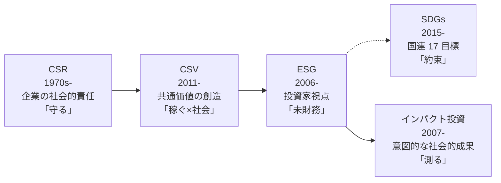

#### CSR（Corporate Social Responsibility、企業の社会的責任）

1970 年代から広く使われてきた概念です。企業は株主の利益追求だけでなく、社会に対する責任を果たすべき、という考え方。ISO 26000（2010 年）で 7 中核主題（組織統治・人権・労働慣行・環境・公正な事業慣行・消費者課題・コミュニティ）に整理されました。**主な担い手は企業のコミュニケーション・広報部門**で、「本業と別のところで社会に良いことをする」印象が長く残りました。

#### CSV（Creating Shared Value、共通価値の創造）

2011 年に Michael E. Porter と Mark R. Kramer が Harvard Business Review で提唱した概念です。「社会課題の解決を本業のビジネスモデルに統合し、社会価値と経済価値を同時に生み出す」という考え方。**担い手は経営戦略部門**へ移り、CSR の「本業とは別」を超えて「本業そのものを社会課題解決の手段にする」という発想の転換をもたらしました。

#### ESG（Environment / Social / Governance）

2006 年に PRI（責任投資原則）が国連で公表され、機関投資家が投資判断に E・S・G を組み込むことが提唱されました。**主な担い手は投資家**であり、次いで対話される「発行体（上場企業）」です。CSR/CSV が企業側の目線なのに対し、ESG は投資家側から見た評価軸として広がりました。

#### SDGs（Sustainable Development Goals、持続可能な開発目標）

2015 年に国連総会で採択された「持続可能な開発のための 2030 アジェンダ」に含まれる 17 の目標、169 のターゲット、232 の指標。**主な担い手は国連加盟国（政府）**であり、企業は「約束」として自主的にコミットする側です。ESG との違いは、ESG が「投資家との対話の共通言語」なのに対し、SDGs は「全世界の共通目標」である点です。

#### インパクト投資

2007 年に Rockefeller Foundation が主導したイニシアチブから生まれた概念。「意図的に社会的・環境的成果を生み出すことを目的とした投資」で、リターンだけでなくインパクトを測定・報告することが特徴です。**担い手は財団や機関投資家の一部**で、ESG の中でも「積極的な社会成果」を狙う投資領域です。

> **📝 補足**
> 5 つの概念は排他ではなく、時代を追って積み上がってきたレイヤーです。2026 年 7 月時点の実務では「CSR は守り、CSV は本業統合、ESG は投資家対話、SDGs は約束、インパクトは測定」と役割で使い分けるのが定石です。混同したまま議論すると、社内の期待値と実行がずれます。

### 「非財務」から「未財務」への発想転換

日本の実務では、長らく ESG や CSR は「非財務情報」と呼ばれてきました。財務情報の脇にある、財務ではない情報、というニュアンスです。しかし、この呼び方には限界があります。ESG の多くの項目は、5 年後、10 年後の財務業績に影響します。

- **気候変動リスク**：物理的損害・移行コストで将来キャッシュフローが変わる
- **人的資本**：離職率・エンゲージメントが 3〜5 年後の生産性を決める
- **ガバナンス**：不祥事の予防と早期発見が、株主価値の毀損を防ぐ
- **サプライチェーン**：人権 DD 不備で、輸出停止や罰金が発生する

これらは「今の PL・BS には出ていないが、将来の PL・BS に反映される」項目です。この視点から「非財務」を「未財務」と読み替える運動が、近年広がっています。ISSB IFRS S1 も、この考え方を反映して「サステナビリティ関連財務情報」という表現を使っています。**「非財務」は将来の「財務」——それを事前に対話するのが ESG 開示**です。

### ESG 経営の 3 つの誤解——本コースで解きほぐしたいもの

現場でよく見かける 3 つの誤解を、あらかじめ紹介します。本コースを通じて解きほぐしていきます。

#### 誤解 1：ESG は社会貢献の延長

社会貢献活動（寄付、地域清掃、教育支援）は ESG の一部ではありますが、本質は「経営に統合された持続可能性」です。寄付額の多寡ではなく、事業のリスクとチャンスをどう捉えているかが評価されます。

#### 誤解 2：格付スコアを上げれば ESG 経営は成功

格付機関 5 社は、それぞれ異なる評価軸を持ちます。1 社のスコアを上げても、別社では下がることもあります。**格付は使いこなす道具であって、鵜呑みにするものではない**——これが本コースの中核メッセージの 1 つです。

#### 誤解 3：統合報告書を作れば ESG 経営は完成

統合報告書は「対話の入り口」であって「終着点」ではありません。IIRC が提唱した「統合思考」（統合思考なき統合報告書は、束ねただけの目次に過ぎない）が欠けると、統合報告書は単なる目次の集合になります。

### 中核メッセージ 6 個——本コースの背骨

最後に、本コース全 8 レッスンを通じて何度も戻ってくる「6 個の背骨」を紹介します。これらは、投資家サイドで 12 年、独立コンサルとしてさらに 4 年の伴走で得た実感を、原則の形に整えたものです。

1. **ESG は「非財務」ではなく「未財務」——将来キャッシュフローに繋がる**
2. **格付は使いこなす道具、鵜呑みにしない**
3. **統合思考なき統合報告書は、束ねただけの目次に過ぎない**
4. **ダブルマテリアリティは日本の開示の未来を先取りする視点**
5. **開示は目的ではなく対話の入り口**
6. **グリーンウォッシュは「小さな盛り」から始まる——透明性が最強の防御**

各レッスンの冒頭・末尾で、繰り返し立ち返ります。判断に迷ったときの「羅針盤」として使ってください。

> **🔰 初学者の方へ**
> 6 個のメッセージは、いま全部わかる必要はありません。「未財務」「対話の入り口」「小さな盛り」などのフレーズは、各レッスンで具体的な文脈とセットで戻ってきます。本コースを通じて、少しずつ意味が濃くなっていきます。

### まとめ

- ESG は投資家との対話の共通言語で、2006 年 PRI の公表から広がった
- CSR は 1970s から、CSV は 2011 年、SDGs は 2015 年、インパクト投資は 2007 年頃と、5 つの概念は時代を追って積み上がったレイヤー
- 「非財務」ではなく「未財務」——ESG の多くの項目は将来の PL・BS に反映される
- 本コースは「投資家・開示・ガバナンス」視点で、気候変動算定実務や SDGs 実務は別の入門コースの担当
- 6 個の中核メッセージ（未財務／格付は道具／統合思考／ダブルマテリアリティ／開示は対話の入り口／小さな盛り）を、8 レッスンで反復する

次のレッスンでは、ESG 投資の系譜を扱います。PRI 2006 年設立から現在まで、機関投資家 3 手法（スクリーニング／インテグレーション／エンゲージメント）と、日本の GPIF の変化までを追います。

### 確認クイズ

このレッスンの内容の理解度をチェックしましょう。

#### Q1. 本コースの守備範囲として、正しいものはどれですか？

- [x] ESG 経営を「機関投資家との対話・開示・格付」の視点で扱う
- [ ] 気候変動の算定実務（Scope 1-3、GHG プロトコル、SBTi、CBAM）を体系的に扱う
- [ ] SDGs のフレームワーク横断（GRI、IRIS+、B Corp）を体系的に扱う
- [ ] ESG 検定・気候変動アドバイザーなど資格試験の対策を扱う

> **解説**
> 本コースは「投資家・開示・ガバナンス」の視点に絞ります。気候変動の算定実務、SDGs のフレームワーク横断、資格試験対策は本コースの守備範囲外で、気候変動と SDGs は別の入門コースで扱います。資格試験対策は本サイトの方針として扱いません。

#### Q2. CSV（Creating Shared Value、共通価値の創造）の説明として、本レッスンの内容と一致するものはどれですか？

- [ ] 国連総会で 2015 年に採択された 17 の目標
- [x] Michael E. Porter と Mark R. Kramer が 2011 年に提唱した、社会課題の解決を本業に統合する概念
- [ ] 投資家が投資判断に E・S・G を組み込む原則
- [ ] Rockefeller Foundation が 2007 年に提唱した、意図的な社会成果を狙う投資

> **解説**
> CSV は Michael E. Porter と Mark R. Kramer が 2011 年に Harvard Business Review で提唱した概念で、社会課題の解決を本業のビジネスモデルに統合する発想の転換をもたらしました。ほかの選択肢は SDGs、PRI、インパクト投資の説明で、CSV とは違います。

#### Q3. 「非財務」から「未財務」への発想転換の意味として、本レッスンの内容と一致するものはどれですか？

- [ ] 財務情報は不要になり、非財務情報だけで経営判断すればよい
- [ ] 非財務情報は将来も財務情報にならないため、参考程度でよい
- [x] ESG の多くの項目は将来の PL・BS に反映されるため、事前に対話する対象として捉える
- [ ] 非財務情報は開示不要になり、企業内部の資料として扱えばよい

> **解説**
> 「未財務」は「今の PL・BS には出ていないが、将来の PL・BS に反映される項目」の意味です。ESG は将来キャッシュフローに繋がるものとして、事前に投資家と対話する対象と位置づけます。ISSB IFRS S1 も「サステナビリティ関連財務情報」という表現でこの発想を反映しています。

#### Q4. 本コースが「解きほぐしたい 3 つの誤解」として挙げられていないものはどれですか？

- [ ] ESG は社会貢献の延長という誤解
- [ ] 格付スコアを上げれば ESG 経営は成功という誤解
- [ ] 統合報告書を作れば ESG 経営は完成という誤解
- [x] ESG は財務業績を犠牲にして進めるべきという誤解

> **解説**
> 本レッスンで挙げた 3 つの誤解は「社会貢献の延長」「格付スコアが目的」「統合報告書がゴール」の 3 つです。「財務業績を犠牲にする」は本レッスンで挙げていない誤解の類型で、むしろ本コースは「ESG は未財務——将来のキャッシュフローに繋がる」という発想を強調しています。

#### Q5. ESG の 3 要素の説明として、本レッスンの内容と一致するものはどれですか？

- [ ] Environment・Society・Global の 3 要素
- [ ] Ethics・Sustainability・Governance の 3 要素
- [x] Environment・Social・Governance の 3 要素
- [ ] Environment・Safety・Growth の 3 要素

> **解説**
> ESG は Environment（環境）、Social（社会）、Governance（ガバナンス）の 3 要素の頭文字です。ほかの選択肢は同じ「S」でも別の単語で構成されており、正式な ESG の定義ではありません。

#### Q6. 本コースの中核メッセージ 6 個に含まれるものはどれですか？

- [ ] ESG 格付は業界標準として鵜呑みにするべき
- [ ] 統合報告書を作れば ESG 経営は成功する
- [x] 統合思考なき統合報告書は、束ねただけの目次に過ぎない
- [ ] グリーンウォッシュは大企業だけの問題で、中小企業は無関係

> **解説**
> 本コースの中核メッセージ 6 個は「未財務／格付は道具、鵜呑みにしない／統合思考なき統合報告書は目次に過ぎない／ダブルマテリアリティ／開示は対話の入り口／小さな盛りから始まるグリーンウォッシュ」です。「格付を鵜呑みに」「統合報告書で完成」「グリーンウォッシュは大企業だけ」は本コースが解きほぐしたい誤解で、中核メッセージではありません。

次のレッスンでは、ESG 投資の系譜を扱います。PRI 2006 年設立から現在まで、機関投資家 3 手法（スクリーニング／インテグレーション／エンゲージメント）と、日本の GPIF の変化までを追います。

---

## レッスン2：ESG 投資の系譜——PRI 2006 から現在まで

（所要時間：25分）

### このレッスンで学ぶこと

- PRI（責任投資原則）2006 年設立の背景と 6 つの原則を把握する
- PRI 加盟数の推移から、ESG 投資が広がった 20 年の風景を捉えられる
- 機関投資家 3 手法（スクリーニング／インテグレーション／エンゲージメント）で ESG 投資の全体像を整理できる
- GPIF が 2015 年に PRI 加盟してから、日本の年金マネーが動いた経緯を追える
- パッシブ運用と ESG の噛み合わせ、指数連動運用の位置づけを理解する
- 「加盟しただけで失望する」PRI の落とし穴を、講師の現場体験から学ぶ

---

前レッスンでは ESG の全体像、CSR/CSV/ESG/SDGs/インパクトの位置関係、「非財務」から「未財務」への発想転換を扱いました。本レッスンからは、ESG が投資家サイドで具体的にどう広がってきたかの系譜を辿ります。中核メッセージの 1 つ「開示は目的ではなく対話の入り口」の、対話する相手側の景色です。

### PRI（責任投資原則）——2006 年、国連事務総長の呼びかけ

ESG 投資の分水嶺は、2006 年 4 月に国連が公表した PRI（Principles for Responsible Investment、責任投資原則）です。当時の国連事務総長コフィー・アナン氏が世界の主要な機関投資家に呼びかけ、UNEP FI（国連環境計画・金融イニシアチブ）と UN Global Compact の共同事務局として発足しました。「投資家が長期リターンを追求する上で、環境・社会・ガバナンスは無視できない要素である」という視点が、機関投資家の側から明確に宣言された最初の枠組みです。

#### PRI の 6 つの原則

PRI に署名する機関投資家は、以下の 6 つの原則にコミットします。

1. **原則 1**：投資分析・意思決定プロセスに ESG 課題を組み込む
2. **原則 2**：積極的な株主として ESG 課題を株式所有方針・実践に組み込む
3. **原則 3**：投資対象の企業に ESG 課題の適切な開示を求める
4. **原則 4**：資産運用業界における 6 原則の受入れ・実行を促進する
5. **原則 5**：6 原則を実行する際の効果を高めるため、協働する
6. **原則 6**：6 原則の実行に関する活動状況と進捗を報告する

原則 5 は集団的エンゲージメント（協働的な対話）の根拠となり、原則 6 は署名機関に年次で進捗開示（Transparency Report）を求めます。**PRI は「加盟して終わり」ではなく、開示と検証が伴う枠組み**として設計されています。

#### 加盟数の推移

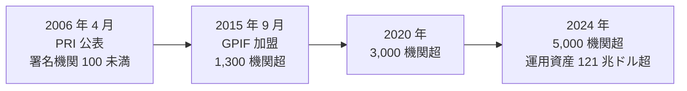

2006 年の PRI 公表時点では署名機関は 100 未満、運用資産は 6 兆ドル程度でしたが、2024 年時点では 5,000 機関超、運用資産 121 兆ドル超に達しています（PRI 公式サイトの数値）。**世界の運用資産の半分以上が、PRI 署名機関の手にあると言われる時代**が到来しました。

> **📝 補足**
> 加盟数の急増は「本気で ESG 投資をしている機関の増加」だけでなく「加盟することが業界のスタンダードになった」側面もあります。PRI は 2018 年に「Reporting & Assessment」の枠組みを強化し、実質的な取り組みが伴わない署名機関を除名する制度を導入しました。加盟数だけを見て「ESG 投資が広がった」と判断するのではなく、実際に投資判断や議決権行使に反映されているかを見る視点が必要です。

### 機関投資家 3 手法——ESG 投資の全体像

ESG 投資は、実務では大きく 3 つのアプローチに分けられます。PRI 原則 1 に対応する分類です。

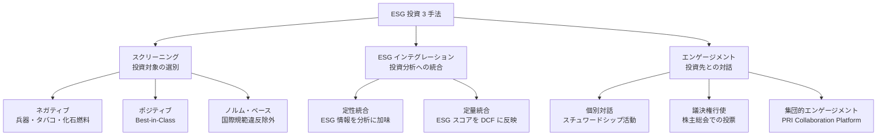

#### 1. スクリーニング——投資対象の選別

- **ネガティブスクリーニング**：兵器・タバコ・化石燃料・ギャンブルなど、特定のセクター・企業を投資対象から除外する。歴史が古く、宗教系・倫理系の投資から始まった。1990 年代からの南アフリカアパルトヘイト政策への抗議投資が有名
- **ポジティブスクリーニング（Best-in-Class）**：各セクター内で ESG 評価が上位の企業を選ぶ。「化石燃料も投資対象に残すが、その中でエネルギー転換が進んでいる企業を選ぶ」といったアプローチ
- **ノルム・ベース**：国連グローバル・コンパクト 10 原則、ILO 中核 8 条約、OECD 多国籍企業行動指針など、国際規範への違反を理由に除外する

#### 2. ESG インテグレーション——投資分析への統合

投資分析の全プロセス（バリュエーション、ポートフォリオ構築、リスク管理）に ESG 情報を組み込むアプローチです。**PRI が最も重視する手法**で、次の 2 段階で進化しています。

- **定性統合**：アナリストが銘柄分析レポートに ESG 情報を記述する。定量化はしない
- **定量統合**：ESG スコアを DCF モデルの WACC や成長率、あるいは目標株価に反映する。ESG が高い企業は資本コストが低い、といった扱い

#### 3. エンゲージメント——投資先との対話

株主として、投資先企業と対話することで長期的な企業価値向上を促す活動です。

- **個別対話**（Direct Engagement）：投資先の IR・経営陣と直接対話する。年次の Roadshow から不定期の Constructive Dialogue まで
- **議決権行使**（Proxy Voting）：株主総会での取締役選任・報酬・その他議案への投票。ESG 関連議案（気候変動対応、人権 DD、多様性）への Say on Climate 投票も広がる
- **集団的エンゲージメント**（Collaborative Engagement）：複数の機関投資家が連携して同じ企業に働きかける。PRI Collaboration Platform や Climate Action 100+（気候変動対応、2017 年発足）が代表例

### 日本の GPIF——2015 年、風景が変わった

日本の ESG 投資が本格化した節目は、2015 年 9 月の GPIF（年金積立金管理運用独立行政法人）の PRI 加盟です。当時の GPIF 理事長は運用最高責任者に水野弘道氏を迎え、パッシブ運用中心の巨大な公的年金基金として、ESG インテグレーションの推進を宣言しました。

#### GPIF の主な動き

- **2015 年 9 月**：PRI 加盟。「スチュワードシップ責任を果たすため、ESG 課題を投資判断に組み込む」を明言
- **2017 年 7 月**：ESG 指数 3 本を採用（MSCI Japan ESG Select Leaders、MSCI 日本株女性活躍指数、FTSE Blossom Japan）、パッシブ運用で連動運用を開始
- **2018 年**：気候変動指数（S&P/JPX カーボン・エフィシェント指数、S&P グローバル大型株カーボン・エフィシェント指数）を追加
- **2019 年**：外国株式ESG指数の採用
- **2020 年**：気候変動シナリオ分析（TCFD）の実施
- **その後**：スチュワードシップ・コード受入れの継続、機関投資家アンケートによる ESG 銘柄選定、生物多様性リスク評価の取り組み

**約 200 兆円の公的年金がパッシブ運用で ESG 指数に連動する**——この事実が、日本の上場企業に「機関投資家との対話」の必要性を制度的に押し上げました。GPIF の受託運用会社は、ESG インテグレーションを受託の前提条件として提示され、その先の投資先企業に対しても ESG に関する対話が広がりました。

> **⚠️ 注意**
> 「GPIF 加盟」を「日本企業の ESG が急に良くなった」と読み替えるのは早計です。GPIF 加盟以降、外形的な開示は増えましたが、実質的な対話の深さ・改善のスピードは企業によってばらつきがあります。**PRI 加盟や GPIF の圧力は「対話の始まり」であって「変革の完了」ではない**という視点が、投資家サイドから見た実感です。

### まとめ

- PRI は 2006 年 4 月、国連事務総長コフィー・アナン主導で公表された 6 原則の枠組み
- 加盟数は 100 未満から 5,000 機関超、運用資産 121 兆ドル超に拡大（2024 年時点）
- 機関投資家 3 手法（スクリーニング／ESG インテグレーション／エンゲージメント）が ESG 投資の全体像
- GPIF が 2015 年 9 月に PRI 加盟し、ESG 指数連動のパッシブ運用と機関投資家アンケートで日本市場に影響
- PRI は「加盟して終わり」ではなく「加盟してから 5 年かけて実装する」枠組み
- 対話相手の PRI 加盟年数と実装度合いを見極めることで、対話の深さが変わる

次のレッスンでは、開示制度の世界的系譜を扱います。IIRC 2010 年から SASB 2011 年、VRF 2021 年、ISSB 2021 年 COP26 設立まで、統合の系譜と IFRS S1/S2、SSBJ の位置づけを追います。

### 確認クイズ

このレッスンの内容の理解度をチェックしましょう。

#### Q1. PRI（責任投資原則）の説明として、本レッスンの内容と一致するものはどれですか？

- [ ] 2015 年に日本の金融庁が制定した機関投資家向けのソフトロー
- [x] 2006 年 4 月に国連事務総長コフィー・アナン主導で公表された 6 原則の枠組み
- [ ] 2020 年に東京証券取引所が制定した上場企業向けのガイドライン
- [ ] 1997 年に GRI が制定したサステナビリティ報告のフレームワーク

> **解説**
> PRI は 2006 年 4 月、国連事務総長コフィー・アナン主導で公表され、UNEP FI と UN Global Compact の共同事務局で発足しました。金融庁のスチュワードシップ・コード、東証のコーポレートガバナンス・コード、GRI のサステナビリティ報告基準は、いずれも PRI とは別の制度です。

#### Q2. 機関投資家 3 手法として、本レッスンで整理されているものはどれですか？

- [x] スクリーニング／ESG インテグレーション／エンゲージメント
- [ ] 保有／貸出／償還
- [ ] マス広告／プロモーション／セールス
- [ ] 分析／予測／実行

> **解説**
> 本レッスンで整理した機関投資家 3 手法は「スクリーニング（投資対象の選別）」「ESG インテグレーション（投資分析への統合）」「エンゲージメント（投資先との対話）」の 3 つです。ほかの選択肢は金融取引、マーケティング、業務プロセスの分類で、機関投資家 3 手法ではありません。

#### Q3. スクリーニングの 3 種類として、本レッスンで挙げられていないものはどれですか？

- [ ] ネガティブスクリーニング（兵器・タバコ・化石燃料の除外）
- [ ] ポジティブスクリーニング（Best-in-Class）
- [x] ラウンドスクリーニング（時価総額での選別）
- [ ] ノルム・ベース（国際規範違反の除外）

> **解説**
> 本レッスンで挙げたスクリーニングの 3 種類は「ネガティブ」「ポジティブ（Best-in-Class）」「ノルム・ベース」です。ラウンドスクリーニング（時価総額で選別）は本レッスンで挙げていないもので、通常はスクリーニングでなくポートフォリオ構築の手法として扱われます。

#### Q4. GPIF の 2015 年以降の動きとして、本レッスンの内容と一致するものはどれですか？

- [ ] 2015 年 9 月に GPIF が上場を廃止した
- [ ] 2015 年 9 月に GPIF が海外運用会社を撤退させた
- [ ] 2015 年 9 月に GPIF が個人投資家向け商品を開始した
- [x] 2015 年 9 月に GPIF が PRI に加盟し、その後 ESG 指数連動のパッシブ運用を導入した

> **解説**
> GPIF は 2015 年 9 月に PRI に加盟し、2017 年 7 月に ESG 指数 3 本を採用してパッシブ運用で連動運用を開始しました。その後も気候変動指数、外国株式 ESG 指数の追加、TCFD シナリオ分析を展開しています。ほかの選択肢は GPIF の 2015 年以降の実際の動きとは異なります。

#### Q5. ESG インテグレーションの「定性統合」と「定量統合」の説明として、本レッスンの内容と一致するものはどれですか？

- [ ] 定性統合は ESG スコアを DCF に反映、定量統合はアナリストがレポートに記述
- [x] 定性統合はアナリストがレポートに ESG 情報を記述、定量統合は ESG スコアを DCF の WACC や成長率に反映
- [ ] 定性統合は投資対象を除外、定量統合は指数連動運用に組み込む
- [ ] 定性統合は集団的エンゲージメント、定量統合は個別対話

> **解説**
> 定性統合は「アナリストが銘柄分析レポートに ESG 情報を記述する（定量化はしない）」、定量統合は「ESG スコアを DCF モデルの WACC や成長率、目標株価に反映する」ものです。ほかの選択肢は定性・定量の意味を取り違えているか、別の手法の説明です。

#### Q6. 「PRI 加盟して数か月で失望した機関投資家の話」から学べる教訓として、本レッスンの内容と一致するものはどれですか？

- [ ] PRI 加盟は無意味なので、機関投資家は加盟すべきでない
- [ ] PRI 原則 1 は形式的な項目なので、実務では気にする必要がない
- [x] PRI は「加盟して終わり」ではなく「加盟してから 5 年かけて実装する」枠組みで、対話相手の実装度合いを見極める眼が必要
- [ ] 集団的エンゲージメントは加盟直後から実施すべき

> **解説**
> 現場メモの教訓は「PRI は加盟してから 5 年かけて実装する枠組みで、対話相手の実装度合いを見極める眼を持って対話に臨む」ことです。加盟自体は無意味ではなく、原則 1 も形式ではありません。集団的エンゲージメントは加盟直後より、実装が進んでから活用するのが実務の順序です。

次のレッスンでは、開示制度の世界的系譜を扱います。IIRC 2010 年から SASB 2011 年、VRF 2021 年、ISSB 2021 年 COP26 設立、IFRS S1/S2 公表 2023 年 6 月、SSBJ 基準確定 2025 年 3 月までを追います。

---

## レッスン3：開示制度の世界的系譜——IIRC → VRF → ISSB 統合

（所要時間：25分）

### このレッスンで学ぶこと

- IIRC 2010 年設立、統合報告書フレームワーク 2013 年 12 月の背景を把握する
- SASB 2011 年設立の業種別基準アプローチを理解する
- CDSB・GRI・TCFD などの並行フレームワーク乱立時代の混乱を整理する
- IIRC + SASB → VRF 2021 年 6 月統合の経緯を追える
- ISSB 2021 年 11 月 COP26 設立、VRF・CDSB 吸収 2022 年 6 月の意義を捉える
- IFRS S1（一般要求事項）／S2（気候関連開示）2023 年 6 月公表の要点がわかる
- SSBJ 発足 2022 年 7 月と日本基準確定 2025 年 3 月の適用スケジュールを把握する

---

前レッスンでは、機関投資家サイドの ESG 投資の系譜と 3 手法を扱いました。本レッスンでは、対話される発行体側の「開示制度」がどう作られてきたかの系譜を辿ります。中核メッセージ「開示は目的ではなく対話の入り口」の、対話に使う開示制度そのものの整理です。

### 開示制度の乱立時代——2010 年代の混乱

2010 年代前半、サステナビリティ・ESG 開示のフレームワークは無数に乱立していました。上場企業の開示担当者は「GRI、SASB、CDSB、TCFD、CDP、IIRC——どれで書けばいいのか」の疑問に日々直面していました。

- **GRI**（Global Reporting Initiative、1997 年設立）：サステナビリティ全般の報告基準、マルチステークホルダー向け
- **SASB**（Sustainability Accounting Standards Board、2011 年設立）：業種別の財務マテリアル情報、投資家向け
- **CDSB**（Climate Disclosure Standards Board、2007 年設立）：気候関連情報の開示、財務報告への統合
- **TCFD**（Task Force on Climate-related Financial Disclosures、2015 年設立）：気候関連財務情報開示の推奨事項
- **CDP**（旧 Carbon Disclosure Project、2000 年設立）：気候・水・森林の質問書ベースのデータ収集
- **IIRC**（International Integrated Reporting Council、2010 年設立）：統合報告書フレームワーク

これらは目的・想定読者・粒度がすべて違い、企業側は「複数のフレームに沿って別々に開示する」負担を強いられていました。**乱立の解消——それが 2020 年代の統合の物語**の背景です。

### IIRC——2010 年設立、統合報告書フレームワーク

IIRC は 2010 年 8 月に発足しました。財務報告と非財務報告を分けて開示する従来の姿に対し、「両者を一体で捉える統合思考（integrated thinking）」を提唱しました。2013 年 12 月に「The International <IR> Framework」（統合報告書フレームワーク）を公表し、8 つの内容要素（組織概要と外部環境、ガバナンス、ビジネスモデル、リスクと機会、戦略と資源配分、実績、見通し、作成と表示の基礎）と 6 つの資本（後のレッスン 6 で詳細）を提示しました。

日本では、IIRC の提唱を受けて、2010 年代半ばから統合報告書を作成する上場企業が急増しました。KPMG ジャパンの調査によれば、統合報告書を発行する日本企業は 2013 年に 100 社未満、2020 年に 600 社超、2024 年には 1,000 社超に達しています。**統合報告書の作成は事実上、日本の上場企業の標準実務**となっています。

### SASB——2011 年設立、業種別・投資家向け

SASB は Jean Rogers らが 2011 年 7 月に米国で設立しました。IIRC の「統合思考」に対し、SASB は「業種ごとに投資家にとって重要な ESG 項目を特定し、開示する」という現実主義的なアプローチを取りました。SASB Materiality Map で 77 業種を定義し、各業種で財務マテリアル（財務業績に影響する）とされる ESG 項目を特定する基準を策定しました。

- **業種別基準**：飲食料品・エネルギー・金融サービスなど、業種ごとに開示すべき ESG 項目が違うことを前提
- **投資家向け**：GRI がマルチステークホルダー向けなのに対し、SASB は明確に「投資家向け」を宣言
- **財務マテリアリティ**：ESG のうち、財務業績に影響するものだけを対象とする（後述のシングルマテリアリティ）

SASB Standards は、2018 年に業種別基準が完成し、その後 ISSB 傘下に組み込まれてグローバルな標準の一部となりました。

### CDSB と TCFD——気候関連情報開示

CDSB は 2007 年に発足し、気候関連情報を財務報告に組み込むことを提唱しました。CDP と密接に連携し、CDP 質問書の設計にも関与しました。

TCFD は 2015 年 12 月に金融安定理事会（FSB）が設置した特別委員会で、Michael Bloomberg 氏が議長を務めました。2017 年 6 月に公表された TCFD 推奨事項は、「ガバナンス／戦略／リスク管理／指標と目標」の 4 本柱で気候関連情報を財務報告と統合する枠組みを提示しました。**この 4 本柱は、その後の IFRS S2 の骨格にそのまま引き継がれています**。

### VRF——2021 年 6 月、IIRC と SASB の統合

2020 年代に入り、乱立するフレームワークの統合が加速しました。第 1 弾は 2021 年 6 月、IIRC と SASB が統合し「VRF（Value Reporting Foundation）」が発足したことです。**「統合思考の IIRC」と「業種別基準の SASB」が 1 つの組織にまとまった**——この統合が、次の ISSB 統合への布石となりました。

### ISSB——2021 年 11 月 COP26、統合の完成

決定的な統合は 2021 年 11 月、英国グラスゴーで開催された COP26（第 26 回国連気候変動枠組条約締約国会議）で、IFRS 財団が ISSB（International Sustainability Standards Board、国際サステナビリティ基準審議会）を設立したことです。IFRS 財団は、国際財務報告基準（IFRS）を策定する非営利団体で、既に IASB（国際会計基準審議会）を運営していました。ISSB は IASB の姉妹組織として、サステナビリティ関連財務情報の国際基準を策定する役割を担いました。

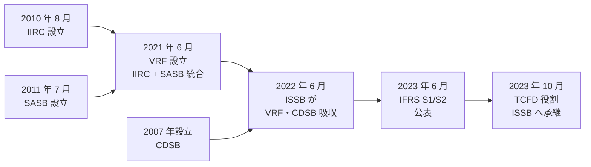

#### ISSB の主な動き

- **2021 年 11 月**：ISSB 設立宣言（COP26 グラスゴー）
- **2022 年 6 月**：VRF と CDSB を吸収、統合報告書フレームワークと SASB 基準が ISSB 傘下に
- **2023 年 6 月**：IFRS S1（一般要求事項）／S2（気候関連開示）公表
- **2023 年 10 月**：TCFD の役割を ISSB へ承継、FSB が正式に発表

**2020 年代前半の 3 年間で、ISSB が世界のサステナビリティ開示基準の「事実上のグローバル・スタンダード」の座に立った**——これが本レッスンで最も押さえていただきたい構図です。

### IFRS S1 と S2——2023 年 6 月公表

ISSB が 2023 年 6 月に公表した 2 つの基準は、それぞれ役割が違います。

#### IFRS S1「General Requirements for Disclosure of Sustainability-related Financial Information」

サステナビリティ関連財務情報の一般開示基準です。以下の 4 本柱の枠組みは TCFD から引き継いだものです。

- **ガバナンス**：ESG 課題を監督・管理する取締役会・経営陣の体制
- **戦略**：ESG 課題が企業戦略・ビジネスモデル・見通しに与える影響
- **リスク管理**：ESG リスク・機会の特定・評価・管理プロセス
- **指標と目標**：ESG 関連の指標、目標、進捗

「サステナビリティ関連財務情報」の呼び方は、前レッスンで扱った「未財務」の発想を反映したものです。

#### IFRS S2「Climate-related Disclosures」

気候関連の開示基準で、IFRS S1 の 4 本柱を気候に特化した形で具体化しました。Scope 1・2・3 の GHG 排出量開示、シナリオ分析、内部炭素価格、業界別指標（SASB Materiality Map の気候関連項目）などを求めます。

> **📖 もっと詳しく**
> IFRS S1/S2 の適用は、IFRS 財団が国際基準として公表するもので、各国・地域が自国の制度に取り入れるかは選択制です。EU は独自基準 ESRS（後述）を採用しました。日本は SSBJ が「相互運用可能な」日本基準を策定しました。米国 SEC は気候開示ルールを 2024 年 3 月に採択しましたが、訴訟対応で施行が停止中です（2026 年 7 月時点）。**世界統一基準ではなく、地域ごとの相互運用性を確保する構図**が実務の現状です。

### SSBJ——2022 年 7 月発足、2025 年 3 月基準確定

SSBJ（Sustainability Standards Board of Japan、サステナビリティ基準委員会）は、財務会計基準機構（FASF）の中に 2022 年 7 月に発足しました。ISSB の日本基準策定を担う組織で、IASB に対応する ASBJ（企業会計基準委員会）と対をなす存在です。

- **2022 年 7 月**：SSBJ 発足
- **2024 年 3 月**：日本版 IFRS S1/S2 の公開草案を公表
- **2025 年 3 月**：日本基準（一般開示基準・気候関連開示基準）確定
- **2026 年以降**：東証プライム上場企業を中心に段階的に適用（金融庁の内閣府令改正に基づく）

SSBJ 基準は、IFRS S1/S2 と「相互運用可能な内容」を目指しつつ、日本の商法制度・会計制度に整合するように調整されています。**「グローバル基準と国内実務の橋渡し」——それが SSBJ の役割**です。

### EU の CSRD／ESRS——別のルート

ISSB とは別のルートで、EU は独自のサステナビリティ開示基準を進めました。

- **CSRD**（Corporate Sustainability Reporting Directive）：EU 域内で事業展開する大企業に、詳細なサステナビリティ開示を義務化する指令。2022 年 12 月採択、2024 年から段階適用
- **ESRS**（European Sustainability Reporting Standards）：CSRD の具体的な報告基準。2023 年 7 月採択

ESRS の特徴は「ダブルマテリアリティ」（本コース L8 で詳述）を明確に採用したことです。ISSB の IFRS S1/S2 は「財務マテリアリティ」を軸としますが、ESRS は「財務マテリアリティ」と「インパクトマテリアリティ」の両方の開示を求めます。**日本の企業は、EU 進出の有無で開示対応が変わる**ことに注意が必要です。

### 中核メッセージの再確認

本レッスンで扱った内容を、中核メッセージに戻して整理します。

- **開示は目的ではなく対話の入り口**：IIRC が提唱した統合報告書、SASB の業種別基準、ISSB の IFRS S1/S2、SSBJ の日本基準——すべて機関投資家との対話の共通言語を作るための道具
- **ESG は「非財務」ではなく「未財務」**：ISSB IFRS S1 の「サステナビリティ関連財務情報」という呼称に、この発想が結晶している

### まとめ

- 2010 年代前半は GRI・SASB・CDSB・TCFD・CDP・IIRC など開示制度が乱立
- IIRC は 2010 年 8 月設立、統合報告書フレームワーク 2013 年 12 月公表
- SASB は 2011 年 7 月設立、業種別・投資家向けの財務マテリアリティ基準
- TCFD は 2015 年 12 月設立、2017 年 6 月推奨事項、4 本柱の枠組み（後の IFRS S2 に継承）
- 2021 年 6 月：IIRC + SASB → VRF 統合
- 2021 年 11 月：COP26 で ISSB 設立宣言
- 2022 年 6 月：ISSB が VRF・CDSB 吸収
- 2023 年 6 月：IFRS S1（一般要求事項）／S2（気候関連開示）公表
- 2023 年 10 月：TCFD の役割を ISSB へ承継
- SSBJ は 2022 年 7 月発足、2025 年 3 月日本基準確定、2026 年以降段階適用
- EU は独自の CSRD/ESRS ルート、ダブルマテリアリティを採用

次のレッスンでは、日本の開示実務に踏み込みます。東証プライム市場再編と改正内閣府令による有価証券報告書サステナビリティ欄、コーポレートガバナンス報告書、日本独自の開示ルートの実務を扱います。

### 確認クイズ

このレッスンの内容の理解度をチェックしましょう。

#### Q1. IIRC の設立と統合報告書フレームワーク公表の年として、正しいものはどれですか？

- [ ] IIRC 2005 年設立、統合報告書フレームワーク 2010 年公表
- [x] IIRC 2010 年 8 月設立、統合報告書フレームワーク 2013 年 12 月公表
- [ ] IIRC 2015 年設立、統合報告書フレームワーク 2018 年公表
- [ ] IIRC 2020 年設立、統合報告書フレームワーク 2023 年公表

> **解説**
> IIRC は 2010 年 8 月に発足し、統合報告書フレームワーク「The International <IR> Framework」を 2013 年 12 月に公表しました（2021 年 1 月に改訂）。ほかの選択肢は年代が異なります。

#### Q2. VRF の説明として、本レッスンの内容と一致するものはどれですか？

- [ ] 2015 年設立、GRI と TCFD が統合したフレームワーク
- [ ] 2018 年設立、CDP と CDSB が統合したフレームワーク
- [x] 2021 年 6 月設立、IIRC と SASB が統合したフレームワーク
- [ ] 2023 年設立、ISSB の日本子会社

> **解説**
> VRF（Value Reporting Foundation）は 2021 年 6 月、IIRC と SASB が統合して発足しました。その後 2022 年 6 月に ISSB が CDSB とともに吸収しました。ほかの選択肢は VRF の実際の統合の組合せとは違います。

#### Q3. ISSB の設立と主な動きとして、本レッスンの内容と一致するものはどれですか？

- [ ] 2020 年設立、IFRS S1/S2 を 2022 年公表
- [ ] 2019 年設立、TCFD の役割を承継せず独自路線
- [x] 2021 年 11 月 COP26 で設立、2022 年 6 月に VRF・CDSB 吸収、2023 年 6 月に IFRS S1/S2 公表
- [ ] 2024 年設立、IFRS S3 を公表

> **解説**
> ISSB は 2021 年 11 月 COP26 で設立宣言され、2022 年 6 月に VRF・CDSB を吸収、2023 年 6 月に IFRS S1（一般要求事項）／S2（気候関連開示）を公表、2023 年 10 月に TCFD の役割を承継しました。ほかの選択肢は実際の経緯と異なります。

#### Q4. IFRS S1「General Requirements for Disclosure of Sustainability-related Financial Information」の 4 本柱として、本レッスンの内容と一致するものはどれですか？

- [ ] 資産／負債／純資産／収益
- [ ] 開示／保証／再開示／フォローアップ
- [ ] マーケティング／販売／製造／R&D
- [x] ガバナンス／戦略／リスク管理／指標と目標

> **解説**
> IFRS S1 の 4 本柱は「ガバナンス／戦略／リスク管理／指標と目標」で、TCFD 推奨事項の 4 本柱をそのまま引き継いだものです。ほかの選択肢は財務会計、監査、事業機能の分類で、IFRS S1 の 4 本柱ではありません。

#### Q5. SSBJ の説明として、本レッスンの内容と一致するものはどれですか？

- [x] 2022 年 7 月発足、2025 年 3 月に日本基準（一般開示・気候関連開示）を確定、2026 年以降段階適用
- [ ] 2015 年発足、独自の日本基準を IFRS 独立で策定
- [ ] 2020 年発足、SASB 傘下の日本子会社
- [ ] 2023 年発足、東証プライム上場企業のみを対象とする自主団体

> **解説**
> SSBJ（サステナビリティ基準委員会）は財務会計基準機構（FASF）内で 2022 年 7 月に発足し、2024 年 3 月に日本版 IFRS S1/S2 の公開草案を公表、2025 年 3 月に日本基準を確定、2026 年以降段階適用する予定です。ISSB と「相互運用可能な内容」を目指す位置づけで、SASB の子会社でも東証プライム限定の自主団体でもありません。

#### Q6. EU の CSRD/ESRS と ISSB IFRS S1/S2 の違いとして、本レッスンの内容と一致するものはどれですか？

- [ ] CSRD/ESRS はシングルマテリアリティ、IFRS S1/S2 はダブルマテリアリティ
- [x] CSRD/ESRS はダブルマテリアリティ、IFRS S1/S2 は財務マテリアリティを軸
- [ ] CSRD/ESRS は任意基準、IFRS S1/S2 は EU 域内の強制基準
- [ ] CSRD/ESRS と IFRS S1/S2 は同一基準で、名前だけが違う

> **解説**
> CSRD/ESRS はダブルマテリアリティ（財務マテリアリティ＋インパクトマテリアリティの両方）を採用し、IFRS S1/S2 は財務マテリアリティを軸とします。CSRD は EU 域内の強制基準、IFRS S1/S2 は国際基準で各国が採用可否を選択（EU は独自 ESRS を採用）します。マテリアリティの向きが両者の最大の違いです。

次のレッスンでは、日本の開示実務に踏み込みます。東証プライム市場再編、有価証券報告書のサステナビリティ情報記載欄新設（改正内閣府令 2023 年 1 月）、コーポレートガバナンス報告書、日本独自の開示ルートの実務を扱います。

---

## レッスン4：日本の開示実務——東証プライムと改正内閣府令

（所要時間：25分）

### このレッスンで学ぶこと

- 東証プライム市場再編（2022 年 4 月）とサステナビリティ開示要件を把握する
- 有価証券報告書のサステナビリティ情報記載欄（改正内閣府令 2023 年 1 月公布・3 月期以降適用）の実務を捉える
- 記載欄の 5 つの項目（ガバナンス／戦略／リスク管理／指標と目標／人的資本）を整理する
- コーポレートガバナンス報告書の位置づけと、有価証券報告書との違いを区別する
- 日本の 5 つの開示ルート（有報／CG 報告書／統合報告書／SR レポート／IR 資料）を使い分けられる

---

前レッスンでは、開示制度の世界的系譜と ISSB・IFRS S1/S2・SSBJ の位置づけを扱いました。本レッスンでは、日本の上場企業が実際に対応する開示制度を扱います。東証プライム市場再編、有価証券報告書、コーポレートガバナンス報告書——**日本独自の開示ルートを、5 つの開示媒体で整理する**のが本レッスンの主眼です。

### 東証プライム市場再編——2022 年 4 月

東京証券取引所は 2022 年 4 月 4 日に市場区分を大きく再編しました。従来の 4 市場（第一部・第二部・マザーズ・JASDAQ）を、以下の 3 市場に整理しました。

- **プライム市場**：グローバル基準の中で、より高いガバナンスと透明性を要求する市場。旧一部の中でも要件を満たした企業
- **スタンダード市場**：一定の流動性と実績を満たした企業
- **グロース市場**：新興・成長期の企業

#### プライム市場のサステナビリティ関連要件

プライム市場に上場する企業には、以下の要件が段階的に導入されました。

- **独立社外取締役 1/3 以上**：2021 年 6 月のコーポレートガバナンス・コード改訂で導入
- **TCFD またはそれと同等の枠組みに基づく気候関連情報開示**：2021 年 6 月改訂で導入、2022 年 4 月から本格実施
- **英文開示の推奨**：グローバル投資家のアクセス性向上のため
- **議決権行使助言会社との対話促進**

これらは「プライム上場基準を満たすには ESG 開示が必須」というシグナルを、日本の資本市場全体に発信しました。**東証プライムは 1,800 社超（2024 年時点）——日本市場の中核**として、ESG 開示の実務基準を作った位置づけです。

### 有価証券報告書のサステナビリティ情報記載欄——2023 年 1 月改正

日本の開示制度の背骨は、金融商品取引法に基づく「有価証券報告書」です。**2023 年 1 月 31 日、金融庁が「企業内容等の開示に関する内閣府令」を改正**し、有価証券報告書に「サステナビリティに関する考え方及び取組」の記載欄を新設しました。**2023 年 3 月期の有価証券報告書（4 〜 6 月提出）から適用**されました。

この改正は、日本の上場企業のサステナビリティ開示を、任意の統合報告書から法定の有価証券報告書に「格上げ」した節目です。有価証券報告書は金融商品取引法の下で虚偽記載への罰則がある法定書類——**「サステナビリティ情報が投資家保護のための法定開示になった」**という重い意味を持ちます。

#### 記載欄の 5 つの項目

改正内閣府令が求める記載項目は、以下の 5 つに整理できます（IFRS S1 の 4 本柱と、人的資本の別項目）。

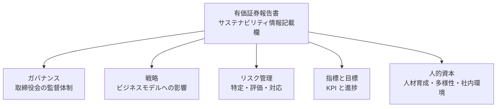

#### 記載必須と任意の切り分け

- **必須記載**：ガバナンス、リスク管理（全企業）
- **重要性がある場合の必須記載**：戦略、指標と目標
- **人的資本については**：女性管理職比率、男性育休取得率、男女賃金格差など、選択的必須項目あり

「人的資本開示」の扱いは前レッスンで触れた EU CSRD／ESRS 側の詳細とは異なる、**日本独自の設計**です。金融庁の内閣府令改正は、労働人口減少・多様性推進の政策方針とも連動しており、S 要素（社会）の中でも人的資本を特に重視する特徴があります。

### コーポレートガバナンス報告書——CG 報告書

もう 1 つ、日本の上場企業が提出する重要な開示書類が「コーポレートガバナンス報告書」（CG 報告書）です。

- **提出先**：東京証券取引所（金融商品取引所）
- **提出タイミング**：定時株主総会後、原則として 6 月末まで
- **記載内容**：コーポレートガバナンス・コードの 78 原則（プライム市場は全 78）への遵守状況、遵守しない場合は理由（コンプライ・オア・エクスプレイン）
- **サステナビリティ関連**：気候変動対応（プライムのみ）、政策保有株、多様性、株主対話、内部統制

CG 報告書は東証プライム上場企業を中心に、機関投資家が議決権行使判断の際に読み込む重要書類です。有価証券報告書との違いは、**有報が金融庁への法定書類、CG 報告書は東証への上場規則書類**という位置づけの差にあります。

### 日本の 5 つの開示ルート——使い分けの見取り図

上場企業のサステナビリティ開示は、以下の 5 つのルートを使い分けます。

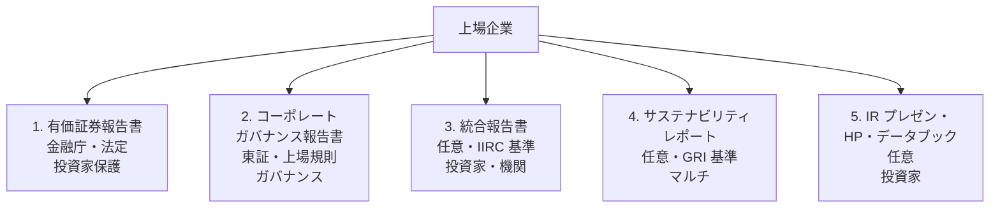

#### 各ルートの特徴

- **1. 有価証券報告書**：金融商品取引法に基づく法定書類。虚偽記載への罰則あり。「サステナビリティ情報記載欄」で ESG 情報を法定開示。読み手は主に機関投資家・アナリスト・当局
- **2. コーポレートガバナンス報告書**：東証への上場規則書類。コーポレートガバナンス・コードへの遵守状況をコンプライ・オア・エクスプレイン形式で。読み手は主に機関投資家（議決権行使判断）
- **3. 統合報告書**：IIRC フレームワークに基づく任意書類。統合思考の 8 要素と 6 つの資本、価値創造プロセスを軸に、企業の中長期的な価値創造を語る。読み手は主に機関投資家・アナリスト
- **4. サステナビリティレポート**（旧 CSR 報告書）：GRI スタンダードに基づく任意書類が主流。マルチステークホルダー向けに、詳細な ESG データを開示。読み手は主にサステナビリティ格付機関・NGO・従業員・地域社会
- **5. IR プレゼン・HP・データブック**：任意の補完的開示。四半期説明会資料、投資家との対話議事録、ESG データブックなど

#### 使い分けの実務

- **数字の一貫性**：同じ ESG 指標（CO₂ 排出量、女性管理職比率など）が、5 つの開示ルートで異なる数値になっていないか
- **前提の一貫性**：算定範囲、対象期間、集計方法が明確で、5 ルート間で整合しているか
- **対話の窓としての位置づけ**：有報と CG 報告書は法定・上場規則で「機械的読み込み」、統合報告書は「対話のストーリーテリング」、SR レポートは「詳細データバンク」、IR 資料は「対話のリアルタイム更新」

> **⚠️ 注意**
> 5 つの開示ルートで数字が食い違うことは、機関投資家からの最大の減点対象の 1 つです。「有報の女性管理職比率が 12%、SR レポートが 15%」といった単純ミスは、開示担当が全ルートを俯瞰する部署（IR / サステナビリティ推進 / 経営企画のいずれか）を明確にしていないと、頻繁に起こります。**5 ルートを 1 つのマスターデータから生成する運用**を整えることが、実務の第一歩です。

### 「相互運用性」の考え方——日本・EU・グローバルの間で

前レッスンで触れたように、開示制度は世界統一ではなく地域ごとに違います。日本の上場企業が実務で扱う制度は以下の 4 層です。

- **国際基準（ISSB IFRS S1/S2）**：任意採用、SSBJ が国内化
- **日本基準（SSBJ）**：2025 年 3 月確定、2026 年以降段階適用
- **日本国内制度（有報・CG 報告書・東証上場規則）**：既に稼働中
- **EU 制度（CSRD/ESRS）**：EU 域内で事業展開する日本企業に適用

これらの間には矛盾もあり、企業側は「一貫した ESG データを、各制度で求められる形式に加工する」相互運用性の実務を担います。**SSBJ が「相互運用可能な」日本基準を目指している**のは、この課題への解答です。

### 中核メッセージの再確認

本レッスンで扱った内容を、中核メッセージに戻して整理します。

- **開示は目的ではなく対話の入り口**：5 つの開示ルートを、それぞれ「誰との、どんな対話のため」に位置づけ、対話設計から逆算する
- **ESG は「非財務」ではなく「未財務」**：有価証券報告書のサステナビリティ情報記載欄で、ESG 情報が法定開示（投資家保護のための情報）に格上げされたことが、この発想の制度的な結実

### まとめ

- 東証プライム市場再編（2022 年 4 月）で、独立社外取締役 1/3 以上、TCFD 開示、英文開示推奨などの要件が導入
- 改正内閣府令（2023 年 1 月公布、3 月期以降適用）で、有価証券報告書にサステナビリティ情報記載欄を新設
- 記載欄の 5 項目：ガバナンス／戦略／リスク管理／指標と目標／人的資本
- コーポレートガバナンス報告書は東証への上場規則書類、コーポレートガバナンス・コードへのコンプライ・オア・エクスプレイン
- 日本の 5 つの開示ルート：有報（法定）／CG 報告書（東証）／統合報告書（任意 IIRC）／SR レポート（任意 GRI）／IR プレゼン等
- 5 ルート間で ESG 数字の一貫性を保つ運用が、機関投資家対話の前提
- 相互運用性：SSBJ が国際基準・EU 基準との橋渡しを担う

次のレッスンでは、コーポレートガバナンス・コード 3 回改訂（2015・2018・2021）とスチュワードシップ・コードの相互作用を扱います。日本のガバナンス改革の 10 年間の変遷を追います。

### 確認クイズ

このレッスンの内容の理解度をチェックしましょう。

#### Q1. 東証プライム市場再編の時期と主なサステナビリティ要件として、本レッスンの内容と一致するものはどれですか？

- [ ] 2018 年 4 月、独立社外取締役 2 名以上、TCFD 開示は推奨のみ
- [ ] 2020 年 4 月、独立社外取締役 1 名以上、GRI 開示を必須化
- [x] 2022 年 4 月、独立社外取締役 1/3 以上、TCFD またはそれと同等の枠組みに基づく気候関連情報開示
- [ ] 2024 年 4 月、独立社外取締役 2/3 以上、CSRD/ESRS の全面適用

> **解説**
> 東証プライム市場再編は 2022 年 4 月 4 日に施行され、主なサステナビリティ関連要件として独立社外取締役 1/3 以上、TCFD またはそれと同等の枠組みに基づく気候関連情報開示、英文開示の推奨が導入されました。ほかの選択肢は年代や要件が異なります。

#### Q2. 改正内閣府令による有価証券報告書のサステナビリティ情報記載欄の導入時期と適用として、本レッスンの内容と一致するものはどれですか？

- [ ] 2020 年 1 月公布、2020 年 3 月期から適用
- [ ] 2021 年 1 月公布、2021 年 3 月期から適用
- [ ] 2022 年 1 月公布、2022 年 3 月期から適用
- [x] 2023 年 1 月 31 日公布、2023 年 3 月期の有価証券報告書から適用

> **解説**
> 改正内閣府令は 2023 年 1 月 31 日に金融庁が公布し、2023 年 3 月期の有価証券報告書（4 〜 6 月提出）から適用されました。日本の上場企業のサステナビリティ開示を「任意の統合報告書」から「法定の有価証券報告書」に格上げした節目です。

#### Q3. 有価証券報告書のサステナビリティ情報記載欄の 5 項目として、本レッスンの内容と一致するものはどれですか？

- [ ] 資産・負債・純資産・収益・費用
- [ ] マーケティング・営業・製造・R&D・IR
- [x] ガバナンス・戦略・リスク管理・指標と目標・人的資本
- [ ] 過去・現在・将来・目標・改善策

> **解説**
> 記載欄の 5 項目は「ガバナンス／戦略／リスク管理／指標と目標／人的資本」です。IFRS S1 の 4 本柱（ガバナンス／戦略／リスク管理／指標と目標）に、日本の政策方針を反映した「人的資本」の別項目を加えた構成です。

#### Q4. 「コーポレートガバナンス報告書」の位置づけとして、本レッスンの内容と一致するものはどれですか？

- [ ] 金融庁への法定書類、虚偽記載への罰則あり
- [ ] 経済産業省への任意書類、GX 目標を含む
- [ ] 環境省への任意書類、GHG 排出量開示を目的
- [x] 東京証券取引所（金融商品取引所）への上場規則書類、コーポレートガバナンス・コード遵守状況の開示

> **解説**
> コーポレートガバナンス報告書は東京証券取引所への上場規則書類で、コーポレートガバナンス・コードの 78 原則への遵守状況をコンプライ・オア・エクスプレイン形式で開示します。金融庁への法定書類は有価証券報告書、経産省や環境省への書類ではありません。

#### Q5. 日本の 5 つの開示ルートの使い分けとして、本レッスンの内容と一致するものはどれですか？

- [x] 有報（法定）／CG 報告書（東証）／統合報告書（任意 IIRC）／SR レポート（任意 GRI）／IR プレゼン等
- [ ] 有報（東証）／CG 報告書（金融庁）／統合報告書（法定）／SR レポート（法定）／IR プレゼン（法定）
- [ ] すべて金融庁への法定書類として提出
- [ ] すべて任意で、上場企業でも作成義務はない

> **解説**
> 日本の 5 つの開示ルートは「有報（金融庁への法定）」「CG 報告書（東証への上場規則書類）」「統合報告書（任意、IIRC 基準）」「SR レポート（任意、GRI 基準が主流）」「IR プレゼン等（任意）」です。ほかの選択肢は制度の提出先・種別を取り違えているか、極端な整理です。

#### Q6. 5 つの開示ルート間の数字の一貫性について、本レッスンで説明されている内容として正しいものはどれですか？

- [ ] ルート間で数字が食い違うのは自然で、投資家も気にしない
- [x] 5 ルートを 1 つのマスターデータから生成する運用を整えることが実務の第一歩
- [ ] 数字の一貫性は開示ルートごとに独立して担保すべきで、統合管理は不要
- [ ] 数字の一貫性は開示公表後にすり合わせるのが実務の順序

> **解説**
> 5 ルート間で数字が食い違うのは機関投資家からの最大の減点対象の 1 つで、「有報の女性管理職比率が 12%、SR レポートが 15%」といった単純ミスが頻発します。開示担当が全ルートを俯瞰する部署を明確にし、5 ルートを 1 つのマスターデータから生成する運用を整えることが実務の第一歩、というのが本レッスンの説明です。

次のレッスンでは、コーポレートガバナンス・コード 3 回改訂（2015 制定・2018 改訂・2021 改訂）とスチュワードシップ・コードの相互作用を扱います。日本のガバナンス改革の 10 年間の変遷を追います。

---

## レッスン5：コーポレートガバナンス・コード 3 回改訂とスチュワードシップ・コード

（所要時間：25分）

### このレッスンで学ぶこと

- コーポレートガバナンス・コードの位置づけ（ソフトロー、コンプライ・オア・エクスプレイン）を把握する
- 3 回の改訂（2015 制定・2018 改訂・2021 改訂）の変遷と背景を追える
- 5 つの基本原則と 78 原則の骨格を捉えられる
- スチュワードシップ・コード（2014 制定・2017 改訂・2020 改訂）との対の関係を理解する
- 2 つのコードが機関投資家と発行体の対話を支える相互作用を掴む
- 政策保有株、指名・報酬委員会、独立社外取締役、多様性の各論点で変化を追える

---

前レッスンでは、日本の 5 つの開示ルートと有価証券報告書のサステナビリティ情報記載欄を扱いました。本レッスンでは、日本のガバナンス改革の 10 年間を支えた 2 つのソフトロー——コーポレートガバナンス・コードとスチュワードシップ・コードを扱います。**この 2 つは「発行体（企業）向け」と「機関投資家向け」の対のコード**であり、両者の相互作用が日本の資本市場を動かしてきました。

### 「稼ぐ力」と機関投資家対話——2010 年代前半の背景

日本のガバナンス改革は、2013 年 6 月に閣議決定された「日本再興戦略」から本格化しました。「稼ぐ力」の向上、ROE 8% 以上の目標、機関投資家との対話促進——これらが政策の柱となり、コード制定に繋がっていきました。

- **伊藤レポート（2014 年 8 月）**：一橋大学の伊藤邦雄氏を座長とする経済産業省プロジェクトが公表。「持続的成長への競争力とインセンティブ——企業と投資家の望ましい関係構築」。日本企業の平均 ROE 5% を「投資家の期待する水準の半分」と指摘、8% 以上を目指す提言
- **スチュワードシップ・コード（2014 年 2 月）**：金融庁が制定、機関投資家向けのソフトロー
- **コーポレートガバナンス・コード（2015 年 6 月）**：東京証券取引所と金融庁が共同で制定、発行体（上場企業）向けのソフトロー

### コーポレートガバナンス・コード——2015 年 6 月制定

コーポレートガバナンス・コード（略称：CG コード）は、東証と金融庁が共同で 2015 年 6 月 1 日に施行しました。上場企業に対する行動指針で、以下の 5 つの基本原則を柱とします。

1. **株主の権利・平等性の確保**
2. **株主以外のステークホルダーとの適切な協働**
3. **適切な情報開示と透明性の確保**
4. **取締役会等の責務**
5. **株主との対話**

制定当初は 73 の原則で構成され、2 回の改訂で 78 の原則に拡張されました。

#### コンプライ・オア・エクスプレイン

CG コードは法律ではなく、金融商品取引所の上場規則で「遵守または説明」（Comply or Explain）を求めます。原則を遵守する場合は遵守を宣言し、遵守しない場合はその理由を説明する形です。**「守れないなら理由を説明する」**——これが CG コードの柔軟性の源です。「一律に強制する規制」ではなく「対話の出発点」として設計されました。

### 2018 年 6 月改訂——政策保有株、指名・報酬委員会

2015 年制定から 3 年経った 2018 年 6 月、CG コードが初改訂されました。主な追加点は以下です。

- **政策保有株の縮減**（原則 1-4）：保有意義と経済合理性を毎年検証し、政策保有株を段階的に縮減
- **指名委員会・報酬委員会の任意設置**（補充原則 4-10-①）：取締役会の指名・報酬機能を独立性のある委員会で強化
- **CEO の選解任プロセスの明確化**（補充原則 4-3-②〜④）
- **投資家との対話促進**（原則 5）

政策保有株の縮減は、日本企業の資本コスト意識を高める重要な改革でした。**「株主対話が形式から実質へ変わる出発点」**として位置づけられます。

### 2021 年 6 月改訂——プライム市場向け要件、TCFD、多様性

2 回目の改訂は、東証プライム市場再編（2022 年 4 月施行）と連動する形で、2021 年 6 月に行われました。プライム市場向けにより高い基準を課す構造が導入されました。

#### 主な改訂点

- **独立社外取締役 1/3 以上**（プライム市場、原則 4-8）：構成の多様性・専門性を含む
- **サステナビリティに関する取組みの開示**（補充原則 3-1-③）：TCFD またはそれと同等の枠組み
- **中核人材の多様性確保**（補充原則 2-4-①）：女性・外国人・中途採用者の管理職登用状況、目標、進捗
- **取締役会・監査役会のスキルマトリックス**（補充原則 4-11-①）
- **サステナビリティ経営に関する監督**（補充原則 4-2-②）
- **プライム市場上場企業向け原則**の付加

**「E・S・G のすべてを CG コードに組み込む」**——2021 年改訂の主眼はここにあります。従来のガバナンス（G）の枠を超えて、環境（E）と社会（S）を取締役会の監督範囲に明確に位置づけました。

### スチュワードシップ・コード——機関投資家向けの対のコード

スチュワードシップ・コードは、CG コードと対をなす機関投資家向けのソフトローです。金融庁が「責任ある機関投資家の諸原則」として策定しました。

- **2014 年 2 月制定**：7 つの原則
- **2017 年 5 月改訂**：議決権行使結果の個別開示、パッシブ運用における対話
- **2020 年 3 月再改訂**：ESG 要素の考慮、運用機関のガバナンス・利益相反管理

#### 7 つの原則（2020 年改訂版）

1. **方針の明確化と公表**：スチュワードシップ責任の果たし方に関する方針を策定・公表
2. **利益相反の管理**：明確な方針の策定・公表
3. **投資先企業の把握**：中長期的な企業価値向上に資する経営状況の把握
4. **建設的な対話**：目的を持った建設的な対話を通じた投資先企業との認識共有
5. **議決権行使の方針・結果の公表**：具体的な議決権行使結果の個別開示を含む
6. **スチュワードシップ責任の履行報告**：受益者への履行報告
7. **実力の向上**：スチュワードシップ活動に係る実力の向上

#### 2 つのコードの対応関係

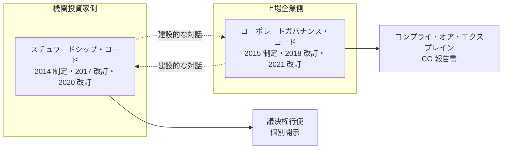

**両コードは「建設的な対話」を軸に対応関係にあり、2 つがセットで日本の資本市場のガバナンスを支える設計**です。片方だけでは、対話は生まれません。機関投資家がスチュワードシップ責任を果たし、発行体が CG コードを遵守（または説明）することで、対話が実効性を持ちます。

### ソフトローの位置づけ——法律ではないが機能する

CG コードとスチュワードシップ・コードは、いずれも「ソフトロー」です。法律ではなく、金融商品取引所の上場規則、あるいは自主的な受入れという形で運用されます。

- **メリット**：柔軟性、対話ベース、原則が変わりやすい環境で対応できる
- **デメリット**：形式的な遵守（フォーム埋め）に陥りやすい、罰則がない
- **実効性**：機関投資家の議決権行使、格付、投資判断を通じて、実質的な影響力を持つ

**「法律にしないことで、対話を残す」**——これがソフトローの狙いです。機関投資家がスチュワードシップ・コード原則 5 に基づいて議決権行使結果を個別開示し、それが CG コード遵守状況を評価する材料となる——**ソフトローの相互作用が、事実上のハードローに近い実効性を持つ**構造です。

### 2 つのコードの相互作用の実務

上場企業側から見ると、スチュワードシップ・コードは「相手の行動原則」として理解しておく必要があります。

- **原則 4 の建設的な対話**：機関投資家が「なぜ聞いてくるか」の根拠。スチュワードシップ責任の履行として対話するので、義務感で聞くわけではない
- **原則 5 の議決権行使結果の個別開示**：反対票が「誰から、なぜ、どの議案に」入ったかが可視化される時代。中期経営計画・役員報酬・政策保有株が反対の主な理由
- **原則 7 の実力の向上**：機関投資家自身も「スチュワードシップ活動の質」を評価される。ESG エンゲージメントを担う担当者の育成が進む

対話に臨むときは、「相手のスチュワードシップ・コード原則 4・5・7 の履行状況」を意識することで、対話の設計が変わります。

### 中核メッセージの再確認

本レッスンで扱った内容を、中核メッセージに戻して整理します。

- **開示は目的ではなく対話の入り口**：CG コードのコンプライ・オア・エクスプレイン、スチュワードシップ・コードの議決権行使結果の個別開示——両方が対話の材料として設計されている
- **統合思考なき統合報告書は、束ねただけの目次に過ぎない**：CG コード 2021 年改訂で E・S・G すべてが取締役会の監督範囲に入ったことは、統合思考の制度的な結実

### まとめ

- CG コードは 2015 年 6 月制定、2018 年 6 月改訂、2021 年 6 月改訂の 3 回改訂
- 5 つの基本原則、78 原則、コンプライ・オア・エクスプレイン
- 2018 年改訂：政策保有株縮減、指名・報酬委員会、CEO の選解任プロセス
- 2021 年改訂：プライム市場向けの独立社外取締役 1/3 以上、TCFD、多様性、スキルマトリックス
- スチュワードシップ・コードは 2014 年 2 月制定、2017 年 5 月改訂、2020 年 3 月再改訂
- 7 つの原則、機関投資家の建設的な対話・議決権行使結果の個別開示
- 2 つのコードは対応関係にあり、対話を軸に日本の資本市場のガバナンスを支える
- ソフトローの位置づけ：柔軟性と対話を残しつつ、事実上のハードローに近い実効性

次のレッスンでは、統合報告書の作り方——IIRC フレームワークの 6 つの資本と価値創造プロセス、統合思考の実装を扱います。

### 確認クイズ

このレッスンの内容の理解度をチェックしましょう。

#### Q1. コーポレートガバナンス・コードの制定と改訂の年として、本レッスンの内容と一致するものはどれですか？

- [x] 2015 年 6 月制定、2018 年 6 月改訂、2021 年 6 月改訂
- [ ] 2010 年 6 月制定、2015 年 6 月改訂、2020 年 6 月改訂
- [ ] 2018 年 6 月制定、2021 年 6 月改訂、2024 年 6 月改訂
- [ ] 2013 年 4 月制定、2018 年 4 月改訂、2023 年 4 月改訂

> **解説**
> CG コードは 2015 年 6 月 1 日に施行され、2018 年 6 月と 2021 年 6 月に 2 回改訂されました。ほかの選択肢は年代が異なります。

#### Q2. 「コンプライ・オア・エクスプレイン」の説明として、本レッスンの内容と一致するものはどれですか？

- [ ] 遵守を強制する規制で、違反には罰金が科される
- [x] 原則を遵守する場合は遵守を宣言し、遵守しない場合はその理由を説明する仕組み
- [ ] 遵守か遵守しないかの二者択一で、理由の説明は不要
- [ ] 遵守だけを認め、遵守しない選択肢はない

> **解説**
> コンプライ・オア・エクスプレイン（遵守または説明）は、原則を遵守する場合は遵守を宣言し、遵守しない場合はその理由を説明する仕組みです。「守れないなら理由を説明する」柔軟性が CG コードの特徴で、規制ではなく「対話の出発点」として設計されました。

#### Q3. コーポレートガバナンス・コード 2018 年改訂の主な追加点として、本レッスンの内容と一致するものはどれですか？

- [ ] 独立社外取締役 1/3 以上と TCFD 開示
- [ ] SSBJ 基準の適用と ISSB IFRS S1/S2 の遵守
- [x] 政策保有株の縮減、指名委員会・報酬委員会の任意設置、CEO の選解任プロセスの明確化
- [ ] EU CSRD/ESRS の全面適用と ダブルマテリアリティの導入

> **解説**
> 2018 年改訂の主な追加点は「政策保有株の縮減」「指名委員会・報酬委員会の任意設置」「CEO の選解任プロセスの明確化」「投資家との対話促進」です。独立社外取締役 1/3 以上と TCFD 開示は 2021 年改訂、SSBJ/ISSB は本改訂とは別の制度、CSRD/ESRS は EU の制度です。

#### Q4. スチュワードシップ・コードの制定と改訂の年として、本レッスンの内容と一致するものはどれですか？

- [ ] 2010 年 2 月制定、2013 年 5 月改訂、2016 年 3 月再改訂
- [ ] 2013 年 2 月制定、2016 年 5 月改訂、2019 年 3 月再改訂
- [ ] 2015 年 2 月制定、2018 年 5 月改訂、2021 年 3 月再改訂
- [x] 2014 年 2 月制定、2017 年 5 月改訂、2020 年 3 月再改訂

> **解説**
> スチュワードシップ・コードは 2014 年 2 月に金融庁が制定、2017 年 5 月と 2020 年 3 月に改訂されました。2020 年改訂で ESG 要素の考慮、運用機関のガバナンス・利益相反管理が強化されました。

#### Q5. コーポレートガバナンス・コード 2021 年改訂の主な追加点として、本レッスンの内容と一致するものはどれですか？

- [ ] 政策保有株の縮減、指名・報酬委員会の任意設置
- [x] 独立社外取締役 1/3 以上（プライム）、TCFD またはそれと同等の枠組みに基づくサステナビリティ開示、中核人材の多様性確保、スキルマトリックス
- [ ] SSBJ 基準の適用と ISSB IFRS S1/S2 の遵守
- [ ] 全上場企業への CBAM 適用と GX-ETS 参加義務化

> **解説**
> 2021 年改訂の主な追加点は「プライム市場向けの独立社外取締役 1/3 以上」「TCFD またはそれと同等の枠組みに基づくサステナビリティ開示」「中核人材（女性・外国人・中途採用者）の多様性確保」「取締役会・監査役会のスキルマトリックス」です。政策保有株や指名・報酬委員会は 2018 年改訂、SSBJ/CBAM は本改訂とは別の制度です。

#### Q6. 2 つのコード（CG コードとスチュワードシップ・コード）の関係として、本レッスンの内容と一致するものはどれですか？

- [ ] 両者は独立の枠組みで、相互作用はない
- [ ] CG コードは機関投資家向け、スチュワードシップ・コードは発行体向け
- [ ] 両者はハードロー（法律）で、罰則を伴う
- [x] CG コード（発行体向け）とスチュワードシップ・コード（機関投資家向け）は対応関係にあり、「建設的な対話」を軸に日本の資本市場のガバナンスを支える

> **解説**
> 2 つのコードは対応関係にあり、CG コードが発行体（上場企業）向け、スチュワードシップ・コードが機関投資家向けです。両者は「建設的な対話」を軸に、対話の実効性を確保する設計です。両者ともソフトローで、罰則ではなく事実上の実効性（機関投資家の議決権行使や格付を通じた影響力）を持ちます。

次のレッスンでは、統合報告書の作り方——IIRC フレームワークの 6 つの資本と価値創造プロセス、統合思考の実装を扱います。

---

## レッスン6：統合報告書の作り方——IIRC フレームワーク、6 つの資本、価値創造プロセス

（所要時間：25分）

### このレッスンで学ぶこと

- 統合報告書の位置づけと日本での普及状況を把握する
- IIRC 統合報告書フレームワークの 8 つの内容要素を捉えられる
- 6 つの資本（財務・製造・知的・人的・社会関係・自然）で価値創造の材料を整理できる
- 価値創造プロセスとオクトパスモデルで、資本の流れを捉える
- 統合思考の考え方と「目次に過ぎない統合報告書」の罠を区別する
- 統合報告書 vs 有価証券報告書 vs SR レポートの使い分けができる

---

前レッスンでは、コーポレートガバナンス・コードとスチュワードシップ・コードの相互作用を扱いました。本レッスンは、日本の上場企業のサステナビリティ・ESG 開示の中核である「統合報告書」を扱います。中核メッセージ「統合思考なき統合報告書は、束ねただけの目次に過ぎない」の、そのものの主題です。

### 統合報告書とは——2013 年 12 月、IIRC フレームワーク

統合報告書（Integrated Report）は、IIRC が 2013 年 12 月に公表した「The International <IR> Framework」に基づく開示書類です。財務情報と非財務情報を「別々に開示する」従来の姿から、「一体で捉えて中長期の価値創造を語る」姿への転換を提唱しました。

#### 日本での普及

- **2013 年**：日本での発行企業 100 社未満
- **2020 年**：600 社超
- **2024 年**：1,000 社超（KPMG ジャパン調査）

**日本は世界で最も統合報告書の発行数が多い国**の 1 つとなり、任意ながら事実上の標準実務となりました。上場企業の投資家向けコミュニケーションの主軸を担う書類です。

### 8 つの内容要素——統合報告書の骨格

IIRC フレームワークは、統合報告書に含めるべき 8 つの内容要素を提示しています。

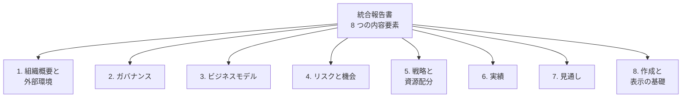

#### 各要素の役割

1. **組織概要と外部環境**：ミッション、事業ポートフォリオ、主要市場、規制環境
2. **ガバナンス**：取締役会構成、経営陣の体制、意思決定プロセス、コンプライアンス
3. **ビジネスモデル**：インプット・事業活動・アウトプット・アウトカムの流れ
4. **リスクと機会**：中長期の重要リスク、その源泉、機会の識別、緩和・対応策
5. **戦略と資源配分**：中期経営計画、資源の投入計画、選択と集中
6. **実績**：目標に対する実績、KPI、財務・非財務の実績整合
7. **見通し**：中長期の見通し、想定されるシナリオ、不確実性
8. **作成と表示の基礎**：マテリアリティ、報告バウンダリー、対象期間、会計方針

**8 要素は互いに絡み合う**もので、独立に読める章立てではありません。統合思考は、これらの要素を束ねて 1 つの物語として語ることを求めます。

### 6 つの資本——価値創造の材料

統合報告書の中核概念が「6 つの資本」です。企業が価値を生み出すために使う資源を、財務だけでなく 6 つのレンズで捉え直します。

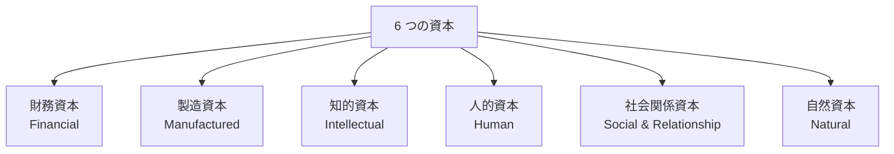

#### 各資本の説明

- **財務資本**（Financial Capital）：資金、株主資本、負債、キャッシュフロー
- **製造資本**（Manufactured Capital）：工場、設備、インフラ、有形固定資産
- **知的資本**（Intellectual Capital）：特許、ブランド、ノウハウ、ソフトウェア、組織資本
- **人的資本**（Human Capital）：従業員のスキル、経験、動機、健康、リーダーシップ
- **社会関係資本**（Social and Relationship Capital）：ステークホルダーとの関係、社会的信頼、コミュニティ、ブランド信認
- **自然資本**（Natural Capital）：自然資源（水、大気、生態系、鉱物、森林）、生物多様性

**6 つの資本は「投入」と「産出」の両方の側面**を持ちます。企業は各資本を投入して事業を行い、それによって各資本を変化（増減）させます。統合報告書は、その変化を通じた価値創造を語る舞台です。

### 価値創造プロセスとオクトパスモデル

IIRC フレームワークが提示する「価値創造プロセス」の視覚化は、その形から「オクトパス（タコ）モデル」と呼ばれ、多くの統合報告書で採用されています。

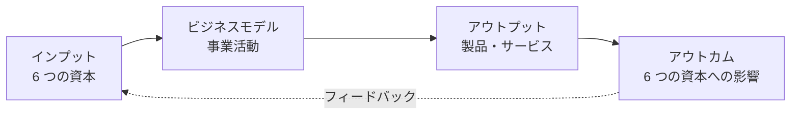

#### 4 段階の意味

- **インプット**：事業に投入する 6 つの資本の状態と量
- **ビジネスモデル**：投入資本を活用して事業活動を行うプロセス
- **アウトプット**：事業活動の直接的な産物（製品、サービス、廃棄物、副産物）
- **アウトカム**：6 つの資本への影響（増減）、社会・環境への影響

**「6 つの資本 → ビジネスモデル → 6 つの資本」**の循環——これが価値創造プロセスの本質です。**単に「事業をして利益を上げた」ではなく「どの資本を投入し、事業を通じて、どの資本にどう影響したか」を語る**のが統合報告書の特徴です。

### 統合思考——「目次に過ぎない統合報告書」の罠

**「統合思考なき統合報告書は、束ねただけの目次に過ぎない」**——本コースの中核メッセージの 1 つです。統合思考（integrated thinking）とは、以下のような発想です。

- **財務と非財務を分けて考えない**：ESG が将来キャッシュフローに繋がるという発想（前レッスンの「未財務」）
- **時間軸を統合する**：短期・中期・長期の視点を分けずに、同じ経営会議で議論
- **資本の相互作用を捉える**：財務資本を投入して人的資本を増やし、それが社会関係資本の向上を通じて財務資本に戻る、という循環
- **ステークホルダーの多様性を反映**：株主だけでなく、従業員、顧客、取引先、地域社会の視点を経営判断に組み込む

#### 目次に過ぎない統合報告書の 4 つの兆候

- **章立てが「財務」と「ESG」で明確に分離している**：統合されていない
- **6 つの資本のうち、財務資本以外の 5 つが定性的な言葉だけ**：定量的な追跡がない
- **中期経営計画とサステナビリティ戦略が別々のページで語られる**：連携していない
- **CEO メッセージが業績と ESG を並列に並べるだけ**：統合の物語がない

これらの兆候は、機関投資家の目にも見えます。「厚さ 150 ページの立派な統合報告書」でも、統合思考が欠けていれば、対話の材料としては薄いのです。

### 統合報告書 vs 有価証券報告書 vs サステナビリティレポート

前レッスンでも触れましたが、3 つの主要開示書類の使い分けを、改めて整理します。

| 書類 | 対象読者 | 主な内容 | 制度的位置づけ | 分量目安 |
|---|---|---|---|---|
| **有価証券報告書** | 機関投資家・アナリスト・当局 | 財務情報＋サステナビリティ情報記載欄 | 金融商品取引法に基づく法定書類 | 100〜250 ページ |
| **統合報告書** | 機関投資家・アナリスト | 中長期の価値創造ストーリー、6 つの資本、統合思考 | IIRC フレームワークに基づく任意書類 | 80〜200 ページ |
| **サステナビリティレポート** | マルチステークホルダー | 詳細な ESG データ、GRI 準拠 | GRI 基準に基づく任意書類 | 60〜300 ページ |

#### 使い分けの実務

- **有価証券報告書**：法定書類として虚偽記載への罰則あり。事実の確実性重視、監査対象、機械的読み込みされる
- **統合報告書**：物語重視、対話の入り口、機関投資家との中長期対話の材料
- **SR レポート**：データバンク、格付機関・NGO への詳細情報提供、部門別の詳細開示

**3 つの書類が矛盾せず、統合思考で一貫している**——これが日本の上場企業の理想の姿です。前レッスンで扱った「5 ルートを 1 つのマスターデータから生成する運用」は、この一貫性の土台です。

### 統合報告書作成の実務的な進め方

上場企業として初めて統合報告書を作成する、あるいは既存の統合報告書を改善する場合、以下の順序が実務的です。

#### 1. 統合思考の準備（3〜6 か月）

- 経営層（CEO・CFO・CSO）が「統合思考とは何か」を共有する
- 中期経営計画とサステナビリティ戦略の対応関係を洗い出す
- 6 つの資本を自社に落とし込む定義を確定する

#### 2. マテリアリティ分析（3〜6 か月）

- ステークホルダー・エンゲージメントで重要課題を特定
- マテリアリティ・マトリックスで優先順位を可視化
- 取締役会でマテリアリティを承認

#### 3. 8 要素の設計と執筆（4〜8 か月）

- 8 要素を章立てとして構成
- 統合思考で全章を通した物語を設計
- CEO メッセージ・価値創造プロセスの図解を最後に決定

#### 4. レビューと発行（1〜2 か月）

- 経営層・取締役会レビュー
- 外部のサステナビリティ・アドバイザーによる確認
- 発行、対話の場での活用

**初回発行は 12〜18 か月**が目安、以降は 6〜9 か月サイクルで改訂を重ねます。

> **📖 もっと詳しく**
> 統合報告書の改善は、単年で急に変わりません。**「発行→対話→フィードバック→改善」を 3〜5 年かけて繰り返す**中で、統合思考が組織に根づき、報告書の質が上がっていきます。1 年目に完璧を目指さず、フィードバックを受ける前提で発行することが、実務の勘所です。

### 中核メッセージの再確認

本レッスンで扱った内容を、中核メッセージに戻して整理します。

- **統合思考なき統合報告書は、束ねただけの目次に過ぎない**：本レッスンで最も強調した中核メッセージ。統合思考は「発行して 3〜5 年」の組織学習で身につくもの
- **開示は目的ではなく対話の入り口**：統合報告書の質は、機関投資家との対話の質を通じて上がる。ネットで PDF を公開して終わりではない

### まとめ

- 統合報告書は IIRC が 2013 年 12 月に公表したフレームワークに基づく開示書類
- 日本での発行企業は 2024 年時点で 1,000 社超、任意ながら事実上の標準実務
- 8 つの内容要素：組織概要／ガバナンス／ビジネスモデル／リスクと機会／戦略と資源配分／実績／見通し／作成と表示の基礎
- 6 つの資本：財務・製造・知的・人的・社会関係・自然
- 価値創造プロセス：インプット（6 つの資本）→ ビジネスモデル → アウトプット → アウトカム（6 つの資本への影響）
- 統合思考は「財務と非財務、時間軸、資本の相互作用、ステークホルダーの多様性」を統合する発想
- 目次に過ぎない統合報告書の 4 兆候：章立ての分離／定性言葉／中経とサステナ戦略の乖離／CEO メッセージの並列
- 有価証券報告書（法定）／統合報告書（任意 IIRC）／SR レポート（任意 GRI）を役割で使い分ける
- 初回発行は 12〜18 か月、以降 6〜9 か月サイクル、3〜5 年で組織に統合思考が根づく

次のレッスンでは、ESG 格付機関 5 社（MSCI／Sustainalytics／FTSE Russell／S&P Global／CDP）の比較と、格付対応の実務、鵜呑みにしない付き合い方を扱います。

### 確認クイズ

このレッスンの内容の理解度をチェックしましょう。

#### Q1. 統合報告書フレームワーク公表の年として、本レッスンの内容と一致するものはどれですか？

- [ ] 2010 年 8 月、IIRC 設立と同時
- [x] 2013 年 12 月、IIRC 設立から 3 年後
- [ ] 2015 年 6 月、コーポレートガバナンス・コード制定と同時
- [ ] 2021 年 11 月、ISSB 設立と同時

> **解説**
> IIRC は 2010 年 8 月設立、「The International <IR> Framework」（統合報告書フレームワーク）は 2013 年 12 月公表です（2021 年 1 月に改訂）。IIRC 設立と同時ではありません。ほかの選択肢は年代が異なります。

#### Q2. IIRC 統合報告書フレームワークの 8 つの内容要素として、本レッスンで挙げられていないものはどれですか？

- [ ] 組織概要と外部環境
- [x] 環境保護活動一覧
- [ ] リスクと機会
- [ ] 見通し

> **解説**
> 8 つの内容要素は「組織概要と外部環境／ガバナンス／ビジネスモデル／リスクと機会／戦略と資源配分／実績／見通し／作成と表示の基礎」です。「環境保護活動一覧」はここに含まれません（環境情報は複数の要素に分散して記載される想定です）。

#### Q3. 「6 つの資本」として、本レッスンで挙げられているものはどれですか？

- [ ] 現金・売掛金・棚卸資産・固定資産・繰延資産・投資その他資産
- [ ] マーケティング・営業・製造・R&D・IR・HR
- [x] 財務資本・製造資本・知的資本・人的資本・社会関係資本・自然資本
- [ ] 日本・アジア・北米・欧州・南米・アフリカ

> **解説**
> 6 つの資本は「財務資本（Financial）・製造資本（Manufactured）・知的資本（Intellectual）・人的資本（Human）・社会関係資本（Social & Relationship）・自然資本（Natural）」です。ほかの選択肢は財務会計上の資産分類、事業機能、地域区分で、統合報告書の 6 つの資本ではありません。

#### Q4. 「価値創造プロセスとオクトパスモデル」の 4 段階として、本レッスンの内容と一致するものはどれですか？

- [ ] 企画・設計・実装・運用
- [ ] マーケティング・販売・製造・出荷
- [ ] 認知・興味・欲求・記憶
- [x] インプット（6 つの資本）→ビジネスモデル→アウトプット→アウトカム（6 つの資本への影響）

> **解説**
> 価値創造プロセスは「インプット（6 つの資本）→ビジネスモデル（事業活動）→アウトプット（製品・サービス）→アウトカム（6 つの資本への影響）」の 4 段階で、フィードバックで循環します。ほかの選択肢はソフトウェア開発、マーケティング、消費者行動の別モデルです。

#### Q5. 「目次に過ぎない統合報告書」の 4 兆候として、本レッスンで挙げられていないものはどれですか？

- [ ] 章立てが「財務」と「ESG」で明確に分離している
- [x] 表紙にキャラクターが登場していない
- [ ] 中期経営計画とサステナビリティ戦略が別々のページで語られる
- [ ] CEO メッセージが業績と ESG を並列に並べるだけ

> **解説**
> 4 兆候は「章立ての分離／6 つの資本のうち財務以外が定性言葉だけ／中経とサステナ戦略が別々／CEO メッセージが並列」です。「表紙のキャラクター」は兆候ではなく、統合思考の欠如とは関係ありません。

#### Q6. 「統合報告書 vs 有価証券報告書 vs サステナビリティレポート」の使い分けとして、本レッスンの内容と一致するものはどれですか？

- [x] 有報は法定書類・機関投資家、統合報告書は任意 IIRC・機関投資家対話、SR レポートは任意 GRI・マルチステークホルダー
- [ ] 有報は任意 IIRC、統合報告書は法定書類、SR レポートは東証への上場規則書類
- [ ] 3 つの書類は同一で、名前だけが違う
- [ ] 3 つの書類はすべて GRI 基準に準拠する義務がある

> **解説**
> 有価証券報告書は金融商品取引法に基づく法定書類（虚偽記載への罰則あり、機関投資家・アナリスト向け）、統合報告書は IIRC フレームワークに基づく任意書類（機関投資家との中長期対話の材料）、サステナビリティレポートは GRI 基準に基づく任意書類が主流（マルチステークホルダー向けデータバンク）です。それぞれ役割が違います。

次のレッスンでは、ESG 格付機関 5 社（MSCI／Sustainalytics／FTSE Russell／S&P Global／CDP）の比較と、格付対応の実務、鵜呑みにしない付き合い方を扱います。

---

## レッスン7：ESG 格付機関 5 社の比較——MSCI/Sustainalytics/FTSE Russell/S&P Global/CDP

（所要時間：25分）

### このレッスンで学ぶこと

- ESG 格付機関の役割と機関投資家との関係を把握する
- MSCI・Sustainalytics・FTSE Russell・S&P Global・CDP の 5 社のプロファイルと評価軸を捉える
- 質問書対応の実務プロセスを組み立てられる
- 格付機関との「付き合い方」の 4 原則を持てる
- 「同じ質問が違う言葉で来る」現場の実感を、講師の体験から学ぶ

---

前レッスンでは、統合報告書の作り方と 6 つの資本、統合思考を扱いました。本レッスンでは、機関投資家が発行体を評価する際に参照する「ESG 格付機関」を扱います。中核メッセージ「格付は使いこなす道具、鵜呑みにしない」——本レッスンの主題です。

### 格付機関の役割——投資家と発行体の間

ESG 格付機関は、上場企業の ESG パフォーマンスを評価・スコア化し、機関投資家に提供するデータプロバイダーです。機関投資家が全企業の ESG 情報を自ら分析することは現実的でなく、格付機関の評価が「投資判断の効率化」に使われます。

- **機関投資家の使い方**：ポートフォリオのスクリーニング、ESG インテグレーション、指数連動運用（GPIF の ESG 指数など）
- **格付機関のビジネスモデル**：機関投資家からのサブスクリプション、指数プロバイダーとしての指数ライセンス、企業からの詳細レポート販売
- **発行体との関係**：発行体は無料の質問書に回答し、スコアがつく。詳細フィードバックには課金される場合も

**格付機関は「投資家サイドのビジネス」**——だからこそ、発行体は格付機関を鵜呑みにするのではなく「機関投資家との対話の材料」として使いこなす必要があります。

### 5 社のプロファイル比較

主要な ESG 格付機関 5 社の位置づけです。

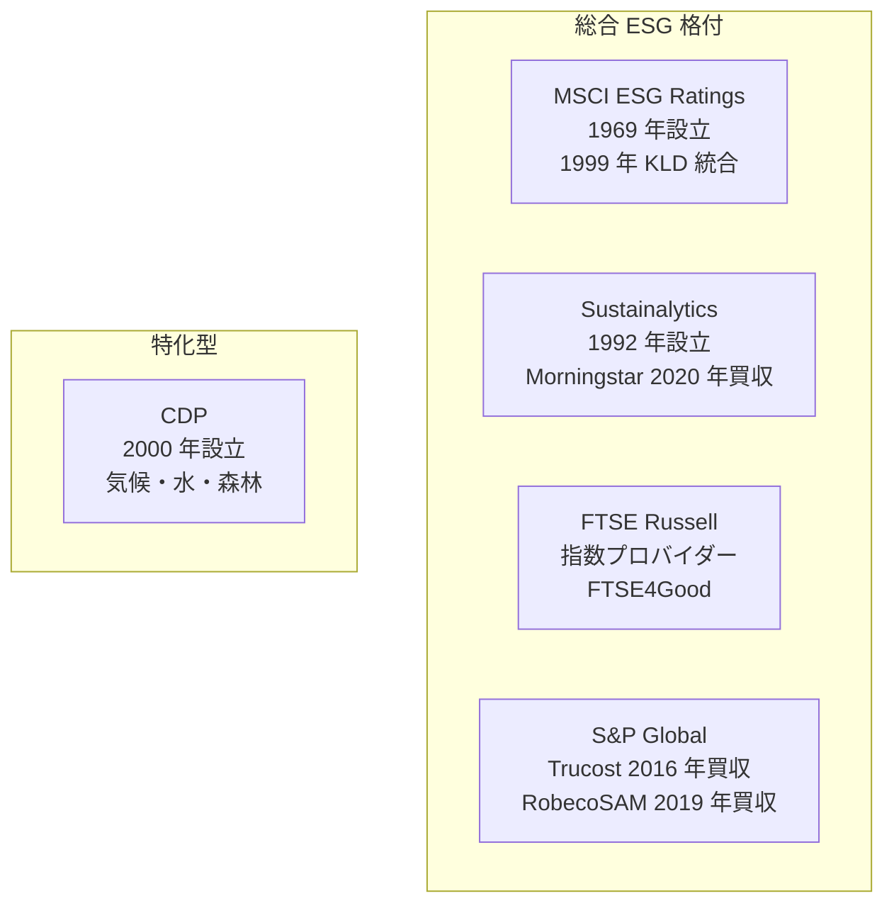

#### 1. MSCI ESG Ratings

- **設立**：1969 年（Morgan Stanley Capital International として）、ESG リサーチは 1999 年に KLD Research & Analytics を統合してから本格化
- **本社**：米国ニューヨーク
- **カバレッジ**：世界の大型・中型株 8,500 社超
- **スコア**：AAA〜CCC の 7 段階、業種相対評価
- **特徴**：GPIF が採用する MSCI Japan ESG Select Leaders 指数の基盤、パッシブ運用に強い影響
- **評価軸**：業種別のマテリアル ESG リスクと機会を特定し、ガバナンス（30%）＋業種特有の E・S 課題（70%）の加重
- **無料質問書**：なし（公開情報とサードパーティデータから評価）

#### 2. Sustainalytics

- **設立**：1992 年、カナダ（複数の欧州リサーチ機関の統合）
- **買収**：Morningstar が 2020 年に完全買収
- **カバレッジ**：世界 16,000 社超
- **スコア**：ESG Risk Rating（0〜100 のリスクスコア、低いほど良い）、5 段階（Negligible〜Severe）
- **特徴**：企業別の詳細レポート、機関投資家に加えて銀行融資の判断材料としても使われる
- **評価軸**：ESG リスクの「露出度（Exposure）」と「管理（Management）」の掛け合わせ
- **無料質問書**：あり（企業が回答すると評価に反映）

#### 3. FTSE Russell

- **母体**：ロンドン証券取引所グループ（LSEG）傘下、指数プロバイダー
- **主要指数**：FTSE4Good（2001 年開始）、FTSE Blossom Japan（2017 年、GPIF が採用）
- **カバレッジ**：世界の主要株
- **スコア**：0〜5 の 6 段階、業種相対
- **特徴**：指数連動運用向けの明確な指数、GPIF の 2 つの ESG 指数の 1 つを提供
- **評価軸**：E・S・G の 3 領域、それぞれサブテーマで採点
- **無料質問書**：あり

#### 4. S&P Global Sustainable1（旧 RobecoSAM）

- **本社**：米国ニューヨーク
- **買収**：Trucost（環境データ）を 2016 年に買収、RobecoSAM の SAM 部門を 2019 年に買収
- **カバレッジ**：世界の主要株、10,000 社超
- **スコア**：0〜100、業種相対
- **特徴**：Dow Jones Sustainability Index（DJSI、1999 年設立）の基盤、Corporate Sustainability Assessment（CSA）の質問書が業界で最も詳細
- **評価軸**：Governance & Economic、Environmental、Social の 3 領域、業種別の質問セット
- **無料質問書**：CSA（毎年 4 月〜7 月頃に企業に招待）——**回答企業のみ DJSI 選定候補になる**

#### 5. CDP（旧 Carbon Disclosure Project）

- **設立**：2000 年、英国
- **性質**：国際 NGO
- **カバレッジ**：世界の企業 24,000 社超が回答（2024 年）
- **スコア**：A・A-・B・B-・C・C-・D・D-・F の 9 段階、Failure（未回答）
- **特徴**：総合 ESG 格付ではなく「気候変動／水セキュリティ／森林」の 3 領域に特化
- **評価軸**：質問書への回答内容の詳細性、Scope 1-3 開示、目標設定、ガバナンス
- **無料質問書**：あり、機関投資家グループ・購買企業からの依頼で送付

**CDP は「気候・水・森林」に特化**し、総合 ESG 格付とは目的が違う点に注意が必要です。総合 ESG 格付機関 4 社と CDP はセットで対応するのが実務です。

### 質問書対応の実務プロセス

格付機関の質問書に対応する実務は、以下の年次サイクルを踏みます。

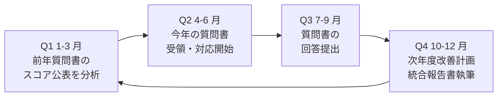

#### 各期の主なタスク

- **Q1 分析期**：前年のスコアと機関投資家の反応を分析。改善すべき項目の特定
- **Q2 準備期**：質問書の受領（4 月〜7 月に集中）、社内データ収集、部門横断の連携準備
- **Q3 回答期**：質問書の回答執筆、証跡（policies, disclosures, KPIs）の添付、7 月〜9 月に集中
- **Q4 改善期**：スコアの見通しをもとに、次年度の改善策を統合報告書・SR レポートに反映

#### 質問書対応の落とし穴

- **同じ質問が違う言葉で来る**：MSCI・Sustainalytics・FTSE Russell・S&P Global の 4 社が、例えば「気候変動リスクに対する取締役会の監督体制」を、それぞれ違う言葉で問う
- **証跡の求められ方が違う**：ある機関は「取締役会議事録の抜粋」を求め、別の機関は「ポリシー文書」を求める
- **業種の粒度が違う**：業種の切り方が機関ごとに違い、比較企業（ピア）も違う

**部門横断の「質問書対応チーム」**を組成し、社内文書のバージョン管理を厳格にしないと、部門ごとに違う情報が回答されてしまう事故が起きます。

### まとめ

- ESG 格付機関 5 社：MSCI・Sustainalytics・FTSE Russell・S&P Global・CDP
- MSCI（1969 年、1999 年 KLD 統合、GPIF 採用）：AAA〜CCC の 7 段階、公開情報ベース
- Sustainalytics（1992 年、Morningstar 2020 年買収）：ESG Risk Rating、質問書あり
- FTSE Russell：FTSE4Good・FTSE Blossom Japan（GPIF 採用）、指数プロバイダー
- S&P Global（Trucost 2016 年、RobecoSAM 2019 年買収）：DJSI 基盤、CSA 質問書が最も詳細
- CDP（2000 年、NGO）：気候・水・森林の 3 領域特化、A〜F の 9 段階
- 質問書対応は年次サイクル：Q1 分析→Q2 準備→Q3 回答→Q4 改善
- 同じ質問が違う言葉で来る現実——マスタードキュメントで一貫性を確保
- 4 原則：スコアは対話の材料／5 社最高を狙わない／無料質問書は積極回答／格付機関との対話の窓

次のレッスンでは、ダブルマテリアリティとグリーンウォッシュ回避、修了後の学び方を扱います。EU CSRD／ESRS のダブルマテリアリティ、マテリアリティ分析、透明性の設計まで踏み込んでコースを締めくくります。

### 確認クイズ

このレッスンの内容の理解度をチェックしましょう。

#### Q1. MSCI の説明として、本レッスンの内容と一致するものはどれですか？

- [x] 1969 年に Morgan Stanley Capital International として設立、1999 年に KLD Research を統合して ESG リサーチを本格化、GPIF が採用する ESG 指数の基盤
- [ ] 2000 年設立の NGO、気候変動・水・森林の 3 領域を評価
- [ ] Morningstar が 2020 年に買収、ESG Risk Rating で評価
- [ ] ロンドン証券取引所グループ傘下、指数プロバイダー

> **解説**
> MSCI は 1969 年に設立され、1999 年に KLD Research & Analytics を統合して ESG リサーチを本格化しました。AAA〜CCC の 7 段階評価で、GPIF が採用する MSCI Japan ESG Select Leaders 指数の基盤です。ほかの選択肢は CDP、Sustainalytics、FTSE Russell の説明です。

#### Q2. Sustainalytics の説明として、本レッスンの内容と一致するものはどれですか？

- [ ] 1969 年設立、AAA〜CCC の 7 段階評価
- [x] 1992 年設立、Morningstar が 2020 年に完全買収、ESG Risk Rating（0〜100 のリスクスコア）で評価
- [ ] 2000 年設立の NGO、気候変動・水・森林に特化
- [ ] 米国 S&P Global 傘下、DJSI の基盤

> **解説**
> Sustainalytics は 1992 年カナダで設立、2020 年に Morningstar が完全買収し、ESG Risk Rating で企業を評価します。露出度と管理の掛け合わせで、低いほど良いリスクスコアです。ほかの選択肢は MSCI、CDP、S&P Global の説明です。

#### Q3. CDP の説明として、本レッスンの内容と一致するものはどれですか？

- [ ] 総合 ESG 格付を提供
- [ ] 上場企業のみを対象
- [x] 2000 年設立の国際 NGO、気候変動・水セキュリティ・森林の 3 領域に特化、A〜F の 9 段階評価
- [ ] Morningstar の子会社として運用

> **解説**
> CDP は 2000 年に英国で設立された国際 NGO で、気候変動・水セキュリティ・森林の 3 領域に特化した質問書ベースの評価を行います。A・A-・B・B-・C・C-・D・D-・F の 9 段階＋Failure（未回答）で、総合 ESG 格付とは目的が違います。

#### Q4. 質問書対応の年次サイクルの Q3（7〜9 月）の主なタスクとして、本レッスンの内容と一致するものはどれですか？

- [ ] 前年のスコアと機関投資家の反応を分析、改善項目の特定
- [ ] 質問書の受領（4 月〜7 月に集中）、社内データ収集、部門横断の連携準備
- [ ] スコアの見通しをもとに、次年度の改善策を統合報告書・SR レポートに反映
- [x] 質問書の回答執筆、証跡（policies, disclosures, KPIs）の添付、7 月〜9 月に集中

> **解説**
> Q3 は「回答期」で、質問書の回答執筆、証跡（ポリシー文書、開示、KPI）の添付を行う期間です。Q1 は「分析期」、Q2 は「準備期」、Q4 は「改善期」でそれぞれ役割が違います。

#### Q5. 「同じ質問が違う言葉で来る」現場の実感への対処として、本レッスンで挙げられた方法はどれですか？

- [ ] 5 社それぞれに専任の 5 チームを組成し、独立に回答する
- [ ] 5 社の質問書に対して、AI で自動生成した回答をそのまま提出する
- [x] 社内で「気候変動ガバナンス・マスタードキュメント」など主要論点ごとにマスタードキュメントを 1 本用意し、そこから複数通りの回答を生成する
- [ ] 5 社のうち 2 社に絞って対応し、残りの 3 社は無視する

> **解説**
> 現場メモで示した対処法は「社内のマスタードキュメントを 1 本用意し、そこから複数通りの回答を生成する仕組み」で、質問書対応の総工数削減とスコア改善の両方を実現できます。ほかの選択肢は非効率（5 チーム分立）、リスク大（AI 生成そのまま）、対話機会損失（3 社無視）です。

#### Q6. 格付機関との付き合い方の 4 原則に含まれないものはどれですか？

- [ ] スコアは「対話の材料」であって「対話の目的」ではない
- [ ] 5 社すべてで最高スコアを狙わない
- [ ] 無料質問書には積極的に回答する
- [x] 格付機関のスコアを社員 KPI に組み込み、給与に連動させる

> **解説**
> 本レッスンで挙げた 4 原則は「スコアは対話の材料／5 社最高を狙わない／無料質問書は積極回答／格付機関との対話の窓」です。「社員 KPI・給与連動」は挙げていない項目で、スコアそのものを最終目標化するリスクがあるため、原則には含まれません。

次のレッスンでは、ダブルマテリアリティとグリーンウォッシュ回避、修了後の学び方を扱います。EU CSRD／ESRS のダブルマテリアリティ、マテリアリティ分析、透明性の設計まで踏み込んでコースを締めくくります。

---

## レッスン8：ダブルマテリアリティとグリーンウォッシュ回避、修了後の学び方

（所要時間：25分）

### このレッスンで学ぶこと

- マテリアリティの概念と、シングル／ダブルの違いを整理できる
- EU CSRD／ESRS のダブルマテリアリティの実務を捉えられる
- 日本のダブルマテリアリティ議論と、SSBJ 基準との関係を把握する
- グリーンウォッシュのパターンと回避策を組み立てられる
- SDGs ウォッシュ、人的資本ウォッシュの構造を理解する
- 修了後の学び方（外部リソース）と、6 個の中核メッセージの総括ができる

---

前レッスンでは、ESG 格付機関 5 社の比較と付き合い方を扱いました。本レッスンは、コース全体の締めくくりとして、ダブルマテリアリティとグリーンウォッシュ回避、そして修了後の学び方を扱います。中核メッセージ「ダブルマテリアリティは日本の開示の未来を先取りする視点」「グリーンウォッシュは『小さな盛り』から始まる——透明性が最強の防御」——2 つを中心に据えます。

### マテリアリティとは何か——重要性の判定基準

マテリアリティ（materiality、重要性）は、開示すべき情報を選定する基準です。会計の世界で使われてきた概念で、「投資家の意思決定に影響する重要な情報」を開示対象とします。ESG の世界では、この概念が「シングル」から「ダブル」に拡張されました。

### シングルマテリアリティ vs ダブルマテリアリティ

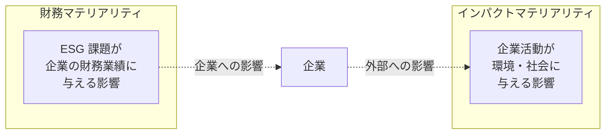

#### シングルマテリアリティ（財務マテリアリティ）

**「ESG 課題が企業の財務業績に与える影響」の 1 方向だけを重視**します。例えば、気候変動リスクが将来キャッシュフローに影響する、というような視点です。**「未財務」の発想がここに詰まっています**。ISSB IFRS S1/S2 が採用しているのはこの立場です。

#### ダブルマテリアリティ（財務＋インパクトマテリアリティ）

シングルマテリアリティに加えて、**「企業活動が環境・社会に与える影響」の逆方向も含めて**、両方向を重要性の判定基準とします。「気候変動リスクへの企業対応」に加えて「企業活動が気候変動にどう影響しているか」の両方を開示します。**EU CSRD／ESRS がこのアプローチを採用**しました。

### EU CSRD／ESRS——2024 年からの段階適用

前レッスンで触れたように、EU は独自の道を歩みました。

- **CSRD**（Corporate Sustainability Reporting Directive）：EU 域内で活動する大企業のサステナビリティ開示指令、2022 年 12 月採択
- **ESRS**（European Sustainability Reporting Standards）：具体的な報告基準、2023 年 7 月採択
- **段階適用**：
  - 2024 年会計年度から：既に NFRD（Non-Financial Reporting Directive）対象の大企業（約 12,000 社）
  - 2025 年会計年度から：大企業全般（約 50,000 社）
  - 2026 年会計年度から：上場中小企業
  - 2028 年会計年度から：EU 域外の第三国大企業

#### 日本企業への影響

**EU 域内に子会社を持ち、一定規模を超える日本企業は、CSRD の対象になります**。ダブルマテリアリティに基づく詳細な開示（ESRS のセット）を求められ、開示違反には制裁金の可能性があります。日本と EU の 2 つの制度に対応する「相互運用性」の実務が問われます。

#### 日本のダブルマテリアリティ議論

日本の SSBJ 基準は、原則として ISSB IFRS S1/S2 に準拠しシングルマテリアリティを採用しています。ただし、日本の一部の先進企業は「ダブルマテリアリティ」を任意で採用し、統合報告書・SR レポートで両方向の開示を進めています。**「ダブルマテリアリティは日本の開示の未来を先取りする視点」**——本コースの中核メッセージが指すのは、この動きです。

### マテリアリティ分析——実務の 5 ステップ

マテリアリティを実務で決めるには、以下の 5 ステップを踏むのが標準です（詳細は別コースで扱いますが、概要を把握しておきましょう）。

1. **課題の網羅的洗い出し**：GRI・SASB・ESG 格付機関の質問書などから、業種のマテリアル候補を抽出
2. **ステークホルダー・エンゲージメント**：株主・従業員・顧客・取引先・NGO 等から重要と思う課題を聴取
3. **マテリアリティ・マトリックス**：横軸「企業への影響（財務マテリアリティ）」、縦軸「社会・環境への影響（インパクトマテリアリティ）」に配置
4. **取締役会承認**：優先課題を取締役会が承認、統合報告書で公開
5. **年次見直し**：外部環境の変化に応じてマテリアリティを更新

**マテリアリティは「決めきる」ものではなく「更新するもの」**——次コースで扱う中核メッセージです。

### グリーンウォッシュ——「小さな盛り」から始まる

グリーンウォッシュ（greenwashing）は、企業が実態以上に環境配慮を装う行為です。以下の 4 つのパターンが実務ではよく見られます。

#### 1. 誇張（Overstatement）

「業界最高水準の環境配慮」を、業界内で 3 位のスコアで主張する。**「業界最高」は事実確認が甘い最頻出のパターン**です。

#### 2. 選択的開示（Cherry-picking）

Scope 1 の排出削減だけを大きく開示し、Scope 3 の排出増を触れない。**部分的な事実だけを切り取る**パターン。

#### 3. 未来目標のすり替え（Vague future goals）

「2050 年 Net Zero」を大きく打ち出す一方、中間目標（2030 年）と現状の削減率を隠す。**「遠い未来の約束」で「近い将来の実績」から目を逸らす**パターン。

#### 4. 定性表現による曖昧化（Fluff）

「サステナブルな事業を推進」「地球にやさしい製品」といった、定量的な裏付けのない表現。**格付機関の質問書では「証跡なし」で減点対象**になる。

### SDGs ウォッシュと人的資本ウォッシュ

グリーンウォッシュと同じ構造で、他領域のウォッシュも広がっています。

#### SDGs ウォッシュ

統合報告書に SDGs 17 目標のロゴを大きく貼り付け、「当社は SDGs に貢献しています」と宣言する。しかし、実際に会社の事業がどの目標にどう貢献しているかの定量的な説明がない。**「ロゴを貼るだけの SDGs」——中核メッセージの 1 つが指すのはこの姿**です。

#### 人的資本ウォッシュ

女性管理職比率だけを大きく開示し、男女賃金格差や離職率、エンゲージメント指数を隠す。あるいは、目標だけを掲げて実績の進捗が伴わない。**S 要素の主要指標がバランス良く開示されていない場合、人的資本ウォッシュのリスク**があります。

### 透明性の設計——「小さな盛り」を防ぐ

グリーンウォッシュを防ぐ最強の防御は、透明性の設計です。

#### 4 つの実務原則

- **原則 1：定量開示を先に、定性説明を後に**：数値を先に示し、それを補足する形で定性説明。逆順は「言葉で数字を隠す」パターンに近づく
- **原則 2：算定範囲を明示**：「Scope 1」なのか「Scope 1+2」なのか「Scope 1+2+3 の一部」なのか、明確に。特に Scope 3 の 15 カテゴリのうち何を含むかは重要
- **原則 3：目標と実績を並記**：目標だけ、または実績だけの開示は避ける。両方を並べて、乖離があれば理由を説明
- **原則 4：外部保証・第三者検証の活用**：主要指標について、独立監査法人・保証機関の保証を受ける

#### 実務での判断基準

「これは開示しても大丈夫か」と迷ったとき、次の質問を自問します。

- **機関投資家がこれを読んだら、どう感じるか**：誤解を招く可能性があれば、より詳細な文脈を追加
- **同業他社が同じ数字を開示していたら、当社はどう反応するか**：差別化のための「盛り」であれば、避ける
- **数字の裏付けとなる証跡を、第三者に見せられるか**：見せられない証跡なら、開示すべきでない

**透明性は「数字を出す」ことではなく「文脈と一緒に出す」ことです**。数字だけを見せて誤解を招く開示は、透明性の反対です。

### コース全体の総括——6 個の中核メッセージ

本コース全 8 レッスンを通じて、6 個の中核メッセージを繰り返してきました。最後に、実務での意思決定にどう使うかの視点で振り返ります。

1. **ESG は「非財務」ではなく「未財務」——将来キャッシュフローに繋がる**：ESG は特別な社会貢献ではなく、経営そのもの。中期経営計画の中に組み込む発想が起点
2. **格付は使いこなす道具、鵜呑みにしない**：5 社の評価軸は違う。業種内 Best-in-Class を目指し、機関投資家との対話の材料として使う
3. **統合思考なき統合報告書は、束ねただけの目次に過ぎない**：統合思考は 3〜5 年かけて組織に根づくもの。1 年目の完璧を目指さず、対話を通じて磨く
4. **ダブルマテリアリティは日本の開示の未来を先取りする視点**：EU の動きは 3〜5 年後の日本の姿。先行企業は既に採用し始めている
5. **開示は目的ではなく対話の入り口**：5 つの開示ルート、統合報告書、格付質問書——すべて対話の材料。ネット公開して終わりではない
6. **グリーンウォッシュは「小さな盛り」から始まる——透明性が最強の防御**：数字を出さず言葉で装う癖は、初期段階から矯正する。第三者検証と数字の並記が防御の柱

これら 6 個は、意思決定に迷ったときの「羅針盤」です。技術・組織・法令のいずれの局面でも、6 個のどれかに立ち返って考えることで、判断の軸がぶれません。

### 修了後の学び方——外部リソース

本コースは「投資家・開示・ガバナンス」の入門ですが、修了後にさらに深めたい方に向けて、学びの方向をお伝えします。

#### 定期的にチェックすべき情報源

- **金融庁「サステナビリティ情報開示」関連公表資料**：改正内閣府令、開示指針、実務事例集
- **SSBJ 公式サイト**：日本基準の適用状況、事例集、Q&A
- **東証「ESG 情報開示実践ハンドブック」**
- **IFRS 財団 / ISSB 公式サイト**：IFRS S1/S2 の解釈指針、教材
- **PRI 公式サイト**：署名機関の開示、集団的エンゲージメントの動向
- **経済産業省「価値協創ガイダンス」・「伊藤レポート」シリーズ**

#### 実務スキルとして深めたい領域

- **気候変動の算定・目標設定・削減施策**：別の入門コースで扱う領域。Scope 1-3、GHG プロトコル、SBTi、CBAM
- **サステナビリティ・SDGs 実務**：別の入門コースで扱う領域。GRI、IRIS+、B Corp、マテリアリティ分析
- **統合報告書執筆の実務**：日本 IR 協議会・KPMG・PwC・EY・デロイトのハンドブック
- **格付対応の詳細**：各格付機関の質問書事例、業界別のケーススタディ
- **業種特有の ESG**：業種別コースが並行して整備されています

#### コミュニティと対話の場

- **日本 IR 協議会**：年次カンファレンス、実務者交流
- **サステナビリティ日本フォーラム**
- **各種セミナー**（金融庁、東証、KPMG、PwC、EY、デロイト、Refinitiv、Bloomberg 等）
- **社内での勉強会**：本コースを社内研修として活用し、経営層・IR・サステ推進で共通言語を作る

### コース修了メッセージ

ESG 経営の入門コースをここまで進めていただきありがとうございました。本コースで学んだのは、投資家・開示・ガバナンスの「型」です。しかし、実際の ESG 経営は、業種・規模・組織文化によって形が違い、型どおりの実装で成功するとは限りません。

型を持つことの価値は、「型と実際のズレ」を認識できることです。「うちの業界では、この開示ルートをこう工夫する必要がある」「うちの規模では、格付対応をここまで絞る判断が必要だ」と判断する土台になります。本コースの 6 個の中核メッセージと、5 つの開示ルート・6 つの資本・格付 5 社・マテリアリティの型は、そのための共通言語です。

機関投資家との対話は、続きます。次の中期経営計画、次の統合報告書、次の株主総会、次の格付質問書——毎回が対話の機会です。ロゴを貼るだけの ESG ではなく、対話を通じて磨かれる ESG を、それぞれの現場で育てていってください。

### 確認クイズ

このレッスンの内容の理解度をチェックしましょう。

#### Q1. シングルマテリアリティとダブルマテリアリティの違いとして、本レッスンの内容と一致するものはどれですか？

- [x] シングルは「ESG 課題が企業の財務業績に与える影響」の 1 方向、ダブルは「企業活動が環境・社会に与える影響」の逆方向も含めて両方向を判定基準とする
- [ ] シングルは EU CSRD/ESRS、ダブルは ISSB IFRS S1/S2 で採用
- [ ] シングルは短期、ダブルは長期の重要性を判定
- [ ] シングルは定量、ダブルは定性の判定基準

> **解説**
> シングルマテリアリティは「ESG 課題が企業の財務業績に与える影響」の 1 方向、ダブルマテリアリティは「企業活動が環境・社会に与える影響」の逆方向も含めて両方向を判定基準とします。ISSB IFRS S1/S2 はシングル、EU CSRD/ESRS はダブルを採用しました。短期・長期や定量・定性の区分ではありません。

#### Q2. EU CSRD/ESRS の段階適用について、本レッスンの内容と一致するものはどれですか？

- [ ] 2020 年から全企業に一括適用
- [x] 2024 年会計年度から既に NFRD 対象の大企業（約 12,000 社）、2025 年から大企業全般、2026 年から上場中小企業、2028 年から EU 域外の第三国大企業
- [ ] 2030 年以降にすべての企業へ段階適用予定
- [ ] EU 域内企業のみで、日本企業は影響を受けない

> **解説**
> CSRD の段階適用は「2024 年会計年度から既に NFRD 対象の大企業→2025 年から大企業全般→2026 年から上場中小企業→2028 年から EU 域外の第三国大企業」の順で進みます。EU 域内に子会社を持ち一定規模を超える日本企業も対象になります。

#### Q3. グリーンウォッシュのパターンとして、本レッスンで挙げられていないものはどれですか？

- [ ] 誇張（Overstatement）：業界内で 3 位を「業界最高水準」と主張
- [ ] 選択的開示：Scope 1 の削減だけを開示し、Scope 3 の増加を触れない
- [x] 全数値の完全公開：財務指標・非財務指標の全項目を年次で開示
- [ ] 定性表現による曖昧化：「地球にやさしい製品」など数値裏付けなし

> **解説**
> グリーンウォッシュの 4 パターンは「誇張／選択的開示／未来目標のすり替え／定性表現による曖昧化」です。「全数値の完全公開」は透明性の実践であり、グリーンウォッシュのパターンではありません。

#### Q4. 透明性を設計する 4 つの実務原則として、本レッスンで挙げられていないものはどれですか？

- [ ] 定量開示を先に、定性説明を後に
- [ ] 算定範囲を明示
- [ ] 目標と実績を並記
- [x] 財務情報と非財務情報を分けて開示

> **解説**
> 透明性の 4 原則は「定量先・定性後／算定範囲明示／目標と実績並記／外部保証・第三者検証の活用」です。「財務と非財務を分けて開示」は統合思考と逆の姿勢で、本コースが批判する「目次に過ぎない統合報告書」の兆候の 1 つに近く、透明性の原則ではありません。

#### Q5. 本コースの 6 個の中核メッセージに含まれないものはどれですか？

- [ ] ESG は「非財務」ではなく「未財務」——将来キャッシュフローに繋がる
- [ ] 格付は使いこなす道具、鵜呑みにしない
- [x] ESG 検定の合格が上場企業の必須条件
- [ ] 開示は目的ではなく対話の入り口

> **解説**
> 6 個の中核メッセージは「未財務／格付は道具／統合思考／ダブルマテリアリティ／対話の入り口／小さな盛りから始まるグリーンウォッシュ」です。「ESG 検定の合格が上場企業の必須条件」は本コースの立場と反対で、本コースは資格試験対策コースとしては扱いません。

#### Q6. マテリアリティの実務での考え方として、本レッスンの内容と一致するものはどれですか？

- [ ] マテリアリティは経営陣が独自に決めきる項目で、更新は不要
- [ ] マテリアリティは会計士が算出する定量指標で、企業側の判断は含まない
- [ ] マテリアリティは格付機関が指定する項目で、企業側の裁量はない
- [x] マテリアリティは「決めきる」ものではなく「更新するもの」で、外部環境の変化に応じて年次見直しをする

> **解説**
> マテリアリティは「決めきる」ものではなく「更新するもの」——次コースで扱う中核メッセージです。ステークホルダー・エンゲージメントとマテリアリティ・マトリックスで優先度を決め、取締役会が承認し、年次で見直します。経営陣独断でも、会計士算出でも、格付機関指定でもなく、企業側の主体的な判断と対話の産物です。

本コースをここまで進めていただき、ありがとうございました。次のステップとして、気候変動の算定実務は別のカーボンニュートラル入門コースで、SDGs のフレームワーク横断は別のサステナビリティ・SDGs 実務コースで扱います。統合報告書、格付対応、機関投資家との対話は、それぞれの現場で意思決定に踏み出してください。ESG 経営は、対話と学びの継続です。次の中期経営計画で、本コースの共通言語が羅針盤となれば幸いです。

---

## 総復習テスト

これまで学んできた内容の理解度をチェックする、コース全体の総復習テストです。全 20 問、80% 以上の正解でコース修了とします。

### Q1. ESG の 3 要素として、本コースの内容と一致するものはどれですか？【レッスン1】

- [x] Environment（環境）・Social（社会）・Governance（ガバナンス）
- [ ] Environment・Society・Global
- [ ] Ethics・Sustainability・Governance
- [ ] Environment・Safety・Growth

> **解説**
> ESG は Environment（環境）、Social（社会）、Governance（ガバナンス）の 3 要素の頭文字です。3 領域は相互に絡み合い、実際の経営判断では統合して扱います。

### Q2. CSV（Creating Shared Value、共通価値の創造）の説明として、本コースの内容と一致するものはどれですか？【レッスン1】

- [ ] 国連総会で 2015 年に採択された 17 の目標
- [ ] 投資家が投資判断に E・S・G を組み込む原則
- [x] Michael E. Porter と Mark R. Kramer が 2011 年に提唱した、社会課題の解決を本業に統合する概念
- [ ] Rockefeller Foundation が 2007 年に提唱した、意図的な社会成果を狙う投資

> **解説**
> CSV は Michael E. Porter と Mark R. Kramer が 2011 年に Harvard Business Review で提唱した概念で、社会課題の解決を本業のビジネスモデルに統合する発想の転換をもたらしました。ほかは SDGs、PRI、インパクト投資の説明です。

### Q3. 「非財務」から「未財務」への発想転換の意味として、本コースの内容と一致するものはどれですか？【レッスン1】

- [ ] 財務情報は不要になり、非財務情報だけで経営判断すればよい
- [x] ESG の多くの項目は将来の PL・BS に反映されるため、事前に対話する対象として捉える
- [ ] 非財務情報は将来も財務情報にならないため、参考程度でよい
- [ ] 非財務情報は開示不要になり、企業内部の資料として扱えばよい

> **解説**
> 「未財務」は「今の PL・BS には出ていないが、将来の PL・BS に反映される項目」の意味です。ESG は将来キャッシュフローに繋がるものとして、事前に投資家と対話する対象と位置づけます。ISSB IFRS S1 も「サステナビリティ関連財務情報」という表現でこの発想を反映しています。

### Q4. PRI（責任投資原則）の説明として、本コースの内容と一致するものはどれですか？【レッスン2】

- [ ] 2015 年に日本の金融庁が制定した機関投資家向けのソフトロー
- [ ] 2020 年に東京証券取引所が制定した上場企業向けのガイドライン
- [ ] 1997 年に GRI が制定したサステナビリティ報告のフレームワーク
- [x] 2006 年 4 月に国連事務総長コフィー・アナン主導で公表された 6 原則の枠組み

> **解説**
> PRI は 2006 年 4 月、国連事務総長コフィー・アナン主導で公表され、UNEP FI と UN Global Compact の共同事務局で発足しました。金融庁のスチュワードシップ・コード、東証のコーポレートガバナンス・コード、GRI のサステナビリティ報告基準は、いずれも PRI とは別の制度です。

### Q5. 機関投資家 3 手法として、本コースの内容と一致するものはどれですか？【レッスン2】

- [x] スクリーニング／ESG インテグレーション／エンゲージメント
- [ ] 保有／貸出／償還
- [ ] マス広告／プロモーション／セールス
- [ ] 分析／予測／実行

> **解説**
> 機関投資家 3 手法は「スクリーニング（投資対象の選別）」「ESG インテグレーション（投資分析への統合）」「エンゲージメント（投資先との対話）」の 3 つです。ほかの選択肢は金融取引、マーケティング、業務プロセスの分類です。

### Q6. GPIF の 2015 年以降の動きとして、本コースの内容と一致するものはどれですか？【レッスン2】

- [ ] 2015 年 9 月に GPIF が上場を廃止した
- [x] 2015 年 9 月に GPIF が PRI に加盟し、その後 ESG 指数連動のパッシブ運用を導入した
- [ ] 2015 年 9 月に GPIF が海外運用会社を撤退させた
- [ ] 2015 年 9 月に GPIF が個人投資家向け商品を開始した

> **解説**
> GPIF は 2015 年 9 月に PRI に加盟し、2017 年 7 月に ESG 指数 3 本を採用してパッシブ運用で連動運用を開始しました。約 200 兆円の公的年金がパッシブで ESG 指数連動する事実が、日本の上場企業に機関投資家対話の必要性を制度的に押し上げました。

### Q7. IIRC と統合報告書フレームワーク公表の年として、本コースの内容と一致するものはどれですか？【レッスン3】

- [ ] IIRC 2005 年設立、統合報告書フレームワーク 2010 年公表
- [ ] IIRC 2015 年設立、統合報告書フレームワーク 2018 年公表
- [x] IIRC 2010 年 8 月設立、統合報告書フレームワーク 2013 年 12 月公表
- [ ] IIRC 2020 年設立、統合報告書フレームワーク 2023 年公表

> **解説**
> IIRC は 2010 年 8 月に発足し、統合報告書フレームワーク「The International <IR> Framework」を 2013 年 12 月に公表しました（2021 年 1 月に改訂）。

### Q8. ISSB の設立と主な動きとして、本コースの内容と一致するものはどれですか？【レッスン3】

- [ ] 2020 年設立、IFRS S1/S2 を 2022 年公表
- [ ] 2019 年設立、TCFD の役割を承継せず独自路線
- [ ] 2024 年設立、IFRS S3 を公表
- [x] 2021 年 11 月 COP26 で設立、2022 年 6 月に VRF・CDSB 吸収、2023 年 6 月に IFRS S1/S2 公表

> **解説**
> ISSB は 2021 年 11 月 COP26 で設立宣言され、2022 年 6 月に VRF・CDSB を吸収、2023 年 6 月に IFRS S1（一般要求事項）／S2（気候関連開示）を公表、2023 年 10 月に TCFD の役割を承継しました。

### Q9. IFRS S1「General Requirements for Disclosure of Sustainability-related Financial Information」の 4 本柱として、本コースの内容と一致するものはどれですか？【レッスン3】

- [x] ガバナンス／戦略／リスク管理／指標と目標
- [ ] 資産／負債／純資産／収益
- [ ] 開示／保証／再開示／フォローアップ
- [ ] マーケティング／販売／製造／R&D

> **解説**
> IFRS S1 の 4 本柱は「ガバナンス／戦略／リスク管理／指標と目標」で、TCFD 推奨事項の 4 本柱をそのまま引き継いだものです。

### Q10. 東証プライム市場再編の時期と主なサステナビリティ要件として、本コースの内容と一致するものはどれですか？【レッスン4】

- [ ] 2018 年 4 月、独立社外取締役 2 名以上、TCFD 開示は推奨のみ
- [x] 2022 年 4 月、独立社外取締役 1/3 以上、TCFD またはそれと同等の枠組みに基づく気候関連情報開示
- [ ] 2020 年 4 月、独立社外取締役 1 名以上、GRI 開示を必須化
- [ ] 2024 年 4 月、独立社外取締役 2/3 以上、CSRD/ESRS の全面適用

> **解説**
> 東証プライム市場再編は 2022 年 4 月 4 日に施行され、独立社外取締役 1/3 以上、TCFD またはそれと同等の枠組みに基づく気候関連情報開示、英文開示の推奨が導入されました。

### Q11. 改正内閣府令による有価証券報告書のサステナビリティ情報記載欄の 5 項目として、本コースの内容と一致するものはどれですか？【レッスン4】

- [ ] 資産・負債・純資産・収益・費用
- [ ] マーケティング・営業・製造・R&D・IR
- [x] ガバナンス・戦略・リスク管理・指標と目標・人的資本
- [ ] 過去・現在・将来・目標・改善策

> **解説**
> 記載欄の 5 項目は「ガバナンス／戦略／リスク管理／指標と目標／人的資本」です。IFRS S1 の 4 本柱に、日本の政策方針を反映した「人的資本」を加えた構成です。

### Q12. 日本の 5 つの開示ルートの使い分けとして、本コースの内容と一致するものはどれですか？【レッスン4】

- [ ] すべて金融庁への法定書類として提出
- [ ] 有報（東証）／CG 報告書（金融庁）／統合報告書（法定）／SR レポート（法定）／IR プレゼン（法定）
- [ ] すべて任意で、上場企業でも作成義務はない
- [x] 有報（法定）／CG 報告書（東証）／統合報告書（任意 IIRC）／SR レポート（任意 GRI）／IR プレゼン等

> **解説**
> 日本の 5 つの開示ルートは「有報（金融庁への法定）」「CG 報告書（東証への上場規則書類）」「統合報告書（任意、IIRC 基準）」「SR レポート（任意、GRI 基準）」「IR プレゼン等（任意）」です。

### Q13. コーポレートガバナンス・コードの制定と改訂の年として、本コースの内容と一致するものはどれですか？【レッスン5】

- [x] 2015 年 6 月制定、2018 年 6 月改訂、2021 年 6 月改訂
- [ ] 2010 年 6 月制定、2015 年 6 月改訂、2020 年 6 月改訂
- [ ] 2018 年 6 月制定、2021 年 6 月改訂、2024 年 6 月改訂
- [ ] 2013 年 4 月制定、2018 年 4 月改訂、2023 年 4 月改訂

> **解説**
> CG コードは 2015 年 6 月 1 日に施行され、2018 年 6 月と 2021 年 6 月に 2 回改訂されました。

### Q14. 「コンプライ・オア・エクスプレイン」の説明として、本コースの内容と一致するものはどれですか？【レッスン5】

- [ ] 遵守を強制する規制で、違反には罰金が科される
- [x] 原則を遵守する場合は遵守を宣言し、遵守しない場合はその理由を説明する仕組み
- [ ] 遵守か遵守しないかの二者択一で、理由の説明は不要
- [ ] 遵守だけを認め、遵守しない選択肢はない

> **解説**
> コンプライ・オア・エクスプレインは、原則を遵守する場合は遵守を宣言し、遵守しない場合はその理由を説明する仕組みです。「守れないなら理由を説明する」柔軟性が CG コードの特徴で、「対話の出発点」として設計されました。

### Q15. スチュワードシップ・コードの制定と改訂の年として、本コースの内容と一致するものはどれですか？【レッスン5】

- [ ] 2010 年 2 月制定、2013 年 5 月改訂、2016 年 3 月再改訂
- [ ] 2013 年 2 月制定、2016 年 5 月改訂、2019 年 3 月再改訂
- [x] 2014 年 2 月制定、2017 年 5 月改訂、2020 年 3 月再改訂
- [ ] 2015 年 2 月制定、2018 年 5 月改訂、2021 年 3 月再改訂

> **解説**
> スチュワードシップ・コードは 2014 年 2 月に金融庁が制定、2017 年 5 月と 2020 年 3 月に改訂されました。2020 年改訂で ESG 要素の考慮、運用機関のガバナンス・利益相反管理が強化されました。

### Q16. IIRC 統合報告書フレームワークの「6 つの資本」として、本コースの内容と一致するものはどれですか？【レッスン6】

- [ ] 現金・売掛金・棚卸資産・固定資産・繰延資産・投資その他資産
- [ ] マーケティング・営業・製造・R&D・IR・HR
- [ ] 日本・アジア・北米・欧州・南米・アフリカ
- [x] 財務資本・製造資本・知的資本・人的資本・社会関係資本・自然資本

> **解説**
> 6 つの資本は「財務資本（Financial）・製造資本（Manufactured）・知的資本（Intellectual）・人的資本（Human）・社会関係資本（Social & Relationship）・自然資本（Natural）」です。

### Q17. 「統合思考なき統合報告書は、束ねただけの目次に過ぎない」の意味として、本コースの内容と一致するものはどれですか？【レッスン6】

- [x] 章立てが財務と ESG で分離、6 資本のうち財務以外が定性言葉だけ、中経とサステナ戦略が別々、CEO メッセージが並列——といった兆候の統合報告書は、対話の材料として機能しない
- [ ] 統合報告書は 150 ページ以上の分量が必要で、それを下回るものは目次に過ぎない
- [ ] 統合報告書は 6 つの資本のすべてを均等にページ数を割り当てるべき
- [ ] 統合報告書は財務情報を排除し、ESG 情報だけを掲載すべき

> **解説**
> 「目次に過ぎない統合報告書」の 4 兆候は「章立ての分離／定性言葉／中経とサステナ戦略の乖離／CEO メッセージの並列」です。統合思考は「財務と非財務、時間軸、資本の相互作用、ステークホルダーの多様性」を統合する発想で、機関投資家の目にも見えます。

### Q18. Sustainalytics の説明として、本コースの内容と一致するものはどれですか？【レッスン7】

- [ ] 1969 年設立、AAA〜CCC の 7 段階評価
- [x] 1992 年設立、Morningstar が 2020 年に完全買収、ESG Risk Rating（0〜100 のリスクスコア）で評価
- [ ] 2000 年設立の NGO、気候変動・水・森林に特化
- [ ] 米国 S&P Global 傘下、DJSI の基盤

> **解説**
> Sustainalytics は 1992 年カナダで設立、2020 年に Morningstar が完全買収し、ESG Risk Rating で企業を評価します。露出度と管理の掛け合わせで、低いほど良いリスクスコアです。

### Q19. 格付機関との付き合い方の 4 原則に含まれないものはどれですか？【レッスン7】

- [ ] スコアは「対話の材料」であって「対話の目的」ではない
- [ ] 5 社すべてで最高スコアを狙わない
- [x] 格付機関のスコアを社員 KPI に組み込み、給与に連動させる
- [ ] 無料質問書には積極的に回答する

> **解説**
> 本コースで挙げた 4 原則は「スコアは対話の材料／5 社最高を狙わない／無料質問書は積極回答／格付機関との対話の窓」です。「社員 KPI・給与連動」はスコアそのものを最終目標化するリスクがあるため、原則には含まれません。

### Q20. グリーンウォッシュのパターンとして、本コースで挙げられていないものはどれですか？【レッスン8】

- [ ] 誇張（Overstatement）：業界内で 3 位を「業界最高水準」と主張
- [ ] 選択的開示：Scope 1 の削減だけを開示し、Scope 3 の増加を触れない
- [ ] 定性表現による曖昧化：「地球にやさしい製品」など数値裏付けなし
- [x] 全数値の完全公開：財務指標・非財務指標の全項目を年次で開示

> **解説**
> グリーンウォッシュの 4 パターンは「誇張／選択的開示／未来目標のすり替え／定性表現による曖昧化」です。「全数値の完全公開」は透明性の実践であり、グリーンウォッシュではありません。透明性は「数字を出す」ことではなく「文脈と一緒に出す」ことです。

お疲れさまでした。これでコース「ESG経営入門」を修了です。6 個の中核メッセージ（未財務／格付は道具／統合思考／ダブルマテリアリティ／対話の入り口／小さな盛りから始まるグリーンウォッシュ）を羅針盤に、それぞれの現場で意思決定に踏み出してください。

---

## 用語集

このコースで扱った主要な用語を、五十音順（あ行〜ら行）ののち A-Z の順で整理します。

### あ行

**有価証券報告書（ゆうかしょうけんほうこくしょ）**：金融商品取引法に基づく法定書類。上場企業が事業年度ごとに提出、虚偽記載への罰則がある。2023 年 1 月の改正内閣府令で「サステナビリティに関する考え方及び取組」の記載欄が新設され、2023 年 3 月期以降適用されている。→ レッスン 4

**インパクトマテリアリティ（いんぱくとまてりありてぃ）**：企業活動が環境・社会に与える影響を重要性の判定基準とする考え方。ダブルマテリアリティを構成する 2 方向のうち 1 つ。EU CSRD/ESRS が採用。→ レッスン 8

**インパクト投資（いんぱくととうし）**：意図的に社会的・環境的成果を生み出すことを目的とした投資。2007 年に Rockefeller Foundation 主導のイニシアチブから生まれた概念で、リターンだけでなくインパクトを測定・報告することが特徴。→ レッスン 1

**英文開示（えいぶんかいじ）**：外国機関投資家の情報アクセスを促進するため、日本語の開示を英文でも提供すること。東証プライム市場再編（2022 年 4 月）でプライム上場企業に推奨された。→ レッスン 4

**エンゲージメント（えんげーじめんと）**：機関投資家 3 手法の 1 つ。投資先企業と対話することで長期的な企業価値向上を促す活動。個別対話、議決権行使、集団的エンゲージメントの 3 形態がある。→ レッスン 2

**オクトパスモデル（おくとぱすもでる）**：IIRC 統合報告書フレームワークが提示する価値創造プロセスの視覚化。インプット→ビジネスモデル→アウトプット→アウトカムの 4 段階を示す。多くの統合報告書で採用。→ レッスン 6

### か行

**価値創造プロセス（かちそうぞうぷろせす）**：企業が 6 つの資本を投入して事業活動を行い、資本の増減を通じて価値を生み出す循環。統合報告書の中核概念で、「6 つの資本→ビジネスモデル→6 つの資本」の循環として描かれる。→ レッスン 6

**株主総会（かぶぬしそうかい）**：会社法に基づく株主の意思決定機関。取締役選任・報酬・その他議案への投票が行われ、機関投資家の議決権行使がスチュワードシップ活動の一部として実施される。→ レッスン 5

**議決権行使（ぎけつけんこうし）**：株主総会で議案に投票する行為。スチュワードシップ・コード原則 5 で「議決権行使結果の個別開示」が求められ、機関投資家の透明性が担保される。→ レッスン 5

**機関投資家（きかんとうしか）**：年金基金・生命保険・投資信託・運用会社など、大口資金を運用する投資家。ESG の主な担い手で、PRI 署名・スチュワードシップ・コード受入れ・議決権行使を通じて発行体に影響する。→ レッスン 2

**気候関連財務情報開示（きこうかんれんざいむじょうほうかいじ）**：気候変動関連リスク・機会が企業の財務業績に与える影響を開示する枠組み。TCFD 推奨事項が 2017 年に提示され、IFRS S2 が 2023 年に国際基準化。→ レッスン 3

**コフィー・アナン（こふぃー・あなん）**：第 7 代国連事務総長（1997-2006 年在任、ガーナ出身）。2006 年に PRI（責任投資原則）の公表を主導し、機関投資家に ESG 投資を呼びかけた。→ レッスン 2

**集団的エンゲージメント（しゅうだんてきえんげーじめんと）**：複数の機関投資家が連携して同じ企業に働きかけるエンゲージメントの形態。PRI Collaboration Platform や Climate Action 100+（2017 年発足）が代表例。→ レッスン 2

**コーポレートガバナンス報告書（こーぽれーとがばなんすほうこくしょ）**：東京証券取引所への上場規則書類。コーポレートガバナンス・コードの 78 原則への遵守状況をコンプライ・オア・エクスプレイン形式で開示。定時株主総会後、原則 6 月末までに提出。→ レッスン 4

**コーポレートガバナンス・コード（こーぽれーとがばなんす こーど）**：上場企業の行動指針。東京証券取引所と金融庁が共同で 2015 年 6 月 1 日に制定、2018 年 6 月・2021 年 6 月に改訂。5 つの基本原則、78 原則、コンプライ・オア・エクスプレイン。→ レッスン 5

**コンプライ・オア・エクスプレイン（こんぷらい・おあ・えくすぷれいん）**：「遵守または説明」。原則を遵守する場合は遵守を宣言し、遵守しない場合はその理由を説明する仕組み。CG コードとスチュワードシップ・コードで採用。→ レッスン 5

### さ行

**サステナビリティレポート（さすてなびりてぃれぽーと）**：任意のマルチステークホルダー向け開示書類。GRI 基準に基づくものが主流で、詳細な ESG データを提供。SR レポート、CSR 報告書とも呼ばれる。→ レッスン 4

**財務資本（ざいむしほん）**：IIRC の 6 つの資本の 1 つ。資金、株主資本、負債、キャッシュフロー。→ レッスン 6

**財務マテリアリティ（ざいむまてりありてぃ）**：ESG 課題が企業の財務業績に与える影響を重要性の判定基準とする考え方。シングルマテリアリティを構成する 1 方向で、ISSB IFRS S1/S2 が採用。→ レッスン 8

**自然資本（しぜんしほん）**：IIRC の 6 つの資本の 1 つ。自然資源（水、大気、生態系、鉱物、森林）、生物多様性。→ レッスン 6

**指名委員会・報酬委員会（しめいいいんかい・ほうしゅういいんかい）**：取締役の指名・報酬を審議する任意の委員会。コーポレートガバナンス・コード 2018 年改訂で任意設置が推奨、独立社外取締役の関与を通じて取締役会の指名・報酬機能を強化する。→ レッスン 5

**社会関係資本（しゃかいかんけいしほん）**：IIRC の 6 つの資本の 1 つ。ステークホルダーとの関係、社会的信頼、コミュニティ、ブランド信認。→ レッスン 6

**集団的エンゲージメント（しゅうだんてきえんげーじめんと・重複）**：前掲。→ レッスン 2

**統合思考（とうごうしこう）**：財務と非財務、時間軸、資本の相互作用、ステークホルダーの多様性を統合する発想。IIRC が提唱、「統合思考なき統合報告書は、束ねただけの目次に過ぎない」が本コースの中核メッセージ。→ レッスン 6

**スチュワードシップ・コード（すちゅわーどしっぷ・こーど）**：機関投資家向けのソフトロー。金融庁が 2014 年 2 月制定、2017 年 5 月・2020 年 3 月に改訂。7 つの原則で「責任ある機関投資家」の行動指針を提示。→ レッスン 5

**政策保有株（せいさくほゆうかぶ）**：事業関係の維持・強化を目的として保有する株式（純投資でないもの）。CG コード 2018 年改訂で保有意義と経済合理性の毎年検証、段階的縮減が求められている。→ レッスン 5

### た行

**ダブルマテリアリティ（だぶるまてりありてぃ）**：財務マテリアリティ（ESG が財務に与える影響）とインパクトマテリアリティ（企業活動が環境・社会に与える影響）の両方向を重要性の判定基準とする考え方。EU CSRD/ESRS が採用。→ レッスン 8

**独立社外取締役（どくりつしゃがいとりしまりやく）**：社外取締役のうち、独立性の要件（親会社・大株主・主要取引先との関係が薄い）を満たす取締役。CG コード 2021 年改訂でプライム市場は 1/3 以上が求められる。→ レッスン 5

**統合報告書（とうごうほうこくしょ）**：IIRC フレームワーク（2013 年 12 月公表）に基づく任意書類。6 つの資本と価値創造プロセスで中長期の価値創造を語る。日本の発行企業は 2024 年時点で 1,000 社超。→ レッスン 6

**東証プライム市場（とうしょうぷらいむしじょう）**：東京証券取引所の市場区分（2022 年 4 月再編）。グローバル基準のガバナンスと透明性を要求する市場で、独立社外取締役 1/3 以上、TCFD 開示、英文開示推奨などの要件がある。→ レッスン 4

### な行

**内閣府令（ないかくふれい）**：内閣総理大臣が発する命令の一種。金融庁の 2023 年 1 月の内閣府令改正で、有価証券報告書にサステナビリティ情報記載欄が新設された。→ レッスン 4

### は行

**発行体（はっこうたい）**：株式・債券を発行する企業。上場企業では ESG 対話における「被対話者」の位置づけとなり、機関投資家からのエンゲージメントを受ける。→ レッスン 1

**ビジネスモデル（びじねすもでる）**：企業が価値を生み出すための事業の仕組み。統合報告書 8 要素の 1 つで、6 つの資本のインプット・事業活動・アウトプット・アウトカムを表現する中核部分。→ レッスン 6

**非財務情報（ひざいむじょうほう）**：財務諸表に含まれない企業情報の総称。ESG 情報、人的資本、知的財産、リスク情報などを含む。本コースでは「未財務」への読み替えを推奨する。→ レッスン 1

**6 つの資本（むっつのしほん）**：IIRC が提唱する価値創造の材料。財務資本・製造資本・知的資本・人的資本・社会関係資本・自然資本の 6 つ。→ レッスン 6

### ま行

**マテリアリティ（まてりありてぃ）**：開示すべき情報を選定する重要性の判定基準。会計から派生し、ESG ではシングル／ダブルに拡張された。→ レッスン 8

**マテリアリティ・マトリックス（まてりありてぃ・まとりっくす）**：横軸に「企業への影響」、縦軸に「社会・環境への影響」を配置し、優先課題を可視化する図。マテリアリティ分析の中核成果物。→ レッスン 8

**未財務情報（みざいむじょうほう）**：将来の PL・BS に反映される情報という視点で「非財務」を読み替えた表現。ISSB IFRS S1 の「サステナビリティ関連財務情報」もこの発想を反映。→ レッスン 1

### ら行

**リスクマネジメント（りすくまねじめんと）**：企業リスクの特定・評価・対応の一連のプロセス。ESG 開示では IFRS S1・S2 の 4 本柱の 1 つとして、TCFD 由来の枠組みで扱われる。→ レッスン 3

---

### A-Z

**CDP（しーでぃーぴー）**：旧 Carbon Disclosure Project、2000 年英国設立の国際 NGO。気候変動・水セキュリティ・森林の 3 領域に特化した質問書ベースの評価を行い、A〜F の 9 段階＋Failure（未回答）でスコア化する。→ レッスン 7

**CDSB（しーでぃーえすびー）**：Climate Disclosure Standards Board。2007 年設立、気候関連情報を財務報告に組み込むフレームワーク。2022 年 6 月 ISSB に吸収された。→ レッスン 3

**COP26（こっぷにじゅうろく）**：第 26 回国連気候変動枠組条約締約国会議（2021 年 11 月、英国グラスゴー）。IFRS 財団が ISSB 設立を宣言した。→ レッスン 3

**CSR（しーえすあーる）**：Corporate Social Responsibility、企業の社会的責任。1970 年代から広く使われた概念で、ISO 26000（2010 年）で 7 中核主題に整理された。→ レッスン 1

**CSRD（しーえすあーるでぃー）**：Corporate Sustainability Reporting Directive。EU 域内で事業展開する大企業のサステナビリティ開示指令、2022 年 12 月採択、2024 年会計年度から段階適用、ダブルマテリアリティを採用。→ レッスン 3

**CSV（しーえすぶい）**：Creating Shared Value、共通価値の創造。2011 年に Michael E. Porter と Mark R. Kramer が Harvard Business Review で提唱、社会課題の解決を本業に統合する発想。→ レッスン 1

**DJSI（でぃーじぇいえすあい）**：Dow Jones Sustainability Index。1999 年設立、S&P Global が現在運営。CSA（Corporate Sustainability Assessment）質問書に回答した企業のみ選定候補になる。→ レッスン 7

**ESG（いーえすじー）**：Environment・Social・Governance の頭文字。2006 年 PRI 公表で機関投資家が投資判断に組み込むことが提唱された 3 要素。→ レッスン 1

**ESG インテグレーション（いーえすじー いんてぐれーしょん）**：機関投資家 3 手法の 1 つ。投資分析の全プロセス（バリュエーション、ポートフォリオ構築、リスク管理）に ESG 情報を組み込む手法。定性統合と定量統合の 2 段階で進化。→ レッスン 2

**ESRS（いーえすあーるえす）**：European Sustainability Reporting Standards。CSRD の具体的な報告基準、2023 年 7 月採択、ダブルマテリアリティを明確に採用。→ レッスン 3

**FSB（えふえすびー）**：Financial Stability Board、金融安定理事会。2009 年設立、G20 の金融安定を担う国際組織。TCFD の設置母体（2015 年 12 月）。→ レッスン 3

**FTSE Russell（ふぃっつぃーらっせる）**：ロンドン証券取引所グループ（LSEG）傘下の指数プロバイダー。FTSE4Good（2001 年）、FTSE Blossom Japan（2017 年、GPIF 採用）などの ESG 指数を提供。→ レッスン 7

**GPIF（じーぴーあいえふ）**：Government Pension Investment Fund、年金積立金管理運用独立行政法人。2015 年 9 月に PRI 加盟、2017 年 7 月に ESG 指数連動のパッシブ運用を開始。→ レッスン 2

**GRI（じーあーるあい）**：Global Reporting Initiative、1997 年設立。サステナビリティ全般の報告基準を策定、Universal Standards（2021 年改訂）と Sector Standards（2021 年以降）の 3 層構造。→ レッスン 3

**IASB（あいえーえすびー）**：International Accounting Standards Board、国際会計基準審議会。IFRS を策定する組織で、ISSB の姉妹組織。→ レッスン 3

**IIRC（あいあいあーるしー）**：International Integrated Reporting Council、2010 年 8 月設立。統合報告書フレームワークを 2013 年 12 月公表、2021 年 6 月に SASB と統合して VRF となる。→ レッスン 3

**IFRS 財団（あいえふあーるえすざいだん）**：International Financial Reporting Standards Foundation。IFRS を策定する非営利団体で、IASB と ISSB の 2 つの姉妹審議会を運営。→ レッスン 3

**IFRS S1（あいえふあーるえす えす いち）**：ISSB が 2023 年 6 月公表、サステナビリティ関連財務情報の一般開示基準。ガバナンス／戦略／リスク管理／指標と目標の 4 本柱（TCFD 由来）。→ レッスン 3

**IFRS S2（あいえふあーるえす えす に）**：ISSB が 2023 年 6 月公表、気候関連開示基準。IFRS S1 の 4 本柱を気候に特化した具体化。Scope 1-3 開示、シナリオ分析、内部炭素価格を求める。→ レッスン 3

**ISSB（あいえすえすびー）**：International Sustainability Standards Board、国際サステナビリティ基準審議会。2021 年 11 月 COP26 で IFRS 財団が設立、2023 年 6 月に IFRS S1/S2 を公表。→ レッスン 3

**KLD（けーえるでぃー）**：KLD Research & Analytics。1988 年米国で創業した ESG リサーチ機関、1999 年に MSCI が統合し ESG リサーチを本格化。→ レッスン 7

**MSCI（えむえすしーあい）**：Morgan Stanley Capital International、1969 年設立の指数・分析プロバイダー。1999 年に KLD Research を統合、ESG リサーチと ESG 指数（GPIF 採用の MSCI Japan ESG Select Leaders 等）を提供。→ レッスン 7

**PRI（ぴーあーるあい）**：Principles for Responsible Investment、責任投資原則。2006 年 4 月に国連事務総長コフィー・アナン主導で公表、6 つの原則で機関投資家に ESG 投資を提唱。→ レッスン 2

**RobecoSAM（ろべこさむ）**：オランダ発のサステナビリティ投資会社。SAM 部門は 2019 年に S&P Global が買収し、CSA 質問書と DJSI の運営を担っている。→ レッスン 7

**SASB（さすび）**：Sustainability Accounting Standards Board、2011 年 7 月米国で設立。業種別の投資家向け財務マテリアリティ基準。2021 年 6 月に IIRC と統合して VRF、2022 年 6 月 ISSB 傘下に。→ レッスン 3

**SDGs（えすでぃーじーず）**：Sustainable Development Goals、持続可能な開発目標。2015 年 9 月国連総会で採択された 17 目標、169 ターゲット、232 指標、2030 年目標年。→ レッスン 1

**SSBJ（えすえすびーじぇい）**：Sustainability Standards Board of Japan、サステナビリティ基準委員会。2022 年 7 月に財務会計基準機構（FASF）内で発足、2025 年 3 月に日本基準（一般開示・気候）確定。→ レッスン 3

**Sustainalytics（さすてないてぃくす）**：1992 年カナダで設立、2020 年に Morningstar が完全買収。ESG Risk Rating（0〜100 のリスクスコア、低いほど良い）で評価。→ レッスン 7

**S&P Global（えすあんどぴー・ぐろーばる）**：米国の格付・指数プロバイダー。Trucost（環境データ、2016 年買収）、RobecoSAM の SAM 部門（2019 年買収）を経て ESG 領域を強化、CSA 質問書と DJSI を運営。→ レッスン 7

**TCFD（てぃーしーえふでぃー）**：Task Force on Climate-related Financial Disclosures、気候関連財務情報開示タスクフォース。2015 年 12 月に FSB が設置、Michael Bloomberg 議長、2017 年 6 月推奨事項公表。2023 年 10 月 ISSB へ役割承継。→ レッスン 3

**Trucost（とぅるーこすと）**：環境データプロバイダー。2016 年に S&P Global が買収、Sustainable1 の一部を構成。→ レッスン 7

**VRF（ぶいあーるえふ）**：Value Reporting Foundation。2021 年 6 月に IIRC と SASB が統合して発足、2022 年 6 月に ISSB が CDSB とともに吸収。→ レッスン 3

**伊藤レポート（いとうれぽーと）**：一橋大学の伊藤邦雄氏を座長とする経済産業省プロジェクトの報告書。2014 年 8 月に「持続的成長への競争力とインセンティブ」を公表、日本企業の平均 ROE 5% を「投資家の期待水準の半分」と指摘。2022 年に「伊藤レポート 3.0（SX 版）」に更新。→ レッスン 5

**建設的な対話（けんせつてきなたいわ）**：スチュワードシップ・コード原則 4 で提示された概念。目的を持って中長期の企業価値向上に資する対話を、機関投資家と投資先企業が行う。→ レッスン 5

**グリーンウォッシュ（ぐりーんうぉっしゅ）**：企業が実態以上に環境配慮を装う行為。誇張・選択的開示・未来目標のすり替え・定性表現による曖昧化の 4 パターンが実務でよく見られる。→ レッスン 8

**責任投資（せきにんとうし）**：Responsible Investment。PRI が提唱する概念で、投資判断に ESG を組み込むこと。1990 年代の SRI（社会的責任投資）から発展し、ネガティブスクリーニングのみでなく ESG インテグレーションへ広がった。→ レッスン 2

**人的資本（じんてきしほん）**：IIRC の 6 つの資本の 1 つ。従業員のスキル、経験、動機、健康、リーダーシップ。日本では有価証券報告書のサステナビリティ情報記載欄で選択的必須項目となっている。→ レッスン 4

**人的資本ウォッシュ（じんてきしほんうぉっしゅ）**：女性管理職比率だけを大きく開示し、男女賃金格差・離職率・エンゲージメント指数を隠す、あるいは目標だけを掲げて実績の進捗が伴わないパターン。S 要素の主要指標のバランスある開示が防御策。→ レッスン 8

**製造資本（せいぞうしほん）**：IIRC の 6 つの資本の 1 つ。工場、設備、インフラ、有形固定資産。→ レッスン 6

**SDGs ウォッシュ（えすでぃーじーずうぉっしゅ）**：統合報告書に SDGs 17 目標のロゴを大きく貼り付け「当社は SDGs に貢献」と宣言する一方、事業がどの目標にどう貢献しているかの定量説明がないパターン。→ レッスン 8

**スクリーニング（すくりーにんぐ）**：機関投資家 3 手法の 1 つ。ネガティブスクリーニング（兵器・タバコ・化石燃料の除外）、ポジティブスクリーニング（Best-in-Class）、ノルム・ベース（国際規範違反の除外）の 3 種類がある。→ レッスン 2

**知的資本（ちてきしほん）**：IIRC の 6 つの資本の 1 つ。特許、ブランド、ノウハウ、ソフトウェア、組織資本。→ レッスン 6

---

## 参考資料

このコースの作成にあたり、以下の資料を参考にしました。

### 書籍

- Michael E. Porter and Mark R. Kramer "Creating Shared Value"（Harvard Business Review、2011 年 1・2 月号）
- Robert G. Eccles, Michael P. Krzus『One Report: Integrated Reporting for a Sustainable Strategy』（Wiley、2010 年）
- Jean Rogers, George Serafeim et al.『The Integrated Reporting Movement』（Wiley、2015 年）
- 北川 哲雄・佐藤 淑子ほか『サステナブル経営と資本市場』（日本経済新聞出版、2019 年）
- 川村 雅彦『ESG 投資と統合報告書』日本経済新聞出版（2021 年）
- 一般社団法人 日本 IR 協議会編『IR ハンドブック』（最新版）
- 日本語書籍：ESG 経営・統合報告書実務の 2025-2026 年前後の刊行物

### 技術記事・公式ドキュメント／論文

- Principles for Responsible Investment（PRI）"About the PRI" https://www.unpri.org/
- IIRC "The International <IR> Framework"（2013 年 12 月、2021 年 1 月改訂）https://www.integratedreporting.org/
- SASB Standards（現 ISSB 傘下） https://sasb.ifrs.org/
- ISSB IFRS S1 "General Requirements for Disclosure of Sustainability-related Financial Information"（2023 年 6 月） https://www.ifrs.org/
- ISSB IFRS S2 "Climate-related Disclosures"（2023 年 6 月） https://www.ifrs.org/
- SSBJ（サステナビリティ基準委員会）公式サイト https://www.ssb-j.jp/
- SSBJ 基準（2025 年 3 月確定版）
- 東京証券取引所「コーポレートガバナンス・コード」（2015 年 6 月制定、2018 年 6 月改訂、2021 年 6 月改訂）https://www.jpx.co.jp/
- 金融庁「『責任ある機関投資家』の諸原則《日本版スチュワードシップ・コード》」（2014 年 2 月制定、2017 年 5 月改訂、2020 年 3 月再改訂） https://www.fsa.go.jp/
- 金融庁「サステナビリティ情報開示に関する内閣府令改正」（2023 年 1 月公布）https://www.fsa.go.jp/
- 金融庁「記述情報の開示に関する原則」
- 経済産業省「価値協創ガイダンス」https://www.meti.go.jp/policy/economy/keiei_innovation/kigyoukaikei/kachi_kyoso.html
- 経済産業省「伊藤レポート 3.0（SX 版伊藤レポート）」（2022 年 8 月）
- MSCI ESG Research 公式サイト https://www.msci.com/our-solutions/esg-investing
- Sustainalytics 公式サイト https://www.sustainalytics.com/
- FTSE Russell ESG 公式サイト https://www.lseg.com/en/ftse-russell
- S&P Global Sustainable1 公式サイト https://www.spglobal.com/esg/
- CDP 公式サイト https://www.cdp.net/
- EU CSRD（Corporate Sustainability Reporting Directive、2022 年 12 月採択）
- ESRS（European Sustainability Reporting Standards、2023 年 7 月採択）

### 公的資料・組織・調査

- GPIF「ESG 投資」https://www.gpif.go.jp/investment/esg/
- 環境省「環境報告ガイドライン」https://www.env.go.jp/
- 経済産業省「サステナブルファイナンス」関連公表資料 https://www.meti.go.jp/
- 内閣官房「新しい資本主義実現会議」資料 https://www.cas.go.jp/
- WBCSD（World Business Council for Sustainable Development） https://www.wbcsd.org/
- 一般社団法人 サステナビリティ日本フォーラム
- 日本経済団体連合会「サステナブルな資本主義の確立」
- Just Capital, Statisticaほか、機関投資家サーベイ

（すべてのオンライン資料の最終閲覧日：2026 年 7 月 7 日）

---

## 利用規約・二次創作ルール・著作権

- **コース掲載元**: [スキルアップカレッジ](https://skillup.college/)
- **このコースのURL**: https://skillup.college/courses/esg-sustainability/esg-management-basics/
- **利用規約・二次創作ルール**: https://skillup.college/terms
- **著作権**: © 2026 株式会社エレファンキューブ. All rights reserved.

本コースは [スキルアップカレッジ](https://skillup.college/)（運営：株式会社エレファンキューブ）で公開されている学習コンテンツの原稿です。コース本体は上記URLでオンライン受講できます（確認クイズの即時採点、用語集の自動リンクなど、Webならではの学習体験を提供しています）。
