# カーボンニュートラル入門

GHG プロトコル・Scope 1-3・SBTi・CDP・TNFD・CBAM・GX-ETS まで——脱炭素の算定・目標設定・開示・削減施策を、2026 年 7 月時点の制度と実務で体系化

| 項目 | 内容 |
|---|---|
| カテゴリー | ESG・サステナビリティ |
| 難易度 | 中級 |
| 所要時間 | 約200分（全8レッスン） |
| 公開日 | 2026-07-07 |
| 最終更新日 | 2026-07-07 |
| コースURL | https://skillup.college/courses/esg-sustainability/carbon-neutral-basics/ |

## 対象者

環境部・生産管理・調達・エネルギー担当・DX 推進・サステナビリティ推進。GHG 算定を実務で行う方、SBTi 認定・CDP 回答・CBAM 対応の担当者、GX-ETS 移行に備える企業の管理職。

## 前提知識

エネルギー使用量（電気・ガス・燃料）の把握、基本的な事業所単位の管理会計、環境関連法令の一般用語（省エネ法・温対法）を知っている程度。

## 学習目標

- 温室効果ガスの科学とパリ協定 1.5℃目標、Net Zero と Carbon Neutral の違いを理解する
- GHG プロトコル Corporate Standard に基づく Scope 1・2・3 の算定バウンダリーを設定できる
- Scope 3 の 15 カテゴリ（上流 8・下流 7）の内訳を把握し、優先順位を決められる
- SBTi 認定プロセス、CDP 質問書 3 領域、TCFD → ISSB 承継、TNFD の役割を整理できる
- 削減施策の階層（省エネ・再エネ調達・電化・燃料転換・トランジション技術）で選択肢が組める
- カーボンプライシング（GX-ETS・EU-ETS・J-クレジット・非化石証書）に対応できる
- CBAM 2026 年 1 月本格施行と CSDDD の対応実務を組み立てられる
- 削減ロードマップと移行戦略を、中期経営計画に組み込む発想を持てる

## コース概要

カーボンニュートラルは「削減」と「オフセット」の二階建てで、優先順位を間違えると企業の意思決定は破綻します。本コースは、環境部門で 15 年、独立コンサルとして 4 年の伴走で得た「削減の設計図」の作り方を、2026 年 7 月時点の制度と実務で 8 レッスンにまとめました。GHG プロトコル・Scope 1-3・SBTi・CDP・TNFD・CBAM・GX-ETS まで、脱炭素の算定・目標設定・開示・削減施策を、環境部・生産管理・調達・エネルギー担当・DX 推進の 5 部門の意思決定に届く形で扱います。個別ベンダーの深追いや資格試験対策ではなく、次の中期経営計画で使える「移行戦略」の判断軸を持ち帰ることが本コースの目的です。

## 学習の流れ

前半 4 レッスンで「制度の骨格」を固めます。レッスン 1 で温室効果ガスの科学とパリ協定、Net Zero と Carbon Neutral の違い、レッスン 2 で GHG プロトコル Corporate Standard と Scope 1・2・3 のバウンダリー、レッスン 3 で Scope 3 の 15 カテゴリの内訳と算定実務、レッスン 4 で SBTi 認定プロセス・CDP 質問書・TCFD → ISSB 承継・TNFD を扱います。中盤のレッスン 5 で削減施策の階層（省エネ・再エネ調達・電化・トランジション技術）、レッスン 6 でカーボンプライシング（GX-ETS・EU-ETS・J-クレジット・非化石証書・Scope 2 マーケット/ロケーション）を扱います。後半のレッスン 7 で CBAM 2026 年 1 月本格施行と CSDDD、改正温対法の対応実務、レッスン 8 で削減ロードマップと移行戦略、TCFD シナリオ分析、インターナル・カーボン・プライス、修了後の学び方までを扱います。全 8 レッスン・約 200 分の構成です。

## レッスン一覧

| No. | タイトル | 概要 | 所要時間 |
|---|---|---|---|
| 1 | カーボンニュートラルとは何か——GHG の科学、パリ協定、Net Zero と Carbon Neutral | 本コースの守備範囲（GHG プロトコルに則った算定と削減施策）、温室効果ガスの科学、パリ協定 1.5℃目標と 2℃目標、IPCC AR6 の要点、Net Zero と Carbon Neutral の違い、Carbon Positive、境界明示、中核メッセージ 6 個を学ぶ | 25分 |
| 2 | GHG プロトコル Corporate Standard——6 種のガスと Scope 1・2・3 | GHG プロトコル Corporate Standard 初版 2001 年・改訂 2004 年、7 種のガス（CO₂/CH₄/N₂O/HFCs/PFCs/SF₆/NF₃）、GWP（地球温暖化係数）、Scope 1（自社直接）／Scope 2（購入電力間接）／Scope 3（サプライチェーン全体）の分類とバウンダリー設定、算定基本フローを学ぶ | 25分 |
| 3 | Scope 3 の 15 カテゴリ徹底——上流 8・下流 7 の算定実務 | Scope 3 Standard 2011 年、上流 8 カテゴリ（購入した製品・サービス、資本財、燃料・エネルギー、輸送・配送、廃棄物、出張、通勤、リース資産）、下流 7 カテゴリ（輸送・配送、加工、使用、廃棄、リース資産、フランチャイズ、投資）、算定の実務、データ収集の壁、優先順位付けの発想を学ぶ | 25分 |
| 4 | 目標設定と認定——SBTi・CDP・TCFD → ISSB・TNFD | SBTi 設立 2015 年と認定プロセス、Net Zero Standard 2021 年 10 月、目標水準（1.5℃・Well-below-2℃）、CDP 設立 2000 年と質問書 3 領域（気候変動・水セキュリティ・森林）、TCFD 2015 年 12 月設立・2017 年推奨事項・2023 年 10 月 ISSB へ役割承継、TNFD 発足 2021 年 6 月・v1.0 公表 2023 年 9 月を学ぶ | 25分 |
| 5 | 削減施策の階層——省エネ・再エネ・電化・トランジション技術 | 削減施策の階層（省エネ→再エネ調達→電化→燃料転換→トランジション技術）、RE100 2014 年 9 月設立、再エネ調達手段（オンサイト自家消費／PPA コーポレート／オフサイト／グリーン電力証書）、電化とヒートポンプ、水素・アンモニア・CCUS の位置づけを学ぶ | 25分 |
| 6 | カーボンプライシングと国内制度——GX-ETS・EU-ETS・J-クレジット・非化石証書 | GX-ETS 試行 2023/4 〜 2026/3・本格開始 2026/4、GX 経済移行債 2024 年 2 月世界初国家発行、EU-ETS の系譜と 2005 年開始、J-クレジット制度 2013 年 4 月、非化石証書 2018 年 5 月、Scope 2 マーケットベース／ロケーションベース、内部炭素価格の設計を学ぶ | 25分 |
| 7 | CBAM 2026 年 1 月本格施行と国際規制——CSDDD・改正温対法 | EU CBAM 2023 年 5 月採択・移行期間 2023 年 10 月〜2025 年 12 月・本格施行 2026 年 1 月、対象品目 6 分野（鉄鋼・アルミ・セメント・肥料・電力・水素）、輸出企業対応、CSDDD 2024 年 5 月採択と加盟国国内法制化 2026 年 7 月まで、改正温対法 2022 年 4 月、企業別排出量開示制度を学ぶ | 25分 |
| 8 | 削減ロードマップと移行戦略、修了後の学び方 | 中期経営計画への反映、TCFD シナリオ分析（1.5℃・2℃・4℃シナリオ）、投資判断のインターナル・カーボン・プライス、移行計画（Transition Plan）、生物多様性・水・自然関連リスク（TNFD 応用）、修了後の学習方向（外部リソースのみ）、コース総括を学ぶ | 25分 |

---

## レッスン1：カーボンニュートラルとは何か——GHG の科学、パリ協定、Net Zero と Carbon Neutral

（所要時間：25分）

### このレッスンで学ぶこと

- 本コースの守備範囲（GHG プロトコルに則った算定と削減施策）と、扱わない範囲を区別できる
- 温室効果ガス（GHG）の科学的基礎と、種類・特性を整理できる
- パリ協定 1.5℃／2℃目標と IPCC AR6 の要点を把握する
- Net Zero と Carbon Neutral の違いを実務で説明できる
- 削減とオフセットの二階建て構造で、優先順位を意識できる

---

カーボンニュートラルは、単なる環境対策ではありません。中期経営計画、投資判断、調達方針、製品設計、組織のガバナンス——経営そのものの再設計が本質です。本コースの背骨となるのは「カーボンニュートラルは削減とオフセットの二階建て——優先順位を間違えない」という中核メッセージです。数字を算定することではなく、削減を実行することが目的である、という視点を持ち帰ってください。

### 本コースの位置づけ——「GHG プロトコルに則った算定と削減施策」

本コースはカーボンニュートラルを「GHG プロトコルに則った算定と削減施策」の視点で扱う入門です。ESG 開示制度全般（統合報告書、コーポレートガバナンス・コード、格付機関対応）や SDGs の実装は、別の入門コースで扱います。本コースはそれらを前提として、環境部・生産管理・調達・エネルギー担当・DX 推進の 5 部門が「排出量を算定し、削減目標を立て、実行する」ための判断軸を、8 レッスンで整理します。

> **💡 ポイント**
> 本コースは「算定を覚える」ではなく「削減の設計図を描く」に軸足を置きます。個別ベンダーの排出量算定 SaaS の機能一覧や料金体系は変動が激しいため、機能概念のレベルに留めます。ツールを覚えるのではなく「どこから削減するか、何をオフセットするか」の判断軸を持ち帰ってください。

### 温室効果ガス（GHG）の科学

温室効果ガス（Greenhouse Gases、GHG）は、地球の大気中で熱を吸収・放出する気体の総称です。太陽から地球に届いた熱の一部が、大気中の GHG によって留められ、地球を居住可能な温度に保っています。**問題は「温室効果」そのものではなく、産業革命以降の GHG 濃度の急激な上昇**です。

#### 京都議定書の 6 種と NF₃

京都議定書（1997 年採択、2005 年発効）は、6 種類の GHG を規制対象としました。その後、NF₃ が第 2 約束期間から追加され、7 種類となりました。

| GHG | 主な発生源 | GWP（100 年） |
|---|---|---|
| CO₂（二酸化炭素） | 化石燃料燃焼、セメント製造 | 1 |
| CH₄（メタン） | 家畜、水田、廃棄物、天然ガス漏出 | 27〜30 |
| N₂O（一酸化二窒素） | 農業（肥料）、工業プロセス | 273 |
| HFCs（ハイドロフルオロカーボン） | 冷媒、断熱材、発泡剤 | 数百〜数千 |
| PFCs（パーフルオロカーボン） | 半導体製造、電子機器 | 数千 |
| SF₆（六フッ化硫黄） | 電力機器（絶縁ガス） | 約 23,500 |
| NF₃（三フッ化窒素） | 半導体・液晶製造 | 約 17,400 |

#### GWP（Global Warming Potential、地球温暖化係数）

GWP は、CO₂ を 1 とした際の各 GHG の温暖化能力を数値化したものです。時間軸によって GWP-100（100 年）と GWP-20（20 年）の 2 種類があり、通常は 100 年ベースを使います。**SF₆ の GWP-100 は約 23,500——1 kg の SF₆ は、23,500 kg の CO₂ に相当する温暖化能力を持ちます**。少量でも影響が大きいガスへの管理は重要です。

> **📝 補足**
> IPCC の評価報告書ごとに GWP の値は微修正されます。GHG プロトコルでは、AR6（第 6 次評価報告書）以降の GWP を使うのが標準になりつつあります。過去の AR4／AR5 の GWP を使った算定と混在すると、企業間・年度間比較に齟齬が出るため、算定基準の GWP バージョンを開示することが実務です。

### パリ協定と 1.5℃／2℃目標

パリ協定（Paris Agreement）は、2015 年 12 月に COP21 で採択、2016 年 11 月に発効しました。京都議定書に代わる、世界共通の気候変動対策の枠組みです。

#### 主な内容

- **長期目標**：世界の平均気温上昇を産業革命前と比べて 2℃より十分低く保ち、1.5℃に抑える努力を追求する
- **各国の NDC（Nationally Determined Contribution、国別貢献）**：各国が自主的に排出削減目標を設定し、5 年ごとに更新
- **すべての国が参加**：先進国だけでなく開発途上国も含む
- **透明性の枠組み**：定期的な報告と評価
- **気候変動適応、資金、技術移転**

#### 1.5℃と 2℃の違い

IPCC の「1.5℃特別報告書」（2018 年）は、1.5℃と 2℃の差が「深刻さの段階的な差」ではなく「決定的な差」であることを示しました。海面上昇、熱波、干ばつ、生物多様性の喪失は、1.5℃と 2℃で大きく異なります。以降、多くの国と企業が「1.5℃目標」を明示的にコミットするようになりました。SBTi が Net Zero Standard を 2021 年 10 月に公表したのも、1.5℃目標への企業対応を体系化する流れの中でした。

### IPCC AR6 の要点

IPCC（Intergovernmental Panel on Climate Change、気候変動に関する政府間パネル）は、世界の気候科学の権威です。1988 年に世界気象機関（WMO）と国連環境計画（UNEP）が共同で設立し、5〜7 年ごとに評価報告書を公表します。第 6 次評価報告書（AR6）は以下の順で公表されました。

- **WG1 報告書**（2021 年 8 月）：気候科学の基礎
- **WG2 報告書**（2022 年 2 月）：影響・適応・脆弱性
- **WG3 報告書**（2022 年 4 月）：気候変動の緩和策
- **統合報告書**（2023 年 3 月）

#### AR6 の主なメッセージ

- **人間活動が地球温暖化を引き起こしていることは明白**（WG1）
- **1.5℃を超えないためには、2030 年までに世界の GHG 排出量を 2019 年比で 43% 削減する必要がある**（WG3）
- **既存の技術と対策で 2030 年までの削減目標を達成できる可能性がある**（WG3）
- **気候変動と生物多様性の危機、貧困の課題は、統合して対応する必要がある**（統合報告書）

**「2030 年 43% 削減」という数字は、企業の中期経営計画のタイムラインとほぼ一致**します。2030 年目標を掲げる企業が急増した背景の 1 つです。

### Net Zero と Carbon Neutral の違い

実務で最も混同されやすいのが「Net Zero」と「Carbon Neutral」の違いです。**この 2 つは同義ではありません**。

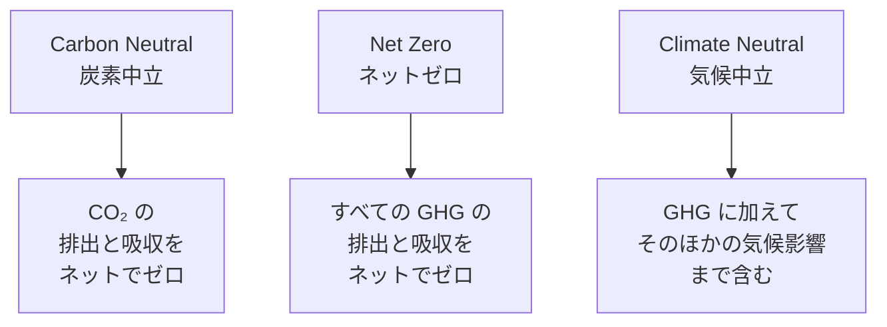

#### Carbon Neutral（炭素中立）

**CO₂ に限定した、排出と吸収のバランス**。「排出したものと同量の CO₂ を吸収する（または他所でオフセットする）」ことでゼロにする発想です。世界的な統一定義はまだ完全に整っていませんが、CO₂ を主対象とすることは共通します。

#### Net Zero（ネットゼロ）

**すべての GHG（CO₂・CH₄・N₂O・HFCs・PFCs・SF₆・NF₃）を対象**に、排出と除去のバランスをゼロにする発想。**SBTi Net Zero Standard は、原則として「削減で 90% 以上を達成し、残り 10% 未満を除去でオフセットする」ことを求めます**。オフセット依存を避け、実質削減を軸に据えるのが Net Zero の特徴です。

#### 用語の使い分け

- **企業のコミットメント**：Net Zero が国際標準
- **国のコミットメント**：日本は「2050 年カーボンニュートラル」を宣言（2020 年 10 月、菅義偉首相）、実質的には Net Zero に相当
- **製品や短期のマーケティング**：「カーボンニュートラル」を使うことが多い

**「削減とオフセットの二階建て」の原則**——本コースの中核メッセージ 1——は、Net Zero と Carbon Neutral のいずれにも共通します。**まず削減を最大限進め、削減が困難な残余排出量のみをオフセットする**。これが優先順位を間違えない考え方です。

### 削減とオフセットの二階建て構造

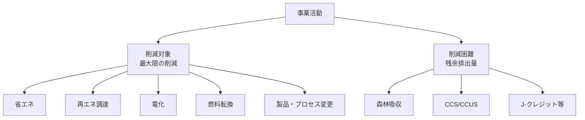

- **1 階：削減施策**（レッスン 5 で詳述）：省エネ、再エネ調達、電化、燃料転換、製品・プロセス変更
- **2 階：オフセット**（レッスン 6 で詳述）：森林吸収、CCS/CCUS、J-クレジット、国際クレジット

**1 階を軽視して 2 階に頼るとグリーンウォッシュのリスク**が高まります。SBTi や CDP は「90% 削減＋10% オフセット」型の目標を要求する方向に舵を切っており、単なる「Net Zero 宣言」だけでは投資家・顧客・格付機関から評価されない時代になっています。

### 対象読者と 5 部門

本コースは 5 部門の担当者・管理職を対象読者に据えます。

1. **環境部**：GHG 算定基盤、SBTi 認定申請、CDP 回答、TCFD 開示
2. **生産管理**：工場エネルギー管理、Scope 1 削減、電化計画
3. **調達**：Scope 3 カテゴリ 1（購入した製品・サービス）の削減、サプライヤーエンゲージメント
4. **エネルギー担当**：Scope 2 削減、再エネ調達、PPA 契約
5. **DX 推進**：算定 SaaS 選定、データ収集自動化、可視化ダッシュボード

これら 5 部門が「同じ言語」で対話できることが、CN 推進の前提です。**縦割りを超えた組織連携**が、削減目標達成の最大のカギとなります。

### 中核メッセージ 6 個——本コースの背骨

1. **カーボンニュートラルは「削減」と「オフセット」の二階建て——優先順位を間違えない**
2. **Scope 1-2 で足場を作り、Scope 3 で会社を変える**
3. **算定は目的ではなく、削減の設計図**
4. **カーボンプライシングは 3 年で企業の会計を変える**
5. **オフセットは「使う」ものであって「頼る」ものではない**
6. **CBAM は EU の話ではなく、日本の輸出企業の話**

各レッスンの冒頭・末尾で、繰り返し立ち返ります。

### まとめ

- 温室効果ガスは 7 種類（CO₂・CH₄・N₂O・HFCs・PFCs・SF₆・NF₃）、GWP で CO₂ 換算する
- パリ協定は 2015 年 12 月採択、2016 年 11 月発効、1.5℃／2℃目標
- IPCC AR6：2030 年までに 2019 年比 43% 削減が 1.5℃達成に必要
- Net Zero（全 GHG、削減 90%＋オフセット 10% 未満）と Carbon Neutral（CO₂ 中心）は同義ではない
- 削減とオフセットの二階建て構造で、1 階を軽視するとグリーンウォッシュのリスク
- 対象読者は環境・生産管理・調達・エネルギー・DX 推進の 5 部門
- 中核メッセージ 6 個で、意思決定に迷った時の羅針盤を持つ

次のレッスンでは、GHG プロトコル Corporate Standard の骨格と、Scope 1・2・3 の 3 分類とバウンダリー設定を扱います。

### 確認クイズ

このレッスンの内容の理解度をチェックしましょう。

#### Q1. 本コースの守備範囲として、正しいものはどれですか？

- [x] カーボンニュートラルを「GHG プロトコルに則った算定と削減施策」の視点で扱う
- [ ] ESG 開示制度全般（統合報告書、コーポレートガバナンス・コード、格付機関対応）を体系的に扱う
- [ ] SDGs 17 目標のフレームワーク横断（GRI、IRIS+、B Corp）を体系的に扱う
- [ ] 気候変動アドバイザーなど資格試験対策を扱う

> **解説**
> 本コースは「GHG プロトコルに則った算定と削減施策」の視点に絞ります。ESG 開示制度全般、SDGs のフレームワーク横断、資格試験対策は本コースの守備範囲外で、ESG 開示と SDGs は別の入門コースで扱います。

#### Q2. パリ協定の説明として、本レッスンの内容と一致するものはどれですか？

- [ ] 2005 年に採択、2007 年発効
- [ ] 世界の平均気温上昇を 5℃以内に抑える長期目標
- [x] 2015 年 12 月 COP21 で採択、2016 年 11 月発効、世界平均気温上昇を 2℃より十分低く 1.5℃を目指す
- [ ] 先進国のみが参加、開発途上国は対象外

> **解説**
> パリ協定は 2015 年 12 月 COP21 で採択、2016 年 11 月発効で、世界の平均気温上昇を産業革命前と比べて 2℃より十分低く保ち、1.5℃に抑える努力を追求する長期目標を掲げます。すべての国が参加する枠組みで、5℃目標ではありません。

#### Q3. Net Zero と Carbon Neutral の違いとして、本レッスンの内容と一致するものはどれですか？

- [ ] Net Zero は CO₂ 限定、Carbon Neutral は全 GHG
- [x] Net Zero は全 GHG を対象で削減 90% 以上＋オフセット 10% 未満、Carbon Neutral は CO₂ 中心の排出と吸収のバランス
- [ ] 両者は同義で、用語の違いだけ
- [ ] Net Zero はマーケティング用語、Carbon Neutral は科学用語

> **解説**
> Net Zero は全 GHG を対象に、SBTi Net Zero Standard は原則として削減で 90% 以上を達成し残り 10% 未満をオフセットする形。Carbon Neutral は CO₂ に限定した排出と吸収のバランス。両者は同義ではなく、Net Zero の方が全 GHG を厳密に対象とします。

#### Q4. IPCC AR6 の主なメッセージとして、本レッスンの内容と一致するものはどれですか？

- [ ] 気候変動は自然変動で説明可能、人間活動の影響は不明確
- [ ] 2050 年までに削減しなくても、技術革新で対応可能
- [ ] 1.5℃達成には、2050 年までの緩和策で十分
- [x] 1.5℃を超えないためには、2030 年までに世界の GHG 排出量を 2019 年比で 43% 削減する必要がある

> **解説**
> AR6 WG3 報告書（2022 年 4 月）は、1.5℃を超えないためには 2030 年までに世界の GHG 排出量を 2019 年比 43% 削減する必要があると示しました。この数字は企業の中期経営計画のタイムラインとほぼ一致し、2030 年目標を掲げる企業が急増した背景の 1 つです。人間活動が地球温暖化を引き起こしていることは明白と WG1 で結論づけられています。

#### Q5. 京都議定書の 6 種＋NF₃ の 7 種類の GHG に含まれないものはどれですか？

- [ ] CO₂（二酸化炭素）
- [ ] CH₄（メタン）
- [ ] SF₆（六フッ化硫黄）
- [x] O₃（オゾン）

> **解説**
> 京都議定書の 6 種は CO₂・CH₄・N₂O・HFCs・PFCs・SF₆ で、第 2 約束期間から NF₃ が追加され 7 種類です。O₃（オゾン）は温室効果ガスの 1 つですが、京都議定書の規制対象ではありません（オゾン層破壊の別問題として、モントリオール議定書などで扱われます）。

#### Q6. 「削減とオフセットの二階建て」の原則として、本レッスンの内容と一致するものはどれですか？

- [ ] オフセットを最大限使い、削減は最小限にする
- [ ] 削減とオフセットを同じ比率で進める
- [ ] オフセットは不要で、削減だけで達成する
- [x] まず削減を最大限進め、削減が困難な残余排出量のみをオフセットする

> **解説**
> 二階建ての原則は「まず削減を最大限進め、削減が困難な残余排出量のみをオフセットする」で、SBTi Net Zero Standard も原則として削減 90% 以上を求めています。1 階（削減）を軽視して 2 階（オフセット）に頼ると、グリーンウォッシュのリスクが高まり、投資家・顧客・格付機関から評価されません。

次のレッスンでは、GHG プロトコル Corporate Standard の骨格と、Scope 1・2・3 の 3 分類とバウンダリー設定を扱います。

---

## レッスン2：GHG プロトコル Corporate Standard——6 種のガスと Scope 1・2・3

（所要時間：25分）

### このレッスンで学ぶこと

- GHG プロトコル Corporate Standard の位置づけ（2001 年初版、2004 年改訂）を把握する
- WRI と WBCSD による策定と、国際標準化の意義を理解する
- Scope 1（自社直接）／Scope 2（購入電力間接）／Scope 3（サプライチェーン全体）の 3 分類を整理する
- バウンダリー設定の 2 段階（組織バウンダリー・オペレーショナルバウンダリー）を掴む
- 組織バウンダリー設定の 3 手法（Equity Share・Financial Control・Operational Control）を使い分けられる
- 算定基本フローの 4 ステップを把握する

---

前レッスンでは、温室効果ガスの科学、パリ協定、Net Zero と Carbon Neutral の違い、削減とオフセットの二階建てを扱いました。本レッスンからは、カーボンニュートラルの実務——「GHG プロトコル」に基づく算定の骨格に入ります。中核メッセージ「Scope 1-2 で足場を作り、Scope 3 で会社を変える」の、Scope 1-2 の入口です。

### GHG プロトコルとは——世界標準の算定基準

GHG プロトコル（GHG Protocol、Greenhouse Gas Protocol）は、企業と組織の GHG 排出量算定・報告のための世界標準基準です。**世界資源研究所（WRI、World Resources Institute）と持続可能な開発のための世界経済人会議（WBCSD、World Business Council for Sustainable Development）が共同で策定**しました。1998 年に最初のパートナーシップ発表、2001 年に初版、2004 年に改訂版が公表されました。

#### GHG プロトコルの構成基準

- **Corporate Standard**（2001 年初版、2004 年改訂）：企業の Scope 1・2 の算定・報告
- **Corporate Value Chain (Scope 3) Standard**（2011 年）：Scope 3 の 15 カテゴリ算定
- **Product Standard**（2011 年）：製品ライフサイクルの排出量算定
- **Scope 2 Guidance**（2015 年）：マーケットベース／ロケーションベース手法
- **その他**：都市、農林業、金融機関（PCAF）など複数のガイダンス

**「GHG プロトコル準拠」は事実上、企業 GHG 算定の共通言語**として機能します。SBTi、CDP、TCFD、ISSB IFRS S2 のいずれも、GHG プロトコルに準拠する形式での算定を求めます。

### Scope 1・2・3 の 3 分類——排出源の分類

GHG プロトコルの最も重要な概念が、排出源を 3 つの Scope に分ける枠組みです。

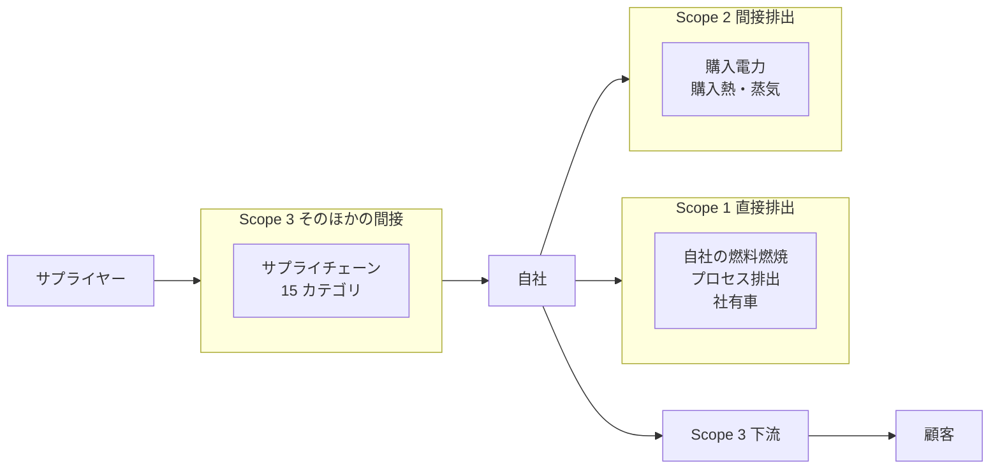

#### Scope 1（直接排出、Direct emissions）

**自社の管理下で直接排出される GHG**です。具体的には以下です。

- **固定燃焼**：工場のボイラー、加熱炉、社内発電機での燃料燃焼
- **移動燃焼**：社有車、トラック、フォークリフトの燃料燃焼
- **プロセス排出**：セメント製造時の CO₂、化学プロセスでの GHG、半導体製造でのフッ素系ガス
- **フュージティブ排出**：冷媒（HFCs）の漏出、天然ガス漏出（CH₄）

**「自社の敷地内・自社の設備で発生する排出」**と覚えるとわかりやすいです。

#### Scope 2（間接排出、Indirect emissions from purchased energy）

**購入した電力・熱・蒸気の生成時の GHG 排出**です。自社の敷地外で発生しますが、自社の活動が直接引き起こすため間接排出として分類されます。

- **購入電力**：電力会社から購入した電力
- **購入熱・蒸気**：地域熱供給からの熱、産業パーク内の共同蒸気

**マーケットベース vs ロケーションベース**という 2 手法の区別があります（レッスン 6 で詳述）。

#### Scope 3（そのほかの間接、Other indirect emissions）

**自社のバリューチェーン全体で発生する、Scope 1・2 以外のすべての GHG**です。15 のカテゴリに分類されます（レッスン 3 で詳述）。

- **上流**：購入した製品・サービス、資本財、輸送、廃棄物、通勤、出張
- **下流**：販売した製品の使用と廃棄、フランチャイズ、投資

**多くの企業で、Scope 3 が総排出量の 80% 以上**を占めます。Scope 1-2 だけを削減しても、企業全体の環境影響は大きく変わりません。「Scope 3 で会社を変える」——中核メッセージの 1 つが指すのは、この構造です。

### バウンダリー設定——「どこまでを自社とするか」

Scope 1・2・3 を算定する前に、**「どの範囲を自社の排出とみなすか」の境界（バウンダリー）を明確にする**必要があります。これには 2 段階の意思決定があります。

#### 1. 組織バウンダリー（Organizational Boundary）

**自社グループのどの子会社・関連会社を含めるか**を決めます。GHG プロトコルは 3 つの手法を提示します。

- **Equity Share Approach**：持分比率に応じて排出量を算入。連結範囲より広く、20% 保有の関連会社なら 20% を算入
- **Financial Control Approach**：財務会計の連結範囲（親会社が支配する会社）に基づく。連結子会社の 100% を算入、関連会社は算入しない
- **Operational Control Approach**：**企業が事業運営を管理する会社を 100% 算入**。連結範囲と近いが、JV（合弁事業）の扱いなどで異なる場合がある

**日本では Operational Control Approach を選ぶ企業が多い**——連結財務諸表との差異が小さく、実務が回しやすいためです。

#### 2. オペレーショナルバウンダリー（Operational Boundary）

**組織バウンダリー内の活動を Scope 1・2・3 のどれに分類するか**を決めます。多くの排出源は明確に分類できますが、以下は境界が微妙で判断を要します。

- **リース資産**：借主が Scope 1、貸主が Scope 3 カテゴリ 13。ただし業務用リース vs 財務リースで扱いが違う
- **社有車 vs レンタカー**：社有車は Scope 1、レンタカーは Scope 3 カテゴリ 6・7
- **委託加工**：委託先の Scope 1 は自社の Scope 3 カテゴリ 1

> **⚠️ 注意**
> バウンダリー設定は「算定の第一歩」であって「後から変更しにくい」構造です。**変更すると年度間比較ができなくなる**ため、初期設定を慎重に行い、変更した場合は明確に開示する必要があります。SBTi 認定申請、CDP 回答、TCFD 開示のいずれでも、バウンダリーの明示は必須です。

### 算定基本フロー——4 ステップ

GHG 算定は、以下の 4 ステップで進めます。

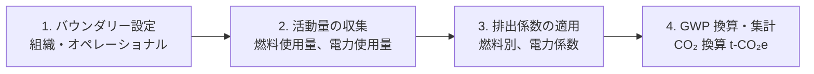

#### 1. バウンダリー設定

前述の通り、組織バウンダリーとオペレーショナルバウンダリーを決めます。

#### 2. 活動量の収集

各排出源の活動量を集めます。

- **Scope 1**：燃料使用量（L・m³・t）、社有車の走行距離・燃料消費
- **Scope 2**：購入電力量（kWh）、購入熱・蒸気（GJ）
- **Scope 3**：カテゴリごとに異なる（購入額、輸送距離、廃棄量など）

**データ収集の壁は Scope 3 で最も大きい**——次レッスンで扱います。

#### 3. 排出係数の適用

活動量に「排出係数（Emission Factor）」を掛けて、GHG 排出量に変換します。

- **燃料別排出係数**：軽油 = 2.585 kg-CO₂/L、A 重油 = 2.71 kg-CO₂/L、都市ガス = 2.24 kg-CO₂/m³（日本標準値、環境省）
- **電力係数**：日本の電力会社別、または全国平均、または再エネ電力比率反映後の残余係数
- **国別データベース**：IEA、環境省、その他各国の公表値

#### 4. GWP 換算と集計

CO₂ 以外の GHG（CH₄、N₂O、フッ素系ガス）を GWP で CO₂ 換算し、単位「t-CO₂e」（トン CO₂ 換算）で集計します。

**総排出量 = Σ（活動量 × 排出係数 × GWP）**

### 算定の実務ツール

GHG 算定を支援する SaaS・ツールは 2020 年代前半に急増しました。主要なものは次の通りですが、機能・料金は変動が激しいため、機能概念のレベルで整理します。

- **算定ソフトウェア**：組織全体の Scope 1-3 算定を管理、部門別のデータ入力・進捗管理
- **サプライヤーポータル**：サプライヤーからのデータ収集を自動化、Scope 3 カテゴリ 1 の管理
- **エネルギー管理**：工場・オフィスのエネルギー使用量をリアルタイムで可視化、Scope 1-2 削減の PDCA
- **可視化ダッシュボード**：経営層向けの目標進捗管理、TCFD 開示準備

導入時は「自社の算定成熟度と、ツールの機能水準の一致」を軸に選定します。**算定初期段階では Excel でも十分**——SaaS 導入前に業務プロセスを整えることが実務のコツです。

### 中核メッセージの再確認

- **算定は目的ではなく、削減の設計図**：バウンダリー・活動量・排出係数の設定は、削減施策を組み立てるための地図
- **Scope 1-2 で足場を作り、Scope 3 で会社を変える**：まずは Scope 1-2 で算定と削減を回し、Scope 3 に段階的に広げる

### まとめ

- GHG プロトコル Corporate Standard は 2001 年初版、2004 年改訂、WRI と WBCSD が策定
- Scope 1（直接）／Scope 2（購入電力等）／Scope 3（バリューチェーン）の 3 分類
- Scope 3 は多くの企業で総排出量の 80% 以上を占める
- 組織バウンダリー設定 3 手法：Equity Share／Financial Control／Operational Control（日本では Operational Control が主流）
- オペレーショナルバウンダリー：リース、社有車、委託加工などで判断
- 算定 4 ステップ：バウンダリー設定→活動量収集→排出係数適用→GWP 換算・集計
- 総排出量 = Σ（活動量 × 排出係数 × GWP）、単位は t-CO₂e
- ツール導入前に、算定プロセスと Excel で業務を整える

次のレッスンでは、Scope 3 の 15 カテゴリの内訳（上流 8・下流 7）と、算定の実務、優先順位付けの発想を扱います。

### 確認クイズ

このレッスンの内容の理解度をチェックしましょう。

#### Q1. GHG プロトコル Corporate Standard の策定機関として、本レッスンの内容と一致するものはどれですか？

- [x] WRI（世界資源研究所）と WBCSD（世界持続可能な開発ビジネスカウンシル）
- [ ] IPCC と UNFCCC
- [ ] ISO と OECD
- [ ] IFRS 財団と ISSB

> **解説**
> GHG プロトコル Corporate Standard は WRI（世界資源研究所）と WBCSD（持続可能な開発のための世界経済人会議）が共同で策定しました。1998 年パートナーシップ発表、2001 年初版、2004 年改訂版が公表されています。

#### Q2. Scope 1・2・3 の 3 分類として、本レッスンの内容と一致するものはどれですか？

- [ ] Scope 1 は購入電力、Scope 2 は自社燃料燃焼、Scope 3 はバリューチェーン
- [x] Scope 1 は自社直接排出（燃料燃焼・プロセス排出等）、Scope 2 は購入電力・熱・蒸気の間接排出、Scope 3 はバリューチェーン全体
- [ ] Scope 1 と Scope 2 は義務、Scope 3 は任意
- [ ] Scope 1・2・3 は排出量の大小で分類する

> **解説**
> Scope 1 は自社の管理下で直接排出される GHG（燃料燃焼、プロセス排出、社有車、フュージティブ排出）、Scope 2 は購入電力・熱・蒸気の生成時の間接排出、Scope 3 はバリューチェーン全体の 15 カテゴリ（Scope 1・2 以外）です。

#### Q3. 組織バウンダリー設定の 3 手法として、本レッスンで挙げられていないものはどれですか？

- [ ] Equity Share Approach（持分比率で算入）
- [ ] Financial Control Approach（財務会計連結範囲）
- [ ] Operational Control Approach（事業運営管理）
- [x] Geographic Distribution Approach（地理分布で算入）

> **解説**
> GHG プロトコルの 3 手法は Equity Share（持分比率）、Financial Control（財務会計連結）、Operational Control（事業運営管理）です。Geographic Distribution は挙げていない手法で、地理分布による算入は GHG プロトコルの標準手法ではありません。

#### Q4. 「日本では組織バウンダリー設定に多く採用される」手法として、本レッスンの内容と一致するものはどれですか？

- [ ] Equity Share Approach
- [ ] Financial Control Approach
- [x] Operational Control Approach
- [ ] Geographic Approach

> **解説**
> 日本では Operational Control Approach を選ぶ企業が多い、と本レッスンで説明しました。連結財務諸表との差異が小さく、実務が回しやすい理由からです。

#### Q5. 算定基本フローの 4 ステップとして、本レッスンの内容と一致するものはどれですか？

- [ ] 削減目標設定→施策実行→進捗管理→報告
- [ ] 計画→設計→実装→運用
- [x] バウンダリー設定→活動量の収集→排出係数の適用→GWP 換算・集計
- [ ] 監査→保証→開示→改善

> **解説**
> 算定基本フローは「1. バウンダリー設定（組織・オペレーショナル）→2. 活動量の収集（燃料・電力使用量など）→3. 排出係数の適用（燃料別、電力係数）→4. GWP 換算・集計（t-CO₂e）」の 4 ステップです。ほかの選択肢は削減 PDCA、開発プロセス、監査プロセスの分類です。

#### Q6. 「Scope 3 が多くの企業で総排出量に占める割合」として、本レッスンの内容と一致するものはどれですか？

- [ ] 10% 未満
- [ ] 30% 前後
- [ ] 50% 前後
- [x] 80% 以上

> **解説**
> 多くの企業で Scope 3 が総排出量の 80% 以上を占めます。特に製造・小売・金融のような業種では Scope 3 の比重が大きく、Scope 1-2 だけを削減しても企業全体の環境影響は大きく変わりません。「Scope 3 で会社を変える」——本コースの中核メッセージが指す構造です。

次のレッスンでは、Scope 3 の 15 カテゴリの内訳（上流 8・下流 7）と、算定の実務、優先順位付けの発想を扱います。

---

## レッスン3：Scope 3 の 15 カテゴリ徹底——上流 8・下流 7 の算定実務

（所要時間：25分）

### このレッスンで学ぶこと

- Scope 3 Standard（2011 年）の位置づけと 15 カテゴリの全体像を把握する
- 上流 8 カテゴリ（購入、資本財、燃料、輸送、廃棄、出張、通勤、リース資産）を整理する
- 下流 7 カテゴリ（輸送、加工、使用、廃棄、リース、フランチャイズ、投資）を整理する
- 算定の実務（一次データ vs 二次データ、支出額ベース vs 物量ベース）を捉える
- データ収集の壁と、優先順位付け（マテリアリティ）の発想を組み立てられる

---

前レッスンでは、GHG プロトコル Corporate Standard の骨格と Scope 1・2・3 の 3 分類、バウンダリー設定を扱いました。本レッスンは、多くの企業で総排出量の 80% 以上を占める Scope 3 の 15 カテゴリの詳細に踏み込みます。中核メッセージ「Scope 1-2 で足場を作り、Scope 3 で会社を変える」の、後半——「Scope 3 で会社を変える」の中身です。

### Scope 3 Standard——2011 年、GHG プロトコルの拡張

Scope 3 Standard は、WRI・WBCSD が 2011 年に公表した「Corporate Value Chain (Scope 3) Accounting and Reporting Standard」です。Scope 1・2 の Corporate Standard（2001/2004 年）の 7 年後、企業のバリューチェーン全体の GHG を体系的に算定する枠組みとして登場しました。

**Scope 3 が「15 カテゴリに分類」されたのがこの標準の中核**で、以降の SBTi、CDP、TCFD、ISSB IFRS S2 のいずれも、この 15 カテゴリを準拠して開示を求めています。

### 上流 8 カテゴリ——サプライチェーンの入口

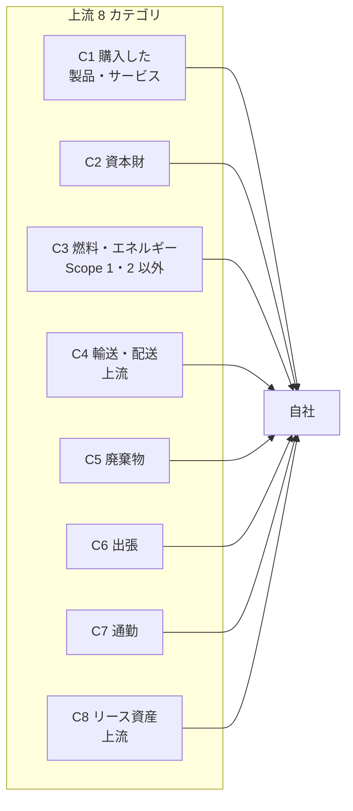

#### C1：購入した製品・サービス（Purchased goods and services）

**多くの企業で Scope 3 総排出量の最大シェア**を占めるカテゴリ。原材料、部品、コンサルティング、SaaS、水などすべての購入品が対象です。算定手法は「支出額 × 業種別排出係数（EIO-LCA）」が導入初期の定番、成熟後は「物量 × 製品カーボンフットプリント」に移行します。

#### C2：資本財（Capital goods）

工場、機械、車両、IT インフラなど、複数年にわたって使用する資産の「製造時排出」。C1 が「消費財」、C2 が「資本財」と対の関係。財務会計の資本支出（CAPEX）と対応する分類。

#### C3：燃料・エネルギー関連（Scope 1・2 以外）

Scope 1（燃料の燃焼）と Scope 2（電力の生成）に含まれない部分。**上流の燃料採掘・精製・輸送・T&D 損失などの排出**が対象。石油元売りの精製排出、電力会社の送配電損失を、燃料使用者・電力使用者が Scope 3 として算定します。

#### C4：輸送・配送（Transportation and distribution）上流

自社が発注した輸送（トラック、船、航空機、鉄道）の排出。原材料の輸入、部品の国内輸送、購入品の物流拠点間輸送などが対象。

#### C5：廃棄物（Waste generated in operations）

自社の事業活動から発生した廃棄物の処理・処分時の排出。焼却処理、埋立処分、リサイクル処理での GHG が含まれます。

#### C6：出張（Business travel）

従業員の出張時の航空機、鉄道、レンタカー、ホテル宿泊の排出。近年はホテル宿泊を Scope 3 に含む算定が広がっています。

#### C7：通勤（Employee commuting）

従業員の通勤時の交通機関・自家用車・在宅勤務時のエネルギー消費の排出。パンデミック以降、テレワーク時のエネルギー消費の扱いが議論に。

#### C8：リース資産（Upstream leased assets）

自社が借主となっているリース資産の運用時排出。上流バウンダリーで「借主が使う借り物」——組織バウンダリーで Operational Control を採る場合、C8 の位置づけが変わることに注意。

### 下流 7 カテゴリ——販売後のバリューチェーン

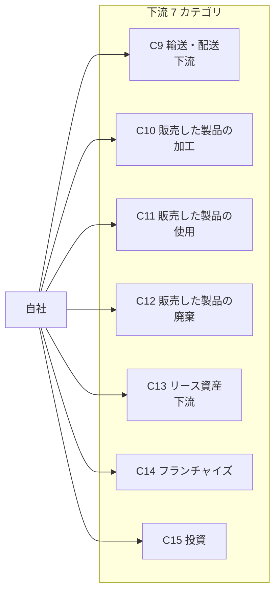

#### C9：輸送・配送（Transportation and distribution）下流

自社が発注しない、販売後の輸送。小売事業者が販売品を配送する場合、あるいは物流事業者が受発注する下流輸送。

#### C10：販売した製品の加工（Processing of sold products）

自社の中間製品を購入した B2B 顧客がさらに加工する際の排出。**素材メーカー・部品メーカーで大きい**カテゴリ。

#### C11：販売した製品の使用（Use of sold products）

顧客が自社製品を使用する際の排出。**自動車、家電、住宅、産業機器で圧倒的に大きい**カテゴリ——多くの製造業で Scope 3 総排出量の 50% 以上。例えば自動車メーカーは製造時排出より、販売した車の生涯走行時の CO₂ 排出が桁違いに大きい。

#### C12：販売した製品の廃棄（End-of-life treatment of sold products）

販売した製品の廃棄・リサイクル時の排出。C11 と対の関係で、製品ライフサイクル全体の下流。

#### C13：リース資産（Downstream leased assets）下流

自社が貸主となっているリース資産の運用時排出。不動産・機械リース事業で該当。

#### C14：フランチャイズ（Franchises）

フランチャイザー側が把握する、加盟店の運営時排出（フランチャイザー視点）。飲食・小売のフランチャイズチェーンで該当。

#### C15：投資（Investments）

投融資先の GHG 排出（金融機関視点）。**金融機関の Scope 3 の中心カテゴリ**で、PCAF（Partnership for Carbon Accounting Financials）が具体的な算定基準を提供。融資、株式投資、プロジェクトファイナンスなど。

### 算定の実務——一次データ vs 二次データ

Scope 3 算定は、以下の 2 種類のデータを使い分けます。

- **一次データ（Primary data）**：サプライヤーや顧客から直接取得した実際の排出量。精度が高いが収集コストが大きい
- **二次データ（Secondary data）**：業種別・国別の統計データベースから推計。IDEA、GHG プロトコル DB、Ecoinvent、ADEME、Sphera（旧 Thinkstep）などが提供

#### 支出額ベース vs 物量ベース

- **支出額ベース**：購入額（円）× 業種別排出係数（kg-CO₂/円）。EIO-LCA など経済統計をベースにした手法。**算定初期に手早く全体像を掴むのに有効**
- **物量ベース**：物量（t、L、kWh、km 等）× 排出係数。精度が高いが、データ収集が難しい

**「支出額ベースで着手→物量ベースへ移行→サプライヤー一次データへ移行」**が、Scope 3 算定の成熟プロセスです。

### データ収集の壁

Scope 3 算定の最大の課題は「データ収集」です。特に上流の C1（購入した製品・サービス）と下流の C11（販売した製品の使用）は、以下の壁があります。

#### C1 の壁——サプライヤーの数と精度

- 大手企業は数千〜数万のサプライヤーを持つ
- サプライヤーそれぞれの排出量を一次データで集めるのは実質不可能
- ティア 1 だけで数百のサプライヤー、ティア 2 以下は把握困難
- 対応：主要サプライヤー（購入額上位 80%）から順に、CDP Supply Chain Program などで一次データを収集

#### C11 の壁——使用時条件の設定

- 販売した製品の使用時排出は、使用条件で大きく変わる（自動車の走行距離、家電の使用時間）
- 使用地の電力係数も異なる（日本、米国、欧州、新興国）
- 対応：想定使用シナリオを明示し、業界の共通仮定に沿う

### まとめ

- Scope 3 Standard は 2011 年、WRI・WBCSD が公表、15 カテゴリで分類
- 上流 8 カテゴリ：C1 購入品・C2 資本財・C3 燃料・C4 輸送・C5 廃棄・C6 出張・C7 通勤・C8 リース
- 下流 7 カテゴリ：C9 輸送・C10 加工・C11 使用・C12 廃棄・C13 リース・C14 フランチャイズ・C15 投資
- 一次データ vs 二次データ、支出額ベース vs 物量ベースを使い分ける
- データ収集の壁：C1（サプライヤーの数）、C11（使用時条件）
- マテリアリティ・スクリーニングで 4 段階分類、大きいカテゴリから優先算定
- 15 カテゴリを完璧に埋めるより、マテリアルなカテゴリの算定と削減が実務

次のレッスンでは、目標設定と認定（SBTi、CDP、TCFD → ISSB 承継、TNFD）を扱います。SBTi 認定プロセスと CDP 質問書 3 領域が中心です。

### 確認クイズ

このレッスンの内容の理解度をチェックしましょう。

#### Q1. Scope 3 Standard の位置づけとして、本レッスンの内容と一致するものはどれですか？

- [ ] 2001 年に IPCC が公表した気候科学の報告書
- [ ] 2015 年に SBTi が公表した目標認定基準
- [ ] 2020 年に ISSB が公表した気候関連開示基準
- [x] 2011 年に WRI・WBCSD が公表した、企業のバリューチェーン全体の GHG 算定・報告基準

> **解説**
> Scope 3 Standard は 2011 年に WRI・WBCSD が公表した「Corporate Value Chain (Scope 3) Accounting and Reporting Standard」で、15 カテゴリに分類する枠組みを提示しました。IPCC、SBTi、ISSB はそれぞれ別の役割の組織です。

#### Q2. Scope 3 の上流 8 カテゴリに含まれないものはどれですか？

- [x] C11 販売した製品の使用
- [ ] C1 購入した製品・サービス
- [ ] C6 出張
- [ ] C7 通勤

> **解説**
> C11「販売した製品の使用」は下流 7 カテゴリの 1 つで、多くの製造業で Scope 3 総排出量の 50% 以上を占めることがあります。上流 8 カテゴリは C1〜C8（購入・資本財・燃料・輸送・廃棄・出張・通勤・リース）です。

#### Q3. Scope 3 の下流 7 カテゴリに含まれるものとして、本レッスンの内容と一致するものはどれですか？

- [ ] C1 購入した製品・サービス、C2 資本財、C3 燃料
- [ ] C4 輸送・配送（上流）、C5 廃棄物、C6 出張
- [x] C9 輸送・配送（下流）、C10 販売品の加工、C11 販売品の使用、C12 廃棄、C13 リース、C14 フランチャイズ、C15 投資
- [ ] C6 出張、C7 通勤、C8 上流リース

> **解説**
> 下流 7 カテゴリは C9〜C15（下流輸送・販売品の加工・販売品の使用・販売品の廃棄・下流リース・フランチャイズ・投資）です。ほかの選択肢は上流 8 カテゴリの一部です。

#### Q4. Scope 3 算定の「支出額ベース vs 物量ベース」として、本レッスンの内容と一致するものはどれですか？

- [ ] 支出額ベースの方が精度が高く、常に推奨される
- [ ] 物量ベースは算定初期の手法で、成熟後は支出額ベースに移行する
- [ ] 両者は互換で、どちらを使っても結果は同じ
- [x] 支出額ベースで着手し全体像を掴み、物量ベースへ移行して精度を上げ、最終的にサプライヤー一次データへ移行するのが成熟プロセス

> **解説**
> 「支出額ベースで着手→物量ベースへ移行→サプライヤー一次データへ移行」が Scope 3 算定の成熟プロセスです。支出額ベースは初期段階で手早く全体像を掴むのに有効、物量ベースは精度が高いがデータ収集が難しい、という使い分けです。

#### Q5. 「Scope 3 の 15 カテゴリを全部埋めようとして 6 か月遅延した話」の教訓として、本レッスンの内容と一致するものはどれですか？

- [x] 15 カテゴリすべてを完璧に算定するより、マテリアリティ・スクリーニングで大きなカテゴリから確実に算定するのが実務
- [ ] 15 カテゴリすべてを含めないと、SBTi 認定は取得できない
- [ ] マテリアルでないカテゴリでも、二次データすら不要で無視できる
- [ ] Scope 3 算定は経営陣が関与しない技術的タスクにすべき

> **解説**
> 現場メモの教訓は「15 カテゴリを完璧に埋める」ことが目的化するのを避け、マテリアリティ・スクリーニングで大きなカテゴリから確実に算定することが実務の勘所、というものです。GHG プロトコルもマテリアリティ・スクリーニングを認めており、SBTi 認定も可能です。マテリアルでないカテゴリも二次データで簡易算定して開示するのが原則です。

#### Q6. マテリアリティ・スクリーニングの 4 段階分類として、本レッスンの内容と一致するものはどれですか？

- [ ] 短期／中期／長期／永続
- [x] 大きい（5% 以上、一次データ収集）／中程度（1〜5%、二次データで算定）／小さい（1% 未満、簡易算定）／該当なしまたは重要性低
- [ ] 環境／社会／ガバナンス／その他
- [ ] 削減／オフセット／中和／補償

> **解説**
> 本レッスンで示した 4 段階分類は「大きい（総 Scope 3 の 5% 以上、一次データ収集）／中程度（1〜5%、二次データ）／小さい（1% 未満、簡易算定）／該当なしまたは重要性低（開示で明示）」です。ほかの選択肢は時間軸、ESG 3 要素、削減施策の分類です。

次のレッスンでは、目標設定と認定を扱います。SBTi 設立 2015 年と認定プロセス、Net Zero Standard 2021 年 10 月、CDP 質問書 3 領域、TCFD → ISSB 承継、TNFD フレームワーク v1.0 を追います。

---

## レッスン4：目標設定と認定——SBTi・CDP・TCFD → ISSB・TNFD

（所要時間：25分）

### このレッスンで学ぶこと

- SBTi 設立 2015 年と 4 機関共同運営（CDP・UN Global Compact・WRI・WWF）を把握する
- SBTi 認定プロセスと目標水準（1.5℃・Well-below-2℃）を整理する
- Net Zero Standard 2021 年 10 月の要点を掴む
- CDP 質問書 3 領域（気候変動・水セキュリティ・森林）と評価軸を把握する
- TCFD 2015 年 12 月設立、2017 年推奨事項、2023 年 10 月 ISSB へ役割承継の系譜を追う
- TNFD 発足 2021 年 6 月、v1.0 公表 2023 年 9 月と気候関連との相互関係を理解する

---

前レッスンでは、Scope 3 の 15 カテゴリの内訳と算定の実務を扱いました。本レッスンでは、算定した排出量から「目標を立て、開示し、認定を受ける」ステップを扱います。SBTi、CDP、TCFD → ISSB、TNFD——4 つの枠組みが軸です。

### SBTi——2015 年、4 機関共同の科学ベース目標

SBTi（Science Based Targets initiative、科学に基づく目標イニシアチブ）は、2015 年に**CDP、UN Global Compact、WRI（世界資源研究所）、WWF（世界自然保護基金）の 4 機関が共同で設立**しました。「パリ協定の 1.5℃／2℃目標に整合する GHG 削減目標を、企業が科学的に設定・認定する」枠組みです。

#### 認定企業数の推移

- **2015 年設立時**：数社
- **2020 年**：1,000 社超
- **2024 年**：5,000 社超が SBTi 認定を取得または目標コミット

#### 目標水準

SBTi は 2 つの目標水準を提示しています。

- **1.5℃目標**：世界平均気温上昇を 1.5℃以内に抑える経路と整合。年 4.2% 以上の削減率
- **Well-below-2℃ 目標**：2℃を十分下回る経路と整合。年 2.5% 以上の削減率

**2019 年以降、SBTi は 1.5℃を基本水準として推奨**、2022 年からは新規申請は 1.5℃のみが受理される方向に舵を切りました。

### SBTi 認定プロセス——4 ステップ

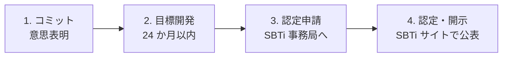

#### 1. コミット

「今後 24 か月以内に SBTi 認定目標を設定する」意思表明を SBTi 事務局に提出。SBTi の公式サイトの「Committed」欄に掲載されます。

#### 2. 目標開発

Corporate Manual に沿って、Scope 1・2・3 の削減目標を設定します。近年年 4.2% 以上の削減目標に加え、以下も要素として組み込みます。

- **Scope 1・2 目標**：絶対排出量の削減率
- **Scope 3 目標**：カテゴリ別の絶対排出量削減、または売上高原単位削減
- **Net Zero 目標**：2050 年までの Net Zero、および中間目標

#### 3. 認定申請

目標が SBTi 基準に整合するかを SBTi 事務局が審査。**審査期間は 6 か月前後**が目安。有償の Target Validation Fee（規模別）が必要。

#### 4. 認定・開示

認定された企業は SBTi サイトで公表され、格付機関・機関投資家・顧客への強いシグナルとなります。**「SBTi 認定を持つ」ことは、企業間の入札・調達で加点対象**になる時代です。

### Net Zero Standard——2021 年 10 月

SBTi は 2021 年 10 月に「SBTi Net Zero Standard」を公表しました。従来の中期削減目標（2030 年など）に加え、**2050 年までの Net Zero 達成の枠組みを体系化**したものです。

#### 主な要件

- **短期目標**（2030 年など）：SBTi 認定の削減目標
- **長期目標**（2050 年、または 2050 年以前）：Scope 1・2・3 で 90% 以上の削減
- **残り 10% 未満**：CO₂ 除去（DAC、森林、CCS/CCUS など）で相殺
- **Carbon Credits の使用制限**：主目標に対しては使用不可（beyond value chain mitigation は別途評価）

**「削減 90% 以上」が Net Zero Standard の核**。オフセット依存を避け、実質削減を軸に据える立場です。

### CDP——2000 年、質問書 3 領域

CDP は 2000 年に英国で設立された国際 NGO で、旧称「Carbon Disclosure Project」（現在は CDP のまま）。**機関投資家グループの依頼を受けて、企業に質問書を送付し、回答を収集・スコア化**する仕組みです。

#### 3 領域の質問書

- **気候変動（Climate Change）**：Scope 1・2・3、目標、リスク・機会、TCFD 準拠開示
- **水セキュリティ（Water Security）**：水使用量、水関連リスク、水管理施策
- **森林（Forests）**：森林リスク・コモディティ（大豆・パーム油・木材・畜牛など）の調達

#### スコアリング

各質問書は「A・A-・B・B-・C・C-・D・D-・F」の 9 段階＋Failure（未回答）でスコア化。**トップスコア（A）取得企業は「A List」として公表**され、機関投資家・格付機関からの評価に大きく影響します。

#### CDP Supply Chain Program

CDP は購買企業からの依頼で、そのサプライヤーに質問書を送付する「Supply Chain Program」も運営。**Scope 3 カテゴリ 1（購入した製品・サービス）のサプライヤーエンゲージメントで、事実上の標準ツール**として機能。

### TCFD——2015 年 12 月、2023 年 10 月 ISSB へ承継

TCFD（Task Force on Climate-related Financial Disclosures、気候関連財務情報開示タスクフォース）は、2015 年 12 月に**金融安定理事会（FSB）が設置**し、Michael Bloomberg 氏が議長を務めました。

#### 主な動き

- **2015 年 12 月**：FSB により設置
- **2017 年 6 月**：Final Recommendations 公表、4 本柱の枠組み
- **2019 年**：日本の TCFD Consortium 発足、賛同企業 300 社超
- **2021 年 10 月**：Guidance for All Sectors 更新
- **2023 年 10 月**：FSB が「TCFD の役割は ISSB IFRS S2 に承継された」と正式発表

#### 4 本柱（TCFD Recommendations の枠組み）

- **ガバナンス**：気候関連リスクと機会の監督体制
- **戦略**：気候関連リスク・機会が事業戦略・財務計画に与える影響
- **リスク管理**：気候関連リスクの特定・評価・管理プロセス
- **指標と目標**：GHG 排出量、目標、進捗

**この 4 本柱は、そのまま ISSB IFRS S2 の枠組みに引き継がれました**。TCFD の情報体系は「ISSB の中に生きている」と理解するのが 2026 年 7 月時点の実務です。

### TNFD——2021 年 6 月、自然関連財務情報開示

TNFD（Taskforce on Nature-related Financial Disclosures、自然関連財務情報開示タスクフォース）は、TCFD の姉妹的な枠組みとして 2021 年 6 月に発足しました。「気候変動の TCFD」に対する「自然・生物多様性の TNFD」です。

#### 主な動き

- **2021 年 6 月**：発足宣言
- **2023 年 9 月**：TNFD Framework v1.0 公表
- **2024 年〜**：早期採用企業の開示が広がる

#### LEAP アプローチ

TNFD のフレームワークの中核が「LEAP アプローチ」——Locate（自然への依存・影響の場所を特定）、Evaluate（依存・影響を評価）、Assess（リスク・機会を評価）、Prepare（開示準備）の 4 ステップ。

#### 気候関連との相互関係

TCFD と TNFD は「気候」と「自然・生物多様性」で対の関係にありますが、**多くの企業では気候関連リスクと自然関連リスクが絡み合う**（例：森林伐採が気候にも生物多様性にも影響）。統合開示の動きが広がりつつあります。

### 4 つの枠組みの相互関係

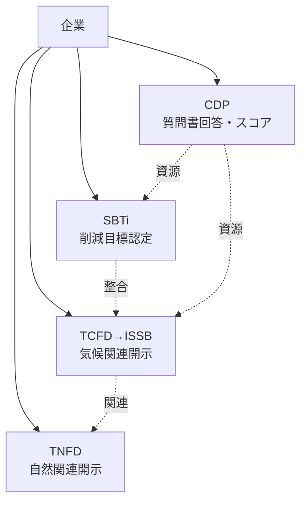

- **SBTi**：目標認定、ほかの枠組みの「削減目標」を提供
- **CDP**：質問書回答、ほかの枠組みの「データ収集の場」
- **TCFD → ISSB**：気候関連開示のフレームワーク、財務情報との統合
- **TNFD**：自然関連開示のフレームワーク、TCFD の姉妹

**4 つの枠組みはバラバラではなく、相互補完的**——1 つの企業活動が 4 枠組みで異なる形で開示されるのが実務です。

### 中核メッセージの再確認

- **算定は目的ではなく、削減の設計図**：SBTi 認定を取ることが目的ではなく、認定目標に沿って削減施策を実行することが目的
- **オフセットは「使う」ものであって「頼る」ものではない**：SBTi Net Zero Standard の 90% 削減＋10% 未満オフセットの原則が、この発想を制度化

### まとめ

- SBTi は 2015 年、CDP・UN Global Compact・WRI・WWF の 4 機関共同で設立
- 2024 年時点で 5,000 社超が SBTi 認定を取得または目標コミット
- SBTi 認定プロセス 4 ステップ：コミット→目標開発→認定申請→認定・開示
- Net Zero Standard（2021 年 10 月）：削減 90% 以上＋残り 10% 未満オフセット
- CDP は 2000 年設立の国際 NGO、質問書 3 領域（気候変動・水セキュリティ・森林）、A〜F の 9 段階
- CDP Supply Chain Program は Scope 3 カテゴリ 1 の標準ツール
- TCFD は 2015 年 12 月 FSB 設置、2017 年推奨事項、2023 年 10 月 ISSB へ役割承継
- TCFD 4 本柱：ガバナンス／戦略／リスク管理／指標と目標
- TNFD は 2021 年 6 月発足、2023 年 9 月 v1.0 公表、LEAP アプローチ
- 4 つの枠組みは相互補完的、統合的な開示が広がる

次のレッスンでは、削減施策の階層——省エネ、再エネ調達、電化、燃料転換、水素・アンモニア・CCUS のトランジション技術を扱います。

### 確認クイズ

このレッスンの内容の理解度をチェックしましょう。

#### Q1. SBTi の設立と共同運営機関として、本レッスンの内容と一致するものはどれですか？

- [x] 2015 年に CDP・UN Global Compact・WRI・WWF の 4 機関共同で設立
- [ ] 2000 年に IPCC が単独で設立
- [ ] 2011 年に GHG プロトコルが設立
- [ ] 2020 年に IFRS 財団が設立

> **解説**
> SBTi は 2015 年に CDP、UN Global Compact、WRI（世界資源研究所）、WWF（世界自然保護基金）の 4 機関共同で設立されました。IPCC は気候科学の権威、GHG プロトコルは算定基準、IFRS 財団は財務基準策定機関で、SBTi 設立機関ではありません。

#### Q2. SBTi の目標水準として、本レッスンの内容と一致するものはどれですか？

- [ ] 3℃目標と 4℃目標
- [x] 1.5℃目標（年 4.2% 以上の削減率）と Well-below-2℃ 目標（年 2.5% 以上）、2019 年以降 1.5℃を基本水準
- [ ] 5℃目標のみで、以降は変更されない
- [ ] 目標水準は企業が自由に設定できる

> **解説**
> SBTi は 1.5℃目標（年 4.2% 以上）と Well-below-2℃ 目標（年 2.5% 以上）の 2 水準を提示し、2019 年以降 1.5℃を基本水準として推奨、2022 年からは新規申請は 1.5℃のみが受理される方向に舵を切りました。

#### Q3. SBTi Net Zero Standard の主な要件として、本レッスンの内容と一致するものはどれですか？

- [ ] 削減 50% 以上、オフセット 50% 未満
- [ ] 削減 70% 以上、オフセット 30% 未満
- [x] Scope 1・2・3 で 90% 以上の削減、残り 10% 未満を CO₂ 除去で相殺
- [ ] 削減比率の設定なし、オフセット全面依存も可

> **解説**
> Net Zero Standard の核は「削減 90% 以上」で、残り 10% 未満のみを CO₂ 除去（DAC、森林、CCS/CCUS）で相殺する形です。オフセット依存を避け、実質削減を軸に据える立場で、Carbon Credits の主目標への使用は制限されます。

#### Q4. CDP 質問書の 3 領域として、本レッスンの内容と一致するものはどれですか？

- [ ] E・S・G の 3 領域
- [ ] Scope 1・Scope 2・Scope 3 の 3 領域
- [ ] 過去・現在・将来の 3 期間
- [x] 気候変動（Climate Change）・水セキュリティ（Water Security）・森林（Forests）

> **解説**
> CDP 質問書の 3 領域は「気候変動・水セキュリティ・森林」で、それぞれ A〜F の 9 段階＋Failure でスコア化されます。E・S・G、Scope 1・2・3、期間の分類ではありません。

#### Q5. TCFD の設立時期と ISSB への役割承継の年として、本レッスンの内容と一致するものはどれですか？

- [ ] 2010 年設立、2015 年 ISSB 承継
- [x] 2015 年 12 月に金融安定理事会（FSB）が設置、2017 年 6 月に推奨事項公表、2023 年 10 月 FSB が「ISSB IFRS S2 に承継」を正式発表
- [ ] 2020 年設立、2022 年 ISSB 承継
- [ ] 設立以来、承継せず独自運営を続けている

> **解説**
> TCFD は 2015 年 12 月に FSB が設置、Michael Bloomberg 議長で 2017 年 6 月に Final Recommendations 公表、2023 年 10 月に FSB が「TCFD の役割は ISSB IFRS S2 に承継された」と正式発表しました。4 本柱の枠組みは ISSB IFRS S2 の枠組みにそのまま引き継がれています。

#### Q6. TNFD の LEAP アプローチとして、本レッスンの内容と一致するものはどれですか？

- [ ] Locate・Estimate・Assess・Publish の 4 ステップ
- [ ] Learn・Execute・Approve・Prepare の 4 ステップ
- [ ] Legislate・Enforce・Adopt・Publish の 4 ステップ
- [x] Locate（自然への依存・影響の場所を特定）・Evaluate（依存・影響を評価）・Assess（リスク・機会を評価）・Prepare（開示準備）の 4 ステップ

> **解説**
> TNFD の LEAP アプローチは「Locate（場所の特定）→Evaluate（依存・影響の評価）→Assess（リスク・機会の評価）→Prepare（開示準備）」の 4 ステップです。ほかの選択肢は各段の名称を取り違えています。

次のレッスンでは、削減施策の階層——省エネ、再エネ調達、電化、燃料転換、水素・アンモニア・CCUS のトランジション技術を扱います。

---

## レッスン5：削減施策の階層——省エネ・再エネ・電化・トランジション技術

（所要時間：25分）

### このレッスンで学ぶこと

- 削減施策の 5 段階の階層（省エネ→再エネ調達→電化→燃料転換→トランジション技術）を把握する
- 省エネの基本手法と、追跡指標（原単位・エネルギー効率）を捉える
- RE100（2014 年 9 月設立）と再エネ調達の 4 手段を整理する
- 電化とヒートポンプの適用領域を理解する
- 水素・アンモニア・CCUS の位置づけと、実用化タイムラインを把握する

---

前レッスンでは、SBTi・CDP・TCFD → ISSB・TNFD の 4 つの枠組みを扱いました。本レッスンでは、目標を達成するための具体的な「削減施策」を扱います。中核メッセージ「カーボンニュートラルは削減とオフセットの二階建て——優先順位を間違えない」の、1 階の中身です。

### 削減施策の 5 段階の階層

削減施策は、以下の 5 段階の階層で優先順位を付けます。**上の段階が達成できる範囲では、下の段階に降りない**——これが「優先順位」の意味です。

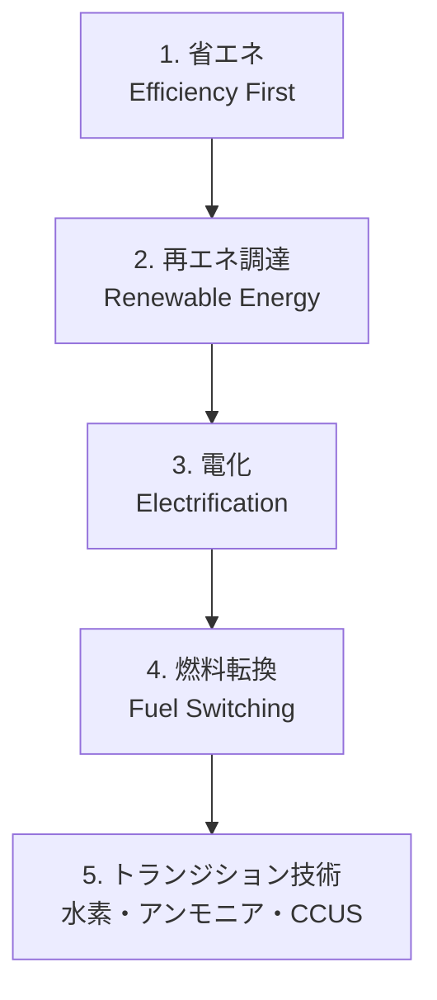

- **1 段階：省エネ**——エネルギー消費量そのものを減らす、最も費用対効果が高い
- **2 段階：再エネ調達**——使用する電力を再エネに切り替える
- **3 段階：電化**——燃料燃焼設備を電気設備に置き換え、再エネで動かす
- **4 段階：燃料転換**——電化困難な設備で、化石燃料から低炭素燃料に切り替える
- **5 段階：トランジション技術**——水素・アンモニア・CCUS など、革新的技術で残余排出を削減

**「Efficiency First（省エネ優先）」**——多くの脱炭素シナリオが強調する原則です。エネルギー使用量そのものを減らせば、再エネ調達もオフセットも少なくて済みます。

### 1 段階：省エネの基本手法

省エネの手法は業種・設備で幅広いですが、共通する原則は次の 3 つです。

#### 3 つの基本

- **見える化**：エネルギー使用量を計測・可視化。電力・ガス・熱を系統別・時間帯別に見える化することで、無駄が特定される
- **運用改善**：適切な設備設定、負荷平準化、待機電力削減、断熱、換気の最適化——投資なしで実現できる
- **設備投資**：高効率設備への更新（LED 照明、インバータ制御、高効率変圧器、コージェネレーション、断熱材など）

#### 追跡指標

- **原単位**：生産量・売上高・従業員数に対するエネルギー使用量。省エネ法でも報告が求められる
- **エネルギー効率**：ボイラー効率、モータ効率、空調 COP、電力の力率
- **エネルギー使用量絶対値**：業種横断で比較しやすい

**省エネは 2〜5 年の投資回収期間で採算が取れる施策**が多く、CN の初期段階で確実に成果が出せる領域です。

### 2 段階：再エネ調達の 4 手段と RE100

#### RE100——2014 年 9 月設立

RE100（Renewable Energy 100%）は、2014 年 9 月に **The Climate Group と CDP** が共同で立ち上げた企業イニシアチブで、参加企業は「事業運営で使用する電力を 100% 再エネにする」ことをコミット。日本企業も 100 社超が加盟しています（2024 年時点）。

#### 再エネ調達の 4 手段

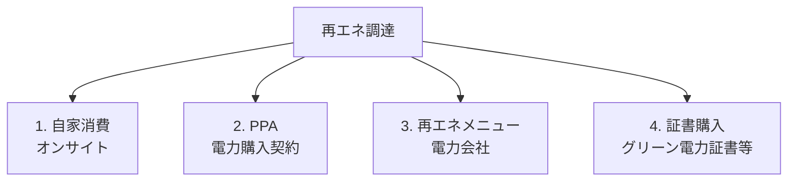

#### 1. オンサイト自家消費（Self-generation）

工場・オフィスの屋根に太陽光パネルを設置し、発電した電力を自社で使用する形。**追加性（Additionality）が最も高い**——新規の再エネ発電が生まれる。ただし発電規模は敷地面積に制約される。

#### 2. PPA（Power Purchase Agreement、電力購入契約）

再エネ発電事業者と長期契約を結び、発電された電力を購入する契約。**フィジカル PPA**（自社で電力を受電）と **バーチャル PPA**（電力は市場に流し、価格差を精算）の 2 種類。オンサイト PPA、オフサイト PPA も並行。**大規模な追加性を確保**でき、企業の CN の中核手段になりつつある。

#### 3. 電力会社の再エネメニュー

電力会社が提供する「非化石証書付きの再エネ電力メニュー」を購入する形。**手軽だが、追加性は限定的**——既存の再エネ発電の帰属を移す形が多い。

#### 4. 証書購入

グリーン電力証書、J-クレジット、非化石証書などを別途購入して、Scope 2 の排出量を相殺する形。**最も導入が軽いが、追加性は最も低い**——マーケットベース算定でのみ有効。

**「追加性の高い手段から優先する」**が実務の原則。RE100 も追加性を評価軸に含めており、証書購入だけで達成する形は近年風向きが厳しくなっています。

### 3 段階：電化とヒートポンプ

電化（Electrification）は、燃料燃焼設備を電気設備に置き換える施策です。**再エネ電力と組み合わせることで、Scope 1 排出量を Scope 2 に移し、さらに再エネ化で削減**する 2 段構えの効果があります。

#### 電化の主な対象

- **産業ヒート**：低〜中温領域（〜200℃）はヒートポンプで置換可能
- **オフィス空調・給湯**：ヒートポンプが主流
- **社有車**：EV への移行
- **フォークリフト**：バッテリー式が急増
- **調理機器・厨房**：IH クッキングヒーターへ

#### ヒートポンプの効率

ヒートポンプは「COP（Coefficient of Performance）」で効率を測ります。**電気 1 kWh の入力で、熱を 3〜5 kWh 汲み上げる**——空冷式で 3〜4、水冷式で 4〜6、地中熱で 5〜7 が典型。従来のボイラー効率（80〜90%）と比べて、圧倒的に効率が高い。

### 4 段階：燃料転換

高温プロセス（例：セメント製造の 1,450℃、鉄鋼の高炉の 1,500℃）や、電化が技術的に困難な用途では、燃料転換が現実的な選択肢になります。

- **石炭→天然ガス**：GHG 排出は約 40% 削減。既存インフラの活用で即効性はあるが、天然ガス自体も化石燃料
- **化石燃料→バイオマス**：バイオマス発電、バイオ燃料。ただしバイオマスの持続可能性（森林、耕地との競合）の議論あり
- **化石燃料→水素・アンモニア**：後述の 5 段階へ

### 5 段階：トランジション技術

削減が困難な残余排出量に対しては、革新的技術（トランジション技術）の適用が期待されます。**2026 年 7 月時点で商用化が本格化していない技術**が中心で、投資判断は慎重に行うべき領域です。

#### 主なトランジション技術

- **水素**：燃料電池、水素還元製鉄、化学プロセスでの利用。グリーン水素（再エネ電力の水電解）が理想だが、コストが課題
- **アンモニア**：燃料としての利用（アンモニア混焼発電、船舶燃料）。日本の重工業で研究が活発
- **CCUS**（Carbon Capture, Utilization and Storage）：CO₂ を排出源で回収し、貯留（S）または利用（U）する技術。セメント・鉄鋼・化学プラントで検討
- **DAC**（Direct Air Capture）：大気中の CO₂ を直接回収する技術。極めて高コストだが、Net Zero の残余排出対応で注目
- **合成燃料（e-Fuel）**：CO₂ と水素から合成する液体燃料。航空機・船舶用途で期待
- **SAF**（Sustainable Aviation Fuel、持続可能な航空燃料）：バイオベース、e-Fuel ベース

#### タイムラインと投資判断

- **2020 年代後半**：SAF、e-Fuel の初期商用化、水素の産業利用の実証
- **2030 年代**：水素還元製鉄の商用化、CCUS の本格導入
- **2040 年代**：DAC の大規模展開、水素のインフラ整備

**「今すぐ削減できる 1〜3 段階を最大限進めながら、5 段階の技術投資判断を並行する」**——これが実務のバランスです。

### 5 段階の優先順位——業界別の実務

業界によって、削減階層の優先順位は異なります。

- **オフィス・IT 中心**：省エネ→再エネ調達で 80% 以上が達成可能
- **軽工業**：省エネ→再エネ調達→電化（ヒートポンプ）で 60〜70% 達成
- **重工業（鉄鋼・化学・セメント）**：省エネと再エネ調達だけでは限界、燃料転換とトランジション技術が中核
- **物流・輸送**：EV 化、SAF、e-Fuel が主戦場
- **農林水産**：土壌炭素、家畜メタン、フードシステム全体の変革

### 中核メッセージの再確認

- **カーボンニュートラルは「削減」と「オフセット」の二階建て——優先順位を間違えない**：本レッスンの 5 段階は、削減側の内部での優先順位
- **算定は目的ではなく、削減の設計図**：算定した Scope 1・2・3 の内訳から、5 段階のどこにどれだけ投資するかの判断が生まれる

### まとめ

- 削減施策の 5 段階：省エネ→再エネ調達→電化→燃料転換→トランジション技術
- 省エネの 3 原則：見える化・運用改善・設備投資
- 再エネ調達の 4 手段：オンサイト自家消費・PPA・電力会社メニュー・証書購入、追加性が高い順に優先
- RE100 は 2014 年 9 月、The Climate Group と CDP が設立、100% 再エネ電力のコミット
- 電化：ヒートポンプ（COP 3〜7）で燃料燃焼を電気に置換、再エネと組み合わせて 2 段構え
- 燃料転換：石炭→天然ガス→バイオマス→水素・アンモニア
- トランジション技術：水素、アンモニア、CCUS、DAC、e-Fuel、SAF、2030 年代の商用化見通し
- 業界別に優先順位が変わる：オフィスは省エネ＋再エネ、重工業は燃料転換＋トランジション

次のレッスンでは、カーボンプライシングと国内制度——GX-ETS 2026/4 本格開始、EU-ETS、J-クレジット、非化石証書、Scope 2 マーケット/ロケーションを扱います。

### 確認クイズ

このレッスンの内容の理解度をチェックしましょう。

#### Q1. 削減施策の 5 段階の階層として、本レッスンの内容と一致するものはどれですか？

- [x] 省エネ→再エネ調達→電化→燃料転換→トランジション技術（水素・アンモニア・CCUS）
- [ ] オフセット→削減→報告→認証
- [ ] 目標設定→算定→施策実行→開示
- [ ] マテリアリティ→エンゲージメント→開示→更新

> **解説**
> 削減施策の 5 段階は「省エネ→再エネ調達→電化→燃料転換→トランジション技術」で、上の段階が達成できる範囲では下の段階に降りない、が優先順位の原則です。ほかの選択肢はオフセット PDCA、算定サイクル、マテリアリティサイクルの分類です。

#### Q2. RE100 の設立と主催機関として、本レッスンの内容と一致するものはどれですか？

- [ ] 2005 年に IPCC が単独で設立
- [x] 2014 年 9 月に The Climate Group と CDP が共同で立ち上げた、事業運営で 100% 再エネ電力にコミットする企業イニシアチブ
- [ ] 2020 年に SBTi の一部として設立
- [ ] 2023 年に ISSB の下位イニシアチブとして設立

> **解説**
> RE100 は 2014 年 9 月に The Climate Group と CDP が共同で立ち上げた企業イニシアチブで、「事業運営で使用する電力を 100% 再エネにする」ことをコミットするものです。日本企業も 100 社超が加盟しています。

#### Q3. 再エネ調達の 4 手段を「追加性が高い順」に並べたものとして、本レッスンの内容と一致するものはどれですか？

- [ ] 証書購入→電力会社メニュー→PPA→オンサイト自家消費
- [ ] 電力会社メニュー→証書購入→オンサイト自家消費→PPA
- [x] オンサイト自家消費→PPA→電力会社の再エネメニュー→証書購入
- [ ] PPA→オンサイト自家消費→証書購入→電力会社メニュー

> **解説**
> 追加性の高い順は「オンサイト自家消費（新規の再エネ発電が生まれる）→PPA（大規模な追加性を確保）→電力会社の再エネメニュー（追加性は限定的）→証書購入（最も低い）」です。RE100 も追加性を評価軸に含めており、証書購入だけで達成する形は近年風向きが厳しくなっています。

#### Q4. ヒートポンプの効率（COP）として、本レッスンの内容と一致するものはどれですか？

- [ ] 電気 1 kWh の入力で、熱を 0.5〜0.9 kWh 汲み上げる
- [x] 電気 1 kWh の入力で、熱を 3〜5 kWh 汲み上げる（空冷 3〜4、水冷 4〜6、地中熱 5〜7）
- [ ] 電気 1 kWh の入力で、熱を 10〜20 kWh 汲み上げる
- [ ] ヒートポンプは電気を熱に変換するだけで、効率の議論はない

> **解説**
> ヒートポンプは COP（Coefficient of Performance）で効率を測ります。電気 1 kWh の入力で熱を 3〜5 kWh 汲み上げる仕組みで、空冷式で 3〜4、水冷式で 4〜6、地中熱で 5〜7 が典型です。従来のボイラー効率（80〜90%）と比べて圧倒的に効率が高い。

#### Q5. トランジション技術に含まれないものはどれですか？

- [ ] 水素還元製鉄、アンモニア混焼発電
- [ ] CCUS（Carbon Capture, Utilization and Storage）と DAC（Direct Air Capture）
- [ ] SAF（Sustainable Aviation Fuel）と e-Fuel（合成燃料）
- [x] LED 照明とインバータ制御

> **解説**
> トランジション技術は水素、アンモニア、CCUS、DAC、e-Fuel、SAF などの革新的技術で、2026 年 7 月時点で商用化が本格化していないものが中心です。LED 照明とインバータ制御は 1 段階（省エネ）の設備投資で、既に商用化済の技術です。

#### Q6. 業界別の削減階層の優先順位として、本レッスンの内容と一致するものはどれですか？

- [ ] オフィス・IT 中心と重工業（鉄鋼・化学・セメント）は同じ優先順位
- [ ] すべての業界で燃料転換とトランジション技術が中核
- [ ] 農林水産のみが再エネ調達の対象
- [x] オフィスは省エネ＋再エネ調達で 80% 以上、重工業は燃料転換とトランジション技術が中核、業界で優先順位が変わる

> **解説**
> 業界によって削減階層の優先順位は異なります。オフィス・IT 中心では省エネ→再エネ調達で 80% 以上が達成可能、軽工業では電化（ヒートポンプ）が加わり 60〜70% 達成、重工業（鉄鋼・化学・セメント）では省エネと再エネ調達だけでは限界で、燃料転換とトランジション技術が中核となります。

次のレッスンでは、カーボンプライシングと国内制度——GX-ETS 2026/4 本格開始、EU-ETS、J-クレジット、非化石証書、Scope 2 マーケット/ロケーションを扱います。

---

## レッスン6：カーボンプライシングと国内制度——GX-ETS・EU-ETS・J-クレジット・非化石証書

（所要時間：25分）

### このレッスンで学ぶこと

- カーボンプライシングの 2 系統（炭素税・排出量取引制度）を整理する
- GX-ETS の試行 2023/4 〜 2026/3、本格開始 2026/4 の実務を把握する
- GX 経済移行債 2024 年 2 月世界初国家発行の意義を捉える
- EU-ETS の系譜と第 4 期（2021-2030）を理解する
- J-クレジット制度（2013 年 4 月）と非化石証書（2018 年 5 月）を使い分けられる
- Scope 2 のマーケットベース／ロケーションベースの 2 手法を区別できる
- 内部炭素価格（Internal Carbon Price）の設計と用途を捉える

---

前レッスンでは、削減施策の 5 段階の階層を扱いました。本レッスンでは、削減施策の費用対効果の判断軸として不可欠な「カーボンプライシング」を扱います。中核メッセージ「カーボンプライシングは 3 年で企業の会計を変える」の、そのものの主題です。

### カーボンプライシングの 2 系統

カーボンプライシング（Carbon Pricing、炭素価格付け）は、GHG 排出に価格を付ける政策手段の総称。**排出削減を経済的インセンティブで促す**仕組みです。大きく 2 系統に分けられます。

- **炭素税**：排出 1 t-CO₂ あたり課税（フランス、スウェーデン、日本の地球温暖化対策税など）
- **排出量取引制度（ETS）**：排出枠を割当・取引（EU-ETS、GX-ETS など）

#### 世界の導入状況

2024 年時点で、世界の約 25% の GHG 排出量がカーボンプライシング（炭素税または ETS）の対象となっています。EU-ETS、中国 ETS、韓国 ETS、カリフォルニア州 ETS、GX-ETS など、拡大の一途です。**「10 年前は例外、5 年後は前提」**——これが実務の温度感です。

### GX-ETS——2026 年 4 月本格開始

**GX-ETS**（Green Transformation - Emissions Trading Scheme、GX リーグ排出量取引制度）は、日本独自の排出量取引制度です。経済産業省が推進する「GX 実現に向けた基本方針」（2023 年 2 月閣議決定）の一環として、段階的に導入されています。

#### 時系列

- **2023 年 4 月**：GX-ETS 第 1 フェーズ（試行段階）、自主参加型で開始
- **2023 年〜2026 年 3 月**：試行段階、参加企業は自主的に排出枠を提出、超過分・余剰分を取引
- **2026 年 4 月**：**第 2 フェーズ本格開始**、参加企業の裾野拡大、排出量算定・報告の義務化強化予定
- **2027 年以降**：第 3 フェーズ以降、排出枠の有償割当（オークション）拡大予定

#### GX リーグの参加

GX リーグは経済産業省が組成する官民パートナーシップで、GX-ETS の実施主体を含みます。**2024 年時点で 700 社超が参加**、日本の GHG 総排出量の約 5 割をカバー。GX-ETS のスコアは「参加企業の削減目標達成状況」の可視化に使われます。

### GX 経済移行債——2024 年 2 月、世界初の国家発行

**GX 経済移行債**（Climate Transition Utilization Bonds）は、日本政府が発行する GX 実現に向けた財源調達の国債で、2024 年 2 月に世界初の国家発行を実施しました。**20 兆円規模（2033 年度までの累計）**を目標としており、GX-ETS の収入も財源に充てる設計。

#### 使途

- **産業構造の GX**：水素・アンモニア・CCUS・SAF 等の技術開発と実証
- **エネルギー供給の GX**：再エネ導入拡大、電力系統整備
- **需要側の GX**：住宅・建築物の省エネ、EV 普及

**「国家が GX トランジションの財源を長期国債で調達する」——これは世界的にも先進的な取り組み**で、日本の GX 政策の中核をなす仕組みです。

### EU-ETS——2005 年開始、世界最大の ETS

**EU-ETS**（European Union Emissions Trading System）は、2005 年に始まった世界最大の排出量取引制度。以下のフェーズで段階的に強化されてきました。

- **第 1 期**（2005-2007）：試行、無償割当が中心
- **第 2 期**（2008-2012）：京都議定書対応
- **第 3 期**（2013-2020）：オークション比率拡大、対象部門拡大
- **第 4 期**（2021-2030）：削減率年 2.2% → 4.3% に強化、Fit for 55 パッケージで 2030 年 55% 削減目標に整合

**排出枠価格（EUA）は 2020 年代に大きく上昇**——2020 年頃は 20〜30 ユーロ/t-CO₂ が、2023 年には 100 ユーロ/t-CO₂ 前後に達しました。**EU 域内で事業を展開する日本企業も直接影響を受ける**——次レッスンの CBAM とも関連。

### J-クレジット制度——2013 年 4 月開始

**J-クレジット制度**は、日本国内のカーボンオフセットクレジット制度で、2013 年 4 月に「国内クレジット制度」と「オフセット・クレジット（J-VER）制度」を統合して開始しました。**環境省・経済産業省・農林水産省の共同運営**。

#### 主な用途

- **カーボン・オフセット**：他社の排出量削減・吸収を、自社の排出量とオフセット
- **温対法・省エネ法の報告**：義務排出量算定で控除
- **RE100 対応**：一部の J-クレジット（再エネ由来）は RE100 対応可
- **SBTi 対応**：主目標には使用不可、beyond value chain mitigation で使用可

#### 種類

- **省エネ由来**：LED 照明・高効率設備導入で削減分
- **再エネ由来**：太陽光・風力・バイオマス発電で削減分
- **森林由来**：森林管理による CO₂ 吸収分

### 非化石証書——2018 年 5 月導入

**非化石証書**は、非化石電源（再エネと原子力）で発電された電力の「環境価値」を切り離して取引する証書。2018 年 5 月に導入され、電力小売事業者が高度化法（エネルギー供給構造高度化法）で求められる非化石電源比率を達成するために活用されます。

#### 種類

- **FIT 非化石証書**：再エネ FIT 電源由来、需要家（企業）向け
- **非 FIT 非化石証書（再エネ指定あり）**：FIT 卒業の再エネ、需要家向け
- **非 FIT 非化石証書（再エネ指定なし）**：原子力、電力小売向け

**企業の Scope 2 削減で使えるのは、再エネ由来の非化石証書**。RE100 の追加性の議論では、「新規発電の追加性」が問われるため、非化石証書のみでの達成は年々厳しくなっています。

### Scope 2 の 2 手法——マーケットベースとロケーションベース

Scope 2 算定の実務で重要なのが、**「マーケットベース（市場ベース）」と「ロケーションベース（電源構成ベース）」の 2 手法**です。GHG プロトコル Scope 2 Guidance（2015 年）が体系化しました。

#### ロケーションベース（Location-based）

**購入電力の物理的な電源構成に基づく係数**を用いる。日本の場合、電力会社ごとの実排出係数、または全国平均。**「電力を使う場所の物理的な排出」を反映**する。

#### マーケットベース（Market-based）

**購入契約に基づく契約上の電源構成**を用いる。再エネメニュー、非化石証書、PPA、グリーン電力証書などの「契約に反映される再エネ価値」を計上できる。**「企業が意図的に選んだ電源」を反映**する。

#### 両手法の位置づけ

GHG プロトコル Scope 2 Guidance は「両手法での並行開示」を推奨します。**RE100 や SBTi 認定の Scope 2 目標は、マーケットベースを主に用いる**——契約による再エネ化を評価するため。開示の際は両手法での数値を並記するのが実務の透明性。

### 内部炭素価格（ICP、Internal Carbon Price）

内部炭素価格は、**企業が自主的に設定する「社内での炭素価格」**。投資判断や事業計画で、GHG 排出に社内的な費用を割り当てるツールです。

#### 3 種類

- **Shadow Price（シャドー価格）**：仮想の価格を投資判断に組み込む。実際の資金移動はない
- **Internal Carbon Fee（社内課金）**：事業部門から社内で徴収し、CN 施策の原資にする
- **Implicit Price（暗黙価格）**：削減施策のコストと排出削減量から逆算した価格

#### 設計の実務

- **価格水準**：CDP 公表では、2024 年時点で $40〜100/t-CO₂ が中央値
- **適用範囲**：新規大型投資（例：5 億円以上）、新規製品開発、M&A 検討
- **見直し頻度**：年次、または GX-ETS・EU-ETS 価格動向に合わせて随時

**内部炭素価格を設定した企業は、投資判断が「CN との整合」を意識する組織文化**に転換します。中核メッセージ「カーボンプライシングは 3 年で企業の会計を変える」の実装が、内部炭素価格の設計から始まります。

### 中核メッセージの再確認

- **カーボンプライシングは 3 年で企業の会計を変える**：GX-ETS 本格開始 2026 年 4 月、CBAM 本格施行 2026 年 1 月、EU-ETS 価格の上昇——3 年間で企業の投資判断・調達方針が根本的に変わる
- **オフセットは「使う」ものであって「頼る」ものではない**：J-クレジット・非化石証書は使う道具、削減を代替する道具ではない

### まとめ

- カーボンプライシングは炭素税と排出量取引制度（ETS）の 2 系統、世界の GHG 排出の約 25% が対象
- GX-ETS：試行 2023 年 4 月〜2026 年 3 月、本格開始 2026 年 4 月、GX リーグ 700 社超参加
- GX 経済移行債：2024 年 2 月世界初国家発行、20 兆円規模
- EU-ETS：2005 年開始、第 4 期（2021-2030）は年 4.3% 削減、価格 100 ユーロ/t-CO₂ 前後
- J-クレジット：2013 年 4 月開始、省エネ・再エネ・森林由来の 3 種類
- 非化石証書：2018 年 5 月導入、FIT・非 FIT 再エネ指定あり・なしの 3 種類
- Scope 2：ロケーションベース（電源構成）とマーケットベース（契約反映）の 2 手法並行開示
- 内部炭素価格：Shadow Price／Internal Carbon Fee／Implicit Price の 3 種類、CDP 中央値 $40〜100/t-CO₂

次のレッスンでは、CBAM 2026 年 1 月本格施行と国際規制——CSDDD、改正温対法の対応実務を扱います。

### 確認クイズ

このレッスンの内容の理解度をチェックしましょう。

#### Q1. カーボンプライシングの 2 系統として、本レッスンの内容と一致するものはどれですか？

- [ ] Scope 1 と Scope 2
- [ ] マーケットベースとロケーションベース
- [x] 炭素税と排出量取引制度（ETS）
- [ ] 炭素回収と炭素貯留

> **解説**
> カーボンプライシングは「炭素税（排出 1 t-CO₂ あたり課税）」と「排出量取引制度（ETS、排出枠を割当・取引）」の 2 系統です。Scope 1/2 は排出源分類、マーケット/ロケーションは Scope 2 算定手法、炭素回収/貯留は CCUS の要素です。

#### Q2. GX-ETS の時系列として、本レッスンの内容と一致するものはどれですか？

- [ ] 2019 年 4 月試行、2022 年 4 月本格開始
- [ ] 2021 年 4 月試行、2024 年 4 月本格開始
- [x] 2023 年 4 月試行、2026 年 4 月本格開始
- [ ] 2025 年 4 月試行、2028 年 4 月本格開始

> **解説**
> GX-ETS は 2023 年 4 月に第 1 フェーズ（試行段階）を自主参加型で開始、2026 年 4 月に第 2 フェーズ本格開始で参加企業の裾野拡大、排出量算定・報告の義務化強化が予定されています。

#### Q3. GX 経済移行債の説明として、本レッスンの内容と一致するものはどれですか？

- [ ] EU が発行する国境炭素調整の債券
- [ ] 民間企業が発行するグリーン債
- [x] 2024 年 2 月に日本政府が発行した世界初の国家発行のトランジション債、20 兆円規模
- [ ] 国連が発行する気候変動対策の債券

> **解説**
> GX 経済移行債（Climate Transition Utilization Bonds）は 2024 年 2 月に日本政府が発行した世界初の国家発行のトランジション債で、2033 年度までの累計 20 兆円規模を目標としています。EU の CBAM とは別、民間や国連の債券でもありません。

#### Q4. EU-ETS の第 4 期（2021-2030）の主な特徴として、本レッスンの内容と一致するものはどれですか？

- [ ] 削減率年 0.5%、価格 5 ユーロ/t-CO₂
- [ ] 全枠が無償割当、オークションなし
- [ ] 中止された制度
- [x] 削減率年 4.3% に強化、Fit for 55 パッケージで 2030 年 55% 削減目標に整合、EUA 価格は 100 ユーロ/t-CO₂ 前後（2023 年時点）

> **解説**
> EU-ETS 第 4 期（2021-2030）は Fit for 55 パッケージに整合する形で削減率年 4.3% に強化されました。EUA 価格は 2020 年頃の 20〜30 ユーロ/t-CO₂ から 2023 年には 100 ユーロ/t-CO₂ 前後に上昇しています。EU 域内で事業展開する日本企業も直接影響を受けます。

#### Q5. J-クレジット制度と非化石証書の説明として、本レッスンの内容と一致するものはどれですか？

- [x] J-クレジットは 2013 年 4 月に「国内クレジット制度」と「J-VER 制度」を統合して開始、非化石証書は 2018 年 5 月に高度化法対応で導入
- [ ] J-クレジットと非化石証書は同じ制度、名称が違うだけ
- [ ] 両制度とも 2020 年以降の新規制度
- [ ] 両制度とも SBTi 認定に自由に使える

> **解説**
> J-クレジットは 2013 年 4 月開始、環境省・経産省・農水省の共同運営で省エネ・再エネ・森林由来の 3 種類、非化石証書は 2018 年 5 月に高度化法対応で導入され FIT・非 FIT 再エネ指定あり・なしの 3 種類です。両制度は目的が違い、SBTi 主目標には制限があります。

#### Q6. Scope 2 の 2 手法（マーケットベース vs ロケーションベース）として、本レッスンの内容と一致するものはどれですか？

- [ ] ロケーションベースは購入契約に基づく、マーケットベースは物理的な電源構成
- [x] ロケーションベースは物理的な電源構成（電力会社別の実排出係数、全国平均）、マーケットベースは購入契約に基づく（再エネメニュー、非化石証書、PPA、グリーン電力証書）
- [ ] マーケットベースは日本のみで採用、ロケーションベースは EU のみで採用
- [ ] 両手法は排他で、企業はどちらか一方のみを開示する

> **解説**
> ロケーションベースは購入電力の物理的な電源構成に基づく係数、マーケットベースは購入契約に基づく契約上の電源構成に基づきます。GHG プロトコル Scope 2 Guidance（2015 年）は両手法での並行開示を推奨しており、RE100 や SBTi の Scope 2 目標はマーケットベースを主に用います。

次のレッスンでは、CBAM 2026 年 1 月本格施行と国際規制——CSDDD、改正温対法の対応実務を扱います。日本の輸出企業に直接影響する重要トピックです。

---

## レッスン7：CBAM 2026 年 1 月本格施行と国際規制——CSDDD・改正温対法

（所要時間：25分）

### このレッスンで学ぶこと

- CBAM の背景（EU 内の炭素価格と域外の炭素リーケージ）を把握する
- CBAM の対象品目 6 分野、移行期間 2023/10〜2025/12、本格施行 2026/1 の実務を捉える
- CBAM の 6 段階の申告フローを整理する
- CSDDD 2024 年 5 月採択、加盟国国内法制化 2026 年 7 月まで、段階適用 2027 年以降の要点を掴む
- 改正温対法 2022 年 4 月施行、企業別排出量開示制度を理解する

---

前レッスンでは、カーボンプライシングと GX-ETS、J-クレジット、非化石証書を扱いました。本レッスンでは、日本の輸出企業に直接影響する CBAM と CSDDD、そして国内の改正温対法を扱います。中核メッセージ「CBAM は EU の話ではなく、日本の輸出企業の話」の、そのものの主題です。

### CBAM の背景——カーボンリーケージの防止

**CBAM**（Carbon Border Adjustment Mechanism、国境炭素調整措置）は、EU が導入する「国境での炭素価格調整」の仕組みです。背景には次の構造があります。

- **EU 域内では EU-ETS で高い炭素価格**（2023 年 100 ユーロ/t-CO₂ 前後）
- **域外の生産では炭素価格がない、または低い**
- **結果として、域外から低炭素価格の輸入品が EU 域内の生産を追い出す**（**カーボンリーケージ**）
- **域内企業の CN 投資意欲を削ぎ、世界全体の GHG 削減は進まない**

CBAM は、この構造を是正するため、**EU 域外から輸入される特定品目に、EU-ETS 相当の炭素価格を課す**仕組みです。「炭素を安く排出する海外生産と、炭素を高く払って生産する EU 内生産を対等にする」設計。

### CBAM の時系列

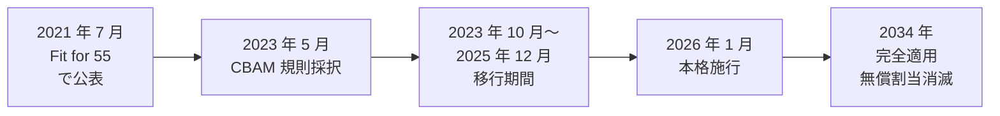

- **2021 年 7 月**：Fit for 55 パッケージで公表
- **2023 年 5 月**：EU 規則採択
- **2023 年 10 月〜2025 年 12 月**：**移行期間（報告のみ、金銭負担なし）**
- **2026 年 1 月**：**本格施行（CBAM 証書の購入・提出義務化）**
- **2026-2034 年**：段階的移行期間、EU-ETS 無償割当を段階的に廃止しつつ CBAM の徴収を強化
- **2034 年**：完全適用

### CBAM の対象品目——6 分野

CBAM の対象は、以下の 6 分野に限定されています（2026 年 7 月時点）。

- **鉄鋼**：鉄・鋼・鋼板・鋼管・線材・ボルト・スクリューなど
- **アルミ**：アルミ地金・アルミ製品
- **セメント**：セメント・クリンカー
- **肥料**：窒素肥料など
- **電力**：EU への輸入電力
- **水素**：水素

対象品目は将来的に拡大される可能性があり、化学品、プラスチックなどが検討対象となっています。**日本の輸出企業に直接影響するのは、鉄鋼・アルミが最大**——大手鉄鋼・アルミメーカーは対応を急務としています。

### CBAM の申告フロー——6 段階

CBAM 対象品目を EU に輸出する企業（輸入者側の申告義務）は、次の 6 段階を実行します。

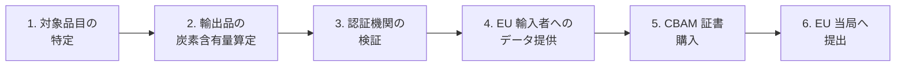

#### 各段階の主なタスク

1. **対象品目の特定**：CN コード（Combined Nomenclature Code）で輸出品が CBAM 対象かを判定
2. **輸出品の炭素含有量算定**：Direct Emissions（生産時 Scope 1）と Indirect Emissions（電力の Scope 2）を算定。GHG プロトコル準拠
3. **認証機関の検証**：算定結果を第三者機関で検証（Verification）
4. **EU 輸入者への提供**：CBAM Declaration を作成し、EU 側の輸入者に提供
5. **CBAM 証書購入**：EU 輸入者が CBAM 証書（EU-ETS 相当価格）を購入
6. **EU 当局への提出**：EU 輸入者が年次で CBAM Declaration を提出

**日本の輸出企業に求められるのは、主に 2 と 3 の「炭素含有量算定と検証」**。EU 輸入者に正確なデータを提供しないと、EU 輸入者は DEFAULT VALUE（デフォルト値、通常は高めに設定）を使うことになり、CBAM 証書の購入コストが増えます。**その分は日本の輸出企業への価格転嫁が求められる**構造です。

### まとめ

- CBAM は EU の国境炭素調整、EU-ETS 相当の炭素価格を輸入品に課す
- 対象品目 6 分野：鉄鋼、アルミ、セメント、肥料、電力、水素
- 移行期間 2023/10〜2025/12（報告のみ）、本格施行 2026/1（証書購入義務化）
- 申告フロー 6 段階：対象品目特定→炭素含有量算定→検証→EU 輸入者提供→証書購入→EU 当局提出
- 日本の輸出企業の主なタスクは炭素含有量算定と第三者検証
- CSDDD：2024 年 5 月採択、加盟国国内法制化 2026 年 7 月まで、段階適用 2027 年以降、サプライチェーン DD 義務化
- 改正温対法：2022 年 4 月施行、企業別排出量の開示、対象約 12,000 社
- 3 つの規制すべてに対応する土台は「正確な算定と第三者検証」

次のレッスンでは、削減ロードマップと移行戦略を扱います。TCFD シナリオ分析、インターナル・カーボン・プライス、移行計画、修了後の学び方までを扱い、コースを締めくくります。

### 確認クイズ

このレッスンの内容の理解度をチェックしましょう。

#### Q1. CBAM の本格施行時期として、本レッスンの内容と一致するものはどれですか？

- [ ] 2021 年 7 月
- [ ] 2023 年 5 月
- [x] 2026 年 1 月
- [ ] 2034 年 1 月

> **解説**
> CBAM は 2021 年 7 月に Fit for 55 パッケージで公表、2023 年 5 月に EU 規則採択、2023 年 10 月〜2025 年 12 月が移行期間（報告のみ）、2026 年 1 月に本格施行（証書購入義務化）、2034 年に完全適用（EU-ETS 無償割当消滅）の予定です。

#### Q2. CBAM の対象品目 6 分野として、本レッスンの内容と一致するものはどれですか？

- [x] 鉄鋼・アルミ・セメント・肥料・電力・水素
- [ ] 鉄鋼・アルミ・銅・鉛・亜鉛・ニッケル
- [ ] 石油・天然ガス・石炭・原子力・再エネ・水素
- [ ] 自動車・電機・化学・食品・繊維・IT

> **解説**
> CBAM の対象は 6 分野「鉄鋼・アルミ・セメント・肥料・電力・水素」に限定されています（2026 年 7 月時点）。将来的に化学品、プラスチックなどが検討対象です。日本の輸出企業に直接影響するのは鉄鋼・アルミが最大です。

#### Q3. CBAM の申告フローで、日本の輸出企業に主に求められるタスクとして、本レッスンの内容と一致するものはどれですか？

- [ ] CBAM 証書を購入して EU 当局に提出する
- [x] 輸出品の炭素含有量算定と第三者機関による検証、EU 輸入者へのデータ提供
- [ ] CBAM 対象品目を EU の代わりに指定する
- [ ] EU-ETS の排出枠を購入する

> **解説**
> CBAM の申告フロー 6 段階のうち、日本の輸出企業に主に求められるのは「2. 輸出品の炭素含有量算定（Direct・Indirect Emissions）」「3. 認証機関の検証」「4. EU 輸入者へのデータ提供」です。CBAM 証書購入と EU 当局への提出は EU 輸入者側の役割です。

#### Q4. 「CBAM 対応で欧州向け輸出が半年止まりかけた話」の教訓として、本レッスンの内容と一致するものはどれですか？

- [ ] CBAM 対応は EU 側の商社の役割で、日本の輸出企業は無関係
- [ ] CBAM 対応は 3 か月前に開始すれば十分
- [ ] 一時的な発注停止は、CBAM に関係なく通常起こる事象
- [x] 対応準備は 2026 年 1 月本格施行を見据えて 12 か月以上前から本格化し、社内の全社連携タスクフォース化が必要

> **解説**
> 現場メモの教訓は「CBAM 対応は輸出通関・製品事業部・環境部の 3 部門連携タスクフォースが必要で、対応準備は 2026 年 1 月本格施行を見据えて 12 か月以上前から本格化する」ことです。CBAM 対応が遅れると、EU 商社が発注停止を検討する事態になりえます。

#### Q5. CSDDD の説明として、本レッスンの内容と一致するものはどれですか？

- [x] 2024 年 5 月採択、加盟国国内法制化 2026 年 7 月まで、段階適用 2027 年以降、対象は EU 内純売上高 4.5 億ユーロ超の EU 域内・域外企業
- [ ] 2020 年採択、既に全面施行済み、EU 域内企業のみ対象
- [ ] 2028 年採択予定、日本企業は対象外
- [ ] CBAM の別名で、実質的に同じ制度

> **解説**
> CSDDD（Corporate Sustainability Due Diligence Directive）は EU 指令として 2024 年 5 月採択、加盟国国内法制化 2026 年 7 月まで、段階適用 2027 年以降で、EU 域外の企業でも EU 内純売上高 4.5 億ユーロ超なら対象になります。サプライチェーン全体の環境・人権デュー・ディリジェンスを義務化します。

#### Q6. 改正温対法の主な変更点として、本レッスンの内容と一致するものはどれですか？

- [ ] EU-ETS への日本企業の強制加盟
- [ ] SBTi 認定の義務化
- [ ] 全企業への Scope 3 の全 15 カテゴリ算定義務化
- [x] 従来の事業所別開示に加えて企業別（連結）排出量の開示、対象約 12,000 社

> **解説**
> 改正温対法は 2022 年 4 月に施行され、従来の事業所別開示に加えて企業別（連結）排出量の開示を対象化しました。対象は省エネ法対象事業者・温対法報告対象事業者を含めて約 12,000 社です。EU-ETS 強制加盟や SBTi 義務化、Scope 3 全 15 カテゴリの義務化ではありません。

次のレッスンでは、削減ロードマップと移行戦略を扱います。TCFD シナリオ分析、インターナル・カーボン・プライス、移行計画（Transition Plan）、修了後の学び方までを扱い、コースを締めくくります。

---

## レッスン8：削減ロードマップと移行戦略、修了後の学び方

（所要時間：25分）

### このレッスンで学ぶこと

- 削減ロードマップを中期経営計画に統合する発想を捉える
- TCFD シナリオ分析（1.5℃・2℃・4℃）の使い分けができる
- インターナル・カーボン・プライスの設計と用途を把握する
- 移行計画（Transition Plan）の要点を掴む
- 生物多様性・水・自然関連リスク（TNFD 応用）の位置づけを理解する
- 修了後の学び方と、6 個の中核メッセージの総括ができる

---

前レッスンでは、CBAM・CSDDD・改正温対法という国内外の規制を扱いました。本レッスンは、コース全体の締めくくりです。**「算定・目標・削減施策・規制対応」の道具を、中期経営計画・投資判断・組織文化に統合する視点**を扱います。

### 削減ロードマップと中期経営計画

削減ロードマップは「単独の環境計画」ではなく、**中期経営計画の一部として組み込む**のが本コースの姿勢です。

#### 3 つの時間軸

- **短期（1〜3 年）**：既存中期経営計画への統合、CAPEX 計画への反映、部門別 KPI
- **中期（3〜10 年）**：SBTi 認定目標（2030 年など）の達成計画、大型投資（再エネ調達、電化）の意思決定
- **長期（10〜30 年）**：Net Zero 目標（2050 年）、事業構造変革（新規事業、既存事業からの撤退）

**「中期経営計画は 3 か月かけて作るが、CN 目標は 10〜30 年で追いかける」**——時間軸のギャップを埋める発想が、CN 経営統合の第一歩です。

#### 統合の実務パターン

- **KGI（Key Goal Indicator）に CN を含める**：中計 KPI の 5 本柱の 1 つに Scope 1・2 削減率、Scope 3 の主要カテゴリ削減率を含める
- **CAPEX 計画に炭素影響評価**：大型投資 5 億円以上の意思決定で、内部炭素価格による CN 評価を必須化
- **経営会議で月次モニタリング**：Scope 1・2 の月次進捗、Scope 3 の四半期進捗を経営会議のアジェンダに
- **役員報酬との連動**：CN 目標の達成状況を役員報酬に反映する動きが広がる

### TCFD シナリオ分析——3 つのシナリオ

TCFD 推奨事項の 4 本柱の中で、実務で最も難しいのが「戦略」の中の**シナリオ分析**です。気候関連リスクと機会が事業戦略・財務計画に与える影響を、複数のシナリオで評価します。

#### 3 つの標準シナリオ

- **1.5℃シナリオ**：パリ協定 1.5℃目標達成、Net Zero 2050、移行リスクが最大、物理リスクは最小
- **2℃シナリオ**：Well-below-2℃、移行が緩やか
- **4℃シナリオ**：現行政策継続、移行リスクは小、物理リスクが極めて大

#### 移行リスク vs 物理リスク

- **移行リスク**：カーボンプライシング、規制強化、技術転換、市場変化、評判リスク
- **物理リスク**：急性（熱波・台風・洪水）、慢性（海面上昇・気温上昇による生産性低下）

**1.5℃シナリオでは移行リスクが大きい**——CBAM 対応、GX-ETS の炭素価格上昇、EV 化への調達転換など。**4℃シナリオでは物理リスクが大きい**——工場の水害被害、農産物の生産量低下、電力供給の不安定化。

#### シナリオ分析の実務

- **IPCC AR6 の RCP／SSP シナリオ**を使う
- **IEA World Energy Outlook** の Net Zero シナリオを使う
- **社内の事業別・地域別に影響を評価**、財務インパクトを試算
- **年次で見直し**、TCFD 開示に反映

### インターナル・カーボン・プライス（ICP）の設計

前レッスンで触れた ICP を、経営統合の道具として設計します。

#### 適用範囲の設計

- **新規大型投資**：CAPEX 5 億円以上、あるいは特定戦略領域
- **新規製品開発**：ライフサイクル排出量の評価
- **M&A 検討**：対象会社の CN 影響を評価
- **拡大対象**：既存事業の年次予算、部門別調達

#### 価格水準の設計

- **段階的引き上げ**：現在 $40/t-CO₂、2030 年 $100/t-CO₂、2050 年 $200/t-CO₂
- **地域別**：EU-ETS 価格、GX-ETS 予想価格、米国 SCC など地域参照
- **シナリオ別**：1.5℃／2℃／4℃で ICP を変える発想

#### 用途

- **投資判断**：CN 影響を含めた IRR 計算
- **調達方針**：サプライヤー選定で、CN 対応度合いを ICP で加点
- **社内予算**：部門別に炭素予算（Carbon Budget）を割当、超過は社内 Fee で徴収

**「ICP を設定した組織は、投資判断が変わる」——これが CN 経営統合の核**です。

### 移行計画（Transition Plan）

TCFD、ISSB IFRS S2、SBTi、CDP のいずれも「**Transition Plan**（移行計画）」の開示を求める方向に進んでいます。**「目標を掲げる」から「達成の道筋を示す」へ**の発想転換です。

#### 移行計画に含めるべき要素

- **削減目標と進捗**：短期・中期・長期の目標と、直近の実績
- **削減施策の内訳**：省エネ・再エネ・電化・燃料転換・トランジション技術のそれぞれの削減貢献量
- **必要な投資額**：削減施策の資本支出、運転費用
- **リスクと機会**：TCFD 4 本柱に沿って
- **ガバナンス**：取締役会・経営陣の監督、CN 委員会の設置
- **仮定と依存関係**：技術の商用化タイミング、エネルギー価格、規制環境

#### UK TPT の Framework

英国の Transition Plan Taskforce（TPT）が 2023 年 10 月に公表した Disclosure Framework が、業界標準として広がりつつあります。日本の企業も、TPT Framework に沿った移行計画の開示を進める傾向にあります。

### 生物多様性・水・自然関連リスク（TNFD 応用）

TNFD が扱う「自然関連リスク」の実務も、CN と密接に関わります。

#### 気候と自然の相互作用

- **森林伐採**：気候（Scope 3 カテゴリ 1、C11 の一部）にも、生物多様性にも影響
- **水資源**：気候変動（干ばつ・洪水）と水資源利用（工場の取水）の両方
- **土壌炭素**：農業の気候影響と、土壌の生物多様性

#### CDP 質問書の 3 領域統合

CDP は気候変動・水セキュリティ・森林の 3 領域の質問書を提供しており、企業側は 3 領域を統合的に管理する動きが広がっています。**「CN 単独ではなく、Nature Positive（自然にポジティブ）への統合視点」**が、2030 年代の主軸となる可能性が高いです。

### コース全体の総括——6 個の中核メッセージ

1. **カーボンニュートラルは「削減」と「オフセット」の二階建て——優先順位を間違えない**：削減 90% ＋オフセット 10% 未満が SBTi Net Zero Standard の原則
2. **Scope 1-2 で足場を作り、Scope 3 で会社を変える**：Scope 3 が総排出量の 80% 以上、会社の環境影響の本体
3. **算定は目的ではなく、削減の設計図**：15 カテゴリの網羅ではなく、マテリアルなカテゴリでの削減施策実行が目的
4. **カーボンプライシングは 3 年で企業の会計を変える**：GX-ETS 2026/4、CBAM 2026/1、EU-ETS 価格上昇の 3 年で会計・調達・投資が根本的に変わる
5. **オフセットは「使う」ものであって「頼る」ものではない**：J-クレジット・非化石証書は道具、削減を代替する道具ではない
6. **CBAM は EU の話ではなく、日本の輸出企業の話**：CBAM の対応準備は 12 か月以上前から、社内 3 部門連携タスクフォース化が必要

### 修了後の学び方

#### 定期的にチェックすべき情報源

- **環境省**：温対法報告、SHK 制度、脱炭素経営ハンドブック
- **経済産業省**：GX 実現に向けた基本方針、GX-ETS 関連
- **資源エネルギー庁**：非化石証書、電力・エネルギー統計
- **SBTi 公式サイト**：認定基準の更新、Net Zero Standard
- **CDP 公式サイト**：質問書、A List、Supply Chain Program
- **TNFD 公式サイト**：Framework の更新
- **WRI・WBCSD**：GHG プロトコルの改訂、Scope 3 ガイダンス

#### 実務スキルとして深めたい領域

- **Scope 3 算定の詳細**：LCA、EIO-LCA、業界別ガイダンス
- **CBAM 対応の詳細**：CN コード判定、認証機関選定、EU 輸入者との連携
- **SBTi 認定申請**：Corporate Manual の熟読、業界別ガイダンス
- **移行計画の開示実務**：UK TPT Framework、業界別事例
- **投資家対話**：シナリオ分析の説明、削減計画の説得力、TCFD 開示

#### コミュニティと対話の場

- **気候変動イニシアティブ（JCI）**：日本の企業・自治体・団体の連携
- **日本気候リーダーズ・パートナーシップ（JCLP）**：企業ネットワーク
- **TCFD Consortium**：日本の TCFD 対応企業ネットワーク
- **各種セミナー**：環境省・経産省・KPMG・PwC・EY・デロイト・EcoAct 等

### コース修了メッセージ

カーボンニュートラル入門コースをここまで進めていただきありがとうございました。本コースで学んだのは、算定・目標・削減施策・規制対応の「型」です。しかし、実際の CN 経営は、業種・規模・地理・組織文化によって形が違い、型どおりの実装で成功するとは限りません。

型を持つことの価値は、「型と実際のズレ」を認識できることです。「うちの業種では、Scope 3 カテゴリ X の削減がボトルネックだ」「うちの規模では、CBAM 対応をここまで絞る判断が必要だ」——判断する土台になります。本コースの 6 個の中核メッセージと、5 段階の削減階層・Scope 3 の 15 カテゴリ・カーボンプライシング 4 制度は、そのための共通言語です。

2026 年 1 月の CBAM 本格施行、2026 年 4 月の GX-ETS 本格開始——「3 年で企業の会計を変える」と申し上げたその 3 年の入口が、いまです。それぞれの現場で、削減の設計図を描き、実行に踏み出してください。カーボンニュートラルは、目的ではなく、経営そのものの再設計です。

### 確認クイズ

このレッスンの内容の理解度をチェックしましょう。

#### Q1. 削減ロードマップの 3 つの時間軸として、本レッスンの内容と一致するものはどれですか？

- [x] 短期（1〜3 年、中期経営計画への統合）／中期（3〜10 年、SBTi 認定目標達成）／長期（10〜30 年、Net Zero と事業構造変革）
- [ ] 昨日／今日／明日
- [ ] 決算期／半期／四半期
- [ ] 個人／部門／全社

> **解説**
> 本レッスンで示した 3 つの時間軸は「短期（1〜3 年、中期経営計画への統合、CAPEX 計画）」「中期（3〜10 年、SBTi 認定目標、大型投資意思決定）」「長期（10〜30 年、Net Zero、事業構造変革）」です。ほかの選択肢は一般的な時間分類、決算サイクル、組織階層です。

#### Q2. TCFD シナリオ分析の 3 つの標準シナリオとして、本レッスンの内容と一致するものはどれですか？

- [ ] 1℃／3℃／5℃
- [x] 1.5℃／2℃／4℃
- [ ] 0.5℃／1℃／1.5℃
- [ ] 2℃／3℃／4℃

> **解説**
> TCFD シナリオ分析の 3 つの標準シナリオは「1.5℃（パリ協定達成、移行リスク最大）／2℃（Well-below-2℃、緩やか）／4℃（現行政策継続、物理リスク極大）」です。移行リスクと物理リスクのバランスがシナリオごとに異なります。

#### Q3. インターナル・カーボン・プライス（ICP）の 3 種類として、本レッスンの内容と一致するものはどれですか？

- [ ] EU-ETS 価格／GX-ETS 価格／米国 SCC
- [ ] 短期／中期／長期
- [x] Shadow Price（仮想価格）／Internal Carbon Fee（社内課金）／Implicit Price（暗黙価格）
- [ ] 過去／現在／将来

> **解説**
> ICP の 3 種類は「Shadow Price（仮想の価格で投資判断に組み込む、実際の資金移動なし）／Internal Carbon Fee（事業部門から社内で徴収、CN 施策の原資）／Implicit Price（削減施策のコストと排出削減量から逆算した価格）」です。前レッスンでも扱った内容の実務的な設計方法です。

#### Q4. 移行計画（Transition Plan）に含めるべき要素として、本レッスンで挙げられていないものはどれですか？

- [ ] 削減目標と進捗、削減施策の内訳
- [ ] 必要な投資額、リスクと機会
- [ ] ガバナンス、仮定と依存関係
- [x] 個人株主の氏名リスト

> **解説**
> 移行計画に含めるべき要素は「削減目標と進捗、削減施策の内訳、必要な投資額、TCFD 4 本柱に沿ったリスクと機会、ガバナンス、仮定と依存関係」の 6 要素です。個人株主の氏名リストは含めるべき要素ではありません。

#### Q5. 本コースの 6 個の中核メッセージに含まれないものはどれですか？

- [ ] カーボンニュートラルは「削減」と「オフセット」の二階建て——優先順位を間違えない
- [ ] Scope 1-2 で足場を作り、Scope 3 で会社を変える
- [x] 気候変動アドバイザーの資格取得が上場企業の必須条件
- [ ] CBAM は EU の話ではなく、日本の輸出企業の話

> **解説**
> 本コースの 6 個の中核メッセージは「削減とオフセットの二階建て／Scope 1-2 で足場を作り Scope 3 で会社を変える／算定は削減の設計図／カーボンプライシングは 3 年で会計を変える／オフセットは使う道具、頼るものではない／CBAM は日本の輸出企業の話」です。「気候変動アドバイザー資格取得の必須化」は本コースの立場と反対で、資格試験対策コースとしては扱いません。

#### Q6. TNFD と CN の関係として、本レッスンの内容と一致するものはどれですか？

- [ ] TNFD と CN は独立の枠組みで、相互作用はない
- [x] TNFD が扱う自然関連リスクは CN と密接に関わり、CDP 質問書の 3 領域（気候・水・森林）の統合、Nature Positive への発想が 2030 年代の主軸となる可能性
- [ ] TNFD は 2050 年に発足予定で、現時点では対応不要
- [ ] TNFD は米国内のみに影響し、日本企業は無関係

> **解説**
> TNFD の自然関連リスクは CN と密接に関わり、CDP 質問書の 3 領域（気候変動・水セキュリティ・森林）の統合が広がっています。TNFD Framework v1.0 は 2023 年 9 月公表済み、Nature Positive への統合視点が 2030 年代の主軸となる可能性が高いです。

このコースをここまで進めていただき、ありがとうございました。ESG 開示制度全般は別のコースで、SDGs のフレームワーク横断は別のコースで扱います。カーボンニュートラルは、算定・目標・削減施策・規制対応の技術と、経営統合・投資判断・組織文化の統合の両輪です。それぞれの現場で意思決定に踏み出してください。

---

## 総復習テスト

これまで学んできた内容の理解度をチェックする、コース全体の総復習テストです。全 20 問、80% 以上の正解でコース修了とします。

### Q1. 本コースの守備範囲として、正しいものはどれですか？【レッスン1】

- [x] カーボンニュートラルを「GHG プロトコルに則った算定と削減施策」の視点で扱う
- [ ] ESG 開示制度全般（統合報告書、コーポレートガバナンス・コード、格付機関対応）を体系的に扱う
- [ ] SDGs 17 目標のフレームワーク横断（GRI、IRIS+、B Corp）を体系的に扱う
- [ ] 気候変動アドバイザーなど資格試験対策を扱う

> **解説**
> 本コースは「GHG プロトコルに則った算定と削減施策」の視点に絞ります。ESG 開示制度全般、SDGs のフレームワーク横断、資格試験対策は本コースの守備範囲外です。

### Q2. パリ協定の説明として、本コースの内容と一致するものはどれですか？【レッスン1】

- [ ] 2005 年に採択、2007 年発効
- [ ] 世界の平均気温上昇を 5℃以内に抑える長期目標
- [x] 2015 年 12 月 COP21 で採択、2016 年 11 月発効、世界平均気温上昇を 2℃より十分低く 1.5℃を目指す
- [ ] 先進国のみが参加、開発途上国は対象外

> **解説**
> パリ協定は 2015 年 12 月 COP21 で採択、2016 年 11 月発効で、世界の平均気温上昇を産業革命前と比べて 2℃より十分低く保ち、1.5℃に抑える努力を追求する長期目標を掲げます。

### Q3. Net Zero と Carbon Neutral の違いとして、本コースの内容と一致するものはどれですか？【レッスン1】

- [ ] Net Zero は CO₂ 限定、Carbon Neutral は全 GHG
- [x] Net Zero は全 GHG を対象で削減 90% 以上＋オフセット 10% 未満、Carbon Neutral は CO₂ 中心の排出と吸収のバランス
- [ ] 両者は同義で、用語の違いだけ
- [ ] Net Zero はマーケティング用語、Carbon Neutral は科学用語

> **解説**
> Net Zero は全 GHG を対象、SBTi Net Zero Standard は削減 90% 以上＋オフセット 10% 未満。Carbon Neutral は CO₂ に限定した排出と吸収のバランス。両者は同義ではありません。

### Q4. GHG プロトコル Corporate Standard の策定機関として、本コースの内容と一致するものはどれですか？【レッスン2】

- [ ] IPCC と UNFCCC
- [ ] ISO と OECD
- [ ] IFRS 財団と ISSB
- [x] WRI（世界資源研究所）と WBCSD（世界持続可能な開発ビジネスカウンシル）

> **解説**
> GHG プロトコル Corporate Standard は WRI と WBCSD が共同で策定しました。1998 年パートナーシップ発表、2001 年初版、2004 年改訂版が公表されています。

### Q5. Scope 1・2・3 の 3 分類として、本コースの内容と一致するものはどれですか？【レッスン2】

- [x] Scope 1 は自社直接排出（燃料燃焼・プロセス排出等）、Scope 2 は購入電力・熱・蒸気の間接排出、Scope 3 はバリューチェーン全体
- [ ] Scope 1 は購入電力、Scope 2 は自社燃料燃焼、Scope 3 はバリューチェーン
- [ ] Scope 1 と Scope 2 は義務、Scope 3 は任意
- [ ] Scope 1・2・3 は排出量の大小で分類する

> **解説**
> Scope 1 は自社の管理下で直接排出される GHG、Scope 2 は購入電力・熱・蒸気の間接排出、Scope 3 はバリューチェーン全体の 15 カテゴリ（Scope 1・2 以外）です。

### Q6. 日本で組織バウンダリー設定に多く採用される手法として、本コースの内容と一致するものはどれですか？【レッスン2】

- [ ] Equity Share Approach
- [x] Operational Control Approach
- [ ] Financial Control Approach
- [ ] Geographic Approach

> **解説**
> 日本では Operational Control Approach を選ぶ企業が多い、と本コースで説明しました。連結財務諸表との差異が小さく、実務が回しやすい理由からです。

### Q7. Scope 3 の下流 7 カテゴリに含まれるものとして、本コースの内容と一致するものはどれですか？【レッスン3】

- [ ] C1 購入した製品・サービス、C2 資本財、C3 燃料
- [ ] C4 輸送・配送（上流）、C5 廃棄物、C6 出張
- [x] C9 輸送・配送（下流）、C10 販売品の加工、C11 販売品の使用、C12 廃棄、C13 リース、C14 フランチャイズ、C15 投資
- [ ] C6 出張、C7 通勤、C8 上流リース

> **解説**
> 下流 7 カテゴリは C9〜C15 です。ほかの選択肢は上流 8 カテゴリの一部です。

### Q8. Scope 3 の C11「販売した製品の使用」が特に大きくなる業種として、本コースの内容と一致するものはどれですか？【レッスン3】

- [ ] IT・SaaS 業界
- [ ] 金融業界
- [ ] 広告業界
- [x] 自動車、家電、住宅、産業機器で圧倒的に大きい（Scope 3 総排出量の 50% 以上のことも）

> **解説**
> C11 は自動車、家電、住宅、産業機器で圧倒的に大きく、多くの製造業で Scope 3 総排出量の 50% 以上を占めることがあります。自動車メーカーは製造時排出より、販売した車の生涯走行時の CO₂ 排出が桁違いに大きい構造です。

### Q9. 「Scope 3 の 15 カテゴリを全部埋めようとして 6 か月遅延した話」の教訓として、本コースの内容と一致するものはどれですか？【レッスン3】

- [x] 15 カテゴリすべてを完璧に算定するより、マテリアリティ・スクリーニングで大きなカテゴリから確実に算定するのが実務
- [ ] 15 カテゴリすべてを含めないと、SBTi 認定は取得できない
- [ ] マテリアルでないカテゴリでも、二次データすら不要で無視できる
- [ ] Scope 3 算定は経営陣が関与しない技術的タスクにすべき

> **解説**
> 現場メモの教訓は「15 カテゴリを完璧に埋める」ことが目的化するのを避け、マテリアリティ・スクリーニングで大きなカテゴリから確実に算定することが実務の勘所です。

### Q10. SBTi の設立と共同運営機関として、本コースの内容と一致するものはどれですか？【レッスン4】

- [ ] 2000 年に IPCC が単独で設立
- [x] 2015 年に CDP・UN Global Compact・WRI・WWF の 4 機関共同で設立
- [ ] 2011 年に GHG プロトコルが設立
- [ ] 2020 年に IFRS 財団が設立

> **解説**
> SBTi は 2015 年に CDP、UN Global Compact、WRI、WWF の 4 機関共同で設立されました。

### Q11. SBTi Net Zero Standard の主な要件として、本コースの内容と一致するものはどれですか？【レッスン4】

- [ ] 削減 50% 以上、オフセット 50% 未満
- [ ] 削減 70% 以上、オフセット 30% 未満
- [x] Scope 1・2・3 で 90% 以上の削減、残り 10% 未満を CO₂ 除去で相殺
- [ ] 削減比率の設定なし、オフセット全面依存も可

> **解説**
> Net Zero Standard の核は「削減 90% 以上」で、残り 10% 未満のみを CO₂ 除去（DAC、森林、CCS/CCUS）で相殺する形です。

### Q12. CDP 質問書の 3 領域として、本コースの内容と一致するものはどれですか？【レッスン4】

- [ ] E・S・G の 3 領域
- [ ] Scope 1・Scope 2・Scope 3 の 3 領域
- [ ] 過去・現在・将来の 3 期間
- [x] 気候変動（Climate Change）・水セキュリティ（Water Security）・森林（Forests）

> **解説**
> CDP 質問書の 3 領域は「気候変動・水セキュリティ・森林」で、それぞれ A〜F の 9 段階＋Failure でスコア化されます。

### Q13. 削減施策の 5 段階の階層として、本コースの内容と一致するものはどれですか？【レッスン5】

- [x] 省エネ→再エネ調達→電化→燃料転換→トランジション技術（水素・アンモニア・CCUS）
- [ ] オフセット→削減→報告→認証
- [ ] 目標設定→算定→施策実行→開示
- [ ] マテリアリティ→エンゲージメント→開示→更新

> **解説**
> 削減施策の 5 段階は「省エネ→再エネ調達→電化→燃料転換→トランジション技術」で、上の段階が達成できる範囲では下の段階に降りない、が優先順位の原則です。

### Q14. RE100 の設立と主催機関として、本コースの内容と一致するものはどれですか？【レッスン5】

- [ ] 2005 年に IPCC が単独で設立
- [x] 2014 年 9 月に The Climate Group と CDP が共同で立ち上げた企業イニシアチブ
- [ ] 2020 年に SBTi の一部として設立
- [ ] 2023 年に ISSB の下位イニシアチブとして設立

> **解説**
> RE100 は 2014 年 9 月に The Climate Group と CDP が共同で立ち上げた企業イニシアチブで、事業運営で使用する電力を 100% 再エネにすることをコミットします。

### Q15. カーボンプライシングの 2 系統として、本コースの内容と一致するものはどれですか？【レッスン6】

- [ ] Scope 1 と Scope 2
- [ ] マーケットベースとロケーションベース
- [x] 炭素税と排出量取引制度（ETS）
- [ ] 炭素回収と炭素貯留

> **解説**
> カーボンプライシングは「炭素税（排出 1 t-CO₂ あたり課税）」と「排出量取引制度（ETS、排出枠を割当・取引）」の 2 系統です。

### Q16. GX-ETS の時系列として、本コースの内容と一致するものはどれですか？【レッスン6】

- [ ] 2019 年 4 月試行、2022 年 4 月本格開始
- [ ] 2021 年 4 月試行、2024 年 4 月本格開始
- [ ] 2025 年 4 月試行、2028 年 4 月本格開始
- [x] 2023 年 4 月試行、2026 年 4 月本格開始

> **解説**
> GX-ETS は 2023 年 4 月試行、2026 年 4 月本格開始で、参加企業の裾野拡大と排出量算定・報告の義務化強化が予定されています。

### Q17. CBAM の対象品目 6 分野として、本コースの内容と一致するものはどれですか？【レッスン7】

- [x] 鉄鋼・アルミ・セメント・肥料・電力・水素
- [ ] 鉄鋼・アルミ・銅・鉛・亜鉛・ニッケル
- [ ] 石油・天然ガス・石炭・原子力・再エネ・水素
- [ ] 自動車・電機・化学・食品・繊維・IT

> **解説**
> CBAM の対象は「鉄鋼・アルミ・セメント・肥料・電力・水素」の 6 分野です（2026 年 7 月時点）。日本の輸出企業に直接影響するのは鉄鋼・アルミが最大です。

### Q18. CSDDD の説明として、本コースの内容と一致するものはどれですか？【レッスン7】

- [ ] 2020 年採択、既に全面施行済み、EU 域内企業のみ対象
- [x] 2024 年 5 月採択、加盟国国内法制化 2026 年 7 月まで、段階適用 2027 年以降、EU 内純売上高 4.5 億ユーロ超の EU 域内・域外企業が対象
- [ ] 2028 年採択予定、日本企業は対象外
- [ ] CBAM の別名で、実質的に同じ制度

> **解説**
> CSDDD は 2024 年 5 月採択、加盟国国内法制化 2026 年 7 月まで、段階適用 2027 年以降で、EU 域外の企業でも EU 内純売上高 4.5 億ユーロ超なら対象になります。

### Q19. TCFD シナリオ分析の 3 つの標準シナリオとして、本コースの内容と一致するものはどれですか？【レッスン8】

- [ ] 1℃／3℃／5℃
- [ ] 0.5℃／1℃／1.5℃
- [x] 1.5℃／2℃／4℃
- [ ] 2℃／3℃／4℃

> **解説**
> TCFD シナリオ分析の 3 つの標準シナリオは「1.5℃（パリ協定達成、移行リスク最大）／2℃（Well-below-2℃、緩やか）／4℃（現行政策継続、物理リスク極大）」です。

### Q20. インターナル・カーボン・プライス（ICP）の 3 種類として、本コースの内容と一致するものはどれですか？【レッスン8】

- [ ] EU-ETS 価格／GX-ETS 価格／米国 SCC
- [ ] 短期／中期／長期
- [ ] 過去／現在／将来
- [x] Shadow Price（仮想価格）／Internal Carbon Fee（社内課金）／Implicit Price（暗黙価格）

> **解説**
> ICP の 3 種類は「Shadow Price（仮想価格、実際の資金移動なし）／Internal Carbon Fee（社内で徴収し原資に）／Implicit Price（削減コストと排出削減量から逆算）」です。

お疲れさまでした。これでコース「カーボンニュートラル入門」を修了です。6 個の中核メッセージ（削減とオフセットの二階建て／Scope 1-2 で足場・Scope 3 で会社変革／算定は削減の設計図／カーボンプライシングは 3 年で会計を変える／オフセットは使う道具、頼るものではない／CBAM は日本の輸出企業の話）を羅針盤に、それぞれの現場で意思決定に踏み出してください。

---

## 用語集

このコースで扱った主要な用語を、五十音順（あ行〜ら行）ののち A-Z の順で整理します。

### あ行

**アンモニア（あんもにあ）**：NH₃。トランジション技術の燃料候補。燃焼時に CO₂ を排出しないため、混焼発電・船舶燃料での利用が研究されている。日本の重工業で研究が活発。→ レッスン 5

**移行計画（いこうけいかく、Transition Plan）**：企業のカーボンニュートラル達成の道筋を示す計画。削減目標、施策の内訳、投資額、リスクと機会、ガバナンス、仮定と依存関係を含む。UK TPT Framework（2023 年 10 月）が業界標準として広がる。→ レッスン 8

**移行リスク（いこうりすく）**：TCFD のリスク分類の 1 つ。カーボンプライシング、規制強化、技術転換、市場変化、評判リスクなど、脱炭素社会への移行に伴うリスク。1.5℃シナリオで最大化。→ レッスン 8

**インターナル・カーボン・プライス（いんたーなる・かーぼん・ぷらいす）**：社内で自主的に設定する炭素価格。投資判断や事業計画で GHG 排出に社内費用を割り当てる。Shadow Price、Internal Carbon Fee、Implicit Price の 3 種類。CDP 中央値 $40〜100/t-CO₂。→ レッスン 6、レッスン 8

**エネルギー効率（えねるぎーこうりつ）**：投入エネルギーに対する出力の比率。ボイラー効率、モータ効率、空調 COP、電力の力率など。省エネ施策の追跡指標。→ レッスン 5

**オフセット（おふせっと、carbon offset）**：自社の排出を、他所での削減・吸収でバランスを取ること。J-クレジット、非化石証書、国際クレジットなど。「使う」ものであって「頼る」ものではない、が本コースの立場。→ レッスン 1、レッスン 6

**温対法（おんたいほう、地球温暖化対策の推進に関する法律）**：日本国内の GHG 排出量報告制度の基盤法律。2022 年 4 月改正で企業別（連結）排出量の開示が対象化、対象は約 12,000 社。→ レッスン 7

### か行

**改正温対法（かいせいおんたいほう）**：2022 年 4 月施行の温対法改正版。従来の事業所別開示に加えて企業別排出量開示、Scope 3 の任意的開示奨励、算定・報告様式のデジタル化。→ レッスン 7

**カーボンプライシング（かーぼんぷらいしんぐ）**：GHG 排出に価格を付ける政策手段の総称。炭素税と排出量取引制度（ETS）の 2 系統。世界の GHG 排出の約 25% が対象（2024 年時点）。→ レッスン 6

**カーボンリーケージ（かーぼんりーけーじ）**：炭素価格が高い域内から、価格が低い域外に生産が移転する現象。EU-ETS と域外の炭素価格差から CBAM の背景となった構造。→ レッスン 7

**GX-ETS（じーえっくすいーてぃーえす）**：Green Transformation - Emissions Trading Scheme。日本独自の排出量取引制度。試行 2023 年 4 月、本格開始 2026 年 4 月。GX リーグ 700 社超参加。→ レッスン 6

**気候関連財務情報開示（きこうかんれんざいむじょうほうかいじ）**：気候関連リスクと機会が財務業績に与える影響の開示。TCFD 4 本柱（ガバナンス／戦略／リスク管理／指標と目標）に基づく。ISSB IFRS S2 で国際基準化。→ レッスン 4

**京都議定書（きょうとぎていしょ）**：1997 年採択、2005 年発効の気候変動対策の初期の国際的枠組み。6 種類の GHG（CO₂/CH₄/N₂O/HFCs/PFCs/SF₆）を規制対象、第 2 約束期間から NF₃ 追加で 7 種類に。→ レッスン 1

**グリーン電力証書（ぐりーんでんりょくしょうしょ）**：再エネで発電された電力の「環境価値」を証書化して取引する制度。企業の Scope 2 削減の証書購入手段の 1 つ。→ レッスン 5

**経産省 GX 実現に向けた基本方針（けいさんしょう）**：経済産業省が 2023 年 2 月に閣議決定した GX 政策の基本方針。GX-ETS、GX 経済移行債、水素・アンモニアの技術開発を柱に。→ レッスン 6

**原単位（げんたんい）**：生産量・売上高・従業員数などの単位活動量あたりのエネルギー使用量や GHG 排出量。省エネ法報告の基本指標。→ レッスン 5

### さ行

**サプライヤーエンゲージメント（さぷらいやーえんげーじめんと）**：Scope 3 カテゴリ 1（購入した製品・サービス）の削減に向けた、サプライヤーとの対話・データ収集・削減目標共有の活動。CDP Supply Chain Program が事実上の標準ツール。→ レッスン 4

**CBAM（しーばむ）**：Carbon Border Adjustment Mechanism、EU の国境炭素調整措置。EU-ETS 相当の炭素価格を輸入品に課す仕組み。対象 6 分野（鉄鋼・アルミ・セメント・肥料・電力・水素）。移行期間 2023/10〜2025/12、本格施行 2026/1。→ レッスン 7

**GX 経済移行債（じーえっくすけいざいいこうさい）**：日本政府が発行する GX 実現のための国債。2024 年 2 月に世界初の国家発行、20 兆円規模（2033 年度までの累計）を目標。→ レッスン 6

**GHG（じーえいちじー、温室効果ガス）**：Greenhouse Gases。大気中で熱を吸収・放出する気体の総称。京都議定書 6 種＋NF₃ の 7 種類が算定対象。→ レッスン 1

**GHG プロトコル（じーえいちじーぷろとこる）**：企業と組織の GHG 排出量算定・報告のための世界標準基準。WRI と WBCSD が共同で策定。Corporate Standard、Scope 3 Standard、Scope 2 Guidance など複数の標準で構成。→ レッスン 2

**事業所別排出量（じぎょうしょべつはいしゅつりょう）**：事業所単位の GHG 排出量。省エネ法・温対法の従来の報告単位。2022 年改正で企業別（連結）にも拡大。→ レッスン 7

**CSDDD（しーえすでぃーでぃーでぃー）**：Corporate Sustainability Due Diligence Directive、EU 企業サステナビリティ・デュー・ディリジェンス指令。2024 年 5 月採択、加盟国国内法制化 2026 年 7 月まで、段階適用 2027 年以降。→ レッスン 7

**CN（しーえぬ）**：Carbon Neutral の略。CO₂ を主対象に、排出と吸収のバランスをゼロにする発想。日本政府は 2050 年 CN 宣言。→ レッスン 1

**CO₂（しーおーつー、二酸化炭素）**：代表的な温室効果ガス。GWP-100 = 1、ほかの GHG の GWP はこれを 1 とした比率。化石燃料燃焼が主な排出源。→ レッスン 1

**CCUS（しーしーゆーえす）**：Carbon Capture, Utilization and Storage、CO₂ 回収・利用・貯留技術。トランジション技術の代表格、セメント・鉄鋼・化学プラントで検討。→ レッスン 5

**CDP（しーでぃーぴー）**：旧 Carbon Disclosure Project、2000 年設立の国際 NGO。気候変動・水セキュリティ・森林の質問書ベースの評価、A〜F の 9 段階＋Failure。→ レッスン 4

**CH₄（しーえいちよん、メタン）**：温室効果ガス。GWP-100 = 27〜30。家畜、水田、廃棄物、天然ガス漏出が主な排出源。→ レッスン 1

**支出額ベース（ししゅつがくべーす）**：Scope 3 算定手法の 1 つ。購入額 × 業種別排出係数で算出。算定初期の全体像把握に有効。EIO-LCA が代表例。→ レッスン 3

**Scope 1（すこーぷ わん）**：自社の管理下で直接排出される GHG。固定燃焼、移動燃焼、プロセス排出、フュージティブ排出が含まれる。→ レッスン 2

**Scope 2（すこーぷ つー）**：購入した電力・熱・蒸気の生成時の GHG 排出。マーケットベースとロケーションベースの 2 手法。→ レッスン 2、レッスン 6

**Scope 3（すこーぷ すりー）**：Scope 1・2 以外のバリューチェーン全体の GHG 排出。上流 8＋下流 7＝15 カテゴリ。多くの企業で総排出の 80% 以上。→ レッスン 2、レッスン 3

**Scope 3 の 15 カテゴリ（すこーぷ すりー のじゅうごかてごり）**：上流 C1〜C8（購入品・資本財・燃料・輸送・廃棄・出張・通勤・リース）、下流 C9〜C15（下流輸送・加工・使用・廃棄・リース・フランチャイズ・投資）。→ レッスン 3

**SBTi（えすびーてぃーあい）**：Science Based Targets initiative、科学に基づく目標イニシアチブ。2015 年に CDP・UN Global Compact・WRI・WWF の 4 機関共同で設立。認定企業数 5,000 社超（2024 年）。→ レッスン 4

**SBTi Net Zero Standard（えすびーてぃーあい ねっとぜろ すたんだーど）**：SBTi が 2021 年 10 月に公表した Net Zero の枠組み。Scope 1・2・3 で 90% 以上の削減、残り 10% 未満を CO₂ 除去で相殺。→ レッスン 4

**GWP（じーだぶりゅーぴー、地球温暖化係数）**：Global Warming Potential。CO₂ を 1 とした各 GHG の温暖化能力。時間軸で GWP-100 と GWP-20 があり、通常 100 年ベース。→ レッスン 1

**生物多様性（せいぶつたようせい）**：生態系の多様性、種の多様性、遺伝子の多様性の総称。TNFD の主要対象、TCFD の姉妹的な扱い。→ レッスン 8

**省エネ（しょうえね、Energy efficiency）**：エネルギー消費量そのものを減らす取り組み。削減階層の 1 段階目、Efficiency First の原則。→ レッスン 5

**商用化（しょうようか）**：技術が商業ベースで導入・普及する段階。トランジション技術（水素・CCUS・DAC）は 2030 年代の商用化見通し。→ レッスン 5

**排出量取引制度（はいしゅつりょうとりひきせいど、ETS）**：Emissions Trading Scheme。排出枠を割当・取引する市場ベースの炭素価格制度。EU-ETS、GX-ETS、中国 ETS など。→ レッスン 6

### た行

**炭素税（たんそぜい）**：排出 1 t-CO₂ あたりの課税。カーボンプライシングの 2 系統の 1 つ。フランス、スウェーデン、日本の地球温暖化対策税など。→ レッスン 6

**CN コード（しーえぬこーど）**：Combined Nomenclature Code、EU の統計品目分類コード。CBAM で対象品目を判定する際に使用。→ レッスン 7

**DAC（でぃーえーしー）**：Direct Air Capture、大気中の CO₂ を直接回収する技術。トランジション技術の 1 つ、極めて高コスト。→ レッスン 5

**TCFD（てぃーしーえふでぃー）**：Task Force on Climate-related Financial Disclosures、気候関連財務情報開示タスクフォース。2015 年 12 月 FSB 設置、2017 年推奨事項、2023 年 10 月 ISSB へ役割承継。4 本柱（ガバナンス／戦略／リスク管理／指標と目標）。→ レッスン 4

**電化（でんか、Electrification）**：燃料燃焼設備を電気設備に置き換えること。ヒートポンプ、EV、フォークリフト、IH クッキングヒーターなど。再エネと組み合わせて 2 段構えの効果。→ レッスン 5

**電力係数（でんりょくけいすう、Emission Factor）**：購入電力 1 kWh あたりの CO₂ 排出量。電力会社別、国別、地域別に公表。ロケーションベース算定で使用。→ レッスン 2

**トランジション技術（とらんじしょんぎじゅつ）**：脱炭素社会への移行を支える革新的技術。水素、アンモニア、CCUS、DAC、e-Fuel、SAF など。2030 年代の商用化見通し。→ レッスン 5

### な行

**Net Zero（ねっとぜろ）**：すべての GHG（CO₂・CH₄・N₂O・HFCs・PFCs・SF₆・NF₃）を対象に、排出と除去のバランスをゼロにする発想。SBTi Net Zero Standard は削減 90% 以上＋オフセット 10% 未満。→ レッスン 1

**認証機関（にんしょうきかん）**：GHG 算定結果を第三者機関で検証する組織。CBAM、SBTi、CDP のいずれも認証機関の検証を求める。→ レッスン 7

**燃料転換（ねんりょうてんかん）**：化石燃料から低炭素燃料への切り替え。石炭→天然ガス、化石燃料→バイオマス、化石燃料→水素・アンモニアなど。→ レッスン 5

### は行

**バウンダリー（ばうんだりー）**：算定範囲の境界。組織バウンダリー（Equity Share／Financial Control／Operational Control の 3 手法）とオペレーショナルバウンダリー（Scope 1・2・3 分類）の 2 段階。→ レッスン 2

**非化石証書（ひかせきしょうしょ）**：非化石電源（再エネと原子力）で発電された電力の環境価値を切り離して取引する証書。2018 年 5 月導入。FIT・非 FIT の 3 種類。→ レッスン 6

**PPA（ぴーぴーえー）**：Power Purchase Agreement、電力購入契約。再エネ発電事業者と長期契約を結び電力を購入。フィジカル PPA とバーチャル PPA の 2 種類。追加性が高い。→ レッスン 5

**物量ベース（ぶつりょうべーす）**：Scope 3 算定手法の 1 つ。物量（t・L・kWh・km 等）× 排出係数で算出。支出額ベースより精度が高いがデータ収集が難しい。→ レッスン 3

### ま行

**マーケットベース（まーけっとべーす）**：Scope 2 算定手法の 1 つ。購入契約に基づく契約上の電源構成を反映（再エネメニュー、非化石証書、PPA、グリーン電力証書）。RE100・SBTi はマーケットベース主体。→ レッスン 6

**マテリアリティ・スクリーニング（まてりありてぃ・すくりーにんぐ）**：Scope 3 の 15 カテゴリを、関連性・規模・影響・リスク・機会などの観点でスクリーニングし、優先順位を付ける発想。4 段階分類（大きい・中程度・小さい・該当なし）が実務。→ レッスン 3

**見える化（みえるか）**：エネルギー使用量を計測・可視化。省エネの 3 原則の 1 つ。系統別・時間帯別に見える化することで無駄が特定される。→ レッスン 5

### や行

**有償割当（ゆうしょうわりあて）**：排出量取引制度で、排出枠をオークション形式で有償販売する仕組み。EU-ETS で段階的に拡大、GX-ETS も 2027 年以降拡大予定。→ レッスン 6

### ら行

**ロケーションベース（ろけーしょんべーす）**：Scope 2 算定手法の 1 つ。購入電力の物理的な電源構成（電力会社別の実排出係数、全国平均）に基づく係数。→ レッスン 6

---

### A-Z

**Carbon Neutral（かーぼんにゅーとらる）**：CO₂ を主対象に、排出と吸収のバランスをゼロにする発想。日本の 2050 年目標は「カーボンニュートラル」宣言（実質 Net Zero に相当）。→ レッスン 1

**CDP Supply Chain Program（しーでぃーぴー さぷらいちぇーん ぷろぐらむ）**：CDP が購買企業からの依頼でサプライヤーに質問書を送付する仕組み。Scope 3 カテゴリ 1 のサプライヤーエンゲージメントで事実上の標準ツール。→ レッスン 4

**COP26（こっぷ にじゅうろく）**：第 26 回国連気候変動枠組条約締約国会議（2021 年 11 月、英国グラスゴー）。ISSB 設立宣言、CBAM 加速など気候ガバナンスの節目。→ レッスン 4

**Equity Share Approach（えくいてぃ しぇあ あぷろーち）**：組織バウンダリー設定の 3 手法の 1 つ。持分比率に応じて排出量を算入。→ レッスン 2

**EU-ETS（いーゆー いーてぃーえす）**：European Union Emissions Trading System、EU 排出量取引制度。2005 年開始、世界最大の ETS。第 4 期（2021-2030）は年 4.3% 削減、EUA 価格 100 ユーロ/t-CO₂ 前後。→ レッスン 6

**e-Fuel（いー ふゅーえる）**：合成燃料。CO₂ と水素から合成する液体燃料。航空機・船舶用途で期待。→ レッスン 5

**Financial Control Approach（ふぁいなんしゃる こんとろーる あぷろーち）**：組織バウンダリー設定の 3 手法の 1 つ。財務会計の連結範囲に基づく。→ レッスン 2

**Fit for 55（ふぃっと ふぉー ふぃふてぃふぁいぶ）**：EU が 2021 年 7 月に公表した気候政策パッケージ。2030 年に 1990 年比 55% 削減目標達成のため、EU-ETS 強化、CBAM 導入などを含む。→ レッスン 6、レッスン 7

**GHG プロトコル Corporate Standard（じーえいちじー ぷろとこる こーぽれーと すたんだーど）**：企業の Scope 1・2 算定・報告の基本標準。2001 年初版、2004 年改訂。→ レッスン 2

**GHG プロトコル Scope 3 Standard（じーえいちじー ぷろとこる すこーぷ すりー すたんだーど）**：企業のバリューチェーン全体の GHG 算定・報告基準。2011 年公表、15 カテゴリに分類。→ レッスン 3

**GX リーグ（じーえっくす りーぐ）**：経済産業省が組成する官民パートナーシップ。GX-ETS の実施主体を含む。2024 年時点で 700 社超参加、日本の GHG 総排出量の約 5 割をカバー。→ レッスン 6

**IEA（あいいーえー）**：International Energy Agency、国際エネルギー機関。World Energy Outlook を年次公表、Net Zero シナリオを提供。→ レッスン 8

**IPCC（あいぴーしーしー）**：Intergovernmental Panel on Climate Change、気候変動に関する政府間パネル。1988 年に WMO と UNEP が共同設立。5〜7 年ごとに評価報告書を公表。→ レッスン 1

**IPCC AR6（あいぴーしーしー えーあーるろく）**：第 6 次評価報告書。WG1 (2021/8)、WG2 (2022/2)、WG3 (2022/4)、統合報告書 (2023/3)。1.5℃達成には 2030 年までに 2019 年比 43% 削減が必要。→ レッスン 1

**J-クレジット（じぇー くれじっと）**：日本のカーボンオフセットクレジット制度。2013 年 4 月開始、環境省・経産省・農水省の共同運営。省エネ・再エネ・森林由来の 3 種類。→ レッスン 6

**LCA（えるしーえー）**：Life Cycle Assessment、ライフサイクル評価。製品や事業のゆりかごから墓場までの環境影響を評価。カーボンフットプリント算定の基盤。→ レッスン 3

**N₂O（えぬつーおー、一酸化二窒素）**：温室効果ガス。GWP-100 = 273。農業（肥料）、工業プロセスが主な排出源。→ レッスン 1

**NDC（えぬでぃーしー）**：Nationally Determined Contribution、国別貢献。パリ協定で各国が自主的に設定する排出削減目標。5 年ごとに更新。→ レッスン 1

**NF₃（えぬえふすりー、三フッ化窒素）**：温室効果ガス。GWP-100 ≒ 17,400。半導体・液晶製造が主な排出源。京都議定書の第 2 約束期間から規制対象追加。→ レッスン 1

**Operational Control Approach（おぺれーしょなる こんとろーる あぷろーち）**：組織バウンダリー設定の 3 手法の 1 つ。事業運営を管理する会社を 100% 算入。日本の企業で多く採用。→ レッスン 2

**PCAF（ぴーしーえーえふ）**：Partnership for Carbon Accounting Financials、金融機関の GHG 算定パートナーシップ。Scope 3 カテゴリ 15（投資）の算定基準を提供。→ レッスン 3

**RE100（あーるいー ひゃく）**：Renewable Energy 100%。2014 年 9 月に The Climate Group と CDP が共同で立ち上げた企業イニシアチブ。事業運営で 100% 再エネ電力にコミット。→ レッスン 5

**SAF（さふ）**：Sustainable Aviation Fuel、持続可能な航空燃料。バイオベース、e-Fuel ベース。航空機の脱炭素で期待。→ レッスン 5

**追加性（ついかせい、Additionality）**：再エネ調達手段の評価軸。オンサイト自家消費と PPA が高く、証書購入が低い。RE100 も追加性を評価軸に含める。→ レッスン 5

**TCFD Consortium（てぃーしーえふでぃー こんそーしあむ）**：2019 年発足の日本の TCFD 対応企業ネットワーク。賛同企業 300 社超。→ レッスン 4

**TNFD（てぃーえぬえふでぃー）**：Taskforce on Nature-related Financial Disclosures、自然関連財務情報開示タスクフォース。2021 年 6 月発足、2023 年 9 月 v1.0 公表。LEAP アプローチ（Locate・Evaluate・Assess・Prepare）。→ レッスン 4、レッスン 8

**UNFCCC（ゆーえぬえふしーしーしー）**：国連気候変動枠組条約。1992 年採択の国際条約、京都議定書、パリ協定はその下の枠組み。→ レッスン 1

**WBCSD（だぶりゅーびーしーえすでぃー）**：World Business Council for Sustainable Development、持続可能な開発のための世界経済人会議。WRI と共同で GHG プロトコルを策定。→ レッスン 2

**WRI（だぶりゅーあーるあい）**：World Resources Institute、世界資源研究所。米国のシンクタンク。GHG プロトコル策定機関の 1 つ、SBTi 設立機関の 1 つ。→ レッスン 2

**WMO（だぶりゅーえむおー）**：World Meteorological Organization、世界気象機関。1988 年に UNEP と共同で IPCC を設立。→ レッスン 1

**WWF（だぶりゅーだぶりゅーえふ）**：World Wide Fund for Nature、世界自然保護基金。SBTi 設立機関の 1 つ。→ レッスン 4

**水素（すいそ）**：H₂。トランジション技術の中核。グリーン水素（再エネ電力の水電解）が理想。燃料電池、水素還元製鉄、化学プロセスでの利用。→ レッスン 5

---

## 参考資料

このコースの作成にあたり、以下の資料を参考にしました。

### 書籍

- 山家 公雄『世界の脱炭素政策と日本』（日本経済新聞出版、2022 年）
- 竹内 純子ほか『2050 年脱炭素社会に向けたシナリオ』（日経 BP、2021 年）
- Bill Gates『How to Avoid a Climate Disaster』（Knopf、2021 年、邦訳『地球の未来のため僕が決断したこと』早川書房 2021 年）
- 江田 健二『エネルギービジネスの未来』（エネルギーフォーラム、2022 年）
- 日本経済新聞社編『GX 実現の全て』（日本経済新聞出版、2023 年）
- 日本語書籍：カーボンニュートラル・GHG 算定実務の 2025-2026 年前後の刊行物

### 技術記事・公式ドキュメント／論文

- WRI・WBCSD "The Greenhouse Gas Protocol Corporate Accounting and Reporting Standard"（Revised Edition、2004 年） https://ghgprotocol.org/
- WRI・WBCSD "Corporate Value Chain (Scope 3) Accounting and Reporting Standard"（2011 年）
- WRI・WBCSD "Scope 2 Guidance"（2015 年、マーケットベース／ロケーションベース手法）
- IPCC AR6 Synthesis Report（2023 年 3 月） https://www.ipcc.ch/report/ar6/syr/
- IPCC AR6 WG1 (2021 年 8 月)、WG2 (2022 年 2 月)、WG3 (2022 年 4 月)
- SBTi Net Zero Standard（2021 年 10 月） https://sciencebasedtargets.org/net-zero
- SBTi Corporate Manual（最新版）
- TCFD Final Recommendations（2017 年 6 月）、TCFD Guidance for All Sectors（2021 年更新） https://www.fsb-tcfd.org/
- TNFD Framework v1.0（2023 年 9 月） https://tnfd.global/
- ISSB IFRS S2「Climate-related Disclosures」（2023 年 6 月）
- CDP Climate Change Questionnaire、Water Security Questionnaire、Forests Questionnaire（最新版） https://www.cdp.net/
- RE100 Annual Report https://www.there100.org/
- EU CBAM Regulation（2023 年 5 月採択）
- EU CSDDD（Corporate Sustainability Due Diligence Directive、2024 年 5 月採択）
- 環境省「温室効果ガス排出量算定・報告・公表制度」 https://ghg-santeikohyo.env.go.jp/
- 環境省「サプライチェーンを通じた温室効果ガス排出量算定に関する基本ガイドライン」
- 経済産業省「GX 実現に向けた基本方針」（2023 年 2 月閣議決定）
- 経済産業省「GX-ETS」関連公表資料 https://www.meti.go.jp/policy/energy_environment/global_warming/
- 経済産業省「J-クレジット制度」 https://japancredit.go.jp/
- 資源エネルギー庁「非化石証書」制度 https://www.enecho.meti.go.jp/
- 環境省「脱炭素経営の推進」ハンドブック
- WMO/UNEP「Emissions Gap Report」（年次） https://www.unep.org/emissions-gap-report

### 公的資料・組織・調査

- 国連気候変動枠組条約（UNFCCC）事務局 https://unfccc.int/
- パリ協定（Paris Agreement、2015 年 12 月採択、2016 年 11 月発効）
- 世界資源研究所（WRI） https://www.wri.org/
- 世界持続可能な開発ビジネスカウンシル（WBCSD） https://www.wbcsd.org/
- ISO 14064（温室効果ガス算定・検証）
- ISO 14067（製品のカーボンフットプリント）
- 経団連「チャレンジ・ゼロ」 https://www.keidanren.or.jp/
- 気候変動イニシアティブ（JCI） https://japanclimate.org/
- 日本気候リーダーズ・パートナーシップ（JCLP） https://japan-clp.jp/
- 環境省・経済産業省 各種公表資料

（すべてのオンライン資料の最終閲覧日：2026 年 7 月 7 日）

---

## 利用規約・二次創作ルール・著作権

- **コース掲載元**: [スキルアップカレッジ](https://skillup.college/)
- **このコースのURL**: https://skillup.college/courses/esg-sustainability/carbon-neutral-basics/
- **利用規約・二次創作ルール**: https://skillup.college/terms
- **著作権**: © 2026 株式会社エレファンキューブ. All rights reserved.

本コースは [スキルアップカレッジ](https://skillup.college/)（運営：株式会社エレファンキューブ）で公開されている学習コンテンツの原稿です。コース本体は上記URLでオンライン受講できます（確認クイズの即時採点、用語集の自動リンクなど、Webならではの学習体験を提供しています）。
