# サステナビリティ・SDGs実務

「掲げる SDGs」から「実装する SDGs」へ——GRI・IRIS+・B Corp・UN Global Compact・EcoVadis・ISO 26000 まで、マテリアリティ分析と KPI 設計の実装ガイド

| 項目 | 内容 |
|---|---|
| カテゴリー | ESG・サステナビリティ |
| 難易度 | 中級 |
| 所要時間 | 約200分（全8レッスン） |
| 公開日 | 2026-07-07 |
| 最終更新日 | 2026-07-07 |
| コースURL | https://skillup.college/courses/esg-sustainability/sustainability-sdgs-practical/ |

## 対象者

CSR・サステナビリティ推進担当、広報・IR、人事・調達・法務。会社としてサステナビリティを事業に統合したい方、統合報告書やサステナビリティレポート、B Corp 認証、EcoVadis 対応、CDP 回答を担う方。

## 前提知識

生成 AI やクラウドの基本用語がわかる程度で十分。ESG・気候変動の初歩的な用語（Scope、TCFD、CO₂ 排出量）を知っていると理解が早いが、必須ではない。

## 学習目標

- MDGs → SDGs の系譜、17 目標・169 ターゲット・232 指標の体系を把握する
- UN Global Compact 10 原則と ISO 26000 の 7 中核主題でサステナ経営の枠組みを整理できる
- マテリアリティ分析の 5 ステップとダブルマテリアリティの実装ができる
- GRI 3 層構造・SASB・SDGs Compass のフレームワーク横断で使い分けられる
- KPI 設計と Backcasting で目標管理と対話の窓を組める
- サプライチェーン責任（EcoVadis・CSDDD・紛争鉱物・フェアトレード・生物多様性）を扱える
- B Corp 認証 5 領域、Fair Trade、UN Global Compact 参加の実務を設計できる
- インパクト測定（IRIS+・IMM・SROI）で実装する SDGs への移行が組める

## コース概要

サステナビリティは、CSR 報告書を作ることでも、SDGs のロゴを貼ることでもありません。事業活動が社会・環境にどう関わるかを、フレームワーク横断で整理し、KPI で測り、対話で更新する——ここに実務の本丸があります。本コースは、国連関連機関で 3 年、企業サステナ部門で 16 年、独立コンサルとして 4 年の伴走で得た「実装のための道具箱」を、GRI・IRIS+・B Corp・UN Global Compact・EcoVadis・ISO 26000 まで 8 レッスンで扱います。フレームワークの名前を覚えることではなく、事業を動かすことが目的である、という視点で、CSR・サステナ推進・広報・IR・人事・調達・法務の 7 職種の意思決定に届く形で整理しました。

## 学習の流れ

前半 4 レッスンで「制度と枠組み」を固めます。レッスン 1 で MDGs → SDGs の系譜と 17 目標・169 ターゲット・232 指標、レッスン 2 で UN Global Compact・ISO 26000・ISO 14001 の 3 つの枠組み、レッスン 3 でマテリアリティ分析の 5 ステップとダブルマテリアリティ、レッスン 4 で GRI・SASB・SDGs Compass のフレームワーク横断と 3 つの開示書類の使い分けを扱います。中盤のレッスン 5 で KPI 設計と Backcasting、レッスン 6 でサプライチェーン責任（EcoVadis・CSDDD・紛争鉱物・フェアトレード）を扱います。後半のレッスン 7 で B Corp・Fair Trade・UN Global Compact 参加、レッスン 8 でインパクト測定（IRIS+・IMM・SROI）と実装する SDGs への移行、修了後の学び方までを扱います。全 8 レッスン・約 200 分の構成です。

## レッスン一覧

| No. | タイトル | 概要 | 所要時間 |
|---|---|---|---|
| 1 | サステナビリティと SDGs の位置関係——MDGs から 2030 アジェンダまで | 本コースの守備範囲（フレームワーク横断とマテリアリティ実装）、MDGs 2000 年採択・目標年 2015 年、SDGs 2015 年 9 月国連総会採択・目標年 2030 年、17 目標・169 ターゲット・232 指標の体系、5 P（People/Planet/Prosperity/Peace/Partnership）、境界明示、中核メッセージ 6 個を学ぶ | 25分 |
| 2 | サステナビリティ経営の枠組み——UN Global Compact・ISO 26000・ISO 14001 | UN Global Compact 1999 年発足・2000 年参加開始・10 原則（人権・労働・環境・腐敗防止の 4 分野）、ISO 26000 2010 年公表・7 中核主題（組織統治・人権・労働慣行・環境・公正な事業慣行・消費者課題・コミュニティ）、ISO 14001 環境マネジメントシステム 1996 年初版・2015 年改訂、3 つの枠組みの相互関係を学ぶ | 25分 |
| 3 | マテリアリティ分析の実務——5 ステップとダブルマテリアリティの実装 | マテリアリティの概念、決め方 5 ステップ（課題洗い出し・ステークホルダー・エンゲージメント・関連度マトリックス・取締役会承認・年次見直し）、ダブルマテリアリティ（財務＋インパクト）の実装、GRI と ESRS の違い、講師の現場メモを学ぶ | 25分 |
| 4 | フレームワーク横断——GRI／SASB／SDGs Compass／統合報告書 vs SR vs 有報 | GRI スタンダード 3 層構造（Universal Standards 2021 改訂・Sector Standards 2021 以降・Topic Standards）、SASB Materiality Map 77 業種、SDGs Compass 2016 年 GRI・UNGC・WBCSD 共同公表、統合報告書 vs サステナビリティレポート vs 有価証券報告書の使い分けを学ぶ | 25分 |
| 5 | KPI 設計と目標管理——Backcasting と対話の窓としての KPI | GRI/SASB 指標の使い分け、SBT（Science Based Target）の考え方（気候領域は別コース）、Backcasting（未来から現在への逆算）、Forecasting との違い、KPI 4 分類（結果・過程・入力・活動）、対話の窓としての KPI、年次アップデートを学ぶ | 25分 |
| 6 | サプライチェーン責任——EcoVadis・CSDDD・紛争鉱物・フェアトレード | EcoVadis 2007 年設立のサプライヤー評価、TRUCOST の環境データ、EU CSDDD 2024/5 採択（一般論として位置づけ、詳細は気候別コース）、紛争鉱物・3TG・米国 Dodd-Frank 法 2010 年、フェアトレード認証（コーヒー・カカオ・バナナ・コットン）、生物多様性と TNFD の位置づけを学ぶ | 25分 |
| 7 | 認証・認定——B Corp・Fair Trade・UN Global Compact 参加 | B Corp 認証 2006 年 B Lab 創設・認証開始 2007 年・日本第 1 号 2016 年（石井食品）・5 領域評価（ガバナンス・従業員・コミュニティ・環境・顧客）・B Impact Assessment、Fair Trade International 認証（コーヒー・カカオ・バナナ・コットン）、UN Global Compact 参加プロセスと Communication on Progress、GRI 認定を学ぶ | 25分 |
| 8 | インパクト測定と修了後の学び方——IRIS+／IMM／SROI | IRIS+ 2019 年 GIIN 公表のインパクト指標、Impact Management and Measurement（IMM）の 5 ディメンション（What・Who・How Much・Contribution・Risk）、SROI（Social Return on Investment）2000 年頃 REDF 提唱、「掲げる SDGs から実装する SDGs へ」の移行、コース全体総括、修了後の学習方向を学ぶ | 25分 |

---

## レッスン1：サステナビリティと SDGs の位置関係——MDGs から 2030 アジェンダまで

（所要時間：25分）

### このレッスンで学ぶこと

- 本コースの守備範囲（フレームワーク横断とマテリアリティ実装）と、扱わない範囲を区別できる
- MDGs（2000 年）と SDGs（2015 年）の系譜を整理する
- SDGs 17 目標・169 ターゲット・232 指標の体系を把握する
- 5 P（People/Planet/Prosperity/Peace/Partnership）で SDGs の全体像を捉える
- 対象読者（CSR・サステナ推進・広報・IR・人事・調達・法務）と 6 個の中核メッセージを掴む

---

サステナビリティは、CSR 報告書を作ることでも、SDGs のロゴを貼ることでもありません。事業活動が社会・環境にどう関わるかを、フレームワーク横断で整理し、KPI で測り、対話で更新する——これが本コースの主眼です。中核メッセージ「SDGs は掲げるから実装するへ——ロゴを貼るだけの時代は終わった」——本レッスンの背骨です。

### 本コースの位置づけ——「フレームワーク横断とマテリアリティ実装」

本コースはサステナビリティ・SDGs を「フレームワーク横断とマテリアリティ実装」の視点で扱う入門です。ESG 開示制度全般（統合報告書、コーポレートガバナンス・コード、格付機関対応）や気候変動の算定実務（Scope 1-3、GHG プロトコル、SBTi、CBAM）は、別の入門コースで扱います。本コースはそれらを前提として、CSR・サステナビリティ推進・広報・IR・人事・調達・法務の 7 職種の意思決定に届く形で、GRI・IRIS+・B Corp・UN Global Compact・EcoVadis・ISO 26000 のフレームワーク横断と、マテリアリティ実装、KPI 設計、インパクト測定を扱います。

> **💡 ポイント**
> 本コースは「フレームワークを覚える」ではなく「事業を動かす」に軸足を置きます。GRI や B Corp のスコアリング係数、認証機関の料金、SaaS の機能一覧は変動が激しいため、機能概念のレベルに留めます。名前を覚えるのではなく「どう使い分け、どう KPI に落とし、どう対話するか」の判断軸を持ち帰ってください。

### MDGs——2000 年、開発途上国のための 8 目標

**MDGs**（Millennium Development Goals、ミレニアム開発目標）は、2000 年 9 月に国連ミレニアム・サミットで採択された「国連ミレニアム宣言」に基づき策定された、**8 目標・21 ターゲット・60 指標**の枠組みです。目標年は 2015 年。

#### 8 目標

1. 極度の貧困と飢餓の撲滅
2. 初等教育の完全普及
3. ジェンダー平等の推進と女性の地位向上
4. 乳幼児死亡率の削減
5. 妊産婦の健康の改善
6. HIV/エイズ、マラリア、そのほかの疾病の蔓延防止
7. 環境の持続可能性の確保
8. 開発のためのグローバル・パートナーシップの推進

#### MDGs の成果と限界

- **成果**：極度の貧困は半減以上、乳幼児死亡率は約 4 割削減、初等教育の就学率が向上
- **限界**：**「開発途上国のための目標」で、先進国は主に資金援助側**という構図。企業の関与は限定的
- **地域格差**：サブサハラ・アフリカでは目標達成が遅れた

**MDGs は「政府主導、対象は途上国」の枠組み**でした。企業のサステナビリティ活動が MDGs の一部として位置づけられることは、事実上ありませんでした。

### SDGs——2015 年、地球全体のための 17 目標

MDGs の後継として、2015 年 9 月に国連総会で採択されたのが **SDGs**（Sustainable Development Goals、持続可能な開発目標）です。「持続可能な開発のための 2030 アジェンダ」（A/RES/70/1）に含まれ、**17 目標・169 ターゲット・232 指標**という格段に細分化された枠組みで、**目標年は 2030 年**。

#### MDGs と SDGs の 5 つの違い

- **対象**：MDGs は開発途上国、SDGs は先進国を含む全世界
- **担い手**：MDGs は政府中心、SDGs は政府・企業・市民社会・個人の全ステークホルダー
- **範囲**：MDGs は貧困・保健・教育中心、SDGs は経済・社会・環境の 3 側面統合
- **手法**：MDGs はトップダウンで策定、SDGs はマルチステークホルダー参加型
- **相互作用**：MDGs は各目標が独立、SDGs は 17 目標が相互に絡む（トレードオフとシナジー）

**SDGs の最大の特徴は「企業を主役の 1 つに位置づけた」こと**。企業が事業を通じて 17 目標に貢献することが期待されました。これが「掲げる SDGs（ロゴを貼る）」から「実装する SDGs（事業に統合する）」への発想転換の出発点です。

### SDGs 17 目標の体系

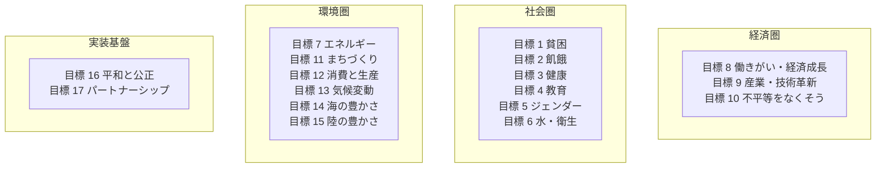

#### 17 目標一覧

| No. | 目標 | 主な内容 |
|---|---|---|
| 1 | 貧困をなくそう | 極度の貧困終結、脆弱層の保護 |
| 2 | 飢餓をゼロに | 食料安全保障、栄養改善、持続可能な農業 |
| 3 | すべての人に健康と福祉 | 保健、感染症対策、精神保健 |
| 4 | 質の高い教育をみんなに | 初等・中等・高等教育、生涯学習 |
| 5 | ジェンダー平等を実現しよう | 女性のエンパワーメント、参画 |
| 6 | 安全な水とトイレを世界中に | 水資源、衛生、水管理 |
| 7 | エネルギーをみんなに、そしてクリーンに | 再エネ、エネルギーアクセス |
| 8 | 働きがいも経済成長も | ディーセントワーク、経済成長 |
| 9 | 産業と技術革新の基盤をつくろう | インフラ、産業化、イノベーション |
| 10 | 人や国の不平等をなくそう | 所得格差、社会包摂、移民 |
| 11 | 住み続けられるまちづくりを | 持続可能な都市、住宅、交通 |
| 12 | つくる責任、つかう責任 | 持続可能な生産・消費、廃棄物削減 |
| 13 | 気候変動に具体的な対策を | 気候変動対策、レジリエンス |
| 14 | 海の豊かさを守ろう | 海洋・海洋資源の保全 |
| 15 | 陸の豊かさも守ろう | 生態系、生物多様性、森林 |
| 16 | 平和と公正をすべての人に | 平和、司法、包摂的制度 |
| 17 | パートナーシップで目標を達成しよう | 実施手段、グローバル・パートナーシップ |

### 5 P——SDGs の 5 つの領域

SDGs 17 目標は、**5 つの領域（5 P）**で整理されます。国連の公式資料でも採用されている整理です。

- **People（人間）**：目標 1-6 の社会・保健・教育系。「あらゆる場所のあらゆる形態の貧困及び飢餓に終止符を打ち、すべての人間が尊厳と平等の下に、また、健康的な環境の下に、その持てる潜在能力を発揮できるようにする」
- **Planet（地球）**：目標 7、11-15 の環境・気候・生態系。「持続可能な消費と生産、天然資源の持続可能な管理、気候変動に関する緊急な行動をとることを通じて、地球を破壊から守ることを決意」
- **Prosperity（繁栄）**：目標 8-10 の経済成長・不平等是正。「すべての人間が、豊かで満たされた生活を享受することができ、経済的、社会的、技術的な進歩が自然との調和のうちに生じることを確保することを決意」
- **Peace（平和）**：目標 16 の平和・司法・制度。「恐怖や暴力から解放された、平和で公正かつ包摂的な社会を育んでいく」
- **Partnership（パートナーシップ）**：目標 17 の実施手段。「グローバル・パートナーシップの強化された精神に基づき、最も貧しい人々や最も脆弱な人々のニーズに特別な焦点を当て、すべての国、すべてのステークホルダー及びすべての人々の参加を得て、必要な手段を通じて実施される」

**5 P で整理すると、SDGs が「単なる 17 個の目標のリスト」ではなく「体系的な世界観」であることが理解できます**。企業が事業を通じて貢献する場合、17 目標のうち複数にまたがることが多く、5 P の整理は貢献ストーリーを組み立てるのに役立ちます。

### SDGs のマッピングと企業実務——落とし穴

企業が SDGs に貢献する際、以下の落とし穴があります。

#### 落とし穴 1：「SDGs ロゴ貼り」

統合報告書やホームページに 17 目標のロゴを大きく貼り、「当社は SDGs に貢献しています」と宣言する。しかし、実際に事業がどの目標にどう貢献しているかの定量的な説明がない。**「掲げる SDGs」の代表例**です。

#### 落とし穴 2：「事業と関係のない目標への飛びつき」

自社の事業とほとんど関係ない目標（例：宇宙関連事業のない企業が「目標 15 陸の豊かさ」の森林保全を主張する）に、社会貢献活動として飛びつく。**マテリアリティ分析なしの SDGs 対応は、本業から乖離**しがちです。

#### 落とし穴 3：「シナジーとトレードオフの無視」

SDGs 17 目標は相互作用するため、ある目標の達成が別の目標を犠牲にする場合があります。例えば、目標 8（経済成長）と目標 13（気候変動）の間には、伝統的にトレードオフがありました。**「シナジーとトレードオフのマッピング」がないと、SDGs 貢献の主張は表面的**になります。

### 対象読者と 7 職種

本コースは 7 職種を対象読者に据えます。

1. **CSR・サステナビリティ推進**：サステナ戦略立案、報告書執筆、マテリアリティ分析
2. **広報**：SDGs 貢献のコミュニケーション、社内外への発信
3. **IR**：機関投資家との対話、統合報告書との連動
4. **人事**：ディーセントワーク（目標 8）、ジェンダー平等（目標 5）、多様性
5. **調達**：サプライチェーン責任、フェアトレード、CSR 調達
6. **法務**：ガバナンス（目標 16）、コンプライアンス、CSDDD 対応
7. **経営企画**：中期経営計画への統合、KPI 設計

**これら 7 職種が「同じ言語」で対話できることが、実装する SDGs の前提**です。縦割りを超えた連携が、SDGs 実装の最大の課題であり、最大のチャンスです。

### 中核メッセージ 6 個——本コースの背骨

1. **SDGs は「掲げる」から「実装する」へ——ロゴを貼るだけの時代は終わった**
2. **マテリアリティは「対話の共通言語」——決めきるものではなく、更新するもの**
3. **フレームワークは道具——GRI・IRIS+・B Corp を使い分ける**
4. **KPI は目標ではなく、対話の窓——数字の裏に文脈を残す**
5. **サプライチェーン責任は「見えないところ」が本番**
6. **バックキャスティングは、経営の思考の型を変える**

各レッスンの冒頭・末尾で、繰り返し立ち返ります。

### まとめ

- MDGs は 2000 年採択、8 目標、目標年 2015 年、開発途上国のための目標
- SDGs は 2015 年 9 月採択、17 目標・169 ターゲット・232 指標、目標年 2030 年、全世界の全ステークホルダーが担い手
- MDGs との違い：対象・担い手・範囲・手法・相互作用の 5 点
- 5 P：People／Planet／Prosperity／Peace／Partnership
- 「掲げる SDGs」の 3 つの落とし穴：ロゴ貼り／事業との乖離／シナジーとトレードオフの無視
- 対象読者は CSR・広報・IR・人事・調達・法務・経営企画の 7 職種
- 中核メッセージ 6 個で意思決定の羅針盤を持つ

次のレッスンでは、サステナビリティ経営の枠組み——UN Global Compact 10 原則、ISO 26000 の 7 中核主題、ISO 14001 環境マネジメントシステムを扱います。

### 確認クイズ

このレッスンの内容の理解度をチェックしましょう。

#### Q1. 本コースの守備範囲として、正しいものはどれですか？

- [x] サステナビリティ・SDGs を「フレームワーク横断とマテリアリティ実装」の視点で扱う
- [ ] ESG 開示制度全般（統合報告書、コーポレートガバナンス・コード、格付機関対応）を体系的に扱う
- [ ] 気候変動の算定実務（Scope 1-3、GHG プロトコル、SBTi、CBAM）を体系的に扱う
- [ ] SDGs 検定・気候変動アドバイザーなど資格試験対策を扱う

> **解説**
> 本コースは「フレームワーク横断とマテリアリティ実装」の視点に絞ります。ESG 開示制度全般、気候変動の算定実務、資格試験対策は本コースの守備範囲外で、ESG 開示と気候変動は別の入門コースで扱います。

#### Q2. MDGs と SDGs の違いとして、本レッスンの内容と一致するものはどれですか？

- [ ] MDGs は 17 目標、SDGs は 8 目標
- [x] MDGs は 8 目標・開発途上国・政府中心、SDGs は 17 目標・全世界・全ステークホルダー
- [ ] 両者は同義で、名前が変わっただけ
- [ ] MDGs は 2015 年採択で、SDGs は 2000 年採択

> **解説**
> MDGs（2000 年採択、目標年 2015 年）は 8 目標・21 ターゲット・60 指標で開発途上国のための目標、SDGs（2015 年採択、目標年 2030 年）は 17 目標・169 ターゲット・232 指標で全世界の全ステークホルダーが担い手です。

#### Q3. SDGs の 17 目標・169 ターゲット・232 指標として、本レッスンの内容と一致するものはどれですか？

- [ ] 8 目標・21 ターゲット・60 指標
- [ ] 10 目標・100 ターゲット・200 指標
- [x] 17 目標・169 ターゲット・232 指標
- [ ] 20 目標・200 ターゲット・500 指標

> **解説**
> SDGs は 17 目標・169 ターゲット・232 指標で構成されています。169 ターゲットは各目標をより具体化したもの、232 指標は進捗を測るための定量指標（重複を除いた実質的な指標数は 231）です。ほかの選択肢は数字が異なります。

#### Q4. SDGs の 5 P として、本レッスンの内容と一致するものはどれですか？

- [ ] Person・Product・Process・Place・Price
- [ ] Purpose・Passion・Pride・Progress・Practice
- [ ] Politics・Policy・Program・Project・Performance
- [x] People（人間）・Planet（地球）・Prosperity（繁栄）・Peace（平和）・Partnership（パートナーシップ）

> **解説**
> SDGs 17 目標は 5 P（People・Planet・Prosperity・Peace・Partnership）で整理されます。国連公式資料でも採用されており、SDGs が「単なる 17 個の目標のリスト」ではなく「体系的な世界観」であることを示す整理です。

#### Q5. 「掲げる SDGs」の落とし穴として、本レッスンで挙げられていないものはどれですか？

- [ ] SDGs ロゴ貼り（貢献の定量説明なし）
- [ ] 事業と関係のない目標への飛びつき（マテリアリティ分析なし）
- [ ] シナジーとトレードオフの無視
- [x] SDGs の 17 目標を毎年 1 つずつ順番に取り組む

> **解説**
> 本レッスンで挙げた 3 つの落とし穴は「SDGs ロゴ貼り」「事業と関係のない目標への飛びつき」「シナジーとトレードオフの無視」です。「毎年 1 つずつ順番に取り組む」は SDGs 対応の方法として本レッスンでは扱っていない発想で、17 目標は同時並行で取り組むのが実装の実務です。

#### Q6. 本コースの中核メッセージ 6 個に含まれるものはどれですか？

- [ ] SDGs の全 17 目標に等しく取り組むべき
- [ ] マテリアリティは経営陣が独自に一度で決めきる
- [x] SDGs は「掲げる」から「実装する」へ——ロゴを貼るだけの時代は終わった
- [ ] KPI 設計は数字だけで、文脈は不要

> **解説**
> 本コースの中核メッセージ 6 個は「掲げるから実装するへ／マテリアリティは対話の共通言語で更新するもの／フレームワークは道具／KPI は対話の窓で数字の裏に文脈／サプライチェーン責任は見えないところが本番／バックキャスティングは思考の型を変える」です。「全 17 目標に等しく取り組む」「マテリアリティは一度で決めきる」「KPI は数字だけ」は本コースの立場と反対です。

次のレッスンでは、サステナビリティ経営の枠組み——UN Global Compact 10 原則、ISO 26000 の 7 中核主題、ISO 14001 環境マネジメントシステムを扱います。3 つの枠組みの相互関係を掴みます。

---

## レッスン2：サステナビリティ経営の枠組み——UN Global Compact・ISO 26000・ISO 14001

（所要時間：25分）

### このレッスンで学ぶこと

- UN Global Compact 1999 年発足の背景と 10 原則を把握する
- ISO 26000（2010 年公表）の 7 中核主題を整理する
- ISO 14001 環境マネジメントシステムの位置づけを理解する
- 3 つの枠組みの相互関係と使い分けを掴む

---

前レッスンでは、SDGs の 17 目標と 5 P、対象読者を扱いました。本レッスンは、SDGs に取り組むための「経営の枠組み」——UN Global Compact、ISO 26000、ISO 14001 の 3 つを扱います。中核メッセージ「フレームワークは道具——GRI・IRIS+・B Corp を使い分ける」の、経営枠組みの中身です。

### UN Global Compact——1999 年、コフィー・アナンの呼びかけ

**UN Global Compact**（国連グローバル・コンパクト、UNGC）は、1999 年 1 月の世界経済フォーラム（ダボス会議）で、当時の国連事務総長コフィー・アナン氏が世界の企業リーダーに呼びかけたことで生まれました。**参加受付は 2000 年 7 月開始**、以降、世界最大の企業サステナビリティ・イニシアチブに成長しました。

#### 10 原則

UNGC は、企業に「4 分野・10 原則」の遵守を求めます。

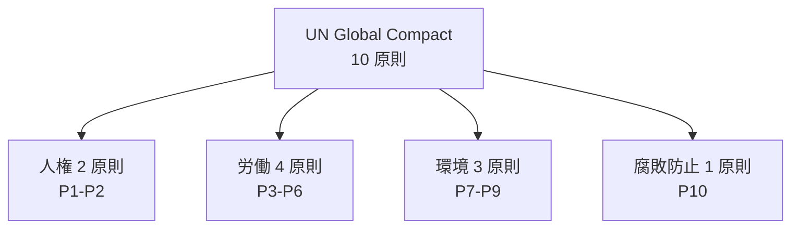

- **人権（Human Rights）**
  - 原則 1：国際的に宣言されている人権の保護を支持、尊重する
  - 原則 2：自らが人権侵害に加担しないよう確保する
- **労働（Labour）**
  - 原則 3：組合結成の自由と団体交渉の権利の実効的な承認
  - 原則 4：あらゆる形態の強制労働の撤廃
  - 原則 5：児童労働の実効的な廃止
  - 原則 6：雇用と職業に関する差別の撤廃
- **環境（Environment）**
  - 原則 7：環境上の課題に対する予防原則的アプローチ
  - 原則 8：環境に関するより大きな責任を率先して引き受ける
  - 原則 9：環境に優しい技術の開発と普及を促進する
- **腐敗防止（Anti-Corruption）**
  - 原則 10：強要及び贈収賄を含むあらゆる形態の腐敗防止に取り組む

#### 参加プロセスと Communication on Progress（COP）

- **参加宣言**：CEO 名で参加意思を UNGC 事務局に提出
- **年次進捗報告**：Communication on Progress（COP、進捗開示）を毎年提出
- **未提出企業**：段階的にリストから削除

**「参加して終わり」ではなく、年次の COP 提出が続く枠組み**。日本のグローバル・コンパクト・ネットワーク・ジャパン（GCNJ）には 500 社超が参加（2024 年時点）。

### ISO 26000——2010 年、社会的責任のガイダンス

**ISO 26000**（社会的責任に関する手引き）は、国際標準化機構（ISO）が 2010 年 11 月に公表した国際規格です。**認証規格ではなく「ガイダンス規格」——第三者認証は取れず、自己宣言または開示に活用**する形。

#### 7 中核主題

ISO 26000 の骨格は、**7 つの中核主題**です。

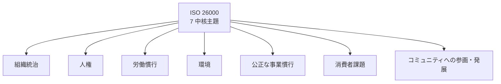

#### 各主題の概要

- **組織統治**：意思決定と実施のプロセス、透明性、説明責任
- **人権**：デュー・ディリジェンス、加担、脆弱な集団、市民的・政治的権利、経済的・社会的・文化的権利、労働の基本原則と権利
- **労働慣行**：雇用と雇用関係、労働条件と社会保護、社会対話、労働における安全衛生、職場における人材開発と訓練
- **環境**：汚染防止、持続可能な資源利用、気候変動の緩和と適応、環境保護・生物多様性・自然生息地の回復
- **公正な事業慣行**：汚職防止、責任ある政治的関与、公正競争、影響範囲での社会的責任推進、財産権の尊重
- **消費者課題**：公正なマーケティング、消費者の安全衛生、持続可能な消費、消費者のサービス・サポート・紛争解決、消費者データ保護、必須サービスへのアクセス、教育・啓発
- **コミュニティへの参画・発展**：コミュニティ参画、教育・文化、雇用創出、技術開発、富と所得の創出、健康、社会投資

#### ISO 26000 の位置づけ

- **認証規格ではない**：ISO 9001（品質）や ISO 14001（環境）のような認証は取れない
- **業種横断**：業種を問わず、大企業・中小企業・政府・NGO のいずれも活用可能
- **他規格との整合**：GRI、UN Global Compact、OECD 多国籍企業行動指針との整合を意識

**「サステナビリティ経営の共通言語」として、日本の多くの企業がサステナビリティ・レポートで参照する規格**。ただし、認証を取れないため、実務では「参照した」の言及のみで詳細分析までは踏み込まないことも多い。

### ISO 14001——1996 年、環境マネジメントシステム

**ISO 14001** は、環境マネジメントシステム（EMS、Environmental Management System）の国際規格です。1996 年に初版が公表され、2004 年、**2015 年に改訂**されました。ISO 26000 と違い、**第三者認証が取れる規格**です。

#### 主な要求事項

- **環境方針**：組織の環境方針を策定・公表
- **環境側面の特定**：組織活動が環境に与える影響を体系的に特定
- **法的要求事項の遵守**：関連する環境法令の把握と遵守
- **目標設定と実行**：環境目標の設定、実施計画、リソース配分
- **運用管理**：日常的な環境影響のモニタリング
- **監査と是正**：内部監査、経営者レビュー、是正措置
- **継続的改善**：PDCA サイクルによる継続改善

#### 2015 年改訂の主な変更点

- **リスクベースアプローチ**：組織の内外の課題とリスクを反映
- **ライフサイクル視点**：製品・サービスのライフサイクル全体を考慮
- **リーダーシップ強化**：経営層の関与を明確化
- **文書化の柔軟性**：紙の文書へのこだわりを減らす

#### 日本での普及

日本は世界で最も ISO 14001 認証取得数が多い国の 1 つで、2024 年時点で 20,000 事業所超が取得。**「環境経営の基盤」として長年活用**されてきました。

### 3 つの枠組みの相互関係

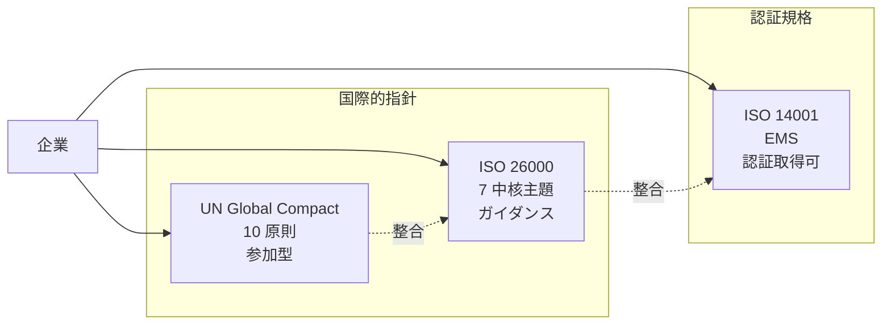

#### 使い分け

- **UN Global Compact**：全社的なコミットメント、CEO レベルの意思表明、年次進捗開示
- **ISO 26000**：サステナビリティ経営全体の骨格、サステナビリティ・レポートで参照
- **ISO 14001**：環境マネジメントの実務、認証取得で外部にコミットメントを示す

**3 つは競合ではなく補完的**——UNGC で意思を表明し、ISO 26000 で骨格を作り、ISO 14001 で環境実務を回す、という構造が実務のパターンです。

#### 補足：GRI との位置づけ

前レッスンで触れた GRI（Global Reporting Initiative）は、これら 3 つの上位に位置する「開示基準」です。UNGC、ISO 26000、ISO 14001 の取り組みを、GRI スタンダードでサステナビリティ・レポートに開示する、という流れが実務の骨格です。

### 中核メッセージの再確認

- **フレームワークは道具——GRI・IRIS+・B Corp を使い分ける**：UNGC・ISO 26000・ISO 14001 も道具の 1 つ。全部使うのが正解ではなく、目的に応じて使い分ける
- **SDGs は「掲げる」から「実装する」へ**：UNGC 参加、ISO 26000 参照、ISO 14001 認証取得は、実装する SDGs の具体的な形

### まとめ

- UN Global Compact は 1999 年 1 月ダボスで提唱、2000 年 7 月参加開始、10 原則（人権 2・労働 4・環境 3・腐敗防止 1）
- 年次進捗報告（COP）が続く枠組み、日本 GCNJ には 500 社超が参加
- ISO 26000 は 2010 年 11 月公表、7 中核主題（組織統治・人権・労働慣行・環境・公正な事業慣行・消費者課題・コミュニティ）、認証は取れないガイダンス規格
- ISO 14001 は 1996 年初版・2015 年改訂、環境マネジメントシステムの国際規格、第三者認証が取れる、日本で 20,000 事業所超が取得
- 3 つは補完的：UNGC で意思表明、ISO 26000 で骨格、ISO 14001 で環境実務
- GRI はこれら 3 つを開示する上位基準

次のレッスンでは、マテリアリティ分析の実務——5 ステップとダブルマテリアリティの実装、講師の現場メモを扱います。

### 確認クイズ

このレッスンの内容の理解度をチェックしましょう。

#### Q1. UN Global Compact の発足と参加開始として、本レッスンの内容と一致するものはどれですか？

- [x] 1999 年 1 月にダボス会議で当時の国連事務総長コフィー・アナンが呼びかけ、2000 年 7 月に参加受付開始
- [ ] 2000 年に IPCC が単独で設立
- [ ] 2015 年に SDGs と同時に発足
- [ ] 2023 年に ISSB の下位イニシアチブとして発足

> **解説**
> UN Global Compact は 1999 年 1 月にダボス会議でコフィー・アナン国連事務総長が世界の企業リーダーに呼びかけ、2000 年 7 月に参加受付を開始しました。

#### Q2. UN Global Compact の 4 分野・10 原則の内訳として、本レッスンの内容と一致するものはどれですか？

- [ ] 人権 3・労働 3・環境 3・腐敗防止 1
- [x] 人権 2・労働 4・環境 3・腐敗防止 1
- [ ] 人権 1・労働 2・環境 5・腐敗防止 2
- [ ] 4 分野それぞれ 2 原則ずつの 8 原則

> **解説**
> UNGC の 10 原則は「人権 2 原則（P1-P2）・労働 4 原則（P3-P6）・環境 3 原則（P7-P9）・腐敗防止 1 原則（P10）」の 4 分野に分類されます。

#### Q3. ISO 26000 の 7 中核主題として、本レッスンで挙げられていないものはどれですか？

- [ ] 組織統治
- [x] 財務管理
- [ ] 人権
- [ ] コミュニティへの参画・発展

> **解説**
> ISO 26000 の 7 中核主題は「組織統治／人権／労働慣行／環境／公正な事業慣行／消費者課題／コミュニティへの参画・発展」です。「財務管理」は含まれず、ISO 26000 の主題ではありません。

#### Q4. ISO 26000 と ISO 14001 の違いとして、本レッスンの内容と一致するものはどれですか？

- [ ] ISO 26000 は認証規格、ISO 14001 はガイダンス規格
- [ ] 両者は同じ規格で、名前だけが違う
- [ ] ISO 26000 は環境マネジメント、ISO 14001 は社会的責任
- [x] ISO 26000 はガイダンス規格（認証は取れない、自己宣言）、ISO 14001 は認証規格（第三者認証が取れる）

> **解説**
> ISO 26000 は認証を取れないガイダンス規格で、自己宣言または開示に活用する形。ISO 14001 は環境マネジメントシステム（EMS）の認証規格で、第三者認証が取れます。ISO 26000 は社会的責任のガイダンス、ISO 14001 は環境マネジメントで、目的も異なります。

#### Q5. ISO 14001 の説明として、本レッスンの内容と一致するものはどれですか？

- [ ] 1980 年初版、まったく改訂されていない
- [x] 1996 年初版、2004 年・2015 年に改訂、第三者認証が取れる、日本で 20,000 事業所超が取得
- [ ] 2020 年初版で発表された新しい規格
- [ ] 認証は不可、参考文書として活用

> **解説**
> ISO 14001 は 1996 年初版、2004 年・2015 年に改訂されており、第三者認証が取れる規格です。2015 年改訂ではリスクベースアプローチ、ライフサイクル視点、リーダーシップ強化が組み込まれました。日本は世界で最も認証取得数が多い国の 1 つ。

#### Q6. 3 つの枠組み（UNGC・ISO 26000・ISO 14001）の使い分けとして、本レッスンの内容と一致するものはどれですか？

- [ ] 3 つは競合関係で、どれか 1 つを選ぶ
- [ ] 3 つとも認証規格で、それぞれ第三者認証が必要
- [x] 3 つは補完的で、UNGC で意思表明、ISO 26000 で骨格、ISO 14001 で環境実務を回すのが実務のパターン
- [ ] 3 つとも GRI に取って代わられ、現在は使われていない

> **解説**
> 3 つは補完的で、UN Global Compact で全社的なコミットメント（CEO レベルの意思表明、年次進捗開示）、ISO 26000 でサステナビリティ経営の骨格、ISO 14001 で環境マネジメントの実務を回す構造が実務のパターンです。3 つを全部使うことが多く、GRI はこれらの取り組みを開示する上位基準です。

次のレッスンでは、マテリアリティ分析の実務——5 ステップとダブルマテリアリティの実装、講師の現場メモ「マテリアリティを 3 か月で決めきろうとして頓挫した話」を扱います。

---

## レッスン3：マテリアリティ分析の実務——5 ステップとダブルマテリアリティの実装

（所要時間：25分）

### このレッスンで学ぶこと

- マテリアリティの概念と、サステナビリティ経営における役割を把握する
- マテリアリティ分析の 5 ステップ（課題洗い出し・ステークホルダー・エンゲージメント・関連度マトリックス・取締役会承認・年次見直し）を組み立てられる
- シングルマテリアリティとダブルマテリアリティの実装の違いを掴む
- GRI と ESRS のマテリアリティ扱いの違いを整理できる
- 「決めきる」から「更新する」への発想転換ができる

---

前レッスンでは、UN Global Compact・ISO 26000・ISO 14001 の 3 つの枠組みを扱いました。本レッスンは、サステナビリティ実務の本丸——マテリアリティ分析を扱います。中核メッセージ「マテリアリティは対話の共通言語——決めきるものではなく、更新するもの」の、そのものの主題です。

### マテリアリティとは——重要性の判定基準

**マテリアリティ**（materiality、重要性）は、開示すべき情報を選定する基準です。**「すべてを扱う」と「深く扱う」の両立は不可能——だから優先度を付ける**、というのが根本の発想です。

#### サステナビリティ実務でのマテリアリティ

- **報告書のフォーカス**：GRI レポート、サステナビリティ・レポート、統合報告書の主要トピック
- **KPI の設定**：追跡すべき KPI を絞る、リソース配分を決める
- **経営会議の議題**：取締役会・サステナ委員会で議論すべきテーマの選定
- **ステークホルダーとの対話**：機関投資家、NGO、顧客との対話の共通言語

**マテリアリティは「対話の共通言語」**——本コースの中核メッセージの 1 つが指すのは、この機能です。

### マテリアリティ分析の 5 ステップ

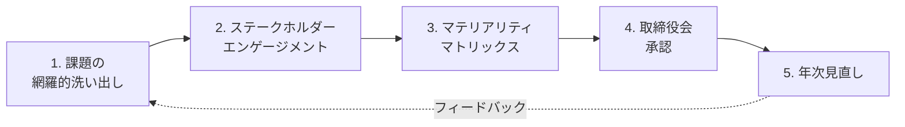

#### 1. 課題の網羅的洗い出し

- GRI Sector Standards の業種別マテリアル・トピック
- SASB Materiality Map（77 業種の特定マテリアル・トピック）
- ESG 格付機関の質問書（MSCI／Sustainalytics／CDP など）
- 業界団体・NGO の警告リスト
- 過去 3〜5 年のメディア報道・訴訟・行政指導事例

**「業種の常識を網羅する」**——ここが弱いと、後の 4 ステップがブレます。50〜100 の候補課題をリスト化するのが典型的です。

#### 2. ステークホルダー・エンゲージメント

洗い出した課題を、ステークホルダーごとに重要度を聴取します。

- **株主・機関投資家**：機関投資家アンケート、IR ミーティングでの言及、議決権行使のガイドライン
- **従業員**：全社アンケート、フォーカスグループ、労働組合の要望
- **顧客**：CSAT サーベイ、営業からのフィードバック、SNS のトーン分析
- **取引先**：CSR 調達アンケート、サプライヤー相互評価
- **地域社会・NGO**：地域協議会、業界 NGO との定期対話
- **政府・規制当局**：政策動向、パブリックコメント

**「対話は 1 回で終わらない」**——年次の定期対話が実装のカギです。

#### 3. マテリアリティ・マトリックス

洗い出した課題を、2 軸で配置して優先度を可視化します。

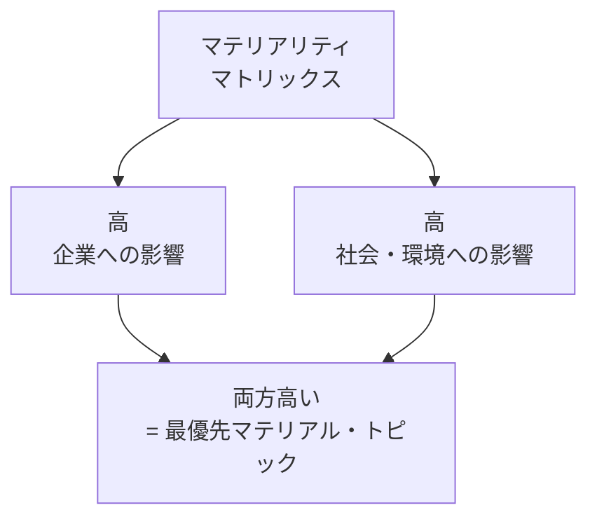

- **横軸**：企業への影響（財務マテリアリティ、リスク・機会）
- **縦軸**：社会・環境への影響（インパクトマテリアリティ）
- **右上（両方高い）**：最優先マテリアル・トピック（5〜10 個に絞るのが典型）
- **右下（企業だけ高い）**：セカンダリー・トピック
- **左上（社会・環境だけ高い）**：将来的マテリアル・トピック
- **左下（両方低い）**：モニタリング対象

**「10 個に絞る」のが実務の勘所**。20 個を優先課題にすると、実際のリソース配分は分散しすぎて成果が出ません。

#### 4. 取締役会承認

マテリアリティ・マトリックスと優先課題リストを、取締役会が正式に承認します。**この承認プロセスがないと、「経営が握らないマテリアリティ」になり、実装が進みません**。

- 経営会議での事前議論
- サステナビリティ委員会での確認
- 取締役会での承認
- 統合報告書・サステナ・レポートでの公表

#### 5. 年次見直し

**マテリアリティは決めきるものではなく、更新するもの**——本コースの中核メッセージの 1 つ。以下のトリガーで見直しが発生します。

- **外部環境の変化**：法規制の新設、業界の主要事件、大手企業の動向
- **ステークホルダーの声の変化**：機関投資家の関心の推移、顧客期待の変化
- **事業の変化**：M&A、新規事業、事業撤退
- **KPI 進捗の変化**：主要 KPI で大きな進展／後退があった場合

**「年次見直し」で更新した内容は、統合報告書で「今年のマテリアリティ更新のポイント」として説明**するのが実務です。

### ダブルマテリアリティの実装

前 2 コース（ESG 経営入門、カーボンニュートラル入門）で触れたダブルマテリアリティを、実装の側から見ていきます。

#### シングルマテリアリティとダブルマテリアリティ

- **シングルマテリアリティ**：企業への影響のみを判定基準（ISSB IFRS S1/S2）
- **ダブルマテリアリティ**：企業への影響＋社会・環境への影響の両方向（EU CSRD/ESRS）

#### 実装のポイント

ダブルマテリアリティを実装する場合、マテリアリティ・マトリックスの 2 軸を明確に区別する必要があります。

- **横軸「企業への影響」**：財務マテリアリティ、リスクと機会の観点
- **縦軸「社会・環境への影響」**：企業活動が外部に与える負のインパクト、正のインパクト

ESRS では **IRO（Impact・Risk・Opportunity）** の概念で、両方向をカテゴリごとに評価する枠組みを提示しています。

#### GRI と ESRS の違い

- **GRI Standards（2021 年改訂 Universal Standards）**：以前からダブルマテリアリティに近い考え方を採用、「マルチステークホルダー向け」
- **ESRS**：ダブルマテリアリティを明確に採用、詳細な IRO 評価を要求
- **ISSB IFRS S1/S2**：シングルマテリアリティ（財務マテリアリティ）を採用

**日本の企業は、EU 進出の有無で対応が変わる**——EU 域内で CSRD 対象になる場合、ESRS 準拠のダブルマテリアリティ実装が必須になります。

### まとめ

- マテリアリティは「対話の共通言語」で、報告書・KPI・経営会議・ステークホルダー対話の骨格
- 分析の 5 ステップ：課題洗い出し→ステークホルダー・エンゲージメント→マテリアリティ・マトリックス→取締役会承認→年次見直し
- マトリックスは「10 個に絞る」のが実務の勘所
- シングル（企業への影響）とダブル（＋社会・環境への影響）の 2 種類
- GRI はダブルに近い、ESRS は明確にダブル、ISSB はシングル
- EU 進出で ESRS 対応が必須になる可能性
- 「決めきる」から「更新する」への発想転換、12 か月のサイクル設計
- 現場メモの教訓：3 か月で決めきると社内対立で頓挫、12 か月サイクルで対話合意が実務

次のレッスンでは、フレームワーク横断——GRI・SASB・SDGs Compass と、統合報告書 vs SR レポート vs 有価証券報告書の使い分けを扱います。

### 確認クイズ

このレッスンの内容の理解度をチェックしましょう。

#### Q1. マテリアリティの役割として、本レッスンの内容と一致するものはどれですか？

- [x] 開示すべき情報を選定する重要性の判定基準で、報告書のフォーカス・KPI 設定・経営会議の議題・ステークホルダー対話の共通言語
- [ ] すべての情報を漏れなく開示するための網羅性の判定基準
- [ ] 財務諸表の重要性のみで、非財務情報とは無関係
- [ ] 経営陣が独自に決める、対話とは無関係の内部指標

> **解説**
> マテリアリティは「対話の共通言語」で、報告書のフォーカス・KPI 設定・経営会議の議題・ステークホルダー対話の骨格として機能します。網羅性ではなく重要度で絞る、非財務情報も対象、対話とセット、というのが本コースの立場です。

#### Q2. マテリアリティ分析の 5 ステップとして、本レッスンの内容と一致するものはどれですか？

- [ ] 計画→設計→実装→運用→終了
- [x] 課題の網羅的洗い出し→ステークホルダー・エンゲージメント→マテリアリティ・マトリックス→取締役会承認→年次見直し
- [ ] 目標設定→KPI 設定→実行→報告→承認
- [ ] マーケティング→販売→製造→R&D→IR

> **解説**
> 5 ステップは「1. 課題の網羅的洗い出し（GRI・SASB・格付機関質問書など）→2. ステークホルダー・エンゲージメント→3. マテリアリティ・マトリックス（2 軸で優先度を可視化、10 個に絞る）→4. 取締役会承認→5. 年次見直し」です。

#### Q3. マテリアリティ・マトリックスの 2 軸として、本レッスンの内容と一致するものはどれですか？

- [ ] 短期／長期
- [ ] 定量／定性
- [x] 横軸「企業への影響（財務マテリアリティ）」と縦軸「社会・環境への影響（インパクトマテリアリティ）」
- [ ] 経済／社会

> **解説**
> マテリアリティ・マトリックスは横軸「企業への影響（財務マテリアリティ、リスク・機会）」と縦軸「社会・環境への影響（インパクトマテリアリティ）」の 2 軸で配置し、優先度を可視化します。右上（両方高い）が最優先マテリアル・トピックで、10 個に絞るのが実務の勘所です。

#### Q4. GRI と ESRS のマテリアリティ扱いの違いとして、本レッスンの内容と一致するものはどれですか？

- [ ] GRI はシングルマテリアリティ、ESRS はダブルマテリアリティ
- [ ] GRI はダブルマテリアリティ、ESRS はシングルマテリアリティ
- [ ] 両者はシングルマテリアリティで統一
- [x] GRI は以前からダブルマテリアリティに近い、ESRS はダブルマテリアリティを明確に採用、ISSB IFRS S1/S2 はシングルマテリアリティ

> **解説**
> GRI Standards（2021 年改訂 Universal Standards）は以前からダブルマテリアリティに近い考え方（マルチステークホルダー向け）、ESRS はダブルマテリアリティを明確に採用（IRO 評価）、ISSB IFRS S1/S2 はシングルマテリアリティ（財務マテリアリティ）です。

#### Q5. 「マテリアリティを 3 か月で決めきろうとして頓挫した話」の教訓として、本レッスンの内容と一致するものはどれですか？

- [ ] マテリアリティは 3 か月で決めきるべき
- [ ] 部門の意見は聴かず、経営陣が独自に決めるのが正解
- [x] マテリアリティは「決めきるものではなく、対話で合意していくもの」、12 か月のサイクル（洗い出し→エンゲージメント→ワークショップ→承認→執筆）が実務の勘所
- [ ] マテリアリティ・マトリックスの優先課題は 20 以上に含めるべき

> **解説**
> 現場メモの教訓は「マテリアリティは決めきるものではなく、対話で合意していくもの」で、12 か月のサイクル設計が実務の勘所です。3 か月で決めきると社内対立で頓挫し、部門横断のワークショップで 10 課題に絞る対話が必要です。

#### Q6. マテリアリティの年次見直しトリガーとして、本レッスンで挙げられていないものはどれですか？

- [ ] 外部環境の変化（法規制の新設、業界事件、政策動向）
- [ ] ステークホルダーの声の変化（機関投資家の関心推移、顧客期待）
- [ ] 事業の変化（M&A、新規事業、事業撤退）
- [x] 決算月の変更

> **解説**
> 本レッスンで挙げた見直しトリガーは「外部環境の変化／ステークホルダーの声の変化／事業の変化／KPI 進捗の変化」です。「決算月の変更」は通常マテリアリティに直接影響しない事項で、見直しトリガーとしては挙げていません。

次のレッスンでは、フレームワーク横断——GRI 3 層構造（Universal Standards・Sector Standards・Topic Standards）、SASB Materiality Map、SDGs Compass、統合報告書 vs SR レポート vs 有価証券報告書の使い分けを扱います。

---

## レッスン4：フレームワーク横断——GRI／SASB／SDGs Compass／統合報告書 vs SR vs 有報

（所要時間：25分）

### このレッスンで学ぶこと

- GRI Standards の 3 層構造（Universal Standards・Sector Standards・Topic Standards）を把握する
- SASB Materiality Map の 77 業種特定マテリアリティを整理する
- SDGs Compass（2016 年、GRI・UNGC・WBCSD 共同）で SDGs 実装ステップを掴む
- 統合報告書 vs サステナビリティレポート vs 有価証券報告書の使い分けができる

---

前レッスンでは、マテリアリティ分析の 5 ステップとダブルマテリアリティを扱いました。本レッスンは、マテリアリティを開示・伝達するためのフレームワーク横断——GRI・SASB・SDGs Compass の使い分けと、3 つの開示書類の役割整理を扱います。中核メッセージ「フレームワークは道具——GRI・IRIS+・B Corp を使い分ける」の、開示側の中身です。

### GRI Standards の 3 層構造

**GRI**（Global Reporting Initiative）は 1997 年にボストンで発足したサステナビリティ報告基準の策定機関。GRI Standards は 2016 年に公表され、**2021 年に Universal Standards の大改訂**、Sector Standards が 2021 年以降順次公表されています。

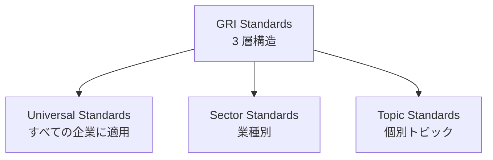

#### 1. Universal Standards（普遍基準）

**すべての報告企業に適用**。以下の 3 つの基準で構成されます。

- **GRI 1：基礎**（Foundation 2021）：報告作成の一般要求事項
- **GRI 2：一般開示事項**（General Disclosures 2021）：組織のプロファイル、戦略、ガバナンス、ステークホルダー・エンゲージメントなど
- **GRI 3：マテリアル・トピック**（Material Topics 2021）：マテリアリティ分析のプロセスと結果の開示

**2021 年の大改訂で、GRI 3 が「ダブルマテリアリティに近い考え方」を強化**しました。「インパクト」（企業活動が経済・社会・環境に与える影響）を軸に、マテリアリティ判定を行う方針が明確化されました。

#### 2. Sector Standards（業種別基準）

**業種ごとに開示すべき特定のマテリアル・トピック**を提示。2021 年から順次公表されており、2024 年時点で公表済みは以下です。

- **GRI 11：石油・ガス（Oil and Gas）**（2021 年 10 月公表）
- **GRI 12：石炭（Coal）**（2022 年 3 月公表）
- **GRI 13：農業・水産業・漁業（Agriculture, Aquaculture and Fishing）**（2022 年 6 月公表）
- **今後**：鉱業、金融、電力・ガス、繊維、食品・飲料、物流など約 40 業種を順次公表予定

**業種別基準は「業種特有のマテリアル・トピックを漏れなく開示する」ガイド**。企業は自社の業種の基準を確認し、Topic Standards と組み合わせて使います。

#### 3. Topic Standards（個別トピック基準）

**個別のマテリアル・トピックごとの開示要求事項**。以下の 3 つのシリーズで構成されます。

- **GRI 200 シリーズ：経済**（例：GRI 201 経済的成果、GRI 205 腐敗防止）
- **GRI 300 シリーズ：環境**（例：GRI 302 エネルギー、GRI 305 排出、GRI 306 廃棄物）
- **GRI 400 シリーズ：社会**（例：GRI 401 雇用、GRI 405 多様性・機会均等、GRI 414 サプライヤー社会的評価）

#### GRI の実務での使い方

- **In accordance with GRI Standards**：Universal Standards＋該当する Sector Standards＋関連する Topic Standards のすべてに準拠
- **With reference to GRI Standards**：部分的に GRI Standards を参照

**日本の上場企業のサステナビリティレポートは、GRI 準拠が事実上の標準**——2024 年時点で 500 社超が GRI 参照または準拠を表明。

### SASB Materiality Map

**SASB**（現 ISSB 傘下）の Materiality Map は、**77 業種ごとに投資家にとって重要な ESG トピック**を特定した基準です。

#### 77 業種の分類

SASB は独自の業種分類「SICS（Sustainable Industry Classification System）」で、次の 11 セクター・77 業種を定義しています。

- **消費財**（例：家電、衣料品、玩具、飲料）
- **抽出物・鉱物加工**（例：石炭、鉄鋼、金属加工）
- **金融**（例：商業銀行、資産運用、保険、投資銀行）
- **食品・飲料**（例：農産物、加工食品、レストラン）
- **医療**（例：医薬品、医療機器、医療サービス）
- **インフラ**（例：不動産、電力ガス、建設）
- **再エネ・代替エネルギー**（例：太陽光、風力、バイオ燃料）
- **資源変換**（例：航空宇宙、化学、コンテナ包装）
- **サービス**（例：カジノ、ホテル、教育、メディア）
- **技術・通信**（例：ソフトウェア、半導体、通信）
- **輸送**（例：自動車、航空、海運、物流）

#### SASB の実務での使い方

- **業種別マテリアル・トピックの参照**：自社業種の SASB 基準で、投資家にとって重要な ESG トピックを確認
- **ISSB IFRS S1/S2 との連動**：ISSB IFRS S1/S2 は SASB 基準を組み込んで具体化
- **GRI との補完**：GRI Sector Standards が公表されていない業種で、SASB を参照するのが実務

**「投資家向けの ESG 開示は SASB／ISSB、マルチステークホルダー向けの ESG 開示は GRI」**が使い分けの原則です。

### SDGs Compass——2016 年、SDGs 実装の 5 ステップ

**SDGs Compass** は、GRI・UN Global Compact・WBCSD が 2016 年に共同で公表した「企業が SDGs を事業戦略に統合するためのガイド」です。

#### 5 ステップ

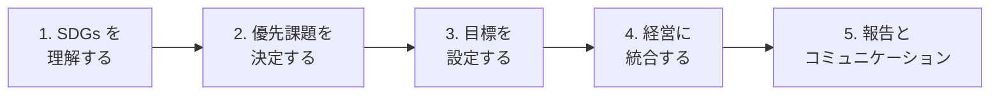

#### 各ステップの主な内容

- **1. SDGs を理解する**：17 目標、169 ターゲット、事業との関連を把握
- **2. 優先課題を決定する**：バリューチェーン全体で自社の SDGs 影響（プラス／マイナス）をマッピング、優先課題を特定
- **3. 目標を設定する**：Inside-Out アプローチ（現状から積み上げ）と Outside-In アプローチ（Backcasting、未来から逆算）の 2 手法、Ambitious Goals の設定
- **4. 経営に統合する**：中期経営計画への統合、リーダーシップの発揮、部門横断の推進体制
- **5. 報告とコミュニケーション**：GRI Standards や統合報告書での開示、Communication on Progress との統合

**「Backcasting（未来からの逆算）」は SDGs Compass の中核概念**——次レッスンで詳述します。従来の Forecasting（現状からの積み上げ）では、SDGs の Ambitious Goals は達成できないという発想です。

### 統合報告書 vs サステナビリティレポート vs 有価証券報告書

前 2 コースで触れた 3 つの開示書類を、サステナビリティ実務の視点から改めて整理します。

| 書類 | 主な対象読者 | 主なフレームワーク | 分量 | 発行主体 |
|---|---|---|---|---|
| **有価証券報告書** | 機関投資家・アナリスト・当局 | 内閣府令、ISSB IFRS S1/S2、SSBJ 基準 | 100〜250 ページ | 経理・IR・法務 |
| **統合報告書** | 機関投資家・アナリスト・機関 | IIRC フレームワーク、統合思考 | 80〜200 ページ | IR・経営企画・サステナ推進 |
| **サステナビリティレポート** | マルチステークホルダー | GRI Standards、ISO 26000 | 60〜300 ページ | サステナビリティ推進 |

#### 3 書類の使い分けの実務

- **有価証券報告書**：法定書類、機関投資家・当局向けの財務＋サステナ情報の必要最小限
- **統合報告書**：任意書類、中長期の価値創造ストーリーを機関投資家と対話するための書類
- **サステナビリティレポート**：任意書類、詳細な ESG データバンクとしてマルチステークホルダー向け

#### 数字の一貫性

3 書類で開示する ESG 数字（女性管理職比率、CO₂ 排出量、労働災害件数など）は**一貫している必要**があります。前レッスンで扱った「マスターデータから 3 書類を生成する運用」が実務の土台です。

### フレームワーク横断の実務パターン

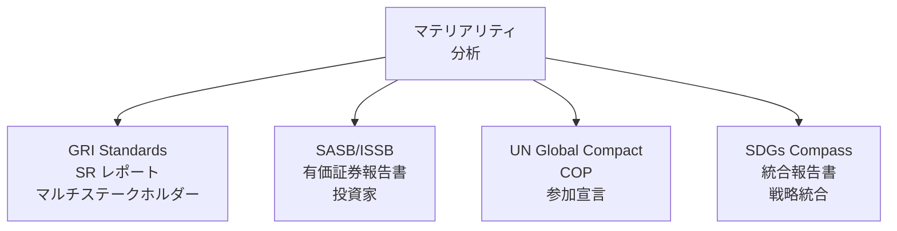

- **マテリアリティ分析を出発点に、複数のフレームワーク・報告書に展開**
- **GRI Standards** ⇒ **サステナビリティレポート**（マルチステークホルダー）
- **SASB／ISSB** ⇒ **有価証券報告書**（投資家）
- **UN Global Compact** ⇒ **Communication on Progress**（意思表明）
- **SDGs Compass** ⇒ **統合報告書**（戦略統合）

**「1 つのマテリアリティ分析から、複数のフレームワーク・報告書に展開する」**——これが実装する SDGs の全体像です。

### 中核メッセージの再確認

- **フレームワークは道具——GRI・IRIS+・B Corp を使い分ける**：GRI・SASB・SDGs Compass も道具の 1 つ。すべてを使う必要はなく、目的と対象読者に応じて使い分ける
- **マテリアリティは対話の共通言語**：フレームワーク横断で使う共通言語がマテリアリティ

### まとめ

- GRI Standards は 3 層構造：Universal Standards（普遍基準）＋Sector Standards（業種別）＋Topic Standards（個別トピック）
- GRI 2021 年改訂でダブルマテリアリティに近い考え方を強化
- SASB Materiality Map は 77 業種の投資家向け特定マテリアリティ、ISSB IFRS S1/S2 に組み込み
- SDGs Compass は 2016 年 GRI・UNGC・WBCSD 共同公表、5 ステップで SDGs を戦略統合
- 統合報告書（IIRC）／サステナビリティレポート（GRI）／有価証券報告書（法定）の使い分け
- 3 書類で ESG 数字の一貫性、マスターデータからの生成が実務の土台
- 1 つのマテリアリティ分析から複数のフレームワーク・報告書に展開

次のレッスンでは、KPI 設計と目標管理——Backcasting と対話の窓としての KPI を扱います。SDGs Compass の中核概念「Backcasting」の実装がテーマです。

### 確認クイズ

このレッスンの内容の理解度をチェックしましょう。

#### Q1. GRI Standards の 3 層構造として、本レッスンの内容と一致するものはどれですか？

- [x] Universal Standards（普遍基準、すべての企業に適用）＋Sector Standards（業種別）＋Topic Standards（個別トピック）
- [ ] Financial Standards＋ESG Standards＋Governance Standards
- [ ] Short-term＋Medium-term＋Long-term
- [ ] Global＋Regional＋Local

> **解説**
> GRI Standards は 3 層構造で、Universal Standards（GRI 1・2・3）、Sector Standards（業種別、2021 年から順次公表）、Topic Standards（GRI 200 経済、300 環境、400 社会）で構成されます。

#### Q2. SDGs Compass の説明として、本レッスンの内容と一致するものはどれですか？

- [ ] 2010 年に SASB が単独で公表した業種別基準
- [x] 2016 年に GRI・UN Global Compact・WBCSD が共同公表した、企業が SDGs を事業戦略に統合するための 5 ステップガイド
- [ ] 2020 年に日本の経産省が単独公表した SDGs 経営ガイド
- [ ] 2023 年に ISSB が公表した気候関連開示基準

> **解説**
> SDGs Compass は 2016 年に GRI・UN Global Compact・WBCSD が共同公表した企業向け SDGs ガイドで、5 ステップ（SDGs を理解する→優先課題を決定する→目標を設定する→経営に統合する→報告とコミュニケーション）で構成されます。

#### Q3. SDGs Compass の目標設定における 2 手法として、本レッスンの内容と一致するものはどれですか？

- [ ] 定量目標／定性目標
- [ ] 短期目標／長期目標
- [x] Inside-Out アプローチ（現状から積み上げ、Forecasting）と Outside-In アプローチ（未来から逆算、Backcasting）
- [ ] トップダウン／ボトムアップ

> **解説**
> SDGs Compass の目標設定における 2 手法は「Inside-Out（現状からの積み上げ、Forecasting）」と「Outside-In（未来からの逆算、Backcasting）」です。Backcasting は SDGs Compass の中核概念で、Ambitious Goals の設定に不可欠です。

#### Q4. SASB Materiality Map の説明として、本レッスンの内容と一致するものはどれですか？

- [ ] 全業種一律の ESG マテリアリティ基準
- [ ] SDGs 17 目標のマッピング
- [ ] 地域別の ESG リスクマップ
- [x] 77 業種ごとに投資家にとって重要な ESG トピックを特定した基準、SICS 分類、ISSB IFRS S1/S2 と連動

> **解説**
> SASB Materiality Map は独自の業種分類 SICS（Sustainable Industry Classification System）の 77 業種ごとに、投資家にとって重要な ESG トピックを特定した基準で、ISSB IFRS S1/S2 と連動して具体化されています。

#### Q5. 3 つの開示書類の使い分けとして、本レッスンの内容と一致するものはどれですか？

- [ ] 3 つとも法定書類として提出義務
- [x] 有価証券報告書（法定、機関投資家・当局）／統合報告書（任意、IIRC、機関投資家対話）／サステナビリティレポート（任意、GRI、マルチステークホルダー）
- [ ] 3 つとも GRI Standards に準拠
- [ ] 3 つの書類を統合して 1 本にするのが実務

> **解説**
> 3 つの書類の使い分けは「有価証券報告書（法定、財務＋サステナ情報）」「統合報告書（任意、IIRC フレームワーク、中長期価値創造ストーリー）」「サステナビリティレポート（任意、GRI Standards、詳細 ESG データバンク）」です。3 つを統合するのではなく、目的と対象読者ごとに使い分けます。

#### Q6. フレームワーク横断の実務パターンとして、本レッスンの内容と一致するものはどれですか？

- [ ] フレームワークは 1 つを選び、それだけを使う
- [ ] フレームワークは無視して、独自の枠組みだけで開示
- [x] マテリアリティ分析を出発点に、GRI→SR レポート／SASB→有報／UNGC→COP／SDGs Compass→統合報告書、と目的別に展開
- [ ] マテリアリティ分析なしで、すべてのフレームワークで開示

> **解説**
> フレームワーク横断の実務パターンは「マテリアリティ分析を出発点に、GRI（SR レポート、マルチステークホルダー）／SASB・ISSB（有価証券報告書、投資家）／UN Global Compact（Communication on Progress、意思表明）／SDGs Compass（統合報告書、戦略統合）に展開する」です。

次のレッスンでは、KPI 設計と目標管理——Backcasting と対話の窓としての KPI を扱います。SDGs Compass の中核概念「Backcasting」の実装がテーマです。

---

## レッスン5：KPI 設計と目標管理——Backcasting と対話の窓としての KPI

（所要時間：25分）

### このレッスンで学ぶこと

- Backcasting と Forecasting の違いを整理する
- Backcasting による Ambitious Goal 設定の実務を捉える
- KPI の 4 分類（結果・過程・入力・活動）を組み立てられる
- 「対話の窓としての KPI」の考え方を掴む
- GRI・SASB 指標の使い分けができる

---

前レッスンでは、GRI・SASB・SDGs Compass のフレームワーク横断と 3 つの開示書類の使い分けを扱いました。本レッスンは、SDGs Compass の中核概念**「Backcasting」の実装**と、KPI 設計の実務を扱います。中核メッセージ「バックキャスティングは、経営の思考の型を変える」——本レッスンの主題です。

### Backcasting と Forecasting——時間軸の逆転

#### Forecasting（現状からの積み上げ）

**過去のトレンドと現状の能力から、未来を予測**する伝統的なアプローチ。

- **手法**：過去 3〜5 年のトレンド分析、現状の設備・人員・予算から、達成可能な将来を導く
- **強み**：現実的で、リソース制約と整合
- **弱み**：現状の延長線を超えられない。SDGs のような Ambitious Goal は達成できない

#### Backcasting（未来からの逆算）

**「未来にあるべき姿」から現在への逆算**で、目標を設定する。SDGs Compass の中核概念。

- **手法**：2030 年（または 2050 年）の目標を先に置き、そこから逆算して現在の行動を導く
- **強み**：Ambitious Goal に届くための跳躍が可能
- **弱み**：現状のリソースとギャップがあり、実現性の議論が必要

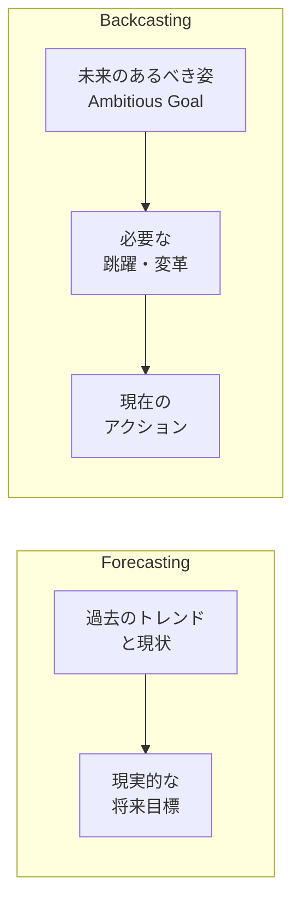

#### 実務の統合パターン

現実の SDGs 経営は、**Backcasting で Ambitious Goal を設定し、Forecasting で短期実行計画を作る**、という統合パターンが多いです。

- **長期（2030 年、2050 年）**：Backcasting で目標設定
- **中期（3〜5 年）**：Backcasting からの中間目標
- **短期（1 年）**：Forecasting で実行計画

**「バックキャスティングは経営の思考の型を変える」**——本レッスンの中核メッセージが指すのは、この統合パターンです。

### KPI の 4 分類——結果・過程・入力・活動

KPI（Key Performance Indicator、重要業績評価指標）は、目標達成を測るための定量指標です。サステナビリティ実務では、以下の 4 分類で整理すると、対話に使いやすくなります。

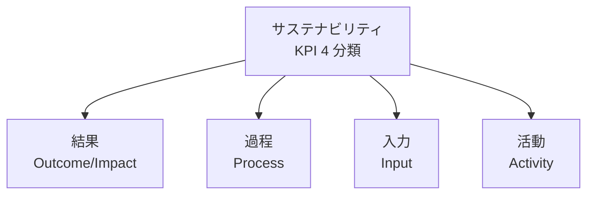

#### 1. 結果 KPI（Outcome/Impact）

**最終的な社会・環境への影響**を測る指標。

- 例：CO₂ 排出量削減率（対 2019 年比）、女性管理職比率、顧客満足度（CSAT）、離職率、労働災害件数

#### 2. 過程 KPI（Process）

**結果に至るまでの過程・仕組み**を測る指標。

- 例：EMS 認証取得率、Human Rights Due Diligence 実施率、サプライヤー CSR 監査実施率、Diversity トレーニング受講率

#### 3. 入力 KPI（Input）

**投入資源**を測る指標。

- 例：R&D 投資額、CSR 予算、環境設備投資額、CSR 部門の人員数

#### 4. 活動 KPI（Activity）

**実際に行った活動**を測る指標。

- 例：ボランティア参加者数、環境教育セミナー実施回数、サプライヤーエンゲージメント回数

#### 4 分類の使い分け

- **結果 KPI が最重要**——中期経営計画、統合報告書、投資家対話の中核
- **過程 KPI で改善を追跡**——年次で進捗管理、内部監査
- **入力 KPI と活動 KPI は補完**——過度に強調すると、KPI 達成が目的化するリスク

**「入力・活動 KPI だけでは、社会は変わらない」**——ここが SDGs ウォッシュの落とし穴です。「ボランティア参加者 1,000 人」と誇っても、社会課題の解決には直接繋がらないことがあります。

### 「対話の窓としての KPI」——数字の裏に文脈を残す

サステナビリティ KPI は、単なる数値ではなく「対話の材料」として位置づけるのが本コースの立場。中核メッセージ「KPI は目標ではなく、対話の窓——数字の裏に文脈を残す」——ここが実装のポイントです。

#### 対話の窓としての KPI の 3 要素

1. **数値**：KPI の実績値
2. **文脈**：達成/未達成の背景、要因分析、事業への影響
3. **前向きな見通し**：改善策、次年度目標、経営判断

#### 開示の実務パターン

- **良い例**：「CO₂ 排出量は 2019 年比 12% 削減（目標 15% に対し 3 ポイント下振れ）。要因は工場 A の生産増（＋4%）と再エネ調達切り替えの遅延（＋2%）。対策として工場 A の電化投資を 2026 年度に前倒し。」
- **悪い例**：「CO₂ 排出量は 2019 年比 12% 削減。」（数値のみ、文脈と見通しなし）

**「数字だけを見せる」から「数字と文脈と見通しを見せる」への転換**——これが対話の窓としての KPI の実装です。

### GRI と SASB の指標の使い分け

前レッスンで扱った GRI と SASB は、指標レベルでも違いがあります。

#### GRI の指標

- **マルチステークホルダー向け**：投資家だけでなく、従業員・顧客・地域社会・NGO 向け
- **業種横断の Universal Standards＋業種別 Sector Standards＋個別 Topic Standards**
- **例**：GRI 305（排出）、GRI 401（雇用）、GRI 405（多様性）

#### SASB の指標

- **投資家向け**：財務業績に影響するマテリアル・トピックに絞る
- **業種特化**：77 業種ごとに特定
- **例**：業種別の CO₂ 排出強度、労災率、規制関連罰金額

#### 開示書類との対応

- **サステナビリティレポート**：GRI 指標を中心に、詳細データを開示
- **統合報告書**：GRI・SASB の主要指標をピックアップ、価値創造ストーリーと結びつける
- **有価証券報告書**：SASB・ISSB 指標を中心に、財務との整合を確保

### 年次アップデートのサイクル

KPI 実務は年次サイクルで回します。

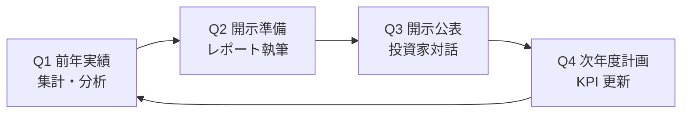

- **Q1**：前年実績の集計、要因分析、達成／未達成の背景整理
- **Q2**：統合報告書・サステナビリティレポートの執筆
- **Q3**：発行、機関投資家との対話、格付機関質問書対応
- **Q4**：次年度計画の策定、KPI の設定・更新、経営会議での承認

### SBT の考え方——気候領域の目標設定

前 2 コース（気候変動）で扱った SBT（Science Based Target）の考え方は、SDGs 実装で重要な役割を果たします。**「気候科学に基づいて逆算した目標」——これは Backcasting の代表例**です。

- **1.5℃目標**：パリ協定に整合する削減率
- **SBTi 認定**：CDP・UN Global Compact・WRI・WWF の 4 機関共同運営（詳細は気候別コース）

SBT の考え方を SDGs の他領域（水、生物多様性、人権、健康）に応用する動きも広がっています。**「科学的根拠に基づく目標設定（Science-based Target Setting）」を SDGs 全体に広げる**のが、2020 年代後半の潮流です。

### 中核メッセージの再確認

- **バックキャスティングは、経営の思考の型を変える**：Forecasting だけでは Ambitious Goal に届かない。Backcasting で 2030/2050 の目標を先に置き、そこから逆算する
- **KPI は目標ではなく、対話の窓——数字の裏に文脈を残す**：数字だけを見せる開示は対話にならない。文脈と見通しをセットにする

### まとめ

- Forecasting は現状からの積み上げ、Backcasting は未来からの逆算
- SDGs Compass の中核概念は Backcasting、Ambitious Goal の設定に不可欠
- 実務では Backcasting で長期目標、Forecasting で短期実行計画の統合パターン
- KPI の 4 分類：結果（Outcome/Impact）／過程（Process）／入力（Input）／活動（Activity）
- 結果 KPI が最重要、入力・活動 KPI だけでは社会は変わらない
- 対話の窓としての KPI：数値＋文脈＋前向きな見通しの 3 要素
- GRI（マルチステークホルダー）と SASB（投資家）で指標を使い分け
- 年次サイクル：Q1 集計・Q2 執筆・Q3 対話・Q4 次計画
- SBT の考え方は Backcasting の代表例、他領域への応用が広がる

次のレッスンでは、サプライチェーン責任——EcoVadis・CSDDD・紛争鉱物・フェアトレード・生物多様性を扱います。「見えないところが本番」——中核メッセージの実装がテーマです。

### 確認クイズ

このレッスンの内容の理解度をチェックしましょう。

#### Q1. Forecasting と Backcasting の違いとして、本レッスンの内容と一致するものはどれですか？

- [x] Forecasting は過去のトレンドと現状から積み上げる予測、Backcasting は「未来にあるべき姿」から現在への逆算で目標設定
- [ ] Forecasting は財務予測、Backcasting は非財務予測
- [ ] 両者は同じで、名前が違うだけ
- [ ] Forecasting は Backcasting の後の段階

> **解説**
> Forecasting は「過去のトレンドと現状の能力から、未来を予測する」伝統的アプローチ、Backcasting は「未来にあるべき姿から現在への逆算で目標を設定する」SDGs Compass の中核概念です。Backcasting は Ambitious Goal に届くための跳躍を可能にします。

#### Q2. KPI の 4 分類として、本レッスンの内容と一致するものはどれですか？

- [ ] 短期・中期・長期・永続
- [x] 結果（Outcome/Impact）・過程（Process）・入力（Input）・活動（Activity）
- [ ] 財務・環境・社会・ガバナンス
- [ ] マーケティング・営業・製造・R&D

> **解説**
> KPI の 4 分類は「結果（Outcome/Impact、社会・環境への影響）／過程（Process、結果に至る仕組み）／入力（Input、投入資源）／活動（Activity、実際に行った活動）」です。結果 KPI が最重要で、入力・活動 KPI だけでは社会は変わらない、が本コースの立場です。

#### Q3. 「対話の窓としての KPI」の 3 要素として、本レッスンの内容と一致するものはどれですか？

- [ ] 数値・グラフ・写真
- [ ] 過去・現在・将来
- [x] 数値・文脈（背景・要因）・前向きな見通し（改善策・次年度目標）
- [ ] 目標・実績・差異

> **解説**
> 対話の窓としての KPI の 3 要素は「数値（KPI の実績値）」「文脈（達成/未達成の背景、要因分析）」「前向きな見通し（改善策、次年度目標、経営判断）」です。数字だけを見せる開示は対話にならず、3 要素をセットで見せるのが実務。

#### Q4. GRI と SASB の指標の使い分けとして、本レッスンの内容と一致するものはどれですか？

- [ ] GRI は投資家向け、SASB はマルチステークホルダー向け
- [ ] 両者は同じで、指標名が違うだけ
- [ ] GRI は日本国内、SASB は海外
- [x] GRI はマルチステークホルダー向け（Universal＋Sector＋Topic）、SASB は投資家向けの業種特化（77 業種）

> **解説**
> GRI はマルチステークホルダー向けで、Universal Standards＋Sector Standards＋Topic Standards の 3 層構造。SASB は投資家向けの業種特化基準で、77 業種の特定マテリアル・トピックです。開示書類での使い分けは、SR レポートは GRI 中心、有価証券報告書は SASB・ISSB 中心です。

#### Q5. Backcasting と Forecasting の実務での統合パターンとして、本レッスンの内容と一致するものはどれですか？

- [ ] Backcasting のみで、Forecasting は不要
- [x] 長期（2030 年・2050 年）を Backcasting、中期（3〜5 年）を Backcasting からの中間目標、短期（1 年）を Forecasting で実行計画
- [ ] Forecasting のみで、Backcasting は不要
- [ ] Backcasting と Forecasting を毎年交互に切り替える

> **解説**
> 実務の統合パターンは「Backcasting で Ambitious Goal を設定し、Forecasting で短期実行計画を作る」です。長期（2030 年・2050 年）は Backcasting、中期（3〜5 年）は Backcasting からの中間目標、短期（1 年）は Forecasting で実行計画、という時間軸ごとの使い分けが実務です。

#### Q6. KPI 実務の年次サイクル（Q1〜Q4）として、本レッスンの内容と一致するものはどれですか？

- [ ] Q1 発行・Q2 対話・Q3 計画・Q4 実行
- [ ] Q1 目標・Q2 実行・Q3 評価・Q4 改善
- [x] Q1 前年実績集計・Q2 開示準備・Q3 開示公表と投資家対話・Q4 次年度計画と KPI 更新
- [ ] Q1 予算・Q2 発注・Q3 納入・Q4 検収

> **解説**
> KPI 実務の年次サイクルは「Q1 前年実績の集計・要因分析→Q2 統合報告書・SR レポート執筆→Q3 発行・機関投資家対話・格付機関質問書対応→Q4 次年度計画策定・KPI 更新・経営会議承認」です。ほかの選択肢は事業計画、PDCA サイクル、購買プロセスの分類です。

次のレッスンでは、サプライチェーン責任——EcoVadis・CSDDD・紛争鉱物・フェアトレード・生物多様性を扱います。「見えないところが本番」——中核メッセージの実装がテーマです。

---

## レッスン6：サプライチェーン責任——EcoVadis・CSDDD・紛争鉱物・フェアトレード

（所要時間：25分）

### このレッスンで学ぶこと

- サプライチェーン責任の背景と、「見えないところが本番」の意味を掴む
- EcoVadis（2007 年設立）のサプライヤー評価の実務を捉える
- CSDDD 2024 年 5 月採択の一般論としての位置づけを理解する（詳細は気候別コース）
- 紛争鉱物（3TG）と米国 Dodd-Frank 法（2010 年）の実務を把握する
- フェアトレード認証（コーヒー・カカオ・バナナ・コットン）の役割を整理する
- 生物多様性と TNFD の位置づけを捉える

---

前レッスンでは、KPI 設計と Backcasting、対話の窓としての KPI を扱いました。本レッスンは、サステナビリティ実務の最難関——サプライチェーン責任を扱います。中核メッセージ「サプライチェーン責任は『見えないところ』が本番」の、そのものの主題です。

### 「見えないところ」の重要性

企業のサステナビリティ・パフォーマンスの多くは、自社の見える範囲（自社工場、自社オフィス、自社従業員）ではなく、**サプライチェーンの奥深く（Tier 2、Tier 3、原材料の産地）**で決まります。

#### 見えないところで起きる問題

- **強制労働**：綿花の産地、水産物の遠洋漁業
- **児童労働**：カカオの西アフリカ、コーヒーの中南米、コットンのウズベキスタン
- **環境破壊**：熱帯雨林の伐採（パーム油、木材）、河川汚染（染色業）
- **紛争鉱物**：コンゴ民主共和国のタンタル、タングステン、錫、金の採掘
- **人権侵害**：新疆ウイグルの綿花・トマト、東南アジアの水産物

**「自社では正しく事業をしていても、サプライチェーンで問題が発覚すれば企業ブランドは毀損される」**——これがサプライチェーン責任の実務的な重みです。

### EcoVadis——2007 年、サプライヤー評価の標準

**EcoVadis** は、2007 年にフランスで設立されたサプライヤーのサステナビリティ評価機関です。**「サプライヤー評価版の格付機関」**として、購買企業がサプライヤーに評価を依頼する仕組み。

#### 評価の枠組み

- **21 のテーマ**：環境・労働と人権・倫理・持続可能な調達の 4 領域
- **業種別**：業種と規模に応じた質問セット
- **スコアリング**：0〜100 点、Bronze／Silver／Gold／Platinum の 4 メダル

#### 実務での使い方

- **購買企業**：主要サプライヤーに EcoVadis 評価取得を依頼、社内の CSR 調達方針に組み込む
- **サプライヤー**：EcoVadis 評価取得で、複数の購買企業へ 1 度の提出で対応
- **業界標準**：自動車、化学、電機、消費財の各業界で事実上の標準

#### 日本での普及

日本でも大手企業が主要サプライヤー数千社に EcoVadis 評価取得を求める動きが広がっており、**「取引の前提条件」**として位置づけられつつあります。

### CSDDD——2024 年 5 月採択、一般論としての位置づけ

**CSDDD**（Corporate Sustainability Due Diligence Directive、企業サステナビリティ・デュー・ディリジェンス指令）は、前のカーボンニュートラル入門コースで詳述しました。ここでは、サプライチェーン責任の観点から改めて位置づけます。

#### サプライチェーン責任の観点

- **サプライチェーン全体のリスク特定**：環境・人権・労働慣行のリスクを、Tier 1 だけでなく Tier 2 以降も対象
- **予防・軽減措置**：リスクへの対応計画と実施
- **是正措置**：問題発生時の是正
- **エンゲージメント**：サプライヤー・ステークホルダーとの対話
- **開示**：DD 実施状況の年次開示

#### 日本企業への影響

**「EU 域外の企業でも、EU 内純売上高 4.5 億ユーロ超なら対象」**——日本企業も EU 内の売上規模によって対象になる可能性があります。CSDDD 詳細は気候別コースで扱いますが、サプライチェーン責任の観点で「デュー・ディリジェンスが法律で義務化される」という潮流は、EU 発で世界に広がりつつあります。

### 紛争鉱物——3TG と米国 Dodd-Frank 法

**紛争鉱物**（Conflict Minerals）は、コンゴ民主共和国（DRC）とその周辺国（アフリカ大湖地域）から産出される、武装勢力の資金源となる鉱物です。**3TG**（Tin、Tantalum、Tungsten、Gold）の 4 種類が主対象。

#### 主な用途

- **スズ（Sn、Tin）**：はんだ、ブリキ、電子部品
- **タンタル（Ta、Tantalum）**：コンデンサ、半導体
- **タングステン（W、Tungsten）**：切削工具、フィラメント
- **金（Au、Gold）**：電子接点、装飾品、投資

#### 米国 Dodd-Frank 法（2010 年）と RCOI

**Dodd-Frank Wall Street Reform and Consumer Protection Act** の第 1502 条（2010 年 7 月成立）は、SEC 登録企業に対して、3TG の使用状況と原産国調査（RCOI、Reasonable Country of Origin Inquiry）を義務化しました。

- **対象企業**：SEC 登録企業（米国上場企業）、および そのサプライヤー（日本企業も含む）
- **報告**：Form SD の年次提出
- **RCOI**：合理的な原産国調査、Conflict Free Sourcing Initiative（CFSI）の Conflict Minerals Reporting Template（CMRT）を使用

#### 実務での対応

- **サプライヤー調査**：CMRT で 3TG の使用と製錬所を特定
- **RMI（Responsible Minerals Initiative）**：責任ある鉱物調達イニシアチブに参加
- **監査済み製錬所の使用**：責任ある製錬所からの調達を優先

**電機・自動車業界では、Dodd-Frank 法対応が事実上の必須**——日本の大手電機・自動車メーカーもサプライヤーに CMRT 提出を求めています。

### フェアトレード——コーヒー・カカオ・バナナ・コットン

**フェアトレード**は、開発途上国の生産者に公正な価格を保証し、労働環境や環境保全を確保する国際的な取り組みです。**Fairtrade International**（1997 年設立）が国際認証を運営。

#### 主な認証対象

- **コーヒー**：中南米、アフリカ、東南アジア産
- **カカオ**：西アフリカ産（ガーナ、コートジボワール）
- **バナナ**：中南米産
- **コットン**：インド、西アフリカ、中央アジア産
- **その他**：紅茶、砂糖、ハチミツ、香辛料、花、金、ワインなど

#### 認証の仕組み

- **フェアトレード最低価格**：市場価格が下落した際の生産者保護
- **フェアトレード・プレミアム**：生産者組合が地域開発に使う追加資金
- **労働環境基準**：児童労働の禁止、労働組合の権利、安全な労働環境
- **環境基準**：農薬使用制限、水資源管理、生物多様性保護

#### 日本での普及

日本のスーパー・コンビニ・カフェチェーンでも、フェアトレード認証コーヒー・カカオを扱う動きが広がっています。**「フェアトレード認証コーヒーの取扱率」を KPI にする外食チェーン**も増えています。

### サプライチェーン人権 DD——OECD ガイドライン

**OECD 多国籍企業行動指針**（1976 年策定、2011 年改訂）と **国連指導原則（UNGP、Guiding Principles on Business and Human Rights、2011 年）** は、企業のサプライチェーン人権デュー・ディリジェンスの国際的基準です。

#### 6 ステップの人権 DD

1. **人権方針の策定**：CEO レベルのコミットメント
2. **人権影響評価**：バリューチェーン全体でのリスク特定
3. **人権への対応**：影響を軽減・防止する措置
4. **モニタリング**：継続的な追跡
5. **報告**：ステークホルダーへの開示
6. **救済**：影響を受けた人々への救済メカニズム

#### 日本の動き

- **経済産業省「責任あるサプライチェーンにおける人権尊重のためのガイドライン」**（2022 年 9 月公表）
- **大手企業の人権 DD レポート発行の急拡大**（2020 年代前半）

### 生物多様性と TNFD

前 2 コース（気候変動）で触れた TNFD（Taskforce on Nature-related Financial Disclosures）は、サプライチェーン責任の観点でも重要です。

#### 生物多様性のサプライチェーン依存

- **森林リスク・コモディティ**：パーム油、大豆、木材、畜牛肉、コーヒー、カカオ
- **水リスク**：水を大量消費する農業・繊維産業
- **土壌リスク**：単一栽培による土壌劣化
- **海洋リスク**：過剰漁獲、混獲

#### TNFD の LEAP アプローチ

- **Locate**：サプライチェーンでの自然への依存・影響の場所特定
- **Evaluate**：依存・影響の評価
- **Assess**：リスク・機会の評価
- **Prepare**：開示準備

**生物多様性は「気候変動の次の主戦場」**——2020 年代後半の企業サステナビリティで、注目度が急速に高まる領域です。

### 中核メッセージの再確認

- **サプライチェーン責任は「見えないところ」が本番**：Tier 1 だけでなく、Tier 2・Tier 3・原材料の産地まで踏み込むのが実務
- **フレームワークは道具**：EcoVadis・CSDDD・OECD ガイドライン・Fairtrade・TNFD——すべて道具の 1 つ、目的に応じて使い分ける

### まとめ

- サプライチェーン責任の背景：見えないところで起きる強制労働・児童労働・環境破壊・紛争鉱物
- EcoVadis は 2007 年設立、サプライヤー評価の標準、21 テーマ・4 領域・4 メダル
- CSDDD は 2024 年 5 月採択、EU 内純売上高 4.5 億ユーロ超の EU 域外企業も対象
- 紛争鉱物 3TG（スズ・タンタル・タングステン・金）、米国 Dodd-Frank 法 2010 年で SEC 登録企業に RCOI 義務化
- フェアトレード：Fairtrade International 1997 年設立、コーヒー・カカオ・バナナ・コットンなど
- OECD ガイドラインと国連指導原則で人権 DD の 6 ステップ
- 日本の経産省「人権尊重ガイドライン」2022 年 9 月公表
- 生物多様性と TNFD の LEAP アプローチ、2020 年代後半の主戦場

次のレッスンでは、認証・認定——B Corp 認証 5 領域、Fair Trade、UN Global Compact 参加を扱います。

### 確認クイズ

このレッスンの内容の理解度をチェックしましょう。

#### Q1. 「サプライチェーン責任は『見えないところ』が本番」の意味として、本レッスンの内容と一致するものはどれですか？

- [x] 自社の見える範囲だけでなく、Tier 2・Tier 3・原材料の産地まで踏み込むのが実務
- [ ] 自社の中だけで対応すれば十分で、サプライヤーは無関係
- [ ] 見える範囲の Tier 1 だけで十分
- [ ] 見えないところは実務上対応不可能

> **解説**
> 「見えないところが本番」の意味は、Tier 1（直接取引先）だけでなく、Tier 2・Tier 3・原材料の産地まで踏み込むのが実務、というものです。自社の中だけで対応すれば十分、Tier 1 だけで十分、対応不可能、という発想は本コースの立場と反対です。

#### Q2. EcoVadis の説明として、本レッスンの内容と一致するものはどれですか？

- [ ] 2000 年に IPCC が設立した気候変動評価機関
- [x] 2007 年にフランスで設立されたサプライヤーのサステナビリティ評価機関、21 テーマ・4 領域（環境・労働と人権・倫理・持続可能な調達）、4 メダル（Bronze/Silver/Gold/Platinum）
- [ ] 2020 年に日本の経産省が設立した国内評価機関
- [ ] 認証機関ではなく、単なる情報提供 NGO

> **解説**
> EcoVadis は 2007 年にフランスで設立されたサプライヤー・サステナビリティ評価機関で、21 テーマ・4 領域・4 メダル（Bronze/Silver/Gold/Platinum）でスコアリングします。「サプライヤー評価版の格付機関」として業界標準の位置づけです。

#### Q3. 紛争鉱物 3TG として、本レッスンの内容と一致するものはどれですか？

- [ ] Copper・Iron・Aluminum
- [ ] Silver・Platinum・Palladium
- [x] Tin（スズ）・Tantalum（タンタル）・Tungsten（タングステン）・Gold（金）
- [ ] Bronze・Silver・Gold

> **解説**
> 紛争鉱物 3TG は Tin（スズ）・Tantalum（タンタル）・Tungsten（タングステン）・Gold（金）の 4 種類です。コンゴ民主共和国（DRC）とその周辺国から産出される、武装勢力の資金源となる鉱物として、米国 Dodd-Frank 法（2010 年）で規制対象になりました。

#### Q4. 米国 Dodd-Frank 法の第 1502 条について、本レッスンの内容と一致するものはどれですか？

- [ ] 2000 年成立、日本企業は対象外
- [ ] 気候変動関連の開示のみを義務化
- [ ] 認証機関の設立を義務化
- [x] 2010 年 7 月成立、SEC 登録企業に 3TG の使用状況と原産国調査（RCOI）、Form SD の年次提出を義務化、そのサプライヤー（日本企業も含む）も対応

> **解説**
> Dodd-Frank Wall Street Reform and Consumer Protection Act の第 1502 条は 2010 年 7 月に成立し、SEC 登録企業（米国上場企業）に 3TG の使用状況と原産国調査（RCOI、Reasonable Country of Origin Inquiry）、Form SD の年次提出を義務化しました。そのサプライヤー（日本企業も含む）にも対応が求められます。

#### Q5. Fairtrade International の説明として、本レッスンの内容と一致するものはどれですか？

- [x] 1997 年設立、フェアトレード国際認証、コーヒー・カカオ・バナナ・コットンなどが主な認証対象、フェアトレード最低価格とプレミアムで生産者保護
- [ ] 2020 年設立、認証活動を行わない情報提供組織
- [ ] 米国政府が運営する政府機関
- [ ] EU が運営する規制機関

> **解説**
> Fairtrade International は 1997 年設立の国際認証機関で、コーヒー・カカオ・バナナ・コットンなどが主な認証対象。フェアトレード最低価格（市場価格下落時の生産者保護）とフェアトレード・プレミアム（生産者組合が地域開発に使う追加資金）、労働環境基準（児童労働禁止）、環境基準（農薬制限）などで生産者と労働者を保護します。

#### Q6. サプライチェーン人権 DD の国際的基準として、本レッスンの内容と一致するものはどれですか？

- [ ] IFRS S1/S2 と SSBJ 基準
- [ ] SBTi と CDP
- [x] OECD 多国籍企業行動指針（1976 年策定、2011 年改訂）と国連指導原則（UNGP、2011 年）
- [ ] ISO 26000 と ISO 14001

> **解説**
> サプライチェーン人権 DD の国際的基準は「OECD 多国籍企業行動指針」（1976 年策定、2011 年改訂）と「国連指導原則（UNGP、Guiding Principles on Business and Human Rights、2011 年）」です。日本の経産省は 2022 年 9 月に「責任あるサプライチェーンにおける人権尊重のためのガイドライン」を公表し、これに沿った国内対応を進めています。

次のレッスンでは、認証・認定——B Corp 認証 5 領域、Fair Trade、UN Global Compact 参加を扱います。B Corp の日本第 1 号「石井食品」2016 年、5 領域評価（ガバナンス・従業員・コミュニティ・環境・顧客）の実務がテーマです。

---

## レッスン7：認証・認定——B Corp・Fair Trade・UN Global Compact 参加

（所要時間：25分）

### このレッスンで学ぶこと

- B Corp 認証（2006 年 B Lab 創設、2007 年認証開始）の 5 領域評価を把握する
- 日本第 1 号（石井食品、2016 年）から広がる日本での B Corp 動向を捉える
- Fair Trade International の認証プロセスを整理する
- UN Global Compact 参加と Communication on Progress（COP）の実務を組み立てられる
- 認証・認定の 3 つの活用パターン（外部発信・内部改善・調達要件）を理解する
- 講師の現場メモから、B Corp 認証実務の実感を掴む

---

前レッスンでは、サプライチェーン責任と EcoVadis・CSDDD・紛争鉱物・フェアトレード・OECD ガイドラインを扱いました。本レッスンは、企業のサステナビリティ活動を「認証・認定」の形で対外的に示す枠組みを扱います。中核メッセージ「フレームワークは道具」の、認証層の実装です。

### B Corp 認証——2006 年、B Lab 創設

**B Corp（Certified B Corporation）** は、非営利組織 **B Lab**（2006 年米国で創設）が認証する、企業のサステナビリティ・パフォーマンスの総合認証です。**「株主だけでなく、すべてのステークホルダーの利益を考慮する企業」**を認定します。

#### 歴史

- **2006 年**：B Lab 創設（Jay Coen Gilbert、Bart Houlahan、Andrew Kassoy の 3 人）
- **2007 年**：認証開始、19 社が初期認証
- **2016 年**：日本第 1 号として **石井食品** が認証取得
- **2024 年**：世界で 8,000 社超が認証、日本で 30 社超が認証

#### 5 領域評価（B Impact Assessment）

B Corp 認証は、**B Impact Assessment**（BIA）という質問票で、次の 5 領域を評価します。

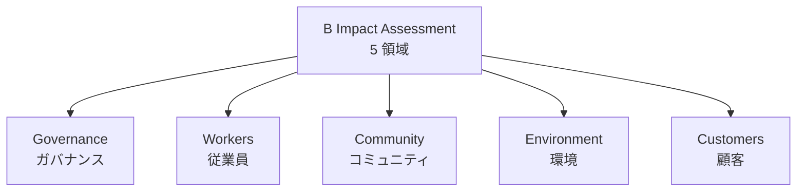

- **Governance（ガバナンス）**：ミッション統合、倫理と透明性、株主関与
- **Workers（従業員）**：雇用の質、賃金、健康と安全、キャリア開発、多様性
- **Community（コミュニティ）**：多様性・公平性・包摂性、サプライヤーとの関係、地域社会への貢献
- **Environment（環境）**：環境マネジメント、気候変動、水、土地・生命、廃棄物
- **Customers（顧客）**：顧客保護、製品・サービスの社会的インパクト

#### 認証プロセス

- **1. B Impact Assessment 実施**：オンラインの質問票（150〜200 問）に回答
- **2. スコアリング**：合計 200 点、**認証には 80 点以上が必要**
- **3. Verification（検証）**：B Lab の担当者によるドキュメント検証
- **4. Legal Requirement（法的要件）**：定款で「株主だけでなくステークホルダーの利益」を明記
- **5. 認証取得**：3 年ごとの更新

**取得までの標準期間は 12〜18 か月**——実装する SDGs の総合診断として位置づけられます。

#### B Corp の広がり

- **米国**：Patagonia、Ben & Jerry's、Danone North America、Etsy、Kickstarter
- **欧州**：Innocent Drinks、Nespresso（一部子会社）、L'Oréal（一部子会社）
- **日本**：石井食品、フリージア（2018 年）、シルクロード（2019 年）、リコー（2023 年）ほか
- **業種**：食品、飲料、化粧品、アパレル、IT、コンサルティング、金融など幅広い

### まとめ

- B Corp は 2006 年 B Lab 創設、2007 年認証開始、日本第 1 号は石井食品 2016 年
- 5 領域評価（Governance/Workers/Community/Environment/Customers）、B Impact Assessment 150〜200 問、80 点以上で認証
- 認証プロセスは 12〜18 か月、3 年ごと更新、法的要件（定款統合）
- Fair Trade International 1997 年設立、Trader License と製品ごとの認証、FLOCERT による監査
- UN Global Compact 参加は CEO レター、年会費、Communication on Progress（COP）年次提出
- 2 年間 COP 未提出で Delisting
- GRI 準拠（in accordance）と GRI 参照（with reference）の 2 水準
- 認証・認定の 3 つの活用パターン：外部発信／内部改善／調達要件
- 「認証取得は結果ではなく、プロセスに価値がある」（講師の現場メモ）

次のレッスンでは、インパクト測定と修了後の学び方——IRIS+、IMM、SROI、コース全体総括を扱います。

### 確認クイズ

このレッスンの内容の理解度をチェックしましょう。

#### Q1. B Corp 認証の 5 領域評価として、本レッスンの内容と一致するものはどれですか？

- [x] Governance（ガバナンス）・Workers（従業員）・Community（コミュニティ）・Environment（環境）・Customers（顧客）
- [ ] Financial・Marketing・Sales・Operations・HR
- [ ] Short-term・Medium-term・Long-term・Sustainable・Ethical
- [ ] Global・Regional・Local・National・International

> **解説**
> B Corp 認証の 5 領域評価は「Governance（ミッション統合、倫理と透明性）／Workers（雇用、賃金、健康と安全、多様性）／Community（多様性・公平性・包摂性、サプライヤー、地域社会）／Environment（環境マネジメント、気候変動、水）／Customers（顧客保護、社会的インパクト）」です。

#### Q2. B Corp 認証の日本第 1 号として、本レッスンの内容と一致するものはどれですか？

- [ ] 2010 年に無印良品が第 1 号として認証取得
- [x] 2016 年に石井食品が日本第 1 号として認証取得
- [ ] 2020 年にリコーが日本第 1 号として認証取得
- [ ] 日本ではまだ認証取得企業がない

> **解説**
> B Corp 認証の日本第 1 号は 2016 年に石井食品が取得しました。以降、フリージア（2018 年）、シルクロード（2019 年）、リコー（2023 年）などが認証を取得し、2024 年時点で日本で 30 社超が認証を取得しています。

#### Q3. 「B Corp 認証の 5 領域評価に 1 年半かかった話」の教訓として、本レッスンの内容と一致するものはどれですか？

- [ ] B Corp 認証は 3 か月で取得できる
- [ ] 認証は外部発信目的だけで捉えるべき
- [x] B Corp 認証は結果ではなくプロセスに価値がある、認証取得を「サステナビリティ経営の基盤整備の機会」として捉えると 18 か月の投資が中長期の資産になる
- [ ] Governance 領域だけを整備すれば認証は取得できる

> **解説**
> 現場メモの教訓は「B Corp 認証は結果ではなく、プロセスに価値がある」で、認証取得を「サステナビリティ経営の基盤整備の機会」として捉えると 18 か月の投資が中長期の資産になる、というものです。マーケティング目的だけで捉えると途中で息切れします。

#### Q4. UN Global Compact の Communication on Progress（COP）について、本レッスンの内容と一致するものはどれですか？

- [ ] 5 年に 1 度提出すれば十分
- [ ] 未提出でもペナルティはない
- [ ] 提出後は Web 公表されない内部書類
- [x] 参加 1 年後から毎年提出、2 年間未提出で Delisting（除名）される

> **解説**
> COP は参加 1 年後から毎年提出、CEO ステートメント・10 原則ごとの取り組み・測定可能な成果・主要マテリアル・トピックの記述を含みます。1 年目未提出で Non-Communicating（警告）、2 年間未提出で Delisting（除名）されます。UNGC 参加は毎年の COP 提出が続くコミットメントです。

#### Q5. GRI 準拠と GRI 参照の違いとして、本レッスンの内容と一致するものはどれですか？

- [x] In accordance with GRI Standards は Universal＋Sector＋Topic のすべてに準拠、With reference to GRI Standards は部分的に参照
- [ ] 両者は同じで、名前が違うだけ
- [ ] GRI 準拠は無料、GRI 参照は有料
- [ ] GRI 準拠は日本国内のみ、GRI 参照は海外のみ

> **解説**
> In accordance with GRI Standards は Universal Standards＋該当する Sector Standards＋関連する Topic Standards のすべてに準拠する厳格な水準、With reference to GRI Standards は部分的に GRI Standards を参照する柔軟な水準です。日本の中小規模企業は With reference を採用することが多いです。

#### Q6. 認証・認定の 3 つの活用パターンとして、本レッスンで挙げられていないものはどれですか？

- [ ] 外部発信（消費者向けロゴ表示、投資家向け統合報告書、採用向け差別化）
- [ ] 内部改善（経営基盤整備、部門横断の対話、KPI 整備）
- [ ] 調達要件（B2B 取引の前提、政府調達、入札加点）
- [x] 財務会計上の税制優遇

> **解説**
> 本レッスンで挙げた 3 つの活用パターンは「外部発信」「内部改善」「調達要件」です。「財務会計上の税制優遇」は本レッスンで挙げていない項目で、認証・認定は税制優遇の直接的な対象にはならないことが一般的です（特定の環境認証で税制優遇があるケースは存在しますが、認証・認定の一般的な活用パターンではありません）。

次のレッスンでは、インパクト測定と修了後の学び方——IRIS+、IMM（5 ディメンション）、SROI、「掲げる SDGs から実装する SDGs へ」の総括を扱います。

---

## レッスン8：インパクト測定と修了後の学び方——IRIS+／IMM／SROI

（所要時間：25分）

### このレッスンで学ぶこと

- インパクト測定の意義と、KPI との違いを整理する
- IRIS+（2019 年、GIIN 公表）のインパクト指標の使い方を把握する
- Impact Management Project（IMP）の 5 ディメンションを組み立てられる
- SROI（Social Return on Investment）の計算原則を掴む
- 「掲げる SDGs から実装する SDGs へ」の総括を持てる
- 修了後の学び方と、6 個の中核メッセージの総括ができる

---

前レッスンでは、B Corp・Fair Trade・UN Global Compact の認証・認定を扱いました。本レッスンは、コース全体の締めくくり——**「インパクト測定」と「掲げる SDGs から実装する SDGs へ」の総括**です。中核メッセージ「SDGs は掲げるから実装するへ——ロゴを貼るだけの時代は終わった」の、そのものの主題です。

### インパクト測定とは——KPI との違い

**インパクト（Impact）** は、企業活動が経済・社会・環境にもたらす「変化」そのものを指します。**KPI との違いは、「因果関係」と「Attribution（帰属）」の考え方**にあります。

#### KPI とインパクトの違い

- **KPI**：企業活動の結果を測る指標（例：CO₂ 排出量、女性管理職比率）
- **インパクト**：企業活動が「因果関係で」もたらした社会・環境の変化（例：企業が実施した研修による地域雇用の増加）

#### インパクト測定の 3 要素

- **Baseline（ベースライン）**：企業活動がなかった場合の想定
- **Actual（実績）**：企業活動を経た実績
- **Impact（インパクト）**：実績 - ベースライン ＝ 企業活動が因果関係でもたらした変化

**「KPI は測定、インパクトは因果関係の証明」**——インパクト測定はより高度な実務です。

### IRIS+——2019 年、GIIN のインパクト指標カタログ

**IRIS+**（Impact Reporting and Investment Standards Plus）は、**GIIN**（Global Impact Investing Network、Rockefeller Foundation が 2009 年設立）が 2019 年に公表したインパクト指標のカタログです。

#### 主な内容

- **500 以上の指標**：SDGs 17 目標、テーマ別（気候、教育、健康など）、業種別
- **Core Metrics Sets**：主要テーマごとの中核指標セット（教育、健康、金融包摂など）
- **Impact Framework**：測定のガイダンス

#### 実務での使い方

- **インパクト投資家**：投資先のインパクト測定と報告
- **企業のサステナ推進**：SDGs 貢献の定量指標として活用
- **社会的企業・NPO**：ドナーへの成果報告

**IRIS+ は「SDGs 実装のための指標カタログ」**——GRI・SASB がマルチステークホルダー／投資家向けの開示指標なのに対し、IRIS+ はインパクト投資と社会的成果測定に特化しています。

### Impact Management Project（IMP）の 5 ディメンション

**Impact Management Project**（IMP）は、GIIN・SIINC・Bridgespan など 20 以上の組織が 2016 年頃から連携して構築した、インパクト測定の標準的枠組みです。**5 ディメンション（Dimensions of Impact）**が中核概念。

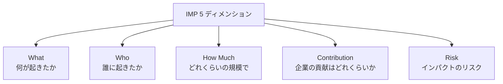

#### 各ディメンションの内容

- **What（何が起きたか）**：具体的なアウトカム、SDGs 目標との対応
- **Who（誰に起きたか）**：受益者の特定、脆弱な集団の関与
- **How Much（どれくらいの規模で）**：規模、深さ、時間軸
- **Contribution（企業の貢献はどれくらいか）**：Attribution 分析、対照群比較、反事実（Counterfactual）
- **Risk（インパクトのリスク）**：予定通りに実現しないリスク、悪化のリスク

**「Contribution が最も難しい」**——企業が「XX を実現した」と主張しても、対照群と比較しないと、それが企業の活動によるものか、経済成長や政府政策のおかげか、判別できません。

### SROI——Social Return on Investment

**SROI**（Social Return on Investment、社会的投資収益率）は、社会的活動の費用対効果を、金銭的価値に換算して計算する手法です。**2000 年頃に REDF**（Roberts Enterprise Development Fund）が米国で提唱、その後 SROI Network（現 Social Value International）が国際的に体系化しました。

#### 計算原則

```
SROI = 社会的成果の金銭換算価値 ÷ 投資費用
```

例：企業が地域の若者への職業訓練プログラムに 1,000 万円投資し、参加者の就業増加による地域経済への波及効果が 5,000 万円と算出された場合、SROI = 5.0。

#### 5 ステップ

1. **範囲設定と主要ステークホルダー特定**
2. **成果の把握とマッピング**
3. **成果に金銭的価値を付与**：Financial Proxy（代理指標）を使用
4. **インパクトの算出**：Attribution・Deadweight（企業なしでも起きた分）・Displacement（ほかの場所で起きた事象の置換）・Drop-off（時間経過での効果減衰）を調整
5. **SROI の算出と報告**

#### 実務での位置づけ

- **強み**：金銭換算で「投資判断の共通言語」として機能
- **弱み**：金銭換算の恣意性、Financial Proxy の設定が難しい
- **応用**：社会的企業、NPO、地域振興、企業の CSR プロジェクトの効果測定

**「SROI を絶対的な指標として使う」よりも「対話の共通言語として使う」**のが実務のコツです。

### 「掲げる SDGs」から「実装する SDGs」への移行

本コース全体を通じて何度も戻ってきた中核メッセージ**「SDGs は掲げるから実装するへ」**を、実務の段階として整理します。

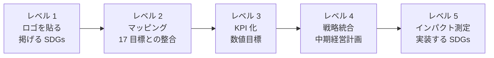

#### 5 段階の実装レベル

- **レベル 1：ロゴを貼る**（掲げる SDGs）——統合報告書に SDGs 17 目標のロゴを配置
- **レベル 2：マッピング**——事業活動と 17 目標の関連を可視化
- **レベル 3：KPI 化**——各目標との関連で数値目標を設定
- **レベル 4：戦略統合**——中期経営計画に SDGs を組み込む
- **レベル 5：インパクト測定**——IRIS+・IMM・SROI で因果関係を証明（実装する SDGs）

**多くの日本企業はレベル 2〜3 の段階**——2030 年に向けて、レベル 4〜5 への移行が主戦場になります。

### コース全体の総括——6 個の中核メッセージ

1. **SDGs は「掲げる」から「実装する」へ——ロゴを貼るだけの時代は終わった**：5 段階の実装レベルで、レベル 4〜5 への移行が 2030 年までの目標
2. **マテリアリティは「対話の共通言語」——決めきるものではなく、更新するもの**：12 か月サイクルの分析、部門横断のワークショップで合意
3. **フレームワークは道具——GRI・IRIS+・B Corp を使い分ける**：GRI・SASB・SDGs Compass・UNGC・ISO 26000・EcoVadis・B Corp・IRIS+ すべて道具、目的に応じて使い分け
4. **KPI は目標ではなく、対話の窓——数字の裏に文脈を残す**：数値＋文脈＋前向きな見通しの 3 要素、Backcasting と Forecasting の統合
5. **サプライチェーン責任は「見えないところ」が本番**：Tier 1 だけでなく Tier 2・Tier 3・原材料の産地まで、CSDDD の潮流
6. **バックキャスティングは、経営の思考の型を変える**：Ambitious Goal を先に置き、そこから逆算する

これら 6 個は、意思決定に迷ったときの「羅針盤」です。技術・組織・法令のいずれの局面でも、6 個のどれかに立ち返って考えることで、判断の軸がぶれません。

### 修了後の学び方

#### 定期的にチェックすべき情報源

- **国連 SDGs 公式サイト**：SDGs 進捗レポート、Sustainable Development Report（年次）
- **GRI 公式サイト**：Universal Standards、Sector Standards の追加公表
- **UN Global Compact 公式サイト**：Communication on Progress、10 原則の実装事例
- **ISO 公式サイト**：ISO 26000、ISO 14001 の実装事例
- **B Lab 公式サイト**：B Corp 認証事例、日本での動向
- **GIIN 公式サイト**：IRIS+、インパクト投資の年次調査
- **経済産業省 SDGs 経営ガイド**：日本企業事例
- **外務省 JAPAN SDGs Action Platform**：日本の取り組み

#### 実務スキルとして深めたい領域

- **マテリアリティ分析**：業種特化の実務、ダブルマテリアリティの ESRS 対応
- **統合報告書執筆**：IIRC フレームワーク、ストーリーテリング
- **B Corp 認証**：BIA の詳細、法的要件対応
- **人権 DD**：OECD ガイドライン、CSDDD 対応
- **インパクト測定**：IRIS+、IMM、SROI の実装

#### コミュニティと対話の場

- **UN Global Compact ネットワーク・ジャパン**
- **GRI Community**
- **B Corp ジャパンコミュニティ**
- **GIIN Annual Impact Investor Survey**
- **サステナビリティ日本フォーラム**
- **日本 CSR ネットワーク**

### コース修了メッセージ

サステナビリティ・SDGs 実務コースをここまで進めていただきありがとうございました。本コースで学んだのは、フレームワーク横断・マテリアリティ実装・KPI 設計・認証・インパクト測定の「型」です。しかし、実際の SDGs 実装は、業種・規模・組織文化によって形が違い、型どおりの実装で成功するとは限りません。

型を持つことの価値は、「型と実際のズレ」を認識できることです。「うちの業界では、マテリアリティを○○の観点で見直す必要がある」「うちの規模では、B Corp 認証はここまで絞る判断が必要だ」——判断する土台になります。本コースの 6 個の中核メッセージと、5 ステップのマテリアリティ分析・4 分類の KPI・IMP 5 ディメンションは、そのための共通言語です。

2030 年まで残り 4 年半——SDGs の目標年まで時間は限られています。「掲げる SDGs」から「実装する SDGs」への移行を、それぞれの現場で加速してください。サステナビリティは、報告書を作ることでも、ロゴを貼ることでもなく、事業と社会が絡み合う場所そのものです。

### 確認クイズ

このレッスンの内容の理解度をチェックしましょう。

#### Q1. インパクトと KPI の違いとして、本レッスンの内容と一致するものはどれですか？

- [x] KPI は企業活動の結果を測る指標、インパクトは企業活動が「因果関係で」もたらした社会・環境の変化（Baseline との比較、Attribution 分析）
- [ ] KPI は財務指標、インパクトは非財務指標
- [ ] KPI は短期、インパクトは長期
- [ ] 両者は同義で、名前が違うだけ

> **解説**
> KPI は企業活動の結果を測る指標、インパクトは企業活動が「因果関係で」もたらした変化を指します。インパクト測定は Baseline（ベースライン、企業活動がなかった場合の想定）と Actual（実績）の比較で、Attribution（帰属）を証明する高度な実務です。

#### Q2. IRIS+ の説明として、本レッスンの内容と一致するものはどれですか？

- [ ] 2000 年に IPCC が公表した気候科学報告書
- [x] 2019 年に GIIN（Global Impact Investing Network、Rockefeller Foundation が 2009 年設立）が公表したインパクト指標のカタログ、500 以上の指標
- [ ] 2005 年に SASB が公表した業種別基準
- [ ] 2020 年に日本の経産省が公表した SDGs 経営ガイド

> **解説**
> IRIS+ は 2019 年に GIIN（Global Impact Investing Network、Rockefeller Foundation が 2009 年設立）が公表したインパクト指標のカタログで、500 以上の指標を SDGs 17 目標・テーマ別・業種別で提供します。GRI・SASB が開示指標なのに対し、IRIS+ はインパクト投資と社会的成果測定に特化しています。

#### Q3. IMP（Impact Management Project）の 5 ディメンションとして、本レッスンの内容と一致するものはどれですか？

- [ ] 経済・社会・環境・ガバナンス・技術
- [ ] 短期・中期・長期・永続・不明
- [x] What（何が起きたか）・Who（誰に起きたか）・How Much（どれくらいの規模で）・Contribution（企業の貢献はどれくらいか）・Risk（インパクトのリスク）
- [ ] マーケティング・営業・製造・R&D・IR

> **解説**
> IMP の 5 ディメンションは「What（何が起きたか）」「Who（誰に起きたか）」「How Much（どれくらいの規模で）」「Contribution（企業の貢献はどれくらいか、Attribution 分析）」「Risk（インパクトのリスク）」です。特に Contribution が最も難しく、対照群比較や反事実（Counterfactual）で証明する必要があります。

#### Q4. SROI の説明として、本レッスンの内容と一致するものはどれですか？

- [ ] 2020 年に日本の経産省が公表した ROI 計算手法
- [ ] 全ステークホルダーが等しく評価する認証制度
- [ ] 財務諸表の一部として法定開示される指標
- [x] 2000 年頃に REDF が米国で提唱、社会的成果の金銭換算価値÷投資費用で計算、5 ステップ（範囲設定→成果マッピング→金銭価値付与→インパクト算出→SROI 算出）

> **解説**
> SROI（Social Return on Investment）は 2000 年頃に REDF（Roberts Enterprise Development Fund）が米国で提唱、SROI Network（現 Social Value International）が国際的に体系化しました。社会的成果の金銭換算価値÷投資費用で計算し、Financial Proxy を使って社会的成果に金銭的価値を付与します。

#### Q5. 「掲げる SDGs から実装する SDGs へ」の 5 段階の実装レベルとして、本レッスンの内容と一致するものはどれですか？

- [ ] レベル 1 発表・レベル 2 実行・レベル 3 評価・レベル 4 改善・レベル 5 終了
- [x] レベル 1 ロゴを貼る（掲げる SDGs）→レベル 2 マッピング→レベル 3 KPI 化→レベル 4 戦略統合→レベル 5 インパクト測定（実装する SDGs）
- [ ] 5 段階に分ける必要はなく、SDGs は一度に実装する
- [ ] レベルは 3 段階のみで、実装は不要

> **解説**
> 5 段階の実装レベルは「レベル 1 ロゴを貼る（掲げる SDGs）→レベル 2 マッピング（事業と 17 目標の関連を可視化）→レベル 3 KPI 化（数値目標）→レベル 4 戦略統合（中期経営計画へ組み込む）→レベル 5 インパクト測定（IRIS+・IMM・SROI で因果関係を証明、実装する SDGs）」で、多くの日本企業はレベル 2〜3、2030 年までにレベル 4〜5 への移行が主戦場です。

#### Q6. 本コースの 6 個の中核メッセージに含まれないものはどれですか？

- [ ] SDGs は「掲げる」から「実装する」へ——ロゴを貼るだけの時代は終わった
- [ ] マテリアリティは「対話の共通言語」——決めきるものではなく、更新するもの
- [x] SDGs 検定・気候変動アドバイザーの資格取得が上場企業の必須条件
- [ ] バックキャスティングは、経営の思考の型を変える

> **解説**
> 本コースの 6 個の中核メッセージは「掲げるから実装するへ／マテリアリティは対話の共通言語で更新するもの／フレームワークは道具／KPI は対話の窓で数字の裏に文脈／サプライチェーン責任は見えないところが本番／バックキャスティングは思考の型を変える」です。「資格取得が必須条件」は本コースの立場と反対で、資格試験対策コースとしては扱いません。

本コースをここまで進めていただき、ありがとうございました。カーボンニュートラルは別のコースで、ESG 開示制度全般も別のコースで扱います。3 コース連続で受講された方は、ESG・カーボンニュートラル・サステナビリティの 3 領域を横断で捉える眼を持ち帰っていただけたら幸いです。2030 年まで残り 4 年半、それぞれの現場で意思決定に踏み出してください。

---

## 総復習テスト

これまで学んできた内容の理解度をチェックする、コース全体の総復習テストです。全 20 問、80% 以上の正解でコース修了とします。

### Q1. 本コースの守備範囲として、正しいものはどれですか？【レッスン1】

- [x] サステナビリティ・SDGs を「フレームワーク横断とマテリアリティ実装」の視点で扱う
- [ ] ESG 開示制度全般（統合報告書、コーポレートガバナンス・コード、格付機関対応）を体系的に扱う
- [ ] 気候変動の算定実務（Scope 1-3、GHG プロトコル、SBTi、CBAM）を体系的に扱う
- [ ] SDGs 検定・気候変動アドバイザーなど資格試験対策を扱う

> **解説**
> 本コースは「フレームワーク横断とマテリアリティ実装」の視点に絞ります。ESG 開示制度全般、気候変動の算定実務、資格試験対策は別コースまたは本コースの守備範囲外です。

### Q2. SDGs の 5 P として、本コースの内容と一致するものはどれですか？【レッスン1】

- [ ] Person・Product・Process・Place・Price
- [ ] Purpose・Passion・Pride・Progress・Practice
- [x] People（人間）・Planet（地球）・Prosperity（繁栄）・Peace（平和）・Partnership（パートナーシップ）
- [ ] Politics・Policy・Program・Project・Performance

> **解説**
> SDGs 17 目標は 5 P（People・Planet・Prosperity・Peace・Partnership）で整理されます。国連公式資料でも採用されている整理です。

### Q3. 本コースの対象読者として、含まれないものはどれですか？【レッスン1】

- [ ] CSR・サステナビリティ推進、広報・IR
- [x] 医師、看護師、薬剤師
- [ ] 人事・調達・法務
- [ ] 経営企画

> **解説**
> 本コースの対象読者は「CSR・サステナビリティ推進、広報、IR、人事、調達、法務、経営企画」の 7 職種です。「医師、看護師、薬剤師」は本コースの直接的な対象読者ではありません。

### Q4. UN Global Compact の 4 分野・10 原則の内訳として、本コースの内容と一致するものはどれですか？【レッスン2】

- [ ] 人権 3・労働 3・環境 3・腐敗防止 1
- [ ] 人権 1・労働 2・環境 5・腐敗防止 2
- [ ] 4 分野それぞれ 2 原則ずつの 8 原則
- [x] 人権 2・労働 4・環境 3・腐敗防止 1

> **解説**
> UNGC の 10 原則は「人権 2 原則（P1-P2）・労働 4 原則（P3-P6）・環境 3 原則（P7-P9）・腐敗防止 1 原則（P10）」の 4 分野に分類されます。

### Q5. ISO 26000 の 7 中核主題として、本コースで挙げられないものはどれですか？【レッスン2】

- [x] 財務管理
- [ ] 組織統治
- [ ] 人権
- [ ] コミュニティへの参画・発展

> **解説**
> ISO 26000 の 7 中核主題は「組織統治／人権／労働慣行／環境／公正な事業慣行／消費者課題／コミュニティへの参画・発展」です。「財務管理」は含まれません。

### Q6. ISO 14001 の説明として、本コースの内容と一致するものはどれですか？【レッスン2】

- [ ] 1980 年初版、まったく改訂されていない
- [x] 1996 年初版、2004 年・2015 年に改訂、第三者認証が取れる、日本で 20,000 事業所超が取得
- [ ] 2020 年初版で発表された新しい規格
- [ ] 認証は不可、参考文書として活用

> **解説**
> ISO 14001 は 1996 年初版、2004 年・2015 年に改訂されており、第三者認証が取れる規格です。2015 年改訂ではリスクベースアプローチ、ライフサイクル視点、リーダーシップ強化が組み込まれました。

### Q7. マテリアリティ分析の 5 ステップとして、本コースの内容と一致するものはどれですか？【レッスン3】

- [ ] 計画→設計→実装→運用→終了
- [ ] 目標設定→KPI 設定→実行→報告→承認
- [x] 課題の網羅的洗い出し→ステークホルダー・エンゲージメント→マテリアリティ・マトリックス→取締役会承認→年次見直し
- [ ] マーケティング→販売→製造→R&D→IR

> **解説**
> 5 ステップは「1. 課題の網羅的洗い出し→2. ステークホルダー・エンゲージメント→3. マテリアリティ・マトリックス→4. 取締役会承認→5. 年次見直し」です。

### Q8. シングルマテリアリティとダブルマテリアリティの違いとして、本コースの内容と一致するものはどれですか？【レッスン3】

- [ ] シングルは短期、ダブルは長期
- [ ] シングルは EU CSRD、ダブルは ISSB IFRS S1/S2
- [ ] 両者はシングルマテリアリティで統一
- [x] シングルは「企業への影響」の 1 方向のみ（ISSB IFRS S1/S2）、ダブルは「企業への影響＋社会・環境への影響」の両方向（EU CSRD/ESRS）

> **解説**
> シングルマテリアリティは企業への影響のみ、ダブルマテリアリティは企業への影響＋社会・環境への影響の両方向を判定基準とします。ISSB IFRS S1/S2 はシングル、EU CSRD/ESRS はダブルを採用しました。

### Q9. 「マテリアリティを 3 か月で決めきろうとして頓挫した話」の教訓として、本コースの内容と一致するものはどれですか？【レッスン3】

- [x] マテリアリティは「決めきるものではなく、対話で合意していくもの」、12 か月のサイクルが実務の勘所
- [ ] マテリアリティは 3 か月で決めきるべき
- [ ] 部門の意見は聴かず、経営陣が独自に決めるのが正解
- [ ] マテリアリティ・マトリックスの優先課題は 20 以上に含めるべき

> **解説**
> 現場メモの教訓は「マテリアリティは決めきるものではなく、対話で合意していくもの」で、12 か月のサイクル設計が実務の勘所です。

### Q10. GRI Standards の 3 層構造として、本コースの内容と一致するものはどれですか？【レッスン4】

- [ ] Financial Standards＋ESG Standards＋Governance Standards
- [x] Universal Standards（普遍基準、すべての企業に適用）＋Sector Standards（業種別）＋Topic Standards（個別トピック）
- [ ] Short-term＋Medium-term＋Long-term
- [ ] Global＋Regional＋Local

> **解説**
> GRI Standards は 3 層構造で、Universal Standards（GRI 1・2・3）、Sector Standards（業種別、2021 年から順次公表）、Topic Standards（GRI 200 経済、300 環境、400 社会）で構成されます。

### Q11. SDGs Compass の説明として、本コースの内容と一致するものはどれですか？【レッスン4】

- [ ] 2010 年に SASB が単独で公表した業種別基準
- [ ] 2020 年に日本の経産省が単独公表した SDGs 経営ガイド
- [x] 2016 年に GRI・UN Global Compact・WBCSD が共同公表した、企業が SDGs を事業戦略に統合するための 5 ステップガイド
- [ ] 2023 年に ISSB が公表した気候関連開示基準

> **解説**
> SDGs Compass は 2016 年に GRI・UN Global Compact・WBCSD が共同公表した企業向け SDGs ガイドで、5 ステップで構成されます。

### Q12. 3 つの開示書類の使い分けとして、本コースの内容と一致するものはどれですか？【レッスン4】

- [ ] 3 つとも法定書類として提出義務
- [ ] 3 つとも GRI Standards に準拠
- [ ] 3 つの書類を統合して 1 本にするのが実務
- [x] 有価証券報告書（法定、機関投資家・当局）／統合報告書（任意、IIRC、機関投資家対話）／サステナビリティレポート（任意、GRI、マルチステークホルダー）

> **解説**
> 3 つの書類は目的と対象読者ごとに使い分けます。有報は法定、統合報告書は IIRC 任意、SR レポートは GRI 任意です。

### Q13. Forecasting と Backcasting の違いとして、本コースの内容と一致するものはどれですか？【レッスン5】

- [x] Forecasting は過去のトレンドと現状から積み上げる予測、Backcasting は「未来にあるべき姿」から現在への逆算で目標設定
- [ ] Forecasting は財務予測、Backcasting は非財務予測
- [ ] 両者は同じで、名前が違うだけ
- [ ] Forecasting は Backcasting の後の段階

> **解説**
> Backcasting は「未来から現在への逆算で目標を設定する」SDGs Compass の中核概念、Forecasting は「過去のトレンドと現状の能力から未来を予測する」伝統的アプローチです。

### Q14. KPI の 4 分類として、本コースの内容と一致するものはどれですか？【レッスン5】

- [ ] 短期・中期・長期・永続
- [x] 結果（Outcome/Impact）・過程（Process）・入力（Input）・活動（Activity）
- [ ] 財務・環境・社会・ガバナンス
- [ ] マーケティング・営業・製造・R&D

> **解説**
> KPI の 4 分類は「結果／過程／入力／活動」で、結果 KPI が最重要、入力・活動 KPI だけでは社会は変わらない、が本コースの立場です。

### Q15. 紛争鉱物 3TG として、本コースの内容と一致するものはどれですか？【レッスン6】

- [ ] Copper・Iron・Aluminum
- [ ] Silver・Platinum・Palladium
- [x] Tin（スズ）・Tantalum（タンタル）・Tungsten（タングステン）・Gold（金）
- [ ] Bronze・Silver・Gold

> **解説**
> 紛争鉱物 3TG は Tin・Tantalum・Tungsten・Gold の 4 種類で、コンゴ民主共和国とその周辺国から産出、米国 Dodd-Frank 法（2010 年）で規制対象になりました。

### Q16. Fair Trade International の説明として、本コースの内容と一致するものはどれですか？【レッスン6】

- [ ] 2020 年設立、認証活動を行わない情報提供組織
- [ ] 米国政府が運営する政府機関
- [ ] EU が運営する規制機関
- [x] 1997 年設立、フェアトレード国際認証、コーヒー・カカオ・バナナ・コットンなどが主な認証対象、フェアトレード最低価格とプレミアムで生産者保護

> **解説**
> Fair Trade International は 1997 年設立の国際認証機関で、フェアトレード最低価格とプレミアム、労働環境基準、環境基準で生産者と労働者を保護します。

### Q17. B Corp 認証の 5 領域評価として、本コースの内容と一致するものはどれですか？【レッスン7】

- [x] Governance（ガバナンス）・Workers（従業員）・Community（コミュニティ）・Environment（環境）・Customers（顧客）
- [ ] Financial・Marketing・Sales・Operations・HR
- [ ] Short-term・Medium-term・Long-term・Sustainable・Ethical
- [ ] Global・Regional・Local・National・International

> **解説**
> B Corp 認証の 5 領域評価は「Governance／Workers／Community／Environment／Customers」で、B Impact Assessment 150〜200 問、80 点以上で認証取得です。

### Q18. UN Global Compact の Communication on Progress（COP）について、本コースの内容と一致するものはどれですか？【レッスン7】

- [ ] 5 年に 1 度提出すれば十分
- [x] 参加 1 年後から毎年提出、2 年間未提出で Delisting（除名）される
- [ ] 未提出でもペナルティはない
- [ ] 提出後は Web 公表されない内部書類

> **解説**
> COP は参加 1 年後から毎年提出、2 年間未提出で Delisting されます。UNGC 参加は毎年の COP 提出が続くコミットメントです。

### Q19. IMP（Impact Management Project）の 5 ディメンションとして、本コースの内容と一致するものはどれですか？【レッスン8】

- [ ] 経済・社会・環境・ガバナンス・技術
- [ ] 短期・中期・長期・永続・不明
- [x] What（何が起きたか）・Who（誰に起きたか）・How Much（どれくらいの規模で）・Contribution（企業の貢献はどれくらいか）・Risk（インパクトのリスク）
- [ ] マーケティング・営業・製造・R&D・IR

> **解説**
> IMP の 5 ディメンションは「What・Who・How Much・Contribution・Risk」で、Contribution が最も難しく、Attribution 分析で企業の貢献を証明する必要があります。

### Q20. 「掲げる SDGs から実装する SDGs へ」の 5 段階の実装レベルとして、本コースの内容と一致するものはどれですか？【レッスン8】

- [ ] レベル 1 発表・レベル 2 実行・レベル 3 評価・レベル 4 改善・レベル 5 終了
- [ ] 5 段階に分ける必要はなく、SDGs は一度に実装する
- [ ] レベルは 3 段階のみで、実装は不要
- [x] レベル 1 ロゴを貼る（掲げる SDGs）→レベル 2 マッピング→レベル 3 KPI 化→レベル 4 戦略統合→レベル 5 インパクト測定（実装する SDGs）

> **解説**
> 5 段階の実装レベルは「ロゴを貼る→マッピング→KPI 化→戦略統合→インパクト測定」で、多くの日本企業はレベル 2〜3、2030 年までにレベル 4〜5 への移行が主戦場です。

お疲れさまでした。これでコース「サステナビリティ・SDGs実務」を修了です。6 個の中核メッセージ（掲げるから実装するへ／マテリアリティは対話の共通言語で更新するもの／フレームワークは道具／KPI は対話の窓／サプライチェーン責任は見えないところ／バックキャスティングは思考の型を変える）を羅針盤に、それぞれの現場で意思決定に踏み出してください。

---

## 用語集

このコースで扱った主要な用語を、五十音順（あ行〜わ行）ののち A-Z の順で整理します。

### あ行

**アウトカム（あうとかむ）**：企業活動が社会・環境にもたらす最終的な結果。KPI 4 分類の 1 つ（結果 KPI）。→ レッスン 5

**インパクト（いんぱくと）**：企業活動が「因果関係で」もたらした社会・環境の変化。Baseline との比較、Attribution 分析で証明する。KPI との違いは因果関係の証明を伴う点。→ レッスン 8

**インパクト測定（いんぱくとそくてい、Impact Measurement）**：企業活動のインパクトを定量的に把握する実務。IRIS+ の指標、IMP の 5 ディメンション、SROI などが道具。→ レッスン 8

**インパクトマテリアリティ（いんぱくとまてりありてぃ）**：企業活動が社会・環境に与える影響を重要性の判定基準とする考え方。ダブルマテリアリティを構成する 1 方向。→ レッスン 3

**掲げる SDGs（かかげるえすでぃーじーず）**：統合報告書に SDGs 17 目標のロゴを貼り、貢献の定量的な説明がないパターン。「実装する SDGs」への移行が本コースの主眼。→ レッスン 1、レッスン 8

### か行

**課題の網羅的洗い出し（かだいのもうらてきあらいだし）**：マテリアリティ分析の 5 ステップの 1 段階目。GRI・SASB・格付機関質問書などから 50〜100 の候補課題をリスト化する。→ レッスン 3

**議決権行使（ぎけつけんこうし）**：株主総会での議案投票。機関投資家によるスチュワードシップ活動の中核（詳細は別コース）。→ レッスン 3

**経済圏（けいざいけん）**：SDGs の 5 P の 1 つ、Prosperity（繁栄）に対応。目標 8-10 の経済成長・不平等是正が含まれる。→ レッスン 1

**結果 KPI（けっかけーぴーあい）**：企業活動が最終的にもたらす社会・環境への影響を測る指標。CO₂ 排出量削減率、女性管理職比率、CSAT、離職率、労働災害件数など。→ レッスン 5

**決めきる（きめきる）**：マテリアリティを「一度で最終的に確定する」発想。本コースは「決めきるものではなく、更新するもの」の立場。→ レッスン 3

**現場メモ（げんばめも）**：講師の実体験を基にした実務の教訓。本コースでは L3「マテリアリティを 3 か月で決めきろうとして頓挫した話」、L7「B Corp 認証の 5 領域評価に 1 年半かかった話」の 2 か所に配置。→ レッスン 3、レッスン 7

**更新する（こうしんする）**：マテリアリティを年次見直しで継続的に改訂していく発想。中核メッセージ「マテリアリティは決めきるものではなく、更新するもの」。→ レッスン 3

**コフィー・アナン（こふぃー・あなん）**：第 7 代国連事務総長（1997-2006 年在任、ガーナ出身）。1999 年 1 月のダボス会議で UN Global Compact を提唱、2006 年の PRI 公表も主導した。→ レッスン 2

### さ行

**財務マテリアリティ（ざいむまてりありてぃ）**：ESG 課題が企業の財務業績に与える影響を重要性の判定基準とする考え方。シングルマテリアリティを構成、ISSB IFRS S1/S2 が採用。→ レッスン 3

**サプライチェーン責任（さぷらいちぇーんせきにん）**：企業のバリューチェーン全体（Tier 1・2・3、原材料の産地まで）の環境・人権・労働慣行への責任。「見えないところが本番」が本コースの姿勢。→ レッスン 6

**CSR（しーえすあーる）**：Corporate Social Responsibility、企業の社会的責任。1970 年代から広く使われた概念（詳細は別の入門コース）。→ レッスン 1

**実装する SDGs（じっそうするえすでぃーじーず）**：SDGs を事業戦略に統合し、KPI 化、経営に統合、インパクト測定まで踏み込むレベル。「掲げる SDGs」への対概念。→ レッスン 1、レッスン 8

**社会圏（しゃかいけん）**：SDGs の 5 P の 1 つ、People（人間）に対応。目標 1-6 の社会・保健・教育系が含まれる。→ レッスン 1

**集団的エンゲージメント（しゅうだんてきえんげーじめんと）**：複数の機関投資家が連携して同じ企業に働きかける対話（詳細は別コース）。→ レッスン 3

**ステークホルダー・エンゲージメント（すてーくほるだー・えんげーじめんと）**：マテリアリティ分析の 5 ステップの 2 段階目。株主・従業員・顧客・取引先・地域社会・NGO・政府から重要度を聴取する。→ レッスン 3

**生物多様性（せいぶつたようせい）**：生態系の多様性、種の多様性、遺伝子の多様性の総称。TNFD の主要対象、2020 年代後半の主戦場。→ レッスン 6

### た行

**ダブルマテリアリティ（だぶるまてりありてぃ）**：財務マテリアリティ（企業への影響）とインパクトマテリアリティ（社会・環境への影響）の両方向を重要性の判定基準とする考え方。EU CSRD/ESRS が採用。→ レッスン 3

**対話の窓としての KPI（たいわのまどとしてのけーぴーあい）**：KPI を「単なる数値」ではなく「対話の材料」として位置づける発想。数値＋文脈＋前向きな見通しの 3 要素。→ レッスン 5

**追加性（ついかせい、Additionality）**：再エネ調達手段の評価軸（詳細は別コース）。→ レッスン 7

**統合思考（とうごうしこう）**：財務と非財務、時間軸、資本の相互作用、ステークホルダーの多様性を統合する発想（詳細は別コース）。→ レッスン 4

**統合報告書（とうごうほうこくしょ）**：IIRC フレームワークに基づく任意書類。中長期の価値創造ストーリーを機関投資家と対話するための書類。→ レッスン 4

### な行

**認定（にんてい）**：企業のサステナビリティ・パフォーマンスを第三者が公式に評価・承認する枠組み。B Corp・Fair Trade・GRI 認定など。→ レッスン 7

**認証（にんしょう）**：第三者機関による適合性の証明。ISO 14001、Fair Trade 認証、B Corp 認証などが代表。→ レッスン 2、レッスン 7

### は行

**バックキャスティング（ばっくきゃすてぃんぐ、Backcasting）**：「未来にあるべき姿」から現在への逆算で目標設定する手法。SDGs Compass の中核概念、Ambitious Goal に届くための跳躍を可能にする。→ レッスン 5

**ビジネス・アズ・ユージュアル（BAU）**：事業を現状通りに継続する場合の想定。Backcasting の対比概念、Forecasting の延長線上に BAU がある。→ レッスン 5

**フォーキャスティング（ふぉーきゃすてぃんぐ、Forecasting）**：過去のトレンドと現状の能力から未来を予測する伝統的アプローチ。Backcasting の対概念。→ レッスン 5

**紛争鉱物（ふんそうこうぶつ、Conflict Minerals）**：コンゴ民主共和国（DRC）とその周辺国から産出される、武装勢力の資金源となる鉱物。3TG（Tin/Tantalum/Tungsten/Gold）が主対象。→ レッスン 6

**フェアトレード（ふぇあとれーど、Fair Trade）**：開発途上国の生産者に公正な価格を保証し、労働環境と環境保全を確保する国際的な取り組み。Fairtrade International が国際認証を運営。→ レッスン 6

**プロダクト・カーボン・フットプリント（ぷろだくと・かーぼん・ふっとぷりんと）**：製品のライフサイクル全体での CO₂ 排出量（詳細は別コース）。→ レッスン 5

**平和圏（へいわけん）**：SDGs の 5 P の 1 つ、Peace（平和）に対応。目標 16 の平和・司法・制度が含まれる。→ レッスン 1

**保健（ほけん）**：SDGs 目標 3「すべての人に健康と福祉」の主題。感染症対策、精神保健、生涯健康など。→ レッスン 1

### ま行

**マテリアリティ（まてりありてぃ）**：開示すべき情報を選定する重要性の判定基準。サステナビリティ実務での「対話の共通言語」として機能する。→ レッスン 3

**マテリアリティ分析（まてりありてぃぶんせき）**：企業のマテリアリティを 5 ステップ（洗い出し→エンゲージメント→マトリックス→取締役会承認→年次見直し）で決定するプロセス。→ レッスン 3

**マテリアリティ・マトリックス（まてりありてぃ・まとりっくす）**：横軸「企業への影響」と縦軸「社会・環境への影響」で優先課題を可視化する図。マテリアリティ分析の中核成果物。優先課題は 10 個に絞るのが実務。→ レッスン 3

**見えないところが本番（みえないところがほんばん）**：サプライチェーン責任の中核メッセージ。Tier 1 だけでなく、Tier 2・Tier 3・原材料の産地まで踏み込むのが実務。→ レッスン 6

### や行

**有価証券報告書（ゆうかしょうけんほうこくしょ）**：金融商品取引法に基づく法定書類。2023 年 3 月期以降サステナビリティ情報記載欄が新設された（詳細は別コース）。→ レッスン 4

### ら行

**労働（ろうどう）**：UN Global Compact の 10 原則の 4 分野の 1 つ、P3-P6（組合結成・強制労働・児童労働・差別）。→ レッスン 2

### わ行

**我が国の SDGs（わがくにのえすでぃーじーず）**：日本の SDGs 進捗。外務省「JAPAN SDGs Action Platform」で情報公開。→ レッスン 8

---

### A-Z

**Attribution（あとりびゅーしょん、帰属）**：インパクト測定において、企業活動が「因果関係で」もたらした変化を証明する分析。対照群比較、Counterfactual（反事実）、Deadweight（企業なしでも起きた分）などで評価する。→ レッスン 8

**Backcasting（ばっくきゃすてぃんぐ）**：前掲。→ レッスン 5

**B Corp（びーこーぷ）**：Certified B Corporation。B Lab が認証する企業のサステナビリティ・パフォーマンスの総合認証。2006 年 B Lab 創設、2007 年認証開始。5 領域（Governance/Workers/Community/Environment/Customers）、B Impact Assessment 150〜200 問、80 点以上で認証。→ レッスン 7

**B Impact Assessment（びーいんぱくとあせすめんと、BIA）**：B Corp 認証のオンライン質問票。5 領域を評価し、200 点満点でスコアリング。→ レッスン 7

**B Lab（びーらぼ）**：2006 年米国で創設された非営利組織、B Corp 認証を運営する。→ レッスン 7

**CDP（しーでぃーぴー）**：旧 Carbon Disclosure Project、2000 年設立の国際 NGO（詳細は別コース）。→ レッスン 4

**CMRT（しーえむあーるてぃー）**：Conflict Minerals Reporting Template、CFSI が提供する紛争鉱物調査テンプレート。→ レッスン 6

**Communication on Progress（COP、こみゅにけーしょん・おん・ぷろぐれす）**：UN Global Compact 参加企業が毎年提出する進捗開示。CEO ステートメント、10 原則ごとの取り組み、測定可能な成果を含む。→ レッスン 2、レッスン 7

**Contribution（こんとりびゅーしょん）**：IMP 5 ディメンションの 1 つ。企業がインパクトにどれだけ貢献したかの分析。Attribution 分析、対照群比較、反事実で証明する必要がある。→ レッスン 8

**CSDDD（しーえすでぃーでぃーでぃー）**：Corporate Sustainability Due Diligence Directive、EU 企業サステナビリティ・デュー・ディリジェンス指令。2024 年 5 月採択（詳細は別コース）。→ レッスン 6

**Dodd-Frank 法（どっどふらんくほう）**：Dodd-Frank Wall Street Reform and Consumer Protection Act、2010 年 7 月成立の米国法。第 1502 条で SEC 登録企業に 3TG の原産国調査（RCOI）と Form SD の年次提出を義務化。→ レッスン 6

**EcoVadis（えこばでぃす）**：2007 年フランス設立のサプライヤーのサステナビリティ評価機関。21 テーマ・4 領域（環境・労働と人権・倫理・持続可能な調達）・4 メダル（Bronze/Silver/Gold/Platinum）。→ レッスン 6

**ESG（いーえすじー）**：Environment・Social・Governance の頭文字（詳細は別コース）。→ レッスン 1

**ESRS（いーえすあーるえす）**：European Sustainability Reporting Standards、CSRD の具体的な報告基準。ダブルマテリアリティを明確に採用（詳細は別コース）。→ レッスン 3

**Fair Trade International（ふぇあとれーどいんたーなしょなる）**：1997 年設立のフェアトレード国際認証機関。コーヒー・カカオ・バナナ・コットンなどが主な認証対象。→ レッスン 6

**FLOCERT（ふろせーと）**：Fairtrade International の認証コーディネーター。GmbH（有限会社）としてドイツで運営、監査を実施。→ レッスン 7

**Forecasting（ふぉーきゃすてぃんぐ）**：前掲。→ レッスン 5

**GIIN（じーあいあいえぬ）**：Global Impact Investing Network、Rockefeller Foundation が 2009 年設立、IRIS+ を運営。インパクト投資家のネットワーク。→ レッスン 8

**GRI（じーあーるあい）**：Global Reporting Initiative、1997 年設立のサステナビリティ報告基準策定機関。GRI Standards は Universal Standards＋Sector Standards＋Topic Standards の 3 層構造。→ レッスン 4

**IFRS S1/S2（あいえふあーるえす えすいち えすに）**：ISSB が 2023 年 6 月公表した気候関連含むサステナビリティ関連財務情報の一般開示基準／気候関連開示基準（詳細は別コース）。→ レッスン 3

**IIRC（あいあいあーるしー）**：International Integrated Reporting Council（詳細は別コース）。→ レッスン 4

**IMP（あいえむぴー）**：Impact Management Project、2016 年頃から GIIN・SIINC・Bridgespan など 20 以上の組織が連携して構築したインパクト測定の標準的枠組み。5 ディメンションが中核。→ レッスン 8

**In accordance with GRI Standards（いんあこーだんす）**：GRI 準拠、Universal Standards＋該当する Sector Standards＋関連する Topic Standards のすべてに準拠する厳格な水準。→ レッスン 7

**IRIS+（あいりす ぷらす）**：Impact Reporting and Investment Standards Plus、GIIN が 2019 年に公表したインパクト指標のカタログ。500 以上の指標を SDGs 17 目標・テーマ別・業種別で提供。→ レッスン 8

**ISO 14001（あいえすおー いちよんぜろぜろいち）**：環境マネジメントシステムの国際規格。1996 年初版、2004 年・2015 年改訂。第三者認証が取れる。日本で 20,000 事業所超が取得。→ レッスン 2

**ISO 26000（あいえすおー にーろくぜろぜろぜろ）**：社会的責任に関するガイダンス規格。2010 年 11 月公表。7 中核主題（組織統治・人権・労働慣行・環境・公正な事業慣行・消費者課題・コミュニティ）。認証は取れない。→ レッスン 2

**ISSB（あいえすえすびー）**：International Sustainability Standards Board（詳細は別コース）。→ レッスン 3

**KPI（けーぴーあい）**：Key Performance Indicator。サステナビリティ実務での 4 分類（結果／過程／入力／活動）。→ レッスン 5

**LEAP アプローチ（りーぷ）**：TNFD の分析フレームワーク。Locate（場所の特定）→Evaluate（依存・影響の評価）→Assess（リスク・機会の評価）→Prepare（開示準備）の 4 ステップ。→ レッスン 6

**MDGs（えむでぃーじーず）**：Millennium Development Goals、ミレニアム開発目標。2000 年 9 月国連ミレニアム・サミット採択、8 目標・21 ターゲット・60 指標、目標年 2015 年。開発途上国のための目標。→ レッスン 1

**OECD 多国籍企業行動指針（おーいーしーでぃー たこくせききぎょうこうどうししん）**：OECD が 1976 年策定、2011 年改訂した多国籍企業の行動指針。サプライチェーン人権 DD の国際的基準の 1 つ。→ レッスン 6

**PRI（ぴーあーるあい）**：Principles for Responsible Investment（詳細は別コース）。→ レッスン 2

**RCOI（あーるしーおーあい）**：Reasonable Country of Origin Inquiry、合理的な原産国調査。Dodd-Frank 法の第 1502 条で義務化。→ レッスン 6

**REDF（れっどえふ）**：Roberts Enterprise Development Fund、米国のインパクト投資組織。2000 年頃に SROI を提唱。→ レッスン 8

**RMI（あーるえむあい）**：Responsible Minerals Initiative、責任ある鉱物調達イニシアチブ。CMRT を提供、監査済み製錬所のリストを公表。→ レッスン 6

**SASB（さすび）**：Sustainability Accounting Standards Board、2011 年設立、業種別の投資家向け財務マテリアリティ基準（詳細は別コース）。→ レッスン 4

**SDGs（えすでぃーじーず）**：Sustainable Development Goals、持続可能な開発目標。2015 年 9 月国連総会採択、17 目標・169 ターゲット・232 指標、目標年 2030 年。→ レッスン 1

**SDGs Compass（えすでぃーじーずこんぱす）**：2016 年に GRI・UN Global Compact・WBCSD が共同公表した企業向け SDGs 統合ガイド。5 ステップ（SDGs を理解する→優先課題を決定する→目標を設定する→経営に統合する→報告とコミュニケーション）で構成。→ レッスン 4

**SDG Compass 5 ステップ（えすでぃーじーずこんぱす ごすてっぷ）**：SDGs Compass の中核。前掲。→ レッスン 4

**SICS（しっくす）**：Sustainable Industry Classification System、SASB が独自に開発した業種分類。11 セクター・77 業種を定義。→ レッスン 4

**SROI（えすあーるおーあい）**：Social Return on Investment、社会的投資収益率。2000 年頃に REDF が米国で提唱、SROI Network が国際的に体系化。社会的成果の金銭換算価値÷投資費用で計算。→ レッスン 8

**3TG（すりーてぃーじー）**：紛争鉱物として規制対象の 4 種類：Tin（スズ）・Tantalum（タンタル）・Tungsten（タングステン）・Gold（金）。→ レッスン 6

**TNFD（てぃーえぬえふでぃー）**：Taskforce on Nature-related Financial Disclosures、自然関連財務情報開示タスクフォース（詳細は別コース）。→ レッスン 6

**Topic Standards（とぴっく すたんだーど）**：GRI Standards の 3 層構造の 1 つ。個別のマテリアル・トピックごとの開示要求事項。GRI 200（経済）、300（環境）、400（社会）のシリーズ。→ レッスン 4

**Trader License（とれーだーらいせんす）**：Fair Trade International の取扱事業者ライセンス。FLOCERT との契約で認証取得。→ レッスン 7

**UNGC（うんじーしー）**：UN Global Compact、国連グローバル・コンパクト。1999 年 1 月ダボスで発足、2000 年 7 月参加開始、10 原則（人権 2・労働 4・環境 3・腐敗防止 1）。→ レッスン 2

**Universal Standards（ゆにばーさる すたんだーど）**：GRI Standards の 3 層構造の 1 つ、すべての報告企業に適用。GRI 1（基礎）、GRI 2（一般開示事項）、GRI 3（マテリアル・トピック）の 3 つで構成、2021 年に大改訂。→ レッスン 4

**UN Global Compact（うん・ぐろーばる・こんぱくと）**：前掲 UNGC。→ レッスン 2

**With reference to GRI Standards（うぃず りふぁれんす）**：GRI 参照、部分的に GRI Standards を参照する柔軟な水準。日本の中小規模企業が採用することが多い。→ レッスン 7

**GCNJ（じーしーえぬじぇい）**：Global Compact Network Japan、グローバル・コンパクト・ネットワーク・ジャパン。日本の UN Global Compact ローカル・ネットワーク、500 社超が参加（2024 年時点）。→ レッスン 2

**WBCSD（だぶりゅーびーしーえすでぃー）**：World Business Council for Sustainable Development、持続可能な開発のための世界経済人会議（詳細は別コース）。→ レッスン 4

**WRI（だぶりゅーあーるあい）**：World Resources Institute、世界資源研究所（詳細は別コース）。→ レッスン 5

**WWF（だぶりゅーだぶりゅーえふ）**：World Wide Fund for Nature、世界自然保護基金。SBTi 設立機関の 1 つ（詳細は別コース）。→ レッスン 5

**5 P（ふぁいぶ ぴー）**：SDGs 17 目標の 5 つの領域：People・Planet・Prosperity・Peace・Partnership。→ レッスン 1

**5 領域評価（B Corp、ごりょういきひょうか）**：B Corp 認証の Governance・Workers・Community・Environment・Customers の 5 領域。→ レッスン 7

**6 個の中核メッセージ（ろっこのちゅうかくめっせーじ）**：本コースの背骨：掲げるから実装するへ／マテリアリティは対話の共通言語／フレームワークは道具／KPI は対話の窓／サプライチェーン責任は見えないところ／バックキャスティングは思考の型を変える。→ レッスン 8

---

## 参考資料

このコースの作成にあたり、以下の資料を参考にしました。

### 書籍

- 蟹江 憲史『SDGs（持続可能な開発目標）』（中公新書、2020 年）
- 蟹江 憲史編『2030 アジェンダ／SDGs：気候変動、資源、豊かさ』（新泉社、2020 年）
- Robert G. Eccles and Judith C. Rodriguez『Reimagining Capitalism in a World on Fire』（Rebecca Henderson、PublicAffairs、2020 年）
- Christopher Marquis『Better Business: How the B Corp Movement Is Remaking Capitalism』（Yale University Press、2020 年）
- Michael J. Yaziji, Jonathan P. Doh『NGOs and Corporations: Conflict and Collaboration』（Cambridge、2009 年）
- 田瀬 和夫『SDGs 経営 中期経営計画』（日経 BP、2021 年）
- 日本語書籍：GRI・IRIS+・B Corp・マテリアリティ分析実務の 2025-2026 年前後の刊行物

### 技術記事・公式ドキュメント／論文

- 国連「Transforming our world: the 2030 Agenda for Sustainable Development」（A/RES/70/1、2015 年 9 月採択） https://sdgs.un.org/
- 国連「Millennium Declaration」（2000 年 9 月採択）
- GRI Universal Standards 2021、Sector Standards 2021 以降、Topic Standards https://www.globalreporting.org/
- SASB Standards（現 ISSB 傘下） https://sasb.ifrs.org/
- GRI・UN Global Compact・WBCSD "SDG Compass"（2016 年） https://sdgcompass.org/
- UN Global Compact "Ten Principles" https://unglobalcompact.org/
- ISO 26000:2010「Guidance on social responsibility」
- ISO 14001:2015「Environmental management systems」
- IRIS+ Catalog（GIIN、2019 年） https://iris.thegiin.org/
- Impact Management Project（IMP）"5 Dimensions of Impact"（2017 年〜）
- B Lab "B Impact Assessment" https://www.bcorporation.net/
- EcoVadis Rating Methodology https://ecovadis.com/
- Fair Trade International https://www.fairtrade.net/
- OECD "Guidelines for Multinational Enterprises"
- Rockefeller Foundation "Impact Investing" イニシアチブ（2007 年〜）
- REDF "SROI Methodology"（社会的投資収益率、2000 年頃提唱）
- EU CSRD/ESRS（気候領域は別コース、本コースでは概観のみ）

### 公的資料・組織・調査

- 国連経済社会理事会（ECOSOC） https://www.un.org/ecosoc/
- 国連開発計画（UNDP） https://www.undp.org/
- 国連グローバル・コンパクト・ネットワーク・ジャパン https://www.ungcjn.org/
- 経済産業省「SDGs 経営ガイド」 https://www.meti.go.jp/
- 環境省「地域循環共生圏」関連公表資料 https://www.env.go.jp/
- 外務省「JAPAN SDGs Action Platform」 https://www.mofa.go.jp/mofaj/gaiko/oda/sdgs/
- Business & Sustainable Development Commission "Better Business Better World"（2017 年）
- Global Impact Investing Network（GIIN）「Annual Impact Investor Survey」
- 日本 CSR ネットワーク／ARE ジャパン
- サステナビリティ日本フォーラム

（すべてのオンライン資料の最終閲覧日：2026 年 7 月 7 日）

---

## 利用規約・二次創作ルール・著作権

- **コース掲載元**: [スキルアップカレッジ](https://skillup.college/)
- **このコースのURL**: https://skillup.college/courses/esg-sustainability/sustainability-sdgs-practical/
- **利用規約・二次創作ルール**: https://skillup.college/terms
- **著作権**: © 2026 株式会社エレファンキューブ. All rights reserved.

本コースは [スキルアップカレッジ](https://skillup.college/)（運営：株式会社エレファンキューブ）で公開されている学習コンテンツの原稿です。コース本体は上記URLでオンライン受講できます（確認クイズの即時採点、用語集の自動リンクなど、Webならではの学習体験を提供しています）。
