# AIの仕組みを理解する

モデル・データ・計算資源の 3 層——ニューラルネットから Transformer、事前学習と Post-training、MoE・量子化・KV キャッシュまで、非エンジニアと新人エンジニアの両方に届く「仕組み側」の入門

| 項目 | 内容 |
|---|---|
| カテゴリー | IT基礎知識 |
| 難易度 | 中級 |
| 所要時間 | 約200分（全8レッスン） |
| 公開日 | 2026-07-04 |
| 最終更新日 | 2026-07-04 |
| コースURL | https://skillup.college/courses/it-basics/ai-mechanics-basics/ |

## 対象者

生成 AI 入門レベル（トークン・Transformer・ファインチューニング・RLHF の名前は聞いたことがある）を通過した、非エンジニアの企画・PM・営業・マネジメント・経営層と、AI を扱う新人エンジニアの両方を主軸。「使い方」ではなく「なぜそう動くのか」を、モデル・データ・計算資源の 3 層構造で読み解きたい方。

## 前提知識

生成 AI を業務や日常で 3 か月以上試した経験があると理解が早い。生成 AI 入門レベルの内容（トークン・Transformer・事前学習・ファインチューニング・RLHF・ハルシネーション・文脈窓）に触れたことがある方向け。プログラミング経験や数学的素養は不要。本コースは数式を極力使わず、図解と直観で解説する。

## 学習目標

- AI の性能を「モデル・データ・計算資源」の 3 層に分解して評価できる
- パーセプトロンから Transformer までのニューラルネットの系譜を、時代背景とともに位置づけられる
- 教師あり・教師なし・強化学習の 3 分類と、事前学習で使われる自己教師あり学習の関係を説明できる
- 損失関数・勾配降下・逆伝播という「学習が進む原理」を、山下りの比喩で理解できる
- Transformer の Self-Attention と QKV の役割、Encoder / Decoder / Encoder-Decoder の 3 系統を区別できる
- トークナイザーと埋め込み空間の性質、事前学習と Post-training（SFT・RLHF・DPO・Constitutional AI）の役割分担を説明できる
- MoE・量子化・蒸留・KV キャッシュ・GPU / TPU といった効率化技術が実務に与える影響を理解できる
- 「仕組みを 1 段深く知る」ことでモデル選定・失敗の切り分け・ベンダー説明の解像度が上がる感覚を持てる

## コース概要

生成 AI が業務や日常に浸透するにつれて、「使い方」だけでは判断しきれない場面が増えてきました。モデルの選定、失敗時の切り分け、ベンダー説明の吟味、投資対効果の見立て——こうした意思決定には、AI が「なぜそう動くのか」の仕組みを、1 段深く理解しておくことが役に立ちます。本コースでは、AI の性能を「モデル・データ・計算資源」という 3 つの層で読み解く発想を軸に、ニューラルネットワークの系譜から Transformer、事前学習と Post-training、MoE・量子化・KV キャッシュまでを、非エンジニアと新人エンジニアの両方に届く言葉で解説します。数式は極力使わず、比喩と図解と具体例で「一段深い理解」を積み上げていきます。

## 学習の流れ

前半 3 レッスンで土台を固めます。レッスン 1 で「モデル・データ・計算資源」の 3 層フレームと本コースの守備範囲を提示し、レッスン 2 でパーセプトロンからディープラーニングまでのニューラルネットの系譜を、レッスン 3 で教師あり・教師なし・強化学習の 3 分類を扱います。中盤のレッスン 4 で「学習が進む原理」（損失関数・勾配降下・逆伝播）を、レッスン 5・6 で Transformer の中身（Self-Attention と QKV、トークン化と埋め込み空間）を学びます。後半のレッスン 7 で事前学習と Post-training（SFT・RLHF・DPO・Constitutional AI）の役割分担を、レッスン 8 で効率化と推論最適化（MoE・量子化・蒸留・KV キャッシュ・GPU / TPU）を扱い、最後にコース修了後の学び方向を示します。全 8 レッスン・約 200 分の構成です。

## レッスン一覧

| No. | タイトル | 概要 | 所要時間 |
|---|---|---|---|
| 1 | AI の性能は 3 つの層で決まる——モデル・データ・計算資源 | AI の性能を「モデル・データ・計算資源」の 3 層フレームで捉える。本コースの位置づけ（仕組み側の入門）と守備範囲、生成 AI の入門レベルで触れる内容を 8 レッスン規模で深堀りするロードマップ、仕組みを知る意義（投資判断・失敗の切り分け・ベンダー説明）を学ぶ | 25分 |
| 2 | ニューラルネットワークの系譜——パーセプトロンからディープラーニングへ | 1 個のニューロン＝パーセプトロン（Rosenblatt, 1958）、重みと活性化関数、XOR 問題と隠れ層、勾配消失問題と ReLU・残差接続、2012 年 AlexNet の衝撃、CNN・RNN・LSTM の位置づけ（Transformer 前史）を学ぶ | 25分 |
| 3 | 学習の 3 分類——教師あり・教師なし・強化学習 | 教師あり学習（分類・回帰）、教師なし学習（クラスタリング・次元削減）、強化学習（AlphaGo）と報酬・方策の直観、半教師あり／自己教師あり学習の位置づけ、LLM の事前学習が自己教師あり学習である理由を学ぶ | 25分 |
| 4 | 学習が進む原理——損失関数・勾配降下・逆伝播 | 損失関数の直観（間違いの物差し）、平均二乗誤差と交差エントロピー、勾配降下法の山下り比喩と学習率、ミニバッチ SGD と Adam の名前紹介、逆伝播を「誤差を後ろから配る」比喩で、過学習・汎化性能・Dropout を学ぶ | 25分 |
| 5 | Transformer の中身——Self-Attention と QKV | 2017 年『Attention Is All You Need』（Vaswani et al., Google）、Self-Attention の直観、QKV（Query・Key・Value）を検索と情報取り出しの比喩で、softmax と内積を「見たことがあるレベル」で、Multi-Head Attention、位置エンコーディング、Encoder / Decoder / Encoder-Decoder の 3 系統（BERT / GPT / T5）を学ぶ | 25分 |
| 6 | トークンと埋め込み——BPE と意味のベクトル空間 | トークナイザーの役割、Byte Pair Encoding（BPE）と SentencePiece、語彙サイズと日本語トークナイザの特殊事情、埋め込み（embedding）の空間、king − man + woman ≈ queen の直観（Word2Vec 的説明）、Transformer 入力側の token embedding + position embedding を学ぶ | 25分 |
| 7 | 事前学習から Post-training へ——SFT・RLHF・DPO・Constitutional AI | 事前学習＝ Next Token Prediction を自己教師あり学習として位置づけ、Chinchilla 則（Hoffmann et al., 2022）の直観、SFT（お手本で学ぶ）、RLHF（InstructGPT, Ouyang et al., 2022、好みで学ぶ）、DPO（Rafailov et al., 2023、RLHF 簡素化）、Constitutional AI（Bai et al., 2022, Anthropic、原則で学ぶ）、reasoning モデル内部（CoT の Post-training 内部化）を学ぶ | 25分 |
| 8 | 効率化と推論最適化——MoE・量子化・蒸留・KV キャッシュ・GPU / TPU | なぜ効率化が必要か（コスト・レイテンシ・環境負荷）、MoE（Mixture of Experts、分業アーキテクチャ）、量子化（float32 → int8／int4）、蒸留（先生 → 生徒モデル）、KV キャッシュ（推論高速化の主役）、GPU と TPU、ハルシネーションを仕組み側から再解説、コース修了後の学び方向を学ぶ | 25分 |

---

## レッスン1：AI の性能は 3 つの層で決まる——モデル・データ・計算資源

（所要時間：25分）

### このレッスンで学ぶこと

- AI の性能を「モデル・データ・計算資源」の 3 層フレームで捉えられる
- 本コースの守備範囲（仕組み側の入門）と、扱わない範囲（使い方）を区別できる
- 生成 AI 入門レベルで触れる論点を、8 レッスン規模で深堀りするロードマップを持てる
- 「仕組みを 1 段深く知る」ことが、投資判断・失敗の切り分け・ベンダー説明にどう効くかを理解できる
- narrow AI と汎用人工知能（AGI）の関係を、本コースの立ち位置とともに把握する

---

「AI の仕組み」と聞くと、行列演算や確率論のような数式を思い浮かべる方が多いかもしれません。本コースは、そうしたイメージをいったん脇に置きます。数式ではなく、モデル・データ・計算資源という 3 つの層で AI を読み解く発想を軸に、パーセプトロンから Transformer、事前学習と Post-training、MoE・量子化・KV キャッシュまでを、比喩と図解と具体例で解説していきます。数式を暗記する必要はありません。この 3 層の骨格が頭に入るだけで、AI に関する判断の解像度は 1 段上がります。

### 本コースの位置づけ——「仕組み側」の入門

本コースは AI の「仕組み側」の入門です。ChatGPT や Claude といった生成 AI の使い方、プロンプトの書き方、エージェントの設計は、別の入門コースで扱います。本コースは「なぜそう動くのか」を、モデル・データ・計算資源の 3 層構造で読み解くことを目標にします。すでに生成 AI の入門レベルの内容（トークン・Transformer・事前学習・ファインチューニング・RLHF・ハルシネーション・文脈窓）に触れたことがある方向けに、それぞれを 1 段深く解説していきます。

> **💡 ポイント**
> 本コースは「使い方」ではなく「仕組み」に軸足を置きます。プロンプトの型やエージェントの設計は扱わず、なぜ AI がそう動くのかの内部構造を、非エンジニアの企画・PM・マネジメント層と、AI に関わる新人エンジニアの両方に届く言葉で解説します。

#### なぜ「仕組み」を知ることに投資対効果があるのか

生成 AI の使い方は、実際に触りながら覚えていくのが最速です。一方、仕組みを 1 段深く知っておくことは、次の 3 つの場面で効いてきます。

1. **モデル選定と投資判断**：どのモデルを社内で採用するか、どのベンダーと契約するか、どこにコストをかけるか。3 層フレームがあると、比較の軸が定まります
2. **失敗の切り分け**：AI が期待通りに動かないとき、モデルの問題か、データの問題か、計算資源の問題か。切り分けの当たりが早くつきます
3. **ベンダー説明の吟味**：営業資料や技術説明で「弊社のモデルは 〜〜」と言われたときに、それが何を意味するかを言葉で受け止められます

これらはすべて「使い方」を極めても身につきにくい判断力です。本コースは、この判断力の土台を作ることを狙います。

### 3 層フレーム——モデル・データ・計算資源

本コースの背骨となる考え方が、「AI の性能は 3 つの層で決まる」というフレームです。3 つの層とは、モデル（何を計算するか）、データ（何から学ぶか）、計算資源（どれだけの計算力で学ばせ、動かすか）です。

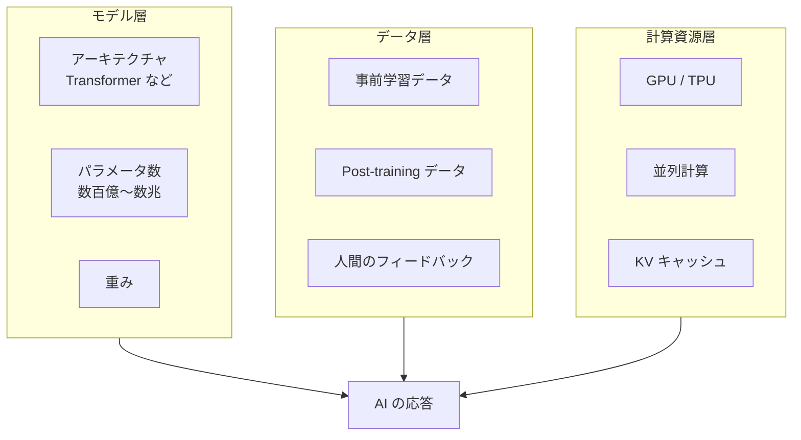

3 層は独立ではなく、互いに強く影響し合います。良いモデルアーキテクチャがあっても、学習させるデータが乏しければ性能は伸びません。潤沢なデータがあっても、それを学習させる計算資源がなければ実際に学習は完了しません。逆に、計算資源が豊富でも、アーキテクチャとデータが噛み合っていなければ結果は出ません。

#### モデル層——何を計算するか

モデル層は、AI が入力を受け取ってから出力を返すまでの計算手順の設計を指します。ニューラルネットワークのアーキテクチャ（層の並び方や接続の仕方）、パラメータの数、活性化関数の選び方などがここに含まれます。生成 AI で使われる Transformer は、モデル層の代表格です。パラメータ数は、モデルが表現できる複雑さの目安になります。2025 年時点の大規模モデルは、数百億から数兆のパラメータを持ちます。

#### データ層——何から学ぶか

データ層は、モデルに学ばせる素材を指します。事前学習では、Web ページ・書籍・コードなど大量のテキストを与え、次の単語を予測させる学習をします。Post-training（事後学習）では、人間が書いた模範解答や、人間が並べた「どちらが好ましいか」の比較データで、モデルの振る舞いを整えます。データの質と量は、モデルの性能を大きく左右します。「ゴミを入れればゴミが出る」という古い格言は、AI にもそのまま当てはまります。

#### 計算資源層——どれだけの計算力で学ばせ、動かすか

計算資源層は、モデルの学習と推論に使われる計算機の総体を指します。GPU（Graphics Processing Unit、画像処理を得意とする計算チップ）や TPU（Tensor Processing Unit、Google が AI 向けに設計した計算チップ）が中心的な役割を担います。並列計算の設計、KV キャッシュのような推論最適化、量子化や蒸留のようなモデル圧縮も、この層の話題です。計算資源はコストとレイテンシに直結し、実務でのモデル選定に強く影響します。

> **📝 補足**
> 3 層フレームは本コース独自の整理ではなく、AI の実務家が経験則的に共有している考え方です。学術的にも「Scaling Laws（規模の法則）」の研究として、モデルサイズ・データ量・計算量の 3 変数の関係が定量的に調べられています。詳しくはレッスン 7 で扱います。

### 生成 AI 入門で触れた話を、8 レッスンで深堀りする

生成 AI の入門レベルでは、トークン・Transformer・事前学習・ファインチューニング・RLHF・ハルシネーション・文脈窓といった論点が、1 レッスン程度の分量にまとめられることが多いです。本コースは、その入門レベルで登場した論点を 8 レッスン規模に展開します。ここでは、これから何を学ぶかの見取り図を示します。

| レッスン | テーマ | 3 層フレームでの位置 |
|---|---|---|
| 1 | AI の性能は 3 つの層で決まる | 3 層全体の俯瞰 |
| 2 | ニューラルネットの系譜 | モデル層の歴史 |
| 3 | 学習の 3 分類 | データ層と学習の関係 |
| 4 | 学習が進む原理 | モデル層とデータ層の橋渡し |
| 5 | Transformer の中身 | モデル層の中核 |
| 6 | トークンと埋め込み | モデル層とデータ層の接点 |
| 7 | 事前学習と Post-training | データ層の実務 |
| 8 | 効率化と推論最適化 | 計算資源層の実務 |

前半のレッスン 2〜4 で「学習が進む原理」の土台を固め、中盤のレッスン 5〜6 で Transformer の中身に踏み込み、後半のレッスン 7〜8 で「訓練後の振る舞い調整」と「実運用の効率化」に進みます。各レッスンでは、3 層フレームのどこの話をしているのかを繰り返し確認しながら進めます。

### narrow AI と AGI の関係——本コースはどこを扱うか

AI の議論では「narrow AI」と「AGI（汎用人工知能、Artificial General Intelligence）」の区別がしばしば登場します。narrow AI は特定のタスクに特化した AI で、画像認識・翻訳・チェスなどが典型例です。AGI は人間と同等以上に幅広いタスクをこなせる AI の理想形で、現時点では研究途上の概念です。生成 AI は narrow AI と AGI の中間に位置すると見る立場もあれば、より narrow AI 寄りだと見る立場もあります。本コースはこの論争には深入りせず、現時点で実務に使える大規模言語モデル（LLM）の仕組みに焦点を当てます。

> **⚠️ 注意**
> 「AGI がもうすぐ実現する」「AGI は永遠に実現しない」という両極端の主張が飛び交っていますが、実現時期や定義そのものにコンセンサスはありません。本コースは、こうした未来予測ではなく、いま動いている AI の仕組みを扱います。

### まとめ

このレッスンでは、以下のことを学びました。

- 本コースは AI の「仕組み側」の入門であり、使い方は別途学ぶ前提であること
- AI の性能は「モデル・データ・計算資源」の 3 層で決まるフレームで捉えられること
- 3 層は独立ではなく互いに影響し合うこと
- 生成 AI 入門レベルで触れる論点を、8 レッスン規模で深堀りするロードマップの全体像
- 仕組みを知ることは、モデル選定・失敗の切り分け・ベンダー説明の解像度を上げる投資であること
- narrow AI と AGI の議論に深入りせず、現時点で動いている大規模言語モデルの仕組みに焦点を当てること

次のレッスンでは、モデル層の歴史をたどります。1958 年のパーセプトロンから、2012 年の AlexNet、そして 2017 年の Transformer までのニューラルネットワークの系譜を、時代背景とともに整理します。

---

### 確認クイズ

このレッスンの理解度をチェックしましょう。

#### Q1. 本コースの立ち位置を最も正しく表しているのはどれですか。

- [x] AI が「なぜそう動くのか」を、モデル・データ・計算資源の 3 層構造で読み解く仕組み側の入門コース
- [ ] 生成 AI の効果的なプロンプトの書き方を体系的に学ぶ実践コース
- [ ] 特定のベンダーが提供するサービスを比較して、業務選定の指針を得るコース
- [ ] G 検定や E 資格の合格を目的とした資格試験対策コース

> **解説**
> 本コースは「仕組み側」の入門であり、プロンプトの型やサービス比較、資格試験対策は対象外です。使い方は別の入門コースで扱います。

#### Q2. 「モデル・データ・計算資源の 3 層」について、正しい説明はどれですか。

- [ ] 3 層は独立しており、それぞれの層だけを改善すれば AI 全体の性能が確実に上がる
- [x] 3 層は互いに強く影響し合っており、良いモデルがあってもデータや計算資源が不足すると性能は伸びない
- [ ] 3 層のうち計算資源だけが本質的で、モデルとデータは補助的な役割にすぎない
- [ ] 3 層のフレームは学術的な整理であり、実務での意思決定にはそのまま使えない

> **解説**
> 3 層は互いに影響し合います。良いアーキテクチャがあってもデータが乏しければ性能は伸びず、データが豊富でも計算資源がなければ学習は完了しません。実務でも「切り分けの当たり」を早くつける道具として機能します。

#### Q3. 3 層のうち「モデル層」に含まれるものとして最も適切なのはどれですか。

- [ ] Web 上から集めた大量のテキストで学習させる素材
- [ ] 学習と推論に使う GPU や TPU の計算チップ
- [x] Transformer などのアーキテクチャ、パラメータ数、活性化関数の設計
- [ ] 人間が「どちらの応答が好ましいか」を並べた比較データ

> **解説**
> モデル層は「何を計算するか」の設計を指します。アーキテクチャ・パラメータ数・活性化関数などがここに含まれます。Web テキストと人間の比較データはデータ層、GPU / TPU は計算資源層に位置づけられます。

#### Q4. 仕組みを知ることの投資対効果として、本コースが挙げていないものはどれですか。

- [ ] モデル選定と投資判断の解像度が上がる
- [ ] AI が期待通りに動かないときの切り分けが早くなる
- [ ] ベンダー説明の吟味ができるようになる
- [x] プロンプトを書かずに AI に業務を完全自動化させられるようになる

> **解説**
> 本コースが挙げている投資対効果は、モデル選定・失敗の切り分け・ベンダー説明の 3 点です。プロンプトの書き方や業務自動化は本コースの守備範囲外で、別の入門コースの領域です。

#### Q5. narrow AI と AGI に関する本コースの姿勢として最も適切なのはどれですか。

- [x] narrow AI と AGI の論争には深入りせず、現時点で動いている大規模言語モデルの仕組みに焦点を当てる
- [ ] AGI がまもなく実現することを前提に、AGI 時代の業務設計を扱う
- [ ] AGI は永遠に実現しないという立場に立ち、narrow AI の応用だけを扱う
- [ ] AGI の定義そのものを再構築する哲学的議論を展開する

> **解説**
> AGI の実現時期や定義にコンセンサスはなく、両極端な主張が飛び交っています。本コースは未来予測に立ち入らず、いま実際に動いている LLM の仕組みに焦点を当てます。

#### Q6. 3 層フレームで「データ層」に含まれない例はどれですか。

- [ ] 事前学習に使う Web ページや書籍のテキスト
- [x] 学習に使う NVIDIA H100 などの GPU 計算チップ
- [ ] Post-training で使う人間が書いた模範解答
- [ ] 人間が並べた「どちらが好ましいか」の比較データ

> **解説**
> データ層はモデルに学ばせる素材を指します。Web テキスト・模範解答・人間の比較データはすべてデータ層です。GPU は計算資源層の代表例で、データ層には含まれません。

---

## レッスン2：ニューラルネットワークの系譜——パーセプトロンからディープラーニングへ

（所要時間：25分）

### このレッスンで学ぶこと

- 1 個のニューロン＝パーセプトロンの構成（入力・重み・バイアス・活性化関数）を理解する
- XOR 問題と、隠れ層の追加による多層パーセプトロンへの発展を押さえる
- 勾配消失問題と、それを緩和した活性化関数（ReLU）や残差接続の意義を把握する
- 2012 年 AlexNet の衝撃と、ディープラーニング時代の始まりを時代背景とともに理解する
- CNN・RNN・LSTM を、Transformer 前史として位置づけられる

---

前回のレッスン 1 では、AI の性能は「モデル・データ・計算資源」の 3 層で決まるという背骨のフレームを共有しました。今回からは、その 3 層のうち「モデル層」の歴史をたどります。パーセプトロンから始まり、ディープラーニング、そして Transformer に至るまでの流れを、時代背景とともに整理していきます。歴史を押さえておくと、なぜ現在のモデルがこの形をしているのかが立体的に見えてきます。

### 1 個のニューロンから始まる——パーセプトロン

ニューラルネットワーク（NN、Neural Network）の最小単位は、1 個の人工ニューロンです。1958 年、心理学者フランク・ローゼンブラット（Frank Rosenblatt）が発表したパーセプトロン（Perceptron）は、この人工ニューロンの原型です。ローゼンブラットは論文「The Perceptron: A Probabilistic Model for Information Storage and Organization in the Brain」を『Psychological Review』誌に発表し、視覚パターン認識の可能性を示しました。

パーセプトロンの計算はシンプルです。複数の入力値を受け取り、それぞれに「重み」を掛けて合計し、その値がある閾値を超えれば「発火」（出力 1）し、超えなければ「発火しない」（出力 0）と決めます。

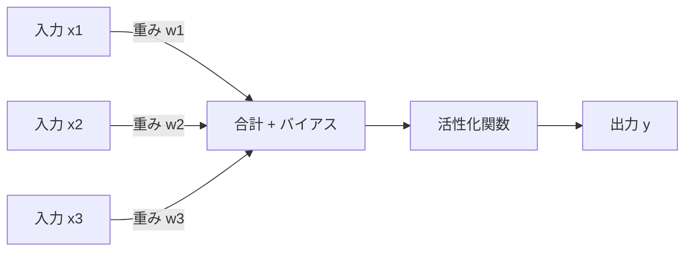

#### 重みとバイアス——「どれくらい効かせるか」の設計値

重み（weight）は、各入力の影響力を表す数値です。ある入力を強く効かせたいなら重みを大きくし、あまり効かせたくないなら小さくします。バイアス（bias）は、閾値を調整するための追加の数値です。

学習とは、この重みとバイアスを、望ましい出力に近づくように少しずつ調整していく作業です。学習の詳細な仕組みはレッスン 4 で扱いますが、ここでは「重みを動かすと出力が変わる」「学習は重みを動かす作業」という直観を持っておいてください。

#### 活性化関数——「発火」の形を決める

活性化関数（activation function）は、入力の合計を「発火するかどうか」の出力に変換する関数です。初期のパーセプトロンでは、閾値を超えれば 1、超えなければ 0 という単純な階段関数でした。後の時代には、なめらかな曲線を描くシグモイド関数（sigmoid）や、負の値を 0 に切って正の値をそのまま返す ReLU（Rectified Linear Unit、正規化線形関数）が主流になります。

> **💡 ポイント**
> 活性化関数を数式で理解する必要はありません。「発火の強さの決め方」の設計選択だと押さえておけば十分です。シグモイドが使われていた時代から、ReLU が主流になった時代への移行が、ディープラーニングの大きな転換点になります。

### XOR 問題と隠れ層——多層パーセプトロンへ

1 個のパーセプトロンには、大きな弱点がありました。それが XOR 問題です。XOR（排他的論理和）は「2 つの入力のうち片方だけが 1 のとき出力が 1、両方 0 または両方 1 のときは 0」というシンプルな論理演算ですが、1 個のパーセプトロンでは、この単純な問題を解けません。1969 年、マービン・ミンスキー（Marvin Minsky）とシーモア・パパート（Seymour Papert）は著書『Perceptrons』でこの限界を指摘しました。この指摘は当時のニューラルネット研究に強い冷や水を浴びせ、いわゆる「AI の冬」の一因になったと言われます。

#### 隠れ層の追加——多層パーセプトロン

XOR 問題を解く鍵は、パーセプトロンを縦に重ねることでした。入力層と出力層の間に、中間の層を挟むのです。この中間層を隠れ層（hidden layer）と呼びます。隠れ層を持つニューラルネットワークを多層パーセプトロン（Multi-Layer Perceptron、MLP）と呼びます。

隠れ層を 1 層挟むだけで、XOR のような非線形な問題も解けるようになります。理論的には、隠れ層の幅を十分に取れば、任意の連続関数を任意の精度で近似できることも証明されています（万能近似定理、Universal Approximation Theorem）。

#### 逆伝播の登場

多層パーセプトロンの学習には、逆伝播（backpropagation）というアルゴリズムが不可欠です。逆伝播は、出力層の誤差を隠れ層に順次「配って」重みを更新する方法で、1986 年にデビッド・ラメルハート（David Rumelhart）、ジェフリー・ヒントン（Geoffrey Hinton）、ロナルド・ウィリアムズ（Ronald Williams）が『Nature』誌の論文「Learning representations by back-propagating errors」で広く知られる形にまとめました。逆伝播の詳しい仕組みはレッスン 4 で扱います。ここでは「多層 NN を実用的に学習できるようになった」という位置づけを押さえてください。

### 勾配消失問題と、その克服

隠れ層をどんどん深くすれば、より複雑な問題を解けるようになる——これがディープラーニング（deep learning、深層学習）の発想です。しかし、単純に層を増やしていくと、深い層まで学習が届かない現象が起きます。これが勾配消失問題（vanishing gradient problem）です。

シグモイド関数のような活性化関数は、入力が大きくても小さくても出力が 0 か 1 に近づいてしまい、「発火の強弱の情報」がなだらかにつぶれてしまいます。逆伝播で誤差を後ろから配っていくとき、この情報のつぶれが層を経るごとに掛け合わさり、深い層に届く頃には勾配（学習の手がかり）がほぼ 0 になってしまうのです。

#### ReLU の採用——シンプルな活性化関数の勝利

勾配消失問題を大きく緩和したのが、ReLU の採用です。ReLU は「負の値は 0 にする、正の値はそのまま返す」というシンプルな関数です。この単純さのおかげで、正の側では勾配がつぶれず、深い層まで学習の手がかりが届きやすくなりました。

> **📝 補足**
> ReLU 以前にも、勾配消失問題を緩和する工夫は複数提案されていました。ReLU は特別に難しい発明ではなく、「単純な関数のほうが深い NN では逆に強い」という発想の転換が価値でした。深層学習では、複雑な工夫より、単純で頑健な選択が勝つことが多くあります。

#### 残差接続——「近道」で情報を届ける

もう 1 つの重要な工夫が、残差接続（residual connection、スキップ接続とも）です。これは「入力を、途中の層を飛ばして出力側に足し込む近道の配線」を作る発想です。2015 年、マイクロソフト研究所の何愷明（Kaiming He）らが発表した ResNet（Residual Network）で採用され、100 層を超える深い NN の学習を実用化しました。残差接続は、後の Transformer にも受け継がれています。

### 2012 年——ディープラーニング時代の幕開け

現在の AI ブームの直接の起点として広く語られるのが、2012 年の ImageNet Challenge（ImageNet Large Scale Visual Recognition Challenge、ILSVRC）です。ImageNet は 1,000 種類以上のカテゴリで数百万枚の画像を集めた大規模データセットで、画像分類の精度を競う国際コンペティションが毎年開催されていました。

2012 年、トロント大学のジェフリー・ヒントンの研究室に所属するアレックス・クリジェフスキー（Alex Krizhevsky）、イリヤ・スツケヴェル（Ilya Sutskever）、ヒントン自身の 3 名が発表した AlexNet が、ほかのチームを 10 パーセントポイント以上引き離す圧倒的な精度で優勝しました。この結果は、当時の画像認識研究に衝撃を与え、深層ニューラルネットワークが実務に使える段階に入ったと広く認識される起点になりました。

#### 何が AlexNet の突破を可能にしたか

AlexNet の登場は「魔法のアーキテクチャの発明」ではなく、3 つの条件がそろったことによるものでした。

1. **モデル層の工夫**：ReLU、Dropout（ランダムにニューロンを無効化する正則化手法）などの新しい部品
2. **データ層の充実**：ImageNet という大規模ラベル付きデータの存在
3. **計算資源層の進化**：GPU による並列計算の実用化。AlexNet は 2 枚の NVIDIA GPU で学習された

これはレッスン 1 で示した「モデル・データ・計算資源の 3 層」フレームがそのまま当てはまる例です。AI の飛躍は、3 層のうちどれか 1 つの改善ではなく、3 層が同時にそろったときに起こります。

### Transformer 前史——CNN・RNN・LSTM

Transformer が 2017 年に登場するまで、ディープラーニングの主役は用途別に区分されていました。ここでは Transformer 前史として、主要 3 系統を押さえます。

#### CNN——画像認識の主役

CNN（Convolutional Neural Network、畳み込みニューラルネットワーク）は、画像処理を得意とするアーキテクチャです。画像の局所領域を「畳み込みフィルター」で走査し、特徴を抽出します。AlexNet は CNN の代表例で、2010 年代の画像認識は CNN が主役でした。医療画像の診断支援、自動運転の物体検出、顔認証など、実務での応用も広がりました。

#### RNN と LSTM——時系列と自然言語の主役

RNN（Recurrent Neural Network、再帰型ニューラルネットワーク）は、時系列データを扱うためのアーキテクチャです。1 つ前のステップの出力を、次のステップの入力に戻す「再帰」の構造で、文章の順序や時系列の流れを扱えます。ただし、単純な RNN は長い系列の学習が苦手でした。

これを改良したのが LSTM（Long Short-Term Memory、長短期記憶）です。1997 年、ゼップ・ホッホライター（Sepp Hochreiter）とユルゲン・シュミットフーバー（Jürgen Schmidhuber）が発表しました。LSTM は「記憶を保持するか忘れるか」を制御するゲート機構を持ち、長い系列の学習を実用化しました。2010 年代の機械翻訳や音声認識では、LSTM が主流でした。

#### 2017 年——Transformer の登場

2017 年、Google の研究チーム（Vaswani ら）が発表した論文「Attention Is All You Need」で、Transformer が登場します。RNN の逐次処理の弱点（並列化しにくい）を、Self-Attention という新しい仕組みで解消しました。これが現代の LLM の直接の起源になります。Transformer の中身は、レッスン 5 でじっくり扱います。

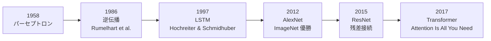

### 現代モデルへの流れ

パーセプトロンから Transformer までの 60 年近い歴史を振り返ると、AI の飛躍はモデル・データ・計算資源の 3 層が同時にそろったときに起きています。パーセプトロンの限界は隠れ層と逆伝播で克服され、勾配消失問題は ReLU と残差接続で緩和され、AlexNet の突破は大規模データと GPU の登場で可能になり、Transformer の登場は Self-Attention の発明と大規模計算資源の組み合わせで実現しました。

現在の生成 AI は、この流れの延長線上にあります。Transformer をベースに、事前学習と Post-training でさまざまな振る舞いを獲得し、MoE や量子化などの効率化で実運用に耐える形に整えられています。これから 6 レッスンで、この現代モデルの中身に踏み込んでいきます。

### まとめ

このレッスンでは、以下のことを学びました。

- パーセプトロンは 1958 年にローゼンブラットが提案した人工ニューロンの原型で、入力・重み・バイアス・活性化関数から成ること
- 1 個のパーセプトロンでは XOR 問題が解けず、隠れ層を持つ多層パーセプトロンが必要になったこと
- 1986 年の逆伝播が多層 NN の実用的な学習を可能にしたこと
- 勾配消失問題は ReLU の採用と残差接続の発想で緩和され、深い NN が実用化されたこと
- 2012 年の AlexNet が、モデル・データ・計算資源の 3 層がそろった好例として現在の AI ブームの起点になったこと
- CNN（画像）、RNN と LSTM（時系列・自然言語）を経て、2017 年の Transformer が現代 LLM の直接の起源になったこと

次のレッスンでは、AI が「学ぶ」とはどういうことかを整理します。教師あり学習・教師なし学習・強化学習という 3 分類を軸に、それぞれの使いどころと、LLM の事前学習が「自己教師あり学習」に位置づけられる理由を扱います。

---

### 確認クイズ

このレッスンの理解度をチェックしましょう。

#### Q1. パーセプトロンについて、正しい説明はどれですか。

- [x] 1958 年にフランク・ローゼンブラットが提案した人工ニューロンの原型で、入力・重み・バイアス・活性化関数から成る
- [ ] 2012 年にトロント大学のヒントン研究室が提案したアーキテクチャで、AlexNet の中核となった
- [ ] 2017 年に Google が発表した、Self-Attention を中核とする新しいアーキテクチャ
- [ ] 1986 年にラメルハート・ヒントン・ウィリアムズが Nature 誌で発表した学習アルゴリズム

> **解説**
> パーセプトロンは 1958 年のローゼンブラットによる人工ニューロンの原型です。選択肢の他項目は、それぞれ AlexNet、Transformer、逆伝播に対応します。

#### Q2. XOR 問題について、正しい説明はどれですか。

- [ ] 1 個のパーセプトロンでも解ける単純な論理演算で、パーセプトロンの発明当時は自明とされていた
- [x] 1 個のパーセプトロンでは解けない論理演算で、隠れ層を追加した多層パーセプトロンで解けるようになった
- [ ] Transformer が登場するまで解けなかった問題で、Self-Attention によって初めて解決された
- [ ] 深いニューラルネットで発生する勾配消失問題の別名で、活性化関数を工夫することで解決された

> **解説**
> XOR は 1 個のパーセプトロンでは解けない代表例です。1969 年のミンスキーとパパートの指摘が有名で、隠れ層を追加した多層パーセプトロンで解けるようになりました。勾配消失問題は別の概念です。

#### Q3. 勾配消失問題への対応として、本コースが挙げていないものはどれですか。

- [x] Transformer の Self-Attention だけを使い、隠れ層は 1 層に限定する
- [ ] 活性化関数を ReLU にする
- [ ] 残差接続（スキップ接続）を導入する
- [ ] 深い層でも勾配が届きやすい設計にする

> **解説**
> 勾配消失問題への典型的な対応は ReLU の採用と残差接続の導入です。「隠れ層を 1 層に限定する」は、そもそも深いネットワークをあきらめる立場で、勾配消失問題への対応ではありません。Transformer にも Self-Attention と多層構造の両方があります。

#### Q4. 2012 年 AlexNet の突破を可能にした 3 つの条件として、本コースが挙げていないものはどれですか。

- [ ] ReLU や Dropout などの新しいモデル層の工夫
- [ ] ImageNet という大規模ラベル付きデータの存在
- [ ] GPU による並列計算の実用化
- [x] AGI（汎用人工知能）の完成による全タスクへの応用可能性

> **解説**
> AlexNet を可能にした 3 条件は、モデル層の工夫（ReLU・Dropout など）、データ層の充実（ImageNet）、計算資源層の進化（GPU）です。AGI は現時点で実現していない概念で、AlexNet とは無関係です。

#### Q5. Transformer 前史のアーキテクチャに関する説明として、誤っているものはどれですか。

- [x] LSTM は 2017 年に Google が発表したアーキテクチャで、Attention 機構を中核とする
- [ ] CNN は画像処理を得意とし、局所領域を畳み込みフィルターで走査する
- [ ] RNN は時系列データを扱うためのアーキテクチャで、1 つ前のステップの出力を次のステップの入力に戻す
- [ ] LSTM は 1997 年にホッホライターとシュミットフーバーが発表し、長い系列の学習を実用化した

> **解説**
> LSTM は 1997 年のホッホライターとシュミットフーバーによる発表で、ゲート機構を持ちます。Attention 機構を中核とするのは 2017 年の Transformer で、LSTM とは別のアーキテクチャです。

#### Q6. パーセプトロンから Transformer までの系譜について、正しい説明はどれですか。

- [ ] Transformer は Attention だけで構成され、パーセプトロンや逆伝播とは無関係な独立の発明である
- [ ] 現代の LLM は 2017 年の Transformer の発明だけで実現しており、それ以前の系譜は無関係である
- [x] AI の飛躍は「モデル・データ・計算資源」の 3 層が同時にそろったときに起きており、AlexNet や Transformer の登場もこの図式にあてはまる
- [ ] パーセプトロンの限界を克服したのは Transformer が最初で、それ以前の隠れ層の発明では解消できなかった

> **解説**
> AI の飛躍は 3 層が同時にそろったときに起きます。AlexNet は ReLU・ImageNet・GPU の 3 つの重なりで、Transformer は Self-Attention・大規模テキスト・大規模計算資源の重なりで実現しました。パーセプトロンの限界（XOR 問題）は隠れ層の追加で解消済みです。

---

## レッスン3：学習の 3 分類——教師あり・教師なし・強化学習

（所要時間：25分）

### このレッスンで学ぶこと

- 機械学習の 3 分類（教師あり学習・教師なし学習・強化学習）を、ラベルの有無と行動の有無で位置づけられる
- 教師あり学習の 2 大タスク（分類・回帰）の違いを、ビジネス例で理解できる
- 教師なし学習の代表タスク（クラスタリング・次元削減）と、その活用場面を把握する
- 強化学習の「環境・エージェント・報酬」の循環と、AlphaGo の位置づけを理解する
- 自己教師あり学習が「教師あり学習の特殊形」として LLM の事前学習に使われる理由を押さえる

---

前回のレッスン 2 では、パーセプトロンから Transformer までのニューラルネットの系譜をたどりました。今回は、これらのモデルが「どう学ぶか」の 3 分類を整理します。教師あり学習・教師なし学習・強化学習の 3 つの枠組みを俯瞰し、LLM の事前学習が「自己教師あり学習」に位置づけられる理由まで踏み込みます。次のレッスン 4 で扱う「学習が進む原理」の前提となる回です。

### 機械学習の 3 分類——ラベルと行動で整理する

機械学習（machine learning）は、大きく 3 つに分けられます。

1. **教師あり学習（supervised learning）**：入力とラベル（正解）のペアで学ぶ
2. **教師なし学習（unsupervised learning）**：ラベルなしの入力だけで、データの構造を見出す
3. **強化学習（reinforcement learning）**：環境と対話し、報酬を最大化する行動を学ぶ

この 3 分類は、「ラベルの有無」と「行動の有無」の 2 軸で整理できます。

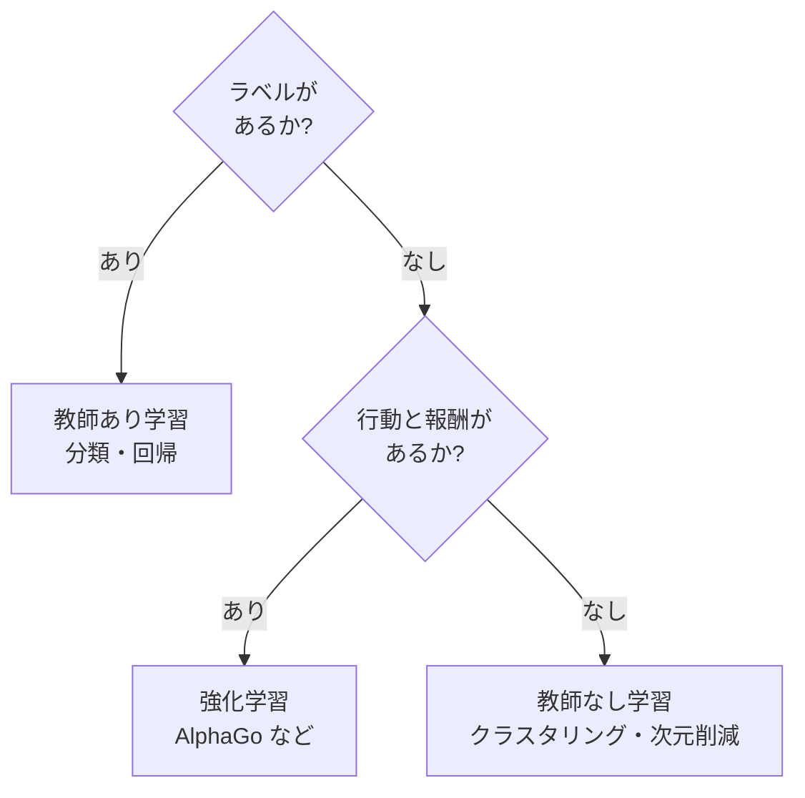

3 分類は排他的ではなく、実務では複数を組み合わせることも多くあります。例えば、大量のラベルなしデータで教師なし学習の下地を作り、少量のラベル付きデータで教師あり学習を仕上げる「半教師あり学習」や、モデル自身が入力の一部を隠して「隠された部分を予測させる」自己教師あり学習など、境界を柔軟に扱う手法が発展しています。

### 教師あり学習——ラベル付きデータで学ぶ

教師あり学習は、入力と「望ましい出力」のペアを大量に見せて、両者の対応関係を学ばせる方法です。ラベル付きデータ（labeled data）を必要とします。学習後のモデルは、新しい入力に対して出力を予測できるようになります。

教師あり学習の代表タスクは、分類（classification）と回帰（regression）の 2 つです。

#### 分類——カテゴリを予測する

分類は、入力を「あらかじめ決められたいくつかのカテゴリのどれか」に振り分けるタスクです。以下は代表的なビジネス例です。

- スパムメール判定（スパム / 正常）
- 画像認識（犬 / 猫 / 鳥 …）
- 顧客離反予測（離反する / 離反しない）
- 医療画像の異常検出（異常あり / 異常なし）
- 与信スコアリング（承認 / 否認）

分類の出力は「カテゴリのラベル」または「各カテゴリに属する確率」です。カテゴリが 2 つの場合を二値分類、3 つ以上の場合を多クラス分類と呼びます。

#### 回帰——数値を予測する

回帰は、入力から「連続した数値」を予測するタスクです。以下は代表例です。

- 不動産価格の予測（間取り・築年数・立地から価格を推定）
- 売上予測（過去データから来月の売上を推定）
- 気温予測（気象データから明日の気温を推定）
- 需要予測（過去の販売実績から次期の需要を推定）

分類と回帰の見分け方はシンプルです。「予測したい対象が『カテゴリのどれか』なら分類、『数値そのもの』なら回帰」と押さえてください。

> **💡 ポイント**
> 教師あり学習の最大のボトルネックは、ラベル付きデータの用意です。「猫の画像」を 10 万枚集めるだけでなく、それぞれに「これは猫」というラベルを人手で付ける作業が必要になります。ImageNet の大規模ラベルデータが 2012 年 AlexNet の突破を可能にした背景には、多数の人手によるラベリング作業がありました。

### 教師なし学習——ラベルなしデータで構造を見出す

教師なし学習は、ラベルのない入力データだけを与え、モデルにデータの構造を見つけさせる方法です。「正解」を与えないため、モデルは「データがどう集まっているか」「どの次元が本質的か」といったパターンを自ら探索します。

#### クラスタリング——似たものをまとめる

クラスタリング（clustering）は、データを「似たもの同士のグループ」に分ける手法です。ラベルは与えられず、モデルが「近さ」の物差しに基づいてグループを作ります。ビジネス例としては次のような場面があります。

- 顧客セグメンテーション（購買行動から顧客を数グループに分ける）
- 商品カテゴリの自動生成（大量の商品を似た特徴でまとめる）
- 異常検知（普通のデータ群から離れたものを異常と判定する）
- 文書のトピック抽出（大量の記事を似た内容でグループ化する）

代表的な手法に k-means（k 平均法）や階層クラスタリングがあります。手法の詳細は本コースの範囲外ですが、「近さの物差しでグループを作る」という発想は押さえてください。

#### 次元削減——本質的な軸を取り出す

次元削減（dimensionality reduction）は、多次元のデータを「本質的な少数の軸」で表現し直す手法です。100 個の特徴を持つデータを 2 〜 3 個の軸で近似的に表現できれば、可視化や後段の分析がしやすくなります。代表的な手法に主成分分析（PCA、Principal Component Analysis）や t-SNE などがあります。

ここで押さえておきたいのは、レッスン 6 で扱う「埋め込み空間」も、広い意味で次元削減の発想を受け継いでいるということです。単語を数千次元のベクトルに落とし込み、「意味が近いものは空間の中で近くに集まる」形にする——この発想が LLM の中核部品になっています。

### 強化学習——環境と対話し、報酬を最大化する

強化学習は、「教師」も「ラベル」もありませんが、「環境から返ってくる報酬（reward）」を手がかりに、行動の選び方（方策、policy）を学ぶ枠組みです。教師あり学習と教師なし学習が「静的なデータから学ぶ」のに対し、強化学習は「動きながら学ぶ」点が最大の違いです。

#### 環境・エージェント・報酬の循環

強化学習は、次の 3 要素の循環で説明できます。

1. **エージェント（agent）**：行動を選ぶ主体（学習する側）
2. **環境（environment）**：エージェントが行動する対象
3. **報酬（reward）**：環境から返ってくる「その行動が良かったかの数値」

エージェントは環境を観察し、行動を選び、報酬と次の状態を受け取ります。この試行錯誤を繰り返し、「長期的に報酬を最大化する行動の選び方」を学んでいきます。

#### AlphaGo——強化学習の代表的成功例

強化学習の代表的な成功例として広く知られるのが、DeepMind が 2016 年に発表した AlphaGo です。AlphaGo は囲碁の世界トップ棋士イ・セドル氏に 4 勝 1 敗で勝利し、当時「あと 10 年は AI が人間に勝てない」と言われていた囲碁の壁を突破しました。AlphaGo は教師あり学習で人間の棋譜を学んだ後、強化学習で自己対戦を繰り返し、方策を洗練させていきました。後継の AlphaZero（2017 年）は人間の棋譜を一切使わず、自己対戦だけで囲碁・チェス・将棋の 3 領域で超人的な強さに到達しました。

#### 強化学習のビジネス応用

強化学習は、明確な「勝ち負け」があるゲームや、シミュレーション可能な環境で強みを発揮します。実務での応用例は次のようなものです。

- ゲーム AI（囲碁・将棋・チェス、ビデオゲーム）
- ロボット制御（動作の試行錯誤で最適化）
- 広告配信の最適化（クリックや購入が報酬）
- 推薦システム（ユーザーの反応が報酬）
- 自動運転の一部モジュール（シミュレーション環境で学習）

#### RLHF——強化学習が LLM に応用される

LLM の Post-training で使われる RLHF（人間のフィードバックによる強化学習、Reinforcement Learning from Human Feedback）は、強化学習の枠組みを応用したものです。「人間が『どちらの応答が好ましいか』を並べたデータを報酬モデルに変換し、その報酬モデルを使って LLM の応答を学習させる」というアイデアです。RLHF の詳細はレッスン 7 で扱います。ここでは「強化学習の考え方が現代の LLM にも生きている」ことを押さえてください。

### 半教師あり学習と自己教師あり学習

3 分類の境界をまたぐ枠組みも、実務では重要な役割を果たします。

#### 半教師あり学習

半教師あり学習（semi-supervised learning）は、少量のラベル付きデータと大量のラベルなしデータを組み合わせて学ぶ手法です。ラベル付きデータの用意にコストがかかる現場で、実務的な妥協点として使われます。

#### 自己教師あり学習——ラベルを「作り出す」

自己教師あり学習（self-supervised learning）は、教師あり学習の特殊形として位置づけられます。人手でラベルを用意するのではなく、モデル自身が入力データからラベルを「作り出して」学びます。

代表例が「次単語予測」です。文章「AI は次の単語を」まで見せて、次に来る単語（例：「予測」）を予測させる。この「隠された次単語」がラベルとして機能します。ラベルは人手で付けたものではなく、テキストそのものに埋め込まれています。

> **📝 補足**
> 「次単語予測」と聞くと単純そうですが、大量の多様なテキストで次単語を予測させ続けると、モデルは自然と語彙・文法・意味・世界知識・推論の初歩まで身につけていきます。これが LLM の事前学習の中核です。詳しくはレッスン 7 で扱います。

#### なぜ自己教師あり学習が LLM で主役なのか

自己教師あり学習が LLM の事前学習で使われるのは、次の 3 つの理由からです。

1. **ラベル付けコストがかからない**：テキストがあれば学習できる
2. **データ量を桁違いに増やせる**：Web 上のテキスト全体を学習素材にできる
3. **タスクが本質的**：「次の単語を予測できる」ことは、言語を深く扱える能力の土台になる

パーセプトロンから Transformer までの 60 年で、教師あり学習の質の高さで性能を伸ばしてきたモデルたちが、自己教師あり学習の量の大きさで新しい段階に入った——それが 2020 年代の LLM だと言えます。

### 3 分類の実務での使い分け

3 分類は排他的ではなく、実務では組み合わせて使うのが普通です。以下は典型的な組み合わせ例です。

- **教師なし＋教師あり**：教師なし学習で顧客セグメントを作り、セグメントごとに教師あり学習で離反予測モデルを作る
- **自己教師あり＋教師あり**：LLM を大量テキストで自己教師あり事前学習させ、その後に少量のラベル付きデータで教師あり学習（SFT）する
- **自己教師あり＋教師あり＋強化学習**：LLM を自己教師あり事前学習させ、教師あり学習で振る舞いの型を作り、強化学習（RLHF）で好ましさを調整する

現代の LLM の学習は、実はこの 3 分類の総合演武です。1 つの技術に頼るのではなく、それぞれの得意分野を組み合わせて全体を作り上げていく——この設計思想は、レッスン 7 の Post-training でより具体的に見ていきます。

### まとめ

このレッスンでは、以下のことを学びました。

- 機械学習は「教師あり・教師なし・強化学習」の 3 分類で整理でき、ラベルの有無と行動の有無で位置づけられること
- 教師あり学習の 2 大タスクは分類（カテゴリ予測）と回帰（数値予測）で、大量のラベル付きデータが必要になること
- 教師なし学習はラベルなしでデータの構造（クラスタリング・次元削減）を見出し、レッスン 6 の埋め込み空間の発想にもつながること
- 強化学習は環境との対話で報酬を最大化する枠組みで、AlphaGo が代表例、RLHF として LLM にも応用されていること
- 自己教師あり学習は教師あり学習の特殊形で、テキストから「次単語予測」というラベルを自動で作り出す発想が LLM の事前学習の中核であること
- 現代の LLM は 3 分類を組み合わせた総合演武として学習されていること

次のレッスンでは、学習が「なぜ進むか」の原理に踏み込みます。損失関数・勾配降下法・逆伝播という 3 つの部品を、山下りと連鎖律の比喩で理解していきます。

---

### 確認クイズ

このレッスンの理解度をチェックしましょう。

#### Q1. 機械学習の 3 分類として、本コースが提示している組み合わせはどれですか。

- [x] 教師あり学習・教師なし学習・強化学習
- [ ] 深層学習・浅い学習・自己学習
- [ ] 分類学習・回帰学習・クラスタ学習
- [ ] 生成学習・判別学習・強化学習

> **解説**
> 機械学習の 3 分類は「教師あり学習・教師なし学習・強化学習」です。分類・回帰は教師あり学習の 2 大タスク、クラスタリングは教師なし学習の代表タスクで、これらは 3 分類そのものではありません。

#### Q2. 教師あり学習の分類タスクの例として、最も適切なのはどれですか。

- [ ] 不動産の価格を、間取り・築年数・立地から予測する
- [x] メールが「スパム」か「正常」かを、本文と件名から判定する
- [ ] 顧客の購買データから、似た行動を取る顧客をグループ化する
- [ ] 囲碁の局面から、次の一手を試行錯誤しながら学ぶ

> **解説**
> 分類はカテゴリを予測するタスクです。スパム判定は「スパム / 正常」の 2 つのカテゴリのどちらかに振り分ける典型的な分類です。不動産価格の予測は回帰、顧客グループ化はクラスタリング（教師なし）、囲碁の一手は強化学習に該当します。

#### Q3. 教師なし学習の説明として、正しいものはどれですか。

- [ ] 環境と対話し、報酬を最大化する行動を学ぶ枠組み
- [ ] 少量のラベル付きデータで、精密な数値予測を行う手法
- [x] ラベルのない入力データから、データの構造（グループや軸）を見出す手法
- [ ] 人間のフィードバックで、モデルの好ましさを調整する手法

> **解説**
> 教師なし学習はラベルなしデータで構造を見出します。代表タスクはクラスタリング（グループ化）と次元削減（本質的な軸の抽出）です。ほかの選択肢は強化学習、教師あり学習、RLHF の説明です。

#### Q4. 強化学習について、正しい説明はどれですか。

- [ ] 大量のラベル付きデータから、静的にパターンを学ぶ
- [ ] データの本質的な次元を圧縮して、少数の軸で表現し直す
- [ ] クラスタリングと次元削減を組み合わせた枠組み
- [x] エージェントが環境と対話し、報酬を手がかりに行動の選び方を学ぶ

> **解説**
> 強化学習は「エージェント・環境・報酬」の循環で行動の選び方を学ぶ枠組みです。AlphaGo が代表例で、LLM の RLHF もこの枠組みの応用です。ほかの選択肢は教師あり学習、次元削減、教師なし学習の組み合わせにあたります。

#### Q5. 自己教師あり学習について、正しい説明はどれですか。

- [ ] 人手で用意した高品質なラベルを、少量ずつ丁寧に使う手法
- [ ] 教師なし学習の一種で、報酬信号だけで学ぶ
- [x] 教師あり学習の特殊形で、モデル自身が入力データからラベルを作り出す
- [ ] 強化学習の一種で、人間のフィードバックを唯一の教師信号とする

> **解説**
> 自己教師あり学習は、モデル自身が入力からラベルを作り出す枠組みで、教師あり学習の特殊形です。次単語予測が代表例で、テキストの一部を隠して「隠された部分を予測する」課題を設定します。RLHF は強化学習で、別の概念です。

#### Q6. 現代の LLM の学習における 3 分類の組み合わせとして、本コースが挙げている典型はどれですか。

- [ ] 教師なし学習だけで完結する
- [ ] 強化学習だけで完結し、事前学習は使わない
- [ ] 教師あり学習と教師なし学習の 2 つだけで、強化学習は関わらない
- [x] 自己教師あり学習で事前学習し、教師あり学習で振る舞いを整え、強化学習で好ましさを調整する

> **解説**
> 現代の LLM は 3 分類を組み合わせた総合演武として学習されます。自己教師あり事前学習 → 教師あり学習（SFT） → 強化学習（RLHF）というパイプラインが代表例で、詳細はレッスン 7 で扱います。

---

## レッスン4：学習が進む原理——損失関数・勾配降下・逆伝播

（所要時間：25分）

### このレッスンで学ぶこと

- 損失関数を「どれくらい間違っているかの物差し」として直観的に理解する
- 平均二乗誤差と交差エントロピーの使い分けを、回帰と分類の対比で押さえる
- 勾配降下法を「山下り」の比喩で、学習率を「歩幅」の比喩で理解する
- 逆伝播を「誤差を後ろから配る」比喩で、連鎖律のイメージとともに把握する
- 過学習・汎化性能・Dropout といった「学習の質を保つ工夫」を理解する

---

前回のレッスン 3 では、機械学習の 3 分類（教師あり・教師なし・強化学習）を俯瞰しました。今回は「学習が具体的にどう進むか」の原理に踏み込みます。ニューラルネットワークが重みを少しずつ調整して「賢くなっていく」プロセスを、損失関数・勾配降下法・逆伝播の 3 つの部品で説明します。数式は極力使わず、山下りと連鎖律の比喩で理解していきます。

### 学習は「間違いを減らす作業」

ニューラルネットワークの学習を一言で言うと、「予測の間違いを、重みを少しずつ調整して減らしていく作業」です。この一言のなかに、3 つの部品が含まれています。

1. **損失関数（loss function）**：「どれくらい間違っているか」を数値で表す物差し
2. **勾配降下法（gradient descent）**：損失を小さくする方向に重みを動かす方法
3. **逆伝播（backpropagation）**：勾配を効率よく計算する仕組み

損失関数で「今どれくらい間違っているか」を測り、勾配降下法で「どちらに重みを動かせば間違いが減るか」を決め、逆伝播でその調整量を効率的に計算する——この 3 段構えが、学習の心臓部です。

### 損失関数——間違いを数値で表す物差し

損失関数は、モデルの予測と正解の「ずれ」を 1 つの数値に変換する関数です。損失（loss）が小さいほど予測が正解に近く、大きいほど遠いことを意味します。学習はこの損失を最小化する方向で進みます。

損失関数の設計は、タスクの性質に合わせて選びます。ここでは代表的な 2 つを比喩で押さえます。

#### 平均二乗誤差——回帰タスクの定番

平均二乗誤差（mean squared error、MSE）は、回帰タスクで最もよく使われる損失関数です。予測値と正解の「差の 2 乗の平均」を取ります。差を 2 乗する理由は、正負の打ち消し合いを防ぎ、大きな間違いをより強く罰するためです。

例えば、明日の気温を予測するモデルで、正解が 25 度、予測が 27 度なら、差は 2 度、2 乗すると 4 になります。予測が 20 度なら、差は 5 度、2 乗すると 25 で、間違いが大きいほど損失が急激に増える性質を持ちます。

#### 交差エントロピー——分類タスクの定番

交差エントロピー（cross entropy）は、分類タスクで最もよく使われる損失関数です。「予測した確率分布と、正解の確率分布の食い違い」を数値化します。例えば、犬・猫・鳥の 3 分類で、正解が犬（確率 100 パーセント）のときに、モデルが「犬 90 パーセント・猫 5 パーセント・鳥 5 パーセント」と予測すれば損失は小さく、「犬 30 パーセント・猫 60 パーセント・鳥 10 パーセント」なら損失は大きくなります。

> **💡 ポイント**
> 損失関数の数式そのものは覚える必要はありません。「予測と正解のずれを数値化する物差しであること」「タスクによって適切な物差しが違うこと」「回帰なら平均二乗誤差、分類なら交差エントロピーが定番であること」を押さえておけば十分です。

### 勾配降下法——山下りで最小値を目指す

損失関数が「今どれくらい間違っているか」を教えてくれても、それだけでは学習は進みません。「どちらに重みを動かせば損失が減るか」を知る必要があります。この方向を教えてくれるのが勾配（gradient）で、勾配を使って重みを更新する手法が勾配降下法（gradient descent）です。

#### 山下りの比喩

勾配降下法は、「霧の立ちこめた山の中で、いちばん低い谷を目指す」比喩でよく説明されます。周囲が霧で見えなくても、足元の傾きはわかります。もっとも急な下り方向に少しずつ足を進めていけば、いずれ谷底にたどり着きます。

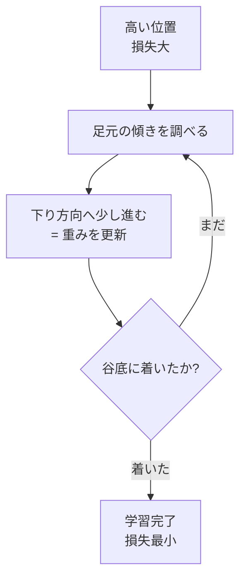

損失関数の値を「地形の高さ」、重みの調整を「地形上の移動」と考えれば、勾配降下法は「損失を最小化する重みの組を探す旅」と言えます。

#### 学習率——歩幅の設計

山下りで「一歩の大きさをどうするか」を決める設計値が、学習率（learning rate）です。学習率が小さすぎると、谷底までたどり着くのに時間がかかりすぎます。逆に大きすぎると、谷底を飛び越えて反対側の山を登ってしまうこともあります。

適切な学習率を選ぶのは実務でも難しく、経験と試行錯誤が必要です。近年は、学習の進行に応じて学習率を自動調整する仕組み（Adam などの最適化アルゴリズム）が主流になっています。

> **📝 補足**
> Adam（Adaptive Moment Estimation）は 2014 年に発表され、深層学習の実務で広く使われている最適化アルゴリズムです。名前だけ押さえておけば、実務で「Adam を使っています」と言われたときに、勾配降下法の一種として位置づけられます。

#### ミニバッチ SGD——現実的な山下りの方法

理論上の勾配降下法は「すべての訓練データを一度に使って勾配を計算する」ものですが、大規模データセットではこれは現実的ではありません。実際には、データを小分けにして少しずつ学習を進めるミニバッチ SGD（Mini-batch Stochastic Gradient Descent、確率的勾配降下法）が使われます。「バッチ」というのは「一度に処理するデータのかたまり」を指す言葉で、例えば 32 件・64 件などの小さな束で勾配を計算し、重みを更新していきます。

### 逆伝播——誤差を後ろから配る

勾配降下法が「どちらに動かすか」を決める枠組みだとすると、その「勾配」を効率よく計算する仕組みが逆伝播（backpropagation）です。逆伝播は、多層ニューラルネットの学習を実用化した中核アルゴリズムです。

#### 「後ろから配る」の直観

逆伝播の名前は「後ろから前へ、誤差を伝えていく」ことに由来します。ニューラルネットは入力層から出力層へ「順伝播（forward propagation）」で計算を進めます。出力が出たら、正解との差（誤差）を損失関数で計算します。この誤差を、今度は出力層から入力層へ「後ろ向きに」伝えていくのが逆伝播です。

各層では、「その層の重みが、最終的な誤差にどれだけ寄与したか」を計算し、その寄与に応じて重みを調整します。層が浅くなるにつれて、誤差の情報が徐々に「配られて」いくイメージです。

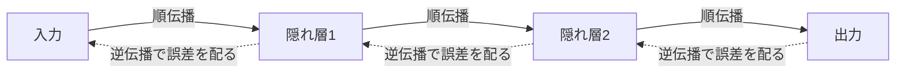

#### 連鎖律——微分の連鎖で計算を回す

逆伝播の数学的な骨格は、微分の連鎖律（chain rule）です。「A の変化が B に影響し、B の変化が C に影響する」ときに、「A の変化が C に与える影響」を、途中の影響の積で計算する規則です。

数式そのものは省きますが、比喩としては「バケツリレーで情報を後ろから前へ渡す」イメージが近いです。1 個 1 個の受け渡し（1 層分の微分）は単純ですが、それを層数分だけ連ねることで、深い NN でも勾配を計算できます。

#### 逆伝播の意義

逆伝播が広く知られる形にまとめられたのは、1986 年のラメルハート・ヒントン・ウィリアムズによる『Nature』論文でした。それ以前にも類似のアイデアはありましたが、この論文が多層 NN の学習を実用化する大きな契機になりました。逆伝播がなければ、多層のニューラルネットワークを効率的に学習させることはできず、現在のディープラーニングも Transformer も存在しなかったと言えます。

> **⚠️ 注意**
> 逆伝播は「魔法」ではなく、あくまで勾配を効率よく計算するための計算手続きです。学習が本当に進むかどうかは、損失関数の設計・データの質・学習率の選び方・モデルの表現力など、多くの要因に左右されます。逆伝播だけで学習が上手くいくわけではありません。

### 過学習と汎化性能——「覚えすぎ」を避ける工夫

学習が進めば進むほど、モデルは訓練データを正確に予測できるようになります。しかし、これが行き過ぎると、モデルは訓練データを「丸暗記」してしまい、新しいデータで性能が落ちる現象が起きます。これが過学習（overfitting、過剰適合）です。

#### 過学習の見分け方

過学習は、訓練データでの損失は下がり続けているのに、検証データ（学習に使っていない別のデータ）での損失が途中から上がり始める形で現れます。訓練データで 99 パーセントの精度が出ているのに、実運用では 60 パーセントしか当たらない——こういう症状は、過学習の典型です。

#### 汎化性能——新しいデータでも当たる力

私たちがモデルに求めているのは、訓練データでの高精度ではなく、「見たことのないデータでも予測が当たる能力」です。これを汎化性能（generalization）と呼びます。汎化性能を高く保つには、過学習を避ける工夫が必要になります。

#### Dropout——ランダムにニューロンを無効化する

過学習を緩和する代表的な手法が、Dropout です。学習中にランダムに一部のニューロンを「無効化」し、その分だけほかのニューロンで補うように学習を進めます。特定のニューロンに頼りきりの構造ができるのを防ぎ、より頑健な学習を促します。AlexNet でも Dropout が使われ、深層学習実務の標準的な部品になりました。

その他にも、L2 正則化（重みの大きさを抑える制約）、データ拡張（元データを回転・反転・切り抜きなどで水増しする）、早期打ち切り（Early Stopping、検証損失が上がり始めたら学習を止める）など、多くの工夫があります。実務では複数を組み合わせて使うのが普通です。

### LLM の学習でも同じ原理が働いている

ここまでの「損失関数・勾配降下・逆伝播・過学習対策」は、パーセプトロン時代から続く原理で、現代の LLM でもそのまま使われています。LLM の事前学習では、次の単語を予測する交差エントロピーを損失関数とし、Adam 系の最適化アルゴリズムで勾配降下し、逆伝播で数千億〜数兆のパラメータを更新していきます。

規模が桁違いに大きくなり、計算資源も桁違いに必要になりましたが、学習の心臓部は昔から変わっていません。この安定した原理の上に、Transformer という新しいアーキテクチャと、Web 上の大量テキストという豊富なデータが組み合わさって、現代の LLM が生まれています。

### まとめ

このレッスンでは、以下のことを学びました。

- ニューラルネットの学習は、損失関数・勾配降下・逆伝播の 3 部品で進むこと
- 損失関数は「どれくらい間違っているか」の物差しで、回帰では平均二乗誤差、分類では交差エントロピーが定番であること
- 勾配降下法は「山下りで谷底を探す」比喩で理解でき、学習率が歩幅の設計値になること
- ミニバッチ SGD が実務での現実的な山下り方法で、Adam などが学習率を自動調整すること
- 逆伝播は「誤差を後ろから配る」仕組みで、連鎖律の連なりで多層 NN の勾配を効率よく計算すること
- 過学習を避けるための工夫として、Dropout・L2 正則化・データ拡張・早期打ち切りなどがあること
- これらの原理はパーセプトロン時代から変わらず、現代の LLM でもそのまま働いていること

次のレッスンでは、いよいよ Transformer の中身に踏み込みます。2017 年の「Attention Is All You Need」から始まった、Self-Attention と QKV の仕組みを、検索と情報取り出しの比喩で解説していきます。

---

### 確認クイズ

このレッスンの理解度をチェックしましょう。

#### Q1. 損失関数について、正しい説明はどれですか。

- [ ] モデルの予測を人間が主観的に評価する仕組み
- [x] モデルの予測と正解の「ずれ」を 1 つの数値に変換し、学習の最小化目標として使う関数
- [ ] ニューラルネットの層数と幅を制御するハイパーパラメータ
- [ ] 逆伝播で計算された勾配を蓄積するバッファ

> **解説**
> 損失関数は「予測と正解のずれを数値化する物差し」です。学習はこの数値を最小化する方向で進みます。ほかの選択肢は主観評価・ハイパーパラメータ・勾配のバッファなどで、損失関数ではありません。

#### Q2. 平均二乗誤差と交差エントロピーの使い分けとして、最も適切なのはどれですか。

- [x] 回帰タスクでは平均二乗誤差、分類タスクでは交差エントロピーが定番として使われる
- [ ] どちらもすべてのタスクで使えるので、区別する必要はない
- [ ] 平均二乗誤差は分類タスク、交差エントロピーは回帰タスク専用
- [ ] どちらも強化学習にしか使えず、教師あり学習では別の損失関数を使う

> **解説**
> 回帰は数値の予測なので平均二乗誤差が定番、分類はカテゴリの確率分布の予測なので交差エントロピーが定番です。用途が逆転している選択肢や「使えない」とする選択肢は誤りです。

#### Q3. 勾配降下法における学習率について、誤っている説明はどれですか。

- [ ] 学習率が大きすぎると、谷底を飛び越えて反対側の山を登ってしまうことがある
- [ ] 学習率が小さすぎると、谷底までたどり着くのに時間がかかりすぎる
- [x] 学習率は損失関数の最小値そのものを表す数値で、モデル性能の上限を示す
- [ ] Adam のような最適化アルゴリズムは、学習の進行に応じて学習率を自動調整する

> **解説**
> 学習率は「1 回の重み更新でどれくらい動かすか」を決める設計値（歩幅）です。損失関数の最小値そのものではなく、性能の上限を示す数値でもありません。ほかの選択肢は勾配降下法の正しい説明です。

#### Q4. 逆伝播について、正しい説明はどれですか。

- [ ] 学習を打ち切るタイミングを決めるアルゴリズム
- [ ] ニューラルネットの重みを初期化する手法
- [ ] 訓練データを検証データと分離する仕組み
- [x] 出力層で計算した誤差を、後ろから前の層へ順に伝えて勾配を効率よく計算する仕組み

> **解説**
> 逆伝播は「誤差を後ろから配る」仕組みで、多層 NN の勾配を効率よく計算するアルゴリズムです。連鎖律の連なりで各層の重みの寄与を計算します。ほかの選択肢は早期打ち切り、重み初期化、データ分割と、別々の概念です。

#### Q5. 過学習（overfitting）について、正しい説明はどれですか。

- [ ] 訓練データでも検証データでも損失が下がり続ける、望ましい学習状態
- [x] 訓練データでの損失は下がり続けるが、検証データでの損失が途中から上がり始める状態
- [ ] 損失関数がゼロに近づかず、いつまでも学習が完了しない状態
- [ ] 学習率が大きすぎて、損失が発散してしまう状態

> **解説**
> 過学習は「訓練データを丸暗記する一方、新しいデータで性能が落ちる」現象です。訓練損失は下がるが検証損失が上がる形で現れます。ほかの選択肢は理想状態・未学習・発散などで、過学習ではありません。

#### Q6. 過学習を緩和する代表的な工夫として、本コースが挙げていないものはどれですか。

- [ ] Dropout でランダムにニューロンを無効化する
- [ ] L2 正則化で重みの大きさを抑える
- [ ] 早期打ち切りで検証損失が上がり始めたら学習を止める
- [x] 損失関数を最大化する方向に勾配を反転させる

> **解説**
> 過学習を緩和する典型手法は Dropout・L2 正則化・データ拡張・早期打ち切りなどです。損失関数は最小化する方向に学習させるのが基本で、「最大化する方向に勾配を反転」させる手法は過学習対策には該当しません。

---

## レッスン5：Transformer の中身——Self-Attention と QKV

（所要時間：25分）

### このレッスンで学ぶこと

- 2017 年『Attention Is All You Need』が示した Transformer の位置づけを理解する
- Self-Attention を「文中の関連付け」の直観で把握する
- QKV（Query・Key・Value）を「検索と情報取り出し」の比喩で理解する
- Multi-Head Attention と位置エンコーディングの役割を押さえる
- Encoder / Decoder / Encoder-Decoder の 3 系統（BERT・GPT・T5）を区別できる

---

前回のレッスン 4 では、学習が進む原理を「損失関数・勾配降下・逆伝播」の 3 部品で整理しました。今回は、この学習の枠組みの上で動く「現代 LLM の中核アーキテクチャ」である Transformer に踏み込みます。2017 年に登場した Self-Attention の直観を、検索と情報取り出しの比喩で掴んでいきます。数式そのものは追わず、「なぜこれで文脈が扱えるのか」の骨格を押さえるのが目標です。

### 2017 年——「Attention Is All You Need」の衝撃

2017 年 6 月、Google の研究チーム（アシシュ・ヴァスワニほか）が論文「Attention Is All You Need」を発表しました。タイトルは「必要なのは Attention だけ」という意味で、当時主流だった RNN・LSTM の逐次処理を捨て、Self-Attention だけでシーケンス処理を組み上げる大胆な提案でした。

この論文が示した Transformer は、機械翻訳のベンチマークで当時の最先端を上回り、しかも学習が並列化できるという実装上の利点も持っていました。ここから 2018 年の BERT、2019 年以降の GPT シリーズ、そして 2022 年末の ChatGPT へと続く現代 LLM の系譜が始まります。

> **💡 ポイント**
> Transformer の最大の発明は「並列に文脈を絡み合わせる仕組みを、Self-Attention という形で組み上げたこと」です。RNN の逐次処理という制約を外し、大規模な計算資源を使った並列学習を可能にした——この設計判断が、その後の LLM の巨大化を許容する土台になりました。

### Self-Attention の直観——文中の関連付け

Self-Attention（自己注意機構）は、「文中の各単語が、同じ文中のほかの単語とどれくらい関係しているか」を、モデルが自ら計算する仕組みです。例えば「太郎は花子に本を渡した」という文で、「渡した」という動詞は「太郎（誰が）」「花子（誰に）」「本（何を）」のそれぞれと関連しています。Self-Attention は、こうした関連の強さを、学習によって獲得します。

RNN のように 1 単語ずつ順に読み込むのではなく、文全体を一度に見渡して「どこに注目すべきか」を決めるのが、Self-Attention の発想です。「Self（自己）」の名は、「自分自身の文の中で注意を配る」ことから来ています。

#### なぜ「並列」が価値なのか

RNN は「前の単語の出力を、次の単語の入力に戻す」構造上、シーケンスを順番に処理するしかありませんでした。100 単語の文を処理するには 100 ステップの計算を順に回す必要があり、途中を並列化しにくいのが弱点でした。Self-Attention は、文中の全単語ペアの関連度を「同時に」計算できます。GPU の並列計算能力をフルに活かせるため、学習速度も推論速度も大幅に上がります。

### QKV——検索と情報取り出しの比喩

Self-Attention の内部では、Query（クエリ、質問）・Key（キー、鍵）・Value（バリュー、値）の 3 種類のベクトルが使われます。この 3 種類は、検索エンジンの動作に例えると理解しやすくなります。

- **Query**：知りたいこと・探したいことを表す「質問文」
- **Key**：検索対象の「見出し・タグ」
- **Value**：見出しに紐づく「本文・実データ」

検索エンジンで「東京の天気」と入力する（Query）と、システムはインデックスの見出し（Key）と Query を照合し、関連が強いページの本文（Value）を返します。Self-Attention も同じ流れです。

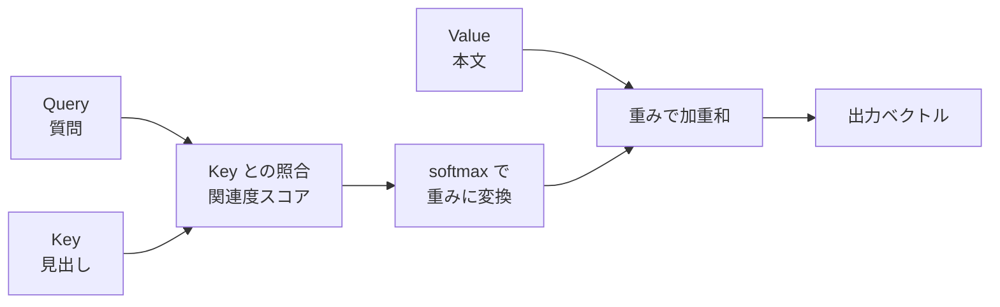

各単語は、それぞれ Query・Key・Value の 3 種類のベクトルを持ちます。ある単語の Query を、文中のすべての単語の Key と照合し、関連度スコアを出します。このスコアを softmax（合計が 1 になるように正規化する関数）で重みに変換し、各単語の Value を重み付きで足し合わせて出力を作ります。

#### softmax と内積が「見たことがあるレベル」で登場する箇所

論文では、この計算は「softmax(QK^T / √d) V」という短い式で書かれています。ここでは数式は追いませんが、部品だけ押さえておきます。

- **内積（QK^T）**：Query と Key の「向きの一致度」を数値化する演算
- **√d で割る**：数値が大きくなりすぎて softmax が極端な値に張り付くのを防ぐスケール調整
- **softmax**：合計が 1 になる確率分布に変換する関数
- **重み付き和（× V）**：関連度に応じて Value を足し合わせる

覚える必要はありませんが、他資料で「softmax(QK^T / √d) V」を見かけたときに「これは Self-Attention のことだ」と気づけるレベルで十分です。

> **📝 補足**
> Query・Key・Value の 3 種類はすべて、元の単語ベクトルに別々の重み行列を掛けて作られます。3 つを別々に学習することで、「質問の役割」「鍵の役割」「情報本体の役割」を分担できるようになっています。

### Multi-Head Attention——複数の視点で同時に注目する

Self-Attention は「1 つの視点で関連を計算する」仕組みですが、実際の Transformer では Multi-Head Attention（マルチヘッド・アテンション、多頭注意機構）が使われます。文字通り「複数の頭（head）」を並列に用意し、それぞれ別の視点で Self-Attention を計算し、最後に結果を結合します。

複数の頭を持たせることで、あるヘッドは「文法的な関係（主語と動詞など）」に注目し、別のヘッドは「意味的な関係（人物と行為など）」に注目する、というように分業ができます。実務では 8 〜 96 のヘッド数がよく使われます。

### 位置エンコーディング——順序情報を後から埋め込む

Self-Attention の並列計算には、大きな副作用があります。「文中の順序情報が失われる」ことです。「太郎は花子に本を渡した」と「花子は太郎に本を渡した」は、単語の集合としてはまったく同じで、Self-Attention だけでは区別できません。

これを補うのが位置エンコーディング（positional encoding）です。各単語の埋め込みベクトルに「その単語が文中の何番目にあるか」の情報を、別のベクトルとして足し込みます。位置エンコーディングにはさまざまな方式があり、初期の Transformer では「sin と cos の波形」を使う方式が採用されました。最近のモデルでは、学習可能な位置埋め込みや、相対位置エンコーディング（Rotary Position Embedding、RoPE など）が主流です。

> **⚠️ 注意**
> 「Transformer は並列処理なので順序が扱えない」という説明は誤解を招きます。並列処理そのものは順序を扱いませんが、位置エンコーディングで順序情報を注入することで、順序を扱えるようになります。「Self-Attention だけでは順序を扱えないが、位置エンコーディングと組み合わせて扱う」が正確な理解です。

### Encoder・Decoder・Encoder-Decoder——3 系統の Transformer

オリジナルの Transformer は、Encoder（入力を理解する側）と Decoder（出力を生成する側）の両方を持つ Encoder-Decoder 構造でした。しかし、その後の発展で、目的に応じて Encoder だけ、Decoder だけを使うモデルも登場しました。現代の主要モデルは 3 系統に整理できます。

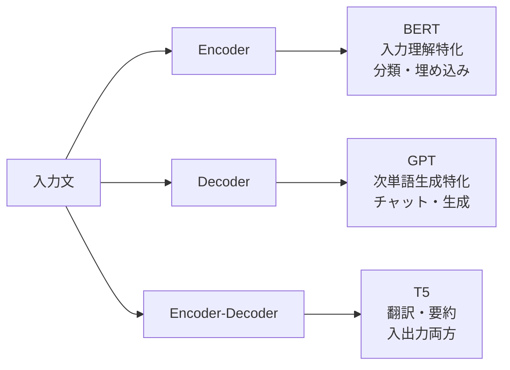

#### Encoder 系（BERT など）——入力の理解に特化

Encoder 系は、入力文全体を一度に読み込み、その内容を密なベクトルに変換することに特化しています。分類・検索・埋め込み生成などが得意です。代表例が 2018 年に Google が発表した BERT（Bidirectional Encoder Representations from Transformers、Devlin ら）で、単語の左右両方の文脈を同時に見る「双方向」の学習が特徴です。

#### Decoder 系（GPT など）——次単語生成に特化

Decoder 系は、これまでの文脈から「次に来る単語」を予測することに特化しています。生成が得意なので、チャット・文章作成・コーディング支援などに使われます。代表例が OpenAI の GPT シリーズです。「Generative Pre-trained Transformer」の頭文字で、事前学習で次単語予測を大量に行い、Post-training で対話に整えられます。

#### Encoder-Decoder 系（T5 など）——入出力両方を扱う

Encoder-Decoder 系は、Encoder で入力文を理解し、Decoder で別の出力文を生成する構造です。機械翻訳・要約・質問応答などに使われます。代表例が Google の T5（Text-To-Text Transfer Transformer）で、あらゆるタスクを「テキスト入力 → テキスト出力」に統一する設計思想が特徴です。

#### どれを使うかは目的次第

3 系統は優劣ではなく、目的に応じた使い分けです。ChatGPT や Claude のような対話モデルは Decoder 系が主流ですが、社内検索や分類タスクには Encoder 系（BERT 派生のモデル）がいまも活躍しています。翻訳や要約に特化したい場合は、Encoder-Decoder 系が良い選択になります。

### Transformer が現代 LLM の骨格である理由

Transformer は、次の 3 つの特徴で現代 LLM の骨格になりました。

1. **並列処理の実装しやすさ**：GPU 大規模計算を活かせる
2. **長距離依存の扱いやすさ**：文中で離れた単語同士の関連も直接扱える
3. **系統の柔軟さ**：Encoder / Decoder / Encoder-Decoder の 3 系統で幅広い用途に対応

パーセプトロン以来の 60 年で、「深く積むほど強くなる」ディープラーニングの原理は変わっていません。Transformer はその原理の上に、Self-Attention という新しい積み方を提案しただけとも言えます。しかし、この「積み方」の変化が、大規模学習を実現可能にし、現代 LLM の飛躍を生みました。

### まとめ

このレッスンでは、以下のことを学びました。

- 2017 年 Google の「Attention Is All You Need」が Transformer の起点であること
- Self-Attention は「文中の各単語が、同じ文中のほかの単語とどれくらい関係するか」を計算する仕組みであること
- QKV（Query・Key・Value）は検索と情報取り出しの比喩で理解でき、Query と Key で関連度を、Value で情報本体を扱うこと
- Multi-Head Attention は複数の視点で同時に注目する仕組みで、分業を可能にすること
- 位置エンコーディングが Self-Attention の順序情報の欠落を補うこと
- Transformer には Encoder 系（BERT）・Decoder 系（GPT）・Encoder-Decoder 系（T5）の 3 系統があり、目的に応じて使い分けること

次のレッスンでは、Transformer の入力側に踏み込みます。文字列がどうやってモデルの入力ベクトルになるのか、トークナイザーと埋め込み空間の話を、BPE と「king − man + woman ≈ queen」の直観で見ていきます。

---

### 確認クイズ

このレッスンの理解度をチェックしましょう。

#### Q1. Transformer の起源となる 2017 年の論文について、正しい説明はどれですか。

- [ ] 2018 年に Google が発表した「BERT: Pre-training of Deep Bidirectional Transformers」
- [x] 2017 年に Google の研究チームが発表した「Attention Is All You Need」
- [ ] 2020 年に OpenAI が発表した「Language Models are Few-Shot Learners」
- [ ] 2015 年に Microsoft 研究所が発表した「Deep Residual Learning」

> **解説**
> Transformer の起源は 2017 年 6 月の「Attention Is All You Need」（Vaswani らによる Google の論文）です。BERT は 2018 年の Encoder 系派生、GPT-3 論文は 2020 年、ResNet は 2015 年で、いずれも別の論文です。

#### Q2. Self-Attention の直観として、最も適切なのはどれですか。

- [ ] 1 単語ずつ順番に読み込み、前の単語の出力を次の入力に戻す仕組み
- [ ] 画像の局所領域を畳み込みフィルターで走査する仕組み
- [x] 文中の各単語が、同じ文中のほかの単語とどれくらい関係しているかを一度に計算する仕組み
- [ ] 過学習を防ぐためにランダムに一部のニューロンを無効化する仕組み

> **解説**
> Self-Attention は「文中の各単語とほかの単語の関連度を、一度に計算する」仕組みです。1 単語ずつ順番に処理するのは RNN、畳み込みは CNN、ランダム無効化は Dropout の説明で、Self-Attention とは別の概念です。

#### Q3. Self-Attention の QKV（Query・Key・Value）について、検索エンジンの比喩で正しい対応はどれですか。

- [ ] Query＝検索対象の本文、Key＝ユーザーの入力、Value＝関連度スコア
- [ ] Query＝関連度スコア、Key＝検索対象の本文、Value＝ユーザーの入力
- [x] Query＝ユーザーの入力（質問）、Key＝検索対象の見出し、Value＝見出しに紐づく本文
- [ ] Query＝検索対象の見出し、Key＝関連度スコア、Value＝ユーザーの入力

> **解説**
> 検索エンジンの比喩では、Query は質問文、Key は見出し、Value は本文に対応します。Query と Key を照合して関連度を出し、その関連度で Value を重み付けして出力します。ほかの選択肢は対応関係が入れ替わっており誤りです。

#### Q4. 位置エンコーディングの役割について、正しい説明はどれですか。

- [ ] 学習中にランダムに一部のニューロンを無効化して、過学習を防ぐ
- [ ] Value ベクトルを softmax で正規化して、確率分布に変換する
- [ ] Multi-Head Attention の複数のヘッドを結合する
- [x] Self-Attention では扱えない「単語の順序情報」を、埋め込みベクトルに追加で注入する

> **解説**
> 位置エンコーディングは「Self-Attention だけでは順序を扱えない」という副作用を補う仕組みです。単語の埋め込みベクトルに、位置を表す情報を追加で足し込みます。ほかの選択肢は Dropout・softmax・結合層の説明で、位置エンコーディングとは別の役割です。

#### Q5. Multi-Head Attention について、正しい説明はどれですか。

- [x] 複数の「頭」を並列に用意し、それぞれ別の視点で Self-Attention を計算して結果を結合する仕組み
- [ ] 学習率を自動調整するための最適化アルゴリズムの一種
- [ ] 位置エンコーディングを Encoder と Decoder の間で共有する仕組み
- [ ] softmax の代わりに使われる、より高速な正規化関数

> **解説**
> Multi-Head Attention は複数の Attention を並列に走らせ、それぞれ別の視点（文法・意味など）で関連付けを計算します。ほかの選択肢は最適化アルゴリズム・位置エンコーディング共有・別の正規化関数で、いずれも Multi-Head Attention とは別の概念です。

#### Q6. Transformer の 3 系統について、正しい対応はどれですか。

- [ ] BERT は Decoder 系、GPT は Encoder 系、T5 は Encoder-Decoder 系
- [ ] BERT は Encoder-Decoder 系、GPT は Encoder 系、T5 は Decoder 系
- [x] BERT は Encoder 系、GPT は Decoder 系、T5 は Encoder-Decoder 系
- [ ] BERT・GPT・T5 のすべてが Encoder-Decoder 系で、系統に違いはない

> **解説**
> BERT は Encoder 系（入力理解・分類）、GPT は Decoder 系（次単語生成）、T5 は Encoder-Decoder 系（翻訳・要約など入出力両方）に位置づけられます。目的に応じた使い分けが重要です。

---

## レッスン6：トークンと埋め込み——BPE と意味のベクトル空間

（所要時間：25分）

### このレッスンで学ぶこと

- トークナイザーの役割を「文字列を数値化する仕組み」として理解する
- Byte Pair Encoding（BPE）と SentencePiece の発想を、頻出ペアの逐次結合として把握する
- 語彙サイズの設計と、日本語トークナイザの特殊事情を押さえる
- 埋め込み（embedding）ベクトルの意味と、「king − man + woman ≈ queen」の直観を理解する
- Transformer の入力側（token embedding ＋ position embedding）を組み立てられる

---

前回のレッスン 5 では、Transformer の中核である Self-Attention と QKV を扱いました。今回は、その Transformer に「文字列がどうやって入力されるのか」という前段の話に踏み込みます。文字列をトークンに分割するトークナイザーと、トークンをベクトルに変換する埋め込みは、モデルの性能を静かに支えている縁の下の力持ちです。「king − man + woman ≈ queen」というよく知られた直観を軸に、埋め込み空間の性質を見ていきます。

### モデルは「数値」しか扱えない

ニューラルネットワークは、内部でひたすら数値の掛け算と足し算を繰り返しています。「Transformer」という文字列そのものを、モデルは直接理解できません。何らかの方法で、文字列を数値の並びに変換する必要があります。この変換を担うのが、トークナイザー（tokenizer）と埋め込み（embedding）の 2 段構えです。

- **トークナイザー**：文字列を「トークン」という小さな単位に分割し、それぞれに ID 番号を振る
- **埋め込み**：ID 番号を、意味的な情報を持ったベクトル（数百〜数千次元の数値の並び）に変換する

この 2 段を通じて、文字列がモデルの入力ベクトルに変換されます。

### トークナイザー——文字列を「トークン」に分割する

トークン（token）は、モデルが処理する最小単位のことです。トークンは単語 1 個の場合もあれば、単語の一部（サブワード、subword）の場合も、あるいは文字 1 個の場合もあります。トークナイザーの設計選択は、モデルの語彙・学習効率・多言語対応に直接影響します。

#### 単純な分け方の問題点

「単語ごとに分ければいい」と考えるかもしれませんが、この方式は次の 3 つの問題を抱えます。

1. **語彙が爆発的に増える**：世界の言語には数十万〜数百万の異なる単語がある
2. **未知語に弱い**：訓練データにない単語（新語・造語・専門用語）を扱えない
3. **言語ごとに設計が変わる**：多言語モデルを作りにくい

一方、「1 文字ずつ分ける」方式もあります。語彙は小さくなりますが、1 文字ずつでは意味の単位が細かすぎて、モデルが文脈を学ぶのが難しくなります。

#### サブワード分割——単語と文字の中間

現代の LLM で主流になっているのは、単語と文字の中間の「サブワード分割」です。頻出する単語はそのまま 1 トークン、稀な単語は複数のサブワードに分けて表現します。例えば「unhappiness」を「un + happi + ness」の 3 つに分ける、といったイメージです。

サブワード分割のメリットは 3 つあります。第 1 に、語彙サイズを数万〜十数万に抑えられます。第 2 に、未知語も既知のサブワードの組み合わせで表現できます。第 3 に、言語ごとの特殊性を吸収しやすく、多言語モデルに向いています。

### BPE——頻出ペアを逐次結合していく

サブワード分割の代表的な手法が Byte Pair Encoding（BPE、バイトペア符号化）です。もともとはデータ圧縮アルゴリズム（1994 年、Philip Gage）でしたが、2016 年に自然言語処理へ応用され、以降の LLM で広く使われています。

BPE の学習手順は、次のようなイメージです。

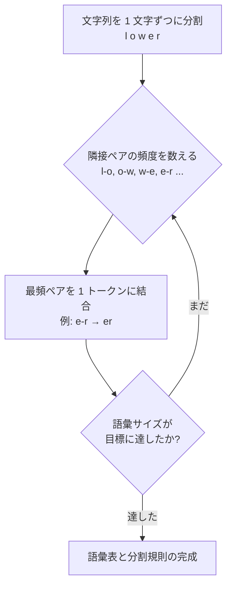

1. まず、すべての単語を「1 文字ずつ」の並びに分割します
2. 訓練データ全体で、隣接する 2 文字のペアの頻度を数えます
3. 最も頻度の高いペアを、1 つの新しいトークンとして結合します（例：「e」「r」→「er」）
4. 語彙サイズが目標（例：3 万や 5 万）に達するまで、2 と 3 を繰り返します

学習後は、この語彙表を使って新しい文字列を分割します。「happy」は「happ」＋「y」、「happier」は「happ」＋「ier」のように、共有される部分を活かして効率的にトークン化されます。

> **💡 ポイント**
> BPE の発想は「頻繁に一緒に現れる文字は、1 トークンにまとめてしまえ」というシンプルなものです。この単純さが、多言語・多分野への適応力の源になっています。

### SentencePiece——空白のない言語にも対応

BPE は英語のように「単語が空白で区切られている言語」を前提にした設計が主でしたが、日本語・中国語・タイ語のように「単語の切れ目が明示されない言語」には工夫が必要です。ここで登場するのが Google の SentencePiece（2018 年）です。SentencePiece は、空白も特別な記号として扱い、生のテキストからサブワード分割を学習できる汎用ツールキットです。

日本語の場合、「東京」「駅前」「オフィス」といった連続文字列を、どこで区切ってトークン化するかは自明ではありません。SentencePiece はこの問題を、統計的なサブワード学習でうまく吸収します。多くの日本語 LLM や多言語 LLM で採用されています。

#### 日本語トークナイザの特殊事情

日本語には、英語と異なる特殊事情がいくつかあります。

- **漢字の多様性**：常用漢字だけで 2,000 字以上、常用外を含めると数万字。1 字の重みが大きい
- **かな・カナ・漢字の混在**：「トウキョウ」「東京」「とうきょう」は同じ意味だが表記が違う
- **文字数と意味量の対応の複雑さ**：「京」1 文字にも意味がある一方、「あ」1 文字だけでは意味がない

これらの特殊事情のため、英語 LLM をそのまま日本語に流用すると、トークン数が英語比で 2 〜 3 倍に膨らむことがあります。トークン数はコストとレイテンシに直結するため、日本語対応 LLM では日本語専用のトークナイザ設計が重要になります。

### 埋め込み——意味を持ったベクトルへの変換

トークナイザーで文字列を ID 番号の並びに変換したら、次はその ID を「意味を持ったベクトル」に変換します。これが埋め込み（embedding）です。埋め込みは、各トークンに数百〜数千次元のベクトルを割り当てる仕組みで、学習によってこれらのベクトルの数値が調整されていきます。

#### 「king − man + woman ≈ queen」の直観

埋め込み空間の性質を象徴的に示すのが、「king − man + woman ≈ queen」という関係式です。単語ベクトルを空間内の点として扱うと、「king」から「man」の方向を引き、「woman」の方向を足すと、「queen」の近くに到達する——という不思議な性質が現れます。

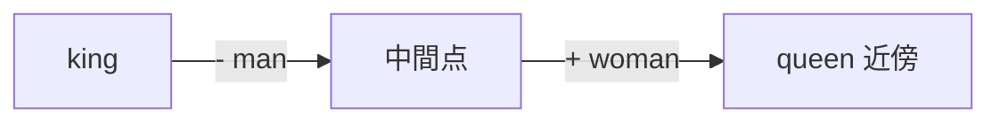

この関係は、単語ベクトルが「意味の関係」を空間の中に幾何学的に埋め込んでいることを示しています。「男性・女性」の軸、「王族・平民」の軸のように、意味の次元がベクトルの座標として立ち現れているのです。この性質は 2013 年の Word2Vec（Tomas Mikolov ら、Google）で広く知られるようになり、以降の埋め込み技術の礎になりました。

#### 「近い＝意味が近い」の含意

埋め込み空間では、意味が近い単語は空間内でも近く、意味が遠い単語は遠く配置されます。近さは通常、コサイン類似度（cosine similarity、2 つのベクトルのなす角度から計算する類似度）で測ります。「犬」と「猫」は近く、「犬」と「哲学」は遠い、という感覚が、埋め込み空間の中で数値化されます。

この性質は、実務でも大きな価値を持ちます。

- **検索**：クエリと文書を同じ埋め込み空間に置き、近いものを取り出す（ベクトル検索）
- **推薦**：ユーザーが好きなアイテムに近いものを見つける
- **分類**：カテゴリごとの代表ベクトルとの近さで判定する
- **重複検出**：似た内容の文書を空間内の近さで見つける

これらは埋め込み技術の応用として、生成 AI の時代でも活躍しています。

> **📝 補足**
> 単語単位の埋め込みが Word2Vec でしたが、現代の LLM では「文脈依存の埋め込み」に発展しています。同じ単語でも文脈によって埋め込みベクトルが変わるため、「銀行（金融）」と「銀行（川岸）」を区別できるようになりました。これは Transformer の Self-Attention が果たす重要な役割でもあります。

### Transformer の入力側——token embedding ＋ position embedding

Transformer の入力側は、2 種類の埋め込みを足し合わせて構成されます。

1. **token embedding（トークン埋め込み）**：各トークンの意味を表すベクトル
2. **position embedding（位置埋め込み）**：文中の位置を表すベクトル

Self-Attention は並列処理で順序情報を扱えないため、位置埋め込みで順序を注入します。この 2 つの埋め込みを足し合わせて、Transformer の各層に入力されるベクトルが完成します。

Transformer のなかで最も直感に反する部分の 1 つが、この「意味と位置を単純に足し算する」設計です。感覚的には別の情報を混ぜているように思えますが、実際にはこれで十分機能します。ベクトルの高次元性が、意味と位置の情報を分離可能な形で共存させているのです。

### 語彙サイズの設計トレードオフ

トークナイザーの語彙サイズは、モデル設計の重要な選択です。トレードオフを整理しておきます。

| 語彙サイズ | メリット | デメリット |
|---|---|---|
| 小さい（1 万程度） | 埋め込み層のパラメータが少ない、稀な単語も既知の部品で表現できる | 1 文で必要なトークン数が増え、Self-Attention のコストが増える |
| 中程度（3 〜 5 万） | 一般的なバランス、多くの LLM の標準的な範囲 | 極端な最適化を求めない場合の無難な選択 |
| 大きい（10 万以上） | 頻出単語を 1 トークンで扱え、トークン数を抑えられる | 埋め込み層のパラメータが増え、稀語で無駄な語彙が増える |

近年の LLM は、多言語対応のため 10 万〜 20 万のトークン語彙を持つものが増えています。日本語 LLM でも、日本語をなるべく少ないトークンで扱えるよう、語彙サイズと構成の工夫が続けられています。

### まとめ

このレッスンでは、以下のことを学びました。

- モデルは文字列を直接扱えず、トークナイザーで数値化し、埋め込みでベクトルに変換すること
- 現代の LLM は単語と文字の中間である「サブワード分割」を採用し、BPE や SentencePiece が代表的手法であること
- BPE は「頻出する隣接ペアを逐次結合する」シンプルな発想で、多言語・多分野に強いこと
- 日本語トークナイザは漢字・かな・カナの混在などの特殊事情に対応する必要があること
- 埋め込みは各トークンを数百〜数千次元のベクトルに変換し、「king − man + woman ≈ queen」のような意味的関係が空間の中に埋め込まれること
- Transformer の入力側は token embedding ＋ position embedding の足し算で構成され、意味と位置を単純に混ぜても機能すること

次のレッスンでは、Transformer で組み立てた LLM が、どのように「言葉を話せるようになる」のかを扱います。事前学習と Post-training（SFT・RLHF・DPO・Constitutional AI）の役割分担を、パイプライン全体で見ていきます。

---

### 確認クイズ

このレッスンの理解度をチェックしましょう。

#### Q1. トークナイザーの役割として、最も適切なのはどれですか。

- [ ] ニューラルネットの重みを更新する最適化アルゴリズム
- [ ] Self-Attention の QKV を計算する部品
- [x] 文字列を「トークン」という小さな単位に分割し、それぞれに ID 番号を振る仕組み
- [ ] 過学習を防ぐためにランダムに一部のニューロンを無効化する仕組み

> **解説**
> トークナイザーは文字列を数値化する前段の仕組みです。ほかの選択肢は最適化アルゴリズム・Self-Attention の部品・Dropout の説明で、トークナイザーとは別の概念です。

#### Q2. BPE（Byte Pair Encoding）の学習手順として、正しい説明はどれですか。

- [x] 訓練データ全体で隣接する 2 文字のペアの頻度を数え、最頻ペアを 1 トークンに逐次結合していく
- [ ] 単語を意味ごとに分類し、カテゴリごとの ID を割り振る
- [ ] 各文字にランダムな数値を割り振り、学習でその数値を最適化する
- [ ] Self-Attention の QKV から、単語の境界を推定して分割する

> **解説**
> BPE は「頻出ペアを逐次結合する」シンプルな発想が中核です。意味分類・ランダム初期化・Self-Attention 由来の分割は、いずれも BPE とは別の仕組みです。

#### Q3. 日本語トークナイザの特殊事情として、本コースが挙げていないものはどれですか。

- [ ] 漢字の種類が英語の英字と比べて桁違いに多い
- [x] 発音記号（IPA）を必ずトークンに含める必要がある
- [ ] かな・カナ・漢字が混在する
- [ ] 単語の切れ目が空白で示されない

> **解説**
> 日本語トークナイザの特殊事情は、漢字の多様性・かなカナ漢字混在・単語境界の非自明性です。IPA（国際音声記号）をトークンに含める必要は、日本語 LLM の標準要件ではありません。

#### Q4. 埋め込み空間における「king − man + woman ≈ queen」の含意として、最も適切なのはどれですか。

- [ ] 単語ベクトルはランダムな数値の並びで、意味的な関係は反映されない
- [ ] 単語ベクトルは 1 次元の実数で表現される
- [ ] 意味的な関係は学習前に人手で定義する必要がある
- [x] 単語ベクトルが「意味の関係」を空間内の幾何学的な関係として埋め込んでいる

> **解説**
> 「king − man + woman ≈ queen」は、意味的関係が空間内の幾何関係として現れることを象徴する例です。Word2Vec 以降、この性質は広く知られるようになりました。ほかの選択肢は誤った理解です。

#### Q5. Transformer の入力側の構成として、正しい説明はどれですか。

- [ ] token embedding だけで構成し、位置情報は Self-Attention が自動で扱う
- [ ] position embedding だけで構成し、意味は Attention 側に任せる
- [x] token embedding と position embedding を足し合わせて、意味と位置の情報を同じベクトルに乗せる
- [ ] token embedding と position embedding を Encoder と Decoder に別々に入力する

> **解説**
> Transformer の入力側は token embedding ＋ position embedding の単純な足し算です。ベクトルの高次元性が、意味と位置の情報を共存させます。ほかの選択肢は Transformer の設計と一致しません。

#### Q6. 埋め込み空間の実務応用として、本コースが挙げていない例はどれですか。

- [ ] クエリと文書を同じ空間に置き、近いものを取り出すベクトル検索
- [ ] ユーザーが好きなアイテムに近いものを提案する推薦
- [ ] カテゴリごとの代表ベクトルとの近さで判定する分類
- [x] 埋め込みベクトルの各次元に人間が意味を割り当てて解釈する「次元ラベリング」

> **解説**
> 埋め込みの応用としては、ベクトル検索・推薦・分類・重複検出などが典型的です。埋め込み空間の各次元に人間が個別に意味ラベルを付ける「次元ラベリング」は一般的な応用ではありません。埋め込み次元は学習の結果として決まる潜在的な特徴で、人間が事前に意味を割り当てるものではありません。

---

## レッスン7：事前学習から Post-training へ——SFT・RLHF・DPO・Constitutional AI

（所要時間：25分）

### このレッスンで学ぶこと

- 事前学習が「次単語予測を大量に繰り返す自己教師あり学習」であることを理解する
- Chinchilla 則を「モデルサイズとデータ量のバランス」の指針として位置づけられる
- 事前学習後のモデルが「まだ話し方を知らない」状態であることを把握する
- SFT・RLHF・DPO・Constitutional AI という Post-training の 4 手法を、目的と役割で使い分けられる
- reasoning モデルにおける Chain-of-Thought の内部化を、Post-training の延長として理解する

---

前回のレッスン 6 では、Transformer の入力側であるトークンと埋め込みを扱いました。今回は、この Transformer に「言葉が話せる」振る舞いをどう獲得させるかの話に踏み込みます。事前学習（Pre-training）で大量のテキストから言語の統計的規則を吸収させ、その後の Post-training（事後学習）で振る舞いを整えていく——この 2 段階のパイプラインが、現代 LLM の育て方の骨格です。

### 事前学習——Next Token Prediction を大量に繰り返す

事前学習の中心的なタスクは、驚くほどシンプルです。「文章の途中まで見せて、次に来る単語を予測させる」——これを、Web 上の膨大なテキストで繰り返します。この課題を Next Token Prediction（次トークン予測）と呼びます。

例えば「機械学習の基本は次の 3 つの分類に整理」まで見せて、次に来る単語（「できます」など）を予測させます。予測が正解と一致すれば損失が小さく、外れれば損失が大きくなります。損失を勾配降下法と逆伝播で最小化していけば、モデルは徐々に「もっともらしい次単語」を選べるようになります。

#### なぜ「次単語予測」で言語が身につくのか

一見単純なこのタスクを、大規模なテキストで大規模なモデルに繰り返させると、モデルは自然と語彙・文法・意味・世界知識・簡単な推論まで身につけていきます。理由は次の 3 つです。

1. **語彙と文法**：正しい次単語を選ぶには、単語の使い分けと文法の型を身につける必要がある
2. **意味と文脈**：「太郎は花子に本を」の次が「渡した」であるためには、動詞の意味と文脈を理解する必要がある
3. **世界知識**：「日本の首都は」の次が「東京」であるためには、事実知識を持つ必要がある

シンプルな課題を、規模と多様性で押し切って複雑な能力を引き出す——これが事前学習の本質です。

#### 自己教師あり学習としての位置づけ

事前学習は、レッスン 3 で扱った自己教師あり学習の代表例です。「次の単語」というラベルは、人手で用意したものではなく、テキストそのものに埋め込まれています。Web 上のあらゆるテキストが訓練データになり、ラベル付けのコストがかかりません。この「タダで大量に学べる」性質が、LLM の巨大化を許容してきました。

### Chinchilla 則——モデルとデータのバランス

事前学習の実務では、「モデルサイズと訓練データ量のどちらにどれくらい投資するか」が重要な設計問題です。この問いに定量的な答えを与えたのが、2022 年に DeepMind の Jordan Hoffmann らが発表した Chinchilla 論文（"Training Compute-Optimal Large Language Models"）です。

#### 従来の常識——「モデルを大きくすれば良い」

Chinchilla 以前は、「モデルパラメータを増やせば性能が上がる」という理解が主流でした。GPT-3（1,750 億パラメータ、2020 年）は、この考え方の象徴でした。しかし、Chinchilla 論文は、GPT-3 級のモデルが訓練データに対して「大きすぎる」ことを実験で示しました。

#### Chinchilla 則の含意

Chinchilla 則の直観は「モデルパラメータ数と訓練トークン数を、ほぼ同じペースで増やすのが最適」というものです。モデルだけ大きくしてもデータが足りていなければ、計算資源を無駄にすることになります。逆に、データがあっても十分な規模のモデルがなければ、そこに含まれる情報を吸収しきれません。

> **💡 ポイント**
> Chinchilla 則の具体的な倍率（パラメータ 1 に対して何トークン）は、その後の研究でモデル系統ごとに違うことも明らかになってきました。細かい数字より、「モデル・データ・計算資源のバランスで性能が決まる」という骨格を押さえるのが重要です。これはレッスン 1 の 3 層フレームそのままの発想です。

### 事前学習後のモデルは「まだ話し方を知らない」

事前学習を終えたモデルは、驚くほど多くのことを「知って」います。文法・語彙・世界知識・推論の初歩まで身につけています。しかし、そのままでは実務で使えません。理由は 3 つあります。

1. **指示に従わない**：「明日の会議の議題を 3 つ提案してください」と言っても、「明日の会議の議題を 3 つ提案してください。しかしそれは …」と続けてしまう
2. **有害な出力もそのまま生成する**：暴力・差別・違法行為に関する指示にも、統計的な確率に従って応じてしまう
3. **好みや価値観が反映されていない**：親切さ・正確さ・簡潔さといった「望ましい話し方」の型がない

事前学習は「言語の統計的規則」を学ばせるだけで、「望ましい振る舞い」の型は与えていません。この型を与える工程が Post-training です。

### Post-training——振る舞いを整える 4 手法

Post-training は、事前学習済みモデルに「望ましい振る舞い」の型を教える工程です。次の 4 手法が代表的です。

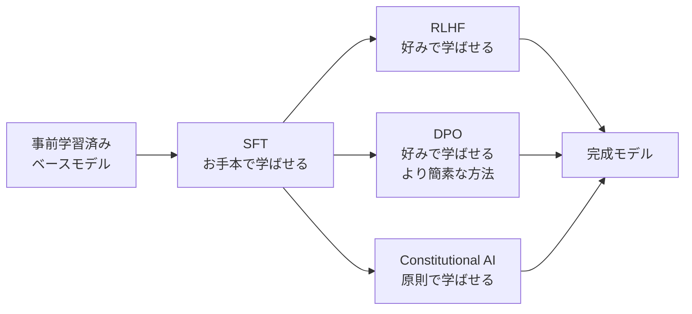

#### SFT——お手本で学ばせる

SFT（Supervised Fine-tuning、教師ありファインチューニング）は、Post-training の入り口です。人間が用意した「良い応答の例」を大量に見せて、モデルに「望ましい話し方の型」を教えます。「ユーザーがこう聞いたら、こう答えるべき」というペアを、数千〜数十万件用意し、教師あり学習で追加訓練します。

SFT だけでも、モデルはずいぶん実用的になります。指示に従うようになり、「〜してください」に対して答え始めます。しかし、SFT だけでは「複数のもっともらしい応答のうち、どちらが好ましいか」を細かく調整するのが難しく、次の RLHF や DPO が必要になります。

#### RLHF——好みで学ばせる

RLHF（Reinforcement Learning from Human Feedback、人間のフィードバックによる強化学習）は、2022 年に OpenAI が InstructGPT 論文（Long Ouyang ら、"Training language models to follow instructions with human feedback"）で広く知られる形にまとめた手法です。ChatGPT の基盤にもなっています。

RLHF の手順は次の通りです。

1. **報酬モデルの学習**：人間に「同じ質問に対する 2 つの応答のうち、どちらが好ましいか」を大量に選ばせ、そのデータで「応答の好ましさを数値で予測する報酬モデル」を訓練する
2. **強化学習で微調整**：LLM に応答を生成させ、報酬モデルが「好ましさスコア」を返し、そのスコアを最大化するように LLM のパラメータを更新する

RLHF は「人間の好み」というラベル付けが難しい対象を、比較データで扱える形に落とし込む工夫が特徴です。ChatGPT の応答の丁寧さ・親切さ・安全性の多くは、この RLHF によって獲得されたものです。

#### DPO——RLHF を簡素化する

DPO（Direct Preference Optimization、直接選好最適化）は、2023 年にスタンフォード大学の Rafael Rafailov らが発表した手法です。RLHF が「報酬モデルの学習」と「強化学習での最適化」の 2 段階を必要とするのに対し、DPO は 1 段階で「好みデータを直接最適化」できる設計を提案しました。

DPO のメリットは 3 つあります。

1. **実装がシンプル**：報酬モデルの学習と強化学習の 2 段構えが不要
2. **安定性が高い**：強化学習に特有の不安定さ（発散・崩壊）が起きにくい
3. **同等の性能を達成しやすい**：多くのタスクで RLHF に匹敵する

2024 〜 2025 年以降、多くのオープンウェイト LLM（LLaMA 系・Mistral 系など）が Post-training に DPO を採用しています。

#### Constitutional AI——原則で学ばせる

Constitutional AI（憲法的 AI、CAI）は、2022 年に Anthropic の Yuntao Bai らが発表した手法です。「憲法（Constitution）」と呼ばれる原則リスト（例：「回答は正直で、他者を尊重し、有害な行為を助長しない」）を用意し、モデル自身が「自分の応答が原則に沿っているか」を批評し、修正することで学習を進めます。

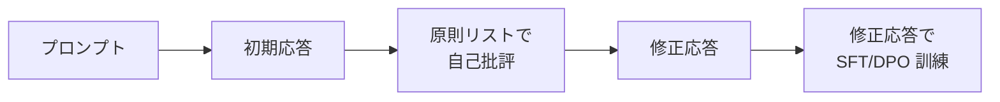

Constitutional AI のメリットは、「人間による大量の好みラベリング」を減らせることです。人間が原則リストさえ用意すれば、後はモデル自身が原則に沿った応答を作り出せます。Anthropic の Claude シリーズは、この Constitutional AI を Post-training の中核に据えています。

> **📝 補足**
> SFT・RLHF・DPO・Constitutional AI は排他的ではなく、実務では組み合わせて使うのが普通です。多くの LLM は「事前学習 → SFT → RLHF や DPO」の順序で、Anthropic は「事前学習 → SFT → Constitutional AI」を中核に据えるといった違いがあります。

### reasoning モデル——Chain-of-Thought の Post-training 内部化

Post-training の最近の発展として、reasoning（推論）モデルの登場があります。OpenAI の o シリーズや Anthropic の reasoning モードなどが該当します。これらのモデルの特徴は「回答前に長い思考プロセスを内部で展開する」ことです。

#### Chain-of-Thought の内部化

reasoning モデルの内部で起きているのは、Chain-of-Thought（CoT、思考の連鎖）の内部化です。CoT はもともと 2022 年に Google の Jason Wei らが「大規模モデルにプロンプトで『順を追って考えてください』と促すと性能が上がる」現象として発表しました。当初は「プロンプトの工夫」でしたが、reasoning モデルではこれが Post-training の段階で「自然と長い思考プロセスを内部で展開する振る舞い」として内部化されています。

#### 何が違うのか

通常のモデルは、問いに対して直接答えを返します。reasoning モデルは、答えを返す前に「まず問題を分解して、可能性を検討し、計算し、確認する」といった思考プロセスを内部で展開します。この思考は多くの場合ユーザーには見えない形（あるいは要約された形）で扱われますが、最終的な回答の質を大きく引き上げます。

reasoning モデルは、コーディング・数学・複雑な推論を必要とするタスクで顕著に強くなります。ただし、思考プロセスを長く回す分、レイテンシとコストが上がる副作用もあります。使い分けが重要です。

### Post-training を理解すると何が見えるか

Post-training の 4 手法を押さえておくと、LLM ベンダーの発表を読むときに、次のような点が具体的に見えてきます。

- 「弊社の新モデルは Constitutional AI で訓練しました」→ Anthropic 系の設計思想
- 「DPO で好みを学習しました」→ RLHF を簡素化したい実装選択
- 「reasoning モードを追加しました」→ CoT を Post-training で内部化した設計
- 「アラインメント（alignment）を改善しました」→ Post-training で有害出力・偏り・誤情報を減らした改善

これらは全て「事前学習後にどう振る舞いを整えたか」の話です。事前学習と Post-training の境界を意識するだけで、モデル選定や機能理解の解像度が変わります。

### まとめ

このレッスンでは、以下のことを学びました。

- 事前学習は「Next Token Prediction を大量のテキストで繰り返す自己教師あり学習」であること
- Chinchilla 則は「モデルパラメータ数と訓練データ量のバランスで性能が決まる」という指針で、3 層フレームと整合すること
- 事前学習後のモデルは「言語の統計的規則は身につけたが、望ましい話し方の型はまだ持たない」状態であること
- Post-training には SFT（お手本）・RLHF（好み）・DPO（好みの簡素化）・Constitutional AI（原則）の 4 手法があること
- reasoning モデルは Chain-of-Thought を Post-training で内部化した設計で、複雑推論に強いがコスト・レイテンシは上がること
- Post-training を理解すると、LLM ベンダーの発表を「使い方」ではなく「振る舞いの整え方」として読み解けること

次のレッスンでは、こうした LLM を実務で動かすための効率化と推論最適化を扱います。MoE・量子化・蒸留・KV キャッシュ・GPU / TPU など、計算資源層に踏み込みます。

---

### 確認クイズ

このレッスンの理解度をチェックしましょう。

#### Q1. 事前学習の中心的なタスクとして、正しい説明はどれですか。

- [ ] 人間が用意した好みデータで、望ましい応答を選ばせる
- [ ] 原則リストに沿って自己批評し、応答を修正する
- [x] 文章の途中まで見せて、次に来る単語を予測させる Next Token Prediction を大量に繰り返す
- [ ] 環境と対話し、報酬を最大化する行動を試行錯誤で学ぶ

> **解説**
> 事前学習の中心は Next Token Prediction です。ほかの選択肢は RLHF、Constitutional AI、強化学習全般の説明で、事前学習の中核タスクとは異なります。

#### Q2. Chinchilla 則が示した含意として、最も適切なのはどれですか。

- [x] モデルパラメータ数と訓練データ量をほぼ同じペースで増やすのが最適で、モデルだけ大きくしても計算資源を無駄にする
- [ ] モデルパラメータ数を増やしさえすれば、性能は必ず上がる
- [ ] 訓練データ量だけを増やせば、性能は必ず上がる
- [ ] モデルサイズと訓練データ量には関係がなく、独立して決められる

> **解説**
> Chinchilla 則の骨子は「モデルと訓練データのバランス」です。モデルだけを大きくしても、データが足りなければ計算資源を無駄にします。これはレッスン 1 の 3 層フレーム（モデル・データ・計算資源）と整合します。

#### Q3. 事前学習後のモデルが「まだ話し方を知らない」状態について、本コースが挙げていない理由はどれですか。

- [ ] 指示に従わず、指示文の続きを生成してしまう
- [ ] 有害な出力もそのまま生成する
- [ ] 好みや価値観が反映されていない
- [x] 数式計算だけを扱い、日本語の応答は生成できない

> **解説**
> 事前学習後のモデルは、日本語を含む多言語の応答を生成できますが、指示に従わなかったり、有害出力をしたり、望ましい話し方の型がなかったりします。「数式計算だけを扱う」は誤った特徴づけです。

#### Q4. RLHF について、正しい説明はどれですか。

- [ ] 人間の直接の応答を SFT 用データとして使う手法で、強化学習は関与しない
- [ ] 原則リストでモデル自身が自己批評する Constitutional AI と同じ手法
- [ ] 事前学習の段階で使われる、次単語予測を強化する手法
- [x] 人間の好み比較データから報酬モデルを学習し、その報酬を最大化するように LLM を強化学習で微調整する手法

> **解説**
> RLHF は「報酬モデル」と「強化学習での最適化」の 2 段階が特徴です。ChatGPT の基盤となった手法で、2022 年の InstructGPT 論文で広く知られる形にまとめられました。ほかの選択肢は SFT・Constitutional AI・事前学習の説明で、RLHF とは別です。

#### Q5. DPO の特徴として、本コースが挙げていないものはどれですか。

- [ ] 実装がシンプルで、報酬モデルの学習と強化学習の 2 段構えが不要
- [x] 事前学習を完全に代替し、モデルをゼロから学習させる
- [ ] 強化学習に特有の不安定さが起きにくい
- [ ] 多くのタスクで RLHF に匹敵する性能を達成しやすい

> **解説**
> DPO は Post-training の手法で、事前学習を代替するものではありません。事前学習で得たベースモデルの上で、好みデータを直接最適化する手法です。ほかの選択肢は DPO のメリットとして正しく本コースで挙げられています。

#### Q6. Constitutional AI の中核的な発想として、正しい説明はどれですか。

- [ ] 人間による好みラベリングを最大化し、モデルの学習速度を高める
- [x] 憲法と呼ばれる原則リストに沿って、モデル自身が自己批評と修正を繰り返して学習する
- [ ] 事前学習の段階で憲法を暗記させ、Post-training を省略する
- [ ] 強化学習の報酬関数を、複数の人間による多数決で決める

> **解説**
> Constitutional AI は「原則リストで自己批評する」発想が中核です。Anthropic の Claude シリーズが採用しています。ほかの選択肢は、好みラベリング・事前学習への置換・多数決報酬など、Constitutional AI とは異なる説明です。

---

## レッスン8：効率化と推論最適化——MoE・量子化・蒸留・KV キャッシュ・GPU / TPU

（所要時間：25分）

### このレッスンで学ぶこと

- 効率化が必要な 3 つの理由（コスト・レイテンシ・環境負荷）を押さえる
- MoE（Mixture of Experts）の分業アーキテクチャを、専門家のルーティングとして理解する
- 量子化と蒸留を、モデル圧縮の 2 大アプローチとして区別できる
- KV キャッシュの役割を、「文脈の下書きの繰り返し利用」として理解する
- GPU と TPU の位置づけを押さえ、ハルシネーションを仕組み側から捉え直せる

---

前回のレッスン 7 では、事前学習と Post-training で LLM に振る舞いを与える工程を扱いました。今回は、こうしてできあがった LLM を「実務で動かす」ための効率化と推論最適化の話に踏み込みます。3 層フレームで言えば計算資源層の話題です。MoE・量子化・蒸留・KV キャッシュ・GPU / TPU といった技術が、モデルの性能・コスト・レイテンシに直接効いてくる場面を見ていきます。本コースの最終レッスンでもあり、コース全体の中核メッセージを振り返り、修了後の学び方向を示します。

### なぜ効率化が必要か——3 つの理由

事前学習と Post-training を終えた LLM は、そのままでは実務で使いにくいことが多くあります。効率化が必要な理由は、次の 3 つに整理できます。

1. **コスト**：数百億〜数兆パラメータのモデルを 24 時間動かすには、大規模な GPU クラスタが必要で、電気代とハードウェア費用が膨大
2. **レイテンシ**：ユーザーが 30 秒待たされるチャット体験は、実用にならない場面が多い
3. **環境負荷**：大規模学習と大規模推論の消費電力は、社会的な課題として無視できない規模になっている

効率化は「モデルの性能を保ったまま、コスト・レイテンシ・環境負荷を下げる」ための工夫の総体です。以下、代表的な 4 手法（MoE・量子化・蒸留・KV キャッシュ）を順に見ていきます。

### MoE——Mixture of Experts の分業アーキテクチャ

MoE（Mixture of Experts、専門家の混合）は、モデルの内部を「多数の小さな専門家（expert）」に分け、入力に応じて「今回はこの専門家に処理させる」とルーティングする仕組みです。すべての専門家が常に動くわけではなく、各トークンごとに一部だけが使われます。

#### 通常モデルと MoE の違い

通常の LLM は、入力の各トークンに対して、モデルのすべてのパラメータが使われます。パラメータが多いほど計算量が増えます。

MoE では、モデル全体としては巨大なパラメータを持ちますが、1 トークンあたりに実際に使われるパラメータは一部だけです。例えば「64 人の専門家のうち、各トークンで 2 人だけを選ぶ」といった設計です。全体のパラメータ数（総容量）は大きいけれど、1 トークンの推論に使う計算量（アクティブパラメータ）は小さい、という美味しい両立を狙います。

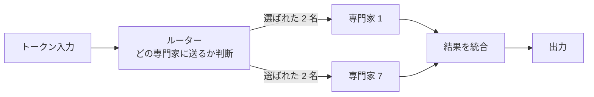

#### 代表的な MoE モデル

MoE を実装した代表的なオープンウェイトモデルとして、Mistral AI が 2023 年 12 月に公開した Mixtral 8x7B が広く知られています。名前の通り「7B パラメータの専門家 8 人で構成される MoE」で、総パラメータは約 47B ですが、1 トークンあたりのアクティブパラメータは約 13B です。同規模の通常モデルより計算コストを抑えつつ、より大きな総容量の恩恵を受けられる設計として注目されました。

その後、Google の Gemini 系や、DeepSeek の V3 系など、多くのフラッグシップモデルで MoE が採用されるようになっています。

> **💡 ポイント**
> MoE は「モデルサイズ vs 計算コストのトレードオフ」を緩和する設計です。総パラメータの巨大さで表現力を確保し、アクティブパラメータの小ささで推論効率を保つ——両取りを狙う構造だと押さえてください。

### 量子化——数値精度を下げてサイズを縮める

量子化（quantization）は、モデルの重みの数値精度を下げてサイズと計算量を縮める手法です。学習時は 32 ビットの浮動小数点数（float32）で表現される重みを、推論時には 8 ビット整数（int8）や 4 ビット整数（int4）に「丸めて」使います。

#### float32 → int8 → int4 のイメージ

比喩としては、「小数第 10 位まで書いた数値を、四捨五入して整数に丸める」ようなものです。精度は多少落ちますが、メモリ使用量は 4 分の 1 や 8 分の 1 になり、計算も高速化されます。多くのタスクで、量子化による精度低下は実用上気にならない範囲に収まります。

#### int8 と int4 の使い分け

- **int8 量子化**：多くの場合、精度への影響がほとんどない安全な選択
- **int4 量子化**：メモリ削減効果が大きいが、精度への影響が出やすい

量子化は、ローカル環境や個人 PC で LLM を動かす場面で特に威力を発揮します。ラップトップの GPU で 70B クラスのモデルを動かせるようになったのは、量子化技術の進歩によるところが大きくあります。

### 蒸留——大きな先生から小さな生徒へ

蒸留（distillation、モデル蒸留、Knowledge Distillation）は、「大きな高性能モデル（先生モデル）の振る舞いを、小さなモデル（生徒モデル）に学ばせる」手法です。2015 年に Google のジェフリー・ヒントンらが提案し、以降広く使われています。

#### 蒸留の手順

1. 大きな先生モデルを用意する（既存の高性能 LLM）
2. 先生モデルにさまざまな入力を与え、出力（応答・確率分布）を集める
3. その出力を「模範解答」として、小さな生徒モデルに教師あり学習させる

生徒モデルは、先生モデルの「教え方」を模倣することで、通常の学習よりも短時間で近い性能に到達できることがあります。実務では、大規模モデルを小型のスマートフォン向けモデルに縮小するときなどに使われます。

#### 量子化と蒸留の使い分け

量子化と蒸留は、どちらもモデル軽量化の手法ですが、アプローチが違います。

- **量子化**：モデルの構造は変えず、重みの表現精度を下げる（同じモデルの縮小版を作る）
- **蒸留**：モデルの構造ごと小さく作り直し、大きなモデルの「教え方」を学ばせる（別の小さなモデルを作る）

実務では併用も一般的です。「大きなモデルを蒸留で小さくして、さらに量子化する」といった 2 段構えで、極限まで小さいモデルを作ります。

### KV キャッシュ——文脈の下書きを繰り返し利用する

KV キャッシュ（KV cache）は、Transformer の推論を高速化する仕組みです。文中の各トークンについて、Self-Attention で計算した Key と Value のベクトルを「キャッシュ」に保存し、次のトークン生成時に再利用します。

#### なぜキャッシュが効くのか

LLM の推論は、通常 1 トークンずつ生成します。例えば「明日の会議の議題は」と入力して 100 トークンの応答を生成する場合、モデルは 100 回の推論を繰り返します。

このとき、入力の各トークンについて計算した Key と Value は、100 回の推論で毎回同じ値になります。毎回計算し直すのは無駄なので、初回で計算した Key と Value をキャッシュに保存し、以降は使い回します。これが KV キャッシュです。

#### KV キャッシュの効果

KV キャッシュがあると、応答が長くなるほど「1 トークンあたりの推論コスト」が下がります。「長い応答の後半のほうがなぜか速く感じる」経験がある方もいるかもしれません。これは KV キャッシュが効いているためです。

一方で、KV キャッシュはメモリを消費します。文脈が長くなればなるほど、キャッシュのサイズも大きくなります。100 万トークンの文脈窓を持つモデルでは、KV キャッシュだけで数 GB のメモリを使うこともあります。近年は、KV キャッシュを圧縮する研究（Grouped-Query Attention、Multi-Query Attention など）が活発になっています。

> **📝 補足**
> 「文脈窓を伸ばすと推論が遅くなる」の主要因は、この KV キャッシュのメモリ圧迫にあります。単にモデルの計算量だけの問題ではなく、キャッシュのメモリ帯域が推論速度のボトルネックになることが多いのです。

### GPU と TPU——並列計算の担い手

現代の AI は、GPU（Graphics Processing Unit）と TPU（Tensor Processing Unit）という 2 種類のチップを主戦場にしています。両者は「大量の行列演算を並列に処理する」ことを得意とする点で共通します。

#### GPU——業界標準の並列計算チップ

GPU は、もともと画像処理（グラフィックス）のために設計されたチップで、行列演算の並列処理が得意です。ディープラーニング時代に「AI 学習の主戦場」になり、NVIDIA が事実上の業界標準を築きました。代表製品は A100（2020 年）、H100（2022 年）、B200（2024 年）などです。

#### TPU——Google の AI 特化チップ

TPU は、Google が AI 向けに独自設計したチップで、Google のクラウドサービスや自社の AI 開発に使われています。行列演算をさらに特化した設計で、大規模 LLM の学習で高効率を発揮します。世代は v1（2016 年）から v5e（2023 年）などが公表されています。

#### 選択の実務観点

実務でモデル選定・インフラ選定をするとき、GPU / TPU の選択は次のような観点で行われます。

- **エコシステム**：オープンウェイトモデルや PyTorch は NVIDIA GPU が最も充実
- **コスト**：クラウド利用料は GPU / TPU で異なり、ワークロードで最適解が変わる
- **可用性**：H100 級の GPU は 2023 〜 2024 年に品薄が続き、調達可能性が意思決定要因になった
- **ロックイン**：TPU は Google Cloud 限定で、マルチクラウド戦略と相性が悪い

こうしたトレードオフを、3 層フレームの「計算資源層」で意識的に評価するのが実務の眼です。

### ハルシネーションを仕組み側から捉え直す

生成 AI の代表的な弱点として広く語られるハルシネーション（hallucination）を、ここで仕組み側から捉え直しておきます。生成 AI の入門レベルでは「AI が事実でないことをもっともらしく出力する現象」と紹介されることが多いですが、仕組みを踏まえるとより具体的に理解できます。

#### 「幻覚」ではなく「作話（confabulation）」

「hallucination」の日本語訳は「幻覚」ですが、仕組み側から見ると「confabulation（作話）」のほうが実態に近いという主張もあります。作話は「知らないことを、それらしく作って埋めてしまう」現象で、人間の記憶研究にも登場する言葉です。

LLM は、事前学習で「次に来るもっともらしい単語」を予測する能力を身につけています。「もっともらしさ」の物差しは統計的な尤度で、「事実であるか」の物差しではありません。知らないことを問われても、モデルは「もっともらしい単語」を紡ぎ出してしまうのです。

#### なぜハルシネーションは完全には消せないか

事前学習の中核である Next Token Prediction は、「正確さ」ではなく「もっともらしさ」を最適化しています。Post-training で振る舞いを整えても、この根本の性質は残ります。ハルシネーションは、モデルアーキテクチャの副作用ではなく、事前学習の設計選択の必然的な帰結です。

対策の主な方向は次の 3 つです。

1. **モデル側の対策**：Post-training で「知らないことは知らないと言う」振る舞いを強化する（Constitutional AI・DPO・RLHF）
2. **入力側の対策**：RAG（検索拡張生成）で、モデルに参照可能な情報源を与える
3. **運用側の対策**：出力を人間や別モデルが検証する

これらを組み合わせても「ゼロ」にはなりません。「起こることを前提に減らす・検知する」姿勢が、実務の眼になります。

### まとめ

このレッスンでは、以下のことを学びました。

- 効率化が必要な理由はコスト・レイテンシ・環境負荷の 3 つであること
- MoE は「多数の専門家からルーティングで一部を選ぶ」分業アーキテクチャで、総容量とアクティブ計算のバランスを取ること
- 量子化はモデル構造を保ったまま重みの精度を下げる、蒸留はモデル自体を小さく作り直して先生の教え方を学ばせる、という 2 つのアプローチがあること
- KV キャッシュが Transformer 推論の主役で、応答が長くなるほど 1 トークンあたりのコストが下がる一方、メモリ圧迫の要因にもなること
- GPU（NVIDIA）と TPU（Google）が計算資源層の主戦場で、実務ではエコシステム・コスト・可用性・ロックインで選ばれること
- ハルシネーションは事前学習の「もっともらしさ最適化」の必然的帰結で、モデル・入力・運用の 3 層で減らす・検知する姿勢が求められること

本コース全体を通して繰り返してきた「AI の性能はモデル・データ・計算資源の 3 層で決まる」という 3 層フレームを、これからのモデル選定・失敗の切り分け・ベンダー説明の吟味の場面で活用してください。仕組みを 1 段深く知る投資は、意思決定の解像度として長く効いていきます。

---

### 確認クイズ

このレッスンの理解度をチェックしましょう。

#### Q1. 効率化が必要な 3 つの理由として、本コースが挙げていないものはどれですか。

- [ ] コストの削減
- [ ] レイテンシの改善
- [ ] 環境負荷の軽減
- [x] モデルの表現力そのものを増加させる

> **解説**
> 効率化の 3 つの理由はコスト・レイテンシ・環境負荷です。「表現力そのものを増加させる」は効率化の目的ではなく、Post-training やスケーリングの目的で、別の話題です。効率化は「同じ表現力をより低コスト・低レイテンシで実現する」ことを狙います。

#### Q2. MoE（Mixture of Experts）について、正しい説明はどれですか。

- [ ] すべてのパラメータが常に動作し、モデル全体の容量を最大限に活用する
- [x] モデル内部を多数の専門家に分け、入力トークンごとに一部の専門家だけを選んで使う分業アーキテクチャ
- [ ] Post-training で人間の好みを学習させる強化学習の一種
- [ ] 事前学習で使われる次単語予測の別名

> **解説**
> MoE は「多数の専門家のルーティング」による分業アーキテクチャです。総パラメータは巨大でも、1 トークンあたりのアクティブパラメータは小さく抑えます。ほかの選択肢は通常の Dense モデル・RLHF・事前学習の説明で、MoE とは別です。

#### Q3. 量子化と蒸留の違いとして、最も適切なのはどれですか。

- [ ] どちらもモデルアーキテクチャを変えず、重みの精度を変えるだけの手法
- [ ] どちらも先生モデルを用意して、その教え方を生徒モデルに学ばせる手法
- [x] 量子化はモデル構造を保ったまま重みの精度を下げ、蒸留はモデル構造ごと小さく作り直して先生モデルの振る舞いを学ばせる
- [ ] 量子化は事前学習で、蒸留は Post-training で使われるという時期の違いだけ

> **解説**
> 量子化と蒸留は、どちらもモデル軽量化の手法ですが、アプローチが異なります。量子化は「同じモデルの縮小版」、蒸留は「別の小さなモデルを新規に作る」設計です。ほかの選択肢は誤った統合や時期の限定です。

#### Q4. KV キャッシュについて、正しい説明はどれですか。

- [ ] 学習時に勾配を保存するためのメモリ領域
- [ ] Multi-Head Attention の複数のヘッドを結合するための一時領域
- [ ] 過学習を防ぐためのランダム化バッファ
- [x] Self-Attention で計算した Key と Value のベクトルを保存し、次のトークン生成時に再利用する仕組み

> **解説**
> KV キャッシュは、生成 1 トークンごとに Key と Value を再計算する無駄をなくす仕組みです。応答が長くなるほど 1 トークンあたりのコストが下がる一方、メモリ圧迫の要因にもなります。ほかの選択肢は勾配保存・結合層・Dropout の説明で、KV キャッシュとは別です。

#### Q5. GPU と TPU の選択における実務観点として、本コースが挙げていないものはどれですか。

- [x] チップの物理的な大きさが小さいほど性能が高いという法則
- [ ] エコシステムの充実度（オープンウェイトモデルや PyTorch との親和性）
- [ ] コストと可用性のバランス
- [ ] クラウドロックインとマルチクラウド戦略との相性

> **解説**
> GPU / TPU の実務観点は、エコシステム・コスト・可用性・ロックインの 4 つです。「物理的な大きさが小さいほど性能が高い」は正しい法則ではなく、選択の観点として本コースが挙げていない内容です。

#### Q6. ハルシネーションを仕組み側から捉える視点として、正しい説明はどれですか。

- [ ] ハルシネーションは Transformer アーキテクチャの副作用で、ほかのモデルでは起きない
- [ ] Post-training を丁寧に行えば、ハルシネーションはゼロにできる
- [ ] ハルシネーションは Web 上のテキストに含まれる悪意ある偽情報が原因である
- [x] 事前学習の中核が「もっともらしさ」の最適化であるため、事実性を追う仕組みではない、というのがハルシネーションの根本要因である

> **解説**
> ハルシネーションは、Next Token Prediction が「もっともらしさ」を最適化する性質からの必然的な帰結です。Post-training で緩和はできますがゼロにはなりません。アーキテクチャ固有の問題でも、Web 上の偽情報が主因でもない、というのが仕組み側からの理解です。

---

## 総復習テスト

このテストでは、コース全体の理解度を確認します。各レッスンから出題されますので、自信がない問題があれば該当レッスンに戻って復習しましょう。

---

### Q1. 本コースの中核メッセージ「AI の性能は 3 つの層で決まる」の 3 層として、正しい組み合わせはどれですか。【レッスン1】

- [x] モデル・データ・計算資源
- [ ] 入力・処理・出力
- [ ] 分類・回帰・強化学習
- [ ] Encoder・Decoder・Attention

> **解説**
> 3 層フレームは「モデル・データ・計算資源」です。コース全体で繰り返し提示された背骨のフレームで、モデル選定・失敗の切り分け・ベンダー説明の吟味に使えます。

### Q2. 3 層フレームの含意として、最も適切なのはどれですか。【レッスン1】

- [x] 3 層は互いに強く影響し合っており、良いモデルがあってもデータや計算資源が不足すると性能は伸びない
- [ ] 3 層は独立していて、それぞれ単独で改善すれば性能が上がる
- [ ] 3 層のうち計算資源だけが本質的で、モデルとデータは補助的である
- [ ] 3 層のフレームは学術的な整理で、実務では使えない

> **解説**
> 3 層は互いに影響し合います。AlexNet や Transformer の飛躍は、3 層が同時にそろったときに実現しました。実務でも「切り分けの当たり」を早くつける道具として機能します。

### Q3. パーセプトロンについて、正しい説明はどれですか。【レッスン2】

- [ ] 2012 年にトロント大学のヒントン研究室が提案したアーキテクチャ
- [ ] 2017 年に Google が発表した Self-Attention 中心のアーキテクチャ
- [ ] 1986 年に Nature 誌で発表された多層 NN の学習アルゴリズム
- [x] 1958 年にフランク・ローゼンブラットが提案した人工ニューロンの原型で、入力・重み・バイアス・活性化関数から成る

> **解説**
> パーセプトロンは 1958 年のローゼンブラットの提案で、人工ニューロンの原型です。選択肢の他項目は AlexNet・Transformer・逆伝播に対応します。

### Q4. XOR 問題と隠れ層について、正しい説明はどれですか。【レッスン2】

- [ ] XOR 問題は 1 個のパーセプトロンでも解けるが、実務では計算量が問題になる
- [ ] XOR 問題は Transformer が登場するまで解けなかった
- [x] 1 個のパーセプトロンでは XOR 問題を解けず、隠れ層を追加した多層パーセプトロンで解けるようになった
- [ ] XOR 問題は勾配消失問題の別名で、活性化関数を工夫することで解決された

> **解説**
> XOR は 1 個のパーセプトロンでは解けない代表例で、隠れ層を追加した多層パーセプトロンで解決できます。1969 年のミンスキーとパパートの指摘が有名で、Transformer や勾配消失問題とは別の話題です。

### Q5. 2012 年 AlexNet が突破を可能にした 3 つの条件として、本コースが挙げていないものはどれですか。【レッスン2】

- [x] AGI（汎用人工知能）の完成による全タスクへの応用
- [ ] ReLU や Dropout などの新しいモデル層の工夫
- [ ] ImageNet という大規模ラベル付きデータの存在
- [ ] GPU による並列計算の実用化

> **解説**
> AlexNet の 3 条件はモデル層（ReLU・Dropout）、データ層（ImageNet）、計算資源層（GPU）です。AGI は現時点で実現していない概念で、AlexNet の突破とは無関係です。

### Q6. 機械学習の 3 分類として、正しい組み合わせはどれですか。【レッスン3】

- [x] 教師あり学習・教師なし学習・強化学習
- [ ] 深層学習・浅い学習・自己学習
- [ ] 分類学習・回帰学習・クラスタ学習
- [ ] 生成学習・判別学習・強化学習

> **解説**
> 3 分類は「教師あり学習・教師なし学習・強化学習」です。分類・回帰は教師あり学習のタスク、クラスタリングは教師なし学習のタスクで、それぞれ 3 分類そのものではありません。

### Q7. 教師あり学習の分類タスクの例として、最も適切なのはどれですか。【レッスン3】

- [ ] 不動産の価格を、間取り・築年数・立地から予測する
- [ ] 顧客の購買データから、似た行動を取る顧客をグループ化する
- [x] メールが「スパム」か「正常」かを本文と件名から判定する
- [ ] 囲碁の局面から次の一手を試行錯誤で学ぶ

> **解説**
> 分類はカテゴリを予測するタスクで、スパム判定は典型例です。不動産価格の予測は回帰、顧客グループ化はクラスタリング、囲碁の一手は強化学習です。

### Q8. 自己教師あり学習と LLM の事前学習の関係について、正しい説明はどれですか。【レッスン3】

- [ ] 事前学習は強化学習の一種で、報酬信号だけで学ぶ
- [ ] 事前学習は完全な教師あり学習で、人間の高品質なラベルを大量に必要とする
- [ ] 事前学習は教師なし学習の一種で、ラベル信号を全く使わない
- [x] 事前学習は自己教師あり学習の代表例で、テキストの「次の単語」をラベルとして自動で作り出して学ぶ

> **解説**
> 事前学習は自己教師あり学習の代表例です。テキストそのものに「次の単語」というラベルが埋め込まれており、人手で用意する必要がありません。この性質が LLM の巨大化を許容してきました。

### Q9. 損失関数について、正しい説明はどれですか。【レッスン4】

- [ ] ニューラルネットの層数と幅を制御するハイパーパラメータ
- [x] モデルの予測と正解の「ずれ」を 1 つの数値に変換し、学習の最小化目標として使う関数
- [ ] 逆伝播で計算された勾配を蓄積するバッファ
- [ ] モデルの予測を人間が主観的に評価する仕組み

> **解説**
> 損失関数は「予測と正解のずれを数値化する物差し」です。学習はこの数値を最小化する方向で進みます。ほかの選択肢はハイパーパラメータ・勾配バッファ・主観評価と、いずれも損失関数ではありません。

### Q10. 逆伝播について、正しい説明はどれですか。【レッスン4】

- [ ] 学習を打ち切るタイミングを決めるアルゴリズム
- [x] 出力層で計算した誤差を、後ろから前の層へ順に伝えて勾配を効率よく計算する仕組み
- [ ] ニューラルネットの重みをランダムに初期化する手法
- [ ] 訓練データを検証データと分離する仕組み

> **解説**
> 逆伝播は「誤差を後ろから配る」仕組みで、連鎖律の連なりで各層の勾配を効率よく計算します。1986 年のラメルハートらの論文で広く知られる形にまとめられ、多層 NN の学習を実用化しました。

### Q11. Transformer の起源となる論文について、正しい説明はどれですか。【レッスン5】

- [x] 2017 年 Google の研究チームが発表した「Attention Is All You Need」
- [ ] 2018 年 Google の「BERT: Pre-training of Deep Bidirectional Transformers」
- [ ] 2020 年 OpenAI の「Language Models are Few-Shot Learners」
- [ ] 2015 年 Microsoft の「Deep Residual Learning for Image Recognition」

> **解説**
> Transformer の起源は 2017 年 6 月の「Attention Is All You Need」（Vaswani らによる Google の論文）です。BERT は 2018 年の派生モデル、GPT-3 論文は 2020 年、ResNet は 2015 年で、いずれも別の論文です。

### Q12. Self-Attention の QKV について、正しい対応はどれですか。【レッスン5】

- [ ] Query＝検索対象の本文、Key＝ユーザーの入力、Value＝関連度スコア
- [x] Query＝ユーザーの入力（質問）、Key＝検索対象の見出し、Value＝見出しに紐づく本文
- [ ] Query＝関連度スコア、Key＝検索対象の本文、Value＝ユーザーの入力
- [ ] Query＝検索対象の見出し、Key＝関連度スコア、Value＝ユーザーの入力

> **解説**
> 検索エンジンの比喩では、Query は質問文、Key は見出し、Value は本文に対応します。Query と Key の照合で関連度を出し、Value を重み付きで足して出力します。

### Q13. Transformer の 3 系統について、正しい対応はどれですか。【レッスン5】

- [ ] BERT は Decoder 系、GPT は Encoder 系、T5 は Encoder-Decoder 系
- [ ] BERT・GPT・T5 のすべてが Encoder-Decoder 系で、系統に違いはない
- [x] BERT は Encoder 系（入力理解）、GPT は Decoder 系（次単語生成）、T5 は Encoder-Decoder 系（翻訳・要約）
- [ ] BERT は Encoder-Decoder 系、GPT は Encoder 系、T5 は Decoder 系

> **解説**
> BERT は Encoder 系（分類・埋め込み）、GPT は Decoder 系（生成）、T5 は Encoder-Decoder 系（翻訳・要約）です。目的に応じた使い分けが重要で、系統に優劣はありません。

### Q14. BPE（Byte Pair Encoding）の発想として、正しい説明はどれですか。【レッスン6】

- [ ] 単語を意味ごとに分類し、カテゴリごとの ID を割り振る
- [ ] Self-Attention の QKV から単語境界を推定する
- [ ] 各文字にランダムな数値を割り振り、学習で最適化する
- [x] 訓練データ全体で隣接する 2 文字のペアの頻度を数え、最頻ペアを 1 トークンに逐次結合していく

> **解説**
> BPE は「頻出ペアを逐次結合する」シンプルな発想が中核です。多言語・多分野への適応力の源で、SentencePiece と併用して日本語 LLM でも広く使われています。

### Q15. 埋め込み空間の「king − man + woman ≈ queen」が示す含意として、正しい説明はどれですか。【レッスン6】

- [ ] 単語ベクトルはランダムな数値で、意味的関係は反映されない
- [ ] 意味的関係は学習前に人手で定義する必要がある
- [ ] 単語ベクトルは 1 次元の実数で表現される
- [x] 単語ベクトルが「意味の関係」を空間内の幾何学的な関係として埋め込んでいる

> **解説**
> この関係式は意味的関係が空間内の幾何関係として現れる象徴的な例です。2013 年の Word2Vec で広く知られ、以降の埋め込み技術の礎になりました。

### Q16. Chinchilla 則の含意として、最も適切なのはどれですか。【レッスン7】

- [ ] モデルパラメータ数を増やしさえすれば、性能は必ず上がる
- [ ] 訓練データ量だけを増やせば、性能は必ず上がる
- [x] モデルパラメータ数と訓練データ量をほぼ同じペースで増やすのが最適で、モデルだけ大きくしても計算資源を無駄にする
- [ ] モデルサイズと訓練データ量には関係がなく、独立に決められる

> **解説**
> Chinchilla 則の骨子は「モデルと訓練データのバランス」で、3 層フレームの発想と整合します。モデルだけ大きくしてもデータが足りていなければ、計算資源を無駄にします。

### Q17. RLHF について、正しい説明はどれですか。【レッスン7】

- [ ] 人間の直接応答を SFT データとして使う手法で、強化学習は関与しない
- [x] 人間の好み比較データから報酬モデルを学習し、その報酬を最大化するように LLM を強化学習で微調整する手法
- [ ] 原則リストでモデル自身が自己批評する Constitutional AI と同じ手法
- [ ] 事前学習の段階で使われる次単語予測の別名

> **解説**
> RLHF は「報酬モデル学習」と「強化学習での最適化」の 2 段階が特徴で、ChatGPT の基盤となりました。ほかの選択肢は SFT・Constitutional AI・事前学習の説明で、RLHF とは別です。

### Q18. Constitutional AI の中核的な発想として、正しい説明はどれですか。【レッスン7】

- [ ] 人間による好みラベリングを最大化して学習速度を上げる
- [ ] 事前学習の段階で憲法を暗記させ、Post-training を省略する
- [ ] 強化学習の報酬関数を多数決で決める
- [x] 憲法と呼ばれる原則リストに沿って、モデル自身が自己批評と修正を繰り返して学習する

> **解説**
> Constitutional AI は「原則リストで自己批評する」発想が中核で、Anthropic の Claude シリーズが採用しています。ほかの選択肢は Constitutional AI とは異なる説明です。

### Q19. KV キャッシュについて、正しい説明はどれですか。【レッスン8】

- [ ] 学習時に勾配を保存するためのメモリ領域
- [x] Self-Attention で計算した Key と Value のベクトルを保存し、次のトークン生成時に再利用する仕組み
- [ ] 過学習を防ぐためのランダム化バッファ
- [ ] Multi-Head Attention の複数のヘッドを結合する一時領域

> **解説**
> KV キャッシュは、生成 1 トークンごとに Key と Value を再計算する無駄をなくす仕組みです。応答が長くなるほど 1 トークンあたりのコストが下がる一方、メモリ圧迫の要因にもなります。

### Q20. ハルシネーションを仕組み側から捉える視点として、正しい説明はどれですか。【レッスン8】

- [ ] Transformer アーキテクチャの副作用で、ほかのモデルでは起きない
- [ ] Post-training を丁寧に行えばゼロにできる
- [x] 事前学習の中核が「もっともらしさ」の最適化であるため事実性を追う仕組みではない、というのが根本要因である
- [ ] Web 上の悪意ある偽情報が主因である

> **解説**
> ハルシネーションは Next Token Prediction が「もっともらしさ」を最適化する性質からの必然的帰結です。Post-training で緩和はできますがゼロにはなりません。モデル・入力・運用の 3 層で「起こる前提で減らす・検知する」姿勢が必要です。

---

## 用語集

このコースで使われる主要な用語をまとめています。本文中の用語をクリックすると、この用語集の該当箇所が表示されます。

---

### あ行

**アクティブパラメータ（あくてぃぶぱらめーた）**：MoE モデルで、1 トークンあたりの推論で実際に使われるパラメータの数。総パラメータより小さく、モデル容量と推論コストのトレードオフを緩和する。（レッスン 8）

**汎化性能（はんかせいのう）**：学習に使っていない新しいデータでも予測が当たる能力。訓練データでの高精度ではなく、この汎化性能が実務で求められる。（レッスン 4）

**活性化関数（かっせいかかんすう）**：ニューロンの入力合計を「発火するかどうか」の出力に変換する関数。ReLU・シグモイド・tanh などがある。（レッスン 2）

**過学習（かがくしゅう）**：モデルが訓練データを「丸暗記」してしまい、新しいデータで性能が落ちる現象。訓練損失は下がるが検証損失が上がる形で現れる。（レッスン 4）

**隠れ層（かくれそう）**：ニューラルネットワークの入力層と出力層の間の中間層。多層パーセプトロン以降のモデルで、非線形な問題を扱えるようにする役割を持つ。（レッスン 2）

**回帰（かいき）**：教師あり学習のタスクの 1 つで、入力から連続した数値を予測すること。不動産価格予測・売上予測などが代表例。（レッスン 3）

**学習率（がくしゅうりつ）**：勾配降下法で「1 回の重み更新でどれくらい動かすか」を決める設計値。歩幅の比喩で理解できる。（レッスン 4）

**強化学習（きょうかがくしゅう）**：機械学習の 3 分類の 1 つで、環境と対話し、報酬を最大化する行動の選び方を学ぶ枠組み。AlphaGo が代表例で、RLHF として LLM にも応用される。（レッスン 3）

**教師あり学習（きょうしありがくしゅう）**：機械学習の 3 分類の 1 つで、入力とラベル（正解）のペアで学ぶ手法。分類と回帰が代表タスク。（レッスン 3）

**教師なし学習（きょうしなしがくしゅう）**：機械学習の 3 分類の 1 つで、ラベルなしの入力データから、データの構造（グループや軸）を見出す手法。クラスタリング・次元削減が代表タスク。（レッスン 3）

**クラスタリング（くらすたりんぐ）**：教師なし学習の代表タスクで、データを「似たもの同士のグループ」に分ける手法。k-means・階層クラスタリングが代表的。（レッスン 3）

**憲法（けんぽう）**：Constitutional AI における「モデルの応答が沿うべき原則リスト」。「回答は正直で有害な行為を助長しない」など複数条項で構成される。（レッスン 7）

**交差エントロピー（こうさえんとろぴー）**：分類タスクで最もよく使われる損失関数。予測した確率分布と正解の確率分布の食い違いを数値化する。（レッスン 4）

**勾配（こうばい）**：損失関数を重みで微分した値。「どちらに重みを動かせば損失が減るか」を教えてくれる。（レッスン 4）

**勾配降下法（こうばいこうかほう）**：勾配を使って重みを更新する手法。「霧の山で足元の傾きを頼りに谷底を目指す」比喩で理解できる。（レッスン 4）

**勾配消失問題（こうばいしょうしつもんだい）**：逆伝播で誤差を後ろから配っていくとき、深い層に届く頃には勾配がほぼ 0 になってしまう現象。ReLU や残差接続で緩和される。（レッスン 2）

---

### さ行

**サブワード分割（さぶわーどぶんかつ）**：単語と文字の中間の単位で文字列をトークン化する方式。BPE や SentencePiece が代表的な実装。（レッスン 6）

**残差接続（ざんさせつぞく）**：入力を、途中の層を飛ばして出力側に足し込む「近道の配線」。スキップ接続とも。ResNet で採用され、Transformer にも受け継がれた。（レッスン 2）

**事前学習（じぜんがくしゅう）**：LLM に大量のテキストで Next Token Prediction を繰り返させる工程。自己教師あり学習として位置づけられ、モデルに言語の統計的規則を吸収させる。（レッスン 7）

**自己教師あり学習（じこきょうしありがくしゅう）**：教師あり学習の特殊形で、モデル自身が入力データからラベルを作り出す枠組み。次単語予測が代表例で、LLM の事前学習の中核。（レッスン 3）

**蒸留（じょうりゅう）**：大きな高性能モデル（先生モデル）の振る舞いを、小さなモデル（生徒モデル）に学ばせる手法。モデル軽量化の代表的アプローチ。（レッスン 8）

**順伝播（じゅんでんぱ）**：ニューラルネットで入力層から出力層へ計算を進める処理。逆伝播と対をなす。（レッスン 4）

**深層学習（しんそうがくしゅう）**：ディープラーニング。多層のニューラルネットワークを用いた機械学習の総称。2012 年 AlexNet 以降、実務への応用が広がった。（レッスン 2）

**分類（ぶんるい）**：教師あり学習のタスクの 1 つで、入力をあらかじめ決められたカテゴリのどれかに振り分けること。スパム判定・画像認識などが代表例。（レッスン 3）

**スケーリング則（すけーりんぐそく）**：モデルサイズ・訓練データ量・計算量と性能の関係を定量的に記述する法則群。Chinchilla 則が代表例。（レッスン 7）

**正則化（せいそくか）**：過学習を防ぐための工夫の総称。重みの大きさを抑える L2 正則化、ランダムにニューロンを無効化する Dropout などがある。（レッスン 4）

**早期打ち切り（そうきうちきり）**：検証データでの損失が上がり始めたら学習を止めることで、過学習を緩和する手法。Early Stopping とも。（レッスン 4）

**損失関数（そんしつかんすう）**：モデルの予測と正解のずれを 1 つの数値に変換する関数。学習はこの値を最小化する方向で進む。回帰では平均二乗誤差、分類では交差エントロピーが定番。（レッスン 4）

---

### た行

**多層パーセプトロン（たそうぱーせぷとろん）**：入力層と出力層の間に隠れ層を持つニューラルネットワーク。MLP（Multi-Layer Perceptron）とも。XOR 問題を解けるようになる。（レッスン 2）

**単語埋め込み（たんごうめこみ）**：各単語を数百〜数千次元のベクトルに変換した表現。「king − man + woman ≈ queen」のように、意味的関係が空間内の幾何関係として現れる。（レッスン 6）

**蒸留（じょうりゅう）**：上記「じょうりゅう」参照。（レッスン 8）

**次元削減（じげんさくげん）**：教師なし学習の代表タスクで、多次元のデータを本質的な少数の軸で表現し直す手法。PCA・t-SNE が代表的。（レッスン 3）

**次単語予測（じたんごよそく）**：文章の途中まで見せて、次に来る単語を予測させる課題。Next Token Prediction とも呼ばれ、LLM 事前学習の中核タスク。（レッスン 7）

**ディープラーニング（でぃーぷらーにんぐ）**：深層学習を参照。多層ニューラルネットワークを用いた機械学習の総称。（レッスン 2）

**トークン（とーくん）**：モデルが処理する最小単位。単語 1 個、単語の一部（サブワード）、文字 1 個のいずれかで構成される。（レッスン 6）

**トークナイザー（とーくないざー）**：文字列をトークンに分割し、それぞれに ID 番号を振る仕組み。BPE・SentencePiece などの手法がある。（レッスン 6）

---

### な行

**内積（ないせき）**：2 つのベクトルの「向きの一致度」を数値化する演算。Self-Attention では Query と Key の照合で使われる。（レッスン 5）

**逆伝播（ぎゃくでんぱ）**：出力層で計算した誤差を、後ろから前の層へ順に伝えて勾配を効率よく計算する仕組み。1986 年に Nature 誌で広く知られる形にまとめられた。（レッスン 4）

**ニューラルネットワーク（にゅーらるねっとわーく）**：人工ニューロン（パーセプトロン）を組み合わせて構築される計算モデル。層を深くしたものがディープラーニング。（レッスン 2）

**ニューロン（にゅーろん）**：ニューラルネットワークの最小単位。入力・重み・バイアス・活性化関数から成る。（レッスン 2）

---

### は行

**パーセプトロン（ぱーせぷとろん）**：1958 年にフランク・ローゼンブラットが提案した人工ニューロンの原型。入力に重みを掛けて合計し、閾値で発火するかを決める仕組み。（レッスン 2）

**バイアス（ばいあす）**：パーセプトロンで閾値を調整するための追加の数値。重みと共に学習で調整される。（レッスン 2）

**埋め込み（うめこみ）**：トークンを意味を持ったベクトルに変換する仕組み。数百〜数千次元のベクトルで、意味的関係が空間内の幾何関係として表現される。（レッスン 6）

**半教師あり学習（はんきょうしありがくしゅう）**：少量のラベル付きデータと大量のラベルなしデータを組み合わせて学ぶ手法。教師あり学習と教師なし学習の中間。（レッスン 3）

**平均二乗誤差（へいきんにじょうごさ）**：回帰タスクで最もよく使われる損失関数。予測値と正解の差の 2 乗の平均。MSE とも。（レッスン 4）

**平均コサイン類似度（へいきんこさいんるいじど）**：2 つのベクトルのなす角度から計算する類似度。埋め込み空間で「意味の近さ」を測るのに使われる。（レッスン 6）

**報酬モデル（ほうしゅうもでる）**：RLHF で「応答の好ましさを数値で予測する」ために訓練される補助モデル。人間の好み比較データから学習される。（レッスン 7）

**ハルシネーション（はるしねーしょん）**：生成 AI が事実でないことをもっともらしく出力する現象。Next Token Prediction の「もっともらしさ最適化」の必然的帰結で、confabulation とも呼ばれる。（レッスン 8）

---

### ま行

**万能近似定理（ばんのうきんじていり）**：十分な幅の隠れ層を持つ多層 NN は、任意の連続関数を任意の精度で近似できるという定理。Universal Approximation Theorem とも。（レッスン 2）

**未知語（みちご）**：訓練データにない単語。単語単位のトークン化では扱えないが、サブワード分割では既知の部品の組み合わせで表現できる。（レッスン 6）

**位置エンコーディング（いちえんこーでぃんぐ）**：Self-Attention で失われる順序情報を、各単語の埋め込みベクトルに位置ベクトルとして足し込む仕組み。（レッスン 5）

**位置埋め込み（いちうめこみ）**：位置エンコーディングを参照。トークンの位置を表すベクトル。（レッスン 6）

---

### や行

**予測（よそく）**：モデルが入力から出力を推定すること。回帰では数値、分類ではカテゴリを予測する。（レッスン 3）

---

### ら行

**ラベル（らべる）**：教師あり学習で用意する「正解」の情報。分類のカテゴリ、回帰の目標数値など。（レッスン 3）

**量子化（りょうしか）**：モデルの重みの数値精度を下げてサイズと計算量を縮める手法。float32 → int8 → int4 と精度を段階的に落とせる。（レッスン 8）

**連鎖律（れんさりつ）**：逆伝播の数学的な骨格となる微分の規則。「A の変化が B に影響し、B の変化が C に影響する」ときに、A の変化が C に与える影響を、途中の影響の積で計算する。（レッスン 4）

---

### わ行

**話し方の型（はなしかたのかた）**：Post-training で LLM に教える「望ましい応答の振る舞い」。指示に従う・親切に答える・有害な出力を避ける、といった型。（レッスン 7）

---

### A-Z

**AGI**：Artificial General Intelligence。人間と同等以上に幅広いタスクをこなせる AI の理想形。現時点では研究途上の概念で、実現時期や定義にコンセンサスはない。（レッスン 1）

**AlexNet**：2012 年にトロント大学のクリジェフスキー・スツケヴェル・ヒントンが発表した CNN で、ImageNet Challenge を圧倒的な精度で優勝した。現在の AI ブームの起点として広く語られる。（レッスン 2）

**AlphaGo**：DeepMind が 2016 年に発表した囲碁 AI で、世界トップ棋士に勝利した。強化学習の代表的成功例。（レッスン 3）

**Adam**：Adaptive Moment Estimation。学習の進行に応じて学習率を自動調整する最適化アルゴリズム。2014 年発表、深層学習の実務で広く使われている。（レッスン 4）

**Attention Is All You Need**：2017 年 6 月に Google の Vaswani らが発表した Transformer の起源論文。「必要なのは Attention だけ」の意味で、RNN の逐次処理を捨て Self-Attention だけでシーケンス処理を組む提案。（レッスン 5）

**BERT**：Bidirectional Encoder Representations from Transformers。2018 年に Google の Devlin らが発表した Encoder 系 Transformer で、入力文の理解に特化。分類や埋め込み生成が得意。（レッスン 5）

**BPE**：Byte Pair Encoding。頻出する隣接ペアを逐次結合する発想のサブワード分割手法。1994 年発表のデータ圧縮アルゴリズムを 2016 年に自然言語処理へ応用。（レッスン 6）

**Chain-of-Thought**：CoT、思考の連鎖。2022 年に Google の Wei らが発表した「大規模モデルにプロンプトで『順を追って考えてください』と促すと性能が上がる」現象。reasoning モデルでは Post-training で内部化されている。（レッスン 7）

**Chinchilla 則**：2022 年に DeepMind の Hoffmann らが発表した Scaling Laws の一形態。「モデルパラメータ数と訓練トークン数をほぼ同じペースで増やすのが最適」という指針を示した。（レッスン 7）

**CNN**：Convolutional Neural Network。畳み込みニューラルネットワーク。画像処理を得意とするアーキテクチャで、AlexNet や ResNet が代表例。（レッスン 2）

**Constitutional AI**：2022 年に Anthropic の Bai らが発表した Post-training 手法。憲法と呼ばれる原則リストに沿って、モデル自身が自己批評と修正を繰り返して学習する。Claude シリーズが採用。（レッスン 7）

**Dropout**：学習中にランダムに一部のニューロンを無効化する正則化手法。過学習を緩和する。AlexNet で採用されて以降、深層学習の標準的な部品になった。（レッスン 4）

**DPO**：Direct Preference Optimization。2023 年にスタンフォード大学の Rafailov らが発表した Post-training 手法。RLHF を簡素化し、好みデータを 1 段階で直接最適化できる設計。（レッスン 7）

**Encoder-Decoder**：Transformer の 3 系統の 1 つ。Encoder で入力を理解し、Decoder で別の出力を生成する構造。翻訳・要約・質問応答に強く、T5 が代表例。（レッスン 5）

**GPT**：Generative Pre-trained Transformer。OpenAI のシリーズ名。Decoder 系 Transformer で、次単語生成に特化。ChatGPT の基盤。（レッスン 5）

**GPU**：Graphics Processing Unit。もともと画像処理向けに設計された並列計算チップで、行列演算の並列処理を得意とする。NVIDIA が業界標準。（レッスン 8）

**ImageNet**：1,000 種類以上のカテゴリで数百万枚の画像を集めた大規模データセット。2010 年代の画像認識コンペティション ILSVRC で使われ、AlexNet の突破の背景。（レッスン 2）

**InstructGPT**：2022 年に OpenAI の Ouyang らが発表した論文と、そのモデル。RLHF を LLM に応用し、ChatGPT の基盤となった。（レッスン 7）

**KV キャッシュ**：KV cache。Self-Attention で計算した Key と Value のベクトルをキャッシュに保存し、次のトークン生成時に再利用する仕組み。Transformer 推論の高速化の主役。（レッスン 8）

**LSTM**：Long Short-Term Memory。1997 年にホッホライターとシュミットフーバーが発表した RNN の改良版。ゲート機構を持ち、長い系列の学習を実用化した。（レッスン 2）

**MoE**：Mixture of Experts。モデル内部を多数の専門家に分け、入力トークンごとに一部の専門家だけを選んで使う分業アーキテクチャ。Mixtral 8x7B が代表例。（レッスン 8）

**Multi-Head Attention**：複数のヘッドで並列に Self-Attention を計算し、結果を結合する仕組み。文法的関係と意味的関係のような複数視点の同時扱いを可能にする。（レッスン 5）

**Next Token Prediction**：次単語予測。文章の途中まで見せて次の単語を予測させる課題で、LLM の事前学習の中核。（レッスン 7）

**Post-training**：事後学習。事前学習済みモデルに「望ましい振る舞い」の型を教える工程。SFT・RLHF・DPO・Constitutional AI などが含まれる。（レッスン 7）

**QKV**：Query・Key・Value の 3 種類のベクトル。Self-Attention の内部で、Query と Key の照合で関連度を出し、Value を重み付きで足して出力を作る。検索エンジンの比喩で理解できる。（レッスン 5）

**RAG**：Retrieval-Augmented Generation。検索拡張生成。モデルに参照可能な情報源を与え、ハルシネーションを減らす手法。（レッスン 8）

**reasoning モデル**：回答前に長い思考プロセスを内部で展開するモデル。Chain-of-Thought を Post-training で内部化した設計で、複雑推論に強い。（レッスン 7）

**ReLU**：Rectified Linear Unit。正規化線形関数。「負の値は 0、正の値はそのまま」というシンプルな活性化関数で、勾配消失問題を大きく緩和した。（レッスン 2）

**ResNet**：Residual Network。2015 年に Microsoft 研究所の何愷明らが発表した、残差接続を採用したアーキテクチャ。100 層を超える深い NN の学習を実用化した。（レッスン 2）

**RLHF**：Reinforcement Learning from Human Feedback。人間のフィードバックによる強化学習。人間の好み比較データから報酬モデルを学び、その報酬を最大化するように LLM を強化学習で微調整する Post-training 手法。（レッスン 7）

**RNN**：Recurrent Neural Network。再帰型ニューラルネットワーク。1 つ前のステップの出力を次のステップの入力に戻す構造で、時系列データを扱う。（レッスン 2）

**SentencePiece**：2018 年に Google が発表したサブワード分割ツールキット。空白のない言語（日本語・中国語・タイ語など）にも対応する汎用実装。（レッスン 6）

**Self-Attention**：自己注意機構。文中の各単語が同じ文中のほかの単語とどれくらい関係しているかを、モデルが自ら計算する仕組み。Transformer の中核。（レッスン 5）

**SFT**：Supervised Fine-tuning。教師ありファインチューニング。人間が用意した「良い応答の例」を大量に見せて、モデルに望ましい話し方の型を教える Post-training の入り口。（レッスン 7）

**softmax**：合計が 1 になる確率分布に変換する関数。Self-Attention では関連度スコアを重みに変換するのに使われる。（レッスン 5）

**T5**：Text-To-Text Transfer Transformer。Google が発表した Encoder-Decoder 系 Transformer で、あらゆるタスクを「テキスト入力→テキスト出力」に統一する設計思想が特徴。（レッスン 5）

**TPU**：Tensor Processing Unit。Google が AI 向けに独自設計した計算チップで、行列演算をさらに特化。Google クラウドで利用可能。（レッスン 8）

**Transformer**：2017 年 6 月 Google の「Attention Is All You Need」で提案されたアーキテクチャ。Self-Attention を中核に並列処理と長距離依存の扱いを両立し、現代 LLM の骨格になった。（レッスン 5）

**Word2Vec**：2013 年に Google の Mikolov らが発表した単語埋め込み手法。「king − man + woman ≈ queen」のような意味的関係が空間内に埋め込まれる性質が広く知られる契機になった。（レッスン 6）

**XOR 問題**：排他的論理和の学習問題。1 個のパーセプトロンでは解けず、隠れ層を追加した多層パーセプトロンで解けるようになる代表例。1969 年のミンスキーとパパートの指摘で知られる。（レッスン 2）

---

## 参考資料

このコースの作成にあたり、以下の資料を参考にしました。

### 書籍

- 斎藤康毅『ゼロから作る Deep Learning ——Python で学ぶディープラーニングの理論と実装』オライリー・ジャパン、2016 年
- 斎藤康毅『ゼロから作る Deep Learning 2 ——自然言語処理編』オライリー・ジャパン、2018 年
- 斎藤康毅『ゼロから作る Deep Learning 3 ——フレームワーク編』オライリー・ジャパン、2020 年
- 斎藤康毅『ゼロから作る Deep Learning 5 ——生成モデル編』オライリー・ジャパン、2024 年
- 岡谷貴之『深層学習（改訂第 2 版）』講談社、2022 年
- 岡野原大輔『大規模言語モデルは新しい知能か——ChatGPT が変えた世界』岩波書店、2023 年
- 岡野原大輔『拡散モデル——データ生成技術の数理』岩波書店、2023 年
- 山本一成『大規模言語モデル入門』技術評論社、2023 年
- Christopher M. Bishop, "Pattern Recognition and Machine Learning", Springer, 2006
- Ian Goodfellow, Yoshua Bengio, Aaron Courville, "Deep Learning", MIT Press, 2016
- Kevin P. Murphy, "Probabilistic Machine Learning: An Introduction", MIT Press, 2022

### 論文・技術資料

- Rosenblatt, F. "The Perceptron: A Probabilistic Model for Information Storage and Organization in the Brain", Psychological Review, 1958
- Minsky, M., Papert, S., "Perceptrons: An Introduction to Computational Geometry", MIT Press, 1969
- Rumelhart, D. E., Hinton, G. E., Williams, R. J. "Learning representations by back-propagating errors", Nature, 1986
- Hochreiter, S., Schmidhuber, J. "Long Short-Term Memory", Neural Computation, 1997
- Krizhevsky, A., Sutskever, I., Hinton, G. E. "ImageNet Classification with Deep Convolutional Neural Networks", NeurIPS, 2012（AlexNet）
- Mikolov, T., Chen, K., Corrado, G., Dean, J. "Efficient Estimation of Word Representations in Vector Space", 2013（Word2Vec）
- He, K., Zhang, X., Ren, S., Sun, J. "Deep Residual Learning for Image Recognition", CVPR, 2016（ResNet）
- Vaswani, A., Shazeer, N., Parmar, N., et al. "Attention Is All You Need", NeurIPS, 2017（Transformer）
- Devlin, J., Chang, M.-W., Lee, K., Toutanova, K. "BERT: Pre-training of Deep Bidirectional Transformers for Language Understanding", NAACL, 2019
- Kudo, T., Richardson, J. "SentencePiece: A simple and language independent subword tokenizer and detokenizer for Neural Text Processing", EMNLP, 2018
- Brown, T., et al. "Language Models are Few-Shot Learners", NeurIPS, 2020（GPT-3）
- Hu, E. J., et al. "LoRA: Low-Rank Adaptation of Large Language Models", ICLR, 2022
- Wei, J., et al. "Chain-of-Thought Prompting Elicits Reasoning in Large Language Models", NeurIPS, 2022
- Ouyang, L., et al. "Training language models to follow instructions with human feedback", NeurIPS, 2022（InstructGPT／RLHF）
- Hoffmann, J., et al. "Training Compute-Optimal Large Language Models", 2022（Chinchilla）
- Bai, Y., et al. "Constitutional AI: Harmlessness from AI Feedback", 2022
- Rafailov, R., et al. "Direct Preference Optimization: Your Language Model is Secretly a Reward Model", NeurIPS, 2023（DPO）
- Jiang, A. Q., et al. "Mixtral of Experts", 2024

### 公的資料・組織

- 総務省・経済産業省「AI 事業者ガイドライン」https://www.soumu.go.jp/main_sosiki/hoso_tsushin/ai_guideline.html （最終閲覧日：2026 年 7 月 4 日）
- 内閣府「AI 戦略」https://www8.cao.go.jp/cstp/ai/index.html （最終閲覧日：2026 年 7 月 4 日）
- 独立行政法人 情報処理推進機構（IPA）「AI 白書」および関連公開資料 https://www.ipa.go.jp/ （最終閲覧日：2026 年 7 月 4 日）
- 経済産業省「AI 原則実践のためのガバナンス・ガイドライン」https://www.meti.go.jp/ （最終閲覧日：2026 年 7 月 4 日）
- Anthropic Research https://www.anthropic.com/research （最終閲覧日：2026 年 7 月 4 日）
- Google DeepMind Research https://deepmind.google/research/ （最終閲覧日：2026 年 7 月 4 日）
- OpenAI Research https://openai.com/research （最終閲覧日：2026 年 7 月 4 日）
- Meta AI Research https://ai.meta.com/research/ （最終閲覧日：2026 年 7 月 4 日）
- Hugging Face（モデル・データセット公開プラットフォーム）https://huggingface.co/ （最終閲覧日：2026 年 7 月 4 日）
- NeurIPS（Conference on Neural Information Processing Systems）https://neurips.cc/ （最終閲覧日：2026 年 7 月 4 日）
- ICML（International Conference on Machine Learning）https://icml.cc/ （最終閲覧日：2026 年 7 月 4 日）
- ICLR（International Conference on Learning Representations）https://iclr.cc/ （最終閲覧日：2026 年 7 月 4 日）
- ACL（Association for Computational Linguistics）https://www.aclweb.org/ （最終閲覧日：2026 年 7 月 4 日）

---

## 利用規約・二次創作ルール・著作権

- **コース掲載元**: [スキルアップカレッジ](https://skillup.college/)
- **このコースのURL**: https://skillup.college/courses/it-basics/ai-mechanics-basics/
- **利用規約・二次創作ルール**: https://skillup.college/terms
- **著作権**: © 2026 株式会社エレファンキューブ. All rights reserved.

本コースは [スキルアップカレッジ](https://skillup.college/)（運営：株式会社エレファンキューブ）で公開されている学習コンテンツの原稿です。コース本体は上記URLでオンライン受講できます（確認クイズの即時採点、用語集の自動リンクなど、Webならではの学習体験を提供しています）。
