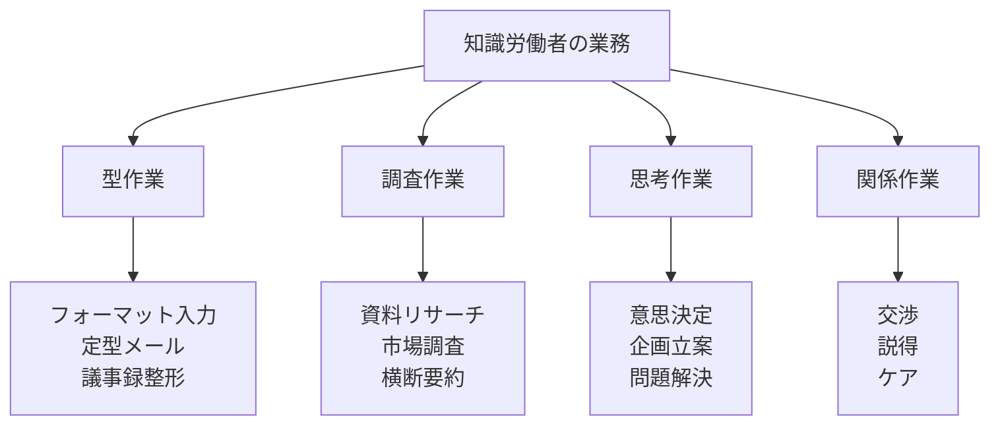
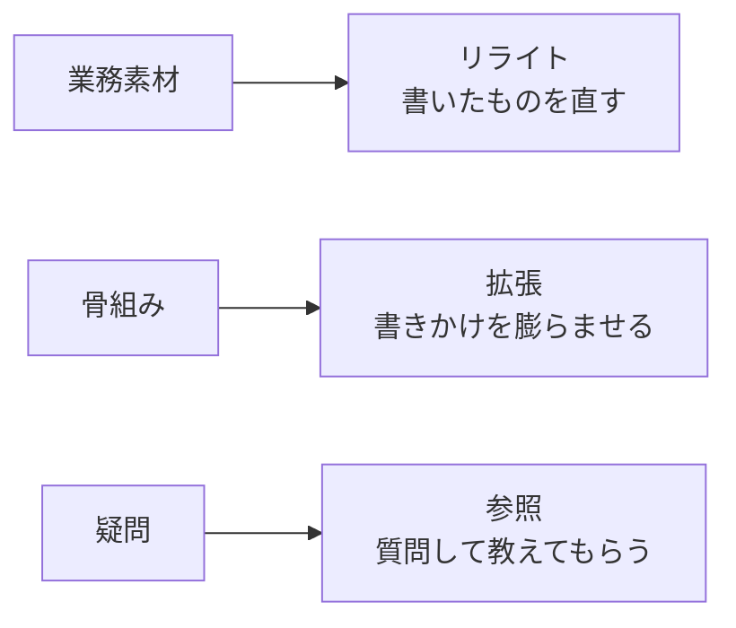
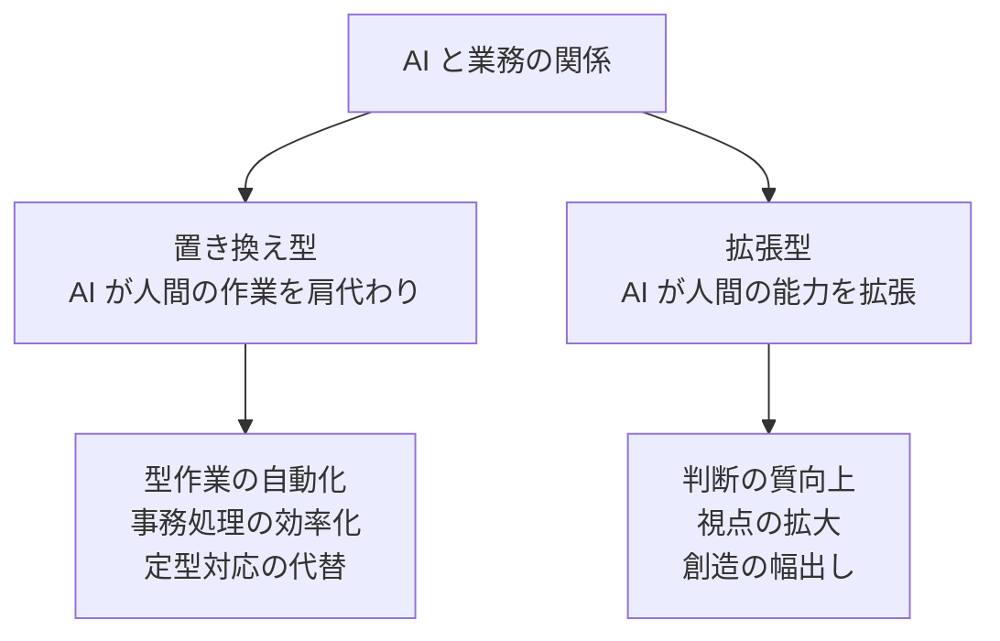

# AI時代の仕事術

「AI に使われる」のか「AI を使いこなす」のか——働く一人ひとりが日常業務を再設計する基本

| 項目 | 内容 |
|---|---|
| カテゴリー | IT基礎知識 |
| 難易度 | 初級 |
| 所要時間 | 約200分（全8レッスン） |
| 公開日 | 2026-06-17 |
| 最終更新日 | 2026-06-17 |
| コースURL | https://skillup.college/courses/it-basics/ai-work-skills/ |

## 対象者

業種・職種を問わず、すべての知的労働者にとって必要な生成 AI 業務活用の基礎を身につけたい方。営業・企画・人事・経理・総務・コンサル・教員・公務員など IT 職以外の方に。経営者・管理職で組織への AI 導入を進めようとしている方に。

## 前提知識

特になし。PC・スマートフォン・メール・Web ブラウザの基本操作経験があれば十分。ChatGPT、Claude、Gemini などの生成 AI を一度でも触ったことがあると理解が早いが、未経験でも問題ない。プログラミング・プロンプトエンジニアリングの専門知識は不要。

## 学習目標

- 「AI に使われる」と「AI を使いこなす」の違いを理解し、自分の立ち位置を整理できる
- 業務での生成 AI の 3 つの使い方（リライト・拡張・参照）を区別して使い分けられる
- 文書作成（メール・報告書・企画書・議事録）に生成 AI を組み込む発想を持つ
- 情報整理と要約（リサーチ・読解・データ整理）で生成 AI を活かす方法を理解する
- 思考の壁打ちと意思決定補助で生成 AI を活かす発想を持つ
- コミュニケーション（メール・説明資料・フィードバック）で生成 AI を活かす方法を理解する
- 個人と組織のルール（情報入力・業務再設計・評価）を整理できる
- AI に置き換えられる仕事と AI で拡張される仕事を見分け、自分の業務を棚卸しできる

## コース概要

「うちもそろそろ AI を導入しないと遅れる」「いや、AI は使い物にならない」——会議室でいまも聞こえる両極の声です。一方で、現場で起きているのは、その極論のあいだで意思決定が止まる組織と、流行で導入したものの定着せず諦めた現場、そして地味に業務に組み込んで成果を上げている職場の混在です。本コースは、特別な技術知識のない方でも、IT 職以外のあらゆる職種の知的労働者が、生成 AI を「日常業務の道具」として自分の仕事に組み込む発想を、8 レッスンで体系的に学びます。特定のツールの操作画面、プロンプトの細かい技術、エージェント設計といった専門領域には踏み込みません。代わりに、文書作成・情報整理・思考の壁打ち・コミュニケーション・業務再設計といった汎用業務に AI をどう組み込むか、組織のルールとどう付き合うか、自分の働き方をどう再設計するかを、現場の事例と「2026 年 6 月時点の最新動向」を交えて整理します。営業・企画・人事・経理・総務・コンサル・教員・公務員など、業務担当者の方が業務判断の土台にできる内容です。

## 学習の流れ

レッスン 1 でクラウドの本コースの位置づけと「AI に使われる」と「AI を使いこなす」の対比、知識労働者の業務階層（型作業・調査・思考・関係）を整理します。レッスン 2 は業務での生成 AI の使い方を「リライト・拡張・参照」の 3 つに分解する発想を扱います。レッスン 3 は文書作成の仕事術（メール・報告書・企画書・議事録・決裁文書）に AI を組み込む発想です。レッスン 4 は情報整理と要約（リサーチ・読解・データ整理）で AI を活かす方法、ハルシネーション対策、RAG の発想を扱います。レッスン 5 は思考の壁打ちと意思決定の仕事術で、Reasoning モデルや複数モデル比較利用の最新動向を含めます。レッスン 6 はコミュニケーション（メール・説明資料・フィードバック）の仕事術、Voice モードの活用を扱います。レッスン 7 は個人と組織のルール、情報入力リスク、業務プロセス再設計、評価制度との関係を整理します。最後のレッスン 8 で、AI に置き換えられる仕事と AI で拡張される仕事の見分け方、自分の業務の棚卸し、リテラシー陳腐化への備え、修了後の学習方向を案内します。前半（レッスン 1〜2）は「土台の発想」、中盤（レッスン 3〜6）は「具体の仕事術」、後半（レッスン 7〜8）は「ルールと働き方の再設計」という三段構えです。

## レッスン一覧

| No. | タイトル | 概要 | 所要時間 |
|---|---|---|---|
| 1 | AI時代の仕事術とは何か——「ツール導入」から「仕事の再設計」へ | 生成 AI 普及の現実、「AI に使われる」と「AI を使いこなす」の対比、本コースの位置づけ、知識労働者の業務階層（型作業・調査・思考・関係）を学ぶ | 25分 |
| 2 | 業務での生成 AI の 3 つの使い方——リライト・拡張・参照 | リライト（書いたものを直す）、拡張（書きかけを膨らませる）、参照（質問して教えてもらう）の 3 つの使い分けと組み合わせ、業務フローへの組み込み方を学ぶ | 25分 |
| 3 | 文書作成の仕事術——メール・報告書・企画書・議事録 | ビジネス文書の構造を AI と共有、構成案からドラフト生成、スタイルガイドの伝え方、「自分らしさ」の確保、議事録・決裁文書、2026 年 6 月時点の法人版での社内テンプレ共有を学ぶ | 25分 |
| 4 | 情報整理と要約の仕事術——リサーチ・読解・データ整理 | 長文資料の要約、複数文書の横断要約、リサーチ設計、表・データの整理、ハルシネーション対策、RAG（社内ナレッジ参照）、2026 年 6 月時点のファイル添付・Web 検索連携を学ぶ | 25分 |
| 5 | 思考の壁打ちと意思決定の仕事術 | AI を壁打ち相手にする発想、多角的視点の獲得、意思決定マトリクスの作成支援、「鵜呑みにしない」発想、2026 年 6 月時点の Reasoning モデル・複数モデル比較利用を学ぶ | 25分 |
| 6 | コミュニケーションの仕事術——社内外メール・説明資料・フィードバック | 相手に合わせた文体の使い分け、反対意見への返信ドラフト、フィードバック文書、多言語コミュニケーション、NG ワードチェック、プレゼン構成案、2026 年 6 月時点の Voice モードを学ぶ | 25分 |
| 7 | 個人と組織のルール——情報入力・業務再設計・評価 | 入力禁止情報のルール、ログとアカウンタビリティ、業務プロセスの再設計、評価制度との関係、シャドー AI 問題、2026 年 6 月時点の法人契約版の選び方を学ぶ | 25分 |
| 8 | 仕事と AI の関係を再設計する——自分の働き方・修了後 | 「置き換え」と「拡張」の二軸、自分の業務の棚卸し、リテラシーの維持と陳腐化への備え、キャリア視点での AI 活用、修了後の学習方向を案内する | 25分 |

---

## レッスン1：AI時代の仕事術とは何か——「ツール導入」から「仕事の再設計」へ

（所要時間：25分）

### このレッスンで学ぶこと

- 2026 年 6 月時点での生成 AI 業務利用の現実を整理する
- 「AI に使われる」と「AI を使いこなす」の対比を理解する
- 本コースの位置づけと既存の生成 AI 系コースとの境界を把握する
- 知識労働者の業務階層（型作業・調査・思考・関係）を整理する
- 本コースの守備範囲を理解する

---

「うちもそろそろ AI を導入しないと遅れる」「いや、AI は使い物にならない」——会議室でいまも聞こえる両極の声です。一方で、現場で起きているのは、その両極のあいだで意思決定が止まる組織と、流行で導入したものの定着せず諦めた現場、そして地味に業務に組み込んで成果を上げている職場の混在です。本コースは、ChatGPT や Claude や Gemini を業務に組み込む実践の手前にある「考え方」を整理することから始めます。

### 生成 AI 業務利用の 2026 年現在地

ChatGPT が一般公開されたのが 2022 年 11 月。それからわずか 3 年半で、生成 AI は業務システムの選択肢から、いまや業務現場の前提に変わりました。2026 年 6 月時点の状況を整理しておきましょう。

- 上場企業の大半が、社内向けに何らかの法人契約版 AI を導入している
- 個人レベルでは、ChatGPT・Claude・Gemini のいずれかの有料プランを契約している知的労働者が珍しくなくなった
- 一方で、社員の AI 利用が個人契約と法人契約が混在し、組織として全体が見えない「シャドー AI」状態の組織も多い
- 「AI で仕事が楽になった」「AI で仕事を奪われそう」「AI を入れたが使われていない」が共存する

つまり、「AI を使うか使わないか」の議論はすでに終わっており、本当の論点は「どう使うか」「組織と個人がどう付き合うか」に移っています。

> **💡 ポイント**
> 「うちはまだ AI を入れていない」と言う組織でも、社員個人が ChatGPT のようなサービスを業務で使っている可能性は高いです。問題は「使っているかどうか」ではなく「使い方が組織として制御されているか」です。

### 「AI に使われる」と「AI を使いこなす」

本コースが繰り返し強調するのが、「AI に使われる」と「AI を使いこなす」の対比です。同じ生成 AI を業務で利用していても、両者は性質が大きく異なります。

#### AI に使われる状態

- 流行に追われて、用途がないまま機能を試している
- AI の出力を無批判にコピー＆ペーストして使う
- 「AI が言っているから正しい」と判断停止する
- 自分の業務プロセスを変えず、AI を「とりあえずアクセサリ」として乗せる
- 同僚や上司に「自分は AI を使えていない」と焦り、表面的にだけ使う

#### AI を使いこなす状態

- 業務上の課題から逆算して、AI の使い所を選ぶ
- AI の出力を一次素材として、自分で批判的に評価し編集する
- 「AI が出した答え」と「自分の判断」を区別して扱う
- 業務プロセスそのものを再設計し、AI と人間の分担を意識する
- 「使えなかった経験」も含めて、自分なりの使い分けの感覚を持つ

両者の違いは、AI の使用量ではありません。「使う・使わない」「使用時間が長い・短い」では決まりません。違いは、AI に対する自分の主体性と判断にあります。

#### 「使いこなす」は組織でも個人でも問われる

「使いこなす」かどうかは、個人だけの問題ではありません。組織のルール・教育・業務プロセスが整っていなければ、個人が頑張っても「使いこなす」状態には届きません。逆に、組織が前のめりすぎて社員に詰め込み型の研修を強いると、現場は「AI に使われる」感覚に陥ります。本コースは、個人と組織の両面で「使いこなす」発想を考えます。

> **⚠️ 注意**
> 「AI を使いこなせない人は時代遅れだ」と決めつけるのは、本コースが避ける発想です。組織のルールと教育が整っていない、業務の特性上 AI が馴染まない、リテラシーを身につける時間が確保できない、など、現場には事情があります。

### 既存の生成 AI 系コースとの境界

スキルアップカレッジでは、生成 AI に関連するコースをすでにいくつか公開しています。本コースの位置づけを明確にするため、それぞれの守備範囲と本コースとの違いを整理しておきます。

| 別コース | 守備範囲 | 本コースとの違い |
|---|---|---|
| 生成 AI の仕組み・選び方・リスク管理を扱うコース | LLM の仕組み、主要モデルの選び方、ハルシネーション・著作権・情報入力のリスク | 仕組みではなく「日常業務でどう組み込むか」を扱う |
| プロンプトの設計・評価を扱うコース | プロンプトの構造、Few-shot・CoT、評価とイテレーション、Function Calling、RAG の実装観点 | プロンプトの細かい技法ではなく「業務プロセスの中での使い方」を扱う |
| AI エージェントを扱うコース | 自律エージェントの設計、観察・思考・行動・記憶・道具、評価とリスク | エージェント設計ではなく「業務担当者が今日使う AI」を扱う |
| 本コース「AI時代の仕事術」 | 業務担当者の日常業務での組み込み方、業務再設計、組織と個人のルール | — |

つまり本コースは、「仕組みを理解する」「プロンプトを設計する」「エージェントを作る」という専門領域の手前で、「自分の業務に AI をどう乗せるか」を整理する位置にあります。

> **📝 補足**
> 「仕組みも知らずに使うのは危険」という意見もあります。一方で「仕組みを知らないと使えない」と言い切ると、現場の大半の業務担当者には AI が届きません。本コースは「仕組みは深く知らなくても、業務に組み込む発想は持てる」というスタンスです。仕組みを深く学びたい方は、別コースを並行して受講するのもよいでしょう。

### 知識労働者の業務階層

本コースが扱う業務担当者の仕事を、4 つの階層で整理しておきます。

#### 4 つの階層

- **型作業（けいさぎょう）**：決まった形式に従う作業。フォーマット入力、定型メール、議事録整形、データ転記など。比較的単純で、判断要素が少ない
- **調査作業（ちょうさぎょう）**：情報を集めて整理する作業。資料リサーチ、市場調査、横断要約、競合分析など。情報の取捨選択が要る
- **思考作業（しこうさぎょう）**：判断と創造の作業。意思決定、企画立案、問題解決、戦略策定など。文脈と価値判断が要る
- **関係作業（かんけいさぎょう）**：人と人との関わりの作業。交渉、説得、ケア、信頼構築など。相手の感情と立場の理解が要る

#### 生成 AI と 4 階層の関係

- **型作業**：AI で大幅に自動化・効率化できる領域。1 番目に AI 化が進む
- **調査作業**：AI が一次的な情報整理を担い、人間が選別・判断する分業が広がる
- **思考作業**：AI が壁打ち相手・選択肢の幅出しを担い、人間が最終判断を持つ
- **関係作業**：人間の主体性が中心。AI は補助（文体調整、配慮表現のチェックなど）の位置にとどまる

「AI で全部置き換えられる」と決めつけるのも、「人間の仕事は AI に奪われない」と楽観するのも、4 階層を見れば実態と合いません。階層ごとに分担を考えるのが、本コースの基本姿勢です。

### 本コースの守備範囲

最後に、本コースで扱う範囲と扱わない範囲を整理しておきます。

#### 扱う範囲

- 業務での生成 AI の 3 つの使い方（リライト・拡張・参照）（レッスン 2）
- 文書作成の仕事術（メール・報告書・企画書・議事録）（レッスン 3）
- 情報整理と要約の仕事術（リサーチ・読解・データ整理）（レッスン 4）
- 思考の壁打ちと意思決定の仕事術（レッスン 5）
- コミュニケーションの仕事術（メール・説明資料・フィードバック）（レッスン 6）
- 個人と組織のルール（情報入力・業務再設計・評価）（レッスン 7）
- 仕事と AI の関係を再設計する（業務の棚卸し・修了後の方向）（レッスン 8）

#### 扱わない範囲

- 生成 AI の仕組み・モデルアーキテクチャの詳細
- 特定モデル（Claude 4 系・GPT 5 系・Gemini 2 系など）の細かい比較・性能数値
- プロンプトエンジニアリングの高度な技法（Few-shot、Chain-of-Thought、ReAct、Function Calling など）
- 自律 AI エージェントの設計
- API、SDK、プラグイン開発、RAG の実装詳細
- 「絶対に儲かる活用術」「魔法のプロンプト」のような言説
- 特定ベンダー製品の操作手順

#### スタンス

本コースは、生成 AI を「特別な技術」ではなく「業務の道具として理解し、自分の働き方に組み込む基本リテラシー」として扱います。同時に、「AI が全部解決する」万能論とも、「AI は使い物にならない」否定論とも距離を置きます。要件から逆算して AI の使い所を選び、業務プロセスを再設計し、組織のルールと折り合いをつける判断軸を、現場の感覚も交えて持ち帰っていただくのが目的です。

特定のツール（ChatGPT／Claude／Gemini／Copilot）を推す立場は取りません。本コースでは複数のツールを並べて紹介し、用途で選ぶスタンスです。

### まとめ

このレッスンでは、以下のことを学びました。

- 2026 年 6 月時点で、生成 AI の業務利用は前提に変わった。論点は「使うか使わないか」ではなく「どう使うか」「組織と個人がどう付き合うか」
- 「AI に使われる」と「AI を使いこなす」の違いは使用量ではなく、主体性と判断
- 個人だけでなく組織のルール・教育・業務プロセスが「使いこなす」かを左右する
- 本コースは、生成 AI 入門・プロンプトエンジニアリング・AI エージェントといった専門領域の手前で、「業務担当者の日常業務での組み込み方」を扱う
- 知識労働者の業務は型作業・調査・思考・関係の 4 階層で整理できる
- AI と 4 階層の関係：型は自動化、調査は分業、思考は補助、関係は人間中心
- 本コースは「特別な技術」ではなく「業務の道具として組み込む基本リテラシー」として扱う

次のレッスンでは、業務での生成 AI の使い方を「リライト・拡張・参照」の 3 つに分解する発想を扱います。

---

### 確認クイズ

このレッスンの理解度をチェックしましょう。

#### Q1. 本コースが定義する「AI を使いこなす」状態として、最も適切なものはどれか？

- [x] 業務上の課題から逆算して AI の使い所を選び、AI の出力を一次素材として批判的に評価し編集する。AI が出した答えと自分の判断を区別して扱い、業務プロセスそのものを再設計して AI と人間の分担を意識する状態
- [ ] AI のあらゆる機能を試して、できるだけ多くの作業を AI に置き換える状態
- [ ] AI の出力を無批判にコピー＆ペーストして業務に使う状態
- [ ] AI を一切使わず、すべての作業を自分で行う状態

> **解説**
> 「使いこなす」かどうかは、使用量・使用時間ではなく、AI に対する主体性と判断で決まります。2 番目は「使うことが目的化」、3 番目は「使われる側」、4 番目は議論のスタート地点に立っていない、いずれも本コースの定義する「使いこなす」とは異なります。

#### Q2. 「シャドー AI」とは何か、本レッスンが説明した内容はどれか？

- [ ] 物理的に暗い場所で AI を使うこと
- [x] 社員の AI 利用が個人契約と法人契約で混在し、組織として全体が見えない状態
- [ ] AI が自分のシャドー（影）として後ろをついてくる比喩
- [ ] 攻撃者が AI を悪用してサイバー攻撃を仕掛ける手口

> **解説**
> シャドー AI は、社員が個人契約の AI ツールを業務で使用するなどして、組織として利用状況が把握できない状態を指します。「シャドー IT」と同じ系列の言葉です。1・3・4 番目はいずれも誤りです。

#### Q3. 本コースと、生成 AI の仕組み・プロンプト設計・AI エージェントを扱うコースとの位置づけの違いとして、本レッスンが説明した内容はどれか？

- [ ] 本コースは生成 AI の仕組みを最も深く扱う
- [ ] 本コースはプロンプトエンジニアリングの高度な技法（Few-shot・CoT・ReAct・Function Calling）を中心に扱う
- [x] 本コースは「仕組みを理解する」「プロンプトを設計する」「エージェントを作る」という専門領域の手前で、「業務担当者の日常業務での組み込み方」「業務プロセスの再設計」「組織と個人のルール」を扱う
- [ ] 本コースは AI エージェントの自律システム設計を中心に扱う

> **解説**
> 本コースは、専門領域の手前で「日常業務でどう使うか」を扱う位置にあります。仕組み・プロンプト・エージェントは別領域として、本コースは「業務担当者の今日の仕事」に組み込む発想に集中します。

#### Q4. 知識労働者の業務階層と生成 AI の関係について、本レッスンが説明した内容はどれか？

- [ ] 4 階層のすべてが完全に AI に置き換えられる
- [ ] 4 階層のすべてで AI は使えず、人間の主体性のみで進める
- [ ] AI は「型作業」のみ対応可能で、ほかの階層では使えない
- [x] 型作業は AI で大幅に自動化・効率化、調査作業は AI が一次整理し人間が選別・判断、思考作業は AI が壁打ち相手・選択肢の幅出しを担い人間が最終判断、関係作業は人間の主体性が中心で AI は補助（文体調整・配慮表現のチェックなど）

> **解説**
> 4 階層によって AI の関与の仕方は異なります。「全置き換え」「全人間中心」「型作業限定」はいずれも実態に合いません。階層ごとに分担を考えるのが本コースの基本姿勢です。

#### Q5. 本コースが扱わない範囲として、本レッスンが示した項目はどれか？

- [x] 生成 AI の仕組み・モデルアーキテクチャの詳細、特定モデルの細かい比較・性能数値、プロンプトエンジニアリングの高度な技法、自律 AI エージェントの設計、API・SDK・RAG の実装詳細、「絶対に儲かる活用術」「魔法のプロンプト」のような言説、特定ベンダー製品の操作手順
- [ ] 業務での生成 AI の 3 つの使い方（リライト・拡張・参照）
- [ ] 文書作成の仕事術（メール・報告書・企画書・議事録）
- [ ] 個人と組織のルール（情報入力・業務再設計・評価）

> **解説**
> 本コースは「業務担当者の日常業務での組み込み方」に専念し、仕組み・モデル比較・プロンプト技法・エージェント設計・実装詳細・宣伝的言説・特定製品の操作手順は守備範囲外です。2〜4 番目はいずれも本コースが扱う範囲です。

#### Q6. 講師の現場メモが示す「『AI 化したけれど誰も使っていない』案件」のエピソードから、本レッスンが伝えたメッセージはどれか？

- [ ] 全社員に AI のアカウントを配布すれば、自然に使われるようになる
- [ ] 経営層が「生産性を倍に」と掲げれば、現場は自動的に AI を使いこなす
- [ ] 「画期的な活用事例」を社内 SNS で共有すれば、現場は AI を使い始める
- [x] 「AI を導入する」と「AI が業務に組み込まれる」のあいだには大きな溝がある。研修や事例共有だけでは現場は動かず、業務の中の型作業・調査・思考・関係を切り分け、「使い所を選ぶ」発想が必要

> **解説**
> エピソードは「全社員 800 名にアカウント配布・研修実施でも、月 1 回以上利用は 80 アカウント」という状況です。問題は AI ではなく、業務の中での組み込み方が見えていなかったことです。本コースが「業務の階層を整理する」「使い所を選ぶ」を最初に置く背景です。

---

## レッスン2：業務での生成 AI の 3 つの使い方——リライト・拡張・参照

（所要時間：25分）

### このレッスンで学ぶこと

- 業務での生成 AI の使い方を「リライト・拡張・参照」の 3 つに分解できる
- 3 つの使い分けの基準を持つ
- 「全部 AI で書く」と「AI を一切使わない」の中間に位置する組み込み方を理解する
- 業務フローへの組み込み方の発想を持つ
- 「リライト・拡張・参照」を組み合わせて使う発想を整理する

---

前のレッスンでは、本コースの位置づけと知識労働者の業務階層を整理しました。今回のレッスンでは、業務での生成 AI の使い方を 3 つの基本パターンに分解する発想を扱います。「プロンプトの書き方」を細かく学ぶのではなく、「自分の業務のどこに、どの使い方を当てるか」を考える基本軸を作ります。

### 3 つの使い方

業務での生成 AI の使い方は、大きく 3 つに分解できます。

| 使い方 | 入力 | AI が行うこと | 出力 |
|---|---|---|---|
| リライト（rewrite） | 自分が書いた文章 | 改善・校正・要約・スタイル変換 | 直された文章 |
| 拡張（extend） | 骨組み・キーワード・指示 | 膨らませる・ドラフト生成 | 形になった文章 |
| 参照（reference） | 質問 | 知識の提供・整理 | 回答・要約 |

3 つは独立した行為ですが、実際の業務では組み合わせて使うのが普通です。例えば、

1. **参照**で「業界の最新トレンドを教えて」と質問
2. その情報を踏まえて、自分で**骨組み**を作る
3. **拡張**で骨組みからドラフトを生成
4. ドラフトを自分で編集
5. **リライト**で「もっと簡潔に」と指示して微調整

このような連鎖が、業務での AI 利用の典型的な姿です。

> **💡 ポイント**
> 「プロンプトの書き方」を学ぶ前に、「自分が今やろうとしているのは、リライトか拡張か参照か」を意識すると、使い方が安定します。3 つを混ぜずに、ひとつずつ目的を明確にするのがコツです。

### リライト——書いたものを直す

リライトは、すでに自分が書いた文章を AI に直してもらう使い方です。

#### 典型的なリライトの場面

- 自分が書いた長いメールを「もっと簡潔に」と直してもらう
- 報告書のドラフトを「敬語のレベルを上げて」と直してもらう
- 議事録を「3 段落にまとめ直して」と要約してもらう
- 英文を日本語にローカライズしてもらう
- 同じ内容を「役員向け」「現場向け」「顧客向け」に書き分けてもらう

#### リライトの強み

- すでに自分が書いた素材があるため、AI に「自分が何を伝えたいか」が正確に伝わる
- 出力の品質が安定する（AI が文章をゼロから創造する必要がないため）
- ハルシネーション（事実誤認）のリスクが小さい
- 自分のスタイルや声を保ちやすい

#### リライトの注意点

- 自分が書いた文章を完全に上書きすると、自分の文体が薄まる
- AI が「丁寧すぎる文体」「角の取れた言い回し」に統一しがちな傾向
- 「自分の文章として恥ずかしくないか」を最終的に自分で判断する必要がある

> **📝 補足**
> リライトは、AI の使い方として最もリスクが小さく、最も即効性のある入口です。慣れていない方は、まず「自分のメールを AI にリライトしてもらう」ところから始めるのがおすすめです。

### 拡張——書きかけを膨らませる

拡張は、骨組み・キーワード・指示を AI に渡して、形になった文章を生成してもらう使い方です。

#### 典型的な拡張の場面

- 「次の 3 つのポイントで提案メモを書いて」とキーワードを渡してドラフトを生成
- 議題リストから議事録の構成案を生成
- 製品の特徴 5 つから営業トークの 3 パターンを生成
- 課題と背景を書いて、「考えられる解決案を 5 つ挙げて」と幅出しを依頼
- 簡単なメモから、決裁文書のドラフトを生成

#### 拡張の強み

- ゼロから書くより時間が大幅に短縮される
- 「何を書けばいいかわからない」状態を脱出する糸口になる
- 複数のバリエーション（5 通りの案など）を一度に得られる
- 自分の思考だけでは出てこない発想が混ざる

#### 拡張の注意点

- AI が「もっともらしいが内容が空虚」な文章を生成しがち
- 自分が指示した骨組みより、AI が勝手に拡張した部分が大きくなりすぎる
- ハルシネーション（事実誤認）のリスクが大きい
- 「拡張されたドラフト」を自分の言葉として通す前に、必ず内容を吟味する必要がある

#### 拡張で気をつけること

拡張は強力ですが、「ドラフトを自分の言葉として責任を持つ」ことを忘れがちな使い方です。社内文書や顧客向け文書を拡張で作るときは、

- 事実情報（数値・固有名詞・日付・引用）は必ず確認する
- 自分の意見と AI の生成を分けて意識する
- 重要度の高い文書は、骨組みを丁寧に作って AI 任せの割合を下げる

を意識しましょう。

> **⚠️ 注意**
> 「AI が書いたので私は責任を持ちません」は通用しません。社内文書も顧客向け文書も、出した時点でその文書の主体は自分です。拡張を使うときほど、自分で内容を吟味する責任が増えると考えてください。

### 参照——質問して教えてもらう

参照は、自分が知りたいこと・調べたいことを AI に質問する使い方です。

#### 典型的な参照の場面

- 「この業界の最新トレンドを教えて」と質問
- 「この用語の意味と背景を教えて」と質問
- 「この製品のメリットとデメリットを比較して」と質問
- 自分の状況を説明して「どんな選択肢があるか」と相談
- 法律・規則の概要を確認する

#### 参照の強み

- 自分の知識の幅を超えた情報にすばやくアクセスできる
- 検索エンジンより会話的で、深掘りの質問が続けやすい
- 自分が知らない関連概念を教えてもらえる
- 業務の前提を整える「最初の入口」として効率的

#### 参照の注意点

- **ハルシネーションのリスクが最大**（AI が知らないことを「もっともらしく」答えることがある）
- 学習データのカットオフ以降の情報は不正確になりがち（モデルによる）
- 業界・地域・組織に特有の情報は誤情報が混ざりやすい
- 法律・税務・医療・契約など、判断を伴う領域は AI だけで完結させない

#### 参照で気をつけること

参照は最も「事実誤認」のリスクが高い使い方です。

- 重要な情報は必ず原典（公式サイト・公的資料・専門書）で確認する
- 「AI が言っているから正しい」と判断停止しない
- 数値・固有名詞・日付・引用は特に慎重に
- 検索連携機能（Web 検索）を持つモードを使うと、原典をたどりやすい
- 専門家の判断が必要な領域（法律・税務・医療）は、必ず専門家に確認する

> **📝 補足**
> 2026 年 6 月時点では、ChatGPT・Claude・Gemini のいずれも Web 検索連携機能を備えており、引用元の URL を提示しながら回答できます。参照を使うときは、こうした機能を活用して、原典を確認しやすい状態で使うのが現代の標準です。

### 3 つの使い方の組み合わせ

実際の業務では、3 つを組み合わせて使うのが普通です。レッスン冒頭の例をもう一度見てみましょう。

| ステップ | 使い方 | 内容 |
|---|---|---|
| 1 | 参照 | 「業界の最新トレンドを教えて」と質問 |
| 2 | （自分で骨組み作成） | 取材を踏まえて、提案メモの骨組みを書く |
| 3 | 拡張 | 骨組みからドラフトを生成してもらう |
| 4 | （自分で編集） | ドラフトを自分の文体・主張に合わせて編集 |
| 5 | リライト | 「もっと簡潔に」と指示して微調整 |

この流れの中で、自分の判断と AI の生成が交互に登場します。「全部 AI で書く」でも「全部自分で書く」でもなく、両者の中間で交互に手を動かすのが、業務での AI 利用の典型的な姿です。

#### 「中間」で考える

- 全部 AI で書く：ハルシネーションのリスクが大きく、自分の文体が消える
- 全部自分で書く：時間がかかり、AI の利点（幅出し・効率化）を得られない
- 中間（AI と自分が交互に手を入れる）：効率と品質と自分の声のバランスが取れる

「中間」の発想は、本コースを通じて何度も登場します。

### 業務フローへの組み込み方

3 つの使い方を覚えても、業務フローに組み込まなければ「使わないまま」で終わります。組み込み方の基本ステップを示します。

#### ステップ 1：業務を分解する

自分の典型的な業務（例：1 日の作業）を、レッスン 1 で学んだ 4 階層（型作業・調査・思考・関係）に分解します。

#### ステップ 2：3 つの使い方をマッピングする

各業務に「リライト・拡張・参照」のどれが使えそうかをマッピングします。

| 業務 | 使い方 |
|---|---|
| メール作成（社内向け） | リライト（書いてから直す） |
| 議事録 | 拡張（録音・メモから整形） |
| 業界トレンド調査 | 参照（質問する） |
| 報告書ドラフト | 拡張（骨組みから生成） |
| 顧客説明資料の英訳 | リライト（既存資料を直す） |
| 経費精算 | （AI 不要） |

#### ステップ 3：小さく試す

「明日からこの 1 つだけ」と決めて、小さく試します。すべての業務に一気に AI を組み込もうとすると、定着しません。

#### ステップ 4：定着したものを増やす

うまく定着したものを起点に、徐々に範囲を広げます。失敗した使い方は、別の使い方に切り替えるか、いったん中止して別の業務で試します。

> **💡 ポイント**
> 「すべての業務で AI を活用する」を最初の目標にすると、ほぼ間違いなく挫折します。「自分の業務の 1〜2 つに、AI が定着する」を最初の目標に設定しましょう。

### まとめ

このレッスンでは、以下のことを学びました。

- 業務での生成 AI の使い方は「リライト・拡張・参照」の 3 つに大別できる
- リライト：自分が書いた文章を直してもらう。リスクが小さく、即効性のある入口
- 拡張：骨組みやキーワードから形になった文章を生成してもらう。強力だがハルシネーションのリスクが大きい
- 参照：質問して教えてもらう。便利だが事実誤認のリスクが最大。原典確認が必須
- 3 つは独立した行為だが、実際の業務では組み合わせて使う
- 「全部 AI で書く」「全部自分で書く」ではなく「中間で交互に手を動かす」のが現実的な姿
- 業務フローへの組み込みは「分解→マッピング→小さく試す→定着したものを広げる」のステップで

次のレッスンでは、文書作成の仕事術（メール・報告書・企画書・議事録）に AI を組み込む発想を扱います。

---

### 確認クイズ

このレッスンの理解度をチェックしましょう。

#### Q1. 「リライト」の典型的な使い方として、本レッスンが説明した内容はどれか？

- [ ] 質問して AI に教えてもらう
- [x] 自分がすでに書いた文章を AI に直してもらう（簡潔化・敬語のレベル変更・要約・スタイル変換など）
- [ ] 骨組みやキーワードから形になった文章を AI に生成してもらう
- [ ] AI が独立して新規ドキュメントをゼロから生成すること

> **解説**
> リライトは「すでに自分が書いた文章を AI に直してもらう」使い方です。1 番目は参照、3 番目は拡張、4 番目は拡張に近いが「独立してゼロから」という記述が不正確です。リライトはリスクが小さく、即効性のある入口です。

#### Q2. 「拡張」の特徴として、本レッスンが説明した内容はどれか？

- [ ] 自分が書いた文章を AI が修正する使い方で、リスクが最も小さい
- [x] 骨組み・キーワード・指示を AI に渡して、形になった文章を生成してもらう使い方。ゼロから書くより時間が大幅に短縮される強みがある一方、「もっともらしいが内容が空虚」な文章が出やすく、ハルシネーションのリスクが大きい
- [ ] 質問して AI に教えてもらう使い方で、検索エンジンより会話的
- [ ] AI が自律的にタスクを判断して実行する使い方

> **解説**
> 拡張は「骨組み・キーワード・指示から形になる文章を生成」する使い方で、効率化の強みがある反面、ハルシネーションリスクは大きく、自分での吟味が不可欠です。1 番目はリライト、3 番目は参照、4 番目はエージェントの説明です。

#### Q3. 「参照」を使うときの注意点として、本レッスンが最も強調した内容はどれか？

- [ ] 参照はリスクが最も小さいので、原典確認は不要
- [ ] 参照で得た情報は、必ず社内 SNS に共有すべき
- [x] 参照はハルシネーション（事実誤認）のリスクが最大。重要な情報は必ず原典で確認し、特に法律・税務・医療・契約のような判断を伴う領域は専門家の判断を仰ぐ。検索連携機能を使うと原典をたどりやすい
- [ ] 参照で得た情報は、AI が学習データを参照しているので必ず正確

> **解説**
> 参照は便利ですが、ハルシネーションのリスクが最大です。原典確認、特に判断を伴う領域での専門家への確認が必須です。1・2・4 番目はいずれも不適切な姿勢です。

#### Q4. 3 つの使い方の組み合わせと「中間」の発想について、本レッスンが説明した内容はどれか？

- [ ] 3 つはどれか 1 つだけを選んで使うべきで、組み合わせてはいけない
- [ ] 「全部 AI で書く」が最も効率的で、すべての業務でそうすべき
- [ ] 「全部自分で書く」が最も品質が高く、AI は使わないほうがよい
- [x] 実際の業務では 3 つを組み合わせて使うのが普通。自分の判断と AI の生成が交互に登場する「中間」の姿が、効率と品質と自分の声のバランスを取る現実的な姿

> **解説**
> 3 つは組み合わせて使うのが普通で、「全部 AI」「全部自分」のどちらでもなく、両者の中間で交互に手を動かすのが業務での AI 利用の典型的な姿です。本コース全体で「中間」の発想を繰り返し扱います。

#### Q5. 業務フローへの組み込み方の基本ステップとして、本レッスンが示した順序はどれか？

- [x] 業務を分解する → 3 つの使い方をマッピングする → 小さく試す → 定着したものを増やす
- [ ] 全社一斉に AI を導入する → 失敗事例を分析する → 別のツールに切り替える
- [ ] AI に業務を任せる → 結果を自動的に経営に報告する → 人間は関与しない
- [ ] AI の使い方を全社員に研修する → 全業務でいきなり AI を使う → 効果測定する

> **解説**
> 「分解→マッピング→小さく試す→定着したものを広げる」が本レッスンが示した順序です。「すべての業務で AI を活用する」を最初の目標にすると挫折するため、「1〜2 つに定着する」を最初の目標にするのが本コースの推奨です。

#### Q6. 講師の現場メモが示す「メール 1 通から始まった社内浸透」のエピソードから、本レッスンが伝えたメッセージはどれか？

- [ ] 全社一斉導入が常に最も効果的である
- [ ] 経営層が強い意思を示せば、社員は自然に AI を使い始める
- [ ] 研修を多く実施すれば、現場の利用率は上がる
- [x] 「全社的に広める」より「1 人 1 つの仕事に AI を組み込む」のほうが定着する。メールを AI でリライトすることから始めた課長を起点に、半年で月 1 回以上利用が 30 人から 180 人に増えた。3 つの使い方をシンプルに整理するのは「明日から自分の 1 つの業務で試せる」状態にしたいから

> **解説**
> エピソードでは、課長が「メールのリライト」から始めた結果、課のほかの社員に広がり、半年で月 1 回以上利用者が 6 倍になりました。全社一斉導入よりも、1 人 1 つから始めるほうが定着するというのが本レッスンの伝えるメッセージです。

---

## レッスン3：文書作成の仕事術——メール・報告書・企画書・議事録

（所要時間：25分）

### このレッスンで学ぶこと

- ビジネス文書の構造を AI と共有する発想を持つ
- 構成案からドラフトを生成する基本パターンを理解する
- スタイルガイドの伝え方を整理できる
- 「自分らしさ」を確保しながら AI を使う考え方を持つ
- 録音やメモから議事録を作る発想を理解する
- 決裁文書のドラフトに AI を使う際の注意点を把握する
- 2026 年 6 月時点の法人版での社内テンプレ共有の動向を理解する

---

前のレッスンでは、業務での生成 AI の使い方を「リライト・拡張・参照」の 3 つに分解する発想を扱いました。今回のレッスンでは、その応用として、文書作成の仕事術を扱います。メール・報告書・企画書・議事録・決裁文書という、知的労働者なら誰もが触れるビジネス文書を取り上げます。本レッスンは「文章の上手な書き方」ではなく、「文書作成のプロセスに AI をどう組み込むか」が焦点です。

### ビジネス文書の構造を AI と共有する

文書作成で AI に助けてもらうには、まず「自分が書こうとしている文書はどんな構造か」を AI と共有する必要があります。

#### 構造を伝える 3 つの要素

1. **文書の種類**：メール／報告書／企画書／議事録／決裁文書／プレスリリースなど
2. **読み手**：上司／部下／社内同僚／顧客／役員／規制当局／取引先など
3. **目的**：報告／依頼／提案／質問／意思決定の促し／お礼／謝罪など

この 3 つを最初に AI に伝えるだけで、出力の精度が大きく変わります。

#### 構造を伝えないと何が起きるか

「メールを書いて」とだけ指示すると、AI は無難で長めの、誰宛でもない文章を生成しがちです。出力を見て「もっと簡潔に」「もっと丁寧に」「もっと熱意を込めて」と何度も修正することになります。最初に構造を伝えれば、こうした往復が減ります。

> **💡 ポイント**
> 「文書の種類・読み手・目的」を 3 行で先に書いてから、本文を依頼する習慣を作りましょう。これだけで AI の出力品質が安定します。

### 構成案からドラフトを生成する

文書作成での AI の典型的な使い方は、「構成案から AI にドラフトを生成してもらう」（拡張）の流れです。

#### 標準パターン

| ステップ | 主体 | 内容 |
|---|---|---|
| 1 | 自分 | 文書の構造（種類・読み手・目的）を整理 |
| 2 | 自分 | 構成案・キーポイントを箇条書きで作る |
| 3 | AI | 構成案からドラフトを生成 |
| 4 | 自分 | ドラフトを読んで、事実誤認・トーン違和感を確認 |
| 5 | 自分 | 必要に応じて編集 |
| 6 | AI | リライトで微調整（任意） |

#### 構成案を作る時間の意味

「AI に書いてもらうのに、自分で構成案を作るの？」と感じる方もいるかもしれません。実際には、構成案を作る時間が文書の質を決めます。AI に丸投げで生成された文書は、もっともらしい代わりに、自分が伝えたいことが薄まりがちです。構成案を 5 分でも書いてから AI に渡すと、出力が「自分が書きたかったもの」に大きく近づきます。

#### 構成案の最小フォーマット

- 件名（または見出し）
- 結論を 1 文
- 根拠を 3 つ（箇条書き）
- 行動依頼や次のステップ

これくらいの粒度を箇条書きで AI に渡すと、ドラフトの方向性がブレません。

> **📝 補足**
> 「ピラミッドストラクチャ」「PREP 法」「SDS 法」のような文書構造のフレームワークを知っていると、構成案を作る時間を短縮できます。これらは別の専門書を参照してください。

### スタイルガイドの伝え方

文書には、組織や個人ごとに「スタイル」があります。です・ます調か、である調か。技術用語の度合い。固有の表現や禁止表現。AI に「自分の組織のスタイル」を伝えることで、出力が自然に整います。

#### スタイルガイドの伝え方

- 「である調」「です・ます調」など文体を指定
- 「専門用語は避けて、平易な日本語で」など語彙のレベルを指定
- 「箇条書きを多用しないでください」「段落で書いてください」など形式を指定
- 「以下を社内のスタイル例として参考にしてください」と過去の文書を貼り付ける
- 禁止表現を伝える（「『お疲れさまです』は社内文化と合わないので使わない」など）

#### 過去文書をスタイル例として渡す

自分の組織で公開されている過去の良文書（プレスリリース・社報・公式ブログなど）を 1〜2 件貼り付けて、「このトーンで書いてください」と伝えると、出力が組織のスタイルに大きく近づきます。

#### 2026 年 6 月時点：法人版での社内テンプレ共有

2026 年 6 月時点では、法人契約版の AI ツール（Microsoft Copilot Enterprise、ChatGPT Team／Enterprise、Claude for Work、Gemini for Workspace）で、組織のスタイルガイド・テンプレート・FAQ を AI に常時参照させる仕組みが一般的になりつつあります。「カスタム指示」「プロジェクト」「Workspace」など名称はさまざまですが、社員 1 人ひとりが毎回スタイルガイドを貼り付けなくても、組織共通のテンプレートで文書が生成される状態が現実的になっています。

ただし、テンプレートが古いまま放置されたり、複数のテンプレートが乱立したり、社員がテンプレを無視して個人カスタマイズしたりする現場の問題も出てきています。導入後の運用設計（誰がテンプレを管理するか、いつ見直すか）が、現代の論点です。

> **⚠️ 注意**
> 「法人版を契約すれば自動で AI が組織スタイルを身につける」わけではありません。テンプレ管理・運用設計の体制が伴わないと、結局個人がスタイルガイドを毎回貼り付ける状態に戻ります。

### 「自分らしさ」を確保する

AI に文書作成を任せすぎると、文章が「AI らしい無難なトーン」に統一されていきます。これは、業務の中で見過ごせない問題です。

#### AI 文章の特徴

- 丁寧で角がない
- 同じような接続詞（「したがって」「一方で」「重要なのは」など）が繰り返される
- 強い意見を避ける傾向
- 比喩や具体例が乾いて教科書的になる
- 「結論を先に」「3 つのポイント」のような構造が好まれる

これらは悪いことばかりではありません。クライアント向け文書の安定したトーンとしては有用です。一方で、社内のチャット、自分の上司へのメール、ブログ記事、社外プレゼンの語りなどでは、「無難すぎて自分らしさが消える」マイナス面が出ます。

#### 「自分らしさ」を確保する 3 つの工夫

1. **書き出しと結びは必ず自分で書く**：本文を AI に任せても、最初と最後だけは自分で書くと、自分のトーンが残る
2. **AI の出力を「下訳」と扱う**：AI が出した文章を、自分の言葉で書き直す前提で使う。AI の出力を完成版として使わない
3. **過去の自分の文章をスタイル例として渡す**：自分が過去に書いた文章を AI にコピー＆ペーストして「このトーンを保ってください」と指示する

> **💡 ポイント**
> 「自分の文章として外に出すからには、自分の責任で書く」発想を持ち続けることが、AI 時代の文書作成の中核です。AI は素材を提供するだけで、最終的な主体は自分です。

### メール・報告書・企画書の具体例

ここまでの発想を、それぞれの文書タイプに当てはめてみます。

#### メール

- **短い社内メール**：自分で書いてからリライトで「もっと簡潔に」が早い
- **長い社外メール**：構成案から拡張でドラフト生成、自分で編集
- **謝罪・お詫び**：必ず自分で骨組みを作る。AI の生成だけに任せると重みが伝わらない
- **依頼・お願い**：拡張でドラフト生成、自分で「相手の立場で読んで違和感がないか」を確認

#### 報告書

- **進捗報告**：箇条書きで骨組みを作って拡張、最後に自分でリライト
- **障害報告**：必ず自分で骨組みを作る。事実情報の確認が決定的に重要
- **調査報告**：参照と拡張を組み合わせる。引用元の確認は必須

#### 企画書

- **企画の骨組み**：自分で考える（壁打ちで AI に相談するのは可）。骨組みを AI が代わりに考えると企画として弱くなる
- **背景・前提の整理**：参照と拡張で素材を集める
- **想定 Q&A・反論への対応**：拡張で網羅性を高める

#### 議事録

- **録音から起こす**：法人契約版の文字起こし機能、または録音を文字起こしツールに通してから AI に貼り付ける
- **メモから整形**：箇条書きメモを拡張で整形
- **横断的要約**：複数の議事録を横断要約して、進捗を追う

#### 決裁文書

- **基本構成**：自分で骨組みを作る。決裁文書は責任の所在が明確で、AI 任せは避ける
- **想定される質問の洗い出し**：拡張で「役員が聞きそうな質問を 10 個挙げて」と幅出し
- **背景情報の整理**：参照で事実情報を集めて、原典を確認

### 機密情報を含む文書の扱い

文書作成で AI を使うとき、最大の注意点が「機密情報を入力してよいか」です。

#### 入力していい情報・避けるべき情報

- **入力していい**：公開情報、自分自身の所属・名前（公開範囲内）、契約に基づき入力が認められた業務情報
- **避けるべき**：個人情報（顧客の氏名・住所・連絡先など）、契約上の秘密情報、未公開の M&A 情報、戦略的に機密性が高い情報
- **組織のルールに従う**：そもそも組織の AI 利用ルールで定められている範囲

#### 機密情報を含む文書のドラフトを作るとき

- 機密情報部分は[氏名]、[金額]、[製品名] のように仮名化・伏字化してから AI に渡す
- 構造だけを AI に作ってもらい、機密情報は自分で当てはめる
- 法人契約版で「組織内に閉じた利用」が保証されている場合のみ、機密情報を含めて使う
- 個人契約の AI ツールに機密情報を入力するのは、原則として避ける

詳しくはレッスン 7 で「個人と組織のルール」として整理します。

### まとめ

このレッスンでは、以下のことを学びました。

- ビジネス文書を AI に依頼するときは、「文書の種類・読み手・目的」の 3 つを最初に伝える
- 標準パターン：構造の整理 → 構成案作成 → AI による拡張 → 自分で確認・編集 → リライトで微調整
- 構成案を 5 分でも作る時間が、文書の質を決める
- スタイルガイドは「文体・語彙・形式・禁止表現」の伝え方が基本。過去文書をスタイル例として渡すのも有効
- 2026 年 6 月時点：法人版でカスタム指示・プロジェクト・Workspace の機能で社内テンプレを共有できるが、運用設計が伴わないと形骸化する
- 「自分らしさ」を保つには、書き出しと結びは自分で書く、AI 出力を下訳と扱う、過去の自分の文章をスタイル例として渡す
- メール・報告書・企画書・議事録・決裁文書それぞれで、自分が骨組みを持つ部分と AI 任せにできる部分が異なる
- 機密情報を含む文書では、仮名化、組織のルール、法人契約版の利用範囲を必ず確認する

次のレッスンでは、情報整理と要約の仕事術（リサーチ・読解・データ整理）に AI を組み込む発想を扱います。

---

### 確認クイズ

このレッスンの理解度をチェックしましょう。

#### Q1. 文書作成で AI に依頼するとき、最初に伝えるべき「3 つの要素」として、本レッスンが示した内容はどれか？

- [ ] 文書の長さ・締切・課金プラン
- [x] 文書の種類（メール／報告書／企画書／議事録／決裁文書など）、読み手（上司／部下／社内同僚／顧客／役員／規制当局／取引先など）、目的（報告／依頼／提案／質問／意思決定の促し／お礼／謝罪など）
- [ ] AI モデルの種類・温度設定・トークン上限
- [ ] AI ベンダーの料金プラン・利用枠

> **解説**
> 「文書の種類・読み手・目的」の 3 つを最初に伝えるだけで、AI の出力品質が大きく安定します。長さ・締切・課金プラン・モデル設定・ベンダー料金は本質ではなく、文書の方向性を決める情報こそ重要です。

#### Q2. 「構成案を作る時間の意味」として、本レッスンが説明した内容はどれか？

- [ ] 構成案は不要で、最初から AI にドラフトを全任せするのが最も効率的
- [x] AI に丸投げで生成された文書は、もっともらしい代わりに自分が伝えたいことが薄まる。構成案を 5 分でも作る時間が文書の質を決め、出力が「自分が書きたかったもの」に大きく近づく
- [ ] 構成案を細かく作るほど時間がかかるので、AI を使う意味がなくなる
- [ ] 構成案は AI に作ってもらい、本文は人間が書くのが正しい順序

> **解説**
> 構成案を作る時間は「AI に渡す方向性」を決める投資です。これを省くと AI の出力が薄まり、結果的に手戻りが増えます。構成案 5 分が文書の質を決めるのが本レッスンの趣旨です。

#### Q3. 「スタイルガイド」の AI への伝え方として、本レッスンが説明した内容はどれか？

- [ ] スタイルガイドは AI が自動で組織から読み取るので、伝える必要はない
- [ ] スタイルは AI が選ぶべきで、人間が指定するのは不適切
- [x] 「である調／です・ます調」など文体、「専門用語は避けて平易な日本語で」など語彙のレベル、「箇条書きを多用しない／段落で書く」など形式、過去の良文書をスタイル例として貼り付ける、禁止表現を伝える、といった伝え方がある
- [ ] スタイルガイドは英語で伝えるべきで、日本語では効果がない

> **解説**
> スタイルガイドは文体・語彙・形式・禁止表現・過去文書例の組み合わせで伝えます。自動で伝わるわけでも AI が選ぶものでもなく、英語化が必須でもありません。

#### Q4. 2026 年 6 月時点の「法人版での社内テンプレ共有」について、本レッスンが説明した内容はどれか？

- [ ] 法人版を契約すれば、AI が自動で組織のスタイルを習得する
- [ ] 法人版でのテンプレ管理は不要で、社員が個別にプロンプトを書けば十分
- [ ] 個人契約版でも法人版でも、機能差はまったくない
- [x] Microsoft Copilot Enterprise、ChatGPT Team／Enterprise、Claude for Work、Gemini for Workspace などで「カスタム指示」「プロジェクト」「Workspace」の機能でスタイルガイド・テンプレート・FAQ を AI に常時参照させる仕組みが一般的になりつつある。一方、テンプレ古さ放置・乱立・無視といった運用問題も発生しており、運用設計（誰が管理するか・いつ見直すか）が論点

> **解説**
> 法人版にはテンプレを常時参照させる機能が整いつつありますが、自動でスタイルが身につくわけではなく、運用設計が伴わないと形骸化します。1・2・3 番目は実態と異なります。

#### Q5. 「自分らしさ」を確保するための工夫として、本レッスンが示した内容はどれか？

- [x] 書き出しと結びは必ず自分で書く、AI の出力を「下訳」と扱って自分の言葉で書き直す、過去の自分の文章をスタイル例として AI に渡す、という 3 つの工夫を組み合わせる
- [ ] AI の出力をそのまま使い、自分の文章は書かない
- [ ] AI の出力を一切信用せず、すべて自分で書く
- [ ] AI 文章の特徴（丁寧で角がない、教科書的、無難なトーン）を歓迎し、自分の文章もそれに合わせる

> **解説**
> 「自分の文章として外に出すからには、自分の責任で書く」発想を保つには、書き出しと結びを自分で書く、AI 出力を下訳と扱う、過去の自分の文章を渡す、の 3 つが有効です。

#### Q6. 講師の現場メモが示す「決裁文書 AI 化プロジェクト」のエピソードから、本レッスンが伝えたメッセージはどれか？

- [ ] AI を導入すれば自動的に決裁文書の質が上がる
- [ ] 書式の標準化や想定質問の整理は不要で、AI のドラフト生成だけで効果が出る
- [ ] 起案者は AI に丸投げすれば、自分の業務を整理する必要はない
- [x] 「AI に文書を書かせる」のではなく「AI を使うために、人間側の業務を整理する」のが本筋。書式の標準化、過去の好評価決裁文書のスタイル例化、想定質問リスト、プロジェクト機能への組み込み、構成案 → AI 拡張 → 自分で編集の標準化を整備した結果、作成時間が 3 時間 → 1.5 時間に、起案者からは「AI 丸投げではなく自分の業務で何を整理すべきかが見えた」と好評

> **解説**
> エピソードでは、AI 単独ではなく「人間側の業務整理（書式・スタイル例・想定質問・手順）」がセットになって初めて効果が出ました。本コースで「構造を伝える」「構成案を作る」を繰り返すのは、人間側の整理の重要性を体感していただきたいからです。

---

## レッスン4：情報整理と要約の仕事術——リサーチ・読解・データ整理

（所要時間：25分）

### このレッスンで学ぶこと

- 長文資料の要約を AI に依頼する基本パターンを理解する
- 複数文書の横断要約の発想を持つ
- リサーチ設計（質問の作り方）の重要性を理解する
- 表・データの整理に AI を使う発想を持つ
- ハルシネーション対策の基本を整理できる
- RAG（社内ナレッジ参照）の発想を理解する
- 2026 年 6 月時点のファイル添付処理・Web 検索連携の動向を把握する

---

前のレッスンでは、文書作成の仕事術として AI への構造の伝え方と構成案を整理しました。今回のレッスンでは、視点を反対側に切り替えて、情報を「読む側」での AI 活用を扱います。長文を読まなければならない、複数の資料を横断して整理しないといけない、知らない領域を急にリサーチしないといけない——こうした業務は知的労働の大きな割合を占めます。ここに AI を組み込む発想を持つと、業務の速度と質が大きく変わります。

### 長文資料の要約

知的労働で時間を奪われる代表的な業務が、長文資料の読解です。報告書、調査レポート、契約書、技術仕様書、議事録、論文、規約……。すべてに目を通すのは現実的ではなく、要点だけ把握したい場面が大半です。

#### 要約の基本パターン

AI に要約を依頼するときの基本パターンは次のとおりです。

1. 文書全体を AI に渡す（ファイル添付または貼り付け）
2. 「何のために要約するか」（目的）を AI に伝える
3. 「どの粒度で要約するか」（長さ・項目数）を伝える
4. 出力を確認し、必要なら原典を直接確認する

#### 「目的」を伝える効果

「要約してください」だけだと、AI は無難で広く浅い要約を出します。「目的」を伝えると、要約の焦点が変わります。

| 同じ文書への異なる目的 | 想定される要約 |
|---|---|
| 「経営会議で 3 分で説明するために要約」 | 結論と意思決定の選択肢中心 |
| 「次の打ち合わせで質問を準備するために要約」 | 不明点・疑問点中心 |
| 「同じ業界の動向を追うために要約」 | 業界動向と新しい論点中心 |
| 「上司にメールで報告するために要約」 | 上司が知りたい部分中心 |

「何のために要約するか」を最初に伝えるかどうかで、出力の有用性が大きく変わります。

> **💡 ポイント**
> 「要約してください」を「○○ のために要約してください」に変えるだけで、得られる結果の質が一段上がります。これは要約に限らず、AI 利用全般の基本です。

#### 階層的要約

非常に長い文書（数百ページの規程集、契約書のセット、論文の集合など）では、階層的に要約するのが現実的です。

1. 全体を「セクション単位」に分けて、各セクションを要約
2. 各セクションの要約を集めて、「文書全体」の要約を生成
3. 重要なセクションは原典に立ち戻って詳細を確認

「一気に全部要約」より、階層的に整理するほうが品質が安定します。法人契約版や有料モデルでは入力できる文字数の上限が大きく、長文を一度に処理できますが、それでも「どこを重点的に見るか」の階層的判断は人間が行うのがおすすめです。

### 複数文書の横断要約

実務でよくあるのが、「複数の文書を横断して比較・要約したい」場面です。同業他社のプレスリリース、複数のベンダーの提案書、複数の社内会議の議事録、複数の調査レポート、など。

#### 横断要約の基本パターン

1. 複数のファイルを同時に AI に渡す（ファイル添付）
2. 「比較の観点」を AI に伝える（共通点・相違点・時系列など）
3. 比較表（マトリクス）の形で出力を依頼すると整理しやすい
4. 出力を確認し、原典を必要に応じて確認

#### 比較の観点を明示する

「これらの文書を比較してください」だけだと、AI が自分で観点を決めて比較します。観点を明示すると、有用な比較になります。

- 「価格・性能・サポート体制・契約期間の 4 つの観点で比較してください」
- 「同じ事象に対する 3 社の評価の違いを整理してください」
- 「時系列で何が変わったかを追ってください」

#### 横断要約の限界

- 文書間で前提・定義・粒度が異なると、比較が誤解を生む
- AI が「無理に整合性を取って」存在しない共通項目を作ることがある
- 重要な相違点が「無難に均された要約」として消えることがある

横断要約は強力ですが、最終的な解釈は人間が行うべきです。AI の比較表だけで業務判断を下すのは危険です。

> **⚠️ 注意**
> 「AI が比較した結果」を、そのまま社内で「3 社比較表」として共有するのは避けましょう。比較の前提・観点・粒度を人間が確認し、必要な補注を加えるのが業務上の責任です。

### リサーチ設計——質問の作り方

参照（質問して教えてもらう）の使い方は前回のレッスンで触れましたが、業務でのリサーチでは「質問の作り方」がリサーチの質を決めます。

#### 良いリサーチの始まり方

1. **目的を 1 文で明確にする**：「明日の営業会議で、競合 3 社の最新動向を 5 分で説明する」
2. **何がわかれば目的を果たせるかを考える**：「3 社の直近 6 か月のプレスリリース、新サービス、価格変更」
3. **質問を分解する**：「A 社の直近プレスリリース→B 社→C 社、それぞれ 3 個ずつ」
4. **質問を AI に投げかける**：1 つずつ順番に
5. **出力を吟味し、原典を確認する**

「いきなり AI に何でも質問する」のではなく、目的と質問の構造を持ってから始めるのがリサーチの質を決めます。

#### 質問の階層化

複雑なリサーチでは、「広い質問→狭い質問→具体的な質問」の階層を作るのが有効です。

- **広い質問**：「この業界の主要なプレーヤーは？」
- **中間の質問**：「主要プレーヤーの直近 1 年の動きは？」
- **狭い質問**：「特定の企業の特定のサービスの料金体系は？」
- **検証質問**：「この情報の原典は？」

階層を意識すると、リサーチが「散漫な雑談」に陥らずに進みます。

> **💡 ポイント**
> リサーチでの AI 活用は、「全部 AI に聞く」のではなく「自分が考えた質問の階層を AI に投げる」発想です。質問の質がリサーチの質を決めます。

### 表・データの整理

文章だけでなく、表・データの整理にも AI は使えます。

#### 典型的な使い方

- 雑然とした手書きメモを、表に整形する
- 複数の表（フォーマットが違う）を 1 つの統一表に整理する
- 数値の列から、傾向の解説を生成する
- アンケート回答（自由記述）をカテゴリ別に分類する
- 大量の文章データから、キーワード頻度を整理する

#### 数値計算・データ分析の注意

- AI が計算した数値は、必ず自分で再計算するか、AI に計算根拠を出してもらう
- 大規模なデータ分析（数万件以上）は AI に直接渡すより、専用の分析ツール（Excel、Python、BI ツール）が向く
- 個人情報や機密データを含む表は、AI に渡すルールを慎重に確認

法人契約版ではコードを実行できる機能（Python での集計など）も増えており、データ分析業務の補助に使えます。ただし、データ分析の専門知識（統計、分析手法）は別領域として、AI 任せでは判断を誤ります。

#### アンケート回答の分類

大量の自由記述アンケートをカテゴリ別に分類するのは、AI が得意な業務です。

- 自由記述 200 件を 5〜10 のカテゴリに自動分類
- 各カテゴリの代表的な意見を抽出
- 意見の対立軸を整理

ただし、分類の枠組み（カテゴリの取り方）は人間が考えるべきです。AI に「適当に分類して」と任せると、本来重要な少数意見が「その他」に埋もれることがあります。

### ハルシネーション対策

情報整理と要約で最大の論点が、ハルシネーション（事実誤認）への対策です。

#### ハルシネーションが起きやすい場面

- 学習データのカットオフ以降の情報（最新の人事、最新の価格、最新の事件など）
- 業界・地域・組織に特有の情報（特定企業の社内事情、業界特有の慣習など）
- 細かい数値・固有名詞・日付（年代を間違える、似た名前を取り違える）
- 法律・税務・契約・医療など、判断を伴う領域
- 引用元が曖昧な情報（「一般に〜と言われている」のような表現）

#### ハルシネーション対策の基本

1. **原典を確認する習慣を持つ**：重要な情報は必ず原典で確認
2. **検索連携機能を使う**：Web 検索を併用するモードを使うと、引用元 URL を確認しやすい
3. **「これの引用元はどこですか」と AI に追加で質問する**
4. **複数の AI で同じ質問をしてみる**：違う答えが返ってきたら要警戒
5. **専門領域（法律・税務・医療）は専門家に確認**：AI 単独で完結させない

> **💡 ポイント**
> 「AI が言っているから正しい」と判断停止しない。「AI が言っているから、原典を確認しよう」と動くのが業務での正しい姿勢です。

### RAG——社内ナレッジを参照する発想

RAG（Retrieval-Augmented Generation：検索拡張生成）は、AI が回答する際に、社内のドキュメント・社内ナレッジを参照しながら回答する仕組みです。

#### RAG が解決する問題

- AI の学習データに含まれない「自社の固有情報」を参照して回答できる
- 古い情報ではなく、社内の最新ドキュメントに基づいて回答できる
- 「社内の規定」「過去の議事録」「製品マニュアル」など、社内資産を AI に活かせる

#### 業務担当者の視点

業務担当者にとっての RAG は、「AI が社内のドキュメントを読んでいる状態で質問に答える」と理解できれば十分です。設計や実装の詳細は本コースでは扱いません（別領域）。

#### 2026 年 6 月時点

法人契約版の AI ツールでは、社内のクラウドストレージ（Microsoft SharePoint、Google Drive など）や、社内ナレッジベース（Confluence、Notion など）と連携して、AI が社内文書を参照できる機能が標準的になりつつあります。「カスタム GPT」「プロジェクト」「Workspace」のような呼称で、組織用に固有のチャットボットを構築する事例も増えています。

ただし、社内ドキュメントの品質（古い情報の放置、重複文書の存在）が RAG の品質を決めます。「AI を入れたから自動で社内ナレッジが活用される」わけではなく、社内文書の管理体制が前提条件です。

#### ファイル添付処理・Web 検索連携

2026 年 6 月時点で標準化している機能：

- **ファイル添付**：PDF・Excel・Word・PowerPoint・CSV・画像などを直接 AI に渡せる。テキスト抽出と要約・分析が可能
- **Web 検索連携**：AI が回答時に Web 検索を行い、最新情報を取り込む。引用 URL を提示する
- **長い入力枠**：1 回の入力で数十万トークン（数千ページ相当）を受け取れるモデルが標準化

これらの機能を活用すると、「事前に整形された情報を渡す」必要が大きく減ります。

### まとめ

このレッスンでは、以下のことを学びました。

- 長文資料の要約は「目的・粒度」を伝えると出力の有用性が大きく上がる
- 非常に長い文書は階層的要約（セクション単位 → 全体）で扱う
- 複数文書の横断要約は「比較の観点」を明示する。最終解釈は人間が行う
- リサーチでは「目的を 1 文で明確化 → 質問の階層化 → 1 つずつ AI に投げる」が基本
- 表・データの整理は AI が得意。ただし数値計算は再確認、大規模分析は専用ツールが向く
- アンケート回答の自動分類は強力。ただし分類枠組みは人間が考える
- ハルシネーション対策：原典確認、検索連携、引用元確認、複数 AI 比較、専門家確認
- RAG（社内ナレッジ参照）は法人契約版で標準化。社内文書の管理体制が前提条件
- 2026 年 6 月時点：ファイル添付・Web 検索連携・長い入力枠が標準化

次のレッスンでは、思考の壁打ちと意思決定の仕事術を扱います。

---

### 確認クイズ

このレッスンの理解度をチェックしましょう。

#### Q1. 長文資料の要約を AI に依頼するときの基本パターンとして、本レッスンが示した内容はどれか？

- [x] 文書全体を AI に渡し、「何のために要約するか」（目的）と「どの粒度で要約するか」（長さ・項目数）を伝える。出力を確認し、必要なら原典を直接確認する
- [ ] 「要約してください」とだけ伝えれば、AI が最適な要約を自動で選ぶ
- [ ] AI に要約を任せ、原典の確認は不要
- [ ] 要約の目的は AI が読み取るので、人間は伝えない

> **解説**
> 「何のために要約するか」を伝えるかどうかで、出力の有用性が大きく変わります。原典確認も AI 任せにせず、人間が行う責任があります。

#### Q2. 複数文書の横断要約について、本レッスンが説明した内容はどれか？

- [ ] 比較の観点は AI が勝手に決めるのが最適である
- [x] 「比較の観点」を明示する（価格・性能・サポート体制・契約期間など）。比較表の形で出力を依頼すると整理しやすい。AI が「無理に整合性を取って」存在しない共通項目を作ることがあるので、最終的な解釈は人間が行う
- [ ] AI の比較表は、そのまま「3 社比較表」として社内共有してよい
- [ ] 複数文書の横断要約は AI には不可能である

> **解説**
> 観点を明示し、AI の出力を最終的に人間が解釈するのが原則です。「無理な整合性」や「重要な相違点が無難に均される」リスクを考えて、業務判断には人間が責任を持ちます。

#### Q3. リサーチでの「質問の階層化」として、本レッスンが示した順序はどれか？

- [ ] 検証質問 → 狭い質問 → 中間の質問 → 広い質問 → 結論
- [ ] 狭い質問 → 広い質問 → 中間の質問 → 検証質問 → 結論
- [x] 広い質問（「業界の主要プレーヤーは？」）→ 中間の質問（「主要プレーヤーの直近 1 年の動きは？」）→ 狭い質問（「特定企業の特定サービスの料金体系は？」）→ 検証質問（「この情報の原典は？」）
- [ ] 質問は階層化せず、ランダムに投げ続けるのが最適

> **解説**
> 「広い→中間→狭い→検証」の階層を意識すると、リサーチが散漫にならず効率的に進みます。「全部 AI に聞く」のではなく「自分が考えた質問の階層を投げる」発想が、リサーチの質を決めます。

#### Q4. ハルシネーションが起きやすい場面と対策として、本レッスンが説明した内容はどれか？

- [ ] AI は常に正確なので、ハルシネーションを心配する必要はない
- [ ] 検索連携機能を使うとハルシネーションが完全になくなる
- [ ] AI の答えは複数モデルで一致するので、比較不要
- [x] 起きやすい場面：学習データのカットオフ以降の情報、業界・地域・組織に特有の情報、細かい数値・固有名詞・日付、法律・税務・契約・医療など判断を伴う領域、引用元が曖昧な情報。対策：原典確認、検索連携機能、引用元を AI に追加で質問、複数 AI 比較、専門領域は専門家に確認

> **解説**
> ハルシネーションは AI 利用の最大の論点で、検索連携でも完全には無くなりません。複数のチェック方法を組み合わせるのが現代の標準です。AI を「鵜呑みにせず原典に立ち戻る」習慣が業務での正しい姿勢です。

#### Q5. RAG（社内ナレッジ参照）について、本レッスンが説明した内容はどれか？

- [x] AI が回答する際に、社内のドキュメント・社内ナレッジを参照しながら回答する仕組み。法人契約版でクラウドストレージ（Microsoft SharePoint、Google Drive など）や社内ナレッジベース（Confluence、Notion など）と連携。「カスタム GPT」「プロジェクト」「Workspace」のような呼称で組織用チャットボットを構築する事例も。社内文書の品質が RAG の品質を決めるため、社内文書管理体制が前提条件
- [ ] RAG は AI の学習データだけを参照する仕組みで、社内情報は使わない
- [ ] RAG を導入すれば、自動的に社内ナレッジの品質が向上する
- [ ] RAG は業務担当者向けではなく、エンジニア専用の概念である

> **解説**
> RAG は社内ドキュメントを参照しながら AI が回答する仕組みです。社内文書の品質（古い情報・重複文書）が RAG の品質を決めるため、文書管理体制が前提条件です。導入で自動的に品質が上がるわけではなく、業務担当者にも関わる概念です。

#### Q6. 講師の現場メモが示す「3,000 ページの規程集を 1 週間で整理」のエピソードから、本レッスンが伝えたメッセージはどれか？

- [ ] 規程集の整理は AI に丸投げで完結し、人間の確認は不要
- [ ] AI が指摘した箇所はすべて正しいので、原典確認は省略してよい
- [x] AI は「読まなくていいページを見分ける道具」として強力。3,000 ページを 50 セクションに分割→AI 要約→横断要約→矛盾候補抽出→抽出箇所だけ人間が原典確認、という階層的整理で 3 か月の作業が 1 週間に短縮された。一方、AI の指摘が正しかったのは 75% で 25% は誤検出だったため、最終判断は必ず人間が原典で行うこと、改訂提案の文言責任は人間が持つこと、が原則
- [ ] AI を使えば、規程の改訂内容も AI が決定してよい

> **解説**
> AI は大規模情報整理で「読まなくていいページの判別」に強力ですが、誤検出も 25% あり、最終判断と文言の責任は人間が持つのが原則です。本コースで階層的要約と原典確認を繰り返し強調する背景です。

---

## レッスン5：思考の壁打ちと意思決定の仕事術

（所要時間：25分）

### このレッスンで学ぶこと

- 「AI を壁打ち相手にする」発想を理解する
- 多角的視点（賛成派・反対派・第三者）の獲得方法を整理する
- 意思決定マトリクスの作成支援に AI を使う発想を持つ
- 「AI の答えを鵜呑みにしない」の意味を深める
- 2026 年 6 月時点の Reasoning モデルの使いどころを把握する
- 複数モデル比較利用の発想を理解する

---

前のレッスンでは、情報整理と要約の仕事術を扱いました。今回のレッスンでは、視点を「読む」から「考える」へ移して、思考と意思決定の場面での AI 活用を扱います。レッスン 1 で学んだ知識労働者の業務階層のうち、「思考作業」の領域にあたります。AI を「壁打ち相手」として使うと、思考の質が大きく変わる可能性がある一方、「AI の答えを鵜呑みにする」という陥りやすい罠もあります。両者のバランスを整理します。

### AI を壁打ち相手にする発想

「壁打ち（かべうち）」は、テニスや野球の練習で、相手のいない場面で壁にボールを打ち返してもらう練習に由来する比喩です。ビジネスの文脈では、「自分の考えを誰かに話して、反応をもらって考えを深める」行為を指します。

#### 壁打ちの伝統的な姿

- 信頼できる同僚に「ちょっと話を聞いてくれ」と話す
- 上司との 1on1 で課題を整理する
- メンターに相談する
- 業界の知り合いに飲み会で話す

#### 壁打ちの課題

- 相手の時間を奪う
- 相手の専門領域・関心領域でしか深い反応がもらえない
- 「相手の負担になる」と気を遣って言いにくいテーマがある
- 機密情報や検討途中のアイディアは話しにくい
- 自分が話したい時間に相手がいるとは限らない

#### AI が壁打ち相手として持つ強み

- いつでも応答してくれる
- 相手の負担を気にせず話せる
- 専門領域に偏らず、幅広い知識を持つ
- 同じテーマを何時間でも深掘りできる
- 「ばかげた質問」も気兼ねなく投げられる

ただし、AI には大きな限界があります。

- 相手の表情や声色を見て、こちらの状態を察してくれない
- 業界の暗黙知、組織の固有事情、当事者特有の感覚は持っていない
- ハルシネーションのリスクがある
- 「自分が考えたい方向」に引きずられた回答をしがち（後述）

#### 壁打ちでの AI の使い方

- **整理の手伝い**：「いま自分が悩んでいることを 100 字で書きました。整理して論点を 3 つに分けてください」
- **反論の幅出し**：「自分の意見に対して、想定される反論を 5 つ挙げてください」
- **質問の幅出し**：「この企画について、上司から聞かれそうな質問を 10 個挙げてください」
- **代替案の幅出し**：「この施策の代替案を 3 つ考えてください」
- **抜け落ちの確認**：「この計画で見落としていそうな観点はありますか」

「答えを出してもらう」ではなく「考える材料を出してもらう」発想です。

> **💡 ポイント**
> 壁打ち相手としての AI は「答えを出す相手」ではなく「自分の思考を整理させてくれる相手」と捉えると、活用の幅が広がります。

### 多角的視点の獲得——3 つの立場の活用

意思決定の質を上げる古典的な方法に、「異なる立場から考える」があります。AI はこの「立場の演じ分け」が得意です。

#### 3 つの立場

| 立場 | 役割 |
|---|---|
| 賛成派 | 自分の考えを支持する論点を強化する |
| 反対派 | 自分の考えに反論する論点を引き出す |
| 第三者 | 当事者ではない外部の目線で評価する |

#### 賛成派の演じさせ方

「私の提案『○○』を強く支持する立場で、最も説得力のある根拠を 5 つ挙げてください」と依頼します。
自分の論点を強化したいときに有効です。

#### 反対派の演じさせ方

「私の提案『○○』に強く反対する立場で、最も鋭い反論を 5 つ挙げてください。手心を加えずにお願いします」と依頼します。
自分の意見の弱点を発見できます。「最も鋭い反論を」「手心を加えずに」という指示があると、無難な反論ではなく実用的な反論が出やすくなります。

#### 第三者の演じさせ方

「この決定を、5 年後の振り返りで第三者として評価する立場で、3 つの観点を挙げてください」と依頼します。
時間軸や視点を変えて、当事者の感情から距離を取れます。

#### 「複数視点で考える」の意味

3 つの立場を順番に演じてもらうと、自分一人では出てこなかった論点が浮かびます。意思決定する前に、3 つの立場を AI に演じてもらうことで、「決定の精度」が一段上がる可能性があります。

ただし、AI の出した論点をすべて採用するわけではありません。論点が出たうえで、最終的な判断は自分が行います。

> **📝 補足**
> 「悪魔の代弁者（devil's advocate）」という古典的なコミュニケーション技法があります。AI に反対派を演じてもらうのは、悪魔の代弁者を社内に置かなくても、似た効果を得る発想です。

### 意思決定マトリクスの作成支援

複数の選択肢から 1 つを選ぶ意思決定では、「マトリクス（評価表）」を作って整理する方法が有効です。AI はマトリクス作成を補助できます。

#### マトリクスの基本構造

| 観点 | 選択肢 A | 選択肢 B | 選択肢 C |
|---|---|---|---|
| コスト | XX | XX | XX |
| 効果 | XX | XX | XX |
| リスク | XX | XX | XX |
| 期間 | XX | XX | XX |
| 組織の負担 | XX | XX | XX |

#### AI を使う場面

- **観点の洗い出し**：「この意思決定で考慮すべき観点を 10 個挙げてください」
- **観点の優先順位付け**：「10 個の観点を、重要度の高い順に並べてください」
- **選択肢の評価素材**：「選択肢 A についての XX 観点での評価素材を、Web で調べてください」
- **盲点の確認**：「このマトリクスで見落としていそうな観点はありますか」

#### マトリクスを「決定の道具」として使う限界

マトリクスは「整理の道具」であって「決定の道具」ではありません。マトリクスの観点・重み・スコアを自分で決めた時点で、結論はある程度方向づけられます。「マトリクスが客観的に決めてくれる」と誤解しないでください。

最終的な意思決定は、マトリクスの数字だけではなく、

- 経験と勘
- 組織の文脈
- 関係者の感情
- 利用可能なリソース
- 時間軸の長さ

を加味して、人間が行います。AI とマトリクスは判断の材料を提供するだけです。

> **⚠️ 注意**
> 「AI とマトリクスで意思決定が客観的になった」と社内で説明するのは慎重にしてください。マトリクスの観点選定の時点で主観が入っており、完全に客観的な決定は存在しません。

### 「鵜呑みにしない」の深堀り

ここまでで「鵜呑みにしない」を繰り返し言ってきましたが、思考の場面では特にこの発想が重要です。なぜなら、AI は「自分が聞きたい答え」を提供しがちな性質を持つからです。

#### AI の「同調バイアス」

- ユーザーの意見に反論しすぎないように調整されている（学習の結果）
- 質問者の前提を尊重するように振る舞いがち
- 「これは間違っていますか？」と聞くと「いいえ、合っています」と答えやすい
- 「これは正しいですか？」と聞くと「はい、正しいです」と答えやすい

このため、自分が「○○ だと思うが、どうか」と聞くと、AI は ○○ を支持する論点を出しがちです。これは AI の限界というより、人間の質問の影響を AI が受けやすいという特性です。

#### 同調バイアスへの対策

1. **質問を中立的に書く**：「○○ は正しいですか」ではなく「○○ について、賛成と反対の両論を整理してください」
2. **反対派を演じさせる**：「私の意見に手心を加えずに反論してください」
3. **複数の AI で同じ質問をしてみる**：違うモデルは違う偏りを持つことがある
4. **AI の答えを自分の意見と区別する**：「これは AI が言っていること、私の意見はまだ決まっていない」と意識する

#### 「AI が言うから」と「自分の判断」を分ける

業務で AI を使うとき、「AI が言うから○○ にしました」と説明する場面が出てきます。これは原則として避けるべき姿勢です。最終的な判断は自分が行い、「自分の判断として○○ にしました。AI の出力も参考にしました」と説明するのが、責任ある姿勢です。

> **💡 ポイント**
> 「AI が言うから」を「私が判断したから」に置き換える発想が、AI 時代の知的労働者の責任です。AI は補助であって、判断の主体は人間です。

### 2026 年 6 月時点：Reasoning モデルの使いどころ

2024〜2025 年にかけて、各社が「Reasoning モデル」と呼ばれる、長考型の AI モデルを公開しました。OpenAI の o シリーズ、Anthropic の Extended Thinking、Google の Gemini Deep Think などが代表的です。

#### Reasoning モデルの特徴

- 回答前に「内部での思考プロセス」を長く取る
- 数学・論理・複雑な問題で正答率が大きく向上する
- 単純な質問では応答が遅くなる
- 課金プランで利用枠や応答時間が異なる

#### 使いどころ

| 業務 | Reasoning モデル | 通常モデル |
|---|---|---|
| 複雑な意思決定の整理 | ○ | △ |
| 長文資料の論理的読解 | ○ | △ |
| 多変数のトレードオフ分析 | ○ | △ |
| 簡単な要約・リライト | △（過剰） | ○ |
| 短いメール作成 | △（過剰） | ○ |
| 一般的なリサーチ | △ | ○ |

「すべて Reasoning モデル」は応答時間とコストが過剰です。「複雑な思考が必要」な場面に絞って使うのが現実的です。

#### 業務担当者の視点

業務担当者にとっての Reasoning モデルは、「難しい問題を相談したいときに使うモード」と理解できれば十分です。各社の機能名や仕様の詳細は半年で変わるため、本コースでは深入りしません。

### 複数モデル比較利用の発想

2026 年 6 月時点では、ChatGPT・Claude・Gemini など複数のモデルを並行して使う知的労働者も増えてきました。

#### 並行利用の利点

- 同じ質問を複数モデルに投げると、違いから論点が見える
- 1 つのモデルが弱い領域を、別のモデルが補える
- ハルシネーションのリスクを下げられる（複数で一致した内容は信頼性が高い）
- モデル間の「思考の癖」を把握できる

#### 並行利用の限界

- 複数の課金プランで月額が増える
- 入力の手間が増える
- 「どのモデルがどう違うか」を理解する学習コスト

#### 業務担当者の現実解

- 中核的に使うメインモデルを 1 つ決める（ChatGPT・Claude・Gemini のいずれか）
- 重要な意思決定や複雑な思考では、サブモデルにも同じ質問を投げて違いを見る
- 法人契約版で利用するモデルが組織で決まっている場合は、それに従う

> **📝 補足**
> 法人契約版では、利用できるモデルが組織で制限されている場合があります。個人の判断で複数モデルを並行利用するのは、組織のルールを確認してから行ってください。

### まとめ

このレッスンでは、以下のことを学びました。

- AI を壁打ち相手にする発想：いつでも応答、相手の負担なし、専門領域に偏らない、機密性を確保しやすい
- 壁打ちでの AI の使い方は「答えを出してもらう」ではなく「考える材料を出してもらう」
- 多角的視点：賛成派・反対派・第三者の 3 つの立場を AI に演じてもらう
- 反対派には「手心を加えずに」と明示すると鋭い反論が出やすい
- 意思決定マトリクスは整理の道具で、決定の道具ではない
- AI の同調バイアス：質問者の意見に同調しがち。中立的に質問するのが対策
- 「AI が言うから」を「私が判断したから」に置き換える発想が AI 時代の責任
- Reasoning モデル：複雑な思考に絞って使う。単純業務には過剰
- 複数モデル並行利用：違いから論点が見えるが、法人契約版では組織ルールを確認

次のレッスンでは、コミュニケーション（メール・説明資料・フィードバック）の仕事術を扱います。

---

### 確認クイズ

このレッスンの理解度をチェックしましょう。

#### Q1. 「AI を壁打ち相手にする」発想として、本レッスンが示した内容はどれか？

- [x] 答えを出してもらう相手ではなく、考える材料を出してもらう相手として AI を使う発想。整理の手伝い、反論の幅出し、質問の幅出し、代替案の幅出し、抜け落ちの確認などが典型的な使い方
- [ ] AI に意思決定を完全に任せる発想
- [ ] AI に最終的な判断責任を持たせる発想
- [ ] AI を技術系の専門相談相手としてのみ使う発想

> **解説**
> 壁打ち相手としての AI は「考える材料を出す相手」として使うのが本レッスンの発想です。意思決定や判断責任は最終的に人間が持ち、AI の使途は技術系に限られません。

#### Q2. 「反対派を演じさせる」AI への依頼の仕方として、本レッスンが推奨する内容はどれか？

- [ ] 「無難に反論してください」と指示する
- [x] 「私の提案『○○』に強く反対する立場で、最も鋭い反論を 5 つ挙げてください。手心を加えずにお願いします」と指示する。これにより無難ではなく実用的な反論が出やすくなる
- [ ] 「反論しないでください」と指示する
- [ ] 「賛成派と反対派をまとめて一度に出してください」と指示する

> **解説**
> 「最も鋭い反論を」「手心を加えずに」と明示することで、実用的な反論が引き出せます。これは「悪魔の代弁者」の発想に近い使い方です。

#### Q3. 意思決定マトリクスについて、本レッスンが説明した内容はどれか？

- [ ] マトリクスを使えば、意思決定が完全に客観的になる
- [ ] マトリクスは AI が自動で作成し、人間は触らないのが最適
- [x] マトリクスは「整理の道具」であって「決定の道具」ではない。観点・重み・スコアを自分で決めた時点で、結論はある程度方向づけられる。最終的な意思決定は、マトリクスの数字だけではなく、経験・組織の文脈・関係者の感情・利用可能なリソース・時間軸の長さを加味して、人間が行う
- [ ] マトリクスは紙の時代の古い手法で、AI 時代には不要

> **解説**
> マトリクスは整理のための道具で、客観的な決定を保証しません。AI とマトリクスは判断の材料を提供するだけで、最終判断は人間の責任です。

#### Q4. 「AI の同調バイアス」について、本レッスンが説明した内容はどれか？

- [ ] AI は常にユーザーに反論する設計になっている
- [ ] AI には偏りが一切ない
- [ ] AI は同調しないので、何を聞いても客観的な答えが返ってくる
- [x] AI はユーザーの意見に反論しすぎないように調整されており、質問者の前提を尊重するように振る舞いがち。「○○ は正しいですか」と聞くと「正しい」と答えやすく、「○○ は間違っていますか」と聞くと「間違っている」と答えやすい。対策：中立的な質問、反対派の演じさせ、複数モデル比較、AI の答えを自分の意見と区別する

> **解説**
> AI の同調バイアスは「ユーザーの質問の影響を受けやすい」という特性で、思考の場面で特に注意が必要です。対策として中立的な質問・反対派演じ・複数モデル比較・AI 出力と自分の意見の区別が有効です。

#### Q5. 2026 年 6 月時点の Reasoning モデルについて、本レッスンが説明した内容はどれか？

- [x] 回答前に内部での思考プロセスを長く取るモデルで、数学・論理・複雑な問題で正答率が大きく向上する一方、単純な質問では応答が遅くなる。「すべて Reasoning モデル」は応答時間とコストが過剰になるため、複雑な意思決定の整理・長文の論理的読解・多変数のトレードオフ分析に絞って使うのが現実的
- [ ] Reasoning モデルはすべての業務で常に使うべき
- [ ] Reasoning モデルは存在せず、すべての AI モデルは同じ仕組み
- [ ] Reasoning モデルは業務担当者には使えない、エンジニア専用機能

> **解説**
> Reasoning モデルは複雑な思考に絞って使うのが現実的です。OpenAI の o シリーズ、Anthropic の Extended Thinking、Google の Gemini Deep Think など 2024〜2025 年に登場し、業務担当者も「難しい問題を相談したいときに使うモード」として活用できます。

#### Q6. 講師の現場メモが示す「経営判断の壁打ちで救われた事例」から、本レッスンが伝えたメッセージはどれか？

- [ ] AI に経営判断を完全に任せることが最良の意思決定
- [ ] 反対派の論点は出さず、賛成派の論点だけ集めるのが効率的
- [ ] 経営会議の前に AI と話すのは無駄
- [x] AI を「答えを出してもらう相手」ではなく「論点を出してもらう相手」として使うと、思考の質が確実に上がる。賛成派・反対派・第三者の 3 回の壁打ちで、経営者が見落としていた論点（既存店との商圏重複、特定の競合店の動向、5 年後の後悔予測）が浮かんだ。壁打ちは AI でなくても信頼できる他者でもよく、AI の利点は時間・場所・機密性を選ばないこと

> **解説**
> エピソードでは、3 回の壁打ち（賛成・反対・第三者）で見落としていた論点が浮かび、商圏調査の延長と商圏重複対策の追加議論につながりました。「答え」より「考える材料」を AI から得る発想が、本レッスンの中核です。

---

## レッスン6：コミュニケーションの仕事術——社内外メール・説明資料・フィードバック

（所要時間：25分）

### このレッスンで学ぶこと

- 相手に合わせた文体の使い分けを AI に依頼する発想を持つ
- 反対意見への返信ドラフトを AI に作ってもらう使い方を理解する
- フィードバック文書の作り方を整理する
- 多言語コミュニケーションでの AI の使いどころを把握する
- NG ワード・配慮表現のチェックの発想を持つ
- プレゼン資料の構成案を AI に作ってもらう発想を理解する
- 2026 年 6 月時点の Voice モードの活用法を把握する

---

前のレッスンでは、思考の壁打ちと意思決定の仕事術を扱いました。今回のレッスンでは、知識労働者の業務階層のうち「関係作業」の領域、つまりコミュニケーションを扱います。AI は人間関係の主役にはなれませんが、コミュニケーション準備の補助として強力な道具になります。本レッスンでは、メール・説明資料・フィードバックといった日常業務での AI の使い所を整理します。

### 相手に合わせた文体の使い分け

ビジネスコミュニケーションは、相手に応じて文体を使い分けます。同じ内容でも、上司向け・部下向け・顧客向け・取引先向け・初対面向けでトーンが大きく変わります。AI は、この使い分けが得意です。

#### 文体の調整指示

| 相手 | 指示の例 |
|---|---|
| 上司 | 「役員向けで丁寧な敬語、簡潔に」 |
| 同僚 | 「フラットでフレンドリーに、ですます調」 |
| 部下 | 「指示が明確で、励ましの一言を添えて」 |
| 顧客（既存） | 「親しみを込めつつ、丁寧に」 |
| 顧客（新規） | 「自己紹介を含み、フォーマルに」 |
| 取引先（古い付き合い） | 「以前のやり取りを踏まえ、信頼感のあるトーンで」 |
| 取引先（初対面） | 「礼儀正しく、誠実さを伝える」 |

「相手は誰か」「自分と相手の関係は」を最初に伝えるだけで、出力の文体が大きく安定します。

#### 同じ内容を 3 つの文体で書き分ける

業務でよくあるのが、「同じ内容を、上司向けと部下向けと顧客向けで書き分ける」場面です。これは AI が一度の指示でこなせます。

1. 伝えたい内容（要点）を箇条書きで書く
2. 「以下の内容を、上司向け／部下向け／顧客向けの 3 つの文体で書き分けてください」と指示する
3. 3 つの出力をそれぞれ調整する

「3 度書く」労力が「1 度で 3 つを得る」に置き換わります。

> **💡 ポイント**
> 「同じ内容を異なる文体で」は AI の得意分野です。特にフォーマル度の高い文書（社外向け）と社内向けを並行して作るときに有効です。

### 反対意見への返信ドラフト

業務メールで意外と難しいのが、反対意見・批判・クレームへの返信です。感情的にならず、論点を整理しつつ、関係を保つ返信が要ります。

#### AI を使う発想

- 相手のメール内容を AI に読ませる
- 「相手の主張を整理してください」と分解させる
- 「感情と論点を分けてください」と仕分けさせる
- 自分の立場と返信したいポイントを伝える
- 「冷静で誠実な返信ドラフトを作ってください」と依頼する
- 自分で内容を編集する

#### 「感情と論点を分ける」の効果

クレームメールには、感情（怒り・失望・不満）と論点（具体的な要求や指摘）が混ざっています。これを分けて整理すると、

- 感情には共感の応答を返す
- 論点には事実と提案で応える

という整理した返信が作れます。AI はこの整理が得意で、自分が感情的になっているときほど助けになります。

#### 「すぐ送らない」習慣

AI が作ったドラフトを、すぐに送らないことが重要です。

- 1 時間置いて読み返す
- 自分の言葉に書き直す
- 重要なメールは上司・同僚に確認してもらう
- 怒りを感じている状態で送信ボタンを押さない

AI のドラフトは「すぐ送れる完成品」ではなく「冷静になるための一次素材」と捉えるのがおすすめです。

> **⚠️ 注意**
> AI が出した返信ドラフトをそのまま送って、相手の感情をさらに逆撫でする失敗例は少なくありません。「下訳として使い、自分の言葉で送る」を徹底してください。

### フィードバック文書の作り方

フィードバックは、コミュニケーションの中で最も難しい場面の 1 つです。相手の成長を促し、信頼関係を保ち、改善を実現する——この 3 つを同時に達成する文書を書くのは簡単ではありません。

#### フィードバックの基本構造

- **事実の記述**：何が起きたか（評価ではなく、客観的事実）
- **影響の説明**：その事実が何に影響したか
- **期待の提示**：今後どうあってほしいか
- **支援の表明**：相手をどう支援するか

#### AI を使う発想

- 自分が書いたフィードバックドラフトを AI にリライトしてもらう
- 「相手の立場で読んだら、傷つく言葉が含まれているかチェックしてください」
- 「冷たい印象を与える表現を、相手の成長を促すトーンに書き直してください」
- 「事実と評価が混ざっていたら分けてください」
- 「具体的な改善行動を提案する形に整えてください」

#### よくある失敗

- 評価語（「ダメ」「悪い」「下手」）が事実の代わりに使われている
- 過去の失敗だけが強調され、改善方向が見えない
- 「個人の問題」として書かれ、構造的な要因（業務量、ルールの不明確さ）が見落とされる
- 上から目線になり、相手の主体性を奪う

AI はこれらの「よくある失敗」を発見するのが得意です。「失敗していないかチェックして」と依頼するだけで、いくつかの修正候補を提示します。

#### 「フィードバックは双方向」の発想

AI に「相手の立場で読んでください」と依頼する習慣を持つと、フィードバック文書の質が大きく上がります。相手が読んだときの感情と論点をシミュレートできるからです。

> **📝 補足**
> フィードバックの専門理論（SBI、心理的安全性、成長マインドセットなど）は別の専門書を参照してください。本コースは「AI を使った下書きと推敲」に絞ります。

### 多言語コミュニケーション

国際取引、海外取引先、多国籍チームでの業務では、多言語コミュニケーションが日常です。AI は翻訳と多言語適応で強力な助けになります。

#### 単純翻訳を超えた使い方

- **トーンの保持**：「日本語の丁寧さを、英語のビジネス用フォーマルさで再現してください」
- **文化的配慮**：「相手の文化圏（米国／英国／中東／東南アジアなど）に応じた配慮表現を加えてください」
- **ローカライズ**：「直訳ではなく、現地で自然に読める表現に置き換えてください」
- **用語の統一**：「業界用語は英語のままで、それ以外は日本語に置き換えてください」

#### 多言語コミュニケーションでの注意点

- 法律文書・契約文書・財務報告は、必ず専門翻訳者の確認を入れる
- 固有名詞・数値・日付は AI の翻訳でも誤ることがある
- 慣用句や文化固有の表現は翻訳に幅が出やすい
- 「私の言語で書かれた原文」と「AI の翻訳」を社内に並行保管しておく

> **💡 ポイント**
> 業務翻訳での AI 活用は、「下訳を作る」と割り切るのが現実的です。重要な文書ほど、専門翻訳者やネイティブの確認を入れる前提で運用します。

### NG ワード・配慮表現のチェック

業務コミュニケーションでは、相手・状況・時代に応じて、「使うべきではない表現」が変化します。

#### よくある「使うべきでない」表現

- 性別を特定する表現（「ご主人様」など）→「パートナー様」など中立的に
- 年齢を特定する表現（「若い社員」など）→ 必要なければ削除
- 健常者前提の表現（「目を通す」「足を運ぶ」など）→ 文脈次第で言い換え
- 国籍・宗教・出身地に関する不適切な表現
- 過度に断定的な表現（「絶対に」「必ず」）→ 「想定」「可能性が高い」
- 上から目線の表現（「教えてあげる」など）→ 「お伝えする」

#### AI を使うチェック

- 文書を貼り付けて「相手の立場で読んで、不快に感じる可能性がある表現を指摘してください」
- 「配慮の足りない表現があれば、代替案も挙げてください」
- 「特定の国・宗教・性別の方が読んで、不快に感じる可能性のある表現は」

AI は文化的・時代的に変わる「配慮の地雷」を、ある程度はカバーできます。ただし、業界・地域固有のセンシティブな話題は AI の知識が及ばない領域もあるため、最終確認は人間が行います。

> **⚠️ 注意**
> 「AI が大丈夫と言ったので問題ない」と判断するのは危険です。配慮の度合いは時代・文化・関係性で変わるため、最終判断は人間が行う必要があります。

### プレゼン資料の構成案

プレゼン資料の作成は、構成案を作る段階で AI を活用する場面が多くあります。

#### 構成案作成のステップ

1. プレゼンの「目的」「相手」「時間（5 分／15 分／60 分など）」を AI に伝える
2. 「以下の内容を、上記の前提でプレゼン構成案として整理してください」と依頼
3. 出力された構成案を確認し、足りない部分を追加・不要な部分を削除
4. 各スライドのコンテンツ（タイトル・要点・補足）を AI に拡張で生成
5. 自分で資料を作る（PowerPoint、Google Slides、Keynote など）

#### 構成案の典型パターン

- **5 分プレゼン**：問題提起 → 結論 → 根拠 3 つ → 行動依頼
- **15 分プレゼン**：背景 → 現状 → 課題 → 提案 → 期待効果 → 次のステップ
- **60 分プレゼン**：導入 → 文脈共有 → 課題分析 → 複数の選択肢 → 推奨 → リスク → 議論

「プレゼンの長さ」に応じた構成案のパターンを AI に投げると、出発点が安定します。

#### スライドの直接生成

2026 年 6 月時点では、AI に「PowerPoint ファイルとして出力してください」と依頼すると、スライドファイルを直接生成できる機能も登場しています。法人版で連携されているケースも多く、構成案からスライドへの転換コストが下がっています。

ただし、出力されたスライドは「最終形」ではなく「下訳」として扱うのが現実的です。

#### 図表・データの配置

構成案を作るときに、「ここに数字のグラフを置く」「ここに比較表を入れる」と AI に伝えると、構成の中で図表の位置を意識できます。実際の図表作成は別ツールに任せます。

### 2026 年 6 月時点：Voice モードの活用

2024〜2025 年にかけて、各社が音声入出力モードを強化しました。ChatGPT の Advanced Voice Mode、Claude のモバイル音声機能、Google Gemini の音声機能、Microsoft Copilot の Voice Chat などが代表的です。

#### Voice モードの典型的な使い方

- **思考の整理**：通勤・移動中に、口頭で考えを話す。AI が整理した内容をテキスト出力
- **長文の要約**：耳で記事や報告書を聞き、要点を口頭で確認する
- **メール下書きの口頭作成**：移動中にメール内容を口頭で話し、AI が文章化
- **多言語会話の練習**：プレゼンや海外打ち合わせの予行演習を AI と行う

#### Voice モードの利点

- キーボード入力が困難な場面（移動中・運転中・歩行中）で使える
- 思考の速度に近い速さで AI と対話できる
- 1 人で「壁打ち」を音声で行える
- 言語学習や発音練習にも応用できる

#### Voice モードの注意点

- 周囲に人がいる場所では機密情報を口にしない
- 運転中の操作は安全面のルールに従う
- 録音データの保管ポリシーを確認する
- 会議の内容を Voice モードで処理する場合、参加者の同意が必要

> **📝 補足**
> Voice モードは「キーボードに座らずに使える AI」として、新しい働き方を生み出しつつあります。一方で、機密情報を声に出すリスクも増えるため、利用場面の選択は慎重に。

### まとめ

このレッスンでは、以下のことを学びました。

- 相手に合わせた文体の使い分けは AI の得意領域。「相手と関係」を最初に伝える
- 反対意見への返信ドラフトでは「感情と論点を分ける」発想が有効
- AI ドラフトをすぐ送らず、1 時間置いて自分の言葉で書き直す
- フィードバック文書は「事実→影響→期待→支援」の構造。AI に「相手の立場で読んでチェック」と依頼
- 多言語コミュニケーションは「下訳」として AI を活用し、重要文書は専門翻訳者の確認を入れる
- NG ワード・配慮表現のチェックは AI が補助できる。最終判断は人間が行う
- プレゼン資料は構成案 → 拡張 → 自分で資料化が標準。長さに応じたパターンを使う
- 2026 年 6 月時点：Voice モードで移動中の思考整理・メール下書き・予行演習が可能。機密情報の声出しと録音ポリシーに注意

次のレッスンでは、個人と組織のルール（情報入力・業務再設計・評価）を扱います。

---

### 確認クイズ

このレッスンの理解度をチェックしましょう。

#### Q1. 相手に合わせた文体の使い分けで、本レッスンが推奨する伝え方はどれか？

- [ ] 相手の名前のみを伝え、関係や役職は伝えない
- [x] 「相手は誰か（上司／同僚／部下／顧客／取引先）」「自分と相手の関係は」を最初に伝える。同じ内容を「上司向け／部下向け／顧客向け」の 3 つの文体で 1 度に書き分けてもらうこともできる
- [ ] 「すべての文体を比較してください」とだけ伝える
- [ ] AI に文体を伝えても出力は同じになるので、伝える必要はない

> **解説**
> 「相手と関係」を最初に伝えるだけで AI の文体が大きく安定します。同じ内容の文体書き分けは、AI が一度の指示でこなせる得意領域です。

#### Q2. 「反対意見への返信ドラフト」を AI に作ってもらう発想として、本レッスンが説明した内容はどれか？

- [ ] AI が作ったドラフトはそのまますぐに送信する
- [x] 相手のメールを AI に読ませて「感情と論点を分けてください」と依頼。感情には共感、論点には事実と提案で応える整理した返信を作る。1 時間置いて自分の言葉で書き直し、重要なメールは上司に確認してもらう
- [ ] 感情的な返信を AI に作らせて、すぐ送信する
- [ ] クレーム対応では AI を使わない

> **解説**
> 「感情と論点を分ける」発想は AI が得意で、自分が感情的になっているときほど助けになります。AI のドラフトはあくまで「冷静になるための一次素材」で、すぐ送らないのが原則です。

#### Q3. フィードバック文書の基本構造として、本レッスンが示した順序はどれか？

- [ ] 評価 → 罰則 → 期待 → 命令
- [ ] 結論 → 反論 → 命令 → 終わり
- [x] 事実の記述（評価ではなく客観的事実）→ 影響の説明（その事実が何に影響したか）→ 期待の提示（今後どうあってほしいか）→ 支援の表明（相手をどう支援するか）
- [ ] 個人攻撃 → 過去の失敗 → 比較 → 最後通牒

> **解説**
> 「事実→影響→期待→支援」の構造がフィードバックの基本です。評価語や個人攻撃を避け、相手の成長と信頼関係と改善実現を同時に目指す構造です。

#### Q4. 多言語コミュニケーションでの AI 活用について、本レッスンが説明した内容はどれか？

- [ ] AI の翻訳は完全なので、専門翻訳者は不要
- [ ] 単純翻訳のみ可能で、トーンや文化的配慮は伝えられない
- [ ] 法律文書も契約文書も AI の翻訳をそのまま使えばよい
- [x] トーンの保持、文化的配慮、ローカライズ、用語の統一などを指示できる。一方、法律文書・契約文書・財務報告は専門翻訳者の確認を必須に。固有名詞・数値・日付の誤訳に注意。「下訳を作る」と割り切るのが現実的

> **解説**
> AI の翻訳はトーン・文化的配慮・ローカライズなどの調整が可能ですが、重要文書は専門翻訳者の確認を入れる前提で運用するのが現実的です。

#### Q5. NG ワード・配慮表現のチェックについて、本レッスンが説明した内容はどれか？

- [x] 性別・年齢・健常者前提・国籍・宗教・出身地など、相手・状況・時代に応じて「使うべきでない表現」が変化する。AI に「相手の立場で読んで不快に感じる可能性がある表現を指摘してください」と依頼するチェックは有効。ただし業界・地域固有のセンシティブな話題は AI の知識が及ばないこともあるため、最終判断は人間が行う
- [ ] 「AI が大丈夫と言ったので問題ない」と判断すればよい
- [ ] NG ワードは固定的で、時代や文化で変わらない
- [ ] NG ワードのチェックは AI には不可能

> **解説**
> NG ワード・配慮表現は時代・文化・関係性で変わり、AI のチェックは有用ですが万能ではありません。最終判断は人間が行うのが原則です。

#### Q6. 講師の現場メモが示す「クレーム対応で AI が時間を稼いだ事例」のエピソードから、本レッスンが伝えたメッセージはどれか？

- [ ] AI が作った返信ドラフトはそのまま送信するのが最も効率的
- [ ] 感情的になりやすい業務では AI を使わないほうがよい
- [ ] クレーム返信の責任は AI が持つ
- [x] AI の役割は、人間の言葉を完全に置き換えることではなく、「冷静になるための一次素材」「見落とした論点を整理して見せる」「送る前のチェックリスト」を提供すること。最終的な言葉と責任は人間が持つ。感情的になりやすい業務こそ AI を「冷静になる道具」として使う発想が有効

> **解説**
> エピソードでは、AI を介して若手社員が冷静さを取り戻し、上司確認を経て送信した結果、顧客から「冷静で誠実な対応に感謝する」と返事がありました。AI は時間を稼ぐ道具で、最終的な言葉と責任は人間が持つ、というのが本レッスンの伝えるメッセージです。

---

## レッスン7：個人と組織のルール——情報入力・業務再設計・評価

（所要時間：25分）

### このレッスンで学ぶこと

- 入力禁止情報のルールを整理できる
- ログとアカウンタビリティの発想を持つ
- 業務プロセス再設計の考え方を理解する
- 評価制度との関係を整理できる
- 「AI 利用の隠蔽」と「AI 利用の称揚」の両極を批判できる
- シャドー AI の現実的な扱い方を整理する
- 2026 年 6 月時点の法人契約版の選び方を把握する

---

前のレッスンでは、コミュニケーションの仕事術を扱いました。今回のレッスンでは、視点を「個人の使い方」から「組織との関係」へ広げます。業務担当者一人ひとりが AI を使うとき、組織のルール・ガバナンス・評価制度との関係をどう整理するか。組織のルールが整っていないと感じるとき、現場の立場で何ができるか。本レッスンは「業務担当者の現実」から逆算した整理です。

### 入力禁止情報のルール

業務で AI を使うときの第一の論点が、「どの情報なら AI に入力してよいか」です。

#### 入力を避けるべき情報

- **個人情報**：顧客・取引先・社員の氏名・住所・電話番号・メールアドレス・マイナンバー・生年月日・年齢・性別など、個人を識別できる情報
- **企業秘密**：未公表の業績、未発表の人事、戦略的に機密性が高い情報、M&A 情報、知財関連情報
- **契約情報**：取引先との契約内容、価格・条件・期間など、契約上の秘密保持義務がある情報
- **第三者の知的財産**：他社の特許、論文の全文、著作物全体
- **規制対象情報**：個人情報保護法・GDPR の保護対象、医療情報、金融情報、信用情報

#### 入力を慎重に判断すべき情報

- **準機密情報**：社内資料、社内会議の議事録、業務マニュアル
- **顧客とのやり取り内容**：個人情報を伏字化しても、相手が特定できる場合
- **組織の業務プロセス情報**：競合に知られると不利になる業務ノウハウ

#### 安全に入力できる情報

- **公開情報**：公式発表、Web で公開されている資料、業界の一般情報
- **自分自身の所属・名前**：公開範囲内
- **一般的な業務知識**：業界や職種で広く知られている情報
- **匿名化・抽象化した情報**：個人を特定できない形に加工した情報

#### 「入力していい範囲」は組織で決まる

「個人として入力していいか」の判断は、組織のルールに従います。法人契約版を使っているか、個人契約か、契約条項上どこまで保護されるか、で範囲が大きく変わります。組織のルールが明確でないときは、上司や情報セキュリティ担当に確認するのが原則です。

> **⚠️ 注意**
> 「AI ベンダーが保護してくれるはず」と勝手に判断するのは危険です。各 AI ベンダーの利用規約・データ取り扱いポリシーは半年ごとに変わることがあり、自分で確認するのが現実的でないため、組織として「入力していい範囲」を決めることが必要です。

### ログとアカウンタビリティ

AI を業務で使うとき、後から「誰が何を入力したか」「どんな出力を受け取ったか」を辿れるようにする発想が重要です。

#### ログの意義

- インシデント発生時の調査
- 監査対応・規制対応
- 個人ベースでの「自分の AI 利用履歴」の振り返り
- 「AI が出した結果」と「自分が判断した結果」を後から区別できるようにする

#### 2026 年 6 月時点：法人契約版のログ

法人契約版（Microsoft Copilot Enterprise、ChatGPT Team／Enterprise、Claude for Work、Gemini for Workspace）では、組織管理者が利用ログを取得・分析できる機能が標準的になっています。

個人契約版でも、自分の利用履歴を確認できる機能はあります。一方で、組織として全社員の利用を把握するのは、法人契約版でないと現実的ではありません。

#### アカウンタビリティ（説明責任）の整理

業務で AI を使うとき、「何を AI に任せ、何を自分の判断としたか」を明確にする習慣を持ちます。

- 文書の最後に「AI による下書きを基に、自分で編集・確認しました」と明示する組織も増えている
- 顧客との重要なやり取りで AI を使った場合、その旨を上司に共有する
- 重要な意思決定の場面で AI を使った場合、自分の判断プロセスを記録する

「AI が言ったから」を「私が判断したから」に置き換える、というレッスン 5 のメッセージは、ここでも重要です。

> **💡 ポイント**
> 「AI を使ったかどうか」よりも「自分が判断したかどうか」が、業務上の責任の所在を決めます。AI 利用の有無を隠す姿勢も、AI 利用を盾に責任を回避する姿勢も、どちらも避けるべき姿勢です。

### 業務プロセスの再設計

ここまでのレッスンで何度も「業務プロセスの再設計」を強調してきました。本レッスンでは具体的なアプローチを整理します。

#### 再設計のステップ

1. **業務の棚卸し**：典型的な 1 日・1 週間の業務を書き出す
2. **業務階層への分類**：レッスン 1 の 4 階層（型作業・調査・思考・関係）に分類
3. **AI 適合度の判定**：各業務に「AI が向くか」「人間が必要か」を判定
4. **タスクの分割**：1 つの業務でも「AI に任せる部分」と「人間が担う部分」に分割
5. **業務フローの組み直し**：AI のステップを業務フローに組み込む
6. **試運転と微調整**：小さく試して定着したものを広げる

#### タスクの分割の発想

業務を「最小単位のタスク」に分割すると、AI への委ね方が見えやすくなります。

| 業務（粗い粒度） | 分割後（細かい粒度） | AI 適合度 |
|---|---|---|
| 提案資料作成 | 業界調査 | 高（参照） |
|  | 提案構造の検討 | 中（壁打ち） |
|  | 提案文章ドラフト | 高（拡張） |
|  | 顧客固有の事情の反映 | 低（人間） |
|  | スライド化 | 中（構成案＋拡張） |
|  | 上司確認 | 低（人間） |

「資料作成全体」を AI にやってもらうのではなく、分割した各タスクで AI 適合度を判定するのが、再設計の基本姿勢です。

#### 業務プロセス再設計の落とし穴

- **「AI 化」を目的にしてしまう**：手段が目的化し、業務の本来の価値を見失う
- **「全部 AI で」を目指す**：人間の判断と関係性が要る部分まで AI に任せて品質が落ちる
- **再設計後に振り返らない**：定期的な見直しがないと、AI のアップデートで前提が変わったときに対応できない

#### 「変えない」判断も大事

業務再設計は「すべてを変える」ものではありません。AI が馴染まない業務、人間の関係性が中核の業務、組織文化として残したい業務は、「変えない」判断も大事です。

> **📝 補足**
> 業務プロセス再設計は本来、AI 以前から存在する分野（BPR：Business Process Reengineering）です。詳しい方法論は別の専門書を参照してください。本コースは AI 時代の文脈での発想に絞ります。

### 評価制度との関係

AI 時代の業務担当者にとって、避けて通れない論点が「評価制度との関係」です。

#### よくある問題

- **成果は同じでも工数が変わる**：AI で 1 時間でできた業務を、評価上どう扱うか
- **「AI を使った成果」をどう評価するか**：本人の能力か、AI の能力か、組み合わせ能力か
- **AI 利用が遅れている人をどう扱うか**：強制するか、本人の判断に委ねるか
- **AI 利用に関する評価の透明性**：どこまでが本人の能力か、明確にできるか

#### 組織のスタンスの整理

組織として AI 時代の評価をどう整えるかは、複数の方向性があります。

- **成果重視**：何を達成したかで評価し、AI 利用は手段として問わない
- **プロセス重視**：どのように達成したかも見て、AI 利用の品質も評価する
- **スキル重視**：AI を使いこなす能力そのものを評価項目に入れる
- **混合**：上記を組み合わせる

「正解」はなく、組織の文化と業務特性で決まります。

#### 個人レベルでできること

- 自分の AI 利用について、率直に上司と話す機会を持つ
- 「これは AI を使った成果」「これは AI を使っていない成果」を区別して説明できるようにする
- AI 利用で時間が浮いたら、その時間でしか成果が出ない仕事に投資する
- 評価の透明性が低いと感じたら、組織レベルでの対話を提案する

#### 「成果は同じでも工数が変わる」の悩み

AI で 1 時間でできた業務を、これまで 8 時間かけていた場合、評価上の扱いに迷うことがあります。本コースの立場は、「浮いた時間で別の価値を生む」発想です。

- 浮いた時間で、より複雑な業務に挑戦する
- 浮いた時間で、人間でしかできない業務（関係作業）に投資する
- 浮いた時間で、自分の学びと能力開発に投資する

「8 時間が 1 時間になりました」を「7 時間で別の価値を生みました」に置き換えるのが、AI 時代のキャリア戦略の基本です。

> **💡 ポイント**
> 「AI で楽になった」を「AI で別の価値を生む時間ができた」に置き換える発想は、個人のキャリアにも組織の評価制度にも、共通する論点です。

### 「AI 利用の隠蔽」と「AI 利用の称揚」の両極

業務での AI 利用には、両極端な反応が起きやすい現状があります。

#### 「AI 利用の隠蔽」の問題

- AI を使ったことを隠して、本人の能力として提示する
- 同僚や上司に「AI 使っていない感」を演出する
- AI 利用ログが残っていることを知らずに、後から発覚して信頼を失う
- 「AI を使ったことを言うと評価が下がる」と組織で感じている

#### 「AI 利用の称揚」の問題

- AI 使用を必要以上に誇り、人間の業務を軽視する空気
- AI を使えない人を「時代遅れ」と決めつける
- AI 利用の量を競う文化（不要な使用が増える）
- 「AI を使ったから素晴らしい」という根拠なき肯定

#### バランスの取り方

- AI 利用を隠さない、自慢しない
- 「結果として何が達成できたか」「自分が何を判断したか」を中心に語る
- 同僚の AI 利用度を批判しない（個人の事情と業務特性で変わる）
- 組織として AI 利用の意義を共有する場を持つ

> **⚠️ 注意**
> 組織内で「AI を使えない人は時代遅れ」と発言する人がいたら、それは組織文化の問題として扱う必要があります。個人の能力ではなく、組織のルールや教育が整っていない結果としての「使えない」も多いことを忘れないでください。

### シャドー AI の現実的な扱い

シャドー AI（社員が個人契約の AI ツールを業務で使い、組織が把握していない状態）は、現実に多くの組織で起きています。

#### 禁止だけでは解決しない

「個人 AI 利用を禁止する」と組織が指示しても、実態として禁止しきれないのが現状です。社員は「業務で困ったときに使える道具を取り上げられた」と感じ、より見えにくい形で使い続けることがあります。

#### 現実的な対処の方向

- **法人契約版の整備**：社員が安全に使える組織公式の選択肢を整える
- **入力禁止情報のルールの周知**：何を入力してはいけないかを明確に
- **教育とサポート**：使い方の研修・FAQ の整備
- **段階的な業務組み込み**：少しずつ組織として AI 利用を業務に組み込む
- **対話の機会**：社員が「困っていること」を話せる場を作る

#### 業務担当者の立場

組織のルールが整っていないと感じたとき、業務担当者の立場でできるのは、

- 入力禁止情報を絶対に入力しない自衛
- 個人契約での利用が業務規程上問題ないか、上司・情シスに確認
- 同僚と「使い方の知見」を共有する（ただし機密情報は除く）
- 組織のルール作りに、現場の声を届ける

> **📝 補足**
> シャドー AI は新しい現象ではなく、シャドー IT の流れの中で生まれた論点です。組織のガバナンスと現場の自律のバランスは、AI 時代の固有のテーマではなく、これまでの IT ガバナンスの議論の延長線上にあります。

### 2026 年 6 月時点：法人契約版の選び方

組織として法人契約版を選ぶ際の観点を、業務担当者の視点からも整理します。

#### 主な選択肢

- **Microsoft Copilot for Microsoft 365 / Copilot Enterprise**：Microsoft 365 と統合。Office アプリ内での AI 利用に強い
- **ChatGPT Team / Enterprise**：OpenAI 直系。汎用 AI の機能が広い
- **Claude for Work**：Anthropic 直系。長文処理・整理・推論に強み
- **Google Gemini for Workspace**：Google Workspace と統合。Docs/Sheets/Slides 内での AI 利用に強い

#### 業務担当者の視点での観点

- 日常で使う業務システム（Microsoft 365 か Google Workspace か）との連携性
- 部署で扱う業務（文書中心／表計算中心／プレゼン中心／コード中心）との相性
- 同僚や取引先が使っているツールとの互換性
- 個人レベルで覚える必要のある操作の複雑さ
- 言語サポート（特に日本語の自然さ）

#### 組織レベルでの選択基準

- データ保護・コンプライアンスの要件
- ライセンスコスト
- 既存システムとの統合コスト
- 部署別の業務特性への適合性
- 組織として「1 ツールに統一」か「複数併用」か

業務担当者として、自分の業務に最も向くツールを上司や情シスに伝える機会を持つと、組織の意思決定の質が上がります。

### まとめ

このレッスンでは、以下のことを学びました。

- 入力禁止情報のルール：個人情報・企業秘密・契約情報・第三者知財・規制対象情報は避ける。組織のルールに従う
- ログとアカウンタビリティ：「何を AI に任せ、何を自分の判断としたか」を明確にする
- 業務プロセス再設計のステップ：棚卸し → 4 階層分類 → AI 適合度判定 → タスク分割 → フロー組み直し → 試運転
- 「変えない」判断も大事。AI が馴染まない業務、人間の関係性が中核の業務は変えない
- 評価制度との関係：成果重視・プロセス重視・スキル重視・混合の組織別スタンス
- 「AI で楽になった」を「AI で別の価値を生む時間ができた」に置き換える
- 「AI 利用の隠蔽」と「AI 利用の称揚」の両極を避け、「結果」「自分の判断」を中心に語る
- シャドー AI：禁止だけでは解決しない。法人契約版・ルール・教育・対話の整備が現実解
- 業務担当者の立場：自衛と建設的な発言で組織を動かせる
- 2026 年 6 月時点：主要な法人契約版（Microsoft Copilot、ChatGPT Team／Enterprise、Claude for Work、Google Gemini for Workspace）から組織と業務の特性で選ぶ

次のレッスンでは、仕事と AI の関係を再設計する発想と、コース修了後の学習方向を案内します。

---

### 確認クイズ

このレッスンの理解度をチェックしましょう。

#### Q1. AI への「入力を避けるべき情報」として、本レッスンが示した内容はどれか？

- [x] 個人情報（顧客・取引先・社員の識別情報）、企業秘密（未公表業績・人事・戦略情報・M&A）、契約情報（取引先との契約内容・価格・条件）、第三者の知的財産（他社特許・論文全文・著作物全体）、規制対象情報（個人情報保護法・GDPR の保護対象、医療・金融・信用情報）
- [ ] 公開されている業界の一般情報
- [ ] 自分自身の所属・名前（公開範囲内）
- [ ] AI ベンダーが自動的に保護してくれるので、何を入力してもよい

> **解説**
> 入力を避けるべき情報は個人情報・企業秘密・契約情報・第三者知財・規制対象情報です。公開情報や自分の所属・名前は安全に入力できます。「AI ベンダーが保護してくれる」は危険な発想で、組織のルールに従うことが原則です。

#### Q2. ログとアカウンタビリティの発想として、本レッスンが説明した内容はどれか？

- [ ] AI 利用ログは取らないほうがよい
- [x] 「何を AI に任せ、何を自分の判断としたか」を明確にする習慣を持つ。法人契約版では組織管理者が利用ログを取得できる機能が標準的。文書の最後に「AI による下書きを基に、自分で編集・確認しました」と明示する組織も増えている。「AI を使ったかどうか」よりも「自分が判断したかどうか」が業務上の責任の所在を決める
- [ ] AI 利用ログは個人プライバシーの侵害で、必ず削除すべき
- [ ] AI に判断責任を持たせる発想が正しい

> **解説**
> ログは「何を任せ何を判断したか」を後から辿るための仕組みです。法人契約版で標準化しています。「AI が言ったから」を「私が判断したから」に置き換える責任ある姿勢が、AI 時代の業務担当者の基本です。

#### Q3. 業務プロセス再設計のステップとして、本レッスンが示した順序はどれか？

- [ ] 完成 → 試運転 → 棚卸し → 4 階層分類 → AI 適合度判定
- [ ] AI 適合度判定 → 棚卸し → 完成 → 試運転 → 4 階層分類
- [x] 業務の棚卸し → 業務階層への分類（型作業・調査・思考・関係）→ AI 適合度の判定 → タスクの分割 → 業務フローの組み直し → 試運転と微調整
- [ ] 順序はなく、ランダムに進めるのが最適

> **解説**
> 「棚卸し → 4 階層分類 → AI 適合度判定 → タスク分割 → フロー組み直し → 試運転」が本レッスンの順序です。タスクを最小単位に分割すると、AI への委ね方が見えやすくなります。

#### Q4. AI 時代の評価制度との関係について、本レッスンが示した「個人レベルでできること」として最も適切なものはどれか？

- [ ] AI 利用は完全に隠して、本人の能力として提示する
- [ ] AI 利用を必要以上に誇り、同僚を「時代遅れ」と決めつける
- [ ] 評価制度について組織内で何も発言しない
- [x] 自分の AI 利用について率直に上司と話す機会を持つ、「AI を使った成果」と「使っていない成果」を区別して説明できるようにする、AI 利用で時間が浮いたらその時間で別の価値を生む仕事に投資する、評価の透明性が低いと感じたら組織レベルでの対話を提案する

> **解説**
> 評価制度との関係では、隠蔽・称揚の両極を避け、率直な対話・成果の区別・浮いた時間の活用・組織レベルでの対話が現実的な姿勢です。

#### Q5. 「シャドー AI」の現実的な扱いについて、本レッスンが説明した内容はどれか？

- [x] 禁止だけでは解決しない。社員は「業務で困ったときに使える道具を取り上げられた」と感じ、より見えにくい形で使い続けることがある。現実的な対処は法人契約版の整備・入力禁止情報のルール周知・教育とサポート・段階的な業務組み込み・対話の機会の創出。業務担当者は入力禁止情報を絶対に入力しない自衛、上司や情シスへの確認、ルール作りへの現場の声届けができる
- [ ] シャドー AI は禁止を強化すれば完全に解決する
- [ ] シャドー AI は新しい現象で、これまでの IT ガバナンスとは無関係
- [ ] シャドー AI は組織にとって脅威ではなく、放置してよい

> **解説**
> シャドー AI は禁止だけでは解決しない現象で、法人契約版整備・ルール周知・教育・対話による「整える」アプローチが現実解です。シャドー IT の流れの中で生まれた論点で、IT ガバナンスの延長線上にあります。

#### Q6. 講師の現場メモが示す「禁止から共存への政策転換」のエピソードから、本レッスンが伝えたメッセージはどれか？

- [ ] 全面禁止が常に最も安全な選択
- [ ] 無条件解禁が常に最も合理的な選択
- [ ] 業務担当者は「禁止だから使わない」と諦めるか「禁止でも勝手に使う」と背を向けるかの二択
- [x] 「禁止」も「無条件解禁」もリスクは同じくらい大きく、現実的なのは「整える」（法人契約版・ルール明確化・教育・対話）。業務担当者の立場では、組織が「ルールが整っていない」状態でも、自衛と建設的な発言で組織を動かせる。「自分は安全に使い、組織にルール作りを促す」第三の道が現実的

> **解説**
> エピソードでは、全面禁止から「整える」への政策転換で、1 年後にシャドー AI が 35% から 5% に低下し、情報漏洩インシデントゼロという成果が出ました。業務担当者の立場でも「自衛と建設的な発言」で組織を動かせる、というのが本レッスンが伝えるメッセージです。

---

## レッスン8：仕事と AI の関係を再設計する——自分の働き方・修了後

（所要時間：25分）

### このレッスンで学ぶこと

- 「AI に置き換えられる仕事」と「AI で拡張される仕事」の二軸を理解する
- 自分の業務を棚卸しするフレームを持つ
- リテラシーの維持と陳腐化への備えを整理する
- キャリア視点での AI 活用の発想を持つ
- 「他者との比較」ではなく「自分のベースを上げる」発想を理解する
- 本コース修了後の学習方向を把握する

---

前のレッスンでは、個人と組織のルール（情報入力・業務再設計・評価）を扱いました。最終回のこのレッスンでは、視点をふたたび個人に戻して、「自分の働き方を AI 時代にどう再設計するか」を整理します。同時に、本コース修了後にどの方向に学びを進めるかを案内します。本コースは「初級」として概念中心に整理してきましたが、最後に「現場でこの先何を考えるか」の道しるべをお渡しします。

### 「置き換え」と「拡張」の二軸

AI が業務に与える影響を整理する古典的な枠組みが、「置き換え（substitution）」と「拡張（augmentation）」の二軸です。

#### 置き換え型

AI が人間の作業を肩代わりし、人間が同じ作業を行う必要がなくなる関係です。

- 定型メールの自動生成
- 議事録の自動文字起こしと整形
- 単純な翻訳
- データの自動分類
- FAQ への自動回答

置き換えが進むと、これまで人間が時間を使っていた業務が AI に渡り、人間はその時間を別のことに使えるようになります。一方で、「自分の仕事がなくなる」という不安も生まれます。

#### 拡張型

AI が人間の能力を拡張し、人間が単独ではできなかった水準の仕事ができる関係です。

- 多言語コミュニケーション能力の拡張（言語学習なしで多言語対応）
- 思考の壁打ち相手としての拡張（一人では出ない論点が出る）
- 専門外領域への素早いアクセス（弁護士でなくとも法律の概要を整理できる）
- 大規模情報整理の補助（3,000 ページの規程集の整理）
- 創造の幅出し（10 通りの代替案を 5 分で得る）

拡張は、人間の仕事の質と幅を引き上げる関係です。

#### 自分の業務をどちらに置くか

すべての業務が「置き換え型」「拡張型」のどちらかにスパッと分類できるわけではありません。同じ業務でも、

- 一部のタスクは置き換え型（型作業の AI 化）
- 別の一部は拡張型（思考の補助）

という組み合わせになるのが普通です。重要なのは、「自分の業務の中で、置き換えが進む部分と、拡張で質が上がる部分を、自分なりに見分ける」発想です。

> **💡 ポイント**
> 「AI に仕事を奪われるか」「AI が仕事を助けてくれるか」を二者択一で考えると、現実を捉えられません。「自分の仕事のどの部分が置き換えで、どの部分が拡張か」を分解するのが、より建設的な発想です。

### 自分の業務の棚卸し

本コースの最終的な目標は、「自分の業務を AI 時代に再設計する」ことです。そのための棚卸しのフレームを示します。

#### 棚卸しのステップ

1. **典型的な 1 週間の業務を書き出す**：月曜から金曜の業務を、時間配分とともに書く
2. **業務階層に分類**：レッスン 1 の 4 階層（型作業・調査・思考・関係）に分類
3. **AI 適合度の判定**：各業務に「置き換え型」「拡張型」「変えない」を判定
4. **時間配分の予測**：1 年後・3 年後・5 年後にどう変わると予想するか
5. **投資の方針**：どの能力に時間を投資するか

#### 棚卸し表の例

| 業務 | 階層 | AI 関係 | 1 年後の予測 | 5 年後の予測 |
|---|---|---|---|---|
| メール返信 | 型 | 置き換え型 | 50% 効率化 | 80% 効率化 |
| 議事録作成 | 型 | 置き換え型 | 80% 効率化 | 95% 効率化 |
| 業界リサーチ | 調査 | 拡張型 | 質が上がる | 質が劇的に上がる |
| 提案書作成 | 思考＋型 | 混合 | 構造化が進む | 戦略部分は人間中心 |
| 顧客との関係構築 | 関係 | 変えない | 変わらない | 変わらない |

#### 「変えない」と判断する勇気

「AI 時代だから全部変える」のは性急です。

- 人間との信頼関係構築
- 重大な意思決定
- クライアント先での現場感覚
- 同僚との非公式な情報共有
- 自分の専門領域の深い思考

こうした業務は、AI を「補助」として使うことはあっても、根本的に置き換えるべきではない場合が多いです。「変えない」と判断する勇気も、AI 時代のキャリア戦略の一部です。

> **📝 補足**
> 棚卸しは一度やって終わりではなく、半年に 1 回程度の頻度で見直すのがおすすめです。AI のアップデート、自分の業務の変化、組織の方針変更で、棚卸しの結果は変わります。

### リテラシーの維持と陳腐化への備え

生成 AI の領域は、半年で大きく変わります。今日学んだ知識が、半年後に古くなるのは普通のことです。

#### 陳腐化が起きやすい知識

- 特定モデルの細かい仕様（バージョン名、性能数値、料金体系）
- 特定ツールの操作手順
- プロンプトの「魔法ワード」（短期間で効果が変わる）
- 「今これが流行っている」型の知識
- 特定ベンダーの差別化機能

#### 陳腐化しにくい発想

- 業務の階層分け（型・調査・思考・関係）
- 3 つの使い方（リライト・拡張・参照）
- 「鵜呑みにしない」「原典確認」の習慣
- 「壁打ち相手として使う」発想
- 業務プロセス再設計の考え方
- 個人と組織のルールの整理
- 「置き換え」と「拡張」の二軸

本コースで「概念」「発想」「考え方」を中心に扱ってきたのは、陳腐化しにくい知識を皆さんに持ち帰っていただきたいからです。

#### リテラシーの維持

- 半年に 1 回、自分の AI 利用を棚卸し
- 主要モデル（ChatGPT・Claude・Gemini）の最新動向を月に 1 度確認
- 業界のニュースレターや業界団体の発信を追う
- 同僚と「最近の使い方の知見」を共有する場を持つ
- 失敗事例も含めて記録する習慣

これらは「常に最新を追いかける」ではなく「自分の業務での実用を維持する」発想です。

> **⚠️ 注意**
> 「常に最新の AI を試さないと遅れる」と焦るのは健全な姿勢ではありません。自分の業務に組み込めるかが判断軸で、新機能を追い続けることが目的ではありません。

### キャリア視点での AI 活用

業務での AI 活用は、個人のキャリアにも影響します。

#### キャリア視点の論点

- 「AI で自分の仕事がなくなる」不安への向き合い方
- 「AI を使いこなす能力」をキャリアの強みに転換する発想
- 業界の変化に応じて、自分のスキルセットを更新する習慣
- 同じ職種でも「AI を使う側」と「使われる側」で機会が変わる

#### 不安への向き合い方

AI による業務代替への不安は、現実の感情です。本コースは「不安は無意味」とは言いません。一方で、

- 自分の業務の何が置き換えられ、何が拡張されるかを具体的に分解する
- 置き換えで浮いた時間を、別の価値を生む業務に投資する
- 「人間にしかできない仕事」を、自分の業務の中で再発見する
- 同僚や業界の人と「自分の業務の変化」を率直に話す機会を持つ

不安を抱え込むより、具体的な行動に変換するのが現実的です。

#### 「AI を使う側」になる選択

業務の中で、AI に指示を出す側にいるのか、AI が出した指示を実行する側にいるのか、で位置づけが変わります。

- 「AI を使う側」：判断と監督、AI の出力を評価して責任を持つ
- 「AI が出した指示を実行する側」：AI に与えられたタスクを正確にこなす

知的労働者として、「AI を使う側」「判断する側」に身を置く発想を、キャリアの選択として持つことも一つの方向です。

#### 「自分のベースを上げる」発想

同僚と「どちらが AI を使えるか」を比較するのは、あまり建設的ではありません。比較は際限がなく、半年で順位が入れ替わります。代わりに、

- 半年前の自分と比較して、できることが増えたか
- 自分の業務の質と速度が、AI 利用前と後でどう変わったか
- 自分が安心して仕事に取り組める時間と空間ができたか

を評価軸にすると、AI 活用がキャリアの土台になります。

> **💡 ポイント**
> 「他者との比較」ではなく「自分のベースを上げる」発想を保つと、AI 時代のキャリアが消耗戦になりません。比較は短期的にしか役立たず、自分の業務の質を上げるのが本質です。

### 本コース修了後の学習方向

本コースは「初級・全社員必修」として、業務での AI 活用の発想を概念中心に整理しました。ここから先の学びは、目的によって方向が変わります。

#### 1. 業務での実践を深めたい場合

- 自分の業務での「型」を作る（メール・報告書・議事録の自分用テンプレ）
- 同僚や業界の人と「使い方の知見」を共有する場を持つ
- 半年に 1 回の棚卸しを習慣化する
- 失敗事例も含めて記録する

#### 2. 生成 AI の仕組みを深く理解したい場合

- LLM の仕組み・主要モデルの比較・リスク管理の専門書
- 各社の公式ホワイトペーパー（OpenAI、Anthropic、Google、Microsoft）
- 学術論文（arXiv の AI/ML カテゴリ）

#### 3. プロンプトエンジニアリングを深めたい場合

- 評価・イテレーション・推論パターンの専門書
- Anthropic / OpenAI の公式プロンプトガイド
- プロンプトの体系的教材

#### 4. AI エージェントを深めたい場合

- 観察・思考・行動・記憶・道具の 5 要素を扱う専門書
- LangChain、CrewAI、AutoGen などのオープンソースの公式ドキュメント
- マルチエージェント論文

#### 5. AI ガバナンス・組織導入を深めたい場合

- ISO 42001（AI マネジメントシステム）の関連資料
- EU AI Act、各国 AI 規制の動向
- 経済産業省・総務省・IPA の AI ガバナンス資料
- 業界団体（FinOps Foundation、JDLA、AI Alliance など）の発信

#### 6. 自分のキャリア設計に活かしたい場合

- リスキリング・キャリアデザインの専門書
- 経済産業省の DX 推進指標、IT スキル標準
- 自分の業界の AI 影響予測レポート

### まとめ

このレッスンでは、以下のことを学びました。

- 「置き換え」と「拡張」の二軸で、AI と業務の関係を整理する
- 業務の中で「置き換えが進む部分」と「拡張で質が上がる部分」を分解する
- 業務の棚卸し：1 週間の業務 → 4 階層分類 → AI 適合度判定 → 時間配分予測 → 投資方針
- 「変えない」と判断する勇気も、AI 時代のキャリア戦略の一部
- リテラシー維持：陳腐化しやすい知識（モデル仕様・操作手順）と陳腐化しにくい発想（概念・考え方）を区別
- 半年に 1 回の棚卸し、月 1 回の動向確認、同僚との知見共有が現実的な習慣
- 「常に最新を追いかける」ではなく「自分の業務での実用を維持する」発想
- キャリア視点：不安は具体的な行動に変換する、「AI を使う側」に身を置く、「自分のベースを上げる」発想を保つ
- 修了後の学習方向：実践深化、仕組み理解、プロンプト、エージェント、ガバナンス、キャリア設計、の 6 つの方向

本コース全 8 レッスンを通して学んだ「業務での AI 活用の発想」を、現場でぜひ使ってみてください。

---

### 確認クイズ

このレッスンの理解度をチェックしましょう。

#### Q1. 「置き換え」と「拡張」の二軸として、本レッスンが示した内容はどれか？

- [ ] AI と業務の関係はすべて「置き換え型」のみ
- [ ] AI と業務の関係はすべて「拡張型」のみ
- [x] 置き換え型は AI が人間の作業を肩代わりし、人間が同じ作業をしなくなる関係（定型メール生成・議事録自動化・単純翻訳・データ自動分類・FAQ 自動回答など）。拡張型は AI が人間の能力を拡張し、単独ではできなかった水準の仕事ができる関係（多言語対応・壁打ち相手・専門外領域への素早いアクセス・大規模情報整理・創造の幅出し）。同じ業務でも一部は置き換え型、別の一部は拡張型と組み合わさるのが普通
- [ ] 置き換えと拡張は同じ意味の言い換え

> **解説**
> 置き換え型と拡張型は別の関係を指し、同じ業務でも組み合わさるのが普通です。「AI に仕事を奪われるか」「AI が助けてくれるか」の二者択一ではなく、業務の中で分解して考えるのが本レッスンの発想です。

#### Q2. 業務の棚卸しのステップとして、本レッスンが示した順序はどれか？

- [ ] 投資の方針 → 棚卸し → 業務階層分類 → 完成
- [x] 典型的な 1 週間の業務を書き出す → 業務階層に分類（型作業・調査・思考・関係）→ 各業務の AI 関係（置き換え型・拡張型・変えない）を判定 → 1 年後・3 年後・5 年後の時間配分予測 → どの能力に時間を投資するかの方針
- [ ] 投資 → 後悔 → 退職 → 転職
- [ ] 業務階層分類は不要で、いきなり予測から始める

> **解説**
> 棚卸しは「1 週間の業務 → 階層分類 → AI 関係判定 → 時間配分予測 → 投資方針」の順序で進めます。一度やって終わりではなく、半年に 1 回程度の頻度で見直すのが推奨です。

#### Q3. リテラシーの維持について、本レッスンが推奨する姿勢はどれか？

- [ ] 「常に最新の AI を試さないと遅れる」と焦って追いかける
- [ ] 一度学んだら、それ以上の学習は不要
- [x] 「常に最新を追いかける」ではなく「自分の業務での実用を維持する」発想。半年に 1 回の自分の AI 利用棚卸し、主要モデルの月 1 度の動向確認、業界ニュースレターの追跡、同僚との知見共有、失敗事例の記録などで、陳腐化しにくい発想（概念・考え方）を中心に学び続ける
- [ ] 同僚と「どちらが AI を使えるか」を競い続ける

> **解説**
> 「自分の業務での実用を維持する」が本レッスンの姿勢です。常に最新を追う焦りも、学習停止も、競争主義も、いずれも持続可能ではありません。

#### Q4. キャリア視点での AI 活用について、本レッスンが示した「不安への向き合い方」として最も適切なものはどれか？

- [ ] 不安は無意味なので、考えない
- [ ] 不安を抱え込み、何もしない
- [ ] AI を一切使わないことで、現状を維持する
- [x] 自分の業務の何が置き換えられ、何が拡張されるかを具体的に分解する。置き換えで浮いた時間を別の価値を生む業務に投資する。「人間にしかできない仕事」を自分の業務の中で再発見する。同僚や業界の人と「自分の業務の変化」を率直に話す機会を持つ。不安を抱え込むより、具体的な行動に変換するのが現実的

> **解説**
> AI による業務代替への不安は現実の感情ですが、抱え込むより具体的な行動（分解・時間の再投資・人間にしかできない仕事の再発見・対話）に変換するのが現実的です。

#### Q5. 「自分のベースを上げる」発想について、本レッスンが説明した内容はどれか？

- [x] 同僚との「どちらが AI を使えるか」の比較ではなく、「半年前の自分と比較してできることが増えたか」「業務の質と速度が AI 利用前後でどう変わったか」「安心して仕事に取り組める時間と空間ができたか」を評価軸にする。他者比較は際限がなく順位が入れ替わるが、自分のベースを上げるのが本質
- [ ] 同僚との比較で順位を上げ続ける
- [ ] 周囲の評価のみが価値の源泉
- [ ] 自分のベースを下げて、平均に合わせる

> **解説**
> 「他者との比較」ではなく「自分のベースを上げる」発想を保つと、AI 時代のキャリアが消耗戦になりません。比較は短期的にしか役立たず、自分の業務の質を上げるのが本質です。

#### Q6. 講師の現場メモが示す「7 年勤めた経理担当が AI で見つけた新しい役割」のエピソードから、本レッスンが伝えたメッセージはどれか？

- [ ] 経理担当は AI で完全に置き換えられるので、転職するしかない
- [ ] AI 時代に求められるのは「AI に置き換えられない人」だけ
- [ ] 業務の棚卸しは不要で、漠然とした不安を抱え続ければよい
- [x] 業務を棚卸しして AI 関係を判定すると、「置き換え型」「拡張型」「変えない」の組み合わせが見える。AI 時代に求められるのは「AI に置き換えられない人」ではなく「AI と一緒に新しい役割を再定義できる人」。A さんはルーチン処理を AI に組み込み、浮いた時間で経理プロセス改善プロジェクトを率い、経理部全体のリスキリング支援を担う新しい役割を獲得した

> **解説**
> エピソードでは、業務棚卸しの結果、A さんが「AI と一緒に新しい役割を再定義」する道を見出しました。「AI に置き換えられない人」を目指すのではなく、「AI と一緒に役割を再定義する」発想が、AI 時代のキャリアの中核です。本コースが棚卸しを最終回に扱う背景です。

---

## 総復習テスト

このテストでは、コース全体の理解度を確認します。各レッスンから出題されますので、自信がない問題があれば該当レッスンに戻って復習しましょう。

合格ラインは 80% です。20 問中 16 問以上の正解を目標にしてください。

---

### Q1. 本コースが定義する「AI を使いこなす」状態として最も適切なものはどれか？【レッスン1】

- [x] 業務上の課題から逆算して AI の使い所を選び、AI の出力を一次素材として批判的に評価し編集する。AI が出した答えと自分の判断を区別して扱い、業務プロセスそのものを再設計して AI と人間の分担を意識する状態
- [ ] AI のあらゆる機能を試して、できるだけ多くの作業を AI に置き換える状態
- [ ] AI の出力を無批判にコピー＆ペーストして業務に使う状態
- [ ] AI を一切使わず、すべての作業を自分で行う状態

> **解説**
> 「使いこなす」かどうかは、使用量・使用時間ではなく、AI に対する主体性と判断で決まります。詳しくはレッスン 1 を参照してください。

### Q2. 知識労働者の業務階層と生成 AI の関係について、本コースが説明した内容はどれか？【レッスン1】

- [ ] 4 階層のすべてが完全に AI に置き換えられる
- [x] 型作業は AI で大幅に自動化・効率化、調査作業は AI が一次整理し人間が選別・判断、思考作業は AI が壁打ち相手・選択肢の幅出しを担い人間が最終判断、関係作業は人間の主体性が中心で AI は補助
- [ ] 4 階層のすべてで AI は使えず、人間の主体性のみで進める
- [ ] AI は「型作業」のみ対応可能で、ほかの階層では使えない

> **解説**
> 4 階層によって AI の関与の仕方は異なります。階層ごとに分担を考えるのが本コースの基本姿勢です。詳しくはレッスン 1 を参照してください。

### Q3. 「リライト」の典型的な使い方として、本コースが説明した内容はどれか？【レッスン2】

- [ ] 質問して AI に教えてもらう
- [ ] 骨組みやキーワードから形になった文章を AI に生成してもらう
- [x] 自分がすでに書いた文章を AI に直してもらう（簡潔化・敬語のレベル変更・要約・スタイル変換など）。リスクが小さく、即効性のある入口
- [ ] AI が独立して新規ドキュメントをゼロから生成すること

> **解説**
> リライトは「すでに自分が書いた文章を AI に直してもらう」使い方です。詳しくはレッスン 2 を参照してください。

### Q4. 3 つの使い方の組み合わせと「中間」の発想について、本コースが説明した内容はどれか？【レッスン2】

- [ ] 3 つはどれか 1 つだけを選んで使うべきで、組み合わせてはいけない
- [ ] 「全部 AI で書く」が最も効率的で、すべての業務でそうすべき
- [ ] 「全部自分で書く」が最も品質が高く、AI は使わないほうがよい
- [x] 実際の業務では 3 つを組み合わせて使うのが普通。自分の判断と AI の生成が交互に登場する「中間」の姿が、効率と品質と自分の声のバランスを取る現実的な姿

> **解説**
> 3 つは組み合わせて使うのが普通で、両者の中間で交互に手を動かすのが業務での AI 利用の典型的な姿です。詳しくはレッスン 2 を参照してください。

### Q5. 業務フローへの組み込み方の基本ステップとして、本コースが示した順序はどれか？【レッスン2】

- [x] 業務を分解する → 3 つの使い方をマッピングする → 小さく試す → 定着したものを増やす
- [ ] 全社一斉に AI を導入する → 失敗事例を分析する → 別のツールに切り替える
- [ ] AI に業務を任せる → 結果を自動的に経営に報告する → 人間は関与しない
- [ ] AI の使い方を全社員に研修する → 全業務でいきなり AI を使う → 効果測定する

> **解説**
> 「分解 → マッピング → 小さく試す → 定着したものを広げる」が本コースの推奨ステップです。詳しくはレッスン 2 を参照してください。

### Q6. 文書作成で AI に依頼するとき、最初に伝えるべき「3 つの要素」として、本コースが示した内容はどれか？【レッスン3】

- [ ] 文書の長さ・締切・課金プラン
- [x] 文書の種類（メール／報告書／企画書／議事録／決裁文書など）、読み手（上司／部下／社内同僚／顧客／役員／規制当局／取引先など）、目的（報告／依頼／提案／質問／意思決定の促し／お礼／謝罪など）
- [ ] AI モデルの種類・温度設定・トークン上限
- [ ] AI ベンダーの料金プラン・利用枠

> **解説**
> 「文書の種類・読み手・目的」の 3 つを最初に伝えるだけで AI の出力品質が大きく安定します。詳しくはレッスン 3 を参照してください。

### Q7. 「自分らしさ」を確保するための工夫として、本コースが示した内容はどれか？【レッスン3】

- [ ] AI の出力をそのまま使い、自分の文章は書かない
- [ ] AI の出力を一切信用せず、すべて自分で書く
- [x] 書き出しと結びは必ず自分で書く、AI の出力を「下訳」と扱って自分の言葉で書き直す、過去の自分の文章をスタイル例として AI に渡す、という 3 つの工夫を組み合わせる
- [ ] AI 文章の特徴（無難なトーン）を歓迎し、自分の文章もそれに合わせる

> **解説**
> 「自分の文章として外に出すからには、自分の責任で書く」発想を保つには 3 つの工夫が有効です。詳しくはレッスン 3 を参照してください。

### Q8. 長文資料の要約を AI に依頼するときの基本パターンとして、本コースが示した内容はどれか？【レッスン4】

- [ ] 「要約してください」とだけ伝えれば、AI が最適な要約を自動で選ぶ
- [ ] AI に要約を任せ、原典の確認は不要
- [ ] 要約の目的は AI が読み取るので、人間は伝えない
- [x] 文書全体を AI に渡し、「何のために要約するか」（目的）と「どの粒度で要約するか」（長さ・項目数）を伝える。出力を確認し、必要なら原典を直接確認する

> **解説**
> 「何のために要約するか」を伝えるかどうかで、出力の有用性が大きく変わります。詳しくはレッスン 4 を参照してください。

### Q9. ハルシネーション対策として、本コースが推奨する内容はどれか？【レッスン4】

- [x] 原典を確認する習慣を持つ。検索連携機能を使って引用元 URL を確認しやすい状態にする。「これの引用元はどこですか」と AI に追加で質問する。複数の AI で同じ質問をして違いを比較する。法律・税務・契約・医療など判断を伴う領域は専門家に確認する
- [ ] AI の出力は常に正確なので、原典確認は不要
- [ ] 検索連携機能を使えばハルシネーションは完全になくなる
- [ ] 複数モデルは同じ答えを出すので比較する意味がない

> **解説**
> ハルシネーション対策は単一の方法では完結せず、複数のチェック方法を組み合わせるのが現代の標準です。詳しくはレッスン 4 を参照してください。

### Q10. RAG（社内ナレッジ参照）について、本コースが説明した内容はどれか？【レッスン4】

- [ ] RAG は AI の学習データだけを参照する仕組みで、社内情報は使わない
- [x] AI が回答する際に、社内のドキュメント・社内ナレッジを参照しながら回答する仕組み。法人契約版で SharePoint・Google Drive・Confluence・Notion などと連携。「カスタム GPT」「プロジェクト」「Workspace」のような呼称で組織用チャットボットを構築する事例も。社内文書の品質が RAG の品質を決めるため、文書管理体制が前提条件
- [ ] RAG を導入すれば、自動的に社内ナレッジの品質が向上する
- [ ] RAG は業務担当者向けではなく、エンジニア専用の概念である

> **解説**
> RAG は社内ドキュメントを参照しながら AI が回答する仕組みで、社内文書の管理体制が前提条件です。詳しくはレッスン 4 を参照してください。

### Q11. 意思決定マトリクスについて、本コースが説明した内容はどれか？【レッスン5】

- [ ] マトリクスを使えば、意思決定が完全に客観的になる
- [ ] マトリクスは AI が自動で作成し、人間は触らないのが最適
- [x] マトリクスは「整理の道具」であって「決定の道具」ではない。観点・重み・スコアを自分で決めた時点で、結論はある程度方向づけられる。最終的な意思決定は、経験・組織の文脈・関係者の感情・利用可能なリソース・時間軸の長さを加味して、人間が行う
- [ ] マトリクスは紙の時代の古い手法で、AI 時代には不要

> **解説**
> マトリクスは整理のための道具で、客観的な決定を保証しません。詳しくはレッスン 5 を参照してください。

### Q12. 「AI の同調バイアス」について、本コースが説明した内容はどれか？【レッスン5】

- [ ] AI は常にユーザーに反論する設計になっている
- [ ] AI には偏りが一切ない
- [ ] AI は同調しないので、何を聞いても客観的な答えが返ってくる
- [x] AI はユーザーの意見に反論しすぎないように調整されており、質問者の前提を尊重するように振る舞いがち。「○○ は正しいですか」と聞くと「正しい」と答えやすい。対策：中立的な質問、反対派の演じさせ、複数モデル比較、AI の答えを自分の意見と区別する

> **解説**
> AI の同調バイアスは「ユーザーの質問の影響を受けやすい」という特性で、思考の場面で特に注意が必要です。詳しくはレッスン 5 を参照してください。

### Q13. 相手に合わせた文体の使い分けで、本コースが推奨する伝え方はどれか？【レッスン6】

- [x] 「相手は誰か（上司／同僚／部下／顧客／取引先）」「自分と相手の関係は」を最初に伝える。同じ内容を「上司向け／部下向け／顧客向け」の 3 つの文体で 1 度に書き分けてもらうこともできる
- [ ] 相手の名前のみを伝え、関係や役職は伝えない
- [ ] 「すべての文体を比較してください」とだけ伝える
- [ ] AI に文体を伝えても出力は同じになるので、伝える必要はない

> **解説**
> 「相手と関係」を最初に伝えるだけで AI の文体が大きく安定します。詳しくはレッスン 6 を参照してください。

### Q14. 「反対意見への返信ドラフト」を AI に作ってもらう発想として、本コースが説明した内容はどれか？【レッスン6】

- [ ] AI が作ったドラフトはそのまますぐに送信する
- [x] 相手のメールを AI に読ませて「感情と論点を分けてください」と依頼。感情には共感、論点には事実と提案で応える整理した返信を作る。1 時間置いて自分の言葉で書き直し、重要なメールは上司に確認してもらう
- [ ] 感情的な返信を AI に作らせて、すぐ送信する
- [ ] クレーム対応では AI を使わない

> **解説**
> 「感情と論点を分ける」発想は AI が得意で、AI のドラフトはあくまで「冷静になるための一次素材」です。詳しくはレッスン 6 を参照してください。

### Q15. フィードバック文書の基本構造として、本コースが示した順序はどれか？【レッスン6】

- [ ] 評価 → 罰則 → 期待 → 命令
- [ ] 結論 → 反論 → 命令 → 終わり
- [x] 事実の記述（評価ではなく客観的事実）→ 影響の説明（その事実が何に影響したか）→ 期待の提示（今後どうあってほしいか）→ 支援の表明（相手をどう支援するか）
- [ ] 個人攻撃 → 過去の失敗 → 比較 → 最後通牒

> **解説**
> 「事実 → 影響 → 期待 → 支援」の構造がフィードバックの基本です。詳しくはレッスン 6 を参照してください。

### Q16. AI への「入力を避けるべき情報」として、本コースが示した内容はどれか？【レッスン7】

- [ ] 公開されている業界の一般情報
- [ ] 自分自身の所属・名前（公開範囲内）
- [ ] AI ベンダーが自動的に保護してくれるので、何を入力してもよい
- [x] 個人情報（顧客・取引先・社員の識別情報）、企業秘密（未公表業績・人事・戦略情報・M&A）、契約情報（取引先との契約内容・価格・条件）、第三者の知的財産（他社特許・論文全文・著作物全体）、規制対象情報（個人情報保護法・GDPR の保護対象、医療・金融・信用情報）

> **解説**
> 入力を避けるべき情報は個人情報・企業秘密・契約情報・第三者知財・規制対象情報です。詳しくはレッスン 7 を参照してください。

### Q17. 「シャドー AI」の現実的な扱いについて、本コースが説明した内容はどれか？【レッスン7】

- [x] 禁止だけでは解決しない。社員は「業務で困ったときに使える道具を取り上げられた」と感じ、より見えにくい形で使い続けることがある。現実的な対処は法人契約版の整備・入力禁止情報のルール周知・教育とサポート・段階的な業務組み込み・対話の機会の創出。業務担当者は入力禁止情報を絶対に入力しない自衛、上司や情シスへの確認、ルール作りへの現場の声届けができる
- [ ] シャドー AI は禁止を強化すれば完全に解決する
- [ ] シャドー AI は新しい現象で、これまでの IT ガバナンスとは無関係
- [ ] シャドー AI は組織にとって脅威ではなく、放置してよい

> **解説**
> シャドー AI は禁止だけでは解決せず、法人契約版整備・ルール周知・教育・対話による「整える」アプローチが現実解です。詳しくはレッスン 7 を参照してください。

### Q18. 業務の棚卸しのステップとして、本コースが示した順序はどれか？【レッスン8】

- [ ] 投資の方針 → 棚卸し → 業務階層分類 → 完成
- [x] 典型的な 1 週間の業務を書き出す → 業務階層に分類（型作業・調査・思考・関係）→ 各業務の AI 関係（置き換え型・拡張型・変えない）を判定 → 1 年後・3 年後・5 年後の時間配分予測 → どの能力に時間を投資するかの方針
- [ ] 投資 → 後悔 → 退職 → 転職
- [ ] 業務階層分類は不要で、いきなり予測から始める

> **解説**
> 棚卸しは「1 週間の業務 → 階層分類 → AI 関係判定 → 時間配分予測 → 投資方針」の順序で進めます。詳しくはレッスン 8 を参照してください。

### Q19. リテラシーの維持について、本コースが推奨する姿勢はどれか？【レッスン8】

- [ ] 「常に最新の AI を試さないと遅れる」と焦って追いかける
- [ ] 一度学んだら、それ以上の学習は不要
- [x] 「常に最新を追いかける」ではなく「自分の業務での実用を維持する」発想。半年に 1 回の自分の AI 利用棚卸し、主要モデルの月 1 度の動向確認、業界ニュースレターの追跡、同僚との知見共有、失敗事例の記録などで、陳腐化しにくい発想（概念・考え方）を中心に学び続ける
- [ ] 同僚と「どちらが AI を使えるか」を競い続ける

> **解説**
> 「自分の業務での実用を維持する」が本コースの姿勢です。詳しくはレッスン 8 を参照してください。

### Q20. 「自分のベースを上げる」発想について、本コースが説明した内容はどれか？【レッスン8】

- [ ] 同僚との比較で順位を上げ続ける
- [ ] 周囲の評価のみが価値の源泉
- [ ] 自分のベースを下げて、平均に合わせる
- [x] 同僚との「どちらが AI を使えるか」の比較ではなく、「半年前の自分と比較してできることが増えたか」「業務の質と速度が AI 利用前後でどう変わったか」「安心して仕事に取り組める時間と空間ができたか」を評価軸にする。他者比較は際限がなく順位が入れ替わるが、自分のベースを上げるのが本質

> **解説**
> 「他者との比較」ではなく「自分のベースを上げる」発想を保つと、AI 時代のキャリアが消耗戦になりません。詳しくはレッスン 8 を参照してください。

---

## 用語集

本コースで登場する重要用語をまとめました。学習中はもちろん、修了後の振り返りや業務現場での参照にもお使いください。

---

### あ行

**AI ガバナンス（えーあい がばなんす）**：組織として AI 利用のルール・責任・監督体制を整える仕組み。利用範囲のルール、入力禁止情報の指定、ログの取得、評価制度との関係、教育、対話の場の整備などを含む。

**AI に置き換えられる仕事（えーあいに おきかえられるしごと）**：AI が人間の作業を肩代わりし、人間が同じ作業をしなくなる関係。「置き換え型」とも呼ぶ。定型メール生成・議事録の自動文字起こし・単純翻訳・データの自動分類・FAQ への自動回答などが典型。

**AI で拡張される仕事（えーあいで かくちょうされるしごと）**：AI が人間の能力を拡張し、人間が単独ではできなかった水準の仕事ができる関係。「拡張型」とも呼ぶ。多言語対応・思考の壁打ち・専門外領域への素早いアクセス・大規模情報整理・創造の幅出しなどが典型。

**意思決定マトリクス（いしけっていまとりくす）**：複数の選択肢を、複数の観点で評価して整理する表。コスト・効果・リスク・期間・組織の負担などの観点で選択肢 A・B・C を比較する。整理の道具であり、決定そのものではない。

**入力禁止情報（にゅうりょくきんしじょうほう）**：AI に入力すべきでない情報。個人情報・企業秘密・契約情報・第三者の知的財産・規制対象情報など。組織のルールに従って範囲を決める。

**同調バイアス（どうちょうばいあす）**：AI がユーザーの意見に反論しすぎないように調整されており、質問者の前提を尊重するように振る舞う性質。「○○ は正しいですか」と聞くと「正しい」と答えやすい。対策は中立的な質問、反対派演じさせ、複数モデル比較。

**Voice モード（ぼいすもーど）**：AI と音声で対話できるモード。ChatGPT の Advanced Voice Mode、Claude のモバイル音声機能、Google Gemini の音声機能、Microsoft Copilot の Voice Chat などが代表。移動中の思考整理・メール下書き・予行演習に活用できる。

**Web 検索連携（うぇぶけんさくれんけい）**：AI が回答時に Web 検索を行い、最新情報を取り込みながら回答する機能。引用 URL を提示するため、原典をたどりやすい。2026 年 6 月時点で主要モデルで標準化している。

### か行

**カスタム指示（かすたむしじ）**：AI に対して常に適用される指示の集まり。ユーザーの背景情報・好み・スタイルガイドなどを登録しておき、毎回入力しなくても反映される。法人版ではテンプレート・FAQ の組織共有にも使われる。

**関係作業（かんけいさぎょう）**：知識労働者の業務階層のうち、人と人との関わりの作業。交渉・説得・ケア・信頼構築など。AI は補助の位置にとどまり、人間の主体性が中心。

**拡張（かくちょう）**：業務での生成 AI の 3 つの使い方の 1 つ。骨組み・キーワード・指示を AI に渡して、形になった文章を生成してもらう使い方。ゼロから書くより時間が短縮されるが、ハルシネーションリスクが大きい。

**拡張型（かくちょうがた）**：（AI で拡張される仕事を参照。）

**階層的要約（かいそうてきようやく）**：非常に長い文書を、セクション単位の要約 → 全体の要約と階層的に整理する方法。一気に全部要約するより品質が安定する。

**議事録（ぎじろく）**：会議の内容を記録する文書。録音から AI が文字起こしし、整形する使い方が広がっている。法人版では会議システムと連携した自動生成機能も増えている。

**業務階層（ぎょうむかいそう）**：知識労働者の業務を 4 つに整理した枠組み。型作業・調査作業・思考作業・関係作業。AI の関与の仕方を考えるときの基本軸として本コースで使う。

**業務プロセス再設計（ぎょうむぷろせす さいせっけい）**：業務の流れを構造から見直し、AI を組み込んで効率化・質向上を図る発想。BPR（Business Process Reengineering）の AI 時代版。「AI 化」を目的化せず、業務本来の価値から逆算する。

**構成案（こうせいあん）**：文書作成において、本文を書く前にまとめる骨組み。件名・結論 1 文・根拠 3 つ・行動依頼などの粒度で箇条書きにまとめる。AI に渡すドラフト生成の質を大きく左右する。

**個人契約（こじんけいやく）**：社員が個人で AI サービスを契約して業務に使うこと。法人契約と異なり、組織のガバナンスから外れる場合があり、シャドー AI の発生源になりやすい。

**型作業（かたさぎょう）**：知識労働者の業務階層のうち、決まった形式に従う作業。フォーマット入力・定型メール・議事録整形・データ転記など。判断要素が少なく、AI で大幅に自動化・効率化できる領域。

**コンテキスト（こんてきすと）**：AI への指示と入力情報全体の文脈。文書の種類・読み手・目的、自分の役割、組織のスタイルガイドなどを含む。コンテキストが豊かなほど出力の精度が上がる。

### さ行

**参照（さんしょう）**：業務での生成 AI の 3 つの使い方の 1 つ。質問して AI に教えてもらう使い方。便利だがハルシネーションリスクが最大。原典確認、検索連携、複数モデル比較、専門家確認が対策。

**Reasoning モデル（りーずにんぐもでる）**：回答前に内部での思考プロセスを長く取るモデル。OpenAI の o シリーズ、Anthropic の Extended Thinking、Google の Gemini Deep Think などが代表。複雑な意思決定・長文の論理的読解・多変数のトレードオフ分析に向く。

**思考作業（しこうさぎょう）**：知識労働者の業務階層のうち、判断と創造の作業。意思決定・企画立案・問題解決・戦略策定など。AI が壁打ち相手・選択肢の幅出しを担い、人間が最終判断を持つ分業が広がる。

**シャドー AI（しゃどー えーあい）**：社員が個人契約の AI ツールを業務で使い、組織が把握していない状態。シャドー IT の流れの中で生まれた論点。禁止だけでは解決せず、法人契約版整備・ルール周知・教育・対話による「整える」アプローチが現実解。

**自分らしさ（じぶんらしさ）**：AI 文章の特徴（丁寧で角がない・教科書的・無難なトーン）に飲み込まれず、自分の声を保つこと。書き出しと結びは自分で書く、AI 出力を下訳と扱う、過去の自分の文章をスタイル例として渡す、などの工夫で確保できる。

**スタイルガイド（すたいるがいど）**：組織や個人の文体・語彙・形式・禁止表現を整理したもの。AI に「以下のスタイルで書いてください」と渡すと、出力が組織のスタイルに近づく。

**説明責任（せつめいせきにん）**：業務での AI 利用において、「何を AI に任せ、何を自分の判断としたか」を明確にする責任。アカウンタビリティとも呼ぶ。文書の最後に「AI による下書きを基に、自分で編集・確認しました」と明示する組織も増えている。

**生産性パラドックス（せいさんせいぱらどっくす）**：ツールを導入したのに想定された生産性向上が実現しない現象。AI 導入でも起きやすい。「ツール導入で終わらせず、業務プロセスの再設計を伴うことが鉄則」という本コースの主張の背景。

### た行

**棚卸し（たなおろし）**：自分の業務を書き出して、AI 関係を判定すること。典型的な 1 週間の業務 → 業務階層分類 → AI 適合度判定 → 時間配分予測 → 投資方針、というステップで進める。半年に 1 回程度の頻度で見直すのが推奨。

**多角視点（たかくしてん）**：意思決定の質を上げるために、賛成派・反対派・第三者の 3 つの立場から考える発想。AI に各立場を演じてもらうことで、自分一人では出ない論点が浮かぶ。

**多言語コミュニケーション（たげんごこみゅにけーしょん）**：異なる言語を話す相手とのビジネスコミュニケーション。AI は単純翻訳に加え、トーンの保持・文化的配慮・ローカライズ・用語の統一などに使える。法律・契約・財務文書は専門翻訳者の確認を入れる前提で運用する。

**第三者（だいさんしゃ）**：意思決定の壁打ちで AI に演じさせる立場の 1 つ。当事者ではない外部の目線で評価する。時間軸を変えて「5 年後の振り返り」のように使うと、当事者の感情から距離を取れる。

**著作権リスク（ちょさくけんりすく）**：AI が他者の著作物を学習しており、出力に他者の知財が混ざる可能性。第三者の特許・論文・著作物全体を AI に入力すること、AI 出力をそのまま自分の著作物として外に出すことには、リスクがある。

**調査作業（ちょうささぎょう）**：知識労働者の業務階層のうち、情報を集めて整理する作業。資料リサーチ・市場調査・横断要約・競合分析など。AI が一次整理を担い、人間が選別・判断する分業が広がる。

**賛成派（さんせいは）**：意思決定の壁打ちで AI に演じさせる立場の 1 つ。自分の考えを支持する論点を強化したいときに使う。

**ドラフト生成（どらふとせいせい）**：骨組み・キーワード・指示から、AI に文章のドラフトを作ってもらうこと。「拡張」の代表的な使い方。最終的な編集と内容の責任は人間が持つ。

### な行

**NG ワードチェック（えぬじーわーどちぇっく）**：文書に「使うべきでない表現」が含まれていないか確認すること。性別・年齢・健常者前提・国籍・宗教・出身地などへの配慮表現を AI に依頼してチェックできる。最終判断は人間が行う。

**「中間」の発想（なかまのはっそう）**：「全部 AI で書く」「全部自分で書く」の両極ではなく、自分の判断と AI の生成が交互に登場する中間の姿で業務を進める発想。効率と品質と自分の声のバランスを取る現実的な姿。

### は行

**壁打ち（かべうち）**：自分の考えを誰かに話して、反応をもらって考えを深める行為。テニスの壁打ち練習からの比喩。AI を壁打ち相手にすると、いつでも応答・相手の負担なし・専門領域に偏らないなどの利点がある。

**反対派（はんたいは）**：意思決定の壁打ちで AI に演じさせる立場の 1 つ。「手心を加えずに反論してください」と指示すると、自分の意見の弱点を発見しやすい。「悪魔の代弁者」と類似の発想。

**ハルシネーション（はるしねーしょん）**：AI が事実誤認の情報を、もっともらしく出力する現象。学習データのカットオフ以降の情報、業界・地域・組織に特有の情報、細かい数値・固有名詞・日付、法律・税務・契約・医療など判断を伴う領域で起きやすい。

**ファイル添付処理（ふぁいるてんぷしょり）**：PDF・Excel・Word・PowerPoint・CSV・画像などのファイルを直接 AI に渡して、テキスト抽出・要約・分析を行わせる機能。2026 年 6 月時点で標準化している。

**フィードバック文書（ふぃーどばっくぶんしょ）**：相手の成長を促し、信頼関係を保ち、改善を実現する文書。事実 → 影響 → 期待 → 支援の構造で書く。AI に「相手の立場で読んでチェック」と依頼することで質を上げられる。

**プロンプト（ぷろんぷと）**：AI への指示文。本コースでは「文書の種類・読み手・目的を伝える」「中立的に質問する」「立場を指定する」などの基本発想に絞り、高度なプロンプトエンジニアリングには踏み込まない。

**プロンプトインジェクション（ぷろんぷといんじぇくしょん）**：第三者が AI への指示を悪意で書き換える攻撃。社外文書や Web 検索結果に仕込まれた悪意の指示を AI が実行してしまうリスクがある。業務でファイルを処理するときは内容を信頼できる原典に限定する。

**法人契約版（ほうじんけいやくばん）**：組織として AI サービスを契約する形態。Microsoft Copilot for Microsoft 365／Copilot Enterprise、ChatGPT Team／Enterprise、Claude for Work、Google Gemini for Workspace などが代表。データ保護・ログ取得・組織用カスタマイズが個人契約より優れる。

**プレゼン構成案（ぷれぜんこうせいあん）**：プレゼン資料を作る前に AI に作ってもらう構成。プレゼンの目的・相手・時間（5 分／15 分／60 分）を伝えると、長さに応じた構成パターンが提示される。

### や行

**横断要約（おうだんようやく）**：複数の文書を横断的に比較・要約する使い方。「比較の観点」を明示し、比較表の形で出力を依頼すると整理しやすい。AI が「無理に整合性を取る」リスクがあるため、最終解釈は人間が行う。

**用途で選ぶ（ようとでえらぶ）**：ChatGPT・Claude・Gemini・Copilot のどれが優れているかではなく、自分の業務の用途で選ぶスタンス。本コースが特定モデルを推さない理由。

### ら行

**リライト（りらいと）**：業務での生成 AI の 3 つの使い方の 1 つ。自分が書いた文章を AI に直してもらう使い方。リスクが小さく即効性のある入口。AI の使い方の初心者にも勧められる。

**リサーチ設計（りさーちせっけい）**：参照（質問して教えてもらう）の業務での使い方。目的を 1 文で明確化 → 何がわかれば目的を果たせるか → 質問を分解 → 1 つずつ AI に投げる → 出力を吟味し原典を確認、というステップで進める。

**リテラシー陳腐化（りてらしーちんぷか）**：AI 領域の知識が半年で大きく変わるため、学んだ知識が古くなる現象。特定モデルの仕様・操作手順・「魔法のプロンプト」などは陳腐化しやすく、概念・発想・考え方は陳腐化しにくい。

**倫理的配慮（りんりてきはいりょ）**：業務での AI 利用で考慮すべき倫理。個人情報の保護、機密情報の保護、第三者の知的財産への配慮、配慮表現の使用、組織のルールへの遵守などを含む。

### A-Z

**Anthropic（あんすろぴっく）**：Claude を開発・提供する AI 企業。米国カリフォルニア州。AI Safety を重視する技術開発スタンスを公表。Claude for Work（法人版）も提供。

**ChatGPT（ちゃっとじーぴーてぃー）**：OpenAI が提供する対話型 AI。2022 年 11 月一般公開、2023 年 2 月 ChatGPT Plus 開始、2023 年 8 月 ChatGPT Enterprise 開始、2024 年 1 月 ChatGPT Team 開始。本コース執筆時点（2026 年 6 月）で主要モデルの 1 つ。

**Claude（くろーど）**：Anthropic が提供する対話型 AI。2023 年 3 月初版公開、2024 年 3 月 Claude 3 シリーズ、2024 年 5 月 Claude for Work 開始。長文処理・整理・推論に強み。

**Copilot（こぱいろっと）**：Microsoft が提供する AI アシスタント。Copilot for Microsoft 365 は 2023 年 11 月一般提供開始。Office アプリ内での AI 利用に強い。Copilot Enterprise は法人向け上位版。

**Gemini（じぇみない）**：Google が提供する対話型 AI。2024 年 2 月に Google Bard から改称。Gemini for Workspace（旧 Duet AI for Workspace）は Google Workspace と統合。Docs／Sheets／Slides 内での AI 利用に強い。

**LLM（えるえるえむ）**：Large Language Model（大規模言語モデル）。生成 AI の中核技術。本コースでは仕組みには踏み込まず、業務での組み込み方に集中する。

**OpenAI（おーぷんえーあい）**：ChatGPT を開発・提供する AI 企業。米国カリフォルニア州。本コース執筆時点（2026 年 6 月）で業界最大手。

**RAG（らぐ）**：Retrieval-Augmented Generation（検索拡張生成）。AI が回答する際に、社内のドキュメント・社内ナレッジを参照しながら回答する仕組み。社内文書の品質が RAG の品質を決める。

**SBI（えすびーあい）**：フィードバックの古典的フレームワーク。Situation（状況）・Behavior（行動）・Impact（影響）。本コースの「事実 → 影響 → 期待 → 支援」と近い発想。

---

## 参考資料

このコースの作成にあたり、以下の資料を参考にしました。本コース修了後に、より深く学びたい方の手がかりとして活用してください。生成 AI の業務利用領域は半年単位で大きく変わります。本資料の参照時点は 2026 年 6 月で、各事業者・標準化団体・調査機関は四半期で大きな更新を出すことがあります。日付の新しい資料を優先的にチェックする習慣を持ってください。

### 主要 AI ベンダーの公式ドキュメント

- OpenAI 公式ドキュメント https://platform.openai.com/docs
- Anthropic 公式ドキュメント https://docs.anthropic.com/
- Google AI 公式ドキュメント（Gemini）https://ai.google.dev/
- Microsoft Copilot 公式ドキュメント https://learn.microsoft.com/copilot/

### 法人版 AI サービスの公式情報

- ChatGPT Team / Enterprise https://openai.com/chatgpt/team/、https://openai.com/chatgpt/enterprise/
- Claude for Work https://www.anthropic.com/team
- Google Gemini for Workspace https://workspace.google.com/solutions/ai/
- Microsoft Copilot for Microsoft 365 / Copilot Enterprise https://www.microsoft.com/microsoft-365/copilot

### ハルシネーションと AI リスクに関する公式情報

- OpenAI Safety https://openai.com/safety/
- Anthropic Responsible Scaling Policy https://www.anthropic.com/responsible-scaling-policy
- Google Responsible AI Practices https://ai.google/responsibility/
- Microsoft Responsible AI Standard

### 生成 AI の業務利用に関する公的・業界資料

- 経済産業省「AI 事業者ガイドライン」最新版
- 総務省「AI 利活用ガイドライン」最新版
- 個人情報保護委員会「生成 AI サービスの利用に関する注意喚起」
- 情報処理推進機構（IPA）「ChatGPT 等生成 AI 利用に関する留意点」
- IPA「AI 白書」最新版
- 日本ディープラーニング協会（JDLA）「生成 AI の利用ガイドライン」

### 規制と業界標準

- 欧州 AI Act（EU）
- 米国大統領令「AI の安全性・セキュリティ・信頼性に関する大統領令」
- ISO/IEC 42001（AI マネジメントシステム）
- NIST AI Risk Management Framework

### 業務プロセス再設計（BPR）の古典

- Michael Hammer ／ James Champy『Reengineering the Corporation』Harper Business（邦訳『リエンジニアリング革命』日経 BP）
- ピーター・ドラッカー『プロフェッショナルの条件』ダイヤモンド社
- Thomas H. Davenport 他『Process Innovation: Reengineering Work through Information Technology』Harvard Business Review Press

### 仕事術・生産性研究の関連書籍

- Cal Newport『Deep Work』Grand Central Publishing（邦訳『大事なことに集中する』ダイヤモンド社）
- David Allen『Getting Things Done』Penguin Books（邦訳『はじめての GTD』二見書房）
- Daniel H. Pink『Drive』Riverhead Books（邦訳『モチベーション 3.0』講談社）
- 安宅和人『シン・ニホン』NewsPicks パブリッシング

### ビジネス文書の古典

- Barbara Minto『The Pyramid Principle』Pearson（邦訳『考える技術・書く技術』ダイヤモンド社）
- 山崎康司『入門 考える技術・書く技術』ダイヤモンド社
- 谷崎潤一郎『文章読本』中央公論新社

### フィードバックとコミュニケーション

- Douglas Stone 他『Thanks for the Feedback』Penguin Books（邦訳『ハーバード流フィードバックの極意』東洋経済新報社）
- Kim Scott『Radical Candor』St. Martin's Press（邦訳『GREAT BOSS』東洋経済新報社）
- Marshall Goldsmith『What Got You Here Won't Get You There』Hachette Books（邦訳『コーチングの神様が教える「できる人」の法則』日本経済新聞出版）

### AI と労働市場の研究・レポート

- Erik Brynjolfsson ／ Andrew McAfee『The Second Machine Age』W. W. Norton & Company（邦訳『機械との競争』日経 BP）
- McKinsey Global Institute「Generative AI and the future of work」シリーズ
- BCG「Generative AI Reaches New Heights」シリーズ
- PwC「Global AI Jobs Barometer」シリーズ
- World Economic Forum「Future of Jobs Report」シリーズ
- 経済産業省「DX 推進指標」最新版

### プロンプトエンジニアリングの公式ガイド（次のステップとして）

- Anthropic Prompt Engineering Overview https://docs.anthropic.com/claude/docs/prompt-engineering
- OpenAI Prompt Engineering Guide https://platform.openai.com/docs/guides/prompt-engineering
- Google Prompt Design Strategies https://ai.google.dev/gemini-api/docs/prompting-strategies
- Lilian Weng「Prompt Engineering」https://lilianweng.github.io/

### サプライチェーン・サイバーセキュリティ関連（リスク管理として）

- 経済産業省「DX レポート」最新版
- 経済産業省「サイバーセキュリティ経営ガイドライン」最新版
- JPCERT/CC「生成 AI 利用に関する注意喚起」

### 国際的な AI ガバナンスフレームワーク

- G7 広島 AI プロセス
- OECD AI Principles
- UNESCO「AI Ethics Recommendation」

### 日本の生成 AI 業界団体

- 日本ディープラーニング協会（JDLA） https://www.jdla.org/
- AI ガバナンス協会
- 経団連「AI 活用戦略」
- 一般社団法人 AI 戦略コンソーシアム

### オンラインメディア・ニュース

- 生成 AI 関連メディア（日本）：ITmedia AI＋、日経クロステック AI、Forbes JAPAN AI、Ascii AI＋
- 生成 AI 関連メディア（海外）：The Information、TechCrunch、Ars Technica AI、MIT Technology Review AI、The Verge AI

### 業界ポッドキャスト・ニュースレター

- Lex Fridman Podcast
- Latent Space
- Practical AI
- One Useful Thing（Ethan Mollick 教授のニュースレター）
- The Batch（Andrew Ng の週刊ニュースレター）

### 公的資格

- G 検定（日本ディープラーニング協会）
- E 資格（日本ディープラーニング協会）
- Generative AI Test（日本ディープラーニング協会）
- AI / 機械学習関連の各クラウドベンダーの認定資格

### 大学・研究機関の公開講座

- Stanford CS324: Large Language Models
- MIT 6.S191: Introduction to Deep Learning
- 東京大学松尾研「LLM 講座」
- 京都大学「人工知能基礎」

### 補足

注：本コースで扱った範囲を超える生成 AI 業務活用には、自社の業種（金融・医療・製造・公共・教育など）に応じた個別検討、関連法令（個人情報保護法、業界規制、著作権法など）の遵守、組織のガバナンス・専門ベンダー・弁護士・公認会計士との連携が必要です。本資料は出発点として、自社に合った深掘りを行ってください。

注：AI 領域のサービス名・料金体系・対応状況は四半期単位で変わります。本資料の URL や仕様は 2026 年 6 月時点のもので、最新版は各事業者・標準化団体・調査機関の公式情報を確認してください。

---

## 利用規約・二次創作ルール・著作権

- **コース掲載元**: [スキルアップカレッジ](https://skillup.college/)
- **このコースのURL**: https://skillup.college/courses/it-basics/ai-work-skills/
- **利用規約・二次創作ルール**: https://skillup.college/terms
- **著作権**: © 2026 株式会社エレファンキューブ. All rights reserved.

本コースは [スキルアップカレッジ](https://skillup.college/)（運営：株式会社エレファンキューブ）で公開されている学習コンテンツの原稿です。コース本体は上記URLでオンライン受講できます（確認クイズの即時採点、用語集の自動リンクなど、Webならではの学習体験を提供しています）。
