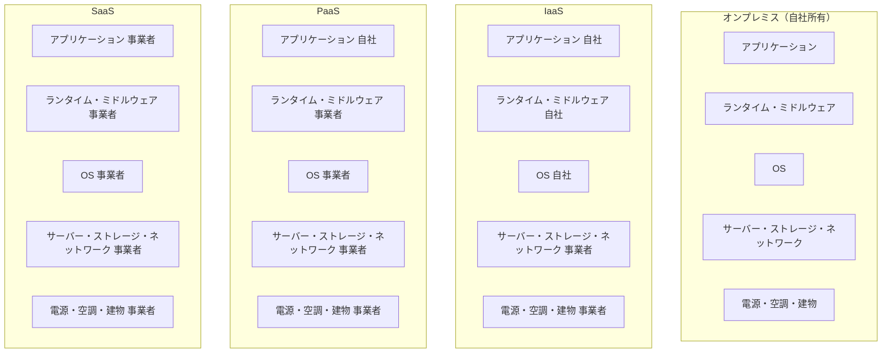
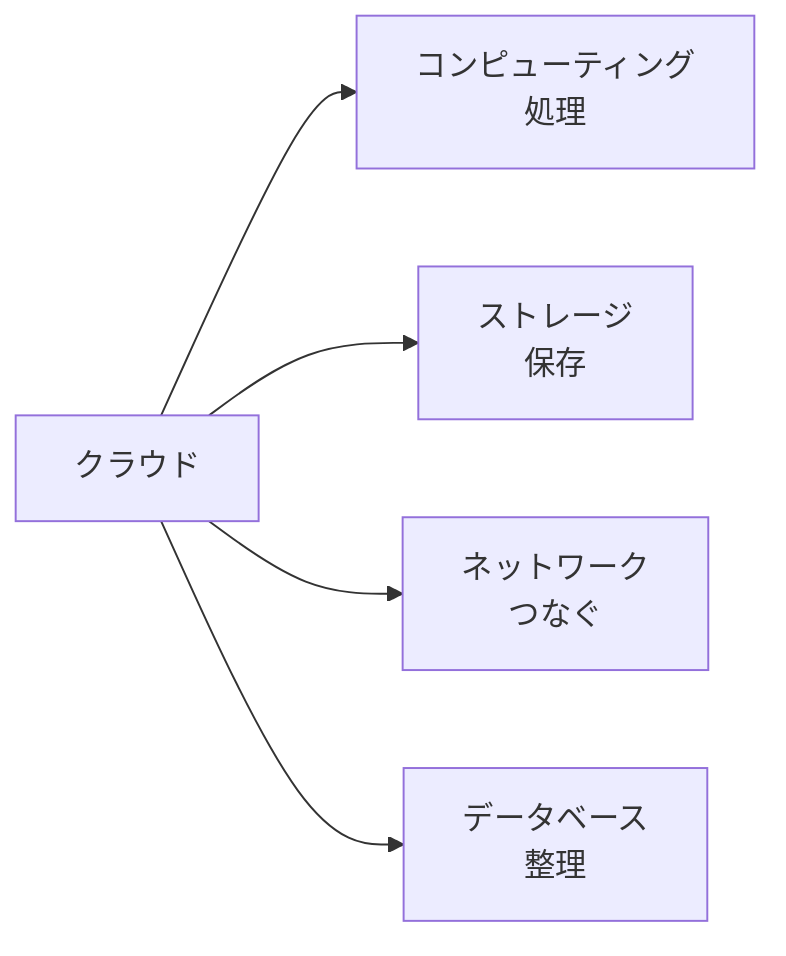
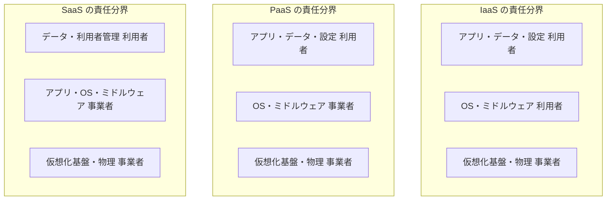

# クラウド入門

「クラウドに乗せる」って何のこと？——働く一人ひとりが押さえるクラウドの土台

| 項目 | 内容 |
|---|---|
| カテゴリー | IT基礎知識 |
| 難易度 | 初級 |
| 所要時間 | 約200分（全8レッスン） |
| 公開日 | 2026-06-17 |
| 最終更新日 | 2026-06-17 |
| コースURL | https://skillup.college/courses/it-basics/cloud-basics/ |

## 対象者

業種・職種を問わず、すべての社員にとって必要なクラウドの基礎を身につけたい方。IT 職でなくとも、SaaS を業務で使う方、経営者・事業責任者・情シス以外の管理職にも。情報セキュリティの基礎を学んだ方の次のステップとしても活用できる。

## 前提知識

特になし。PC・スマートフォン・メール・Web ブラウザの基本操作経験があれば十分。ネットワークやプログラミングの専門知識は不要。

## 学習目標

- クラウドの定義（NIST 5 つの本質的特徴）を理解し、オンプレミスとの違いを説明できる
- IaaS／PaaS／SaaS の階層と責任分界を整理し、業務で扱うサービスがどの階層に属するか判断できる
- 主要クラウドプロバイダー（AWS／Azure／GCP）の特徴と日本の選択肢を整理できる
- コンピューティング・ストレージ・ネットワーク・データベースの中核サービスを区別できる
- コンテナ・サーバーレス・マネージドサービスの位置づけを把握する
- クラウドのコスト構造を理解し、FinOps の発想で運用判断ができる
- 責任共有モデルを踏まえ、利用者が守るべき範囲を判断できる
- クラウド移行の選択肢（7R）、ハイブリッド・マルチクラウドの現実、2026 年時点の論点を整理できる

## コース概要

「うちもそろそろクラウドにしないと」「全部 AWS に乗せれば安く済むよ」——会議室でいまも聞こえる言葉です。一方で、クラウドに移行したのにコストが想定の 3 倍に膨らんだ、SaaS を入れすぎて誰がどのデータを管理しているか追えなくなった、という現場の悩みも増えています。クラウドは「特別な技術」ではなく、もはや業務システムの土台です。それでも「クラウドって結局なんですか」を腹落ちさせて説明できる人は、IT 職以外ではほとんど見かけません。本コースは、特別な技術知識のない方でも、IaaS／PaaS／SaaS の階層、主要プロバイダーの特徴、コストとセキュリティの考え方、移行の選択肢を、8 レッスンで体系的に学びます。特定クラウドの操作画面や設定手順には踏み込みません。代わりに、「クラウドという土台の上で意思決定する人」が現場で迷わない発想を、現場の事例と「2026 年 6 月時点の最新動向」を交えて整理します。経営者・事業責任者・情シス以外の管理職・SaaS を業務で使う社員にとって、業務判断の土台になる内容です。

## 学習の流れ

レッスン 1 でクラウドの定義（NIST の 5 つの本質的特徴）とオンプレミスとの違いを整理します。レッスン 2 は IaaS／PaaS／SaaS の 3 階層と責任分界を「ピザ屋の例え」で腹落ちさせます。レッスン 3 は主要クラウドプロバイダー（AWS・Azure・GCP）と日本の選択肢を 2026 年 6 月時点の市場感を踏まえて整理します。レッスン 4 はクラウドの中核サービス（コンピューティング・ストレージ・ネットワーク・データベース）を 3 社の代表サービス名で対比します。レッスン 5 はコンテナ・サーバーレス・マネージドサービスといった「モダンな実行環境」の位置づけを扱います。レッスン 6 は「クラウドは安い」神話への批判として、FinOps の発想で運用判断する考え方を学びます。レッスン 7 は「責任共有モデル」を中心に、クラウド時代のセキュリティ運用を整理します。最後のレッスン 8 で、クラウド移行の 7R、ハイブリッド・マルチクラウドの現実、2026 年 6 月時点の論点（AI エージェント実行環境、SBOM、PQC）、修了後の学習方向を案内します。前半（レッスン 1〜3）は「土台の発想」、中盤（レッスン 4〜6）は「サービスとコスト」、後半（レッスン 7〜8）は「セキュリティと未来」という三段構えです。

## レッスン一覧

| No. | タイトル | 概要 | 所要時間 |
|---|---|---|---|
| 1 | クラウドとは何か——「コンピューターを借りる」発想の転換 | クラウドコンピューティングの定義、オンプレミスとの違い、NIST の 5 つの本質的特徴、なぜクラウドが普及したのか、本コースの守備範囲を学ぶ | 25分 |
| 2 | IaaS／PaaS／SaaS——3 つの提供形態の階層 | IaaS・PaaS・SaaS の違い、責任分界の仕組み、オンプレ・コロケーション・マネージドサービスの位置づけ、FaaS（サーバーレス）の予告を学ぶ | 25分 |
| 3 | 主要クラウドプロバイダー——AWS・Azure・GCP と日本の選択肢 | AWS・Azure・GCP の特徴とシェア感、Alibaba Cloud・Oracle Cloud、日本のさくら・IDCF・Nifty・NTT 系、プライベートクラウド、業界別の選定傾向を学ぶ | 25分 |
| 4 | クラウドの中核サービス——コンピューティング・ストレージ・ネットワーク・データベース | 仮想マシン、オブジェクトストレージ、ブロックストレージ、VPC・サブネット・DNS・ロードバランサー、マネージド RDB・NoSQL・データウェアハウスの概観を学ぶ | 25分 |
| 5 | コンテナ・サーバーレス・マネージドサービス——モダンな実行環境 | Docker と Kubernetes の概念、マネージド Kubernetes、コンテナ実行サービス、FaaS（サーバーレス）の使いどころ、マネージドサービスの設計判断を学ぶ | 25分 |
| 6 | クラウドのコストとガバナンス——FinOps の発想 | 従量課金の落とし穴、予約インスタンス・Savings Plans、タグ付けとコスト可視化、予算アラート、FinOps Foundation の発想、生成 AI 推論コストの不確実性を学ぶ | 25分 |
| 7 | クラウドのセキュリティ——責任共有モデルと設計の発想 | 責任共有モデル、IAM とアクセス制御、鍵管理（KMS）、VPC とネットワーク分離、暗号化、ログと監査、クラウド時代のセキュリティ運用の考え方を学ぶ | 25分 |
| 8 | クラウド移行と次の選択——マルチクラウド・ハイブリッド・修了後 | クラウド移行の 7R、ハイブリッドクラウド、マルチクラウドの幻想と現実、ベンダーロックインの議論、AI エージェント実行環境、SBOM・PQC、修了後の学習方向を案内する | 25分 |

---

## レッスン1：クラウドとは何か——「コンピューターを借りる」発想の転換

（所要時間：25分）

### このレッスンで学ぶこと

- クラウドコンピューティングの定義を NIST の整理で理解する
- オンプレミスとクラウドの違いを「所有」と「利用」の対比で説明できる
- NIST が示す 5 つの本質的特徴を整理できる
- なぜクラウドが 2010 年代以降に急速に普及したのかを把握する
- 本コースの守備範囲と扱わない範囲を理解する

---

「うちもそろそろクラウドにしないと」「うちはまだクラウドじゃないから遅れている」——会議室でいまも聞こえる言葉です。一方で、「で、クラウドって結局なんですか」と改めて問われると、ITに関わる人でもうまく説明できないことが少なくありません。クラウドはもはや業務システムの土台ですが、その実体は「自分の会社の建物にコンピューターを置かず、外の事業者の設備を必要なときに借りて使う」という、ごく単純な発想の集まりです。本コースの出発点として、まずクラウドが何を意味するのか、何が変わったのかを、技術用語を抜きに整理します。

### クラウドコンピューティングの定義

クラウドコンピューティング（cloud computing）は、コンピューターの処理能力・保存場所・ソフトウェアなどを、ネットワーク越しに必要なときだけ利用する形態の総称です。

ポイントは、利用者が「自分でハードウェアを所有しない」「使いたいときに、使った分だけ料金を払う」「設備の調達・運用・廃棄を事業者に任せる」という 3 点にあります。電気・ガス・水道のように「インフラを使った量だけ支払う」発想に近く、英語圏では「ユーティリティコンピューティング（utility computing）」とも呼ばれてきました。

#### 公式定義はどこにあるか

クラウドの代表的な公式定義は、米国国立標準技術研究所（NIST：National Institute of Standards and Technology）が 2011 年 9 月に発行した『The NIST Definition of Cloud Computing』（SP 800-145）にあります。短い文書ですが、業界・学術・政府の文脈で「クラウドとは何か」を語るときに、いまでも基準点として参照されます。

> **💡 ポイント**
> NIST の定義は 2011 年に出されたものですが、2026 年の現在でも基本枠組みとして有効です。「クラウドとは何か」を社内で説明する場面では、NIST の整理を借りておくと議論がぶれにくくなります。

### オンプレミスとクラウドの違い

クラウドを理解する近道は、その対比であるオンプレミスを並べてみることです。

オンプレミス（on-premises）とは、自社の建物（敷地内）にサーバーを設置し、自分たちでネットワーク・電源・空調・運用を持って業務システムを動かす形態です。「オンプレ」と略されます。

両者の違いを、表で見てみましょう。

| 観点 | オンプレミス | クラウド |
|---|---|---|
| ハードウェアの所有 | 自社が購入・所有 | 事業者が所有 |
| 設置場所 | 自社の建物（または契約データセンター） | 事業者のデータセンター |
| 調達リードタイム | 数週間〜数か月 | 数分〜数時間 |
| 料金体系 | 初期投資（CAPEX）が大 | 利用量に応じた経費（OPEX）が中心 |
| 拡張・縮小 | 物理的な追加調達が必要 | ボタン操作で増減可能 |
| 故障対応 | 自社が部品交換・保守 | 事業者が対応 |
| 監視・運用 | 自社の運用チーム | 一部は事業者が担う |

#### 「持つ」から「使う」への発想転換

オンプレミスは「コンピューターを所有して使う」、クラウドは「コンピューターを必要なときに借りて使う」。この 1 行が、クラウドの本質です。所有から利用への発想転換が、コスト構造・運用体制・調達スピード・組織のスキルセットすべてに影響します。

「料金を払い続けるなら、買ったほうが安いのでは」と感じる方もいるかもしれません。設備を 5 年使い続けて稼働率が常に高ければ、自社所有のほうが原価が安くなる場合もあります。一方で、需要が読めない事業や急成長中の事業では、必要なときだけ借りられるクラウドの柔軟性が、所有のコスト優位を上回ります。この判断は、コースの後半（特にレッスン 6）で改めて整理します。

> **📝 補足**
> 「クラウド = インターネット越しのサーバー」と覚えるのは、入り口としては十分です。一方で、本講義では「単なる遠隔サーバー」と「クラウド」を区別します。違いは次に説明する 5 つの本質的特徴にあります。

### NIST が示す 5 つの本質的特徴

NIST の定義は、クラウドを名乗るために満たすべき 5 つの本質的特徴（essential characteristics）を挙げています。1 つずつ見ていきましょう。

1. **オンデマンド・セルフサービス（On-demand self-service）**：利用者が、人間の担当者を介さずに、自分で必要なリソースを増減できる
2. **広範なネットワークアクセス（Broad network access）**：標準的なネットワーク経由で、PC・スマートフォン・タブレットなど多様な端末から使える
3. **リソースプール（Resource pooling）**：事業者が大量の計算資源をプール（共有池）として持ち、複数の利用者に動的に割り当てる
4. **迅速な弾力性（Rapid elasticity）**：必要に応じてリソースをすばやく増やしたり減らしたりでき、利用者からは「無限にあるように」見える
5. **計測可能なサービス（Measured service）**：使用量が自動的に計測・記録され、利用者は使った分だけ支払う

#### 5 つの特徴を「水道」で例える

5 つの特徴を、日本語で身近に例えると次のようになります。

- **オンデマンド・セルフサービス**：蛇口をひねれば水が出る（職員に申請する必要がない）
- **広範なネットワークアクセス**：家・職場・公衆の水道、どこでも同じ規格の蛇口が使える
- **リソースプール**：浄水場が大量の水を貯めて、各家庭に必要量だけ送る
- **迅速な弾力性**：水を流しっぱなしにできる蛇口、止めれば消費が減る
- **計測可能なサービス**：水道メーターで使った量だけ請求される

「水道」というメタファーに完全に置き換えられるわけではありません。しかし、5 つの特徴を 1 つの絵で覚えるには有効です。

#### 5 つすべてが揃って「クラウド」

5 つの特徴のうち、どれか 1 つが欠けるだけで「単なる遠隔サーバー」になります。例えば、データセンター業者にサーバーを借りているだけでも、利用者が自分で増減できなければオンデマンド・セルフサービスを満たしません。これは伝統的なホスティング（hosting）と呼ばれ、クラウドとは区別されます。

> **⚠️ 注意**
> 「うちは社内サーバーをデータセンターに移したからクラウドだ」と説明する組織もありますが、5 つの特徴を満たしているとは限りません。クラウド事業者の本来の意味では、NIST の 5 つの特徴を満たすサービスを指します。

### なぜクラウドが普及したのか

クラウドという発想自体は古くからあります。一方で、業界全体に広がったのは 2010 年代以降です。普及の背景には、3 つの大きな流れがあります。

#### 1. 大規模インフラの登場

2006 年に Amazon が S3（Simple Storage Service）と EC2（Elastic Compute Cloud）の提供を開始したことが、現代クラウドの実質的な出発点です。Amazon は自社の巨大な EC（電子商取引）サイトを支えるためのインフラを、外部にも貸し出す事業として立ち上げました。これに続いて、Microsoft が 2010 年に Azure を正式提供開始、Google が 2008 年に App Engine、2013 年に Compute Engine を提供開始し、3 強の構図ができていきました。日本でも、さくらインターネット・IDC フロンティア・NIFCLOUD・NTT 系のサービスが同じ時期に進化していきました。

#### 2. スマートフォンと API エコノミー

スマートフォンの普及（2010 年代前半〜）により、業務もプライベートも「いつでもどこでも」つながる前提になりました。多様な端末を支えるには、自社サーバーよりもクラウドのほうが運用しやすい状況が生まれます。同時期に、SaaS のサービス同士が API（Application Programming Interface：ソフトウェア同士の連絡口）でつながる「API エコノミー」が広がり、業務システムの組み合わせ方が大きく変わりました。

#### 3. テレワークと事業継続

2020 年代に入ると、テレワーク（在宅勤務）の急速な普及、災害・パンデミックといった非常事態への備え、事業継続計画（BCP：Business Continuity Plan）の見直しが進みました。自社建物に依存する仕組みからクラウドに移すことで、社員がどこからでも業務にアクセスでき、特定の事務所が使えなくなっても事業が継続できる利点が再認識されました。

2026 年 6 月時点では、上場企業のほぼ全社が何らかのクラウドサービス（特に SaaS）を業務で利用している状況にあります。

### 本コースの守備範囲

最後に、本コースで扱う範囲と扱わない範囲を整理しておきます。

#### 扱う範囲

- クラウドの定義と NIST の 5 つの本質的特徴（本レッスン）
- IaaS／PaaS／SaaS の 3 階層と責任分界（レッスン 2）
- AWS／Azure／GCP と日本の選択肢（レッスン 3）
- コンピューティング・ストレージ・ネットワーク・データベースの中核サービス（レッスン 4）
- コンテナ・サーバーレス・マネージドサービス（レッスン 5）
- コストとガバナンス、FinOps の発想（レッスン 6）
- 責任共有モデル、IAM、鍵管理、ログと監査（レッスン 7）
- クラウド移行の 7R、マルチクラウド・ハイブリッド、AI エージェント実行環境、SBOM・PQC（レッスン 8）

#### 扱わない範囲

- 特定クラウドの操作画面・API・コマンド例・IaC（Infrastructure as Code）のコード
- 特定 SaaS 製品の操作手順や設定（公式ドキュメントを参照）
- ネットワーク・OS の専門知識（別の専門書・コースを参照）
- 暗号アルゴリズムや認証プロトコルの数学的詳細
- 「AWS 認定資格」「Azure 認定資格」「Google Cloud 認定資格」など個別試験対策の網羅性
- フィッシング・マルウェアといった攻撃手法の詳細（情報セキュリティの守備範囲）

#### スタンス

本コースは、クラウドを「特別な技術の話」ではなく「業務システムの土台として理解し、判断できる基本リテラシー」として扱います。同時に、「クラウドに乗せれば全部解決」という発想とも、「クラウドは危ないからオンプレが安全」という発想とも距離を置きます。要件から逆算してクラウドという道具を選び、コスト・セキュリティ・運用のバランスを取る判断軸を、現場の感覚も交えて持ち帰っていただくのが目的です。

特定のクラウド事業者（AWS／Azure／GCP）を推す立場は取りません。レッスン 3 で 3 社の特徴を整理しますが、優劣の判定ではなく「要件で選ぶための観点」を伝えるのが本コースの姿勢です。

### まとめ

このレッスンでは、以下のことを学びました。

- クラウドコンピューティングは、コンピューターの処理能力・保存場所・ソフトウェアをネットワーク越しに必要なときだけ使う形態
- NIST の『The NIST Definition of Cloud Computing』（SP 800-145、2011 年）が公式定義の基準
- オンプレミスは「所有して使う」、クラウドは「借りて使う」発想
- NIST が示す 5 つの本質的特徴：オンデマンド・セルフサービス、広範なネットワークアクセス、リソースプール、迅速な弾力性、計測可能なサービス
- 5 つすべてが揃って「クラウド」と呼べる。1 つでも欠けると単なる遠隔サーバー
- 普及の背景には大規模インフラの登場、スマートフォンと API エコノミー、テレワークと事業継続の 3 つの流れがある
- 本コースは「特別な技術」ではなく「業務の土台を理解する基本リテラシー」として扱う

次のレッスンでは、IaaS／PaaS／SaaS の 3 階層と責任分界の発想を、ピザ屋の例えで腹落ちするように整理します。

---

### 確認クイズ

このレッスンの理解度をチェックしましょう。

#### Q1. 本レッスンが説明した「クラウドコンピューティング」の定義として、最も適切なものはどれか？

- [x] コンピューターの処理能力・保存場所・ソフトウェアを、ネットワーク越しに必要なときだけ利用する形態。利用者は自分でハードウェアを所有せず、使った分だけ料金を払い、設備の調達・運用・廃棄を事業者に任せる
- [ ] 自社の建物にサーバーを設置し、自分たちでネットワーク・電源・空調・運用を持って業務システムを動かす形態
- [ ] スマートフォンのアプリで動くサービス全般を指す総称
- [ ] 暗号化された通信を使うインターネットサービスのこと

> **解説**
> クラウドコンピューティングは、コンピューターの処理能力・保存場所・ソフトウェアをネットワーク越しに必要なときだけ使う形態で、「所有しない」「使った分だけ払う」「運用を事業者に任せる」の 3 点が特徴です。2 番目はオンプレミスの説明、3 番目はモバイルアプリ全般、4 番目は HTTPS など個別技術の説明であり、いずれも不正確です。

#### Q2. クラウドの公式定義の基準とされる文書はどれか？

- [ ] ISO 27001：2022（情報セキュリティマネジメントシステム）
- [x] NIST『The NIST Definition of Cloud Computing』（SP 800-145、2011 年 9 月発行）
- [ ] IPA『DX 推進指標』
- [ ] 経済産業省『クラウド利用ガイドライン』

> **解説**
> クラウドの代表的な公式定義は、米国国立標準技術研究所（NIST）が 2011 年 9 月に発行した『The NIST Definition of Cloud Computing』（SP 800-145）にあります。2026 年現在も業界・学術・政府の文脈で参照される基準点です。ISO 27001 は情報セキュリティ全般、DX 推進指標やクラウド利用ガイドラインも別の目的の文書です。

#### Q3. オンプレミスとクラウドの違いの説明として、本レッスンが示した内容はどれか？

- [ ] オンプレミスは料金が高く、クラウドは常に安い
- [ ] オンプレミスは古い技術で、クラウドは新しい技術である
- [x] オンプレミスは「所有して使う」、クラウドは「借りて使う」発想。所有から利用への発想転換が、コスト構造・運用体制・調達スピード・組織のスキルセットすべてに影響する
- [ ] オンプレミスはセキュリティが弱く、クラウドは常に安全である

> **解説**
> オンプレミスとクラウドの違いの本質は「所有」と「利用」の発想転換にあります。設備を 5 年フル稼働で使い続ければオンプレが安くなる場合もあり、クラウドが常に安いわけではありません。新旧・安全性の優劣で語るのも本講義の立場とは異なります。

#### Q4. NIST が示すクラウドの 5 つの本質的特徴に含まれないものはどれか？

- [ ] オンデマンド・セルフサービス
- [ ] 広範なネットワークアクセス
- [ ] リソースプール
- [x] サーバーの物理所有を利用者に義務付けること

> **解説**
> NIST の 5 つの本質的特徴は「オンデマンド・セルフサービス」「広範なネットワークアクセス」「リソースプール」「迅速な弾力性」「計測可能なサービス」です。物理的なサーバー所有はオンプレミスの特徴で、クラウドではむしろ「所有しない」ことが前提です。

#### Q5. 「迅速な弾力性（Rapid elasticity）」の意味として、本レッスンが説明した内容はどれか？

- [x] 必要に応じてリソースをすばやく増やしたり減らしたりでき、利用者からは「無限にあるように」見える特徴
- [ ] 物理的に壊れにくいハードウェアを使う特徴
- [ ] 利用者がコンピューターを購入する権利を持つ特徴
- [ ] ネットワーク接続が常に高速である特徴

> **解説**
> 迅速な弾力性は、必要に応じてリソースを急増・急減でき、利用者から見ると「無限にあるように」感じる特徴です。ハードウェアの物理耐久性、購入権、ネットワーク速度はいずれも別の論点で、本特徴とは関係ありません。

#### Q6. 講師の現場メモが示す「通信キャリア時代のクラウド移行への抵抗」のエピソードから、本レッスンが伝えたメッセージはどれか？

- [ ] クラウドは必ずオンプレより優れているので、抵抗を押し切って導入すべき
- [ ] オンプレが必ず正しいので、クラウドへの移行は誤りである
- [ ] 特定のクラウド事業者（AWS／Azure／GCP）を推して、競合を排除すべき
- [x] 技術の優位性だけでは組織は動かない。クラウドの普及には時間が要り、本コースは「特定クラウドの宗教戦争に乗らず、要件で選ぶ」というスタンスを取る

> **解説**
> エピソードでは、3 年経って同じお客様が自ら「クラウドにしたい」と打診してきました。技術の優位性は理屈ではわかっていても、組織の意思決定には時間と外部環境の変化が必要だった、という学びです。本コースは特定クラウドを推さず、要件で選ぶスタンスを取ります。

---

## レッスン2：IaaS／PaaS／SaaS——3 つの提供形態の階層

（所要時間：25分）

### このレッスンで学ぶこと

- IaaS・PaaS・SaaS の 3 つの提供形態を区別できる
- 各階層で利用者と事業者の責任分界がどう変わるかを説明できる
- ピザ屋の例えで 3 階層を腹落ちさせる
- オンプレミス・コロケーション・マネージドサービスの位置づけを把握する
- FaaS（サーバーレス）の予告を理解する

---

前のレッスンでは、クラウドの定義と NIST が示す 5 つの本質的特徴を整理しました。今回のレッスンでは、クラウドサービスを語るときに必ず登場する 3 つの提供形態、IaaS・PaaS・SaaS の階層を扱います。同じ「クラウド」でも、どの階層を借りるかで、利用者の責任範囲も、運用の手間も、コスト構造も大きく変わります。この階層を理解できれば、社内で「うちのシステムは IaaS にすべきか、SaaS で十分か」を話し合えるようになります。

### クラウドの 3 階層

クラウドサービスは、提供範囲の広さによって、伝統的に 3 つの階層に分けて語られます。

| 階層 | 略称 | 提供される範囲 | 代表サービスの例 |
|---|---|---|---|
| Infrastructure as a Service | IaaS | サーバー・ストレージ・ネットワークの「インフラ」 | Amazon EC2、Azure Virtual Machines、Google Compute Engine |
| Platform as a Service | PaaS | インフラ＋ OS ＋ DB ＋アプリ実行基盤 | Heroku、Azure App Service、Google App Engine |
| Software as a Service | SaaS | 業務に使えるアプリケーションそのもの | Microsoft 365、Salesforce、Slack、Workday |

「Infrastructure（インフラ）」「Platform（プラットフォーム）」「Software（ソフトウェア）」と、提供される範囲が下から上に積み上がるイメージです。「下の階層」を借りるほど自由度が高く、「上の階層」を借りるほど運用が楽になります。

#### 階層を図で見る

3 階層を構成要素のレイヤーで描くと、次のようになります。

上に行くほど自社が管理する範囲（青く塗りたいレイヤー）が減り、事業者に任せる範囲が増えていきます。逆に、上に行くほど「自社の業務に合わせて細かく作り込む自由」は減ります。

> **💡 ポイント**
> 「クラウド」と一括りに語ると、組織内で議論がかみ合わなくなります。「うちは IaaS に乗せるのか、SaaS で十分か」を最初に決めるだけで、検討の半分は終わります。

### ピザ屋の例え

3 階層を「ピザを食べる方法」で例える、業界で有名な比喩があります。

| ピザを食べる方法 | クラウドでの対応 |
|---|---|
| 材料を全部買って、自宅で生地から作って焼いて食べる | オンプレミス |
| 生地と具材は別々に買って、自宅で組み合わせて焼いて食べる | IaaS |
| 出来上がったピザ生地（ベース）を買って、自宅で具材を乗せて焼いて食べる | PaaS |
| 出来上がったピザを注文して、自宅で食べる（皿だけ自分で用意） | SaaS |

「皿（運用ルール・社員教育）」だけは、どの形態でも自社で用意します。

#### この例えで腹落ちすること

- どの階層でも「食べる人（利用者）」の責任はゼロにはならない
- 上の階層に行くほど、楽だけれど、自分の好みに合わせて作り込む自由は減る
- 下の階層に行くほど、自由だけれど、運用の手間と専門知識が必要になる
- 「IaaS が一番偉い」「SaaS が一番楽だから最高」というのは正しくない。要件で選ぶ

> **📝 補足**
> 「材料を全部買って自宅で作る」が「オンプレミスより難しい」と感じる方もいるかもしれません。実際には、オンプレでは小麦の畑から所有する必要はなく、ハードウェアを買うのも事業者からの調達です。比喩の精度はここまでです。

### 各階層の責任分界

3 階層の本質は、「責任分界」がどこにあるかという問題です。

#### IaaS の責任分界

IaaS（Infrastructure as a Service）は、サーバー・ストレージ・ネットワーク・データセンターの物理設備を事業者が提供し、その上の OS ・ミドルウェア・アプリケーションの運用を利用者が担う形態です。

- **事業者が管理**：物理サーバー、ハードディスク、物理ネットワーク機器、電源、空調、建物のセキュリティ
- **利用者が管理**：OS のパッチ適用、ミドルウェアの設定、アプリケーションの開発・運用、データ管理、ネットワーク設定（仮想ネットワークの構成）

IaaS の代表例は、AWS の Amazon EC2、Azure の Azure Virtual Machines、Google Cloud の Compute Engine です。仮想マシン（virtual machine：物理サーバー上に作る論理的なコンピューター）を借りて、自社の OS と業務アプリを動かす形が典型的です。

IaaS は「自由度の高さ」が魅力です。OS の種類、ミドルウェアのバージョン、ネットワーク構成を自社の判断で決められます。一方で、運用の手間と OS レベルの専門知識が必要になります。

#### PaaS の責任分界

PaaS（Platform as a Service）は、IaaS に加えて、OS とアプリ実行基盤（ランタイム・ミドルウェア）を事業者が提供する形態です。

- **事業者が管理**：物理設備、OS、ミドルウェア、アプリの実行基盤（言語ランタイム、Web サーバー、データベースエンジンなど）
- **利用者が管理**：アプリケーションのコード、データ、設定ファイル

PaaS の代表例は、Heroku、Azure App Service、Google App Engine、AWS Elastic Beanstalk です。開発者は「コードをデプロイするだけで動く」状態を得られます。

PaaS の魅力は「OS パッチや実行基盤の運用から解放される」ことです。スタートアップや小規模チームが、運用人員を増やさずにサービスを動かせる利点があります。一方で、対応する言語・ミドルウェアの種類は事業者が決めるため、特殊な要件には合わせづらいことがあります。

#### SaaS の責任分界

SaaS（Software as a Service）は、業務に使えるアプリケーションそのものを事業者が提供する形態です。

- **事業者が管理**：物理設備、OS、ミドルウェア、アプリケーション本体、アップデート、機能改善
- **利用者が管理**：利用者のアカウント管理、データの入力・管理、利用ルール、業務プロセス

SaaS の代表例は、Microsoft 365、Google Workspace、Salesforce、Slack、Workday、Zoom、Notion、Asana など、業務で使うクラウドサービスのほぼすべてです。

SaaS の魅力は「契約してアカウントを発行すれば、すぐに業務で使える」点です。インフラ・アプリ運用の手間がほぼゼロになります。一方で、自社の業務プロセスを SaaS の仕様に合わせる必要があり、機能のカスタマイズには限界があります。

#### 「上ほど楽、下ほど自由」のトレードオフ

3 階層の責任分界は、「楽さ」と「自由度」のトレードオフを示しています。SaaS は最も楽ですが、業務を SaaS に合わせます。IaaS は最も自由ですが、運用の負担が大きくなります。組織の規模・スキル・予算・業務要件に応じて、どの階層を選ぶか（あるいはレイヤーで使い分けるか）が現場の判断です。

> **⚠️ 注意**
> 「全部 SaaS にすれば楽」と単純化するのは危険です。SaaS が乱立すると、データが各 SaaS に分散し、退職者管理・コンプライアンス対応が複雑になります。SaaS の利用統制は、レッスン 7 のセキュリティで再び触れます。

### オンプレ・コロケーション・マネージドサービスの位置づけ

クラウドの 3 階層の周辺には、いくつかの「中間の選択肢」があります。

#### コロケーション（colocation）

自社が所有するサーバー機器を、事業者のデータセンターに置かせてもらう形態です。設備（電源・空調・建物・物理ネットワーク）は事業者の責任、ハードウェアと OS 以上は自社の責任になります。災害対策・回線品質・物理セキュリティの観点で、自社建物より優れるため、いまでも採用されます。「ハウジング（housing）」とも呼ばれます。

#### ハウステッド（hosted）／レンタルサーバー

事業者がハードウェアを所有し、利用者に専有または共有で貸し出す形態。「レンタルサーバー」「専用サーバー」「VPS（Virtual Private Server）」が該当します。NIST のクラウドの 5 つの特徴（特にオンデマンド・セルフサービス、迅速な弾力性、計測可能なサービス）を満たさないことが多く、クラウドとは区別されます。

#### マネージドサービス（managed service）

事業者が運用を一部または全部代行するサービスです。マネージド DB・マネージド Kubernetes など、特定のソフトウェアの運用を引き受けるサービスを指します。クラウド事業者の標準サービスの多くは、すでにマネージドサービスの性格を持ちます。

#### FaaS（サーバーレス）

PaaS の先にある形態として、FaaS（Function as a Service：関数単位での実行サービス）があります。利用者は「関数（短いプログラムの断片）」をアップロードするだけで、サーバーの存在を意識せずに処理を実行できます。代表例は AWS Lambda、Azure Functions、Google Cloud Functions です。「サーバーレス（serverless）」と呼ばれ、レッスン 5 で詳しく扱います。

### 3 階層をどう使い分けるか

実際の業務では、3 階層を組み合わせて使うことが普通です。

- **メール・チャット・ファイル共有**：SaaS（Microsoft 365、Google Workspace、Slack など）
- **顧客管理・営業支援**：SaaS（Salesforce、HubSpot など）
- **社内業務システム**：IaaS または PaaS で自社開発、あるいは SaaS で代替
- **データ分析基盤**：PaaS のデータウェアハウス、または IaaS 上に構築
- **業務に必須の特殊要件アプリ**：IaaS でフル自社開発

経営層が「うちはクラウドにしたい」と言ったとき、現場で起きるのは「どの階層を、どの業務領域に当てるか」の議論です。3 階層を区別する語彙を持つことで、その議論を建設的に進められます。

### まとめ

このレッスンでは、以下のことを学びました。

- クラウドサービスは IaaS・PaaS・SaaS の 3 階層で語られる
- IaaS はインフラ、PaaS はインフラ＋実行基盤、SaaS はアプリそのものを事業者が提供
- 上に行くほど楽だが自由度が下がり、下に行くほど自由だが運用の手間と専門知識が必要
- ピザ屋の例え：材料から作る（オンプレ）、生地から（IaaS）、ベースに乗せて（PaaS）、出来上がり（SaaS）
- コロケーション・ホスティング・マネージドサービスは「中間の選択肢」、ホスティングは NIST 5 特徴の多くを満たさず、クラウドとは区別される
- FaaS（サーバーレス）は PaaS の先にある形態で、レッスン 5 で詳しく扱う
- 業務領域ごとに 3 階層を使い分けるのが現実の運用

次のレッスンでは、主要クラウドプロバイダー（AWS・Azure・GCP）の特徴と、日本の選択肢、業界別の選定傾向を整理します。

---

### 確認クイズ

このレッスンの理解度をチェックしましょう。

#### Q1. IaaS の説明として最も適切なものはどれか？

- [ ] アプリケーションそのものを事業者が提供する形態で、業務に使える状態で届く
- [x] サーバー・ストレージ・ネットワーク・データセンターの物理設備を事業者が提供し、その上の OS ・ミドルウェア・アプリケーションの運用を利用者が担う形態
- [ ] 自社の建物にサーバーを設置して、すべてを自前で運用する形態
- [ ] アプリ実行基盤（言語ランタイム・Web サーバー）まで事業者が提供し、利用者はコードを書くだけで動く形態

> **解説**
> IaaS は「インフラ層」を事業者が提供し、OS 以上は利用者が運用する形態です。1 番目は SaaS、3 番目はオンプレミス、4 番目は PaaS の説明です。自由度が高い反面、OS レベルの専門知識と運用負担が要ります。

#### Q2. PaaS の利用者責任の範囲として、本レッスンが説明した内容はどれか？

- [ ] 物理サーバーの保守、OS のパッチ、ミドルウェアのアップデートまでをすべて利用者が行う
- [x] アプリケーションのコード、データ、設定ファイルを利用者が管理し、物理設備・OS・ミドルウェア・実行基盤は事業者が管理する
- [ ] アプリケーションも事業者が管理し、利用者はアカウント発行だけを行う
- [ ] OS のインストールだけを利用者が行い、それ以上は事業者がすべて担う

> **解説**
> PaaS は実行基盤までを事業者が提供する形態で、利用者はアプリのコード・データ・設定の管理を担います。1 番目はオンプレミスまたは IaaS、3 番目は SaaS、4 番目はあり得ない分担で、いずれも誤りです。

#### Q3. 「ピザ屋の例え」で、SaaS にあたるのはどれか？

- [ ] 材料を全部買って、自宅で生地から作って焼いて食べる
- [ ] 生地と具材は別々に買って、自宅で組み合わせて焼いて食べる
- [x] 出来上がったピザを注文して、自宅で食べる（皿だけ自分で用意する）
- [ ] 出来上がったピザ生地（ベース）を買って、自宅で具材を乗せて焼いて食べる

> **解説**
> 「出来上がったピザを注文する（皿だけ自分で用意）」が SaaS に対応します。1 番目はオンプレミス、2 番目は IaaS、4 番目は PaaS にあたります。SaaS でも「皿」（運用ルール・社員教育・アカウント管理）は自社で用意します。

#### Q4. クラウドの 3 階層の関係について、本レッスンが伝えた内容はどれか？

- [ ] SaaS が常に最も優れている。すべての業務を SaaS に統一すべきである
- [ ] IaaS が最も自由なので、組織は必ず IaaS を選ぶべきである
- [ ] PaaS は廃止予定の旧式概念であり、現代では使われない
- [x] 上に行くほど楽だが自由度が下がり、下に行くほど自由だが運用の手間と専門知識が必要。組織の規模・スキル・予算・業務要件に応じて、業務領域ごとに 3 階層を使い分けるのが現実の運用

> **解説**
> 3 階層は「楽さ」と「自由度」のトレードオフです。どれが正解かは要件次第で、業務領域ごとに使い分けるのが普通です。「SaaS 一択」「IaaS 一択」「PaaS は廃止」はいずれも正しくありません。

#### Q5. 「コロケーション（ハウジング）」の説明として、本レッスンが示した内容はどれか？

- [x] 自社が所有するサーバー機器を、事業者のデータセンターに置かせてもらう形態。電源・空調・建物のセキュリティは事業者の責任、ハードウェアと OS 以上は自社の責任になる
- [ ] アプリケーションそのものを事業者が提供する形態
- [ ] OS のインストールまで事業者が行い、アプリ開発だけを利用者が行う形態
- [ ] 物理サーバーを所有せず、関数単位で処理を実行する形態

> **解説**
> コロケーションは「自社所有のサーバーを事業者の DC に置く」形態です。災害対策・回線品質・物理セキュリティの観点で自社建物より優れるため、いまでも採用されます。2 番目は SaaS、3 番目は PaaS、4 番目は FaaS（サーバーレス）の説明です。

#### Q6. 講師の現場メモが示す「ピザの例えで腹落ちした製造業の現場」のエピソードから、本レッスンが伝えたメッセージはどれか？

- [ ] 技術用語を厳密に説明することが、現場の意思決定を最も進める
- [ ] 経営層には IaaS を強く推薦するのが正しい
- [ ] 比喩は不正確なので使うべきではない
- [x] 技術用語より腹落ちする比喩のほうが、現場の業務判断を進めることがある。経営層が「うちはどの階層を選ぶか」を自分の言葉で語れるようになれば、検討は前に進む

> **解説**
> エピソードは「ピザの例えで社長が膝を打ち、経営層自身が業務領域ごとの使い分けを語り出した」場面です。技術用語の厳密性より、相手が自分の言葉で語れる比喩のほうが、業務判断を進めます。比喩は不正確になりがちですが、入り口としては有効です。

---

## レッスン3：主要クラウドプロバイダー——AWS・Azure・GCP と日本の選択肢

（所要時間：25分）

### このレッスンで学ぶこと

- AWS・Azure・GCP の 3 大プロバイダーの特徴と歴史を整理できる
- 2026 年 6 月時点の市場感を把握する
- Alibaba Cloud・Oracle Cloud の位置づけを理解する
- 日本の選択肢（さくらインターネット・IDC フロンティア・NTT 系など）を知る
- プライベートクラウドの位置づけを把握する
- 業界別の選定傾向を整理する

---

前のレッスンでは、クラウドの 3 階層（IaaS・PaaS・SaaS）と責任分界の発想を整理しました。今回のレッスンでは、視点を切り替えて、世界の主要なクラウドプロバイダーを概観します。AWS・Azure・GCP の 3 強を中心に、特徴と典型的な選定理由、日本独自の選択肢を扱います。本コースは特定プロバイダーを推す立場を取りません。「特徴を整理して、自社の要件で選ぶための観点」を伝えます。

### 3 大プロバイダーの全体像

2026 年 6 月時点で、グローバルな業務用クラウド市場は AWS・Azure・Google Cloud の 3 社が中心です。3 社それぞれに歴史と強みがあります。

| プロバイダー | 提供企業 | 主な提供開始年 | 特徴 |
|---|---|---|---|
| AWS（Amazon Web Services） | Amazon.com | 2006 年（S3・EC2） | 先発の優位、サービス数が圧倒的に多い、エコシステムが厚い |
| Microsoft Azure | Microsoft | 2010 年（正式提供開始、当初の名称は Windows Azure） | Microsoft 製品（Windows Server・Active Directory・Microsoft 365）との親和性、エンタープライズ営業の強さ |
| Google Cloud（GCP） | Google（Alphabet） | 2008 年 App Engine／2013 年 Compute Engine | データ分析・AI／機械学習・Kubernetes 関連の強さ、Google の社内インフラ技術を外販する形 |

3 社のクラウド事業は、いずれも親会社の主力事業（Amazon の EC、Microsoft の Office・Windows、Google の検索・広告）とは別の収益源として、それぞれ 10 年以上かけて成長してきました。

> **💡 ポイント**
> 「3 社のうちどれが一番か」という議論は、業界で繰り返されてきました。本コースは「どれかが絶対に優れている」とは語りません。要件次第で答えは変わります。

### AWS——先発の優位と豊富なサービス

AWS（Amazon Web Services）は、現代クラウドの実質的な出発点を作ったプロバイダーです。

#### 歴史と背景

2006 年に S3（Simple Storage Service：オブジェクトストレージ）と EC2（Elastic Compute Cloud：仮想マシン）の一般提供を開始しました。Amazon の EC（電子商取引）サイトを支えるために自社で築いたインフラを、外部にも貸し出す事業として立ち上げたのが起源です。「インフラを社外にも貸す」という発想自体が当時は新しく、業界の常識を塗り替えました。

#### 特徴

- **サービス数の多さ**：他社を圧倒する数のサービスを提供している（2026 年時点で 200 を超える）
- **エコシステムの厚さ**：書籍・教育コンテンツ・コミュニティ・パートナー企業の数で他社を上回る
- **先発の優位**：早期に普及したため、エンジニアの絶対数が多く、採用や学習がしやすい
- **国際的なシェア**：2026 年 6 月時点で、グローバルな業務用クラウド市場でシェア首位

#### 典型的な選定理由

- 大規模・複雑なシステムを構築する場合
- 多数のサービスを組み合わせて作り込みたい場合
- 先発の事例とノウハウを活用したい場合
- パートナー企業のサポートが必要な場合

#### 注意点

サービス数が多いため、何をどう組み合わせるか自体が設計の対象になります。「全部 AWS で揃える」だけでは、コストが想定を超えやすくなります。

### Azure——Microsoft エコシステムとエンタープライズ親和性

Microsoft Azure は、Microsoft の Office・Windows Server・Active Directory といったエンタープライズ製品との親和性を最大の強みとするプロバイダーです。

#### 歴史と背景

2010 年に Windows Azure として正式提供を開始（後に Microsoft Azure と改称）しました。Microsoft は長年エンタープライズ向け IT 市場で強い地位を持っており、その顧客基盤に対して「既存の Microsoft 製品とつながるクラウド」を提供することで、急速にシェアを伸ばしました。

#### 特徴

- **Microsoft 製品との親和性**：Windows Server、SQL Server、Active Directory、Microsoft 365 とシームレスに連携
- **エンタープライズ営業**：日本でも大企業・官公庁との取引実績が豊富
- **ハイブリッド対応**：オンプレミスの Active Directory と Azure AD（Microsoft Entra ID）の連携など、ハイブリッド構成が組みやすい
- **C# ／ .NET フレンドリー**：Microsoft 系の開発言語・フレームワークと相性がよい

#### 典型的な選定理由

- すでに Microsoft 365 を使っており、認証基盤を統一したい場合
- Windows Server や SQL Server などの Microsoft 製品をクラウドに乗せ替える場合
- 既存のエンタープライズ営業ルートで購入したい場合
- ハイブリッドクラウドを段階的に進める場合

#### 注意点

Microsoft 製品との連携が強い反面、Microsoft 以外の技術スタック（特定の OSS 系）では AWS や GCP のほうが選択肢が多いことがあります。

### Google Cloud（GCP）——データ・AI の強さと先進性

Google Cloud Platform（略して GCP）は、Google が社内インフラ向けに開発してきた先進的な技術を外部に提供する形で進化してきました。

#### 歴史と背景

2008 年に App Engine（PaaS）を公開、2013 年に Compute Engine（IaaS）を提供開始しました。AWS や Azure に比べると後発でしたが、Google の検索・広告事業を支える世界最大級のインフラを背景に、独自の強みを築きました。

#### 特徴

- **データ分析の強さ**：BigQuery（マネージドのデータウェアハウス）が代表的。大規模データの分析を高速に行える
- **AI ／機械学習の強さ**：Vertex AI（ML プラットフォーム）、TensorFlow（Google が開発した ML フレームワーク）など、機械学習・生成 AI 領域での蓄積
- **Kubernetes の本家**：Kubernetes は Google 社内で使われていた Borg を起源とし、Google が中心となって OSS 化した。マネージド Kubernetes の GKE（Google Kubernetes Engine）は同サービス分野で先行
- **ネットワークの先進性**：Google の世界規模のバックボーンネットワークを利用できる

#### 典型的な選定理由

- 大規模なデータ分析基盤を構築したい場合
- 機械学習・生成 AI のワークロードを動かしたい場合
- Kubernetes をフル活用するクラウドネイティブな設計を採りたい場合
- スタートアップで先進的な技術スタックを採りたい場合

#### 注意点

エンタープライズ営業の浸透度では Azure に比べて弱いと言われてきました（近年改善傾向）。日本では AWS や Azure に比べると相対的にユーザー数が少ない時期がありましたが、生成 AI の台頭で利用が広がっています。

### 2026 年 6 月時点の市場感

2026 年 6 月時点で、グローバルな業務用クラウド市場のシェアは、おおよそ次の順位で語られています。

1. AWS が首位
2. Azure が 2 位
3. Google Cloud が 3 位
4. Alibaba Cloud（後述）・Oracle Cloud・IBM Cloud などが追随

シェアの具体的な数値は公開調査機関によって幅があり、半期で変動します。本コースでは「大まかな順位」までを示し、具体的なパーセンテージは触れません。最新の調査値が必要なときは、Gartner や Synergy Research Group などの公開レポートを参照してください。

> **📝 補足**
> 生成 AI の台頭により、各社のクラウドの伸びには大きな影響が出ています。2024〜2025 年は AI 関連の需要が GPU 不足を引き起こし、各社の収益・サービス構成・価格戦略が大きく変動しました。2026 年 6 月時点では落ち着きが見え始めましたが、シェアの順位は数四半期で動く可能性があります。

### Alibaba Cloud・Oracle Cloud——4 番手以降

3 強の後を追う事業者としては、Alibaba Cloud と Oracle Cloud の名前が挙がります。

#### Alibaba Cloud

中国の Alibaba Group が運営するクラウド事業者です。中国国内・東南アジア・中東で強い存在感を持ちます。日本企業が東南アジアでビジネスを展開する場合の選択肢として登場することがあります。地政学的な観点（米中関係・データ越境）から、業務利用の判断は慎重に行われます。

#### Oracle Cloud（OCI）

Oracle Cloud Infrastructure（OCI）は、Oracle が運営するクラウドです。Oracle Database のユーザー基盤を活かし、データベース中心のワークロードで競争力を持ちます。「Oracle Database をクラウドに乗せ替えたい」という案件で選ばれることがあります。

その他、IBM Cloud、Salesforce のクラウド（業務 SaaS の集合体）など、特定領域に強い事業者もあります。

### 日本の選択肢

日本国内には、独自に発展した選択肢があります。

#### さくらインターネット

1996 年創業の老舗事業者。レンタルサーバー時代からの強い基盤を持ち、近年は「さくらのクラウド」「専用サーバー」「IoT」「生成 AI」などにも展開しています。国内データセンターを持ち、政府・自治体のガバメントクラウドへの関与が進んでいます。

#### IDC フロンティア（IDCF）

ヤフー（LINE ヤフー）系のクラウド・データセンター事業者です。国内インフラの安定性で評価されています。

#### ニフクラ（NIFCLOUD）

富士通系のクラウドです。エンタープライズ向けに発展してきました。

#### NTT 系

NTT コミュニケーションズの「Enterprise Cloud」など、NTT グループ各社が独自のクラウド事業を持っています。通信回線との一体提供が強みです。

#### KDDI 系・ソフトバンク系

通信キャリアの上位に立つ各グループも、企業向けクラウドを提供しています。

#### 日本の選択肢を選ぶ理由

- データを国内に置きたい（個人情報保護法・業界規制対応）
- 日本語サポートを重視
- 通信回線と一体で調達したい
- ガバメントクラウドの対象事業者を選びたい（さくらインターネットが該当）

「日本企業は日本のクラウドを使うべきだ」という主張ではありません。要件で選ぶ余地として、選択肢として把握しておくことに意味があります。

> **⚠️ 注意**
> 日本の選択肢は、サービス数の幅では 3 強に及ばないことがあります。「業務システムをすべて乗せ替えたい」場合は、要件に対する提供サービスの一致を慎重に確認する必要があります。

### プライベートクラウドの位置づけ

ここまでで触れてきたのは、複数の利用者が同じインフラを共有する「パブリッククラウド（public cloud）」です。これに対し、特定の組織だけが使うクラウドを「プライベートクラウド（private cloud）」と呼びます。

#### プライベートクラウドの形態

- **オンプレミス型**：自社のデータセンターに、クラウドと同等の仕組み（VMware、OpenStack など）を構築
- **専有型**：パブリッククラウド事業者から、特定の組織専用に物理的に分離された区画を借りる

#### 採用される理由

- 法規制で「外部に置けない」データを扱う場合（金融・防衛・医療の一部）
- 高度なカスタマイズ要件がある場合
- 既存のオンプレ資産を活かしたい場合

プライベートクラウドは、NIST の 5 つの本質的特徴を満たしているかどうかが議論になります。「専用設備を内製で構築しているだけ」「オンプレと変わらない」という指摘もあり、概念の境界はあいまいです。

#### ハイブリッドクラウドとマルチクラウド

- **ハイブリッドクラウド**：オンプレ／プライベート＋パブリックを組み合わせる
- **マルチクラウド**：複数のパブリッククラウド（AWS と Azure など）を組み合わせる

両方とも一般化しつつありますが、複雑さとコスト増を伴います。詳しくはレッスン 8 で扱います。

### 業界別の選定傾向

業界によって、選ばれやすいプロバイダーには傾向があります。あくまで一般論で、具体的な企業判断は要件で決まります。

| 業界 | 選定傾向 | 背景 |
|---|---|---|
| 製造業 | AWS／Azure | 既存システムとの連携、エンタープライズ営業の浸透 |
| 金融 | Azure／AWS／プライベートクラウド | レギュレーション、Microsoft エコシステム、データ分離要件 |
| 小売・EC | AWS／GCP | スケーラビリティ、データ分析、Black Friday 級のピーク対応 |
| 自治体・公的機関 | ガバメントクラウド対象事業者（AWS／Azure／Google／Oracle／さくら） | 国の方針 |
| スタートアップ／SaaS | AWS／GCP | コミュニティ、エンジニア採用、コスト柔軟性 |
| メディア・コンテンツ | AWS／GCP／Azure | 配信規模、データ分析、AI |
| AI スタートアップ | GCP／AWS／Azure | 機械学習スタック、GPU 入手性 |

「2 強と 1 強の組み合わせ」「Azure と AWS の併用」など、複数を混在させる組織も増えています。

> **📝 補足**
> 「うちの業界はこの 1 社」と決め打ちするほど単純な業界はほぼありません。同じ業界内でも、ライバル社が違うクラウドを選んでいることが普通です。

### まとめ

このレッスンでは、以下のことを学びました。

- 業務用クラウドの主要プロバイダーは AWS・Azure・GCP の 3 強
- AWS は 2006 年開始の先発、サービス数とエコシステムが厚い
- Azure は 2010 年開始、Microsoft 製品との親和性とエンタープライズ営業に強い
- GCP は 2008 年 App Engine／2013 年 Compute Engine、データ分析・AI ・Kubernetes に強い
- 2026 年 6 月時点のシェアはおおよそ AWS ＞ Azure ＞ Google Cloud の順
- Alibaba Cloud（中国系）と Oracle Cloud（DB 中心）は 4 番手以降の選択肢
- 日本の選択肢として、さくらインターネット・IDCF・ニフクラ・NTT 系などがある
- プライベートクラウドは特定組織専用、ハイブリッドはパブリック＋オンプレ、マルチクラウドは複数パブリック
- 業界別の選定傾向は一般論にとどめ、具体的判断は要件で行う

次のレッスンでは、クラウドの中核サービス（コンピューティング・ストレージ・ネットワーク・データベース）を、3 社の代表サービス名で対比しながら整理します。

---

### 確認クイズ

このレッスンの理解度をチェックしましょう。

#### Q1. AWS の特徴として、本レッスンが説明した内容はどれか？

- [ ] 2010 年に提供開始、Microsoft 製品との親和性が強い
- [ ] 2013 年に Compute Engine を提供開始、Kubernetes の本家
- [x] 2006 年に S3・EC2 の一般提供を開始した先発で、サービス数（2026 年時点で 200 を超える）とエコシステムの厚さが特徴
- [ ] 中国 Alibaba Group の運営で、中国・東南アジア・中東で強い

> **解説**
> AWS は 2006 年に S3 と EC2 の一般提供を開始した先発で、サービス数とエコシステムが特徴です。1 番目は Azure、2 番目は GCP、4 番目は Alibaba Cloud の説明です。

#### Q2. Azure が選定されやすい典型的な理由として、本レッスンが説明した内容はどれか？

- [ ] BigQuery で大規模データの分析を高速に行いたい
- [x] すでに Microsoft 365 を使っており認証基盤を統一したい、Windows Server や SQL Server をクラウドに乗せ替えたい、既存のエンタープライズ営業ルートで購入したい
- [ ] Kubernetes をフル活用するクラウドネイティブな設計を採りたい
- [ ] 中国・東南アジアでのビジネス展開を最優先したい

> **解説**
> Azure は Microsoft 製品（Microsoft 365、Windows Server、SQL Server、Active Directory）との親和性、エンタープライズ営業の浸透、ハイブリッド対応が選定理由になりやすいです。1 番目は GCP（BigQuery）、3 番目は GCP（Kubernetes 本家）、4 番目は Alibaba Cloud の文脈です。

#### Q3. Google Cloud（GCP）の強みとして、本レッスンが説明した内容はどれか？

- [ ] サービス数の多さで他社を圧倒
- [ ] Microsoft 製品との親和性が最大の強み
- [x] BigQuery を中心としたデータ分析の強さ、Vertex AI・TensorFlow など機械学習・生成 AI 領域での蓄積、Kubernetes（Google 社内の Borg 起源）に関する優位、Google の世界規模バックボーンネットワーク
- [ ] Oracle Database のユーザー基盤を活かしたデータベース中心のワークロードでの競争力

> **解説**
> GCP は、データ分析（BigQuery）、AI ／機械学習（Vertex AI、TensorFlow）、Kubernetes（GKE）、Google のネットワーク基盤を強みとします。1 番目は AWS、2 番目は Azure、4 番目は Oracle Cloud の説明です。

#### Q4. 2026 年 6 月時点の業務用クラウド市場の順位として、本レッスンが示した一般的な順位はどれか？

- [ ] Google Cloud＞AWS＞Azure
- [ ] Azure＞Google Cloud＞AWS
- [ ] Oracle Cloud＞AWS＞Azure
- [x] AWS＞Azure＞Google Cloud（その後に Alibaba Cloud・Oracle Cloud・IBM Cloud などが追随）

> **解説**
> 2026 年 6 月時点のグローバル業務用クラウド市場は、AWS が首位、Azure が 2 位、Google Cloud が 3 位という順位で語られています。具体的なパーセンテージは公開調査機関で幅があり、半期で変動します。

#### Q5. 日本独自のクラウド選択肢の説明として、本レッスンが示した内容はどれか？

- [x] さくらインターネット（1996 年創業の老舗、政府・自治体のガバメントクラウドに関与）、IDC フロンティア（LINE ヤフー系）、ニフクラ（富士通系）、NTT 系（NTT コミュニケーションズ Enterprise Cloud）など。データを国内に置きたい・日本語サポート・通信回線との一体調達といった要件で選ばれる
- [ ] 日本の事業者はサービス数で AWS を上回っており、すべての業務システムを国内クラウドに統一すべきである
- [ ] 日本企業が利用できるクラウドは日本のプロバイダーだけに限定されている
- [ ] 日本独自のクラウドは存在しない

> **解説**
> 日本独自の選択肢には、さくらインターネット、IDC フロンティア、ニフクラ、NTT 系、KDDI 系、ソフトバンク系などがあります。データ国内保管・日本語サポート・通信回線一体調達などの要件で選ばれます。サービス数で 3 強を上回るわけではなく、日本企業がグローバル 3 社を使えないわけでもありません。

#### Q6. 講師の現場メモが示す「『どこが一番か』に答えなくていい議論」のエピソードから、本レッスンが伝えたメッセージはどれか？

- [ ] AWS が常に一番なので、すべての企業は AWS を選ぶべきである
- [ ] 「1 社に統一」が常に正しいので、複数併用は避けるべきである
- [ ] 経営層の宗教戦争には、技術者が答えを出すべきである
- [x] 「どこが一番か」に答える必要はない。具体的な要件（認証統合・データ分析規模・国内データ要件・連携相手の SaaS など）を 3〜5 個並べると自然に答えが浮かぶ。要件で選ぶ語彙を持つことが、現場の議論を建設的にする

> **解説**
> エピソードは「『どこが一番か』に答えなくていい」と言うと、相手は困惑するが、要件を 3〜5 個並べると答えが見える、という展開です。中堅製造業の経営層が「2 社併用が現実的」と納得した例も紹介されました。本コースで特定プロバイダーを推さないのは、要件で選ぶ語彙を伝えるためです。

---

## レッスン4：クラウドの中核サービス——コンピューティング・ストレージ・ネットワーク・データベース

（所要時間：25分）

### このレッスンで学ぶこと

- クラウドの主要サービスを 4 つのカテゴリで整理できる
- コンピューティングの代表（仮想マシン）の意味を把握する
- ストレージの種類（オブジェクト・ブロック・ファイル）を区別できる
- ネットワークの基本要素（VPC・サブネット・DNS・ロードバランサー）の概念を理解する
- マネージドデータベースの種類（RDB・NoSQL・データウェアハウス）を区別できる
- リージョン・可用性ゾーンの考え方を把握する

---

前のレッスンでは、主要クラウドプロバイダー（AWS・Azure・GCP）と日本の選択肢を概観しました。今回のレッスンでは、クラウドが提供する具体的なサービスを、4 つのカテゴリで整理します。「コンピューティング」「ストレージ」「ネットワーク」「データベース」の 4 つは、クラウド事業者が必ず提供する中核領域で、業務システムの土台になります。本レッスンでは特定の操作画面や API には踏み込まず、「何のためのサービスか」「3 社で代表サービス名はどう違うか」を整理します。

### 4 つの中核カテゴリ

クラウドの数百あるサービスは、ざっくり 4 つの中核カテゴリで整理できます。

- **コンピューティング**：処理を担う（仮想マシン、コンテナ、関数）
- **ストレージ**：データを保存する（オブジェクト、ブロック、ファイル）
- **ネットワーク**：サービス同士・利用者とサービスをつなぐ（VPC、DNS、ロードバランサー）
- **データベース**：データを整理して扱えるようにする（RDB、NoSQL、データウェアハウス）

この 4 カテゴリの周辺に、セキュリティ・分析・AI ・IoT ・運用ツールなどが付属します。本レッスンでは中核 4 カテゴリに集中します。

> **💡 ポイント**
> サービス名は事業者で違いますが、役割は 3 社でほぼ対応しています。「うちは AWS の EC2 を使っている」と言われたら「Azure なら Virtual Machines、GCP なら Compute Engine と同じ役割」と頭の中で対応づけられると、議論が早く進みます。

### コンピューティング——仮想マシン

コンピューティングサービスの基本は「仮想マシン（virtual machine：VM）」です。

#### 仮想マシンとは

物理的なサーバー 1 台の中に、論理的な「仮想のコンピューター」を複数作って動かす技術が、仮想化（virtualization）です。仮想化されたコンピューターを「仮想マシン」と呼びます。利用者から見ると、専有の物理サーバーを 1 台借りているのと同じ感覚で使えますが、実体は物理サーバーを多数の利用者で共有しています。

#### 各社の仮想マシンサービス

| プロバイダー | サービス名 | 略称 |
|---|---|---|
| AWS | Amazon Elastic Compute Cloud | EC2 |
| Microsoft Azure | Azure Virtual Machines | VM |
| Google Cloud | Compute Engine | GCE |

3 社の仮想マシンサービスは、基本的な機能（OS の種類選択、サイズ選択、課金）が共通しています。サイズが大きいほど高性能で、料金も高くなります。

#### 用語：インスタンス

仮想マシン 1 台のことを「インスタンス（instance）」と呼びます。「1 個の実体」というニュアンスです。「3 インスタンス起動した」と言えば、仮想マシンが 3 台動いている状態を指します。

> **📝 補足**
> 仮想マシンの先に、コンテナ・サーバーレスといった「より細かい単位」のサービスがあります。これらはレッスン 5 で扱います。

### ストレージ——3 つの種類

クラウドのストレージサービスは、保存方式の違いで 3 つに大別されます。

| 種類 | 用途 | 特徴 |
|---|---|---|
| オブジェクトストレージ | 写真・動画・ログ・バックアップなど、ファイル単位での保存 | 容量無制限、コスト低、頻繁な編集には不向き |
| ブロックストレージ | 仮想マシンの内蔵ディスク代わり | 高速、編集可、仮想マシンに付属して使う |
| ファイルストレージ | 複数の仮想マシンから共有する「ファイルサーバー」 | 既存システムから移行しやすい |

#### オブジェクトストレージ

オブジェクトストレージは、ファイルを「オブジェクト」として保存する仕組みです。一つひとつに一意の名前（キー）と中身（オブジェクト本体）を持ち、URL でアクセスできます。

各社の代表サービス：

- **AWS**：Amazon S3（Simple Storage Service）
- **Azure**：Azure Blob Storage
- **Google Cloud**：Google Cloud Storage（GCS）

写真・動画・ログ・バックアップなど、編集が少なく大量に保存するデータに向いています。容量は実質無制限で、料金は保存量と転送量の従量制です。S3 のように事実上の業界標準になっているサービスもあり、他社の独立系ストレージも「S3 互換」をうたうことが多いです。

#### ブロックストレージ

ブロックストレージは、仮想マシンの「内蔵ディスク」代わりに使うストレージです。OS から見ると、ローカルディスクと同じように扱えます。

各社の代表サービス：

- **AWS**：Amazon EBS（Elastic Block Store）
- **Azure**：Azure Managed Disks
- **Google Cloud**：Persistent Disk

仮想マシンが動作するときの OS・アプリ・データの置き場として使われます。

#### ファイルストレージ

複数の仮想マシンから共有する「ファイルサーバー」のような役割を担います。既存のオンプレ業務システム（複数サーバーから NFS や SMB でファイル共有していたもの）を、ほぼ手を入れずにクラウドへ移行する場合に役立ちます。

各社の代表サービス：

- **AWS**：Amazon EFS（Elastic File System）、Amazon FSx
- **Azure**：Azure Files
- **Google Cloud**：Filestore

> **⚠️ 注意**
> 3 種類のストレージは「とりあえずどれか 1 つあればよい」ものではありません。用途で使い分けます。例えばオブジェクトストレージに頻繁な編集が発生するアプリを乗せると、性能・コストの両面で問題が出ます。

### ネットワーク——VPC とサブネット

クラウドのネットワークサービスは、「仮想的なネットワーク空間」を作る発想が基本です。

#### VPC（Virtual Private Cloud）

VPC は、クラウド内に自社専用の論理的なネットワーク空間を切り出す仕組みです。「自社のクラウドの中の、自社専用の網」と捉えるとわかりやすいでしょう。VPC の中にサブネット（subnet：ネットワークの細分化）を作り、その中に仮想マシンを配置します。

各社の代表サービス：

- **AWS**：Amazon VPC
- **Azure**：Azure Virtual Network（VNet）
- **Google Cloud**：Virtual Private Cloud（VPC）

VPC とサブネットを論理的に分けることで、用途別にネットワーク境界を持てます（公開サブネット・内部サブネット・データベースサブネットなど）。

#### DNS（Domain Name System）

DNS は「ドメイン名（example.com など）」を「IP アドレス（203.0.113.10 など）」に変換する仕組みです。クラウド事業者は自社の DNS サービスを提供しています。

- **AWS**：Amazon Route 53
- **Azure**：Azure DNS
- **Google Cloud**：Cloud DNS

#### ロードバランサー

ロードバランサー（load balancer）は、複数の仮想マシンに通信を分散する仕組みです。利用者からのリクエストを 1 か所で受けて、後ろにある複数のサーバーに振り分けます。1 台のサーバーが落ちても、ほかが処理を続けられる利点（可用性向上）と、台数を増やすことで処理能力を上げられる利点（スケーラビリティ向上）があります。

- **AWS**：Elastic Load Balancing（ELB）
- **Azure**：Azure Load Balancer、Azure Application Gateway
- **Google Cloud**：Cloud Load Balancing

#### CDN（コンテンツデリバリーネットワーク）

CDN は、ウェブサイトの画像・動画・スクリプトなどを世界中の「キャッシュ拠点」に分散配置し、利用者に近い場所から配信する仕組みです。表示速度の高速化と、元のサーバーへの負荷軽減の両方を狙えます。

- **AWS**：Amazon CloudFront
- **Azure**：Azure Front Door、Azure CDN
- **Google Cloud**：Cloud CDN

### データベース——3 つの種類

クラウドのデータベースサービスは、データの扱い方で大きく 3 つに分けられます。

| 種類 | 用途 | 代表的なデータベース |
|---|---|---|
| RDB（リレーショナルデータベース）マネージド | 業務システムの中核データ | PostgreSQL、MySQL、SQL Server、Oracle DB |
| NoSQL | 大量の単純データ、JSON データ、キー・バリュー | DynamoDB、Cosmos DB、Firestore、MongoDB |
| データウェアハウス | 大量データの分析 | BigQuery、Redshift、Synapse、Snowflake |

#### マネージド RDB

RDB（Relational Database：リレーショナルデータベース）は、表（テーブル）の形でデータを整理する伝統的なデータベースです。SQL（Structured Query Language）でデータを操作します。

クラウドの「マネージド RDB」は、データベースエンジン（PostgreSQL、MySQL、SQL Server、Oracle DB など）を事業者が運用代行してくれるサービスです。バックアップ・パッチ適用・冗長化を事業者が担い、利用者はテーブル設計とアプリ開発に集中できます。

- **AWS**：Amazon RDS（Relational Database Service）、Amazon Aurora
- **Azure**：Azure SQL Database、Azure Database for PostgreSQL/MySQL
- **Google Cloud**：Cloud SQL、AlloyDB

#### NoSQL

NoSQL（「Not Only SQL」とも略される）は、表ではない形でデータを保存するデータベースの総称です。キーと値の組み合わせ（Key-Value）、ドキュメント、グラフ、カラム指向など、さまざまなタイプがあります。

大量データの読み書きを高速にこなしたい場合（チャットアプリ、IoT、ゲームのスコア管理など）に向きます。

- **AWS**：Amazon DynamoDB
- **Azure**：Azure Cosmos DB
- **Google Cloud**：Cloud Firestore、Cloud Bigtable

#### データウェアハウス

データウェアハウス（DWH：Data Warehouse）は、大量のデータを集約して分析するためのデータベースです。RDB とは異なるアーキテクチャ（カラム指向、分散処理）で、テラバイト〜ペタバイト級のデータでも高速に分析できます。

- **AWS**：Amazon Redshift
- **Azure**：Azure Synapse Analytics
- **Google Cloud**：BigQuery
- **独立系**：Snowflake、Databricks

データウェアハウスは、業務システムから「事業分析のためのデータ集約場所」として独立した位置にあります。レッスン 7 でデータ系列の流れ（業務システム→DWH→ BI ツール→経営判断）に少し触れます。

> **📝 補足**
> 業務システムには RDB、データを集めて分析するときは DWH、というのが現代的な使い分けです。両者の境界線は、ここ 5 年で曖昧になりつつあります（Snowflake・Databricks・BigQuery の進化）。

### リージョンと可用性ゾーン

クラウドサービスを利用するときに、必ず登場する 2 つの概念があります。

#### リージョン（region）

リージョンは、クラウド事業者がデータセンターを集約している「地理的な地域」のことです。例えば AWS には「東京リージョン（ap-northeast-1）」「大阪リージョン（ap-northeast-3）」「シンガポールリージョン（ap-southeast-1）」など、世界に多数のリージョンがあります。

リージョンを選ぶ理由：

- 利用者が近い場所のほうが応答速度が速い（ネットワーク遅延が小さい）
- データを国内に置きたい（法規制対応）
- 災害対策で複数リージョンに分散
- リージョンごとに料金・サービス対応・規制が異なる

#### 可用性ゾーン（AZ：Availability Zone）

1 つのリージョン内に、物理的に独立した「複数のデータセンター群」が用意されています。これを「可用性ゾーン」と呼びます（事業者によっては「ゾーン」とだけ呼ぶ）。AZ ごとに電源・空調・ネットワークが独立しており、1 つの AZ で大規模障害が起きても、ほかの AZ は影響を受けません。

業務システムの可用性を高めるには、複数の AZ にサーバーやデータを分散させる「マルチ AZ 構成」を採るのが基本です。

> **⚠️ 注意**
> 「クラウドに乗せたから絶対に止まらない」は誤りです。実際、AWS・Azure・Google Cloud のいずれも、過去にリージョン規模の大規模障害を経験しています。マルチ AZ 構成や、災害対策としてのマルチリージョン構成は、利用者側で設計する必要があります。

### SLA と SLO

クラウド事業者が提供する可用性の指標として、SLA（Service Level Agreement：サービス品質保証）があります。例えば「月間 99.99% の稼働率を保証」のような数値で示され、達成できなかった場合に料金の一部返金が行われます。

利用者側が運用目標として持つ指標が SLO（Service Level Objective：サービス品質目標）です。SLA は事業者と利用者の契約上の数字、SLO は利用者が自社業務として目指す数字です。両者を区別して扱うのが現代的な運用の発想です。

### まとめ

このレッスンでは、以下のことを学びました。

- クラウドの中核サービスは、コンピューティング・ストレージ・ネットワーク・データベースの 4 カテゴリで整理できる
- コンピューティングの基本は仮想マシン（インスタンス）。3 社で EC2／VM／Compute Engine と呼ばれる
- ストレージはオブジェクト（S3／Blob／GCS）、ブロック（EBS／Managed Disks／Persistent Disk）、ファイル（EFS／Azure Files／Filestore）の 3 種類
- ネットワークは VPC、サブネット、DNS、ロードバランサー、CDN が基本要素
- データベースはマネージド RDB（RDS／SQL Database／Cloud SQL）、NoSQL（DynamoDB／Cosmos／Firestore）、データウェアハウス（Redshift／Synapse／BigQuery）の 3 種
- リージョン（地域）と可用性ゾーン（独立データセンター）の組み合わせで可用性を設計する
- SLA は事業者の契約上の保証、SLO は利用者の運用目標

次のレッスンでは、仮想マシンの先にある「コンテナ・サーバーレス・マネージドサービス」というモダンな実行環境を扱います。

---

### 確認クイズ

このレッスンの理解度をチェックしましょう。

#### Q1. 「仮想マシン（VM）」の説明として、本レッスンが示した内容はどれか？

- [x] 物理的なサーバー 1 台の中に、論理的な「仮想のコンピューター」を複数作って動かす技術が仮想化で、仮想化されたコンピューター 1 個を仮想マシン（インスタンス）と呼ぶ。利用者から見ると専有サーバーを 1 台借りているのと同じ感覚で使える
- [ ] 物理サーバーそのものを 1 台買い取って、自社の建物に置くこと
- [ ] スマートフォンのアプリを実行する技術
- [ ] 暗号化された通信を行うための装置

> **解説**
> 仮想マシンは、物理サーバー上に論理的なコンピューターを複数作る仮想化技術によるもので、利用者から見ると専有サーバーと同じ感覚で使えます。物理サーバーの所有はオンプレ、スマホアプリと暗号化通信はいずれも別の概念で、誤りです。

#### Q2. ストレージの 3 種類の対応として、本レッスンが説明した内容はどれか？

- [ ] オブジェクトストレージは仮想マシンの内蔵ディスク代わり、ブロックストレージはファイル単位の保存、ファイルストレージは大量データ分析用
- [x] オブジェクトストレージはファイル単位の保存（S3／Blob／GCS）、ブロックストレージは仮想マシンの内蔵ディスク代わり（EBS／Managed Disks／Persistent Disk）、ファイルストレージは複数仮想マシンからの共有（EFS／Azure Files／Filestore）
- [ ] 3 種類は機能的に同じで、どれを選んでも結果は変わらない
- [ ] ブロックストレージは廃止予定の旧式概念である

> **解説**
> オブジェクトはファイル単位の保存（写真・動画・ログ・バックアップ）、ブロックは仮想マシンの内蔵ディスク代わり、ファイルは複数 VM からの共有という対応です。1 番目は対応関係が逆、3 番目は用途で使い分けが必要、4 番目はブロックストレージはむしろ仮想マシン運用の基本要素で、いずれも誤りです。

#### Q3. VPC（Virtual Private Cloud）の説明として、本レッスンが示した内容はどれか？

- [ ] 利用者全員が共有する単一のネットワーク空間
- [ ] 物理ネットワーク機器そのものを利用者に貸し出すサービス
- [x] クラウド内に自社専用の論理的なネットワーク空間を切り出す仕組み。中にサブネットを作って仮想マシンを配置し、用途別にネットワーク境界を持てる
- [ ] CDN とほぼ同じ役割で、コンテンツのキャッシュ配信を行う

> **解説**
> VPC は「クラウド内の自社専用の論理ネットワーク」で、サブネットで境界を分けます。共有ではなく専用、物理機器の貸出ではなく論理ネットワーク、CDN はキャッシュ配信で別物です。

#### Q4. ロードバランサーの役割として、本レッスンが説明した内容はどれか？

- [ ] データを暗号化する装置
- [ ] ドメイン名を IP アドレスに変換する仕組み
- [ ] 仮想マシンの内蔵ディスクを提供する仕組み
- [x] 複数の仮想マシンに通信を分散する仕組み。1 か所で利用者のリクエストを受けて、後ろの複数のサーバーに振り分ける。1 台が落ちてもほかが処理を続けられる（可用性向上）、台数を増やすことで処理能力を上げられる（スケーラビリティ向上）

> **解説**
> ロードバランサーは「複数サーバーへの通信分散」を担います。可用性向上とスケーラビリティ向上の両方の効果があります。データ暗号化は別の機能、ドメイン名→ IP は DNS、内蔵ディスクはブロックストレージで、いずれも別物です。

#### Q5. データベースの 3 種の使い分けとして、本レッスンが説明した内容はどれか？

- [x] 業務システムの中核データはマネージド RDB（PostgreSQL／MySQL／SQL Server／Oracle DB をクラウド事業者が運用代行）、大量の単純データ・JSON・キー&バリューは NoSQL（DynamoDB／Cosmos／Firestore）、大量データの分析はデータウェアハウス（Redshift／Synapse／BigQuery／Snowflake）
- [ ] 3 種は機能的に同じで、コストの安いものから順に選べばよい
- [ ] データウェアハウスは業務システムの中核データを扱う用途
- [ ] NoSQL は廃止予定の概念で、現代では使われない

> **解説**
> 業務システムの中核は RDB、大量データ・JSON ・キー&バリューは NoSQL、分析は DWH という使い分けです。コストではなく用途で選びます。データウェアハウスは分析用途で業務中核とは異なり、NoSQL は現代でも活発に使われます。

#### Q6. リージョンと可用性ゾーン（AZ）の関係として、本レッスンが説明した内容はどれか？

- [ ] リージョンと AZ は同じ意味で、互換的に使われる
- [x] リージョンは「地理的な地域」、AZ は「1 つのリージョン内の物理的に独立したデータセンター群」。電源・空調・ネットワークが独立しているため、業務システムの可用性を高めるには複数 AZ に分散する「マルチ AZ 構成」を採るのが基本
- [ ] AZ は世界に 1 つしかなく、利用者が選択することはない
- [ ] リージョンは仮想マシンの単位、AZ はストレージの単位

> **解説**
> リージョンは地理的な地域、AZ はその中の独立したデータセンター群で、マルチ AZ 構成が可用性設計の基本です。同じ意味ではなく、AZ も多数存在し、両者は仮想マシンやストレージの単位ではありません。

---

## レッスン5：コンテナ・サーバーレス・マネージドサービス——モダンな実行環境

（所要時間：25分）

### このレッスンで学ぶこと

- コンテナ（Docker）の発想を概念的に理解する
- Kubernetes が「何を解決するか」を把握する
- マネージド Kubernetes・コンテナ実行サービスの位置づけを区別できる
- サーバーレス（FaaS）の使いどころを判断できる
- 仮想マシン・コンテナ・サーバーレスの実行単位の違いを整理できる
- マネージドサービスを使うかどうかの設計判断の発想を持つ

---

前のレッスンでは、クラウドの中核サービス（コンピューティング・ストレージ・ネットワーク・データベース）の全体像を整理しました。今回のレッスンでは、仮想マシンの先にある「モダンな実行環境」を扱います。コンテナ、サーバーレス、マネージドサービスといった言葉は、2020 年代の業務システムでは避けて通れません。本レッスンでは、特定の操作・コードには踏み込まず、「何を解決するためのものか」「いつ使うべきか」を概念中心に整理します。

### なぜ「仮想マシンの先」が必要なのか

仮想マシンはクラウドの基本ですが、業務システムが大規模化・複雑化するにつれて、3 つの不満が出てきました。

1. **重い**：仮想マシン 1 台ごとに OS が動くため、メモリと起動時間を消費する
2. **同じソフトウェアを別環境で動かしにくい**：開発環境で動いたのに本番で動かない、という問題が頻発
3. **管理対象が多い**：100 台、1000 台の仮想マシンを「OS のパッチを当てる」「設定を揃える」のは現実的に難しい

これらを解決するために登場したのが、コンテナ（container）とサーバーレス（serverless）という発想です。

> **💡 ポイント**
> 「仮想マシンを使えばクラウドの基本は十分」というのは半分正しく、半分は古い理解です。2020 年代以降の業務システムでは、コンテナとサーバーレスを並べて選ぶ場面が日常的に発生します。

### コンテナとは——「アプリ単位の小さな箱」

コンテナは、アプリケーションとその実行に必要な要素（ライブラリ、設定）を 1 つの「箱」にまとめて、どこでも同じように動くようにする仕組みです。

#### 仮想マシンとの違い

| 観点 | 仮想マシン | コンテナ |
|---|---|---|
| 含まれるもの | OS ＋アプリ | アプリのみ（OS は共有） |
| 起動時間 | 数十秒〜数分 | 数秒〜数十秒 |
| サイズ | 数 GB〜数十 GB | 数十 MB〜数 GB |
| 1 台のサーバーに乗る数 | 数台〜数十台 | 数十〜数百 |
| 隔離の強さ | 強い（独立した OS） | 中程度（同じ OS を共有） |

仮想マシンは「1 つの建物の中に独立した部屋を作る」発想、コンテナは「1 つの部屋を仕切りで区切る」発想に近いでしょう。

#### Docker——コンテナのデファクトスタンダード

コンテナを扱う代表的なソフトウェアが、Docker（ドッカー）です。2013 年にオープンソースで公開され、急速に業界標準となりました。

開発者は「Dockerfile」という設定ファイルを書き、コンテナイメージ（コンテナの設計図にあたる雛形）を作ります。このイメージは開発端末でも、社内サーバーでも、クラウドのどこでも同じように動きます。「開発環境では動いたのに本番では動かない」問題を大幅に減らす効果がありました。

#### コンテナで解決される問題

- 開発と本番の環境差を最小化できる
- 起動が速く、需要に応じて柔軟に増減できる
- 1 つの仮想マシンに多数のコンテナを乗せ、リソース効率を上げられる
- アプリと依存関係をひとまとめに扱えるため、デプロイが単純化する

### Kubernetes——「多数のコンテナを束ねる司令塔」

コンテナを 1 つ動かすだけなら、Docker だけで十分です。一方で、業務システムが「100 個のコンテナを 10 台のサーバーで動かす」ような規模になると、別の問題が発生します。

- どのコンテナをどのサーバーに置くか
- 障害が起きたら自動で別のサーバーに移すには
- アクセスが増えたら自動でコンテナを増やすには
- アップデートを停止時間なしで行うには

これらを自動で扱う仕組みが Kubernetes（クバネティス／クバネテス）です。「コンテナオーケストレーション」と呼ばれる分野の事実上の標準になっています。

#### Kubernetes の起源

Kubernetes は、Google 社内で 10 年以上使われていた Borg というシステムを起源として、2014 年にオープンソースとして公開されました。「Borg の後継」「Google の社内ノウハウの公開」という背景から、業界で急速に普及しました。CNCF（Cloud Native Computing Foundation：クラウドネイティブ・コンピューティング・ファウンデーション）というオープンソース団体が中心となって開発を進めています。

#### Kubernetes が解決する問題

- 多数のコンテナを「論理的なグループ（Pod、Service など）」として扱える
- 障害時に自動でコンテナを移動・再起動する
- 負荷に応じて自動でコンテナを増やす・減らす
- アップデートを段階的に行い、問題があれば自動で巻き戻す
- 設定をコード（YAML ファイル）で管理できる

#### マネージド Kubernetes

Kubernetes 自体をオンプレや IaaS の上に構築するのは大きな手間です。そのため、クラウド事業者が「Kubernetes の運用代行」を提供しています。これがマネージド Kubernetes です。

- **AWS**：Amazon EKS（Elastic Kubernetes Service）
- **Azure**：Azure Kubernetes Service（AKS）
- **Google Cloud**：Google Kubernetes Engine（GKE）

3 社のサービス名は異なりますが、提供する役割は共通しています。「Kubernetes クラスター（複数のサーバー群の総称）」を事業者が管理し、利用者はワークロード（動かすアプリ）の設計に集中できます。

> **⚠️ 注意**
> Kubernetes は強力ですが、習熟コストが大きい技術です。「とりあえず Kubernetes を採用する」という選択は、組織のスキルセットと運用体制を伴わないと、かえって複雑性を増やす結果になります。レッスン 8 で「7R 移行戦略」の話と合わせて再び触れます。

### コンテナ実行サービス——「Kubernetes を使わずコンテナを動かす」

「Kubernetes は大げさだが、コンテナだけは使いたい」というニーズに応えるサービスもあります。

- **AWS**：Amazon ECS（Elastic Container Service）、AWS Fargate
- **Azure**：Azure Container Apps、Azure Container Instances
- **Google Cloud**：Cloud Run

これらは、利用者がコンテナイメージをアップロードすると、事業者がサーバーの調達・配置・運用をすべて代行してくれる仕組みです。

特に Cloud Run・Container Apps・Fargate（ECS との組み合わせ）は「コンテナを動かすためのサーバーを意識しない」設計になっており、サーバーレスとコンテナの中間的な位置にあります。

### サーバーレス（FaaS）——「関数だけアップロードする」

サーバーレス（serverless）は、利用者がサーバーの存在を意識せずに処理を実行できる形態の総称です。代表的な実装が FaaS（Function as a Service：関数単位での実行サービス）です。

#### FaaS の発想

利用者は「関数（短いプログラムの断片）」をアップロードします。事業者は、その関数を呼ぶイベント（HTTP リクエスト、ファイルがアップロードされた、定刻になった、など）が発生したときだけ実行し、実行した分だけ課金します。サーバーは事業者が裏側で管理しており、利用者には見えません。

#### 各社の FaaS サービス

- **AWS**：AWS Lambda
- **Azure**：Azure Functions
- **Google Cloud**：Cloud Functions

#### サーバーレスの利点

- 使った分だけ課金（呼び出されなければ料金ゼロに近い）
- インフラ運用の手間がほぼゼロ
- 自動で必要な分だけ実行する仕組みが組み込まれている
- 短時間の処理に向く（数秒〜数分）

#### サーバーレスの注意点

- 長時間の処理には向かない（事業者が実行時間に上限を設定している）
- 起動の最初に遅延が起きる（コールドスタート）
- 状態を保持するアプリには工夫が必要
- 複雑なアプリでは関数の数が増え、管理が難しくなる

> **📝 補足**
> 「サーバーレス」という言葉は誤解されやすい用語です。サーバーが存在しないわけではなく、「利用者がサーバーを管理しない」という意味です。事業者の裏側にはたくさんのサーバーが動いています。

### 仮想マシン・コンテナ・サーバーレスの使い分け

3 つの実行形態の使い分けを、簡単な目安で整理します。

| 観点 | 仮想マシン | コンテナ | サーバーレス |
|---|---|---|---|
| 実行単位 | OS ＋アプリ | アプリ＋依存関係 | 関数 |
| 起動時間 | 数十秒〜数分 | 数秒〜数十秒 | 数十ミリ秒〜数秒 |
| 課金単位 | 起動している時間 | 起動している時間 | 実行回数＋実行時間 |
| 運用負担 | 大（OS のパッチなど） | 中 | 小（事業者がほぼすべて） |
| 向く用途 | レガシー業務システム、長時間処理 | マイクロサービス、開発・本番一致 | 単発処理、イベント駆動 |

「どれかが絶対に優れている」ということはなく、業務要件で選びます。多くの組織では、3 つを組み合わせて使います。

### マネージドサービスをどこまで使うか

クラウドの多くのサービスは、すでに「マネージドサービス」の性格を持ちます。マネージド RDB、マネージド Kubernetes、マネージドのメッセージキュー、マネージドの DNS など。「マネージド」は、事業者が運用代行してくれることを指します。

#### マネージドの利点

- 運用の手間が大幅に減る
- 専門家が運用するため信頼性が高い
- 利用者は自社業務に集中できる

#### マネージドの注意点

- 事業者の仕様に縛られる（カスタマイズの自由度が下がる）
- 移行（ベンダーチェンジ）が難しくなる
- 同等の OSS を自社運用するより、コストが高くなる場合がある

#### 設計判断の発想

- 自社で価値を生まない領域（バックアップ、パッチ適用、ハードウェア管理）は積極的にマネージドへ
- 自社の強み・差別化につながる領域は、内製・自社運用を残す選択肢を持つ
- 「全部マネージド」が常に正解ではなく、「重要だが差別化につながらない仕事を事業者に任せる」のが現代的な設計

> **💡 ポイント**
> 「マネージドサービスを使うこと」と「ベンダーロックインを恐れて自社運用すること」のあいだに、唯一の正解はありません。組織のスキル・規模・成長段階によって最適解は動きます。レッスン 8 で「マルチクラウド」「ベンダーロックイン」の議論と合わせて再び触れます。

### まとめ

このレッスンでは、以下のことを学びました。

- 仮想マシンの先に、コンテナ・サーバーレスといった「より小さな実行単位」のサービスがある
- コンテナは「アプリと依存関係を 1 つの箱にまとめる」発想で、Docker がデファクトスタンダード
- Kubernetes は「多数のコンテナを束ねる司令塔」、CNCF を中心にオープンソースで開発されている
- マネージド Kubernetes は AWS EKS／Azure AKS／Google GKE で運用代行してくれる
- コンテナ実行サービス（Cloud Run／Container Apps／Fargate）は Kubernetes を使わずコンテナを動かす選択肢
- サーバーレス（FaaS）は AWS Lambda／Azure Functions／Cloud Functions など、関数だけアップロードする発想
- 3 つの実行形態（仮想マシン・コンテナ・サーバーレス）は、業務要件で使い分ける
- マネージドサービスは「自社で価値を生まない領域」に積極的に使い、差別化につながる領域は内製を残す発想が現代的

次のレッスンでは、クラウドのコストとガバナンス、FinOps の発想を扱います。「クラウドは安い」神話を批判的に整理します。

---

### 確認クイズ

このレッスンの理解度をチェックしましょう。

#### Q1. 仮想マシンとコンテナの違いとして、本レッスンが説明した内容はどれか？

- [ ] コンテナは仮想マシンの古い呼び名で、機能は同じである
- [ ] 仮想マシンは OS を含まず、コンテナは OS を含む
- [x] 仮想マシンは「OS ＋アプリ」を含み起動に数十秒〜数分かかる。コンテナは「アプリのみ」で OS は共有し、起動が数秒〜数十秒。1 台のサーバーに乗る数も仮想マシンが数台〜数十台、コンテナは数十〜数百と多い
- [ ] 仮想マシンとコンテナは同じものを別の名前で呼んでいるだけである

> **解説**
> 仮想マシンは OS ＋アプリで重い、コンテナはアプリのみで OS を共有し軽い、というのが本質です。1・2・4 番目はいずれも誤りです。「建物の中に独立した部屋（VM）」と「部屋を仕切りで区切る（コンテナ）」のメタファーで整理しました。

#### Q2. Docker の役割として、本レッスンが説明した内容はどれか？

- [ ] 物理サーバーを購入するためのオンラインショップ
- [x] コンテナを扱う代表的なソフトウェアで、Dockerfile からコンテナイメージを作る。開発端末・社内サーバー・クラウドのどこでも同じように動くため、「開発で動いたのに本番で動かない」問題を大幅に減らす
- [ ] Kubernetes クラスターを設計する図解ツール
- [ ] 仮想マシンの監視ダッシュボード

> **解説**
> Docker はコンテナのデファクトスタンダードソフトウェアで、Dockerfile・コンテナイメージを介して環境差を解消します。1・3・4 番目はいずれも誤りです。2013 年にオープンソースで公開され、業界標準になりました。

#### Q3. Kubernetes が解決する問題として、本レッスンが説明した内容はどれか？

- [ ] 1 つのコンテナをローカル PC で動かすことだけ
- [ ] 物理サーバーの修理
- [x] 多数のコンテナを束ねる司令塔として、配置の自動決定、障害時の自動移動・再起動、負荷に応じた自動増減、段階的アップデート、設定のコード管理を実現する。「100 個のコンテナを 10 台のサーバーで動かす」ような規模で発生する管理問題に対応する
- [ ] データベースの SQL クエリ最適化

> **解説**
> Kubernetes はコンテナオーケストレーションの事実上の標準で、多数のコンテナの配置・障害復旧・スケーリング・アップデート・設定管理を自動化します。1 つだけ動かすのは Docker で十分、物理修理・SQL とは無関係です。

#### Q4. サーバーレス（FaaS）の説明として、本レッスンが説明した内容はどれか？

- [ ] サーバーが文字どおり 1 台も存在しない形態
- [ ] 長時間の処理（数時間〜数日）に最適な形態
- [ ] 利用者がサーバーの OS パッチをすべて行う形態
- [x] 利用者がサーバーの存在を意識せずに処理を実行できる形態の総称。代表が FaaS（Function as a Service）で、関数をアップロードすると、イベントが発生したときだけ実行され、実行した分だけ課金される。AWS Lambda・Azure Functions・Cloud Functions が代表サービス

> **解説**
> サーバーレスは「利用者がサーバーを管理しない」形態で、サーバー自体は事業者の裏側に存在します。長時間処理には向かず、OS パッチは事業者側で行われるため、1・2・3 番目は誤りです。

#### Q5. 仮想マシン・コンテナ・サーバーレスの使い分けとして、本レッスンが示した目安はどれか？

- [x] 仮想マシンはレガシー業務システムや長時間処理、コンテナはマイクロサービスや開発・本番一致、サーバーレスは単発処理やイベント駆動。3 つを組み合わせて使うのが普通で、どれかが絶対に優れているということはない
- [ ] サーバーレスがすべてのケースで優れているので、全システムを Lambda に移行すべきである
- [ ] 仮想マシンは廃止予定なので、新規システムでは使うべきではない
- [ ] Kubernetes を採用しないシステムは「クラウドネイティブ」ではない

> **解説**
> 3 つの実行形態は、業務要件で使い分けるのが現実的です。サーバーレス絶対主義、仮想マシン廃止論、Kubernetes 信仰はいずれも本コースの立場とは異なります。多くの組織で 3 つを組み合わせて使います。

#### Q6. 講師の現場メモが示す「Kubernetes を採用しないという判断」のエピソードから、本レッスンが伝えたメッセージはどれか？

- [ ] 最先端の Kubernetes を採用すれば、必ず最先端の結果が出る
- [ ] 採用ブランディングのためなら、規模や運用体制を無視して Kubernetes を導入してよい
- [x] 技術選定の正解は組織の規模とスキルセットによって動く。Kubernetes ではなくコンテナ実行サービスを採用したことで、デプロイ時間が 30 分から 5 分に短縮し、本番事故もゼロだった。要件と組織の現実から逆算する発想が大事
- [ ] エンジニア 8 名・売上 3 億円規模でも、必ず Kubernetes を導入すべきである

> **解説**
> エピソードでは、エンジニア 8 名・売上 3 億円・SRE 専任なしの SaaS に対して、Kubernetes ではなくコンテナ実行サービスを推奨した結果、移行が順調で大きな効果が出ました。技術選定は組織の規模・スキル・成長段階から逆算するのが本コースの立場です。

---

## レッスン6：クラウドのコストとガバナンス——FinOps の発想

（所要時間：25分）

### このレッスンで学ぶこと

- クラウドの従量課金が引き起こす「コストの落とし穴」を理解する
- 予約インスタンス・Savings Plans・コミットメントの違いを把握する
- タグ付けとコスト可視化の発想を持つ
- 予算アラートとオートスケーリングの設計判断を理解する
- FinOps Foundation の発想を整理する
- 2026 年 6 月時点の生成 AI 推論コスト構造を概観する

---

前のレッスンでは、コンテナ・サーバーレス・マネージドサービスといったモダンな実行環境を扱いました。今回のレッスンでは、視点を変えて「お金」の話に焦点を当てます。「クラウドは安い」という言葉は、業界で長く流通してきた神話です。現場で見てきたのは、移行後にコストが想定の 3 倍に膨らんだ案件、放置された仮想マシンに月数十万円を払い続けた組織、生成 AI の推論で月額が読めなくなったスタートアップでした。本レッスンでは、コストの落とし穴とそれに立ち向かう発想（FinOps）を整理します。

### 「クラウドは安い」神話への批判

「クラウドにすればコストが下がる」というのは、文脈に依存する命題です。条件次第で安くもなれば、高くもなります。

#### 安くなりやすい条件

- 需要が大きく変動する（ピークの数十倍）：オンプレでは最大需要に合わせて設備を持つ必要があるが、クラウドなら使った分だけ
- 立ち上げが速い新規事業：オンプレの 5 年減価償却を待たずに開始・撤退が判断できる
- 災害対策・地理分散：複数の場所に設備を持つコストが、自社建設より大幅に安い
- 短期間の実験・PoC：数か月だけ使ってやめる、が現実的な選択肢になる

#### 高くなりやすい条件

- 需要が安定していて、常時フル稼働している：オンプレの償却が終われば原価が下がるが、クラウドは使うかぎり料金が続く
- 移行のための再設計・スキル獲得を軽視した：クラウドの利点を活かさず「単にオンプレと同じ構成を乗せた」場合
- ガバナンスが甘い：誰がいつ何を起動したか追えず、放置されたリソースが積み上がる
- データ転送料金の計算を見落とした：クラウドからインターネットへの「出向け（egress）」転送には料金がかかる
- マネージドサービスを乱用：マネージド DB を 10 個立ててテスト後に消し忘れる、など

> **💡 ポイント**
> 「クラウドが安いかどうか」は組織の使い方で決まります。「安い」という前提で予算を立てると、想定との乖離で説明責任が発生します。

### 従量課金の落とし穴

クラウドの料金は基本的に「使った分だけ」の従量課金です。便利な反面、予測しにくく、油断すると膨らみます。

#### 典型的な落とし穴

1. **起動しっぱなしの仮想マシン**：1 か月の検証のつもりが、6 か月経っても起動したまま。1 台月数万円が積み上がる
2. **不要なディスクの放置**：仮想マシンを削除しても、付属していたディスクは残ることがある。月数千円が継続発生
3. **オブジェクトストレージへのログ垂れ流し**：1 日 1 GB のログでも、3 年で 1 TB を超えて保管料金が無視できなくなる
4. **データ転送料金**：クラウド内の通信は安いか無料、外部に出る通信は GB あたり数円〜十数円。動画配信や大容量ダウンロードで予想外に膨らむ
5. **マネージド DB の最低料金**：「動かさなければ料金が出ない」と誤解しがちだが、確保した時点で時間課金が始まることが多い
6. **オートスケーリングの誤設定**：負荷に応じて自動拡張するが、上限を設定し忘れると暴走する

#### 「最初の請求書ショック」

組織がクラウドを使い始めて 3〜6 か月目あたりに、想定の 2〜3 倍の請求書が届くことがあります。業界では「ビルショック（bill shock）」と呼ばれる現象です。原因は、たいてい上のいくつかの落とし穴の組み合わせです。

> **⚠️ 注意**
> 「クラウドは安い」と社内で説明していた人ほど、ビルショックが起きたときの説明責任を負います。事前に「変動する」「監視と統制が必要」と伝えておくのが現代的な責任の取り方です。

### 予約インスタンスと Savings Plans

需要が安定している部分には、長期コミットによる割引が用意されています。

#### 予約インスタンス（Reserved Instance：RI）

「1 年または 3 年、この仮想マシンを使い続けます」と事業者にコミットする代わりに、通常料金より大幅な割引（30〜70% 程度）を受けられる仕組みです。

- **AWS**：Reserved Instances（旧来の方式）、Savings Plans（後述の柔軟な方式）
- **Azure**：Reserved VM Instances
- **Google Cloud**：Committed Use Discounts（CUD）

「使わなくても料金は発生する」点に注意が必要です。3 年契約で 2 年後にビジネスがピボットすると、残期間の料金を負担し続けることになります。

#### Savings Plans（AWS）

AWS では、特定の仮想マシンに縛らず「1 時間あたり◯ドル使い続けます」とコミットすることで割引を得る Savings Plans が広く使われています。仮想マシンの種類変更に強いのが利点です。

#### コミットメント割引の使い分け

- 安定的・継続的な土台部分（インフラの 60〜70%）：長期コミットで割引を取る
- 変動・実験部分（残り 30〜40%）：従量課金のままで柔軟性を確保する

「コミットメントは怖いから取らない」のも、「全部コミット」も、いずれもバランスを欠きます。

> **📝 補足**
> Savings Plans やコミットメントの「最適配分」を分析する専門ツール・サービス（AWS Cost Explorer、Azure Cost Management、Google Cloud Recommender、第三者の SaaS ツール）が複数あります。中堅以上の組織では、こうしたツールで配分を継続的に見直すのが普通です。

### タグ付けとコスト可視化

クラウドの請求書を見ても「何にいくらかかったか」がわからない、という声をよく聞きます。事業者の請求書は、サービス別・リージョン別の細分化が中心で、業務との対応が直感的ではありません。

#### タグ（tag）の発想

各リソース（仮想マシン、ストレージ、データベースなど）に「タグ」というメタデータを付ける機能が、3 社すべてに用意されています。

- **環境**：production、staging、development
- **事業部**：sales、engineering、marketing
- **プロジェクト**：projectA、projectB
- **責任者**：tanaka@example.com

タグを付けると、コスト分析ツールで「事業部別の月額」「プロジェクト別の月額」を集計できます。

#### タグ運用のルール作り

- タグの名前と値を統一する（誰でも自由に付けると集計できなくなる）
- 必須タグを定める（「環境」「事業部」は必須にする、など）
- 新規リソース作成時にタグ付けを強制する仕組みを使う
- 定期的に「タグなしリソース」を棚卸しする

タグ運用は退屈な仕事ですが、ガバナンスの中核です。

#### ショーバック・チャージバック

タグ集計によって部署別のコストが見えるようになると、社内の財務処理と組み合わせる発想が生まれます。

- **ショーバック（showback）**：実際に料金を移動させず、部署別の見える化だけを行う
- **チャージバック（chargeback）**：部署別に実際に料金を付け替える（社内振替）

組織の成熟度に応じて、ショーバックから始めてチャージバックに進むことが多いです。

### 予算アラートとガードレール

「気づいたら予算超過」を防ぐために、予算アラート（budget alert）を設定します。

#### 予算アラートの設計

- 月次予算（または四半期予算）をクラウド事業者の管理コンソールに登録する
- 50%、75%、90%、100% といった節目で、責任者にメール・Slack 通知を飛ばす
- 一定額を超えた場合に、リソースの新規作成を自動で停止する（事業者によって機能差あり）

#### ガードレール（guardrail）の発想

「やってよいこと」と「やってはいけないこと」を、ポリシー（policy）として事業者の管理機能で強制する発想を「ガードレール」と呼びます。

- 大型インスタンス（高額な仮想マシン）の起動を特定権限者のみに制限
- 特定リージョン以外でのリソース作成を禁止
- データ暗号化なしのストレージ作成を禁止
- 全リソースに必須タグを強制

ガードレールがあれば、開発者の生産性を保ちつつ、予期しない高額利用を防げます。「禁止」より「自然と安全な道に誘導」する発想です。

### オートスケーリングの設計判断

オートスケーリング（auto scaling）は、負荷に応じて仮想マシンやコンテナの数を自動で増減する仕組みです。クラウドのコスト最適化の代表的な手段ですが、設計次第で逆効果にもなります。

#### オートスケーリングが効く条件

- 負荷が時間帯・日付で変動する
- 起動時間（数十秒〜数分）に耐えられるアプリ設計
- 上限と下限が明確に設計されている

#### 落とし穴

- 上限を設定し忘れ、暴走する：障害時に「異常な負荷」と誤判定して大量起動、月額が数十倍になる
- 下限が高すぎる：夜間や週末に使われない時間帯も多数のサーバーが動き続ける
- スケールアウトが間に合わない：急峻な負荷増加に追従できない
- メトリクス（測定指標）の選び方を間違える：CPU 使用率だけで判断するとメモリ不足を見逃す

「自動だから安心」ではなく、上限・下限・メトリクスを継続的にチューニングする運用が必要です。

### FinOps Foundation の発想

クラウドコストの運用を体系化したのが、FinOps（Financial Operations の略）という考え方です。

#### FinOps Foundation

2020 年に Linux Foundation 配下で設立された業界団体です。クラウドコスト管理のフレームワーク、ベストプラクティス、ジョブディスクリプション、認定資格などを整理しています。

#### FinOps の 3 つのフェーズ

FinOps Foundation は、組織のクラウドコスト運用を 3 つのフェーズで段階的に進める発想を提示しています。

1. **Inform（情報を得る）**：タグ付け、可視化、ショーバックで現状を把握する
2. **Optimize（最適化する）**：予約インスタンス、コミットメント、不要リソース整理、オートスケーリング設計
3. **Operate（運用する）**：月次の振り返り、組織全体の文化、責任の明確化

順番が重要で、可視化なしの最適化は推測になり、最適化なしの運用は形骸化します。

#### 「クラウド時代の経理」が必要

FinOps の発想は、エンジニアと経理（CFO 配下）の橋渡しが要点です。エンジニアが「予算は気にせず使う」だけでも、経理が「予算超過を止める」だけでも、組織は機能しません。両者が共通言語で議論する場が、クラウド時代のコストガバナンスです。

> **💡 ポイント**
> FinOps は「節約のテクニック集」ではありません。組織全体で「使った分が見える」「ビジネスの判断と整合する」「予算超過の説明責任が果たせる」状態を作る、運用設計の話です。

### 2026 年 6 月時点：生成 AI 推論コストの不確実性

2024〜2025 年にかけて、業務システムに生成 AI を組み込む案件が急増しました。クラウドのコスト構造にも大きな影響が出ています。

#### 生成 AI 推論コストの特徴

- 1 回の API 呼び出し（推論）あたりの料金が、入力と出力の文字数（厳密にはトークン数）で決まる
- 1 件あたり数円〜数十円でも、業務で 1 日数万件の呼び出しがあると、月額が数百万円に達することがある
- モデル提供事業者の料金改定が頻繁（半年で半額になることも、引き上げになることもある）
- GPU 需給の影響を受け、価格と利用枠の予測が難しい
- マネージド推論サービス（AWS Bedrock、Azure OpenAI Service、Google Vertex AI）の選択次第で、コスト構造も大きく変わる

#### 業務システムへの組み込み判断

- 「とりあえず全社員に生成 AI 機能を開放」はコストが読めない危険な選択になりやすい
- ユースケースを絞って、コスト上限を設定し、効果を測る発想が現実的
- 同じ業務処理を、生成 AI とそれ以外（既存ルール・人間の作業）でコスト比較する
- モデルのバージョンアップに伴う料金変動に備えて、月次でレビューする

> **📝 補足**
> 生成 AI の料金は 2026 年現在も四半期単位で変動し続けています。「半年後の料金は今と同じ」とは仮定せず、運用設計の段階で「料金が 2 倍になっても破綻しない」設計を意識します。

### まとめ

このレッスンでは、以下のことを学びました。

- 「クラウドは安い」は条件付きの命題。安くなる条件と高くなる条件の両方がある
- 従量課金の落とし穴：起動しっぱなし、ディスク放置、ログ垂れ流し、転送料金、最低料金、オートスケーリング暴走など
- 安定部分には予約インスタンス・Savings Plans・コミットメントで割引（30〜70%）を取る
- タグ付けで「事業部別・プロジェクト別」のコスト可視化を進める
- ショーバック（見える化のみ）→チャージバック（実際の付け替え）と段階的に進める
- 予算アラートとガードレール（事業者の管理機能でポリシー強制）でビルショックを防ぐ
- オートスケーリングは上限・下限・メトリクスを継続的にチューニングする運用が必要
- FinOps Foundation の 3 フェーズ（Inform → Optimize → Operate）でクラウドコスト運用を体系化
- 2026 年 6 月時点：生成 AI 推論コストは入出力トークン数で決まり、料金変動の不確実性が大きい

次のレッスンでは、クラウドのセキュリティを扱います。責任共有モデル、IAM、KMS、ログと監査といった発想を整理します。

---

### 確認クイズ

このレッスンの理解度をチェックしましょう。

#### Q1. 「クラウドは安い」という言説について、本レッスンの立場として最も適切なものはどれか？

- [x] 条件次第で安くもなれば高くもなる、文脈に依存する命題。安くなる条件（需要変動が大きい、新規事業立ち上げ、災害対策、短期実験）と、高くなる条件（需要安定でフル稼働、ガバナンス不在、データ転送見落とし、マネージド乱用）が両方ある
- [ ] クラウドはどんな組織でも常に安い
- [ ] クラウドはどんな組織でも常に高い
- [ ] クラウドのコストは、運用の仕方とは無関係にハードウェア価格で決まる

> **解説**
> クラウドのコストは組織の使い方で決まる条件付きの命題です。安くなる条件・高くなる条件の両方を理解し、「安い」前提で予算を立てないことが現代的な責任の取り方です。

#### Q2. 「ビルショック（bill shock）」が起きやすい典型的な原因として、本レッスンが説明した内容に含まれないものはどれか？

- [ ] 検証で立てた仮想マシンを消し忘れて起動しっぱなし
- [ ] 仮想マシン削除後に残るディスクの放置
- [ ] オブジェクトストレージへのログ垂れ流し
- [x] クラウド事業者がランダムに料金を変動させ、利用者の使い方とは無関係に請求額が変わる

> **解説**
> ビルショックは「使い方の落とし穴」の積み重なりで起きます。事業者がランダムに変動させるわけではありません。1〜3 番目はいずれも本レッスンが挙げた典型的な落とし穴です。

#### Q3. 予約インスタンス・Savings Plans・コミットメント割引の活用方針として、本レッスンが示した内容はどれか？

- [ ] 全リソースを 3 年コミットで契約するのが最適
- [ ] コミットメントは怖いので一切取らないのが最適
- [x] 安定的・継続的な土台部分（インフラの 60〜70%）には長期コミットで割引を取り、変動・実験部分（残り 30〜40%）は従量課金のまま柔軟性を確保する
- [ ] コミットメントは料金が高くなる仕組みなので使うべきではない

> **解説**
> 全コミットも全従量課金もバランスを欠きます。土台と変動部分を分けるのが現実的な方針です。コミットメントは通常 30〜70% の割引が得られ、料金が高くなる仕組みではありません。

#### Q4. クラウドの「タグ運用」について、本レッスンが説明した内容はどれか？

- [ ] タグは事業者が自動で付けるため、利用者は気にしなくてよい
- [ ] タグの名前と値は自由に付けてよく、統一する必要はない
- [ ] タグは料金を直接下げる仕組みである
- [x] 各リソースにメタデータ（環境・事業部・プロジェクト・責任者など）を付けて、コスト分析ツールで部署別・プロジェクト別の月額を集計できるようにする仕組み。名前と値の統一、必須タグの強制、定期棚卸しがガバナンスの中核

> **解説**
> タグは利用者が付けるメタデータで、統一ルールが必須です。料金を直接下げるわけではなく、可視化を通じて適正化を進める基盤になります。

#### Q5. FinOps Foundation の 3 つのフェーズの順序として、本レッスンが説明した内容はどれか？

- [x] Inform（情報を得る：タグ付け・可視化・ショーバック）→ Optimize（最適化：予約・コミット・不要整理・オートスケーリング設計）→ Operate（運用：月次振り返り・組織文化・責任明確化）の順
- [ ] Operate → Inform → Optimize の順
- [ ] Optimize → Operate → Inform の順
- [ ] 3 つのフェーズは順序がなく、どこから始めても結果は同じ

> **解説**
> FinOps Foundation は Inform → Optimize → Operate の順序を提示しています。可視化なしの最適化は推測になり、最適化なしの運用は形骸化します。順序が大事です。

#### Q6. 2026 年 6 月時点の「生成 AI 推論コスト」の特徴として、本レッスンが説明した内容はどれか？

- [ ] 推論料金は完全に固定で、半年後も同じ料金で利用できる
- [x] 入力と出力のトークン数で決まり、業務で 1 日数万件の呼び出しがあると月額が数百万円に達することがある。モデル事業者の料金改定が頻繁で、GPU 需給の影響を受けるため、価格と利用枠の予測が難しい。マネージド推論サービス（AWS Bedrock・Azure OpenAI Service・Google Vertex AI）の選択次第でコスト構造も変わる
- [ ] 生成 AI の推論コストはクラウドの請求書とは無関係で、別途現金で支払う仕組みである
- [ ] 生成 AI は無料で利用できるため、コスト管理の対象外でよい

> **解説**
> 生成 AI 推論コストはトークン数課金で、頻繁な料金改定と GPU 需給の影響を受けます。「とりあえず全社員に開放」がコストを予測できなくする要因です。料金が 2 倍になっても破綻しない設計を意識するのが本レッスンの推奨です。

---

## レッスン7：クラウドのセキュリティ——責任共有モデルと設計の発想

（所要時間：25分）

### このレッスンで学ぶこと

- 責任共有モデル（Shared Responsibility Model）を理解する
- IaaS／PaaS／SaaS で利用者と事業者の責任範囲がどう変わるかを把握する
- IAM（Identity and Access Management）と最小権限の原則を整理する
- 鍵管理（KMS）の役割を理解する
- VPC とネットワーク分離の発想を整理する
- ログと監査の必要性を把握する
- クラウド時代のセキュリティ運用の発想を持つ

---

前のレッスンでは、クラウドのコストとガバナンス、FinOps の発想を整理しました。今回のレッスンでは、セキュリティを扱います。クラウドは「乗せれば全部事業者が守ってくれる」わけでも「危ないからオンプレが安全」でもありません。クラウドのセキュリティを語る出発点は、「責任共有モデル」という発想です。本レッスンでは、IAM・KMS・VPC・ログといった構成要素を概念中心に整理し、特定の攻撃手法やインシデント対応の詳細には踏み込みません。

### 責任共有モデル

責任共有モデル（Shared Responsibility Model）は、クラウドのセキュリティを「事業者が守る範囲」と「利用者が守る範囲」に明確に分ける発想です。AWS が早くから明文化したのを契機に、Azure や Google Cloud も同様の枠組みを公開し、現在では業界標準の整理になっています。

#### 「クラウドの〜」と「クラウドの中の〜」

責任共有モデルの本質的な表現が、AWS の用いる「Security OF the cloud」と「Security IN the cloud」という対比です。

- **Security OF the cloud（クラウドの〜のセキュリティ）**：クラウド基盤そのもののセキュリティ → 事業者の責任
- **Security IN the cloud（クラウドの中のセキュリティ）**：クラウド上で利用者が動かすシステムのセキュリティ → 利用者の責任

「クラウドそのもの」と「クラウドの上に乗せたもの」で責任の所在を分けて捉える、という整理です。

#### 各階層での責任分界

責任分界の線は、IaaS／PaaS／SaaS で動きます。

利用者の責任は、SaaS でも「データ・利用者管理」として必ず残ります。「SaaS だから事業者がすべて守ってくれる」は誤解で、誰がどのデータにアクセスできるか、退職者のアカウントを削除したか、設定を間違えて公開していないか、これらは利用者が担います。

#### よくある誤解

- 「クラウドに乗せたら事業者が責任を持つ」→ 半分しか正しくない
- 「クラウドは危ない」→ 事業者の責任範囲だけを見れば、自社の物理設備より高度に守られていることが多い
- 「自社のセキュリティ責任は減る」→ むしろ「利用者が見える範囲」と「責任の所在」を明確にする必要が増える

> **💡 ポイント**
> 責任共有モデルの図は、契約の前段で必ず確認すべきものです。「うちはどこまでが責任か」を社内で言語化できないまま導入すると、インシデント時の責任の押し付け合いになります。

### IAM——「誰が何にアクセスできるか」

IAM（Identity and Access Management：アイデンティティとアクセス管理）は、クラウドで「誰が」「何に」「どのような操作を」できるかを管理する仕組みです。

#### 各社の IAM サービス

- **AWS**：AWS IAM、AWS IAM Identity Center（旧 AWS SSO）
- **Azure**：Microsoft Entra ID（旧 Azure Active Directory）
- **Google Cloud**：Cloud IAM、Identity Platform

#### 構成要素

| 用語 | 意味 |
|---|---|
| ユーザー（user） | 個人を識別する単位 |
| グループ（group） | ユーザーをまとめる単位 |
| ロール（role） | 一時的に与える権限のセット |
| ポリシー（policy） | 「何ができるか」「何ができないか」を定義する規則 |
| サービスアカウント（service account） | アプリやスクリプトに与える非人間用のアカウント |

「ユーザーにポリシーを直接付ける」「ユーザーをグループに入れてグループにポリシーを付ける」「一時的にロールを引き受ける」など、複数の組み合わせ方ができます。

#### 最小権限の原則

セキュリティ設計の古典的な原則として、「最小権限の原則（principle of least privilege）」があります。「業務に必要な最小限の権限だけを与える」という発想です。クラウドの IAM 設計は、この原則を実践するためのものです。

「とりあえず全権限を与えてあとで絞る」が、最も避けるべき設計です。実際には絞られないまま放置され、退職者のアカウントが乗っ取られて全システムが侵害される、というインシデントが繰り返し起きてきました。

#### 多要素認証（MFA）の必須化

クラウドコンソール（管理画面）への管理者ログインには、多要素認証（MFA：Multi-Factor Authentication）を必須化するのが標準的なベストプラクティスです。パスワード単体では、フィッシングや漏洩リストでの侵害リスクが高すぎます。

> **⚠️ 注意**
> 「ルートアカウント（最高権限のアカウント）」を日常的に使うのは大きなリスクです。設定後すぐに MFA を有効化し、日常作業は別の限定権限ユーザーで行うのが定石です。

### 鍵管理——KMS の役割

データを暗号化するには「鍵」が必要です。鍵を安全に保管・管理する仕組みが、鍵管理サービス（KMS：Key Management Service）です。

#### 各社の鍵管理サービス

- **AWS**：AWS KMS、AWS CloudHSM
- **Azure**：Azure Key Vault、Azure Dedicated HSM
- **Google Cloud**：Cloud KMS、Cloud HSM

#### 鍵を扱う発想

- 鍵をアプリのコードや設定ファイルに直書きしない（GitHub に流出する事故が多発している）
- 鍵を KMS に保管し、必要なときに API 経由で取得する
- 鍵の利用ログを記録する（誰が・いつ・どのような操作で鍵を使ったか）
- 鍵をローテーション（定期的に更新）する
- 鍵自体を、より上位の「マスター鍵」で守る階層構造を採る

KMS は「データを暗号化する装置」ではなく「鍵を守る装置」です。データの暗号化処理そのものは、各クラウドサービス（ストレージ・データベース）が KMS の鍵を使って自動で行う構成が一般的です。

#### 保管時・通信時の暗号化

- **保管時（at rest）**：ディスクに保存されたデータの暗号化。ストレージサービスでデフォルトで有効化されていることが多い
- **通信時（in transit）**：ネットワーク上を流れるデータの暗号化。TLS（Transport Layer Security）が標準

「保管時と通信時の両方を暗号化する」が現代のベストプラクティスです。

### VPC とネットワーク分離

レッスン 4 で触れた VPC（Virtual Private Cloud）は、セキュリティの観点でも中心的な役割を果たします。

#### サブネットの設計

VPC の中にサブネット（subnet）を作って、用途別にネットワーク境界を分けます。

- **公開サブネット（public subnet）**：インターネットからの受け口（Web サーバー・ロードバランサーなど）
- **内部サブネット（private subnet）**：業務ロジック層（アプリケーションサーバー）
- **データベースサブネット**：データベース層（外部から直接アクセスできない）

「層」を分けることで、Web 層が侵害されても、データベース層へ直接到達できない設計になります。

#### セキュリティグループとファイアウォール

仮想マシンやほかのリソースには、「どこからの・どんな通信を許可するか」を設定する仕組みがあります。

- **AWS**：セキュリティグループ、ネットワーク ACL
- **Azure**：ネットワークセキュリティグループ（NSG）
- **Google Cloud**：ファイアウォール ルール

「特定の IP アドレス範囲からの SSH（管理用通信）だけを許可」「インターネット全体からの HTTPS 通信を許可」のように、細かく制御できます。

#### ゼロトラストの発想

伝統的なネットワーク防御は「社内ネットワーク内は信頼、外は不信」という境界防御の発想でした。クラウド時代には、社内・社外の境界が曖昧になります。テレワーク、SaaS の利用、複数クラウドの併用が日常になり、「どこにあっても信頼しない」という発想が必要になりました。これがゼロトラスト（zero trust）です。

NIST が SP 800-207（2020 年）で公式定義を出しています。具体的には次の発想を採ります。

- 「社内ネットワーク内だから安全」を前提にしない
- 通信ごとに認証・認可を確認する
- 最小権限を徹底する
- 通信は常時暗号化する
- 異常な振る舞いを検知する

ゼロトラストはクラウド固有の発想ではありませんが、クラウド時代に強く後押しされた発想です。本コースでは「概要」までを扱います。

> **📝 補足**
> ゼロトラストの詳細な設計（アクセスプロキシ・マイクロセグメンテーション・継続的認可など）は、別の専門書を参照してください。本コースは「クラウド時代のネットワーク設計の発想転換」として概要のみ触れます。

### ログと監査

クラウドでは、「誰がいつ何を操作したか」のログ取得と監査が、運用と説明責任の両面で重要です。

#### 各社のログサービス

| 種類 | AWS | Azure | Google Cloud |
|---|---|---|---|
| API 操作ログ | AWS CloudTrail | Azure Activity Log | Cloud Audit Logs |
| アプリ・OS ログ集約 | Amazon CloudWatch Logs | Azure Monitor Logs | Cloud Logging |
| メトリクス | Amazon CloudWatch | Azure Monitor | Cloud Monitoring |

#### ログをどう活用するか

- 操作監査：誰がいつ何を変更したか、説明責任を果たすため
- 障害分析：障害発生時の原因究明
- セキュリティ分析：攻撃の兆候を検知する
- コンプライアンス対応：規制対応・監査対応の証跡

ログは「取りっぱなし」では役に立ちません。必要なログを必要な期間保管し、検索可能にしておくのが運用の中核です。

#### SIEM と SOAR

大規模な組織では、ログを集約して横断的に分析する SIEM（Security Information and Event Management）、対応を自動化する SOAR（Security Orchestration, Automation, and Response）を導入します。詳細は専門領域に踏み込むため、本コースでは名称の紹介にとどめます。

### クラウド時代のセキュリティ運用の発想

クラウドのセキュリティ運用には、オンプレ時代とは異なる発想がいくつかあります。

#### 1. 設定ミス（misconfiguration）が主な脅威源

クラウドのインシデントの多くは、外部からの高度な攻撃ではなく、利用者側の設定ミスから始まります。「公開設定のオブジェクトストレージに機密データを置く」「過剰な権限を与えたまま放置」など、ガードレールと自動チェックで防ぐ仕組みが必要です。

各社にはセキュリティ評価ツールがあります（AWS Security Hub、Azure Defender for Cloud、Google Security Command Center）。これらは「設定ミスを自動で検出する」発想に基づきます。

#### 2. 攻撃手法は本コースの守備範囲外

フィッシング、マルウェア、ランサムウェア、ソーシャルエンジニアリング、ビジネスメール詐欺（BEC）、DDoS など、攻撃手法の詳細は本コースでは扱いません。「クラウド側で何を設計するか」「責任分界はどこにあるか」を中心に整理しています。攻撃手法と全社員の防御リテラシーは、別の専門書・コースを参照してください。

#### 3. 「セキュリティはコスト」から「セキュリティは設計」へ

オンプレ時代、セキュリティは「事後で足す」発想が主流でした。クラウド時代は、最初から設計に組み込まないと、後から修正するコストが高くなります。「Shift Left（左にシフト）」「Security by Design（設計段階でのセキュリティ）」と呼ばれる発想です。

#### 4. 認証情報の漏洩を最大の脅威に挙げる

API キー、シークレットキー、パスワードのソースコードへの直書きや、設定ファイルでの誤コミットによる漏洩が、クラウド時代のインシデントの代表例です。GitHub などにキーが漏れると、攻撃者が数分以内にビットコイン採掘のために大量のサーバーを起動し、月額数百万円の請求が来る例があります。Secrets Manager（AWS）、Key Vault（Azure）、Secret Manager（Google Cloud）といった専用サービスでキーを管理し、コードに直書きしないのが鉄則です。

> **💡 ポイント**
> 「セキュリティ製品を買えば守られる」は誤解です。クラウドのセキュリティは「設定・運用・教育・設計」の組み合わせで成り立ちます。製品はその一部の補助にすぎません。

### まとめ

このレッスンでは、以下のことを学びました。

- 責任共有モデル：クラウド基盤は事業者の責任、クラウド上のシステムは利用者の責任
- 「Security OF the cloud」と「Security IN the cloud」の対比
- 責任分界線は IaaS／PaaS／SaaS で動く。SaaS でも「データ・利用者管理」は利用者の責任
- IAM（AWS IAM、Microsoft Entra ID、Cloud IAM）で「誰が何にアクセスできるか」を管理
- 最小権限の原則：業務に必要な最小限の権限だけを与える
- 管理者の MFA 必須化、ルートアカウントの日常使用回避が定石
- KMS（鍵管理サービス）は「鍵を守る装置」、データ暗号化は各サービスが KMS の鍵で自動実施
- 保管時（at rest）・通信時（in transit）の両方で暗号化するのが現代のベストプラクティス
- VPC とサブネットで「層」を分け、Web 層からデータベース層への直接到達を防ぐ
- ゼロトラスト：境界防御から「どこにあっても信頼しない」への発想転換（NIST SP 800-207）
- 各社のログサービス（CloudTrail、Activity Log、Cloud Audit Logs など）で API 操作を記録
- クラウドのインシデントの多くは外部攻撃ではなく設定ミス。自動チェックが鍵
- 認証情報の漏洩が代表的な脅威。Secrets Manager・Key Vault・Secret Manager でキー管理
- 攻撃手法の詳細は本コースの守備範囲外。別の専門書・コースを参照

次のレッスンでは、クラウド移行の選択肢（7R）、ハイブリッド・マルチクラウドの現実、AI エージェント実行環境、SBOM・PQC、修了後の学習方向を案内します。

---

### 確認クイズ

このレッスンの理解度をチェックしましょう。

#### Q1. 責任共有モデルの説明として、本レッスンが示した内容はどれか？

- [ ] クラウドのセキュリティはすべて事業者の責任で、利用者は何も気にしなくてよい
- [ ] クラウドのセキュリティはすべて利用者の責任で、事業者は責任を持たない
- [x] クラウド基盤そのもの（物理設備・仮想化基盤）は事業者の責任、クラウド上で利用者が動かすシステム（アプリ・データ・設定・利用者管理）は利用者の責任。AWS の整理では「Security OF the cloud」と「Security IN the cloud」の対比
- [ ] 責任共有モデルは AWS だけの概念で、Azure や Google Cloud には存在しない

> **解説**
> 責任共有モデルは「クラウドの〜」と「クラウドの中の〜」を分ける整理です。AWS が早期に明文化し、Azure や Google Cloud も同様の枠組みを公開しており、業界標準の発想になっています。1・2 番目は片方の極端、4 番目は事実誤認です。

#### Q2. IaaS／PaaS／SaaS で利用者の責任範囲がどう変わるか、本レッスンが示した内容はどれか？

- [ ] SaaS では利用者の責任は完全にゼロになる
- [x] IaaS は OS・ミドルウェア・アプリ・データ・設定まですべて利用者の責任。PaaS は OS・ミドルウェアは事業者に任せ、アプリ・データ・設定が利用者責任。SaaS でもデータ・利用者管理（誰がアクセスできるか、退職者削除、公開設定）は利用者の責任として残る
- [ ] IaaS では物理設備のセキュリティまで利用者が担う
- [ ] 3 階層とも責任範囲は同じである

> **解説**
> 階層が上がるほど利用者の責任は減りますが、データ・利用者管理は SaaS でも必ず利用者の責任として残ります。IaaS で物理設備は事業者の責任、3 階層で責任範囲は当然異なります。

#### Q3. 「最小権限の原則」の説明として、本レッスンが示した内容はどれか？

- [ ] 全権限を与えて自由に作業させ、問題があったら後から絞る
- [ ] 権限は完全にゼロにして、誰も何もできないようにする
- [x] 業務に必要な最小限の権限だけを与えるという古典的なセキュリティ設計の原則。クラウドの IAM 設計はこの原則を実践するためのもので、「全権限を与えてあとで絞る」は最も避けるべき設計
- [ ] 最小権限の原則はオンプレ専用の概念で、クラウドでは適用されない

> **解説**
> 最小権限の原則はクラウドの IAM 設計の中核です。「全権限を与えてあとで絞る」は実際には絞られないまま放置され、退職者アカウントが乗っ取られて全システムが侵害された例が繰り返し起きています。

#### Q4. KMS（鍵管理サービス）の役割として、本レッスンが説明した内容はどれか？

- [ ] データを暗号化する装置そのもの
- [ ] 仮想マシンの内蔵ディスクを提供する仕組み
- [ ] アプリのコードを実行するサービス
- [x] 暗号化に使う鍵を安全に保管・管理するサービス。データの暗号化処理そのものは各クラウドサービスが KMS の鍵を使って自動で行い、KMS は「鍵を守る装置」。鍵をアプリのコードや設定ファイルに直書きしない、ローテーションを行う、利用ログを記録する、といった発想で扱う

> **解説**
> KMS は「鍵を守る装置」で、データ暗号化処理そのものは各サービスが KMS の鍵を使って自動で行います。1・2・3 番目はいずれも別の概念で、誤りです。

#### Q5. ゼロトラスト（zero trust）の発想として、本レッスンが説明した内容はどれか？

- [x] 「社内ネットワーク内は信頼、外は不信」という伝統的な境界防御から、「どこにあっても信頼しない」という発想への転換。NIST SP 800-207（2020 年）が公式定義。通信ごとに認証・認可を確認、最小権限の徹底、常時暗号化、異常な振る舞いの検知などを採る
- [ ] 社内 LAN だけを信頼し、それ以外をすべて遮断する考え方
- [ ] 認証や暗号化を一切行わず、生の通信のままで運用する考え方
- [ ] 物理的に独立した社内専用回線でのみ業務を行う考え方

> **解説**
> ゼロトラストは境界防御からの発想転換で、NIST SP 800-207（2020 年）が公式定義です。社内 LAN を信頼する伝統的発想からの脱却で、認証を不要にする考えでも、専用回線を強制する考えでもありません。

#### Q6. 講師の現場メモが示す「金融機関のレギュレーション対応」のエピソードから、本レッスンが伝えたメッセージはどれか？

- [ ] 金融機関ではクラウドは使えない
- [ ] クラウドに乗せれば、規制要件は自動的に満たせる
- [x] 責任共有モデルは「契約上の押し付け合い」のためではなく、「全社員が責任の所在を理解して動くための地図」。半年かけて責任分界を業務システムごとに図にし、規制要件への対応を明文化、最小権限・KMS・CSPM・ログ 7 年保管を実装した結果、金融庁の監査で問題なしと評価された
- [ ] 規制対応は IT 部門だけが行えばよく、経営層は関与しなくてよい

> **解説**
> エピソードでは、責任分界の文書とログが監査で評価される結果になりました。責任共有モデルは「責任の所在を社内で共有する地図」で、経営層・情報セキュリティ部門・事業部門が共通理解を持つことが、金融のような規制業界で決定的に効きます。

---

## レッスン8：クラウド移行と次の選択——マルチクラウド・ハイブリッド・修了後

（所要時間：25分）

### このレッスンで学ぶこと

- クラウド移行の 7R を理解し、自社の業務システムに当てはめられる
- ハイブリッドクラウド・マルチクラウドの理想と現実を整理できる
- ベンダーロックインに関する建設的な議論ができる
- 2026 年 6 月時点の論点（AI エージェント実行環境、SBOM、PQC）を概観する
- 本コース修了後の学習方向を把握する

---

前のレッスンでは、クラウドのセキュリティ（責任共有モデル、IAM、KMS、ログ）を整理しました。最終回のこのレッスンでは、視点をふたたび広げて「クラウドへの移行」「複数クラウドの組み合わせ」「2026 年以降の論点」を扱います。同時に、本コース修了後にどの方向に学びを進めるかを案内します。本コースは「初級」として概念中心に整理してきましたが、最後に「現場でこの先何を考えるか」の道しるべをお渡しします。

### クラウド移行の 7R

オンプレからクラウドへの移行戦略は、伝統的に「6R」と呼ばれてきました。AWS が 2016 年に提唱したフレームワークで、業界で広く使われています。近年は Relocate（再配置）を加えた「7R」が一般的になっています。

#### 7R の一覧

| 略号 | 英語 | 意味 |
|---|---|---|
| Retain | Retain | そのままオンプレで残す |
| Retire | Retire | 廃止する |
| Rehost | Rehost（Lift and Shift） | そのまま仮想マシンに乗せ替える |
| Replatform | Replatform（Lift, Tinker, and Shift） | 小さな修正を加えて乗せ替える |
| Repurchase | Repurchase | 既存システムを廃止して SaaS に置き換える |
| Refactor | Refactor／Re-architect | クラウドネイティブに再設計する |
| Relocate | Relocate | VMware など特定の仕組みごと別のクラウドへ移す |

#### 各 R の使い分け

- **Retain（残す）**：規制・要件で乗せられない、または当面コスト効果が薄いシステム
- **Retire（廃止）**：使われていないシステム。移行前に廃止候補を見つけるのが重要
- **Rehost（リフト＆シフト）**：そのまま仮想マシンに乗せる。スピード優先で移行コストが低い
- **Replatform（リフト・ティンカー＆シフト）**：例：自社運用 DB をマネージド DB に置き換える
- **Repurchase（買い替え）**：例：自社開発の人事システムを Workday に置き換える
- **Refactor（再設計）**：マイクロサービス・コンテナ・サーバーレスで作り直す。最も高コスト・高効果
- **Relocate（再配置）**：VMware Cloud on AWS のように、特定の仕組みごと別環境へ持って行く

#### どの R を選ぶか

- ROI（投資対効果）が見えやすい順：Retire ＞ Repurchase ＞ Rehost ＞ Replatform ＞ Refactor
- スピードが要る場合：Rehost で先に乗せて、徐々に Replatform / Refactor へ
- 完全なクラウドネイティブを目指す：Refactor が必要だが、コストとリスクが大きい

「すべて Refactor が理想」というのは、実務では非現実的です。組織の体力に応じて、業務システムごとに R を選び分けるのが現実的です。

> **💡 ポイント**
> 「100 のシステムを 1 年で全部 Refactor したい」は、ほぼ確実に失敗します。実際の大規模移行プロジェクトは、3〜5 年かけて「Retire→Rehost→徐々に Replatform → 一部 Refactor」という流れで進めるのが普通です。

### ハイブリッドクラウドとマルチクラウド

クラウドを語る上で、ハイブリッドとマルチの 2 つの言葉は混同されがちです。

#### 定義の整理

- **ハイブリッドクラウド（hybrid cloud）**：オンプレミス／プライベートクラウドと、パブリッククラウドを組み合わせる
- **マルチクラウド（multi-cloud）**：複数のパブリッククラウド（AWS と Azure、Azure と Google Cloud など）を組み合わせる
- **ハイブリッド＋マルチクラウド**：オンプレ＋複数パブリックを組み合わせる

#### 採用される理由

- **規制対応**：機密データはオンプレ、その他はクラウド
- **冗長性**：単一クラウドの障害リスクを下げたい
- **業務領域別の最適化**：データ分析は Google Cloud、エンタープライズは Azure、と使い分け
- **ベンダーロックイン回避**：1 社に依存しすぎないようにする
- **M&A の結果**：合併・買収で別のクラウドを使うシステムが入ってくる

#### 理想と現実のギャップ

「マルチクラウドにすればリスク分散できる」と聞こえはよい一方で、現実の運用は思った以上に大変です。

- 認証基盤を 2 つ管理する必要がある
- ネットワーク接続を冗長に持つコスト
- 各クラウドの異なる用語・サービス体系を習得した人材
- 監視・運用ツールを統一するコストと、独自ツールに合わせるコスト
- 各社のサポート契約を別々に維持
- ベスト・オブ・ブリードを実現できる人材の少なさ

実例として、37signals（Basecamp や HEY を運営）は 2022 年に「Leaving the Cloud」を表明し、2023〜2024 年に多くのワークロードをクラウドからオンプレに戻しました。一方、Atlassian は AWS への集約を継続しています。「マルチクラウドが正解」「シングルクラウドが正解」と一律に語ることはできません。

> **⚠️ 注意**
> 「マルチクラウドにすればロックインがなくなる」は、現実には不完全な命題です。各クラウドの独自サービスを使えば、結局その先で別のロックインが発生します。「ロックイン」と「運用効率」のトレードオフを意識する必要があります。

### ベンダーロックインの建設的な議論

ベンダーロックイン（vendor lock-in）は、特定のクラウド事業者の独自サービスに深く依存して、移行が難しくなる状態を指します。クラウド業界で長く議論されてきたテーマです。

#### 過度な恐れの問題

「ロックインが怖いから AWS の独自サービスは使わない」と決めると、クラウドの利点（マネージド DB、マネージド AI 、サーバーレス）の多くを使えなくなります。結果として、すべてを仮想マシン上に自前構築することになり、運用コストとセキュリティ負担が増えます。

#### 過度な楽観の問題

「ロックインは気にしない」「Refactor で全部 AWS 専用サービスに乗せ替える」と判断すると、5 年後に事業環境が変わって他クラウドに移したくなったときに、莫大な再開発コストが発生します。

#### バランスの取り方

- 移行コストと得られる価値を、サービスごとに天秤にかける
- 抽象化層（abstraction layer）を入れる：特定クラウド固有の API を直接呼ばず、自社の薄いラッパーを通す
- 標準的なオープン技術（Kubernetes、PostgreSQL、Linux など）を中核に据える
- 「全部移せる状態」ではなく「重要なものだけは移せる状態」を保つ

「完全な移行可能性」を追うコストは大きすぎます。「中核業務はオープン技術で実装し、便利な周辺サービスはクラウド独自を使う」という妥協が、多くの組織で現実解になっています。

### 2026 年 6 月時点：AI エージェント実行環境としてのクラウド

2024〜2025 年にかけて、AI エージェント（自律的に判断して行動する AI システム）の業務利用が広がってきました。クラウドはその実行環境としての役割を強めています。

#### クラウドが AI エージェントに提供するもの

- マネージド推論サービス（AWS Bedrock、Azure OpenAI Service、Google Vertex AI など）
- ベクトルデータベース（pgvector、Pinecone のクラウド版など）
- 関数実行環境（サーバーレスでエージェントのアクション実行）
- 認証・認可（エージェントが扱える範囲を IAM で制御）
- ログと監査（エージェントの行動を追跡）

#### 設計上の論点

- 「エージェントが暴走したときに止められるか」（権限制限・ガードレール）
- 「コスト上限が設定できるか」（推論コスト・API 呼び出しコストの予算管理）
- 「監査ログが取れるか」（説明責任）
- 「機密情報を扱う際の責任分界」（責任共有モデルの新しい論点）

本コースは「クラウド入門」として概要にとどめますが、AI エージェント時代のクラウド設計は今後 5 年の中心テーマです。

> **📝 補足**
> AI エージェント自体の設計（観察・思考・行動・記憶・道具、ReAct、Function Calling、MCP など）は、別の専門書・コースを参照してください。本コースは「クラウドという土台」の側からの視点のみ扱います。

### SBOM とサプライチェーン

2020 年代のセキュリティ論点として、サプライチェーン攻撃（supply chain attack）への対応が無視できなくなりました。

#### SolarWinds 事件（2020 年）

2020 年に発覚した SolarWinds 事件は、サプライチェーン攻撃の代表例です。SolarWinds 社のソフトウェアアップデートに攻撃者がマルウェアを仕込み、それを使った世界中の組織（米国政府機関も含む）に侵入しました。「信頼している取引先のソフトウェアが入り口になる」というパターンが、業界全体に警鐘を鳴らしました。

#### SBOM（Software Bill of Materials）

SBOM は、ソフトウェアの「部品表」のことです。自社で使うソフトウェアがどんな OSS（オープンソースソフトウェア）を含み、どのバージョンか、ライセンスは何か、を一覧化します。

- 米国大統領令 EO 14028（2021 年）が SBOM の整備を政府調達に求めた
- 業界標準フォーマット：CycloneDX、SPDX
- 脆弱性が見つかったとき、影響範囲をすぐ特定できる
- 取引先選定で SBOM 提出が求められるケースが増えている

クラウドサービスを使う組織も、SBOM を整備して取引先・規制当局に提示する必要が出てきました。

### PQC（耐量子計算機暗号）

もう 1 つの 2026 年時点の論点が、PQC（Post-Quantum Cryptography：耐量子計算機暗号）です。

#### 量子コンピュータの脅威

現在の主要な暗号方式（RSA、ECC など）は、量子コンピュータが十分に発達すれば理論上は破られる可能性があります。実用的な量子コンピュータの登場は 10〜20 年先と見られていますが、いま盗まれた暗号化データを将来復号する「Harvest Now, Decrypt Later」攻撃の懸念から、現時点から PQC への移行が始まっています。

#### NIST の標準化

NIST は 2024 年 8 月に最初の 3 つの PQC 標準（FIPS 203／204／205）を確定しました。クラウド事業者も順次対応を進めており、TLS の鍵交換アルゴリズムで PQC 対応が始まっています。

業務システムの開発者・経営層が「明日から PQC 対応を急ぐ」必要はありません。一方で、長期保管する暗号化データ（医療記録、契約書、政府記録など）を扱う組織は、移行計画を持つことが推奨されます。

> **📝 補足**
> PQC の技術的な詳細（格子暗号、符号ベース、多変数多項式、ハッシュベースなど）は、別の専門書を参照してください。本コースは「2026 年時点で意識しておく論点」として概要のみ触れます。

### 「クラウドネイティブ」という言葉

最後に、本コース全体で控えめに扱ってきた「クラウドネイティブ（cloud native）」という言葉について整理します。

#### 定義の整理

CNCF（Cloud Native Computing Foundation）の定義によれば、クラウドネイティブとは、

- スケーラブルなアプリケーションを構築・実行することを可能にする技術
- コンテナ、サービスメッシュ、マイクロサービス、不変インフラ、宣言的 API などが典型

つまり「クラウド上で動くシステム全般」を指すのではなく、「クラウドの特徴を活かす設計」を指す言葉です。

#### 濫用への注意

「クラウドネイティブ」は、業界マーケティングで濫用されがちです。「うちは何でもクラウドネイティブ」と言う組織が、実態としては仮想マシン 5 台で動いている、ということも珍しくありません。

本コースでは、クラウドネイティブを「目指すべき唯一の理想」とは扱いませんでした。Refactor によるクラウドネイティブ化は、組織の体力と業務要件次第で判断するもので、すべての業務が向くわけではありません。

### 本コース修了後の学習方向

本コースは「初級・全社員必修」として、クラウドの土台を概念中心に整理しました。ここから先の学びは、目的によって方向が変わります。

#### 1. 業務での意思決定者として深めたい場合

- 各クラウドの公式ホワイトペーパー（無料公開、深い）
- FinOps Foundation の Practitioner 認定資料
- 業界紙・カンファレンスレポート（AWS re:Invent、Microsoft Ignite、Google Cloud Next）
- Gartner Magic Quadrant、Forrester Wave などの調査レポート

#### 2. 設計者・運用者として技術深度を深めたい場合

- 公式の認定資格対策（AWS Solutions Architect、Azure Solutions Architect、Google Cloud Architect）
- 動かして学ぶ：無料枠で実際にリソースを立てて触る
- Kubernetes、Terraform（IaC）、Linux などの周辺技術
- 各クラウドの公式チュートリアル

#### 3. セキュリティ・ガバナンスを深めたい場合

- 情報セキュリティの基礎（CIA トライアド、認証、暗号化、フィッシング対策など）
- CIS Benchmarks（クラウドセキュリティ設定の標準）
- ISO 27001／27017／27018 などの認証
- NIST SP 800-53、SP 800-207（ゼロトラスト）などのフレームワーク

#### 4. 経営層・財務として把握したい場合

- FinOps の概要書籍
- TCO（総保有コスト）計算の基本
- クラウド契約の交渉（エンタープライズ契約、コミットメント割引）
- ベンダーマネジメントの基礎

### まとめ

このレッスンでは、以下のことを学びました。

- クラウド移行の 7R：Retain、Retire、Rehost、Replatform、Repurchase、Refactor、Relocate
- 組織の体力に応じて、業務システムごとに R を選び分けるのが現実的
- ハイブリッドクラウド：オンプレ＋パブリック、マルチクラウド：複数パブリック
- ハイブリッド・マルチクラウドは複雑さとコスト増を伴う。理想形ではなく選択肢の 1 つ
- ベンダーロックインは過度な恐れも過度な楽観も避け、抽象化層やオープン技術でバランスを取る
- 2026 年 6 月時点の論点：AI エージェント実行環境、SBOM（CycloneDX／SPDX、EO 14028）、PQC（NIST FIPS 203／204／205）
- 「クラウドネイティブ」は CNCF の定義（コンテナ、マイクロサービス、宣言的 API など）。「クラウド上で動く全般」ではなく「特徴を活かす設計」を指す
- 修了後の学習方向：業務意思決定者、設計者・運用者、セキュリティ・ガバナンス、経営層・財務の 4 つの方向で異なる
- クラウドは魔法でも危険物でもなく、社会インフラに近づいていく道具

本コース全 8 レッスンを通して学んだ語彙を、現場でぜひ使ってみてください。

---

### 確認クイズ

このレッスンの理解度をチェックしましょう。

#### Q1. クラウド移行の 7R に含まれる選択肢として、本レッスンが示した内容はどれか？

- [ ] Reduce（規模縮小）、Resell（再販）、Reverse（巻き戻し）、Recruit（採用）など
- [x] Retain（残す）、Retire（廃止）、Rehost（そのまま乗せ替え）、Replatform（小さな修正で乗せ替え）、Repurchase（SaaS に置き換え）、Refactor（クラウドネイティブに再設計）、Relocate（特定の仕組みごと移す）
- [ ] Rehost と Refactor だけが正式な選択肢で、ほかは存在しない
- [ ] 7R の選択肢はすべて Refactor を意味し、再設計のバリエーション

> **解説**
> 7R は AWS が 2016 年に提唱した 6R に Relocate を加えた整理で、7 つの異なる戦略があります。すべて Refactor のバリエーションではなく、「残す」「廃止」「乗せ替え」「修正乗せ替え」「買い替え」「再設計」「再配置」と異なる方針です。

#### Q2. ハイブリッドクラウドとマルチクラウドの違いとして、本レッスンが説明した内容はどれか？

- [ ] ハイブリッドとマルチは同じ意味で、互換的に使われる
- [x] ハイブリッドクラウドはオンプレミス／プライベートクラウドとパブリッククラウドの組み合わせ、マルチクラウドは複数のパブリッククラウド（AWS と Azure、Azure と Google Cloud など）の組み合わせ。両方を組み合わせる「ハイブリッド＋マルチクラウド」もある
- [ ] ハイブリッドは廃止予定の旧式概念で、現代では使われない
- [ ] マルチクラウドは 1 つのクラウドだけを使う形態である

> **解説**
> ハイブリッドは「オンプレ＋パブリック」、マルチクラウドは「複数のパブリック」と区別されます。同義語ではなく、ハイブリッドは現代でも採用されており、マルチクラウドは複数の選択を指します。

#### Q3. ベンダーロックインへの本レッスンのスタンスとして、最も適切なものはどれか？

- [ ] ロックインは絶対に避けるべきなので、クラウドの独自サービスを使ってはいけない
- [ ] ロックインは気にせず、すべてのワークロードを 1 社の独自サービスに乗せるべき
- [x] 過度な恐れと過度な楽観の両方を避ける。抽象化層を入れる、標準的なオープン技術（Kubernetes・PostgreSQL・Linux など）を中核に据える、「全部移せる状態」ではなく「重要なものだけは移せる状態」を保つ、というバランスを取る
- [ ] ベンダーロックインの議論はクラウド業界に存在しない

> **解説**
> ベンダーロックインは過度な恐れ（独自サービスを一切使わない）も過度な楽観（全部独自サービスに乗せ替え）も避け、バランスを取るのが本レッスンの立場です。抽象化層・オープン技術・「重要なものだけは移せる状態」が現実的な妥協点になります。

#### Q4. 2026 年 6 月時点の「SBOM（Software Bill of Materials）」の説明として、本レッスンが示した内容はどれか？

- [ ] ソフトウェアの売上明細を税務署に提出する書類
- [ ] クラウドの月次請求書のことを指す
- [ ] スマートフォンアプリの操作マニュアル
- [x] ソフトウェアの「部品表」のことで、自社で使うソフトウェアがどんな OSS を含み、どのバージョンか、ライセンスは何かを一覧化したもの。米国大統領令 EO 14028（2021 年）が政府調達で SBOM の整備を求め、業界標準フォーマットとして CycloneDX や SPDX がある

> **解説**
> SBOM はソフトウェアの「部品表」で、サプライチェーン攻撃への対応として整備が進んでいます。売上明細・請求書・操作マニュアルはいずれも別の概念で、誤りです。

#### Q5. PQC（耐量子計算機暗号）の説明として、本レッスンが示した内容はどれか？

- [x] 量子コンピュータが十分に発達すれば理論上は破られる可能性のある現主要暗号（RSA、ECC など）に代わる暗号方式の総称。NIST が 2024 年 8 月に最初の 3 つの標準（FIPS 203／204／205）を確定。実用量子コンピュータの登場は 10〜20 年先と見られるが、「Harvest Now, Decrypt Later」攻撃への懸念から現時点から移行が始まっており、長期保管する暗号化データを扱う組織は移行計画を持つことが推奨される
- [ ] 量子コンピュータでデータを暗号化する技術で、すべてのクラウド事業者が即座に対応すべき
- [ ] 量子コンピュータが完成しない限り、PQC は一切不要である
- [ ] PQC はクラウドとは無関係の概念である

> **解説**
> PQC は現主要暗号方式に代わる耐量子計算機暗号で、NIST が 2024 年に 3 つの標準を確定しました。「Harvest Now, Decrypt Later」攻撃への懸念から長期保管データを扱う組織は移行計画を持つことが推奨されますが、「全社全システムを即座に移行」する必要はありません。

#### Q6. 講師の現場メモが示す「3 年後に振り返って判断するもの」のエピソードから、本レッスンが伝えたメッセージはどれか？

- [ ] 一度決めたクラウド戦略は、絶対に変えてはいけない
- [ ] マルチクラウドが常に最適解である
- [ ] シングルクラウドが常に最適解である
- [x] 「3 年前の最適解は、いまの最適解とは限らない」。クラウド戦略は 3 年に一度は棚卸しが必要。マルチクラウド戦略から AWS への集約に切り替えた結果、運用人員を 30% 削減できた事例も。要件で選ぶ・半年で変わる前提・棚卸しの語彙が大切

> **解説**
> エピソードは「3 年前の判断が現場と乖離していた」というケースで、AWS 集約への戦略転換で運用人員 30% 削減という結果が出ました。マルチクラウド絶対主義もシングルクラウド絶対主義も誤りで、定期棚卸しと要件ベースの再判断が現実的な姿勢です。

---

## 総復習テスト

このテストでは、コース全体の理解度を確認します。各レッスンから出題されますので、自信がない問題があれば該当レッスンに戻って復習しましょう。

合格ラインは 80% です。20 問中 16 問以上の正解を目標にしてください。

---

### Q1. 本コースが説明した「クラウドコンピューティング」の定義として最も適切なものはどれか？【レッスン1】

- [x] コンピューターの処理能力・保存場所・ソフトウェアを、ネットワーク越しに必要なときだけ利用する形態。利用者は自分でハードウェアを所有せず、使った分だけ料金を払い、設備の調達・運用・廃棄を事業者に任せる
- [ ] 自社の建物にサーバーを設置し、自分たちでネットワーク・電源・空調・運用を持って業務システムを動かす形態
- [ ] スマートフォンのアプリで動くサービス全般を指す総称
- [ ] 暗号化された通信を使うインターネットサービスのこと

> **解説**
> クラウドコンピューティングは、コンピューターの処理能力・保存場所・ソフトウェアをネットワーク越しに使う形態で、「所有しない」「使った分だけ払う」「運用を事業者に任せる」の 3 点が特徴です。詳しくはレッスン 1 を参照してください。

### Q2. NIST が示すクラウドの 5 つの本質的特徴に含まれないものはどれか？【レッスン1】

- [ ] オンデマンド・セルフサービス
- [x] サーバーの物理所有を利用者に義務付けること
- [ ] リソースプール
- [ ] 計測可能なサービス

> **解説**
> NIST の 5 つの本質的特徴は「オンデマンド・セルフサービス」「広範なネットワークアクセス」「リソースプール」「迅速な弾力性」「計測可能なサービス」です。物理所有はオンプレミスの特徴で、クラウドではむしろ「所有しない」ことが前提です。詳しくはレッスン 1 を参照してください。

### Q3. IaaS の説明として最も適切なものはどれか？【レッスン2】

- [ ] アプリケーションそのものを事業者が提供する形態
- [ ] アプリ実行基盤まで事業者が提供し、利用者はコードを書くだけで動く形態
- [x] サーバー・ストレージ・ネットワーク・データセンターの物理設備を事業者が提供し、その上の OS ・ミドルウェア・アプリケーションの運用を利用者が担う形態
- [ ] 自社の建物にサーバーを設置して、すべてを自前で運用する形態

> **解説**
> IaaS は「インフラ層」を事業者が提供し、OS 以上は利用者が運用する形態です。1 番目は SaaS、2 番目は PaaS、4 番目はオンプレミスの説明です。詳しくはレッスン 2 を参照してください。

### Q4. 「ピザ屋の例え」で、SaaS にあたるのはどれか？【レッスン2】

- [ ] 材料を全部買って、自宅で生地から作って焼いて食べる
- [ ] 生地と具材は別々に買って、自宅で組み合わせて焼いて食べる
- [ ] 出来上がったピザ生地（ベース）を買って、自宅で具材を乗せて焼いて食べる
- [x] 出来上がったピザを注文して、自宅で食べる（皿だけ自分で用意する）

> **解説**
> 「出来上がったピザを注文する（皿だけ自分で用意）」が SaaS に対応します。1 番目はオンプレミス、2 番目は IaaS、3 番目は PaaS にあたります。詳しくはレッスン 2 を参照してください。

### Q5. クラウドの 3 階層の関係について、本コースが伝えた内容はどれか？【レッスン2】

- [x] 上に行くほど楽だが自由度が下がり、下に行くほど自由だが運用の手間と専門知識が必要。組織の規模・スキル・予算・業務要件に応じて、業務領域ごとに 3 階層を使い分けるのが現実の運用
- [ ] SaaS が常に最も優れている。すべての業務を SaaS に統一すべきである
- [ ] IaaS が最も自由なので、組織は必ず IaaS を選ぶべきである
- [ ] PaaS は廃止予定の旧式概念であり、現代では使われない

> **解説**
> 3 階層は「楽さ」と「自由度」のトレードオフです。どれが正解かは要件次第で、業務領域ごとに使い分けるのが普通です。詳しくはレッスン 2 を参照してください。

### Q6. Azure が選定されやすい典型的な理由として、本コースが説明した内容はどれか？【レッスン3】

- [ ] BigQuery で大規模データの分析を高速に行いたい
- [x] すでに Microsoft 365 を使っており認証基盤を統一したい、Windows Server や SQL Server をクラウドに乗せ替えたい、既存のエンタープライズ営業ルートで購入したい
- [ ] Kubernetes をフル活用するクラウドネイティブな設計を採りたい
- [ ] 中国・東南アジアでのビジネス展開を最優先したい

> **解説**
> Azure は Microsoft 製品との親和性、エンタープライズ営業の浸透、ハイブリッド対応が選定理由になりやすいです。1 番目は GCP、3 番目は GCP、4 番目は Alibaba Cloud の文脈です。詳しくはレッスン 3 を参照してください。

### Q7. 2026 年 6 月時点の業務用クラウド市場の順位として、本コースが示した一般的な順位はどれか？【レッスン3】

- [ ] Google Cloud＞AWS＞Azure
- [ ] Azure＞Google Cloud＞AWS
- [x] AWS＞Azure＞Google Cloud（その後に Alibaba Cloud・Oracle Cloud・IBM Cloud などが追随）
- [ ] Oracle Cloud＞AWS＞Azure

> **解説**
> 2026 年 6 月時点のグローバル業務用クラウド市場は、AWS が首位、Azure が 2 位、Google Cloud が 3 位という順位で語られています。詳しくはレッスン 3 を参照してください。

### Q8. ストレージの 3 種類の対応として、本コースが説明した内容はどれか？【レッスン4】

- [ ] オブジェクトストレージは仮想マシンの内蔵ディスク代わり、ブロックストレージはファイル単位の保存、ファイルストレージは大量データ分析用
- [ ] 3 種類は機能的に同じで、どれを選んでも結果は変わらない
- [ ] ブロックストレージは廃止予定の旧式概念である
- [x] オブジェクトストレージはファイル単位の保存（S3／Blob／GCS）、ブロックストレージは仮想マシンの内蔵ディスク代わり（EBS／Managed Disks／Persistent Disk）、ファイルストレージは複数仮想マシンからの共有（EFS／Azure Files／Filestore）

> **解説**
> オブジェクトはファイル単位の保存、ブロックは仮想マシンの内蔵ディスク代わり、ファイルは複数 VM からの共有という対応です。詳しくはレッスン 4 を参照してください。

### Q9. VPC（Virtual Private Cloud）の説明として、本コースが示した内容はどれか？【レッスン4】

- [x] クラウド内に自社専用の論理的なネットワーク空間を切り出す仕組み。中にサブネットを作って仮想マシンを配置し、用途別にネットワーク境界を持てる
- [ ] 利用者全員が共有する単一のネットワーク空間
- [ ] 物理ネットワーク機器そのものを利用者に貸し出すサービス
- [ ] CDN とほぼ同じ役割で、コンテンツのキャッシュ配信を行う

> **解説**
> VPC は「クラウド内の自社専用の論理ネットワーク」で、サブネットで境界を分けます。詳しくはレッスン 4 を参照してください。

### Q10. リージョンと可用性ゾーン（AZ）の関係として、本コースが説明した内容はどれか？【レッスン4】

- [ ] リージョンと AZ は同じ意味で、互換的に使われる
- [x] リージョンは「地理的な地域」、AZ は「1 つのリージョン内の物理的に独立したデータセンター群」。電源・空調・ネットワークが独立しているため、業務システムの可用性を高めるには複数 AZ に分散する「マルチ AZ 構成」を採るのが基本
- [ ] AZ は世界に 1 つしかなく、利用者が選択することはない
- [ ] リージョンは仮想マシンの単位、AZ はストレージの単位

> **解説**
> リージョンは地理的な地域、AZ はその中の独立したデータセンター群で、マルチ AZ 構成が可用性設計の基本です。詳しくはレッスン 4 を参照してください。

### Q11. 仮想マシンとコンテナの違いとして、本コースが説明した内容はどれか？【レッスン5】

- [ ] コンテナは仮想マシンの古い呼び名で、機能は同じである
- [ ] 仮想マシンは OS を含まず、コンテナは OS を含む
- [x] 仮想マシンは「OS ＋アプリ」を含み起動に数十秒〜数分かかる。コンテナは「アプリのみ」で OS は共有し、起動が数秒〜数十秒。1 台のサーバーに乗る数も仮想マシンが数台〜数十台、コンテナは数十〜数百と多い
- [ ] 仮想マシンとコンテナは同じものを別の名前で呼んでいるだけである

> **解説**
> 仮想マシンは OS ＋アプリで重い、コンテナはアプリのみで OS を共有し軽い、というのが本質です。詳しくはレッスン 5 を参照してください。

### Q12. Kubernetes が解決する問題として、本コースが説明した内容はどれか？【レッスン5】

- [ ] 1 つのコンテナをローカル PC で動かすことだけ
- [ ] 物理サーバーの修理
- [ ] データベースの SQL クエリ最適化
- [x] 多数のコンテナを束ねる司令塔として、配置の自動決定、障害時の自動移動・再起動、負荷に応じた自動増減、段階的アップデート、設定のコード管理を実現する

> **解説**
> Kubernetes はコンテナオーケストレーションの事実上の標準で、多数のコンテナの配置・障害復旧・スケーリング・アップデート・設定管理を自動化します。詳しくはレッスン 5 を参照してください。

### Q13. サーバーレス（FaaS）の説明として、本コースが説明した内容はどれか？【レッスン5】

- [x] 利用者がサーバーの存在を意識せずに処理を実行できる形態の総称。代表が FaaS で、関数をアップロードすると、イベントが発生したときだけ実行され、実行した分だけ課金される。AWS Lambda・Azure Functions・Cloud Functions が代表サービス
- [ ] サーバーが文字どおり 1 台も存在しない形態
- [ ] 長時間の処理（数時間〜数日）に最適な形態
- [ ] 利用者がサーバーの OS パッチをすべて行う形態

> **解説**
> サーバーレスは「利用者がサーバーを管理しない」形態で、サーバー自体は事業者の裏側に存在します。詳しくはレッスン 5 を参照してください。

### Q14. 「クラウドは安い」という言説について、本コースの立場として最も適切なものはどれか？【レッスン6】

- [ ] クラウドはどんな組織でも常に安い
- [x] 条件次第で安くもなれば高くもなる、文脈に依存する命題。安くなる条件（需要変動が大きい、新規事業立ち上げ、災害対策、短期実験）と、高くなる条件（需要安定でフル稼働、ガバナンス不在、データ転送見落とし、マネージド乱用）が両方ある
- [ ] クラウドはどんな組織でも常に高い
- [ ] クラウドのコストは、運用の仕方とは無関係にハードウェア価格で決まる

> **解説**
> クラウドのコストは組織の使い方で決まる条件付きの命題です。安くなる条件・高くなる条件の両方を理解し、「安い」前提で予算を立てないことが現代的な責任の取り方です。詳しくはレッスン 6 を参照してください。

### Q15. FinOps Foundation の 3 つのフェーズの順序として、本コースが説明した内容はどれか？【レッスン6】

- [ ] Operate → Inform → Optimize の順
- [ ] Optimize → Operate → Inform の順
- [x] Inform（情報を得る：タグ付け・可視化・ショーバック）→ Optimize（最適化：予約・コミット・不要整理・オートスケーリング設計）→ Operate（運用：月次振り返り・組織文化・責任明確化）の順
- [ ] 3 つのフェーズは順序がなく、どこから始めても結果は同じ

> **解説**
> FinOps Foundation は Inform → Optimize → Operate の順序を提示しています。可視化なしの最適化は推測になり、最適化なしの運用は形骸化します。詳しくはレッスン 6 を参照してください。

### Q16. 2026 年 6 月時点の「生成 AI 推論コスト」の特徴として、本コースが説明した内容はどれか？【レッスン6】

- [ ] 推論料金は完全に固定で、半年後も同じ料金で利用できる
- [ ] 生成 AI の推論コストはクラウドの請求書とは無関係で、別途現金で支払う仕組みである
- [ ] 生成 AI は無料で利用できるため、コスト管理の対象外でよい
- [x] 入力と出力のトークン数で決まり、業務で 1 日数万件の呼び出しがあると月額が数百万円に達することがある。モデル事業者の料金改定が頻繁で、GPU 需給の影響を受けるため、価格と利用枠の予測が難しい。マネージド推論サービスの選択次第でコスト構造も変わる

> **解説**
> 生成 AI 推論コストはトークン数課金で、頻繁な料金改定と GPU 需給の影響を受けます。料金が 2 倍になっても破綻しない設計を意識するのが本コースの推奨です。詳しくはレッスン 6 を参照してください。

### Q17. 責任共有モデルの説明として、本コースが示した内容はどれか？【レッスン7】

- [x] クラウド基盤そのもの（物理設備・仮想化基盤）は事業者の責任、クラウド上で利用者が動かすシステム（アプリ・データ・設定・利用者管理）は利用者の責任。AWS の整理では「Security OF the cloud」と「Security IN the cloud」の対比で、Azure や Google Cloud も同様の枠組みを公開している
- [ ] クラウドのセキュリティはすべて事業者の責任で、利用者は何も気にしなくてよい
- [ ] クラウドのセキュリティはすべて利用者の責任で、事業者は責任を持たない
- [ ] 責任共有モデルは AWS だけの概念で、Azure や Google Cloud には存在しない

> **解説**
> 責任共有モデルは「クラウドの〜」と「クラウドの中の〜」を分ける業界標準の発想です。詳しくはレッスン 7 を参照してください。

### Q18. 「最小権限の原則」の説明として、本コースが示した内容はどれか？【レッスン7】

- [ ] 全権限を与えて自由に作業させ、問題があったら後から絞る
- [x] 業務に必要な最小限の権限だけを与えるという古典的なセキュリティ設計の原則。クラウドの IAM 設計はこの原則を実践するためのもので、「全権限を与えてあとで絞る」は最も避けるべき設計
- [ ] 権限は完全にゼロにして、誰も何もできないようにする
- [ ] 最小権限の原則はオンプレ専用の概念で、クラウドでは適用されない

> **解説**
> 最小権限の原則はクラウドの IAM 設計の中核です。「全権限を与えてあとで絞る」は実際には絞られないまま放置され、退職者アカウントが乗っ取られて全システムが侵害された例が繰り返し起きています。詳しくはレッスン 7 を参照してください。

### Q19. クラウド移行の 7R に含まれる選択肢として、本コースが示した内容はどれか？【レッスン8】

- [ ] Reduce（規模縮小）、Resell（再販）、Reverse（巻き戻し）、Recruit（採用）など
- [ ] Rehost と Refactor だけが正式な選択肢で、ほかは存在しない
- [x] Retain（残す）、Retire（廃止）、Rehost（そのまま乗せ替え）、Replatform（小さな修正で乗せ替え）、Repurchase（SaaS に置き換え）、Refactor（クラウドネイティブに再設計）、Relocate（特定の仕組みごと移す）
- [ ] 7R の選択肢はすべて Refactor を意味し、再設計のバリエーション

> **解説**
> 7R は AWS が 2016 年に提唱した 6R に Relocate を加えた整理で、7 つの異なる戦略があります。詳しくはレッスン 8 を参照してください。

### Q20. 2026 年 6 月時点の「SBOM（Software Bill of Materials）」の説明として、本コースが示した内容はどれか？【レッスン8】

- [ ] ソフトウェアの売上明細を税務署に提出する書類
- [ ] クラウドの月次請求書のことを指す
- [ ] スマートフォンアプリの操作マニュアル
- [x] ソフトウェアの「部品表」のことで、自社で使うソフトウェアがどんな OSS を含み、どのバージョンか、ライセンスは何かを一覧化したもの。米国大統領令 EO 14028（2021 年）が政府調達で SBOM の整備を求め、業界標準フォーマットとして CycloneDX や SPDX がある

> **解説**
> SBOM はソフトウェアの「部品表」で、サプライチェーン攻撃への対応として整備が進んでいます。詳しくはレッスン 8 を参照してください。

---

## 用語集

本コースで登場する重要用語をまとめました。学習中はもちろん、修了後の振り返りや業務現場での参照にもお使いください。

---

### あ行

**暗号化（あんごうか）**：データを「鍵」を使って読めない形に変換する技術。クラウドでは保管時（at rest）と通信時（in transit）の両方で暗号化するのが現代のベストプラクティス。

**インスタンス（いんすたんす）**：仮想マシン 1 台を指す呼び名。「3 インスタンス起動した」と言えば、仮想マシンが 3 台動いている状態を指す。

**オートスケーリング（おーとすけーりんぐ）**：負荷に応じて仮想マシンやコンテナの数を自動で増減する仕組み。コスト最適化の代表的な手段だが、上限・下限・メトリクスの設計を誤ると暴走する。

**オブジェクトストレージ（おぶじぇくとすとれーじ）**：ファイルを「オブジェクト」として保存する仕組み。S3／Blob Storage／Google Cloud Storage が代表。容量無制限・コスト低・頻繁な編集には不向き。

**オンプレミス（おんぷれみす）**：自社の建物（敷地内）にサーバーを設置し、自分たちでネットワーク・電源・空調・運用を持って業務システムを動かす形態。「オンプレ」と略される。

### か行

**可用性ゾーン（かようせいぞーん、AZ）**：1 つのリージョン内にある、物理的に独立した複数のデータセンター群。電源・空調・ネットワークが独立しているため、複数 AZ にサーバーを分散する「マルチ AZ 構成」が可用性設計の基本。

**仮想化（かそうか）**：物理サーバー 1 台の中に、論理的な「仮想のコンピューター」を複数作って動かす技術。仮想マシンを動かす基盤になる。

**仮想マシン（かそうましん、VM）**：物理サーバー上に作る論理的なコンピューター。利用者から見ると専有の物理サーバー 1 台と同じ感覚で使えるが、実体は物理サーバーを多数の利用者で共有している。

**関数（かんすう）**：サーバーレス（FaaS）で実行単位として扱われる、短いプログラムの断片。AWS Lambda、Azure Functions、Cloud Functions で動かせる。

**ガードレール（がーどれーる）**：「やってよいこと」と「やってはいけないこと」をポリシーとして事業者の管理機能で強制する発想。「禁止」より「自然と安全な道に誘導」する考え方。

**コロケーション（ころけーしょん）**：自社が所有するサーバー機器を、事業者のデータセンターに置かせてもらう形態。「ハウジング」とも呼ばれる。

**コンテナ（こんてな）**：アプリケーションとその実行に必要な要素（ライブラリ、設定）を 1 つの「箱」にまとめて、どこでも同じように動くようにする仕組み。仮想マシンより軽く、起動が速い。

**コンテナイメージ（こんてないめーじ）**：コンテナの設計図にあたる雛形。Dockerfile から作られ、開発端末・社内サーバー・クラウドのどこでも同じように動く。

**コミットメント（こみっとめんと）**：「一定期間使い続けます」と事業者にコミットする代わりに、通常料金より大幅な割引（30〜70%）を受ける仕組み。予約インスタンス・Savings Plans・Committed Use Discounts などの形がある。

### さ行

**サーバーレス（さーばーれす）**：利用者がサーバーの存在を意識せずに処理を実行できる形態の総称。代表的な実装が FaaS。サーバーが存在しないわけではなく、「利用者がサーバーを管理しない」という意味。

**サブネット（さぶねっと）**：VPC の中をさらに細分化したネットワークの単位。公開サブネット・内部サブネット・データベースサブネットのように層別に分けて、ネットワーク境界を持つ。

**7R（せぶんあーる）**：オンプレからクラウドへの移行戦略のフレームワーク。Retain（残す）、Retire（廃止）、Rehost（そのまま乗せ替え）、Replatform（小さな修正で乗せ替え）、Repurchase（SaaS に置き換え）、Refactor（クラウドネイティブに再設計）、Relocate（特定の仕組みごと移す）の 7 つ。

**従量課金（じゅうりょうかきん）**：使った分だけ料金を払う料金体系。クラウドの基本だが、油断すると予測しにくくコストが膨らむ落とし穴になる。

**責任共有モデル（せきにんきょうゆうもでる）**：クラウド基盤そのもの（物理設備・仮想化基盤）は事業者の責任、クラウド上で利用者が動かすシステム（アプリ・データ・設定・利用者管理）は利用者の責任、というクラウドのセキュリティを区切る業界標準の発想。

**ゼロトラスト（ぜろとらすと）**：「社内ネットワーク内は信頼、外は不信」という伝統的な境界防御から、「どこにあっても信頼しない」への発想転換。NIST SP 800-207（2020 年）が公式定義。

**セキュリティグループ（せきゅりてぃぐるーぷ）**：仮想マシンやほかのリソースに対して、「どこからの・どんな通信を許可するか」を設定する仕組み。AWS の呼称。Azure ではネットワークセキュリティグループ（NSG）、Google Cloud ではファイアウォール ルールと呼ばれる。

**ショーバック（しょーばっく）**：タグ集計による部署別コストの「見える化」だけを行い、実際の料金は移動させない仕組み。チャージバックの前段階として導入されることが多い。

### た行

**タグ付け（たぐづけ）**：各クラウドリソースに「環境」「事業部」「プロジェクト」「責任者」などのメタデータを付ける運用。コスト分析ツールで部署別・プロジェクト別の月額を集計するために必要。

**チャージバック（ちゃーじばっく）**：タグ集計に基づいて、部署別に実際に料金を付け替える（社内振替）仕組み。ショーバックから進む段階。

**データウェアハウス（でーたうぇあはうす、DWH）**：大量のデータを集約して分析するためのデータベース。テラバイト〜ペタバイト級でも高速に分析できる。BigQuery、Redshift、Synapse、Snowflake が代表。

**データ転送料金（でーたてんそうりょうきん）**：クラウドから外部（インターネット）への通信に対して発生する料金。GB あたり数円〜十数円。動画配信や大容量ダウンロードで予想外に膨らむ。

### な行

**NIST SP 800-145（えぬあいえすてぃー えすぴー はちひゃくよんじゅうご）**：米国国立標準技術研究所（NIST）が 2011 年 9 月に発行した『The NIST Definition of Cloud Computing』。クラウドの公式定義の基準として業界・学術・政府で参照される。

**NIST SP 800-207（えぬあいえすてぃー えすぴー はちひゃくにひゃくなな）**：NIST が 2020 年に発行したゼロトラスト・アーキテクチャの公式ガイドライン。

### は行

**ハイブリッドクラウド（はいぶりっどくらうど）**：オンプレミス／プライベートクラウドと、パブリッククラウドを組み合わせる形態。

**パブリッククラウド（ぱぶりっくくらうど）**：複数の利用者が同じインフラを共有する形態のクラウド。AWS、Azure、Google Cloud などが該当。

**ファイルストレージ（ふぁいるすとれーじ）**：複数の仮想マシンから共有する「ファイルサーバー」のような役割を担うストレージ。EFS、Azure Files、Filestore が代表。

**ベンダーロックイン（べんだーろっくいん）**：特定のクラウド事業者の独自サービスに深く依存して、移行が難しくなる状態。過度な恐れも過度な楽観も避け、抽象化層やオープン技術でバランスを取るのが現実的。

**ブロックストレージ（ぶろっくすとれーじ）**：仮想マシンの「内蔵ディスク」代わりに使うストレージ。EBS、Azure Managed Disks、Persistent Disk が代表。

**プライベートクラウド（ぷらいべーとくらうど）**：特定の組織だけが使うクラウド。オンプレ型と専有型がある。法規制や高度なカスタマイズ要件で採用される。

**保管時の暗号化（ほかんじのあんごうか、at rest）**：ディスクに保存されたデータの暗号化。ストレージサービスでデフォルトで有効化されていることが多い。

### ま行

**マネージドサービス（まねーじどさーびす）**：事業者が運用を一部または全部代行するサービス。マネージド DB・マネージド Kubernetes・マネージドのメッセージキューなど。「重要だが差別化につながらない仕事を事業者に任せる」のが現代的な設計。

**マネージド Kubernetes（まねーじど くばねてぃす）**：Kubernetes クラスターを事業者が運用代行してくれるサービス。AWS EKS、Azure AKS、Google GKE が代表。

**マルチクラウド（まるちくらうど）**：複数のパブリッククラウド（AWS と Azure、Azure と Google Cloud など）を組み合わせる形態。複雑さとコスト増を伴う。

**最小権限の原則（さいしょうけんげんのげんそく）**：業務に必要な最小限の権限だけを与えるという古典的なセキュリティ設計の原則。クラウドの IAM 設計の中核。

### や行

**予算アラート（よさんあらーと）**：月次または四半期予算をクラウド事業者の管理コンソールに登録し、50%・75%・90%・100% といった節目で責任者に通知を飛ばす仕組み。ビルショックを防ぐ第一歩。

**予約インスタンス（よやくいんすたんす、Reserved Instance）**：「1 年または 3 年、この仮想マシンを使い続けます」と事業者にコミットする代わりに、通常料金より大幅な割引を受ける仕組み。

### ら行

**リージョン（りーじょん）**：クラウド事業者がデータセンターを集約している「地理的な地域」。東京リージョン・大阪リージョン・シンガポールリージョンなど。

**リソースプール（りそーすぷーる）**：NIST が示すクラウドの本質的特徴の 1 つ。事業者が大量の計算資源をプール（共有池）として持ち、複数の利用者に動的に割り当てる仕組み。

**ロードバランサー（ろーどばらんさー）**：複数の仮想マシンに通信を分散する仕組み。1 台が落ちてもほかが処理を続けられる（可用性向上）、台数を増やすことで処理能力を上げられる（スケーラビリティ向上）。

### A-Z

**AI エージェント実行環境（えーあい えーじぇんと じっこうかんきょう）**：自律的に判断して行動する AI システムを動かすクラウド環境。マネージド推論サービス、ベクトルデータベース、サーバーレス、IAM、ログなどを組み合わせて構成される。

**Alibaba Cloud（あるばば くらうど）**：中国の Alibaba Group が運営するクラウド事業者。中国国内・東南アジア・中東で強い存在感を持つ。

**AWS（えーだぶりゅーえす）**：Amazon Web Services。Amazon が運営する世界最大の業務用クラウド事業者。2006 年に S3 と EC2 の一般提供を開始した先発で、2026 年 6 月時点でグローバル市場のシェア首位。

**Azure（あじゅーる）**：Microsoft が運営するクラウド事業者。2010 年に正式提供を開始。Microsoft 製品（Windows Server、SQL Server、Active Directory、Microsoft 365）との親和性が最大の強み。

**BigQuery（びっぐくえりー）**：Google Cloud が提供するマネージドのデータウェアハウス。大規模データの分析を高速に行えるサービスとして、GCP の代表的なサービスの 1 つ。

**CDN（しーでぃーえぬ）**：Content Delivery Network（コンテンツデリバリーネットワーク）の略。ウェブサイトの画像・動画・スクリプトなどを世界中のキャッシュ拠点に分散配置し、利用者に近い場所から配信する仕組み。

**CNCF（しーえぬしーえふ）**：Cloud Native Computing Foundation。クラウドネイティブ関連の OSS プロジェクトを束ねるオープンソース団体。Kubernetes をはじめ多数のプロジェクトをホストする。

**Docker（どっかー）**：コンテナを扱う代表的なソフトウェア。2013 年にオープンソースで公開され、急速に業界標準となった。

**FaaS（ふぁーす）**：Function as a Service。関数単位での実行サービス。AWS Lambda、Azure Functions、Cloud Functions が代表的なサービス。サーバーレスの代表的な実装。

**FinOps（ふぃんおぷす）**：Financial Operations。クラウドコスト管理を体系化したフレームワーク。FinOps Foundation が 2020 年に Linux Foundation 配下で設立され、Inform → Optimize → Operate の 3 フェーズで段階的に運用を進める発想を提示している。

**GCP（じーしーぴー）**：Google Cloud Platform。Google が運営するクラウド事業者。2008 年に App Engine、2013 年に Compute Engine を提供開始。データ分析・AI／機械学習・Kubernetes 関連の強さが特徴。

**GKE（じーけーいー）**：Google Kubernetes Engine。Google Cloud が提供するマネージド Kubernetes サービス。

**Harvest Now, Decrypt Later（はーべすと なう でぃくりぷと れいたー）**：「いま盗み、将来復号する」攻撃モデル。現在の暗号で守られている通信を盗み貯めておき、将来の量子コンピュータで復号する戦略。PQC への移行が推奨される理由の 1 つ。

**IaaS（あいあーす）**：Infrastructure as a Service。サーバー・ストレージ・ネットワーク・データセンターの物理設備を事業者が提供する形態。Amazon EC2、Azure Virtual Machines、Google Compute Engine が代表。

**IAM（あいえーえむ）**：Identity and Access Management。クラウドで「誰が」「何に」「どのような操作を」できるかを管理する仕組み。AWS IAM、Microsoft Entra ID、Cloud IAM などの形で各社が提供。

**KMS（けーえむえす）**：Key Management Service。暗号化に使う鍵を安全に保管・管理するサービス。AWS KMS、Azure Key Vault、Cloud KMS が代表。

**Kubernetes（くばねてぃす）**：多数のコンテナを束ねる司令塔となる、コンテナオーケストレーションの事実上の標準。Google 社内の Borg を起源として 2014 年に OSS 公開、CNCF が中心となって開発している。

**NoSQL（のーえすきゅーえる）**：表ではない形でデータを保存するデータベースの総称。キーと値の組み合わせ、ドキュメント、グラフ、カラム指向などのタイプがある。DynamoDB、Cosmos DB、Firestore が代表。

**Oracle Cloud（おらくる くらうど）**：Oracle Cloud Infrastructure（OCI）。Oracle が運営するクラウド。Oracle Database のユーザー基盤を活かし、データベース中心のワークロードで競争力を持つ。

**PaaS（ぱーす）**：Platform as a Service。IaaS に加えて、OS とアプリ実行基盤（ランタイム・ミドルウェア）を事業者が提供する形態。Heroku、Azure App Service、Google App Engine が代表。

**PQC（ぴーきゅーしー）**：Post-Quantum Cryptography（耐量子計算機暗号）。量子コンピュータが発達しても破られない暗号方式の総称。NIST が 2024 年 8 月に最初の 3 つの標準（FIPS 203／204／205）を確定。

**RDB マネージド（あーるでぃーびー まねーじど）**：リレーショナルデータベース（RDB）を事業者が運用代行してくれるサービス。AWS RDS、Azure SQL Database、Cloud SQL が代表。

**S3 互換（えすすりー ごかん）**：AWS の Amazon S3 と同じ API で操作できることを示す表現。事実上の業界標準となっており、他社の独立系オブジェクトストレージも「S3 互換」をうたうことが多い。

**SaaS（さーす）**：Software as a Service。業務に使えるアプリケーションそのものを事業者が提供する形態。Microsoft 365、Google Workspace、Salesforce、Slack などが代表。

**Savings Plans（せーびんぐす ぷらんず）**：AWS の柔軟なコミットメント割引。仮想マシンの種類変更に強く、「1 時間あたり◯ドル使い続ける」とコミットすることで割引を得る。

**SBOM（えすぼむ）**：Software Bill of Materials。ソフトウェアの「部品表」。自社で使うソフトウェアがどんな OSS を含み、どのバージョンか、ライセンスは何かを一覧化する。米国大統領令 EO 14028（2021 年）で政府調達への整備が求められた。業界標準フォーマットとして CycloneDX、SPDX がある。

**SLA（えすえるえー）**：Service Level Agreement。クラウド事業者が提供する可用性の指標（例：月間 99.99% の稼働率を保証）。達成できなかった場合に料金の一部返金が行われる。

**SLO（えすえるおー）**：Service Level Objective。利用者側が運用目標として持つサービス品質目標。SLA とは別に、自社業務として目指す数字。

**SolarWinds 事件（そらーういんず じけん）**：2020 年に発覚したサプライチェーン攻撃の代表例。SolarWinds 社のソフトウェアアップデートに攻撃者がマルウェアを仕込み、世界中の組織に侵入した。

**TLS（てぃーえるえす）**：Transport Layer Security。ネットワーク上を流れるデータを暗号化する標準的なプロトコル。通信時（in transit）の暗号化の中核技術。HTTPS の根幹。

**VPC（ぶいぴーしー）**：Virtual Private Cloud。クラウド内に自社専用の論理的なネットワーク空間を切り出す仕組み。中にサブネットを作って仮想マシンを配置し、用途別にネットワーク境界を持つ。

---

## 参考資料

このコースの作成にあたり、以下の資料を参考にしました。本コース修了後に、より深く学びたい方の手がかりとして活用してください。クラウドは進化が速い領域です。本資料の参照時点は 2026 年 6 月で、各クラウド事業者・標準化団体は半期で大きく変わることがあります。日付の新しい資料を優先的にチェックする習慣を持ってください。

### NIST と公的標準

- NIST『The NIST Definition of Cloud Computing』Special Publication 800-145、2011 年 9 月発行
- NIST SP 800-207『Zero Trust Architecture』2020 年 8 月発行
- NIST FIPS 203／204／205（耐量子計算機暗号の標準、2024 年 8 月確定）
- NIST『Cybersecurity Framework（CSF）』2.0 版
- 経済産業省『DX 推進指標』
- 総務省『クラウドサービスの安全・信頼性に係る情報開示指針』

### クラウド事業者の公式ホワイトペーパー

- AWS『Well-Architected Framework』6 つの柱（運用上の優秀性、セキュリティ、信頼性、パフォーマンス効率、コスト最適化、持続可能性）
- Microsoft『Azure Well-Architected Framework』
- Google Cloud『Google Cloud Architecture Framework』
- AWS『Shared Responsibility Model』公式ページ
- Microsoft『Shared Responsibility in the Cloud』
- Google Cloud『Shared Responsibility and Shared Fate』

### 主要クラウドのドキュメント

- AWS Documentation https://docs.aws.amazon.com/
- Microsoft Azure Documentation https://learn.microsoft.com/azure/
- Google Cloud Documentation https://cloud.google.com/docs/

### 各クラウドの公式 SLA／RFP リソース

- AWS Service Level Agreements 一覧
- Azure Service Level Agreements 一覧
- Google Cloud Service Level Agreements 一覧

### FinOps とコスト管理

- FinOps Foundation 公式 https://www.finops.org/
- FinOps Foundation『Cloud FinOps』J.R. Storment／Mike Fuller 著、O'Reilly Media
- FinOps Foundation の FinOps Certified Practitioner 認定資料
- AWS『Cost Optimization』ホワイトペーパー
- Azure『Cost Management』公式ドキュメント
- Google Cloud『Cloud Billing』公式ドキュメント

### コンテナと Kubernetes

- CNCF（Cloud Native Computing Foundation） https://www.cncf.io/
- Kubernetes 公式ドキュメント https://kubernetes.io/docs/
- Docker 公式ドキュメント https://docs.docker.com/
- CNCF『Cloud Native Definition』
- 青山真也『Kubernetes 完全ガイド 第 2 版』インプレス
- Brendan Burns 他『Kubernetes: Up and Running』O'Reilly Media

### クラウドアーキテクチャの基本書籍

- Mike Loukides 他『Cloud Native』O'Reilly Media
- Sam Newman『Building Microservices』O'Reilly Media
- Martin Fowler 他『Microservices Patterns』Chris Richardson 著、Manning
- 山下光洋 他『AWS の絵本』フリーランチ
- Mark Wilkins『Learning Amazon Web Services（AWS）』Addison-Wesley
- 安藤幸央『Google Cloud の教科書』翔泳社

### クラウド移行（7R）

- AWS『6 Strategies for Migrating Applications to the Cloud』2016 年（後に 7R へ拡張）
- AWS『Cloud Migration Strategy』ホワイトペーパー
- Microsoft『Cloud Adoption Framework』
- Google Cloud『Cloud Adoption Framework』

### クラウドセキュリティ

- CSA（Cloud Security Alliance） https://cloudsecurityalliance.org/
- CIS Benchmarks（Center for Internet Security のセキュリティベンチマーク）
- CSA『Security Guidance for Critical Areas of Focus in Cloud Computing』第 4 版
- AWS『Security Best Practices』
- Azure『Security Documentation』
- Google Cloud『Security and IAM』

### ゼロトラスト

- NIST SP 800-207『Zero Trust Architecture』
- CISA『Zero Trust Maturity Model』
- 経済産業省『ゼロトラスト導入指南書』

### サプライチェーンと SBOM

- 米国大統領令 EO 14028『Improving the Nation's Cybersecurity』2021 年 5 月
- NIST SP 800-161『Cybersecurity Supply Chain Risk Management Practices』
- CycloneDX SBOM 標準仕様 https://cyclonedx.org/
- SPDX SBOM 標準仕様 https://spdx.dev/

### 耐量子計算機暗号（PQC）

- NIST『Post-Quantum Cryptography』プロジェクトページ
- NIST FIPS 203（CRYSTALS-Kyber／ML-KEM）、FIPS 204（CRYSTALS-Dilithium／ML-DSA）、FIPS 205（SPHINCS+／SLH-DSA）
- 各クラウドの PQC 対応公開情報（AWS／Azure／Google Cloud それぞれ）

### 業界調査レポート

- Gartner Magic Quadrant（Cloud Infrastructure and Platform Services）
- Forrester Wave（Public Cloud Platforms）
- Synergy Research Group（クラウド市場シェア四半期レポート）
- Canalys（クラウドベンダー別シェアレポート）

### クラウド事業者のグローバルカンファレンス

- AWS re:Invent（毎年 11 月／12 月、ラスベガス）
- Microsoft Ignite（毎年秋）
- Google Cloud Next（毎年春）

### 日本のクラウド業界団体・カンファレンス

- 一般社団法人日本クラウドセキュリティアライアンス（CSA Japan）
- 一般社団法人ガバメントクラウド推進協議会
- AWS Summit Japan、Microsoft Tech Summit Japan、Google Cloud Day Japan などの年次イベント

### 日本のクラウド事業者

- さくらインターネット株式会社 https://www.sakura.ad.jp/
- 株式会社 IDC フロンティア https://www.idcf.jp/
- 富士通クラウドテクノロジーズ株式会社（ニフクラ） https://www.nifcloud.com/
- NTT コミュニケーションズ株式会社（Enterprise Cloud） https://www.ntt.com/

### オンラインメディア・ニュース

- クラウド関連メディア（日本）：日経クロステック、ITmedia エンタープライズ、ZDNET Japan、クラウド Watch
- クラウド関連メディア（海外）：TechCrunch、The Information、Protocol、Ars Technica
- 業界ポッドキャスト：「Cloud Wars」「The Cloudcast」「Software Engineering Daily」など

### 公的資格

- AWS Certified Solutions Architect（Associate／Professional）
- Microsoft Certified: Azure Solutions Architect Expert
- Google Cloud Professional Cloud Architect
- AWS Certified Cloud Practitioner（初級）
- Microsoft Certified: Azure Fundamentals（初級）
- Google Cloud Digital Leader（初級）
- FinOps Certified Practitioner

### 主要書籍

- 株式会社 NTT データ『クラウドファースト・アーキテクチャ設計ガイド』日経 BP
- John Arundel 他『Cloud Native DevOps with Kubernetes』O'Reilly Media
- 山田祥寛『Microsoft Azure 実践ガイド』インプレス
- 平山毅 他『Amazon Web Services 完全ソリューションガイド』SB クリエイティブ
- 阿佐志保 他『プロのための Linux システム構築・運用技術 改訂第 2 版』技術評論社（クラウド基盤の土台になる Linux 知識）

### 補足

注：本コースで扱った範囲を超えるクラウド実務には、自社の業種（金融・医療・製造・公共・スタートアップなど）に応じた個別検討、関連法令や業界規制（個人情報保護法・FISC 安全対策基準・PCI DSS など）の遵守、専門ベンダーや弁護士・公認会計士との連携が必要です。本資料は出発点として、自社に合った深掘りを行ってください。

注：クラウド事業者のサービス名・料金体系・対応状況は四半期単位で変わります。本資料の URL や仕様は 2026 年 6 月時点のもので、最新版は各事業者・標準化団体の公式情報を確認してください。

---

## 利用規約・二次創作ルール・著作権

- **コース掲載元**: [スキルアップカレッジ](https://skillup.college/)
- **このコースのURL**: https://skillup.college/courses/it-basics/cloud-basics/
- **利用規約・二次創作ルール**: https://skillup.college/terms
- **著作権**: © 2026 株式会社エレファンキューブ. All rights reserved.

本コースは [スキルアップカレッジ](https://skillup.college/)（運営：株式会社エレファンキューブ）で公開されている学習コンテンツの原稿です。コース本体は上記URLでオンライン受講できます（確認クイズの即時採点、用語集の自動リンクなど、Webならではの学習体験を提供しています）。
