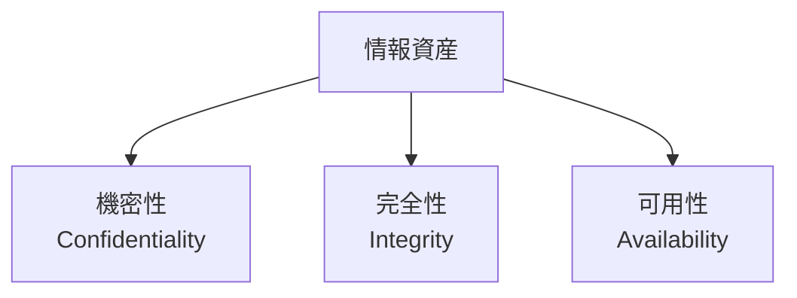
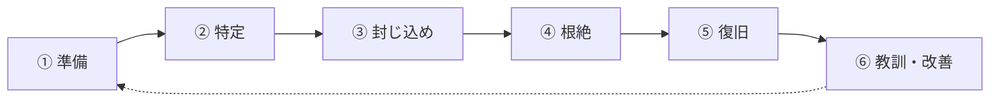

# 情報セキュリティ基礎

「100% の防御はない」を前提に——働く一人ひとりが身につける情報を守る基本

| 項目 | 内容 |
|---|---|
| カテゴリー | IT基礎知識 |
| 難易度 | 初級 |
| 所要時間 | 約200分（全8レッスン） |
| 公開日 | 2026-06-13 |
| 最終更新日 | 2026-06-13 |
| コースURL | https://skillup.college/courses/it-basics/information-security-basics/ |

## 対象者

業種・職種を問わず、すべての社員にとって必要な情報セキュリティの基礎を身につけたい方。新入社員研修・全社員教育の代替・補助としても活用できる。情報システム部門・IT 担当者でなくても、PC とスマートフォンで業務をするすべての方に。会社員だけでなく、フリーランス・経営者・公務員・教員などにも有用。

## 前提知識

特になし。PC・スマートフォン・メール・Web ブラウザの基本操作経験があれば十分。ネットワークやプログラミングの専門知識は不要。

## 学習目標

- 情報セキュリティを CIA トライアド（機密性・完全性・可用性）で捉えられる
- 脅威・脆弱性・リスクの関係を整理して、組織や自分のリスクを構造化できる
- パスワード・MFA・SSO の意味を理解し、認証の基本を運用できる
- マルウェア・フィッシング・ソーシャルエンジニアリング・BEC の手口と対処を知る
- 通信の暗号化、VPN、公衆 Wi-Fi のリスク、ゼロトラスト発想の概要を把握する
- 個人情報保護法を踏まえたデータ分類・バックアップ・廃棄の基本を持つ
- インシデント対応の流れ（気づき・報告・対応・復旧）を理解し、初動を取れる
- テレワーク・SaaS・生成 AI・サプライチェーンなど 2026 年時点の論点を整理できる

## コース概要

「うちの会社は大丈夫」「セキュリティ部門が守ってくれる」——多くの組織でいまも聞かれる言葉です。しかし、現場で起きる情報セキュリティ事故の大半は、悪意のあるエンジニアの高度な攻撃ではなく、ごく普通の社員のうっかりミスや、巧妙化した攻撃に気づけなかったことから始まります。サイバー攻撃は 2020 年代に入って急速に巧妙化し、ランサムウェア・標的型攻撃・ビジネスメール詐欺（BEC）・サプライチェーン攻撃が日常になりました。生成 AI の普及で、機密情報を社外サービスにうっかり入力してしまうリスクも生まれました。本コースは、特別な技術知識のない方でも、現場で「危ない」と気づき、適切に行動できる基礎を 8 レッスンで体系的に学びます。攻撃手法を細かく覚えるのではなく、「守るべきものは何か」「攻撃者は何をしてくるか」「自分が今日からできることは何か」の 3 点を中心に、現場の感覚を交えて整理します。全社員必修レベルの内容を、IT 担当者の方が読んでも基礎の再確認になる形で設計しました。

## 学習の流れ

レッスン 1 で情報セキュリティの定義（CIA トライアド）と「守るべきもの」を整理します。レッスン 2 はリスク・脅威・脆弱性の関係と、攻撃者の動機を理解し、組織や自分のリスクを構造化する発想を持ちます。レッスン 3〜4 は「身近な脅威への対処」で、認証（パスワード・MFA・SSO）とマルウェア・フィッシング・BEC を扱います。レッスン 5〜6 は「通信とデータを守る基本」で、暗号化・VPN・公衆 Wi-Fi・ゼロトラスト概要、データ分類・バックアップ・廃棄を学びます。レッスン 7 で「インシデント対応の基本」を、CSIRT の現場感覚を踏まえて整理します。最後のレッスン 8 で、2026 年時点の論点（テレワーク・SaaS・BYOD・生成 AI・サプライチェーン）と修了後の学習方向を案内します。前半（レッスン 1〜2）は「考え方の土台」、中盤（レッスン 3〜6）は「日々の運用の基本」、後半（レッスン 7〜8）は「組織と新しい論点」という三段構えです。

## レッスン一覧

| No. | タイトル | 概要 | 所要時間 |
|---|---|---|---|
| 1 | 情報セキュリティとは何か——CIA トライアドと「守るべきもの」 | 情報セキュリティの定義、CIA トライアド（機密性・完全性・可用性）、情報資産の捉え方、なぜ全社員に必要か、本コースの守備範囲を学ぶ | 25分 |
| 2 | リスクと脅威と脆弱性——攻撃者の動機を知る | リスク・脅威・脆弱性の違い、攻撃者の種類（外部・内部・組織犯罪・国家支援）、攻撃の動機、リスクアセスメントの基本、優先順位の付け方を学ぶ | 25分 |
| 3 | 認証と認可——「あなたは誰か」「何ができるか」 | 認証と認可の違い、パスワードの問題、MFA（多要素認証）、SSO（シングルサインオン）、パスキー、最小権限の原則、パスワード管理の現実解を学ぶ | 25分 |
| 4 | マルウェアと攻撃手法——身近な脅威を知る | マルウェアの種類（ウイルス・ワーム・トロイの木馬・ランサムウェア・スパイウェア）、フィッシング、スピアフィッシング、ソーシャルエンジニアリング、ビジネスメール詐欺（BEC）、防御の基本を学ぶ | 25分 |
| 5 | ネットワークと通信の安全——暗号化と境界 | 暗号化の基本（共通鍵・公開鍵）、TLS／HTTPS、VPN、公衆 Wi-Fi のリスク、ファイアウォール、境界防御からゼロトラストへ（概要）、テザリングや自宅 Wi-Fi の注意点を学ぶ | 25分 |
| 6 | データ保護と個人情報——情報を守るルール | 個人情報保護法の基本、データ分類（公開・社外秘・極秘）、暗号化、バックアップ、削除・破棄、クラウドストレージの扱い、データ持ち出しの考え方を学ぶ | 25分 |
| 7 | インシデント対応の基本——気づき・報告・対応 | インシデントとは、CSIRT・SOC の役割、報告の重要性、ログとフォレンジック、初動の優先順位、隠さないことの価値、実例から学ぶ流れを学ぶ | 25分 |
| 8 | 働く個人のセキュリティ——テレワーク・SaaS・生成 AI・修了後 | テレワークのセキュリティ、SaaS と シャドー IT、BYOD、生成 AI への情報入力リスク、サプライチェーン攻撃、コース修了後の学習方向を案内する | 25分 |

---

## レッスン1：情報セキュリティとは何か——CIA トライアドと「守るべきもの」

（所要時間：25分）

### このレッスンで学ぶこと

- 情報セキュリティの定義を CIA トライアドで捉えられる
- 機密性・完全性・可用性の意味と、現場で起きる典型例を区別できる
- 情報資産という考え方で「守るべきもの」を整理する
- なぜ全社員に情報セキュリティが必要なのかを理解する
- 本コースの守備範囲と扱わない範囲を把握する

---

「情報セキュリティ」という言葉を、皆さんもニュースで耳にする機会が増えたと思います。一方で、現場で働く立場では「ファイアウォール？暗号化？難しい技術の話ね」「うちの IT 部門に任せておけばよい」と感じている方も多いはずです。本コースの出発点として、まず情報セキュリティが何を守るための営みなのかを、技術用語を抜きに整理します。

### 情報セキュリティの定義

情報セキュリティ（information security）は、情報資産を、機密性・完全性・可用性の 3 つの観点で守る活動の総称です。

技術的な仕組みだけを指すのではなく、組織のルール作り、社員教育、運用、監査、インシデント対応など、人と組織と技術を横断する営みです。

#### 「サイバーセキュリティ」との違い

「サイバーセキュリティ」という言葉も、よく聞かれます。両者はほぼ重なって使われますが、厳密には次のような違いがあります。

- **情報セキュリティ**：情報資産全般（紙の書類、口頭での会話なども含む）を守る広い概念
- **サイバーセキュリティ**：コンピュータ・ネットワーク・データなどデジタル領域の防御に焦点

本コースは「情報セキュリティ」という広い枠組みで進めますが、現場でデジタルが中心の時代ですので、内容はサイバーセキュリティと重なる部分が大半です。

> **💡 ポイント**
> 「セキュリティ＝難しい技術」と捉えると、自分には関係ない話に感じます。実際は「情報を守ること」全般の話で、紙の書類を引き出しにしまうのも、口外しないと約束するのも、情報セキュリティの一部です。技術はその中の一部分にすぎません。

### CIA トライアド——3 つの観点

情報セキュリティを整理する古典的なフレームワークが、CIA トライアドです。



| 観点 | 英語 | 意味 |
|---|---|---|
| 機密性 | Confidentiality | 権限のない人に情報が漏れないこと |
| 完全性 | Integrity | 情報が正確で、改ざんされていないこと |
| 可用性 | Availability | 必要なときに情報やシステムが使えること |

3 つの頭文字（C・I・A）から「CIA トライアド」と呼ばれます。情報セキュリティを学ぶときには、必ず最初に登場する基本中の基本です。

#### 機密性（Confidentiality）

機密性とは、「権限のない人に情報が見られない・漏れない」ことです。

- 例：顧客名簿が外部に流出した → 機密性の侵害
- 例：社員給与のリストが部署外に共有された → 機密性の侵害
- 例：個人情報を誤って TO で全送信した → 機密性の侵害

機密性を守る仕組みには、認証（パスワード、MFA）、アクセス制御（権限管理）、暗号化、物理的な施錠などがあります。

#### 完全性（Integrity）

完全性とは、「情報が正確で、改ざんされていない」ことです。

- 例：請求書の金額が外部から書き換えられた → 完全性の侵害
- 例：契約書の重要な数字を社内の誰かが密かに修正した → 完全性の侵害
- 例：マルウェアでデータベースの一部が壊された → 完全性の侵害

完全性を守る仕組みには、ハッシュ値（改ざん検知）、デジタル署名、バージョン管理、ログ監査などがあります。

#### 可用性（Availability）

可用性とは、「必要なときに情報やシステムが使える」ことです。

- 例：ランサムウェアでファイルが暗号化され業務が止まった → 可用性の侵害
- 例：DDoS 攻撃でサーバーがダウンした → 可用性の侵害
- 例：停電でシステムが使えなくなった → 可用性の侵害

可用性を守る仕組みには、バックアップ、冗長化、災害対策、稼働監視などがあります。

> **📝 補足**
> 機密性・完全性・可用性は、しばしばトレードオフになります。例えば機密性を強くするためにアクセス制御を厳しくしすぎると、可用性が下がる（必要な人が使えない）ことがあります。バランスを取ることがセキュリティ設計の中核です。

### 情報資産とは何か

CIA トライアドが守る対象が「情報資産」です。情報資産とは、組織にとって価値がある情報や、情報を扱う仕組みすべてを指します。

#### 情報資産の例

- **顧客情報**：顧客名、連絡先、購買履歴、契約情報
- **社員情報**：人事データ、給与、評価、健康情報
- **技術情報**：ソースコード、設計書、特許情報、ノウハウ
- **業務情報**：契約書、見積書、財務データ、内部資料
- **システム**：サーバー、データベース、業務システム、ネットワーク
- **物理資産**：PC、スマートフォン、USB メモリ、紙の書類

「情報そのもの」だけでなく、「情報を扱うシステム」「情報を保存する媒体」も含めて情報資産と呼びます。

#### 守るべきものを認識する

情報セキュリティの第一歩は、「自分の組織や自分の業務で、何が情報資産なのか」を認識することです。守るべきものが見えていなければ、適切に守れません。

> **💡 ポイント**
> 「うちの会社にそんな大事な情報はない」と感じる人も多いかもしれません。しかし、顧客リスト 1 件、新製品の発売前情報、社員の連絡先、いずれも漏れれば組織と個人に影響が出る情報です。「価値がない情報」はほとんど存在しません。

### なぜ全社員に必要か

情報セキュリティと聞くと、「IT 部門の仕事」「セキュリティ部門の責任」と思われがちです。実際の現場では、これが大きな誤解です。

#### インシデントの大半は「現場」で始まる

セキュリティインシデント（事故）の発生源を調べると、

- フィッシングメールに社員が騙されてパスワードを入力
- USB メモリを紛失（中身は顧客情報）
- 公衆 Wi-Fi で機密文書を閲覧して通信が傍受される
- パスワードを付箋に貼って共有していた
- 退職者のアカウントが削除されず不正利用された
- ファイル共有の設定を間違えて社外公開してしまった

これらの大半は、特定の専門部署で起きるのではなく、ごく普通の社員の業務の中で起きています。

#### 「最弱の輪」が組織を守るかどうかを決める

セキュリティの世界には「最弱の輪（weakest link）」という考え方があります。鎖の強度は、最も弱い輪で決まる、というメタファーです。組織全体の防御の強さは、最も弱い社員 1 人のリテラシーで決まる、ということです。

技術的な仕組みをどれだけ整えても、1 人の社員が騙されてパスワードを入力すれば、組織全体が侵害されます。だからこそ、全社員のセキュリティリテラシーが、組織のセキュリティの基盤になります。

> **⚠️ 注意**
> 「最弱の輪」は社員を責めるための言葉ではありません。「全員がそれぞれの持ち場で気をつける」ことの重要性を表す比喩です。誰かを犯人にする発想ではなく、組織全体で支え合う発想で受け止めてください。

### 本コースの守備範囲

最後に、本コースで扱う範囲と扱わない範囲を整理しておきます。

#### 扱う範囲

- 情報セキュリティの全体像と CIA トライアド（本レッスン）
- リスク・脅威・脆弱性、攻撃者の動機（レッスン 2）
- 認証と認可：パスワード・MFA・SSO・パスキー（レッスン 3）
- マルウェア・フィッシング・BEC（レッスン 4）
- 暗号化・VPN・公衆 Wi-Fi・ゼロトラスト概要（レッスン 5）
- 個人情報保護法・データ分類・バックアップ・廃棄（レッスン 6）
- インシデント対応の基本（レッスン 7）
- テレワーク・SaaS・BYOD・生成 AI・サプライチェーン（レッスン 8）

#### 扱わない範囲

- 専門的な暗号アルゴリズムの数式（別の専門書を参照）
- 特定セキュリティ製品の操作手順（公式ドキュメントを参照）
- ペネトレーションテストの実技（別の専門書・研修を参照）
- ハッキング技術の詳細（攻撃側の知識は本コースの目的ではない）
- 「IT パスポート」「情報処理安全確保支援士」など試験対策の網羅性

#### スタンス

本コースは、情報セキュリティを「特別な技術の話」ではなく「働く一人ひとりが日々の業務で意識する基本リテラシー」として扱います。同時に、「うちは大丈夫」「全部 IT 部門に任せる」という発想とも、「セキュリティのためには業務効率を犠牲にして当然」という発想とも距離を置きます。リスクを正しく認識し、バランスの取れた行動を取る判断軸を、現場の感覚も交えて持ち帰っていただくのが目的です。

### まとめ

このレッスンでは、以下のことを学びました。

- 情報セキュリティは、情報資産を機密性・完全性・可用性の 3 つの観点で守る活動の総称
- CIA トライアド：Confidentiality（機密性）・Integrity（完全性）・Availability（可用性）
- 機密性は「漏らさない」、完全性は「改ざんさせない」、可用性は「使えるようにする」
- 情報資産には情報そのものだけでなく、情報を扱うシステム・媒体も含む
- インシデントの大半は現場で起きるため、全社員のリテラシーが組織のセキュリティの基盤
- 「最弱の輪」は誰かを犯人にする発想ではなく、全員で支え合う発想の比喩
- 本コースは「特別な技術の話」ではなく「日々の業務で意識する基本リテラシー」として扱う

次のレッスンでは、リスク・脅威・脆弱性の違いと、攻撃者の動機を整理して、自分や組織のリスクを構造化する発想を学びます。

---

### 確認クイズ

このレッスンの理解度をチェックしましょう。

#### Q1. 本コースが定義する「情報セキュリティ」として最も適切なものはどれか？

- [ ] ファイアウォールの設定だけを指す技術用語
- [ ] ハッカーを攻撃する技術
- [x] 情報資産を、機密性・完全性・可用性の 3 つの観点で守る活動の総称。組織のルール作り、社員教育、運用、監査、インシデント対応など、人と組織と技術を横断する営み
- [ ] 経営者のみが理解すれば十分な経営戦略の用語

> **解説**
> 情報セキュリティは「情報資産を CIA トライアドの観点で守る活動の総称」です。技術だけでなく、ルール作り・教育・運用・監査・インシデント対応など、人と組織と技術を横断する営みです。

#### Q2. CIA トライアドの 3 要素として、本レッスンが説明した組み合わせはどれか？

- [ ] Customer・Identity・Access（顧客・身元・アクセス）
- [x] Confidentiality・Integrity・Availability（機密性・完全性・可用性）
- [ ] Cyber・Internet・Application（サイバー・インターネット・アプリ）
- [ ] Computer・Information・Audit（コンピュータ・情報・監査）

> **解説**
> CIA トライアドは Confidentiality（機密性）・Integrity（完全性）・Availability（可用性）の 3 観点です。情報セキュリティの古典的な基本フレームワークで、すべての設計と運用の出発点になります。

#### Q3. 「ランサムウェアでファイルが暗号化されて業務が止まった」事象は、CIA のどの観点の侵害か？

- [x] 可用性（必要なときに情報やシステムが使えなくなった）
- [ ] 機密性のみ
- [ ] 機密性と完全性の両方
- [ ] CIA とは無関係の事象

> **解説**
> ランサムウェアでファイルが暗号化されると、必要なときに使えなくなるため、主に可用性の侵害です。データが外部に流出していれば機密性も侵害されますが、本問の事象（業務停止）は可用性の典型例です。

#### Q4. 「情報資産」の捉え方として、本レッスンが説明した内容はどれか？

- [ ] 紙の書類だけが情報資産で、デジタルデータは含めない
- [x] 顧客情報・社員情報・技術情報・業務情報などの情報そのものに加え、システム・物理資産（PC・USB メモリ・紙の書類）も含む広い概念
- [ ] 売上 1 億円以上の事業に関わる情報のみが情報資産
- [ ] 経営層が管理する情報だけが情報資産

> **解説**
> 情報資産は「情報そのもの」と「情報を扱う仕組み」を含む広い概念です。顧客情報・社員情報・技術情報・業務情報・システム・物理資産（PC・USB メモリ・紙の書類）すべてが該当します。「うちには大事な情報はない」は誤りで、「価値がない情報」はほとんど存在しません。

#### Q5. 「最弱の輪（weakest link）」という考え方について、本レッスンが説明した内容はどれか？

- [ ] 弱い社員を特定して退職を促すための概念
- [ ] セキュリティの責任はすべて 1 人の専門家に集約すべきとする考え方
- [x] 鎖の強度は最も弱い輪で決まる、というメタファー。組織全体の防御は最も弱い社員 1 人のリテラシーで決まるという発想で、誰かを犯人にするのではなく、全員で支え合うために使われる
- [ ] 強い社員だけがセキュリティを担当すべきとする発想

> **解説**
> 「最弱の輪」は鎖のメタファーで、組織全体の防御強度は最も弱い社員のリテラシーで決まる、という比喩です。社員を責めるためではなく、「全員がそれぞれの持ち場で気をつける」必要性を表す概念です。技術的仕組みを整えても、1 人が騙されれば組織全体が侵害されます。

#### Q6. 講師の現場メモが示す「ランサムウェアによる製造拠点インシデント」のエピソードの学びとして、本レッスンが伝えたメッセージはどれか？

- [ ] 攻撃を防ぐのは最新の高額セキュリティ製品だけ
- [ ] CSIRT の高度な技術知識ですべて解決できる
- [ ] バックアップは不要で、攻撃を完全に防ぐべき
- [x] 攻撃の入り口は「ごく普通の社員のメール開封」、感染拡大を止めたのは「ネットワーク管理者の冷静な切り離し判断」、組織を救ったのは「地味な日常運用としてのバックアップ」、被害を最小化したのは「報告の早さ」。技術以上に全社員の気づきと報告、地味な日常運用が現実のインシデントでは効く

> **解説**
> エピソードでは、攻撃の入り口がごく普通の社員のメール開封、感染拡大を止めたのが管理者の切り離し判断、組織を救ったのが地味なバックアップ運用、被害を最小化したのが報告の早さでした。技術以上に全社員の気づきと報告、地味な日常運用が、現実のインシデントを左右します。本コースで「全社員のリテラシー」「気づきと報告」を強調するのは、この実感が背景にあります。

---

## レッスン2：リスクと脅威と脆弱性——攻撃者の動機を知る

（所要時間：25分）

### このレッスンで学ぶこと

- リスク・脅威・脆弱性の 3 つの用語を区別できる
- 「リスク＝脅威 × 脆弱性 × 影響」の関係式を持つ
- 攻撃者の種類（外部・内部・組織犯罪・国家支援）と動機を整理する
- リスクアセスメントの基本的な流れを理解する
- 「すべて守る」ではなく「重要なものを優先する」発想を持つ

---

前のレッスンでは、情報セキュリティの定義と CIA トライアド、情報資産の考え方を整理しました。本レッスンでは、何から守るのか——脅威の正体——と、リスクをどう構造化して優先順位を付けるかを学びます。「うちが狙われるはずがない」「狙われたらどうしようもない」のどちらの極端な見方からも距離を取り、現実的にリスクを捉える発想を持ちます。

### 3 つの用語の違い

セキュリティの議論でよく出てくる「リスク」「脅威」「脆弱性」は、混同されがちです。まず違いを整理します。

| 用語 | 意味 | 例 |
|---|---|---|
| 脅威（Threat） | 情報資産に害を与え得る原因 | ランサムウェア攻撃、内部不正、自然災害 |
| 脆弱性（Vulnerability） | 脅威に利用される弱点 | 古い OS、弱いパスワード、教育不足 |
| リスク（Risk） | 脅威 × 脆弱性 × 影響度から推定される、損害発生の可能性 | 弱いパスワードがランサムウェアに使われ業務停止する可能性 |

#### 関係式

シンプルな関係式で表すと、

```
リスク = 脅威 × 脆弱性 × 影響度
```

- 強力な脅威があっても、脆弱性がなければリスクは低い（鉄壁の防御がある）
- 脆弱性があっても、それを狙う脅威がなければリスクは低い（誰も狙わない）
- 両方あっても、損害（影響度）が小さければリスクは管理可能

この関係を理解すると、「何にどう対処するか」の判断軸が明確になります。

> **💡 ポイント**
> 「脅威を全部なくす」「脆弱性を全部なくす」は現実的に不可能です。リスクをゼロにすることはできない、という前提に立つことが、現実的なセキュリティ運用の出発点です。

### 脅威の種類——「誰が」「何のために」

脅威を整理する代表的な切り口が、「誰が、何のために」攻撃してくるかです。

#### ①外部の個人攻撃者

- **動機**：技術的な好奇心、自己顕示、金銭目的
- **手段**：公開された脆弱性スキャン、フィッシングメール、ブルートフォース
- **規模**：小規模、不特定多数を狙う

#### ②組織犯罪グループ

- **動機**：金銭（身代金、データ売買、詐欺）
- **手段**：ランサムウェア、BEC、フィッシング、マルウェア配布
- **規模**：中〜大規模、組織的に運営される

近年、ランサムウェア攻撃は「ランサムウェア・アズ・ア・サービス（RaaS）」として産業化しています。攻撃者は分業し、マルウェア開発・配布・身代金交渉・資金洗浄が組織的に行われます。

#### ③国家支援の攻撃グループ

- **動機**：政治、軍事、経済情報の窃取、社会インフラへの攻撃
- **手段**：高度な持続的脅威（APT）、ゼロデイ脆弱性、長期潜伏
- **規模**：大規模、極めて高度

国家支援型は標的を絞り、特定の組織に対して長期間（半年〜数年）潜伏することが知られています。

#### ④内部脅威（インサイダー）

- **動機**：金銭、報復、転職先への土産、うっかりミス
- **手段**：正規アクセスの悪用、データ持ち出し、設定ミス
- **規模**：個人〜数人

内部脅威は、外部攻撃と比べて見落とされがちですが、被害は深刻になりやすい領域です。退職予定者の振る舞いの監視や、最小権限の原則（後のレッスン 3）が対策の中心になります。

#### ⑤自然災害・偶発事故

- **動機**：なし（自然・人為的ミス）
- **手段**：地震、火災、停電、機器故障、設定誤り
- **規模**：場所と規模次第

「攻撃」ではないが、可用性を脅かす脅威としては最大級です。バックアップと冗長化が中心的な対策になります。

> **📝 補足**
> 多くの組織で見落とされがちなのが、内部脅威と偶発事故です。「外部の天才ハッカー」のイメージばかり強調されますが、実際の被害は内部の悪意・うっかり・自然災害から来ることも多いのが現実です。バランスよく考える視点が大切です。

### 攻撃者の動機を知る理由

攻撃者の動機を知ることは、防御設計の基本です。

#### 動機がわかれば狙いがわかる

- 金銭目的の組織犯罪 → ランサムウェアか BEC か顧客情報窃取が中心
- 国家支援 → 機密情報・技術情報・人事情報
- 内部不正 → 顧客リスト、技術情報、人事情報
- 自己顕示 → ホームページの改ざん、公開メッセージ

#### 動機別の対策の重み付け

- BtoC のオンラインサービス：個人情報＋クレジットカード情報を狙うランサム・詐欺グループ
- 政府関連請負企業：国家支援型を意識した APT 対策
- 製造業：技術情報の窃取（産業スパイ）と、製造ラインを止めるランサム
- 医療機関：患者情報の機密性と、業務継続性（可用性）

組織の業種・規模・データの性質によって、優先すべき脅威は違います。「どこも一律に同じ対策」では効率が悪いのです。

> **⚠️ 注意**
> 「うちは小さな会社だから狙われない」という思い込みは危険です。組織犯罪グループは小〜中規模企業を「セキュリティが甘く、身代金を払う可能性が高い」標的として狙うことが、近年急増しています。「規模が小さい＝安全」ではありません。

### 脆弱性の種類——「何を弱点とするか」

脆弱性は、脅威に利用される弱点です。多くの種類がありますが、現場でよく見るものを 4 つに整理します。

#### ①技術的脆弱性

- 古い OS・ソフトウェアの未パッチ状態
- 設定ミス（公開すべきでないものが公開されている）
- ソフトウェアのバグ（特に外部に公開された API）
- 暗号化の弱さ・未実装

#### ②人的脆弱性

- セキュリティ教育の不足
- 警戒心の薄さ（フィッシングに気づかない）
- 共有意識の弱さ（パスワードを付箋に貼る）
- 多忙による判断力低下

#### ③組織的脆弱性

- セキュリティ方針の不在・形骸化
- 部門間の連携不足
- 退職者管理の不備
- インシデント時の連絡経路の不明確さ

#### ④物理的脆弱性

- 入退室管理の甘さ
- 機器の盗難リスク
- 紙書類の取り扱い不備
- 外部委託先の管理不足

> **💡 ポイント**
> 「セキュリティ＝技術」と思っていると、技術的脆弱性ばかりに目が行きます。実際の現場では、人的・組織的・物理的脆弱性が大きな割合を占めます。総合的に見るのがリスク管理の基本です。

### リスクアセスメントの基本

リスクアセスメントは、「どんなリスクがあり、どれを優先するか」を整理する作業です。基本的な流れを示します。

#### ステップ 1：情報資産の棚卸し

何を持っているか、それは誰にとってどんな価値があるかを書き出します。

- 顧客リスト：10 万件、流出すれば信用毀損と賠償
- 設計データ：競合に渡れば事業価値が下がる
- 給与システム：停止すれば月次給与処理に支障
- 社員 PC 端末：紛失すれば紛失内容次第で大事故

#### ステップ 2：脅威の特定

各資産に対して「どんな脅威があるか」を考えます。

- 顧客リスト：外部攻撃による窃取、内部不正、操作ミス
- 設計データ：産業スパイ、内部からの持ち出し
- 給与システム：ランサムウェア、停電、人為ミス

#### ステップ 3：脆弱性の評価

各脅威が「自社のどの弱点を利用するか」を見つけます。

- 顧客リストへの外部攻撃：DB のアクセス制御は十分か、パスワードは強いか
- 内部不正：退職者のアクセス権はちゃんと削除しているか
- 操作ミス：誤送信を防ぐ仕組みはあるか

#### ステップ 4：影響度の評価

「侵害された場合の被害の大きさ」を見積もります。金額、信用、業務停止時間など。

#### ステップ 5：優先順位付けと対策

リスク（脅威 × 脆弱性 × 影響度）の大きいものから対策します。すべてに同時対処はできないため、優先順位付けが鍵です。

#### 「受容」「低減」「移転」「回避」の選択肢

各リスクに対して、4 つの選択肢があります。

| 選択肢 | 内容 | 例 |
|---|---|---|
| 受容 | 許容範囲内とみなして放置 | 影響が小さい、コスト対効果で割に合わない |
| 低減 | 対策を講じて影響を下げる | パッチ、教育、アクセス制御強化 |
| 移転 | 保険などで他者に転嫁 | サイバー保険、外部委託 |
| 回避 | リスクの源を取り除く | 機微情報を扱わない、サービス停止 |

> **📝 補足**
> 「すべてのリスクに低減策」は組織のリソースを圧迫します。「受容」も正当な選択肢で、「これは現状受け入れる」と組織で合意した上で記録するのが、リスクマネジメントの基本です。

### まとめ

このレッスンでは、以下のことを学びました。

- リスク・脅威・脆弱性は別々の概念で、「リスク＝脅威 × 脆弱性 × 影響度」の関係
- 脅威の種類：外部個人・組織犯罪・国家支援・内部脅威・自然災害
- 攻撃者の動機を知ると、自社にとって優先すべき対策が見える
- 「うちは小さいから狙われない」は誤解。中小企業ほど狙われやすい時代
- 脆弱性は技術的・人的・組織的・物理的の 4 種類があり、総合的に見る
- リスクアセスメントは資産棚卸し → 脅威特定 → 脆弱性評価 → 影響度評価 → 優先順位付け
- 各リスクに対して受容・低減・移転・回避の 4 選択肢がある

次のレッスンでは、認証と認可——パスワード・MFA・SSO・パスキー——という、すべての社員に直結する基本機能を扱います。

---

### 確認クイズ

このレッスンの理解度をチェックしましょう。

#### Q1. リスク・脅威・脆弱性の関係として、本レッスンが説明した内容はどれか？

- [ ] リスク・脅威・脆弱性は同じ意味の言い換え
- [ ] リスク = 脅威 + 脆弱性（足し算）
- [x] リスク = 脅威 × 脆弱性 × 影響度（かけ算）。脅威または脆弱性または影響度のいずれかがゼロに近ければ、リスクは小さくなる
- [ ] リスクは脅威と無関係に決まる

> **解説**
> リスクは「脅威 × 脆弱性 × 影響度」のかけ算で表せます。強力な脅威があっても脆弱性がなければリスクは低く、脆弱性があっても脅威がなければリスクは低い。両方あっても影響度が小さければリスクは管理可能、という関係です。

#### Q2. 脅威の種類として、本レッスンが整理した区分はどれか？

- [x] 外部の個人攻撃者、組織犯罪グループ、国家支援グループ、内部脅威（インサイダー）、自然災害・偶発事故
- [ ] 男性ハッカーと女性ハッカーの 2 区分
- [ ] AI ハッカーと人間ハッカーの 2 区分
- [ ] 国内攻撃と海外攻撃の 2 区分

> **解説**
> 脅威は外部個人・組織犯罪・国家支援・内部脅威・自然災害／偶発事故の 5 種類で整理できます。「外部の天才ハッカー」のイメージばかり強調されますが、実際の被害は内部の悪意・うっかり・自然災害から来ることも多いのが現実です。

#### Q3. 「うちは小さな会社だから狙われない」という発想について、本レッスンが説明した内容はどれか？

- [ ] 規模が小さい組織は実際に狙われない
- [x] 組織犯罪グループは小〜中規模企業を「セキュリティが甘く、身代金を払う可能性が高い」標的として狙うことが近年急増。中規模企業の方が CISO 不在・IT 担当兼業・リカバリ準備不十分などの理由で狙われやすい
- [ ] 規模が大きい組織だけが攻撃対象
- [ ] 規模に関係なく狙われる確率は完全に同じ

> **解説**
> 中小企業ほど「セキュリティが甘い」「身代金を払う可能性が高い」と評価され、組織犯罪グループの標的になることが増えています。「業界での知名度」「企業規模」は標的選定の条件に入らず、むしろ脆弱性の残存と支払い可能性が選定軸になります。

#### Q4. 脆弱性の 4 種類として、本レッスンが整理したものはどれか？

- [ ] OS・ソフトウェア・ハードウェア・ネットワーク
- [x] 技術的脆弱性、人的脆弱性、組織的脆弱性、物理的脆弱性
- [ ] 過去・現在・未来・予測の 4 種類
- [ ] 北・南・東・西の 4 方向

> **解説**
> 脆弱性は技術的（未パッチ・設定ミス）、人的（教育不足・警戒心低下）、組織的（方針不在・連携不足）、物理的（入退室管理・盗難リスク）の 4 種類で整理できます。「セキュリティ＝技術」と思っていると技術的脆弱性ばかりに目が行きますが、人的・組織的・物理的の割合も大きいのが現実です。

#### Q5. リスクアセスメントの基本ステップとして、本レッスンが整理した流れはどれか？

- [ ] アセスメントは不要で、攻撃を受けてから対処する
- [x] 情報資産の棚卸し → 脅威の特定 → 脆弱性の評価 → 影響度の評価 → 優先順位付けと対策
- [ ] 攻撃者をすべて逮捕すれば完結
- [ ] 全リスクに対して同時に対策する

> **解説**
> リスクアセスメントは、資産の棚卸しから始まり、脅威の特定、脆弱性の評価、影響度の評価、優先順位付けと対策の順に進めます。「何を持っているか」が見えなければ、適切に守れません。すべてに同時対処はできないため、優先順位付けが鍵になります。

#### Q6. 各リスクへの対応の選択肢として、本レッスンが整理したものはどれか？

- [ ] 完全防御の 1 択のみ
- [ ] 攻撃か防御かの 2 択
- [ ] 即時撤退の 1 択のみ
- [x] 受容（許容範囲内とみなして放置）・低減（対策を講じて影響を下げる）・移転（保険などで他者に転嫁）・回避（リスクの源を取り除く）の 4 つ

> **解説**
> リスク対応の選択肢は受容・低減・移転・回避の 4 つです。「すべてのリスクに低減策」は組織のリソースを圧迫します。「受容」も正当な選択肢で、「これは現状受け入れる」と組織で合意した上で記録するのが、リスクマネジメントの基本です。

---

## レッスン3：認証と認可——「あなたは誰か」「何ができるか」

（所要時間：25分）

### このレッスンで学ぶこと

- 認証（Authentication）と認可（Authorization）の違いを区別できる
- パスワードの問題と、強いパスワード設計の現実解を持つ
- MFA（多要素認証）の意味と、実務で使える形を理解する
- SSO（シングルサインオン）の利便性とリスクを把握する
- パスキーなど、パスワードに代わる新しい認証方式の動向を知る
- 最小権限の原則（Principle of Least Privilege）を意識した運用ができる

---

前のレッスンでは、リスク・脅威・脆弱性の関係と攻撃者の動機を整理しました。本レッスンでは、すべての社員に直結する基本機能——認証と認可——を扱います。パスワードを変えること、MFA を有効にすること、共有しないこと。地味ですが、これらが組織のセキュリティの 7〜8 割を支えます。

### 認証と認可——別の概念

「認証」と「認可」は、似た言葉として混同されがちですが、別の概念です。

| 用語 | 英語 | 意味 |
|---|---|---|
| 認証 | Authentication | 「あなたは誰か」を確認する |
| 認可 | Authorization | 「あなたは何ができるか」を決める |

例えば社員食堂に入るシナリオを考えます。

- 認証：入口で社員証をかざす → 「あなたは○○さんですね」と本人確認
- 認可：「○○さんは社員食堂を使える権限がある」と判断 → 入場許可

技術用語としても同じ構造です。ログインが成功したかどうかが「認証」、ログイン後に何ができるかが「認可」です。

> **💡 ポイント**
> 「認証」と「認可」を混同していると、トラブル時の議論が噛み合いません。「パスワードが漏れた」のは認証の問題、「権限が広すぎた」のは認可の問題。両者を区別することで、対策の議論が具体化します。

### パスワードの問題

認証の最も基本的な方法が、パスワードです。一方で、パスワードは数々の問題を抱えています。

#### パスワードが破られる経路

- **総当たり攻撃（ブルートフォース）**：全パターンを試す。短いパスワードや単純なパスワードは数秒で破られる
- **辞書攻撃**：よくある単語や過去の漏洩パスワード一覧から試す
- **クレデンシャルスタッフィング**：別サービスから漏れた ID／パスワードを別サービスでそのまま使う
- **フィッシング**：偽サイトに入力させて盗む
- **ショルダーハッキング**：肩越しに見られる
- **キーロガー**：マルウェアでキー入力を盗む

#### 強いパスワードの条件

- **長い**：12 文字以上を推奨。10 文字未満は短時間で破られる
- **複雑**：英大小文字＋数字＋記号を混ぜる
- **予測されない**：辞書にある単語、誕生日、家族の名前を含めない
- **使い回さない**：1 サービスごとに違うパスワード

#### 「強い × 覚えやすい」の両立

人間が記憶できるパスワード数には限界があります。すべてのサービスに強くて違うパスワードを使うことは、現実的に不可能です。

解決策は次の 2 つです。

- **パスワードマネージャー**：1Password、Bitwarden、Apple のパスワード、Google パスワードマネージャーなど。マスターパスワード 1 つだけ覚えればよい
- **パスフレーズ**：単語を 4〜5 個つないだ長いフレーズ（例：correct-horse-battery-staple）。記憶しやすく、ブルートフォースには強い

#### 「90 日ごとに変更」の見直し

かつて「パスワードは定期的に変更すべき」とされていましたが、近年の研究で「強制的な定期変更は、かえって弱いパスワードを生む（覚えやすくするため）」ことがわかりました。米国 NIST（米国国立標準技術研究所）も 2017 年以降、定期変更を必須としない方針に転換しました。

代わりに重要なのは、**「漏洩の兆候があれば即変更」「強くて使い回さない」「MFA を併用」** の 3 つです。

> **⚠️ 注意**
> 「うちの会社はまだ 90 日変更ルールがある」という方もいるはずです。組織のルールに従う必要はありますが、できれば NIST の最新動向を踏まえて、ルールの見直しを情報セキュリティ部門に提案する余地があります。

### MFA（多要素認証）

MFA（Multi-Factor Authentication、多要素認証）は、認証を強化する最も効果的な仕組みです。

#### 3 つの要素

認証の要素は、伝統的に 3 種類に分類されます。

| 要素 | 内容 | 例 |
|---|---|---|
| 知識要素 | あなたが「知っている」もの | パスワード、PIN、秘密の質問 |
| 所有要素 | あなたが「持っている」もの | スマホ、ハードウェアトークン、社員証 IC カード |
| 生体要素 | あなた自身の「身体的特徴」 | 指紋、顔、虹彩、声紋 |

「多要素認証」とは、これら 3 つのうち 2 つ以上を組み合わせる認証です。

#### 典型的な MFA の組み合わせ

- パスワード（知識）＋スマホへのワンタイムコード（所有）
- 指紋（生体）＋PIN（知識）
- IC 社員証（所有）＋ PIN（知識）

#### MFA の効果

Microsoft の研究（2019 年）では、MFA を有効にすると、自動化された攻撃の 99.9% 以上を防げると報告されています。MFA は「銀の弾丸」ではありませんが、それに近いほどの効果があります。

#### MFA の方式と強度

- **SMS によるワンタイムコード**：簡便だが、SIM スワップ攻撃で破られる例あり。「無いよりは良い」レベル
- **認証アプリ（Google Authenticator、Microsoft Authenticator など）**：SMS より強い
- **ハードウェアトークン（YubiKey など）**：最も強力。フィッシング耐性あり
- **プッシュ通知認証**：スマホアプリに承認を求める方式。便利だが「MFA 疲労攻撃」のリスクあり

> **💡 ポイント**
> 「MFA は面倒だから無効化したい」という社員の声を聞くことがあります。確かに少し手間が増えますが、その手間で 99.9% の攻撃を防げます。「ベルトとシートベルトで車を守るようなもの」と捉えると、納得できる範囲のはずです。

### SSO（シングルサインオン）

SSO（Single Sign-On）は、1 度のログインで複数のサービスを使えるようにする仕組みです。

#### 仕組み

- 中心となる「IdP（Identity Provider、認証基盤）」が認証を担う
- 各サービスは IdP を信頼し、IdP の認証結果を受け入れる
- ユーザーは IdP に 1 度ログインすれば、それ以降のサービス利用で再ログインが不要

代表的な IdP として、Microsoft Entra ID（旧 Azure AD）、Google Workspace、Okta、Auth0 などがあります。

#### メリット

- **ユーザー体験**：何度もログインする手間が省ける
- **セキュリティ**：認証を 1 つの強い基盤に集約できる（MFA を IdP に集約）
- **管理性**：退職者のアクセスを 1 か所で停止できる
- **監査性**：ログインログを集中管理できる

#### リスク

- **集中点障害**：IdP が侵害されると全サービスが影響を受ける
- **依存リスク**：IdP が停止すると全サービスにログインできなくなる
- **設定ミスの影響範囲が広い**：1 か所の設定ミスが全社的な影響に

#### 対策

- IdP には最強の MFA を必須にする
- IdP のログを継続的に監査する
- 重要システムには、SSO に加えて追加の認証を要求する
- IdP の冗長化と災害対策を講じる

> **📝 補足**
> SSO を導入していない組織でも、Microsoft 365 や Google Workspace を使っていれば、それらが事実上の IdP として機能していることが多いです。「自社の認証基盤は何か」を一度棚卸しする価値があります。

### パスキー——パスワードに代わる新しい認証

パスキー（Passkey）は、パスワードを使わない認証方式として、2022 年から急速に普及しました。Apple、Google、Microsoft の 3 社が共同で推進し、FIDO2 / WebAuthn という標準仕様に基づきます。

#### 仕組み

- ユーザーのデバイス（スマホ、PC）に「秘密鍵」が安全に保存される
- サービス側には「公開鍵」のみが登録される
- 認証時は、デバイスが秘密鍵で署名し、サービスは公開鍵で検証する
- 秘密鍵はデバイスから出ない

#### メリット

- **フィッシング耐性**：偽サイトに鍵を渡さない設計
- **使い回しの問題がない**：サービスごとに別の鍵
- **生体認証と統合**：指紋・顔認証で鍵を解放
- **パスワードを覚えなくてよい**

#### 2026 年時点の普及状況

2026 年 6 月時点で、パスキーは Apple ID、Google、Microsoft アカウントで標準対応し、主要な SaaS（GitHub、Amazon、PayPal、Yahoo! JAPAN など）も対応を進めています。日本のメガバンクや行政サービスでも採用が広がりました。

#### 注意点

- 全サービスがまだ対応しているわけではない（パスワードとの併用期間）
- デバイス紛失時のリカバリーを事前に設計する必要がある
- 企業環境では、IT 部門の準備が必要

> **💡 ポイント**
> パスキーは「数十年続いたパスワード時代の終わりの始まり」と評されています。すぐ全部置き換わるわけではありませんが、対応サービスでは積極的に有効化する価値があります。

### 最小権限の原則

認可の世界で最も重要な考え方が、**最小権限の原則（Principle of Least Privilege、PoLP）**です。

#### 原則

「業務に必要な最低限の権限のみを与え、それ以外は与えない」。

#### 適用例

- 営業担当者には、顧客 DB の閲覧権限のみ。書き込みは不可
- 経理担当者には、財務 DB の閲覧と一部更新権限のみ。削除は不可
- IT 管理者には、必要時のみ管理者権限が付与され、終了後に剥奪される（Just-In-Time）
- 一般社員のアカウントには、システム管理者権限を持たせない

#### 退職者管理

最小権限の発想で、退職者・異動者の権限管理が重要です。

- 退職予定者の権限は、退職日に確実に削除
- 異動者は、新しい役割に必要な権限のみに切り替え（古い権限は剥奪）
- 半年に 1 度、全社の権限棚卸しを実施

> **⚠️ 注意**
> 「便利だから」と権限を広げる発想は、現場ではよく見られます。「とりあえず全員に管理者権限」「とりあえず全 DB アクセス可」の設計は、内部不正・うっかりミス・侵害時の被害拡大の源になります。最小権限は、不便さの裏に大きな防御効果を持つ原則です。

### まとめ

このレッスンでは、以下のことを学びました。

- 認証（あなたは誰か）と認可（何ができるか）は別概念
- パスワードは長さ・複雑さ・予測されにくさ・使い回さないこと
- 90 日定期変更は NIST も推奨しない。代わりに「強い・使い回さない・MFA」
- パスワードマネージャーで現実的な運用が可能
- MFA は知識・所有・生体の 2 要素以上の組み合わせ。99.9% の自動攻撃を防ぐ
- SSO は利便性と集約防御の利点がある一方、集中点障害のリスクがある
- パスキー（FIDO2／WebAuthn）はフィッシング耐性のある新しい認証方式で、2026 年時点で普及進行中
- 最小権限の原則：業務に必要な最低限の権限のみ。退職者・異動者の権限管理が必須

次のレッスンでは、マルウェア・フィッシング・ソーシャルエンジニアリング・BEC など、身近な脅威の手口と対処を扱います。

---

### 確認クイズ

このレッスンの理解度をチェックしましょう。

#### Q1. 認証と認可の違いとして、本レッスンが説明した内容はどれか？

- [x] 認証は「あなたは誰か」を確認する仕組み、認可は「あなたは何ができるか」を決める仕組み
- [ ] 認証と認可は同じ意味の言い換え
- [ ] 認証は認可の英訳
- [ ] 認可は認証の上位概念で、両者は階層関係

> **解説**
> 認証（Authentication）は本人確認、認可（Authorization）は権限決定です。混同するとトラブル時の議論が噛み合いません。「パスワードが漏れた」は認証の問題、「権限が広すぎた」は認可の問題、と区別することで対策が具体化します。

#### Q2. パスワードの「90 日ごとに変更」ルールについて、本レッスンが説明した最新動向はどれか？

- [ ] 米国 NIST が推奨しており、絶対に守るべきルール
- [x] 強制的な定期変更はかえって弱いパスワードを生むことがわかり、米国 NIST も 2017 年以降は定期変更を必須としない方針に転換。「漏洩の兆候があれば即変更」「強くて使い回さない」「MFA を併用」が現実解
- [ ] 1 日ごとの変更がベストプラクティス
- [ ] パスワード変更は不要で、初期パスワードを使い続けてよい

> **解説**
> 米国 NIST は 2017 年以降、強制的な定期変更を必須としない方針に転換しました。理由は「定期変更を強いると、人間は覚えやすくするために弱いパスワードを使う」傾向があるからです。代わりに「強い・使い回さない・MFA 併用・漏洩時に即変更」が現実的な指針です。

#### Q3. MFA（多要素認証）の効果として、本レッスンが説明した内容はどれか？

- [ ] MFA は効果がほぼなく、面倒なだけ
- [ ] MFA は 100% の攻撃を防ぐ完全な仕組み
- [x] Microsoft の 2019 年の研究では、MFA を有効にすると自動化された攻撃の 99.9% 以上を防げると報告されている
- [ ] MFA は法律で禁止されている

> **解説**
> Microsoft の 2019 年の研究によれば、MFA は自動化された攻撃の 99.9% 以上を防ぎます。MFA は「銀の弾丸」ではないが、それに近いほど効果が高い仕組みです。「面倒だから無効化」は、ベルトとシートベルトを外して車を運転するのと同じです。

#### Q4. SSO（シングルサインオン）について、本レッスンが指摘するリスクはどれか？

- [ ] SSO は完全に安全で、リスクはない
- [x] 集中点障害（IdP が侵害されると全サービスが影響を受ける）、依存リスク（IdP が停止すると全サービスにログインできない）、設定ミスの影響範囲が広い
- [ ] SSO は便利すぎるので利用すべきではない
- [ ] SSO は法律で禁止されている

> **解説**
> SSO のリスクは集中点障害・依存リスク・設定ミスの影響範囲の広さです。対策として「IdP に最強の MFA を必須にする」「IdP のログ監査」「重要システムには追加認証」「IdP の冗長化」が推奨されます。便利さとリスクを両立する設計が必要です。

#### Q5. パスキー（Passkey）の特徴として、本レッスンが説明した内容はどれか？

- [ ] パスキーは長いパスワードの別名
- [x] FIDO2 / WebAuthn 標準に基づく、デバイス内の秘密鍵で認証する方式。フィッシング耐性があり、サービスごとに別の鍵、生体認証と統合できる。2022 年から急速に普及
- [ ] パスキーはパスワードを 100 文字以上にする方式
- [ ] パスキーは特定の 1 社のみが提供する技術

> **解説**
> パスキーは FIDO2 / WebAuthn 標準に基づき、Apple・Google・Microsoft が共同推進する認証方式です。秘密鍵がデバイス内に保存され、フィッシング耐性があり、使い回しの問題がなく、生体認証と統合できます。2026 年 6 月時点で主要サービスへの対応が進行中です。

#### Q6. 最小権限の原則（Principle of Least Privilege）として、本レッスンが説明した内容はどれか？

- [ ] すべての社員に管理者権限を付与する
- [ ] 権限管理は不要で、各自が好きにアクセスできる
- [ ] 権限は一度付与したら剥奪してはいけない
- [x] 業務に必要な最低限の権限のみを与え、それ以外は与えない。退職者・異動者の権限管理、半年に 1 度の全社棚卸しが運用の核

> **解説**
> 最小権限の原則は「業務に必要な最低限の権限のみ付与」する考え方です。「便利だから」と権限を広げる発想は、内部不正・うっかりミス・侵害時の被害拡大の源になります。退職者・異動者の権限管理、定期的な棚卸しが運用の核です。

---

## レッスン4：マルウェアと攻撃手法——身近な脅威を知る

（所要時間：25分）

### このレッスンで学ぶこと

- マルウェアの種類（ウイルス・ワーム・トロイの木馬・ランサムウェア・スパイウェア）を区別できる
- フィッシング・スピアフィッシングの典型的な手口を見抜く目を持つ
- ソーシャルエンジニアリングの原理を理解する
- ビジネスメール詐欺（BEC）の手口と防御策を整理する
- 「巧妙な攻撃を見抜く」より「確認する習慣」を持つ姿勢を持つ

---

前のレッスンでは、認証と認可の基本を学びました。本レッスンでは、現場で最も頻繁に起きる脅威——マルウェア・フィッシング・ソーシャルエンジニアリング・BEC——の手口と対処を扱います。攻撃手法を細かく覚えるのが目的ではなく、「危ない」と気づき、「確認する習慣」を持つことが本レッスンのゴールです。

### マルウェアの種類

マルウェア（malware、「malicious software」の略）は、悪意のあるソフトウェア全般を指します。代表的な種類を整理します。

#### ウイルス

正規のファイルやプログラムに「寄生」して感染し、ファイルが開かれたときに動作するマルウェアです。生物のウイルスと同じく、「宿主」が必要です。

- 例：Excel マクロウイルス、感染した実行ファイル
- 対策：信頼できない添付ファイルやプログラムを実行しない

#### ワーム

ネットワーク経由で「自己増殖」するマルウェアです。ウイルスと違って宿主を必要とせず、独立して動きます。

- 例：WannaCry（2017 年に世界中で猛威を振るったランサムウェア型ワーム）
- 対策：OS・ソフトウェアのアップデート、ファイアウォール

#### トロイの木馬

「正規のソフト」を装って侵入するマルウェアです。ギリシャ神話の「トロイの木馬」が由来です。

- 例：偽の無料ソフト、海賊版ソフトに仕込まれる悪意あるコード
- 対策：信頼できる配布元からのみソフトをダウンロード

#### ランサムウェア

ファイルを暗号化し、復号と引き換えに身代金（ransom）を要求するマルウェアです。2010 年代後半から爆発的に増加し、現在は組織を狙う最大級の脅威になっています。

- 例：LockBit、BlackCat、近年は「二重脅迫」（暗号化＋データ流出での脅迫）が主流
- 対策：バックアップの徹底、最小権限の原則、感染経路の遮断

#### スパイウェア

利用者に気づかれずに情報を収集するマルウェアです。

- 例：キーロガー（キー入力を盗む）、画面キャプチャ、Web 履歴の収集
- 対策：信頼できないソフトをインストールしない、エンドポイント保護ソフトの導入

#### バックドア

外部からの不正アクセスを可能にする「裏口」をシステムに開けるマルウェアです。

- 例：侵入後に攻撃者が後で再侵入できるように仕掛ける
- 対策：不審なプロセスや通信の継続的監視

> **💡 ポイント**
> マルウェアの分類は便利ですが、現代のマルウェアは複数の機能を組み合わせていることが多いです。「ランサムウェア」と呼ばれる攻撃の中にも、潜入時はトロイの木馬、内部移動はワーム、最終的にランサム化、という複合構造があるのが普通です。

### マルウェアの侵入経路

マルウェアが組織に侵入する経路を、頻度の高い順に整理します。

#### ①メール添付ファイル

- 添付された Office ドキュメント（マクロ機能を悪用）
- 圧縮ファイル（ZIP、RAR）内の実行ファイル
- PDF に仕込まれた悪意ある JavaScript
- 「送り状」「請求書」「履歴書」を装う

#### ②メール内リンク

- フィッシングサイトへの誘導
- 偽のファイルダウンロードページ
- ブラウザ脆弱性を悪用するページ

#### ③USB メモリなど外部媒体

- 拾った USB メモリを差し込む（「USB ベイティング」）
- 取引先から受け取った USB メモリ
- 個人の私物 USB メモリの業務利用

#### ④Web サイト経由

- 改ざんされた正規サイト
- 広告ネットワーク経由のマルウェア配布
- ブラウザの脆弱性を悪用

#### ⑤VPN・リモートアクセス

- VPN 装置の脆弱性
- リモートデスクトップへのブルートフォース
- 退職者のアカウントが残存

#### ⑥サプライチェーン

- 取引先・ベンダーが侵害される
- ソフトウェアアップデートに仕込まれる
- 共有クラウドストレージ経由

> **📝 補足**
> 2026 年時点で増加傾向にあるのは、サプライチェーン攻撃と VPN・リモートアクセス経由の侵入です。「自社の防御が完璧」でも、取引先や利用しているソフトが侵害されれば、自社にも影響が及びます。

### フィッシング——基本の手口

フィッシング（phishing）は、本物に見える偽のメール・サイトで認証情報や個人情報を盗む手口です。釣り（fishing）の語呂合わせです。

#### 典型的なシナリオ

1. 「○○銀行からのお知らせ」「△△サービスの認証期限切れ」のような偽メールが届く
2. メール内のリンクをクリックすると、本物そっくりの偽サイトが表示される
3. ID とパスワードを入力させる
4. 攻撃者は盗んだ情報で本物のサービスに不正ログイン

#### 見分けるポイント

- **送信元アドレス**：本物に見えるが、ドメインが微妙に違う（例：amazon.co.jp ではなく amazone.co.jp）
- **URL**：表示されるリンクと実際のリンクが違う（マウスを乗せると確認できる）
- **不自然な日本語**：機械翻訳のような不自然な言い回し（最近は LLM の使用で精度が上がっている）
- **緊急性の煽り**：「今すぐ対応しないとアカウント停止」のような圧力
- **添付ファイル**：請求書や荷物伝票を装う

#### 防御の現実解

「見分ける目」を磨くのは大切ですが、見分けようとすると疲れます。現実的には、

- **添付ファイルや URL は基本的に踏まない**前提で動く
- 心当たりのある送信元でも、メール内リンクではなくブックマークやアプリから直接アクセスする
- 不審に思ったら、社内の情シスや CSIRT に転送して確認

> **⚠️ 注意**
> 「自分はフィッシングに引っかからない自信がある」と思っている人ほど、引っかかります。特に多忙な時、深夜・早朝、休日明けは判断力が落ちます。「見分ける」より「確認する習慣」を持つことが、長期的には強い防御です。

### スピアフィッシング——標的型攻撃

スピアフィッシング（spear phishing）は、特定の個人・組織を標的にした、より巧妙なフィッシングです。

#### 特徴

- 標的の実名、所属、業務内容を事前にリサーチした上で送られる
- 取引先や上司、同僚を装う
- 業務関連の自然な文脈（「今月の売上資料を送ります」）で添付ファイルを送る
- 「LinkedIn でつながった」「展示会で名刺交換した」のフォローアップを装う

#### 2026 年時点の状況

生成 AI の普及で、スピアフィッシングメールの「自然さ」が大きく向上しました。日本語の不自然さで見分けるのが難しくなっています。「文章の質」ではなく「文脈と確認」で判断する習慣が、これまで以上に重要になっています。

> **💡 ポイント**
> スピアフィッシングへの防御で最も効くのは、「重要な依頼は別チャネルで確認する」習慣です。「振込先変更」「資料の至急送付」のようなメールには、送信者本人に電話やチャットで確認する、というルールを組織で決めると効果的です。

### ソーシャルエンジニアリング

ソーシャルエンジニアリング（social engineering）は、技術的な侵入ではなく、人間の心理を利用して情報を盗む手口の総称です。

#### 典型例

- **電話による情報収集**：「IT サポートです、確認のためパスワードを教えてください」
- **権威の利用**：「社長からの指示です、急いで○○してください」
- **緊急性の演出**：「今すぐ対応しないと大変なことになります」
- **親切さの利用**：「困っているので助けてください、内部に入れてください」
- **同調圧力**：「ほかのメンバーも協力してくれています」

#### 心理学の知見

ソーシャルエンジニアリングは、Robert Cialdini が『Influence』（1984）で整理した「説得の 6 原則」（互恵性、コミットメントと一貫性、社会的証明、好意、権威、希少性）を悪用したものです。攻撃者は、人間が「合理的な判断」より「直感的な反応」をしてしまう瞬間を狙います。

#### 防御

- **基本原則**：「機密情報を電話・メールで急いで求められたら、それは攻撃の可能性が高い」
- 確認のためにかけ直す（教えられた電話番号ではなく、自分で調べた番号に）
- 「急いで」のプレッシャーに屈さない練習を組織でする
- 受付・総務など人と接する部署を含めた全社的な訓練

> **📝 補足**
> ソーシャルエンジニアリングへの防御は、技術ではなく文化です。「すぐ確認することを許す」「疑問を口に出してよい」「断ることを称賛する」雰囲気が、組織のセキュリティ文化として最も強い防御になります。

### ビジネスメール詐欺（BEC）

BEC（Business Email Compromise、ビジネスメール詐欺）は、企業の経理や購買担当者を標的に、偽の振込指示で多額の金銭を騙し取る手口です。

#### 典型的なシナリオ

1. 攻撃者が CEO や取引先のメールアドレスを偽装、または乗っ取り
2. 経理担当者宛てに「至急、新口座に振込んでほしい」と依頼
3. 「機密案件なので、私と君だけの情報にしてほしい」と他者への相談を封じる
4. 経理担当者が指示通り送金 → 騙し取られる

#### 被害規模

FBI の年次報告書（IC3 報告書）によれば、BEC は単一の手口として最大の被害額を出し続けており、世界全体で年間数十億ドル規模の被害が報告されています。日本でも年間数億〜十数億円規模の事例が報じられています。

#### 防御策

- **複数承認の必須化**：高額送金には複数人の承認が必須
- **電話確認**：振込先変更や至急の指示は、必ず別チャネルで本人確認
- **メールドメイン認証（DMARC、SPF、DKIM）**：なりすましメールを技術的にブロック
- **MFA の徹底**：メールアカウントが乗っ取られると、本物のメールから攻撃される

> **⚠️ 注意**
> 「CEO や取引先からの指示で、機密だから誰にも言うな、急いで送金して」というメールは、ほぼ BEC と疑ってよい状況です。「機密」も「急ぎ」も、本来であれば確認時間を取るべき重要な業務です。

### まとめ

このレッスンでは、以下のことを学びました。

- マルウェアの種類：ウイルス・ワーム・トロイの木馬・ランサムウェア・スパイウェア・バックドア
- 現代のマルウェアは複数機能を組み合わせるのが普通
- 侵入経路：メール添付・メールリンク・USB・Web・VPN・サプライチェーン
- フィッシングの見分けポイントは「送信元」「URL」「不自然さ」「緊急性」「添付」
- 「見分ける」より「添付や URL は基本踏まない、別経路で確認」が現実解
- スピアフィッシングは特定標的への巧妙化攻撃。生成 AI で自然さが向上
- ソーシャルエンジニアリングは心理を利用する手口。文化的な防御が効く
- BEC（ビジネスメール詐欺）は経理を標的にした最大級の手口。複数承認と電話確認で防ぐ
- 「巧妙な攻撃を見抜く」より「確認する習慣」を組織文化として持つ

次のレッスンでは、ネットワークと通信の安全——暗号化・VPN・公衆 Wi-Fi・ゼロトラスト概要——を扱います。

---

### 確認クイズ

このレッスンの理解度をチェックしましょう。

#### Q1. マルウェアの種類として、本レッスンが整理したものはどれか？

- [x] ウイルス・ワーム・トロイの木馬・ランサムウェア・スパイウェア・バックドアなど。現代のマルウェアは複数の機能を組み合わせていることが多い
- [ ] マルウェアの種類は 1 つだけ
- [ ] マルウェアはウイルスと同じ意味で、区別する必要はない
- [ ] マルウェアという呼称は廃止された

> **解説**
> マルウェアはウイルス・ワーム・トロイの木馬・ランサムウェア・スパイウェア・バックドアなど多様な種類があり、現代のマルウェアは複数の機能を組み合わせるのが普通です。「ランサムウェア」と呼ばれる攻撃も、潜入時はトロイの木馬、内部移動はワーム的、最終的にランサム化、という複合構造を持ちます。

#### Q2. マルウェアの侵入経路として、本レッスンが整理したものはどれか？

- [ ] メールのみが侵入経路
- [x] メール添付ファイル、メール内リンク、USB メモリなど外部媒体、Web サイト経由、VPN・リモートアクセス、サプライチェーン
- [ ] 物理的な侵入のみ
- [ ] マルウェアは侵入経路を持たず、自然発生する

> **解説**
> マルウェアの侵入経路は多様で、メール添付・メールリンク・USB・Web・VPN・サプライチェーンなどが代表的です。2026 年時点では特にサプライチェーン攻撃と VPN・リモートアクセス経由の侵入が増加傾向にあります。

#### Q3. フィッシングへの現実的な防御として、本レッスンが推奨する内容はどれか？

- [ ] すべてのフィッシングを完璧に見分けられるように練習する
- [x] 「見分ける目」を磨くのも大切だが、「添付ファイルや URL は基本的に踏まない」前提で動く。心当たりがあってもメール内リンクではなくブックマークやアプリから直接アクセス、不審なら情シスや CSIRT に転送して確認
- [ ] フィッシングメールはすべて開いて中身を確認する
- [ ] 防御は不可能なので諦める

> **解説**
> 「見分ける」だけに頼ると、多忙な時や深夜・早朝には判断力が落ちて引っかかります。現実的な防御は「添付や URL を基本踏まない」「メール内リンクではなく自分で開く」「不審なら情シスに転送」の習慣です。

#### Q4. スピアフィッシングと生成 AI について、本レッスンが説明した内容はどれか？

- [ ] 生成 AI の登場でスピアフィッシングは消滅した
- [x] 生成 AI の普及でスピアフィッシングメールの「自然さ」が大きく向上。日本語の不自然さで見分けるのが難しくなり、「文章の質」ではなく「文脈と確認」で判断する習慣がこれまで以上に重要
- [ ] スピアフィッシングは生成 AI が登場する前の問題で、もう関係ない
- [ ] 生成 AI はスピアフィッシング対策にしか使われない

> **解説**
> 生成 AI の普及で、スピアフィッシングメールの文章は流暢で自然になりました。これまで頼りにしていた「日本語の不自然さ」で見分けることが難しくなっています。「文章の質」ではなく「文脈と確認」で判断する習慣が、これまで以上に重要になっています。

#### Q5. ソーシャルエンジニアリングへの防御について、本レッスンが説明した内容はどれか？

- [ ] 技術的な仕組みだけで完全に防げる
- [ ] 心理学的に説明できる仕組みではない
- [x] ソーシャルエンジニアリングは Cialdini の「説得の 6 原則」を悪用したもの。防御は技術ではなく文化で、「すぐ確認することを許す」「疑問を口に出してよい」「断ることを称賛する」雰囲気が最も強い防御
- [ ] ソーシャルエンジニアリングは存在しない

> **解説**
> ソーシャルエンジニアリングは Robert Cialdini が『Influence』（1984）で整理した説得の 6 原則を悪用する手口です。攻撃者は人間が「合理的判断」より「直感的反応」をしてしまう瞬間を狙います。防御は技術ではなく組織文化で、確認・疑問・断りを許す雰囲気が最も強い防御になります。

#### Q6. ビジネスメール詐欺（BEC）の特徴と防御策として、本レッスンが説明した内容はどれか？

- [ ] BEC は被害額が小さいので無視してよい
- [ ] BEC は技術的攻撃なので人間の判断は関係ない
- [ ] 「機密だから誰にも相談するな」は本物の指示の典型なので従うべき
- [x] CEO や取引先を装い、経理担当者に「機密だから誰にも相談するな、至急振込」と指示する手口。複数承認の必須化・電話による別チャネル確認・DMARC など技術的なドメイン認証・MFA の徹底が防御策

> **解説**
> BEC は CEO や取引先を装い、経理担当者に偽の振込指示を出す手口です。「機密だから誰にも相談するな、急いで」がほぼ詐欺の典型パターンで、本来であれば確認時間を取るべき重要業務にこそ確認が必要です。複数承認・電話確認・DMARC・MFA の組み合わせで防御します。FBI 年次報告（IC3）によれば BEC は単一手口として最大の被害額を出し続けています。

---

## レッスン5：ネットワークと通信の安全——暗号化と境界

（所要時間：25分）

### このレッスンで学ぶこと

- 暗号化の基本（共通鍵・公開鍵）の発想を持つ
- TLS／HTTPS の役割と「鍵マーク」が示すものを理解する
- VPN の仕組みと、適切な使い方を整理する
- 公衆 Wi-Fi のリスクと現実的な対処を持つ
- ファイアウォールの基本機能を押さえる
- 境界防御からゼロトラストへの設計思想の転換を概観する

---

前のレッスンでは、マルウェア・フィッシング・ソーシャルエンジニアリング・BEC など身近な脅威を扱いました。本レッスンは、その脅威から通信を守る技術の基本——暗号化、TLS、VPN、ファイアウォール、ゼロトラスト——を、技術用語に深入りせずに整理します。「仕組みを完全に理解する」のが目的ではなく、「日常で何を意識すべきか」を持ち帰っていただきます。

### なぜ通信を暗号化するか

データはネットワーク上を、複数の中継地点を経由して送られます。暗号化しない通信（平文）は、途中の中継地点や同じネットワーク上の第三者が読み取れます。

#### 「平文」の例

- 喫茶店の Wi-Fi で開いた、暗号化されていない Web サイト
- 暗号化されていない社内ネットワーク上の通信
- 古いプロトコル（POP3、SMTP の暗号化なし版、Telnet）

#### 暗号化された通信

- HTTPS で開いた Web サイト（鍵マークが表示される）
- VPN を経由した通信
- メールサーバー間の TLS 接続
- 末端間暗号化されたメッセンジャー（Signal、WhatsApp、iMessage）

> **💡 ポイント**
> 「自宅 Wi-Fi だから安全」「社内ネットワークだから安全」と思っていると、内部脅威やマルウェア感染した同一ネットワーク上の機器に通信を盗まれる可能性があります。暗号化は「通信路の信頼ができないと仮定する」前提に立った技術です。

### 暗号化の基本——共通鍵と公開鍵

暗号化には大きく分けて 2 つの方式があります。

#### 共通鍵暗号方式

- 暗号化と復号で同じ鍵を使う
- 鍵を事前に安全に共有する必要がある
- 高速で大量データに適する
- 例：AES（現代の標準暗号アルゴリズム）

#### 公開鍵暗号方式

- 暗号化用の「公開鍵」と復号用の「秘密鍵」のペアを使う
- 公開鍵は誰でも知ってよい、秘密鍵は厳重に管理
- 鍵の事前共有が不要
- 比較的遅い
- 例：RSA、楕円曲線暗号（ECC）

#### 実際の通信での組み合わせ

実務では、両者を組み合わせる「ハイブリッド方式」が使われます。

- 最初に公開鍵暗号で「共通鍵」を安全に交換
- その後の本文通信は高速な共通鍵暗号で暗号化

HTTPS の通信もこのハイブリッド方式で動いています。

> **📝 補足**
> 「2026 年現在も RSA で大丈夫か」と問われることがあります。古典的な RSA は理論上、十分長い鍵長（2048 ビット以上）であれば現状安全とされています。一方、量子コンピュータの発展に伴い「耐量子計算機暗号（PQC）」の標準化が進んでおり、2024 年に NIST が初の標準アルゴリズムを発表しました。実運用への移行は段階的に進行中です。

### TLS と HTTPS

TLS（Transport Layer Security）は、Web 通信を暗号化する標準プロトコルです。HTTPS は HTTP に TLS を加えたものを指します。

#### ブラウザの「鍵マーク」の意味

ブラウザのアドレスバーに「鍵マーク（または「セキュア」表示）」が出ているとき、それは次のことを示します。

- **通信が暗号化されている**：途中で読まれない
- **サーバー証明書が信頼されている**：認証局（CA）が「このサイトは××会社のものです」と保証している

#### 「鍵マークがある＝安全なサイト」ではない

これは多くの人が誤解しがちな点です。鍵マークは「通信が暗号化され、証明書が信頼されている」ことだけを示します。サイト自体が安全とは限りません。

- フィッシングサイトも HTTPS 化されている時代です
- 鍵マークは「通信路の安全」を示すだけで、「相手企業の信頼性」は示しません

#### 警告が出たら立ち止まる

ブラウザが「証明書エラー」「接続が安全ではありません」と警告したら、迷わず立ち止まってください。多くの場合、警告は次のいずれかを意味します。

- 中間者攻撃（MITM）の可能性
- サーバーの設定ミス
- 期限切れ証明書
- 偽のサイト

「とりあえず警告を無視して進む」のは最悪の選択肢です。社内の情シスや CSIRT に確認するのが安全です。

> **⚠️ 注意**
> 「いつもの社内システムなので警告が出ても進む」を続けると、本当に攻撃を受けた瞬間に気づけません。警告は「ルーチンに従って無視するもの」ではなく「立ち止まる合図」です。

### VPN——「離れた場所を 1 つのネットワークにつなぐ」

VPN（Virtual Private Network）は、インターネット越しに、暗号化された通信トンネルを作る技術です。

#### VPN の典型用途

- **テレワーク**：自宅から社内ネットワークに安全に接続
- **拠点間接続**：本社と支社のネットワークを 1 つにつなぐ
- **個人プライバシー**：ISP（インターネット接続業者）から通信内容を隠す

#### 仕組みの概要

VPN クライアント（自宅 PC）と VPN サーバー（社内）の間に、暗号化されたトンネルを張ります。トンネルの中を通る通信は、外部から見ても暗号化されていて読めません。

#### 利用上の注意

- **VPN は万能ではない**：トンネルの中だけが暗号化される。VPN サーバー以降の通信は別の暗号化に依存
- **VPN 装置の脆弱性が増加**：2020 年代に入り、VPN 装置の既知脆弱性を狙う攻撃が急増。パッチ適用が必須
- **無料 VPN への注意**：個人利用の「無料 VPN」サービスには、通信を販売したり、マルウェアを仕込んだりする悪質なものがある

#### ゼロトラスト時代の VPN

近年は、後述するゼロトラスト発想の広がりで、「全社員に VPN を配るのではなく、必要なときに必要な部分だけ接続する」設計に移行する組織が増えています。「VPN ＝古い」ではないが、「VPN がすべて」でもない時代になっています。

> **💡 ポイント**
> 個人で VPN を使う場合は、評判のあるベンダーの有料サービスを選ぶのが現実的です。広告で「完全無料」を謳うサービスは、何かで収益化している（あなたの通信データを売る、広告を挿入するなど）と疑うのが安全な姿勢です。

### 公衆 Wi-Fi のリスク

カフェ、空港、ホテル、駅などで提供される公衆 Wi-Fi は便利ですが、リスクがあります。

#### リスクの種類

- **同一ネットワーク上の盗聴**：暗号化されていない通信を、同じ Wi-Fi 上の他者が読み取れる
- **偽 Wi-Fi（エビルツイン）**：攻撃者が正規っぽい SSID で偽の Wi-Fi を提供
- **マルウェア配布**：「ログインページ」を装い、不正なアプリを配布
- **DNS 操作**：偽 DNS を返してフィッシングサイトに誘導

#### 現実的な対処

- **HTTPS のみ使う**：HTTPS なら通信は暗号化される
- **重要な業務は VPN 経由で**：会社の VPN を使う
- **テザリング（モバイル回線）を使う**：自分のスマホをルーターとして使う方が安全な場面が多い
- **「自動接続」をオフにする**：知らない SSID に勝手につながらない設定にする
- **公衆 Wi-Fi では機密業務をしない**：ネットサーフィン程度に留め、重要な業務はホテルに戻ってから

> **📝 補足**
> 「すべての公衆 Wi-Fi を避ける」のは現代の業務では非現実的です。「重要度に応じて使い分ける」発想で、メール返信レベルなら HTTPS で大丈夫、契約書のやり取りはテザリングか VPN、というメリハリが現実的です。

### ファイアウォール

ファイアウォール（firewall）は、ネットワークの境界に置いて、通信の出入りを制御する仕組みです。

#### 機能

- 「許可された通信」のみを通す（ホワイトリスト）
- 「禁止された通信」をブロック（ブラックリスト）
- ログを残し、不審な通信を検知

#### 種類

- **パケットフィルタリング**：IP アドレス・ポートで判定
- **ステートフルインスペクション**：通信の文脈（接続状態）も考慮
- **次世代ファイアウォール（NGFW）**：アプリケーション識別・侵入検知・URL フィルタリング統合

#### 端末側のファイアウォール

- Windows Defender Firewall、macOS のファイアウォール、Linux の iptables などが、端末側で動作
- 個人 PC でも有効にしておくのが基本

#### ファイアウォールだけでは守れない

ファイアウォールは「境界」を守る仕組みです。境界の内側に入った脅威には弱いし、メール添付ファイルや HTTPS で運ばれるマルウェアには無力なケースもあります。エンドポイント保護（PC 上のセキュリティソフト）と組み合わせるのが基本です。

> **💡 ポイント**
> 「ファイアウォールがあるから安全」「アンチウイルスがあるから安全」のような単発の安心は、長年積み重なった攻撃手法の前ではあまり役立ちません。多層防御（Defense in Depth）——複数の防御層を重ねる発想が、本コースで繰り返し登場します。

### 境界防御からゼロトラストへ

伝統的なセキュリティ設計は「境界防御」でした。社内ネットワークと社外ネットワークの境界（ファイアウォール）で防御し、社内に入れたものは信頼する、という発想です。

#### 境界防御の前提が崩れた

- クラウドサービス（SaaS）の普及で、業務データが社内ネットワークの外にある
- テレワークで、社員が社外から働く
- BYOD（個人端末の業務利用）で、端末が社内管理外
- 標的型攻撃で、境界を突破された後の被害が深刻

#### ゼロトラストの発想

ゼロトラスト（Zero Trust）は、「すべてのアクセスを信頼せず、毎回検証する」設計思想です。

- 「ネットワークの内側／外側」で区別しない
- ユーザー・デバイス・コンテキストを毎回検証
- 最小権限を徹底
- 継続的な監視

#### 「ゼロトラスト製品を導入する」だけでは実現しない

ゼロトラストは「特定の製品を入れて完成」ではなく、組織の設計思想の転換です。製品はその一部を支援するに過ぎません。

> **📝 補足**
> ゼロトラストの詳しい話は、別のコース（「ゼロトラストセキュリティ入門」など）に譲ります。本コースでは「境界防御の限界と、ゼロトラストという発想転換が起きている」ことを認識すれば十分です。

### まとめ

このレッスンでは、以下のことを学びました。

- 暗号化は通信路の信頼ができないと仮定する前提技術
- 共通鍵暗号と公開鍵暗号を組み合わせるハイブリッド方式が標準
- TLS／HTTPS の「鍵マーク」は通信路の安全を示すだけで、サイト自体の安全性ではない
- ブラウザの証明書警告は無視せず、立ち止まる
- VPN はテレワーク・拠点接続の標準だが、VPN 装置の脆弱性が増加。パッチ適用が必須
- 公衆 Wi-Fi は HTTPS のみ・VPN・テザリングなどで使い分ける
- ファイアウォールは境界の守り。エンドポイント保護と組み合わせる多層防御
- 境界防御の前提が崩れ、ゼロトラスト（毎回検証する設計思想）への転換が進行中

次のレッスンでは、データ保護と個人情報——個人情報保護法・データ分類・バックアップ・廃棄——という、毎日触れる情報を守るルールを扱います。

---

### 確認クイズ

このレッスンの理解度をチェックしましょう。

#### Q1. 暗号化の必要性として、本レッスンが説明した考え方はどれか？

- [ ] 通信はすべて安全な経路を通るので暗号化は不要
- [ ] 暗号化は速度を落とすので避けるべき
- [x] データはネットワーク上を複数の中継地点を経由して送られ、暗号化しない通信（平文）は中継地点や同じネットワーク上の第三者が読み取れる。暗号化は「通信路の信頼ができないと仮定する」前提に立つ技術
- [ ] 暗号化は法律で禁止されている

> **解説**
> 暗号化は「通信路の信頼ができない」前提で設計された技術です。喫茶店の Wi-Fi、社内ネットワーク、自宅 Wi-Fi のいずれも、暗号化されていない通信は内部脅威やマルウェア感染端末に盗まれる可能性があります。

#### Q2. ブラウザの「鍵マーク」が示すものとして、本レッスンが説明した内容はどれか？

- [x] 通信が暗号化され、サーバー証明書が信頼されていることを示す。サイト自体の信頼性は示さない（フィッシングサイトも HTTPS 化されている時代）
- [ ] 鍵マークが出ているサイトは絶対に安全
- [ ] 鍵マークは法律で禁止されている
- [ ] 鍵マークが出ていれば、そのサイトの企業の財務状況も健全

> **解説**
> 「鍵マーク」は「通信が暗号化されている」「証明書が信頼されている」ことだけを示します。サイト自体の信頼性は示しません。フィッシングサイトも HTTPS 化されているため、鍵マークだけで「安全なサイト」と判断するのは誤りです。

#### Q3. ブラウザの証明書警告への対処として、本レッスンが推奨する内容はどれか？

- [ ] いつもの社内システムなので警告は無視して進む
- [ ] 警告が出てもとりあえず無視するのが標準
- [x] 警告は中間者攻撃の可能性・設定ミス・期限切れ証明書・偽サイトのいずれかを意味する。迷わず立ち止まり、社内の情シスや CSIRT に確認する
- [ ] 警告は安全のお知らせなので、むしろ警告が出るほど安全

> **解説**
> ブラウザの証明書警告は「立ち止まる合図」です。中間者攻撃・設定ミス・期限切れ・偽サイトのいずれかを意味し、無視して進むのは最悪の選択肢です。「いつもの社内システムなので警告無視」を続けると、本当に攻撃を受けた瞬間に気づけません。

#### Q4. VPN について、本レッスンが説明した注意点はどれか？

- [ ] VPN は万能で、導入すればすべての通信が安全になる
- [ ] VPN 装置に脆弱性は存在しない
- [ ] 無料 VPN を使えば常に安全
- [x] VPN は便利だが万能ではない。トンネルの中だけが暗号化される。2020 年代に入り VPN 装置の既知脆弱性を狙う攻撃が急増しており、パッチ適用が必須

> **解説**
> VPN は便利な技術ですが、トンネルの中だけが暗号化され、VPN サーバー以降は別の暗号化に依存します。2020 年代に入って VPN 装置の脆弱性を狙う攻撃が急増しており、パッチ適用が最優先です。無料 VPN には通信を販売したりマルウェアを仕込むものがあるため、評判のある有料サービスが現実的な選択です。

#### Q5. 公衆 Wi-Fi の利用について、本レッスンが推奨する現実的な対処はどれか？

- [ ] 公衆 Wi-Fi はすべて使ってはいけない
- [ ] 公衆 Wi-Fi は完全に安全なので何でも使ってよい
- [x] HTTPS のみを使う、重要な業務は VPN 経由、テザリング（モバイル回線）を使う、自動接続をオフ、公衆 Wi-Fi では機密業務をしない、と用途に応じて使い分ける
- [ ] 公衆 Wi-Fi に接続する前に、運営者と直接契約する必要がある

> **解説**
> 公衆 Wi-Fi のリスクは盗聴・偽 Wi-Fi・マルウェア配布・DNS 操作などです。すべて避けるのは非現実的なので、HTTPS のみ・VPN・テザリング・自動接続オフ・機密業務は避ける、と用途に応じて使い分けるのが現実的です。

#### Q6. 境界防御からゼロトラストへの転換について、本レッスンが説明した内容はどれか？

- [ ] ゼロトラストは特定製品を購入すれば一瞬で完成する
- [x] クラウド・テレワーク・BYOD・標的型攻撃で境界防御の前提が崩れ、「すべてのアクセスを信頼せず毎回検証する」ゼロトラスト発想が広まった。ただし「特定の製品を入れて完成」ではなく、組織の設計思想の転換である
- [ ] 境界防御で 100% の防御が可能なので、ゼロトラストは不要
- [ ] ゼロトラストとは「すべてを信頼する」発想

> **解説**
> 境界防御は「社内に入れたものは信頼する」発想でしたが、クラウド・テレワーク・BYOD・標的型攻撃で前提が崩れました。ゼロトラストは「ネットワークの内側／外側で区別せず、すべてのアクセスを毎回検証する」設計思想です。特定の製品で完成するものではなく、組織全体の設計思想の転換が必要です。

---

## レッスン6：データ保護と個人情報——情報を守るルール

（所要時間：25分）

### このレッスンで学ぶこと

- 個人情報保護法の基本（個人情報・個人データ・要配慮個人情報）を理解する
- データ分類（公開・社外秘・極秘）の発想を持つ
- 暗号化されたバックアップと「3-2-1 ルール」を実践できる
- データの削除・廃棄の現実的な方法を知る
- クラウドストレージの利用時の注意点を意識する
- データの持ち出し・共有の判断軸を持つ

---

前のレッスンでは、暗号化・VPN・ファイアウォール・ゼロトラスト概要を扱いました。本レッスンは、毎日触れている「データそのもの」を守るルールに踏み込みます。技術用語より、業務の中で「これはどう扱うべきか」を判断できる発想を中心に整理します。

### 個人情報保護法の基本

日本の個人情報保護法は、個人情報を扱う事業者に義務を課す法律です。2003 年に成立し、2017 年・2020 年・2022 年と数回の改正を経て、2024〜2025 年にも改正の議論が進んでいます。

#### 用語の整理

| 用語 | 定義 |
|---|---|
| 個人情報 | 生存する個人を識別できる情報。氏名、住所、メールアドレス、顔写真など |
| 個人データ | 個人情報を体系的にまとめたデータベース内の情報 |
| 保有個人データ | 事業者が開示・訂正・利用停止の権限を持つ個人データ |
| 要配慮個人情報 | 人種、信条、社会的身分、病歴、犯罪歴など、特別な配慮を要する情報 |

#### 事業者の主な義務

- **利用目的の特定と通知**：個人情報を何に使うかを明示
- **適切な取得**：違法な手段で取得しない
- **安全管理措置**：漏洩・滅失・改ざんを防ぐ管理
- **第三者提供の制限**：本人同意なく第三者に提供しない（例外あり）
- **開示・訂正・利用停止への対応**：本人の請求に応じる

#### 漏洩時の報告義務

2022 年改正以降、一定規模・一定条件の漏洩は、個人情報保護委員会への報告と本人への通知が義務化されました。「うっかり漏らした」では済まされない時代です。

> **💡 ポイント**
> 「個人情報＝氏名と住所」と思いがちですが、メールアドレス単体や、複数情報を組み合わせて個人を特定できるデータも個人情報です。SaaS のユーザー ID、顔写真、声紋、位置情報なども含まれます。

### GDPR と海外法制

海外取引や海外拠点を持つ組織は、海外の個人情報保護法も意識する必要があります。

#### GDPR（EU 一般データ保護規則）

- 2018 年施行、EU 域内の居住者の個人データに適用
- 「域外適用」：EU 居住者のデータを扱う海外企業にも適用
- 違反時の制裁金は最大「全世界売上の 4%」または 2000 万ユーロのいずれか大きい方
- 「忘れられる権利」「データポータビリティ権」など強い個人の権利を保障

#### 米国の州法

- カリフォルニア州 CCPA（2020 年）、CPRA（2023 年）
- バージニア州、コロラド州、コネチカット州なども独自法を制定
- 「アメリカ全体」ではなく州ごとに違う点に注意

#### 中国・東南アジア

- 中国の個人情報保護法（PIPL、2021 年施行）
- ベトナム、タイ、シンガポールなどでも個人情報保護法が施行
- データの国内保管要件（データローカライゼーション）が論点

> **📝 補足**
> 「日本企業だから日本法だけ守ればよい」では済まない時代です。海外顧客・海外拠点・海外クラウドを使う事業は、複数の法制度の影響を受けます。法務・コンプライアンス部門との連携が必須です。

### データ分類

「すべてのデータを同じレベルで守る」のは現実的に不可能です。データの重要度に応じて分類し、保護レベルを変える発想が必要です。

#### 一般的な 3 段階分類

| 分類 | 内容 | 例 |
|---|---|---|
| 公開（Public） | 誰でも見てよい情報 | 公開済みのプレスリリース、Web サイトの公開記事 |
| 社外秘（Internal） | 社員向け、社外に出さない情報 | 社内マニュアル、組織図、社内通達 |
| 極秘／機密（Confidential） | 限定された関係者のみ、漏れれば重大な損害 | 顧客情報、人事情報、財務情報、技術情報 |

組織によっては、4〜5 段階の細分類を持つこともあります（極秘の中で「Top Secret」と「Secret」を分けるなど）。

#### 分類による保護レベルの違い

- **公開**：暗号化不要、誰でも見られる
- **社外秘**：社内通信は基本、社外送信は暗号化推奨
- **極秘**：保存・通信のすべてで暗号化、アクセスは権限管理、ログ監査必須

#### 「全部極秘」も「全部公開」も非現実的

「念のため全部極秘」と分類すると、運用が回らなくなります。「全部公開」では情報が守れません。データの実態に合わせた分類が、運用と保護の両立に効きます。

> **💡 ポイント**
> 自分が日々扱っているデータを、「公開」「社外秘」「極秘」のどれに該当するか、頭の中で分類してみてください。多くの社員にとって、これだけでもセキュリティ意識が大きく変わります。

### バックアップ——可用性の最後の砦

バックアップは、可用性（必要なときに使えること）を守る最も基本的な仕組みです。

#### なぜバックアップが必要か

- ランサムウェアでファイルが暗号化された
- 機器故障でデータが消えた
- 人為ミスで重要ファイルを削除した
- 災害でシステムが破壊された

これらすべての状況で、バックアップが無事であれば復旧できます。

#### 3-2-1 ルール

業界で広く使われるバックアップの基本ルールが「3-2-1」です。

- **3 つのコピー**：オリジナル含め 3 つのデータを持つ
- **2 種類の媒体**：HDD と SSD、ローカルとクラウドなど、種類を分ける
- **1 つはオフライン**：ネットワークから切り離された場所（ランサムウェアから守る）

ランサムウェア時代、特に重要なのが「1 つはオフライン」です。ネットワーク経由で全バックアップを暗号化される事例があり、物理的に切り離されたバックアップは最後の砦になります。

#### バックアップの検証

「バックアップを取った気になっていたが、いざ復旧してみたら使えなかった」は、現場でよくある悲劇です。

- 定期的な「復旧テスト」を実施する
- バックアップが破損していないかチェックする
- 復旧の手順書を整え、訓練する

> **⚠️ 注意**
> 「クラウドバックアップだから安全」と思っていたら、設定ミスでクラウド側のバックアップごと消えた、というケースもあります。「バックアップは取る」だけでなく、「定期的に復旧テスト」「複数経路で持つ」を組み合わせるのが基本です。

### データの削除・廃棄

「いらなくなったデータは消す」のは、地味ですが大切な運用です。

#### なぜ削除が大切か

- 持っているデータが少ないほど、漏れたときの被害が小さい
- 個人情報保護法上、「利用目的の達成に必要な範囲」を超えた保管は問題
- 古いデータが古い手口で侵害される（クレデンシャルスタッフィングなど）

#### 削除と「論理削除」の違い

- **論理削除**：データベース上で「削除フラグ」を立てるだけ。実際のデータは残っている
- **物理削除**：実際にデータを上書き・破棄する

「削除した」と思っていたデータが、論理削除だけで実際は残っていた、というのは現場でよくあります。重要データの削除は、物理削除まで含めて運用を設計します。

#### 媒体の廃棄

- **HDD・SSD の廃棄**：データ消去ソフトでの上書き、または物理破壊（ドリル・破砕）
- **紙書類の廃棄**：シュレッダー（クロスカット推奨）
- **スマートフォンの廃棄**：工場出荷時リセット＋暗号化のオン

特に問題になりやすいのが、退職時の私物 PC・スマホです。会社のデータが私物に残っていないかの確認が必要です。

> **💡 ポイント**
> 「捨てる」「廃棄する」というのは、技術的にも組織運用としても、思った以上に難しい作業です。中古市場で売られた HDD から個人情報が読み取られた事件は、いまも繰り返し発生しています。

### クラウドストレージの利用

Google Drive、OneDrive、Dropbox、Box、iCloud などのクラウドストレージは、業務でも個人でも広く使われています。利便性は高い一方、設定や運用次第でリスクが大きく変わります。

#### よくあるリスク

- **共有リンクの公開化**：「リンクを知っている人なら誰でも閲覧」設定が広がりすぎる
- **個人アカウントへの業務データ混入**：会社の機密情報を個人 Google Drive に保存
- **退職者のアクセス継続**：退職者の個人アカウントが業務データの共有を受けたまま
- **アクセス権限の野放し**：誰が何にアクセスできるか把握できない状態

#### 設定の基本

- **共有リンクの権限**：「特定の人のみ」「閲覧のみ」など最小に
- **公開リンクは原則禁止**：本当に公開すべき情報以外、誰でもアクセス可能なリンクは作らない
- **組織のアカウントで管理**：個人アカウントに業務データを置かない
- **定期的なアクセス権限の棚卸し**：四半期ごとに「不要な共有」を解除

#### シャドー IT との関係

シャドー IT（IT 部門の許可なく社員が使うクラウドサービス）も、データ保護の論点になります。便利だから個人で使うサービスが、機密情報の漏洩経路になり得ます。レッスン 8 で詳しく扱います。

> **📝 補足**
> クラウドストレージのアクセス権限を一覧化するツール（Google Workspace の「監査ログ」、Microsoft 365 の「コンプライアンスセンター」）を、年に 1 度は使って棚卸しすることをおすすめします。

### データの持ち出し・共有の判断軸

業務でデータを社外と共有する場面は多いです。「どこまで何で送ってよいか」の判断軸を持っておくと、迷いが減ります。

#### 判断軸

1. **データの分類は何か**：公開・社外秘・極秘
2. **送り先は誰か**：取引先か、不特定多数か、関係者の関係者か
3. **目的は何か**：契約上必要か、利便性のためか
4. **手段は何か**：暗号化メール、社内ファイル共有、クラウドストレージ、紙の郵送

#### 一般的な原則

- 極秘データを暗号化されていない経路で送らない
- パスワード付き ZIP は、現代では推奨されない（PPAP の議論）
- クラウドストレージの「期間限定リンク」「IP 制限」を活用
- 紙の書類は配達証明・親展で送る

#### PPAP の問題

PPAP（Password-protected ZIP file, Password, Attached, Protocol）は、暗号化された ZIP ファイルとパスワードを別メールで送る伝統的な方法ですが、近年は次の理由で推奨されていません。

- ZIP のパスワードは強度が弱く、攻撃に弱い
- パスワード別送でも同じ経路（メール）なので意味が薄い
- マルウェア検査が ZIP の中まで届かない
- 受信者側の手間が大きい

代替策として、組織のファイル共有サービス、クラウドストレージの権限付きリンク、メール自体の TLS／S/MIME 暗号化などが推奨されています。

> **⚠️ 注意**
> 「うちの会社のルールが PPAP だから仕方ない」という現場の声をよく聞きます。これは古いルールが残っているケースです。情シスや CSIRT に「PPAP の代替策を検討してほしい」と提案する余地があります。

### まとめ

このレッスンでは、以下のことを学びました。

- 個人情報保護法は事業者に利用目的の特定・安全管理・漏洩報告などを義務付ける
- GDPR は EU 域外の企業にも適用され、違反時の制裁金が大きい
- データ分類（公開・社外秘・極秘）は守りたいレベルに応じた保護の前提
- バックアップは可用性の最後の砦。3-2-1 ルールと復旧テストが基本
- 削除は「論理削除」と「物理削除」を区別し、媒体廃棄まで責任を持つ
- クラウドストレージは共有リンクの権限・アクセス権限の棚卸しが基本
- データの持ち出し・共有は「分類」「送り先」「目的」「手段」の 4 軸で判断
- PPAP は推奨されない時代。代替策（ファイル共有・期間限定リンク・TLS／S/MIME）への移行が進行中

次のレッスンでは、インシデント対応の基本——気づき・報告・対応・復旧——を CSIRT の現場感覚を踏まえて扱います。

---

### 確認クイズ

このレッスンの理解度をチェックしましょう。

#### Q1. 個人情報保護法における「個人情報」の定義として、本レッスンが説明した内容はどれか？

- [ ] 氏名と住所のセットのみが個人情報
- [x] 生存する個人を識別できる情報。氏名、住所、メールアドレス、顔写真など。複数情報を組み合わせて個人を特定できるデータも含む
- [ ] 顔写真は個人情報に含まれない
- [ ] 個人情報は完全に死語

> **解説**
> 個人情報は「生存する個人を識別できる情報」全般を指します。氏名と住所だけでなく、メールアドレス単体や、複数情報を組み合わせて個人を特定できるデータ（SaaS のユーザー ID、顔写真、声紋、位置情報など）も含まれます。

#### Q2. データ分類の発想として、本レッスンが推奨する考え方はどれか？

- [ ] すべてのデータを「極秘」として最高レベルで保護
- [ ] すべてのデータを「公開」として誰でも見られるように
- [x] 公開・社外秘・極秘などに分類し、データの重要度に応じて保護レベルを変える。「全部極秘」も「全部公開」も運用が回らない
- [ ] データ分類は技術部門が決めて社員には伝えない

> **解説**
> データ分類はデータの重要度に応じて保護レベルを変えるための基本です。「全部極秘」では運用が回らず、「全部公開」では守れません。公開・社外秘・極秘などの分類で、運用と保護を両立します。自分が日々扱うデータがどれに当たるかを意識するだけでも、セキュリティ意識が大きく変わります。

#### Q3. バックアップの 3-2-1 ルールとして、本レッスンが説明した内容はどれか？

- [x] 3 つのコピー、2 種類の媒体、1 つはオフラインで保管。ランサムウェア時代は特に「1 つはオフライン」が重要
- [ ] 3 日以内に、2 回、1 つの場所でバックアップ
- [ ] 3 万円以上の予算、2 つのベンダー、1 名の担当者
- [ ] バックアップは 1 つで十分

> **解説**
> 3-2-1 ルールは「3 つのコピー、2 種類の媒体、1 つはオフライン」のバックアップ基本ルールです。ランサムウェア時代は、ネットワーク経由で全バックアップを暗号化される事例があるため、物理的にネットワークから切り離されたバックアップが最後の砦になります。

#### Q4. データの「削除」について、本レッスンが説明した内容はどれか？

- [ ] 論理削除と物理削除は同じ意味
- [x] 論理削除（削除フラグを立てるだけ、実データは残る）と物理削除（実際にデータを上書き・破棄）は別物。重要データは物理削除まで含めて運用を設計する必要がある
- [ ] 削除したファイルは絶対に復元できない
- [ ] データを残しておくほど安全

> **解説**
> 「削除」には論理削除（DB 上で削除フラグを立てるだけ、実データは残る）と物理削除（実際にデータを上書き・破棄）があります。重要データは物理削除まで含めて運用を設計しないと、「消したはずが残っていた」事故が起きます。HDD・SSD・紙書類・スマホの廃棄まで含めて、削除の責任を持ちます。

#### Q5. クラウドストレージの利用について、本レッスンが推奨する基本ルールはどれか？

- [ ] 公開リンクを多用して便利に使う
- [ ] 個人アカウントに業務データを置けば自由度が高まる
- [x] 共有リンクの権限を「特定の人のみ」「閲覧のみ」など最小に、公開リンクは原則禁止、組織のアカウントで管理、四半期ごとにアクセス権限を棚卸し
- [ ] 退職者のアカウントも残しておいた方が便利

> **解説**
> クラウドストレージは便利な反面、設定次第でリスクが大きく変わります。共有リンクの権限最小化、公開リンクは原則禁止、組織アカウントでの管理、定期的なアクセス権限の棚卸しが基本ルールです。

#### Q6. PPAP（パスワード付き ZIP ＋別メールでパスワード送付）について、本レッスンが説明した内容はどれか？

- [ ] PPAP は世界中で標準的な推奨方法
- [ ] PPAP は完全に安全な仕組み
- [ ] PPAP は法律で必須化されている
- [x] ZIP のパスワード強度の弱さ、別メールでも同じ経路（メール）であること、マルウェア検査が ZIP 内まで届かないこと、受信者側の手間などの理由で、近年は推奨されない。代替策（ファイル共有サービス・期間限定リンク・TLS／S/MIME）への移行が進行中

> **解説**
> PPAP は近年、複数の理由で推奨されない方式です。ZIP のパスワード強度が弱い、別メールでも同じ経路、マルウェア検査が届かない、受信者側の手間が大きい、などの理由から、組織のファイル共有・期間限定リンク・メール TLS／S/MIME などへの移行が進行中です。「うちの会社のルールだから仕方ない」と感じる現場も、情シスへ代替策の検討を提案する余地があります。

---

## レッスン7：インシデント対応の基本——気づき・報告・対応

（所要時間：25分）

### このレッスンで学ぶこと

- インシデント（情報セキュリティ事故）の定義と種類を整理する
- CSIRT と SOC の役割の違いを理解する
- インシデント対応の 6 段階（準備・特定・封じ込め・根絶・復旧・教訓）を把握する
- 「気づいたらすぐ報告する」文化の重要性を理解する
- ログとフォレンジックの基本的な役割を知る
- 「隠さない」「責めない」原則の効果を意識する

---

前のレッスンでは、データ保護と個人情報のルールを扱いました。本レッスンは、それでも起きてしまうインシデントへの対応——気づき・報告・対応・復旧——を、CSIRT の現場感覚を踏まえて整理します。「100% の防御はない」前提で、インシデント発生後にどれだけ被害を抑えられるかが、組織の真の防御力です。

### インシデントとは何か

情報セキュリティの世界で「インシデント」は、情報資産に対する脅威が現実化した事象を広く指します。

#### インシデントの典型例

- マルウェアに感染した
- フィッシングメールに引っかかった
- USB メモリを紛失した
- 機密情報を誤送信した
- システムが不正アクセスを受けた
- 内部社員がデータを持ち出した
- ランサムウェアでデータが暗号化された
- システムが停止して業務に影響が出た

#### 「インシデント」と「事故」「事件」「脅威」

用語の使い分けは組織で異なりますが、一般的には次のように整理されます。

| 用語 | 範囲 |
|---|---|
| 脅威 | 起こり得る可能性（まだ起きていない） |
| インシデント | 実際に発生した事象（軽微〜重大すべて含む） |
| 事件 | 重大なインシデント、社会的影響があるもの |

本コースでは「インシデント」を、軽微な誤送信から重大な不正侵入まで広く含む言葉として使います。

> **💡 ポイント**
> 「インシデント」と聞くと「大きな事件」を連想する方が多いかもしれません。実際は「フィッシングメールを開いてしまった」「不審な通信に気づいた」といった、結果的に被害が出なかった事象も含みます。早期に小さな兆候を捉えることが、大事故を防ぐ第一歩です。

### CSIRT と SOC

組織のインシデント対応を担う代表的な体制が、CSIRT と SOC です。

#### CSIRT（Computer Security Incident Response Team）

- インシデント対応の専門チーム
- 発生時の調査・封じ込め・復旧・教訓共有を主担当
- 平時はインシデント対応訓練、手順書整備、関係部門との調整
- 規模により外部委託や仮想チームの形を取ることも

#### SOC（Security Operations Center）

- セキュリティ監視の専門組織
- ログ・アラートの 24 時間 365 日監視
- インシデントの早期検知が主目的
- 検知後、CSIRT に引き継ぐ

#### CSIRT と SOC の関係

組織の規模・成熟度によって関係は異なります。

- 小規模組織：CSIRT も SOC も持たず、IT 部門が兼務
- 中規模組織：CSIRT のみ、または外部 SOC を契約
- 大規模組織：CSIRT と SOC を社内で両方持つ

CSIRT と SOC が連携するパターンが、現代的な体制です。SOC が監視で発見し、CSIRT が対応する分業です。

#### 全社員との関係

CSIRT・SOC は専門組織ですが、その活動の前提は「全社員からの報告」です。技術的な検知（ログ・SIEM・EDR など）で気づける事象は一部に過ぎず、現場社員からの「これおかしくないか？」の報告が、インシデント発見の重要なチャネルです。

> **📝 補足**
> 「うちの会社には CSIRT がない」という方も多いはずです。明示的な CSIRT がなくても、誰がインシデント発生時の連絡先かを知っておくことが大切です。情シス、総務、社外の契約セキュリティ会社、いずれかが対応窓口になります。

### インシデント対応の 6 段階

業界で広く参照される、インシデント対応の標準的な 6 段階を整理します（NIST SP 800-61 などのフレームワークが基)。



#### ① 準備（Preparation）

- インシデント対応体制の整備
- 手順書、連絡先リスト
- ログ収集の基盤
- 訓練
- バックアップ
- 外部委託先との契約

「準備の質」が、その後の 5 段階の成否を決めます。インシデントが起きてから準備を始めるのでは遅すぎます。

#### ② 特定（Identification）

- 兆候の検知
- 「これはインシデントか」の判定
- 影響範囲の初期評価
- 関係者への第一報

ここで「これは大したことない」と判断を誤ると、対応が遅れます。「疑わしきは特定」の姿勢が安全側です。

#### ③ 封じ込め（Containment）

- 被害拡大の停止
- 感染端末の隔離
- アカウントの停止
- ネットワーク切断

「封じ込めを優先しすぎて業務が止まる」のと「封じ込めが遅れて被害が拡大する」のトレードオフを、状況に応じて判断します。

#### ④ 根絶（Eradication）

- マルウェアの除去
- 不正アクセスの遮断
- 脆弱性の修正
- 攻撃者のアクセス経路の閉鎖

「症状」を消すだけでなく、「根本原因」を取り除くのがこの段階です。

#### ⑤ 復旧（Recovery）

- システムの再稼働
- 業務の再開
- 監視の強化（再侵入の検知）
- 段階的な復旧と検証

「急いで全部戻す」のではなく、段階的に戻して安全を確認しながら進めます。

#### ⑥ 教訓・改善（Lessons Learned）

- 事後の振り返り
- 何が機能した、何が不十分だったか
- 手順書・体制の見直し
- 全社への教訓共有

ここを軽視すると、同じインシデントを繰り返します。最も価値ある段階の 1 つです。

> **⚠️ 注意**
> 「対応が終わって落ち着いた」段階で振り返りを後回しにすると、教訓が組織に残りません。インシデント対応の経験こそ、最も価値ある学習機会です。

### 報告の重要性

CSIRT 経験者がいつも繰り返すことがあります。「インシデント対応で最も大切なのは、報告のスピード」です。

#### なぜ早い報告が重要か

- 被害拡大を止められる
- 証拠（ログ・メモリ・通信履歴）が新鮮なうちに取れる
- ほかの被害発生を予測・防止できる
- 法令上の報告義務に間に合う

#### 「報告したら怒られる」を恐れない文化

多くの組織で、報告が遅れる最大の理由は「報告したら怒られる」恐れです。

- 「自分のミスがバレる」
- 「責任を負わされる」
- 「評価が下がる」
- 「同僚に迷惑がかかる」

これらの不安はわかりますが、報告の遅れは組織にとってさらに大きな損失です。

#### 「責めない」原則

ベストプラクティスは「報告したことを称賛する」「ミスを責めない」原則です。

- 報告した社員を表彰する文化
- 「失敗から学ぶ」インシデント振り返り
- 個人を犯人にせず、仕組みで再発を防ぐ
- インシデント対応訓練を全社員が経験

> **💡 ポイント**
> 「責めない」は「責任を取らない」ではありません。組織として責任を持って改善する一方、個人を犯人扱いしない、という運用です。これが文化として根付くと、報告のスピードが圧倒的に上がります。

### ログとフォレンジック

インシデントの調査と再発防止に不可欠なのが、ログとフォレンジックです。

#### ログの種類

- **アクセスログ**：誰が、いつ、何にアクセスしたか
- **認証ログ**：ログイン成功・失敗の記録
- **システムログ**：OS・アプリケーションの動作記録
- **ネットワークログ**：通信の発信元・送信先・量
- **メールログ**：送受信の記録
- **クラウドサービスのログ**：操作履歴

#### ログの保管

- 法令上の義務（業種により異なる）
- 一般的には 1〜3 年以上
- 改ざんを防ぐため、ログサーバーに集約し書き込み専用にする
- バックアップで複数経路保管

#### フォレンジック

フォレンジック（Forensics）は、インシデントの証拠を保全・分析する技術です。

- 感染端末のメモリダンプ
- ハードディスクのビットイメージコピー
- 通信パケットのキャプチャ
- 改ざんされていない状態での記録

フォレンジックは専門技術なので、組織内で対応が難しい場合は外部の専門会社（マンディアント、PwC、トレンドマイクロなど）に委託することが多いです。

> **📝 補足**
> 「証拠保全」を急いで実行しないと、攻撃者が証拠を消してしまったり、対応の中で証拠が上書きされたりします。インシデントが疑われた時点で、まず「ログを保全する」のが、対応の第一歩です。

### まとめ

このレッスンでは、以下のことを学びました。

- インシデントは情報資産への脅威が現実化した事象で、軽微〜重大まで広く含む
- CSIRT は対応専門チーム、SOC は監視専門組織。両者が連携するのが現代的体制
- インシデント対応の 6 段階：準備・特定・封じ込め・根絶・復旧・教訓
- 「準備の質」がその後の対応の成否を決める
- 報告のスピードが被害拡大防止と証拠保全の鍵
- 「責めない」原則と「報告を称賛する」文化が、報告速度を上げる
- ログは 1〜3 年以上保管し、改ざん防止のため集約・書き込み専用化
- フォレンジックは専門技術。社内対応が難しい場合は外部委託も視野に
- 全社員からの「これおかしくない？」の報告が、組織を救う

次のレッスンでは、本コースの最終回として、テレワーク・SaaS・BYOD・生成 AI・サプライチェーンなど 2026 年時点の論点と、コース修了後の学習方向を扱います。

---

### 確認クイズ

このレッスンの理解度をチェックしましょう。

#### Q1. インシデントの範囲として、本レッスンが説明した内容はどれか？

- [ ] 重大な事件のみがインシデント
- [x] 情報資産への脅威が現実化した事象を広く指す。軽微な誤送信から重大な不正侵入まで含み、「結果的に被害が出なかった事象」も含む
- [ ] インシデントは経営層が判断する経済用語
- [ ] インシデントは技術部門だけが扱う

> **解説**
> インシデントは情報資産への脅威が現実化した事象で、軽微な誤送信から重大な不正侵入まで広く含みます。「結果的に被害が出なかった事象」も含むのは、早期に小さな兆候を捉えることが大事故を防ぐ第一歩だからです。

#### Q2. CSIRT と SOC の関係として、本レッスンが説明した内容はどれか？

- [x] CSIRT は対応専門チーム、SOC は監視専門組織。SOC が監視で発見し、CSIRT が対応する分業が現代的な体制。両者は組織規模・成熟度により形を変える
- [ ] CSIRT と SOC は同じ意味の用語
- [ ] CSIRT は監視、SOC は対応を担当する
- [ ] CSIRT と SOC は対立関係

> **解説**
> CSIRT は対応の専門チーム、SOC は監視の専門組織で、SOC が検知して CSIRT が対応する分業が現代的な体制です。組織の規模・成熟度により、CSIRT のみ、SOC のみ、両方、または IT 部門が兼務、と形は様々です。

#### Q3. インシデント対応の 6 段階として、本レッスンが整理した順序はどれか？

- [ ] 攻撃 → 防御 → 反撃 → 勝利
- [x] 準備 → 特定 → 封じ込め → 根絶 → 復旧 → 教訓・改善
- [ ] 発見 → 通知 → 報告 → 隠蔽 → 忘却 → 反復
- [ ] 計画 → 実行 → 評価 → 改善

> **解説**
> インシデント対応の標準 6 段階は、準備（Preparation）→ 特定（Identification）→ 封じ込め（Containment）→ 根絶（Eradication）→ 復旧（Recovery）→ 教訓・改善（Lessons Learned）です。NIST SP 800-61 などのフレームワークが基準になっています。

#### Q4. インシデント報告のスピードが重要な理由として、本レッスンが説明した内容はどれか？

- [x] 被害拡大を止められる、証拠（ログ・メモリ・通信履歴）が新鮮なうちに取れる、ほかの被害発生を予測・防止できる、法令上の報告義務に間に合う
- [ ] 報告は遅い方が組織にとって良い
- [ ] 報告のスピードはインシデント対応には影響しない
- [ ] 報告は数か月後にまとめて行うのが効率的

> **解説**
> 報告が早いほど、被害拡大の停止・証拠保全・他被害の予防・法令上の報告義務間に合いの 4 点で組織にとって有益です。逆に報告が遅れると、攻撃者が証拠を消し、被害が拡大し、報告義務違反のリスクも高まります。

#### Q5. インシデント報告の「責めない」原則について、本レッスンが説明した内容はどれか？

- [ ] 責めないとは責任を取らないこと
- [ ] 責めると報告のスピードが上がる
- [x] 「責めない」は組織として責任を持って改善する一方、個人を犯人扱いしない運用。「報告を称賛する」「ミスを責めない」「失敗から学ぶ」「仕組みで再発を防ぐ」文化が、報告スピードを上げる
- [ ] 責めるか責めないかは個人の感情の問題で、組織には関係ない

> **解説**
> 「責めない」は「責任を取らない」ではありません。組織として責任を持って改善する一方、個人を犯人扱いしないことで、報告のスピードを上げる運用です。報告した人を称賛する文化が根付くと、組織のセキュリティ姿勢が大きく変わります。

#### Q6. 講師の現場メモが示す「Emotet 系マルウェアと早期報告」のエピソードの学びとして、本レッスンが伝えたメッセージはどれか？

- [ ] マルウェアは無視すれば自然に消える
- [ ] 新入社員には報告させない方が効率的
- [ ] マクロを有効化しても被害は出ない
- [x] 新入社員の田中さんが「気のせいかも」と思いながらも報告したことで、ネットワーク切断と PC 隔離が早期に行われ、被害が 1 台に留まった。「責めない文化」と「気づいたら報告」が組織を救う典型事例

> **解説**
> エピソードでは、新入社員の田中さんが「気のせいかも」と思いつつも報告したことで、被害が 1 台に留まりました。報告を躊躇していたら数十〜数百台に拡大していた可能性があります。「責めない文化」と「気づいたら報告」が組織のセキュリティを支える最も重要な腰の 1 つであることを示します。

---

## レッスン8：働く個人のセキュリティ——テレワーク・SaaS・生成 AI・修了後

（所要時間：25分）

### このレッスンで学ぶこと

- テレワーク特有のセキュリティ論点を整理する
- SaaS とシャドー IT のリスクと付き合い方を理解する
- BYOD（個人デバイスの業務利用）の現実的な運用を持つ
- 生成 AI への情報入力リスクと組織のルール作りを意識する
- サプライチェーン攻撃という新しい脅威を知る
- コース修了後の学習方向を持って次の一歩を踏み出せる

---

前のレッスンでは、インシデント対応の基本を扱いました。本レッスンは本コースの最終回として、2026 年 6 月時点の働く個人にとって最も身近な論点——テレワーク・SaaS・BYOD・生成 AI・サプライチェーン——を整理します。最後にコース修了後の学習方向と、本コースの中核メッセージを再確認します。

### テレワーク特有のセキュリティ論点

2020 年以降、テレワークは多くの組織で標準的な働き方になりました。同時に、新しいセキュリティ論点が浮上しました。

#### 自宅ネットワークのリスク

- 自宅 Wi-Fi のセキュリティ（古いルーター、初期パスワード、暗号化方式）
- 家族の端末が同じネットワークにある
- 隣家の Wi-Fi に間違ってつながる（弱い暗号化の場合）

#### 自宅環境での情報漏洩リスク

- 同居家族に画面を見られる
- Web 会議の声を漏らす
- 機密書類を家に持ち帰る
- 紙の書類をリビングに放置

#### 物理セキュリティの油断

- PC を喫茶店に放置
- 公共交通機関で機密資料を見る
- 自宅で USB メモリを紛失

#### 現実的な対処

- 自宅ルーターのファームウェア更新と強いパスワード
- 業務用 PC は家族に貸さない
- 機密書類を扱う Web 会議は個室で
- VPN とエンドポイント保護の確実な利用
- 紙の機密書類は原則持ち帰らない

> **💡 ポイント**
> 「テレワーク = 楽な働き方」ではなく、「情報を守る責任が個人の自宅に持ち込まれる働き方」でもあります。社内では仕組みで守られていた多くのことを、テレワーク環境では自分で守る必要があります。

### SaaS とシャドー IT

SaaS（Software as a Service、クラウド型ソフトウェア）は、業務効率化に欠かせない一方、シャドー IT（IT 部門の許可なく社員が使うサービス）の温床になります。

#### シャドー IT が広がる理由

- 業務上の必要を感じても IT 部門の承認に時間がかかる
- 個人で使い慣れたサービスを業務でも使いたい
- 「便利だから」「みんな使っているから」と感じる
- 個人の Google Drive や Dropbox を業務でつい使う

#### シャドー IT のリスク

- 機密情報が組織管理外のクラウドに置かれる
- 退職時にデータが移行されない（個人 SaaS に残る）
- 利用契約が組織として結ばれていないため法的責任が曖昧
- インシデント時の調査がしにくい

#### 組織としての向き合い方

- 「禁止」だけでは消えない。便利なものはどうしても使う
- 「業務に必要なら申請して承認を取る」窓口を作る
- 申請から承認までの時間を短縮する
- 主要 SaaS を組織として契約し、社員が公式に使えるようにする
- 月次・四半期で利用 SaaS の棚卸し

#### 個人としての姿勢

- 業務情報を個人アカウントの SaaS に保存しない
- 業務利用したいサービスがあれば情シスに相談
- 退職時には個人 SaaS から業務関連データを完全に削除

> **⚠️ 注意**
> 「個人で使い慣れた Notion で業務メモを取っている」「個人の Google Drive にアイデアを置いている」——よくある光景ですが、長期的には組織のリスクと個人のキャリアリスクの両方になります。組織が公式に提供するツールを使うのが原則です。

### BYOD（個人デバイスの業務利用）

BYOD（Bring Your Own Device）は、個人のスマートフォンや PC を業務でも使う制度です。

#### 普及した背景

- スマートフォンの個人所有率が高い
- 業務 PC とは別の機器を持ち歩く負担
- 個人デバイスの方が使いやすい
- 組織の支給コスト削減

#### BYOD のリスク

- 個人と業務の境界が曖昧
- 個人情報と業務情報が混在
- 紛失時の影響範囲が広い
- マルウェア対策が不十分な可能性
- 退職時のデータ削除が難しい

#### BYOD の運用方式

- **MDM（Mobile Device Management）**：組織が端末を管理する仕組み
- **MAM（Mobile Application Management）**：業務アプリだけを管理
- **コンテナ化**：業務領域と個人領域を論理的に分ける

#### 個人として意識すべきこと

- BYOD で会社に業務利用を申請しているか
- 業務データを個人領域に置かない
- パスワード・MFA を強く設定
- OS とアプリを最新に保つ
- 紛失時の即時報告

> **📝 補足**
> BYOD の運用は組織ごとに大きく異なります。「うちの会社は BYOD OK」と思っていても、実は MDM 必須だったり、特定アプリのみ許可だったり、というケースが多いです。曖昧な場合は情シスに確認しましょう。

### 生成 AI への情報入力リスク

ChatGPT・Claude・Gemini など生成 AI の業務利用が、2023 年以降爆発的に広がりました。便利な一方、機密情報を社外サービスに入力してしまう新しいリスクが生まれています。

#### 想定されるリスク

- 機密情報を生成 AI に入力すると、ベンダーのサーバーに送信される
- ベンダーがその情報を「学習データ」として使う可能性
- ログとして残り、ベンダー内部の関係者に閲覧される可能性
- 他社の AI 回答に自社情報が混入する理論的可能性

#### 2026 年時点の状況

- 主要ベンダー（OpenAI、Anthropic、Google）は「学習に使わない」オプションを提供
- 法人契約版（ChatGPT Enterprise、Claude Enterprise、Gemini for Workspace など）は厳格なデータ取り扱い
- 一方、個人版や無料版では、学習に使われる可能性が明示されている

#### 組織のルール作り

多くの組織で生成 AI 利用のルールが整備されました。代表的なポイントは、

- **公式ツールの指定**：「業務で使う場合はこのサービスのみ」
- **入力禁止情報の明示**：「顧客情報、人事情報、未公開技術情報は入力禁止」
- **匿名化の徹底**：「個人名や顧客名を消した上で入力」
- **ログの取得**：「業務利用のログを組織が記録」
- **学習に使わない契約**：「ベンダーとデータ取り扱いを契約で明示」

#### 個人としての判断軸

- 入力する内容は「公開しても問題ない」レベルか
- 顧客情報や人事情報を含むか
- ベンダーの利用規約とデータ取り扱いを確認したか
- 組織のルールに沿っているか

> **⚠️ 注意**
> 「これくらいなら大丈夫」と感じる情報も、組み合わせで個人を特定できる場合があります。「個人名は消したが、所属と役職と年齢を書いた」のような中途半端な匿名化は、再特定リスクがあります。組織のガイドラインに沿うのが安全です。

### サプライチェーン攻撃

サプライチェーン攻撃は、攻撃対象を直接狙うのではなく、その取引先・委託先・利用ソフトウェアを経由して侵入する手口です。

#### 典型例

- ソフトウェアアップデートにマルウェアが混入（SolarWinds 事件、2020 年）
- オープンソースライブラリに悪意あるコードが挿入される
- 業務委託先の社員が侵害される
- クラウドサービスの設定不備が連鎖被害

#### 2026 年時点の状況

- 大規模なサプライチェーン攻撃が世界的に増加傾向
- ソフトウェア部品表（SBOM、Software Bill of Materials）の整備が進行
- 業務委託先のセキュリティ評価の重要性が高まっている

#### 組織としての対策

- 重要システムの提供元との契約にセキュリティ条項
- 委託先の年次セキュリティ評価
- 利用ソフトウェアの脆弱性管理
- 業務委託先からのアクセスの最小化

#### 個人としての対応

- 業務委託先・取引先からの不審な依頼に注意
- 委託先のスタッフだとしても、機密情報の取り扱いは慎重に
- 「いつもの取引先だから」と油断しない

> **💡 ポイント**
> サプライチェーン攻撃は、自社の防御を完璧にしても完全には防げません。「自社」「取引先」「委託先」「利用ソフトウェア」のすべてが連携してセキュリティを担保する時代になっています。

### コース修了後の学習方向

ここまで 8 レッスンを通じて、情報セキュリティの基礎を学んでいただきました。本コースは「基礎」として全体地図を提示しましたが、より深い学習に進みたい方のための方向をいくつか提示します。

#### 1. 関連コースで深掘りする

スキルアップカレッジには、本コースの周辺領域を扱う関連コースが順次公開されます。

- ネットワーク入門
- ゼロトラストセキュリティ入門
- 標的型攻撃・フィッシング対策
- サイバー攻撃 最新動向
- クラウド入門

これらを順に学ぶことで、情報セキュリティの理解が立体的になります。

#### 2. 自社の規定・ルールを確認する

本コースの内容を踏まえて、自社の情報セキュリティポリシー、データ取り扱いルール、インシデント対応手順を読み返してみてください。基礎が頭に入った後の方が、規定の意味が深く理解できます。

#### 3. 公的資格に挑戦する

体系的に学びたい方には、公的資格が役立ちます。

- **IT パスポート**：IT 全般の基礎、情報セキュリティを含む
- **情報セキュリティマネジメント**：管理層向けの基礎
- **情報処理安全確保支援士**：実務専門家向けの国家資格
- **CISSP**：国際的に認知されたセキュリティ専門家資格

#### 4. 日常的な情報収集

セキュリティは進化が速い領域です。日常的な情報収集をおすすめします。

- **JPCERT/CC**：日本の CSIRT、最新の脆弱性情報・注意喚起
- **IPA（情報処理推進機構）**：基礎資料・教材
- **NISC（内閣サイバーセキュリティセンター）**：政府の発信
- **海外**：CISA（米国）、ENISA（EU）

#### 5. 実践的な訓練を経験する

- フィッシング訓練に積極参加
- インシデント対応訓練（机上訓練）への参加
- CTF（Capture The Flag）競技にチームで挑戦
- セキュリティイベント・カンファレンスへの参加

#### 6. 「自分の言葉」で原則を語れるようになる

本コースの最終ゴールは、「本コースで紹介した枠組み（CIA トライアド、リスク評価、認証と認可、マルウェア、暗号化、データ分類、インシデント対応）を、自分の言葉で同僚や後輩に説明できるようになる」ことです。理解したことは人に伝えてみる、というのが、定着の近道です。

### 本コースの中核メッセージの再確認

最後に、本コースを貫いてきた中核メッセージを 3 点に絞ってお伝えします。

#### ①「100% の防御はない」

完璧な防御は存在しません。だからこそ、防御だけでなく検知と対応も含めた多層防御が必要です。「攻撃を防げなかった」ことを失敗と捉えるのではなく、「攻撃を早く検知して被害を最小化できた」ことを成功と捉える発想転換が、現実のセキュリティ運用の腰になります。

#### ②「全社員のリテラシーが組織の防御」

技術や仕組みをどれだけ整えても、最後は人の判断で決まります。フィッシングメールに気づく目、不審な現象を報告する勇気、機密情報を扱う慎重さ。これらは技術部門が持つものではなく、全社員一人ひとりが持つものです。

#### ③「気づいたら報告」「責めない」文化

インシデントが起きたとき、最も大切なのは早期の報告です。そして、報告のスピードを支えるのは「責めない」組織文化です。報告した人を称賛し、ミスを仕組みで防ぐ。この発想が組織のセキュリティの強さを決めます。

### まとめ

このレッスンでは、以下のことを学びました。

- テレワークでは自宅ネットワーク・物理セキュリティ・家族との境界の論点がある
- SaaS とシャドー IT は便利な反面、組織管理外のデータが増える。組織として申請・承認の仕組みが必要
- BYOD は MDM・MAM・コンテナ化など組織の方針に従う
- 生成 AI への情報入力リスク：法人版を使う・入力禁止情報の明示・匿名化・組織ルールに従う
- サプライチェーン攻撃：自社・取引先・委託先・利用ソフトすべてが連携する時代
- 修了後の学習方向：関連コース・自社規定の確認・公的資格・情報収集・実践訓練・自分の言葉で説明
- 本コースの中核メッセージ：「100% の防御はない」「全社員のリテラシーが組織の防御」「気づいたら報告・責めない文化」

長い間ありがとうございました。本コースで提示した枠組みが、皆さんの現場で少しでも役に立てば幸いです。次は総復習テストで、コース全体の理解度を確認しましょう。

---

### 確認クイズ

このレッスンの理解度をチェックしましょう。

#### Q1. テレワーク特有のセキュリティ論点として、本レッスンが整理した内容はどれか？

- [x] 自宅ネットワークのリスク（古いルーター・弱いパスワード）、自宅環境での情報漏洩（家族の視界・Web 会議の声・紙の機密書類）、物理セキュリティの油断（PC を喫茶店に放置・公共交通機関で機密資料を見る）
- [ ] テレワークにはセキュリティ論点は存在しない
- [ ] テレワークはオフィス勤務より常に安全
- [ ] 自宅では機密情報は完全に守られる

> **解説**
> テレワークは「楽な働き方」というだけでなく、「情報を守る責任が個人の自宅に持ち込まれる働き方」でもあります。自宅 Wi-Fi の脆弱性、家族との情報境界、物理的な油断など、社内では仕組みで守られていた多くを自分で守る必要があります。

#### Q2. シャドー IT について、本レッスンが推奨する組織の向き合い方はどれか？

- [ ] シャドー IT は全面禁止だけで解決
- [x] 「禁止」だけでは消えない。便利なものはどうしても使う。「業務に必要なら申請して承認を取る」窓口を作り、申請から承認までの時間を短縮し、主要 SaaS を組織として契約し、月次・四半期で利用 SaaS の棚卸しを行う
- [ ] シャドー IT は無視してよい
- [ ] シャドー IT を奨励する

> **解説**
> シャドー IT を「禁止」だけで消そうとしても、業務上の必要性があれば社員は使い続けます。「申請窓口の設置」「承認時間の短縮」「主要 SaaS の組織契約」「定期棚卸し」を組み合わせ、利便性と安全性を両立する運用が現実解です。

#### Q3. 生成 AI への情報入力リスクと組織のルール作りについて、本レッスンが説明した内容はどれか？

- [ ] 生成 AI には何を入力しても問題ない
- [ ] 生成 AI の業務利用は完全に禁止すべき
- [x] 公式ツールの指定・入力禁止情報の明示・匿名化の徹底・ログの取得・学習に使わない契約、を組み合わせる。法人契約版（ChatGPT Enterprise・Claude Enterprise・Gemini for Workspace）はデータ取り扱いが厳格
- [ ] 個人版でも法人版でもリスクは同じ

> **解説**
> 生成 AI への情報入力リスクには、ベンダーへの送信、学習データへの利用、ログ残存などがあります。組織として「公式ツール指定」「入力禁止情報の明示」「匿名化」「ログ取得」「契約上のデータ取り扱い明示」を組み合わせるのが標準的です。法人契約版は個人版や無料版より厳格なデータ取り扱いを提供します。

#### Q4. サプライチェーン攻撃について、本レッスンが説明した内容はどれか？

- [ ] サプライチェーン攻撃は架空の脅威で実在しない
- [ ] 自社の防御だけで完全に防げる
- [x] 攻撃対象を直接狙うのではなく、取引先・委託先・利用ソフトウェアを経由して侵入する手口。SolarWinds 事件（2020 年）などが代表例で、2026 年時点で大規模化傾向。SBOM（ソフトウェア部品表）の整備・委託先のセキュリティ評価・利用ソフトの脆弱性管理が対策
- [ ] サプライチェーン攻撃は経理上の用語

> **解説**
> サプライチェーン攻撃は、取引先・委託先・利用ソフトウェアを経由する間接的な侵入手口です。SolarWinds 事件（2020 年）が代表例で、2026 年時点でも大規模化傾向にあります。自社の防御だけでは完全に防げないため、SBOM の整備・委託先評価・利用ソフトの脆弱性管理が必要です。

#### Q5. コース修了後の学習方向として、本レッスンが提示したものはどれか？

- [ ] このコースで全部終わったので、今後の学習は不要
- [ ] セキュリティから離れる
- [ ] 個人での情報収集は不要
- [x] 関連コース（ネットワーク・ゼロトラスト・標的型攻撃・最新動向）の受講、自社規定の確認、公的資格（IT パスポート・情報セキュリティマネジメント・支援士・CISSP）への挑戦、JPCERT/CC・IPA・NISC・海外機関での情報収集、フィッシング訓練・CTF などの実践、自分の言葉で原則を語れるようになる

> **解説**
> 修了後の学習方向は、関連コース・自社規定確認・公的資格・継続的な情報収集・実践訓練・「自分の言葉で語れる」への到達、の 6 つです。情報セキュリティは進化が速い領域なので、コース修了が学習の終わりではなく出発点です。

#### Q6. 本コースの中核メッセージとして、本レッスンが再確認した内容はどれか？

- [ ] 100% の防御は技術で達成できる
- [ ] セキュリティは IT 部門だけの責任
- [x] 「100% の防御はない（多層防御と検知と対応）」「全社員のリテラシーが組織の防御」「気づいたら報告・責めない文化」
- [ ] 報告した社員は罰すべき

> **解説**
> 本コースは、3 つの中核メッセージで貫かれています。「100% の防御はない（だから多層防御と検知・対応も含めて設計する）」「全社員のリテラシーが組織の防御（技術ではなく人の判断が最後に効く）」「気づいたら報告・責めない文化（早期報告が被害を最小化する）」。この 3 つを、現場の感覚と一緒に持ち帰っていただくのが本コースのゴールです。

---

## 総復習テスト

このテストでは、コース全体の理解度を確認します。各レッスンから出題されますので、自信がない問題があれば該当レッスンに戻って復習しましょう。

合格ラインは 80% です。20 問中 16 問以上の正解を目標にしてください。

---

### Q1. 本コースが定義する「情報セキュリティ」として最も適切なものはどれか？【レッスン1】

- [x] 情報資産を、機密性・完全性・可用性の 3 つの観点で守る活動の総称。組織のルール作り、社員教育、運用、監査、インシデント対応など、人と組織と技術を横断する営み
- [ ] ファイアウォールの設定だけを指す技術用語
- [ ] ハッカーを攻撃する技術
- [ ] 経営者のみが理解すれば十分な経営戦略の用語

> **解説**
> 情報セキュリティは「情報資産を CIA トライアドの観点で守る活動の総称」です。技術だけでなく、ルール作り・教育・運用・監査・インシデント対応など、人と組織と技術を横断する営みです。詳しくはレッスン 1 を参照してください。

### Q2. CIA トライアドの 3 要素として、本コースが説明した組み合わせはどれか？【レッスン1】

- [ ] Computer・Information・Audit
- [x] Confidentiality・Integrity・Availability（機密性・完全性・可用性）
- [ ] Customer・Identity・Access
- [ ] Cyber・Internet・Application

> **解説**
> CIA トライアドは Confidentiality（機密性）・Integrity（完全性）・Availability（可用性）の 3 観点です。情報セキュリティの古典的な基本フレームワークで、すべての設計と運用の出発点になります。詳しくはレッスン 1 を参照してください。

### Q3. リスク・脅威・脆弱性の関係として、本コースが説明した内容はどれか？【レッスン2】

- [ ] リスク・脅威・脆弱性は同じ意味の言い換え
- [ ] リスクは脅威と無関係に決まる
- [ ] リスク = 脅威 + 脆弱性（足し算）
- [x] リスク = 脅威 × 脆弱性 × 影響度（かけ算）。脅威または脆弱性または影響度のいずれかがゼロに近ければ、リスクは小さくなる

> **解説**
> リスクは「脅威 × 脆弱性 × 影響度」のかけ算で表せます。強力な脅威があっても脆弱性がなければリスクは低く、脆弱性があっても脅威がなければリスクは低い。両方あっても影響度が小さければリスクは管理可能、という関係です。詳しくはレッスン 2 を参照してください。

### Q4. 「うちは小さな会社だから狙われない」という発想について、本コースが説明した内容はどれか？【レッスン2】

- [ ] 規模が小さい組織は実際に狙われない
- [x] 組織犯罪グループは小〜中規模企業を「セキュリティが甘く、身代金を払う可能性が高い」標的として狙うことが近年急増。「業界での知名度」「企業規模」は標的選定の条件に入らず、CISO 不在・IT 担当兼業・リカバリ準備不十分などの理由で狙われやすい
- [ ] 規模が大きい組織だけが攻撃対象
- [ ] 規模に関係なく狙われる確率は完全に同じ

> **解説**
> 中小企業ほど「セキュリティが甘い」「身代金を払う可能性が高い」と評価され、組織犯罪グループの標的になることが増えています。「業界での知名度」「企業規模」は条件に入らず、脆弱性の残存と支払い可能性が選定軸になります。詳しくはレッスン 2 を参照してください。

### Q5. パスワードの「90 日ごとに変更」ルールについて、本コースが説明した最新動向はどれか？【レッスン3】

- [ ] 米国 NIST が推奨しており、絶対に守るべきルール
- [x] 強制的な定期変更はかえって弱いパスワードを生むことがわかり、米国 NIST も 2017 年以降は定期変更を必須としない方針に転換。「漏洩の兆候があれば即変更」「強くて使い回さない」「MFA を併用」が現実解
- [ ] 1 日ごとの変更がベストプラクティス
- [ ] パスワード変更は不要で、初期パスワードを使い続けてよい

> **解説**
> 米国 NIST は 2017 年以降、強制的な定期変更を必須としない方針に転換しました。理由は「定期変更を強いると、人間は覚えやすくするために弱いパスワードを使う」傾向があるからです。代わりに「強い・使い回さない・MFA 併用・漏洩時に即変更」が現実的な指針です。詳しくはレッスン 3 を参照してください。

### Q6. MFA（多要素認証）の効果として、本コースが説明した内容はどれか？【レッスン3】

- [x] Microsoft の 2019 年の研究では、MFA を有効にすると自動化された攻撃の 99.9% 以上を防げると報告されている
- [ ] MFA は効果がほぼなく、面倒なだけ
- [ ] MFA は 100% の攻撃を防ぐ完全な仕組み
- [ ] MFA は法律で禁止されている

> **解説**
> Microsoft の 2019 年の研究によれば、MFA は自動化された攻撃の 99.9% 以上を防ぎます。MFA は「銀の弾丸」ではないが、それに近いほど効果が高い仕組みです。「面倒だから無効化」は、ベルトとシートベルトを外して車を運転するのと同じです。詳しくはレッスン 3 を参照してください。

### Q7. フィッシングへの現実的な防御として、本コースが推奨する内容はどれか？【レッスン4】

- [ ] すべてのフィッシングを完璧に見分けられるように練習する
- [ ] フィッシングメールはすべて開いて中身を確認する
- [x] 「見分ける目」を磨くのも大切だが、「添付ファイルや URL は基本的に踏まない」前提で動く。心当たりがあってもメール内リンクではなくブックマークやアプリから直接アクセス、不審なら情シスや CSIRT に転送して確認
- [ ] 防御は不可能なので諦める

> **解説**
> 「見分ける」だけに頼ると、多忙な時や深夜・早朝には判断力が落ちて引っかかります。現実的な防御は「添付や URL を基本踏まない」「メール内リンクではなく自分で開く」「不審なら情シスに転送」の習慣です。詳しくはレッスン 4 を参照してください。

### Q8. ビジネスメール詐欺（BEC）の特徴と防御策として、本コースが説明した内容はどれか？【レッスン4】

- [ ] BEC は被害額が小さいので無視してよい
- [ ] BEC は技術的攻撃なので人間の判断は関係ない
- [x] CEO や取引先を装い、経理担当者に「機密だから誰にも相談するな、至急振込」と指示する手口。複数承認の必須化・電話による別チャネル確認・DMARC など技術的なドメイン認証・MFA の徹底が防御策
- [ ] 「機密だから誰にも相談するな」は本物の指示の典型なので従うべき

> **解説**
> BEC は CEO や取引先を装い、経理担当者に偽の振込指示を出す手口です。「機密だから誰にも相談するな、急いで」がほぼ詐欺の典型パターンで、本来であれば確認時間を取るべき重要業務にこそ確認が必要です。FBI 年次報告（IC3）によれば BEC は単一手口として最大の被害額を出し続けています。詳しくはレッスン 4 を参照してください。

### Q9. ブラウザの「鍵マーク」が示すものとして、本コースが説明した内容はどれか？【レッスン5】

- [x] 通信が暗号化され、サーバー証明書が信頼されていることを示す。サイト自体の信頼性は示さない（フィッシングサイトも HTTPS 化されている時代）
- [ ] 鍵マークが出ているサイトは絶対に安全
- [ ] 鍵マークは法律で禁止されている
- [ ] 鍵マークが出ていれば、そのサイトの企業の財務状況も健全

> **解説**
> 「鍵マーク」は「通信が暗号化されている」「証明書が信頼されている」ことだけを示します。サイト自体の信頼性は示しません。フィッシングサイトも HTTPS 化されているため、鍵マークだけで「安全なサイト」と判断するのは誤りです。詳しくはレッスン 5 を参照してください。

### Q10. 境界防御からゼロトラストへの転換について、本コースが説明した内容はどれか？【レッスン5】

- [ ] ゼロトラストは特定製品を購入すれば一瞬で完成する
- [x] クラウド・テレワーク・BYOD・標的型攻撃で境界防御の前提が崩れ、「すべてのアクセスを信頼せず毎回検証する」ゼロトラスト発想が広まった。ただし「特定の製品を入れて完成」ではなく、組織の設計思想の転換である
- [ ] 境界防御で 100% の防御が可能なので、ゼロトラストは不要
- [ ] ゼロトラストとは「すべてを信頼する」発想

> **解説**
> 境界防御は「社内に入れたものは信頼する」発想でしたが、クラウド・テレワーク・BYOD・標的型攻撃で前提が崩れました。ゼロトラストは「ネットワークの内側／外側で区別せず、すべてのアクセスを毎回検証する」設計思想です。特定の製品で完成するものではなく、組織全体の設計思想の転換が必要です。詳しくはレッスン 5 を参照してください。

### Q11. データ分類の発想として、本コースが推奨する考え方はどれか？【レッスン6】

- [x] 公開・社外秘・極秘などに分類し、データの重要度に応じて保護レベルを変える。「全部極秘」も「全部公開」も運用が回らない
- [ ] すべてのデータを「極秘」として最高レベルで保護
- [ ] すべてのデータを「公開」として誰でも見られるように
- [ ] データ分類は技術部門が決めて社員には伝えない

> **解説**
> データ分類はデータの重要度に応じて保護レベルを変えるための基本です。「全部極秘」では運用が回らず、「全部公開」では守れません。公開・社外秘・極秘などの分類で、運用と保護を両立します。詳しくはレッスン 6 を参照してください。

### Q12. バックアップの 3-2-1 ルールとして、本コースが説明した内容はどれか？【レッスン6】

- [ ] 3 日以内に、2 回、1 つの場所でバックアップ
- [ ] 3 万円以上の予算、2 つのベンダー、1 名の担当者
- [x] 3 つのコピー、2 種類の媒体、1 つはオフラインで保管。ランサムウェア時代は特に「1 つはオフライン」が重要
- [ ] バックアップは 1 つで十分

> **解説**
> 3-2-1 ルールは「3 つのコピー、2 種類の媒体、1 つはオフライン」のバックアップ基本ルールです。ランサムウェア時代は、ネットワーク経由で全バックアップを暗号化される事例があるため、物理的にネットワークから切り離されたバックアップが最後の砦になります。詳しくはレッスン 6 を参照してください。

### Q13. PPAP について、本コースが説明した内容はどれか？【レッスン6】

- [ ] PPAP は世界中で標準的な推奨方法
- [x] ZIP のパスワード強度の弱さ、別メールでも同じ経路（メール）であること、マルウェア検査が ZIP 内まで届かないこと、受信者側の手間などの理由で、近年は推奨されない。代替策（ファイル共有サービス・期間限定リンク・TLS／S/MIME）への移行が進行中
- [ ] PPAP は完全に安全な仕組み
- [ ] PPAP は法律で必須化されている

> **解説**
> PPAP は近年、複数の理由で推奨されない方式です。ZIP のパスワード強度が弱い、別メールでも同じ経路、マルウェア検査が届かない、受信者側の手間が大きい、などの理由から、組織のファイル共有・期間限定リンク・メール TLS／S/MIME などへの移行が進行中です。詳しくはレッスン 6 を参照してください。

### Q14. CSIRT と SOC の関係として、本コースが説明した内容はどれか？【レッスン7】

- [x] CSIRT は対応専門チーム、SOC は監視専門組織。SOC が監視で発見し、CSIRT が対応する分業が現代的な体制。両者は組織規模・成熟度により形を変える
- [ ] CSIRT と SOC は同じ意味の用語
- [ ] CSIRT は監視、SOC は対応を担当する
- [ ] CSIRT と SOC は対立関係

> **解説**
> CSIRT は対応の専門チーム、SOC は監視の専門組織で、SOC が検知して CSIRT が対応する分業が現代的な体制です。組織の規模・成熟度により、CSIRT のみ、SOC のみ、両方、または IT 部門が兼務、と形は様々です。詳しくはレッスン 7 を参照してください。

### Q15. インシデント対応の 6 段階として、本コースが整理した順序はどれか？【レッスン7】

- [ ] 攻撃 → 防御 → 反撃 → 勝利
- [ ] 発見 → 通知 → 報告 → 隠蔽 → 忘却 → 反復
- [x] 準備 → 特定 → 封じ込め → 根絶 → 復旧 → 教訓・改善
- [ ] 計画 → 実行 → 評価 → 改善

> **解説**
> インシデント対応の標準 6 段階は、準備（Preparation）→ 特定（Identification）→ 封じ込め（Containment）→ 根絶（Eradication）→ 復旧（Recovery）→ 教訓・改善（Lessons Learned）です。NIST SP 800-61 などのフレームワークが基準になっています。詳しくはレッスン 7 を参照してください。

### Q16. インシデント報告の「責めない」原則について、本コースが説明した内容はどれか？【レッスン7】

- [ ] 責めないとは責任を取らないこと
- [ ] 責めると報告のスピードが上がる
- [ ] 責めるか責めないかは個人の感情の問題で、組織には関係ない
- [x] 「責めない」は組織として責任を持って改善する一方、個人を犯人扱いしない運用。「報告を称賛する」「ミスを責めない」「失敗から学ぶ」「仕組みで再発を防ぐ」文化が、報告スピードを上げる

> **解説**
> 「責めない」は「責任を取らない」ではありません。組織として責任を持って改善する一方、個人を犯人扱いしないことで、報告のスピードを上げる運用です。報告した人を称賛する文化が根付くと、組織のセキュリティ姿勢が大きく変わります。詳しくはレッスン 7 を参照してください。

### Q17. シャドー IT について、本コースが推奨する組織の向き合い方はどれか？【レッスン8】

- [ ] シャドー IT は全面禁止だけで解決
- [ ] シャドー IT は無視してよい
- [ ] シャドー IT を奨励する
- [x] 「禁止」だけでは消えない。便利なものはどうしても使う。「業務に必要なら申請して承認を取る」窓口を作り、申請から承認までの時間を短縮し、主要 SaaS を組織として契約し、月次・四半期で利用 SaaS の棚卸しを行う

> **解説**
> シャドー IT を「禁止」だけで消そうとしても、業務上の必要性があれば社員は使い続けます。「申請窓口の設置」「承認時間の短縮」「主要 SaaS の組織契約」「定期棚卸し」を組み合わせ、利便性と安全性を両立する運用が現実解です。詳しくはレッスン 8 を参照してください。

### Q18. 生成 AI への情報入力リスクと組織のルール作りについて、本コースが説明した内容はどれか？【レッスン8】

- [ ] 生成 AI には何を入力しても問題ない
- [ ] 生成 AI の業務利用は完全に禁止すべき
- [x] 公式ツールの指定・入力禁止情報の明示・匿名化の徹底・ログの取得・学習に使わない契約、を組み合わせる。法人契約版（ChatGPT Enterprise・Claude Enterprise・Gemini for Workspace）はデータ取り扱いが厳格
- [ ] 個人版でも法人版でもリスクは同じ

> **解説**
> 生成 AI への情報入力リスクには、ベンダーへの送信、学習データへの利用、ログ残存などがあります。組織として「公式ツール指定」「入力禁止情報の明示」「匿名化」「ログ取得」「契約上のデータ取り扱い明示」を組み合わせるのが標準的です。法人契約版は個人版や無料版より厳格なデータ取り扱いを提供します。詳しくはレッスン 8 を参照してください。

### Q19. サプライチェーン攻撃について、本コースが説明した内容はどれか？【レッスン8】

- [ ] サプライチェーン攻撃は架空の脅威で実在しない
- [ ] 自社の防御だけで完全に防げる
- [ ] サプライチェーン攻撃は経理上の用語
- [x] 攻撃対象を直接狙うのではなく、取引先・委託先・利用ソフトウェアを経由して侵入する手口。SolarWinds 事件（2020 年）などが代表例で、2026 年時点で大規模化傾向。SBOM（ソフトウェア部品表）の整備・委託先のセキュリティ評価・利用ソフトの脆弱性管理が対策

> **解説**
> サプライチェーン攻撃は、取引先・委託先・利用ソフトウェアを経由する間接的な侵入手口です。SolarWinds 事件（2020 年）が代表例で、2026 年時点でも大規模化傾向にあります。自社の防御だけでは完全に防げないため、SBOM の整備・委託先評価・利用ソフトの脆弱性管理が必要です。詳しくはレッスン 8 を参照してください。

### Q20. 本コースの中核メッセージとして、本コースが再確認した内容はどれか？【レッスン8】

- [ ] 100% の防御は技術で達成できる
- [ ] セキュリティは IT 部門だけの責任
- [ ] 報告した社員は罰すべき
- [x] 「100% の防御はない（多層防御と検知と対応）」「全社員のリテラシーが組織の防御」「気づいたら報告・責めない文化」

> **解説**
> 本コースは、3 つの中核メッセージで貫かれています。「100% の防御はない（だから多層防御と検知・対応も含めて設計する）」「全社員のリテラシーが組織の防御（技術ではなく人の判断が最後に効く）」「気づいたら報告・責めない文化（早期報告が被害を最小化する）」。詳しくはレッスン 8 を参照してください。

---

## テスト結果の振り返り

20 問中、何問正解できましたか？

- **18〜20 問正解**：素晴らしい！本コースの内容をしっかり理解できています。修了後の学習方向（レッスン 8）に沿って、自社のセキュリティ規定の点検や、より専門的なコースへ進みましょう
- **16〜17 問正解**：合格ラインに達しています。間違えた問題のレッスンを見直し、応用に進みましょう
- **13〜15 問正解**：あと一歩です。間違えた領域のレッスンを重点的に復習しましょう
- **12 問以下**：もう一度コース全体を通して読み返すことをおすすめします。情報セキュリティは奥が深い領域です。じっくり積み上げましょう

なお、本コースは「基礎」として全体地図を提示しました。実務での実践には、自社の業種・規模・ルールに応じた読み替えと、日常の中で「気づき・報告・確認」の習慣を続ける経験が欠かせません。本コースが、皆さんの「自分一人ひとりが守る一人」という意識を持つ第一歩になれば幸いです。

---

## 用語集

本コースで登場する重要用語をまとめました。学習中はもちろん、修了後の振り返りや業務現場での参照にもお使いください。

---

### あ行

**アクセス制御（あくせすせいぎょ）**：権限のない人が情報資産にアクセスできないように制限する仕組み。認証と認可を組み合わせて、誰が何にアクセスできるかを管理する。

**暗号化（あんごうか）**：データを「鍵」を使って読めない形に変換する技術。盗聴・改ざんを防ぐ手段として、通信や保存データに広く使われる。共通鍵暗号と公開鍵暗号があり、実際の通信ではハイブリッドで使うのが標準。

**インシデント（いんしでんと）**：情報資産への脅威が現実化した事象を広く指す。軽微な誤送信から重大な不正侵入まで含む。早期に小さな兆候を捉えることが大事故を防ぐ第一歩。

**インシデント対応（いんしでんとたいおう）**：インシデント発生時の調査・封じ込め・復旧・教訓化のプロセス。標準的には準備・特定・封じ込め・根絶・復旧・教訓の 6 段階で整理される。

**内部脅威（ないぶきょうい）**：（インサイダーを参照。）

**公開鍵暗号方式（こうかいかぎあんごうほうしき）**：暗号化用の「公開鍵」と復号用の「秘密鍵」のペアを使う暗号方式。鍵の事前共有が不要だが、共通鍵暗号より遅い。RSA、楕円曲線暗号（ECC）が代表的。

### か行

**完全性（かんぜんせい、Integrity）**：CIA トライアドの 1 つ。情報が正確で、改ざんされていないことを意味する。ハッシュ値、デジタル署名、バージョン管理、ログ監査などで守る。

**機密性（きみつせい、Confidentiality）**：CIA トライアドの 1 つ。権限のない人に情報が漏れないことを意味する。認証、アクセス制御、暗号化、物理的な施錠などで守る。

**共通鍵暗号方式（きょうつうかぎあんごうほうしき）**：暗号化と復号で同じ鍵を使う暗号方式。鍵を事前に安全に共有する必要があるが、高速で大量データに適する。AES が代表的。

**個人情報保護法（こじんじょうほうほごほう）**：日本の個人情報を扱う事業者に義務を課す法律。2003 年成立、2017・2020・2022 年改正。利用目的の特定、安全管理、第三者提供制限、開示・訂正対応、漏洩時の報告などが義務化されている。

**個人情報（こじんじょうほう）**：生存する個人を識別できる情報。氏名、住所、メールアドレス、顔写真、複数情報を組み合わせて個人を特定できるデータも含む。

### さ行

**サプライチェーン攻撃（さぷらいちぇーんこうげき）**：攻撃対象を直接狙うのではなく、その取引先・委託先・利用ソフトウェアを経由して侵入する手口。SolarWinds 事件（2020 年）が代表例で、2026 年時点で大規模化傾向。SBOM の整備、委託先評価、利用ソフトの脆弱性管理が対策。

**最小権限の原則（さいしょうけんげんのげんそく、PoLP）**：業務に必要な最低限の権限のみを与え、それ以外は与えない、という認可の原則。退職者・異動者の権限管理、定期的な棚卸しが運用の核。

**サンドボックス（さんどぼっくす）**：（レッスン本文では主に隔離環境を指すが、本コースでは詳細を扱わない。）

**シャドー IT（しゃどーあいてぃー）**：IT 部門の許可なく社員が使うクラウドサービスやソフトウェアのこと。便利な反面、機密情報の流出経路や退職時のデータ残存リスクになる。「禁止」だけでは消えないため、申請窓口・主要 SaaS の組織契約・定期棚卸しを組み合わせる運用が現実的。

**脆弱性（ぜいじゃくせい、Vulnerability）**：脅威に利用される弱点。技術的（未パッチ・設定ミス）、人的（教育不足）、組織的（方針不在）、物理的（入退室管理）の 4 種類がある。

**ソーシャルエンジニアリング（そーしゃるえんじにありんぐ）**：技術的な侵入ではなく、人間の心理を利用して情報を盗む手口の総称。Cialdini の「説得の 6 原則」を悪用する。電話、権威の利用、緊急性、親切さ、同調圧力などのテクニックがある。

**SOC（そっく、Security Operations Center）**：セキュリティ監視の専門組織。ログ・アラートの 24 時間 365 日監視を行い、インシデントの早期検知が主目的。検知後、CSIRT に引き継ぐ。

### た行

**多層防御（たそうぼうぎょ、Defense in Depth）**：複数の防御層を重ねてリスクを低減する設計思想。「ファイアウォールだけ」「アンチウイルスだけ」のような単発の防御に頼らず、複数層の組み合わせで全体の防御を強くする。

**多要素認証（たようそにんしょう）**：（MFA を参照。）

**TLS（てぃーえるえす、Transport Layer Security）**：Web 通信を暗号化する標準プロトコル。HTTPS は HTTP に TLS を加えたもの。ブラウザの「鍵マーク」は TLS が有効で証明書が信頼されていることを示す。

**データ分類（でーたぶんるい）**：データの重要度に応じて保護レベルを変えるための分類。公開・社外秘・極秘の 3 段階が基本で、組織により 4〜5 段階に細分化することもある。

**テレワーク（てれわーく）**：オフィス以外で働く形態。自宅ネットワークのリスク、家族との情報境界、物理セキュリティの油断など、新たなセキュリティ論点が浮上。

**トロイの木馬（とろいのもくば）**：「正規のソフト」を装って侵入するマルウェアの一種。ギリシャ神話が由来。偽の無料ソフトや海賊版ソフトに仕込まれることが多い。

### な行

**NIST（にすと、米国国立標準技術研究所）**：米国商務省管轄の研究所。セキュリティ標準として SP 800 シリーズが世界的に参照される。「インシデント対応の 6 段階」「パスワードの新指針」など、日本のセキュリティ運用にも大きな影響を与えている。

**認可（にんか、Authorization）**：「あなたは何ができるか」を決める仕組み。認証後、ユーザーがアクセス可能な範囲・操作を決定する。最小権限の原則が運用の核。

**認証（にんしょう、Authentication）**：「あなたは誰か」を確認する仕組み。パスワード、MFA、生体認証などがある。組織のセキュリティの 7〜8 割を支える基本機能。

### は行

**バックアップ（ばっくあっぷ）**：データの複製を別の場所に保存する仕組み。可用性の最後の砦。3-2-1 ルール（3 つのコピー、2 種類の媒体、1 つはオフライン）が業界の基本。

**バックドア（ばっくどあ）**：外部からの不正アクセスを可能にする「裏口」をシステムに開けるマルウェアの一種。侵入後に攻撃者が後で再侵入できるように仕掛けられる。

**パスキー（ぱすきー、Passkey）**：FIDO2 / WebAuthn 標準に基づく、パスワードを使わない認証方式。デバイス内の秘密鍵で認証し、フィッシング耐性がある。2022 年から急速に普及、2026 年 6 月時点で主要サービスへの対応が進行中。

**パスワード（ぱすわーど）**：認証の最も基本的な方法。長さ・複雑さ・予測されないこと・使い回さないことが基本。NIST は 2017 年以降、強制的な定期変更を必須としない方針に転換。

**フィッシング（ふぃっしんぐ）**：本物に見える偽のメール・サイトで認証情報や個人情報を盗む手口。釣り（fishing）の語呂合わせ。送信元・URL・不自然な日本語・緊急性・添付ファイルなどから見分けるが、生成 AI の普及で「自然さ」が向上しており「確認の習慣」が重要。

**ファイアウォール（ふぁいあうぉーる）**：ネットワークの境界に置いて、通信の出入りを制御する仕組み。「許可された通信」のみを通し、「禁止された通信」をブロック。境界の防御だが、現代では多層防御の一部として位置づけられる。

**フォレンジック（ふぉれんじっく）**：インシデントの証拠を保全・分析する技術。メモリダンプ、ディスクのビットイメージコピー、通信パケットのキャプチャなどを行う。社内対応が難しい場合は外部専門会社へ委託。

**公衆 Wi-Fi（こうしゅうわいふぁい）**：カフェ、空港、ホテル、駅などで提供される Wi-Fi。便利な反面、盗聴・偽 Wi-Fi（エビルツイン）・マルウェア配布・DNS 操作などのリスクがある。HTTPS のみ・VPN・テザリングなどで使い分けるのが現実的。

**BCP（びーしーぴー、Business Continuity Plan）**：業務継続計画。災害・インシデント時に業務を継続させる計画。情報セキュリティのインシデント対応とも密接に関わる。

**BEC（びーいーしー、Business Email Compromise、ビジネスメール詐欺）**：CEO や取引先を装い、経理担当者に偽の振込指示を出す手口。「機密だから誰にも相談するな、急いで」が典型パターン。FBI 年次報告（IC3）で単一手口として最大の被害額を出し続けている。

**BYOD（びーわいおーでぃー、Bring Your Own Device）**：個人のスマートフォンや PC を業務でも使う制度。MDM（端末管理）・MAM（アプリ管理）・コンテナ化など組織の方針に従う。

### ま行

**マルウェア（まるうぇあ、malware）**：悪意のあるソフトウェア全般を指す総称。ウイルス、ワーム、トロイの木馬、ランサムウェア、スパイウェア、バックドアなどに分類される。

**MFA（えむえふえー、多要素認証）**：認証要素（知識・所有・生体）のうち 2 つ以上を組み合わせる認証。Microsoft の 2019 年の研究では自動化された攻撃の 99.9% 以上を防ぐと報告されている。

### や行

**要配慮個人情報（ようはいりょこじんじょうほう）**：人種、信条、社会的身分、病歴、犯罪歴など、特別な配慮を要する個人情報。一般の個人情報より厳格な取り扱いが求められる。

### ら行

**ランサムウェア（らんさむうぇあ）**：ファイルを暗号化し、復号と引き換えに身代金（ransom）を要求するマルウェア。2010 年代後半から爆発的に増加、現在は組織を狙う最大級の脅威。近年は「二重脅迫」（暗号化＋データ流出での脅迫）が主流。

**リスク（りすく）**：損害発生の可能性。「リスク = 脅威 × 脆弱性 × 影響度」のかけ算で表せる。リスクへの対応には受容・低減・移転・回避の 4 つの選択肢がある。

**リスクアセスメント（りすくあせすめんと）**：情報資産の棚卸し → 脅威の特定 → 脆弱性の評価 → 影響度の評価 → 優先順位付けと対策、というリスク管理の基本プロセス。

**ログ（ろぐ）**：システム・アプリケーションの動作記録。アクセスログ、認証ログ、システムログ、ネットワークログ、メールログ、クラウドサービスログなど。インシデント調査と再発防止に不可欠。

### A-Z

**APT（えーぴーてぃー、Advanced Persistent Threat、高度な持続的脅威）**：国家支援グループや高度な犯罪組織による、特定組織への長期間（半年〜数年）の潜伏型攻撃。ゼロデイ脆弱性の利用、巧妙な隠蔽が特徴。

**CISO（しーそ、Chief Information Security Officer）**：最高情報セキュリティ責任者。組織のセキュリティ戦略・運用を統括する経営層ポジション。

**CISSP（しすぷ、Certified Information Systems Security Professional）**：国際的に認知されたセキュリティ専門家資格。ISC2 が認定する。

**CSIRT（しーさーと、Computer Security Incident Response Team）**：組織のインシデント対応専門チーム。発生時の調査・封じ込め・復旧・教訓共有を主担当。平時はインシデント対応訓練、手順書整備、関係部門との調整。

**CIA トライアド（しーあいえーとらいあど）**：情報セキュリティの基本フレームワーク。Confidentiality（機密性）・Integrity（完全性）・Availability（可用性）の 3 観点。すべての設計と運用の出発点。

**DMARC（でぃーまーく、Domain-based Message Authentication, Reporting, and Conformance）**：メールのなりすましを技術的にブロックする仕組み。SPF・DKIM と組み合わせて使う。BEC 対策の重要な技術手段。

**EDR（いーでぃーあーる、Endpoint Detection and Response）**：エンドポイント（PC・サーバー）の挙動を監視し、不審な動きを検知する仕組み。従来のアンチウイルスより高度な検知能力を持つ。

**Emotet（えもてっと）**：2014 年頃から活動が確認されているマルウェアファミリー。メール添付経由でマクロやスクリプトを実行し、二次感染の起点となる。Microsoft や法執行機関の連携で何度かインフラが解体されたが、復活を繰り返している。

**FIDO2 / WebAuthn（ふぁいどーつー／うぇぶおーすん）**：パスキーの基盤となる標準仕様。公開鍵暗号方式を使ったパスワードレス認証を実現する。

**GDPR（じーでぃーぴーあーる、General Data Protection Regulation）**：EU 一般データ保護規則。2018 年施行、EU 居住者の個人データに適用。「域外適用」で EU 域外の企業にも影響、違反時の制裁金は最大「全世界売上の 4%」または 2000 万ユーロ。

**HTTPS（えいちてぃーてぃーぴーえす）**：HTTP に TLS を加えた、暗号化された Web 通信プロトコル。ブラウザのアドレスバーに「鍵マーク」が表示される。

**IdP（あいでぃーぴー、Identity Provider）**：SSO の中心となる認証基盤。複数サービスから認証要求を受け、認証結果を提供する。Microsoft Entra ID（旧 Azure AD）、Google Workspace、Okta、Auth0 などが代表的。

**IPA（情報処理推進機構）**：日本のセキュリティ関連の基礎資料・教材を提供する独立行政法人。

**JPCERT/CC（じぇいぴーさーと）**：日本の代表的な CSIRT。最新の脆弱性情報・注意喚起を発信。組織のセキュリティ担当者にとって必読の情報源。

**MAM（えむえーえむ、Mobile Application Management）**：BYOD 運用で、業務アプリだけを管理する方式。端末全体ではなく、特定アプリの中だけにルールを適用。

**MDM（えむでぃーえむ、Mobile Device Management）**：BYOD 運用で、組織が端末全体を管理する仕組み。リモートロック・データ消去などの機能を持つ。

**NIST SP 800-61**：NIST が公開する「インシデント対応ガイド」。インシデント対応の標準的な 6 段階（準備・特定・封じ込め・根絶・復旧・教訓）の基準。

**PIPL（ぴーあいぴーえる、Personal Information Protection Law）**：中国の個人情報保護法。2021 年施行。海外企業にも適用される条項があり、データの国内保管要件（データローカライゼーション）が論点。

**PPAP（ぴーぴーえーぴー）**：Password-protected ZIP file, Password, Attached, Protocol の略。暗号化された ZIP ファイルとパスワードを別メールで送る伝統的手法。近年は推奨されず、ファイル共有・期間限定リンク・TLS／S/MIME などへの移行が進行中。

**RSA（あーるえすえー）**：公開鍵暗号方式の代表的アルゴリズム。1977 年に Rivest・Shamir・Adleman が発表。十分長い鍵長（2048 ビット以上）で現状安全とされる。量子コンピュータ時代に向けて耐量子計算機暗号（PQC）への移行が議論されている。

**SaaS（さーす、Software as a Service）**：クラウド型ソフトウェアの提供形態。便利な反面、利用拡大によりシャドー IT、データ管理、退職者管理などの論点が浮上。

**SBOM（えすぼむ、Software Bill of Materials）**：ソフトウェア部品表。ソフトウェアを構成する部品（ライブラリ・コンポーネント）の一覧を可視化することで、サプライチェーン攻撃への対策を強化する取り組み。

**SIM スワップ（しむすわっぷ）**：攻撃者が携帯電話会社を騙し、被害者の電話番号を別の SIM に移して SMS による認証コードを盗む手口。SMS による MFA の弱点。

**SOC（そっく）**：（さ行参照。）

**SolarWinds 事件（そーらーうぃんずじけん）**：2020 年に発覚した大規模サプライチェーン攻撃。SolarWinds 社の Orion ソフトウェアアップデートにマルウェアが混入し、米国政府機関を含む多数の組織に侵入を許した。

**SSO（えすえすおー、Single Sign-On）**：1 度のログインで複数のサービスを使えるようにする仕組み。IdP（Identity Provider）が認証を担い、各サービスは IdP の認証結果を受け入れる。利便性と集約防御の利点がある一方、集中点障害のリスクがある。

**USB ベイティング（ゆーえすびーべいてぃんぐ）**：拾った USB メモリを差し込ませることでマルウェアを感染させる手口。「baiting（餌で誘う）」が語源。

**VPN（ぶいぴーえぬ、Virtual Private Network）**：インターネット越しに、暗号化された通信トンネルを作る技術。テレワーク、拠点間接続、個人プライバシーなどに使われる。装置の脆弱性が増加しており、パッチ適用が必須。

**WannaCry（わなくらい）**：2017 年に世界中で猛威を振るったランサムウェア型ワーム。150 か国以上、30 万台以上の PC に感染したと報告された。

**ゼロトラスト（ぜろとらすと、Zero Trust）**：「すべてのアクセスを信頼せず、毎回検証する」設計思想。境界防御の前提崩壊（クラウド・テレワーク・BYOD・標的型攻撃）を受けて 2010 年代後半から広まった。「特定の製品を入れて完成」ではなく、組織の設計思想の転換が必要。

---

## 参考資料

このコースの作成にあたり、以下の資料を参考にしました。本コース修了後に、より深く学びたい方の手がかりとして活用してください。なお、情報セキュリティは進化が速い領域です。日付の新しい資料を優先的にチェックする習慣を持ってください。

### 国家機関・公的機関の情報

- 内閣サイバーセキュリティセンター（NISC） https://www.nisc.go.jp/
- 情報処理推進機構（IPA） https://www.ipa.go.jp/
- 一般社団法人 JPCERT コーディネーションセンター（JPCERT/CC） https://www.jpcert.or.jp/
- 個人情報保護委員会 https://www.ppc.go.jp/
- 警察庁サイバー警察局 https://www.npa.go.jp/bureau/cyber/
- 警察庁「インターネット安全・安心相談」 https://www.npa.go.jp/cybersafety/
- 総務省「国民のための情報セキュリティサイト」

### 海外の代表的な機関

- CISA（米国サイバーセキュリティ・インフラセキュリティ庁） https://www.cisa.gov/
- NIST（米国国立標準技術研究所） https://www.nist.gov/cyberframework
- NIST SP 800-61「Computer Security Incident Handling Guide」
- NIST SP 800-63（デジタル ID ガイドライン、パスワード新指針の出典）
- ENISA（欧州サイバーセキュリティ機関） https://www.enisa.europa.eu/
- US-CERT https://www.cisa.gov/uscert/

### フレームワークとガイドライン

- NIST Cybersecurity Framework（CSF）
- ISO/IEC 27000 シリーズ（情報セキュリティマネジメントシステム）
- IPA「中小企業の情報セキュリティ対策ガイドライン」最新版
- 経済産業省「サイバーセキュリティ経営ガイドライン」最新版
- 経済産業省・IPA「DX 推進指標」
- OWASP「Top 10」プロジェクト（Web アプリケーション向け）https://owasp.org/

### 認証・暗号化

- FIDO Alliance 公式 https://fidoalliance.org/
- Microsoft「Passwordless Authentication」公式ガイド
- Apple「Passkeys」公式ドキュメント
- Google「Passkeys」公式ドキュメント
- NIST「Post-Quantum Cryptography」プロジェクト

### ランサムウェアと最新脅威

- IPA「情報セキュリティ 10 大脅威」年次版
- Verizon「Data Breach Investigations Report（DBIR）」年次版
- Mandiant「M-Trends」年次版
- Microsoft「Digital Defense Report」年次版
- CrowdStrike「Global Threat Report」年次版
- IBM「Cost of a Data Breach Report」年次版

### ビジネスメール詐欺（BEC）

- FBI「Internet Crime Report（IC3）」年次版 https://www.ic3.gov/
- 警察庁「ビジネスメール詐欺事例集」
- JPCERT/CC「ビジネスメール詐欺の特徴と対策」

### ゼロトラスト

- NIST SP 800-207「Zero Trust Architecture」
- CISA「Zero Trust Maturity Model」
- 経済産業省「ゼロトラスト導入指南書」

### 個人情報保護法・GDPR

- 個人情報保護委員会「個人情報保護法 ガイドライン」
- 欧州データ保護会議（EDPB） https://edpb.europa.eu/
- ICO（英国情報コミッショナー事務所）GDPR ガイダンス

### サプライチェーン攻撃

- NIST SP 800-161「Cybersecurity Supply Chain Risk Management Practices」
- CISA「Supply Chain Compromise」ガイダンス
- 経済産業省「サプライチェーン強化に向けたセキュリティ対策」

### 書籍

- 大塚他『ハッカーの学校』データハウス
- 上野宣『Web セキュリティ担当者のための例題で学ぶ脆弱性入門』翔泳社
- Bruce Schneier『Liars and Outliers』Wiley
- Bruce Schneier『Secrets and Lies』Wiley
- Kevin Mitnick『The Art of Deception』Wiley
- Bruce Schneier『Click Here to Kill Everybody』W. W. Norton & Company

### 心理学・行動科学

- Robert B. Cialdini『Influence: The Psychology of Persuasion』Harper Business（邦訳『影響力の武器』誠信書房）
- Daniel Kahneman『Thinking, Fast and Slow』Farrar, Straus and Giroux（邦訳『ファスト&スロー』早川書房）

### オンラインメディア・ニュース

- セキュリティ情報サイト（日本）：日経クロステック、ITmedia エンタープライズ、Security NEXT、ScanNetSecurity
- セキュリティ情報サイト（海外）：The Hacker News、Bleeping Computer、Krebs on Security、Dark Reading、SecurityWeek
- 業界ポッドキャスト：「Risky Business」「Darknet Diaries」「Smashing Security」など

### CTF（Capture The Flag）

- CTFtime（CTF 大会情報の集約サイト） https://ctftime.org/
- picoCTF（教育向け） https://picoctf.org/
- SECCON（日本の代表的 CTF）

### 公的資格

- IT パスポート（独立行政法人 IPA） https://www3.jitec.ipa.go.jp/
- 情報セキュリティマネジメント試験
- 情報処理安全確保支援士（登録セキスペ）
- ISC2 CISSP（米国の専門家資格） https://www.isc2.org/
- ISACA CISM（情報セキュリティマネージャー）

### 関連分野の入門書

- 「ネットワークの仕組み」関連の入門書
- 「クラウドセキュリティ」関連の入門書
- 「個人情報保護法対応」関連の実務書

注：本コースで扱った範囲を超える情報セキュリティ実務には、自社の業種（金融・医療・製造・公共など）に応じた個別検討、関連法令の遵守、専門ベンダーや弁護士との連携が必要です。本資料は出発点として、自社に合った深掘りを行ってください。

注：情報セキュリティ関連の規制とガイドラインは年単位で大きく変わります。本資料の参照時点は 2026 年 6 月で、最新版は各機関の公式情報を確認してください。

---

## 利用規約・二次創作ルール・著作権

- **コース掲載元**: [スキルアップカレッジ](https://skillup.college/)
- **このコースのURL**: https://skillup.college/courses/it-basics/information-security-basics/
- **利用規約・二次創作ルール**: https://skillup.college/terms
- **著作権**: © 2026 株式会社エレファンキューブ. All rights reserved.

本コースは [スキルアップカレッジ](https://skillup.college/)（運営：株式会社エレファンキューブ）で公開されている学習コンテンツの原稿です。コース本体は上記URLでオンライン受講できます（確認クイズの即時採点、用語集の自動リンクなど、Webならではの学習体験を提供しています）。
