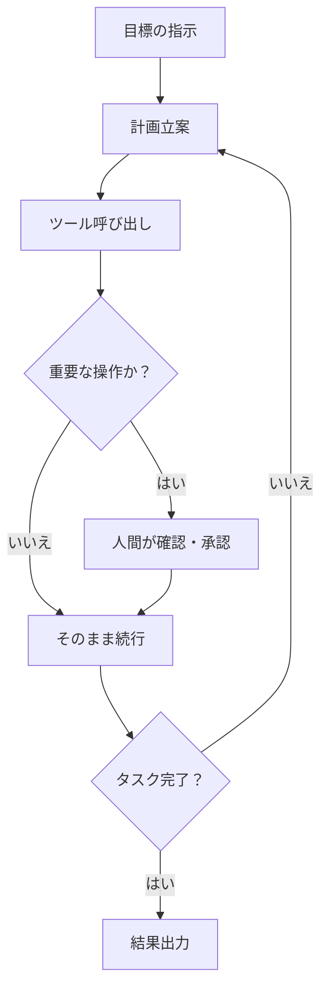
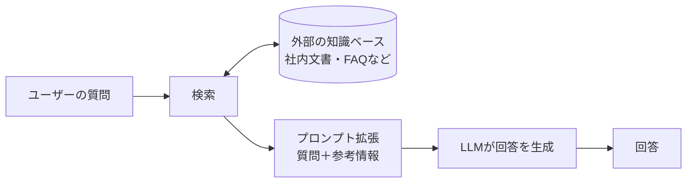

# 生成AI入門

ChatGPT・Claude・Geminiの仕組みから安全な使い方まで——2026年最新の生成AIを体系的に学ぶ

| 項目 | 内容 |
|---|---|
| カテゴリー | IT基礎知識 |
| 難易度 | 入門 |
| 所要時間 | 約120分（全6レッスン） |
| 公開日 | 2026-05-09 |
| 最終更新日 | 2026-05-13 |
| コースURL | https://skillup.college/courses/it-basics/intro-to-generative-ai/ |

## 対象者

生成AIという言葉は聞いたことがあるが、まだ本格的に使ったことがない、または使い始めて間もない社会人・学生。業務での活用や日常生活での利用を視野に入れつつ、断片的な情報ではなく仕組みから体系的に理解したい方。

## 前提知識

特になし。Webブラウザでサービスを利用した経験があれば十分。

## 学習目標

- 生成AIの基本的な仕組みと、できること・できないことを区別して説明できる
- ChatGPT・Claude・Geminiといった主要な生成AIサービスの特徴を理解し、用途に応じて選べる
- プロンプトの基本要素を理解し、目的に合った指示文を組み立てられる
- ハルシネーションが起こる理由を理解し、出力結果を批判的に評価できる
- 著作権・情報漏えいなどのリスクを理解し、安全に生成AIを活用できる

## コース概要

ChatGPTの登場から3年あまりが経ち、2026年の生成AIは日々の仕事や学習に欠かせない道具となりつつあります。本コースでは、生成AIの定義と歴史から始め、大規模言語モデルの仕組み、主要サービスの比較、プロンプトの組み立て方、マルチモーダルやAIエージェントといった発展的な活用領域、そして著作権や情報漏えいなどのリスク管理までを、初学者向けに体系立てて学びます。仕組みと使い方の両面を理解することで、流行に振り回されず長く役立つ基礎力を身につけることが目標です。

## 学習の流れ

レッスン1で生成AIの全体像と歴史を押さえ、レッスン2では大規模言語モデルの内部の仕組みを理解します。レッスン3で2026年時点の主要サービスを比較し、用途に応じた選び方を学びます。レッスン4では実際にAIへ指示を出すスキル、つまりプロンプトエンジニアリングを身につけます。レッスン5では画像生成・動画生成・AIエージェント・RAGといった広がりつつある活用領域を整理し、最後のレッスン6で著作権・情報漏えい・ガイドラインといった安全に使うための知識をまとめます。前半（レッスン1〜3）で「知識」を、中盤（レッスン4〜5）で「活用力」を、後半（レッスン6）で「リスク対応」を学ぶ三段構えの構成です。

## レッスン一覧

| No. | タイトル | 概要 | 所要時間 |
|---|---|---|---|
| 1 | 生成AIとは何か——種類と歴史をつかむ | 生成AIの定義と従来のAIとの違いを理解する。テキスト・画像・動画など主要な種類を整理し、ChatGPT登場から2026年までの流れを把握する | 18分 |
| 2 | 大規模言語モデルの仕組み——なぜAIは文章を生成できるのか | トランスフォーマー、トークン、確率予測といった基本概念を学び、ハルシネーションがなぜ起きるのかを仕組みから理解する | 20分 |
| 3 | 主要な生成AIサービスを比較する——ChatGPT・Claude・Gemini | 2026年時点で主流の3大生成AIサービスについて、提供元・モデル・特徴を整理し、用途別の使い分けを学ぶ | 20分 |
| 4 | プロンプトエンジニアリング入門——伝わる指示文の組み立て方 | プロンプトの5つの黄金要素を学び、Chain-of-Thoughtや具体例の活用といった基本テクニックを習得する | 20分 |
| 5 | マルチモーダルとAIエージェント——広がる活用領域 | 画像・動画生成、音声、AIエージェント、RAGといった発展的な活用領域を整理し、業務での活用シーンを理解する | 22分 |
| 6 | 生成AIを安全に使う——著作権・情報漏えい・ガイドライン | 生成AIの利用で発生しうる著作権リスクや情報漏えいリスクを理解し、日本のガイドラインや実務的な注意点を学ぶ | 20分 |

---

## レッスン1：生成AIとは何か——種類と歴史をつかむ

（所要時間：18分）

### このレッスンで学ぶこと

- 生成AIの定義と従来のAIとの違いを説明できる
- テキスト・画像・動画・音声・コードといった主要な種類を整理できる
- 2022年のChatGPT登場から2026年までの大きな流れを把握する
- 2026年現在の生成AIサービスの勢力図を理解する

---

### 生成AIとは何か

生成AIとは、文章・画像・音声・動画・プログラムのコードといった新しいコンテンツを、人間の指示に応じて自動的に作り出す人工知能のことを指します。英語ではジェネレーティブAI（Generative AI）と呼ばれます。

「生成」という言葉のとおり、何かを「作り出す」ことが特徴です。例えば、「桜が満開の京都の風景を描いて」と指示すれば、それに合った画像を作成してくれます。「会議の議事録を要約して」と指示すれば、長い文章から要点をまとめた文章を作ってくれます。

これまでコンピューターは、決められた手順をすばやく正確に実行することは得意でしたが、文章や絵を新しく生み出すことは苦手でした。生成AIは、この苦手分野を一変させた技術です。

### 従来のAIとの違い

人工知能、つまりAIという言葉自体は半世紀以上前から使われてきました。生成AIが登場するまでのAIは、主に「識別」や「予測」を目的としたものが中心でした。

例えば、写真に写っているのが犬か猫かを判定する画像認識AI、迷惑メールを自動的に振り分けるフィルタリングAI、天気の予測モデルなどです。これらは入力されたデータを分類したり、未来の数値を予測したりするのが主な役割でした。これらを総称して「識別AI」と呼ぶこともあります。

生成AIは、この役割を大きく拡張しました。識別や分類だけでなく、「新しいものを作り出す」ことができるようになったのです。

> **💡 ポイント**
> 識別AIは「これは犬の写真です」と判定するもの。生成AIは「犬の写真を作って」と頼まれて新しい画像を作るもの。ざっくりこのように区別すると、両者の違いがイメージしやすくなります。

### 生成AIの主要な種類

生成AIは、何を生成するかによって、いくつかの種類に分けられます。代表的なものを5つ紹介します。

**1つ目はテキスト生成AI**です。文章を生成するAIで、現在の生成AIブームの中心です。ChatGPT・Claude・Geminiなど、私たちが日常的に「AIと会話する」イメージで使うサービスの多くは、ここに分類されます。記事の執筆、メールの作成、要約、翻訳、アイデア出しなど、文章にかかわる幅広い作業をこなします。

**2つ目は画像生成AI**です。テキストで指示を出すと、それに合った画像を生成します。代表的なサービスにOpenAIのDALL-E、Midjourney、Stable Diffusionなどがあります。デザインの下書き、資料用のイラスト、広告素材の制作などに使われています。

**3つ目は動画生成AI**です。テキストや画像から動画を生成します。Google Veo、Runway、Kling AIなどが代表的です。短い宣伝動画やプロトタイプ映像などを、撮影なしで作れるようになっています。

**4つ目は音声生成AI**です。文章を読み上げる音声合成や、特定の声色を再現する音声クローンが含まれます。ナレーション制作、オーディオブック、コールセンターの自動応答などに活用されています。

**5つ目はコード生成AI**です。プログラムのソースコードを生成するAIで、ソフトウェア開発の現場で急速に普及しています。後のレッスンで触れるClaude Code・OpenAI Codex・GitHub Copilotなどが代表例です。

> **📝 補足**
> 最近の主要な生成AIサービスは、これら複数の種類を1つのモデルで扱える「マルチモーダル」化が進んでいます。ChatGPT・Claude・Geminiは、いずれもテキストだけでなく画像も読み込んで対話できます。マルチモーダルについてはレッスン5で詳しく学びます。

### 生成AIの歴史——3つの大きな転換点

生成AIが爆発的に普及するまでには、3つの大きな転換点がありました。順を追って見ていきます。

#### 第1の転換点：トランスフォーマーの登場（2017年）

現在の生成AIの土台になっているのが、「トランスフォーマー」という機械学習のモデル（仕組み）です。2017年にGoogleの研究者らが論文「Attention Is All You Need」で発表しました。

トランスフォーマーは、文章のような順序のあるデータを並列的に処理できる画期的な仕組みでした。これによって、巨大なデータを使った大規模な学習が現実的になりました。トランスフォーマーの中身については、レッスン2で詳しく学びます。

#### 第2の転換点：ChatGPTの公開（2022年）

2022年11月、OpenAIがChatGPTを一般公開しました。これが、生成AIが世間に広く知られるきっかけとなった出来事です。

ChatGPTは、自然な会話形式で文章を生成できる質の高さで、公開後わずか2か月で月間アクティブユーザー数が1億人を超え、史上最も急速に普及した消費者向けアプリケーションのひとつになりました（出典：[ロイター 2023年2月](https://www.reuters.com/technology/chatgpt-sets-record-fastest-growing-user-base-analyst-note-2023-02-01/)）。これ以降、Google・Anthropic・Metaなど多くの企業が独自の生成AIを開発・公開する競争が始まりました。

#### 第3の転換点：AIエージェント時代への移行（2024〜2026年）

2024年から2026年にかけては、「ただ会話するAI」から「自律的に作業をこなすAI」への進化が加速しました。

AIエージェントと呼ばれるこの新しい形態のAIは、ユーザーが目標を伝えると、自分で計画を立て、ツールを使い、必要に応じて軌道修正しながら、タスクの完了まで進めます。コーディング、調査、データ分析、ドキュメント作成といった一連の作業を自動化できるようになってきました。AIエージェントについてはレッスン5で詳しく扱います。

### 2026年の生成AI——現在の勢力図

2026年5月時点で、生成AIサービスは数多くありますが、代表的なものは以下の通りです。

**ChatGPT**はOpenAIが提供するサービスで、現在の主力モデルはGPT-5.5です。2026年4月にリリースされ、事実誤りが大幅に減少し、コーディングやエージェント機能でも大きく性能を伸ばしました（出典：[OpenAI 公式](https://openai.com/index/introducing-gpt-5-5/)）。

**Claude**はAnthropicが提供するサービスです。2026年4月にClaude Opus 4.7が一般公開され、長文の読解や要約、慎重な対話を求められる業務で高い評価を得ています（出典：[Anthropic 公式](https://www.anthropic.com/news/claude-opus-4-7)）。

**Gemini**はGoogleが提供するサービスで、2026年時点ではGemini 3.1 Proが最新の主力モデルです。テキスト・画像・動画・PDF・音声をまとめて扱えるマルチモーダル性能の高さが特徴です（出典：[Google 公式ブログ](https://blog.google/innovation-and-ai/models-and-research/gemini-models/gemini-3-1-pro/)）。

このほか、xAIのGrok、Microsoft Copilot、Perplexity、中国発のDeepSeekなど、特色ある選択肢が増えています。

> **📝 補足**
> 2025年初頭にはChatGPTが生成AIサービスの利用シェアの大半を占めていましたが、2026年にかけてGoogleのGeminiが急速にシェアを伸ばし、複数のサービスを使い分ける「マルチモデル時代」が到来しています。各サービスの特徴とおすすめの使い分けについては、レッスン3で詳しく整理します。

### 生成AIで何ができるのか

具体的に、現在の生成AIでできることを整理しましょう。代表的な使い道は次の通りです。

- **文章作成・編集**：メール、報告書、ブログ記事、企画書などの下書き
- **要約・翻訳**：長い文書を短くまとめる、外国語の文章を日本語に変換する
- **アイデア出し**：商品名、キャッチコピー、企画案のブレインストーミング
- **質問応答・調べもの**：知らないことを質問して説明してもらう
- **画像・動画・音声の制作**：素材としてのビジュアル・映像・ナレーションを作成する
- **プログラム作成**：簡単なコードからアプリの実装まで
- **データ分析**：表やグラフを読み取り、傾向を要約する
- **ロールプレイ・学習相手**：英会話の練習相手や面接の練習相手

一方で、苦手なこともたくさんあります。事実関係の正確さは保証されておらず、最新の出来事を知らない場合や、もっともらしい嘘を交えてしまう場合があります。なぜそうなるのかは、レッスン2で「ハルシネーション」という現象を通して詳しく学びます。

### まとめ

このレッスンでは、以下のことを学びました。

- 生成AIとは、文章・画像・音声・動画などを新しく作り出す人工知能のことである
- 従来のAIが「識別」や「予測」中心だったのに対し、生成AIは「生成」を担う点が新しい
- テキスト・画像・動画・音声・コードなど、生成するものによって種類が分かれる
- 2017年のトランスフォーマー、2022年のChatGPT、2024〜2026年のAIエージェントが3つの大きな転換点である
- 2026年の主要サービスはChatGPT・Claude・Geminiの3つが中心で、複数を使い分ける時代になっている

次のレッスンでは、ChatGPTやClaudeなどの土台になっている「大規模言語モデル」の仕組みを学びます。なぜAIは人間のような文章を作れるのか、そしてなぜ間違った情報を堂々と語ってしまうことがあるのか。仕組みを知ることで、生成AIとの付き合い方が見えてきます。

---

### 確認クイズ

このレッスンの理解度をチェックしましょう。

#### Q1. 生成AIの説明として最も適切なものはどれか？

- [ ] 写真に写っている動物の種類を判定するAI
- [x] 文章や画像など新しいコンテンツを作り出すAI
- [ ] 過去のデータから将来の売上を予測するAI
- [ ] 迷惑メールを自動で振り分けるAI

> **解説**
> 生成AIは「新しいコンテンツを作り出す」ことが特徴です。写真の判定、売上予測、迷惑メールのフィルタリングは、いずれも「識別」や「予測」を目的とした従来型のAIに分類されます。

#### Q2. 生成AIの主要な種類として、本レッスンで紹介していないものはどれか？

- [ ] テキスト生成AI
- [ ] 画像生成AI
- [ ] 動画生成AI
- [x] 重力生成AI

> **解説**
> 本レッスンで紹介した主要な種類は、テキスト・画像・動画・音声・コードの5つです。「重力生成AI」というカテゴリは存在しません。

#### Q3. 現在の生成AIの土台となっている機械学習のモデルとして正しいものはどれか？

- [ ] ロジスティック回帰
- [ ] 決定木
- [x] トランスフォーマー
- [ ] サポートベクターマシン

> **解説**
> 2017年にGoogleの研究者らが論文「Attention Is All You Need」で発表したトランスフォーマーが、現在のChatGPT・Claude・Geminiなど主要な生成AIの土台になっています。ロジスティック回帰、決定木、サポートベクターマシンは古くからある機械学習の手法ですが、現在の大規模言語モデルの中核ではありません。

#### Q4. 2022年に生成AIブームを巻き起こしたサービスとして正しいものはどれか？

- [ ] Google検索
- [ ] iPhone
- [x] ChatGPT
- [ ] Wikipedia

> **解説**
> 2022年11月にOpenAIが公開したChatGPTは、公開後わずか2か月で月間アクティブユーザー数が1億人を超え、生成AIを世界中に知らしめるきっかけになりました。

#### Q5. 2026年5月時点の主要な生成AIサービスとそのモデルの組み合わせとして正しいものはどれか？

- [ ] ChatGPT - Claude Opus 4.7
- [ ] Gemini - GPT-5.5
- [x] ChatGPT - GPT-5.5
- [ ] Claude - Gemini 3.1 Pro

> **解説**
> ChatGPTはOpenAIが提供し、2026年4月にリリースされたGPT-5.5を主力モデルとしています。Claude（Anthropic）の主力はOpus 4.7、Gemini（Google）の主力はGemini 3.1 Proです。サービス名と提供元、モデル名の組み合わせを整理しておきましょう。

#### Q6. 識別AIと生成AIの違いの説明として最も適切なものはどれか？

- [ ] 識別AIは古い技術で、生成AIに完全に置き換わった
- [x] 識別AIは分類や予測を、生成AIは新しいコンテンツの作成を主な役割とする
- [ ] 識別AIは無料で、生成AIは有料という違いがある
- [ ] 識別AIはコンピューター上で、生成AIは専用機器でしか動かない

> **解説**
> 識別AIは画像認識や売上予測のように「分類」や「予測」を行うAIで、生成AIは「新しいコンテンツの生成」を行うAIです。識別AIは現在も活躍しており、両者は役割の違うAIとして共存しています。

---

## レッスン2：大規模言語モデルの仕組み——なぜAIは文章を生成できるのか

（所要時間：20分）

### このレッスンで学ぶこと

- 大規模言語モデルの基本的な役割と特徴を説明できる
- トークン・確率予測・トランスフォーマーといった基本概念を理解する
- 学習・ファインチューニング・推論の3つの段階を区別できる
- ハルシネーションがなぜ起きるのかを仕組みから理解する

---

レッスン1では、生成AIの種類や歴史、2026年現在の主要サービスを概観しました。このレッスンでは、ChatGPT・Claude・Geminiといったテキスト生成AIの中身、つまり「大規模言語モデル」の仕組みを学びます。中身を知ると、生成AIが得意なこと・苦手なことの理由が見えてきます。

### 大規模言語モデルとは

大規模言語モデル（Large Language Model）は、単語のつながり方の傾向を膨大な文章データから学習したAIです。略してLLMと呼ばれます。

「大規模」と呼ばれるのは、学習に使われる文章の量と、モデル内部のパラメータ（学習で調整される無数の数値）の数が桁違いに大きいためです。インターネット上の記事、書籍、論文、プログラムのコードなど、人類が積み上げてきたさまざまな文章を学習素材としています。

LLMの中核的な役割は、ひとつだけです。「ある文章の続きとして、次にどの言葉が来るかを予測する」こと。これだけです。文章を要約したり、英語を日本語に翻訳したり、メールを書いたりといった多彩な仕事は、すべてこの「次の単語の予測」を繰り返すことで実現されています。

> **💡 ポイント**
> LLMは文章の意味を「理解」しているのではなく、文章の続きとして自然な単語を「予測」しているだけ、と一度割り切って捉えると、後々のハルシネーションの話が腑に落ちやすくなります。

### トークン——AIにとっての言葉の単位

LLMは、文章をそのまま処理しているわけではありません。文章をいったん「トークン」と呼ばれる小さな単位に分解してから扱います。

トークンは、英語であれば単語や単語の一部、日本語であれば数文字単位の塊のことが多いです。例えば「こんにちは」という言葉は、モデルによって「こんにちは」のように一語として扱われたり、「こん」「にちは」のように複数のトークンに分かれたりします。

LLMは、このトークンの並びを見て、次にどのトークンが来るかを確率的に予測します。文章を生成するときも、トークンを1つずつ順番に予測しながら、徐々につなげていきます。

> **📝 補足**
> AIサービスの料金は、入出力のトークン数に応じて課金されることが一般的です。「1,000トークンあたり◯円」という形で価格が設定されています。トークンは料金の単位でもあるため、長文をAIに渡したり長い回答を引き出したりすると、それだけコストもかさみます。

### トランスフォーマーとアテンション

LLMの内部で実際に予測を担っているのが、レッスン1でも触れたトランスフォーマーという構造です。トランスフォーマーは、2017年にGoogleの研究者らが発表した機械学習のモデルで、現在の主要な生成AIすべての土台になっています（出典：[論文 "Attention Is All You Need"](https://arxiv.org/abs/1706.03762)）。

トランスフォーマーの中核となるのが、「アテンション」という仕組みです。アテンションは日本語で「注意」と訳されます。文章の中のある単語を予測するときに、文中のほかのどの単語に「注意を向けるか」を計算する仕組みです。

例えば「彼はりんごを食べた。それはとても甘かった。」という文を考えてみましょう。「それ」が指しているのは「りんご」です。アテンションの仕組みは、「それ」を処理するときに「りんご」に強く注意を向けることで、こうした文脈の理解を可能にしています。

トランスフォーマーが画期的だったのは、文章を頭から1単語ずつ順番に処理する従来の仕組みではなく、文章全体を並列して処理できる点でした。この並列性のおかげで、巨大なデータを使った大規模な学習が現実的になりました。

> **🔰 初学者の方へ**
> トランスフォーマーやアテンションの数学的な詳細は、入門段階では覚える必要はありません。「文中のどの単語に注目すべきかを賢く選びながら、文章全体を一度に処理する仕組み」というイメージで十分です。

### 学習・ファインチューニング・推論

LLMが完成するまで、そして使われるまでには、大きく3つの段階があります。

#### 1. 事前学習

最初の段階は「事前学習」と呼ばれます。インターネット上の大量の文章を読み込ませ、「次の単語を予測する」訓練を延々と繰り返します。これにより、モデルは言語の構造、世の中の知識、論理の組み立て方などを獲得していきます。

事前学習には、巨大な計算資源と長い時間が必要です。GPUと呼ばれる高性能な計算装置を多数使い、数か月にわたって学習を行うのが一般的です。

#### 2. ファインチューニング

事前学習が終わった段階のモデルは、文章の続きは作れるものの、人間が望む形で答えてくれるとは限りません。例えば、質問に対して別の質問を返してきたり、危険な内容をそのまま生成したりすることがあります。

そこで「ファインチューニング」を行います。ファインチューニングは、特定の目的に合わせてモデルを追加で訓練する作業です。「人間にとって役立つ・正直・無害」な振る舞いをするように、人間が用意したお手本の対話例を学習させたり、人間からのフィードバックを使って学習させたりします。

> **📝 補足**
> 人間からのフィードバックを使った学習を「RLHF（人間のフィードバックによる強化学習）」と呼びます。ChatGPTが自然な対話ができるようになった大きな理由のひとつが、このRLHFの導入だと言われています。

#### 3. 推論

学習を終えたモデルが、ユーザーの入力に対して実際に文章を生成するときの動作を「推論」と呼びます。私たちがChatGPTやClaudeを使うとき、内部ではこの推論が行われています。

推論時、モデルは入力されたプロンプトの続きとして、トークンを1つずつ予測しながら回答を組み立てます。1トークン生成するごとに、これまでの全文を読み返し、次のトークンを予測する。この繰り返しで文章ができあがります。

### ハルシネーションが起きる理由

ここまでの仕組みがわかれば、生成AIが誤った情報を堂々と語ってしまう「ハルシネーション」という現象も理解できます。ハルシネーションは日本語で「幻覚」と訳されます（出典：[OpenAI 公式](https://openai.com/index/why-language-models-hallucinate/)）。

LLMは事実を確認しながら答えているのではなく、「文章として自然に続きそうな単語」を確率的に選んでいるだけです。学習データの中に正しい情報が含まれていても、その情報を確実に取り出せるわけではありません。学習時に出会わなかった事柄については、もっともらしいが事実とは異なる文章を作ってしまうこともあります。

例えば、「◯◯という本の著者は誰ですか」と尋ねたとします。LLMは「この種の文脈で続きそうな名前」を予測して回答します。学習データに正解があれば正しく答えられますが、なかった場合や記憶が曖昧な場合でも、それらしい答えを返してしまいます。

> **⚠️ 注意**
> ハルシネーションは、現在の技術では完全には防げないとされています。AIの回答を業務や学習に使うときは、重要な事実関係は必ず公式サイトや一次情報で裏付けを取る習慣をつけましょう。

### なぜ知識の更新には弱いのか

LLMには、もうひとつ大事な特徴があります。学習が終わった時点までの知識しか持たない、という点です。

事前学習に使われたデータには「カットオフ日」と呼ばれる区切りがあります。それより後の出来事、新しい商品、最新のニュースについては、原則として知りません。例えば「カットオフは2025年12月」というモデルに「先週のニュース」を聞いても、適切に答えられないわけです。

この弱点を補うために、LLMにWeb検索機能を組み合わせる方法や、社内文書などの外部情報を参照させる仕組みが広がっています。後者は「RAG」と呼ばれ、レッスン5で詳しく扱います。

### 文脈の長さ——コンテキストウィンドウ

LLMが一度に扱える文章の長さには上限があります。これを「コンテキストウィンドウ」と呼びます。トークン数で表され、例えば「20万トークン」のようにモデルごとに決まっています。

コンテキストウィンドウの中には、ユーザーの質問、過去のやり取り、AIへの指示文（システムプロンプト）、参考資料などすべてが含まれます。窓の大きさを超えると、古いやり取りからモデルの記憶外に押し出されてしまいます。

2026年時点のClaude Opus 4.7では最大100万トークン、ほかの主要モデルでも数十万〜100万トークン規模の長いコンテキストを扱えるようになっています。本1冊分・小規模なソースコードのリポジトリ全体を、一度にAIに見せられる時代になっています。

> **💡 ポイント**
> 「会話が長くなったら、最初の話を忘れてしまう」というAIの性質は、このコンテキストウィンドウの上限が関係しています。重要な前提は何度かに分けて伝え直したり、長い会話は新しい会話に区切ったりするのも、覚えておくと便利な使い方の工夫です。

### まとめ

このレッスンでは、以下のことを学びました。

- 大規模言語モデルは、膨大な文章データから「次の単語の予測」を学んだAIである
- 文章はトークンという単位に分解されて処理される
- トランスフォーマーとアテンションが、現在の生成AIの中核技術である
- 学習・ファインチューニング・推論の3段階を経てモデルが使われる
- ハルシネーションは、確率的に次の単語を選ぶ仕組みそのものに由来する避けがたい現象である
- 学習データのカットオフを超えた情報や、コンテキストウィンドウの上限といった制約もある

次のレッスンでは、ChatGPT・Claude・Geminiという3大生成AIサービスを並べて比較します。それぞれの提供元、モデルの特徴、得意分野を整理し、用途に応じた使い分けを学びましょう。

---

### 確認クイズ

このレッスンの理解度をチェックしましょう。

#### Q1. 大規模言語モデル（LLM）の核となる役割として最も適切なものはどれか？

- [ ] 文章の意味を完全に理解する
- [x] 次にどの単語（トークン）が来るかを確率的に予測する
- [ ] インターネット上の最新情報をリアルタイムで取得する
- [ ] 画像を生成する

> **解説**
> LLMの役割は、これまでのトークンの並びから「次のトークンを予測する」ことです。文章生成・要約・翻訳といった多彩な作業は、すべてこの予測の繰り返しで実現されています。意味の完全な理解はしておらず、画像生成は別の種類のモデルが担います。

#### Q2. トークンの説明として最も適切なものはどれか？

- [ ] AIに支払う料金の通貨単位
- [ ] AIが学習した知識の最小単位
- [x] 文章を分解した単語や単語の一部などの単位
- [ ] AIの内部にあるパラメータの種類

> **解説**
> トークンは、文章をAIが処理する際の単位です。英語では単語や単語の一部、日本語では数文字単位の塊になることが多いです。利用料金は「1,000トークンあたり◯円」のようにトークン数を基準に計算されますが、トークン自体は通貨ではありません。

#### Q3. 現在の主要な生成AIの土台となっている技術として正しいものはどれか？

- [x] トランスフォーマー
- [ ] 関係データベース
- [ ] ブロックチェーン
- [ ] ファイアウォール

> **解説**
> 2017年に発表されたトランスフォーマーは、ChatGPT・Claude・Geminiなど現在の主要な生成AIの土台となっています。アテンションという仕組みで、文章中のどの単語に注目すべきかを計算します。

#### Q4. ハルシネーションが起きる主な理由として正しいものはどれか？

- [ ] サーバーの故障で誤ったデータを返してしまうから
- [ ] AIに悪意があって嘘をつこうとしているから
- [x] 確率的に次の単語を選ぶ仕組みのため、事実かどうかを保証できないから
- [ ] ユーザーの質問が不適切だから

> **解説**
> ハルシネーションは、LLMが「事実確認」ではなく「次の単語の確率的な予測」をしている仕組みそのものに由来します。学習データに含まれていない情報や、記憶が曖昧な情報について尋ねると、もっともらしい誤った答えが返ることがあります。現在の技術では完全には防げない現象です。

#### Q5. ファインチューニングの説明として最も適切なものはどれか？

- [ ] モデルを高速に動かすためのチューニング
- [x] 事前学習後のモデルを、目的に合わせて追加学習させる工程
- [ ] ユーザーが質問するたびに行われる調整
- [ ] モデルの計算資源を最適化する工程

> **解説**
> ファインチューニングは、事前学習を終えたモデルを「人間にとって役立つ・正直・無害」な応答ができるように追加で訓練する工程です。RLHF（人間のフィードバックによる強化学習）もファインチューニングの一種です。

#### Q6. コンテキストウィンドウの説明として正しいものはどれか？

- [ ] AIが学習に使ったデータの量
- [ ] AIに表示される画面の大きさ
- [x] AIが一度に扱える文章の長さの上限
- [ ] AIの計算速度

> **解説**
> コンテキストウィンドウは、AIが一度に処理できる入力と出力の長さの上限で、トークン数で表されます。窓を超える古いやり取りは記憶外になります。2026年時点では、主要モデルで数十万〜100万トークンの長いコンテキストが扱えるようになっています。

#### Q7. LLMが「先週のニュース」について正しく答えられないことがある主な理由はどれか？

- [ ] 著作権の問題でニュースを学習していないから
- [x] 学習データには「カットオフ日」があり、それ以降の情報は基本的に持っていないから
- [ ] ニュースは画像が多く、テキストAIには扱えないから
- [ ] 政府の規制でニュース回答が禁止されているから

> **解説**
> LLMの学習データには、ある時点までの情報しか含まれていません。これを「カットオフ日」と呼びます。それ以降の出来事は基本的に知らないため、最新情報は別途Web検索機能などで補う必要があります。

---

## レッスン3：主要な生成AIサービスを比較する——ChatGPT・Claude・Gemini

（所要時間：20分）

### このレッスンで学ぶこと

- ChatGPT・Claude・Geminiの提供元と主力モデルを整理できる
- それぞれの得意分野と特徴を比較できる
- 用途に応じて適切なサービスを選べる
- そのほかの主要サービスについても概要を把握する

---

レッスン2では、大規模言語モデルの仕組みとハルシネーションが起きる理由を学びました。このレッスンでは、その仕組みを土台として作られた具体的なサービスを比較します。2026年5月時点、テキスト生成AIの中心はChatGPT・Claude・Geminiの3つです。それぞれの特徴を理解すれば、自分の目的に合った使い方が見えてきます。

### 3大生成AIサービスの基本情報

まずは提供元と主力モデルを整理しましょう。

| サービス名 | 提供元 | 主力モデル（2026年5月時点） | 主な強み |
|---|---|---|---|
| ChatGPT | OpenAI | GPT-5.5 | 汎用性、エージェント機能、知名度 |
| Claude | Anthropic | Claude Opus 4.7 | 長文処理、コード生成、安全性 |
| Gemini | Google | Gemini 3.1 Pro | マルチモーダル、Googleサービス連携 |

3つとも、無料プランと有料プランの両方を提供しています。まずは無料プランで試しに使ってみるのがよいでしょう。

### ChatGPT——汎用性で先行する代表格

ChatGPTは、生成AIブームの火付け役です。OpenAIが2022年11月に公開し、いち早く広く知られた存在になりました。

2026年5月時点の主力モデルは、2026年4月にリリースされたGPT-5.5です。前バージョンよりも事実誤りが大幅に減少し、コーディング・科学技術系の調査・コンピューター操作などの分野で性能を伸ばしました（出典：[OpenAI 公式](https://openai.com/index/introducing-gpt-5-5/)）。

特徴は「何でもできる」汎用性の高さです。文章生成・画像生成（DALL-E）・音声会話・Web検索・データ分析・コード実行といった機能を、単一のサービスから利用できます。プラグインやGPTsと呼ばれる拡張機能を使えば、独自のチャットボットを作ることも可能です。

> **📝 補足**
> 「GPT-5.5 Instant」は、ChatGPTの標準的な対話で使われる軽量・高速版です。複雑な思考を要する問題には、より深く考える「Thinking」モードに切り替えるのが定石です。普段はInstant、難しい問題はThinking、と使い分けましょう。

向いている用途は次の通りです。

- アイデアの幅広いブレインストーミング
- 画像生成と文章生成を1つの会話で行いたい場合
- 音声で会話しながら使いたい場合
- 数多くのプラグインや拡張機能を使いたい場合

### Claude——長文処理と慎重さが光る

Claudeは、Anthropicが提供する生成AIサービスです。Anthropicは、OpenAIの元メンバーが設立した会社で、AIの安全性研究を強く打ち出している点が特徴です。

2026年5月時点の主力モデルは、2026年4月に一般公開されたClaude Opus 4.7です。前バージョンと比べて、コーディング能力と画像理解の解像度が大きく向上しました（出典：[Anthropic 公式](https://www.anthropic.com/news/claude-opus-4-7)）。

Claudeの強みは、長い文章を扱う能力の高さと、答えに慎重で説明が丁寧な点です。本1冊分にあたる数十万トークンの文書を読み込ませても、要点を正確に拾い上げます。プログラミング作業の支援でも高く評価されており、Anthropic自身が提供するエージェント型コーディングツール「Claude Code」の主力エンジンとなっています。

> **💡 ポイント**
> Claudeは「正確さ」と「慎重さ」を重視する設計です。事実が確認できないことは「わからない」と答える傾向があり、無理に答えを作らない安心感があります。法律・医療・金融などの正確性が大事な分野で重宝されます。

向いている用途は次の通りです。

- 長文の読解・要約・翻訳
- プログラミング、特に大規模なコードベースの修正・レビュー
- 慎重な検証が求められる業務文書の作成
- 倫理的に難しいテーマの整理

### Gemini——マルチモーダルとGoogle連携の強み

Geminiは、Googleが提供する生成AIサービスです。Google Bardという名称で2023年に提供されていたサービスを、2024年にGeminiへとリブランドしました。

2026年5月時点の主力モデルはGemini 3.1 Proです。日常のチャット用には、より軽量・高速な「Gemini 3 Flash」が標準モデルとして提供されています（出典：[Google 公式ブログ](https://blog.google/products-and-platforms/products/gemini/gemini-3/)）。

Geminiの最大の強みは、テキスト・画像・動画・PDF・音声を同時に扱えるマルチモーダル性能です。動画ファイルを読み込ませて要約させる、長いPDF資料を画像と一緒に読み解くといった、複数の形式の情報をまたいだ作業が得意です。

もうひとつの強みは、Google検索・Googleドライブ・Gmail・Googleカレンダーといった既存のGoogleサービスとの連携です。Google Workspaceを使う組織では、業務ツールの中に自然にAIが入り込みます。

向いている用途は次の通りです。

- 動画や画像を含む資料の分析
- 長いPDFやスプレッドシートの要約・分析
- Google Workspace（Gmail・ドライブなど）での業務支援
- 最新情報を含む検索的な質問

### 性能比較——どのサービスが「最強」なのか

2026年現在、3つのサービスはどれも非常に高い水準にあり、「これが圧倒的に優れている」という単純な序列はつけにくくなっています。GPT-5.5・Claude Opus 4.7・Gemini 3.1 Proは、いずれも各種ベンチマークでトップクラスの性能を示しています。

性能差は、タスクの種類によって入れ替わります。例えば、コーディングのベンチマークではGPT-5.5が高い数値を出す一方、別の指標ではClaude Opus 4.7がリードしています。動画や画像を含むマルチモーダルな課題ではGeminiが強みを発揮するなど、得意・不得意がはっきりと分かれます。

> **⚠️ 注意**
> ベンチマークの数値は更新が速く、数か月で順位が入れ替わります。「いま最も性能が高いAIはどれか」を追いかけ続けるよりも、「自分の用途に向いているのはどれか」を見極める方が、実務的には役に立ちます。

### 3大サービス以外の主要な選択肢

ChatGPT・Claude・Gemini以外にも、特色のあるサービスがいくつかあります。代表的なものを4つ紹介します。

**Microsoft Copilot**は、MicrosoftがWindowsやMicrosoft 365に組み込んでいるAIアシスタントです。OpenAIのモデルを基盤としつつ、AnthropicのClaudeも選んで使えるマルチモデル対応が進んでいます。Word・Excel・PowerPointといった日常業務ツールに直接AIを呼び出せる点が特徴です。

**Perplexity**は、AI検索に特化したサービスです。質問に対して、Web上の情報源を明示しながら回答を生成します。情報の出典がはっきりしているため、調べもの用途で支持を集めています。

**xAI Grok**は、イーロン・マスクが設立したxAIが提供するサービスです。X（旧Twitter）と統合され、リアルタイムのソーシャルメディア情報を踏まえた回答に強みがあります。

**DeepSeek**は、中国発のオープンソース系生成AIです。高い性能と公開された重み（モデルのパラメータ）が特徴で、企業が自社サーバーで動かす用途でも注目されています。

### 用途別の使い分けの目安

実際に使うときの目安として、以下のような選び方が考えられます。

**長い文書を扱うとき**は、Claude Opus 4.7が有力候補です。数十万トークンの文書も丁寧に処理します。

**動画や画像を含む資料を扱うとき**は、Gemini 3.1 Proが向いています。マルチモーダル処理で先行しています。

**何でも幅広く試してみたいとき**や**画像生成と文章生成を一体で使いたいとき**は、ChatGPTが扱いやすいです。

**WordやExcelで仕事をしているとき**は、Microsoft Copilotがそのまま業務に溶け込みます。

**情報源が必要な調べものをするとき**は、Perplexityが便利です。

> **💡 ポイント**
> 1つのサービスに固定する必要はありません。多くの利用者は、無料プランや手頃な有料プランで複数のサービスを使い分けています。「このタスクはClaude」「これはGemini」と用途別に切り替えることが、2026年の生成AI活用の主流になりつつあります。

### まとめ

このレッスンでは、以下のことを学びました。

- 2026年5月時点の3大生成AIはChatGPT（GPT-5.5）・Claude（Opus 4.7）・Gemini（3.1 Pro）である
- ChatGPTは汎用性・エージェント機能、Claudeは長文処理・コード生成、Geminiはマルチモーダル・Google連携が強み
- ベンチマーク上の性能差は小さくなっており、用途に応じた使い分けが現実的である
- Microsoft Copilot・Perplexity・Grok・DeepSeekといった選択肢もある

次のレッスンでは、これらのサービスを実際に活かすためのスキル「プロンプトエンジニアリング」を学びます。同じAIでも、指示の出し方しだいで結果が大きく変わります。質の高い回答を引き出すコツを身につけましょう。

---

### 確認クイズ

このレッスンの理解度をチェックしましょう。

#### Q1. ChatGPT・Claude・Geminiのそれぞれの提供元の組み合わせとして正しいものはどれか？

- [ ] ChatGPT - Google／Claude - OpenAI／Gemini - Anthropic
- [x] ChatGPT - OpenAI／Claude - Anthropic／Gemini - Google
- [ ] ChatGPT - Microsoft／Claude - Google／Gemini - OpenAI
- [ ] ChatGPT - Anthropic／Claude - Microsoft／Gemini - Google

> **解説**
> ChatGPTはOpenAIが、ClaudeはAnthropicが、GeminiはGoogleが提供しています。サービス名と提供元の対応はよく問われるポイントです。

#### Q2. Claudeの強みとして本レッスンで紹介した特徴はどれか？

- [ ] X（旧Twitter）の最新情報を踏まえた回答に強い
- [x] 長文の読解・要約・コード生成に強く、慎重で丁寧な回答を返す
- [ ] 動画や画像を含むマルチモーダルな処理が最も得意
- [ ] 画像生成機能が他社に比べて圧倒的に優れている

> **解説**
> Claudeの強みは、長文処理の能力の高さと、慎重で説明が丁寧な応答スタイル、そして高いコード生成性能です。Xとの連携はGrok、マルチモーダルはGeminiの強みです。Claude自体は画像生成機能を主力としていません。

#### Q3. Geminiが特に強みを発揮しやすい用途はどれか？

- [ ] 短い雑談チャット
- [ ] 数学の暗算
- [x] 動画や画像、PDFなど複数の形式の資料を組み合わせた分析
- [ ] 古い書籍の電子化

> **解説**
> Geminiは、テキスト・画像・動画・PDF・音声を同時に扱えるマルチモーダル性能が大きな強みです。動画やPDFを含む業務資料の分析に向いています。

#### Q4. Perplexityの特徴として最も適切なものはどれか？

- [ ] 動画生成に特化したサービスである
- [ ] 中国発のオープンソース系AIである
- [x] AI検索に特化し、回答に情報源を明示する
- [ ] Microsoft 365に統合されたAIアシスタントである

> **解説**
> Perplexityは「回答エンジン」とも呼ばれ、回答の根拠となるWeb上の情報源を明示する点が特徴です。動画生成はSoraやVeo、Microsoft 365統合はMicrosoft Copilot、中国発のオープンソース系はDeepSeekです。

#### Q5. 2026年現在の生成AIサービスの選び方として最も適切な考え方はどれか？

- [ ] ベンチマーク総合1位のサービスだけ使えばよい
- [ ] 一度選んだサービスに固定し、ほかは使わないほうがよい
- [x] 用途や場面に応じて複数のサービスを使い分けるのが現実的である
- [ ] 自分でAIを開発しないと業務には使えない

> **解説**
> 2026年現在、ChatGPT・Claude・Geminiといった主要サービスの性能差はタスクごとに入れ替わっています。1つに固定するのではなく、長文はClaude、マルチモーダルはGemini、汎用はChatGPT、というように用途で使い分けるのが現実的です。

#### Q6. Microsoft Copilotの特徴として最も適切なものはどれか？

- [ ] AnthropicのみのモデルでGoogleのモデルは使えない
- [x] Word・Excel・PowerPointなどMicrosoft 365に統合されており、複数のAIモデルを切り替えて使える
- [ ] AI検索に特化したサービスである
- [ ] 動画生成専用のサービスである

> **解説**
> Microsoft Copilotは、Windowsや Microsoft 365 製品群に組み込まれて業務ツールから直接呼び出せます。OpenAIのモデルを基盤に、AnthropicのClaudeも選択できるマルチモデル対応が進んでいます。

---

## レッスン4：プロンプトエンジニアリング入門——伝わる指示文の組み立て方

（所要時間：20分）

### このレッスンで学ぶこと

- プロンプトとプロンプトエンジニアリングの意味を理解する
- 伝わるプロンプトの5つの黄金要素を組み立てられる
- Few-shotプロンプティングとChain-of-Thoughtの使い方を知る
- よくある失敗パターンと改善のコツを理解する

---

レッスン3では、ChatGPT・Claude・Geminiという主要サービスの特徴を比較しました。同じサービスでも、指示の出し方しだいで結果は驚くほど変わります。このレッスンでは、AIから望む答えを引き出すスキル「プロンプトエンジニアリング」の基本を学びます。

### プロンプトとは

プロンプトとは、AIに対して送る指示文や質問文のことです。「カレーの作り方を教えて」「この文章を英語に翻訳して」といった、私たちがAIに入力するテキストすべてがプロンプトです。

LLMはレッスン2で学んだとおり、与えられた文章の続きを予測して回答を作ります。つまり、入力したプロンプトの質がそのまま回答の質を決める、と言っても言い過ぎではありません。良いプロンプトは良い回答を、曖昧なプロンプトは曖昧な回答を引き出します。

### プロンプトエンジニアリングとは

プロンプトエンジニアリングとは、生成AIから望ましい回答を引き出すために、プロンプトを工夫して設計するスキルのことです。「エンジニアリング」と名前は付いていますが、特別なプログラミング知識は不要で、誰でも文章の書き方の工夫として身につけられます。

専門資格や難しいツールは要りません。重要なのは、AIに「やってほしいことを正確に伝える」習慣を身につけることです。

> **💡 ポイント**
> プロンプトエンジニアリングは、人に仕事を依頼するときの「依頼書の書き方」と似ています。「いい感じに資料を作っといて」と頼むより、「会議用の3枚スライド、テーマはA、対象は新入社員、で作って」と頼んだほうが、人間にもAIにも伝わりやすいのです。

### 伝わるプロンプトの5つの黄金要素

良いプロンプトの条件は、5つの要素に整理できます。これらをすべて入れる必要はありませんが、難しい依頼ほど多く含めると効果的です。

#### 1. 役割（Role）

AIにどのような立場で答えてほしいかを伝えます。「あなたは経験豊富な編集者です」「あなたはマーケティング担当者として答えてください」のように指定します。役割を与えることで、回答のトーンや視点が安定します。

#### 2. 文脈（Context）

なぜこの依頼をするのか、どんな状況で使うのか、対象は誰かといった背景情報を伝えます。「新入社員向けの研修資料として」「中学生にもわかるように」など、目的や対象が明確になると的確な答えが返ります。

#### 3. タスク（Task）

具体的に何をしてほしいかを書きます。「要約して」「比較表を作って」「メールの本文を書いて」など、動詞を使ってはっきりと指示します。

#### 4. 制約（Constraints）

文字数、含めるべきキーワード、避けたい表現、フォーマットの制限などを伝えます。「500字以内で」「専門用語は使わずに」「箇条書きで5つ」といった条件です。

#### 5. 出力形式（Format）

どのような形で答えてほしいかを指定します。「Markdownの表で」「JSONで」「見出しと箇条書きを使って」など、用途に合わせた形式を求めます。

> **📝 補足**
> 5つの要素を意識した例をひとつ示します。「あなたはWebサイトの編集者です（役割）。BtoB向けの自社ブログに掲載する記事の冒頭文を書きます（文脈）。次のテーマで200字以内のリード文を書いてください（タスク・制約）。テーマ：『中小企業のDX推進』。出力はリード文のみ、装飾なしのプレーンテキストで（出力形式）」。具体的にすればするほど、結果は安定します。

### 悪い例と良い例

簡単な事例で、プロンプトの違いが結果にどう影響するかを見てみます。

**悪い例：「ブログを書いて」**

これではテーマも長さも対象も決まりません。AIはとりあえず汎用的なブログ記事を作るしかなく、ピントの外れた回答になりがちです。

**良い例：「あなたは中小企業のITサポート担当者です。社内ブログ向けに、初心者社員に向けたパスワード管理の心得をテーマに、約400字、です・ます調、見出しなしの一段落構成で書いてください」**

役割・文脈・タスク・制約・出力形式が揃っており、想定される回答の幅がぐっと狭くなります。

### Few-shotプロンプティング——例示の力

具体例を一緒に見せることで、AIの回答品質を大きく上げる手法があります。これを「Few-shotプロンプティング」と呼びます。「Few-shot」は「いくつかの例」という意味で、何個かのお手本を見せながら指示を出します。

例えば「商品名のキャッチコピーを作って」と頼むより、お手本となる過去のキャッチコピーを2〜3例示しながら「このスタイルで新しい商品名のキャッチコピーを作って」と頼んだほうが、自社らしいトーンに沿った答えが返ります。

> **💡 ポイント**
> 何も例を示さない頼み方を「ゼロショット（Zero-shot）」と呼びます。ゼロショットでうまくいかないときは、Few-shotに切り替えるのが定石です。「もっと具体例を見せれば伝わるかな」という発想で、お手本を1〜3個入れてみてください。

### Chain-of-Thought——考えるプロセスを書かせる

複雑な問題では、答えだけでなく「考えるプロセス」をAIに書かせると、正答率が上がる傾向があります。これを「Chain-of-Thought（思考連鎖）」と呼びます。

例えば、計算問題や論理パズルで、「答えだけ教えて」と聞くより、「まず手順を整理し、次に1つずつ計算してから結論を述べて」と頼むほうが、正確な答えを得やすくなります。プロンプトの中に「ステップごとに考えてください」「順を追って説明してください」といった指示を入れるだけで、効果が出ることがあります。

ただし、2026年の最新モデルの多くは、複雑な質問に対して自動的に「考える時間」を取る「Thinking」モードを備えています。例えばChatGPTのGPT-5.5には、必要に応じてThinkingモードに切り替わる仕組みがあります。簡単な問題には軽量モード、難しい問題にはThinkingモード、と使い分けると効率的です。

### コンテキストエンジニアリング——プロンプトの先へ

2026年に入ってから、「プロンプトエンジニアリング」だけでなく「コンテキストエンジニアリング」という言葉も広がっています。コンテキストエンジニアリングとは、AIに与える情報全体、つまり指示文だけでなく参考資料・過去の会話履歴・外部データ・利用可能なツールまで含めて、最適に設計しようという考え方です。

レッスン2で触れたコンテキストウィンドウには、ユーザーのプロンプトだけでなく、過去のやり取り、参考にさせたい資料、AIに使わせるツールの情報など、すべてが詰め込まれます。何を入れて何を入れないかの取捨選択が、回答の質を左右します。

業務でAIを本格活用する場合は、プロンプト1つの良し悪しだけでなく、AIが利用するコンテキスト全体を意識して設計する視点が重要になります。

> **📝 補足**
> 「コンテキストエンジニアリング」は、特に専門性の高いAIアシスタントを作る場合に重要になります。社内文書、業務マニュアル、過去のFAQをコンテキストとして与えることで、自社専用に近いふるまいをするAIが作れます。レッスン5で扱う「RAG」も、コンテキストエンジニアリングの代表的な実装手段です。

### よくある失敗と改善のコツ

入門段階でつまずきがちなパターンを4つ紹介します。

**失敗1：曖昧な指示で曖昧な答えが返る**

「うまくまとめて」「いい感じに」だけでは、AIは判断できません。長さ、対象、口調、形式を具体的に指定しましょう。

**失敗2：前提や背景を省く**

何の話か、誰向けか、なぜ必要かを書かないと、AIは一般論で答えるしかなくなります。1〜2文で背景を添えるだけで、答えの精度がぐっと上がります。

**失敗3：1つのプロンプトに詰め込みすぎる**

「市場調査を行い、競合の比較表を作り、SWOT分析を出して、最後に提案書をまとめて」と一度に頼むと、各工程が浅くなりがちです。複雑な依頼は工程を分割し、ステップごとに会話を進めるほうが質の高い答えが得られます。

**失敗4：間違った答えを訂正せず、そのまま使う**

AIの答えに誤りがあったら、「ここは違う、正しくはこうです」と指摘して再度作り直してもらう「対話の繰り返し」が大事です。1回で正解が出なくても、対話を通じて精度を高めていけます。

> **⚠️ 注意**
> 同じプロンプトでも、AIは毎回まったく同じ回答を返すとは限りません。LLMは確率的に次の単語を選ぶため、わずかなブレが生じます。重要な業務では、複数回試して結果を見比べる、別のサービスでも検証するといった習慣をつけましょう。

### まとめ

このレッスンでは、以下のことを学びました。

- プロンプトとは、AIへの指示文や質問文のことである
- 良いプロンプトは「役割・文脈・タスク・制約・出力形式」の5つの要素を意識する
- Few-shotプロンプティングは、お手本を見せて回答の質を上げる手法である
- Chain-of-Thoughtは、考えるプロセスを書かせることで複雑な問題の正答率を上げる手法である
- 2026年では、プロンプトだけでなくコンテキスト全体を設計する考え方も広がっている
- 曖昧な指示・詰め込みすぎ・誤答の放置は、よくある失敗パターンである

次のレッスンでは、テキスト以外の領域へと視野を広げます。画像生成、動画生成、AIエージェント、RAGといった2026年に注目される活用領域を整理し、業務での実用シーンを学びます。

---

### 確認クイズ

このレッスンの理解度をチェックしましょう。

#### Q1. プロンプトエンジニアリングの説明として最も適切なものはどれか？

- [ ] 生成AIを開発するためのプログラミング技術
- [x] AIから望ましい回答を引き出すために指示文を工夫するスキル
- [ ] AIサーバーを管理するためのインフラ技術
- [ ] AIの学習データを編集する技術

> **解説**
> プロンプトエンジニアリングは、生成AIに対する指示文（プロンプト）を工夫して、望む結果を引き出すスキルです。プログラミング技術ではなく、文章の書き方の工夫として誰でも身につけられます。

#### Q2. 伝わるプロンプトの「5つの黄金要素」に含まれないものはどれか？

- [ ] 役割（Role）
- [ ] 文脈（Context）
- [x] 価格（Price）
- [ ] 出力形式（Format）

> **解説**
> 本レッスンで紹介した5つの要素は、役割・文脈・タスク・制約・出力形式です。価格は含まれません。

#### Q3. Few-shotプロンプティングの説明として正しいものはどれか？

- [ ] 短いプロンプトで質問する手法
- [x] お手本となる例を1〜3個示してから指示する手法
- [ ] 同じプロンプトを連続で繰り返す手法
- [ ] AIに料金を多く払うほど精度が上がる手法

> **解説**
> Few-shotは「いくつかの例」を意味します。お手本を一緒に見せることで、AIに望むスタイルを伝え、回答の質を上げるテクニックです。

#### Q4. Chain-of-Thoughtの説明として最も適切なものはどれか？

- [ ] AIモデルを連続でつなげて使う手法
- [x] AIに考えるプロセスを順を追って書かせ、複雑な問題の正答率を上げる手法
- [ ] AIに鎖のように長い文章を作らせる手法
- [ ] AIの動作速度を上げる技術

> **解説**
> Chain-of-Thought（思考連鎖）は、複雑な問題に対してAIに「ステップごとに考えてください」と指示し、考えるプロセスを書かせる手法です。論理的な推論や計算問題で正答率が上がる傾向があります。

#### Q5. プロンプト作成のよくある失敗として、本レッスンで紹介していないものはどれか？

- [ ] 曖昧な指示で曖昧な答えが返る
- [ ] 前提や背景を省く
- [ ] 1つのプロンプトに詰め込みすぎる
- [x] AIに対して敬語を使う

> **解説**
> 本レッスンで紹介した失敗パターンは、曖昧な指示、前提や背景の省略、詰め込みすぎ、誤答の放置の4つです。AIに敬語を使うかどうかは結果に大きく影響しません。好みで構いません。

#### Q6. コンテキストエンジニアリングの説明として最も適切なものはどれか？

- [ ] AIモデルを開発する際の数学的設計
- [ ] AIサービスのUIデザイン手法
- [x] プロンプトだけでなく参考資料や過去のやり取りなど、AIに与える情報全体を最適に設計する考え方
- [ ] AIの計算効率を上げるアルゴリズム

> **解説**
> コンテキストエンジニアリングは、プロンプト単体ではなく、AIに渡す情報全体（指示文・参考資料・履歴・利用可能なツールなど）を設計する考え方です。2026年に重要性が増している概念です。

#### Q7. 同じプロンプトを送ったのに、AIの回答が前回と少し違っていた。最も近い理由はどれか？

- [ ] AIが故障している
- [x] LLMは確率的に次の単語を選ぶため、回答にはわずかなブレが生じることがある
- [ ] サーバーが攻撃されている
- [ ] プロンプトを書き換えなかったのが悪い

> **解説**
> LLMは「次の単語の確率分布」から単語を選ぶ仕組みのため、毎回まったく同じ回答になるとは限りません。重要な業務では複数回試して結果を比較するのが望ましいです。

---

## レッスン5：マルチモーダルとAIエージェント——広がる活用領域

（所要時間：22分）

### このレッスンで学ぶこと

- マルチモーダルAIの考え方と画像・動画・音声生成の現状を理解する
- AIエージェントの仕組みと従来のチャット型AIとの違いを説明できる
- RAGの基本的な動作と業務での使われ方を把握する
- ファインチューニングと小規模言語モデルの位置付けを知る

---

レッスン4では、プロンプトエンジニアリングを学び、AIへの指示の出し方を身につけました。このレッスンでは、テキストだけにとどまらない生成AIの広がりを見ていきます。マルチモーダル、AIエージェント、RAG、ファインチューニングといった用語を整理し、業務での活用シーンを理解しましょう。

### マルチモーダルAIとは

マルチモーダルとは、複数の「モダリティ」を扱えることを意味します。モダリティとは、情報の形式のことで、テキスト・画像・音声・動画などがそれにあたります。

従来のLLMはテキストだけを扱うものでした。マルチモーダルAIは、テキストに加えて画像・音声・動画などを同時に処理できます。例えば、PDF資料の中身を読み取って要約したり、写真を見せて「この花の名前は？」と質問したり、動画の内容を文章でまとめたりといった作業が可能です。

2026年5月時点の主要サービスは、いずれもマルチモーダル化が進んでいます。ChatGPT・Claude・Geminiは、テキストだけでなく画像も読み込めます。Geminiは、動画やPDF、音声まで一度に扱える点で先行しています。

> **💡 ポイント**
> 仕事で使う資料は、文章だけでなく図表や画像が混ざっていることが多いものです。マルチモーダル対応のAIなら、資料一式をそのまま読み込ませて質問できます。「この資料を3行で要約して」「グラフが示している傾向を教えて」といった依頼が、文書を打ち直すことなく行えるのが大きな利点です。

### 画像生成AIの現在地

画像生成AIは、テキストの指示から新しい画像を作り出します。代表的なサービスは、OpenAIのDALL-E、Midjourney、Stable Diffusionなどです。ChatGPTやGeminiといったチャットサービスの中から、画像生成機能を呼び出して使うこともできます。

画像生成AIの典型的な使い道は、広告素材、ブログのアイキャッチ画像、プレゼン資料のイラスト、商品のイメージ画像などです。著作権フリーの素材集を探す手間が大きく減り、ブランドに合った画像を即座に用意できるようになりました。

ただし、画像生成AIには注意点もあります。学習データに含まれる既存の作品に類似した画像が出力されることがあり、著作権侵害のリスクがあります。商用利用のルール、生成画像の権利の所在、ガイドラインの遵守については、レッスン6で詳しく扱います。

### 動画生成AIの躍進

動画生成AIは、2025〜2026年に大きく実用化が進んだ領域です。テキストの指示から短い映像を作り出します。

主要なサービスはGoogleのVeo、Runway、Kling AIなどです。OpenAIが提供していたSoraは、2026年3月にアプリおよびAPIの提供を終了しました（出典：[起業の「わからない」を「できる」に](https://sogyotecho.jp/sora2/)）。動画生成市場は競争が激しく、ツールの再編がたびたび起きています。

2026年の動画生成AIの大きなトレンドは、音声同時生成です。これまでは「映像を作る→別のAIでナレーションを作る→編集ソフトで合成する」という3つの工程が必要でしたが、現在はテキスト1つで映像も音声もまとめて生成できるようになりました。

> **📝 補足**
> 動画生成AIは、まだ仕上がりの細部に課題が残ります。長尺の映像、複雑な動き、複数のキャラクターが整合的に動くシーンは苦手です。プロトタイプ映像、短い説明動画、SNS用の素材といった用途には十分実用的ですが、商用作品ではプロの編集者による補正が前提になります。

### 音声生成AI

音声生成AIは、文章を読み上げる「音声合成」と、特定の声を再現する「音声クローン」の2方向に進化しています。読み上げの自然さは年々向上し、人間の発話とほぼ区別がつかない水準に達しています。

業務での主な活用シーンは、社内向けナレーション、オーディオブック、コールセンターの自動応答、Eラーニング教材の音声化などです。Google Geminiでは、70以上の言語に対応した音声合成モデル「Gemini 3.1 Flash TTS」も提供されており、多言語対応の音声制作が手軽になっています。

一方、音声クローンは詐欺などの悪用懸念が大きく、各サービスは利用条件を厳格化しています。本人の同意なく他人の声を再現することは、肖像権・パブリシティ権の侵害につながる可能性があります。

### AIエージェントとは

AIエージェントは、ユーザーが目標を伝えると、自分で計画を立て、必要なツールを使い、軌道修正しながらタスクを完了まで進めるAIです。レッスン1で触れた「ただ会話するAI」から「自律的に作業をこなすAI」への進化が、AIエージェントとして実体化しています。

従来のチャット型AIとの違いは、次のように整理できます。

- **従来のチャット型AI**：質問に答えるが、行動はしない。「明日のスケジュールを教えて」と聞かれて答えはするが、カレンダーに予定を追加することはできない
- **AIエージェント**：目標を伝えると行動する。「来週金曜の14時にA社との会議を1時間予約して」と頼めば、カレンダーに予定を入れ、関係者を招待し、会議室を確保するところまで自動で進める

AIエージェントが扱うツールは、Web検索、メール送信、カレンダー操作、ファイル操作、ブラウザの自動操作、社内システムの呼び出しなど多岐にわたります。複数のツールを組み合わせ、結果を確認しながら次の手を決めるため、これまで人間が行っていた一連の業務を任せられる可能性があります。

> **💡 ポイント**
> 2026年に話題のキーワード「Claude Code」「OpenAI Codex」「Microsoft Copilot」のエージェント機能は、いずれもAIエージェントの一種です。特にClaude Code・OpenAI Codexは、ソフトウェア開発の現場で急速に普及し、コーディング作業の進め方そのものを変えつつあります。

#### Human-in-the-Loop——人間が関わり続ける設計

AIエージェントは強力な一方、「自律的に行動する」ことのリスクも生まれます。誤った操作で重要なデータを消したり、見当違いのメールを送ってしまったりする可能性があります。

そのため、2026年現在、多くの企業ではエージェントの動作に「Human-in-the-Loop」、つまり人間が必ず関わる仕組みを取り入れています。重要な操作の前に必ず人間が確認・承認するステップを設けることで、暴走を防ぎます。

エージェントの基本的な動作フローを図にすると、次のようになります。

注目したいのは、ひし形で示した「重要な操作か？」の分岐です。データの書き換え・メール送信・課金などの重要操作だけに人間の確認を挟むことで、安全性と効率を両立させます。

> **⚠️ 注意**
> AIエージェントを業務に導入する際は、「何を任せ、何は人間が確認するか」の境界線を最初に決めることが大切です。情報の参照や下書きの作成は任せても、最終的な発信や金銭的な決定は人間が行う、といった区分けが基本です。

### RAG——AIに自社の知識を持たせる仕組み

RAG（ラグ）は、Retrieval-Augmented Generationの略で、日本語では「検索拡張生成」と訳されます。生成AIが回答を作るときに、外部のデータベースから関連情報を検索し、その情報を参考にして回答を組み立てる仕組みです。

RAGの動作は3つのステップで進みます。1つ目は「検索」、ユーザーの質問に関係する情報を社内文書などのデータベースから探します。2つ目は「拡張」、見つけた情報をプロンプトに追加します。3つ目は「生成」、追加された情報を踏まえてLLMが回答を作ります。

図にすると、ユーザー・外部の知識ベース・LLMの3者が次のように関わり合います。

通常のチャット型AIが「ユーザーの質問→LLM→回答」だけの構造なのに対し、RAGでは外部の知識ベースを参照する経路が加わるのがポイントです。

RAGを導入する利点は2つあります。1つは、ハルシネーションを大きく減らせること。AIが自分の記憶頼みで答えるのではなく、参照した文書の内容に沿って回答できます。もう1つは、自社の独自情報を活用できること。社内マニュアル、業務規程、過去のFAQなど、AI標準では知り得ない情報をAIに「持たせる」ことができます。

業務での主な活用シーンは、社内向けのチャットボット、製品サポート、社内文書の検索アシスタント、研修用のQ&Aツールなどです。社内の知識資産をAIで活用したい場合、RAGはほぼ必須の選択肢になっています。

> **📝 補足**
> 2026年時点で、企業の86%がすでにRAGを活用しているという調査結果もあります（出典：[Note記事](https://note.com/rin7220/n/n68eb0887ebca)）。AIを業務に組み込むうえでの基本要素として、定着しつつあります。

### ファインチューニングと小規模言語モデル

ファインチューニングは、レッスン2でも触れたように、既存のモデルを特定の用途に合わせて追加学習させる手法です。法律文書、医療用語、自社のブランドトーンといった特定領域に強いAIを作りたい場合に使われます。

ただし、ファインチューニングは時間とコストがかかります。多くの場合、まずプロンプトエンジニアリングとRAGで十分な結果が得られないかを試し、それでも要件を満たせない場合の手段として検討するのが実務的です。

一方、近年は「小規模言語モデル」（Small Language Model、略してSLM）も注目されています。SLMは、大規模言語モデルよりサイズが小さく、特定領域に特化したモデルです。スマートフォンや社内の独自サーバーで動かしやすく、機密データを外部に出さずに使える利点があります。汎用性は劣るものの、用途を絞った業務であれば十分実用的です。

> **💡 ポイント**
> 「すべての業務に最大規模のLLMを使う必要はない」という発想が広がっています。簡単な分類や定型処理は小規模なモデルで十分ということもあります。コストとセキュリティを考えると、適材適所の使い分けが現実的です。

### まとめ

このレッスンでは、以下のことを学びました。

- マルチモーダルAIは、テキスト・画像・音声・動画など複数の形式の情報を同時に扱える
- 画像生成AIは広告・資料制作で実用化が進み、動画生成AIは音声同時生成のトレンドが進んでいる
- AIエージェントは、目標を伝えれば計画・実行・修正までを自律的に進めるAIである
- AIエージェントの導入には、Human-in-the-Loopによる人間の確認が重要である
- RAGは、外部の情報源を参照させることでハルシネーションを減らし、自社知識を活用するための仕組みである
- ファインチューニングや小規模言語モデルは、用途に合わせた選択肢として活用が広がっている

最後のレッスンでは、生成AIを安全に使うための知識を整理します。著作権・情報漏えい・利用ガイドラインといった、業務でAIを使ううえで避けて通れないテーマを学びましょう。

---

### 確認クイズ

このレッスンの理解度をチェックしましょう。

#### Q1. マルチモーダルAIの説明として最も適切なものはどれか？

- [ ] 複数のAIモデルを切り替えて使う仕組み
- [x] テキスト・画像・音声・動画など複数の形式の情報を扱えるAI
- [ ] 複数のユーザーが同時に使えるAI
- [ ] 多言語に対応したAI

> **解説**
> マルチモーダルとは「複数のモダリティ（情報の形式）を扱える」ことを指します。テキスト・画像・音声・動画など、形式の異なる情報をまたいで処理できるAIです。

#### Q2. 2026年の動画生成AIの大きなトレンドとして、本レッスンで紹介したものはどれか？

- [ ] 動画は完全自動化され、編集者が不要になった
- [ ] 動画生成は無料で無制限に使えるようになった
- [x] テキスト1つで映像と音声をまとめて生成できるようになった
- [ ] すべての動画生成サービスが統一規格に対応した

> **解説**
> 2026年の動画生成AIでは、音声同時生成が大きなトレンドです。映像とナレーションや効果音を別々に作って合成する従来の手順が、テキストの指示一つで完結するようになりました。長尺や複雑な動きには課題が残るため、編集者は不要にはなっていません。

#### Q3. AIエージェントの説明として、従来のチャット型AIと比べて最も特徴的なものはどれか？

- [ ] 質問に答えるだけのAIである
- [x] 目標を伝えると、計画・実行・軌道修正を自分で進めて作業を完了させる
- [ ] 必ずクラウド上でしか動かない
- [ ] 必ず日本語でしか動作しない

> **解説**
> 従来のチャット型AIが「質問に答える」だけだったのに対し、AIエージェントは「目標」に向けて自分で計画を立て、ツールを使い、軌道修正しながら作業を完了させます。この能動性が大きな違いです。

#### Q4. AIエージェントを業務に導入するときの考え方として、本レッスンで重要視したものはどれか？

- [ ] すべての判断をAIに委ね、人間は介入しない
- [x] Human-in-the-Loopとして、重要な操作には人間の確認や承認を設ける
- [ ] AIエージェントは止めずに必ず24時間動かし続ける
- [ ] AIエージェントの動作は記録に残さない

> **解説**
> AIエージェントは強力ですが、誤操作のリスクもあります。重要な操作の前には必ず人間が確認・承認するHuman-in-the-Loopが基本となっています。

#### Q5. RAGの説明として最も適切なものはどれか？

- [ ] AIモデルそのものを再学習させる手法
- [ ] AIに新しい言語を学ばせる手法
- [x] 質問に関連する外部の情報を検索し、その情報を踏まえて回答を生成する仕組み
- [ ] 画像から動画を作る技術

> **解説**
> RAG（検索拡張生成）は、ユーザーの質問に対して関連情報をデータベースから検索し、その情報をプロンプトに追加してLLMに回答させる仕組みです。ハルシネーション抑制と社内知識の活用に役立ちます。

#### Q6. RAGを導入する利点として最も適切なものはどれか？

- [ ] AIの応答速度が必ず速くなる
- [x] ハルシネーションを減らし、自社の独自情報をAIに活用させられる
- [ ] AIの利用料金が無料になる
- [ ] AIモデル自体が改善される

> **解説**
> RAGは外部情報を参照させることで、ハルシネーションを減らし、AI標準では知らない自社の独自情報を活用できるようにします。応答速度や料金はRAG導入の主目的ではありません。

#### Q7. ファインチューニングを検討する前に、まず試すべきこととして本レッスンで推奨されている手段はどれか？

- [ ] AIサーバーの自社構築
- [ ] AIモデルのゼロからの開発
- [x] プロンプトエンジニアリングとRAG
- [ ] AIの利用そのものをやめる

> **解説**
> ファインチューニングは時間とコストがかかります。まずプロンプトエンジニアリングで指示を工夫し、それでも不足ならRAGで知識を補い、それでも要件を満たせない場合にファインチューニングを検討する、という段階的アプローチが実務的です。

#### Q8. 小規模言語モデル（SLM）の特徴として最も適切なものはどれか？

- [ ] 大規模言語モデルより常に高性能である
- [ ] 用途を問わず必ず安価に利用できる
- [x] サイズが小さく特定領域に特化しやすい。機密データを外部に出さずに使える利点もある
- [ ] スマートフォンでは動作しない

> **解説**
> 小規模言語モデルは、大規模モデルよりサイズが小さい代わりに、特定の業務に絞れば実用的な性能を発揮します。社内サーバーやスマートフォン上で動かしやすく、機密データを外に出さずに使える利点があります。

---

## レッスン6：生成AIを安全に使う——著作権・情報漏えい・ガイドライン

（所要時間：20分）

### このレッスンで学ぶこと

- 著作権に関するリスクと、学習段階・利用段階の違いを理解する
- 情報漏えいのリスクと、業務利用時の基本ルールを把握する
- 日本の主要なガイドライン（AI事業者ガイドライン・AI推進法）の概要を知る
- 安全に活用するための実務的なチェックポイントを身につける

---

レッスン5までで、生成AIの仕組み・主要サービス・プロンプト・発展領域を学んできました。ここまでの知識があれば、生成AIをツールとして使い始められます。最後のレッスンでは、業務で安全に使い続けるための知識をまとめます。著作権・情報漏えい・ガイドラインの3つを順に整理しましょう。

### 著作権との付き合い方

生成AIと著作権の関係は、日本では「学習段階」と「生成・利用段階」に分けて整理されています。文化庁が中心となってまとめた考え方では、それぞれの段階で適用される著作権法のルールが異なります（出典：[文化庁「AIと著作権」](https://www.bunka.go.jp/seisaku/chosakuken/aiandcopyright.html)）。

#### 学習段階のルール

生成AIの開発企業がモデルを学習させる段階では、著作権法第30条の4により、原則として既存の著作物を学習目的で利用することが認められています。これは2018年の著作権法改正で導入された規定です。ただし、著作権者の利益を不当に害する場合は除外される、という条件が付きます。

つまり、AI開発側が学習データを集めて使うこと自体は、ある程度自由に行えるのが日本の現状です。

#### 生成・利用段階のルール

一方、生成されたコンテンツを使う段階では、通常の著作権法のルールがそのまま適用されます。ここで特に重要なのが、「依拠」と「類似」という2つのキーワードです。

- **依拠**：既存の著作物を参考にして作ったか
- **類似**：既存の著作物に似ているか

この2つが両方そろうと、著作権侵害となる可能性があります。AIを使ったから免責される、というルールはありません。プロンプトに既存の作品を指定し、それに似た出力が得られた場合は、著作権侵害のリスクが高まります。

> **⚠️ 注意**
> 「AIが作ったから著作権は気にしなくていい」というのは誤解です。出力された画像や文章が既存の作品に類似していれば、利用者が著作権侵害の責任を問われる可能性があります。商用利用する場合は、特に慎重な確認が必要です。

#### AI生成物に著作権は発生するか

AIが完全に自律的に生成した著作物には、原則として著作権は発生しないとされています。著作権法は「思想又は感情を創作的に表現したもの」を保護するため、人間の創作的寄与が必要だからです。

ただし、人間がAIを「道具として使い」、創作的な工夫を加えた場合には、その人間に著作権が認められる余地があります。プロンプトの工夫、選択・編集の介在、最終的な仕上げなど、人間の判断がどこまで関わったかで判断されます。

### 情報漏えいのリスクと対策

生成AIを業務で使うとき、最も注意すべきリスクのひとつが情報漏えいです。プロンプトに入力した内容が、サービス提供者のサーバーに送信される点を忘れてはいけません。

#### 主な情報漏えいシナリオ

1つ目は**入力データの学習利用**です。一般向けプランの中には、ユーザーが入力した内容をモデルの再学習に使う場合があります。機密情報を入力すると、将来別のユーザーへの回答にその情報が混じる可能性が、理屈の上では生まれます。

2つ目は**サービス提供者側の情報管理**です。AIサービスのログには、入出力の内容が一定期間保存されます。サービス側でセキュリティ事故が発生した場合、入力した情報が外部に流出するリスクがあります。

3つ目は**プロンプトインジェクションなどの攻撃**です。悪意ある第三者が用意した文書をAIに読み込ませると、AIが想定外の指示に従ってしまう攻撃手法があります。AIエージェントが自動的に外部情報を読みに行く設計の場合、特に気をつける必要があります。

#### 業務利用の基本ルール

実務では、以下のような基本ルールを守ることが推奨されます。

- 個人情報、顧客情報、未公開の経営情報は、一般向けの無料プランには入力しない
- 業務利用には、入力データを学習に使わないと明記された法人プランを選ぶ
- 社内で「使ってよい情報の範囲」を文書化して周知する
- アクセス権限・利用ログ・退職者対応などの運用ルールを整備する

> **💡 ポイント**
> ChatGPT・Claude・Geminiにはいずれも、入力データを学習に使わない法人向けプラン（Enterpriseプランなど）が用意されています。組織として本格活用する場合は、こうした法人向けプランの利用が前提になります。

### 日本の主要なガイドラインと法律

日本では、生成AIの活用を進めながら安全性を確保するため、ガイドラインや法律の整備が進んでいます。代表的なものを2つ紹介します。

#### AI事業者ガイドライン

「AI事業者ガイドライン」は、総務省と経済産業省が共同で策定した、事業者向けの指針です。AIを開発・提供・利用する事業者が守るべき考え方として、安全性・公平性・プライバシー保護・透明性・アカウンタビリティなどを柱に整理しています（出典：[経済産業省「AI事業者ガイドライン」](https://www.meti.go.jp/policy/mono_info_service/geninai/ai_guidelines.html)）。

法的拘束力を持つ法律ではなく、事業者が自主的に遵守することが期待されるソフトロー（柔らかい法）として位置付けられています。事業者が社内ルールやポリシーを作る際の基本となる文書です。

#### AI推進法（人工知能関連技術の研究開発及び活用の推進に関する法律）

AI推進法は、AI技術の研究開発と活用を推進するための、日本初のAIに関する基本法として2025年6月に成立しました。AIの研究開発を進める一方、リスクへの対応や国際協調を国の責務として位置づけています。

罰則を設ける厳しい規制法ではなく、推進と適切な活用を両輪で進めるための基本的な枠組みを示すものです。EU（欧州連合）が制定した厳格な規制中心の「EU AI Act」とは性格が異なる、推進寄りのアプローチが取られています。

> **📝 補足**
> EU AI Actは、AIをリスクの高さで4段階に分類し、高リスクなAIには厳しい規制を課す構造です。日本のAI推進法は、まずは活用を進めつつ、必要に応じてガイドラインで補完する形を取っています。事業を国際展開する場合は、各国の法制度の違いを意識する必要があります。

#### 文化庁の著作権ガイダンス

著作権に関しては、文化庁が「AIと著作権に関するチェックリスト＆ガイダンス」を公開しています。学習段階・生成段階それぞれで気をつけるべきポイントを、AI開発者・サービス提供者・利用者の立場ごとに整理しています。実務で迷ったら、まず参照すべき資料です。

### 業務でAIを使うときのチェックポイント

これまでの内容を踏まえ、実務で生成AIを使うときに確認したいポイントを6つに整理します。

**1つ目は、入力する情報の機密度を確認すること**です。個人情報、機密の経営情報、未公開のソースコードなどを、一般向けプランに入れていないか必ず確認します。

**2つ目は、出力結果を必ず人間が検証すること**です。事実関係、計算結果、引用元などを必ず一次情報で裏取りします。レッスン2で学んだとおり、ハルシネーションは仕組み上避けられません。

**3つ目は、著作権リスクを意識すること**です。生成された画像や文章が既存の著作物に似ていないか、商用利用可能かをチェックします。特に「特定の作家のスタイルで」というようなプロンプトは、リスクが高まります。

**4つ目は、社内ガイドラインを整備すること**です。「使ってよい業務」「禁止する業務」「入力してよい情報の範囲」などを明文化し、全社員に周知します。

**5つ目は、AIエージェントの動作範囲を絞ること**です。重要な操作には人間の承認を必須とし、暴走時の被害を限定します。レッスン5で扱ったHuman-in-the-Loopの考え方を運用に組み込みます。

**6つ目は、最新動向を継続的に追うこと**です。AI関連の技術・サービス・法制度は数か月単位で大きく動いています。半年に一度は社内ガイドラインを見直す習慣をつけましょう。

> **⚠️ 注意**
> 「とりあえず使ってみよう」と一気に展開するのではなく、影響の小さい業務から段階的に導入し、運用ルールを育てていくのが安全です。一度のヒヤリ・ハットがブランドや顧客の信頼を損ねかねません。

### まとめ

このレッスンでは、以下のことを学びました。

- 著作権は「学習段階」と「生成・利用段階」で扱いが異なり、利用段階では通常の著作権法のルールが適用される
- AIが完全に自律生成した作品には原則として著作権は発生しないが、人間の創作的寄与があれば認められる余地がある
- 情報漏えいリスクには、入力の学習利用、サービス側の情報管理、プロンプトインジェクション攻撃などがある
- 業務利用には法人プランを選び、社内ルールを整備することが基本である
- 日本では、AI事業者ガイドライン、AI推進法、文化庁のガイダンスが整備されつつある
- 実務では、機密度の確認、出力検証、著作権チェック、ガイドライン整備、エージェントの制御、最新動向の追跡が重要である

このレッスンでコース本編は終了です。次は、コース全体の理解を確認する総復習テストに進みましょう。生成AIは強力な道具ですが、仕組みとリスクを理解した人だけが、本当の意味で活用できます。じっくり学んだ知識を、実務でぜひ役立ててください。

---

### 確認クイズ

このレッスンの理解度をチェックしましょう。

#### Q1. 日本における生成AIの「学習段階」での著作物の利用について、最も適切な説明はどれか？

- [ ] 著作権者の許諾なく学習に使うことは一切認められていない
- [x] 著作権法第30条の4により、原則として認められているが、著作権者の利益を不当に害する場合は除外される
- [ ] 個人での学習目的のみ認められ、企業の学習利用は禁止されている
- [ ] AIの学習に利用された著作物には自動的にライセンス料が支払われる仕組みがある

> **解説**
> 日本では2018年の著作権法改正で導入された第30条の4により、機械学習目的での著作物利用は原則として認められています。ただし、著作権者の利益を不当に害する場合は除外される条件が付きます。

#### Q2. 生成AIで作った画像が既存の作品に類似していた場合の説明として最も適切なものはどれか？

- [ ] AIが生成したのだから利用者の責任は問われない
- [ ] 商用利用しなければ問題ない
- [x] 「依拠」と「類似」の両方が認められれば著作権侵害となる可能性があり、利用者が責任を問われ得る
- [ ] 著作権侵害かどうかはAIサービス提供者が必ず判断してくれる

> **解説**
> AIが生成したコンテンツの利用にも通常の著作権法が適用されます。「既存の著作物を参考にしたか（依拠）」と「似ているか（類似）」がそろうと、利用者が著作権侵害の責任を問われ得ます。

#### Q3. AIが完全に自律的に生成した作品の著作権についての説明として最も適切なものはどれか？

- [ ] 生成AIサービスの提供企業に著作権が帰属する
- [ ] 利用者に自動的に著作権が発生する
- [x] 原則として著作権は発生しない。ただし、人間の創作的寄与があれば認められる余地がある
- [ ] 国に著作権が帰属する

> **解説**
> 著作権は「思想又は感情を創作的に表現したもの」を保護するため、人間の創作的寄与が必要です。完全自律生成では原則として著作権は発生しませんが、プロンプトの工夫や編集など人間の介在があれば、その人に著作権が認められる余地があります。

#### Q4. 業務で生成AIを使うときの情報漏えい対策として、本レッスンで推奨されていないものはどれか？

- [ ] 入力データを学習に使わない法人プランを選ぶ
- [ ] 社内で使ってよい情報の範囲を文書化して周知する
- [x] 業務でやり取りするすべてのデータを、一般向けの無料プランで使い倒す
- [ ] アクセス権限や利用ログの運用ルールを整備する

> **解説**
> 個人情報や経営情報など機密度の高い情報を、一般向けの無料プランに入力するのは情報漏えいリスクを生みます。法人プランの利用、利用ルールの文書化、アクセス権限管理が基本です。

#### Q5. 「AI事業者ガイドライン」についての説明として最も適切なものはどれか？

- [ ] 違反すると罰則が科される厳しい規制法である
- [x] 総務省と経済産業省が策定した、事業者向けの自主的な指針（ソフトロー）である
- [ ] 個人ユーザー向けに配布されているマニュアルである
- [ ] AIサービス提供者だけが対象で、利用企業には関係がない

> **解説**
> AI事業者ガイドラインは、総務省と経済産業省が策定した事業者向けの指針です。法的拘束力のある規制法ではなく、事業者が自主的に遵守するソフトロー（柔らかい法）として機能しています。

#### Q6. 2025年6月に成立した日本のAIに関する基本法として正しいものはどれか？

- [ ] EU AI Act
- [ ] 個人情報保護法
- [x] AI推進法（人工知能関連技術の研究開発及び活用の推進に関する法律）
- [ ] 著作権法

> **解説**
> AI推進法は、AI技術の研究開発と活用を推進するために2025年6月に成立した日本初のAIに関する基本法です。EU AI Actは欧州連合の規制法で、性格が異なります。

#### Q7. 生成AIを業務に導入するときのチェックポイントとして、本レッスンで強調したものはどれか？

- [ ] AIに任せれば人間の検証は不要である
- [x] 出力結果は必ず人間が一次情報で検証する
- [ ] 著作権リスクは気にする必要がない
- [ ] 社内ガイドラインの整備は事業者だけで十分

> **解説**
> 生成AIにはハルシネーションがあるため、出力結果は必ず人間が検証することが基本です。著作権リスクへの配慮、社内ガイドラインの整備、AIエージェントの制御も含め、複数の観点からの管理が必要です。

#### Q8. 業務でAIエージェントを運用するときの考え方として、本レッスンで推奨されているものはどれか？

- [ ] AIエージェントには完全な権限を渡し、人間は介入しない
- [x] 重要な操作には人間の承認を必須とし、暴走時の被害を限定する
- [ ] AIエージェントの動作はすべて非公開にする
- [ ] AIエージェントには社内データへのアクセスを完全に許可する

> **解説**
> AIエージェントを業務で安全に使うには、Human-in-the-Loop（人間の承認）を組み込み、重要な操作の前に人間が確認する設計が基本です。動作範囲を限定することで、暴走時の被害を抑えられます。

---

## 総復習テスト

このテストでは、コース全体の理解度を確認します。各レッスンから出題されますので、自信がない問題があれば該当レッスンに戻って復習しましょう。

---

### Q1. 生成AIと従来の識別AIとの違いの説明として最も適切なものはどれか？【レッスン1】

- [ ] 生成AIは無料で、識別AIは有料という違いがある
- [x] 識別AIは分類や予測を、生成AIは新しいコンテンツの生成を主な役割とする
- [ ] 生成AIは古い技術で、識別AIに置き換わっている
- [ ] 識別AIはクラウドのみ、生成AIはローカルのみで動く

> **解説**
> 識別AIは画像認識や売上予測のように「分類」や「予測」を担うAIで、生成AIは新しいコンテンツを生み出すAIです。両者は役割の違うAIとして共存しています。詳しくはレッスン1を参照してください。

### Q2. 現在の主要な生成AIの土台となっている技術として正しいものはどれか？【レッスン1】

- [ ] ロジスティック回帰
- [x] トランスフォーマー
- [ ] ブロックチェーン
- [ ] 量子コンピュータ

> **解説**
> 2017年に発表されたトランスフォーマーは、ChatGPT・Claude・Geminiといった主要な生成AIの土台になっています。アテンションという仕組みで、文中のどの単語に注目すべきかを計算します。

### Q3. 大規模言語モデル（LLM）の中核的な役割として最も適切なものはどれか？【レッスン2】

- [ ] 文章の意味を完全に理解する
- [x] これまでのトークンの並びから、次のトークンを確率的に予測する
- [ ] インターネットから最新情報をリアルタイム取得する
- [ ] 人間と同じ感情を持って応答する

> **解説**
> LLMは「次のトークンの確率的予測」を繰り返すことで文章を生成しています。要約・翻訳・対話などはすべてこの予測の積み重ねで実現されています。

### Q4. ハルシネーションの主な原因として正しいものはどれか？【レッスン2】

- [ ] サーバー障害
- [x] LLMが事実確認ではなく確率的な単語予測をしている仕組みそのものに由来する
- [ ] AIに悪意があるから
- [ ] ユーザーのプロンプトが間違っているから

> **解説**
> ハルシネーションは、LLMが「次の単語の確率予測」で文章を作る仕組みそのものに由来する避けがたい現象です。学習データにない情報や記憶が曖昧な情報には、もっともらしい誤った答えが返ることがあります。

### Q5. コンテキストウィンドウの説明として正しいものはどれか？【レッスン2】

- [ ] AIの画面の表示領域
- [x] AIが一度に扱える入出力の長さの上限
- [ ] AIが学習に使ったデータの量
- [ ] AIの利用可能時間帯

> **解説**
> コンテキストウィンドウは、AIが一度に扱える文章の長さの上限で、トークン数で表されます。窓を超えた古いやり取りは記憶外に押し出されてしまいます。

### Q6. 2026年5月時点で、Anthropicが提供する生成AIサービスとその主力モデルの組み合わせとして正しいものはどれか？【レッスン3】

- [ ] ChatGPT - GPT-5.5
- [x] Claude - Opus 4.7
- [ ] Gemini - 3.1 Pro
- [ ] Copilot - GPT-5.5

> **解説**
> AnthropicはClaudeを提供しており、2026年4月にClaude Opus 4.7が一般公開されました。長文処理やコード生成、慎重な対話に強みがあります。

### Q7. Geminiが特に強みを発揮しやすい用途として、本コースで紹介したものはどれか？【レッスン3】

- [ ] X（旧Twitter）の最新情報を踏まえた回答
- [ ] AI検索で情報源を明示する
- [x] 動画・画像・PDFなど複数の形式の資料を組み合わせた分析
- [ ] 音声クローンの作成

> **解説**
> Geminiの最大の強みは、テキスト・画像・動画・PDF・音声を同時に扱えるマルチモーダル性能です。複数の形式が混在する業務資料の分析に向いています。

### Q8. プロンプトエンジニアリングで意識すべき「5つの黄金要素」の組み合わせとして正しいものはどれか？【レッスン4】

- [ ] 役割・価格・タスク・制約・出力形式
- [x] 役割・文脈・タスク・制約・出力形式
- [ ] 役割・文脈・タスク・色・出力形式
- [ ] 名前・住所・電話・メール・職業

> **解説**
> 良いプロンプトは「役割（Role）・文脈（Context）・タスク（Task）・制約（Constraints）・出力形式（Format）」の5つを意識して組み立てます。すべて含める必要はありませんが、難しい依頼ほど多くの要素を入れると効果的です。

### Q9. Few-shotプロンプティングの説明として正しいものはどれか？【レッスン4】

- [ ] 短いプロンプトで素早く回答を得る手法
- [x] お手本となる例を1〜3個示してから指示する手法
- [ ] AIに繰り返し同じ質問をする手法
- [ ] 多くの料金を払うほど性能が上がる手法

> **解説**
> Few-shotは「いくつかの例」を意味します。お手本を見せながら依頼することで、AIに望むスタイルを伝え、回答の質を上げるテクニックです。例を示さないやり方をゼロショットと呼びます。

### Q10. AIエージェントが従来のチャット型AIと違う最大の特徴はどれか？【レッスン5】

- [ ] 必ず日本語で応答する
- [x] 目標を伝えると、計画・実行・軌道修正を自分で進めて作業を完了させる
- [ ] チャットができない
- [ ] 必ず無料で使える

> **解説**
> 従来のチャット型AIが「質問に答える」だけだったのに対し、AIエージェントは「目標」に向けて自分で計画を立て、ツールを使って作業を完了まで進めます。能動的に行動する点が大きな違いです。

### Q11. RAG（検索拡張生成）の説明として最も適切なものはどれか？【レッスン5】

- [ ] AIモデルそのものを再学習させる手法
- [x] 質問に関連する外部の情報を検索し、その情報を踏まえて回答を生成する仕組み
- [ ] 動画から音声を抽出する技術
- [ ] AIサーバーの負荷分散を行う仕組み

> **解説**
> RAGは、ユーザーの質問に対して関連情報をデータベースから検索し、その情報をプロンプトに追加してLLMに回答を生成させる仕組みです。ハルシネーション抑制と社内知識の活用に役立ちます。

### Q12. 業務でAIエージェントを安全に運用するための基本的な考え方はどれか？【レッスン5】

- [ ] AIエージェントに完全な権限を委ね、人間は介入しない
- [x] Human-in-the-Loopとして、重要な操作には人間の承認を必須にする
- [ ] AIエージェントは社内ネットワーク外で動かす
- [ ] AIエージェントの動作ログは取らない

> **解説**
> AIエージェントは強力な一方、誤操作のリスクもあります。重要な操作の前には必ず人間が確認・承認するHuman-in-the-Loopを組み込むのが基本です。

### Q13. 日本における生成AIの「学習段階」での著作物の利用について、正しい説明はどれか？【レッスン6】

- [ ] 一切認められていない
- [x] 著作権法第30条の4により、原則として認められているが、著作権者の利益を不当に害する場合は除外される
- [ ] 個人での学習目的のみ認められ、企業利用は禁止されている
- [ ] 学習に使われた著作物には自動的にライセンス料が支払われる

> **解説**
> 日本では2018年の著作権法改正で導入された第30条の4により、機械学習目的での著作物利用は原則として認められています。ただし、著作権者の利益を不当に害する場合は除外される条件が付きます。

### Q14. AIが生成した画像が既存の作品に類似していた場合、利用者の責任についての正しい説明はどれか？【レッスン6】

- [ ] AIが作ったので利用者の責任は一切問われない
- [x] 「依拠」と「類似」が認められれば著作権侵害となる可能性があり、利用者が責任を問われ得る
- [ ] サービス提供者が代わりに責任を負ってくれる
- [ ] 商用利用しなければ問題は一切ない

> **解説**
> 生成物の利用には通常の著作権法が適用されます。「既存の著作物を参考にしたか（依拠）」と「似ているか（類似）」がそろうと、利用者が著作権侵害の責任を問われ得ます。AIを使ったから免責される、というルールはありません。

### Q15. 2025年6月に成立した日本のAIに関する基本法として正しいものはどれか？【レッスン6】

- [ ] EU AI Act
- [ ] 個人情報保護法
- [x] AI推進法
- [ ] 著作権法

> **解説**
> AI推進法は、AI技術の研究開発と活用を推進するために2025年6月に成立した日本初のAIに関する基本法です。EU AI Actは欧州連合の規制法で、性格が異なります。

### Q16. 生成AIを業務で安全に使うためのアプローチとして最も適切なものはどれか？【コース横断】

- [ ] AIの出力結果を常に正しいとして使い、人間の検証は省く
- [ ] 機密情報を含むあらゆるデータを無料プランで使い倒す
- [x] 仕組みとリスクを理解したうえで、出力検証・社内ルール整備・段階的導入を進める
- [ ] 著作権・情報漏えい・ガイドラインは無視する

> **解説**
> 生成AIを業務で活用するには、ハルシネーションや著作権リスクといった限界を理解したうえで、出力検証・法人プラン利用・社内ルール整備・段階的導入を進めるのが基本です。コース全体を通じて学んだ「仕組みの理解」と「リスク管理」の両輪が、安全な活用を支えます。

---

## 用語集

このコースで使われる主要な用語をまとめています。
本文中の用語をクリックすると、この用語集の該当箇所が表示されます。

---

### あ行

**アテンション（あてんしょん）**：トランスフォーマーの中核となる仕組みで、文章中のある単語を処理するときに、ほかのどの単語に「注意を向けるか」を計算する。文脈の理解を可能にし、現在の生成AIの精度を支えている。（レッスン2）

**依拠（いきょ）**：著作権法上の概念で、ある著作物を作るときに既存の著作物を参考にしているかどうかを指す。生成AIで作ったコンテンツが既存作品に「依拠」かつ「類似」していれば、著作権侵害と判断され得る。（レッスン6）

**音声合成（おんせいごうせい）**：文章を人間が話すような音声に変換する技術。ナレーション、オーディオブック、コールセンターの自動応答などに活用されている。（レッスン5）

**音声クローン（おんせいくろーん）**：特定の人物の声を学習し、その人の声で別の文章を読み上げさせる技術。詐欺などの悪用懸念があり、各サービスで利用条件が厳格化されている。（レッスン5）

---

### か行

**学習データ（がくしゅうでーた）**：AIモデルを訓練するために使われる文章・画像・音声などの大量のデータ。生成AIの能力や知識の範囲は、学習データの内容と質に大きく左右される。（レッスン2）

**カットオフ日（かっとおふび）**：AIモデルの学習に使われたデータが収集された最後の時点。これより後の出来事や情報については、モデルは原則として知らない。（レッスン2）

**機械学習（きかいがくしゅう）**：コンピューターがデータからパターンや規則性を学び取って、予測や分類を行えるようにする技術の総称。生成AIも機械学習の一種である。（レッスン2）

**コンテキストウィンドウ（こんてきすとうぃんどう）**：AIが一度に扱える入出力の文章の長さの上限。トークン数で表される。窓を超えた古いやり取りはモデルの記憶外に押し出される。（レッスン2）

**コンテキストエンジニアリング（こんてきすとえんじにありんぐ）**：プロンプトだけでなく、参考資料や過去のやり取り、利用可能なツールなど、AIに与える情報全体を最適に設計する考え方。2026年に重要性が増している概念。（レッスン4）

---

### さ行

**思考連鎖（しこうれんさ）**：英語ではChain-of-Thought。複雑な問題に対して、答えだけでなく「考えるプロセス」をAIに書かせることで、正答率を上げる手法。（レッスン4）

**識別AI（しきべつエーアイ）**：画像認識や数値予測など、与えられたデータの分類や予測を行うAIの総称。生成AIと対比される、従来型のAIの中心だった分類。（レッスン1）

**事前学習（じぜんがくしゅう）**：LLMを作る最初の段階で、インターネット上の大量の文章を読み込ませ、「次の単語の予測」を繰り返し訓練する工程。（レッスン2）

**小規模言語モデル（しょうきぼげんごもでる）**：英語ではSmall Language Model、略してSLM。大規模言語モデルよりサイズが小さく、特定領域に特化したモデル。スマートフォンや社内サーバーで動かしやすく、機密データを外部に出さずに使える利点がある。（レッスン5）

**推論（すいろん）**：学習を終えたAIモデルが、ユーザーの入力に対して実際に文章を生成する動作。私たちがChatGPTやClaudeを使うときの内部動作にあたる。（レッスン2）

**生成AI（せいせいエーアイ）**：ジェネレーティブAIとも呼ばれる。文章・画像・音声・動画・コードといった新しいコンテンツを、人間の指示に応じて自動的に生成する人工知能。（レッスン1）

**ゼロショット（ぜろしょっと）**：AIに具体例を示さずに指示する方法。Few-shotプロンプティングの対概念。シンプルな依頼ではゼロショットでも十分機能する。（レッスン4）

**ソフトロー（そふとろー）**：法的拘束力のある法律ではなく、業界ガイドラインや指針などの形で示される自主的なルール。AI事業者ガイドラインは代表的なソフトローの一例。（レッスン6）

---

### た行

**大規模言語モデル（だいきぼげんごもでる）**：英語ではLarge Language Model、略してLLM。膨大な文章データから単語のつながり方の傾向を学習したAIモデル。ChatGPT・Claude・Geminiなど、現在のテキスト生成AIの中核。（レッスン2）

**タスク（たすく）**：プロンプトの黄金要素のひとつ。AIに具体的に何をしてほしいかを動詞で指示する部分。（レッスン4）

**著作権法第30条の4（ちょさくけんほうだいさんじゅうじょうのよん）**：2018年の著作権法改正で導入された規定。機械学習目的での著作物利用を、原則として認めるもの。ただし著作権者の利益を不当に害する場合は除外される。（レッスン6）

**トークン（とーくん）**：AIが文章を処理するときの最小単位。英語では単語や単語の一部、日本語では数文字単位の塊になることが多い。AIサービスの料金もトークン数で計算されることが多い。（レッスン2）

**トランスフォーマー（とらんすふぉーまー）**：2017年にGoogleの研究者らが発表した機械学習のモデル。アテンションの仕組みを核とし、現在の主要な生成AIすべての土台となっている。（レッスン1）

---

### な行

**人間のフィードバックによる強化学習（にんげんのふぃーどばっくによるきょうかがくしゅう）**：英語ではReinforcement Learning from Human Feedback、略してRLHF。人間の好みや評価を学習に反映させ、AIをより役立つ・正直・無害な振る舞いに調整する手法。ChatGPTの自然な対話を可能にした技術のひとつ。（レッスン2）

---

### は行

**ハルシネーション（はるしねーしょん）**：生成AIが事実とは異なる情報をもっともらしく生成してしまう現象。確率的に次の単語を選ぶ仕組みそのものに由来し、現在の技術では完全には防げない。（レッスン2）

**パラメータ（ぱらめーた）**：AIモデルの内部にある、学習で調整される無数の数値。大規模言語モデルでは数千億から数兆規模になる。パラメータ数の多さが「大規模」と呼ばれる根拠のひとつ。（レッスン2）

**ファインチューニング（ふぁいんちゅーにんぐ）**：事前学習が済んだモデルを、特定の目的や用途に合わせて追加で訓練する工程。法律文書、医療用語、自社のブランドトーンなどに合わせた調整に使われる。（レッスン2）

**Few-shotプロンプティング（ふゅーしょっとぷろんぷてぃんぐ）**：お手本となる例を1〜3個示しながらAIに指示する手法。期待する形式やスタイルを伝えやすく、回答の品質が上がりやすい。（レッスン4）

**プロンプト（ぷろんぷと）**：AIに対して送る指示文や質問文のこと。プロンプトの質が、AIの回答の質を直接左右する。（レッスン4）

**プロンプトインジェクション（ぷろんぷといんじぇくしょん）**：悪意のある第三者が用意した文書をAIに読み込ませることで、本来の指示と異なる動作を引き起こす攻撃手法。AIエージェントを使う場合は特に注意が必要。（レッスン6）

**プロンプトエンジニアリング（ぷろんぷとえんじにありんぐ）**：生成AIから望ましい回答を引き出すために、プロンプトを工夫して設計するスキル。特別なプログラミング知識は不要。（レッスン4）

---

### ま行

**マルチモーダル（まるちもーだる）**：テキスト・画像・音声・動画など複数の形式（モダリティ）の情報を、ひとつのAIで扱えること。2026年の主要サービスはマルチモーダル化が進んでいる。（レッスン1）

---

### や行

**役割（やくわり）**：プロンプトの黄金要素のひとつ。AIにどのような立場で答えてほしいかを指定する部分。「あなたは編集者です」のように指定する。（レッスン4）

---

### ら行

**類似（るいじ）**：著作権法上の概念で、ある著作物が既存の著作物に似ているかどうかを指す。生成AIで作ったコンテンツが既存作品に「依拠」かつ「類似」していれば、著作権侵害と判断され得る。（レッスン6）

---

### A-Z

**AIエージェント**：ユーザーが目標を伝えると、自分で計画を立て、ツールを使い、軌道修正しながらタスクの完了まで進める自律的なAI。Claude CodeやOpenAI Codexなどが代表例。（レッスン1）

**AI事業者ガイドライン**：総務省と経済産業省が共同で策定した、AI事業者向けの自主的な指針。安全性・公平性・プライバシー保護・透明性などを柱に整理されている。（レッスン6）

**AI推進法**：2025年6月に成立した、日本初のAIに関する基本法。正式名称は「人工知能関連技術の研究開発及び活用の推進に関する法律」。AIの研究開発と活用の推進を主眼とする。（レッスン6）

**Chain-of-Thought**：日本語では「思考連鎖」。複雑な問題で、AIに考えるプロセスを順を追って書かせることで、正答率を上げる手法。（レッスン4）

**ChatGPT**：OpenAIが提供する代表的な生成AIサービス。2022年11月に公開され、生成AIブームを巻き起こした。2026年5月時点の主力モデルはGPT-5.5。（レッスン1）

**Claude**：Anthropicが提供する生成AIサービス。長文処理・コード生成・慎重で丁寧な対話に強みがある。2026年5月時点の主力モデルはClaude Opus 4.7。（レッスン1）

**Claude Code**：Anthropicが提供するエージェント型コーディングツール。ローカル環境でプロジェクト全体を読み込み、開発者と対話しながら作業を進める。Claude Opus 4.7を主力エンジンとする。（レッスン5）

**DALL-E**：OpenAIが開発した画像生成AI。ChatGPTから呼び出して使うことができ、テキストの指示から画像を生成する。（レッスン1）

**DeepSeek**：中国発のオープンソース系生成AI。高い性能と公開された重み（モデルのパラメータ）が特徴で、企業の自社サーバー運用にも活用される。（レッスン3）

**EU AI Act**：EU（欧州連合）が制定したAIに関する規制法。AIをリスクの高さで4段階に分類し、高リスクなAIには厳しい規制を課す。日本のAI推進法とは性格が異なる。（レッスン6）

**Gemini**：Googleが提供する生成AIサービス。テキスト・画像・動画・PDF・音声をまたぐマルチモーダル性能と、Googleサービスとの連携に強みがある。2026年5月時点の主力モデルはGemini 3.1 Pro。（レッスン1）

**Gemini 3.1 Flash TTS**：Geminiの音声合成モデルのひとつ。70以上の言語に対応した多言語対応の音声生成が可能。（レッスン5）

**GPT-5.5**：OpenAIが2026年4月にリリースした、ChatGPTの主力大規模言語モデル。コーディング、エージェント機能、コンピューター操作などの分野で性能を大きく伸ばした。（レッスン1）

**Grok**：xAI（イーロン・マスクが設立した会社）が提供する生成AIサービス。X（旧Twitter）と統合され、リアルタイムのソーシャルメディア情報を踏まえた回答が得意。（レッスン3）

**Human-in-the-Loop**：AIエージェントなどの自律的なAIの動作に、人間の確認や承認のステップを組み込む設計思想。重要な操作の前に人間が介在することで、AIの暴走による被害を抑える。（レッスン5）

**Kling AI**：動画生成AIサービスのひとつ。テキストから短い動画を生成する。（レッスン5）

**LLM**：Large Language Modelの略。日本語では「大規模言語モデル」。（レッスン2）

**Microsoft Copilot**：Microsoftが提供するAIアシスタント。Word・Excel・PowerPointなどMicrosoft 365に統合され、複数のAIモデルを切り替えて使えるマルチモデル対応が特徴。（レッスン3）

**Midjourney**：代表的な画像生成AIサービスのひとつ。表現力の高さで知られる。（レッスン1）

**OpenAI Codex**：OpenAIが提供するAIコーディングエージェント。ブラウザやファイル、ドキュメントなどを操作しながら、開発タスクを自律的に実行する。（レッスン5）

**Perplexity**：AI検索に特化した生成AIサービス。回答の根拠となるWeb上の情報源を明示する点が特徴で、「回答エンジン」とも呼ばれる。（レッスン3）

**RAG**：Retrieval-Augmented Generationの略。日本語では「検索拡張生成」。AIが回答を作るときに、外部のデータベースから関連情報を検索し、その情報を踏まえて回答を生成する仕組み。（レッスン5）

**RLHF**：Reinforcement Learning from Human Feedbackの略。日本語では「人間のフィードバックによる強化学習」。（レッスン2）

**Runway**：動画生成AIサービスのひとつ。クリエイティブ用途で広く使われている。（レッスン5）

**SLM**：Small Language Modelの略。日本語では「小規模言語モデル」。（レッスン5）

**Sora**：OpenAIが提供していた動画生成AIサービス。2026年3月にアプリおよびAPIの提供を終了した。（レッスン5）

**Stable Diffusion**：オープンソースで公開されている代表的な画像生成AIモデル。自社サーバーで動かすこともできる。（レッスン1）

**Veo**：Googleが提供する動画生成AIサービス。テキストから音声付きの動画を生成できる。（レッスン5）

---

## 参考資料

このコースの作成にあたり、以下の資料を参考にしました。

### 公式ドキュメント・公式ブログ

- OpenAI「Introducing GPT-5.5」https://openai.com/index/introducing-gpt-5-5/ （最終閲覧日：2026年5月9日）
- Anthropic「Introducing Claude Opus 4.7」https://www.anthropic.com/news/claude-opus-4-7 （最終閲覧日：2026年5月9日）
- Google「Gemini 3: Introducing the latest Gemini AI model from Google」https://blog.google/products-and-platforms/products/gemini/gemini-3/ （最終閲覧日：2026年5月9日）
- Google「Gemini 3.1 Pro: Announcing our latest Gemini AI model」https://blog.google/innovation-and-ai/models-and-research/gemini-models/gemini-3-1-pro/ （最終閲覧日：2026年5月9日）
- OpenAI「Why language models hallucinate」https://openai.com/index/why-language-models-hallucinate/ （最終閲覧日：2026年5月9日）

### 学術論文

- Vaswani et al. "Attention Is All You Need"（2017年）https://arxiv.org/abs/1706.03762 （最終閲覧日：2026年5月9日）

### 公的資料・法令関連

- 文化庁「AIと著作権」https://www.bunka.go.jp/seisaku/chosakuken/aiandcopyright.html （最終閲覧日：2026年5月9日）
- 経済産業省「AI事業者ガイドライン」https://www.meti.go.jp/policy/mono_info_service/geninai/ai_guidelines.html （最終閲覧日：2026年5月9日）
- 著作権法（電子政府の総合窓口 e-Gov）https://elaws.e-gov.go.jp/document?lawid=345AC0000000048 （最終閲覧日：2026年5月9日）

### 報道・解説記事

- Reuters「ChatGPT sets record for fastest-growing user base - analyst note」（2023年2月1日）https://www.reuters.com/technology/chatgpt-sets-record-fastest-growing-user-base-analyst-note-2023-02-01/ （最終閲覧日：2026年5月9日）
- TechCrunch「OpenAI releases GPT-5.5, bringing company one step closer to an AI 'super app'」（2026年4月23日）https://techcrunch.com/2026/04/23/openai-chatgpt-gpt-5-5-ai-model-superapp/ （最終閲覧日：2026年5月9日）
- 起業の「わからない」を「できる」に「動画生成AI『Sora2』完全ガイド」 https://sogyotecho.jp/sora2/ （最終閲覧日：2026年5月9日）

### 関連解説

- IBM「The 2026 Guide to Prompt Engineering」https://www.ibm.com/think/prompt-engineering （最終閲覧日：2026年5月9日）
- AWS「RAG (検索拡張生成) とは何ですか?」https://aws.amazon.com/what-is/retrieval-augmented-generation/ （最終閲覧日：2026年5月9日）
- Microsoft Learn「Transformer アーキテクチャを理解し、Azure Machine Learning で大規模な言語モデルを調べる」https://learn.microsoft.com/ja-jp/training/modules/explore-foundation-models-in-model-catalog/ （最終閲覧日：2026年5月9日）
- Google Developers「LLM: 大規模言語モデルとは何でしょうか」https://developers.google.com/machine-learning/crash-course/llm/transformers?hl=ja （最終閲覧日：2026年5月9日）

### 注記

本コースで紹介した生成AIサービスのモデル名・性能・市場シェア・各国の制度などの情報は、2026年5月時点のものです。生成AIをめぐる動向は変化が速いため、業務利用時には各サービスの公式ドキュメントや最新の公的情報源を必ず参照してください。

---

## 利用規約・二次創作ルール・著作権

- **コース掲載元**: [スキルアップカレッジ](https://skillup.college/)
- **このコースのURL**: https://skillup.college/courses/it-basics/intro-to-generative-ai/
- **利用規約・二次創作ルール**: https://skillup.college/terms
- **著作権**: © 2026 株式会社エレファンキューブ. All rights reserved.

本コースは [スキルアップカレッジ](https://skillup.college/)（運営：株式会社エレファンキューブ）で公開されている学習コンテンツの原稿です。コース本体は上記URLでオンライン受講できます（確認クイズの即時採点、用語集の自動リンクなど、Webならではの学習体験を提供しています）。
