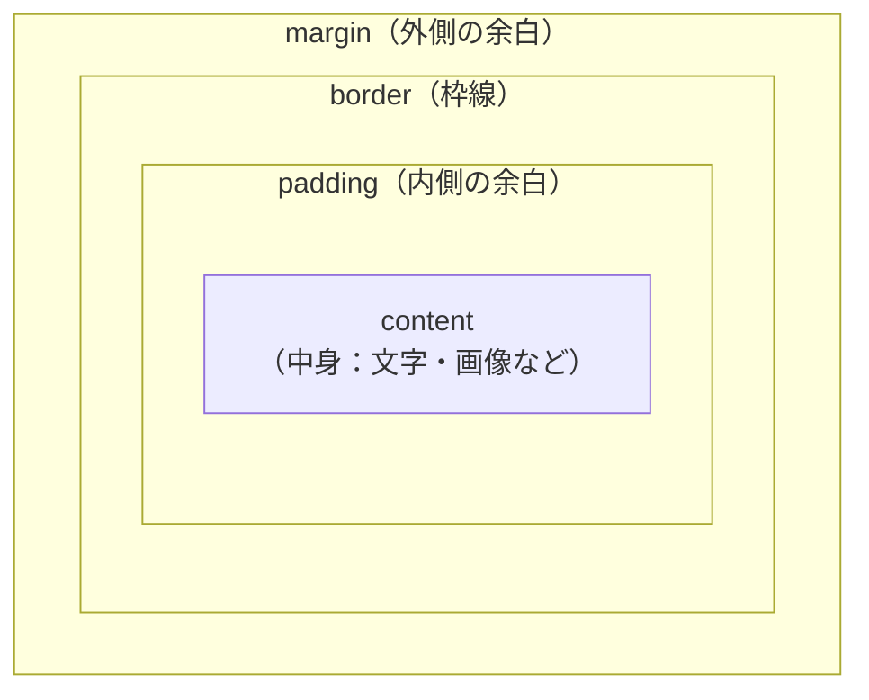

# HTML・CSS入門

テキストエディタとブラウザだけで始める、はじめてのWebページ制作——手を動かして学ぶ7レッスン

| 項目 | 内容 |
|---|---|
| カテゴリー | Web制作 |
| 難易度 | 入門 |
| 所要時間 | 約180分（全7レッスン） |
| 公開日 | 2026-05-09 |
| 最終更新日 | 2026-05-13 |
| コースURL | https://skillup.college/courses/web/html-css-basics/ |

## 対象者

Webサイトを自分で作ってみたいが、HTMLやCSSの知識がほとんどない初学者。プログラミング自体が初めての方も対象。手を動かしながら基本を体得したい方。

## 前提知識

特になし。Webブラウザでサイトを閲覧した経験があれば十分。Windows・macOSいずれのパソコンでも可。プログラミング経験は不要。

## 学習目標

- テキストエディタでHTMLファイルを作成し、ブラウザで開いて確認できる
- 見出し・段落・リスト・リンク・画像といった基本タグを使い分けられる
- CSSで色・フォント・余白・枠線などの装飾を適用できる
- ボックスモデルとFlexboxを理解し、要素のレイアウトを組める
- メディアクエリでスマートフォン表示にも対応できる
- 複数ページからなる小さなWebサイトを自力で完成させられる

## コース概要

このコースは、HTMLとCSSを使って自分の手でWebページを組み立てられるようになることを目標とした、実習中心の入門コースです。テキストエディタとブラウザがあれば、今すぐ始められます。1レッスンごとに小さなコードを書き、ブラウザで結果を確認しながら進めるスタイルで、最終レッスンでは自己紹介・作品紹介・お問い合わせの3ページ構成のサイトを自分で完成させます。自分のパソコンの中でフォルダを作り、ファイルを保存し、ブラウザで開く——という実際のWeb制作と同じ手順をはじめから体験してもらう構成です。

## 学習の流れ

レッスン1で開発環境（Visual Studio Code）を整え、最初のHTMLファイルを作って表示するところから始めます。レッスン2でHTMLの基本タグを覚えて文章をマークアップできるようにし、レッスン3でCSSによる装飾を加えます。レッスン4でボックスモデル、レッスン5でFlexboxによるレイアウト、レッスン6でレスポンシブデザインへと、見た目を整える技術を段階的に学びます。最後のレッスン7で、これまでの知識をすべて使って複数ページの小さなサイトを完成させます。前半（レッスン1〜3）は「文章を表示する力」、中盤（レッスン4〜5）は「レイアウトを組む力」、後半（レッスン6〜7）は「仕上げる力」を身につける流れです。

## レッスン一覧

| No. | タイトル | 概要 | 所要時間 |
|---|---|---|---|
| 1 | はじめてのHTML——エディタを用意して最初のページを開く | Visual Studio Codeのインストールから、フォルダとindex.htmlの作成、ブラウザでの表示確認までを実習する。HTMLファイルの基本構造（DOCTYPE・html・head・body）も理解する | 25分 |
| 2 | 文章をマークアップする——見出し・段落・リスト・リンク・画像 | HTMLの基本タグを使って、自己紹介ページに文章・リスト・リンク・画像を配置する。タグの意味（セマンティクス）と正しい入れ子のルールも学ぶ | 25分 |
| 3 | CSSの基本——色とフォントでページを装飾する | CSSの書き方（セレクタ・プロパティ・値）を学び、外部CSSファイルを作成してHTMLにリンクする。色・背景色・フォント・サイズなど基本プロパティを実習で適用する | 25分 |
| 4 | ボックスモデル——余白・枠線・サイズを操る | ブロック要素とインライン要素の違い、margin・padding・borderの使い分けを理解する。box-sizingで実用的なサイズ計算ができるようになる | 25分 |
| 5 | レイアウトの基礎——Flexboxで横並びと整列を作る | display: flexによる横並びレイアウト、justify-content・align-items・gapなど主要プロパティを学ぶ。横並びナビゲーションとカード並びのレイアウトを実習で作る | 25分 |
| 6 | レスポンシブデザイン——スマートフォンでもきれいに見せる | viewport設定、メディアクエリ、相対単位（rem・%・vw）を学び、画面幅に応じてレイアウトが変わるページを作る。モバイルファーストの考え方も理解する | 25分 |
| 7 | 仕上げ——複数ページの小さなサイトを完成させる | 複数のHTMLファイル間のリンク、共通CSSの使い回し、適切なフォルダ構成（assets/css・assets/img）を学び、自己紹介・作品紹介・お問い合わせの3ページ構成のサイトを完成させる | 30分 |

---

## レッスン1：はじめてのHTML——エディタを用意して最初のページを開く

（所要時間：25分）

### このレッスンで学ぶこと

- HTMLとは何かを説明できる
- Visual Studio Codeをインストールして使い始められる
- フォルダとindex.htmlファイルを作成し、ブラウザで開ける
- HTMLファイルの基本構造（DOCTYPE・html・head・body）を理解する

---

### HTMLとは何か

私たちが普段見ているWebページは、ほとんどすべてHTMLで書かれています。HTMLはHyperText Markup Languageの略で、日本語では「ハイパーテキスト・マークアップ言語」と呼ばれます。

「マークアップ」は、文章のひとつひとつに「これは見出し」「これは段落」「これはリンク」と意味の印を付ける作業のことです。HTMLは、文章にこの印を付けてブラウザに伝えるための言語です。プログラミング言語と呼ばれることもありますが、計算や処理を書く言語ではなく、文章の構造を表現する言語です。

> **💡 ポイント**
> HTMLは「Webページの骨格」を作る言語です。装飾を付けるのは別の言語であるCSS、動きを付けるのはJavaScriptです。本コースではHTMLとCSSの2つに集中して学びます。

### このコースの実習スタイル

本コースは、ひと通りの説明を読んだあと、必ず手を動かしてコードを書く実習形式で進めます。自分のパソコンの中にフォルダを作り、ファイルを保存し、ブラウザで開く——この実際のWeb制作と同じ手順を、最初から体験してもらう構成です。

ファイルを保存する習慣、フォルダを整理する感覚、保存して再読み込みするリズムは、Webページを作るうえで欠かせない基礎です。最初は少し面倒に感じても、一度身につくと一生の財産になります。

> **🔰 初学者の方へ**
> このコースは、Windows・macOSのいずれでも問題なく進められます。一部の操作（ファイル保存のショートカットなど）はOSによって異なりますが、その都度補足します。スマートフォンやタブレットでの実習は想定していません。パソコンを用意してください。

### ステップ1：Visual Studio Codeを用意する

HTMLを書くためには、文字を入力できる「テキストエディタ」が必要です。本コースではMicrosoftが無料で配布している「Visual Studio Code」、略してVSCodeを使います。世界中のWeb制作者が使っている定番のエディタで、無料で日本語にも対応しています。

公式サイトからダウンロードしてインストールしてください。

- 公式サイト：[https://code.visualstudio.com/](https://code.visualstudio.com/)

画面中央の「Download」ボタンを押すと、自分のOSに合ったインストーラーが自動で選ばれます。Windowsであれば`.exe`ファイル、macOSであれば`.zip`ファイルがダウンロードされます。

ダウンロードが終わったら、ファイルをダブルクリックして案内に従ってインストールしてください。Windowsの場合は、インストール途中で表示される選択肢のうち「PATHに追加する」「右クリックメニューに追加する」のチェックは、すべて入れたままで進めて構いません。

> **📝 補足**
> Macをお使いの場合、ダウンロードした`.zip`ファイルをダブルクリックして展開し、出てきた「Visual Studio Code」のアイコンをアプリケーションフォルダにドラッグ＆ドロップして移動するだけでインストール完了です。

#### 日本語化（任意）

VSCodeを最初に起動すると、画面は英語で表示されます。日本語にしたい場合は、左側のサイドバーにある四角が4つ並んだアイコン（拡張機能）をクリックし、検索欄に「Japanese」と入力します。一覧の先頭に表示される「Japanese Language Pack for Visual Studio Code」をインストールしてください。インストール後、画面右下に表示される「Restart」ボタンを押すと、日本語表示に切り替わります。

### ステップ2：作業フォルダを作る

これからのレッスンで、Webページのファイルを保存していくフォルダを用意します。場所はどこでも構いませんが、自分がわかりやすい場所に作りましょう。例えばWindowsならドキュメントフォルダの中、Macなら書類フォルダの中などがわかりやすいです。

フォルダ名は半角英数字にします。日本語名のフォルダでも一応動きますが、Web制作では半角英数字が安全です。今回は `my-website` という名前にします。

「my-website」フォルダを作ったら、VSCodeを起動し、メニューから「ファイル」→「フォルダーを開く」（またはmacOSなら「ファイル」→「フォルダを開く」）を選び、いま作った `my-website` フォルダを選択して開きます。

> **⚠️ 注意**
> フォルダ名やファイル名にスペースや日本語を使うと、後でリンクの設定などでつまずく原因になります。「my-website」「practice」「mypage」のように、半角英数字とハイフンだけで命名する習慣をつけましょう。

### ステップ3：index.htmlファイルを作る

VSCodeで `my-website` フォルダを開いた状態で、左サイドバーのフォルダ名にカーソルを合わせると小さなアイコンがいくつか表示されます。一番左の「新しいファイル」アイコン（紙のようなマーク）をクリックします。

ファイル名を入力する欄が現れるので、`index.html` と入力してEnterキーを押します。これで空のHTMLファイルが作成されました。

> **💡 ポイント**
> Webサイトのトップページのファイル名は `index.html` にするのが慣例です。ブラウザにフォルダを指定してアクセスすると、自動で `index.html` が読み込まれます。覚えておきましょう。

### ステップ4：HTMLの基本構造を書く

`index.html` を開いて、以下のコードをそのまま入力してください。コピー＆ペーストでも構いませんが、入力する手の感覚も大事なので、最初は少しずつでも自分でタイプしてみることをおすすめします。

```html
<!DOCTYPE html>
<html lang="ja">
<head>
  <meta charset="UTF-8">
  <title>はじめてのページ</title>
</head>
<body>
  <h1>こんにちは、Webの世界！</h1>
  <p>これは私の最初のWebページです。</p>
</body>
</html>
```

入力したら、必ず保存してください。Windowsなら `Ctrl + S`、macOSなら `Command + S` で保存できます。タブの右上に丸印（●）が付いていなければ保存されています。

### 各部分の意味

書いたコードを順に見ていきましょう。

**`<!DOCTYPE html>`** は、このファイルがHTMLであることをブラウザに伝える宣言です。すべてのHTMLファイルの先頭に書きます。

**`<html lang="ja">`** から **`</html>`** までが、HTMLファイル全体を囲むタグです。`lang="ja"` は「このページは日本語で書かれている」という意味で、ブラウザや検索エンジン、読み上げソフトに言語を伝えます。

**`<head>`** から **`</head>`** までは、ページの「メタ情報」を記述する場所です。文字の文字コード（`<meta charset="UTF-8">`）や、ブラウザのタブに表示されるタイトル（`<title>`）などを書きます。ここに書いた内容は、ページ本文には表示されません。

**`<body>`** から **`</body>`** までが、ブラウザの画面に実際に表示されるページ本文です。`<h1>` は大見出しを表すタグ、`<p>` は段落を表すタグです。これらは次のレッスンで詳しく学びます。

> **📝 補足**
> タグは原則として、開始タグ `<タグ名>` と終了タグ `</タグ名>` でペアになっています。ペアの間に書いた内容が、そのタグの効果を受けます。タグを開いたら閉じる、というのが基本のルールです。

### ステップ5：ブラウザで開いて確認する

保存した `index.html` を、ブラウザで開いてみましょう。表示されるかどうかが、Web制作の最初のチェックポイントです。

開き方は簡単です。`my-website` フォルダをエクスプローラー（Windows）またはFinder（macOS）で開き、`index.html` ファイルをダブルクリックしてください。お使いのパソコンの標準ブラウザ（Edge、Chrome、Safariなど）が起動して、ページが表示されます。

画面に「こんにちは、Webの世界！」という大きな文字と、その下に「これは私の最初のWebページです。」という文字が表示されたら成功です。ブラウザのタブには「はじめてのページ」と表示されているはずです。

> **💡 ポイント**
> ファイルパスを示すアドレスバーには `file:///～` から始まるパスが表示されます。これは「このパソコンの中のファイルを直接開いている」状態です。インターネットに公開しているわけではないので、自分以外の人には見えません。安心して試行錯誤できます。

### 編集→保存→再読み込みのサイクル

Web制作の作業は、次の3ステップを繰り返すのが基本です。

1. **VSCodeでコードを編集する**
2. **ファイルを保存する**（`Ctrl + S` または `Command + S`）
3. **ブラウザで再読み込みする**（`F5` または `Command + R`）

このサイクルを「保存して再読み込み」と呼びます。リズムをつかむと、書いて確認、書いて確認、と気持ちよく作業が進みます。

試しに、`<h1>` の中身を別の文章に変えて保存し、ブラウザを再読み込みしてみてください。表示が変わるはずです。これで、最初の編集サイクルを体験したことになります。

> **⚠️ 注意**
> 編集してもブラウザの表示が変わらない場合、ほとんどの原因は「保存し忘れ」か「再読み込みし忘れ」のどちらかです。ファイル名のタブに丸印（●）が付いていたら未保存のサインです。

### まとめ

このレッスンでは、以下のことを学びました。

- HTMLは、文章にマークアップ（意味の印）を付ける言語である
- Visual Studio Code（VSCode）はWeb制作の定番のテキストエディタである
- フォルダとindex.htmlを作って、ブラウザで開くのがWebページ表示の基本手順である
- HTMLファイルは、DOCTYPE宣言・html要素・head要素・body要素で構成される
- 編集→保存→再読み込みの3ステップが、Web制作作業の基本リズムである

次のレッスンでは、HTMLの基本タグをひと通り学び、自己紹介ページに見出し・段落・リスト・リンク・画像を配置する実習を行います。HTMLの「文章を整理する力」を身につけましょう。

---

### 確認クイズ

このレッスンの理解度をチェックしましょう。

#### Q1. HTMLの説明として最も適切なものはどれか？

- [ ] Webページに動きを付けるためのプログラミング言語
- [x] 文章に意味の印（マークアップ）を付けて構造を表現する言語
- [ ] 画像を圧縮するためのファイル形式
- [ ] サーバーを操作するためのコマンド

> **解説**
> HTMLはHyperText Markup Languageの略で、文章に「これは見出し」「これは段落」といった意味の印を付けて構造を表現するための言語です。動きを付けるのはJavaScriptで、装飾を付けるのはCSSです。

#### Q2. 本コースで使用するテキストエディタとして紹介されているものはどれか？

- [ ] メモ帳（標準のテキストエディタ）
- [x] Visual Studio Code（VSCode）
- [ ] Microsoft Word
- [ ] Excel

> **解説**
> 本コースでは、Microsoftが無料で配布しているVisual Studio Code（VSCode）を使います。世界中のWeb制作者が使っている定番のエディタです。Wordは文書作成ソフト、Excelは表計算ソフトで、HTMLの編集には向きません。

#### Q3. Webサイトのトップページとして使われる、慣例的なファイル名はどれか？

- [ ] top.html
- [ ] home.html
- [x] index.html
- [ ] main.html

> **解説**
> Webサイトのトップページは `index.html` という名前にするのが慣例です。サーバーはフォルダを指定されると自動的に `index.html` を表示します。

#### Q4. HTMLファイルの先頭に書くべき宣言として正しいものはどれか？

- [x] `<!DOCTYPE html>`
- [ ] `<HTML5>`
- [ ] `<begin html>`
- [ ] `<start>`

> **解説**
> `<!DOCTYPE html>` は、そのファイルがHTML（HTML5）であることをブラウザに伝える宣言です。すべてのHTMLファイルの先頭に書く必要があります。

#### Q5. `<head>` 要素の説明として最も適切なものはどれか？

- [ ] ページの一番上に表示される見出しを書く場所
- [x] 文字コードやタイトルなど、ページのメタ情報を記述する場所。本文には表示されない
- [ ] ヘッダーナビゲーション（メニュー）を書く場所
- [ ] ページの背景色を指定する場所

> **解説**
> `<head>` 要素は、文字コード・タイトル・スタイルシートへのリンクなど、ページのメタ情報を記述する場所です。ここに書いた内容はブラウザの画面本体には表示されません。「ヘッダーナビゲーション」は `<body>` 内の `<header>` 要素で記述します（後のレッスンで扱います）。

#### Q6. ファイルを編集してもブラウザの表示が変わらないときの、よくある原因として最も適切なものはどれか？

- [ ] ブラウザが古いから
- [x] 編集後にファイルを保存していない、またはブラウザを再読み込みしていない
- [ ] パソコンを再起動していないから
- [ ] インターネット接続がオフライン状態だから

> **解説**
> 編集→保存→再読み込みの3ステップが基本サイクルです。表示が変わらないときは、ファイルの保存し忘れ、ブラウザの再読み込みし忘れがほとんどの原因です。VSCodeのタブに丸印（●）が付いている場合は未保存のサインです。

#### Q7. フォルダ名やファイル名の付け方として推奨されるルールはどれか？

- [ ] 漢字や全角文字を多く使う
- [ ] スペースを必ず入れる
- [x] 半角英数字とハイフンのみで命名する
- [ ] 大文字のみで書く

> **解説**
> Web制作では、フォルダ名・ファイル名は半角英数字（とハイフン・アンダースコア）のみで命名するのが安全です。日本語名やスペースを含むと、後でリンク設定などでトラブルの原因になります。

---

## レッスン2：文章をマークアップする——見出し・段落・リスト・リンク・画像

（所要時間：25分）

### このレッスンで学ぶこと

- 要素・タグ・属性の関係を理解する
- 見出し・段落・リスト・リンク・画像の基本タグを使い分けられる
- 自己紹介ページを実習で作成する
- セマンティクス（意味のあるマークアップ）の考え方を知る

---

レッスン1では、Visual Studio Codeで `index.html` を作り、ブラウザに最初のページを表示しました。このレッスンでは、HTMLの基本タグを使って、文章を意味のある構造にマークアップしていきます。実習として、自己紹介ページを完成させましょう。

### 要素・タグ・属性

タグの説明に入る前に、3つの言葉を整理します。HTMLを書くうえで、繰り返し出てくる用語です。

**タグ**は、`<h1>` や `</h1>` のような、`<` と `>` で囲まれた文字列のことです。`<h1>` のように開始を示すものを開始タグ、`</h1>` のようにスラッシュが付いて終了を示すものを終了タグと呼びます。

**要素**は、開始タグから終了タグまで全体のかたまりのことです。`<h1>こんにちは</h1>` 全体が「h1要素」です。

**属性**は、タグの中に書く追加情報です。例えば `<a href="https://example.com">` の `href="https://example.com"` の部分が属性です。属性は「属性名="値"」の形で書きます。

> **💡 ポイント**
> 「要素」「タグ」「属性」は、これからのレッスンで何度も出てきます。タグ＝印、要素＝印で囲まれた範囲全体、属性＝印に付ける付加情報、と整理しておくと混乱しません。

### ステップ1：レッスン1の続きから始める

レッスン1で作った `my-website` フォルダの `index.html` を、VSCodeで開いてください。中身は次の状態のはずです。

```html
<!DOCTYPE html>
<html lang="ja">
<head>
  <meta charset="UTF-8">
  <title>はじめてのページ</title>
</head>
<body>
  <h1>こんにちは、Webの世界！</h1>
  <p>これは私の最初のWebページです。</p>
</body>
</html>
```

この `<body>` の中身を、自己紹介ページの内容に書き換えていきます。

### 見出し——h1からh6

HTMLの見出しタグは、`<h1>` から `<h6>` までの6段階あります。h1が一番大きく、h6が一番小さい見出しです。Wordなどの「見出し1」「見出し2」と同じ感覚です。

ページに1つだけ「これがメインのテーマ」とわかる大見出しがあり、その下に章にあたる中見出し、節にあたる小見出しが続く——という構造を作ります。

```html
<h1>森田 彩花のページ</h1>
<h2>自己紹介</h2>
<h3>趣味</h3>
```

> **⚠️ 注意**
> 見出しタグは「文字を大きく見せたい」ためのタグではありません。文章の構造を表すタグです。装飾目的では使わず、論理的な見出しの階層に合わせて使いましょう。装飾はCSS（レッスン3以降）で行います。

### 段落——p

段落を表すタグが `<p>` です。1つのまとまった文のかたまりごとに `<p>` で囲みます。改行したいだけなら `<br>` というタグもありますが、段落はあくまで `<p>` で囲むのが正しい使い方です。

```html
<p>はじめまして。森田 彩花と申します。Web制作のかたわら、初学者向けの講師もしています。</p>
<p>このページでは、わたしの自己紹介や趣味について書いています。</p>
```

### リスト——ul・ol・li

箇条書きを表すには、リストタグを使います。リストには2種類あります。

**`<ul>`**（unordered list、順序なしリスト）は、順序が関係ない箇条書きに使います。中点や黒丸で表示されます。

**`<ol>`**（ordered list、順序ありリスト）は、順序が意味を持つ箇条書きに使います。1, 2, 3といった番号で表示されます。

どちらの場合も、各項目は `<li>`（list item）で囲みます。

```html
<h2>趣味</h2>
<ul>
  <li>登山</li>
  <li>映画鑑賞</li>
  <li>パン作り</li>
</ul>

<h2>朝のルーティン</h2>
<ol>
  <li>起きる</li>
  <li>顔を洗う</li>
  <li>コーヒーをいれる</li>
</ol>
```

> **📝 補足**
> リストは「並列の項目を並べたい」「順序を伝えたい」ときに使います。文章を箇条書きで書くと整理されて読みやすくなりますが、なんでも箇条書きにすると読みづらくなります。流れのある文は段落で、独立した項目はリストで、と使い分けましょう。

### リンク——a

別のページや外部のサイトに移動するリンクを作るのが `<a>` タグです。`href` 属性にリンク先のURLを指定します。`a` は anchor（錨）の頭文字です。

```html
<p>くわしくは<a href="https://www.mext.go.jp/">文部科学省のサイト</a>を参照してください。</p>
```

タグで囲んだ文字（上の例では「文部科学省のサイト」）が、ブラウザではクリック可能な青い下線付きの文字として表示されます。

別のタブで開きたい場合は、`target="_blank"` 属性を追加します。外部のサイトへのリンクには付けるのが慣例です。

```html
<a href="https://www.mext.go.jp/" target="_blank">文部科学省のサイト</a>
```

> **💡 ポイント**
> `target="_blank"` を付けたリンクは、別タブで開きます。外部サイトに飛ばす際は、自サイトのタブを残しておくと利用者に親切です。レッスン7で複数ページを作るときには、自サイト内のリンクは別タブを開かない（属性を付けない）使い分けがわかります。

### 画像——img

画像を表示するには `` タグを使います。リンクと違って `` は終了タグを書きません。「自己終結タグ」と呼ばれる種類のタグです。

`src` 属性に画像ファイルの場所、`alt` 属性に画像の説明文を指定します。

```html

```

`alt` は「代替テキスト」と呼ばれ、画像が表示できないときや、目の不自由な方が読み上げソフトで読む際に使われる説明文です。装飾目的の画像でなければ、必ず指定しましょう。

#### 実習用の画像を準備する

実習で使う画像を用意しましょう。お気に入りの写真を `my-website` フォルダに `profile.jpg` というファイル名で置いてください。手元に画像がない場合は、Windowsなら標準で入っている「ピクチャ」フォルダ内のサンプル画像、Macなら「写真」アプリから書き出したファイルなどでも構いません。一時的な実習なので何でも良いです。

ファイル名は半角英数字にし、`.jpg` または `.png` を使うのが標準です。今回はプロフィール写真として扱うので、`profile.jpg` または `profile.png` という名前にしておきましょう。

> **⚠️ 注意**
> `` のように相対パスで指定した場合、HTMLファイルから見て同じ場所（同じフォルダ）に画像があれば表示されます。後のレッスンで `assets/img/profile.jpg` のようにフォルダ整理する方法も学びますが、今は同じフォルダに置いてください。

### 実習：自己紹介ページを完成させる

ここまで学んだタグを使って、自己紹介ページを作ってみましょう。`index.html` の中身を、以下のコードに書き換えてください。名前や趣味の内容は自由に変えて構いません。

```html
<!DOCTYPE html>
<html lang="ja">
<head>
  <meta charset="UTF-8">
  <title>森田 彩花のプロフィール</title>
</head>
<body>
  <h1>森田 彩花のページ</h1>

  

  <h2>自己紹介</h2>
  <p>はじめまして。森田 彩花と申します。Web制作の現場で7年ほど働いたあと、現在はプログラミングスクールで初学者向けの講師をしています。</p>
  <p>このページでは、わたしの自己紹介と趣味、よく見ているWebサイトを紹介しています。</p>

  <h2>趣味</h2>
  <ul>
    <li>登山（特に低山ハイク）</li>
    <li>映画鑑賞（ジャンル問わず）</li>
    <li>パン作り（休日の朝に焼くのが好きです）</li>
  </ul>

  <h2>よく見るサイト</h2>
  <ul>
    <li><a href="https://developer.mozilla.org/ja/" target="_blank">MDN Web Docs</a></li>
    <li><a href="https://www.w3.org/" target="_blank">W3C</a></li>
  </ul>

  <h2>連絡先</h2>
  <p>お問い合わせは <a href="mailto:example@example.com">こちらのメールアドレス</a> までお願いします。</p>
</body>
</html>
```

保存（`Ctrl + S` または `Command + S`）してから、ブラウザで `index.html` を再読み込み（`F5` または `Command + R`）してください。

見出しが3階層、段落が2つ、画像が1枚、箇条書きが2つ、リンクが3つ並んだ自己紹介ページが表示されたら成功です。

> **💡 ポイント**
> `mailto:` で始まるリンクは、クリックすると標準のメールソフトが開いて、新規メール作成画面が立ち上がります。お問い合わせリンクとしてよく使われます。

### セマンティクスという考え方

ここまでで、見出し・段落・リスト・リンク・画像という、HTMLでもっとも使うタグを一通り学びました。これらのタグには、それぞれ「意味」があります。`<h1>` は「メインの見出しです」、`<p>` は「これは段落です」、`<ul>` は「これは順序のないリストです」と、ブラウザや検索エンジン、読み上げソフトに伝えています。

文章の意味に合ったタグを選ぶ考え方を「セマンティクス」と呼びます。日本語では「意味論」と訳されます。例えば、見た目を大きくしたいだけの理由で `<h1>` を使うのではなく、本当にそれが大見出しのときだけ `<h1>` を使う、というのがセマンティックなマークアップです。

正しいセマンティクスでマークアップされたページは、検索エンジンに内容を正確に伝えやすく、目の不自由な利用者の読み上げソフトでも構造が伝わります。装飾はCSS、構造はHTMLで分担する——この役割分担を意識すると、後のレッスンでも迷いが減ります。

> **📝 補足**
> セマンティックなHTMLには、ほかにも `<header>` `<nav>` `<main>` `<article>` `<section>` `<footer>` といった構造を表すタグがあります。これらはレッスン7で複数ページサイトを作るときに紹介します。

### まとめ

このレッスンでは、以下のことを学びました。

- HTMLは、要素・タグ・属性という3つの構成要素からなる
- 見出しはh1〜h6、段落はp、リストはul/ol/li、リンクはa、画像はimgで表現する
- リンクは `href` 属性、画像は `src` と `alt` 属性が基本である
- セマンティクス（文章の意味に合ったタグ選び）が、検索エンジンやアクセシビリティに役立つ
- 装飾はCSSで行うため、HTMLでは構造に集中する

次のレッスンでは、CSSを使ってこの自己紹介ページに色とフォントを当てていきます。同じHTMLが、CSSで一気に華やかに変わる体験をしてもらいます。

---

### 確認クイズ

このレッスンの理解度をチェックしましょう。

#### Q1. 「タグ」の説明として最も適切なものはどれか？

- [ ] HTMLファイルそのもの
- [x] `<h1>` や `</p>` のように、`<` と `>` で囲まれた文字列
- [ ] ページに表示される本文
- [ ] ページのタイトル

> **解説**
> タグは `<` と `>` で囲まれた文字列を指し、要素の開始や終了、属性などを示します。タグで囲まれた範囲全体を「要素」と呼びます。

#### Q2. 順序のない箇条書き（順番に意味がない並列の項目）を表すタグはどれか？

- [x] `<ul>` と `<li>`
- [ ] `<ol>` と `<li>`
- [ ] `<list>` と `<item>`
- [ ] `<p>` と `<br>`

> **解説**
> 順序なしリストは `<ul>`（unordered list）、順序ありリストは `<ol>`（ordered list）で囲み、各項目を `<li>`（list item）で記述します。

#### Q3. リンクを別タブで開くために `<a>` タグに付ける属性はどれか？

- [ ] `href="_blank"`
- [x] `target="_blank"`
- [ ] `open="newtab"`
- [ ] `link="newtab"`

> **解説**
> 別タブでリンクを開くには `target="_blank"` 属性を指定します。外部サイトへのリンクには付けるのが慣例です。`href` 属性はリンク先のURLを指定するためのものです。

#### Q4. `` タグに必ず指定すべき2つの属性として正しいものはどれか？

- [ ] `href` と `name`
- [x] `src` と `alt`
- [ ] `link` と `text`
- [ ] `url` と `caption`

> **解説**
> `` タグでは、画像ファイルの場所を示す `src` 属性と、画像の代替テキストを示す `alt` 属性が基本です。`alt` は読み上げソフトでも使われる重要な情報です。

#### Q5. 見出しタグの使い方として最も適切なものはどれか？

- [ ] 文字を大きくしたいときに使う装飾用のタグである
- [ ] h1から順に使えば、見た目が必ず大きい順に並ぶので装飾用に使ってよい
- [x] 文書の論理的な見出しの階層に合わせて使い、装飾目的では使わない
- [ ] h1は1ページに何回でも好きに使ってよい

> **解説**
> 見出しタグは文章の構造を表すタグです。文字を大きくしたいだけの目的では使わず、本来の見出しの階層に合わせて使います。装飾はCSSで行います。

#### Q6. セマンティクス（セマンティックなマークアップ）の考え方として最も適切なものはどれか？

- [ ] 必ず最も多くのタグを使うべきだという考え方
- [x] 文章の意味に合ったタグを選んでマークアップするという考え方
- [ ] HTMLにJavaScriptを埋め込むという考え方
- [ ] CSSなしでもデザインを完結させるという考え方

> **解説**
> セマンティクスは「意味論」と訳され、文章の意味に合ったタグを選ぶ考え方です。検索エンジンへの情報伝達や、アクセシビリティ（読み上げソフトでの利用など）の改善に役立ちます。

#### Q7. `` タグについての説明として正しいものはどれか？

- [ ] 必ず終了タグ `</img>` を書く必要がある
- [x] 終了タグを書かない、自己終結のタグである
- [ ] 終了タグを書くかどうかは自由である
- [ ] 終了タグの代わりに `<endimg>` を書く

> **解説**
> `` は終了タグを書かない自己終結タグです。同じく `<br>`（改行）や `<meta>`（メタ情報）なども終了タグを書きません。

---

## レッスン3：CSSの基本——色とフォントでページを装飾する

（所要時間：25分）

### このレッスンで学ぶこと

- CSSの役割と基本的な書き方を理解する
- 外部CSSファイルを作ってHTMLにリンクできる
- セレクタ・プロパティ・値の関係を説明できる
- 色・背景色・フォント・サイズの基本プロパティを使える
- クラスを使った特定箇所の装飾ができる

---

レッスン2では、HTMLで文章をマークアップして自己紹介ページを完成させました。ただし、このページはまだ装飾がなく、地味な見た目のままです。このレッスンでは、CSSを使ってページに色やフォントを当てていきます。同じHTMLが、CSSで一気に変わる体験をしてもらいます。

### CSSとは何か

CSSは Cascading Style Sheets の略で、Webページの見た目を整えるための言語です。HTMLが「文章の構造」を担うのに対し、CSSは「装飾」を担います。

色、背景、文字の大きさ、余白、レイアウトなど、ページの見た目に関するほとんどすべてはCSSで指定します。HTMLとCSSが分業することで、構造はそのままにデザインだけを変えることが可能になります。

> **💡 ポイント**
> 同じHTMLでもCSSを差し替えれば、完全に違うデザインのページに変身させられます。役割を分けておくことの大きな利点です。

### CSSの3つの書き方

CSSをHTMLに適用する方法は、大きく3つあります。

**1つ目はインラインスタイル**です。タグの `style` 属性に直接書く方法です。

```html
<p style="color: red;">赤い文字</p>
```

**2つ目は内部スタイル**です。`<head>` 内の `<style>` タグの中に書く方法です。

```html
<head>
  <style>
    p { color: red; }
  </style>
</head>
```

**3つ目は外部スタイルシート**です。CSSだけを別のファイル（`.css`）に書き、HTMLからリンクする方法です。

```html
<head>
  <link rel="stylesheet" href="style.css">
</head>
```

実務でも本コースでも、3つ目の「外部スタイルシート」を基本にします。HTMLとCSSをファイルで分けておくと、複数ページで同じCSSを使い回せて、保守もしやすくなるからです。

### ステップ1：style.cssファイルを作る

レッスン1〜2で作った `my-website` フォルダをVSCodeで開いてください。`index.html` と画像ファイルがある状態です。

このフォルダに、新しく `style.css` というファイルを作ります。VSCodeのサイドバーで「新しいファイル」アイコンをクリックし、ファイル名に `style.css` と入力してEnterを押してください。

`style.css` には、まず動作確認用に次のコードを書きます。

```css
body {
  background-color: #f5f5f5;
}
```

これは「body要素の背景色を、#f5f5f5（薄いグレー）にする」という意味です。`#f5f5f5` の表記については、このレッスンで後ほど説明します。

ファイルを保存（`Ctrl + S` または `Command + S`）してください。

### ステップ2：HTMLからCSSをリンクする

このままではHTMLとCSSはつながっていません。`index.html` の `<head>` 内に、CSSファイルを読み込むタグを追加します。

`<title>` タグの下に、次の1行を追加してください。

```html
<head>
  <meta charset="UTF-8">
  <title>森田 彩花のプロフィール</title>
  <link rel="stylesheet" href="style.css">
</head>
```

`<link>` タグは、外部ファイルをHTMLに読み込むためのタグです。`rel="stylesheet"` は「スタイルシート（CSS）を読み込みます」という意味で、`href` 属性に読み込むCSSファイルの場所を指定します。`<link>` も `` と同じく終了タグのない自己終結タグです。

保存してから、ブラウザで `index.html` を再読み込みしてください。背景がうっすらグレーに変わっていれば、CSSの読み込みは成功です。

> **⚠️ 注意**
> 背景が変わらない場合、`<link>` タグの `href` 属性のファイル名に間違いがないか確認してください。`style.css` の名前と `href="style.css"` の文字列が一字一句同じである必要があります。HTMLとCSSのファイルが同じフォルダにあることも確認しましょう。

### CSSの基本構文

CSSの書き方は、次の3つの要素からできています。

```
セレクタ {
  プロパティ: 値;
}
```

- **セレクタ**：どの要素に対してスタイルを適用するか（例：`body`、`h1`、`p`）
- **プロパティ**：何を変えるか（例：`color`、`background-color`、`font-size`）
- **値**：どう変えるか（例：`red`、`#f5f5f5`、`24px`）

プロパティと値の組み合わせは「宣言」と呼ばれ、宣言の終わりには必ずセミコロン `;` を付けます。波括弧 `{ }` でセレクタごとの宣言をまとめます。

例を見てみましょう。

```css
h1 {
  color: #2c3e50;
  font-size: 32px;
}

p {
  color: #555;
  font-size: 16px;
  line-height: 1.7;
}
```

このCSSは「すべてのh1要素は文字色を濃紺、サイズを32pxに」「すべてのp要素は文字色をグレー寄り、サイズを16px、行間を1.7倍に」という指定です。

### 色の指定方法

CSSで色を指定する方法は、いくつかあります。

**色名で指定**：`red`、`blue`、`green`、`white`、`black` など、英単語の色名が使えます。直感的ですが、細かい色味の調整は難しいです。

**16進数（カラーコード）で指定**：`#ff0000`（赤）、`#0000ff`（青）のように `#` で始まる6桁の16進数で指定します。Web制作ではこの形式が最もよく使われます。

**rgbで指定**：`rgb(255, 0, 0)` のように、赤・緑・青の明るさを0〜255の数値で指定します。

```css
h1 {
  color: red;            /* 色名 */
}
h2 {
  color: #2c3e50;        /* 16進数 */
}
p {
  color: rgb(85, 85, 85); /* rgb */
}
```

> **📝 補足**
> 16進数は最初は読みづらく感じますが、慣れれば直感的に色を作れるようになります。VSCodeでは色コードを書くと、コードの隣に色のプレビューが小さく表示され、クリックで色選択パレットも出せて便利です。

### ステップ3：自己紹介ページに装飾を当てる

`style.css` を以下の内容に書き換えてみてください。レッスン2で作った自己紹介ページが、ぐっと整った見た目になるはずです。

```css
body {
  background-color: #f5f5f5;
  font-family: "Hiragino Sans", "Yu Gothic", sans-serif;
  color: #333;
  line-height: 1.7;
}

h1 {
  color: #2c3e50;
  font-size: 32px;
}

h2 {
  color: #2c3e50;
  font-size: 24px;
  border-bottom: 2px solid #2c3e50;
}

p {
  font-size: 16px;
}

a {
  color: #2980b9;
}
```

保存して、ブラウザを再読み込みしてください。背景が薄いグレー、見出しが濃紺、h2の下に線が引かれ、リンクが青になります。一気にWebページらしくなったはずです。

ここで使ったプロパティを確認しましょう。

- **`background-color`**：背景色
- **`font-family`**：フォント（書体）。複数指定すると、最初のものが使えなければ次、と順に試される
- **`color`**：文字色
- **`font-size`**：文字の大きさ
- **`line-height`**：行間（数値だけだとフォントサイズの倍数）
- **`border-bottom`**：下側の罫線（線の太さ・種類・色をまとめて指定）

> **💡 ポイント**
> `font-family` で「Hiragino Sans」「Yu Gothic」「sans-serif」と並べて指定するのは、左から順に「使える環境ならこのフォント、使えなければ次のフォント」という意味です。`sans-serif` のような総称名を最後に書いておくと、どのパソコンでも何かしら適切なフォントが選ばれます。

### クラスを使って特定の場所だけ装飾する

「すべてのp要素」ではなく「特定のp要素だけ」装飾したい場合は、クラスを使います。

HTML側でタグに `class` 属性を付けます。

```html
<p class="lead">このページでは、わたしの自己紹介と趣味を書いています。</p>
<p>はじめまして。森田 彩花と申します。</p>
```

CSS側では、クラス名の前にドット `.` を付けてセレクタにします。

```css
.lead {
  font-size: 18px;
  font-weight: bold;
  color: #2c3e50;
}
```

これで、`class="lead"` が付いたp要素だけが、特別な装飾を受けます。クラスは1つの要素に複数指定することもでき、また同じクラス名を複数の要素に付けることもできます。

> **📝 補足**
> 似たものに `id` 属性を使ったID指定（`#myid`）もありますが、IDはページ内に1回だけしか使えない決まりがあります。基本はクラスを使う、と覚えておけば十分です。

### 実習：自己紹介ページにクラスを使った装飾を追加する

`index.html` の冒頭の段落を以下のように書き換えてください。

```html
<h1>森田 彩花のページ</h1>


<p class="lead">このページでは、わたしの自己紹介と趣味、よく見ているWebサイトを紹介しています。</p>
```

そして `style.css` の最後に、次のCSSを追加してください。

```css
.lead {
  font-size: 18px;
  font-weight: bold;
  color: #2c3e50;
}
```

保存して再読み込みすると、紹介文の段落だけが太字で大きめに、濃紺色で表示されます。同じp要素でも、クラスを付けることで個別にスタイルを変えられることが体験できます。

### CSSのコメント

CSSにメモを残したいときは、`/* */` で囲んでコメントとして書けます。コメントはブラウザに無視されるので、自分や別の作業者へのメモとして自由に使えます。

```css
/* 全体の見た目 */
body {
  background-color: #f5f5f5;
}

/* 紹介文を強調 */
.lead {
  font-size: 18px;
  font-weight: bold;
}
```

長いCSSになるとどこに何を書いたかわかりにくくなるので、セクションごとにコメントを入れる習慣をつけましょう。

### まとめ

このレッスンでは、以下のことを学びました。

- CSSはWebページの装飾を担当する言語である
- CSSは外部ファイル（`.css`）に書き、HTMLから `<link>` でリンクするのが基本である
- セレクタ・プロパティ・値の3要素でCSSを書く
- 色・背景色・フォント・サイズなど、基本プロパティで装飾の大部分が作れる
- クラスを使えば、特定の要素だけにスタイルを当てられる

次のレッスンでは、要素の余白や枠線、サイズなどを扱う「ボックスモデル」を学びます。Webページのレイアウトを組むうえでの最重要概念です。

---

### 確認クイズ

このレッスンの理解度をチェックしましょう。

#### Q1. CSSの役割として最も適切なものはどれか？

- [ ] Webページに動きを付ける
- [x] Webページの見た目（装飾）を整える
- [ ] HTMLファイルを圧縮する
- [ ] サーバーと通信する

> **解説**
> CSS（Cascading Style Sheets）は、Webページの見た目を整える役割を担います。HTMLが文章の構造を、CSSが装飾を担当するという役割分担になっています。

#### Q2. 外部CSSファイルをHTMLに読み込むためのタグとして正しいものはどれか？

- [ ] `<style src="style.css">`
- [x] `<link rel="stylesheet" href="style.css">`
- [ ] `<css href="style.css">`
- [ ] `<import "style.css">`

> **解説**
> 外部CSSファイルは `<link>` タグで読み込みます。`rel="stylesheet"` でスタイルシートであることを示し、`href` 属性にファイルの場所を指定します。

#### Q3. CSSの基本構文として正しいものはどれか？

- [ ] `セレクタ = プロパティ : 値`
- [x] `セレクタ { プロパティ: 値; }`
- [ ] `[セレクタ] (プロパティ = 値)`
- [ ] `セレクタ -> プロパティ -> 値`

> **解説**
> CSSは「セレクタ { プロパティ: 値; }」という形で書きます。プロパティと値はコロンで結び、宣言の終わりにはセミコロンを付けます。

#### Q4. CSSで色を指定する方法として、本レッスンで紹介していないものはどれか？

- [ ] 色名（red、blueなど）
- [ ] 16進数（#ff0000）
- [ ] rgb（rgb(255, 0, 0)）
- [x] cmyk（cmyk(0, 100, 100, 0)）

> **解説**
> Webでは色名・16進数・rgb（とrgba・hsl・hslaなど）が主に使われます。CMYKは印刷用の色指定で、Webでは使いません。

#### Q5. クラスを使ったCSSセレクタの書き方として正しいものはどれか？

- [ ] `class lead { font-size: 18px; }`
- [x] `.lead { font-size: 18px; }`
- [ ] `#lead { font-size: 18px; }`
- [ ] `&lead { font-size: 18px; }`

> **解説**
> クラスをセレクタにするときは、クラス名の前にドット `.` を付けます。`#` はID（HTMLのid属性）を指すセレクタで、用途が異なります。

#### Q6. 同じCSSを複数のページで使い回したいときに最も適した方法はどれか？

- [ ] 各ページの `<head>` 内に `<style>` で同じCSSをコピーする
- [ ] 各タグに `style` 属性で直接書く
- [x] 外部CSSファイルにまとめ、各ページから `<link>` でリンクする
- [ ] CSSを使わずHTMLだけで装飾する

> **解説**
> 外部CSSファイルにまとめ、複数のHTMLから `<link>` でリンクするのが最も保守しやすい方法です。1か所変更すれば、リンクしているすべてのページに反映されます。

#### Q7. CSSにコメント（自分用のメモ）を書くための記法として正しいものはどれか？

- [ ] `// メモ`
- [ ] `# メモ`
- [x] `/* メモ */`
- [ ] `<!-- メモ -->`

> **解説**
> CSSのコメントは `/* */` で囲みます。`<!-- -->` はHTMLのコメント、`//` や `#` はCSSではコメントになりません。混同しやすいので注意しましょう。

---

## レッスン4：ボックスモデル——余白・枠線・サイズを操る

（所要時間：25分）

### このレッスンで学ぶこと

- ブロック要素とインライン要素の違いを説明できる
- ボックスモデル（content・padding・border・margin）を理解する
- margin・padding・borderを使い分けられる
- box-sizingで実用的なサイズ計算ができる
- 開発者ツールでボックスを確認できる

---

レッスン3では、CSSで色やフォントを当てて自己紹介ページを華やかにしました。次は要素の「位置」と「大きさ」を操る番です。HTMLの各要素は四角いボックスとしてブラウザに描画されます。このボックスの仕組みを「ボックスモデル」と呼び、CSSでレイアウトを組むための最重要概念です。

### すべての要素は四角いボックス

ブラウザは、HTMLのすべての要素を「四角形のボックス」として扱います。見出しも、段落も、リンクも、画像も、見えないところで四角形の領域を占めています。

このボックスは4つの層からできています。内側から順に、こうなっています。

1. **content（コンテンツ）**：文字や画像などの中身が表示される領域
2. **padding（パディング）**：内側の余白。コンテンツとborderの間
3. **border（ボーダー）**：枠線
4. **margin（マージン）**：外側の余白。ほかの要素との間

「内側の余白がpadding、外側の余白がmargin、その境目に引く線がborder」と覚えると整理しやすいです。

4層の入れ子関係を図にすると、こうなります。



contentがいちばん内側にあり、それをpaddingが包み、その外側にborder、いちばん外側がmarginという関係です。

> **💡 ポイント**
> 余白を作りたいと思ったとき、内側に余白がほしいのか（コンテンツとボックスの境界の間に空間がほしい）、外側に余白がほしいのか（ほかの要素との間隔を空けたい）で、padding・marginの使い分けが決まります。

### ブロック要素とインライン要素

要素には大きく2つの種類があります。

**ブロック要素**は、横幅いっぱいに広がり、前後で改行されます。`<h1>`〜`<h6>`、`<p>`、`<ul>`、`<li>`、`<div>` などが代表例です。段落や見出しのように、独立した「ブロック」として扱われる要素です。

**インライン要素**は、文章の中に流し込まれ、必要な分だけの幅しか占めません。前後で改行されません。`<a>`、`<span>`、`<strong>`、`<em>` などが代表例です。

レッスン2まで使ってきたタグの多くはブロック要素ですが、`<a>` や `` はインライン要素（厳密にはinline-block）です。なお、`width` や `height` の指定が効きやすいのはブロック要素のほうです。インライン要素の幅・高さの指定は基本的に効きません。

> **📝 補足**
> CSSの `display` プロパティで、要素の表示の種類を変えることもできます。`display: block` でインライン要素をブロック化したり、逆に `display: inline-block` で「改行しないけど幅・高さを指定できる」状態にしたりできます。

### 実習：ボックスを実際に見てみる

ボックスモデルを言葉で覚えるより、目で見たほうが早いです。`my-website` フォルダの `style.css` の最後に、次のCSSを追加してください。

```css
.demo-box {
  background-color: #fff;
  margin: 20px;
  padding: 30px;
  border: 3px solid #2c3e50;
  width: 300px;
}
```

そして `index.html` の `<body>` 内、例えば一番下に、次のHTMLを追加してください。

```html
<div class="demo-box">
  <p>これはボックスモデルの確認用の要素です。</p>
</div>
```

`<div>` は意味を持たない汎用のブロック要素で、装飾やレイアウトのために要素をまとめるときに使います。

保存して再読み込みすると、白い背景に濃紺の枠線が付いた四角い箱が表示されるはずです。中の文章には30pxの余白（padding）があり、外側には20pxの余白（margin）があります。

ブラウザの開発者ツールを使えば、これらの層を視覚的に確認できます。

### ブラウザの開発者ツール

ブラウザには、Webページの構造やCSSを確認できる「開発者ツール」が標準で備わっています。Chrome、Edge、Firefoxなど、主要ブラウザはどれも持っています。

開発者ツールを開く方法は次のとおりです。

- **キーボード**：`F12`（Windows）または `Option + Command + I`（Mac）
- **マウス**：要素を右クリックして「検証」（Chrome・Edge）または「要素を調査」（Firefox）

開発者ツールを開いた状態で、先ほど追加した「これはボックスモデルの確認用の要素です。」の文字を右クリックして「検証」を選んでください。下または右側にツールが開き、その要素のHTMLとCSSが表示されます。

CSSパネルの下のほうにスクロールすると、四角形の図が見つかります。これがボックスモデルの可視化で、外から margin（オレンジ）、border（黄色）、padding（緑）、content（青）の順に色分けされて、それぞれのサイズが書かれています。

> **💡 ポイント**
> 開発者ツールはWeb制作の必須ツールです。「思ったとおりにレイアウトされない」とき、最初にこれを開いて、ボックスのサイズや余白が想定と違っていないか確認するのが鉄則です。CSSの一時的な書き換えもこの中で試せて、保存しなくてもブラウザでの見え方を変えられます。

### marginとpaddingの個別指定

`margin: 20px;` のように1つの値だけ書くと、上下左右すべてに20pxの余白が付きます。個別に指定したい場合は、4つの方向別のプロパティを使うか、まとめ書きの形式を使います。

**個別指定**：

```css
.demo-box {
  margin-top: 20px;
  margin-right: 10px;
  margin-bottom: 30px;
  margin-left: 10px;
}
```

**まとめ書き（4値）**：

```css
.demo-box {
  margin: 20px 10px 30px 10px; /* 上 右 下 左 */
}
```

**まとめ書き（2値）**：

```css
.demo-box {
  margin: 20px 10px; /* 上下 左右 */
}
```

paddingも同じ形式で指定できます。

### widthとheightの落とし穴——box-sizing

要素の幅と高さは `width` と `height` で指定します。ところがここに注意点があります。

CSSの初期設定では、`width: 300px` と指定したとき、その300pxは「contentの幅」を指します。padding と border は別途加算されるので、見た目の合計幅は300pxより大きくなります。

例えば次のCSSの場合、見た目の幅は何ピクセルになるでしょうか。

```css
.demo-box {
  width: 300px;
  padding: 30px;
  border: 3px solid #2c3e50;
}
```

答えは **366px** です。content幅300px + 左右padding 60px（30px×2） + 左右border 6px（3px×2） = 366pxとなるからです。レイアウトを組むうえで、この計算は混乱の原因になりがちです。

### box-sizing: border-box——直感的なサイズ計算へ

この問題を解決するのが `box-sizing: border-box` です。これを指定すると、`width` と `height` が「border含めた外側の幅・高さ」を指すようになり、padding と border はその内側に収まる形になります。

```css
.demo-box {
  box-sizing: border-box;
  width: 300px;
  padding: 30px;
  border: 3px solid #2c3e50;
}
```

これで、見た目の幅はちょうど300pxになります。padding と border は300pxの内側に収まるよう、content幅が自動で調整されます。

実務では、すべての要素にこの `border-box` を適用するのが定番です。`style.css` の先頭に、次のCSSを追加してください。

```css
* {
  box-sizing: border-box;
}
```

`*`（アスタリスク）はすべての要素に対するセレクタです。これでページ全体が `border-box` で動くようになり、サイズ計算で混乱しにくくなります。

> **💡 ポイント**
> `box-sizing: border-box` は、現代のWeb制作では「最初に書くおまじない」として定着しています。難しい理由を理解しなくても、まず書いておけば後の作業が楽になります。

### marginの相殺——上下のmarginが合体する現象

ブロック要素同士が縦に並んでいるとき、上の要素の `margin-bottom` と下の要素の `margin-top` が**重なって、大きいほうだけが反映される**現象があります。これを「marginの相殺」と呼びます。

例えば、ある段落の `margin-bottom: 20px` と、次の段落の `margin-top: 30px` がある場合、合計の余白は50pxにはならず、30pxだけになります。

最初は混乱するかもしれませんが、これは「余白を二重に取らないようにする」というブラウザの仕様です。気になる場合は、片方のmarginだけで余白を制御するクセをつけると整理しやすくなります。

### 実習：カード風の要素を作る

ボックスモデルの理解を確かなものにするため、カード風の要素をひとつ作ってみましょう。`index.html` に、次のHTMLを追加します（先ほどの `demo-box` の代わりにこちらを使ってもOKです）。

```html
<div class="card">
  <h3>登山が趣味です</h3>
  <p>休日は近隣の山に登りに行きます。最近のお気に入りは高尾山と御岳山です。</p>
</div>
```

`style.css` に、カードのスタイルを追加します。

```css
.card {
  background-color: #fff;
  border: 1px solid #ddd;
  border-radius: 8px;
  padding: 20px;
  margin-bottom: 20px;
  max-width: 400px;
}

.card h3 {
  margin-top: 0;
  color: #2c3e50;
}
```

保存して再読み込みすると、白背景に薄いグレーの枠線、角が少し丸まったカード風の要素が表示されます。

ここで使った新しいプロパティは2つです。

- **`border-radius`**：角を丸める。値が大きいほど丸が大きくなる
- **`max-width`**：最大幅。中身が短くてもこの幅を超えない

`.card h3` のセレクタは「`.card` の中にあるh3要素」という意味で、子要素にスタイルを当てる書き方です。これで、特定のクラスの内側のh3だけにスタイルを当てられます。

> **📝 補足**
> セレクタを半角スペースでつなぐと「子孫セレクタ」になります。`.card h3` は「.cardの中の、すべての階層の子孫h3」という意味です。直接の子だけに限定したい場合は `.card > h3` のように `>` を使います。最初は半角スペースの形だけ覚えれば十分です。

### まとめ

このレッスンでは、以下のことを学びました。

- すべてのHTML要素は四角いボックスで、内側から content・padding・border・margin の4層からできている
- ブロック要素は横幅いっぱい・前後で改行、インライン要素は文章中に流し込まれる
- 余白は内側がpadding、外側がmargin
- ボックスのサイズ計算は `box-sizing: border-box` を全要素に当てると直感的になる
- 開発者ツールを使うとボックスの構造を視覚的に確認できる

次のレッスンでは、Flexboxを使って要素を横並びにしたり、整列したりする方法を学びます。1次元のレイアウトを自在に組めるようになりましょう。

---

### 確認クイズ

このレッスンの理解度をチェックしましょう。

#### Q1. ボックスモデルの4層を、内側から外側の順に並べたものとして正しいものはどれか？

- [ ] padding → content → border → margin
- [x] content → padding → border → margin
- [ ] margin → border → padding → content
- [ ] border → padding → content → margin

> **解説**
> 内側から順に、content（中身）→ padding（内側余白）→ border（枠線）→ margin（外側余白）です。「内側の余白がpadding、外側の余白がmargin、境目の線がborder」と覚えましょう。

#### Q2. ブロック要素の特徴として最も適切なものはどれか？

- [ ] 必要な分だけの幅しか占めず、前後で改行されない
- [x] 横幅いっぱいに広がり、前後で改行される
- [ ] 幅と高さの指定がいっさい効かない
- [ ] 必ず画面の中央に配置される

> **解説**
> ブロック要素は横幅いっぱいに広がり、前後で改行されます。インライン要素は必要な分だけの幅で、前後で改行されません。h1〜h6、p、div、ulなどがブロック要素の代表です。

#### Q3. 「内側の余白」を表すプロパティとして正しいものはどれか？

- [x] padding
- [ ] margin
- [ ] border
- [ ] spacing

> **解説**
> 内側の余白はpadding、外側の余白はmarginです。両者を間違えると、レイアウトが思ったように組めない原因になります。

#### Q4. `width: 300px; padding: 30px; border: 3px solid black;` を指定したとき、`box-sizing: border-box` を指定した場合の見た目の幅として最も適切なものはどれか？

- [ ] 240px
- [x] 300px
- [ ] 360px
- [ ] 366px

> **解説**
> `box-sizing: border-box` を指定すると、widthはborder含めた外側の幅を指すようになります。300pxの中にpaddingとborderが収まる形になり、見た目の幅は300pxです。`box-sizing` を指定しない初期状態では366pxになります。

#### Q5. `box-sizing: border-box` をすべての要素に当てるためのCSSとして正しいものはどれか？

- [ ] `body { box-sizing: border-box; }`
- [ ] `all { box-sizing: border-box; }`
- [x] `* { box-sizing: border-box; }`
- [ ] `* box-sizing: border-box;`

> **解説**
> アスタリスク `*` はすべての要素を対象にするセレクタです。実務でも `* { box-sizing: border-box; }` を最初に書くスタイルが定着しています。

#### Q6. ブラウザの開発者ツールについての説明として正しいものはどれか？

- [ ] 有料の拡張機能をインストールしないと使えない
- [x] Chrome・Edge・Firefoxなど主要ブラウザに標準で備わっている。F12キーなどで開ける
- [ ] Webサーバーにアップロードしないと使えない
- [ ] 上級者専用の機能で、入門者は使うべきでない

> **解説**
> 開発者ツールは主要ブラウザに標準で備わっており、F12キーや右クリックの「検証」から開けます。要素のHTML・CSSを確認したり、ボックスモデルを視覚化したりできるWeb制作の必須ツールです。

#### Q7. 「marginの相殺」についての説明として最も適切なものはどれか？

- [ ] marginを指定するとpaddingがゼロになる現象
- [x] 縦に並ぶブロック要素同士の上下marginが、大きいほうだけ反映される現象
- [ ] marginを指定しすぎると要素が消える現象
- [ ] marginを使うと文字が縦書きになる現象

> **解説**
> 縦に並んだブロック要素の `margin-bottom` と `margin-top` は重なり、大きいほうだけが反映されます。これを「marginの相殺」と呼びます。余白を二重に取らないためのブラウザの仕様です。

---

## レッスン5：レイアウトの基礎——Flexboxで横並びと整列を作る

（所要時間：25分）

### このレッスンで学ぶこと

- Flexboxの基本的な仕組みを理解する
- display: flex で要素を横並びにできる
- justify-content と align-items で整列を制御できる
- gap で要素間の余白を調整できる
- 横並びナビゲーションとカード並びを実習で作る

---

レッスン4では、ボックスモデルを学びました。各要素は四角いボックスとして並び、padding・border・marginで余白や枠線を調整できることがわかりました。このレッスンでは、それらのボックスを「並べる」「整列する」ための仕組みであるFlexboxを学びます。Flexboxは、Webページのレイアウトを組むうえで現在もっとも使われている技術です。

### Flexboxとは

Flexboxは、CSSのレイアウトの仕組みのひとつで、正式名称は「Flexible Box Layout」です。「フレキシブル（柔軟）に並べられるボックス」という意味で、要素を横並び・縦並びにしたり、中央寄せにしたり、余白を均等に配分したりが、わずかなコードで実現できます。

Flexboxを使うには、並べたい要素を囲む「親要素」に `display: flex` を指定します。これだけで、中の子要素が横並びになります。「親要素にレイアウトの方針を書き、子要素は自動的に並ぶ」のが基本の発想です。

> **💡 ポイント**
> Flexboxは「親要素にdisplay: flexを書く」ところから始まります。「flex」は親に書くもの、と覚えておくと混乱が減ります。

### ステップ1：横並びを作る

実習しながら学びましょう。`my-website` フォルダの `index.html` の `<body>` 内に、次のHTMLを追加してください（既存の自己紹介ページの内容はそのままにし、`</body>` の直前に書き足します）。

```html
<h2>横並びの練習</h2>
<div class="row">
  <div class="box">A</div>
  <div class="box">B</div>
  <div class="box">C</div>
</div>
```

そして `style.css` の最後に、次のCSSを追加してください。

```css
.row {
  display: flex;
}

.box {
  background-color: #2c3e50;
  color: #fff;
  padding: 20px;
  margin-right: 10px;
}
```

保存して再読み込みしてみてください。A・B・Cの3つの濃紺色のボックスが、横並びで表示されるはずです。`display: flex` を親要素 `.row` に指定するだけで、中の `.box` が自動的に横に並びます。

ためしに、`.row` から `display: flex` を一時的に外してみてください。`.box` は元のブロック要素に戻り、縦に積み上がって表示されます。`display: flex` の効果がはっきりわかります。

### ステップ2：要素間の余白をgapで作る

先ほどの例では `.box` に `margin-right: 10px` を付けて余白を作りました。Flexboxには専用の余白プロパティ `gap` があり、こちらの方が便利です。

`style.css` を以下に書き換えてください。

```css
.row {
  display: flex;
  gap: 10px;
}

.box {
  background-color: #2c3e50;
  color: #fff;
  padding: 20px;
}
```

`.box` から `margin-right` を削除し、代わりに `.row` に `gap: 10px` を指定しています。結果は同じく10pxの余白付きで横並びになりますが、こちらの方が記述がわかりやすく、「要素間の余白」という意図が明確に伝わります。

> **📝 補足**
> `gap` は要素「間」の余白だけを指定でき、最初と最後の要素の外側には余白が付きません。一方 `margin-right` を全要素に付けると、最後の要素の右側にも余分な余白が付いてしまいます。それを避けるための工夫が要らないのが `gap` の便利な点です。

### 主軸（main axis）と交差軸（cross axis）

Flexboxを使いこなすうえで、軸の概念を覚えておくと整理しやすくなります。Flexboxには2つの軸があります。

- **主軸**（main axis）：要素が並ぶ方向。デフォルトでは横方向（左から右）
- **交差軸**（cross axis）：主軸に直交する方向。デフォルトでは縦方向

主軸の整列は `justify-content` で、交差軸の整列は `align-items` で制御します。これから学ぶプロパティは、この2つのどちらかに対応しています。

> **🔰 初学者の方へ**
> 最初は「justify-contentが横方向、align-itemsが縦方向」と覚えれば十分です。デフォルトの横並びの状態では、これで合っています。本格的な縦並びを使うようになったら、軸の話に立ち返ってみてください。

### ステップ3：justify-contentで主軸の整列を制御する

`justify-content` プロパティで、主軸（横方向）の整列方法を制御できます。よく使う値を5つ紹介します。

- `flex-start`：左寄せ（デフォルト）
- `center`：中央寄せ
- `flex-end`：右寄せ
- `space-between`：両端を端に寄せ、間を均等に空ける
- `space-around`：要素の左右に均等な余白を作る

`style.css` の `.row` に `justify-content` を追加してみましょう。

```css
.row {
  display: flex;
  gap: 10px;
  justify-content: center;
}
```

保存して再読み込みすると、3つのボックスが画面中央にまとまって表示されます。値を `flex-end` や `space-between` に変えて、どう変わるかを確かめてみてください。

> **💡 ポイント**
> `space-between` は、ナビゲーションメニューでロゴを左、メニューを右に配置するときに非常によく使われます。Webサイト制作で必ず出てくるパターンです。

### ステップ4：align-itemsで交差軸の整列を制御する

`align-items` プロパティで、交差軸（縦方向）の整列方法を制御できます。値はjustify-contentと似ています。

- `stretch`：伸ばして揃える（デフォルト）
- `flex-start`：上揃え
- `center`：中央揃え
- `flex-end`：下揃え

子要素の高さがバラバラの場合に、`align-items` の効果がわかりやすく出ます。試しに、HTMLを次のように書き換えてみてください。

```html
<div class="row">
  <div class="box">A</div>
  <div class="box tall">B<br>2行</div>
  <div class="box">C</div>
</div>
```

`.tall` に高さを与える必要はありません。`<br>` で改行して2行にすることで、高さを増やしています。

CSSも次のように整えます。

```css
.row {
  display: flex;
  gap: 10px;
  align-items: center;
  height: 200px;
  background-color: #ecf0f1;
}
```

`.row` 自体に高さ200pxと薄い背景色を付けました。中の3つのボックスが、行の中央で縦方向に揃うはずです。`align-items: flex-start` や `flex-end` に変えると、上揃え・下揃えに変わります。

### ステップ5：実習①——横並びナビゲーションを作る

ここまで学んだことを使って、実用的なナビゲーションを作ってみましょう。Webサイトの上部にあるメニュー部分です。

`index.html` の冒頭、`<body>` 直後あたりに次のHTMLを追加してください。

```html
<nav class="nav">
  <div class="nav-logo">My Website</div>
  <ul class="nav-menu">
    <li><a href="#">ホーム</a></li>
    <li><a href="#">プロフィール</a></li>
    <li><a href="#">作品紹介</a></li>
    <li><a href="#">お問い合わせ</a></li>
  </ul>
</nav>
```

`<nav>` は「ナビゲーション領域」を表すセマンティックなタグです。`href="#"` はリンク先がまだ決まっていない仮のリンクで、レッスン7で複数ページを作るときに本物のリンクに書き換えます。

`style.css` の最後に次のCSSを追加してください。

```css
.nav {
  display: flex;
  justify-content: space-between;
  align-items: center;
  background-color: #2c3e50;
  padding: 16px 24px;
}

.nav-logo {
  color: #fff;
  font-size: 20px;
  font-weight: bold;
}

.nav-menu {
  display: flex;
  gap: 24px;
  list-style: none;
  margin: 0;
  padding: 0;
}

.nav-menu a {
  color: #fff;
  text-decoration: none;
}

.nav-menu a:hover {
  text-decoration: underline;
}
```

新しいプロパティが3つ出てきました。

- **`list-style: none`**：リストの中点（黒丸）を非表示にする
- **`text-decoration: none`**：リンクのデフォルトの下線を消す
- **`a:hover`**：マウスを乗せたときの状態を指定する疑似クラス

保存して再読み込みすると、濃紺の帯の左にロゴ、右にメニューが並んだ、Webサイトらしいナビゲーションが完成します。マウスを乗せると下線が出ることも確認してください。

### ステップ6：実習②——カードを横並びにする

レッスン4で作ったカードを、3つ並べてみましょう。`index.html` の自己紹介の続きあたりに、次のHTMLを追加します。

```html
<h2>趣味の紹介</h2>
<div class="card-list">
  <div class="card">
    <h3>登山</h3>
    <p>休日は近隣の山に登りに行きます。最近のお気に入りは高尾山です。</p>
  </div>
  <div class="card">
    <h3>映画鑑賞</h3>
    <p>ジャンルを問わず、月に5本ほど映画を見ます。最近はドキュメンタリーが好みです。</p>
  </div>
  <div class="card">
    <h3>パン作り</h3>
    <p>休日の朝はパンを焼きます。シンプルなフランスパンが定番です。</p>
  </div>
</div>
```

`style.css` の `.card` のスタイルはレッスン4で書いてあるので、新たに `.card-list` だけを追加します。

```css
.card-list {
  display: flex;
  gap: 20px;
  flex-wrap: wrap;
}

.card {
  flex: 1;
  min-width: 240px;
}
```

ここで2つの新しい要素が出てきました。

**`flex-wrap: wrap`** は、子要素が親の幅に収まらないときに自動で折り返す指定です。ウィンドウを狭くしても、3つのカードが2行や1列に折り返されて、はみ出さなくなります。

**`flex: 1`** は子要素側に書く指定で、「親の余白を均等に分け合って、自分も柔軟に伸び縮みする」という意味です。これで3つのカードが同じ幅で並びます。

`min-width: 240px` は、カードがこれ以上狭くならない最小幅を指定しています。狭い画面では `flex-wrap` が効いて、カードが自動的に下の行に折り返されます。

> **💡 ポイント**
> `flex-wrap: wrap` と `min-width` の組み合わせは、レスポンシブデザインの基本パターンです。次のレッスン6で本格的にレスポンシブを学びますが、Flexboxだけでもある程度は画面幅に対応できます。

### Gridという選択肢

CSSにはFlexbox以外にも、もっと複雑な格子状のレイアウトが組める「Grid」という仕組みもあります。Flexboxが「1次元（横一列・縦一列）」のレイアウトに適しているのに対し、Gridは「2次元（行と列）」のレイアウトに適しています。

入門段階では、まずFlexboxを使いこなせるようになることを優先し、Gridはあとから学ぶ余地を残しておけば十分です。本コースではFlexboxに集中します。

> **📖 もっと詳しく**
> Flexboxは「主軸方向に並べて整える」のが得意で、ナビゲーション、カード並び、フォームの入力欄、ボタン群など、ほとんどのレイアウトをカバーできます。Gridは「ダッシュボード」や「雑誌レイアウト」のような縦横の配置を細かく制御したいときに真価を発揮します。

### まとめ

このレッスンでは、以下のことを学びました。

- Flexboxは要素を並べて整えるためのCSSの仕組みである
- 親要素に `display: flex` を指定することから始まる
- `gap` で要素間の余白を、`justify-content` で主軸の整列を、`align-items` で交差軸の整列を制御する
- `flex-wrap: wrap` で要素を折り返せる
- 横並びナビゲーションとカード並びがFlexboxの代表的な使い方である

次のレッスンでは、メディアクエリを使って画面幅に応じてレイアウトが変わる「レスポンシブデザイン」を学びます。スマートフォンでもきれいに表示されるページに育てていきましょう。

---

### 確認クイズ

このレッスンの理解度をチェックしましょう。

#### Q1. Flexboxを使い始めるには、どこに何を書くのが基本か？

- [ ] 子要素ひとつひとつに `display: flex` を書く
- [x] 並べたい要素を囲む親要素に `display: flex` を書く
- [ ] HTMLのbody要素に `flex` 属性を追加する
- [ ] 子要素に `flex: true` を書く

> **解説**
> Flexboxは「親要素にレイアウトの方針を書き、子要素は自動的に並ぶ」のが基本です。並べたい要素を囲む親に `display: flex` を指定するところから始めます。

#### Q2. 主軸（main axis）方向の整列を制御するプロパティとして正しいものはどれか？

- [ ] align-items
- [x] justify-content
- [ ] flex-wrap
- [ ] gap

> **解説**
> 主軸（デフォルトでは横方向）の整列は `justify-content` で制御します。交差軸（縦方向）の整列は `align-items` です。

#### Q3. ロゴを左、メニューを右に配置するときに使う `justify-content` の値として最も適切なものはどれか？

- [ ] flex-start
- [ ] center
- [x] space-between
- [ ] flex-end

> **解説**
> `space-between` は両端を端に寄せ、間を均等に空ける指定です。ロゴを左、メニューを右に配置するナビゲーションで頻繁に使われるパターンです。

#### Q4. Flexboxの子要素同士の余白を作るとき、現代のCSSで最も推奨される方法はどれか？

- [ ] 各子要素に `margin-right` を付ける
- [ ] 親要素に `padding` を大きく取る
- [x] 親要素に `gap` を指定する
- [ ] 子要素の間に空のdivを入れる

> **解説**
> `gap` プロパティは要素間の余白だけを指定でき、最初と最後の要素の外側には余白が付きません。`margin-right` を使う方法もありますが、最後の要素の余分な右余白を消す工夫が必要です。

#### Q5. `flex-wrap: wrap` の説明として最も適切なものはどれか？

- [ ] 子要素を必ず1行で表示する
- [x] 子要素が親の幅に収まらないときに、自動で折り返す
- [ ] 子要素の文字を太字にする
- [ ] 子要素を画像のように扱う

> **解説**
> `flex-wrap: wrap` は、子要素が親の幅に入りきらないときに自動的に折り返す指定です。レスポンシブデザインの基本テクニックのひとつです。

#### Q6. `<a>` タグのデフォルトの下線を消すCSSプロパティとして正しいものはどれか？

- [ ] underline: none;
- [ ] text-style: plain;
- [x] text-decoration: none;
- [ ] line: hidden;

> **解説**
> `text-decoration: none` でリンクの下線を消せます。ナビゲーションのメニューでよく使われます。値を `underline` にすれば下線を付けられます。

#### Q7. FlexboxとGridの違いの説明として最も適切なものはどれか？

- [ ] FlexboxはHTML、GridはCSS
- [ ] Flexboxは古い技術で、Gridに置き換わった
- [x] Flexboxは1次元（横一列・縦一列）、Gridは2次元（行と列）のレイアウトに適している
- [ ] FlexboxとGridは同じ機能の別名である

> **解説**
> Flexboxは1次元方向への配置が得意で、ナビゲーションやカード並びに向きます。Gridは2次元の格子状レイアウトに向き、ダッシュボードや雑誌レイアウトで強みを発揮します。両者は使い分ける関係です。

---

## レッスン6：レスポンシブデザイン——スマートフォンでもきれいに見せる

（所要時間：25分）

### このレッスンで学ぶこと

- レスポンシブデザインの考え方を理解する
- viewport設定の必要性を説明できる
- メディアクエリで画面幅に応じたCSSを書ける
- 相対単位（rem・%・vw）を使い分けられる
- モバイルファーストの考え方を知る

---

レッスン5では、Flexboxを使って横並びのナビゲーションやカードのレイアウトを作りました。ここまでで、デスクトップサイズの画面ではきれいに見えるページができています。ところが、スマートフォンで開くと文字が小さすぎたり、横にはみ出したりすることがあります。このレッスンでは、画面幅に応じてレイアウトを変える「レスポンシブデザイン」を学びます。

### レスポンシブデザインとは

レスポンシブデザインは、1つのHTML・CSSで、デスクトップ・タブレット・スマートフォンなど、さまざまな画面サイズに対応するデザイン手法です。「Responsive」は「反応する」という意味で、画面幅に反応してレイアウトが変わるイメージです。

PC用とスマホ用で別々のサイトを用意するのではなく、同じファイルで両方に対応します。これにより、運用がシンプルになり、検索エンジンからの評価も安定します。スマートフォンの利用が多くを占める現在、レスポンシブ対応は実務でほぼ必須です。

> **💡 ポイント**
> Webサイトに来る人の半数以上はスマートフォンユーザー、というのが現代の傾向です。「最初からスマホでも見やすく作る」発想が、Web制作の基本姿勢になっています。

### viewport——スマホ対応の最重要設定

スマートフォンで自分のページを開いてみると、PCと同じ見た目が小さく縮小されて表示されることがあります。これは、スマートフォンが「PCサイズの幅でレンダリングして、それを画面に縮小して表示する」という古い動作をするためです。

これを正しく「スマートフォンの実際の幅でレンダリングする」状態にするために、HTMLに `viewport` の指定を追加します。

`my-website` フォルダの `index.html` の `<head>` 内、`<meta charset="UTF-8">` の下に次の1行を追加してください。

```html
<meta name="viewport" content="width=device-width, initial-scale=1.0">
```

意味は次のとおりです。

- `width=device-width`：表示幅をデバイスの実際の画面幅に合わせる
- `initial-scale=1.0`：初期表示の拡大率を等倍にする

このメタタグは、レスポンシブデザインの大前提です。書き忘れるとメディアクエリも正しく動かないため、HTMLテンプレートに必ず含める「おまじない」として覚えておきましょう。

### メディアクエリ——画面幅で分岐する

CSSには、画面幅に応じて適用するスタイルを切り替える「メディアクエリ」という仕組みがあります。書き方は次のとおりです。

```css
@media (max-width: 768px) {
  /* 画面幅が768px以下のときに適用されるCSS */
}
```

`@media` で始まり、波括弧の中に「特定の条件のときだけ適用したいCSS」を書きます。`max-width: 768px` は「画面幅が768px以下」という条件です。よく使うブレークポイント（区切る画面幅）は次のあたりです。

- 〜480px：小型スマートフォン
- 〜768px：タブレット縦・大型スマートフォン
- 〜1024px：タブレット横・小型ノートPC
- それ以上：デスクトップ

絶対の正解はありません。コンテンツに応じて、見た目が崩れる幅を見極めて区切り点を決めます。

### 実習：ナビゲーションをスマホ対応にする

レッスン5で作ったナビゲーションは、スマホで見ると文字が窮屈になることがあります。画面幅が狭いときは、ロゴとメニューを縦に並べる構成にしてみましょう。

`style.css` の最後に、メディアクエリを追加します。

```css
@media (max-width: 600px) {
  .nav {
    flex-direction: column;
    align-items: flex-start;
    gap: 12px;
  }

  .nav-menu {
    flex-direction: column;
    gap: 8px;
  }
}
```

`flex-direction: column` は、Flexboxの主軸を「縦方向」に変える指定です。横並びだった要素が縦並びになります。

保存したら、ブラウザで再読み込みし、ウィンドウの幅を狭めてみてください。幅が600px以下になった瞬間、ナビゲーションのレイアウトが横並びから縦並びに切り替わるはずです。

> **💡 ポイント**
> ウィンドウの端をドラッグして幅を狭める方法でレスポンシブの確認ができます。さらに正確に確認したい場合は、ブラウザの開発者ツールにある「デバイスツールバー」（モバイルとタブレットのアイコン）を使うと、特定のスマホサイズに切り替えられます。

### 実習：カードのレイアウトを画面幅で変える

レッスン5で作った3枚並びのカードも、スマホでは1枚ずつ縦に並べたほうが読みやすくなります。

CSSのメディアクエリ内に、次のスタイルを追加します。

```css
@media (max-width: 600px) {
  /* （前の指定の続き） */
  .card {
    flex: 1 1 100%;
  }
}
```

`flex: 1 1 100%` は、「縮小比率1、伸長比率1、基本幅100%」の指定で、子要素が親の幅いっぱいに広がります。これでスマホでは1枚ずつ縦に並びます。

> **📝 補足**
> `flex: 1 1 100%` は、`flex-grow: 1`、`flex-shrink: 1`、`flex-basis: 100%` のまとめ書きです。難しく感じる場合は、「スマホでは100%の幅にする指定」とまず理解しておけば十分です。

### 相対単位——px以外のサイズ指定

ここまでサイズ指定にはpx（ピクセル）を使ってきました。pxは「絶対単位」で、画面サイズに関わらず常に同じ大きさです。一方、CSSには「相対単位」と呼ばれるサイズ指定もあり、画面や親要素のサイズに応じて変化します。レスポンシブデザインで活躍します。

代表的な相対単位を3つ紹介します。

**`%`**：親要素のサイズを基準にした割合。`width: 50%` なら親の幅の半分。

**`rem`**：ルート（html要素）のフォントサイズを基準にした倍率。1remはおよそ16px。

**`vw`**：ビューポート（画面）の幅を基準にした割合。`100vw` は画面幅いっぱい。

実用的には `rem` が文字サイズや余白の指定によく使われます。html要素のフォントサイズを変えれば、`rem` で指定したものすべてが連動して変わるため、サイト全体のサイズ調整が楽になるからです。

```css
html {
  font-size: 16px; /* 1rem = 16px の基準 */
}

h1 {
  font-size: 2rem;  /* 32px相当 */
}

p {
  font-size: 1rem;  /* 16px */
}
```

> **💡 ポイント**
> 文字サイズはrem、要素の幅は%や最大幅max-width、画像はwidth: 100%、というように使い分けるのがレスポンシブの定番パターンです。

### モバイルファーストの考え方

レスポンシブデザインの考え方には、大きく2つの流派があります。

1つは「**デスクトップファースト**」。先にPC用のレイアウトを作り、メディアクエリ（`max-width`）でスマホ用に調整する方法。本レッスンでここまで採用してきたのはこの方法です。

もう1つは「**モバイルファースト**」。先にスマホ用のレイアウトを作り、メディアクエリ（`min-width`）で画面が広いときの装飾を加えていく方法です。

```css
/* スマホ用（デフォルト） */
.nav {
  flex-direction: column;
}

/* 画面幅600px以上のとき */
@media (min-width: 600px) {
  .nav {
    flex-direction: row;
  }
}
```

実務ではモバイルファーストが推奨されることが多いです。理由は、スマホ利用者の方が多いことと、「狭い画面で必要な要素を厳選する」発想がデザインの整理に役立つことです。

ただし入門段階では、自分が見ている画面（多くはPC）で先に作って、後からスマホ対応する流れの方が直感的なので、本コースではデスクトップファーストを採用しています。慣れてきたら、モバイルファーストにも挑戦してみてください。

> **📝 補足**
> 同じ見た目を作るなら、デスクトップファーストでもモバイルファーストでも結果は同じです。違うのは「どちらを基準にして書くか」と「どちらの場合のCSSがメディアクエリの中に入るか」だけです。

### 画像のレスポンシブ対応

画像も画面幅に合わせて縮小されないと、スマホで横にはみ出してしまいます。`style.css` に次のCSSを追加してください。

```css
img {
  max-width: 100%;
  height: auto;
}
```

`max-width: 100%` は「親要素の幅を超えない」という指定で、画像が常に親に収まるようになります。`height: auto` を併せて指定することで、縦横比を保ったまま縮小されます。

これでプロフィール画像も、スマホ画面に合わせて自動的に縮みます。

> **⚠️ 注意**
> 画像のレスポンシブ対応は、`max-width: 100%` と `height: auto` のセットで指定するのが定番です。`width: 100%` だけだと、画像のもとのサイズより大きく引き伸ばされてしまいます。`max-width` の方を使いましょう。

### まとめ

このレッスンでは、以下のことを学びました。

- レスポンシブデザインは、1つのHTML・CSSで複数の画面サイズに対応する手法である
- `viewport` の指定はスマートフォン対応の前提条件である
- メディアクエリ（`@media`）で画面幅に応じてCSSを切り替えられる
- `rem`・`%`・`vw` といった相対単位はレスポンシブと相性がよい
- モバイルファーストとデスクトップファーストの2つのアプローチがある
- 画像は `max-width: 100%` と `height: auto` のセットで親要素に収まる

次のレッスンでは、これまで学んだHTML・CSSをすべて使って、複数ページの小さなサイトを完成させます。共通CSSの使い回しや、フォルダ構成の整え方も学びます。

---

### 確認クイズ

このレッスンの理解度をチェックしましょう。

#### Q1. レスポンシブデザインの説明として最も適切なものはどれか？

- [x] 1つのHTML・CSSで、画面サイズに応じてレイアウトを変える手法
- [ ] PC用とスマホ用で別々のサイトを用意する手法
- [ ] スマホ専用の表示にしか対応しない手法
- [ ] スマートフォンの動作速度を上げる手法

> **解説**
> レスポンシブデザインは、1つのファイルでデスクトップ・タブレット・スマートフォンなど多様な画面に対応する手法です。運用がシンプルになり、現代のWeb制作では基本となっています。

#### Q2. スマートフォンで正しい幅でレンダリングされるようにするために、HTMLに記述する必要があるものはどれか？

- [ ] `<meta charset="UTF-8">`
- [x] `<meta name="viewport" content="width=device-width, initial-scale=1.0">`
- [ ] `<meta type="responsive">`
- [ ] `<meta mobile="true">`

> **解説**
> `viewport` の指定は、スマートフォンが正しい幅でページを描画するために必須です。これが書かれていないと、メディアクエリも正しく動きません。

#### Q3. 「画面幅が768px以下のとき」に適用するCSSを書く記法として正しいものはどれか？

- [ ] `@if (width < 768px) { ... }`
- [x] `@media (max-width: 768px) { ... }`
- [ ] `@responsive 768 { ... }`
- [ ] `@width-max 768px { ... }`

> **解説**
> メディアクエリは `@media (条件)` の形式で書きます。`max-width: 768px` は「画面幅が768px以下」を意味する条件です。

#### Q4. 相対単位の `rem` の説明として最も適切なものはどれか？

- [ ] 親要素のフォントサイズを基準にした倍率
- [ ] 画面の幅を基準にした倍率
- [x] ルート（html要素）のフォントサイズを基準にした倍率
- [ ] 常に16pxに固定された単位

> **解説**
> `rem` は「root em」の略で、html要素のフォントサイズを基準にした倍率を表します。デフォルトでは1remがおよそ16pxです。サイト全体のサイズ調整がしやすい単位です。

#### Q5. モバイルファーストの説明として最も適切なものはどれか？

- [ ] スマホ専用にサイトを作り、PCには対応しない方針
- [x] スマホ用のレイアウトを先に作り、画面が広いときの装飾を `@media (min-width: ...)` で追加する方針
- [ ] PC用のレイアウトを先に作り、後からスマホ対応する方針
- [ ] スマホアプリを最初に作り、後でWebサイトを作る方針

> **解説**
> モバイルファーストは、スマホ用のレイアウトを基本とし、画面が広いときの装飾を `@media (min-width: ...)` で追加していくアプローチです。実務で推奨されることが多い考え方です。

#### Q6. 画像をレスポンシブに対応させるためのCSSとして最も適切なものはどれか？

- [ ] `img { width: 100%; height: 100%; }`
- [ ] `img { responsive: true; }`
- [ ] `img { display: flex; }`
- [x] `img { max-width: 100%; height: auto; }`

> **解説**
> `max-width: 100%` で親要素を超えないようにし、`height: auto` で縦横比を保ったまま縮小できるようにします。`width: 100%` だと画像のもとのサイズより大きく引き伸ばされてしまうため、`max-width` のほうを使います。

#### Q7. Flexboxの主軸を縦方向に変えるためのプロパティとして正しいものはどれか？

- [ ] flex-vertical: true
- [ ] direction: column
- [x] flex-direction: column
- [ ] axis: vertical

> **解説**
> `flex-direction: column` を指定すると、Flexboxの主軸が縦方向に変わり、子要素が縦並びになります。レスポンシブで「狭い画面では縦並びにする」ときによく使います。

---

## レッスン7：仕上げ——複数ページの小さなサイトを完成させる

（所要時間：30分）

### このレッスンで学ぶこと

- 適切なフォルダ構成でファイルを整理できる
- 複数のHTMLファイル間で相対パスのリンクを張れる
- 共通CSSを複数ページで使い回せる
- セマンティックなHTMLタグでページ構造を整える
- 自分の手で3ページ構成のサイトを完成させる

---

レッスン1から6で、HTMLとCSSの基本を実習しながら身につけてきました。最後のレッスンでは、これまでの知識をすべて使って、複数ページからなる小さなWebサイトを完成させます。「自己紹介」「作品紹介」「お問い合わせ」の3ページ構成で、ナビゲーションでつながるサイトです。

### ステップ1：フォルダ構成を整える

これまで `my-website` フォルダにすべてのファイルを置いてきましたが、ファイルが増えると整理が難しくなります。実務では、種類ごとにサブフォルダを作って整理するのが定番です。

新しい構成として、`my-website` フォルダの中に以下のフォルダ・ファイルを用意します。

```
my-website/
├── index.html         （トップページ：自己紹介）
├── works.html         （作品紹介ページ）
├── contact.html       （お問い合わせページ）
└── assets/
    ├── css/
    │   └── style.css  （共通CSS）
    └── img/
        └── profile.jpg（プロフィール画像）
```

VSCodeのサイドバーで、`my-website` フォルダの中に新しいフォルダを作るには、フォルダ名にカーソルを当てたときに表示される「新しいフォルダー」アイコン（フォルダのマーク）をクリックします。

まず `assets` フォルダを作り、その中に `css` フォルダと `img` フォルダを作ります。次に、これまで `my-website` 直下にあった `style.css` を `assets/css/` の中へ、`profile.jpg` を `assets/img/` の中へ、それぞれドラッグして移動します。

> **💡 ポイント**
> `assets` は「資産・素材」という意味で、画像・CSS・JavaScriptなどページを構成する素材ファイルを置くフォルダの慣例的な名前です。`css/`、`img/`、`js/`、`fonts/` といったサブフォルダで種類別に分けるのが一般的です。

### ステップ2：相対パスを修正する

ファイルを移動したので、`index.html` の中のパスも修正する必要があります。

`index.html` の `<link>` タグを、新しい場所に合わせて書き換えます。

```html
<link rel="stylesheet" href="assets/css/style.css">
```

`assets/css/style.css` のように、フォルダを `/` で区切ってパスを書きます。これは「同じ場所にある assets フォルダの中の、css フォルダの中の、style.css」という意味です。

画像のパスも同じく書き換えます。

```html

```

保存してブラウザで再読み込みし、これまでと同じ表示になることを確認しましょう。CSSが当たっていない、画像が表示されない、といった場合は、パスの書き方を見直してください。

> **⚠️ 注意**
> パスは「いま編集しているHTMLファイルから見て」どこにあるかで書きます。ファイルを別フォルダに移動すると、すべてのパスを書き直す必要があります。最初は混乱しやすい点ですが、慣れると自然に書けるようになります。

### ステップ3：works.htmlとcontact.htmlを作る

サイドバーで `my-website` 直下に新しいファイルを2つ作ります。`works.html` と `contact.html` です。

それぞれの中身は、`index.html` をコピーして部分的に書き換える形で作ります。共通の `<head>` 部分・ナビゲーション部分はどのページも同じにし、内容部分だけ変えます。

#### works.html

```html
<!DOCTYPE html>
<html lang="ja">
<head>
  <meta charset="UTF-8">
  <meta name="viewport" content="width=device-width, initial-scale=1.0">
  <title>作品紹介 - 森田 彩花</title>
  <link rel="stylesheet" href="assets/css/style.css">
</head>
<body>
  <nav class="nav">
    <div class="nav-logo">My Website</div>
    <ul class="nav-menu">
      <li><a href="index.html">ホーム</a></li>
      <li><a href="works.html">作品紹介</a></li>
      <li><a href="contact.html">お問い合わせ</a></li>
    </ul>
  </nav>

  <main class="container">
    <h1>作品紹介</h1>
    <p class="lead">これまでに制作した作品の一部を紹介しています。</p>

    <div class="card-list">
      <div class="card">
        <h3>架空の和菓子店サイト</h3>
        <p>地域の老舗をイメージした、シンプルで落ち着いたデザイン。和モダンな配色を意識しました。</p>
      </div>
      <div class="card">
        <h3>登山ガイドのブログ</h3>
        <p>山ごとの紹介記事と、初心者向け装備リストをまとめたブログサイト。読みやすさを重視しました。</p>
      </div>
      <div class="card">
        <h3>カフェのメニュー紹介ページ</h3>
        <p>1ページ完結の小さなサイト。写真と短い説明を並べた、メニュー閲覧用のページです。</p>
      </div>
    </div>
  </main>

  <footer class="footer">
    <p>&copy; 2026 森田 彩花</p>
  </footer>
</body>
</html>
```

#### contact.html

```html
<!DOCTYPE html>
<html lang="ja">
<head>
  <meta charset="UTF-8">
  <meta name="viewport" content="width=device-width, initial-scale=1.0">
  <title>お問い合わせ - 森田 彩花</title>
  <link rel="stylesheet" href="assets/css/style.css">
</head>
<body>
  <nav class="nav">
    <div class="nav-logo">My Website</div>
    <ul class="nav-menu">
      <li><a href="index.html">ホーム</a></li>
      <li><a href="works.html">作品紹介</a></li>
      <li><a href="contact.html">お問い合わせ</a></li>
    </ul>
  </nav>

  <main class="container">
    <h1>お問い合わせ</h1>
    <p class="lead">ご質問やお仕事のご相談は、以下のメールアドレスまでお願いします。</p>

    <div class="card">
      <h3>メールアドレス</h3>
      <p><a href="mailto:example@example.com">example@example.com</a></p>
      <p>原則として、3営業日以内にご返信いたします。</p>
    </div>
  </main>

  <footer class="footer">
    <p>&copy; 2026 森田 彩花</p>
  </footer>
</body>
</html>
```

### ステップ4：index.htmlを整える

`index.html` も、新しい構成に合わせて整えます。これまでの内容に、ナビゲーションとフッターを追加し、構造を `<main>` タグでまとめます。

```html
<!DOCTYPE html>
<html lang="ja">
<head>
  <meta charset="UTF-8">
  <meta name="viewport" content="width=device-width, initial-scale=1.0">
  <title>森田 彩花のプロフィール</title>
  <link rel="stylesheet" href="assets/css/style.css">
</head>
<body>
  <nav class="nav">
    <div class="nav-logo">My Website</div>
    <ul class="nav-menu">
      <li><a href="index.html">ホーム</a></li>
      <li><a href="works.html">作品紹介</a></li>
      <li><a href="contact.html">お問い合わせ</a></li>
    </ul>
  </nav>

  <main class="container">
    <h1>森田 彩花のページ</h1>

    

    <p class="lead">このページでは、わたしの自己紹介と趣味、よく見ているWebサイトを紹介しています。</p>

    <h2>自己紹介</h2>
    <p>はじめまして。森田 彩花と申します。Web制作の現場で7年ほど働いたあと、現在はプログラミングスクールで初学者向けの講師をしています。</p>

    <h2>趣味の紹介</h2>
    <div class="card-list">
      <div class="card">
        <h3>登山</h3>
        <p>休日は近隣の山に登りに行きます。最近のお気に入りは高尾山です。</p>
      </div>
      <div class="card">
        <h3>映画鑑賞</h3>
        <p>ジャンルを問わず、月に5本ほど映画を見ます。最近はドキュメンタリーが好みです。</p>
      </div>
      <div class="card">
        <h3>パン作り</h3>
        <p>休日の朝はパンを焼きます。シンプルなフランスパンが定番です。</p>
      </div>
    </div>
  </main>

  <footer class="footer">
    <p>&copy; 2026 森田 彩花</p>
  </footer>
</body>
</html>
```

新しいタグが2つ出てきました。

**`<main>`** は、ページのメインコンテンツを表すタグです。1ページに1つだけ書くのがルールです。

**`<footer>`** は、ページの下部に表示する情報（コピーライト・連絡先など）を表すタグです。

これらは「セマンティックなタグ」と呼ばれ、ページのどこが何の役割かをブラウザや検索エンジンに伝えます。レッスン2で出てきた `<nav>` も同じ仲間です。

> **📝 補足**
> セマンティックなタグには、ほかに `<header>`（ページ上部の領域）、`<article>`（独立した記事）、`<section>`（テーマでまとまった区画）、`<aside>`（補足情報）などがあります。本コースでは深掘りしませんが、「div」だけで済ますより、適切なセマンティックタグを使う方が品質の高いHTMLになります。

### ステップ5：共通レイアウト用のCSSを追加する

`<main class="container">` と `<footer class="footer">` のスタイルを `style.css` に追加します。`style.css` の最後に、次のCSSを書き足してください。

```css
.container {
  max-width: 800px;
  margin: 40px auto;
  padding: 0 20px;
}

.profile-img {
  border-radius: 50%;
  width: 160px;
  height: 160px;
  object-fit: cover;
  display: block;
  margin: 0 auto 20px;
}

.footer {
  background-color: #2c3e50;
  color: #fff;
  text-align: center;
  padding: 20px;
  margin-top: 40px;
}
```

新しい指定を3つ確認しましょう。

**`margin: 40px auto`** は、上下40pxの余白に加え、左右を `auto` にすることで「中央寄せ」にしています。`max-width` と組み合わせると、画面幅が広いときも要素がページ中央にきれいに収まります。

**`border-radius: 50%`** は、四角形を完全な円にする指定です。`width` と `height` が同じ正方形の画像に当てると、円形のプロフィール写真になります。

**`object-fit: cover`** は、画像を指定したサイズに「埋め尽くす」ように切り取って表示します。元画像の縦横比が違っても、はみ出した部分が切り取られて、円が崩れずに表示されます。

### ステップ6：表示確認とリンクの動作確認

すべてのファイルを保存したら、ブラウザで `index.html` を開いてみましょう。今度はナビゲーションのメニューが「ホーム / 作品紹介 / お問い合わせ」の3項目になっています。

「作品紹介」をクリックすると `works.html` に、「お問い合わせ」をクリックすると `contact.html` に移動します。各ページからもナビゲーションでホームに戻れます。これで、3ページ構成の小さなサイトの完成です。

> **💡 ポイント**
> 同じCSSファイルを3つのページが共有しているため、例えばボタンの色を変えたいときは `style.css` を1か所変えるだけで、3ページすべてに反映されます。これが「外部CSSの使い回し」の威力です。

### ステップ7：最後の仕上げ——リファクタリング

サイトが動くようになったら、もう一度CSSと開発者ツールを使って細部を確認しましょう。次の点をチェックする習慣をつけると、品質がぐんと上がります。

- ブラウザの幅を狭めてレスポンシブが正しく動くか確認する
- 開発者ツールで、ボックスサイズや余白に違和感がないか見る
- ナビゲーションのリンクがすべて正しいページに飛ぶか確認する
- 各ページの `<title>` がページごとに変わっていることを確認する
- 画像の `alt` 属性に意味のある説明が入っているか確認する

問題を見つけたら、直してから次へ進みます。一度で完璧に書ける人はいません。何度も書いて、確認して、直して、を繰り返すのがWeb制作の現実です。

### このコースの先へ——次のステップ

これでHTML・CSS入門コースは終わりです。お疲れさまでした。手元には、自分で作った3ページのWebサイトが残っているはずです。これは大きな到達点です。

ここから先、Web制作をさらに深めるために、次のような領域に進むことができます。

**JavaScriptに進む**：HTMLが構造、CSSが装飾を担うのに対し、JavaScriptはWebページに「動き」と「対話」を加える言語です。フォームの入力チェック、メニューの開閉、画像のスライドショーなど、動的な処理が書けるようになります。

**より洗練されたレイアウト技術**：CSS Gridや、CSSのカスタムプロパティ（変数）、アニメーションなど、より高度なCSSの使い方があります。

**サイトを世界に公開する**：自分のサイトを実際にインターネットに公開するには、レンタルサーバーやサービス（GitHub Pages・Netlify・Vercelなど）を使います。

**フレームワークを使ったWeb制作**：React・Vue・Astroといったフレームワークを使うと、より大規模なサイトを効率よく作れるようになります。これらは応用編なので、まずは素のHTML・CSS・JavaScriptをしっかり身につけてから挑戦しましょう。

> **🔰 初学者の方へ**
> 焦って次々と新しい技術に手を出す必要はありません。本コースで学んだHTML・CSSの知識は、どんなフレームワークを使うときも土台になります。まずは、いま作ったサイトに自分らしい変更を加えてみたり、別のテーマでもう1つサイトを作ってみたりして、手を動かす経験を増やすのがおすすめです。

### まとめ

このレッスンでは、以下のことを学びました。

- 実用的なフォルダ構成（`assets/css/`・`assets/img/` など）の整え方
- 相対パスを使った複数ファイル間のリンク
- 共通CSSを複数ページで使い回す利点
- `<main>`・`<footer>` などセマンティックなタグの使い方
- 中央寄せ・円形画像・フッターなど、サイトを仕上げるための定番テクニック

そして、自分の手で3ページ構成のWebサイトを完成させました。HTML・CSSの入門コースとしては、ここまで進めれば十分な到達点です。次は総復習テストで、コース全体の理解を確認しましょう。

---

### 確認クイズ

このレッスンの理解度をチェックしましょう。

#### Q1. `assets/css/` フォルダの中の `style.css` を、`my-website/index.html` から読み込むためのlink記述として正しいものはどれか？

- [ ] `<link rel="stylesheet" href="style.css">`
- [ ] `<link rel="stylesheet" href="../assets/css/style.css">`
- [x] `<link rel="stylesheet" href="assets/css/style.css">`
- [ ] `<link rel="stylesheet" href="/css/style.css">`

> **解説**
> `index.html` から見て、同じ階層の `assets` フォルダの中、さらに `css` フォルダの中の `style.css` なので、`assets/css/style.css` と書きます。`../` は「1つ上の階層」を表すパスで、この場合は不要です。

#### Q2. 同じCSSファイルを複数のページで使う利点として最も適切なものはどれか？

- [ ] ファイルサイズが小さくなる
- [x] 1か所の修正がリンクされた全ページに自動的に反映される
- [ ] HTMLが書きやすくなる
- [ ] サーバーが速くなる

> **解説**
> 外部CSSを複数ページで共有する最大の利点は、CSSの1か所の修正がリンクされたすべてのページに反映されることです。ブランドカラーの変更、フォントの変更などが楽になり、保守性が大きく上がります。

#### Q3. `<main>` 要素の説明として最も適切なものはどれか？

- [ ] ページのナビゲーションを書くためのタグ
- [x] ページのメインコンテンツを表すセマンティックなタグで、1ページに1つだけ使う
- [ ] body要素の別名
- [ ] ヘッダーを表すタグ

> **解説**
> `<main>` はページのメインコンテンツを表すセマンティックなタグで、1ページに1つだけ書くルールです。ナビゲーションは `<nav>`、ページ下部の情報は `<footer>` を使います。

#### Q4. 要素を「中央寄せ」にするために、`max-width` と組み合わせて使う `margin` の指定として正しいものはどれか？

- [ ] `margin: 0 0;`
- [x] `margin: 40px auto;`
- [ ] `margin: center;`
- [ ] `margin: 0 align;`

> **解説**
> `margin` の左右に `auto` を指定すると、左右の余白が自動的に均等に取られ、要素が中央寄せになります。`max-width` で幅の上限を指定したブロック要素を、画面の中央に配置するときの定番です。

#### Q5. 画像を円形に表示するためのCSSとして最も適切なものはどれか？

- [ ] `border: round;`
- [ ] `shape: circle;`
- [x] `border-radius: 50%;`（正方形の画像に対して）
- [ ] `image-shape: round;`

> **解説**
> `border-radius: 50%` を、`width` と `height` が同じ正方形の画像に当てると、完全な円形になります。長方形の画像でもサイズを正方形に合わせて `object-fit: cover` を使えば、円形のプロフィール写真として表示できます。

#### Q6. `<footer>` 要素の役割として最も適切なものはどれか？

- [ ] ページの上部に表示するナビゲーション
- [x] ページ下部に表示する情報（コピーライト・連絡先など）を意味するセマンティックなタグ
- [ ] フッターは存在しないHTMLタグである
- [ ] 検索エンジンに無視させるためのタグ

> **解説**
> `<footer>` はページ下部の情報を表すセマンティックなタグです。コピーライト表記、サイトの連絡先、関連リンクなどを置く場所として使われます。ブラウザや検索エンジンに「ここはフッター」と伝える役割があります。

#### Q7. 本コースを終えた後の次のステップとして、本レッスンで紹介していないものはどれか？

- [ ] JavaScriptを学ぶ
- [ ] CSS Gridなどより高度なレイアウト技術を学ぶ
- [ ] レンタルサーバーやホスティングサービスでサイトを公開する
- [x] 全てのHTMLタグを暗記して資格試験を受ける

> **解説**
> 本レッスンでは、JavaScript、より高度なCSS、サイトの公開、フレームワークの利用を次のステップとして紹介しました。タグの暗記や資格試験は紹介していません。Web制作は手を動かして覚えるのが基本です。

---

## 総復習テスト

このテストでは、コース全体の理解度を確認します。各レッスンから出題されますので、自信がない問題があれば該当レッスンに戻って復習しましょう。

---

### Q1. HTMLの説明として最も適切なものはどれか？【レッスン1】

- [ ] Webページの動きを記述するプログラミング言語
- [x] 文章にマークアップ（意味の印）を付けて構造を表現する言語
- [ ] サーバーを操作するためのコマンド言語
- [ ] 画像形式の一種

> **解説**
> HTMLはHyperText Markup Languageの略で、文章に意味の印を付けて構造を表現します。動きはJavaScript、装飾はCSSが担います。詳しくはレッスン1を参照してください。

### Q2. HTMLファイルに最初に書く宣言として正しいものはどれか？【レッスン1】

- [x] `<!DOCTYPE html>`
- [ ] `<HTML5>`
- [ ] `<!begin html>`
- [ ] `<header>`

> **解説**
> `<!DOCTYPE html>` は、ファイルがHTML5であることをブラウザに伝える宣言で、すべてのHTMLファイルの先頭に書きます。

### Q3. 順序のない箇条書き（並列の項目）を表すタグの組み合わせとして正しいものはどれか？【レッスン2】

- [x] `<ul>` と `<li>`
- [ ] `<ol>` と `<li>`
- [ ] `<list>` と `<item>`
- [ ] `<p>` と `<br>`

> **解説**
> 順序なしリストは `<ul>`（unordered list）、各項目は `<li>` で囲みます。順序ありリストは `<ol>` です。

### Q4. `` タグに必ず指定すべき2つの属性として正しいものはどれか？【レッスン2】

- [ ] `href` と `alt`
- [x] `src` と `alt`
- [ ] `link` と `text`
- [ ] `url` と `caption`

> **解説**
> `src` で画像の場所を、`alt` で代替テキスト（読み上げソフトでも使われる説明文）を指定します。

### Q5. 外部CSSファイルをHTMLに読み込むタグとして正しいものはどれか？【レッスン3】

- [ ] `<style src="style.css">`
- [x] `<link rel="stylesheet" href="style.css">`
- [ ] `<css href="style.css">`
- [ ] `<import "style.css">`

> **解説**
> 外部CSSは `<link rel="stylesheet" href="...">` で読み込みます。`rel="stylesheet"` でスタイルシートであることを示します。

### Q6. クラスをセレクタにするときの書き方として正しいものはどれか？【レッスン3】

- [ ] `class lead { ... }`
- [x] `.lead { ... }`
- [ ] `#lead { ... }`
- [ ] `&lead { ... }`

> **解説**
> クラスセレクタはクラス名の前にドット `.` を付けます。`#` はID（id属性）を指す別のセレクタです。

### Q7. ボックスモデルの4層を内側から並べたものとして正しいものはどれか？【レッスン4】

- [ ] padding → content → border → margin
- [x] content → padding → border → margin
- [ ] margin → border → padding → content
- [ ] border → content → padding → margin

> **解説**
> 内側から content（中身）、padding（内側余白）、border（枠線）、margin（外側余白）の順です。

### Q8. `box-sizing: border-box` を指定したときの説明として最も適切なものはどれか？【レッスン4】

- [ ] paddingとborderが消える
- [x] widthがborderを含めた外側の幅を指すようになり、サイズ計算が直感的になる
- [ ] 要素が円形になる
- [ ] 文字が中央寄せになる

> **解説**
> `border-box` を指定すると、widthがborderを含めた外側の幅を指し、padding・borderはその内側に収まります。サイズ計算が直感的になり、`* { box-sizing: border-box; }` を最初に書くのが定番です。

### Q9. Flexboxを使い始めるためにまず行うことはどれか？【レッスン5】

- [ ] 子要素ひとつひとつに `display: flex` を書く
- [x] 並べたい要素を囲む親要素に `display: flex` を書く
- [ ] HTMLにflex属性を追加する
- [ ] CSSの先頭に `@flex` を書く

> **解説**
> Flexboxは「親要素に方針を書く」のが基本です。`display: flex` を親に指定すれば、中の子要素が横並びになります。

### Q10. 主軸（main axis）方向の整列を制御するプロパティはどれか？【レッスン5】

- [ ] align-items
- [x] justify-content
- [ ] flex-wrap
- [ ] gap

> **解説**
> 主軸（デフォルトは横方向）の整列は `justify-content`、交差軸（縦方向）の整列は `align-items` です。

### Q11. Flexboxで子要素間の余白を作るための、推奨されるプロパティはどれか？【レッスン5】

- [ ] margin-right
- [ ] padding
- [x] gap
- [ ] space

> **解説**
> `gap` は要素間の余白を簡潔に指定でき、最初・最後の要素に余分な余白が付きません。現代のCSSで推奨されるやり方です。

### Q12. レスポンシブデザインに必要なviewport指定として正しいものはどれか？【レッスン6】

- [ ] `<meta charset="UTF-8">`
- [x] `<meta name="viewport" content="width=device-width, initial-scale=1.0">`
- [ ] `<meta type="responsive">`
- [ ] `<meta mobile="true">`

> **解説**
> viewport指定はスマートフォン対応の前提条件です。書き忘れるとメディアクエリも正しく動きません。

### Q13. 画面幅が768px以下のときに適用するCSSの記法として正しいものはどれか？【レッスン6】

- [ ] `@if (width < 768px) { ... }`
- [x] `@media (max-width: 768px) { ... }`
- [ ] `@responsive 768 { ... }`
- [ ] `@width-max 768px { ... }`

> **解説**
> メディアクエリは `@media (条件)` の形式で書きます。`max-width: 768px` は「画面幅が768px以下」の意味です。

### Q14. 画像をレスポンシブに対応させるためのCSSとして最も適切なものはどれか？【レッスン6】

- [ ] `img { width: 100%; height: 100%; }`
- [x] `img { max-width: 100%; height: auto; }`
- [ ] `img { responsive: true; }`
- [ ] `img { display: flex; }`

> **解説**
> `max-width: 100%` で親要素を超えないようにし、`height: auto` で縦横比を保ったまま縮小します。`width: 100%` だともとのサイズより引き伸ばされる場合があります。

### Q15. `<main>` 要素についての説明として最も適切なものはどれか？【レッスン7】

- [ ] 1ページに何回でも使える、装飾用のタグ
- [x] ページのメインコンテンツを表すセマンティックなタグで、1ページに1つだけ使う
- [ ] body要素の別名
- [ ] ヘッダーを表すタグ

> **解説**
> `<main>` はメインコンテンツを表すセマンティックなタグで、1ページに1つだけ書くのがルールです。ナビゲーションは `<nav>`、フッターは `<footer>`、ヘッダーは `<header>` で書きます。

### Q16. 要素を中央寄せにするために `max-width` と組み合わせて使う `margin` の指定として正しいものはどれか？【レッスン7】

- [ ] `margin: 0;`
- [x] `margin: 40px auto;`
- [ ] `margin: center;`
- [ ] `margin: align-center;`

> **解説**
> `margin` の左右を `auto` にすると左右の余白が自動的に均等に取られ、要素が中央寄せになります。

### Q17. 本コースの方針として最も適切なものはどれか？【コース横断】

- [ ] オンライン上のエディタだけで完結し、ローカル環境は使わない
- [ ] HTMLとJavaScriptだけを学び、CSSは扱わない
- [x] テキストエディタとブラウザを使い、自分のPCにフォルダを作って実習する
- [ ] サーバーへのアップロードを最初から練習する

> **解説**
> 本コースは「自分のPCでフォルダを作り、ファイルを保存し、ブラウザで開く」というローカル環境のみで完結する方針です。実際のWeb制作と同じ手順を体験できる構成にしています。

### Q18. HTML・CSSを学んだ後の次のステップとして、本コースで紹介されているものはどれか？【コース横断】

- [x] JavaScriptを学んでページに動きを付ける
- [ ] HTMLタグを全暗記する
- [ ] サーバー言語のC言語を学ぶ
- [ ] AIを学ぶことだけが次のステップである

> **解説**
> 本コース最終レッスンでは、次のステップとしてJavaScript、より高度なCSS（Grid・カスタムプロパティ・アニメーション）、サイトの公開、フレームワーク（React・Vueなど）の利用を紹介しました。タグの暗記や資格試験は推奨していません。

---

## 用語集

このコースで使われる主要な用語をまとめています。
本文中の用語をクリックすると、この用語集の該当箇所が表示されます。

---

### か行

**開始タグ・終了タグ（かいしたぐ・しゅうりょうたぐ）**：HTMLのタグは原則として、開始タグ `<タグ名>` と終了タグ `</タグ名>` のペアで構成される。両者の間に書いた内容が、そのタグの効果を受ける。（レッスン2）

**開発者ツール（かいはつしゃつーる）**：ブラウザに標準で備わった、Webページの構造やCSSを確認できるツール。F12キーや右クリックの「検証」から開ける。要素のHTML・CSSを確認したり、ボックスモデルを視覚化したりできる、Web制作の必須ツール。（レッスン4）

**カラーコード（からーこーど）**：`#ff0000` のように `#` で始まる6桁の16進数で色を指定する形式。Web制作では最もよく使われる色指定の形式。（レッスン3）

**関連属性（かんれんぞくせい）**：タグの中に書く追加情報。「属性名="値"」の形で書く。例：`<a href="...">` の `href="..."` の部分。（レッスン2）

**交差軸（こうさじく）**：Flexboxにおいて、主軸に直交する方向。デフォルトでは縦方向。整列は `align-items` で制御する。（レッスン5）

**子要素・親要素（こようそ・おやようそ）**：HTMLの入れ子構造で、外側にある要素を親要素、内側にある要素を子要素と呼ぶ。（レッスン5）

**クラス（くらす）**：HTMLのclass属性。CSSのセレクタで `.クラス名` の形で参照し、特定の要素群に共通のスタイルを当てるときに使う。1要素に複数指定でき、同じクラス名を複数要素に付けられる。（レッスン3）

**コメント（こめんと）**：HTMLでは `<!-- -->`、CSSでは `/* */` で囲んで書く、ブラウザに無視されるメモ書き。コードの可読性を高めるために使う。（レッスン3）

---

### さ行

**自己終結タグ（じこしゅうけつたぐ）**：`` や `<br>`、`<meta>` のように、終了タグを書かないタグの種類。空要素とも呼ばれる。（レッスン2）

**子孫セレクタ（しそんせれくた）**：セレクタを半角スペースでつないで書くことで、特定の要素の子孫にスタイルを当てる書き方。例：`.card h3` は「.cardの中のすべてのh3」を指す。（レッスン4）

**主軸（しゅじく）**：Flexboxにおいて、要素が並ぶ方向。デフォルトでは横方向（左から右）。整列は `justify-content` で制御する。（レッスン5）

**属性（ぞくせい）**：タグの中に書く追加情報。「属性名="値"」の形で書く。例：`<a href="...">` の `href="..."` の部分。（レッスン2）

**セマンティクス（せまんてぃくす）**：文章の意味に合ったタグを選んでマークアップする考え方。検索エンジンへの情報伝達やアクセシビリティ向上に役立つ。（レッスン2）

**セマンティックなタグ（せまんてぃっくなたぐ）**：意味のあるマークアップを実現するためのHTMLタグ。`<header>`・`<nav>`・`<main>`・`<article>`・`<section>`・`<footer>` などが代表例。（レッスン7）

**セレクタ（せれくた）**：CSSで「どの要素にスタイルを当てるか」を指定する部分。`h1`、`p`、`.クラス名`、`#id名` などがある。（レッスン3）

**相対単位（そうたいたんい）**：`%`・`rem`・`em`・`vw` など、ほかのサイズを基準にした相対的なサイズ指定。レスポンシブデザインと相性がよい。（レッスン6）

**相対パス（そうたいぱす）**：現在のファイルから見た位置を基準にした、ファイルの場所の指定。`assets/css/style.css` のように、フォルダを `/` で区切って書く。（レッスン7）

---

### た行

**タグ（たぐ）**：`<` と `>` で囲まれた文字列。要素の開始や終了、属性などを示す。例：`<h1>`、`</p>`、``。（レッスン2）

**デスクトップファースト（ですくとっぷふぁーすと）**：PC向けのレイアウトを先に作り、`max-width` のメディアクエリでスマートフォン用の調整を加えていくレスポンシブ設計の方針。本コースで採用しているアプローチ。（レッスン6）

---

### な行

**内部スタイル（ないぶすたいる）**：HTMLの `<style>` タグの中にCSSを書く方法。本コースでは外部スタイルシートを推奨し、内部スタイルは限定的に紹介。（レッスン3）

---

### は行

**ブレークポイント（ぶれーくぽいんと）**：レスポンシブデザインで、レイアウトを切り替える画面幅の区切り点。一般的には480px・768px・1024pxなどがよく使われるが、コンテンツに応じて調整する。（レッスン6）

**プロパティ（ぷろぱてぃ）**：CSSにおいて、何を変えるかを指定する部分。`color`・`font-size`・`margin` などが該当する。（レッスン3）

**ブロック要素（ぶろっくようそ）**：横幅いっぱいに広がり、前後で改行されるHTML要素の種類。`<h1>`〜`<h6>`、`<p>`、`<ul>`、`<div>` などが該当する。`width` や `height` の指定が効きやすい。（レッスン4）

**ボックスモデル（ぼっくすもでる）**：HTMLの各要素を「四角いボックス」として捉え、内側から content・padding・border・margin の4層で構成すると理解する考え方。CSSレイアウトの最重要概念。（レッスン4）

---

### ま行

**マークアップ（まーくあっぷ）**：文章のひとつひとつに「これは見出し」「これは段落」と意味の印を付ける作業。HTMLの中核となる作業内容。（レッスン1）

**marginの相殺（まーじんのそうさい）**：縦に並ぶブロック要素同士の `margin-bottom` と `margin-top` が重なり、大きいほうだけが反映される現象。（レッスン4）

**メディアクエリ（めでぃあくえり）**：画面幅などの条件に応じて適用するCSSを切り替える仕組み。`@media (max-width: 768px) { ... }` のように書く。（レッスン6）

**モバイルファースト（もばいるふぁーすと）**：スマートフォン向けのレイアウトを先に作り、`min-width` のメディアクエリでデスクトップ用の装飾を加えていくレスポンシブ設計の方針。実務で推奨されることが多い。（レッスン6）

---

### や行

**要素（ようそ）**：開始タグから終了タグまでの全体のかたまり。例：`<h1>こんにちは</h1>` 全体が「h1要素」。（レッスン2）

**余白（よはく）**：ボックスモデルでは、内側の余白を padding、外側の余白を margin で表現する。（レッスン4）

---

### ら行

**リンク先（りんくさき）**：`<a>` タグの `href` 属性で指定する移動先のURLやファイル名。（レッスン2）

**レスポンシブデザイン（れすぽんしぶでざいん）**：1つのHTML・CSSで、デスクトップ・タブレット・スマートフォンなど複数の画面サイズに対応するデザイン手法。現代のWeb制作では基本となる考え方。（レッスン6）

---

### A-Z

**align-items**：Flexboxで交差軸（デフォルトでは縦方向）の整列を制御するプロパティ。`stretch`（デフォルト）、`flex-start`、`center`、`flex-end` などの値を取る。（レッスン5）

**a要素（aようそ）**：リンクを作るためのタグ。`href` 属性にリンク先のURLを指定する。anchor（錨）の頭文字に由来する。（レッスン2）

**body要素（ぼでぃようそ）**：HTMLにおいて、ブラウザの画面に実際に表示されるページ本文を記述する場所。（レッスン1）

**border-radius**：要素の角を丸めるCSSプロパティ。`50%` を指定すると正方形が完全な円になる。（レッスン4）

**box-sizing**：要素の `width` と `height` がどこまでの範囲を含むかを切り替えるプロパティ。`border-box` を指定すると、widthがborderを含めた外側の幅を指すようになる。（レッスン4）

**CSS**：Cascading Style Sheetsの略。Webページの装飾を担当する言語。色・背景・フォント・余白・レイアウトなどを指定する。（レッスン3）

**display: flex**：Flexboxを開始するためのCSS指定。並べたい要素を囲む親要素に書く。（レッスン5）

**div要素（でぃぶようそ）**：意味を持たない汎用のブロック要素。装飾やレイアウトのために要素をまとめるときに使う。（レッスン4）

**DOCTYPE宣言**：HTMLファイルの先頭に書く `<!DOCTYPE html>`。そのファイルがHTMLであることをブラウザに伝える。（レッスン1）

**Flexbox**：正式名称はFlexible Box Layout。要素を横並び・縦並びに整え、整列・余白配分などを柔軟に行えるCSSのレイアウトシステム。（レッスン5）

**footer要素（ふったーようそ）**：ページ下部に表示する情報（コピーライト・連絡先など）を表すセマンティックなタグ。（レッスン7）

**gap**：Flexbox（およびGrid）で子要素間の余白を指定するプロパティ。最初・最後の要素には余白が付かないため `margin-right` より使いやすい。（レッスン5）

**Grid**：2次元（行と列）のレイアウトを組むためのCSSのレイアウトシステム。Flexboxが1次元向けなのに対し、Gridはダッシュボードや雑誌レイアウトのような複雑な配置を得意とする。（レッスン5）

**head要素（へっどようそ）**：HTMLにおいて、文字コードやタイトルなどページのメタ情報を記述する場所。本文には表示されない。（レッスン1）

**h1〜h6**：見出しを表すタグ。h1がもっとも大きい大見出し、h6がもっとも小さい小見出し。装飾目的ではなく、文章の論理的階層に合わせて使う。（レッスン2）

**HTML**：HyperText Markup Languageの略。文章にマークアップ（意味の印）を付けて構造を表現するための言語。Webページの骨格を作る。（レッスン1）

**img要素（いめーじようそ）**：画像を表示するための自己終結タグ。`src` 属性で画像の場所、`alt` 属性で代替テキストを指定する。（レッスン2）

**index.html**：Webサイトのトップページとして使われる慣例的なファイル名。サーバーはフォルダを指定されると自動的にindex.htmlを表示する。（レッスン1）

**inline要素（いんらいんようそ）**：文章中に流し込まれ、必要な分の幅しか占めない要素。前後で改行されない。`<a>`・`<span>`・`<strong>` などが該当。（レッスン4）

**justify-content**：Flexboxで主軸（デフォルトでは横方向）の整列を制御するプロパティ。`flex-start`（左寄せ）、`center`（中央寄せ）、`space-between`（両端寄せ）などの値を取る。（レッスン5）

**li要素（えるあいようそ）**：リストの各項目を表すタグ。`<ul>` または `<ol>` の中で使う。（レッスン2）

**link要素（りんくようそ）**：HTMLから外部ファイル（CSSなど）を読み込むためのタグ。`<link rel="stylesheet" href="...">` の形で外部CSSを読み込む。（レッスン3）

**main要素（めいんようそ）**：ページのメインコンテンツを表すセマンティックなタグ。1ページに1つだけ書くのがルール。（レッスン7）

**margin**：ボックスモデルで、要素の外側の余白を指定するプロパティ。（レッスン4）

**max-width**：要素の最大幅を指定するプロパティ。中身が短くてもこの幅を超えない。レスポンシブデザインでよく使う。（レッスン4）

**nav要素（なびようそ）**：ナビゲーション領域（メニューなど）を表すセマンティックなタグ。（レッスン5）

**object-fit**：画像や動画を、指定したサイズにどう収めるかを指定するプロパティ。`cover` を指定すると、縦横比を保ったまま要素を埋め尽くす。（レッスン7）

**ol要素（おーえるようそ）**：順序ありリスト（ordered list）を作るためのタグ。番号付きの項目を並べる。（レッスン2）

**padding**：ボックスモデルで、要素の内側の余白を指定するプロパティ。（レッスン4）

**p要素（ぴーようそ）**：段落（paragraph）を表すタグ。1つのまとまった文のかたまりごとに `<p>` で囲む。（レッスン2）

**rem**：ルート（html要素）のフォントサイズを基準にした倍率を表す相対単位。デフォルトでは1remがおよそ16px。（レッスン6）

**text-decoration**：テキストの装飾（下線など）を指定するCSSプロパティ。`text-decoration: none` でリンクのデフォルトの下線を消せる。（レッスン5）

**ul要素（ゆーえるようそ）**：順序なしリスト（unordered list）を作るためのタグ。中点付きの並列項目を並べる。（レッスン2）

**Visual Studio Code（VSCode）**：Microsoftが無料で配布しているテキストエディタ。本コースで使う標準のエディタで、世界中のWeb制作者が使っている。（レッスン1）

**viewport**：ブラウザの表示領域。スマートフォン対応のために `<meta name="viewport" ...>` の指定が必要になる。（レッスン6）

**vw**：ビューポート（画面）の幅を基準にした相対単位。`100vw` は画面幅いっぱい。（レッスン6）

---

## 参考資料

このコースの作成にあたり、以下の資料を参考にしました。HTML・CSSをさらに学びたい方は、これらのサイトもぜひ活用してください。

### 公式・標準ドキュメント

- MDN Web Docs（Mozilla）「HTML: HyperText Markup Language」 https://developer.mozilla.org/ja/docs/Web/HTML （最終閲覧日：2026年5月9日）
- MDN Web Docs（Mozilla）「CSS: Cascading Style Sheets」 https://developer.mozilla.org/ja/docs/Web/CSS （最終閲覧日：2026年5月9日）
- MDN Web Docs（Mozilla）「Flexbox」 https://developer.mozilla.org/ja/docs/Learn_web_development/Core/CSS_layout/Flexbox （最終閲覧日：2026年5月9日）
- W3C「HTML Living Standard」 https://html.spec.whatwg.org/ （最終閲覧日：2026年5月9日）
- W3C「CSS Snapshot 2024」 https://www.w3.org/TR/css/ （最終閲覧日：2026年5月9日）

### 開発ツールの公式情報

- Visual Studio Code 公式サイト https://code.visualstudio.com/ （最終閲覧日：2026年5月9日）
- Visual Studio Code 日本語ドキュメント https://code.visualstudio.com/docs （最終閲覧日：2026年5月9日）
- Chrome デベロッパーツール公式ドキュメント https://developer.chrome.com/docs/devtools （最終閲覧日：2026年5月9日）

### 学習に役立つWeb参考資料

- MDN Web Docs「Web 開発を学ぶ」 https://developer.mozilla.org/ja/docs/Learn_web_development （最終閲覧日：2026年5月9日）
- MDN Web Docs「ボックスモデル」 https://developer.mozilla.org/ja/docs/Learn_web_development/Core/Styling_basics/Box_model （最終閲覧日：2026年5月9日）
- MDN Web Docs「メディアクエリの初心者向けガイド」 https://developer.mozilla.org/ja/docs/Web/CSS/CSS_media_queries （最終閲覧日：2026年5月9日）

### 注記

本コースで紹介したVisual Studio Codeのインストール手順や、各ブラウザの開発者ツールの起動方法は、2026年5月時点のものです。アプリやブラウザのバージョン更新により画面構成が変わる場合があります。最新の情報は各公式サイトを参照してください。

HTMLとCSSの仕様は今後も更新が続きます。新しいプロパティや機能の利用可能状況は、MDN Web DocsやCan I use（https://caniuse.com/）で確認するのがおすすめです。

---

## 利用規約・二次創作ルール・著作権

- **コース掲載元**: [スキルアップカレッジ](https://skillup.college/)
- **このコースのURL**: https://skillup.college/courses/web/html-css-basics/
- **利用規約・二次創作ルール**: https://skillup.college/terms
- **著作権**: © 2026 株式会社エレファンキューブ. All rights reserved.

本コースは [スキルアップカレッジ](https://skillup.college/)（運営：株式会社エレファンキューブ）で公開されている学習コンテンツの原稿です。コース本体は上記URLでオンライン受講できます（確認クイズの即時採点、用語集の自動リンクなど、Webならではの学習体験を提供しています）。
