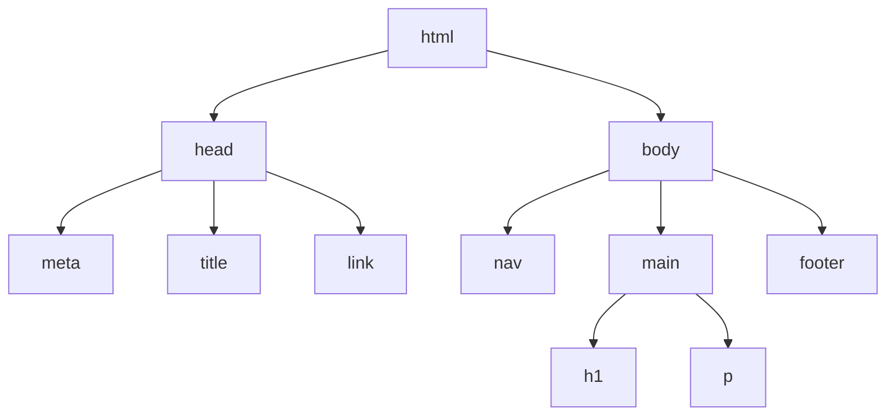
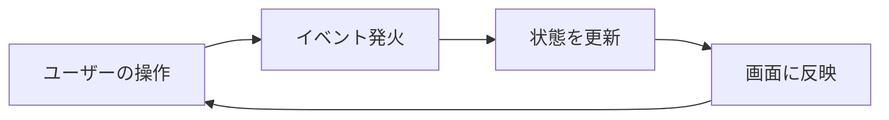

# JavaScript基礎

静的なページに動きを与える——ブラウザで動かすJavaScript入門

| 項目 | 内容 |
|---|---|
| カテゴリー | Web制作 |
| 難易度 | 入門 |
| 所要時間 | 約200分（全8レッスン） |
| 公開日 | 2026-05-10 |
| 最終更新日 | 2026-05-13 |
| コースURL | https://skillup.college/courses/web/javascript-basics/ |

## 対象者

HTML・CSSで静的なページが作れるようになり、次に「動き」を付けたい初学者。HTML・CSS入門コースを修了した方を主な対象とするが、HTMLとCSSの基本がわかっていれば独学でここから入っても進められる。

## 前提知識

HTMLとCSSの基本（タグ・属性・セレクタ・基本プロパティ・ボックスモデル）を理解していること。テキストエディタでファイルを保存し、ブラウザで開いて表示確認するサイクルに慣れていること。

## 学習目標

- JavaScriptが何のための言語か、どこで動くかを説明できる
- 変数・データ型・条件分岐・繰り返し・関数の基本文法を使える
- 配列とオブジェクトでデータをまとめて扱える
- DOMを操作してHTMLを動的に書き換えられる
- クリックや入力などのイベントに反応する処理を書ける
- ToDoリストのような小さなWebアプリを自分で実装できる
- JavaScriptがブラウザ以外でも動くことを知り、次の学習方向を選べる

## コース概要

「HTML・CSS入門」で作った静的なページに、JavaScriptで動きと対話を加えるコースです。ボタンを押すと数字が変わる、入力した内容がその場で表示される、ToDoリストを足したり消したりできる——これらはすべてJavaScriptで実現できます。本コースでは、変数・条件分岐・繰り返し・関数といった基本文法から、配列とオブジェクト、DOM操作、イベント処理までをひと通り学びます。最終レッスンでは小さなToDoアプリを実装し、コースの締めくくりとしてJavaScriptがブラウザ以外でも動くことを紹介します。

## 学習の流れ

レッスン1〜2でJavaScriptを動かす環境とデータの扱い方を整え、レッスン3〜5で条件分岐・繰り返し・関数・配列・オブジェクトといった基本文法を順に身につけます。レッスン6〜7で、JavaScriptをHTMLと結びつける核心であるDOM操作とイベント処理を学び、ページが「動く」体験をします。最後のレッスン8で、これまでの知識を総動員して小さなToDoアプリを完成させ、JavaScriptの広がりを案内します。前半（レッスン1〜5）は「JavaScriptという言語そのもの」を、後半（レッスン6〜8）は「ページを動かす力」を身につける流れです。

## レッスン一覧

| No. | タイトル | 概要 | 所要時間 |
|---|---|---|---|
| 1 | JavaScriptをはじめよう——HTMLに動きを与える第一歩 | JavaScriptとは何かを理解し、HTMLにJavaScriptを埋め込む方法（script要素・外部ファイル）を学ぶ。ブラウザのDevToolsコンソールを使って、はじめてのJavaScriptコードを動かす | 25分 |
| 2 | 変数とデータ型——値に名前を付けて使い回す | let・constによる変数の宣言、文字列・数値・真偽値・null・undefinedといった主要なデータ型、算術・比較・論理演算子、テンプレートリテラルを学ぶ | 25分 |
| 3 | 条件分岐と繰り返し——プログラムに判断と反復を持たせる | if・else if・elseによる条件分岐、for・while・for...ofによる繰り返しの書き方を学ぶ。条件と反復を組み合わせて、状況に応じた処理を書けるようになる | 25分 |
| 4 | 関数——処理のかたまりに名前を付ける | function宣言とアロー関数、引数と戻り値、スコープの基礎を学ぶ。同じ処理を関数にまとめることで、コードを再利用しやすくする | 25分 |
| 5 | 配列とオブジェクト——データをまとめて扱う | 配列の作成・要素の追加削除・forEach・mapと、オブジェクトのプロパティ・メソッド・ドット記法を学ぶ。複数のデータをまとめて扱う考え方を身につける | 25分 |
| 6 | DOM操作——JavaScriptでHTMLを書き換える | DOMの考え方、querySelectorによる要素の取得、textContent・innerHTML・valueによる中身の操作、styleとclassListによる装飾の操作を学ぶ | 25分 |
| 7 | イベント処理——利用者の操作に反応する | addEventListenerによるイベント登録、click・input・submitといった主要イベント、フォーム入力の取得、preventDefaultによるデフォルト動作の抑制を学ぶ | 25分 |
| 8 | ToDoリストを作る——小さなWebアプリでコースの締めくくり | これまでの知識を組み合わせて、項目の追加・削除ができるToDoリストを実装する。最後にJavaScriptがブラウザ以外でも動くこと（Node.jsなど）を紹介し、次の学習方向を案内する | 30分 |

---

## レッスン1：JavaScriptをはじめよう——HTMLに動きを与える第一歩

（所要時間：25分）

### このレッスンで学ぶこと

- JavaScriptが何を担う言語かを説明できる
- HTMLにJavaScriptを埋め込む方法を理解する
- 外部スクリプトファイルを読み込めるようになる
- ブラウザのDevToolsでコンソールを開いて結果を確認できる
- console.logで自分の書いたJavaScriptを動かせる

---

### JavaScriptとは何か

JavaScriptは、Webページに「動き」と「対話」を加えるためのプログラミング言語です。ボタンを押すと数字が変わる、入力した名前がその場で表示される、画像をクリックすると拡大される——こうした動的な振る舞いはほとんどがJavaScriptで実現されています。

HTMLはページの骨格、CSSは見た目の装飾を担当します。JavaScriptは、それらと並ぶWebの3本柱の3つ目で、「振る舞い」を担当します。HTMLとCSSが「静的なページ」を作るのに対し、JavaScriptは「動的なページ」、つまり利用者の操作や時間の経過で変化するページを作ります。

> **💡 ポイント**
> Web制作の3本柱と役割分担を整理しておきます。HTML＝構造、CSS＝装飾、JavaScript＝振る舞い。この3つが組み合わさって、現代のWebページが成り立っています。

### JavaScriptは「ブラウザで動く」とは限らない

JavaScriptはブラウザ上で動く言語として知られていますが、実は最近ではブラウザの外でも広く使われています。サーバー側のプログラム、デスクトップアプリ、スマートフォンアプリなど、活躍の場は大きく広がっています。本コースの最終レッスン（レッスン8）で簡単に紹介します。

ただし入門段階ではブラウザの中だけに集中するのが学びやすいので、レッスン1〜7はブラウザJavaScriptに絞って進めます。

### 前提：HTML・CSSコースで作ったフォルダを使う

本コースは「HTML・CSS入門」の続編です。HTML・CSSコースで作った `my-website` フォルダを引き続き使い、そこへJavaScriptを足していきます。HTML・CSSコースを終えていない方も、ご自身で `my-website` フォルダと簡単なHTML・CSSを用意していれば、このコースから始められます。

参考までに、HTML・CSSコース最終レッスン時点のフォルダ構成は次のようになっています。

```
my-website/
├── index.html
├── works.html
├── contact.html
└── assets/
    ├── css/
    │   └── style.css
    └── img/
        └── profile.jpg
```

このコースでは、ここに `assets/js/main.js` を新しく追加します。

### ステップ1：jsフォルダとmain.jsを作る

VSCodeで `my-website` フォルダを開いてください。`assets` フォルダの中に、新たに `js` フォルダを作ります。サイドバーで `assets` にカーソルを当てると表示される「新しいフォルダー」アイコンをクリックし、フォルダ名に `js` と入力してEnterを押します。

続いて `js` フォルダの中に `main.js` というファイルを作ります。`js` フォルダにカーソルを当てて「新しいファイル」アイコンをクリックし、`main.js` と入力してEnterを押してください。

`main.js` は空のファイルとして作成されます。最初の動作確認のため、次の1行を書いてみましょう。

```javascript
console.log("Hello, JavaScript!");
```

書けたら保存（`Ctrl + S` または `Command + S`）してください。

> **📝 補足**
> JavaScriptのファイル名は半角英数字で付けます。本コースでは `main.js` を使いますが、`script.js` や `app.js` といった名前もよく使われます。重要なのは、HTMLから読み込むときのパスと一致していることです。

### ステップ2：HTMLからJavaScriptを読み込む

`main.js` を作っただけでは、HTMLから呼び出されないのでブラウザでは動きません。`index.html` の `<head>` 内、`</head>` の直前に、次の1行を追加します。

```html
<script src="assets/js/main.js" defer></script>
```

これは「`assets/js/main.js` を読み込んで実行してください」という指示です。`<link>` でCSSを読み込むのと似ていますが、JavaScriptは `<script>` タグを使います。

#### `defer` の意味

`defer` は「ページのHTMLの読み込みが終わってから、このスクリプトを実行する」という指示です。これがないと、JavaScriptがHTMLより先に動こうとして、まだ存在しない要素を操作しようとしてエラーになることがあります。レッスン6でDOMを操作するときに効いてきます。

入門の段階では「`<head>` 内に `<script>` を書くときは必ず `defer` を付ける」と覚えておけば十分です。

> **💡 ポイント**
> `defer` 属性を付けたスクリプトは、HTMLの解析が完了してから順番に実行されます。これにより、JavaScriptがHTMLの要素を確実に見つけられる状態で動き始められます。

### ステップ3：DevToolsのコンソールを開く

`console.log` で出力した内容は、ブラウザの「コンソール」という場所に表示されます。コンソールはDevTools（開発者ツール）の中にあります。

ブラウザで `index.html` を開き、次のキーで開発者ツールを開いてください。

- **Windows**：`F12` キー
- **macOS**：`Option + Command + I`

開発者ツールが画面の下または右に表示されたら、「Console」または「コンソール」というタブをクリックしてください。

「Hello, JavaScript!」という文字が表示されていれば成功です。これがあなたの最初のJavaScriptの実行結果です。

> **🔰 初学者の方へ**
> コンソールは、JavaScriptの動きを確認するための重要な道具です。本コースでは何度も使います。最初は「コンソールがどこにあるか」だけ覚えればOK。慣れてくると、コードを書く時間と同じくらいコンソールを見る時間が増えていきます。

### console.logの使い方

`console.log()` は、括弧の中に書いたものをコンソールに出力する命令です。文字列、数値、計算結果、変数の中身など、なんでも表示できます。

`main.js` の内容を、次のように書き換えて試してみてください。

```javascript
console.log("Hello, JavaScript!");
console.log(123);
console.log(1 + 2);
console.log("今は" + 2026 + "年です");
```

保存してブラウザを再読み込みすると、コンソールに4行が表示されます。

```
Hello, JavaScript!
123
3
今は2026年です
```

3行目は計算結果が表示されていることに注目してください。JavaScriptは `1 + 2` を計算して `3` をコンソールに出します。4行目では文字列と数値を `+` でつないで、長い文字列を作っています。

> **💡 ポイント**
> `console.log` は、入門段階で最もよく使うJavaScriptの命令です。「いま変数に何が入っているか」「処理がここまで動いたか」を確認するのに使います。少し書いては `console.log` で確認、というリズムが作れると、エラーで詰まる時間が減ります。

### JavaScriptはどこに書いてもいい？

JavaScriptをHTMLに書く方法は、CSSと同じく3通りあります。

**1つ目はインラインスクリプト**：HTMLタグの属性に直接書く方法。`onclick` 属性などが該当します。今ではあまり推奨されません。

**2つ目は内部スクリプト**：`<script>` タグの中に直接JavaScriptを書く方法。

```html
<script>
  console.log("内部スクリプトです");
</script>
```

**3つ目は外部スクリプト**：別の `.js` ファイルを `<script src="...">` で読み込む方法。本コースで採用します。

実務でも入門学習でも、外部スクリプトが基本です。HTMLとJavaScriptをファイルで分けると、どちらの修正も楽になり、複数ページから同じJavaScriptを使い回せます。

> **📝 補足**
> CSSのレッスン3でも、内部スタイルではなく外部CSSを推奨しました。HTML・CSS・JavaScriptをそれぞれ別ファイルに分けて管理するのは、現代のWeb制作の基本姿勢です。

### エラーが出たときの対処

書いたJavaScriptに間違いがあると、コンソールに赤い文字でエラーメッセージが表示されます。最初は怖く感じるかもしれませんが、エラーは「どこで・何が間違っているか」をブラウザが教えてくれているメッセージです。

例えば、文字列を囲むダブルクォーテーションを閉じ忘れると、こんなエラーが出ます。

```
Uncaught SyntaxError: Invalid or unexpected token
```

このメッセージの右側には、どのファイルの何行目で起きたかが書かれています。クリックするとエディタの該当行に飛べます。エラーは敵ではなく、デバッグの味方です。

> **⚠️ 注意**
> 何もしていないのにJavaScriptが動かないときは、`console.log("test")` のように動作確認用の1行を追加して、それすら出力されないか確認しましょう。出力されない場合、`<script>` の `src` のパスが間違っているか、ファイル名のスペルが違うか、保存し忘れか、のいずれかであることがほとんどです。

### まとめ

このレッスンでは、以下のことを学びました。

- JavaScriptは、Webページに動きと対話を加えるためのプログラミング言語である
- 役割分担はHTML＝構造、CSS＝装飾、JavaScript＝振る舞いの3本柱
- 外部スクリプトを `<script src="..." defer></script>` で読み込むのが基本
- `defer` は「HTMLの解析後にスクリプトを実行する」指示で、入門段階では必ず付ける
- `console.log()` でコンソールに値を出力できる
- DevToolsのコンソールは、JavaScriptの動きを確認するための重要な道具

次のレッスンでは、JavaScriptで値を扱う基本となる「変数とデータ型」を学びます。文字列・数値・真偽値といった主要なデータ型と、`let` ・ `const` による変数の宣言方法を身につけましょう。

---

### 確認クイズ

このレッスンの理解度をチェックしましょう。

#### Q1. JavaScriptが担う役割として最も適切なものはどれか？

- [ ] Webページの構造を作る
- [ ] Webページの装飾を整える
- [x] Webページに動きや対話を加える
- [ ] Webページをサーバーに配信する

> **解説**
> Webの3本柱では、HTMLが構造、CSSが装飾、JavaScriptが振る舞いを担います。動きや対話、利用者の操作への反応はJavaScriptの仕事です。

#### Q2. 外部のJavaScriptファイルをHTMLから読み込むタグとして正しいものはどれか？

- [ ] `<link rel="javascript" href="main.js">`
- [x] `<script src="main.js"></script>`
- [ ] `<js href="main.js"></js>`
- [ ] `<import "main.js">`

> **解説**
> JavaScriptは `<script src="...">` タグで読み込みます。CSSの `<link>` と混同しやすいので注意しましょう。

#### Q3. `<script>` タグに付ける `defer` 属性の説明として最も適切なものはどれか？

- [ ] スクリプトの実行を完全に止める
- [x] HTMLの解析が完了してからスクリプトを実行する
- [ ] スクリプトを暗号化する
- [ ] スクリプトを別ウィンドウで実行する

> **解説**
> `defer` は「HTMLの解析が完了してから、このスクリプトを実行する」という指示です。これにより、JavaScriptがHTMLの要素を確実に見つけられる状態で実行されます。

#### Q4. ブラウザのDevToolsでコンソールを開く一般的なキー操作はどれか？

- [ ] `Ctrl + C`
- [ ] `Ctrl + P`
- [x] `F12`（Windows）または `Option + Command + I`（Mac）
- [ ] `Esc`

> **解説**
> 主要ブラウザでは `F12`（Windows）または `Option + Command + I`（Mac）で開発者ツールが開きます。コンソールタブはJavaScriptの動作確認に使う重要な領域です。

#### Q5. `console.log()` の役割として最も適切なものはどれか？

- [ ] 画面に大きく文字を表示する
- [x] DevToolsのコンソールに値を出力する
- [ ] HTMLの内容を保存する
- [ ] サーバーにデータを送る

> **解説**
> `console.log()` は、括弧の中に書いた値をDevToolsのコンソールに出力する命令です。変数の中身や処理の進行を確認するのに使います。

#### Q6. `console.log(1 + 2);` を実行したとき、コンソールに表示される内容として正しいものはどれか？

- [ ] `1 + 2`
- [x] `3`
- [ ] `"1 + 2"`
- [ ] 何も表示されない

> **解説**
> JavaScriptは `1 + 2` を先に計算して `3` を `console.log` に渡します。コンソールには計算結果の `3` が表示されます。

#### Q7. JavaScriptが動かないときの確認ポイントとして本レッスンで紹介しているものはどれか？

- [x] `<script>` の `src` のパスやファイル名が正しいか、保存しているかを確認する
- [ ] パソコンを必ず再起動する
- [ ] 別のプログラミング言語に書き換える
- [ ] ブラウザを最新のものにアップグレードしないと一切動かない

> **解説**
> JavaScriptが動かないときに最初に疑うべきは、`<script>` タグのパスとファイル名のスペル、そして保存し忘れです。`console.log("test")` のような最小確認用の1行を仕込むのも有効な手段です。

---

## レッスン2：変数とデータ型——値に名前を付けて使い回す

（所要時間：25分）

### このレッスンで学ぶこと

- 変数とは何かを理解し、letとconstを使い分けられる
- 文字列・数値・真偽値・null・undefinedといった主要なデータ型を区別できる
- 算術・比較・論理の各演算子を使える
- テンプレートリテラルで読みやすい文字列を組み立てられる

---

レッスン1では、`console.log` でJavaScriptをブラウザに動かしてもらう体験をしました。このレッスンでは、JavaScriptで値を扱うための基本となる「変数」と「データ型」を学びます。これらはコース全体を通して使う土台になります。

### 変数とは

変数は、値に名前を付けて使い回せるようにする仕組みです。例えば「私の名前は森田 彩花」「私の年齢は30」といった情報を、コードの中で何度も使うとき、毎回書き直すのは大変です。一度変数に入れておけば、その名前で呼び出せるようになります。

`my-website` フォルダの `assets/js/main.js` を開き、これまでの `console.log` の行はそのままに、次のコードを追加してみてください。

```javascript
let name = "森田 彩花";
let age = 30;

console.log(name);
console.log(age);
```

保存してブラウザを再読み込みすると、コンソールに「森田 彩花」「30」と表示されます。`name` と `age` という変数に値を入れ、その変数名で値を呼び出した結果です。

### letとconst——変数の宣言の2つの方法

JavaScriptで変数を宣言する方法は、現在2つあります。

**`let`** は、後から値を変更できる変数を作ります。

```javascript
let count = 0;
count = 1;        // 値を変えられる
count = count + 1; // 結果は2
```

**`const`** は、最初に入れた値を変更できない変数を作ります。「定数」を作るキーワードです。

```javascript
const pi = 3.14;
// pi = 3.15;  // ← これはエラーになる
```

実務でも入門学習でも、まず `const` で書き、後で値を変えたくなったら `let` に変える、という方針が定番です。「変えないつもりで書く」ことで、誤って値を上書きしてしまう事故を減らせます。

> **💡 ポイント**
> 「迷ったら `const`」と覚えておきましょう。`const` で書いてみて、「ここの値は後で変える必要がある」とわかったときだけ `let` に切り替えれば十分です。

> **📝 補足**
> 古いJavaScriptには `var` という変数宣言もあります。今でも動きますが、現在の入門・実務では使わないのが一般的です。本コースでは扱いません。古いコードで `var` を見かけたら「letに近いが古い書き方」と理解してください。

### 変数名のルール

変数名は次のルールで付けます。

- 半角英数字とアンダースコア（`_`）、ドル記号（`$`）が使える
- 数字から始められない（`1count` はNG、`count1` はOK）
- 予約語（`if`、`for`、`function` など）は使えない
- **半角アルファベットの小文字で始めるのが慣例**
- 複数の単語をつなぐときは、2つ目以降の単語の頭を大文字にする（**キャメルケース**）

```javascript
const userName = "佐藤";       // OK
const userAge = 25;            // OK
const isLoggedIn = true;       // OK
// const 1user = ...           // NG：数字始まり
// const user-name = ...       // NG：ハイフン使用
```

> **🔰 初学者の方へ**
> 変数名は「自分が後で読み返したときに意味がわかるもの」を選びましょう。`a`、`x`、`tmp` のような短すぎる名前は避け、`userName`、`itemPrice` のように何を表すかがわかる名前にする習慣をつけると、後々の自分を助けます。

### データ型——値の種類

JavaScriptでは、変数に入れる値に「型（タイプ）」があります。文字列なのか、数値なのか、真偽値なのか、といった区別です。本レッスンでは入門段階で押さえておきたい5つのデータ型を紹介します。

#### 1. 文字列（String）

シングルクォート `'` またはダブルクォート `"` で囲んで書きます。本コースではダブルクォート `"` で統一します。

```javascript
const greeting = "こんにちは";
const courseName = "JavaScript基礎";
```

#### 2. 数値（Number）

整数も小数も、同じ数値型として扱います。

```javascript
const age = 30;
const price = 1980;
const ratio = 0.75;
```

#### 3. 真偽値（Boolean）

`true`（真）または `false`（偽）の2つだけの型です。条件分岐（次のレッスン）で活躍します。

```javascript
const isStudent = true;
const isAdmin = false;
```

#### 4. null

「値が空であること」を意図的に示すための値です。「明示的に何もない」という意味で使います。

```javascript
let selectedItem = null;
```

#### 5. undefined

「値がまだ設定されていない」状態を表す値です。変数を宣言しただけで値を入れていないときも `undefined` になります。

```javascript
let name;
console.log(name);  // undefined と表示される
```

`null` と `undefined` の違いは混乱しがちですが、入門段階では「nullは意図的な空、undefinedはまだ何も入っていない」と区別しておけば十分です。

### typeofで型を確認する

ある値の型を調べたいときは、`typeof` という演算子が使えます。

```javascript
console.log(typeof "森田");      // "string"
console.log(typeof 30);          // "number"
console.log(typeof true);        // "boolean"
console.log(typeof undefined);   // "undefined"
console.log(typeof null);        // "object"（歴史的な事情でobjectになる）
```

最後の `null` の型が `"object"` と出るのは、JavaScriptの歴史的な事情によるものです。仕様上の特殊なケースとして覚えておきましょう。

### 算術演算子——数値の計算

数値同士の計算には、次の演算子が使えます。

| 演算子 | 意味 | 例 |
|---|---|---|
| `+` | 足し算 | `3 + 2` → `5` |
| `-` | 引き算 | `5 - 2` → `3` |
| `*` | 掛け算 | `4 * 3` → `12` |
| `/` | 割り算 | `10 / 4` → `2.5` |
| `%` | 余り | `10 % 3` → `1` |

```javascript
const taxRate = 0.10;
const price = 1000;
const total = price + price * taxRate;
console.log(total);  // 1100
```

### 比較演算子——値を比べる

2つの値を比べるための演算子です。結果は真偽値（true / false）になります。

| 演算子 | 意味 |
|---|---|
| `===` | 等しい |
| `!==` | 等しくない |
| `>` | 大きい |
| `>=` | 以上 |
| `<` | 小さい |
| `<=` | 以下 |

```javascript
console.log(3 === 3);       // true
console.log(3 === "3");     // false（型も比較する）
console.log(5 > 2);         // true
console.log(10 <= 10);      // true
```

> **⚠️ 注意**
> JavaScriptには `==` という「ゆるい等価比較」もありますが、型の自動変換が起きるため予期しない結果になることがあります（例：`"3" == 3` は `true`）。本コースでは型まで含めて比較する `===` と `!==` を必ず使います。実務でも `===` が標準です。

### 論理演算子——条件を組み合わせる

複数の条件を組み合わせるための演算子です。

| 演算子 | 意味 |
|---|---|
| `&&` | かつ（AND） |
| `||` | または（OR） |
| `!` | ではない（NOT） |

```javascript
const age = 25;
console.log(age >= 18 && age < 65);  // true（18歳以上かつ65歳未満）
console.log(age < 18 || age >= 65);  // false
console.log(!(age >= 18));           // false（18歳以上の否定）
```

### テンプレートリテラル——読みやすい文字列の組み立て

文字列の中に変数の値を埋め込みたいとき、`+` でつなぐ方法もありますが、長くなると読みにくくなります。

```javascript
const name = "森田 彩花";
const age = 30;
console.log("私の名前は" + name + "、年齢は" + age + "歳です。");
```

そこで便利なのが**テンプレートリテラル**です。バッククォート `` ` `` で囲み、`${変数名}` の形で値を埋め込めます。

```javascript
const name = "森田 彩花";
const age = 30;
console.log(`私の名前は${name}、年齢は${age}歳です。`);
```

結果はどちらも同じですが、テンプレートリテラルのほうが読みやすく、間違いも減ります。改行もそのまま含められます。

```javascript
console.log(`これは
複数行にわたる
文字列です`);
```

> **💡 ポイント**
> 文字列を組み立てるときは、テンプレートリテラル（バッククォート＋`${}`）を優先しましょう。シングル・ダブルクォートで囲んだ文字列に `+` で変数をつなぐ書き方より、ぐっと読みやすくなります。

### 実習：自己紹介をコンソールに出す

ここまで学んだことを使って、自分のプロフィールをコンソールに出してみましょう。`main.js` の中身を、次のように書き換えてください（これまでのコードは消して構いません）。

```javascript
const name = "森田 彩花";
const age = 30;
const hobby = "登山";
const isInstructor = true;

console.log(`名前：${name}`);
console.log(`年齢：${age}歳`);
console.log(`趣味：${hobby}`);
console.log(`講師かどうか：${isInstructor}`);

const yearsToFifty = 50 - age;
console.log(`50歳まであと${yearsToFifty}年です。`);
```

保存してブラウザを再読み込みし、コンソールを確認してください。5行のメッセージが表示されるはずです。最後の行は変数同士の引き算結果を埋め込んだ例です。

名前や年齢、趣味の値を変えて何度か試してみると、変数の便利さが体感できます。

### まとめ

このレッスンでは、以下のことを学びました。

- 変数は値に名前を付けて使い回す仕組みで、`let` と `const` で宣言する
- 「迷ったら `const` 」、後で値を変える必要があるときだけ `let` に切り替える
- 主要なデータ型は文字列・数値・真偽値・null・undefinedの5つ
- `typeof` で型を確認できる
- 比較は型まで含めて比べる `===` と `!==` を使う
- 文字列の中に変数を埋め込むときは、テンプレートリテラル（`` `${変数名}` ``）が読みやすい

次のレッスンでは、これらの値を使って「条件分岐」と「繰り返し」を書きます。プログラムに判断と反復の力を与えて、変数の中身に応じて違う処理を実行できるようにしましょう。

---

### 確認クイズ

このレッスンの理解度をチェックしましょう。

#### Q1. 「後から値を変える可能性のない変数」を宣言するときに使うキーワードはどれか？

- [x] const
- [ ] let
- [ ] var
- [ ] static

> **解説**
> `const` は値を変更できない変数を作ります。「迷ったら const、後で変えたくなったら let に切り替える」が現代JavaScriptの標準的な方針です。

#### Q2. 次のうち、JavaScriptで有効な変数名はどれか？

- [ ] 1user
- [ ] user-name
- [x] userName
- [ ] for

> **解説**
> 変数名は数字から始められず、ハイフンも使えません。予約語（`for`、`if` など）も使えません。複数の単語をつなぐときはキャメルケース（`userName`）が慣例です。

#### Q3. `console.log(typeof "hello");` の出力として正しいものはどれか？

- [ ] "hello"
- [x] "string"
- [ ] "text"
- [ ] "value"

> **解説**
> `typeof` は値の型を文字列で返します。文字列の型は `"string"` です。数値なら `"number"`、真偽値なら `"boolean"` を返します。

#### Q4. JavaScriptの真偽値（Boolean）として正しいものはどれか？

- [ ] yes / no
- [ ] 0 / 1
- [x] true / false
- [ ] on / off

> **解説**
> JavaScriptの真偽値は `true` と `false` の2つだけです。文字列の `"true"` や数値の `1` とは別物です。

#### Q5. 「型まで含めて等しいかを比べる」演算子として正しいものはどれか？

- [ ] =
- [ ] ==
- [x] ===
- [ ] :=

> **解説**
> `===` は型まで含めて比較する厳密な等価演算子です。`==` は型の自動変換が起きるため予期しない結果になりやすく、本コースでは `===` と `!==` を使います。`=` は代入演算子で、比較ではありません。

#### Q6. 次のコードの実行結果として正しいものはどれか？

```javascript
const name = "森田";
const age = 30;
console.log(`${name}さんは${age}歳`);
```

- [ ] `${name}さんは${age}歳`
- [x] `森田さんは30歳`
- [ ] `name さんは age 歳`
- [ ] エラー

> **解説**
> バッククォート `` ` `` で囲まれた文字列の中で `${変数名}` と書くと、変数の値が埋め込まれます。これがテンプレートリテラルです。結果は `森田さんは30歳` になります。

#### Q7. 値を意図的に「空である」と示すために使うキーワードはどれか？

- [ ] empty
- [ ] void
- [x] null
- [ ] zero

> **解説**
> `null` は「明示的に何もない」を意味する値です。一方 `undefined` は「まだ何も設定されていない」状態を示します。両者は似ていますが、意図が異なります。

#### Q8. 次のコードの結果として正しいものはどれか？

```javascript
const x = 10;
console.log(x >= 10 && x < 20);
```

- [x] true
- [ ] false
- [ ] 10
- [ ] エラー

> **解説**
> `x` は10で、「10以上」かつ「20未満」の両方を満たします。論理演算子 `&&` は両方が `true` のときだけ `true` を返すため、結果は `true` です。

---

## レッスン3：条件分岐と繰り返し——プログラムに判断と反復を持たせる

（所要時間：25分）

### このレッスンで学ぶこと

- if・else if・elseで状況に応じた処理を書ける
- 比較演算子と論理演算子を組み合わせた条件式を作れる
- forとwhileによる繰り返しを書ける
- for...ofで配列の中身を順番に処理できる

---

レッスン2では、変数とデータ型、テンプレートリテラルを学びました。このレッスンでは、変数の値に応じて違う処理を実行する「条件分岐」と、同じ処理を何度も繰り返す「繰り返し（ループ）」を学びます。これらが書けるようになると、プログラムに「判断」と「反復」の力が加わります。

### 条件分岐——状況に応じて処理を変える

「もし〇〇なら××する」という処理を書くのが条件分岐です。JavaScriptでは `if` 文を使います。

`my-website` フォルダの `assets/js/main.js` を開き、これまでのコードを残したまま（または整理して）、次のコードを試してみてください。

```javascript
const score = 75;

if (score >= 80) {
  console.log("合格です。よくできました。");
} else {
  console.log("不合格です。もう一度復習しましょう。");
}
```

`score` の値が80以上なら「合格です」、そうでなければ「不合格です」と表示されます。今は75なので「不合格です」が表示されるはずです。`score` の値を85や90に変えて再読み込みすると、表示が変わるのが確認できます。

#### if文の基本構文

```
if (条件式) {
  条件が true のときに実行する処理
} else {
  条件が false のときに実行する処理
}
```

`else` のブロックは省略してもOKです。「条件に当てはまるときだけ何かしたい」場合は、`if` だけで十分です。

```javascript
const isLoggedIn = true;
if (isLoggedIn) {
  console.log("ログイン済みです。");
}
```

> **💡 ポイント**
> 条件式は最終的に `true` か `false` のどちらかになります。比較演算子（`===`、`<`、`>` など）や論理演算子（`&&`、`||`、`!`）を使って条件式を組み立てます。

### else ifで複数の条件を扱う

3つ以上の分岐がある場合は、`else if` を使います。条件は上から順に評価され、最初に当てはまったブロックだけが実行されます。

```javascript
const score = 75;

if (score >= 90) {
  console.log("評価：A");
} else if (score >= 70) {
  console.log("評価：B");
} else if (score >= 50) {
  console.log("評価：C");
} else {
  console.log("評価：D");
}
```

`score` が75の場合、`score >= 90` は `false` なので次へ進み、`score >= 70` が `true` なので「評価：B」が表示されます。残りの条件は評価されません。

> **⚠️ 注意**
> `else if` の順番は重要です。例えば上の例で `score >= 50` を最初に書くと、75も90も100もすべて「評価：C」になってしまいます。範囲が狭い条件から広い条件の順に書く（または、逆順に書く）のが基本です。

### 論理演算子で条件を組み合わせる

レッスン2で学んだ論理演算子を、条件分岐の中で活用してみましょう。

```javascript
const age = 25;
const hasTicket = true;

if (age >= 18 && hasTicket) {
  console.log("入場できます。");
} else {
  console.log("入場できません。");
}
```

`&&`（かつ）で2つの条件を結ぶと、両方が `true` のときだけ全体が `true` になります。「18歳以上」かつ「チケットあり」の両方を満たすときだけ入場可、という処理です。

`||`（または）も同様に使えます。

```javascript
const day = "土";
if (day === "土" || day === "日") {
  console.log("週末です。");
}
```

### 繰り返し——同じ処理を何度も実行する

同じような処理を何度も書くのは大変です。プログラムには「同じ処理を指定回数くり返す」「条件を満たす間くり返す」といった仕組みがあります。これを「繰り返し」または「ループ」と呼びます。

JavaScriptには複数の繰り返し構文があります。本レッスンでは、特によく使う `for` 文・`while` 文・`for...of` 文の3つを紹介します。

### for文——指定回数の繰り返し

「○回くり返したい」というときに使うのが `for` 文です。

```javascript
for (let i = 0; i < 5; i++) {
  console.log(`これは${i + 1}回目です。`);
}
```

実行すると、コンソールに次の5行が表示されます。

```
これは1回目です。
これは2回目です。
これは3回目です。
これは4回目です。
これは5回目です。
```

#### for文の構造

`for` 文は `()` の中に3つの要素をセミコロンで区切って書きます。

```
for (初期化; 条件式; 更新式) {
  繰り返す処理
}
```

- **初期化**：ループ開始時に1回だけ実行（例：`let i = 0`）
- **条件式**：ループを続けるかの判定（例：`i < 5`）
- **更新式**：1周ごとに実行（例：`i++` は `i = i + 1` の省略形）

最初は手品のように感じるかもしれませんが、「`i` が0から始まって、5未満の間、毎回1ずつ足しながらくり返す」と読めば理解できます。

> **💡 ポイント**
> for文の `i` という変数名は「index（番号）」の頭文字で、ループ用変数として広く使われる慣例です。たいていの場合、ループ内でしか使わない仮の変数なので、短く `i` で構いません。

### while文——条件を満たす間くり返す

回数があらかじめ決まっていない場合は、`while` 文を使います。

```javascript
let n = 1;
while (n <= 100) {
  console.log(n);
  n = n * 2;
}
```

このコードは「`n` を2倍ずつしながら、100以下の間くり返す」処理です。`n` は1, 2, 4, 8, 16, 32, 64と表示され、128になった時点で条件を満たさなくなりループが終わります。

> **⚠️ 注意**
> `while` 文の中で「条件をいつか `false` にする処理」を書き忘れると、永遠にループが終わらない「無限ループ」になります。ブラウザがフリーズしたように見えることがあるので、書くときは終了条件を必ず確認しましょう。

### 配列を先取りで紹介——リストとしてのデータ

次の `for...of` を学ぶ前に、レッスン5で詳しく扱う「配列」を先取りで紹介します。

配列は、複数の値をまとめて扱うためのデータ型です。角括弧 `[` `]` で囲み、カンマで区切って書きます。

```javascript
const fruits = ["りんご", "みかん", "ぶどう"];

console.log(fruits[0]);  // "りんご"
console.log(fruits[1]);  // "みかん"
console.log(fruits.length);  // 3
```

`fruits[0]` の `0` は配列の番号で、これを「インデックス」と呼びます。**インデックスは0から始まります**。これはJavaScriptに限らず、多くのプログラミング言語に共通する決まりです。`fruits.length` で配列の長さ（要素の数）がわかります。

詳しい配列の操作はレッスン5で扱います。ここでは「配列は値の並びをまとめて持つもの」というイメージだけ持ってください。

### for...of文——配列の中身を順番に処理する

配列の各要素に対して同じ処理をしたいときに、最も書きやすいのが `for...of` 文です。

```javascript
const fruits = ["りんご", "みかん", "ぶどう"];

for (const fruit of fruits) {
  console.log(`好きな果物：${fruit}`);
}
```

これだけで、配列の中身が順番に `fruit` という変数に入って、各要素についての処理が実行されます。出力はこうなります。

```
好きな果物：りんご
好きな果物：みかん
好きな果物：ぶどう
```

通常の `for` 文でも書けますが、`for...of` のほうが圧倒的に読みやすく、書き間違いも減ります。配列を順番に処理したい場面では、まず `for...of` を選びましょう。

> **📝 補足**
> 似た構文に `for...in` がありますが、これはオブジェクトのプロパティ名を取り出すための構文で、配列処理には向きません。配列の要素を順番に取り出したいときは `for...of` を使う、と区別しておけば十分です。

### 実習：配列とif文を組み合わせる

ここまでの内容を組み合わせた実習です。`main.js` を次のように書き換えてください。

```javascript
const scores = [85, 62, 78, 44, 91, 55];

for (const score of scores) {
  if (score >= 80) {
    console.log(`${score}点：合格（A）`);
  } else if (score >= 60) {
    console.log(`${score}点：合格（B）`);
  } else {
    console.log(`${score}点：不合格`);
  }
}
```

保存してブラウザを再読み込みすると、コンソールに次の6行が表示されます。

```
85点：合格（A）
62点：合格（B）
78点：合格（B）
44点：不合格
91点：合格（A）
55点：不合格
```

配列の各要素に対して、条件分岐で評価を変えています。これだけで、点数のリストから一気に評価レポートが作れたことになります。

> **💡 ポイント**
> 「配列の各要素に対して条件分岐で処理を変える」は、Webアプリでも頻出のパターンです。商品リストから在庫切れだけ別表示にする、ToDoの項目から完了済みだけ取り出す、といった処理が同じ書き方で実現できます。

### まとめ

このレッスンでは、以下のことを学びました。

- if・else if・elseで条件に応じた処理を書ける
- 論理演算子（`&&`、`||`、`!`）で複数の条件を組み合わせられる
- for文は指定回数の繰り返し、while文は条件を満たす間の繰り返しに使う
- インデックスは0から始まる
- for...of文は配列の各要素に対して同じ処理をするときに最も読みやすい
- 配列とif文の組み合わせは、Webアプリで頻出する基本パターン

次のレッスンでは「関数」を学びます。同じような処理を何度も書く代わりに、処理に名前を付けて呼び出せるようにする仕組みです。コードがぐっと整理しやすくなります。

---

### 確認クイズ

このレッスンの理解度をチェックしましょう。

#### Q1. 次のコードの実行結果として正しいものはどれか？

```javascript
const score = 65;
if (score >= 80) {
  console.log("A");
} else if (score >= 60) {
  console.log("B");
} else {
  console.log("C");
}
```

- [ ] A
- [x] B
- [ ] C
- [ ] エラー

> **解説**
> `score` は65なので、`score >= 80` は false、次の `score >= 60` は true となり、「B」が表示されます。`else if` の評価は上から順で、最初にマッチしたブロックだけが実行されます。

#### Q2. 「`age` が18以上かつ65未満」を表す条件式として正しいものはどれか？

- [ ] `age >= 18 || age < 65`
- [x] `age >= 18 && age < 65`
- [ ] `age >= 18, age < 65`
- [ ] `age between 18 and 65`

> **解説**
> 「かつ」は論理演算子 `&&`、「または」は `||` です。両方の条件を満たすことを表すなら `&&` を使います。

#### Q3. 次のfor文を実行したとき、`console.log` は何回呼び出されるか？

```javascript
for (let i = 0; i < 5; i++) {
  console.log(i);
}
```

- [ ] 4回
- [x] 5回
- [ ] 6回
- [ ] 0回

> **解説**
> `i` は0, 1, 2, 3, 4の値を取ります（5未満の間続くため）。`console.log` は5回呼ばれます。

#### Q4. JavaScriptの配列のインデックスは何から始まるか？

- [x] 0
- [ ] 1
- [ ] 配列によって違う
- [ ] 任意の値から開始できる

> **解説**
> 配列のインデックスは0から始まります。`fruits[0]` は配列の最初の要素を指します。これはJavaScriptを含む多くのプログラミング言語に共通する決まりです。

#### Q5. 配列の各要素を順番に処理するときに最も読みやすい繰り返し構文はどれか？

- [ ] for文（インデックスを使う）
- [ ] while文
- [ ] for...in文
- [x] for...of文

> **解説**
> `for...of` は配列の要素を直接取り出して処理するための構文で、最も読みやすく書き間違いも少ない方法です。`for...in` はオブジェクトのプロパティ名を取り出す構文なので、配列処理には向きません。

#### Q6. while文を書くときに最も注意すべきことはどれか？

- [ ] 必ずwhileの直前に if を書く
- [x] 終了条件をいつか false にしないと無限ループになる
- [ ] while の中では console.log が使えない
- [ ] while は1ファイルに1回しか書けない

> **解説**
> while文では、条件式を `false` にする処理（カウンターを進める、フラグを変えるなど）を中に書かないと、無限ループになります。ブラウザがフリーズする原因にもなるので、終了条件は必ず確認しましょう。

#### Q7. 次のコードの3行目（インデックス2の要素）として表示される値はどれか？

```javascript
const items = ["apple", "banana", "cherry"];
console.log(items[2]);
```

- [ ] apple
- [ ] banana
- [x] cherry
- [ ] undefined

> **解説**
> インデックスは0から始まるため、`items[0]` が "apple"、`items[1]` が "banana"、`items[2]` が "cherry" です。最初は混乱しやすいので、何度も書いて慣れましょう。

---

## レッスン4：関数——処理のかたまりに名前を付ける

（所要時間：25分）

### このレッスンで学ぶこと

- 関数の役割と使うメリットを説明できる
- function宣言とアロー関数の2つの書き方を使える
- 引数と戻り値を正しく使える
- スコープ（変数が見える範囲）の基本を理解する

---

レッスン3では、条件分岐と繰り返しを学びました。同じ処理を何度も書かずに済む仕組みです。このレッスンでは、もう一段階上の「処理のかたまりに名前を付けて呼び出す」仕組み——関数を学びます。関数はJavaScriptの中核となる要素のひとつで、これからのレッスンすべてで使います。

### 関数とは

関数は、何回も使う処理に名前を付けて、まとめておけるようにする仕組みです。料理のレシピに例えるとわかりやすいかもしれません。「カレーの作り方」というレシピを書いておけば、毎回その手順を考え直さずに「カレーの作り方を実行する」と指示するだけで済みます。プログラムでも同じことを関数で実現します。

関数を使うメリットは3つあります。

1. **同じ処理を何度も書かずに済む**：処理に名前を付けて、必要なところで呼び出すだけ
2. **コードの意図が明確になる**：`calculateTax(price)` という名前があるだけで、何をしているコードなのかがわかる
3. **修正がしやすくなる**：ロジックを変更したい場合、関数の中だけを直せば、呼び出している箇所すべてに反映される

### function宣言——基本の関数の書き方

JavaScriptで関数を作るもっとも基本的な書き方が、`function` 宣言です。

```javascript
function greet() {
  console.log("こんにちは！");
}

greet();  // 関数を呼び出す
```

`function 関数名() { 処理 }` の形で関数を定義し、`関数名()` で呼び出します。`greet()` を実行すると「こんにちは！」とコンソールに出力されます。

何度でも呼び出せるのが関数の便利な点です。

```javascript
greet();
greet();
greet();
```

これで「こんにちは！」が3回表示されます。

### 引数——関数に値を渡す

関数の括弧 `()` の中に書く変数を「引数（ひきすう）」と呼びます。関数に値を渡せる仕組みです。

```javascript
function greet(name) {
  console.log(`こんにちは、${name}さん！`);
}

greet("森田");
greet("佐藤");
greet("田中");
```

実行すると、コンソールに3行が表示されます。

```
こんにちは、森田さん！
こんにちは、佐藤さん！
こんにちは、田中さん！
```

引数を使うと、関数の振る舞いを呼び出すたびに変えられます。同じ関数を、違う名前で何度も呼び出した結果が確認できます。

引数は複数指定できます。

```javascript
function introduce(name, age) {
  console.log(`私は${name}、${age}歳です。`);
}

introduce("森田", 30);
introduce("佐藤", 25);
```

カンマで区切って書きます。呼び出すときも、定義した順に値を渡します。

> **💡 ポイント**
> 引数の名前は、関数の中だけで通じる「仮の変数名」です。呼び出す側で別の名前の変数を使っていても問題ありません。`const userName = "森田"; greet(userName);` のように渡せます。

### 戻り値——関数から値を返す

関数の中で計算した結果を、呼び出し元に返したいときは `return` を使います。

```javascript
function calculateTax(price) {
  return price * 0.10;
}

const tax = calculateTax(1000);
console.log(tax);  // 100
```

`calculateTax(1000)` を呼び出すと、関数の中で `1000 * 0.10` が計算され、その結果である `100` が `return` で返されます。返された値を `tax` という変数に入れているわけです。

戻り値は、そのまま別の式の中で使うこともできます。

```javascript
function calculateTax(price) {
  return price * 0.10;
}

const price = 1000;
console.log(`税込価格は${price + calculateTax(price)}円です。`);
// 税込価格は1100円です。
```

> **📝 補足**
> `return` は関数の処理を「ここで終了して値を返す」命令でもあります。`return` 以降のコードは実行されません。条件分岐と組み合わせて、特定の場合だけ早めに関数から抜ける、という書き方にも使えます。

### アロー関数——もう一つの関数の書き方

JavaScriptには、`function` 宣言とは別に「アロー関数」という書き方があります。`=>`（矢印）を使うのが特徴です。

```javascript
const greet = (name) => {
  console.log(`こんにちは、${name}さん！`);
};

greet("森田");
```

書き方は違いますが、結果は `function` 宣言と同じです。「`name` という引数を受け取り、コンソールに表示する関数」を `greet` という変数に入れています。

戻り値がある関数も同じく書けます。

```javascript
const calculateTax = (price) => {
  return price * 0.10;
};

console.log(calculateTax(1000));  // 100
```

#### アロー関数の省略形

アロー関数は、書き方をさらに短くできます。

引数が1つだけの場合、引数の括弧を省略できます。

```javascript
const greet = name => {
  console.log(`こんにちは、${name}さん！`);
};
```

関数の中身が「値を1つ返すだけ」の場合、波括弧と `return` も省略できます。

```javascript
const calculateTax = price => price * 0.10;

console.log(calculateTax(1000));  // 100
```

たった1行になりました。短くて読みやすい関数を書きたい場面で重宝します。

> **💡 ポイント**
> 入門段階では「アロー関数も書ける」ことを知っておけば十分です。本コースでは、内容に応じて両方を使います。後のレッスンでDOMやイベント処理を扱うとき、アロー関数の読みやすさが効いてきます。

### function宣言とアロー関数、どちらを使う？

実務では、どちらも使われています。本コースの方針は次のとおりです。

- **トップレベルの独立した関数**：`function` 宣言（`function 名前() {}`）
- **配列の処理やイベント処理など、その場で短く書く関数**：アロー関数

例えば、レッスン5で扱う配列の `forEach` メソッドの中身は、アロー関数で書くのが普通です。慣れてくると自然に使い分けられるようになります。

### スコープ——変数が見える範囲

関数の中で宣言した変数は、その関数の中だけで使えます。これを「ローカル変数」と呼び、変数が有効な範囲を「スコープ」と呼びます。

```javascript
function calculateTotal() {
  const taxRate = 0.10;
  const price = 1000;
  return price + price * taxRate;
}

console.log(calculateTotal());  // 1100
// console.log(taxRate);  // ← エラー：関数の外では taxRate は見えない
```

関数の中で `const` や `let` で宣言した `taxRate` は、関数の外から呼び出すとエラーになります。「関数の中の変数は、その関数の中でしか使えない」のです。

逆に、関数の外で宣言した変数は、関数の中からも見えます。

```javascript
const greeting = "こんにちは";

function sayGreeting() {
  console.log(greeting);  // 関数の外の変数も見える
}

sayGreeting();  // "こんにちは"
```

> **💡 ポイント**
> スコープを理解すると、変数を関数の中に閉じ込めておくことの大切さが見えてきます。関数ごとに必要な変数を内部に持つことで、別の関数とぶつかる心配がなくなり、コードが安全に書けます。

### 実習：プロフィール関連の関数を作る

学んだ知識を実習で確かめます。`main.js` を次のように書き換えてください。

```javascript
// 1. 引数なし、戻り値なしの関数
function showHeader() {
  console.log("=== 自己紹介 ===");
}

// 2. 引数あり、戻り値なしの関数
function introduce(name, age) {
  console.log(`私は${name}、${age}歳です。`);
}

// 3. 引数あり、戻り値ありの関数
function calculateTax(price) {
  return price * 0.10;
}

// 4. アロー関数の例（短い書き方）
const formatYen = amount => `${amount}円`;

// 関数を呼び出す
showHeader();
introduce("森田 彩花", 30);

const itemPrice = 2000;
const tax = calculateTax(itemPrice);
console.log(`商品価格：${formatYen(itemPrice)}`);
console.log(`消費税：${formatYen(tax)}`);
console.log(`合計：${formatYen(itemPrice + tax)}`);
```

保存してブラウザを再読み込みすると、コンソールに次の5行が表示されます。

```
=== 自己紹介 ===
私は森田 彩花、30歳です。
商品価格：2000円
消費税：200円
合計：2200円
```

4つの関数を組み合わせて、自己紹介と価格計算をしました。それぞれの関数が独立した「部品」として働いているのがわかります。

> **🔰 初学者の方へ**
> 関数を書くのが面倒に感じる時期があるかもしれません。最初は `console.log` を直接書くほうが早いと感じても、コードが大きくなってきたとき、関数にまとめておいたほうが圧倒的に読みやすく直しやすくなります。慣れるまで何度も書いてみましょう。

### まとめ

このレッスンでは、以下のことを学びました。

- 関数は、処理のかたまりに名前を付けて呼び出せる仕組み
- `function 関数名() {}` 形式と、アロー関数 `() => {}` 形式の2つの書き方がある
- 引数で関数に値を渡し、`return` で値を返せる
- アロー関数の省略形は、引数1つ・1行返すだけの場合に短く書ける
- 関数内で宣言した変数は、関数の外からは見えない（ローカルスコープ）
- 関数を使うと、コードが整理され、修正もしやすくなる

次のレッスンでは「配列とオブジェクト」を学びます。複数のデータをまとめて扱う方法を身につけ、レッスン3で先取りした配列も含めて、より深く扱えるようになりましょう。

---

### 確認クイズ

このレッスンの理解度をチェックしましょう。

#### Q1. 関数を使うメリットとして本レッスンで紹介したものはどれか？

- [ ] コードを必ず短くできる
- [x] 同じ処理を何度も書かずに済み、コードの意図も明確になる
- [ ] プログラムの実行速度が必ず速くなる
- [ ] HTMLが書きやすくなる

> **解説**
> 関数の主なメリットは「同じ処理の使い回し」「意図の明確化」「修正のしやすさ」の3つです。実行速度が必ず速くなるわけではなく、HTMLとも直接の関係はありません。

#### Q2. function宣言で関数を書く正しい構文はどれか？

- [ ] `function = greet() { ... }`
- [x] `function greet() { ... }`
- [ ] `def greet() { ... }`
- [ ] `greet function() { ... }`

> **解説**
> `function 関数名() { ... }` の形で関数を宣言します。`def` はPythonの構文で、JavaScriptでは使えません。

#### Q3. 関数から値を返すために使うキーワードはどれか？

- [ ] yield
- [ ] output
- [x] return
- [ ] send

> **解説**
> 関数から値を返すには `return` を使います。`return` の後ろに書いた値が呼び出し元に渡されます。

#### Q4. 次のコードの実行結果として正しいものはどれか？

```javascript
function double(n) {
  return n * 2;
}
console.log(double(5));
```

- [ ] 5
- [x] 10
- [ ] 25
- [ ] エラー

> **解説**
> 引数 `n` に5が渡され、`return n * 2` で `10` が返されます。`console.log` には `10` が表示されます。

#### Q5. アロー関数の構文として正しいものはどれか？

- [ ] `const f = function => { ... };`
- [ ] `const f = => (x) { ... };`
- [x] `const f = (x) => { ... };`
- [ ] `const f = (x) -> { ... };`

> **解説**
> アロー関数は `(引数) => { 処理 }` の形で書きます。`->` ではなく `=>`（イコールと大なり）を使うのが特徴です。

#### Q6. 次のアロー関数を実行したとき、`console.log(square(4))` の出力として正しいものはどれか？

```javascript
const square = n => n * n;
```

- [ ] 4
- [ ] 8
- [x] 16
- [ ] エラー

> **解説**
> アロー関数の省略形「引数1つで波括弧なし」の書き方です。`n * n` の結果が暗黙に返されるため、`square(4)` は `16` を返します。

#### Q7. 関数の中で `const` で宣言した変数を、関数の外で使おうとするとどうなるか？

- [ ] 問題なく使える
- [ ] 値が0になる
- [x] エラーになる（関数の中だけで有効なため）
- [ ] その変数の値がランダムになる

> **解説**
> 関数の中で宣言した変数は、その関数の中だけで有効です（ローカルスコープ）。外から呼び出すと「定義されていない」というエラーになります。これは変数同士のぶつかりを防ぐ大切な仕組みです。

---

## レッスン5：配列とオブジェクト——データをまとめて扱う

（所要時間：25分）

### このレッスンで学ぶこと

- 配列で複数の値をまとめて扱える
- 配列の要素を追加・削除・置き換えできる
- forEachとmapで配列を処理できる
- オブジェクトでプロパティと値の組をまとめて扱える
- 配列の中にオブジェクトを入れる構造を理解する

---

レッスン4では関数を学び、処理に名前を付けて使い回せるようにしました。このレッスンでは、データの方をまとめて扱うための「配列」と「オブジェクト」を学びます。これら2つは、Webアプリのデータ構造の中核です。レッスン3で先取りした配列の話も、ここで深めます。

### 配列——並び順のあるデータの集まり

配列は、複数の値を順序を持って並べて保持するデータ型です。角括弧 `[ ]` で囲み、要素をカンマで区切って書きます。

```javascript
const fruits = ["りんご", "みかん", "ぶどう"];
const scores = [85, 62, 78, 44, 91];
const flags = [true, false, true];
```

要素は同じ型でなくても構いません（実務では揃えるのが普通ですが、文法上は問題ありません）。

```javascript
const mixed = ["森田", 30, true];
```

### 要素へのアクセス——インデックス

配列の各要素には、番号（インデックス）でアクセスします。インデックスは**0から始まる**点に注意してください。

```javascript
const fruits = ["りんご", "みかん", "ぶどう"];

console.log(fruits[0]);  // "りんご"
console.log(fruits[1]);  // "みかん"
console.log(fruits[2]);  // "ぶどう"
console.log(fruits[3]);  // undefined（存在しない要素）

console.log(fruits.length);  // 3（要素の数）
```

`配列[インデックス]` の形でアクセスし、`配列.length` で配列の長さがわかります。

### 要素の追加・削除

配列に対しては、要素の追加や削除のメソッドが使えます。本レッスンで主要な4つを紹介します。

| メソッド | 役割 |
|---|---|
| `push(値)` | 末尾に要素を追加 |
| `pop()` | 末尾の要素を取り除く |
| `unshift(値)` | 先頭に要素を追加 |
| `shift()` | 先頭の要素を取り除く |

```javascript
const fruits = ["りんご", "みかん"];

fruits.push("ぶどう");
console.log(fruits);  // ["りんご", "みかん", "ぶどう"]

fruits.pop();
console.log(fruits);  // ["りんご", "みかん"]

fruits.unshift("いちご");
console.log(fruits);  // ["いちご", "りんご", "みかん"]

fruits.shift();
console.log(fruits);  // ["りんご", "みかん"]
```

> **💡 ポイント**
> 配列の操作で最もよく使うのは `push`（末尾追加）です。ToDoリストの追加、検索結果の追加など、Webアプリで頻繁に登場します。レッスン8の実習でも使います。

### 要素の上書き

インデックスを指定して、要素を直接書き換えられます。

```javascript
const fruits = ["りんご", "みかん", "ぶどう"];
fruits[1] = "もも";
console.log(fruits);  // ["りんご", "もも", "ぶどう"]
```

`const` で宣言した配列でも、要素の中身は書き換えられる点に注意してください。`const` は「変数の指す配列を別のものに差し替えられない」という意味であって、配列の中身を変更できないという意味ではありません。

### forEach——配列の各要素に処理を適用する

配列の全要素に対して同じ処理をしたいとき、レッスン3で学んだ `for...of` のほかに、`forEach` メソッドがよく使われます。

```javascript
const fruits = ["りんご", "みかん", "ぶどう"];

fruits.forEach(fruit => {
  console.log(`好きな果物：${fruit}`);
});
```

`forEach` の括弧の中に、関数（ここではアロー関数）を渡しています。配列の各要素が順番に `fruit` という引数で関数に渡され、内部の処理が実行されます。

`for...of` と `forEach` はどちらでも書けますが、Webアプリでイベント処理やDOM操作と組み合わせるときに `forEach` のほうが書きやすい場面が多いため、本コースでは積極的に使います。

> **📝 補足**
> `forEach` に渡す関数は、引数を2つ受け取れます。1つ目は要素、2つ目はインデックスです。
>
> ```javascript
> fruits.forEach((fruit, index) => {
>   console.log(`${index + 1}: ${fruit}`);
> });
> ```

### map——配列を別の配列に変換する

`map` は、配列の各要素を変換して、新しい配列を作るメソッドです。

```javascript
const prices = [100, 200, 300];
const taxedPrices = prices.map(price => price * 1.1);

console.log(taxedPrices);  // [110, 220, 330]
console.log(prices);       // [100, 200, 300]（元の配列はそのまま）
```

`prices` の各要素を1.1倍して、新しい配列 `taxedPrices` を作っています。元の配列 `prices` は変更されません。

`forEach` と `map` の違いは「新しい配列を返すかどうか」です。値を変換して新しい配列がほしいときは `map`、配列を順に処理したいだけなら `forEach`、と使い分けます。

> **💡 ポイント**
> Webアプリでは「配列のデータをHTML向けに変換する」場面が頻繁にあります。例：商品の配列から、表示用の文字列の配列を作る。こういうときに `map` が活躍します。

### オブジェクト——プロパティと値の組

配列が「並び順のある値のリスト」だったのに対し、オブジェクトは「**名前と値の組のリスト**」です。波括弧 `{ }` で囲み、`プロパティ名: 値` の形でカンマ区切りで書きます。

```javascript
const user = {
  name: "森田 彩花",
  age: 30,
  isInstructor: true
};
```

`user` という1つの変数に、3つの情報がまとまっています。配列との違いは、各値に番号ではなく**名前**でアクセスする点です。

### プロパティへのアクセス

オブジェクトの中の値には、ドット記法または角括弧記法でアクセスします。

```javascript
const user = {
  name: "森田 彩花",
  age: 30,
  isInstructor: true
};

// ドット記法（よく使う）
console.log(user.name);          // "森田 彩花"
console.log(user.age);           // 30

// 角括弧記法（プロパティ名を変数で渡したいときなどに使う）
console.log(user["name"]);       // "森田 彩花"
```

通常はドット記法（`オブジェクト.プロパティ名`）を使います。

### プロパティの追加・変更

プロパティの追加や変更も、ドット記法で書けます。

```javascript
const user = {
  name: "森田 彩花",
  age: 30
};

// 追加
user.email = "morita@example.com";

// 変更
user.age = 31;

console.log(user);
// { name: "森田 彩花", age: 31, email: "morita@example.com" }
```

配列と同じく、`const` で宣言したオブジェクトでも、中身のプロパティは書き換えられます。

### メソッド——オブジェクトの中の関数

オブジェクトのプロパティには、関数を入れることもできます。これを「メソッド」と呼びます。

```javascript
const user = {
  name: "森田 彩花",
  greet: function() {
    console.log(`こんにちは、${this.name}です。`);
  }
};

user.greet();  // "こんにちは、森田 彩花です。"
```

メソッドの中で `this` を使うと、そのオブジェクト自身を指せます。`this.name` は「このオブジェクトの `name` プロパティ」という意味です。

最近では、メソッドをアロー関数で書くこともありますが、`this` の扱いが少し変わるため、入門段階では `function` 形式で書くことをおすすめします。

> **🔰 初学者の方へ**
> `this` は本格的に使いこなすには深い理解が必要ですが、入門段階では「メソッドの中の `this` は、そのオブジェクトを指している」と覚えておけば困りません。レッスン6・7のDOM操作とイベント処理ではあまり使わないので、まずは仕組みを知っておく程度で大丈夫です。

### 配列の中にオブジェクトを入れる

実際のWebアプリでは、配列とオブジェクトを組み合わせた構造をよく使います。

```javascript
const users = [
  { name: "森田 彩花", age: 30 },
  { name: "佐藤 健", age: 25 },
  { name: "田中 美咲", age: 28 }
];

console.log(users[0].name);  // "森田 彩花"
console.log(users[1].age);   // 25

users.forEach(user => {
  console.log(`${user.name}さん（${user.age}歳）`);
});
```

「ユーザー情報のオブジェクトを並べた配列」という構造は、ToDoリストの項目、商品の一覧、コメントの一覧など、Webアプリで頻出するデータ構造です。

> **💡 ポイント**
> JSON（JavaScript Object Notation）と呼ばれるデータ形式は、まさにこの「配列とオブジェクトの入れ子構造」です。Webサービスとサーバーがやり取りするときに使われます。本コースでは触れませんが、JSONも同じルールで読み書きできるので、配列とオブジェクトに慣れておくとあとが楽です。

### 実習：プロフィールと趣味のデータを組み立てる

実習で全体を通しましょう。`main.js` を次のように書き換えてください。

```javascript
// プロフィールはオブジェクトで
const profile = {
  name: "森田 彩花",
  age: 30,
  job: "Webコーダー",
  isInstructor: true
};

// 趣味は配列で
const hobbies = ["登山", "映画鑑賞", "パン作り"];

// プロフィール表示
console.log(`名前：${profile.name}`);
console.log(`年齢：${profile.age}歳`);
console.log(`職業：${profile.job}`);

// 趣味を1つずつ表示
console.log("--- 趣味 ---");
hobbies.forEach((hobby, index) => {
  console.log(`${index + 1}. ${hobby}`);
});

// 配列の中にオブジェクトを入れた例
const works = [
  { title: "和菓子店サイト", year: 2024 },
  { title: "登山ガイドブログ", year: 2025 },
  { title: "カフェメニューページ", year: 2025 }
];

console.log("--- 作品紹介 ---");
works.forEach(work => {
  console.log(`${work.year}年：${work.title}`);
});

// mapで作品名だけを取り出す
const titles = works.map(work => work.title);
console.log("作品タイトル一覧：", titles);
```

保存してブラウザを再読み込みすると、コンソールにプロフィール・趣味・作品の各リストが整理された形で表示されます。配列・オブジェクト・forEach・mapがすべて活躍する内容です。

### まとめ

このレッスンでは、以下のことを学びました。

- 配列は順序のある値のリストで、`[ ]` で書く
- インデックスは0から始まる
- `push`・`pop`・`unshift`・`shift` で要素を追加・削除できる
- `forEach` は配列の各要素に処理を適用、`map` は新しい配列を作る
- オブジェクトはプロパティと値の組で、`{ }` で書く
- ドット記法でプロパティにアクセスし、メソッドはオブジェクトの中の関数
- 配列の中にオブジェクトを入れた構造はWebアプリで頻出する

次のレッスンからは、ついにJavaScriptとHTMLが出会います。「DOM操作」を学び、JavaScriptからHTMLの中身を読んだり書き換えたりできるようになりましょう。コンソールではなく、ブラウザの画面そのものが変化する体験が始まります。

---

### 確認クイズ

このレッスンの理解度をチェックしましょう。

#### Q1. 配列とオブジェクトの違いの説明として最も適切なものはどれか？

- [x] 配列は順序のあるリスト、オブジェクトは名前と値の組のリスト
- [ ] 配列は数値のみ、オブジェクトは文字列のみを格納できる
- [ ] 配列は1つの値、オブジェクトは複数の値を持つ
- [ ] 配列とオブジェクトは同じ意味の別名

> **解説**
> 配列は順序を持つ値のリスト（番号でアクセス）、オブジェクトはプロパティ名と値のペアの集合（名前でアクセス）です。値の型に制限はありません。

#### Q2. 配列の末尾に要素を追加するメソッドはどれか？

- [ ] add
- [ ] append
- [x] push
- [ ] insert

> **解説**
> 配列の末尾に要素を追加するのは `push` です。先頭に追加したい場合は `unshift` を使います。

#### Q3. 配列の各要素を変換して新しい配列を作るメソッドはどれか？

- [ ] forEach
- [ ] filter
- [x] map
- [ ] reduce

> **解説**
> `map` は配列の各要素を変換して、新しい配列を返します。`forEach` は処理を実行するだけで、新しい配列は返しません。

#### Q4. 次のオブジェクトの `name` プロパティを取得する正しい書き方はどれか？

```javascript
const user = { name: "森田", age: 30 };
```

- [ ] `user::name`
- [x] `user.name`
- [ ] `user.get("name")`
- [ ] `user(name)`

> **解説**
> オブジェクトのプロパティにはドット記法 `オブジェクト.プロパティ名` でアクセスします。`user.name` で「森田」が取得できます。

#### Q5. 次のコードを実行すると、`console.log(user)` の結果はどうなるか？

```javascript
const user = { name: "森田" };
user.age = 30;
console.log(user);
```

- [ ] `const` のためエラーになる
- [x] `{ name: "森田", age: 30 }` が表示される
- [ ] `{ name: "森田" }` のまま
- [ ] `30` だけが表示される

> **解説**
> `const` は変数の参照先を変えられない宣言ですが、オブジェクトの中身（プロパティ）は変更できます。`user.age = 30` でプロパティが追加され、結果は `{ name: "森田", age: 30 }` になります。

#### Q6. 次のコードの結果として正しいものはどれか？

```javascript
const items = [10, 20, 30];
const doubled = items.map(n => n * 2);
console.log(doubled);
```

- [ ] [10, 20, 30]
- [x] [20, 40, 60]
- [ ] 60
- [ ] エラー

> **解説**
> `map` は元の配列の各要素を変換して新しい配列を作ります。各要素を2倍にした `[20, 40, 60]` が新しい配列として返ります。元の `items` は変更されません。

#### Q7. 次のコードの実行結果として正しいものはどれか？

```javascript
const users = [
  { name: "A", age: 20 },
  { name: "B", age: 30 }
];
console.log(users[1].name);
```

- [ ] A
- [ ] users
- [ ] undefined
- [x] B

> **解説**
> `users[1]` は配列の2番目の要素（インデックス1）で、`{ name: "B", age: 30 }` です。そこから `.name` でプロパティを取り出すため、結果は `B` になります。配列の中にオブジェクトを入れた構造はWebアプリで頻出します。

---

## レッスン6：DOM操作——JavaScriptでHTMLを書き換える

（所要時間：25分）

### このレッスンで学ぶこと

- DOMとは何か、JavaScriptがHTMLとどうつながるかを理解する
- querySelectorで要素を取得できる
- textContent・innerHTML・valueで中身を読み書きできる
- styleとclassListで装飾を動的に変えられる
- HTML上の表示が実際に変化する体験をする

---

レッスン5までで、JavaScriptという言語そのものを学んできました。変数、条件分岐、繰り返し、関数、配列、オブジェクト——これらは料理でいえば「食材と調理道具」です。このレッスンからは、いよいよこれらをHTMLと結びつけて、ブラウザの画面そのものを動かす番です。その入り口となるのが「DOM操作」です。

### DOMとは

DOMは Document Object Model の略で、日本語では「文書オブジェクトモデル」と訳されます。簡単に言うと、ブラウザがHTMLを読み込んだあと、JavaScriptから操作できる形に変換した「HTMLの内部表現」のことです。

ブラウザがHTMLを読み込むと、各タグはオブジェクトとして再構築され、入れ子の階層構造（ツリー構造）になります。このツリーがDOMです。



JavaScriptは、このDOMの中の要素を取得したり、書き換えたり、追加・削除したりできます。これによって、HTMLそのものを動的に変えられます。

> **💡 ポイント**
> 「JavaScriptでページを動かす」とは、つまり「JavaScriptでDOMを操作する」ということです。ボタンを押したら数字が変わる、入力した内容がそのまま表示される——これらはすべてDOM操作で実現します。

### ステップ1：実習用のHTMLを準備する

これからの実習で使うため、`my-website` フォルダの `index.html` の `<main>` タグの中に、次のHTMLを追加してください。場所は `<h1>` の少し下、自己紹介の段落の前あたりがよいでしょう。

```html
<section class="js-demo">
  <h2>JavaScriptデモ</h2>
  <p id="message">ここに変化する文字が表示されます。</p>
  <p class="counter-display">クリック数：<span id="count">0</span></p>
  <button id="changeButton">テキストを変更</button>
  <button id="incrementButton">カウンター追加</button>
</section>
```

`<section>` で囲み、見出し・段落・ボタンを並べたデモ用の領域です。

`assets/css/style.css` の最後に、見栄え用のスタイルも追加しておきます。

```css
.js-demo {
  background-color: #fff;
  border: 1px solid #ddd;
  border-radius: 8px;
  padding: 20px;
  margin-bottom: 40px;
}

.js-demo button {
  background-color: #2c3e50;
  color: #fff;
  border: none;
  padding: 10px 20px;
  border-radius: 4px;
  cursor: pointer;
  margin-right: 10px;
}

.js-demo .highlight {
  background-color: #fff3cd;
  padding: 4px 8px;
}
```

保存してブラウザで再読み込みすると、ボタンが2つ並んだデモ用の領域が表示されます。今はボタンを押しても何も起きませんが、このレッスンと次のレッスンでJavaScriptを書き加えていきます。

### querySelector——要素を取得する

DOMの中から特定の要素を見つけるには、`document.querySelector` を使います。

```javascript
const message = document.querySelector("#message");
console.log(message);
```

`#message` はCSSのIDセレクタと同じ書き方です。`document` は「ページ全体」を指す特別なオブジェクトで、その中から条件に合う要素を探します。

`querySelector` には、CSSのセレクタとほぼ同じ書き方が使えます。

```javascript
document.querySelector("h1");           // 最初のh1
document.querySelector(".card");        // 最初のクラスがcardの要素
document.querySelector("#count");       // idがcountの要素
document.querySelector(".card h3");     // .cardの中のh3
```

該当する要素がない場合は `null` が返ります。

> **💡 ポイント**
> `querySelector` は「最初に一致した要素」を1つだけ返します。複数の要素を一度に取得したい場合は `querySelectorAll` を使うと、全要素を集めた配列のような構造（NodeList）が返ります。

### ステップ2：要素を取得して中身を読む

`main.js` を、これまでの内容を残しつつ整理し、最後に次のコードを追加してください。

```javascript
const message = document.querySelector("#message");
console.log(message.textContent);
```

保存してブラウザを再読み込みすると、コンソールに「ここに変化する文字が表示されます。」と表示されます。

`textContent` は、要素の中の文字列を取得・設定するためのプロパティです。読み取りはもちろん、代入もできます。

### textContent——テキストを書き換える

`textContent` に値を代入すると、HTMLの中身が書き換わります。

```javascript
const message = document.querySelector("#message");
message.textContent = "JavaScriptで書き換えました！";
```

これを `main.js` に追加して保存し、ブラウザを再読み込みすると、`<p id="message">` の中の文字が「JavaScriptで書き換えました！」に変わります。HTMLファイル自体は書き換えていないのに、ブラウザでの表示だけが変わっています。これがDOM操作の力です。

> **🔰 初学者の方へ**
> 「JavaScriptを書いただけでHTMLが変わった」と感じるかもしれませんが、HTMLファイルそのものは変わっていません。ブラウザがメモリ上で持っているDOMだけが書き換わっています。再読み込みすると、また元のHTMLが読み込まれて、JavaScriptが再度実行されて書き換わる、というサイクルです。

### innerHTML——HTMLとして書き換える

`innerHTML` は `textContent` に似ていますが、HTMLタグを含む文字列を渡せる点が異なります。

```javascript
const message = document.querySelector("#message");
message.innerHTML = "<strong>太字で表示</strong>します";
```

これを実行すると、「太字で表示」の部分が太字になって表示されます。タグごと書き換えたいときは `innerHTML` を使います。

> **⚠️ 注意**
> `innerHTML` には、入力欄に書かれた値や外部データなど、信頼できないデータを直接入れてはいけません。悪意のあるHTMLやJavaScriptが埋め込まれてしまう「XSS（クロスサイトスクリプティング）」というセキュリティリスクの原因になります。確実に自分で作った安全な文字列以外は、`textContent` を使うのが安全です。

### value——フォームの入力値を扱う

`<input>` や `<textarea>` などのフォーム要素の値は、`textContent` では取得できません。代わりに `value` プロパティを使います。レッスン7のイベント処理で扱いますが、ここで覚えておきましょう。

```javascript
const input = document.querySelector("#username");
console.log(input.value);    // 入力されている値
input.value = "デフォルト";  // 値を設定
```

### style——スタイルを動的に変える

要素の `style` プロパティを使うと、CSSのプロパティを直接設定できます。

```javascript
const message = document.querySelector("#message");
message.style.color = "red";
message.style.fontSize = "20px";
```

CSSでは `font-size` のようにハイフンで書きますが、JavaScriptの `style` プロパティでは `fontSize` のようにキャメルケースで書きます（CSSのハイフンが取れて、次の単語の頭が大文字になる規則）。

> **💡 ポイント**
> `style` で直接スタイルを変える方法は、その場限りの細かい調整には便利ですが、見た目を大きく変えるときには次の `classList` を使うほうが整理しやすくおすすめです。

### classList——クラスの追加・削除でスタイルを切り替える

実務では、CSSにクラス単位でスタイルをまとめておき、JavaScriptはそのクラスを付け外しするだけ、という設計がよく使われます。これを実現するのが `classList` プロパティです。

`classList` には主要なメソッドが3つあります。

| メソッド | 役割 |
|---|---|
| `add("クラス名")` | クラスを追加する |
| `remove("クラス名")` | クラスを削除する |
| `toggle("クラス名")` | あったら削除、なかったら追加 |

```javascript
const message = document.querySelector("#message");
message.classList.add("highlight");
// もう一度実行すると追加されたまま（重複しない）

message.classList.remove("highlight");

message.classList.toggle("highlight"); // ON↔OFFを切り替える
```

CSSの方には、`highlight` クラスのスタイルを書いておきます（先ほど追加済み：`.js-demo .highlight { background-color: #fff3cd; padding: 4px 8px; }`）。

これで、`add("highlight")` で背景に色が付き、`remove("highlight")` で外れる、というスタイル切り替えがJavaScriptから実現できます。

> **💡 ポイント**
> `style` で直接書くか、`classList` でクラスを切り替えるか。ルールはシンプルで、「装飾の組み合わせをCSSにまとめておき、JSはオン・オフだけ」というスタイルが現代的です。CSSとJavaScriptの責務がわかれて、コードが読みやすくなります。

### 実習：HTMLの中身をJavaScriptで変える

ここまでの内容を組み合わせた実習です。`main.js` の最後に次のコードを追加してください（既存の自己紹介などのコンソール出力は残してOKです）。

```javascript
// 1. メッセージ要素を取得
const message = document.querySelector("#message");

// 2. テキストを書き換える
message.textContent = "JavaScriptでHTMLを書き換えました！";

// 3. ハイライトクラスを追加してスタイルを変える
message.classList.add("highlight");

// 4. カウンター表示を取得して、初期値を50に書き換えてみる
const count = document.querySelector("#count");
count.textContent = "50";

// 5. h1の文字色を変える（style操作の例）
const heading = document.querySelector("h1");
heading.style.color = "#2980b9";
```

保存してブラウザを再読み込みすると、次のような変化が起きます。

- `<p id="message">` の中身が新しいテキストに変わり、背景がハイライトされる
- カウンター表示が「クリック数：50」になる
- `<h1>` の文字色が青系統になる

ブラウザの画面そのものがJavaScriptで動いた、最初の瞬間です。

> **💡 ポイント**
> このレッスンの段階では、ページが読み込まれた瞬間にだけ変化が起きる「一発の書き換え」です。次のレッスン7で「ボタンを押したときに変化させる」イベント処理を学ぶと、利用者の操作で動的にページが変わる本当の意味でのインタラクションが完成します。

### 開発者ツールでDOMを確認する

ブラウザの開発者ツールには、コンソールのほかに「Elements」または「要素」というタブがあります。ここではDOMの今の状態が表示されます。

JavaScriptで要素のtextContentを書き換えた後、Elementsタブを見ると、書き換えた後の状態が反映されているのが確認できます。HTMLファイル自体は変わっていませんが、ブラウザが持っているDOMが変わっていることが視覚的にわかります。

> **🔰 初学者の方へ**
> 「JavaScriptが思ったとおりに動かない」というとき、Elements タブで「いま要素の中身が何になっているか」を確認するのは強力なデバッグ手段です。コンソールでエラーを確認しつつ、Elementsで現状を確認する、を癖にしていきましょう。

### まとめ

このレッスンでは、以下のことを学びました。

- DOMはブラウザがHTMLを読み込んで作る、JavaScriptから操作できる構造
- `document.querySelector` でCSSセレクタの書き方で要素を取得できる
- `textContent` で文字を、`innerHTML` でHTMLを、`value` で入力値を読み書きできる
- `style.プロパティ名` で直接スタイルを変えられる（プロパティはキャメルケース）
- `classList.add` / `remove` / `toggle` でクラスを操作してスタイルを切り替えるのが定番
- `innerHTML` には信頼できない値を入れない（XSS対策）

次のレッスンでは「イベント処理」を学びます。利用者がボタンをクリックしたとき、入力欄に文字を打ったとき、フォームを送信したとき——こうした操作に反応してDOMを変える方法です。これでようやく「動的なWebページ」の核心が完成します。

---

### 確認クイズ

このレッスンの理解度をチェックしましょう。

#### Q1. DOMの説明として最も適切なものはどれか？

- [ ] HTMLファイルそのもの
- [x] ブラウザがHTMLを読み込んで作る、JavaScriptから操作できる文書の内部表現
- [ ] サーバー上のJavaScriptライブラリ
- [ ] CSSのセレクタの種類

> **解説**
> DOMはDocument Object Modelの略で、ブラウザがHTMLを読み込んだ後にメモリ上で構築する、ツリー構造のオブジェクトモデルです。JavaScriptはこのDOMを操作してページを動かします。

#### Q2. id="message" の要素を取得する正しい書き方はどれか？

- [ ] `document.getMessage()`
- [ ] `document.find(".message")`
- [x] `document.querySelector("#message")`
- [ ] `document.id("message")`

> **解説**
> `querySelector` はCSSセレクタの書き方で要素を取得できます。idセレクタは `#`、classセレクタは `.` を前に付けます。

#### Q3. 要素のテキスト内容を読み書きするプロパティとして最も基本のものはどれか？

- [x] textContent
- [ ] outerText
- [ ] string
- [ ] data

> **解説**
> `textContent` は要素の中のテキストを読み書きするためのプロパティです。HTMLタグを含めて書き換えたい場合は `innerHTML` を使いますが、信頼できない値を入れるとセキュリティリスクがあります。

#### Q4. JavaScriptで `style.fontSize` のように書く理由として最も適切なものはどれか？

- [ ] HTMLでもキャメルケースが標準だから
- [x] CSSの `font-size` のようなハイフン区切りが、JavaScriptではキャメルケースに変換されるルールだから
- [ ] フォントサイズが特殊なプロパティだから
- [ ] 古いブラウザの互換性のため

> **解説**
> JavaScriptの `style` プロパティでは、CSSのハイフン区切りのプロパティ名がキャメルケースに変換されます。`font-size` → `fontSize`、`background-color` → `backgroundColor` のように対応します。

#### Q5. クラスの付け外しに使うプロパティとして正しいものはどれか？

- [ ] className
- [ ] class
- [x] classList
- [ ] cssClass

> **解説**
> `classList` は要素のクラスを操作するための専用プロパティで、`add` / `remove` / `toggle` などのメソッドが使えます。クラスの追加・削除を簡単に書ける現代的な書き方です。

#### Q6. `innerHTML` を使うときに注意すべき点として最も重要なものはどれか？

- [ ] 必ず大文字で書く
- [ ] 1ページに1回しか使えない
- [x] 信頼できない値（外部入力など）を直接入れるとXSSのリスクがある
- [ ] 速度が遅すぎて使えない

> **解説**
> `innerHTML` はHTMLタグも解釈するため、外部から来た値を入れると悪意のあるスクリプトが実行されてしまうリスクがあります。安全な値以外には `textContent` を使うのが基本です。

#### Q7. `classList.toggle("highlight")` の動作として正しいものはどれか？

- [ ] highlightクラスを必ず追加する
- [ ] highlightクラスを必ず削除する
- [x] highlightクラスがあれば削除、なければ追加する
- [ ] highlightクラスの色を変える

> **解説**
> `toggle` は「クラスがあれば削除、なければ追加」の切り替え動作をします。ボタンクリックで装飾のオン・オフを切り替えるときによく使う便利なメソッドです。

---

## レッスン7：イベント処理——利用者の操作に反応する

（所要時間：25分）

### このレッスンで学ぶこと

- イベントの考え方を理解する
- addEventListenerでイベントを登録できる
- click・input・submitといった主要なイベントを使える
- フォームの入力値を取得して処理に使える
- preventDefaultでデフォルト動作を抑制できる

---

レッスン6では、JavaScriptでHTMLの中身を書き換える「DOM操作」を学びました。ただし、ページが読み込まれた瞬間に1回だけ書き換わる仕組みでした。このレッスンでは、利用者の操作（クリック・入力・送信など）に反応してDOMを変える「イベント処理」を学びます。これでようやく、動的なWebページの核心が完成します。

### イベントとは

イベントは、ブラウザで起きるさまざまな出来事を指す言葉です。

- ボタンがクリックされた
- 入力欄に文字が入力された
- フォームが送信された
- マウスが要素の上に乗った
- ページの読み込みが完了した

これらは全部「イベント」です。JavaScriptは、これらのイベントが起きたとき呼び出される処理（**イベントハンドラ**）を登録できます。

> **💡 ポイント**
> 「イベントが起きたら〜する」という構造で書くプログラミングを「イベント駆動」と呼びます。Webページに限らず、スマホアプリ、ゲーム、デスクトップアプリなど、利用者が操作するソフトウェアの多くがこの仕組みで動いています。

### addEventListener——イベントを登録する

イベントハンドラを登録する基本のメソッドが `addEventListener` です。

```
要素.addEventListener("イベント名", 実行する関数);
```

具体例で見てみましょう。レッスン6で `index.html` に追加したデモ用の領域には、ボタンが2つあります。`#changeButton` をクリックしたときに、メッセージを書き換える処理を書いてみます。

`main.js` の最後（レッスン6で追加したコードの後）に、次を追加してください。

```javascript
const changeButton = document.querySelector("#changeButton");

changeButton.addEventListener("click", () => {
  message.textContent = "ボタンが押されました！";
});
```

- 1行目：ボタン要素を取得
- 3行目：「click」イベントが起きたら、中の関数を実行する登録

`message` はレッスン6で取得した `<p id="message">` です。同じ `main.js` 内なので再利用できます。

保存してブラウザを再読み込みし、「テキストを変更」ボタンを押してみてください。`<p id="message">` の中身が「ボタンが押されました！」に変わるはずです。何度も押せば何度も書き換わりますが、同じ文字なので変化がわかりません。

### カウンターを実装する

もう少し変化がわかりやすい例を作ります。「カウンター追加」ボタンを押すたびに、`<span id="count">` の中の数字が増える処理です。

`main.js` の続きに、次のコードを追加してください。

```javascript
const incrementButton = document.querySelector("#incrementButton");
const countElement = document.querySelector("#count");
let counter = 0;

incrementButton.addEventListener("click", () => {
  counter = counter + 1;
  countElement.textContent = counter;
});
```

ポイントは3つです。

1. `counter` という変数で現在のカウントを保持する（`let` で宣言。後で値を変えるため）
2. クリックされるたびに `counter` を1増やす
3. その値を `countElement.textContent` に反映する

保存してブラウザを再読み込みし、「カウンター追加」ボタンを押すと、「クリック数：0」が「1」「2」「3」と増えていきます。

> **💡 ポイント**
> 「変数で状態を管理し、イベントが起きたら状態を更新して、画面に反映する」——このパターンが、JavaScriptでWebアプリを作るときの最も基本となる流れです。レッスン8のToDoリストでもまったく同じ構造を使います。

このパターンを図にすると、次のような循環構造になります。



ユーザーが操作するたびにこのループがぐるりと一周回り、そのたびに画面が変わります。「画面が変わる」のは「状態が変わったから」であり、JavaScriptがやっているのは突き詰めれば**状態の管理と反映**だけ、と捉えると見通しがよくなります。

### 主要なイベント

イベントには非常にたくさんの種類があります。本レッスンでは入門段階で押さえておきたい主要なものを紹介します。

| イベント名 | 起きるタイミング |
|---|---|
| `click` | 要素がクリックされた |
| `input` | 入力欄の値が変化した（文字を1文字打つたびに発生） |
| `change` | 入力欄の値が確定した（フォーカスが外れたとき） |
| `submit` | フォームが送信されようとしている |
| `mouseover` | マウスが要素の上に乗った |
| `mouseout` | マウスが要素から離れた |
| `keydown` | キーボードのキーが押された |
| `load` | ページの読み込みが完了した |

入門段階で特によく使うのは `click` と `input` と `submit` です。本レッスンではこの3つを実習します。

### inputイベント——入力欄からのリアルタイム反映

入力欄に入力された値をリアルタイムで反映する例を作ります。デモ領域に入力欄を1つ追加します。

`index.html` の `.js-demo` セクションに、次のHTMLを追加してください。

```html
<p>名前を入力すると、リアルタイムで挨拶文が表示されます。</p>
<input type="text" id="nameInput" placeholder="お名前">
<p id="greeting">こんにちは、ゲストさん！</p>
```

そして `main.js` の最後に、次のコードを追加します。

```javascript
const nameInput = document.querySelector("#nameInput");
const greeting = document.querySelector("#greeting");

nameInput.addEventListener("input", () => {
  const name = nameInput.value;
  if (name === "") {
    greeting.textContent = "こんにちは、ゲストさん！";
  } else {
    greeting.textContent = `こんにちは、${name}さん！`;
  }
});
```

保存してブラウザを再読み込みし、入力欄に文字を入力してみてください。1文字打つたびに、下の挨拶文がリアルタイムで切り替わります。

入力欄の値は `要素.value` で取得します。`textContent` ではなく `value` を使うのがポイントです。

> **🔰 初学者の方へ**
> `input` イベントは「1文字打つたび」に発生します。これに対して `change` イベントは「入力が確定したとき（フォーカスが外れた瞬間など）」に発生します。リアルタイム反映なら `input`、確定時の処理なら `change`、と使い分けます。

### submitイベントとpreventDefault

フォームが送信されると、ブラウザは標準の動作としてページを再読み込みします。これを止めて、JavaScriptで自前の処理をしたいときに使うのが `preventDefault` です。

例として、簡単なお問い合わせフォーム風の処理を作ります。

`index.html` の `.js-demo` セクションに、次のHTMLを追加してください。

```html
<form id="contactForm">
  <p>
    <label>メッセージ：</label>
    <input type="text" id="messageInput" required>
  </p>
  <button type="submit">送信</button>
</form>
<p id="formResult"></p>
```

`main.js` の最後に、次を追加します。

```javascript
const contactForm = document.querySelector("#contactForm");
const messageInput = document.querySelector("#messageInput");
const formResult = document.querySelector("#formResult");

contactForm.addEventListener("submit", (event) => {
  event.preventDefault();
  const text = messageInput.value;
  formResult.textContent = `送信内容：「${text}」を受け付けました。`;
  messageInput.value = "";
});
```

ここでのポイントは2つです。

1. `event.preventDefault()` で、ブラウザの「フォーム送信時にページを再読み込みする」というデフォルト動作を止める
2. 引数 `event` は、イベントの情報を持つオブジェクト。`addEventListener` の関数は自動的にこれを受け取れる

保存してブラウザを再読み込みし、入力欄にメッセージを入れて「送信」ボタンを押すと、ページは再読み込みされず、「送信内容：「○○」を受け付けました。」と表示されます。

> **💡 ポイント**
> 実際のお問い合わせフォームでは、`preventDefault` で標準動作を止めた上で、JavaScriptからサーバーにデータを送る処理を書きます。サーバーとの通信は本コースでは扱いませんが、`preventDefault` の使い方は実務でも頻出するので覚えておきましょう。

### イベント処理の実習を整理する

ここまでの実習で書いたコードを、`main.js` の最後の部分にまとめておきます。次の構造になっているはずです。

```javascript
// レッスン6で書いたコード（要素の取得とDOM操作）
const message = document.querySelector("#message");
message.textContent = "JavaScriptでHTMLを書き換えました！";
message.classList.add("highlight");

const count = document.querySelector("#count");
count.textContent = "50";

const heading = document.querySelector("h1");
heading.style.color = "#2980b9";

// レッスン7で追加：ボタンクリックイベント
const changeButton = document.querySelector("#changeButton");
changeButton.addEventListener("click", () => {
  message.textContent = "ボタンが押されました！";
});

// カウンター
const incrementButton = document.querySelector("#incrementButton");
const countElement = document.querySelector("#count");
let counter = 0;
incrementButton.addEventListener("click", () => {
  counter = counter + 1;
  countElement.textContent = counter;
});

// 入力欄からのリアルタイム反映
const nameInput = document.querySelector("#nameInput");
const greeting = document.querySelector("#greeting");
nameInput.addEventListener("input", () => {
  const name = nameInput.value;
  if (name === "") {
    greeting.textContent = "こんにちは、ゲストさん！";
  } else {
    greeting.textContent = `こんにちは、${name}さん！`;
  }
});

// フォーム送信のpreventDefault
const contactForm = document.querySelector("#contactForm");
const messageInput = document.querySelector("#messageInput");
const formResult = document.querySelector("#formResult");
contactForm.addEventListener("submit", (event) => {
  event.preventDefault();
  const text = messageInput.value;
  formResult.textContent = `送信内容：「${text}」を受け付けました。`;
  messageInput.value = "";
});
```

これで4種類のイベント（クリック2種・入力・送信）を扱う実装が揃いました。動的に変わるWebページの一通りのパターンを、自分の手で書いた状態です。

> **⚠️ 注意**
> `count` という変数名を、レッスン6では `<span id="count">` の取得名として使っていました。レッスン7では別の意味で使わないよう、カウンター用の変数は `counter`、要素は `countElement` と分けてあります。同じスコープで同じ名前の変数を二重に宣言するとエラーになるため、変数名の重複には気を付けましょう。

### まとめ

このレッスンでは、以下のことを学びました。

- イベントは「クリック」「入力」「送信」などブラウザで起きる出来事
- `addEventListener("イベント名", 関数)` でイベントハンドラを登録する
- 入門段階でよく使うイベントは `click`・`input`・`submit`
- 入力欄の値は `value` プロパティで取得する
- `event.preventDefault()` でブラウザのデフォルト動作（フォーム送信時の再読み込みなど）を止められる
- 「変数で状態を管理→イベントで状態を更新→画面に反映」がWebアプリの基本パターン

次のレッスンでは、これまでの全知識を組み合わせて、ToDoリストの小さなWebアプリを実装します。コースの締めくくりとして、JavaScriptがブラウザ以外でも動くこと（Node.jsなど）も紹介し、次の学習ステップを案内します。

---

### 確認クイズ

このレッスンの理解度をチェックしましょう。

#### Q1. ボタンがクリックされたときの処理を登録するメソッドとして正しいものはどれか？

- [x] addEventListener
- [ ] onclick
- [ ] addClickHandler
- [ ] subscribe

> **解説**
> 現代的な書き方は `addEventListener("click", 関数)` です。古いコードでは `onclick` 属性で書く方法もありますが、`addEventListener` のほうが柔軟で、複数の処理を登録できる利点があります。

#### Q2. 入力欄に文字を入力したときに「1文字打つたびに」発生するイベントはどれか？

- [ ] click
- [x] input
- [ ] submit
- [ ] keydown

> **解説**
> `input` イベントは入力欄の値が変化するたびに発生します。リアルタイム反映に最適です。`change` は値が確定したとき（フォーカスが外れたときなど）に発生する別のイベントです。

#### Q3. 入力欄（input要素）の値を取得するために使うプロパティとして正しいものはどれか？

- [ ] textContent
- [ ] innerHTML
- [x] value
- [ ] inputText

> **解説**
> 入力欄の値は `要素.value` で取得します。`<p>` などの通常の要素では `textContent` を使いますが、フォーム要素は `value` を使う点に注意しましょう。

#### Q4. フォーム送信時にブラウザの標準動作（ページ再読み込み）を止めるために呼び出すメソッドはどれか？

- [ ] event.stop()
- [ ] event.cancel()
- [x] event.preventDefault()
- [ ] event.disable()

> **解説**
> `event.preventDefault()` は、イベントの「ブラウザによるデフォルト動作」を止めるメソッドです。フォームのsubmitやリンクのクリックなど、標準動作を抑制したいときに使います。

#### Q5. 次のコードの動作として正しいものはどれか？

```javascript
const button = document.querySelector("#myButton");
button.addEventListener("click", () => {
  console.log("クリックされた");
});
```

- [ ] ページ読み込み時に「クリックされた」が一度表示される
- [x] ボタンがクリックされるたびに「クリックされた」が表示される
- [ ] エラーになる
- [ ] ボタンが消える

> **解説**
> `addEventListener` で登録された関数は、対応するイベントが起きるたびに呼び出されます。クリックされるたびにコンソールに「クリックされた」と表示されます。

#### Q6. 「クリックされるたびに数字が1ずつ増える」処理を書くとき、現在の数字を保持しておくためのもっとも適切な書き方はどれか？

- [ ] `const count = 0;` を関数の外で宣言する
- [x] `let count = 0;` を関数の外で宣言し、関数内で `count = count + 1;` する
- [ ] 関数の中で毎回 `let count = 0;` する
- [ ] HTMLに数字を保存しておく必要があり、JavaScriptでは扱えない

> **解説**
> 値を変えていくため `const` ではなく `let` を使います。関数の中で毎回宣言するとリセットされてしまうため、関数の外で宣言する必要があります。これは「状態の保持」という、Webアプリの基本パターンです。

#### Q7. 次のコードの説明として最も正確なものはどれか？

```javascript
form.addEventListener("submit", (event) => {
  event.preventDefault();
  // ここで何かする
});
```

- [ ] フォームの送信は通常通り行われる
- [x] フォームの送信時にページの再読み込みが起きず、JavaScriptで自前の処理ができる
- [ ] ボタンのクリックがすべて無効になる
- [ ] このコードは構文エラーになる

> **解説**
> `submit` イベント内で `event.preventDefault()` を呼ぶと、ブラウザのデフォルトの送信動作（ページ再読み込み）が止まり、JavaScriptで自前の処理を続けられます。フォームを使うWebアプリでは頻出するパターンです。

---

## レッスン8：ToDoリストを作る——小さなWebアプリでコースの締めくくり

（所要時間：30分）

### このレッスンで学ぶこと

- これまでの知識を組み合わせてToDoリストを実装できる
- 配列を状態として保持し、画面に反映するパターンを身につける
- JavaScriptがブラウザだけでなくサーバー・デスクトップ・モバイルでも動くことを知る
- コース修了後の学習方向を選べる

---

レッスン1から7まで、JavaScriptの基本文法・配列とオブジェクト・DOM操作・イベント処理を学んできました。最後のレッスンでは、これらをすべて使って小さなWebアプリ「ToDoリスト」を実装します。コースの締めくくりとして、JavaScriptがブラウザ以外でも広く使われていることを紹介し、次の学習ステップを案内します。

### 何を作るのか

これから作るのは、項目を入力欄に書き込んで「追加」を押すと、リストに項目が増え、各項目の「削除」ボタンで消せるシンプルなToDoリストです。実際のWebアプリの基本動作を、ひと通り体験できるアプリです。

主な機能：

1. 入力欄に項目を書く
2. 「追加」ボタンを押すと、リストに項目が追加される
3. 各項目には「削除」ボタンが付き、押すと項目が消える
4. 入力欄が空のときは追加できないようにする

### ステップ1：HTMLを準備する

`my-website` フォルダの `index.html` の `.js-demo` セクションの後ろあたり（または別のセクションとして）に、次のHTMLを追加してください。

```html
<section class="todo-app">
  <h2>ToDoリスト</h2>
  <form id="todoForm">
    <input type="text" id="todoInput" placeholder="やることを入力" required>
    <button type="submit">追加</button>
  </form>
  <ul id="todoList"></ul>
</section>
```

`<form>` の中に入力欄と追加ボタンを置き、その下の `<ul>` がToDoの項目を並べる場所です。`<ul>` は最初は空です。JavaScriptが項目を追加していきます。

`assets/css/style.css` の最後に、見栄え用のスタイルも追加します。

```css
.todo-app {
  background-color: #fff;
  border: 1px solid #ddd;
  border-radius: 8px;
  padding: 20px;
  max-width: 500px;
  margin-bottom: 40px;
}

.todo-app form {
  display: flex;
  gap: 8px;
  margin-bottom: 16px;
}

.todo-app input[type="text"] {
  flex: 1;
  padding: 8px;
  border: 1px solid #ccc;
  border-radius: 4px;
}

.todo-app button {
  padding: 8px 16px;
  background-color: #2c3e50;
  color: #fff;
  border: none;
  border-radius: 4px;
  cursor: pointer;
}

.todo-app ul {
  list-style: none;
  padding: 0;
  margin: 0;
}

.todo-app li {
  display: flex;
  justify-content: space-between;
  align-items: center;
  padding: 10px;
  border-bottom: 1px solid #eee;
}

.todo-app li button {
  background-color: #c0392b;
  padding: 4px 10px;
  font-size: 14px;
}
```

ここまでで保存してブラウザを再読み込みすると、ToDoリスト用の見た目が表示されます。動作はまだありません。

### ステップ2：状態を保持する配列を用意する

`assets/js/main.js` の最後に、ToDoリスト用のコードをまとめて書いていきます。

まず、ToDo項目を保持する配列と、必要な要素の取得から始めます。

```javascript
// ToDoリストの状態
const todos = [];

// 要素の取得
const todoForm = document.querySelector("#todoForm");
const todoInput = document.querySelector("#todoInput");
const todoList = document.querySelector("#todoList");
```

`todos` 配列が、現在のToDo項目を保持する「状態」です。最初は空です。これから追加・削除のたびにこの配列を更新し、画面（`<ul>`）に反映していきます。

> **💡 ポイント**
> 「状態（データ）」と「画面表示」を分けて考えるのが、Webアプリの基本姿勢です。データは配列やオブジェクトで管理し、画面はそのデータを反映するだけ。React・Vueといったフレームワークも、この発想を強力に推し進めたものです。

### ステップ3：画面を再描画する関数を作る

データを画面に反映する処理を、関数として独立させます。データが変わったら、この関数を呼ぶだけで画面が最新の状態になる、という設計です。

```javascript
function renderTodos() {
  todoList.innerHTML = "";
  todos.forEach((todo, index) => {
    const li = document.createElement("li");
    li.textContent = todo;
    const deleteButton = document.createElement("button");
    deleteButton.textContent = "削除";
    deleteButton.addEventListener("click", () => {
      todos.splice(index, 1);
      renderTodos();
    });
    li.appendChild(deleteButton);
    todoList.appendChild(li);
  });
}
```

新しく出てきた要素を整理します。

- **`document.createElement("li")`**：HTMLの `<li>` 要素を新しく作る
- **`要素.appendChild(子要素)`**：要素を別の要素の子として追加する
- **`配列.splice(インデックス, 削除数)`**：配列の指定位置から要素を取り除く

`renderTodos` が呼ばれると、`<ul>` の中身を一度空にしてから、`todos` 配列の各要素について `<li>` と削除ボタンを作って追加します。削除ボタンには「自分のインデックスを使って `todos` から1つ削除し、再描画する」処理が登録されます。

> **🔰 初学者の方へ**
> `innerHTML = ""` で一度全部消してから、配列の現状を反映するために作り直す——これが「再描画」と呼ばれるパターンです。一見もったいないように見えますが、コードがシンプルになりミスが減るため、入門段階では推奨されるやり方です。

### ステップ4：フォーム送信を受けて項目を追加する

レッスン7で学んだフォーム送信のパターンを使います。

```javascript
todoForm.addEventListener("submit", (event) => {
  event.preventDefault();
  const text = todoInput.value.trim();
  if (text === "") return;
  todos.push(text);
  todoInput.value = "";
  renderTodos();
});
```

ポイントは次の3つです。

1. `event.preventDefault()` で送信時の再読み込みを止める
2. `text.trim()` で前後の空白を取り除く（空白だけのToDoを防ぐため）
3. 空でなければ `todos` に追加し、入力欄をリセットして再描画

> **📝 補足**
> `return` を関数の途中で書くと、そこで関数を抜けます。空文字のときに何もせず関数を終える、という早期リターンの書き方は、コードを読みやすくする定番のテクニックです。

### ステップ5：完成形を確認する

ここまでに書いたToDoリストのコードをまとめると、次のようになります。

```javascript
// ToDoリスト

// 状態
const todos = [];

// 要素の取得
const todoForm = document.querySelector("#todoForm");
const todoInput = document.querySelector("#todoInput");
const todoList = document.querySelector("#todoList");

// 画面の再描画
function renderTodos() {
  todoList.innerHTML = "";
  todos.forEach((todo, index) => {
    const li = document.createElement("li");
    li.textContent = todo;
    const deleteButton = document.createElement("button");
    deleteButton.textContent = "削除";
    deleteButton.addEventListener("click", () => {
      todos.splice(index, 1);
      renderTodos();
    });
    li.appendChild(deleteButton);
    todoList.appendChild(li);
  });
}

// フォーム送信で項目を追加
todoForm.addEventListener("submit", (event) => {
  event.preventDefault();
  const text = todoInput.value.trim();
  if (text === "") return;
  todos.push(text);
  todoInput.value = "";
  renderTodos();
});
```

保存してブラウザを再読み込みし、入力欄に「牛乳を買う」と入れて「追加」を押すと、リストに「牛乳を買う 削除」と表示されます。続けて「掃除をする」「メールを返す」など追加してみてください。各項目の「削除」を押すと、その項目だけが消えます。

これがあなたが作った最初のWebアプリです。

> **💡 ポイント**
> ToDoリストは「Webアプリの hello world」と呼ばれることもあるほど、初学者がWebアプリの仕組みを学ぶための定番題材です。配列で状態を管理し、画面を再描画し、イベントで状態を変える——これがあらゆるWebアプリの基本構造です。今回学んだパターンは、商品リスト・コメント一覧・SNSのタイムラインなど、さまざまなアプリの土台になります。

### 改善のヒント

物足りなく感じる方のために、自分で挑戦できる改善案をいくつか紹介します。

- **完了チェック機能**：チェックボックスを追加し、完了したToDoに打消し線を付ける
- **件数表示**：「現在の件数：3件」のように、リストの上に件数を表示する
- **編集機能**：項目をクリックすると編集できるようにする
- **保存機能**：ブラウザを閉じても項目が残るように、`localStorage` を使う

最後の `localStorage` は、ブラウザに少量のデータを保存できる仕組みです。簡単な例だけ紹介します。

```javascript
// データを保存
localStorage.setItem("todos", JSON.stringify(todos));

// データを読み込み
const saved = JSON.parse(localStorage.getItem("todos") || "[]");
```

`JSON.stringify` で配列を文字列化して保存し、`JSON.parse` で読み込みます。本コースでは深く扱いませんが、興味があればぜひ調べて実装してみてください。

> **📖 もっと詳しく**
> 本格的なToDoアプリを作るには、項目に固有のIDを持たせて削除のときにインデックスではなくIDで識別する設計が望ましいです。今のままだと、削除時にイベントハンドラがその時点のインデックスを記憶してしまうため、複雑な操作ですれ違いが起きる可能性があります。実用には次のステップで紹介するフレームワークを使うのが現実的です。

### JavaScriptの広がり——ブラウザだけじゃない

ここからは「次のステップ案内」のセクションです。本コースは「ブラウザで動くJavaScript」に絞って学んできましたが、JavaScriptはブラウザの外でも非常に広い用途で使われています。コース修了後の学習の参考に、3つの広がりを簡単に紹介します。

#### 1. サーバーサイドのJavaScript——Node.js

Node.jsは、JavaScriptをブラウザの外、つまりパソコンやサーバーの上で動かすための実行環境です。2009年に登場し、現在ではバックエンド開発の主要言語のひとつになっています。

Node.jsを使うと、こんなことができます。

- Webサーバーを立ち上げて、リクエストに応じてレスポンスを返す
- ファイルを読み書きしたり、ファイル操作の自動化スクリプトを書いたりする
- 自分で開発したコマンドラインツールを作る
- データベースとつなぐサーバー側のロジックを書く

「フロントエンド（ブラウザ）もJavaScript、バックエンド（サーバー）もJavaScript」という構成が、Node.jsで実現できます。同じ言語で全部書ける利点から、多くのWebサービスで採用されています。

#### 2. デスクトップ・モバイルアプリ——Electron・React Native

JavaScriptでデスクトップアプリやスマートフォンアプリを作ることもできます。

**Electron** は、Webの技術（HTML・CSS・JavaScript）を使ってデスクトップアプリを作るためのフレームワークです。Visual Studio Code、Slack、Discordなど、有名なデスクトップアプリの多くがElectronで作られています。

**React Native** は、JavaScriptとReactの考え方を使って、iOSとAndroidのスマートフォンアプリを作るためのフレームワークです。1つのコードベースで両方のOSに対応できる強みがあります。

#### 3. フロントエンドのフレームワーク——React・Vue・Astro

ブラウザJavaScriptの世界でも、大規模なアプリを効率よく作るためのフレームワーク・ライブラリが多数あります。代表的なものを3つ挙げます。

**React** は、Meta（旧Facebook）が開発したUIライブラリです。コンポーネント単位でUIを組み立てる発想で、大規模なアプリで広く使われています。

**Vue** は、シンプルさと学習しやすさを重視したフレームワークです。HTMLに近い書き方ができるため、入門者にも扱いやすいと評判です。

**Astro** は、コンテンツ重視のWebサイトに向いた、近年注目されているフレームワークです。必要最小限のJavaScriptだけを送り出す設計で、表示が速いサイトを作れます。

これらは本コースの内容を土台にして学べます。「素のJavaScript（バニラJS）」をしっかり理解してからフレームワークに進むほうが、結果として早く身につくと言われています。

> **💡 ポイント**
> JavaScriptはWebに留まらず、サーバー・デスクトップ・モバイル・組み込み機器まで広く使われている言語です。本コースの基礎を持っていれば、これらの世界に進む土台ができています。慌ててすべてに手を出さず、興味のある分野からひとつずつ深めていけば大丈夫です。

### このコースの先へ——次のステップ

本コースでJavaScriptの基礎を身につけました。お疲れさまでした。手元には、これまでに作ったページに、動きと対話を加えた小さなWebアプリが残っているはずです。

次のステップとしては、次のような方向が考えられます。

**1. 学んだ知識で何かを作る**：もう1つ別のテーマでToDoリストを作る、簡単なクイズアプリを作る、自作のサイトに JavaScript で動きを追加する、など。「学んだ→作る」の繰り返しが、もっとも力になる学習法です。

**2. JavaScriptをさらに深める**：本コースでは扱わなかったテーマがたくさんあります。非同期処理（async/await）、APIとの通信（fetch）、モジュール化（import/export）などです。

**3. フレームワークに進む**：React・Vue・Astroのような道具を学ぶと、より大規模なWebアプリが作れるようになります。

**4. Node.jsを学んでサーバー側に挑戦する**：JavaScriptでサーバー側のプログラムを書けるようになると、Webサービスを丸ごと自分で作る道が開けます。

**5. Webサイトを公開する**：作ったサイトを実際にインターネットに出してみる。GitHub PagesやNetlify、Vercelといったサービスは無料で始められます。

> **🔰 初学者の方へ**
> 全部やる必要はありません。1つずつ、自分のペースで進んでください。プログラミングは「わかった」と「使える」の間に大きな差があります。本コースで学んだ知識を、自分のプロジェクトで何度も使ってみることが、結局のところ最も力になります。

### まとめ

このレッスンでは、以下のことを学びました。

- 配列で状態を保持し、画面を再描画するパターンでToDoリストを実装した
- `createElement` ・`appendChild` で動的に要素を作って追加できる
- `splice` で配列の特定要素を削除できる
- JavaScriptはサーバー（Node.js）、デスクトップ（Electron）、モバイル（React Native）、フロントエンドフレームワーク（React・Vue・Astro）など、ブラウザ以外でも広く使われている
- コース修了後は、自分で何かを作る・JavaScriptを深める・フレームワークに進む・サーバー側に挑戦する・サイトを公開する、などの方向がある

ここまでJavaScriptの基礎を一緒に学びました。HTMLとCSSで作った静的なページに、動きと対話を加える力が手に入ったはずです。何度もコードを書いて、自分なりのWebアプリを作ってみてください。

最後の総復習テストでコース全体を確認したら、ぜひ次の挑戦に進んでください。応援しています。

---

### 確認クイズ

このレッスンの理解度をチェックしましょう。

#### Q1. 本レッスンで実装したToDoリストの中で、ToDo項目を保持しているデータ構造はどれか？

- [ ] オブジェクト
- [x] 配列
- [ ] 文字列
- [ ] 数値

> **解説**
> ToDoリストは `const todos = [];` という配列で項目を保持しています。配列に対して `push` で追加、`splice` で削除を行い、変更後に画面を再描画する設計です。

#### Q2. 新しい要素を作るために使うDOMメソッドはどれか？

- [ ] document.makeElement
- [x] document.createElement
- [ ] document.newElement
- [ ] document.addElement

> **解説**
> `document.createElement("タグ名")` で新しい要素を作れます。作っただけではDOMに追加されないので、別途 `appendChild` などで配置する必要があります。

#### Q3. 配列の特定の位置から要素を取り除くメソッドはどれか？

- [ ] cut
- [x] splice
- [ ] remove
- [ ] delete

> **解説**
> `配列.splice(開始位置, 削除する数)` で配列の指定位置から要素を取り除けます。本レッスンでは `todos.splice(index, 1)` で1つの項目を削除しています。

#### Q4. JavaScriptがサーバー側でも動かせる代表的な実行環境として正しいものはどれか？

- [ ] Apache
- [x] Node.js
- [ ] Linux
- [ ] Docker

> **解説**
> Node.jsは、JavaScriptをブラウザの外で動かすための実行環境で、サーバー側プログラムやコマンドラインツールの開発に広く使われています。

#### Q5. JavaScriptでデスクトップアプリを作るためのフレームワークとして本レッスンで紹介されているものはどれか？

- [ ] Express
- [ ] Webpack
- [x] Electron
- [ ] Babel

> **解説**
> Electronは、HTML・CSS・JavaScriptでデスクトップアプリを作るためのフレームワークです。Visual Studio Code、Slack、Discordなどの著名なアプリで採用されています。

#### Q6. 本レッスンで紹介したフロントエンドのフレームワーク・ライブラリの組み合わせとして正しいものはどれか？

- [x] React・Vue・Astro
- [ ] PHP・Ruby・Python
- [ ] HTML・CSS・JavaScript
- [ ] Windows・macOS・Linux

> **解説**
> 本レッスンではフロントエンド向けの代表として React・Vue・Astro を紹介しました。それぞれ特徴は異なりますが、いずれも本コースで学んだJavaScriptを土台にして使えます。

#### Q7. Webアプリの基本パターンとして本レッスンで強調した考え方はどれか？

- [ ] HTMLにすべての処理を書く
- [ ] サーバーがすべて処理する
- [x] 配列やオブジェクトで状態を管理し、変更があれば画面を再描画する
- [ ] DOM操作だけで完結させる

> **解説**
> 「配列・オブジェクトで状態を保持」「変更があれば画面を再描画」「イベントで状態を変える」が、本コースで何度も繰り返したパターンです。React・Vueなどのフレームワークもこの発想を踏襲しています。

#### Q8. 本コース修了後の学習方向として、本レッスンで紹介していないものはどれか？

- [ ] 学んだ知識で別のアプリを自分で作る
- [ ] フレームワーク（React・Vue・Astro）に進む
- [ ] Node.jsでサーバー側を学ぶ
- [x] HTML・CSSをすべて忘れて、JavaScriptだけに集中する

> **解説**
> HTML・CSSはJavaScriptと並ぶWebの基本柱で、忘れるべきものではありません。本レッスンで紹介した次のステップは「自分で何かを作る」「JSをさらに深める」「フレームワーク」「Node.js」「Webサイト公開」です。

---

## 総復習テスト

このテストでは、コース全体の理解度を確認します。各レッスンから出題されますので、自信がない問題があれば該当レッスンに戻って復習しましょう。

---

### Q1. JavaScriptが担う役割として最も適切なものはどれか？【レッスン1】

- [ ] Webページの構造を作る
- [ ] Webページの装飾を整える
- [x] Webページに動きや対話を加える
- [ ] Webページをサーバーに配信する

> **解説**
> Webの3本柱では、HTMLが構造、CSSが装飾、JavaScriptが振る舞いを担います。動きや対話、利用者の操作への反応はJavaScriptの仕事です。

### Q2. `<script>` タグの `defer` 属性の説明として最も適切なものはどれか？【レッスン1】

- [ ] スクリプトを暗号化する
- [x] HTMLの解析が完了してからスクリプトを実行する
- [ ] スクリプトを必ず最初に実行する
- [ ] スクリプトを別ウィンドウで実行する

> **解説**
> `defer` は「HTMLの解析が完了してからスクリプトを実行する」という指示です。これにより、JavaScriptがDOMの要素を確実に見つけられる状態で実行できます。

### Q3. 「後から値を変える可能性のない変数」を宣言するときに使うキーワードはどれか？【レッスン2】

- [x] const
- [ ] let
- [ ] var
- [ ] static

> **解説**
> `const` は値の変更を許さない変数です。「迷ったら const、必要があれば let に切り替える」が現代JavaScriptの標準的な方針です。

### Q4. 「型まで含めて等しいかを比べる」演算子として正しいものはどれか？【レッスン2】

- [ ] =
- [ ] ==
- [x] ===
- [ ] :=

> **解説**
> `===` は型まで含めて比較する厳密な等価演算子です。`==` は型の自動変換が起きるため、本コースでは `===` と `!==` を使います。

### Q5. テンプレートリテラルで変数を埋め込む書き方として正しいものはどれか？【レッスン2】

- [ ] `"${name}さん"`
- [ ] `'${name}さん'`
- [x] `` `${name}さん` ``
- [ ] `<%= name %>さん`

> **解説**
> テンプレートリテラルはバッククォート `` ` `` で囲み、`${変数名}` で値を埋め込みます。シングル・ダブルクォーテーションでは展開されません。

### Q6. 次のコードの実行結果として正しいものはどれか？【レッスン3】

```javascript
const score = 65;
if (score >= 80) {
  console.log("A");
} else if (score >= 60) {
  console.log("B");
} else {
  console.log("C");
}
```

- [ ] A
- [x] B
- [ ] C
- [ ] エラー

> **解説**
> 65は80未満ですが60以上なので、最初に true となるのは `score >= 60` の条件です。「B」が表示されます。

### Q7. 配列の各要素を順番に処理するときに最も読みやすい繰り返し構文はどれか？【レッスン3】

- [ ] for文（インデックスを使う）
- [ ] while文
- [ ] for...in文
- [x] for...of文

> **解説**
> 配列を順番に処理するなら `for...of` が最も読みやすい構文です。`for...in` はオブジェクトのプロパティ取り出し用で、配列処理には向きません。

### Q8. 次のアロー関数を実行したとき、`square(5)` の戻り値として正しいものはどれか？【レッスン4】

```javascript
const square = n => n * n;
```

- [ ] 5
- [ ] 10
- [x] 25
- [ ] エラー

> **解説**
> 引数1つ・1行返すだけのアロー関数の省略形です。`n * n` の結果が暗黙にreturnされます。`square(5)` は25を返します。

### Q9. 関数の中で `const` で宣言した変数を、関数の外で使おうとするとどうなるか？【レッスン4】

- [ ] 問題なく使える
- [ ] 値が0になる
- [x] エラーになる（関数の中だけで有効なため）
- [ ] 関数の値の中身がランダムになる

> **解説**
> 関数の中で宣言した変数は、関数のスコープ内だけで有効です。外から呼び出すと「定義されていない」というエラーになります。これは変数同士のぶつかりを防ぐ仕組みです。

### Q10. 配列の末尾に要素を追加するメソッドはどれか？【レッスン5】

- [ ] add
- [ ] append
- [x] push
- [ ] insert

> **解説**
> 配列の末尾に要素を追加するのは `push` です。先頭への追加は `unshift`、末尾の取り除きは `pop`、先頭の取り除きは `shift` です。

### Q11. 次のコードの結果として正しいものはどれか？【レッスン5】

```javascript
const items = [10, 20, 30];
const doubled = items.map(n => n * 2);
console.log(doubled);
```

- [ ] [10, 20, 30]
- [x] [20, 40, 60]
- [ ] 60
- [ ] エラー

> **解説**
> `map` は元の配列の各要素を変換した新しい配列を返します。各要素を2倍にした `[20, 40, 60]` が返されます。元の `items` は変更されません。

### Q12. id="message" の要素を取得する正しい書き方はどれか？【レッスン6】

- [x] `document.querySelector("#message")`
- [ ] `document.getMessage()`
- [ ] `document.find(".message")`
- [ ] `document.id("message")`

> **解説**
> `querySelector` はCSSセレクタの書き方で要素を取得します。idセレクタは `#`、classセレクタは `.` を前に付けます。

### Q13. クラスの追加・削除を切り替える `classList` のメソッドはどれか？【レッスン6】

- [ ] swap
- [ ] flip
- [ ] switch
- [x] toggle

> **解説**
> `classList.toggle("クラス名")` は「クラスがあれば削除、なければ追加」の切り替え動作をします。装飾のオン・オフによく使われる便利なメソッドです。

### Q14. ボタンがクリックされたときの処理を登録する現代的な書き方はどれか？【レッスン7】

- [ ] button.onclick = ...
- [x] button.addEventListener("click", ...)
- [ ] button.subscribe("click", ...)
- [ ] button.handle("click", ...)

> **解説**
> 現代的な書き方は `addEventListener("click", 関数)` です。複数の処理を登録できる柔軟性があり、実務でも広く使われます。

### Q15. フォーム送信時にブラウザの再読み込みを止めるために呼び出すメソッドはどれか？【レッスン7】

- [x] event.preventDefault()
- [ ] event.stop()
- [ ] event.cancel()
- [ ] event.disable()

> **解説**
> `event.preventDefault()` でブラウザのデフォルト動作（フォーム送信時の再読み込みなど）を止められます。JavaScriptで自前の送信処理を行いたいときに必須のテクニックです。

### Q16. レッスン8で実装したToDoリストで、項目を保持しているデータ構造はどれか？【レッスン8】

- [ ] オブジェクト
- [x] 配列
- [ ] 文字列
- [ ] LocalStorage

> **解説**
> ToDoリストは `const todos = [];` という配列で項目を保持し、`push` で追加、`splice` で削除します。配列の状態を画面に再描画するパターンです。

### Q17. JavaScriptをブラウザの外で動かすための代表的な実行環境はどれか？【レッスン8】

- [ ] Apache
- [ ] Linux
- [x] Node.js
- [ ] Docker

> **解説**
> Node.jsはJavaScriptをサーバーやコマンドラインで動かす実行環境です。フロントエンドもバックエンドも同じJavaScriptで書ける利点があり、広く採用されています。

### Q18. JavaScriptでデスクトップアプリを作るためのフレームワークはどれか？【レッスン8】

- [ ] React
- [x] Electron
- [ ] Express
- [ ] Webpack

> **解説**
> ElectronはHTML・CSS・JavaScriptでデスクトップアプリを作るためのフレームワークで、Visual Studio CodeやSlackなど著名なアプリで採用されています。

### Q19. Webアプリ実装の基本パターンとして本コースで強調した考え方はどれか？【コース横断】

- [ ] HTMLにすべての処理を書く
- [ ] サーバーがすべて処理する
- [x] 配列やオブジェクトで状態を管理し、変更があれば画面を再描画する
- [ ] DOM操作だけで完結させる

> **解説**
> 「配列・オブジェクトで状態を保持」「イベントで状態を変える」「画面を再描画する」が、本コースで何度も繰り返したパターンです。React・Vueといったフレームワークもこの発想を踏襲しています。

### Q20. 本コース修了後の学習方向として、本コースで紹介していないものはどれか？【コース横断】

- [ ] 自分で別のアプリを作る
- [ ] React・Vue・Astroなどのフレームワークに進む
- [ ] Node.jsを学んでサーバー側に挑戦する
- [x] HTML・CSSは忘れて、JavaScriptだけに集中する

> **解説**
> HTML・CSSはJavaScriptと並ぶWebの基本柱で、忘れるべきものではありません。本コースで紹介した次のステップは「自分で作る」「JSを深める」「フレームワーク」「Node.js」「Webサイト公開」です。

---

## 用語集

このコースで使われる主要な用語をまとめています。
本文中の用語をクリックすると、この用語集の該当箇所が表示されます。

---

### あ行

**アロー関数（あろーかんすう）**：`=>` を使った関数の書き方。`(引数) => { 処理 }` の形で記述する。引数1つ・1行返すだけの場合は省略形が使えて短く書ける。（レッスン4）

**イベント（いべんと）**：ブラウザで起きる出来事の総称。クリック・入力・送信・マウス移動・キー入力・ページ読み込みなどがある。（レッスン7）

**イベントハンドラ（いべんとはんどら）**：イベントが起きたときに呼び出される関数。`addEventListener` で登録する。（レッスン7）

**引数（ひきすう）**：関数に渡す値。関数の括弧 `()` の中に並べて宣言し、呼び出すときに対応する位置に値を渡す。（レッスン4）

**インデックス（いんでっくす）**：配列の各要素に割り振られる番号。0から始まる。`配列[0]` が最初の要素を指す。（レッスン3, 5）

**演算子（えんざんし）**：値の計算や比較を行う記号。算術演算子（`+ - * / %`）、比較演算子（`=== !== < <=` など）、論理演算子（`&& || !`）がある。（レッスン2）

**オブジェクト（おぶじぇくと）**：プロパティ名と値の組をまとめて持つデータ型。`{ name: "森田", age: 30 }` のように `{ }` で書く。（レッスン5）

---

### か行

**関数（かんすう）**：処理のかたまりに名前を付けて、呼び出して実行できるようにする仕組み。`function 名前() {}` 宣言またはアロー関数で定義する。（レッスン4）

**キャメルケース（きゃめるけーす）**：複数の単語をつなぐとき、2つ目以降の単語の頭を大文字にする命名規則。`userName`、`fontSize` のように書く。JavaScriptの変数名やCSSプロパティ名で使われる。（レッスン2, 6）

**繰り返し（くりかえし）**：同じ処理を何度も実行する仕組み。JavaScriptでは `for`・`while`・`for...of` などが使える。（レッスン3）

**子要素・親要素（こようそ・おやようそ）**：HTMLやDOMの入れ子構造で、外側にある要素を親、内側にある要素を子と呼ぶ。（レッスン6）

---

### さ行

**状態（じょうたい）**：Webアプリが今どういう状況にあるかを表すデータ。本コースでは配列やオブジェクトに保持し、画面はその状態を反映する設計を採る。（レッスン8）

**真偽値（しんぎち）**：`true`（真）または `false`（偽）の2つだけを取るデータ型。Booleanとも呼ぶ。条件分岐で活躍する。（レッスン2）

**スコープ（すこーぷ）**：変数が有効な範囲。関数の中で宣言した変数は、その関数の中だけで有効（ローカルスコープ）。（レッスン4）

**セレクタ（せれくた）**：CSSで要素を指定する書き方。`querySelector` でも同じ書き方が使える。`#id`、`.class`、`タグ名` などを組み合わせて指定する。（レッスン6）

---

### た行

**代入（だいにゅう）**：変数に値を入れること。`=` を使う（`name = "森田"` など）。（レッスン2）

**テンプレートリテラル（てんぷれーとりてらる）**：バッククォート `` ` `` で囲み、`${変数名}` で値を埋め込める文字列の書き方。複数行も書ける。（レッスン2）

**戻り値（もどりち）**：関数が `return` で返す値。呼び出した側で受け取って使える。（レッスン4）

---

### な行

**内部スクリプト（ないぶすくりぷと）**：HTMLの `<script>` タグの中にJavaScriptを直接書く方法。本コースでは外部スクリプトを推奨し、限定的に紹介。（レッスン1）

---

### は行

**配列（はいれつ）**：複数の値を順序を持って並べたデータ型。`[ ]` で囲んでカンマ区切りで書く。インデックス（0始まりの番号）でアクセスする。（レッスン3, 5）

**比較演算子（ひかくえんざんし）**：2つの値を比べる演算子。`===`（等しい）、`!==`（等しくない）、`<`、`<=`、`>`、`>=` などがあり、結果は真偽値になる。（レッスン2）

**プロパティ（ぷろぱてぃ）**：オブジェクトの中の名前付きの値。`オブジェクト.プロパティ名` でアクセスする。（レッスン5）

**変数（へんすう）**：値に名前を付けて使い回せるようにする仕組み。`let` または `const` で宣言する。（レッスン2）

---

### ま行

**メソッド（めそっど）**：オブジェクトのプロパティに入った関数。配列の `push`、`forEach`、`map` などもメソッド。（レッスン4, 5）

---

### ら行

**ローカル変数（ろーかるへんすう）**：関数の中で宣言され、その関数の中だけで有効な変数。（レッスン4）

**論理演算子（ろんりえんざんし）**：複数の条件を組み合わせる演算子。`&&`（かつ）、`||`（または）、`!`（ではない）の3つがある。（レッスン2）

---

### A-Z

**addEventListener**：要素にイベントハンドラを登録するメソッド。`要素.addEventListener("イベント名", 関数)` の形で使う。（レッスン7）

**appendChild**：親要素の末尾に子要素を追加するDOMメソッド。`createElement` で作った要素をDOMに配置するときに使う。（レッスン8）

**Astro**：コンテンツ重視のWebサイトに向いた、近年注目されているフロントエンドフレームワーク。最小限のJavaScriptを送り出す設計で、表示が速いサイトを作れる。（レッスン8）

**Boolean**：真偽値の型。`true` または `false`。（レッスン2）

**classList**：要素のクラス属性を扱うDOMプロパティ。`add`・`remove`・`toggle` などのメソッドが使える。（レッスン6）

**console.log**：DevToolsのコンソールに値を出力する命令。変数の中身や処理の進行を確認するのに使う。（レッスン1）

**const**：値の変更を許さない変数を宣言するキーワード。「迷ったらconst」が現代的な指針。（レッスン2）

**createElement**：新しいHTML要素を作成するDOMメソッド。`document.createElement("li")` のように使う。（レッスン8）

**defer**：`<script>` タグに付ける属性。HTMLの解析が完了してからスクリプトを実行する指示。（レッスン1）

**DevTools**：ブラウザに標準で備わる開発者ツール。要素の確認、CSSの確認、コンソール、ネットワーク、ソース確認などができる。`F12` または `Option + Command + I` で開く。（レッスン1, 6）

**document**：ページ全体を指す特別なオブジェクト。`document.querySelector` などDOM操作の起点になる。（レッスン6）

**DOM**：Document Object Modelの略。ブラウザがHTMLを読み込んで構築する、JavaScriptから操作可能なツリー構造の文書モデル。（レッスン6）

**Electron**：HTML・CSS・JavaScriptでデスクトップアプリを作るためのフレームワーク。Visual Studio CodeやSlackなどで採用されている。（レッスン8）

**forEach**：配列の各要素に関数を適用するメソッド。`配列.forEach((要素) => { ... })` の形で使う。新しい配列は返さない。（レッスン5）

**for...of**：配列の各要素を順番に取り出す繰り返し構文。`for (const 要素 of 配列) { ... }` の形で使う。（レッスン3）

**function**：関数を宣言するキーワード。`function 名前(引数) { 処理 }` の形で使う。（レッスン4）

**if**：条件分岐を書くキーワード。`if (条件) { ... } else if (条件) { ... } else { ... }` の形で使う。（レッスン3）

**innerHTML**：要素の中身をHTML文字列として読み書きするDOMプロパティ。信頼できない値を入れるとXSSのリスクがあるため注意が必要。（レッスン6）

**let**：値を後から変更できる変数を宣言するキーワード。`const` で書けないときの選択肢。（レッスン2）

**LocalStorage**：ブラウザに少量のデータを保存できる仕組み。`localStorage.setItem` で保存し、`localStorage.getItem` で取り出す。（レッスン8）

**map**：配列の各要素を変換して、新しい配列を返すメソッド。`配列.map((要素) => 変換後の値)` の形で使う。（レッスン5）

**Node.js**：JavaScriptをブラウザの外で動かすための実行環境。Webサーバーやコマンドラインツールの開発に広く使われている。（レッスン8）

**null**：「明示的に値が空である」ことを示す値。意図的に「何もない」を表すときに使う。（レッスン2）

**preventDefault**：ブラウザのデフォルト動作（フォーム送信時のページ再読み込みなど）を抑制するメソッド。`event.preventDefault()` の形で使う。（レッスン7）

**push**：配列の末尾に要素を追加するメソッド。（レッスン5）

**querySelector**：CSSセレクタの書き方で要素を1つ取得するDOMメソッド。`document.querySelector("#id")` の形で使う。（レッスン6）

**React**：Meta（旧Facebook）が開発したUIライブラリ。コンポーネント単位でUIを組み立てる発想で広く使われている。（レッスン8）

**React Native**：JavaScriptとReactでiOS・Androidのスマートフォンアプリを作るためのフレームワーク。（レッスン8）

**return**：関数から値を返すキーワード。`return 値` で関数の処理を終了し、呼び出し元に値を返す。（レッスン4）

**splice**：配列の指定位置から要素を取り除くメソッド。`配列.splice(開始位置, 削除数)` の形で使う。（レッスン8）

**style（スタイル）**：要素のCSSスタイルを操作するDOMプロパティ。プロパティ名はキャメルケース（`fontSize`、`backgroundColor` など）で書く。（レッスン6）

**textContent**：要素の中のテキストを読み書きするDOMプロパティ。HTMLタグは解釈されず、文字列としてそのまま扱われる。（レッスン6）

**this**：オブジェクトのメソッドの中で、そのオブジェクト自身を指す特別な値。（レッスン5）

**typeof**：値の型を文字列で返す演算子。`typeof "森田"` は `"string"` を返す。（レッスン2）

**undefined**：「値がまだ設定されていない」状態を示す値。変数を宣言しただけで値を入れていないときも `undefined` になる。（レッスン2）

**value**：フォーム要素（input・textareaなど）の値を読み書きするDOMプロパティ。`textContent` ではなく `value` を使う点に注意。（レッスン6, 7）

**Vue**：シンプルさと学習しやすさを重視したフロントエンドフレームワーク。HTMLに近い書き方ができる。（レッスン8）

**XSS（クロスサイトスクリプティング）**：信頼できないデータをHTMLにそのまま埋め込むことで、悪意のあるスクリプトが実行されてしまうセキュリティリスク。`innerHTML` の使用時に注意が必要。（レッスン6）

---

## 参考資料

このコースの作成にあたり、以下の資料を参考にしました。JavaScriptをさらに学びたい方は、これらのサイトもぜひ活用してください。

### 公式・標準ドキュメント

- MDN Web Docs（Mozilla）「JavaScript」 https://developer.mozilla.org/ja/docs/Web/JavaScript （最終閲覧日：2026年5月10日）
- MDN Web Docs（Mozilla）「JavaScriptガイド」 https://developer.mozilla.org/ja/docs/Web/JavaScript/Guide （最終閲覧日：2026年5月10日）
- MDN Web Docs（Mozilla）「Document Object Model (DOM)」 https://developer.mozilla.org/ja/docs/Web/API/Document_Object_Model （最終閲覧日：2026年5月10日）
- MDN Web Docs（Mozilla）「Web イベント入門」 https://developer.mozilla.org/ja/docs/Learn_web_development/Core/Scripting/Events （最終閲覧日：2026年5月10日）
- ECMAScript® 2026 Language Specification（TC39） https://tc39.es/ecma262/ （最終閲覧日：2026年5月10日）

### ブラウザ側のツール

- Visual Studio Code 公式サイト https://code.visualstudio.com/ （最終閲覧日：2026年5月10日）
- Chrome デベロッパーツール公式ドキュメント https://developer.chrome.com/docs/devtools （最終閲覧日：2026年5月10日）

### ブラウザ以外で動くJavaScriptに関する公式情報

- Node.js 公式サイト https://nodejs.org/ （最終閲覧日：2026年5月10日）
- Electron 公式サイト https://www.electronjs.org/ （最終閲覧日：2026年5月10日）
- React Native 公式サイト https://reactnative.dev/ （最終閲覧日：2026年5月10日）
- React 公式サイト https://react.dev/ （最終閲覧日：2026年5月10日）
- Vue 公式サイト https://vuejs.org/ （最終閲覧日：2026年5月10日）
- Astro 公式サイト https://astro.build/ （最終閲覧日：2026年5月10日）

### 学習に役立つWeb参考資料

- MDN Web Docs「Web 開発を学ぶ」 https://developer.mozilla.org/ja/docs/Learn_web_development （最終閲覧日：2026年5月10日）
- MDN Web Docs「JavaScript の第一歩」 https://developer.mozilla.org/ja/docs/Learn_web_development/Core/Scripting （最終閲覧日：2026年5月10日）

### 注記

本コースで紹介したVisual Studio Codeのインストール手順や、各ブラウザの開発者ツールの起動方法は、2026年5月時点のものです。アプリやブラウザのバージョン更新により画面構成が変わる場合があります。最新の情報は各公式サイトを参照してください。

JavaScriptの仕様は今後も更新が続きます。新しい構文や機能の利用可能状況は、MDN Web DocsやCan I use（https://caniuse.com/）で確認するのがおすすめです。

---

## 利用規約・二次創作ルール・著作権

- **コース掲載元**: [スキルアップカレッジ](https://skillup.college/)
- **このコースのURL**: https://skillup.college/courses/web/javascript-basics/
- **利用規約・二次創作ルール**: https://skillup.college/terms
- **著作権**: © 2026 株式会社エレファンキューブ. All rights reserved.

本コースは [スキルアップカレッジ](https://skillup.college/)（運営：株式会社エレファンキューブ）で公開されている学習コンテンツの原稿です。コース本体は上記URLでオンライン受講できます（確認クイズの即時採点、用語集の自動リンクなど、Webならではの学習体験を提供しています）。
