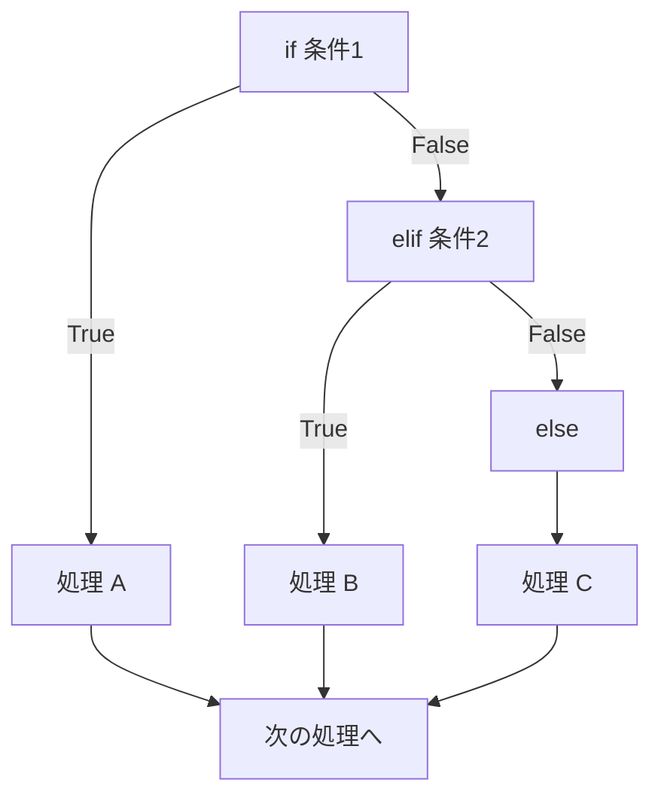
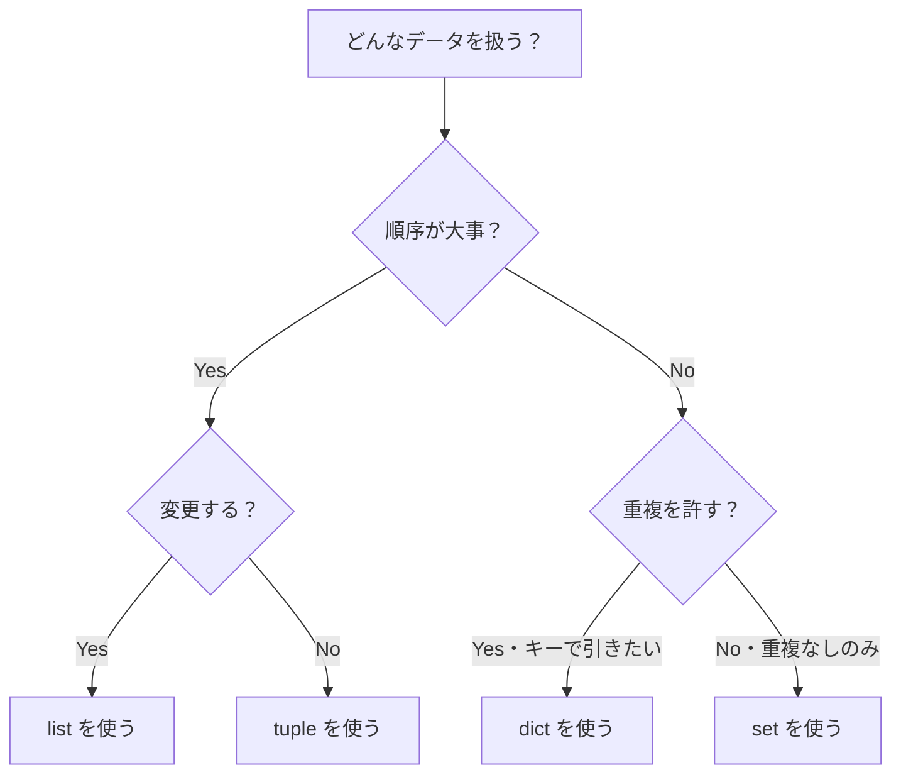
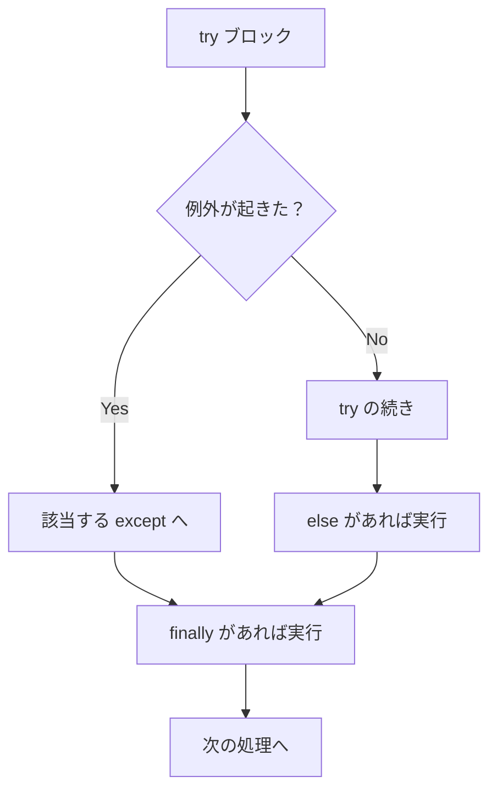

# Python入門

読みやすい言語で、データ処理と業務自動化の入口に立つ

| 項目 | 内容 |
|---|---|
| カテゴリー | Web制作 |
| 難易度 | 初級 |
| 所要時間 | 約200分（全8レッスン） |
| 公開日 | 2026-06-20 |
| 最終更新日 | 2026-06-20 |
| コースURL | https://skillup.college/courses/web/python-basics/ |

## 対象者

業種・職種を問わず、初めてプログラミングに触れる方。中堅企業の事務・経理・営業・企画・人事・総務など、Excel と Web ブラウザは毎日触るが、コードを書いたことがない方。「自分の繰り返し業務を軽くしたい」「データ分析の続きを Python で進めたい」「AI 時代に最低限のコードが読める手を持ちたい」という動機の方に最適。

## 前提知識

特になし。Excel と Web ブラウザの基本操作ができれば十分。HTML・CSS の知識や、ほかのプログラミング言語の経験は不要。本コース内で開発環境のセットアップから順を追って説明する。

## 学習目標

- Python の特徴と業界での位置づけを理解し、本コースの守備範囲を把握する
- 変数とデータ型（int／float／str／bool・None）の発想を身につけ、型変換ができる
- 条件分岐（if／elif／else）と繰り返し（for／while）で「条件と繰り返し」を扱える
- リスト・タプル・辞書・集合の違いを理解し、業務データを表現できる
- 関数を定義し、モジュールを import して標準ライブラリを活用できる
- ファイルの読み書き（テキスト・CSV・JSON）と、try／except による例外処理ができる
- pandas・openpyxl・requests の入口に立ち、業務自動化のスクリプトを組み立てられる
- 仮想環境・pip・PEP 8・AI 駆動開発を踏まえて、修了後の学習方向を見つけられる

## コース概要

「Python を学んでみたいが、何から始めればよいかわからない」「Excel のマクロやデータ整理に時間を取られすぎている」「AI が出力するコードを読みたいが、構造がつかめない」——事務・経理・営業・企画・人事・総務など、Excel と Web ブラウザを毎日触る働く個人にとって、Python は「いつかやりたい言語」の代表でした。本コースは、Python を「エンジニア専用の道具」ではなく「業務の隣にいる小さな相棒」として、8 レッスンで体系的に学びます。Python の発想と歴史、変数・データ型、制御構造、データ構造、関数とモジュール、ファイル入出力と例外処理、業務で使える代表ライブラリ（pandas・openpyxl・requests）、そして仮想環境・PEP 8・AI 駆動開発時代の付き合い方まで、初めてプログラミングに触れる方が「読める手」「動かす手」を育てられる構成です。コーディング経験ゼロでも取り組めるよう、最初の Hello World から段階的に積み上げます。

## 学習の流れ

レッスン 1 で Python の発想と業界での位置づけ、開発環境の選択肢、はじめての Hello World を体験します。レッスン 2 から 6 までが言語基礎の中核で、変数とデータ型（L2）、制御構造（L3）、データ構造（L4）、関数とモジュール（L5）、ファイル入出力と例外処理（L6）と段階的に積み上げます。レッスン 7 で業務に直結するライブラリ（pandas・openpyxl・requests）の入口に立ち、業務自動化スクリプトの組み立て方を学びます。最後のレッスン 8 で、仮想環境・pip・PEP 8・AI 駆動開発を踏まえて、修了後の学習方向と Python と長く付き合うための姿勢を案内します。前半（レッスン 1〜3）は「Python に触れる」、中盤（レッスン 4〜6）は「データと処理を扱う」、後半（レッスン 7〜8）は「業務に使う・次へ進む」の三段構えです。

## レッスン一覧

| No. | タイトル | 概要 | 所要時間 |
|---|---|---|---|
| 1 | Python とは何か——「読みやすく、動かしやすい」言語の発想 | Python の特徴、誕生から現在までの歴史、業界での使われ方、JavaScript／Excel との位置づけ、2026 年 6 月時点の Python 3.14、開発環境の選択肢、はじめての Hello World を学ぶ | 25分 |
| 2 | 変数とデータ型——数値・文字列・bool と型変換 | 変数の発想、基本 4 型（int／float／str／bool）、文字列の操作（f 文字列・スライス・メソッド）、数値の演算、型変換、None と「何もない」を表す道具、コメントとインデントを学ぶ | 25分 |
| 3 | 制御構造——if／for／while で「条件と繰り返し」を扱う | 条件分岐（if・elif・else）、比較演算子と論理演算子、繰り返し（for と range、while）、ループの早期脱出（break、continue）、ネストと可読性、業務で典型的なパターンを学ぶ | 25分 |
| 4 | データ構造——リスト・タプル・辞書・集合と内包表記 | リスト・タプル・辞書・集合の 4 つの基本データ構造、リスト内包表記、ネストしたデータ構造、業務での使い分けの目安を学ぶ | 25分 |
| 5 | 関数とモジュール——コードに名前を付け、組み合わせる | 関数の定義（def）、引数と戻り値、デフォルト引数とキーワード引数、スコープ、モジュールと import、標準ライブラリの代表選手（math／random／datetime／os／pathlib）を学ぶ | 25分 |
| 6 | ファイル入出力と例外処理——CSV・JSON を読み書きする | ファイルの open と with、テキスト・CSV・JSON の読み書き、try／except による例外処理、よくある例外、エンコーディング（UTF-8 と Shift_JIS）を学ぶ | 25分 |
| 7 | 業務で使えるライブラリ——pandas・openpyxl・requests の入口 | pandas で表データを扱う、openpyxl で Excel ファイルを操作、requests で Web API を叩く、3 つを組み合わせた業務自動化スクリプトの組み立てを学ぶ | 25分 |
| 8 | 学習の次のステップ——仮想環境・pip・AI 駆動開発・進路 | venv／uv による仮想環境、pip でのパッケージ管理、PEP 8 と読みやすいコード、type hints、Linter／Formatter（ruff・black）、AI 駆動開発（Copilot・Claude Code・Cursor）、進路の整理と修了後の学習方向を学ぶ | 25分 |

---

## レッスン1：Python とは何か——「読みやすく、動かしやすい」言語の発想

（所要時間：25分）

### このレッスンで学ぶこと

- Python が「読みやすく、動かしやすい」言語と呼ばれる理由を理解する
- Python の誕生から 2026 年 6 月時点までの歴史を概観する
- 業界での使われ方（データ処理・AI・自動化・Web・教育・科学計算）を把握する
- JavaScript・Excel との位置づけをフラットに整理する
- 開発環境の選択肢（ブラウザで動かす方法とローカル環境）を理解する
- はじめての Hello World を動かす
- 本コースの守備範囲（言語基礎と業務自動化の入口）を把握する

---

「Python」という言葉を、業務の場面でも教育の場面でも、よく耳にするようになりました。データ分析の研修で名前が出る、AI 関連のニュースで「Python で書かれている」と紹介される、生成 AI のサンプルコードが Python で書かれている、社内の自動化スクリプトが Python だと聞いた——名前は知っていても、「いざ何から始めればよいか」がつかみにくい言語の代表格です。本レッスンでは、本コースの前提として、Python の発想と歴史、業界での位置づけ、開発環境の選択肢、そしてはじめての Hello World を一通り扱います。

### Python の定義と特徴

Python（パイソン）は、1991 年に公開された汎用プログラミング言語です。本コースでは、業務向けの Python を次のように位置づけます。

> 「読みやすさ」を最優先に設計された汎用プログラミング言語で、データ処理・自動化・AI・Web・科学計算など、幅広い用途で使われる。

ここで強調したいのは、3 つの特徴です。

#### 1. 読みやすさを最優先に設計されている

Python の最大の特徴は、「コードが英語の文章に近い見た目」になることです。インデント（字下げ）でコードのまとまりを表現する文法、シンプルな予約語、短い記述で意図が伝わる構造——これらが「読みやすい」という評価を支えています。

例えば、1 から 10 まで足し合わせるコードは、次のように書けます。

```python
total = 0
for number in range(1, 11):
    total = total + number
print(total)
```

上から下へ読むだけで、何をしているのかがおおよそつかめます。

#### 2. 用途が広い「汎用」言語

Python は、特定の領域に特化していません。データ処理（pandas）、AI と機械学習（PyTorch・TensorFlow・scikit-learn）、Web 開発（Django・FastAPI・Flask）、業務自動化（openpyxl・requests）、科学計算（NumPy・SciPy）、教育（小中高〜大学）、研究（生物学・天文学・経済学）——多様な領域で使われています。

#### 3. 大きなエコシステム

Python には、世界中のエンジニアが作った無料のライブラリ（部品集）が膨大にあります。これを取り入れることで、自分でゼロから書く必要がない処理が多くあります。PyPI（パイピーアイ、Python Package Index）と呼ばれる公式のレポジトリには、30 万件を超えるパッケージが公開されています（2026 年 6 月時点）。

> **💡 ポイント**
> Python は「読みやすさを最優先」「用途が広い」「大きなエコシステム」の 3 つを特徴とする汎用プログラミング言語です。エンジニア専用の道具ではなく、業務を担う方々も「読み書きそろばん」の延長として扱える設計になっています。

### Python の歴史

Python の歴史を、本コースに必要な範囲でざっくり整理します。

#### 誕生と発展

- **1989 年**：オランダの計算機科学者 Guido van Rossum（グイド・ヴァン・ロッサム）が、クリスマス休暇を使って Python の開発に着手
- **1991 年**：Python 0.9.0 として最初に公開
- **2000 年**：Python 2.0 リリース
- **2008 年**：Python 3.0 リリース。2 系との互換性を断ち切る大きな変更
- **2020 年 1 月**：Python 2 の公式サポート終了
- **現在**：Python Software Foundation（PSF、非営利団体）が言語の運営を担当

「Python」という名前は、Guido が好きだったイギリスのコメディ番組『モンティ・パイソン』に由来します。蛇のニシキヘビ（Python）の意味も後から重なって、ロゴやマスコットに登場します。

#### 2020 年代以降の進化

| バージョン | リリース | 主な変更 |
|---|---|---|
| 3.10 | 2021 年 10 月 | match 文（パターンマッチング）、エラーメッセージの改善 |
| 3.11 | 2022 年 10 月 | 実行速度の向上、例外グループ |
| 3.12 | 2023 年 10 月 | 型ヒントの改善、エラーメッセージのさらなる改善 |
| 3.13 | 2024 年 10 月 | 新しい対話シェル、JIT コンパイラの実験的導入 |
| **3.14** | **2025 年 10 月** | **GIL のオプション無効化（実験的）、テンプレート文字列の改善など** |

本コースは Python 3.10 以降を前提とします。2026 年 6 月時点の最新安定版は Python 3.14 です。多くの環境（社内 PC、教育機関、クラウドの実行環境）はすでに Python 3.10 〜 3.14 のいずれかが使えます。

> **💡 ポイント**
> Python は 1991 年公開、2026 年 6 月時点で 30 年以上の歴史を持つ言語です。最新は Python 3.14（2025 年 10 月リリース）で、本コースは Python 3.10 以降を前提に進めます。

### 業界での使われ方

Python は、業界の幅広い領域で使われています。本コースの読者と関わる範囲を、6 つに整理します。

#### 1. データ処理・データ分析

表形式のデータ（CSV・Excel）を読み込み、集計し、グラフ化する場面で、pandas（パンダス）・openpyxl・matplotlib などのライブラリが圧倒的によく使われます。「Excel ではつらい量のデータ」「Excel でやると遅い処理」を Python に任せると、数分が数秒になる場面が多くあります。

#### 2. AI・機械学習

ChatGPT・Claude・Gemini などの生成 AI のバックエンドや、機械学習モデルの開発・学習・推論で、Python が標準的な言語です。PyTorch・TensorFlow・scikit-learn・LangChain・Hugging Face Transformers など、業界の主要なツールはほぼ Python ベース。生成 AI の API（OpenAI・Anthropic・Google）も、最初に Python のサンプルコードが提供されるのが一般的です。

#### 3. 業務自動化

Excel ファイルの読み書き、PDF からのテキスト抽出、Web スクレイピング、メール送信、定期実行のスクリプトなど、繰り返し業務の自動化に Python が広く使われています。RPA（Robotic Process Automation）の代替や補完として、中堅企業でも導入が広がっています。

#### 4. Web 開発（サーバーサイド）

Web サイトやアプリケーションの「裏側」（サーバーサイド）の言語として、Django・FastAPI・Flask などのフレームワークで Python が選ばれます。Instagram・Pinterest・Reddit・Dropbox など、世界の大規模 Web サービスでも Python が使われてきた歴史があります。

#### 5. 教育

小中高、専門学校、大学、社会人研修の幅広い場面で、最初のプログラミング言語として Python が選ばれることが増えています。「読みやすさ」が、初学者の心理的障壁を下げる役割を果たしています。

#### 6. 科学計算・研究

物理学、生物学、天文学、経済学、医療など、研究領域で Python が広く使われています。NumPy・SciPy・SymPy などの科学計算ライブラリと、Jupyter Notebook の組み合わせで、研究者が日常的に分析を回しています。

> **💡 ポイント**
> Python は「データ処理」「AI」「業務自動化」「Web」「教育」「科学計算」の 6 つの大きな領域で使われている汎用言語です。本コースは「業務自動化と、データ処理・AI への入口」を中心に進めます。

### JavaScript・Excel との位置づけ

Python の位置づけを理解するには、近隣の道具と比べるとつかみやすくなります。3 つを並べて整理します。

| 道具 | 得意な領域 | 苦手な領域 |
|---|---|---|
| Python | データ処理・AI・自動化・Web サーバー側・教育・科学計算 | ブラウザの中で動かす、リッチな UI 制作 |
| JavaScript | Web ブラウザの中で動かす UI、Web フロントエンド、Node.js でサーバー側 | データ分析の大規模処理（無理ではないが Python の方が定番） |
| Excel | 表計算、グラフ作成、簡易な集計、関数とピボット | 大量データ（数十万行以上）、Web からの自動取得、複雑な条件分岐 |

3 つは「優劣」ではなく「適性」が違います。同じ業務でも、毎月の売上集計（Excel で十分）、Web 上のデータ取得（Python が向く）、社内アプリの UI（JavaScript が向く）など、場面によって最適解が変わります。

#### 「Excel から Python に乗り換える」ではない

業務での Python 活用は、「Excel をやめて Python に乗り換える」ではなく「Excel に Python を足す」発想がうまくいきます。日々の集計は Excel、月次や定型の重い処理は Python、というすみ分けが現実的です。本コースの後半（レッスン 7）で、openpyxl を使った「Python から Excel ファイルを読み書き」する方法を扱います。

> **💡 ポイント**
> Python・JavaScript・Excel は「優劣」ではなく「適性」が違う道具です。Python は Excel を置き換えるのではなく、足す形で使うと、業務がいちばん軽くなります。

### 開発環境の選択肢

Python を動かす環境には、大きく 2 つの選択肢があります。

#### 選択肢 A：ブラウザで動かす（最も手軽）

Web ブラウザだけで Python を動かせるサービスを使う方法です。インストール不要で、すぐに試せます。

| サービス | 特徴 |
|---|---|
| Google Colab（Colaboratory） | Google アカウントで使える無料サービス。Jupyter Notebook 形式 |
| Replit（リプリット） | ブラウザ完結の統合開発環境 |
| Python の公式オンライン実行ページ | Python の公式サイトに用意された実行環境 |

本コースを初めて学ぶ方には、**Google Colab** を推奨します。Google アカウントがあれば無料で、本コースのすべてのサンプルコードを動かせます。

#### 選択肢 B：ローカル環境（本格的に使う場合）

自分の PC に Python をインストールして、エディタで書いて実行する方法です。継続的に業務で使う場合は、最終的にこちらに進みます。

| 必要なもの | 内容 |
|---|---|
| Python 本体 | python.org からダウンロード、または macOS の場合は標準で入っていることも |
| エディタ | Visual Studio Code（VS Code）が無料で広く使われている |
| 仮想環境ツール | venv（Python に標準）または uv（高速・モダン） |

ローカル環境の詳細は、本コースの最後（レッスン 8）で改めて扱います。最初のうちはブラウザで動かして、文法とデータ構造を身につけてから、ローカル環境に移るのが学習効率の良い順序です。

> **💡 ポイント**
> Python の開発環境は「ブラウザで動かす」（Google Colab を推奨）と「ローカル環境」（VS Code + Python）の 2 種類が代表です。学習の初期はブラウザで十分、業務で本格的に使うときにローカル環境を整える順序を推奨します。

### はじめての Hello World

伝統的に、新しい言語を学ぶときの最初のコードは「Hello, World!」を画面に表示することです。Python では、たった 1 行で書けます。

```python
print("Hello, World!")
```

Google Colab や Python の対話モード（REPL）で実行すると、次のように表示されます。

```text
Hello, World!
```

#### 1 行を読み解く

たった 1 行ですが、Python の重要な要素が詰まっています。

- `print` は「画面に表示する」ための組み込み関数
- `(` と `)` は関数を呼び出すときの括弧
- `"Hello, World!"` は文字列（文字の集まり）。シングルクォート `'` でも書ける
- 末尾に余分な記号（セミコロンなど）が要らないのが Python の特徴

#### 対話モードと REPL

Python には「対話モード」と呼ばれる入力受付環境があります。コマンドラインで `python` と入力するか、Google Colab のセルに直接コードを書くと、1 行ずつコードを試せます。この対話モードは、READ-EVAL-PRINT-LOOP の頭文字を取って **REPL（レプル）** と呼ばれます。「読む（READ）→ 評価する（EVAL）→ 表示する（PRINT）→ 繰り返す（LOOP）」の意味です。

```text
>>> print("Hello")
Hello
>>> 2 + 3
5
>>> name = "Python"
>>> print(name)
Python
```

REPL は、最初の学習でとても役に立ちます。「短いコードを書いて、すぐに結果を見る」を繰り返すと、文法が身につきやすくなります。

> **💡 ポイント**
> Python では、`print("Hello, World!")` の 1 行で最初のコードが完成します。対話モード（REPL）を活用して、「書いて、見て、確かめる」を繰り返すのが、最初の学習でいちばん近道です。

### 本コースの守備範囲

本コースは、Python を 8 レッスンで扱います。守備範囲を明確にしておきます。

#### 扱う範囲

- 言語の基礎（変数、型、制御構造、データ構造、関数、モジュール）
- ファイル入出力と例外処理
- 業務で使えるライブラリの入口（pandas、openpyxl、requests）
- 仮想環境、PEP 8、AI 駆動開発の現在地、修了後の学習方向

#### 扱わない範囲

- クラスとオブジェクト指向プログラミングの詳細（軽く触れる程度）
- 非同期処理（async／await）
- マルチスレッド・並行処理
- 機械学習・深層学習のアルゴリズム
- Web フレームワーク（Django・FastAPI・Flask）の詳細
- GUI アプリケーション開発（Tkinter・PyQt）
- ゲーム開発（Pygame）

#### 本コースのスタンス

本コースは、Python を「エンジニア専用の道具」とも「コピペで業務を回す道具」とも見なしません。業務を担う方の隣で、繰り返し業務を少しずつ軽くし、AI と一緒にコードを読む手を育てる、地に足のついた言語として扱います。最初の Hello World が動いた瞬間、変数と関数の発想がつながった瞬間、CSV を読み込んで集計できた瞬間——一歩ずつ感動を積み上げる構成にしました。

> **💡 ポイント**
> 本コースは Python の言語基礎と業務自動化の入口を 8 レッスンでカバーします。オブジェクト指向の詳細・非同期処理・機械学習アルゴリズム・Web フレームワークの詳細は守備範囲外です。

### まとめ

このレッスンでは、以下のことを学びました。

- Python は「読みやすさを最優先」「用途が広い」「大きなエコシステム」の 3 特徴を持つ汎用プログラミング言語
- 1991 年に Guido van Rossum が公開、現在は Python Software Foundation が運営、2026 年 6 月時点の最新は Python 3.14
- 業界での使われ方：データ処理・AI・自動化・Web・教育・科学計算の 6 領域
- JavaScript・Excel との位置づけ：優劣ではなく「適性」が違う道具。Python は「足す」発想でうまく機能する
- 開発環境：ブラウザで動かす（Google Colab を推奨）とローカル環境（VS Code + Python）の 2 種類
- はじめての Hello World は `print("Hello, World!")` の 1 行。対話モード（REPL）を活用するのが学習の近道
- 本コースは言語基礎と業務自動化の入口を 8 レッスンでカバー。オブジェクト指向の詳細・非同期処理・機械学習アルゴリズム・Web フレームワークは守備範囲外

次のレッスンでは、Python で最初に出会う「変数とデータ型」を扱います。整数・浮動小数点・文字列・bool の 4 つの基本型、文字列の操作、型変換、そして「何もない」を表す `None` を学びます。

---

### 確認クイズ

このレッスンの理解度をチェックしましょう。

#### Q1. Python の特徴として、本レッスンが整理した 3 つはどれか？

- [x] 「読みやすさを最優先に設計されている」「汎用言語として用途が広い」「大きなエコシステムを持つ」
- [ ] 「コンパイル言語である」「Web フロントエンド専用」「Microsoft 製の言語」
- [ ] 「Java の派生言語である」「データ分析専用」「商用ライセンスが必要」
- [ ] 「機械学習専用」「ブラウザ専用」「初心者には扱えない」

> **解説**
> Python の 3 特徴は「読みやすさを最優先」「用途が広い汎用言語」「大きなエコシステム」です。コンパイル言語ではなく、Microsoft 製でもなく、特定領域専用でもありません。

#### Q2. Python の歴史について、本レッスンが説明した内容はどれか？

- [ ] 2010 年代に米国 Microsoft が開発した
- [x] 1989 年に Guido van Rossum が開発に着手、1991 年に公開、現在は Python Software Foundation が運営。2026 年 6 月時点の最新版は Python 3.14（2025 年 10 月リリース）
- [ ] 2000 年代に商用言語として誕生した
- [ ] Python 2 は現在もメインで使われている

> **解説**
> Python は 1989 年に Guido van Rossum が着手し 1991 年公開。Python 2 は 2020 年 1 月にサポート終了済みで、現在は Python 3 系が主流です。

#### Q3. Python が使われる業界の代表的な 6 領域として、本レッスンが整理した内容はどれか？

- [ ] 印刷・出版・編集・新聞・テレビ・ラジオ
- [ ] 銀行・保険・証券・不動産・建設・物流
- [x] データ処理・AI・業務自動化・Web 開発（サーバー側）・教育・科学計算
- [ ] ゲーム開発・モバイルアプリ・組み込み機器・グラフィックス・音楽・映像

> **解説**
> Python が広く使われる 6 領域は「データ処理」「AI」「業務自動化」「Web 開発」「教育」「科学計算」です。本コースはとくに業務自動化とデータ処理・AI への入口を中心に進めます。

#### Q4. Python・JavaScript・Excel の位置づけについて、本レッスンが説明した内容はどれか？

- [ ] Python は JavaScript の上位互換である
- [ ] Python は Excel を完全に置き換えるべきである
- [ ] JavaScript はサーバー側でしか動かない
- [x] 3 つは「優劣」ではなく「適性」が違う道具。Python はデータ処理・自動化・サーバー側、JavaScript はブラウザの中で動かす UI、Excel は表計算と簡易な集計が得意。業務では Python を「足す」発想がうまく機能する

> **解説**
> 3 つの道具は適性が違うため、優劣ではなく場面に応じて使い分けます。Python を導入するときは、Excel を置き換えるのではなく「足す」発想がうまく機能します。

#### Q5. 本レッスンが学習初期に推奨する Python の開発環境はどれか？

- [x] ブラウザで動かす Google Colab。インストール不要で、Google アカウントがあれば無料で使え、本コースのすべてのサンプルコードを動かせる
- [ ] 大型サーバーの構築が必要な企業向けスーパーコンピューター
- [ ] 有料のクラウドサービスへの登録と月額料金の支払い
- [ ] 専用のハードウェアの購入

> **解説**
> 学習初期にはブラウザで動く Google Colab を推奨します。インストール不要・無料で、Google アカウントがあればすぐ使えます。業務で本格的に使うときに、VS Code + Python のローカル環境に進む順序が学習効率に優れます。

#### Q6. 本コースの守備範囲について、本レッスンが説明した内容はどれか？

- [ ] 機械学習・深層学習のアルゴリズムを詳細に扱う
- [x] 言語の基礎（変数・型・制御構造・データ構造・関数・モジュール）、ファイル入出力と例外処理、業務で使えるライブラリの入口（pandas・openpyxl・requests）、仮想環境・PEP 8・AI 駆動開発・修了後の学習方向までを 8 レッスンで扱う。オブジェクト指向の詳細・非同期処理・機械学習アルゴリズム・Web フレームワークの詳細・GUI・ゲーム開発は守備範囲外
- [ ] Web フレームワーク（Django・FastAPI）の詳細な実装を扱う
- [ ] GUI アプリケーション開発と Web ゲーム開発を扱う

> **解説**
> 本コースは言語基礎と業務自動化の入口を 8 レッスンでカバーします。オブジェクト指向の詳細・非同期処理・機械学習アルゴリズム・Web フレームワーク・GUI・ゲーム開発は守備範囲外です。

---

## レッスン2：変数とデータ型——数値・文字列・bool と型変換

（所要時間：25分）

### このレッスンで学ぶこと

- 変数の発想（値に名前を付けて持つ）を理解する
- 4 つの基本データ型（整数 int・浮動小数点 float・文字列 str・真偽値 bool）を扱える
- 文字列の操作（f 文字列・スライス・連結・代表的なメソッド）を身につける
- 数値の演算（四則・剰余・累乗）と組み込み関数を使える
- 型変換（int／str／float）を理解する
- None（何もない）の意味と使いどころを把握する
- コメントとインデントの基本ルールを理解する

---

前回のレッスンでは、Python の発想・歴史・業界での使われ方と、はじめての Hello World を体験しました。本レッスンから、いよいよ Python の言語そのものに踏み込みます。最初のテーマは「変数とデータ型」です。プログラミングは、値（数や文字）を扱う作業の連続です。値を保管し、加工し、判定し、表示する——その土台になるのが、変数とデータ型です。

### 変数の発想

プログラミングにおける「変数」は、「値に名前を付けて持つ箱」のような発想です。Excel のセルに名前を付けて参照する発想に似ています。

#### 変数の使い方

Python では、変数を `=` で代入します。

```python
name = "山田"
age = 30
height = 170.5
```

- `name` という変数に文字列 `"山田"` を代入
- `age` という変数に整数 `30` を代入
- `height` という変数に小数 `170.5` を代入

代入後は、変数名を書くだけで中身を参照できます。

```python
print(name)    # 山田
print(age)     # 30
print(height)  # 170.5
```

#### 再代入

変数の中身は、後から書き換えられます。

```python
age = 30
print(age)  # 30
age = 31
print(age)  # 31
```

「変える数」と書いて「変数」と呼ぶ理由は、この再代入の性質に由来します。

#### 変数名のルール

Python で変数名に使える文字には、ルールがあります。

| ルール | 例 |
|---|---|
| 英字（小文字・大文字）・数字・アンダースコア `_` が使える | `name`、`age`、`first_name`、`user1` |
| 1 文字目に数字は使えない | ❌ `1user`、✅ `user1` |
| 予約語（if・for・class などの Python が使う言葉）は使えない | ❌ `if`、`for`、`class` |
| 大文字小文字は区別される | `Name` と `name` は別の変数 |

慣習として、業務で使う変数名は「英小文字＋アンダースコア」が一般的です（`user_name`、`first_login_date` など）。これは Python の公式スタイルガイド PEP 8（最終レッスンで扱う）に沿った書き方です。

> **💡 ポイント**
> 変数は「値に名前を付けて持つ箱」です。`=` で代入し、変数名を書くだけで中身を参照できます。変数名は英小文字＋アンダースコアで書くのが Python の慣習です。

### 4 つの基本データ型

Python の値には「型」があります。本コースで最初に扱うのは、4 つの基本型です。

| 型 | 名前 | 例 |
|---|---|---|
| 整数 | `int` | `0`、`1`、`-5`、`100`、`1_000_000` |
| 浮動小数点（小数） | `float` | `0.0`、`3.14`、`-1.5`、`170.5` |
| 文字列 | `str` | `"Hello"`、`'Python'`、`"山田"` |
| 真偽値 | `bool` | `True`、`False` |

型を調べたいときは、組み込み関数 `type()` を使います。

```python
print(type(0))         # <class 'int'>
print(type(3.14))      # <class 'float'>
print(type("Hello"))   # <class 'str'>
print(type(True))      # <class 'bool'>
```

#### 整数（int）

整数は、小数点を含まない数です。マイナスもゼロも整数として扱えます。

```python
count = 100
loss = -3
zero = 0
print(count + loss)  # 97
```

大きな数を書くときは、桁区切りにアンダースコアが使えます（読みやすくする工夫）。

```python
budget = 1_000_000  # 100 万
print(budget)        # 1000000
```

#### 浮動小数点（float）

浮動小数点は、小数点を含む数です。「平均値」「金利」「身長」「気温」など、業務でよく出てきます。

```python
average = 78.5
rate = 0.05
print(average * rate)  # 3.925
```

float の計算では、ごくわずかな誤差が出ることがあります（例：`0.1 + 0.2` が `0.30000000000000004` になる）。本コースの基礎範囲では問題になりませんが、金額計算など精度が必要な場面では `Decimal` という別の型を使う知識が必要になります（守備範囲外）。

#### 文字列（str）

文字列は、文字の集まりです。`"` または `'` で囲んで書きます。

```python
name = "Python"
greeting = 'Hello'
message = "Pythonの世界へようこそ"
```

`"` と `'` のどちらでも書けますが、コース全体では `"` を中心に使います。なお、文字列の中に `"` を含めたいときは `'` で囲む、`'` を含めたいときは `"` で囲む、というのが手っ取り早い方法です。

#### 真偽値（bool）

真偽値は、`True`（真）または `False`（偽）のいずれかです。条件判定の結果として、よく登場します。

```python
is_member = True
is_paid = False
print(is_member)  # True
print(is_paid)    # False
```

`True` と `False` は最初の文字が大文字です。小文字の `true` や `false` はエラーになるので注意します。

> **💡 ポイント**
> Python の基本データ型は 4 つ：`int`（整数）、`float`（小数）、`str`（文字列）、`bool`（真偽値）。`type()` 関数で型を確認できます。

### 文字列の操作

文字列は業務でよく扱うので、基本的な操作を整理します。

#### 文字列の連結

`+` 演算子で文字列を連結できます。

```python
first = "山田"
last = "太郎"
full = first + last
print(full)  # 山田太郎
```

数字を含めたいときは、文字列に変換する必要があります（後述の型変換）。

#### f 文字列（f-string）

複数の値を組み合わせた文字列を作るとき、もっとも便利なのが「f 文字列」（formatted string literal、エフ文字列）です。文字列の前に `f` を付け、`{ }` の中に変数や式を書けます。

```python
name = "山田"
age = 30
message = f"{name}さんは{age}歳です"
print(message)  # 山田さんは30歳です
```

f 文字列は Python 3.6 以降で使え、本コースでも頻繁に登場します。型変換を意識しなくても、変数の値がそのまま埋め込まれます。

#### スライス——文字列の一部を取り出す

文字列の一部を切り出すときは「スライス」を使います。`[開始:終了]` の形で書きます。

```python
text = "Python入門"
print(text[0])      # P（1 文字目）
print(text[0:6])    # Python（0 番目から 6 番目の手前まで）
print(text[6:])     # 入門（6 番目から末尾まで）
print(text[-2:])    # 入門（後ろから 2 文字）
```

注意点：Python の文字位置は「0 から数える」（0-indexed）です。1 文字目が `[0]`、2 文字目が `[1]`、という数え方になります。

#### 代表的な文字列メソッド

文字列に対する代表的な処理（メソッド）を、表で整理します。

| メソッド | 内容 | 例 |
|---|---|---|
| `.upper()` | 大文字に変換 | `"hello".upper()` → `"HELLO"` |
| `.lower()` | 小文字に変換 | `"HELLO".lower()` → `"hello"` |
| `.strip()` | 前後の空白・改行を取る | `" hi ".strip()` → `"hi"` |
| `.replace(old, new)` | 文字列を置換 | `"abc".replace("a", "z")` → `"zbc"` |
| `.split(sep)` | 区切り文字で分割 | `"a,b,c".split(",")` → `["a", "b", "c"]` |
| `len(text)` | 文字数を数える（組み込み関数） | `len("hello")` → `5` |

これらは業務での文字列処理（CSV の整形、メール文面のテンプレート、入力データの掃除など）で頻繁に使います。

> **💡 ポイント**
> 文字列の操作は f 文字列・スライス・代表的なメソッド（`.upper()`、`.lower()`、`.strip()`、`.replace()`、`.split()`、`len()`）を押さえると、業務での文字列処理の 8 割をカバーできます。

### 数値の演算

数値の演算は、Excel の数式と似た感覚で書けます。

#### 四則演算と剰余・累乗

| 演算 | 記号 | 例 | 結果 |
|---|---|---|---|
| 足し算 | `+` | `3 + 4` | `7` |
| 引き算 | `-` | `10 - 3` | `7` |
| 掛け算 | `*` | `3 * 4` | `12` |
| 割り算（小数） | `/` | `10 / 4` | `2.5` |
| 割り算（整数の商） | `//` | `10 // 4` | `2` |
| 剰余（余り） | `%` | `10 % 4` | `2` |
| 累乗 | `**` | `2 ** 8` | `256` |

割り算が `/` と `//` で別記号になっている点に注意します。`/` は常に小数（float）を返し、`//` は整数の商を返します（業務での割り算は `/` で問題ありません）。

#### よく使う組み込み関数

数値処理でよく使う組み込み関数を、表で整理します。

| 関数 | 内容 |
|---|---|
| `abs(x)` | 絶対値 |
| `round(x)` | 四捨五入（Python の round は「銀行家の丸め」で 0.5 は偶数に丸める点に注意） |
| `round(x, n)` | 小数点 n 位で丸める |
| `max(a, b, ...)` | 最大値 |
| `min(a, b, ...)` | 最小値 |
| `sum(values)` | 合計（リストなどの集まりに使う） |

```python
print(abs(-7))             # 7
print(round(3.7))          # 4
print(round(3.14159, 2))   # 3.14
print(max(1, 5, 3))        # 5
print(sum([10, 20, 30]))   # 60
```

> **💡 ポイント**
> 数値の演算は四則演算と剰余・累乗が基本。`/` は小数を返し、`//` は整数の商を返す違いを押さえます。`abs`・`round`・`max`・`min`・`sum` などの組み込み関数で、よく使う処理をカバーできます。

### 型変換

型の違う値を組み合わせるとき、型を揃える必要があります。これを「型変換」（キャスト）と呼びます。

#### 主な型変換関数

| 関数 | 内容 |
|---|---|
| `int(x)` | 整数に変換 |
| `float(x)` | 浮動小数点に変換 |
| `str(x)` | 文字列に変換 |
| `bool(x)` | 真偽値に変換 |

```python
## 文字列から整数
age_text = "30"
age = int(age_text)
print(age + 1)  # 31

## 整数から文字列
count = 5
message = "件数：" + str(count)
print(message)  # 件数：5

## 文字列から浮動小数点
price_text = "3.14"
price = float(price_text)
print(price * 2)  # 6.28
```

#### 型変換のよくある間違い

```python
## エラーになる例
int("abc")     # ValueError：数値でない文字列を int にはできない
int("3.14")    # ValueError：小数点を含む文字列は int に直接はできない（float を経由する）

## 正しい書き方
float("3.14")          # 3.14
int(float("3.14"))     # 3（小数点以下が切り捨てられる）
```

文字列を数値にするときは、中身が本当に数字かを意識する必要があります。業務では、CSV から読み込んだデータがエラーで読めないことがあり、原因の多くは「数字のつもりが数字じゃない文字（カンマ、円マーク、空白など）が混ざっている」ケースです。

#### bool への変換のクセ

`bool()` は少し独特なルールを持ちます。

```python
print(bool(0))      # False
print(bool(1))      # True
print(bool(-1))     # True
print(bool(""))     # False（空の文字列）
print(bool("a"))    # True
print(bool([]))     # False（空のリスト、次回扱う）
print(bool([1]))    # True
```

「空っぽのもの」「0」が False に、それ以外が True になる、というのが Python の一貫したルールです。

> **💡 ポイント**
> 型変換は `int()`、`float()`、`str()`、`bool()` の 4 つが基本です。文字列を数値にするときは、中身に数字以外が混ざっていないかを意識します。bool への変換では「空っぽ」と「0」が False、それ以外が True になります。

### None——「何もない」を表す道具

Python には、「何もない」を表す特別な値があります。それが `None`（ノン）です。

```python
result = None
print(result)        # None
print(type(result))  # <class 'NoneType'>
```

#### None の使いどころ

- 「まだ値が決まっていない」変数の初期値
- 関数が何も返さないときの戻り値（次のレッスン 5 で扱う）
- データベースの NULL に相当する状態

```python
selected_name = None

## 後から値が決まる
selected_name = "山田"
print(selected_name)  # 山田
```

#### None と False の違い

`None` と `False` は別物です。両方とも `bool()` で変換すると `False` になりますが、意味が違います。

- `False`：「明示的に偽」「明示的に NO」
- `None`：「値が存在しない」「未定」

```python
print(bool(None))   # False
print(None == False)  # False（イコールでは別物）
```

業務での意味の違いを意識すると、ハマりにくくなります。

> **💡 ポイント**
> `None` は「何もない」「まだ値がない」を表す特別な値です。`False` とは別物で、「明示的に偽」と「値が存在しない」の違いを意識します。

### コメントとインデント

Python のコードを書くうえで、最後に押さえておきたいルールが 2 つあります。

#### コメント

`#` から行末までがコメント（実行されないメモ）になります。

```python
## 単位は円
price = 1000

total = price * 1.1  # 税込み価格
```

業務のコードでは、「なぜこう書いたか」をコメントで残すと、半年後の自分や、引き継いだ同僚を助けます。一方、コードを読めばわかることをコメントに書くのは避けます。

#### インデント

Python は「インデント」（字下げ）でコードのまとまりを表現します。多くの言語が `{ }` でブロックを区切るのに対し、Python はインデントを構文の一部として扱います。

```python
## 良い書き方（インデントが揃っている）
if 80 <= score:
    print("合格")
    print("おめでとう")

## エラーになる書き方（インデントが揃っていない）
if 80 <= score:
    print("合格")
print("おめでとう")  # この行は if のブロック外と判定される
```

インデントは「半角スペース 4 個」が PEP 8 の推奨です。タブ文字とスペースの混在はエラーや混乱の原因になるので、エディタの設定で「タブをスペースに変換」しておくのが安全です。

> **💡 ポイント**
> Python はコメントを `#` で書き、インデント（字下げ）でコードのまとまりを表現します。インデントは「半角スペース 4 個」が PEP 8 の推奨で、タブとスペースの混在は避けます。

### まとめ

このレッスンでは、以下のことを学びました。

- 変数は「値に名前を付けて持つ箱」。`=` で代入し、変数名で参照する
- Python の基本データ型は 4 つ：`int`、`float`、`str`、`bool`。`type()` で型を確認できる
- 文字列は f 文字列・スライス・代表メソッド（`.upper()`、`.lower()`、`.strip()`、`.replace()`、`.split()`、`len()`）で扱える
- 数値の演算は四則・剰余・累乗。`/` は小数、`//` は整数の商を返す
- 組み込み関数：`abs`、`round`、`max`、`min`、`sum` がよく使う
- 型変換：`int()`、`float()`、`str()`、`bool()`。`bool()` は「空っぽ」「0」が False
- `None` は「何もない」を表す特別な値。`False` とは別物
- コメントは `#`、インデントは半角スペース 4 個が PEP 8 の推奨

次のレッスンでは、Python の制御構造を扱います。条件分岐（if／elif／else）と繰り返し（for／while）、比較演算子と論理演算子、break と continue——コードに「条件と繰り返し」の発想を組み込みます。

---

### 確認クイズ

このレッスンの理解度をチェックしましょう。

#### Q1. Python の変数について、本レッスンが説明した内容はどれか？

- [ ] 変数の型を必ず宣言してから使う必要がある
- [x] `=` で値を代入し、変数名を書くだけで中身を参照できる。代入後に書き換え（再代入）も可能。変数名は英小文字＋アンダースコアが PEP 8 の慣習
- [ ] 変数名に予約語（if・for など）を使ってもよい
- [ ] 1 度代入した変数は二度と変更できない

> **解説**
> Python の変数は `=` で代入、変数名で参照、再代入も可能です。型の事前宣言は不要、予約語は変数名に使えず、英小文字＋アンダースコアが PEP 8 の慣習です。

#### Q2. Python の基本データ型 4 つとして、本レッスンが整理した内容はどれか？

- [ ] テキスト・数値・日付・時刻
- [ ] 文字・絵・音・動画
- [x] 整数（int）、浮動小数点（float）、文字列（str）、真偽値（bool）
- [ ] CSV・JSON・XML・YAML

> **解説**
> 本コースで最初に扱う 4 つの基本型は `int`、`float`、`str`、`bool` です。型は `type()` 関数で確認できます。

#### Q3. f 文字列について、本レッスンが説明した内容はどれか？

- [x] Python 3.6 以降で使える、文字列の前に `f` を付け `{ }` の中に変数や式を書ける記法。`f"{name}さんは{age}歳"` のように、複数の値を組み合わせた文字列を読みやすく書ける
- [ ] HTML を生成する専用の関数
- [ ] ファイルを開くための予約語
- [ ] Excel と連携する独自記法

> **解説**
> f 文字列は Python 3.6（2016 年）で導入された記法です。`f"..."` の中で `{ }` を使って変数や式を埋め込めます。本コースでも頻繁に登場します。

#### Q4. Python の割り算について、本レッスンが説明した内容はどれか？

- [ ] `/` は整数の商を返し、`//` は小数を返す
- [ ] `/` と `//` はまったく同じ意味
- [ ] Python に割り算の演算子は 1 種類しかない
- [x] `/` は常に小数（float）を返し、`//` は整数の商を返す。`10 / 4` は `2.5`、`10 // 4` は `2`。剰余（余り）は `%`、累乗は `**`

> **解説**
> `/` と `//` の違いを覚えます。`/` は常に小数を返し、`//` は整数の商を返します。業務での割り算は `/` で問題ありません。

#### Q5. 型変換について、本レッスンが説明した内容はどれか？

- [x] `int()`、`float()`、`str()`、`bool()` の 4 つが基本。文字列から数値に変換するときは、中身が本当に数字かを意識する。`int("abc")` や `int("3.14")` はエラーになる（小数点を含む文字列は `float()` を経由する）
- [ ] 型変換は Python に存在しない
- [ ] どんな文字列でも `int()` で整数に変換できる
- [ ] `bool()` は常に True を返す

> **解説**
> 型変換の 4 つの基本関数を覚えます。文字列を数値にするときは中身に注意し、小数点を含む文字列は `float()` を経由します。`bool()` は「空っぽ」「0」を False に変換します。

#### Q6. インデントについて、本レッスンが説明した内容はどれか？

- [ ] Python ではインデントは無視される
- [x] Python はインデント（字下げ）でコードのまとまりを表現する。PEP 8 の推奨は「半角スペース 4 個」。タブとスペースの混在はエラーや混乱の原因になるため、エディタで「タブをスペースに変換」する設定を推奨
- [ ] インデントは波括弧の代替であり、Python では `{ }` も使える
- [ ] インデントは必ず「半角スペース 2 個」にする

> **解説**
> Python のインデントは構文の一部で、PEP 8 の推奨は半角スペース 4 個です。タブとスペースの混在は避け、エディタで自動変換する設定をしておくと安全です。

---

## レッスン3：制御構造——if／for／while で「条件と繰り返し」を扱う

（所要時間：25分）

### このレッスンで学ぶこと

- 条件分岐（if／elif／else）の書き方を理解する
- 比較演算子と論理演算子を整理する
- 繰り返し（for と range、while）の使い分けを身につける
- ループの早期脱出（break、continue）を扱える
- ネストと可読性を保つ書き方を意識する
- 業務での典型的な条件分岐パターン（区分判定・閾値判定）を理解する

---

前回のレッスンでは、Python の変数とデータ型を扱いました。値を保管できるようになると、次に必要なのは「条件で分岐する」「処理を繰り返す」という発想です。本レッスンでは、Python の制御構造を、業務での典型例とともに扱います。

### 条件分岐——if／elif／else

最も基本的な制御構造が、条件分岐です。「ある条件が True なら A、そうでなければ B」を Python で書きます。

#### 最小の if

```python
score = 85
if 80 <= score:
    print("合格")
```

`if` の後ろに条件式（`80 <= score`）を書き、コロン `:` で終え、次の行を字下げしてブロックを書きます。条件が True のときだけ、字下げされたブロックが実行されます。

#### else——「そうでなければ」

```python
score = 65
if 80 <= score:
    print("合格")
else:
    print("不合格")
```

`else:` を使うと、条件が False のときの処理を書けます。

#### elif——「ほかの条件を順に判定」

複数の条件を順に判定したいときは、`elif`（else if の短縮）を使います。

```python
score = 75
if 80 <= score:
    print("A")
elif 70 <= score:
    print("B")
elif 60 <= score:
    print("C")
else:
    print("D")
```

`if`・`elif`・`elif`・…・`else` の順で書き、上から順番に条件が判定されます。最初に True になったブロックだけが実行され、それ以降の条件は判定されません。

#### 制御フローを図で



> **💡 ポイント**
> 条件分岐は `if`・`elif`・`else` で書きます。上から順に判定され、最初に True になったブロックだけが実行されます。`elif` は何個でも並べられます。

### 比較演算子

条件式で使う「比較演算子」を整理します。

| 演算子 | 意味 | 例 |
|---|---|---|
| `==` | 等しい | `score == 100` |
| `!=` | 等しくない | `name != ""` |
| `<` | より小さい | `age < 20` |
| `<=` | 以下 | `score <= 100` |
| `>` | より大きい | `count > 0` |
| `>=` | 以上 | `temp >= 30` |

注意点として、「等しい」は `==`（イコール 2 つ）です。`=`（1 つ）は代入なので、混同するとエラーや誤動作の原因になります。

#### Python ならではの便利な書き方

Python では、不等号を続けて書ける「区間判定」が許されています。

```python
score = 75
if 60 <= score < 80:  # 60 以上 80 未満
    print("中位")
```

数学の式に近い形で書けるので、Excel の AND 関数に近い読みやすさになります。

> **💡 ポイント**
> 比較演算子は `==`・`!=`・`<`・`<=`・`>`・`>=` の 6 つ。「等しい」は `==`（イコール 2 つ）であり、代入の `=` と混同しないこと。`60 <= score < 80` のような区間判定も書けます。

### 論理演算子

複数の条件を組み合わせるときは、論理演算子を使います。

| 演算子 | 意味 | 例 |
|---|---|---|
| `and` | かつ（両方が True） | `age >= 18 and is_member` |
| `or` | または（どちらかが True） | `is_admin or is_owner` |
| `not` | 否定（True と False を反転） | `not is_paid` |

```python
age = 25
is_member = True

if 18 <= age and is_member:
    print("入場できます")
```

Python では `&&` ではなく `and`、`||` ではなく `or`、`!` ではなく `not` を使います。英語の意味に近い書き方が、Python らしさです。

#### 「短絡評価」

`and` と `or` には「短絡評価」のクセがあります。

- `A and B`：`A` が False なら `B` は評価されない（False が確定するから）
- `A or B`：`A` が True なら `B` は評価されない（True が確定するから）

実用上は、副作用のある関数を `and` / `or` の右辺に書かない、というのを意識しておけば十分です。

> **💡 ポイント**
> 論理演算子は `and`・`or`・`not` の 3 つ。Python は記号（`&&`・`||`・`!`）ではなく英単語を使うのが特徴です。

### 繰り返し——for と range

「同じ処理を繰り返す」のが繰り返し（ループ）です。Python の主役は `for` ループです。

#### range で「N 回繰り返す」

```python
for i in range(5):
    print(i)
```

実行すると、次のように表示されます。

```text
0
1
2
3
4
```

`range(5)` は「0 から始めて 5 の手前まで」を順に生成します。`i` という変数に、0、1、2、3、4 が順に入り、print が 5 回呼ばれます。

#### range の引数バリエーション

```python
for i in range(1, 6):       # 1 から 5
    print(i)                # 1、2、3、4、5

for i in range(0, 10, 2):   # 0 から 8 まで 2 ずつ
    print(i)                # 0、2、4、6、8

for i in range(10, 0, -1):  # 10 から 1 まで降順
    print(i)                # 10、9、8、… 1
```

`range(start, stop, step)` の 3 引数で、開始・終了の手前・刻みを指定できます。

#### リストや文字列を繰り返す

`for` はリスト（次回扱う）や文字列も繰り返せます。

```python
names = ["山田", "鈴木", "佐藤"]
for name in names:
    print(f"{name}さん")
```

```python
for char in "Python":
    print(char)
```

`for` の本質は「集まりの中の要素を 1 つずつ取り出して処理する」発想です。

> **💡 ポイント**
> 繰り返しは `for` が主役。`range(N)` で「N 回繰り返す」、`range(start, stop, step)` で開始・終了の手前・刻みを指定。リストや文字列も `for` で 1 要素ずつ取り出せます。

### while ループ

`for` が「集まりを順に処理する」のに対し、`while` は「条件が True の間、繰り返す」発想です。

```python
count = 0
while count < 5:
    print(count)
    count = count + 1
```

実行すると 0 から 4 までが順に表示されます。

#### while の使いどころ

- 回数が事前に決まらない場合
- 「ユーザーが終了と入力するまで」「条件を満たすまで」のような処理

```python
total = 0
while total < 100:
    total = total + 10
    print(total)
```

#### 無限ループに注意

`while` は条件の更新を忘れると、永遠に止まらない「無限ループ」になります。

```python
## 危険な例（無限ループ）
count = 0
while count < 5:
    print(count)
    # count = count + 1 を忘れている
```

業務スクリプトで `while` を使うときは、終了条件が必ず満たされるかを確認します。Google Colab で無限ループに陥ったときは、停止ボタンで実行を止められます。

> **💡 ポイント**
> `while` は「条件が True の間、繰り返す」ループ。回数が事前に決まらない場合に使います。終了条件の更新を忘れると無限ループになるので注意します。

### break と continue——ループの早期脱出

ループ中に「ここで抜けたい」「ここはスキップしたい」というときに使うのが `break` と `continue` です。

#### break——ループを抜ける

```python
for number in range(1, 100):
    if number == 5:
        break
    print(number)
```

実行すると、1、2、3、4 が表示され、5 のところで `break` でループを抜けます。

業務では「条件に合うデータが見つかったら、それ以上探さない」場面で使います。

#### continue——今の周回をスキップして次へ

```python
for number in range(1, 6):
    if number == 3:
        continue
    print(number)
```

実行すると、1、2、4、5 が表示されます（3 だけスキップ）。

業務では「特定の条件のデータは飛ばして、ほかを処理する」場面で使います。

> **💡 ポイント**
> `break` は「ループを抜ける」、`continue` は「今の周回をスキップして次の周回へ」。どちらも条件付き（`if` の中）で使うのが定番です。

### ネストと可読性

`if` の中に `for`、`for` の中に `if` というように、制御構造は入れ子（ネスト）にできます。ただし、ネストが深くなると読みにくくなります。

#### ネストの例

```python
for student in students:
    if student["score"] >= 80:
        if student["attendance"] >= 0.9:
            print(f"{student['name']}：合格")
        else:
            print(f"{student['name']}：要面談")
```

#### ネストを浅くするコツ

ネストが 3 段以上深くなったら、`continue` や関数の分割（次のレッスン 5 で扱う）で浅くする工夫をします。

```python
## 早期 continue でネストを浅くする
for student in students:
    if student["score"] < 80:
        continue
    if student["attendance"] < 0.9:
        print(f"{student['name']}：要面談")
        continue
    print(f"{student['name']}：合格")
```

「読みやすさを最優先」が Python の発想だったことを思い出します。ネストを浅く保つ工夫は、業務で長く使われるコードに必須の意識です。

> **💡 ポイント**
> 制御構造はネストできますが、深くなると読みにくくなります。`continue` で早期脱出する、関数に分割するなどの工夫で、ネストを浅く保ちます。

### 業務での典型パターン

実務で「これは Python で書く価値がある」と判断できる典型パターンを、3 つに整理します。

#### パターン 1：区分判定

「点数を A／B／C にランク分けする」「金額を等級分けする」のような区分判定は、`if／elif／else` の典型例です。

```python
score = 75
if 90 <= score:
    grade = "A"
elif 80 <= score:
    grade = "B"
elif 70 <= score:
    grade = "C"
elif 60 <= score:
    grade = "D"
else:
    grade = "F"
print(f"スコア {score} は {grade} 評価")
```

#### パターン 2：閾値判定

「在庫が一定を下回ったら発注」「気温が 30 度を超えたらアラート」のような閾値判定も典型です。

```python
stock = 8
threshold = 10
if stock < threshold:
    print(f"在庫{stock}個。{threshold}個未満のため、発注が必要")
else:
    print(f"在庫{stock}個。十分な在庫があります")
```

#### パターン 3：複数の繰り返し処理

「100 件のデータを順に処理し、条件に合うものだけ集計する」のような繰り返しと条件の組み合わせは、Python が真価を発揮する場面です。

```python
prices = [1000, 2500, 800, 4500, 1200, 3300, 700]
total = 0
count = 0
for price in prices:
    if 1000 <= price:
        total = total + price
        count = count + 1
print(f"1000 円以上のものは {count} 件、合計 {total} 円")
```

これらの典型パターンは、Excel の関数では書きにくい・遅い処理を、Python なら数行で書けるものです。

> **💡 ポイント**
> 業務での典型は「区分判定」「閾値判定」「複数の繰り返し処理」の 3 パターン。Excel で書きづらい処理ほど、Python に置き換える価値があります。

### まとめ

このレッスンでは、以下のことを学びました。

- 条件分岐は `if`・`elif`・`else`。上から順に判定され、最初に True になったブロックだけが実行される
- 比較演算子は `==`・`!=`・`<`・`<=`・`>`・`>=` の 6 つ。`==`（等しい）と `=`（代入）の混同に注意
- 論理演算子は `and`・`or`・`not`。記号ではなく英単語を使うのが Python らしさ
- 繰り返しは `for` が主役。`range(N)`、`range(start, stop, step)` で柔軟に制御。リストや文字列も対象になる
- `while` は「条件が True の間繰り返す」ループ。終了条件の更新を忘れると無限ループに
- `break` でループを抜ける、`continue` で今の周回をスキップして次へ
- ネストが深くなったら `continue` の早期脱出や関数の分割で浅く保つ
- 業務典型は「区分判定」「閾値判定」「複数の繰り返し処理」の 3 パターン

次のレッスンでは、Python のデータ構造を扱います。リスト・タプル・辞書・集合の 4 つを比べながら、業務でのデータ表現と、リスト内包表記の便利な書き方を学びます。

---

### 確認クイズ

このレッスンの理解度をチェックしましょう。

#### Q1. 条件分岐の `if`・`elif`・`else` について、本レッスンが説明した内容はどれか？

- [x] `if`・`elif`・`elif`・…・`else` の順で書け、上から順に判定される。最初に True になったブロックだけが実行され、それ以降の条件は判定されない
- [ ] `if` の前に必ず `start` を書く必要がある
- [ ] `else` を省略するとエラーになる
- [ ] `elif` は 1 つしか使えない

> **解説**
> 条件分岐は `if`・`elif`・`else` の組み合わせで書き、上から順に判定されます。`elif` は何個でも並べられ、`else` は省略可能です。

#### Q2. Python の比較演算子について、本レッスンが説明した内容はどれか？

- [ ] 「等しい」は `=`（イコール 1 つ）で書く
- [x] 「等しい」は `==`（イコール 2 つ）、「等しくない」は `!=`。`=`（1 つ）は代入なので混同に注意。`60 <= score < 80` のような区間判定も書ける
- [ ] Python には比較演算子はない
- [ ] `>` と `<` は同じ意味

> **解説**
> 比較演算子の「等しい」は `==`（2 つ）です。`=`（1 つ）は代入で、混同するとエラーや誤動作の原因になります。区間判定もそのまま書けるのが Python の特徴です。

#### Q3. Python の論理演算子について、本レッスンが説明した内容はどれか？

- [ ] `&&`・`||`・`!` を使う（多くの言語と同じ）
- [ ] Python には論理演算子はない
- [x] `and`・`or`・`not` の英単語を使う。多くの言語の `&&`・`||`・`!` とは異なり、英語の意味に近い書き方が Python らしさ
- [ ] `+`・`-`・`*` を論理演算子として使う

> **解説**
> Python は論理演算子に英単語 `and`・`or`・`not` を使います。多くの言語が記号（`&&`・`||`・`!`）を使うのと異なる、Python の特徴です。

#### Q4. `for` ループと `range` について、本レッスンが説明した内容はどれか？

- [ ] `range(5)` は 1 から 5 までを生成する
- [ ] `range` は引数を 1 つしか取れない
- [ ] `for` はリストや文字列に対しては使えない
- [x] `range(5)` は 0 から 4 までを生成（5 の手前まで）。`range(start, stop, step)` で開始・終了の手前・刻みを指定できる。`for` はリスト・文字列など「集まり」の各要素を 1 つずつ取り出して処理できる

> **解説**
> `range(5)` は 0 から 4 まで（5 の手前まで）を生成します。`range` は最大 3 引数で開始・終了・刻みを指定でき、`for` はリスト・文字列にも使えます。

#### Q5. `while` ループについて、本レッスンが説明した内容はどれか？

- [x] 「条件が True の間、繰り返す」ループ。回数が事前に決まらない場面で使う。終了条件の更新を忘れると永遠に止まらない無限ループになるため、業務スクリプトでは終了条件が必ず満たされるかを確認する
- [ ] `while` は Python に存在しない
- [ ] `while` は条件を判定せず必ず 100 回繰り返す
- [ ] `while` は事前に回数が決まっている処理にだけ使う

> **解説**
> `while` は「条件が True の間繰り返す」ループで、回数が事前に決まらない場面で使います。無限ループに陥らないよう、終了条件の更新を意識します。

#### Q6. `break` と `continue` について、本レッスンが説明した内容はどれか？

- [ ] `break` も `continue` も同じ意味
- [x] `break` は「ループを抜ける」、`continue` は「今の周回をスキップして次の周回へ」。どちらも `if` と組み合わせて条件付きで使うのが定番
- [ ] `break` は `for` でしか使えない
- [ ] `continue` はループを完全に止める

> **解説**
> `break` はループを抜けて次の処理に進み、`continue` は今の周回をスキップして次の周回に進みます。条件付きで使うのが業務での定番です。

---

## レッスン4：データ構造——リスト・タプル・辞書・集合と内包表記

（所要時間：25分）

### このレッスンで学ぶこと

- リスト（list）の発想と基本操作（append・追加・削除・スライス）を身につける
- タプル（tuple）と「変更できないデータ」の使いどころを理解する
- 辞書（dict）の発想（キーと値の対応）を業務データに当てはめる
- 集合（set）の発想と和・差・積の演算を理解する
- リスト内包表記で短く読みやすく書く
- ネストしたデータ構造（辞書のリスト、リストの辞書）を扱える
- 業務でのデータ構造の使い分けの目安を持つ

---

前回のレッスンでは、条件分岐と繰り返しを扱いました。本レッスンは、業務で扱うデータを Python の中に表現する方法、つまり「データ構造」を扱います。Python には主要なデータ構造が 4 種類あり、それぞれに得意な場面が違います。「Excel の表をどう表現するか」「重複しないリストをどう扱うか」「キーと値で名前を引きたい」——業務での疑問に、データ構造の選択で答えられるようになります。

### リスト（list）——順序付きの集まり

リストは、もっともよく使うデータ構造です。複数の値を順番に並べた集まりを表現します。Excel の 1 列のデータに近い発想です。

#### リストの作り方

リストは `[ ]` で囲み、値をカンマで区切って書きます。

```python
prices = [1000, 2500, 800, 4500]
names = ["山田", "鈴木", "佐藤"]
mixed = [1, "two", 3.0, True]   # 異なる型も混在できる
empty = []                       # 空のリスト
```

#### 要素の取り出し（インデックス）

リストの要素は、`[インデックス]` で取り出せます。インデックスは 0 から始まります。

```python
prices = [1000, 2500, 800, 4500]
print(prices[0])    # 1000（1 番目）
print(prices[1])    # 2500（2 番目）
print(prices[-1])   # 4500（最後）
print(prices[-2])   # 800（後ろから 2 番目）
```

マイナスのインデックスを使うと、末尾から逆向きに取り出せます。これは Python の便利な特徴です。

#### スライス——範囲を切り出す

リストでも文字列と同じく、スライスで範囲を切り出せます。

```python
prices = [1000, 2500, 800, 4500, 1200]
print(prices[0:3])  # [1000, 2500, 800]（0 番目から 3 番目の手前まで）
print(prices[2:])   # [800, 4500, 1200]（2 番目から末尾まで）
print(prices[:2])   # [1000, 2500]（先頭から 2 番目の手前まで）
```

#### 要素の追加・削除

```python
fruits = ["りんご", "みかん"]

## 追加
fruits.append("バナナ")           # 末尾に追加
print(fruits)                      # ['りんご', 'みかん', 'バナナ']

fruits.insert(0, "ぶどう")        # 指定位置に挿入
print(fruits)                      # ['ぶどう', 'りんご', 'みかん', 'バナナ']

## 削除
fruits.remove("みかん")            # 値を指定して削除
print(fruits)                      # ['ぶどう', 'りんご', 'バナナ']

removed = fruits.pop()             # 末尾を取り出して削除
print(removed)                     # バナナ
print(fruits)                      # ['ぶどう', 'りんご']
```

#### よく使う操作

| 操作 | 内容 |
|---|---|
| `len(lst)` | 要素数を数える |
| `sum(lst)` | 数値リストの合計 |
| `max(lst)` / `min(lst)` | 最大・最小 |
| `sorted(lst)` | 並べ替えた新しいリストを返す |
| `lst.sort()` | リスト自体を並べ替える |
| `lst.reverse()` | リスト自体を逆順にする |
| `x in lst` | 含まれるかを判定（True／False） |

```python
prices = [1000, 2500, 800, 4500]
print(len(prices))           # 4
print(sum(prices))           # 8800
print(max(prices))           # 4500
print(sorted(prices))        # [800, 1000, 2500, 4500]
print(2500 in prices)        # True
```

> **💡 ポイント**
> リストは順序付きで値を持つ、もっとも基本的なデータ構造です。`[ ]` で書き、`[インデックス]` で取り出し、`append`・`insert`・`remove`・`pop` で変更でき、`len`・`sum`・`sorted`・`in` で使いやすく操作できます。

### タプル（tuple）——変更できない集まり

タプルはリストとよく似ていますが、「中身を変更できない」点が違います。`( )` で囲んで書きます。

```python
point = (10, 20)       # 2 次元の座標
rgb = (255, 100, 50)   # RGB の色
empty = ()             # 空のタプル
single = (5,)          # 要素 1 つだけのタプルはカンマが必要
```

#### タプルの読み取り

リストと同じく、インデックスで取り出せます。

```python
point = (10, 20)
print(point[0])  # 10
print(point[1])  # 20
```

#### 変更できないことの意味

```python
point = (10, 20)
point[0] = 30   # TypeError：タプルの要素は変更できない
```

「変更できない」のは欠点に見えますが、業務では「不変であるべき値」を表すのに便利です。

- 座標、RGB の色、緯度経度のような「セットになった値」
- 関数の戻り値で「複数の値を一度に返す」とき（次のレッスン 5 で扱う）
- 辞書のキーとして使いたい場合（後述）

#### リストとタプルの使い分け

| 場面 | 適切な選択 |
|---|---|
| 数を変えたい・編集したい集まり | リスト |
| セットになった不変の値（座標・RGB など） | タプル |
| 関数から複数の値を返す | タプル |
| 速度・メモリを少しでも節約したい | タプル |

> **💡 ポイント**
> タプルは「変更できないリスト」です。`( )` で書き、セットになった不変の値や、関数の複数戻り値に向きます。リストと使い分ける発想を持っておきます。

### 辞書（dict）——キーと値の対応

辞書は「キーと値の組」を集めたデータ構造です。Excel の「ID と名前の対応表」のような感覚で使えます。Python での名称は `dict`。

#### 辞書の作り方

辞書は `{ }` で囲み、`キー: 値` の組をカンマで区切って書きます。

```python
person = {
    "name": "山田太郎",
    "age": 30,
    "email": "yamada@example.com",
}
```

#### 値の取り出し

`[キー]` で値を取り出せます。

```python
person = {"name": "山田太郎", "age": 30}
print(person["name"])  # 山田太郎
print(person["age"])   # 30
```

存在しないキーを指定するとエラー（`KeyError`）になります。

#### 安全に取り出す——`.get()`

エラーを避けたいときは、`.get()` メソッドを使います。存在しないキーには `None` を返し、第 2 引数でデフォルト値を指定できます。

```python
person = {"name": "山田太郎"}
print(person.get("age"))           # None
print(person.get("age", 0))        # 0（age がないので 0）
```

#### 値の追加・更新・削除

```python
person = {"name": "山田太郎", "age": 30}
person["email"] = "yamada@example.com"   # 追加
person["age"] = 31                         # 更新
del person["email"]                        # 削除
print(person)                              # {'name': '山田太郎', 'age': 31}
```

#### 辞書を `for` で回す

```python
person = {"name": "山田太郎", "age": 30, "email": "yamada@example.com"}

## キーだけ
for key in person:
    print(key)

## キーと値の両方
for key, value in person.items():
    print(f"{key}: {value}")

## 値だけ
for value in person.values():
    print(value)
```

`.items()`・`.keys()`・`.values()` の使い分けで、必要なものだけを取り出せます。

#### 辞書の業務での使いどころ

| 場面 | 例 |
|---|---|
| 1 件のデータの属性 | 顧客 1 人、注文 1 件、商品 1 つ |
| ID と名前の対応 | 社員番号 → 名前 |
| 集計結果 | 商品ごとの売上合計 |
| 設定値の保管 | 設定キー → 値 |

> **💡 ポイント**
> 辞書はキーと値の対応を表すデータ構造で、Excel の対応表や設定値の保管に最適です。`[キー]` または `.get(キー)` で取り出し、`.items()` などで `for` ループに回せます。

### 集合（set）——重複しない集まり

集合は「重複しない値の集まり」を扱うデータ構造です。順序は持ちません。`{ }` で囲んで書きますが、辞書と区別するためにキーがないことに注意します。

#### 集合の作り方

```python
fruits = {"りんご", "みかん", "バナナ", "りんご"}  # 重複は自動で 1 つに
print(fruits)  # {'みかん', 'バナナ', 'りんご'}（順序は不定）

empty = set()  # 空の集合は set() で（{} は空の辞書になる）
```

#### 集合の演算

集合は「数学の集合」と同じ演算ができます。

```python
a = {1, 2, 3, 4}
b = {3, 4, 5, 6}

print(a | b)   # 和集合：{1, 2, 3, 4, 5, 6}
print(a & b)   # 積集合：{3, 4}
print(a - b)   # 差集合：{1, 2}
print(a ^ b)   # 対称差：{1, 2, 5, 6}
```

#### 集合の業務での使いどころ

| 場面 | 例 |
|---|---|
| 重複削除 | リストから重複を除く |
| 共通の要素を見つける | 顧客 A と顧客 B が共に購入した商品 |
| 差を見つける | 先月にあって今月にないもの |
| 含まれているかの高速判定 | `value in big_set` は `value in big_list` より速い |

```python
## 重複削除
data = ["山田", "鈴木", "山田", "佐藤", "鈴木"]
unique = list(set(data))
print(unique)  # ['山田', '鈴木', '佐藤']（順不同）
```

> **💡 ポイント**
> 集合は「重複しない値の集まり」を扱い、和・差・積などの集合演算ができます。重複削除、共通要素の検出、含まれるかの高速判定によく使います。

### リスト内包表記——短く読みやすく書く

Python ならではの便利な書き方が「リスト内包表記」です。`for` ループでリストを作る処理を、1 行で書けます。

#### 基本形

```python
## for ループで書く場合
squares = []
for i in range(5):
    squares.append(i * i)
print(squares)  # [0, 1, 4, 9, 16]

## リスト内包表記で書く場合
squares = [i * i for i in range(5)]
print(squares)  # [0, 1, 4, 9, 16]
```

`[式 for 変数 in 集まり]` という形で、1 行に収まります。

#### 条件付き内包表記

`if` 条件も組み合わせられます。

```python
## 偶数だけを取り出して 2 乗する
result = [i * i for i in range(10) if i % 2 == 0]
print(result)  # [0, 4, 16, 36, 64]
```

#### 業務での例

```python
## 価格に税込み計算をする
prices = [1000, 2500, 800, 4500]
with_tax = [int(p * 1.1) for p in prices]
print(with_tax)  # [1100, 2750, 880, 4950]

## 文字列を整える
names = [" 山田 ", "鈴木", " 佐藤 "]
cleaned = [name.strip() for name in names]
print(cleaned)  # ['山田', '鈴木', '佐藤']
```

リスト内包表記は「短くて読みやすい」場合に使い、複雑になりすぎたら通常の `for` ループに戻すのが目安です。「1 行で書けるが、読みにくい」なら 2〜3 行の `for` の方がよい、というのが PEP 8 の精神です。

> **💡 ポイント**
> リスト内包表記は `[式 for 変数 in 集まり]` の形で、`for` ループでリストを作る処理を 1 行で書ける Python ならではの記法。条件付きで `if` も組み合わせられます。「短くて読みやすい」場合に使い、複雑になったら通常の `for` ループに戻します。

### ネストしたデータ構造

業務のデータは、しばしば「辞書のリスト」「リストの辞書」のように入れ子になります。これを「ネストしたデータ構造」と呼びます。

#### 辞書のリスト——複数件のレコード

```python
students = [
    {"name": "山田", "score": 85},
    {"name": "鈴木", "score": 72},
    {"name": "佐藤", "score": 91},
]

for student in students:
    print(f"{student['name']}：{student['score']}")
```

CSV ファイルや JSON ファイルから読み込んだデータは、しばしばこの形になります。

#### リストの辞書——カテゴリごとの集まり

```python
sales_by_region = {
    "東京": [1000, 1500, 1200],
    "大阪": [800, 900, 700],
    "名古屋": [600, 750, 850],
}

for region, sales in sales_by_region.items():
    print(f"{region}：合計 {sum(sales)} 円")
```

#### データ構造の選び方の判断フロー



判断のポイントは 3 つです。

1. **順序が大事か**：大事なら list / tuple、不要なら dict / set
2. **変更するか**：変更するなら list / dict / set、しないなら tuple
3. **キーで引きたいか**：引きたいなら dict、重複なしの集まりだけなら set

> **💡 ポイント**
> 業務データは「辞書のリスト」「リストの辞書」など入れ子になることが多くあります。データ構造の選び方は「順序が大事か」「変更するか」「キーで引きたいか」の 3 問で判断します。

### まとめ

このレッスンでは、以下のことを学びました。

- リスト（list）：`[ ]` で書く順序付きの集まり。`append`・`insert`・`remove`・`pop` で変更でき、`len`・`sum`・`sorted`・`in` で使いやすく扱える
- タプル（tuple）：`( )` で書く「変更できないリスト」。座標・RGB・関数の複数戻り値など、不変であるべき値に向く
- 辞書（dict）：`{キー: 値}` の組を集めたデータ構造。`[キー]` または `.get()` で取り出し、`.items()`・`.keys()`・`.values()` で `for` に回す
- 集合（set）：重複しない値の集まり。和・差・積などの集合演算、重複削除、含まれるかの高速判定に使う
- リスト内包表記：`[式 for 変数 in 集まり]` の形で、`for` ループを 1 行で書ける Python の便利な書き方
- ネストしたデータ構造：辞書のリスト（複数件のレコード）、リストの辞書（カテゴリごとの集まり）が業務で頻出
- 使い分けの 3 問：「順序が大事か」「変更するか」「キーで引きたいか」

次のレッスンでは、関数とモジュールを扱います。`def` での関数定義、引数と戻り値、スコープ、`import` での標準ライブラリの活用——コードに名前を付け、組み合わせる発想を身につけます。

---

### 確認クイズ

このレッスンの理解度をチェックしましょう。

#### Q1. リスト（list）について、本レッスンが説明した内容はどれか？

- [x] 順序付きの値の集まり。`[ ]` で書き、`[インデックス]`（0 始まり）で取り出す。`append`・`insert`・`remove`・`pop` で変更でき、`len`・`sum`・`sorted`・`in` で操作できる
- [ ] リストの要素は型を統一しないと使えない
- [ ] インデックスは 1 から始まる
- [ ] リストの要素は変更できない

> **解説**
> リストは順序付きで、`[ ]` で書き、インデックスは 0 始まりです。異なる型を混在でき、要素の追加・削除・更新もできます。

#### Q2. タプル（tuple）について、本レッスンが説明した内容はどれか？

- [ ] タプルは要素を自由に変更できる
- [x] `( )` で書く「変更できないリスト」。座標・RGB・関数の複数戻り値など、不変であるべき値や、辞書のキーとして使いたい場面に向く
- [ ] タプルはリストより遅い
- [ ] タプルは Python に存在しない

> **解説**
> タプルは「変更できないリスト」です。座標や RGB、関数の複数戻り値などに向きます。

#### Q3. 辞書（dict）について、本レッスンが説明した内容はどれか？

- [ ] キーは数字でないと使えない
- [ ] 辞書のキーで取り出すと必ずエラーになる
- [x] `{キー: 値}` の組を集めたデータ構造。`[キー]` で取り出すと存在しないキーはエラーになるが、`.get(キー)` を使うと存在しないキーには None（または指定したデフォルト値）が返る
- [ ] 辞書は順序を持たないので `for` ループに使えない

> **解説**
> 辞書はキーと値の対応を表します。`[キー]` で取り出すと `KeyError` になりえますが、`.get(キー)` を使うと安全に取り出せます。`.items()` などで `for` にも回せます。

#### Q4. 集合（set）について、本レッスンが説明した内容はどれか？

- [ ] 集合は重複を許す
- [ ] 集合は順序付きで、インデックスでアクセスできる
- [ ] 空の集合は `{}` で書く
- [x] 重複しない値の集まりで、順序を持たない。和（`|`）・積（`&`）・差（`-`）などの集合演算ができ、重複削除や含まれるかの高速判定に向く。空の集合は `set()` で書く（`{}` は空の辞書）

> **解説**
> 集合は重複を許さず順序を持たないデータ構造です。和・積・差などの集合演算ができ、重複削除に便利です。空の集合は `set()` で書きます。

#### Q5. リスト内包表記について、本レッスンが説明した内容はどれか？

- [x] `[式 for 変数 in 集まり]` の形で、`for` ループでリストを作る処理を 1 行で書ける Python ならではの記法。`if` 条件も組み合わせられる。短くて読みやすい場合に使い、複雑になったら通常の `for` ループに戻すのが目安
- [ ] リスト内包表記は Python では使えない
- [ ] リスト内包表記は必ずすべての場面で使うべき
- [ ] リスト内包表記は辞書には使えない

> **解説**
> リスト内包表記は 1 行で読みやすいコードを書ける記法です。複雑になったときは通常の `for` ループに戻すのが PEP 8 の精神です。

#### Q6. データ構造の選び方として、本レッスンが整理した判断ポイントはどれか？

- [ ] 数の大きさだけで選ぶ
- [x] 「順序が大事か」「変更するか」「キーで引きたいか」の 3 問で判断する。順序が大事で変更するなら list、変更しないなら tuple、キーで引くなら dict、重複なしの集まりだけなら set
- [ ] すべての場面でリストを使えばよい
- [ ] データ構造は 1 種類しかない

> **解説**
> データ構造の選び方は「順序」「変更」「キー」の 3 問で判断します。場面に合った構造を選ぶと、コードが自然で読みやすくなります。

---

## レッスン5：関数とモジュール——コードに名前を付け、組み合わせる

（所要時間：25分）

### このレッスンで学ぶこと

- 関数の発想（操作に名前を付け、繰り返し使う）を理解する
- `def` での関数定義、引数と戻り値の書き方を身につける
- デフォルト引数とキーワード引数を理解する
- ローカル変数とグローバル変数のスコープの違いを把握する
- 複数の関数を組み合わせて 1 つの業務を表現する
- `import` でモジュールを読み込み、標準ライブラリの代表選手（`math`・`random`・`datetime`・`os`・`pathlib`）を活用する

---

前回のレッスンで、リスト・タプル・辞書・集合の 4 つのデータ構造を扱いました。データを表現する手段がそろってきたところで、次の課題は「処理に名前を付ける」「処理を組み合わせる」ことです。本レッスンでは、関数とモジュールという、コードを構造化する 2 つの基本道具を扱います。

### 関数の発想

関数は「操作に名前を付けて、何度でも呼び出せるようにする」道具です。Excel の関数（SUM、IF、VLOOKUP など）の発想に近く、入力（引数）を渡すと結果（戻り値）が返ってきます。

#### 関数を使う 3 つの利点

- **再利用**：同じ処理を何度も使い回せる
- **読みやすさ**：処理に名前が付くので、コードが文章のように読める
- **保守性**：修正箇所が 1 つに集約され、変更が楽

#### Python の組み込み関数（復習）

これまでに、すでにいくつかの組み込み関数を使ってきました。

```python
print("Hello")      # 表示
len("Python")       # 文字数を数える
sum([1, 2, 3])      # 合計
type(5)             # 型を調べる
int("30")           # 型変換
```

これらは Python に最初から組み込まれている関数です。本レッスンでは、これらに加えて、自分で関数を定義する方法を学びます。

> **💡 ポイント**
> 関数は「操作に名前を付け、何度でも呼び出せる」道具で、再利用・読みやすさ・保守性の 3 つの利点があります。`print`・`len`・`sum`・`type`・`int` などはすでに使ってきた組み込み関数です。

### 関数の定義——def

自分で関数を定義するときは、`def` という予約語を使います。

#### 最小の関数

```python
def greet():
    print("こんにちは")

greet()  # こんにちは
```

`def` の後ろに関数名、`( )` で引数を囲み、`:` で終え、字下げしてブロックに処理を書きます。`greet()` と書いて関数を呼び出します。

#### 引数を取る関数

```python
def greet(name):
    print(f"こんにちは、{name}さん")

greet("山田")  # こんにちは、山田さん
greet("鈴木")  # こんにちは、鈴木さん
```

`name` が引数（パラメータ）です。呼び出すときに渡した値（`"山田"`）が、関数内で `name` として使われます。

#### 戻り値を返す関数——return

```python
def add(a, b):
    return a + b

result = add(3, 4)
print(result)  # 7
```

`return` は「関数の中で計算した結果を、呼び出し元に返す」予約語です。`return` を使った関数は、Excel の関数のように「呼び出すと値が戻ってくる」形になります。

#### return がない関数

`return` を書かない関数は、`None` を返したのと同じになります。

```python
def show(message):
    print(message)

result = show("Hello")  # Hello が表示される
print(result)            # None
```

`show` は画面に表示するだけで、戻り値はありません。

#### 複数の値を返す

タプルを使うと、複数の値を一度に返せます。

```python
def calc(a, b):
    total = a + b
    diff = a - b
    return total, diff

t, d = calc(10, 3)
print(t)  # 13
print(d)  # 7
```

「関数の戻り値はタプル」「呼び出し側でアンパック（分けて受け取る）」という発想です。

> **💡 ポイント**
> 関数は `def 関数名(引数):` で定義し、`return` で値を返します。複数の値を返すときはタプルでまとめて、呼び出し側でアンパックします。

### デフォルト引数とキーワード引数

関数の引数には、便利な書き方が 2 つあります。

#### デフォルト引数

引数に「指定しなかったときの値」を設定できます。

```python
def greet(name, prefix="こんにちは"):
    print(f"{prefix}、{name}さん")

greet("山田")              # こんにちは、山田さん
greet("鈴木", "おはよう")  # おはよう、鈴木さん
```

`prefix="こんにちは"` がデフォルト値です。呼び出し時に省略すると、このデフォルト値が使われます。

#### キーワード引数

呼び出し時に、引数名を指定して渡せます。

```python
def order(product, quantity, price):
    print(f"{product} を {quantity} 個、{price} 円で発注")

order(product="リンゴ", quantity=10, price=200)
order(quantity=5, product="ミカン", price=150)  # 順番を気にしなくてよい
```

引数が多いとき、キーワード引数を使うと「どの引数に何を渡しているか」が明確になります。業務スクリプトでは、引数 3 つ以上のときにキーワード引数を使うのが推奨です。

> **💡 ポイント**
> デフォルト引数で「指定しなかったときの値」を設定でき、キーワード引数で「引数名を指定して渡す」ことができます。引数が多い関数は、キーワード引数で呼び出すと読みやすくなります。

### スコープ——変数の「届く範囲」

関数の中で定義した変数と、関数の外の変数は別物です。これを「スコープ」（届く範囲）と呼びます。

#### ローカル変数

関数の中で代入した変数は、関数の中だけで通用する「ローカル変数」です。

```python
def calc():
    total = 100  # ローカル変数
    print(total)

calc()
## print(total)  # NameError：関数の外では使えない
```

#### グローバル変数

関数の外で定義した変数は、関数の中からも読めます（「グローバル変数」と呼びます）。

```python
tax_rate = 0.1   # グローバル変数

def with_tax(price):
    return int(price * (1 + tax_rate))  # 読むのは OK

print(with_tax(1000))  # 1100
```

#### 関数の中でグローバルを書き換える

関数の中でグローバル変数を「書き換え」たいときは、`global` 宣言が必要です。

```python
counter = 0

def increment():
    global counter
    counter = counter + 1

increment()
increment()
print(counter)  # 2
```

ただし、`global` を多用するコードは読みにくくなります。本コースの推奨は、必要な値は引数で受け取り、戻り値で返す、というスタイルです。

#### スコープを意識する利点

ローカル変数の発想を理解すると、関数同士が「他人の変数を勝手に変えない」ように書けます。これが、関数を組み合わせるときの安心感を支えます。

> **💡 ポイント**
> 関数内で代入した変数はローカル（関数内だけ）、関数外で定義した変数はグローバル。関数の中でグローバルを書き換えるには `global` 宣言が必要ですが、引数と戻り値でやり取りするスタイルの方が読みやすくなります。

### 複数の関数を組み合わせる

業務スクリプトでは、1 つの大きな処理を複数の小さな関数に分けて書きます。

#### 例：売上集計

```python
def total_sales(prices):
    return sum(prices)

def average_sales(prices):
    if len(prices) == 0:
        return 0
    return total_sales(prices) / len(prices)

def report(name, prices):
    total = total_sales(prices)
    average = average_sales(prices)
    print(f"{name}：合計 {total} 円、平均 {int(average)} 円")

## 使う
report("4 月の売上", [1000, 1500, 800, 2200, 1800])
## 4 月の売上：合計 7300 円、平均 1460 円
```

3 つの関数（`total_sales`、`average_sales`、`report`）に分けたことで、それぞれの役割が明確になり、テストや修正もしやすくなりました。

#### 「1 つの関数は 1 つの仕事」の原則

業務での関数設計の基本は「1 つの関数は 1 つの仕事」です。1 つの関数が 50 行・100 行と長くなったら、複数の関数に分けるサインです。逆に、3 行・5 行で済む関数を分けるのは、過剰になりがちです。実務上は、「20 行を超えたら分割を検討」あたりが目安です。

> **💡 ポイント**
> 業務スクリプトは「1 つの関数は 1 つの仕事」を意識し、複数の関数を組み合わせて全体を作ります。20 行を超える関数は分割を検討します。

### モジュールと import

Python の強みである「大きなエコシステム」を活かすには、ほかの人が作った機能を「モジュール」として読み込んで使う必要があります。

#### import の基本

```python
import math

print(math.sqrt(16))   # 4.0
print(math.pi)         # 3.141592653589793
```

`import math` で `math` モジュールを読み込み、`math.sqrt(16)` で機能を呼び出します。

#### from … import …

特定の機能だけを取り出して使うこともできます。

```python
from math import sqrt, pi

print(sqrt(16))  # 4.0
print(pi)        # 3.141592653589793
```

これを使うと、`math.` を毎回書かずに済みます。ただし、ほかの場所でも `sqrt` を使っているなど名前が衝突しそうなときは、`import math` の形のほうが安全です。

#### import as——別名を付ける

長いモジュール名には、短い別名を付けるのが慣習です。

```python
import pandas as pd  # 業界の慣習
import numpy as np    # 業界の慣習
```

pandas は `pd`、numpy は `np` で呼ぶのが定番です。本コースのレッスン 7 でも pandas を使うときに `pd` を使います。

> **💡 ポイント**
> モジュールは `import モジュール名` で読み込み、`モジュール名.機能名` で使います。`from … import …` で特定機能だけ取り出すこともでき、`import … as …` で別名を付けるのも慣習です。

### 標準ライブラリの代表選手

Python には「標準ライブラリ」と呼ばれる、最初から付いてくるモジュール群があります。本コースで覚えておきたい 5 つを紹介します。

#### math——数学関数

```python
import math

print(math.sqrt(2))       # 1.4142135623730951（平方根）
print(math.floor(3.7))    # 3（切り捨て）
print(math.ceil(3.2))     # 4（切り上げ）
print(math.log10(1000))   # 3.0（常用対数）
print(math.pi)            # 3.141592653589793（円周率）
```

#### random——乱数

```python
import random

print(random.random())              # 0.0 以上 1.0 未満のランダムな小数
print(random.randint(1, 6))         # 1 から 6 までのランダムな整数（サイコロ）
print(random.choice(["A", "B", "C"]))  # リストからランダムに 1 つ
```

業務では、サンプリング、シャッフル、初期値のランダム化などで使います。

#### datetime——日付と時刻

```python
from datetime import datetime, date, timedelta

now = datetime.now()
print(now)  # 例：2026-06-20 14:30:00.123456

today = date.today()
print(today)  # 例：2026-06-20

tomorrow = today + timedelta(days=1)
print(tomorrow)  # 例：2026-06-21

## 文字列にフォーマット
print(now.strftime("%Y 年 %m 月 %d 日"))  # 例：2026 年 06 月 20 日
```

業務での日付計算（N 日後、月初、月末、営業日カウント）に必須のモジュールです。

#### os——OS との連携

```python
import os

print(os.getcwd())   # 現在の作業ディレクトリ
print(os.listdir())  # 現在のフォルダ内のファイル一覧
```

ファイルやフォルダの操作で使います。最近では、後述の `pathlib` の方が読みやすいため、`os` は補助的に使うのが流れです。

#### pathlib——モダンなパス操作

`pathlib` は、ファイルパスをオブジェクトとして扱えるモジュールです。Python 3.4 で導入され、いまや業界標準。

```python
from pathlib import Path

p = Path("data/sales.csv")

print(p.exists())     # True / False（存在するか）
print(p.suffix)        # .csv（拡張子）
print(p.stem)          # sales（拡張子なしのファイル名）
print(p.parent)        # data（親ディレクトリ）

## フォルダ内のファイル一覧
for file in Path(".").glob("*.csv"):
    print(file)
```

文字列でパスを連結する `os.path.join("data", "sales.csv")` より、`Path("data") / "sales.csv"` のほうが読みやすい、というのがモダンな Python の流儀です。

> **💡 ポイント**
> 標準ライブラリの代表選手：`math`（数学関数）、`random`（乱数）、`datetime`（日付）、`os`（OS との連携）、`pathlib`（モダンなパス操作）。これらだけで業務スクリプトの大半が書けます。

### まとめ

このレッスンでは、以下のことを学びました。

- 関数は「操作に名前を付け、何度でも呼び出せる」道具。再利用・読みやすさ・保守性の 3 つの利点を持つ
- `def 関数名(引数):` で定義、`return` で値を返す。複数の値を返すときはタプルでまとめてアンパック
- デフォルト引数（指定しなかったときの値）とキーワード引数（引数名を指定して渡す）を使いこなす
- スコープ：関数内のローカル変数は外から見えない、グローバル変数は中から読めるが書き換えには `global` が必要。引数と戻り値でやり取りするスタイルが推奨
- 「1 つの関数は 1 つの仕事」を意識して、業務ロジックを複数の関数に分割する
- モジュールは `import` で読み込み、`from … import …`・`import … as …` の使い分けも覚える
- 標準ライブラリの代表選手：`math`・`random`・`datetime`・`os`・`pathlib`

次のレッスンでは、ファイル入出力と例外処理を扱います。Python から CSV や JSON を読み書きし、エラーをきれいに処理する方法を学びます。

---

### 確認クイズ

このレッスンの理解度をチェックしましょう。

#### Q1. 関数を使う 3 つの利点として、本レッスンが整理した内容はどれか？

- [x] 再利用（同じ処理を何度も使い回せる）、読みやすさ（処理に名前が付くのでコードが文章のように読める）、保守性（修正箇所が 1 つに集約され変更が楽）
- [ ] コードを長くする、複雑にする、難しくする
- [ ] 実行を遅くする、メモリを消費する、依存を増やす
- [ ] バグを増やす、変更を難しくする、読みにくくする

> **解説**
> 関数の 3 つの利点は「再利用」「読みやすさ」「保守性」です。業務スクリプトの長期保守を支える土台になります。

#### Q2. 関数の定義について、本レッスンが説明した内容はどれか？

- [ ] 関数は `function` という予約語で定義する
- [x] `def 関数名(引数):` で定義し、字下げしてブロックに処理を書く。`return` で値を呼び出し元に返す。`return` を書かない関数は `None` を返したのと同じになる
- [ ] 関数の中では変数を使えない
- [ ] 関数は引数を取れない

> **解説**
> Python の関数は `def` で定義し、`return` で値を返します。`return` がない関数は `None` を返したのと同じです。

#### Q3. デフォルト引数とキーワード引数について、本レッスンが説明した内容はどれか？

- [ ] デフォルト引数は使うとエラーになる
- [ ] キーワード引数は引数の順番に従わなければならない
- [x] デフォルト引数は「指定しなかったときの値」を設定でき、キーワード引数は呼び出し時に引数名を指定して渡せる。引数 3 つ以上のときはキーワード引数で呼び出すと「どの引数に何を渡しているか」が明確になる
- [ ] キーワード引数は Python 4 以降でしか使えない

> **解説**
> デフォルト引数は省略時の値、キーワード引数は引数名指定の渡し方です。引数の多い関数では、キーワード引数で呼び出すと読みやすくなります。

#### Q4. 関数のスコープについて、本レッスンが説明した内容はどれか？

- [ ] 関数内のすべての変数は関数外からも見える
- [ ] グローバル変数は関数の中から一切読めない
- [ ] スコープという概念は Python に存在しない
- [x] 関数内で代入した変数はローカル（関数内だけ）、関数外で定義した変数はグローバル。関数の中でグローバルを書き換えるには `global` 宣言が必要だが、引数と戻り値でやり取りするスタイルの方が推奨

> **解説**
> ローカル変数とグローバル変数の違いを意識します。`global` 宣言で書き換えはできますが、引数と戻り値でやり取りするスタイルの方が読みやすく安全です。

#### Q5. `import` について、本レッスンが説明した内容はどれか？

- [x] `import モジュール名` で読み込み、`モジュール名.機能名` で使う。`from モジュール名 import 機能名` で特定機能だけ取り出せる。`import モジュール名 as 別名` で別名を付けられる（`import pandas as pd` が業界の慣習）
- [ ] `import` は Python では使えない
- [ ] `import` は 1 ファイルに 1 回しか書けない
- [ ] モジュール名と機能名は完全に区別しなくてもよい

> **解説**
> `import` の 3 つの形（基本・from・as）を使い分けます。`pandas as pd`、`numpy as np` は業界の慣習です。

#### Q6. 本レッスンが「標準ライブラリの代表選手」として紹介した 5 つはどれか？

- [ ] pandas、numpy、matplotlib、scipy、scikit-learn
- [x] `math`（数学関数）、`random`（乱数）、`datetime`（日付と時刻）、`os`（OS との連携）、`pathlib`（モダンなパス操作）
- [ ] Django、Flask、FastAPI、Pyramid、Tornado
- [ ] OpenAI、Anthropic、Google、Microsoft、Meta

> **解説**
> 本レッスンで扱った標準ライブラリの代表選手は `math`、`random`、`datetime`、`os`、`pathlib` です。pandas や Django は外部ライブラリで、別途インストールが必要です。

---

## レッスン6：ファイル入出力と例外処理——CSV・JSON を読み書きする

（所要時間：25分）

### このレッスンで学ぶこと

- ファイルの open と with 文の基本を理解する
- テキストファイルを行ごとに読み書きする
- CSV ファイルを `csv` モジュールで読み書きする
- JSON ファイルを `json` モジュールで読み書きする
- `try`／`except` による例外処理を扱える
- よくある例外（`FileNotFoundError`・`ValueError`・`KeyError`）の意味を理解する
- 文字エンコーディング（UTF-8 と Shift_JIS）の基本を押さえる

---

前回のレッスンでは、関数とモジュールを扱いました。コードに名前を付け、組み合わせる力が身につきました。本レッスンでは、Python の業務利用で外せない 2 つの土台を扱います。「ファイルの読み書き」と「エラーの処理」です。CSV や JSON を扱えるようになり、エラーがあっても止まらないスクリプトを書けるようになると、業務自動化の世界が大きく開けます。

### ファイルを開く——open と with

Python でファイルを扱うときの基本は `open()` 関数です。

#### open の基本

```python
file = open("memo.txt", "r", encoding="utf-8")
content = file.read()
file.close()
print(content)
```

`open` の引数は次の通りです。

- 第 1 引数：ファイルパス（文字列）
- 第 2 引数：モード（`"r"` 読み込み、`"w"` 書き込み、`"a"` 追記、`"r+"` 読み書き）
- `encoding`：文字コード（後述）

最後に `close()` を忘れるとファイルが開いたままになり、トラブルの元になります。

#### with 文——閉じ忘れを防ぐ

実務では、`with` 文を使ってファイルを開くのが定番です。`with` ブロックを抜けると、自動的にファイルが閉じられます。

```python
with open("memo.txt", "r", encoding="utf-8") as file:
    content = file.read()
print(content)
```

`as file` で、ファイルオブジェクトに `file` という名前を付けています。ブロックを抜けたら自動で閉じられるので、`close()` を書く必要がありません。本コースでは、ファイル操作に `with` 文を使う形に統一します。

#### モードと用途

| モード | 用途 |
|---|---|
| `"r"` | 読み込み（ファイルがないとエラー） |
| `"w"` | 書き込み（既存の内容を消して、新しく書く） |
| `"a"` | 追記（既存の内容の末尾に追加） |
| `"r+"` | 読み書き両用 |

「`"w"` モードは中身を消す」ことに注意します。大事なファイルを `"w"` で開く前は、バックアップを取るのが安全です。

> **💡 ポイント**
> ファイルを扱うときは `with` 文を使い、`open()` の戻り値を `as` で名前付けします。モードは `"r"`（読み）、`"w"`（書き、中身は消える）、`"a"`（追記）。`"w"` で大事なファイルを開かないよう注意します。

### テキストファイルの読み書き

#### 全文を一度に読む

```python
with open("memo.txt", "r", encoding="utf-8") as file:
    content = file.read()
print(content)
```

`file.read()` で、ファイル全文を 1 つの文字列として読みます。

#### 1 行ずつ読む

大きなファイルでは、全文を一度に読むとメモリを使いすぎることがあります。`for` 文で 1 行ずつ読むのが、業務での定番です。

```python
with open("memo.txt", "r", encoding="utf-8") as file:
    for line in file:
        print(line.rstrip())  # 改行文字を取って表示
```

`line.rstrip()` で、末尾の改行（`\n`）を取り除きます。

#### 書き込み

```python
with open("output.txt", "w", encoding="utf-8") as file:
    file.write("こんにちは\n")
    file.write("Python\n")
```

`file.write()` で文字列を書き込みます。改行は明示的に `\n` を入れます。

#### 追記

```python
with open("log.txt", "a", encoding="utf-8") as file:
    file.write("2026-06-20 14:30 ログ追加\n")
```

`"a"` モードで開くと、既存の内容を消さずに末尾に追加します。ログファイルの記録に使う典型例です。

> **💡 ポイント**
> テキストファイルの読み書きは `read()`（全文）、`for line in file`（1 行ずつ）、`write()`（書き込み）、`"a"` モードでの追記が基本です。

### 文字エンコーディング——UTF-8 と Shift_JIS

業務でファイルを扱うときに必ず出てくるのが「文字エンコーディング」の問題です。

#### 文字エンコーディングとは

コンピュータは文字をそのまま扱えず、内部では数値に変換して保存します。この「文字 ↔ 数値」のルールを「文字エンコーディング」と呼びます。

#### 主なエンコーディング

| エンコーディング | 主な用途 |
|---|---|
| UTF-8（推奨） | 国際標準、Web の標準、Python 標準、Mac／Linux の標準 |
| Shift_JIS（SJIS、CP932） | 日本の Windows 環境、古い Excel ファイル |

2026 年現在、新しいファイルはほぼ UTF-8 で作るのが標準です。ただし、社内の古い Excel から書き出した CSV は Shift_JIS のままになっていることもあり、業務では両方を扱う場面が残ります。

#### エンコーディングを指定して読む

```python
## UTF-8 で読む
with open("data.csv", "r", encoding="utf-8") as file:
    content = file.read()

## Shift_JIS で読む（古い Windows の Excel CSV はこちら）
with open("old_data.csv", "r", encoding="cp932") as file:
    content = file.read()
```

`encoding` を間違えると、`UnicodeDecodeError` が発生したり、文字化けします。「文字化けしたら、まずエンコーディングを疑う」というのが、業務での定石です。

> **💡 ポイント**
> 文字エンコーディングは UTF-8（推奨）と Shift_JIS（古い日本の Windows）の 2 つを覚えます。`encoding` を間違えるとエラーや文字化けが起こるので、業務では「文字化けしたら encoding を疑う」を最初の確認項目に。

### CSV ファイルの読み書き

業務でもっとも多く扱うファイル形式が CSV（Comma-Separated Values、カンマ区切り）です。Excel から書き出した CSV を Python で読む、Python で集計した結果を CSV に書き出して Excel で開く、というのが定番の流れです。

#### csv モジュールで読む

```python
import csv

with open("sales.csv", "r", encoding="utf-8") as file:
    reader = csv.reader(file)
    for row in reader:
        print(row)
```

`csv.reader` は、1 行を「文字列のリスト」として返します。1 行目がヘッダーなら、それも 1 つのリストとして読まれます。

#### 辞書として読む——DictReader

`csv.DictReader` を使うと、1 行を「辞書」として読めます。1 列目の名前がキーになるので、業務スクリプトでは可読性が大幅に上がります。

```python
import csv

with open("sales.csv", "r", encoding="utf-8") as file:
    reader = csv.DictReader(file)
    for row in reader:
        print(f"{row['name']}：{row['price']} 円")
```

ヘッダー行が `name,price` で、データが `山田,1000` などになっている CSV を読むと、`row['name']` で `"山田"`、`row['price']` で `"1000"`（文字列）が取れます。数値として使うときは `int(row['price'])` で型変換します。

#### CSV を書く

```python
import csv

data = [
    ["name", "price"],
    ["山田", 1000],
    ["鈴木", 2500],
]

with open("output.csv", "w", encoding="utf-8", newline="") as file:
    writer = csv.writer(file)
    writer.writerows(data)
```

`newline=""` は Windows で余分な空行が入るのを防ぐためのおまじないです。`writerow`（1 行ずつ）と `writerows`（複数行まとめて）を使い分けます。

#### 辞書のリストを書く——DictWriter

```python
import csv

data = [
    {"name": "山田", "price": 1000},
    {"name": "鈴木", "price": 2500},
]

with open("output.csv", "w", encoding="utf-8", newline="") as file:
    writer = csv.DictWriter(file, fieldnames=["name", "price"])
    writer.writeheader()
    writer.writerows(data)
```

`DictWriter` は辞書のリストをそのまま CSV に書き出せます。`fieldnames` で列の順序を指定します。

> **💡 ポイント**
> CSV の読み書きは `csv` モジュールが標準。`DictReader`／`DictWriter` を使うと、辞書として扱えて業務での可読性が上がります。Windows での書き込みでは `newline=""` を忘れずに。

### JSON ファイルの読み書き

JSON（JavaScript Object Notation、ジェイソン）は、Web API でもっとも使われるデータ形式です。社内システム間のデータ連携、Web からの取得データ、設定ファイルなど、業務でも頻繁に登場します。

#### JSON の構造

JSON は、Python の辞書とリストにそのまま対応する形式です。

```json
{
    "name": "山田",
    "age": 30,
    "hobbies": ["読書", "登山"]
}
```

これを Python の辞書として読むと：

```python
{
    "name": "山田",
    "age": 30,
    "hobbies": ["読書", "登山"],
}
```

ほぼ同じ見た目になります。

#### JSON を読む

```python
import json

with open("data.json", "r", encoding="utf-8") as file:
    data = json.load(file)

print(data["name"])     # 山田
print(data["hobbies"])  # ['読書', '登山']
```

`json.load(file)` で、JSON ファイルを Python の辞書／リストに変換します。

#### JSON を書く

```python
import json

data = {
    "name": "山田",
    "age": 30,
    "hobbies": ["読書", "登山"],
}

with open("output.json", "w", encoding="utf-8") as file:
    json.dump(data, file, ensure_ascii=False, indent=2)
```

`ensure_ascii=False` を入れると、日本語が `\uXXXX` のエスケープ表記にならず、そのまま日本語で書かれます。`indent=2` でインデントを 2 スペース付けて見やすくします。

#### 文字列との変換——dumps と loads

ファイルではなく、文字列として扱いたいときは `dumps`／`loads` を使います。

```python
import json

data = {"name": "山田", "age": 30}

## 辞書 → JSON 文字列
text = json.dumps(data, ensure_ascii=False)
print(text)  # {"name": "山田", "age": 30}

## JSON 文字列 → 辞書
text = '{"name": "鈴木", "age": 25}'
data = json.loads(text)
print(data["name"])  # 鈴木
```

Web API からの応答を扱うときに、`loads` をよく使います（次のレッスン 7 で扱います）。

> **💡 ポイント**
> JSON は Python の辞書／リストにそのまま対応する形式。`json.load`／`json.dump` でファイル操作、`json.loads`／`json.dumps` で文字列操作。`ensure_ascii=False` と `indent` を覚えると業務で重宝します。

### 例外処理——try と except

Python のコードを書いていると、必ずエラー（例外）が起こります。ファイルが見つからない、文字列が数値に変換できない、辞書のキーが存在しない——いずれも例外です。これらを安全に処理する仕組みが「例外処理」です。

#### 例外処理の発想

| 場面 | 例外を処理しない場合 | 例外を処理した場合 |
|---|---|---|
| ファイルがない | スクリプトが止まる | エラーメッセージを表示して次に進める |
| 数値変換に失敗 | スクリプトが止まる | デフォルト値を使う |
| ネットワーク失敗 | スクリプトが止まる | 数秒待って再試行 |

#### try／except の基本

```python
try:
    age_text = "abc"
    age = int(age_text)
    print(age)
except ValueError:
    print("数値に変換できませんでした")
```

`try` ブロックの中で例外が起こると、`except` ブロックに飛びます。スクリプト全体が止まらず、処理を続けられます。

#### 制御フロー図



#### 複数の例外を処理する

```python
try:
    value = int("abc")
except ValueError:
    print("値の変換に失敗")
except FileNotFoundError:
    print("ファイルが見つからない")
except Exception as e:
    print(f"想定外のエラー: {e}")
```

`Exception as e` で、想定外のエラーを最後に受け止めるのが定番です。

#### else と finally

```python
try:
    with open("data.txt", "r", encoding="utf-8") as file:
        content = file.read()
except FileNotFoundError:
    print("ファイルが見つかりません")
else:
    print("読み込み成功")
    print(content)
finally:
    print("処理を終了します")
```

- `else`：try が例外なく完了したときに実行される
- `finally`：例外があってもなくても必ず実行される（後片付けに使う）

> **💡 ポイント**
> 例外処理は `try`／`except` で書き、業務スクリプトが途中で止まらないようにします。`else`（成功時のみ）、`finally`（必ず）も覚えると、複雑な処理を安全に書けます。

### よくある例外の種類

業務で出会う例外は、典型例があります。意味を知っておくと、エラーメッセージから原因をつかみやすくなります。

| 例外 | 意味 | よくある原因 |
|---|---|---|
| `FileNotFoundError` | ファイルが見つからない | パスが間違っている、ファイル名のタイプミス |
| `PermissionError` | アクセス権限がない | 開かれている Excel ファイルを書き換えようとした |
| `ValueError` | 値の変換に失敗 | `int("abc")` のような、形式が合わない変換 |
| `TypeError` | 型が合わない | 文字列と数値を直接連結した（`"a" + 1`） |
| `KeyError` | 辞書のキーが存在しない | `dict["age"]` で age がない |
| `IndexError` | リストの範囲外 | `list[100]` でリストが 100 個未満 |
| `ZeroDivisionError` | 0 で割った | `1 / 0` |
| `UnicodeDecodeError` | エンコーディングが合わない | UTF-8 で開くべき Shift_JIS のファイル、またはその逆 |

#### 業務での例外処理の方針

すべての例外を `try`／`except` で包めばよい、というわけではありません。本コースの推奨は、次の使い分けです。

- **想定される例外だけ try／except で扱う**：「CSV ファイルが見つからない可能性がある」「文字列に数字以外が混ざることがある」など、業務上ありえる例外
- **想定外の例外は止まらせる**：開発中に気づかなかったエラーは、止まったほうが直しやすい
- **空の `except:` は書かない**：「すべての例外を黙って無視する」は、バグの温床

> **💡 ポイント**
> よくある例外は `FileNotFoundError`・`ValueError`・`KeyError`・`UnicodeDecodeError` など。「想定される例外だけを `try`／`except` で扱い、想定外は止まらせる」のが業務での推奨方針です。

### まとめ

このレッスンでは、以下のことを学びました。

- ファイル操作は `with open(...) as file:` で書く。モードは `"r"`（読み）、`"w"`（書き、中身は消える）、`"a"`（追記）
- テキストは `read()`（全文）、`for line in file`（1 行ずつ）、`write()`（書き込み）が基本
- 文字エンコーディングは UTF-8（推奨）と Shift_JIS（cp932、古い日本の Windows）の 2 種類が代表。`encoding` の指定を間違えると文字化けや UnicodeDecodeError に
- CSV は `csv` モジュール。`DictReader`／`DictWriter` で辞書として扱える。Windows での書き込みは `newline=""` を忘れない
- JSON は `json` モジュール。`load`／`dump`（ファイル）、`loads`／`dumps`（文字列）。`ensure_ascii=False` で日本語を読みやすく
- 例外処理は `try`／`except`／`else`／`finally` で構成。想定される例外だけ扱い、想定外は止まらせる
- よくある例外：`FileNotFoundError`、`ValueError`、`KeyError`、`UnicodeDecodeError` など

次のレッスンでは、業務で使えるライブラリの入口（pandas、openpyxl、requests）に立ち、業務自動化のスクリプトを組み立てる発想を学びます。

---

### 確認クイズ

このレッスンの理解度をチェックしましょう。

#### Q1. `with` 文を使ったファイル操作について、本レッスンが説明した内容はどれか？

- [x] `with open(パス, モード, encoding=...) as file:` で書き、ブロックを抜けると自動的にファイルが閉じられる。`close()` を明示的に呼ぶ必要がなく、閉じ忘れのトラブルを防げる
- [ ] `with` 文を使うとファイルが開けない
- [ ] `with` 文を使うとファイルが自動的に消える
- [ ] `with` 文は Python 4 以降でしか使えない

> **解説**
> `with` 文はファイルの閉じ忘れを防ぐ Python の定番パターンです。`as file` でファイルオブジェクトに名前を付け、ブロックを抜けると自動で閉じられます。

#### Q2. ファイルの開き方のモードについて、本レッスンが説明した内容はどれか？

- [ ] `"w"` モードは既存のファイル内容を保持する
- [x] `"r"` は読み込み（ファイルがないとエラー）、`"w"` は書き込み（既存の内容を消して新しく書く）、`"a"` は追記（既存の末尾に追加）。`"w"` で大事なファイルを開かないよう注意する
- [ ] `"a"` モードはファイルを削除する
- [ ] モードは指定しなくてもよい

> **解説**
> モードは `"r"`、`"w"`、`"a"` の使い分けが基本です。`"w"` は中身を消すため、大事なファイルを開く前はバックアップが安全です。

#### Q3. 文字エンコーディングについて、本レッスンが説明した内容はどれか？

- [ ] UTF-8 と Shift_JIS は完全に同じ
- [ ] Python は文字エンコーディングを自動判別する
- [x] UTF-8 が国際標準・Python の推奨で、Shift_JIS（cp932）は古い日本の Windows 環境で残っている。`encoding` を間違えると `UnicodeDecodeError` や文字化けが起こるため、「文字化けしたら encoding を疑う」が業務での定石
- [ ] 文字エンコーディングは Python では指定できない

> **解説**
> UTF-8 と Shift_JIS の使い分けが業務での重要ポイントです。`encoding` を間違えると文字化けや UnicodeDecodeError が起こるので、最初の疑い先として覚えます。

#### Q4. CSV ファイルの読み書きについて、本レッスンが説明した内容はどれか？

- [ ] `csv` モジュールは Python に標準で含まれていない
- [ ] CSV は文字列としては読めない
- [ ] CSV を書くときは `newline="\n"` を指定する
- [x] `csv` モジュールが標準で含まれている。`csv.reader` は行をリストとして、`csv.DictReader` は行を辞書として読める。書き込みでは `csv.writer`／`csv.DictWriter` を使い、Windows では `newline=""` を指定して余分な空行を防ぐ

> **解説**
> CSV は `csv` モジュールが標準。`DictReader`／`DictWriter` で辞書として扱うのが業務での定番です。Windows での書き込みは `newline=""` がポイントです。

#### Q5. JSON ファイルの読み書きについて、本レッスンが説明した内容はどれか？

- [x] `json` モジュールが標準で含まれている。`json.load`／`json.dump` がファイル操作、`json.loads`／`json.dumps` が文字列操作。`ensure_ascii=False` を指定すると日本語が `\uXXXX` のエスケープにならず、そのまま日本語で書ける
- [ ] JSON は Python では扱えない
- [ ] JSON のキーには日本語が使えない
- [ ] JSON ファイルは必ず 1 行に詰めて書く必要がある

> **解説**
> JSON は `json` モジュールが標準で、`load`／`dump`／`loads`／`dumps` の 4 つを使い分けます。`ensure_ascii=False` で日本語を読みやすく、`indent` でインデントを付けます。

#### Q6. 例外処理について、本レッスンが説明した内容はどれか？

- [ ] すべての例外は `try`／`except` で包むべき
- [ ] 空の `except:` を書いて、すべての例外を黙って無視するのが推奨
- [x] 想定される例外だけ `try`／`except` で扱い、想定外の例外は止まらせる。空の `except:` は書かない（バグの温床）。`else`（成功時のみ）、`finally`（必ず実行）も使える
- [ ] 例外処理は Python に存在しない

> **解説**
> 例外処理は「想定される例外だけ扱い、想定外は止まらせる」が業務での推奨方針です。空の `except:` はバグの温床になるので避けます。

---

## レッスン7：業務で使えるライブラリ——pandas・openpyxl・requests の入口

（所要時間：25分）

### このレッスンで学ぶこと

- pandas の概観（表データを Python で扱う発想）を理解する
- openpyxl で Excel ファイルを直接読み書きする方法を学ぶ
- requests で Web API を叩く（GET と JSON 受け取り、認証の基本）方法を学ぶ
- 3 つのライブラリを組み合わせた業務自動化スクリプトの組み立て方を理解する
- ライブラリを「読む」発想（ドキュメントとの付き合い方）を身につける

---

前回のレッスンで、ファイル入出力と例外処理を扱いました。ここまでで言語の基礎は一通り揃いました。本レッスンでは、Python の真の威力——外部ライブラリの世界——の入口に立ちます。本コースで取り上げるのは、業務でもっとも使われる 3 つ：表データの pandas、Excel ファイルの openpyxl、Web API の requests。すべてを完全に習得するのではなく、「何ができるか」「どう書き始めるか」を体験し、自分の業務に持ち帰る形を目指します。

### 外部ライブラリとは

これまでのレッスンで使ってきた `math`・`csv`・`json` などは、Python に最初から含まれている「標準ライブラリ」でした。本レッスンで扱うのは、Python とは別に開発され、必要に応じてインストールして使う「外部ライブラリ」です。

#### インストールの一般像

外部ライブラリは `pip` というツールでインストールします（詳しくは次のレッスン 8 で扱います）。

```text
pip install pandas
pip install openpyxl
pip install requests
```

Google Colab を使っている方は、これらのライブラリは多くがあらかじめインストール済みで、すぐ `import` できます。

> **💡 ポイント**
> 標準ライブラリは Python に最初から付いてくる、外部ライブラリは別途インストールが必要です。Google Colab を使うと、主要な外部ライブラリは最初から使える状態になっています。

### pandas——表データを Python で扱う

pandas（パンダス）は、Excel のような「表データ」を Python の中で扱うためのライブラリです。Wes McKinney が 2008 年に開発を始め、2009 年に最初のバージョンを公開しました。データ分析の文脈で、いまや世界標準のライブラリです。

#### import の慣習

```python
import pandas as pd
```

`pandas as pd` が業界の慣習です。本レッスン以降、`pd.` で pandas の機能を呼び出します。

#### DataFrame——pandas の主役

pandas の主役は「DataFrame」（データフレーム）と呼ばれる、Excel の表に近いデータ構造です。

```python
import pandas as pd

data = {
    "name": ["山田", "鈴木", "佐藤", "高橋"],
    "score": [85, 72, 91, 68],
    "department": ["営業", "開発", "営業", "開発"],
}
df = pd.DataFrame(data)
print(df)
```

出力：

```text
   name  score department
0    山田     85         営業
1    鈴木     72         開発
2    佐藤     91         営業
3    高橋     68         開発
```

行に「インデックス」（0、1、2、3）、列に「名前」（name、score、department）が付いた表になります。

#### CSV を読み込む——read_csv

```python
df = pd.read_csv("sales.csv", encoding="utf-8")
print(df.head())  # 最初の 5 行を表示
print(df.tail())  # 最後の 5 行を表示
print(df.shape)   # （行数, 列数）
```

CSV ファイルを `pd.read_csv()` で読むと、自動的に DataFrame になります。前回のレッスンの `csv.DictReader` より、表全体を一度に扱えるのが特徴です。

#### 集計・抽出の基本

```python
## 列を取り出す
print(df["name"])

## 条件で抽出
print(df[df["score"] >= 80])

## 列の合計・平均
print(df["score"].sum())     # 合計
print(df["score"].mean())    # 平均

## グループごとの集計
print(df.groupby("department")["score"].mean())
```

最後の `groupby` は、Excel のピボットテーブルに相当する処理が 1 行で書けるのが圧巻です。

#### Excel に書き出す

```python
df.to_excel("output.xlsx", index=False)
```

`to_excel` で、結果を Excel ファイルとして書き出せます。`index=False` で、左端のインデックス列を出さない設定にできます。

#### pandas の守備範囲

本コースで扱うのは「pandas で何ができるかの入口」です。pandas は機能が膨大で、本格的な活用には専用の学習が必要です。本コースを修了されたあとの学習方向（次のレッスン 8 で案内）として、pandas の専門書や公式ドキュメントに進むことを推奨します。

> **💡 ポイント**
> pandas は表データを Python で扱うライブラリ。`pd.DataFrame` が主役で、`read_csv`・`to_excel`・条件抽出・`groupby` 集計の 4 つを覚えると、業務での「Excel ではつらい量の処理」の多くが書けます。

### openpyxl——Excel ファイルを直接操作する

pandas は「表データの計算」に強いライブラリですが、Excel ファイル独特の要素（セルの書式、複数シート、グラフ、数式）を細かく操作するには、openpyxl のほうが向きます。

#### import

```python
from openpyxl import load_workbook, Workbook
```

`Workbook` は新規ブックを作るとき、`load_workbook` は既存ブックを開くときに使います。

#### 既存ブックを開いて、セルを読む

```python
from openpyxl import load_workbook

wb = load_workbook("sales.xlsx")
ws = wb.active   # アクティブなシート（最初のシート）

## セルを読む
print(ws["A1"].value)   # A1 セルの値
print(ws.cell(row=2, column=3).value)   # 2 行 3 列（C2 セル）

## 範囲を読む
for row in ws["A1":"C10"]:
    for cell in row:
        print(cell.value, end="\t")
    print()
```

#### 既存ブックを編集して保存

```python
from openpyxl import load_workbook

wb = load_workbook("sales.xlsx")
ws = wb.active

## セルを書き換える
ws["A1"] = "合計"
ws["B1"] = "=SUM(B2:B100)"   # Excel の数式も書ける

## シートを追加
ws2 = wb.create_sheet("集計")
ws2["A1"] = "集計結果"

## 保存
wb.save("sales_updated.xlsx")
```

`save()` を呼ぶまで、ファイルは変更されません。元のファイルを残したい場合は別名で保存します。

#### 新規ブックを作る

```python
from openpyxl import Workbook

wb = Workbook()
ws = wb.active
ws.title = "売上一覧"

## データを書く
ws.append(["名前", "売上"])
ws.append(["山田", 1000])
ws.append(["鈴木", 2500])
ws.append(["佐藤", 1800])

wb.save("new_sales.xlsx")
```

`append` で 1 行ずつデータを追加できます。リストや辞書を `append` に渡す形が業務で多く使われます。

#### pandas との使い分け

| やりたいこと | 適切なライブラリ |
|---|---|
| 大量データの集計・抽出 | pandas |
| Excel の書式（色・フォント）を設定 | openpyxl |
| Excel の数式を書き込む | openpyxl |
| 複数シートを管理 | openpyxl（or pandas でも可） |
| グラフを追加 | openpyxl |

実務では、pandas で計算して、最後の体裁を openpyxl で整える、という組み合わせも多用されます。

> **💡 ポイント**
> openpyxl は Excel ファイルそのものを操作するライブラリ。`load_workbook`／`Workbook`、シート操作、セル単位の読み書き、`save` が基本。pandas との使い分けの目安は「計算は pandas、書式と数式は openpyxl」。

### requests——Web API を叩く

業務で「Web 上のサービスからデータを取得する」「外部システムにデータを送る」場面が増えています。requests（リクエスツ）は、Python から HTTP リクエストを送るための定番ライブラリです。Kenneth Reitz が 2011 年に公開し、Python の HTTP クライアントの事実上の標準として広く使われています。

#### import

```python
import requests
```

#### GET——Web ページや API からデータを取る

もっとも基本的なのが GET リクエストです。

```python
import requests

response = requests.get("https://api.example.com/users")
print(response.status_code)   # 200 など、HTTP のステータスコード
print(response.text)          # 応答の本文（文字列）
```

`status_code` が `200` ならば成功、`404` ならば見つからない、`500` ならばサーバーエラー、というのが HTTP の基本約束ごとです。

#### JSON で応答を受け取る

多くの API は JSON 形式で応答を返します。

```python
import requests

response = requests.get("https://api.example.com/users")
if response.status_code == 200:
    data = response.json()    # JSON を Python の辞書／リストに変換
    for user in data:
        print(user["name"])
else:
    print(f"エラー: {response.status_code}")
```

`response.json()` で、応答の JSON を Python の辞書／リストに変換できます。前回のレッスンで扱った `json.loads()` を、requests が自動でやってくれます。

#### パラメータ付きの GET

URL に検索条件などを付ける場合、`params` 引数で渡します。

```python
import requests

response = requests.get(
    "https://api.example.com/search",
    params={"q": "Python", "limit": 10},
)
```

これで `https://api.example.com/search?q=Python&limit=10` というリクエストになります。

#### POST——データを送る

データを送るときは POST を使います。

```python
import requests

data = {"name": "山田", "score": 85}
response = requests.post("https://api.example.com/users", json=data)
print(response.status_code)
```

`json=data` で、辞書を JSON として送信します。

#### 認証——API キー

業務で使う API の多くは、認証が必要です。代表的な方法が「API キーをヘッダーに付ける」です。

```python
import requests

headers = {"Authorization": "Bearer YOUR_API_KEY"}
response = requests.get(
    "https://api.example.com/private",
    headers=headers,
)
```

API キーをコードに直接書くのは、社内ルールや情報漏洩の観点から避けるべきです（次のレッスン 8 で、環境変数を使う方法に触れます）。

#### タイムアウトと例外処理

```python
import requests

try:
    response = requests.get(
        "https://api.example.com/users",
        timeout=10,    # 10 秒で応答がなければ打ち切る
    )
    response.raise_for_status()   # ステータス 4xx・5xx で例外を投げる
    data = response.json()
    print(data)
except requests.exceptions.Timeout:
    print("タイムアウトしました")
except requests.exceptions.HTTPError as e:
    print(f"HTTP エラー: {e}")
except requests.exceptions.RequestException as e:
    print(f"通信エラー: {e}")
```

業務で Web API を使うときは、タイムアウトと例外処理を必ず入れます。ネットワークの不調、サーバーの停止、過大な応答時間など、「相手側で起こりうること」に備える発想です。

> **💡 ポイント**
> requests は Web API を叩くライブラリ。`requests.get(url)` で GET、`response.json()` で JSON 変換、`headers` で認証、`params` でクエリ、`timeout` でタイムアウト、`raise_for_status()` でエラー検出が定番です。

### 3 つを組み合わせる——業務自動化スクリプトの骨格

3 つのライブラリを組み合わせると、業務自動化の典型パターンが書けます。

#### 例：Web から取得して、加工して、Excel に出す

```python
import requests
import pandas as pd
from openpyxl import load_workbook

## 1. Web API からデータ取得
response = requests.get("https://api.example.com/sales", timeout=10)
response.raise_for_status()
raw_data = response.json()

## 2. pandas で加工
df = pd.DataFrame(raw_data)
df["tax_included"] = (df["price"] * 1.1).astype(int)
summary = df.groupby("region")["tax_included"].sum()

## 3. Excel に出力（テンプレートに書き込む）
wb = load_workbook("template.xlsx")
ws = wb["集計"]
for i, (region, total) in enumerate(summary.items(), start=2):
    ws.cell(row=i, column=1, value=region)
    ws.cell(row=i, column=2, value=int(total))
wb.save("output.xlsx")

print("完了しました")
```

たった 20 行ほどのスクリプトで、「Web から取得 → 加工 → Excel に出力」が完結します。これを毎月手作業でやれば 3 時間かかる作業が、Python で数秒。これが、業務自動化の威力です。

#### 業務自動化スクリプトの基本構造

業務で書くスクリプトには、共通の骨格があります。

```python
## 1. インポート
import ...

## 2. 設定値（定数）
INPUT_FILE = "data.csv"
OUTPUT_FILE = "result.xlsx"
API_URL = "https://api.example.com/..."

## 3. 関数群
def load_data():
    ...

def transform(data):
    ...

def save_result(result):
    ...

## 4. メイン処理
def main():
    data = load_data()
    result = transform(data)
    save_result(result)
    print("完了")

if __name__ == "__main__":
    main()
```

設定値は冒頭に集める、関数で 1 つずつの仕事に分ける、`main()` で全体の流れを書く——というのが、業務スクリプトの読みやすい型です。`if __name__ == "__main__":` は「このファイルが直接実行されたときだけ `main()` を呼ぶ」というイディオムです。

> **💡 ポイント**
> 業務自動化スクリプトの基本構造は「インポート → 設定値 → 関数群 → メイン処理 → `if __name__ == "__main__":`」。設定値は冒頭、処理は関数に分け、`main()` で流れを書くと、長く保守できるスクリプトになります。

### ライブラリを「読む」発想

pandas も openpyxl も requests も、それぞれ独立した本が 1 冊書けるほど機能があります。本コースでは入口だけを案内しました。修了後に深く使うには、「公式ドキュメントを読む」「サンプルコードを試す」「自分の業務に当てはめる」を繰り返す必要があります。

#### 公式ドキュメントを読むコツ

- まず「Tutorial」「Getting Started」を読む
- 次に「User Guide」を斜め読みする
- 必要になったら「API Reference」を辞書のように引く

#### AI と一緒に読む

2026 年現在、ChatGPT・Claude・Gemini などの生成 AI に「pandas で月次の集計をするコードを書いて」と頼むと、たたき台が手に入ります。ただし、AI が出力したコードを「そのままコピペ」するのではなく、「読んで理解し、自分の業務に合わせて直す」のが推奨です。本コースで身につけた言語基礎が、AI と一緒に Python を読むときの「読める手」になります。

#### サンプルコードから自分の業務へ

新しいライブラリを覚えるとき、サンプルコードを動かすところから始め、少しずつ自分の業務データに置き換えていくと、習得が早くなります。「いきなり本番データで」「いきなり本格スクリプトで」を避け、「小さく書く」「小さく試す」を繰り返します。

> **💡 ポイント**
> ライブラリは「全機能を暗記」するものではなく「読む」道具です。公式ドキュメントを段階的に読み、AI と一緒にコードを読み、サンプルから自分の業務へ少しずつ広げる発想を、修了後も持ち続けます。

### まとめ

このレッスンでは、以下のことを学びました。

- 外部ライブラリは標準ライブラリと別途インストール（`pip install` で）が必要。Google Colab には主要なライブラリが入っている
- pandas：表データを `DataFrame` で扱うライブラリ。`read_csv`・条件抽出・`groupby`・`to_excel` が業務での 4 大基本
- openpyxl：Excel ファイル独自の要素（書式・数式・複数シート・グラフ）を扱うライブラリ。`load_workbook`／`Workbook`、セル操作、`save` が基本
- pandas と openpyxl の使い分け：計算は pandas、書式と数式は openpyxl。組み合わせて使うのが業務での定番
- requests：Web API を叩くライブラリ。`requests.get`／`requests.post`、`response.json()`、`headers`／`params`／`timeout`／`raise_for_status` が基本
- 3 つを組み合わせた業務自動化スクリプトの基本構造：「インポート → 設定値 → 関数群 → メイン処理 → `if __name__ == "__main__":`」
- ライブラリは全機能を暗記するのではなく「読む」道具。公式ドキュメント、AI との対話、サンプルからの拡張を組み合わせる

次のレッスンでは、本コースの締めくくりとして、仮想環境・pip・PEP 8・AI 駆動開発・修了後の学習方向を扱います。Python と長く付き合うための姿勢を、皆さんに持ち帰っていただきます。

---

### 確認クイズ

このレッスンの理解度をチェックしましょう。

#### Q1. 標準ライブラリと外部ライブラリの違いについて、本レッスンが説明した内容はどれか？

- [x] 標準ライブラリ（`math`・`csv`・`json` など）は Python に最初から付いてくる、外部ライブラリ（pandas・openpyxl・requests など）は別途 `pip install` でインストールする必要がある。Google Colab では主要な外部ライブラリがあらかじめ入っていることが多い
- [ ] 標準ライブラリも外部ライブラリも完全に同じもの
- [ ] 外部ライブラリは Python では使えない
- [ ] 標準ライブラリは別途インストールが必要

> **解説**
> 標準ライブラリは Python に含まれており、外部ライブラリは `pip install` でインストールします。Google Colab には主要なライブラリが入っており、すぐ `import` できます。

#### Q2. pandas について、本レッスンが説明した内容はどれか？

- [ ] pandas は Web ブラウザでしか使えない
- [x] 表データを Python で扱うためのライブラリ。`pd.DataFrame` が主役で、`read_csv`・条件抽出・`groupby`・`to_excel` の 4 つを覚えると業務での「Excel ではつらい量の処理」の多くが書ける。慣習として `import pandas as pd` で読み込む
- [ ] pandas はゲーム開発専用
- [ ] pandas は数値計算ができない

> **解説**
> pandas は表データを扱うライブラリで、`DataFrame` が主役です。`read_csv`・条件抽出・`groupby`・`to_excel` の 4 つを覚えると、業務での集計・抽出の多くが書けます。

#### Q3. pandas と openpyxl の使い分けについて、本レッスンが説明した内容はどれか？

- [ ] pandas と openpyxl はまったく同じ機能
- [ ] openpyxl だけがあれば pandas は不要
- [x] 「大量データの集計・抽出は pandas、Excel の書式・数式・グラフは openpyxl」が基本。実務では pandas で計算して、最後の体裁を openpyxl で整える組み合わせも多用される
- [ ] pandas は Excel ファイルを一切扱えない

> **解説**
> pandas は計算が得意、openpyxl は Excel 独自の要素（書式・数式・グラフ）が得意です。組み合わせて使うのが業務での定番です。

#### Q4. requests について、本レッスンが説明した内容はどれか？

- [ ] requests はファイル操作専用
- [ ] requests は Web ブラウザ内でしか動かない
- [ ] requests は HTML を表示するだけ
- [x] Web API を叩く Python の定番ライブラリ。`requests.get(url)` で GET リクエスト、`response.json()` で JSON 変換、`headers` で認証、`params` でクエリ、`timeout` で打ち切り、`raise_for_status()` でエラー検出が基本。Kenneth Reitz が 2011 年に公開

> **解説**
> requests は Web API を叩く定番ライブラリです。`get`／`post`・`json()`・`headers`・`params`・`timeout`・`raise_for_status()` が業務での基本セットです。

#### Q5. 業務自動化スクリプトの基本構造について、本レッスンが説明した内容はどれか？

- [x] 「インポート → 設定値（定数）→ 関数群 → メイン処理 → `if __name__ == "__main__":`」の流れ。設定値は冒頭に集め、処理は関数に分け、`main()` で全体の流れを書くと長く保守できる
- [ ] 業務スクリプトに構造は不要、上から順にだらだら書けばよい
- [ ] スクリプトには `import` を書いてはいけない
- [ ] スクリプトに関数を使ってはいけない

> **解説**
> 業務スクリプトの基本構造は「インポート → 設定値 → 関数群 → メイン処理 → `if __name__ == "__main__":`」です。長く保守できる読みやすいコードのための型です。

#### Q6. ライブラリを「読む」発想について、本レッスンが説明した内容はどれか？

- [ ] ライブラリの全機能を暗記すべきである
- [x] ライブラリは「全機能を暗記」するものではなく「読む」道具。公式ドキュメント（Tutorial → User Guide → API Reference）を段階的に読み、AI と一緒にコードを読み、サンプルから自分の業務に少しずつ広げる発想を持つ
- [ ] AI が出力したコードはそのままコピペで使うべき
- [ ] ライブラリは本コースで全部覚えた

> **解説**
> ライブラリは「読む」道具です。公式ドキュメントを段階的に読み、AI と一緒にコードを読み、サンプルから自分の業務へ少しずつ広げる発想が、長期の習得を支えます。

---

## レッスン8：学習の次のステップ——仮想環境・pip・AI 駆動開発・進路

（所要時間：25分）

### このレッスンで学ぶこと

- 仮想環境（venv）の必要性と Astral 系 uv の台頭を理解する
- pip でのパッケージ管理の基本を身につける
- PEP 8 と読みやすいコードの書き方を意識する
- 型ヒント（type hints）の発想と Linter／Formatter（ruff・black）の役割を把握する
- 2026 年 6 月時点の AI 駆動開発（GitHub Copilot・Claude Code・Cursor）の現在地を理解する
- 修了後の学習方向（データ分析・AI／LLM・Web 開発・自動化・科学計算）を整理する
- Python と長く付き合うための姿勢を持ち帰る

---

これまでのレッスンで、Python の言語基礎と業務で使えるライブラリの入口までを扱ってきました。本コースの最終レッスンは、本格的に Python と付き合っていくための周辺知識と、修了後の学習方向を整理します。仮想環境、PEP 8、AI 駆動開発、進路——本コースの先にある世界を、地図のように案内します。

### 仮想環境——なぜ必要か

業務で Python を使い始めると、いずれ「仮想環境」という言葉に出会います。

#### 仮想環境がない場合に起こる困りごと

複数のプロジェクトで Python を使っていると、プロジェクトごとに必要なライブラリのバージョンが異なる場合があります。

- プロジェクト A は pandas 2.0 を使っている
- プロジェクト B は古い pandas 1.5 でしか動かない
- 全部システム共通の場所にインストールすると、バージョン衝突が起こる

「仮想環境」は、プロジェクトごとに独立した Python の作業空間を作る仕組みです。プロジェクト A の仮想環境には pandas 2.0、プロジェクト B の仮想環境には pandas 1.5、というように、独立して管理できます。

#### venv——Python 標準の仮想環境ツール

`venv` は Python 3.3 以降に標準で含まれている仮想環境ツールです。

```text
## 仮想環境を作る
python -m venv myproject

## 有効化（macOS／Linux）
source myproject/bin/activate

## 有効化（Windows）
myproject\Scripts\activate

## 無効化
deactivate
```

有効化すると、ターミナルのプロンプトの先頭にプロジェクト名が表示され、その状態でインストールしたライブラリは仮想環境内だけに入ります。

#### uv——Astral 社のモダンなツール

2024 年に登場した uv（ユーブイ）は、venv と pip を 1 つに統合した、高速なモダンツールです。Astral 社（Charlie Marsh が 2022 年に創業）が開発しています。

```text
## 仮想環境を作る + ライブラリのインストール
uv venv
uv pip install pandas openpyxl requests
```

uv は、従来の venv ＋ pip の組み合わせより、桁違いに高速（公式の計測で 10〜100 倍とされる）で、業界で急速に広がっています。2026 年 6 月時点、新しいプロジェクトでは uv を選ぶ方が増えています。

#### Google Colab を使っている場合

学習段階で Google Colab を使っているうちは、仮想環境を意識する必要はありません。Colab 自体が仮想環境のようなものです。業務でローカルにスクリプトを書き始めたタイミングで、venv または uv を取り入れます。

> **💡 ポイント**
> 仮想環境はプロジェクトごとに独立した Python の作業空間を作る仕組み。標準は `venv`、モダンで高速なのは `uv`（2024 年公開）。学習段階の Google Colab では意識せずに済み、本格利用の段階で取り入れます。

### pip——パッケージ管理

外部ライブラリをインストール・管理するツールが pip です。

#### 基本的な操作

```text
## インストール
pip install pandas

## バージョン指定
pip install pandas==2.2.0

## アップデート
pip install --upgrade pandas

## アンインストール
pip uninstall pandas

## インストール済み一覧
pip list

## プロジェクトで使うライブラリの一覧を出力
pip freeze > requirements.txt

## requirements.txt からまとめてインストール
pip install -r requirements.txt
```

#### requirements.txt の役割

`requirements.txt` は、プロジェクトが必要とする外部ライブラリの一覧を記録するファイルです。`pip freeze > requirements.txt` で出力し、ほかの環境で `pip install -r requirements.txt` を実行すると、同じ環境を再現できます。

```text
## requirements.txt の例
pandas==2.2.0
openpyxl==3.1.2
requests==2.31.0
```

業務スクリプトを誰かに引き継ぐ・別の PC で動かす場面で、`requirements.txt` があると再現性が確保できます。

> **💡 ポイント**
> pip は外部ライブラリをインストール・管理するツール。`install`／`uninstall`／`list`／`freeze` が基本操作。`requirements.txt` で必要なライブラリを記録し、別環境で再現できる仕組みを覚えます。

### PEP 8——読みやすいコードのスタイルガイド

PEP 8（ペップエイト）は、Python の公式スタイルガイドです。Guido van Rossum・Barry Warsaw らが 1999 年から公開しているドキュメントで、Python コミュニティのあらゆる場所で参照されています。

#### 主なルール

| カテゴリ | ルール |
|---|---|
| インデント | 半角スペース 4 個 |
| 行の長さ | 79 文字まで（業務では 100〜120 文字も許容） |
| 変数名 | 英小文字＋アンダースコア（`user_name`、`first_login_date`） |
| 定数名 | 英大文字＋アンダースコア（`MAX_RETRY`、`DEFAULT_TIMEOUT`） |
| 関数名 | 英小文字＋アンダースコア（`get_user_name`） |
| クラス名 | アッパーキャメル（`UserAccount`） |
| 関数間の空白 | 1 行（または 2 行） |
| import の順序 | 標準ライブラリ → 外部ライブラリ → 自作モジュール、の 3 グループに分ける |

#### なぜスタイルガイドが必要か

業務スクリプトは「書く時間」より「読む時間」のほうがはるかに長くなります。書き方を統一すると、半年後の自分や引き継いだ同僚が、コードを早く理解できます。「美しさのため」ではなく「読みやすさと保守のため」がスタイルガイドの目的です。

#### type hints——型を明示する

Python 3.5 以降、関数の引数と戻り値に「型ヒント」を付けられるようになりました。

```python
def calculate_total(prices: list[int], tax_rate: float = 0.1) -> int:
    return int(sum(prices) * (1 + tax_rate))
```

- 引数：`prices: list[int]`、`tax_rate: float = 0.1`
- 戻り値：`-> int`

型ヒントは「書かなくても動く」ものですが、書くと次のメリットがあります。

- エディタの補完が強力になる
- 引数の意図が明確になる
- 型チェッカーで誤りを事前に検出できる
- AI 駆動開発との相性が良い

業務スクリプトでは、最初は短い関数に型ヒントを付けるところから始めるのが現実的です。

> **💡 ポイント**
> PEP 8 は Python の公式スタイルガイド。インデント・行の長さ・変数名・関数名のルールを統一すると、読みやすく保守しやすいコードになります。型ヒントは Python 3.5 以降で書けて、AI 駆動開発との相性も良いため、業務で活用が広がっています。

### Linter と Formatter——自動でチェック・整形

PEP 8 を手書きで守り続けるのは大変です。そのため、自動でチェックして整形するツールが業界で広く使われています。

#### Linter——コードをチェックするツール

Linter（リンター）は、コードをスキャンして「PEP 8 に違反している箇所」「論理的におかしい箇所」を指摘するツールです。

| ツール | 特徴 |
|---|---|
| pylint | 老舗、機能豊富、設定が細かい |
| flake8 | シンプル、軽快 |
| **ruff** | **Astral 社製、爆速。pylint や flake8 を置き換えつつあり、2026 年時点では業界標準** |

#### Formatter——コードを自動整形するツール

Formatter（フォーマッター）は、コードを PEP 8 準拠の形に自動整形するツールです。

| ツール | 特徴 |
|---|---|
| black | 「議論しない自動整形」で有名、設定の余地が少なくスタイル戦争を終結させた |
| autopep8 | PEP 8 準拠への整形に特化 |
| **ruff format** | **black 互換でさらに高速、Linter と Formatter を 1 ツールに統合** |

#### 2026 年 6 月時点の現実

2026 年現在、Python の Linter／Formatter は ruff が急速に主流になりました。Linter としても Formatter としても使え、桁違いに高速で、設定もシンプル——多くの新規プロジェクトで ruff が採用されています。本コース修了後の学習でも、ruff の導入を推奨します。

> **💡 ポイント**
> Linter（コードチェック）と Formatter（自動整形）で、PEP 8 を自動的に守れます。2026 年 6 月時点では、Astral 社の ruff が Linter／Formatter として業界標準になりつつあり、新規プロジェクトでは ruff の採用を推奨します。

### AI 駆動開発——2026 年 6 月時点の現在地

2026 年現在、Python の開発に AI を組み込むのは標準になりつつあります。本コースの最終レッスンとして、現在地と推奨スタンスを整理します。

#### 代表的な AI 駆動開発ツール

| ツール | 内容 |
|---|---|
| GitHub Copilot | Microsoft／GitHub。エディタにコード補完を提案。2021 年プレビュー、2022 年一般提供 |
| Claude Code | Anthropic。ターミナルでコマンドベースに動く対話型コーディング |
| Cursor | スタートアップ製、エディタを丸ごと AI 対話前提に設計 |
| GitHub Copilot Chat | エディタ内の AI チャット、コード生成・説明・修正 |
| Devin（Cognition AI） | 自律型のソフトウェアエンジニアエージェント |
| Continue／Aider | OSS のエディタ統合 AI |

これらのツールは、コード補完、エラー解析、テスト生成、リファクタリング、ドキュメント作成など、開発の幅広い場面を支援します。

#### AI 駆動開発のメリット

- 定型コードを書く時間を短縮
- ライブラリの使い方を即座に提案
- エラーの意味と対策を解説
- リファクタリングを提案
- 自然言語からの初期実装の生成

#### AI に書かせるだけでは身につかない

ここが本コースの重要なメッセージです。AI が書いたコードを「読まずにコピペ」で使い続けると、3 つの問題が起こります。

1. **読めないコードが残る**：半年後に修正が要るとき、自分でも何をやっているかわからない
2. **エラーで詰まる**：AI が出すコードは万能ではない、エラーが出たときに自分で直せる必要がある
3. **学びが起こらない**：自分の中に経験が積み上がらないまま、AI 依存だけが進む

本コースが繰り返し述べてきた「読める手を育てる」のは、AI 駆動開発時代だからこそ大事になる発想です。AI に書かせ、自分で読み、判断する——3 つの動作のバランスが、長期に伸び続ける Python 学習を支えます。

#### 推奨スタンス

- 学習段階：まず自分で書き、AI には「説明」を頼む使い方
- 業務段階：AI にたたき台を書かせ、自分で読み、自分の業務に合わせて直す
- 共通：AI が出すコードを必ず「読んで理解する」、テストで動作確認する

> **💡 ポイント**
> 2026 年 6 月時点で AI 駆動開発は標準になりつつあります。代表ツールは GitHub Copilot・Claude Code・Cursor など。ただし「AI に書かせるだけ」では学びが起こらず、エラーで詰まります。「読める手を育てる」「自分で読み・判断する」発想を本コースの土台として持ち帰ってください。

### 進路の整理——Python は何にも使える、だからこそ選ぶ

Python は、データ分析・AI／LLM・Web 開発・自動化・科学計算と幅広く使える言語です。本コースを修了したあと、どの方向に進むかを 5 つに整理します。

#### 進路 1：データ分析・データサイエンス

- 学ぶこと：pandas の深い使い方、matplotlib／seaborn／plotly での可視化、SQL、Jupyter Notebook
- 適する人：数字を扱うのが好き、業務でデータの判断が要る、企画・経営に関心がある
- 修了後の教材：『Python によるデータ分析入門』、Wes McKinney（pandas 開発者）の著作、Coursera 系のオンライン講座

#### 進路 2：AI／LLM・機械学習

- 学ぶこと：PyTorch／TensorFlow／scikit-learn、LangChain／LangGraph、生成 AI API（OpenAI・Anthropic・Google）
- 適する人：AI の中身に関心がある、エンジニアとして AI を活用したい
- 修了後の教材：『ゼロから作る Deep Learning』、Andrew Ng のオンライン講座、PyTorch 公式チュートリアル

#### 進路 3：Web 開発（サーバー側）

- 学ぶこと：HTTP・REST API の基礎、Django／FastAPI／Flask、データベース（PostgreSQL）、認証・認可、デプロイ
- 適する人：Web サービスを作りたい、社内システムを構築したい、自分のサービスを公開したい
- 修了後の教材：『現場で使える Django の教科書』、FastAPI 公式チュートリアル

#### 進路 4：業務自動化・RPA 代替

- 学ぶこと：openpyxl の深い使い方、pywin32（Windows COM）、PyAutoGUI（GUI 操作の自動化）、スクレイピング（BeautifulSoup・Playwright）
- 適する人：業務の繰り返し作業を減らしたい、社内ツールを作りたい
- 修了後の教材：『退屈なことは Python にやらせよう』（Al Sweigart）、社内事例の収集

#### 進路 5：科学計算・研究

- 学ぶこと：NumPy・SciPy・SymPy、Jupyter Notebook、各専門領域のライブラリ（生物学／物理学／天文学／経済学）
- 適する人：研究職、専門領域でのデータ処理が中心
- 修了後の教材：各専門領域の Python 教材、SciPy 公式ドキュメント

#### 「全部やる」より「1 つ深く」

5 つの進路を全部覚えるのは現実的ではありません。自分の業務・興味に近い 1 つを選び、半年〜1 年単位で深く進む方が、長期の習得につながります。本コースは「言語基礎の共通土台」を提供しました。その先は、皆さんの選択です。

> **💡 ポイント**
> 進路は「データ分析」「AI／LLM」「Web 開発」「業務自動化」「科学計算」の 5 つに整理できます。「全部やる」のではなく、自分の業務・興味に近い 1 つを選び、半年〜1 年で深く進むのが、長期の習得への近道です。

### Python と長く付き合うための姿勢

最後に、本コースの講師として、Python と長く付き合うための姿勢を、4 つにまとめます。

#### 姿勢 1：小さく書いて、小さく試す

最初から完璧なスクリプトを目指さない、というのが Python 学習の鉄則です。1 行書いて REPL で試す、5 行のスクリプトで実験する、20 行のスクリプトで業務の一部を自動化する——「小さく書いて、小さく試す」を積み重ねます。最初の Hello World が動いた感動を、半年でも 1 年でも、新しいスクリプトを書くたびに積み重ねていけます。

#### 姿勢 2：読めるコードを書く——半年後の自分のために

Python は「書く時間」より「読む時間」のほうがはるかに長くなります。3 か月後、半年後、1 年後の自分が読み返すことを想定し、わかりやすい変数名、適切なコメント、関数の分割を意識します。本コースで繰り返し触れた「読める手を育てる」発想を、修了後も持ち続けてください。

#### 姿勢 3：AI と一緒に Python を読む

2026 年現在、AI とコードを書くのは標準です。AI に提案させ、自分で読み、判断する——この 3 つの動作のバランスが、学びを支えます。AI に依存しきると学びが止まり、AI を拒絶すると効率が落ちます。AI を「優秀な同僚」として扱い、自分の判断軸を持って付き合うのが、長期に伸び続けるための姿勢です。

#### 姿勢 4：学び終わる日は来ない、でも基礎があれば応用は自分で広げられる

Python は機能が膨大で、ライブラリも次々に新しいものが登場します。「すべてを習得する」日は永遠に来ません。けれども、本コースで身につけた「言語基礎」と「ライブラリを読む発想」があれば、新しいライブラリや新しい応用領域に出会ったとき、自分で広げていけるようになります。基礎の上に積み上げる学びは、終わりのない楽しい旅です。

### まとめ

このレッスンでは、以下のことを学びました。

- 仮想環境：プロジェクトごとに独立した Python の作業空間。標準は `venv`、モダンで高速なのは Astral 社の `uv`（2024 年公開）
- pip：外部ライブラリの管理ツール。`install`／`uninstall`／`list`／`freeze` が基本、`requirements.txt` で再現性を確保
- PEP 8：Python の公式スタイルガイド。インデント・変数名・関数名・import の順序などの統一ルール
- type hints：関数の引数と戻り値に型を明示する機能。Python 3.5 以降。AI 駆動開発との相性が良い
- Linter／Formatter：自動でコードチェック・整形するツール。2026 年は Astral 社の `ruff` が業界標準になりつつある
- AI 駆動開発：GitHub Copilot・Claude Code・Cursor などが代表。「AI に書かせるだけ」では学びが起こらないため、「読める手」「判断する手」を育てる発想を持つ
- 進路 5 つ：データ分析、AI／LLM、Web 開発、業務自動化、科学計算。「全部やる」より「自分の業務・興味に近い 1 つを深く」
- 4 つの姿勢：「小さく書いて、小さく試す」「読めるコードを書く」「AI と一緒に Python を読む」「学び終わる日は来ない、基礎があれば応用は自分で広げられる」

8 レッスンの旅、お疲れさまでした。次は、これまで学んだ内容を総復習テストで振り返り、用語集と参考資料で理解を深めていただきます。皆さんが Python と長く、楽しく付き合えることを願っています。

---

### 確認クイズ

このレッスンの理解度をチェックしましょう。

#### Q1. 仮想環境について、本レッスンが説明した内容はどれか？

- [x] プロジェクトごとに独立した Python の作業空間を作る仕組み。プロジェクト A は pandas 2.0、プロジェクト B は pandas 1.5 のように、バージョン衝突を避けられる。Python 標準は `venv`、モダンで高速なのは Astral 社の `uv`（2024 年公開）
- [ ] 仮想環境は Python では作れない
- [ ] 仮想環境を使うとライブラリが消える
- [ ] 仮想環境は Web 開発専用

> **解説**
> 仮想環境はプロジェクトごとの独立した作業空間です。標準は `venv`、モダンで高速なのは Astral 社の `uv`。学習段階の Google Colab では意識不要、本格利用で取り入れます。

#### Q2. pip について、本レッスンが説明した内容はどれか？

- [ ] pip は OS の機能で Python とは無関係
- [x] 外部ライブラリのインストール・管理ツール。`pip install`／`uninstall`／`list`／`freeze` が基本。`requirements.txt` を作ると、別環境で同じライブラリを再現できる（`pip freeze > requirements.txt`、`pip install -r requirements.txt`）
- [ ] pip ではバージョン指定ができない
- [ ] pip でインストールするとシステム全体に影響を与える

> **解説**
> pip は外部ライブラリの管理ツールです。`requirements.txt` で必要なライブラリを記録すると、別環境での再現が可能になります。

#### Q3. PEP 8 と型ヒント（type hints）について、本レッスンが説明した内容はどれか？

- [ ] PEP 8 は Microsoft のプログラミング言語
- [ ] 型ヒントは必ず書かないと Python は動かない
- [x] PEP 8 は Python の公式スタイルガイド（1999 年〜、Guido van Rossum・Barry Warsaw らによる）。インデント・行の長さ・変数名・関数名・import の順序などを統一する。型ヒントは Python 3.5 以降で書けて、必須ではないが、補完強化・意図の明確化・型チェック・AI との相性で業務に広く使われる
- [ ] 型ヒントは Python に存在しない

> **解説**
> PEP 8 は Python の公式スタイルガイドで、Guido van Rossum・Barry Warsaw らが 1999 年から公開しています。型ヒントは Python 3.5 以降の機能で、書くことで複数のメリットが得られます。

#### Q4. 2026 年 6 月時点の Linter／Formatter の動向として、本レッスンが説明した内容はどれか？

- [ ] Python に Linter／Formatter は存在しない
- [ ] pylint と black が今後とも唯一の選択肢である
- [ ] Linter／Formatter は使うべきでない
- [x] Astral 社の `ruff` が Linter／Formatter として業界標準になりつつある。pylint・flake8 を置き換えつつあり、black 互換のフォーマット機能も持つ。爆速で設定もシンプルで、新規プロジェクトで採用が広がっている

> **解説**
> 2026 年 6 月時点で `ruff` は Linter／Formatter の業界標準になりつつあります。Astral 社（Charlie Marsh 創業）の高速ツールで、業界の流れを変えました。

#### Q5. AI 駆動開発と本コースの推奨スタンスについて、本レッスンが説明した内容はどれか？

- [x] GitHub Copilot・Claude Code・Cursor などが代表ツールで、2026 年 6 月時点でコーディングの標準的な部分になりつつある。一方、「AI に書かせるだけ」では「読めないコードが残る」「エラーで詰まる」「学びが起こらない」の 3 問題が起こるため、「AI に書かせ、自分で読み、判断する」のバランスが推奨される
- [ ] AI ツールはまだ存在しない
- [ ] AI が書いたコードはそのままコピペで使うべき
- [ ] AI と一緒に学ぶのは効果がない

> **解説**
> AI 駆動開発は標準になりつつある一方、「AI に書かせるだけ」では学びが起こらず、エラーで詰まります。「読める手」「判断する手」を育てる発想が本コースの中核です。

#### Q6. Python と長く付き合うための 4 つの姿勢として、本レッスンが整理した内容はどれか？

- [ ] 「大きく書いて」「すべてを暗記して」「AI を使わずに」「学び終わってから業務に使う」
- [x] 「小さく書いて、小さく試す」「読めるコードを書く——半年後の自分のために」「AI と一緒に Python を読む」「学び終わる日は来ない、でも基礎があれば応用は自分で広げられる」
- [ ] 「最新の機能を毎回追いかける」「PEP 8 は無視する」「業務から離れて勉強する」「型ヒントは必ず書かない」
- [ ] 「派手な機能を盛り込む」「リファクタリングしない」「コメントを書かない」「テストもしない」

> **解説**
> Python と長く付き合うための姿勢は「小さく書いて試す」「読めるコードを書く」「AI と一緒に読む」「学び終わる日は来ない」の 4 つです。本コース修了後も持ち続ける羅針盤になります。

---

## 総復習テスト

このテストでは、コース全体の理解度を確認します。各レッスンから出題されますので、自信がない問題があれば該当レッスンに戻って復習しましょう。

合格ラインは 80% です。20 問中 16 問以上の正解を目標にしてください。

---

### Q1. Python の特徴として、本コースが整理した 3 つはどれか？【レッスン1】

- [x] 「読みやすさを最優先に設計されている」「汎用言語として用途が広い」「大きなエコシステムを持つ」
- [ ] 「コンパイル言語である」「Web フロントエンド専用」「Microsoft 製の言語」
- [ ] 「Java の派生言語である」「データ分析専用」「商用ライセンスが必要」
- [ ] 「機械学習専用」「ブラウザ専用」「初心者には扱えない」

> **解説**
> Python の 3 特徴は「読みやすさを最優先」「用途が広い汎用言語」「大きなエコシステム」です。エンジニア専用の道具ではなく、業務を担う方々も扱える設計になっています。詳しくはレッスン 1 を参照してください。

### Q2. Python が使われる業界の代表的な 6 領域として、本コースが整理した内容はどれか？【レッスン1】

- [ ] 印刷・出版・編集・新聞・テレビ・ラジオ
- [x] データ処理・AI・業務自動化・Web 開発（サーバー側）・教育・科学計算
- [ ] 銀行・保険・証券・不動産・建設・物流
- [ ] ゲーム開発・モバイルアプリ・組み込み機器・グラフィックス・音楽・映像

> **解説**
> Python が広く使われる 6 領域は「データ処理」「AI」「業務自動化」「Web 開発」「教育」「科学計算」です。本コースはとくに業務自動化とデータ処理・AI への入口を中心に進めました。詳しくはレッスン 1 を参照してください。

### Q3. Python の基本データ型 4 つとして、本コースが整理した内容はどれか？【レッスン2】

- [ ] テキスト・数値・日付・時刻
- [ ] 文字・絵・音・動画
- [x] 整数（int）、浮動小数点（float）、文字列（str）、真偽値（bool）
- [ ] CSV・JSON・XML・YAML

> **解説**
> Python の 4 つの基本型は `int`、`float`、`str`、`bool` です。型は `type()` 関数で確認できます。詳しくはレッスン 2 を参照してください。

### Q4. f 文字列について、本コースが説明した内容はどれか？【レッスン2】

- [ ] HTML を生成する専用の関数
- [ ] ファイルを開くための予約語
- [ ] Excel と連携する独自記法
- [x] Python 3.6 以降で使える、文字列の前に `f` を付け `{ }` の中に変数や式を書ける記法。`f"{name}さんは{age}歳"` のように、複数の値を組み合わせた文字列を読みやすく書ける

> **解説**
> f 文字列は Python 3.6（2016 年）で導入された記法です。`f"..."` の中で `{ }` を使って変数や式を埋め込めます。本コースで頻繁に登場しました。詳しくはレッスン 2 を参照してください。

### Q5. 条件分岐の `if`・`elif`・`else` について、本コースが説明した内容はどれか？【レッスン3】

- [x] `if`・`elif`・`elif`・…・`else` の順で書け、上から順に判定される。最初に True になったブロックだけが実行され、それ以降の条件は判定されない。`elif` は何個でも並べられ、`else` は省略可能
- [ ] `if` の前に必ず `start` を書く必要がある
- [ ] `else` を省略するとエラーになる
- [ ] `elif` は 1 つしか使えない

> **解説**
> 条件分岐は `if`・`elif`・`else` の組み合わせで書き、上から順に判定されます。詳しくはレッスン 3 を参照してください。

### Q6. Python の論理演算子について、本コースが説明した内容はどれか？【レッスン3】

- [ ] `&&`・`||`・`!` を使う（多くの言語と同じ）
- [x] `and`・`or`・`not` の英単語を使う。多くの言語の `&&`・`||`・`!` とは異なり、英語の意味に近い書き方が Python らしさ
- [ ] Python には論理演算子はない
- [ ] `+`・`-`・`*` を論理演算子として使う

> **解説**
> Python は論理演算子に英単語 `and`・`or`・`not` を使います。多くの言語が記号を使うのと異なる、Python の特徴です。詳しくはレッスン 3 を参照してください。

### Q7. `for` ループと `range` について、本コースが説明した内容はどれか？【レッスン3】

- [ ] `range(5)` は 1 から 5 までを生成する
- [ ] `range` は引数を 1 つしか取れない
- [x] `range(5)` は 0 から 4 までを生成（5 の手前まで）。`range(start, stop, step)` で開始・終了の手前・刻みを指定できる。`for` はリスト・文字列など「集まり」の各要素を 1 つずつ取り出して処理できる
- [ ] `for` はリストや文字列に対しては使えない

> **解説**
> `range(5)` は 0 から 4 まで（5 の手前まで）を生成します。`range` は最大 3 引数で開始・終了・刻みを指定でき、`for` はリスト・文字列にも使えます。詳しくはレッスン 3 を参照してください。

### Q8. リスト（list）について、本コースが説明した内容はどれか？【レッスン4】

- [ ] リストの要素は型を統一しないと使えない
- [ ] インデックスは 1 から始まる
- [ ] リストの要素は変更できない
- [x] 順序付きの値の集まり。`[ ]` で書き、`[インデックス]`（0 始まり）で取り出す。`append`・`insert`・`remove`・`pop` で変更でき、`len`・`sum`・`sorted`・`in` で操作できる

> **解説**
> リストは順序付きで、`[ ]` で書き、インデックスは 0 始まりです。異なる型を混在でき、要素の追加・削除・更新もできます。詳しくはレッスン 4 を参照してください。

### Q9. 辞書（dict）について、本コースが説明した内容はどれか？【レッスン4】

- [x] `{キー: 値}` の組を集めたデータ構造。`[キー]` で取り出すと存在しないキーはエラー（`KeyError`）になるが、`.get(キー)` を使うと存在しないキーには None（または指定したデフォルト値）が返る
- [ ] キーは数字でないと使えない
- [ ] 辞書のキーで取り出すと必ずエラーになる
- [ ] 辞書は順序を持たないので `for` ループに使えない

> **解説**
> 辞書はキーと値の対応を表します。`[キー]` で取り出すと `KeyError` になりえますが、`.get(キー)` を使うと安全に取り出せます。詳しくはレッスン 4 を参照してください。

### Q10. リスト内包表記について、本コースが説明した内容はどれか？【レッスン4】

- [ ] リスト内包表記は Python では使えない
- [x] `[式 for 変数 in 集まり]` の形で、`for` ループでリストを作る処理を 1 行で書ける Python ならではの記法。`if` 条件も組み合わせられる。短くて読みやすい場合に使い、複雑になったら通常の `for` ループに戻すのが目安
- [ ] リスト内包表記は必ずすべての場面で使うべき
- [ ] リスト内包表記は辞書には使えない

> **解説**
> リスト内包表記は 1 行で読みやすいコードを書ける記法です。複雑になったときは通常の `for` ループに戻すのが PEP 8 の精神です。詳しくはレッスン 4 を参照してください。

### Q11. 関数の定義について、本コースが説明した内容はどれか？【レッスン5】

- [ ] 関数は `function` という予約語で定義する
- [ ] 関数の中では変数を使えない
- [x] `def 関数名(引数):` で定義し、字下げしてブロックに処理を書く。`return` で値を呼び出し元に返す。`return` を書かない関数は `None` を返したのと同じになる
- [ ] 関数は引数を取れない

> **解説**
> Python の関数は `def` で定義し、`return` で値を返します。詳しくはレッスン 5 を参照してください。

### Q12. 関数のスコープについて、本コースが説明した内容はどれか？【レッスン5】

- [ ] 関数内のすべての変数は関数外からも見える
- [ ] グローバル変数は関数の中から一切読めない
- [ ] スコープという概念は Python に存在しない
- [x] 関数内で代入した変数はローカル（関数内だけ）、関数外で定義した変数はグローバル。関数の中でグローバルを書き換えるには `global` 宣言が必要だが、引数と戻り値でやり取りするスタイルの方が推奨

> **解説**
> ローカル変数とグローバル変数の違いを意識します。引数と戻り値でやり取りするスタイルの方が読みやすく安全です。詳しくはレッスン 5 を参照してください。

### Q13. 本コースが「標準ライブラリの代表選手」として紹介した 5 つはどれか？【レッスン5】

- [x] `math`（数学関数）、`random`（乱数）、`datetime`（日付と時刻）、`os`（OS との連携）、`pathlib`（モダンなパス操作）
- [ ] pandas、numpy、matplotlib、scipy、scikit-learn
- [ ] Django、Flask、FastAPI、Pyramid、Tornado
- [ ] OpenAI、Anthropic、Google、Microsoft、Meta

> **解説**
> 本コースで扱った標準ライブラリの代表選手は `math`、`random`、`datetime`、`os`、`pathlib` です。詳しくはレッスン 5 を参照してください。

### Q14. ファイルの開き方のモードについて、本コースが説明した内容はどれか？【レッスン6】

- [ ] `"w"` モードは既存のファイル内容を保持する
- [x] `"r"` は読み込み（ファイルがないとエラー）、`"w"` は書き込み（既存の内容を消して新しく書く）、`"a"` は追記（既存の末尾に追加）。`"w"` で大事なファイルを開かないよう注意する
- [ ] `"a"` モードはファイルを削除する
- [ ] モードは指定しなくてもよい

> **解説**
> モードは `"r"`、`"w"`、`"a"` の使い分けが基本です。`"w"` は中身を消すため、大事なファイルを開く前はバックアップが安全です。詳しくはレッスン 6 を参照してください。

### Q15. 文字エンコーディングについて、本コースが説明した内容はどれか？【レッスン6】

- [ ] UTF-8 と Shift_JIS は完全に同じ
- [ ] Python は文字エンコーディングを自動判別する
- [x] UTF-8 が国際標準・Python の推奨で、Shift_JIS（cp932）は古い日本の Windows 環境で残っている。`encoding` を間違えると `UnicodeDecodeError` や文字化けが起こるため、「文字化けしたら encoding を疑う」が業務での定石
- [ ] 文字エンコーディングは Python では指定できない

> **解説**
> UTF-8 と Shift_JIS の使い分けが業務での重要ポイントです。詳しくはレッスン 6 を参照してください。

### Q16. 例外処理について、本コースが説明した内容はどれか？【レッスン6】

- [ ] すべての例外は `try`／`except` で包むべき
- [ ] 空の `except:` を書いて、すべての例外を黙って無視するのが推奨
- [ ] 例外処理は Python に存在しない
- [x] 想定される例外だけ `try`／`except` で扱い、想定外の例外は止まらせる。空の `except:` は書かない（バグの温床）。`else`（成功時のみ）、`finally`（必ず実行）も使える

> **解説**
> 例外処理は「想定される例外だけ扱い、想定外は止まらせる」が業務での推奨方針です。詳しくはレッスン 6 を参照してください。

### Q17. pandas について、本コースが説明した内容はどれか？【レッスン7】

- [x] 表データを Python で扱うためのライブラリ。`pd.DataFrame` が主役で、`read_csv`・条件抽出・`groupby`・`to_excel` の 4 つを覚えると業務での「Excel ではつらい量の処理」の多くが書ける。慣習として `import pandas as pd` で読み込む
- [ ] pandas はゲーム開発専用
- [ ] pandas は数値計算ができない
- [ ] pandas は Web ブラウザでしか使えない

> **解説**
> pandas は表データを扱うライブラリで、`DataFrame` が主役です。詳しくはレッスン 7 を参照してください。

### Q18. 業務自動化スクリプトの基本構造について、本コースが説明した内容はどれか？【レッスン7】

- [ ] 業務スクリプトに構造は不要、上から順にだらだら書けばよい
- [x] 「インポート → 設定値（定数）→ 関数群 → メイン処理 → `if __name__ == "__main__":`」の流れ。設定値は冒頭に集め、処理は関数に分け、`main()` で全体の流れを書くと長く保守できる
- [ ] スクリプトには `import` を書いてはいけない
- [ ] スクリプトに関数を使ってはいけない

> **解説**
> 業務スクリプトの基本構造は「インポート → 設定値 → 関数群 → メイン処理 → `if __name__ == "__main__":`」です。詳しくはレッスン 7 を参照してください。

### Q19. AI 駆動開発と本コースの推奨スタンスについて、本コースが説明した内容はどれか？【レッスン8】

- [ ] AI ツールはまだ存在しない
- [ ] AI が書いたコードはそのままコピペで使うべき
- [x] GitHub Copilot・Claude Code・Cursor などが代表ツールで、2026 年 6 月時点でコーディングの標準的な部分になりつつある。一方、「AI に書かせるだけ」では「読めないコードが残る」「エラーで詰まる」「学びが起こらない」の 3 問題が起こるため、「AI に書かせ、自分で読み、判断する」のバランスが推奨される
- [ ] AI と一緒に学ぶのは効果がない

> **解説**
> AI 駆動開発は標準になりつつある一方、「AI に書かせるだけ」では学びが起こりません。「読める手」「判断する手」を育てる発想が本コースの中核です。詳しくはレッスン 8 を参照してください。

### Q20. Python と長く付き合うための 4 つの姿勢として、本コースが整理した内容はどれか？【レッスン8】

- [ ] 「大きく書いて」「すべてを暗記して」「AI を使わずに」「学び終わってから業務に使う」
- [ ] 「最新の機能を毎回追いかける」「PEP 8 は無視する」「業務から離れて勉強する」「型ヒントは必ず書かない」
- [ ] 「派手な機能を盛り込む」「リファクタリングしない」「コメントを書かない」「テストもしない」
- [x] 「小さく書いて、小さく試す」「読めるコードを書く——半年後の自分のために」「AI と一緒に Python を読む」「学び終わる日は来ない、でも基礎があれば応用は自分で広げられる」

> **解説**
> Python と長く付き合うための姿勢は「小さく書いて試す」「読めるコードを書く」「AI と一緒に読む」「学び終わる日は来ない」の 4 つです。本コース修了後も持ち続ける羅針盤になります。詳しくはレッスン 8 を参照してください。

---

## テスト終了

お疲れさまでした。20 問中 16 問以上正解できたなら、本コースの主要な内容はしっかり身についています。

正解が 15 問以下だった場合は、間違えた問題のレッスン番号【レッスン X】を参考に、該当レッスンを再読することをおすすめします。

本コースの締めくくりとして、用語集と参考資料も活用しながら、業務での Python 学習に役立てていただければ幸いです。

---

## 用語集

本コースで扱った主要な用語をまとめます。学習中に意味を忘れたとき、復習にお使いください。五十音順・アルファベット順で並べています。

---

### あ行

**インデックス（いんでっくす）**：リストや文字列の要素の位置を示す番号。Python では 0 から始まる（1 文字目が `[0]`、2 文字目が `[1]`）。マイナスのインデックスは末尾から逆向きに数える。【レッスン 2・レッスン 4】

**インデント（いんでんと）**：字下げ。Python ではコードのまとまり（ブロック）を表現するために必須の構文要素。PEP 8 の推奨は「半角スペース 4 個」。タブとスペースの混在は避ける。【レッスン 2】

**インタープリタ（いんたーぷりた）**：Python のソースコードを 1 行ずつ読み込みながら実行するプログラム。`python` コマンドそのものがインタープリタ。【レッスン 1】

**引数（ひきすう）**：関数を呼び出すときに渡す値。関数定義の `( )` の中の名前で受け取り、関数内で使う。【レッスン 5】

**import（いんぽーと）**：モジュールを読み込むための予約語。`import モジュール名`、`from モジュール名 import 機能名`、`import モジュール名 as 別名` の 3 つの形がある。【レッスン 5】

**openpyxl（おーぷんぱいえくすえる）**：Excel ファイル（xlsx 形式）を Python から直接読み書きする外部ライブラリ。書式・数式・複数シート・グラフなど Excel 独自の要素を扱える。`load_workbook`／`Workbook` が中心。【レッスン 7】

---

### か行

**仮想環境（かそうかんきょう）**：プロジェクトごとに独立した Python の作業空間を作る仕組み。バージョン衝突を避けるために使う。標準は `venv`、モダンで高速なのは Astral 社の `uv`（2024 年公開）。【レッスン 8】

**型変換（かたへんかん）**：ある型の値をほかの型に変換すること。`int()`、`float()`、`str()`、`bool()` の 4 つが基本。文字列を数値にするときは中身に注意。【レッスン 2】

**関数（かんすう）**：操作に名前を付けて、何度でも呼び出せるようにする道具。`def 関数名(引数):` で定義し、`return` で値を返す。再利用・読みやすさ・保守性の 3 つの利点を持つ。【レッスン 5】

**キーワード引数（きーわーどひきすう）**：関数の呼び出し時に引数名を指定して渡す書き方（`order(product="リンゴ", quantity=10)`）。引数が多い関数では、どの引数に何を渡しているかが明確になる。【レッスン 5】

**グローバル変数（ぐろーばるへんすう）**：関数の外で定義された変数。関数の中からも読めるが、書き換えには `global` 宣言が必要。多用すると読みにくくなるため、引数と戻り値でやり取りするスタイルが推奨。【レッスン 5】

**Google Colab（ぐーぐるころらぼ）**：Google が 2017 年に提供開始した、ブラウザで動く Python 実行環境。インストール不要・無料で、本コースの推奨学習環境。【レッスン 1】

**コメント**：`#` から行末までの、実行されないメモ。「なぜこう書いたか」を残すのが良いコメントで、コードを読めばわかることを書くのは避ける。【レッスン 2】

---

### さ行

**辞書（じしょ・dict）**：キーと値の組を集めたデータ構造。`{キー: 値}` で書き、`[キー]` または `.get(キー)` で値を取り出す。Excel の対応表に近い発想。【レッスン 4】

**集合（しゅうごう・set）**：重複しない値の集まり。順序は持たない。和（`|`）・積（`&`）・差（`-`）の集合演算ができ、重複削除や含まれるかの高速判定に向く。空の集合は `set()` で書く。【レッスン 4】

**真偽値（しんぎち・bool）**：True または False のいずれかを表す Python の基本データ型。条件判定の結果として登場する。`True`・`False` の最初の文字は大文字。【レッスン 2】

**スコープ（すこーぷ）**：変数の「届く範囲」。関数内で代入した変数はローカル（関数内だけ）、関数外で定義した変数はグローバル。【レッスン 5】

**スライス（すらいす）**：リスト・文字列の一部を範囲指定で取り出す書き方。`[開始:終了:刻み]` で書く。開始と終了の手前を意識する。【レッスン 2・レッスン 4】

**Sebastian Deterding（せばすちゃん・でたーでぃんぐ）**：—（本コースには登場しません）

**整数（せいすう・int）**：小数点を含まない数を表す Python の基本データ型。マイナスもゼロも含む。大きな数はアンダースコアで桁区切りができる（`1_000_000`）。【レッスン 2】

**戻り値（もどりち）**：関数が呼び出し元に返す値。`return` で指定する。`return` を書かない関数は `None` を返したのと同じになる。【レッスン 5】

---

### た行

**タプル（tuple）**：`( )` で囲んで書く「変更できないリスト」。座標・RGB・関数の複数戻り値など、不変であるべき値に向く。要素 1 つだけのときはカンマが必要（`(5,)`）。【レッスン 4】

**対話モード（たいわもーど・REPL）**：Python のコードを 1 行ずつ入力して、すぐに実行結果を見る形式の実行環境。READ-EVAL-PRINT-LOOP の頭文字を取って REPL（レプル）と呼ぶ。【レッスン 1】

**代入（だいにゅう）**：変数に値を結び付ける操作。`=`（イコール 1 つ）で書く。比較の `==`（2 つ）と混同しないこと。【レッスン 2】

**例外（れいがい）**：実行中に発生する想定外の問題。Python では「例外」（exception）と呼ばれ、`try`／`except` で処理する。【レッスン 6】

**型ヒント（かたひんと・type hints）**：関数の引数と戻り値に型を明示する記法。`def add(a: int, b: int) -> int:` のように書く。Python 3.5 以降で利用可能。AI 駆動開発との相性も良い。【レッスン 8】

**datetime（でいとたいむ）**：日付と時刻を扱う Python 標準ライブラリ。`datetime.now()`、`date.today()`、`timedelta`、`strftime` などが基本。【レッスン 5】

**def（でふ）**：関数を定義するための予約語。`def 関数名(引数):` の形で書く。【レッスン 5】

**デフォルト引数（でふぉるとひきすう）**：関数の引数に「指定しなかったときの値」を設定したもの。`def greet(name, prefix="こんにちは"):` の `prefix="こんにちは"` がデフォルト引数。【レッスン 5】

---

### な行

**内包表記（ないほうひょうき）**：`for` ループでリストを作る処理を 1 行で書ける Python の記法。`[式 for 変数 in 集まり]` の形。`if` 条件も組み合わせられる。【レッスン 4】

**None（のん）**：「何もない」「値が存在しない」を表す Python の特別な値。`False` とは別物で、「明示的に偽」と「値が存在しない」の違いを意識する。【レッスン 2】

---

### は行

**引数（ひきすう）**：（同名で 1 つ前のセクションに記載。）

**浮動小数点（ふどうしょうすうてん・float）**：小数点を含む数を表す Python の基本データ型。平均値・金利・身長・気温などで使う。計算でわずかな誤差が出ることがある。【レッスン 2】

**文字列（もじれつ・str）**：`"` または `'` で囲んで書く、文字の集まりを表す Python の基本データ型。f 文字列・スライス・代表メソッド（`.upper()`、`.lower()`、`.strip()`、`.replace()`、`.split()`、`len()`）でよく操作される。【レッスン 2】

**f 文字列（えふもじれつ）**：`f"..."` の形で書き、`{ }` の中に変数や式を埋め込める文字列記法。Python 3.6（2016 年）以降で使える。複数の値を組み合わせた文字列を読みやすく書ける。【レッスン 2】

---

### ま行

**モジュール（もじゅーる）**：Python のコードをまとめた単位。`import モジュール名` で読み込む。標準ライブラリと外部ライブラリがある。【レッスン 5】

**文字エンコーディング（もじえんこーでぃんぐ）**：文字と数値の対応ルール。UTF-8（国際標準、Python 推奨）と Shift_JIS（cp932、古い日本の Windows）が代表。`encoding` の指定を間違えると `UnicodeDecodeError` や文字化けが起こる。【レッスン 6】

---

### ら行

**ライブラリ（らいぶらり）**：特定の機能を集めた再利用可能なコード群。Python では標準ライブラリ（最初から含まれる）と外部ライブラリ（pip でインストール）の 2 種類がある。【レッスン 5・レッスン 7】

**リスト内包表記（りすとないほうひょうき）**：（「内包表記」を参照。【レッスン 4】）

**リスト（りすと・list）**：順序付きの値の集まりを表す Python の基本データ構造。`[ ]` で書き、インデックスで取り出し、`append`・`insert`・`remove`・`pop` で変更できる。【レッスン 4】

**ローカル変数（ろーかるへんすう）**：関数内で代入された変数。関数の中だけで通用する。関数の外からは見えない。【レッスン 5】

**論理演算子（ろんりえんざんし）**：`and`・`or`・`not` の 3 つ。多くの言語の `&&`・`||`・`!` ではなく英単語を使うのが Python の特徴。【レッスン 3】

---

### A-Z

**Anthropic Claude Code（あんすろぴっく くろーどこーど）**：Anthropic が提供する対話型のコーディングアシスタント。ターミナルでコマンドベースに動く。【レッスン 8】

**Astral（あすとらる）**：Charlie Marsh が 2022 年に創業したスタートアップ。Python ツールの ruff（2022 年公開）と uv（2024 年公開）の開発元。【レッスン 8】

**black（ぶらっく）**：Python のコード自動整形ツール（Formatter）。「議論しない自動整形」で有名。設定の余地が少なく、スタイル戦争を終結させたとされる。【レッスン 8】

**break（ぶれいく）**：ループを途中で抜けるための予約語。条件付き（`if` の中）で使うのが定番。【レッスン 3】

**continue（こんてぃにゅー）**：ループの今の周回をスキップして次の周回に進む予約語。条件付きで使うのが定番。【レッスン 3】

**CSV（しーえすぶい）**：Comma-Separated Values。カンマで区切られた表データの形式。業務で広く使われ、Python では `csv` モジュールで扱う。【レッスン 6】

**DataFrame（でーたふれーむ）**：pandas の主役データ構造。行と列を持つ表データを Python の中で扱う。`pd.DataFrame(data)` で作成、`read_csv` で読み込み、`groupby` で集計、`to_excel` で書き出し。【レッスン 7】

**Excel（えくせる）**：Microsoft の表計算ソフトウェア。Python の openpyxl・pandas で読み書きできる。【レッスン 7】

**FastAPI（ふぁすとえーぴーあい）**：モダンな Python の Web フレームワーク。API 構築に強い。本コースの守備範囲外（修了後の学習方向の 1 つ）。【レッスン 1・レッスン 8】

**FileNotFoundError（ふぁいるのっとふぁうんどえらー）**：ファイルが見つからないときに発生する Python の例外。パスのタイプミスや、別のディレクトリにいる場合に起こる。【レッスン 6】

**for（ふぉー）**：Python の繰り返し構文。`for 変数 in 集まり:` の形で書き、集まりの各要素を 1 つずつ取り出して処理する。【レッスン 3】

**Guido van Rossum（ぐいど・う゛ぁん・ろっさむ）**：Python の創始者。オランダの計算機科学者で、1989 年に Python の開発に着手した。【レッスン 1】

**GitHub Copilot（ぎっとはぶ こぱいろっと）**：Microsoft／GitHub が提供するエディタ向け AI コード補完ツール。2021 年プレビュー、2022 年一般提供。【レッスン 8】

**if（いふ）**：Python の条件分岐の予約語。`if 条件式:` の形で書き、条件が True のときに字下げされたブロックを実行する。【レッスン 3】

**import（いんぽーと）**：（五十音「い」の項目を参照。）

**JSON（じぇいそん）**：JavaScript Object Notation。キーと値の組を表現する軽量データ形式。Web API で広く使われる。Python では `json` モジュールで扱う。【レッスン 6】

**Jupyter Notebook（じゅぴたーのーとぶっく）**：ブラウザで動くノートブック形式の Python 実行環境。IPython から派生して 2014 年に Project Jupyter として独立。Google Colab の基盤でもある。【レッスン 6・レッスン 8】

**KeyError（きーえらー）**：辞書に存在しないキーで値を取り出そうとしたときに発生する例外。`.get()` を使うと回避できる。【レッスン 6】

**Kenneth Reitz（けねす・らいつ）**：requests ライブラリの開発者。2011 年に requests を公開し、Python の HTTP クライアントの事実上の標準を作った。【レッスン 7】

**math（ます）**：数学関数を集めた Python 標準ライブラリ。`math.sqrt`・`math.floor`・`math.ceil`・`math.pi` などが基本。【レッスン 5】

**None（のん）**：（五十音「の」の項目を参照。【レッスン 2】）

**os（おーえす）**：OS との連携を扱う Python 標準ライブラリ。ファイルやフォルダの操作で使う。最近は `pathlib` が読みやすく、`os` は補助的に使う流れ。【レッスン 5】

**pandas（ぱんだす）**：Wes McKinney が 2008 年に開発を始め、2009 年に公開した表データ操作ライブラリ。`import pandas as pd` で読み込むのが業界の慣習。【レッスン 7】

**pathlib（ぱすりぶ）**：ファイルパスをオブジェクトとして扱うモダンな Python 標準ライブラリ。Python 3.4 で導入。`Path("data") / "sales.csv"` のような直感的な書き方ができる。【レッスン 5】

**PEP 8（ぺっぷ えいと）**：Python の公式スタイルガイド。1999 年から Guido van Rossum・Barry Warsaw らが公開。インデント・行の長さ・変数名・関数名・import の順序などのルールを定める。【レッスン 8】

**pip（ぴっぷ）**：Python の外部ライブラリをインストール・管理するツール。`pip install`／`uninstall`／`list`／`freeze` が基本操作。【レッスン 7・レッスン 8】

**print（ぷりんと）**：画面に値を表示する Python の組み込み関数。`print("Hello, World!")` が最初の Hello World として書かれる。【レッスン 1】

**Python 3.14（ぱいそん さん てん じゅうよん）**：2025 年 10 月にリリースされた Python の最新版（2026 年 6 月時点）。GIL のオプション無効化（実験的）、テンプレート文字列の改善などが含まれる。【レッスン 1】

**random（らんだむ）**：乱数を扱う Python 標準ライブラリ。`random.random`・`random.randint`・`random.choice` などが基本。【レッスン 5】

**range（れんじ）**：整数の連続を生成する組み込み関数。`range(N)`、`range(start, stop)`、`range(start, stop, step)` の 3 つの形がある。`for` ループでよく使う。【レッスン 3】

**REPL（れぷる）**：READ-EVAL-PRINT-LOOP の頭文字。コードを 1 行ずつ入力してすぐに結果を見る対話モード。学習の初期にとても役立つ。【レッスン 1】

**requests（りくえすつ）**：Web API を叩く Python の定番外部ライブラリ。Kenneth Reitz が 2011 年に公開。`get`／`post`・`json()`・`headers`・`params`・`timeout`・`raise_for_status()` が基本。【レッスン 7】

**requirements.txt（りくわいやめんつ・ていーえくすてぃー）**：プロジェクトが必要とする外部ライブラリの一覧を記録するファイル。`pip freeze > requirements.txt` で出力、`pip install -r requirements.txt` で再現できる。【レッスン 8】

**return（りたーん）**：関数の中で計算した結果を呼び出し元に返す予約語。`return` を書かない関数は `None` を返したのと同じ。【レッスン 5】

**ruff（らふ）**：Astral 社が開発した Python の高速 Linter／Formatter。pylint や flake8、black を置き換えつつあり、2026 年 6 月時点では業界標準になりつつある。【レッスン 8】

**Shift_JIS（しふと じす・CP932）**：日本の Windows 環境で広く使われてきた文字エンコーディング。Python では `encoding="cp932"` で指定する。【レッスン 6】

**try／except（とらい えくせぷと）**：Python の例外処理構文。`try` ブロックで例外が起きると `except` ブロックに飛ぶ。`else`（成功時）、`finally`（必ず実行）も組み合わせられる。【レッスン 6】

**UTF-8（ゆーてぃーえふ えいと）**：国際標準の文字エンコーディング。Python の推奨で、Web の標準でもある。新しいファイルはほぼ UTF-8 で作るのが標準。【レッスン 6】

**uv（ゆーぶい）**：Astral 社が 2024 年に公開した Python の高速パッケージ・仮想環境ツール。venv と pip を 1 つに統合し、桁違いに高速。【レッスン 8】

**ValueError（ばりゅーえらー）**：値の変換に失敗したときに発生する Python の例外。`int("abc")` のような、形式が合わない変換で起こる。【レッスン 6】

**venv（う゛いえぬう゛い）**：Python 3.3 以降に標準で含まれる仮想環境ツール。`python -m venv myproject` で作成、有効化と無効化のコマンドで切り替える。【レッスン 8】

**VS Code（う゛いえす こーど）**：Microsoft が 2015 年に公開した無料のソースコードエディタ。Python 拡張で広く使われ、本コース修了後のローカル環境として推奨される。【レッスン 1】

**Werbach（うぁーばっく）**：—（本コースには登場しません）

**Wes McKinney（うぇす・まきにー）**：pandas ライブラリの開発者。2008 年に pandas の開発を始め、2009 年に最初のバージョンを公開した。【レッスン 7】

**while（わいる）**：Python の繰り返し構文。`while 条件式:` の形で書き、条件が True の間ブロックを繰り返す。回数が事前に決まらない場面に向く。【レッスン 3】

**with（うぃず）**：ファイル操作などで「ブロックを抜けたら自動で後片付け」を実現する Python の予約語。`with open(...) as file:` の形で書く。【レッスン 6】

---

## 参考資料

このコースの作成にあたり、以下の資料を参考にしました。本コース修了後に、より深く学びたい方の手がかりとしてご活用ください。Python 言語と関連エコシステムは変化が速く、ライブラリは半年〜1 年で大きく動きます。本資料の参照時点は 2026 年 6 月で、最新の動向や仕様は各機関・著者の公式情報を確認してください。

### Python 公式ドキュメント・サイト

- Python 公式サイト：https://www.python.org/
- Python 公式ドキュメント（日本語）：https://docs.python.org/ja/
- Python チュートリアル（日本語）：https://docs.python.org/ja/3/tutorial/
- Python Software Foundation：https://www.python.org/psf/
- PyPI（Python Package Index）：https://pypi.org/
- PEP 8（公式スタイルガイド）：https://peps.python.org/pep-0008/
- PEP（Python Enhancement Proposals）：https://peps.python.org/

### Python の基礎を体系的に学ぶ書籍

- Bill Lubanovic『入門 Python 3 第 2 版』オライリー・ジャパン
- Mark Lutz『Learning Python』O'Reilly Media
- Eric Matthes『Python Crash Course』No Starch Press
- エリック・マッセス『最短距離でゼロからしっかり学ぶ Python 入門 必修編／実践編』インプレス
- 大津真『独学 Python——初心者の壁を最速突破する自走式テキスト』ソフトバンククリエイティブ

### 中級〜上級向け書籍

- Luciano Ramalho『Fluent Python 第 2 版』オライリー・ジャパン（Python の深い動きを理解する）
- Brett Slatkin『Effective Python 第 2 版』オライリー・ジャパン（プロが使う 90 の項目）
- Mark Pilgrim『Dive Into Python 3』Apress
- 鈴木幸敏ほか『プロフェッショナル Python』翔泳社
- nikkie・kabukawa『Robust Python』オライリー・ジャパン（型ヒントを徹底活用する）

### 業務自動化・スクリプト

- Al Sweigart『退屈なことは Python にやらせよう 第 2 版』オライリー・ジャパン
- Al Sweigart 公式サイト（無料で全文公開）：https://automatetheboringstuff.com/
- 増井敏克『Python で動かして学ぶ業務自動化』翔泳社

### データ分析・pandas

- Wes McKinney『Python によるデータ分析入門 第 3 版』オライリー・ジャパン
- pandas 公式ドキュメント：https://pandas.pydata.org/docs/
- pandas 公式チュートリアル（10 minutes to pandas）：https://pandas.pydata.org/docs/user_guide/10min.html
- Jake VanderPlas『Python データサイエンスハンドブック』オライリー・ジャパン

### Excel 自動化・openpyxl

- openpyxl 公式ドキュメント：https://openpyxl.readthedocs.io/
- 金宏和實『Excel × Python データ処理自由自在』翔泳社

### Web API・requests

- requests 公式ドキュメント：https://requests.readthedocs.io/
- HTTP 全般の参考：MDN Web Docs「HTTP」https://developer.mozilla.org/ja/docs/Web/HTTP

### Web 開発フレームワーク

- Django 公式ドキュメント：https://docs.djangoproject.com/
- FastAPI 公式ドキュメント：https://fastapi.tiangolo.com/
- Flask 公式ドキュメント：https://flask.palletsprojects.com/
- 横瀬明仁・横瀬大輔『現場で使える Django の教科書 基礎編／実践編』秀和システム

### AI／LLM・機械学習

- 斎藤康毅『ゼロから作る Deep Learning（シリーズ）』オライリー・ジャパン
- Sebastian Raschka『Pythonではじめる機械学習』オライリー・ジャパン
- Andrew Ng「Machine Learning Specialization」Coursera
- LangChain 公式ドキュメント：https://docs.langchain.com/
- OpenAI API 公式：https://platform.openai.com/docs/
- Anthropic Claude API 公式：https://docs.anthropic.com/

### 科学計算

- NumPy 公式ドキュメント：https://numpy.org/doc/
- SciPy 公式ドキュメント：https://docs.scipy.org/
- matplotlib 公式ドキュメント：https://matplotlib.org/

### モダンなツール（2026 年 6 月時点）

- Astral 公式：https://astral.sh/
- uv 公式：https://docs.astral.sh/uv/
- ruff 公式：https://docs.astral.sh/ruff/
- black 公式：https://black.readthedocs.io/
- mypy（型チェッカー）公式：https://mypy.readthedocs.io/

### AI 駆動開発（2026 年 6 月時点）

- GitHub Copilot 公式：https://github.com/features/copilot
- Anthropic Claude Code 公式：https://docs.anthropic.com/en/docs/claude-code
- Cursor 公式：https://cursor.com/
- Continue（OSS）公式：https://continue.dev/
- Aider（OSS）公式：https://aider.chat/

### オンライン学習プラットフォーム

- Coursera「Python for Everybody」（Charles Severance、ミシガン大学）
- Coursera「Programming for Everybody (Getting Started with Python)」
- edX「Introduction to Computer Science and Programming Using Python」（MIT）
- Real Python：https://realpython.com/
- DataCamp Python トラック：https://www.datacamp.com/
- Codecademy Python トラック：https://www.codecademy.com/

### 日本のコミュニティ・カンファレンス

- 一般社団法人 PyCon JP Association：https://pyconjp.org/
- PyCon JP（年次カンファレンス）公式：https://pycon.jp/
- 日本 Python ユーザ会（PyJUG）：http://www.python.jp/
- 連載「ゼロからの Python 入門講座」python.jp：https://www.python.jp/train/index.html

### 国際的なコミュニティ・カンファレンス

- Python Software Foundation：https://www.python.org/psf/
- PyCon US 公式：https://us.pycon.org/
- EuroPython 公式：https://europython.eu/
- SciPy Conference 公式：https://conference.scipy.org/

### 公式 PEP（重要なもの）

- PEP 8（スタイルガイド）：https://peps.python.org/pep-0008/
- PEP 20（The Zen of Python）：https://peps.python.org/pep-0020/
- PEP 257（docstring 規約）：https://peps.python.org/pep-0257/
- PEP 484（型ヒントの基本）：https://peps.python.org/pep-0484/
- PEP 526（変数アノテーション）：https://peps.python.org/pep-0526/
- PEP 745（Python 3.14 リリーススケジュール）：https://peps.python.org/pep-0745/

### ニュース・最新動向

- Real Python：https://realpython.com/
- Python Weekly（メールマガジン）：https://www.pythonweekly.com/
- PyCoder's Weekly：https://pycoders.com/
- gihyo.jp「Python 関連記事」：https://gihyo.jp/
- Qiita Python タグ：https://qiita.com/tags/python
- Zenn Python タグ：https://zenn.dev/topics/python

### 教育・初心者向け教材

- Python Crash Course オンラインリソース：https://ehmatthes.github.io/pcc_3e/
- Think Python（無料公開）：https://greenteapress.com/wp/think-python-2e/
- Python チュートリアル（公式 日本語）：https://docs.python.org/ja/3/tutorial/

### 統合開発環境（IDE）と関連

- Visual Studio Code 公式：https://code.visualstudio.com/
- VS Code の Python 拡張公式ガイド：https://code.visualstudio.com/docs/python/python-tutorial
- PyCharm 公式（JetBrains）：https://www.jetbrains.com/pycharm/
- Sublime Text 公式：https://www.sublimetext.com/

### 用語・歴史の参考

- The History of Python（Guido van Rossum 公式ブログ・アーカイブ）：https://python-history.blogspot.com/
- Python の歴史（Wikipedia 日本語版）：https://ja.wikipedia.org/wiki/Python

---

## 利用規約・二次創作ルール・著作権

- **コース掲載元**: [スキルアップカレッジ](https://skillup.college/)
- **このコースのURL**: https://skillup.college/courses/web/python-basics/
- **利用規約・二次創作ルール**: https://skillup.college/terms
- **著作権**: © 2026 株式会社エレファンキューブ. All rights reserved.

本コースは [スキルアップカレッジ](https://skillup.college/)（運営：株式会社エレファンキューブ）で公開されている学習コンテンツの原稿です。コース本体は上記URLでオンライン受講できます（確認クイズの即時採点、用語集の自動リンクなど、Webならではの学習体験を提供しています）。
