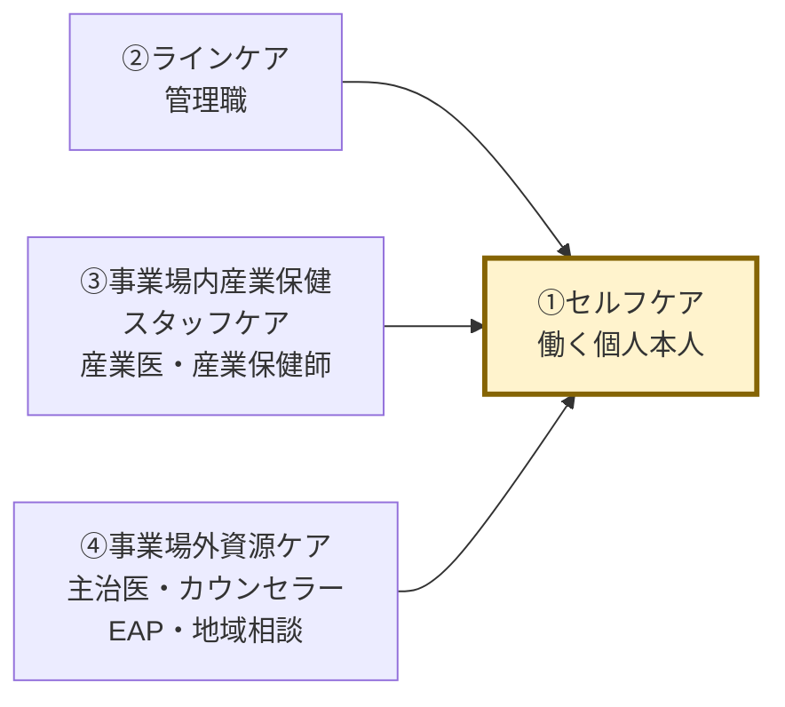
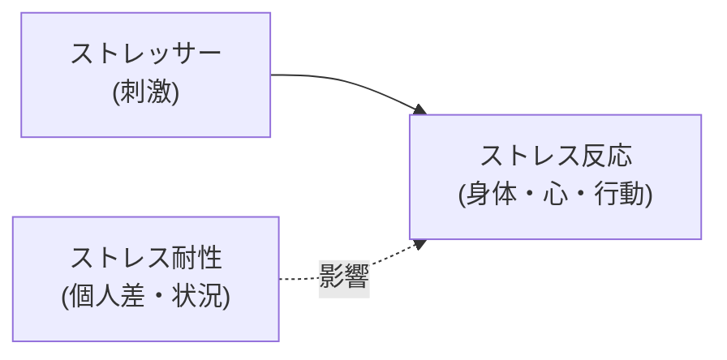
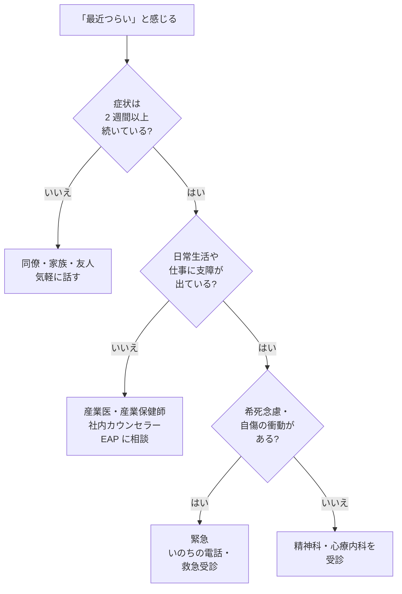
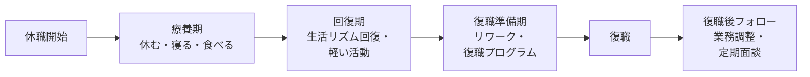

# 働く人のメンタルヘルス入門

ストレスと付き合う・不調に対処する・仕事と回復を両立する

| 項目 | 内容 |
|---|---|
| カテゴリー | ウェルビーイング・健康 |
| 難易度 | 入門 |
| 所要時間 | 約200分（全8レッスン） |
| 公開日 | 2026-05-30 |
| 最終更新日 | 2026-05-30 |
| コースURL | https://skillup.college/courses/wellbeing/mental-health-basics/ |

## 対象者

「最近疲れがとれない」「気分が落ちる」と感じている社会人。ストレスや不調を体系的に理解したい方。過去にメンタル不調を経験した、または家族・同僚が経験している方。中堅以上で後輩の相談を受ける機会が増えてきた方。雇用形態（会社員・契約社員・派遣・公務員・自営など）を問わず、現在働いている、または今後働く予定のすべての個人。予防として読みたい方も対象。

## 前提知識

特になし。年齢・職種・雇用形態を問わない。「医療や心理学の知識がない」状態を前提に書かれているので、初めて学ぶ方でも読み進められる。

## 学習目標

- メンタルヘルスを「病気の有無」ではなく状態の連続体として捉えられる
- ストレッサーとストレス反応の違いを理解し、自分のサインに気づける
- セルフモニタリング（身体・心・行動）を日常に取り入れられる
- 効果のあるコーピング（問題焦点・情動焦点）の基本を実践できる
- 睡眠・運動・食事がメンタルに与える影響を理解し、続けられる工夫を持てる
- 認知の歪みに気づき、リフレーミングや感情の受容を試せる
- 周囲のリソース（産業医・カウンセラー・主治医・相談機関）の役割と利用の仕方がわかる
- 主要疾患の概要・休職／復職制度・配慮要請の基本を理解する

## コース概要

メンタルヘルスは、いまや誰にとっても他人事ではありません。厚生労働省の調査では、仕事や職業生活に強い不安・悩み・ストレスを感じる労働者は半数を超え、精神障害による労災請求件数も増加傾向にあります。それでも、「自分の心の状態をどう測るか」「ストレスにどう対処するか」「不調になったらどこに相談すればよいか」を体系的に学ぶ機会は、意外と少ないのが実情です。本コースは、働く個人が自分の心を扱う基礎を、専門家の知識と当事者経験の両方を交えて学べる構成にしました。会社や管理職向けの研修ではなく、皆さん一人ひとりが、ご自身のために読むテキストです。「相談すること」「休むこと」「治療を受けること」はすべて、自分を守るための能力であり、本コース全体でそのスタンスを貫きます。

## 学習の流れ

レッスン1で、メンタルヘルスの定義、4つのケア（セルフ・ライン・産業保健スタッフ・事業場外資源）の概観、本コースが「セルフケア」を中心に据える理由、本コースの守備範囲を整理します。レッスン2は「全体地図」として、ストレッサーとストレス反応の仕組み、ストレスチェック制度の意味、身体・心・行動のサインを扱います。レッスン3〜5は「自分を整える基本」、セルフモニタリング・コーピング・生活習慣（睡眠・運動・食事）を学びます。レッスン6で認知と感情の扱い方、レッスン7で周囲のリソースと相談の仕方、レッスン8で不調・休職・復職・回復のプロセスとコース修了後の学習方向を扱います。前半（レッスン1〜2）は「考え方の土台」、中盤（レッスン3〜5）は「日常のセルフケア」、後半（レッスン6〜7）は「思考・感情・人とのつながり」、終盤（レッスン8）は「不調と回復、これから」という四段構えです。

## レッスン一覧

| No. | タイトル | 概要 | 所要時間 |
|---|---|---|---|
| 1 | メンタルヘルスとは何か——働く人にとっての「心の健康」 | WHO による健康の定義、メンタルヘルスは病気の有無だけではない、4つのケアの概観、セルフケアが本コースの中心、状態の連続体、本コースの守備範囲を学ぶ | 25分 |
| 2 | ストレスの仕組み——何がストレスで何が反応か | ストレッサー・ストレス反応・耐性のモデル、急性と慢性、ヤーキーズ・ドッドソンの法則、ストレスチェック制度の意味、身体・心・行動のサインを学ぶ | 25分 |
| 3 | 自分の状態を知る——セルフモニタリングと早期発見 | ボディスキャン、感情ラベリング、思考のキャッチ、睡眠・食欲・集中力・興味の変化、「2週間」「いつもより」の観察軸、K6 などのセルフチェック、記録の力を学ぶ | 25分 |
| 4 | セルフケアの基本——効果のあるコーピング | コーピングの分類（問題焦点・情動焦点）、呼吸法、漸進的筋弛緩法、マインドフルネスの基本、行動活性化、逆効果な対処、レパートリーを増やす発想を学ぶ | 25分 |
| 5 | 生活習慣で心を整える——睡眠・運動・食事 | 睡眠の量と質・入眠儀式・ブルーライト・社会的時差ぼけ、有酸素運動とメンタル、食事と腸内環境、飲酒・カフェイン・喫煙の影響、続けられる工夫を学ぶ | 25分 |
| 6 | 認知と感情の扱い方——思考のクセに気づく | 自動思考と認知の歪み、認知行動療法の基本、リフレーミング、感情のラベリングと受容、マインドフルネス・ACT の基本、怒り・不安・反芻の扱いを学ぶ | 25分 |
| 7 | 助けを求める力——周囲のリソースと相談の仕方 | 相談先の階層（同僚・家族・上司・産業医・産業保健師・カウンセラー・主治医・EAP・地域相談機関）、守秘義務、受診のタイミング、受診時の準備を学ぶ | 25分 |
| 8 | 不調と回復——休職・復職・キャリア継続の付き合い方 | 主要疾患の概要、休職制度（傷病手当金・自立支援医療）、復職プロセスとリワーク、配慮要請、ラインケアの受け手としての立ち位置、コース修了後の学習方向を案内する | 25分 |

---

## レッスン1：メンタルヘルスとは何か——働く人にとっての「心の健康」

（所要時間：25分）

### このレッスンで学ぶこと

- メンタルヘルスを「病気の有無」だけで捉えない発想を持つ
- 厚生労働省「4 つのケア」モデルの全体像を理解する
- 本コースが「セルフケア」を中心に据える理由を知る
- 本コースの守備範囲と限界を理解する

---

「メンタルヘルス」という言葉を、ここ数年で何度も耳にしたかもしれません。職場の研修、メディアの特集、上司や同僚との会話、自分自身の不調体験——さまざまな場面に登場します。しかし、「メンタルヘルスとは何か」「自分にとって今、何ができるのか」と問われたとき、明確に答えられる人は意外と少ないものです。本レッスンでは、「メンタルヘルス」という言葉を、働く個人の立場から整理することから始めます。

### メンタルヘルスとは

メンタルヘルス（Mental Health、心の健康）は、文字通りには「心の健康」を意味します。世界保健機関（WHO）は、「健康」を次のように定義しています（1948 年の WHO 憲章前文）。

> 健康とは、病気でないとか、弱っていないということではなく、肉体的にも、精神的にも、そして社会的にも、すべてが満たされた状態にあることをいう

ポイントは、「病気がない＝健康」ではないということです。心の健康も同じで、「メンタル不調と診断されていない＝心が健康」とは限りません。

WHO は、メンタルヘルスをより具体的に次のようにも説明しています（WHO「Mental health: strengthening our response」より要旨）。

> 自分の能力を発揮し、日常生活のストレスにうまく対処し、生産的に働き、コミュニティに貢献できる状態

つまり、メンタルヘルスは「病気の有無」だけでなく、「日々のストレスとうまく付き合えているか」「自分の力を発揮できているか」「人とつながれているか」を含む、もっと広い概念です。

> **💡 ポイント**
> メンタルヘルスは「ある／ない」「正常／異常」の二分法ではなく、「健康〜要観察〜医療が必要」までを含む連続体（グラデーション）として捉えるのが基本です。本コース全体でこの発想を貫きます。

### 働く人とメンタルヘルスの「いま」

メンタルヘルスは、いまや働く人にとって他人事ではありません。日本の状況を、いくつかの公的データで概観します。

#### 仕事のストレスを感じる人の割合

厚生労働省「労働安全衛生調査（実態調査）」によると、現在の仕事や職業生活に関することで強い不安・悩み・ストレスを感じている労働者の割合は、近年は半数を超えて推移しています。年により上下しますが、傾向としては「2 人に 1 人以上が職場でストレスを抱えている」状態が続いています。

#### 精神障害による労災請求件数

厚生労働省「過労死等の労災補償状況」によると、精神障害による労災請求件数は増加傾向にあります。「うつ病・適応障害などのメンタル不調が業務に起因した」と認定されるケースは、年々数千件規模で報告されています。

これらの数字が示しているのは、「メンタル不調は、特別な人がなるもの」ではなく、「誰にでも起こりうる職業上のリスク」であるという事実です。

> **🔰 初学者の方へ</br>
> 統計データの数字は、出典・年度・調査対象によって幅があります。本コースでは、特定の数字を断定的に提示するのではなく、傾向として「ストレスを感じる人は半数以上」「労災請求は増加傾向」とお伝えします。正確な最新値は、厚生労働省の公表資料を直接ご確認ください。

### 4 つのケア——働く人のメンタルヘルスを支える全体像

厚生労働省は、職場におけるメンタルヘルス対策の指針として、「労働者の心の健康の保持増進のための指針」を示しています。その中で中核となる考え方が「4 つのケア」です。



この図は、働く個人（セルフケア）を中心に、3 つの「外側のケア」が支える構造を示しています。本コースは、自分のために学ぶテキストなので、矢印は外側から自分に向かう「支援の流れ」として描いています。

#### ①セルフケア

働く個人が、自分自身の心の状態に気づき、適切に対処する活動です。本コースが中心的に扱うのはここです。具体的には、次のような活動が含まれます。

- 自分のストレス状態に気づく（セルフモニタリング）
- ストレスへの対処法を持つ（コーピング）
- 生活習慣を整える（睡眠・運動・食事）
- 必要なときに助けを求める

#### ②ラインケア

管理職（ライン上の上司）が、部下の心の不調に気づき、相談に乗り、必要に応じて専門家につなぐ活動です。本コースの対象である「働く個人」の視点では、**ラインケアの「受け手」になる立場**です。「上司に相談したいとき、どう切り出すか」「配慮を求めるとき、何を言葉にするか」といった、個人側のアクションをレッスン 8 で扱います。

#### ③事業場内産業保健スタッフケア

産業医、産業保健師、社内のカウンセラーなど、職場内の専門家が提供するケアです。働く個人にとっては、「社内で利用できる相談リソース」として位置づけられます。レッスン 7 で詳しく扱います。

#### ④事業場外資源ケア

主治医、医療機関、地域の相談機関、EAP（従業員支援プログラム）など、職場の外にある資源を活用するケアです。働く個人にとっては、「社外で利用できる相談リソース」として位置づけられます。これもレッスン 7 で扱います。

> **💡 ポイント</br>
> 「4 つのケア」は、企業向け資料では「会社がどう体制を整えるか」という文脈で語られがちです。本コースでは、これを「自分のために、どう使いこなすか」という視点で読み替えます。あなたが主役で、ほかの 3 つは「あなたが利用できる外側のリソース」です。

### メンタルヘルスは「連続体」である

メンタルヘルスを学ぶうえで、最も大事な発想転換は、「健康」と「病気」を二分しないことです。実際には、心の状態は次のような連続体（グラデーション）として捉えるのが現実的です。

- **健康な状態**：日常のストレスにうまく対処でき、活力もある
- **要観察な状態**：疲れやすい、気分が落ちる日が増える、食欲や睡眠に変化がある
- **不調が顕著な状態**：日常生活や仕事に支障が出始めている
- **医療が必要な状態**：症状が 2 週間以上続き、社会生活が困難になっている

この連続体のどこにいるかは、日々変化します。昨日は健康側にいた人が、今日急にストレス過剰で「要観察」に近づくこともあります。逆に、今は不調でも、適切なケアと時間で「健康」側に戻っていくこともあります。

> **⚠️ 注意</br>
> 「医療が必要な状態」かどうかの判断は、自己診断ではなく、医療機関や産業保健スタッフによる診察・面談で行うのが基本です。本コースは「気づき」と「対処の選択肢」を提供しますが、診断・治療を提供するものではありません。症状が 2 週間以上続く、日常生活に支障が出ている、希死念慮（死にたいという思い）があるなどの場合は、ためらわず専門家を受診してください。

### 「自己責任化」しない——本コースのスタンス

メンタルヘルスについて学ぶうえで、もう 1 つ大事な姿勢があります。「セルフケアできない人が悪い」と思わないことです。

職場のメンタル不調は、個人の努力不足ではなく、過剰な業務負荷、ハラスメント、組織風土、家庭の状況など、さまざまな環境要因の組み合わせで起きます。WHO や国際労働機関（ILO）も、職場のメンタルヘルスを「個人の問題」だけでなく「労働環境の問題」として捉えるよう繰り返し提言しています。

本コースは、環境要因の重要性を認めたうえで、「個人が今できる選択肢」に焦点を絞ります。これは「環境はあきらめて自分でなんとかしろ」という意味ではなく、「環境改善には時間がかかる。その間、自分を守るための選択肢を持っておこう」という現実的なスタンスです。

> **💡 ポイント</br>
> 「自分のせいではないが、自分にできることはある」——この発想を、本コース全体で大事にします。

### 本コースの守備範囲と限界

最後に、本コースで扱う範囲と扱わない範囲を整理しておきます。

#### 扱う範囲

- メンタルヘルスの基本的な考え方
- ストレスの仕組み
- セルフモニタリングの方法
- セルフケアの基本（コーピング、生活習慣、認知の扱い方）
- 周囲のリソースの理解と相談の仕方
- 不調・休職・復職の基本知識

#### 扱わない範囲

- 個別症状の診断・治療（医療行為になります）
- 特定の宗教やスピリチュアルな手法
- 「○○式」「△△メソッド」のような商標的手法
- 子ども・思春期・高齢者など、働く人以外を対象とする領域

これらは、本コースの守備範囲外です。診断や治療が必要な場合は、必ず医療機関や産業保健スタッフにご相談ください。

### まとめ

このレッスンでは、以下のことを学びました。

- メンタルヘルスは「病気の有無」だけでなく、状態の連続体として捉える
- WHO は健康を「身体・精神・社会」のすべてが満たされた状態と定義
- 厚生労働省「4 つのケア」モデルは、セルフ・ライン・産業保健スタッフ・事業場外資源の 4 層
- 本コースは「セルフケア」を中心に据え、ほかの 3 つは「個人が利用できる外側のリソース」として扱う
- 心の状態は連続体で、日々変化する。「正常／異常」の二分法を避ける
- セルフケアできないことを「自己責任」にしない。環境要因の重要性を認めたうえで、「個人が今できる選択肢」に焦点
- 本コースは医療行為ではない。診断・治療が必要なら必ず専門家を受診

次のレッスンでは、メンタルヘルスを理解するための土台として「ストレスの仕組み」を扱います。ストレッサーとストレス反応の違い、ストレスチェック制度の意味、身体・心・行動に出るサインを学んでいきます。

---

### 確認クイズ

このレッスンの理解度をチェックしましょう。

#### Q1. WHO による「健康」の定義として最も適切なものはどれか？

- [x] 肉体的・精神的・社会的にすべてが満たされた状態のことである
- [ ] 病気がない状態のことである
- [ ] 体力があり、体重が標準範囲にある状態のことである
- [ ] 検査で異常値が出ない状態のことである

> **解説**
> WHO 憲章前文では、健康を「病気でないとか、弱っていないということではなく、肉体的にも、精神的にも、そして社会的にも、すべてが満たされた状態」と定義しています。「病気がない＝健康」ではなく、もっと広い概念として捉えるのが基本です。

#### Q2. メンタルヘルスの捉え方として、本レッスンが繰り返し強調した発想はどれか？

- [ ] 正常か異常かを明確に二分する
- [x] 健康〜要観察〜医療が必要までを含む連続体として捉える
- [ ] 病気と診断されたかどうかだけで判断する
- [ ] 本人の気合と意志力で決まる

> **解説**
> メンタルヘルスは「ある／ない」「正常／異常」の二分法ではなく、健康〜要観察〜不調が顕著〜医療が必要まで含む連続体（グラデーション）として捉えるのが基本です。日々の状態は変化するため、「今どこにいるか」を観察し続ける発想が大事です。

#### Q3. 厚生労働省「4 つのケア」モデルの 4 つのケアの組み合わせとして最も適切なものはどれか？

- [ ] 医療・保険・福祉・教育
- [ ] 上司・同僚・家族・友人
- [x] セルフケア・ラインケア・事業場内産業保健スタッフケア・事業場外資源ケア
- [ ] 予防・早期発見・治療・回復

> **解説**
> 厚生労働省の指針による「4 つのケア」は、①セルフケア（働く個人本人）、②ラインケア（管理職）、③事業場内産業保健スタッフケア（産業医・産業保健師など）、④事業場外資源ケア（主治医・EAP・地域相談機関など）の組み合わせです。本コースは①セルフケアを中心に据え、②③④を「個人が利用できるリソース」として扱います。

#### Q4. 本コースが「働く個人」の立場で 4 つのケアを読み替える際の発想として最も適切なものはどれか？

- [ ] 会社が体制を整えるべきという立場で読む
- [ ] ラインケアが最重要であると位置づける
- [ ] 全てのケアを同じ重みで扱う
- [x] 自分（セルフケア）が中心で、ほかの 3 つは利用できる外側のリソース

> **解説**
> 本コースは、企業向け資料が「会社が体制をどう整えるか」と語るのに対し、「働く個人が、ほかの 3 つをどう使いこなすか」という視点で読み替えます。あなたが主役で、ラインケア・産業保健スタッフ・事業場外資源は、あなたが必要なときに利用できる外側のリソースという位置づけです。

#### Q5. 本レッスンの「自己責任化しない」というスタンスの内容として最も適切なものはどれか？

- [ ] 環境は完全にあきらめて、自分でなんとかするしかない
- [ ] セルフケアできないのは個人の努力不足が原因である
- [x] 環境要因の重要性を認めたうえで、自分が今できる選択肢に焦点を絞る
- [ ] 全責任は会社にあり、個人が学ぶ必要はない

> **解説**
> 本コースのスタンスは、「自分のせいではないが、自分にできることはある」という現実的な立ち位置です。職場のメンタル不調は、過剰負荷・ハラスメント・組織風土など環境要因の組み合わせで起きるという事実を認めたうえで、環境改善を待つ間に自分を守るための選択肢を持つ、という発想です。

#### Q6. 本コースが扱わない範囲として、最も適切なものはどれか？

- [ ] ストレスの仕組み
- [ ] セルフモニタリングの方法
- [x] 個別症状の診断・治療
- [ ] 不調・休職・復職の基本知識

> **解説**
> 本コースは医療行為ではないため、個別症状の診断や治療は扱いません。診断・治療が必要な場合は、医療機関や産業保健スタッフへの受診が基本です。本コースは「気づき」と「対処の選択肢」を提供する読み物として設計されています。

---

## レッスン2：ストレスの仕組み——何がストレスで何が反応か

（所要時間：25分）

### このレッスンで学ぶこと

- ストレッサーとストレス反応の違いを理解する
- 急性ストレスと慢性ストレスの違いを知る
- 「適度なストレス」と「過剰なストレス」の境目を把握する
- ストレスチェック制度の意味を理解する
- 身体・心・行動に出るストレスのサインを知る

---

レッスン 1 では、メンタルヘルスを「連続体」として捉える発想と、本コースが「セルフケア」を中心に据えることを確認しました。本レッスンでは、メンタルヘルスを理解する土台となる「ストレス」を扱います。日常的に使われる言葉ですが、専門的に整理すると、不調を予防し、対処するための見取り図が手に入ります。

### 「ストレス」の正体を分解する

普段「ストレスがたまっている」と言うとき、私たちは何を指しているでしょうか。仕事の量、嫌な上司、忙しさ、疲れ、イライラ——いろいろなものが混ざっています。

心理学・医学の世界では、「ストレス」を 3 つの要素に分けて考えます。



#### ①ストレッサー（刺激）

外側からの刺激や、内側から湧く負荷のことです。例えば、次のようなものが含まれます。

- 仕事の量・締め切り・責任の重さ
- 人間関係（上司・同僚・部下・取引先・家族）
- 物理的な環境（温度・騒音・通勤距離・在宅勤務環境）
- 経済的な不安（収入・住宅ローン・教育費）
- ライフイベント（結婚・出産・転職・引越し・親の介護）
- 自分の中の期待や目標（達成プレッシャー・完璧主義）

ライフイベントは、結婚や昇進など「良い出来事」もストレッサーになりうる点に注意が必要です。

#### ②ストレス反応（身体・心・行動の反応）

ストレッサーを受けたときに、身体・心・行動に出る反応のことです。「ストレスがたまっている」と感じるとき、実は反応のほうを指していることが多くあります。具体的には次のレッスン後半で詳しく扱います。

#### ③ストレス耐性（個人差・状況差）

同じストレッサーを受けても、人によって反応の強さが違います。これは「弱い／強い」という固定的なものではなく、

- そのときの体調や睡眠
- 過去の経験と慣れ
- サポートしてくれる人の有無
- 自分が使えるコーピング（対処法）

など、変動する要因によって決まります。「自分は耐性が弱い」と思い込まず、「今は耐性が落ちている時期」と捉えるほうが現実的です。

> **💡 ポイント</br>
> 「ストレッサーをなくす」のは難しいですが、「ストレス反応に気づく」「コーピングを増やす」「耐性を支える生活習慣を整える」は、自分でできます。本コースの中心はここです。

### 急性ストレスと慢性ストレス

ストレスは、続く期間によっても 2 つに分けられます。

#### 急性ストレス

短期間に強い刺激を受けるストレスです。例えば、大事なプレゼン前の緊張、急なトラブル対応、満員電車での嫌な体験など。一時的に身体反応（心拍数の増加・発汗・筋肉の緊張）が起き、刺激が去ると比較的早く回復します。

#### 慢性ストレス

長期間にわたって刺激を受け続ける状態です。例えば、何か月も続く過剰な業務量、長年の家族問題、ハラスメントが日常化した職場など。身体・心が「常に警戒モード」に置かれ、回復のタイミングがないまま消耗が蓄積します。

慢性ストレスのほうが、身体的にも精神的にもダメージが大きく、うつ病・適応障害・身体疾患（高血圧・胃潰瘍など）の引き金になりやすいことが知られています。

> **⚠️ 注意</br>
> 「急性ストレスは大したことない」と侮らないことも大事です。激しいトラウマ体験（事故・災害・暴力など）による急性ストレス障害は、後に心的外傷後ストレス障害（PTSD）に発展することがあります。激しい体験の後に強い不調が続く場合は、専門家への相談が必要です。

### 適度なストレスと過剰なストレス——ヤーキーズ・ドッドソンの法則

ストレスはすべて悪いものでしょうか。実はそうではありません。1908 年にロバート・ヤーキーズとジョン・ドッドソンが提唱した古典的な実験結果は、「ヤーキーズ・ドッドソンの法則」として、心理学・教育・スポーツ科学などで広く知られています。

この法則のエッセンスは、次のように整理できます。

- ストレス（覚醒水準）が低すぎると、パフォーマンスは上がらない（やる気が出ない）
- ストレスが適度なとき、パフォーマンスは最も高くなる
- ストレスが過剰になると、パフォーマンスは急激に低下する

つまり、「全くストレスがない」状態は理想ではなく、「適度なストレス」がパフォーマンスを支えています。問題は、ストレスが「適度」を超えて「過剰」になった状態が続くことです。

実務的には、次のような目安で「適度／過剰」を見分けます。

- **適度なストレス**：終わったあと、達成感や満足感がある。睡眠で回復できる
- **過剰なストレス**：終わったあと、消耗感だけが残る。週末や睡眠で回復しない

「達成感があるか」「回復できているか」を、日々の自分への観察軸にしてみてください。

### ストレスチェック制度——日本の労働者向けの公的な仕組み

日本では、労働安全衛生法第 66 条の 10 に基づき、常時 50 人以上の労働者を使用する事業場に対して、年 1 回のストレスチェック実施が義務づけられています（2015 年 12 月施行）。

#### ストレスチェックとは

簡単な質問紙に回答することで、自分のストレス状態を客観的に把握できる仕組みです。標準的に使われているのは「職業性ストレス簡易調査票」で、仕事のストレス要因・心身のストレス反応・周囲のサポートを 57 問程度で評価します（簡易版もあり）。

#### 結果の使い方

- 結果は、本人に直接通知されます（会社には個人を特定できる形では渡されません）
- 高ストレス者と判定された場合、本人の希望に応じて、医師による面接指導を受けられます
- 結果を踏まえて、自分のセルフケアを見直したり、職場環境の改善を申し出たりできます

> **💡 ポイント</br>
> ストレスチェックは「会社が法律で実施している」という建前ですが、本質は「働く個人が自分のストレス状態を年 1 回客観視するための仕組み」です。結果を「会社に知られる」と心配する方もいますが、個人結果は本人の同意なく会社には開示されません。せっかくの機会なので、毎年自分のデータとして活用してください。

#### 50 人未満の事業場の場合

法的義務ではありませんが、努力義務とされています。実施されていない場合は、厚生労働省の「こころの耳」サイト等で、無料のセルフチェック（K6 など）を活用できます。これはレッスン 3 で扱います。

### ストレスのサインは「身体・心・行動」の 3 系統に出る

ストレス反応は、3 つの系統に分かれて現れます。自分や同僚のサインに気づくため、それぞれの代表例を押さえておきましょう。

#### 身体のサイン

- 睡眠の変化（寝つきが悪い、夜中に目が覚める、朝早く目が覚める、過眠）
- 食欲の変化（食欲低下、過食、味がわからない）
- 頭痛・肩こり・腰痛・胃の不調
- 動悸・息苦しさ・めまい
- 疲れがとれない、慢性的なだるさ
- 風邪をひきやすくなる、治りにくい

#### 心のサイン

- 気分が落ち込む、悲しさ・むなしさが続く
- 不安や緊張が続く
- イライラ、怒りっぽくなる
- 集中力・判断力の低下
- 興味・関心の喪失（好きだったものが楽しめない）
- 自責感、自信の喪失
- 「消えてしまいたい」「自分は価値がない」と感じる

#### 行動のサイン

- 仕事の効率が下がる、ミスが増える
- 遅刻・欠勤が増える
- 人付き合いを避けるようになる
- 飲酒量・喫煙量が増える
- 衝動的な買い物・浪費
- 身だしなみがおろそかになる
- スマホ・SNS・動画の過剰な使用

> **⚠️ 注意</br>
> 上記のうち、特に「消えてしまいたい」「自分は価値がない」「希死念慮」がある場合は、いますぐ専門家に相談することが必要です。レッスン 7 で扱う相談先のほか、緊急時はいのちの電話、よりそいホットライン（電話：0120-279-338、24 時間無料）などを利用できます。

### 「いつもと違う」が観察軸

サインを判断するときの基本は、「数や項目」よりも「いつもと違うかどうか」です。

- いつもと違って、寝つきが悪い日が増えた
- いつもより、人と話す気力がない
- いつもなら笑える話が、笑えない

「いつも」を知るためには、日々の自分を観察する習慣が必要です。レッスン 3 では、その方法を具体的に扱います。

### まとめ

このレッスンでは、以下のことを学びました。

- ストレスは「ストレッサー（刺激）」「ストレス反応」「ストレス耐性」の 3 要素に分解できる
- 急性ストレスは短期・回復しやすい、慢性ストレスは長期・ダメージが大きい
- ヤーキーズ・ドッドソンの法則：適度なストレスはパフォーマンスを支える、過剰になると急低下
- ストレスチェック制度は、年 1 回自分の状態を客観視する仕組み。結果は本人に通知される
- ストレス反応は「身体・心・行動」の 3 系統に出る。「いつもと違うか」が観察軸
- 希死念慮など重大なサインがあれば、いますぐ専門家に相談

次のレッスンでは、自分のストレス状態を日常的に把握するための「セルフモニタリング」を扱います。ボディスキャン、感情ラベリング、思考のキャッチなど、誰でも今日から始められる方法を紹介します。

---

### 確認クイズ

このレッスンの理解度をチェックしましょう。

#### Q1. ストレスを構成する 3 要素の組み合わせとして最も適切なものはどれか？

- [x] ストレッサー（刺激）・ストレス反応・ストレス耐性
- [ ] 仕事・家庭・趣味
- [ ] 身体・心・行動
- [ ] 急性・慢性・トラウマ

> **解説**
> 心理学・医学では、ストレスを「ストレッサー（刺激）」「ストレス反応」「ストレス耐性」の 3 要素に分解して考えます。「身体・心・行動」はストレス反応の 3 系統、急性／慢性はストレスの持続期間の分類で、別の切り口です。

#### Q2. ヤーキーズ・ドッドソンの法則のエッセンスとして最も適切なものはどれか？

- [ ] ストレスは少なければ少ないほどパフォーマンスが上がる
- [ ] ストレスは多ければ多いほどパフォーマンスが上がる
- [x] 適度なストレスでパフォーマンスは最高となり、過剰になると急激に低下する
- [ ] ストレスとパフォーマンスには関係がない

> **解説**
> ヤーキーズ・ドッドソンの法則は、ストレス（覚醒水準）とパフォーマンスの関係を逆 U 字型で表現する古典的な知見です。低すぎてもやる気が出ず、適度なときに最高、過剰になると急激に低下します。「全くストレスがない」状態は理想ではない点が重要です。

#### Q3. 急性ストレスと慢性ストレスの違いとして最も適切なものはどれか？

- [ ] 急性は身体に出て、慢性は心に出る
- [ ] 急性は大人、慢性は子どもに多い
- [x] 急性は短期間の強い刺激で回復しやすく、慢性は長期間続いてダメージが大きい
- [ ] 両者は同じ意味で、呼び方が違うだけ

> **解説**
> 急性ストレスは短期間の強い刺激（プレゼン前の緊張など）で、刺激が去ると比較的早く回復します。慢性ストレスは長期間続く刺激（過剰な業務・ハラスメントの日常化など）で、回復のタイミングがないため身体・心へのダメージが大きく、うつ病・適応障害・身体疾患の引き金になりやすいことが知られています。

#### Q4. ストレスチェック制度について、本レッスンで説明された内容として最も適切なものはどれか？

- [ ] 結果は本人に通知される前に、会社の上司に通知される
- [ ] 全ての事業場で必ず実施しなければならない
- [ ] 結果が高ストレスでも、医師面談を受けることはできない
- [x] 結果は本人に通知され、本人の同意なく会社には個人結果が開示されない

> **解説**
> ストレスチェックの結果は本人に直接通知されます。個人を特定できる形では、本人の同意なく会社に開示されません。これは労働安全衛生法に基づく重要な仕組みです。常時 50 人以上の事業場に実施義務があり、50 人未満は努力義務、結果が高ストレスと判定された場合は本人の希望で医師面接指導を受けられます。

#### Q5. ストレス反応の「身体のサイン」として最も適切なものはどれか？

- [ ] 仕事の効率が下がる
- [x] 睡眠の変化、食欲の変化、頭痛・肩こり・胃の不調
- [ ] イライラ、怒りっぽくなる
- [ ] 「消えてしまいたい」と感じる

> **解説</br>
> ストレス反応は「身体・心・行動」の 3 系統に出ます。身体のサインは、睡眠・食欲・頭痛・肩こり・胃の不調・動悸・疲れなど。仕事の効率低下は行動のサイン、イライラや「消えてしまいたい」は心のサインです。

#### Q6. 本レッスンが提示した、ストレス反応を判断する際の観察軸として最も適切なものはどれか？

- [ ] サインの数を数える
- [x] 「いつも」と比較して違うかどうか
- [ ] 周囲の人と比較する
- [ ] 医療機関で診断を受けるまで気にしない

> **解説</br>
> ストレス反応の判断軸は、「数や項目」ではなく「いつもと違うかどうか」です。普段の自分を知っていてはじめて、「いつもより寝つきが悪い」「いつもは笑える話が笑えない」といった変化に気づけます。周囲との比較はあてになりません（人それぞれ平常時が違う）。レッスン 3 で「いつも」を知る方法を扱います。

---

## レッスン3：自分の状態を知る——セルフモニタリングと早期発見

（所要時間：25分）

### このレッスンで学ぶこと

- セルフモニタリングの基本（身体・感情・思考の観察）を理解する
- 「2 週間」「いつもより」という時間軸を持つ
- 公開セルフチェックツール（K6 など）の使い方と限界を知る
- 記録（簡易ジャーナル）の力を活用する

---

レッスン 2 では、ストレスの仕組みと、ストレス反応が「身体・心・行動」の 3 系統に出ること、観察軸は「いつもと違うかどうか」だと学びました。本レッスンでは、その「いつも」を知り、変化に気づくための具体的な方法——セルフモニタリングを扱います。

### セルフモニタリングとは

セルフモニタリングは、心理学・行動科学の世界では「自分の身体・感情・思考・行動を、観察者の目で意識的に観察する活動」を指します。難しそうに聞こえるかもしれませんが、本質はシンプルで、「今、自分はどんな状態か」を、判断や評価なしに見るだけです。

セルフモニタリングが大事な理由は、3 つあります。

1. **早期発見**：不調のサインに早く気づけば、対処も早く始められる
2. **「いつも」を知る**：変化を捉えるためには、自分の平常時を知る必要がある
3. **対処の手がかり**：何がストレッサーで、何が反応かを切り分けられる

> **💡 ポイント</br>
> セルフモニタリングは「自分を厳しく評価すること」ではありません。むしろ、「評価しないで、ただ観察する」のがコツです。「ダメな自分」「弱い自分」と判定し始めると、自己批判のループに入ってしまいます。

### ①ボディスキャン——身体の感覚を観察する

ボディスキャンは、マインドフルネスの基本実践の 1 つで、頭から足先まで、身体の感覚を順に観察していく方法です。

#### 簡易ボディスキャンの手順

1. 椅子に座るか、横になる。目は閉じても開けてもよい
2. 数回ゆっくり呼吸する
3. 頭のてっぺんから、顔・首・肩・胸・お腹・腕・手・腰・お尻・太もも・ふくらはぎ・足の順に、感覚を観察する
4. 「緊張している」「重い」「温かい」「何も感じない」など、評価せずに気づく
5. 全身を見終わったら、ゆっくり目を開ける

所要時間は、3 分〜 10 分程度。慣れてくると、通勤の電車の中や昼休みでもできるようになります。

#### 何のためにやるか

- 自分が「無自覚に」緊張している場所に気づける（特に肩・首・胃のあたり）
- 「気合で乗り切っているつもり」が、身体には負荷として残っていることに気づける
- 緊張に気づくこと自体が、緊張を緩める効果を持つことが知られている

> **🔰 初学者の方へ</br>
> 「やってみたけど何も感じない」「眠くなる」というのは、普通の反応です。最初は短く（1 〜 2 分）始めて、徐々に時間を延ばしていけば大丈夫です。完璧を目指さず、「やってみる」だけで十分です。

### ②感情のラベリング——「今、何を感じているか」に名前をつける

感情のラベリングは、自分が今感じている感情に「悲しさ」「怒り」「不安」「疲れ」「焦り」など、言葉のラベルをつける活動です。

#### なぜ効くのか

UCLA の研究者マシュー・リーバーマン氏らの研究をはじめ、感情にラベルをつける（言葉にする）と、脳の感情を担う扁桃体の活動が落ち着き、前頭前皮質が活性化することが報告されています。「名前をつける」というシンプルな行為が、感情との距離を作り、扱いやすくしてくれるのです。

#### 簡易感情ラベリングの手順

1. ふと立ち止まったとき、深呼吸する
2. 「今、自分は何を感じているか」と自分に問いかける
3. 浮かんできた感情に名前をつける。「焦り」「悲しさ」「怒り」など
4. 名前がつかなければ、「もやもや」「重い」など、感覚的な言葉でもよい
5. 「これは私の感情だ」と認め、それ以上評価しない

#### 「感情の語彙」を増やす

「ストレス」という一語で済ませず、「焦り」「無力感」「孤立感」「期待外れ」「悔しさ」「不安」など、より細かい言葉に分けて捉えると、対処のヒントが見えやすくなります。例えば、「焦り」なら時間管理の見直し、「孤立感」なら誰かに話す、「無力感」なら小さな達成感を積むなど、対処の方向が変わります。

### ③思考のキャッチ——「いま、何を考えているか」に気づく

思考のキャッチは、自分の頭の中で繰り返されている考え（自動思考）に気づく活動です。これはレッスン 6 で詳しく扱う「認知行動療法」の基本ステップでもあります。

#### 自動思考とは

例えば、上司から「ちょっといいですか」と声をかけられたとき、頭の中で次のような考えが瞬時に走ることがあります。

- 「何か叱られるんじゃないか」
- 「またミスをしただろうか」
- 「自分は評価が低い」

これらは、意識的に「考えよう」と思ったわけではなく、自動的に浮かびます。これを「自動思考」と呼びます。

#### 自動思考に気づく方法

- 強い感情が湧いたとき、「いま、頭の中で何が言われていたか」と自問する
- 「べき」「ねば」「絶対」「いつも」「決して」という言葉が含まれていないか観察する
- 最悪のシナリオを想定していないか観察する

自動思考そのものは悪いものではありません。問題は、否定的な自動思考が、根拠なく繰り返されることです。気づくことが、対処の第一歩です。

### 観察軸——「2 週間」と「いつもより」

セルフモニタリングで何かに気づいたとき、「対処が必要か」を判断する目安が 2 つあります。

#### ①「2 週間以上続いているか」

うつ病など、医療的な介入が必要な状態の目安として、国際的な診断基準（DSM-5 や ICD-11）では「ほぼ毎日、2 週間以上続く」ことが基準の 1 つとされています。本コースは診断を行うものではありませんが、「2 週間続く」は、専門家に相談するかを判断する 1 つの目安として覚えておく価値があります。

#### ②「いつもより」を観察する

レッスン 2 でも触れた、「いつもの自分」との比較です。

- 普段は朝の食事をしっかり食べる → 最近、食べる気がしない
- 普段は週末に趣味を楽しむ → 最近、何もする気がしない
- 普段は同僚と雑談する → 最近、話しかけられても気が乗らない

「いつもの自分」を知っているからこそ、変化に気づけます。

> **⚠️ 注意</br>
> 希死念慮（死にたい、消えてしまいたいという思い）、自傷行為への衝動、強い絶望感が出ている場合は、「2 週間」を待たず、すぐに専門家に相談してください。レッスン 7 で扱う相談先のほか、いのちの電話・よりそいホットライン・厚生労働省「こころの耳」電話相談などが利用できます。

### セルフチェックツール——K6 などの公開ツール

自分の状態をより客観的に把握したいときには、公開されているセルフチェックツールも利用できます。

#### K6（ケッスラー 6 項目精神的健康尺度）

K6 は、米国の精神医学者ロナルド・ケスラーらが開発した、心理的苦痛を測る 6 問の質問紙です。日本でも厚生労働省「国民生活基礎調査」などで使われており、信頼性・妥当性が確認されています。

質問は「過去 30 日間、次のような気持ちでどれくらい過ごしましたか」という形式で、「神経過敏に感じた」「絶望的だと感じた」「そわそわ・落ち着かなく感じた」など 6 項目を、5 段階（0 〜 4 点）で答えます。合計点で、心理的苦痛の度合いを推定します。

- 合計点が高いほど、心理的苦痛が強いと判定される
- 一般的に 5 点以上で「気分・不安障害の疑い」、10 点以上で「重い精神的苦痛」の目安とされる（カットオフ値は研究によって幅があり）

#### CES-D（うつ病自己評価尺度）

CES-D は、米国国立精神保健研究所が開発した、抑うつ症状を測る 20 問の質問紙です。「日本語版 CES-D」が広く使われています。

#### 公開セルフチェックの限界

セルフチェックツールには、必ず限界があります。

- **診断ではない**：あくまでスクリーニング（ふるい分け）であり、診断は医師しかできない
- **状況の影響を受ける**：体調・睡眠・直近の出来事で点数が変動する
- **過剰評価・過小評価の可能性**：自己回答なので、本人の気分や認識に影響される

セルフチェックの結果は、「専門家に相談するかを判断する 1 つの材料」として活用するのが適切です。「点数が低いから大丈夫」とも「点数が高いから自分はうつ病だ」とも断定しないことが大事です。

> **💡 ポイント</br>
> 厚生労働省「こころの耳」サイトでは、ストレスチェックや K6 などの自己チェックを無料で利用できます。会社のストレスチェックを受ける機会がない方も、年に数回、自分でチェックしてみる習慣をおすすめします。

### ④記録の力——簡易ジャーナル

セルフモニタリングを継続するうえで、強力なツールが「記録」です。心理学では、書き出すこと自体に「外在化（externalization）」という効果があり、頭の中だけでぐるぐる回っていた思考や感情を整理する力があることが知られています。

#### 簡易ジャーナルの書き方

完璧な日記である必要はありません。1 日 3 〜 5 分でできる、シンプルなフォーマットを提案します。

```text
■ 今日の身体（10 点満点）：[ ]
■ 今日の気分（10 点満点）：[ ]
■ 良かったこと（1 つ）：
■ つらかったこと（1 つ）：
■ 一言メモ：
```

これだけです。点数を毎日つけていくと、「先週は 7 点くらいだったのに、今週は 4 点が多い」など、自分の傾向が見えてきます。

#### 続けるコツ

- 朝でも夜でもよいが、同じ時間帯にする
- 完璧を目指さない。書けない日は「書けなかった」と一言だけでも書く
- 紙でもアプリでもよい（スマホのメモ機能で十分）
- 過去の記録を週末に振り返ると、「いつもの自分」が見えてくる

> **🔰 初学者の方へ</br>
> 「日記なんて続いた試しがない」という方も多いと思います。私も同じです。続けるコツは「書けない日が続いても、再開すればよい」と思うこと。完璧主義を捨てて、月に半分書ければ十分です。

### まとめ

このレッスンでは、以下のことを学びました。

- セルフモニタリングは「評価せず、観察する」がコツ
- ボディスキャン：身体の感覚を頭から足まで順に観察
- 感情のラベリング：感じている感情に名前をつける
- 思考のキャッチ：自動思考に気づく
- 観察軸は「2 週間以上続いているか」「いつもより違うか」の 2 つ
- 公開セルフチェック（K6・CES-D）は活用できるが、診断ではないことに注意
- 簡易ジャーナルは強力。1 日 3 行から続けてみる

次のレッスンでは、状態に気づいた後の対処法——セルフケアの基本となる「コーピング」を扱います。問題焦点・情動焦点の分類、呼吸法、漸進的筋弛緩法、マインドフルネスの基本、避けたほうがよい対処などを、具体的に学んでいきます。

---

### 確認クイズ

このレッスンの理解度をチェックしましょう。

#### Q1. セルフモニタリングの基本姿勢として最も適切なものはどれか？

- [x] 評価せず、観察者の目で「ただ気づく」
- [ ] 自分を厳しく評価し、ダメな点を発見する
- [ ] 他人と比較して、自分の優劣を判定する
- [ ] 不調があれば、すぐに薬を飲む

> **解説**
> セルフモニタリングは「評価せず、観察する」のがコツです。「ダメな自分」「弱い自分」と判定し始めると自己批判のループに入り、不調を悪化させかねません。観察者の目で「今、自分はどんな状態か」を気づくことから始めます。

#### Q2. ボディスキャンの目的として最も適切なものはどれか？

- [ ] 筋トレで身体を鍛える
- [x] 無自覚に緊張している場所に気づき、自分の身体の状態を観察する
- [ ] 健康診断の代わりに病気を見つける
- [ ] 痛みを完全に消す

> **解説**
> ボディスキャンは、頭から足先まで身体の感覚を順に観察する活動です。「気合で乗り切っているつもり」でも、身体には負荷として残っている緊張に気づけます。緊張に気づくこと自体が、緊張を緩める効果を持つことが知られています。診断や治療を目的とするものではありません。

#### Q3. 「感情のラベリング」がなぜ効果的と説明されたか、最も適切なものはどれか？

- [ ] 感情を抑え込むことができるから
- [ ] 他人に説明できるようになるから
- [x] 感情に名前をつけると感情との距離ができ、扱いやすくなるから
- [ ] 感情を消すことができるから

> **解説**
> 感情にラベル（名前）をつけることで、扁桃体の活動が落ち着き、前頭前皮質が活性化することが研究で示されています。「名前をつける」というシンプルな行為が、感情との距離を作り、対処しやすくする効果があります。感情を抑え込んだり消したりするのではなく、扱いやすくするのが目的です。

#### Q4. 「対処が必要か」の目安として、本レッスンが示した 2 つの観察軸として最も適切なものはどれか？

- [ ] 数値が高いか低いか／周囲との比較
- [ ] 友人の意見／家族の意見
- [ ] 占いの結果／天気
- [x] 「2 週間以上続いているか」と「いつもより違うか」

> **解説**
> 本レッスンが示した 2 つの観察軸は、「2 週間以上続いているか」（DSM-5・ICD-11 の診断基準でも目安となる時間）と「いつもより違うか」（自分の平常時との比較）です。ただし、希死念慮など重大なサインがあれば、2 週間を待たず、すぐに専門家に相談する必要があります。

#### Q5. K6 のような公開セルフチェックツールの位置づけとして最も適切なものはどれか？

- [ ] 医療診断と同等の正確さを持つ
- [ ] 結果が低ければメンタル不調は絶対にない
- [x] スクリーニング（ふるい分け）の 1 材料であり、診断は医師にしかできない
- [ ] 一度受けたら毎週受けるべき

> **解説**
> K6・CES-D などの公開セルフチェックは、信頼性・妥当性が確認されたツールですが、あくまでスクリーニング（ふるい分け）です。診断は医師にしか行えません。点数が低くても不調はありえますし、点数が高いから即「うつ病」とも断定できません。「専門家に相談するかを判断する 1 つの材料」として活用するのが適切です。

#### Q6. 簡易ジャーナルを継続するためのコツとして最も適切なものはどれか？

- [ ] 詳細な分析を書く
- [ ] 毎日 30 分以上かける
- [ ] 書けない日があったらやめる
- [x] 完璧主義を捨て、書けない日があっても再開すればよいと考える

> **解説**
> ジャーナルを継続するコツは「完璧を目指さない」ことです。月に半分書ければ十分。書けない日があっても自分を責めず、再開すればよいと考えます。1 日 3 〜 5 分の短時間でも、続けることで自分の傾向が見えてきます。詳細な分析や長時間の記述は、かえって続かない原因になります。

---

## レッスン4：セルフケアの基本——効果のあるコーピング

（所要時間：25分）

### このレッスンで学ぶこと

- コーピングの分類（問題焦点・情動焦点）を理解する
- 呼吸法・漸進的筋弛緩法・マインドフルネスの基本を試せる
- 行動活性化の考え方を持つ
- 逆効果になりやすい対処を見分ける
- 自分のコーピング・レパートリーを増やす発想を身につける

---

レッスン 3 では、自分の状態に気づくセルフモニタリングを扱いました。本レッスンでは、気づいた後に「何をするか」——セルフケアの中核である「コーピング」を扱います。コーピングは、心理学・健康行動学の中心テーマで、ストレス対処の方法を体系的に整理した考え方です。

### コーピングとは

コーピング（Coping）は、英語で「対処する」を意味する言葉です。心理学者リチャード・ラザルスとスーザン・フォルクマンが 1984 年に提唱した「ストレスとコーピングの理論」で、ストレッサーやストレス反応に対して、人がとる対処行動を体系的に整理しました。

ポイントは、「人はストレスに対して、無意識のうちに何らかの対処をしている」ということです。意識的にコーピングを選べるようになると、不調の予防や軽減につながります。

### ①問題焦点コーピング——ストレッサーそのものに働きかける

問題焦点コーピング（Problem-focused coping）は、ストレッサーそのものを変えたり減らしたりする対処です。

#### 具体例

- **時間管理**：仕事量が多すぎるなら、優先順位を立てて、できないことは断る
- **環境の調整**：通勤時間が負担なら、リモート勤務や時差出勤を相談する
- **スキルアップ**：苦手な仕事が負担なら、研修や本で学んで克服する
- **相談・交渉**：人間関係が負担なら、上司に配慮を求める
- **情報収集**：先が見えない不安なら、情報を集めて状況を把握する

#### 向いている状況

- ストレッサーが特定できる
- 自分の行動でストレッサーを変えられる余地がある
- ある程度の心身のエネルギーがある

#### 向かない状況

- ストレッサーが特定できない、または自分でコントロール不可能（例：天災・大規模なリストラなど）
- 自分が消耗しきっており、行動するエネルギーが残っていない

問題焦点コーピングは強力ですが、「すべてを行動で解決できるはず」と思い込むと、自己効力感を失う場合もあります。次の情動焦点コーピングと組み合わせることが大事です。

### ②情動焦点コーピング——感情・反応のほうに働きかける

情動焦点コーピング（Emotion-focused coping）は、ストレッサーは変えられない場合でも、自分の感情や身体反応を整える対処です。

#### 具体例

- **リラクセーション**：呼吸法、筋弛緩法、マインドフルネス
- **気分転換**：散歩、趣味、入浴、音楽、自然
- **感情の言語化**：誰かに話す、日記に書く
- **再評価**：「これは経験になる」「最悪ではない」など、見方を変える（レッスン 6 で扱う）
- **受容**：「今は仕方ない」と一旦受け入れる
- **適度なユーモア**：笑える要素を見つける

#### 向いている状況

- ストレッサーがコントロール不可能、または変えるのに時間がかかる
- 感情が高ぶっていて、冷静な判断が難しい
- すぐに動けるエネルギーがない

> **💡 ポイント</br>
> 「問題焦点」と「情動焦点」は対立する選択肢ではありません。多くの場合、組み合わせて使います。例えば、「感情を落ち着けてから（情動焦点）、上司に相談する（問題焦点）」という流れです。

### 呼吸法——いつでもどこでも使えるリラクセーション

呼吸法は、もっとも手軽で効果的なリラクセーション法の 1 つです。会議の合間、通勤の電車の中、緊張する瞬間、不安な夜——すぐ使えます。

#### 4-7-8 呼吸法

米国の医師アンドルー・ワイル氏が広めた呼吸法です。

1. 静かに息を吐ききる
2. 4 秒かけて鼻から息を吸う
3. 7 秒間、息を止める
4. 8 秒かけて口から息をゆっくり吐く
5. これを 3 〜 4 回繰り返す

#### 腹式呼吸（基本形）

1. 楽な姿勢で座る、または横になる
2. 片手をお腹に当てる
3. 鼻からゆっくり 4 秒ほどかけて吸う。お腹が膨らむのを感じる
4. 口から 6 秒ほどかけてゆっくり吐く。お腹がへこむのを感じる
5. 2 〜 5 分続ける

#### なぜ効くか

呼吸はゆっくりすると、副交感神経が優位になり、心拍数が落ち、緊張が緩みます。意識的にゆっくり吐くことで、交感神経（緊張モード）の活動を弱められます。これは生理学的に確かめられている仕組みです。

> **🔰 初学者の方へ</br>
> 「呼吸法は地味で効きそうにない」と思う方も多いです。実は、地味な方法こそ、強力なのです。緊急時に飛行機で配られる酸素マスクが「まず自分につけてください」と案内されるように、自分の呼吸を整えることが、すべてのセルフケアの土台になります。

### 漸進的筋弛緩法——身体から心を緩める

漸進的筋弛緩法（Progressive Muscle Relaxation、PMR）は、米国の医師エドモンド・ジェイコブソンが 1920 年代に開発した、筋肉の緊張と弛緩を意識的に繰り返すリラクセーション法です。

#### 簡易版の手順

1. 椅子に楽に座る
2. 両手を強く握る（5 秒間、力を入れる）
3. 一気に力を抜き、緩まる感覚を 10 秒間感じる
4. 同じことを、肩・顔・お腹・足に順に行う
5. 全身が緩んだ感覚を 1 分間味わう

#### 何が起きているか

筋肉は、緊張させた後のほうが、より深く弛緩することがわかっています。意識的に「緊張→弛緩」のサイクルを作ることで、無自覚な緊張も解放されます。慢性的に肩こりや顔のこわばりがある人には、特に効果が出やすい方法です。

### マインドフルネスの基本

マインドフルネス（Mindfulness）は、「今、この瞬間に、評価せずに注意を向ける」状態を指します。米国の医師ジョン・カバットジン氏が 1970 年代から、慢性痛・ストレス低減のプログラム（MBSR：Mindfulness-Based Stress Reduction）として体系化し、現在では認知行動療法の流れを汲む第三世代の心理療法の中核として、世界中で実践されています。

#### 簡易マインドフルネス（呼吸法ベース）

1. 楽な姿勢で座る
2. 自分の呼吸に注意を向ける
3. 吸う息と吐く息の感覚を観察する
4. 思考が浮かんできたら、評価せず「考えが浮かんだ」と気づき、再び呼吸に戻る
5. 5 分間続ける

#### よくある誤解

- 「無心になる」のが目的ではない（思考が浮かぶのは普通）
- 「リラックスする」が目的ではない（結果としてリラックスすることはあるが、目的ではない）
- 「修行」「宗教」ではない（医療・心理学の文脈で広く実証されている技法）

#### 宗教との関係について

マインドフルネスは仏教の瞑想伝統にルーツを持ちますが、本コースで扱うのは、その宗教的な文脈を取り外し、医療・心理学の枠組みで使われる技法としてのマインドフルネスです。特定の宗教を勧めるものではありません。

> **💡 ポイント</br>
> マインドフルネスを学ぶには、書籍やアプリ（無料・有料）が多数あります。「○○式マインドフルネス」のような商標的手法より、ジョン・カバットジン氏の著書や、認知行動療法の枠組みで紹介された入門書から始めるのが安全です。

### ③行動活性化——「楽しい」「達成感のある」活動を計画する

行動活性化（Behavioral Activation）は、認知行動療法の中で、特にうつ症状の改善に効果が示されている技法です。原理はシンプルで、「不調なときは活動量が落ちる→活動量が落ちると、楽しさや達成感が減る→さらに落ち込む」という悪循環を、意識的に活動を増やすことで断ち切ります。

#### 行動活性化の基本

- **楽しい活動**（音楽・散歩・友人と話す・趣味）と**達成感のある活動**（料理・片付け・運動・仕事の小さなタスク）の両方を、意識的に予定に組み込む
- 「気分が乗ったらやる」ではなく、「予定として決めて、淡々と実行する」のが原則（気分は後からついてくる）
- 大きな活動より、小さく頻繁に

#### 実例

- 月：仕事帰りに 15 分散歩
- 火：好きな音楽を 1 曲じっくり聴く
- 水：友人に近況の LINE を送る
- 木：5 分だけ部屋を片付ける
- 金：好きな本を 1 ページだけ読む
- 土：少し遠くのカフェに行く
- 日：植物の世話をする

「これくらいなら」と思える小さな活動を、毎日 1 つでも入れていきます。

### 逆効果になりやすい対処を見分ける

すべての対処が効くわけではありません。一時的に楽になっても、長期的には悪化させる対処もあります。

#### 過度な飲酒

短期的にはリラックスしますが、

- 睡眠の質を悪化させる
- うつ症状を悪化させることが知られている
- 依存のリスクが高まる

「ストレス解消の酒」は、メンタル不調を悪化させる代表的な悪循環の 1 つです。

#### SNS や動画の長時間視聴

短期的には気が紛れますが、

- 睡眠時間を削る
- 比較による自己肯定感の低下
- ドーパミンの過剰刺激により、ほかの活動から満足感を得にくくなる

特に、寝る前のスマホ使用は、メンタルにも睡眠にも悪影響が大きいことが知られています。

#### 反芻（はんすう）

同じ嫌な出来事や自己批判を、頭の中で何度も繰り返すことです。「考えれば解決する」ように感じますが、実際にはうつ症状を悪化させることが研究で示されています。

#### 過食・過食拒否

ストレスを食事で紛らわす、または食事を拒否することは、いずれも長期的にはメンタルと身体に大きな負担をかけます。

#### 衝動的な買い物

短期的な気分の高揚をもたらしますが、後悔と経済的負担を生み、結局はストレスを増やします。

> **⚠️ 注意</br>
> これらは「絶対にダメ」ではなく、「過度・依存的になるとリスクが高い」対処です。たまにする程度なら問題ありません。問題は、これら以外の対処を持っていない状態です。「ほかにできることがない」と感じる場合は、レパートリーを増やすことから始めましょう。

### コーピング・レパートリーを増やす

セルフケアの基本戦略は、「自分専用のコーピング・レパートリーを増やす」ことです。引き出しが多いほど、状況に応じて選べます。

#### レパートリーを増やす書き出し

紙に、自分が「気分が落ち着く」「気分転換になる」と感じる活動を、思いつくだけ書き出してみてください。

- 5 分でできるもの（深呼吸、温かい飲み物）
- 30 分でできるもの（散歩、入浴、好きな音楽）
- 半日でできるもの（カフェに行く、趣味の時間）
- 1 日かけるもの（自然のある場所に出かける）

時間ごとに分けて、20 〜 30 個ほどあると安心です。不調なときに「何をすればいいかわからない」状態を防げます。

> **💡 ポイント</br>
> 「自分にとって効くもの」は人によって違います。一般論で「散歩がいい」と言われても、散歩が苦手な人には合いません。自分の経験から「効いた」ものをリストにしていくのが大事です。

### まとめ

このレッスンでは、以下のことを学びました。

- コーピングは「問題焦点（ストレッサーに働きかける）」と「情動焦点（感情・反応に働きかける）」に大別される
- 両者は組み合わせて使う。どちらか一方ではない
- 呼吸法（4-7-8、腹式）はいつでも使えるリラクセーション
- 漸進的筋弛緩法は「緊張→弛緩」で身体の緊張を解放する
- マインドフルネスは「今、この瞬間に、評価せず注意を向ける」基本姿勢
- 行動活性化：楽しい活動・達成感のある活動を予定として組み込む
- 過度な飲酒・SNS 長時間視聴・反芻・過食・衝動的な買い物は、逆効果になりやすい
- 自分専用のコーピング・レパートリーを増やす（時間別に 20 〜 30 個目安）

次のレッスンでは、メンタルヘルスを支える基盤——睡眠・運動・食事の生活習慣を扱います。

---

### 確認クイズ

このレッスンの理解度をチェックしましょう。

#### Q1. コーピングの 2 つの大分類として最も適切なものはどれか？

- [ ] 急性コーピング・慢性コーピング
- [ ] 主観コーピング・客観コーピング
- [x] 問題焦点コーピング・情動焦点コーピング
- [ ] 集団コーピング・個人コーピング

> **解説**
> リチャード・ラザルスとスーザン・フォルクマンが提唱した「ストレスとコーピングの理論」では、コーピングを「問題焦点（ストレッサーそのものに働きかける）」と「情動焦点（感情・反応のほうに働きかける）」に大別します。両者は対立せず、組み合わせて使うのが現実的です。

#### Q2. 問題焦点コーピングが向かない状況として最も適切なものはどれか？

- [ ] ストレッサーが特定できる場合
- [ ] 自分の行動でストレッサーを変えられる場合
- [ ] ある程度の心身のエネルギーがある場合
- [x] ストレッサーがコントロール不可能、または自分が消耗しきっている場合

> **解説**
> 問題焦点コーピングは強力ですが、ストレッサーがコントロール不可能（天災・組織の大規模変革など）の場合や、自分が消耗しきって行動するエネルギーが残っていない場合には向きません。そうした場合は、情動焦点コーピング（リラクセーション・気分転換・感情の言語化など）が有効です。

#### Q3. 4-7-8 呼吸法の手順として最も適切なものはどれか？

- [ ] 4 秒吐いて、7 秒吸って、8 秒止める
- [x] 4 秒吸って、7 秒止めて、8 秒吐く
- [ ] 4 秒止めて、7 秒吐いて、8 秒吸う
- [ ] 4 秒・7 秒・8 秒で何度も呼吸する

> **解説**
> 4-7-8 呼吸法は、米国の医師アンドルー・ワイル氏が広めた呼吸法で、「4 秒吸う・7 秒止める・8 秒吐く」のサイクルを 3 〜 4 回繰り返します。意識的にゆっくり吐くことで副交感神経が優位になり、心拍数が落ち、緊張が緩みます。

#### Q4. マインドフルネスについて、本レッスンで説明された内容として最も適切なものはどれか？

- [ ] 無心になることが目的である
- [ ] リラックスすることが目的である
- [ ] 特定の宗教を信仰する必要がある
- [x] 今この瞬間に評価せず注意を向ける姿勢で、医療・心理学の枠組みでも実証されている技法

> **解説**
> マインドフルネスは「今、この瞬間に、評価せずに注意を向ける」状態を指します。「無心になる」のが目的ではなく（思考が浮かぶのは普通）、リラックスは結果として起きうるが目的ではありません。仏教の瞑想伝統にルーツを持ちますが、医療・心理学の枠組みで広く実証されている技法として本コースでは扱います。

#### Q5. 行動活性化の原理として最も適切なものはどれか？

- [ ] 不調なときは何もせず安静にするのが最善
- [ ] 気分が乗ったら活動を始める
- [x] 不調による活動量低下の悪循環を、意識的に活動を増やすことで断ち切る
- [ ] 楽しい活動だけを選び、達成感のある活動は避ける

> **解説**
> 行動活性化は、「不調になると活動が減る→楽しさ・達成感が減る→さらに落ち込む」という悪循環を断ち切るために、「楽しい活動」と「達成感のある活動」を意識的に予定に組み込む技法です。「気分が乗ったらやる」ではなく「予定として決めて淡々と実行する」のが原則で、気分は後からついてくる、というのが認知行動療法の知見です。

#### Q6. 逆効果になりやすい対処として、本レッスンが挙げたものはどれか？

- [x] 過度な飲酒、SNS や動画の長時間視聴、反芻、過食、衝動的な買い物
- [ ] 散歩、入浴、深呼吸
- [ ] 友人に話を聞いてもらう
- [ ] 趣味の時間を持つ

> **解説**
> 過度な飲酒・SNS や動画の長時間視聴・反芻・過食・衝動的な買い物は、短期的には気が紛れることがあっても、長期的にはメンタル不調を悪化させやすい対処です。これらが「絶対にダメ」というわけではなく、「過度・依存的になるとリスクが高い」「ほかの対処を持っていない状態が問題」というのがポイントです。

---

## レッスン5：生活習慣で心を整える——睡眠・運動・食事

（所要時間：25分）

### このレッスンで学ぶこと

- 睡眠の量と質、入眠儀式、ブルーライト、社会的時差ぼけを理解する
- 有酸素運動とメンタルの関係を知り、続けられる量を考える
- 食事と腸内環境、栄養素・規則性のポイントを押さえる
- 飲酒・カフェイン・喫煙のメンタルへの影響を整理する
- 「完璧主義を捨て、続けられる工夫」を持つ

---

レッスン 4 では、コーピング——気づいた後の対処法を扱いました。本レッスンでは、より土台となる生活習慣——睡眠・運動・食事を扱います。コーピングのテクニックを学んでも、生活習慣が崩れていると効果が出にくいことが、近年の研究で明らかになってきました。

### 生活習慣が心に与える影響——「健康な体に健全な心が宿る」の現代的理解

「健康な体に健全な心が宿る」という古い格言があります。現代の研究は、これがある程度正しいことを示しています。脳は身体の一部であり、睡眠不足・運動不足・栄養の偏りは、脳の働きを介してメンタルに影響します。

逆に、メンタル不調になると、生活習慣がさらに崩れやすくなります（食欲が落ちる、眠れなくなる、運動できなくなる）。生活習慣とメンタルは相互に影響し合う関係です。

> **💡 ポイント</br>
> 生活習慣は「セルフケアの土台」です。コーピングや認知の扱い方を学んでも、土台が崩れていると効果は限定的になります。逆に、土台が整っていると、ほかのケアも効きやすくなります。

### ①睡眠——もっとも基礎的なセルフケア

睡眠は、メンタルヘルスにもっとも深く関係する生活習慣です。不眠はうつ病の主要症状の 1 つで、逆に睡眠改善はうつ症状の改善につながることが知られています。

#### 睡眠の量

成人の必要睡眠時間は個人差が大きく、6 〜 9 時間の範囲とされます。「7 時間が理想」と言われることが多いですが、5 時間で十分な人もいれば、9 時間必要な人もいます。

自分に必要な睡眠時間を知る目安は、「翌日、強い眠気なく仕事ができる」「休日の起床時刻が、平日と 2 時間以上ずれない」あたりです。

#### 睡眠の質

時間以上に大事なのが質です。次のサインがあれば、質に問題がある可能性が高いと考えられます。

- 朝起きたとき、疲労感が強い
- 夜中に複数回目が覚める
- 寝付くまでに 30 分以上かかる
- 早朝（午前 4 時など）に目が覚めて、再入眠できない

#### 入眠儀式（スリープ・ルーティン）

睡眠の質を上げる強力なテクニックの 1 つが、「入眠儀式」です。寝る前の 30 〜 60 分を、リラックスする一定のルーティンにします。

- 入浴（寝る 1 〜 2 時間前、ぬるめ）
- 部屋を暗くする
- スマホ・PC を見ない
- 軽い読書（紙の本）
- ストレッチ
- 軽い瞑想や呼吸法

#### ブルーライト問題

スマホ・PC・テレビの画面から出るブルーライトは、メラトニン（睡眠ホルモン）の分泌を抑制し、入眠を遅らせます。寝る前 1 時間は、できるだけ画面を見ないのが理想です。

完全に避けられない場合は、

- スマホのナイトモードを使う
- ベッドにスマホを持ち込まない
- 動画の自動再生をオフにする

などの工夫が考えられます。

#### 社会的時差ぼけ（ソーシャル・ジェットラグ）

平日と休日で睡眠時間が大きくずれることを「社会的時差ぼけ」と呼びます。土日に「寝だめ」をしようとすると、月曜の朝に時差ぼけのような状態になり、ストレスとうつ症状を悪化させることが知られています。

休日でも、起床時刻は平日と 2 時間以内のずれにとどめるのが、メンタルにはよいとされています。

> **🔰 初学者の方へ</br>
> 睡眠の改善は、すぐに効果が出ます。「もし 1 つだけ生活習慣を変えるなら、睡眠から」が、多くの専門家の意見です。本コースの中でも、もっとも投資対効果が高いセルフケアと言ってよいでしょう。

### ②運動——メンタルへの効果が実証されている

身体活動とメンタルヘルスの関係は、過去数十年で多くの研究で実証されてきました。特に有酸素運動（ウォーキング・ジョギング・自転車・水泳など）は、うつ症状の予防と軽減に効果があることが知られています。

#### どれくらいすればよいか

WHO の「身体活動に関するガイドライン」（2020 年）では、成人に対して中強度の有酸素運動を週 150 〜 300 分、または強強度を週 75 〜 150 分を推奨しています。これは、

- 「速歩で 1 日 30 分を週 5 日」
- 「ジョギング 25 分を週 3 〜 4 日」

くらいに換算できます。

#### 「全くしていない」から「少ししている」へ

研究で大きな効果が出るのは、「全く運動をしていない人」が「少しでも運動を始める」ときです。0 から 1 にする効果が、1 から 10 にする効果より圧倒的に大きいことが知られています。

つまり、いきなり週 5 日 30 分を目指す必要はありません。「1 日 5 分だけ家の周りを歩く」「エレベーターをやめて階段を使う」「電車を 1 駅前で降りて歩く」など、小さく始めるほうが、続きやすく効果も出やすいのです。

#### 何の運動がよいか

メンタル改善の効果は、「自分が続けられるもの」が最善です。

- ウォーキング（道具不要、いつでもどこでも）
- ジョギング
- 自転車
- 水泳
- ヨガ（ストレッチ＋呼吸）
- ダンス
- 軽い筋トレ
- 家でできる動画フィットネス

「ジムに通わなきゃ」と思うと、ハードルが上がってしまいます。家の近所、無料、短時間でできるものから始めると続きやすいです。

> **💡 ポイント</br>
> 不調が強いときは「動けない」のが普通です。レッスン 4 の行動活性化の考え方を使い、「気分が乗ったらやる」ではなく「予定として 5 分だけやる」と決めるのがコツです。

### ③食事——「規則性」が一番大事

食事とメンタルの関係は、近年の研究で「腸内環境（腸内細菌叢）」の重要性が注目されています。腸は「第二の脳」と呼ばれることもあり、腸の状態が脳の働きや気分に影響することが分かってきました。

#### 食事の基本

特殊な食事法を取り入れる前に、次の基本を押さえることが大事です。

1. **規則性**：毎日同じ時間帯に食べる
2. **多様性**：いろいろな食材を食べる（特に野菜・発酵食品）
3. **適量**：満腹過食・無理な節食を避ける
4. **加工度**：加工食品・超加工食品の比率を下げる

#### メンタルに関係する栄養素

研究で、メンタルとの関係が指摘されている栄養素・成分には次があります。

- **オメガ 3 脂肪酸**（青魚・亜麻仁油）
- **トリプトファン**（豆・乳製品・ナッツ・バナナ）：セロトニンの原料
- **ビタミン B 群**（豚肉・玄米・葉物野菜）：神経伝達に関与
- **マグネシウム・亜鉛**（ナッツ・海藻・牡蠣）
- **食物繊維と発酵食品**（野菜・きのこ・ヨーグルト・納豆）：腸内環境

#### 「サプリで補えばいい」の落とし穴

サプリメントは補助的に有効な場合もありますが、

- バランスの取れた食事を置き換えるものではない
- 過剰摂取は害がある場合がある
- 「これさえ飲めば大丈夫」という万能薬は存在しない

サプリに頼る前に、まずは食事の規則性と多様性を整えることが基本です。

> **⚠️ 注意</br>
> 食事制限（極端な糖質制限、断食、特定の食材の排除）は、メンタル不調時にはおすすめできません。栄養不足は、うつ症状を悪化させる場合があります。特殊な食事法を試したい場合は、医師や管理栄養士に相談してください。

### ④飲酒・カフェイン・喫煙——メンタルへの影響

#### 飲酒

レッスン 4 でも触れましたが、過度な飲酒は

- 睡眠の質を悪化させる（特に深い睡眠が減る）
- 翌日の気分を下げる（「飲酒後うつ」）
- 長期的にうつ症状を悪化させる
- 依存のリスク

「ストレス解消のために飲む」は、特に注意が必要なパターンです。たまに楽しみで飲むことと、ストレス対処として飲むことは、区別して考えるとよいでしょう。

#### カフェイン

コーヒー・紅茶・緑茶・エナジードリンクなどに含まれます。短期的には覚醒・集中に役立ちますが、

- 不安症状を悪化させる場合がある
- 14 時以降の摂取は睡眠を妨げる（カフェインの半減期は約 5 時間）
- 過剰摂取は心拍数増加・不眠・イライラの原因に

メンタル不調があるときは、午前中だけにする、量を半分にする、デカフェに切り替えるなどの調整が有効です。

#### 喫煙

ニコチンは短期的にはリラックス効果がありますが、

- 長期的な精神疾患リスク（うつ・統合失調症）と関連が指摘される
- 喫煙者は、禁煙によりメンタルが改善することが多くの研究で示されている
- 「喫煙でストレス解消」は、実は喫煙によるニコチン切れ症状を補っているだけというのが、近年の研究の知見

禁煙は強力なメンタル改善策ですが、無理なく進めるには、医療機関の禁煙外来や、専用アプリ・ニコチンガム・パッチなどの活用がおすすめです。

### 「完璧主義を捨て、続けられる工夫」

ここまで読んで、「全部やるのは無理」「自分は何もできていない」と感じた方もいるかもしれません。それでよいのです。

生活習慣は、全部を完璧に変える必要はありません。むしろ、

- 1 つだけ選んで、3 か月続ける
- 「ゼロを 1 にする」ことを最優先
- 失敗しても自分を責めず、翌日から再開
- 「続ける仕組み」を作る（時間帯・場所・トリガーを決める）

という現実的な姿勢が、長期的にはもっとも効果を上げます。

> **💡 ポイント</br>
> 行動科学の研究では、「1 つの習慣が定着するには平均 60 日以上」とされます。最初の数週間で結果が出なくても、続けることが大事です。

#### 「明日から始める」より「今日少しやる」

完璧な計画を立てて「明日から」と決めるより、「今日 5 分だけやる」のほうが、続く確率が高いことが知られています。

- 「今日、寝る前 30 分早く電気を消す」
- 「今日、エレベーターをやめて階段で 1 階分上がる」
- 「今日、夕食に野菜を 1 品増やす」

小さく、今日から、1 つだけ——これが、生活習慣を変える最も確実な方法です。

### まとめ

このレッスンでは、以下のことを学びました。

- 生活習慣はセルフケアの土台。崩れているとほかのケアも効きにくい
- 睡眠：量（個人差あり、6 〜 9 時間）と質、入眠儀式、ブルーライト、社会的時差ぼけ
- 運動：WHO は中強度を週 150 〜 300 分推奨。「ゼロを 1 にする」効果が最大
- 食事：規則性・多様性・適量・加工度。腸内環境がメンタルに影響
- 飲酒・カフェイン・喫煙はメンタルへの影響が大きい。特に「ストレス解消のため」が要注意
- 完璧主義を捨てる。「1 つだけ・3 か月・今日少しから」
- 1 つの改善が芋づる式に他に波及する

次のレッスンでは、より内面の話題——認知と感情の扱い方を扱います。思考のクセに気づき、リフレーミングする方法、感情のラベリングと受容、怒り・不安・反芻の対処などを学んでいきます。

---

### 確認クイズ

このレッスンの理解度をチェックしましょう。

#### Q1. 睡眠について、本レッスンが示した内容として最も適切なものはどれか？

- [x] 必要な睡眠時間は個人差があり、6 〜 9 時間の範囲。時間以上に質が大事
- [ ] 全員に必要な睡眠時間は 7 時間で固定である
- [ ] 睡眠は気合でなんとかなる
- [ ] 寝だめで休日に長く寝るのが理想

> **解説**
> 必要な睡眠時間は個人差が大きく、6 〜 9 時間の範囲とされます。「7 時間が理想」と言われがちですが、5 時間で十分な人も 9 時間必要な人もいます。時間以上に質（朝の疲労感、夜中の中途覚醒、入眠潜時など）が大事です。休日の寝だめは「社会的時差ぼけ」を引き起こし、月曜のメンタルを悪化させることが知られています。

#### Q2. ブルーライトとメンタルの関係として最も適切なものはどれか？

- [ ] ブルーライトは目に良いので浴びるべき
- [ ] ブルーライトは睡眠に影響しない
- [x] ブルーライトはメラトニン分泌を抑制し、入眠を遅らせる
- [ ] ブルーライトは食欲を増進させる

> **解説**
> スマホ・PC・テレビの画面から出るブルーライトは、メラトニン（睡眠ホルモン）の分泌を抑制し、入眠を遅らせます。寝る前 1 時間は画面を見ないのが理想で、避けられない場合はナイトモード、ベッドに持ち込まない、自動再生をオフにするなどの工夫が有効です。

#### Q3. 運動について、本レッスンが示した「ゼロを 1 にする効果」の意味として最も適切なものはどれか？

- [ ] 運動量を 1 から 10 にすると効果が最大化される
- [x] 「全く運動していない人」が「少しでも始める」ときの効果が最大
- [ ] ゼロでも 10 でも同じ効果
- [ ] 運動はやればやるほどメンタルに良い

> **解説**
> 研究で大きな効果が出るのは、「全く運動をしていない人」が「少しでも運動を始める」ときです。0 から 1 にする効果が、1 から 10 にする効果より圧倒的に大きいことが知られています。いきなり高い目標を立てる必要はなく、「1 日 5 分だけ歩く」「階段を使う」など、小さく始めるほうが続きやすく効果も出やすいのです。

#### Q4. 食事とメンタルについて、本レッスンが「一番大事」と示したものはどれか？

- [ ] 高価なサプリメントの摂取
- [x] 規則性（毎日同じ時間帯に食べる）
- [ ] 厳しい糖質制限
- [ ] 1 日 1 食にする

> **解説**
> 食事とメンタルの関係で、本レッスンが基本として強調したのは「規則性」です。毎日同じ時間帯に食べることが、生活リズム全体を支えます。次に多様性、適量、加工度（加工食品の比率を下げる）が続きます。サプリメントは補助的、極端な食事制限はメンタル不調時には逆効果になることが多いと注意喚起しました。

#### Q5. カフェインとメンタルについて、本レッスンが示した内容として最も適切なものはどれか？

- [ ] カフェインは無制限に摂取してよい
- [x] 不安症状を悪化させる場合があり、14 時以降の摂取は睡眠を妨げる
- [ ] カフェインはメンタルに全く影響しない
- [ ] カフェインは多いほど集中力が上がる

> **解説**
> カフェインの半減期は約 5 時間で、14 時以降の摂取は睡眠を妨げます。不安症状を悪化させる場合もあるため、メンタル不調時は午前中だけにする、量を半分にする、デカフェに切り替えるなどの調整が有効です。短期的には覚醒・集中に役立ちますが、過剰摂取は心拍数増加・不眠・イライラの原因になります。

#### Q6. 生活習慣を変える際の現実的な姿勢として、本レッスンが提案したものはどれか？

- [ ] 全てを完璧に変えてから次へ進む
- [ ] 失敗したら自分を責めて改善する
- [ ] 明日から大きく変える計画を立てる
- [x] 1 つだけ選んで小さく今日から始め、続けられる仕組みを作る

> **解説**
> 本レッスンが提案した姿勢は「1 つだけ・3 か月・今日少しから」です。完璧な計画を立てて「明日から」と決めるより、「今日 5 分だけやる」のほうが続く確率が高いことが知られています。失敗しても自分を責めず翌日再開、続ける仕組み（時間帯・場所・トリガー）を作るのがコツです。1 つの改善が芋づる式に他に波及することが多いとも示しました。

---

## レッスン6：認知と感情の扱い方——思考のクセに気づく

（所要時間：25分）

### このレッスンで学ぶこと

- 自動思考と認知の歪みを理解する
- 認知行動療法（CBT）の基本原理を知る
- リフレーミングを試せる
- 感情の受容（ACT・マインドフルネス）の基本を持つ
- 怒り・不安・反芻への対処法を身につける

---

レッスン 4 ではコーピング、レッスン 5 では生活習慣を扱いました。本レッスンでは、より内面の話題——「自分の中で起きている思考と感情」を扱います。同じ出来事でも、人によって反応が違うのは、間にある「認知（受け取り方）」が違うからです。本レッスンでは、認知行動療法とマインドフルネスの中核的な発想を、初学者向けに整理してお伝えします。

### 認知行動療法（CBT）の基本——「出来事」と「反応」の間にあるもの

認知行動療法（Cognitive Behavioral Therapy、CBT）は、米国の精神科医アーロン・ベックが 1960 年代に開発した心理療法で、現代では世界中で広く使われ、うつ病・不安障害・パニック障害などへの効果が実証されています。

その中核となる考え方は、次のように整理されます。

> 出来事そのものが感情を決めるのではなく、出来事をどう「認知（受け取り）」するかが、感情と行動を決める

例えば、上司に企画書を返されて「もう一度考え直して」と言われたとします。

- A さんの認知：「私はダメな社員だ。評価が下がる」 → 落ち込む、自信を失う
- B さんの認知：「具体的にどこを改善すればいいか、教えてもらえる機会だ」 → 動ける、関心が湧く

同じ出来事でも、認知が違えば、感情も行動も違ってきます。逆に言うと、認知に気づき、選び直せれば、感情と行動を変えられるということです。

> **💡 ポイント</br>
> CBT は「ポジティブ思考になりなさい」という教えではありません。「事実に沿った、より柔軟な認知」を持てるようにするのが目的です。無理にポジティブにすると、現実とのズレで別のストレスを生みます。

### 自動思考——勝手に浮かんでくる考え

レッスン 3 でも触れた「自動思考」を、改めて扱います。

自動思考は、ある出来事に対して、意識的に考えようとしなくても瞬時に浮かんでくる考えのことです。例えば、

- メールが返ってこない → 「嫌われているかも」
- 同僚が忙しそう → 「私の仕事を増やすせいだ」
- 上司の顔がしかめっ面 → 「私のせいで怒っている」

これらは、本当にそうかどうかとは関係なく、瞬時に浮かびます。本人は「考えた」と思っていなくても、頭の中で起きているのです。

#### 自動思考に気づく方法

1. 強い感情（落ち込み・怒り・不安）が湧いたとき、立ち止まる
2. 「いま、頭の中で何が言われていたか」と自問する
3. 言葉にして、ノートかメモに書き出す
4. 評価・批判せず、ただ記録する

これだけで、思考と自分との間に隙間ができます。

### ７つの「認知の歪み」——よくある思考パターン

アーロン・ベック、デビッド・バーンズらが整理した、「認知の歪み」（Cognitive Distortions）という代表的なパターンがあります。次に、特によく見られるものを紹介します。

| パターン | 説明 | 例 |
|---|---|---|
| 全か無か思考 | 「成功か失敗か」の二分法。中間を認めない | 「完璧でなければ失敗だ」 |
| 過度の一般化 | 1 つの出来事から、すべてに当てはまる結論を出す | 「今回ダメだったから、もう何をやってもダメだ」 |
| 心のフィルター | 否定的な情報だけを拾い、肯定的な情報を無視する | 「9 個褒められたが、1 個指摘されたから全否定された」 |
| マイナス化思考 | 良いことを「たいしたことない」と否定する | 「褒められたが、お世辞だろう」 |
| 結論への飛びつき | 根拠なく否定的な結論を出す（読心・占い） | 「上司は私を嫌っている」 |
| 拡大解釈・過小評価 | 失敗は大きく、成功は小さく見る | 「ミスは致命的、成功は誰でもできる」 |
| べき思考 | 「すべき」「ねば」で自分や他人を縛る | 「自分は完璧にやるべきだ」 |
| ラベリング | 自分や他人に否定的なラベルを貼る | 「私はダメな人間だ」 |
| 個人化（自責） | 自分のせいではないことまで自分のせいにする | 「会議が盛り上がらなかったのは私のせいだ」 |
| 破局視 | 最悪の結末を確実なものとして想像する | 「失敗したら人生終わりだ」 |

これらは、誰の頭の中でも時々起きます。問題は、これらが「いつも・自動的に・自分を苦しめる方向で」起きていることです。

### リフレーミング——認知を意識的に選び直す

リフレーミング（Reframing）は、出来事に対する見方の枠組み（フレーム）を意識的に変えることです。「ポジティブにすり替える」ではなく、「事実に基づいて、別の解釈もありえる」と気づくのが本質です。

#### 4 段階のリフレーミング

1. **出来事**：何が起きたかを事実だけで書く
2. **自動思考**：そのとき頭に浮かんだ考えを書く
3. **検証の質問**：「この考えに反する事実はないか」「別の解釈はありえないか」「親しい友人が同じ状況にいたら、自分は何と言うか」と問う
4. **新しい認知**：より事実に沿った、柔軟な考えを書く

#### 例

- **出来事**：会議で提案が採用されなかった
- **自動思考**：「自分の意見は価値がない。発言しないほうがいい」
- **検証の質問**：「過去に採用された意見はあるか？」→ ある。「採用されなかった理由は、内容ではなくタイミングや予算では？」→ そうかもしれない
- **新しい認知**：「今回は採用されなかったが、自分の意見が無価値というわけではない。次の機会には、タイミングや予算の制約も踏まえて提案してみよう」

> **🔰 初学者の方へ</br>
> リフレーミングは、最初はうまくいかないものです。「無理やりこじつけているだけでは」と感じるのが普通です。大事なのは、「別の解釈もありえる」と気づくこと。1 つの解釈に縛られていた状態から離れるだけで、感情の強度が下がります。

### 感情の受容——変えようとせず、認める

CBT の流れを汲んで発展した「アクセプタンス＆コミットメント・セラピー（ACT、アクトと読む）」では、感情を「コントロールしようとしない」ことを重視します。

#### 「悲しさを消そうとすると、より強くなる」

ACT の中心的な気づきの 1 つは、「望ましくない感情を消そう、避けようとすると、その感情はかえって強くなる」というものです。例えば、

- 「不安を感じないようにしよう」と頑張る → 不安に注意が向き続け、より不安になる
- 「悲しみを消そう」と気晴らしばかりする → 悲しみが処理されず、慢性化する

#### 受容のシンプルな手順

1. 浮かんできた感情に気づく
2. 「ああ、私はいま、不安を感じている」と名前をつける（ラベリング）
3. 「不安を感じている自分がいる」と、距離をとって観察する
4. 不安を消そうとせず、ただ「ある」ものとして認める
5. 自分が大事にしたいこと（家族・仕事・健康など）に基づいて、行動する

これは「あきらめる」「我慢する」とは違います。「感情と戦わない」「感情と一緒に動く」という発想です。

### 怒りの扱い——アンガーマネジメントの基本

怒りも、自然な感情の 1 つです。問題は、怒りを伝える方法と、その後に残る影響です。

#### 怒りの 6 秒ルール

アンガーマネジメントの古典的な技法に「6 秒ルール」があります。怒りのピークは最初の 6 秒程度で、その間に反射的な言動を避けられれば、後悔のリスクが減ります。

- 怒りを感じたら、6 秒間、深呼吸する
- すぐに反応せず、その場を離れる、コップの水を飲む、なども有効
- 6 秒後に、必要なら言葉を選んで伝える

#### 怒りの「奥」にあるもの

怒りは、「二次感情」とも言われます。多くの場合、怒りの奥には別の一次感情があります。

- 期待が裏切られた → 怒り
- 認められていない悲しさ → 怒り
- 不安や恐れ → 怒り
- 疲労と消耗 → 怒り

怒りを感じたとき、「奥には何があるか」を観察すると、本当の対処が見えてきます。

#### 「怒り日記」をつけてみる

- いつ、どこで、誰に対して
- どんな状況で
- どの程度の強さ（10 段階）
- 何が引き金になったか
- 結果として何をしたか、その後どうなったか

数週間続けると、自分の怒りパターンが見えてきます。

### 不安の扱い——「想像」と「事実」を分ける

不安は、未来の出来事に対する備えとして、もともとは生存に役立つ感情です。問題は、不安が「現実離れした想像」と結びついて、過剰になることです。

#### 不安と仲良くする 3 ステップ

1. **書き出す**：何が不安かを、紙に箇条書きで書く
2. **分類する**：「自分でコントロールできること」と「できないこと」に分ける
3. **行動する**：コントロールできることには、小さな行動を計画する。できないことには、「今は仕方ない」と一旦受け入れる

#### 「最悪を考えてしまう」とき

破局視（最悪のシナリオを確実なものとして想像する）にとらわれているときは、次の質問が役立ちます。

- 「過去、似た状況で本当に最悪が起きたか？」
- 「最悪が起きる確率は、現実的にどれくらいか？」
- 「最悪が起きたとして、その後、自分や周囲はどう動くか？」

最後の問いが特に大事です。「最悪が起きたら終わり」ではなく、「最悪が起きても、何かできることはある」と気づくと、不安の強度が下がります。

### 反芻（はんすう）の止め方

反芻は、同じ嫌な出来事や自己批判を、頭の中で何度も繰り返すことです。「考えれば解決する」と感じますが、研究では反芻はうつ症状を悪化させ、問題解決能力を下げることが示されています。

#### 反芻の特徴

- 同じことを何度も考える
- 結論や行動につながらない
- 考えるほど気分が下がる
- 自分を責める方向に向かう

#### 反芻を止める方法

- **物理的に環境を変える**：散歩に出る、部屋を移動する、シャワーを浴びる
- **時間制限**：「3 分間だけ考えて、それ以上はやめる」と決める
- **書き出して終わらせる**：紙に書き出すと、頭の中での反復が止まりやすい
- **別のことに集中する**：呼吸、五感（見える・聞こえる・触れる）、軽い運動
- **「あとで考える」と決める**：寝る前は反芻しやすいので、「明日朝に考える」と一旦保留する

> **💡 ポイント</br>
> 反芻は「考えている」のではなく、「同じ回路を回り続けている」状態です。物理的に何かを変えると、回路が切れやすくなります。

### まとめ

このレッスンでは、以下のことを学びました。

- 認知行動療法（CBT）の中核：出来事ではなく、認知が感情と行動を決める
- 自動思考：意識せず瞬時に浮かぶ考え。気づくことが第一歩
- 認知の歪み 10 パターン（全か無か・過度の一般化・破局視など）
- リフレーミング：事実に基づいて別の解釈もありえると気づく
- ACT・マインドフルネスの受容：感情と戦わず、ある状態を認める
- 怒りの 6 秒ルール、奥にある一次感情を探る
- 不安：書き出して、コントロール可能／不可能に分ける、最悪のその後を考える
- 反芻は環境を変える・時間制限・書き出して終わらせる

次のレッスンでは、自分一人で抱えないための「周囲のリソース」と「相談の仕方」を扱います。

---

### 確認クイズ

このレッスンの理解度をチェックしましょう。

#### Q1. 認知行動療法（CBT）の中核となる考え方として最も適切なものはどれか？

- [x] 出来事そのものではなく、出来事をどう認知するかが感情と行動を決める
- [ ] ポジティブ思考になればすべてが解決する
- [ ] 出来事を変えなければ感情は変わらない
- [ ] 感情は意志でコントロールできる

> **解説**
> CBT の中核は「出来事と感情の間に認知がある」という発想です。同じ出来事でも、認知が違えば感情も行動も違います。「ポジティブ思考」を強要するものではなく、「事実に沿った、より柔軟な認知」を持つのが目的です。無理にポジティブにすると、現実とのズレで別のストレスを生みます。

#### Q2. 「自動思考」の特徴として最も適切なものはどれか？

- [ ] 意識的に時間をかけて考えた結論
- [x] 出来事に対して意識せず瞬時に浮かぶ考え
- [ ] 必ず事実に基づいている
- [ ] ポジティブな内容ばかり

> **解説**
> 自動思考は、意識的に考えようとしなくても瞬時に浮かんでくる考えです。「メールが返ってこない → 嫌われているかも」のように、根拠の有無を問わず瞬時に湧きます。CBT では、自動思考に気づくことが認知を整える第一歩とされます。

#### Q3. 「認知の歪み」のうち、「成功か失敗かの二分法で考え、中間を認めない」パターンはどれか？

- [x] 全か無か思考
- [ ] 過度の一般化
- [ ] 心のフィルター
- [ ] 個人化（自責）

> **解説**
> 「全か無か思考」は、成功か失敗か、白か黒かの二分法で考えるパターンです。「完璧でなければ失敗だ」のような考え方が典型例です。過度の一般化は 1 つの出来事からすべてに当てはめる、心のフィルターは否定的な情報だけを拾う、個人化は自分のせいではないことを自分のせいにするパターンで、別の歪みです。

#### Q4. リフレーミングの本質として最も適切なものはどれか？

- [ ] 否定的な感情をすべて消す
- [ ] 出来事をなかったことにする
- [x] 事実に基づいて別の解釈もありえると気づき、認知の選択肢を増やす
- [ ] 何でも前向きに解釈する

> **解説**
> リフレーミングは「ポジティブにすり替える」のではなく、「事実に基づいて、別の解釈もありえる」と気づくのが本質です。1 つの解釈に縛られていた状態から離れるだけで、感情の強度が下がります。否定的な感情を消すことが目的ではありません。

#### Q5. ACT（アクセプタンス＆コミットメント・セラピー）の中核的な発想として最も適切なものはどれか？

- [ ] 望ましくない感情は、意志力で消すべきだ
- [ ] 感情は無視するのが一番
- [x] 望ましくない感情を消そうとせず、ある状態を認めたうえで、大事なことに基づいて行動する
- [ ] すべての感情を表現すべきだ

> **解説**
> ACT の中心的な気づきは、「望ましくない感情を消そう、避けようとすると、その感情はかえって強くなる」というものです。感情と戦わず、ある状態を認め、自分が大事にしたいこと（家族・仕事・健康など）に基づいて行動する、というスタンスです。「あきらめる」「我慢する」とは違い、「感情と一緒に動く」発想です。

#### Q6. アンガーマネジメントの「6 秒ルール」の根拠として最も適切なものはどれか？

- [ ] 怒りは 6 秒で完全に消える
- [ ] 6 秒で相手の話を聞ける
- [ ] 6 秒待てば誰でも冷静になれる
- [x] 怒りのピークは最初の 6 秒程度で、その間に反射的な言動を避けられれば後悔のリスクが減る

> **解説</br>
> アンガーマネジメントの 6 秒ルールは、「怒りのピークは最初の 6 秒程度で、その間に反射的な言動を避けられれば後悔のリスクが減る」という考えに基づきます。6 秒で怒りが完全に消えるわけではありません。深呼吸・その場を離れる・水を飲むなど、反射を止める時間を作るのが目的です。

---

## レッスン7：助けを求める力——周囲のリソースと相談の仕方

（所要時間：25分）

### このレッスンで学ぶこと

- 「相談すること自体が能力」というスタンスを理解する
- 相談先の階層と、それぞれの役割を整理する
- 産業医・産業保健師・カウンセラーの守秘義務を知る
- 医療機関を受診するタイミングと準備を学ぶ
- 緊急時の連絡先を把握する

---

レッスン 4 〜 6 では、自分で扱えるセルフケアの方法を学んできました。本レッスンでは、「自分だけでは扱いきれない」と感じたときに使える、周囲のリソースを扱います。「相談すること」は、弱さではなく、能力です。

### 「相談すること自体が能力」——本レッスンの根本スタンス

メンタル不調になると、相談することへのハードルが上がります。「迷惑をかける」「弱いと思われる」「自分でなんとかすべき」——こうした思いが、相談を遠ざけます。

しかし、近年の組織行動研究では、「助けを求める力（Help-Seeking Behavior）」は、リーダーシップ・レジリエンス・心理的成熟と相関するキャパシティとして位置づけられています。

つまり、「相談できる人」は、「相談できない人」より、状況に対処する力が高いと評価されることが多いのです。

> **💡 ポイント</br>
> 「相談すること＝弱さ」という思い込みを、まず手放してください。本コースを通じて学んでほしいのは、「相談すること、休むこと、治療を受けること」は、すべて自分を守るための能力である、という発想です。

### 相談先の選び方——「症状の重さ」と「継続期間」で考える

相談先には、いくつかの選択肢があります。「何をいつ誰に相談するか」を整理しておくと、迷いません。



この図は、「症状の継続期間」「生活や仕事への支障」「希死念慮の有無」で分岐するシンプルな目安です。診断は専門家しかできませんが、相談先の判断材料として活用してください。

> **⚠️ 注意</br>
> 希死念慮、自傷行為への衝動、強い絶望感がある場合は、「2 週間」を待たず、いますぐ専門家に相談してください。緊急連絡先は本レッスン末尾にまとめます。

### 相談先の階層と役割

相談先を、外側のリソースの層として整理します。

#### ①身近な人——同僚・家族・友人

最初に相談しやすい層です。専門家ではないので、診断や治療はできませんが、

- 話すことで、頭の中が整理される
- 「自分だけではない」と感じられる
- 「気軽に聞ける」「定期的に確認してくれる」関係性

を作る相手として有効です。

#### 注意点

- 過度な期待をしない（家族や友人は専門家ではない）
- 相手の負担にも配慮する
- 専門的な対処が必要なときは、専門家に行く

#### ②上司——配慮要請の主な相手

上司は「ラインケア」の担当者でもあります。働く個人の側からは、

- 仕事量や役割の調整を相談する
- 業務上の配慮（在宅勤務、時間調整など）を求める
- 産業医面談・通院などの時間を確保する

ための相手です。

#### 上司への切り出し方の例

「最近、体調があまり良くなくて。少しご相談したいことがあるんですが、お時間をいただけますか」

詳細をすぐ話す必要はありません。まずは「相談したい」と切り出し、相手の時間を確保するのが最初のステップです。

#### ③産業医・産業保健師——社内の医療職

労働安全衛生法では、常時 50 人以上の労働者を使用する事業場に産業医の選任が義務づけられています。産業医は、医師資格を持ち、職場の健康管理に関する助言を行います。

#### 産業医に相談できること

- 体調や心の状態についての医学的な相談
- 業務上の配慮の妥当性（医師の意見として）
- 休職・復職の判断
- 主治医との連携

#### 守秘義務

産業医・産業保健師には、医療従事者としての守秘義務があります。相談内容を、本人の同意なく上司や人事に伝えることはありません（ただし、生命の危険など極めて重い状況では例外あり）。

#### 産業保健師

産業保健師は、保健師資格を持ち、産業医のサポートや社員の健康相談を担います。産業医より日常的に相談できることが多く、「まず産業保健師に話してみる」というルートも有効です。

#### ④社内カウンセラー・EAP（従業員支援プログラム）

社内に臨床心理士・公認心理師などのカウンセラーが配置されている企業もあります。また、社外の EAP（Employee Assistance Program）と契約している企業では、社外の専門家に無料・匿名で相談できます。

- 仕事のストレス、人間関係、家庭の悩み、依存などの問題に対応
- 一定回数の面談が無料で受けられる
- 利用は本人の意思で、会社には個別の利用情報は伝わらない

#### ⑤主治医・精神科・心療内科——医療的な治療

「2 週間以上症状が続く」「日常生活や仕事に支障がある」場合、医療機関の受診が選択肢に入ります。

#### 精神科と心療内科の違い

- **精神科**：心の症状を中心に扱う（うつ・不安・幻覚など）
- **心療内科**：心のストレスから来る身体症状を中心に扱う（胃の不調・頭痛など）

両者は重なる部分が大きく、どちらに行けばよいか迷う場合は、近くで通いやすいほうから始めて構いません。

#### 受診の準備

受診時に役立つ準備として、

- 症状をいつから感じているか
- どのような症状か（睡眠・食欲・気分・集中力など）
- 日常生活や仕事への影響
- 過去の通院歴、現在服用中の薬
- 家族の精神疾患歴（聞かれることがある）

をメモにまとめていくと、限られた診察時間で正確に伝えられます。

#### ⑥地域の相談機関——公的な無料リソース

職場で相談しにくい場合や、無職・自営の方が利用できる、公的な相談機関があります。

- **保健所・市町村の保健センター**：地域住民への心の相談
- **精神保健福祉センター**：各都道府県・政令市に設置。専門家による相談
- **こころの耳**：厚生労働省が運営する Web サイト。電話相談・SNS 相談・受診先検索などの情報

> **💡 ポイント</br>
> 「会社に知られたくない」「家族に知られたくない」場合は、地域の公的相談機関や EAP が有効です。匿名・無料で相談できる窓口は、実は多くあります。

### 緊急時の連絡先

希死念慮、自傷行為への衝動、強い絶望感、激しいパニック発作などがある場合は、ためらわず連絡してください。

- **よりそいホットライン**：0120-279-338（24 時間・無料・匿名）。「1 を」を押すと、自殺念慮など緊急対応のオペレーターにつながります
- **いのちの電話**：地域ごとに電話番号あり。日本いのちの電話連盟のサイトで確認できます
- **こころの耳 電話相談**：0120-565-455（フリーダイヤル・無料）
- **救急受診**：症状が極めて重い場合は 119 番、または近くの救急対応可能な医療機関へ
- **チャット相談**：SNS 相談を実施している団体（あなたのいばしょ、よりそいホットライン SNS など）

これらは、すべて秘密が守られます。「相談したことを誰かに知られる」心配は不要です。

### 受診のハードルを下げる工夫

「いきなり精神科に行くのは抵抗がある」という方は、次のステップで進めるとハードルが下がります。

#### ステップ 1：かかりつけ医に話してみる

普段通う内科・耳鼻科などのかかりつけ医に、「最近眠れない」「気分が落ち込む」などを話してみる。必要に応じて、精神科・心療内科を紹介してくれることがあります。

#### ステップ 2：オンライン診療を試す

近年、メンタル分野のオンライン診療が広がっています。初診からオンラインで受診できるクリニックも増えており、「対面はハードルが高い」場合は、まず試してみる選択肢です。

#### ステップ 3：通いやすさを優先する

- 自宅または職場から通いやすい
- 評判より「予約しやすい」「予約から実際の通院まで待ち時間が短い」を優先
- 1 回目で合わなければ、別の医療機関を試して構わない

#### 医師との相性

精神科・心療内科は、医師との相性が長期的な治療の質を左右します。1 〜 2 回受診して「話しにくい」「合わない」と感じたら、医療機関を変えることも選択肢です。「変えてよい」と知っておくだけで、心理的ハードルが下がります。

### カウンセリング・心理療法——医療とは別の選択肢

医療機関以外に、臨床心理士・公認心理師による「カウンセリング」を受けることもできます。

#### 医療とカウンセリングの違い

- **医療**（精神科・心療内科）：診断と薬物療法ができる
- **カウンセリング**：診断・薬物療法はできないが、対話による心理療法を専門的に行う

両者は対立せず、組み合わせて使うのが一般的です。「医療機関を受診し、薬物療法を受けながら、別途カウンセリングを受ける」という形です。

#### カウンセリングを受けるルート

- 医療機関に併設のカウンセリング
- 独立した心理相談室
- 社内カウンセラー、EAP
- 大学の心理相談室（比較的安価）

費用は、医療機関の保険適用診療と異なり、自費（1 回 5,000 円〜 15,000 円程度）が一般的です。健康保険組合や福利厚生で補助が出る場合もあります。

### 相談前後のセルフケア

相談に向かう前、相談を終えた後、自分のために準備・ケアできることがあります。

#### 相談前

- 症状や状況をメモにまとめる
- 質問したいことをリストにする
- 自分を責めるモードに入っていたら、深呼吸して整える
- 「相談すること自体が大事」と自分に言い聞かせる

#### 相談後

- すぐに振り返らず、まずは身体を休める
- 翌日以降、相談内容を 1 〜 2 行メモする
- 「次にすべきこと」を 1 つだけ決める

相談 1 回で全てが解決することは稀です。「少しずつ進めていく」発想で大丈夫です。

### まとめ

このレッスンでは、以下のことを学びました。

- 「相談すること」は弱さではなく能力。リーダーシップ・心理的成熟と相関する
- 相談先の選び方は、症状の重さと継続期間で判断
- 相談先の階層：身近な人・上司・産業医／産業保健師・社内カウンセラー／EAP・主治医（精神科・心療内科）・地域相談機関
- 産業医・カウンセラーには守秘義務がある
- 受診の準備：症状・期間・生活への影響・通院歴・服用薬をメモに
- 受診のハードルを下げる：かかりつけ医・オンライン診療・通いやすさ
- 医師との相性が合わなければ変えてよい
- 緊急時：よりそいホットライン・いのちの電話・こころの耳・救急受診

次のレッスンでは、不調と回復の付き合い方——主要疾患の概要、休職と復職のプロセス、配慮要請、4 つのケアの中で自分が主役のチームを作る発想を扱います。

---

### 確認クイズ

このレッスンの理解度をチェックしましょう。

#### Q1. 「相談すること」について、本レッスンが示したスタンスとして最も適切なものはどれか？

- [x] 相談することは弱さではなく能力で、状況に対処する力と相関する
- [ ] 相談することは弱さの表れ
- [ ] 相談すべきではなく自分で解決すべき
- [ ] 専門家以外には相談すべきではない

> **解説**
> 本レッスンの根本スタンスは「相談すること自体が能力」です。近年の組織行動研究では、「助けを求める力」はリーダーシップ・レジリエンス・心理的成熟と相関するキャパシティとして位置づけられています。「相談できる人」は「相談できない人」より状況に対処する力が高いと評価されることが多いのです。

#### Q2. 産業医・産業保健師の守秘義務について、本レッスンが示した内容として最も適切なものはどれか？

- [ ] 相談内容は全て上司に伝わる
- [ ] 守秘義務はない
- [x] 医療従事者としての守秘義務があり、本人の同意なく上司や人事には伝えない（生命の危険など極めて重い場合は例外）
- [ ] 産業医は守秘義務があるが、産業保健師にはない

> **解説**
> 産業医・産業保健師は医療従事者であり、守秘義務があります。相談内容を本人の同意なく上司や人事に伝えることはありません。ただし、生命の危険があるなど極めて重い状況では例外があります。「会社に知られる」と心配せず、まず相談してみることが大事です。

#### Q3. 医療機関の受診の目安として、本レッスンが示した内容として最も適切なものはどれか？

- [ ] 症状が出始めたらすぐに受診する
- [x] 「2 週間以上症状が続く」「日常生活や仕事に支障がある」が一つの目安。希死念慮があれば 2 週間を待たずすぐ受診
- [ ] 1 か月以上待ってから受診する
- [ ] 自分で完全に判断できるまで受診しない

> **解説**
> 「2 週間以上症状が続く」「日常生活や仕事に支障がある」が、医療機関受診を検討する一つの目安です。これは DSM-5・ICD-11 などの診断基準でも目安となる時間です。ただし、希死念慮や自傷行為の衝動など重大なサインがある場合は、2 週間を待たず、いますぐ専門家に相談する必要があります。

#### Q4. 精神科と心療内科の違いとして、本レッスンが示した内容として最も適切なものはどれか？

- [ ] 精神科は重症、心療内科は軽症を扱う
- [ ] 精神科は男性、心療内科は女性向け
- [x] 精神科は心の症状を、心療内科は心のストレスから来る身体症状を中心に扱うが、重なる部分が大きい
- [ ] 両者は全く違う診療科で互換性がない

> **解説**
> 精神科は心の症状（うつ・不安・幻覚など）、心療内科は心のストレスから来る身体症状（胃の不調・頭痛など）を中心に扱います。両者は重なる部分が大きく、どちらに行けばよいか迷う場合は、近くで通いやすいほうから始めて構いません。

#### Q5. 医療機関を受診する際の準備として、本レッスンが推奨したものはどれか？

- [ ] 何も準備せずに、その場で話す
- [x] 症状の開始時期・内容・日常への影響・過去の通院歴・服用中の薬をメモにまとめる
- [ ] 全ての症状を完璧に整理してから行く
- [ ] 家族に全て代弁してもらう

> **解説**
> 受診時に役立つ準備として、症状をいつから感じているか、どのような症状か、日常生活や仕事への影響、過去の通院歴、現在服用中の薬などをメモにまとめておくと、限られた診察時間で正確に伝えられます。「完璧に整理する」必要はなく、思いつくものを箇条書きにする程度で十分です。

#### Q6. 希死念慮など緊急時の連絡先として、本レッスンが示したものはどれか？

- [ ] 上司に深夜でも電話する
- [ ] 翌朝まで一人で耐える
- [ ] 何もしない
- [x] よりそいホットライン、いのちの電話、こころの耳、救急受診

> **解説</br>
> 希死念慮、自傷行為への衝動、強い絶望感などがある場合の緊急連絡先として、本レッスンは「よりそいホットライン（0120-279-338、24 時間無料）」「いのちの電話」「こころの耳 電話相談（0120-565-455）」「救急受診（症状が極めて重い場合は 119 番）」を示しました。これらは秘密が守られ、無料で相談できます。

---

## レッスン8：不調と回復——休職・復職・キャリア継続の付き合い方

（所要時間：25分）

### このレッスンで学ぶこと

- 主要疾患の概要を知る
- 休職制度（傷病手当金・自立支援医療）の基本を理解する
- 復職プロセスとリワーク・プログラムを把握する
- 配慮要請と自分のペースを言葉にできる
- ラインケアの「受け手」としての立ち位置を整理する
- 4 つのケアの中で「自分が主役のチーム」を作る発想を持つ
- コース修了後の学習方向を選べる

---

レッスン 7 では、相談先と相談の仕方を扱いました。本レッスンでは、不調が顕在化したとき、休職と回復のプロセス、復職への向かい方を整理します。事前に知っておくこと自体が、不安の軽減につながります。

### 主要疾患の概要——「自分の状態に当てはまるか」より「全体像を知る」

ここで紹介するのは、診断のためではなく、「これらの疾患がある」と全体像を持つためのものです。診断は必ず医師が行います。

#### うつ病

抑うつ気分、興味・喜びの喪失、食欲・睡眠の変化、疲労感、自己否定的な思考、集中力低下などが、2 週間以上ほぼ毎日続く状態が代表的な症状です。WHO によると、世界で 2 億 8 千万人以上が罹患しているとされ、決して稀な病気ではありません。治療は薬物療法（抗うつ薬など）と心理療法（認知行動療法など）の組み合わせが一般的です。

#### 適応障害

特定のストレッサー（職場の異動・人間関係・引越しなど）に反応して、抑うつ・不安・行動の変化が現れる状態です。ストレッサーが特定でき、ストレッサーが解消されれば症状も改善することが特徴です。職場のメンタル不調では、うつ病とともに、もっとも多い診断の 1 つです。

#### パニック障害

突然、激しい動悸・息苦しさ・めまい・「死んでしまうかも」という強い恐怖が、数分〜数十分続く「パニック発作」を繰り返す状態です。発作そのものは命に関わるものではありませんが、「また起きるのでは」という予期不安が日常を狭めます。薬物療法と認知行動療法で改善することが多い疾患です。

#### 不安障害

過剰な不安や緊張が続く全般性不安障害、人前で強い恐怖を感じる社交不安障害など、複数のタイプがあります。「気にしすぎ」「気質」と片付けず、生活に支障があれば医療的な対応が選択肢です。

#### 燃え尽き症候群（バーンアウト）

長期間の過度な仕事ストレスにより、極度の疲労、仕事への冷笑的態度、効力感の低下が現れる状態です。WHO は 2019 年に「ICD-11」で、バーンアウトを「職業上の現象」（疾患ではないが医学的に注目すべき状態）として位置づけました。

#### 双極性障害（躁うつ病）

うつ状態と、躁状態（過剰な活動・誇大・不眠でも疲れない）を繰り返す状態です。うつ病と異なる治療が必要で、自分では「うつだけ」と思っていても、実は双極性障害であるケースがあります。確定診断は必ず医師が行います。

> **⚠️ 注意</br>
> 上記は「概要」であり、「自分はこれかも」と自己診断するためのものではありません。気になる症状があれば、必ず医療機関を受診してください。診断と治療は専門家の領域です。

### 休職制度の基本

不調が深刻になり、医師の判断で休職が必要となったとき、知っておくと役立つ制度があります。

#### 主治医の診断書

休職は、医師の診断書をもって会社に申請するのが基本です。診断書には、

- 病名
- 必要な療養期間（例：「3 か月間の自宅療養を要する」）

が記載されます。会社の規定に基づいて、休職扱いとなります。

#### 傷病手当金（健康保険から）

業務外の病気・けがで連続 3 日以上の休業（4 日目以降）に対し、健康保険から「傷病手当金」が支給されます。

- 支給額：標準報酬日額の約 2/3
- 支給期間：通算 1 年 6 か月（2022 年 1 月の法改正により「通算」になった）
- 申請：勤務先または健康保険組合に申請

業務上のメンタル不調の場合は、労災（労働者災害補償保険）の対象になりますが、こちらは認定までに時間がかかります。

#### 自立支援医療（精神通院医療）

精神疾患の通院治療を継続的に受ける場合、医療費の自己負担を軽減する制度です。

- 通常 3 割の自己負担が 1 割に
- 上限額が設定される
- 申請：住んでいる市町村の窓口

精神科・心療内科の通院や、処方された薬の自己負担が下がるので、長期治療の経済的負担を大きく減らせます。診断書（自立支援医療用診断書）と申請書を市町村に提出することで利用できます。

> **💡 ポイント</br>
> 「制度のことを知らなかった」せいで、利用しないまま治療を続けてしまう方が多くいます。診断を受けた段階で、医師や精神保健福祉士に「使える制度はありますか」と聞いてみるとよいでしょう。

#### 障害年金

長期にわたって労働や日常生活に著しい支障がある場合、障害年金の対象になる可能性があります。判断は年金事務所と医師の意見書による審査です。

### 復職プロセスとリワーク・プログラム

休職後、復職に向かうプロセスは、急がない・段階を踏むのが基本です。



#### ①療養期

不調の初期は、とにかく「休む・寝る・食べる」が基本です。仕事のことは一旦離れ、生活リズムが乱れることも許容します。SNS や仕事メールは見ないことが推奨されます。

#### ②回復期

少しずつ起きていられる時間が増え、食欲・睡眠が安定してきたら、生活リズムを整える時期です。散歩、軽い読書、簡単な料理などから活動を再開します。「無理に何か成し遂げよう」とせず、「やれること」を増やしていきます。

#### ③復職準備期

復職を視野に入れる時期です。多くの医療機関や地域には、「リワーク・プログラム」と呼ばれる集団復職支援プログラムがあります。

- 認知行動療法
- グループでの活動
- 模擬的な業務練習
- 復職後の対策づくり

を 2 〜 3 か月かけて行うものが代表的です。リワークを経て復職した方は、再発率が低いことが報告されています。

#### ④復職

医師の意見と本人の希望を踏まえ、会社と相談して復職日を決めます。多くの企業では、復職時に産業医面談・人事面談を経て、業務量や役割の調整が行われます。

#### ⑤復職後フォロー

復職後 3 〜 6 か月は、再発リスクが高い時期です。

- 産業医との定期面談を続ける
- 業務量を徐々に上げる（リハビリ勤務、時短勤務など）
- 主治医の通院と服薬を続ける
- 自分のセルフモニタリングを続ける

「復職したらゴール」ではなく、「復職してからが本番」という発想が大事です。

> **💡 ポイント</br>
> 復職を急ぎすぎると、再発のリスクが高まります。「早く復職しないと」というプレッシャーは、会社・周囲よりも、本人の自責感から来ることが多いものです。主治医・産業医のペースに合わせて進めるのが基本です。

### 配慮要請と自分のペース——言葉にできるようになる

復職後や、休職に至らないまでも不調を抱えながら働く場面では、「配慮を求める」場面が出てきます。

#### 配慮要請の例

- 「業務量を一時的に減らしたい」
- 「定例会議の参加を、当面 1 つに絞りたい」
- 「集中力が落ちているので、深い思考を要する仕事の優先順位を調整したい」
- 「通院のため、毎週水曜の午後を空けたい」

#### 配慮要請の言葉にするコツ

- **事実ベースで**：感情ではなく、「医師から〇〇と言われている」「いまの状況は△△」と事実で伝える
- **具体的に**：「配慮してほしい」ではなく、「業務量を 8 割に減らしたい」「通院のため水曜午後を空けたい」と具体的に
- **期間を区切る**：「当面 3 か月」など、無期限ではなく区切る
- **代替案を持つ**：「この仕事は外したい。代わりに〇〇を担当したい」など

#### 「迷惑をかける」と思い込まないために

配慮要請を躊躇する大きな理由が、「迷惑をかける」という思いです。しかし、

- 不調を隠して働き続けた結果、長期休職になる方が、組織への影響は大きい
- 早期に配慮を求めることで、回復が早まり、結果として組織にも良い影響
- 配慮を求める権利は、労働者の権利として認められている

「配慮を求める＝迷惑」ではなく、「配慮を求める＝賢明な対処」と捉え直してみてください。

### ラインケアの「受け手」としての立ち位置

レッスン 1 で、4 つのケアの中で「ラインケア」は管理職が担当する活動だと触れました。働く個人の側からは、「ラインケアの受け手」として、次のような立ち位置があります。

#### 上司が声をかけやすい関係性

- 普段から、簡単な雑談ができる関係性
- 「最近どう？」と聞かれたとき、定型句で返さず、少し具体的に話す
- 上司の側にも遠慮があることを理解する

#### 上司から声がかかったときの受け方

- 「大丈夫です」で反射的に返さない
- 「ありがとうございます。実は最近〇〇で…」と、少しだけ事実を伝える
- 必要なら「相談したいことがあるので、別途時間をいただきたい」と切り出す

#### 自分から相談を切り出す

- 「最近、調子が良くないので、ご相談したいことがあります」
- 詳細は後で。まずは「時間を確保」が目的
- 産業医や産業保健師経由でも、ルートは作れる

#### ラインケアが機能していない場合

残念ながら、上司がラインケアの役割を果たせない（自身も多忙、知識が不足、関係性が悪い、ハラスメント加害者である等）場合もあります。その場合は、

- 直属の上司を飛ばして、その上の上司（部長など）に相談
- 人事部、ハラスメント窓口
- 産業医、産業保健師、社外 EAP

など、別ルートを使うことが選択肢です。「一つの相談先で詰まったら、別を試す」という発想が大事です。

### 「自分が主役のチーム」を作る発想

本コースを締めくくる発想として、皆さんにお伝えしたいのが、「4 つのケアの中で、自分が主役のチームを作る」という考えです。

レッスン 1 で見た 4 つのケアのモデルを思い出してください。

- セルフケア（自分）
- ラインケア（管理職）
- 事業場内産業保健スタッフケア（産業医・産業保健師など）
- 事業場外資源ケア（主治医・カウンセラー・EAP・地域相談など）

これは、「会社が体制を整えるべきモデル」として作られたものですが、働く個人の視点で読み替えると、「自分のメンタルヘルスを支えるチーム」として位置づけられます。

- 自分が主役（PMのような立ち位置）
- ほかのケアは、必要に応じて巻き込むメンバー
- 巻き込み方は自分が決める

このチームは、固定ではありません。状況に応じて、メンバー構成も役割も変わります。

- 健康なときは、ほぼ自分一人で大丈夫
- 軽い不調期は、上司や同僚を加える
- 中等度の不調期は、産業医・カウンセラーも入る
- 治療期は、主治医がチームの中心になる

> **💡 ポイント</br>
> 「自分のチーム」と捉えると、「相談する」「助けを求める」が、より自然な行為になります。プロジェクトを進めるとき、一人で抱え込まずチームで動くのと同じ発想です。

### コース修了後の学習方向

本コースは「働く個人のメンタルヘルス」の基本一巡です。さらに学びを深めたい方向けに、いくつかの方向を案内します。

#### ①基礎を固める書籍

- 大野裕『うつ病の認知療法・認知行動療法治療者用マニュアル』（一般向けの認知行動療法の入門書としても）
- ジョン・カバットジン『マインドフルネスストレス低減法』
- スティーブン・C・ヘイズ『ACT をはじめる』
- 蟻塚亮二・大野裕監修『精神医学講座』ほか、精神医学の入門書

#### ②自分の状態を継続的に把握する

- 「こころの耳」サイトのセルフチェックを定期的に活用
- 簡易ジャーナル（レッスン 3）を続ける
- 年 1 回のストレスチェックを欠かさず受ける

#### ③専門領域に進む（仕事に活かしたい場合）

- メンタルヘルス・マネジメント検定（大阪商工会議所主催）
- 産業カウンセラー資格
- 公認心理師資格（要大学・大学院）

#### ④身近な人を支える側に立つ

- 自死遺族支援、いのち支える相談会などの講座
- 家族会、ピアサポートグループ
- 「傾聴」のトレーニング

#### ⑤実践を続ける

最も大事なのは、「日々のセルフケアを続ける」ことです。読むだけでは身につきません。

- 簡易ジャーナルを 3 か月続ける
- 呼吸法を毎日 1 分試す
- 1 つの生活習慣を 3 か月変えてみる
- 自分のコーピング・レパートリーを少しずつ増やす
- ストレスチェックを毎年活用する

3 か月続けると、確実に変化が見えます。1 年続けると、「心の取扱説明書」が、自分のものになります。

### まとめ

このレッスンでは、以下のことを学びました。

- 主要疾患の概要：うつ病・適応障害・パニック障害・不安障害・燃え尽き症候群・双極性障害
- 休職制度：主治医の診断書、傷病手当金（標準報酬日額の約 2/3、通算 1 年 6 か月）、自立支援医療（自己負担 1 割）
- 復職プロセス：療養期・回復期・復職準備期・復職・復職後フォロー
- リワーク・プログラムは、再発予防に有効
- 配慮要請は、事実ベース・具体・期間を区切る・代替案を持つ
- ラインケアの受け手としての立ち位置を持つ。機能していなければ別ルート
- 4 つのケアを「自分が主役のチーム」として捉え直す
- コース修了後は、読む・続ける・専門領域・支える側・実践の 5 方向
- 不調になっても回復できる。「対処できる自分」を育てる発想

これで本コース「働く人のメンタルヘルス入門」は終了です。8 レッスンを通じて、メンタルヘルスの基本一巡——定義・ストレス・セルフモニタリング・コーピング・生活習慣・認知と感情・相談先・不調と回復を学んできました。最後の総復習テストで全体を振り返り、用語集・参考資料を活用して、明日からの「セルフケア 1 つ」を選んでみてください。

---

### 確認クイズ

このレッスンの理解度をチェックしましょう。

#### Q1. 適応障害の特徴として最も適切なものはどれか？

- [x] 特定のストレッサーに反応して症状が現れ、ストレッサーが解消されれば症状も改善することが多い
- [ ] ストレッサーがなくても症状が続く
- [ ] パニック発作を必ず伴う
- [ ] 躁状態を必ず伴う

> **解説**
> 適応障害は、特定のストレッサー（職場の異動・人間関係・引越しなど）に反応して、抑うつ・不安・行動の変化が現れる状態です。ストレッサーが特定でき、ストレッサーが解消されれば症状も改善するのが特徴です。職場のメンタル不調では、うつ病とともに、もっとも多い診断の 1 つとされています。

#### Q2. 傷病手当金について、本レッスンが示した内容として最も適切なものはどれか？

- [ ] 給与の全額が支給される
- [x] 標準報酬日額の約 2/3 が、通算 1 年 6 か月まで支給される（健康保険から）
- [ ] 支給は最長 3 か月
- [ ] 業務上のけが・病気のときだけ支給される

> **解説**
> 傷病手当金は健康保険からの給付で、業務外の病気・けがで連続 3 日以上の休業（4 日目以降）に対し、標準報酬日額の約 2/3 が、通算 1 年 6 か月まで支給されます（2022 年 1 月の法改正で通算となりました）。業務上のメンタル不調は労災が対象です。

#### Q3. 自立支援医療（精神通院医療）について、本レッスンが示した内容として最も適切なものはどれか？

- [ ] 治療費が全額無料になる
- [ ] 全ての医療機関で利用できる
- [x] 精神疾患の通院治療において、医療費の自己負担を通常 3 割から 1 割に軽減する制度
- [ ] 申請は不要で自動的に適用される

> **解説**
> 自立支援医療（精神通院医療）は、精神疾患の通院治療を継続的に受ける場合に、医療費の自己負担を通常 3 割から 1 割に軽減する制度です。上限額も設定されます。申請は住んでいる市町村の窓口に診断書（自立支援医療用）と申請書を提出します。長期治療の経済的負担を大きく減らせる制度です。

#### Q4. 復職プロセスについて、本レッスンが示した内容として最も適切なものはどれか？

- [ ] 休職後すぐに復職するのが望ましい
- [ ] リワーク・プログラムは効果がない
- [x] 療養期・回復期・復職準備期・復職・復職後フォローという段階を踏むのが基本
- [ ] 復職後は普通に業務に戻ればよい

> **解説**
> 復職は急がず、療養期（休む・寝る・食べる）・回復期（生活リズム回復・軽い活動）・復職準備期（リワーク）・復職・復職後フォロー（業務調整・定期面談）と段階を踏むのが基本です。リワーク・プログラムを経て復職した方は再発率が低いことが報告されています。復職後 3 〜 6 か月は再発リスクが高い時期で、フォローを続けることが大事です。

#### Q5. 配慮要請の言葉にするコツとして、本レッスンが示した内容として最も適切なものはどれか？

- [ ] 感情で訴える
- [ ] 抽象的に「配慮してほしい」と伝える
- [ ] 無期限に求める
- [x] 事実ベース・具体的・期間を区切る・代替案を持つ

> **解説**
> 配慮要請のコツは、①事実ベース（医師から〇〇と言われている等）、②具体的（業務量を 8 割に減らしたい等）、③期間を区切る（当面 3 か月等）、④代替案を持つ（この仕事は外したい、代わりに〇〇を担当したい等）の 4 つです。感情ではなく事実、抽象的ではなく具体的に伝えることで、相手にも判断しやすくなります。

#### Q6. 本コースの締めくくりとして示された「自分が主役のチーム」の発想として最も適切なものはどれか？

- [ ] 全てを自分一人でやる
- [x] 4 つのケアを「自分のメンタルヘルスを支えるチーム」と捉え、必要に応じてほかのケアを巻き込む
- [ ] 会社に全てを任せる
- [ ] 医師にすべてを判断してもらう

> **解説**
> 本コースの締めくくりとして示された発想は、「4 つのケアの中で、自分が主役のチームを作る」です。自分が PM のような立ち位置で、ほかのケア（ラインケア・産業保健スタッフケア・事業場外資源ケア）は必要に応じて巻き込むメンバーと捉えます。健康なときは自分一人、不調期はメンバーを増やす、というように、状況に応じてチーム構成が変わります。「相談する」「助けを求める」が、より自然な行為になります。

---

## 総復習テスト

このテストでは、コース全体の理解度を確認します。各レッスンから出題されますので、自信がない問題があれば該当レッスンに戻って復習しましょう。

---

### Q1. WHO による「健康」の定義として最も適切なものはどれか？【レッスン1】

- [x] 肉体的・精神的・社会的にすべてが満たされた状態
- [ ] 病気がない状態
- [ ] 検査で異常値が出ない状態
- [ ] 体力があり標準体重を保つ状態

> **解説**
> WHO 憲章前文では、健康を「病気でないとか、弱っていないということではなく、肉体的・精神的・社会的にすべてが満たされた状態」と定義します。「病気がない＝健康」ではなく、もっと広い概念として捉えるのが基本です。

### Q2. 厚生労働省「4 つのケア」の組み合わせとして最も適切なものはどれか？【レッスン1】

- [ ] 予防・早期発見・治療・回復
- [x] セルフケア・ラインケア・事業場内産業保健スタッフケア・事業場外資源ケア
- [ ] 上司・同僚・家族・友人
- [ ] 医療・保険・福祉・教育

> **解説**
> 厚生労働省の指針による「4 つのケア」は、①セルフケア（働く個人本人）、②ラインケア（管理職）、③事業場内産業保健スタッフケア（産業医・産業保健師など）、④事業場外資源ケア（主治医・EAP・地域相談機関など）の組み合わせです。本コースは①セルフケアを中心に据え、②③④を「個人が利用できるリソース」として扱います。

### Q3. 本コースが「自己責任化しない」というスタンスをとる理由として最も適切なものはどれか？【レッスン1】

- [ ] 個人に責任は一切ないという立場のため
- [ ] 環境改善のみで解決できるため
- [x] 環境要因の重要性を認めたうえで、環境改善には時間がかかるため、自分が今できる選択肢を持つ現実的な姿勢が大事
- [ ] セルフケアは効果がないため

> **解説**
> 「自分のせいではないが、自分にできることはある」というのが本コースのスタンスです。職場のメンタル不調は環境要因（過剰負荷・ハラスメント・組織風土など）の組み合わせで起きるという事実を認めたうえで、環境改善を待つ間に自分を守るための選択肢を持つ、という現実的な立ち位置です。

### Q4. ストレスを構成する 3 要素として最も適切なものはどれか？【レッスン2】

- [ ] 仕事・家庭・趣味
- [ ] 身体・心・行動
- [ ] 急性・慢性・トラウマ
- [x] ストレッサー（刺激）・ストレス反応・ストレス耐性

> **解説**
> 心理学・医学では、ストレスを「ストレッサー（刺激）」「ストレス反応」「ストレス耐性」の 3 要素に分解して考えます。「身体・心・行動」はストレス反応の 3 系統で別の切り口です。

### Q5. ヤーキーズ・ドッドソンの法則のエッセンスとして最も適切なものはどれか？【レッスン2】

- [x] 適度なストレスでパフォーマンスは最高となり、過剰になると急激に低下する
- [ ] ストレスは少なければ少ないほどよい
- [ ] ストレスは多ければ多いほど成果が上がる
- [ ] ストレスとパフォーマンスは無関係

> **解説**
> ヤーキーズ・ドッドソンの法則は、ストレス（覚醒水準）とパフォーマンスの関係を逆 U 字型で表現する古典的な知見です。低すぎても高すぎてもダメで、適度な水準で最高となります。「全くストレスがない」状態は理想ではない点が重要です。

### Q6. ストレスチェック制度について最も適切なものはどれか？【レッスン2】

- [ ] 結果は本人より先に会社に通知される
- [x] 結果は本人に通知され、本人の同意なく会社には個人結果が開示されない
- [ ] 全事業場で必ず実施しなければならない
- [ ] 高ストレスでも医師面談は受けられない

> **解説**
> ストレスチェックの結果は本人に直接通知されます。個人を特定できる形では、本人の同意なく会社に開示されません。常時 50 人以上の事業場に実施義務があり、50 人未満は努力義務、高ストレス判定では本人の希望で医師面接指導を受けられます。

### Q7. セルフモニタリングの基本姿勢として最も適切なものはどれか？【レッスン3】

- [ ] 自分を厳しく評価しダメな点を発見する
- [ ] 他人と比較して優劣を判定する
- [x] 評価せず観察者の目で「ただ気づく」
- [ ] 不調があればすぐ薬を飲む

> **解説**
> セルフモニタリングは「評価せず、観察する」のがコツです。「ダメな自分」「弱い自分」と判定し始めると自己批判のループに入ります。観察者の目で「今、自分はどんな状態か」を気づくことから始めます。

### Q8. 「対処が必要か」の目安として、本コースが示した 2 つの観察軸として最も適切なものはどれか？【レッスン3】

- [ ] 数値が高いか低いか／周囲との比較
- [ ] 友人の意見／家族の意見
- [ ] 直感／占い
- [x] 「2 週間以上続いているか」と「いつもより違うか」

> **解説**
> 本コースが示した 2 つの観察軸は「2 週間以上続いているか」（DSM-5・ICD-11 の診断基準でも目安となる時間）と「いつもより違うか」（自分の平常時との比較）です。希死念慮など重大なサインがあれば 2 週間を待たず専門家へ。

### Q9. K6 のような公開セルフチェックツールの位置づけとして最も適切なものはどれか？【レッスン3】

- [x] スクリーニング（ふるい分け）の 1 材料であり、診断は医師にしかできない
- [ ] 医療診断と同等の正確さを持つ
- [ ] 結果が低ければメンタル不調は絶対にない
- [ ] 一度受けたら毎週受けるべき

> **解説**
> K6・CES-D などの公開セルフチェックは、信頼性・妥当性が確認されたツールですが、あくまでスクリーニング（ふるい分け）で、診断は医師にしかできません。「点数が低い＝大丈夫」「点数が高い＝うつ病」とは断定できません。「専門家に相談するかの判断材料」として活用します。

### Q10. コーピングの 2 つの大分類として最も適切なものはどれか？【レッスン4】

- [ ] 急性・慢性
- [x] 問題焦点コーピング・情動焦点コーピング
- [ ] 主観・客観
- [ ] 集団・個人

> **解説**
> ラザルスとフォルクマンが提唱した「ストレスとコーピングの理論」では、コーピングを「問題焦点（ストレッサーそのものに働きかける）」と「情動焦点（感情・反応のほうに働きかける）」に大別します。両者は組み合わせて使うのが現実的です。

### Q11. 行動活性化の原理として最も適切なものはどれか？【レッスン4】

- [ ] 不調なときは何もせず安静にする
- [ ] 気分が乗ったら活動を始める
- [x] 不調による活動量低下の悪循環を、意識的に活動を増やすことで断ち切る
- [ ] 楽しい活動だけを選ぶ

> **解説**
> 行動活性化は、「不調になると活動が減る→楽しさ・達成感が減る→さらに落ち込む」という悪循環を、意識的に「楽しい活動」「達成感のある活動」を組み込んで断ち切る技法です。「気分が乗ったらやる」ではなく「予定として実行する」「気分は後からついてくる」というのが原則です。

### Q12. 睡眠について本コースが示した内容として最も適切なものはどれか？【レッスン5】

- [ ] 全員に必要な睡眠時間は 7 時間で固定
- [ ] 睡眠は気合でなんとかなる
- [ ] 寝だめで休日に長く寝るのが理想
- [x] 必要な睡眠時間は個人差があり 6 〜 9 時間。時間以上に質が大事

> **解説**
> 必要な睡眠時間は個人差が大きく 6 〜 9 時間の範囲とされます。時間以上に質（朝の疲労感・中途覚醒・入眠潜時など）が大事です。休日の寝だめは「社会的時差ぼけ」を引き起こし、月曜のメンタルを悪化させます。

### Q13. 生活習慣を変える際の現実的な姿勢として、本コースが推奨したものはどれか？【レッスン5】

- [x] 1 つだけ選んで小さく今日から始め、続けられる仕組みを作る
- [ ] 全てを完璧に変えてから次へ進む
- [ ] 明日から大きく変える計画を立てる
- [ ] 失敗したら自分を責める

> **解説**
> 本コースが推奨した姿勢は「1 つだけ・3 か月・今日少しから」です。完璧な計画を立てて「明日から」と決めるより、「今日 5 分だけやる」のほうが続く確率が高いことが知られています。1 つの改善が芋づる式に他に波及することが多いとも示しました。

### Q14. 認知行動療法（CBT）の中核となる考え方として最も適切なものはどれか？【レッスン6】

- [ ] 出来事を変えなければ感情は変わらない
- [x] 出来事ではなく、出来事をどう認知するかが感情と行動を決める
- [ ] ポジティブ思考になればすべて解決する
- [ ] 感情は意志でコントロールできる

> **解説**
> CBT の中核は「出来事と感情の間に認知がある」という発想です。同じ出来事でも、認知が違えば感情も行動も違います。「ポジティブ思考」を強要するものではなく、「事実に沿った、より柔軟な認知」を持つのが目的です。

### Q15. リフレーミングの本質として最も適切なものはどれか？【レッスン6】

- [ ] 否定的な感情をすべて消す
- [ ] 出来事をなかったことにする
- [x] 事実に基づいて別の解釈もありえると気づき、認知の選択肢を増やす
- [ ] 何でも前向きに解釈する

> **解説**
> リフレーミングは「ポジティブにすり替える」のではなく、「事実に基づいて別の解釈もありえる」と気づくのが本質です。1 つの解釈に縛られていた状態から離れるだけで、感情の強度が下がります。

### Q16. ACT（アクセプタンス＆コミットメント・セラピー）の中核的な発想として最も適切なものはどれか？【レッスン6】

- [ ] 望ましくない感情は意志力で消すべき
- [ ] 感情は無視するのが一番
- [ ] すべての感情を表現すべき
- [x] 望ましくない感情を消そうとせず認めたうえで、大事なことに基づいて行動する

> **解説**
> ACT の中心的な気づきは、「望ましくない感情を消そう、避けようとすると、その感情はかえって強くなる」というものです。感情と戦わず、ある状態を認め、自分が大事にしたいことに基づいて行動する、というスタンスです。「あきらめる」「我慢する」とは違います。

### Q17. 「相談すること」について本コースが示したスタンスとして最も適切なものはどれか？【レッスン7】

- [x] 相談することは弱さではなく能力で、状況に対処する力と相関する
- [ ] 相談することは弱さの表れ
- [ ] 相談すべきではなく自分で解決すべき
- [ ] 専門家以外には相談すべきではない

> **解説**
> 本コースの根本スタンスは「相談すること自体が能力」です。近年の組織行動研究では、「助けを求める力」はリーダーシップ・レジリエンス・心理的成熟と相関するキャパシティとして位置づけられています。

### Q18. 産業医・産業保健師の守秘義務について最も適切なものはどれか？【レッスン7】

- [ ] 相談内容は全て上司に伝わる
- [x] 医療従事者としての守秘義務があり、本人の同意なく上司や人事には伝えない（生命の危険など極めて重い場合は例外）
- [ ] 守秘義務はない
- [ ] 産業医のみ守秘義務がある

> **解説**
> 産業医・産業保健師は医療従事者であり、守秘義務があります。相談内容を本人の同意なく上司や人事に伝えることはありません。ただし、生命の危険があるなど極めて重い状況では例外があります。

### Q19. 復職プロセスについて、本コースが示した内容として最も適切なものはどれか？【レッスン8】

- [ ] 休職後すぐに復職するのが望ましい
- [ ] リワーク・プログラムは効果がない
- [x] 療養期・回復期・復職準備期・復職・復職後フォローの段階を踏むのが基本
- [ ] 復職後は普通に業務に戻ればよい

> **解説**
> 復職は急がず、療養期・回復期・復職準備期・復職・復職後フォローと段階を踏むのが基本です。リワーク・プログラムを経て復職した方は再発率が低いことが報告されています。復職後 3 〜 6 か月は再発リスクが高い時期で、フォローを続けることが大事です。

### Q20. 本コースの締めくくりとして示された「自分が主役のチーム」の発想として最も適切なものはどれか？【レッスン8】

- [ ] 全てを自分一人でやる
- [ ] 会社に全てを任せる
- [ ] 医師にすべてを判断してもらう
- [x] 4 つのケアを「自分のメンタルヘルスを支えるチーム」と捉え、必要に応じてほかのケアを巻き込む

> **解説**
> 本コースの締めくくりとして示された発想は「4 つのケアの中で、自分が主役のチームを作る」です。自分が PM のような立ち位置で、ほかのケア（ラインケア・産業保健スタッフケア・事業場外資源ケア）は必要に応じて巻き込むメンバーと捉えます。状況に応じてチーム構成が変わります。

---

## 用語集

---

### あ行

**アクセプタンス＆コミットメント・セラピー（あくせぷたんすあんどこみっとめんとせらぴー）**：ACT（アクト）と略される、認知行動療法の流れを汲む心理療法。望ましくない感情を消そうとせず受け入れたうえで、自分の大事にしたい価値に基づいて行動する発想を中核とする。米国の心理学者スティーブン・ヘイズらが開発した。（レッスン6）

**アンガーマネジメント（あんがーまねじめんと）**：怒りの感情を理解し、適切に扱う技法。怒りのピークの最初の 6 秒を耐える「6 秒ルール」、怒りの奥にある一次感情（悲しみ・不安・疲労など）に気づくこと、怒り日記などが代表的な実践となる。（レッスン6）

**EAP（いーえいぴー）**：Employee Assistance Program（従業員支援プログラム）。社外の専門家による相談サービスを、企業が契約し従業員が無料・匿名で利用できる仕組み。仕事のストレス、人間関係、家庭の悩み、依存などに対応する。社内に利用情報は伝わらない。（レッスン7）

**入眠儀式（にゅうみんぎしき）**：寝る前の 30 〜 60 分を、リラックスする一定のルーティンにすること。入浴・部屋を暗くする・スマホを見ない・軽い読書・ストレッチなどが含まれる。睡眠の質を上げる強力なテクニック。（レッスン5）

**医療機関（いりょうきかん）**：精神科・心療内科を中心に、メンタル不調の診断・治療を行う。精神科は心の症状、心療内科は心のストレスから来る身体症状を中心に扱うが、重なる部分が大きい。（レッスン7）

**うつ病（うつびょう）**：抑うつ気分、興味・喜びの喪失、食欲・睡眠の変化、疲労感、自己否定的な思考、集中力低下などが、ほぼ毎日 2 週間以上続く状態が代表的な症状。WHO によると世界で 2 億 8 千万人以上が罹患しているとされる。治療は薬物療法と心理療法（認知行動療法など）の組み合わせが一般的。（レッスン8）

**ACT（えーしーてぃー）**：（レッスン6）

**NIOSH 職業性ストレスモデル（えぬあいおーえすえいちしょくぎょうせいすとれすもでる）**：米国国立労働安全衛生研究所（NIOSH）が提唱した職業性ストレスの理論モデル。職場のストレッサー、個人要因、緩衝要因（サポートなど）、急性ストレス反応、疾病の関係を示す。（レッスン2）

**MBSR（えむびーえすあーる）**：Mindfulness-Based Stress Reduction（マインドフルネスストレス低減法）。米国の医師ジョン・カバットジンが 1970 年代に開発した、慢性痛・ストレス低減のためのマインドフルネス・プログラム。（レッスン4）

**オンライン診療（おんらいんしんりょう）**：ビデオ通話などのオンライン手段を用いて、医師の診察を受ける方式。メンタル分野でも初診から対応する医療機関が増えており、「対面はハードルが高い」場合の選択肢になる。（レッスン7）

---

### か行

**カウンセリング（かうんせりんぐ）**：臨床心理士・公認心理師などが、対話を通じてクライアントの心理的な問題への対処を支援する活動。医療機関の保険適用診療とは別の自費サービスが多い。診断・薬物療法はできないが、心理療法を専門的に行う。（レッスン7）

**過食（かしょく）**：ストレスを食事で紛らわす行動。短期的には気が紛れるが、長期的には体重増加や自己嫌悪を生み、メンタル不調を悪化させる場合がある。逆効果になりやすい対処の 1 つ。（レッスン4）

**過眠（かみん）**：通常の必要睡眠時間を大きく超えて眠る状態。うつ病の症状として現れることがあり、特に夕方からの過剰な眠気が特徴的とされる。（レッスン2）

**慢性ストレス（まんせいすとれす）**：長期間にわたって刺激を受け続ける状態。回復のタイミングがないまま消耗が蓄積し、うつ病・適応障害・身体疾患（高血圧・胃潰瘍など）の引き金になりやすい。急性ストレスより身体・心へのダメージが大きい。（レッスン2）

**急性ストレス（きゅうせいすとれす）**：短期間に強い刺激を受けるストレス。一時的な身体反応（心拍数増加・発汗・筋肉緊張）が起き、刺激が去ると比較的早く回復する。激しいトラウマ体験では急性ストレス障害から PTSD に発展することがある。（レッスン2）

**緊急時連絡先（きんきゅうじれんらくさき）**：希死念慮・自傷の衝動・激しいパニック発作などがある場合の連絡先。よりそいホットライン（0120-279-338、24 時間無料）、いのちの電話、こころの耳電話相談（0120-565-455）、救急受診などが代表例。（レッスン7）

**行動活性化（こうどうかっせいか）**：認知行動療法の技法の 1 つで、不調による活動量低下の悪循環を、意識的に「楽しい活動」と「達成感のある活動」を予定に組み込んで断ち切る方法。気分は後からついてくるという発想に基づく。（レッスン4）

**公認心理師（こうにんしんりし）**：心理に関する国家資格。2017 年施行の公認心理師法に基づく。医療・教育・福祉・産業など幅広い分野で心理学的支援を行う専門家。（レッスン7）

**厚生労働省「こころの耳」（こうせいろうどうしょうこころのみみ）**：厚生労働省委託事業「働く人のメンタルヘルス・ポータルサイト」の通称。電話相談・SNS 相談・セルフチェック・受診先検索・事例記事などを提供する。（レッスン7）

**コーピング（こーぴんぐ）**：ストレスやストレス反応への対処行動の総称。リチャード・ラザルスとスーザン・フォルクマンが体系化した。「問題焦点コーピング」（ストレッサーに働きかける）と「情動焦点コーピング」（感情・反応に働きかける）に大別される。（レッスン4）

**個人化（自責）（こじんかじせき）**：認知の歪みの 1 パターン。自分のせいではないことまで自分のせいにする思考パターン。「会議が盛り上がらなかったのは私のせいだ」など。（レッスン6）

**雇用形態（こようけいたい）**：正社員、契約社員、派遣社員、パート、アルバイト、フリーランスなど、働き方の種類。雇用形態に関わらず、メンタルヘルスへの配慮や利用できる制度がある。本コースは雇用形態を問わず働く個人を対象とする。（レッスン1）

---

### さ行

**産業医（さんぎょうい）**：労働安全衛生法に基づき、常時 50 人以上の労働者を使用する事業場に選任が義務づけられる医師。職場の健康管理に関する助言、社員の健康相談、就業判定、産業保健スタッフの統括などを担う。守秘義務がある。（レッスン1, レッスン7）

**産業カウンセラー（さんぎょうかうんせらー）**：日本産業カウンセラー協会が認定する民間資格。職場の問題、人間関係、キャリア、メンタルヘルスなどへの相談・心理的支援を行う。（レッスン7）

**産業保健師（さんぎょうほけんし）**：保健師資格を持ち、産業医のサポートや社員の健康相談を担う専門職。産業医より日常的に相談できることが多い。（レッスン7）

**自己責任化（じこせきにんか）**：「セルフケアできないのは個人の努力不足が原因」とする発想。本コースは、環境要因（過剰負荷・ハラスメント・組織風土など）の重要性を認めたうえで、自分が今できる選択肢に焦点を絞る、というスタンスをとり、自己責任化を避ける。（レッスン1）

**自動思考（じどうしこう）**：出来事に対して、意識的に考えようとしなくても瞬時に浮かんでくる考え。「メールが返ってこない → 嫌われているかも」のように、根拠の有無を問わず湧く。認知行動療法では、自動思考に気づくことが認知を整える第一歩とされる。（レッスン3, レッスン6）

**自立支援医療（じりつしえんいりょう）**：精神疾患の通院治療を継続的に受ける場合に、医療費の自己負担を通常 3 割から 1 割に軽減する制度。上限額も設定される。住んでいる市町村に申請する。（レッスン8）

**主治医（しゅじい）**：継続的に診療を担当する医師。メンタル不調では、精神科・心療内科の医師が主治医となる場合が多い。（レッスン7）

**守秘義務（しゅひぎむ）**：医療従事者や心理職などが、業務上知り得た情報を本人の同意なく第三者に伝えてはならない義務。産業医・産業保健師・公認心理師などに課せられている。（レッスン7）

**傷病手当金（しょうびょうてあてきん）**：業務外の病気・けがで連続 3 日以上の休業（4 日目以降）に対し、健康保険から支給される給付。標準報酬日額の約 2/3 が、通算 1 年 6 か月まで支給される。（レッスン8）

**情動焦点コーピング（じょうどうしょうてんこーぴんぐ）**：コーピングの大分類の 1 つで、ストレッサーは変えられない場合でも自分の感情や身体反応を整える対処。リラクセーション、気分転換、感情の言語化、再評価、受容、適度なユーモアなどが含まれる。（レッスン4）

**心療内科（しんりょうないか）**：心のストレスから来る身体症状（胃の不調・頭痛・動悸など）を中心に扱う診療科。精神科と重なる部分が大きく、両者を区別しない医療機関もある。（レッスン7）

**精神科（せいしんか）**：心の症状（うつ・不安・幻覚など）を中心に扱う診療科。心療内科と重なる部分が大きい。（レッスン7）

**精神保健福祉センター（せいしんほけんふくしせんたー）**：各都道府県・政令市に設置されている、精神保健福祉に関する技術的中核機関。専門家による相談、情報提供、関係機関への協力などを行う。（レッスン7）

**セロトニン（せろとにん）**：気分の安定に関係する神経伝達物質の 1 つ。原料となるトリプトファンは、豆・乳製品・ナッツ・バナナなどに含まれる。多くの抗うつ薬はセロトニンの働きを調整するメカニズムを持つ。（レッスン5）

**セルフケア（せるふけあ）**：4 つのケアの 1 つで、働く個人本人が自分自身の心の状態に気づき、適切に対処する活動。本コースが中心的に扱うのはここ。（レッスン1）

**セルフモニタリング（せるふもにたりんぐ）**：自分の身体・感情・思考・行動を、観察者の目で意識的に観察する活動。ボディスキャン、感情のラベリング、思考のキャッチなどの技法がある。評価せず観察するのがコツ。（レッスン3）

**社会的時差ぼけ（しゃかいてきじさぼけ）**：平日と休日で睡眠時間が大きくずれることで、月曜の朝に時差ぼけのような状態になる現象。土日に「寝だめ」をすると起きやすく、ストレスやうつ症状を悪化させることが知られている。（レッスン5）

**心的外傷後ストレス障害（しんてきがいしょうごすとれすしょうがい）**：PTSD（Post-Traumatic Stress Disorder）。事故・災害・暴力など激しいトラウマ体験の後、フラッシュバック・回避行動・過覚醒などが長期間続く状態。（レッスン2）

**摂食（食事の規則性）（せっしょくしょくじのきそくせい）**：毎日同じ時間帯に食べること。多様性・適量・加工度の低さと並ぶ、メンタルに関わる食事の基本。腸内環境を整える土台でもある。（レッスン5）

---

### た行

**体内時計（たいないどけい）**：24 時間周期で身体機能を調整する生物学的な仕組み。睡眠・覚醒、ホルモン分泌、体温などが規則的に変動する。朝の光、規則的な食事、適切な運動などで安定する。（レッスン5）

**探索的職業性ストレス（たんさくてきしょくぎょうせいすとれす）**：職業性ストレスの特定の理論。日本の職業性ストレス簡易調査票はストレッサー・反応・サポートを 57 問程度で測る代表的な質問紙。（レッスン2）

**中途覚醒（ちゅうとかくせい）**：夜中に何度も目が覚める状態。睡眠の質の低下の代表的なサインで、メンタル不調と関連がある。（レッスン2）

**適応障害（てきおうしょうがい）**：特定のストレッサー（職場の異動・人間関係など）に反応して、抑うつ・不安・行動の変化が現れる状態。ストレッサーが解消されれば症状も改善することが特徴。職場のメンタル不調では、うつ病とともにもっとも多い診断の 1 つ。（レッスン8）

**動悸（どうき）**：心拍を強く感じる、または速く感じる状態。パニック発作の代表的な身体症状の 1 つで、不安発作時に多く見られる。（レッスン2）

---

### な行

**認知行動療法（にんちこうどうりょうほう）**：CBT（Cognitive Behavioral Therapy）。アーロン・ベックが 1960 年代に開発した心理療法。「出来事と感情の間に認知がある」という発想に基づき、認知と行動の両面に働きかける。うつ病・不安障害・パニック障害などへの効果が実証されている。（レッスン6）

**認知の歪み（にんちのゆがみ）**：否定的かつ非現実的な思考パターン。全か無か思考、過度の一般化、心のフィルター、マイナス化思考、結論への飛びつき、拡大解釈・過小評価、べき思考、ラベリング、個人化、破局視など、10 種類が代表的なものとして整理されている。（レッスン6）

**燃え尽き症候群（バーンアウト）（もえつきしょうこうぐん（ばーんあうと））**：長期間の過度な仕事ストレスにより、極度の疲労、仕事への冷笑的態度、効力感の低下が現れる状態。WHO は 2019 年 ICD-11 で「職業上の現象」と位置づけた。（レッスン8）

---

### は行

**配慮要請（はいりょようせい）**：不調や復職などの状況で、上司・人事に業務上の配慮を求める行為。事実ベース、具体的、期間を区切る、代替案を持つことがコツとされる。（レッスン8）

**パニック障害（ぱにっくしょうがい）**：突然、激しい動悸・息苦しさ・めまい・「死んでしまうかも」という強い恐怖が、数分〜数十分続く「パニック発作」を繰り返す状態。予期不安が日常を狭める。薬物療法と認知行動療法で改善することが多い。（レッスン8）

**反芻（はんすう）**：同じ嫌な出来事や自己批判を、頭の中で何度も繰り返すこと。「考えれば解決する」と感じるが、うつ症状を悪化させ問題解決能力を下げることが研究で示されている。逆効果になりやすい対処の 1 つ。（レッスン4, レッスン6）

**標準報酬日額（ひょうじゅんほうしゅうにちがく）**：健康保険の給付計算の基礎となる金額。傷病手当金は、標準報酬日額の約 2/3 が支給される。（レッスン8）

**副交感神経（ふくこうかんしんけい）**：自律神経の 1 つで、リラックスや回復に関わる。呼吸法（特にゆっくりした呼気）で活性化することが知られている。（レッスン4）

**ブルーライト（ぶるーらいと）**：スマホ・PC・テレビの画面から出る短波長の青色光。メラトニン分泌を抑制し、入眠を遅らせる。寝る前 1 時間は画面を見ないのが理想。（レッスン5）

**ボディスキャン（ぼでぃすきゃん）**：マインドフルネスの基本実践の 1 つ。頭から足先まで身体の感覚を順に観察していく方法。自分が無自覚に緊張している場所に気づける。（レッスン3）

**復職（ふくしょく）**：休職を経て職場に戻ること。療養期・回復期・復職準備期・復職・復職後フォローという段階を踏むのが基本。復職後 3 〜 6 か月は再発リスクが高い。（レッスン8）

**復職支援プログラム（ふくしょくしえんぷろぐらむ）**：（レッスン8）

**不眠（ふみん）**：寝つきが悪い・夜中に目が覚める・早朝に目が覚めて再入眠できないなど、睡眠に関する問題。うつ病の主要症状の 1 つで、メンタル不調と密接に関連する。（レッスン2, レッスン5）

**腹式呼吸（ふくしきこきゅう）**：お腹の動きを意識した呼吸法。鼻からゆっくり吸って腹を膨らませ、口からゆっくり吐いて腹をへこませる。副交感神経を優位にしリラックスを促す。（レッスン4）

**4 つのケア（よっつのけあ）**：厚生労働省「労働者の心の健康の保持増進のための指針」に示された、職場におけるメンタルヘルス対策の中核モデル。①セルフケア、②ラインケア、③事業場内産業保健スタッフケア、④事業場外資源ケアの 4 つを組み合わせる。（レッスン1）

**漸進的筋弛緩法（ぜんしんてききんしかんほう）**：PMR（Progressive Muscle Relaxation）。米国の医師エドモンド・ジェイコブソンが 1920 年代に開発したリラクセーション法。筋肉に意識的に力を入れた後、一気に力を抜くサイクルを繰り返し、無自覚な緊張を解放する。（レッスン4）

**問題焦点コーピング（もんだいしょうてんこーぴんぐ）**：コーピングの大分類の 1 つで、ストレッサーそのものを変えたり減らしたりする対処。時間管理、環境の調整、スキルアップ、相談・交渉、情報収集などが含まれる。（レッスン4）

---

### ま行

**マインドフルネス（まいんどふるねす）**：「今、この瞬間に、評価せずに注意を向ける」状態を指す心理的姿勢。米国の医師ジョン・カバットジンが MBSR として体系化し、医療・心理学で実証されている技法。仏教の瞑想伝統にルーツを持つが、本コースでは宗教文脈を取り外した形で扱う。（レッスン4, レッスン6）

**マインドフルネス・ストレス低減法（まいんどふるねすすとれすていげんほう）**：（レッスン4）

**メラトニン（めらとにん）**：脳の松果体から分泌される、睡眠を促すホルモン。夜になると分泌量が増え、ブルーライトや明るい光を浴びると抑制される。睡眠の質に深く関わる。（レッスン5）

---

### や行

**よりそいホットライン（よりそいほっとらいん）**：電話相談 0120-279-338（24 時間・無料・匿名）。「1 を」押すと自殺念慮など緊急対応のオペレーターにつながる。希死念慮など緊急時に利用できる代表的な相談窓口。（レッスン7）

**ヤーキーズ・ドッドソンの法則（やーきーずどっどそんのほうそく）**：1908 年にロバート・ヤーキーズとジョン・ドッドソンが提唱した、ストレス（覚醒水準）とパフォーマンスの関係を逆 U 字型で表現する古典的知見。適度なストレスでパフォーマンスは最高となり、過剰になると急激に低下する。（レッスン2）

---

### ら行

**ラインケア（らいんけあ）**：4 つのケアの 1 つで、管理職（ライン上の上司）が部下の心の不調に気づき、相談に乗り、必要に応じて専門家につなぐ活動。働く個人の側からは「ラインケアの受け手」としての立ち位置がある。（レッスン1, レッスン8）

**ラベリング（らべりんぐ）**：①感情のラベリング：感じている感情に名前をつける活動。扁桃体の活動が落ち着き感情と距離ができる。②認知の歪みのラベリング：自分や他人に否定的なラベル（「私はダメな人間だ」など）を貼る思考パターン。（レッスン3, レッスン6）

**リフレーミング（りふれーみんぐ）**：出来事に対する見方の枠組み（フレーム）を意識的に変えること。「ポジティブにすり替える」のではなく、「事実に基づいて別の解釈もありえる」と気づくのが本質。（レッスン6）

**リワーク・プログラム（りわーくぷろぐらむ）**：医療機関や地域で実施される集団復職支援プログラム。認知行動療法、グループ活動、模擬的な業務練習、復職後対策づくりなどを 2 〜 3 か月かけて行う。リワーク経験者は復職後の再発率が低いことが報告されている。（レッスン8）

**労働安全衛生法第 66 条の 10（ろうどうあんぜんえいせいほうだい 66 じょうの 10）**：2015 年 12 月施行のストレスチェック制度の根拠条文。常時 50 人以上の労働者を使用する事業場に年 1 回のストレスチェック実施を義務づける。（レッスン2）

**労働安全衛生調査（ろうどうあんぜんえいせいちょうさ）**：厚生労働省が実施する、職場の安全衛生に関する実態調査。仕事のストレスを感じる労働者の割合などのデータが公表される。（レッスン1）

**労災（過労死等の労災補償状況）（ろうさいかろうしとうのろうさいほしょうじょうきょう）**：厚生労働省が毎年公表する、業務上の過労死・精神障害の労災請求・認定件数の統計。精神障害による労災請求件数は増加傾向にある。（レッスン1）

---

### A-Z

**CBT（しーびーてぃー）**：（レッスン6）

**CES-D（しーいーえすでぃー）**：米国国立精神保健研究所が開発した、抑うつ症状を測る 20 問の自己評価尺度。「日本語版 CES-D」が広く使われている。スクリーニング目的のツールで、診断ではない。（レッスン3）

**DSM-5（でぃーえすえむふぁいぶ）**：米国精神医学会による「精神疾患の診断・統計マニュアル第 5 版」。世界的に広く使われる精神疾患の診断基準。（レッスン3, レッスン8）

**ICD-11（あいしーでぃーいれぶん）**：WHO による「国際疾病分類第 11 版」。診断・統計の世界標準。2019 年にバーンアウト（燃え尽き症候群）が「職業上の現象」として記載された。（レッスン3, レッスン8）

**K6（けーろく）**：米国の精神医学者ロナルド・ケスラーらが開発した、心理的苦痛を測る 6 問の質問紙。日本でも厚生労働省「国民生活基礎調査」などで使われ、信頼性・妥当性が確認されている。スクリーニング目的で、診断ではない。（レッスン3）

**PMR（ぴーえむあーる）**：（レッスン4）

**PTSD（ぴーてぃーえすでぃー）**：（レッスン2）

**WHO（だぶりゅーえいちおー）**：世界保健機関（World Health Organization）。国連の専門機関で、健康の国際的な基準・指針を示す。健康の定義、ICD-11、メンタルヘルス対策などで本コースで参照される。（レッスン1, レッスン5, レッスン8）

---

## 参考資料

本コースの作成にあたり、以下の資料を参考にしました。働く人のメンタルヘルスは社会的にも医学的にも変化が早い分野なので、最新情報は各機関の公表資料を直接ご確認ください。

---

### 厚生労働省の公的資料

#### ポータルサイト・基本指針

- 厚生労働省「働く人のメンタルヘルス・ポータルサイト こころの耳」https://kokoro.mhlw.go.jp/ （最終閲覧日：2026 年 5 月 30 日）。本コース全体の重要な参照源
- 厚生労働省「労働者の心の健康の保持増進のための指針」（2006 年策定・改正版）「4 つのケア」モデルの根拠
- 厚生労働省「事業場における労働者の健康保持増進のための指針」

#### 統計・調査

- 厚生労働省「労働安全衛生調査（実態調査）」毎年公表。仕事のストレスを感じる労働者の割合などの根拠
- 厚生労働省「過労死等の労災補償状況」毎年公表。精神障害による労災請求・認定件数の根拠
- 厚生労働省「患者調査」精神疾患の医療を受けている患者数の動向

#### ストレスチェック制度

- 厚生労働省「労働安全衛生法に基づくストレスチェック制度実施マニュアル」改訂版
- 「職業性ストレス簡易調査票（57 項目・簡易版 23 項目）」労働省委託研究班開発

---

### 主要書籍——心理療法・心理学

- 大野裕『うつ病の認知療法・認知行動療法治療者用マニュアル』創元社、2009 年。一般向けにも応用しやすい
- アーロン・ベック『認知療法 精神療法の新しい発展』岩崎学術出版社、1990 年（原著 1976 年）
- デビッド・バーンズ『いやな気分よ、さようなら』星和書店、1990 年（原著 1980 年）。認知の歪みの古典
- ジョン・カバットジン『マインドフルネスストレス低減法』北大路書房、2007 年（原著 1990 年）
- スティーブン・C・ヘイズ『ACT をはじめる』星和書店、2010 年
- 熊野宏昭『新世代の認知行動療法』日本評論社、2012 年。第三世代の認知行動療法（マインドフルネス・ACT）の入門
- 安藤俊介『アンガーマネジメント入門』朝日新聞出版、2016 年

---

### 主要書籍——精神医学・疾患の理解

- 渡辺登『精神医学講座』ほか、精神医学の入門書
- 大野裕『はじめての認知療法』講談社現代新書、2011 年
- 蟻塚亮二監修『うつ病をやめる』
- 樋口輝彦『「うつ」を治す』PHP 新書、2014 年
- 米国精神医学会『DSM-5 精神疾患の診断・統計マニュアル』医学書院、2014 年（専門書）
- WHO『ICD-11 国際疾病分類第 11 版』2019 年制定

---

### 主要書籍——働く人の視点

- 横山章光『産業医が見る働く人のメンタルヘルス』
- 五十嵐良雄『リワーク・プログラム——休職と復職をつなぐ精神科の現場から』
- 阿部眞理子『仕事のストレス——働く人のためのメンタルヘルス』
- 高橋祥友『新訂増補 自殺の危険——臨床的評価と危機介入』金剛出版（緊急時対応の専門書）

---

### ガイドライン・行政資料

- 「うつ病治療ガイドライン」日本うつ病学会
- 「不安症の診療ガイドライン」日本不安症学会
- 「主治医と産業医・産業保健スタッフの連携の手引き」
- 厚生労働省「自殺総合対策大綱」5 年ごとに見直し

---

### 公的相談機関・緊急連絡先

- よりそいホットライン：0120-279-338（24 時間・無料・匿名）。https://www.since2011.net/yorisoi/
- いのちの電話連盟：地域別の電話番号。https://www.inochinodenwa.org/
- こころの耳 電話相談：0120-565-455（フリーダイヤル・無料）
- あなたのいばしょ：チャット相談 24 時間対応。https://talkme.jp/
- 精神保健福祉センター：各都道府県・政令市に設置。連絡先は厚生労働省サイトで確認

---

### 学会・専門団体

- 日本精神神経学会 https://www.jspn.or.jp/
- 日本うつ病学会 https://www.secretariat.ne.jp/jsmd/
- 日本不安症学会 https://jpsad.jp/
- 日本産業ストレス学会 https://www.jstress.net/
- 日本産業精神保健学会 https://www.jsomh.umin.jp/

---

### 専門家資格

- 公認心理師：公認心理師法に基づく国家資格（2017 年制定）
- 産業カウンセラー：日本産業カウンセラー協会認定（民間資格）https://www.counselor.or.jp/
- 精神保健福祉士：精神保健福祉士法に基づく国家資格
- メンタルヘルス・マネジメント検定試験：大阪商工会議所主催。Ⅰ種（マスター）・Ⅱ種（ライン）・Ⅲ種（セルフ）の 3 種類

---

### セルフチェック・自己評価ツール

- K6（ケスラー 6 項目精神的健康尺度）：Kessler RC, et al.（2002, 2003 年）原典論文
- CES-D（うつ病自己評価尺度）：Radloff LS（1977 年）原典論文
- 日本語版 CES-D：島悟、鹿野達男、北村俊則、浅井昌弘（1985 年）
- 簡易版 K6：厚生労働省「国民生活基礎調査」で使用
- 自治体・健康保険組合の Web ページでもセルフチェックを無料で利用できる場合がある

---

### 海外の参考資料

- WHO「Mental health: strengthening our response」（ファクトシート）https://www.who.int/news-room/fact-sheets/detail/mental-health-strengthening-our-response
- WHO「Mental Health at Work: Policy brief」2022 年
- WHO「Guidelines on mental health at work」2022 年
- ILO「Workplace Stress: A collective challenge」2016 年

---

### 学習の進め方

メンタルヘルスの学習は、本を読むだけでは身につきません。次の 3 つを並行することをおすすめします。

1. **読む**：本コース＋上記の入門書（『うつ病の認知療法・認知行動療法治療者用マニュアル』『マインドフルネスストレス低減法』など）から 1 〜 2 冊を 3 か月かけて
2. **試す**：本コースで学んだ枠組み（セルフモニタリング・コーピング・生活習慣の改善・認知の扱い方など）を、1 つずつ自分の生活で試す
3. **記録する**：簡易ジャーナル（レッスン 3）を続け、自分の傾向を可視化する

3 か月続けると、確実に変化が見えてきます。1 年続けると、「自分の心の取扱説明書」が、自分のものになります。

メンタルヘルスは終わりのない旅です。自分のペースで、無理なく、続けていくのが、最大の鍵です。

---

## 利用規約・二次創作ルール・著作権

- **コース掲載元**: [スキルアップカレッジ](https://skillup.college/)
- **このコースのURL**: https://skillup.college/courses/wellbeing/mental-health-basics/
- **利用規約・二次創作ルール**: https://skillup.college/terms
- **著作権**: © 2026 株式会社エレファンキューブ. All rights reserved.

本コースは [スキルアップカレッジ](https://skillup.college/)（運営：株式会社エレファンキューブ）で公開されている学習コンテンツの原稿です。コース本体は上記URLでオンライン受講できます（確認クイズの即時採点、用語集の自動リンクなど、Webならではの学習体験を提供しています）。
