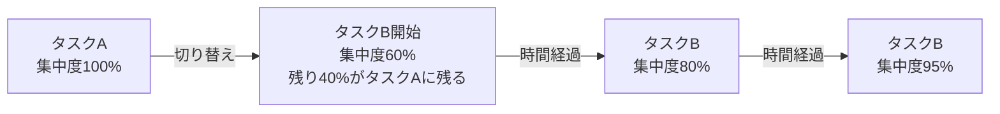
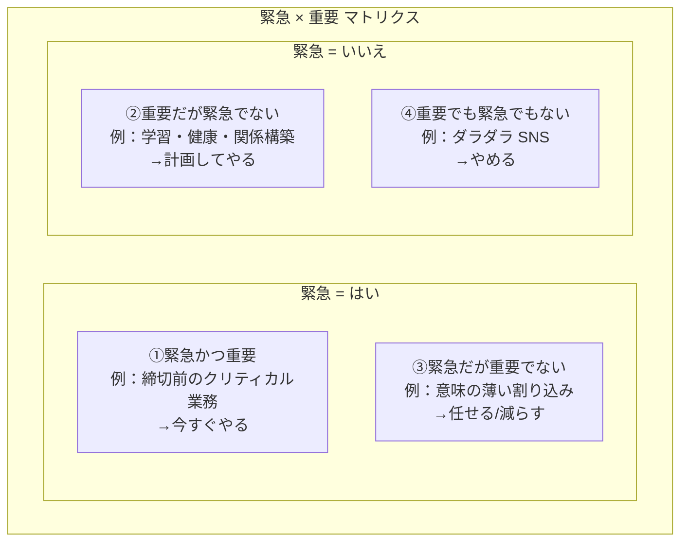
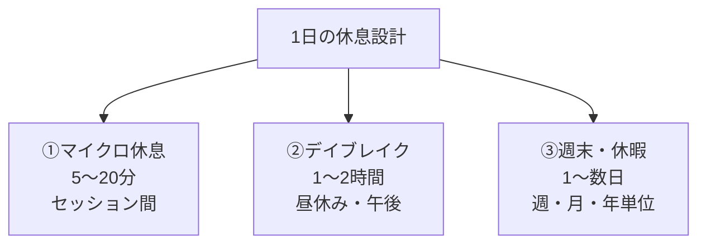

# 集中力と生産性の科学入門

脳・行動科学から考える、集中できる仕事と休息の設計

| 項目 | 内容 |
|---|---|
| カテゴリー | ウェルビーイング・健康 |
| 難易度 | 入門 |
| 所要時間 | 約200分（全8レッスン） |
| 公開日 | 2026-06-04 |
| 最終更新日 | 2026-06-04 |
| コースURL | https://skillup.college/courses/wellbeing/focus-productivity-science/ |

## 対象者

「集中力がない」「成果が出ない」「常に忙しい」と感じている社会人。マルチタスクで消耗している方。働き方を見直したい方。仕事・学習・副業のいずれかでパフォーマンスを上げたい方。デスクワーク中心の方は特に役立つが、現場系・接客系の方にも応用が利く。

## 前提知識

特になし。職種・雇用形態を問わない。脳科学や心理学の予備知識は不要。

## 学習目標

- 「忙しい」と「成果が出る」を別物として捉える発想を持つ
- 注意のリソースが有限であることを理解し、自分の使い方を見直せる
- 集中できる物理・デジタル環境を自分で設計できる
- タイムブロッキングと優先順位設計の基本を実践できる
- ディープワーク・ポモドーロなどの代表的なセッション設計の科学的根拠と限界を理解する
- 意識的に休む（休息設計）の重要性と方法を持ち帰る
- 睡眠・食事・運動・カフェインなど、認知パフォーマンスを支える生活要因を整理する
- 習慣化・行動デザインの基本を、生産性に応用できる

## コース概要

「集中力がない」「成果が出ない」「常に忙しい」——働く人がよく口にする悩みです。その背景には、根性や意志力の問題ではなく、脳と環境の使い方の問題があります。本コースは、認知科学・行動科学の知見と、現場のオペレーション設計の発想を組み合わせて、働く個人が「集中状態を自分でデザインする」ための道具立てを提供します。注意の仕組み、環境設計、時間とタスクの設計、ディープワーク、休息設計、睡眠とエネルギー、習慣化、AI 時代の集中まで、入門者がそのまま実務に応用できる構成にしました。「○○式」「××メソッド」のような商標的処方より、科学的根拠と運用の現実性を重視しています。本コースは医療行為や治療的アドバイスを提供するものではなく、健康な働く個人が日々のパフォーマンスを支えるための知見を体系的にまとめたものです。

## 学習の流れ

レッスン1で、本コースの土台となる「集中と生産性」の定義、3 階層（注意・集中・フロー）、科学的に「生産性」をどう捉えるかを整理します。レッスン2は「全体地図」として、注意の仕組み——なぜ集中できないのか、マルチタスクの嘘、注意残余、認知負荷を扱います。レッスン3〜5 は「日々の運用設計」、環境設計・タスクと時間設計・ディープワークの実践を学びます。レッスン6〜7 は「身体と休息」、休息設計と睡眠・エネルギーを扱います。レッスン8 で、習慣化と AI 時代の集中、コース修了後の学習方向を案内します。前半（レッスン1〜2）は「考え方の土台」、中盤（レッスン3〜5）は「仕事の設計」、後半（レッスン6〜7）は「身体と回復」、終盤（レッスン8）は「習慣化と未来」という四段構えです。

## レッスン一覧

| No. | タイトル | 概要 | 所要時間 |
|---|---|---|---|
| 1 | 集中力と生産性とは何か——脳と行動科学の出発点 | 「忙しい」と「成果が出る」は別物、集中の 3 階層（注意・集中・フロー）、生産性の科学的定義、注意経済時代の発想転換、本コースの守備範囲を整理する | 25分 |
| 2 | 注意の仕組み——なぜ集中できないのか | 注意のリソースは有限、短期記憶のキャパシティ、スイッチングコスト、注意残余、認知負荷理論など、注意の科学を学ぶ | 25分 |
| 3 | 集中できる環境を整える——場と道具の設計 | 物理環境（音・光・温度・視覚整理）とデジタル環境（通知・タブ・アプリ）の設計、外部記憶の活用、行動デザインの発想を学ぶ | 25分 |
| 4 | 時間とタスクの設計——タイムブロッキングと優先順位 | タイムブロッキング、緊急 × 重要マトリクス、タスクの粒度を下げる、1 日の計画と振り返り、GTD の発想を学ぶ | 25分 |
| 5 | 深い仕事と浅い仕事——ディープワークの実践 | カル・ニューポートのディープワーク、4 つの戦略、90〜120 分セッション、ポモドーロ・テクニックの起源と限界を学ぶ | 25分 |
| 6 | 休息と回復——意識的に休む技術 | 休息の 3 層（マイクロ・デイブレイク・週末）、アクティブレスト、過剰労働の限界、マインドワンダリングと拡散思考、休まないことの代償を学ぶ | 25分 |
| 7 | 睡眠とエネルギー管理——身体から集中を支える | 睡眠と認知パフォーマンス、ウルトラディアン・リズム、血糖と運動、カフェイン・水分の科学、時間帯別エネルギー曲線を学ぶ | 25分 |
| 8 | 習慣とデジタル時代の集中——AI・通知・マルチタスクと共存する | 習慣化と意志力、Atomic Habits・BJ フォッグの行動モデル、AI ツールとの付き合い方、タイムトラッキング、コース修了後の学習方向を案内する | 25分 |

---

## レッスン1：集中力と生産性とは何か——脳と行動科学の出発点

（所要時間：25分）

### このレッスンで学ぶこと

- 「忙しい」と「成果が出る」は別物であることを理解する
- 集中の 3 階層（注意・集中・フロー）を区別できる
- 生産性を「注意 × 時間 × エネルギー」として捉える発想を持つ
- 注意経済時代の発想転換を理解する
- 本コースの守備範囲と限界を知る

---

「集中力がない」「生産性を上げたい」——働く人がよく口にする言葉です。書店には関連する書籍があふれ、SNS では生産性ハックの動画が日々流れます。一方で、「忙しいのに成果が出ない」「いくら頑張っても疲れるばかり」と感じる方も多いはずです。本コースは、この溝を埋めるための入門書として設計しました。まずは「集中」と「生産性」という言葉そのものを、科学の視点で整理することから始めます。

### 「忙しい」と「成果が出る」を切り分ける

働く人がしばしば混同してしまう発想があります。「忙しい＝仕事をしている＝生産性が高い」というものです。実際には、3 者は別のものです。

- 忙しい：時間と注意が何かに使われている状態
- 仕事をしている：定義された作業を進めている状態
- 生産性が高い：投入したリソース（時間・注意・エネルギー）に対して、価値ある成果が出ている状態

「忙しさ」は感覚、「仕事をしている」は活動、「生産性」は成果との比率です。皮肉なことに、「忙しい」と「生産性が高い」は、しばしば反比例することすらあります。会議・チャット・メール・通知に常に対応していると、「忙しい」感覚は最大化しますが、深い思考や創造的な仕事は進みません。

> **💡 ポイント</br>
> 本コース全体で繰り返し戻る発想は「忙しい状態を減らし、成果が出る状態に近づける」です。これは「仕事を減らす」のではなく、「同じ仕事に対して、注意とエネルギーの使い方を変える」ことを意味します。

### 集中の 3 階層——注意・集中・フロー

「集中する」という言葉は、実は 3 つの状態を含んでいます。本コースでは、これらを区別して扱います。

#### ①注意（attention）

最も基礎的な状態で、特定の対象に意識を向けることです。心理学では、注意は有限のリソースとして扱われ、複数の対象に「分割」されたり、対象から対象に「切り替え」られたりします。次のレッスンで詳しく扱います。

#### ②集中（focused work）

注意を、一定時間、特定のタスクに継続的に向け続ける状態です。例えばコードを書く 30 分、報告書を起案する 1 時間、難しい本を 90 分読むなど。深い思考・分析・創造を必要とする仕事は、この状態が必要です。

#### ③フロー（flow）

ハンガリーの心理学者ミハイ・チクセントミハイが 1970 年代に提唱した概念で、活動そのものに没入し、時間感覚が変化し、自己意識が薄れ、深い満足感を伴う状態を指します。スポーツ・芸術・難しい知的作業などで起きうる、人間がもっとも能力を発揮する状態の 1 つです。

フローはやみくもに目指すべきものではありません。能力と挑戦のバランス、明確な目標、即時のフィードバックなど、いくつかの条件が揃ったときに起きます。日々の仕事で常にフローを目指すのは現実的ではなく、まずは「集中（focused work）」を毎日確保することが現実的な目標です。

> **🔰 初学者の方へ</br>
> フローは「特別な状態」と思われがちですが、実は誰でも経験したことのある状態です。ゲームに夢中になっていたら数時間経っていた、料理に没頭していたら作業が終わっていた、好きな本を読み始めたら朝になっていた——これらはフローの典型例です。仕事でも、条件が揃えば起きます。

### 生産性の科学的定義——「注意 × 時間 × エネルギー」

「生産性」という言葉は経済学や経営学では「投入に対する産出の比率」として定義されますが、働く個人にとってはより具体的に整理する必要があります。本コースでは、認知科学とオペレーション設計の観点から、次のように捉えます。

> 個人の生産性 ≒ 注意 × 時間 × エネルギー × 仕組み

3 つの掛け算が、成果のもとになります。

#### ①注意（attention）

何にどれだけ意識を向けているか。質的な要素です。

#### ②時間（time）

その注意を、どれだけの長さ向け続けているか。量的な要素です。

#### ③エネルギー（energy）

身体的・心理的なリソース。睡眠・栄養・運動・休息で決まります。

#### ④仕組み（system）

環境・道具・習慣・タスクのフレーム。意志力に頼らず、注意・時間・エネルギーを「自然に」適切な対象に向ける土台です。

この 4 要素のうち、本コースは特に「注意」「時間」「エネルギー」「仕組み」をどう設計するかを扱います。スキル習得や知識の蓄積（人的資本）は別のコースで扱う領域です。

> **💡 ポイント</br>
> 「注意」と「エネルギー」が日々の有限な資源です。「時間」は誰にでも同じだけ与えられていますが、注意とエネルギーは個人差・時間帯差が大きく、ここを意識的に設計できる人が、結果的に高いパフォーマンスを上げます。

### 「注意経済」時代の発想転換

本コースを学ぶ大事な前提として、現代が「注意経済（attention economy）」と呼ばれる時代であることを押さえておきましょう。

注意経済は、米国の社会学者ハーバート・サイモンが 1970 年代に提唱した概念で、「情報があふれた社会では、希少資源は情報ではなく、それに向けられる注意である」というものです。サイモンの言葉どおり、現代社会では、

- SNS、ニュース、動画、メール、チャット、通知が、私たちの注意を奪い合っている
- 多くのサービスが「無料」で提供される代わりに、私たちの注意（広告閲覧時間）を売っている
- 「注意」が稀少資源となり、奪う側が利益を得ている

働く個人の立場では、「自分の注意を、奪われるのを許すのか、自分で配分するのか」が問われる時代になりました。本コースは、「自分の注意を、自分で守り、配分する」ための知恵を扱います。

### 本コースの守備範囲と限界

最後に、本コースで扱う範囲と扱わない範囲を整理しておきます。

#### 扱う範囲

- 注意の仕組みと集中の原理（レッスン 2）
- 物理・デジタル環境の設計（レッスン 3）
- 時間とタスクの設計（レッスン 4）
- ディープワークの実践（レッスン 5）
- 休息設計（レッスン 6）
- 睡眠とエネルギー管理（レッスン 7）
- 習慣化と AI 時代の集中（レッスン 8）

#### 扱わない範囲

- 医療的な集中力障害の診断・治療（ADHD、ナルコレプシーなど）
- 特定の宗教・スピリチュアル・代替医療
- 「○○式」「△△メソッド」のような商標的手法（古典的な GTD・ポモドーロは概念名として登場するが、深追いしない）
- 特定企業の生産性ツールの詳細レビュー（道具は補助、原理が主）

#### 注意点：医療と健康

集中力の問題が、長期間にわたって日常生活に大きな支障を与えている場合、医療的な原因（注意欠如・多動症（ADHD）、睡眠障害、うつ病、甲状腺機能の問題など）が背景にあることもあります。本コースは医療行為ではありません。「努力しても改善しない深刻な集中困難」がある場合は、専門医療機関への受診をおすすめします。

> **💡 ポイント</br>
> 本コースは「健康な働く個人が、日々のパフォーマンスを科学的根拠を踏まえて設計する」ための入門書です。医療的な集中の問題、特定の処方箋を扱う本ではない点を、ご了承ください。

### まとめ

このレッスンでは、以下のことを学びました。

- 「忙しい」と「仕事をしている」と「生産性が高い」は別物
- 集中の 3 階層：注意（特定対象に意識を向ける）・集中（一定時間継続）・フロー（没入状態）
- フローは特別な状態ではなく、誰でも経験している。日々目指すのは「集中」で十分
- 生産性 ≒ 注意 × 時間 × エネルギー × 仕組み
- 注意とエネルギーが、日々の有限な資源
- 現代は「注意経済」時代。注意は奪われやすい
- 本コースは「健康な働く個人」向けで、医療行為ではない

次のレッスンでは、本コースの土台となる「注意の仕組み」を扱います。なぜ集中できないのか、マルチタスクは本当に効率的か、注意残余とは何か、認知負荷とは何かを、科学的に整理します。

---

### 確認クイズ

このレッスンの理解度をチェックしましょう。

#### Q1. 本レッスンが整理した「忙しい・仕事をしている・生産性が高い」の関係として最も適切なものはどれか？

- [x] 3 者は別物で、忙しさと生産性は反比例することすらある
- [ ] 3 者は同じ意味で、置き換え可能
- [ ] 忙しさが高ければ生産性も必ず高い
- [ ] 生産性は時間に比例するので、忙しいほど生産性が高い

> **解説**
> 「忙しい」は感覚、「仕事をしている」は活動、「生産性が高い」は投入リソースに対する成果の比率で、3 者は別物です。会議・チャット・通知に常に対応していると「忙しい」感覚は最大化しますが、深い思考や創造的な仕事は進みません。本コースは「忙しさを減らし、成果が出る状態に近づける」発想を貫きます。

#### Q2. 本レッスンが示した「集中の 3 階層」の組み合わせとして最も適切なものはどれか？

- [ ] 短期記憶・長期記憶・作業記憶
- [x] 注意・集中・フロー
- [ ] 浅い仕事・深い仕事・無意識の仕事
- [ ] 朝・昼・夜

> **解説**
> 本レッスンが示した集中の 3 階層は、①注意（特定対象に意識を向ける）、②集中（一定時間継続）、③フロー（没入状態）です。本コースでは日々目指すのは「集中」で、フローは結果として時々生じる状態として位置づけます。

#### Q3. 「フロー」の説明として最も適切なものはどれか？

- [ ] 何も考えずに自動的に作業する状態
- [ ] 緊張状態が極度に高まった状態
- [x] 活動に没入し、時間感覚が変化し、自己意識が薄れ、深い満足感を伴う状態
- [ ] 集中状態が永続する状態

> **解説**
> フローは、ミハイ・チクセントミハイが 1970 年代に提唱した概念で、活動に没入し、時間感覚が変化し、自己意識が薄れ、深い満足感を伴う状態を指します。能力と挑戦のバランス、明確な目標、即時のフィードバックなどの条件が揃うと起きます。日々目指す必要はなく、まずは「集中」を毎日確保することが現実的です。

#### Q4. 本レッスンが示した「個人の生産性」の捉え方として最も適切なものはどれか？

- [ ] 時間だけで決まる
- [ ] 能力だけで決まる
- [ ] 運だけで決まる
- [x] 注意 × 時間 × エネルギー × 仕組み の掛け算で捉える

> **解説**
> 本コースでは個人の生産性を「注意 × 時間 × エネルギー × 仕組み」の掛け算で捉えます。時間は誰にでも同じだけ与えられていますが、注意とエネルギーは個人差・時間帯差が大きく、仕組み（環境・道具・習慣・タスクフレーム）はそれらを意志力に頼らず適切な対象に向ける土台です。

#### Q5. 「注意経済（attention economy）」の意味として最も適切なものはどれか？

- [x] 情報があふれた社会では、希少資源は情報ではなく、それに向けられる注意である
- [ ] 経済成長には注意深さが必要である
- [ ] 注意散漫な人は経済的に成功しない
- [ ] 注意は経済学では扱われない

> **解説**
> 注意経済は、ハーバート・サイモンが 1970 年代に提唱した概念で、「情報があふれた社会では、希少資源は情報ではなく、それに向けられる注意である」というものです。現代では、SNS・動画・通知などが私たちの注意を奪い合っており、働く個人は「自分の注意を自分で守り配分する」発想が必要になっています。

#### Q6. 本コースが「扱わない範囲」として明示したものはどれか？

- [ ] 環境設計
- [ ] 時間とタスクの設計
- [ ] 習慣化
- [x] 医療的な集中力障害の診断・治療（ADHD、睡眠障害、うつ病など）

> **解説**
> 本コースは「健康な働く個人」が日々のパフォーマンスを設計するための入門書で、医療行為ではありません。ADHD や睡眠障害、うつ病など医療的な原因が背景にある集中困難は扱わず、長期間にわたって日常生活に大きな支障がある場合は専門医療機関への受診をおすすめする立場です。

---

## レッスン2：注意の仕組み——なぜ集中できないのか

（所要時間：25分）

### このレッスンで学ぶこと

- 注意のリソースが有限であることを理解する
- 短期記憶（ワーキングメモリ）のキャパシティを知る
- マルチタスクとスイッチングコストの正体を見抜く
- 注意残余（attention residue）を扱える
- 認知負荷理論の基本を持つ

---

レッスン 1 では、集中と生産性を「注意 × 時間 × エネルギー × 仕組み」として捉える発想を整理しました。本レッスンでは、その中核である「注意」の仕組みを、認知科学の知見にもとづいて解きほぐします。「なぜ集中できないのか」という問いに、科学的な答えを与えていきます。

### 注意は有限の資源——「注意のリソースモデル」

注意は、視覚や聴覚と同じように、脳の限られた資源です。心理学・認知科学では、20 世紀後半から「注意のリソースモデル」として研究が積み上げられてきました。代表的な研究者には、ダニエル・カーネマンが 1973 年に著した『注意と努力』があります。

ポイントは次の 3 つです。

1. **総量が有限である**：一日に使える注意の総量には限界がある
2. **配分される**：複数の対象に分割できるが、合計は総量を超えない
3. **疲労する**：使い続けると質が落ちる（注意疲労、attention fatigue）

朝に頭がはっきりしているのは、注意のリソースが満タンに近いから。夕方の判断が乱れがちなのは、リソースが枯渇しているから。この発想を、本レッスンを通じて身につけていきましょう。

> **💡 ポイント</br>
> 「気合で集中できる」「やる気が出ない自分が悪い」と思い込まない発想を、まずは持ってください。注意は身体的・神経的な資源で、使えば消耗し、回復には休息が必要です。意志力で押し通すモデルは、科学的根拠が薄いことが知られています（後のレッスンでさらに扱います）。

### 短期記憶（ワーキングメモリ）のキャパシティ

注意と密接に関わるのが、短期記憶（ワーキングメモリ）です。私たちが「いま考えている内容」を一時的に保持する場所で、認知科学では特に重要な概念です。

#### 「マジカルナンバー」の歴史

1956 年、ジョージ・ミラーが「マジカルナンバー 7 ± 2」という論文を発表しました。短期記憶に保持できる項目数は 7 ± 2 程度というものです。

ただし、その後の研究（特にネルソン・コーワンらの研究、2000 年代）では、「実際にはもっと少なく、4 ± 1 程度」というのが現代の主流の見方です。本コースでは「4 ± 1 チャンク」を採用します。

#### 「チャンク」とは

短期記憶のキャパシティは、項目の「数」ではなく「チャンク」で数えます。チャンクは「意味のあるかたまり」のことです。

例：

- 11 桁の電話番号「09012345678」を、そのまま 11 桁覚えるのは難しい
- 「090-1234-5678」と 3 つのチャンクに分けると、覚えやすい
- さらに「090（携帯）/1234/5678」と意味づけすると、もっと覚えやすい

働く実務では、

- 一度に考えるべきタスクの数を 3〜4 個に絞る
- メモを使って「いま考えている対象」を外に出す（外部記憶）
- 複雑な情報は「チャンクに分けて」扱う

という発想が役立ちます。

#### 認知負荷を下げる現実的な工夫

- 「あれもこれも頭にとどめる」のをやめ、書き出す
- TODO リストを使う（頭の中で覚えない）
- カレンダーを使う（頭の中で予定を覚えない）
- 1 つの作業中は、ほかのタスクを物理的に視界から消す

### マルチタスクの嘘——スイッチングコスト

「マルチタスクができる人は仕事ができる」というのは、現代でもよく聞く言説です。しかし、認知科学の研究は、その実態が違うことを示しています。

#### 「マルチタスク」は実は存在しない

人間の脳は、複数の認知的タスクを同時に処理することは、実はできません。「マルチタスクをしている」と感じる多くの場面は、実は「タスクの切り替えを高速で繰り返している」状態です。これを「タスクスイッチング」と呼びます。

例外として、自動化された行動（歩きながら話す、運転しながら音楽を聴くなど）は同時に行えます。しかし、「複雑な思考を必要とする作業を同時に行う」ことはできません。

#### スイッチングコスト

タスクを切り替えるたびに、脳には負荷がかかります。これを「スイッチングコスト」と呼びます。代表的な研究では、米国の心理学者ジョシュア・ルービンスタイン、デイビッド・マイヤー、ジェフリー・エヴァンス（2001 年）らが、スイッチングのたびに 20%〜40% の効率低下が起きうると報告しています。

ロバート・ロジャース、スティーブン・モンセル（1995 年）の研究では、タスク間の切り替えに「数百ミリ秒〜数秒」の遅延が必ず生じることが示されています。1 日に数十回スイッチングすれば、その総和は無視できません。

#### 「ながら作業」の実態

- メールを書きながら電話を取る
- Zoom 会議中に別のチャットに返信
- 資料を読みながらニュースを見る

これらは、感覚的には「効率的」ですが、実際は両方の質を下げています。複数のタスクが「中途半端な状態」で頭の中に残り、注意残余（次節）を生みます。

> **⚠️ 注意</br>
> 「マルチタスクが上手な人」と自認する方ほど、実はスイッチングが下手という研究があります（デイビッド・ストレイヤーら、ユタ大学の研究）。マルチタスク自慢は、生産性の指標としては誤った信号です。

### 注意残余（Attention Residue）

ここまでで触れた「タスクスイッチング後の中途半端な状態」を、心理学では「注意残余（attention residue）」と呼びます。

#### 概念の起源

米国の経営学者 Sophie Leroy が 2009 年の論文「Why is it so hard to do my work?」で提唱した概念です。

#### 仕組み

タスク A からタスク B に切り替えたあと、タスク A のことが頭の片隅に残り続け、タスク B への注意の質を下げる現象です。



この図は、タスクを切り替えた直後の集中度が低く、徐々に回復していく流れを示しています。「集中復帰」には数分から十数分かかることがあり、頻繁な切り替えはこの回復を阻害します。

#### 回復時間

Leroy の研究や Gloria Mark（カリフォルニア大学アーバイン校）の研究では、中断後の集中復帰には平均で十数分以上かかることが報告されています。研究によっては「20 分以上」とする報告もあります。具体的な数字は条件で大きく変わりますが、目安として「中断したら、それより長く回復に時間が必要」と考えるのが安全です。

#### 注意残余を減らす運用設計

- タスクの切り替えを減らす（ブロッキング、レッスン 4）
- 切り替える前に、タスク A を「キリの良いところまで完了」する
- 切り替える前に、タスク A の「次に何をするか」を 1 行メモする
- 中断が必要なら、「いま、何をどこまでやったか」を書き出してから切り替える

### 認知負荷理論——3 つの負荷

認知負荷理論（Cognitive Load Theory）は、オーストラリアの教育心理学者ジョン・スウェラーが 1980 年代に提唱した枠組みです。学習や認知作業中に脳にかかる負荷を、3 種類に分けて整理します。

#### ①内在的負荷（intrinsic load）

タスクそのものの難しさによる負荷。難しい数学問題、複雑な意思決定、未知の領域の学習などで高くなります。これは、タスクの性質によって決まる、避けられない負荷です。

#### ②外在的負荷（extraneous load）

タスクとは無関係な要因による負荷。例えば、説明が下手な資料、散らかった環境、頻繁な通知、画面が小さすぎる、フォントが見にくいなど。これは、設計の工夫で減らせる負荷です。

#### ③学習関連負荷（germane load）

学習や理解の構築に直接寄与する負荷。例えば、自分なりに整理したり、他のことと結びつけて理解する活動など。これは、増やしたほうがよい負荷です。

#### 実務的な使い方

働く個人の実務では、「外在的負荷を減らし、内在的負荷に集中する」が基本戦略です。

- 通知をオフにする（外在的負荷↓）
- 視界に集中対象だけを置く（外在的負荷↓）
- 1 度に 1 つのことを考える（内在的負荷に集中）
- 振り返り・メモで関連付けをする（学習関連負荷↑）

レッスン 3 では、この発想を具体的な「環境設計」に落とし込みます。

### まとめ

このレッスンでは、以下のことを学びました。

- 注意は有限のリソース。総量に上限があり、使うと疲労する
- 短期記憶（ワーキングメモリ）は 4 ± 1 チャンクが目安。意味のかたまりで数える
- マルチタスクは存在せず、実体はタスクスイッチング
- スイッチングコスト：切り替えのたびに 20〜40% 程度の効率低下、数百ミリ秒〜数秒の遅延
- 注意残余（Sophie Leroy）：切り替え後にも前タスクが頭に残り、集中復帰には十数分以上かかる
- 認知負荷理論：内在的・外在的・学習関連の 3 種類。外在的負荷を減らすのが実務の基本

次のレッスンでは、注意残余や認知負荷を減らすための具体策——集中できる物理・デジタル環境の設計を扱います。

---

### 確認クイズ

このレッスンの理解度をチェックしましょう。

#### Q1. 注意のリソースモデルが示す注意の性質として最も適切なものはどれか？

- [x] 総量が有限で、使うと疲労し、回復には休息が必要
- [ ] 無限に使えるが、使い方を間違えると消費する
- [ ] 気合で増やせるリソース
- [ ] 時間と独立した特殊な能力

> **解説**
> 注意は身体的・神経的な資源として、ダニエル・カーネマンの『注意と努力』以降、リソースモデルで扱われてきました。総量に上限があり、使い続けると質が落ち、回復には休息が必要です。「気合で集中できる」と思い込まない発想が、本コースの土台です。

#### Q2. 短期記憶（ワーキングメモリ）のキャパシティについて、現代の主流の見方として最も適切なものはどれか？

- [x] 4 ± 1 チャンクが目安。チャンクは「意味のかたまり」
- [ ] 100 個以上の項目を保持できる
- [ ] 個人差はなく全員同じ
- [ ] 数字以外は記憶できない

> **解説**
> 1956 年のジョージ・ミラーの「7 ± 2」が有名ですが、その後のネルソン・コーワンらの研究で、現代では「4 ± 1」が主流の見方です。チャンクは「意味のあるかたまり」で、項目の数ではなく意味のまとまりで数えます。実務では「一度に考えるタスクは 3〜4 個まで」「複雑な情報はチャンクに分ける」が役立ちます。

#### Q3. 本レッスンが説明した「マルチタスクの実態」として最も適切なものはどれか？

- [ ] マルチタスクは効率的で、できる人ほど生産性が高い
- [ ] マルチタスクは脳を鍛える
- [x] 複雑な思考タスクの同時並行はできず、実体は高速なタスクスイッチング
- [ ] マルチタスクは時間を節約する

> **解説**
> 認知科学の研究では、複雑な思考タスクを同時並行できないことが繰り返し示されています。「マルチタスク」と感じる多くの場面は実体としてはタスクスイッチング（高速な切り替え）であり、切り替えのたびにスイッチングコストが発生して効率が低下します。「マルチタスクが上手な人」と自認する人ほどスイッチングが下手という研究もあります。

#### Q4. 「注意残余（attention residue）」の意味として最も適切なものはどれか？

- [ ] タスクを終えた後の達成感
- [ ] 注意のリソースが残っている状態
- [ ] 注意が完全に切り替わった状態
- [x] タスクの切り替え後、前のタスクが頭の片隅に残り続け、次のタスクへの集中の質を下げる現象

> **解説**
> 注意残余は、Sophie Leroy が 2009 年に提唱した概念です。タスク A から B に切り替えた後、A のことが頭の片隅に残り、B への注意の質を下げます。集中復帰には十数分以上かかることが報告されており、頻繁な切り替えはこの回復を阻害します。

#### Q5. 認知負荷理論の 3 種類の負荷の組み合わせとして最も適切なものはどれか？

- [ ] 短期・中期・長期
- [x] 内在的負荷・外在的負荷・学習関連負荷
- [ ] 軽負荷・中負荷・重負荷
- [ ] 視覚・聴覚・触覚

> **解説**
> ジョン・スウェラーの認知負荷理論では、認知負荷を①内在的負荷（タスク自体の難しさ）、②外在的負荷（タスクと無関係な要因、設計で減らせる）、③学習関連負荷（理解や学習に直接寄与する負荷、増やしたほうがよい）の 3 種類に分けます。実務では「外在的負荷を減らし、内在的負荷に集中する」が基本戦略です。

#### Q6. タスクの切り替え時にスイッチングコストを減らす方法として、本レッスンが示したものはどれか？

- [ ] 何も準備せずに即座に切り替える
- [ ] 切り替える前にほかのことを始める
- [ ] 中断したまま放置する
- [x] 切り替える前に「次に何をするか」を 1 行メモするなど、状態を外に出してから切り替える

> **解説</br>
> スイッチングコストと注意残余を減らすには、切り替える前に「タスクをキリの良いところまで完了する」「次に何をするか 1 行メモする」「いまどこまでやったかを書き出す」など、状態を外に出してから切り替えるのが有効です。中断したまま放置すると、注意残余が長く尾を引きます。

---

## レッスン3：集中できる環境を整える——場と道具の設計

（所要時間：25分）

### このレッスンで学ぶこと

- 物理環境（音・光・温度・視覚整理）を集中向けに設計する
- デジタル環境（通知・タブ・アプリ）を集中向けに整理する
- 外部記憶としてノートや道具を活用する
- 通知断ち（Do Not Disturb）の現実的な運用を持つ
- 「行動デザイン」で意志力に頼らない仕組みを作る

---

レッスン 2 では、注意のリソースが有限で、外在的負荷（タスクと無関係な妨害）を減らすことが基本戦略だと学びました。本レッスンでは、その「外在的負荷を減らす」を、物理環境とデジタル環境の設計として具体化していきます。意志力で頑張るのではなく、環境を整えて自然に集中できる状態を作る、というのが本レッスンの基本方針です。

### 環境設計の基本発想——「意志力ではなく仕組みで」

「集中するぞ」「気合を入れるぞ」と意志力で押し通そうとするのは、認知科学的には筋の悪い戦略です。意志力は有限の資源で、使うほど消耗します（自我消耗論、ロイ・バウマイスター、1998 年）。意志力で「気が散る対象」と戦い続けるより、「気が散る対象自体を視界から消す」ほうが、効率も持続性も高くなります。

これは行動デザイン（behavior design）の中核発想で、BJ フォッグ（スタンフォード大学）らが体系化してきました。レッスン 8 で詳しく扱いますが、まず本レッスンで「環境を変えて自分を誘導する」発想を身につけていきましょう。

> **💡 ポイント</br>
> 環境設計の基本式は「したい行動を簡単に、したくない行動を難しく」。集中したいなら、集中対象を視界に置き、気が散る対象を視界から消す。これだけです。

### 物理環境の設計

机周りの環境は、想像以上に集中の質に影響します。代表的な要素を順に見ていきます。

#### ①音

音は集中への影響が大きい要素です。研究は完全に一致しているわけではありませんが、おおよそ次のような傾向が知られています。

- **完全な無音**：人によっては逆に集中しにくい
- **一定の背景音**：多くの人で集中を支える（ホワイトノイズ、雨音、カフェ環境音など）
- **意味のある会話・歌詞のある音楽**：複雑な思考の妨げになりやすい
- **歌詞のない音楽**：個人差が大きい。クラシック・アンビエント・LoFi など

実務的には、「自分にとって何が効くか」を試して見つけるのが基本です。ノイズキャンセリングヘッドホン、白色雑音アプリ、安価なイヤープラグなど、安く始められる選択肢があります。

#### ②光

光は、覚醒度と気分に影響します。

- **昼白色（5000K 前後）**：覚醒を促す。集中作業時に
- **電球色（2700〜3000K）**：リラックスを促す。夜の作業時に
- **自然光**：可能なら最良。窓際の作業がおすすめ
- **暗すぎる照明**：眼精疲労と眠気の原因

寝る前 1〜2 時間は、ブルーライトを浴びすぎないことも、翌日の集中のために有効です（レッスン 7 で詳しく扱います）。

#### ③温度

温度の研究は様々で、決定的な「最適温度」は提示しにくいですが、おおよそ次のことが知られています。

- 高すぎる温度（28℃以上）は集中を低下させる
- 低すぎる温度（18℃以下）は気が散る原因に
- 個人差・季節差・服装差が大きい

「やや涼しい」と感じる温度のほうが、集中作業には合うとされることが多いです。

#### ④視覚的な整理

机の上に何が見えるかは、注意の質に強く影響します。

- 視界に集中対象だけを置く
- スマホを視界から消す
- 必要のない書類・本・物を片付ける
- モニターの背景（壁紙）を、可能なら整理されたものに

ある研究では、机の散らかりが意思決定の質と忍耐力を下げる可能性が示唆されています。「整理整頓は性格の問題」ではなく「集中の前提」と捉え直してみてください。

> **🔰 初学者の方へ</br>
> 「完璧に整理する」必要はありません。「いま使うものだけ机の上にある」状態を、作業開始前に 30 秒で作るだけで十分です。

### デジタル環境の設計

物理環境以上に、現代の集中を脅かすのがデジタル環境です。スマホ、PC、タブレット、通知、SNS——これらは「注意を奪う設計」がされているとも言えます。

#### ①通知の管理

通知は、集中の最大の敵の 1 つです。レッスン 2 で扱った注意残余を考えれば、通知が 1 回鳴るたびに、数分から十数分の集中復帰時間が必要です。

通知の現実的な管理方針：

- **基本：原則オフ**
- **例外的にオンにするもの**：電話、家族からのメッセージ、重要な業務システムのアラートなど、本当に即時対応が必要なものだけ
- **メールは「自分が見に行く」もの**：通知で受動的に対応しない
- **チャット（Slack・Teams など）**：時間帯を決めて見る

iOS の「集中モード」、Android の「Do Not Disturb」、Mac の「集中モード」、Windows 11 の「集中モード」など、OS レベルで一括オフにできる機能があります。これを使いこなしましょう。

#### ②タブとアプリの整理

ブラウザのタブ、デスクトップのアプリ、開いたファイル——これらが多いと、視界が散らかります。

- **作業開始時に「不要なタブを閉じる」儀式を作る**
- **ピン留め・グループ化を活用**
- **Pocket・Readwise などの「あとで読む」ツールに退避させる**
- **必要なら、Cold Turkey・Freedom など、SNS をブロックするツールを使う**

#### ③スマホの「物理的距離」

スマホを机に置いておくと、視界に入るだけで認知資源を消耗するという研究があります（Adrian Ward らの研究、2017 年）。完全にオフにしなくても、

- 別の部屋に置く
- 引き出しに入れる
- 専用ボックスに収める
- 横向きにして画面を見えなくする

など、「物理的に少し遠ざける」だけで効果が出ます。

#### ④デジタルミニマリズム

カル・ニューポートが 2019 年に提唱した「デジタルミニマリズム」は、デジタル製品を「自分の価値観に資するもの」だけに絞る考え方です。「使わないアプリを定期的に削除する」「SNS の利用時間を意識的に区切る」「無目的なスクロールをやめる」など、現代の集中を取り戻すうえで参考になります。

### 外部記憶——「頭で覚えない」発想

レッスン 2 で、短期記憶のキャパシティが 4 ± 1 チャンクと学びました。働く現実では、4 つどころではない数のタスクや情報を扱う必要があります。すべてを頭で覚えると、認知資源が「覚える」ことに食われ、「考える」「集中する」ためのリソースが減ります。

解決策は、「頭で覚えるのをやめて、外に書き出す」ことです。これを「外部記憶（external memory）」と呼びます。

#### 外部記憶として使うもの

- **TODO リスト**：考えるべきタスクをすべて出す
- **カレンダー**：予定をすべて入れる
- **デイリーノート**：その日のメモ・アイデア・気づき
- **プロジェクトノート**：案件ごとの状況・次のアクション
- **インボックス**：気になる情報を一旦受け止める場所

ツールは、紙でもデジタルでも、好みで構いません。Notion、Obsidian、Apple メモ、紙のノート、Bullet Journal——何でも、「自分が続けられるもの」が最善です。

#### 「キャプチャ」と「処理」を分ける

GTD（Getting Things Done）の発想で、「思いついたものをキャプチャする」と「それをどうするか処理する」を分けるのが、現実的です（GTD はレッスン 4 で扱います）。

- 仕事中に「あ、これも調べないと」と思ったら、その場でメモ
- メモは「インボックス」に一旦投入
- 後でまとめて、TODO に変換するか、削除するか、いつかやるリストに送るか、判断する

これだけで、「気になることが浮かぶたびに作業が中断する」状態を防げます。

### 「行動デザイン」で意志力に頼らない

ここまでの話を、行動デザインの 1 文にまとめると：

> したい行動を簡単に、したくない行動を難しくする

例：

- 朝、集中作業を始めたい → PC を作業対象だけにする。スマホは別の部屋
- 帰宅後、本を読みたい → ベッド横に本を置いておく
- 夜、SNS を見たくない → スマホを充電器ごとリビングに置く
- 運動を続けたい → 玄関にウェアを置いておく

行動デザインの大事な気づきは、「人間の意志力は弱い」ではなく「人間は環境に強く影響される」ということです。意志力を信頼しすぎず、環境設計に投資するほうが、長期的にうまくいきます。

> **💡 ポイント</br>
> 環境を変えるのは、最初は手間がかかります。しかし「一度変えれば、効果が長く続く」のが、環境設計の強みです。意志力で毎日戦うのと比べて、長期的にはずっと楽です。

### まとめ

このレッスンでは、以下のことを学びました。

- 環境設計の基本：「意志力ではなく仕組みで」
- 物理環境：音・光・温度・視覚的整理
- デジタル環境：通知の原則オフ、タブとアプリの整理、スマホの物理的距離
- スマホは「視界に入るだけで認知資源を消費する」（Ward らの研究）
- 外部記憶：頭で覚えるのをやめて、TODO・カレンダー・ノート・インボックスに書き出す
- 「キャプチャ」と「処理」を分ける（GTD の発想）
- 行動デザイン：「したい行動を簡単に、したくない行動を難しく」

次のレッスンでは、時間とタスクの設計——タイムブロッキング、優先順位、タスクの粒度を扱います。環境を整えた次は、時間とタスクをどう配置するかです。

---

### 確認クイズ

このレッスンの理解度をチェックしましょう。

#### Q1. 本レッスンが推奨する「集中するための基本発想」として最も適切なものはどれか？

- [ ] 強い意志力で気を散らす対象と戦う
- [ ] とにかく長時間机に向かう
- [x] 意志力に頼らず、環境を整えて気が散る対象を視界から消す
- [ ] 集中できないのは才能の問題

> **解説**
> 意志力は有限の資源で、使うほど消耗します（自我消耗論、バウマイスター）。意志力で「気が散る対象」と戦い続けるより、「気が散る対象自体を視界から消す」ほうが、効率も持続性も高くなります。これは行動デザイン（BJ フォッグら）の中核発想です。

#### Q2. 物理環境で「視覚的な整理」を本レッスンが推奨した理由として最も適切なものはどれか？

- [ ] 整理は道徳的に良いから
- [x] 視界に入る物は注意資源を消費し、整理された環境は集中の質を高める
- [ ] 仕事ができる人は整理が好きだから
- [ ] 整理は見た目を良くするから

> **解説**
> 視界に何があるかは、注意の質に強く影響します。「視界に集中対象だけを置く」「スマホを視界から消す」「不要な物を片付ける」だけで、外在的負荷を減らせます。机の散らかりが意思決定の質と忍耐力を下げる可能性も研究で示唆されています。完璧な整理は不要で、「いま使うものだけ机の上にある」状態を作業開始前に作るのがコツです。

#### Q3. スマホとデジタル環境の管理について、本レッスンが示した方針として最も適切なものはどれか？

- [ ] 通知はすべてオンが基本
- [x] 通知は原則オフ。スマホは「物理的に少し遠ざける」だけで集中が改善
- [ ] スマホは机の中央に置く
- [ ] タブは 50 個以上開いておく

> **解説**
> 通知は集中の最大の敵の 1 つで、1 回鳴るたびに数分〜十数分の集中復帰時間が必要です。原則オフが基本で、例外は電話や家族など本当に即時対応が必要なものに限ります。スマホは視界に入るだけで認知資源を消費するという Ward らの研究があり、「別の部屋に置く」「引き出しに入れる」など物理的に少し遠ざけるだけで効果が出ます。

#### Q4. 「外部記憶」を活用する目的として最も適切なものはどれか？

- [x] 短期記憶のキャパシティを超える情報を頭で覚えず、外に書き出して認知資源を「考える」ことに使うため
- [ ] 記憶力を鍛えるため
- [ ] 紙を消費するため
- [ ] 記録の見せ場を作るため

> **解説**
> 短期記憶のキャパシティは 4 ± 1 チャンクで、現実の仕事はそれを超えます。すべてを頭で覚えると認知資源が「覚える」ことに食われ、「考える」「集中する」リソースが減ります。TODO リスト、カレンダー、デイリーノート、インボックスなど、外部記憶に書き出すことで、頭を空けて目の前の作業に集中できます。

#### Q5. GTD の発想に基づく「キャプチャ」と「処理」の関係として最も適切なものはどれか？

- [ ] 思いついた瞬間にすべて実行する
- [ ] 思いついたことは忘れるに任せる
- [x] 思いついたら一旦インボックスに入れ、後でまとめて処理する
- [ ] 思いついたら全部削除する

> **解説**
> GTD の発想では、「思いついたものをキャプチャする」と「それをどうするか処理する」を分けます。仕事中に「これも調べないと」と思ったら、その場でメモしてインボックスに投入し、後でまとめて TODO に変換・削除・いつかやるリストに送るなどの判断をします。「思いついたら即実行」では作業が中断し、「忘れるに任せる」ではキャパシティを使い果たします。

#### Q6. 行動デザインの基本原則として、本レッスンがまとめた 1 文として最も適切なものはどれか？

- [ ] 意志力をすべてに賭ける
- [ ] 環境は変えず、自分を変える
- [ ] 周りに合わせる
- [x] したい行動を簡単に、したくない行動を難しくする

> **解説</br>
> 行動デザインの基本式は「したい行動を簡単に、したくない行動を難しくする」です。集中したいなら集中対象を視界に置き、気が散る対象を視界から消す。本を読みたいならベッド横に置き、SNS をやめたいならスマホを別室に置く。意志力で毎日戦うより、環境に投資するほうが長期的に楽になります。

---

## レッスン4：時間とタスクの設計——タイムブロッキングと優先順位

（所要時間：25分）

### このレッスンで学ぶこと

- タイムブロッキングの基本を理解する
- 緊急 × 重要マトリクスで優先順位を整理できる
- タスクの粒度を下げる発想を持つ
- 1 日の計画と振り返りの基本ルーティンを設計できる
- GTD（Getting Things Done）の発想を浅く把握する

---

レッスン 3 では、集中できる環境の設計を扱いました。本レッスンでは、その環境の中で「いつ・何を・どの順で」やるかを設計する技術を扱います。時間とタスクの設計は、日々の生産性をもっとも左右する要素の 1 つです。

### タイムブロッキング——「予定として時間を確保する」

タイムブロッキング（Time Blocking）は、カレンダー上に「この時間はこのタスクをする」と予定として書き込むシンプルな技法です。カル・ニューポートが『Deep Work』（2016 年）や『時間術大全』類の文献で繰り返し勧めてきたほか、起業家や知識労働者の間で広く採用されています。

#### TODO リスト型計画の問題

多くの人が使う「TODO リスト型」の計画には、次の問題があります。

- やるべきことのリストはあるが、「いつやるか」が決まっていない
- 緊急ではないが重要なタスクが、いつまでも後回しになる
- メールや会議に時間を奪われ、TODO に手が回らない
- 1 日の終わりに「何もできなかった」と感じる

#### タイムブロッキング型計画

タイムブロッキングでは、カレンダー上に時間ごとの予定として書き込みます。

例（朝の 1 日計画）：

- 9:00〜10:30 ：報告書 X の執筆（90 分）
- 10:30〜11:00 ：休憩・メール
- 11:00〜12:00 ：チームミーティング
- 12:00〜13:00 ：昼食・散歩
- 13:00〜14:00 ：データ分析 Y（60 分）
- 14:00〜15:00 ：1on1 と移動
- 15:00〜16:00 ：プロジェクト Z の構想（60 分）
- 16:00〜17:00 ：メール・チャット対応・明日の計画

ポイントは、

- 「集中タスク（深い仕事）」を午前に置く
- 「軽い対応（メール・チャット）」を午後の決まった時間に置く
- 休憩を明示的に予定に入れる
- 1 日の終わりに「明日の計画」を 15 分入れる

#### 実務的なヒント

- **完璧を求めない**：割り込みは必ず起きる。崩れたら再計画
- **見積もりは長めに**：「30 分でできる」と思ったタスクは 45 分で計画
- **集中タスクと事務タスクを分ける**：午前は集中、午後は事務、というブロック化が現実的
- **「バッファ」を入れる**：1 日のうち 1〜2 時間は「未定」のまま空ける（割り込み対応）

> **💡 ポイント</br>
> タイムブロッキングは「鎖でつなぐ」のではなく、「予定として確保する」のがコツです。崩れることを前提に、毎日の朝に再計画する習慣を作りましょう。

### 優先順位——「緊急 × 重要」マトリクス

タスクの優先順位を整理するための古典的なフレームワークが、「緊急 × 重要」マトリクスです。米国の経営学者スティーブン・コヴィーが『7 つの習慣』（1989 年）で広めましたが、原型は米国大統領ドワイト・アイゼンハワーに帰されることが多いため「アイゼンハワー・マトリクス」とも呼ばれます。



この図は、タスクを「緊急性」と「重要性」の 2 軸で 4 象限に分ける枠組みを示しています。

#### 4 象限の意味

##### ①緊急かつ重要

締切が近いクリティカル業務、緊急対応すべき問題、家族の急病など。「今すぐやる」しかないものです。理想は、この象限の発生を減らすこと（後述）。

##### ②重要だが緊急でない（最も大事な象限）

学習、健康管理、関係構築、戦略立案、運動、休息など、長期的に重要だが、今日やらなくても困らないもの。**多くの人がここを後回しにしてしまうが、長期的なパフォーマンスを支えるのはこの象限**です。

##### ③緊急だが重要でない

意味の薄い割り込み、誰かの要求に応えるだけのタスク、過剰なメール対応など。**「他人の優先順位」に振り回されている象限**。可能なら任せる、減らす、断る対象です。

##### ④重要でも緊急でもない

無目的な SNS、流し見の動画、なくても困らないタスク。**やめる対象**です。

#### 実務的な使い方

- 毎日の TODO リストを、4 象限に分けてみる
- 「②重要だが緊急でない」を、毎日のタイムブロッキングに必ず入れる
- 「③緊急だが重要でない」を減らす働きかけをする
- 「④」は意識的に削減

「②」を増やすほど、「①」の緊急対応を減らせる、というのが、コヴィーの中核的な主張です。「準備（②）」が「事故対応（①）」を減らす、というシンプルな関係です。

> **🔰 初学者の方へ</br>
> 多くの人がはまりやすい罠は、「①と③ばかりに追われて、②をやる時間がない」状態です。これを抜け出すには、「毎日、②に 30 分だけは時間を確保する」というルールが効きます。30 分でも、続ければ大きな違いを生みます。

### タスクの粒度を下げる——「次にできる 1 つの動作」

タスクが「進まない」「先延ばしにしてしまう」原因の多くは、**タスクの粒度が大きすぎる**ことです。

例：

- ✕「報告書を書く」 → 漠然としすぎて、手をつけにくい
- ○「報告書の構成を、3 段階で箇条書きにする（15 分）」 → 具体的で、すぐ着手できる

#### GTD の「次にできる動作」

GTD（Getting Things Done、デビッド・アレンが 2001 年に体系化）では、すべてのタスクを「次にできる物理的・観察可能な動作」に分解することを推奨しています。

- ✕「親に電話する」 → どこから始めるか不明
- ○「親の電話番号をスマホで開く」 → 明確で 5 秒で着手可能

「次の 1 動作」が明確だと、心理的なハードルが下がります。これは、行動科学的にも理にかなった発想です（行動の起動コストを最小化する）。

#### 粒度を下げる実践

- 1 つのタスクを「30 分以内で終わる」サイズに分解する
- 「○○について考える」のような曖昧タスクは、「○○について 3 つの観点を 1 行ずつ書き出す」のように具体化
- 「資料を作る」は「目次を箇条書きで作る → 各章 100 字で書く → 図表を 1 つ作る → 推敲する」と段階分解

> **💡 ポイント</br>
> 粒度を下げると、「達成感」が頻繁に得られるようになります。これはモチベーションの観点でも有効です（小さな勝利の積み上げ）。

### GTD（Getting Things Done）の基本——浅く紹介

GTD は、デビッド・アレンが 2001 年に著した同名書籍で広めた、タスク管理の体系です。本コースは GTD 専門書ではないので、エッセンスだけを浅く紹介します。

#### 5 ステップ

1. **Capture（把握）**：気になることをすべてインボックスに集める
2. **Clarify（明確化）**：それは何か、どんな行動が必要かを判断する
3. **Organize（整理）**：行動を必要な場所（TODO、カレンダー、いつかやる、ファイル）に振り分ける
4. **Reflect（振り返り）**：定期的にシステム全体を見直す
5. **Engage（実行）**：その時に何をやるか、状況・時間・エネルギーから選んで実行する

#### 「頭の外に出す」発想

GTD の最大の貢献は、「すべての気になることを、頭の外（システム）に出す」発想を体系化したことです。レッスン 3 の外部記憶と同じ発想です。

- 「あれもやらなきゃ、これもやらなきゃ」と頭で抱える状態を、ゼロにする
- システムを信頼して、「いま目の前のタスク」に集中する

#### 「2 分ルール」

GTD で広く知られるのが「2 分ルール」です。「2 分以内で終わるタスクは、いますぐやる」というシンプルな原則です。後回しにすると、整理・記録・思い出しのコストが、実際の作業時間より大きくなるためです。

> **⚠️ 注意</br>
> 「2 分ルール」は、集中作業中には適用しないでください。集中タスクの最中に「2 分で終わる別のタスク」をやってしまうと、注意残余が発生して集中が壊れます。2 分ルールは、「軽い対応の時間帯」で使うのが原則です。

### 1 日のリズム——朝計画と夕方振り返り

タイムブロッキングを機能させるために、1 日の頭と終わりに、計画と振り返りの時間を入れます。

#### 朝の計画（15 分）

- 今日の最重要タスクを 1〜3 個決める（MIT: Most Important Tasks）
- カレンダーをチェック、空き時間にタイムブロッキング
- 「今日達成したい状態」を 1 行書く

#### 夕方の振り返り（10〜15 分）

- 今日できたこと、できなかったことを書き出す
- できなかったタスクは、明日に組み込むか、削除するか判断
- 明日の朝の最初のタスクを 1 つだけ決める

#### 「明日の朝最初のタスク」を決める意味

今日の終わりに「明日の朝最初の 1 つ」を決めておくと、

- 朝、迷わずに着手できる
- 余計な意思決定エネルギーを使わない
- 「何から始めるか」の心理的ハードルが消える

これは、起業家やフリーランスの間で広く実践されている小さな習慣です。

### まとめ

このレッスンでは、以下のことを学びました。

- タイムブロッキング：カレンダーに「いつ何をするか」を予定として書き込む
- 朝に集中タスク、午後に事務、夕方に翌日計画、というブロックが現実的
- 緊急 × 重要マトリクス：①緊急＆重要・②重要だが緊急でない・③緊急だが重要でない・④どちらでもない
- 長期パフォーマンスを支えるのは「②」。毎日確保する
- タスクの粒度を下げる：「次にできる 1 つの動作」に分解
- GTD の 5 ステップ：Capture・Clarify・Organize・Reflect・Engage
- 「2 分ルール」は集中時間外で使う
- 朝の計画 15 分・夕方の振り返り 10〜15 分が 1 日のリズムを作る

次のレッスンでは、確保した「集中時間」の中身——ディープワークの実践、4 つのディープワーク戦略、ポモドーロ・テクニックの起源と限界を扱います。

---

### 確認クイズ

このレッスンの理解度をチェックしましょう。

#### Q1. タイムブロッキングが TODO リスト型計画より優れている点として最も適切なものはどれか？

- [x] 「いつやるか」が決まるため、後回しにされやすい重要タスクに時間を確保できる
- [ ] タスクの数が増える
- [ ] タスクを忘れる
- [ ] 完璧な計画を保証する

> **解説**
> TODO リスト型は「やるべきこと」のリストだけで「いつやるか」が決まらず、緊急ではないが重要なタスクが後回しになりやすい欠点があります。タイムブロッキングはカレンダーに時間として書き込むので、「②重要だが緊急でない」タスクも時間を確保できます。完璧な計画は不可能で、崩れる前提で再計画する習慣がコツです。

#### Q2. 緊急 × 重要マトリクスの 4 象限のうち、本レッスンが「長期パフォーマンスを支える」と最も強調したのはどれか？

- [ ] ①緊急かつ重要
- [x] ②重要だが緊急でない
- [ ] ③緊急だが重要でない
- [ ] ④どちらでもない

> **解説**
> 「②重要だが緊急でない」（学習、健康、関係構築、戦略、運動、休息など）は、多くの人が後回しにしますが、長期的なパフォーマンスを支える最も大事な象限です。スティーブン・コヴィーは、ここに時間を投資するほど「①」の緊急対応が減ると主張しました。毎日 30 分でも確保することがコツです。

#### Q3. 「③緊急だが重要でない」象限のタスクへの対応として、本レッスンが推奨したものはどれか？

- [ ] 全部自分でやる
- [ ] 後回しにしてやらない
- [x] 任せる・減らす・断ることを検討する
- [ ] 緊急なので最優先で取り組む

> **解説**
> 「③緊急だが重要でない」は、「他人の優先順位」に振り回されている象限です。可能なら任せる・減らす・断る対象です。緊急に見えても、自分の重要なタスクを犠牲にしてまで取り組む価値がない場合が多くあります。「②」を増やすために「③」を減らす働きかけが必要です。

#### Q4. タスクの粒度を下げることが推奨される理由として最も適切なものはどれか？

- [ ] 計画書を見栄えよくするため
- [ ] タスクの数を増やすため
- [ ] 上司に評価されるため
- [x] 「次にできる 1 つの動作」が明確だと心理的ハードルが下がり、行動の起動コストが最小化される

> **解説**
> タスクが進まない・先延ばしする原因の多くは、粒度が大きすぎることです。「報告書を書く」は漠然として手をつけにくいですが、「報告書の構成を 3 段階で箇条書きする（15 分）」は具体的で着手できます。GTD では「次の物理的・観察可能な動作」に分解することを推奨します。小さな勝利の積み上げにもなり、モチベーションも維持できます。

#### Q5. GTD で広く知られる「2 分ルール」の内容として最も適切なものはどれか？

- [ ] 2 分以上かかるタスクは後回し
- [ ] 2 分間集中したら必ず休む
- [ ] 2 分で会議を終わらせる
- [x] 2 分以内で終わるタスクは、いますぐやる

> **解説</br>
> GTD の「2 分ルール」は「2 分以内で終わるタスクは、いますぐやる」というシンプルな原則です。後回しにすると、整理・記録・思い出しのコストが実際の作業時間より大きくなるためです。ただし、集中作業中には適用しないでください。集中タスクの最中に別のタスクを差し込むと注意残余が発生します。「軽い対応の時間帯」で使うのが原則です。

#### Q6. 1 日のリズム作りで、本レッスンが「朝最初のタスクは前日夕方に決めておく」と推奨した理由として最も適切なものはどれか？

- [x] 朝、迷わずに着手でき、余計な意思決定エネルギーを使わず心理的ハードルが消える
- [ ] 前日に決めるとモチベーションが上がるから
- [ ] 朝は意思決定に最適だから
- [ ] 上司に予定を見せるため

> **解説</br>
> 今日の終わりに「明日の朝最初の 1 つ」を決めておくと、朝に迷わず着手でき、意思決定エネルギーを節約でき、心理的ハードルが消えます。これは起業家やフリーランスの間で広く実践される小さな習慣で、レッスン 4 の朝計画 15 分・夕方振り返り 10〜15 分のルーティンを補完します。

---

## レッスン5：深い仕事と浅い仕事——ディープワークの実践

（所要時間：25分）

### このレッスンで学ぶこと

- ディープワークとシャローワークを区別する
- カル・ニューポートの 4 つのディープワーク戦略を理解する
- 90〜120 分セッションの根拠と実践を持つ
- ポモドーロ・テクニックの起源・効果・限界を知る
- 1 日の中で深い仕事を確保する現実的なルールを作る

---

レッスン 4 では、時間とタスクの設計を学びました。本レッスンでは、確保した時間の中身——「深い集中をどう作るか」を扱います。米国の計算機科学者カル・ニューポート（ジョージタウン大学）が 2016 年に著した『Deep Work』（邦訳『大事なことに集中する』）は、知識労働者の集中の実践書として世界的に読まれてきました。本レッスンでは、その中核概念と関連知見を、入門者向けに整理します。

### ディープワークとシャローワーク

カル・ニューポートは、知識労働を 2 種類に分けました。

#### ディープワーク（Deep Work）

- 注意を奪うものが完全に排除された状態で行う、認知的に要求の高い作業
- 学習能力を最大化し、認知資源の限界に挑む
- 高い価値を生み、再現しにくく、スキルを磨く
- 例：執筆、コーディング、複雑な分析、戦略立案、深い学習

#### シャローワーク（Shallow Work）

- 認知的負荷が低い、ロジスティック的な作業
- 注意が散漫な状態でも実行可能
- 容易に複製可能で、価値の上限が低い
- 例：メール返信、定型的な報告、ルーチンの事務作業、参加するだけの会議

ニューポートは、現代の知識労働者の問題を「シャローワークに時間を奪われ、ディープワークの時間がほぼゼロになっている」と整理しました。

#### 価値の構造

ディープワークから生まれる成果は、

- 時間を投資した分だけスキルが磨かれる
- 同じ時間で他者には真似しにくい仕事ができる
- 長期的なキャリアの差別化につながる

一方、シャローワークは、

- 必要だが、それだけでは差別化されない
- AI やツールで代替されやすい
- 大量にこなしても、能力の天井が低い

> **💡 ポイント</br>
> 「シャローワークがダメ」というわけではありません。両方が必要です。問題は、「シャローが 100%、ディープが 0%」になりがちな現代の働き方です。本コースは「ディープに少しでも時間を回す」設計を扱います。

### ディープワークの 4 つの戦略

ニューポートは、ディープワークを確保するための 4 つの戦略パターンを示しました。自分のキャリア・生活スタイルに合うものを選ぶことができます。

#### ①修道僧型（Monastic）

ディープワークに完全に専念し、シャローワークを徹底的に排除するスタイル。電話・メールへの応答を最小限にする、または完全に閉じる。

- 向く人：作家、研究者、独立した専門職
- 向かない人：チーム業務が多い人

#### ②二項対立型（Bimodal）

時期を分けて、「ディープに集中する期間」と「通常業務に対応する期間」を交互に置くスタイル。

- 向く人：プロジェクト型の仕事をする人、研究者
- 例：1 か月のうち 1 週間は缶詰で執筆、残り 3 週間は通常業務

#### ③律動型（Rhythmic）

毎日決まった時間帯にディープワークを行うスタイル。最も多くの働く人に現実的。

- 向く人：会社員、一般的な働き方の多くの人
- 例：毎朝 9:00〜11:00 はディープワークの時間と決める

#### ④ジャーナリスト型（Journalistic）

空いた時間に瞬時にディープワークモードに入るスタイル。最も難易度が高い。

- 向く人：訓練を積んだ熟練者、ジャーナリストや作家
- 例：会議の合間の 30 分に、執筆に没入する

#### おすすめは「律動型」

多くの働く人にとって、もっとも現実的かつ持続可能なのは「律動型」です。毎日同じ時間帯にディープワークを置くことで、

- 習慣化しやすい
- 周囲（家族・同僚）にも予測されやすく、邪魔されにくい
- 意志力に頼らず実行できる

本コースのおすすめは、「毎朝の 1〜2 時間」を律動型でブロックすることから始めることです。

### 90〜120 分セッション——ウルトラディアン・リズム

ディープワークのセッション長は、どれくらいが適切でしょうか。研究と実務の知見では、おおよそ「90〜120 分」が 1 セッションの目安とされます。

#### ウルトラディアン・リズム

人間の覚醒と集中は、約 90 分周期で変動することが、米国の精神生理学者ナタニエル・クライトマン（1950 年代）以降の睡眠研究で示されてきました。これを「ウルトラディアン・リズム」と呼びます。

- 集中度が高い 60〜90 分
- 短い回復期（15〜20 分）
- 再び集中度が高まる 60〜90 分
- ……の繰り返し

このリズムに合わせて、

- 90〜120 分の集中
- 15〜20 分の休息
- 必要なら再び 90〜120 分

というセッション設計が、生理学的にも理にかなっていると考えられます。

#### 個人差と例外

ただし、90 分は「目安」です。個人差・タスク差・体調差が大きいことも事実です。

- 慣れていない人は 30〜60 分から始める
- 単純作業なら 2〜3 時間続けられる場合もある
- 体調が悪い日は 30 分でも難しい

自分の最適セッション長を、タイムトラッキング（レッスン 8）で見つけていくのが現実的です。

> **🔰 初学者の方へ</br>
> 「90 分集中しなければならない」と捉えないでください。最初は「20〜30 分の集中＋ 5 分の休憩」から始めて、徐々に伸ばすのがおすすめです。集中筋力は鍛えられるので、無理は禁物です。

### ポモドーロ・テクニック——25 分/5 分の起源と限界

ポモドーロ・テクニック（Pomodoro Technique）は、イタリアのフランチェスコ・シリロが 1980 年代後半に考案した時間管理術です。トマト型のキッチンタイマー（ポモドーロはイタリア語でトマト）を使ったことから命名されました。

#### 基本ルール

1. タスクを 1 つ決める
2. タイマーを 25 分にセット
3. タイマーが鳴るまで集中
4. 5 分休憩
5. 4 セット終わったら 15〜30 分の長休憩

#### 効果と人気

シンプルさが世界的に普及した理由です。「集中時間」が明確で、休憩も組み込まれており、初心者にも扱いやすい。

#### 限界と注意点

ただし、ポモドーロにも限界があります。

- **25 分は短すぎる場合がある**：深い集中が立ち上がる前にタイマーが鳴ることがある（特に複雑な思考作業）
- **25 分は長すぎる場合もある**：マイクロタスクには合わない
- **科学的「最適時間」というわけではない**：シリロが学生時代に「キッチンタイマーがたまたま 25 分セットだった」のが起源
- **タイマー自体が中断要因になりうる**：鳴った瞬間の認知的中断

#### ポモドーロをどう使うか

- 初心者の「集中の始め方」として有効
- 慣れたら、セッション長を 25 分から自分に合う長さに調整
- 25/5 にこだわらない。45/10 や 90/20 など、自分のリズムを探す
- タスクの性質に応じて使い分ける

> **⚠️ 注意</br>
> 「ポモドーロ・テクニックが万能」と考えるのは禁物です。シリロ自身も、25 分は彼の個人的な好みであり、研究的最適時間ではないと述べています。

### 1 日の中で深い仕事を確保する現実的なルール

ここまでの知見を、1 日の運用に落とし込みます。

#### 基本ルール

1. **朝に 90〜120 分をブロックする**（律動型のディープワーク）
2. **その時間は通知・メール・会議をすべてオフ**
3. **タスクは前日夕方に決めておく**
4. **休憩は 15〜20 分。スマホは触らない**
5. **2 セット目はオプション。体調と業務量で判断**

#### 「会議の壁」を作る

知識労働の最大の敵が、会議の細切れ配置です。会議が 10:00、11:30、13:30、15:00 と入っていると、その間の 30 分単位ではディープワークができません。

現実的な対策：

- **「会議は午後にまとめる」と宣言**（チーム合意があれば実現可能）
- **「9:00〜11:00 は会議不可」のカレンダーブロックを公開**
- **会議の所要時間を 60 分→ 45 分→ 30 分と短縮交渉**
- **不要な会議に出席しない判断**

完全には実現できないことが多いですが、少しずつでも「ディープワーク時間を守る」働きかけが効きます。

> **💡 ポイント</br>
> 「ディープワーク時間を確保する」のは、本人の権利でもあり、組織の生産性にも貢献します。「会議に出ないと評価されない」「常時応答していないと評価されない」という組織風土は、知識労働の本質を見失った設計です。本コースは個人視点ですが、可能なら組織風土への働きかけも、長期的には価値があります。

### まとめ

このレッスンでは、以下のことを学びました。

- ディープワーク：認知的に高負荷、価値が大きく、模倣されにくい仕事
- シャローワーク：認知的負荷低、必要だが差別化できない
- 4 つのディープワーク戦略：修道僧型・二項対立型・律動型・ジャーナリスト型
- 多くの働く人には「律動型」が現実的：毎日同じ時間帯にディープワーク
- ウルトラディアン・リズム：約 90 分周期で集中と回復が変動
- 1 セッションは 90〜120 分が目安。初心者は 20〜30 分から始める
- ポモドーロ（25/5）は初心者向けの便利な道具だが、科学的最適時間ではない
- 1 日の中で深い仕事を確保するには、朝のブロックと「会議の壁」が現実的

次のレッスンでは、ディープワークの裏側にある「休息と回復」を扱います。意識的に休む技術、休息の 3 層、過剰労働の限界、マインドワンダリングの力を学んでいきます。

---

### 確認クイズ

このレッスンの理解度をチェックしましょう。

#### Q1. カル・ニューポートが整理した「ディープワーク」と「シャローワーク」の違いとして最も適切なものはどれか？

- [ ] 深い人と浅い人の違い
- [ ] 長時間労働と短時間労働の違い
- [ ] 仕事の量の違い
- [x] 認知的負荷の高さ、価値の大きさ、模倣されにくさの違い

> **解説**
> ディープワークは認知的に高負荷で、注意の散漫を排除した状態で行う作業（執筆・コーディング・複雑な分析・戦略立案など）。シャローワークは認知的負荷が低く、注意が散漫でも実行可能な作業（メール・定型報告・参加するだけの会議など）。ディープワークは時間を投資した分だけスキルが磨かれ、シャローワークは AI やツールで代替されやすい点が違います。

#### Q2. ディープワークの 4 つの戦略のうち、多くの働く人にとって「もっとも現実的」とされたのはどれか？

- [ ] 修道僧型（Monastic）
- [ ] 二項対立型（Bimodal）
- [x] 律動型（Rhythmic）
- [ ] ジャーナリスト型（Journalistic）

> **解説**
> 4 つの戦略のうち、毎日決まった時間帯にディープワークを行う「律動型」が、多くの会社員・働く人にとってもっとも現実的かつ持続可能です。習慣化しやすく、周囲にも予測されやすく邪魔されにくく、意志力に頼らず実行できる利点があります。本コースは「毎朝の 1〜2 時間」を律動型でブロックすることをおすすめします。

#### Q3. ディープワーク 1 セッションの目安として、本レッスンが示した時間として最も適切なものはどれか？

- [x] 90〜120 分（ウルトラディアン・リズム、約 90 分周期）
- [ ] 必ず 25 分（ポモドーロの基本）
- [ ] 必ず 4 時間以上
- [ ] 集中している限り無制限

> **解説**
> ウルトラディアン・リズムの研究（ナタニエル・クライトマンら）から、集中と覚醒は約 90 分周期で変動するとされます。1 セッションは 90〜120 分が目安ですが、個人差・タスク差・体調差が大きく、初心者は 20〜30 分から始めて徐々に伸ばすのがおすすめです。「無制限」は集中筋力的に無理があります。

#### Q4. ポモドーロ・テクニック（25 分/5 分）について、本レッスンが示した正確な位置づけとして最も適切なものはどれか？

- [ ] 科学的に最適な時間と証明されている
- [x] シリロが個人的に使っていた時間が起源で、初心者向けには有効だが、25 分が万能・最適というわけではない
- [ ] 25 分しか集中してはいけない
- [ ] 全員に効果がある

> **解説**
> ポモドーロは、フランチェスコ・シリロが 1980 年代後半に考案した時間管理術で、キッチンタイマーがトマト型だったため命名されました。シリロ自身も、25 分は彼の個人的な好みで研究的最適時間ではないと述べています。初心者の「集中の始め方」として有効ですが、25 分が短すぎる/長すぎる場合があり、自分のリズムに合わせて 45/10 や 90/20 など調整が現実的です。

#### Q5. 1 日の中でディープワークを確保するために、本レッスンが示した「会議の壁」の発想として最も適切なものはどれか？

- [ ] すべての会議を断る
- [x] 「9:00〜11:00 は会議不可」のカレンダーブロックを公開し、会議が細切れに入らないように設計する
- [ ] 会議が増えるほど生産性が上がる
- [ ] 会議は午前中に集中させる

> **解説</br>
> 会議が細切れに入ると、その間の 30 分単位ではディープワークができません。「会議を午後にまとめる」「9:00〜11:00 は会議不可」のカレンダーブロックを公開する、会議の時間を 60 分→ 45 分→ 30 分と短縮交渉する、不要な会議に出席しない、などの働きかけが有効です。すべての会議を断ることは現実的ではなく、優先順位の問題です。

#### Q6. ディープワーク時間を上司や同僚に認めてもらうための説得方法として、本レッスンの講師メモが示した最も有効な方法はどれか？

- [x] 2 週間データを取り、生産性向上を数字で示す
- [ ] 強く主張する
- [ ] 黙って実行する
- [ ] 上司に泣きつく

> **解説</br>
> 「集中したい」という主張は、感情的に聞こえてしまうことがあります。「2 週間データを取る」と、ディープワーク時間の変化、作業時間の短縮、緊急対応の必要性の有無などが数字で示せます。データは説得力が高く、組織との交渉に有効です。レッスン 8 で扱うタイムトラッキングは、この目的でも使える強力な道具です。

---

## レッスン6：休息と回復——意識的に休む技術

（所要時間：25分）

### このレッスンで学ぶこと

- 休息の 3 層（マイクロ・デイブレイク・週末）を理解する
- アクティブレストの考え方を持つ
- 過剰労働の科学的限界を知る
- マインドワンダリングの創造的価値を活かす
- 「休まないこと」が生産性を下げる仕組みを把握する

---

レッスン 5 では、ディープワークの実践を扱いました。本レッスンでは、その「裏側」にあたる休息と回復を扱います。集中と休息は、対立するものではなく、相互に支え合う関係です。「休まない人」がもっとも生産性が低いという事実を、科学的に整理していきます。

### 休息の科学——「使いっぱなしの道具は壊れる」

注意・エネルギー・意志力は、いずれも有限の資源で、使えば消耗します（レッスン 2・3 で扱った内容）。これらを回復させる活動が「休息」です。

休息の科学的研究は、過去 30 年で大きく進展しました。代表的な発見：

- 短い休息でも、注意の回復が認められる（マイクロブレイク研究）
- 休息の質は時間より重要（同じ 10 分でも、SNS スクロールと散歩では回復量が違う）
- 「休まないこと」が、生産性・健康・創造性を確実に下げる
- 個人差・タスク差・状況差が大きい（画一的な処方は難しい）

### 休息の 3 層——マイクロ・デイブレイク・週末

実務的な休息設計として、3 つの時間スケールで休むという発想が有効です。



この図は、休息を 3 つの時間スケールで設計する発想を示しています。

#### ①マイクロ休息（5〜20 分）

セッション間の短い休憩。レッスン 5 のディープワーク 1 セッション（90 分）後の 15〜20 分などが該当します。

効果的なマイクロ休息：

- **外を散歩する**（5〜10 分でも効果あり）
- **窓の外を眺める**（特に緑のあるもの）
- **水を飲む、軽くストレッチ**
- **目を閉じて深呼吸**
- **コーヒー・お茶をゆっくり飲む**

避けたいマイクロ休息：

- SNS スクロール（脳の同じ領域を使い、回復にならない）
- ニュースサイト（ストレス源になりうる）
- メール・チャットチェック（注意残余が増える）

#### ②デイブレイク（1〜2 時間）

昼休みや午後の長めの休息。1 日の中で「リズムを切る」働きをします。

効果的なデイブレイク：

- **食事をゆっくり摂る**（デスクで作業しながらはダメ）
- **散歩・軽い運動**
- **同僚や友人と雑談**
- **昼寝（15〜20 分のパワーナップ）**

昼寝の科学的根拠：NASA の研究などで、20 分程度の昼寝が午後の注意・反応速度・気分を改善することが報告されています（個人差あり、夜の睡眠を妨げない範囲で）。

#### ③週末・休暇（1〜数日）

長いスパンの回復。週末・連休・年休などが該当します。

効果的な週末：

- **仕事から完全に離れる**（メールを見ない、Slack を開かない）
- **自然・運動・趣味**
- **家族・友人との時間**
- **十分な睡眠**

避けたい週末：

- **「軽く仕事」**：軽くても仕事に触れると、認知資源が回復しにくい
- **平日と同じ生活リズム**：平日との対比が、回復に必要

> **💡 ポイント</br>
> 3 つの時間スケールすべてが必要です。「週末たっぷり休めば平日無休でも大丈夫」「マイクロ休息だけで足りる」のどちらも、長期的には破綻します。各スケールを意識的に設計しましょう。

### アクティブレスト——「動きながら休む」

休息には大きく分けて、「パッシブレスト（静的休息）」と「アクティブレスト（動的休息）」があります。

#### パッシブレスト

- 横になる、座る
- 目を閉じる
- 何もしない

睡眠は最大のパッシブレストです。

#### アクティブレスト

- 軽い散歩
- ストレッチ
- 軽い体操
- 自然散策

アクティブレストの効果は、スポーツ科学・脳科学の両方で示されています。

- 血流が改善し、酸素と栄養が脳に届く
- 軽い運動が「拡散思考」を促し、創造性を高める可能性
- 座りすぎによる健康リスクを減らす

#### 「歩きながら考える」の伝統

歴史的に、思考と歩行を結びつけた人物は多くいます。アリストテレス（逍遥学派）、ルソー、カント、ニーチェ、スティーブ・ジョブズなど。歩くことと考えることが結びつきやすいのは、現代の研究でもある程度支持されています（特に拡散思考、創造的アイデア生成）。

> **🔰 初学者の方へ</br>
> 集中作業の合間の「5 分の散歩」は、思っているより効果が大きいセルフケアです。階段の上り下り、コンビニまでの往復、トイレ休憩を兼ねた歩行——何でも構いません。「動かない休息」だけでなく「動く休息」も組み込んでみてください。

### 過剰労働の限界——「働けば働くほど」の嘘

「もっと長く働けば、もっと成果が出る」というのは、20 世紀型の労働観です。現代の研究は、この発想が成立しないことを示しています。

#### 週 50 時間以降の急激な収穫逓減

スタンフォード大学の経済学者ジョン・ペンキャベルの研究（2014 年）では、

- 週 50 時間程度までは、労働時間と産出は比例関係
- 週 50 時間を超えると、産出の伸びが急減
- 週 60〜70 時間を超えると、産出は逆に減少することもある

という結果が示されました。第一次世界大戦中の英国軍需工場のデータなど、複数のデータセットでこの傾向が確認されています。

#### 健康リスクの急激な上昇

WHO と ILO の共同研究（2021 年）では、

- 週 55 時間以上の労働が、脳卒中・虚血性心疾患のリスクを高める
- 過剰労働関連の死亡が、世界的に年間 70 万件以上と推計

「働けば働くほど健康を害し、その健康悪化が生産性を下げる」という悪循環があります。

#### 「忙しい」の信号

「忙しい」と感じ続けている状態は、休息不足・回復不足の信号として読むことができます。働く個人としては、

- 週 50 時間以上が常態化していたら、休息設計の見直し
- 週末も仕事のことが頭から離れないなら、リセットの工夫
- 1 日のうち休憩を取れない状態が続いていたら、業務量の調整

を検討することが、長期的なパフォーマンス維持に有効です。

> **⚠️ 注意</br>
> 「働けないこと」「眠れないこと」「気分が落ち込むこと」が長期間続く場合は、医療的な対処が必要な可能性があります。本コースは医療行為ではないので、症状が重い場合は専門家への相談を優先してください。

### マインドワンダリング——「ぼうっとする時間」の創造的価値

「集中していない時間は無駄」と考えがちですが、認知科学の研究は、それが必ずしも正しくないことを示してきました。

#### マインドワンダリングとは

マインドワンダリング（Mind Wandering）は、意識が「今、ここ」ではなく、過去・未来・別のことを彷徨っている状態です。シャワー中、散歩中、ぼうっとしているときなどに起きます。

#### 創造的アイデアとの関係

カリフォルニア大学サンタバーバラ校のジョナサン・スクーラーらの研究では、マインドワンダリング中に「アハ・モーメント」（突然の気づき）が起きやすいことが報告されています。

- 集中して考えても解けなかった問題が、散歩中に解ける
- シャワー中にアイデアが湧く
- 寝る前のぼうっとした時間に、課題への新しい視点が浮かぶ

これは「拡散思考」と呼ばれる、認知の別モードです。集中（収束思考）と拡散思考は、どちらも創造に必要です。

#### 「ぼうっとする時間」を確保する

現代生活では、「ぼうっとする時間」が消えがちです。電車では SNS、歩行中は音楽、トイレでもスマホ。すべての隙間が、情報摂取で埋まっています。

意識的に「ぼうっとする時間」を確保するには：

- 散歩中は音楽もポッドキャストも聞かない時間を作る
- シャワー後に 5 分、何もしない時間を持つ
- 通勤の一部はスマホを見ない
- 退屈な時間を、無理に埋めない

これらは、現代の希少な「拡散思考の時間」です。「効率化」してはいけない時間です。

> **💡 ポイント</br>
> 「常に何かインプット」「常に何か考えている」状態は、認知資源を使い続けている状態です。意識的にぼうっとすることは、認知的な「リセット」と「拡散思考」の両方に役立ちます。

### 「休まないこと」が生産性を下げる仕組み

ここまでの話を、1 つにまとめると、「休まない人がもっとも生産性が低い」という事実が見えてきます。仕組みは：

1. **注意・エネルギーは有限の資源**
2. **休まないと回復しない**
3. **回復しないと、注意の質が下がる**
4. **質が下がった状態で長時間働くと、エラーが増える**
5. **エラーが増えると、やり直しと時間ロスが増える**
6. **疲労で判断力が落ち、悪い意思決定をする**
7. **長期的には、健康を害し、退場せざるをえなくなる**

「休む時間を削って働く」のは、短期的にも長期的にも、生産性を下げる戦略です。

逆に、「意識的に休む人」は：

- 注意の質を高く保てる
- エラーが少なく、やり直しコストが下がる
- 創造的な洞察が起きやすい
- 長期的に持続可能なペースで働ける

### まとめ

このレッスンでは、以下のことを学びました。

- 注意・エネルギー・意志力は有限。休まないと回復しない
- 休息の 3 層：①マイクロ（5〜20 分）、②デイブレイク（1〜2 時間）、③週末・休暇
- アクティブレスト：軽い散歩・ストレッチが、思考のリセットと創造性に有効
- 過剰労働の限界：週 50 時間以降、産出は急激な収穫逓減。週 55 時間以上で健康リスク上昇
- マインドワンダリング：ぼうっとする時間が拡散思考と創造性に寄与
- 「休まない人がもっとも生産性が低い」という認知科学的事実
- 「休むことは、攻めの戦略」

次のレッスンでは、休息の土台となる「睡眠」と、より広い「エネルギー管理」を扱います。睡眠の質と認知パフォーマンス、ウルトラディアン・リズム、血糖と運動、カフェイン・水分の科学などを学んでいきます。

---

### 確認クイズ

このレッスンの理解度をチェックしましょう。

#### Q1. 本レッスンが示した「休息の 3 層」の組み合わせとして最も適切なものはどれか？

- [ ] 朝・昼・夜
- [ ] 5 分・10 分・15 分
- [ ] 仕事中・通勤中・自宅
- [x] マイクロ休息（5〜20 分）・デイブレイク（1〜2 時間）・週末・休暇（1〜数日）

> **解説**
> 本レッスンが示した休息の 3 層は、①マイクロ休息（5〜20 分、セッション間）、②デイブレイク（1〜2 時間、昼休みや午後）、③週末・休暇（1〜数日、週・月・年単位）です。3 つすべてが必要で、どれか 1 つに偏ると長期的には破綻します。

#### Q2. 効果的なマイクロ休息として、本レッスンが推奨したものはどれか？

- [ ] SNS を 10 分スクロール
- [ ] ニュースサイトを巡回
- [x] 外を散歩する、窓の外を眺める、目を閉じて深呼吸など
- [ ] メールやチャットをチェック

> **解説**
> 効果的なマイクロ休息は、外を散歩する、窓の外を眺める（特に緑のあるもの）、水を飲む、軽くストレッチ、目を閉じて深呼吸、コーヒー・お茶をゆっくり飲むなどです。SNS スクロール・ニュース・メールチェックは脳の同じ領域を使い回復にならない、ストレス源になる、注意残余を増やすなどの理由で避けたい休息です。

#### Q3. アクティブレストの効果として、本レッスンが説明した内容はどれか？

- [ ] 筋トレで身体を鍛える
- [x] 血流改善・拡散思考・座りすぎリスク軽減など、休息と思考の両面に効く
- [ ] 仕事を完全にやり遂げる
- [ ] 眠気をすべて取り去る

> **解説**
> アクティブレスト（軽い散歩・ストレッチ・自然散策など）は、血流改善で酸素と栄養が脳に届き、軽い運動が「拡散思考」を促して創造性を高める可能性があり、座りすぎによる健康リスクを減らします。「歩きながら考える」の伝統（アリストテレス、ルソー、カント、ジョブズなど）も、現代の研究で一定支持されています。

#### Q4. 本レッスンが示した「過剰労働の限界」の数値として最も適切なものはどれか？

- [ ] 週 30 時間以降で産出が増えない
- [ ] 週 100 時間が最適
- [x] 週 50 時間以降で産出の伸びが急減、週 55 時間以上で健康リスク上昇（WHO/ILO 研究）
- [ ] 労働時間と産出は完全に比例する

> **解説**
> ジョン・ペンキャベルの研究（2014 年）では、週 50 時間程度までは労働時間と産出は比例し、それ以降は産出の伸びが急減することが示されています。WHO と ILO の共同研究（2021 年）では、週 55 時間以上の労働が脳卒中・虚血性心疾患のリスクを高め、過剰労働関連の死亡が世界で年間 70 万件以上と推計されています。

#### Q5. マインドワンダリングと創造性の関係として最も適切なものはどれか？

- [ ] マインドワンダリングは時間の無駄
- [ ] マインドワンダリングは集中の敵
- [x] マインドワンダリング中に「アハ・モーメント」が起きやすく、拡散思考・創造性に寄与する
- [ ] マインドワンダリングは病気の症状

> **解説**
> ジョナサン・スクーラーらの研究では、マインドワンダリング中に「アハ・モーメント」が起きやすく、シャワー中・散歩中・ぼうっとした時間に解けなかった問題が解けたり、新しい視点が湧くことが報告されています。これは「拡散思考」と呼ばれる認知モードで、集中（収束思考）と並んで創造に必要です。意識的に「ぼうっとする時間」を確保する価値があります。

#### Q6. 本レッスンが示した「休まない人がもっとも生産性が低い」仕組みとして最も適切なものはどれか？

- [x] 注意の質低下→エラー増→やり直し増→判断力低下→健康悪化、という悪循環で長期的に生産性が下がる
- [ ] 休まないと褒められないから
- [ ] 休まないと社会的孤立するから
- [ ] 休まないと給料が下がるから

> **解説</br>
> 「休まない人がもっとも生産性が低い」のは、注意・エネルギー・意志力が有限資源で、回復しないと注意の質が下がり、エラーが増え、やり直しと時間ロスが増え、判断力が落ち、長期的には健康を害し退場せざるをえなくなる、という悪循環があるためです。「休むことは攻めの戦略」というのが、本コースの中心的なメッセージの 1 つです。

---

## レッスン7：睡眠とエネルギー管理——身体から集中を支える

（所要時間：25分）

### このレッスンで学ぶこと

- 睡眠と認知パフォーマンスの関係を理解する
- ウルトラディアン・リズムを 1 日の中で活用する
- 血糖と食事が集中に与える影響を知る
- カフェイン・水分の科学的な使い方を把握する
- 自分のエネルギー曲線を把握する発想を持つ

---

レッスン 6 では休息と回復を扱いました。本レッスンでは、休息の土台となる「睡眠」と、より広い「エネルギー管理」を、認知パフォーマンスの観点から扱います。集中力を意志で増やすことは難しいですが、睡眠・運動・食事の整え方で「土台」を高くすることはできます。

### 睡眠と認知パフォーマンス——「睡眠は仕事の一部」

睡眠は、集中・生産性のもっとも基礎的な土台です。脳科学・神経科学の研究は、睡眠が単なる「休息」ではなく、認知機能を維持・強化する積極的な活動であることを示してきました。

#### 睡眠の認知への効果

睡眠中に起きていることの代表例：

- **記憶の固定**：日中に学んだことが長期記憶に統合される
- **不要情報の整理**：シナプスが整理され、余白が生まれる
- **脳の老廃物の除去**：脳脊髄液により β アミロイドなどの代謝物が排出される（グリンファティック系、2013 年に研究進展）
- **感情の処理**：扁桃体と前頭前皮質の働きが整理される

睡眠不足は、これらの活動を妨げ、翌日の認知パフォーマンス全体を低下させます。

#### 睡眠不足のパフォーマンス低下

カリフォルニア大学バークレー校のマシュー・ウォーカーらの研究では、

- 1 晩の睡眠時間が 6 時間以下が続くと、注意・記憶・判断・気分・免疫など多領域でパフォーマンスが落ちる
- 1 晩徹夜の認知パフォーマンス低下は、酒気帯び運転と同水準（血中アルコール濃度 0.05〜0.1% に相当する報告あり）
- 慢性的な睡眠不足（睡眠負債）は、自覚しにくいまま、パフォーマンスを徐々に下げる

#### 睡眠の量

成人の必要睡眠時間は、概ね 7〜9 時間が目安とされます（米国睡眠学会、2015 年など）。ただし個人差は大きく、

- 6 時間で十分な「短時間睡眠者」は存在するが、実は非常に少数（遺伝的要素）
- ほとんどの人が「もう少し眠れば良いパフォーマンスが出る」状態にある

「自分は 5 時間で大丈夫」と自己評価する人の多くは、実際には睡眠負債を抱え、自覚なく低下した状態を「平常」と認識していることが、研究で繰り返し指摘されています。

> **💡 ポイント</br>
> 「ショートスリーパー」が美徳のように語られる文化がありますが、認知科学的にはおすすめできません。長期的なパフォーマンスを下げ、健康リスクを上げる選択肢です。

#### 睡眠の質

時間と並んで、睡眠の質が重要です。

- 入眠潜時（寝つくまでの時間）：15〜20 分以下が理想
- 中途覚醒：少ない方がよい
- 早朝覚醒：あれば質が落ちている可能性
- 朝の疲労感：睡眠の質の指標

睡眠の質を高める実践（メンタルヘルス入門でも扱った内容を含む）：

- 寝る前 1〜2 時間はブルーライトを浴びすぎない
- 寝室を暗く・涼しく・静かに
- 就寝前のカフェイン・アルコールを避ける
- 同じ時間帯に寝起きする

### ウルトラディアン・リズム——1 日の中の「波」

レッスン 5 で触れたウルトラディアン・リズムを、エネルギー管理の文脈で再度扱います。

#### 1 日のエネルギー曲線

人間の覚醒・集中・気分は、1 日の中で波打っています。概ね次のパターンが多くの人で見られます：

- **朝（起床後 1〜3 時間）**：覚醒が高く、集中作業に向く
- **昼食後（14〜16 時頃）**：「ポストランチ・ディップ」と呼ばれる眠気のピーク
- **夕方（16〜18 時頃）**：再びエネルギーが戻る時間帯
- **夜（21 時以降）**：覚醒が下がり始める

#### クロノタイプ（朝型・夜型）

ただし、エネルギー曲線には個人差があります。これを「クロノタイプ」と呼びます。

- **朝型（ラーク型）**：早朝に覚醒のピーク、夜は早く眠くなる
- **中間型**：朝型と夜型の中間（多数派）
- **夜型（フクロウ型）**：朝の覚醒が遅く、夜遅くにピーク

クロノタイプは遺伝的要素が大きく、意志で変えるのは難しいことが知られています。「朝型が偉い」「夜型は怠惰」という社会的なバイアスがありますが、科学的には単なる個人差です。

自分のクロノタイプを観察して、エネルギーが高い時間帯を「ディープワーク」に、低い時間帯を「事務作業」に当てる設計が現実的です。

> **🔰 初学者の方へ</br>
> 「自分が何時に集中度が高いか」を、タイムログで 2 週間ほど取ってみてください。ほとんどの方が、自分のエネルギー曲線に気づき、業務配置を見直すきっかけになります。

### 血糖と食事——集中の燃料

脳は、体重の約 2% しかありませんが、エネルギー消費の 20% を占める器官です。エネルギー源は主にブドウ糖（脳の特殊な状況ではケトン体も使う）で、血糖値が変動すると集中に影響します。

#### 血糖の急激な変動を避ける

血糖の急激な上昇と急降下は、

- 急上昇後の急降下で強い眠気を生む（ポストランチ・ディップを悪化）
- イライラ・集中力低下を引き起こす
- 長期的にはインスリン抵抗性のリスク

「白い炭水化物の大量摂取＋甘い飲み物」のような昼食は、午後の集中の敵です。

#### 集中に向く食事の発想

- **昼食を軽めにする**：満腹より腹 7〜8 分目
- **複合炭水化物を中心に**：白米だけでなく、雑穀・全粒粉・野菜
- **タンパク質を確保**：肉・魚・大豆・卵
- **健康的な脂質**：オリーブオイル、ナッツ、青魚
- **食物繊維**：野菜・きのこ・海藻
- **間食を選ぶ**：ナッツ・果物・チョコレート少量

#### 「14 時の眠気」への対処

ポストランチ・ディップは、生理学的に普通の現象です。完全に消すのは難しいですが、軽減策はあります：

- 昼食を軽めにする
- 食後に 5〜10 分散歩
- カフェインを 13 時頃に摂る（次節）
- 短い昼寝（15〜20 分）

「14 時頃に集中度が落ちる」のは、自然なリズムです。その時間帯を、軽い事務やメール対応に充てる設計が現実的です。

### 運動と認知機能——「動く脳が、集中する脳」

運動と認知機能の関係は、過去 20 年の神経科学で大きく研究されてきました。代表的な知見：

- **有酸素運動は、海馬の容積を増やしうる**（記憶への効果、エリクソンらの研究、2011 年）
- **BDNF（脳由来神経栄養因子）の分泌を増やす**（神経の可塑性を支える）
- **執行機能（実行制御）を改善する**
- **気分とストレス耐性を改善する**

「もし 1 つだけ習慣を増やせと言われたら、有酸素運動」と言う研究者が多いほど、効果が広範です。

#### 必要な運動量

WHO の身体活動ガイドライン（2020 年）：

- 中強度の有酸素運動を週 150〜300 分
- または強強度を週 75〜150 分
- 週 2 回程度の筋力トレーニング

これは、「30 分のウォーキングを週 5 日」「ジョギング 25 分を週 3〜4 日」くらいに換算できます。

#### 「ゼロを 1 にする」効果

レッスン 6 でも触れましたが、「全く運動していない人」が「少しでも始める」ときの効果がもっとも大きいことが知られています。いきなり高い目標を立てる必要はなく、

- 1 日 5 分の散歩から始める
- 階段を使う
- 1 駅前で降りて歩く
- 昼休みに 10 分歩く

など、小さく始めるのが続きやすく、効果も出やすいです。

### カフェイン・水分の科学

#### カフェインの仕組み

カフェインは、脳のアデノシン受容体に結合し、「眠気のシグナル」をブロックします。これにより一時的に覚醒度が上がります。ただし、カフェインがブロックしているだけで、アデノシンは溜まり続けています。カフェインが切れると、溜まったアデノシンが一気に作用し、より強い眠気が来ます（「カフェインクラッシュ」）。

#### カフェインの使い方

- **半減期は約 5 時間**：14 時以降の摂取は、夜の睡眠を妨げる可能性
- **個人差が大きい**：遺伝的に代謝の速い人と遅い人がいる
- **朝起きてすぐより、起床 1〜2 時間後が効率的という説**：体内のコルチゾールが自然に下がる頃に摂る
- **過剰摂取（1 日 400mg 以上、コーヒー約 4 杯）は不安・不眠・心拍数増加の原因に**

> **⚠️ 注意</br>
> 「ストレス対処としての過剰なカフェイン」は、長期的には注意・睡眠・気分すべてを悪化させます。コーヒーは楽しみの飲み物として、量と時間帯を意識的にコントロールしてください。

#### 水分の重要性

軽度の脱水（体重の 1〜2%）でも、集中力・記憶・気分が落ちることが研究で示されています。

- 1 日 1.5〜2 リットルを目安に
- 喉が渇く前に飲む
- カフェイン・アルコールは利尿作用がある（水分補給とは別）
- デスクに水筒を常備する

軽度の眠気・頭痛・集中低下は、実は脱水が原因のこともあります。

### エネルギー曲線を「測る」発想

ここまでの話を活かすには、自分のエネルギー曲線を「測る」ことが第一歩です。

#### 簡易ログ

1〜2 週間、次の項目を記録してみてください：

- 起床時刻、就寝時刻
- 朝・昼・夜の集中度（10 段階）
- 昼食内容（軽めか、重めか）
- カフェイン摂取時刻と量
- 運動の有無と時間

データが溜まると、自分のリズムが見えてきます：

- 何時頃にエネルギーが高いか
- 何が下げる原因か
- 何が上げる原因か

この知見をもとに、業務配置・食事・運動・睡眠を調整していくのが、エネルギー管理の本質です。

> **💡 ポイント</br>
> 「みんなが朝型」「7 時間睡眠が最適」のような画一的な処方は、自分には合わないことが多いです。一般論を参考にしつつ、自分のデータで上書きする発想が大事です。

### まとめ

このレッスンでは、以下のことを学びました。

- 睡眠は休息ではなく、認知機能を維持・強化する活動
- 1 晩徹夜の認知パフォーマンス低下は、酒気帯び運転と同水準
- 必要睡眠時間は 7〜9 時間が目安、個人差大
- ウルトラディアン・リズム：1 日の中で覚醒と集中が波打つ
- クロノタイプ（朝型・中間型・夜型）は遺伝的要素が大きい
- 血糖：急激な変動を避け、複合炭水化物・タンパク質・野菜
- 運動：週 150〜300 分の有酸素運動が認知機能を支える
- カフェイン：半減期約 5 時間、14 時以降は睡眠を妨げる可能性
- 水分：軽度の脱水で集中力低下、1 日 1.5〜2L が目安
- 自分のエネルギー曲線をログで測る発想が、設計の出発点

次のレッスンでは、本コースの最終回——習慣化と AI 時代の集中を扱います。Atomic Habits、BJ フォッグの行動モデル、AI ツールとの付き合い方、タイムトラッキング、コース修了後の学習方向を案内します。

---

### 確認クイズ

このレッスンの理解度をチェックしましょう。

#### Q1. 睡眠中に脳で起きていることとして、本レッスンが示したものはどれか？

- [ ] 完全な活動停止
- [x] 記憶の固定、不要情報の整理、脳の老廃物の除去、感情の処理
- [ ] 意識的な学習
- [ ] 何も起きていない

> **解説**
> 睡眠は「休息」ではなく、認知機能を維持・強化する積極的な活動です。日中の学習が長期記憶に統合される、シナプスが整理される、グリンファティック系によって脳の老廃物（β アミロイドなど）が排出される、感情の処理が行われる——これらが睡眠中に起きており、睡眠不足はこれらの活動を妨げます。

#### Q2. 1 晩徹夜の認知パフォーマンスについて、本レッスンが示した内容として最も適切なものはどれか？

- [ ] 翌日の集中力が上がる
- [x] 認知パフォーマンス低下が、酒気帯び運転と同水準（血中アルコール濃度 0.05〜0.1% 相当の報告あり）
- [ ] 睡眠を取り戻せば 1 時間で回復
- [ ] 全く影響しない

> **解説**
> マシュー・ウォーカーらの研究では、1 晩徹夜の認知パフォーマンス低下が酒気帯び運転と同水準と報告されています。慢性的な睡眠不足（睡眠負債）は自覚しにくいまま、パフォーマンスを徐々に下げます。「自分は 5 時間で大丈夫」と自己評価する人の多くは、実際には睡眠負債を抱えて低下した状態を「平常」と認識していると指摘されています。

#### Q3. クロノタイプ（朝型・夜型）について、本レッスンが示した内容として最も適切なものはどれか？

- [ ] 意志で完全に変えられる
- [ ] 朝型が必ず生産性が高い
- [x] 遺伝的要素が大きく、意志で変えるのは難しい。朝型が偉いという科学的根拠はない
- [ ] 年齢で必ず変わる

> **解説**
> クロノタイプは遺伝的要素が大きく、意志で変えるのは難しいことが知られています。「朝型が偉い」「夜型は怠惰」という社会的バイアスがありますが、科学的には単なる個人差です。自分のクロノタイプを観察し、エネルギーが高い時間帯をディープワークに、低い時間帯を事務作業に当てる設計が現実的です。

#### Q4. ポストランチ・ディップへの対処として、本レッスンが推奨したものはどれか？

- [ ] 大量の昼食でエネルギー補給
- [ ] 完全に消すまで頑張る
- [x] 昼食を軽めに、食後に散歩、カフェイン、短い昼寝、その時間帯に軽い事務を配置
- [ ] 完全に運動禁止

> **解説</br>
> ポストランチ・ディップ（14〜16 時頃の眠気）は生理学的に普通の現象です。完全に消すのは難しいですが、軽減策として「昼食を軽めにする」「食後に 5〜10 分散歩」「13 時頃にカフェインを摂る」「15〜20 分の短い昼寝」が有効です。その時間帯を「ディープワークではなく軽い事務やメール対応に充てる」設計も現実的です。

#### Q5. カフェインの使い方について、本レッスンが示した内容として最も適切なものはどれか？

- [ ] いつでも摂ってよい
- [ ] 多ければ多いほど効果的
- [ ] 全員に同じ効果
- [x] 半減期は約 5 時間、14 時以降の摂取は夜の睡眠を妨げる可能性。個人差が大きい

> **解説</br>
> カフェインの半減期は約 5 時間で、14 時以降の摂取は夜の睡眠を妨げる可能性があります。代謝の速度には遺伝的な個人差が大きく、同じ量でも効果と影響が違います。「カフェインクラッシュ」（カフェインが切れた後の強い眠気）も知られており、過剰摂取（1 日 400mg 以上）は不安・不眠・心拍数増加の原因になります。

#### Q6. 自分のエネルギー管理を改善する第一歩として、本レッスンが推奨したものはどれか？

- [x] 1〜2 週間、起床・就寝・集中度・食事・カフェイン・運動などをログで記録し、自分のエネルギー曲線を測る
- [ ] 一般論をそのまま当てはめる
- [ ] 何も記録せず感覚で判断
- [ ] 上司や同僚と完全に同じパターンで働く

> **解説</br>
> エネルギー管理の出発点は、自分のエネルギー曲線を「測る」ことです。1〜2 週間、起床時刻・就寝時刻・朝昼夜の集中度・昼食内容・カフェイン摂取時刻と量・運動の有無を記録すると、自分のリズム（何時頃にエネルギーが高いか、何が下げる原因か、何が上げる原因か）が見えてきます。一般論を参考にしつつ、自分のデータで上書きする発想が大事です。

---

## レッスン8：習慣とデジタル時代の集中——AI・通知・マルチタスクと共存する

（所要時間：25分）

### このレッスンで学ぶこと

- 習慣化と意志力の関係を理解する
- Atomic Habits・BJ フォッグ行動モデルを使える
- 生成 AI 時代の集中をめぐる発想を持つ
- タイムトラッキングで自分の働き方を測る方法を知る
- コース修了後の学習方向を選べる

---

レッスン 7 までで、注意の科学、環境設計、時間とタスクの設計、ディープワーク、休息、睡眠とエネルギー管理を学んできました。本レッスンでは、これらを「日々続ける」ための習慣化と、現代特有の課題である AI・通知・マルチタスクとの付き合い方を扱います。本コースの締めくくりとして、修了後の学習方向もご案内します。

### 習慣化と意志力——「意志に頼らない」発想

レッスン 3 でも触れましたが、意志力は有限の資源で、使うほど消耗します。「気合で集中する」「やる気を出す」を頼みにすると、長期的には破綻します。

#### 自我消耗論と再現性

ロイ・バウマイスターが 1998 年に提唱した「自我消耗論（ego depletion）」は、意志力を有限資源として捉える理論で、行動科学に大きな影響を与えました。ただし、2010 年代以降の再現性研究では、効果量についての議論が続いており、「意志力は確実に有限」と断言するのは慎重さが必要です。

それでも、実務的には次の発想が有効です：

- 意志力を「期待しない」
- 環境と習慣で、意志力を使わずに行動が起きるようにする

これが、行動科学の中心的な発想です。

### 習慣化の科学——『Atomic Habits』とフォッグ行動モデル

習慣化を、現代的に体系化した代表的な著者が、ジェームズ・クリアと BJ フォッグです。

#### ジェームズ・クリア『Atomic Habits』（2018 年）

クリアの提案する習慣化の 4 法則：

1. **きっかけを明確にする（Make it obvious）**：習慣のトリガーを視覚化
2. **魅力的にする（Make it attractive）**：気持ちが乗る要素を組み込む
3. **簡単にする（Make it easy）**：摩擦を減らし、行動を起こしやすく
4. **満足感を得る（Make it satisfying）**：直後に達成感を得る仕組み

逆に、悪い習慣を断ち切るには、逆 4 法則：

1. 見えなくする
2. 魅力的でなくする
3. 難しくする
4. 不満足にする

#### BJ フォッグの行動モデル（B=MAP）

スタンフォード大学の BJ フォッグが体系化した行動モデルは、

> **B（行動）= M（モチベーション）× A（能力）× P（プロンプト）**

の掛け算で行動が生まれる、というモデルです。

- **M（モチベーション）**：やりたい気持ちの強さ
- **A（能力）**：行動の起こしやすさ
- **P（プロンプト）**：きっかけ・トリガー

行動を起こすには、3 つの掛け算が一定の閾値を超える必要があります。フォッグの強調点は、

- モチベーションは変動するので頼れない
- A（能力）を上げる（行動を「小さく」して簡単にする）が最も効く
- P（プロンプト）を設計する（既存の習慣に紐づける）

#### 「タイニーハビット」——小さく始める

フォッグは「タイニーハビット（Tiny Habits）」として、極端に小さな行動から始めることを推奨します。

- 「毎日 100 回腕立て伏せ」 → ✕ 続かない
- 「歯磨きの後、腕立て伏せ 1 回」 → ○ 続く

行動が小さく、既存の習慣（歯磨き）に紐づいている。これだけで、習慣化の確率が劇的に上がります。

#### 「習慣のスタッキング」

既存の習慣の後に、新しい習慣を「重ねる」発想です。

- 「朝のコーヒーを淹れた後、5 分タスクを書き出す」
- 「ランチ後、5 分散歩する」
- 「ベッドに入る前、明日朝の最初のタスクを 1 つ決める」

「○○の後、××する」というフレームで習慣を設計すると、トリガーが明確になります。

> **🔰 初学者の方へ</br>
> 「大きな変化を一気に」より、「小さな変化を毎日」のほうが、長期的には大きな成果を生みます。本コースで学んだ内容も、「今日 1 つだけ、小さく試す」から始めてみてください。

### AI 時代の集中——「補助線」として使う発想

2022 年以降の生成 AI の急速な普及は、知識労働の集中・生産性に大きな影響を与えています。本コースは AI の使い方を体系的に扱うものではありませんが、集中力の観点から「中庸の発想」を提示します。

#### 生成 AI が集中に与える両面

##### プラスの面

- 文書のドラフト作成・要約・翻訳の時間短縮
- アイデアのたたき台を素早く得る
- 単純なリサーチの省力化
- 学習教材としての活用

##### マイナスの面

- AI への過剰依存で「自分で考える筋力」が衰える可能性
- AI の出力を吟味しない受動的な使い方は判断力を下げる
- 通知・チャット型 UI の AI ツールが、注意散漫を増やす場合がある
- 真偽の検証を怠ると、誤情報の伝播者になる

#### 「補助線として使う」発想

本コースが推奨する AI との付き合い方は、「補助線として使う」発想です：

- **自分で考え、AI で確認する**：先に自分の仮説を立て、AI に意見を求める
- **AI の出力を批判的に検証する**：参考にしつつ、自分の判断で取捨選択
- **「AI に決めさせない」**：意思決定は自分。AI は情報源と作業効率化
- **集中時間中の AI チャット過剰利用を避ける**：道具として使い、切り替えのスイッチに注意

#### 集中の時間と AI 利用の分け方

- **ディープワーク時間**：AI も含めて閉じる（自分で考える時間）
- **準備・調査時間**：AI を積極的に活用
- **編集・推敲時間**：AI を補助線として使う

「AI で 10 倍速く仕事ができる」と煽る言説に流されず、自分の認知プロセスの中で「どこで AI を使い、どこで使わないか」を意識的に設計するのがおすすめです。

> **💡 ポイント</br>
> AI は強力なツールですが、それが集中を増やすか減らすかは、使い方次第です。「AI なしでは何もできない」状態と「AI を判断のために賢く使える」状態は、長期的なキャリア差が大きく開きます。

### タイムトラッキング——「自分のデータ」を取る

本コース全体で繰り返し触れた「自分のデータ」を取るための方法が、タイムトラッキングです。

#### 何をどうログするか

シンプルなフォーマット例：

```text
■ 9:00〜10:30 / ディープ：報告書執筆 / 集中度 8
■ 10:30〜11:00 / 休憩：散歩
■ 11:00〜12:00 / 会議：プロジェクト進捗
■ 13:00〜14:00 / 浅い対応：メール処理 / 集中度 5
■ 14:00〜15:00 / 浅い対応：チャット・雑談 / 集中度 4
■ 15:00〜16:30 / ディープ：分析作業 / 集中度 7
```

#### ツール

- 紙のノート（最もシンプル）
- カレンダーアプリ（Google Calendar に「実績」を書き込む）
- 専用ツール：Toggl Track、RescueTime、Timing、Clockify など

#### 何が見えるか

1〜2 週間続けると、次のことが明確になります：

- 1 日の中で、深い仕事に使えた時間
- 浅い対応に使った時間の割合
- 集中度が高い時間帯
- 集中度を下げる活動
- 1 週間の合計労働時間

#### 注意点

- **完璧主義になりすぎない**：忘れた時間は「不明」と書けばよい
- **判定しない**：自分のデータを冷静に観察するのが目的
- **継続的に取る必要はない**：年 2〜3 回、各 1〜2 週間で十分

> **⚠️ 注意</br>
> タイムトラッキングは「自分のため」が大原則です。会社が監視目的で導入するタイムトラッキングは、別の問題です（プライバシー・労働法）。本コースが推奨するのは、個人が自発的に行うログ取得です。

### コース修了後の学習方向

本コースは「集中力と生産性の科学」の入門一巡です。さらに学びを深めるための方向をご案内します。

#### ①書籍で深掘り

- カル・ニューポート『Deep Work』『デジタルミニマリズム』『時間術大全』類
- ジェームズ・クリア『Atomic Habits』
- BJ フォッグ『Tiny Habits』
- マシュー・ウォーカー『睡眠こそ最強の解決策である』
- ダニエル・カーネマン『ファスト＆スロー』『注意と努力』
- アンデシュ・ハンセン『最強の人生時間術』類

#### ②自分のデータを取り続ける

- タイムトラッキングを年 2〜3 回、各 1〜2 週間
- 睡眠データを継続的に観察（スマートウォッチや日記）
- 集中度の変化を観察し、自分のパターンを更新する

#### ③1 つの習慣を 3 か月続ける

本コースで学んだ中から、1 つだけ「3 か月続ける習慣」を選ぶ。例：

- 朝のディープワーク 90 分ブロック
- スマホを別の部屋に置く
- 簡易ジャーナルを毎晩 3 行
- 週 3 回の有酸素運動 30 分
- 14 時以降のカフェインなし

複数を一度に変えるより、1 つを 3 か月続けるほうが、長期的な変化につながります。

#### ④隣接領域で視野を広げる

集中・生産性と隣接する領域：

- 認知科学・神経科学の入門書
- 行動経済学・行動科学
- スポーツ科学（運動と認知）
- 睡眠医学
- 哲学（時間・労働・人生）

#### ⑤実践と振り返り

最も大事なのは「読むだけで終わらせない」ことです。

- 1 つの章で 1 つ試す
- 1 週間後に効果を観察
- 効いたものは続ける、効かなかったものはやめる
- 試行錯誤を恐れない

3 か月続けると、確実に変化が見えます。1 年続けると、「集中状態の自己設計」が、自分のものになります。

### まとめ

このレッスンでは、以下のことを学びました。

- 意志力は有限。「気合で集中」を頼みにしない発想
- ジェームズ・クリア『Atomic Habits』の 4 法則：きっかけ・魅力・簡単・満足
- BJ フォッグの行動モデル：B = M × A × P（モチベーション×能力×プロンプト）
- 「タイニーハビット」と「習慣のスタッキング」：小さく、既存習慣に紐づける
- AI 時代の集中：「補助線として使う」発想、自分で考えて AI で確認
- ディープワーク中は AI も閉じる
- タイムトラッキング：自分のデータを取る。年 2〜3 回、1〜2 週間
- コース修了後：書籍・自分のデータ・1 つの習慣を 3 か月・隣接領域・実践と振り返り

これで本コース「集中力と生産性の科学入門」は終了です。8 レッスンを通じて、集中の定義から、注意の仕組み、環境設計、時間とタスクの設計、ディープワーク、休息、睡眠とエネルギー、習慣化と AI 時代までを一巡しました。最後の総復習テストで全体を振り返り、用語集・参考資料を活用して、明日からの「1 つの小さな実験」を選んでみてください。皆さんが、自分の集中状態を自分でデザインできる感覚を手に入れることを、心から願っています。

---

### 確認クイズ

このレッスンの理解度をチェックしましょう。

#### Q1. 意志力と習慣化について、本レッスンが示したスタンスとして最も適切なものはどれか？

- [ ] 気合と根性が最も大事
- [ ] 意志力は無限のリソース
- [x] 意志力は有限なので「期待せず」、環境と習慣で行動を起こす設計が有効
- [ ] 習慣は誰でも 21 日で身につく

> **解説**
> 自我消耗論には再現性議論があるものの、実務的には「意志力を期待しない」「環境と習慣で行動が起きる設計」が有効です。意志力で毎日戦うより、行動デザインに投資するほうが長期的にうまくいきます。「21 日で習慣化」は科学的根拠が薄い俗説で、実際には行動の種類と個人差で大きく変わります。

#### Q2. ジェームズ・クリア『Atomic Habits』の習慣化 4 法則の組み合わせとして最も適切なものはどれか？

- [ ] 大きく・速く・派手に・特別に
- [x] きっかけを明確に・魅力的に・簡単に・満足感を得る
- [ ] 長時間・継続的に・完璧に・反復
- [ ] 朝・昼・夜・週末

> **解説**
> ジェームズ・クリアが提案する習慣化の 4 法則は、①きっかけを明確にする（Make it obvious）、②魅力的にする（Make it attractive）、③簡単にする（Make it easy）、④満足感を得る（Make it satisfying）です。逆に悪い習慣を断つには、見えなくする・魅力的でなくする・難しくする・不満足にする、の逆 4 法則となります。

#### Q3. BJ フォッグの行動モデル（B = M × A × P）の意味として最も適切なものはどれか？

- [ ] B（行動）= 体力 × 集中 × 給料
- [ ] B（行動）= 努力 × 時間 × 運
- [x] B（行動）= モチベーション × 能力（行動の起こしやすさ）× プロンプト（きっかけ）
- [ ] B（行動）= 才能 × 学歴 × 経験

> **解説</br>
> BJ フォッグの行動モデルは、B（行動）= M（モチベーション）× A（能力）× P（プロンプト）の掛け算で行動が生まれる、というモデルです。3 つの掛け算が一定の閾値を超えると行動が起きます。フォッグは「モチベーションは変動するので頼れない」「A（能力）を上げる（行動を小さくする）が最も効く」「P（プロンプト）を設計する」と強調しています。

#### Q4. 「タイニーハビット」と「習慣のスタッキング」の発想として最も適切なものはどれか？

- [x] 極端に小さな行動を、既存の習慣の直後に紐づけて始める
- [ ] 大きな行動を一度に始める
- [ ] 既存の習慣を断ち切ってから新しい習慣を始める
- [ ] 完璧な計画を立ててから実行

> **解説**
> 「タイニーハビット」は極端に小さな行動から始める発想（「歯磨き後、腕立て 1 回」など）。「習慣のスタッキング」は既存の習慣（朝のコーヒーを淹れる、ランチ、就寝など）の直後に新しい習慣を重ねる発想。「○○の後、××する」というフレームでトリガーが明確になり、習慣化の確率が劇的に上がります。

#### Q5. 本コースが推奨する AI 時代の集中の発想として最も適切なものはどれか？

- [ ] AI に全てを任せて自分は何もしない
- [ ] AI は使わないほうがよい
- [ ] AI とずっとチャットし続ける
- [x] 自分で考え、AI で確認する「補助線として使う」発想。ディープワーク中は AI も閉じる

> **解説</br>
> 本コースが推奨するのは「補助線として使う」発想です。①自分で考え、AI で確認する、②AI の出力を批判的に検証する、③AI に決めさせない（意思決定は自分）、④集中時間中は AI チャットも閉じる、というルールです。「AI で 10 倍速」と煽る言説に流されず、自分の認知プロセスの中で AI を使う・使わないを意識的に設計します。

#### Q6. タイムトラッキングの目的として、本レッスンが示した内容として最も適切なものはどれか？

- [ ] 会社が部下を監視するため
- [x] 自分のデータを取り、時間がどこに消えているかを観察し、何を変えるべきかを見えるようにするため
- [ ] 完璧主義になるため
- [ ] 競争相手と比べるため

> **解説</br>
> タイムトラッキングは「自分のため」が大原則です。自分の時間がどこに消えているかが見えれば、何を変えるべきかが見えます。「監視のため」ではなく「自由を得るため」の道具です。年 2〜3 回、各 1〜2 週間程度で十分で、完璧主義になりすぎず「忘れた時間は不明」と書ければ OK、自分のデータを冷静に観察するのが目的です。

---

## 総復習テスト

このテストでは、コース全体の理解度を確認します。各レッスンから出題されますので、自信がない問題があれば該当レッスンに戻って復習しましょう。

---

### Q1. 本コースが捉える「個人の生産性」の数式として最も適切なものはどれか？【レッスン1】

- [x] 注意 × 時間 × エネルギー × 仕組み
- [ ] 時間 × 努力
- [ ] 才能 × 経験
- [ ] 給料 × 上司の評価

> **解説**
> 本コースでは個人の生産性を「注意 × 時間 × エネルギー × 仕組み」の掛け算で捉えます。時間は誰にも同じだけ与えられているが、注意とエネルギーは個人差・時間帯差が大きく、仕組み（環境・道具・習慣・タスクフレーム）はそれらを意志力に頼らず適切な対象に向ける土台です。

### Q2. 集中の 3 階層の組み合わせとして最も適切なものはどれか？【レッスン1】

- [ ] 朝・昼・夜
- [x] 注意・集中・フロー
- [ ] 短期・中期・長期
- [ ] 仕事・学習・趣味

> **解説**
> 集中の 3 階層は、①注意（特定対象に意識を向ける）、②集中（一定時間継続）、③フロー（没入状態、時間感覚が変化、自己意識が薄れる）です。日々目指すのは「集中」で、フローは結果として時々生じる状態として位置づけます。

### Q3. ハーバート・サイモンが提唱した「注意経済」の意味として最も適切なものはどれか？【レッスン1】

- [x] 情報があふれた社会では、希少資源は情報ではなく、それに向けられる注意である
- [ ] 経済成長には注意深さが必要
- [ ] 注意散漫な人は経済的に成功しない
- [ ] 注意は経済学では扱われない

> **解説**
> ハーバート・サイモンが 1970 年代に提唱した注意経済は、「情報があふれた社会では、希少資源は情報ではなく、それに向けられる注意である」という考え方です。SNS や動画など多くのサービスが「無料」で提供される代わりに、私たちの注意（広告閲覧時間）を売っています。現代の働く個人には「自分の注意を自分で守り配分する」発想が必要です。

### Q4. 短期記憶（ワーキングメモリ）の現代の主流の見方として最も適切なものはどれか？【レッスン2】

- [ ] 100 個以上保持できる
- [ ] 個人差はない
- [x] 4 ± 1 チャンクが目安。チャンクは「意味のかたまり」
- [ ] 数字以外は記憶できない

> **解説**
> 1956 年のジョージ・ミラーの「7 ± 2」が有名ですが、その後のネルソン・コーワンらの研究で、現代では「4 ± 1」が主流の見方です。チャンクは「意味のあるかたまり」で、項目の数ではなく意味のまとまりで数えます。「一度に考えるタスクは 3〜4 個まで」「複雑な情報はチャンクに分ける」が実務的に役立ちます。

### Q5. 注意残余（Sophie Leroy が 2009 年に提唱）の意味として最も適切なものはどれか？【レッスン2】

- [ ] タスクを終えた後の達成感
- [ ] 注意のリソースが残っている状態
- [x] タスクの切り替え後、前のタスクが頭の片隅に残り続け、次のタスクへの集中の質を下げる現象
- [ ] 注意が完全に切り替わった状態

> **解説**
> Sophie Leroy が 2009 年に提唱した注意残余は、タスク A から B に切り替えた後、A のことが頭の片隅に残り続け、B への注意の質を下げる現象です。集中復帰には十数分以上かかることが報告されており、頻繁な切り替えはこの回復を阻害します。

### Q6. 集中するための基本発想として、本コースが推奨したものはどれか？【レッスン3】

- [ ] 強い意志力で気を散らす対象と戦う
- [x] 意志力に頼らず、環境を整えて気が散る対象を視界から消す
- [ ] とにかく長時間机に向かう
- [ ] 集中できないのは才能の問題

> **解説**
> 意志力は有限の資源で、使うほど消耗します（自我消耗論）。意志力で「気が散る対象」と戦い続けるより、「気が散る対象自体を視界から消す」ほうが効率も持続性も高くなります。これは行動デザイン（BJ フォッグら）の中核発想で、「したい行動を簡単に、したくない行動を難しくする」がまとめです。

### Q7. 「外部記憶」を活用する目的として最も適切なものはどれか？【レッスン3】

- [x] 短期記憶を超える情報を頭で覚えず、外に書き出して認知資源を「考える」ことに使うため
- [ ] 記憶力を鍛えるため
- [ ] 紙を消費するため
- [ ] 記録の見せ場を作るため

> **解説**
> 短期記憶のキャパシティは 4 ± 1 チャンクで、現実の仕事はそれを超えます。すべてを頭で覚えると認知資源が「覚える」ことに食われ、「考える」「集中する」リソースが減ります。TODO リスト、カレンダー、デイリーノート、インボックスなど、外部記憶に書き出すことで、頭を空けて目の前の作業に集中できます。

### Q8. タイムブロッキングが TODO リスト型計画より優れている点として最も適切なものはどれか？【レッスン4】

- [x] 「いつやるか」が決まるため、重要だが緊急でないタスクに時間を確保できる
- [ ] タスクの数が増える
- [ ] タスクを忘れる
- [ ] 完璧な計画を保証する

> **解説**
> TODO リスト型は「やるべきこと」のリストだけで「いつやるか」が決まらず、緊急ではないが重要なタスクが後回しになりやすい欠点があります。タイムブロッキングはカレンダーに時間として書き込むので、「②重要だが緊急でない」タスクも時間を確保できます。完璧な計画は不可能で、崩れる前提で再計画する習慣がコツです。

### Q9. 緊急 × 重要マトリクスの 4 象限のうち、本コースが「長期パフォーマンスを支える」と最も強調したのはどれか？【レッスン4】

- [ ] ①緊急かつ重要
- [x] ②重要だが緊急でない
- [ ] ③緊急だが重要でない
- [ ] ④どちらでもない

> **解説**
> 「②重要だが緊急でない」（学習、健康、関係構築、戦略、運動、休息など）は、多くの人が後回しにしますが、長期的なパフォーマンスを支える最も大事な象限です。「②」を増やすほど「①」の緊急対応を減らせるというのが、スティーブン・コヴィーの中核的な主張です。

### Q10. ディープワークとシャローワークの違いとして最も適切なものはどれか？【レッスン5】

- [ ] 深い人と浅い人の違い
- [ ] 長時間労働と短時間労働の違い
- [x] 認知的負荷の高さ、価値の大きさ、模倣されにくさの違い
- [ ] 仕事の量の違い

> **解説**
> ディープワークは認知的に高負荷で、注意の散漫を排除した状態で行う作業（執筆・コーディング・複雑な分析・戦略立案など）。シャローワークは認知的負荷が低く、注意が散漫でも実行可能な作業（メール・定型報告・参加するだけの会議など）。ディープワークは時間を投資した分だけスキルが磨かれ、シャローワークは AI やツールで代替されやすい点が違います。

### Q11. ディープワークの 4 つの戦略のうち、多くの働く人にとって「もっとも現実的」とされたのはどれか？【レッスン5】

- [ ] 修道僧型（Monastic）
- [ ] 二項対立型（Bimodal）
- [ ] ジャーナリスト型（Journalistic）
- [x] 律動型（Rhythmic）

> **解説**
> 4 つの戦略のうち、毎日決まった時間帯にディープワークを行う「律動型」が、多くの会社員・働く人にとってもっとも現実的かつ持続可能です。習慣化しやすく、周囲にも予測されやすく邪魔されにくく、意志力に頼らず実行できる利点があります。

### Q12. ポモドーロ・テクニック（25 分/5 分）の位置づけとして本コースが示した内容はどれか？【レッスン5】

- [ ] 科学的に最適な時間と証明されている
- [x] シリロが個人的に使っていた時間が起源で、初心者向けには有効だが万能・最適ではない
- [ ] 25 分しか集中してはいけない
- [ ] 全員に効果がある

> **解説**
> ポモドーロは、フランチェスコ・シリロが 1980 年代後半に考案した時間管理術で、キッチンタイマーがトマト型だったため命名されました。シリロ自身も、25 分は彼の個人的な好みで研究的最適時間ではないと述べています。初心者の「集中の始め方」として有効ですが、自分のリズムに合わせて 45/10 や 90/20 など調整が現実的です。

### Q13. 本コースが示した「休息の 3 層」の組み合わせとして最も適切なものはどれか？【レッスン6】

- [ ] 朝・昼・夜
- [ ] 5 分・10 分・15 分
- [x] マイクロ休息（5〜20 分）・デイブレイク（1〜2 時間）・週末・休暇（1〜数日）
- [ ] 仕事中・通勤中・自宅

> **解説**
> 本コースが示した休息の 3 層は、①マイクロ休息（5〜20 分、セッション間）、②デイブレイク（1〜2 時間、昼休みや午後）、③週末・休暇（1〜数日、週・月・年単位）です。3 つすべてが必要で、どれか 1 つに偏ると長期的には破綻します。

### Q14. 過剰労働の限界について、本コースが示した数値の組み合わせとして最も適切なものはどれか？【レッスン6】

- [ ] 週 30 時間以降で産出が増えない
- [x] 週 50 時間以降で産出の伸びが急減、週 55 時間以上で健康リスク上昇（WHO/ILO 研究）
- [ ] 労働時間と産出は完全に比例
- [ ] 週 100 時間が最適

> **解説**
> ジョン・ペンキャベルの研究では、週 50 時間程度までは労働時間と産出は比例し、それ以降は産出の伸びが急減することが示されています。WHO と ILO の共同研究（2021 年）では、週 55 時間以上の労働が脳卒中・虚血性心疾患のリスクを高め、過剰労働関連の死亡が世界で年間 70 万件以上と推計されています。

### Q15. 1 晩徹夜の認知パフォーマンスについて、本コースが示した内容として最も適切なものはどれか？【レッスン7】

- [ ] 翌日の集中力が上がる
- [ ] 睡眠を取り戻せば 1 時間で回復
- [ ] 全く影響しない
- [x] 認知パフォーマンス低下が、酒気帯び運転と同水準（血中アルコール濃度 0.05〜0.1% 相当の報告あり）

> **解説**
> マシュー・ウォーカーらの研究では、1 晩徹夜の認知パフォーマンス低下が酒気帯び運転と同水準と報告されています。慢性的な睡眠不足（睡眠負債）は自覚しにくいまま、パフォーマンスを徐々に下げます。

### Q16. クロノタイプ（朝型・夜型）について、本コースが示した内容として最も適切なものはどれか？【レッスン7】

- [x] 遺伝的要素が大きく、意志で変えるのは難しい。朝型が偉いという科学的根拠はない
- [ ] 意志で完全に変えられる
- [ ] 朝型が必ず生産性が高い
- [ ] 年齢で必ず変わる

> **解説**
> クロノタイプは遺伝的要素が大きく、意志で変えるのは難しいことが知られています。「朝型が偉い」「夜型は怠惰」という社会的バイアスがありますが、科学的には単なる個人差です。自分のクロノタイプを観察し、エネルギーが高い時間帯をディープワークに、低い時間帯を事務作業に当てる設計が現実的です。

### Q17. カフェインの使い方について、本コースが示した内容として最も適切なものはどれか？【レッスン7】

- [ ] いつでも摂ってよい
- [ ] 多ければ多いほど効果的
- [x] 半減期は約 5 時間、14 時以降の摂取は夜の睡眠を妨げる可能性。個人差が大きい
- [ ] 全員に同じ効果

> **解説</br>
> カフェインの半減期は約 5 時間で、14 時以降の摂取は夜の睡眠を妨げる可能性があります。代謝の速度には遺伝的な個人差が大きく、同じ量でも効果と影響が違います。過剰摂取（1 日 400mg 以上）は不安・不眠・心拍数増加の原因になります。

### Q18. BJ フォッグの行動モデル（B = M × A × P）の意味として最も適切なものはどれか？【レッスン8】

- [ ] B（行動）= 体力 × 集中 × 給料
- [ ] B（行動）= 努力 × 時間 × 運
- [ ] B（行動）= 才能 × 学歴 × 経験
- [x] B（行動）= モチベーション × 能力（行動の起こしやすさ）× プロンプト（きっかけ）

> **解説</br>
> BJ フォッグの行動モデルは、B（行動）= M（モチベーション）× A（能力）× P（プロンプト）の掛け算で行動が生まれる、というモデルです。フォッグは「モチベーションは変動するので頼れない」「A（能力）を上げる（行動を小さくする）が最も効く」「P（プロンプト）を設計する」と強調しています。

### Q19. 本コースが推奨する AI 時代の集中の発想として最も適切なものはどれか？【レッスン8】

- [ ] AI に全てを任せて自分は何もしない
- [ ] AI は使わないほうがよい
- [ ] AI とずっとチャットし続ける
- [x] 自分で考え、AI で確認する「補助線として使う」発想。ディープワーク中は AI も閉じる

> **解説</br>
> 本コースが推奨するのは「補助線として使う」発想です。①自分で考え、AI で確認する、②AI の出力を批判的に検証する、③AI に決めさせない（意思決定は自分）、④集中時間中は AI チャットも閉じる、というルールです。「AI で 10 倍速」と煽る言説に流されず、自分の認知プロセスの中で AI を使う・使わないを意識的に設計します。

### Q20. タイムトラッキングの目的として、本コースが示した内容として最も適切なものはどれか？【レッスン8】

- [ ] 会社が部下を監視するため
- [ ] 完璧主義になるため
- [ ] 競争相手と比べるため
- [x] 自分のデータを取り、時間がどこに消えているかを観察し、何を変えるべきかを見えるようにするため

> **解説</br>
> タイムトラッキングは「自分のため」が大原則です。自分の時間がどこに消えているかが見えれば、何を変えるべきかが見えます。「監視のため」ではなく「自由を得るため」の道具です。年 2〜3 回、各 1〜2 週間程度で十分で、完璧主義になりすぎず冷静に自分のデータを観察するのが目的です。

---

## 用語集

---

### あ行

**アイゼンハワー・マトリクス（あいぜんはわーまとりくす）**：タスクを「緊急性」と「重要性」の 2 軸で 4 象限に分類するフレームワーク。米国大統領アイゼンハワーに帰されることが多く、スティーブン・コヴィーが『7 つの習慣』で広めた「緊急 × 重要マトリクス」と同義。（レッスン4）

**アクティブレスト（あくてぃぶれすと）**：軽い運動・散歩・ストレッチなど、身体を動かしながら行う休息。血流改善・拡散思考の促進・座りすぎリスクの軽減などの効果がある。「歩きながら考える」の伝統に通じる発想。（レッスン6）

**Atomic Habits（あとみっくはびっつ）**：ジェームズ・クリアが 2018 年に著した習慣化の書籍。「きっかけを明確に・魅力的に・簡単に・満足感を得る」の 4 法則で習慣を作る発想を体系化。（レッスン8）

**自我消耗論（じがしょうもうろん）**：ロイ・バウマイスターが 1998 年に提唱した、意志力を有限の資源として捉える理論。使うと消耗し、回復には時間が必要とされる。2010 年代以降の再現性研究で効果量についての議論が続くが、実務的な意義は残る。（レッスン3, レッスン8）

**一次感情（いちじかんじょう）**：怒りなど二次感情の奥にある根源的な感情（悲しみ・不安・期待外れなど）。本コースでは扱わないが、注意の偏りを左右する文脈で言及される場合がある。（なし）

**ウルトラディアン・リズム（うるとらでぃあんりずむ）**：ナタニエル・クライトマンの睡眠研究以降、人間の覚醒・集中・気分が約 90 分周期で変動するという生体リズム。1 セッション 90〜120 分のディープワーク設計の根拠の 1 つ。（レッスン5, レッスン7）

**衛生因子（えいせいよういん）**：本コースでは直接扱わない用語。

**外在的負荷（がいざいてきふか）**：認知負荷理論の 3 種類のうち、タスクとは無関係な要因（散らかった環境・通知・わかりにくい資料など）による負荷。設計の工夫で減らせる。（レッスン2）

**外部記憶（がいぶきおく）**：頭で覚えるのをやめて、ノート・カレンダー・TODO リスト・インボックスなどに書き出すこと。短期記憶のキャパシティを超える情報を扱うための基本戦略で、認知資源を「考える」ことに振り向けられる。（レッスン3, レッスン4）

**緊急 × 重要マトリクス（きんきゅうじゅうようまとりくす）**：（レッスン4）

---

### か行

**拡散思考（かくさんしこう）**：広く・自由に発想を広げる思考モード。集中（収束思考）の対極で、創造的アイデアの発見に寄与する。マインドワンダリングや散歩中に起きやすい。（レッスン6）

**行動デザイン（こうどうでざいん）**：BJ フォッグらが体系化した、人間の行動を環境・きっかけ・能力で設計する発想。「したい行動を簡単に、したくない行動を難しくする」が基本。（レッスン3, レッスン8）

**クロノタイプ（くろのたいぷ）**：朝型（ラーク型）・中間型・夜型（フクロウ型）といった、1 日の覚醒・集中の波の個人的なパターン。遺伝的要素が大きく、意志で変えるのは難しい。（レッスン7）

**「次にできる 1 つの動作」（つぎにできるひとつのどうさ）**：GTD で重視される、タスクを「物理的・観察可能な動作」に分解する発想。「報告書を書く」のような曖昧なタスクではなく「報告書の構成を箇条書きで 3 段階作る」のような具体に落とす。（レッスン4）

**行動活性化（こうどうかっせいか）**：本コースでは直接扱わない用語。

**コーピング（こーぴんぐ）**：本コースでは直接扱わない用語。

**Cognitive Load Theory（こぐにてぃぶろーどせおりー）**：（レッスン2）

---

### さ行

**集中（しゅうちゅう）**：注意を一定時間、特定のタスクに継続的に向け続ける状態。深い思考・分析・創造を必要とする仕事に必要な状態で、本コースが日々目指す中心。（レッスン1）

**収束思考（しゅうそくしこう）**：1 つの正解や結論に向かって絞り込む思考モード。集中している状態で起きやすく、拡散思考と並ぶ創造の両輪。（レッスン6）

**集中モード（しゅうちゅうもーど）**：iOS・macOS・Windows・Android の OS レベルで提供される、通知をまとめてオフにする機能。集中作業時の注意散漫を減らす道具。（レッスン3）

**シャローワーク（しゃろーわーく）**：認知的負荷が低く、注意が散漫でも実行可能な作業（メール・定型報告など）。カル・ニューポートが整理した用語で、現代の知識労働がここに偏りがちであることを指摘。（レッスン5）

**スイッチングコスト（すいっちんぐこすと）**：タスクを切り替えるたびに発生する効率低下。ジョシュア・ルービンスタインらの研究では 20〜40% の効率低下が起きうるとされる。（レッスン2）

**スリープ・ルーティン（すりーぷるーてぃん）**：（なし）

**睡眠負債（すいみんふさい）**：慢性的な睡眠不足が蓄積した状態。自覚しにくいまま、注意・記憶・判断・気分・免疫を低下させる。（レッスン7）

**スティーブン・コヴィー（すてぃーぶんこゔぃー）**：『7 つの習慣』の著者。緊急 × 重要マトリクスを広めた。（レッスン4）

**Sophie Leroy（そふぃーるろわ）**：米国の経営学者。2009 年に「注意残余（attention residue）」の概念を提唱。（レッスン2）

---

### た行

**タイニーハビット（たいにーはびっと）**：BJ フォッグが提唱した、極端に小さな行動から習慣を始める発想。「歯磨きの後、腕立て 1 回」のように既存の習慣と紐づけることで定着率が大幅に上がる。（レッスン8）

**タイムブロッキング（たいむぶろっきんぐ）**：カレンダー上に「この時間はこのタスクをする」と予定として書き込む計画手法。カル・ニューポートが普及させた。（レッスン4）

**タイムトラッキング（たいむとらっきんぐ）**：1 日の中で何にどれだけ時間を使っているかを記録する活動。「監視のため」ではなく「自分のデータを取り、自由を得るため」が本コースのスタンス。（レッスン8）

**Deep Work（でぃーぷわーく）**：カル・ニューポートが 2016 年に著した同名書籍で広めた、注意散漫を排除した状態で行う認知的に高負荷な作業。（レッスン5）

**デイブレイク（でいぶれいく）**：本コースで使う「休息の 3 層」の中間スケール。昼休みや午後の 1〜2 時間程度の休息。食事・散歩・昼寝・雑談など。（レッスン6）

**Do Not Disturb（どぅーのっとでぃすたーぶ）**：通知を一括でオフにする OS レベルの機能の代表的な名称。Android・Windows などで使われる。集中作業時の必須機能。（レッスン3）

**Toggl Track（とぐるとらっく）**：タイムトラッキングの代表的なツール。（レッスン8）

---

### な行

**ナッジ（なっじ）**：リチャード・セイラーらが提唱した、行動経済学の概念。強制せずに「望ましい選択肢を選びやすくする」設計。本コースの環境設計と通じる発想。（レッスン3）

**内在的負荷（ないざいてきふか）**：認知負荷理論の 3 種類のうち、タスクそのものの難しさによる負荷。タスクの性質によって決まる避けられない負荷で、ここに認知資源を集中させるのが基本戦略。（レッスン2）

**ネクストアクション（ねくすとあくしょん）**：（レッスン4）

**認知負荷理論（にんちふかりろん）**：オーストラリアの教育心理学者ジョン・スウェラーが 1980 年代に提唱。学習や認知作業中の負荷を、内在的・外在的・学習関連の 3 種類に分けて整理する枠組み。（レッスン2）

**入眠儀式（にゅうみんぎしき）**：寝る前の 30〜60 分を、リラックスする一定のルーティンにすること。入浴・部屋を暗くする・スマホを見ない・軽い読書など。睡眠の質を上げる強力なテクニック。（レッスン7）

---

### は行

**BJ フォッグ（びーじぇーふぉっぐ）**：スタンフォード大学の行動科学者。行動モデル B = M × A × P（モチベーション × 能力 × プロンプト）と『Tiny Habits』を著し、行動デザインの分野を体系化。（レッスン3, レッスン8）

**副交感神経（ふくこうかんしんけい）**：本コースでは直接扱わない用語。

**フロー（ふろー）**：ミハイ・チクセントミハイが 1970 年代に提唱した、活動に没入し時間感覚が変化する状態。能力と挑戦のバランス、明確な目標、即時のフィードバックなどの条件が揃うと起きる。（レッスン1）

**ブレインダンプ（ぶれいんだんぷ）**：頭の中の気になることを、すべて紙やデジタルに書き出す活動。本コースで触れる「インボックスへのキャプチャ」と通じる発想。（レッスン4）

**ポストランチ・ディップ（ぽすとらんちでぃっぷ）**：昼食後（14〜16 時頃）の眠気のピーク。生理的に普通の現象で、軽減策として軽い昼食・食後の散歩・カフェイン・短い昼寝などがある。（レッスン7）

**ポモドーロ・テクニック（ぽもどーろてくにっく）**：フランチェスコ・シリロが 1980 年代後半に考案した、25 分集中＋ 5 分休憩のサイクルを繰り返す時間管理術。初心者向けに有効だが、科学的最適時間ではない。（レッスン5）

**Behavior Design（びへいびあでざいん）**：（レッスン3, レッスン8）

---

### ま行

**マイクロ休息（まいくろきゅうそく）**：本コースで使う「休息の 3 層」のもっとも短いスケール。5〜20 分程度の短い休憩で、セッション間に取る。散歩・窓を眺める・水分・深呼吸など。（レッスン6）

**マインドワンダリング（まいんどわんだりんぐ）**：意識が「今、ここ」ではなく、過去・未来・別のことを彷徨っている状態。ジョナサン・スクーラーらの研究で「アハ・モーメント」の起きやすい状態として注目される。（レッスン6）

**マルチタスク（まるちたすく）**：複数のタスクを同時並行で進めようとする働き方。認知科学では、実際にはタスクスイッチング（高速な切り替え）であり、神話的な効率性は実証されていない。（レッスン2）

**ミハイ・チクセントミハイ（みはいちくせんとみはい）**：ハンガリー出身の心理学者。1970 年代に「フロー」の概念を提唱。（レッスン1）

**ミラーの「マジカルナンバー 7 ± 2」（みらーのまじかるなんばーななぷらすまいなすに）**：1956 年にジョージ・ミラーが提唱した、短期記憶のキャパシティを 7 ± 2 とする命題。現代の主流の見方は 4 ± 1 へ更新されている。（レッスン2）

**「2 分ルール」（にふんるーる）**：GTD で広く知られる、「2 分以内で終わるタスクはいますぐやる」という原則。ただし集中作業中には適用しない。（レッスン4）

---

### や行

**夜型（よるがた）**：クロノタイプの 1 つで、夕方〜夜に覚醒・集中のピークがある人。遺伝的要素が大きい個人差で、「朝型より劣る」というのは社会的バイアスに過ぎない。（レッスン7）

---

### ら行

**律動型（りつどうがた）**：ディープワーク 4 戦略の 1 つで、毎日決まった時間帯にディープワークを行うスタイル。多くの働く人にとって最も現実的・持続可能。（レッスン5）

**リチャード・セイラー（りちゃーどせいらー）**：行動経済学者。ナッジの概念を体系化した。本コースの環境設計と関係。（レッスン3）

**ロイ・バウマイスター（ろいばうまいすたー）**：米国の心理学者。1998 年に「自我消耗論」を提唱。（レッスン3, レッスン8）

---

### A-Z

**A = ability（えーいこーるあびりてぃ）**：BJ フォッグの行動モデルの A、行動の起こしやすさ。フォッグは「A を上げる（行動を小さくする）が最も効く」と強調する。（レッスン8）

**Atomic Habits（あとみっくはびっつ）**：（レッスン8）

**Attention Economy（あてんしょんえこのみー）**：（レッスン1）

**Attention Residue（あてんしょんれぢでゅー）**：（レッスン2）

**B = M × A × P**：BJ フォッグの行動モデル。Behavior（行動）= Motivation（モチベーション）× Ability（能力）× Prompt（プロンプト）。（レッスン8）

**BDNF（びーでぃーえぬえふ）**：脳由来神経栄養因子（Brain-Derived Neurotrophic Factor）。有酸素運動で分泌が増え、神経の可塑性を支える。認知機能と気分への効果が研究されている。（レッスン7）

**David Allen（でいびっどあれん）**：GTD の創始者。2001 年に『Getting Things Done』を刊行。（レッスン4）

**David Strayer（でいびっどすとれいやー）**：ユタ大学の心理学者。マルチタスクと運転中の注意分散の研究で著名。（レッスン2）

**GTD（じーてぃーでぃー）**：Getting Things Done。デビッド・アレンが 2001 年に体系化したタスク管理の枠組み。Capture・Clarify・Organize・Reflect・Engage の 5 ステップ。（レッスン3, レッスン4）

**Jonathan Schooler（じょなさんすくーらー）**：カリフォルニア大学サンタバーバラ校の心理学者。マインドワンダリングと創造性の研究で著名。（レッスン6）

**James Clear（じぇーむずくりあ）**：『Atomic Habits』の著者。習慣化の 4 法則を体系化。（レッスン8）

**Matthew Walker（ましゅーうぉーかー）**：カリフォルニア大学バークレー校の睡眠研究者。『Why We Sleep』の著者。（レッスン7）

**MIT（えむあいてぃー）**：Most Important Tasks。1 日の「最重要タスク」を 1〜3 個に絞る発想。（レッスン4）

**P = prompt（ぴーいこーるぷろんぷと）**：BJ フォッグの行動モデルの P、行動のきっかけ。既存の習慣に紐づけるなど、設計しやすい要素。（レッスン8）

**Pomodoro Technique（ぽもどーろてくにっく）**：（レッスン5）

**RescueTime（れすきゅーたいむ）**：PC・スマホの利用時間を自動で記録するタイムトラッキング・ツール。（レッスン8）

**Tiny Habits（たいにーはびっつ）**：BJ フォッグが体系化した「極端に小さく」始める習慣化の発想・書籍タイトル。（レッスン8）

**WHO 身体活動ガイドライン（だぶりゅーえいちおーしんたいかつどうがいどらいん）**：WHO が 2020 年に公表した身体活動推奨。成人は中強度の有酸素運動を週 150〜300 分、または強強度を週 75〜150 分、週 2 回程度の筋力トレーニング。（レッスン7）

---

## 参考資料

本コースの作成にあたり、以下の資料を参考にしました。集中力と生産性に関する研究は進展が早い分野なので、最新情報は各研究者・公的機関の公表資料を直接ご確認ください。

---

### 主要書籍——ディープワーク・集中

- カル・ニューポート『Deep Work』（邦題『大事なことに集中する』ダイヤモンド社、2016 年）
- カル・ニューポート『デジタル・ミニマリスト』ハヤカワ・ノンフィクション文庫
- カル・ニューポート『時間管理』類の関連書籍
- ニール・イヤール『シンデレラ・タイム』類の集中マネジメント書籍

---

### 主要書籍——習慣・行動デザイン

- ジェームズ・クリア『Atomic Habits』（邦題『ジェームズ・クリア式 複利で伸びる 1 つの習慣』パンローリング、2019 年）
- BJ フォッグ『Tiny Habits』（邦題『習慣超大全』ダイヤモンド社）
- リチャード・セイラー、キャス・サンスティーン『実践 行動経済学』日経 BP、2009 年（原著『Nudge』、2008 年）
- ダニエル・カーネマン『ファスト & スロー』早川書房、2012 年
- ダニエル・カーネマン『注意と努力（Attention and Effort）』Prentice Hall、1973 年（古典）

---

### 主要書籍——睡眠・運動・脳科学

- マシュー・ウォーカー『睡眠こそ最強の解決策である』SB クリエイティブ、2018 年（原著『Why We Sleep』、2017 年）
- アンデシュ・ハンセン『運動脳』サンマーク出版、2022 年（原著スウェーデン語）
- ジョン・レイティ、エリック・ヘイガーマン『脳を鍛えるには運動しかない』NHK 出版、2009 年
- スティーブン・コトラー『フロー体験 入門』類のフロー理論の書籍

---

### 主要書籍——時間管理・タスク管理

- スティーブン・コヴィー『7 つの習慣』キングベアー出版、1996 年（原著 1989 年）
- デビッド・アレン『はじめての GTD：ストレスフリーの整理術』二見書房、2008 年（原著『Getting Things Done』、2001 年）
- グレッグ・マキューン『エッセンシャル思考』かんき出版、2014 年

---

### 主要論文・研究（概要レベル）

- Sophie Leroy「Why is it so hard to do my work? The challenge of attention residue」(Organizational Behavior and Human Decision Processes, 2009 年)
- Joshua Rubinstein, David Meyer, Jeffrey Evans「Executive control of cognitive processes in task switching」(Journal of Experimental Psychology, 2001 年)
- Nelson Cowan「The magical number 4 in short-term memory」(Behavioral and Brain Sciences, 2001 年)
- George Miller「The magical number seven, plus or minus two」(Psychological Review, 1956 年)
- John Sweller, Paul Ayres, Slava Kalyuga『Cognitive Load Theory』Springer, 2011 年
- Adrian Ward et al.「Brain Drain: The Mere Presence of One's Own Smartphone Reduces Available Cognitive Capacity」(Journal of the Association for Consumer Research, 2017 年)
- David Strayer ほか、ユタ大学の運転中マルチタスク研究シリーズ
- Roy Baumeister, Mark Muraven「Ego Depletion: Is the Active Self a Limited Resource?」(Journal of Personality and Social Psychology, 1998 年)
- Kirk Erickson et al.「Exercise training increases size of hippocampus and improves memory」(Proceedings of the National Academy of Sciences, 2011 年)

---

### 公的資料・ガイドライン

- WHO「Guidelines on physical activity and sedentary behaviour」2020 年
- WHO、ILO「Long working hours and health study」2021 年
- American Academy of Sleep Medicine「Recommended Amount of Sleep for a Healthy Adult」2015 年
- 厚生労働省「健康づくりのための睡眠ガイド」最新版
- 厚生労働省「働き方改革関連法」の労働時間規制関連資料

---

### タイムトラッキング・生産性ツール（参考）

- Toggl Track：https://toggl.com/
- RescueTime：https://www.rescuetime.com/
- Timing：https://timingapp.com/
- Clockify：https://clockify.me/
- 集中支援アプリ：Cold Turkey、Freedom、Forest など

これらは本コースのおすすめではなく、参考としての列挙です。「自分が続けられるもの」を選ぶのが原則です。

---

### 学習の進め方

集中力と生産性の学習は、本を読むだけでは身につきません。次の 3 つを並行することをおすすめします。

1. **読む**：本コース＋上記の入門書（『Deep Work』『Atomic Habits』『睡眠こそ最強の解決策である』など）から 1〜2 冊を 3 か月かけて
2. **試す**：本コースで学んだ枠組み（タイムブロッキング・通知断ち・90 分セッション・休息設計・睡眠改善・タイムトラッキングなど）を 1 つずつ自分の生活で試す
3. **記録する**：タイムトラッキングを年 2〜3 回、簡易ジャーナルを継続することで、自分のパターンを可視化する

3 か月続けると、確実に変化が見えてきます。1 年続けると、「集中状態の自己設計」が、自分のものになります。

集中と生産性の科学は、終わりのない学びの旅です。最新の研究を追いかけすぎず、自分のデータと向き合い、続けられるペースで実験を重ねていくのが、最大のコツです。

---

## 利用規約・二次創作ルール・著作権

- **コース掲載元**: [スキルアップカレッジ](https://skillup.college/)
- **このコースのURL**: https://skillup.college/courses/wellbeing/focus-productivity-science/
- **利用規約・二次創作ルール**: https://skillup.college/terms
- **著作権**: © 2026 株式会社エレファンキューブ. All rights reserved.

本コースは [スキルアップカレッジ](https://skillup.college/)（運営：株式会社エレファンキューブ）で公開されている学習コンテンツの原稿です。コース本体は上記URLでオンライン受講できます（確認クイズの即時採点、用語集の自動リンクなど、Webならではの学習体験を提供しています）。
