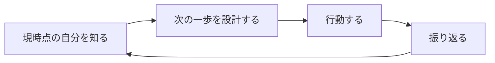
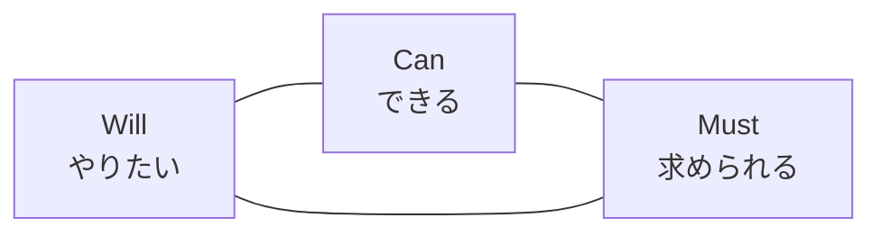
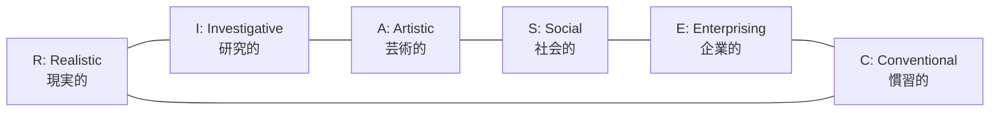

# キャリアデザイン入門

自分の Will から考える、職業人生の設計図——働く 40 年を「選び直せる連続」にする発想

| 項目 | 内容 |
|---|---|
| カテゴリー | キャリア・自己開発 |
| 難易度 | 入門 |
| 所要時間 | 約200分（全8レッスン） |
| 公開日 | 2026-06-09 |
| 最終更新日 | 2026-06-09 |
| コースURL | https://skillup.college/courses/career/career-design-basics/ |

## 対象者

「今の仕事を続けるべきか迷っている」「自分のキャリアの軸がわからない」「節目で立ち止まりたいが、何から考えればよいかわからない」と感じている社会人。20 代〜50 代の幅広い層、新卒・若手からミドル世代、シニア世代まで、職種・業界を問わず対象。人事・人材開発の担当者として社員のキャリア面談を行う立場の方にも、相談者の枠組みとして役立つ内容。

## 前提知識

特になし。社会人としての業務経験があると各レッスンの事例が腑に落ちやすいが、学生やキャリア初期の方でも「考え方の枠組み」として活用できる。リスキリング戦略入門を先に受講していると、スキル再構築の戦略と本コースの自己理解設計を組み合わせて使えるが、独立して読めるようにする。

## 学習目標

- キャリアの「プラン」と「デザイン」の違いを理解し、反復的に設計する姿勢を持つ
- Will / Can / Must の三角形を使い、自己理解を言語化できる
- Edgar Schein のキャリアアンカー 8 類型を知り、自分の価値観の核を推定できる
- John Holland の RIASEC とストレングス思考を理解し、強み・関心・適性を言葉にできる
- Donald Super のライフ・キャリア・レインボーで、人生の役割と時期の重なりを捉えられる
- Krumboltz の Planned Happenstance と Wrzesniewski のジョブ・クラフティングで、偶発と再構成を活かせる
- 「辞める／残る」の二択を超えた、転職・社内転換・副業・独立・休職復職の選択肢を整理できる
- 年 1 回の棚卸し、メンタリング、公的支援を使って、キャリアデザインを継続できる

## コース概要

「今の仕事を続けるべきか」「自分のキャリアの軸はどこにあるのか」「ライフイベントとどう両立するか」——働く誰もが、節目で立ち止まる問いを抱えています。キャリアデザインは、その問いに「正解」を出す技術ではなく、自分なりの「問い直し方」を持つ技術です。本コースでは、半世紀以上にわたるキャリア発達理論の古典——Donald Super のライフ・キャリア・レインボー、Edgar Schein のキャリアアンカー、John Holland の RIASEC、John Krumboltz の Planned Happenstance、Wrzesniewski & Dutton のジョブ・クラフティングなど——を、現代の働き方に翻訳して 8 レッスンで体系的に学びます。理論を「明日の自分への問い」に置き換えることを優先しています。

## 学習の流れ

レッスン 1 で、キャリアデザインの全体像と「プランとデザインの違い」を押さえます。レッスン 2〜5 は「自分を知る」レッスンで、Will/Can/Must の三角形、Schein のキャリアアンカー、Holland の RIASEC とストレングス、Super のライフキャリア視点という 4 つの自己理解の枠組みを順に積み上げます。レッスン 6〜8 は「設計と行動」のレッスンで、偶発を活かす発想と再構成の技術、転職・社内転換・副業・独立・休職復職などの選択肢、そして継続的なキャリアデザインの仕組みと社会資源を扱います。前半（レッスン 1）は「考え方の土台」、中盤（レッスン 2〜5）は「自分を知る」、後半（レッスン 6〜7）は「設計と選択」、終盤（レッスン 8）は「継続と社会資源」という四段構えです。

## レッスン一覧

| No. | タイトル | 概要 | 所要時間 |
|---|---|---|---|
| 1 | キャリアデザインとは何か——プランではなく「デザイン」で考える | キャリアの定義（職業 vs. 人生全体）、プラン（直線的計画）とデザイン（反復的設計）の違い、キャリア理論の 3 つの系譜（Super の発達論・Schein の組織心理・Krumboltz の社会的学習）、本コースの守備範囲と VUCA 時代の前提を学ぶ | 25分 |
| 2 | 自己理解の三角形——Will / Can / Must | Will（やりたい）・Can（できる）・Must（求められる）の 3 円の重なり、3 つを言語化するワーク、重ならないときの 3 つのパターン、日本企業の歴史的な Must 偏重とそこからの再設計、メタ認知の罠を学ぶ | 25分 |
| 3 | 価値観の核を知る——Edgar Schein のキャリアアンカー | Edgar Schein の 8 つのキャリアアンカー（専門能力／管理能力／自律・独立／保障・安定／創造性・起業家／奉仕・社会貢献／純粋な挑戦／生活様式）、自分のアンカーを推定する問い、アンカーは変わるか、日本での研究と文化的解釈を学ぶ | 25分 |
| 4 | 強み・関心・適性——John Holland の RIASEC とストレングス思考 | John L. Holland の RIASEC 六角形（現実・研究・芸術・社会・企業・慣習）、環境とパーソナリティの一致説、Gallup CliftonStrengths と Peterson & Seligman の VIA というストレングス系の系譜、「弱みを直す」ではなく「強みを伸ばす」発想の限界と活かし方を学ぶ | 25分 |
| 5 | ライフキャリアの視点——Donald Super のライフ・キャリア・レインボー | Donald E. Super の生涯発達理論、成長・探索・確立・維持・衰退の 5 段階、ライフ・キャリア・レインボー（子・学生・余暇・市民・労働者・配偶者・家族・親などの役割）、日本のライフイベント（出産・育児・介護）とキャリアの両立を学ぶ | 25分 |
| 6 | 偶発と再構成——Krumboltz の Planned Happenstance と Wrzesniewski のジョブ・クラフティング | John D. Krumboltz の Planned Happenstance（計画された偶発性）と 5 つの態度（好奇心・持続性・柔軟性・楽観性・冒険心）、Wrzesniewski & Dutton のジョブ・クラフティング（2001 年、作業・関係・認知の 3 種類）、Hall の Protean Career と Arthur & Rousseau の Boundaryless Career の概観を学ぶ | 25分 |
| 7 | キャリアの選択肢を広げる——転職・社内転換・副業・独立・休職復職 | 「辞める／残る」の二択を超えた選択肢の整理、転職市場の現状、社内公募・社内 FA、副業・複業の入口、フリーランス・独立、育児・介護・治療と仕事の両立（休職・復職・時短）、意思決定のフレーム（10/10/10 ルール、後悔最小化の発想）を学ぶ | 25分 |
| 8 | 継続的キャリアデザインと社会資源——棚卸し・メンタリング・修了後の学習方向 | キャリアの棚卸しを年 1 回の習慣にする方法、メンター・ロールモデルの見つけ方、キャリアコンサルタント・ハローワーク・ジョブカード制度などの公的支援、人事の 1on1・キャリア面談の活用、コース修了後の学習方向を学ぶ | 25分 |

---

## レッスン1：キャリアデザインとは何か——プランではなく「デザイン」で考える

（所要時間：25分）

### このレッスンで学ぶこと

- 「キャリア」の語源と現代的な定義を理解する
- 「キャリアプラン」と「キャリアデザイン」の違いを区別できる
- キャリア理論の 3 つの系譜（Super・Schein・Krumboltz）の概観を知る
- VUCA 時代に「直線的計画」がうまくいかない理由を整理する
- 本コースで扱う範囲と扱わない範囲を理解する

---

「キャリアデザイン」という言葉は、ここ 20 年でビジネス用語として定着しました。書店には関連書籍が並び、大学のキャリアセンターや企業の人事部でも標準的なテーマです。一方で、現場では「結局、転職活動の準備のこと？」「出世計画の言い換え？」と取られて、十分に活かされていないのもよく見ます。本コースは、まず「キャリアデザインとは何か」を、定義と歴史と誤解の整理から始めて、明日からの自分への問い直しに使える形に組み直していきます。

### 「キャリア」の語源と現代的な定義

キャリア（career）という言葉は、もともとラテン語の「carrus（荷車）」に由来し、転じて「車輪が通った跡＝わだち」「人が歩んできた道筋」を意味するようになりました。日本語の「経歴」「職歴」とほぼ同義に使われることが多い言葉です。

しかし、現代のキャリア研究では、「キャリア」をもう少し広くとらえます。代表的な定義をいくつか紹介します。

> 「人が生涯にわたって、仕事に関連した諸経験を通じて歩んでいく道筋」（Donald E. Super）
>
> 「人々が生涯にわたって、職業に関連する役割を経験する連続体」（Edgar H. Schein）
>
> 「個人が生涯にわたって積み重ねていく、仕事を中心とした人生の連続的な経験」

ポイントは 3 つあります。

1. キャリアは「職業」だけでなく「人生」に近い概念
2. キャリアは「ゴール」ではなく「連続的な過程」
3. キャリアは「他人が見る経歴」ではなく「本人の経験」

> **💡 ポイント**
> 「キャリア」は履歴書に書ける項目だけを指す言葉ではありません。出産・育児・介護・治療のために働き方を変えた経験、副業で得た学び、地域活動での役割なども、現代のキャリア研究では広い意味で「キャリア」に含めて考えます。

### 「プラン」と「デザイン」の違い

ここで本コースの中心概念を整理します。「キャリアプラン」と「キャリアデザイン」は、似ているようで発想がまったく違います。

#### キャリアプラン（plan）

「○年後に課長、△年後に部長、□歳で年収○○万円」のように、未来を線で結ぶ「直線的な計画」です。20 世紀後半の日本企業のように、終身雇用と年功序列が前提だった時代には、ある程度機能しました。

しかし現代では、

- 配属や評価は予定通りには動かない
- 業界そのものが 10 年で大きく変わる
- 個人のライフイベント（結婚・出産・介護）も計画通りには起きない
- 自分が「やりたいこと」自体が、経験を積むうちに変わる

という現実に直面します。直線で引いた計画は、たいてい数年で破綻します。

#### キャリアデザイン（design）

「現時点での自分の理解と環境の認識から、次の一歩を設計し、行動し、振り返り、また設計し直す」という「反復的な設計」です。デザインの語源は「印を付ける（designare）」で、「次のひと印」を都度引き直す発想が含まれています。

ポイントは、ゴールに直線で向かうのではなく、「振り返って次を設計し直す」サイクルを回し続けることです。本コースで「キャリアデザイン」と呼ぶのは、この反復的な姿勢のことです。

> **⚠️ 注意**
> 「デザイン」と言うと「クリエイティブで自由」「自分の理想を描く」というイメージが先行しますが、ここでの「デザイン」は「制約の中で次の一歩を設計する」という意味です。理想の自己像を描くだけでは、現実の労働市場・組織制度・ライフイベントとずれていきます。本コースの「デザイン」は、現実との対話を含んだ概念です。

### キャリア理論の 3 つの系譜

「キャリアデザイン」と一口に言っても、背景にある理論はひとつではありません。本コースで参照するのは、主に次の 3 つの系譜です。

#### ①発達論的アプローチ（Donald E. Super）

人生を通じてキャリアは段階的に発達する、という考え方です。1957 年の『The Psychology of Careers』が代表作。後のレッスン 5 で扱う「ライフ・キャリア・レインボー」もこの系譜です。「いまの自分はどの段階か」「これからどの段階に入るか」を考える枠組みを提供します。

#### ②組織心理学的アプローチ（Edgar H. Schein）

組織に属して働く個人が、何を譲れない核として持っているかに注目する考え方です。1978 年の『Career Dynamics』、1985 年の『Career Anchors』が代表作。レッスン 3 で扱う「キャリアアンカー（8 類型）」がこの系譜の中心概念です。「自分が捨てられない価値観は何か」を問う枠組みです。

#### ③社会的学習論的アプローチ（John D. Krumboltz）

キャリアは「計画」ではなく「行動から学ぶ連続」だ、という考え方です。1999 年の論文「Planned Happenstance Theory」、2004 年の『Luck Is No Accident』が代表作。レッスン 6 で扱う「計画された偶発性（Planned Happenstance）」の発想がここから来ます。「未確定の状況にどう向き合うか」を問う枠組みです。

> **📝 補足**
> 3 つの系譜はどれが正解というものではなく、補完関係にあります。発達論は「人生の時期」、組織心理学は「価値観の核」、社会的学習論は「未確定との付き合い方」を扱います。本コースはこの 3 つを骨格に、Holland の RIASEC（レッスン 4）、Wrzesniewski のジョブ・クラフティング（レッスン 6）、Hall の Protean Career（レッスン 6）を補助線として加えます。

### VUCA 時代の前提

現代のキャリアを語るときに、よく「VUCA」という言葉が使われます。Volatility（変動性）・Uncertainty（不確実性）・Complexity（複雑性）・Ambiguity（曖昧性）の頭文字で、米軍が冷戦後の世界情勢を表すために 1980 年代後半から使い始めたとされます。

VUCA 時代のキャリアでは、次のような前提が崩れています。

- 「いい会社に入れば一生安泰」という前提
- 「ひとつの職種を極めれば食いっぱぐれない」という前提
- 「直線的に昇進していく」という前提
- 「定年まで同じ会社にいる」という前提

これらの前提が崩れた時代では、「綿密な計画」よりも「変化に応じて設計し直す力」のほうが重要になります。本コースが「プラン」より「デザイン」を重視するのは、こうした時代背景があるからです。

> **💡 ポイント**
> VUCA 時代といっても、すべてが不確実なわけではありません。「自分が大事にしたい価値観」「これまでに積み上げた経験」「いま身の回りにある選択肢」など、相対的に安定したものもあります。本コースは「すべてが流動的」という極論にも、「計画通り進む」という前提にも振れず、その間で能動的に問い直す姿勢を扱います。

### 本コースの守備範囲と限界

最後に、本コースで扱う範囲と扱わない範囲を整理しておきます。

#### 扱う範囲

- キャリアデザインの全体像とプランとの違い（本レッスン）
- 自己理解の枠組み（レッスン 2〜5）：Will/Can/Must、キャリアアンカー、RIASEC、ライフキャリア
- 偶発と再構成の発想（レッスン 6）：Planned Happenstance、ジョブ・クラフティング
- キャリアの選択肢（レッスン 7）：転職・社内転換・副業・独立・休職復職
- 継続的キャリアデザインと社会資源（レッスン 8）

#### 扱わない範囲

- 個別の業界・職種の具体的な転職ノウハウ（業界誌・専門書・転職エージェントの領域）
- 採用面接の準備や履歴書・職務経歴書の書き方（別途、転職支援サービスを活用）
- メンタルヘルスの不調そのものの治療・休職復職の医療判断（医療と隣接、専門家の領域）
- 特定の自己分析ツールやキャリア診断サービスのレビュー（ツールは概念に必要な範囲のみ）
- 「○○式」「△△メソッド」という商標的手法（古典理論を骨格に置く）

#### スタンス

本コースは、キャリアデザインを「一度の正解」ではなく「節目で繰り返す問い直し」として扱います。完成して終わるものではなく、20 代・30 代・40 代・50 代と、その時々の状況の中で何度でも引き直すものとして位置づけます。「自分の本当にやりたいこと」を最初から自明なものとして探し当てる「自分探し」ではなく、行動と内省の反復で言語化されていく過程として扱います。

### まとめ

このレッスンでは、以下のことを学びました。

- 現代のキャリア概念は「職歴」だけでなく「人生にわたる経験の連続」を含む
- 「キャリアプラン」（直線的計画）と「キャリアデザイン」（反復的設計）は発想がまったく違う
- キャリア理論の 3 つの系譜：発達論（Super）・組織心理学（Schein）・社会的学習論（Krumboltz）
- VUCA 時代では、綿密な計画より「変化に応じて設計し直す力」が重要
- 本コースは「自分探し」ではなく「行動と内省の反復による設計」を扱う

次のレッスンでは、自己理解の最も基本的な枠組みとして、Will（やりたい）・Can（できる）・Must（求められる）の三角形を学びます。3 つの円の重なりと、重ならないときのパターンを通じて、自分の現在地を言語化していきます。

---

### 確認クイズ

このレッスンの理解度をチェックしましょう。

#### Q1. 本レッスンで示した「現代のキャリア」の定義として最も適切なものはどれか？

- [ ] 履歴書に書ける職歴の一覧
- [ ] 会社内の役職・ポジションの階段
- [x] 仕事に関連した経験を通じて、生涯にわたって歩んでいく道筋・連続体
- [ ] 退職後の余生に向けた準備計画

> **解説**
> 現代のキャリア研究では、職歴や役職だけでなく、仕事に関連する経験全体を生涯にわたる連続体として捉えます。Donald Super と Edgar Schein の定義に共通する発想で、出産・育児・介護・地域活動なども広く含めて考えるのが本コースのスタンスです。

#### Q2. 「キャリアプラン」と「キャリアデザイン」の違いとして、本レッスンの説明として正しいものはどれか？

- [ ] プランは紙に書く、デザインは頭の中で考える
- [x] プランは直線的な計画、デザインは反復的な設計のサイクル
- [ ] プランは上司に提出するもの、デザインは自分だけのもの
- [ ] プランは短期、デザインは長期という時間軸の違い

> **解説**
> 本レッスンでは、プランを「○年後に○○」と直線で結ぶ計画、デザインを「現状把握→設計→行動→振り返り→再設計」を反復するサイクルとして区別しています。フォーマットの違いや時間軸の違いではなく、発想そのものが違います。

#### Q3. キャリア理論の「組織心理学的アプローチ」を代表する研究者はどれか？

- [ ] Donald E. Super
- [ ] John D. Krumboltz
- [x] Edgar H. Schein
- [ ] John L. Holland

> **解説**
> 組織心理学的アプローチの代表は Edgar H. Schein で、レッスン 3 で扱う「キャリアアンカー（8 類型）」がこの系譜の中心概念です。Super は発達論、Krumboltz は社会的学習論、Holland は RIASEC モデル（レッスン 4）の研究者です。

#### Q4. VUCA 時代のキャリアの前提について、本レッスンが指摘した内容はどれか？

- [ ] すべてが流動的なので、計画を立てる意味はない
- [ ] 終身雇用・年功序列の前提は今でも維持されている
- [ ] VUCA は経済成長を意味する言葉である
- [x] 「いい会社に入れば一生安泰」「直線的に昇進する」などの前提が崩れている

> **解説**
> 本レッスンは、VUCA 時代において「一生安泰」「直線的昇進」「定年まで同じ会社」などの前提が崩れた一方で、自分の価値観や経験など相対的に安定したものもあるという立場を取ります。「すべて流動的」も「前提は維持」も極論で、避けます。VUCA は Volatility・Uncertainty・Complexity・Ambiguity の頭文字です。

#### Q5. 本コースが扱う範囲・スタンスとして適切なものはどれか？

- [ ] 個別の業界の転職ノウハウを詳細に扱う
- [ ] 履歴書・面接対策を中心に扱う
- [ ] メンタル不調の治療法を扱う
- [x] キャリアデザインを「節目で繰り返す問い直し」として、自己理解と選択の枠組みを体系的に扱う

> **解説**
> 本コースは、業界別の転職ノウハウや面接対策、メンタル治療は扱いません。キャリアデザインを「一度の正解」ではなく「節目で繰り返す問い直し」として、自己理解（レッスン 2〜5）・偶発と再構成（レッスン 6）・選択肢（レッスン 7）・継続（レッスン 8）の枠組みを体系的に扱います。

#### Q6. 「自分の本当にやりたいこと」への本コースのスタンスとして正しいものはどれか？

- [x] 最初から自明なものとして探し当てる「自分探し」ではなく、行動と内省の反復で言語化されていくもの
- [ ] 早く見つけたほうが勝ちで、見つからない人は人生を無駄にしている
- [ ] 一度見つかったら、生涯変わらない
- [ ] キャリアコンサルタントに診断してもらえば必ずわかる

> **解説**
> 本コースは、「やりたいこと」を最初から自明なものとして探す「自分探し」ではなく、行動と内省の反復で言語化されていく過程として扱います。「早く見つけたほうが勝ち」「一度見つかれば変わらない」「専門家が診断できる」のような発想は、本コースのスタンスとは異なります。

---

## レッスン2：自己理解の三角形——Will / Can / Must

（所要時間：25分）

### このレッスンで学ぶこと

- Will（やりたい）・Can（できる）・Must（求められる）の 3 つの円を区別できる
- 3 円の重なりが「キャリアの核」になる仕組みを理解する
- 3 つを言語化するための具体的な問いを持つ
- 重ならないときに起きる 3 つのパターンを把握する
- 日本企業の歴史的な「Must 偏重」の背景と、そこから自分を取り戻す発想を学ぶ

---

前回のレッスンでは、キャリアデザインを「反復的な設計」として位置づけ、3 つの理論系譜を概観しました。今回は、自己理解の最も基本的な枠組みである「Will / Can / Must」の三角形に入ります。すべてのキャリア発達理論が、結局はこの 3 つのどこかに焦点を当てている、と言ってもよいほど中心的な枠組みです。3 つを言語化する練習を、本レッスンで丁寧にしていきます。

### Will / Can / Must とは

Will / Can / Must は、自己理解の枠組みとして人材開発の現場で広く使われている 3 円モデルです。明確な単独の提唱者がいるというより、20 世紀後半のキャリアカウンセリング・人材開発の現場で定着したフレームワークで、日本では特に企業の人事・キャリアコンサルタントの間で標準的な道具になっています。

3 つの円はそれぞれ次の意味を持ちます。

| 記号 | 内容 | 問いの形 |
|---|---|---|
| Will | やりたいこと・大事にしたいこと | 「自分は何を望んでいるか」 |
| Can | できること・得意なこと | 「自分には何ができるか」 |
| Must | 求められていること・期待されていること | 「自分には何が求められているか」 |

3 つの円が重なる中心部分が、「キャリアの核」と呼ばれる場所です。やりたいことが、できることでもあり、求められていることでもある領域——ここに自分のエネルギーを注ぎ込めると、仕事の充実度は格段に上がるとされています。

> **💡 ポイント**
> Will / Can / Must は、完璧に重なることを目指す枠組みではなく、「今の自分はどの 2 つが重なっていて、何が欠けているか」を見るための地図です。3 つが完全に重なる「天職」を探そうとすると、現実から離れていきます。重なりが小さい現実を起点に、どこを伸ばすか・どこをずらすかを考えるのが、運用上のコツです。

### それぞれの円を言語化する

3 つの円を頭の中だけでイメージしても、なかなか動きません。言葉にする練習が大切です。それぞれに、自分に問うてみる質問の例を挙げます。

#### Will（やりたい）の言語化

- ここ 1 年で、時間を忘れて取り組めたことは？
- 自分でお金を払ってでもやりたいことは？
- 子どものころに夢中になっていたことの、現代版は？
- 「あの人みたいになりたい」と感じる人と、その人の何にあこがれているか？
- 引退まであと 1 年なら、何をするか？

#### Can（できる）の言語化

- 周囲の人から「○○がうまいね」と言われたことは？
- 同じ仕事をしても、人より早く・うまくできることは？
- 過去 3 年で、自分が何かを「乗り越えた」と感じる場面は？
- 履歴書には書かない、見落としがちな「身についた癖・習慣」は？
- 自分にとっては当たり前だが、周囲には珍しいスキルは？

#### Must（求められる）の言語化

- いまの職場で、自分に期待されている役割は何か？
- 上司・同僚・取引先から、どんな依頼が舞い込みやすいか？
- 家族・地域・コミュニティから、どんな役割を担っているか？
- 社会全体から見て、自分の年代・立場で求められやすいことは？
- 5 年後・10 年後の労働市場で、価値を持ちそうな能力は？

> **📝 補足**
> 言語化のコツは、抽象的な単語（「マネジメント」「コミュニケーション」など）で止めず、具体的な場面や行動まで降ろすことです。「マネジメントが Can」ではなく「7 人チームの 1on1 を毎週続けて、3 年で離職ゼロを実現した」のように、エピソードで描けると、後の選択に活かせます。

### 重ならないときの 3 つのパターン

3 つの円が完璧に重なる人は、ほとんどいません。むしろ、「どこかが欠けている」のが普通の状態です。よく見られる 3 つのパターンを整理します。

#### パターン①：Will と Can はあるが、Must がない

「やりたいし、できる。でも、それを求める場がない」状態です。趣味やボランティアならよいのですが、仕事として成立しない（誰も対価を払ってくれない）場合、職業としては難しくなります。

対応の方向：

- Must（市場）の側を広げる——副業・複業・転職で求める場を探す
- 自分でその「市場」を作る——独立・起業の選択肢
- 趣味として持ち続け、仕事は別軸で立てる

#### パターン②：Can と Must はあるが、Will がない

「できるし、求められている。でも、やりたい気持ちが湧かない」状態です。日本企業のミドル世代に最も多いパターンと言われています。短期的には安定しますが、長期的には燃え尽きやキャリアの停滞につながります。

対応の方向：

- Will（やりたい）を言語化し直す——本レッスンの問いに戻る
- Will そのものを行動で発見する——Krumboltz の Planned Happenstance（レッスン 6）
- 仕事の Must の中に Will を見出す——Wrzesniewski のジョブ・クラフティング（レッスン 6）

#### パターン③：Will と Must はあるが、Can がない

「やりたいし、求められている。でも、いまの自分にはできない」状態です。若手・新人や、新しい領域に挑戦するときによく見られます。

対応の方向：

- Can（できる）を伸ばす——スキルの再構築（リスキリングの領域）
- 一部だけ Can で参入し、伴走者を得る——メンタリング・チーム編成
- 段階的に Can を広げる——小さな成功体験の積み重ね

> **⚠️ 注意**
> 自己理解のパターン分析は、「自分はパターン②だ」とラベルを貼って終わるためではありません。「いま欠けているのはどこか」「どう動くと重なりが広がるか」を考えるための地図として使います。ラベル貼りで満足してしまうと、行動が止まってしまいます。

### 日本企業の歴史的な「Must 偏重」

日本企業のキャリア文化を考えるとき、見過ごせないのが「Must 偏重」の歴史です。

戦後から 1990 年代まで、日本の大企業の主流は終身雇用と年功序列でした。社員は「会社が求めるもの（Must）」を受け取り、配属に従い、転勤に応じ、ジョブローテーションを経験する——という働き方が標準でした。「自分のやりたいこと（Will）」を主張するのは、しばしば「組織人としての成熟が足りない」と評価されてしまいました。

この歴史の延長で、現在でも次のような声がよく聞かれます。

- 「やりたいことを聞かれても、答えられない」
- 「会社の言う通りに動いてきただけ」
- 「自分のキャリアを自分で考える、という発想がなかった」

これは個人の問題というより、構造的な背景がある現象です。「Will を語れない自分」を責めるのではなく、「Will を語る必要のない環境で長く働いてきた」事実を踏まえた上で、これからの再設計をすればよい——という発想を、本コースは取ります。

> **💡 ポイント**
> Will が湧かない、と感じる方は、いきなり「大きな Will」を探さないでください。「ここ 1 か月で、ちょっとうれしかった瞬間」「いつもより 5 分長くやっていた仕事」など、小さな違和感や小さな満足を集めるところから始めるのが、現場で機能する Will 発見の方法です。

### メタ認知の罠

最後に、自己理解を扱うときに必ず触れておきたいのが「メタ認知の罠」です。

メタ認知（metacognition）とは、「自分が何を考え、何を感じているかを、もう一段高い視点から認知すること」です。Will / Can / Must を言語化する作業は、メタ認知そのものです。

ただし、メタ認知には限界があります。

- 自分のことは、必ずしも自分が一番よくわかっているわけではない
- 「自分はこういう人間だ」というラベルが、行動を狭めることがある
- 自分のことを考えすぎると、行動が止まる
- 過去の経験から推定した「自分像」が、未来の自分を縛る

これらの罠を避ける発想として、本コースは次の 3 つを提案します。

1. **自己理解の言葉は、いつでも書き換える前提で持つ**——「これが私の Will だ」と固定しない
2. **行動と内省を往復する**——内省だけ、行動だけ、にしない
3. **他者の声を取り入れる**——上司・同僚・家族・友人・キャリアコンサルタントなど、外側の視点を借りる

> **📝 補足**
> 自己理解は「完成しない」ことを前提に進めるのが、現代キャリア論の主流です。Donald Super も Edgar Schein も Krumboltz も、形は違えど「自己理解は生涯にわたって更新される」という立場を取ります。本コースもこの立場で、「今の時点での仮の言葉」を更新していく姿勢を勧めます。

### まとめ

このレッスンでは、以下のことを学びました。

- Will（やりたい）・Can（できる）・Must（求められる）の 3 円が、自己理解の最も基本的な枠組み
- 3 つを言語化するときは、抽象的な単語で止めず、具体的な場面とエピソードまで降ろす
- 3 つが完璧に重なる「天職」は珍しく、欠けている部分があるのが普通の状態
- 重ならないパターン 3 種類：Must がない／Will がない／Can がない——それぞれに対応の方向がある
- 日本企業の歴史的な Must 偏重は構造的背景があり、「Will を語れない自分」を責めなくてよい
- 自己理解にはメタ認知の罠があり、「いつでも書き換える」「行動と往復する」「他者の声を取り入れる」が解毒剤

次のレッスンでは、Will の核に近い「価値観」を扱う古典的な枠組みとして、Edgar Schein のキャリアアンカーを学びます。「自分が捨てられない価値観は何か」を 8 つの類型から考える、強力な道具です。

---

### 確認クイズ

このレッスンの理解度をチェックしましょう。

#### Q1. Will / Can / Must の 3 つの意味として、正しい組み合わせはどれか？

- [ ] Will＝勝てる／Can＝できる／Must＝命令
- [ ] Will＝意志／Can＝資格／Must＝義務
- [x] Will＝やりたい／Can＝できる／Must＝求められる
- [ ] Will＝願望／Can＝可能性／Must＝必須

> **解説**
> Will / Can / Must の基本的な意味は、Will＝やりたい（やりたいこと・大事にしたいこと）、Can＝できる（できること・得意なこと）、Must＝求められる（期待されていること）です。3 つの円の重なりを見ながら、自己理解を言語化していきます。

#### Q2. 3 円の重なりについて、本レッスンの説明として正しいものはどれか？

- [x] 完璧に重なる「天職」を探すより、欠けている部分を起点に重なりを広げる発想が現場では機能する
- [ ] 3 円が完全に重なる仕事を見つけられないと、キャリアデザインは失敗である
- [ ] 重なりが小さい状態は「自分の能力が低い」ことの証拠
- [ ] 重なりは生涯固定で、変化しない

> **解説**
> 本レッスンは、3 円が完璧に重なる「天職」を探す発想に立ちません。重なりが小さい現実を起点に、欠けている部分をどう伸ばすか・どうずらすかを考えるのが、現場で機能する運用です。重なりは生涯固定ではなく、書き換え続けるものとして扱います。

#### Q3. 「Will と Can はあるが、Must がない」パターンへの対応として、本レッスンが示したものはどれか？

- [ ] そのままにして、何も動かない
- [ ] Will を捨てて、別のことを考える
- [x] Must の側を広げる（副業・複業・転職）／自分で「市場」を作る（独立・起業）／趣味として持ち続け、仕事は別軸で立てる
- [ ] Can を捨てて、別のスキルを学ぶ

> **解説**
> このパターンへの対応は、Must の側を広げるか、自分で市場を作るか、または趣味として持ち続けるかの 3 方向です。Will を捨てる、Can を捨てるという発想は、せっかくの重なりを失う方向で、本レッスンは取りません。

#### Q4. 日本企業の「Must 偏重」について、本レッスンの説明として正しいものはどれか？

- [ ] 個人の意思の弱さが原因なので、本人の責任である
- [ ] 過去にもいまにも存在しない傾向である
- [ ] アサーティブネスのトレーニングだけで解消できる
- [x] 戦後から 1990 年代までの終身雇用・年功序列の文化に構造的な背景があり、「Will を語れない自分」を責める必要はない

> **解説**
> 本レッスンは、日本企業の Must 偏重を個人の問題ではなく構造的な背景がある現象として扱います。「Will を語れない自分」を責めるのではなく、「Will を語る必要のない環境で長く働いてきた」事実を踏まえた上で、これからの再設計をすればよい、というスタンスを取ります。

#### Q5. 「メタ認知の罠」と本コースのスタンスについて、正しいものはどれか？

- [ ] 自分のことは自分が必ず一番よく理解している
- [x] 自己理解には限界があり、「いつでも書き換える前提で持つ」「行動と内省を往復する」「他者の声を取り入れる」が解毒剤
- [ ] メタ認知を究めれば、自己理解は完成する
- [ ] 他者の意見は無視して、自分だけの内省で十分

> **解説**
> 自分のことは必ずしも自分が一番よくわかっているわけではなく、自己理解には限界があります。本コースは「いつでも書き換える」「行動と内省を往復する」「他者の声を取り入れる」の 3 つを罠の解毒剤として提案します。自己理解は完成しないことを前提に進めるのが、現代キャリア論の主流です。

#### Q6. Will の言語化が難しいときの本レッスンのアドバイスはどれか？

- [ ] 一度きりの大きな決断で「本当にやりたいこと」を見つける
- [ ] 自己分析シートを 100 個埋めれば必ず見つかる
- [ ] 大きな Will を最初から決める
- [x] 「ここ 1 か月でちょっとうれしかった瞬間」「いつもより 5 分長くやっていた仕事」など、小さな違和感や小さな満足を集めるところから始める

> **解説**
> 本レッスンは、Will を最初から大きな問いとして探さず、小さな違和感・満足を集めるところから始める方法を勧めます。「一度きりの大決断」「シート 100 個」「最初から大きな Will」はいずれも、現場では機能しにくいやり方です。

---

## レッスン3：価値観の核を知る——Edgar Schein のキャリアアンカー

（所要時間：25分）

### このレッスンで学ぶこと

- Edgar Schein のキャリアアンカーの考え方を理解する
- 8 つのアンカーの内容と特徴を区別できる
- 自分のアンカーを推定するための問いを持つ
- 「アンカーは変わるか」という研究上の論点を理解する
- 日本でのキャリアアンカー研究と文化的な解釈の留意点を知る

---

前回のレッスンで、自己理解の基本枠組みとして Will / Can / Must の三角形を学びました。今回はその中の「Will」、特に「価値観の核」に焦点を絞った古典的な枠組みである、Edgar H. Schein のキャリアアンカーを扱います。1970 年代に提唱されてから半世紀近く、世界中の企業研修・キャリアカウンセリングで使われ続けている、もっとも有名なキャリア理論のひとつです。

### キャリアアンカーとは

Edgar H. Schein は、マサチューセッツ工科大学（MIT）スローン経営大学院の組織心理学者です。1978 年の『Career Dynamics: Matching Individual and Organizational Needs』で「キャリアアンカー」という概念を提唱し、1985 年の『Career Anchors: Discovering Your Real Values』で実践的な診断ツールとして広めました。

「アンカー（anchor）」は船の錨（いかり）です。Schein は、人が職業上の選択を迫られたとき、最後まで譲れない価値観・能力・動機が「錨のように」自分を引き留める、という比喩でこの概念を表しました。

> 自分が「これだけは譲れない」と感じる価値観・能力・動機の核——それがキャリアアンカー

#### キャリアアンカーの 3 要素

Schein は、キャリアアンカーを次の 3 つから構成されると考えました。

1. **自分が得意なこと**（才能・能力）
2. **自分が動機を感じること**（欲求・興味）
3. **自分が大事にしている価値観**（価値・態度）

この 3 つが、それぞれの選択の場面で「自分らしい」選択を引き寄せる磁石のように働く——というのが Schein の見立てです。

> **💡 ポイント**
> キャリアアンカーは「やりたいこと」よりも深い層にある概念です。「やりたいこと」は時期によって変わりやすいですが、アンカーは「迫られたら最後まで譲れないこと」なので、もう一段安定しています。例えば「自律性」がアンカーの人は、職種が変わっても「上司に細かく管理されない働き方」を選び続ける、というように。

### 8 つのキャリアアンカー

Schein は、研究を通じて 8 つのアンカーの類型を整理しました。1 人がひとつだけのアンカーを持つというより、複数の傾向のなかで「これが一番譲れない」と感じるものを軸として捉えます。

#### ①専門・職能別能力（Technical/Functional Competence）

特定の専門領域で「自分はこれの専門家だ」と感じることに価値を置く。研究者・エンジニア・医師・職人・専門職などに多い。マネジメントよりも、ある分野を深く極めることに意義を感じる。

#### ②全般管理能力（General Managerial Competence）

組織を動かし、複数の機能を統合し、最終的な意思決定を担うことに価値を置く。経営者・経営幹部・大企業の管理職などに多い。専門分野を究めるより、全体を見る役割を求める。

#### ③自律・独立（Autonomy/Independence）

自分のやり方・ペースで仕事を進めることに価値を置く。フリーランス・コンサルタント・個人事業主・研究者・作家などに多い。組織のルール・報告体制に強くしばられることに耐えにくい。

#### ④保障・安定（Security/Stability）

長期的な雇用・収入・地域の安定に価値を置く。公務員・大企業の総合職・地方在住者などに多い。リスクの大きな転身・転居を避け、予測可能な生活を重視する。

#### ⑤起業家的創造性（Entrepreneurial Creativity）

自分で何かを「ゼロから作り上げる」ことに価値を置く。起業家・新規事業家・職人・芸術家などに多い。既存の組織で働くより、自分のビジョンで何かを生み出すことを求める。

#### ⑥奉仕・社会貢献（Service/Dedication to a Cause）

社会や他者への貢献を中心的な価値とする。医療・福祉・教育・NPO・国際協力などに多い。「自分のため」だけでなく「誰かのため」が動機の核になる。

#### ⑦純粋な挑戦（Pure Challenge）

困難な問題を解くこと自体に価値を置く。コンサルタント・トップ営業・プロアスリート・冒険家などに多い。何を扱うかより、難しさそのものに惹かれる。

#### ⑧生活様式（Lifestyle）

仕事・家庭・自己研鑽・趣味のバランスを統合的に保つことに価値を置く。働き方を選ぶときに「ライフ全体への影響」を最優先で考える。

| No | アンカー名 | 端的に言うと |
|---|---|---|
| ① | 専門・職能別能力 | この分野を究めたい |
| ② | 全般管理能力 | 全体を動かしたい |
| ③ | 自律・独立 | 自分のやり方で進めたい |
| ④ | 保障・安定 | 長く安心して続けたい |
| ⑤ | 起業家的創造性 | ゼロから作りたい |
| ⑥ | 奉仕・社会貢献 | 誰かの役に立ちたい |
| ⑦ | 純粋な挑戦 | 難しい問題を解きたい |
| ⑧ | 生活様式 | 人生全体のバランスを保ちたい |

> **📝 補足**
> 8 つのアンカーは「優劣」のないものとして扱われています。どれが偉い・劣っているということはなく、自分のものを知ることが目的です。Schein 自身、研究で「⑧生活様式」が現代では増えている、と指摘していますが、それも善悪の話ではなく傾向の話です。

### 自分のアンカーを推定する問い

8 つを並べられても、「自分はどれだろう」と即答できる人は多くありません。Schein が原典で示している自己分析の問いから、特に職場で使いやすいものを 5 つ紹介します。

1. これまでのキャリアの中で、最も誇りに思う成果は何か？それはなぜ誇らしいのか？
2. 「これだけは絶対に譲れない」と感じた場面は？何を守ろうとしたか？
3. 仕事の選択で、お金や肩書きより優先したものは何か？
4. 5 年後、もし強制的に異動を命じられたら、最も嫌な異動先はどこか？それはなぜか？
5. 退職後・引退後にも続けていたい関わり方は？

これらの問いに具体的なエピソードで答えていくと、自分の「譲れない核」が見えてきます。

> **⚠️ 注意**
> アンカーの自己診断は、断定的なラベル貼りで終わらせないことが大切です。「私は⑥奉仕タイプだ」と決めつけると、ほかの可能性を狭めてしまいます。「いまの自分はおそらく⑥が強そうで、③も気になる」のように、複数の可能性を持っておくのが、運用上のコツです。

### 「アンカーは変わるか」という論点

キャリアアンカーをめぐる重要な論点として、「アンカーは生涯固定なのか、それとも変わるのか」があります。

Schein 自身は、原典で「アンカーは生涯にわたって比較的安定する」と述べました。20 代後半〜30 代前半でおおむね定まり、その後はおおむね固定される、というのが彼の見立てです。

ただし、その後の研究では、

- ライフイベント（結婚・出産・介護・大病・配偶者の転勤など）でアンカーが変わる例が少なくない
- 退職・転職など大きな環境変化で再構成される場合がある
- 同じ人が複数のアンカーを並行して持ち、時期によって優先順位が入れ替わる

といった指摘も出ています。日本ではキャリアコンサルタント実務の現場で「アンカーは変わりうる」と捉えるのが一般的になっています。

> **💡 ポイント**
> 「私の今のアンカーは○○」と固定するより、「○○が今の私のアンカーらしい。これが将来変わる可能性も含めて、定期的に問い直す」という姿勢が、本コースの推奨です。アンカーは「答え」ではなく「問い直しの起点」として使うのがよいと思います。

### 日本でのキャリアアンカー研究と文化的解釈

Schein のキャリアアンカーは、もともと米国の組織研究を背景に作られた枠組みです。日本に紹介されたのは 1990 年代以降で、企業研修・大学のキャリア教育で広く使われるようになりました。

日本での運用で、いくつかの解釈の留意点があります。

- **「保障・安定」が選ばれやすい背景**：終身雇用の文化的記憶と、安定への期待の高さから、自己診断で「④保障・安定」が選ばれやすい傾向がある。本人のアンカーではなく、社会的に「望ましい答え」を選んでいないか、注意して見る必要がある
- **「奉仕・社会貢献」と日本的な遠慮**：「誰かの役に立ちたい」は日本的価値観と親和性が高く、本人のアンカーでなくても選ばれやすい。一方で「⑤起業家的創造性」「⑦純粋な挑戦」は、自己主張的に響くため選びにくい傾向がある
- **女性のキャリアと「⑧生活様式」**：日本の女性は出産・育児・介護の負担が偏りやすく、「⑧生活様式」をアンカーとして選びやすい一方、それが「家族構造の制約」によるものか「本人の核としての選択」かは、丁寧に分けて見る必要がある

> **📝 補足**
> 文化差は否定すべきものではなく、「自分のアンカーを推定するときに踏まえておく前提」として扱うのがよいです。「自分は日本人だから○○タイプ」のような単純化も避け、自分の具体的な経験から推定する姿勢が大切です。

### まとめ

このレッスンでは、以下のことを学びました。

- Edgar Schein のキャリアアンカーは、「これだけは譲れない」と感じる価値観・能力・動機の核
- アンカーの 3 要素：得意なこと／動機／価値観
- 8 つのアンカー：①専門能力／②全般管理／③自律・独立／④保障・安定／⑤起業家的創造性／⑥奉仕・社会貢献／⑦純粋な挑戦／⑧生活様式
- アンカーは Schein 自身は「比較的安定」と述べたが、後の研究ではライフイベントで変わる例も多く、「問い直しの起点」として使うのが推奨
- 日本での運用では、「④保障」「⑥奉仕」が選ばれやすい文化的背景や、女性の「⑧生活様式」の解釈に注意
- 自分のアンカーは具体的なエピソードと Schein の 5 つの問いから推定する

次のレッスンでは、Will の中でも特に「強み・関心・適性」に焦点を当てた古典として、John Holland の RIASEC モデルと、Gallup CliftonStrengths・Peterson & Seligman VIA のストレングス思考の系譜を学びます。

---

### 確認クイズ

このレッスンの理解度をチェックしましょう。

#### Q1. 「キャリアアンカー」を提唱した研究者はどれか？

- [x] Edgar H. Schein
- [ ] Donald E. Super
- [ ] John D. Krumboltz
- [ ] John L. Holland

> **解説**
> キャリアアンカーは、MIT スローン経営大学院の組織心理学者 Edgar H. Schein が 1978 年の『Career Dynamics』で提唱した概念です。1985 年の『Career Anchors』が実践的な診断ツールとして広く普及しました。Super は発達論、Krumboltz は社会的学習論、Holland は RIASEC モデルの提唱者です。

#### Q2. キャリアアンカーの説明として、本レッスンが示した内容はどれか？

- [ ] 履歴書に書ける具体的な職務経験のリスト
- [x] 「これだけは譲れない」と感じる価値観・能力・動機の核——船の錨のように自分を引き留めるもの
- [ ] 上司から指示された目標の優先順位
- [ ] 給与水準を決定する要因

> **解説**
> キャリアアンカーは「アンカー（錨）」の比喩のとおり、人が職業上の選択を迫られたとき、最後まで譲れない価値観・能力・動機の核として働きます。Schein は得意なこと・動機・価値観の 3 つから構成されると考えました。

#### Q3. 8 つのキャリアアンカーに含まれないものはどれか？

- [ ] 専門・職能別能力
- [ ] 自律・独立
- [ ] 奉仕・社会貢献
- [x] 出世・名誉

> **解説**
> Schein の 8 つのアンカーは、①専門・職能別能力／②全般管理能力／③自律・独立／④保障・安定／⑤起業家的創造性／⑥奉仕・社会貢献／⑦純粋な挑戦／⑧生活様式です。「出世・名誉」というアンカーは含まれません。「②全般管理能力」は組織を動かす役割への価値づけで、単なる出世欲とは異なります。

#### Q4. 「⑤起業家的創造性」のアンカーの特徴として正しいものはどれか？

- [ ] 既存の組織で長く勤め上げることに価値を置く
- [ ] 細かなルールに従って正確に業務をこなすことに価値を置く
- [x] 自分で何かを「ゼロから作り上げる」ことに価値を置く
- [ ] 専門領域を究めることに価値を置く

> **解説**
> 「⑤起業家的創造性」は、自分のビジョンで何かをゼロから作り上げることに価値を置くアンカーです。既存の組織で長く勤めるのは「④保障・安定」、ルール遵守は組織内の役割の話、専門領域を究めるのは「①専門・職能別能力」に近い特徴です。

#### Q5. 「アンカーは変わるか」という論点について、本レッスンの説明として正しいものはどれか？

- [ ] Schein 自身は「アンカーは毎年変わる」と主張した
- [x] Schein は「比較的安定」と述べたが、後の研究ではライフイベント等で変わる例も多く、「問い直しの起点」として使うのが推奨
- [ ] 一度決まったアンカーは何があっても生涯変わらない
- [ ] アンカーという概念に意味はなく、研究上も否定されている

> **解説**
> Schein 自身は原典で「アンカーは比較的安定する」と述べましたが、後の研究や日本のキャリアコンサルタント実務では、ライフイベントなどでアンカーが変わる例も多いと指摘されています。本コースは「アンカーは『答え』ではなく『問い直しの起点』」として使うことを推奨します。

#### Q6. 日本でのキャリアアンカー運用の留意点として、本レッスンで示したものはどれか？

- [ ] 文化差は存在しないので、米国の研究結果をそのまま当てはめてよい
- [ ] 日本人は全員「④保障・安定」になるので、診断する意味がない
- [ ] 「⑤起業家的創造性」を選んだ人は、必ず独立すべきである
- [x] 「④保障」「⑥奉仕」が文化的に選ばれやすい背景や、女性の「⑧生活様式」の解釈には、本人の核か社会的「望ましい答え」かを丁寧に分ける必要がある

> **解説**
> 日本での運用では、「④保障・安定」「⑥奉仕・社会貢献」が文化的に選ばれやすい背景や、女性の「⑧生活様式」が家族構造の制約によるものか本人の核としての選択かを、丁寧に分けて見る必要があります。文化差を否定するのも、画一的に当てはめるのも避けます。

---

## レッスン4：強み・関心・適性——John Holland の RIASEC とストレングス思考

（所要時間：25分）

### このレッスンで学ぶこと

- John L. Holland の RIASEC モデルと、6 つの職業興味タイプを理解する
- 「環境とパーソナリティの一致」という Holland の中核仮説を押さえる
- Gallup CliftonStrengths と Peterson & Seligman の VIA というストレングス思考の系譜を知る
- 「強みを伸ばす」発想の効用と限界の両方を理解する
- 自分の関心・強み・適性を言葉にする入口を持つ

---

前回のレッスンでは、価値観の核としての Edgar Schein のキャリアアンカーを学びました。今回は、自己理解のもうひとつの主要な切り口である「強み・関心・適性」を扱います。古典の John L. Holland の RIASEC モデルと、現代のストレングス思考（Gallup CliftonStrengths、Peterson & Seligman の VIA）の系譜を、対比しながら整理します。アンカーが「譲れない核」を見るのに対し、本レッスンは「自分が伸ばせるベクトル」を見る回です。

### John Holland の RIASEC モデル

John L. Holland は、米国の心理学者で、職業興味の研究で広く知られています。1973 年の『Making Vocational Choices: A Theory of Vocational Personalities and Work Environments』で、人のパーソナリティと働く環境を 6 つのタイプに分類するモデルを提唱しました。

このモデルの中核仮説は、

> 人は、自分のパーソナリティと一致した環境で働くと、満足度・パフォーマンス・継続性が高まる

というものです。シンプルですが、職業選択の研究で広く支持された仮説で、米国の労働省の職業分類システム（O*NET）にも組み込まれています。

#### RIASEC の 6 タイプ

RIASEC は、6 つのタイプの頭文字を取った名称です。

| 記号 | タイプ | 関心の方向 | 典型的な職業例 |
|---|---|---|---|
| R | Realistic（現実的） | 物・道具・機械を扱う、身体を使う | 技術者・職人・農林水産・整備士 |
| I | Investigative（研究的） | 観察・調査・分析・理論化 | 研究者・データサイエンティスト・医師 |
| A | Artistic（芸術的） | 創作・表現・既成の枠を超える | デザイナー・作家・音楽家・編集者 |
| S | Social（社会的） | 人を支援・指導・対話する | 教師・カウンセラー・看護師・人事 |
| E | Enterprising（企業的） | 説得・組織化・経営・営業 | 経営者・営業・コンサル・起業家 |
| C | Conventional（慣習的） | 規則・記録・分類・正確さ | 経理・事務・法務・品質管理 |

Holland は、これらを「六角形」に配置し、隣接するタイプは似通った特性を持ち、対角線上のタイプは正反対の特性を持つ、と整理しました。例えば R（現実的）と S（社会的）は対角線上にあり、人より物に関心が向きやすい R と、物より人に関心が向く S が、対比される位置に配置されています。

> **💡 ポイント**
> 1 人がひとつだけのタイプというより、6 つの組み合わせで「上位 3 つ」を順位付けする使い方が一般的です。「RIA」「SEC」「AIE」のように、3 文字のコードで自分の傾向を表します。完全に純粋なタイプの人は少なく、ほとんどの人は複数のタイプの混合です。

### 環境とパーソナリティの一致（Person-Environment Fit）

Holland のモデルが今でも参照される理由は、「環境とパーソナリティの一致」という仮説に裏付けがあるからです。

例えば、R タイプ（現実的）の人が S タイプ（社会的）の職場——人と対話するカスタマーサポートなど——に置かれると、能力的にはこなせても、長期的には消耗しやすいとされています。逆に、A タイプ（芸術的）の人が C タイプ（慣習的）の職場——規則の厳しい事務職など——に置かれると、ストレスが溜まりやすい、と報告されています。

この仮説は完璧ではなく、

- 個人差が大きい
- 同じタイプでも組織文化によって相性が変わる
- ライフステージや経験で本人のタイプも揺れる

といった限界はあります。それでも、「全くの非関連を試して長期間消耗するよりは、相性の良い領域から始めるほうが現実的」という指針として、現在も活用されています。

> **📝 補足**
> RIASEC は「向いていない仕事を諦める」ための道具ではありません。「いまの自分の関心の重心がどこにあるか」「どの方向に動くと自分に近いか」を見るための道具です。RIASEC で C タイプが弱いからといって、事務の仕事ができないわけではありません。あくまで関心の重心の話です。

### ストレングス思考の系譜

現代では「強みを伸ばす」発想が、多くのキャリア論で前提になっています。代表的な系譜が 2 つあります。

#### ①Gallup CliftonStrengths（旧 StrengthsFinder）

米国の心理学者 Donald O. Clifton（1924-2003）が、ポジティブ心理学の流れと統計分析を組み合わせて開発した枠組みです。2001 年の Marcus Buckingham との共著『Now, Discover Your Strengths』で広く知られるようになりました。

CliftonStrengths は、人の「才能（生まれつき自然に発揮される思考・感情・行動の型）」を 34 の資質に分類し、上位 5 つを「自分の強みの種」として明らかにします。受検は Gallup 社の公式サイトで有料で提供されており、世界で 3,000 万人以上が受検していると言われています。

代表的な資質の例：戦略性・最上志向・学習欲・親密性・共感性・運命思考・分析思考・指令性 など。

#### ②Peterson & Seligman の VIA（Values in Action）

ポジティブ心理学の代表的研究者である Christopher Peterson と Martin E. P. Seligman が、2004 年の『Character Strengths and Virtues』で示した枠組みです。性格的な強み（character strengths）を 6 つの徳と 24 の強みに分類しています。

6 つの徳：知恵・勇気・人間性・正義・節度・超越性。24 の強みの例：好奇心・誠実さ・粘り強さ・親切さ・公正さ・自己制御・希望・ユーモアなど。

VIA は非営利目的で開発され、Web 上で無料の診断（VIA-IS）が提供されています。

| 系譜 | 中核概念 | 用途 |
|---|---|---|
| CliftonStrengths | 才能ベースの 34 資質 | キャリア・組織での役割選択 |
| VIA | 性格的強み 24 種 | 人間性・人生全般の充実 |

> **⚠️ 注意**
> どちらの診断も、「これが私の強みだ」と固定するための道具ではなく、「自分の傾向に気づく入口」として使うのが本来の趣旨です。診断結果に過度に依存し、結果と違うことに挑戦しなくなるのは本末転倒です。

### 「強みを伸ばす」発想の効用と限界

「弱みを直すより、強みを伸ばすほうがエネルギー効率がよい」というのが、ストレングス思考の中心メッセージです。これには根拠も効用もあります。

#### 効用

- 自分の強みを意識すると、自己効力感が上がる
- 強みを活かせる役割では、パフォーマンスが伸びやすい
- 強みベースの組織は、メンバーの満足度が高いという研究結果がある（Gallup の長期調査など）

#### 限界と注意点

一方で、「強み一辺倒」の発想にも限界があります。

- **環境変化への適応**：強みばかり伸ばしていると、環境が変わったときに対応できない
- **致命的な弱みの放置**：仕事の前提となるレベルまで届かない弱みは、伸ばす必要がある（例：基本的なコミュニケーションが取れない、最低限の納期管理ができない、など）
- **「強み」のラベル化の罠**：「私は○○の人だ」と決めつけると、その範囲の外に動けなくなる
- **強みは「文脈依存」**：同じ特性が、ある環境では強み、別の環境では弱みになる

> **💡 ポイント**
> 「強みを伸ばす」は、すべての場面で強みだけに集中するという意味ではなく、「優先順位として強みを先に投資する」という発想です。仕事の前提条件として求められる最低限のラインは、強みでない分野でもクリアする必要があります。「強み 7 割・弱み補正 3 割」くらいの配分が、現場では機能しやすいと言われています。

### 自分の関心・強み・適性を言葉にする

本レッスンの締めくくりに、RIASEC とストレングス思考を組み合わせて、自分の関心・強み・適性を言葉にする問いを挙げます。

#### 関心（RIASEC ベース）

1. これまで読んできた本・記事の傾向は、6 タイプのどこに偏っているか？
2. 仕事で「もっとやりたい」と感じる業務の種類は？
3. 仕事を離れた時間で、自然に手を伸ばしてしまう活動は？
4. 苦手だと感じる業務の傾向は、6 タイプのどこか？

#### 強み（CliftonStrengths・VIA ベース）

5. 同僚から「○○がうまいね」と言われたことを 5 つ書き出すと？
6. 自分にとっては当たり前だが、周囲に驚かれる行動は？
7. 子どものころから自然にできていたことは？
8. 仕事の中で、エネルギーが上がる活動と、消耗する活動を区別すると？

#### 適性（環境とのフィット）

9. 過去 5 年で、最も「水を得た魚」と感じた職場・チームの特徴は？
10. 過去 5 年で、最も「水を得ない魚」と感じた職場・チームの特徴は？

> **📝 補足**
> これらの問いに 1 人で答えても、自分の死角は埋まりません。家族・友人・同僚・キャリアコンサルタントなど、3〜4 人に「自分の強みを 3 つ挙げてみてもらえる？」と聞いてみると、自分では気づいていなかった強みが見えてくることが多くあります。

### まとめ

このレッスンでは、以下のことを学びました。

- John L. Holland の RIASEC モデル：Realistic / Investigative / Artistic / Social / Enterprising / Conventional の 6 タイプ
- Holland の中核仮説：人はパーソナリティと一致した環境で働くと満足度・継続性が高まる
- 1 人がひとつのタイプというより、上位 3 つの組み合わせ（3 文字コード）で表す
- ストレングス思考の系譜：Gallup CliftonStrengths（34 資質）と Peterson & Seligman の VIA（6 徳・24 強み）
- 「強みを伸ばす」発想は効用が大きいが、致命的な弱みの放置・ラベル化の罠などの限界もある
- 「強み 7 割・弱み補正 3 割」など、優先順位の話として捉える
- 関心・強み・適性は、複数の問いと他者の声で多面的に言語化する

次のレッスンでは、自己理解の最後の柱として、人生全体の時間軸とライフロールを扱う Donald Super のライフ・キャリア・レインボーを学びます。仕事だけでない人生の役割と、時期による変化を統合的に見る視点です。

---

### 確認クイズ

このレッスンの理解度をチェックしましょう。

#### Q1. RIASEC モデルを提唱した研究者はどれか？

- [x] John L. Holland
- [ ] Edgar H. Schein
- [ ] Donald E. Super
- [ ] Christopher Peterson

> **解説**
> RIASEC モデルは米国の心理学者 John L. Holland が 1973 年の『Making Vocational Choices』で提唱した職業興味の枠組みです。Schein はキャリアアンカー、Super は発達論、Peterson は VIA の研究者です。

#### Q2. RIASEC の 6 タイプに含まれないものはどれか？

- [ ] Realistic（現実的）
- [ ] Investigative（研究的）
- [x] Reflective（内省的）
- [ ] Conventional（慣習的）

> **解説**
> RIASEC は Realistic / Investigative / Artistic / Social / Enterprising / Conventional の 6 タイプです。「Reflective（内省的）」は含まれません。RIASEC はそれぞれの頭文字を取った名称です。

#### Q3. Holland の「環境とパーソナリティの一致」仮説について、本レッスンの説明として正しいものはどれか？

- [ ] パーソナリティと無関係な環境で働けば、誰でも成功できる
- [x] 人はパーソナリティと一致した環境で働くと、満足度・パフォーマンス・継続性が高まるという仮説
- [ ] 一度決めた職業は、生涯変えてはならない
- [ ] パーソナリティと環境の関係は研究上否定されている

> **解説**
> Holland の中核仮説は、人がパーソナリティと一致した環境で働くと、満足度・パフォーマンス・継続性が高まるというものです。米国労働省の職業分類システム（O*NET）にも組み込まれた仮説で、完璧ではないが「全くの非関連を試して長期間消耗するよりは現実的」という指針として活用されています。

#### Q4. CliftonStrengths（旧 StrengthsFinder）について、本レッスンの説明として正しいものはどれか？

- [ ] 弱みを 34 種類に分類する診断
- [ ] Peterson & Seligman が開発した
- [ ] 病気の診断のための医療ツール
- [x] Donald O. Clifton が開発した、才能を 34 の資質に分類する Gallup 社の診断

> **解説**
> CliftonStrengths は米国の心理学者 Donald O. Clifton が開発した、人の才能（自然に発揮される思考・感情・行動の型）を 34 の資質に分類する Gallup 社の診断です。Peterson & Seligman は VIA（24 の性格的強み）の研究者で、別系譜です。

#### Q5. 「強みを伸ばす」発想の限界について、本レッスンが指摘した内容はどれか？

- [ ] 強みを伸ばすという発想自体が間違っている
- [x] 致命的な弱みの放置や、「強み」のラベル化の罠、文脈依存性などの限界があり、「強み 7 割・弱み補正 3 割」のような優先順位の話として捉える
- [ ] 弱みだけを徹底的に直すのが正解
- [ ] 強みも弱みもどうでもよく、運だけで決まる

> **解説**
> 本レッスンは、「強みを伸ばす」発想の効用を認めつつ、致命的な弱みの放置・ラベル化の罠・文脈依存性などの限界も指摘します。仕事の前提条件として求められる最低限のラインは、強みでない分野でもクリアする必要があります。「強み 7 割・弱み補正 3 割」が現場で機能しやすいとされます。

#### Q6. RIASEC やストレングス診断の使い方について、本レッスンのスタンスとして正しいものはどれか？

- [ ] 診断結果に絶対的に従い、結果と違うことには一切挑戦しない
- [ ] 診断結果は信用できないので、何の参考にもしない
- [ ] タイプの優劣を示すので、上位タイプの人だけが成功する
- [x] タイプの優劣ではなく自分の重心を見つける道具として、「制約」ではなく「強さの方向」として捉える

> **解説**
> 本レッスンは、診断を「自分の傾向に気づく入口」として使う立場です。タイプの優劣を示すものではなく、自分の重心を見つける道具として活用します。診断結果に絶対的に従うのも、無視するのも避け、「制約」ではなく「強さの方向」として捉えるのが本コースのスタンスです。

---

## レッスン5：ライフキャリアの視点——Donald Super のライフ・キャリア・レインボー

（所要時間：25分）

### このレッスンで学ぶこと

- Donald E. Super の生涯発達理論の全体像を理解する
- キャリアの 5 段階（成長・探索・確立・維持・衰退）を区別できる
- ライフ・キャリア・レインボーの「人生の役割」の枠組みを押さえる
- 仕事だけでない、人生全体の役割と時期の重なりを意識できる
- 日本のライフイベント（出産・育児・介護・治療）とキャリアの両立を考える視点を持つ

---

前回までのレッスンで、Will / Can / Must、キャリアアンカー、RIASEC とストレングスという、自己理解の 3 つの枠組みを学びました。これらはどれも「個人の中の特性」に焦点を当てた枠組みです。今回は視点を広げて、「人生全体の時間軸」と「仕事以外の役割」を含めてキャリアを捉える、Donald E. Super のライフキャリア理論を扱います。出産・育児・介護・治療など、日本で現実に直面するライフイベントとキャリアの関係を、本レッスンで整理していきます。

### Donald Super と生涯発達理論

Donald E. Super（1910-1994）は、米国コロンビア大学の心理学者で、キャリア発達理論の最も重要な創始者の一人と位置づけられています。1957 年の『The Psychology of Careers』を皮切りに、半世紀近くにわたって生涯発達としてのキャリア研究を続けました。

Super のキャリア観は、それ以前の「職業選択は若いうちに一度決めるもの」という前提を覆しました。彼は次のように主張しました。

> キャリアは、生涯にわたって発達し続けるプロセスである。職業選択は一度きりではなく、人生のさまざまな時期で繰り返される

この発想は、現代のキャリア論の前提になっています。本コースのレッスン 1 で扱った「プランではなくデザイン」という考え方の源流のひとつが、Super にあります。

### キャリアの 5 段階

Super は、キャリアを生涯にわたる発達段階として整理しました。代表的なのが、次の 5 段階です。

| 段階 | 時期の目安 | 内容 |
|---|---|---|
| ①成長（Growth） | 0〜14 歳 | 自分について知り、職業の世界を漠然と認識する |
| ②探索（Exploration） | 15〜24 歳 | 自分の興味・能力を試し、暫定的な選択をする |
| ③確立（Establishment） | 25〜44 歳 | 選んだ分野で位置を確立し、力を発揮する |
| ④維持（Maintenance） | 45〜64 歳 | 確立したキャリアを維持・発展させる |
| ⑤衰退（Decline／Disengagement） | 65 歳〜 | 引退に向かい、新しい役割へ移行する |

ただし、年齢区分はあくまで目安です。Super 自身、後年の研究で「年齢に固定された段階ではなく、ライフイベントによってこれらの段階を繰り返す（再循環、recycling）」という考え方を強調するようになりました。例えば、

- 40 代で転職して新しい分野に入ると、再び「探索」に戻る
- 50 代で介護のために働き方を変えると、「確立」と「維持」の境界がぼやける
- 60 代で起業すると、「衰退」のはずの時期に「確立」が再来する

つまり、5 段階は年齢で機械的に分類するというより、その時々のキャリアの局面を表すラベルとして使うのが、現代的な解釈です。

> **💡 ポイント**
> 5 段階のうち、特に「探索」と「確立」のあいだは、現代では明確に区切れません。20 代で確立に入る人もいれば、40 代まで探索を続ける人もいます。本コースは「自分は今どの段階か」を年齢で決めず、「いまの自分のキャリアの局面はどれに近いか」を考える道具として使うことを勧めます。

### ライフ・キャリア・レインボー

Super のもうひとつの代表的概念が、「ライフ・キャリア・レインボー（Life-Career Rainbow）」です。1980 年代に発表され、人が生涯にわたって担う複数の「役割」と、それぞれの時期の重なりを視覚化したモデルです。

#### 9 つの主要な役割（ライフロール）

Super が挙げた主要な役割は、次の 9 つです。

| 役割 | 内容 |
|---|---|
| ①子（child） | 親に対する子の役割 |
| ②学生（student） | 学校・職業訓練などで学ぶ役割 |
| ③余暇人（leisurite） | 趣味・余暇を楽しむ役割 |
| ④市民（citizen） | 地域・社会への参加 |
| ⑤労働者（worker） | 仕事に従事する役割 |
| ⑥配偶者（spouse） | パートナーとしての役割 |
| ⑦家族成員（homemaker） | 家事・家庭運営の役割 |
| ⑧親（parent） | 子を育てる役割 |
| ⑨その他 | 介護者など、その時々の特殊な役割 |

これらの役割は、人生のどの時期にどれだけ比重を占めるかが変わっていきます。20 代後半は「学生」が抜けて「労働者」が中心、30 代は「親」「配偶者」「労働者」が交差、40 代は「介護者」が新しく重なる、というように。

#### レインボーの形

Super は、これらの役割を「虹（レインボー）」のように、人生の時間軸の上に重ねて描きました。各役割がどの時期に始まり、どの時期にピークを迎え、どの時期に終わるかを、虹の弧として可視化したのです。

> **📝 補足**
> ライフ・キャリア・レインボーの元図は、複数の色の弧が複雑に重なる図で、文章だけでは伝えにくいものです。Web で「Life-Career Rainbow」を画像検索すると、Super 自身が描いた図に近いものが見られます。本コースでは「人が複数の役割を同時に・並行して持つ」「役割の比重が時期で変わる」という発想を、表で代替して説明します。

### 仕事以外の役割を視野に入れる意味

Super のライフキャリア理論が画期的だったのは、「キャリア＝仕事」という狭い見方を、「キャリア＝人生全体の役割の総体」に広げた点です。

これには大きな意味があります。

- **仕事だけがキャリアではない**：育児・介護・地域活動・趣味も、人生の選択の重要な要素として位置づけられる
- **役割の優先順位は時期で変わる**：20 代の「労働者中心」が、30 代で「親」が重なり、40 代で「介護者」が加わる——これは自然な変化
- **役割の重なりがストレスを生む**：複数の役割が同時にピークを迎えると、人は消耗する。役割の調整は重要な意思決定
- **役割の卒業・再開がある**：「親」の役割は子の成長で変質し、「労働者」の役割は引退で変質する。役割は固定されない

> **⚠️ 注意**
> 「すべての役割を完璧にこなす」のは不可能で、Super 自身そんなことは主張していません。むしろ「どの時期に、どの役割に重点を置くか」を意識的に選ぶことが大切で、選択の結果としてほかの役割が手薄になるのは自然なことです。「ワークライフバランスを完璧に保つべき」という発想自体が、Super の見立てからすると現実的ではありません。

### 日本のライフイベントとキャリア

日本のキャリアを考えるとき、特に重要なのが次のライフイベントです。

#### 出産・育児

日本では出産年齢の平均が 30 代前半に上がってきており、キャリアの「確立期」と重なります。育児休業（最長 2 年程度）・短時間勤務・パパ育休（産後パパ育休 8 週間など）の制度は近年大きく整備されてきましたが、利用率や復職後のキャリアパスには大きな個人差・組織差があります。

#### 介護

「ビジネスケアラー」と呼ばれる、働きながら家族の介護を担う人は、日本で約 360 万人と推計されています（厚生労働省）。40〜50 代のキャリアの「維持期」に重なることが多く、介護休業（最大 93 日）・介護休暇・短時間勤務などの制度はありますが、本人と組織の準備不足が指摘されています。

#### 治療と仕事の両立

がん・難病・うつ病など、長期治療を要する病気と仕事の両立も、近年大きなテーマです。傷病手当金・休職復職プログラム・両立支援コーディネーターなどの公的・社内支援が増えつつあります。

#### 配偶者の転勤・パートナーのキャリア

「夫の転勤に妻がついていく」だけでなく、夫婦双方のキャリアを並行して設計するデュアル・キャリア・カップル（dual-career couple）の課題は、現代日本でも顕在化しています。

> **💡 ポイント**
> これらのライフイベントは、キャリアを「邪魔するもの」ではなく、キャリアの一部として位置づけるのが Super の発想です。「育児で 5 年キャリアが止まった」のではなく、「育児という役割を通じて、別のキャリアの局面に入った」と捉え直すと、復職後の選択も変わります。

### 「自己責任」と「構造的制約」のあいだ

ライフキャリアを語るときに避けて通れないのが、「自己責任」と「構造的制約」のバランスです。

例えば「育児で 3 年離職した女性が、復職時に元のポジションに戻れない」という現実は、本人の能力不足ではなく、組織制度・社会制度の制約から生まれることが大半です。同じことが、介護離職・配偶者の転勤離職・治療離職などにも当てはまります。

本コースのスタンスは、

- **構造的な制約は事実として認める**：「個人の努力だけでは越えられない壁」が存在する
- **その上で、制約の中で自分が能動的に問い直せる余地に焦点を絞る**：「壁を諦めて流される」のでも「自己責任で何とかすべき」でもなく、「制約を踏まえて自分なりの設計をする」

の中間です。

> **⚠️ 注意**
> 「キャリア」という言葉が「キラキラした上昇」のイメージで語られると、ライフイベントに直面した人が「自分のキャリアは終わった」と感じやすくなります。Super のライフキャリア理論は、こうした狭いキャリア観へのアンチテーゼでもあります。育児・介護・治療・配偶者の転勤も、人生のキャリアの一部として正面から組み込む発想が、本コースの立場です。

### まとめ

このレッスンでは、以下のことを学びました。

- Donald E. Super はキャリアを「生涯にわたって発達し続けるプロセス」と捉えた、キャリア発達理論の創始者の一人
- キャリアの 5 段階：成長（〜14）／探索（15〜24）／確立（25〜44）／維持（45〜64）／衰退（65〜）。年齢は目安で、ライフイベントで再循環する
- ライフ・キャリア・レインボーは、人生の役割（子・学生・余暇人・市民・労働者・配偶者・家族・親など）の時期ごとの重なりを可視化するモデル
- キャリア＝仕事だけではなく、人生全体の役割の総体として捉える
- 日本のライフイベント（出産・育児・介護・治療・配偶者の転勤）は、キャリアの一部として組み込む発想
- 「構造的制約」を事実として認めつつ、その中で能動的に問い直す余地に焦点を絞るのが本コースのスタンス

次のレッスンでは、ここまでの「自己理解」を踏まえて、未来をどう設計するかの 2 つの古典——Krumboltz の Planned Happenstance と Wrzesniewski のジョブ・クラフティング——を学びます。「計画できないこと」を活かす発想と、「いまの仕事」を作り変える発想です。

---

### 確認クイズ

このレッスンの理解度をチェックしましょう。

#### Q1. Donald E. Super のキャリア観として、本レッスンの説明として正しいものはどれか？

- [ ] キャリアは若いうちに一度決めるもので、変わらない
- [x] キャリアは生涯にわたって発達し続けるプロセスで、職業選択は何度も繰り返される
- [ ] キャリアは退職後にしか考えるものではない
- [ ] キャリアは個人の意思とは無関係に決まる

> **解説**
> Super は 1957 年の『The Psychology of Careers』で、キャリアを生涯発達のプロセスとして捉える視点を提唱しました。それ以前の「若いうちに一度決める」前提を覆し、現代のキャリア論の前提を作りました。

#### Q2. キャリアの 5 段階の正しい順序はどれか？

- [ ] 探索 → 成長 → 維持 → 確立 → 衰退
- [ ] 成長 → 確立 → 探索 → 維持 → 衰退
- [x] 成長 → 探索 → 確立 → 維持 → 衰退
- [ ] 探索 → 確立 → 維持 → 成長 → 衰退

> **解説**
> Super の 5 段階は、成長（Growth）→ 探索（Exploration）→ 確立（Establishment）→ 維持（Maintenance）→ 衰退（Decline）の順です。年齢区分は目安で、ライフイベントによって再循環します。

#### Q3. ライフ・キャリア・レインボーの主要な役割（ライフロール）に含まれるものはどれか？

- [ ] 配下・上司
- [ ] 競争者・協力者
- [x] 子・学生・余暇人・市民・労働者・配偶者・家族成員・親
- [ ] 株主・債権者

> **解説**
> Super のライフ・キャリア・レインボーで挙げられる主要な役割は、子・学生・余暇人・市民・労働者・配偶者・家族成員・親などです。9 つ目に「その他」として、介護者など時期に応じた特殊な役割も含まれます。仕事の役職や経済関係は含まれません。

#### Q4. ライフキャリア視点について、本レッスンの説明として正しいものはどれか？

- [ ] 仕事のキャリアだけがキャリアであり、ほかの役割は無関係
- [ ] すべての役割を常に完璧にこなすことが Super の主張
- [ ] 役割は生涯固定で、変化しない
- [x] キャリアは人生全体の役割の総体で、時期によって役割の比重が変わる。育児・介護も人生のキャリアの一部として組み込む

> **解説**
> Super のライフキャリア視点は、キャリアを仕事だけでなく人生全体の役割の総体として捉えます。時期によって役割の比重が変わり、育児・介護なども人生のキャリアの一部として位置づけます。「完璧に保つ」のは Super の主張ではなく、むしろ「どの役割に重点を置くか選ぶ」発想です。

#### Q5. 日本のライフイベントとキャリアの関係について、本レッスンのスタンスとして正しいものはどれか？

- [ ] 育児・介護・治療によるキャリアの停滞は、すべて本人の自己責任である
- [x] 構造的な制約は事実として認めつつ、その中で個人が能動的に問い直せる余地に焦点を絞る
- [ ] 制約は完璧に取り除けるものなので、不満を持つこと自体が間違い
- [ ] 構造的な制約に直面したら、キャリアを諦めるしかない

> **解説**
> 本コースは、構造的な制約は事実として認めつつ、その中で個人が能動的に問い直せる余地に焦点を絞るスタンスを取ります。「自己責任で何とかすべき」も「諦めるしかない」も避け、中間の立場で運用的な発想を扱います。

#### Q6. キャリアの 5 段階と「再循環（recycling）」について、本レッスンが示した発想はどれか？

- [x] 5 段階は年齢で機械的に決まるのではなく、ライフイベントで再循環する——転職で再び「探索」に戻るなど
- [ ] 一度入った段階からは生涯出られない
- [ ] 5 段階は順序を入れ替えて自由に動ける
- [ ] 「衰退」段階は、必ず 65 歳から始まる

> **解説**
> Super 自身、後年の研究で「ライフイベントによって段階を再循環する」考え方を強調しました。40 代の転職で「探索」に戻る、60 代の起業で「確立」が再来するなど、年齢で機械的に分類するのではなく、その時々のキャリアの局面を表すラベルとして使うのが現代的な解釈です。

---

## レッスン6：偶発と再構成——Krumboltz の Planned Happenstance と Wrzesniewski のジョブ・クラフティング

（所要時間：25分）

### このレッスンで学ぶこと

- John D. Krumboltz の Planned Happenstance（計画された偶発性）の考え方を理解する
- 偶発を活かすための 5 つの態度（好奇心・持続性・柔軟性・楽観性・冒険心）を押さえる
- Wrzesniewski & Dutton のジョブ・クラフティングの 3 タイプを区別できる
- Hall の Protean Career、Arthur & Rousseau の Boundaryless Career の概観を知る
- 「偶発」と「再構成」を組み合わせて、自分のキャリアを動かす視点を持つ

---

前回までのレッスンで、Will/Can/Must、キャリアアンカー、RIASEC、ライフキャリアという 4 つの自己理解の枠組みを学びました。本レッスンからは「設計と行動」のパートに入ります。今回は、現代キャリア論の中で特に影響力のある 2 つの発想——Krumboltz の Planned Happenstance（偶発を活かす）と、Wrzesniewski & Dutton のジョブ・クラフティング（いまの仕事を作り変える）——を中心に、Hall の Protean Career、Arthur & Rousseau の Boundaryless Career も加えて学びます。

### なぜ「偶発」と「再構成」が重要なのか

ここまで自己理解の枠組みを学んできて、こう感じる方も多いかもしれません。「自己理解は深まったが、未来は依然として読めない」。

この感覚は的を射ています。20 世紀後半までのキャリア論は、「自己理解 → 計画 → 実行」という直線的なモデルを前提にしていました。けれど、21 世紀のキャリア論では、

- 自己理解は完成しないまま行動する
- 計画通りには進まないことを前提にする
- 偶然の出会いや出来事を、能動的に取り込む
- いま手元にある仕事を、自分の手で変えていく

という、より動的なモデルが主流になっています。本レッスンで扱う Krumboltz と Wrzesniewski は、その代表的な系譜です。

> **💡 ポイント**
> 「偶発」と「再構成」は、自己理解を否定するものではありません。むしろ、自己理解と環境の対話を続けることで、初めて偶発を活かせるし、いまの仕事を意味あるものに作り変えられる。本レッスンは、自己理解の上に行動の視点を重ねていく回です。

### Krumboltz の Planned Happenstance

John D. Krumboltz（1928-2019）はスタンフォード大学の心理学者で、社会的学習理論の系譜からキャリア理論を発展させました。代表作は 1999 年の論文「Planned Happenstance Theory: Constructing Unexpected Career Opportunities」（Mitchell, Levin, Krumboltz）と、2004 年の一般書『Luck Is No Accident』（Krumboltz & Levin）です。

Planned Happenstance（直訳：計画された偶発性）の中核仮説は、次のとおりです。

> 人のキャリアは、計画よりも偶発的な出来事に大きく左右される。だからこそ、偶発を「活かす態度」を計画的に育てるべきだ

Krumboltz は、米国の社会人を対象にした調査で、「現在のキャリアに大きな影響を与えた出来事の 80% は、当初計画していなかった出来事だった」という結果を報告しました。この「80%」という数字は引用が広く、現代キャリア論を象徴する根拠の一つになっています。

#### 偶発を活かす 5 つの態度

Krumboltz は、偶発の出会いを「キャリアのチャンス」に変えるための態度を、次の 5 つに整理しました。

| 態度 | 内容 |
|---|---|
| ①好奇心（Curiosity） | 新しい人・場・テーマに関心を持つ |
| ②持続性（Persistence） | 一度の失敗で諦めず、続ける |
| ③柔軟性（Flexibility） | 状況に応じて方針を変える |
| ④楽観性（Optimism） | 新しい機会を肯定的に捉える |
| ⑤冒険心（Risk-taking） | 不確実な状況でも一歩踏み出す |

5 つは「持って生まれた性格」ではなく「育てられる態度」とされている点が重要です。Krumboltz は、これらの態度を意識的に発揮することで、誰でも「偶発をチャンスに変える」確率を上げられると考えました。

> **⚠️ 注意**
> Planned Happenstance は、「計画はしなくてよい」「すべて運に任せろ」という意味ではありません。むしろ、計画する努力と並行して、計画できない部分を活かす態度を育てる、という二段構えです。「自己理解と計画」を否定するのではなく、「計画では届かないところに偶発が来る」と認める発想です。

#### 偶発の活かし方の例

具体的な行動として、Krumboltz は次のような小さな実践を勧めています。

- 自分の関心領域の外の人と、月 1 回はコーヒーを飲んでみる
- ふと興味を持った勉強会・イベントに、思いつきで参加してみる
- SNS や勉強会で会った人に、後日「もう少し話を聞かせてください」と連絡してみる
- 仕事で予期せぬ業務が降ってきたら、断る前に「これは何かの偶発かも」と一度立ち止まる
- 失敗した挑戦も、すぐに切り捨てず、何が学べるかを記録する

これらは「キャリアに無関係に見える小さな行動」ですが、長期的にはキャリアを動かす出会いや学びにつながりうる、というのが Krumboltz の主張です。

### Wrzesniewski & Dutton のジョブ・クラフティング

ジョブ・クラフティング（Job Crafting）は、米国のミシガン大学の Amy Wrzesniewski と Jane E. Dutton が、2001 年に Academy of Management Review に発表した論文「Crafting a Job: Revisioning Employees as Active Crafters of Their Work」で提唱した概念です。

中核仮説は、次のとおりです。

> 同じ仕事でも、人は自分の意味づけ・関係性・タスクを作り変えることで、自分にとっての意味を変えられる

つまり、転職や異動だけがキャリアを変える方法ではなく、いまの仕事を「自分の手で作り変える」発想も、キャリアデザインの重要な選択肢になる、というメッセージです。

#### ジョブ・クラフティングの 3 タイプ

Wrzesniewski & Dutton は、ジョブ・クラフティングを次の 3 種類に整理しました。

| タイプ | 内容 | 例 |
|---|---|---|
| ①タスク・クラフティング | 仕事の作業内容・範囲を変える | 自分の強みが活きる新しいタスクを引き受ける／苦手な業務をほかの人と交換する |
| ②関係性クラフティング | 仕事の中の人間関係を変える | 関わる相手の幅を広げる／関わり方の質を変える／支援者・メンターを意識的に作る |
| ③認知的クラフティング | 仕事の意味づけを変える | 「単なる事務作業」を「組織を支える基盤業務」と捉え直す／自分の仕事の社会的意義を再発見する |

#### 病院の清掃員の有名な研究

Wrzesniewski の関連研究で広く引用されているのが、米国の病院の清掃員を対象にした調査です。

ある清掃員たちは、自分の仕事を「掃除をする業務」とだけ捉えていました。一方、別の清掃員たちは、自分の仕事を「患者の回復を支える環境を作る業務」と捉え、患者と短く会話したり、患者の好みに合わせて掃除の時間を調整したりしていました。

仕事の内容（タスク）はほぼ同じでも、意味づけ（認知）と関わり方（関係）を変えることで、後者のグループは仕事への満足度・パフォーマンスが大きく高かったとされています。これがジョブ・クラフティングの代表的な実例として、組織心理学の教科書に取り上げられています。

> **💡 ポイント**
> ジョブ・クラフティングは、「いまの仕事に不満があるなら、転職するしかない」という二択を超える発想です。転職前に、いまの仕事の中で「タスク・関係・意味」のどれを作り変えられるかを試してみる——これだけで、仕事との関係が大きく変わることがあります。Krumboltz の偶発活用と組み合わせると、いまの場で動きながら次の偶発を引き寄せる構造になります。

#### ジョブ・クラフティングの注意点

ジョブ・クラフティングは強力な発想ですが、注意点もあります。

- **上司・組織との対話が必要**：勝手にタスクを変えると、組織のルールや評価と衝突しうる
- **すべての仕事に万能ではない**：構造的に苦痛が大きい仕事を、認知だけで変えるのは限界がある
- **「我慢の合理化」になる危険**：「意味づけを変えれば耐えられる」という発想が、悪条件の正当化に使われる場合がある

> **⚠️ 注意**
> ジョブ・クラフティングは「いまの仕事に耐えるための道具」ではなく「いまの仕事をより良くするための道具」です。長時間労働・ハラスメント・違法な業務など、構造的な問題には、ジョブ・クラフティングではなく転職・通報・休職などの選択肢が必要です。「意味づけを変えれば耐えられる」という発想が、自分や他人を追い詰めることがないよう、用法を区別してください。

### Protean Career と Boundaryless Career

最後に、現代キャリア論で頻繁に参照される 2 つの概念を、概観だけ紹介します。

#### Protean Career（プロティアン・キャリア）

ボストン大学の Douglas T. Hall が提唱した概念で、代表作は 2002 年の『Careers In and Out of Organizations』です。「Protean」はギリシャ神話の海神プロテウスに由来し、姿を自由に変える存在を意味します。

Protean Career は、

- キャリアの主導権を「組織」ではなく「個人」が持つ
- 成功の指標は「昇進」ではなく「心理的成功（自分にとっての意味）」
- 変化する環境に応じて、自分自身を作り変えていく

という発想です。20 世紀型の「組織キャリア」（組織内での昇進）に対して、21 世紀型の「個人キャリア」を打ち出した枠組みです。

#### Boundaryless Career（バウンダリーレス・キャリア）

Michael B. Arthur と Denise M. Rousseau が 1996 年の『The Boundaryless Career』で提唱した概念です。「境界のないキャリア」を意味します。

Boundaryless Career は、

- ひとつの組織・業界・職種に縛られない
- 組織を超えた人脈・スキル・経験で構成される
- 転職・社内転換・副業・独立の境界がぼやけていく

という発想で、現代の働き方の現実を捉えるための枠組みとして広く参照されています。

> **📝 補足**
> Protean Career と Boundaryless Career は、20 世紀の終身雇用・年功序列モデルが崩れる中で生まれた概念です。日本でも近年、フリーランス・副業・複業・社内 FA などの広がりとともに、これらの発想が現実的になってきています。レッスン 7 で扱う「キャリアの選択肢」の理論的背景としても重要です。

### 偶発と再構成の組み合わせ

本レッスンで扱った 4 つの理論（Planned Happenstance、ジョブ・クラフティング、Protean、Boundaryless）には共通する発想があります。それは、

> キャリアは「外から与えられるもの」ではなく、「自分が動きながら作るもの」

という能動的な姿勢です。自己理解だけでは未来は動きません。動きながら、出会いを取り込み、いまの仕事を作り変え、組織の境界を越え、自分自身を更新していく——これが現代キャリア論の中核メッセージです。

> **💡 ポイント**
> 「動きながら作る」と聞くと、エネルギッシュな転職活動・独立・起業を連想しがちですが、本レッスンの発想はもっと小さな日常の中にあります。月 1 回の異分野の人とのコーヒー、いまの仕事のタスクをひとつ作り変える、SNS で知らない人とつながる——こうした「微小な動き」の積み重ねが、長期的にはキャリアを動かしていきます。

### まとめ

このレッスンでは、以下のことを学びました。

- Krumboltz の Planned Happenstance：キャリアは計画より偶発に左右される。偶発を活かす 5 つの態度（好奇心・持続性・柔軟性・楽観性・冒険心）は意識的に育てられる
- Wrzesniewski & Dutton のジョブ・クラフティング：同じ仕事でも、タスク・関係・意味の 3 種類で作り変えることで、自分にとっての意味を変えられる
- 病院の清掃員の研究：意味づけと関係性の違いで、満足度・パフォーマンスが大きく変わる
- Hall の Protean Career：キャリアの主導権を組織から個人へ。心理的成功を成功指標にする
- Arthur & Rousseau の Boundaryless Career：組織・業界・職種の境界を越えるキャリアの広がり
- 「自己理解 → 計画 → 実行」の直線モデルから、「動きながら作る」能動的モデルへ
- 微小な動きの積み重ねが、長期的にキャリアを動かす

次のレッスンでは、ここまで学んだ自己理解と動的設計の発想を踏まえて、現代のキャリアの「具体的な選択肢」——転職・社内転換・副業・独立・休職復職——を整理します。「辞める／残る」の二択を超えた選択肢のマップを描いていきます。

---

### 確認クイズ

このレッスンの理解度をチェックしましょう。

#### Q1. Planned Happenstance（計画された偶発性）を提唱した研究者はどれか？

- [ ] Amy Wrzesniewski
- [ ] Donald E. Super
- [x] John D. Krumboltz
- [ ] Douglas T. Hall

> **解説**
> Planned Happenstance は、スタンフォード大学の心理学者 John D. Krumboltz が 1999 年の論文と 2004 年の『Luck Is No Accident』で提唱しました。Wrzesniewski はジョブ・クラフティング、Super は発達論、Hall は Protean Career の研究者です。

#### Q2. Planned Happenstance の「偶発を活かす 5 つの態度」に含まれないものはどれか？

- [ ] 好奇心
- [x] 完璧主義
- [ ] 楽観性
- [ ] 冒険心

> **解説**
> Krumboltz が挙げた 5 つの態度は、好奇心（Curiosity）・持続性（Persistence）・柔軟性（Flexibility）・楽観性（Optimism）・冒険心（Risk-taking）です。「完璧主義」は含まれません。むしろ完璧主義は柔軟性や楽観性を妨げる傾向があります。

#### Q3. ジョブ・クラフティングの 3 タイプの組み合わせとして正しいものはどれか？

- [ ] 時間・場所・服装
- [ ] 給料・役職・休暇
- [x] タスク・関係性・認知（意味づけ）
- [ ] 入社・昇進・退職

> **解説**
> Wrzesniewski & Dutton が示したジョブ・クラフティングの 3 タイプは、タスク・クラフティング（作業内容の変更）／関係性クラフティング（人間関係の作り変え）／認知的クラフティング（意味づけの変更）です。同じ仕事でも、この 3 つで自分にとっての意味を変えられるという発想です。

#### Q4. ジョブ・クラフティングについての本レッスンの注意点はどれか？

- [ ] あらゆる仕事に万能で、上司や組織との対話は不要
- [ ] 意味づけを変えればハラスメントも我慢できるので、転職や通報は考えなくてよい
- [ ] 自分の判断だけでタスクを変えてよい
- [x] 「いまの仕事をより良くする道具」であって「いまの仕事に耐えるための道具」ではない——長時間労働・ハラスメント・違法業務などには別の選択肢が必要

> **解説**
> ジョブ・クラフティングは「いまの仕事をより良くする道具」であり、「いまの仕事に耐えるための道具」ではありません。長時間労働・ハラスメント・違法業務など構造的な問題には、転職・通報・休職など別の選択肢が必要です。「我慢の合理化」に使われない用法の区別が大切です。

#### Q5. Hall の Protean Career の発想として正しいものはどれか？

- [x] キャリアの主導権を組織ではなく個人が持ち、成功指標を「昇進」ではなく「心理的成功」とする
- [ ] 組織内での昇進のみがキャリアの成功である
- [ ] キャリアは生涯にわたって変化しない
- [ ] 個人の意思は組織のニーズに従属すべきである

> **解説**
> Protean Career は、ボストン大学の Douglas T. Hall が提唱した概念で、ギリシャ神話の海神プロテウス（姿を自由に変える存在）に由来します。キャリアの主導権を組織から個人へ、成功指標を昇進から心理的成功へと転換した、21 世紀型キャリア観の代表的な枠組みです。

#### Q6. Krumboltz の Planned Happenstance について、本レッスンのスタンスとして正しいものはどれか？

- [ ] 計画は無意味なので、すべて運に任せろという主張
- [ ] 偶発に頼るのは無責任なので、Planned Happenstance は誤り
- [ ] 偶発は「持って生まれた性格」がすべてで、後から育てられない
- [x] 計画する努力と並行して、計画できない部分を活かす態度を意識的に育てるという二段構えの発想

> **解説**
> Planned Happenstance は「計画は不要」という主張ではなく、「計画する努力と並行して、計画できない部分を活かす態度を意識的に育てる」二段構えの発想です。5 つの態度は「持って生まれた性格」ではなく「育てられる態度」とされている点が重要です。

---

## レッスン7：キャリアの選択肢を広げる——転職・社内転換・副業・独立・休職復職

（所要時間：25分）

### このレッスンで学ぶこと

- 「辞める／残る」の二択を超えた、現代キャリアの選択肢マップを描ける
- 転職市場の現状と、転職を「失敗」と扱わない発想を持つ
- 社内公募・社内 FA・副業・複業・独立・休職復職という選択肢を区別できる
- 育児・介護・治療と仕事の両立の制度（休職・復職・時短）の概観を知る
- 意思決定のフレーム（10/10/10 ルール、後悔最小化）を使えるようになる

---

前回のレッスンでは、偶発を活かし、いまの仕事を作り変える発想を学びました。今回は、もう一歩進んで、「キャリアを変える具体的な選択肢」を整理します。多くの方が「辞めるか残るか」の二択で悩みますが、現代のキャリアにはその間に多数の選択肢が存在します。本レッスンは、その選択肢のマップを描き、迷ったときの意思決定のフレームを身につける回です。

### 「辞めるか残るか」の二択を超える

「いまの会社にいるべきか、辞めるべきか」——キャリア相談の現場で、最も多い問いです。けれど、この問いの立て方そのものが、選択を狭めていることが多くあります。

実際には、次のような選択肢があります。

| カテゴリ | 選択肢 |
|---|---|
| 残る | 同じ仕事を続ける／ジョブ・クラフティングで作り変える／社内公募で異動／社内 FA で職種変更／社内ベンチャー／海外赴任 |
| 並行する | 副業・複業／社内副業／週末プロボノ／学習による準備（リスキリング・大学院・資格） |
| 一時離れる | 休職（育児・介護・治療・自己都合）／海外留学／長期休暇 |
| 辞める | 同業他社へ転職／異業種へ転職／フリーランス・独立／起業／専業主婦・主夫／早期リタイア |

二択で考えていたものを 4 カテゴリ以上に広げると、自分の中の「実は気になっていた選択肢」が見えてきます。本レッスンでは、これらの主要な選択肢を順に整理していきます。

> **💡 ポイント**
> 「選択肢を増やす」と決断が難しくなりそうに感じますが、実は逆です。二択だと「どちらも嫌」となりがちですが、第 3・第 4 の選択肢が見えると、自分にとって相対的に良いものが選びやすくなります。意思決定の研究でも、3〜5 の選択肢があるとき、最も納得度の高い決断ができるとされています。

### 転職——「失敗」ではない選択肢

日本の労働市場は、ここ 20 年で転職が「特別なこと」から「普通の選択肢」に変化しました。厚生労働省「雇用動向調査」によると、2010 年代後半以降、転職入職率は概ね 9〜10% で推移しており、年間 700〜800 万人が転職しています。終身雇用を前提とした昭和の労働観は、すでに統計上の現実とは違うものになっています。

#### 転職を「失敗」と扱わない発想

それでも、「転職＝逃げ」「転職＝キャリア中断」と感じる方は少なくありません。これには、日本企業の人事慣行や家族の世代観など複合的な背景がありますが、本コースは次の立場を取ります。

- 転職は数ある選択肢のひとつで、それ自体は成功でも失敗でもない
- 転職して良い職に就く人もいれば、転職せずに良い職に就く人もいる
- 大切なのは「転職するかしないか」ではなく「自分の Will / Can / Must との重なりが、より良い場で働けるか」

#### 転職を考えるときの主な視点

転職を選択肢のひとつとして検討するときの視点を整理します。

| 視点 | 問い |
|---|---|
| 動機の質 | 「現職から逃げたい」だけか、「目指す方向に近づける」要素もあるか |
| 自己理解との整合 | 転職先は Will / Can / Must の重なりを広げるか |
| 環境変化への準備 | 業界・職種が変わると、何を学び直す必要があるか |
| 経済的影響 | 短期・中期の収入はどう変わるか。生活への影響は |
| 家族・周囲との対話 | 家族・パートナー・大事な人にどう伝えるか |

> **⚠️ 注意**
> 転職活動の具体的なノウハウ（履歴書・職務経歴書の書き方、面接対策、エージェントの選び方など）は本コースの守備範囲外です。専門の書籍・公的な職業情報サイト（厚生労働省「job tag」など）・転職支援サービスを別途活用してください。本コースが扱うのは、「自分のキャリア全体の中で、転職という選択肢をどう位置づけるか」という上位の問いです。

### 社内転換——同じ会社の中で動く

転職と並んで、現代の重要な選択肢が「社内転換」です。同じ会社の中で、職種・部署・働き方を変える動きを指します。

#### 社内公募・社内 FA

近年、多くの企業が「社内公募制度」「社内 FA（フリーエージェント）制度」を導入しています。

| 制度 | 内容 |
|---|---|
| 社内公募 | 部署が「こんな人材を求める」と社内に公示し、応募者から選ぶ |
| 社内 FA | 社員が「自分はこんな仕事をしたい」と社内に意思表明し、受け入れ部署を探す |
| 社内副業 | 本業を続けながら、社内の別部署の業務を一部担当する |
| 社内ベンチャー | 社員のアイデアで新規事業を立ち上げ、社内で起業する |

これらの制度は、転職と比べて、

- 自分の経験・人脈・福利厚生を活かせる
- 失敗時のリスクが相対的に小さい
- 同じ会社の中で新しい挑戦ができる

という特性があります。社内公募・FA は、人事制度ページや社内ポータルで案内されていることが多いので、まず自社の制度を調べてみるのが入口になります。

> **📝 補足**
> 中小企業や歴史の浅い企業では、社内公募・FA が制度化されていない場合もあります。その場合でも、上司や人事に「こういう異動の可能性はないか」と相談することは、選択肢のひとつとして有効です。制度がないからといって動けないわけではありません。

### 副業・複業——本業を続けながら広げる

近年、日本の労働市場で大きく広がってきたのが副業・複業です。2018 年に厚生労働省が「副業・兼業の促進に関するガイドライン」を改定し、副業を原則容認する方向に転換しました。これ以降、副業を認める企業が増えています。

#### 副業の種類と入口

| 種類 | 内容 |
|---|---|
| スキルベースの副業 | 専門スキル（IT・デザイン・コンサル・編集など）を活かす |
| プロボノ | NPO・社会的活動への無償・低額の貢献 |
| 趣味の延長 | 写真・音楽・執筆・料理など、趣味から収入が生まれる |
| 投資・運用 | 株式・不動産・小規模事業など、時間より資本を使う |

#### 副業の意義

副業は単なる収入源を超えた意義を持ちます。

- **Plan-B の準備**：本業に依存しない収入の入口を持つ
- **偶発の入口**：本業の世界外の人・経験との出会いを増やす
- **本業の再評価**：副業の経験を通して本業の価値を見直せる
- **Will の発見**：いまの本業では発揮できていない自分の側面を試せる
- **独立への助走**：将来独立する場合の試運転になる

> **⚠️ 注意**
> 副業を始める際は、就業規則・税務・労働時間・社会保険の取り扱いを確認してください。副業の所得は確定申告が必要です（給与所得以外で年 20 万円超など）。労働時間の通算規定により、本業と副業の合計労働時間が一定を超えると割増賃金や健康管理の対象になる場合があります。詳細は税理士・社労士・所轄の税務署・労働基準監督署に確認してください。

### 独立・フリーランス——組織を出る選択肢

独立・フリーランスは、組織を出て自分自身を事業主体として働く選択肢です。日本のフリーランス人口は内閣府・経済産業省などの推計で 200〜400 万人とされ、2020 年以降増加傾向にあります。

#### 独立の主な経路

| 経路 | 内容 |
|---|---|
| 副業から本業化 | 副業を数年続けて、収益と顧客基盤を固めてから独立 |
| 退職して開業 | 一定の貯蓄・退職金を元手に、専門スキルで開業 |
| 雇用とフリーランスの中間 | 業務委託契約・嘱託・出向など、段階的な独立 |
| 起業（会社設立） | 法人を設立し、組織的に事業を展開 |

#### 独立の意義と注意点

意義としては、

- 働く時間・場所・相手を自分で選べる
- 収入の上限が自分の努力次第になる
- 自分の Will を最大限に反映できる

一方、注意点として、

- 安定収入が消える期間がある
- 自分で営業・経理・税務・社会保険を担う必要がある
- 健康保険・年金・退職金制度が変わる
- 短期的には収入が下がる場合が多い

> **💡 ポイント**
> 独立を選ぶ場合、いきなり完全独立するより、副業期間や業務委託期間を経るほうが、リスクと不確実性を段階的に減らせます。「いきなり辞めて独立する」のはハイリスクで、Krumboltz の Planned Happenstance とジョブ・クラフティングの発想とも整合しません。

### 休職復職——一時離れる選択肢

「辞める」と「残る」の中間に、一時的に離れて戻る「休職復職」という選択肢があります。日本の労働制度では、次のような休職制度が整備されています。

#### 代表的な休職制度

| 制度 | 期間 | 対象 |
|---|---|---|
| 育児休業 | 原則子が 1 歳まで（最長 2 歳まで延長可） | 出産後の育児 |
| 産後パパ育休 | 産後 8 週間以内に 4 週間まで | 出産後の父親 |
| 介護休業 | 対象家族 1 人につき通算 93 日 | 家族の介護 |
| 介護休暇 | 対象家族 1 人につき年 5 日（2 人以上は 10 日） | 短期の介護 |
| 傷病休職 | 企業による（一般に数か月〜2 年程度） | 本人の病気・けが |
| 自己啓発休職 | 企業による（一般に半年〜1 年程度） | 大学院・留学など |

#### 復職の難しさと支援

休職は法律で守られた権利ですが、復職時には次のような課題が残ります。

- 元のポジションへの復帰が保証されない場合がある
- ブランクへの不安と、職場の受け入れ環境のずれ
- スキルや業界知識のアップデートが必要になる
- 短時間勤務・段階的復帰など、移行期の調整

これらの課題に対しては、

- 厚生労働省「両立支援等助成金」
- 都道府県の労働局「両立支援ナビ」
- 産業医・保健師・両立支援コーディネーター
- 社内の人事・キャリア相談窓口

などの公的・社内支援が利用できます。詳しくはレッスン 8 で扱います。

> **📝 補足**
> 休職復職は「キャリアの中断」ではなく「キャリアの再構成」として捉える発想が、Super のライフキャリア理論（レッスン 5）と Krumboltz の Planned Happenstance（レッスン 6）と整合します。休職期間に得る経験（育児・介護・治療・学び）は、復職後のキャリアにも活きる経験として位置づけられます。

### 意思決定のフレーム

選択肢が広がると、「どう決めるか」が次の課題になります。本レッスンでは、現場でよく使われる 2 つの意思決定フレームを紹介します。

#### 10/10/10 ルール（Suzy Welch）

ビジネスジャーナリスト Suzy Welch が 2009 年に提唱した、意思決定の枠組みです。

> その決断について、10 分後・10 か月後・10 年後の自分は、それぞれどう感じるか？

3 つの時間軸で同じ問いを立てると、短期の感情に流されにくくなります。

| 時間軸 | 問い |
|---|---|
| 10 分後 | 即時の感情はどうか（うれしい・怖い・楽になる・きついなど） |
| 10 か月後 | 中期的にどんな影響があるか（仕事・収入・関係性など） |
| 10 年後 | 長期的に振り返ってどう感じるか（人生全体の中での意味） |

3 つで判断がブレるとき、自分が短期感情か長期視点のどちらに流されやすいかが見えてきます。

#### 後悔最小化フレーム（Jeff Bezos）

Amazon 創業者の Jeff Bezos が、退職して Amazon を起業する決断を語る中で示したフレームです。

> 80 歳の自分から振り返ったとき、どの選択を「やらなかった後悔」として残したくないか？

「やった後悔」と「やらなかった後悔」では、心理学的に「やらなかった後悔」のほうが長く残るとされます（Gilovich & Medvec 1995 の研究など）。このフレームは、リスクを過大に見積もって動けない人にとって特に有効です。

> **💡 ポイント**
> 10/10/10 ルールも後悔最小化フレームも、「これが正解」と教えてくれる道具ではありません。「自分の判断のクセを見える化する」道具です。短期感情に流されるクセがある方は 10/10/10 ルール、リスクを過大評価するクセがある方は後悔最小化フレームが、それぞれ自分のクセを補正してくれます。

### まとめ

このレッスンでは、以下のことを学びました。

- 「辞めるか残るか」の二択を超えて、現代キャリアには「残る」「並行する」「一時離れる」「辞める」の 4 カテゴリ、計 10 以上の選択肢がある
- 転職は数ある選択肢のひとつで、それ自体は成功でも失敗でもない。動機の質・自己理解との整合・経済的影響・周囲との対話の視点で検討する
- 社内公募・社内 FA・社内副業・社内ベンチャーなど、「同じ会社の中で動く」選択肢が広がっている
- 副業・複業は、収入だけでなく Plan-B の準備・偶発の入口・Will の発見・独立の助走として機能する
- 独立・フリーランスは、副業期間や業務委託期間を経るほうが、リスクを段階的に減らせる
- 育児・介護・治療などの休職復職は、「キャリアの中断」ではなく「キャリアの再構成」として位置づける
- 意思決定のフレーム：10/10/10 ルール（短期感情を補正）／後悔最小化（リスクの過大評価を補正）

次の最終レッスンでは、ここまで学んだキャリアデザインの考え方を、生涯にわたって継続するための仕組み——年 1 回の棚卸し、メンタリング、公的支援の活用——を扱います。本コースの締めくくりです。

---

### 確認クイズ

このレッスンの理解度をチェックしましょう。

#### Q1. 本レッスンが示した「キャリアの選択肢マップ」の 4 カテゴリとして正しいものはどれか？

- [x] 残る／並行する／一時離れる／辞める
- [ ] 大企業／中小企業／フリーランス／無職
- [ ] 営業／管理／技術／クリエイティブ
- [ ] 新卒／中途／契約／派遣

> **解説**
> 本レッスンの 4 カテゴリは「残る」「並行する」「一時離れる」「辞める」です。それぞれにジョブ・クラフティング／副業／休職／転職など複数の具体的選択肢があり、計 10 以上の選択肢が広がります。

#### Q2. 転職について、本レッスンのスタンスとして正しいものはどれか？

- [ ] 転職は必ず成功なので、迷ったら転職すべき
- [ ] 転職は失敗なので、避けるべき
- [ ] 転職は逃げなので、軽蔑される
- [x] 転職は数ある選択肢のひとつで、それ自体は成功でも失敗でもない。「自分の Will / Can / Must との重なりが、より良い場で働けるか」が判断軸

> **解説**
> 本コースは、転職を「失敗でも成功でもない選択肢のひとつ」として扱います。動機の質・自己理解との整合・経済的影響・周囲との対話の視点で検討し、「転職するかしないか」より「より良い場で働けるか」を判断軸にします。

#### Q3. 社内転換の選択肢に含まれないものはどれか？

- [ ] 社内公募
- [ ] 社内 FA
- [x] 業界横断的なヘッドハンティング
- [ ] 社内副業

> **解説**
> 社内転換は「同じ会社の中で動く」選択肢で、社内公募・社内 FA・社内副業・社内ベンチャーなどが含まれます。業界横断的なヘッドハンティングは「転職」のカテゴリに当たります。

#### Q4. 副業の意義として、本レッスンが挙げた内容はどれか？

- [ ] 本業をなくすための準備
- [ ] 上司との関係を悪化させるための手段
- [ ] 本業以外を一切無視するための隔離
- [x] Plan-B の準備、偶発の入口、本業の再評価、Will の発見、独立への助走

> **解説**
> 副業の意義は、収入を超えて、Plan-B の準備（本業に依存しない収入）／偶発の入口（本業外との出会い）／本業の再評価／Will の発見／独立への助走など、キャリアの多面的な意義を持ちます。

#### Q5. 休職復職について、本レッスンのスタンスとして正しいものはどれか？

- [ ] 休職するとキャリアは完全に終わる
- [x] 「キャリアの中断」ではなく「キャリアの再構成」として位置づける。休職中の経験も復職後に活きる
- [ ] 復職は法律で完全に保証されているので、何の課題もない
- [ ] 休職は怠慢の証なので、避けるべき

> **解説**
> 本レッスンは、休職復職を「キャリアの中断」ではなく「キャリアの再構成」として位置づけます。Super のライフキャリア理論と Krumboltz の Planned Happenstance とも整合する発想で、休職期間に得る経験（育児・介護・治療・学び）も復職後のキャリアに活きると考えます。

#### Q6. 10/10/10 ルールについて、本レッスンの説明として正しいものはどれか？

- [x] その決断について、10 分後・10 か月後・10 年後の自分がそれぞれどう感じるかを問い、短期の感情に流されないようにする枠組み
- [ ] 10 個の選択肢を 10 分で 10 個に絞る方法
- [ ] 10 年間で 10 回転職する戦略
- [ ] 10 人の友人に 10 分相談する方法

> **解説**
> 10/10/10 ルールは、ビジネスジャーナリスト Suzy Welch が 2009 年に提唱した意思決定の枠組みです。10 分後・10 か月後・10 年後という 3 つの時間軸で同じ問いを立てることで、短期感情に流されにくくなります。3 つで判断がブレるとき、自分のクセが見えてきます。

---

## レッスン8：継続的キャリアデザインと社会資源——棚卸し・メンタリング・修了後の学習方向

（所要時間：25分）

### このレッスンで学ぶこと

- 年 1 回の「キャリア棚卸し」を習慣にする方法を理解する
- メンター・ロールモデルの見つけ方と活かし方を学ぶ
- 国家資格キャリアコンサルタント・ハローワーク・ジョブカード制度などの公的支援を知る
- 社内 1on1・キャリア面談を活用する発想を持つ
- コース修了後の学習方向を考える

---

ここまでのレッスンで、キャリアデザインの全体像（レッスン 1）、自己理解の 4 つの枠組み（レッスン 2〜5）、偶発と再構成（レッスン 6）、選択肢のマップ（レッスン 7）を学んできました。最終レッスンの今回は、それらを「一度きりの学び」で終わらせず、生涯にわたって繰り返す仕組みを組み立てます。本コースを終えた後に「動き続けるキャリアデザイン」を作るための、社会資源と継続の設計を扱います。

### キャリアの棚卸し——年 1 回の習慣

キャリアデザインを継続するための、もっとも基本的な習慣が「キャリアの棚卸し」です。年 1 回、定まった時期に、自分のキャリアを点検する時間を取る、というシンプルな仕組みです。

#### 年 1 回の棚卸しの 4 つの問い

棚卸しの場で答える主要な問いは、次の 4 つです。

| カテゴリ | 問い |
|---|---|
| ①来し方 | この 1 年で何を経験し、何を学んだか |
| ②現在地 | いまの Will / Can / Must の重なりはどうなっているか |
| ③向かう先 | 1 年後・3 年後の自分はどこにいたいか |
| ④次の一歩 | 来年の今までに、何を試したいか |

各カテゴリを 30 分ずつ、合計 2 時間程度で書き出すのが、現場でよく使われるやり方です。書き終えたものは、翌年の棚卸しの時に読み返します。

#### 棚卸しの実施のコツ

棚卸しを継続的に回すコツは、次の 4 点です。

- **時期を固定する**：「毎年 1 月」「誕生日の月」「ゴールデンウィーク」など、忘れない時期に固定
- **静かな場所で**：オフィスや家ではなく、カフェ・図書館・温泉・帰省先など、日常から離れた場所で
- **書く**：頭で考えるだけでは流れていく。紙やドキュメントに書き出す
- **去年のものを読む**：必ず前年・前々年の棚卸しを読み返してから、今年の棚卸しに入る

> **💡 ポイント**
> キャリアの棚卸しは、自分との約束です。誰かに見せるためでも、評価されるためでもありません。だからこそ、本音を書ける場として続けることが大切です。会社の自己評価シートとは別物として、自分のためだけのキャリア・ジャーナルを持っておくことを勧めます。

### メンター・ロールモデルの見つけ方と活かし方

自己理解は、自分だけで深めるには限界があります。レッスン 3 で触れた「メタ認知の罠」を超えるためにも、他者の視点を取り入れることが有効です。その代表的な手段が、メンター・ロールモデルです。

#### メンターとロールモデルの違い

| 区別 | 内容 |
|---|---|
| メンター（mentor） | 直接の対話・助言を継続的に受けられる先輩・経験者 |
| ロールモデル（role model） | 直接の対話はなくても、生き方・働き方の参考になる存在 |

メンターは「対話する関係」、ロールモデルは「観察する関係」、と整理できます。

#### メンターを見つける入口

メンターは、「探そう」と意識して探すより、自然に出会うほうが続きやすい関係です。それでも、いくつか入口の発想を挙げておきます。

- 社内のメンター制度を活用する（公式制度がある会社の場合）
- 直属の上司ではない、社内の年上・年下の関わりやすい人に「半年に 1 回 30 分話してください」と頼む
- 学会・勉強会・同窓会など、職場外のコミュニティで知り合った人と関係を続ける
- 副業や社外活動で出会った人と、定期的に対話する場を作る
- キャリアコンサルタント（後述の公的資格者）との定期セッション

#### ロールモデルの活かし方

ロールモデルは、「あの人みたいになりたい」ではなく、「あの人の一面を自分のヒントにする」発想で使うのが効果的です。

- 単独のロールモデルではなく、複数の人の一面を組み合わせる（仕事の進め方は A さん、家族との関係は B さん、社外活動への関わりは C さん、など）
- 直接知っている人だけでなく、書籍・インタビュー・SNS で知った人もロールモデルになりうる
- 年代・性別・国籍が違う人をロールモデルにすると、視野が広がる
- 「目指す」ではなく「ヒントを抽出する」スタンスで関わる

> **⚠️ 注意**
> ひとりのロールモデルに過度に同一化すると、自分の独自性が見えなくなります。「あの人のようになりたい」と思ったときも、「あの人の何を、自分の文脈でどう取り入れるか」を考えるのが、健全な使い方です。

### 公的支援——国家資格キャリアコンサルタント・ハローワーク・ジョブカード

キャリアデザインを継続するときに、心強い社会資源として日本には公的支援の仕組みが整備されています。代表的なものを紹介します。

#### 国家資格キャリアコンサルタント

2016 年（職業能力開発促進法改正）に国家資格化された、キャリアの専門家です。2026 年時点で全国に約 7 万人の登録者がおり、企業の人事部、ハローワーク、大学のキャリアセンター、独立開業など、さまざまな場所で活動しています。

- 守秘義務がある（安心して相談できる）
- 専門の倫理綱領に従う
- 5 年ごとの更新講習が義務付けられている

#### ハローワーク

全国に約 540 か所ある公的職業紹介機関です。失業時の求職活動の場として有名ですが、在職中の方も「キャリア相談」を受けられる窓口があります。

- 在職中でも、夜間・土曜開庁を活用してキャリア相談が可能
- 雇用保険受給中の方は、教育訓練給付の説明も受けられる
- マザーズハローワーク（子育てしながらの就職支援）、わかものハローワーク（若年層対象）など特化型もある

#### ジョブカード制度

厚生労働省が 2008 年に開始した、生涯にわたる職業能力・キャリアの記録ツールです。Web 上で無料でダウンロード・記入できます。

- 自分の経歴・職業能力・資格を体系的に整理
- キャリアコンサルタントとの面談で「対話の素材」として使える
- 教育訓練給付・職業訓練の申請にも活用される
- 民間サービスではなく公的なフォーマットなので、長期保存に向く

> **💡 ポイント**
> 「公的支援は失業中の人向け」と思われがちですが、現代では在職中・転職検討中・キャリア迷い中の方も活用できる範囲が広がっています。営業色の強い民間サービスを使う前に、まず公的支援で土台を作るのが、本コースの推奨です。

### 社内 1on1・キャリア面談の活用

近年、多くの企業が社内で 1on1（ワンオンワン）ミーティングやキャリア面談を制度化しています。これも、キャリアデザインを継続する重要な機会です。

#### 上司との 1on1 を活用する発想

上司との 1on1 で「キャリアの話」を出すのは、意外と難しく感じる方が多いです。けれど、次のような切り出し方なら、現場で機能しやすいです。

- 「来年のキャリアの方向について、相談させてください」（次年度の話に絡める）
- 「いまの仕事の中で、もっと活かしたい強みがあります」（ジョブ・クラフティングの相談）
- 「中期的に試したい役割があります」（社内公募・FA の相談）
- 「家族の状況で、働き方の調整が必要そうです」（ライフキャリアの相談）

「上司に話したら異動・退職を迫られそう」と心配する方もいますが、近年は「キャリア自律」が人事制度の前提になっており、上司もキャリアの伴走者として位置づけられているケースが増えています。

#### 社内キャリア相談窓口の活用

直属の上司に話しにくい場合、人事部や社内キャリア相談窓口を活用する方法もあります。

- 守秘義務のある社内キャリアコンサルタント
- 産業医・保健師（メンタル・健康と絡む場合）
- 社外 EAP（従業員支援プログラム）

> **📝 補足**
> 社内 1on1 や面談は、本人の「準備」と「タイミング」が成果を分けます。前日に自分の Will / Can / Must を 15 分でメモしておく、月 1 回の 1on1 の中で「3 か月後・半年後の話」を入れる時間を意識的に取る——こうした小さな工夫が、面談の質を大きく変えます。

### キャリアの悩みとメンタル不調の境界

キャリアの相談現場でしばしば直面するのが、「キャリアの悩み」と「メンタル不調」の境界です。

仕事のストレス・将来不安・人間関係の悩みが続くと、心身の不調につながる場合があります。次のようなサインがある場合、本コースのキャリア相談だけでは扱いきれません。

- 2 週間以上続く不眠・食欲不振・気分の落ち込み
- 強い不安感・パニック発作
- アルコール・薬物への依存傾向
- 自傷念慮・希死念慮
- 仕事や日常生活への著しい支障

このような場合、優先すべきは「キャリア相談」ではなく、「専門家への相談」です。

- 産業医・産業保健師（社内）
- 精神科・心療内科（医療機関）
- 厚生労働省「こころの耳」（働く人のメンタルヘルス・ポータルサイト）
- いのちの電話・よりそいホットライン（緊急時）
- EAP（従業員支援プログラム、契約のある企業の場合）

> **⚠️ 注意**
> メンタル不調は「キャリアの悩み」と地続きに見えますが、対処の専門領域が違います。「もう少し頑張れば乗り越えられる」と無理を続けると、深刻化することがあります。「迷ったら専門家に相談する」のが安全な選択です。

### コース修了後の学習方向

本コースで扱った内容は、キャリアデザインの基本に絞っています。さらに学びを深めたい方には、以下の方向があります。

#### キャリア発達理論の古典

- Donald E. Super の生涯発達理論（『The Psychology of Careers』など）
- Edgar H. Schein のキャリアアンカー（『Career Anchors』、『キャリア・ダイナミクス』）
- John D. Krumboltz の Planned Happenstance（『Luck Is No Accident』）
- John L. Holland の RIASEC（『Making Vocational Choices』）
- Douglas T. Hall の Protean Career（『Careers In and Out of Organizations』）

#### 認知行動療法・組織心理学

- 認知行動療法（CBT）：自分の思考のクセを点検する方法
- ポジティブ心理学：強みベースの発想（Peterson & Seligman、Csikszentmihalyi など）
- 組織行動論：組織の中で個人がどう動くかの研究

#### 日本のキャリア論・人事実務

- 日本キャリア・カウンセリング学会、日本キャリアデザイン学会の論文・書籍
- 人材開発白書（産労総合研究所）、HR 関連の専門誌
- 厚生労働省「キャリア形成・学び直し支援センター」の情報

#### 国家資格キャリアコンサルタント

本コースの内容を体系的・実践的に学びたい方は、国家資格キャリアコンサルタントの養成講習（厚生労働大臣の認定機関による 150 時間以上のプログラム）を受ける選択肢もあります。資格取得しなくても、養成講習で学ぶこと自体がキャリアデザインの大きな投資になります。

> **💡 ポイント**
> 学習方向は、自分の Will（やりたい）と Can（できる）と Must（求められる）の重なりに応じて選んでください。すべてを学ぶ必要はなく、いまの自分のキャリアの局面で、最も助けになる方向を 1〜2 つに絞るのが、現場で機能する学び方です。

### まとめ

このレッスンでは、以下のことを学びました。

- 年 1 回のキャリア棚卸しは、来し方・現在地・向かう先・次の一歩の 4 問いで構成する
- 棚卸しは時期固定・静かな場所・書く・去年のものを読む、の 4 つのコツで継続する
- メンター（対話する関係）とロールモデル（観察する関係）を区別し、複数の人から「一面のヒント」を取る
- 公的支援：国家資格キャリアコンサルタント（守秘義務あり）／ハローワーク（在職中も相談可）／ジョブカード制度（生涯記録ツール）
- 社内 1on1・キャリア面談は、本人の準備とタイミングが質を分ける
- キャリアの悩みとメンタル不調の境界を尊重し、深刻な兆候があれば専門家へ
- コース修了後の学習方向：キャリア発達理論の古典／認知行動療法・組織心理学／国家資格キャリアコンサルタントの養成講習

キャリアデザインは、「一度の正解」ではなく「節目で繰り返す問い直し」です。本コースを学び終えた皆さんが、来年・3 年後・10 年後の節目に、何度も本コースに戻ってきてくださることが、私からの願いです。「言えない自分」も「迷っている自分」も、そのまま抱えて、少しずつ動かしていく——その姿勢を、これからも持ち続けていただければと思います。

---

### 確認クイズ

このレッスンの理解度をチェックしましょう。

#### Q1. 年 1 回のキャリア棚卸しの「4 つの問い」の組み合わせとして正しいものはどれか？

- [ ] 収入・役職・住居・家族
- [x] 来し方（経験と学び）／現在地（Will/Can/Must）／向かう先（1〜3 年後）／次の一歩
- [ ] 上司・同僚・部下・取引先
- [ ] 月曜・火曜・水曜・木曜

> **解説**
> 本レッスンが示す棚卸しの 4 問いは、来し方（1 年で何を経験し学んだか）／現在地（Will/Can/Must の重なり）／向かう先（1 年後・3 年後の自分はどこに）／次の一歩（来年までに何を試したいか）です。

#### Q2. メンターとロールモデルの違いについて、本レッスンの説明として正しいものはどれか？

- [ ] メンターは年上、ロールモデルは年下と決まっている
- [ ] メンターは同性、ロールモデルは異性と決まっている
- [x] メンターは「対話する関係」、ロールモデルは「観察する関係」
- [ ] メンターは無料、ロールモデルは有料

> **解説**
> メンターは直接の対話・助言を継続的に受けられる関係、ロールモデルは生き方・働き方の参考になる存在（直接の対話はなくてもよい）です。「対話する関係」と「観察する関係」と整理できます。年齢・性別・有料無料の区別ではありません。

#### Q3. 国家資格キャリアコンサルタントについて、本レッスンの説明として正しいものはどれか？

- [x] 2016 年に国家資格化され、守秘義務・倫理綱領・5 年更新講習が義務付けられている専門家
- [ ] 2026 年に新設された資格
- [ ] 民間の任意資格で、特に基準はない
- [ ] 失業者だけが利用できる窓口

> **解説**
> 国家資格キャリアコンサルタントは、2016 年（職業能力開発促進法改正）に国家資格化された、キャリアの専門家です。守秘義務・倫理綱領・5 年ごとの更新講習が義務付けられており、企業・ハローワーク・大学のキャリアセンター・独立開業などで活動しています。

#### Q4. ジョブカード制度について、本レッスンの説明として正しいものはどれか？

- [ ] 民間企業が提供する有料サービス
- [ ] 学生だけが利用できる制度
- [ ] 紙のみで Web 化されていない
- [x] 厚生労働省が 2008 年に開始した生涯にわたる職業能力・キャリアの記録ツールで、Web 上で無料で利用できる

> **解説**
> ジョブカード制度は、厚生労働省が 2008 年に開始した、生涯にわたる職業能力・キャリアの記録ツールです。Web 上で無料でダウンロード・記入でき、キャリアコンサルタントとの面談で「対話の素材」として活用できます。

#### Q5. キャリアの悩みとメンタル不調の境界について、本レッスンのスタンスとして正しいものはどれか？

- [ ] キャリア相談とメンタル不調の対処は完全に同じ
- [ ] メンタル不調は「もう少し頑張れば乗り越えられる」ので、専門家に頼る必要はない
- [ ] キャリアコンサルタントがすべてのメンタル不調を治療できる
- [x] キャリアの悩みとメンタル不調は対処の専門領域が違う。2 週間以上の不眠・気分の落ち込み・自傷念慮などのサインがあれば、産業医・精神科・「こころの耳」など専門家へ

> **解説**
> 本レッスンは、キャリアの悩みとメンタル不調の境界を尊重し、深刻な不調のサイン（2 週間以上の不眠・食欲不振・気分の落ち込み、強い不安、自傷念慮など）があれば、本コースのキャリア相談ではなく専門家へ、というメッセージを明示しています。

#### Q6. キャリアの棚卸しを継続するコツとして、本レッスンが挙げた内容はどれか？

- [ ] 時期は不定期で気が向いたときに
- [x] 時期を固定する／静かな場所で／紙やドキュメントに書く／前年・前々年の棚卸しを読み返してから入る
- [ ] 多くの人に見せて承認をもらう
- [ ] 必ず外部のコンサルタントを雇う

> **解説**
> 本レッスンが示す棚卸し継続の 4 つのコツは、時期固定・静かな場所・書く・去年のものを読む、です。誰かに見せるためでも評価されるためでもない、自分との約束として続けるのが基本姿勢です。

---

## 総復習テスト

このテストでは、コース全体の理解度を確認します。各レッスンから出題されますので、自信がない問題があれば該当レッスンに戻って復習しましょう。

合格ラインは 80% です。20 問中 16 問以上の正解を目標にしてください。

---

### Q1. 本コースが定義する「現代のキャリア」として最も適切なものはどれか？【レッスン1】

- [x] 仕事に関連した経験を通じて、生涯にわたって歩んでいく道筋・連続体
- [ ] 履歴書に書ける職歴の一覧
- [ ] 会社内の役職・ポジションの階段
- [ ] 退職後の余生の準備計画

> **解説**
> 現代のキャリア研究では、職歴や役職だけでなく、仕事に関連した経験全体を生涯にわたる連続体として捉えます。Donald Super と Edgar Schein の定義に共通する発想です。詳しくはレッスン1を参照してください。

### Q2. 「キャリアプラン」と「キャリアデザイン」の違いとして正しいものはどれか？【レッスン1】

- [ ] プランは紙に書く、デザインは頭の中で考える
- [x] プランは直線的な計画、デザインは反復的な設計のサイクル
- [ ] プランは上司に提出するもの、デザインは自分だけのもの
- [ ] プランは短期、デザインは長期という時間軸の違い

> **解説**
> プランは「○年後に○○」と直線で結ぶ計画、デザインは「現状把握→設計→行動→振り返り→再設計」を反復するサイクルです。発想そのものが違います。詳しくはレッスン1を参照してください。

### Q3. Will / Can / Must の意味として正しい組み合わせはどれか？【レッスン2】

- [ ] Will＝勝てる／Can＝できる／Must＝命令
- [ ] Will＝意志／Can＝資格／Must＝義務
- [x] Will＝やりたい／Can＝できる／Must＝求められる
- [ ] Will＝願望／Can＝可能性／Must＝必須

> **解説**
> Will=やりたい（やりたいこと・大事にしたいこと）、Can=できる（できること・得意なこと）、Must=求められる（期待されていること）です。3 円の重なりを見ながら自己理解を言語化します。詳しくはレッスン2を参照してください。

### Q4. 日本企業の「Must 偏重」について、本コースの説明として正しいものはどれか？【レッスン2】

- [ ] 個人の意思の弱さが原因なので、本人の責任である
- [ ] 過去にもいまにも存在しない傾向である
- [ ] アサーティブネスのトレーニングだけで解消できる
- [x] 戦後から 1990 年代までの終身雇用・年功序列の文化に構造的な背景があり、「Will を語れない自分」を責める必要はない

> **解説**
> 日本企業の Must 偏重は構造的な背景がある現象で、個人の問題ではありません。「Will を語る必要のない環境で長く働いてきた」事実を踏まえた上で、これからの再設計をすればよい、というスタンスです。詳しくはレッスン2を参照してください。

### Q5. Will の言語化が難しいときのアドバイスとして、本コースが示すものはどれか？【レッスン2】

- [x] 「ここ 1 か月でちょっとうれしかった瞬間」「いつもより 5 分長くやっていた仕事」など、小さな違和感や小さな満足を集めるところから始める
- [ ] 一度きりの大きな決断で「本当にやりたいこと」を見つける
- [ ] 自己分析シートを 100 個埋めれば必ず見つかる
- [ ] 大きな Will を最初から決める

> **解説**
> Will を最初から大きな問いとして探さず、小さな違和感・満足を集めるところから始める方法を勧めます。「一度きりの大決断」「シート 100 個」「最初から大きな Will」はいずれも、現場では機能しにくいやり方です。詳しくはレッスン2を参照してください。

### Q6. 「キャリアアンカー」を提唱した研究者はどれか？【レッスン3】

- [ ] Donald E. Super
- [x] Edgar H. Schein
- [ ] John D. Krumboltz
- [ ] John L. Holland

> **解説**
> キャリアアンカーは、MIT スローン経営大学院の組織心理学者 Edgar H. Schein が 1978 年の『Career Dynamics』で提唱した概念です。1985 年の『Career Anchors』が実践的な診断ツールとして広く普及しました。詳しくはレッスン3を参照してください。

### Q7. Schein のキャリアアンカー 8 類型に含まれないものはどれか？【レッスン3】

- [ ] 専門・職能別能力
- [ ] 自律・独立
- [x] 出世・名誉
- [ ] 奉仕・社会貢献

> **解説**
> Schein の 8 つのアンカーは、①専門・職能別能力／②全般管理能力／③自律・独立／④保障・安定／⑤起業家的創造性／⑥奉仕・社会貢献／⑦純粋な挑戦／⑧生活様式です。「出世・名誉」というアンカーは含まれません。詳しくはレッスン3を参照してください。

### Q8. RIASEC モデルを提唱した研究者はどれか？【レッスン4】

- [ ] Edgar H. Schein
- [ ] Donald E. Super
- [ ] Christopher Peterson
- [x] John L. Holland

> **解説**
> RIASEC モデルは米国の心理学者 John L. Holland が 1973 年の『Making Vocational Choices』で提唱した職業興味の枠組みです。詳しくはレッスン4を参照してください。

### Q9. RIASEC の 6 タイプに含まれないものはどれか？【レッスン4】

- [x] Reflective（内省的）
- [ ] Realistic（現実的）
- [ ] Investigative（研究的）
- [ ] Conventional（慣習的）

> **解説**
> RIASEC は Realistic / Investigative / Artistic / Social / Enterprising / Conventional の 6 タイプです。「Reflective（内省的）」は含まれません。詳しくはレッスン4を参照してください。

### Q10. 「強みを伸ばす」発想の限界について、本コースが指摘した内容はどれか？【レッスン4】

- [ ] 強みを伸ばすという発想自体が間違っている
- [x] 致命的な弱みの放置やラベル化の罠、文脈依存性などの限界があり、「強み 7 割・弱み補正 3 割」のような優先順位の話として捉える
- [ ] 弱みだけを徹底的に直すのが正解
- [ ] 強みも弱みも運だけで決まる

> **解説**
> 本コースは、「強みを伸ばす」発想の効用を認めつつ、致命的な弱みの放置・ラベル化の罠・文脈依存性などの限界も指摘します。「強み 7 割・弱み補正 3 割」が現場で機能しやすいとされます。詳しくはレッスン4を参照してください。

### Q11. Donald Super のキャリア 5 段階の正しい順序はどれか？【レッスン5】

- [ ] 探索 → 成長 → 維持 → 確立 → 衰退
- [ ] 成長 → 確立 → 探索 → 維持 → 衰退
- [x] 成長 → 探索 → 確立 → 維持 → 衰退
- [ ] 探索 → 確立 → 維持 → 成長 → 衰退

> **解説**
> Super の 5 段階は、成長（Growth）→ 探索（Exploration）→ 確立（Establishment）→ 維持（Maintenance）→ 衰退（Decline）の順です。年齢区分は目安で、ライフイベントによって再循環します。詳しくはレッスン5を参照してください。

### Q12. ライフキャリア視点について、本コースの説明として正しいものはどれか？【レッスン5】

- [ ] 仕事のキャリアだけがキャリアであり、ほかの役割は無関係
- [ ] すべての役割を常に完璧にこなすことが Super の主張
- [ ] 役割は生涯固定で、変化しない
- [x] キャリアは人生全体の役割の総体で、時期によって役割の比重が変わる。育児・介護も人生のキャリアの一部として組み込む

> **解説**
> Super のライフキャリア視点は、キャリアを仕事だけでなく人生全体の役割の総体として捉えます。時期によって役割の比重が変わり、育児・介護なども人生のキャリアの一部として位置づけます。詳しくはレッスン5を参照してください。

### Q13. 「自己責任」と「構造的制約」のバランスについて、本コースのスタンスとして正しいものはどれか？【レッスン5】

- [x] 構造的な制約は事実として認めつつ、その中で個人が能動的に問い直せる余地に焦点を絞る
- [ ] 育児・介護・治療によるキャリアの停滞は、すべて本人の自己責任である
- [ ] 制約は完璧に取り除けるものなので、不満を持つこと自体が間違い
- [ ] 構造的な制約に直面したら、キャリアを諦めるしかない

> **解説**
> 本コースは、構造的な制約は事実として認めつつ、その中で個人が能動的に問い直せる余地に焦点を絞ります。「自己責任で何とかすべき」も「諦めるしかない」も避け、中間の運用的な発想を扱います。詳しくはレッスン5を参照してください。

### Q14. Planned Happenstance の「偶発を活かす 5 つの態度」に含まれないものはどれか？【レッスン6】

- [ ] 好奇心
- [x] 完璧主義
- [ ] 楽観性
- [ ] 冒険心

> **解説**
> Krumboltz の 5 つの態度は、好奇心・持続性・柔軟性・楽観性・冒険心です。「完璧主義」は含まれません。むしろ完璧主義は柔軟性や楽観性を妨げる傾向があります。詳しくはレッスン6を参照してください。

### Q15. ジョブ・クラフティングの 3 タイプの組み合わせとして正しいものはどれか？【レッスン6】

- [ ] 時間・場所・服装
- [ ] 給料・役職・休暇
- [x] タスク・関係性・認知（意味づけ）
- [ ] 入社・昇進・退職

> **解説**
> Wrzesniewski & Dutton が示したジョブ・クラフティングの 3 タイプは、タスク・クラフティング／関係性クラフティング／認知的クラフティングです。同じ仕事でも、この 3 つで自分にとっての意味を変えられるという発想です。詳しくはレッスン6を参照してください。

### Q16. ジョブ・クラフティングについての本コースの注意点はどれか？【レッスン6】

- [ ] あらゆる仕事に万能で、上司や組織との対話は不要
- [ ] 自分の判断だけでタスクを変えてよい
- [ ] 意味づけを変えればハラスメントも我慢できるので、転職や通報は考えなくてよい
- [x] 「いまの仕事をより良くする道具」であって「いまの仕事に耐えるための道具」ではない——長時間労働・ハラスメント・違法業務には別の選択肢が必要

> **解説**
> ジョブ・クラフティングは「いまの仕事をより良くする道具」であり、「我慢の合理化」に使われない用法の区別が大切です。構造的な問題には別の選択肢（転職・通報・休職など）が必要です。詳しくはレッスン6を参照してください。

### Q17. 本コースが示す「キャリアの選択肢マップ」の 4 カテゴリとして正しいものはどれか？【レッスン7】

- [x] 残る／並行する／一時離れる／辞める
- [ ] 大企業／中小企業／フリーランス／無職
- [ ] 営業／管理／技術／クリエイティブ
- [ ] 新卒／中途／契約／派遣

> **解説**
> 4 カテゴリは「残る」「並行する」「一時離れる」「辞める」です。それぞれにジョブ・クラフティング／副業／休職／転職など複数の具体的選択肢があります。詳しくはレッスン7を参照してください。

### Q18. 10/10/10 ルールについて、本コースの説明として正しいものはどれか？【レッスン7】

- [ ] 10 個の選択肢を 10 分で 10 個に絞る方法
- [x] 10 分後・10 か月後・10 年後の自分がそれぞれどう感じるかを問い、短期の感情に流されないようにする枠組み
- [ ] 10 年間で 10 回転職する戦略
- [ ] 10 人の友人に 10 分相談する方法

> **解説**
> 10/10/10 ルールは、Suzy Welch が 2009 年に提唱した意思決定の枠組みです。3 つの時間軸で同じ問いを立てることで、短期感情に流されにくくなります。詳しくはレッスン7を参照してください。

### Q19. 国家資格キャリアコンサルタントについて、本コースの説明として正しいものはどれか？【レッスン8】

- [ ] 2026 年に新設された資格
- [ ] 民間の任意資格で、特に基準はない
- [x] 2016 年に国家資格化され、守秘義務・倫理綱領・5 年更新講習が義務付けられている専門家
- [ ] 失業者だけが利用できる窓口

> **解説**
> 国家資格キャリアコンサルタントは、2016 年（職業能力開発促進法改正）に国家資格化された、キャリアの専門家です。守秘義務・倫理綱領・5 年ごとの更新講習が義務付けられています。詳しくはレッスン8を参照してください。

### Q20. キャリアの棚卸しを継続するコツとして、本コースが挙げた内容はどれか？【レッスン8】

- [ ] 時期は不定期で気が向いたときに
- [ ] 多くの人に見せて承認をもらう
- [ ] 必ず外部のコンサルタントを雇う
- [x] 時期を固定する／静かな場所で／紙やドキュメントに書く／前年・前々年の棚卸しを読み返してから入る

> **解説**
> 棚卸し継続の 4 つのコツは、時期固定・静かな場所・書く・去年のものを読む、です。誰かに見せるためでも評価されるためでもない、自分との約束として続けるのが基本姿勢です。詳しくはレッスン8を参照してください。

---

## 用語集

このコースで使われる主要な用語をまとめています。本文中の用語をクリックすると、この用語集の該当箇所が表示されます。

---

### あ行

**アンカー（あんかー）**：船の錨。Edgar Schein がキャリアの「これだけは譲れない核」の比喩として用いた。職業選択を迫られたとき、最後まで譲れない価値観・能力・動機を引き留める働きを表す。（レッスン3）

**育児休業（いくじきゅうぎょう）**：原則として子が 1 歳になるまで（最長 2 歳まで延長可）取得できる休業制度。2022 年からは「産後パパ育休」（産後 8 週間以内に 4 週間まで）も新設された。本コースは休職復職を「キャリアの中断」ではなく「キャリアの再構成」として扱う。（レッスン7）

**維持（いじ／Maintenance）**：Donald Super のキャリア 5 段階の第 4 段階。45〜64 歳が目安。確立したキャリアを維持・発展させる時期。年齢は目安で、再循環することもある。（レッスン5）

**Will / Can / Must（うぃる・きゃん・まする）**：自己理解の最も基本的な 3 円モデル。Will（やりたい）・Can（できる）・Must（求められる）の重なりが「キャリアの核」になる。（レッスン2）

**衰退（すいたい／Decline）**：Donald Super のキャリア 5 段階の第 5 段階。65 歳〜が目安。引退に向かい、新しい役割へ移行する時期。原語では「Disengagement」とも呼ばれる。（レッスン5）

---

### か行

**確立（かくりつ／Establishment）**：Donald Super のキャリア 5 段階の第 3 段階。25〜44 歳が目安。選んだ分野で位置を確立し、力を発揮する時期。（レッスン5）

**価値観（かちかん）**：人が大事にしている態度・信念。Schein のキャリアアンカーの 3 要素（才能・動機・価値観）のひとつで、選択を導く核となる。（レッスン3）

**キャリア（きゃりあ）**：ラテン語の「carrus（荷車）」が語源で、「車輪が通った跡＝わだち」「人が歩んできた道筋」を意味する。現代の研究では、職歴だけでなく仕事に関連する経験全体を生涯にわたる連続体として捉える。（レッスン1）

**キャリアアンカー（きゃりああんかー）**：Edgar H. Schein が 1978 年に提唱した、人が職業上の選択を迫られたとき最後まで譲れない価値観・能力・動機の核。8 つの類型に分類される。（レッスン3）

**キャリアコンサルタント（きゃりあこんさるたんと）**：2016 年に国家資格化されたキャリアの専門家。守秘義務・倫理綱領・5 年更新講習が義務付けられている。企業・ハローワーク・大学キャリアセンター・独立開業など、さまざまな場所で活動。（レッスン8）

**キャリアデザイン（きゃりあでざいん）**：「現状把握→設計→行動→振り返り→再設計」を反復するキャリアの設計方法。直線的な「キャリアプラン」と対比される、本コースの中心概念。（レッスン1）

**キャリアの棚卸し（きゃりあのたなおろし）**：年 1 回程度、自分のキャリアを点検する習慣。来し方・現在地・向かう先・次の一歩の 4 問いで構成する。時期固定・静かな場所・書く・前年のものを読む、の 4 つのコツがある。（レッスン8）

**キャリアプラン（きゃりあぷらん）**：「○年後に課長、△年後に部長」のように、未来を線で結ぶ直線的な計画。20 世紀の終身雇用・年功序列の時代に機能した発想で、VUCA 時代では限界が大きい。（レッスン1）

**後悔最小化フレーム（こうかいさいしょうかふれーむ）**：Amazon 創業者 Jeff Bezos が示した意思決定の枠組み。「80 歳の自分から振り返ったとき、どの選択を『やらなかった後悔』として残したくないか」を問う。リスクを過大評価して動けない人に有効。（レッスン7）

**構造的制約（こうぞうてきせいやく）**：個人の意思や努力では越えられない、組織制度・社会制度・労働市場・性別役割などの制約。本コースは構造的制約を事実として認めつつ、その中で能動的に問い直せる余地に焦点を絞る。（レッスン5）

**5 段階（ごだんかい）**：Donald Super がキャリアを生涯発達として整理した枠組み。成長・探索・確立・維持・衰退の 5 段階。年齢は目安で、ライフイベントによって再循環する。（レッスン5）

**介護休業（かいごきゅうぎょう）**：対象家族 1 人につき通算 93 日まで取得できる休業制度。短期の介護には介護休暇（年 5 日、対象家族 2 人以上は 10 日）もある。「ビジネスケアラー」と呼ばれる、働きながら介護を担う人は日本で約 360 万人と推計されている。（レッスン5）

**国家資格キャリアコンサルタント（こっかしかくきゃりあこんさるたんと）**：2016 年（職業能力開発促進法改正）に国家資格化された、キャリアの専門家資格。2026 年時点で全国に約 7 万人の登録者がいる。（レッスン8）

---

### さ行

**再循環（さいじゅんかん／recycling）**：Donald Super が後年強調した、キャリアの 5 段階を年齢ではなくライフイベントで繰り返すという発想。40 代の転職で再び「探索」に戻る、など。（レッスン5）

**CliftonStrengths（くりふとんすとれんぐす）**：Donald O. Clifton が開発した Gallup 社のストレングス診断。旧称 StrengthsFinder。人の才能を 34 の資質に分類する。2001 年に Marcus Buckingham との共著『Now, Discover Your Strengths』で広まった。（レッスン4）

**ジョブカード（じょぶかーど）**：厚生労働省が 2008 年に開始した、生涯にわたる職業能力・キャリアの記録ツール。Web 上で無料で利用でき、キャリアコンサルタントとの面談の素材として活用できる。（レッスン8）

**ジョブ・クラフティング（じょぶ・くらふてぃんぐ）**：Amy Wrzesniewski と Jane E. Dutton が 2001 年の論文で提唱した、いまの仕事を作り変える発想。タスク・クラフティング、関係性クラフティング、認知的クラフティングの 3 種類がある。（レッスン6）

**自己責任論（じこせきにんろん）**：キャリアの結果を個人の意思や努力だけに帰責する考え方。本コースは構造的制約を否定しないが、その中で能動的に問い直す姿勢を扱うバランスを取る。（レッスン5）

**心理的成功（しんりてきせいこう）**：Douglas Hall の Protean Career における成功指標。組織内での昇進（外形的成功）ではなく、本人にとっての意味・充実・成長を成功と捉える発想。（レッスン6）

**自己理解（じこりかい）**：自分の Will / Can / Must、価値観、強み、関心、適性を言語化する作業。完成しない前提で、いつでも書き換える姿勢が現代キャリア論の主流。（レッスン2）

**社内 FA（しゃないえふえー）**：社員が「自分はこんな仕事をしたい」と社内に意思表明し、受け入れ部署を探す制度。社内公募と並んで、社内転換の代表的な仕組み。（レッスン7）

**社内公募（しゃないこうぼ）**：部署が「こんな人材を求める」と社内に公示し、応募者から選ぶ制度。同じ会社の中で動く選択肢の代表例。（レッスン7）

**社会的学習論（しゃかいてきがくしゅうろん）**：人は社会的な相互作用と経験から学ぶ、という心理学の系譜。John D. Krumboltz の Planned Happenstance はこの流れに位置づけられる。（レッスン1）

**出産・育児・介護・治療と仕事の両立（しゅっさん・いくじ・かいご・ちりょうとしごとのりょうりつ）**：日本の現代キャリアで重要なテーマ。育児休業（最長 2 歳まで）、介護休業（93 日）、傷病休職、両立支援等助成金など、公的・社内支援が整備されている。（レッスン5）

**成長（せいちょう／Growth）**：Donald Super のキャリア 5 段階の第 1 段階。0〜14 歳が目安。自分について知り、職業の世界を漠然と認識する時期。（レッスン5）

---

### た行

**探索（たんさく／Exploration）**：Donald Super のキャリア 5 段階の第 2 段階。15〜24 歳が目安。自分の興味・能力を試し、暫定的な選択をする時期。ライフイベントで再循環することがある。（レッスン5）

**強み（つよみ）**：人が自然に発揮できる能力・才能。Gallup CliftonStrengths や Peterson & Seligman の VIA など、現代では「強みを伸ばす」発想が広まっている。文脈依存性・致命的弱みの放置などの限界もある。（レッスン4）

**10/10/10 ルール（てんてんてんるーる）**：Suzy Welch が 2009 年に提唱した意思決定の枠組み。決断について「10 分後・10 か月後・10 年後の自分はそれぞれどう感じるか」を問い、短期感情に流されないようにする。（レッスン7）

**転職（てんしょく）**：組織を変えて働く選択肢。日本では 2010 年代後半以降、転職入職率が概ね 9〜10% で推移し、「特別なこと」から「普通の選択肢」に変化した。本コースは転職を「失敗でも成功でもない選択肢のひとつ」として扱う。（レッスン7）

**同一化（どういつか）**：ロールモデルとの関係で過度に一体化し、自分の独自性が見えなくなる状態。本コースは「あの人のようになりたい」ではなく「あの人の一面をヒントにする」スタンスを推奨する。（レッスン8）

**Donald Super（どなるど・すーぱー）**：米国コロンビア大学の心理学者（1910-1994）。1957 年の『The Psychology of Careers』、後年のライフ・キャリア・レインボーで、キャリア発達理論の最も重要な創始者の一人とされる。（レッスン5）

---

### な行

**認知の歪み（にんちのゆがみ）**：人が無意識に陥りやすい思考パターン。本コースのジョブ・クラフティング（認知的クラフティング）では、認知の歪みを点検し意味づけを作り変える発想を扱う。（レッスン6）

---

### は行

**Holland の RIASEC（ほらんどのらいあせっく）**：John L. Holland が 1973 年に提唱した職業興味の 6 タイプ：Realistic（現実的）・Investigative（研究的）・Artistic（芸術的）・Social（社会的）・Enterprising（企業的）・Conventional（慣習的）。（レッスン4）

**副業・複業（ふくぎょう）**：本業を続けながら別の仕事も行う働き方。2018 年に厚生労働省がガイドラインを改定し、副業を原則容認する方向に転換。収入だけでなく Plan-B の準備・偶発の入口・Will の発見など多面的な意義を持つ。（レッスン7）

**Boundaryless Career（ばうんだりーれす・きゃりあ）**：Michael B. Arthur と Denise M. Rousseau が 1996 年の同名書籍で提唱したキャリア観。組織・業界・職種の境界を越えるキャリアを意味する。（レッスン6）

**Planned Happenstance（ぷらんど・はぷんすたんす）**：John D. Krumboltz が 1999 年の論文で提唱した「計画された偶発性」の理論。キャリアは計画より偶発に左右されるという調査結果を踏まえ、偶発を活かす 5 つの態度（好奇心・持続性・柔軟性・楽観性・冒険心）を提案する。（レッスン6）

**プラン（ぷらん）**：未来を線で結ぶ直線的な計画。本コースでは「キャリアプラン」と「キャリアデザイン」を対比する用語として登場する。（レッスン1）

**Protean Career（ぷろてぃあん・きゃりあ）**：Douglas T. Hall が提唱したキャリア観。「Protean」はギリシャ神話の海神プロテウス（姿を自由に変える存在）に由来。キャリアの主導権を組織から個人へ、成功指標を昇進から心理的成功へと転換した枠組み。（レッスン6）

**ハローワーク（はろーわーく）**：全国に約 540 か所ある公的職業紹介機関。失業時の求職活動だけでなく、在職中のキャリア相談も受けられる。マザーズハローワーク、わかものハローワークなど特化型もある。（レッスン8）

**Peterson & Seligman の VIA（ぴーたーそんあんどせりぐまんのびあい）**：Christopher Peterson と Martin E. P. Seligman が 2004 年の『Character Strengths and Virtues』で示した、性格的な強みの枠組み。6 つの徳と 24 の強みに分類。Web 上で無料の診断（VIA-IS）が提供されている。（レッスン4）

---

### ま行

**メタ認知（めたにんち）**：「自分が何を考え、何を感じているかを、もう一段高い視点から認知すること」。Will / Can / Must を言語化する作業はメタ認知そのものだが、自分のことを考えすぎると行動が止まる、過去経験から推定した自分像が未来を縛るなどの罠もある。（レッスン2）

**メンター（めんたー）**：直接の対話・助言を継続的に受けられる先輩・経験者。「対話する関係」と整理される。ロールモデル（観察する関係）とは区別される。（レッスン8）

**メンタル不調（めんたるふちょう）**：仕事のストレス・将来不安・人間関係の悩みなどが続き、心身の不調につながる状態。本コースのキャリア相談だけでは扱いきれず、産業医・精神科・「こころの耳」など専門家への相談が適切。（レッスン8）

---

### や行

**役割（やくわり／ライフロール）**：Donald Super のライフ・キャリア・レインボーで挙げた、人が生涯にわたって担う主要な役割。子・学生・余暇人・市民・労働者・配偶者・家族成員・親など 9 つに整理される。（レッスン5）

---

### ら行

**ライフ・キャリア・レインボー（らいふ・きゃりあ・れいんぼー）**：Donald Super が 1980 年代に発表した、人が生涯にわたって担う複数の役割と、それぞれの時期の重なりを「虹」のように可視化したモデル。仕事だけでない人生全体の役割を統合的に捉える視点を提供する。（レッスン5）

**リスキリング（りすきりんぐ）**：変化に応じてスキルを再構築するプロセス。本コースの「自己理解と方向設計」とは異なるが、補完関係にある。（レッスン1）

**両立支援（りょうりつしえん）**：育児・介護・治療と仕事の両立を支援する制度。両立支援等助成金、両立支援ナビ、両立支援コーディネーター、産業医・保健師など。（レッスン5）

**ロールモデル（ろーるもでる）**：直接の対話はなくても、生き方・働き方の参考になる存在。「観察する関係」と整理される。本コースは複数の人から「一面のヒント」を取るスタンスを推奨する。（レッスン8）

---

### わ行

**Wrzesniewski & Dutton（うじぇにえうすきー・あんど・だっとん）**：ミシガン大学の Amy Wrzesniewski と Jane E. Dutton。2001 年の論文「Crafting a Job」でジョブ・クラフティング概念を提唱した組織心理学者。（レッスン6）

**1on1（わんおんわん）**：上司と部下が定期的（月 1〜2 回など）に対話するミーティング。近年の人事制度で標準的に取り入れられている。キャリアの相談や、ジョブ・クラフティング・社内転換の起点として有効。（レッスン8）

---

### A-Z

**Edgar H. Schein（えどがー・しゃいん）**：MIT スローン経営大学院の組織心理学者（1928-2023）。1978 年の『Career Dynamics』、1985 年の『Career Anchors』でキャリアアンカーの 8 類型を体系化した。（レッスン3）

**EAP（いー えー ぴー）**：Employee Assistance Program の略。従業員支援プログラムのこと。企業が契約する社外相談窓口で、メンタルヘルス相談・職場の対人問題などを匿名・無料で扱う。（レッスン8）

**Douglas T. Hall（だぐらす・ほーる）**：ボストン大学の組織心理学者。Protean Career（プロティアン・キャリア）の提唱者。代表作は 2002 年の『Careers In and Out of Organizations』。
スタンフォード大学の心理学者（1928-2019）。社会的学習理論からキャリア理論を発展させ、1999 年の論文と 2004 年の『Luck Is No Accident』で Planned Happenstance を提唱した。（レッスン6）

**John L. Holland（じょん・ほらんど）**：米国の心理学者。1973 年の『Making Vocational Choices: A Theory of Vocational Personalities and Work Environments』で RIASEC モデルを提唱した。米国労働省の職業分類システム（O*NET）にも組み込まれている。（レッスン4）

**VUCA（ぶーか）**：Volatility（変動性）・Uncertainty（不確実性）・Complexity（複雑性）・Ambiguity（曖昧性）の頭文字。1980 年代後半に米軍が冷戦後の世界情勢を表すために使い始めた。現代キャリア論の前提環境としてしばしば参照される。（レッスン1）

---

## 参考資料

このコースの作成にあたり、以下の資料を参考にしました。キャリアデザインをさらに学びたい方は、コース修了後の独学・研修参加の手がかりとして活用してください。

### キャリア発達理論の古典

- Donald E. Super『The Psychology of Careers』Harper & Brothers, 1957
- Donald E. Super "A Life-Span, Life-Space Approach to Career Development"『Journal of Vocational Behavior』Vol. 16, pp. 282-298, 1980（ライフ・キャリア・レインボーの原典）
- Edgar H. Schein『Career Dynamics: Matching Individual and Organizational Needs』Addison-Wesley, 1978
- Edgar H. Schein『Career Anchors: Discovering Your Real Values』University Associates, 1985（最新版は John Van Maanen との共著で改訂継続）
- John L. Holland『Making Vocational Choices: A Theory of Vocational Personalities and Work Environments』Prentice-Hall, 1973（最新版は第 3 版、1997 年）

### Planned Happenstance と社会的学習論

- Kathleen E. Mitchell, Al S. Levin, John D. Krumboltz "Planned Happenstance: Constructing Unexpected Career Opportunities"『Journal of Counseling and Development』Vol. 77, No. 2, pp. 115-124, 1999
- John D. Krumboltz & Al S. Levin『Luck Is No Accident: Making the Most of Happenstance in Your Life and Career』Impact Publishers, 2004

### ジョブ・クラフティング

- Amy Wrzesniewski & Jane E. Dutton "Crafting a Job: Revisioning Employees as Active Crafters of Their Work"『Academy of Management Review』Vol. 26, No. 2, pp. 179-201, 2001
- Amy Wrzesniewski, Justin M. Berg, Jane E. Dutton "Managing Yourself: Turn the Job You Have into the Job You Want"『Harvard Business Review』June 2010

### Protean Career と Boundaryless Career

- Douglas T. Hall『Careers In and Out of Organizations』Sage Publications, 2002
- Michael B. Arthur & Denise M. Rousseau（編）『The Boundaryless Career: A New Employment Principle for a New Organizational Era』Oxford University Press, 1996

### ストレングス・ポジティブ心理学

- Marcus Buckingham & Donald O. Clifton『Now, Discover Your Strengths』Free Press, 2001（邦訳：『さあ、才能（じぶん）に目覚めよう』日本経済新聞出版）
- Christopher Peterson & Martin E. P. Seligman『Character Strengths and Virtues: A Handbook and Classification』Oxford University Press, 2004
- VIA Institute on Character「VIA-IS（VIA Inventory of Strengths）」https://www.viacharacter.org/

### 意思決定のフレーム

- Suzy Welch『10-10-10: A Life-Transforming Idea』Scribner, 2009
- Thomas Gilovich & Victoria Husted Medvec "The Experience of Regret: What, When, and Why"『Psychological Review』Vol. 102, No. 2, pp. 379-395, 1995（「やらなかった後悔」の研究）

### 日本のキャリア論・キャリアコンサルティング

- 渡辺三枝子（編）『新版 キャリアの心理学——キャリア支援への発達的アプローチ』ナカニシヤ出版、2018
- 金井壽宏『働くひとのためのキャリア・デザイン』PHP 新書、2002
- 久村恵子・三輪卓己（編）『キャリア・カウンセリング——理論と実践の橋渡しのために』ナカニシヤ出版、2014
- 日本キャリアデザイン学会『キャリアデザイン学会誌』各号
- 日本キャリア教育学会『キャリア教育研究』各号

### 公的支援・制度情報

- 厚生労働省「キャリア形成・学び直し支援センター」https://carigaku.mhlw.go.jp/
- 厚生労働省「ジョブ・カード制度総合サイト」https://jobcard.mhlw.go.jp/
- 厚生労働省「両立支援等助成金」https://www.mhlw.go.jp/stf/seisakunitsuite/bunya/koyou_roudou/koyoukintou/ryouritsu01/index.html
- 厚生労働省「あかるい職場応援団」https://www.no-harassment.mhlw.go.jp/
- 厚生労働省「こころの耳——働く人のメンタルヘルス・ポータルサイト」https://kokoro.mhlw.go.jp/
- 厚生労働省「job tag（職業情報提供サイト）」https://shigoto.mhlw.go.jp/
- 内閣府「フリーランス・事業者間取引適正化等法」関連情報（フリーランス保護新法）

### 国家資格キャリアコンサルタント

- 厚生労働省「キャリアコンサルタント登録制度」https://www.career-shikaku.mhlw.go.jp/
- 特定非営利活動法人 キャリアコンサルティング協議会 https://www.career-cc.org/
- 日本キャリア開発協会（JCDA） https://www.j-cda.jp/

---

## 利用規約・二次創作ルール・著作権

- **コース掲載元**: [スキルアップカレッジ](https://skillup.college/)
- **このコースのURL**: https://skillup.college/courses/career/career-design-basics/
- **利用規約・二次創作ルール**: https://skillup.college/terms
- **著作権**: © 2026 株式会社エレファンキューブ. All rights reserved.

本コースは [スキルアップカレッジ](https://skillup.college/)（運営：株式会社エレファンキューブ）で公開されている学習コンテンツの原稿です。コース本体は上記URLでオンライン受講できます（確認クイズの即時採点、用語集の自動リンクなど、Webならではの学習体験を提供しています）。
