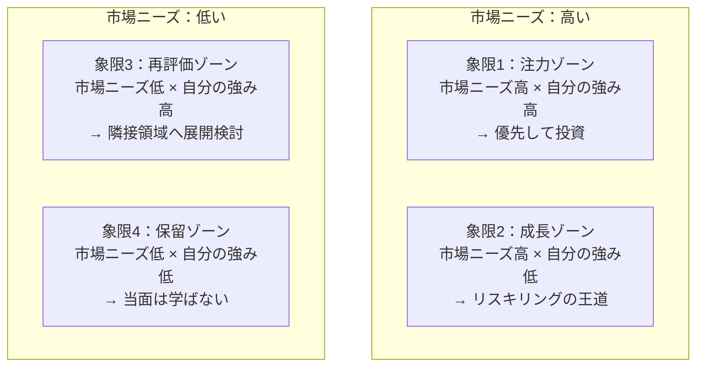

# リスキリング戦略入門

学び直しの設計図——変化の時代に「何を・いつ・どう学ぶか」を戦略的に決める

| 項目 | 内容 |
|---|---|
| カテゴリー | キャリア・自己開発 |
| 難易度 | 入門 |
| 所要時間 | 約200分（全8レッスン） |
| 公開日 | 2026-05-26 |
| 最終更新日 | 2026-05-30 |
| コースURL | https://skillup.college/courses/career/reskilling-strategy-basics/ |

## 対象者

「リスキリング」という言葉は知っているが、本格的に取り組んだ経験がない社会人。業務でAI・DXへの対応を求められている方、転職や社内転換を視野に入れている方、人事・人材開発の担当者として社員のリスキリングを企画する立場の方も対象。年齢層・職種を問わず、変化の時代に学び続けたいビジネスパーソン全般に向けた入門コース。

## 前提知識

特になし。社会人としての業務経験があると理解が早いが、必須ではない。学生やキャリア初期の方でも、考え方の枠組みとして活用できる。

## 学習目標

- リスキリング・アップスキリング・リカレント教育・生涯学習の違いを説明できる
- 今リスキリングが必要とされる社会的背景（DX・AI・人生100年時代）を整理して語れる
- スキルアセスメントとキャリアの棚卸しで、自分の現在地を客観的に把握できる
- 市場ニーズと自分の強みのマッチングから、学ぶべきテーマを選べる
- SMART目標と自己決定理論を使い、無理のない学習計画を設計できる
- 人材開発支援助成金・教育訓練給付金など、公的支援を活用する選択肢を持てる
- 学んだことを社内転換・転職・副業の3つの出口につなげる発想を持てる
- 学習を継続するための仕組み（習慣化・コミュニティ・ジャーナル）を理解する

## コース概要

「AIに仕事を奪われるかもしれない」「DXについていけない」「いまの会社で通用しなくなる日が来るのでは」——多くの社会人が、漠然とした不安を抱えています。リスキリングは、その不安に正面から向き合うための方法です。ただし、「とりあえずプログラミングを学ぶ」「流行りのAI講座を受講する」では戦略になりません。本コースでは、リスキリングを「変化に応じてスキルを再構築する継続的なプロセス」として捉え、何を・いつ・どう学ぶかを設計する基本を体系的に学びます。概念整理から、現在地の把握、テーマ選び、計画作り、公的支援の活用、学びを成果につなげる方法、継続の仕組みまで、8レッスンで一巡できる構成です。

## 学習の流れ

レッスン1〜2で、リスキリングの全体像と社会的背景を押さえます。レッスン3〜4は「何を学ぶか」の決め方——自分の現在地を測り、市場と自分の強みを掛け合わせて学ぶべきテーマを選ぶ方法を扱います。レッスン5〜6は「どう学ぶか」の設計——時間・予算・モチベーションの計画、そして公的支援を含む社会資源の活用方法を学びます。レッスン7〜8は「学びをどう活かし、どう続けるか」——成果につなげる3つの出口と、学習を継続するための仕組みを扱います。前半（レッスン1〜2）は「考え方の土台」、中盤（レッスン3〜4）は「テーマ選び」、後半（レッスン5〜6）は「計画と資源」、終盤（レッスン7〜8）は「成果と継続」という四段構えです。

## レッスン一覧

| No. | タイトル | 概要 | 所要時間 |
|---|---|---|---|
| 1 | リスキリングとは何か——アップスキリング・リカレント教育との違い | リスキリング・アップスキリング・リカレント教育・生涯学習の用語整理、日本での文脈、ダボス会議2020以降の流れ、個人と組織の責任分担を学ぶ | 25分 |
| 2 | なぜ今リスキリングか——DX・AI・人生100年時代の3つの圧 | DX人材不足、生成AIによる職務再定義、人生100年時代構想、ジョブ型雇用への移行など、リスキリングが求められる社会的背景を整理する | 25分 |
| 3 | 自分の現在地を測る——スキルアセスメントとキャリアの棚卸し | スキルの可視化、経産省「DXリテラシー標準」、IT人材スキル標準（ITSS+）、キャリアの棚卸し（経験・志向・価値観）、T型・π型人材の考え方を学ぶ | 25分 |
| 4 | 学ぶべきテーマの選び方——市場ニーズと自分の強みのマッチング | 市場ニーズの読み方、自分の強みとの掛け算、市場ニーズ×自分の強みの4象限マトリクスを使ったテーマ選びの方法を学ぶ | 25分 |
| 5 | 学習計画を立てる——時間・予算・モチベーションの設計 | SMART目標、学習時間の確保、予算配分、自己決定理論とプログレス・プリンシプル、忘却曲線に基づくモチベーション維持と復習の設計を学ぶ | 25分 |
| 6 | 公的支援と社会資源を活用する——助成金・給付金・社内制度 | 人材開発支援助成金（厚労省）、教育訓練給付金、DX推進人材リスキリング事業（経産省）、社内学習制度、自治体支援、オンライン学習プラットフォームの位置づけを学ぶ | 25分 |
| 7 | 学んだことを成果につなげる——社内転換・転職・副業の3つの出口 | 学習転移、ジョブクラフティング、社内公募と社内転職、転職市場での価値化、副業による試行、ポートフォリオによる成果証明など、学びを成果につなげる方法を学ぶ | 25分 |
| 8 | 継続するための仕組み——学習を習慣化する／コミュニティ／次の学習 | 習慣化の科学（IF-THENプランニング）、学習コミュニティ、ラーニング・ジャーナル、生成AIを学習パートナーとして使う発想、コース修了後の学習方向を学ぶ | 25分 |

---

## レッスン1：リスキリングとは何か——アップスキリング・リカレント教育との違い

（所要時間：25分）

### このレッスンで学ぶこと

- リスキリングの定義と、アップスキリング・リカレント教育との違いを説明できる
- ダボス会議2020以降の世界的な流れと日本での文脈を理解する
- 個人と組織のどちらが学習の責任を負うかについて、現代的な答えを整理する
- 本コース全体の見取り図を持つ

---

「リスキリング」という言葉を、ここ数年で何度も耳にしたかもしれません。経済産業省の白書、政府の方針、企業の研修案内、新聞のコラム——さまざまな場面で出てきます。しかし、「アップスキリング」「リカレント教育」「生涯学習」など類語が並んでくると、それぞれがどう違うのか、自分は何を意識すればよいのか、ぼやけてきます。本レッスンでは、まずこの用語の地図を整理することから始めます。

### リスキリングとは

リスキリング（reskilling）は、英語のRe（再び）とSkilling（スキルを身につけること）からなる言葉です。日本語に近い意味では「学び直し」と訳されますが、より正確には「新しい職務に必要なスキルを獲得すること」を指します。

経済産業省のリスキリングに関する整理では、リスキリングは「新しい職業に就くために、あるいは、今の職業で必要とされるスキルの大幅な変化に適応するために、必要なスキルを獲得する／させること」と説明されています（経済産業省『リスキリングとは——DX時代の人材戦略と世界の潮流』2021年）。

ポイントは2つあります。

1. **新しい職務への適応が前提**：いまと同じ仕事を上手にやるための学習ではなく、職務内容そのものが変わるときに必要となる学習
2. **個人だけでなく組織の文脈も含む**：「させること」という表現に注目。リスキリングは個人の取り組みであり、同時に企業や社会の課題でもある

> **💡 ポイント**
> リスキリングは「気合で何か新しいことを学ぶこと」ではありません。「自分の仕事が将来どう変わるか」という見通しに基づいて、計画的にスキルを再構築する戦略的な活動です。本コースのタイトルに「戦略」と付けているのは、この点を強調するためです。

### アップスキリング・リカレント教育・生涯学習との違い

リスキリングと混同されやすい言葉を整理します。

#### アップスキリング（upskilling）

アップスキリングは、いまの職務で必要なスキルをさらに高めることを指します。営業職が営業力をより磨く、エンジニアがプログラミング言語の新しいバージョンを学ぶ——こうした「同じ職務の中での深化」がアップスキリングです。

リスキリングとアップスキリングの違いは、職務が変わるかどうかにあります。

- **リスキリング**：新しい職務に必要なスキルを獲得する（営業職→データアナリスト、経理→DX推進など）
- **アップスキリング**：いまの職務で必要なスキルをさらに高める（営業力をより伸ばす、より高度な経理スキルを学ぶ）

ただし、現実には両者の境目は曖昧です。営業職にデータ分析力が求められるようになった場合、それは「営業職のアップスキリング」とも「データアナリストへのリスキリングの一歩」とも言えます。

#### リカレント教育（recurrent education）

リカレント教育は、社会人になってからも教育機関で学び直すことを指します。OECD（経済協力開発機構）が1970年代に提唱した概念で、もともとは「学校教育と職業生活を交互に繰り返す」という発想でした。

リスキリングとの違いは、学ぶ場所と仕組みです。

- **リカレント教育**：大学・大学院・専門学校など、教育機関で体系的に学ぶ
- **リスキリング**：教育機関に限らず、オンライン講座・社内研修・独学など多様な手段で学ぶ

リカレント教育はリスキリングの一形態と捉えることもできます。

#### 生涯学習（lifelong learning）

生涯学習は、もっと広い概念です。仕事のためだけでなく、趣味・教養・社会参加のための学びも含みます。

- **生涯学習**：人生全体にわたる学びすべて（仕事・趣味・教養・市民活動）
- **リスキリング**：そのうち、特に職業上の必要性に応える学び

> **🔰 初学者の方へ**
> 4つの用語は、おおざっぱには次のように整理できます。リスキリングが「職務転換のための学び」、アップスキリングが「現職での深化」、リカレント教育が「教育機関での学び直し」、生涯学習が「人生全体の学び」。完全に互いに排他的ではなく、重なり合う部分もあると理解してください。

### ダボス会議2020と「リスキリング革命」

リスキリングが世界的な議論の主役になったのは、2020年のダボス会議（世界経済フォーラム年次総会）です。世界経済フォーラム（WEF）はこの会議で「リスキリング革命（Reskilling Revolution）」を提唱し、2030年までに10億人に対して、より良い教育・スキル・仕事を提供することを目標として掲げました。

背景にあったのは、第4次産業革命（AI・IoT・ロボティクス）による職務の急激な変化です。WEFが同年公表した『The Future of Jobs Report』では、自動化により2025年までに世界で8500万人分の仕事がなくなる一方、9700万人分の新しい仕事が生まれると予測されました。差し引きでは仕事が増える計算ですが、問題は「失われる仕事」と「生まれる仕事」が同じスキルセットではないこと。この移行を支える仕組みがリスキリングだ、という認識が世界的に広がりました。

#### 日本での流れ

日本では、リスキリングが本格的な政策テーマになったのは2022年です。当時の岸田首相が所信表明演説で「人への投資5年で1兆円」を打ち出し、リスキリング支援を柱に据えました。経済産業省も同年、「DXリテラシー標準」「DXスキル標準」を策定し、企業や個人がリスキリングを進めるための共通言語を整備しています。

2024年には人材開発支援助成金が改正され、デジタル分野の訓練に対する補助率が引き上げられました。2025〜2026年現在、企業のリスキリングプログラムへの公的支援は、欧米先進国に追いつきつつある段階です。

> **📝 補足**
> 日本でリスキリングがバズワード化した背景には、ジョブ型雇用への移行論議もあります。メンバーシップ型雇用（職務を限定せず会社が配属を決める）からジョブ型雇用（職務を明確に定義し、それに合う人材を採用・配置する）への移行が議論される中で、職務とスキルを紐づけて考える発想が必要になり、リスキリングへの関心も自然と高まりました。

### 個人と組織のどちらが責任を負うか

リスキリングを語るときに必ず出てくるのが、「学ぶ責任は誰にあるか」という議論です。

#### 米国型：個人責任の伝統

米国では伝統的に、キャリアもスキルも個人の責任という考え方が強い社会です。会社は職務に対して報酬を支払い、職務を遂行できなくなった人材は淘汰される。学び直しは個人が自分のために行うもの——というスタンスです。

#### 北欧型：社会的支援の伝統

デンマーク・スウェーデンなど北欧諸国は対照的です。リスキリングは社会のインフラとして整備されており、失業しても充実した職業訓練と所得保障で「次の職」へ円滑に移れる仕組み（フレキシキュリティ）が機能しています。

#### 日本型：企業内訓練の伝統

日本は伝統的に、企業内訓練（OJT・OFF-JT）が学習の中心でした。終身雇用と引き換えに、企業が社員を育てる責任を負っていた、という構図です。しかし、この前提が崩れつつある中で、個人責任にシフトすべきか、企業責任を維持・強化すべきか、社会的支援を充実すべきか——議論が続いています。

#### 現代的な答え：3者の重なり合い

現代の主流の考え方は、「個人・企業・社会の3者がそれぞれ責任を負う」というものです。

- **個人**：自分のキャリアを設計し、学習の主体性を持つ
- **企業**：事業に必要なスキル変化を見通し、社員のリスキリングに投資する
- **社会（政府・自治体）**：公的訓練・助成金・給付金で個人と企業を支援する

本コースは、主に「個人」の視点から書かれていますが、企業の役割や公的支援についても繰り返し触れていきます。

> **⚠️ 注意**
> 「リスキリングは自己責任」と単純化すると、自己責任論に陥りがちです。実際には、企業の投資不足や社会的支援の薄さがあると、個人だけでリスキリングを完遂するのはとても難しい。本コースは「自分でやる部分」と「制度を使う部分」を両方扱います。

### 本コースのスタンス

ここまでで、リスキリングを取り巻く言葉と背景を整理しました。本コースのスタンスを最後に明示しておきます。

1. **リスキリングは「気合」ではなく「設計」である**：何をいつどう学ぶかを戦略的に決める
2. **個人責任と社会的支援は両立する**：制度を知り、活用する選択肢を常に持つ
3. **派手な転職物語ではなく、地道な積み上げ**：3か月で人生が変わるのではなく、3年で景色が変わる
4. **学ぶこと自体が目的ではない**：成果（仕事・収入・やりがい・人生の選択肢）につながってこそリスキリング
5. **全員が同じ道を歩くわけではない**：年齢・職種・家庭・志向で最適解は変わる。一般原則を学んで、自分用に翻訳する

これらを踏まえ、本コースは8レッスンで構成されています。

- **レッスン2**：なぜ今リスキリングか——DX・AI・人生100年時代の3つの圧
- **レッスン3**：自分の現在地を測る——スキルアセスメントとキャリアの棚卸し
- **レッスン4**：学ぶべきテーマの選び方——市場ニーズと自分の強みのマッチング
- **レッスン5**：学習計画を立てる——時間・予算・モチベーションの設計
- **レッスン6**：公的支援と社会資源を活用する——助成金・給付金・社内制度
- **レッスン7**：学んだことを成果につなげる——社内転換・転職・副業の3つの出口
- **レッスン8**：継続するための仕組み——学習を習慣化する／コミュニティ／次の学習

前半（レッスン1〜2）は「考え方の土台」、中盤（レッスン3〜4）は「テーマ選び」、後半（レッスン5〜6）は「計画と資源」、終盤（レッスン7〜8）は「成果と継続」、という四段構えです。

### まとめ

このレッスンでは、以下のことを学びました。

- リスキリングは「新しい職務に必要なスキルを獲得する」こと
- アップスキリング（同職務での深化）、リカレント教育（教育機関での学び直し）、生涯学習（人生全体の学び）と区別される
- ダボス会議2020の「リスキリング革命」と、日本での2022年の政策化が背景にある
- 個人・企業・社会の3者がそれぞれ責任を負うのが現代的な整理
- 本コースは「気合」ではなく「設計」、派手な物語ではなく地道な積み上げ、というスタンス

次のレッスンでは、「なぜ今リスキリングが必要なのか」を、DX・AI・人生100年時代という3つの社会的圧力から整理します。漠然とした「変化の時代」が、自分にとってどんな具体的な変化を意味するのかを掴むレッスンです。

---

### 確認クイズ

このレッスンの理解度をチェックしましょう。

#### Q1. リスキリングの定義として最も適切なものはどれか？

- [x] 新しい職業に就くため、または今の職業で必要とされるスキルの大幅な変化に適応するために、必要なスキルを獲得すること
- [ ] 趣味や教養のために自由に学ぶこと
- [ ] 大学・大学院など教育機関で学位を取得すること
- [ ] 現職の業務効率を高めるために同じスキルを反復練習すること

> **解説**
> リスキリングは「新しい職務」または「職務内容の大幅な変化」への適応に焦点を当てた概念です。経済産業省の整理に基づく定義です。趣味の学習は生涯学習、教育機関での学び直しはリカレント教育、現職での深化はアップスキリングです。

#### Q2. リスキリングとアップスキリングの違いとして最も適切なものはどれか？

- [ ] リスキリングは無料、アップスキリングは有料である
- [ ] リスキリングは年配層、アップスキリングは若手向けである
- [x] リスキリングは新しい職務への適応、アップスキリングはいまの職務での深化を指す
- [ ] リスキリングは企業負担、アップスキリングは個人負担である

> **解説**
> 両者を分ける本質は「職務が変わるかどうか」です。職務が変わる場合がリスキリング、同じ職務でスキルを高める場合がアップスキリング。現実には境目が曖昧なこともあります。

#### Q3. リカレント教育の特徴として最も適切なものはどれか？

- [ ] 必ず仕事のために行う
- [ ] 趣味目的が中心である
- [x] 大学・大学院・専門学校など教育機関で体系的に学ぶ
- [ ] 短期間のオンライン講座が中心である

> **解説**
> リカレント教育は、OECDが1970年代に提唱した概念で「学校教育と職業生活を交互に繰り返す」発想に基づきます。教育機関での体系的な学び直しが中心です。

#### Q4. ダボス会議2020で世界経済フォーラム（WEF）が提唱した取り組みとして本レッスンで紹介されたものはどれか？

- [ ] 全世界の大学を無償化する「教育革命」
- [x] 2030年までに10億人へより良い教育・スキル・仕事を提供する「リスキリング革命」
- [ ] 失業者を一律に再雇用する「雇用保障革命」
- [ ] AIによる職業診断を全員に義務化する「キャリア革命」

> **解説**
> WEFは2020年のダボス会議で「リスキリング革命」を提唱し、2030年までに10億人に対してより良い教育・スキル・仕事を提供することを目標として掲げました。背景には第4次産業革命による職務の急激な変化があります。

#### Q5. リスキリングにおける「個人と組織の責任分担」について、本レッスンが示した現代的な整理として最も適切なものはどれか？

- [ ] 完全な自己責任で、企業や社会の支援は不要である
- [ ] 企業が全責任を負い、個人は受動的に従えばよい
- [ ] 政府がすべて決め、個人と企業は指示に従えばよい
- [x] 個人・企業・社会の3者がそれぞれ責任を負い、互いに支え合う

> **解説**
> 本レッスンが示した現代的な答えは「個人・企業・社会の3者がそれぞれ責任を負う」です。個人がキャリアの主体性を持ち、企業が必要な投資をし、社会が公的支援を整える。自己責任論にも全面支援論にも振れすぎないのが現実的です。

#### Q6. 本コースのスタンスとして本レッスンで挙げられたものはどれか？

- [ ] リスキリングは気合で乗り切る活動である
- [ ] 派手な転職物語こそリスキリングの本質である
- [ ] 学ぶこと自体が目的で、成果は二の次でよい
- [x] 戦略的な設計が必要で、地道な積み上げを通じて成果につなげるもの

> **解説**
> 本コースのスタンスは、リスキリングを「気合」ではなく「設計」、派手な物語ではなく「地道な積み上げ」、そして学習自体ではなく「成果につながってこそ」のリスキリングとして捉えるものです。

---

## レッスン2：なぜ今リスキリングか——DX・AI・人生100年時代の3つの圧

（所要時間：25分）

### このレッスンで学ぶこと

- DX人材不足の現状と、企業が抱える課題を理解する
- 生成AIによる職務再定義の流れを把握する
- 人生100年時代の労働観の変化と、ジョブ型雇用への移行を整理する
- 「変化を予測する」のではなく「対応力に投資する」という発想を身につける

---

レッスン1では、リスキリングの定義と4つの類語の違いを整理しました。本レッスンでは、「なぜ今、これだけリスキリングが議論されているのか」を社会的な背景から掘り下げます。漠然と「変化の時代だから」と言われると遠い話に感じますが、3つの圧（DX・AI・人生100年時代）を順に見ていくと、自分の仕事との接続が見えてきます。

### 圧その1：DX人材不足

DX（Digital Transformation／デジタル変革）は、企業が事業のあり方そのものをデジタル技術によって変える取り組みです。2018年の経済産業省「DXレポート」で「2025年の崖」が警告されてから、日本企業のDX投資は加速しました。しかし、その担い手であるDX人材は、慢性的に不足しています。

#### IPA「DX動向2024」が示す現実

独立行政法人IPA（情報処理推進機構）が公表する「DX動向」シリーズは、毎年日本企業のDX状況を調査しています。2024年版では、DXに取り組む企業の約8割が「DX人材が不足している」と回答しています。特に、ビジネスとデジタルの橋渡しができる人材（プロダクトマネージャー・データサイエンティスト・UXデザイナーなど）が大きく足りていません。

この「足りない」は、外部から採用すれば解決するというものではありません。

- **市場全体での人材プール不足**：データサイエンティストや AI エンジニアの中途採用市場は、需要が供給を大幅に上回り、給与は高騰しています
- **業務文脈の理解が必要**：DXは技術だけではなく、業界・自社の業務文脈の理解が必須。外部採用人材だけでは進まない
- **内製化の流れ**：かつては外部ベンダーに丸投げしていたシステム開発を、内製化する動きが広がる。社員のリスキリングが現実的な選択肢になる

つまり、企業から見ると「外部から採用するだけでは足りないので、既存社員のリスキリングが必要」、個人から見ると「DX領域のスキルを身につけると、社内でも市場でも価値が高まる」という二重の構図が生まれています。

> **💡 ポイント**
> DXは「IT部門の仕事」ではありません。営業・人事・経理・製造・物流——あらゆる職種が、デジタルツールやデータを使う仕事に変わっていきます。自分の職種は関係ないと思わないこと。むしろ「自分の業務領域 ＋ デジタル」の組み合わせに、最も価値が生まれます。

### 圧その2：生成AIによる職務再定義

2022年末のChatGPT登場以降、生成AIは仕事の風景を一変させています。2026年現在、文章作成・コーディング・データ分析・画像生成など、多くの定型業務でAIが人間の生産性を大きく押し上げています。

#### 「仕事が奪われる」のではなく「職務が再定義される」

「AIに仕事を奪われる」というセンセーショナルな表現が広まりましたが、現実はもう少し複雑です。多くの研究で示唆されているのは、職務（job）単位ではなくタスク（task）単位での再定義です。

例えば、マーケターの仕事を分解すると、市場調査・データ分析・コンテンツ作成・キャンペーン企画・効果測定など、複数のタスクから構成されています。これら一つひとつのタスクに、AIが「補助できる範囲」と「人間しかできない範囲」が混在しています。

- **AIが代替・補助できる**：定型的なリサーチ、データの整理・集計、初稿レベルのコンテンツ作成、A/Bテスト案の生成
- **人間が担い続ける**：戦略の最終判断、顧客との関係構築、創造的な発想の起点、倫理判断

つまり、職務がまるごと消えるのではなく、「タスクの組成」が変わります。AIに任せられる部分を任せ、人間は「より高い価値の判断」に集中する——という再構成が、ほぼすべての職種で進んでいます。

#### 何を学ぶべきか

この再定義に対応するために必要なリスキリングは、大きく2方向あります。

1. **AIを使いこなす力**：プロンプト設計、AIと協働する仕事の組み立て方、AI出力の評価・編集
2. **AIに置き換えにくい力**：戦略的判断、顧客との関係構築、創造的思考、倫理的判断、複雑な対話

両方が必要で、一方だけでは不十分です。AIだけ使っても判断力がなければ価値は出ず、判断力だけあってもAIを使えなければ生産性が出ません。

> **🔰 初学者の方へ**
> 「自分の仕事は AI に奪われるか」という二択ではなく、「自分の仕事のどの部分が AI で変わり、どの部分が残るか」と考えてみてください。多くの場合、答えは「タスクの半分は変わるが、職務全体としては残り、むしろ生産性が上がる」です。それを前提に、何を学ぶかを設計します。

### 圧その3：人生100年時代

3つ目の圧は、個人の寿命と労働寿命の長期化です。リンダ・グラットンとアンドリュー・スコットによる『LIFE SHIFT——100年時代の人生戦略』（東洋経済新報社、2016年）が日本でベストセラーになり、政府も2017年に「人生100年時代構想会議」を設置しました。

#### 「教育→仕事→引退」の3ステージモデルの崩壊

20世紀の標準的な人生モデルは、3ステージで構成されていました。20代前半までに教育を受け、20代から60代まで働き、60代以降は引退して余生を過ごす——というモデルです。このモデルは、人生が70〜80年程度であり、職業が比較的長く安定して続く前提のもとで成り立っていました。

人生100年時代では、この前提が崩れます。

- 寿命が延びる → 60代で引退しては経済的に持たない
- 職業が変化する → 同じ職業を50年続けるのは現実的でない
- 健康なまま長く活動できる → 「老後」が長くなり、活動の質が問われる

その結果、「教育・仕事・引退」を一度ずつではなく、繰り返し行う「マルチステージ」の人生が必要になります。リスキリングは、このマルチステージ人生のインフラと言えます。

#### 「いつ学ぶか」が変わる

3ステージモデルでは、学ぶのは若い時期に集中していました。マルチステージ時代では、30代・40代・50代・60代の各時期に「学ぶフェーズ」がやってきます。

- 30代：専門性を確立する学習
- 40代：専門の幅を広げる、または別領域への転換に向けた学習
- 50代：マネジメント・教育・社会貢献に向けた学習、または起業準備
- 60代以降：第3の職業／ライフワークのための学習

具体的な分け方は人によって違いますが、「もう学ぶ年齢じゃない」という発想は通用しなくなります。

### 圧その4（補足）：ジョブ型雇用への移行

ここまでの3つの圧と関連して、日本特有の文脈として「ジョブ型雇用」への移行があります。

メンバーシップ型雇用（職務を限定せず会社が配属を決める、新卒一括採用、終身雇用）は、戦後日本の労働慣行でした。一方、ジョブ型雇用は、職務を明確に定義し、それに必要なスキルを持つ人を採用・配置する仕組み。欧米では一般的な形です。

日本でも2020年代以降、大手企業を中心にジョブ型雇用への部分的な移行が進んでいます。完全な移行ではなく、「ハイブリッド型」が現実解になっていますが、「ジョブ＝職務」と「スキル」を結びつけて考える発想が、ますます重要になっています。

ジョブ型の世界では、「私は営業部の長谷川です」では足りず、「私は営業職としてB2Bエンタープライズ顧客のアカウントマネジメントを担当し、CRMツールでパイプライン管理ができ、英語で交渉ができます」のように、職務と能力を具体的に言語化できることが価値になります。

> **📝 補足**
> ジョブ型雇用への完全な移行は、日本では起きていません。大企業のごく一部のポジションで導入されているのが現状です。ただし、考え方としての「職務とスキルを紐づける」発想は、職場の人事制度や日々の業務でも徐々に標準化しています。

### 「変化を予測する」のではなく「対応力に投資する」

ここまで4つの圧を見てきましたが、よくある質問は「結局、何を学べばよいのか」です。

「AI時代に儲かるスキル」「これから10年で必要になる職種」のような記事は溢れていますが、5年後・10年後を正確に予測するのは誰にも難しい。予測に頼ると、外れたときのダメージが大きい。

代わりに本コースが提案するのは、「変化の予測」ではなく「対応力への投資」という発想です。

- 特定の技術ではなく、技術を学ぶ力（学ぶ習慣・学習の型）を身につける
- 特定の業界ではなく、業界を越えて使える基礎力（読解力・データリテラシー・対話力）を磨く
- 特定の職業ではなく、職業を組み立てる発想（自分の強みと市場ニーズのマッチング）を持つ

これらは「メタスキル」とも呼ばれ、変化に強い人材の共通項です。本コース全体を通して、特定のスキル名を推奨するのではなく、「自分用の戦略を立てる枠組み」を提供することを目指します。

> **⚠️ 注意**
> 「これを学べば一生安泰」という宣伝文句には注意してください。特定の技術や資格を売り込むビジネスでは、よく使われる表現です。一生安泰なスキルは存在しません。あるのは「変化に対応し続ける習慣」だけです。

### オンライン学習の普及という追い風

最後に、リスキリングを支える環境の変化にも触れます。2010年代以降、オンライン学習プラットフォーム（Coursera・Udemy・edX・Schoo・Udemy Business・LinkedIn Learning など）が急速に普及し、世界トップクラスの講師の講義に低コストでアクセスできるようになりました。日本でも、無料・低価格で受講できる質の高い学習コンテンツが、ここ10年で爆発的に増えています。

これは、リスキリングのコストとアクセス障壁を大きく下げました。20年前なら大学院に通うか、数十万円の研修を受けるかしか選択肢がなかった内容が、いまでは月数千円〜のサブスクリプションで学べます。

スキルアップカレッジ（本コースを掲載しているプラットフォーム）も、その流れの中にあります。テキスト中心で体系的に学べる無料コースを揃えるアプローチで、リスキリングの選択肢を広げる一翼を担っています。

> **💡 ポイント**
> 「お金がかかるから学べない」という言い訳は、2026年にはほぼ通用しません。質の高い無料・低価格コンテンツが豊富にあり、公的支援も充実しています。本当の障壁は、お金より「時間の確保」「テーマ選び」「継続」です。これらをどう設計するかが、本コースの中心テーマになります。

### まとめ

このレッスンでは、以下のことを学びました。

- DX人材不足は深刻で、外部採用だけでは解決せず、既存社員のリスキリングが必要
- 生成AIは職務を「奪う」のではなく「再定義」する。タスク単位で人間とAIの役割が組み変わる
- 人生100年時代では「教育→仕事→引退」の3ステージから、マルチステージへの移行が起きる
- ジョブ型雇用の部分導入により、職務とスキルを紐づけて考える発想が必要になる
- 「変化を予測する」より「対応力に投資する」発想が、変化に強い
- オンライン学習の普及で、リスキリングのコストとアクセス障壁は大きく下がった

次のレッスンでは、リスキリングの最初の具体的なステップ——自分の現在地を測る方法を扱います。スキルアセスメントとキャリアの棚卸しを通じて、これから何を学ぶかを決めるための土台を作ります。

---

### 確認クイズ

このレッスンの理解度をチェックしましょう。

#### Q1. DX人材不足の現状について、本レッスンが示した整理として最も適切なものはどれか？

- [ ] 外部から積極的に採用すれば短期間で解消できる
- [x] 市場全体での人材プール不足、業務文脈理解の必要性、内製化の流れから、既存社員のリスキリングが現実的な選択肢になる
- [ ] DXは IT 部門だけの課題で、ほかの部門には関係ない
- [ ] DX人材はAIですべて代替できるので、人材不足は今後解消する

> **解説**
> DX人材不足は外部採用だけでは解決しにくく、業務文脈を理解した既存社員のリスキリングが現実的な選択肢になります。営業・人事・経理など多くの職種でデジタルスキルが必要になっています。

#### Q2. 生成AIによる職務への影響について、本レッスンが示した整理として最も適切なものはどれか？

- [x] 職務単位ではなくタスク単位で再定義が進み、AIが補助できる部分と人間が担う部分が組み変わる
- [ ] 多くの職業がまるごと消滅する
- [ ] AIは仕事に影響を与えない
- [ ] AIが普及すれば人間は働く必要がなくなる

> **解説**
> 多くの研究で示唆されているのは「タスク単位での再定義」です。職務がまるごと消えるのではなく、AIが補助できるタスクと人間が担うタスクの組成が変わり、生産性が向上していく流れです。

#### Q3. 人生100年時代において、本レッスンで紹介された「マルチステージ」の発想として最も適切なものはどれか？

- [ ] 20代までに集中して学び、それ以降は学ばない
- [ ] 60代で引退して残りの人生は余生として過ごす
- [x] 30代・40代・50代・60代の各時期に「学ぶフェーズ」がやってきて、教育・仕事・転換を繰り返す
- [ ] すべての時期で同じ職業を続けるのが理想である

> **解説**
> 人生100年時代では、寿命と職業変化の双方を背景に「教育・仕事・引退」を一度ずつではなく繰り返す「マルチステージ」人生が必要になります。30代以降の各時期に学習のフェーズがやってきます。

#### Q4. ジョブ型雇用の特徴として本レッスンで示されたものはどれか？

- [ ] 職務を限定せず会社が配属を決める
- [ ] 新卒一括採用と終身雇用が前提である
- [ ] 全員が同じ給与体系で働く
- [x] 職務を明確に定義し、それに必要なスキルを持つ人を採用・配置する仕組み

> **解説**
> ジョブ型雇用は、職務（job）を明確に定義し、それに必要なスキルを持つ人材を採用・配置する仕組みです。欧米では一般的で、日本でも大手企業の一部ポジションで導入が進んでいます。

#### Q5. 「変化を予測する」のではなく「対応力に投資する」という本レッスンの発想として最も適切なものはどれか？

- [ ] 5年後10年後の必要スキルを正確に予測して、それだけを学ぶ
- [ ] 流行りの技術や資格をすぐに取得する
- [x] 特定の技術ではなく、技術を学ぶ力・基礎力・職業を組み立てる発想（メタスキル）に投資する
- [ ] 予測が外れるのが怖いので、何も学ばずに様子を見る

> **解説**
> 5〜10年後の正確な予測は誰にも難しいため、特定の技術ではなく「技術を学ぶ力」「基礎力」「職業を組み立てる発想」というメタスキルに投資するのが、変化に強い戦略です。

#### Q6. オンライン学習の普及がリスキリングにもたらした変化として本レッスンで挙げられたものはどれか？

- [ ] 学習コストとアクセス障壁が逆に上昇した
- [ ] 質の高い学習は対面のみで提供される
- [ ] オンライン学習は無効で対面研修だけが価値を持つ
- [x] 質の高いコンテンツに低コストでアクセスできるようになり、学習の障壁は「お金」より「時間・テーマ・継続」へとシフトした

> **解説**
> 2010年代以降、世界トップクラスの講師の講義に低コストでアクセスできるようになり、リスキリングのコストとアクセス障壁は大きく下がりました。本当の障壁は「時間の確保」「テーマ選び」「継続」へとシフトしています。

---

## レッスン3：自分の現在地を測る——スキルアセスメントとキャリアの棚卸し

（所要時間：25分）

### このレッスンで学ぶこと

- スキルアセスメントの考え方と、よくある落とし穴を理解する
- 経済産業省「DXリテラシー標準」「DXスキル標準」の概要を把握する
- キャリアの棚卸し（経験・志向・価値観）の3つの軸を実行できる
- T型人材・π型人材の発想を、自分の戦略に翻訳する

---

レッスン1〜2で、リスキリングの概念と背景を学びました。本レッスンから2つは「テーマ選び」のレッスンです。今回は最初のステップ——自分の現在地を測ることに焦点を当てます。地図がなければ進めないように、現在地が分からなければ次に学ぶべきものも決まりません。

### なぜ「現在地を測る」必要があるか

リスキリングの最大の落とし穴は、「流行のスキル」「友人が学んでいるもの」「ネット記事のおすすめ」をそのまま自分の学習テーマにしてしまうことです。これは「他人の地図」を頼りに自分の旅を始めるようなものです。

現在地が違えば、最短ルートも目的地もすべて変わります。30代エンジニアと40代経理担当者では、Python を学ぶ意味も、学ぶ深さも、学ぶ順序も違います。学習の戦略は、自分の現在地から組み立てる必要があります。

「現在地を測る」とは、次の3つを言語化することを意味します。

1. **スキル**：いま自分が持っているスキルは何か（過小評価・過大評価しない）
2. **経験**：これまでに何を経験してきたか（成功体験・失敗体験の両方）
3. **志向・価値観**：何が好きで、何を大切にしているか

これらを正直に書き出すと、自分が「次にどこへ進むべきか」の手がかりが見えてきます。

> **💡 ポイント**
> 現在地を測ることは、リスキリングの「準備段階」のように見えますが、実は最も時間をかけるべき部分です。次の数年の学習投資の方向を決めるのですから、丁寧に取り組む価値があります。

### スキルアセスメント——3つのよくある落とし穴

スキルアセスメント（スキルの自己評価）には、いくつかの典型的な落とし穴があります。

#### 落とし穴1：抽象的すぎる表現

「コミュニケーション力がある」「リーダーシップがある」「データに強い」——こうした抽象的な表現は、ほとんど情報を含みません。本人がそう思っているだけで、客観的な根拠も比較対象もないからです。

具体化のコツは、「いつ・どこで・何を・どのように」を加えることです。

- ❌「コミュニケーション力がある」
- ⭕「3年間、月20回ペースで法人顧客への提案を続け、新規受注率を15%から28%に上げた」

#### 落とし穴2：過小評価／過大評価

スキルアセスメントでは、自分のスキルを客観的に測るのが難しいことが知られています。心理学では「ダニング・クルーガー効果」と呼ばれる現象があり、能力が低い人ほど自分を過大評価し、能力が高い人ほど過小評価する傾向があります（Kruger & Dunning, 1999）。

過大評価のリスクは、必要のない学習に時間を使うこと。過小評価のリスクは、すでにある武器を活かさないこと。両方を避けるために、外部の指標と本人の自己評価を組み合わせるのが現実的です。

#### 落とし穴3：単発の評価で終わる

スキルアセスメントは、一度やって終わりではありません。市場ニーズも自分の能力も変化するため、半年〜1年ごとに見直すのが理想です。「やった」「やっていない」だけの一度きりの作業にせず、定期的な「振り返り」の習慣として組み込みます。

> **🔰 初学者の方へ**
> 最初のスキルアセスメントは、完璧を目指さなくて構いません。30分〜1時間程度で、思いつくまま書き出すところから始めましょう。完成度より、書き出して可視化することに価値があります。半年後、1年後にもう一度やって比較すると、変化が見えて楽しくなります。

### 経済産業省「DXリテラシー標準」「DXスキル標準」

リスキリングを考えるうえで、外部の客観指標として有用なのが、経済産業省と情報処理推進機構（IPA）が策定した「デジタルスキル標準」です。

#### DXリテラシー標準

「DXリテラシー標準」は、社会人全員が持つべきデジタルの基礎知識を整理したものです。2022年に経産省・IPAから公開されました。

5つの領域で構成されています。

1. **Why（DXの背景）**：社会・顧客・競争環境の変化、データ・デジタル技術の進化
2. **What（DXで活用されるデータ・技術）**：データ・AI・クラウド・ハードウェア・ソフトウェアの基礎
3. **How（データ・技術の利活用）**：データ分析・AI利活用・コラボレーション・ノーコード
4. **マインド・スタンス**：変化への適応、学び続けること、デジタルツールを使うこと
5. **共通の素養**：論理的思考・倫理・セキュリティ

DXリテラシー標準は、職種を問わない「全社員向け」のレベルとして設計されています。営業・人事・経理・製造——どの職種でも、ここに書かれた水準は持っていることが期待されます。

#### DXスキル標準

一方、「DXスキル標準」は、DXを推進する専門人材向けに策定されたものです。5つの人材類型に分けられています。

1. **ビジネスアーキテクト**：事業構想・新規ビジネス開発
2. **デザイナー**：UI/UX、サービスデザイン
3. **データサイエンティスト**：データ分析・機械学習
4. **ソフトウェアエンジニア**：システム設計・開発
5. **サイバーセキュリティ**：情報セキュリティの設計・運用

これらは「DX推進の最前線で活躍する人材」のスキルセットで、すべての人が目指すべきものではありません。本コースを学ぶ読者の多くは、DXリテラシー標準をベースに、必要に応じてスキル標準のいずれかへ進む、という流れが現実的です。

> **📝 補足**
> DXリテラシー標準・DXスキル標準は、経済産業省と独立行政法人IPAの公式サイトで公開されています。フリーで誰でも閲覧でき、現在地のチェックリストとして使えます。本コースのレッスン6で公的支援を扱う際に、再びこの2つの標準にも触れます。

### キャリアの棚卸し——3つの軸

スキルアセスメントが「何ができるか」を扱うのに対し、キャリアの棚卸しは「何をしてきたか／何をしたいか／何を大切にしたいか」を扱います。3つの軸で言語化します。

#### 軸1：経験の棚卸し

これまで関わってきた業務・プロジェクト・役割を、時系列で書き出します。

- 担当した業務・プロジェクト
- 関わった人・部署・顧客
- 出した成果（数字で言えるもの・定性的なもの）
- 失敗・苦労した経験

書き出すコツは、「成功体験だけでなく失敗体験も」「数字で言えるものは数字で」「専門用語ではなく業務シーンを思い出せる言葉で」です。

#### 軸2：志向（Will）の棚卸し

何をしているときに楽しいと感じるか、何に没頭できるか、何を続けたいと思うか——を書き出します。

問いの例：

- 過去の業務で「あっという間に時間が経った」と感じた瞬間はいつか
- 仕事以外で熱中していること・続けてきたことは何か
- やっていて疲れない種類のタスクは何か
- 逆に、やっていて消耗するタスクは何か

志向は、リスキリングの方向を決める重要なシグナルです。市場価値が高くても、自分が興味を持てない領域に長期間投資するのは難しいからです。

#### 軸3：価値観（Must）の棚卸し

仕事・キャリアで大切にしたいこと、譲れない条件、ライフスタイルとの両立を書き出します。

問いの例：

- 収入・安定・自由・成長・社会貢献——優先順位は？
- 家族・健康・趣味との両立で、譲れないものは？
- リモートワーク・地方移住・海外勤務など、ライフスタイルへの希望は？
- 5年後・10年後にどんな生活をしていたいか

価値観は、ライフステージで変わります。30歳のときと40歳のときで、優先順位が違うのは自然です。定期的に書き直す前提で扱います。

#### Will-Can-Mustの古典的フレーム

3つの軸は、Will（やりたいこと）・Can（できること）・Must（大切にすべきこと／求められていること）の3要素を組み合わせた「Will-Can-Must」フレームとも近い発想です。日本のキャリアコンサルティングの現場で広く使われており、3要素が重なる領域に、長く続けられる仕事のヒントがあるとされます。

> **💡 ポイント**
> キャリアの棚卸しは、ノートに手で書き出すのがおすすめです。タイピングだと「整った文章」になりがちですが、手書きだと思考が止まって本音が出やすい。最初の30分は、書き殴る感覚で書き出してみてください。

### T型人材・π型人材——専門性の戦略

スキルと経験を棚卸ししたら、それを「どんな形にしていくか」を考えます。専門性の戦略を表す古典的なモデルが、T型人材・π型人材という発想です。

#### I型人材（一本足型）

1つの専門領域に深く特化した人材。例えば「営業ひと筋20年」「エンジニアリングだけ」。特定領域では強いが、領域が変化すると弱い。

#### T型人材

縦棒が深い専門性、横棒が幅広い基礎知識という形を表します。1つの強い専門領域を持ちつつ、隣接領域や周辺ビジネスにも幅広く対応できる人材。

例：データサイエンティスト（深い専門性）＋ ビジネス理解・コミュニケーション・プロジェクトマネジメントの基礎知識（幅広い基礎）

#### π型人材（パイ型）

縦棒が2本に増えた形。2つ以上の専門領域を持ち、それらを掛け合わせて新しい価値を生む人材。

例：経理＋データ分析、デザイン＋プログラミング、医療＋ITなど

リスキリングの戦略としては、I型人材がT型人材に進化し、さらにπ型人材に発展する、という方向性が一般的です。「いまの専門の横に、もう1つの専門を立てる」——これがリスキリングの典型的なゴールです。

#### どの形を目指すか

3つの型のうち、どれを目指すかは、年齢・状況・志向で変わります。

- 20代：I型を確立する時期（まずは1つの専門を深める）
- 30代：T型への移行を意識する時期（隣接領域に幅を広げる）
- 40代以降：π型を視野に入れる時期（2つ目の専門を立てる）

ただし、これは一例で、人それぞれの状況に応じた柔軟性が必要です。20代でπ型を目指す人もいれば、40代でI型を究めようとする人もいます。

> **🔰 初学者の方へ**
> T型・π型を目指すうえで大事なのは、「すでに持っている専門を捨てない」ことです。リスキリングは「ゼロから新しい人になる」ことではなく、「持っている武器に新しい刃を足す」ことです。私が金融機関の人事から、人事＋データ分析という π型に進化したのも、人事の経験は手放さず、その上にデータ分析を足したからです。

### オンラインでできる自己診断ツール

スキルアセスメントとキャリアの棚卸しをサポートするツールも、いくつかあります。

- **マナリンク**（厚生労働省）：キャリアコンサルタント検索や自己診断（jobtag という名称で提供）
- **jobtag（職業情報提供サイト）**：厚生労働省。約500種類の職業について、必要なスキル・働き方・賃金などを確認できる
- **DXリテラシー標準・DXスキル標準のチェックリスト**：経産省・IPAから提供。自分のデジタルスキルの現在地を客観的に把握できる
- **GROW360 / SHL / TAP** など：企業向けの能力アセスメントツール（個人受験可能なものもある）

これらは万能ではなく、あくまで「自己評価の補助」と捉えるのが現実的です。本気で深く知りたければ、キャリアコンサルタント（国家資格）に相談するのも選択肢の1つです。

### まとめ

このレッスンでは、以下のことを学びました。

- リスキリングの第一歩は、自分の現在地（スキル・経験・志向・価値観）を測ること
- スキルアセスメントには「抽象的すぎる」「過小・過大評価」「単発で終わる」の3つの落とし穴がある
- 経済産業省「DXリテラシー標準」は全社員向け、「DXスキル標準」はDX推進専門人材向けの基準
- キャリアの棚卸しは「経験・志向・価値観」の3軸で行う。Will-Can-Mustフレームも参考になる
- T型・π型人材の発想で、持っている専門の上に新しい専門を足す戦略を立てる

次のレッスンでは、現在地を測ったうえで、では具体的に何を学ぶか——「学ぶべきテーマの選び方」を扱います。市場ニーズと自分の強みを掛け合わせる4象限マトリクスで、自分用のテーマを決める方法を学びます。

---

### 確認クイズ

このレッスンの理解度をチェックしましょう。

#### Q1. 「現在地を測る」ことの目的として最も適切なものはどれか？

- [ ] 他人と比較して優越感や劣等感を持つため
- [x] 次に学ぶべきテーマを「自分の現在地から」設計する土台を作るため
- [ ] 履歴書を埋めるための形式的な作業
- [ ] 流行のスキルをそのまま学ぶための準備

> **解説**
> 現在地が違えば最短ルートも目的地も変わります。リスキリングの学習戦略は、他人の地図ではなく自分の現在地から組み立てる必要があり、その土台を作るのが「現在地を測る」目的です。

#### Q2. ダニング・クルーガー効果に関する説明として最も適切なものはどれか？

- [ ] 能力が高い人ほど自分を過大評価する
- [ ] 性別や年齢で能力評価が変わる
- [x] 能力が低い人ほど自分を過大評価し、能力が高い人ほど過小評価する傾向がある
- [ ] スキルアセスメントは常に正確である

> **解説**
> Kruger & Dunning（1999）が示した認知バイアスで、能力が低い人ほど自分を過大評価し、能力が高い人ほど過小評価する傾向があります。スキルアセスメントでは、外部指標と自己評価を組み合わせることで、この偏りを是正します。

#### Q3. 経済産業省・IPAが策定した「DXリテラシー標準」の位置づけとして最も適切なものはどれか？

- [x] 社会人全員が持つべきデジタルの基礎知識を整理したもの
- [ ] エンジニアだけが知るべき高度な技術スキル
- [ ] 経営層だけに向けたDX戦略の指針
- [ ] AI研究者向けの専門技術仕様

> **解説**
> DXリテラシー標準は、職種を問わず社会人全員が持つべき基礎知識として設計されています。営業・人事・経理・製造などすべての職種で、ここに書かれた水準が期待されます。専門人材向けは「DXスキル標準」のほうです。

#### Q4. キャリアの棚卸しで扱う「3つの軸」として本レッスンで紹介されたものはどれか？

- [ ] 学歴・職歴・資格
- [ ] 業績・人事評価・上司評価
- [ ] 給与・役職・社内人脈
- [x] 経験（Can）・志向（Will）・価値観（Must）

> **解説**
> 本レッスンが示す3軸は、経験（これまで何をしてきたか）・志向（何が好きで何に没頭できるか）・価値観（何を大切にしたいか）です。Will-Can-Mustフレームと近い発想で、3つが重なる領域に長く続けられる仕事のヒントがあります。

#### Q5. T型人材の説明として最も適切なものはどれか？

- [ ] 2つの専門領域を持ち掛け合わせる人材
- [ ] 1つの専門領域に集中して縦に深く伸びる人材
- [x] 1つの強い専門性（縦棒）と、隣接領域や周辺ビジネスの幅広い基礎知識（横棒）を持つ人材
- [ ] 専門性を持たず、何でも浅く広くこなす人材

> **解説**
> T型人材は、1つの強い専門性（縦棒）と、隣接領域・周辺ビジネスへの幅広い基礎知識（横棒）を組み合わせた形です。専門が2つに増えた形がπ型人材です。

#### Q6. リスキリングの戦略として本レッスンが示したT型・π型への進化の発想として最も適切なものはどれか？

- [ ] いまの専門を捨て、ゼロから新しい人になる
- [x] すでに持っている専門を手放さず、その上に新しい刃を足していく
- [ ] 専門は1つに絞り、ほかは無視する
- [ ] 専門を持たず、流行のスキルだけを学ぶ

> **解説**
> リスキリングは「ゼロから新しい人になる」ことではなく、「持っている武器に新しい刃を足す」ことです。すでにある専門を活かしながら、隣接領域や別領域に幅を広げる発想で進めます。

---

## レッスン4：学ぶべきテーマの選び方——市場ニーズと自分の強みのマッチング

（所要時間：25分）

### このレッスンで学ぶこと

- 市場ニーズの読み方（求人動向・賃金統計・公的レポート）を理解する
- 「市場ニーズ × 自分の強み」の4象限マトリクスで学習テーマを選べる
- 「専門深化」と「専門拡張」の選び方を整理する
- 「流行に飛びつく」を避ける現実的な意思決定の枠組みを持つ

---

レッスン3で、自分の現在地を測りました。本レッスンでは、その現在地から「次にどこへ進むか」——学ぶべきテーマを選ぶ方法を扱います。リスキリングの成否は、テーマ選びで7割が決まると言ってもよいほど、重要なステップです。

### テーマ選びの2つの軸

学ぶべきテーマを選ぶときには、2つの軸を組み合わせて考えます。

1. **市場ニーズ**：そのスキルに対する社会・企業の需要はどうか
2. **自分の強み**：自分の現在のスキル・経験・志向との接続はどうか

どちらか一方だけでは、戦略になりません。

- 市場ニーズだけで選ぶ → 自分との接続がなく、続かない・成果が出ない
- 自分の強みだけで選ぶ → 市場ニーズがなく、学んだ後に活かす場がない

両方を満たすテーマを探すことが、リスキリングの基本です。

> **💡 ポイント**
> 「流行のスキルを学べば仕事に困らない」というのは、半分しか正しくありません。流行のスキルでも、自分の強みと接続できない人がやっても続かないし、活かせない。逆に、自分の強みを活かしたいだけだと、市場が求めていない場合があります。両方の交点を探すことが、戦略です。

### 市場ニーズの読み方

市場ニーズは、複数の情報源を組み合わせて読みます。代表的な情報源を紹介します。

#### 1. 求人動向

求人サイト（Indeed・doda・リクナビ NEXT・ビズリーチ・LinkedIn など）の検索結果を、複数のキーワードで比較するのが最も直接的です。

- 「データアナリスト」の求人件数・想定年収帯
- 「プロダクトマネージャー」の求人件数・想定年収帯
- 「営業 ＋ データ分析」の求人件数

具体的な検索結果は変動しますが、各職種の需要傾向や年収レンジは、ここから読み取れます。

#### 2. 公的統計・調査

- **賃金構造基本統計調査**（厚生労働省）：職種別・年齢別の賃金データ
- **職業情報提供サイト jobtag**（厚生労働省）：約500職種について必要スキル・賃金・働き方を整理
- **IT人材白書**（IPA）：IT人材の需給・スキル動向
- **DX白書**（IPA）：日本企業のDX状況・人材状況

これらは長期トレンドを把握するのに役立ちます。新聞・SNSで流れる「これからは○○の時代」という記事より、公的統計のほうが信頼性が高いことが多いです。

#### 3. 業界レポート・シンクタンク

- **リクルートワークス研究所**：労働市場の動向、リスキリング白書
- **パーソル総合研究所**：労働市場・キャリア観の調査
- **野村総合研究所（NRI）・三菱総合研究所**：技術トレンドと人材需給予測
- **世界経済フォーラム『The Future of Jobs Report』**：世界の労働市場予測

業界レポートは、求人動向や公的統計だけでは見えない「これから伸びそうな領域」のヒントを与えてくれます。

#### 4. 自分の業界・職場の動向

最も身近で重要な情報源は、自分の業界・職場で起きている変化です。

- 自社で新しく採用が増えている職種は何か
- 経営層が「これから強化したい」と言っている領域は何か
- 同業他社の人材戦略の変化（プレスリリース・採用ページ）
- 業界紙・専門誌の特集テーマ

身近な変化は、抽象的な未来予測より具体的で、自分のキャリアに直結します。

> **🔰 初学者の方へ**
> 市場ニーズを調べると、つい「人気・需要が高そうな職種」に目が行きがちです。しかし、人気職種は競争も激しいことが多い。むしろ「需要があるのに供給が追いついていない領域」を見つけられると、強い立ち位置を作れます。

### 自分の強みとの掛け算——4象限マトリクス

市場ニーズが見えてきたら、それを自分の強みと掛け合わせます。「市場ニーズ × 自分の強み」の2軸で4象限マトリクスを描き、テーマ候補を分類します。

#### 象限1：注力ゾーン（市場ニーズ高 × 自分の強み高）

すでに自分の強みがあり、かつ市場ニーズも高い領域。ここに該当するスキルがあるなら、最優先で深掘り（アップスキリング）するべきゾーンです。

例：「営業経験10年 ＋ 業界がDXに動いている → 営業 × データ活用」

#### 象限2：成長ゾーン（市場ニーズ高 × 自分の強み低）

市場ニーズが高いが、自分の強みはまだ少ない領域。リスキリングの典型的な投資対象です。ただし、自分の強みからの距離が遠すぎないテーマを選ぶのがコツ。「営業経験者 → データアナリスト」は現実的、「営業経験者 → 機械学習エンジニア」は距離が遠すぎて、5年単位のプロジェクトになります。

#### 象限3：再評価ゾーン（市場ニーズ低 × 自分の強み高）

自分は得意だが、市場ニーズが低くなりつつある領域。完全に捨てる必要はありませんが、隣接領域への展開を検討すべきゾーンです。

例：「紙の経理処理に20年従事 → デジタル経理・AI経理ツール運用への展開」

#### 象限4：保留ゾーン（市場ニーズ低 × 自分の強み低）

市場ニーズも低く、自分の強みも少ない領域。当面は学ばないのが正解です。リスキリングは時間と労力が有限なので、ここに投資しません。

> **💡 ポイント**
> 4象限の中で、リスキリングの主戦場は象限2（成長ゾーン）です。市場ニーズが高く、自分の強みからの距離もそこそこの領域を見つけることが、戦略の中核になります。

### 「専門深化」と「専門拡張」の選び方

テーマ選びでは、もう1つ重要な選択があります。「いまの専門を深めるか（深化）」「別の領域に広げるか（拡張）」です。

#### 専門深化（アップスキリング寄り）

いまの専門領域で、より高い水準を目指します。

- 営業 → 上級営業（大型案件・経営層への提案）
- 経理 → 管理会計・経営企画への展開
- エンジニア → アーキテクト・テックリード

メリット：いまの仕事との接続が強く、成果が出やすい
デメリット：専門が変化に弱い場合、リスクヘッジになりにくい

#### 専門拡張（リスキリング寄り）

いまの専門の隣接領域に幅を広げます。

- 営業 → データ分析を加える（営業 × データ）
- 経理 → 経営企画やファイナンスを加える（経理 × ファイナンス）
- エンジニア → デザインやプロダクトマネジメントを加える（エンジニア × PM）

メリット：T型・π型人材に近づき、変化への対応力が増す
デメリット：時間がかかる、学習投資が必要

#### どちらを選ぶか

両者は二択ではなく、両立できます。基本的な順序として：

1. 20代〜30代前半：専門を1つ確立する（深化中心）
2. 30代後半〜40代：隣接領域への拡張を始める（深化＋拡張）
3. 40代後半以降：複数領域を掛け合わせる（拡張中心）

ただし、これは目安です。30代でも事業環境の変化が激しい業界では拡張が必須ですし、40代でも専門深化が正解の場合もあります。

> **🔰 初学者の方へ**
> 専門深化と専門拡張のどちらを優先するかは、「いまの専門の市場ニーズが今後どう変化するか」で決まります。市場ニーズが安定または成長していれば深化が有利。市場ニーズが減少しつつあるなら拡張が必須です。レッスン3で扱った現在地と、本レッスンの市場ニーズを組み合わせて判断します。

### 「流行のスキル」に飛びつかないコツ

最後に、テーマ選びで多くの人が陥る罠について触れます。「いま流行のスキル」をそのまま自分の学習テーマにする、というパターンです。

#### 流行のスキルが必ずしも正解でない理由

1. **競争が激化している**：流行のスキルには、世界中の学習者が集まり、競争が激しくなる
2. **自分の強みと結びつかない**：流行は「他人にとっての」正解で、自分の強みとは無関係
3. **すぐに次の流行に置き換わる**：3年経つと別のスキルが流行している可能性が高い

#### 流行に振り回されないために

流行に振り回されない判断軸として、次の問いを自分に投げかけてみてください。

- このスキルは、自分の現在の業務とどう接続するか
- このスキルを学んだ後、誰に・どんな価値を提供するか
- このスキルは、5年後にも価値が残る基盤になるか、それとも一時的なブームか
- 自分の強みと組み合わせて、独自のポジションが作れるか

これらの問いに前向きに答えられるテーマだけが、戦略的なリスキリングの対象になります。

> **⚠️ 注意**
> 「これを学べば人生が変わる」「3か月で年収が倍になる」のような宣伝文句を見たら、距離を置く。リスキリングは時間と労力がかかる地道な活動で、誇大な短期成果を約束するものは、たいてい誇大広告です。

### まとめ

このレッスンでは、以下のことを学びました。

- テーマ選びは「市場ニーズ × 自分の強み」の2軸で考える
- 市場ニーズは、求人動向・公的統計・業界レポート・自分の業界の動向を組み合わせて読む
- 4象限マトリクスで、リスキリングの主戦場は「市場ニーズ高 × 自分の強み低（成長ゾーン）」
- 専門深化と専門拡張は両立可能。年齢・状況・業界の変化スピードで配分を決める
- 流行のスキルに飛びつかず、「自分の強みとの掛け算」を判断軸にする

次のレッスンでは、テーマが決まった後の「学習計画の立て方」を扱います。時間・予算・モチベーション——3つの資源をどう設計するか、SMART目標と自己決定理論を使って学びます。

---

### 確認クイズ

このレッスンの理解度をチェックしましょう。

#### Q1. 学ぶべきテーマを選ぶときの2軸として本レッスンで示されたものはどれか？

- [x] 市場ニーズ × 自分の強み
- [ ] 年齢 × 性別
- [ ] 流行 × 友人の選択
- [ ] 短期収益 × 長期収益

> **解説**
> 学ぶべきテーマは「市場ニーズ × 自分の強み」の2軸で考えます。どちらか一方だけで選ぶと、続かない／活かせないテーマになりがちです。両方を満たす交点を探すのがリスキリングの基本です。

#### Q2. 市場ニーズの情報源として本レッスンで挙げられていないものはどれか？

- [ ] 求人サイトの検索結果
- [ ] 公的統計（賃金構造基本統計調査・jobtagなど）
- [ ] 業界レポート（リクルートワークス研究所など）
- [x] 占い・スピリチュアル系のキャリア診断

> **解説**
> 本レッスンでは求人動向・公的統計・業界レポート・自社や業界の動向の4つを情報源として紹介しました。占いやスピリチュアル系はエビデンスに基づく情報源ではないため、市場ニーズの判断には用いません。

#### Q3. 4象限マトリクスで「リスキリングの主戦場」とされるゾーンはどれか？

- [ ] 注力ゾーン（市場ニーズ高 × 自分の強み高）
- [x] 成長ゾーン（市場ニーズ高 × 自分の強み低）
- [ ] 再評価ゾーン（市場ニーズ低 × 自分の強み高）
- [ ] 保留ゾーン（市場ニーズ低 × 自分の強み低）

> **解説**
> リスキリングの主戦場は「市場ニーズ高 × 自分の強み低」の成長ゾーンです。注力ゾーンは深化、再評価ゾーンは隣接展開、保留ゾーンは当面は学ばないという扱いになります。

#### Q4. 「専門深化」と「専門拡張」の選び方について本レッスンが示した考え方として最も適切なものはどれか？

- [ ] 専門深化と専門拡張は二者択一で、どちらか一方だけ選ぶ
- [ ] 年齢に関係なく、常に深化が優先される
- [x] 両者は両立可能で、年齢・状況・業界変化スピードに応じて配分を決める
- [ ] 専門拡張は20代でしかできない

> **解説**
> 深化と拡張は両立可能で、年齢・状況・業界変化スピードに応じて配分を決めるのが現実的です。一般的な目安として、20代〜30代前半は深化中心、30代後半〜40代は深化＋拡張、40代後半以降は拡張中心となりますが、業界によって大きく異なります。

#### Q5. 「流行のスキル」に飛びつくことの問題点として本レッスンで挙げられていないものはどれか？

- [ ] 競争が激化している
- [ ] 自分の強みと結びつかない
- [ ] すぐに次の流行に置き換わる
- [x] 公的支援が一切利用できない

> **解説**
> 流行のスキルに関する3つの問題点は、競争激化・自分の強みとの結びつきの薄さ・短い賞味期限です。公的支援の有無は流行とは別の軸で決まるので、本レッスンの論点ではありません。

#### Q6. 学習テーマを選ぶときの判断軸として本レッスンが推奨する問いはどれか？

- [ ] このスキルは、世間で人気があるか
- [ ] このスキルは、SNSでバズりやすいか
- [x] このスキルは、自分の強みと組み合わせて独自のポジションが作れるか
- [ ] このスキルは、無料で学べるか

> **解説**
> 本レッスンが推奨する判断軸は、「自分の業務との接続」「誰にどんな価値を提供するか」「5年後の価値の持続性」「自分の強みとの掛け算による独自性」の4つです。世間の人気やバズではなく、自分の戦略的価値を中心に判断します。

---

## レッスン5：学習計画を立てる——時間・予算・モチベーションの設計

（所要時間：25分）

### このレッスンで学ぶこと

- SMART目標で学習ゴールを言語化できる
- 学習時間を確保する具体的な方法（スキマ時間・週末学習・学習休暇）を理解する
- 自己決定理論とプログレス・プリンシプルで、モチベーションを設計できる
- 忘却曲線に基づく復習サイクルを計画に組み込める

---

レッスン4で学ぶべきテーマを選びました。本レッスンでは、そのテーマに対して具体的な学習計画を立てる方法を扱います。計画なき学習は、3か月で挫折します。一方、ガチガチに固めた計画も、生活の変化で破綻します。本レッスンで扱うのは、「破綻に強い計画」を作る発想です。

### SMART目標——ゴールを言語化する

リスキリングの目標は、「Python を勉強する」「英語を学ぶ」のような漠然とした書き方では機能しません。期限・基準・状況の3点が抜けているからです。1970年代に提唱され、現在も広く使われている「SMART目標」の枠組みを使って、ゴールを言語化します。

SMART は5つの英単語の頭文字です。

- **S：Specific（具体的）**：誰が何をやるか明確
- **M：Measurable（測定可能）**：達成したかどうか客観的に判定できる
- **A：Achievable（達成可能）**：現実的に達成できる範囲
- **R：Relevant（関連性）**：自分のキャリア戦略と関連している
- **T：Time-bound（期限）**：いつまでに達成するか

#### 悪いゴールの例とSMART化

- ❌「Python を勉強する」
- ⭕「6か月以内に Python の基本文法を習得し、自分の業務データの分析を Excel から Python（pandas）に移行できる状態にする」

- ❌「データ分析がわかるようになる」
- ⭕「12か月以内に、データサイエンス系資格（基本情報技術者試験 ＋ 統計検定2級）を取得し、社内データ分析プロジェクトに 1 件参加する」

ゴールが具体化すると、計画が立てやすくなり、モチベーション維持にも効きます。

> **💡 ポイント**
> SMART目標で書くと「冷たい目標」になりがちですが、その冷たさが大事です。気分や根性で動くと挫折しやすい。客観的に達成判定できる目標があると、進捗が見え、達成感が積み上がります。

#### 大目標・中目標・小目標の階層構造

リスキリングのゴールは長期（1〜3年）になることが多いため、階層構造で分解します。

- **大目標（1〜3年）**：データアナリストとして社内転換する
- **中目標（3〜6か月）**：Python の基本文法・pandas を習得する／統計検定3級を取る／実データで1つ分析プロジェクトを完了する
- **小目標（1〜2週間）**：オンライン講座1セクションを修了する／練習問題セットを解く／pandas で簡単なデータ集計をする

中目標・小目標は、達成のたびに小さな勝利感を生み出すための仕掛けです。詳しくは本レッスン後半で扱う「プログレス・プリンシプル」のところで深掘りします。

### 学習時間を確保する——3つの戦略

「時間がない」はリスキリング挫折の最大の理由です。ただし、本当に時間がないことは稀で、たいていは「時間を確保する仕組みがない」だけです。3つの典型的な戦略を紹介します。

#### 戦略1：スキマ時間の活用

通勤・昼休み・寝る前・週末の朝など、毎日のちょっとした時間を学習に充てる方法です。

- 通勤片道30分 × 週5日 ＝ 週300分（5時間）
- 昼休み20分 × 週5日 ＝ 週100分（1.7時間）

これだけで週6.7時間、月26時間以上の学習時間が生まれます。ポイントは、スキマ時間に適した学習素材を選ぶことです。

- 動画講座：通勤中（音声でもイメージできるテーマ）
- 短文記事：昼休み・コーヒー時間
- 練習問題：寝る前・週末の朝

#### 戦略2：週末・休日のまとめ学習

平日が忙しい人は、週末に2〜3時間のまとまった学習時間を作る方法が有効です。

- 土曜午前2時間 ＋ 日曜午前2時間 ＝ 週4時間
- 月16時間程度

まとまった時間はスキマ時間で扱えない深い内容に向きます。理論書の読み込み、コードを書いて実装、振り返りのまとめ作業など。

#### 戦略3：学習休暇・サバティカルの活用

近年、学習目的の長期休暇制度（学習休暇・教育休暇・サバティカル）を整える企業が増えています。

- 短期：1週間程度の集中学習休暇
- 中期：1〜3か月の学習休暇
- 長期：6か月〜1年のサバティカル

利用可能な場合、短期間で集中して学べる強力な選択肢です。社内制度の有無を確認することは、リスキリング計画の重要な一歩です。

> **🔰 初学者の方へ**
> 「忙しくて時間がない」と感じている方は、まず1週間、自分の時間の使い方を15分単位で記録してみてください。意外と「無自覚に過ごしている時間」が多いことに気づくはずです。SNS・テレビ・ぼんやり時間を半分にするだけで、リスキリングに必要な時間は確保できます。

### 予算の設計

リスキリングには、ある程度の予算が必要です。ただし、「お金をかけるほど効果が出る」わけではありません。

#### 学習にかかる費用の種類

- **書籍**：1冊2,000〜5,000円程度
- **オンライン講座**：月数千円〜年数万円
- **資格試験**：受験料数千〜数万円
- **対面研修・スクール**：数十万〜100万円超
- **大学院（リカレント教育）**：年100万〜数百万円
- **道具・PC**：必要に応じて

#### 「自己投資の上限」の決め方

家計やライフステージによって、自己投資の上限は変わります。一般的な目安として：

- 月収の5〜10%程度を学習投資に充てるのが現実的な範囲
- 子育てや住宅ローンなどの状況に応じて、無理のない範囲を設定

「高い研修ほどよい」「無料コンテンツは質が低い」という思い込みは捨ててください。月数千円のオンライン講座でも、世界トップクラスの内容が学べます。重要なのは「予算の大きさ」ではなく「学習設計の質」です。

#### 公的支援を最大限活用する

レッスン6で詳しく扱いますが、教育訓練給付金や人材開発支援助成金など、個人や企業向けの公的支援があります。これらを活用すれば、自己負担額を大きく圧縮できます。

> **💡 ポイント**
> 予算で迷ったら、まず無料・低価格の学習で 3 か月続けられるかテストしてください。3 か月続けられたら、有料の本格的な投資を検討する。これだけで、無駄な投資の多くを避けられます。

### モチベーション維持の科学

学習計画の最大の敵は、「途中で挫折する」ことです。挫折の多くはモチベーションの問題と思われがちですが、心理学の研究では「モチベーションが落ちる構造」が分かっています。代表的な2つの枠組みを紹介します。

#### 自己決定理論（Self-Determination Theory）

心理学者エドワード・デシとリチャード・ライアンが1980年代から提唱した動機づけ理論。人の内発的動機（やる気）を支える3つの欲求があるとされます。

1. **自律性（Autonomy）**：自分で選んだという感覚
2. **有能感（Competence）**：「できるようになっている」という感覚
3. **関係性（Relatedness）**：人とのつながり・所属感

リスキリングへの応用は次のとおりです。

- **自律性**：学ぶテーマを「上司に言われたから」ではなく「自分で選んだ」と感じられるようにする
- **有能感**：小さな達成を積み重ね、進歩を実感する設計にする
- **関係性**：1人で学ばず、学習コミュニティ・勉強会・SNSなど人とのつながりを持つ

3要素のうち1つでも欠けると、長期の学習は続きにくくなります。

#### プログレス・プリンシプル（小さな進歩の力）

ハーバード・ビジネス・スクールのテレサ・アマビールらが2011年の研究で示した発見。仕事のモチベーションに最も影響するのは、「日々の小さな進歩を実感できているか」だ、というものです（The Progress Principle）。

意外なことに、巨大な目標達成より、毎日の小さな前進が、長期のモチベーション維持には効くのです。

リスキリングへの応用：

- 毎日の学習を記録する（学習ログ・ジャーナル）
- 小目標の達成を可視化する（チェックリスト）
- 小さな勝利を認める（オンライン講座1セクション完了でも進歩）

> **🔰 初学者の方へ**
> 「今日は5分しか学べなかったから無意味」と思いがちですが、5分の学習も進歩です。連続するゼロより、1日5分の積み重ねのほうが、はるかに価値があります。「やった日」をカレンダーにマークするだけでも、プログレス・プリンシプルの効果が得られます。

### 忘却曲線と復習サイクル

学習計画には、新しいことを学ぶだけでなく、復習も組み込みます。19世紀末のドイツの心理学者ヘルマン・エビングハウスが発見した「忘却曲線」によれば、人は学んだ内容を1日後には半分以上忘れているとされます。

#### 適切な復習タイミング

忘却を遅らせるには、間隔を空けた復習が有効です。代表的な「間隔反復学習」の目安：

- 学習した当日
- 学習1日後
- 学習1週間後
- 学習1か月後
- 学習3か月後

タイミングは厳密でなくてよく、「同じ内容を時間を空けて何度か振り返る」だけで十分効果があります。

#### Anki などの間隔反復ツール

スマホアプリで Anki・Quizlet などの間隔反復学習ツールがあります。これらは「忘れそうなタイミングで自動的に復習問題を出す」仕組みで、長期記憶への定着を強力に支援します。語彙学習・用語の暗記には特に有効です。

#### 復習を計画に組み込む方法

新しい学習にすべての時間を使うのではなく、計画の20〜30%を「復習・振り返り」に充てます。

- 月曜〜金曜：新しい学習
- 土曜：今週の復習・まとめ
- 日曜：休む or 余裕があれば来週の予習

> **📝 補足**
> 「忘れること」は欠陥ではなく、脳の正常な機能です。すべてを覚えていたら、必要な情報を取り出せなくなります。重要なのは「重要なことを忘れないように仕組みを作る」ことです。

### 計画の見直し——3か月ごとに振り返る

最後に、計画は「立てっぱなし」にせず、定期的に見直します。3か月ごとの振り返りが現実的な周期です。

#### 振り返りで問う4つの問い

1. **進捗**：計画通り進んでいるか？進んでいないなら、原因は何か？
2. **学び**：何を学んだか？想定通りか、それとも別の発見があったか？
3. **市場の変化**：自分が選んだテーマの市場ニーズは変わったか？
4. **次の3か月**：何を変えるか、何を続けるか

計画の修正は失敗ではありません。むしろ、現実に合わせて柔軟に修正できる人ほど、長く続きます。

> **💡 ポイント**
> 3か月ごとの振り返りは、紙のノートに30分書き出すだけで十分です。完璧な振り返りより、定期的に続けることが大事。3か月に1回が難しければ、半年に1回でも構いません。

### まとめ

このレッスンでは、以下のことを学びました。

- SMART目標で、漠然とした学習意欲を「測定可能なゴール」に変える
- 大目標・中目標・小目標の階層構造で、長期目標を扱いやすく分解する
- 学習時間の確保はスキマ時間・週末学習・学習休暇の組み合わせ
- 予算は月収の5〜10%程度を目安に、公的支援を最大限活用する
- 自己決定理論（自律性・有能感・関係性）でモチベーションを構造的に支える
- プログレス・プリンシプル（小さな進歩の積み重ね）が長期の継続を支える
- 忘却曲線に基づく間隔反復で、復習を計画に組み込む
- 計画は3か月ごとに見直し、「破綻に強い計画」を作る

次のレッスンでは、リスキリングを支える社会的なインフラ——人材開発支援助成金・教育訓練給付金などの公的支援と、企業内制度・自治体支援・オンライン学習プラットフォームなど、活用できる社会資源を整理します。

---

### 確認クイズ

このレッスンの理解度をチェックしましょう。

#### Q1. SMART目標の5つの要素として正しい組み合わせはどれか？

- [x] Specific・Measurable・Achievable・Relevant・Time-bound
- [ ] Simple・Modern・Active・Realistic・Trustworthy
- [ ] Strategic・Marketing・Action・Result・Trend
- [ ] Smart・Modular・Adaptive・Resilient・Tested

> **解説**
> SMARTは Specific（具体的）・Measurable（測定可能）・Achievable（達成可能）・Relevant（関連性）・Time-bound（期限付き）の5要素です。1970年代から広く使われる目標設定のフレームワークです。

#### Q2. 学習時間を確保する3つの戦略として本レッスンで紹介されたものはどれか？

- [ ] 退職・転職・独立
- [x] スキマ時間の活用・週末や休日のまとめ学習・学習休暇やサバティカルの活用
- [ ] 残業時間の延長・有給休暇の取得・副業の停止
- [ ] 通勤の延長・睡眠時間の削減・食事時間の短縮

> **解説**
> 本レッスンが紹介した3つの戦略は、スキマ時間の活用・週末や休日のまとめ学習・学習休暇やサバティカルの活用です。睡眠時間を削るのは健康を損ない、長期的にはモチベーションも下げるため非推奨です。

#### Q3. 自己決定理論で「内発的動機を支える3つの欲求」として正しい組み合わせはどれか？

- [ ] 安全・所属・承認
- [ ] 名声・収入・地位
- [x] 自律性・有能感・関係性
- [ ] スピード・正確性・効率性

> **解説**
> エドワード・デシとリチャード・ライアンが提唱した自己決定理論では、自律性（Autonomy）・有能感（Competence）・関係性（Relatedness）の3つの欲求が内発的動機を支えるとされます。3要素のうち1つでも欠けると長期の継続が難しくなります。

#### Q4. プログレス・プリンシプルの中核的な発見として最も適切なものはどれか？

- [x] 仕事のモチベーションには「日々の小さな進歩を実感できているか」が最も影響する
- [ ] 大きな目標達成のみが人を動かす
- [ ] 賃金の額がモチベーションを決定する
- [ ] 上司からの評価がすべての動機の源である

> **解説**
> テレサ・アマビールらが示したプログレス・プリンシプルでは、巨大な目標達成より「毎日の小さな前進の実感」がモチベーション維持には効くとされます。リスキリングに応用するなら、毎日の学習を記録し、小さな達成を可視化することが鍵です。

#### Q5. 忘却曲線に基づく学習計画の組み立て方として最も適切なものはどれか？

- [ ] 新しい学習だけに集中し、復習は不要
- [ ] 1度学んだら忘れないように高い集中力で覚える
- [x] 学習後 1 日・1 週間・1 か月のように間隔を空けた復習を計画に組み込む
- [ ] 復習は最初の数時間以内にすべて行う

> **解説**
> エビングハウスの忘却曲線によれば、人は学んだことを 1 日後には半分以上忘れています。「間隔反復学習」では、当日・1 日後・1 週間後・1 か月後・3 か月後のように間隔を空けて復習することで、長期記憶への定着が大きく向上します。

#### Q6. 「破綻に強い計画」の発想として本レッスンが提案するものはどれか？

- [ ] 毎日同じ時間に同じ量を学習する厳格な計画
- [ ] 完璧な計画を一度立てたら、変更しない
- [ ] 計画通りに進まない日があれば、その時点で諦める
- [x] 完璧を目指さず、生活変動を前提に「最低ラインを設定し、3 か月ごとに見直す」柔軟な計画

> **解説**
> 完璧な計画は生活の変動の前に崩れがちです。最低ラインを設定し、3 か月ごとに見直し、計画通りに進まない日も自分を責めない——という発想が、長期継続のコツです。続けることを最優先にして、完璧主義を脇に置きます。

---

## レッスン6：公的支援と社会資源を活用する——助成金・給付金・社内制度

（所要時間：25分）

### このレッスンで学ぶこと

- 個人向けの主な公的支援（教育訓練給付金など）を概観する
- 企業向けの主な公的支援（人材開発支援助成金など）の枠組みを理解する
- 社内制度（学習補助・公募制度・社内学習プラットフォーム）の活用視点を持つ
- 自治体・オンライン学習サービスなど周辺資源も視野に入れる

---

レッスン5までで、学習計画の立て方を学びました。本レッスンでは、その計画を実行する際に活用できる「公的支援と社会資源」を整理します。リスキリングを完全に自費・自力で行う必要はありません。日本には公的支援・企業制度・自治体施策など、多層の支援があります。知っているかどうかで、自己負担が大きく変わります。

> **⚠️ 注意**
> 本レッスンで扱う公的施策は、年度ごとに名称・要件・補助率が変わることがあります。具体的な金額・パーセンテージは記載せず、概念的な説明にとどめます。実際に活用する際は、厚生労働省・経済産業省・各実施機関の公式サイトで最新情報を必ず確認してください。

### 個人向けの公的支援——教育訓練給付金

最も広く使われている個人向け支援が、雇用保険制度の一部として位置づけられる「教育訓練給付金」です。厚生労働省が所管し、ハローワークで申請手続きを行います。

#### 教育訓練給付金の3つの種類

教育訓練給付金は、対象となる講座の種類によって3つに分かれます。

1. **一般教育訓練給付金**：基本的なスキルアップ向けの講座（情報処理・簿記・TOEIC・各種ビジネススキルなど）
2. **特定一般教育訓練給付金**：速やかな再就職・職業キャリア形成に資する講座（IT分野・税理士・社会保険労務士など）
3. **専門実践教育訓練給付金**：高度な専門スキルを得るための講座（看護師・介護福祉士・大学院学位・データサイエンス系の専門講座など）

3つの種類で、補助率と上限額が異なります（補助率は専門実践が最も高く、対象範囲が広い）。

#### 利用の流れ

1. 厚生労働省「教育訓練講座検索システム」で対象講座を探す
2. 受講資格の確認（雇用保険被保険者期間など）
3. 受講申込（事前にキャリアコンサルティングが必要な場合あり）
4. 講座修了後、ハローワークに支給申請

具体的な金額・割合や受講資格の細かい条件は、厚生労働省の公式サイトおよび最寄りのハローワークで確認してください。

> **💡 ポイント**
> 教育訓練給付金の対象講座は、検索システムで具体的な講座名を確認できます。同じテーマ（例：データサイエンス）でも、対象講座とそうでない講座があります。リスキリングの計画段階で、「対象講座から選ぶ」と決めるだけで自己負担を大きく減らせます。

### そのほかの個人向け支援

教育訓練給付金以外にも、個人向けの支援はいくつかあります。

#### 失業中のリスキリング支援

- **求職者支援制度**：雇用保険を受給できない方向け。職業訓練を受けながら月額の生活支援給付金が受けられる
- **公共職業訓練（ハロートレーニング）**：ハローワークが斡旋する無料の職業訓練

雇用保険のない自営業者・フリーランス・主婦/主夫の方も、求職者支援制度の対象になる場合があります。

#### キャリアコンサルティングの無料相談

ハローワーク・各自治体・キャリアコンサルティング協議会など、複数の窓口で無料または低料金のキャリアコンサルティングを受けられます。リスキリングの方向に迷ったら、ぜひ活用してください。

#### 在職者向けのリスキリング支援（経産省）

経済産業省は2023年以降、「リスキリングを通じたキャリアアップ支援事業」など、在職者個人がリスキリングを行う際の支援事業を整備してきました。事業者経由で受講料が一部補助される仕組みです。年度によって名称や要件が変わるため、経済産業省の公式情報を確認してください。

### 企業向けの公的支援——人材開発支援助成金

企業が従業員のリスキリングに投資する際に活用できる代表的な助成金が、厚生労働省の「人材開発支援助成金」です。

#### 主なコースの種類

人材開発支援助成金には複数のコースがあり、企業の従業員に対する訓練内容で使い分けます。

- **人材育成支援コース**：職務に関連した知識・技能を習得させる訓練
- **教育訓練休暇等付与コース**：教育訓練休暇制度を導入する企業向け
- **人への投資促進コース**：デジタル人材育成・高度人材育成など

それぞれのコースで、訓練経費・賃金の補助が受けられます。補助率・上限額は年度ごとに見直され、特にデジタル関連は近年強化されています。

#### 個人として知っておく意義

「人材開発支援助成金は企業向けで、個人には関係ない」と思いがちですが、間違いです。

- 自社の人事部に「人材開発支援助成金は使えますか」と尋ねるだけで、提案がしやすくなる
- 自社が助成金を活用していない場合、「○○の研修を社内で実施できれば、補助の対象になります」と提案できる
- 助成金を知っている社員は、リスキリング推進の社内エバンジェリストになれる

リスキリングは個人と企業の協働で進むものなので、企業向けの制度を個人が知っておくことに意義があります。

> **🔰 初学者の方へ**
> 自社の人事や上司に「リスキリングの予算を増やしてほしい」と直接交渉するのはハードルが高い、と感じるかもしれません。そんなときは「人材開発支援助成金の活用は検討されていますか？」という尋ね方が有効です。会社の負担を減らしながらリスキリングを推進する提案になり、人事側も乗りやすくなります。

### 経済産業省「DX推進人材リスキリング事業」など

経済産業省は、DX人材の育成・確保を目的に、いくつかのリスキリング関連事業を運営してきました。

- **DXリテラシー標準／DXスキル標準**：レッスン3で扱った標準。学習の指針として活用
- **マナビDX**：DX関連の学習講座を集めたポータルサイト。経産省・IPAが運営
- **マナビDX Quest**：実践型のDX人材育成プログラム
- **「リスキリングを通じたキャリアアップ支援事業」**：在職者向けの補助金事業（年度ごとに事業内容と名称が変動）

これらの事業内容は年度や予算に応じて変動するため、最新情報は経済産業省・IPAの公式サイトで確認します。

### 自治体・地方独自の支援

東京都・大阪府・福岡県・神奈川県など、多くの自治体が独自のリスキリング支援を提供しています。代表例：

- **東京都「TOKYOデジLINK」「東京都デジタル人材育成支援事業」**：都民向けのDX学習支援
- **各自治体の職業訓練校・職業能力開発センター**：無料または低価格の職業訓練
- **地方創生関連の補助金**：地方移住者向けのリスキリング支援を実施する自治体あり

自分の住んでいる自治体のサイトで「リスキリング」「人材育成」「職業訓練」のキーワードで検索すると、地域独自の支援が見つかることが多いです。

> **📝 補足**
> 自治体支援は知名度が低く、活用されていないものも多いです。地元自治体の Web サイトを 30 分眺めるだけで、思わぬ支援に出会えることがあります。

### 社内の制度・資源を最大限活用する

公的支援に加えて、自社の社内制度も重要な資源です。

#### 学習関連の社内制度

- **資格取得補助金**：会社が指定する資格取得費用の補助
- **書籍購入補助**：業務関連の書籍購入の補助
- **外部研修参加補助**：社外の研修・カンファレンス参加費の補助
- **学習休暇・サバティカル制度**：学習目的の休暇取得制度
- **社内学習プラットフォーム**：Udemy Business・LinkedIn Learning など法人契約

これらの制度は、社員ハンドブック・人事ポータル・労務担当者への問い合わせで確認できます。意外と「制度はあるが使われていない」ものが多いので、調査の価値があります。

#### 社内公募・社内転職制度

リスキリングの成果を社内で活かす制度として、社内公募（社内転職）があります。

- **社内公募**：別部署で人材を求めている際に、社内から応募できる仕組み
- **社内副業**：本業と並行して他部署の業務に従事できる仕組み（在籍出向型・プロジェクト型など）
- **シャドーイング**：別部署の業務を観察・体験できる仕組み

社内公募・社内副業を活用する人は、リスキリングのゴールが見えやすくなり、計画も具体化します。

#### 社内のメンター・コミュニティ

- **社内のリスキリング先輩を見つける**：すでに別領域へ転換した先輩から、現実的なアドバイスを受ける
- **社内勉強会・コミュニティ**：同じテーマを学ぶ仲間とつながる
- **メンター制度・1on1**：上司との対話を、自分のキャリア計画の相談機会にも使う

> **💡 ポイント**
> 「社内に味方を作る」ことは、リスキリングの成功に直結します。1人で学ぶより、社内の同志・先輩・上司の理解を得ながら進めるほうが、続きやすく、成果につながりやすい。社内人脈を意識的に作ることも、リスキリング戦略の一部です。

### オンライン学習プラットフォームの活用

最後に、現代のリスキリングを支えるオンライン学習プラットフォームを概観します。それぞれ特徴があり、目的に応じて使い分けます。

#### 海外大手プラットフォーム

- **Coursera**：世界トップクラスの大学・企業の講座。証明書・専門コース（Specialization）あり。一部の専門コースは教育訓練給付金対象
- **edX**：MIT・ハーバードなど米国名門大学の講座が中心
- **Udemy**：個別の有料講座が中心。実務的な内容が多く価格は比較的安価
- **LinkedIn Learning**：ビジネススキル中心。LinkedInプロファイルとの連携が特徴

#### 国内のプラットフォーム

- **Schoo**：日本の社会人向けライブ授業を中心としたサービス
- **Udemy Business（ベネッセ提携）**：法人向けのUdemyサービス
- **gacco**：日本の大学が中心のオープンコース
- **マナビDX**：経産省・IPAのDX学習ポータル
- **スキルアップカレッジ**：本コースを提供するテキスト中心の無料学習サイト

#### 専門分野特化のサービス

- **データサイエンス系**：DataCamp・Kaggle Learn・Aidemy
- **プログラミング系**：Progate・ドットインストール・Paiza
- **デザイン系**：BONO・デザイナー1年目のスクールなど
- **ビジネス系**：グロービス学び放題・ブレインパッドの法人向け研修

#### 選び方の指針

オンライン学習プラットフォームを選ぶときは、次のポイントで比較します。

1. **コンテンツの質と量**：自分の学びたいテーマに合った講座が十分あるか
2. **料金体系**：月額制・買い切り・無料の組み合わせ
3. **証明書・修了証**：転職・社内アピールに使えるか
4. **公的支援の対象**：教育訓練給付金などの対象講座があるか
5. **学習体験**：動画／テキスト／演習の組み合わせ、自分の好みに合うか

複数のプラットフォームを併用するのが現実的です。私も、Coursera で体系的に学び、Udemy で実務スキルを補い、Kaggle で実践する、というように使い分けてきました。

> **🔰 初学者の方へ**
> プラットフォーム選びで迷ったら、まず1〜2か月、無料コンテンツや低価格のお試し講座から始めてみてください。3か月使ってみて、自分との相性が分かってから本格的な投資をする——という順序が安全です。

### まとめ

このレッスンでは、以下のことを学びました。

- 個人向けの代表的な公的支援は「教育訓練給付金」（一般・特定一般・専門実践の3種類）
- 失業中の方向けには「求職者支援制度」「公共職業訓練」「無料キャリアコンサルティング」がある
- 企業向けには「人材開発支援助成金」（複数コース）があり、個人が知っておくと社内交渉に活きる
- 経産省は「DXリテラシー標準／DXスキル標準」「マナビDX」「マナビDX Quest」などを運営
- 自治体独自のリスキリング支援もあるので、自治体サイトをチェックする価値がある
- 社内制度（学習補助・社内公募・社内副業・メンター制度）は意外と知られていないが価値が高い
- オンライン学習プラットフォームは目的に応じて使い分け、無料・お試しから始めるのが安全
- 公的施策の名称・要件・補助率は変動するので、必ず公式情報で最新情報を確認する

次のレッスンでは、学んだ知識・スキルを成果につなげる方法を扱います。社内転換・転職・副業の3つの出口を比較し、それぞれに必要な準備と現実を整理します。

---

### 確認クイズ

このレッスンの理解度をチェックしましょう。

#### Q1. 教育訓練給付金の所管・申請窓口として正しい組み合わせはどれか？

- [x] 厚生労働省・ハローワーク
- [ ] 経済産業省・税務署
- [ ] 文部科学省・市区町村役場
- [ ] 内閣府・経団連

> **解説**
> 教育訓練給付金は、雇用保険制度の一部として厚生労働省が所管し、ハローワークで申請手続きを行います。一般・特定一般・専門実践の3種類があり、対象講座と補助率がそれぞれ異なります。

#### Q2. 教育訓練給付金の種類として本レッスンで紹介された3区分はどれか？

- [ ] 学生向け・社会人向け・シニア向け
- [ ] 個人向け・企業向け・自治体向け
- [x] 一般教育訓練給付金・特定一般教育訓練給付金・専門実践教育訓練給付金
- [ ] 初級・中級・上級

> **解説**
> 教育訓練給付金の3区分は、一般（基本的なスキルアップ向け）・特定一般（速やかな再就職に資する講座）・専門実践（高度な専門スキルを得る講座）です。3つで補助率と上限額が異なり、専門実践が最も補助率が高い傾向にあります。

#### Q3. 人材開発支援助成金（厚労省）の位置づけとして最も適切なものはどれか？

- [ ] 完全に個人だけが申請する個人向け給付金
- [ ] 政府が個人に直接振り込む生活支援金
- [ ] 自治体限定の助成金
- [x] 主に企業が活用する助成金で、企業が従業員の訓練に投資する際に経費や賃金が補助される

> **解説**
> 人材開発支援助成金は、企業が従業員の訓練に投資する際に活用する助成金で、訓練経費や賃金の補助が受けられます。複数のコース（人材育成支援・教育訓練休暇等付与・人への投資促進など）があり、近年デジタル関連が強化されています。

#### Q4. 失業中の方が利用できる支援として本レッスンで紹介されたものはどれか？

- [ ] 人材開発支援助成金
- [x] 求職者支援制度（雇用保険を受給できない方向け）・公共職業訓練（ハロートレーニング）
- [ ] 専門実践教育訓練給付金のみ
- [ ] 都道府県知事の個別認可制度

> **解説**
> 失業中の方向けの支援は、求職者支援制度（雇用保険を受給できない方向け、月額の生活支援給付金あり）と、公共職業訓練（ハロートレーニング、ハローワーク斡旋の無料職業訓練）が代表的です。自営業者・フリーランス・主婦/主夫も対象になる場合があります。

#### Q5. 「マナビDX」の位置づけとして最も適切なものはどれか？

- [ ] 厚生労働省が運営する転職マッチングサイト
- [ ] 文部科学省が運営する大学院検索サービス
- [x] 経済産業省・IPAが運営するDX関連の学習講座を集めたポータルサイト
- [ ] 内閣府が運営するキャリア相談窓口

> **解説**
> マナビDXは、経済産業省・IPAが運営するDX関連の学習講座を集めたポータルサイトです。「マナビDX Quest」という実践型プログラムも運営されています。DXリテラシー標準・DXスキル標準（レッスン3で扱った標準）と連動しています。

#### Q6. オンライン学習プラットフォーム選びの指針として本レッスンで挙げられたものはどれか？

- [ ] 最も知名度の高い1社だけを使う
- [ ] 最安値のサービスを最優先で選ぶ
- [ ] 動画コンテンツがある場合のみ選ぶ
- [x] コンテンツの質と量・料金体系・証明書／修了証・公的支援対象・学習体験などを比較し、複数併用も視野に入れる

> **解説**
> オンライン学習プラットフォームは、コンテンツの質と量・料金体系・証明書／修了証・公的支援対象・学習体験などで比較します。1社にこだわらず、複数のサービスを目的に応じて併用するのが現実的です。

---

## レッスン7：学んだことを成果につなげる——社内転換・転職・副業の3つの出口

（所要時間：25分）

### このレッスンで学ぶこと

- 学習転移とジョブクラフティングの考え方を理解する
- 社内転換・転職・副業の3つの出口の特徴を比較できる
- 学んだことを「成果」として証明する方法（ポートフォリオ・実績）を身につける
- 出口を急がず、地に足のついた成果接続の発想を持つ

---

レッスン1〜6で、リスキリングの考え方・現在地の測定・テーマ選び・学習計画・公的支援を学びました。本レッスンでは、「学んだことを成果につなげる」という、リスキリングの最も重要な部分を扱います。学習自体がゴールではなく、学んだ後に「何ができるようになったか」を示し、活かして初めてリスキリングは完結します。

### 「学習」と「成果」のあいだにある溝

研究によって異なりますが、研修で学んだ内容のかなりの部分は、業務に転用されないまま薄れていくと言われます。この溝を「学習転移の問題」と呼びます。

#### 学習転移とは

学習転移（learning transfer）は、学んだ知識・スキルを別の状況に応用すること。教育心理学では古くから研究されてきた領域で、転移を促す条件として次の要素が知られています。

- 学習内容と適用先の類似性が高い
- 実践機会が学習直後に与えられる
- 適用先の組織・職場で支援がある
- 学習者本人が「使う」意図を持って学ぶ

リスキリングでは、「学んだ後の適用先」を学習段階から意識する必要があります。逆に言うと、学習中に「これを実務でどう使うか」を考え続けることが、成果接続の最も基本的な動作です。

> **💡 ポイント**
> 学習を始めるとき、すでに「学んだ後、どこで・どう使うか」を仮で決めておくと、学習効率が大きく上がります。これは目標設計の話（レッスン5）と地続きですが、ここでは「成果接続の意識を学習開始時から持つ」という観点を強調します。

### 学んだことを成果につなげる3つの出口

リスキリングの成果を活かす「出口」は、大きく3つに分けられます。

1. **社内転換**：現在の会社で別部署・別職種へ異動する
2. **転職**：別の会社で新しい職務に就く
3. **副業**：本業を続けながら、副業で新領域に挑戦する

それぞれにメリット・デメリットがあり、自分の状況・志向に応じて選び方が変わります。

#### 出口1：社内転換

現在の会社で別部署・別職務に移ります。社内公募・社内副業・ジョブローテーション・部署横断プロジェクトなどが入口になります。

**メリット**
- 業務文脈・社内人脈・社内信用がそのまま活かせる
- 給与・福利厚生の連続性が保たれる
- 失敗しても元の部署に戻れる安心感

**デメリット**
- 社内のポジションは限られる
- 上司・人事の理解が必要で、自分だけでは決められない
- 「いまの会社」の文化・制約に縛られ続ける

社内転換の最大の強みは、「業務文脈を持ったまま新領域に挑める」ことです。私が金融機関の人事から DX 領域へ社内転換したケースも、人事の業務文脈と社内信用が転換成功の最大の要因でした。

#### 出口2：転職

別の会社で新しい職務に就きます。リスキリングの典型的な出口として広く認識されています。

**メリット**
- 職務・業界・働き方を大きく変えられる
- 給与アップのチャンスがある
- 新しい文化・制度に触れられる

**デメリット**
- これまでの社内信用・人脈をゼロから作り直す
- 給与・福利厚生・退職金などの不確実性
- 転職市場の評価とリスキリングの方向が一致しないとリスク

転職を出口にする場合、転職市場が自分のリスキリング結果をどう評価するかを、学習段階から意識します。LinkedIn・転職エージェント・求人サイトを早い段階から触り、「自分の学んでいる方向は市場で評価されるか」を確認するのが現実的です。

#### 出口3：副業

本業を続けながら、副業（兼業）で新領域に挑戦します。近年、副業を容認する企業が増えており、リスキリングの実験場として最適です。

**メリット**
- リスクを最小化しながら新領域を試せる
- 本業の収入を維持しつつ、副業で実績を作れる
- 副業で見えた手応えを元に、社内転換や転職を判断できる

**デメリット**
- 本業と副業の両立は時間的・体力的に負担が大きい
- 副業の収入は最初は小さい
- 本業と副業の関係性（競業禁止・利益相反など）のルール確認が必須

副業は「リスキリングの試行」として優れた選択肢です。例えば、データ分析を学んでいる人が、副業で小さな分析案件を受けると、「自分が本当に向いているか」「市場で通用するか」を、低リスクで確認できます。

> **🔰 初学者の方へ**
> 3つの出口は二者択一ではありません。例えば、副業で経験を作りながら、社内転換のチャンスを伺い、それも難しければ最後に転職を検討する——という順序で組み合わせるのが現実的です。「いきなり転職」より「副業→社内転換 or 転職」のほうが、リスクを抑えながら判断材料を増やせます。

### 出口別の比較表

3つの出口の特徴を整理します。

| 観点 | 社内転換 | 転職 | 副業 |
|---|---|---|---|
| 主なメリット | 社内信用・業務文脈を活かせる | 大きな変化が可能・収入アップの可能性 | 低リスクで試せる |
| 主なデメリット | 社内のポジションが限られる | 信用・人脈をゼロから作り直す | 両立の負担・初期収入は小さい |
| リスク | 中（元に戻れる可能性あり） | 高 | 低 |
| 必要な準備期間 | 数か月〜1年 | 1〜2年 | 数か月で始められる |
| 主な入口 | 社内公募・社内副業・ジョブローテ | 転職エージェント・直接応募・知人紹介 | クラウドソーシング・知人紹介・自分で営業 |

万人に「これが正解」と言える出口はありません。自分の状況・志向・家族構成・経済状況に応じて、組み合わせ方が変わります。

### ジョブクラフティング——いまの仕事を「拡げる」発想

3つの出口とは別に、もう1つ重要な選択肢があります。「いまの仕事を続けながら、仕事の内容を自分で拡げる」というジョブクラフティングの発想です。

#### ジョブクラフティングとは

イェール大学のエイミー・レズネスキーとミシガン大学のジェーン・ダットンが2001年に提唱した概念。労働者が自分の仕事の境界を能動的に再定義し、より意味のある形に作り変えることを指します。

ジョブクラフティングには3つの形があります。

1. **タスク・クラフティング**：仕事の内容・範囲を自分で広げる（新しいタスクを引き受ける／関わるプロジェクトの範囲を広げる）
2. **関係性クラフティング**：仕事で関わる人を変える（普段話さない部署と関わる／顧客との関係性を変える）
3. **認知的クラフティング**：仕事の意味づけを変える（「データ入力」を「事業判断の基盤づくり」と捉え直す）

#### リスキリングとジョブクラフティングの関係

リスキリングで学んだスキルを、いまの仕事の中で能動的に使い始めること——これがジョブクラフティングの形です。「Python を学んだので、いまの業務の集計作業を Python で自動化してみる」「データ分析を学んだので、上司に『データに基づく提案』を持っていく」——こうした小さな越境が、社内転換や転職の準備にもなります。

> **💡 ポイント**
> 「出口」を急いで決めるより、まずいまの仕事の中でリスキリングしたスキルを試してみる——これが最も低リスクで効果的なアプローチです。社内転換・転職・副業のどの出口を選ぶにせよ、いまの仕事で実績を作っておくことが土台になります。

### 成果を「証明」する——ポートフォリオと実績

リスキリングの成果は、自分が「学んだ」というだけでは社内・市場に伝わりません。次のような形で「証明」する必要があります。

#### 証明の手段

1. **ポートフォリオ**：自分が作った成果物の集合体（コード・分析レポート・デザイン・ドキュメント・記事など）
2. **資格・認定**：客観的な能力証明（基本情報技術者試験・統計検定・PMP・MOS など）
3. **実績**：業務で出した成果（プロジェクトでの貢献・数字での改善・受賞など）
4. **発信**：ブログ・SNS・登壇・コミュニティ活動などでの情報発信
5. **推薦・紹介**：上司・同僚・顧客からの推薦状や、知人紹介

このうち、最も汎用性が高いのは「ポートフォリオ」と「実績」です。資格や発信は、ポートフォリオ・実績を補強する位置づけと考えると分かりやすいです。

#### ポートフォリオの作り方

ポートフォリオは、職種ごとに形式が違います。

- **エンジニア・データサイエンティスト**：GitHub・Kaggle・自分のブログ
- **デザイナー・クリエイター**：個人サイト・Behance・note・Notion
- **ライター・編集者**：自分のメディア・寄稿実績
- **ビジネス職**：プロジェクト実績集（守秘義務に配慮した形）

「いきなり完璧なポートフォリオ」を作る必要はありません。学習過程で作った小さな成果物（演習で書いたコード・週末に書いた分析レポート・読書ノートなど）を、徐々に整えていけば形になります。

#### 実績の作り方

実績は、業務で出した成果のことです。リスキリングで学んだスキルを業務に使い始めると、自然と実績が積み上がります。

- 業務の生産性を改善した数字
- 関わったプロジェクトでの自分の貢献
- 改善提案が採用された事例
- 関係者からの評価・推薦

実績は「数字で言えるか」「定性的な評価か」の両方を意識します。数字だけでも定性だけでも片手落ちで、両方を組み合わせて見せるのが効果的です。

> **🔰 初学者の方へ**
> ポートフォリオも実績も、すぐには形になりません。1か月で完璧なポートフォリオを作ろうとせず、半年〜1年単位で少しずつ積み上げる感覚で進めてください。重要なのは「毎週1つ、何かを記録する」習慣です。

### 出口を急がない——「半歩前」の動き

最後に、リスキリングの成果接続で多くの人が陥る罠について触れます。「学んだから、すぐに転職／社内転換しなければ」という焦りです。

学習が3〜6か月程度の段階で大きな移籍を決めるのは、リスクが高い選択です。理由は次のとおりです。

- 学習の表層しか掴めていない（応用力・実務力が育っていない）
- 学んだ領域が自分に本当に合うか、まだ判断できない
- 転職市場でアピールできる成果がない
- 焦りが伝わると、転職エージェントや採用企業にも不利

代わりにおすすめしたいのが、「半歩前」の動きです。

- いまの仕事の中で、新領域のスキルを少しずつ使い始める（ジョブクラフティング）
- 副業や社内副業で、低リスクに新領域を試す
- 学習を1年以上続けて、応用力と実務感覚を育てる
- 1年経って「やはりこの方向に進みたい」と確信できたら、本格的な出口を選ぶ

リスキリングは長期戦です。焦らず、半歩ずつ前に進む——これが最も成果につながる進め方です。

> **⚠️ 注意**
> 「3か月でキャリアチェンジ成功」「半年で年収倍増」のような成功事例は、ごく一部の極端なケースです。再現性は低く、多くの人にとっては誤った期待になります。実際のリスキリングは数年スパンの活動で、地道な積み上げが王道です。

### まとめ

このレッスンでは、以下のことを学びました。

- 学習転移の問題があり、「学んだ」と「使える」のあいだには大きな溝がある
- リスキリングの出口は社内転換・転職・副業の3つ。それぞれリスクと準備期間が異なる
- 出口は二者択一ではなく、組み合わせて使うのが現実的（副業→社内転換 or 転職など）
- ジョブクラフティングは、いまの仕事の中で新領域を試せる強力な発想
- 成果証明はポートフォリオ・実績・資格・発信・推薦の組み合わせ
- 出口を急がず、「半歩前」の動きで実績を積みながら判断するのが王道

次のレッスンは本コースの最終回です。リスキリングを「一過性」で終わらせず、長期で続けるための仕組み——習慣化・学習コミュニティ・ラーニング・ジャーナル・生成AIの活用法と、コース修了後の学習方向を案内します。

---

### 確認クイズ

このレッスンの理解度をチェックしましょう。

#### Q1. 学習転移（learning transfer）の意味として最も適切なものはどれか？

- [x] 学んだ知識・スキルを別の状況に応用すること
- [ ] 学習機関から別の学習機関に移動すること
- [ ] 学習履歴をデジタル化して別のシステムに移すこと
- [ ] 学んだことを忘れるプロセス

> **解説**
> 学習転移は教育心理学の概念で、「学んだ知識・スキルを別の状況に応用すること」を指します。リスキリングでは、学んだ後にどこで・どう使うかを学習段階から意識することが、転移を促す鍵になります。

#### Q2. リスキリングの3つの主要な「出口」として本レッスンで紹介されたものはどれか？

- [ ] 起業・独立・フリーランス
- [x] 社内転換・転職・副業
- [ ] 大学院進学・資格取得・海外留学
- [ ] 配置転換・休職・退職

> **解説**
> リスキリングの代表的な3つの出口は、社内転換（同じ会社で別職務へ）・転職（別の会社へ）・副業（本業を続けながら新領域に挑戦）です。3つは二者択一ではなく組み合わせて使うのが現実的です。

#### Q3. 社内転換の主なメリットとして本レッスンで挙げられたものはどれか？

- [x] 業務文脈・社内人脈・社内信用がそのまま活かせる
- [ ] 必ず大幅な給与アップが期待できる
- [ ] 失敗してもまったくリスクがない
- [ ] 短期間で完了できる

> **解説**
> 社内転換の最大の強みは、業務文脈・社内人脈・社内信用を持ったまま新領域に挑めることです。給与は大幅アップが保証されるわけではなく、失敗のリスクもゼロではありません。準備期間も数か月〜1年は必要です。

#### Q4. 副業をリスキリングの出口として位置づけるメリットとして最も適切なものはどれか？

- [ ] 本業を辞めずに済むが、収入は必ず本業と同等になる
- [ ] 完全に無料で始められる
- [x] リスクを最小化しながら新領域を試せ、本業の収入を維持できる
- [ ] 副業は本業より重要視され、社内評価が必ず上がる

> **解説**
> 副業の最大のメリットは、リスクを最小化しながら新領域を試せ、本業の収入を維持できることです。「実験場」として機能し、副業で見えた手応えを元に社内転換や転職を判断できます。ただし初期収入は小さく、本業との両立負担はあります。

#### Q5. ジョブクラフティングの3つの形として本レッスンで紹介されたものはどれか？

- [ ] 主導・追従・観察
- [x] タスク・クラフティング・関係性クラフティング・認知的クラフティング
- [ ] 入社・異動・退職
- [ ] 学習・実践・評価

> **解説**
> エイミー・レズネスキーとジェーン・ダットンが2001年に提唱したジョブクラフティングは、タスク（仕事の内容・範囲を広げる）・関係性（関わる人を変える）・認知（仕事の意味づけを変える）の3つの形で、自分の仕事を能動的に再定義する考え方です。

#### Q6. リスキリング成果を「証明」する手段として本レッスンで挙げられたものはどれか？

- [ ] 学習時間の長さだけが評価される
- [ ] 自己申告のみで十分である
- [ ] 学習教材の購入金額が証明になる
- [x] ポートフォリオ・資格や認定・実績・発信・推薦などを組み合わせて示す

> **解説**
> 成果証明はポートフォリオ・資格／認定・実績・発信・推薦の組み合わせで行います。中でもポートフォリオ（成果物の集合）と実績（業務で出した成果）が汎用性の高い土台で、資格や発信はそれらを補強する位置づけです。

---

## レッスン8：継続するための仕組み——学習を習慣化する／コミュニティ／次の学習

（所要時間：25分）

### このレッスンで学ぶこと

- 習慣化の科学（IF-THENプランニング・トリガー設計）を理解する
- 学習コミュニティの種類と参加の仕方を整理する
- ラーニング・ジャーナル（学習記録）の効用と書き方を身につける
- 生成AIを学習パートナーとして使う発想を持つ
- コース修了後の学習方向を選べる

---

レッスン1〜7で、リスキリングの考え方・現在地の測定・テーマ選び・学習計画・公的支援・成果接続を学んできました。本コースの最終回となる本レッスンでは、「リスキリングを一過性で終わらせず、長く続けるための仕組み」を扱います。リスキリングは一度きりのプロジェクトではなく、これからの社会人人生で何度も繰り返す活動です。1回目をどう終わらせるかが、2回目以降の質を決めます。

### 「気合」では続かない——仕組みで支える

リスキリングを始めた人の多くが、3か月〜半年で挫折します。理由を聞くと「忙しくなった」「モチベーションが下がった」「優先順位が変わった」と返ってきます。

しかし、本質的な理由は「気合に依存していた」ことです。気合は時間とともに減衰する有限の資源です。気合に頼った計画は、必ず気合の枯渇で破綻します。

代わりに必要なのは「仕組み」です。気合がなくても自動的に学習が起きる構造を作る——これが継続のための発想の転換です。本レッスンでは、4つの仕組み（習慣化・コミュニティ・ジャーナル・AI活用）を順に扱います。

> **💡 ポイント**
> 「続けるためにモチベーションを上げる」のではなく、「モチベーションが低いときでも自動的に続く仕組みを作る」。この発想転換が、リスキリングを長期に渡って成功させる鍵です。

### 仕組み1：習慣化の科学

習慣化は、行動科学の中で広く研究されているテーマです。リスキリングへの応用に有用な3つの概念を紹介します。

#### 概念1：トリガー（きっかけ）の設計

新しい行動を継続するには、その行動を引き起こすトリガー（きっかけ）を明示的に設計する必要があります。スタンフォード大学のBJフォッグが提唱した「フォッグ・モデル」では、行動は「動機」「能力」「トリガー」の3要素が揃ったときに起きるとされます。

リスキリングへの応用は次のとおりです。

- 動機：「データアナリストへの社内転換」というゴールがある
- 能力：「30分のオンライン講座を見る」という、無理のない行動サイズ
- トリガー：「朝コーヒーを淹れた後」「通勤電車に乗ったらすぐ」のような明確なきっかけ

トリガーが明確だと、学習開始の意思決定コストが下がります。「学ぼうかな、いつしようかな」と考える時間そのものが学習を妨げるので、トリガーで自動化します。

#### 概念2：IF-THENプランニング

ニューヨーク大学のピーター・ゴルウィッツァーらが提唱した「実行意図（implementation intention）」という発想。「もし○○の状況になったら、私は△△をする」と、状況と行動を結びつける形で計画を立てるものです。

リスキリングへの応用：

- 「もし朝のコーヒーを淹れたら、私はデータ分析の動画を15分見る」
- 「もし通勤電車に乗ったら、私は学習アプリを開く」
- 「もし金曜の夜になったら、私は今週の学習をジャーナルに書く」

研究では、IF-THENプランニングを使うグループは、目標達成率が大きく上がることが繰り返し示されています。

#### 概念3：行動のサイズを下げる

挫折の多くは「設定した行動のサイズが大きすぎる」ことが原因です。「毎日1時間 Python を学ぶ」と決めると、忙しい日は完全にゼロになります。

サイズを下げると、続けやすくなります。

- 「毎日30分」を「毎日10分以上」に下げる
- 「演習問題を5問解く」を「演習問題を1問見るだけ」に下げる
- 「分厚い参考書を1章読む」を「参考書の目次を眺める」に下げる

「最低ライン」を可能な限り低く設定する——これが習慣化のコツです。最低ラインを超えた日が連続すると、自然と上回る日も増えてきます。

> **🔰 初学者の方へ**
> 「1日10分の Python 学習」と「週1回1時間の Python 学習」では、前者のほうが続きやすく成果も出ます。同じ週60分でも、頻度が高いほうが習慣として定着します。最低ラインを低くして頻度を上げる、が習慣化の鉄則です。

### 仕組み2：学習コミュニティ

1人で学ぶより、仲間と学ぶほうが続きます。これは古今東西の学習研究で繰り返し示されてきた事実です。

#### 学習コミュニティの種類

参加できるコミュニティはいくつかあります。

- **社内勉強会・社内コミュニティ**：同じ会社の同テーマ仲間
- **社外勉強会・コミュニティ**：connpass・Doorkeeper などのイベントから探す
- **オンラインコミュニティ**：Discord・Slack・X（旧Twitter）などで形成される
- **資格スクール・スクールのクラスメイト**：講座を一緒に受講する仲間
- **自分で作るコミュニティ**：友人・知人・SNSで募って小さく始める

#### コミュニティ参加の効用

学習コミュニティに参加すると、次のような効用があります。

- **継続性の向上**：「来週の勉強会で発表する」というプレッシャーが習慣を支える
- **学習の質の向上**：仲間との対話で理解が深まる、自分が言語化することで定着する
- **業界情報の入手**：教科書には載らない実務情報・転職市場の動向などが流れる
- **キャリア機会**：仲間経由で副業・転職・社内紹介の機会が生まれる
- **モチベーション維持**：自己決定理論の「関係性（Relatedness）」の充足

#### コミュニティ参加のコツ

「コミュニティが続かない」「参加しても得るものがない」という方は、次のコツを試してください。

1. **小さく始める**：最初は週1回程度の参加にとどめる。完全に没頭しない
2. **アウトプットする**：受身ではなく、自分から発信する（質問・LT発表・記事執筆）
3. **複数のコミュニティに分散参加する**：1つに依存せず、3〜5つのコミュニティに薄く所属する
4. **合わないコミュニティは離れる**：合わないコミュニティは早めに距離を置く。罪悪感を持たない

> **💡 ポイント**
> リスキリングは「1 人で頑張る」より「仲間と続ける」ほうが、はるかに楽です。社内に同じテーマを学ぶ人がいなくても、社外コミュニティに月1〜2 回顔を出すだけで、孤立感が消えて続けやすくなります。

### 仕組み3：ラーニング・ジャーナル

ラーニング・ジャーナル（学習記録）は、学んだことを定期的に書き留める習慣です。シンプルですが、効果は絶大です。

#### ジャーナルの効用

1. **記憶の定着**：書き出すことで学んだ内容が定着する
2. **進捗の可視化**：3か月前・半年前と比較すると、確実に進歩している実感が得られる
3. **メタ認知の向上**：「自分はどう学ぶか」を観察できる
4. **次の学習テーマの発見**：書きながら「次に何を学ぶべきか」が見えてくる
5. **キャリアの履歴書**：転職や社内アピールに使える生きた記録になる

#### ジャーナルの書き方

ジャーナルの形式は自由ですが、続けるコツは「シンプルにする」ことです。次のような3〜4項目で十分です。

- 今日（今週）学んだこと：1〜3行
- うまくいったこと／いかなかったこと：1〜2行
- 次に試したいこと：1行
- （任意）疑問・不明点：1行

ノートでもアプリでも、自分が続けやすいものを選びます。Notion・Obsidian・Day One・手書きノート——形式は問いません。

#### 振り返りの頻度

- **毎日**：その日のうちに5分書く（最も定着が良い）
- **週末**：1週間分をまとめて15〜20分で書く（現実的）
- **月末**：1か月分の振り返り30分

毎日が難しければ、週末でも十分です。「半年に1回まとめて」よりは「週1回少しずつ」のほうが効果があります。

> **🔰 初学者の方へ**
> ジャーナルは「人に見せる」ものではないので、文章の質や量を気にする必要はありません。箇条書きでも、未完成の文章でも、絵でも構いません。続けることだけが目的です。

### 仕組み4：生成AIを学習パートナーとして使う

2022年末の ChatGPT 登場以降、生成AIは学習のあり方も変えました。リスキリングの個人学習でも、生成AIは強力な学習パートナーになります。

#### 生成AIが学習で役立つ場面

- **概念の質問**：「○○とは何か、初学者向けに説明して」と聞く
- **コード・例題の生成**：「○○の例題を5問作って、それぞれの解説も」
- **要約・整理**：長い記事や論文の要点をまとめてもらう
- **疑問の解消**：「この部分の意味が分からない」と質問する
- **練習相手**：英語の練習・面接の練習・プレゼンの練習
- **添削・フィードバック**：自分の書いたコード・文章・分析にフィードバックをもらう

#### 生成AIとの付き合い方の3原則

ただし、AI に丸投げすると学習効果が逆に下がります。次の3原則を守ってください。

1. **AI に答えを求めない、AI と一緒に考える**：いきなり答えを聞くより、「自分が考えたことを AI に検証してもらう」スタイルにする
2. **AI の答えを鵜呑みにしない**：生成AIはハルシネーション（事実誤認）を起こすので、重要な事実は必ず別ソースで確認する
3. **学習の主体は自分**：AI は補助。最終的な理解と判断は自分が責任を持つ

#### 学習支援の具体例

例えば Python を学んでいる人なら：

- 「この練習問題の解答を確認してほしい。私のコードは○○です」（自分の答えを先に提示）
- 「pandas の groupby と pivot_table の違いを、具体例で説明して」（概念の質問）
- 「データ分析の演習で、初学者がよく詰まるポイントを5つ教えて」（学習リソースとして）

このように使うと、24時間いつでも質問できる「優秀な家庭教師」のような働きをしてくれます。

> **⚠️ 注意**
> 生成AIはとても便利ですが、「自分で考えるプロセス」を AI に肩代わりさせると、学習が浅くなります。「自分が考える時間 ＋ AI に確認・補完してもらう時間」のセットで使ってください。

### ここまでの仕組みを全部組み合わせる

4つの仕組み（習慣化・コミュニティ・ジャーナル・AI活用）は、組み合わせて使います。

例：データ分析のリスキリングを続けている人の1週間

- 月〜金：朝コーヒー後の15分間、IF-THENで学習動画を見る（習慣化）
- 火曜日：社内コミュニティの勉強会に参加（コミュニティ）
- 木曜日：分からないところを生成AIに質問しながら整理（AI活用）
- 土曜日：今週の学習をジャーナルに15分でまとめる（ジャーナル）
- 月1回：社外勉強会に参加して、知見と人脈を広げる（コミュニティ）

このような組み合わせを、自分の生活パターンに合わせて設計します。

### コース修了後の学習方向

本コースで学んだのは、リスキリングを進めるための「考え方の地図」です。さらに学びを深めるには、いくつかの方向があります。

#### 1. 隣接領域で視野を広げる

- **キャリア理論**：シャイン『キャリア・アンカー』、クランボルツ『計画された偶発性理論』、ホール『プロティアン・キャリア』
- **学習科学**：『限界を超える子どもの好奇心の高め方』、認知科学・教育心理学の入門書
- **習慣化・行動科学**：ジェームズ・クリア『複利で伸びる1つの習慣』、BJフォッグ『習慣超大全』
- **キャリアコンサルティング**：国家資格キャリアコンサルタント（リスキリングを支援する立場へ）

#### 2. 実践する

最も大切なのは、本コースで学んだ枠組みを自分用に翻訳して、行動を始めることです。

- 自分の現在地を測ってみる（レッスン3の Will・Can・Must）
- 4象限マトリクスでテーマを選んでみる（レッスン4）
- SMART目標を1つ書いてみる（レッスン5）
- 教育訓練給付金の対象講座を探してみる（レッスン6）
- 副業 or 社内転換の可能性を半年スパンで考えてみる（レッスン7）
- IF-THENプランニングで習慣を1つ作ってみる（本レッスン）

これらを 1 つずつ実行するだけで、3 か月後の景色は変わります。

### まとめ

このレッスンでは、以下のことを学びました。

- 気合は枯渇する。仕組みで継続を支える発想転換が必要
- 習慣化はトリガー設計・IF-THENプランニング・行動サイズを下げることで実現する
- 学習コミュニティ（社内・社外・オンライン）は継続と学習の質の両方を支える
- ラーニング・ジャーナルは記憶定着・進捗可視化・メタ認知向上に効く
- 生成AIは強力な学習パートナーだが、「自分で考える時間 ＋ AI で確認・補完」のセットで使う
- これらを組み合わせて、自分の生活パターンに合った仕組みを設計する
- コース修了後は、隣接領域の書籍や資格学習と、何より「実践」を始めることが大事

本コースはこれで終了です。8レッスンを通じて、リスキリングの考え方・現在地の測り方・テーマの選び方・計画の立て方・公的支援の活用・成果接続・継続の仕組みを一巡してきました。最後の総復習テストで全体を振り返り、用語集・参考資料を活用して、明日からの 1 歩を踏み出してみてください。

---

### 確認クイズ

このレッスンの理解度をチェックしましょう。

#### Q1. 「気合」に頼った継続が破綻しがちな理由として最も適切なものはどれか？

- [ ] 気合は無限の資源だから増えすぎてしまう
- [x] 気合は時間とともに減衰する有限の資源で、枯渇すると行動が止まる
- [ ] 気合は社会的に評価されないから
- [ ] 気合は法律で禁止されているから

> **解説**
> 気合は時間とともに減衰する有限の資源です。気合に依存した計画は、気合の枯渇とともに必ず破綻します。代わりに必要なのは「気合がなくても自動的に続く仕組み」を作ることです。

#### Q2. IF-THENプランニングの正しい使い方として最も適切なものはどれか？

- [x] 「もし○○の状況になったら、私は△△をする」と、状況と行動を結びつける形で計画を立てる
- [ ] 「もし時間があれば、勉強する」と曖昧に計画する
- [ ] 「もし気が向いたら、何でもよいので学ぶ」と計画する
- [ ] 「もし高い報酬が出れば、勉強する」と外的報酬で計画する

> **解説**
> ピーター・ゴルウィッツァーが提唱した実行意図（IF-THENプランニング）は、状況（IF）と行動（THEN）を明確に結びつける手法です。「朝コーヒーを淹れたら、Python を15分」のように、トリガーと行動をペアで計画することで、目標達成率が大きく向上します。

#### Q3. 習慣化で「行動のサイズを下げる」ことの意義として最も適切なものはどれか？

- [ ] 最初から大きな目標を設定して挫折経験を積む
- [ ] 1日1時間以上の学習を死守する
- [x] 最低ラインを可能な限り低く設定することで、忙しい日でも続けられるようにする
- [ ] 行動のサイズは下げず、頻度だけ下げる

> **解説**
> 習慣化のコツは「最低ラインを可能な限り低く設定する」ことです。「1日10分以上」のような小さい行動なら、忙しい日でも続けられます。同じ週60分でも、頻度を上げて行動サイズを下げるほうが定着しやすくなります。

#### Q4. 学習コミュニティに参加することの効用として本レッスンで挙げられていないものはどれか？

- [ ] 継続性の向上（プレッシャーが習慣を支える）
- [ ] 学習の質の向上（対話で理解が深まる）
- [ ] 業界情報・キャリア機会の獲得
- [x] 学習費用が必ず無料になる

> **解説**
> 学習コミュニティの効用は、継続性・学習の質・業界情報・キャリア機会・関係性（モチベーション維持）の5つが本レッスンで挙げられました。費用は無料の場合もあれば有料の場合もあり、コミュニティ参加の本質的な効用ではありません。

#### Q5. ラーニング・ジャーナル（学習記録）の効用として最も適切なものはどれか？

- [ ] 文章力を上げて作家を目指すための練習
- [ ] 公開して他人に読んでもらうことが目的
- [x] 記憶の定着・進捗の可視化・メタ認知の向上・次の学習テーマの発見・キャリアの履歴書として機能する
- [ ] 完璧な文章で毎日書かなければ意味がない

> **解説**
> ラーニング・ジャーナルの効用は、記憶定着・進捗可視化・メタ認知向上・次の学習テーマの発見・キャリアの履歴書としての機能です。文章の質は問わず、続けることが目的。形式は箇条書きでも、未完成の文章でも構いません。

#### Q6. 生成AIを学習パートナーとして使うときの原則として本レッスンで示されたものはどれか？

- [ ] AI に答えだけを求めて、自分は考えない
- [ ] AI の答えをそのまま信じる
- [x] AI と一緒に考える・AI の答えを鵜呑みにせず別ソースで確認する・学習の主体は自分
- [ ] 学習にAIを使うことは禁止すべき

> **解説**
> 生成AIを学習パートナーとして使う3原則は「AI と一緒に考える（答えを丸投げしない）」「AI の答えを鵜呑みにせず別ソースで確認する」「学習の主体は自分」です。自分で考える時間と AI で確認・補完する時間をセットで使うのが効果的です。

---

## 総復習テスト

このテストでは、コース全体の理解度を確認します。各レッスンから出題されますので、自信がない問題があれば該当レッスンに戻って復習しましょう。

---

### Q1. リスキリングの定義として最も適切なものはどれか？【レッスン1】

- [x] 新しい職業に就くため、または今の職業で必要とされるスキルの大幅な変化に適応するために、必要なスキルを獲得すること
- [ ] 趣味や教養のために自由に学ぶこと
- [ ] 大学・大学院など教育機関で学位を取得すること
- [ ] 現職の業務効率を高めるために同じスキルを反復練習すること

> **解説**
> リスキリングは「新しい職務」または「職務内容の大幅な変化」への適応に焦点を当てた概念です。経済産業省の整理に基づく定義です。

### Q2. リスキリングとアップスキリングの違いとして最も適切なものはどれか？【レッスン1】

- [ ] リスキリングは無料、アップスキリングは有料である
- [ ] リスキリングは年配層、アップスキリングは若手向けである
- [x] リスキリングは新しい職務への適応、アップスキリングはいまの職務での深化を指す
- [ ] リスキリングは企業負担、アップスキリングは個人負担である

> **解説**
> 両者を分ける本質は「職務が変わるかどうか」です。職務が変わるのがリスキリング、同じ職務でスキルを高めるのがアップスキリングです。

### Q3. リスキリングが現代に必要とされる背景として本コースで紹介された圧の組み合わせはどれか？【レッスン2】

- [ ] 高齢化・少子化・年金問題
- [x] DX人材不足・生成AIによる職務再定義・人生100年時代
- [ ] 円安・株価上昇・金利上昇
- [ ] 環境問題・脱炭素・SDGs

> **解説**
> 本コースで挙げた3つの圧は DX 人材不足・生成AIによる職務再定義・人生100年時代です。これにジョブ型雇用への移行も補足的に紹介されました。

### Q4. 「変化を予測する」のではなく「対応力に投資する」発想として最も適切なものはどれか？【レッスン2】

- [ ] 5年後10年後の必要スキルを正確に予測して、それだけを学ぶ
- [ ] 流行りの技術や資格を片っ端から取得する
- [ ] 予測が外れるのが怖いので、何も学ばずに様子を見る
- [x] 特定の技術ではなく、技術を学ぶ力・基礎力・職業を組み立てる発想（メタスキル）に投資する

> **解説**
> 5〜10年後の正確な予測は誰にも難しいため、特定の技術ではなく「技術を学ぶ力」「基礎力」「職業を組み立てる発想」というメタスキルに投資するのが、変化に強い戦略です。

### Q5. 経済産業省・IPAが策定した「DXリテラシー標準」の位置づけとして最も適切なものはどれか？【レッスン3】

- [x] 社会人全員が持つべきデジタルの基礎知識を整理したもの
- [ ] エンジニアだけが知るべき高度な技術スキル
- [ ] 経営層だけに向けたDX戦略の指針
- [ ] AI研究者向けの専門技術仕様

> **解説**
> DXリテラシー標準は、職種を問わず社会人全員が持つべき基礎知識として設計されています。一方、専門人材向けは「DXスキル標準」のほうです。

### Q6. キャリアの棚卸しで扱う「3つの軸」として本コースで紹介されたものはどれか？【レッスン3】

- [ ] 学歴・職歴・資格
- [ ] 業績・人事評価・上司評価
- [x] 経験（Can）・志向（Will）・価値観（Must）
- [ ] 給与・役職・社内人脈

> **解説**
> キャリアの棚卸しは、経験（これまで何をしてきたか）・志向（何が好きで何に没頭できるか）・価値観（何を大切にしたいか）の3軸で行います。Will-Can-Must フレームと近い発想です。

### Q7. T型人材の説明として最も適切なものはどれか？【レッスン3】

- [ ] 2つの専門領域を持ち掛け合わせる人材
- [x] 1つの強い専門性（縦棒）と、隣接領域や周辺ビジネスの幅広い基礎知識（横棒）を持つ人材
- [ ] 1つの専門領域に集中して縦に深く伸びる人材
- [ ] 専門性を持たず、何でも浅く広くこなす人材

> **解説**
> T型人材は、1つの強い専門性（縦棒）と、隣接領域・周辺ビジネスへの幅広い基礎知識（横棒）を組み合わせた形です。専門が2つに増えた形がπ型人材です。

### Q8. 学ぶべきテーマを選ぶときの2軸として本コースで示されたものはどれか？【レッスン4】

- [x] 市場ニーズ × 自分の強み
- [ ] 年齢 × 性別
- [ ] 流行 × 友人の選択
- [ ] 短期収益 × 長期収益

> **解説**
> 学ぶべきテーマは「市場ニーズ × 自分の強み」の2軸で考えます。どちらか一方だけで選ぶと、続かない／活かせないテーマになりがちです。

### Q9. 4象限マトリクスで「リスキリングの主戦場」とされるゾーンはどれか？【レッスン4】

- [ ] 注力ゾーン（市場ニーズ高 × 自分の強み高）
- [ ] 再評価ゾーン（市場ニーズ低 × 自分の強み高）
- [x] 成長ゾーン（市場ニーズ高 × 自分の強み低）
- [ ] 保留ゾーン（市場ニーズ低 × 自分の強み低）

> **解説**
> リスキリングの主戦場は「市場ニーズ高 × 自分の強み低」の成長ゾーンです。市場ニーズがあり、自分の強みからの距離もそこそこの領域に投資します。

### Q10. SMART目標の5つの要素として正しい組み合わせはどれか？【レッスン5】

- [ ] Simple・Modern・Active・Realistic・Trustworthy
- [x] Specific・Measurable・Achievable・Relevant・Time-bound
- [ ] Strategic・Marketing・Action・Result・Trend
- [ ] Smart・Modular・Adaptive・Resilient・Tested

> **解説**
> SMARTは Specific・Measurable・Achievable・Relevant・Time-bound の5要素。1970年代から広く使われる目標設定のフレームワークです。

### Q11. 自己決定理論で「内発的動機を支える3つの欲求」として正しい組み合わせはどれか？【レッスン5】

- [ ] 安全・所属・承認
- [ ] 名声・収入・地位
- [ ] スピード・正確性・効率性
- [x] 自律性・有能感・関係性

> **解説**
> エドワード・デシとリチャード・ライアンが提唱した自己決定理論では、自律性・有能感・関係性の3つの欲求が内発的動機を支えるとされます。

### Q12. 教育訓練給付金の所管・申請窓口として正しい組み合わせはどれか？【レッスン6】

- [ ] 経済産業省・税務署
- [x] 厚生労働省・ハローワーク
- [ ] 文部科学省・市区町村役場
- [ ] 内閣府・経団連

> **解説**
> 教育訓練給付金は、雇用保険制度の一部として厚生労働省が所管し、ハローワークで申請手続きを行います。

### Q13. 教育訓練給付金の種類として本コースで紹介された3区分はどれか？【レッスン6】

- [ ] 学生向け・社会人向け・シニア向け
- [ ] 個人向け・企業向け・自治体向け
- [x] 一般教育訓練給付金・特定一般教育訓練給付金・専門実践教育訓練給付金
- [ ] 初級・中級・上級

> **解説**
> 教育訓練給付金の3区分は、一般・特定一般・専門実践です。3つで補助率と上限額が異なり、専門実践が最も補助率が高い傾向にあります。

### Q14. 人材開発支援助成金（厚労省）の位置づけとして最も適切なものはどれか？【レッスン6】

- [x] 主に企業が活用する助成金で、企業が従業員の訓練に投資する際に経費や賃金が補助される
- [ ] 完全に個人だけが申請する個人向け給付金
- [ ] 政府が個人に直接振り込む生活支援金
- [ ] 自治体限定の助成金

> **解説**
> 人材開発支援助成金は、企業が従業員の訓練に投資する際に活用する助成金で、訓練経費や賃金の補助が受けられます。

### Q15. リスキリングの3つの主要な「出口」として本コースで紹介されたものはどれか？【レッスン7】

- [ ] 起業・独立・フリーランス
- [ ] 大学院進学・資格取得・海外留学
- [x] 社内転換・転職・副業
- [ ] 配置転換・休職・退職

> **解説**
> リスキリングの代表的な3つの出口は、社内転換・転職・副業です。3つは二者択一ではなく組み合わせて使うのが現実的です。

### Q16. 副業をリスキリングの出口として位置づけるメリットとして最も適切なものはどれか？【レッスン7】

- [ ] 本業を辞めずに済むが、収入は必ず本業と同等になる
- [ ] 完全に無料で始められる
- [ ] 副業は本業より重要視され、社内評価が必ず上がる
- [x] リスクを最小化しながら新領域を試せ、本業の収入を維持できる

> **解説**
> 副業の最大のメリットは、リスクを最小化しながら新領域を試せ、本業の収入を維持できることです。「実験場」として機能し、副業で見えた手応えを元に社内転換や転職を判断できます。

### Q17. ジョブクラフティングの説明として最も適切なものはどれか？【レッスン7】

- [ ] 上司の指示で職務内容を完全に変更すること
- [x] 労働者が自分の仕事の境界（タスク・関係性・認知）を能動的に再定義し、より意味のある形に作り変えること
- [ ] 副業先で同じ仕事を兼業すること
- [ ] 求人広告の仕事内容を装飾的に書くこと

> **解説**
> エイミー・レズネスキーとジェーン・ダットンが2001年に提唱したジョブクラフティングは、タスク・関係性・認知の3つの形で、自分の仕事を能動的に再定義する考え方です。

### Q18. IF-THENプランニングの正しい使い方として最も適切なものはどれか？【レッスン8】

- [x] 「もし○○の状況になったら、私は△△をする」と、状況と行動を結びつける形で計画を立てる
- [ ] 「もし時間があれば、勉強する」と曖昧に計画する
- [ ] 「もし気が向いたら、何でもよいので学ぶ」と計画する
- [ ] 「もし高い報酬が出れば、勉強する」と外的報酬で計画する

> **解説**
> ピーター・ゴルウィッツァーが提唱した実行意図（IF-THENプランニング）は、状況（IF）と行動（THEN）を明確に結びつける手法です。目標達成率が大きく向上することが研究で示されています。

### Q19. 生成AIを学習パートナーとして使うときの原則として本コースで示されたものはどれか？【レッスン8】

- [ ] AI に答えだけを求めて、自分は考えない
- [ ] AI の答えをそのまま信じる
- [ ] 学習にAIを使うことは禁止すべき
- [x] AI と一緒に考える・AI の答えを鵜呑みにせず別ソースで確認する・学習の主体は自分

> **解説**
> 生成AIを学習パートナーとして使う3原則は「AI と一緒に考える」「鵜呑みにせず確認する」「学習の主体は自分」です。自分で考える時間と AI で確認・補完する時間をセットで使います。

### Q20. 本コース全体を通じて強調された、リスキリングの基本姿勢として最も適切なものはどれか？【コース横断】

- [ ] 短期で人生を一変させる派手な物語として進める
- [ ] 流行のスキルに飛びついて取得を急ぐ
- [ ] 完璧な計画を一度立てて変更せずに守り抜く
- [x] 「気合」ではなく「設計」で、地道に積み上げて成果につなげる

> **解説**
> 本コースで一貫して伝えてきたのは、リスキリングは「気合」ではなく「設計」、派手な物語ではなく「地道な積み上げ」、学習自体ではなく「成果につながってこそ」のリスキリング、というスタンスです。

---

## 用語集

---

### あ行

**アップスキリング（あっぷすきりんぐ）**：いまの職務で必要なスキルをさらに高めること。「同じ職務の中での深化」を指し、職務が変わるリスキリングと区別される。（レッスン1）

**一般教育訓練給付金（いっぱんきょういくくんれんきゅうふきん）**：教育訓練給付金の3区分の1つで、基本的なスキルアップ向けの講座が対象。情報処理・簿記・TOEIC・ビジネススキル系などが含まれる。（レッスン6）

**ITSS＋（あいてぃーえすえすぷらす）**：IT人材スキル標準。経済産業省・IPAが策定した、IT分野の人材像とスキルレベルを整理した指標。（レッスン3）

**IF-THENプランニング（いふぜんぷらんにんぐ）**：ニューヨーク大学のピーター・ゴルウィッツァーらが提唱した「実行意図」の手法。「もし○○の状況になったら、私は△△をする」と、状況と行動を結びつける形で計画を立てる。目標達成率の大幅向上が研究で示されている。（レッスン8）

**内発的動機づけ（ないはつてきどうきづけ）**：外的報酬（給与・評価など）ではなく、内側からの動機（興味・有能感・自律性）で行動が起きる状態。自己決定理論の中核概念。（レッスン5）

**学ぶ場所（まなぶばしょ）**：リスキリングの場は、教育機関に限らずオンライン講座・社内研修・独学・コミュニティ・実務など多様。リカレント教育より広い概念。（レッスン1）

**教育訓練給付金（きょういくくんれんきゅうふきん）**：雇用保険制度の一部として厚生労働省が所管する、個人向けの公的支援。一般・特定一般・専門実践の3区分があり、ハローワークで申請する。（レッスン6）

**OECD（おーいーしーでぃー）**：経済協力開発機構。1970年代にリカレント教育を提唱し、生涯学習・人材育成に関する各種報告書を発表している国際機関。（レッスン1）

---

### か行

**学習コミュニティ（がくしゅうこみゅにてぃ）**：社内勉強会・社外勉強会・オンラインコミュニティなど、同じテーマを学ぶ仲間が集まる場。継続性・学習の質・キャリア機会を支える重要な仕組み。（レッスン8）

**学習転移（がくしゅうてんい）**：学んだ知識・スキルを別の状況に応用すること。教育心理学の概念で、リスキリングでは「学んだ後にどこで・どう使うか」を学習段階から意識することが転移を促す。（レッスン7）

**キャリアコンサルティング（きゃりあこんさるてぃんぐ）**：個人のキャリア形成を支援する対話的な相談。国家資格キャリアコンサルタントが行う。ハローワーク・各自治体で無料相談も受けられる。（レッスン6）

**キャリアの棚卸し（きゃりあのたなおろし）**：これまでの経験・志向・価値観を言語化する作業。Will-Can-Must フレームと近い発想で、リスキリングのテーマ選びの土台になる。（レッスン3）

**グラットン（ぐらっとん）**：リンダ・グラットン。ロンドン・ビジネス・スクール教授。アンドリュー・スコットとの共著『LIFE SHIFT』で人生100年時代のマルチステージ人生を提唱した。（レッスン2）

**経済産業省（けいざいさんぎょうしょう）**：日本の中央省庁。DXリテラシー標準・DXスキル標準を策定し、「マナビDX」「マナビDX Quest」などリスキリング関連事業を運営。（レッスン3・6）

**公共職業訓練（こうきょうしょくぎょうくんれん）**：ハロートレーニングとも呼ばれる、ハローワークが斡旋する無料の職業訓練。失業中の方が主な対象。（レッスン6）

**厚生労働省（こうせいろうどうしょう）**：日本の中央省庁。教育訓練給付金・人材開発支援助成金・求職者支援制度などリスキリング関連の公的支援を所管。（レッスン6）

**公的支援（こうてきしえん）**：政府・自治体が個人や企業のリスキリングを支援する制度の総称。給付金・助成金・無料の職業訓練・キャリア相談などが含まれる。（レッスン6）

**コミュニティ（こみゅにてぃ）**：学習を支える仲間・つながり。社内・社外・オンラインなどの種別がある。（レッスン8）

---

### さ行

**サバティカル（さばてぃかる）**：学習・研究・休養を目的とした長期休暇制度。6か月〜1年の休暇期間が一般的で、近年導入する企業が増えている。（レッスン5）

**自己決定理論（じこけっていりろん）**：エドワード・デシとリチャード・ライアンが1980年代から提唱した動機づけ理論。内発的動機を支える3つの欲求（自律性・有能感・関係性）が中核概念。（レッスン5）

**失業保険（しつぎょうほけん）**：正式には雇用保険。失業中の生活支援、教育訓練給付金、求職者支援制度などの財源にもなっている。（レッスン6）

**自治体支援（じちたいしえん）**：都道府県・市区町村が独自に提供するリスキリング支援。職業訓練校・補助金・キャリア相談などが含まれ、自治体ごとに内容が異なる。（レッスン6）

**社内公募（しゃないこうぼ）**：社内で人材を求めている部署があるとき、社内から応募できる仕組み。リスキリングの「社内転換」の代表的な入口。（レッスン7）

**社内副業（しゃないふくぎょう）**：本業と並行して他部署の業務に従事できる仕組み。在籍出向型・プロジェクト型などの形がある。低リスクで新領域を試せる。（レッスン7）

**集中力（しゅうちゅうりょく）**：学習や仕事のパフォーマンスを左右する基本資源。意志力と同様、朝の限られた資源で時間とともに減衰する。（レッスン8）

**生涯学習（しょうがいがくしゅう）**：仕事だけでなく、趣味・教養・社会参加も含む、人生全体にわたる学び。リスキリング・アップスキリング・リカレント教育より広い概念。（レッスン1）

**専門実践教育訓練給付金（せんもんじっせんきょういくくんれんきゅうふきん）**：教育訓練給付金の3区分のうち最も補助率が高い区分。看護師・介護福祉士・大学院学位・データサイエンス系の高度な専門講座などが対象。（レッスン6）

**SMART目標（すまーともくひょう）**：Specific（具体的）・Measurable（測定可能）・Achievable（達成可能）・Relevant（関連性）・Time-bound（期限付き）の5要素で目標を言語化するフレームワーク。1970年代から広く使われる。（レッスン5）

---

### た行

**ダニング・クルーガー効果（だにんぐくるーがーこうか）**：Kruger & Dunning（1999）が示した認知バイアス。能力が低い人ほど自分を過大評価し、能力が高い人ほど過小評価する傾向。スキルアセスメントでは外部指標と組み合わせて補正する。（レッスン3）

**ダボス会議（だぼすかいぎ）**：世界経済フォーラム（WEF）の年次総会。2020年のダボス会議で「リスキリング革命」が提唱され、2030年までに10億人へより良い教育・スキル・仕事を提供する目標が掲げられた。（レッスン1）

**中央省庁（ちゅうおうしょうちょう）**：国の行政機関。リスキリングに関わる主要な省庁は経済産業省・厚生労働省・文部科学省。（レッスン6）

**DXリテラシー標準（でぃーえっくすりてらしーひょうじゅん）**：経済産業省・IPAが2022年に策定した、社会人全員が持つべきデジタルの基礎知識。Why・What・How・マインド／スタンス・共通の素養の5領域。（レッスン3）

**DXスキル標準（でぃーえっくすすきるひょうじゅん）**：DX推進の専門人材向けのスキル基準。ビジネスアーキテクト・デザイナー・データサイエンティスト・ソフトウェアエンジニア・サイバーセキュリティの5人材類型。（レッスン3）

**DX人材（でぃーえっくすじんざい）**：DXを推進する人材の総称。技術人材だけでなく、業務文脈とデジタルを橋渡しできる人材も含む。IPAの「DX動向」が需給状況を継続的に調査。（レッスン2）

**特定一般教育訓練給付金（とくていいっぱんきょういくくんれんきゅうふきん）**：教育訓練給付金の3区分の1つで、速やかな再就職・職業キャリア形成に資する講座が対象。IT分野・税理士・社会保険労務士などが含まれる。（レッスン6）

---

### な行

**認知的クラフティング（にんちてきくらふてぃんぐ）**：ジョブクラフティングの3形態の1つ。仕事の意味づけを変えること。「データ入力」を「事業判断の基盤づくり」と捉え直すような発想。（レッスン7）

**人生100年時代（じんせいひゃくねんじだい）**：リンダ・グラットンらが提唱した、寿命と労働寿命の長期化を前提とした人生観。日本では2017年に「人生100年時代構想会議」が設置された。（レッスン2）

---

### は行

**ハローワーク（はろーわーく）**：厚生労働省が運営する公共職業安定所。教育訓練給付金の申請窓口・職業相談・求人紹介などを行う。（レッスン6）

**半歩前の動き（はんぽまえのうごき）**：リスキリングの成果接続で、出口（社内転換・転職・副業）を急がず、いまの仕事の中で新領域を少しずつ使い始める発想。ジョブクラフティング・副業などで段階的に移行する。（レッスン7）

**ピーター・ゴルウィッツァー（ぴーたー・ごるうぃっつぁー）**：ニューヨーク大学の心理学者。「実行意図（implementation intention）」を提唱し、IF-THENプランニングの効果を実証した。（レッスン8）

**ジョブクラフティング（じょぶくらふてぃんぐ）**：イェール大学のエイミー・レズネスキーとミシガン大学のジェーン・ダットンが2001年に提唱した概念。労働者が自分の仕事の境界（タスク・関係性・認知）を能動的に再定義する。（レッスン7）

**BJフォッグ（びーじぇー・ふぉっぐ）**：スタンフォード大学の行動科学者。行動は「動機・能力・トリガー」の3要素が揃ったときに起きるとする「フォッグ・モデル」を提唱。（レッスン8）

**π型人材（ぱいがたじんざい）**：2つ以上の専門領域を持ち、それらを掛け合わせて新しい価値を生む人材。T型人材の発展形で、「経理＋データ分析」「デザイン＋プログラミング」などの組み合わせが例。（レッスン3）

**フォッグ・モデル（ふぉっぐもでる）**：BJフォッグが提唱した行動科学のモデル。行動は「動機（Motivation）」「能力（Ability）」「トリガー（Prompt/Trigger）」の3要素が揃ったときに起きる。（レッスン8）

**副業（ふくぎょう）**：本業を続けながら、別の収入源・経験を作る活動。リスキリングの「実験場」としても機能し、低リスクで新領域を試せる。（レッスン7）

**プロセス（ぷろせす）**：リスキリングは「一度きりのプロジェクト」ではなく「継続的なプロセス」であり、社会人人生で何度も繰り返す活動。（レッスン1）

**プログレス・プリンシプル（ぷろぐれす・ぷりんしぷる）**：テレサ・アマビールらが2011年に示した発見。仕事のモチベーションには「日々の小さな進歩の実感」が最も影響する。リスキリングでは学習ログ・小目標の達成可視化が応用例。（レッスン5）

**ポートフォリオ（ぽーとふぉりお）**：学習の成果物の集合体。コード・分析レポート・デザイン・ドキュメント・記事などを整理し、リスキリングの成果を「証明」する手段になる。（レッスン7）

---

### ま行

**マナビDX（まなびでぃーえっくす）**：経済産業省・IPAが運営するDX関連の学習講座を集めたポータルサイト。「マナビDX Quest」という実践型プログラムもある。（レッスン6）

**マルチステージ人生（まるちすてーじじんせい）**：リンダ・グラットンらが提唱した人生100年時代の人生モデル。「教育・仕事・引退」の3ステージを繰り返す前提で、リスキリングがインフラとなる。（レッスン2）

**民間スクール（みんかんすくーる）**：プログラミングスクール・データサイエンスブートキャンプなどの民間教育機関。教育訓練給付金の対象講座を持つスクールもある。（レッスン6）

---

### や行

**Will-Can-Must（うぃる・きゃん・まする）**：キャリアコンサルティングで広く使われるフレーム。Will（やりたいこと）・Can（できること）・Must（求められていること／大切にすべきこと）の3要素が重なる領域に、長く続けられる仕事のヒントがある。（レッスン3）

---

### ら行

**ラーニング・ジャーナル（らーにんぐ・じゃーなる）**：学習記録。学んだこと・うまくいかなかったこと・次に試したいことを定期的に書き留める習慣。記憶定着・進捗可視化・メタ認知向上の効果がある。（レッスン8）

**リカレント教育（りかれんときょういく）**：社会人になってからも教育機関で学び直すこと。OECDが1970年代に提唱した概念で、大学・大学院・専門学校での体系的な学び直しが中心。（レッスン1）

**リスキリング（りすきりんぐ）**：新しい職業に就くため、または今の職業で必要とされるスキルの大幅な変化に適応するために、必要なスキルを獲得すること。経済産業省の整理に基づく定義。（レッスン1）

**リスキリング革命（りすきりんぐかくめい）**：2020年のダボス会議で世界経済フォーラム（WEF）が提唱した取り組み。2030年までに10億人へより良い教育・スキル・仕事を提供することを目標とする。（レッスン1）

**求職者支援制度（きゅうしょくしゃしえんせいど）**：雇用保険を受給できない方向けの公的支援。職業訓練を受けながら月額の生活支援給付金が受けられる。自営業者・フリーランス・主婦／主夫も対象になる場合がある。（レッスン6）

**労働市場（ろうどうしじょう）**：求人・求職・賃金などが取引される市場。リスキリングのテーマ選びで「市場ニーズ」を読むための土台。（レッスン4）

---

### A-Z

**Anki（あんき）**：間隔反復学習を実装したフラッシュカード・アプリ。語彙学習・用語の暗記に強く、長期記憶への定着を支援する。（レッスン5）

**Coursera（こーせら）**：世界トップクラスの大学・企業の講座を提供する海外大手のオンライン学習プラットフォーム。専門コース（Specialization）には教育訓練給付金対象のものもある。（レッスン6）

**IPA（あいぴーえー）**：独立行政法人 情報処理推進機構。DXリテラシー標準・DXスキル標準を経産省と共に策定。「DX動向」「DX白書」など人材・技術調査も担当。（レッスン3・6）

**Indeed・doda・リクナビNEXT・LinkedIn（いんでぃーど・どだ・りくなびねくすと・りんくといん）**：代表的な求人サイト。市場ニーズを読むときの情報源として活用できる。（レッスン4）

**jobtag（じょぶたぐ）**：厚生労働省が運営する職業情報提供サイト。約500職種について必要なスキル・働き方・賃金などを確認できる。（レッスン3・4）

**Kaggle（かぐる）**：データサイエンスのコンペティション・プラットフォーム。Kaggle Learn では無料で学べるコースがあり、データ分析のポートフォリオ作りにも使える。（レッスン6）

**LIFE SHIFT（らいふしふと）**：リンダ・グラットンとアンドリュー・スコットの著書。人生100年時代のマルチステージ人生を提唱し、日本でもベストセラーに。（レッスン2）

**LinkedIn Learning（りんくといん・らーにんぐ）**：LinkedIn が運営するオンライン学習サービス。ビジネススキル中心で、LinkedInプロファイルとの連携が特徴。（レッスン6）

**Schoo（すくー）**：日本のオンライン学習サービス。社会人向けのライブ授業を中心に、ビジネス・IT・キャリアの幅広い講座を提供。（レッスン6）

**TOEIC（とーいっく）**：英語コミュニケーション能力を測る試験。教育訓練給付金の一般教育訓練給付金の対象講座にもなっている。（レッスン6）

**T型人材（てぃーがたじんざい）**：1つの強い専門性（縦棒）と、隣接領域・周辺ビジネスの幅広い基礎知識（横棒）を持つ人材。専門深化と専門拡張の両方を意識した形。（レッスン3）

**Udemy（ゆーでみー）**：海外発のオンライン学習サービス。個別の有料講座が中心で、実務的な内容が多く価格は比較的安価。（レッスン6）

**WEF（だぶりゅーいーえふ）**：世界経済フォーラム（World Economic Forum）。毎年のダボス会議や『The Future of Jobs Report』で、世界の労働市場・スキル動向を発信。（レッスン1・2）

---

## 参考資料

本コースを執筆するにあたって参照した、信頼性の高い情報源を分野別に整理しています。コース修了後にさらに学びたい方の参考にしてください。

---

### 主要モデル・理論の原典

#### リスキリング（概念整理）

- 経済産業省『リスキリングとは——DX時代の人材戦略と世界の潮流』2021年
- World Economic Forum (2020). *The Future of Jobs Report 2020*.
- World Economic Forum (2023). *The Future of Jobs Report 2023*.

#### 人生100年時代

- Gratton, L., & Scott, A. (2016). *The 100-Year Life: Living and Working in an Age of Longevity*. Bloomsbury.
- リンダ・グラットン／アンドリュー・スコット（2016）『LIFE SHIFT——100年時代の人生戦略』東洋経済新報社（池村千秋訳）
- 首相官邸「人生100年時代構想会議」関連資料（2017年〜）

#### 自己決定理論

- Deci, E. L., & Ryan, R. M. (1985). *Intrinsic Motivation and Self-Determination in Human Behavior*. Plenum.
- Ryan, R. M., & Deci, E. L. (2017). *Self-Determination Theory: Basic Psychological Needs in Motivation, Development, and Wellness*. Guilford Press.

#### プログレス・プリンシプル

- Amabile, T., & Kramer, S. (2011). *The Progress Principle: Using Small Wins to Ignite Joy, Engagement, and Creativity at Work*. Harvard Business Review Press.

#### 忘却曲線

- Ebbinghaus, H. (1885). *Über das Gedächtnis: Untersuchungen zur experimentellen Psychologie*. Duncker & Humblot.

#### IF-THENプランニング（実行意図）

- Gollwitzer, P. M. (1999). "Implementation Intentions: Strong Effects of Simple Plans." *American Psychologist*, 54(7), 493-503.

#### ジョブクラフティング

- Wrzesniewski, A., & Dutton, J. E. (2001). "Crafting a Job: Revisioning Employees as Active Crafters of Their Work." *Academy of Management Review*, 26(2), 179-201.

#### ダニング・クルーガー効果

- Kruger, J., & Dunning, D. (1999). "Unskilled and Unaware of It: How Difficulties in Recognizing One's Own Incompetence Lead to Inflated Self-Assessments." *Journal of Personality and Social Psychology*, 77(6), 1121-1134.

#### フォッグ行動モデル

- Fogg, B. J. (2009). "A Behavior Model for Persuasive Design." *Persuasive '09: Proceedings of the 4th International Conference on Persuasive Technology*.
- Fogg, B. J. (2019). *Tiny Habits: The Small Changes That Change Everything*. Houghton Mifflin Harcourt.

---

### 日本語の入門〜中級書籍

#### リスキリング全般

- 後藤宗明（2022）『新しいスキルで自分の未来を創る——リスキリング超入門』日本能率協会マネジメントセンター
- リクルートワークス研究所（編）『リスキリング白書』（年次刊行物）
- 中原淳（2014）『駆け出しマネジャーの成長論』中公新書ラクレ

#### キャリア理論

- 金井壽宏（2002）『働くひとのためのキャリア・デザイン』PHP新書
- 渡辺三枝子（編著）（2018）『新版 キャリアの心理学 第2版』ナカニシヤ出版

#### 学習・習慣化

- ジェームズ・クリア（2019）『複利で伸びる1つの習慣』パンローリング（原著『Atomic Habits』2018年）
- 池谷裕二（2017）『受験脳の作り方——脳科学で考える効率的学習法』新潮文庫

#### 学び方を学ぶ

- バーバラ・オークレー（2015）『直感力を高める数学脳のつくりかた』河出書房新社
- ピーター・C・ブラウン他（2016）『使える脳の鍛え方——成功する学習の科学』NTT出版

---

### 公的資料・国の政策

#### 日本

- 経済産業省「デジタルスキル標準」（DXリテラシー標準・DXスキル標準）https://www.meti.go.jp/policy/it_policy/jinzai/skill_standard/main.html
- 経済産業省「マナビDX」https://manabi-dx.ipa.go.jp/
- 経済産業省「マナビDX Quest」関連資料
- 厚生労働省「人材開発支援助成金」https://www.mhlw.go.jp/stf/seisakunitsuite/bunya/koyou_roudou/koyou/kyufukin/d01-1.html
- 厚生労働省「教育訓練給付制度」https://www.mhlw.go.jp/stf/seisakunitsuite/bunya/koyou_roudou/jinzaikaihatsu/kyouiku.html
- 厚生労働省「教育訓練講座検索システム」https://kyufu.mhlw.go.jp/
- 厚生労働省「jobtag（職業情報提供サイト）」https://shigoto.mhlw.go.jp/
- 厚生労働省「賃金構造基本統計調査」
- 内閣官房「人生100年時代構想会議」資料（2017年〜）

#### 国際機関・海外

- World Economic Forum, *The Future of Jobs Report*（年次刊行）
- OECD, *Skills Outlook*（年次刊行）
- McKinsey Global Institute, *Reskilling and Workforce Development* 関連レポート

---

### シンクタンク・調査機関のレポート

- リクルートワークス研究所『Works誌』『リスキリング白書』https://www.works-i.com/
- パーソル総合研究所『労働市場の未来推計』『仕事や働き方への意識調査』https://rc.persol-group.co.jp/
- 野村総合研究所『未来年表』『IT・デジタル人材調査』https://www.nri.com/
- 三菱総合研究所『内外経済の中長期展望』https://www.mri.co.jp/
- IPA『DX動向』『DX白書』『IT人材白書』https://www.ipa.go.jp/

---

### オンライン学習プラットフォーム

#### 海外大手

- Coursera：https://www.coursera.org/
- edX：https://www.edx.org/
- Udemy：https://www.udemy.com/
- LinkedIn Learning：https://www.linkedin.com/learning/

#### 国内

- Schoo：https://schoo.jp/
- gacco：https://gacco.org/
- Udemy Business：https://business.udemy.com/ja/
- マナビDX：https://manabi-dx.ipa.go.jp/
- スキルアップカレッジ：https://skillup.college/

#### 専門特化

- DataCamp（データサイエンス）：https://www.datacamp.com/
- Kaggle Learn（データサイエンス）：https://www.kaggle.com/learn
- Aidemy（AI）：https://aidemy.net/
- Progate（プログラミング）：https://prog-8.com/
- ドットインストール（プログラミング）：https://dotinstall.com/

---

### キャリア相談・支援機関

- ハローワーク（厚生労働省）：https://www.hellowork.mhlw.go.jp/
- 全国のキャリアコンサルティング協議会：https://www.career-shiken.org/
- 一般社団法人 日本キャリア教育学会：https://jssce.org/
- 地方自治体のキャリア支援センター（都道府県・市区町村ごと）

---

### 隣接領域の参考文献

#### 行動経済学・行動科学

- ダニエル・カーネマン（2014）『ファスト＆スロー』早川書房
- リチャード・セイラー／キャス・サンスティーン（2009）『実践 行動経済学』日経BP

#### 組織と人材開発

- エドガー・H・シャイン（2003）『キャリア・アンカー——自分のほんとうの価値を発見しよう』白桃書房
- ジョン・D・クランボルツ／A・S・レヴィン（2005）『その幸運は偶然ではないんです！』ダイヤモンド社（計画された偶発性理論）
- ティム・ホール（1996）『Protean Career』（プロティアン・キャリア概念）

#### 心理学・教育学

- アンジェラ・ダックワース（2016）『GRIT やり抜く力』ダイヤモンド社
- キャロル・S・ドゥエック（2016）『マインドセット——「やればできる！」の研究』草思社

---

### 学習の進め方

リスキリングの学習は、本を読むだけでは身につきません。次の3つを並行することをおすすめします。

1. **読む**：本コース＋上記の日本語入門書1〜2冊から始める
2. **試す**：本コースで学んだ枠組み（現在地測定・テーマ選び・SMART目標・IF-THEN・ジャーナルなど）を1つずつ実行する
3. **振り返る**：3か月ごとに進捗とテーマを見直し、必要があれば計画を修正する

3か月ほど続けると、確実に変化が見えます。1年続けると、「気合」が「習慣」に変わります。何度も繰り返し、皆さんの長い学び直しの旅を、自分のペースで楽しんでください。

---

## 利用規約・二次創作ルール・著作権

- **コース掲載元**: [スキルアップカレッジ](https://skillup.college/)
- **このコースのURL**: https://skillup.college/courses/career/reskilling-strategy-basics/
- **利用規約・二次創作ルール**: https://skillup.college/terms
- **著作権**: © 2026 株式会社エレファンキューブ. All rights reserved.

本コースは [スキルアップカレッジ](https://skillup.college/)（運営：株式会社エレファンキューブ）で公開されている学習コンテンツの原稿です。コース本体は上記URLでオンライン受講できます（確認クイズの即時採点、用語集の自動リンクなど、Webならではの学習体験を提供しています）。
