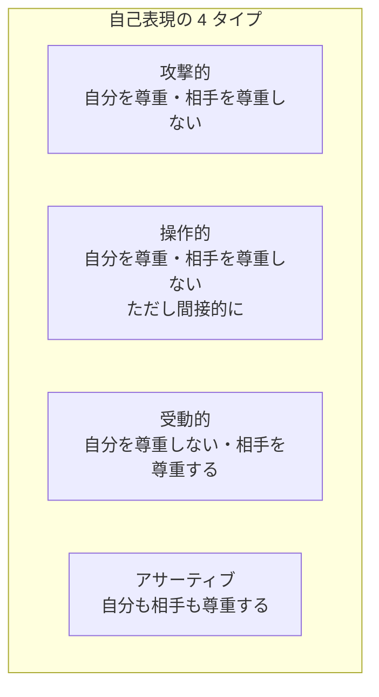
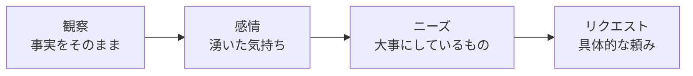
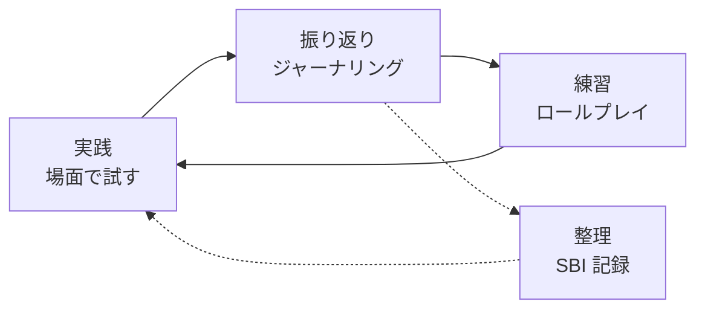

# アサーティブコミュニケーション入門

相手も自分も尊重する自己表現の技術——働く現場で「言えない」「言いすぎる」をなくす

| 項目 | 内容 |
|---|---|
| カテゴリー | コミュニケーション |
| 難易度 | 入門 |
| 所要時間 | 約200分（全8レッスン） |
| 公開日 | 2026-06-07 |
| 最終更新日 | 2026-06-07 |
| コースURL | https://skillup.college/courses/communication/assertive-communication-basics/ |

## 対象者

「言いたいことを我慢しがち」「ついきつい言い方になってしまう」「断れない、頼めない」「評価面談や 1on1 で本音を伝えられない」と感じている社会人。営業・カスタマーサポート・人事・看護師・教員など感情労働の比重が高い職種、若手・リーダー・管理職を問わず幅広く対象。職場で人間関係に消耗している方、ハラスメントを未然に防ぐ対話力を身につけたい方にも役立つ内容。

## 前提知識

特になし。職場での会話・面談・チーム会議に参加した経験があると、各レッスンの事例が腑に落ちやすい。ファシリテーション入門コースを先に受講していると、コミュニケーション全体の設計視野が広がるが、独立して読めるようにする。

## 学習目標

- 攻撃的・受動的・操作的・アサーティブの 4 つの自己表現タイプを区別し、自分の傾向を把握できる
- アサーティブの 10 の基本権を理解し、「我慢する自分が大人」という思い込みから距離を取れる
- 思考・感情・事実を分けて、自分の不快感の正体を言語化できる
- I-message と観察ベースの表現で、相手を責めずに自分の状態を伝えられる
- DESC 法を使って、断る・主張する場面を 4 ステップで設計できる
- アクティブリスニングの 3 レベルと共感的理解で、相手の主張を受け止められる
- ブロークン・レコード、フォギング、ネガティブ・インクワイアリで、批判や操作に冷静に応じられる
- 評価面談・1on1・チーム会議でアサーティブを実践し、ハラスメントとアサーティブの境界を理解できる

## コース概要

「言いたいことが言えない」「ついきつい言い方になって関係を壊してしまう」「断れずに仕事を抱え込む」——働く現場で誰もが一度は感じる悩みです。これらは性格や根性の問題ではなく、自己表現のスキルとして学べることがわかっています。本コースでは、相手の権利も自分の権利も尊重する「アサーティブコミュニケーション」を、心理療法・臨床心理学から発達してきた古典的フレームワーク（4 つの自己表現タイプ、10 の権利、DESC 法、NVC、認知の歪みなど）を骨格に、8 レッスンで体系的に学びます。理論を「明日の職場で試せる動作」に翻訳することを優先しています。

## 学習の流れ

レッスン 1〜2 で、アサーティブの全体像と歴史的背景・10 の権利を押さえます。レッスン 3〜5 は「自分を整え、伝える」基本のレッスンで、自己理解、I-message、DESC 法という 3 つの土台を順に積み上げます。レッスン 6〜7 は「相手を受け止め、衝突に応じる」レッスンで、アクティブリスニングと、批判・操作への対応技法を扱います。最後のレッスン 8 で、評価面談・1on1・ハラスメント対応など職場のリアルな場面への応用と、継続トレーニングの設計、コース修了後の学習方向を案内します。前半（レッスン 1〜2）は「考え方の土台」、中盤（レッスン 3〜5）は「伝える技術」、後半（レッスン 6〜7）は「受け止める技術」、終盤（レッスン 8）は「実践と継続」という四段構えです。

## レッスン一覧

| No. | タイトル | 概要 | 所要時間 |
|---|---|---|---|
| 1 | アサーティブコミュニケーションとは何か——4 つの自己表現タイプ | 攻撃的・受動的・操作的・アサーティブの 4 分類、自他尊重という中核、行動療法の系譜（Salter 1949、Wolpe 1958）、日本での受容（平木典子）、「正直＝攻撃的」になりがちな構造を学ぶ | 25分 |
| 2 | アサーティブの 10 の権利と心理的背景 | Manuel J. Smith の 10 の基本権、認知療法の系譜（Ellis ABC 理論、Aaron Beck）、非主張・攻撃・操作の心理的コスト、日本の「我慢の文化」との相性、権利を義務と混同しないことを学ぶ | 25分 |
| 3 | 自己理解の技術——感情・事実・解釈を分ける | 思考・感情・事実の 3 分離、認知の歪み 10 種、ジョハリの窓、自分の不快感の正体を言語化する技術、信号としての感情の機能を学ぶ | 25分 |
| 4 | 「伝える」基本——I-message と観察ベースの表現 | I-message と You-message の使い分け、観察と評価の分離、NVC の 4 ステップ（観察・感情・ニーズ・リクエスト）の入口、「いつ・何が・どう困ったか」を事実で述べる技術を学ぶ | 25分 |
| 5 | 断る・主張する——DESC 法と境界線設定 | DESC 法（Describe・Express・Specify・Choose）、境界線の概念、「No」を伝える基本動作、突発依頼・過剰な仕事量・長時間労働の依頼・プライベートへの踏み込みなど場面別の応用を学ぶ | 25分 |
| 6 | 聴く——共感とアクティブリスニング | アクティブリスニングの 3 レベル、Carl Rogers の 3 条件（無条件の肯定的配慮・共感的理解・自己一致）、パラフレーズと要約、NVC の聴き方版、「同意」と「理解」を分ける技術を学ぶ | 25分 |
| 7 | 衝突・批判への対処——ブロークン・レコード、フォギング、ネガティブ・インクワイアリ | ブロークン・レコード、フォギング、ネガティブ・アサーション、ネガティブ・インクワイアリの 4 技法、攻撃と建設的批判を見分ける、「沈黙」も選択肢にする発想を学ぶ | 25分 |
| 8 | 職場での実践と継続トレーニング——評価面談、1on1、ハラスメントの境界 | 評価面談・1on1・チーム会議でのアサーティブ、上司への意見、部下へのフィードバック、ハラスメントとアサーティブの境界、ロールプレイ・ジャーナリング・SBI 記録による継続トレーニング、コース修了後の学習方向を学ぶ | 25分 |

---

## レッスン1：アサーティブコミュニケーションとは何か——4 つの自己表現タイプ

（所要時間：25分）

### このレッスンで学ぶこと

- アサーティブコミュニケーションの定義と「自他尊重」という中核を理解する
- 攻撃的・受動的・操作的・アサーティブの 4 つの自己表現タイプを区別できる
- 自分が普段どのタイプに偏りやすいかを意識できる
- アサーティブネスがどのような研究と臨床から生まれてきたかを知る
- 「正直に話す＝攻撃的」と感じやすい構造を理解する

---

「アサーティブコミュニケーション」という言葉は、最近の研修やビジネス書ですっかり定番になりました。一方で、現場ではしばしば誤解されています。「言いたいことをはっきり言える人」「断れる強い人」のことだ、と。これは半分合っていて、半分間違っています。本コースは、まずこの言葉の中身を、定義と歴史と誤解の整理から始めて、明日の職場で使える形に組み直していきます。

### アサーティブコミュニケーションの定義

アサーティブコミュニケーション（assertive communication、日本語では「アサーション」とも呼ばれます）の中核は、次のように整理できます。

> 自分の気持ち・考え・意見を、相手の権利を尊重しながら、率直・誠実・対等に表現すること

ここでのポイントは「率直」「誠実」「対等」の 3 つです。率直とは、回りくどい言い方や匂わせをせず、自分の言いたいことを口に出すこと。誠実とは、自分の感情をごまかしたり、操作的に使ったりしないこと。対等とは、相手を上から見下したり、逆に過剰に下からへりくだったりしないことです。

> **💡 ポイント**
> アサーティブの中心にあるのは「自他尊重」です。「自分を尊重する」だけなら攻撃的になりやすく、「相手を尊重する」だけなら受動的になりやすい。両方を同時に成り立たせることが、アサーティブの定義そのものだと覚えておいてください。

### 4 つの自己表現タイプ

アサーティブネスの研究では、自己表現を 4 つのタイプに分けて整理することが多くあります。本コースでは次の 4 つを基本に置きます。

#### ①攻撃的（aggressive）

自分の主張を、相手の権利を踏みにじって押し通すスタイルです。声を荒げる、皮肉を言う、人格否定する、論破するなどが典型例です。短期的には目的が通ることがありますが、長期的には信頼を失い、相手の本音を引き出せなくなります。

職場で起きやすいこと：

- 部下や同僚を強い口調で詰めて、表面的な同意を取り付ける
- メールで一方的な指示や否定を書き、関係が冷え込む
- 会議で反対意見を出した相手を、人格否定の言葉で黙らせる

#### ②受動的・非主張的（passive / non-assertive）

自分の主張を引っ込めて、相手や場の空気に従うスタイルです。日本では「いい人」「協調的」と見なされがちですが、本人の中には不満や疲労が積もります。長期的には燃え尽きや、衝動的な爆発につながりやすくなります。

職場で起きやすいこと：

- 過剰な仕事量や無理な依頼を断れず、自分が消耗する
- 自分の意見があっても会議で発言しない
- 評価面談で本音を言えず、不当な評価を引き受けてしまう

#### ③操作的・受動攻撃的（passive-aggressive）

正面から主張せず、嫌味・遠回し・無視・ため息・噂など、間接的な手段で不満を伝えるスタイルです。本人は「直接言っていないからセーフ」と感じやすいですが、受け手は強く傷つきます。関係性が静かに腐っていく原因になります。

職場で起きやすいこと：

- 不満を本人ではなく第三者に愚痴る
- 返事を遅らせる、無視するなどの間接攻撃
- 形だけ協力したふりをして、肝心なところで動かない

#### ④アサーティブ（assertive）

自分の権利と相手の権利の両方を尊重しながら、率直・誠実・対等に表現するスタイルです。本コースが学ぶのはこれです。攻撃的でもなく、受動的でもなく、操作的でもない、第 4 の選択肢としてのアサーティブ、というのが基本構図です。

> **📝 補足**
> 「操作的」と「攻撃的」は、目的（自分の主張を通す）は同じですが、手段が違います。攻撃的は正面から、操作的は裏側から相手を動かそうとします。アサーティブとの違いは、どちらも「相手の権利を尊重していない」という点で共通します。

### なぜ「正直＝攻撃的」と感じやすいのか

ここで多くの方が引っかかるポイントを先に押さえておきます。「正直に言ったら攻撃的になるのでは」「本音を言ったら関係が壊れるのでは」という感覚です。

実は、これは日本の職場文化に特有のものではなく、世界各国のアサーティブネス研究で共通して報告される感覚です。理由のひとつは、わたしたちが幼少期から「言わない＝大人」「我慢する＝偉い」というメッセージを受け取って育つことです。もうひとつは、過去に「率直に言って関係が壊れた」体験を持っていると、その記憶が次の発言を止めることです。

> **⚠️ 注意**
> アサーティブは「正直に思ったことをそのまま口にする」ことではありません。「自分の感情に気づき、それを相手を傷つけない形で表現する」ことです。同じ「不満を伝える」でも、「あなたはひどい」（攻撃的）と「私は困っています」（アサーティブ）は別物です。この区別はレッスン 4 で詳しく扱います。

### アサーティブネスの研究略史

アサーティブコミュニケーションは流行語に聞こえるかもしれませんが、研究としては 70 年以上の歴史があります。簡単に略史を追っておきましょう。

#### 1949 年：Andrew Salter、行動療法の源流

アメリカの心理学者 Andrew Salter は、『Conditioned Reflex Therapy』という著作で、抑制された感情表現を解放する治療法を提案しました。これがアサーティブネス・トレーニングの遠い祖先にあたります。当時の文脈では、神経症患者の治療のための行動療法という位置づけでした。

#### 1958 年：Joseph Wolpe、系統的脱感作と主張訓練

Joseph Wolpe は『Psychotherapy by Reciprocal Inhibition』で、不安症状の治療として「主張訓練（assertion training）」を体系化しました。不安と自己主張は両立しない、という心理学的原理に基づき、自己主張の練習によって対人不安を軽減する手法です。

#### 1975 年：Manuel J. Smith、10 の権利と一般向け書籍

Manuel J. Smith は『When I Say No, I Feel Guilty』というベストセラーで、アサーティブネスを臨床から一般読者へ広げました。本書で示された「10 の基本権」は、次のレッスンで詳しく扱います。同じ時期に Sharon Bower と Gordon Bower の『Asserting Yourself』（1976 年）が DESC 法を提案し、これも本コースで後ほど扱います。

#### 1980 年代以降：日本での受容と平木典子

日本では 1980 年代以降、平木典子氏らによって紹介され、看護・カウンセリング・教育現場を経て、産業カウンセラー資格の研修内容として企業研修に定着しました。日本では「アサーション・トレーニング」と呼ばれることも多くあります。

> **💡 ポイント**
> アサーティブネスはもともと「神経症患者の不安治療」として始まり、女性運動・人権運動と結びついて社会的に広がり、企業研修に定着しました。「自己啓発の話法テクニック」ではなく「心理療法と人権思想の系譜にある対人スキル」として始まったことを、覚えておくと議論がぶれません。

### 「強気のスキル」ではなく「自分とつながり直す技術」

最後に、本コースのスタンスを述べておきます。アサーティブコミュニケーションは、よく「強気で言い返す技術」「論破に勝つスキル」のように紹介されますが、本来はその逆の発想に立っています。

アサーティブの出発点は、「自分は今、何を感じているのか」「自分は何を大事にしたいのか」を、自分自身が把握することです。そこが曖昧なまま、技術だけ使おうとすると、相手にも自分にもしっくり来ません。「自分とつながり直す」ことが先で、「相手に伝える」のは後、という順序です。本コースもこの順序で構成しています。レッスン 3 で「自己理解の技術」を扱うのも、この発想に基づいています。

### まとめ

このレッスンでは、以下のことを学びました。

- アサーティブコミュニケーションの中核は「自他尊重」——自分の権利と相手の権利の両方を尊重しながら率直・誠実・対等に表現すること
- 自己表現は、攻撃的・受動的・操作的・アサーティブの 4 タイプに分けて整理できる
- 「正直に言う＝攻撃的になる」のではなく、表現の仕方によってアサーティブと攻撃的は別物になる
- アサーティブネスは Salter（1949）、Wolpe（1958）、Smith（1975）と続く心理療法の系譜から発達し、日本では 1980 年代から平木典子氏らが紹介した
- アサーティブは「強気のスキル」ではなく「自分とつながり直す技術」が出発点
- 受動的に偏る人にも、攻撃的に偏る人にも、アサーティブの学びは役に立つ

次のレッスンでは、アサーティブネスを支える「10 の基本権」と、認知療法の考え方を学びます。「我慢する自分が大人」「断ったら冷たい人」という思い込みが、どこから来てどう距離を取れるのか、心理学の知見をもとに整理します。

---

### 確認クイズ

このレッスンの理解度をチェックしましょう。

#### Q1. アサーティブコミュニケーションの中核として最も適切なものはどれか？

- [ ] 相手より優位に立って自分の主張を通すこと
- [x] 自分の権利と相手の権利の両方を尊重し、率直・誠実・対等に表現すること
- [ ] 相手を傷つけないように、自分の主張をできるだけ控えること
- [ ] 直接言うのを避けて、間接的に意図を伝えること

> **解説**
> アサーティブの中核は「自他尊重」、つまり自分の権利も相手の権利も同時に尊重することです。相手より優位に立とうとするのは攻撃的、自分の主張を控えるのは受動的、間接的に伝えるのは操作的にあたります。

#### Q2. 4 つの自己表現タイプの組み合わせとして正しいものはどれか？

- [ ] 攻撃的・正直的・受動的・アサーティブ
- [ ] 攻撃的・受動的・誠実的・アサーティブ
- [x] 攻撃的・受動的・操作的・アサーティブ
- [ ] 攻撃的・受動的・操作的・誠実的

> **解説**
> 本コースで扱う 4 つの自己表現タイプは、攻撃的（aggressive）・受動的（passive）・操作的（passive-aggressive）・アサーティブ（assertive）です。「正直」「誠実」はタイプ名ではなく、アサーティブの中身を表す形容詞として登場します。

#### Q3. 「操作的・受動攻撃的」のタイプに当てはまる行動として最も適切なものはどれか？

- [x] 直接は言わずに、嫌味やため息、無視で不満を伝える
- [ ] 大声で相手を詰めて自分の主張を通す
- [ ] 嫌な依頼でも黙って引き受け、自分が消耗する
- [ ] 自分の希望を相手の希望と並べて、対等に話す

> **解説**
> 操作的・受動攻撃的タイプは、正面から主張せずに嫌味・遠回し・無視・ため息・噂などで不満を伝えるスタイルです。大声で詰めるのは攻撃的、黙って引き受けるのは受動的、対等に話すのはアサーティブにあたります。

#### Q4. 「正直に話す＝攻撃的になる」と感じやすい理由として、本レッスンで示した内容はどれか？

- [ ] 日本人だけが特異的に持つ性質である
- [ ] 攻撃的な人ほどアサーティブの研究で多く扱われてきたため
- [ ] アサーティブネスは本来、攻撃的な表現を含む概念だから
- [x] 「言わない＝大人」というメッセージや、過去に率直に言って関係が壊れた体験が、次の発言を止めるため

> **解説**
> 「言わない＝大人」「我慢する＝偉い」という文化的メッセージや、過去の失敗体験は、世界各国のアサーティブネス研究で共通して報告される構造です。日本特有ではなく、また「正直＝攻撃的」というのは表現の仕方の問題で、アサーティブの定義そのものとは無関係です。

#### Q5. アサーティブネスの研究略史について、本レッスンで紹介した内容として正しいものはどれか？

- [ ] アサーティブネスは 2010 年代の SNS 文化から生まれた概念である
- [x] Andrew Salter（1949）、Joseph Wolpe（1958）と続く行動療法の系譜から発達し、1975 年の Manuel J. Smith の著作で一般読者に広がった
- [ ] アサーティブネスは日本の平木典子が最初に提唱した
- [ ] アサーティブネスは経営学のリーダーシップ研究から生まれた

> **解説**
> アサーティブネスはアメリカで行動療法の系譜から発達し、1949 年の Andrew Salter『Conditioned Reflex Therapy』、1958 年の Joseph Wolpe『Psychotherapy by Reciprocal Inhibition』、1975 年の Manuel J. Smith『When I Say No, I Feel Guilty』が代表的な節目です。日本では平木典子氏らが 1980 年代以降に紹介しました。

#### Q6. 本コースが取るアサーティブのスタンスとして適切なものはどれか？

- [x] 「強気で言い返す技術」ではなく「自分とつながり直す技術」として扱い、自己理解を先に学び、伝える技術を後に学ぶ
- [ ] 論破に勝つための話法として扱い、議論の勝率を上げる
- [ ] 相手を従わせる管理職向けのスキルとして扱う
- [ ] 心理療法の代替手段として、メンタル不調そのものを治療する

> **解説**
> 本コースは、アサーティブを「自分とつながり直す技術」と位置づけ、自己理解（レッスン 3）→伝える技術（レッスン 4・5）→受け止める技術（レッスン 6・7）→実践と継続（レッスン 8）という順序で構成しています。論破・管理・治療のための技法ではありません。

---

## レッスン2：アサーティブの 10 の権利と心理的背景

（所要時間：25分）

### このレッスンで学ぶこと

- アサーティブの「10 の基本権」を理解する
- 認知療法の入口（Ellis の ABC 理論、Aaron Beck の認知療法）を知る
- 非主張・攻撃・操作の 3 つに、それぞれどんな心理的コストがあるかを把握する
- 日本の「我慢の文化」とアサーティブの相性について整理する
- 「権利」を「義務」と混同しない発想を学ぶ

---

前回のレッスンでは、アサーティブコミュニケーションを「自他尊重」を中核とした第 4 の選択肢として位置づけ、攻撃的・受動的・操作的との違いを整理しました。今回はその土台として、アサーティブが立脚する「10 の基本権」と、それを支える心理学的な背景を見ていきます。「我慢するのが大人」「断ったら冷たい人」という思い込みが、どこから来てどう距離を取れるのかを、心理学の言葉で言い直していきましょう。

### アサーティブの 10 の基本権

Manuel J. Smith が 1975 年に『When I Say No, I Feel Guilty』で示した「10 の基本権（Bill of Assertive Rights）」は、アサーティブネス研修の古典として広く参照されています。原文は英語ですが、本コースでは日本の文脈に合わせて以下のように要約します。

#### ①自分の感情・行動・思考について、自分で判断する権利

「こう感じるべき」「こう考えるべき」と決められる存在ではないという出発点です。

#### ②理由を述べたり、言い訳をしたりせずに行動する権利

依頼を断るのに、いちいち長い理由を述べる必要はないという発想です。

#### ③ほかの人の問題に対して、自分が責任を持つかどうかを決める権利

相手の感情・人生をすべて引き受ける義務はないということです。

#### ④気が変わることを認める権利

過去の意思決定に縛られず、状況の変化に合わせて意見を変えることは正当です。

#### ⑤間違いをすることと、その責任を取る権利

完璧でなくてよい、しかしその結果は引き受ける、というセットです。

#### ⑥「わからない」と言う権利

知らないことを認めるのは弱さではなく、対等な対話の前提です。

#### ⑦ほかの人の好意に左右されずに行動する権利

「好かれるかどうか」と「自分の判断」は別物です。

#### ⑧非論理的であることを認められる権利

すべての感情に合理的な説明がつくとは限らない、という許容です。

#### ⑨「理解できない」と言う権利

相手の言うことを完全に理解する義務はなく、わからないときは聞き返してよいということです。

#### ⑩「気にしない」と決める権利

すべてに対して反応する必要はなく、関わらない選択も対等な選択肢です。

> **💡 ポイント**
> 10 の権利は「ぜいたくな要求」のリストではなく、「対等に対話するための前提」のリストです。これらの権利が空気のように当たり前になっている職場では、アサーティブの技術がなくても、自然に率直な会話が起こります。技術より先に、まずこの前提を取り戻すことが、アサーティブの出発点です。

### 「権利」を「義務」と混同しない

10 の基本権で混乱しやすいのが、「権利」と「義務」の区別です。

「断る権利がある」は「断らねばならない」ではありません。「気が変わる権利がある」は「気を変えるべき」ではありません。アサーティブの権利は、「使ってもよい選択肢」が手元にあるという意味であり、「常にその選択肢を取らねばならない」という強制ではありません。

> **⚠️ 注意**
> 「アサーティブを学んだから、いつも断らないと自分に嘘をついている」と感じる方が、研修後によくいらっしゃいます。これは権利と義務の混同です。アサーティブは「断ることを増やす技術」ではなく、「断るかどうかを自分で選び取れる技術」です。場面によっては引き受けるのが自分にとって誠実な選択になることもあります。

### 認知療法の入口——ABC 理論

アサーティブネスを支える心理学的背景のひとつが、認知療法（cognitive therapy）と認知行動療法（CBT）です。中でも、Albert Ellis が 1950 年代に提唱した「ABC 理論」は、アサーティブの土台として広く使われています。

ABC 理論は、感情や行動の流れを次の 3 段階で整理します。

| 記号 | 意味 | 例 |
|---|---|---|
| A（Activating event） | 出来事 | 上司から急な仕事を頼まれた |
| B（Belief） | 信念・解釈 | 「断ったら評価が下がる」「自分だけ頑張らないと」 |
| C（Consequence） | 結果（感情・行動） | 不安が高まり、無理して引き受ける |

ポイントは、「A → C」と直接につながっているように感じる感情・行動も、実は「A → B → C」と、間に「信念・解釈（B）」がはさまっているという発想です。出来事は変えられないことが多いですが、信念は点検し、必要なら修正できます。

Ellis はさらに「D（Dispute、信念への反証）」「E（Effect、新しい結果）」を加えた ABCDE モデルを提唱しています。「断ったら評価が下がる」という信念に対して、「本当に下がるか？」「過去そうだった事例は？」「下がらなかった例も思い出せるか？」と問い直すのが D の作業です。

Albert Ellis の流れと並んで、Aaron T. Beck が 1976 年に『Cognitive Therapy and the Emotional Disorders』で体系化した認知療法も、同様の発想に立っています。これらは現代の認知行動療法（CBT）の主要な源流です。

> **📝 補足**
> アサーティブが「言い方の技術」だけに見えるなら、それは半分の理解です。「自分が今、どんな信念に支配されているか」を点検し、必要なら問い直す——この認知の作業がもう半分です。レッスン 3 で「思考・感情・事実の 3 分離」を扱う際に、ABC 理論をもう一度使います。

### 非主張・攻撃・操作の心理的コスト

「我慢していれば波風は立たない」「強く出ておけば舐められない」「遠回しに匂わせれば大人っぽい」——どれも短期的にはメリットがあるように見えます。しかし、長期的にはそれぞれに心理的コストが累積します。

#### 非主張（受動的）のコスト

- 自分の感情を抑え続けることで、不満・怒り・無力感が溜まる
- 「自分の意見は重要ではない」という自己効力感の低下
- 限界を超えたとき、衝動的な離職・爆発・燃え尽きに至りやすい
- 「断れない自分」を相手が当てにし、依頼がエスカレートする

#### 攻撃のコスト

- 相手が萎縮し、本音や有用な情報が上がってこなくなる
- 短期的な勝利が、長期的な信頼の失墜と引き換えになる
- 周囲からの孤立、本人のストレスホルモンの慢性的高止まり
- 部下・後輩のメンタル不調、離職リスクの上昇

#### 操作のコスト

- 「直接言わない」ことで関係性が静かに腐っていく
- 相手は意図を読み取れず、誤解と疑心が増える
- 周囲に「あの人は裏で何を考えているかわからない」と思われる
- 本人の中でも、「自分は何を望んでいるのか」が見えなくなっていく

> **💡 ポイント**
> 3 つのスタイルに共通するのは、「短期の便利さ」と「長期のコスト」のトレードオフです。アサーティブは短期的には不慣れで難しく、長期的にはコストの累積を防ぎます。研修で「翌週から劇的に楽になる」とは期待せず、半年から 1 年かけて少しずつ習得していく前提で取り組むことが大切です。

### 日本の「我慢の文化」とアサーティブの相性

「日本人にアサーティブは合わない」「文化的に難しい」という声を、研修でよく聞きます。これは半分本当で、半分は誤解です。

本当の部分は、日本の職場文化には「察する」「空気を読む」「言わなくてもわかる」という前提が確かに濃く、率直な表現が「失礼」と取られやすい傾向があるという点です。世代差・業界差・組織文化の差も大きく、製造業の年配層と外資系 IT の若手では、アサーティブの最適な強度がまったく違います。

誤解の部分は、「率直に話す＝アメリカ的に強く言う」と一対一で結びついている前提です。アサーティブの中核は「自他尊重」であって、「強さの度合い」ではありません。日本の文脈で言えば、「丁寧な敬語で率直に伝える」「相手の顔色を読みつつ、自分の希望も口に出す」という形のアサーティブが、十分に成立します。

> **⚠️ 注意**
> 「日本人にアサーティブは無理」という議論は、しばしば「だから自分も練習しなくていい」という結論を正当化するために使われます。文化的な調整は必要ですが、自他尊重の原理そのものは普遍です。「強度を文化に合わせる」のはアサーティブの応用で、「原理を諦める」のは別の話、と区別してください。

### 「我慢する自分」を責めない

アサーティブを学び始めた方が、よくこう言います。「これまでの自分は受動的で、ダメだった」「もっと早く知っていれば、あんなに我慢しなかった」。

ここで強調しておきたいのは、アサーティブは「これまでの自分を責めるための物差し」ではないということです。多くの場合、これまでの「言わない選択」には、その人なりの合理性がありました——立場の弱さ、相手の権力、過去の体験、組織の文化など。これらの中で「言わない」を選んできたのは、生き残るための賢い選択だった可能性が高いのです。

アサーティブは「過去の自分を責める道具」ではなく、「これからの選択肢を増やす道具」として扱うのが、研修現場で長く通用する向き合い方です。本コースもそのスタンスで進めます。

### まとめ

このレッスンでは、以下のことを学びました。

- Manuel J. Smith の「10 の基本権」は、対等に対話するための前提として、アサーティブネス研修の古典になっている
- 「権利」を「義務」と混同しない——「使ってもよい選択肢」であって「常に使え」ではない
- 認知療法の ABC 理論（Albert Ellis）は、「出来事 → 信念・解釈 → 結果」の流れで感情・行動を捉え直す枠組み
- 非主張・攻撃・操作の 3 つには、それぞれ長期的な心理的コストが累積する
- 日本の「我慢の文化」とアサーティブは、強度の調整は必要だが、自他尊重の原理は普遍
- アサーティブは「過去の自分を責める道具」ではなく「これからの選択肢を増やす道具」

次のレッスンでは、自分の不快感や違和感を言語化する技術として、「思考・感情・事実の 3 分離」と「認知の歪み」を扱います。アサーティブな表現の前に、自分の中で何が起きているかを把握する練習に入ります。

---

### 確認クイズ

このレッスンの理解度をチェックしましょう。

#### Q1. アサーティブの「10 の基本権」を提唱した人物として正しいのは誰か？

- [ ] Albert Ellis
- [ ] Aaron T. Beck
- [x] Manuel J. Smith
- [ ] Carl Rogers

> **解説**
> 「10 の基本権（Bill of Assertive Rights）」は、Manuel J. Smith が 1975 年の著作『When I Say No, I Feel Guilty』で示した古典的な枠組みです。Ellis は ABC 理論（論理情動行動療法）、Beck は認知療法、Rogers は来談者中心療法の系譜にいます。

#### Q2. 「権利」と「義務」の区別について、本レッスンの説明として正しいものはどれか？

- [ ] アサーティブを学んだら、依頼はすべて断らねばならない
- [x] 権利は「使ってもよい選択肢」であって「常に使わなければならない」ではない
- [ ] 権利と義務は同じ意味で、区別する必要はない
- [ ] アサーティブの権利は、組織のルールに従う義務に常に優先する

> **解説**
> アサーティブの「権利」は、選択肢が手元にあるという意味で、その選択肢を常に取らねばならない強制ではありません。「断る権利」は「常に断る義務」と混同しやすいですが、場面によっては引き受けるのが自分にとって誠実な選択になることもあります。

#### Q3. Albert Ellis の ABC 理論について、本レッスンの説明として正しいものはどれか？

- [ ] A → C と直接につながる関係を整理する理論である
- [ ] 出来事を直接コントロールするための技術である
- [ ] B は「Behavior（行動）」の略である
- [x] 出来事（A）と結果（C）の間に信念・解釈（B）がはさまり、信念は点検・修正できるという発想

> **解説**
> ABC 理論では、A（出来事）→ B（信念・解釈）→ C（結果：感情・行動）の流れで物事を整理し、感情や行動を左右する信念（B）を点検・修正することで、新しい結果（E）を得られると考えます。B は「Belief」の略で、「行動」ではありません。

#### Q4. 非主張（受動的）スタイルの心理的コストとして本レッスンで示した内容はどれか？

- [ ] 相手が萎縮し、本音や有用な情報が上がってこなくなる
- [x] 「自分の意見は重要ではない」という自己効力感が低下し、限界を超えたときに爆発・燃え尽きに至りやすい
- [ ] 周囲に「裏で何を考えているかわからない」と思われる
- [ ] 短期的な勝利が、長期的な信頼の失墜と引き換えになる

> **解説**
> 非主張（受動的）スタイルでは、自分の感情を抑え続けることで自己効力感が低下し、限界を超えたときに衝動的な離職・爆発・燃え尽きに至りやすくなります。「相手が萎縮する」「信頼が失墜する」は攻撃的スタイルのコスト、「裏で何を考えているか」は操作的スタイルのコストです。

#### Q5. 「日本人にアサーティブは合わない」という議論への本レッスンのスタンスとして正しいものはどれか？

- [ ] 文化的に合わないので、日本では諦めるべきである
- [ ] 文化差は存在せず、アメリカ式の表現をそのまま使えばよい
- [x] 文化差は存在するため強度の調整は必要だが、自他尊重の原理そのものは普遍である
- [ ] 文化差は存在するが、外資系企業に勤める人だけが学べばよい

> **解説**
> 本レッスンは、文化差は確かに存在するが、自他尊重の原理そのものは普遍であり、表現の強度を文化に合わせて調整すれば日本の職場でも十分に成立する、というスタンスです。「合わないから諦める」も「文化差はない」も避け、原理と応用を分けて扱います。

#### Q6. アサーティブを学ぶ際の心構えとして、本レッスンで示したスタンスはどれか？

- [x] 「過去の自分を責める道具」ではなく「これからの選択肢を増やす道具」として扱う
- [ ] 過去の我慢を取り戻すために、これからは強く出るようにする
- [ ] 翌週から劇的に楽になることを目標にする
- [ ] 周囲全員に対して、必ずアサーティブに振る舞う義務がある

> **解説**
> 本コースは、アサーティブを「過去の我慢を責めるための物差し」ではなく「これからの選択肢を増やす道具」として位置づけます。「強く出る」「劇的に楽になる」「全員に義務」というのはいずれも本コースのスタンスから外れます。半年から 1 年かけて少しずつ習得する前提で取り組みます。

---

## レッスン3：自己理解の技術——感情・事実・解釈を分ける

（所要時間：25分）

### このレッスンで学ぶこと

- 「事実」「解釈・思考」「感情」の 3 つを分けて捉える技術を理解する
- 「認知の歪み」と呼ばれる、よくある思考パターンを 10 種類押さえる
- 「ジョハリの窓」を使って、自己理解の死角を意識できる
- 感情を「信号」として読み解く発想を学ぶ
- 自分の不快感の正体を、相手に伝える前に言語化できるようになる

---

前回のレッスンでは、アサーティブの 10 の基本権と、それを支える ABC 理論・認知療法の入口を見ました。今回は、その「B（信念・解釈）」を実際に点検する技術として、「自分の中で何が起きているか」を解像度高く把握する練習に入ります。アサーティブな表現の前段階、つまり「伝える前にまず自分を知る」ところに、本レッスンは焦点を当てます。

### なぜ「自己理解」が伝える前に必要か

アサーティブの研修現場で最も多いトラブルのひとつが、「伝えようとしたけれど、自分でも何を言いたいのかわからなくなった」というものです。

その背景にあるのは、感情・解釈・事実が頭の中で混ざり合っている状態です。「今日の打ち合わせは最悪だった」と感じたとき、その内訳を分解せずに伝えると、相手にも自分にも届きません。「最悪だった」は感情のラベルで、その下には事実（何が起きたか）と解釈（それをどう受け止めたか）が眠っています。

> **💡 ポイント**
> アサーティブな表現は、自分の中で「事実」「解釈」「感情」の 3 つが整理できてから初めて、相手にも届く形になります。表現の技術（レッスン 4・5）に入る前に、この自己整理の練習をしておくと、その後の学びがスムーズになります。

### 事実・解釈・感情の 3 分離

自己理解の出発点は、頭の中の状態を 3 つに分けることです。

#### ①事実（fact）

その場で起きた、観察可能な出来事のことです。動画に撮ったら誰が見ても同じように記録できる、というレベルの記述です。

例：
- 「会議で 14 時から 15 時まで、A さんが私の発言を 3 回さえぎった」
- 「メールが届いてから 4 日間、返信がなかった」

#### ②解釈・思考（interpretation / thought）

事実に対して、自分が頭の中で付け加えた意味・推測・評価のことです。同じ事実でも、人によって解釈は変わります。

例：
- 「A さんは私を軽く見ている」
- 「返信がないのは、私の依頼を無視している」

#### ③感情（emotion）

事実と解釈の結果として、自分の中に湧いてきた気持ちのことです。怒り・不安・悲しみ・落胆・恥ずかしさなど、ラベルがつけられます。

例：
- 「腹が立った」
- 「無視されたようで悲しかった」

| カテゴリ | 質問 | 例 |
|---|---|---|
| 事実 | 何が起きた？ | 「3 回さえぎられた」 |
| 解釈 | 自分はそれをどう意味づけた？ | 「軽く見られている」 |
| 感情 | 自分の中で何が湧いた？ | 「腹が立った」 |

> **⚠️ 注意**
> 多くの人は、感情と解釈を区別せずに「腹が立った」と「軽く見られている」をひとまとめに語ります。すると、相手は「軽く見ていない」と反論する場面が生まれ、議論が「事実」ではなく「相手の意図の解釈」をめぐる泥仕合になります。3 つを分けるだけで、対話の入り口が変わります。

### 認知の歪み——よくある解釈の落とし穴

解釈（B）には、私たちが無意識に陥りやすいパターンがあります。これを「認知の歪み（cognitive distortion）」と呼びます。Aaron T. Beck と David D. Burns によって整理され、10 種類前後にまとめられるのが一般的です。本コースでは、職場のアサーティブで特に頻出する 10 種類を紹介します。

| 認知の歪み | 内容 | 職場での例 |
|---|---|---|
| ①白黒思考（全か無か） | 中間がなく、白か黒で判断する | 「100 点でなければ失敗」 |
| ②過度の一般化 | 1〜2 回の出来事を「いつも」と決めつける | 「いつも私の意見は通らない」 |
| ③心のフィルター | ネガティブな情報だけを取り上げる | 9 件の称賛より 1 件の批判が気になる |
| ④マイナス化思考 | ポジティブな情報を割り引いて捉える | 「褒められたのはお世辞だ」 |
| ⑤結論への飛躍（心の読みすぎ） | 相手の気持ちを根拠なく決めつける | 「あの人は私を嫌っている」 |
| ⑥結論への飛躍（占い） | 未来をネガティブに予測する | 「どうせ評価は下がる」 |
| ⑦拡大解釈・破局化 | 小さなミスを大事件と捉える | 「この資料の誤字で信頼を全部失う」 |
| ⑧感情的決めつけ | 感情を根拠に事実を判断する | 「不安だからきっと失敗する」 |
| ⑨「すべき」思考 | 「こうあるべき」で自分や他人を縛る | 「上司には絶対に逆らうべきでない」 |
| ⑩レッテル貼り | 一面で全体を決めつける | 「私はダメな営業だ」 |

> **📝 補足**
> 認知の歪みは「間違った思考」というより「効率的だが時々ハズれる思考の癖」です。すべての歪みを根絶する必要はなく、自分がどの歪みに引っかかりやすいかを知っておくだけでも、アサーティブな対話に向けた解像度が上がります。Beck と Burns の整理は、現代の認知行動療法（CBT）の標準的な教材に広く採用されています。

### ジョハリの窓——自己理解の死角

自己理解には限界があります。「自分はこういう人間だ」と思っている像と、「他人から見える自分」には必ずずれがあります。これを整理する古典的なフレームが、Joseph Luft と Harrington Ingham が 1955 年に提唱した「ジョハリの窓（Johari Window）」です。

自分と他人、それぞれが「知っている／知らない」の組み合わせで 4 つの領域に分けます。

| | 自分が知っている | 自分が知らない |
|---|---|---|
| **他人が知っている** | ①開放の窓（公開された自己） | ②盲点の窓（自分では気づかない自分） |
| **他人が知らない** | ③秘密の窓（隠している自己） | ④未知の窓（未開拓の自己） |

アサーティブにとって特に大切なのは、「②盲点の窓」と「③秘密の窓」です。

- **②盲点の窓**：「自分は淡々と話している」と思っているのに、相手から「威圧的」と評価される——こうしたずれは、自分では気づきにくい。フィードバックを受け取る練習が、盲点の窓を狭めます。
- **③秘密の窓**：「本当はこの依頼を断りたい」と感じているのに、誰にも伝えない——こうした隠された自己は、アサーティブに自己開示することで縮みます。

> **💡 ポイント**
> ジョハリの窓は「自己を解放しよう」というメッセージではなく、「自己理解には必ず死角がある」という事実を受け入れる枠組みです。盲点を狭めるためのフィードバックと、秘密を狭めるための自己開示——どちらも、アサーティブな対話を支える両輪です。

### 感情は「信号」である

最後に、感情そのものへの向き合い方を整理しておきます。

職場では、感情は「邪魔なもの」「コントロールすべきもの」と扱われがちです。「冷静になれ」「感情的になるな」と言われた経験のある方も多いはずです。けれど、心理学の知見では、感情はむしろ「情報を運ぶ信号」と捉えるのが標準的です。

| 感情 | 信号として読み解くと |
|---|---|
| 怒り | 「自分の大切なもの・境界線が侵害された」というサイン |
| 不安 | 「自分にとって重要なリスクが近づいている」というサイン |
| 悲しみ | 「自分が大事にしてきたものを失った／失いそう」というサイン |
| 罪悪感 | 「自分の行動が自分の価値観と矛盾した」というサイン |
| 恥 | 「自分が他人にどう見えるかへの不安」のサイン |

感情を「ない」ことにすると、その下にある情報も失われます。アサーティブな対話の前に、「いま自分の中にどんな感情が湧いているか」「その感情は何を知らせようとしているか」を、いったん受け止めるのが大切です。

> **⚠️ 注意**
> 「感情を信号として読む」ことと「感情のままに行動する」ことは別物です。怒りという信号は受け取りつつ、怒りに任せて即座に反応するのとは別の選択肢があります。アサーティブは、その間に「点検」と「設計」をはさむ技術です。

### 心理的な不調が深い場合は専門家へ

ここまで「自己理解の技術」として、思考・感情・事実の分離、認知の歪み、ジョハリの窓、感情の信号化を扱ってきました。これらは日常の対人ストレスに対して有効な枠組みですが、慢性的な抑うつ、強い不安、自傷念慮など、自力での対応が難しいレベルの不調がある場合は、本コースのスキルだけでは不十分です。

専門医・公認心理師・臨床心理士・産業医・産業保健スタッフへの相談が適切です。会社に EAP（従業員支援プログラム）契約がある場合は、無料・匿名で相談できる窓口を持っていることが多いので、人事部やイントラネットで確認してみてください。公的窓口としては、厚生労働省「こころの耳」も活用できます。

> **📝 補足**
> アサーティブコミュニケーションは「コミュニケーションのスキル」であり、心理療法そのものではありません。本コースは予防・セルフケアのレベルで役立つよう設計しています。深刻な症状への対処は、専門家の領域です。

### まとめ

このレッスンでは、以下のことを学びました。

- アサーティブな表現の前段階として、「事実」「解釈・思考」「感情」を 3 つに分けて捉える
- 解釈には認知の歪みと呼ばれるパターンがあり、白黒思考・過度の一般化・心の読みすぎ・「すべき」思考などが代表例
- 自己理解には必ず死角があり、ジョハリの窓の「盲点」と「秘密」を狭める作業がアサーティブの両輪
- 感情は「邪魔なもの」ではなく「情報を運ぶ信号」として捉える
- 感情を信号として読むことと、感情に任せて行動することは別物
- 慢性的な抑うつ・強い不安など深刻な症状は、専門家への相談が適切

次のレッスンでは、整理した自己理解を、相手に届く言葉にしていく技術として、I-message と「観察と評価の分離」を学びます。NVC（非暴力コミュニケーション）の 4 ステップの入口にも触れます。

---

### 確認クイズ

このレッスンの理解度をチェックしましょう。

#### Q1. 「事実・解釈・感情の 3 分離」について、本レッスンの説明として最も適切なものはどれか？

- [ ] 感情と解釈は同じ意味なので、ひとまとめに扱ってよい
- [x] 3 つを分けることで、対話が「相手の意図の解釈」をめぐる泥仕合になるのを防ぐ
- [ ] 事実だけを伝えれば、解釈と感情は表現しない方がよい
- [ ] 感情は弱さなので、相手には伝えるべきではない

> **解説**
> 感情と解釈を区別せずに伝えると、対話が「相手の意図の解釈」をめぐる議論に陥りがちです。3 つを分けて整理することで、自分の中で何が起きているかが明確になり、相手にも届きやすい言葉になります。感情を伝えること自体は問題ではなく、整理して伝えるのが本レッスンの趣旨です。

#### Q2. 「認知の歪み」の例として「すべき思考」に最も近いものはどれか？

- [ ] 「9 件の称賛より 1 件の批判が気になる」
- [ ] 「あの人は私を嫌っているに違いない」
- [x] 「上司には絶対に逆らうべきでない」
- [ ] 「私はダメな営業だ」

> **解説**
> 「すべき思考」は「こうあるべき」「こうしなければならない」で自分や他人を縛る歪みです。「9 件の称賛より 1 件の批判」は心のフィルター、「あの人は私を嫌っている」は心の読みすぎ、「私はダメな営業だ」はレッテル貼りに該当します。

#### Q3. ジョハリの窓における「盲点の窓」に当たるものはどれか？

- [ ] 自分が知っていて、他人も知っている領域
- [x] 他人は知っているが、自分は気づいていない領域
- [ ] 自分は知っていて、他人には隠している領域
- [ ] 自分も他人もまだ知らない、未開拓の領域

> **解説**
> ジョハリの窓の「盲点の窓」は、他人は知っているのに自分では気づいていない領域です。「自分は淡々と話している」と思っているのに「威圧的」と評価されるなどのずれが該当します。フィードバックを受け取ることで盲点を狭めます。

#### Q4. 感情の捉え方について、本レッスンのスタンスとして正しいものはどれか？

- [ ] 感情は邪魔なものなので、職場では完全に抑え込むべきである
- [ ] 感情のままに行動することがアサーティブの本質である
- [ ] 感情は意味を持たないので、論理的に処理すればよい
- [x] 感情は「情報を運ぶ信号」として捉え、信号を受け取りつつ、即座の反応とは別の選択肢を持つ

> **解説**
> 本レッスンは、感情を「信号」として読み解く立場を取ります。怒りは「境界線が侵害された」サイン、不安は「重要なリスクが近づいている」サインなど、感情には情報が乗っています。一方で、信号として受け取ることと、感情のままに行動することは別物として区別します。

#### Q5. 認知の歪みの「結論への飛躍（心の読みすぎ）」の例として最も適切なものはどれか？

- [x] 「あの人は私を嫌っているに違いない」と根拠なく決めつける
- [ ] 「100 点でなければ失敗だ」と中間を認めない
- [ ] 「1〜2 回の出来事をいつもと捉える」
- [ ] 「私はダメな人間だ」と一面で全体を決めつける

> **解説**
> 「心の読みすぎ」は、相手の気持ちや意図を根拠なく決めつける歪みです。「100 点でなければ失敗」は白黒思考、「1〜2 回の出来事をいつも」は過度の一般化、「私はダメな人間」はレッテル貼りにあたります。

#### Q6. 本レッスンが扱う範囲と扱わない範囲について、正しいものはどれか？

- [ ] 本レッスンはあらゆる心理的不調の治療法を提供する
- [ ] 認知の歪みを根絶することが目標である
- [ ] 専門家への相談はアサーティブを学んだ後に検討すべきである
- [x] 日常の対人ストレスへの予防・セルフケアとして有効だが、慢性的抑うつや強い不安などは専門家へ相談する

> **解説**
> 本コースは予防・セルフケアのレベルで設計されており、慢性的な抑うつ・強い不安・自傷念慮など、自力での対応が難しい症状には、産業医・公認心理師・臨床心理士・EAP・「こころの耳」などの専門領域への相談が適切です。認知の歪みも「根絶する」ものではなく「自分の癖を知る」ものです。

---

## レッスン4：「伝える」基本——I-message と観察ベースの表現

（所要時間：25分）

### このレッスンで学ぶこと

- 「I-message（私メッセージ）」と「You-message（あなたメッセージ）」の違いを理解する
- 「観察」と「評価」を分けて表現する技術を学ぶ
- 非暴力コミュニケーション（NVC）の 4 ステップ（観察・感情・ニーズ・リクエスト）の入口を押さえる
- 「いつ・何が・どう困ったか」を事実で述べるパターンを習得する
- 相手を責めずに、自分の状態を率直に伝える土台を作る

---

前回のレッスンでは、伝える前に自分の中で何が起きているかを把握する「事実・解釈・感情の 3 分離」を扱いました。今回はそれを言語化して、相手に届く形にしていく技術に入ります。アサーティブな表現の中核は、「You-message」ではなく「I-message」を使うこと、そして「評価」ではなく「観察」から話すことです。レッスン 5 で扱う DESC 法の土台にもなる回です。

### I-message と You-message

アサーティブの研修で最初に紹介されるのが、「I-message（私メッセージ）」と「You-message（あなたメッセージ）」の区別です。

#### You-message（あなたメッセージ）

主語が「あなた（相手）」になる表現です。相手の行動・人格・能力を直接評価する言葉が含まれます。

例：
- 「あなたはいつも遅刻する」
- 「あなたは私の話を聞かない」
- 「あなたは無責任だ」

You-message は、たとえ事実を述べているつもりでも、受け手には「人格を否定された」「攻撃された」と受け取られやすくなります。すると相手は防衛モードに入り、本筋の議論ができなくなります。

#### I-message（私メッセージ）

主語が「私」になる表現です。自分の感情・状態・希望を述べる言葉です。

例：
- 「私は会議が予定通り始まらないと、後の予定が気になって集中できません」
- 「私は途中で話をさえぎられると、続きを話す気持ちがしぼみます」
- 「私はこの仕事量だと、品質を保てる自信がありません」

I-message は、相手の人格を直接攻撃せず、自分の側で起きていることを開示するので、相手が反発しにくくなります。

> **💡 ポイント**
> I-message は「相手を責めずに自分の状態を伝える技術」です。「私は」と言いさえすればよい、という単純な話ではありません。「私はあなたが嫌いだ」は文法上 I-message ですが、中身は You-message と同じです。重要なのは、自分の感情・状態に焦点を当てて、相手の人格を判断する言葉を含めないことです。

### I-message の組み立て方

I-message を組み立てるとき、基本となるのは次の 3 要素です。

| 要素 | 内容 | 例 |
|---|---|---|
| ①状況・出来事 | いつ・何があったか（事実） | 「会議で発言が 3 回さえぎられたとき」 |
| ②自分の感情 | そのときどう感じたか | 「私は続きを話す気持ちがしぼみました」 |
| ③自分の希望 | これからどうしたいか | 「一度最後まで話す時間がほしいです」 |

3 要素を組み合わせると、自然な I-message になります。

> 例文：会議で発言が 3 回さえぎられたとき、私は続きを話す気持ちがしぼみました。これからは、一度最後まで話す時間をいただけると助かります。

> **📝 補足**
> 3 要素のうち、ひとつでも欠けると意図が伝わりにくくなります。状況がないと相手は何の話かわからず、感情がないと「自分の問題」と受け取られず、希望がないと「で、どうしてほしいの？」と困惑させます。慣れるまでは、3 要素を意識的にそろえる練習が有効です。

### 観察と評価の分離

I-message の「状況・出来事」を組み立てるとき、つまずきやすいのが「観察」と「評価」の混同です。

「観察（observation）」は、その場で起きた事実をそのまま記述する言葉です。動画に撮ったら誰が見ても同じように記録できるレベルの内容です。

「評価（evaluation）」は、その事実に対して自分が付け加えた意味づけ・判断のことです。同じ事実でも、人によって評価は変わります。

| 評価が混ざった表現 | 観察に直した表現 |
|---|---|
| いつもギリギリに来る | 直近 4 回の打ち合わせで、開始時刻に間に合ったのは 0 回 |
| 全然話を聞かない | 私が話している途中で 3 回、別の話題に切り替わった |
| 無責任な対応 | 期限の 3 日前に「対応できない」と連絡があった |

> **⚠️ 注意**
> 評価が混ざった表現を I-message に入れると、「私はあなたがいつもギリギリに来ると、不安に感じます」のような、形だけの I-message になります。「いつも」「全然」「無責任」などの評価語が入っている時点で、相手は「事実誤認だ」と反論したくなります。観察の段階で、評価語を抜く練習が大切です。

非暴力コミュニケーション（Nonviolent Communication、略称 NVC）の提唱者である Marshall B. Rosenberg は、「観察と評価の混同は、相手にとって批判・攻撃として聞こえる」と繰り返し述べています。アサーティブの土台にこの NVC の発想を組み込むと、自分の表現が「相手を裁いている言葉」になっていないか、点検しやすくなります。

### NVC の 4 ステップ

NVC は、観察・感情・ニーズ・リクエストの 4 ステップで対話を組み立てる枠組みです。アサーティブな表現の汎用的なテンプレートとして、本コースでも紹介しておきます。

| ステップ | 内容 | 例 |
|---|---|---|
| ①観察（Observation） | 評価を入れずに事実を述べる | 「直近 4 回の打ち合わせで、開始時刻に間に合ったのは 0 回でした」 |
| ②感情（Feeling） | そのとき自分が感じたことを述べる | 「私は予定が崩れて、不安を感じます」 |
| ③ニーズ（Need） | その感情の下にある、自分が大事にしているもの | 「私は予定通り進められる安心感を大事にしたいです」 |
| ④リクエスト（Request） | これからどうしてほしいかを具体的に頼む | 「次回からは、開始 5 分前までに連絡をいただけませんか」 |

> **💡 ポイント**
> NVC の 4 ステップは、覚えれば誰でも完璧に話せる魔法のテンプレートではありません。「観察」を評価なしで言語化するだけでも、最初は難しく感じる方が多いはずです。それでも、4 つの要素を意識して話すだけで、相手の反応がはっきり変わるのが NVC の効果です。

#### リクエストと要求の区別

NVC の「リクエスト」で重要なのは、「要求（demand）」と区別することです。リクエストは「相手が断ってもよい頼み」、要求は「断ったら罰やしっぺ返しがある頼み」です。同じ言葉でも、断られたときの自分の反応次第で、リクエストにも要求にもなります。

| 区別の指標 | リクエストの場合 | 要求の場合 |
|---|---|---|
| 相手が断ったとき | 「わかりました、別の方法を考えましょう」と続く | 「ひどい」「協力的でない」と感情的になる |
| 自分の前提 | 相手の答えはオープン | 自分の希望が通って当然 |

> **⚠️ 注意**
> 自分の側に「これは断られない前提」「断られたら相手を責める前提」がある場合、それはリクエストではなく要求です。リクエストの形をしていても、中身が要求なら、相手にはそれが伝わります。「断られても受け止める覚悟」が、リクエストの本質です。

### 「いつ・何が・どう困ったか」のパターン

NVC の 4 ステップを職場の場面で使いやすくしたのが、「いつ・何が・どう困ったか」のパターンです。本コースではこれを、アサーティブ表現の基本動詞として勧めます。

| 要素 | 内容 | 例 |
|---|---|---|
| いつ | 場面・時点を特定する | 「先週金曜の朝の会議で」 |
| 何が | 観察できた事実を述べる | 「私の発言の途中で 3 回別の話題に変わったとき」 |
| どう困ったか | 自分の側に何が起きたかを述べる | 「私は伝えたかった結論が言えず、後で個別に説明する手間が生じました」 |

このパターンの良いところは、相手を責める言葉が自然と減ることです。「いつ」を特定すると一般化を避けられ、「何が」を観察に限ると評価を避けられ、「どう困ったか」を自分側の事象に絞ると人格攻撃を避けられます。

> **📝 補足**
> 「困った」「ありがたい」「助かる」など、自分側の体験を表す言葉は、相手の人格を判定せずに自分の状態を伝えられる便利な動詞です。逆に、「ひどい」「ダメ」「許せない」など、相手の人格や行動の評価を含む言葉は、I-message の中に入れない方が安全です。

### 「言いすぎる人」の I-message

ここまで「言えない人」向けの表現の話に見えますが、I-message と観察ベースの表現は、「言いすぎる人」「攻撃的に偏りやすい人」にも効きます。

攻撃的な表現の多くは、You-message と評価語の組み合わせです。「あなたはいつも遅刻する。やる気がないのか」のような表現を、「直近 4 回の打ち合わせで開始時刻に間に合ったのが 0 回で、私は予定が崩れて困っている」と言い直すだけで、相手の反発が大きく減ります。

> **💡 ポイント**
> 攻撃的な表現は「強さ」ではなく「正確さの欠如」から来ていることが多いです。「いつも」「絶対」「ダメ」のような評価語を、観察と自分の状態に置き換えるだけで、表現は劇的に変わります。声の大きさや口調を変えるよりも、まず使う言葉を変えるのが、攻撃的タイプの第一歩です。

### まとめ

このレッスンでは、以下のことを学びました。

- I-message（私メッセージ）は、自分の感情・状態・希望を主語にする表現で、You-message より相手の反発を減らせる
- I-message の基本要素は「状況」「感情」「希望」の 3 つ。ひとつ欠けると意図が伝わりにくい
- 観察と評価を分けて、「いつも」「全然」「無責任」などの評価語を抜くのが、I-message の前段階
- NVC（非暴力コミュニケーション）の 4 ステップ——観察・感情・ニーズ・リクエスト——が、汎用的なテンプレートとして使える
- リクエストは「相手が断ってもよい頼み」、要求は「断ったら罰がある頼み」。自分の側の前提で区別がつく
- 「いつ・何が・どう困ったか」のパターンは、職場で使いやすい I-message の動詞構造
- I-message と観察ベースの表現は、攻撃的に偏りやすい人にも有効

次のレッスンでは、I-message と観察を組み合わせて、断る・主張する場面を 4 ステップで設計する「DESC 法」と、境界線（バウンダリー）設定の発想を学びます。アサーティブの古典的な実践フレームワークの中核です。

---

### 確認クイズ

このレッスンの理解度をチェックしましょう。

#### Q1. I-message と You-message の本質的な違いとして最も適切なものはどれか？

- [ ] 主語が「私」か「あなた」かという文法上の違いだけ
- [ ] You-message のほうが相手に強く伝わるので、職場ではこちらを使う
- [x] I-message は自分の感情・状態に焦点を当てて、相手の人格を判断する言葉を含めない
- [ ] I-message では感情を表現してはいけない

> **解説**
> I-message と You-message の違いは文法上の主語だけではありません。「私はあなたが嫌いだ」のように文法上 I-message でも、中身が相手の人格判断ならそれは You-message と同じです。重要なのは、自分の感情・状態に焦点を当て、相手の人格を判断する言葉を含めないことです。

#### Q2. I-message の基本要素として本レッスンで示した 3 つはどれか？

- [ ] 否定・肯定・命令
- [x] 状況（事実）・感情・希望
- [ ] 質問・批判・要求
- [ ] 強さ・明瞭さ・短さ

> **解説**
> 本レッスンが示す I-message の基本要素は、状況（いつ何があったか）・感情（そのときどう感じたか）・希望（これからどうしたいか）の 3 つです。ひとつでも欠けると意図が伝わりにくくなります。「強さ」「短さ」などは I-message の特徴ではありません。

#### Q3. 「観察」と「評価」の区別について、観察に直した表現として最も適切なものはどれか？

- [x] 「直近 4 回の打ち合わせで、開始時刻に間に合ったのは 0 回」
- [ ] 「あなたはいつもギリギリに来る」
- [ ] 「あなたは時間にルーズだ」
- [ ] 「あなたは無責任な人だ」

> **解説**
> 観察は、動画に撮ったら誰が見ても同じように記録できるレベルの事実記述です。「直近 4 回で 0 回」は観察、「いつも」「ルーズ」「無責任」は評価語が混ざった表現です。観察に直すことで、I-message の前提が整います。

#### Q4. NVC（非暴力コミュニケーション）の 4 ステップの順序として正しいものはどれか？

- [ ] 評価 → 感情 → 要求 → 命令
- [ ] 観察 → 評価 → 感情 → リクエスト
- [ ] 観察 → リクエスト → 感情 → ニーズ
- [x] 観察 → 感情 → ニーズ → リクエスト

> **解説**
> NVC の 4 ステップは、観察（Observation）→ 感情（Feeling）→ ニーズ（Need）→ リクエスト（Request）の順序です。Marshall B. Rosenberg が提唱した枠組みで、対話を組み立てる汎用的なテンプレートとして本コースでも紹介しています。

#### Q5. NVC における「リクエスト」と「要求」の区別として正しいものはどれか？

- [ ] リクエストは丁寧な敬語、要求は乱暴な口調という言葉遣いの違い
- [x] リクエストは相手が断ってもよい頼み、要求は断ったら罰やしっぺ返しがある頼み
- [ ] リクエストは口頭、要求は書面で伝えるという形式の違い
- [ ] リクエストと要求は同じ意味で、区別する必要はない

> **解説**
> リクエストと要求の本質的な区別は、相手が断ったときの自分の側の反応にあります。リクエストは「断られても受け止める覚悟」がある頼み、要求は「断られたら相手を責める」前提のある頼みです。同じ言葉でも、自分の前提次第でどちらにもなります。

#### Q6. 攻撃的に偏りやすい人にとって、本レッスンの内容が有効な理由として最も適切なものはどれか？

- [ ] 声を小さくする練習になるから
- [ ] 相手に従う姿勢を学べるから
- [ ] 受動的な表現に切り替える練習になるから
- [x] 攻撃的表現の多くは「強さ」ではなく「評価語の混入」から来ているため、観察と I-message に置き換えると相手の反発が大きく減るから

> **解説**
> 攻撃的な表現は、声の大きさや強さよりも、「いつも」「絶対」「ダメ」などの評価語と You-message の組み合わせから来ていることが多いです。観察ベースの I-message に言い換えるだけで、相手の防衛反応が下がり、伝えたい内容が届きやすくなります。本コースは「言えない人」「言いすぎる人」の両方を対象にしています。

---

## レッスン5：断る・主張する——DESC 法と境界線設定

（所要時間：25分）

### このレッスンで学ぶこと

- DESC 法の 4 ステップ（Describe・Express・Specify・Choose）を理解する
- DESC 法を使って、断る・依頼する場面を組み立てられる
- 「境界線（バウンダリー）」の概念を押さえる
- 「No」を伝える基本動作と、関係を壊さない断り方を身につける
- 突発依頼・過剰な仕事量・長時間労働・プライベートへの踏み込みなど、場面別の応用を考える

---

前回のレッスンでは、相手を責めずに自分の状態を伝える I-message と、観察と評価を分ける技術を扱いました。今回は、それを実践の場面に組み込む古典的なフレームワークとして、Sharon Bower と Gordon Bower が 1976 年に提唱した「DESC 法」を学びます。あわせて、「断る」「主張する」「境界線を引く」という、アサーティブの中でも最も実践的なテーマを扱います。

### DESC 法とは

DESC 法は、アサーティブな表現を 4 つのステップで組み立てるフレームワークです。1976 年の『Asserting Yourself』（Sharon Bower & Gordon Bower）で提案され、現在もアサーティブ研修の標準的なテンプレートとして広く使われています。

| ステップ | 英語 | 意味 |
|---|---|---|
| ①D | Describe | 状況を客観的に描写する（観察） |
| ②E | Express | 自分の感情や考えを表現する |
| ③S | Specify | 具体的な提案・依頼を述べる |
| ④C | Choose | 結果を予測し、選択肢を示す |

各ステップを順に丁寧に踏むことで、相手にも自分にも納得できる、対等な提案が組み立てられます。レッスン 4 で扱った I-message と観察ベースの表現が、Describe と Express の部分に直接生きてきます。

> **💡 ポイント**
> DESC 法はテンプレートですが、棒読みすると逆に不自然になります。重要なのは順序ではなく、4 つの要素がそろっているかです。実際の会話では順序を入れ替えたり、複数を一文にまとめたりしても構いません。「事実」「自分の状態」「具体的な提案」「結果」の 4 つが入っているかを点検する道具として使ってください。

### DESC 法のステップを詳しく見る

#### ①D（Describe）：状況を客観的に描写する

レッスン 4 で扱った「観察」をそのまま使います。「いつも」「絶対」「ダメ」などの評価語を抜き、動画に撮ったら誰でも記録できるレベルの事実を述べます。

例：「先週、3 件の追加タスクの依頼が、それぞれ前日に届きました」

#### ②E（Express）：自分の感情・考えを表現する

I-message で、自分の側で何が起きているかを開示します。「あなたは無計画だ」（You-message）ではなく「私は前日に追加が来ると、ほかの予定を急遽組み直すことになり、消耗します」（I-message）の形です。

例：「私はその進め方では、品質を保つ余力が残らないと感じています」

#### ③S（Specify）：具体的な提案・依頼を述べる

「これからどうしてほしいか」を、できるだけ具体的に・期限付きで提案します。「もう少し配慮してほしい」のような曖昧な表現は、相手にもどうすればよいかわかりません。

例：「次回からは、新規依頼は前々日の昼までにいただけませんか」

#### ④C（Choose）：結果を予測し、選択肢を示す

提案が受け入れられた場合とそうでない場合、それぞれの結果や代替案を示します。これにより、相手は「断ったら関係が壊れる」というプレッシャーを感じず、対等な交渉に入れます。

例：「それが難しい場合は、優先順位を一緒に決めていただきたいです。当日依頼が続くと、別の重要なタスクの納期が遅れる見込みです」

> **📝 補足**
> Choose のステップは、初学者がもっとも省略しがちです。「結果まで言うのは押し付けがましい」と感じるからです。けれど Choose を抜くと、提案は宙に浮き、相手は「どう判断すればいいかわからない」状態になります。脅しではなく「予測される現実」を共有する姿勢で、Choose を組み立てるのが大切です。

### DESC 法の組み立て例

職場でよくある場面で、DESC 法を実際に組み立ててみます。

#### 場面 1：直前の追加依頼が続く

> **D**：今月、3 件の依頼が、それぞれ提出予定日の前日に届きました。
> **E**：私は前日に新規が来ると、当初の予定を組み直すことになり、品質に注意を払う余力が残らなくなっています。
> **S**：次回からは、新規依頼は前々日の昼までにご連絡いただけませんか。
> **C**：それが難しい場合は、依頼ごとに優先順位を一緒に決めさせてください。直前依頼が続くと、別の納期が遅れる見込みです。

#### 場面 2：会議での発言が遮られる

> **D**：先週の定例で、私の発言の途中で 3 回、別の話題に変わりました。
> **E**：私は伝えたかった結論を言えず、後で個別に説明する時間が発生して、しんどいと感じています。
> **S**：これからは、私が話し終わるまで一度待っていただけませんか。
> **C**：話が長すぎるときは、別途「短くしてほしい」と止めていただいて構いません。そのほうがお互いに時間が節約できると思います。

#### 場面 3：上司からのプライベートへの踏み込み

> **D**：先週、休日の家族の予定について、ミーティング後に 10 分ほど立ち入って聞かれました。
> **E**：私は仕事の場面で家族の話を詳しく話すと、気持ちの切り替えが難しくなります。
> **S**：仕事の話だけにとどめていただけると助かります。
> **C**：私自身から話題に出すときは別ですが、踏み込んで聞かれるのは控えていただきたいです。

> **⚠️ 注意**
> 場面 3 のような状況は、業務上の必要性を超えてプライベートに踏み込まれる、いわゆるハラスメント領域に重なる場合があります。アサーティブな対話で改善する余地がない場合は、通報制度・人事部・労働組合・労基署への相談が適切です。アサーティブはハラスメント対応の代替ではありません。この境界はレッスン 8 で詳しく扱います。

### 境界線（バウンダリー）の概念

DESC 法を実践するための前提となるのが、「境界線（boundary）」の概念です。境界線は、心理学の用語で、「自分が引き受ける責任の範囲」「自分が侵害されないことの範囲」を意味します。

境界線が曖昧だと、依頼を断れず、相手の感情まで引き受け、相手の人生の問題まで自分の問題として抱え込みます。一方、境界線が硬すぎると、相手の事情を一切考慮せず、対人関係が冷たくなります。アサーティブは、境界線を「適切に」設定する技術と言い換えてもよいくらいです。

| 境界線が弱い／曖昧 | 境界線が適切 | 境界線が硬すぎ |
|---|---|---|
| 何でも引き受ける | 自分の容量内で引き受ける | 何でも断る |
| 相手の感情まで責任を持つ | 自分の感情に責任を持つ | 相手の感情を無視 |
| 相手の人生の問題を解決しようとする | 相手の選択を尊重する | 相手に無関心 |

> **💡 ポイント**
> 境界線は「壁」ではなく「区切り」です。壁は出入りを完全に遮断しますが、区切りは「ここまでは自分、ここからは相手」という認識を保ちながら、対話と協力を可能にします。アサーティブな境界線は、関係を切るためではなく、関係を持続させるためにあるという発想を持ってください。

### 「No」を伝える基本動作

「断る」という行為は、アサーティブの中でも特に多くの人がつまずくところです。基本動作を分解しておきます。

#### ①返答に時間をもらう

その場で即答する必要はありません。「少し考えさせてください」「明日までに返答します」と、判断を保留する権利があります。受動的タイプの人ほど、即答で「はい」と言ってしまいがちなので、保留の選択肢を最初に練習します。

#### ②長い理由を述べない

「断る理由」を詳しく述べる必要は、原則としてありません。「申し訳ないのですが、お受けできません」「都合がつきません」だけで十分です。レッスン 2 で見た「理由を述べずに行動する権利」がここで生きます。

#### ③同情と「No」を分ける

断るときに「相手の気持ちを察する」のは大切ですが、それと「引き受ける」のは別物です。「お気持ちはよくわかります。ただ、今回は引き受けられません」のように、共感と「No」を 1 文ずつ分けて伝えるのが、関係を壊さないコツです。

#### ④代替案や次回の窓口を示す（任意）

「今回は無理ですが、来週なら時間が取れます」「私は無理ですが、X さんに相談されてはどうでしょうか」のように、代替案を添える方法もあります。ただし、これは任意です。代替案を毎回出す義務はありません。

> **📝 補足**
> 「断ったら関係が壊れる」という前提は、多くの場合、現実より過剰に大きく見積もられています。実際に断ってみると、相手はあっさり次の手を考え、関係はほとんど影響を受けないことが大半です。「断った後、相手がどう動いたか」を観察してみると、過剰な恐れが少しずつ調整されていきます。

### 断ることと関係を壊すことを区別する

最後に、「断る」と「関係を壊す」を切り離す発想を整理しておきます。

「断れない」と訴える方の多くは、「断る＝相手を傷つける＝関係を壊す」という連鎖を、無意識に前提にしています。けれど、この連鎖は必ずしも事実ではありません。

- 断り方によっては、相手は傷つきません（DESC 法、I-message を使えば、相手の人格を否定せずに断れる）
- 相手が傷ついても、関係が壊れるとは限りません（一時的な不満が、長期的な信頼を損なうとは限らない）
- 関係が一時的に冷えても、再び温まる場合もあります（信頼関係は、断ったかどうかではなく、対話を続けられるかで決まる）

> **⚠️ 注意**
> 一方で、「断ったら関係が壊れる」という恐れが、実際の権力関係（上司・取引先・親など）から来ている場合は、その恐れが現実的であることもあります。その場合は、本コースの技術だけでは扱いきれない構造的な問題が背景にあります。「自分のスキル不足」と片付けず、必要に応じて第三者（社内相談窓口、労組、社外専門家）に相談してください。

### まとめ

このレッスンでは、以下のことを学びました。

- DESC 法は、Describe・Express・Specify・Choose の 4 ステップでアサーティブな表現を組み立てるフレームワーク
- D は観察（事実を客観的に）、E は I-message（自分の感情・状態）、S は具体的な提案、C は結果と選択肢
- Choose のステップは、相手が対等に判断できる材料を共有するためにある（脅しではない）
- 境界線（バウンダリー）は「自分が引き受ける責任の範囲」を示す概念で、適切な設定が対人関係を持続させる
- 「No」を伝える基本動作：返答に時間をもらう／長い理由を述べない／同情と No を分ける／代替案は任意
- 「断る＝関係を壊す」という連鎖は、必ずしも事実ではない。一方で、構造的な権力関係が背景にある場合は専門家に相談する

次のレッスンでは、伝える技術と並ぶアサーティブのもう一方の柱、「聴く技術」に入ります。Carl Rogers の来談者中心療法をルーツとするアクティブリスニングの 3 レベル、共感的理解、パラフレーズと要約を学びます。

---

### 確認クイズ

このレッスンの理解度をチェックしましょう。

#### Q1. DESC 法の 4 ステップとして正しい組み合わせはどれか？

- [ ] Describe / Evaluate / Suggest / Conclude
- [ ] Define / Express / Specify / Close
- [x] Describe / Express / Specify / Choose
- [ ] Describe / Express / Show / Choose

> **解説**
> DESC 法は、Sharon Bower と Gordon Bower が 1976 年の『Asserting Yourself』で提唱した、Describe（描写）・Express（表現）・Specify（具体的提案）・Choose（結果と選択肢）の 4 ステップです。各ステップが、レッスン 4 で扱った観察と I-message を活用する構造になっています。

#### Q2. DESC 法の「C（Choose）」のステップの説明として正しいものはどれか？

- [ ] 自分が会話を始めるタイミングを選ぶ
- [x] 提案が受け入れられた場合と受け入れられない場合の結果や代替案を示し、相手が対等に判断できる材料を共有する
- [ ] 相手に脅しをかけて行動を促す
- [ ] 4 ステップの中から不要なものを選んで省略する

> **解説**
> Choose は、提案の結果を予測し、選択肢を示すステップです。脅しではなく、相手が対等に判断できる材料を共有することが目的です。Choose を省略すると、提案は宙に浮き、相手は判断材料を欠いた状態になります。

#### Q3. 「境界線（バウンダリー）」について、本レッスンの説明として正しいものはどれか？

- [x] 「自分が引き受ける責任の範囲」を示す概念で、適切な設定が対人関係の持続を支える
- [ ] 相手を完全にシャットアウトする「壁」のこと
- [ ] アサーティブを学んだ人は境界線を持たない
- [ ] 境界線は仕事と私生活の物理的な分離だけを指す

> **解説**
> 境界線（バウンダリー）は、「自分が引き受ける責任の範囲」「侵害されないことの範囲」を示す心理学の概念です。壁のように出入りを遮断するのではなく、「ここまでは自分、ここからは相手」という区切りを保ちながら対話と協力を可能にする発想です。

#### Q4. 「No」を伝える基本動作として本レッスンで挙げた内容はどれか？

- [ ] 即答で「はい」と言って後で取り消す
- [ ] 長く詳細な理由を必ず添える
- [ ] 共感は禁物で、淡々と切る
- [x] 返答に時間をもらう／長い理由を述べない／同情と No を分ける／代替案は任意

> **解説**
> 「No」を伝える基本動作は、即答せず判断を保留する、長い理由を述べない、共感と No を 1 文ずつ分ける、代替案は任意で添える、の 4 点です。即答や長い理由は、受動的に偏った人がやりがちなパターンで、本レッスンは別の選択肢を提示します。

#### Q5. 「断る＝関係を壊す」という連鎖について、本レッスンのスタンスとして正しいものはどれか？

- [ ] 断れば必ず関係は壊れるので、断らずに引き受け続けるべき
- [x] 連鎖は必ずしも事実ではないが、構造的な権力関係が背景にある場合は本コースだけでは扱いきれず、専門家への相談も検討する
- [ ] 断っても関係は絶対に壊れないので、何の懸念もせず断ればよい
- [ ] 関係が壊れたら、断った側の責任である

> **解説**
> 本レッスンは、「断る＝関係を壊す」という連鎖が過剰に見積もられているケースが多い一方で、上司・取引先・親など実際の権力関係が背景にある場合は、その恐れが現実的であることも認めます。後者の場合は、本コースの技術だけでは扱いきれないため、社内相談窓口・労組・社外専門家への相談を勧めます。

#### Q6. DESC 法をうまく使うコツとして、本レッスンが示したものはどれか？

- [ ] 4 ステップを必ず順序通り棒読みする
- [ ] D を省略して、E から始める
- [x] 順序より、4 つの要素（事実・自分の状態・具体的な提案・結果）がそろっているかを点検する
- [ ] S（具体的な提案）は曖昧にしておく

> **解説**
> DESC 法はテンプレートですが、棒読みすると不自然になります。実際の会話では順序を入れ替えたり、複数を一文にまとめても構いません。重要なのは、4 つの要素がそろっているかを点検する道具として使うことです。S を曖昧にすると、相手はどうすればよいかわからなくなります。

---

## レッスン6：聴く——共感とアクティブリスニング

（所要時間：25分）

### このレッスンで学ぶこと

- アクティブリスニング（積極的傾聴）の 3 つのレベルを理解する
- Carl Rogers の 3 条件（無条件の肯定的配慮・共感的理解・自己一致）を押さえる
- パラフレーズと要約という基本動作を身につける
- 「同意」と「理解」を分けて捉える
- NVC の聴き方版（相手の感情とニーズを推測する）を学ぶ

---

前回のレッスンでは、DESC 法と境界線設定で「伝える」技術の中核を扱いました。今回は、アサーティブコミュニケーションのもう一方の柱、「聴く」技術に入ります。アサーティブな対話は、自分が話す側のときだけでなく、相手の話を受け止める側のときにも成立します。むしろ、聴き方が変わるだけで、相手のアサーションが引き出されるという研究知見もあります。

### なぜ「聴く」がアサーティブか

「アサーティブ」というと、自己主張のスキルというイメージが強いかもしれません。しかし、アサーティブの中核である「自他尊重」は、聴く側に立ったときにこそ問われます。

相手が話しているとき、自分の中では次のようなことが起きがちです。

- 相手の話を聴きながら、頭の中で次の自分の発言を準備している
- 相手の話に同意できないので、反論を組み立てている
- 相手の話が長いので、退屈し始めている
- 相手の感情を引き受けたくないので、距離を取りたくなっている

これらの反応は自然なものですが、相手にはほぼ伝わります。「この人は本当に聴いていない」と感じた瞬間、相手のアサーションは止まります。本コースでいう「アサーティブな聴き方」は、こうした内的反応を完全に消すことではなく、それを認識しつつ、相手の話を受け止める姿勢を保つことです。

> **💡 ポイント**
> アサーティブな聴き方は、「相手に同意すること」ではありません。「相手の言うことを理解しようとする姿勢を、相手に伝わる形で示すこと」です。同意と理解の区別は、本レッスンで繰り返し扱うキーワードです。

### アクティブリスニングの 3 レベル

アクティブリスニング（積極的傾聴、active listening）は、Carl Rogers の来談者中心療法から発達した聴き方の枠組みです。実務的には、3 つのレベルで整理されることが多くあります。

#### レベル 1：内向きの傾聴

相手の話を耳では聴いているが、注意は自分の内側に向いている状態です。次に自分が何を言うか、自分の都合、自分の評価——これらに意識が向いており、相手の話の中身は表面的にしか入っていません。

会議や 1on1 で多くの方が、ほとんど自覚なくこの状態に入っています。「聴いているつもり」でも、レベル 1 です。

#### レベル 2：相手にフォーカスした傾聴

注意が相手の言葉、表情、声のトーンに向いている状態です。相手が何を言いたいのか、その言葉の裏にどんな感情や意図があるのかに集中しています。

レベル 2 でも、自分の中で「ふむふむ」「そうか」と整理する作業は走っていますが、それは相手を理解するための作業であり、自分の次の発言の準備ではありません。

#### レベル 3：場全体への傾聴

相手の言葉だけでなく、場の空気、相手と自分の関係、相手の周囲の状況など、より広い文脈に注意が向いている状態です。プロのカウンセラーやファシリテーターが目指す水準ですが、日常の対話でも、特に重要な場面では意識的にこのレベルに入ることで、対話の質が大きく変わります。

> **📝 補足**
> 3 つのレベルは「上に行くほど偉い」というものではありません。日常の雑談はレベル 1 でも構わないですし、深刻な相談はレベル 3 が望ましい。場面に応じて、自分が今どのレベルに入っているかを意識できることが、アサーティブな聴き方の出発点です。

### Carl Rogers の 3 条件

来談者中心療法（Client-Centered Therapy）を提唱した Carl R. Rogers は、対人援助において重要な「治療者の 3 条件」を 1957 年の論文『The Necessary and Sufficient Conditions of Therapeutic Personality Change』で示しました。これはカウンセリングの場面に限らず、職場のアサーティブな対話にも応用できます。

#### ①無条件の肯定的配慮（unconditional positive regard）

相手の言うこと・感じること・選択そのものに対して、「条件付きの承認」ではなく「条件なしの受容」を向ける姿勢です。

これは「相手のすべてを肯定する」「相手の意見に賛成する」という意味ではありません。「相手がそう感じている、考えている、という事実」をそのまま受け取り、評価や批判の前にいったん場所を与えることです。

#### ②共感的理解（empathic understanding）

相手の枠組みの中に入り、相手から見える世界を、相手の視点で理解しようとする姿勢です。これは「相手と同じ感情を持つこと」（同情）とは違います。

> 共感：相手の視点に立って、相手の感情と理由を理解する
> 同情：相手の感情をそのまま自分のものとして引き受ける

共感は自分の境界線を保ったまま相手を理解する姿勢、同情は自分の境界線を曖昧にして引き受ける姿勢、と整理できます。アサーティブな聴き方は、共感に近く、同情に偏らない位置に立ちます。

#### ③自己一致（congruence）

自分の中で湧いている感情・考えと、外側に出している言動が一致している状態です。「本当は怒っているのに、穏やかな顔をしている」「本当はわからないのに、わかった顔をする」状態は、自己一致から遠い位置にあります。

自己一致は、聴く側の側の話と思われがちですが、相手にとっても重要です。自己一致が崩れた人の話は、相手にも「何かおかしい」と無意識に伝わるからです。

> **💡 ポイント**
> Rogers の 3 条件は、カウンセラーや教師だけのものではなく、職場の同僚・上司・部下との対話にも応用できる土台です。「相手をそのまま受け取る」「相手の視点に立つ」「自分の中身と外側を一致させる」——この 3 つを意識するだけで、相手の発言量と質が変わることが、研究と現場の両方で示されています。

### パラフレーズと要約

アクティブリスニングを「相手に伝わる形」にするための基本動作が、パラフレーズと要約です。

#### パラフレーズ（言い換え）

相手が言ったことを、自分の言葉で言い直して返す動作です。「つまり〜ということですね」「〜と感じていらっしゃるんですね」のような形です。

パラフレーズには、3 つの効果があります。

1. 相手は「ちゃんと聴いてもらえた」と感じる
2. 自分は理解の精度を確認できる（誤解があれば相手が訂正する）
3. 相手は自分の言ったことを別の言葉で聞き直し、整理が進む

#### 要約（サマリー）

ある程度の会話のかたまりが終わったところで、論点を整理して返す動作です。「ここまでの話を整理すると、3 つの心配があるということでしょうか」のような形です。

要約は、長い相談や複雑な議論を構造化するのに役立ちます。論点が複数あるとき、要約があると相手も自分も「次に何を話すか」を意識的に選べるようになります。

> **⚠️ 注意**
> パラフレーズは「オウム返し」ではありません。相手の言葉をそのまま繰り返すと、相手は「ちゃんと聴いていないのに技術だけ使っている」と感じます。自分の理解した内容を、自分の言葉で言い直すのがパラフレーズです。慣れないうちは、「ちょっと自分の理解で言い直しますね」と前置きすると自然です。

### 「同意」と「理解」を分ける

アサーティブな聴き方で、最も重要な発想のひとつが、「同意」と「理解」を分けることです。

多くの方は、「相手の話を聴く＝相手に同意する」と無意識に結びつけています。だから、同意できない話を最後まで聴くのが難しく、途中で反論したくなります。

しかし、聴くことと同意することは別物です。相手の感じ方・考え方を理解することは、それを正しいと認めることではありません。「あなたが○○と感じているのは、よくわかります。一方で私は△△と考えています」という対話は、聴くと主張するを両立させた、典型的なアサーティブな会話です。

| 同意 | 理解 |
|---|---|
| 相手の主張を「正しい」と認める | 相手の主張を「相手の視点から見れば筋が通っている」と認識する |
| 「私もそう思います」と言える | 「あなたがそう感じているのはわかります」と言える |
| 結論が変わる可能性がある | 結論は変わらないこともある |

> **💡 ポイント**
> 「理解した上で同意しない」というスタンスは、相手にとっても自分にとっても、もっとも対等な立ち位置です。同意してしまうと自分を裏切ることになり、理解せずに反論すると相手を踏みにじることになる。両方を避けるのが、アサーティブな聴き方の中核です。

### NVC の聴き方版——相手の感情とニーズを推測する

レッスン 4 で扱った NVC は、伝える側だけでなく聴く側にも応用できます。Marshall B. Rosenberg は、相手の発言から「観察・感情・ニーズ・リクエスト」を聴き取ることを提案しています。

| ステップ | 聴く側の作業 | 言葉の例 |
|---|---|---|
| ①観察 | 相手が事実として何を述べているかを聴き取る | 「3 件の追加依頼が前日に届いた、ということなんですね」 |
| ②感情 | 相手の感情を推測して返す | 「予定が崩れて、消耗されているように感じます」 |
| ③ニーズ | 相手が大事にしていることを推測する | 「品質を保てる余力を確保したい、ということでしょうか」 |
| ④リクエスト | 相手の具体的な希望を引き出す | 「どんな形であれば、進めやすくなりそうですか」 |

特に「感情とニーズの推測」が、相手のアサーションを引き出す上で強力です。多くの人は、自分の感情やニーズを言語化せずに話します。聴く側が代わりに言葉を当ててみると、「そう、それです！」と相手が言うことが多くあります。

> **📝 補足**
> 感情とニーズの推測は、外れても問題ありません。「予定が崩れて消耗されていますか？」と聞いて「いえ、消耗より、信頼を失うのが怖いんです」と返ってきたら、それで相手のニーズが明確になります。「外れる前提で推測してみる」のがコツです。

### 沈黙を恐れない

最後に、聴く技術の中で見落とされがちな要素を挙げておきます。それは「沈黙」です。

会話の中で 3 秒以上の沈黙が続くと、多くの人は耐えがたい感覚になり、無意識に何かを言って沈黙を埋めようとします。けれど、相手が考えをまとめている沈黙、感情を整理している沈黙、本音を口にする前のためらいの沈黙——これらは、聴く側が割り込んで埋めるべきではない、貴重な間です。

> **⚠️ 注意**
> 沈黙が訪れたときに、「次に何を言おうか」と内側に向かうと、レベル 1 の傾聴に戻ってしまいます。沈黙のときも、「相手は今何を考えているのか」「どんな感情が動いているのか」に注意を向け続けるのが、アサーティブな聴き方です。沈黙は対話の一部であり、空白ではありません。

### まとめ

このレッスンでは、以下のことを学びました。

- アクティブリスニングには 3 つのレベルがあり、レベル 2（相手にフォーカス）以上を場面に応じて選べることが大切
- Carl Rogers の 3 条件——無条件の肯定的配慮・共感的理解・自己一致——は、職場の対話にも応用できる土台
- 共感（相手の視点に立つ）と同情（相手の感情を引き受ける）は別物
- パラフレーズ（言い換え）と要約は、聴く姿勢を「相手に伝わる形」にする基本動作
- 「同意」と「理解」を分ける——理解した上で同意しない、というのが対等な立ち位置
- NVC の聴き方版（観察・感情・ニーズ・リクエストを聴き取る）が、相手のアサーションを引き出す
- 沈黙を埋めないで保つことも、聴く技術の一部

次のレッスンでは、批判や攻撃を受けたとき、操作的な働きかけを受けたときに、どう冷静に応じるかを扱います。ブロークン・レコード、フォギング、ネガティブ・アサーション、ネガティブ・インクワイアリといった古典的な対処技法を学びます。

---

### 確認クイズ

このレッスンの理解度をチェックしましょう。

#### Q1. アクティブリスニングの 3 レベルについて、本レッスンの説明として正しいものはどれか？

- [ ] レベル 1（内向き）が最も上手な傾聴である
- [ ] レベル 3（場全体）でなければ傾聴とは言えない
- [x] 場面に応じてレベルを使い分けることが大切で、レベル 2 以上を意識して入れるかどうかが鍵になる
- [ ] レベルは時間の長さで決まる

> **解説**
> 3 レベルは「上に行くほど偉い」というものではなく、場面に応じて使い分けるものです。日常雑談はレベル 1 でもよく、深刻な相談はレベル 2 や 3 が望ましいというだけです。重要なのは、自分が今どのレベルに入っているかを意識できることです。

#### Q2. Carl Rogers の「3 条件」に含まれないものはどれか？

- [ ] 無条件の肯定的配慮
- [x] 完全な同意の表明
- [ ] 共感的理解
- [ ] 自己一致

> **解説**
> Carl Rogers の 3 条件は、無条件の肯定的配慮（unconditional positive regard）・共感的理解（empathic understanding）・自己一致（congruence）です。「完全な同意の表明」は含まれません。むしろ、同意せずに理解する姿勢が、アサーティブな聴き方の中核です。

#### Q3. 「共感」と「同情」の違いについて、本レッスンの説明として正しいものはどれか？

- [ ] 共感も同情も同じ意味で、区別する必要はない
- [ ] 共感は相手の感情をそのまま引き受け、同情は冷静に分析する
- [x] 共感は自分の境界線を保ったまま相手の視点を理解する姿勢、同情は自分の境界線を曖昧にして相手の感情を引き受ける姿勢
- [ ] 共感は身振り、同情は言葉で示すという表現方法の違い

> **解説**
> 共感は「相手の視点に立って相手の感情と理由を理解する」姿勢、同情は「相手の感情をそのまま自分のものとして引き受ける」姿勢です。共感は自分の境界線を保ち、同情は境界線を曖昧にします。アサーティブな聴き方は共感に近く、同情に偏らない位置です。

#### Q4. 「パラフレーズ」の説明として正しいものはどれか？

- [x] 相手が言ったことを、自分の言葉で言い直して返す動作
- [ ] 相手の言葉をそのまま繰り返すオウム返し
- [ ] 相手の発言を訂正する技術
- [ ] 相手の話を要約して時間を短縮する技術

> **解説**
> パラフレーズは、相手の言ったことを「自分の言葉で言い直して返す」動作です。オウム返しではなく、自分が理解した内容を別の言葉で表現します。これによって、相手は「ちゃんと聴いてもらえた」と感じ、自分の理解の精度も確認できます。

#### Q5. 「同意」と「理解」の区別について、本レッスンの説明として正しいものはどれか？

- [ ] 理解した上で同意することがアサーティブの本質である
- [ ] 同意できないなら聴く必要はない
- [ ] 同意と理解は同じ意味である
- [x] 理解は「相手の視点から見れば筋が通っている」と認識することで、同意しないまま理解することは可能であり、それが対等な立ち位置

> **解説**
> 「理解した上で同意しない」というスタンスは、相手にとっても自分にとっても、もっとも対等な立ち位置です。同意してしまうと自分を裏切り、理解せずに反論すると相手を踏みにじる——両方を避けるのが、アサーティブな聴き方の中核です。

#### Q6. NVC の「聴き方版」の説明として正しいものはどれか？

- [ ] 相手の発言を録音して後で分析する
- [ ] 相手に話を止めて、自分が代わりに話す
- [x] 相手の発言から「観察・感情・ニーズ・リクエスト」を聴き取り、感情とニーズを推測して言葉を当ててみる
- [ ] 相手の話を要約して短くする

> **解説**
> NVC は伝える側だけでなく聴く側にも応用できます。相手の発言から観察・感情・ニーズ・リクエストを聴き取り、特に感情とニーズを推測して言葉を当ててみることで、相手のアサーションが引き出されます。外れても問題なく、「外れる前提で推測してみる」のがコツです。

---

## レッスン7：衝突・批判への対処——ブロークン・レコード、フォギング、ネガティブ・インクワイアリ

（所要時間：25分）

### このレッスンで学ぶこと

- ブロークン・レコード（broken record）の使い方と限界を理解する
- フォギング（fogging）で攻撃を受け流す技術を学ぶ
- ネガティブ・アサーション（negative assertion）で自分の至らなさを認める発想を押さえる
- ネガティブ・インクワイアリ（negative inquiry）で批判から学ぶ姿勢を身につける
- 攻撃と建設的批判（フィードバック）を見分ける
- 「沈黙」「その場を離れる」も選択肢に持つ

---

前回のレッスンでは、相手の話を受け止める「聴く」技術を扱いました。今回はその応用編として、相手から批判・攻撃・操作的な働きかけを受けた場面で、冷静にアサーティブな応答を保つための古典的な技法を学びます。Manuel J. Smith の『When I Say No, I Feel Guilty』（1975 年）で提案された 4 つの技法を中心に、職場の場面に合わせて整理していきます。

### なぜ「衝突・批判への対処」を学ぶか

アサーティブな対話は、いつも穏やかに進むわけではありません。

- 上司や顧客から、強い口調で批判される
- 同僚から、繰り返し依頼を押し付けられる
- 取引先から、人格を含む否定的なフィードバックを受ける
- 家族や友人から、感情的に責められる

こうした場面で、自分の感情がかき乱され、いつもなら使える DESC 法や I-message が頭から飛んでしまうことがあります。本レッスンの技法は、そのときに「使える 4 つの定型動作」として機能します。

> **💡 ポイント**
> これらの技法は「相手を黙らせる話法」ではなく、「自分が崩れずにアサーティブな対話を続けるための道具」です。相手をやり込めるのが目的ではなく、自分が冷静さを保ち、対話の主導権を取り戻すのが目的です。

### ブロークン・レコード——同じ主張を穏やかに繰り返す

ブロークン・レコード（broken record、壊れたレコード）は、レコード盤の同じ箇所が何度も繰り返される様子に由来する技法です。

| 場面 | 動作 |
|---|---|
| 相手が話題を変えたり、感情で圧力をかけたりして主張を曲げさせようとしてくる | 自分の主張を、穏やかに、同じ内容で、繰り返す |

#### 使い方の例

> 相手：「みんな引き受けてるよ。あなただけ断るの？」
> 自分：「お気持ちはわかります。ただ、今回はお受けできません。」
> 相手：「なんで？理由を言って」
> 自分：「申し訳ないのですが、今回はお受けできません。」
> 相手：「これ次もよろしくって言ってたよね？」
> 自分：「お役に立てず申し訳ないのですが、今回はお受けできません。」

ポイントは、感情的にならず、同じ主張を、淡々と繰り返すことです。声を荒げる必要も、長い理由を加える必要もありません。

#### ブロークン・レコードの限界

ブロークン・レコードは強力ですが、注意点もあります。

- 関係を継続したい相手に多用すると、「機械的」「冷たい」と感じられる
- 相手が「権力的に高い立場」のとき、それでも引き下がらないことがある
- 相手の主張を聴かずに繰り返すと、対話ではなく押し合いになる

> **⚠️ 注意**
> ブロークン・レコードは、相手の言うことを完全に無視する技法ではありません。相手の感情への共感（「お気持ちはわかります」「ありがとうございます」）を添えながら、自分の主張だけは曲げない、というのが本来の使い方です。

### フォギング——攻撃を霧で受け流す

フォギング（fogging、霧をかける）は、批判や攻撃の中に含まれる「事実」「可能性」を部分的に認めながら、攻撃の勢いを受け流す技法です。

霧の中に石を投げても、石は霧を貫通せずに飲み込まれるイメージから名付けられています。

#### 使い方の例

> 相手：「あなたのやり方は古い。今どきこんな進め方をしている人はいない」
> 自分：「確かに、今のやり方は新しくはないかもしれませんね。」（フォギング）
>
> 相手：「もっと効率を上げなさい。今のままじゃダメだ」
> 自分：「効率を上げる余地はあるかもしれませんね。」（フォギング）

ポイントは、「相手の言うことを丸ごと認める」ことではなく、相手の主張のうち「事実として認められる部分」「可能性として否定できない部分」だけを取り出して、軽く認めることです。

#### フォギングが効く理由

攻撃的な発言の多くは、「相手が反論してくる」ことを前提に組み立てられています。「あなたは間違っている」「あなたは古い」と言われたとき、反論すると相手は次の攻撃を組み立てる材料を得ます。

フォギングは、「反論しない」ことで、攻撃のラリーを止めます。相手は次に何を言えばよいかわからなくなり、攻撃のエネルギーが空転します。

#### フォギングの注意点

- 相手の主張に「丸のみ同意」してはならない（「そうですね、私はダメな人間です」は別の問題を生む）
- 「事実として認められる部分」を見極める観察眼が必要
- ハラスメントなど構造的な攻撃には、フォギングではなく別の対応（記録、通報、相談）が適切

> **📝 補足**
> フォギングは、相手の主張すべてを認める技法ではなく、「攻撃の中に紛れ込んだ事実」だけを抽出して認める技法です。「あなたはミスが多い」と言われたとき、ミスの事実は認めて、「多い」という評価語には触れない、というように、観察と評価を分けて応じるのがコツです。

### ネガティブ・アサーション——自分の至らなさを認める

ネガティブ・アサーション（negative assertion、ネガティブな主張）は、自分の至らない点・失敗・弱さを、隠さずに認める技法です。

#### 使い方の例

> 相手：「先週の資料、間違いが多くてやり直しになったよね」
> 自分：「そうですね、確認が甘かったです。次回はチェックリストを使います。」（ネガティブ・アサーション）

弁解・言い訳をせず、ミスを率直に認めて、そこから何を学ぶかに話を進めます。

#### ネガティブ・アサーションの効果

- 弁解しないので、相手の追撃の材料がなくなる
- ミスを認める潔さが、関係性の信頼につながる
- 「ミス＝人格否定」ではなく「ミス＝学習機会」と捉え直すきっかけになる

#### 注意点：何でもかんでも認めない

ネガティブ・アサーションは、「自分のミス」だけに使う技法です。相手の主張が誤解や事実誤認に基づく場合、それまで認めるのは別の問題です。

> 相手：「あなたはいつも遅刻する」
> 誤った応答：「そうですね、私はいつも遅刻するダメ人間です」（自己卑下）
> アサーティブな応答：「直近 1 か月で 1 回だけ遅刻しましたが、『いつも』というのは事実と違います。1 回の遅刻については申し訳なく思っています」（観察と評価を分けて応じる）

> **💡 ポイント**
> ネガティブ・アサーションは「全肯定」ではありません。事実として認められるミスは認め、誤った決めつけや過剰な一般化には、観察と評価を分けて応じる——この組み合わせが、本来の使い方です。

### ネガティブ・インクワイアリ——批判から学ぶ

ネガティブ・インクワイアリ（negative inquiry、ネガティブな問いかけ）は、相手の批判の中身を、もっと具体的に聞き出す技法です。

#### 使い方の例

> 相手：「あなたのやり方は古い」
> 自分：「具体的には、どの部分が古いと感じますか？」（ネガティブ・インクワイアリ）
>
> 相手：「最近の対応、ちょっと雑じゃない？」
> 自分：「雑というのは、例えばどの場面でそう感じましたか？」（ネガティブ・インクワイアリ）

批判を受けたら、防衛・反論する代わりに、「具体的に何のことを言っているのか」を質問で確認します。

#### ネガティブ・インクワイアリの効果

- 抽象的な批判から、具体的なフィードバックを引き出せる
- 相手が「実は具体的な根拠がない」ことに気づく場合もある
- 自分にとって学ぶ価値のある情報があれば、それを引き受けられる
- 「批判＝攻撃」と決めつけず、「批判＝情報」として扱う姿勢が示せる

#### ネガティブ・インクワイアリと反論の違い

> 反論：「私のやり方は古くないです。最新の○○を取り入れています。」
> ネガティブ・インクワイアリ：「具体的には、どの部分が古いと感じますか？」

反論は対立を生みやすいですが、ネガティブ・インクワイアリは対話を続ける姿勢を示します。実際に相手の指摘が的を射ているかどうかは、具体的に聞いてから判断すれば十分です。

> **📝 補足**
> ネガティブ・インクワイアリの本質は、「批判を受け取る器を持つ」姿勢です。アサーティブな人は、自分を守るために反論するのではなく、自分の成長のために批判を分析する。この発想は、レッスン 8 で扱う SBI フィードバックの受け取り方にもつながります。

### 攻撃と建設的批判を見分ける

ここで重要なのが、「攻撃」と「建設的批判（フィードバック）」を見分けることです。

| 観点 | 攻撃 | 建設的批判（フィードバック） |
|---|---|---|
| 対象 | 人格・存在を否定する | 行動・結果に焦点を当てる |
| 目的 | 相手を傷つける、屈服させる | 改善・学習を促す |
| 言葉 | 評価語（ダメ、無能、最悪） | 観察（〜の場面で〜が起きた） |
| 関係 | 一方的、上下関係を強調 | 対等、対話の前提 |
| 結末 | 相手は何をすべきか不明 | 次の行動が明確になる |

ネガティブ・インクワイアリは、攻撃に対しても建設的批判に対しても使えます。ただし、対応の方向は変わります。

- 建設的批判：質問することで具体的なフィードバックを引き出し、学習に活かす
- 攻撃：質問することで「具体的な根拠を出せない」ことが明らかになり、攻撃が空転する

> **⚠️ 注意**
> 上司・顧客などからの強い言葉でも、観察に基づくフィードバックなら建設的批判であり、学ぶ価値があります。逆に、穏やかな口調でも人格を否定する言葉が含まれていれば、それは攻撃です。声の大きさや口調ではなく、「人格か行動か」「観察か評価か」で見分けるのがポイントです。

### 「沈黙」と「その場を離れる」も選択肢

最後に、強調しておきたいのは「沈黙」と「その場を離れる」も、対応の選択肢だということです。

アサーティブの研修では、「言い返す技法」「対処する技法」が中心に語られるため、「常に何かを返さねばならない」と感じやすくなります。けれど、

- 強い感情がぶつけられて、自分の冷静さが保てない
- 相手が完全に攻撃モードで、対話が成立しない
- 自分の安全（身体的・心理的）が脅かされている

このような場合、無理に応答せず、沈黙したり、「申し訳ないのですが、いったん休憩を入れさせてください」と席を立つことは、立派なアサーティブな選択です。

> **💡 ポイント**
> 「いつでも、どんな相手にも、その場で対応しなければならない」というのは思い込みです。「今日は応じない」「後日改めて話す」「第三者を介して話す」「そもそも応じない」も選択肢として持っておきましょう。特に、ハラスメントや威圧的な攻撃に対しては、その場で対処しようとせず、まず安全な距離を取ることを優先してください。

### まとめ

このレッスンでは、以下のことを学びました。

- ブロークン・レコード：感情に流されず、自分の主張を穏やかに繰り返す
- フォギング：攻撃の中の「事実として認められる部分」だけを取り出して認め、攻撃のラリーを止める
- ネガティブ・アサーション：自分のミスや至らなさを、弁解せずに率直に認める
- ネガティブ・インクワイアリ：批判の中身を具体的に聞き出し、学習機会に変える
- 攻撃と建設的批判は、「人格か行動か」「観察か評価か」で見分ける
- 「沈黙」「その場を離れる」も、アサーティブな選択肢として持つ
- 4 つの技法はいずれも「相手をやり込める」のではなく「自分が崩れずに対話を続ける」ための道具

次のレッスンでは、ここまで学んだすべての技術を、職場のリアルな場面（評価面談、1on1、ハラスメント対応、継続トレーニング）に応用していきます。本コースの締めくくりです。

---

### 確認クイズ

このレッスンの理解度をチェックしましょう。

#### Q1. 「ブロークン・レコード」の使い方として最も適切なものはどれか？

- [ ] 大声で同じ主張を何度も繰り返して相手を黙らせる
- [x] 感情的にならず、自分の主張を穏やかに、同じ内容で淡々と繰り返す
- [ ] 相手の言うことを完全に無視する
- [ ] 主張を毎回少しずつ変える

> **解説**
> ブロークン・レコードは、感情に流されず、自分の主張を穏やかに、同じ内容で淡々と繰り返す技法です。大声で繰り返すのは攻撃的、相手の言うことを完全に無視するのは対話の拒否、主張を少しずつ変えるのは妥協の押し売りに陥ります。

#### Q2. 「フォギング」の本質として正しいものはどれか？

- [ ] 相手の主張すべてを認める
- [ ] 相手を黙らせるための論破技術
- [x] 攻撃の中の「事実として認められる部分」「可能性として否定できない部分」だけを取り出して軽く認め、攻撃のラリーを止める
- [ ] 議論を物理的な霧で遮る

> **解説**
> フォギングは、相手の主張すべてを認めるわけでも、論破するためでもありません。攻撃の中に紛れ込んだ「事実として認められる部分」だけを取り出して認めることで、反論のラリーを止め、攻撃のエネルギーを空転させる技法です。

#### Q3. 「ネガティブ・アサーション」の使い方として、本レッスンで示した適切な例はどれか？

- [ ] 「そうですね、私はいつも遅刻するダメ人間です」と全肯定する
- [ ] 相手の批判を全部受け入れて、何でも認める
- [x] 「確認が甘かったです。次回はチェックリストを使います」と、事実として認められるミスを率直に認め、改善に進む
- [ ] 「私のミスではないので、認めません」と防衛する

> **解説**
> ネガティブ・アサーションは、自分の至らない点・失敗を、弁解せずに率直に認める技法です。一方で、「全肯定」や「自己卑下」とは別物で、誤った決めつけや過剰な一般化までは認めません。事実として認められるミスは認め、それ以外には観察と評価を分けて応じます。

#### Q4. 「ネガティブ・インクワイアリ」の使い方として正しいものはどれか？

- [ ] 「私は間違っていません」と反論する
- [ ] 「そうですね、私が悪いです」と全肯定する
- [ ] 沈黙して何も返さない
- [x] 「具体的には、どの部分がそう感じられましたか？」と質問で批判の中身を聞き出す

> **解説**
> ネガティブ・インクワイアリは、相手の批判の中身を「具体的に何のことを言っているのか」を質問で確認する技法です。反論でも全肯定でも沈黙でもなく、対話を続けながら情報を引き出す姿勢を示します。

#### Q5. 攻撃と建設的批判（フィードバック）を見分けるポイントとして、本レッスンで示したものはどれか？

- [x] 声の大きさや口調ではなく、「人格か行動か」「観察か評価か」で見分ける
- [ ] 相手の役職で見分ける（上司なら建設的、同僚なら攻撃）
- [ ] 声の大きさだけで見分ける（大声なら攻撃、小声なら建設的）
- [ ] 自分が傷ついたら必ず攻撃である

> **解説**
> 攻撃と建設的批判の本質的な違いは、対象が「人格・存在」か「行動・結果」か、言葉が「評価語」か「観察」か、にあります。声の大きさや役職、自分の傷つき具合では見分けられません。穏やかな口調でも人格否定なら攻撃、強い口調でも観察に基づくならフィードバックです。

#### Q6. 「沈黙」「その場を離れる」について、本レッスンのスタンスとして正しいものはどれか？

- [ ] アサーティブを学んだ人は、必ずその場で対応しなければならない
- [ ] 沈黙は逃げで、アサーティブではない
- [x] 自分の冷静さが保てない、対話が成立しない、安全が脅かされている場合は、沈黙・離席・後日対応も立派なアサーティブな選択
- [ ] 沈黙は相手への攻撃である

> **解説**
> 「いつでも、どんな相手にも、その場で対応しなければならない」というのは思い込みです。冷静さが保てない、対話が成立しない、安全が脅かされている場合には、沈黙・離席・後日対応も立派なアサーティブな選択です。特にハラスメントや威圧的な攻撃には、その場で対処せず、まず安全な距離を取ることを優先します。

---

## レッスン8：職場での実践と継続トレーニング——評価面談、1on1、ハラスメントの境界

（所要時間：25分）

### このレッスンで学ぶこと

- 評価面談・1on1・チーム会議でアサーティブを使う型を押さえる
- 上司への意見、部下へのフィードバック、同僚との利害調整、それぞれの実践ポイントを学ぶ
- ハラスメントとアサーティブの境界（被害者にアサーティブを強いる落とし穴）を理解する
- 継続トレーニングの設計（ロールプレイ・ジャーナリング・SBI 記録）を知る
- コース修了後の学習方向を考える

---

ここまでのレッスンで、アサーティブコミュニケーションの 4 つのタイプ、10 の権利と認知の歪み、自己理解の技術、I-message、DESC 法、アクティブリスニング、批判・攻撃への対処技法を学んできました。最終レッスンの今回は、それらを職場のリアルな場面に組み込み、本コースを終えたあとに「継続して育てていく」ための土台を作ります。

### 評価面談——アサーティブを試す代表的な場面

評価面談は、アサーティブの研修現場で「最も難しい」と挙げられる場面のひとつです。上司・部下のどちらにとっても、評価という権力関係が乗り、感情が動きやすい場面だからです。

#### 部下側（評価される側）のアサーティブ

部下側でよくある悩みは、「不当な評価を受けたときに、その場で反論できない」「自己アピールが苦手で、業績の半分しか伝わっていない」というものです。

ここで DESC 法が活きます。

> **D**：今期の評価で、目標達成率が「未達」と評価されています。
> **E**：私は、達成項目のうち 2 件が「期中で目標が引き上げられたもの」と認識していて、その変更が評価に反映されていないと感じています。
> **S**：目標変更前の基準で、再評価していただけませんか。
> **C**：それが難しい場合は、変更後の基準に対する達成度を、別途記載していただけると助かります。

評価面談で重要なのは、「その場で結論を出さない」「感情を抑えて事実で話す」「具体的な再評価の提案を出す」の 3 点です。レッスン 5 の Choose のステップで、再評価が難しいときの代替案も示しておくと、対等な対話になります。

#### 上司側（評価する側）のアサーティブ

上司側でよくある悩みは、「ネガティブなフィードバックが伝えられない」「優しく言いすぎて、本人に問題意識が伝わらない」というものです。これは、I-message と DESC 法、そして「同情と No を分ける」発想で解消できます。

> **D**：今期、A 案件と B 案件の納期が、それぞれ 1 週間ずれました。
> **E**：私は、納期遅延が続くと、チーム全体の信頼に影響が出ることを心配しています。
> **S**：来期は、納期 2 週間前に進捗共有のミーティングを入れることを提案します。
> **C**：その上でなお遅延の兆候が見える場合は、リソース配分を一緒に見直しましょう。

> **💡 ポイント**
> ネガティブなフィードバックを伝えるとき、「言いにくいから優しく言う」と相手に意図が届かず、「厳しく言う」と人格否定に近づきます。観察ベースの I-message と具体的な提案の組み合わせが、「優しさと明確さの両立」を可能にします。

### 1on1——アサーティブな対話の練習場

1on1（ワンオンワン）ミーティングは、上司と部下が定期的に対話する場で、近年の人事制度でも標準的に取り入れられています。アサーティブの実践練習場として、これほど適した場はありません。

#### 上司側の心構え

- 自分が話す時間を、意識的に減らす（理想は上司 3：部下 7）
- レッスン 6 で扱ったアクティブリスニング（レベル 2 以上）を意識する
- 「同意」と「理解」を分ける——部下の意見に同意できなくても、理解する姿勢を示す
- 評価と人格を分ける——「あなたの行動」を話題にして、「あなたの存在」を話題にしない

#### 部下側の心構え

- 1on1 は「言いたいことを練習する場」だと位置づける
- 上司に伝えたいテーマを 1 つ準備してから入る
- 「言ったら評価が下がる」という不安があれば、それを率直に開示する（「これを話すと評価に影響しますか」と前置きしてもよい）

> **📝 補足**
> 1on1 は本来、部下の成長と組織との対話のための場ですが、運用が雑だと「進捗確認の場」「業務指示の場」に変質しがちです。アサーティブな対話の場として 1on1 を機能させるには、両者が「これは対話の場である」という前提を共有していることが重要です。

### チーム会議——主張と聴くのバランス

チーム会議では、複数の参加者が同時にいるため、アサーティブの実践はより複雑になります。

#### 発言できないとき

「自分の意見はあるが、会議では発言できない」場合、まずは小さく始める発想が有効です。

- 会議前に、伝えたいポイントを 1 つだけ準備する
- 「私の考えを 30 秒だけ言わせてください」と前置きする（時間を限定すると話しやすい）
- 発言の冒頭で、観察と I-message で組み立てる

#### 発言が支配的になっているとき

逆に、「自分の発言量が多すぎる」「ほかの人の意見が聞こえてこない」と感じるなら、次の動作が有効です。

- 自分の発言の後に、「○○さんはどう思いますか」と名指しで質問する
- 「私の意見はここまでにして、ほかの方の考えも聞きたいです」と区切る
- 1 つのテーマで、自分の発言を 2 回までに制限してみる

> **💡 ポイント**
> チーム会議でのアサーティブは、「自分の主張」と「他者の引き出し」の両方をバランス良く扱う技術です。レッスン 6 のアクティブリスニングと、本レッスン前半の DESC 法を、場面に応じて切り替えることが求められます。

### ハラスメントとアサーティブの境界

ここで本コースで最も強調しておきたいテーマに入ります。それは、「ハラスメントとアサーティブの境界」です。

アサーティブの研修現場では、しばしば次のような誤用が起きます。

- ハラスメント被害者に対して「もっとアサーティブに言えばよかったのに」と責める
- ハラスメント加害者が「自分はアサーティブに伝えただけ」と正当化する
- 「アサーティブを身につければハラスメントは防げる」と過度に期待する

#### ハラスメント被害者を責めない

ハラスメントは、加害者の行為であり、被害者の対応力の問題ではありません。「もっとアサーティブに言えばよかった」「断れなかった被害者にも問題がある」という言説は、二次被害に直結します。

被害を受けたとき、優先すべきは「自分の安全を守ること」「証拠を残すこと」「専門の相談窓口に話すこと」です。アサーティブの技術は、ハラスメント対応の代替にはなりません。

#### 相談窓口の例

- 社内の通報窓口・コンプライアンス窓口
- 社外の通報窓口（多くの企業が外部委託の窓口を契約しています）
- 労働組合
- 都道府県労働局・労働基準監督署の総合労働相談コーナー（無料）
- 法テラス（無料の法律相談）
- 厚生労働省「あかるい職場応援団」（情報提供サイト）

> **⚠️ 注意**
> ハラスメントに対する「その場での反論」は、ときに加害者を激高させ、二次被害を招きます。「言えなかった自分が悪い」と感じる必要はまったくありません。安全を最優先に、第三者（記録・相談・通報）の力を借りて対応してください。アサーティブはハラスメント対応の代替ではなく、健全な対話を支える土台の技術である、と本コースは位置づけます。

#### アサーティブを「正当化の道具」にしない

逆に、攻撃的な発言を「アサーティブに伝えただけ」と正当化する誤用も問題です。レッスン 1 で扱った「自他尊重」が定義の中核である以上、相手の権利を踏みにじる発言は、アサーティブではありません。

「私は率直に言っているだけ」「アサーティブだから問題ない」と感じる発言があれば、それが「You-message」「評価語」「人格否定」を含んでいないか、観察と評価の境界を超えていないかを点検してください。

### 継続トレーニングの設計

アサーティブコミュニケーションは、本を 1 冊読んで身につくものではなく、継続的な練習で育てるスキルです。本コースを終えた後、次の 3 つを習慣として取り入れることを提案します。

#### ①ジャーナリング（書き出し）

毎日 5〜10 分、その日の対人場面で「言いたかったこと／言えたこと／言えなかったこと」を書き出す習慣です。書き出すと、自分の中で何が起きていたかが整理され、次の機会の準備になります。

ジャーナリングの簡単なフォーマット例：

| 項目 | 内容 |
|---|---|
| 今日の場面 | 何が、いつ、誰と起きたか（観察ベースで） |
| 自分の感情 | 何を感じたか（信号として読み解くと） |
| 自分のニーズ | 何を大事にしたかったか |
| 言ったこと | 実際に何を口にしたか |
| 次にどうするか | 次の機会の準備 |

#### ②ロールプレイ

信頼できる同僚・友人・家族と、難しい対話場面を練習する方法です。実際の場面で初めて使うより、ロールプレイで一度試してから本番に臨むほうが、定着が早くなります。

ロールプレイでは、レッスン 4・5 の I-message と DESC 法、レッスン 6 のパラフレーズ、レッスン 7 のフォギングなどを、組み合わせて練習します。声に出す練習は、頭の中で考えるだけの 10 倍の効果があります。

#### ③SBI 記録

SBI 法（Situation, Behavior, Impact）は、フィードバックのフレームワークとして広く使われる枠組みです。職場の対人場面を、後から SBI で整理する記録習慣を持つと、自分の傾向が見えてきます。

| S | Situation（状況） | いつ・どこで・誰と |
|---|---|---|
| B | Behavior（行動） | 自分／相手が具体的に何をしたか |
| I | Impact（影響） | その結果、何が起きたか |

> **💡 ポイント**
> アサーティブは、知識として知っていることと、実際にできることのギャップが大きいスキルです。ジャーナリング・ロールプレイ・SBI 記録の 3 点セットを、半年から 1 年かけて回し続けると、確実に変化が起きます。「翌週から劇的に楽になる」のは期待せず、長期投資として取り組むことが大切です。

### コース修了後の学習方向

本コースで扱った内容は、アサーティブコミュニケーションの基本に絞っています。さらに学びを深めたい方には、以下の方向があります。

#### 認知行動療法（CBT）

レッスン 2・3 で触れた認知の歪みや ABC 理論をさらに深く学ぶには、認知行動療法の入門書が役立ちます。Aaron T. Beck と David D. Burns の著作が代表的で、自分の思考パターンを変える具体的なワークが豊富にあります。

#### NVC（非暴力コミュニケーション）

レッスン 4・6 で触れた NVC をさらに学ぶには、Marshall B. Rosenberg の『Nonviolent Communication: A Language of Life』が定番です。日本語訳もあり、ワークショップも各地で開催されています。

#### 産業カウンセリング・組織心理学

職場のコミュニケーションを構造的に扱いたい方には、産業カウンセラーや産業組織心理学の入門書が役立ちます。日本産業カウンセラー協会の出版物・講座が、入口として整備されています。

#### マインドフルネス

感情の信号化、認知の点検という意味で、マインドフルネスの実践はアサーティブと相性が良い領域です。Jon Kabat-Zinn の MBSR（マインドフルネス・ストレス低減法）が代表的な源流です。

#### 心理療法・カウンセリングの専門家へ

レッスン 3 でも触れましたが、本コースのスキルだけでは扱いきれない深刻な不調がある場合、専門家への相談が適切です。臨床心理士・公認心理師・精神科医・産業医のいる窓口を活用してください。

> **📝 補足**
> アサーティブコミュニケーションは、それ自体で完結する技術ではなく、心理学・対人関係論・組織論など隣接する分野とつながっています。本コースを土台に、興味のある方向に学びを広げていただければと思います。

### まとめ

このレッスンでは、以下のことを学びました。

- 評価面談・1on1・チーム会議では、DESC 法と I-message を組み合わせてアサーティブな対話を組み立てる
- 上司側は「優しさと明確さの両立」、部下側は「その場で結論を出さず、事実で再評価を提案する」が鍵
- 1on1 はアサーティブな対話の練習場——上司は話を減らし、部下は伝えたいテーマを準備して入る
- チーム会議では「自分の主張」と「他者の引き出し」の両方をバランス良く扱う
- ハラスメントとアサーティブの境界——被害者にアサーティブを強いる言説は二次被害、加害者の正当化道具にも使わない
- 継続トレーニングは、ジャーナリング・ロールプレイ・SBI 記録の 3 点セットで半年〜1 年回す
- コース修了後の学習方向：認知行動療法、NVC、産業カウンセリング、マインドフルネス、専門家への相談

アサーティブコミュニケーションは「学んだ」だけでは身につきません。本コースは入口です。ここから先は、ご自身の職場・対人関係の中で、少しずつ試し、振り返り、修正していく旅になります。「言えない自分」も「言いすぎる自分」も、責めずに整えていく——その姿勢を持ち続けていただければ、半年後、1 年後の自分は、必ず今とは違う場所に立っているはずです。本コースのご受講、ありがとうございました。

---

### 確認クイズ

このレッスンの理解度をチェックしましょう。

#### Q1. 評価面談で部下側がアサーティブに対応するときのポイントとして、本レッスンが示したものはどれか？

- [x] その場で結論を出さず、感情を抑えて事実で話し、具体的な再評価の提案を出す
- [ ] 強い口調で反論して、上司を撤回させる
- [ ] 不当な評価を黙って受け入れて、後から人事に密告する
- [ ] 「私は悪くない」と感情的に主張する

> **解説**
> 評価面談で部下側のアサーティブな対応は、その場で結論を出さない／感情を抑えて事実で話す／具体的な再評価の提案を出す、の 3 点が鍵です。強い反論や感情的な主張は攻撃的、黙って受け入れて密告は操作的、いずれもアサーティブではありません。

#### Q2. 上司がネガティブなフィードバックを伝えるときのアサーティブな姿勢として正しいものはどれか？

- [ ] 言いにくいので、できるだけ柔らかく曖昧に伝える
- [ ] 強く言って意図を理解させる
- [x] 観察ベースの I-message と具体的な提案の組み合わせで、優しさと明確さを両立させる
- [ ] フィードバックは避け、評価で示すだけにする

> **解説**
> ネガティブなフィードバックは、優しすぎると意図が届かず、厳しすぎると人格否定に近づきます。観察ベースの I-message（事実を述べて自分の懸念を開示）と具体的な提案（次にどうしてほしいか）を組み合わせることで、「優しさと明確さの両立」が可能になります。

#### Q3. ハラスメントとアサーティブの境界について、本レッスンのスタンスとして正しいものはどれか？

- [ ] アサーティブを身につければ、ハラスメントはすべて防げる
- [x] ハラスメントは加害者の行為であり、被害者にアサーティブを身につけよと求めることは二次被害である
- [ ] ハラスメントに対しても、その場で必ずアサーティブに反論すべきである
- [ ] 「私はアサーティブに伝えただけ」と言えば、攻撃的な発言も正当化される

> **解説**
> 本レッスンは、ハラスメントを「加害者の行為」と明確に位置づけ、被害者にアサーティブを強いる言説を二次被害と批判します。アサーティブは健全な対話を支える土台であり、ハラスメント対応の代替ではありません。攻撃的な発言を「アサーティブ」と正当化することも、定義上の誤りです。

#### Q4. ハラスメント被害を受けたときの優先順位として、本レッスンが示したものはどれか？

- [ ] 自分の対応力不足を反省する
- [ ] 加害者と 1 対 1 で話して説得する
- [ ] 我慢して状況が改善するのを待つ
- [x] 自分の安全を守る／証拠を残す／専門の相談窓口に話す

> **解説**
> ハラスメント被害を受けたときの優先順位は、自分の安全を守ること、証拠を残すこと、専門の相談窓口（社内通報窓口、労働局、法テラスなど）に話すことです。「自分の対応力不足」「加害者との 1 対 1」「我慢」は、いずれも被害者の負担を増やし、状況の改善を遅らせます。

#### Q5. 継続トレーニングの 3 点セットとして、本レッスンが提案した内容はどれか？

- [ ] 暗記・暗唱・テスト
- [ ] 講義・読書・動画視聴
- [x] ジャーナリング（書き出し）・ロールプレイ・SBI 記録
- [ ] 講師との個別面談・グループセミナー・資格取得

> **解説**
> 本レッスンが提案する継続トレーニングは、ジャーナリング（毎日の振り返り）・ロールプレイ（信頼できる相手との練習）・SBI 記録（状況・行動・影響での整理）の 3 点セットです。半年から 1 年かけて回し続けることが、定着の鍵です。

#### Q6. 本コースを終えた後の学習方向として、本レッスンが案内した内容はどれか？

- [x] 認知行動療法、NVC、産業カウンセリング、マインドフルネス、専門家への相談など、隣接領域への広がりを案内
- [ ] アサーティブ以外の話法はすべて誤りなので、ほかは学ぶ必要がない
- [ ] 上級アサーティブ講師資格を取って、ほかの人に教える
- [ ] 翌週から職場の全員にアサーティブを強要する

> **解説**
> アサーティブコミュニケーションは、認知行動療法・NVC・産業カウンセリング・マインドフルネスなど、隣接領域と地続きです。本レッスンは、興味のある方向に学びを広げる入口として、これらの分野を案内します。深刻な不調がある場合の専門家相談も、変わらず重要です。

---

## 総復習テスト

このテストでは、コース全体の理解度を確認します。各レッスンから出題されますので、自信がない問題があれば該当レッスンに戻って復習しましょう。

合格ラインは 80% です。20 問中 16 問以上の正解を目標にしてください。

---

### Q1. アサーティブコミュニケーションの中核として最も適切なものはどれか？【レッスン1】

- [x] 自分の権利と相手の権利の両方を尊重して、率直・誠実・対等に表現すること
- [ ] 相手を論破して自分の主張を通すこと
- [ ] 相手を傷つけないよう、自分の主張をできるだけ控えること
- [ ] 間接的に意図を匂わせて、相手に察してもらうこと

> **解説**
> アサーティブの中核は「自他尊重」、つまり自分の権利と相手の権利を同時に尊重することです。論破は攻撃的、主張を控えるのは受動的、匂わせるのは操作的に当たります。詳しくはレッスン1を参照してください。

### Q2. 「操作的・受動攻撃的」のタイプに当たる行動として最も適切なものはどれか？【レッスン1】

- [ ] 大声で相手を詰める
- [x] 直接は言わず、嫌味やため息、無視で不満を伝える
- [ ] 嫌な依頼でも黙って引き受け、自分が消耗する
- [ ] 自分の希望と相手の希望を並べて対等に話す

> **解説**
> 操作的・受動攻撃的タイプは、正面から主張せずに嫌味・遠回し・無視・ため息・噂で不満を伝えるスタイルです。大声で詰めるのは攻撃的、黙って引き受けるのは受動的、対等に話すのはアサーティブです。詳しくはレッスン1を参照してください。

### Q3. アサーティブの「10 の基本権」を提唱した人物はどれか？【レッスン2】

- [ ] Albert Ellis
- [ ] Aaron T. Beck
- [x] Manuel J. Smith
- [ ] Carl Rogers

> **解説**
> 「10 の基本権」は、Manuel J. Smith が 1975 年の『When I Say No, I Feel Guilty』で示しました。Ellis は ABC 理論、Beck は認知療法、Rogers は来談者中心療法の系譜です。詳しくはレッスン2を参照してください。

### Q4. Albert Ellis の ABC 理論について正しいものはどれか？【レッスン2】

- [ ] A → C と直接につながる関係を整理する理論である
- [ ] B は「Behavior（行動）」の略である
- [ ] 出来事を直接コントロールするための技術である
- [x] 出来事（A）と結果（C）の間に信念・解釈（B）がはさまり、信念は点検・修正できるという発想

> **解説**
> ABC 理論では、A（出来事）→ B（信念・解釈）→ C（結果：感情・行動）の流れで物事を整理します。B は「Belief」の略です。アサーティブの土台として広く参照されます。詳しくはレッスン2を参照してください。

### Q5. 非主張（受動的）スタイルの心理的コストとして正しいものはどれか？【レッスン2】

- [x] 自分の感情を抑え続けることで自己効力感が低下し、限界で爆発・燃え尽きに至りやすい
- [ ] 相手が萎縮し、本音や有用な情報が上がってこなくなる
- [ ] 周囲に「裏で何を考えているかわからない」と思われる
- [ ] 短期的勝利が長期的な信頼失墜と引き換えになる

> **解説**
> 非主張スタイルでは自己効力感が低下し、限界で爆発・燃え尽きに至りやすくなります。相手の萎縮は攻撃的のコスト、「裏で何を」は操作的のコスト、信頼失墜は攻撃的のコストです。詳しくはレッスン2を参照してください。

### Q6. 「事実・解釈・感情の 3 分離」について正しいものはどれか？【レッスン3】

- [ ] 感情と解釈は同じ意味なので、まとめて扱う
- [x] 3 つを分けて整理することで、対話が「相手の意図の解釈」をめぐる泥仕合になるのを防ぐ
- [ ] 事実だけを伝えれば、解釈や感情は表現しないほうがよい
- [ ] 感情は弱さなので、相手には伝えるべきではない

> **解説**
> 3 つを分けて整理することで、自分の中で何が起きているかが明確になり、相手に届きやすい言葉になります。感情を抑え込むのではなく、整理して伝えるのが本コースの趣旨です。詳しくはレッスン3を参照してください。

### Q7. 「認知の歪み」の例として「すべき思考」に最も近いものはどれか？【レッスン3】

- [ ] 「9 件の称賛より 1 件の批判が気になる」（心のフィルター）
- [ ] 「あの人は私を嫌っているに違いない」（心の読みすぎ）
- [x] 「上司には絶対に逆らうべきでない」（すべき思考）
- [ ] 「私はダメな営業だ」（レッテル貼り）

> **解説**
> 「すべき思考」は「こうあるべき」「こうしなければならない」で自分や他人を縛る歪みです。ほかの選択肢は別の認知の歪みに対応します。詳しくはレッスン3を参照してください。

### Q8. I-message と You-message の違いとして最も適切なものはどれか？【レッスン4】

- [ ] 主語が「私」か「あなた」かという文法上の違いだけ
- [ ] You-message のほうが強く伝わるので職場ではこちらを使う
- [ ] I-message では感情を表現してはいけない
- [x] I-message は自分の感情・状態に焦点を当てて、相手の人格を判断する言葉を含めない

> **解説**
> 文法上の主語だけではありません。「私はあなたが嫌いだ」のように I の主語でも、中身が相手の人格判断なら You-message と同じです。自分の感情・状態に焦点を当てるのが本質です。詳しくはレッスン4を参照してください。

### Q9. NVC の 4 ステップの順序として正しいものはどれか？【レッスン4】

- [x] 観察 → 感情 → ニーズ → リクエスト
- [ ] 観察 → 評価 → 感情 → リクエスト
- [ ] 評価 → 感情 → 要求 → 命令
- [ ] 観察 → リクエスト → 感情 → ニーズ

> **解説**
> NVC（非暴力コミュニケーション）の 4 ステップは、観察（Observation）→ 感情（Feeling）→ ニーズ（Need）→ リクエスト（Request）です。Marshall B. Rosenberg が提唱した枠組みです。詳しくはレッスン4を参照してください。

### Q10. NVC の「リクエスト」と「要求」の区別として正しいものはどれか？【レッスン4】

- [ ] 丁寧な敬語か乱暴な口調かという言葉遣いの違い
- [x] リクエストは相手が断ってもよい頼み、要求は断ったら罰やしっぺ返しがある頼み
- [ ] 口頭か書面かという形式の違い
- [ ] 同じ意味で、区別する必要はない

> **解説**
> リクエストと要求の区別は、相手が断ったときの自分の側の反応にあります。「断られても受け止める覚悟」があればリクエスト、「断られたら相手を責める」前提なら要求です。詳しくはレッスン4を参照してください。

### Q11. DESC 法の 4 ステップとして正しい組み合わせはどれか？【レッスン5】

- [ ] Describe / Evaluate / Suggest / Conclude
- [ ] Define / Express / Specify / Close
- [x] Describe / Express / Specify / Choose
- [ ] Describe / Express / Show / Choose

> **解説**
> DESC 法は、Sharon Bower & Gordon Bower（1976）が提唱した、Describe（描写）・Express（表現）・Specify（具体的提案）・Choose（結果と選択肢）の 4 ステップです。詳しくはレッスン5を参照してください。

### Q12. DESC 法の「C（Choose）」のステップとして正しいものはどれか？【レッスン5】

- [ ] 自分が会話を始めるタイミングを選ぶ
- [ ] 相手に脅しをかけて行動を促す
- [ ] 4 ステップから不要なものを選んで省略する
- [x] 提案が受け入れられた場合と受け入れられない場合の結果や代替案を示し、相手が対等に判断できる材料を共有する

> **解説**
> Choose は、提案の結果を予測し、選択肢を示すステップです。脅しではなく、相手が対等に判断できる材料を共有するのが目的です。Choose を省略すると、相手は判断材料を欠いた状態になります。詳しくはレッスン5を参照してください。

### Q13. 「境界線（バウンダリー）」について正しいものはどれか？【レッスン5】

- [x] 「自分が引き受ける責任の範囲」を示す概念で、適切な設定が対人関係の持続を支える
- [ ] 相手を完全にシャットアウトする「壁」のこと
- [ ] アサーティブを学んだ人は境界線を持たない
- [ ] 仕事と私生活の物理的な分離だけを指す

> **解説**
> 境界線は「自分が引き受ける責任の範囲」「侵害されないことの範囲」を示す心理学の概念です。壁ではなく区切りで、「ここまでは自分、ここからは相手」という認識を保ちつつ、対話と協力を可能にします。詳しくはレッスン5を参照してください。

### Q14. Carl Rogers の「3 条件」に含まれないものはどれか？【レッスン6】

- [ ] 無条件の肯定的配慮
- [x] 完全な同意の表明
- [ ] 共感的理解
- [ ] 自己一致

> **解説**
> Carl Rogers の 3 条件は、無条件の肯定的配慮・共感的理解・自己一致です。「完全な同意の表明」は含まれません。むしろ「同意せずに理解する」のがアサーティブな聴き方の中核です。詳しくはレッスン6を参照してください。

### Q15. 「共感」と「同情」の違いとして正しいものはどれか？【レッスン6】

- [ ] 共感も同情も同じ意味である
- [ ] 共感は相手の感情を引き受け、同情は冷静に分析する
- [x] 共感は自分の境界線を保ったまま相手の視点を理解する姿勢、同情は境界線を曖昧にして相手の感情を引き受ける姿勢
- [ ] 共感は身振り、同情は言葉で示す

> **解説**
> 共感は「相手の視点に立って相手の感情と理由を理解する」姿勢、同情は「相手の感情をそのまま自分のものとして引き受ける」姿勢です。アサーティブな聴き方は共感に近く、同情に偏らない位置です。詳しくはレッスン6を参照してください。

### Q16. 「フォギング」の本質として正しいものはどれか？【レッスン7】

- [ ] 相手の主張すべてを認める
- [ ] 相手を黙らせるための論破技術
- [ ] 議論を物理的な霧で遮る
- [x] 攻撃の中の「事実として認められる部分」だけを取り出して軽く認め、攻撃のラリーを止める

> **解説**
> フォギングは、相手の主張すべてを認めるのでも論破でもありません。攻撃の中に紛れ込んだ「事実として認められる部分」だけを取り出して認めることで、反論のラリーを止め、攻撃のエネルギーを空転させる技法です。詳しくはレッスン7を参照してください。

### Q17. 攻撃と建設的批判（フィードバック）を見分けるポイントとして正しいものはどれか？【レッスン7】

- [x] 声の大きさや口調ではなく、「人格か行動か」「観察か評価か」で見分ける
- [ ] 相手の役職で見分ける（上司は建設的、同僚は攻撃）
- [ ] 声の大きさだけで見分ける
- [ ] 自分が傷ついたら必ず攻撃である

> **解説**
> 攻撃と建設的批判の違いは、対象が「人格・存在」か「行動・結果」か、言葉が「評価語」か「観察」かにあります。声の大きさや役職、自分の傷つき具合では見分けられません。詳しくはレッスン7を参照してください。

### Q18. 「沈黙」「その場を離れる」について本コースのスタンスとして正しいものはどれか？【レッスン7】

- [ ] アサーティブを学んだ人は必ずその場で対応しなければならない
- [x] 自分の冷静さが保てない、対話が成立しない、安全が脅かされている場合は、沈黙・離席・後日対応も立派なアサーティブな選択
- [ ] 沈黙は逃げで、アサーティブではない
- [ ] 沈黙は相手への攻撃である

> **解説**
> 「いつでもその場で対応しなければならない」というのは思い込みです。冷静さが保てない、対話が成立しない、安全が脅かされている場合には、沈黙・離席・後日対応も立派なアサーティブな選択です。詳しくはレッスン7を参照してください。

### Q19. ハラスメントとアサーティブの境界について、本コースのスタンスとして正しいものはどれか？【レッスン8】

- [ ] アサーティブを身につければハラスメントはすべて防げる
- [ ] ハラスメントには必ずその場でアサーティブに反論すべきである
- [x] ハラスメントは加害者の行為であり、被害者にアサーティブを身につけよと求めることは二次被害である
- [ ] 「アサーティブに伝えただけ」と言えば、攻撃的な発言も正当化される

> **解説**
> 本コースは、ハラスメントを加害者の行為と位置づけ、被害者にアサーティブを強いる言説を二次被害と批判します。アサーティブは健全な対話を支える土台であり、ハラスメント対応の代替ではありません。詳しくはレッスン8を参照してください。

### Q20. 継続トレーニングの 3 点セットとして本コースが提案した内容はどれか？【レッスン8】

- [ ] 暗記・暗唱・テスト
- [ ] 講義・読書・動画視聴
- [ ] 講師との個別面談・グループセミナー・資格取得
- [x] ジャーナリング（書き出し）・ロールプレイ・SBI 記録

> **解説**
> 本コースが提案する継続トレーニングは、ジャーナリング・ロールプレイ・SBI 記録の 3 点セットです。半年から 1 年かけて回し続けることが、定着の鍵です。「翌週から劇的に楽になる」のは期待せず、長期投資として取り組みます。詳しくはレッスン8を参照してください。

---

## 用語集

このコースで使われる主要な用語をまとめています。本文中の用語をクリックすると、この用語集の該当箇所が表示されます。

---

### あ行

**アクティブリスニング（あくてぃぶりすにんぐ）**：積極的傾聴のこと。相手の言葉・表情・声のトーンに注意を向けて、相手の言いたいことを理解しようとする聴き方。内向き（レベル1）・相手にフォーカス（レベル2）・場全体（レベル3）の3レベルで整理される。（レッスン6）

**アサーション（あさーしょん）**：アサーティブな自己表現のこと。日本では「アサーション・トレーニング」として、平木典子氏らが1980年代以降に紹介した。本コースの「アサーティブコミュニケーション」と同義で扱う。（レッスン1）

**アサーティブ（あさーてぃぶ）**：自他尊重を中核とする自己表現スタイル。自分の権利と相手の権利の両方を尊重しながら、率直・誠実・対等に表現する。攻撃的・受動的・操作的と並ぶ「第4の選択肢」として位置づけられる。（レッスン1）

**アサーティブの10の権利（あさーてぃぶのじゅうのけんり）**：Manuel J. Smithが1975年の『When I Say No, I Feel Guilty』で示した、対等に対話するための前提となる10の基本権。「自分で判断する権利」「理由なく行動する権利」「気が変わる権利」などを含む。（レッスン2）

**アンガーマネジメント（あんがーまねじめんと）**：怒りの感情を理解し、適切に扱うための技法群。アサーティブと隣接するスキル領域で、本コース修了後の学習方向としても案内している。（レッスン8）

**同意と理解の区別（どういとりかいのくべつ）**：「相手の主張を正しいと認める」（同意）ことと、「相手の視点から見れば筋が通っていると認識する」（理解）ことは別という発想。「理解した上で同意しない」が、もっとも対等な立ち位置とされる。（レッスン6）

**「いつ・何が・どう困ったか」のパターン（いつなにがどうこまったかのぱたーん）**：I-messageを職場で組み立てやすくする3要素のテンプレート。「いつ」で場面を特定、「何が」を観察に限り、「どう困ったか」を自分側の体験に絞ることで、評価語と人格攻撃を避ける。（レッスン4）

---

### か行

**観察と評価の分離（かんさつとひょうかのぶんり）**：「観察」（動画に撮ったら誰でも記録できる事実）と「評価」（自分が付け加えた意味づけ）を分けて表現する発想。Marshall B. Rosenbergの非暴力コミュニケーション（NVC）の中核概念のひとつ。（レッスン4）

**感情（信号としての）（かんじょう・しんごうとしての）**：怒り・不安・悲しみなどの感情を、抑え込むのではなく「情報を運ぶ信号」として読み解く発想。怒りは境界線の侵害、不安は重要なリスクの接近、などのサインと捉える。（レッスン3）

**境界線（バウンダリー）（きょうかいせん・ばうんだりー）**：自分が引き受ける責任の範囲・侵害されないことの範囲を示す心理学の概念。アサーティブは境界線を「適切に」設定する技術と言い換えられる。壁ではなく区切り。（レッスン5）

**共感的理解（きょうかんてきりかい）**：相手の枠組みの中に入り、相手から見える世界を相手の視点で理解しようとする姿勢。Carl Rogersの3条件の一つ。同情（相手の感情をそのまま引き受ける）とは区別される。（レッスン6）

**攻撃的（こうげきてき）**：4つの自己表現タイプの一つ。自分の主張を相手の権利を踏みにじって押し通すスタイル。声を荒げる、皮肉、人格否定、論破などが典型例。短期の勝利と長期の信頼失墜を引き換えにする。（レッスン1）

**公認心理師（こうにんしんりし）**：2017年成立の公認心理師法に基づく国家資格。日本初の心理職の国家資格で、2018年から運用開始。臨床心理士と並んで、メンタルヘルスや対人関係の専門家として活動する。（レッスン3）

**行動療法（こうどうりょうほう）**：学習理論に基づき、行動の修正を通じて心理的問題を扱う心理療法の系譜。Andrew Salter（1949）、Joseph Wolpe（1958）らが代表的。アサーティブネスの源流とされる。（レッスン1）

**心の読みすぎ（こころのよみすぎ）**：認知の歪みのひとつ。「あの人は私を嫌っている」のように、根拠なく相手の気持ちや意図を決めつける思考パターン。「結論への飛躍」とも呼ばれる。（レッスン3）

**「No」を伝える基本動作（のーをつたえるきほんどうさ）**：返答に時間をもらう、長い理由を述べない、同情と「No」を分ける、代替案は任意で添える、の4点。受動的に偏った人は即答と長い理由を避ける練習から始める。（レッスン5）

---

### さ行

**産業カウンセラー（さんぎょうかうんせらー）**：日本産業カウンセラー協会が認定する民間資格。働く人のメンタルヘルス・キャリア相談を支援する。アサーティブネスは資格研修の標準カリキュラムに含まれる。（レッスン3）

**4つの自己表現タイプ（よっつのじこひょうげんたいぷ）**：攻撃的・受動的・操作的・アサーティブの4分類。「自尊」と「他者尊重」の2軸でマトリクス化されることが多い。本コースの最初のフレームワークで、自分の傾向を把握する出発点となる。（レッスン1）

**自他尊重（じたそんちょう）**：自分の権利と相手の権利の両方を同時に尊重する姿勢。アサーティブコミュニケーションの中核概念。自分だけを尊重すれば攻撃的に、相手だけを尊重すれば受動的になる。（レッスン1）

**思考・感情・事実の3分離（しこう・かんじょう・じじつのさんぶんり）**：自己理解の出発点となる発想。頭の中の状態を「事実（観察可能な出来事）」「解釈・思考（意味づけ）」「感情（湧いた気持ち）」の3つに分けて把握する。（レッスン3）

**自己一致（じこいっち）**：自分の中で湧いている感情・考えと、外側に出している言動が一致している状態。Carl Rogersの3条件の一つ。崩れていると相手にも「何かおかしい」と無意識に伝わる。（レッスン6）

**自己効力感（じここうりょくかん）**：「自分にはこれができる」という感覚。Albert Banduraが提唱した心理学の概念。非主張スタイルが続くと「自分の意見は重要ではない」という認知が固まり、低下する。（レッスン2）

**ジャーナリング（じゃーなりんぐ）**：日々の出来事・感情・思考を書き出す習慣。アサーティブの継続トレーニングの一手段で、自分の傾向を把握し、次の機会の準備に活かせる。週2回以上の継続が定着の目安。（レッスン8）

**ジョハリの窓（じょはりのまど）**：Joseph LuftとHarrington Inghamが1955年に提唱した、自己理解の枠組み。「自分が知っている／知らない」と「他人が知っている／知らない」の組み合わせで4領域に分ける。（レッスン3）

**受動的・非主張的（じゅどうてき・ひしゅちょうてき）**：4つの自己表現タイプの一つ。自分の主張を引っ込めて、相手や場の空気に従うスタイル。日本では「いい人」と評されがちだが、不満が溜まり燃え尽きや爆発につながる。（レッスン1）

**白黒思考（しろくろしこう）**：認知の歪みのひとつ。「100点でなければ失敗」のように、中間がなく白か黒で判断する思考パターン。「全か無か思考」とも呼ばれる。（レッスン3）

**心理的な「権利」と「義務」の区別（しんりてきなけんりとぎむのくべつ）**：アサーティブの権利は「使ってもよい選択肢」であって「常に使わねばならない強制」ではないという発想。「断る権利がある」を「断らねばならない」と混同しないことが、運用上の前提。（レッスン2）

**「すべき」思考（すべきしこう）**：認知の歪みのひとつ。「こうあるべき」「こうしなければならない」で自分や他人を縛る思考パターン。「上司には絶対に逆らうべきでない」などが典型例。（レッスン3）

**SBI 法（えすびーあいほう）**：Situation（状況）・Behavior（行動）・Impact（影響）の3要素でフィードバックや振り返りを構造化するフレームワーク。アサーティブの継続トレーニングの記録法としても有効。（レッスン8）

**操作的・受動攻撃的（そうさてき・じゅどうこうげきてき）**：4つの自己表現タイプの一つ。正面から主張せず、嫌味・遠回し・無視・ため息・噂で不満を伝えるスタイル。本人は「直接言っていないからセーフ」と感じるが、関係性は静かに腐っていく。（レッスン1）

**セルフコンパッション（せるふこんぱっしょん）**：自分自身に対して、親しい友人に向けるような優しさで接する姿勢。Kristin Neffの研究で広く知られる。アサーティブの「言えなかった自分を責めない」姿勢の心理学的支柱。（レッスン2）

---

### た行

**沈黙（ちんもく）**：会話の中の言葉が止まる時間。相手の考えがまとまる時間、感情を整理する時間として、聴く側が無理に埋めずに保つことが重要。アサーティブな対話で「沈黙」も対応の選択肢となる。（レッスン6）

**DESC法（でぃーいーえすしーほう）**：Sharon Bower & Gordon Bowerが1976年の『Asserting Yourself』で提唱した、アサーティブな表現を4ステップで組み立てるフレームワーク。Describe・Express・Specify・Chooseの順で構成される。（レッスン5）

**同情（どうじょう）**：相手の感情をそのまま自分のものとして引き受ける姿勢。共感（相手の視点に立って理解する）とは区別される。アサーティブな聴き方は、同情に偏らず共感に近い位置に立つ。（レッスン6）

---

### な行

**認知行動療法（CBT）（にんちこうどうりょうほう・しーびーてぃー）**：認知療法と行動療法を統合した心理療法。思考・感情・行動の相互作用を扱う。アサーティブネスの理論的背景の重要な部分を構成する。（レッスン2）

**認知の歪み（にんちのゆがみ）**：わたしたちが無意識に陥りやすい思考パターン。白黒思考・過度の一般化・心のフィルター・心の読みすぎ・「すべき」思考など、10種類前後に整理される。Aaron T. BeckとDavid D. Burnsの整理が標準的。（レッスン3）

**認知療法（にんちりょうほう）**：思考（認知）の修正を通じて感情・行動の問題を扱う心理療法。Aaron T. Beckが1960〜70年代に体系化した。Albert EllisのREBT（論理情動行動療法）も近接する系譜。（レッスン2）

**ネガティブ・アサーション（ねがてぃぶ・あさーしょん）**：自分の至らない点・失敗・弱さを、弁解せずに率直に認める技法。「確認が甘かったです、次回はチェックリストを使います」のように、ミスを認めて改善に進む。（レッスン7）

**ネガティブ・インクワイアリ（ねがてぃぶ・いんくわいあり）**：批判の中身を「具体的には、どの部分がそう感じられましたか」と質問で聞き出す技法。反論でも全肯定でもなく、対話を続けながら情報を引き出す姿勢を示す。（レッスン7）

**NVC（非暴力コミュニケーション）（えぬぶいしー・ひぼうりょくこみゅにけーしょん）**：Marshall B. Rosenbergが提唱した、観察・感情・ニーズ・リクエストの4ステップで対話を組み立てる枠組み。アサーティブの伝える・聴くの両方に応用できる。（レッスン4）

---

### は行

**ハラスメントとアサーティブの境界（はらすめんととあさーてぃぶのきょうかい）**：ハラスメントは加害者の行為であり、被害者にアサーティブを身につけよと求めることは二次被害という発想。アサーティブは健全な対話を支える土台であり、ハラスメント対応の代替ではない。（レッスン8）

**パラフレーズ（ぱらふれーず）**：相手の言ったことを自分の言葉で言い直して返す動作。アクティブリスニングの基本動作のひとつで、「ちゃんと聴いてもらえた」感覚と、理解の精度確認を同時に実現する。（レッスン6）

**評価（ひょうか）**：事実に対して自分が付け加えた意味づけ・判断。「いつも」「全然」「無責任」などの評価語を観察ベースの表現と混同しないことが、I-messageの前提。（レッスン4）

**フォギング（ふぉぎんぐ）**：批判や攻撃の中の「事実として認められる部分」「可能性として否定できない部分」だけを取り出して軽く認め、攻撃のラリーを止める技法。Manuel J. Smithが提唱。（レッスン7）

**ブロークン・レコード（ぶろーくん・れこーど）**：レコード盤の同じ箇所が繰り返される様子に由来する技法。感情的にならず、自分の主張を穏やかに、同じ内容で淡々と繰り返す。Manuel J. Smithが提唱。（レッスン7）

**平木典子（ひらき のりこ）**：日本にアサーション・トレーニングを紹介・普及した臨床心理学者。1980年代以降の著作で、産業カウンセリング・看護・教育の現場にアサーティブネスを広めた。（レッスン1）

---

### ま行

**マインドフルネス（まいんどふるねす）**：今この瞬間に注意を向けて気づきを深める実践。Jon Kabat-ZinnのMBSR（マインドフルネス・ストレス低減法）が代表的。アサーティブと相性が良い隣接領域。（レッスン8）

**無条件の肯定的配慮（むじょうけんのこうていてきはいりょ）**：Carl Rogersの3条件の一つ。相手の言うこと・感じること・選択そのものに対して「条件付きの承認」ではなく「条件なしの受容」を向ける姿勢。同意ではなく、評価や批判の前にいったん場所を与えること。（レッスン6）

---

### ら行

**来談者中心療法（らいだんしゃちゅうしんりょうほう）**：Carl Rogersが提唱した心理療法。クライエントの自己実現傾向を尊重し、治療者の3条件（無条件の肯定的配慮・共感的理解・自己一致）を中心に据える。アサーティブな聴き方の理論的支柱。（レッスン6）

**臨床心理士（りんしょうしんりし）**：日本臨床心理士資格認定協会が認定する民間資格。公認心理師制度ができる前から長く運用されてきた心理職の代表的資格。臨床現場・産業領域・教育・福祉などで活動。（レッスン3）

**リクエストと要求の区別（りくえすととようきゅうのくべつ）**：NVCにおいて、相手が断ったときの自分の側の反応で区別される。リクエストは「断られても受け止める覚悟」がある頼み、要求は「断られたら相手を責める」前提のある頼み。（レッスン4）

**リフレーミング（りふれーみんぐ）**：出来事や状況の捉え方の枠組みを変える技法。認知行動療法やコーチングで広く使われる。アサーティブにおいては、認知の歪みを点検し、別の解釈を試みる作業として現れる。（レッスン3）

**ロールプレイ（ろーるぷれい）**：信頼できる相手と、難しい対話場面を疑似的に演じる練習方法。アサーティブの継続トレーニングの中核手段。声に出す練習は、頭の中で考えるだけの10倍の効果があるとされる。（レッスン8）

---

### わ行

**「わからない」と言う権利（わからないというけんり）**：Manuel J. Smithの10の基本権のひとつ。知らないこと・理解できないことを認めるのは弱さではなく、対等な対話の前提という発想。（レッスン2）

---

### A-Z

**ABC理論（えーびーしーりろん）**：Albert Ellisが提唱した、感情・行動の流れを整理する枠組み。A（Activating event：出来事）→ B（Belief：信念・解釈）→ C（Consequence：結果）の流れで捉え、Bの点検と修正で新しい結果を得る。（レッスン2）

**Albert Ellis（あるばーと えりす）**：論理情動行動療法（REBT）の創始者。1962年の『Reason and Emotion in Psychotherapy』でABC理論を体系化。認知療法の重要な源流。（レッスン2）

**Aaron T. Beck（あーろん べっく）**：認知療法の創始者。1976年の『Cognitive Therapy and the Emotional Disorders』で体系化した。現代の認知行動療法（CBT）の中心的な源流。（レッスン2）

**Andrew Salter（あんどりゅー さるたー）**：アメリカの心理学者。1949年の『Conditioned Reflex Therapy』でアサーティブネス・トレーニングの源流となる主張訓練を提案した。（レッスン1）

**Carl Rogers（かーる ろじゃーず）**：来談者中心療法の創始者。1957年の論文で「治療者の3条件」（無条件の肯定的配慮・共感的理解・自己一致）を示した。アサーティブな聴き方の理論的支柱。（レッスン6）

**EAP（いー えー ぴー）**：Employee Assistance Programの略。従業員支援プログラムのこと。企業が契約する社外相談窓口で、メンタルヘルス相談・職場の対人問題などを匿名・無料で扱う。（レッスン3）

**I-message（あいめっせーじ）**：主語が「私」になる表現。自分の感情・状態・希望を述べる言葉で、相手の人格を直接攻撃せずに自分の側で起きていることを開示する。「私メッセージ」とも呼ばれる。（レッスン4）

**Joseph Wolpe（じょせふ うぉるぴ）**：南アフリカ出身の精神科医・心理学者。1958年の『Psychotherapy by Reciprocal Inhibition』で系統的脱感作と主張訓練を体系化した。（レッスン1）

**Manuel J. Smith（まにゅえる すみす）**：アメリカの心理学者。1975年の『When I Say No, I Feel Guilty』で「10の基本権」とブロークン・レコード・フォギング・ネガティブ・アサーション・ネガティブ・インクワイアリの4技法を一般読者に広めた。（レッスン2）

**Marshall B. Rosenberg（まーしゃる ろーぜんばーぐ）**：NVC（非暴力コミュニケーション）の創始者。臨床心理士。観察・感情・ニーズ・リクエストの4ステップで対話を組み立てる枠組みを世界中に広めた。CNVC（The Center for Nonviolent Communication）を1984年に設立。（レッスン4）

**You-message（ゆーめっせーじ）**：主語が「あなた」になる表現。相手の行動・人格・能力を直接評価する言葉が含まれ、受け手に「人格を否定された」「攻撃された」と受け取られやすい。（レッスン4）

---

## 参考資料

このコースの作成にあたり、以下の資料を参考にしました。アサーティブネスをさらに学びたい方は、コース修了後の独学・研修参加の手がかりとして活用してください。

### アサーティブネスの古典・入門

- Manuel J. Smith『When I Say No, I Feel Guilty』Bantam, 1975
- Sharon Bower & Gordon Bower『Asserting Yourself: A Practical Guide for Positive Change』Da Capo Press, 1976
- Robert E. Alberti & Michael L. Emmons『Your Perfect Right: Assertiveness and Equality in Your Life and Relationships』Impact Publishers, 1970（最新版は第10版）
- 平木典子『改訂版 アサーション・トレーニング——さわやかな〈自己表現〉のために』日本・精神技術研究所、2009
- 平木典子『自己カウンセリングとアサーションのすすめ』金子書房、2014

### 行動療法・認知療法・認知行動療法

- Andrew Salter『Conditioned Reflex Therapy』Creative Age Press, 1949
- Joseph Wolpe『Psychotherapy by Reciprocal Inhibition』Stanford University Press, 1958
- Joseph Wolpe & Arnold Lazarus『Behavior Therapy Techniques』Pergamon Press, 1966
- Albert Ellis『Reason and Emotion in Psychotherapy』Lyle Stuart, 1962
- Aaron T. Beck『Cognitive Therapy and the Emotional Disorders』International Universities Press, 1976
- David D. Burns『Feeling Good: The New Mood Therapy』William Morrow, 1980（邦訳：『いやな気分よ、さようなら』星和書店）

### 非暴力コミュニケーション（NVC）

- Marshall B. Rosenberg『Nonviolent Communication: A Language of Life』PuddleDancer Press, 2003（初版1999年。邦訳：『NVC——人と人との関係にいのちを吹き込む法』日本経済新聞出版）
- The Center for Nonviolent Communication（CNVC）公式サイト https://www.cnvc.org/ （Marshall B. Rosenbergが1984年に設立した国際組織）

### 来談者中心療法・聴く技術

- Carl R. Rogers『Client-Centered Therapy: Its Current Practice, Implications and Theory』Houghton Mifflin, 1951
- Carl R. Rogers "The Necessary and Sufficient Conditions of Therapeutic Personality Change"『Journal of Consulting Psychology』Vol. 21, No. 2, pp. 95-103, 1957（治療者の3条件を示した代表論文）
- Carl R. Rogers『On Becoming a Person: A Therapist's View of Psychotherapy』Houghton Mifflin, 1961

### 自己理解・認知の整理

- Joseph Luft & Harrington Ingham "The Johari Window, a Graphic Model of Interpersonal Awareness" Proceedings of the Western Training Laboratory in Group Development, UCLA, 1955
- Joseph Luft『Group Processes: An Introduction to Group Dynamics』Mayfield Publishing, 1984

### 産業精神保健・職場のメンタルヘルス

- 日本産業カウンセラー協会公式サイト https://www.counselor.or.jp/
- 厚生労働省「こころの耳——働く人のメンタルヘルス・ポータルサイト」https://kokoro.mhlw.go.jp/
- 厚生労働省「あかるい職場応援団——職場のハラスメント対策ポータルサイト」https://www.no-harassment.mhlw.go.jp/

### ハラスメント対応・通報

- 厚生労働省「労働基準監督署・総合労働相談コーナー」https://www.mhlw.go.jp/general/sosiki/chihou/kouseiroudou/location.html
- 法テラス（日本司法支援センター）https://www.houterasu.or.jp/
- 一般財団法人 公益通報者保護制度 https://www.caa.go.jp/policies/policy/consumer_partnerships/whisleblower_protection_system/

### マインドフルネス・隣接領域

- Jon Kabat-Zinn『Full Catastrophe Living: Using the Wisdom of Your Body and Mind to Face Stress, Pain, and Illness』Delta, 1990（邦訳：『マインドフルネスストレス低減法』北大路書房）
- Kristin Neff『Self-Compassion: The Proven Power of Being Kind to Yourself』William Morrow, 2011（邦訳：『セルフ・コンパッション』金剛出版）

### アサーティブネス研究と国内の実践

- 三田村仰『はじめてまなぶ行動療法』金剛出版、2017（アサーティブネスを行動療法の枠組みで整理）
- 沢崎達夫・平木典子・野末聖香（編）『アサーション・トレーニングと心理臨床』金剛出版、2009
- 鈴木義也・八巻秀・深沢孝之『アドラー臨床心理学入門』アルテ、2015（アドラー心理学とアサーティブの接点）

---

## 利用規約・二次創作ルール・著作権

- **コース掲載元**: [スキルアップカレッジ](https://skillup.college/)
- **このコースのURL**: https://skillup.college/courses/communication/assertive-communication-basics/
- **利用規約・二次創作ルール**: https://skillup.college/terms
- **著作権**: © 2026 株式会社エレファンキューブ. All rights reserved.

本コースは [スキルアップカレッジ](https://skillup.college/)（運営：株式会社エレファンキューブ）で公開されている学習コンテンツの原稿です。コース本体は上記URLでオンライン受講できます（確認クイズの即時採点、用語集の自動リンクなど、Webならではの学習体験を提供しています）。
