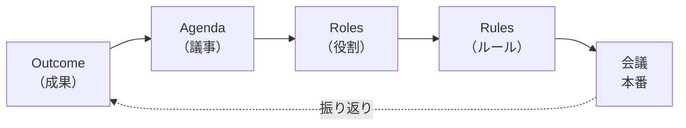
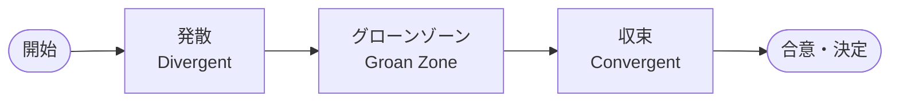
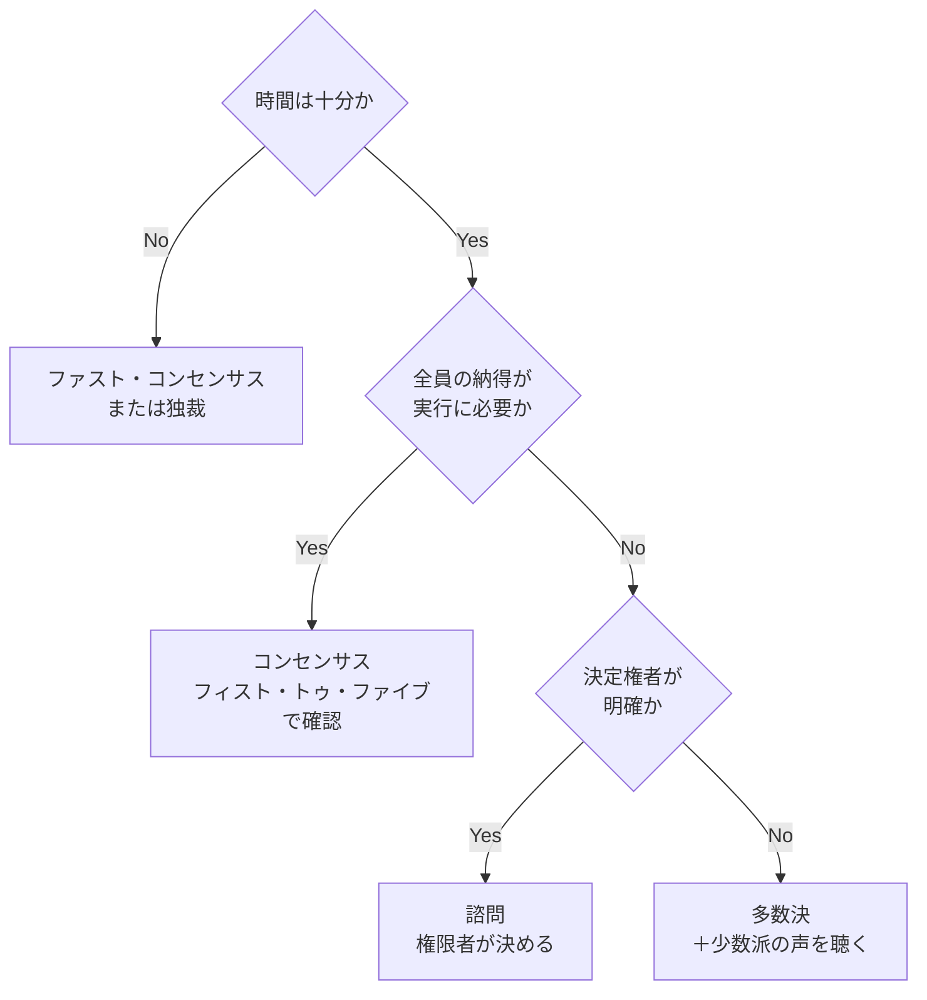

# ファシリテーション入門

会議とワークショップを「進める力」——参加者から答えを引き出す技術

| 項目 | 内容 |
|---|---|
| カテゴリー | コミュニケーション |
| 難易度 | 入門 |
| 所要時間 | 約200分（全8レッスン） |
| 公開日 | 2026-05-22 |
| 最終更新日 | 2026-05-30 |
| コースURL | https://skillup.college/courses/communication/facilitation-basics/ |

## 対象者

会議で議論が深まらない・結論が出ないと感じている社会人。チームリーダー・プロジェクトマネージャー・人事や組織開発の担当者、ワークショップを企画する立場の方。在宅勤務やハイブリッド会議で進行の質を上げたい方も対象。研修や1on1の運営に関わる方にも役立つ内容。

## 前提知識

特になし。会議の進行役・司会経験があると理解が早いが、必須ではない。リモートワーク・オンライン会議の経験があると、レッスン8の内容に入りやすい。

## 学習目標

- ファシリテーションの定義と、プレゼン・講義・コーチングとの違いを説明できる
- ファシリテーターの「中立性」と「プロセスの番人」という役割を理解する
- OARRを使って会議を「終わり方」から逆算して設計できる
- グランドルール・チェックインなど、場づくりの基本動作を実装できる
- 開かれた質問・閉じた質問・ORIDを使い分け、参加者の発言を引き出せる
- サム・ケイナーのダイヤモンドを理解し、発散と収束を意識的に切り替えられる
- ドット投票・フィスト・トゥ・ファイブなど、用途に応じた意思決定方法を選べる
- オンライン・ハイブリッド特有の難しさと工夫を理解し、現場に応用できる

## コース概要

会議が長い、話が散る、結論が出ない、決まったはずのことが実行されない——ビジネスパーソンなら誰でも経験のある悩みです。これらは「司会のうまさ」では解決しません。会議を進める仕事、つまりファシリテーションは、内容を主導するのではなく、参加者から答えを引き出すための「プロセスを設計する」技術です。本コースでは、ファシリテーションの定義と中立性の意味から始め、会議のデザイン（OARR）、場づくり、問いと傾聴、議論の発散と収束（カネルのダイヤモンド）、合意形成と意思決定、そしてオンライン・ハイブリッド時代の応用までを8レッスンで体系的に学びます。理論を「明日の会議で試せる動作」に翻訳することを優先しています。

## 学習の流れ

レッスン1〜2で、ファシリテーションの全体像とファシリテーターの基本姿勢を押さえます。レッスン3〜4は「準備」のレッスンで、会議をどう設計し、どう場を整えるかを扱います。レッスン5〜7は「進行」のレッスンで、問いの立て方、議論の発散と収束、合意形成の方法を順に学びます。最後のレッスン8で、オンライン・ハイブリッドの応用とワークショップ設計、コース修了後の学習方向を案内します。前半（レッスン1〜2）は「考え方の土台」、中盤（レッスン3〜4）は「準備の技術」、後半（レッスン5〜7）は「進行の技術」、終盤（レッスン8）は「応用と次の学び」という四段構えです。

## レッスン一覧

| No. | タイトル | 概要 | 所要時間 |
|---|---|---|---|
| 1 | ファシリテーションとは何か——会議・対話・学びを駆動する技術 | ファシリテーションの定義、プレゼン・講義・コーチングとの違い、適用範囲（会議・ワークショップ・1on1・コミュニティ）と、なぜ今この技術が必要かを学ぶ | 25分 |
| 2 | ファシリテーターの役割と心構え——中立性とプロセスの番人 | 「中立性」「プロセスの番人」というファシリテーターの本質的な役割、IAFのコアコンピテンシー6分類、議長・記録係などほかの役割との分離を学ぶ | 25分 |
| 3 | 会議のデザイン——OARRで「終わり方」から逆算する | OARR（Outcome・Agenda・Roles・Rules）の4要素を使って会議を設計する方法、成果物の定義、時間配分の作り方、アジェンダの動詞化を学ぶ | 25分 |
| 4 | 場づくりと心理的安全性——最初の5分が会議を決める | グランドルール、チェックイン、心理的安全性の考え方、物理的・心理的セットアップなど、議論が始まる前に整えるべき場の作り方を学ぶ | 25分 |
| 5 | 問いとアクティブリスニング——答えを引き出す技術 | 開かれた質問・閉じた質問の使い分け、ORID（事実・反応・解釈・決定）の4段階、傾聴の3レベル、パラフレーズと要約という基本動作を学ぶ | 25分 |
| 6 | 議論の発散と収束——カネルのダイヤモンドとグローンゾーン | サム・ケイナーのダイヤモンド・モデル、ブレインストーミングの基本ルール、親和図法（KJ法）、発散と収束の切り替え、グローンゾーンの乗り越え方を学ぶ | 25分 |
| 7 | 合意形成と意思決定——「決め方を決める」 | コンセンサス、マルチ投票・ドット投票、フィスト・トゥ・ファイブ、決定権者の明示、RACI、ファスト・コンセンサスなど、用途に応じた意思決定の方法を学ぶ | 25分 |
| 8 | オンライン・ハイブリッドとワークショップ設計——次の学習へ | オンライン特有の課題と工夫、ハイブリッドの落とし穴、Miro・Mural・FigJamなどの位置づけ、ワールドカフェ・OST・フィッシュボウルの概観、コース修了後の学習方向を案内する | 25分 |

---

## レッスン1：ファシリテーションとは何か——会議・対話・学びを駆動する技術

（所要時間：25分）

### このレッスンで学ぶこと

- ファシリテーションの定義を理解する
- プレゼン・講義・コーチングとの違いを説明できる
- ファシリテーションが活用される場面（会議・ワークショップ・1on1・コミュニティ）を把握する
- なぜ今この技術が求められているのかを理解する

---

「会議が長いのに、何も決まらない」「結局、声の大きい人の意見で押し切られた」「決まったはずなのに、誰も実行していない」——多くの組織で繰り返されている光景です。本コースが扱うファシリテーションは、こうした「うまく進まない会議」を内側から変える技術です。司会を上手にこなす話術でも、議論を盛り上げる芸でもありません。参加者が自分の頭で考え、自分の言葉で発言し、自分たちで結論にたどり着くプロセスを設計する、地味で実用的な技術です。

### ファシリテーションとは

ファシリテーションは、英語のFacilitate（容易にする・促進する）からきています。日本語では「促進」「進行支援」と訳されます。会議・ワークショップ・対話の場で、参加者が議論を進めやすく、合意や成果にたどり着きやすくなるよう、プロセスをデザインし、進行を支援する技術と姿勢の総称です。

定義としてよく引用されるのは、米国のファシリテーション研究者であるサンドラ・シーガル（Sandra Schuman）の整理です。「ファシリテーションとは、グループが効果的に機能するために、人々が共に考え、共に決め、共に行動できるよう支援するプロセスである」というものです。本コースもこの考え方を出発点にします。

ここで大事なのは、ファシリテーターは「答えを持っている人」ではないということです。ファシリテーターは中立的な進行役として、参加者の知恵を引き出し、見える化し、合意へと導きます。中身（コンテンツ）の専門家ではなく、進め方（プロセス）の専門家です。この区別が、本コース全体を通じて何度も登場する核心です。

> **💡 ポイント**
> ファシリテーションの本質は、「答えを教える」のではなく「答えが生まれる場をつくる」ことです。参加者の中にすでにある知恵・経験・視点を引き出し、組み合わせ、形にする支援です。場を盛り上げる技術ではなく、考えやすくする技術と理解してください。

### プレゼン・講義・コーチングとの違い

「人前で話す」という共通点があるため、ファシリテーションはプレゼン・講義・コーチングと混同されがちです。違いを整理しておきます。

#### プレゼンテーションとの違い

プレゼンテーションは、発信者から聞き手への一方向の情報伝達が中心です。ゴールは「伝えること」と「行動を促すこと」。一方、ファシリテーションは双方向の対話と相互作用が中心で、ゴールは「参加者に考えさせ、決めさせること」です。プレゼンは「自分の主張」を伝える仕事、ファシリは「他人の主張」を引き出す仕事と言い換えてもよいでしょう。

#### 講義・授業との違い

講義は、教える側が知識を体系的に伝える形式が基本です。ファシリテーションは、参加者がすでに持っている経験・知識を引き出し、つなぎ合わせる形式が中心です。もちろん、研修の中で講義パートとファシリテーションパートを組み合わせることもあります。本コース自体、文章を読んで考えていただく「半・講義」のスタイルですが、確認クイズや用語集を通じて「自分で考える」要素を入れる工夫をしています。

#### コーチングとの違い

コーチングは、1対1で相手の答えを引き出す対話技法です。ファシリテーションは、グループに対して同じ働きかけをするものです。問いを使う点・傾聴を重視する点は共通しています。違いは「対象人数」と「合意形成までを支援するか」。コーチングは個人の気づきと行動変容が中心、ファシリテーションはグループとしての合意・決定・実行までを射程に入れます。

> **🔰 初学者の方へ**
> 「ファシリテーションとプレゼンとコーチングをどう使い分ければよいか」と聞かれたら、「目的が違う」と答えるのが正解です。情報を伝えるならプレゼン、知識を体系的に渡すなら講義、個人の答えを引き出すならコーチング、グループから答えを引き出すならファシリテーション。1つの研修や会議の中で、これらを切り替えて使うのが普通です。

### ファシリテーションが活用される場面

ファシリテーションが対象にする範囲は、想像よりずっと広いものです。

#### 1. 会議・打ち合わせ

定例会議、プロジェクト会議、部門横断のすり合わせ、経営会議、取締役会——あらゆる会議でファシリテーションは活躍します。むしろ「会議＝ファシリテーションの中心舞台」です。本コースの主な想定もここです。

#### 2. ワークショップ・研修

新規事業立案、ビジョン策定、業務改善、組織開発、デザイン思考——参加型で何かを生み出すワークショップでは、ファシリテーターの設計が成果を大きく左右します。1日や2日かけて行うワークショップは、設計の出来でほぼ結果が決まります。

#### 3. 1on1・面談

最近では、上司と部下の1on1ミーティングや、評価面談などにもファシリテーション的な発想が取り入れられています。コーチングと近い領域ですが、「相手から引き出す」「中立的に進める」というファシリの基本姿勢が役立ちます。

#### 4. 地域・コミュニティ・NPO

行政の住民会議、まちづくりワークショップ、NPOの理事会、保護者会、PTA、自治会——多様な立場の人が集まって何かを決める場面では、ファシリテーションは欠かせません。日本では地域コミュニティの文脈でファシリテーションが広まった経緯もあります。

#### 5. オンライン・ハイブリッド会議

2020年以降、リモートワークの普及でオンライン会議が日常になり、ファシリテーションの重要性は一段と増しました。物理的に集まる会議とは違う配慮が必要になり、レッスン8で詳しく扱います。

> **📝 補足**
> 本コースを掲載しているスキルアップカレッジは、テキスト中心の学習プラットフォームです。本来の意味での「ファシリテーション」は対面・双方向の場で力を発揮するものですが、テキストでも「読者が自分で考える余白を残す」「問いを投げかける」「具体例を通じて自分に引き寄せて考えてもらう」といった工夫はできます。本コースもその発想で書かれています。

### なぜ今ファシリテーションが必要か

ファシリテーションという言葉は1960〜1970年代に米国で広まりました。日本に本格的に紹介されたのは2000年代以降です。なぜ今、この技術が改めて注目されるのでしょうか。背景を5つの観点から整理します。

#### 1. 答えが「上」になくなった

かつての階層型組織では、上位職が答えを持ち、下位職に伝えればよかった面があります。しかし、ビジネス環境の変化スピードが上がり、現場の知見が必要不可欠になった現在、答えは「上」ではなく「現場の知恵を集めた先」にあります。集める仕組み、つまりファシリテーションが必要になりました。

#### 2. リモート・ハイブリッドの普及

2020年以降、対面の会議とリモートが混在する形が定着しました。場の空気でなんとなく進めることが難しくなり、明示的な進行設計の必要性が一気に増しました。発言の偏り、画面越しの心理的距離、ハイブリッドの参加格差など、課題は新しいものに置き換わりつつあります。

#### 3. 多様性の拡大

性別・年齢・国籍・働き方・価値観——職場の多様性は確実に広がっています。多様な立場の声を引き出し、対立をクリエイティブに使うには、進行役の技術が要ります。多様性とインクルージョン入門コースで触れた心理的安全性は、ファシリの場づくりとも深く関係します。

#### 4. 心理的安全性への注目

GoogleのProject Aristotleなどをきっかけに、心理的安全性がチームパフォーマンスの鍵だと広く認識されるようになりました。心理的安全性を高めるには、安心して発言できる場をつくる進行役が必要です。詳しくはレッスン4で扱います。

#### 5. 「決まらない会議」「実行されない決定」への危機感

調査によっては、日本のホワイトカラーの労働時間の3〜4割が会議に費やされているとも言われます（ハーバード・ビジネス・レビュー・日経新聞などで類似の数字が報じられています）。会議の質を上げる、決まったことを実行に移す——これらの課題に応える技術として、ファシリテーションが見直されています。

### ファシリテーションでできるようになること

このコースを終えると、次のようなことができるようになります。

- 「終わり方」から逆算して会議を設計できる
- 議論が始まる前に、参加者が安心して発言できる場を整えられる
- 開かれた質問とアクティブリスニングで、参加者の発言を引き出せる
- 発散と収束を意識的に切り替え、議論を行き詰まらせない
- 用途に応じて「決め方を決める」ことができる
- オンライン・ハイブリッド会議の難所を予見し、対応できる

これらは、明日の会議から少しずつ試せる小さな動作の積み重ねです。「ファシリテーションを身につける」とは、こうした動作を意識して使えるようになることだと考えてください。

### このコースの全体像

本コースは8レッスンで構成されています。

- **レッスン2**：ファシリテーターの役割と心構え——中立性とプロセスの番人
- **レッスン3**：会議のデザイン——OARRで「終わり方」から逆算する
- **レッスン4**：場づくりと心理的安全性——最初の5分が会議を決める
- **レッスン5**：問いとアクティブリスニング——答えを引き出す技術
- **レッスン6**：議論の発散と収束——カネルのダイヤモンドとグローンゾーン
- **レッスン7**：合意形成と意思決定——「決め方を決める」
- **レッスン8**：オンライン・ハイブリッドとワークショップ設計——次の学習へ

前半（レッスン1〜2）で「考え方の土台」、中盤（レッスン3〜4）で「準備の技術」、後半（レッスン5〜7）で「進行の技術」、終盤（レッスン8）で「応用と次の学び」、という四段構えです。

> **💡 ポイント**
> 本コースを読むだけでファシリテーションが上達するわけではありません。しかし、用語と型を知っているだけで、明日の会議の「見え方」は確実に変わります。「あ、今は発散の場面だ」「いま参加者が4つの不安のどれを感じているか」と気づけるようになるだけで、進行の質は大きく変わります。

### まとめ

このレッスンでは、以下のことを学びました。

- ファシリテーションは、参加者が共に考え・共に決め・共に行動できるよう支援するプロセスである
- ファシリテーターは中立的な進行役で、コンテンツではなくプロセスの専門家である
- プレゼン・講義・コーチングとは目的が違う。1つの場面で組み合わせて使う
- 会議・ワークショップ・1on1・地域コミュニティ・オンライン会議など適用範囲は広い
- リモート化・多様性拡大・心理的安全性への注目で、必要性が一段と増している
- 「盛り上げ役」ではなく「考えやすくする役」がファシリテーターである

次のレッスンでは、ファシリテーターの中核的な役割である「中立性」と「プロセスの番人」を、IAFのコアコンピテンシーとあわせて深掘りします。ファシリテーションを「気合と勘」で済ませず、「学べる技術」として位置づけるための土台になるレッスンです。

---

### 確認クイズ

このレッスンの理解度をチェックしましょう。

#### Q1. ファシリテーションの本質的な役割として最も適切なものはどれか？

- [x] 参加者が共に考え・共に決め・共に行動できるよう支援するプロセスをデザインすること
- [ ] 専門知識を体系的に伝えて参加者の理解を深めること
- [ ] 場を盛り上げて参加者を楽しませること
- [ ] 自分の主張を効率よく相手に伝えること

> **解説**
> ファシリテーションは「参加者から答えを引き出すプロセスをデザインする」技術です。専門知識を伝える講義、場を盛り上げる司会、自分の主張を伝えるプレゼンとは目的が異なります。

#### Q2. ファシリテーションとプレゼンテーションの違いとして本レッスンで説明されたものはどれか？

- [ ] プレゼンは大人数向け、ファシリテーションは少人数向けである
- [ ] プレゼンは事前準備が必要、ファシリテーションは即興で行う
- [x] プレゼンは発信者から聞き手への一方向、ファシリテーションは双方向の対話が中心である
- [ ] プレゼンはオンラインで、ファシリテーションは対面で行う

> **解説**
> プレゼンは発信者から聞き手への一方向の情報伝達が中心で、ゴールは「伝える」「行動を促す」こと。ファシリテーションは双方向の対話と相互作用が中心で、ゴールは「参加者に考えさせ、決めさせる」ことです。

#### Q3. コーチングとファシリテーションの主な違いとして最も適切なものはどれか？

- [ ] コーチングは無料、ファシリテーションは有料である
- [ ] コーチングは社内、ファシリテーションは社外で行う
- [ ] コーチングは管理職向け、ファシリテーションは新人向けである
- [x] コーチングは1対1で個人の答えを引き出す、ファシリテーションはグループに対して同じ働きかけをし合意・決定までを射程に入れる

> **解説**
> コーチングは個人の気づきと行動変容が中心、ファシリテーションはグループとしての合意・決定・実行までを射程に入れます。問いと傾聴を使う点や中立的な姿勢は共通します。

#### Q4. ファシリテーションが活用される場面として、本レッスンで紹介されていないものはどれか？

- [ ] 会議・打ち合わせ
- [ ] ワークショップ・研修
- [x] 株式売買のタイミング判断
- [ ] 地域コミュニティ・NPO

> **解説**
> ファシリテーションは会議・ワークショップ・1on1・地域コミュニティ・オンライン会議など、人が集まって話し合う場面全般を対象とします。株式売買は対象外です。

#### Q5. 本レッスンで挙げられた、ファシリテーションが現代に必要とされる理由として最も適切なものはどれか？

- [ ] AIに頼らずに人間だけで議論する必要が出てきたから
- [ ] 会議の場所が職場から会議室に移ったから
- [x] 答えが「上」になくなり、現場の知恵を集める仕組みが必要になったから
- [ ] 紙の資料からデジタル資料に置き換わったから

> **解説**
> ビジネス環境の変化スピードが上がり、答えが「上」ではなく「現場の知恵を集めた先」にあるようになりました。集める仕組みとしてファシリテーションが必要になっています。リモート化・多様性拡大・心理的安全性への注目も理由として挙げられます。

#### Q6. 本レッスンで強調された「ファシリテーター＝盛り上げ役」という見方への注意点はどれか？

- [ ] 盛り上げ役こそファシリテーターの最重要スキルである
- [x] 盛り上げに使うエネルギーの一部を、問いの設計とアウトカムの定義に使うべきである
- [ ] 盛り上げる必要はない、参加者は静かに座っているのが理想である
- [ ] 盛り上げは禁止、終始真剣な雰囲気を保つべきである

> **解説**
> ファシリテーションは盛り上げる仕事ではなく、参加者が考えやすくする仕事です。盛り上げ自体は悪くありませんが、それに使うエネルギーの一部を問いの設計やアウトカムの定義に振り分けることが重要だと、本レッスンの講師の現場メモで強調されました。

---

## レッスン2：ファシリテーターの役割と心構え——中立性とプロセスの番人

（所要時間：25分）

### このレッスンで学ぶこと

- ファシリテーターの「中立性」の意味と限界を理解する
- 「コンテンツではなくプロセス」という基本姿勢を説明できる
- IAFが定めるファシリテーターのコアコンピテンシー6分類を把握する
- 議長・記録係などほかの役割との分離を理解する

---

レッスン1では、ファシリテーションを「参加者から答えを引き出すプロセスをデザインする技術」として位置づけました。ここからは「では、ファシリテーター本人は何をする人なのか」を掘り下げます。本レッスンの中心テーマは2つあります。「中立性」と「プロセスの番人」です。この2つを理解すれば、ファシリテーターの心構えは半分以上完成します。

### 「中立性」の正しい意味

ファシリテーターの最重要原則は「中立性」です。中立とは、議論の中身（コンテンツ）について自分の意見を持ち込まない姿勢を指します。「Aさんの案がよいと思います」「私ならBにします」とは言わない。これがファシリテーターの基本動作です。

しかし、中立は「無関心」とは違います。プロセスについては、むしろ強い意志を持ちます。「いま発散の段階だから、結論を急がないでください」「Cさんがまだ発言していないので、伺ってもよいですか」——進め方には積極的に介入します。

> **💡 ポイント**
> 中立性の正しい理解は「コンテンツには中立、プロセスには厳しく」です。中身については参加者に任せ、進め方については進行役の責任で介入する。この区別が、ファシリテーターを「司会者」と分ける核心です。

#### 「中立」が難しい場面

実際の現場では、中立を保つのが難しい場面が必ず出てきます。

- 自分が組織の一員で、特定の意見に近い立場のとき
- 議論が明らかに誤った前提や事実誤認に基づいているとき
- 一部の参加者が他の参加者を攻撃するなど、安全が損なわれているとき

これらの場面でどう振る舞うかは、ファシリテーション業界でも議論が続いているテーマです。代表的なスタンスは次のとおりです。

1. **事実誤認**：「ここで前提を確認させてください」とプロセスに引き戻す形で介入する
2. **安全の脅威**：プロセスを止めて場のルールに戻る（「グランドルールに立ち戻りましょう」など）
3. **当事者性**：もし自分が結論に強い利害を持つ立場であれば、ファシリテーターを別の人に依頼するのが原則。当事者がファシリすると中立に見えなくなり、合意の正当性が損なわれる

> **⚠️ 注意**
> ファシリテーターがコンテンツに踏み込むと、参加者は「結局、進行役が言わせたい答えに誘導されている」と感じます。一度この不信が生まれると、その場の合意は実行段階で必ず弱くなります。中立を守ることは、合意の実行力を守ることでもあります。

### 「プロセスの番人」とは何か

ファシリテーターのもう1つの大原則は「プロセスの番人」です。プロセスとは、議論の進め方・流れ・構造のこと。具体的には次のような要素を指します。

- 議論の段階（発散・収束・意思決定など）を意識的に切り替える
- 時間配分を管理する
- 発言の偏りを是正する
- グランドルール（場の約束）を守る／守ってもらう
- 議題と関係ない話題（脱線）を扱う
- 意見を可視化する（記録・要約・図解）

これらはどれも、進行役が責任を持って管理します。参加者は中身を考えることに集中できるよう、進行役が「考えやすい場」を整える。これが「プロセスの番人」の意味です。

#### コンテンツとプロセスの分業

職場のミーティングでは、しばしば「進行も発言もする」人が出てきます。例えば、リーダーが「今日は私が進行しますが、私もこの案件の当事者なので意見も言います」と切り出すケース。これは現実には避けられない場面もありますが、原則として推奨されません。理由は次の2つです。

1. **参加者が忖度する**：進行役が立場の強い人だと、発言が引き出しにくくなる
2. **進行が偏る**：自分の意見に近い発言を多く拾い、反対意見を短く扱う傾向が出る

理想は、進行役と参加者を分けることです。難しい場合は、「進行に専念する時間」と「議論に参加する時間」を明示的に切り替えるのが現実的な工夫です。

> **🔰 初学者の方へ**
> 「上司がファシリをやると、誰も本音を言わない」という声をよく聞きます。これは中立性の問題というより、立場の問題です。可能なら、進行役は議題に直接の利害を持たない人に頼む。それが難しければ、外部のファシリテーターを呼ぶ。社内同士なら、別チームの人にお願いするのも有効です。

### IAFのコアコンピテンシー6分類

ファシリテーターに必要な能力は、世界的な業界団体である IAF（International Association of Facilitators・国際ファシリテーターズ協会）が「コア・ファシリテーター・コンピテンシー」として整理しています。IAFのCertified Professional Facilitator（CPF）認定試験の基準にもなっています。

公式の6分類は次のとおりです（IAFのCore Competenciesに基づく整理。詳しくは参考資料を参照）。

#### A. クライアントとの協働関係を作る

ファシリテーションを依頼してきた組織・担当者と、何を実現したいかをすり合わせます。本番の進行に入る前の「事前協議」が、ここに含まれます。

#### B. グループ・プロセスを適切に設計する

セッションの目的に合わせて、どんな進行・どんな手法（発散・収束・投票・対話形式など）を組み合わせるかを設計します。本コース全体のテーマでもあります。

#### C. 参加と協働の環境を作り維持する

物理的・心理的に安全な場を作り、すべての参加者が発言しやすい状態を保ちます。レッスン4で深掘りします。

#### D. グループを適切な成果へ導く

時間内に、合意された手順で、合意された成果物にたどり着くよう導きます。発散と収束を切り替え、グローンゾーンを乗り越え、意思決定にたどり着くプロセス管理がここに入ります。

#### E. プロフェッショナルな知識を継続的に高める

ファシリテーションの手法・ツール・最新動向を学び続ける姿勢を持ちます。1つの手法に固執せず、場に応じた最適な道具を選べることが大事です。

#### F. プロフェッショナルとしての姿勢

中立性・倫理・守秘義務・自己の限界の認識——プロとしての職業倫理がここに入ります。

> **📝 補足**
> 6分類のすべてを最初から完璧に身につける必要はありません。本コースは主にB・C・Dにあたる実務スキルを扱います。A（クライアント協働）とE・F（継続的成長）は、現場で経験を積みながら身につけていく領域です。

### 議長・司会・記録係との違い

会議には複数の役割が登場します。整理しておきます。

| 役割 | 主な責任 | コンテンツへの関与 |
|---|---|---|
| 議長（チェアパーソン） | 会議の決定権者、最終的な責任を負う | あり（決裁する） |
| 司会・進行 | 議事の進行管理 | 弱め（流れの管理が中心） |
| ファシリテーター | プロセス全体の設計と進行 | なし（中立） |
| 記録係（書記） | 議事録の作成 | なし（記録に専念） |
| タイムキーパー | 時間管理 | なし（時間管理に専念） |

理想は、これらの役割を別の人が担うことです。実際には小さな会議では1人が複数の役割を兼ねることが普通ですが、その場合も「いまどの役割で動いているか」を意識することが大事です。

> **💡 ポイント**
> 「議長＝ファシリテーター」ではありません。議長は決裁権を持つコンテンツの責任者、ファシリテーターはプロセスの責任者です。両者が同じ人だと、中立性が揺らぎます。重要な意思決定の会議ほど、ファシリは別の人を立てる価値があります。

### ファシリテーターの基本姿勢

中立性・プロセスの番人という原則のうえに、次のような姿勢が積み重なります。

#### 1. 「結論を急がない」勇気

参加者から沈黙が生まれると、つい進行役が答えを言いたくなります。これを我慢する。10秒の沈黙は耐えがたく感じますが、その先に深い発言が生まれることがよくあります。

#### 2. 「全員に話してもらう」しつこさ

自然に任せると、発言は3〜4人の特定メンバーに集中します。これを丁寧に分散させる。「Cさん、ここまでの議論をどう思いますか」と直接振るのは、有効な介入です。

#### 3. 「決まったことを記録する」厳密さ

合意したつもりが、後で「そんな話じゃなかった」と崩れるのは、議事の記録が曖昧だからです。決定事項・次のアクション・担当者・期限を明示的に記録します。

#### 4. 「自分の感情を整える」セルフケア

ファシリは集中力を要する仕事です。長時間の会議の後は脳が疲れます。休憩を入れる、自分を労う、ファシリのジャーナリング（振り返り日記）をする——プロほどセルフケアを大事にします。

#### 5. 「完璧を求めない」現実感

すべての会議をうまく進行できるわけではありません。失敗を恐れず、振り返り、次に活かす。私は20年以上やっていますが、いまだに毎週何かしら反省点があります。これが普通です。

> **🔰 初学者の方へ**
> 5つの姿勢の中で、最初に身につけたいのは「結論を急がない勇気」です。沈黙を恐れず、「いま考えていらっしゃるのですよね、もう少し待ちますね」と言える進行役は、それだけで質が高いと評価されます。

### オンラインだとどう変わるか

オンライン会議では、これらの原則がより難しくなります。

- 沈黙が「通信が止まったのか」と誤解されやすい
- 発言の偏りが、画面のサイズや音声品質で増幅される
- 中立を保ちたい場面で、表情や身振りで意図せず影響を与えてしまう
- 議事録のリアルタイム共有が普通になり、記録の重要度が上がる

レッスン8で詳しく扱いますが、オンラインでは「明示性」が鍵になります。空気で伝わるものが減るため、言葉と動作で明示的に進行を組み立てる必要があります。

### まとめ

このレッスンでは、以下のことを学びました。

- 中立性は「コンテンツには中立、プロセスには厳しく」が正しい理解
- 中立は無関心ではない。プロセスには積極的に介入する
- 「プロセスの番人」として、段階の切り替え・時間管理・発言の偏り是正・記録などを担う
- IAFのコアコンピテンシーは6分類。本コースは主にB・C・D（設計・場づくり・成果への誘導）を扱う
- 議長・司会・記録係とは別の役割。可能なら分担する
- 5つの基本姿勢：結論を急がない／全員に話してもらう／決定を記録する／セルフケア／完璧を求めない

次のレッスンでは、ファシリテーションの「準備」段階に入ります。OARR（アウトカム・アジェンダ・役割・ルール）というフレームワークを使って、会議を「終わり方」から逆算して設計する方法を学びます。準備が8割という言葉の意味が、実感としてわかるレッスンです。

---

### 確認クイズ

このレッスンの理解度をチェックしましょう。

#### Q1. ファシリテーターの「中立性」の正しい理解として最も適切なものはどれか？

- [ ] コンテンツについてもプロセスについても、いっさい介入せず無関心を保つ
- [x] コンテンツには中立、プロセスには厳しく介入する
- [ ] コンテンツには積極的に介入し、プロセスは参加者に任せる
- [ ] コンテンツ・プロセスとも、参加者の多数派の意見に合わせる

> **解説**
> 中立性は「コンテンツには中立、プロセスには厳しく」が正しい理解です。議論の中身については自分の意見を持ち込まず、進め方については進行役の責任で介入します。「中立＝無関心」ではない点が重要です。

#### Q2. 議論が明らかな事実誤認に基づいているとき、ファシリテーターの推奨される対応はどれか？

- [ ] 黙って参加者に任せ、誤りを修正しない
- [ ] 「それは間違いです」と自分の意見として明示的に訂正する
- [x] 「ここで前提を確認させてください」とプロセスに引き戻す形で介入する
- [ ] 議論を打ち切り、別の議題に移る

> **解説**
> 事実誤認に対しても、コンテンツに踏み込まずプロセスに引き戻す介入が原則です。「前提を確認しましょう」のように進行役の立場でフラットに扱うことで、中立性を保ちながら誤認を是正できます。

#### Q3. 「プロセスの番人」としてファシリテーターが担う責任に含まれないものはどれか？

- [ ] 議論の段階（発散・収束・意思決定）を意識的に切り替える
- [ ] 時間配分の管理と発言の偏りの是正
- [ ] グランドルールを守ってもらうこと
- [x] 議題に対するベストアンサーを自分で導き出すこと

> **解説**
> ファシリテーターは「プロセス」を管理する役割で、コンテンツの答えを自分で導き出す立場ではありません。答えは参加者から引き出します。段階の切り替え・時間管理・発言の偏り是正・グランドルール管理はプロセスの責任に含まれます。

#### Q4. IAFのコアファシリテーター・コンピテンシーの説明として最も適切なものはどれか？

- [ ] 1つの手法を完璧に身につけることを最重要とする
- [x] クライアントとの協働、グループ・プロセスの設計、参加環境の構築、成果への誘導、継続的学習、プロフェッショナルとしての姿勢の6分類で整理されている
- [ ] 日本ファシリテーション協会（FAJ）が独自に定めたものである
- [ ] プレゼンテーション能力とライティング能力の2要素を中心にする

> **解説**
> IAF（International Association of Facilitators）のコアコンピテンシーは6分類で整理されています。A.クライアントとの協働関係／B.グループ・プロセスの設計／C.参加と協働の環境構築／D.成果への誘導／E.プロフェッショナル知識の継続的向上／F.プロフェッショナルとしての姿勢、です。

#### Q5. 議長とファシリテーターの違いとして最も適切なものはどれか？

- [x] 議長は決裁権を持つコンテンツの責任者、ファシリテーターはプロセスの責任者である
- [ ] 議長は経営層、ファシリテーターは新人が担う役割である
- [ ] 議長は対面会議、ファシリテーターはオンライン会議で使う役割である
- [ ] 議長とファシリテーターは同じ意味で、呼び方が違うだけである

> **解説**
> 議長は会議の決定権者でコンテンツの責任者、ファシリテーターはプロセスの責任者です。両者が同じ人だと中立性が揺らぐため、重要な意思決定の会議ほど分担することが推奨されます。

#### Q6. ファシリテーターの基本姿勢として本レッスンで紹介されたものはどれか？

- [ ] 沈黙が生じたら直ちに進行役が結論を提示する
- [ ] 発言の多い人の意見を中心に議論を進める
- [x] 結論を急がず、沈黙を恐れず、全員に話してもらえるよう丁寧に分散させる
- [ ] すべての会議を完璧に進行することを最優先する

> **解説**
> 本レッスンで紹介された姿勢は、結論を急がない勇気・全員に話してもらうしつこさ・決まったことを記録する厳密さ・自分の感情を整えるセルフケア・完璧を求めない現実感の5つです。とくに沈黙を恐れずに待つ姿勢が初学者にとって重要です。

---

## レッスン3：会議のデザイン——OARRで「終わり方」から逆算する

（所要時間：25分）

### このレッスンで学ぶこと

- OARR（Outcome・Agenda・Roles・Rules）の4要素を理解する
- 「終わり方」から逆算して会議を設計する方法を身につける
- アウトカムを動詞で書く意味と、時間配分の作り方を学ぶ
- 参加者選定の基本を把握する

---

レッスン2では、ファシリテーターの中核的な役割を「中立性」と「プロセスの番人」として整理しました。本レッスンから2つは「準備」のレッスンです。ファシリテーションは準備が8割、と繰り返してきましたが、その準備の最初のステップが「会議の設計」です。設計の標準フレームワークとして、本レッスンではOARRを学びます。

### 「終わり方」から逆算するという発想

設計の最大の原則は、「終わり方から逆算する」です。会議の終わりに、何が出来上がっていればよいか。誰が何に合意していればよいか。次に誰が何をするか。それが決まれば、そこにたどり着くまでの流れは自然と見えてきます。

多くの会議が混乱するのは、「とりあえず議論を始めよう」から入るからです。終着点が曖昧なまま走り出すと、議論は発散したまま時間切れになります。逆に、終着点が共有されていれば、参加者は自分の発言の貢献度を自分で測れるようになります。

> **💡 ポイント**
> 「この会議が終わったとき、何が出来上がっていればよいか」——これを言葉にすることが設計の出発点です。「議論する」「検討する」「共有する」では足りません。「来期の重点施策3つを選び、担当者を決める」「キャンペーンの素案について全員の合意を得る」のように、具体的に書ける形にします。

### OARRの4要素

OARRは、ファシリテーションの古典である『Facilitator's Guide to Participatory Decision-Making』（サム・ケイナーほか、レッスン6で詳しく扱う書籍）にも近い考え方が登場します。日本ではグループ・ファシリテーションの実務で広く使われている、シンプルで強力なチェックリストです。

OARRは次の4つの英語の頭文字です。

- **O：Outcome（アウトカム＝成果）**：会議の終わりに何が出来上がっているか
- **A：Agenda（アジェンダ＝議事）**：そこにたどり着くまでの段取り
- **R：Roles（役割）**：誰が何の役を担うか
- **R：Rules（ルール）**：場の約束事

設計はこの順番で進めます。Outcomeを先に決めて、Agendaを逆算し、Rolesを割り当て、Rulesで場を整える。順番を間違えるとうまくいきません。

この図は、設計が左から右に進む流れを示しています。アウトカムが起点で、それに合わせてアジェンダ・役割・ルールを整えて、本番に臨む。会議後の振り返りはアウトカムに照らして行うので、点線で戻っています。

### O：Outcome（成果）の書き方

アウトカムは会議の終わりに「出来上がっているもの」を指します。書き方の重要なコツは、動詞で表現することです。

#### 動詞で書く——名詞ではなく動作で

NGの例：「来期計画について」「営業戦略の検討」「業績の共有」

OKの例：「来期の重点施策3つを選定し、担当部署を決める」「営業戦略の素案を作成し、経営会議への提出可否を判断する」「Q1業績の達成要因と未達要因を整理し、Q2の改善方針を3つに絞る」

NGとOKの違いは、「動詞」で書かれているかどうかです。「〜について」「〜の検討」は議題（トピック）であり、ゴールではありません。「〜を選ぶ」「〜を決める」「〜を作る」「〜に合意する」のように、完了が確認できる動詞でゴールを定義します。

#### 検証可能なアウトカムを書く

よいアウトカムは、会議の最後に「達成したかどうか」が誰の目にも明らかになります。「重点施策3つを選定」と書いてあれば、終了時に3つ選ばれていれば達成、選ばれていなければ未達。客観的に判定できます。

「議論を深める」「相互理解を促す」のような曖昧な表現は避けます。仮にそうしたソフトな目的があっても、検証可能な「成果物」とセットで書くことで、達成度が見えるようになります。

> **🔰 初学者の方へ**
> 動詞で書くのが難しいときは、「この会議の議事録に何が書かれていればよいか」を想像してみてください。「決定事項：来期の重点施策をA・B・Cの3つに決定。担当部署はそれぞれ営業部・開発部・人事部」のように書ければ、それが立派なアウトカムです。

### A：Agenda（議事）の作り方

アウトカムが決まったら、そこに到達するための段取り（アジェンダ）を組みます。

#### アジェンダは「段階で」組む

優れたアジェンダは、議論を進めやすい段階に分かれています。典型的な3段階構造は次のとおりです。

1. **発散の段階**：選択肢・アイデア・論点を広く出す
2. **収束の段階**：出てきた素材を整理・分類・絞り込む
3. **意思決定の段階**：絞り込んだものから選び、合意する

例：「来期の重点施策3つを選定する」というアウトカムの場合

- 9:00〜9:10（10分）：チェックイン・本日のアウトカムとアジェンダの確認
- 9:10〜9:40（30分）：候補施策のリストアップ（発散）——各自付箋に書き出し→共有
- 9:40〜10:10（30分）：候補を分類・優先順位付け（収束）——親和図法で整理
- 10:10〜10:40（30分）：3つに絞り、担当部署を決める（意思決定）——投票＋議論
- 10:40〜10:55（15分）：次のアクションの確認・チェックアウト

時間配分も含めて事前に組みます。本番では多少前後しますが、設計があると修正が利きます。

#### 時間配分の作り方の目安

経験的な目安は次のとおりです。

- 発散：全体の25〜30%
- 収束：30〜35%
- 意思決定：25〜30%
- 場づくり（チェックイン・チェックアウト）：合計10〜15%

迷ったら、収束に時間を多めに取ります。発散だけ盛り上がって時間切れになるのが、最も多い失敗パターンです。

> **⚠️ 注意**
> 「議論したいトピック」を時間順に並べただけのアジェンダは、アジェンダではなくチェックリストです。「いま発散してください」「いま絞り込んでください」のように、段階を明示すること。これだけで会議の質は変わります。

### R：Roles（役割）の決め方

レッスン2で見たとおり、会議には複数の役割があります。事前に決めておきます。

- **ファシリテーター**：プロセス全体の進行
- **タイムキーパー**：時間管理（ファシリ兼任することも多い）
- **記録係（書記）**：議事録・付箋・ホワイトボードの記録
- **議長／意思決定者**：最終的な決裁の権限を持つ人
- **オブザーバー（任意）**：観察・後でフィードバックする立場

職場の会議では、これらを兼任することが普通です。それでも、開始時に「今日のファシリは私、記録はAさん、最終決裁はB部長」と明示するだけで、進行は格段にスムーズになります。

#### 「全員に話してもらう」設計

役割を決めるのと同じくらい大事なのが、参加者全員に発言する機会を持たせる設計です。具体的な工夫を3つ紹介します。

1. **発言順を決める**：「右から順に1人2分でお話しいただきます」
2. **ペアワーク・小グループワークを挟む**：大人数で発言しにくい人も、ペアなら話せる
3. **書いてから話す**：付箋やチャットに書き出してから共有する。考える時間を確保できる

> **💡 ポイント**
> 発言の偏りは「自然」では解消しません。多くの場合、3〜4人が議論の80%を占めます。これを意識的に分散させる設計を、アジェンダ段階で組み込みます。

### R：Rules（ルール）の決め方

ルールは「グランドルール」とも呼ばれます。詳しくはレッスン4で扱いますが、設計段階で押さえておくべきポイントは次の3つです。

#### 1. 場の安全に関するルール

「人の発言を遮らない」「人格ではなく意見を批判する」「批判する前に質問する」など、安全な対話を保つルールです。

#### 2. 議論の効率に関するルール

「タイムキーパーの合図を尊重する」「ホワイトボードに書かれたことが正式記録になる」「決まったことには異議申し立ての時間を設ける」など、議論を前に進めるルールです。

#### 3. その場で合意する

ルールはファシリテーターが押し付けるものではなく、開始時に参加者と合意するものです。「今日の場で大事にしたいことを3つ確認させてください」と切り出して、その場で確認します。これだけで、ルールへの当事者意識が高まります。

### 参加者選定——「呼ぶ／呼ばない」の設計

会議の質を左右する隠れた要素が、参加者選定です。「全員に声をかけておこう」は、会議を必ず長引かせます。

#### 呼ぶべき人

- 意思決定の権限を持つ人
- 議論のテーマに直接の専門知識・現場知識を持つ人
- 決定の結果に影響を受ける主要なステークホルダー
- ファシリテーター（外部または社内の別チーム）

#### 呼ばなくてもよい人

- 情報共有目的だけの人（議事録で十分）
- テーマと関係が薄い人
- 同じ立場・同じ意見を持つ複数の人のうち、代表1人で済む場合の残り

#### 規模の目安

- 意思決定が中心の会議：5〜8人
- 議論・対話が中心の会議：8〜12人
- アイデア発散ワークショップ：12〜20人（小グループに分割）

人数が多くなるほど、発言の偏りが大きくなります。20人を超える会議では、必ず小グループ・ペアに分けるなどの工夫が要ります。

> **📝 補足**
> ジェフ・ベゾスの「2枚のピザ・ルール」（参加者数は2枚のピザでまかなえる人数までに収める）が有名です。意思決定の会議は8人程度を超えると、急速に決まりにくくなることが、組織心理学の研究でも示唆されています。

### オンラインだとどう変わるか

オンライン会議でOARRを使うときの注意点をいくつか挙げます。

- **アウトカムの共有はチャット冒頭に貼る**：口頭だけだと忘れられる
- **アジェンダはスライドで投影する**：いま何の段階かが見える化される
- **役割表示**：Zoomの名前に「（ファシリ・中西）」「（書記・田中）」と入れる工夫が有効
- **時間管理は厳しめに**：オンラインは脳が疲れるので、休憩を多めに

レッスン8でオンライン特有の工夫を体系的に扱います。

### まとめ

このレッスンでは、以下のことを学びました。

- 会議の設計は「終わり方」から逆算する
- OARRはOutcome・Agenda・Roles・Rulesの4要素の標準フレーム
- アウトカムは動詞で書く。「〜について」ではなく「〜を決める」「〜を作る」
- アジェンダは発散・収束・意思決定の段階で組む。時間配分も事前に
- 役割は事前に決め、開始時に明示する
- ルールは押し付けず、その場で合意する
- 参加者は呼びすぎないことが質を上げる
- 短い会議ほど準備の比重を上げる

次のレッスンでは、設計したアジェンダを実行に移す前に必ず必要となる「場づくり」を扱います。最初の5分で会議の質が決まる——その意味と、グランドルール・チェックインなどの具体動作を学びます。

---

### 確認クイズ

このレッスンの理解度をチェックしましょう。

#### Q1. OARRの4要素として正しい組み合わせはどれか？

- [x] Outcome・Agenda・Roles・Rules
- [ ] Objective・Activity・Result・Review
- [ ] Outline・Analysis・Resource・Review
- [ ] Outcome・Action・Role・Reflection

> **解説**
> OARRは Outcome（成果）・Agenda（議事）・Roles（役割）・Rules（ルール）の4つの頭文字を取ったフレームワークです。設計はこの順番で進めます。

#### Q2. アウトカムの書き方として最も適切なものはどれか？

- [ ] 「来期計画について」と議題として書く
- [ ] 「議論を深める」「相互理解を促す」のように抽象的に書く
- [ ] 「業績の共有」のように名詞でテーマだけ書く
- [x] 「来期の重点施策3つを選び、担当部署を決める」のように動詞で完了が確認できる形で書く

> **解説**
> アウトカムは動詞で書くのが原則です。「〜について」「〜の検討」はテーマであってゴールではありません。「〜を選ぶ」「〜を決める」「〜を作る」のように、完了が確認できる形で定義します。

#### Q3. アジェンダを段階に分けるとき、本レッスンで紹介された3段階構造はどれか？

- [ ] 開始→継続→終了
- [x] 発散→収束→意思決定
- [ ] 個人→グループ→全体
- [ ] 説明→質疑→投票

> **解説**
> 典型的な3段階構造は「発散（選択肢を広く出す）→収束（整理・分類・絞り込み）→意思決定（合意する）」です。アジェンダはこの段階を明示することで、参加者がいま何をすべきかが見えやすくなります。

#### Q4. 会議の時間配分の目安として本レッスンで紹介されたものはどれか？

- [ ] 発散50%・収束20%・意思決定30%
- [ ] 発散10%・収束20%・意思決定70%
- [x] 発散25〜30%・収束30〜35%・意思決定25〜30%・場づくり10〜15%
- [ ] すべて均等に4分の1ずつ

> **解説**
> 経験的な目安として、発散25〜30%・収束30〜35%・意思決定25〜30%・場づくり10〜15%。迷ったら収束に多めに取るのがコツです。発散だけ盛り上がって時間切れになるのが最多の失敗パターンです。

#### Q5. 「全員に話してもらう」ための設計上の工夫として本レッスンで紹介されていないものはどれか？

- [ ] 発言順を決める
- [ ] ペアワーク・小グループワークを挟む
- [ ] 書いてから話す（付箋・チャットに先に書き出す）
- [x] 進行役が代弁して、発言の少ない人の意見を推測して話す

> **解説**
> 発言の偏り是正は、進行役が代弁するのではなく、発言する機会と仕組みを作ることが基本です。発言順を決める、ペアワークを挟む、書いてから話すなどが有効な工夫です。

#### Q6. 参加者選定の原則として最も適切なものはどれか？

- [ ] 関係しそうな人は全員呼んでおくのが安全である
- [x] 意思決定権者・専門知識を持つ人・主要ステークホルダーを中心に、必要最小限で構成する
- [ ] 多ければ多いほど多様な意見が出るので呼ぶべき
- [ ] 同じ立場の人を複数呼ぶことで信頼性が増す

> **解説**
> 「全員に声をかけておこう」は会議を必ず長引かせます。意思決定権者、専門知識・現場知識を持つ人、決定の結果に影響を受ける主要ステークホルダーを中心に、必要最小限で構成するのが原則です。

---

## レッスン4：場づくりと心理的安全性——最初の5分が会議を決める

（所要時間：25分）

### このレッスンで学ぶこと

- 「場づくり」が会議の質を左右する理由を理解する
- グランドルールの目的と作り方を学ぶ
- チェックインとチェックアウトの役割を理解する
- 心理的安全性とファシリテーションの関係を整理する

---

レッスン3では、OARRを使って会議を「終わり方」から逆算する設計の技術を学びました。本レッスンでは、設計したアジェンダを実行に移す直前の「場づくり」を扱います。最初の5分で会議の質はほぼ決まる——これは大げさな表現ではなく、現場の実感です。最初に何を置くかで、参加者の発言量も、議論の深さも、結論への納得感も、大きく変わります。

### なぜ「最初の5分」が決定的なのか

会議の冒頭は、参加者が「この場で自分はどう振る舞えばよいか」を無意識に判断する時間です。

- 「率直に意見を言ってよいのか、言わないほうがよいのか」
- 「失敗談を出してよいのか、避けたほうがよいのか」
- 「反対意見はどこまで言えるのか」
- 「自分の専門外の話題に首を突っ込んでよいのか」

これらの判断は、最初の数分の雰囲気・進行役の言葉づかい・先に発言した人の扱われ方を見て決まります。一度形成された「発言の許容範囲」は、その後の会議でなかなか広がりません。だから、冒頭でこの範囲を「広く」設定する設計が、ファシリテーターの仕事になります。

> **💡 ポイント**
> 会議の質は「中身の議論の質」だけで決まりません。むしろ「中身に入る前にどんな場を作ったか」で大きく左右されます。場づくりは見えない作業ですが、議論の質を底上げする土台です。

### 心理的安全性とファシリテーション

場づくりを考えるうえで、外せない概念が「心理的安全性」です。ハーバード・ビジネス・スクールのエイミー・エドモンドソン教授が1999年に提唱し、Googleの「Project Aristotle」（2012〜2015年に実施されたチーム生産性研究）で広く知られるようになりました。

心理的安全性とは、「対人関係のリスクを取っても、罰せられたり恥をかかされたりしないという信念」と定義されます。具体的には、無知・無能・邪魔者・否定的だと思われる不安を感じずに発言できる状態を指します。

エドモンドソンが整理した「4つの不安」を、ファシリテーターの視点で見ると次のようになります。

1. **無知だと思われる不安**：「こんな初歩的なことを聞いてよいのか」
2. **無能だと思われる不安**：「自分の意見が浅いと思われないか」
3. **邪魔者だと思われる不安**：「話の流れを止めてしまうのではないか」
4. **否定的だと思われる不安**：「反対意見を出すと協調性がないと言われないか」

優れた進行役は、この4つの不安を最初の5分で意識的に下げます。具体的な動作は次のとおりです。

- 進行役自ら「私もまだ整理できていない部分があります」と弱さを開示する
- 「初歩的な質問ほど場の理解が深まります」と先に肯定する
- 「途中で話を止めてもらってかまいません」と明示する
- 「反対意見はむしろ大歓迎です」と先に伝える

> **📝 補足**
> 本コースでは、心理的安全性を「ファシリテーターの視点から、どうすれば最初の5分でその場の安全度を高められるか」に焦点を絞って扱います。心理的安全性そのものの理論的背景は、エドモンドソンの書籍をはじめとする専門書も合わせてご覧ください。

#### 「ぬるい職場」との誤解

心理的安全性が広く知られるにつれて、「言いたいことを何でも言える、ぬるい職場のこと」と誤解されるケースが増えました。これは誤りです。

心理的安全性が高い場とは、率直な反対意見・厳しいフィードバック・難しい質問が出しやすい場のことです。馴れ合いや遠慮ではなく、率直さの土台が確保されている状態を指します。

ファシリテーターは、安全性と率直さを両立させる役割を持ちます。「人格ではなく意見を批判する」「批判する前に質問する」「相手の意図を確認してから反論する」——こうしたグランドルールが、安全性と率直さを両立させます。

### グランドルールの作り方

グランドルールは「場の約束事」です。最初の5分で参加者と合意することで、その後の議論を進めやすくします。

#### 標準的なグランドルール5つ

汎用的に使えるグランドルールの例を5つ紹介します。

1. **発言を遮らない**：話している人が話し終わるまで待つ
2. **人格ではなく意見を批判する**：「Aさんはダメだ」ではなく「この提案にはこういう懸念がある」
3. **批判する前に質問する**：意図を確認してから反論する
4. **守秘義務を守る**：この場の議論を外で個人名と紐付けて話さない
5. **時間を守る**：タイムキーパーの合図を尊重する

これらはあくまで例です。会議のテーマや参加者の関係性に応じて、3〜5つに絞って使います。多すぎると守られません。

#### 「ルールを伝える」ではなく「ルールに合意する」

グランドルールはファシリテーターが押し付けるものではなく、参加者と合意するものです。やり方は次のとおりです。

- **パターンA**：事前に用意したルールを提示し、「これでよいですか、追加したいものがあれば教えてください」と確認する
- **パターンB**：「今日の場で大事にしたいことを3つ挙げるなら何ですか」と参加者に問い、その場で作る
- **パターンC**：前回までのルールがあるなら、「今日も同じでよいか」を確認する

時間がない場合はパターンA、時間がある場合はパターンB、定例会議ならパターンCが現実的です。いずれの場合も、「合意する」プロセスを踏むことが大事です。

> **🔰 初学者の方へ**
> 「グランドルールが堅苦しい」「いい大人にルールを押し付けたくない」と感じる方は、「今日の対話で大事にしたいこと」と言い換えてみてください。意味は同じでも、印象が柔らかくなります。本質は「場の合意を最初に取る」ことなので、呼び方は柔軟に。

#### ルールが破られたときの対応

ルールが破られたとき、ファシリテーターはどう振る舞うか。原則は「個人を責めずに、ルールに立ち戻る」です。

NG：「Aさん、いま発言を遮りましたよね」
OK：「すみません、グランドルールの『発言を遮らない』に戻りましょう。Bさん、続きをお願いします」

主語をルールに置くことで、個人攻撃にならずに場を整えられます。これは小さな違いに見えますが、現場では大きな違いを生みます。

### チェックインとチェックアウト

「チェックイン」は会議の冒頭で、「チェックアウト」は終わりで、参加者一人ひとりに短く発言してもらう仕掛けです。場づくりの中核的な動作で、ぜひ習慣にしたい技です。

#### チェックインの目的

チェックインの目的は3つあります。

1. **発言の口火を切る**：最初に短くでも声を出すと、その後の発言ハードルが下がる
2. **参加者の状態を共有する**：「いま忙しい」「体調が悪い」など、議論の前提を共有できる
3. **全員参加の合図**：誰も「観客」にならず、最初から当事者だと意識づける

#### チェックインの問いの例

質問の選び方で雰囲気が変わります。テーマに応じて選びます。

- **軽め**：「最近の小さな良かったこと」「今朝食べたもの」「今週のおすすめ本・動画」
- **中くらい**：「今日の会議で持ち帰りたいこと」「今日の関心事」「最近気になっているニュース」
- **テーマに関連**：「今日のテーマで、自分が一番関心があるのはどこか」「過去に似た経験があれば一言」

時間は1人30秒〜1分が目安。8人なら4〜8分の枠を見ます。短いほうが続きやすいです。

#### チェックアウトの目的

チェックアウトはチェックインの逆で、会議の終わりに行います。目的は次のとおりです。

1. **持ち帰りの確認**：「今日の会議で持ち帰る一番のこと」を言語化する
2. **未消化の感情のリリース**：「言い残したことがあれば一言」で、後でモヤモヤしないようにする
3. **次のアクションの合図**：「次に自分がやることを一言」で、実行への意識を高める

> **💡 ポイント**
> チェックインとチェックアウトは、ファシリテーションを学んで一番最初に試してほしい技です。設計や問いより簡単に導入でき、効果が見えやすい。今週の会議で1回試してみてください。

### 物理的な場づくり

対面会議では、物理的なセットアップも重要です。

#### 座席配置

- **円卓・コの字型**：全員の顔が見える。対話・ブレストに向く
- **教室型（前向き）**：講義・プレゼン向き。議論には不向き
- **島型（小グループ）**：分科会・ワークショップ向き
- **車座（テーブルなし）**：深い対話向き。ただし長時間は疲れる

座席を変えるだけで、議論の質が変わります。「いつもの会議室を使う」「いつもの席に座る」を見直すことが、設計の隠れたコツです。

#### 道具の準備

- **ホワイトボード／模造紙**：議論を見える化する。記録係が活用する
- **付箋**：発散段階で個人が書き出すのに必要
- **マーカー（太字3色程度）**：はっきり書ける。細字は遠くから見えない
- **タイマー**：時間管理を見える化する

> **⚠️ 注意**
> 「いつも通り」のセットアップが、いつも通りの議論を生みます。新しい結論を期待するなら、最低でも座席配置か道具のどちらかを変える価値があります。

### オンラインだとどう変わるか

オンライン会議では、場づくりがより難しくなります。物理的な空気感が伝わらないため、明示的な動作で補います。

- **チェックインを必須にする**：オンラインこそ、最初に声を出してもらう価値が高い
- **カメラオンのお願い**：可能な範囲で。事情がある場合は無理強いしない
- **チャット欄を「副チャンネル」として開放する**：声を出しにくい人がチャットで発言できる
- **ミュート解除のタイミングを明示する**：「いまから1人ずつ発言を回します。順番が来たらミュートを外してください」
- **背景の混雑への配慮**：在宅勤務の生活感は無理に隠さなくてよい、と伝えるとリラックスしやすい

レッスン8で深掘りします。

### まとめ

このレッスンでは、以下のことを学びました。

- 会議の質は「最初の5分」で大きく左右される
- 心理的安全性は「対人関係のリスクを取っても罰せられない信念」。4つの不安を意識的に下げる
- 心理的安全性は「ぬるい場」ではなく「率直さの土台」を意味する
- グランドルールは押し付けず、参加者と合意する。3〜5つに絞る
- 個人を責めず、ルールに立ち戻る形で介入する
- チェックイン・チェックアウトは場づくりの中核動作。短くても効果が大きい
- 物理的な場（座席配置・道具）の設計も忘れずに

次のレッスンでは、いよいよ「進行」の技術に入ります。問いとアクティブリスニング——参加者の発言を引き出すための基本動作を、ORID（事実・反応・解釈・決定）の4段階モデルとあわせて学びます。

---

### 確認クイズ

このレッスンの理解度をチェックしましょう。

#### Q1. 心理的安全性の正しい定義として最も適切なものはどれか？

- [x] 対人関係のリスクを取っても、罰せられたり恥をかかされたりしないという信念
- [ ] 何を言っても怒られない、ぬるくて居心地のよい場の雰囲気
- [ ] 上司が常に部下に同意する、対立のない状態
- [ ] 全員の意見が完全に一致する、合意の取れた状態

> **解説**
> 心理的安全性は、エイミー・エドモンドソンが提唱した概念で「対人関係のリスクを取っても罰せられたり恥をかかされたりしないという信念」と定義されます。ぬるさや合意ではなく、率直な反対意見・厳しい質問が出しやすい土台のことです。

#### Q2. エドモンドソンが整理した「4つの不安」に含まれないものはどれか？

- [ ] 無知だと思われる不安
- [ ] 無能だと思われる不安
- [x] 給与が下がる不安
- [ ] 邪魔者だと思われる不安・否定的だと思われる不安

> **解説**
> 4つの不安は「無知だと思われる」「無能だと思われる」「邪魔者だと思われる」「否定的だと思われる」です。給与など実利的なリスクではなく、対人関係上のリスクに関する不安が中心です。

#### Q3. グランドルールの作り方として最も適切なものはどれか？

- [ ] ファシリテーターが用意したルールを通達のように伝える
- [x] 参加者と合意するプロセスを踏む。事前用意でも、その場で作るでもよい
- [ ] 会議の終わりに振り返りとしてまとめる
- [ ] ルールは存在自体が形式的なので、設定しないほうがよい

> **解説**
> グランドルールはファシリテーターが押し付けるものではなく、参加者と合意するものです。事前に用意したものを確認するパターン、その場で参加者と作るパターン、定例会議で前回のものを再確認するパターンがあります。

#### Q4. グランドルールが破られたときのファシリテーターの対応として最も適切なものはどれか？

- [ ] 個人を名指しで叱責し、二度と繰り返さないように圧をかける
- [ ] その場では何も言わず、会議後に個別に注意する
- [ ] ルールに違反した時点で会議を中止する
- [x] 個人を責めずに、ルールに主語を置いて場全体に呼びかける形で立ち戻る

> **解説**
> 「個人を責めずに、ルールに立ち戻る」が原則です。「Aさんが遮りましたよね」ではなく「グランドルールの『遮らない』に戻りましょう」と主語をルールに置きます。これにより個人攻撃にならずに場を整えられます。

#### Q5. チェックインの目的として本レッスンで紹介されたものはどれか？

- [x] 発言の口火を切る・参加者の状態を共有する・全員参加の合図を出す
- [ ] 出席確認の代わりに人数を数える
- [ ] 議事録の冒頭に発言順を記録する
- [ ] 進行役が話す時間を確保する

> **解説**
> チェックインの目的は3つ。最初に短くでも声を出してその後の発言ハードルを下げる「口火」、忙しさや体調など議論の前提を共有する「状態共有」、観客にならず当事者意識を持つ「全員参加の合図」。出席確認や記録目的とは違います。

#### Q6. 物理的な場づくりに関して本レッスンで紹介されたものはどれか？

- [ ] 必ず教室型（前向き）の座席にする
- [ ] 道具は不要で、議論だけで十分
- [x] 対話には円卓・コの字型、分科会には島型など、目的に応じて座席を変えると議論の質が変わる
- [ ] いつもの会議室・いつもの席に座るのが安心感を生む

> **解説**
> 座席配置を目的に合わせて変えるのが基本です。対話・ブレストには円卓やコの字型、分科会には島型、深い対話には車座など。「いつも通り」のセットアップは「いつも通り」の議論を生むため、新しい結論を期待するなら設定を変える価値があります。

---

## レッスン5：問いとアクティブリスニング——答えを引き出す技術

（所要時間：25分）

### このレッスンで学ぶこと

- 開かれた質問と閉じた質問の違いと使い分けを理解する
- ORIDの4段階モデルで問いを設計できるようになる
- アクティブリスニングの3つのレベルを身につける
- パラフレーズと要約という基本動作を理解する

---

レッスン4までで、ファシリテーションの「準備」と「場づくり」を整えてきました。本レッスンから3つは「進行」のレッスンです。今回は「問い」と「聴くこと」——参加者の発言を引き出す中核的な技術を扱います。ファシリテーションを「魔法」に見せている表面の部分はほぼここに集約されますが、実際にはきわめて学習可能な技術です。

### なぜ「問い」が中心になるのか

ファシリテーターは答えを持っていません。参加者から答えを引き出すのが仕事です。だから、問いの設計と発し方が、進行役の最大の武器になります。

優れた問いは、次のような働きをします。

- 参加者の思考を促す
- 議論を一段深い場所に進める
- 偏った発言の流れを是正する
- 沈黙している人の口を開く
- 議題から外れた話を本筋に戻す

逆に、悪い問いは、議論を浅くし、時間を奪い、参加者を消耗させます。本レッスンでは、「悪い問い」と「よい問い」の差を見える化していきます。

### 開かれた質問と閉じた質問

問いの最も基本的な分類が「開かれた質問」と「閉じた質問」です。

#### 閉じた質問（Closed Questions）

「はい／いいえ」または短い単語で答えられる質問です。

例：
- 「この案に賛成ですか」
- 「来週までに完了しますか」
- 「予算はいくらですか」

閉じた質問は、事実確認・意思確認・選択肢の絞り込みに向きます。短時間で答えが返ってくるため、議論を前に進めるのに有効です。

#### 開かれた質問（Open Questions）

「はい／いいえ」では答えられず、説明や説明的な回答を求める質問です。5W1H（Who・What・When・Where・Why・How）で始まることが多くなります。

例：
- 「この案について、どんな懸念がありますか」
- 「来週までに完了するために、何が必要ですか」
- 「予算を決めるとき、どのような判断基準を重視しますか」

開かれた質問は、思考を促し、深い情報を引き出します。発散段階・対話の深化・問題の構造を探る場面で有効です。

#### 使い分けの原則

両者の使い分けの目安は次のとおりです。

- **発散段階**：開かれた質問が中心
- **収束・意思決定段階**：閉じた質問が中心
- **議論を深めたいとき**：開かれた質問
- **意思を確認したいとき・時間が短いとき**：閉じた質問

> **💡 ポイント**
> 議論が浅く終わるとき、たいてい原因は「閉じた質問の連続」です。「いいですね？」「大丈夫ですか？」「他にありますか？」と聞き続けると、参加者は「はい」「ないです」とだけ答え、思考が深まりません。発散段階では意識して開かれた質問に切り替えます。

#### 「なぜ」を使うときの注意

5W1Hの中で「なぜ（Why）」は、特に強力で、特に危険な問いです。「なぜそう思うのですか」は、相手の前提・価値観を引き出すよい問いになります。一方で、責任追及のニュアンスを帯びやすく、「なぜできなかったんですか」と聞かれると、聞かれた側は防御的になります。

代替表現を持っておくと安全です。

- 「なぜそう思うのですか」→「どのような理由でそう思われますか」「その背景にはどんな経験がありますか」
- 「なぜできなかったんですか」→「何が障害になりましたか」「どのような状況でしたか」

> **⚠️ 注意**
> 「なぜ」を連発するファシリテーターは、参加者を尋問しているように感じさせます。「どんな」「どのように」「どこから」など、別の5W1Hに置き換えるだけで、同じ深さの問いを安全に投げられます。

### ORIDの4段階モデル

ORIDは、カナダの非営利組織ICA（Institute of Cultural Affairs）が開発した、対話を深めるための問いの順序モデルです。「フォーカスト・カンバセーション・メソッド（Focused Conversation Method）」とも呼ばれます。

ORIDは4つの段階の頭文字です。

#### O：Objective（客観・事実）

事実・観察できたことに関する問い。「何が起きたか」「何を見たか・聞いたか」を扱います。

例：
- 「先週のプロジェクト会議で、どんな発言がありましたか」
- 「アンケートの結果、最も多かった回答は何でしたか」
- 「実際に観察された行動・数字は何でしたか」

#### R：Reflective（反応・感情）

事実を受け止めての反応・感情・印象に関する問い。

例：
- 「その発言を聞いてどう感じましたか」
- 「アンケート結果を見て、どんな印象を持ちましたか」
- 「驚いたところはどこですか」

#### I：Interpretive（解釈・意味）

事実と反応から、何が言えるか・どんな意味があるかという解釈に関する問い。

例：
- 「この結果は何を示唆していますか」
- 「これらの発言から、組織のどんな課題が見えますか」
- 「この現象の背景にはどんな要因があると思いますか」

#### D：Decisional（決定・行動）

解釈を踏まえて、次に何をするかという行動に関する問い。

例：
- 「ここから、私たちは何を変えるべきですか」
- 「来週から始められる具体的なアクションは何ですか」
- 「優先順位を3つに絞るとしたら、どれですか」

#### ORIDを使う意味

ORIDが優れているのは、「いきなり結論を出させない」点にあります。多くの会議は「で、どうする？」（D段階）からいきなり入ります。これだと、事実の認識がずれたまま、感情を無視したまま、解釈が浅いまま、議論が走ってしまいます。

ORIDの順序で問いを重ねると、参加者は無理なく事実→感情→解釈→決定の階段を昇れます。同じ1時間でも、深さがまったく違う議論になります。

> **🔰 初学者の方へ**
> ORIDは一度に4つの段階を意識的に使うのは難しいかもしれません。最初は「事実から始めて、すぐに決定に飛ばない」とだけ覚えてください。「で、どうする？」と聞きたくなったら、「その前に、何が起きたか整理しましょう」と一段戻す。これだけで議論の質は変わります。

### アクティブリスニング——「聴く」の3レベル

問いと並んで、ファシリテーターの中核技術が「聴く」ことです。アクティブリスニング（積極的傾聴）は、米国の心理学者カール・ロジャーズが体系化した概念で、ファシリテーションの基礎技術として広く使われています。

アクティブリスニングは、聞き手の関与の度合いで3つのレベルに分けられます（オットー・シャーマーらの整理を含む、複数のフレームワークがあります）。

#### レベル1：表面的に聴く（Listening for facts）

相手の言葉を「情報」として受け取る聴き方。自分の頭の中で既存の知識と照合し、確認や次の質問の準備をしている状態です。日常の業務会話ではこのレベルが多く、悪いものではありません。

#### レベル2：相手の立場から聴く（Empathic listening）

相手の言葉を、相手の状況・感情・前提から理解しようとする聴き方。「この人は何を言いたいのか」「どんな気持ちでこれを言っているか」を意識しながら聴きます。共感的傾聴とも呼ばれます。

#### レベル3：場と未来から聴く（Generative listening）

レベル2をさらに深め、「この場全体が何を生み出そうとしているか」「いま発言された言葉が、これからどんな可能性を開くか」という未来志向で聴く聴き方。深い対話やワールドカフェなどで重視されます。

ファシリテーターは、場面に応じてレベルを切り替えます。事実確認の場面ではレベル1、感情が強く出ている場面ではレベル2、創造的な対話の場面ではレベル3、というように。

### パラフレーズ（言い換え）と要約

聴いた内容を、自分の言葉で言い換えて返す動作を「パラフレーズ」と呼びます。傾聴の基本動作です。

#### パラフレーズの効用

1. **発言者に「聴かれた」と感じてもらえる**：自分の言葉が真剣に受け止められた感覚
2. **解釈のずれを早期発見できる**：「いえ、そうではなくて」と修正のチャンスが生まれる
3. **発言を場全体に「再放送」できる**：聞き逃した人にも伝わる
4. **次の発言の足場になる**：要約された言葉が議論のアンカーになる

#### パラフレーズの定型

定型を3つ覚えておくと便利です。

- 「いまのお話は、〇〇という理解でよろしいですか」
- 「つまり、〇〇ということでしょうか」
- 「キーワードを拾うと、〇〇と〇〇でしょうか」

機械的に繰り返すと不自然なので、相手の表情と発言の核心を見ながら、必要な箇所で挟みます。

#### 要約の使いどころ

要約はパラフレーズの拡大版で、複数の発言をまとめて言い換える動作です。次のような場面で有効です。

- **議論が一段落したとき**：「ここまでで出てきたのは、AとBとCの3点ですね」
- **論点が複数並んだとき**：「整理すると、論点は2つに分かれそうです」
- **次の段階に進む直前**：「ここまでで〇〇という共通認識ができました。次に△△に進んでよろしいですか」

要約は記録係（書記）の役割でもあるので、ホワイトボードに書く動作とセットで行うと効果が倍増します。

> **💡 ポイント**
> 「相手の言葉をそのまま繰り返す」のは要約ではなく「オウム返し」です。オウム返しは時に有効ですが、多用すると不自然です。要約は「複数の発言から核を抜き出し、自分の言葉で構造化して返す」動作です。

### 沈黙との付き合い方

最後に、進行役にとって最大の試練である「沈黙」について触れます。

沈黙は2種類あります。

1. **考えている沈黙**：参加者が頭の中で考えを整理している良い沈黙
2. **戸惑っている沈黙**：問いが伝わっていない・場が硬直している悪い沈黙

両者を見分けるのは難しいですが、目安があります。

- 視線が下向き・腕組み・小さくうなずく：考えている沈黙
- 視線が泳ぐ・互いに顔を見合わせる・小さなため息：戸惑っている沈黙

#### 沈黙への対応

考えている沈黙には、待つことが正解です。10〜15秒は耐える。日本人にとって体感が長いかもしれませんが、慣れます。

戸惑っている沈黙には、問いを言い換えるか、別の動作を入れます。

- 「いまの問いを少し言い換えますね」
- 「先に2分、お一人ずつ書いてみていただけますか」
- 「ペアで2分話してみてから、全体に戻りましょう」

> **🔰 初学者の方へ**
> 「待つ」のはファシリテーターの基本動作です。新人のうちは、沈黙が3秒続くと耐えがたく感じます。私も最初の数年はそうでした。タイマーで10秒測ってみてください。意外と短い時間です。それでも沈黙が続くなら、それは本当に考えている時間です。

### オンラインだとどう変わるか

オンライン会議では、問いと傾聴がより難しくなります。

- 視線の方向がわからず、誰に振っているか曖昧になる
- 沈黙が「通信が止まったのか」と誤解されやすい
- 表情が読みにくく、戸惑いに気づきにくい
- 同時に話すと音が重なり、互いに譲り合って静かになる

対策はいくつかあります。

- **名指しで振る**：「Aさん、いまの問いについてどうですか」と明示
- **ミュート解除のタイミングを伝える**：「いまから順番に伺います」
- **チャット欄を活用**：声では言いにくいことを書いてもらう
- **ブレイクアウト機能**：ペアや小グループに分けて、戻ってきて共有

### まとめ

このレッスンでは、以下のことを学びました。

- 問いは進行役の最大の武器。良い問いと悪い問いは効果がまったく違う
- 開かれた質問と閉じた質問を場面で使い分ける。発散には開、収束には閉
- 「なぜ」は強力だが危険。「どんな」「どのように」など安全な代替表現を持っておく
- ORIDは事実→反応→解釈→決定の順で問いを重ねる対話モデル
- アクティブリスニングは3レベル。場面に応じて切り替える
- パラフレーズと要約は傾聴の基本動作。発言者に「聴かれた」と感じてもらえる
- 沈黙には待つ価値がある。10〜15秒は耐えてみる

次のレッスンでは、議論そのものを動かす技術として「発散と収束」を学びます。サム・ケイナーのダイヤモンド・モデルを軸に、グローンゾーン（うめきの帯）を乗り越えて議論を前に進める設計を扱います。

---

### 確認クイズ

このレッスンの理解度をチェックしましょう。

#### Q1. 開かれた質問の特徴として最も適切なものはどれか？

- [ ] 「はい／いいえ」で答えられる
- [ ] 事実確認や意思確認に向く
- [x] 「はい／いいえ」では答えられず、説明的な回答を引き出す
- [ ] 短時間で答えが返ってくるため、議論を急ぐ場面に向く

> **解説**
> 開かれた質問は「はい／いいえ」では答えられず、説明的な回答を求める質問です。5W1H（誰・何・いつ・どこ・なぜ・どうやって）で始まることが多く、思考を促し深い情報を引き出します。事実確認や意思確認には閉じた質問のほうが向きます。

#### Q2. 「なぜ」を使うときの注意点として本レッスンで示されたものはどれか？

- [ ] 「なぜ」は最も中立的な問いなので、いくら使っても問題ない
- [x] 責任追及のニュアンスを帯びやすいので、「どんな」「どのように」など別の表現に置き換える工夫が安全である
- [ ] 「なぜ」は使ってはいけない禁句である
- [ ] 「なぜ」は子どもにしか使えない問いである

> **解説**
> 「なぜ」は強力ですが、責任追及のニュアンスを帯びやすく、聞かれた側を防御的にさせやすい問いです。「どんな状況で」「何が障害でしたか」「どのような理由で」など、別の5W1Hに置き換えると安全に同じ深さの問いを投げられます。

#### Q3. ORIDの4段階の正しい順序はどれか？

- [ ] Decisional → Interpretive → Reflective → Objective
- [x] Objective（事実） → Reflective（反応） → Interpretive（解釈） → Decisional（決定）
- [ ] Reflective → Decisional → Objective → Interpretive
- [ ] Objective → Decisional → Reflective → Interpretive

> **解説**
> ORIDは Objective（客観・事実）→Reflective（反応・感情）→Interpretive（解釈・意味）→Decisional（決定・行動）の順序で問いを重ねる対話モデルです。事実から始めて段階的に行動へ進むことで、議論が深まります。

#### Q4. ORIDを使う意味として最も適切なものはどれか？

- [x] 「で、どうする？」（D段階）からいきなり入る議論を防ぎ、事実・感情・解釈を経て深い決定に到達できる
- [ ] 結論を最初に出すことで効率を上げる
- [ ] 感情を排除して論理だけで議論を進める
- [ ] 4つの段階を独立に扱い、互いに関係させない

> **解説**
> ORIDの本質は「いきなり結論を出させない」ことです。多くの会議はD段階から入りがちですが、事実の認識がずれたまま・感情を無視したまま・解釈が浅いまま議論が走ってしまいます。順序を守ることで深い議論になります。

#### Q5. アクティブリスニングの3レベルとして本レッスンで紹介されたものはどれか？

- [ ] 早く聴く・正確に聴く・記録しながら聴く
- [x] 表面的に聴く（事実情報として）・相手の立場から聴く（共感的）・場と未来から聴く（生成的）
- [ ] 個人で聴く・グループで聴く・組織で聴く
- [ ] 短く聴く・標準的に聴く・長く聴く

> **解説**
> アクティブリスニングの3レベルは「レベル1：表面的に聴く（情報として）」「レベル2：相手の立場から聴く（共感的傾聴）」「レベル3：場と未来から聴く（生成的傾聴）」です。場面に応じて切り替えます。

#### Q6. パラフレーズ（言い換え）の効用として本レッスンで挙げられたものはどれか？

- [ ] ファシリテーターの語彙力を披露するために行う
- [ ] 議論を遅らせる目的で挟む
- [ ] 発言者の言葉を批判的に修正する
- [x] 発言者に「聴かれた」と感じてもらい、解釈のずれを早期発見し、場全体に発言を再放送できる

> **解説**
> パラフレーズの効用は4つ。発言者に「聴かれた」と感じてもらえる、解釈のずれを早期発見できる、場全体に発言を「再放送」できる、次の発言の足場になる。批判ではなく確認の動作です。

---

## レッスン6：議論の発散と収束——カネルのダイヤモンドとグローンゾーン

（所要時間：25分）

### このレッスンで学ぶこと

- 「発散」と「収束」を意識的に切り替える重要性を理解する
- サム・ケイナーのダイヤモンド・モデルを把握する
- グローンゾーン（うめきの帯）の意味と乗り越え方を学ぶ
- ブレインストーミングの基本ルールと親和図法（KJ法）を身につける

---

レッスン5で「問い」と「聴く」という基本動作を学びました。本レッスンでは、それらを使ってグループの議論をどう前進させるかという、ファシリテーションの心臓部に踏み込みます。鍵となる概念は「発散と収束の切り替え」と、両者のあいだに必ず生まれる「グローンゾーン」です。

### 発散と収束——2つの異なるモード

レッスン3でアジェンダを「発散→収束→意思決定」の段階で組むという話をしました。発散と収束は、議論の2つの基本モードです。性格がまったく違うので、混ぜると失敗します。

#### 発散モード

選択肢・アイデア・論点を広く出すモード。

- 質より量
- 評価・批判を保留する
- 突拍子もない案も歓迎する
- 自由連想で広げる

#### 収束モード

出てきた素材を整理・分類・絞り込むモード。

- 質を見る
- 評価・優先順位付けをする
- 似たものを統合する
- 基準で絞り込む

両者を切り替えるのは、見た目より難しい仕事です。ありがちな失敗は次の3つです。

1. **発散しているはずなのに、評価が始まる**：「それは予算的に無理」「過去にやって失敗した」などの発言で、アイデアが出にくくなる
2. **収束に入ったのに、新しいアイデアが追加される**：絞り込めずに時間切れになる
3. **モードがあいまいなまま、参加者が混乱する**：いま何をしてよいのかわからない

> **💡 ポイント**
> ファシリテーターの仕事の半分は「モードを明示する」ことです。「これから20分は発散の時間です。批判は禁止、量を出してください」「ここからは収束です。新しいアイデアの追加はストップ、絞り込みます」——この声がけだけで、議論の生産性は大きく変わります。

### サム・ケイナーのダイヤモンド・モデル

発散と収束のあいだに、どんな道のりがあるか。これを最も有名に整理したのが、米国のファシリテーター、サム・ケイナーらの著書『ファシリテーターズ・ガイド：合意形成と参加型意思決定』（Facilitator's Guide to Participatory Decision-Making、1996年初版・2014年に第3版）に登場する「ダイヤモンド・モデル」です。

ダイヤモンド・モデルは、議論を「ダイヤモンドの形」で表現します。

左端の開始点から、議論はまず広く発散します。アイデア・選択肢・論点が増えていきます。次に、ダイヤモンドの中央部に入ります。ここが「グローンゾーン（Groan Zone）」、日本語訳では「うめきの帯」とも呼ばれる、議論が最も難しい時間帯です。そこを抜けると、議論は収束し、合意・決定へとたどり着きます。

#### 「ダイヤモンドの形」が意味するもの

ダイヤモンドの形は、議論の選択肢の数・複雑さの推移を表しています。

- **左端（開始）**：選択肢は少ない。問いに対する第一印象しかない
- **中央（発散の頂点〜グローンゾーン）**：選択肢が最大化する。複雑さも最大
- **右端（合意）**：選択肢は再び少ない。1つに絞られている

優れた議論は必ずこの形を通ります。「開始からすぐに収束」は議論ではありません。「発散したまま終わる」は議論未満です。

> **🔰 初学者の方へ**
> ダイヤモンド・モデルを覚えておくと、議論の途中で「いま自分たちはどこにいるか」を地図で確認できます。「いま発散の頂点だな、ここからグローンゾーンに入る」「もう収束に入っているから、新しいアイデアは打ち切ろう」——進行役だけでなく、参加者にもこの感覚があると議論は格段に進みやすくなります。

### グローンゾーン——「うめき」の意味

ダイヤモンドの中央、発散と収束のあいだに「グローンゾーン」があります。直訳すると「うめきの帯」、議論で最もしんどい時間帯です。

#### グローンゾーンで起きること

- 出てきたアイデアの多さに圧倒される
- 「結局どれがよいか分からない」と感じる
- 立場の違いがはっきりしてくる
- 議論が堂々巡りに感じる
- 沈黙が長くなる
- 「もうこの議論やめませんか」という声が出る

これらはすべて、グローンゾーンの「症状」です。サム・ケイナーの大きな貢献は、「これらは避けるべき失敗ではなく、議論が深まっている証拠」と位置づけたことです。

#### グローンゾーンを乗り越えるための心構え

ファシリテーターがまず持つべき心構えは「グローンゾーンは必ず来る、そして必ず抜けられる」という確信です。グローンゾーンに入った瞬間、参加者は不安になり、進行役も焦ります。しかし、そこを抜けると深い合意が待っている。これを知っているだけで、進行役は冷静でいられます。

#### グローンゾーンを乗り越える具体的な動作

1. **明示する**：「これがグローンゾーンですね。みんなが混乱を感じる、深い議論の証拠です」と名前を付けるだけで、参加者の不安は半減します
2. **小休止を入れる**：5〜10分の休憩を入れる。コーヒーを淹れる時間が、思考を整理する時間になる
3. **書き出す**：いま頭の中にある混乱を、付箋やホワイトボードに書き出してもらう。可視化すると整理が進む
4. **問いを切り替える**：「全部の論点を一気に解決しない」「最優先の1つだけ選ぶ」など、問いを絞る
5. **時間で区切る**：「あと15分でいったん収束に向かいます」と宣言する。時間制約が決断を促す

> **⚠️ 注意**
> グローンゾーンに耐えられず、進行役が「じゃあAでよいですよね？」と早めに収束させると、表面的な合意で終わります。表面的な合意は、後の実行段階で必ず崩れます。グローンゾーンを「乗り越えた合意」だけが、実行に耐える合意です。

### ブレインストーミングの基本ルール

発散の代表的な手法が、ブレインストーミングです。1940年代に米国の広告会社AOAA（Batten, Barton, Durstine & Osborn、現BBDO）のアレックス・オズボーンが提唱した古典です。

#### オズボーンの4原則

ブレインストーミングの原則は、約80年経ったいまでも基本として使われています。

1. **判断を保留する（Defer judgment）**：批判・評価は後回し
2. **量を求める（Strive for quantity）**：質より量。たくさん出す
3. **奇抜なアイデアを歓迎する（Welcome wild ideas）**：突拍子のなさを尊重する
4. **アイデアを組み合わせ・改良する（Build on ideas）**：他人の案を踏み台にする

これらをグランドルールとして場の最初に共有すると、発散段階の質が変わります。

#### よくある失敗

- **判断保留が守られない**：「予算的に無理」「過去に失敗した」など評価が混ざる
- **量より質を求めてしまう**：「いいアイデアを出さなきゃ」と緊張して、発言が減る
- **声の大きい人ばかり発言する**：少数の人がアイデア空間を独占する

これらを避けるために、書き出しのテクニックが有効です。ブレインストーミングの前に2〜3分、個人で付箋やノートにアイデアを書き出してもらう。それから順番に共有する。これだけで、誰もが等しく発散に参加できるようになります。

> **📝 補足**
> ブレインストーミングの効果については、後の研究で「個人で考える時間（個人ブレスト）を挟んだほうが、集団ブレストよりアイデアの質・量が高い」と複数の研究で示されてきました。「ブレストは個人→集団」の順がよい、というのが現代の実務的な結論です。

### 親和図法（KJ法）——収束の代表技法

発散で出てきたアイデアを整理する代表的な手法が「親和図法」です。日本では、文化人類学者・川喜田二郎が考案した「KJ法」が広く知られています。

#### 親和図法の手順

1. **個別カード化**：1アイデア1枚で付箋やカードに書く
2. **シャッフル**：ばらばらに広げる
3. **似たもの同士を集める**：頭で考えず、手で動かしながらグループ化
4. **島に名前をつける**：できたグループに見出しを付ける
5. **島同士の関係を見る**：因果・対立・包含などの関係を線で示す
6. **構造化された絵にする**：全体の構造を絵や文章にまとめる

物理的に手を動かしながら整理するのが特徴です。頭の中だけで整理しようとせず、手と目を使うことで、思いがけない発見が生まれます。

#### 親和図法の効用

- 個人の独断ではなく、グループで「似ている／違う」を判断できる
- 議論せずに整理が進む段階があり、疲労が少ない
- 構造化された結果が、次の意思決定段階の素材になる

> **🔰 初学者の方へ**
> 親和図法（KJ法）は、難しいルールはありません。「似たもの同士を集めて、グループに名前をつける」だけです。1時間のワークショップでも、20分あれば1サイクル回せます。発散で出した付箋が30枚以上ある場合、必ず収束作業に親和図法を挟む価値があります。

### 発散と収束の切り替えサイン

ファシリテーターは、どのタイミングで発散から収束に切り替えるか、判断する役割を持ちます。次のサインが目安になります。

#### 発散をそろそろ収束に切り替えるサイン

- 新しいアイデアの出るペースが明らかに落ちた
- 似たアイデアが重複し始めた
- 「もうこれ以上ないかも」という空気
- 時間配分の半分を過ぎた

#### 収束に入っていない（まだ発散すべき）サイン

- 出ているアイデアが偏った人からだけ
- 「思いつかない」と困っている人がいる
- 突拍子もない案がまだない
- 時間配分の3分の1も経っていない

> **💡 ポイント**
> 発散の打ち切りは「ピーク」で行うのが理想ですが、現場では「ピークが来そうな手前で5分追加」が無難な選択です。「あと5分で発散を打ち切ります。最後に出しておきたいものはありますか」と告知し、それから収束に入ります。

### 議論が止まったときの引き出し方

進行中に議論が完全に止まってしまうことがあります。グローンゾーンの「重い沈黙」とは別の、純粋に行き詰まる状態。対処法をいくつか紹介します。

#### 1. 視点を変える問い

- 「もしリソースが2倍あったら、何ができますか」
- 「逆に、絶対にやってはいけないことは何ですか」
- 「3年後の理想から逆算すると、何が見えますか」
- 「他社・他業界では、これをどう解いていますか」

視点をずらす問いで、思考の停止を解きます。

#### 2. ペア・小グループに分ける

「いまから5分、ペアで話してみてください」と告げ、2人ずつに分ける。大人数で発言しにくくなっていただけの場合、これだけで発散が再開します。

#### 3. 別のフレームで考える

- 「SWOT（強み・弱み・機会・脅威）で整理してみましょうか」
- 「5W1Hで問いを立て直してみましょうか」
- 「賛成派と反対派に分かれて、立場を入れ替えて議論してみましょうか」

別のフレームを当てると、同じテーマでも違う切り口が見えてきます。

### オンラインだとどう変わるか

オンラインでの発散と収束には、特有の難しさと工夫があります。

- **発散**：チャット欄に同時に書き込んでもらう。MiroやMuralに付箋を貼ってもらう。一人ひとり順番に話すと時間がかかるので、書く形が効率的
- **収束**：オンラインの親和図法は、Miro・Mural・FigJamが定番ツール。全員が同時に動かせる
- **グローンゾーン**：オンラインは疲労が早いので、グローンゾーンが長引かないよう時間管理を厳しめに
- **沈黙への対応**：「画面オフでもよいので、いま考えていらっしゃるか教えてもらえますか」とチャット投票を入れる

レッスン8で詳しく扱います。

### まとめ

このレッスンでは、以下のことを学びました。

- 議論には発散モードと収束モードがある。混ぜると失敗する
- ファシリテーターの仕事の半分は「モードを明示する」こと
- サム・ケイナーのダイヤモンド・モデルは「発散→グローンゾーン→収束」の流れを表す
- グローンゾーンは「うめきの帯」、議論が深まっている証拠
- グローンゾーンに名前を付けて参加者と共有するだけで、不安は半減する
- ブレインストーミングは「個人→集団」の順がよい
- 親和図法（KJ法）は収束の代表技法。手と目を使って整理する
- 議論が止まったら、視点を変える問い・ペアワーク・別フレームで打開する

次のレッスンでは、収束の先にある「合意形成と意思決定」を扱います。ドット投票・フィスト・トゥ・ファイブ・コンセンサスなど、用途に応じた「決め方を決める」技術を学びます。

---

### 確認クイズ

このレッスンの理解度をチェックしましょう。

#### Q1. 「発散モード」と「収束モード」の使い分けとして最も適切なものはどれか？

- [ ] 発散と収束は同時に行うのが効率的である
- [ ] 発散と収束はファシリテーターが個人で行い、参加者は黙って見ているのがよい
- [x] 発散と収束は性質が異なるため、モードを明示して切り替える必要がある
- [ ] 発散は不要で、最初から収束に入るのが現代の主流である

> **解説**
> 発散モードは「質より量、評価保留、自由連想」、収束モードは「質を見る、評価・優先順位付け、統合」と性質が異なります。混ぜると失敗するため、モードを明示して切り替えることがファシリテーターの基本動作です。

#### Q2. サム・ケイナーのダイヤモンド・モデルが表すものとして最も適切なものはどれか？

- [ ] 議論の参加者人数の推移
- [ ] 会議の時間配分の比率
- [x] 議論の選択肢の数・複雑さの推移を「発散→グローンゾーン→収束」のダイヤモンドの形で表したもの
- [ ] ファシリテーターの感情の変化

> **解説**
> ダイヤモンド・モデルは、議論の選択肢の数・複雑さの推移を表します。開始時は少ない選択肢から発散で増え、中央のグローンゾーンで最大化し、収束で再び少なくなって合意に至る、というダイヤモンドの形を描きます。

#### Q3. グローンゾーン（うめきの帯）の正しい理解として最も適切なものはどれか？

- [ ] 議論が失敗している証拠で、すぐに収束させるべきである
- [x] 議論が深まっている証拠で、避けるべき失敗ではない
- [ ] ファシリテーターの準備不足が露呈する時間帯である
- [ ] グローンゾーンに入ったら議論を中止すべきである

> **解説**
> サム・ケイナーの大きな貢献は、グローンゾーンを「避けるべき失敗ではなく、議論が深まっている証拠」と位置づけたことです。混乱・行き詰まり・沈黙は深い議論の症状であり、乗り越えた先に質の高い合意が待っています。

#### Q4. グローンゾーンを乗り越えるための動作として本レッスンで紹介されていないものはどれか？

- [ ] グローンゾーンであることを明示し、名前をつける
- [ ] 小休止を入れる
- [ ] 頭の中の混乱を付箋やホワイトボードに書き出す
- [x] ファシリテーターが結論を独断で決めて全員に従わせる

> **解説**
> グローンゾーンを乗り越える方法は、明示する・小休止を入れる・書き出す・問いを切り替える・時間で区切るの5つが本レッスンで紹介されました。進行役が独断で決めるのは、表面的な合意で終わり実行段階で崩れるためNGです。

#### Q5. ブレインストーミングのオズボーンの4原則に含まれないものはどれか？

- [ ] 判断を保留する
- [ ] 量を求める
- [ ] 奇抜なアイデアを歓迎する
- [x] 多数決で最良のアイデアを選ぶ

> **解説**
> オズボーンの4原則は「判断を保留する」「量を求める」「奇抜なアイデアを歓迎する」「アイデアを組み合わせ・改良する」です。多数決による選別は収束段階の話で、ブレインストーミング（発散段階）の原則ではありません。

#### Q6. 親和図法（KJ法）の特徴として最も適切なものはどれか？

- [x] 個別のアイデアをカードに書き、手で動かしながら似たものをグループ化していく整理技法
- [ ] 統計的に最良のアイデアを数値計算で求める手法
- [ ] 上位者が独断でグループ分けを決める方法
- [ ] アイデアを順位付けして優劣を決める投票手法

> **解説**
> 親和図法（KJ法）は、川喜田二郎が考案した整理技法です。1アイデア1枚でカード化し、手で動かしながら似たもの同士を集めてグループ化し、見出しをつけて構造化します。物理的に手を動かす点が重要な特徴です。

---

## レッスン7：合意形成と意思決定——「決め方を決める」

（所要時間：25分）

### このレッスンで学ぶこと

- 「決め方を決める」というメタな視点を理解する
- 用途に応じた意思決定方法を選べるようになる
- コンセンサス・ファスト・コンセンサスの違いを把握する
- ドット投票・フィスト・トゥ・ファイブなど具体的な技法を身につける

---

レッスン6で、議論を発散から収束まで導く方法を学びました。本レッスンではその先、合意形成と意思決定を扱います。「とりあえずコンセンサス」「全員の意見を聞いてから多数決」——日本の会議でよく見るパターンは、実は「決め方を決めていない」状態です。決め方を最初に決める、というメタな視点が、議論の生産性を一段引き上げます。

### 「決め方を決める」というメタな問い

会議で議論が長引き、結論が出ない最大の理由の1つは、「決め方が共有されていない」ことです。

- 多数決で決まるのか、全会一致を目指すのか
- 議長が最後に決裁するのか、参加者で決めるのか
- いまの議論で決めるのか、別途検討するのか

これらが曖昧なまま議論を始めると、参加者は次のような無駄な計算を始めます。

- 「ここで賛成しないと多数決で負けるかも」
- 「強く反対しても結局決裁者の意向で決まるなら、黙っていよう」
- 「もう一度持ち帰って検討するなら、いま深く議論する意味は薄い」

これらの無駄な計算は、率直な意見交換を阻害します。最初に「今日はこういう方法で決めます」と明示するだけで、参加者は議論に集中できます。

> **💡 ポイント**
> ファシリテーターが会議の冒頭で確認すべきことの1つは「今日の決定方式」です。「最終的にC部長が判断します。私たちはC部長の決定に必要な論点を整理します」「今日は全員のコンセンサスで決めます」「3案に絞って、来週の経営会議で経営層が決めます」——どの方式でも構わないので、明示することが大事です。

### 主要な意思決定方法

意思決定の方法には、それぞれ向き不向きがあります。代表的なものを整理します。

#### 1. 独裁（権限者の決定）

特定の人（社長・部長・チームリーダー）が単独で決めます。

- **向く場面**：時間がない、責任の所在を明確にしたい、専門性が必要、責任を持つ立場の判断
- **不向きな場面**：実行を全員で担う、現場の知見が必須、納得感が成果を左右する

「独裁」というと響きが悪いですが、緊急対応や戦略的判断など、本来は決裁者が決めるべき場面があります。「ファシリテーションは民主的に決めるためのもの」と思い込むと、本来独裁で決めるべき場面まで合議制にしてしまい、結果として遅く・浅い決定になることがあります。

#### 2. 諮問（権限者が決めるが意見は聞く）

権限者が最終決定権を持つが、決定の前に関係者の意見を聞きます。

- **向く場面**：責任は明確にしつつ現場の声を入れたい、専門家のインプットが必要
- **不向きな場面**：全員の合意が必要、参加者を当事者にしたい

会議の冒頭で「最終決定はC部長です。皆さんの意見を踏まえてC部長が判断します」と伝えるパターン。これは責任と参加のバランスが取れた、現実的によく使われる方式です。

#### 3. 多数決

参加者の投票で多数を得た案を採用します。

- **向く場面**：選択肢が3つ以下、時間が限られる、形式的な合意で十分
- **不向きな場面**：少数派の反対が実行を阻む可能性がある、深い納得が必要、僅差で割れる懸念がある

多数決は速いが、少数派の不満を可視化しないまま決定します。51:49で割れたら、49%が後で不満を抱える可能性が高い。重要な意思決定では、多数決単独ではなく、後述するコンセンサスやフィスト・トゥ・ファイブと組み合わせるのが現実的です。

#### 4. コンセンサス（合意）

全員が「賛成」または「反対しない」状態を目指します。

- **向く場面**：全員の納得が成果に直結する、長期的に協働する、価値観が異なる多様な人々の場
- **不向きな場面**：時間がない、参加者の意見差が大きい、決定権者が明確な場

コンセンサスは「全員一致」とは違います。「100%賛成」ではなく、「ある程度の懸念は残るが、この決定を妨げない・実行に協力する」という状態を含みます。後述のフィスト・トゥ・ファイブが、コンセンサスのレベル感を可視化するのに便利です。

#### 5. ファスト・コンセンサス（迅速合意）

「明らかな反対がなければ決める」方式。

- **向く場面**：軽微な決定、時間が短い、参加者の信頼関係がすでにある
- **不向きな場面**：重大な決定、利害が分かれる、信頼関係が浅い

「特に反対がなければ、この案で進めます。何か言いたいことのある方はいまどうぞ……（数秒待つ）……特にないようですので、これで決定します」と進行役が宣言する方式。短時間の会議で頻繁に使えます。

> **🔰 初学者の方へ**
> 「ファシリテーション＝全員のコンセンサスを取ること」と思い込まないでください。実際の現場では、独裁・諮問・多数決・コンセンサス・ファスト・コンセンサスを場面で使い分けます。コンセンサスにこだわりすぎると、決まらず・遅く・浅い結論になりがちです。

### 「決め方を決める」のフローチャート

どの方法を選ぶかは、決定の性質によります。次のような目安があります。

この図は意思決定方式選択の標準フローです。時間・納得の必要性・決定権者の明確さ、の3つの問いで方式を選びます。すべての場面でコンセンサスを目指すのではなく、状況に応じた最適な方式を選ぶ、というのが「決め方を決める」の意味です。

### ドット投票（マルチ投票）

複数の選択肢から優先順位を絞り込むときの、簡便で強力な技法が「ドット投票」（dot voting）です。マルチ投票（multi-voting）とも呼ばれます。

#### 手順

1. 選択肢をホワイトボードや付箋で並べる
2. 各参加者にシール（または点を書くマーカー）を3〜5個渡す
3. 「これだと思う選択肢に貼ってください。複数の選択肢に分けてもよいです」と告げる
4. 全員が貼り終えたら、ドット数を集計する

#### バリエーション

- **基本型**：1人3〜5個、自由配分
- **強制配分型**：1人につき「いいねと思う」「絶対NG」を1個ずつ、など
- **加重型**：1〜3位の優先順位を分けて投票

シンプルですが、複数案がある場合の絞り込みには驚くほど機能します。所要時間は20人で5分程度。

> **⚠️ 注意**
> ドット投票は「絞り込みの補助」であって、それ単独で意思決定するものではありません。投票結果を見たうえで「上位3つで議論を続けましょう」「最多得票案について、懸念のある方からお話を伺います」と進めるのが正しい使い方です。

### フィスト・トゥ・ファイブ（拳から5本指）

合意のレベル感を可視化する技法が「フィスト・トゥ・ファイブ」です。米国の教育・コーチング分野でよく使われる方法で、ファシリテーションでも広く用いられます。

#### 手順

1. 提案を一文で示す（例：「来期の重点施策をAに決定する」）
2. 「いまから3秒で指の本数を出してください」と告げる
3. 全員が同時に指を出す
4. 指の数によって合意レベルを読み取る

#### 指の意味

- **拳（0本）**：「強く反対、実行を阻む」
- **1本**：「反対意見が大きい、決まっても従いにくい」
- **2本**：「不安があるが、議論に参加する」
- **3本**：「特に強い意見はない、決まれば従う」
- **4本**：「賛成、推進したい」
- **5本**：「強く賛成、自分から旗を振る」

#### 読み方

- 全員が3本以上 → コンセンサス成立、決定してよい
- 1〜2本がいる → 懸念を引き出すべき。「2本の方、何が気になっていますか」と聴く
- 拳がいる → 必ず聴く。実行段階で問題化する可能性が高い

フィスト・トゥ・ファイブの強みは、賛成・反対の二択ではなく、グラデーションで状態を見える化できる点です。「反対ではないけど、もろ手を挙げて賛成でもない」という普通の参加状態を、数字で表現できます。

> **💡 ポイント**
> フィスト・トゥ・ファイブの真価は「拳と1本の人に話を聴く」場面に出ます。指で表明することで「自分は反対だ」と言いやすくなる。声で言うと角が立つことも、指の数なら表明しやすい。少数派の声を顕在化する道具として優れています。

### 決定権者の明示と RACI

合意の方式を決めるうえで重要なのが、決定権者と関係者の役割の明示です。RACIは、その整理に使われるフレームワークです。

#### RACIの4つの役割

RACIは英語の頭文字です。

- **R（Responsible・実行責任者）**：実際に作業をする人
- **A（Accountable・説明責任者）**：最終的に責任を負う、決定する人。各タスクに1人が原則
- **C（Consulted・相談先）**：実行前に意見を求める人
- **I（Informed・報告先）**：決定・進捗を共有する人

#### ファシリテーションでの使い方

合意形成の場面で、進行役は次の確認を入れます。

- 「この案件の最終決定者（A）はC部長でよいですか」
- 「実行責任者（R）はチームリーダーのDさんですね」
- 「相談先（C）として、法務と財務に声をかけますか」
- 「結果は経営会議に報告（I）でよろしいですか」

これを明示することで、「決めたけど誰が動かすか分からない」「決定権者があいまいで、後から経営層がひっくり返した」といった失敗を防げます。

> **📝 補足**
> RACIはプロジェクトマネジメントの標準フレームワークで、特定の発祥地はありませんが、IBM・PMIなどの整理を通じて広まりました。ファシリテーションの会議ではフル運用までは不要ですが、「決定権者は誰か」を意識して確認するだけで合意の質は上がります。

### 「反対意見の扱い」が合意の質を決める

合意形成で最も難しいのが、反対意見の扱いです。よくある悪手と、正しい対処を整理します。

#### 悪手

- **無視する**：「特に反対がないようですので、決定します」と反対意見を意図的に拾わない
- **論破する**：「その懸念は的外れです」と反対者を黙らせる
- **数で押し切る**：「多数決で決まりました」と少数派を切り捨てる

これらの悪手は、その場では決まったように見えても、実行段階で必ず問題化します。反対意見を表面に出さないと、後で「言わなかったのは、言っても無駄だと思ったから」「いつのまにか決まっていた」という不満が蓄積します。

#### 正しい対処

- **声に出してもらう**：「2本の方、何が気になっていますか」と直接聴く
- **記録する**：「いまの懸念は議事録に残します。実行段階で監視点として共有しましょう」
- **条件をつける**：「Aで決定するが、Eさんの懸念に対応する施策を1か月以内に検討する」
- **時間を切る**：「いまここで議論しきれない論点は、来週の追加会議でAさんとBさんに集中討議をお願いする」

反対意見を「歓迎する」のではなく「適切に処理する」ことが、合意の実行力を保ちます。

> **🔰 初学者の方へ**
> 反対意見は決定の障害ではなく、決定の質を上げる素材です。「反対を言わせない」ではなく「反対も含めて記録し、対応を約束する」ことで、決定後の実行は確実に強くなります。日本の組織文化では特に、「波風を立てないために言わない」という暗黙のルールが残りがちなので、進行役が意識的に反対意見を引き出す動作が大事です。

### オンラインだとどう変わるか

オンラインでの合意形成には、特有の難しさと工夫があります。

- **ドット投票**：MiroやMuralで全員が同時に投票できる。投票の集計が瞬時で楽
- **フィスト・トゥ・ファイブ**：チャットに数字を入れてもらう、または投票機能を使う
- **沈黙の意味が読みにくい**：「賛成」なのか「考え中」なのか「異論あり」なのかが見えにくい
- **画面オフの参加者の意思確認**：「Aさん、いかがですか」と明示的に振る

オンラインでは「沈黙＝合意」と読まずに、必ず明示的に確認する習慣が大事です。レッスン8で深掘りします。

### まとめ

このレッスンでは、以下のことを学びました。

- 「決め方を決める」というメタな視点が、議論の生産性を上げる
- 意思決定方法は5つ：独裁・諮問・多数決・コンセンサス・ファスト・コンセンサス
- 場面に応じて使い分ける。「常にコンセンサス」は誤り
- ドット投票は複数案の絞り込みに有効
- フィスト・トゥ・ファイブは合意のグラデーションを可視化する
- RACIで決定権者と関係者の役割を明示する
- 反対意見は無視・論破・数で押し切らず、声に出してもらい・記録し・条件をつける

次のレッスンでは、本コースの最終回として、オンライン・ハイブリッド時代のファシリテーションと、より大きなワークショップの設計、そしてコース修了後の学習方向を案内します。

---

### 確認クイズ

このレッスンの理解度をチェックしましょう。

#### Q1. 「決め方を決める」の意味として最も適切なものはどれか？

- [ ] 意思決定の方法は固定で、常に同じ方法を使う
- [ ] ファシリテーターが議論の途中で決め方を変えてよい
- [x] 会議の冒頭で、どの意思決定方法を採用するかを参加者と共有しておく
- [ ] 決め方は議事録に書く必要はない

> **解説**
> 「決め方を決める」は、会議冒頭で「今日はこういう方式で決めます」と明示し、参加者と共有することです。これにより、参加者は無駄な計算をせずに議論に集中できます。決め方が曖昧だと、率直な意見交換が阻害されます。

#### Q2. 「コンセンサス」の正しい理解として最も適切なものはどれか？

- [x] 全員が「賛成」または「反対しない」状態。100%同意ではなく、懸念は残っても決定を妨げない状態を含む
- [ ] 全員が100%同じ意見を持つ状態
- [ ] 多数決で過半数を得た状態
- [ ] 進行役が独断で「合意した」と宣言した状態

> **解説**
> コンセンサスは「全員一致」とは違います。「ある程度の懸念は残るが、この決定を妨げない・実行に協力する」という状態を含みます。100%同意を求めると、決まらない・遅い・浅い結論になりがちです。

#### Q3. ドット投票の使い方として最も適切なものはどれか？

- [ ] 投票結果だけで最終決定する手法である
- [x] 複数案の絞り込みを補助する技法で、結果を踏まえて議論を続けるのが正しい使い方
- [ ] 多数派の意見を強化するための手法である
- [ ] 投票結果は公開しないのが原則である

> **解説**
> ドット投票は「絞り込みの補助」で、それ単独で意思決定する手法ではありません。投票結果を見たうえで「上位3つで議論を続けましょう」「最多得票案について懸念のある方からお話を伺います」と進めるのが正しい使い方です。

#### Q4. フィスト・トゥ・ファイブの強みとして最も適切なものはどれか？

- [ ] 賛成・反対の二択で明確に意思表示できる
- [x] 合意のグラデーションを可視化でき、少数派の懸念も拾える
- [ ] 投票結果が匿名化されるため、責任の所在が分散する
- [ ] 拳（0本）の人は議論から退出する仕組みである

> **解説**
> フィスト・トゥ・ファイブの強みは、賛成・反対の二択ではなくグラデーションで状態を見える化できる点と、指で表明することで「自分は懸念がある」と言いやすくなる点です。1〜2本の人に話を聴くことで、少数派の声を顕在化できます。

#### Q5. RACIの4つの役割の組み合わせとして正しいものはどれか？

- [ ] Real・Active・Considered・Initial
- [x] Responsible（実行責任）・Accountable（説明責任）・Consulted（相談先）・Informed（報告先）
- [ ] Rapid・Approved・Confirmed・Implemented
- [ ] Required・Available・Critical・Important

> **解説**
> RACIは Responsible（実行責任者）・Accountable（説明責任者・最終決定者）・Consulted（相談先）・Informed（報告先）の頭文字。プロジェクト管理の標準フレームワークで、ファシリテーションでも決定権者と関係者の役割を明示するのに役立ちます。

#### Q6. 反対意見への対処として本レッスンで「悪手」と紹介されていないものはどれか？

- [ ] 反対意見を意図的に拾わず、決定したことにする
- [ ] 反対者を論破して黙らせる
- [ ] 多数決で少数派を切り捨てる
- [x] 反対意見を議事録に残し、実行段階での監視点として共有する

> **解説**
> 悪手は「無視する」「論破する」「数で押し切る」の3つ。「議事録に残して監視点として共有する」は正しい対処です。反対意見は決定の障害ではなく、決定の質を上げる素材として扱うのがファシリテーションの基本姿勢です。

---

## レッスン8：オンライン・ハイブリッドとワークショップ設計——次の学習へ

（所要時間：25分）

### このレッスンで学ぶこと

- オンライン会議特有の課題と工夫を体系的に理解する
- ハイブリッド会議の落とし穴を把握する
- ワールドカフェ・OST・フィッシュボウルなど代表的な手法の概要を知る
- 生成AIがファシリテーションに与える影響を整理する
- コース修了後の学習方向を選べる

---

レッスン7で「合意形成と意思決定」までを学び、ファシリテーションの基本一巡を終えました。本コースの最終レッスンでは、応用編として「オンライン・ハイブリッド時代の固有の難しさ」「ワークショップ設計の代表手法」「生成AI時代のファシリテーションの変化」を扱い、コース修了後の学習方向を案内します。

### オンライン会議——変わったことと変わらないこと

2020年以降、Zoom・Microsoft Teams・Google Meet などのオンライン会議が日常の風景になりました。2026年現在、フルリモート・ハイブリッドが定着し、対面とオンラインを場面で使い分けるのが普通になっています。

ファシリテーションの本質——中立性・プロセスデザイン・問いと傾聴——は対面でもオンラインでも同じです。変わるのは、それを実装する具体的な動作です。

#### オンライン特有の課題

物理的に同じ空間にいないことで、次のような難しさが生じます。

1. **空気が読みにくい**：参加者の表情・身振りの情報量が落ちる
2. **発言の偏りが増幅される**：マイクとカメラを握る数人が議論を支配しやすい
3. **沈黙の意味が読みにくい**：考え中なのか、回線が止まったのか、ミュートのままなのか
4. **疲労が早い**：Zoom疲労（Zoom fatigue）と呼ばれる集中力低下が起きる
5. **「ながら参加」が増える**：内職・別タスクとの並行が起きやすい

#### オンラインでの工夫

これらの課題に対する基本的な工夫は次のとおりです。

- **明示性を高める**：空気で伝わるものが減る分、言葉と動作で明示的に進行する
- **書く時間を増やす**：チャット・共有ホワイトボードに書いてもらう。発言の偏りを是正できる
- **時間を短めに区切る**：60〜90分で休憩を入れる。集中力を維持する
- **カメラオンを促す（強制はしない）**：可能なら、ただし事情がある場合は無理強いしない
- **冒頭にチェックインを必ず入れる**：オンラインこそ口火が大事
- **名指しで振る**：「Aさん、いまの件どう思いますか」と明示的に話を回す

> **💡 ポイント**
> オンライン会議の進行で「対面より2割増し」の動作を心がけてください。チェックインも、グランドルールの確認も、要約も、対面以上に明示的に・繰り返し行う。これだけで、画面越しの議論の質は変わります。

#### ツールの位置づけ

オンラインのファシリテーションには、いくつかのツール群が広く使われています。

- **会議システム**：Zoom、Microsoft Teams、Google Meet などが主流
- **共有ホワイトボード**：Miro、Mural、FigJam が代表。付箋・図・投票が共同編集できる
- **投票・アンケート**：Slido、Mentimeter、Zoomのポーリング機能。リアルタイムで集計
- **議事録支援**：AI議事録ツール（Otter、Fireflies、tl;dvなど）が普及

ツールは強力ですが、覚えるべきは原理であって、ツールではありません。「Miroで親和図法をやるから上手くいく」のではなく、「親和図法という考えがあって、それをMiroで実装する」という順序が大事です。

> **⚠️ 注意**
> 「最新ツールを使えばファシリは上手くなる」という幻想に注意してください。Miroもチャットも、それ自体は手段です。OARR・ORID・ダイヤモンド・グランドルールという原理を理解していないまま、ツールだけ使いこなしても、議論の質は上がりません。

### ハイブリッド会議——3つの罠

会議室にいる人と、リモートで参加する人が同時にいる「ハイブリッド会議」は、対面とオンラインのどちらの長所も生かせるはずですが、実際にはどちらの短所も同居しやすい難しい形態です。コロナ後、企業の働き方の標準形になりつつあります。

#### 罠1：「会議室組」と「リモート組」の格差

会議室にいる人は、対面で表情・身振りを共有し、雑談を交わし、空気を共有します。リモート参加者は、その空気から疎外されます。

- 会議室で起きた発言の半分が、リモートには声で届かない
- 会議室組がホワイトボードに書いたことが、リモートに見えない
- 会議室組同士の小さな相づち・うなずきが、リモートに伝わらない

結果として、リモート参加者は「観客」になり、会議室組だけで議論が進みます。

#### 罠2：「カメラの先」と「実物」の重力差

人は目の前にいる人の意見を、画面の中の人の意見より重く受け止める傾向があります（社会心理学では「存在の重力」と表現されることがあります）。これにより、リモート参加者の発言は、対面に比べて影響力が弱くなります。

#### 罠3：会議室の音響・カメラ設備の限界

会議室の天井マイクは遠くの人の声を拾いにくく、入り口に近い人の声だけが大きく聞こえます。カメラも会議室全体を映すと、誰の表情も読み取れません。技術的な制約がそのまま、リモート参加者の体験を劣化させます。

#### ハイブリッドへの対処

これらの罠に対する標準的な対処は次のとおりです。

- **全員ノートPCを開く**：会議室組も自分のPCで参加し、リモートと同じ位相で発言する
- **共有ホワイトボードを必ず使う**：物理ホワイトボードではなく、MiroやMuralなどの共有ボード
- **発言の最初にリモートに振る**：「Aさん（リモート）、お願いします」と明示的に始める
- **会議室組の雑談を制限する**：「会議室で言ったコメントもリモートに見えるようチャットに書く」というルール
- **進行役の位置に注意**：進行役は会議室にいるなら、カメラのほうを向いて話す

> **🔰 初学者の方へ**
> ハイブリッド会議は、対面より難しいです。新人ファシリテーターには勧めない難易度です。可能なら「全員対面」か「全員オンライン」のどちらかに統一するのが理想です。ハイブリッドが避けられない場合は、参加者全員に対して「全員オンライン扱い」で進行するのが、現時点での実用的な答えです。

### ワークショップ設計の代表手法

ここまで主に「会議」を念頭に話してきましたが、ファシリテーションは数時間〜数日のワークショップでも使われます。代表的な手法を3つ紹介します。

#### ワールドカフェ

1995年にファニタ・ブラウンとデヴィッド・アイザックスが米国で開発した手法です。複数のテーマを、参加者がテーブルを移動しながら対話する形式。

- **参加人数**：12〜100人
- **所要時間**：1.5〜3時間
- **特徴**：少人数のテーブル対話を複数ラウンド回し、テーブルホストだけが残って次のラウンドの参加者と対話する

少人数の対話の親密さと、大人数のクロスフェルテリゼーション（受粉のような知の混合）を両立させる、優れた設計です。

#### OST（オープン・スペース・テクノロジー）

1985年にハリソン・オーウェンが提唱した手法です。参加者が議題を自ら提案し、自由にセッションを動き回る形式。

- **参加人数**：5〜2000人（大規模対応可能）
- **所要時間**：半日〜2日
- **特徴**：4つの原則（「ここに来た人が誰であれ、それが正しい人々である」「いつ始まろうと、それは始まるべき時に始まる」など）と、「2本足の法則」（学んでも貢献していないと感じたら別のセッションに移動してよい）

「想定外の組み合わせ」が生まれやすく、大規模イベント・カンファレンスで使われます。

#### フィッシュボウル

参加者を「内側の議論サークル」と「外側の観察サークル」に分け、外側の人は内側の議論を観察します。途中で内側に入りたい人は外側のサークルから入っていけます。

- **参加人数**：15〜50人
- **所要時間**：1〜2時間
- **特徴**：少人数で深い対話をしながら、多人数で観察・学習できる

シニアや有識者の対話を、若手が観察するような場面に向きます。

> **📝 補足**
> これらの大規模手法は、本コースの範囲を超えます。興味のある方は、ぜひコース修了後に専門書で深掘りしてみてください。本コースで学んだ基本原理（中立性・OARR・ORID・発散と収束・合意形成）は、こうした大規模ワークショップの中でもそのまま使えます。

### 生成AIとファシリテーション

2023年以降、生成AIがファシリテーションの実務にも入ってきました。2026年現在の使われ方を整理します。

#### AIが得意な役割

- **議事録の自動生成**：ZoomやTeamsのAI議事録機能、Otter・Fireflies・tl;dvなどの専用ツール
- **要約・構造化**：長い議論を5分で要約。論点・決定事項・タスクに分けて出力
- **発散の補助**：ブレインストーミングの叩き台・追加案の生成
- **資料準備**：アジェンダの草案、グランドルール候補、問いのリスト

これらは進行役の負担を確実に減らします。私自身、いまではほぼすべてのワークショップで議事録AIを使っています。

#### AIが苦手な領域

- **場の空気の読み取り**：表情・声色・身振りなどの非言語情報
- **対立や緊張への介入**：人間関係の機微に踏み込む判断
- **倫理的・価値的な判断**：「この案は危険ではないか」「この発言を扱うべきか」
- **個別の信頼関係の構築**：参加者一人ひとりと関係を作ること

ファシリテーターの中核業務——中立性を保ち、場を作り、問いを発し、合意を導く——は、依然として人間の仕事です。

#### 「AIと共に進行する」スタイル

2026年現在、現場ではAIを「もう1人の進行補助」として使うスタイルが広がっています。

- 議事録はAIに任せ、進行役は議論に集中する
- ブレストの最初の5分はAIに案を出させて、人間がそれを「踏み台」にしてさらに発散する
- 終了時にAIに要約・タスク化を依頼し、即座にレビュー・送付する

AIは進行役の代わりではなく、進行役の補佐です。この役割分担は、当面この形で進化していくと予想されます。

> **💡 ポイント**
> 生成AIに頼ると、ファシリテーターの学びが浅くなる、という心配は無用です。AIに任せる「定型作業」と、人間が担う「中核業務」を切り分けて、人間は本来の中核業務（中立性・問い・場づくり）に集中できる。この切り分けが、これからのファシリテーターのスキルセットになります。

### ワークショップ設計の基本（応用）

会議の設計（レッスン3のOARR）の発展形として、半日〜2日のワークショップ設計の基本も少し触れます。

#### 設計の流れ

1. **目的（パーパス）の明確化**：このワークショップで何を実現するか
2. **アウトカムの設定**：終了時に何が出来上がっているか
3. **参加者の選定**：誰を呼ぶか、何人にするか
4. **段階の設計**：複数日なら日ごと・半日ごと・セッションごとに分解
5. **手法の選定**：ワールドカフェ・OST・親和図法・グループワークなど
6. **物理・オンライン環境の準備**：会場、ツール、配布物
7. **リハーサル**：可能なら事前に流れを通してみる
8. **本番**：リアルタイムで臨機応変に動かす
9. **振り返り**：ワークショップ後のアフターケアと次回への学び

長いプロセスですが、本質はOARRの拡張版です。「終わり方から逆算する」が、ここでも基本原則です。

#### 「リハーサル」の重要性

新人ファシリテーターと熟練の差が一番出るのが、リハーサルの徹底度です。重要な案件では、本番の1〜2日前に、関係者と一緒に流れを通して見ます。

- アウトカムの確認
- アジェンダの時間配分の妥当性
- 想定される質問・反論・脱線への対応
- 役割分担（メイン進行・サブ・記録）の最終確認

リハーサルは「念のため」ではなく、本番の質を左右する核心作業です。

### コース修了後の学習方向

本コースで学んだのは、ファシリテーションの「基本」です。さらに学びを深めるには、いくつかの方向があります。

#### 1. 古典書籍で基礎を固める

- 『ファシリテーターズ・ガイド：合意形成と参加型意思決定』サム・ケイナーほか（原著・日本語版とも入手可能）
- 『ファシリテーション入門』堀公俊（日経文庫）——日本での古典的入門書
- 『ワークショップ：新しい学びと創造の場』中野民夫（岩波新書）——ワークショップの哲学を学ぶ
- 『問いのデザイン』安斎勇樹・塩瀬隆之（学芸出版社）——問いに特化した1冊

#### 2. 体系的に学ぶ研修・認定

- **FAJ（日本ファシリテーション協会）**：定例会・研究会・大会など実践の場が豊富
- **IAF（International Association of Facilitators）**：CPF（Certified Professional Facilitator）認定
- **企業研修・スクール**：複数の企業がファシリテーター養成講座を提供

#### 3. 隣接領域で視野を広げる

- **コーチング**：個人の答えを引き出す対話技法。1on1や面談に応用できる
- **デザイン思考**：ワークショップの構造的な手法。プロトタイピング・ユーザーリサーチと組み合わせる
- **組織開発（OD）**：チーム・組織レベルの介入と支援
- **対話の哲学**：ブーバー、フレイレ、ボームなどの対話思想

#### 4. 現場で実践する

最も大事なのは、明日からの会議で試すことです。

- 1人で実践する：自分が進行する会議でOARRを書いてみる、チェックインを入れてみる
- 仲間と試す：勉強会・読書会で1人ずつ進行役を回す
- フィードバックをもらう：信頼できる同僚に「進行役としてどうだったか」を聞く

10回・20回と回数を重ねるなかで、「気合と勘」が「型」に変わっていきます。

> **🔰 初学者の方へ**
> 本コースを読んだだけでファシリテーションが上達することはありません。読んで、試して、振り返って、また読み直す——このサイクルを最低3〜4周回してください。3か月後の自分は、確実に違うレベルにいます。

### まとめ

このレッスンでは、以下のことを学びました。

- ファシリテーションの本質は対面でもオンラインでも同じ。実装の動作だけが変わる
- オンラインは「明示性」が鍵。書く時間を増やし、名指しで振る
- ハイブリッドには3つの罠（格差・存在の重力・設備の限界）がある。可能なら全員同位相にする
- ワールドカフェ・OST・フィッシュボウルなど大規模対話の手法がある
- 生成AIはファシリテーターの補佐であり、代わりではない
- ワークショップ設計はOARRの拡張版。リハーサルが重要
- 学習方向は、古典書籍・認定研修・隣接領域・現場の実践の4つ
- ファシリテーションは「終わらない学び」。20年経ってもまだ反省点がある

これで本コース「ファシリテーション入門」は終わりです。8レッスンを通じて、ファシリテーションの基本一巡——定義・役割・設計・場づくり・問いと傾聴・発散と収束・合意形成・応用——を学びました。最後の総復習テストで全体を振り返り、用語集・参考資料を活用して、ぜひ明日からの会議で1つでも試してみてください。

---

### 確認クイズ

このレッスンの理解度をチェックしましょう。

#### Q1. オンライン会議でファシリテーターが意識すべき基本姿勢として最も適切なものはどれか？

- [x] 対面より明示性を高め、空気で伝わるものを言葉と動作で補う
- [ ] 対面より話す量を減らし、参加者に任せる
- [ ] 対面と同じ動作で、変える必要はない
- [ ] 進行役は画面オフにして、声だけで進行する

> **解説**
> オンライン会議では、空気で伝わるものが減るため、進行役は「明示性」を高める必要があります。チェックインの確認、グランドルールの再確認、要約、名指しの発言依頼など、対面以上に明示的に動作することが鍵です。

#### Q2. ハイブリッド会議の「罠」として本レッスンで挙げられていないものはどれか？

- [ ] 会議室組とリモート組の格差
- [ ] 目の前にいる人の発言を画面の中の人より重く受け止める「存在の重力」
- [ ] 会議室の音響・カメラ設備の技術的な限界
- [x] リモート参加者の通信料金が会議室組より高くなる

> **解説**
> 本レッスンの3つの罠は「会議室組とリモート組の格差」「存在の重力（目の前の発言の影響力が強くなる）」「設備の限界（マイク・カメラの制約）」です。通信料金は会議の質には直結しません。

#### Q3. ハイブリッド会議への有効な対処として本レッスンで紹介されていないものはどれか？

- [ ] 会議室組も全員ノートPCを開いて参加する
- [ ] 共有ホワイトボード（Miro・Muralなど）を使う
- [ ] 発言の最初をリモート参加者から振る
- [x] リモート参加者をオプザーバーに格下げし、会議室組だけで議論する

> **解説**
> ハイブリッドの罠を避ける対処は「全員同位相にする」が原則です。リモートをオブザーバーに下げるのは、罠を悪化させる悪手です。会議室組もPCで参加・共有ボード活用・リモートから発言を回す、などが正しい対処です。

#### Q4. ワールドカフェの特徴として最も適切なものはどれか？

- [ ] 全員が大ホールで1つの議題について発言する
- [ ] 参加者が議題を自ら提案し、自由に動き回る
- [x] 少人数のテーブル対話を複数ラウンド回し、テーブルホストだけ残って参加者が移動する
- [ ] 内側と外側のサークルに分かれ、外側は内側を観察する

> **解説**
> ワールドカフェは1995年にファニタ・ブラウンとデヴィッド・アイザックスが開発した手法で、少人数のテーブル対話を複数ラウンド回す形式です。テーブルホストだけが残り、参加者がテーブルを移動することで、対話の親密さと知の混合を両立させます。OSTやフィッシュボウルとは別の手法です。

#### Q5. 生成AIとファシリテーターの役割分担として最も適切なものはどれか？

- [ ] 生成AIが進行役を完全に代替し、人間は参加者に専念すべき
- [x] AIは議事録・要約・発散補助などの定型作業を担い、人間は中立性・場づくり・問い・合意形成の中核業務に集中する
- [ ] 生成AIはファシリテーションには不要で、使うべきではない
- [ ] AIに任せると人間の学びが浅くなるため、AIの利用は禁止すべき

> **解説**
> 2026年現在、AIは「進行補助」として広く使われています。議事録・要約・発散の叩き台などはAIが得意ですが、場の空気の読み取り・対立への介入・倫理判断・信頼関係の構築は人間の仕事です。役割を切り分けて使うのが現在の標準的なスタイルです。

#### Q6. ワークショップ設計における「リハーサル」の位置づけとして最も適切なものはどれか？

- [ ] 念のための確認作業で、省略してもよい
- [x] 本番の質を左右する核心作業で、新人と熟練の差が出やすい
- [ ] 参加者と一緒に行う事前イベントである
- [ ] リハーサルすると本番が硬くなるため、行わないほうがよい

> **解説**
> リハーサルは「念のため」ではなく、本番の質を左右する核心作業です。アウトカム・時間配分・想定問答・役割分担を関係者と通して確認することで、本番のリスクを大幅に減らせます。新人ファシリテーターと熟練の差が一番出る部分でもあります。

---

## 総復習テスト

このテストでは、コース全体の理解度を確認します。各レッスンから出題されますので、自信がない問題があれば該当レッスンに戻って復習しましょう。

---

### Q1. ファシリテーションの本質として最も適切なものはどれか？【レッスン1】

- [x] 参加者が共に考え・共に決め・共に行動できるよう支援するプロセスをデザインする技術
- [ ] 専門知識を体系的に伝えて参加者の理解を深める技術
- [ ] 場を盛り上げて参加者を楽しませる技術
- [ ] 自分の主張を効率よく相手に伝える技術

> **解説**
> ファシリテーションは「参加者から答えを引き出すプロセスをデザインする」技術です。専門知識を伝える講義、場を盛り上げる司会、自分の主張を伝えるプレゼンとは目的が異なります。

### Q2. ファシリテーションが活用される場面として、本コースで紹介された範囲はどれか？【レッスン1】

- [ ] 会議のみ
- [ ] 大規模ワークショップのみ
- [x] 会議・ワークショップ・1on1・地域コミュニティ・オンライン会議など、人が集まって話し合う場面全般
- [ ] 学校教育のみ

> **解説**
> ファシリテーションは、会議・ワークショップ・1on1面談・地域コミュニティ・オンライン会議など、人が集まって話し合うあらゆる場面で活用されます。

### Q3. ファシリテーターの「中立性」の正しい理解として最も適切なものはどれか？【レッスン2】

- [x] コンテンツには中立、プロセスには厳しく介入する
- [ ] コンテンツについてもプロセスについても、いっさい介入せず無関心を保つ
- [ ] 多数派の意見に合わせて進行する
- [ ] 進行役自身の意見を強く主張する

> **解説**
> 中立性は「コンテンツには中立、プロセスには厳しく」が正しい理解です。議論の中身については自分の意見を持ち込まず、進め方については進行役の責任で介入します。「中立＝無関心」ではありません。

### Q4. 「プロセスの番人」としてファシリテーターが担う責任に含まれないものはどれか？【レッスン2】

- [ ] 議論の段階（発散・収束・意思決定）を意識的に切り替える
- [ ] 時間配分の管理と発言の偏りの是正
- [ ] グランドルールを守ってもらうこと
- [x] 議題に対するベストアンサーを自分で導き出すこと

> **解説**
> ファシリテーターはプロセスを管理する役割で、コンテンツの答えを自分で導き出す立場ではありません。答えは参加者から引き出します。

### Q5. OARRの4要素として正しい組み合わせはどれか？【レッスン3】

- [ ] Objective・Activity・Result・Review
- [ ] Outline・Analysis・Resource・Review
- [ ] Outcome・Action・Role・Reflection
- [x] Outcome・Agenda・Roles・Rules

> **解説**
> OARRは Outcome（成果）・Agenda（議事）・Roles（役割）・Rules（ルール）の4つの頭文字を取ったフレームワークで、設計はこの順番で進めます。

### Q6. アウトカム（成果）の書き方として最も適切なものはどれか？【レッスン3】

- [ ] 「来期計画について」と議題として書く
- [ ] 「議論を深める」と抽象的に書く
- [x] 「来期の重点施策3つを選び、担当部署を決める」のように動詞で完了が確認できる形で書く
- [ ] 「業績の共有」と名詞でテーマだけ書く

> **解説**
> アウトカムは動詞で書くのが原則です。「〜について」「〜の検討」はテーマであってゴールではありません。「〜を選ぶ」「〜を決める」「〜を作る」のように、完了が確認できる形で定義します。

### Q7. 心理的安全性の正しい定義として最も適切なものはどれか？【レッスン4】

- [x] 対人関係のリスクを取っても、罰せられたり恥をかかされたりしないという信念
- [ ] 何を言っても怒られない、ぬるくて居心地のよい場の雰囲気
- [ ] 上司が常に部下に同意する、対立のない状態
- [ ] 全員の意見が完全に一致する、合意の取れた状態

> **解説**
> 心理的安全性はエイミー・エドモンドソンが提唱した概念で「対人関係のリスクを取っても罰せられたり恥をかかされたりしないという信念」と定義されます。ぬるさや合意ではなく、率直な反対意見・厳しい質問が出しやすい土台のことです。

### Q8. グランドルールの作り方として最も適切なものはどれか？【レッスン4】

- [ ] ファシリテーターが用意したルールを通達のように伝える
- [x] 参加者と合意するプロセスを踏む。事前用意でも、その場で作るでもよい
- [ ] 会議の終わりに振り返りとしてまとめる
- [ ] ルールは形式的なので、設定しないほうがよい

> **解説**
> グランドルールはファシリテーターが押し付けるものではなく、参加者と合意するものです。「合意する」プロセスを踏むことで、ルールへの当事者意識が高まります。

### Q9. 「なぜ」を問いとして使うときの注意点として本コースで示されたものはどれか？【レッスン5】

- [x] 責任追及のニュアンスを帯びやすいので、「どんな」「どのように」など別の表現に置き換える工夫が安全
- [ ] 「なぜ」は最も中立的な問いなので、いくら使っても問題ない
- [ ] 「なぜ」は使ってはいけない禁句である
- [ ] 「なぜ」は研修でのみ使える問いである

> **解説**
> 「なぜ」は強力ですが、責任追及のニュアンスを帯びやすく、聞かれた側を防御的にさせやすい問いです。「どんな状況で」「何が障害でしたか」など、別の5W1Hに置き換えると安全です。

### Q10. ORIDの4段階の正しい順序はどれか？【レッスン5】

- [ ] Decisional → Interpretive → Reflective → Objective
- [x] Objective（事実） → Reflective（反応） → Interpretive（解釈） → Decisional（決定）
- [ ] Reflective → Decisional → Objective → Interpretive
- [ ] Objective → Decisional → Reflective → Interpretive

> **解説**
> ORIDは Objective（客観・事実）→Reflective（反応・感情）→Interpretive（解釈・意味）→Decisional（決定・行動）の順序で問いを重ねる対話モデルです。事実から始めて段階的に行動へ進むことで議論が深まります。

### Q11. アクティブリスニングの3レベルとして本コースで紹介されたものはどれか？【レッスン5】

- [ ] 早く聴く・正確に聴く・記録しながら聴く
- [ ] 個人で聴く・グループで聴く・組織で聴く
- [x] 表面的に聴く（情報として）・相手の立場から聴く（共感的）・場と未来から聴く（生成的）
- [ ] 短く聴く・標準で聴く・長く聴く

> **解説**
> アクティブリスニングの3レベルは「表面的に聴く」「相手の立場から聴く（共感的傾聴）」「場と未来から聴く（生成的傾聴）」です。場面に応じて切り替えます。

### Q12. サム・ケイナーのダイヤモンド・モデルが表すものとして最も適切なものはどれか？【レッスン6】

- [ ] 議論の参加者人数の推移
- [x] 議論の選択肢の数・複雑さの推移を「発散→グローンゾーン→収束」のダイヤモンドの形で表したもの
- [ ] 会議の時間配分の比率
- [ ] ファシリテーターの感情の変化

> **解説**
> ダイヤモンド・モデルは、議論の選択肢の数・複雑さの推移を表します。開始時は少ない選択肢から発散で増え、中央のグローンゾーンで最大化し、収束で再び少なくなって合意に至る流れです。

### Q13. グローンゾーン（うめきの帯）の正しい理解として最も適切なものはどれか？【レッスン6】

- [ ] 議論が失敗している証拠で、すぐに収束させるべきである
- [x] 議論が深まっている証拠で、避けるべき失敗ではない
- [ ] ファシリテーターの準備不足が露呈する時間帯である
- [ ] グローンゾーンに入ったら議論を中止すべきである

> **解説**
> サム・ケイナーの整理では、グローンゾーンは「避けるべき失敗ではなく、議論が深まっている証拠」です。混乱・行き詰まり・沈黙は深い議論の症状であり、乗り越えた先に質の高い合意が待っています。

### Q14. ブレインストーミングのオズボーンの4原則に含まれないものはどれか？【レッスン6】

- [ ] 判断を保留する
- [ ] 量を求める
- [ ] 奇抜なアイデアを歓迎する
- [x] 多数決で最良のアイデアを選ぶ

> **解説**
> オズボーンの4原則は「判断を保留する」「量を求める」「奇抜なアイデアを歓迎する」「アイデアを組み合わせ・改良する」です。多数決は収束段階の話で、発散段階の原則ではありません。

### Q15. 「決め方を決める」の意味として最も適切なものはどれか？【レッスン7】

- [ ] 意思決定の方法は固定で、常に同じ方法を使う
- [ ] ファシリテーターが議論の途中で決め方を変えてよい
- [x] 会議の冒頭で、どの意思決定方法を採用するかを参加者と共有しておく
- [ ] 決め方は議事録に書く必要はない

> **解説**
> 「決め方を決める」は、会議冒頭でどの意思決定方式を採用するかを明示することです。これにより、参加者は無駄な計算をせずに議論に集中できます。

### Q16. 「コンセンサス」の正しい理解として最も適切なものはどれか？【レッスン7】

- [x] 全員が「賛成」または「反対しない」状態。100%同意ではなく、懸念は残っても決定を妨げない状態を含む
- [ ] 全員が100%同じ意見を持つ状態
- [ ] 多数決で過半数を得た状態
- [ ] 進行役が独断で「合意した」と宣言した状態

> **解説**
> コンセンサスは「全員一致」とは違い、「懸念は残るが決定を妨げない・実行に協力する」という状態を含みます。100%同意を求めると決まらない・遅い・浅い結論になりがちです。

### Q17. フィスト・トゥ・ファイブの強みとして最も適切なものはどれか？【レッスン7】

- [ ] 賛成・反対の二択で明確に意思表示できる
- [ ] 投票結果が匿名化される
- [x] 合意のグラデーションを可視化でき、少数派の懸念も拾える
- [ ] 拳（0本）の人を議論から退出させる仕組みである

> **解説**
> フィスト・トゥ・ファイブは、賛成・反対の二択ではなくグラデーションで合意レベルを表示でき、1〜2本の人に話を聴くことで少数派の声を顕在化できます。

### Q18. オンライン会議でファシリテーターが意識すべき基本姿勢として最も適切なものはどれか？【レッスン8】

- [ ] 対面より話す量を減らし、参加者に任せる
- [ ] 対面と同じ動作で、変える必要はない
- [ ] 進行役は画面オフにして声だけで進行する
- [x] 対面より明示性を高め、空気で伝わるものを言葉と動作で補う

> **解説**
> オンライン会議では、空気で伝わるものが減るため「明示性」を高める必要があります。チェックイン・要約・名指しの発言依頼など、対面以上に明示的に動作することが鍵です。

### Q19. 生成AIとファシリテーターの役割分担として最も適切なものはどれか？【レッスン8】

- [ ] 生成AIが進行役を完全に代替し、人間は参加者に専念すべき
- [x] AIは議事録・要約・発散補助などの定型作業を担い、人間は中立性・場づくり・問い・合意形成の中核業務に集中する
- [ ] 生成AIはファシリテーションには不要で、使うべきではない
- [ ] AIに任せると人間の学びが浅くなるため、利用は禁止すべき

> **解説**
> 2026年現在、AIは「進行補助」として広く使われています。AIが得意な定型作業（議事録・要約・発散補助）と、人間の中核業務（中立性・場づくり・問い・合意形成）を切り分けるのが現在の標準スタイルです。

### Q20. 本コース全体を通じて強調された、ファシリテーターの基本姿勢として最も適切なものはどれか？【コース横断】

- [ ] 派手な進行スキルで参加者を圧倒する
- [ ] 自分の答えを参加者に納得させる
- [ ] 全員のコンセンサスを取ることを最優先する
- [x] 中立性を保ち、参加者から答えを引き出すプロセスをデザインする

> **解説**
> 本コースで一貫して伝えてきたのは、ファシリテーションは「派手な技ではなく、中立性とプロセスデザインを軸に、参加者から答えを引き出す技術」だということです。コンセンサスは目的ではなく、場面に応じて選ぶ意思決定方式の1つにすぎません。

---

## 用語集

---

### あ行

**IAF（あいえーえふ）**：International Association of Facilitators の略。世界のファシリテーターが加盟する国際団体で、コア・ファシリテーター・コンピテンシーや Certified Professional Facilitator（CPF）認定を運営する。1994年設立。（レッスン2）

**ICA（あいしーえー）**：Institute of Cultural Affairs の略。カナダ・米国を拠点とする非営利組織で、ORID（フォーカスト・カンバセーション・メソッド）を体系化した。（レッスン5）

**アイザックス（あいざっくす）**：デヴィッド・アイザックス（David Isaacs）。ワールドカフェをファニタ・ブラウンと共に1995年に開発した米国のファシリテーター。（レッスン8）

**アウトカム（あうとかむ）**：OARRのO。会議の終わりに「出来上がっているもの」を指す。動詞で書き、終了時に達成したか客観的に判定できる形で定義する。（レッスン3）

**アクティブリスニング（あくてぃぶりすにんぐ）**：積極的傾聴。米国の心理学者カール・ロジャーズが体系化した、相手の発言を深く受け止める聴き方。3つのレベル（表面的・共感的・生成的）に分けられる。（レッスン5）

**アジェンダ（あじぇんだ）**：OARRのA。アウトカムに到達するための段取り・議事の流れ。発散・収束・意思決定の段階で組むのが基本。（レッスン3）

**IAFのコアコンピテンシー（あいえーえふのこあこんぴてんしー）**：IAFが定めるファシリテーターの能力分類。A.クライアントとの協働関係／B.グループ・プロセスの設計／C.参加と協働の環境構築／D.成果への誘導／E.プロフェッショナル知識の継続的向上／F.プロフェッショナルとしての姿勢の6分類。（レッスン2）

**アライン（あらいん）**：方向や立場が一致した状態。ファシリテーションでは「アウトカムにアラインする」「期待をアラインする」のように使う。

**1on1（わんおんわん）**：上司と部下が定期的に1対1で行う対話の機会。コーチング的・ファシリ的な要素を取り入れた運用が広がっている。（レッスン1）

**OARR（おーあーるあーる）**：Outcome（成果）・Agenda（議事）・Roles（役割）・Rules（ルール）の4要素から会議を設計するフレームワーク。「終わり方」から逆算する設計の標準。（レッスン3）

**ORID（おーあーるあいでぃー）**：Objective（事実）・Reflective（反応）・Interpretive（解釈）・Decisional（決定）の4段階で問いを重ねる対話モデル。ICAが体系化した「フォーカスト・カンバセーション・メソッド」とも呼ばれる。（レッスン5）

**OST（おーえすてぃー）**：Open Space Technology の略。1985年にハリソン・オーウェンが提唱した大規模対話手法。参加者が議題を自ら提案し、自由にセッションを動き回る。「2本足の法則」が特徴。（レッスン8）

**オープン・クエスチョン（おーぷん・くえすちょん）**：開かれた質問。「はい／いいえ」では答えられず、説明的な回答を求める質問。5W1Hで始まることが多く、発散段階で活躍する。（レッスン5）

**オズボーン（おずぼーん）**：アレックス・オズボーン（Alex F. Osborn）。米国の広告会社BBDOの創業者。1940年代にブレインストーミングを体系化し、「発散→収束」の発想法を広めた。（レッスン6）

**親和図法（しんわずほう）**：発散で出てきたアイデアを、似たもの同士で集めてグループ化する整理技法。日本では川喜田二郎が考案した「KJ法」が代表的。（レッスン6）

**オーウェン（おーうぇん）**：ハリソン・オーウェン（Harrison Owen）。米国のコンサルタント。1985年にOST（オープン・スペース・テクノロジー）を提唱した。（レッスン8）

---

### か行

**開かれた質問（ひらかれたしつもん）**：オープン・クエスチョン参照。「はい／いいえ」では答えられず、説明的な回答を求める問い。（レッスン5）

**川喜田二郎（かわきたじろう）**：日本の文化人類学者（1920〜2009年）。KJ法（親和図法）を考案し、フィールドワーク・発想法の領域に大きな影響を与えた。（レッスン6）

**Google Project Aristotle（ぐーぐる・ぷろじぇくと・ありすとてれす）**：Googleが2012〜2015年に実施したチーム生産性研究。心理的安全性がチームパフォーマンスの最重要因子であることを示した。（レッスン4）

**グランドルール（ぐらんどるーる）**：場の約束事。会議の冒頭で参加者と合意することで、その後の議論を進めやすくする。「発言を遮らない」「人格ではなく意見を批判する」など3〜5つに絞るのが基本。（レッスン4）

**グローンゾーン（ぐろーんぞーん）**：うめきの帯。サム・ケイナーが提唱した、議論の発散と収束のあいだに生じる「最も難しい時間帯」。混乱・行き詰まり・沈黙の症状が出るが、議論が深まっている証拠でもある。（レッスン6）

**ケイナー（けいなー）**：サム・ケイナー（Sam Kaner）。米国のファシリテーター・著述家。『Facilitator's Guide to Participatory Decision-Making』でダイヤモンド・モデル、グローンゾーン、参加型意思決定の枠組みを広めた。（レッスン6・7）

**コーチング（こーちんぐ）**：1対1で相手の答えを引き出す対話技法。ファシリテーションと姿勢を共有するが、対象人数と合意形成までを射程に入れるかが違う。（レッスン1）

**閉じた質問（とじたしつもん）**：クローズド・クエスチョン。「はい／いいえ」または短い単語で答えられる質問。事実確認・意思確認・絞り込みに向く。（レッスン5）

**コンセンサス（こんせんさす）**：全員が「賛成」または「反対しない」状態。100%同意とは異なり、懸念は残るが決定を妨げない状態を含む。（レッスン7）

---

### さ行

**サンドラ・シーガル（さんどら・しーがる）**：Sandra Schuman。米国のファシリテーション研究者。グループ意思決定とプロセスデザインに関する整理を多く残している。本コースのファシリテーション定義の引用元。（レッスン1）

**収束（しゅうそく）**：発散で出てきた選択肢・アイデアを整理・分類・絞り込むモード。評価・優先順位付け・統合が中心。（レッスン6）

**シャーマー（しゃーまー）**：オットー・シャーマー（Otto Scharmer）。MITのリーダーシップ研究者。U理論を提唱し、アクティブリスニングの3〜4レベルなどを整理した。（レッスン5）

**心理的安全性（しんりてきあんぜんせい）**：対人関係のリスクを取っても、罰せられたり恥をかかされたりしないという信念。エイミー・エドモンドソンが1999年に提唱し、Googleの研究で広く知られるようになった。（レッスン4）

**スキルアップカレッジ（すきるあっぷかれっじ）**：本コースを掲載している学習プラットフォーム。テキスト中心・体系的な学習を重視する。ファシリテーションは本来対面の技だが、テキストでも「読者が考える余白を残す」工夫はできる。（レッスン1）

**諮問（しもん）**：意思決定方式の1つ。権限者が最終決定権を持つが、決定の前に関係者の意見を聞く形。責任と参加のバランスが取れた、現実的によく使われる方式。（レッスン7）

**設計（せっけい）**：ファシリテーションでは「プロセスデザイン」の意味。会議の終わり方から逆算してアジェンダ・役割・ルールを組み立てる作業。（レッスン3）

---

### た行

**ダイヤモンド・モデル（だいやもんど・もでる）**：サム・ケイナーが整理した、議論を「発散→グローンゾーン→収束」のダイヤモンドの形で表すモデル。優れた議論はこの形を通る。（レッスン6）

**多数決（たすうけつ）**：意思決定方式の1つ。参加者の投票で多数を得た案を採用する。速いが、少数派の不満を可視化しないまま決定するため、重要案件ではコンセンサスやフィスト・トゥ・ファイブと組み合わせるのが現実的。（レッスン7）

**チェックイン（ちぇっくいん）**：会議の冒頭で、参加者一人ひとりに短く発言してもらう仕掛け。発言の口火を切る・状態を共有する・全員参加の合図、の3つの目的がある。（レッスン4）

**チェックアウト（ちぇっくあうと）**：会議の終わりに、参加者一人ひとりに短く発言してもらう仕掛け。持ち帰りの確認・未消化感情のリリース・次のアクションの合図、の3つの目的がある。（レッスン4）

**中立性（ちゅうりつせい）**：ファシリテーターの最重要原則。コンテンツについては自分の意見を持ち込まず、プロセスについては積極的に介入するという姿勢。「無関心」とは違う。（レッスン2）

**闘技（とうぎ）**：議論で対立を扱う際に、「議論で勝つ」ことを目的とする姿勢。ファシリテーションでは闘技を避け、対立を建設的に処理する。

**独裁（どくさい）**：意思決定方式の1つ。特定の人が単独で決める。時間がないとき・専門性が必要なとき・責任の所在を明確にしたい場面で有効。（レッスン7）

**ドット投票（どっととうひょう）**：マルチ投票（multi-voting）とも呼ばれる、複数案の絞り込みを補助する技法。各参加者にシールや点を3〜5個渡し、選択肢に貼ってもらう。（レッスン7）

---

### な行

**中野民夫（なかのたみお）**：日本のワークショップ研究者・実践者。『ワークショップ：新しい学びと創造の場』（岩波新書）など、日本でワークショップ／ファシリテーションの普及に貢献した。（レッスン8）

**「なぜ」の罠（なぜのわな）**：「なぜ」を問いとして連発すると、責任追及のニュアンスを帯び、聞かれた側を防御的にさせる現象。「どんな」「どのように」など別の表現に置き換える工夫が安全。（レッスン5）

---

### は行

**パラフレーズ（ぱらふれーず）**：聴いた内容を自分の言葉で言い換えて返す動作。傾聴の基本動作で、発言者に「聴かれた」と感じてもらえる、解釈のずれを早期発見できるなど4つの効用がある。（レッスン5）

**ハイブリッド会議（はいぶりっどかいぎ）**：会議室にいる人とリモート参加の人が同時にいる会議形態。3つの罠（格差・存在の重力・設備の限界）があり、対面とオンラインのどちらの短所も同居しやすい難しい形態。（レッスン8）

**発散（はっさん）**：選択肢・アイデア・論点を広く出すモード。質より量・評価保留・自由連想が原則。（レッスン6）

**ファシリテーション（ふぁしりてーしょん）**：グループが効果的に機能するために、人々が共に考え・共に決め・共に行動できるよう支援するプロセス。中立的な進行役がプロセスをデザインし進行する技術と姿勢の総称。（レッスン1）

**ファシリテーター（ふぁしりてーたー）**：ファシリテーションを担う人。コンテンツではなくプロセスの専門家。中立性とプロセスの番人としての役割を持つ。（レッスン2）

**ファニタ・ブラウン（ふぁにた・ぶらうん）**：Juanita Brown。米国のファシリテーター。1995年にデヴィッド・アイザックスと共にワールドカフェを開発した。（レッスン8）

**ファスト・コンセンサス（ふぁすと・こんせんさす）**：「明らかな反対がなければ決める」迅速合意の方式。軽微な決定・短時間の会議・信頼関係がある参加者の場で活躍する。（レッスン7）

**フィスト・トゥ・ファイブ（ふぃすと・とぅ・ふぁいぶ）**：合意のレベル感を可視化する技法。拳（0本）から5本指まで、合意の度合いを指の数で表明する。賛成・反対の二択ではなくグラデーションで状態を見える化できる。（レッスン7）

**フィッシュボウル（ふぃっしゅぼうる）**：参加者を「内側の議論サークル」と「外側の観察サークル」に分け、外側から内側を観察する大規模対話の手法。シニアと若手が同時に学ぶ場面に向く。（レッスン8）

**フォーカスト・カンバセーション・メソッド（ふぉーかすと・かんばせーしょん・めそっど）**：ICAが体系化した対話の進め方。ORIDの4段階で問いを重ねるメソッド。（レッスン5）

**ブルーミング（ぶるーみんぐ）**：ファシリ用語ではないが、関連概念として「アイデアが咲くように出てくる」発散の状態を表す。

**ブレインストーミング（ぶれいんすとーみんぐ）**：1940年代にアレックス・オズボーンが提唱した発散の代表技法。判断保留・量重視・奇抜歓迎・組み合わせの4原則が基本。（レッスン6）

**プロセスデザイン（ぷろせすでざいん）**：会議・ワークショップの進め方を設計する作業。アウトカム・アジェンダ・役割・ルールを組み合わせる。OARRの設計はその標準。（レッスン3）

**プロセスの番人（ぷろせすのばんにん）**：ファシリテーターの中核的な役割の表現。議論の段階の切り替え・時間管理・発言の偏り是正・グランドルール管理など、プロセスを管理する責任を持つ立場。（レッスン2）

**堀公俊（ほりきみとし）**：日本ファシリテーション協会（FAJ）の創設者の一人。『ファシリテーション入門』（日経文庫）など、日本でのファシリテーション普及に大きな貢献をした著述家・実践者。（レッスン8）

**Project Aristotle（ぷろじぇくと・ありすとてれす）**：Googleが2012〜2015年に実施したチーム生産性研究。心理的安全性がチームの成果に最も大きな影響を与えることを示した。（レッスン4）

---

### ま行

**Miro（みろ）**：オンライン共同ホワイトボードツール。付箋・図・投票が共同編集できる。オンラインでのファシリテーションでは標準的なツール。（レッスン8）

**Mural（みゅーらる）**：Miroと同種のオンライン共同ホワイトボードツール。（レッスン8）

**マルチ投票（まるちとうひょう）**：ドット投票参照。各参加者が複数の選択肢に「点」を投じる絞り込み技法。（レッスン7）

**モード（もーど）**：議論の段階を表す。発散モード・収束モード・意思決定モードなど。ファシリテーターは現在のモードを明示することで、議論を進めやすくする。（レッスン6）

---

### や行

**ヤング・ファシリテーター（やんぐ・ふぁしりてーたー）**：若手・経験の浅いファシリテーター。最初の関門は「盛り上げ役」の幻想を捨てること。（レッスン1）

---

### ら行

**リハーサル（りはーさる）**：ワークショップ本番の前に、関係者と流れを通して確認する作業。新人と熟練の差が一番出る部分で、本番の質を左右する核心作業。（レッスン8）

**Roles（ろーるず）**：OARRのR。会議で誰が何の役を担うかを事前に決めること。ファシリテーター・タイムキーパー・記録係・議長などの分担。（レッスン3）

**Rules（るーるず）**：OARRのもう1つのR。場の約束事＝グランドルール。（レッスン3）

**RACI（らしー）**：プロジェクト管理の標準フレームワーク。Responsible（実行責任）・Accountable（説明責任）・Consulted（相談先）・Informed（報告先）の4役割で、決定権者と関係者の役割を明示する。（レッスン7）

---

### わ行

**ワールドカフェ（わーるどかふぇ）**：1995年にファニタ・ブラウンとデヴィッド・アイザックスが開発した手法。少人数のテーブル対話を複数ラウンド回し、テーブルホストだけ残して参加者が移動する形式で、対話の親密さと知の混合を両立させる。（レッスン8）

**ワークショップ（わーくしょっぷ）**：参加型で何かを生み出す対話・学習の場。1日や2日かけて行うことが多く、ファシリテーターの設計が成果を大きく左右する。（レッスン8）

---

### A-Z

**FAJ**：日本ファシリテーション協会。Facilitators Association of Japan の略。日本でのファシリテーションの普及と実践者ネットワークを担う団体。（レッスン2・8）

**KJ法（けーじぇーほう）**：親和図法の代表的な手法。文化人類学者・川喜田二郎が考案した整理技法で、個別のアイデアをカードに書いてから、似たもの同士で集めてグループ化する。（レッスン6）

**Project Aristotle（ぷろじぇくと・ありすとてれす）**：Google Project Aristotle 参照。（レッスン4）

---

## 参考資料

本コースを執筆するにあたって参照した、信頼性の高い情報源を分野別に整理しています。コース修了後にさらに学びたい方の参考にしてください。

---

### 主要モデルの原典

#### ファシリテーション全般

- Kaner, S., Lind, L., Toldi, C., Fisk, S., & Berger, D. (2014). *Facilitator's Guide to Participatory Decision-Making* (3rd ed.). Jossey-Bass.
- Schuman, S. (Ed.) (2005). *The IAF Handbook of Group Facilitation: Best Practices from the Leading Organization in Facilitation*. Jossey-Bass.
- Schwarz, R. (2017). *The Skilled Facilitator: A Comprehensive Resource for Consultants, Facilitators, Coaches, and Trainers* (3rd ed.). Jossey-Bass.

#### ダイヤモンド・モデル／グローンゾーン

- Kaner, S., et al. (2014). *Facilitator's Guide to Participatory Decision-Making* (3rd ed.). Jossey-Bass.（前掲）

#### 心理的安全性

- Edmondson, A. C. (1999). "Psychological Safety and Learning Behavior in Work Teams." *Administrative Science Quarterly*, 44(2), 350-383.
- Edmondson, A. C. (2018). *The Fearless Organization: Creating Psychological Safety in the Workplace for Learning, Innovation, and Growth*. Wiley.
- Duhigg, C. (2016). "What Google Learned From Its Quest to Build the Perfect Team." *The New York Times Magazine*. https://www.nytimes.com/2016/02/28/magazine/what-google-learned-from-its-quest-to-build-the-perfect-team.html

#### ブレインストーミング

- Osborn, A. F. (1957). *Applied Imagination: Principles and Procedures of Creative Problem-Solving*. Charles Scribner's Sons.

#### 親和図法（KJ法）

- 川喜田二郎（1967）『発想法——創造性開発のために』中公新書
- 川喜田二郎（1970）『続・発想法——KJ法の展開と応用』中公新書

#### ORID／フォーカスト・カンバセーション・メソッド

- Stanfield, R. B. (Ed.) (2000). *The Art of Focused Conversation: 100 Ways to Access Group Wisdom in the Workplace*. New Society Publishers / ICA Canada.

#### ワールドカフェ

- Brown, J., & Isaacs, D. (2005). *The World Café: Shaping Our Futures Through Conversations That Matter*. Berrett-Koehler Publishers.

#### OST（オープン・スペース・テクノロジー）

- Owen, H. (2008). *Open Space Technology: A User's Guide* (3rd ed.). Berrett-Koehler Publishers.

#### アクティブリスニング

- Rogers, C. R., & Farson, R. E. (1957). *Active Listening*. Industrial Relations Center, University of Chicago.
- Scharmer, C. O. (2009). *Theory U: Leading from the Future as It Emerges*. Berrett-Koehler Publishers.

---

### 日本語の主要書籍

#### 入門〜中級

- 堀公俊（2004）『ファシリテーション入門』日経文庫
- 堀公俊・加藤彰（2008）『ファシリテーション・グラフィック——議論を「見える化」する技法』日本経済新聞出版
- 中野民夫（2001）『ワークショップ——新しい学びと創造の場』岩波新書
- 中野民夫（2003）『ファシリテーション革命——参加型の場づくりの技法』岩波アクティブ新書

#### 問いの設計

- 安斎勇樹・塩瀬隆之（2020）『問いのデザイン——創造的対話のファシリテーション』学芸出版社
- 安斎勇樹（2021）『問いかけの作法——チームの魅力と才能を引き出す技術』ディスカヴァー・トゥエンティワン

#### 心理的安全性

- エイミー・C・エドモンドソン（2021）『恐れのない組織——「心理的安全性」が学習・イノベーション・成長をもたらす』英治出版（原著の翻訳）
- 石井遼介（2020）『心理的安全性のつくりかた』日本能率協会マネジメントセンター

---

### 国内の業界団体・公的資料

#### 日本ファシリテーション協会（FAJ）

- 公式サイト：https://www.faj.or.jp/
- 定例会・研究会・大会など、実践と学習の場が豊富

#### IAF（International Association of Facilitators）

- 公式サイト：https://www.iaf-world.org/
- コア・ファシリテーター・コンピテンシー：https://www.iaf-world.org/site/professional/core-competencies
- CPF（Certified Professional Facilitator）認定制度

#### ICA（Institute of Cultural Affairs）

- ICA Japan 公式サイト：https://ica-japan.org/
- ICA International 公式サイト：https://ica-international.org/

---

### オンライン・ハイブリッド関連

#### Zoom疲労と研究

- Bailenson, J. N. (2021). "Nonverbal Overload: A Theoretical Argument for the Causes of Zoom Fatigue." *Technology, Mind, and Behavior*, 2(1).
- Stanford Virtual Human Interaction Lab: https://vhil.stanford.edu/

#### オンライン・ファシリテーション

- Lipnack, J., & Stamps, J. (2000). *Virtual Teams: People Working Across Boundaries with Technology* (2nd ed.). Wiley.
- Brandt, R. (2021). *The Compass for Online Facilitators*. Bookboon.

#### 主要ツールの公式ドキュメント

- Miro：https://miro.com/
- Mural：https://www.mural.co/
- FigJam（Figma）：https://www.figma.com/figjam/
- Zoom Workplace：https://zoom.us/
- Microsoft Teams：https://www.microsoft.com/microsoft-teams/

---

### 生成AIとファシリテーション

#### 議事録AI・対話支援AI

- Otter.ai：https://otter.ai/
- Fireflies.ai：https://fireflies.ai/
- tl;dv：https://tldv.io/

#### AIと協働するファシリテーションの考察

- 生成AIを使ったファシリテーションのベストプラクティスは2024〜2026年に急速に標準化されつつあり、参考資料は各ツールの公式ブログや IAF・FAJ などの定例会レポートを参照されたい

---

### 隣接領域

#### コーチング

- Whitmore, J. (2017). *Coaching for Performance: The Principles and Practice of Coaching and Leadership* (5th ed.). Nicholas Brealey Publishing.
- 国際コーチング連盟（ICF）公式：https://coachingfederation.org/

#### デザイン思考

- Brown, T. (2009). *Change by Design: How Design Thinking Transforms Organizations and Inspires Innovation*. HarperBusiness.
- IDEO公式：https://www.ideo.com/

#### 組織開発（OD）

- Bushe, G. R., & Marshak, R. J. (Eds.) (2015). *Dialogic Organization Development: The Theory and Practice of Transformational Change*. Berrett-Koehler.
- 中原淳（2018）『組織開発の探究——理論に学び、実践に活かす』ダイヤモンド社

#### 対話の哲学

- Bohm, D. (1996). *On Dialogue*. Routledge.
- Buber, M. (1923/1937). *I and Thou*. T&T Clark.（原著ドイツ語1923年、英訳1937年）
- フレイレ, P.（1979）『被抑圧者の教育学』亜紀書房（原著1968年）

---

### 学習の進め方

ファシリテーションの学習は、書籍を読むだけでは身につきません。次の3つを並行することをおすすめします。

1. **読む**：本コース＋上記の日本語入門書1冊から始める
2. **試す**：明日からの会議で1つずつ実践する（チェックイン・OARR・ORID・フィスト・トゥ・ファイブなど）
3. **振り返る**：実践後に「うまくいったこと／いかなかったこと」を1〜2行でメモする

3か月ほど続けると、確実に変化が見えます。1年続けると、「気合と勘」が「型」に変わります。ぜひ、終わらない学びの旅を、自分のペースで楽しんでください。

---

## 利用規約・二次創作ルール・著作権

- **コース掲載元**: [スキルアップカレッジ](https://skillup.college/)
- **このコースのURL**: https://skillup.college/courses/communication/facilitation-basics/
- **利用規約・二次創作ルール**: https://skillup.college/terms
- **著作権**: © 2026 株式会社エレファンキューブ. All rights reserved.

本コースは [スキルアップカレッジ](https://skillup.college/)（運営：株式会社エレファンキューブ）で公開されている学習コンテンツの原稿です。コース本体は上記URLでオンライン受講できます（確認クイズの即時採点、用語集の自動リンクなど、Webならではの学習体験を提供しています）。
