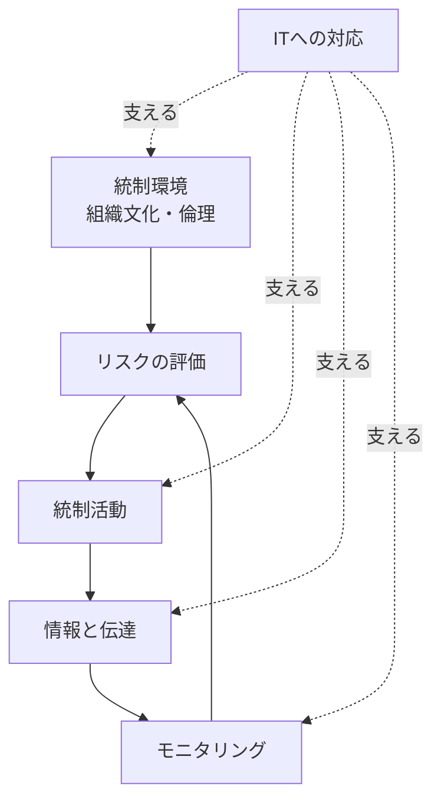

# コンプライアンス基礎

法令遵守の地図——ハラスメント・個人情報・贈収賄から内部統制まで、ビジネスで知っておくべき基本

| 項目 | 内容 |
|---|---|
| カテゴリー | コンプライアンス・法務 |
| 難易度 | 入門 |
| 所要時間 | 約200分（全8レッスン） |
| 公開日 | 2026-05-26 |
| 最終更新日 | 2026-05-30 |
| コースURL | https://skillup.college/courses/compliance/compliance-basics/ |

## 対象者

「コンプライアンス」という言葉は知っているが、本格的に学んだ経験がない社会人。新入社員研修や昇格研修で求められる方、部下を持つ立場になった管理職、人事・総務・法務の担当者、中小企業の経営層など、業務上の法令遵守を一通り押さえたいビジネスパーソン全般。

## 前提知識

特になし。社会人としての業務経験があると理解が早いが、必須ではない。法律の専門知識は不要。

## 学習目標

- コンプライアンスの意味を「法令遵守」を超えた広がりで説明できる
- パワハラ・セクハラ・カスハラなど主要ハラスメントの定義と対応の基本を理解する
- 個人情報保護法の改正点と、日常業務での個人情報の扱い方を把握する
- 贈収賄・利益相反・接待のグレーゾーンを判断する基本軸を持てる
- 独占禁止法・下請法・労働法の要点を実務目線で理解する
- 著作権・営業秘密・インサイダー取引など情報資産の守り方を把握する
- 反社会的勢力対応・特殊詐欺・公益通報制度の基本を理解する
- 内部統制と違反発生時の対応、組織文化づくりの考え方を持てる

## コース概要

「コンプライアンス」は、現代のビジネスパーソンにとって最も身近で、しかし最も体系的に学ばれていないテーマの1つです。新入社員研修・昇格研修・管理職研修では必ず触れられるものの、ハラスメント・個人情報・贈収賄・独占禁止法・著作権・内部統制など、領域が広く範囲が掴みにくい。「全部を覚えるのは無理」と諦めている方も多いはずです。本コースでは、ビジネスパーソンが「これだけは押さえれば大事故は防げる」というレベルを目標に、主要な8領域を一周します。法律の条文や難解な用語を避け、現場の具体例を中心に「判断の軸」を持って帰れることを優先する構成にしました。

## 学習の流れ

レッスン1で、コンプライアンスの全体像と「なぜ守る必要があるか」を整理します。レッスン2〜7で、ビジネスパーソンが実務で出会う主要な領域を順に扱います——ハラスメント（レッスン2）、個人情報（レッスン3）、贈収賄・利益相反（レッスン4）、独占禁止法・下請法・労務（レッスン5）、著作権・営業秘密（レッスン6）、反社対応・インサイダー・通報制度（レッスン7）。最後のレッスン8で、これらを支える「内部統制」と違反発生時の対応、組織文化づくり、コース修了後の学習方向を案内します。前半（レッスン1〜2）は「考え方と人の問題」、中盤（レッスン3〜5）は「情報・お金・取引」、後半（レッスン6〜7）は「資産と監視」、終盤（レッスン8）は「組織の仕組み」という四段構えです。

## レッスン一覧

| No. | タイトル | 概要 | 所要時間 |
|---|---|---|---|
| 1 | コンプライアンスとは何か——「法令遵守」を超える広がりへ | コンプライアンスの定義と「法令遵守」だけでは捉えきれない広がり、社会的責任との関係、なぜ守る必要があるか、コンプライアンス違反のコスト構造を学ぶ | 25分 |
| 2 | ハラスメント防止——パワハラ・セクハラ・カスハラの基本 | パワハラ防止法（労働施策総合推進法）、セクシュアルハラスメント、カスタマーハラスメントの定義と類型、グレーゾーン判断、相談を受けたときの初動対応を学ぶ | 25分 |
| 3 | 個人情報とデータ保護——改正個情法と日常業務の落とし穴 | 個人情報の定義、改正個人情報保護法の要点、漏えい時の報告義務、Cookie・ターゲティング広告の論点、生成AI時代の新しい注意点を学ぶ | 25分 |
| 4 | 贈収賄・利益相反・接待——「グレーゾーン」の判断軸 | 贈収賄の3類型（公務員贈賄・商業贈賄・外国公務員贈賄）、利益相反の考え方、接待・贈答の判断軸、海外（FCPA・UKBA）の動向を学ぶ | 25分 |
| 5 | 独占禁止法・下請法・労務関連——取引と雇用のルール | 独占禁止法の禁止行為（カルテル・談合・優越的地位の濫用）、下請代金支払遅延等防止法（下請法）、労働基準法と労働契約法の要点を学ぶ | 25分 |
| 6 | 著作権と情報の取り扱い——知的財産・営業秘密・社内情報 | 著作権法の基本（複製権・引用・私的使用）、不正競争防止法（営業秘密）、生成AIと著作権の論点、社内情報の取り扱い方を学ぶ | 25分 |
| 7 | 反社・インサイダー取引・通報制度——危ない取引と違反の発見 | 反社会的勢力対応の基本、特殊詐欺・ビジネスメール詐欺、インサイダー取引（金融商品取引法）、改正公益通報者保護法と社内通報制度の運用を学ぶ | 25分 |
| 8 | 内部統制と違反対応——「守れる組織」の作り方 | 内部統制の4目的・6要素（COSOフレーム）、コンプライアンス・プログラム、違反発生時の対応（事実調査・公表・処分）、組織文化づくりとコース修了後の学習方向を案内する | 25分 |

---

## レッスン1：コンプライアンスとは何か——「法令遵守」を超える広がりへ

（所要時間：25分）

### このレッスンで学ぶこと

- コンプライアンスの語源と現代的な意味を理解する
- 「法令遵守」だけでは捉えきれない広がりを把握する
- 違反のコスト構造（直接的・間接的）を整理して語れる
- 本コース全体の見取り図を持つ

---

「コンプライアンス研修」と聞くと、堅苦しい話が並んだスライドや、長くて退屈な動画を想像する方も多いかもしれません。しかし、コンプライアンスは「守ること」よりも、むしろ「事業を長く続けるための土台」を作る活動です。本レッスンでは、よく耳にしながらも輪郭が掴みにくい「コンプライアンス」という言葉を、現代の実務目線で整理することから始めます。

### コンプライアンスの語源と一般的な意味

コンプライアンス（Compliance）は、英語の動詞 comply（従う・応じる）からきています。日本語では「法令遵守」と訳されてきたのが伝統的な使い方で、現在も多くの場面でこの意味で使われています。

法律を守ること——会社が脱税しない、贈収賄をしない、独占禁止法に違反しない、個人情報を漏らさない——これは確かにコンプライアンスの中心です。法律違反は刑事罰や行政処分、巨額の損害賠償につながり、事業の継続を脅かします。だから、法令遵守はコンプライアンスの根幹です。

しかし、現代のコンプライアンスは「法律さえ守ればよい」という狭い意味ではなくなっています。むしろ「法律＋社内規程＋社会通念」の3層構造として理解するのが、実務的な見方です。

#### 3層構造の整理

1. **法律レベル**：刑法・民法・各種事業法など、外部の法律で定められたルール
2. **社内規程レベル**：就業規則・社内マニュアル・行動規範など、会社が自分で定めたルール
3. **社会通念レベル**：法律にも社内規程にも書かれていないが、社会が「望ましい」と期待する行動

これら3層のいずれかに反したとき、その会社は「コンプライアンス違反」と評価されることがあります。法律違反でなくても、社会通念に反する行為（差別的な発言、環境への配慮を欠いた製造、不誠実な広告など）が炎上を生む現代では、3層目の存在感が増しています。

> **💡 ポイント**
> 「法律違反していないから問題ない」は、現代のコンプライアンスの世界では通用しにくくなっています。SNSの普及と社会的監視の強化で、法律よりも社会通念のほうが厳しい場面が出てきました。コンプライアンスは「法律で罰されない範囲」を探す活動ではなく、「事業を続けるために必要な信頼を保つ」活動です。

### なぜコンプライアンスが重要か——3つの理由

「ルールだから守る」では納得しにくいので、もう少し踏み込んで「なぜ守るのか」を整理します。理由は大きく3つあります。

#### 理由1：違反のコストが事業を傾ける

コンプライアンス違反のコストには、直接的なものと間接的なものがあります。

**直接的コスト**：

- 罰金・課徴金・損害賠償
- 行政処分（業務停止・免許取消など）
- 違反対応の社内コスト（調査・改善・公表）

**間接的コスト**：

- 信用失墜による売上減
- 取引先の離反
- 人材流出・採用難
- 株価下落
- メディア対応・株主対応の負担

例えば、ある事案では、有名企業のデータ漏えい1件で数十億円規模の損失（直接コスト＋信用毀損）が報告されています。違反の規模が大きい場合、企業の存続そのものが脅かされることもあります。

#### 理由2：社会的責任の拡大

20世紀後半までは、企業の社会的責任は「利益を上げて株主に還元すること」が中心でした。しかし、現代の企業は次のようなステークホルダーから注目されています。

- 株主・投資家（短期利益だけでなく長期持続性）
- 取引先（サプライチェーン全体での倫理）
- 従業員（職場環境・心理的安全性）
- 顧客（製品・サービスの安全・誠実な広告）
- 地域社会（環境負荷・地域貢献）
- 社会全体（人権・多様性・脱炭素）

これらの期待に応えるための活動は、しばしば「CSR（企業の社会的責任）」「ESG（環境・社会・ガバナンス）」「サステナビリティ」と呼ばれます。コンプライアンスはその基礎です。土台が崩れた建物に上の階を積み上げられないように、コンプライアンス違反がある企業は、社会的責任のほかの活動も信頼されません。

#### 理由3：従業員と組織を守る

コンプライアンスは経営者だけの問題ではありません。違反が起きると、現場の従業員が責任を問われ、組織全体の雰囲気が悪化し、優秀な人材が辞めていきます。

- 違反に巻き込まれた現場社員が、後から責任追及を受ける
- 「あの会社で働いていた」というレッテルが個人のキャリアに影響する
- ハラスメント案件のように、被害者の心身に深刻な傷を残す

コンプライアンスは「会社のため」だけでなく、「自分と仲間を守るため」の活動でもあります。

> **🔰 初学者の方へ**
> 「コンプライアンスは経営や法務の話で、現場には関係ない」と思う方もいるかもしれません。実は逆で、ほとんどのコンプライアンス違反は現場で起きます。経営層がいくら立派な方針を掲げても、現場の1人がうっかり個人情報を漏らせば、全社の問題になります。すべてのビジネスパーソンが「自分ごと」として理解する必要があります。

### コンプライアンスとガバナンス・倫理の関係

コンプライアンスは似た言葉と一緒に語られることが多く、整理しておきます。

#### コーポレートガバナンス

コーポレートガバナンスは、企業統治。「会社が誰のために、どのように経営されるべきか」を仕組みで担保する活動です。取締役会の構成、社外取締役の役割、内部監査体制、株主との対話——これらが含まれます。コンプライアンスはガバナンスの一部、または重なる活動と捉えられます。

#### ビジネス倫理（business ethics）

ビジネス倫理は、コンプライアンスより一段広い概念です。「法律で禁止されていないが、倫理的に望ましくない行為」も対象にします。例えば、技術的には合法な節税スキーム、規制の隙間を突くサービス設計、契約上は問題ないが信義に反する取引などが、倫理的議論の対象になります。

#### CSR・ESG・サステナビリティ

CSR・ESG・サステナビリティは、企業が法令や倫理を超えて、社会・環境への積極的な貢献を行う活動を指します。コンプライアンスは「守り」、CSR・ESGは「攻め」と整理されることもありますが、両者は連続体として考えるのが現実的です。

> **📝 補足**
> 日本企業の歴史的な経緯として、コンプライアンスは1990年代後半〜2000年代の不祥事多発期（旧雪印・三菱自動車・カネボウ・ライブドアなど）を経て、企業統治の柱として位置づけられるようになりました。2003年の経済産業省「企業行動指針」、2015年のコーポレートガバナンス・コード策定、2022年の改正公益通報者保護法など、20年以上かけて制度が整備されてきました。

### コンプライアンスの「主要8領域」

ビジネスパーソンが押さえるべきコンプライアンスの主要領域は、無数にあるように見えて、実は次の8つに整理できます。本コースで順番に扱うテーマです。

1. **ハラスメント防止**：パワハラ・セクハラ・カスハラ
2. **個人情報・データ保護**：個人情報保護法・Cookie・AI
3. **贈収賄・利益相反**：公務員贈賄・商業贈賄・接待
4. **取引のルール**：独占禁止法・下請法・労務関連
5. **知的財産と情報**：著作権・営業秘密・社内情報
6. **反社・特殊な取引リスク**：反社対応・特殊詐欺・インサイダー取引
7. **通報制度**：内部通報・公益通報者保護法
8. **内部統制と組織文化**：違反発生時の対応・組織の作り方

これらをそれぞれ深掘りすると専門書が何冊も書けますが、本コースでは「ビジネスパーソンが業務で出会う場面」に絞って、判断の軸を持ち帰ってもらうことを目指します。

### 「やってはいけないこと」と「やるべきこと」

コンプライアンスは、しばしば「やってはいけないことのリスト」と捉えられます。これは半分正しく、半分不十分です。

#### 半分正しい：禁止リストの重要性

何が違反になるかを知らないと、避けようがありません。法律で禁止された行為、社内規程で禁止された行為——これらを把握することは最低限の出発点です。本コースの各レッスンでも、まず「やってはいけないこと」を整理します。

#### 半分不十分：「やるべきこと」も同じくらい重要

しかし、禁止事項のリストだけでは、現実の判断には足りません。グレーゾーン（明確に禁止されていないが、リスクのある領域）の判断、違反を発見したときの初動、組織の文化づくり——これらは「やるべきこと」を理解していないと進められません。

本コースは、各レッスンで「やってはいけないこと」と「やるべきこと」の両方を扱う構成にしています。

> **⚠️ 注意**
> 「禁止事項リスト」だけを覚えても、実務では役立ちません。実務で必要なのは「これって違反になるのか」「違反かどうかわからないときに誰に聞くか」「違反を発見したらどう動くか」という判断力です。本コースは知識ではなく判断力の獲得を目指します。

### まとめ

このレッスンでは、以下のことを学びました。

- コンプライアンスは「法令遵守」と訳されるが、現代では「法律＋社内規程＋社会通念」の3層構造で理解する
- 違反のコストは直接的（罰金・処分）と間接的（信用失墜・人材流出）の両方があり、事業を傾ける
- コンプライアンスはガバナンス・倫理・CSR/ESGと重なり合う概念で、後者の土台になる
- 主要領域は8つ（ハラスメント・個人情報・贈収賄・取引ルール・知財・反社/インサイダー・通報・内部統制）
- 「やってはいけないこと」と「やるべきこと」の両方を扱うのが現代のコンプライアンス
- ほとんどの違反は悪意ではなく仕組みの不備で起きる

次のレッスンでは、ビジネスパーソンが業務で最も身近に出会うコンプライアンス領域、「ハラスメント防止」を扱います。パワハラ防止法を中心に、パワハラ・セクハラ・カスハラの定義と現場での判断軸を整理します。

---

### 確認クイズ

このレッスンの理解度をチェックしましょう。

#### Q1. 現代のコンプライアンスの「3層構造」として最も適切なものはどれか？

- [x] 法律・社内規程・社会通念
- [ ] 経営層・管理職・現場
- [ ] 国内法・国際法・業界自主規制
- [ ] 短期目標・中期目標・長期目標

> **解説**
> 現代のコンプライアンスは「法律＋社内規程＋社会通念」の3層構造として理解されます。法律違反でなくても社会通念に反する行為が炎上を生む現代では、3層目の存在感が増しています。

#### Q2. 「法律を守っているから問題ない」という考え方の限界として最も適切なものはどれか？

- [ ] 法律違反だけがコンプライアンス違反として扱われるため、問題ない
- [x] SNSの普及と社会的監視の強化で、法律より社会通念のほうが厳しい場面があり、法律遵守だけでは信頼を保てない
- [ ] 法律を守っていれば、社内規程は守らなくてよい
- [ ] 法律遵守は経営者だけの責任で、現場には関係ない

> **解説**
> 現代のコンプライアンスでは、法律違反でなくても社会通念に反する行為が炎上や信頼失墜を招くことがあります。「法律で罰されない範囲」を探すのではなく、「事業を続けるために必要な信頼を保つ」発想が必要です。

#### Q3. コンプライアンス違反の「間接的コスト」として本レッスンで挙げられたものはどれか？

- [ ] 罰金・課徴金
- [ ] 行政処分（業務停止・免許取消など）
- [x] 信用失墜による売上減・取引先の離反・人材流出・株価下落
- [ ] 損害賠償の支払い

> **解説**
> 直接的コストは罰金・課徴金・損害賠償・行政処分など。間接的コストは信用失墜による売上減・取引先の離反・人材流出・採用難・株価下落・メディア対応の負担など、目に見えにくいが事業を傾ける影響です。

#### Q4. コンプライアンスとコーポレートガバナンスの関係として最も適切なものはどれか？

- [ ] 両者は完全に同じ意味で、呼び方が違うだけである
- [ ] コーポレートガバナンスはコンプライアンスより狭い概念である
- [x] コンプライアンスはコーポレートガバナンス（企業統治）の一部、または重なる活動と捉えられる
- [ ] 両者は無関係で、まったく別の領域である

> **解説**
> コーポレートガバナンスは「会社が誰のために、どのように経営されるべきか」を仕組みで担保する活動です。取締役会の構成・内部監査・株主との対話などが含まれ、コンプライアンスはその一部、または重なる活動として捉えられます。

#### Q5. 本レッスンでコンプライアンスの主要領域として整理された8つの領域に含まれないものはどれか？

- [ ] ハラスメント防止
- [ ] 個人情報・データ保護
- [x] 不動産投資の意思決定
- [ ] 内部統制と組織文化

> **解説**
> 本レッスンで整理した主要8領域は、ハラスメント防止／個人情報・データ保護／贈収賄・利益相反／取引のルール／知的財産と情報／反社・特殊な取引リスク／通報制度／内部統制と組織文化です。不動産投資の意思決定はコンプライアンス領域ではありません。

#### Q6. 本レッスンの講師の現場メモで強調された、コンプライアンス違反の根本的な性質として最も適切なものはどれか？

- [ ] 違反は必ず悪意ある個人によって起こされる
- [ ] 違反は経営者だけの責任で、現場の従業員は関係ない
- [ ] 違反は技術の進歩で完全に防げる
- [x] ほとんどの違反は悪意ではなく仕組みの不備で起きるため、個人ではなく組織の仕組みを見る必要がある

> **解説**
> 講師の現場メモでは「ほとんどのコンプライアンス違反は、悪意ある人が起こすのではなく、仕組みの不備で起きる」と整理されました。個人を責めるだけでは類似案件が再発するため、組織の仕組みを見る視点が重要です。

---

## レッスン2：ハラスメント防止——パワハラ・セクハラ・カスハラの基本

（所要時間：25分）

### このレッスンで学ぶこと

- パワハラ・セクハラ・カスハラの定義と類型を理解する
- パワハラ防止法（労働施策総合推進法）の要点を把握する
- 「グレーゾーン」の判断軸を持つ
- 相談を受けたときの初動対応の基本を身につける

---

レッスン1で、コンプライアンスの全体像と3層構造を整理しました。本レッスンから、ビジネスパーソンが実務で出会う主要領域を順に扱います。最初に取り上げるのが、ハラスメント防止です。経験的に、コンプライアンス研修で最も質問が多く、現場で最も判断に迷う領域の1つです。

### なぜハラスメントが重要なのか

ハラスメント防止は、近年のコンプライアンス研修で中心的な位置を占めるテーマになりました。背景には3つの変化があります。

1. **法整備の進展**：2019年のパワハラ防止法成立、2022年4月から中小企業も含めて全面施行
2. **被害者保護への意識**：被害を受けても声を上げづらかった時代から、相談・申告がしやすい時代へ
3. **多様性の拡大**：性別・年齢・国籍・働き方が多様化し、「自分が普通」と思っていた言動が他者を傷つけるケースが増えた

ハラスメントは、被害者の心身に深刻な傷を残すだけでなく、加害者の懲戒処分・刑事責任、職場の士気低下、企業の信用失墜、訴訟リスクなど、多方面に大きな影響を及ぼします。職場の心理的安全性を支える土台でもあります。

### パワーハラスメント（パワハラ）

パワハラは、最も多くの相談が寄せられるハラスメントです。

#### パワハラ防止法の定義

「労働施策の総合的な推進並びに労働者の雇用の安定及び職業生活の充実等に関する法律」（労働施策総合推進法・通称パワハラ防止法）は、職場におけるパワーハラスメントを次の3要素で定義しています。

1. **優越的な関係を背景とした言動**
2. **業務上必要かつ相当な範囲を超えたもの**
3. **労働者の就業環境が害されるもの**

3つすべてを満たすとパワハラになります。重要なのは、「上司から部下」だけがパワハラではない点です。

- 同僚同士でも、専門性や経験値の差で優越的関係が生じれば対象
- 部下から上司への集団いじめも、人数の優位を背景とすればパワハラになりうる
- 取引先・委託先との関係でも適用される

#### パワハラの6類型

厚生労働省は、パワハラを6類型で整理しています。

1. **身体的な攻撃**：殴る、蹴る、物を投げつける
2. **精神的な攻撃**：人格否定的な発言、長時間の叱責、人前での叱責
3. **人間関係からの切り離し**：仕事を与えない、無視する、別室隔離
4. **過大な要求**：明らかに達成不可能なノルマ、新人に専門外の高度業務を押し付ける
5. **過小な要求**：能力に比べて極端に簡単な業務だけを与える
6. **個の侵害**：プライベートに過度に立ち入る、私的なことを言いふらす

> **💡 ポイント**
> 6類型は厚労省の「事業主が職場における優越的な関係を背景とした言動に起因する問題に関して雇用管理上講ずべき措置等についての指針」に基づくものです。指針自体は本コースで完璧に暗記する必要はなく、「パワハラは身体的・精神的な攻撃だけでなく、無視・過大要求・過小要求・私生活への侵害も含む」という幅を理解しておくことが重要です。

#### 業務指導との境目

パワハラ判断で最も難しいのが、「業務上必要な指導」との境目です。次のような区別が目安になります。

- 業務指導（OK）：仕事のミスについて、改善策を一緒に考える
- パワハラ（NG）：仕事のミスについて、人格否定的な言葉で長時間責める

「業務に必要か」「指導の方法・程度が相当か」を問うのがポイントです。同じ「叱る」でも、5分の指摘と1時間の叱責、個別の場と人前、人格否定の有無、で大きく評価が変わります。

> **⚠️ 注意**
> 「パワハラと言われるのが怖いから部下を指導できない」という管理職の声もよく聞きます。これは誤解です。正当な業務指導はパワハラではありません。むしろ、必要な指導をしない（過小評価・放置）こともパワハラ（人間関係からの切り離し）になりえます。問題は「指導するかしないか」ではなく「指導の方法」です。

### セクシュアルハラスメント（セクハラ）

セクハラは、男女雇用機会均等法に基づき、職場での性的な言動による就業環境の悪化を指します。

#### 2つの類型

1. **対価型**：性的な要求に応じないと不利な処遇を受ける（昇進・配置・解雇など）
2. **環境型**：性的な言動により職場環境が悪化し、就業に支障が生じる

#### 「自分は冗談のつもり」が通用しない

セクハラ判断で重要なのは、行為者の主観ではなく、受け手の感じ方が基準になる点です。「冗談のつもりだった」「親しみを込めただけ」という弁明は、客観的に見て性的な言動だと判断されればセクハラに該当します。

性的な発言、執拗な誘い、身体的接触、性的な画像の表示・送信、容姿への評価——これらは状況によらずリスクがあります。

#### 男性へのセクハラ・同性間のセクハラ

「男性から女性」だけがセクハラではありません。

- 男性が受けるセクハラも対象
- 同性間（女性から女性、男性から男性）も対象
- LGBTQへの性的指向・性自認に関連した言動も対象

すべての性的な言動が、すべての対象に対してリスクを持ちます。

> **🔰 初学者の方へ**
> 「セクハラかどうか自信がない」と思ったら、「上司や家族の前で同じことを言えるか」を自問してみてください。言えないことなら、相手にも言わない。これだけで、ほとんどのセクハラは防げます。

### カスタマーハラスメント（カスハラ）

カスハラは、近年急速に注目されるようになった領域です。顧客や取引先からの暴言・過剰な要求・長時間拘束・土下座要求などが含まれます。

#### カスハラの背景と動向

長年「お客様は神様」の発想で、現場が我慢を強いられてきた歴史があります。しかし、SNSによる現場の声の可視化、人手不足、メンタルヘルス問題の顕在化を背景に、カスハラを「労働者が組織として守るべき対象」とする動きが広がっています。

2022年、厚生労働省は「カスタマーハラスメント対策企業マニュアル」を公表し、企業がカスハラに組織として対応する責任を整理しました。2024〜2025年には、東京都など複数の自治体がカスハラ対策の条例を制定する動きが進んでいます。

#### カスハラ対応の基本

1. **個人ではなく組織で対応する**：従業員1人で抱えず、上司・本部に相談する仕組みを作る
2. **基準を明示する**：「これ以上はカスハラ」というラインを社内で共有する
3. **記録を残す**：通話録音、対応記録など、客観証拠を残す
4. **断る判断を会社が支える**：「お客様の要求を断ってよい」という意思決定を組織が支援する

> **📝 補足**
> カスハラ対応で重要なのは、「クレーム」と「カスハラ」を区別することです。正当なクレーム（製品不良・サービス不備への指摘）は誠実に対応すべきですが、暴言・脅迫・人格攻撃・過剰要求は別の問題です。両者の境界を組織として整理しておくことが、対応の出発点になります。

### グレーゾーンの判断軸

ハラスメントの判断で最も難しいのは「明確に黒」「明確に白」の中間にあるグレーゾーンです。判断の助けになる軸を4つ挙げます。

#### 軸1：客観的な視点

「自分なら平気でも、第三者から見てどう映るか」を考えます。受け手の感じ方が基準ですが、「平均的な労働者がどう感じるか」も判断材料です。

#### 軸2：頻度と継続性

1回の失言と、繰り返される言動では評価が異なります。継続的なものほどハラスメントの可能性が高くなります。

#### 軸3：相手との関係性

業務上必要な関係性を超えた踏み込み（私生活への過度な関心、職場外での執拗な誘い、SNSでの過度な接触など）は、リスクが高まります。

#### 軸4：場の公開性

人前での叱責、SNSでの公開的な非難、メールのCCに大量の人を入れての非難——これらは、同じ内容でも個別の場で行うよりリスクが高まります。

これら4軸を組み合わせて、「自分の言動が誰かを傷つけていないか」を継続的に振り返るのが、ハラスメント予防の基本姿勢です。

> **💡 ポイント**
> 「これってハラスメント？」と迷ったら、その時点で一度立ち止まる癖をつけてください。迷うこと自体が、自分の言動に省察的な視線を向けている証拠です。迷わなくなった人ほど、無自覚にハラスメントを起こしやすくなります。

### 相談を受けたときの初動対応

ハラスメントの相談を受ける場面は、管理職だけでなく、誰にでも起こりえます。同僚から「これってハラスメントかな」と相談されたとき、適切な初動対応の基本を押さえておきます。

#### やるべきこと

1. **まず聴く**：話を遮らず、相手のペースで聞く
2. **事実と感情を分ける**：何があったか（事実）と、相手がどう感じたか（感情）を整理する
3. **秘密を守る**：本人の同意なく、ほかの人に話さない
4. **適切な窓口を案内する**：社内のハラスメント相談窓口、人事部、社内通報制度
5. **本人の意思を尊重する**：「これは正式に相談したほうがよい」とこちらが押し付けない

#### やってはいけないこと

- 「気にしすぎだよ」と相手の感情を否定する
- 「あの人は悪気がない」と加害者を擁護する
- 「自分にも責任があるかも」と被害者の落ち度を探す
- 本人の同意なく、加害者本人に直接話しに行く
- 加害者に「あなたのことを誰々が訴えるかも」と伝える

セカンドハラスメント（二次被害）と呼ばれる、相談者を傷つける対応は、加害者本人による被害以上に深い傷を残すことがあります。聴く側の姿勢は、組織のハラスメント対応の質を直接示します。

> **⚠️ 注意**
> 「自分は当事者じゃないから関係ない」という姿勢は、相談者の孤立を深めます。完璧な対応をする必要はありません。「ちゃんと聴いた」「適切な窓口を一緒に確認した」だけで、相談者にとって大きな支えになります。

### オンラインだとどう変わるか

リモートワーク・オンラインミーティングの普及で、ハラスメントも新しい形が出てきました。

- **リモハラ**：オンライン会議での過度なカメラ強制・自宅環境への詮索・チャットでの執拗なやり取り
- **テクハラ**：デジタルツールの不慣れを馬鹿にする・「いまどき使えないの？」など
- **SNSハラ**：業務外のSNS上での攻撃、業務時間外の連絡強要

これらは、対面のハラスメントと本質的には同じ（優越的関係・業務上の必要性を超えた言動・就業環境の悪化）です。新しい形だからといって判断軸が変わるわけではなく、軸を新しい場面に適用する力が問われます。

### まとめ

このレッスンでは、以下のことを学びました。

- パワハラ防止法は「優越的関係」「業務上の必要性を超える」「就業環境を害する」の3要素で定義される
- パワハラの6類型は身体的・精神的な攻撃に加え、人間関係からの切り離し・過大要求・過小要求・個の侵害
- セクハラは行為者の主観ではなく受け手の感じ方が基準。同性間・男性へのセクハラも対象
- カスハラは顧客からの暴言・過剰要求などで、組織で対応する責任が整理されつつある
- グレーゾーン判断には客観性・頻度・関係性・公開性の4軸が役立つ
- 相談を受けたときは「まず聴く」「事実と感情を分ける」「秘密を守る」「窓口を案内する」「本人の意思を尊重する」
- セカンドハラスメントは加害者本人による被害以上に深い傷を残しうる

次のレッスンでは、ビジネスパーソンが業務で必ず触れる「個人情報・データ保護」を扱います。改正個人情報保護法の要点と、日常業務での個人情報の扱い方の落とし穴を整理します。

---

### 確認クイズ

このレッスンの理解度をチェックしましょう。

#### Q1. パワハラ防止法（労働施策総合推進法）が定めるパワハラの3要素として正しい組み合わせはどれか？

- [x] 優越的な関係を背景とした言動・業務上必要かつ相当な範囲を超えたもの・労働者の就業環境が害されるもの
- [ ] 上司から部下への言動・3回以上の継続的言動・労働組合への報告がある言動
- [ ] 男性から女性への言動・性的な内容を含む言動・労働時間内の言動
- [ ] 大声で叱る・物を投げる・身体的接触を伴う、の3要素

> **解説**
> パワハラ防止法が定める3要素は「優越的な関係を背景とした言動」「業務上必要かつ相当な範囲を超えたもの」「労働者の就業環境が害されるもの」です。3つすべてを満たすとパワハラになります。

#### Q2. パワハラの6類型に含まれないものはどれか？

- [ ] 身体的な攻撃
- [ ] 人間関係からの切り離し
- [ ] 過大な要求／過小な要求
- [x] 業務上必要な指導や注意

> **解説**
> 6類型は身体的攻撃・精神的攻撃・人間関係からの切り離し・過大な要求・過小な要求・個の侵害の6つです。業務上必要な指導はパワハラではなく、正当な業務行為です。問題は「指導の有無」ではなく「指導の方法」です。

#### Q3. セクハラの判断基準として最も適切なものはどれか？

- [ ] 行為者の主観（「冗談のつもり」かどうか）が基準である
- [x] 受け手の感じ方が基準で、男性へのセクハラ・同性間のセクハラも対象になる
- [ ] 男性から女性への言動だけが対象である
- [ ] 直接の身体的接触があった場合だけセクハラに該当する

> **解説**
> セクハラの判断基準は、行為者の主観ではなく受け手の感じ方です。「冗談のつもり」は通用しません。また、男性が受けるセクハラ・同性間のセクハラ・LGBTQへの性的指向／性自認に関連した言動も対象になります。

#### Q4. カスタマーハラスメント（カスハラ）対応の基本として最も適切なものはどれか？

- [ ] 「お客様は神様」なので、すべての要求を受け入れる
- [ ] 現場社員が個人で対応し、上司や本部は関与しない
- [x] 個人ではなく組織で対応する。基準を明示し、記録を残し、断る判断を会社が支える
- [ ] カスハラは法律上の概念ではないため、対応の必要はない

> **解説**
> カスハラ対応の基本は「個人ではなく組織で対応する」「基準を明示する」「記録を残す」「断る判断を会社が支える」の4点です。2022年に厚生労働省がカスタマーハラスメント対策企業マニュアルを公表し、組織として対応する責任が整理されました。

#### Q5. ハラスメントの相談を受けたときの初動対応として最も適切なものはどれか？

- [ ] 「気にしすぎだよ」と相手の感情を否定する
- [ ] 加害者本人にすぐ直接話しに行く
- [x] まず聴き、事実と感情を分け、秘密を守り、適切な窓口を案内し、本人の意思を尊重する
- [ ] 相談内容を周りの同僚にも共有して意見を集める

> **解説**
> 相談を受けたときの初動対応は、まず聴く・事実と感情を分ける・秘密を守る・適切な窓口を案内する・本人の意思を尊重するの5点が基本です。感情の否定・加害者擁護・被害者の落ち度探し・本人同意なしの行動はセカンドハラスメント（二次被害）になります。

#### Q6. ハラスメントのグレーゾーン判断に役立つ軸として本レッスンで紹介されていないものはどれか？

- [ ] 客観的な視点（第三者から見てどう映るか）
- [ ] 頻度と継続性
- [ ] 相手との関係性
- [x] 行為者の役職と年齢

> **解説**
> 本レッスンで挙げた4軸は、客観的な視点・頻度と継続性・相手との関係性・場の公開性です。役職や年齢はパワハラ防止法の「優越的関係」の要素として現れますが、グレーゾーン判断の独立軸として本レッスンでは扱っていません。

---

## レッスン3：個人情報とデータ保護——改正個情法と日常業務の落とし穴

（所要時間：25分）

### このレッスンで学ぶこと

- 個人情報の定義と「要配慮個人情報」「個人関連情報」の違いを理解する
- 個人情報保護法の主要な義務（取得・利用・第三者提供・漏えい対応）を把握する
- 日常業務での個人情報の落とし穴を具体例で押さえる
- Cookie・生成AI時代の新しい論点を整理する

---

レッスン2でハラスメント防止を扱いました。本レッスンでは、業務で必ず触れる「個人情報・データ保護」を扱います。個人情報保護法は2003年制定後、複数回の改正が重ねられ、現在のビジネスパーソンに最も身近なコンプライアンス領域の1つです。条文の細部は法務に任せるとしても、「何が個人情報か」「何をしてはいけないか」の基本は、すべてのビジネスパーソンに必要な知識です。

### 個人情報とは何か

個人情報の定義は、個人情報保護法（個情法）に明示されています。

#### 個人情報の定義（第2条第1項）

「生存する個人に関する情報であって、当該情報に含まれる氏名、生年月日その他の記述等により特定の個人を識別することができるもの」または「個人識別符号（マイナンバー、運転免許証番号、パスポート番号、指紋データなど）が含まれるもの」を指します。

#### 具体例

個人情報に該当するもの：

- 氏名・住所・電話番号・メールアドレス（単独でも組み合わせでも）
- 顔写真・防犯カメラ映像（個人を識別できるもの）
- 給与・成績・評価情報
- 病歴・障害情報（さらに「要配慮個人情報」として強い保護）
- マイナンバー・運転免許証番号
- メールアドレス（職場のもので、氏名や所属がわかるもの）

個人情報に該当しないもの：

- 法人の情報（社名・代表電話番号など）
- 統計データ（特定個人が識別できない集計値）
- 匿名加工した情報（厳密な要件あり）

> **💡 ポイント**
> 「個人情報」と聞くと、住民票や戸籍を思い浮かべがちですが、日常業務で扱う氏名・連絡先・顔写真もすべて個人情報です。名刺、メール、議事録、顧客リスト、社員データ——日常業務のあらゆる場面に個人情報が含まれています。

### 要配慮個人情報と個人関連情報

個人情報のうち、特に取り扱いに注意すべきカテゴリがあります。

#### 要配慮個人情報（第2条第3項）

不当な差別・偏見・不利益を防ぐため、特に配慮を要する情報。

具体例：

- 人種・信条・社会的身分
- 病歴・身体障害・精神障害・知的障害
- 犯罪歴・犯罪被害歴
- 健康診断結果

要配慮個人情報は、取得時に本人の同意が必須です（通常の個人情報は利用目的の特定・通知で済む場合がありますが、要配慮は厳格）。

#### 個人関連情報（2022年改正で新設）

個人情報には該当しないが、他の情報と組み合わせると個人を識別できる情報。

具体例：

- Cookieに紐づいた閲覧履歴・購買履歴
- IPアドレス・端末識別子
- 位置情報

個人関連情報は、第三者に提供する際に「提供先で個人情報になることが想定される場合」、本人同意が必要になりました。Cookie同意バナーが普及した背景の1つは、この改正です。

> **📝 補足**
> 2022年4月施行の改正個人情報保護法は、漏えい時の報告義務化、個人の権利強化、個人関連情報の新設、罰則強化など、多くの大型改正を含みました。さらに2024〜2025年に新たな見直しが議論されています。法令の最新動向は個人情報保護委員会の公式サイトで継続的に確認してください。

### 個人情報保護法の主要義務

事業者が個人情報を扱うときに守るべき義務を、4つに整理します。

#### 義務1：取得・利用目的の特定と通知

個人情報を取得する際は、利用目的をできるだけ具体的に特定し、本人に通知（または公表）する必要があります。

NGの例：「事業活動全般のため」（漠然すぎる）
OKの例：「商品の発送、アフターサポート、新商品のご案内のため」

利用目的の範囲を超えて利用するときは、原則として本人同意が必要です。

#### 義務2：適正な管理

取得した個人情報は、漏えい・改ざん・滅失を防ぐための安全管理措置を講じる必要があります。

- 組織的安全管理措置：責任者の設置、規程整備
- 人的安全管理措置：従業員教育、誓約書取得
- 物理的安全管理措置：施錠、機器の管理
- 技術的安全管理措置：アクセス制御、暗号化、ログ管理

#### 義務3：第三者提供の制限

個人情報を第三者に提供するときは、原則として本人の同意が必要です。例外として、法令に基づく場合（裁判所からの命令、捜査関係事項照会など）、人の生命・身体・財産の保護に必要な場合などがあります。

外国にある第三者への提供は、より厳しい同意要件があります。

#### 義務4：漏えい時の報告義務（2022年改正で強化）

個人データの漏えい等が発生した場合、一定の要件を満たすときは、

- 個人情報保護委員会への報告
- 本人への通知

が義務化されました。要件は概ね次のとおりです。

- 要配慮個人情報が含まれる漏えい
- 財産的被害のおそれのある漏えい
- 不正の目的による漏えい（サイバー攻撃など）
- 1,000人を超える漏えい

具体的な手続き・期限は事案ごとに異なるので、漏えいの疑いが生じたら直ちに法務・情報セキュリティ担当者に相談するのが基本です。

> **⚠️ 注意**
> 漏えいが起きたとき、現場の判断で「大ごとにしないように」と社内に留めようとするのは厳禁です。報告義務違反は罰則の対象になり、後から発覚した場合の打撃は、最初に正しく報告した場合より圧倒的に大きくなります。「迷ったら報告」が基本姿勢です。

### 日常業務の落とし穴

法律の条文を覚えるよりも、日常業務でやりがちな失敗を知っておくほうが実用的です。代表的な落とし穴を整理します。

#### 落とし穴1：CCとBCCの取り違え

複数の顧客にメールを送るとき、CCに全員のアドレスを入れてしまうと、全員のメールアドレスが他の全員に見えてしまいます。これは個人情報の漏えいです。

対策：複数顧客への一斉送信は必ずBCCを使う。または、メール配信ツールを使う。

#### 落とし穴2：USBメモリ・紙資料の紛失

社外で個人情報を扱うと、USBメモリの紛失、書類のコピー忘れ、電車・タクシーでのカバン置き忘れなど、物理的な事故が起きます。

対策：個人情報の社外持ち出しを原則禁止または承認制にする。暗号化・パスワード保護を徹底する。

#### 落とし穴3：退職者のアクセス権削除漏れ

退職者のアカウント削除を忘れると、退職後も社内システムにアクセスできてしまいます。これは漏えいの温床です。

対策：退職時のチェックリストを整備し、人事と情報システムが連携して権限削除を即時に行う。

#### 落とし穴4：「これくらい大丈夫」の積み重ね

- 「同僚に1件だけ顧客リストを共有」
- 「社内チャットに顧客名で発言」
- 「個人のスマホで顧客の写真を撮影」
- 「カフェで業務用PCを開く」

これら1つひとつは小さく見えますが、漏えい事故の典型的な発生パターンです。「これくらい大丈夫」が積み重なると、いつか必ず事故が起きます。

> **🔰 初学者の方へ**
> 個人情報の取り扱いで迷ったら、「もし新聞の見出しになったら恥ずかしくない行動か」を自問してください。「会社で部下に顧客リストをUSBで渡した」「カフェで顧客資料を広げていた」——どれも、事故が起きて公表されたら社会的な批判を浴びるレベルの行動です。

### Cookie・トラッキングの論点

Webサイトの運営では、Cookieとトラッキング技術が個人情報保護の重要論点になっています。

#### Cookieの基本

Cookieは、Webサイトがブラウザに保存する小さなデータです。ログイン状態の保持、買い物カゴの維持、行動履歴の追跡など、多様な用途があります。

Cookie自体は個人情報には該当しませんが、「個人関連情報」として扱われる場合があり、第三者提供に同意が必要なケースがあります。

#### Cookie同意バナー

ヨーロッパのGDPR（一般データ保護規則）、日本の改正個情法を受けて、多くのサイトがCookie同意バナーを実装しています。「すべて受け入れる」「必要なもののみ」などの選択肢を提示する形が一般的です。

実装の基本：

- ユーザーが同意するまでトラッキング系Cookieを発火させない
- 「拒否」も同じ手間でできるようにする
- 同意状況をログとして残す

#### ターゲティング広告

ユーザーの閲覧履歴に基づいて広告を配信する仕組み。Cookieや個人関連情報を活用するため、同意取得の論点が複雑になっています。プライバシーへの懸念から、Googleは2024年以降サードパーティCookieの段階的廃止を進めており、業界全体が大きな転換期にあります。

> **📝 補足**
> Cookie・トラッキングの論点は、技術的にも法的にも変化が速い領域です。Web担当者の方は、改正個情法の最新情報、各国のプライバシー規制（GDPR、CCPA等）、Googleなどプラットフォームの方針変更を継続的に追う必要があります。

### 生成AI時代の新しい論点

2022年末のChatGPT登場以降、生成AIの利用が広がる中で、個人情報・プライバシーの新たな論点が出てきました。

#### 生成AIに個人情報を入力するリスク

業務効率化のため、生成AIに社内文書・顧客データ・メール文面などを入力するケースが増えています。リスクは2点あります。

1. **学習データに使われる可能性**：入力した内容がAIの学習に使われ、後で他のユーザーへの応答に出てしまう（サービスの設定による）
2. **プロバイダー側での保管・閲覧**：AIサービスの提供者側で入力データが保管・閲覧される可能性

対策：

- 業務利用は法人向けプラン（法人契約版）を使う
- 個人情報・機密情報を入力する場合のルールを社内で整備する
- 「学習に使わない」設定が可能なサービスを選ぶ

#### AIに個人情報を生成させるリスク

生成AIが、実在しない個人情報を「もっともらしく」生成することがあります（ハルシネーション）。実在の人物に対して、誤った経歴・発言・行為を「事実」のように出力するリスクがあります。

対策：

- AIが生成した個人に関する記述は、人間が必ず確認・検証する
- 名指しの情報を生成AIから引用しない
- AI生成の文章を業務に使う際は、自分で検証してから公開する

> **⚠️ 注意**
> 「無料の生成AIサービスに業務データを入力した」「自分のメールを生成AIに要約させた」——これは多くの会社で禁止または注意喚起がされています。所属する組織のAI利用ルールを必ず確認してください。

### まとめ

このレッスンでは、以下のことを学びました。

- 個人情報は「特定の個人を識別できる情報」。日常業務の名刺・メール・議事録もすべて含まれる
- 要配慮個人情報（病歴・人種・犯罪歴など）は取得時に本人同意が必須
- 個人関連情報（Cookie・閲覧履歴）は第三者提供で本人同意が必要なケースがある
- 主要義務は「目的特定・通知」「適正管理」「第三者提供制限」「漏えい時の報告義務」
- 日常業務の落とし穴は CC/BCC・USB紛失・退職者アクセス権・「これくらい大丈夫」の積み重ね
- Cookie同意は改正個情法・GDPR等を受けたグローバルな潮流
- 生成AI利用では「学習データへの取り込み」「ハルシネーションによる誤情報生成」に注意

次のレッスンでは、ビジネスパーソンが取引や交渉で出会う「贈収賄・利益相反・接待」を扱います。明確に違反でない「グレーゾーン」を判断するための軸を整理します。

---

### 確認クイズ

このレッスンの理解度をチェックしましょう。

#### Q1. 個人情報の定義として最も適切なものはどれか？

- [x] 生存する個人に関する情報で、氏名・生年月日その他の記述等により特定個人を識別できるもの、または個人識別符号が含まれるもの
- [ ] 戸籍や住民票に記載された情報だけ
- [ ] マイナンバーと運転免許証番号だけ
- [ ] 会社内で機密扱いされている情報すべて

> **解説**
> 個人情報保護法の定義では、生存する個人に関する情報で特定個人を識別できるもの、または個人識別符号（マイナンバー・運転免許証番号など）が含まれるものを指します。氏名・住所・連絡先・顔写真・メールアドレスなど、日常業務で扱う多くの情報が含まれます。

#### Q2. 「要配慮個人情報」に該当するものはどれか？

- [ ] 氏名・住所・電話番号
- [x] 病歴・人種・犯罪歴・犯罪被害歴・健康診断結果
- [ ] 法人の代表電話番号
- [ ] 統計処理された集計データ

> **解説**
> 要配慮個人情報は、不当な差別・偏見・不利益を防ぐため特に配慮を要する情報で、人種・信条・社会的身分・病歴・障害・犯罪歴・犯罪被害歴・健康診断結果などが含まれます。取得時に本人同意が必須です。

#### Q3. 個人情報保護法の主要義務として本レッスンで挙げられていないものはどれか？

- [ ] 利用目的の特定と通知
- [ ] 適正な管理（安全管理措置）
- [ ] 第三者提供の制限
- [x] すべての個人情報を会社のサーバーで保管すること

> **解説**
> 本レッスンで挙げた主要義務は、利用目的の特定と通知・適正な管理・第三者提供の制限・漏えい時の報告義務の4つです。保管場所は安全管理措置の一部ですが、「会社のサーバーで」と特定はされていません。クラウド利用も適切な安全管理措置を講じれば認められます。

#### Q4. 漏えい時の報告義務について本レッスンが示した基本姿勢として最も適切なものはどれか？

- [ ] 現場の判断で「大ごとにしないように」社内に留める
- [ ] 1か月以内ならいつ報告してもよい
- [x] 「迷ったら報告」が基本姿勢。直ちに法務・情報セキュリティ担当者に相談する
- [ ] 報告義務は大企業のみ適用される

> **解説**
> 漏えいの疑いが生じたら、現場の判断で隠さず、直ちに法務・情報セキュリティ担当者に相談するのが基本です。後から発覚した場合の打撃は、最初に正しく報告した場合より圧倒的に大きくなります。「迷ったら報告」が原則です。

#### Q5. 個人情報の漏えいにつながる日常業務の落とし穴として本レッスンで挙げられていないものはどれか？

- [ ] CCとBCCの取り違え
- [ ] USBメモリや紙資料の紛失
- [x] 業務終了後に椅子を引いて帰ること
- [ ] 退職者のアクセス権削除漏れ

> **解説**
> 本レッスンで挙げた落とし穴は、CCとBCCの取り違え・USB/紙資料の紛失・退職者のアクセス権削除漏れ・「これくらい大丈夫」の積み重ねです。椅子を引くかどうかは、個人情報漏えいとは関係ありません。

#### Q6. 生成AI利用時の個人情報リスクとして本レッスンで示されたものはどれか？

- [ ] 生成AIは個人情報を扱わないため、リスクはない
- [x] 入力データが学習に使われる可能性・ハルシネーションによる誤った個人情報の生成・プロバイダー側での保管リスクなどがある
- [ ] 個人で使う場合は法人プランより安全である
- [ ] 生成AIは個人情報以外の情報のみを生成する仕組みである

> **解説**
> 生成AI利用時のリスクは、入力データが学習データに使われる可能性、ハルシネーションによる誤った個人情報の生成、プロバイダー側での保管・閲覧などです。業務利用は法人向けプランの利用、社内ルールの整備、人間による検証が基本です。

---

## レッスン4：贈収賄・利益相反・接待——「グレーゾーン」の判断軸

（所要時間：25分）

### このレッスンで学ぶこと

- 贈収賄の3類型（公務員贈賄・商業贈賄・外国公務員贈賄）を理解する
- 利益相反の考え方と日常業務での現れ方を把握する
- 接待・贈答のグレーゾーンを判断する軸を持てる
- 海外動向（FCPA・UKBA）とグローバル企業での実務を整理する

---

レッスン3で個人情報・データ保護を扱いました。本レッスンでは、取引や交渉で出会う「贈収賄・利益相反・接待」を扱います。明確に黒（重大な汚職）と明確に白（純粋な商談）の中間に広がるグレーゾーンが、現場で最も判断に迷う領域です。

### 贈収賄の3類型

贈収賄は、不正な利益を期待して金品やそのほかの利益を授受する行為です。日本の法制度では、大きく3類型があります。

#### 類型1：公務員に対する贈収賄

公務員（国家公務員・地方公務員）に対して、その職務に関連して金品を提供することは刑法で禁止されています。

- 贈賄罪（刑法第198条）
- 収賄罪（刑法第197条）

公務員には、公務員法上の公務員のほか、みなし公務員（独立行政法人・特殊法人の役職員、公益法人の理事など）も含まれます。

#### 類型2：商業贈賄（民間部門の贈収賄）

取引先の従業員・役員に対して、不正な利益（受注・有利な条件など）を期待して金品を提供する行為は、会社法や不正競争防止法の問題になりえます。

- 会社法第967条（取締役等の収賄罪）：取締役・監査役などの取引上の不正に関する贈収賄
- 不正競争防止法第18条・21条：外国公務員等への贈賄を中心とした規定

民間同士の贈収賄は、刑事罰の対象になりにくい範囲もありますが、社内規程・契約違反・民事責任の対象になります。

#### 類型3：外国公務員贈賄

国境を越えた贈収賄は、特に厳しい規制が世界中で整備されています。日本では不正競争防止法18条が外国公務員贈賄罪を定め、近年、摘発事案が増えています。

> **💡 ポイント**
> 「相手が公務員かどうか」が、適用される法律と罰則の重さを左右します。公務員（みなし公務員を含む）への金品提供は、純粋な業務目的でも誤解を生むため、原則として避ける——これがグローバル企業の標準的なスタンスです。

### 公務員へのアプローチで気をつけること

公務員に対しては、社会通念上儀礼の範囲を超える金品の提供は禁止されます。具体例で整理します。

#### NGの典型例

- 入札を有利にする目的で公務員に現金を渡す
- 許認可の取得を目的にゴルフ接待を行う
- 公務員の親族の海外旅行費用を負担する

#### グレーゾーン

- 業界団体の交流イベントでの食事代を負担する（参加者全員に同じ条件であれば許容される場合があるが、個別の利益提供だと問題に）
- 行政担当者向けの説明会で軽食を提供する（社会通念上の範囲なら許容）
- 公務員が個人として参加する勉強会で講師料を支払う（趣旨と金額しだい）

#### 安全な姿勢

- 公務員への接待・贈答は、原則として行わない
- 例外的に行う場合は、事前に法務部や上司に相談する
- 行政官庁との打ち合わせでは、軽い飲み物の提供にとどめる

> **⚠️ 注意**
> 「以前からそうしているから問題ない」は危ない発想です。慣行になっていた接待が、ある日突然摘発されるケースは過去にも多くあります。「過去にやっていた」は将来の安全を保証しません。

### 利益相反——あなたの判断が偏っていないか

利益相反（conflict of interest, COI）は、本来優先すべき職務上の利益と、個人的な利益が対立する状況です。贈収賄ほど派手ではないが、業務の質と公正性を蝕む静かな問題です。

#### 利益相反の典型例

- 自分の家族が経営する会社を取引先に選ぶ
- 友人の会社の製品を社内で推奨する
- 副業先の競合企業を、本業の業務で不利に扱う
- 自社の株を持っている取引先と、特に有利な条件で契約する

「不正な意図がなくても」、利益相反の構造があるだけで、判断の客観性が疑われます。

#### 利益相反の対応

利益相反を完全に避けることは不可能です。家族・友人・知人を通じた縁故は、ビジネスでは普通に存在します。重要なのは、「隠さない」「申告する」「判断者から外れる」の3点です。

1. **隠さない**：利益相反になりうる関係を、認識した時点で言葉にする
2. **申告する**：上司・コンプライアンス部門に申告し、対応を仰ぐ
3. **判断者から外れる**：自分が判断者になる立場なら、その案件から外れる

多くの企業で「利益相反申告書」のような仕組みが整備されています。形式的に提出するだけでなく、新たな利害関係が生じた時点で更新するのが本来の使い方です。

#### 「現職と副業」の利益相反

近年、副業を容認する企業が増える中で、新しいタイプの利益相反が出てきました。

- 本業の顧客と直接の競合になる副業
- 本業の業務時間中に副業の連絡を取る
- 本業で得た情報・人脈を副業に流用する

副業を始めるとき、必ず本業の就業規則を確認し、必要に応じて事前申告・許可を取るのが基本です。

> **🔰 初学者の方へ**
> 利益相反は「悪意」とは関係ありません。むしろ「自分はフェアに判断できる」と思い込んでいる人ほど危険です。なぜなら、人は自分のバイアスに気づきにくいからです。利益相反の構造が生じた時点で、自分の判断力ではなく「構造」を信じて、申告・自己除外を選ぶのが安全です。

### 接待・贈答の判断軸

実務でもっとも判断に迷うのが、接待・贈答です。社会通念の範囲は時代と共に変化し、業界ごとに異なります。決まったルールよりも、判断の軸を持つことが大事です。

#### 軸1：相手の属性

- 公務員・みなし公務員：原則として避ける
- 規制業界の監督対象者（金融・医療など）：強い制限あり
- 取引先（民間企業）の購買担当者・決定権者：社会通念の範囲で
- 取引先の現場担当者：通常の業務交流の範囲で

#### 軸2：金額・頻度

明確な基準は法律にはありませんが、企業ごとに社内規程で上限を設定するのが一般的です。

- 1回あたりの上限金額（食事・贈答品それぞれ）
- 同一相手への年間累計
- 頻度（月数回までなど）

社内規程で定められた基準を超える場合は、事前承認が必要というルールが標準です。

#### 軸3：時期と関係性

- 入札・契約締結の直前後の接待は、関連性を疑われる
- 普段の取引で何もなく、何かを期待する直前に贈答が出るのは怪しい
- 結婚祝いや葬儀のように、ビジネスとは独立の理由による場合は別

#### 軸4：透明性

- 上司に説明できる接待・贈答か
- 領収書を堂々と出せる支出か
- 取引先の同僚（接待相手の上司や同僚）が見ても問題ない内容か

これら4軸を組み合わせて、グレーゾーンに対処します。

> **💡 ポイント**
> 「日本の商慣習だから」「相手の顔を立てるため」という弁明は、コンプライアンス的にはほぼ通用しません。商慣習自体が変化しており、現代では「派手な接待」のほうがリスクとして受け止められます。シンプルなランチでも、誠実な仕事ぶりのほうが信頼を生みます。

### FCPA・UKBAとグローバル企業の実務

日本企業がグローバルに展開する中で、海外の贈収賄規制を知っておく必要が出てきました。代表的なものを2つ紹介します。

#### FCPA（米国海外腐敗行為防止法）

米国法ですが、米国に上場している企業、米国で事業を行う企業、米国市場と関わる企業に幅広く適用されます。

- 外国公務員への賄賂を厳しく禁止
- 帳簿・記録の改ざんも対象
- 罰金・課徴金は数億〜数十億ドル規模になりうる

#### UKBA（英国賄賂防止法）

英国法で、適用範囲が広いことで知られます。

- 民間部門の贈収賄も対象（FCPAより広い）
- 「適切な手続き」を取っていない企業の責任を厳しく問う
- 域外適用が広く、英国と関わりがあれば日本企業も対象になりうる

これら海外法は、日本の法律より厳しい場合があります。グローバル企業では、海外法を踏まえたグループ全体のルールを整備するのが標準です。

> **📝 補足**
> FCPA・UKBAは、関連する事案でこれまでに巨額の制裁金が日本企業にも課されてきました。海外法ですが、日本企業も日常業務で意識する必要があるルールです。自社が米国・英国と関わる事業を持つ場合、グループのルールを確認することが重要です。

### ファシリテーション・ペイメントという論点

海外で取引をすると、「ファシリテーション・ペイメント（円滑化のための少額支払い）」という概念に出会うことがあります。許認可や通関などを早めるため、現場の公務員に少額の謝礼を渡す慣行です。

- 一部の国では、長らく事実上の慣行として黙認されてきた
- FCPAでは限定的に許容される規定がある（米国法上の例外）
- UKBAでは原則として禁止
- 日本の不正競争防止法では原則禁止

日本企業の標準的なスタンスは「行わない」です。少額でも、贈賄として摘発されるリスクがあり、海外法への抵触リスクもあります。「現地慣行だから」は、グローバル企業のルールでは通用しないのが現代の標準です。

> **⚠️ 注意**
> 海外で「通関を早めるためにこの金額を払ってください」と求められることが、いまだに起こります。これに応じてしまうと、後で会社全体のリスクになります。応じる前に必ず本社・法務に相談する、というルールを徹底することが大事です。

### まとめ

このレッスンでは、以下のことを学びました。

- 贈収賄は公務員・商業（民間）・外国公務員の3類型。公務員（みなし公務員含む）への利益提供は最も厳しい
- 利益相反は、悪意の有無に関わらず判断の客観性を疑わせる構造の問題
- 利益相反への対応は「隠さない・申告する・判断者から外れる」が基本
- 接待・贈答は相手の属性・金額頻度・時期関係性・透明性の4軸で判断する
- FCPA（米国）・UKBA（英国）はグローバル企業に大きな影響を持ち、日本法より厳しいケースがある
- ファシリテーション・ペイメントは現代では原則行わないのがグローバル標準
- 「やましい」のではなく「やましいと疑われうる構造」を放置するのがリスク

次のレッスンでは、企業間取引と雇用に関する基本ルール——独占禁止法・下請法・労務関連を扱います。日常業務の取引・契約で押さえるべき要点を整理します。

---

### 確認クイズ

このレッスンの理解度をチェックしましょう。

#### Q1. 贈収賄の3類型として最も適切なものはどれか？

- [x] 公務員贈賄・商業贈賄（民間部門）・外国公務員贈賄
- [ ] 国内・海外・宇宙
- [ ] 大企業・中小企業・個人事業主
- [ ] 現金・物品・サービス

> **解説**
> 贈収賄の3類型は、公務員贈賄（刑法・国内公務員）、商業贈賄（民間部門、会社法・不正競争防止法）、外国公務員贈賄（不正競争防止法18条）です。相手の属性によって適用される法律と罰則の重さが変わります。

#### Q2. 利益相反への対応として最も適切なものはどれか？

- [ ] 完全に避けることが可能なので、すべての利益相反を排除すべき
- [x] 「隠さない」「申告する」「判断者から外れる」の3つを基本とする
- [ ] 自分は公平に判断できると信じて、特に対応しない
- [ ] 上司に内緒で個人的に処理する

> **解説**
> 利益相反を完全に避けることは不可能ですが、構造を「隠さない」「申告する」「判断者から外れる」の3点が基本対応です。自分は公平だと思い込んでも、外から見れば客観性が疑われる構造だと、業務の信頼性が損なわれます。

#### Q3. 接待・贈答の判断軸として本レッスンで紹介されていないものはどれか？

- [ ] 相手の属性（公務員か民間か、規制業界かなど）
- [ ] 金額・頻度
- [ ] 時期と関係性（入札直前後など）
- [x] 接待相手の年齢

> **解説**
> 本レッスンの4軸は、相手の属性・金額／頻度・時期と関係性・透明性です。接待相手の年齢は判断軸として挙げていません。年齢ではなく、属性（公務員性・取引上の立場）が重要です。

#### Q4. FCPA（米国海外腐敗行為防止法）について本レッスンで示された特徴として最も適切なものはどれか？

- [x] 米国に上場する企業・米国で事業を行う企業・米国市場と関わる企業に幅広く適用され、巨額の制裁金リスクがある
- [ ] 米国国内事業者のみが対象で、日本企業には関係ない
- [ ] 民間部門の贈収賄は完全に対象外である
- [ ] 起訴例がほとんどなく、実務上は気にする必要がない

> **解説**
> FCPAは米国法ですが、米国に上場する企業、米国で事業を行う企業、米国市場と関わる企業に幅広く適用されます。日本企業も対象になり、これまでに巨額の制裁金事案も発生しています。グローバル企業では海外法を踏まえたルール整備が必要です。

#### Q5. ファシリテーション・ペイメントについて本レッスンで示された日本企業の標準的なスタンスとして最も適切なものはどれか？

- [ ] 海外慣行なので積極的に行う
- [x] 行わない。現地担当者から求められた場合も本社・法務に相談する
- [ ] 少額なら問題ないので必要に応じて行う
- [ ] FCPAでは許容されているので問題なく行える

> **解説**
> 日本企業の標準的なスタンスは「行わない」です。少額でも日本の不正競争防止法では原則禁止、UKBAでも原則禁止です。FCPAで限定的に許容される規定はあるものの、グローバル企業では「行わない」が標準。求められた場合は応じる前に本社・法務に相談します。

#### Q6. 公務員への接待・贈答について本レッスンで示された基本姿勢として最も適切なものはどれか？

- [ ] 過去から続く慣行であれば現代でも問題ない
- [ ] 純粋な業務目的であれば自由に行える
- [x] 原則として避ける。例外的に行う場合は事前に法務部や上司に相談する
- [ ] 食事代の負担程度なら金額に関係なく問題ない

> **解説**
> 公務員（みなし公務員を含む）への接待・贈答は、原則として行わないのが現代の標準です。例外的に行う場合は事前に法務部・上司に相談します。「過去にやっていた」は将来の安全を保証せず、慣行になっていた接待がある日突然摘発されるケースもあります。

---

## レッスン5：独占禁止法・下請法・労務関連——取引と雇用のルール

（所要時間：25分）

### このレッスンで学ぶこと

- 独占禁止法の主要な禁止行為（カルテル・談合・優越的地位の濫用）を理解する
- 下請法の対象と禁止行為を実務目線で押さえる
- 労働基準法・労働契約法の要点を整理する
- 「自社が違反する側」と「自社が被害を受ける側」の両方の視点を持つ

---

レッスン4で贈収賄・利益相反・接待を扱いました。本レッスンでは、企業間取引と雇用関係の基本ルールを学びます。独占禁止法と下請法は「取引」のルール、労務関連は「雇用」のルールです。日常業務で直接出会う頻度は領域によりますが、知らないままだと取り返しのつかない違反になりうる重要な分野です。

### 独占禁止法——公正な競争のためのルール

独占禁止法（私的独占の禁止及び公正取引の確保に関する法律）は、市場での自由で公正な競争を守るための法律です。所管は公正取引委員会（公取委）。違反すると課徴金・刑事罰の対象となります。

#### 主要な禁止行為

独占禁止法には複数の禁止行為がありますが、ビジネスパーソンが押さえるべきは大きく3つです。

##### 1. 不当な取引制限（カルテル・談合）

複数の事業者が共同して、価格・数量・地域などを取り決めることで、競争を制限する行為です。

- **価格カルテル**：競合各社で価格を協定する
- **数量カルテル**：生産量・販売量を取り決める
- **入札談合**：公共入札で誰がいくらで落札するかを事前に取り決める
- **市場分割**：顧客や地域を競合間で分け合う

これらは独占禁止法上、最も重い違反として扱われます。摘発されると数十億円規模の課徴金、刑事責任もありえます。

##### 2. 私的独占

市場で支配的な地位にある事業者が、他の事業者を排除または支配する行為。

- 不当廉売（コスト割れの価格で競合を排除する）
- 排他的取引契約（取引先に他社と取引させない）
- 排除型私的独占

##### 3. 優越的地位の濫用

取引上、相手方より優越的な立場を利用して、相手に不利益な要請をする行為。

- 押し付け販売（自社製品の購入を強制）
- 不当な経済上の利益提供要請（協賛金・人員派遣など）
- 取引対価の一方的決定や減額
- 受領拒否・返品

優越的地位の濫用は、大企業対中小企業、メーカー対小売、発注者対受注者などの関係で問題になります。下請法（後述）と重なる場面もあります。

> **💡 ポイント**
> 「カルテル」「談合」と聞くと、自分には関係ないと感じるかもしれません。しかし、業界の懇親会で他社の営業担当と価格情報を交換した、入札前に他社と「次は誰の番」と話したというだけで、カルテル・談合の疑いをかけられる可能性があります。意図の有無に関わらず、競合との価格・数量・顧客に関する情報交換は避けるのが基本です。

#### 日常業務での注意点

- 業界懇親会・展示会で、競合企業の人と価格・数量・顧客情報を話さない
- 業界団体の会合で、価格動向・販売計画の議論が始まったら離席する
- メール・チャットで、競合との情報交換と疑われる記録を残さない
- 入札案件で、競合と「お互いの動き」を話さない

> **⚠️ 注意**
> 独占禁止法違反は、社員1人の行為が会社全体の責任になります。「個人が勝手にやった」では会社は免責されません。業界内の何気ない会話が、後の摘発で証拠になることもあります。

### 下請法——発注者と受注者の力関係を整える

下請代金支払遅延等防止法（下請法）は、発注者の優越的地位を利用した不当な取引から、下請事業者を守るための法律です。中小企業庁と公正取引委員会が所管します。

#### 下請法の対象

下請法は、すべての取引に適用されるわけではありません。次の2つの条件で対象が決まります。

##### 取引の種類

製造委託、修理委託、情報成果物作成委託（プログラム・デザイン・コンテンツなど）、役務提供委託の4種類。

##### 当事者の資本金規模

例えば、製造委託の場合：

- 親事業者：資本金3億円超
- 下請事業者：資本金3億円以下

のように、資本金規模で区分されます。情報成果物作成委託では、5,000万円が分水嶺になる場合もあります。

#### 親事業者の禁止行為

下請法では、親事業者の禁止行為が11項目挙げられています。代表的なものを5つ紹介します。

1. **受領拒否**：注文した品物・成果物の受領を理由なく拒む
2. **下請代金の支払遅延**：法定期日（受領日から60日以内）を超えて支払う
3. **下請代金の減額**：合意した代金を後から減額する
4. **返品**：受領した品物を不当に返品する
5. **買いたたき**：通常の対価より著しく低い代金で発注する

そのほか、購入・利用強制、報復措置、有償支給原材料等の対価の早期決済、割引困難な手形の交付、不当な経済上の利益の提供要請、不当な給付内容の変更・やり直し、なども禁止されています。

> **🔰 初学者の方へ**
> 下請法は、発注者側（親事業者）の従業員にとって特に重要です。「コスト削減」のつもりで行った減額・返品・支払い遅延が、下請法違反になりえます。発注者の立場で取引に関わる方は、社内の発注ルールを確認し、迷ったら法務に相談してください。

#### 親事業者の義務

禁止行為だけでなく、親事業者には次のような義務もあります。

- **書面の交付**：発注時に取引内容を書面で交付する（メール・電子契約も可）
- **書類の作成・保存**：取引記録を作成し、2年間保存する
- **支払期日の設定**：受領日から60日以内の支払期日を定める
- **遅延利息の支払**：支払遅延の場合、年14.6%の遅延利息

> **📝 補足**
> 下請法は、独占禁止法の優越的地位の濫用規定を、中小企業との取引で具体化したものです。両者は重なる範囲が広く、実務では「下請法に該当しなくても、優越的地位の濫用になる可能性」を意識する必要があります。

### 労働基準法・労働契約法——働き方のルール

労働法は広い領域ですが、すべてのビジネスパーソンが押さえるべき要点は次のとおりです。

#### 労働時間と休暇

労働基準法は、労働時間と休暇の最低基準を定めています。

- 法定労働時間：1日8時間・週40時間
- 法定休日：週1日（または4週で4日）
- 年次有給休暇：勤続6か月で10日（その後、勤続年数に応じて増加）

##### 36協定と労使協定

法定労働時間を超えて働かせるには、労働基準監督署への「36（さぶろく）協定」の届け出が必要です。

##### 時間外労働の上限規制

2019年4月から段階的に施行され、現在では原則月45時間・年360時間が上限です。特別条項付き36協定でも年720時間以内などの上限があります。

#### 残業代の支払い

法定労働時間を超えた労働には、割増賃金の支払いが義務付けられています。

- 時間外労働：25%以上
- 深夜労働（22:00〜5:00）：25%以上
- 休日労働：35%以上
- 月60時間を超える時間外労働：50%以上（中小企業も2023年4月から適用）

#### 同一労働同一賃金

2020年から段階的に施行された規定で、正社員と非正規社員（パート・有期・派遣）の不合理な待遇差を禁止します。「同じ仕事をしているのに、雇用形態だけで待遇が違う」状態は許されません。

#### ハラスメント防止義務

レッスン2で扱ったとおり、パワハラ防止法は事業者にハラスメント防止のための雇用管理上の措置義務を課しています。

#### 解雇のルール

労働契約法は、解雇には「客観的に合理的な理由」と「社会通念上の相当性」が必要としています。これらを欠く解雇は無効で、不当解雇として訴訟リスクがあります。

> **⚠️ 注意**
> 「うちは管理職だから残業代は払わない」は、しばしば誤りです。労働基準法の「管理監督者」は厳密な要件があり、肩書きが課長や部長でも、要件を満たさなければ管理監督者には該当せず、残業代の支払いが必要です。名ばかり管理職問題として、過去多くの判例があります。

### 派遣・業務委託の境目

外部人材を活用するとき、派遣（労働者派遣法）と業務委託（請負・準委任）の区別は実務上重要です。

#### 派遣の要件

派遣は、派遣会社が雇用する労働者を、派遣先で派遣先の指揮命令の下に働かせる契約です。派遣会社の許可が必要、対象業務に制限あり、派遣期間の制限ありなど、多くの規制があります。

#### 業務委託の要件

業務委託は、受託会社が成果物または業務を提供する契約。委託先の従業員は委託元の指揮命令を受けない、というのが原則です。

#### 偽装請負

業務委託の形式を取りながら、実態は派遣に近い（委託元が委託先の従業員に直接指示している）状態を「偽装請負」と呼びます。労働者派遣法違反になり、行政指導・社名公表のリスクがあります。

実務で偽装請負を避けるポイント：

- 業務委託で受け入れた人に対し、直接的な業務指示をしない
- 業務指示は受託会社の責任者を介して行う
- 勤務時間・休暇・服装などの指示は委託元では行わない

> **💡 ポイント**
> リモートワーク・副業・フリーランス活用の拡大で、雇用と業務委託の境目はますます曖昧になっています。「実態として何か」を常に意識する必要があります。形式と実態が乖離した状態が、後から大きな問題になります。

### 「自社が違反する側」と「自社が被害を受ける側」

このレッスンで扱った領域は、自社が違反する側になるリスクだけでなく、被害を受ける側になる可能性もあります。

#### 自社が被害を受ける場合

- 業界他社のカルテルで自社が排除される
- 取引先（親事業者）から下請法違反の扱いを受ける
- ハラスメント・労務問題の被害者になる

これらに気づいたとき、適切な相談先を知っておくことも、コンプライアンス・リテラシーの一部です。

#### 主な相談・申告先

- **公正取引委員会**：独占禁止法・下請法違反の申告・相談
- **中小企業庁**：下請法違反の相談（公取委と連携）
- **労働基準監督署**：労働基準法違反の申告
- **都道府県労働局**：雇用機会均等法・パワハラ防止法違反などの相談
- **業界団体・弁護士会**：法律相談・専門家紹介

「自分の会社や取引先が、ルールを守っていない」と気づいたとき、適切な窓口に相談する勇気を持つことも、コンプライアンスの実践です。

### まとめ

このレッスンでは、以下のことを学びました。

- 独占禁止法の3大禁止行為は、不当な取引制限（カルテル・談合）、私的独占、優越的地位の濫用
- 競合との価格・数量・顧客に関する情報交換は、意図に関わらず避ける
- 下請法は、発注者（親事業者）と受注者（下請事業者）の取引で適用される
- 親事業者の主要な禁止行為は、受領拒否・支払遅延・減額・返品・買いたたきなど
- 労働基準法は1日8時間・週40時間の法定労働時間、時間外労働の上限規制、割増賃金などを定める
- 同一労働同一賃金、解雇のルール、ハラスメント防止義務など、労務領域は広い
- 派遣と業務委託の境目があいまいになると「偽装請負」になりうる
- 自社が違反する側だけでなく、被害を受ける側になる可能性もあり、相談先を知っておく

次のレッスンでは、現代のビジネスで重要性が増している「著作権と情報の取り扱い」を扱います。著作権法・営業秘密・社内情報の守り方を、生成AI時代の論点も含めて整理します。

---

### 確認クイズ

このレッスンの理解度をチェックしましょう。

#### Q1. 独占禁止法で最も重い違反として扱われる「不当な取引制限」に該当しないものはどれか？

- [x] 自社製品の価格を自由に決めること
- [ ] 価格カルテル（競合各社で価格を協定する）
- [ ] 入札談合（公共入札で誰がいくらで落札するか事前に取り決める）
- [ ] 数量カルテル（生産量・販売量を取り決める）

> **解説**
> 不当な取引制限は、複数事業者が共同して価格・数量・地域などを取り決めることで競争を制限する行為で、カルテル・談合・市場分割が代表例です。自社単独で自社製品の価格を決めるのは、独占禁止法上の問題ではありません。

#### Q2. 競合企業との「情報交換」に関する本レッスンの基本姿勢として最も適切なものはどれか？

- [ ] 業界団体の場であれば、価格・数量・顧客情報を自由に交換してよい
- [x] 意図の有無に関わらず、競合との価格・数量・顧客に関する情報交換は避けるのが基本
- [ ] メールでなく口頭であれば問題ない
- [ ] 同業者会で雑談として交換するなら違反にならない

> **解説**
> 競合との価格・数量・顧客に関する情報交換は、意図の有無に関わらず避けるのが基本です。業界団体の場・口頭・雑談など、形式に関わらずカルテル・談合の疑いをかけられる可能性があります。

#### Q3. 下請法の親事業者の禁止行為に含まれないものはどれか？

- [ ] 受領拒否
- [ ] 下請代金の支払遅延
- [ ] 下請代金の減額・返品
- [x] 委託内容を発注時に書面で交付すること

> **解説**
> 受領拒否・支払遅延・減額・返品は禁止行為です。一方、発注時の書面交付は親事業者の「義務」であり、禁止行為ではありません。下請法では、親事業者に書面交付・書類保存・支払期日の設定などの義務も課されています。

#### Q4. 労働基準法の法定労働時間として正しい組み合わせはどれか？

- [ ] 1日6時間・週30時間
- [x] 1日8時間・週40時間
- [ ] 1日10時間・週50時間
- [ ] 1日12時間・週60時間

> **解説**
> 法定労働時間は1日8時間・週40時間が原則です。これを超える労働には、36協定の届け出と割増賃金の支払いが必要です。時間外労働には2019年4月から段階的に上限規制（原則月45時間・年360時間）も適用されています。

#### Q5. 派遣と業務委託の区別について本レッスンが示した重要なポイントとして最も適切なものはどれか？

- [ ] 形式上の契約名が「派遣」か「業務委託」かだけで決まる
- [ ] 業務委託では、委託先の従業員に対して委託元が直接指示しても問題ない
- [x] 業務委託の形式で実態は派遣に近い（直接指示している）状態は「偽装請負」となり、労働者派遣法違反になる
- [ ] 派遣と業務委託は実務上区別する必要がない

> **解説**
> 業務委託の形式で実態は派遣に近い状態は「偽装請負」と呼ばれ、労働者派遣法違反になります。リモートワーク・副業の拡大で雇用と業務委託の境目があいまいになっており、「実態として何か」を常に意識する必要があります。

#### Q6. 自社が独占禁止法違反・下請法違反などの「被害を受ける側」になったときの相談先として本レッスンで挙げられているものはどれか？

- [ ] 警察署のみ
- [ ] 国会議員
- [ ] 国税庁
- [x] 公正取引委員会、中小企業庁、労働基準監督署、都道府県労働局、業界団体・弁護士会など

> **解説**
> 主な相談・申告先は、独占禁止法・下請法は公正取引委員会、下請法は中小企業庁、労働基準法は労働基準監督署、ハラスメントなどは都道府県労働局、その他は業界団体や弁護士会などです。被害を受けたとき、適切な窓口に相談する勇気もコンプライアンスの実践の一部です。

---

## レッスン6：著作権と情報の取り扱い——知的財産・営業秘密・社内情報

（所要時間：25分）

### このレッスンで学ぶこと

- 著作権法の基本（保護される対象・複製権・引用ルール）を理解する
- 営業秘密と不正競争防止法の要点を押さえる
- 社内情報の取り扱い（機密区分・退職時の取り扱い）を整理する
- 生成AIと著作権・営業秘密の論点を把握する

---

レッスン5で独占禁止法・下請法・労務関連を扱いました。本レッスンでは、現代のビジネスでますます重要性が増している「情報」と「知的財産」の取り扱いを学びます。著作権・営業秘密・社内情報——これらは目に見えにくいが、企業の競争力の根幹であり、コンプライアンスの重要領域です。

### 著作権の基本

著作権法は、思想または感情を創作的に表現したものを「著作物」として保護し、創作者の権利を守る法律です。日常業務でも、文章・画像・音声・コード・デザインなど、ほぼすべてが著作物に該当する可能性があります。

#### 著作物の例

- 文章（書籍・記事・ブログ・社内文書も含む）
- 画像・イラスト・写真
- 音楽・効果音
- 映像・動画
- ソフトウェアのソースコード
- 図表・グラフ（独自に作成されたもの）
- 建築物・地図など

#### 著作権の主な内容

著作権には複数の権利が含まれます。代表的なものを4つ。

1. **複製権**：著作物をコピーする権利
2. **公衆送信権**：著作物をWebなどで公衆に送信する権利
3. **翻案権**：著作物を翻訳・編曲・改変などする権利
4. **氏名表示権・同一性保持権**（著作者人格権）：作者名の表示と内容の改変を禁ずる権利

これらの権利は、原則として著作者本人が持ち、許諾なく利用すると著作権侵害となります。

#### 著作権の保護期間

著作権の存続期間は、原則として著作者の死後70年です（2018年の改正でこれまでの50年から70年に延長されました）。期間経過後はパブリックドメインとなり、自由に利用できます。

#### 法人著作

会社の業務として作成された著作物は、原則として会社に著作権が帰属します（法人著作）。社員が会社のために作った企画書・マニュアル・コード・デザインの著作権は、本人ではなく会社に帰属するのが原則です。

> **💡 ポイント**
> 「自分が書いた文章だから自分のもの」とは限りません。業務として作成した著作物は、原則として会社に著作権が帰属します。逆に、他社の社員が業務で作った著作物を「個人的に許可をもらったから」と使うのも、相手会社の許諾を取らない限りNGです。

### 引用と私的使用——許諾なしで使える例外

著作権法には、許諾なしに著作物を利用できる「権利制限」の例外がいくつかあります。実務でよく出会うのが、引用と私的使用です。

#### 引用の要件（著作権法第32条）

他人の著作物を、自分の著作物の中で引用することは、次の要件を満たせば許可なく可能です。

1. **公表された著作物であること**
2. **引用の目的上正当な範囲内であること**
3. **公正な慣行に合致すること**
4. **引用部分と自分の著作物の主従関係が明確であること**（自分の主張が「主」、引用は「従」）
5. **引用部分が明確に区別されていること**（カッコ・ブロック引用などで明示）
6. **出所を明示すること**（著者名・出典）

研修資料や社内資料で他社の文章・図表を「ちょっと使う」程度なら、これらの要件を満たせば引用として可能ですが、要件を満たさないと著作権侵害です。

#### 私的使用のための複製（著作権法第30条）

個人または家庭内など限られた範囲での私的使用なら、許諾なくコピーできます。ただし、業務での使用は私的使用に該当しません。「家で読むため」「自分の勉強のため」と称しても、業務での利用なら侵害の可能性があります。

#### 著作権侵害の典型例

- Web上で見つけた画像を社内資料・ブログに無断で使う
- 他社のホームページの文章を自社サイトにそのまま貼る
- 書籍の数ページをスキャンして社内で配布する
- 音楽を勝手にBGMとして使う（YouTubeでの利用も同じ）
- フォントの利用規約に反した使い方をする

> **⚠️ 注意**
> 「Web上で公開されている＝自由に使える」は誤りです。Web上の画像・文章・動画も、原則として著作権で保護されています。フリー素材を謳うサイトでも、利用規約をよく確認する必要があります。商用利用可能か、クレジット表記が必要か、改変は許可されるか——これらは素材ごとに異なります。

#### ライセンスの種類

近年、著作権の利用条件を明示するライセンス（クリエイティブ・コモンズなど）が普及しました。

- **クリエイティブ・コモンズ（CC）**：CC BY（表示）、CC BY-SA（表示・継承）、CC0（パブリックドメイン化）など、複数の条件パターン
- **MITライセンス・Apache 2.0・GPL等**：オープンソースソフトウェアのライセンス

ライセンスは「自由に使ってよい」とは限りません。表示義務・継承義務・商用利用制限など、条件は様々です。利用前に必ず確認が必要です。

### 営業秘密と不正競争防止法

著作権が「表現」を守るのに対し、営業秘密は「情報の中身」を守る制度です。不正競争防止法に基づきます。

#### 営業秘密の3要件

ある情報が法律上の「営業秘密」として保護されるには、次の3要件を満たす必要があります。

1. **秘密管理性**：情報が秘密として管理されていること（アクセス制限・マル秘表示など）
2. **有用性**：事業活動に有用な技術上または営業上の情報であること
3. **非公知性**：公然と知られていないこと

例えば、製品の製造方法・顧客リスト・販売戦略・原価情報などが、適切に管理されていれば営業秘密に該当します。

#### 営業秘密侵害の例

- 退職時に顧客リストを持ち出して転職先で利用する
- 競合他社の元社員から営業秘密を不正に取得する
- 社内の機密情報を承諾なく外部に漏らす
- 委託契約の業務委託先から秘密情報が漏れる

不正競争防止法は、営業秘密の不正取得・使用・開示を禁止し、民事・刑事の両面で責任を問えるようにしています。

#### 退職時の取り扱い

退職時には、特に注意が必要です。

- 在職中に取得した営業秘密を、退職後に持ち出して利用してはいけない
- 入社時・退職時に「秘密保持契約（NDA）」を結ぶのが一般的
- 競業避止義務（一定期間、競合他社で同じ業務を行わない）が契約に含まれる場合がある

> **💡 ポイント**
> 退職前に顧客リスト・社内データをUSBやクラウドにコピーするのは、明確な営業秘密の不正持ち出しです。意図がなくても、転職先で「使った」と疑われるだけで深刻な問題になります。退職時は私物の整理だけにとどめ、業務データは一切持ち出さないのが安全です。

### 社内情報の機密区分

多くの会社では、社内情報を機密度で区分し、それぞれの取り扱いルールを定めています。区分の例：

- **公開情報**：プレスリリース・公開ホームページの情報
- **社内限り**：通常の社内文書（持ち出し時は注意）
- **取扱注意**：特定部署のみが扱う情報
- **マル秘**：重要機密情報。アクセス制限・施錠保管
- **極秘**：限定された数名のみがアクセスできる最重要情報

実務で大事なのは、「自分が扱っている情報が、どの区分に該当するか」を意識することです。資料に「マル秘」のスタンプがあれば誰でも気をつけますが、メールやチャットでの情報共有では、明示的な機密区分が示されないことも多い。日常の判断軸が必要です。

#### 日常業務での判断軸

- これが社外に出たら、誰かに不利益が生じるか
- 顧客名・取引先名が含まれているか
- 数字（売上・契約金額・コスト）が含まれているか
- 個人情報（社員情報を含む）が含まれているか
- 未公開の事業計画・新製品情報が含まれているか

これらに「Yes」が1つでもあれば、社外への共有には注意が必要です。

> **🔰 初学者の方へ**
> 「自分の判断で漏らしてはいけない」と思える情報の範囲は、思っているより広いです。会議で出た案件名、上司から聞いた異動の噂、取引先の動向——これらすべてが営業秘密に該当しうる情報です。「家族にも話してはいけない」くらいの厳しさで、まずは習慣を作るのが安全です。

### 生成AI時代の新しい論点

レッスン3で個人情報の論点を扱いましたが、著作権・営業秘密の文脈でも生成AIは新たな論点を生んでいます。

#### 論点1：生成AIへの入力と著作権・営業秘密

業務文書・他社資料・社内データを生成AIに入力すると、

- 学習データに使われる可能性（著作権・営業秘密のリスク）
- プロバイダー側で保管・閲覧される可能性

これらは、著作権者・営業秘密保有者の意図に反する利用になりえます。

対策：

- 法人向けの生成AIサービス（「学習に使わない」設定が可能なもの）を使う
- 入力できる情報の種類を社内ルールで明確化する
- 著作権者の許諾なく取得した文章は、生成AIにも入力しない

#### 論点2：生成AIの出力と著作権

生成AIが出力した文章・画像が、既存の著作物に類似していた場合、著作権侵害になる可能性があります。

- 出力が既存の作品とそっくりだった場合、著作権侵害のリスクが高まる
- 「AIが作ったから人間の創作ではない」という弁明は通用しない（利用した人が責任を負う）
- 利用前に既存作品との類似性をチェックする習慣が必要

#### 論点3：生成AIによる学習自体の合法性

日本では、著作権法30条の4により、AIの「学習」段階での既存著作物の利用は、特定の条件下では合法とされています。ただし、「享受目的」での利用は別途同意が必要、著作権者の利益を不当に害する場合は適用除外、など条件があります。

国際的にはこの解釈は分かれており、米国・欧州・各国で議論が続いています。グローバル企業では、より厳格な姿勢を取るのが安全です。

> **📝 補足**
> 生成AIと著作権・営業秘密の論点は、技術と法律の両面で急速に変化している領域です。本レッスンは概観にとどめるので、最新動向は文化庁や AI 関連の公的ガイドラインで適宜確認してください。

### 知的財産の周辺領域

著作権・営業秘密以外にも、業務で出会う知的財産の制度があります。

#### 特許権

技術的な発明を独占的に実施する権利。出願・審査・登録が必要で、保護期間は20年。発明をした社員と会社の関係は、職務発明制度で整理されます。

#### 実用新案権

「小発明」と呼ばれる、製品の形状・構造に関する考案を保護する権利。

#### 意匠権

製品のデザイン（形状・模様・色彩）を保護する権利。

#### 商標権

商品・サービスの目印（ロゴ・ブランド名・スローガン）を保護する権利。

これらは特許庁の所管で、登録が必要です。すべてのビジネスパーソンが詳しく知る必要はありませんが、自社や取引先の登録済み商標を勝手に使うことは商標権侵害になります。新サービスの名前を決めるとき、既存商標との衝突がないか調べることは、新規事業担当者にとって基本動作です。

### まとめ

このレッスンでは、以下のことを学びました。

- 著作権は文章・画像・音声・コードなど創作的表現を保護する権利。日常業務の文書もすべて該当しうる
- 業務として作成した著作物は、原則として会社に著作権が帰属する（法人著作）
- 引用は要件を満たせば許諾なく可能だが、6要件すべてを満たす必要がある
- 「Web上で公開されている＝自由に使える」は誤り。利用規約を必ず確認する
- 営業秘密は不正競争防止法で保護され、秘密管理性・有用性・非公知性の3要件が必要
- 退職時の営業秘密持ち出しは、意図の有無に関わらずリスクが大きい
- 社内情報は機密区分を意識し、社外に出たら誰かに不利益が生じる情報は社外共有しない
- 生成AIへの入力・出力には、著作権・営業秘密の両面で注意が必要

次のレッスンでは、反社会的勢力対応・インサイダー取引・通報制度を扱います。「危ない取引」を見抜く視点と、違反に気づいたときの仕組みを整理します。

---

### 確認クイズ

このレッスンの理解度をチェックしましょう。

#### Q1. 業務として作成した著作物の著作権の帰属について、本レッスンが示した原則として最も適切なものはどれか？

- [ ] 作成した社員個人に帰属する
- [x] 法人著作として、原則として会社に著作権が帰属する
- [ ] 著作権は誰にも帰属せず、自由に使える
- [ ] 上司と作成者の共有名義となる

> **解説**
> 業務として作成された著作物は、法人著作の制度により原則として会社に著作権が帰属します。社員個人ではなく会社が著作権者になるため、退職後に持ち出して利用するなどは原則として禁止されます。

#### Q2. 引用が許諾なしに認められる条件として本レッスンで挙げられていないものはどれか？

- [ ] 公表された著作物であること
- [ ] 引用部分と自分の著作物の主従関係が明確であること
- [ ] 出所を明示すること
- [x] 引用元の著作者に事前に書面で許可を得ること

> **解説**
> 引用の要件は、公表された著作物・正当な範囲・公正な慣行・主従関係・明確な区別・出所明示の6点です。これらを満たせば許諾なく可能です。事前の書面許可は要件ではありません。逆に、要件を満たさない場合は許諾なき利用となり著作権侵害です。

#### Q3. 「Web上で公開されている＝自由に使える」という考え方の限界として最も適切なものはどれか？

- [ ] Web上の画像・文章は、すべて自由に商用利用してよい
- [x] Web上の画像・文章も原則として著作権で保護されており、フリー素材も利用規約を確認する必要がある
- [ ] 「無料」「フリー」と書いてあれば商用利用も自由
- [ ] スクリーンショットを保存すれば自分の著作物になる

> **解説**
> Web上の画像・文章・動画も原則として著作権で保護されています。フリー素材を謳うサイトでも、商用利用可否・クレジット表記・改変可否などの条件は素材ごとに異なるため、利用前に必ず利用規約を確認する必要があります。

#### Q4. 営業秘密が法的に保護される3要件として正しい組み合わせはどれか？

- [x] 秘密管理性・有用性・非公知性
- [ ] 重要性・希少性・新規性
- [ ] 経済価値・特許性・独自性
- [ ] 公開度・収益性・専門性

> **解説**
> 営業秘密の3要件は、秘密管理性（秘密として管理されていること）、有用性（事業活動に有用であること）、非公知性（公然と知られていないこと）の3つです。これらを満たすと不正競争防止法の保護対象になります。

#### Q5. 退職時の営業秘密の取り扱いについて本レッスンが示した基本姿勢として最も適切なものはどれか？

- [ ] 自分が作った資料なら自由に持ち出してよい
- [ ] 上司の許可があれば顧客リストの持ち出しも問題ない
- [x] 業務データは一切持ち出さず、私物の整理だけにとどめるのが安全
- [ ] 退職後に転職先で利用すれば違反にはならない

> **解説**
> 退職時は、業務データを一切持ち出さず、私物の整理だけにとどめるのが安全です。意図なく持ち出した情報でも、転職先で「使った」と疑われるだけで深刻な問題になります。在職中の営業秘密の利用は秘密保持契約・競業避止義務にも関わります。

#### Q6. 生成AIへの入力・出力について本レッスンで示された注意点として最も適切なものはどれか？

- [ ] 生成AIへの入力は著作権・営業秘密の問題にはならない
- [ ] 生成AIの出力は人間の創作ではないので著作権侵害のリスクはない
- [x] 入力データが学習や保管に使われるリスク、出力が既存著作物に類似するリスクの両面で注意が必要
- [ ] 個人で使う生成AIサービスでも業務データを自由に入力してよい

> **解説**
> 生成AIへの入力では、学習データへの利用やプロバイダー側での保管による著作権・営業秘密のリスクがあります。出力では、既存著作物に類似する場合の侵害リスクがあります。法人向けサービスの利用や社内ルールの整備、利用前の類似性チェックが必要です。

---

## レッスン7：反社・インサイダー取引・通報制度——危ない取引と違反の発見

（所要時間：25分）

### このレッスンで学ぶこと

- 反社会的勢力対応の基本（暴排条項・特殊詐欺・BEC）を理解する
- インサイダー取引の規制（金融商品取引法）の要点を押さえる
- 公益通報者保護法と社内通報制度の運用の基本を把握する
- 「危ない取引」と「違反の発見」の両方の視点を持つ

---

レッスン6で著作権と情報の取り扱いを扱いました。本レッスンでは、視野を広げて、企業を取り巻く「危ない関係」と、違反が起きてしまったときに気づく仕組みを学びます。反社会的勢力対応・特殊詐欺・インサイダー取引・通報制度——いずれも、知らないと取り返しがつかない領域です。

### 反社会的勢力対応

反社会的勢力（反社）とは、暴力・威力・詐欺的手法を背景に経済的利益を追求する集団・個人を指します。暴力団・準暴力団・特殊知能暴力集団などが含まれ、近年は「フロント企業」「半グレ」「特殊詐欺グループ」なども広く反社の範疇で語られます。

#### 反社対応の法的背景

2007年の政府指針「企業が反社会的勢力による被害を防止するための指針」以降、企業の反社対応は事業継続の必須条件として整理されました。各都道府県の「暴力団排除条例（暴排条例）」も、企業の反社遮断義務を強化しています。

#### 暴排条項

ほぼすべての契約書に「暴力団排除条項（暴排条項）」が入っています。

- 契約の相手方が反社でないことを表明・保証する
- 相手方が反社と判明した場合、催告なく契約を解除できる
- 損害賠償請求の権利を留保する

新規取引を始めるときには、相手方の反社チェックが標準的な手順です。

#### 反社チェックの実務

- 取引申込時の質問・申告書での確認
- 商業データベース（東京商工リサーチ、帝国データバンク、専用のレピュテーション・チェックサービスなど）での検索
- インターネット検索（社名・代表者名で報道検索）
- 業界団体での情報交換

大企業では、新規取引・新規顧客開拓のたびに反社チェックを行う体制が整備されています。中小企業でも、最低限のチェック手順は持っておくべきです。

> **💡 ポイント**
> 反社との取引が発覚すると、金融機関の口座が凍結される、取引先から取引を打ち切られる、業界団体から除名される、など連鎖的な不利益が起きます。被害者面でいられないのが反社対応の特徴で、「うっかり」反社と取引した側にも厳しい目が向けられます。

### 特殊詐欺とビジネスメール詐欺（BEC）

反社の周辺で広がっている、企業を狙った詐欺手法も知っておく必要があります。

#### 振り込め詐欺・特殊詐欺

経理・財務担当者を狙った詐欺手法です。

- **送金詐欺**：取引先を装って「振込口座が変わった」と虚偽のメールを送る
- **CEO詐欺**：経営者を装って「至急、この口座に振り込め」と指示する偽メール
- **インボイス詐欺**：偽の請求書を送り、本物と誤認させて振り込ませる

#### ビジネスメール詐欺（BEC：Business Email Compromise）

国際的な大規模詐欺の典型。経営者や取引先を装った精巧な偽メールで、巨額の振り込みを誘導します。FBIの報告では、世界で年間数十億ドル規模の被害があるとされています。

##### BECの典型パターン

1. 攻撃者が、企業のメールアカウントを侵入・監視
2. 過去のメールから書きぶり・取引パターンを学習
3. 取引タイミングを見計らって、振込先変更などの指示メールを送信
4. 担当者が気づかず指示どおり振り込み
5. 後で本来の取引先から「入金がない」と連絡があり発覚

#### 対策の基本

- 振込口座の変更は、メール1通だけで信用しない（電話で別ルート確認）
- 経営者からの「至急振り込み」指示は、必ず別チャネルで確認
- 二要素認証・多要素認証を経理・財務システムに導入
- 不審なメールに気づける従業員教育

> **⚠️ 注意**
> 「うちは中小企業だから狙われない」は誤りです。BECの被害は大企業も中小企業も問わず発生しています。むしろセキュリティ体制が手薄な中小企業のほうが標的になりやすい現実があります。標的型攻撃・フィッシング対策の基礎も合わせて押さえておきましょう。

### インサイダー取引

インサイダー取引は、上場企業の重要事実を一般に公開される前に知り、その情報をもとに株式等の売買を行う行為です。金融商品取引法で禁止されています。

#### インサイダー取引の対象

##### 関係者

- 上場企業の役員・従業員（その家族も含むことがある）
- 上場企業の取引先・委託先（弁護士・会計士・コンサルタント・取引銀行など）
- これらから情報を入手した者（第一次情報受領者）

##### 重要事実

公表前の以下の情報が「重要事実」になります。

- 業務上の決定事項：合併・事業譲渡・新製品の重要発表・配当の変更など
- 発生事実：災害・訴訟提起・主要取引先の倒産・主要施設の事故など
- 決算情報：売上・利益の大きな変動

#### 違反のリスク

インサイダー取引は刑事罰の対象で、5年以下の懲役または500万円以下の罰金、法人にも7億円以下の罰金、課徴金（不正利益の返還）など重い処分があります。

#### 日常業務での注意点

- 自社の株式を売買するとき、業務上知った情報が含まれていないか省みる
- 自社株売買が制限される時期（決算前後）には、社内ルールを必ず確認する
- 取引先の情報を知り得る立場の社員も、その取引先の株式売買に注意
- 友人・家族に未公表情報を漏らさない（伝達した側も処罰の対象）

> **🔰 初学者の方へ**
> 「自分は経営層じゃないから関係ない」と思いがちですが、インサイダー規制は経営層だけが対象ではありません。例えば、決算情報を取りまとめる経理部の担当者、新製品開発に関わる開発部の社員、合併案件を担当する事業開発部のメンバー——皆、インサイダー取引のリスクを負う立場です。

#### 「情報を持っているだけ」と「取引する」の違い

重要事実を知っているだけではインサイダー取引にはなりません。問題は、「重要事実を知った状態で、自社株や関連株を売買すること」です。

しかし実務上は、「重要事実を知った」状態の判断が難しいケースもあり、多くの企業では「自社株売買は決算後一定期間に限る」という内部ルール（インサイダー取引防止規程）を設けるのが標準です。

### 公益通報者保護法

違反の発見と組織内での対応を仕組みとして整えるための法律が、公益通報者保護法です。2006年に施行され、2022年に大幅な改正が行われました。

#### 法律の目的

労働者が、勤務先の不正行為（法令違反等）を通報した場合に、解雇・降格・減給などの不利益取扱いから保護する仕組みです。

#### 公益通報の対象

- 国民の生命・身体の保護に関する法律違反
- 消費者の利益保護に関する法律違反
- 環境の保全に関する法律違反
- 公正な競争の確保に関する法律違反
- そのほか公共の利益に関する法律違反

具体的には、食品衛生法・大気汚染防止法・独占禁止法・労働基準法・個人情報保護法など、広範な法律が含まれます。

#### 通報先の3類型

通報の効果が認められる先には、3つの類型があります。

1. **事業者内部への通報**：社内の通報窓口（コンプライアンス部・内部監査部など）
2. **行政機関への通報**：所管の行政機関（労基署・公取委・消費者庁など）
3. **その他外部への通報**：報道機関・消費者団体・労働組合など

3類型のうちどこに通報するかで、保護の要件が変わります。一般的には、内部 → 行政 → 外部の順に厳しくなる構造です。

#### 2022年改正の主な内容

- 従業員300人超の事業者に、内部通報体制の整備を義務化
- 通報対応業務に従事する者に守秘義務を課す（違反は刑事罰）
- 通報者の範囲を退職者（退職1年以内）・役員にも拡大
- 不利益取扱いの禁止を強化

#### 通報者保護の意義

通報者保護がない時代、組織内の違反を知った社員は、「言ったら自分が不利益を受ける」と恐れて沈黙するのが普通でした。結果、違反は発見されないまま大きく育ち、最終的に巨大な事故・スキャンダルとして表面化することが繰り返されました。

公益通報者保護法は、こうした「沈黙の構造」を変えるための仕組みです。違反を発見した人が、安全に声を上げられる環境を整えることで、初期段階での発見と是正を可能にします。

> **💡 ポイント**
> 「内部告発」というと、組織を裏切る行為と捉えがちですが、本来は「組織の長期的な健全性を守る行為」です。短期的には組織にとって不利でも、長期的には事故の早期発見・信用毀損の防止につながります。公益通報を受けた組織が、通報者を不利益に扱うことは法律違反です。

### 社内通報制度の運用

公益通報者保護法に対応するため、多くの企業が社内通報制度を整備しています。

#### 制度の基本要素

- **複数の通報窓口**：社内（コンプライアンス部・人事・監査部）と社外（外部弁護士・専門の通報受付業者）の両方
- **匿名通報の受付**：氏名を明かさない通報も受け付ける
- **守秘義務の徹底**：通報内容・通報者情報を限定された範囲でしか共有しない
- **報復禁止**：通報を理由とした不利益取扱いの禁止
- **調査体制**：通報を受けた後の客観的な事実調査の仕組み
- **フィードバック**：通報者への対応状況の連絡（可能な範囲で）

#### 実効性のある制度にするために

形式的に窓口を設置するだけでは、制度は機能しません。実効性のためには：

- 経営トップが「通報は組織のため」と繰り返し発信する
- 通報窓口の利用方法を全従業員に明示する（パンフレット・社内ポスター・eラーニング）
- 過去の通報案件（個人情報に配慮した形で）を社内で共有し、「通報すれば対応してもらえる」という信頼を作る
- 不利益取扱いの疑いを定期的にチェックする
- 通報窓口の対応者を専門研修する

#### 通報を受けた側の対応原則

通報を受けた管理者・通報窓口担当者の対応原則：

1. **まず受け止める**：通報を否定したり軽く扱ったりしない
2. **守秘義務を厳格に守る**：通報者の情報を必要な範囲を超えて共有しない
3. **客観的に調査する**：通報者の主観だけで判断せず、事実関係を確認する
4. **対応状況をフィードバックする**：可能な範囲で、通報者に進捗を伝える
5. **報復行為を監視する**：通報後、通報者に不利益な扱いがされていないかを継続的にチェックする

> **⚠️ 注意**
> 「通報した人を組織から外す」「通報者の評価を下げる」「異動先で冷遇する」——これらはすべて公益通報者保護法違反であり、企業の信頼を根本から破壊する行為です。通報があった事実そのものを、通報者の不利益として扱わない仕組みが必要です。

### オンライン時代の留意点

リモートワーク・分散型組織が広がる中で、反社・インサイダー・通報の各領域にもオンライン特有の論点が出てきました。

- **反社チェックのリモート化**：オンライン面談だけで取引を始める前に、デジタル反社チェックサービスの活用
- **BECの巧妙化**：生成AIで偽メールの精度が上がり、見分けがつきにくくなる
- **インサイダーリスクの拡大**：在宅勤務で家族や同居人が業務情報に触れる機会の増加
- **通報のオンライン化**：チャット・専用ポータル経由の通報が主流に

これらの新しい論点も、基本となる発想（疑わしい取引は確認・客観的な仕組みで対応）の応用です。

### まとめ

このレッスンでは、以下のことを学びました。

- 反社対応は、暴排条項・反社チェック・契約解除の権利が基本。事業継続の必須条件
- 特殊詐欺・BECは、送金・経営者なりすまし・偽請求書などで企業を狙う。別ルート確認が対策の基本
- インサイダー取引は、上場企業の重要事実を公表前に知って株式売買する行為で、刑事罰対象
- 経営層だけでなく、決算・新製品・合併に関わる社員もインサイダーリスクを負う
- 公益通報者保護法は2022年改正で大幅に強化され、従業員300人超企業に内部通報体制整備義務
- 通報先は内部 → 行政 → 外部の3類型で、保護の要件が異なる
- 社内通報制度は、複数窓口・匿名受付・守秘・報復禁止・客観調査・フィードバックが基本要素
- 制度設計だけでなく、組織文化として通報者を守る姿勢が実効性を左右する

次のレッスンでは、本コースの最終回として、ここまで扱ってきた各領域を支える「内部統制」と、違反発生時の対応、組織文化づくりについて学びます。コース修了後の学習方向も案内します。

---

### 確認クイズ

このレッスンの理解度をチェックしましょう。

#### Q1. 反社会的勢力対応について本レッスンで示された基本姿勢として最も適切なものはどれか？

- [x] 暴排条項を契約書に組み込み、新規取引時の反社チェックを行うことが事業継続の必須条件
- [ ] 反社との取引は法律で明示的に禁止されていないため、自由に判断してよい
- [ ] 反社チェックは大企業のみが行うべきもので、中小企業には不要
- [ ] 取引相手が反社と判明しても、契約期間中は解除できない

> **解説**
> 反社対応は事業継続の必須条件です。ほぼすべての契約書に暴排条項が入り、相手方が反社と判明した場合は催告なく契約解除できる規定があります。新規取引時の反社チェックは大企業も中小企業も標準的な手順です。

#### Q2. ビジネスメール詐欺（BEC）の対策として最も適切なものはどれか？

- [ ] メールに振込口座変更の指示があれば、迅速性を優先してすぐ振り込む
- [ ] 経営者からの「至急振り込み」指示は無条件で従う
- [x] 振込口座の変更や至急振込指示は、必ず別チャネル（電話など）で確認する
- [ ] 中小企業はBECの標的にならないため対策不要

> **解説**
> BEC対策の基本は、メール1通の指示だけで信用せず、振込口座変更・至急振込指示は別チャネルで確認することです。経営者なりすましの偽メールが精巧になっており、中小企業も標的になっています。

#### Q3. インサイダー取引の規制対象について本レッスンが示したものとして最も適切なものはどれか？

- [ ] 経営層と取締役だけが対象
- [ ] 自社の役員だけが対象
- [x] 上場企業の役員・従業員、家族、取引先・委託先、これらから情報を入手した第一次情報受領者まで広く対象になる
- [ ] 株式取引を頻繁に行う個人投資家だけが対象

> **解説**
> インサイダー取引の規制対象は、上場企業の役員・従業員・家族・取引先・委託先・第一次情報受領者と幅広く設定されています。決算情報・新製品開発・合併案件に関わる社員も、それぞれリスクを負う立場です。

#### Q4. インサイダー取引で問題となる「取引」の基本として最も適切なものはどれか？

- [ ] 重要事実を知っているだけで罰せられる
- [x] 重要事実を知った状態で、自社株や関連株を売買することが問題となる
- [ ] 取引額が小さければ問題にならない
- [ ] 友人や家族に重要事実を伝えるだけなら問題ない

> **解説**
> インサイダー取引は「重要事実を知った状態で、自社株や関連株を売買すること」が問題です。知っているだけでは罰せられませんが、伝達した側も処罰の対象になります。「自社株売買は決算後一定期間に限る」など内部ルールを設けるのが標準です。

#### Q5. 公益通報者保護法の2022年改正の主要な変更点として本レッスンで挙げられていないものはどれか？

- [ ] 従業員300人超の事業者に、内部通報体制の整備を義務化
- [ ] 通報対応業務に従事する者に守秘義務を課す
- [ ] 通報者の範囲を退職者（退職1年以内）・役員にも拡大
- [x] 通報内容の真偽に関わらず、通報者に必ず報酬を支払うことを義務化

> **解説**
> 2022年改正の主要な変更点は、内部通報体制整備の義務化（従業員300人超）、通報対応者の守秘義務、通報者の範囲拡大、不利益取扱い禁止の強化です。通報者への報酬支払い義務は含まれていません。

#### Q6. 社内通報制度の実効性を高めるために本レッスンが示したポイントとして最も適切なものはどれか？

- [ ] 通報窓口を設置するだけで自動的に機能する
- [ ] 通報者に圧力をかけて慎重な利用を促す
- [x] 経営トップが「通報は組織のため」と発信し、通報者保護を実態として証明し、組織文化として支える
- [ ] 匿名通報は混乱を招くため受け付けない

> **解説**
> 通報制度は文書整備だけで動くものではなく、組織文化全体で支える必要があります。経営トップの公的発信、通報者保護の実態証明、過去案件の共有による信頼構築などが実効性を左右します。通報窓口は複数（社内＋社外）、匿名受付を含むのが標準です。

---

## レッスン8：内部統制と違反対応——「守れる組織」の作り方

（所要時間：25分）

### このレッスンで学ぶこと

- 内部統制の4目的・6要素（COSOフレーム）を理解する
- 違反発生時の対応フロー（事実調査・公表・処分）を把握する
- 「守れる組織」の文化づくりのポイントを整理する
- コース修了後の学習方向を選べる

---

レッスン1〜7で、コンプライアンスの主要領域を順に扱ってきました。本コースの最終回となる本レッスンでは、ここまで学んだことを支える「内部統制」の仕組みと、違反が発生したときの対応、そして「守れる組織」の文化づくりを学びます。コース修了後の学習方向も案内します。

### 内部統制とは

内部統制（internal control）は、組織が業務を適切に運営し、目的を達成するために整える仕組み全般を指します。コンプライアンスは内部統制の重要な目的の1つです。

#### 内部統制の4目的

金融庁の「財務報告に係る内部統制の評価及び監査の基準」では、内部統制の目的を4つに整理しています。

1. **業務の有効性および効率性**：業務が効果的・効率的に行われること
2. **財務報告の信頼性**：決算書・財務情報が正確で信頼できること
3. **事業活動に関わる法令等の遵守**：法令・社内規程を守ること（＝コンプライアンス）
4. **資産の保全**：会社の資産が適切に保護されること

このうち3つ目がコンプライアンスです。内部統制は、コンプライアンス目的を含む、もっと広い概念だと理解してください。

#### 内部統制の6要素（COSOフレーム）

内部統制をどう構築するかについては、米国の COSO（Committee of Sponsoring Organizations of the Treadway Commission）が提唱したフレームワークが世界標準です。6つの要素で内部統制を構成します。

1. **統制環境**：組織の文化・倫理観・行動規範・経営者の姿勢
2. **リスクの評価と対応**：直面するリスクを識別・分析・評価し、対応策を講じる
3. **統制活動**：方針・手続・承認・確認・分離・物理的管理など
4. **情報と伝達**：必要な情報が組織内で適切に伝達される仕組み
5. **モニタリング（監視活動）**：内部統制が機能しているかを定期的に検証する
6. **IT（情報技術）への対応**：ITシステムが内部統制を支える

これら6要素が組み合わさって、内部統制が機能します。1つでも欠けると、組織全体の統制が弱くなります。

この図は、COSOフレームの6要素の関係を示しています。統制環境（組織文化）が土台にあり、リスク評価→統制活動→情報伝達→モニタリングのサイクルが回り、ITがそれを支えるという構造です。モニタリングの結果が次のリスク評価にフィードバックされ、継続的な改善が起きます。

> **💡 ポイント**
> 内部統制は「ルールブック」ではなく「仕組み」です。立派な規程やマニュアルがあっても、現場で運用されなければ意味がありません。COSOの6要素は、「文化（環境）」「リスクへの目」「具体的な活動」「情報伝達」「監視」「テクノロジー」のバランスが取れていることを問います。

### コンプライアンス・プログラム

実際の企業では、内部統制の中でコンプライアンス領域に特化した「コンプライアンス・プログラム」を整備するのが標準です。代表的な構成要素：

#### 1. 行動規範（Code of Conduct）

経営層から従業員まで、組織全体で共有する行動の指針。多くは10〜30ページ程度の文書で、コンプライアンスの原則、各領域での行動基準、違反時の対応などを定めます。

#### 2. コンプライアンス・マニュアル

行動規範を、領域別・場面別に具体化したマニュアル。ハラスメント・個人情報・贈収賄・反社対応などのそれぞれについて、判断基準・手続き・問い合わせ先を整理。

#### 3. 研修プログラム

新入社員・昇格時・管理職昇進時・年1回など、節目で行うコンプライアンス研修。eラーニング、集合研修、ケーススタディなどを組み合わせる。

#### 4. 通報窓口（社内・社外）

レッスン7で扱った通報制度。社内窓口（コンプライアンス部・人事）と社外窓口（外部弁護士・専門業者）の両方を設置するのが標準。

#### 5. リスク評価・モニタリング

定期的に、組織のコンプライアンス・リスクを評価し、対応の進捗をモニタリングする。

#### 6. 違反時の対応規程

違反発生時の調査・処分・公表・再発防止のフローを事前に定めておく。事案が起きてから決めるのではなく、平時から準備する。

#### 7. コンプライアンス委員会

経営層が参加する横断的な意思決定機関。重要案件の対応方針、年間計画、リスク評価結果のレビューなどを行う。

> **📝 補足**
> 大企業では、これらをチーフ・コンプライアンス・オフィサー（CCO）が率いるコンプライアンス部門が一括して運営します。中小企業では、総務・法務・人事が連携して機能を分担するのが一般的です。規模に応じた現実的な体制が大事で、形だけの組織にしないことが重要です。

### 違反発生時の対応フロー

どれだけ予防策を講じても、コンプライアンス違反は必ず起きます。重要なのは、起きたときに適切に対応することです。標準的な対応フローを4段階で整理します。

#### 段階1：初期対応（発見から24〜48時間）

##### 通報・発見

- 内部通報、内部監査、外部からの指摘、報道、規制当局からの照会などで発覚
- 受け取った担当者は速やかに、コンプライアンス部・法務・経営層に報告

##### 初期評価

- 事案の概要を確認し、緊急度・重要度を評価
- 重大事案であれば、初期対応チームを編成
- 関係者の口外禁止、関連書類・データの保全指示

##### 緊急対応

- 違反が継続中であれば、停止させる
- 二次被害（ハラスメント被害者の保護など）を防ぐ
- 必要に応じて、専門家（弁護士・会計士）の関与

#### 段階2：事実調査（数日〜数か月）

##### 調査体制

- 利害関係のない調査者（社内別部署または外部）を選定
- 調査範囲・期間・予算を明確化

##### 調査方法

- 関連書類・データの収集と分析
- 関係者へのヒアリング（任意で受けてもらう、強要しない）
- 客観的な証拠の確認（メール・会計記録・出退勤記録など）

##### 調査結果のまとめ

- 事実認定（何が起きたか）
- 違反行為の認定（法令・社内規程との対応）
- 関係者の責任の範囲
- 原因分析（個人要因・組織要因）

#### 段階3：処分・公表（調査結果確定後）

##### 処分の検討

- 関係者への懲戒処分（口頭注意・けん責・減給・降格・諭旨退職・懲戒解雇）
- 社外への対応（取引先・顧客への謝罪・賠償）
- 規制当局への報告（個人情報漏えい・労働法違反など、報告義務がある場合）

##### 公表の判断

- 違反の重大さ・社会的影響を考慮して公表範囲を決定
- 株主への報告（重要事実なら速やかに開示）
- メディア発表が必要なら、内容と時期を慎重に検討
- 関係者のプライバシーへの配慮

#### 段階4：再発防止（数か月〜継続的）

##### 原因分析

- 個人の行為だけでなく、組織の仕組みの問題を分析
- 「なぜそれが可能だったのか」「なぜ気づかれなかったのか」を問う

##### 改善策の実施

- 規程の改定、業務フローの見直し
- 研修の強化（必要に応じて特別研修）
- モニタリング体制の強化
- 必要があれば組織体制の変更

##### フォローアップ

- 改善策が定着しているかを定期チェック
- 半年〜1年後に再評価
- 似た事案が再発していないか継続的に監視

> **⚠️ 注意**
> 違反対応で最悪のパターンは、「個人を処分して終わり」です。組織の仕組みに問題がある場合、同じ事案が必ず再発します。違反は組織を見直すチャンスでもある、と捉えるのが本来の姿勢です。

### 「守れる組織」の文化づくり

コンプライアンスは仕組みであり同時に文化です。仕組みだけでは「守らされている」状態にしかなりません。組織全体で「守ろうとする」文化を作るには、いくつかのポイントがあります。

#### ポイント1：トップのコミットメント

経営層が「コンプライアンスは事業継続の必須条件」と明確に発信することが、文化の土台になります。「数字目標とコンプライアンスがぶつかったら、コンプライアンスを優先する」とトップが言い続けることで、現場の判断が変わります。

#### ポイント2：「失敗を報告できる」雰囲気

ミスを隠す文化からは、コンプライアンス違反の早期発見はできません。「ミスを報告した人を責めず、対応に集中する」という姿勢が、組織の自浄能力を高めます。

#### ポイント3：管理職の役割

現場のコンプライアンスは管理職の姿勢で決まる、と言われます。

- 自ら模範を示す
- 部下が違反に近い行動を取ろうとしたとき、止める
- 数字目標を理由に部下に違反を強いない
- 報告を受けたら速やかに上位に報告する

#### ポイント4：継続的な対話

研修だけでは文化は変わりません。日常の業務会話の中で、「これってコンプライアンス的にどう？」と気軽に話せる雰囲気が、文化の質を作ります。

#### ポイント5：表彰と是正の両輪

違反を罰するだけでなく、コンプライアンスに貢献した行動を表彰する仕組みも有効です。通報した社員、リスクに気づいた社員、改善提案をした社員を、適切な形で評価する。

> **💡 ポイント**
> 文化は1日では変わりません。「うちの会社の文化は変えられない」と諦めがちですが、5年・10年単位で見ると、組織の文化は確実に変わります。1人ひとりが「自分が組織文化の一部だ」と意識して行動することが、結局は最も効果的な変化のドライバーです。

### オンライン時代の内部統制

リモートワーク・分散型組織の拡大で、内部統制にも新しい論点が出てきました。

#### 物理的な統制の弱化

オフィスでの目視確認・押印・手渡しが減り、それを補う仕組みが必要です。

- 電子承認・電子署名の整備
- ログ・記録の強化
- 例外的な業務（高額決裁・規程外対応）の手続きの明確化

#### コミュニケーションの分散

「ちょっと隣の人に確認」が難しくなり、判断の質が下がる可能性。

- 相談窓口のオンライン化
- 判断に迷ったときのエスカレーション手順の明示
- チャット・メールでの「これって大丈夫？」が気軽にできる文化

#### モニタリングの新しい論点

リモート環境では、従来の「現場での観察」が難しくなります。

- データに基づくモニタリング（取引データ・アクセスログの分析）
- 定期的なオンライン1on1や調査
- プライバシーへの配慮（過度な監視は別の問題を生む）

> **🔰 初学者の方へ**
> オンライン時代の内部統制は、技術的な対策（電子化・ログ管理）だけでは不十分です。むしろ「判断に迷ったとき気軽に相談できる雰囲気」「『これって大丈夫？』が言える同僚関係」のような、ソフト面の整備のほうが重要かもしれません。

### コース修了後の学習方向

本コースで学んだのは、ビジネスパーソンが押さえるべきコンプライアンスの「最低限の地図」です。さらに学びを深めるには、いくつかの方向があります。

#### 1. 領域別の深掘り

各レッスンで扱った領域は、それぞれ専門書1冊以上の深さがあります。自分の業務に直結する領域から深掘りしてみてください。

- ハラスメント：『改訂版 ハラスメント実務問題ガイド』など
- 個人情報保護：個人情報保護委員会の公表資料・各種ガイドライン
- 独占禁止法・下請法：公正取引委員会の解説資料
- 著作権：文化庁の著作権相談窓口・著作権Q&A
- インサイダー取引：金融庁の解説資料・日本取引所グループのガイダンス

#### 2. 関連法令・実務書籍

- 法令そのもの（e-Govの法令検索で原文確認）
- 公的ガイドライン（各省庁・委員会の公表資料）
- 業界別の自主基準（業界団体が発行）
- 実務書（日本実業出版社、商事法務、中央経済社など）

#### 3. 関連する資格・研修

- ビジネスコンプライアンス検定（東京商工会議所）
- 個人情報保護士認定試験
- 各業界の実務研修・認定（金融・医療・建設など）

#### 4. 専門家との関係づくり

- 顧問弁護士・社労士・税理士との関係を平時から作る
- 業界団体や同業他社のコンプライアンス担当者ネットワーク
- 必要に応じて、外部弁護士・会計士・コンサルタント

### まとめ

このレッスンでは、以下のことを学びました。

- 内部統制の4目的：業務の有効性・財務報告の信頼性・法令等の遵守・資産の保全
- COSOフレームの6要素：統制環境・リスク評価・統制活動・情報伝達・モニタリング・ITへの対応
- コンプライアンス・プログラムは行動規範・マニュアル・研修・通報窓口・リスク評価・違反対応規程・委員会の組み合わせ
- 違反対応の4段階：初期対応 → 事実調査 → 処分・公表 → 再発防止
- 「個人を処分して終わり」ではなく、組織の仕組みを見直すのが本来の姿勢
- 文化づくりにはトップのコミットメント・失敗報告の風土・管理職の役割・継続的対話・表彰と是正の両輪
- オンライン時代は技術的対策と同時に「気軽に相談できる雰囲気」が重要
- コース修了後は、業務に直結する領域の深掘り、関連法令・資格学習、専門家ネットワークづくりが学習方向

これで本コース「コンプライアンス基礎」は終了です。8レッスンを通じて、コンプライアンスの全体像・主要8領域・内部統制と組織文化を一巡してきました。最後の総復習テストで全体を振り返り、用語集・参考資料を活用して、明日からの業務で1つでも「立ち止まる瞬間」を作ってみてください。

---

### 確認クイズ

このレッスンの理解度をチェックしましょう。

#### Q1. 内部統制の4目的に含まれないものはどれか？

- [ ] 業務の有効性および効率性
- [ ] 財務報告の信頼性
- [ ] 事業活動に関わる法令等の遵守
- [x] 株価の最大化

> **解説**
> 金融庁の基準が定める内部統制の4目的は、業務の有効性および効率性・財務報告の信頼性・事業活動に関わる法令等の遵守・資産の保全です。株価の最大化は内部統制の直接的目的ではありません。3つ目がコンプライアンスにあたります。

#### Q2. COSOフレームワークの6要素として正しい組み合わせはどれか？

- [x] 統制環境・リスクの評価と対応・統制活動・情報と伝達・モニタリング・ITへの対応
- [ ] 計画・実行・確認・改善・記録・公表
- [ ] 経営・営業・財務・人事・総務・法務
- [ ] 短期・中期・長期・年次・四半期・月次

> **解説**
> COSOフレームワークの6要素は、統制環境・リスクの評価と対応・統制活動・情報と伝達・モニタリング・ITへの対応です。統制環境（組織文化）が土台にあり、ほかの要素が組み合わさって機能します。

#### Q3. コンプライアンス・プログラムの構成要素として本レッスンで挙げられていないものはどれか？

- [ ] 行動規範（Code of Conduct）
- [x] 売上目標達成のためのインセンティブ制度
- [ ] 通報窓口（社内・社外）
- [ ] 違反時の対応規程

> **解説**
> コンプライアンス・プログラムの構成要素は、行動規範・コンプライアンスマニュアル・研修・通報窓口・リスク評価/モニタリング・違反時対応規程・コンプライアンス委員会などです。売上目標のインセンティブは事業マネジメントの要素で、コンプライアンス・プログラムには含まれません。

#### Q4. 違反発生時の対応フローの順序として最も適切なものはどれか？

- [x] 初期対応 → 事実調査 → 処分・公表 → 再発防止
- [ ] 処分 → 調査 → 公表 → 再発防止
- [ ] 公表 → 調査 → 処分 → 初期対応
- [ ] 再発防止 → 処分 → 調査 → 公表

> **解説**
> 違反対応の標準的な4段階は、初期対応（発見から24〜48時間）→ 事実調査（数日〜数か月）→ 処分・公表 → 再発防止です。事実調査の前に処分を決めるのは順序が逆で、客観的な事実認定なしの処分はトラブルの元になります。

#### Q5. 「守れる組織」の文化づくりについて本レッスンが示した姿勢として最も適切なものはどれか？

- [ ] 違反者を厳しく罰すれば文化は自動的に変わる
- [ ] 規程を整備すれば自然に文化になる
- [x] トップのコミットメント・失敗報告の風土・管理職の役割・継続的対話・表彰と是正の両輪で長期的に培う
- [ ] 文化は変えられないものなので、現状を維持する

> **解説**
> 「守れる組織」の文化は、規程や処分だけでは作れません。経営トップのコミットメント、ミスを隠さず報告できる風土、管理職の模範、日常の継続的対話、表彰と是正の両輪が組み合わさって、長期的に培われます。

#### Q6. 違反対応について本レッスンが示した「最悪のパターン」として最も適切なものはどれか？

- [ ] 違反者を懲戒処分すること
- [ ] 規制当局に報告すること
- [x] 「個人を処分して終わり」にしてしまい、組織の仕組みの問題を見直さないこと
- [ ] 違反内容を社内で共有すること

> **解説**
> 違反対応で最悪なのは、「個人を処分して終わり」にしてしまうことです。組織の仕組みに問題がある場合、同じ事案が必ず再発します。違反は組織を見直すチャンスでもあり、原因分析と改善策の実施までを含むのが本来の対応です。

---

## 総復習テスト

このテストでは、コース全体の理解度を確認します。各レッスンから出題されますので、自信がない問題があれば該当レッスンに戻って復習しましょう。

---

### Q1. 現代のコンプライアンスの「3層構造」として最も適切なものはどれか？【レッスン1】

- [x] 法律・社内規程・社会通念
- [ ] 経営層・管理職・現場
- [ ] 国内法・国際法・業界自主規制
- [ ] 短期目標・中期目標・長期目標

> **解説**
> 現代のコンプライアンスは「法律＋社内規程＋社会通念」の3層構造として理解されます。法律違反でなくても社会通念に反する行為が炎上を生む現代では、3層目の存在感が増しています。

### Q2. 違反コストとして本レッスンが整理した「間接的コスト」に該当するものはどれか？【レッスン1】

- [ ] 罰金・課徴金・損害賠償
- [ ] 行政処分による業務停止
- [x] 信用失墜による売上減・取引先離反・人材流出・株価下落
- [ ] 違反対応にかかる調査費用

> **解説**
> 直接的コストは罰金・課徴金・損害賠償・処分など。間接的コストは信用失墜による売上減・取引先離反・人材流出・採用難・株価下落・メディア対応の負担など、目に見えにくいが事業を傾ける影響です。

### Q3. パワハラ防止法が定めるパワハラの3要素として正しい組み合わせはどれか？【レッスン2】

- [x] 優越的な関係を背景とした言動・業務上必要かつ相当な範囲を超えたもの・労働者の就業環境が害されるもの
- [ ] 大声で叱る・物を投げる・身体的接触を伴う、の3要素
- [ ] 上司から部下への言動・3回以上の継続的言動・労働組合への報告がある言動
- [ ] 男性から女性への言動・性的な内容を含む言動・労働時間内の言動

> **解説**
> パワハラ防止法が定める3要素は「優越的な関係を背景とした言動」「業務上必要かつ相当な範囲を超えたもの」「労働者の就業環境が害されるもの」です。3つすべてを満たすとパワハラになります。

### Q4. ハラスメントの相談を受けたときの初動対応として最も適切なものはどれか？【レッスン2】

- [ ] 「気にしすぎだよ」と相手の感情を否定する
- [x] まず聴き、事実と感情を分け、秘密を守り、適切な窓口を案内し、本人の意思を尊重する
- [ ] 加害者本人にすぐ直接話しに行く
- [ ] 相談内容を周りの同僚にも共有して意見を集める

> **解説**
> 初動対応は、まず聴く・事実と感情を分ける・秘密を守る・適切な窓口を案内する・本人の意思を尊重するが基本です。否定・加害者擁護・落ち度探し・本人同意なしの行動はセカンドハラスメント（二次被害）になります。

### Q5. 「要配慮個人情報」に該当するものはどれか？【レッスン3】

- [ ] 氏名・住所・電話番号
- [x] 病歴・人種・犯罪歴・犯罪被害歴・健康診断結果
- [ ] 法人の代表電話番号
- [ ] 統計処理された集計データ

> **解説**
> 要配慮個人情報は、不当な差別・偏見・不利益を防ぐため特に配慮を要する情報。人種・信条・社会的身分・病歴・障害・犯罪歴・犯罪被害歴・健康診断結果などが含まれ、取得時に本人同意が必須です。

### Q6. 個人情報の漏えい時の対応について本コースが示した基本姿勢として最も適切なものはどれか？【レッスン3】

- [ ] 現場の判断で「大ごとにしないように」社内に留める
- [x] 「迷ったら報告」が基本。直ちに法務・情報セキュリティ担当者に相談する
- [ ] 1か月以内ならいつ報告してもよい
- [ ] 報告義務は大企業のみ適用される

> **解説**
> 漏えいの疑いが生じたら、現場の判断で隠さず、直ちに法務・情報セキュリティ担当者に相談するのが基本。後から発覚した場合の打撃は、最初に正しく報告した場合より圧倒的に大きくなります。

### Q7. 贈収賄の3類型として最も適切な組み合わせはどれか？【レッスン4】

- [ ] 大企業・中小企業・個人事業主
- [ ] 国内・海外・宇宙
- [ ] 現金・物品・サービス
- [x] 公務員贈賄・商業贈賄（民間部門）・外国公務員贈賄

> **解説**
> 贈収賄の3類型は、公務員贈賄（刑法）、商業贈賄（民間部門、会社法・不正競争防止法）、外国公務員贈賄（不正競争防止法18条）。相手の属性によって適用法と罰則が変わります。

### Q8. 利益相反への対応として本コースが示した基本3点はどれか？【レッスン4】

- [ ] 完全に避ける、隠す、忘れる
- [ ] 何もしない、放置する、誰にも言わない
- [x] 隠さない、申告する、判断者から外れる
- [ ] 上司に内緒で個人的に処理する

> **解説**
> 利益相反は完全に避けるのが難しいため、「隠さない」「申告する」「判断者から外れる」の3点が基本対応です。自分は公平だと思い込んでも、外から見れば客観性が疑われる構造だと業務の信頼性が損なわれます。

### Q9. 独占禁止法で最も重い違反として扱われる「不当な取引制限」に該当するものはどれか？【レッスン5】

- [x] カルテル・談合・市場分割など、競合各社で共同して競争を制限する行為
- [ ] 自社製品の価格を自由に決めること
- [ ] 顧客に対して値引きを行うこと
- [ ] 競合よりも品質を高めること

> **解説**
> 不当な取引制限は、複数事業者が共同して価格・数量・地域などを取り決めて競争を制限する行為で、カルテル・談合・市場分割が代表例。自社単独の価格決定や値引き・品質競争は問題ではありません。

### Q10. 下請法の親事業者の禁止行為に該当しないものはどれか？【レッスン5】

- [ ] 受領拒否
- [ ] 下請代金の支払遅延
- [ ] 下請代金の減額・返品
- [x] 委託内容を発注時に書面で交付すること

> **解説**
> 受領拒否・支払遅延・減額・返品は禁止行為。一方、発注時の書面交付は親事業者の「義務」であり、禁止行為ではありません。下請法は親事業者に書面交付・書類保存・支払期日の設定などの義務も課しています。

### Q11. 業務として作成した著作物の著作権の帰属について、本コースが示した原則として最も適切なものはどれか？【レッスン6】

- [x] 法人著作として、原則として会社に著作権が帰属する
- [ ] 作成した社員個人に帰属する
- [ ] 著作権は誰にも帰属せず、自由に使える
- [ ] 上司と作成者の共有名義となる

> **解説**
> 業務として作成された著作物は、法人著作の制度により原則として会社に著作権が帰属します。社員個人ではなく会社が著作権者になるため、退職後に持ち出して利用することなどは原則として禁止されます。

### Q12. 営業秘密が法的に保護される3要件として正しいものはどれか？【レッスン6】

- [ ] 重要性・希少性・新規性
- [x] 秘密管理性・有用性・非公知性
- [ ] 経済価値・特許性・独自性
- [ ] 公開度・収益性・専門性

> **解説**
> 営業秘密の3要件は、秘密管理性（秘密として管理されていること）、有用性（事業活動に有用であること）、非公知性（公然と知られていないこと）。これらを満たすと不正競争防止法の保護対象になります。

### Q13. ビジネスメール詐欺（BEC）の対策として最も適切なものはどれか？【レッスン7】

- [ ] メールに振込口座変更の指示があれば、迅速性を優先してすぐ振り込む
- [ ] 経営者からの「至急振り込み」指示は無条件で従う
- [x] 振込口座の変更や至急振込指示は、必ず別チャネル（電話など）で確認する
- [ ] 中小企業はBECの標的にならないため対策不要

> **解説**
> BEC対策の基本は、メール1通の指示だけで信用せず、振込口座変更・至急振込指示は別チャネルで確認すること。経営者なりすましの偽メールが精巧になっており、中小企業も標的になっています。

### Q14. インサイダー取引の規制対象として本コースが示したものとして最も適切なものはどれか？【レッスン7】

- [ ] 経営層と取締役だけが対象
- [ ] 自社の役員だけが対象
- [x] 上場企業の役員・従業員・家族・取引先・委託先、第一次情報受領者まで広く対象になる
- [ ] 株式取引を頻繁に行う個人投資家だけが対象

> **解説**
> インサイダー取引の規制対象は、上場企業の役員・従業員・家族・取引先・委託先・第一次情報受領者と幅広く設定されています。決算情報・新製品開発・合併案件に関わる社員もリスクを負う立場です。

### Q15. 公益通報者保護法の2022年改正の主要な変更点として本コースで挙げられていないものはどれか？【レッスン7】

- [ ] 従業員300人超の事業者に、内部通報体制の整備を義務化
- [ ] 通報対応業務に従事する者に守秘義務を課す
- [ ] 通報者の範囲を退職者（退職1年以内）・役員にも拡大
- [x] 通報内容の真偽に関わらず、通報者に必ず報酬を支払うことを義務化

> **解説**
> 2022年改正の主要な変更点は、内部通報体制整備の義務化（従業員300人超）、通報対応者の守秘義務、通報者の範囲拡大、不利益取扱い禁止の強化です。通報者への報酬支払い義務は含まれません。

### Q16. 内部統制の4目的に含まれないものはどれか？【レッスン8】

- [ ] 業務の有効性および効率性
- [ ] 財務報告の信頼性
- [ ] 事業活動に関わる法令等の遵守
- [x] 株価の最大化

> **解説**
> 内部統制の4目的は、業務の有効性および効率性・財務報告の信頼性・事業活動に関わる法令等の遵守・資産の保全です。株価の最大化は内部統制の直接的目的ではありません。

### Q17. COSOフレームワークの6要素として正しい組み合わせはどれか？【レッスン8】

- [x] 統制環境・リスクの評価と対応・統制活動・情報と伝達・モニタリング・ITへの対応
- [ ] 計画・実行・確認・改善・記録・公表
- [ ] 経営・営業・財務・人事・総務・法務
- [ ] 短期・中期・長期・年次・四半期・月次

> **解説**
> COSOフレームワークの6要素は、統制環境・リスクの評価と対応・統制活動・情報と伝達・モニタリング・ITへの対応です。統制環境（組織文化）が土台にあり、ほかの要素が組み合わさって機能します。

### Q18. 違反発生時の対応フローの順序として最も適切なものはどれか？【レッスン8】

- [ ] 処分 → 調査 → 公表 → 再発防止
- [ ] 公表 → 調査 → 処分 → 初期対応
- [x] 初期対応 → 事実調査 → 処分・公表 → 再発防止
- [ ] 再発防止 → 処分 → 調査 → 公表

> **解説**
> 違反対応の標準的な4段階は、初期対応 → 事実調査 → 処分・公表 → 再発防止です。事実調査の前に処分を決めるのは順序が逆で、客観的な事実認定なしの処分はトラブルの元になります。

### Q19. 違反対応について本コースが示した「最悪のパターン」として最も適切なものはどれか？【レッスン8】

- [ ] 違反者を懲戒処分すること
- [x] 「個人を処分して終わり」にしてしまい、組織の仕組みの問題を見直さないこと
- [ ] 規制当局に報告すること
- [ ] 違反内容を社内で共有すること

> **解説**
> 違反対応で最悪なのは「個人を処分して終わり」です。組織の仕組みに問題がある場合、同じ事案が必ず再発します。違反は組織を見直すチャンスでもあり、原因分析と改善策の実施までを含むのが本来の対応です。

### Q20. 本コース全体を通じて強調された、コンプライアンスの基本姿勢として最も適切なものはどれか？【コース横断】

- [ ] 完璧にすべての法律を覚えて違反ゼロを目指す
- [ ] 個人の倫理観だけに頼る
- [ ] 仕組みを整えれば文化は不要である
- [x] 仕組みと文化の両輪で、現実的に「重要なポイントを押さえて事業を続ける」発想を持つ

> **解説**
> 本コースで一貫して伝えてきたのは、コンプライアンスは「仕組み」と「文化」の両輪で機能し、完璧を目指すのではなく現実的に重要なポイントを押さえる発想が大事だということです。「自分と仲間が、5年後・10年後も同じ場所で働けるようにするための投資」と捉えてください。

---

## 用語集

---

### あ行

**アクセス制御（あくせすせいぎょ）**：情報システムやデータへのアクセスを、認証・認可によって制限する仕組み。個人情報の安全管理措置の1つ。（レッスン3）

**暴排条項（ぼうはいじょうこう）**：契約書に盛り込まれる、反社会的勢力との取引を排除するための条項。相手が反社と判明した場合の催告なき契約解除権を定める。（レッスン7）

**安全管理措置（あんぜんかんりそち）**：個人データを取り扱う事業者が、漏えい・改ざん・滅失を防ぐために講じる措置。組織的・人的・物理的・技術的の4種類がある。（レッスン3）

**一般教育訓練給付金（いっぱんきょういくくんれんきゅうふきん）**：本コースで直接扱わないが、コンプライアンス研修の費用を補助する制度として活用される場合がある。（レッスン5（隣接））

**偽装請負（ぎそううけおい）**：業務委託の形式を取りながら、実態は派遣に近い（委託元が委託先従業員に直接指示している）状態。労働者派遣法違反になる。（レッスン5）

**引用（いんよう）**：著作権法第32条で認められる、許諾なき著作物利用の例外。公表性・正当範囲・公正慣行・主従関係・明確な区別・出所明示の要件を満たす必要がある。（レッスン6）

**インサイダー取引（いんさいだーとりひき）**：上場企業の重要事実を公表前に知り、その情報をもとに株式等の売買を行う行為。金融商品取引法で禁止され、刑事罰の対象。（レッスン7）

**受領拒否（じゅりょうきょひ）**：下請法の禁止行為の1つ。発注した物品・成果物の受領を理由なく拒む行為。（レッスン5）

**営業秘密（えいぎょうひみつ）**：不正競争防止法で保護される、秘密管理性・有用性・非公知性の3要件を満たす情報。技術上または営業上の情報を含む。（レッスン6）

**FCPA（えふしーぴーえー）**：米国海外腐敗行為防止法（Foreign Corrupt Practices Act）。外国公務員への賄賂を厳しく禁止する米国法で、米国に上場・事業を行う企業に幅広く適用される。日本企業も対象になりうる。（レッスン4）

---

### か行

**解雇のルール（かいこのるーる）**：労働契約法に基づき、解雇には客観的に合理的な理由と社会通念上の相当性が必要。これらを欠く解雇は無効になりうる。（レッスン5）

**学習データ（がくしゅうでーた）**：生成AIが学習に使用するデータ。業務情報を生成AIに入力すると学習データに取り込まれるリスクがある。（レッスン3・6）

**カスタマーハラスメント（かすたまーはらすめんと）**：カスハラ。顧客や取引先からの暴言・過剰要求・長時間拘束・土下座要求などのハラスメント。2022年に厚労省がカスタマーハラスメント対策企業マニュアルを公表。（レッスン2）

**カルテル（かるてる）**：独占禁止法の「不当な取引制限」の代表例。複数の事業者が共同して価格・数量・地域などを取り決め、競争を制限する行為。（レッスン5）

**株主への報告（かぶぬしへのほうこく）**：重大な違反事案は、上場企業の場合は株主・投資家への適切な開示が必要になる。（レッスン8）

**監査法人（かんさほうじん）**：財務諸表の監査を行う専門法人。会計監査・内部統制監査などを実施する。（レッスン8）

**漢人公務員贈賄罪（がいこくこうむいんぞうわいざい）**：不正競争防止法18条が定める犯罪。外国公務員に対する不正な利益提供を禁止する。FCPA・UKBAなど海外規制との関連も深い。（レッスン4）

**機密区分（きみつくぶん）**：社内情報を秘密度に応じて分類する仕組み。公開情報・社内限り・取扱注意・マル秘・極秘などの段階を設けるのが一般的。（レッスン6）

**求職者支援制度（きゅうしょくしゃしえんせいど）**：本コースで直接扱わないが、コンプライアンス担当者のキャリア形成で関連しうる。（レッスン8（隣接））

**共謀（きょうぼう）**：独占禁止法のカルテル・談合の本質要素。複数事業者間の意思疎通・合意で競争を制限する状態。（レッスン5）

**公益通報者保護法（こうえきつうほうしゃほごほう）**：労働者が勤務先の不正行為を通報した場合に、解雇・降格・減給などの不利益取扱いから保護する法律。2006年施行、2022年大幅改正。（レッスン7）

**公務員贈賄（こうむいんぞうわい）**：公務員（みなし公務員を含む）に対して、職務に関連して不正な利益を提供する行為。刑法第198条で禁止される。（レッスン4）

**COSOフレームワーク（こそふれーむわーく）**：米国のCOSOが提唱した内部統制の標準フレームワーク。統制環境・リスク評価・統制活動・情報伝達・モニタリング・ITへの対応の6要素で構成される。（レッスン8）

**コーポレートガバナンス（こーぽれーとがばなんす）**：企業統治。会社が誰のために、どのように経営されるべきかを仕組みで担保する活動。コンプライアンスはガバナンスの一部または重なる活動。（レッスン1）

**コンプライアンス（こんぷらいあんす）**：従来「法令遵守」と訳されてきたが、現代では「法律＋社内規程＋社会通念」の3層で理解される。事業を長く続けるための土台。（レッスン1）

**コンプライアンス・プログラム（こんぷらいあんす・ぷろぐらむ）**：組織が整備するコンプライアンス活動の体系。行動規範・マニュアル・研修・通報窓口・違反対応規程などの組み合わせ。（レッスン8）

---

### さ行

**CSR（しーえすあーる）**：Corporate Social Responsibility。企業の社会的責任。コンプライアンスを土台に、より広い社会への貢献を含む概念。（レッスン1）

**36協定（さぶろくきょうてい）**：労働基準法第36条に基づく、時間外労働・休日労働を可能にするための労使協定。労働基準監督署への届け出が必要。（レッスン5）

**三者間取引（さんしゃかんとりひき）**：本コースで直接扱わないが、取引関係の複雑化でリスクが増えるケースの1つ。（レッスン4（隣接））

**私的使用（してきしよう）**：著作権法第30条で認められる、個人または家庭内など限られた範囲での複製。業務での利用は私的使用に該当しない。（レッスン6）

**守秘義務（しゅひぎむ）**：業務上知り得た情報を漏らさない義務。法律・契約・職業倫理に基づく。公益通報者保護法では通報対応者にも守秘義務が課される。（レッスン7）

**商業贈賄（しょうぎょうぞうわい）**：民間部門の贈収賄。取引先の従業員・役員に対して不正な利益を期待して金品を提供する行為。会社法・不正競争防止法の対象。（レッスン4）

**ジョブクラフティング（じょぶくらふてぃんぐ）**：本コースで直接扱わないが、リスキリング戦略入門コースで扱う隣接概念。（コース外（隣接））

**心理的安全性（しんりてきあんぜんせい）**：対人関係のリスクを取っても罰せられたり恥をかかされたりしないという信念。ハラスメント防止・通報制度の運用と深く関係する。（レッスン2・7）

**同一労働同一賃金（どういつろうどうどういつちんぎん）**：正社員と非正規社員（パート・有期・派遣）の不合理な待遇差を禁止する規定。2020年から段階的に施行。（レッスン5）

**統制環境（とうせいかんきょう）**：COSOフレームワークの第1要素。組織の文化・倫理観・行動規範・経営者の姿勢を指し、内部統制全体の土台。（レッスン8）

**接待（せったい）**：取引先・関係先との食事会・贈答品の提供など。社会通念の範囲内であれば許容されるが、相手の属性・金額・時期・透明性で判断する必要がある。（レッスン4）

**セクシュアルハラスメント（せくしゅあるはらすめんと）**：セクハラ。男女雇用機会均等法に基づき、職場での性的な言動による就業環境の悪化。対価型と環境型がある。（レッスン2）

**全国人事委員会（ぜんこくじんじいいんかい）**：本コースで直接扱わないが、関連する公的機関の1つ。（レッスン2（隣接））

**全件記録（ぜんけんきろく）**：個人情報の取扱記録などを、すべての案件で残す原則。下請法でも書類保存義務がある。（レッスン3・5）

---

### た行

**ターゲティング広告（たーげてぃんぐこうこく）**：ユーザーの閲覧履歴に基づいて配信される広告。Cookieや個人関連情報の取り扱いで論点になる。（レッスン3）

**第三者提供（だいさんしゃていきょう）**：個人情報を、本人以外の第三者（他社・他の個人）に提供すること。原則として本人同意が必要。（レッスン3）

**談合（だんごう）**：独占禁止法の「不当な取引制限」の代表例。公共入札などで、複数事業者が事前に落札者・金額を取り決める行為。（レッスン5）

**著作権（ちょさくけん）**：著作権法で保護される、思想または感情を創作的に表現した著作物に対する権利。複製権・公衆送信権・翻案権・著作者人格権などを含む。（レッスン6）

**著作権侵害（ちょさくけんしんがい）**：著作権者の許諾なく著作物を利用すること。Web画像の無断使用・他社文章のコピペ・書籍のスキャン配布などが典型例。（レッスン6）

**通報窓口（つうほうまどぐち）**：社内・社外に設置する、コンプライアンス違反の相談・通報を受け付ける窓口。社外（外部弁護士・専門業者）と社内（コンプライアンス部・人事）の両方を設けるのが標準。（レッスン7）

**同意（どうい）**：個人情報保護法における重要要件。要配慮個人情報の取得、第三者提供、外国にある第三者への提供などで原則として本人同意が必要。（レッスン3）

**独占禁止法（どくせんきんしほう）**：私的独占の禁止及び公正取引の確保に関する法律。市場の自由で公正な競争を守るための法律。公正取引委員会が所管。（レッスン5）

---

### な行

**内部統制（ないぶとうせい）**：組織が業務を適切に運営し、目的を達成するために整える仕組み全般。COSOフレームワークが世界標準として広く使われる。（レッスン8）

**内部通報制度（ないぶつうほうせいど）**：組織内部の通報窓口とその運用体制。公益通報者保護法に基づき、従業員300人超の事業者には体制整備が義務化されている。（レッスン7）

**二次被害（にじひがい）**：セカンドハラスメント。ハラスメント被害者が、相談時に否定・軽視・落ち度探しなどの対応を受け、新たに傷つく状態。（レッスン2）

---

### は行

**パワーハラスメント（ぱわーはらすめんと）**：パワハラ。労働施策総合推進法（パワハラ防止法）で定義される、職場における優越的な関係を背景とした言動。（レッスン2）

**パワハラの6類型（ぱわはらのろくるいけい）**：厚労省が整理したパワハラの典型類型。身体的攻撃・精神的攻撃・人間関係からの切り離し・過大要求・過小要求・個の侵害。（レッスン2）

**反社会的勢力（はんしゃかいてきせいりょく）**：暴力・威力・詐欺的手法を背景に経済的利益を追求する集団・個人。暴力団・準暴力団・特殊知能暴力集団・フロント企業などを含む。（レッスン7）

**BEC（びーいーしー）**：Business Email Compromise。ビジネスメール詐欺。経営者や取引先を装った精巧な偽メールで巨額の振り込みを誘導する詐欺手法。（レッスン7）

**引用と私的使用（いんようとしてきしよう）**：著作権法上の権利制限規定。許諾なく著作物を利用できる例外。（レッスン6）

**不正競争防止法（ふせいきょうそうぼうしほう）**：営業秘密の保護・外国公務員贈賄禁止などを定める法律。事業者間の公正な競争を確保する。（レッスン4・6）

**副業（ふくぎょう）**：本業を続けながら別の収入源・経験を作る活動。利益相反・営業秘密・労務管理の論点が生じる。（レッスン4・6）

**法人著作（ほうじんちょさく）**：法人等の業務として作成された著作物の著作権が、原則として法人に帰属する制度。（レッスン6）

**報復禁止（ほうふくきんし）**：公益通報者保護法に基づき、通報者に対する解雇・降格・減給などの不利益取扱いを禁止する規定。（レッスン7）

**法律違反（ほうりついはん）**：法令の規定に反する行為。コンプライアンス違反の中で最も明確な類型。刑事罰・行政処分・民事責任を伴いうる。（レッスン1）

---

### ま行

**マル秘（まるひ）**：社内情報の機密区分の1つで、重要機密情報を指す。アクセス制限・施錠保管が求められる。（レッスン6）

**みなし公務員（みなしこうむいん）**：公務員ではないが、特定の業務に関して公務員と同等に扱われる人。独立行政法人・特殊法人の役職員、公益法人の理事など。（レッスン4）

**モニタリング（もにたりんぐ）**：COSOフレームワークの第5要素。内部統制が機能しているかを定期的に検証する活動。日常的モニタリングと独立的評価がある。（レッスン8）

---

### や行

**優越的地位の濫用（ゆうえつてきちいのらんよう）**：独占禁止法の禁止行為の1つ。取引上、相手方より優越的な立場を利用して、相手に不利益な要請をする行為。下請法と重なる範囲が広い。（レッスン5）

**要配慮個人情報（ようはいりょこじんじょうほう）**：個人情報のうち、不当な差別・偏見・不利益を防ぐため特に配慮を要する情報。病歴・人種・犯罪歴・健康診断結果など。取得時に本人同意が必須。（レッスン3）

---

### ら行

**利益相反（りえきそうはん）**：Conflict of Interest（COI）。本来優先すべき職務上の利益と、個人的な利益が対立する状況。「隠さない・申告する・判断者から外れる」が基本対応。（レッスン4）

**利用目的（りようもくてき）**：個人情報を取得する際に特定し、本人に通知または公表する必要がある目的。範囲を超えた利用は原則として本人同意が必要。（レッスン3）

**労働基準法（ろうどうきじゅんほう）**：労働条件の最低基準を定める法律。労働時間・休暇・割増賃金・解雇など、雇用関係の基本ルールを規定。（レッスン5）

**労働契約法（ろうどうけいやくほう）**：労働契約の基本ルールを定める法律。解雇のルール、有期雇用の無期転換、就業規則の効力などを規定。（レッスン5）

---

### わ行

**ワールドカフェ（わーるどかふぇ）**：本コースで直接扱わないが、ファシリテーション入門コースで扱う隣接技法。コンプライアンス委員会・社内対話で活用される場合がある。（コース外（隣接））

---

### A-Z

**COSO**：Committee of Sponsoring Organizations of the Treadway Commission。米国の組織で、内部統制のフレームワーク（COSO Framework）を1992年に初版発行・2013年に改訂。世界標準として広く使われる。（レッスン8）

**Cookie（くっきー）**：Webサイトがブラウザに保存する小さなデータ。ログイン状態の保持・行動履歴の追跡などに使われる。改正個人情報保護法で「個人関連情報」として扱われる場合があり、Cookie同意バナーが普及した背景の1つ。（レッスン3）

**CCO（しーしーおー）**：Chief Compliance Officer。最高コンプライアンス責任者。大企業のコンプライアンス部門を統括する経営層レベルのポジション。（レッスン8）

**FCPA（えふしーぴーえー）**：Foreign Corrupt Practices Act。米国海外腐敗行為防止法。外国公務員への賄賂を厳しく禁止し、巨額の制裁金事案がある。日本企業も対象になりうる。（レッスン4）

**GDPR（じーでぃーぴーあーる）**：General Data Protection Regulation。EU一般データ保護規則。世界の個人情報保護法の動向に大きな影響を与える規制。（レッスン3）

**NDA（えぬでぃーえー）**：Non-Disclosure Agreement。秘密保持契約。営業秘密・機密情報の保護のため、入社時・退職時・取引開始時などに結ばれる。（レッスン6）

**RACI（らしー）**：本コースで直接扱わないが、ファシリテーション入門コースで扱う、責任の所在を明確にするフレームワーク。（コース外（隣接））

**UKBA（ゆーけーびーえー）**：UK Bribery Act。英国賄賂防止法。民間部門の贈収賄も対象とし、適用範囲が広いことで知られる。（レッスン4）

---

## 参考資料

本コースを執筆するにあたって参照した、信頼性の高い情報源を分野別に整理しています。コース修了後にさらに学びたい方の参考にしてください。

---

### コンプライアンス全般

#### 公的指針・公表資料

- 経済産業省「企業行動指針」関連資料
- 日本取引所グループ・東京証券取引所「コーポレートガバナンス・コード」（2015年策定、その後数回改訂）
- 日本弁護士連合会・日弁連企業法務委員会の各種ガイドライン
- 日本コンプライアンス・オフィサー協会（JCOA）資料

#### 入門書籍

- 浜辺陽一郎『コンプライアンスの考え方』中央経済社
- 國廣正『修羅場の経営責任——今、明らかになる「あの企業不祥事」の深層』文藝春秋
- 郷原信郎『法令遵守が日本を滅ぼす』新潮新書（コンプライアンスの本質を問い直す視点）

---

### ハラスメント関連

#### 法令・指針

- 労働施策の総合的な推進並びに労働者の雇用の安定及び職業生活の充実等に関する法律（労働施策総合推進法・パワハラ防止法）
- 男女雇用機会均等法
- 厚生労働省「事業主が職場における優越的な関係を背景とした言動に起因する問題に関して雇用管理上講ずべき措置等についての指針」
- 厚生労働省「カスタマーハラスメント対策企業マニュアル」（2022年）

#### 公的サイト・相談窓口

- 厚生労働省「あかるい職場応援団」https://www.no-harassment.mhlw.go.jp/
- 都道府県労働局「総合労働相談コーナー」

#### 書籍

- 涌井美和子『改訂版 ハラスメント実務問題ガイド』第一法規
- 山藤祐子『カスハラ対応——その判断基準と実務』日本法令

---

### 個人情報・データ保護

#### 法令・指針

- 個人情報の保護に関する法律（個人情報保護法）
- 個人情報保護委員会「個人情報の保護に関する法律についてのガイドライン」（通則編・外国にある第三者への提供編・第三者提供時の確認・記録義務編・仮名加工情報／匿名加工情報編）
- 各業界別ガイドライン（金融・医療・電気通信など）

#### 公的サイト

- 個人情報保護委員会 https://www.ppc.go.jp/
- 国民生活センター（消費者向け相談）

#### 隣接領域

- EU一般データ保護規則（GDPR）：海外との取引で関連
- カリフォルニア州消費者プライバシー法（CCPA）：米国西海岸との取引で関連

---

### 贈収賄・利益相反

#### 法令

- 刑法（贈収賄罪・第197条〜第198条）
- 会社法第967条（取締役等の贈収賄罪）
- 不正競争防止法第18条（外国公務員贈賄罪）

#### 海外法

- 米国 Foreign Corrupt Practices Act（FCPA）
- 英国 UK Bribery Act 2010（UKBA）
- 各国の腐敗防止法・コンプライアンス規制

#### 公的資料

- 経済産業省「外国公務員贈賄防止指針」
- 経団連「企業行動憲章 実行の手引き」

---

### 独占禁止法・下請法・労務

#### 法令

- 独占禁止法（私的独占の禁止及び公正取引の確保に関する法律）
- 下請代金支払遅延等防止法（下請法）
- 労働基準法
- 労働契約法
- 労働者派遣法

#### 公的サイト

- 公正取引委員会 https://www.jftc.go.jp/
- 中小企業庁 下請取引・取引適正化 https://www.chusho.meti.go.jp/keiei/torihiki/index.html
- 厚生労働省「労働関係法令違反通報窓口」
- 全国の労働基準監督署

#### 書籍

- 公正取引委員会・経済産業省共著の各種ガイドブック
- 日本弁護士連合会・日本下請取引適正化監督官の解説

---

### 著作権・知的財産

#### 法令

- 著作権法
- 不正競争防止法（営業秘密保護）
- 特許法・実用新案法・意匠法・商標法

#### 公的サイト

- 文化庁 著作権 https://www.bunka.go.jp/seisaku/chosakuken/
- 特許庁 https://www.jpo.go.jp/
- 著作権情報センター（CRIC） https://www.cric.or.jp/

#### 隣接

- クリエイティブ・コモンズ（CC）https://creativecommons.jp/
- 各種オープンソースライセンス（OSI公認ライセンス）

---

### 反社対応・金融商品取引法

#### 公的指針

- 「企業が反社会的勢力による被害を防止するための指針」（2007年、犯罪対策閣僚会議幹事会申合せ）
- 各都道府県暴力団排除条例
- 警察庁・全国暴力追放運動推進センター（全国暴追センター）

#### 金融商品取引法関連

- 金融商品取引法（インサイダー取引規制）
- 金融庁「インサイダー取引規制に関するQ&A」
- 日本取引所自主規制法人の各種ガイダンス

#### 詐欺対策

- 警察庁「特殊詐欺対策」関連資料
- 独立行政法人情報処理推進機構（IPA）「情報セキュリティ10大脅威」（BEC・標的型攻撃の解説）

---

### 公益通報者保護法・内部通報制度

#### 法令

- 公益通報者保護法（2006年施行、2022年大幅改正）

#### 公的指針

- 消費者庁「公益通報者保護法に基づく指針」（2021年8月公表、2022年6月施行）
- 消費者庁「公益通報者保護法と制度の概要」https://www.caa.go.jp/policies/policy/consumer_partnerships/

#### 民間ガイダンス

- 日本弁護士連合会「公益通報者保護法 解説」
- 日本コンプライアンス・オフィサー協会（JCOA）の内部通報制度ガイドブック

---

### 内部統制・コーポレートガバナンス

#### 公的基準

- 金融庁「財務報告に係る内部統制の評価及び監査の基準」
- 金融商品取引法第24条の4の4（内部統制報告制度・J-SOX）

#### 国際基準

- COSO Internal Control - Integrated Framework（1992年初版、2013年改訂）
- COSO Enterprise Risk Management Framework

#### 書籍

- 日本公認会計士協会の各種解説書
- 各種「内部統制実務ガイドブック」（中央経済社・東洋経済新報社など）

---

### 関連業界・専門機関

#### 監督官庁

- 経済産業省 https://www.meti.go.jp/
- 厚生労働省 https://www.mhlw.go.jp/
- 金融庁 https://www.fsa.go.jp/
- 消費者庁 https://www.caa.go.jp/
- 公正取引委員会 https://www.jftc.go.jp/
- 個人情報保護委員会 https://www.ppc.go.jp/

#### 業界団体

- 日本コンプライアンス・オフィサー協会（JCOA）
- 日本内部監査協会（JIAA）
- 日本弁護士連合会・各単位弁護士会
- 日本公認会計士協会

#### 学術・研究

- 日本経営倫理学会
- 各大学のコンプライアンス・企業統治研究センター

---

### 資格・継続学習

#### 関連資格

- ビジネスコンプライアンス検定（東京商工会議所）
- 個人情報保護士認定試験
- ビジネス実務法務検定（東京商工会議所）
- 公認内部監査人（CIA）
- 公認情報システム監査人（CISA）

#### 業界・職種別の専門資格

- 金融：証券外務員、コンプライアンス・オフィサー
- 医療：医療経営士、医療コンプライアンス・オフィサー
- 建設：建設業経理士、コンプライアンス研修受講
- 製造：QMS（ISO 9001）内部監査員、PL法対応研修

#### 継続学習の方法

- 公的サイトの最新情報を定期チェック（個人情報保護委員会・公取委・厚労省など）
- 業界団体のセミナー参加
- 顧問弁護士・社労士・税理士との定期面談
- 他社のコンプライアンス担当者ネットワーク（業界研究会・勉強会）

---

### 学習の進め方

コンプライアンスの学習は、本を読むだけでは身につきません。次の3つを並行することをおすすめします。

1. **読む**：本コース＋自分の業務に直結する1〜2領域の入門書から始める
2. **試す**：自社の規程・マニュアル・通報窓口の場所を確認し、本コースで学んだ判断軸を業務に当てはめる
3. **振り返る**：3か月ごとに「迷ったケース」「悩んだケース」を整理し、必要なら法務・専門家に相談する

3か月続けると、業務での「これってコンプライアンス的にどう？」という感覚が育ちます。1年続けると、自然と組織のコンプライアンス・リソースの1人になれるはずです。

---

## 利用規約・二次創作ルール・著作権

- **コース掲載元**: [スキルアップカレッジ](https://skillup.college/)
- **このコースのURL**: https://skillup.college/courses/compliance/compliance-basics/
- **利用規約・二次創作ルール**: https://skillup.college/terms
- **著作権**: © 2026 株式会社エレファンキューブ. All rights reserved.

本コースは [スキルアップカレッジ](https://skillup.college/)（運営：株式会社エレファンキューブ）で公開されている学習コンテンツの原稿です。コース本体は上記URLでオンライン受講できます（確認クイズの即時採点、用語集の自動リンクなど、Webならではの学習体験を提供しています）。
