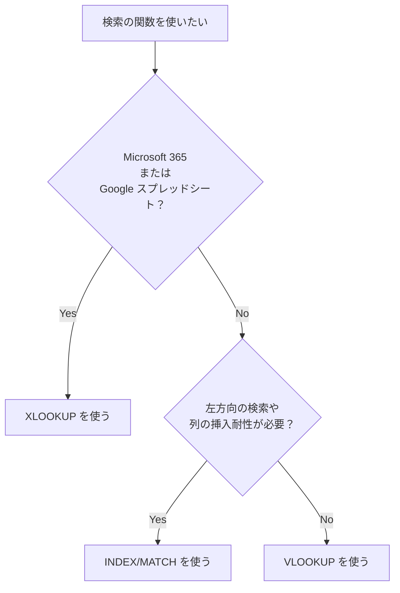

# Excel関数・データ整理実践

数式バー恐怖症を抜け出す——業務で使い倒すための関数とデータ整理の発想

| 項目 | 内容 |
|---|---|
| カテゴリー | ビジネススキル |
| 難易度 | 初級〜中級 |
| 所要時間 | 約200分（全8レッスン） |
| 公開日 | 2026-06-18 |
| 最終更新日 | 2026-06-18 |
| コースURL | https://skillup.college/courses/business/excel-data-practical/ |

## 対象者

業種・職種を問わず、Excel／Google スプレッドシートを業務で使うすべての方。営業・企画・人事・経理・総務・コンサル・教員・公務員など IT 職以外の方に。「数式バーを見ると固まる」「VLOOKUP は名前は知っているが使ったことがない」段階の方も対象。「いまのシートが属人化していて、引き継げない」状況に悩んでいる方にも有用。

## 前提知識

特になし。Excel または Google スプレッドシートの基本操作（セルへの入力、保存、簡単な計算式）経験があれば十分。マクロ・VBA・プログラミングの知識は不要。

## 学習目標

- 「データの形」が作業効率の 9 割を決めることを理解し、集計しやすいデータの 4 条件を整理できる
- 関数の基本構造（=関数名(引数)）を理解し、SUM・IF・COUNTIF などを正しい場面で使える
- VLOOKUP・XLOOKUP・INDEX/MATCH の使い分けを判断できる
- TEXT・TRIM・LEFT/RIGHT/MID・文字列結合・SUBSTITUTE で「汚いデータ」を整形できる
- 日付の正体（シリアル値）を理解し、TODAY・DATE・DATEDIF・EDATE で日付計算ができる
- ピボットテーブルで大量データを 1 分で要約できる
- 動的配列（FILTER・SORT・UNIQUE・XLOOKUP）の使い所を理解する
- シート設計の 5 原則を踏まえて、「使われ続けるシート」を作る発想を持つ

## コース概要

「Excel を使えるようになりたい」と相談に来る方の多くは、関数の暗記から始めようとします。SUMIF を覚えて、VLOOKUP を覚えて、INDEX/MATCH に挑戦して……でも、業務に戻ったら同じところで詰まる。本コースは、その理由が「データの形が壊れていること」にあると整理した上で、関数の使い方とデータ整理の発想を 8 レッスンで体系的に学びます。営業の見込み顧客リスト、人事の社員名簿、経理の請求書集計、企画の市場データ整理——業種を問わず、Excel／Google スプレッドシートを業務で扱う方なら誰もが経験する「詰まる場面」を取り上げ、汎用的な解法を整理します。マクロ・VBA・Power Query は本コースの守備範囲外にして、「関数だけで書ける範囲」を広げる発想に集中します。2026 年 6 月時点で標準化している動的配列・XLOOKUP・LET・FILTER／SORT／UNIQUE と、業務現場で健在の VLOOKUP・SUMIF・IF などを並べて紹介し、用途で選ぶ発想を伝えます。Microsoft 365 と Google スプレッドシートの両方を視野に入れ、AI 連携（Copilot in Excel／Gemini）の位置づけも整理します。

## 学習の流れ

レッスン 1 で本コースの前提となる「データの形が 9 割」を整理します。横長表（クロス集計）と縦長表（テーブル形式）の違い、集計しやすいデータの 4 条件、「壊れた表」のリカバリ発想を学びます。レッスン 2 は関数の基本（構造・引数・参照・エラー値）と、SUM・IF・COUNTIF・SUMIF を「正しい場面で」使う発想です。レッスン 3 は検索の関数（VLOOKUP・XLOOKUP・INDEX/MATCH）の使い分けと判断基準。レッスン 4 はデータ整形の関数（TEXT・TRIM・LEFT/RIGHT/MID・結合・SUBSTITUTE）で「汚いデータ」を整える発想。レッスン 5 は日付（シリアル値・TODAY・DATE・DATEDIF・EDATE・営業日計算）。レッスン 6 はピボットテーブルで大量データを 1 分で要約する発想と、典型的なトラブル対処。レッスン 7 は動的配列と新世代関数（FILTER・SORT・UNIQUE・SEQUENCE・LET・XLOOKUP の組み合わせ）。最後のレッスン 8 で、シート設計の 5 原則と、Google スプレッドシートとの違い、AI 連携の現在地、自分のシートを業務資産に育てる発想、修了後の学習方向を案内します。前半（レッスン 1〜2）は「土台の発想」、中盤（レッスン 3〜6）は「使う関数とピボット」、後半（レッスン 7〜8）は「新世代関数とシート設計」の三段構えです。

## レッスン一覧

| No. | タイトル | 概要 | 所要時間 |
|---|---|---|---|
| 1 | Excel／スプレッドシートと向き合い直す——データの形が 9 割 | 業務での Excel の現実、データの形が決める作業効率、横長表と縦長表（テーブル形式）、集計しやすいデータの 4 条件、本コースの守備範囲を学ぶ | 25分 |
| 2 | 関数の基本——SUM／IF／COUNTIF を「正しい場面で」使う | 関数の基本構造、相対参照と絶対参照、SUM・AVERAGE・MAX・MIN・COUNT、IF・SUMIF・COUNTIF・AVERAGEIF、関数のネスト、エラー値の意味と対処を学ぶ | 25分 |
| 3 | 検索の関数——VLOOKUP・XLOOKUP・INDEX/MATCH の使い分け | VLOOKUP の基本と限界、XLOOKUP の登場と利点、INDEX/MATCH の柔軟性、3 つの使い分け基準、近似一致と完全一致、検索エラーの対処を学ぶ | 25分 |
| 4 | データ整形の関数——TEXT／TRIM／LEFT・RIGHT・MID／文字列結合 | TEXT で表示形式を整える、TRIM で空白を取る、CLEAN で不可視文字を取る、LEFT／RIGHT／MID で切り出す、& 演算子と TEXTJOIN で結合、SUBSTITUTE で置換、「汚いデータ」の整形パターンを学ぶ | 25分 |
| 5 | 日付と時刻——TODAY／DATE／DATEDIF／EDATE と日付計算 | 日付の正体（シリアル値）、TODAY・NOW、DATE・YEAR・MONTH・DAY、DATEDIF・EDATE、WORKDAY・NETWORKDAYS で営業日計算、よくある日付トラブルを学ぶ | 25分 |
| 6 | 集計とピボットテーブル——大量データを 1 分で要約する | ピボットテーブルの仕組み、行・列・値・フィルタの基本、合計・平均・件数の切り替え、グループ化、計算フィールド、スライサーと更新、ピボットで詰まる典型パターンを学ぶ | 25分 |
| 7 | 動的配列と新世代関数——FILTER・SORT・UNIQUE・XLOOKUP の世界 | 動的配列のスピル、FILTER・SORT／SORTBY・UNIQUE・SEQUENCE、LET で読みやすい式、Microsoft 365 と Google スプレッドシートでの利用環境を学ぶ | 25分 |
| 8 | スプレッドシート設計と業務への組み込み——「使われ続けるシート」を作る | シート設計の 5 原則、ファイル運用ルール、Google スプレッドシートとの違い、AI 連携の現在地（Copilot in Excel／Gemini）、シートを業務資産に育てる発想、修了後の学習方向を案内する | 25分 |

---

## レッスン1：Excel／スプレッドシートと向き合い直す——データの形が 9 割

（所要時間：25分）

### このレッスンで学ぶこと

- 業務での Excel／スプレッドシートの現実を整理する
- 「データの形」が作業効率の 9 割を決めることを理解する
- 横長表（クロス集計）と縦長表（テーブル形式）の違いを区別する
- 集計しやすいデータの 4 条件を把握する
- 「壊れた表」を引き継いだときのリカバリ発想を持つ
- 本コースの守備範囲を理解する

---

「Excel が苦手で、関数の名前を聞くだけで身構えてしまう」「VLOOKUP は名前は知っているが使ったことがない」「同僚の作ったシートが複雑で読めない」——会議室で繰り返し聞こえる声です。本コースは、その手前にある「データの形」を最初に整理することから始めます。本レッスンは、関数の使い方ではなく、関数を使いやすくする土台を扱います。

### 業務での Excel の現実

2026 年 6 月時点でも、Excel と Google スプレッドシートは、ビジネスデータの中心にいます。

- 経理：月次・四半期決算、請求書集計
- 営業：見込み顧客リスト、商談進捗管理
- 人事：社員名簿、勤怠集計、評価データ
- 企画：市場データ、KPI モニタリング
- 総務：備品管理、契約管理
- 自治体：補助金計算、住民データ集計

部署を問わず、知的労働者の大半は週に何度も Excel／スプレッドシートを開きます。一方で、「使いこなしている」と自信を持って言える方は少数派です。

#### 「使えない」と感じる 3 つの理由

1. **関数の暗記から始めてしまう**：SUMIF を覚える、VLOOKUP を覚える……順に攻めても、応用が利かない
2. **データの形が壊れたシートに直面する**：先輩が作った複雑な横長表、何度も同じ列で集計し直している、列ヘッダがバラバラ
3. **「とりあえず動けばいい」で修正を重ねる**：継ぎ接ぎだらけのシートが代々受け継がれ、誰も全体を把握していない

本コースは、この 3 つを根本から逆転させる発想を扱います。

> **💡 ポイント**
> Excel が苦手な原因の多くは、関数力不足ではなく「データの形」にあります。「関数を覚えても次の壁が出てくる」と感じている方は、本レッスンの内容が解決の糸口になります。

### 「データの形」が作業効率の 9 割を決める

本コースが繰り返し強調するのが、「データの形」が業務効率を決めるという発想です。

#### 同じデータを 2 つの形で表現する

例えば、月別の売上を 3 つの店舗ごとに記録するとします。同じデータが、2 つの形で表現できます。

**形 A：横長表（クロス集計形式）**

| 店舗 | 4月 | 5月 | 6月 | 7月 |
|---|---|---|---|---|
| 渋谷店 | 320 | 285 | 410 | 380 |
| 新宿店 | 410 | 395 | 470 | 440 |
| 池袋店 | 280 | 305 | 350 | 330 |

**形 B：縦長表（テーブル形式）**

| 店舗 | 月 | 売上 |
|---|---|---|
| 渋谷店 | 4月 | 320 |
| 渋谷店 | 5月 | 285 |
| 渋谷店 | 6月 | 410 |
| 渋谷店 | 7月 | 380 |
| 新宿店 | 4月 | 410 |
| 新宿店 | 5月 | 395 |
| ……（同様に続く） | | |

どちらが「正しい」でしょうか。

#### 「見やすさ」と「集計しやすさ」のトレードオフ

人間が読むときは、横長表（形 A）のほうがコンパクトで見やすいです。一方、機械（Excel の関数やピボット）が処理するときは、縦長表（形 B）のほうが圧倒的に扱いやすくなります。

| 観点 | 横長表（形 A） | 縦長表（形 B） |
|---|---|---|
| 人間にとっての見やすさ | ◎ | △ |
| 集計のしやすさ | △ | ◎ |
| 列が増えたときの拡張 | × | ◎ |
| ピボットテーブルでの分析 | △ | ◎ |
| VLOOKUP・XLOOKUP との相性 | × | ◎ |

#### 本コースの基本姿勢

「データを保管する形」は縦長表（テーブル形式）、「人間が見る形」は横長表という分担が、本コースの基本姿勢です。

- データを蓄積するシート → 縦長表
- 発表・共有・印刷するシート → ピボットや関数で集計した横長表
- 縦長表から横長表への変換 → ピボットや SUMIFS／FILTER で

「いきなり横長表に手入力する」習慣を変えるのが、Excel スキル向上の最大の近道です。

> **⚠️ 注意**
> 既存のシートが横長表で作られている場合、いきなり全部を縦長表に作り直す必要はありません。「新規で作るシートは縦長表」「既存シートは引き継ぎのタイミングで整理」が現実的な方針です。

### 集計しやすいデータの 4 条件

縦長表でも、データの作り方が不適切だと集計に苦労します。集計しやすいデータには、4 つの共通条件があります。

#### 1. 1 行 = 1 レコード

1 行に複数の意味のデータを入れない。例えば「渋谷店 320 / 新宿店 410」と 1 セルに 2 つの店舗データを入れない。1 行は 1 件のデータを表すという原則を守る。

#### 2. 列ヘッダは 1 行のみ

列のタイトル（「店舗」「月」「売上」）は表の 1 行目だけ。途中に小見出しや空行を挟まない。

#### 3. 空行・結合セルを使わない

データの中に空行を入れると、Excel が「ここでデータが終わった」と誤判定します。セルの結合（複数セルを 1 つにまとめる機能）も、ピボットや関数が処理を間違える原因です。

#### 4. 表記を統一する

- 「東京都」「東京」「とうきょう」が混在しない
- 「2026/4/1」「2026-04-01」「2026年4月1日」を混ぜない
- 半角・全角の数字を統一する
- 余計な空白（先頭・末尾・連続）を入れない

#### 4 条件を「集計可能性」で評価する

集計しやすいデータかどうかは、これら 4 条件で判定できます。条件を満たしていないデータを引き継いだ場合、関数を使う前に、データを整形する作業が必要になります。これがデータ整形で、レッスン 4 で扱います。

> **📝 補足**
> 4 条件を満たしたデータを、Excel では「テーブル形式（structured table）」と呼びます。Excel のリボンの「ホーム → テーブルとして書式設定」または「挿入 → テーブル」で正式なテーブルに変換できます。テーブルにすると、列名で関数が書ける、行の追加で範囲が自動拡張される、などの利点があります。

### 「壊れた表」を引き継いだときの発想

業務で多いのは、先輩や前任者が作った複雑なシートを引き継ぐ場面です。データの形が壊れていることは多々あります。

#### よくある「壊れた表」の特徴

- 月ごとにシートが分割されている（4 月シート、5 月シート……）
- 同じ表が複数の場所にコピー＆ペーストされている
- 1 つのセルに複数の情報が詰め込まれている（「2026/4/1 売上 320,000」など）
- 列ヘッダが 2 段、3 段に分割されている
- 結合セルが多用されている
- 空行・空列が無数にある
- 表の途中に手書きメモのような注釈が混ざる
- 同じ列で表記がバラバラ（東京・東京都・TKY など）

#### リカバリの 3 ステップ

1. **元のシートをコピーして「触ってよい複製」を作る**：元データを保存したまま、コピーで作業する
2. **何のためのシートかを把握する**：「月次集計用」「年度報告用」「ダッシュボード」など、用途を整理
3. **段階的に縦長表に変換**：一気に全部を作り直そうとせず、一部から手を付ける

リカバリは時間がかかります。「最初から作り直したほうが早い」と判断するケースも多いです。引き継ぎのタイミングで、シート設計を見直すのが業務改善の機会です。

#### 「とりあえず壊さない」の罠

「壊れたシートだから整理したい」と思っていても、業務が回っている以上、急に変更すると混乱を招きます。次の手順を意識しましょう。

- 動いているシートをそのまま使い続ける
- 並行して、新しいシート設計の試作を作る
- 区切りのいいタイミング（年度替わり、システム更新時など）で切り替える
- 関係者に「シート設計を変える」と事前に共有する

> **💡 ポイント**
> シート設計の変更は、業務の合間にコソコソやるものではなく、関係者の合意を取って計画的に進めるものです。レッスン 8 で「シート設計の 5 原則」を改めて扱います。

### 本コースの守備範囲

最後に、本コースで扱う範囲と扱わない範囲を整理しておきます。

#### 扱う範囲

- データの形と整理の発想（本レッスン）
- 関数の基本：SUM／IF／COUNTIF／SUMIF と参照・エラー値（レッスン 2）
- 検索の関数：VLOOKUP・XLOOKUP・INDEX/MATCH（レッスン 3）
- データ整形の関数：TEXT・TRIM・LEFT/RIGHT/MID・結合・SUBSTITUTE（レッスン 4）
- 日付と時刻：シリアル値・TODAY・DATE・DATEDIF・EDATE・営業日計算（レッスン 5）
- 集計とピボットテーブル（レッスン 6）
- 動的配列と新世代関数：FILTER・SORT・UNIQUE・SEQUENCE・LET（レッスン 7）
- シート設計と業務への組み込み、AI 連携の現在地（レッスン 8）

#### 扱わない範囲

- マクロ・VBA（プログラミングを伴う自動化）
- Power Query・Power Pivot（高度なデータ加工と分析）
- データ可視化のテクニック（グラフの選び方・配色など）
- 統計的判断（仮説検定・p 値など）
- データの解釈や洞察（読み方の議論）
- 特定の業務システム（会計ソフト・人事システムなど）の連携
- 「Excel 試験対策」のような網羅性

#### スタンス

本コースは、Excel／Google スプレッドシートを「業務の道具として理解し、自分の仕事に組み込む基本リテラシー」として扱います。同時に、「Excel が使えれば仕事はできる」とも、「Excel は古い、もう使わない」とも距離を置きます。要件から逆算して関数とピボットの組み合わせを選び、データの形を整え、シートを業務資産として育てる判断軸を持ち帰っていただくのが目的です。

特定のバージョン（Microsoft 365 / Excel 2021 / Excel 2019）に依存しすぎない設計にします。動的配列・XLOOKUP のような新しい関数は Microsoft 365 限定ですが、その点を都度注釈で示します。Google スプレッドシートでの違いも、必要に応じて並記します。

### まとめ

このレッスンでは、以下のことを学びました。

- 2026 年 6 月時点でも Excel／Google スプレッドシートは部署を問わず業務の中心
- 「使えない」と感じる原因は、関数力不足より「データの形」にある
- 同じデータでも「横長表（クロス集計）」と「縦長表（テーブル形式）」の 2 つの表現方法がある
- 人間に見せるのは横長表、機械が処理するのは縦長表が向く
- 集計しやすいデータの 4 条件：1 行 = 1 レコード、列ヘッダは 1 行のみ、空行・結合セルを使わない、表記を統一する
- 「壊れた表」を引き継いだときは、元シートをコピーして触る、用途を把握する、段階的に縦長表に変換するの 3 ステップ
- シート設計の変更は関係者の合意を取って計画的に進める
- 本コースの守備範囲：データの形・基本関数・検索関数・整形関数・日付・ピボット・動的配列・シート設計
- 本コースの守備範囲外：マクロ・VBA・Power Query・データ可視化・統計的判断・データ解釈

次のレッスンでは、関数の基本構造、相対参照と絶対参照、SUM・IF・COUNTIF・SUMIF の使い分け、エラー値の意味と対処を扱います。

---

### 確認クイズ

このレッスンの理解度をチェックしましょう。

#### Q1. 本コースが繰り返し強調する「データの形が業務効率を決める」発想として、最も適切なものはどれか？

- [x] Excel が苦手な原因の多くは、関数力不足ではなく「データの形」にある。同じデータでも「横長表」と「縦長表」の 2 つの表現があり、機械が処理するのは縦長表が向く。集計しやすいデータの 4 条件を満たすことが、関数を使いやすくする土台
- [ ] 関数の暗記が最も重要で、データの形は無視してよい
- [ ] 横長表が常に最適で、縦長表は使うべきではない
- [ ] Excel のスキルは関数の数を覚えた量で決まる

> **解説**
> 本コースは「データの形」が作業効率の 9 割を決めるという発想で進めます。関数の暗記から始めるアプローチも、横長表絶対主義も、関数数競争主義も、いずれも本コースの立場とは異なります。

#### Q2. 「横長表（クロス集計形式）」と「縦長表（テーブル形式）」の使い分けとして、本レッスンが示した方針はどれか？

- [ ] 横長表と縦長表はどちらでも同じで、使い分け不要
- [x] 「データを保管する形」は縦長表（テーブル形式）、「人間が見る形」は横長表という分担が基本姿勢。データを蓄積するシートは縦長表、発表・共有・印刷するシートは集計した横長表、変換はピボットや SUMIFS／FILTER で行う
- [ ] 横長表が常に正しく、縦長表は不要
- [ ] 縦長表が常に正しく、横長表は不要

> **解説**
> 「保管は縦長、見せるのは横長」が本コースの基本姿勢です。両者にはそれぞれの使い所があり、ピボットや関数で変換します。

#### Q3. 集計しやすいデータの 4 条件として、本レッスンが示した内容はどれか？

- [ ] 関数を多用する、ネストを深くする、外部参照を増やす、結合セルで装飾する
- [ ] 列ヘッダを 3 行にする、空行を挟む、結合セルを使う、表記をバラバラにする
- [x] 1 行 = 1 レコード、列ヘッダは 1 行のみ、空行・結合セルを使わない、表記を統一する
- [ ] シートを複数に分ける、月ごとにファイルを変える、1 セルに複数情報を入れる、メモを混ぜる

> **解説**
> 集計しやすいデータの 4 条件は「1 行 = 1 レコード、列ヘッダ 1 行のみ、空行・結合セル不使用、表記統一」です。これらを満たすデータは、関数とピボットで扱いやすくなります。

#### Q4. 「壊れた表」を引き継いだときのリカバリの 3 ステップとして、本レッスンが示した順序はどれか？

- [ ] 元シートをいきなり編集する → 全部削除する → 作り直す
- [ ] 関係者に何も伝えず、こっそり変更する → 完成してから報告する → トラブル対応する
- [ ] マクロを書く → VBA で全自動化する → AI に任せる
- [x] 元のシートをコピーして「触ってよい複製」を作る → 何のためのシートかを把握する → 段階的に縦長表に変換する

> **解説**
> リカバリは「元のコピー → 用途把握 → 段階的整形」の 3 ステップが基本です。いきなり編集も、こっそり変更も、マクロ即導入も、いずれも危険な進め方です。

#### Q5. 本コースが扱う範囲と扱わない範囲について、本レッスンが示した内容はどれか？

- [x] 扱う：データの形、基本関数、検索関数、整形関数、日付、ピボット、動的配列、シート設計。扱わない：マクロ・VBA、Power Query・Power Pivot、データ可視化のテクニック、統計的判断、データの解釈、特定業務システムとの連携、「Excel 試験対策」の網羅性
- [ ] マクロ・VBA を中心に扱い、関数は補助
- [ ] グラフのデザインだけを扱い、関数は扱わない
- [ ] 特定の業務システム（会計ソフトなど）の操作手順を中心に扱う

> **解説**
> 本コースは「関数とデータ整理」に集中し、マクロ・VBA・Power Query・グラフ・業務システム連携には踏み込みません。「関数だけで業務の 8 割以上は変わる」というのが本コースのスタンスです。

#### Q6. 講師の現場メモが示す「複雑すぎるシートに 1 年悩んだ若手社員」のエピソードから、本レッスンが伝えたメッセージはどれか？

- [ ] 複雑なシートはそのまま使い続けるのが正解
- [ ] マクロを覚えれば壊れたシートも問題なく扱える
- [ ] 関数を多く覚えれば、データの形は気にしなくてよい
- [x] Excel スキルの差を生むのは関数の知識ではなく「データの形を整える勇気」。壊れた 4.2 MB のシートを直すのではなく、隣に縦長表 + ピボット + 報告用の 3 シートを作り直した結果、月次決算の更新が 3 時間から 30 分に短縮し、若手社員が「自分で触れる」状態になった

> **解説**
> エピソードでは、複雑な既存シートを「直さず、隣に作り直す」アプローチで月次決算が 3 時間から 30 分に短縮しました。関数の知識ではなく「データの形を整える勇気」が業務改善の鍵というのが本レッスンのメッセージです。

---

## レッスン2：関数の基本——SUM／IF／COUNTIF を「正しい場面で」使う

（所要時間：25分）

### このレッスンで学ぶこと

- 関数の基本構造（=関数名(引数)）を理解する
- セル参照の 2 種類（相対参照・絶対参照）を区別する
- 集計の基本関数（SUM・AVERAGE・MAX・MIN・COUNT）を使い分けられる
- IF・SUMIF・COUNTIF・AVERAGEIF を正しい場面で使う発想を持つ
- 関数のネスト（入れ子）の考え方を理解する
- エラー値（#DIV/0!・#N/A・#VALUE!・#REF!・#NAME?・#NUM!）の意味と対処を整理する

---

前のレッスンでは、データの形が業務効率を決めるという発想と、集計しやすいデータの 4 条件を整理しました。今回のレッスンでは、いよいよ関数に踏み込みます。本レッスンは「関数のリスト」ではなく、「関数の構造を理解して、正しい場面で正しい関数を選ぶ」発想を伝えることが目的です。

### 関数の基本構造

Excel／Google スプレッドシートの関数は、すべて同じ構造で書かれます。

```
=関数名(引数1, 引数2, ...)
```

- **=**：「これは数式」を Excel に伝える記号。先頭の `=` がないと、ただの文字として扱われる
- **関数名**：行いたい計算の種類（SUM、AVERAGE、IF など）
- **( ) 括弧**：引数を囲む
- **引数**：関数に渡す情報（セル範囲、条件、固定値など）
- **,（カンマ）**：引数同士の区切り。日本語版でも英語のカンマを使う

例：

```
=SUM(A1:A10)
=IF(B2>=80, "合格", "不合格")
=COUNTIF(C1:C100, "東京都")
```

#### 関数名の覚え方より「構造」の理解を優先

関数名は数百あります。すべて覚える必要はありません。重要なのは、

- 関数は「何かを計算する道具」
- 引数で「何を、どんな条件で計算するか」を指定する
- 結果が「セルに表示される値」になる

という構造の理解です。構造がわかれば、知らない関数も使い方の見当が付きます。

> **💡 ポイント**
> 関数の中で何が起きているかわからなくなったら、まず構造を声に出して読みます。「=SUM(A1:A10) は、A1 から A10 のセル範囲を合計する」と言葉に直すと、整理されます。

### セル参照——相対参照と絶対参照

関数で最もよく使うのが「セル参照」です。`A1` のように、特定のセルを指す書き方です。セル参照には 2 種類あります。

#### 相対参照

`A1` のように `$` を付けない書き方が「相対参照」です。数式をコピーすると、コピー先に応じて参照先が自動で動きます。

| セル | 数式 | 結果 |
|---|---|---|
| B1 | `=A1*2` | A1 を 2 倍 |
| B2 | `=A2*2` | A2 を 2 倍（B1 から B2 にコピーすると自動で A2 を参照） |
| B3 | `=A3*2` | A3 を 2 倍 |

相対参照は「列ごとに、行ごとに同じ計算を繰り返す」場面で便利です。

#### 絶対参照

`$A$1` のように `$` を付ける書き方が「絶対参照」です。数式をコピーしても、参照先が固定されます。

| セル | 数式 | 結果 |
|---|---|---|
| B1 | `=A1*$D$1` | A1 × D1 |
| B2 | `=A2*$D$1` | A2 × D1（D1 は固定） |
| B3 | `=A3*$D$1` | A3 × D1（D1 は固定） |

「全行に共通する係数」「税率」「為替レート」のように、1 つの値を複数の計算で使う場面で便利です。

#### 複合参照

`A$1`（列だけ相対、行だけ絶対）や `$A1`（列だけ絶対、行だけ相対）の書き方も可能です。「複合参照」と呼びます。九九の表のように、縦と横の両方向に同じ計算をする場面で使います。

#### F4 キーで切り替える

Excel ではセル参照を選択した状態で `F4` キーを押すと、`A1` → `$A$1` → `A$1` → `$A1` → `A1` の順に切り替わります（Google スプレッドシートも同様）。

> **⚠️ 注意**
> 相対参照と絶対参照の使い分けは、関数で最も多いトラブル源です。「数式をコピーしたら結果がおかしい」と感じたら、まず参照の `$` を確認します。

### 集計の基本関数

最もよく使う関数群が、集計の基本関数です。

| 関数 | 役割 |
|---|---|
| SUM | 数値の合計 |
| AVERAGE | 平均 |
| MAX | 最大値 |
| MIN | 最小値 |
| COUNT | 数値の入ったセルの数 |
| COUNTA | 空でないセルの数 |

例：

```
=SUM(B2:B100)              … B2 から B100 までの合計
=AVERAGE(B2:B100)          … 平均
=MAX(B2:B100)              … 最大値
=COUNT(B2:B100)            … 数値の入ったセルの個数
=COUNTA(A2:A100)           … 空でないセルの個数
```

#### COUNT と COUNTA の違い

- COUNT：数値だけを数える
- COUNTA：数値・文字列を含めて、空でないセルを数える

「売上金額の入った件数」を数えるなら COUNT、「顧客名が入った件数」を数えるなら COUNTA、と使い分けます。

> **📝 補足**
> 集計の基本関数は、Excel／Google スプレッドシート両方で同じ名前で使えます。本コースで紹介するほとんどの関数は両方互換ですが、互換性が違う関数は都度注釈を入れます。

### 条件付き集計——IF・SUMIF・COUNTIF・AVERAGEIF

集計の基本関数を「条件付きで」使えるのが、IF 系の関数です。

#### IF——条件で結果を変える

```
=IF(条件, 真の場合, 偽の場合)
```

例：

```
=IF(B2>=80, "合格", "不合格")
… B2 が 80 以上なら「合格」、そうでなければ「不合格」
```

「条件を満たす行に印を付ける」「閾値で表示を切り替える」場面で使います。

#### COUNTIF——条件に合うセルの数を数える

```
=COUNTIF(範囲, 条件)
```

例：

```
=COUNTIF(C2:C100, "東京都")
… C2 から C100 で「東京都」の数を数える

=COUNTIF(B2:B100, ">=80")
… B2 から B100 で 80 以上の数を数える
```

#### SUMIF——条件に合う数値だけを合計する

```
=SUMIF(条件の範囲, 条件, 合計する範囲)
```

例：

```
=SUMIF(A2:A100, "東京都", B2:B100)
… A 列が「東京都」の行の、B 列を合計する
```

引数の順序に注意：「条件の範囲、条件、合計する範囲」です。3 番目が「合計する範囲」、1 番目とは違うことがポイントです。

#### AVERAGEIF——条件に合う数値だけを平均する

```
=AVERAGEIF(条件の範囲, 条件, 平均する範囲)
```

SUMIF と同じ引数構造で、平均を計算します。

#### 複数条件の場合：SUMIFS・COUNTIFS・AVERAGEIFS

複数の条件を組み合わせるときは、末尾に S が付いた SUMIFS／COUNTIFS／AVERAGEIFS を使います。

```
=SUMIFS(合計する範囲, 条件1の範囲, 条件1, 条件2の範囲, 条件2, ...)
```

例：

```
=SUMIFS(B2:B100, A2:A100, "東京都", C2:C100, "2026/4")
… A 列が「東京都」かつ C 列が「2026/4」の行の、B 列を合計
```

SUMIFS は引数の順序が SUMIF と違うので注意：1 番目が「合計する範囲」、2 番目以降が「条件の範囲、条件」のペアです。

> **💡 ポイント**
> SUMIF と SUMIFS で引数順序が違うのは Excel の歴史的経緯です。1 つ覚えるなら、複数条件にも対応できる SUMIFS だけでも実務は回ります。

### 関数のネスト

関数の引数の中に、別の関数を入れることを「ネスト（nesting：入れ子）」と呼びます。

例：

```
=IF(SUM(B2:B10)>=100, "達成", "未達")
… B2 から B10 の合計が 100 以上なら「達成」、未満なら「未達」

=IF(COUNTIF(A2:A100, "東京都")>=10, "東京シェア大", "東京シェア小")
… 「東京都」の数が 10 以上なら「東京シェア大」と表示
```

#### ネストは「内側から読む」

ネストした関数を読むときは、内側から計算結果を順に組み立てます。

```
=IF(SUM(B2:B10)>=100, "達成", "未達")
   ↑ ① SUM(B2:B10) を計算
            ↑ ② その結果が >=100 か判定
                  ↑ ③ 結果に応じて「達成」か「未達」を返す
```

#### ネストは深くしすぎない

ネストを深くすると（3 段以上）、可読性が大きく落ちます。「動くけど誰も読めない式」になりやすいので、

- 2 段までに抑える
- 中間結果を別セルに分けて、段階的に計算する
- LET 関数（レッスン 7）を使って読みやすくする

を意識します。

> **⚠️ 注意**
> 「ネストを深くするほどスキルが高い」は誤解です。読みやすい数式のほうが、長期的に業務資産として残ります。

### エラー値の意味と対処

数式が正しく計算できないとき、Excel は「エラー値」を返します。それぞれの意味を理解すると、すぐに修正の糸口が見えます。

| エラー値 | 意味 | よくある原因 |
|---|---|---|
| `#DIV/0!` | 0 で割っている | 分母が 0 または空のセル |
| `#N/A` | 値が見つからない | VLOOKUP などで検索値が範囲にない |
| `#VALUE!` | 引数の型が違う | 数値が必要なのに文字列が入っている |
| `#REF!` | セル参照が無効 | 参照しているセルや列が削除された |
| `#NAME?` | 関数名や名前が不明 | 関数名のスペルミス、定義していない名前 |
| `#NUM!` | 数値計算で失敗 | 巨大すぎる数値、計算不可能な値 |
| `#NULL!` | セル範囲の指定が不正 | スペースで区切られたセル範囲が交差しない |

#### エラー値の対処

- `#DIV/0!`：分母を確認、または IFERROR で 0 や空白に置き換える
- `#N/A`：検索値の表記揺れ、範囲の指定ミス、検索方式（完全一致か近似か）の確認
- `#VALUE!`：引数のセルに数値ではなく文字が入っていないか
- `#REF!`：削除された参照を新しいセルに付け直す
- `#NAME?`：関数名のスペル確認、または名前定義を確認
- `#NUM!`：計算範囲が大きすぎないか、ループ計算になっていないか

#### IFERROR でエラーを「ハンドルする」

エラー値が出る可能性のある式は、IFERROR で包むと、エラー時の表示を制御できます。

```
=IFERROR(VLOOKUP(A2, データ範囲, 2, FALSE), "見つからず")
… 見つからないときは「見つからず」と表示
```

`#N/A` のような技術的なエラーが画面に出るより、業務的に意味の通る文字列を出すほうが見やすくなります。

> **💡 ポイント**
> エラー値はバグではなく Excel からのメッセージです。「何が問題か」を伝えています。慌てて IFERROR で全部隠さず、まず原因を確認しましょう。

### まとめ

このレッスンでは、以下のことを学びました。

- 関数の基本構造：`=関数名(引数1, 引数2, ...)`。`=` で始まり、引数をカンマで区切る
- 関数の数を覚えるより、構造の理解が優先
- セル参照は相対参照（`A1`）と絶対参照（`$A$1`）と複合参照（`A$1`／`$A1`）の 3 種類
- 数式をコピーすると、相対参照は自動で動き、絶対参照は固定。F4 キーで切り替え
- 集計の基本関数：SUM・AVERAGE・MAX・MIN・COUNT・COUNTA。Excel／Google スプレッドシート両方で同名
- COUNT は数値だけ、COUNTA は空でないセルを数える
- 条件付き集計：IF・COUNTIF・SUMIF・AVERAGEIF と、複数条件の SUMIFS・COUNTIFS・AVERAGEIFS
- SUMIF と SUMIFS で引数順序が違う点に注意
- ネストは「内側から読む」。2 段までに抑え、深くしすぎない
- エラー値の意味と原因を理解すれば、修正の糸口がすぐに見える
- IFERROR でエラー時の表示を制御できるが、まず原因を確認するのが基本

次のレッスンでは、検索の関数（VLOOKUP・XLOOKUP・INDEX/MATCH）の使い分けを扱います。

---

### 確認クイズ

このレッスンの理解度をチェックしましょう。

#### Q1. 関数の基本構造として、本レッスンが示した内容はどれか？

- [ ] `関数名 = 引数1 + 引数2`
- [x] `=関数名(引数1, 引数2, ...)`。`=` で始まり、関数名のあとに括弧、その中に引数をカンマで区切って並べる
- [ ] `>>関数名<<{引数}`
- [ ] `関数名 -> 引数1, 引数2`

> **解説**
> 関数は `=関数名(引数1, 引数2, ...)` の形で書きます。`=` がないとただの文字列になり、引数の区切りはカンマ（日本語版でも英語のカンマ）です。

#### Q2. 相対参照と絶対参照の使い分けとして、本レッスンが説明した内容はどれか？

- [ ] 相対参照と絶対参照は同じ意味で、使い分け不要
- [x] 相対参照（`A1`）は数式をコピーすると参照先が自動で動く。絶対参照（`$A$1`）はコピーしても固定。複合参照（`A$1`／`$A1`）は列・行のどちらかだけ固定。F4 キーで切り替え可能
- [ ] 絶対参照のほうが常に正しく、相対参照は使うべきではない
- [ ] 参照は数式ごとに毎回書き直すのが基本

> **解説**
> 相対参照は列ごと・行ごとに同じ計算を繰り返す場面、絶対参照は固定値（税率・係数など）を複数の計算で使う場面で便利です。F4 キーで切り替えできます。

#### Q3. COUNT と COUNTA の違いとして、本レッスンが説明した内容はどれか？

- [ ] COUNT は文字列だけを数え、COUNTA は数値だけを数える
- [ ] COUNT と COUNTA は同じ機能で違いがない
- [x] COUNT は数値が入ったセルだけを数える。COUNTA は数値・文字列を含めて、空でないセルを数える。「売上金額の入った件数」は COUNT、「顧客名が入った件数」は COUNTA で
- [ ] COUNT は廃止予定で、現代では COUNTA だけを使う

> **解説**
> COUNT は数値のみ、COUNTA は空でないセル全般を数えます。用途で使い分けます。

#### Q4. SUMIF と SUMIFS の違いと注意点として、本レッスンが説明した内容はどれか？

- [ ] SUMIF と SUMIFS は同じ関数で、名前が違うだけ
- [ ] SUMIFS は廃止予定で、SUMIF だけ使えばよい
- [ ] SUMIF と SUMIFS は引数順序が同じ
- [x] SUMIF は単一条件で `=SUMIF(条件の範囲, 条件, 合計する範囲)`、SUMIFS は複数条件で `=SUMIFS(合計する範囲, 条件1の範囲, 条件1, 条件2の範囲, 条件2, ...)`。SUMIFS は「合計する範囲」が 1 番目に来る点で SUMIF と引数順序が違う。1 つ覚えるなら SUMIFS だけでも実務は回る

> **解説**
> SUMIF と SUMIFS は引数順序が違うのが歴史的経緯で、最大のつまずきポイントです。SUMIFS は複数条件対応で、単一条件でも使えます。

#### Q5. 関数のネスト（入れ子）について、本レッスンが推奨する姿勢はどれか？

- [x] ネストは「内側から読む」。ただし 3 段以上深くすると可読性が大きく落ちるので、2 段までに抑える、中間結果を別セルに分けて段階的に計算する、LET 関数（レッスン 7 で扱う）を使って読みやすくする発想を持つ
- [ ] ネストを深くするほどスキルが高いとされるので、できるだけ深く書く
- [ ] ネストは絶対に使ってはいけない
- [ ] ネストは外側から計算するので、読むときも外側から

> **解説**
> ネストは内側から計算結果が積み上がりますので、読むときも内側から組み立てます。深くしすぎないことが業務資産としての可読性につながります。

#### Q6. 講師の現場メモが示す「絶対参照を知らないまま 3 年が経った先輩」のエピソードから、本レッスンが伝えたメッセージはどれか？

- [ ] 関数の数を多く覚えるほど Excel スキルが高い
- [ ] 税率のような固定値は数式に直接書き込むのが正解
- [ ] 絶対参照は高度な技術で、初心者は使うべきでない
- [x] Excel スキルは関数の数ではなく、基本構造の理解（特に相対参照と絶対参照の使い分け）で決まる。先輩は SUMPRODUCT や INDEX/MATCH を使えても、絶対参照を知らないまま、税率変更があれば 30 行書き換える状態が 3 年続いていた。基本構造を抑えてから関数を増やすのが本コースの順序

> **解説**
> エピソードは「関数の数では追いつけない、基本構造の理解が決定的」というメッセージを伝えています。本コースが関数の基本構造と参照を最初に扱うのは、この実感が背景にあります。

---

## レッスン3：検索の関数——VLOOKUP・XLOOKUP・INDEX/MATCH の使い分け

（所要時間：25分）

### このレッスンで学ぶこと

- VLOOKUP の基本構造と限界を理解する
- XLOOKUP の登場と利点を整理できる
- INDEX/MATCH の発想と柔軟性を把握する
- 3 つの関数の使い分け基準を持つ
- 近似一致と完全一致の違いを理解する
- 検索のエラー対処を整理する
- 2026 年 6 月時点の業務現場の現実を踏まえる

---

前のレッスンでは、関数の基本構造、相対参照と絶対参照、SUM・IF・COUNTIF などの集計関数を扱いました。今回のレッスンでは、Excel で最もよく使われる「検索の関数」を扱います。VLOOKUP、XLOOKUP、INDEX/MATCH——名前は聞いたことがあっても、3 つの違いと使い分けまで整理されている方は多くありません。本レッスンで、判断軸を持ち帰っていただきます。

### 検索の関数とは何か

検索の関数は、「ある値をキーに、別の表から関連する値を取得する」関数です。

例：

- 商品コードを入力したら、商品名と価格を自動で表示
- 社員番号を入力したら、氏名と部署を自動で表示
- 注文番号を入力したら、配送日と金額を自動で表示

業務でデータを扱うとき、複数の表を行き来して情報を組み合わせる場面は必ず出てきます。検索の関数は、そのときの効率を決定的に変えます。

#### 検索の典型的な場面

```
A 表（商品マスター）
| 商品コード | 商品名 | 価格 |
| A001     | リンゴ | 200 |
| A002     | バナナ | 150 |
| A003     | オレンジ | 250 |

B 表（注文票）
| 注文ID | 商品コード | 数量 |
| 1     | A002     | 5   |
| 2     | A001     | 3   |
| 3     | A003     | 2   |
```

B 表の「商品コード」を見て、A 表の「商品名」と「価格」を引っ張ってきたい——これが検索の関数の典型的な場面です。

### VLOOKUP——伝統の関数

VLOOKUP は、Excel の長期にわたる定番関数です。「V」は Vertical（縦方向）の意味で、縦方向の表から値を検索します。

#### VLOOKUP の構造

```
=VLOOKUP(検索値, 検索する範囲, 列番号, 検索方法)
```

- **検索値**：探したい値（例：商品コード）
- **検索する範囲**：検索対象の表全体
- **列番号**：取得したい列が範囲の何列目か（左端から数える）
- **検索方法**：`FALSE`（完全一致）または `TRUE`（近似一致）

例：

```
=VLOOKUP("A002", A2:C4, 2, FALSE)
… A2:C4 の範囲で「A002」を縦方向に検索し、見つかった行の 2 列目（商品名）を返す
… 結果：「バナナ」
```

#### VLOOKUP の限界

VLOOKUP は強力ですが、以下の限界があります。

1. **左方向の検索ができない**：検索値より右の列しか取得できない（「商品名から商品コードを取得」ができない）
2. **列番号が数値**：列を挿入すると、列番号がずれて式が壊れる
3. **完全一致のときは必ず `FALSE` を付ける**：忘れると近似一致になり、意図しない結果になる
4. **検索値が複数ヒットしても、最初の 1 件しか返さない**

> **⚠️ 注意**
> VLOOKUP で最も多いミスが「`FALSE` を忘れて近似一致になる」です。完全一致を期待しているなら、必ず `FALSE` または `0` を付けましょう。

### XLOOKUP——新世代の検索関数

XLOOKUP は、Microsoft 365 で 2019 年にプレビュー、2020 年 1 月に一般提供が始まった新しい関数です。VLOOKUP の限界を解消し、より柔軟に検索できます。

#### XLOOKUP の構造

```
=XLOOKUP(検索値, 検索範囲, 返す範囲, [見つからない場合], [一致モード], [検索モード])
```

- **検索値**：探したい値
- **検索範囲**：検索対象の列（1 列を指定）
- **返す範囲**：取得したい列（1 列を指定）
- **見つからない場合**（省略可）：見つからないときに返す値
- **一致モード**（省略可）：0=完全一致（既定）、-1=完全一致または小さい近似、1=完全一致または大きい近似、2=ワイルドカード一致
- **検索モード**（省略可）：1=先頭から（既定）、-1=末尾から、など

例：

```
=XLOOKUP("A002", A2:A4, B2:B4)
… A 列で「A002」を検索し、見つかった行の B 列（商品名）を返す
… 結果：「バナナ」

=XLOOKUP("A099", A2:A4, B2:B4, "未登録")
… A 列で「A099」を検索し、見つからない場合は「未登録」を返す
```

#### XLOOKUP の利点

1. **左方向の検索ができる**：検索範囲と返す範囲を独立に指定できる
2. **列番号ではなく列範囲で指定**：列の挿入で壊れにくい
3. **完全一致がデフォルト**：`FALSE` を書き忘れて事故になることがない
4. **見つからない場合の値を引数で指定できる**：IFERROR でラップする必要がない
5. **動的配列（レッスン 7）と組み合わせやすい**

#### Google スプレッドシートでの利用

Google スプレッドシートも 2022 年に XLOOKUP に対応しました。Excel と同じ書式で使えます。

> **💡 ポイント**
> 新規に式を書くなら、XLOOKUP のほうが書きやすく、壊れにくいです。一方で、業務現場には VLOOKUP で組まれたシートが大量にあります。両方読める状態を目指すのが現実的です。

### INDEX/MATCH——古典的な柔軟解

VLOOKUP の限界を補うために古くから使われてきたのが、INDEX と MATCH の組み合わせです。

#### INDEX——「範囲の n 行目 m 列目」を取得

```
=INDEX(範囲, 行番号, 列番号)
```

例：

```
=INDEX(A2:C4, 2, 2)
… A2:C4 の範囲の 2 行目 2 列目を取得
… 結果：「バナナ」（B3 セルの値）
```

#### MATCH——「ある値が範囲の何行目か」を取得

```
=MATCH(検索値, 検索範囲, 検索方法)
```

例：

```
=MATCH("A002", A2:A4, 0)
… A2:A4 で「A002」を検索し、何番目にあるかを返す
… 結果：2（A2:A4 の中で 2 番目）
```

検索方法は `0`（完全一致）、`1`（昇順データで以下を返す）、`-1`（降順データで以上を返す）です。

#### INDEX/MATCH の組み合わせ

両者を組み合わせると、VLOOKUP より柔軟な検索ができます。

```
=INDEX(B2:B4, MATCH("A002", A2:A4, 0))
… A2:A4 で「A002」を検索した順位を MATCH で取得し、その順位を INDEX で B 列から取り出す
… 結果：「バナナ」
```

#### INDEX/MATCH の利点

1. **左方向の検索もできる**：列の順序に依存しない
2. **列の挿入で壊れにくい**：列番号ではなく範囲で指定
3. **検索範囲と返す範囲を別々に指定できる**
4. **どんな Excel バージョンでも使える**（古い Excel でも）

#### INDEX/MATCH の難点

- 2 つの関数を組み合わせるため、初見ではわかりにくい
- 書く文字数が多い
- XLOOKUP が登場してからは、新規で使う場面が減った

### 3 つの使い分け

3 つの関数の使い分けを、判断ツリーで整理します。



#### 判断のまとめ

| 状況 | 推奨 |
|---|---|
| Microsoft 365 または Google スプレッドシートで新規作成 | XLOOKUP |
| 古い Excel（2019 以前）で新規作成 | INDEX/MATCH |
| 古い Excel で単純な右方向検索だけ | VLOOKUP（容認） |
| 既存シートのメンテナンス（VLOOKUP で書かれている） | VLOOKUP を維持（無理に書き換えない） |

#### 業務現場の現実

2026 年 6 月時点でも、企業の業務現場では VLOOKUP が圧倒的に多く使われています。理由は、

- Excel 2019 以前で作られたシートが大量に残っている
- VLOOKUP で書かれた既存資産を書き換えるリスクとコスト
- 社員のスキルが VLOOKUP に偏っている
- マネジメント層が「VLOOKUP は知っているが XLOOKUP は知らない」状態

「新規は XLOOKUP、既存は VLOOKUP のまま」というハイブリッド戦略が、現実的な現場の姿です。

> **📝 補足**
> 「XLOOKUP に全部書き換えるべき」と決めつけないでください。書き換えにはコストとリスクがあり、既存シートが安定して動いているなら、書き換える優先度は高くありません。

### 近似一致と完全一致

検索の関数で混乱しやすいのが、「近似一致」と「完全一致」の違いです。

#### 完全一致

検索値と「ぴったり一致するもの」だけを探す方式。VLOOKUP の `FALSE`、XLOOKUP の一致モード `0`、MATCH の検索方法 `0` がこれにあたります。

業務で使うのは、ほとんどの場合「完全一致」です。商品コード、社員番号、注文番号など、明確な ID で検索するときは完全一致を選びます。

#### 近似一致

検索値と「ぴったり一致しなくても、近いもの」を返す方式。VLOOKUP の `TRUE`（既定）、XLOOKUP の一致モード `-1`／`1` がこれにあたります。

近似一致が役立つのは、「価格帯から割引率を出す」「点数から成績ランクを出す」のような、段階表（しきい値表）を引くときです。

例：

```
段階表（昇順）
| 点数下限 | ランク |
| 0     | E     |
| 60    | D     |
| 70    | C     |
| 80    | B     |
| 90    | A     |

=VLOOKUP(75, 段階表, 2, TRUE)
… 75 点に対する近似一致で「C」を返す
```

#### 「近似一致のときは検索範囲を昇順に並べる」必須ルール

近似一致を使うときは、検索範囲が昇順で並んでいる必要があります。並んでいないと、間違った結果を返します。

「完全一致を使うのを忘れて、近似一致で偶然それらしい結果が返ってきたが実は間違い」という事故は、業務で繰り返し起きています。

> **⚠️ 注意**
> 完全一致と近似一致の取り違えは、検索関数で最も恐ろしいバグの原因です。業務では、特に理由がない限り完全一致（FALSE / 0）を選びます。

### 検索のエラー対処

検索でよく出るエラーと対処を整理します。

#### `#N/A` が出る場合

「検索値が範囲にない」が最大の原因です。以下を確認しましょう。

1. **表記揺れ**：「東京都」と「東京」、半角と全角、前後の空白
2. **データ型の違い**：数値の `1` と文字の `"1"` は別物
3. **完全一致と近似一致の取り違え**：意図と違うモードになっていないか
4. **検索範囲の指定ミス**：範囲が想定と違う

#### IFERROR でわかりやすい表示にする

エラーが出る可能性のある式は、IFERROR で包むと業務的に親切です。

```
=IFERROR(VLOOKUP(A2, データ範囲, 2, FALSE), "未登録")
… 見つからない場合は「未登録」と表示

=XLOOKUP(A2, 検索範囲, 返す範囲, "未登録")
… XLOOKUP は引数 4 で同じことができる
```

#### `#REF!` が出る場合

参照しているセルや列が削除されたときに出ます。VLOOKUP で「列番号を数値指定」していて、列を挿入・削除したときに発生しやすい代表例です。

### まとめ

このレッスンでは、以下のことを学びました。

- 検索の関数は「ある値をキーに、別の表から関連する値を取得する」関数。業務で複数の表を行き来する効率を決める
- VLOOKUP：`=VLOOKUP(検索値, 範囲, 列番号, 検索方法)`。長期の定番だが左方向検索不可、列番号ずれに弱い、`FALSE` を忘れる事故が多い
- XLOOKUP：`=XLOOKUP(検索値, 検索範囲, 返す範囲, [見つからない場合], ...)`。Microsoft 365 で 2019 年プレビュー・2020 年一般提供、Google スプレッドシートで 2022 年対応。左方向検索可、列の挿入に強い、完全一致がデフォルト
- INDEX/MATCH：古い Excel でも使える柔軟な組み合わせ。読みにくい難点
- 使い分け：Microsoft 365／Google なら XLOOKUP、古い Excel で柔軟性が要るなら INDEX/MATCH、単純な右方向検索なら VLOOKUP（容認）、既存メンテは現状維持
- 近似一致と完全一致の違いを理解する。業務はほとんど完全一致
- 近似一致を使うときは検索範囲を昇順に並べる必須ルール
- `#N/A` の主な原因：表記揺れ、データ型違い、完全一致と近似一致の取り違え、範囲指定ミス
- IFERROR と XLOOKUP の 4 番目の引数で、見つからない場合の表示を制御できる

次のレッスンでは、データ整形の関数（TEXT・TRIM・LEFT/RIGHT/MID・文字列結合・SUBSTITUTE）を扱います。

---

### 確認クイズ

このレッスンの理解度をチェックしましょう。

#### Q1. VLOOKUP の構造と注意点として、本レッスンが説明した内容はどれか？

- [ ] VLOOKUP は完全一致がデフォルトで、`FALSE` を書く必要はない
- [x] `=VLOOKUP(検索値, 検索する範囲, 列番号, 検索方法)`。列番号は範囲の左端から数えた数値、検索方法は `FALSE`（完全一致）または `TRUE`（近似一致）。`FALSE` を忘れて近似一致になる事故が業務で繰り返し起きるため、完全一致を期待するなら必ず `FALSE` を付ける
- [ ] VLOOKUP は左方向の検索ができる
- [ ] VLOOKUP は列の挿入に強く、列番号がずれない

> **解説**
> VLOOKUP は伝統的な定番関数ですが、`FALSE` 忘れ・左方向検索不可・列番号ずれという既知の限界があります。これらが XLOOKUP 登場の背景です。

#### Q2. XLOOKUP の利点として、本レッスンが説明した内容はどれか？

- [ ] XLOOKUP は古い Excel（2019 以前）でも使える
- [x] 左方向の検索ができる、列番号ではなく列範囲で指定するため列挿入で壊れにくい、完全一致がデフォルト、見つからない場合の値を引数で指定できる（IFERROR でラップ不要）、動的配列と組み合わせやすい、という利点を持つ
- [ ] XLOOKUP は VLOOKUP と機能が同じで、新しさ以外に違いはない
- [ ] XLOOKUP は近似一致しかできない

> **解説**
> XLOOKUP は VLOOKUP の限界を解消するための新世代関数で、Microsoft 365 で 2019 年プレビュー・2020 年 1 月一般提供、Google スプレッドシートで 2022 年対応。古い Excel では使えません。

#### Q3. INDEX/MATCH の組み合わせとして、本レッスンが説明した内容はどれか？

- [ ] INDEX/MATCH は Microsoft 365 専用で、古い Excel では使えない
- [ ] INDEX/MATCH は VLOOKUP の左方向検索の制約を引き継ぐ
- [x] INDEX は「範囲の n 行目 m 列目」を取得、MATCH は「ある値が範囲の何行目か」を取得。両者を組み合わせると左方向検索もでき、列の挿入で壊れにくい。古い Excel でも使えるが、2 つの関数の組み合わせで初見ではわかりにくい。XLOOKUP 登場後は新規で使う場面が減った
- [ ] INDEX/MATCH は廃止予定で、現代では使えない

> **解説**
> INDEX/MATCH は VLOOKUP の限界を補う古典的な柔軟解で、古い Excel でも使えます。XLOOKUP 登場後は新規利用は減りましたが、既存資産では現役です。

#### Q4. 3 つの検索関数（VLOOKUP・XLOOKUP・INDEX/MATCH）の使い分けとして、本レッスンが示した判断はどれか？

- [ ] 常に VLOOKUP を使うべきで、ほかの 2 つは不要
- [ ] 常に XLOOKUP を使うべきで、ほかの 2 つは不要
- [ ] 常に INDEX/MATCH を使うべきで、ほかの 2 つは不要
- [x] Microsoft 365 または Google スプレッドシートで新規作成なら XLOOKUP、古い Excel で柔軟性が要るなら INDEX/MATCH、古い Excel で単純な右方向検索だけなら VLOOKUP（容認）、既存シートのメンテナンスは現状維持。業務現場では「新規は XLOOKUP、既存は VLOOKUP のまま」というハイブリッド戦略が現実的

> **解説**
> 3 つの関数は環境と用途で使い分けます。一律にどれかが正解という発想ではなく、業務状況で判断するのが本コースの推奨です。

#### Q5. 近似一致と完全一致の使い分けについて、本レッスンが説明した内容はどれか？

- [x] 業務で使うのはほとんど完全一致（商品コード・社員番号・注文番号など明確な ID で検索）。近似一致は「価格帯から割引率」「点数からランク」のような段階表を引くときに使う。近似一致を使うときは検索範囲を昇順に並べる必須ルールがあり、並んでいないと間違った結果を返す
- [ ] 業務では常に近似一致を使う
- [ ] 近似一致と完全一致は同じで、使い分け不要
- [ ] 近似一致では検索範囲の並び順は関係ない

> **解説**
> 業務はほとんど完全一致で、近似一致は段階表用に限定されます。「`FALSE` を書き忘れて近似一致になった」は最も多い事故の原因です。

#### Q6. 講師の現場メモが示す「VLOOKUP の `FALSE` 忘れで 1 億円違いの納品ミス」のエピソードから、本レッスンが伝えたメッセージはどれか？

- [ ] VLOOKUP の `FALSE` は書いても書かなくても同じ
- [ ] 発注総額が大きくなっても、検算は不要
- [x] VLOOKUP の `FALSE` を書く習慣はスキルではなく業務リスク対策。1 文字書き忘れるだけで業務全体が傾く事故が起きうる。XLOOKUP を推奨する理由の 1 つは、`FALSE` を書かなくて済む（完全一致がデフォルト）のが業務リスクを大きく下げるから。新しい関数を使う動機は「便利だから」だけでなく「事故を減らすから」という観点も
- [ ] 近似一致がデフォルトなので、近似一致のままにしておけばよい

> **解説**
> エピソードでは、VLOOKUP の `FALSE` 忘れで発注総額が想定の 4 倍に膨らんでいました。事故防止の観点から、XLOOKUP のような新しい関数を選ぶ判断軸を持つことが、業務での関数選定では大事です。

---

## レッスン4：データ整形の関数——TEXT／TRIM／LEFT・RIGHT・MID／文字列結合

（所要時間：25分）

### このレッスンで学ぶこと

- TEXT 関数で表示形式を整える発想を持つ
- TRIM で余計な空白を取る使い方を理解する
- CLEAN で不可視文字を取る使い方を整理する
- LEFT／RIGHT／MID で文字列を切り出す発想を持つ
- &演算子・CONCATENATE・TEXTJOIN で文字列を結合する使い分けを理解する
- SUBSTITUTE で置換を行う使い方を把握する
- 業務でよくある「汚いデータ」の整形パターンを身につける

---

前のレッスンでは、検索の関数（VLOOKUP・XLOOKUP・INDEX/MATCH）の使い分けを扱いました。今回のレッスンでは、視点を変えて「データ整形」を扱います。業務でほかの部署や取引先から受け取ったデータは、必ずどこかしら「汚れて」います。表記が揺れている、余計な空白が入っている、列がバラバラに分割されている——これらを関数で整える発想を、本レッスンで学びます。

### 業務で出会う「汚いデータ」

業務で関数の前に出会うのは、たいてい次のような「汚いデータ」です。

- 「東京都新宿区」と「東京都 新宿区」（半角スペースが混入）
- 「03-1234-5678」と「０３-１２３４-５６７８」（半角全角混在）
- 「2026/4/1」と「2026年4月1日」と「2026-4-1」（書式バラバラ）
- 「山田 太郎」と「山田　太郎」（半角全角スペース混在）
- 別ファイルからコピーした際の「改行」や「タブ」がセル内に残る
- 1 セルに「氏名 部署 役職」が詰め込まれている
- 数値の頭にスペースが残って、SUM が動かない

これらをそのまま使うと、検索関数で `#N/A` が出る、ピボットテーブルで同じ項目が複数に分割される、集計値が合わない、といった事故になります。データ整形の関数は、こうした「汚れ」をクリーニングする道具です。

> **💡 ポイント**
> データの 60〜70% は他人が作ったものを受け取って使います。「汚いデータ」と出会うのは異常ではなく、業務の標準です。整形の関数を持っていると、出会ったときの動揺が小さくなります。

### TEXT 関数——表示形式を整える

TEXT 関数は、数値や日付を「指定した形式の文字列」に変換します。

#### TEXT の構造

```
=TEXT(値, 表示形式)
```

例：

```
=TEXT(1234567, "#,##0")
… 結果：「1,234,567」（3 桁区切りのカンマ）

=TEXT(0.0832, "0.0%")
… 結果：「8.3%」（パーセント表示・小数点 1 桁）

=TEXT(TODAY(), "yyyy年m月d日")
… 結果：「2026年6月18日」

=TEXT(TODAY(), "yyyy-mm-dd")
… 結果：「2026-06-18」

=TEXT(TODAY(), "aaaa")
… 結果：「木曜日」（曜日を文字列で取得）

=TEXT(TODAY(), "aaa")
… 結果：「木」（短い曜日）
```

#### よくある表示形式の記号

| 記号 | 意味 |
|---|---|
| `0` | 数値の桁。値がなければ 0 で埋める |
| `#` | 数値の桁。値がなければ表示しない |
| `,` | 3 桁区切り |
| `.` | 小数点 |
| `%` | パーセント表示 |
| `yyyy` | 4 桁の年 |
| `m` | 月（1〜12） |
| `mm` | 月（01〜12） |
| `d` | 日（1〜31） |
| `dd` | 日（01〜31） |
| `aaaa` | 曜日（日曜日、月曜日……） |
| `aaa` | 短い曜日（日、月、火……） |

#### TEXT を使う場面

- 集計結果を「100,000円」のように単位付きで表示する
- 日付を「2026年6月18日」のように読みやすい形にする
- パーセントを「85.3%」のように見せる
- メールの本文に組み込む文字列を整形する

> **⚠️ 注意**
> TEXT 関数の結果は「文字列」になります。集計や検索の元データには使わず、表示専用に使うのが基本です。

### TRIM——余計な空白を取る

TRIM は、文字列の前後と途中の余計な空白を取り除く関数です。

#### TRIM の動作

```
=TRIM("  東京都  新宿区  ")
… 結果：「東京都 新宿区」
… 前後の空白は完全に削除、文字列の途中の連続する空白は 1 つに圧縮
```

#### TRIM が解決する典型例

- 取引先からもらった顧客リストの氏名の前後にスペースが入っている
- データの末尾にうっかり Enter キーで改行が入った
- 半角スペース 2 つが続いている

VLOOKUP や XLOOKUP で `#N/A` が出るときは、TRIM で検索値と検索範囲の両方を整えると、原因が解消することが多いです。

#### 半角と全角は別物

TRIM は半角スペースを処理しますが、全角スペース（`　`）は標準では削除しません（バージョンや環境によって挙動が違います）。全角スペースを取り除きたい場合は、後述の SUBSTITUTE と組み合わせます。

> **💡 ポイント**
> TRIM は「データを取り込んだら、まず TRIM を通す」を習慣にすると、検索エラーが大幅に減ります。

### CLEAN——不可視の制御文字を取る

CLEAN は、改行・タブ・印刷不能の制御文字を取り除く関数です。

```
=CLEAN(セル参照)
```

「Web からコピー＆ペーストしたデータに改行が残ったまま」「他システムから出力したデータにタブが入っている」場面で使います。

TRIM と CLEAN を組み合わせるのが、データ取り込み後の定番処理です。

```
=TRIM(CLEAN(A2))
… A2 の文字列から制御文字を取り、その後で空白を整える
```

### LEFT・RIGHT・MID——文字列を切り出す

1 つのセルに複数の情報が詰め込まれているとき、関数で切り出します。

#### LEFT——左から n 文字

```
=LEFT(文字列, 文字数)
```

例：

```
=LEFT("A001-2026", 4)
… 結果：「A001」（左から 4 文字）
```

#### RIGHT——右から n 文字

```
=RIGHT(文字列, 文字数)
```

例：

```
=RIGHT("A001-2026", 4)
… 結果：「2026」（右から 4 文字）
```

#### MID——指定位置から n 文字

```
=MID(文字列, 開始位置, 文字数)
```

例：

```
=MID("A001-2026-XYZ", 6, 4)
… 結果：「2026」（左から 6 文字目から 4 文字）
```

#### LEN——文字数を数える

```
=LEN("AB001234")
… 結果：8（文字数）
```

LEN を組み合わせると、「右から 4 文字を除いた残り」のような柔軟な切り出しもできます。

```
=LEFT(A2, LEN(A2)-4)
… 右から 4 文字を除いた部分
```

#### FIND・SEARCH——文字の位置を探す

特定の文字が文字列の何文字目にあるかを返します。

```
=FIND("-", "A001-2026")
… 結果：5（「-」が 5 文字目にある）

=SEARCH("-", "A001-2026")
… 結果：5（FIND と同じ、ただし大文字小文字を区別しない）
```

LEFT・MID と組み合わせると、「ハイフンの前まで」「ハイフンの後ろから」のように、文字列の中身に応じた切り出しができます。

```
=LEFT(A2, FIND("-", A2) - 1)
… A2 の「-」の前まで取り出す
```

> **📝 補足**
> 「Excel での文字列処理は手作業」と思われがちですが、LEFT／MID／FIND を組み合わせれば、多くのパターンを自動化できます。マクロを使わなくても、関数だけで十分に対応できる場面が大半です。

### 文字列の結合

複数のセルや文字を 1 つにつなぐ場面も、業務でよくあります。

#### & 演算子

最も簡潔な結合方法は、`&` 演算子です。

```
=A1 & B1
… A1 と B1 の値を結合

=A1 & " " & B1
… 間にスペースを入れる

="お疲れさまです。" & A1 & "様"
… 文字列とセルを組み合わせる
```

#### CONCATENATE（CONCAT）

CONCATENATE 関数も結合に使えますが、`&` で十分なので使われる場面は減っています。

```
=CONCATENATE(A1, " ", B1)
… A1 と B1 をスペース区切りで結合
```

Microsoft 365 では CONCAT 関数（CONCATENATE の後継）も使えます。範囲指定での結合に対応しています。

#### TEXTJOIN

TEXTJOIN は、複数のセルを「区切り文字」で結合する関数です。範囲指定にも対応しており、`&` の煩雑さを解消します。

```
=TEXTJOIN(",", TRUE, A1:A5)
… A1:A5 の値をカンマで結合、空セルは無視
… 結果：「東京,大阪,名古屋,福岡,札幌」のような形

=TEXTJOIN(" / ", FALSE, A1:A5)
… 「 / 」で結合、空セルも含める
```

第 2 引数の `TRUE/FALSE` は「空セルを無視するか」を制御します。

> **💡 ポイント**
> TEXTJOIN は業務で「複数の情報を 1 列に集約してメールに貼る」「アンケートの自由記述を列でつなぐ」場面で大活躍します。Microsoft 365 と Google スプレッドシートの両方で使えます。

### SUBSTITUTE——置換する

SUBSTITUTE は、文字列の中の特定の文字を別の文字に置き換える関数です。

```
=SUBSTITUTE(文字列, 検索文字, 置換文字)
=SUBSTITUTE(文字列, 検索文字, 置換文字, n)
```

例：

```
=SUBSTITUTE(A2, " ", "")
… A2 の半角スペースをすべて削除

=SUBSTITUTE(A2, "　", "")
… A2 の全角スペースをすべて削除

=SUBSTITUTE(SUBSTITUTE(A2, " ", ""), "　", "")
… 半角と全角の両方のスペースを削除

=SUBSTITUTE(A2, "-", "/")
… A2 の「-」を「/」に置き換える

=SUBSTITUTE(A2, "東京", "TKY", 1)
… 1 番目の「東京」だけを「TKY」に置き換える（4 番目の引数）
```

#### SUBSTITUTE と REPLACE の違い

- SUBSTITUTE：「この文字を、こちらの文字に置き換える」（文字を指定）
- REPLACE：「位置 n の文字を、長さ m 分だけ、こちらに置き換える」（位置を指定）

日本語のデータ整形では SUBSTITUTE のほうが圧倒的によく使います。

### 業務でよくある整形パターン

最後に、業務で繰り返し出会う整形パターンを 5 つ紹介します。

#### パターン 1：氏名のスペース除去

```
=SUBSTITUTE(SUBSTITUTE(A2, " ", ""), "　", "")
… 半角・全角スペースをすべて削除
```

#### パターン 2：電話番号の正規化

```
=SUBSTITUTE(SUBSTITUTE(SUBSTITUTE(A2, "-", ""), "(", ""), ")", "")
… 「-」「(」「)」を削除
```

#### パターン 3：取り込みデータのクリーニング

```
=TRIM(CLEAN(A2))
… 制御文字と余計な空白を取る（取り込み直後の定番）
```

#### パターン 4：氏名・部署を別の列に分解

```
=LEFT(A2, FIND(" ", A2) - 1)
… 「山田 太郎」から「山田」を取り出す

=MID(A2, FIND(" ", A2) + 1, LEN(A2))
… 「山田 太郎」から「太郎」を取り出す
```

#### パターン 5：複数列を 1 つに集約してメール本文に

```
="お客様番号: " & A2 & " / 氏名: " & B2 & " / 申込日: " & TEXT(C2, "yyyy/mm/dd")
… 文字列とセルと TEXT を組み合わせて 1 行にまとめる
```

これらのパターンを覚えておくと、業務の整形が大きく楽になります。

> **⚠️ 注意**
> 整形した結果を元データに上書きする場合、必ずバックアップを取ってください。整形は破壊的な操作で、元に戻すのが難しい場合があります。

### まとめ

このレッスンでは、以下のことを学びました。

- 業務で出会うデータの 60〜70% は他人が作ったもので、汚れているのが標準
- TEXT 関数：数値や日付を「指定した形式の文字列」に変換する。表示専用で集計には使わない
- TRIM：文字列の前後と途中の余計な空白を取る。半角スペースが対象、全角は SUBSTITUTE で
- CLEAN：改行・タブ・印刷不能の制御文字を取る。取り込み直後の定番処理
- LEFT／RIGHT／MID：文字列の左・右・中間から指定文字数を切り出す
- FIND／SEARCH：文字の位置を返す。LEFT・MID と組み合わせると柔軟な切り出しができる
- 文字列結合：`&` 演算子（最も簡潔）、CONCATENATE／CONCAT、TEXTJOIN（区切り文字付き）
- SUBSTITUTE：文字を別の文字に置き換える。半角・全角スペース除去、電話番号正規化に使う
- 業務での典型的な整形パターン 5 つを覚えると、データ整形が大きく楽になる
- 整形は破壊的な操作。必ずバックアップを取ってから行う

次のレッスンでは、日付と時刻の関数（シリアル値・TODAY・DATE・DATEDIF・EDATE・営業日計算）を扱います。

---

### 確認クイズ

このレッスンの理解度をチェックしましょう。

#### Q1. TEXT 関数の役割として、本レッスンが説明した内容はどれか？

- [x] 数値や日付を「指定した表示形式の文字列」に変換する。`=TEXT(1234567, "#,##0")` で「1,234,567」、`=TEXT(TODAY(), "yyyy年m月d日")` で「2026年6月18日」のように表示できる。結果は文字列になるため、集計や検索の元データには使わず表示専用に使うのが基本
- [ ] TEXT は文字列を数値に変換する関数
- [ ] TEXT は廃止予定の旧式関数
- [ ] TEXT は集計の元データとして使うのに向いている

> **解説**
> TEXT は数値・日付を文字列の形にする関数で、表示のために使います。集計や検索の元データには文字列化したものは使わないのが基本です。

#### Q2. TRIM の動作として、本レッスンが説明した内容はどれか？

- [ ] TRIM は文字列の中の半角全角どちらのスペースも完全に削除する
- [x] 文字列の前後の空白を完全に削除し、文字列の途中の連続する空白は 1 つに圧縮する。標準では半角スペースが対象で、全角スペースは別途 SUBSTITUTE で対応する必要がある。「データを取り込んだら、まず TRIM を通す」を習慣にすると検索エラーが大幅に減る
- [ ] TRIM は数値を切り捨てる関数
- [ ] TRIM は文字列を逆順にする関数

> **解説**
> TRIM は前後の空白を削除し、途中の連続空白を 1 つに圧縮します。半角スペースが標準対象です。全角は SUBSTITUTE と組み合わせます。

#### Q3. CLEAN の使い方として、本レッスンが説明した内容はどれか？

- [ ] CLEAN は数値を切り上げる関数
- [ ] CLEAN は文字列のすべての空白を削除する
- [x] 改行・タブ・印刷不能の制御文字を取り除く関数。Web からのコピー＆ペーストや他システムからのデータ取り込みで残る不可視文字を除去できる。`=TRIM(CLEAN(A2))` の組み合わせがデータ取り込み後の定番処理
- [ ] CLEAN は廃止予定の旧式関数

> **解説**
> CLEAN は制御文字（改行・タブ・印刷不能文字）を取り除く関数で、TRIM と組み合わせて取り込み直後の整形に使います。

#### Q4. 文字列結合の方法として、本レッスンが説明した内容はどれか？

- [ ] 文字列結合は `=` のみで行う
- [ ] 文字列結合は数式では行えない
- [ ] 文字列結合は SUBSTITUTE で行う
- [x] `&` 演算子が最も簡潔（`=A1 & " " & B1`）、CONCATENATE／CONCAT 関数、TEXTJOIN（区切り文字付き・範囲指定可・空セル無視のオプションあり）の 3 種類。TEXTJOIN は「複数の情報を 1 列に集約してメールに貼る」場面で大活躍

> **解説**
> 文字列結合は `&` 演算子・CONCATENATE／CONCAT・TEXTJOIN の 3 つから選びます。TEXTJOIN は範囲指定や区切り文字の柔軟さが利点です。

#### Q5. SUBSTITUTE の使い方として、本レッスンが説明した内容はどれか？

- [x] 文字列の中の特定の文字を別の文字に置き換える関数。`=SUBSTITUTE(A2, " ", "")` で半角スペースを削除、`=SUBSTITUTE(A2, "　", "")` で全角スペースを削除、`=SUBSTITUTE(A2, "-", "/")` で「-」を「/」に置換、4 番目の引数で「n 番目だけ」の置換も可能。日本語のデータ整形では SUBSTITUTE のほうが REPLACE よりよく使う
- [ ] SUBSTITUTE は文字列を逆順にする関数
- [ ] SUBSTITUTE は数値の小数点を切り上げる関数
- [ ] SUBSTITUTE は廃止予定の旧式関数

> **解説**
> SUBSTITUTE は文字の置換を行う関数で、半角・全角スペースの除去、電話番号の正規化など業務でよく使います。REPLACE は位置指定なのに対し、SUBSTITUTE は文字指定です。

#### Q6. 講師の現場メモが示す「日付の取り違えで監査指摘」のエピソードから、本レッスンが伝えたメッセージはどれか？

- [ ] データ整形は不要な作業で、業務上の意味はない
- [ ] 日付の書式は人によって違って当然なので、放置すべき
- [x] データ整形の関数は「目立たないが業務リスクを下げる、地味な投資」。「2026/4/1」「2026年4月1日」「2026.4.1」「2026-04-01」の 4 種類混在でカテゴリの漏れと監査指摘が起きた事例から、CLEAN・TRIM・SUBSTITUTE・DATE を「習慣として通す」整形パイプラインを構築することで、書式由来のミスがゼロになった。新しい関数を覚えるより派手ではないが、検索エラー・集計漏れ・監査指摘のリスクが大幅に下がる
- [ ] 監査指摘を受けても、特に対応は不要

> **解説**
> エピソードでは、書式バラバラの日付で集計漏れと監査指摘が起きました。整形パイプラインの構築で書式由来のミスがゼロに。データ整形は地味だが業務リスクを下げる投資、というメッセージです。

---

## レッスン5：日付と時刻——TODAY／DATE／DATEDIF／EDATE と日付計算

（所要時間：25分）

### このレッスンで学ぶこと

- 日付の正体（シリアル値）を理解する
- TODAY・NOW で「今日」「今」を取得する使い方を持つ
- DATE・YEAR・MONTH・DAY で日付を構成・分解できる
- DATEDIF で 2 つの日付の差を計算できる
- EDATE で n か月後を計算する発想を持つ
- WORKDAY・NETWORKDAYS で営業日を扱える
- WEEKDAY・TEXT で曜日を扱える
- よくある日付トラブル（書式違い・テキストの日付）の対処を整理する

---

前のレッスンでは、データ整形の関数（TEXT・TRIM・LEFT/RIGHT/MID・結合・SUBSTITUTE）を扱いました。今回のレッスンでは、業務で必ず出会う「日付」を扱います。日付の計算は、見た目は単純ですが、内部の仕組みを知らないと事故が多発します。本レッスンで、日付の正体と扱い方を整理します。

### 日付の正体——シリアル値

Excel／Google スプレッドシートでは、日付は内部的に「シリアル値（serial value）」という整数で扱われています。

#### シリアル値の仕組み

- 1900 年 1 月 1 日を「1」とする
- 1 日進むごとに「1」を足す
- 例：2026 年 6 月 18 日は「46190」（1900/1/1 から 46190 日目）

セルに「2026/6/18」と表示されていても、内部の値は「46190」という数値です。Excel が表示形式を「日付」に設定して、人間にわかる形に見せているだけです。

#### シリアル値を確認する

セルの表示形式を「数値」または「標準」に変えると、日付がシリアル値（数値）として見えます。

#### なぜシリアル値なのか

シリアル値で扱う理由は、日付の計算を簡単にするためです。

- 「2 つの日付の差は何日か」→ 引き算するだけ
- 「10 日後はいつか」→ 足し算するだけ
- 「3 か月後はいつか」→ EDATE 関数で処理
- 「平日か休日か」→ 7 で割った余りで判定

シリアル値を意識すると、「日付計算の不思議」が「数値計算」に置き換わります。

#### 時刻はシリアル値の小数部分

時刻は、シリアル値の小数部分で表現されます。

- 0.0 = 0:00（午前 0 時）
- 0.5 = 12:00（正午）
- 0.75 = 18:00（午後 6 時）

「2026/6/18 12:00」は「46190.5」というシリアル値です。

> **💡 ポイント**
> 日付の表示が崩れたとき、内部のシリアル値を確認すると原因がわかります。「テキストとして入力された日付」は数値ではなく文字列で、シリアル値を持ちません。

### TODAY・NOW——「今日」「今」を取得する

#### TODAY——今日の日付

```
=TODAY()
… 結果：そのファイルを開いた日（または再計算された日）
```

引数はありません。シートを開き直すたびに、その日に更新されます。

#### NOW——今の日時

```
=NOW()
… 結果：そのファイルを開いた日時
```

時刻まで含めて返します。

#### よくある使い方

- 月次レポートのタイトルに「2026/06/18 時点」と自動表示
- 「最終更新日：」の自動表示
- 経過日数の計算：`=TODAY() - 契約開始日`

#### 注意点

TODAY と NOW は「ファイルを開いた日時」で更新されるため、「特定の日時を固定したい」場合は値として書き込みます（コピー → 値貼り付け）。

> **⚠️ 注意**
> 帳票や契約書のように「特定日時で固定したい」場合は、TODAY を使ったままにせず、シート完成時に値貼り付けで固定するのが鉄則です。

### DATE・YEAR・MONTH・DAY——日付の構成と分解

#### DATE——年・月・日から日付を構成

```
=DATE(年, 月, 日)
=DATE(2026, 6, 18)
… 結果：2026/6/18
```

年・月・日を別々のセルから組み立てる場面で便利です。

```
=DATE(A1, B1, C1)
… A1 が年、B1 が月、C1 が日のとき、日付を構成
```

#### YEAR・MONTH・DAY——日付から要素を取り出す

```
=YEAR(A1)
… A1 の年を取得（例：2026）

=MONTH(A1)
… A1 の月を取得（例：6）

=DAY(A1)
… A1 の日を取得（例：18）
```

「日付列から月だけ抽出して、月別に集計する」場面で便利です。

#### 月初・月末の計算

```
=DATE(YEAR(A1), MONTH(A1), 1)
… A1 と同じ月の 1 日

=DATE(YEAR(A1), MONTH(A1) + 1, 0)
… A1 と同じ月の末日（翌月 0 日 = その月の末日）

=EOMONTH(A1, 0)
… A1 と同じ月の末日（EOMONTH 関数で直接取得）

=EOMONTH(A1, 1)
… A1 の翌月の末日
```

> **📝 補足**
> 月末の計算は「翌月 0 日」のトリックでも可能ですが、EOMONTH のほうが意図が明確です。EOMONTH は Microsoft 365 でも古い Excel でも使えます。

### DATEDIF——2 つの日付の差

DATEDIF（Date + Difference）は、2 つの日付の差を年・月・日の単位で計算します。

```
=DATEDIF(開始日, 終了日, "単位")
```

単位の種類：

| 単位 | 意味 |
|---|---|
| `"Y"` | 完全な年数 |
| `"M"` | 完全な月数 |
| `"D"` | 日数 |
| `"MD"` | 月日を無視した日数 |
| `"YM"` | 年を無視した月数 |
| `"YD"` | 年を無視した日数 |

例：

```
=DATEDIF("2020/4/1", "2026/6/18", "Y")
… 結果：6（完全な 6 年）

=DATEDIF("2020/4/1", "2026/6/18", "M")
… 結果：74（完全な 74 か月）

=DATEDIF("2020/4/1", "2026/6/18", "D")
… 結果：2269（2269 日）
```

業務でよく使うのは「Y」（年齢、勤続年数）です。

#### 「年齢」の計算

```
=DATEDIF(生年月日, TODAY(), "Y")
… 今日時点の満年齢
```

#### 「勤続年数と月数」を組み合わせる

```
=DATEDIF(入社日, TODAY(), "Y") & "年" & DATEDIF(入社日, TODAY(), "YM") & "か月"
… 結果：例「6年2か月」
```

#### DATEDIF の注意点

DATEDIF はかなり古い関数で、Excel の関数一覧に表示されません。手で入力する必要があります。また、Google スプレッドシートでも使えますが、互換性確認は行ってください。

> **💡 ポイント**
> 年齢・勤続年数の計算は DATEDIF が最もシンプルです。引き算で何日になるか計算してから 365 で割るのは、うるう年で誤差が出るので避けます。

### EDATE——n か月後・前

EDATE は、ある日付の「n か月後」または「n か月前」を計算します。

```
=EDATE(開始日, 月数)
```

例：

```
=EDATE("2026/6/18", 3)
… 結果：2026/9/18（3 か月後）

=EDATE("2026/6/18", -3)
… 結果：2026/3/18（3 か月前）

=EDATE("2026/1/31", 1)
… 結果：2026/2/28（月末調整あり）
```

#### よくある使い方

- 契約満了日：`=EDATE(契約開始日, 契約月数)`
- 6 か月後の更新日：`=EDATE(TODAY(), 6)`
- 1 年前の同月：`=EDATE(TODAY(), -12)`

#### EOMONTH との違い

- EDATE：n か月後の「同じ日」を返す
- EOMONTH：n か月後の「月末」を返す

両者を使い分けます。

### WORKDAY・NETWORKDAYS——営業日の計算

営業日（土日祝を除いた日）を扱う関数も用意されています。

#### WORKDAY——n 営業日後

```
=WORKDAY(開始日, 営業日数, [祝日範囲])
```

例：

```
=WORKDAY("2026/6/18", 5)
… 結果：2026/6/25（5 営業日後、ただし祝日は考慮していない）

=WORKDAY("2026/6/18", 5, 祝日リスト範囲)
… 5 営業日後、祝日リストを除外
```

「5 営業日後の納期」「3 営業日後の支払日」のような計算に使います。

#### NETWORKDAYS——営業日数を計算

```
=NETWORKDAYS(開始日, 終了日, [祝日範囲])
```

例：

```
=NETWORKDAYS("2026/6/1", "2026/6/30", 祝日リスト範囲)
… 6 月の営業日数（土日を除いて、さらに祝日を除いた日数）
```

「月の営業日数」「2 つの日付の間の営業日数」を計算します。

#### 祝日リストを別シートに置く

WORKDAY と NETWORKDAYS の祝日範囲には、祝日を縦に並べたセル範囲を渡します。

```
（祝日シート）
| 祝日 |
| 2026/1/1 |
| 2026/1/12 |
| 2026/2/11 |
… （以下、年内の祝日）
```

別シートに祝日リストを作って、毎年更新する運用が一般的です。

> **📝 補足**
> WORKDAY.INTL と NETWORKDAYS.INTL という関数もあり、土日以外の休日設定（例：木曜と金曜が休みなど）に対応できます。海外取引で使う場面があります。

### WEEKDAY・TEXT——曜日を扱う

#### WEEKDAY——曜日の番号を取得

```
=WEEKDAY(日付, [種類])
```

種類が `1` または省略：日曜 = 1、月曜 = 2、……土曜 = 7
種類が `2`：月曜 = 1、火曜 = 2、……日曜 = 7

例：

```
=WEEKDAY("2026/6/18")
… 結果：5（2026/6/18 は木曜日、日曜起算で 5 番目）
```

#### TEXT で曜日を文字列に

WEEKDAY で番号を取得するより、TEXT で直接「木」「木曜日」のような文字列を出すほうがわかりやすいです。

```
=TEXT(A1, "aaa")
… 結果：「木」

=TEXT(A1, "aaaa")
… 結果：「木曜日」
```

#### 平日判定

```
=IF(WEEKDAY(A1, 2) <= 5, "平日", "休日")
… WEEKDAY を 2（月曜起算）で取得し、5 以下なら平日
```

### よくある日付トラブル

業務で出会う日付のトラブルを 3 つ紹介します。

#### トラブル 1：日付なのに集計できない

「2026/6/18」と表示されているのに、SUMIF や VLOOKUP の検索値に使うと `#N/A` が出る。原因は、セルの値が「日付」ではなく「文字列」になっていることです。

確認方法：

- セルの表示形式を「標準」に変えてシリアル値が出ればOK、文字列のままなら NG
- `=ISNUMBER(A1)` で TRUE なら数値（日付）、FALSE なら文字列

対処：

```
=DATEVALUE(A1)
… 文字列を日付（シリアル値）に変換
```

ただし、文字列の書式が Excel の認識できる形（「2026/6/18」「2026-06-18」など）でないと変換できません。

#### トラブル 2：書式違いで検索エラー

VLOOKUP の検索値が「2026/6/18」、検索範囲の値が「2026-06-18」だと、見つかりません。表示は同じでも、内部の値（または書式）が違うと別物扱いです。

対処：

- TEXT 関数で両方を同じ書式に揃える
- DATEVALUE で文字列を日付に変換し、同じシリアル値にする

#### トラブル 3：30 日後の計算がズレる

「30 日後」で `=A1+30` を計算したら、想定していた日付と違う日になる。これは Excel の不具合ではなく、「30 日後 ≠ 1 か月後」という現実です。

例えば、「2026/1/31 の 30 日後」は「2026/3/2」です。1 月から 2 月をまたぐと、30 日では足りないからです。

「1 か月後」を求めるなら、`=A1+30` ではなく `=EDATE(A1, 1)` を使います。

> **⚠️ 注意**
> 「30 日後」と「1 か月後」の取り違えは、契約管理・サブスクリプション業務で繰り返し起きるバグの原因です。意味で関数を選びましょう。

### まとめ

このレッスンでは、以下のことを学びました。

- 日付の正体はシリアル値（1900/1/1 を 1 として、日数を整数で表現）
- 時刻はシリアル値の小数部分（0.5 = 12:00）
- TODAY()：今日の日付、NOW()：今の日時。引数なし、再計算で更新
- 固定したい日時は値貼り付けで確定する
- DATE で年・月・日から日付を構成、YEAR／MONTH／DAY で分解
- EOMONTH で月末を直接取得
- DATEDIF：2 つの日付の差を Y/M/D 単位で計算。年齢・勤続年数で活躍。関数一覧に出ないので手入力
- EDATE：n か月後・前を計算。契約満了日・更新日に
- WORKDAY：n 営業日後、NETWORKDAYS：営業日数。祝日リストを別シートで管理
- WEEKDAY と TEXT で曜日を扱う。TEXT(A1, "aaa") で「木」が直接得られる
- トラブル：文字列の日付（DATEVALUE で変換）、書式違い（TEXT または DATEVALUE で揃える）、30 日後と 1 か月後の取り違え（EDATE を使う）
- 日付の関数は「意味」で選ぶ。「1 年後」なら `+365` ではなく `=EDATE(A1, 12)` を選ぶ

次のレッスンでは、集計とピボットテーブルを扱います。大量データを 1 分で要約する発想を持ち帰ります。

---

### 確認クイズ

このレッスンの理解度をチェックしましょう。

#### Q1. 日付の正体（シリアル値）として、本レッスンが説明した内容はどれか？

- [x] 1900 年 1 月 1 日を「1」として、1 日進むごとに「1」を足す整数で日付を扱う仕組み。例：2026 年 6 月 18 日は「46190」というシリアル値。時刻はシリアル値の小数部分で表現（0.5 = 12:00）。セルの表示形式が「日付」になっていても、内部の値は数値
- [ ] Excel の日付は文字列で、計算には使えない
- [ ] シリアル値は単なる表示用の数値で、計算には影響しない
- [ ] 日付は Excel が認識できない特別なデータ型

> **解説**
> 日付は内部的にシリアル値（整数）で扱われ、時刻は小数部分で表現されます。シリアル値を意識すると「日付計算の不思議」が「数値計算」に置き換わります。

#### Q2. TODAY()・NOW() の特徴として、本レッスンが説明した内容はどれか？

- [ ] TODAY() と NOW() は引数を取り、過去の日時を指定できる
- [x] 引数なし。シートを開き直すたびにその日（または今）に更新される。「特定の日時を固定したい」場合は値貼り付けで確定するのが鉄則。帳票や契約書のように「特定日時で固定したい」場面で TODAY() のままにしておくのは事故の原因
- [ ] TODAY() は契約書の作成日として固定したまま使うべきで、値貼り付けは不要
- [ ] TODAY() は廃止予定の関数

> **解説**
> TODAY() と NOW() は再計算のたびに最新の日時に更新されるため、固定したい場合は値貼り付けで確定します。

#### Q3. DATEDIF 関数の特徴として、本レッスンが説明した内容はどれか？

- [ ] DATEDIF は新しい関数で、Microsoft 365 でしか使えない
- [ ] DATEDIF は引き算で簡単に置き換えられるため、使う意味がない
- [x] 2 つの日付の差を年・月・日の単位で計算する関数。単位は `"Y"`（完全な年数）、`"M"`（完全な月数）、`"D"`（日数）、`"MD"`、`"YM"`、`"YD"` から選ぶ。業務では「Y」（年齢、勤続年数）でよく使う。かなり古い関数で Excel の関数一覧に表示されないため手で入力する必要がある
- [ ] DATEDIF は文字列を結合する関数

> **解説**
> DATEDIF は古典的な日付差の計算関数で、年齢や勤続年数で活躍します。関数一覧に表示されないため手入力です。

#### Q4. EDATE 関数の役割として、本レッスンが説明した内容はどれか？

- [ ] EDATE は文字列の日付を数値に変換する
- [ ] EDATE は曜日を取得する
- [ ] EDATE はうるう年を判定する
- [x] ある日付の「n か月後」または「n か月前」の同じ日付を返す関数。`=EDATE("2026/6/18", 3)` で「2026/9/18」、`=EDATE("2026/6/18", -3)` で「2026/3/18」。月末日の場合は適切に調整される（`=EDATE("2026/1/31", 1)` は「2026/2/28」）。契約満了日・更新日・1 年前同月などに活躍

> **解説**
> EDATE は n か月後・前の「同じ日」を返す関数で、月単位の業務（契約管理など）の中核です。

#### Q5. WORKDAY・NETWORKDAYS の使い方として、本レッスンが説明した内容はどれか？

- [x] WORKDAY は「n 営業日後」を返す（例：5 営業日後の納期）、NETWORKDAYS は「開始日と終了日の間の営業日数」を返す（例：月の営業日数）。両者とも祝日リスト範囲を引数で渡せる。祝日リストを別シートに作って毎年更新する運用が一般的。土日以外の休日設定が必要な場合は WORKDAY.INTL／NETWORKDAYS.INTL を使う
- [ ] WORKDAY は祝日を考慮できないため、業務では使えない
- [ ] NETWORKDAYS は終了日のみを引数に取る
- [ ] WORKDAY と NETWORKDAYS は同じ関数で機能が同じ

> **解説**
> WORKDAY は n 営業日後、NETWORKDAYS は営業日数を返す関数で、両方とも祝日リスト範囲を渡せます。土日以外の休日設定は .INTL バージョンで対応します。

#### Q6. 講師の現場メモが示す「契約満了日の計算ミスで違約金請求」のエピソードから、本レッスンが伝えたメッセージはどれか？

- [ ] 「1 年後」は `=A1 + 365` で計算するのが正解
- [ ] 契約期間は「日数」で管理するべきで、「月数」では管理しない
- [x] 日付の関数は「意味」で選ぶことが重要。「1 年後」を求めているのに `+365` を使うとうるう年や月締めのズレが必ず出る。`=EDATE(契約開始日, 契約月数)` で「契約開始日と同じ日付の n か月後」を確実に取得できる。EDATE は名前は地味だが、契約期間を「月単位で扱う」業務の中核関数
- [ ] 顧客との認識違いは無視してよい

> **解説**
> エピソードでは `=契約開始日 + 365` がうるう年で 1 日ズレ、顧客から違約金請求が来ました。EDATE に書き換えることで「意味に合う計算」になり、整合性確認で過去契約のズレも発見できました。日付関数は「意味」で選びましょう。

---

## レッスン6：集計とピボットテーブル——大量データを 1 分で要約する

（所要時間：25分）

### このレッスンで学ぶこと

- ピボットテーブルの仕組みを理解する
- 4 つの領域（行・列・値・フィルタ）の役割を把握する
- 合計・平均・件数の切り替えを使い分けられる
- グループ化（日付・数値）の使い方を整理する
- 計算フィールドで独自の集計列を追加する発想を持つ
- スライサーと集計表の更新の使い方を理解する
- 「ピボットで詰まる」典型パターンと対処を持つ

---

前のレッスンでは、日付の関数（シリアル値・TODAY・DATE・DATEDIF・EDATE・営業日計算）を扱いました。今回のレッスンでは、Excel が大量データを「1 分で要約する」最強の機能、ピボットテーブルを扱います。関数で 1 つひとつ集計するのも可能ですが、ピボットを覚えると業務が劇的に変わります。

### ピボットテーブルとは

ピボットテーブル（pivot table）は、大量のデータを行・列・値・フィルタの 4 領域に配置することで、瞬時に集計表を作る機能です。

#### 何が「ピボット」なのか

「ピボット」は「回転軸」の意味です。同じデータを、「店舗別」「月別」「商品別」「日付別」と、視点を回転させて集計できることから、この名前が付きました。

#### ピボットテーブルが解決する問題

- 1,000 行・10,000 行のデータを、関数だけで集計するのは大変
- SUMIFS を組み合わせると数式が長くなり読みにくい
- 集計の切り口（軸）を変えるたびに、シートを作り直す必要がある
- データが増えたとき、関数の範囲を直す必要がある

ピボットなら、

- 軸の切り替えがマウス操作だけ
- 数式は不要（自動計算）
- データ追加後に「更新」ボタンで反映
- 視覚的に直感的

#### ピボットテーブルの前提

ピボットテーブルが力を発揮するには、レッスン 1 で扱った「集計しやすいデータの 4 条件」を満たした縦長表（テーブル形式）が必要です。

- 1 行 = 1 レコード
- 列ヘッダは 1 行のみ
- 空行・結合セルを使わない
- 表記を統一する

横長表（クロス集計形式）にピボットを当てても、うまくいきません。

> **💡 ポイント**
> ピボットを学ぶことは、データ整理の発想を深めることでもあります。「ピボットが使いやすいデータの形」が「すべての関数で使いやすい形」と一致します。

### ピボットテーブルの基本操作

実際にピボットテーブルを作る基本手順を整理します。

#### ステップ 1：元データを準備

縦長表の元データを用意します。

```
| 日付       | 店舗   | 商品   | 数量 | 金額 |
| 2026/4/1   | 渋谷店 | リンゴ | 10  | 2000 |
| 2026/4/1   | 渋谷店 | バナナ | 5   | 750  |
| 2026/4/2   | 新宿店 | リンゴ | 8   | 1600 |
| ……         | ……     | ……     | ……  | ……   |
```

#### ステップ 2：ピボットテーブルを挿入

データ範囲を選択し、「挿入」リボン → 「ピボットテーブル」を選びます。配置するシートを選んで「OK」を押すと、新しいシートにピボットテーブル領域が表示されます。

#### ステップ 3：4 つの領域にフィールドを配置

画面右側に、4 つの領域が表示されます。

| 領域 | 役割 |
|---|---|
| 行 | 集計表の行ヘッダになる |
| 列 | 集計表の列ヘッダになる |
| 値 | 集計する数値 |
| フィルタ | 集計対象を絞り込む |

例：「店舗別・月別の売上金額」を集計したい場合、

- 行 → 「店舗」
- 列 → 「日付」（後でグループ化して月に）
- 値 → 「金額」
- フィルタ → 必要に応じて

をドラッグするだけで、瞬時に集計表が完成します。

#### ステップ 4：表示形式を整える

値の表示形式（カンマ区切り、円表示など）、行・列のラベル、合計行の表示を整えます。

> **📝 補足**
> Microsoft 365 と Google スプレッドシートでは、ピボットテーブルの細かい操作手順は違いますが、4 領域に分けて配置する基本発想は共通です。本コースは概念中心に進めます。

### 値の集計方法を切り替える

ピボットテーブルの「値」領域に置いた数値は、デフォルトでは「合計（SUM）」で集計されます。これは、

- 平均（AVERAGE）
- 件数（COUNT）
- 最大値（MAX）
- 最小値（MIN）
- 標準偏差（STDEV）
- 分散（VAR）

などに切り替え可能です。

#### よく使う集計方法の例

- **合計**：売上金額の合計、数量の合計
- **平均**：1 件あたりの金額、平均価格
- **件数**：店舗ごとの注文件数、月ごとの取引件数
- **最大値・最小値**：最高金額、最低金額

#### 値領域に同じフィールドを複数回入れる

「合計と平均と件数を一度に出したい」場合、同じフィールドを値領域に複数回ドラッグできます。それぞれに違う集計方法を設定します。

```
| 店舗   | 合計     | 平均 | 件数 |
| 渋谷店 | 250,000 | 1,250 | 200 |
| 新宿店 | 320,000 | 1,280 | 250 |
```

> **💡 ポイント**
> 業務報告では「合計・平均・件数」の 3 つを一度に出すと、現場の動きがよく見えます。同じ列に並べるテクニックは覚える価値があります。

### グループ化——日付・数値をまとめる

ピボットテーブルの強力な機能が「グループ化」です。

#### 日付のグループ化

日付フィールドを「行」または「列」に置くと、デフォルトで日単位で表示されます。これを月・四半期・年単位にまとめられます。

操作：日付ラベルを右クリック → 「グループ化」 → 月・四半期・年を選択

```
（日単位）
2026/4/1
2026/4/2
2026/4/3
……

（月単位にグループ化）
2026年4月
2026年5月
2026年6月
……

（四半期にグループ化）
2026年Q2
2026年Q3
……
```

#### 数値のグループ化

数値フィールドも、範囲でグループ化できます。

```
（個別の年齢）
22
23
25
……

（10 歳刻みでグループ化）
20-29
30-39
40-49
……
```

「年齢層別の集計」「金額帯別の件数」のような分析でよく使います。

> **⚠️ 注意**
> グループ化を解除するには、ラベルを右クリック → 「グループ化解除」を選びます。グループ化したまま放置すると、元データに新しい日付を追加してもグループから抜け落ちることがあります。

### 計算フィールド——独自の集計列を追加

ピボットテーブルの値領域に、「元データにない計算結果」を追加できます。これを「計算フィールド」と呼びます。

#### よくある計算フィールド

- 単価 = 金額 ÷ 数量
- 利益率 = (売上 - 原価) ÷ 売上
- 達成率 = 実績 ÷ 目標

操作：「ピボットテーブルツール」（または「分析」） → 「フィールド/アイテム/セット」 → 「計算フィールド」を選択し、数式を入力。

```
計算フィールド名：単価
数式：= 金額 / 数量
```

#### 計算フィールドの注意点

- 計算フィールドは「ピボットの中だけ」で使える。元データには追加されない
- 元データに計算列を追加するほうが管理しやすい場合も多い
- 複雑な計算は、関数で元データに列を追加して、ピボットでは表示するだけが楽

> **📝 補足**
> 計算フィールドは便利ですが、メンテナンスが見えにくい難点があります。可能なら元データに計算列を追加して、ピボットには表示用のフィールドだけ置く設計のほうが、後から触りやすくなります。

### スライサーと集計表の更新

#### スライサー（Slicer）

スライサーは、ピボットテーブルを「視覚的にフィルタリング」するためのボタン群です。

- ピボットテーブル選択 → 「分析」リボン → 「スライサーの挿入」
- 表示したいフィールド（店舗、月、商品カテゴリなど）を選んでチェック

スライサーが表示されたら、ボタンをクリックするだけでピボットの集計対象がフィルタリングされます。経営報告や定例ダッシュボードでよく使います。

#### タイムライン（Timeline）

タイムラインは、日付のスライサーです。時間軸でドラッグして集計対象を絞り込めます。

#### 集計表の更新

元データに行を追加・修正したとき、ピボットテーブルは自動では更新されません。「更新」操作で反映します。

- ピボット内で右クリック → 「更新」
- または「データ」リボン → 「すべて更新」

#### 元データを「テーブル形式」にする利点

元データを Excel の「テーブル形式」（リボンの「ホーム → テーブルとして書式設定」または「挿入 → テーブル」）に変換しておくと、

- 元データに行を追加すると、自動的にテーブル範囲が拡張される
- ピボットの参照範囲を直す必要がなくなる

を実現できます。長期運用するピボットでは、元データのテーブル化が定番です。

### ピボットで詰まる典型パターン

業務でピボットを使うときに繰り返し出会う「詰まる」パターンを 5 つ整理します。

#### パターン 1：同じ項目が複数行に分割される

「東京」「東京都」「TKY」が混在していると、3 つの別の集計行になります。原因は表記揺れ。対処はレッスン 4 で扱った SUBSTITUTE や TRIM で元データを整える。

#### パターン 2：日付が個別の行に並ぶ

日付がグループ化されず、すべての日が個別に並ぶ。原因は、日付列が「文字列」になっていてシリアル値になっていないこと。対処は DATEVALUE で日付に変換する（レッスン 5 参照）。

#### パターン 3：「（空白）」という行が出る

元データに空行や空セルが混入している。対処はフィルタで「（空白）」を除外、または元データの空行を削除。

#### パターン 4：合計値が想定と合わない

ピボットの値領域が「合計」になっていない、または近似的な集計になっている。対処は値領域のフィールド設定で「集計方法」を確認。

#### パターン 5：データ追加後にピボットに反映されない

「更新」していない、または元データの範囲が固定範囲のまま。対処はピボットの更新、または元データをテーブル形式にして自動拡張に。

> **⚠️ 注意**
> ピボットで詰まる原因の 80% は「元データの問題」です。ピボットの操作よりも、データ整理（レッスン 4）が先です。

### まとめ

このレッスンでは、以下のことを学びました。

- ピボットテーブルは、大量データを 4 つの領域（行・列・値・フィルタ）に配置して瞬時に集計表を作る機能
- 「ピボット」は「回転軸」の意味。同じデータを違う視点で集計できる
- ピボットの前提は「集計しやすいデータの 4 条件」を満たした縦長表
- 値の集計方法は合計（デフォルト）・平均・件数・最大値・最小値・標準偏差などから選べる
- 同じフィールドを値領域に複数回入れて、合計・平均・件数を一度に出せる
- グループ化：日付（月・四半期・年）、数値（範囲指定）でまとめられる
- 計算フィールド：元データにない計算結果を追加できるが、メンテナンス性は注意
- スライサー：視覚的にフィルタリング、定例ダッシュボードで活躍
- 集計表の更新：元データ追加時は「更新」操作が必要。テーブル形式にすると自動拡張
- ピボットで詰まる原因の 80% は元データの問題。表記揺れ・日付の文字列化・空白・集計方法の取り違え・更新忘れが典型

次のレッスンでは、動的配列と新世代関数（FILTER・SORT・UNIQUE・XLOOKUP の組み合わせ）の世界を扱います。

---

### 確認クイズ

このレッスンの理解度をチェックしましょう。

#### Q1. ピボットテーブルの仕組みとして、本レッスンが説明した内容はどれか？

- [x] 大量のデータを行・列・値・フィルタの 4 領域に配置することで、瞬時に集計表を作る機能。「ピボット（回転軸）」の名前は、同じデータを違う視点で集計できることから。集計の切り口（軸）を変えるのがマウス操作だけで完了し、数式は不要、データ追加後に更新ボタンで反映、視覚的に直感的、という利点を持つ
- [ ] ピボットテーブルは関数を覚えなくても自動で全業務を完了するツール
- [ ] ピボットテーブルは Microsoft 365 専用で、ほかの環境では使えない
- [ ] ピボットテーブルは表示専用で、集計はできない

> **解説**
> ピボットテーブルは 4 領域への配置で集計表を作る機能で、Microsoft 365 でも古い Excel でも Google スプレッドシートでも使えます。関数の代替ではなく、関数と組み合わせて使うのが現代の標準です。

#### Q2. ピボットテーブルが力を発揮するための「元データの前提」として、本レッスンが説明した内容はどれか？

- [ ] 横長表（クロス集計形式）でないと、ピボットは使えない
- [x] レッスン 1 で扱った「集計しやすいデータの 4 条件」を満たした縦長表（テーブル形式）が必要。1 行 = 1 レコード、列ヘッダは 1 行のみ、空行・結合セルを使わない、表記を統一する。「ピボットが使いやすいデータの形」が「すべての関数で使いやすい形」と一致する
- [ ] ピボットは元データの形に依存せず、どんなデータでも同じように動く
- [ ] 元データは Microsoft 365 専用形式である必要がある

> **解説**
> ピボットの前提は縦長表で、レッスン 1 の 4 条件を満たすことです。横長表にピボットを当ててもうまくいきません。

#### Q3. 値の集計方法について、本レッスンが説明した内容はどれか？

- [ ] 値の集計方法は合計のみで、変更できない
- [ ] 値領域に同じフィールドを 2 回入れることはできない
- [x] デフォルトは合計（SUM）だが、平均（AVERAGE）・件数（COUNT）・最大値（MAX）・最小値（MIN）・標準偏差（STDEV）・分散（VAR）などに切り替え可能。同じフィールドを値領域に複数回入れて、合計・平均・件数を一度に出すこともできる。業務報告では「合計・平均・件数」の 3 つを一度に出すと現場の動きがよく見える
- [ ] 集計方法は元データの編集で決まり、ピボットでは変更できない

> **解説**
> 値の集計方法は柔軟に切り替えでき、同じフィールドを複数回入れて違う集計を並べることもできます。

#### Q4. グループ化の使い方として、本レッスンが説明した内容はどれか？

- [ ] グループ化は数値だけ可能で、日付には使えない
- [ ] グループ化を解除する方法はない
- [ ] グループ化は元データを書き換える機能
- [x] 日付フィールドは月・四半期・年単位にまとめられる、数値フィールドは範囲でグループ化できる。「年齢層別の集計」「金額帯別の件数」のような分析でよく使う。グループ化を解除するにはラベルを右クリック → 「グループ化解除」を選ぶ

> **解説**
> グループ化は日付（月・四半期・年）と数値（範囲）に使え、解除も簡単です。元データは書き換えません。

#### Q5. ピボットで詰まる典型パターンとして、本レッスンが説明した内容はどれか？

- [x] パターン 1：同じ項目が複数行に分割される（表記揺れ→SUBSTITUTE や TRIM で整形）、パターン 2：日付が個別の行に並ぶ（日付が文字列→DATEVALUE で変換）、パターン 3：「（空白）」という行が出る（元データの空行→削除）、パターン 4：合計値が想定と合わない（集計方法の取り違え→値領域のフィールド設定で確認）、パターン 5：データ追加後に反映されない（更新忘れ→「更新」または元データのテーブル形式化）。原因の 80% は「元データの問題」で、ピボットの操作よりデータ整理が先
- [ ] ピボットで詰まったときは、すべて新しいピボットを作り直すのが正解
- [ ] ピボットで詰まる原因はすべてピボット側にあり、元データは無関係
- [ ] ピボットは詰まらないので、対処を覚える必要はない

> **解説**
> ピボットで詰まる原因の 80% は元データの問題（表記揺れ・文字列の日付・空行・集計方法・更新忘れ）です。データ整理（レッスン 4）が先です。

#### Q6. 講師の現場メモが示す「30 分の集計が 1 分になった日」のエピソードから、本レッスンが伝えたメッセージはどれか？

- [ ] ピボットを使わず SUMIF を 100 個書く方法が業務の正解
- [ ] ピボットは個人が使うだけで、チームには広めるべきでない
- [ ] ピボットを覚えても業務時間は変わらない
- [x] ピボットを知らないで関数だけで集計するのは、自転車を知らずに歩いているようなもの。配属当時 30〜45 分かかっていた月次集計が、ピボット導入で 1 分以内に。3 か月後にチーム 12 人にピボットを広め、月次集計時間がチーム全体で推定 60 時間/月から 10 時間/月に削減された。ピボットを知ることで業務時間が劇的に変わる可能性

> **解説**
> エピソードでは、ピボット導入で月次集計が 30 分から 1 分になり、チーム展開で月 60 時間から 10 時間への削減を実現しました。ピボットを覚える価値が業務時間の大きな差として現れる、というメッセージです。

---

## レッスン7：動的配列と新世代関数——FILTER・SORT・UNIQUE・XLOOKUP の世界

（所要時間：25分）

### このレッスンで学ぶこと

- 動的配列とスピル（はみ出し）の発想を理解する
- FILTER で条件抽出を行う使い方を整理する
- SORT・SORTBY で並べ替えを関数で行う発想を持つ
- UNIQUE で重複削除を関数化する使い方を理解する
- XLOOKUP と動的配列の組み合わせを把握する
- SEQUENCE で連番を生成する使い方を整理する
- LET で式を読みやすくするテクニックを理解する
- 2026 年 6 月時点の Microsoft 365・Google スプレッドシートでの利用環境を把握する

---

前のレッスンでは、ピボットテーブルで大量データを 1 分で要約する発想を学びました。今回のレッスンでは、Microsoft 365 が 2020 年に導入した「動的配列」と、その上に成り立つ新世代関数を扱います。FILTER・SORT・UNIQUE などは、ピボットでは難しかった「動的な集計表」を関数だけで実現できる革新的な機能です。

### 動的配列とスピル——「はみ出す」発想

#### 動的配列とは

これまでの Excel では、1 つの数式は 1 つのセルにだけ結果を返していました。動的配列（Dynamic Array）の導入で、1 つの数式が複数のセルに結果を「はみ出させて」表示できるようになりました。

#### スピル（spill）——はみ出し

スピル（spill：あふれ出る、はみ出す）は、動的配列で 1 つの数式が複数のセルに値を返す機能の呼び名です。

例：

```
A1 セルに：
=SEQUENCE(5)

すると A1:A5 に：
A1: 1
A2: 2
A3: 3
A4: 4
A5: 5

と「はみ出して」値が並ぶ
```

`A1` セルだけに式を入力したのに、`A1` から `A5` までの 5 セルに値が表示されます。これがスピルです。

#### スピルした範囲の参照

スピルした範囲全体を参照するには、`A1#` のように `#` を付けます。

```
=SUM(A1#)
… A1 にスピルした範囲全体（A1:A5）の合計を計算
```

スピル範囲が伸び縮みしても、`#` 参照が自動で追従します。

#### Microsoft 365 と古い Excel の違い

動的配列とスピルは、Microsoft 365 と Excel 2021 で利用できます。Excel 2019 以前では使えません。Google スプレッドシートはほぼ標準的に動的配列の概念を持っており、FILTER・SORT・UNIQUE などの関数も使えます。

> **💡 ポイント**
> 動的配列の発想は、関数の使い方を大きく変えます。「式は 1 つのセルに 1 つの結果」という固定観念を捨てて、「式が複数セルに広がる」発想に移ります。

### FILTER——条件抽出を関数で

FILTER は、配列から条件に合う行（または列）だけを抽出します。

#### FILTER の構造

```
=FILTER(配列, 条件, [見つからない場合])
```

例：

```
（元データ：A2:C100 に注文データ）

=FILTER(A2:C100, A2:A100 = "東京都")
… A 列が「東京都」の行だけを抽出

=FILTER(A2:C100, B2:B100 >= 10000)
… B 列が 10,000 以上の行だけを抽出

=FILTER(A2:C100, (A2:A100 = "東京都") * (B2:B100 >= 10000))
… 「東京都」かつ B 列 10,000 以上（複数条件は `*` で AND）

=FILTER(A2:C100, (A2:A100 = "東京都") + (A2:A100 = "大阪府"))
… 「東京都」または「大阪府」（複数条件は `+` で OR）

=FILTER(A2:C100, A2:A100 = "東京都", "該当なし")
… 該当なしの場合に表示する文字列を指定
```

#### FILTER の利点

- データ追加で自動的に結果範囲が更新される
- 元データを並べ替えずに、別シートで絞り込み結果を表示できる
- ピボットテーブルより柔軟（カスタムレイアウトに使える）

#### よくある業務での使い方

- 月次レポートの「特定支店だけの集計」
- 「未対応」のステータスだけを抽出してタスクリストにする
- 「金額 100 万円以上」の取引だけをダッシュボードに表示

### SORT・SORTBY——並べ替えを関数で

SORT・SORTBY は、配列を並べ替えた結果を返します。

#### SORT の構造

```
=SORT(配列, [並べ替えキー番号], [順序], [行・列])
```

例：

```
=SORT(A2:C100)
… A2:C100 を A 列で昇順に並べ替え

=SORT(A2:C100, 2, -1)
… 2 列目を降順（-1）に並べ替え
```

#### SORTBY——別の配列を基準に並べ替え

```
=SORTBY(配列, 基準配列1, [順序1], [基準配列2], [順序2], ...)
```

例：

```
=SORTBY(A2:C100, B2:B100, -1)
… A2:C100 を、B 列の値で降順に並べ替え
```

#### 利点

- 元データを並べ替えずに、別シートで並べ替え結果を表示できる
- 並べ替えキーや順序を式で動的に変えられる
- データ追加で自動更新

### UNIQUE——重複削除を関数で

UNIQUE は、配列から重複を除いた一意な値のリストを返します。

#### UNIQUE の構造

```
=UNIQUE(配列, [行・列], [一意の値])
```

例：

```
=UNIQUE(A2:A100)
… A 列の値から重複を除いたリストを返す

=UNIQUE(A2:B100)
… A 列と B 列の組み合わせで重複を除いたリストを返す
```

#### よくある業務での使い方

- 「ユニーク顧客リスト」を顧客 ID から抽出
- ピボットの行ヘッダ候補を関数で動的に作る
- アンケート回答のカテゴリ一覧を抽出

#### COUNTIF・SUMIF と組み合わせる

```
=UNIQUE(A2:A100)
… ユニークな店舗リストを取得

その横に：
=COUNTIF(A2:A100, スピル先のセル)
… 各店舗の出現回数を取得
```

これだけで「店舗別件数」が動的に作れます。ピボットを使わずに、同等の集計が可能になります。

> **📝 補足**
> UNIQUE + COUNTIF（または SUMIF）の組み合わせは、簡易ダッシュボードによく使われます。データが増えても自動更新する利点があります。

### XLOOKUP と動的配列の組み合わせ

レッスン 3 で扱った XLOOKUP も、動的配列と組み合わせると強力になります。

#### スピル先全体を XLOOKUP の検索値に

```
=UNIQUE(A2:A100)
… A1 から店舗リストをスピル

その横に：
=XLOOKUP(A1#, 店舗マスター[店舗ID], 店舗マスター[店舗名])
… A1# はスピル範囲全体を参照、それぞれに対して XLOOKUP を実行
```

ユニーク店舗リストの横に、店舗マスターから「店舗名」を一気に取得できます。これも、データが増えれば自動更新されます。

### SEQUENCE——連番を生成

SEQUENCE は、連番を関数で生成します。

```
=SEQUENCE(行数, [列数], [開始値], [増分])
```

例：

```
=SEQUENCE(10)
… 1 から 10 までの連番（縦に並ぶ）

=SEQUENCE(1, 5)
… 1 から 5 までの連番（横に並ぶ）

=SEQUENCE(10, 1, 100, 10)
… 100 から 10 ずつ増える連番（100, 110, 120, ..., 190）
```

#### よくある使い方

- 「No.」列を関数で自動生成
- 日付の連続日付を作る：`=SEQUENCE(30, 1, DATE(2026, 6, 1))`
- スピル範囲のサイズを動的に決める

> **💡 ポイント**
> SEQUENCE で連番を作ると、データの増減に応じて自動で番号が振り直されます。手で連番を入力する作業がなくなります。

### LET——式に名前を付けて読みやすく

LET は、式の中で計算結果に名前を付けて、読みやすくする関数です。Microsoft 365 で 2021 年 2 月に提供されました。

#### LET の構造

```
=LET(名前1, 値1, [名前2, 値2, ...], 結果の式)
```

例：

```
=LET(売上, SUM(B2:B100), 原価, SUM(C2:C100), 利益, 売上 - 原価, 利益 / 売上)
… 売上、原価、利益を計算し、利益率を返す
```

これは、次の式と同じ意味です。

```
=(SUM(B2:B100) - SUM(C2:C100)) / SUM(B2:B100)
```

LET のほうが、変数名が付いていて読みやすいことがわかります。

#### LET の利点

- 中間結果に名前が付き、読みやすい
- 同じ計算を 1 回だけ行う（パフォーマンス向上）
- 長くて複雑な式を整理できる

#### LET と組み合わせて使う

```
=LET(
  ユニーク店舗, UNIQUE(A2:A100),
  各店舗の件数, COUNTIF(A2:A100, ユニーク店舗),
  ユニーク店舗 & " : " & 各店舗の件数 & "件"
)
… 「店舗A : 50件」のような文字列のリストを返す
```

複雑な処理を、人間が読める形に分解できます。

> **📝 補足**
> LET はネスト 4 段以上の式を、ぐっと読みやすくします。「動くけど誰も読めない式」を作らないためのキーツールです。

### 2026 年 6 月時点の利用環境

新世代関数の利用環境を整理します。

#### Microsoft 365 / Excel 2021

- 動的配列（スピル）：◎ 利用可
- FILTER・SORT・SORTBY・UNIQUE：◎ 利用可
- XLOOKUP：◎ 利用可
- SEQUENCE：◎ 利用可
- LET：◎ 利用可（Microsoft 365 で 2021 年 2 月から）

#### Excel 2019 / Excel 2016

- 動的配列：✕ 利用不可
- FILTER・SORT・UNIQUE：✕ 利用不可
- XLOOKUP：✕ 利用不可
- 代替：INDEX/MATCH + 配列数式（古典的な書き方）

#### Google スプレッドシート

- 動的配列の概念：標準的に対応
- FILTER：◎ 利用可（Excel より早くから提供）
- SORT・UNIQUE：◎ 利用可
- XLOOKUP：◎ 2022 年から利用可
- SEQUENCE：◎ 利用可
- LAMBDA：◎ Excel と同様に利用可
- 関数名は Excel と互換性が高い

#### 「Microsoft 365 専用」と「古い Excel」の併用

組織で Microsoft 365 と Excel 2019 が混在する場合、新世代関数を使ったファイルを Excel 2019 で開くと、関数名が壊れて `#NAME?` エラーになります。配布相手の環境を確認するのが重要です。

> **⚠️ 注意**
> 「新しい関数のほうが優れている」のは事実ですが、組織内で配布するファイルでは、相手の環境を考慮する必要があります。社内標準が古い Excel なら、新関数の利用は限定するのが現実的です。

### 「新世代関数だけで、すべてが解決するか」

新世代関数は強力ですが、すべての場面で最適とは限りません。

#### 新世代関数が向く場面

- 動的にデータが増減する集計
- スピル範囲の自動更新が必要
- 複数の関数を組み合わせる複雑な計算
- 関数だけで完結する動的ダッシュボード

#### 古い関数が向く場面

- 配布相手が古い Excel
- ファイルサイズを小さく保ちたい
- パフォーマンスが重要（大量データのスピルは重くなることがある）
- 既存シートのメンテナンス

「新世代を学んだら古いものを捨てる」のではなく、「両方読み書きできて、選べる」状態が業務での理想です。

### まとめ

このレッスンでは、以下のことを学びました。

- 動的配列：1 つの数式が複数のセルに結果を返す仕組み
- スピル：動的配列で複数セルに「はみ出す」呼び方
- スピル範囲全体を参照するには `A1#` のように `#` を付ける
- 動的配列とスピルは Microsoft 365・Excel 2021・Google スプレッドシートで利用可、Excel 2019 以前では利用不可
- FILTER：配列から条件に合う行を抽出。複数条件は `*`（AND）と `+`（OR）で
- SORT・SORTBY：配列を関数で並べ替え。元データを動かさずに済む
- UNIQUE：重複を除いた一意なリストを返す。COUNTIF・SUMIF と組み合わせると簡易ダッシュボード
- XLOOKUP：動的配列と組み合わせるとさらに強力
- SEQUENCE：連番を関数で生成。自動更新されるリストの土台に
- LET：式に名前を付けて読みやすく。複雑な数式の可読性を上げる
- 2026 年 6 月時点：Microsoft 365・Excel 2021・Google スプレッドシートで新世代関数が標準。Excel 2019 以前と混在する組織では配布相手に注意
- 「新世代を学んだら古いものを捨てる」ではなく、「両方読み書きできて、選べる」が業務での理想

次のレッスンでは、シート設計の 5 原則と業務への組み込み、Google スプレッドシートとの違い、AI 連携の現在地、修了後の学習方向を案内します。

---

### 確認クイズ

このレッスンの理解度をチェックしましょう。

#### Q1. 動的配列とスピルの発想として、本レッスンが説明した内容はどれか？

- [x] これまでの Excel では「1 つの数式は 1 つのセルにだけ結果を返す」だったが、動的配列の導入で「1 つの数式が複数のセルに結果をはみ出させて表示する」ことが可能に。スピル（spill：あふれ出る）が複数セルへの広がりを指す。スピル範囲全体を参照するには `A1#` のように `#` を付ける。Microsoft 365・Excel 2021・Google スプレッドシートで利用可、Excel 2019 以前では利用不可
- [ ] 動的配列は古い Excel でも利用可能で、特に違いはない
- [ ] スピルは数式の入力ミスのことを指す
- [ ] 動的配列は単一セルへの結果のみを扱う

> **解説**
> 動的配列とスピルは、関数の使い方を大きく変える機能です。1 つの数式で複数セルに結果を広げる発想に移ります。

#### Q2. FILTER 関数の使い方として、本レッスンが説明した内容はどれか？

- [ ] FILTER は単一条件のみ対応し、複数条件は使えない
- [x] `=FILTER(配列, 条件, [見つからない場合])`。複数条件は `*`（AND）、`+`（OR）で組み合わせる。データ追加で自動的に結果範囲が更新される、元データを並べ替えずに別シートで絞り込み結果を表示できる、ピボットテーブルより柔軟（カスタムレイアウトに使える）、という利点がある
- [ ] FILTER は元データを並べ替える破壊的な操作
- [ ] FILTER は廃止予定の旧式関数

> **解説**
> FILTER は条件抽出を関数で行う新世代関数で、複数条件は `*`（AND）と `+`（OR）で組み合わせます。元データを動かさず、自動更新できる利点があります。

#### Q3. UNIQUE 関数の使い方として、本レッスンが説明した内容はどれか？

- [ ] UNIQUE は元データを並べ替える機能
- [ ] UNIQUE は重複を増やす機能
- [x] 配列から重複を除いた一意な値のリストを返す関数。`=UNIQUE(A2:B100)` のように複数列の組み合わせで重複を除くこともできる。COUNTIF や SUMIF と組み合わせると、「店舗別件数」のような簡易ダッシュボードがピボットを使わずに作れる
- [ ] UNIQUE は古い Excel でしか使えない

> **解説**
> UNIQUE は重複を除いた一意なリストを返す関数で、COUNTIF・SUMIF と組み合わせて簡易ダッシュボードを作れます。

#### Q4. LET 関数の利点として、本レッスンが説明した内容はどれか？

- [ ] LET は式を読みにくくする関数
- [ ] LET は計算速度を遅くする
- [ ] LET は配列を生成する関数
- [x] 式の中で計算結果に名前を付けて、読みやすくする関数（Microsoft 365 で 2021 年 2 月提供）。中間結果に名前が付くため可読性が上がる、同じ計算を 1 回だけ行うためパフォーマンス向上にもなる、長くて複雑な式を整理できる、ネスト 4 段以上の式の可読性を大きく上げられる。「動くけど誰も読めない式」を作らないキーツール

> **解説**
> LET は変数名を付けて式を読みやすくし、同じ計算を 1 回にまとめてパフォーマンスも上げる関数です。ネストの深い式の可読性を上げます。

#### Q5. 2026 年 6 月時点の新世代関数の利用環境として、本レッスンが説明した内容はどれか？

- [x] Microsoft 365・Excel 2021 では動的配列・FILTER・SORT・UNIQUE・XLOOKUP・SEQUENCE・LET すべて利用可。Excel 2019 / 2016 では動的配列・FILTER・SORT・UNIQUE・XLOOKUP は利用不可（代替は INDEX/MATCH と配列数式）。Google スプレッドシートは動的配列の概念を標準的に持ち、FILTER・SORT・UNIQUE・XLOOKUP（2022 年から）・SEQUENCE・LAMBDA すべて利用可。組織内で Microsoft 365 と Excel 2019 が混在するときは、配布相手の環境を確認するのが重要
- [ ] 新世代関数はすべての Excel バージョンで使える
- [ ] 新世代関数は Google スプレッドシートでは使えない
- [ ] 新世代関数は Microsoft 365 だけの専用機能で、Google は対応しない

> **解説**
> Microsoft 365・Excel 2021・Google スプレッドシートで新世代関数が標準ですが、Excel 2019 以前では使えません。組織内で混在する場合は配布相手の環境を考慮します。

#### Q6. 講師の現場メモが示す「FILTER 1 つで月次レポートが半分の時間に」のエピソードから、本レッスンが伝えたメッセージはどれか？

- [ ] 新世代関数を導入すれば、自動的に社員のスキルが上がる
- [ ] Microsoft 365 への移行と社員教育は無関係
- [ ] 新世代関数は古い関数より常に劣っている
- [x] ツールの世代交代は社員 1 人ひとりには届かないことが多い。Microsoft 365 を導入しても、社員教育がなければ社員は Excel 2019 と同じ使い方を続ける。FILTER の導入で月次レポートが 4 時間から 2 時間に短縮、担当者は浮いた時間でトレンド分析という新しい仕事に挑戦し始めた。「自分の組織で動いている Excel が、実は新世代関数に対応している」と気づくことが重要

> **解説**
> エピソードでは、Excel を 10 年使ってきた担当者が、Microsoft 365 への切り替え後も新世代関数を知らずに古い方法を続けていました。ツールの世代交代と社員教育を一致させることの重要性、というメッセージです。

---

## レッスン8：スプレッドシート設計と業務への組み込み——「使われ続けるシート」を作る

（所要時間：25分）

### このレッスンで学ぶこと

- シート設計の 5 原則を理解する
- ファイル運用ルールの基本を持つ
- Google スプレッドシートとの違いを把握する
- AI 連携（Copilot in Excel・Gemini）の現在地を理解する
- 自分のシートを「業務資産」に育てる発想を持つ
- 本コース修了後の学習方向を把握する

---

前のレッスンでは、動的配列と新世代関数（FILTER・SORT・UNIQUE・XLOOKUP・LET）の世界を扱いました。最終回のこのレッスンでは、視点を「個々の関数」から「シート全体の設計」と「業務への組み込み」に広げます。1 回だけ動けばよいシートと、長期間「使われ続けるシート」のあいだには、明確な設計の差があります。本レッスンで、その差を整理します。

### シート設計の 5 原則

「使われ続けるシート」には共通する設計原則があります。本コースで「シート設計の 5 原則」として整理します。

#### 原則 1：入力・集計・出力の分離

1 つのシートに「データの入力」「集計の計算」「報告用の出力」を全部詰め込まないこと。3 つを別シートに分けます。

```
入力シート（縦長表で生データを蓄積）
   ↓
集計シート（関数・ピボットで集計）
   ↓
出力シート（人間に見せるレイアウト）
```

3 つを分けると、

- 元データを更新しても、出力のレイアウトが壊れない
- 集計ロジックを変えても、入力データに影響しない
- 各シートを「触ってよい範囲」が明確になる

#### 原則 2：シート間の参照は一方向に

シート間の参照は、入力 → 集計 → 出力の一方向だけにします。「集計シートが入力シートを参照する」のはOKですが、「入力シートが集計シートを参照する」は避けます。循環参照や、データの流れの把握が難しくなる事故の原因です。

#### 原則 3：列ヘッダの統一

複数のシートで同じ意味のデータを扱う場合、列ヘッダの名前と意味を統一します。「店舗」「支店」「拠点」を 3 つのシートで使い分けると、検索やピボットが破綻します。

#### 原則 4：データ検証で入力を制御

入力シートでは、「データの入力規則」（データ検証）で不正な値の入力を防ぎます。

- 数値範囲：0 以上 1,000 未満
- リスト選択：あらかじめ作った選択肢から選ぶ
- 日付範囲：今日以降の日付のみ
- カスタム式：複雑な条件をチェック

データ検証を使うと、「表記揺れ」「範囲外の値」「型の取り違え」が入力段階で防げます。

#### 原則 5：触ってはいけないセルは保護する

集計シートや出力シートには、人間が触ってはいけないセル（数式や定数）があります。「シートの保護」機能で、特定セル以外を書き換えできないように設定できます。

操作：「校閲」リボン → 「シートの保護」 → 触ってよいセルだけ「ロックを外す」

これで、引き継いだ後輩が知らずに数式を上書きする事故を防げます。

> **💡 ポイント**
> シート設計の 5 原則は、「シートを業務資産として残す」発想です。1 回限りの計算ではなく、長期運用と引き継ぎを前提に設計します。

### ファイル運用ルール

シートの設計だけでなく、ファイルの運用ルールも業務資産化には欠かせません。

#### 命名規則

ファイル名・シート名・列ヘッダ・名前定義に、組織で統一した命名規則を持ちます。

- 日付の入れ方：`2026-06-18` 統一（`20260618`、`20260618_v2` よりも一意で並び替えやすい）
- バージョン管理：`v1`、`v2`、`v3` を末尾に
- 内容を表す：`月次売上_全社_2026-06`
- 作成者を表す：`月次売上_全社_2026-06_水田`

#### バージョン管理

ファイルを編集するときは、

- 編集前のコピーを「v1」「v2」と名前で保存
- 重要な節目（月初、月末、報告前など）でスナップショットを取る
- 「最新版」がどれかわかる名前にする（`final`、`master`、`current` などの命名で）

#### 保存場所の統一

- 共有フォルダ、SharePoint、Google Drive のいずれかに集約
- 個人のローカル PC だけに置かない
- 「どこに置いてあるか分からない」が業務継続の最大のリスク

#### バックアップ

- 自動バックアップを設定（クラウドストレージの履歴機能を活用）
- 月 1 回、フルバックアップを別の場所にコピー
- 重要な節目で名前付きスナップショット

> **⚠️ 注意**
> 「自分しか触れないシート」は組織のリスクです。引き継ぎ可能な状態に常に保つのが、業務資産化の最低ライン。

### Google スプレッドシートとの違い

Microsoft 365（Excel）と Google スプレッドシートは、業務での使い分けが進んでいます。違いを整理しておきます。

#### 共通点

- セル・行・列・シートの基本概念は同じ
- SUM・AVERAGE・IF・VLOOKUP・XLOOKUP などの主要関数は名前と機能が同じ
- ピボットテーブルの基本発想は同じ
- 動的配列・FILTER・SORT・UNIQUE などの新世代関数も両方利用可

#### Google スプレッドシートの強み

- リアルタイム共同編集（複数人が同時に編集できる）
- 自動保存（履歴も自動で残る）
- Google Drive と統合され、共有が簡単
- Apps Script で簡単に拡張できる
- 軽量で、ブラウザだけで動く

#### Excel の強み

- 大量データ処理に強い（数百万行レベル）
- グラフのカスタマイズが豊富
- ピボットテーブルの細かい機能が充実
- マクロ・VBA・Power Query で深い自動化が可能
- オフラインでも作業可能

#### 関数の互換性

主要な関数は両方で使えますが、注意点があります。

- 一部の関数名が違う（例：Google 独自の `GOOGLEFINANCE`・`GOOGLETRANSLATE`）
- セル参照の構文は基本的に同じ
- 配列数式の挙動が微妙に違う
- 動的配列の対応時期と仕様は両者で違う

#### 業務での使い分け

- 個人の作業・大量データ・複雑な分析：Excel
- チーム共有・リアルタイム編集・ライトな集計：Google スプレッドシート
- 組織として両方を使い分ける場面が、2026 年現在は標準

> **📝 補足**
> 「Excel か Google か」を二者択一で考えず、「両方触れて、用途で選ぶ」のが現実的です。本コースの内容は両方で活用できます。

### AI 連携の現在地（2026 年 6 月時点）

2024〜2025 年にかけて、Excel と Google スプレッドシートの両方で、AI 連携機能が一般化しました。

#### Copilot in Excel（Microsoft）

Microsoft 365 Copilot の一部として、Excel 内で AI に依頼できる機能です。2023 年 11 月に Microsoft 365 Copilot として一般提供が始まりました。

できること（2026 年 6 月時点）：

- 「このデータを月別に集計してください」と自然言語で依頼
- ピボットテーブルや関数の自動生成
- グラフの自動生成
- データの要約と洞察の提示
- 数式の説明（「この VLOOKUP は何をしていますか」と聞ける）

#### Gemini in Google Workspace

Google Workspace に統合された Gemini（旧称 Duet AI）で、Google スプレッドシートで AI に依頼できます。

できること：

- 自然言語からの関数生成
- データ整理の補助
- 表の構造化提案
- 数式の説明

#### AI 連携を使うときの発想

- 「自分で関数を理解する」ことを放棄しない
- AI が提案した式を「読める」状態にする
- 重要な計算は、AI 任せにせず検算する
- 機密データを AI に入力するときは、組織のルールを確認

#### 「AI に頼り切らない」の意味

AI が便利になるほど、「とりあえず AI に頼む」習慣が広がります。一方で、

- AI の式がなぜそうなのか分からないと、業務継続で困る
- 引き継ぎで「AI が作った式の意味」を説明できない
- AI が間違えたときに気づけない

ことが起きます。「AI を使うが、自分でも理解する」が本コースの推奨スタンスです。

> **💡 ポイント**
> AI と業務担当者の関係は、ピボットを覚えても関数の理解が要るのと同じです。AI が前に立つほど、後ろにいる自分の理解の深さが業務の差を生みます。

### 「使われ続けるシート」を業務資産にする

シートを「自分だけの作業」から「組織の業務資産」に育てる発想を持ちます。

#### 業務資産化のチェックリスト

- [ ] シート設計の 5 原則を満たしている
- [ ] ファイル名・シート名・列ヘッダが統一されている
- [ ] 保存場所が共有フォルダにある
- [ ] バックアップがある
- [ ] 引き継ぎ用のメモ（READMEシートなど）がある
- [ ] 数式が読みやすい（LET や中間セルの活用）
- [ ] エラーが業務的に意味のあるメッセージで表示される
- [ ] 入力シートにデータ検証が設定されている
- [ ] 触ってはいけないセルが保護されている
- [ ] 自動更新（テーブル形式、動的配列）に対応している

これらを満たすシートは、

- 自分がいなくなっても動き続ける
- 後輩が引き継いで使える
- 改善の提案を関係者から受けられる
- 業務のスケールに耐える

つまり、「シートが業務資産」になります。

#### README シートで引き継ぎの土台を作る

シートの先頭に「README」シートを作って、

- このシートの目的
- 各シートの役割（入力・集計・出力）
- データの流れ
- 注意点
- 担当者と連絡先
- 更新履歴

を文書化しておきます。1 行 200 文字以下のメモが、後任者を救います。

> **⚠️ 注意**
> 業務資産化を「完璧」を目指して大事にしすぎないでください。「今より少し読みやすく」「今より少し引き継ぎやすく」の積み重ねで十分です。

### 本コース修了後の学習方向

本コースは「初級〜中級・関数とデータ整理」として、Excel／Google スプレッドシートの基本を概念中心に整理しました。ここから先の学びは、目的によって方向が変わります。

#### 1. 関数をさらに深めたい場合

- LAMBDA（Microsoft 365）でカスタム関数を作る
- 配列数式の応用
- 隠れた便利関数（INDIRECT、OFFSET、CHOOSE、CHOOSECOLS／CHOOSEROWS など）
- Excel／Google スプレッドシートの公式ドキュメントを通読

#### 2. 自動化に進みたい場合

- マクロ・VBA（Excel）の入門
- Apps Script（Google スプレッドシート）の入門
- Power Query（Excel）のデータ取り込み・変換
- Power Automate（Microsoft 365）でのワークフロー自動化

#### 3. データ分析に進みたい場合

- ピボットテーブルの高度な使い方（計算アイテム、データモデル、PowerPivot）
- 統計関数の体系的な学習
- BI ツール（Power BI、Tableau、Looker Studio）

#### 4. 大量データに進みたい場合

- Power Query で数百万行の処理
- データベース（Access、SQL の基礎）
- Python・R によるデータ処理（中級以上）

#### 5. AI 連携を深めたい場合

- Copilot in Excel・Gemini in Workspace の応用
- 関数生成プロンプトの設計
- AI 出力の検算と組み合わせ

### まとめ

このレッスンでは、以下のことを学びました。

- シート設計の 5 原則：入力・集計・出力の分離、シート間の参照は一方向、列ヘッダの統一、データ検証で入力制御、触ってはいけないセルの保護
- ファイル運用ルール：命名規則、バージョン管理、保存場所の統一、バックアップ
- Google スプレッドシートと Excel：基本概念は共通、共同編集は Google、大量データ・深い自動化は Excel、用途で使い分け
- AI 連携：Copilot in Excel（2023 年 11 月一般提供）、Gemini in Google Workspace。自然言語から関数・ピボット・グラフを生成
- AI に頼り切らず、自分で関数の意味を理解する発想を保つ
- 業務資産化のチェックリスト：シート設計・ファイル運用・README・引き継ぎを満たすシートが「使われ続ける」
- README シートで引き継ぎの土台を作る（目的・役割・データの流れ・注意点・担当者・更新履歴）
- 完璧を目指さず、「今より少し読みやすく」「今より少し引き継ぎやすく」の積み重ね
- 修了後の学習方向：関数深化、自動化、データ分析、大量データ、AI 連携の 5 つの方向

本コース全 8 レッスンを通して学んだ「関数とデータ整理の発想」を、現場でぜひ使ってみてください。

---

### 確認クイズ

このレッスンの理解度をチェックしましょう。

#### Q1. シート設計の 5 原則として、本レッスンが示した内容はどれか？

- [x] 入力・集計・出力の分離（3 つを別シートに）、シート間の参照は一方向、列ヘッダの統一、データ検証で入力を制御、触ってはいけないセルは保護する。「シートを業務資産として残す」発想で、1 回限りの計算ではなく長期運用と引き継ぎを前提に設計する
- [ ] 入力・集計・出力をすべて 1 つのシートに詰め込む
- [ ] シート間の参照は循環参照を含めて自由に行う
- [ ] 列ヘッダはシートごとに違う名前で揃えない

> **解説**
> 5 原則は「分離・一方向・統一・検証・保護」です。これらを満たすシートは長期運用と引き継ぎに耐えます。

#### Q2. Google スプレッドシートと Excel の使い分けとして、本レッスンが説明した内容はどれか？

- [ ] Google と Excel は完全に同じで使い分けは不要
- [x] 基本概念は共通、SUM・AVERAGE・VLOOKUP・XLOOKUP などの主要関数は同名同機能。Google の強みはリアルタイム共同編集・自動保存・Google Drive 統合・Apps Script。Excel の強みは大量データ処理・グラフカスタマイズ・ピボットの細かい機能・マクロ／VBA／Power Query。組織として両方を使い分けるのが 2026 年現在の標準。個人作業・大量データ・複雑な分析は Excel、チーム共有・リアルタイム編集・ライトな集計は Google
- [ ] Excel は廃止予定で、Google スプレッドシートに移行すべき
- [ ] Google スプレッドシートは Excel より機能が劣るので使わない

> **解説**
> 両者は基本が共通で、強みが違います。二者択一ではなく、用途で使い分けるのが現実的です。

#### Q3. Copilot in Excel と Gemini in Google Workspace の現在地として、本レッスンが説明した内容はどれか？

- [ ] AI 連携は Excel・Google ともに 2030 年以降に登場予定
- [ ] AI 連携が Excel・Google で利用可能になっても、関数の理解は不要
- [x] 2026 年 6 月時点で、Copilot in Excel（Microsoft 365 Copilot の一部として 2023 年 11 月一般提供）と Gemini in Google Workspace（旧 Duet AI）で、自然言語からの関数・ピボット・グラフ生成、数式の説明、データ要約と洞察提示が可能。一方、「自分で関数を理解する」ことを放棄せず、AI 提案の式を読める状態にする、重要な計算は検算する、機密データ入力時は組織のルールを確認する、というスタンスを保つのが推奨
- [ ] AI 連携の機能は限定的で、業務には使えない

> **解説**
> Copilot in Excel と Gemini in Google Workspace は 2026 年 6 月時点で広く使えますが、「AI を使うが、自分でも理解する」が推奨スタンスです。

#### Q4. 業務資産化のチェックリストとして、本レッスンが示した内容はどれか？

- [ ] 自分しか触れないシートが業務資産化の到達点
- [ ] バックアップは不要
- [ ] 引き継ぎメモは不要
- [x] シート設計の 5 原則を満たす、ファイル名・シート名・列ヘッダを統一する、保存場所を共有フォルダにする、バックアップを取る、README シートを置く、数式を読みやすくする、エラーを業務的に意味のあるメッセージにする、入力シートにデータ検証を設定する、触ってはいけないセルを保護する、自動更新（テーブル形式・動的配列）に対応する——これらを満たすシートは自分がいなくなっても動き続け、後輩が引き継いで使える業務資産になる

> **解説**
> 業務資産化のチェックリストは「自分がいなくても動く」状態を作るための項目です。「自分しか触れない」は組織のリスクです。

#### Q5. README シートの役割として、本レッスンが説明した内容はどれか？

- [x] シートの先頭に「README」シートを作り、シートの目的・各シートの役割（入力・集計・出力）・データの流れ・注意点・担当者と連絡先・更新履歴を文書化する。1 行 200 文字以下のメモが後任者を救う。引き継ぎの土台になる
- [ ] README シートは英語で書く必要があり、日本語では不可
- [ ] README シートは Microsoft 365 専用で、Google では使えない
- [ ] README シートは業務資産化の妨げになる

> **解説**
> README シートは引き継ぎの土台で、後任者を救う重要な要素です。日本語で書け、Google スプレッドシートでも使えます。

#### Q6. 講師の現場メモが示す「『水田さんがいなくても動くシート』を残せた日」のエピソードから、本レッスンが伝えたメッセージはどれか？

- [ ] シートは自分が運用し続けるために作るもので、引き継ぎは想定しない
- [ ] 退職後の質問チャネルは不要
- [ ] マクロを使ったシートは引き継ぎしやすいので、後任者の VBA スキルは不要でも問題ない
- [x] 「自分が業務を支える」のではなく「自分が作ったシートが業務を支える」状態を残せるかが、業務担当者の最後の仕事。50 を超えるシートに README を追加、5 原則チェック、マクロを関数とピボットで再実装、後輩への引き継ぎ会、退職後の質問チャネル確保、を 6 か月かけて実施した結果、退職 2 年後も誰も大きく書き換えずに動いていた

> **解説**
> エピソードでは、6 か月かけた引き継ぎ準備で、退職 2 年後も動き続けるシートを残せました。「自分が支える」から「自分のシートが支える」への発想転換が、業務担当者の最後の仕事というメッセージです。

---

## 総復習テスト

このテストでは、コース全体の理解度を確認します。各レッスンから出題されますので、自信がない問題があれば該当レッスンに戻って復習しましょう。

合格ラインは 80% です。20 問中 16 問以上の正解を目標にしてください。

---

### Q1. 本コースが繰り返し強調する「データの形が業務効率を決める」発想として、最も適切なものはどれか？【レッスン1】

- [x] Excel が苦手な原因の多くは、関数力不足ではなく「データの形」にある。同じデータでも「横長表」と「縦長表」の 2 つの表現があり、機械が処理するのは縦長表が向く。集計しやすいデータの 4 条件を満たすことが、関数を使いやすくする土台
- [ ] 関数の暗記が最も重要で、データの形は無視してよい
- [ ] 横長表が常に最適で、縦長表は使うべきではない
- [ ] Excel のスキルは関数の数を覚えた量で決まる

> **解説**
> 本コースは「データの形」が作業効率の 9 割を決めるという発想で進めます。詳しくはレッスン 1 を参照してください。

### Q2. 集計しやすいデータの 4 条件として、本コースが示した内容はどれか？【レッスン1】

- [ ] 関数を多用する、ネストを深くする、外部参照を増やす、結合セルで装飾する
- [x] 1 行 = 1 レコード、列ヘッダは 1 行のみ、空行・結合セルを使わない、表記を統一する
- [ ] 列ヘッダを 3 行にする、空行を挟む、結合セルを使う、表記をバラバラにする
- [ ] シートを複数に分ける、月ごとにファイルを変える、1 セルに複数情報を入れる、メモを混ぜる

> **解説**
> 集計しやすいデータの 4 条件は「1 行 = 1 レコード、列ヘッダ 1 行のみ、空行・結合セル不使用、表記統一」です。詳しくはレッスン 1 を参照してください。

### Q3. 相対参照と絶対参照の使い分けとして、本コースが説明した内容はどれか？【レッスン2】

- [ ] 相対参照と絶対参照は同じ意味で、使い分け不要
- [ ] 絶対参照のほうが常に正しく、相対参照は使うべきではない
- [x] 相対参照（`A1`）は数式をコピーすると参照先が自動で動く。絶対参照（`$A$1`）はコピーしても固定。複合参照（`A$1`／`$A1`）は列・行のどちらかだけ固定。F4 キーで切り替え可能
- [ ] 参照は数式ごとに毎回書き直すのが基本

> **解説**
> 相対参照は列ごと・行ごとに同じ計算を繰り返す場面、絶対参照は固定値（税率・係数など）を複数の計算で使う場面で便利です。詳しくはレッスン 2 を参照してください。

### Q4. SUMIF と SUMIFS の違いと注意点として、本コースが説明した内容はどれか？【レッスン2】

- [ ] SUMIF と SUMIFS は同じ関数で、名前が違うだけ
- [ ] SUMIFS は廃止予定で、SUMIF だけ使えばよい
- [ ] SUMIF と SUMIFS は引数順序が同じ
- [x] SUMIF は単一条件で `=SUMIF(条件の範囲, 条件, 合計する範囲)`、SUMIFS は複数条件で `=SUMIFS(合計する範囲, 条件1の範囲, 条件1, ...)`。SUMIFS は「合計する範囲」が 1 番目に来る点で SUMIF と引数順序が違う。1 つ覚えるなら SUMIFS だけでも実務は回る

> **解説**
> SUMIF と SUMIFS は引数順序が違うのが歴史的経緯で、最大のつまずきポイントです。詳しくはレッスン 2 を参照してください。

### Q5. エラー値とその対処として、本コースが説明した内容はどれか？【レッスン2】

- [x] `#DIV/0!`（0 で割っている）、`#N/A`（値が見つからない）、`#VALUE!`（引数の型が違う）、`#REF!`（参照が無効）、`#NAME?`（関数名のスペルミス）、`#NUM!`（数値計算で失敗）。IFERROR で包めばエラー時の表示を制御できるが、まず原因を確認するのが基本
- [ ] エラー値はバグで、すべて IFERROR で隠せばよい
- [ ] エラー値は無視してそのまま使い続ける
- [ ] エラー値の意味を理解する必要はない

> **解説**
> エラー値は Excel からのメッセージで、それぞれの意味を理解すれば修正の糸口が見えます。詳しくはレッスン 2 を参照してください。

### Q6. XLOOKUP の利点として、本コースが説明した内容はどれか？【レッスン3】

- [ ] XLOOKUP は古い Excel（2019 以前）でも使える
- [x] 左方向の検索ができる、列番号ではなく列範囲で指定するため列挿入で壊れにくい、完全一致がデフォルト、見つからない場合の値を引数で指定できる（IFERROR でラップ不要）、動的配列と組み合わせやすい、という利点を持つ
- [ ] XLOOKUP は VLOOKUP と機能が同じで、新しさ以外に違いはない
- [ ] XLOOKUP は近似一致しかできない

> **解説**
> XLOOKUP は VLOOKUP の限界を解消する新世代関数で、Microsoft 365 で 2019 年プレビュー・2020 年一般提供。詳しくはレッスン 3 を参照してください。

### Q7. 3 つの検索関数（VLOOKUP・XLOOKUP・INDEX/MATCH）の使い分けとして、本コースが示した判断はどれか？【レッスン3】

- [ ] 常に VLOOKUP を使うべきで、ほかの 2 つは不要
- [ ] 常に XLOOKUP を使うべきで、ほかの 2 つは不要
- [x] Microsoft 365 または Google スプレッドシートで新規作成なら XLOOKUP、古い Excel で柔軟性が要るなら INDEX/MATCH、古い Excel で単純な右方向検索だけなら VLOOKUP（容認）、既存シートのメンテナンスは現状維持。業務現場では「新規は XLOOKUP、既存は VLOOKUP のまま」というハイブリッド戦略が現実的
- [ ] 常に INDEX/MATCH を使うべきで、ほかの 2 つは不要

> **解説**
> 3 つの関数は環境と用途で使い分けます。詳しくはレッスン 3 を参照してください。

### Q8. 文字列結合の方法として、本コースが説明した内容はどれか？【レッスン4】

- [ ] 文字列結合は `=` のみで行う
- [ ] 文字列結合は数式では行えない
- [ ] 文字列結合は SUBSTITUTE で行う
- [x] `&` 演算子が最も簡潔（`=A1 & " " & B1`）、CONCATENATE／CONCAT 関数、TEXTJOIN（区切り文字付き・範囲指定可・空セル無視のオプションあり）の 3 種類。TEXTJOIN は「複数の情報を 1 列に集約してメールに貼る」場面で大活躍

> **解説**
> 文字列結合は `&` 演算子・CONCATENATE／CONCAT・TEXTJOIN の 3 つから選びます。詳しくはレッスン 4 を参照してください。

### Q9. SUBSTITUTE の使い方として、本コースが説明した内容はどれか？【レッスン4】

- [x] 文字列の中の特定の文字を別の文字に置き換える関数。`=SUBSTITUTE(A2, " ", "")` で半角スペースを削除、`=SUBSTITUTE(A2, "　", "")` で全角スペースを削除、`=SUBSTITUTE(A2, "-", "/")` で「-」を「/」に置換、4 番目の引数で「n 番目だけ」の置換も可能。日本語のデータ整形では SUBSTITUTE のほうが REPLACE よりよく使う
- [ ] SUBSTITUTE は文字列を逆順にする関数
- [ ] SUBSTITUTE は数値の小数点を切り上げる関数
- [ ] SUBSTITUTE は廃止予定の旧式関数

> **解説**
> SUBSTITUTE は文字の置換を行う関数で、半角・全角スペースの除去、電話番号の正規化など業務でよく使います。詳しくはレッスン 4 を参照してください。

### Q10. TRIM の動作として、本コースが説明した内容はどれか？【レッスン4】

- [ ] TRIM は文字列の中の半角全角どちらのスペースも完全に削除する
- [x] 文字列の前後の空白を完全に削除し、文字列の途中の連続する空白は 1 つに圧縮する。標準では半角スペースが対象で、全角スペースは別途 SUBSTITUTE で対応する必要がある。「データを取り込んだら、まず TRIM を通す」を習慣にすると検索エラーが大幅に減る
- [ ] TRIM は数値を切り捨てる関数
- [ ] TRIM は文字列を逆順にする関数

> **解説**
> TRIM は前後の空白を削除し、途中の連続空白を 1 つに圧縮します。詳しくはレッスン 4 を参照してください。

### Q11. 日付の正体（シリアル値）として、本コースが説明した内容はどれか？【レッスン5】

- [ ] Excel の日付は文字列で、計算には使えない
- [ ] シリアル値は単なる表示用の数値で、計算には影響しない
- [x] 1900 年 1 月 1 日を「1」として、1 日進むごとに「1」を足す整数で日付を扱う仕組み。時刻はシリアル値の小数部分で表現（0.5 = 12:00）。セルの表示形式が「日付」になっていても、内部の値は数値
- [ ] 日付は Excel が認識できない特別なデータ型

> **解説**
> 日付は内部的にシリアル値（整数）で扱われ、時刻は小数部分で表現されます。詳しくはレッスン 5 を参照してください。

### Q12. EDATE 関数の役割として、本コースが説明した内容はどれか？【レッスン5】

- [ ] EDATE は文字列の日付を数値に変換する
- [ ] EDATE は曜日を取得する
- [ ] EDATE はうるう年を判定する
- [x] ある日付の「n か月後」または「n か月前」の同じ日付を返す関数。月末日の場合は適切に調整される。契約満了日・更新日・1 年前同月などに活躍。「1 年後」を求めているのに `+365` を使うとうるう年でズレるが、`=EDATE(A1, 12)` なら確実

> **解説**
> EDATE は n か月後・前の「同じ日」を返す関数で、月単位の業務（契約管理など）の中核です。詳しくはレッスン 5 を参照してください。

### Q13. ピボットテーブルの仕組みとして、本コースが説明した内容はどれか？【レッスン6】

- [x] 大量のデータを行・列・値・フィルタの 4 領域に配置することで、瞬時に集計表を作る機能。「ピボット（回転軸）」の名前は、同じデータを違う視点で集計できることから。集計の切り口（軸）を変えるのがマウス操作だけで完了し、数式は不要、データ追加後に更新ボタンで反映、視覚的に直感的
- [ ] ピボットテーブルは関数を覚えなくても自動で全業務を完了するツール
- [ ] ピボットテーブルは Microsoft 365 専用で、ほかの環境では使えない
- [ ] ピボットテーブルは表示専用で、集計はできない

> **解説**
> ピボットテーブルは 4 領域への配置で集計表を作る機能で、Microsoft 365 でも古い Excel でも Google スプレッドシートでも使えます。詳しくはレッスン 6 を参照してください。

### Q14. ピボットテーブルが力を発揮するための「元データの前提」として、本コースが説明した内容はどれか？【レッスン6】

- [ ] 横長表（クロス集計形式）でないと、ピボットは使えない
- [x] 「集計しやすいデータの 4 条件」を満たした縦長表（テーブル形式）が必要。1 行 = 1 レコード、列ヘッダは 1 行のみ、空行・結合セルを使わない、表記を統一する。「ピボットが使いやすいデータの形」が「すべての関数で使いやすい形」と一致する
- [ ] ピボットは元データの形に依存せず、どんなデータでも同じように動く
- [ ] 元データは Microsoft 365 専用形式である必要がある

> **解説**
> ピボットの前提は縦長表で、レッスン 1 の 4 条件を満たすことです。詳しくはレッスン 6 を参照してください。

### Q15. ピボットで詰まる典型パターンとして、本コースが説明した内容はどれか？【レッスン6】

- [ ] ピボットで詰まったときは、すべて新しいピボットを作り直すのが正解
- [ ] ピボットで詰まる原因はすべてピボット側にあり、元データは無関係
- [x] パターン 1：同じ項目が複数行に分割される（表記揺れ）、パターン 2：日付が個別の行に並ぶ（日付が文字列）、パターン 3：「（空白）」という行が出る（元データの空行）、パターン 4：合計値が想定と合わない（集計方法の取り違え）、パターン 5：データ追加後に反映されない（更新忘れ）。原因の 80% は「元データの問題」で、ピボットの操作よりデータ整理が先
- [ ] ピボットは詰まらないので、対処を覚える必要はない

> **解説**
> ピボットで詰まる原因の 80% は元データの問題です。詳しくはレッスン 6 を参照してください。

### Q16. 2026 年 6 月時点の新世代関数の利用環境として、本コースが説明した内容はどれか？【レッスン7】

- [ ] 新世代関数はすべての Excel バージョンで使える
- [ ] 新世代関数は Google スプレッドシートでは使えない
- [ ] 新世代関数は Microsoft 365 だけの専用機能で、Google は対応しない
- [x] Microsoft 365・Excel 2021 では動的配列・FILTER・SORT・UNIQUE・XLOOKUP・SEQUENCE・LET すべて利用可。Excel 2019 / 2016 では利用不可（代替は INDEX/MATCH と配列数式）。Google スプレッドシートは動的配列の概念を標準的に持ち、FILTER・SORT・UNIQUE・XLOOKUP（2022 年から）・SEQUENCE・LAMBDA すべて利用可。組織内で混在するときは配布相手の環境を確認するのが重要

> **解説**
> Microsoft 365・Excel 2021・Google スプレッドシートで新世代関数が標準ですが、Excel 2019 以前では使えません。詳しくはレッスン 7 を参照してください。

### Q17. 動的配列とスピルの発想として、本コースが説明した内容はどれか？【レッスン7】

- [x] これまでの Excel では「1 つの数式は 1 つのセルにだけ結果を返す」だったが、動的配列の導入で「1 つの数式が複数のセルに結果をはみ出させて表示する」ことが可能に。スピル（spill：あふれ出る）が複数セルへの広がりを指す。スピル範囲全体を参照するには `A1#` のように `#` を付ける
- [ ] 動的配列は古い Excel でも利用可能で、特に違いはない
- [ ] スピルは数式の入力ミスのことを指す
- [ ] 動的配列は単一セルへの結果のみを扱う

> **解説**
> 動的配列とスピルは、関数の使い方を大きく変える機能です。詳しくはレッスン 7 を参照してください。

### Q18. Google スプレッドシートと Excel の使い分けとして、本コースが説明した内容はどれか？【レッスン8】

- [ ] Google と Excel は完全に同じで使い分けは不要
- [x] 基本概念は共通、主要関数は同名同機能。Google の強みはリアルタイム共同編集・自動保存・Google Drive 統合・Apps Script。Excel の強みは大量データ処理・グラフカスタマイズ・ピボットの細かい機能・マクロ／VBA／Power Query。組織として両方を使い分けるのが 2026 年現在の標準。個人作業・大量データ・複雑な分析は Excel、チーム共有・リアルタイム編集・ライトな集計は Google
- [ ] Excel は廃止予定で、Google スプレッドシートに移行すべき
- [ ] Google スプレッドシートは Excel より機能が劣るので使わない

> **解説**
> 両者は基本が共通で、強みが違います。用途で使い分けるのが現実的です。詳しくはレッスン 8 を参照してください。

### Q19. Copilot in Excel と Gemini in Google Workspace の現在地として、本コースが説明した内容はどれか？【レッスン8】

- [ ] AI 連携は Excel・Google ともに 2030 年以降に登場予定
- [ ] AI 連携が Excel・Google で利用可能になっても、関数の理解は不要
- [x] 2026 年 6 月時点で、Copilot in Excel（Microsoft 365 Copilot の一部として 2023 年 11 月一般提供）と Gemini in Google Workspace で、自然言語からの関数・ピボット・グラフ生成、数式の説明、データ要約と洞察提示が可能。一方、「自分で関数を理解する」ことを放棄せず、AI 提案の式を読める状態にする、重要な計算は検算する、機密データ入力時は組織のルールを確認するスタンスを保つ
- [ ] AI 連携の機能は限定的で、業務には使えない

> **解説**
> AI 連携は標準化していますが、「AI を使うが、自分でも理解する」が推奨スタンスです。詳しくはレッスン 8 を参照してください。

### Q20. シート設計の 5 原則として、本コースが示した内容はどれか？【レッスン8】

- [ ] 入力・集計・出力をすべて 1 つのシートに詰め込む
- [ ] シート間の参照は循環参照を含めて自由に行う
- [ ] 列ヘッダはシートごとに違う名前で揃えない
- [x] 入力・集計・出力の分離（3 つを別シートに）、シート間の参照は一方向、列ヘッダの統一、データ検証で入力を制御、触ってはいけないセルは保護する。「シートを業務資産として残す」発想で、1 回限りの計算ではなく長期運用と引き継ぎを前提に設計する

> **解説**
> 5 原則は「分離・一方向・統一・検証・保護」です。詳しくはレッスン 8 を参照してください。

---

## 用語集

本コースで登場する重要用語をまとめました。学習中はもちろん、修了後の振り返りや業務現場での参照にもお使いください。

---

### あ行

**IFERROR（いふえらー）**：エラー値が返ったときに、指定した値を代わりに返す関数。`=IFERROR(VLOOKUP(...), "未登録")` のように使い、業務的に意味のある表示にする。

**IF（いふ）**：条件によって結果を変える関数。`=IF(条件, 真の場合, 偽の場合)`。閾値で表示を切り替える場面で活躍。

**一意（いちい）**：重複を除いた値のこと。UNIQUE 関数で「一意な値のリスト」を取得できる。

**INDEX（いんでっくす）**：「範囲の n 行目 m 列目」の値を取得する関数。MATCH と組み合わせて VLOOKUP の代替として古くから使われる。

**Excel（えくせる）**：Microsoft が提供する表計算ソフトウェア。2026 年 6 月時点で Microsoft 365 が最新の提供形態。Excel 2019・2016 などのバージョンも現役。

**EDATE（いーでーと）**：ある日付の「n か月後」または「n か月前」を返す関数。契約満了日や更新日の計算で活躍。月末日も適切に調整される。

**EOMONTH（いーおーまんす）**：ある日付の「n か月後の月末」を返す関数。月締めの集計で活躍。

### か行

**関数（かんすう）**：入力（引数）を受け取り、計算結果を返す処理の単位。`=関数名(引数1, 引数2, ...)` の構造で書く。

**完全一致（かんぜんいっち）**：検索値と「ぴったり一致するもの」だけを探す方式。VLOOKUP の 4 番目の引数を `FALSE`、XLOOKUP の一致モードを `0` にする。業務はほとんど完全一致を使う。

**行（ぎょう）**：スプレッドシートの横方向のセル列。1、2、3……と番号で識別する。

**近似一致（きんじいっち）**：検索値と「ぴったり一致しなくても近いもの」を返す方式。VLOOKUP の `TRUE`、XLOOKUP の `-1`／`1` がこれにあたる。段階表（しきい値表）の引き当てで使う。検索範囲を昇順に並べる必須ルールあり。

**CLEAN（くりーん）**：文字列から改行・タブ・印刷不能の制御文字を取り除く関数。データ取り込み後の定番処理として TRIM と組み合わせて使う。

**計算フィールド（けいさんふぃーるど）**：ピボットテーブルで、元データにない計算結果を追加できる機能。「単価 = 金額 ÷ 数量」のような独自集計に使う。

**結合セル（けつごうせる）**：複数のセルを 1 つにまとめる Excel の機能。視覚的には便利だが、ピボットや関数が処理を間違える原因になるため、データを保管するシートでは使わない。

**行・列・値・フィルタ（ぎょう・れつ・あたい・ふぃるた）**：ピボットテーブルの 4 つの領域。フィールドをドラッグして配置することで瞬時に集計表が作られる。

**グループ化（ぐるーぷか）**：ピボットテーブルで日付（月・四半期・年）や数値（範囲）をまとめる機能。「年齢層別集計」「金額帯別件数」のような分析に使う。

**COUNT・COUNTA（かうんと・かうんとえー）**：セルを数える関数。COUNT は数値の入ったセルだけを数え、COUNTA は数値・文字列を含めて空でないセルを数える。

**COUNTIF（かうんといふ）**：条件に合うセルの数を数える関数。`=COUNTIF(範囲, 条件)`。

**CONCATENATE（こんかてねーと）**：文字列を結合する古典的な関数。`&` 演算子で代替できる場面が多い。Microsoft 365 では CONCAT（後継）も使える。

### さ行

**参照（さんしょう）**：ある計算で別のセルを参照すること。相対参照（`A1`）、絶対参照（`$A$1`）、複合参照（`A$1`／`$A1`）の 3 種類がある。

**集計（しゅうけい）**：複数のデータをまとめて要約する処理。SUM・AVERAGE・COUNTIF・SUMIF などの関数や、ピボットテーブルで行う。

**数式バー（すうしきばー）**：Excel のセル上部に表示される、セルの実際の数式や値を表示・編集するための入力エリア。

**SUM（さむ）**：数値の合計を返す関数。`=SUM(B2:B100)`。

**SUMIF・SUMIFS（さむいふ・さむいふえす）**：条件に合う数値だけを合計する関数。SUMIF は単一条件、SUMIFS は複数条件。引数順序が違うので注意。

**SUBSTITUTE（さぶすてぃちゅーと）**：文字列の中の特定の文字を別の文字に置き換える関数。半角・全角スペースの除去、電話番号の正規化で活躍。

**スライサー（すらいさー）**：ピボットテーブルを視覚的にフィルタリングするためのボタン群。経営報告や定例ダッシュボードで活躍。

**スピル（すぴる）**：動的配列の機能で、1 つの数式が複数のセルに値をはみ出させて返すこと。Microsoft 365・Excel 2021・Google スプレッドシートで利用可。

**SEQUENCE（しーくえんす）**：連番を生成する新世代関数。`=SEQUENCE(10)` で 1〜10 の連番を縦に並べる。

**SORT・SORTBY（そーと・そーとばい）**：配列を関数で並べ替える新世代関数。元データを動かさずに別シートで並べ替え結果を表示できる。

**絶対参照（ぜったいさんしょう）**：`$A$1` のように `$` を付けたセル参照。数式をコピーしても参照先が固定される。F4 キーで切り替え。

**相対参照（そうたいさんしょう）**：`A1` のように `$` を付けないセル参照。数式をコピーすると参照先が自動で動く。

### た行

**DATE（でーと）**：年・月・日から日付を構成する関数。`=DATE(2026, 6, 18)` で「2026/6/18」を返す。

**DATEDIF（でーとでぃふ）**：2 つの日付の差を年・月・日の単位で計算する関数。年齢・勤続年数の計算で活躍。Excel の関数一覧に表示されないため手入力する。

**TEXT（てきすと）**：数値や日付を「指定した形式の文字列」に変換する関数。`=TEXT(1234567, "#,##0")` で「1,234,567」、`=TEXT(TODAY(), "yyyy年m月d日")` で「2026年6月18日」。

**TEXTJOIN（てきすとじょいん）**：複数のセルを区切り文字で結合する関数。空セルを無視するオプションあり。`&` の煩雑さを解消。

**データ検証（でーたけんしょう）**：入力シートで「数値範囲」「リスト選択」「日付範囲」などの入力規則を設定する機能。不正な値の入力を防ぐ。

**テーブル形式（てーぶるけいしき）**：集計しやすいデータの 4 条件を満たした縦長表の形式。Excel の「テーブルとして書式設定」で正式なテーブルに変換すると、データ追加で自動拡張される利点がある。

**動的配列（どうてきはいれつ）**：1 つの数式が複数のセルに結果を返す Microsoft 365 の機能。FILTER・SORT・UNIQUE・XLOOKUP・SEQUENCE と組み合わせて活躍。

**TODAY・NOW（とぅでい・なう）**：今日の日付・現在の日時を返す関数。引数なし。シートを開き直すたびに更新される。

**TRIM（とりむ）**：文字列の前後と途中の余計な空白を取り除く関数。データ取り込み後の定番処理。半角スペースが対象。

### な行

**名前定義（なまえていぎ）**：セル範囲や数式に名前を付けて参照しやすくする機能。`=SUM(売上)` のように、`売上` という名前で範囲を呼び出せる。

**ネスト（ねすと）**：関数の引数の中に別の関数を入れること（入れ子）。`=IF(SUM(B2:B10)>=100, "達成", "未達")` のような書き方。2 段までに抑えるのが推奨。

**NETWORKDAYS（ねっとわーくでいず）**：2 つの日付の間の営業日数を返す関数。祝日リストを別シートに置いて参照させる運用が一般的。

### は行

**引数（ひきすう）**：関数に渡す情報。`=SUM(A1:A10)` の `A1:A10` が引数。

**Power Query（ぱわーくえりー）**：Excel に標準搭載されているデータ取り込み・変換ツール。本コースの守備範囲外。

**ピボットテーブル（ぴぼっとてーぶる）**：大量のデータを行・列・値・フィルタの 4 領域に配置して瞬時に集計表を作る機能。「ピボット（回転軸）」の名前は、同じデータを違う視点で集計できることから。

**FIND・SEARCH（ふぁいんど・さーち）**：文字列の中で特定の文字の位置を返す関数。LEFT・MID と組み合わせると柔軟な文字列切り出しができる。

**FILTER（ふぃるたー）**：配列から条件に合う行を抽出する新世代関数。複数条件は `*`（AND）と `+`（OR）で組み合わせる。

**複合参照（ふくごうさんしょう）**：`A$1`（列だけ相対、行だけ絶対）や `$A1` のように、列と行の片方だけを固定するセル参照。九九の表のような縦横両方向の計算で使う。

**& 演算子（あんぱさんどえんざんし）**：文字列を結合する演算子。`=A1 & " " & B1` のように使う。最も簡潔な結合方法。

### ま行

**MATCH（まっち）**：ある値が範囲の何行目（何列目）にあるかを返す関数。INDEX と組み合わせて検索の関数として使う。

### や行

**横長表（よこながひょう）**：クロス集計形式のデータ。行ヘッダと列ヘッダの組み合わせで値が決まる。人間にとって見やすいが、機械が処理しにくい。本コースでは「人間に見せる形」として位置づける。

### ら行

**LEFT・RIGHT・MID（れふと・らいと・みっど）**：文字列の左・右・中間から指定文字数を切り出す関数。1 セルに複数情報が詰め込まれているときに分解する。

**LEN（れん）**：文字列の文字数を返す関数。LEFT などと組み合わせて、文字列の長さに応じた処理ができる。

**LET（れっと）**：式の中で計算結果に名前を付けて読みやすくする関数。Microsoft 365 で 2021 年 2 月提供。ネストの深い式の可読性を上げる。

**REPLACE（りぷれーす）**：文字列の特定位置の文字を別の文字に置き換える関数。位置指定なので、文字指定の SUBSTITUTE のほうが日本語データではよく使う。

### A-Z

**CONCAT（こんかっと）**：CONCATENATE の後継として Microsoft 365 で提供された結合関数。範囲指定での結合に対応。

**Copilot in Excel（こぱいろっといんえくせる）**：Microsoft 365 Copilot の一部として 2023 年 11 月一般提供開始の Excel 向け AI 機能。自然言語からの関数・ピボット・グラフ生成、数式の説明、データの要約と洞察提示が可能。

**CSV（しーえすぶい）**：カンマで区切られたテキスト形式のデータファイル。他システムから Excel／Google スプレッドシートにデータを取り込むときの標準形式。

**DATEVALUE（でーとばりゅー）**：文字列の日付を日付（シリアル値）に変換する関数。「2026/6/18」のような文字列を内部のシリアル値に変換できる。

**Gemini in Google Workspace（じぇみないいんぐーぐるわーくすぺーす）**：Google が提供する Workspace 向け AI 機能。旧称 Duet AI。Google スプレッドシートで自然言語からの関数生成、データ整理の補助が可能。

**Google スプレッドシート（ぐーぐるすぷれっどしーと）**：Google が提供するクラウドベースの表計算ツール。リアルタイム共同編集・自動保存・Google Drive 統合が強み。Excel と関数の互換性が高い。

**LAMBDA（らむだ）**：Microsoft 365 で提供されたカスタム関数を作る関数。Google スプレッドシートでも対応。

**Microsoft 365（まいくろそふと さんろくご）**：Microsoft が提供するクラウドベースのサブスクリプション型 Office ライセンス。Excel・Word・PowerPoint・Outlook などが含まれ、動的配列・XLOOKUP・LET などの新世代関数が利用可。

**シリアル値（しりあるち）**：Excel が日付・時刻を内部的に扱うための数値。1900 年 1 月 1 日を 1 として、1 日進むごとに 1 を足す。時刻は小数部分で表現（0.5 = 12:00）。

**スプレッドシート（すぷれっどしーと）**：表計算ソフトの総称。Excel と Google スプレッドシートが代表的。

**スピル範囲参照（すぴるはんいさんしょう）**：スピルした範囲全体を参照する記法。`A1#` のように `#` を付ける。スピル範囲が伸び縮みすると参照も自動で追従する。

**UNIQUE（ゆにーく）**：配列から重複を除いた一意な値のリストを返す新世代関数。COUNTIF・SUMIF と組み合わせて簡易ダッシュボードを作れる。

**VLOOKUP（ぶいるっくあっぷ）**：Excel の長期にわたる定番の検索関数。`V` は Vertical（縦方向）の意味。左方向検索不可、列番号ずれに弱い、`FALSE` を忘れる事故が多いという既知の限界がある。

**WORKDAY（わーくでい）**：ある日付から「n 営業日後」を返す関数。土日と祝日リストを除外して計算する。

**WEEKDAY（うぃーくでい）**：日付から曜日の番号を返す関数。「日曜 = 1、月曜 = 2、……」または「月曜 = 1、火曜 = 2、……」を引数で選べる。

**XLOOKUP（えっくするっくあっぷ）**：Microsoft 365 で 2019 年プレビュー・2020 年 1 月一般提供開始の新世代検索関数。Google スプレッドシートでも 2022 年から利用可。左方向検索可、列の挿入に強い、完全一致がデフォルト、見つからない場合の値を引数で指定可能、動的配列と組み合わせやすい。

**YEAR・MONTH・DAY（いやー・まんす・でい）**：日付から年・月・日の要素を取り出す関数。

---

## 参考資料

このコースの作成にあたり、以下の資料を参考にしました。本コース修了後に、より深く学びたい方の手がかりとして活用してください。Excel・Google スプレッドシートは半年〜1 年単位で機能が変わります。本資料の参照時点は 2026 年 6 月で、最新版は各事業者の公式情報を確認してください。

### Microsoft 公式ドキュメント

- Microsoft Support「Excel 関数（カテゴリ別）」 https://support.microsoft.com/excel
- Microsoft Excel ヘルプセンター https://support.microsoft.com/excel
- Microsoft Learn「Excel ラーニング パス」 https://learn.microsoft.com/training/
- Microsoft Tech Community「Excel」 https://techcommunity.microsoft.com/category/excelgeneral
- Microsoft Excel チームのブログ（新機能発表）

### Google スプレッドシート公式ドキュメント

- Google スプレッドシート ヘルプ https://support.google.com/docs
- Google スプレッドシート関数リスト https://support.google.com/docs/table/25273
- Google Workspace Learning Center https://support.google.com/a/users/answer/9305503
- Google Workspace Updates Blog

### 動的配列・新世代関数

- Microsoft「動的配列関数の概要」公式ドキュメント
- Microsoft「XLOOKUP の使い方」公式ドキュメント
- Microsoft「FILTER 関数」公式ドキュメント
- Microsoft「LET 関数」公式ドキュメント
- Microsoft「SEQUENCE 関数」公式ドキュメント

### ピボットテーブル

- Microsoft「ピボットテーブルでデータを分析する」公式ドキュメント
- Google スプレッドシート「ピボット テーブルを作成して使用する」公式ヘルプ

### Excel・スプレッドシートの古典的書籍

- 木田知廣『Excel 最強の教科書』SB クリエイティブ
- きたみあきこ『できる Excel パーフェクトブック 困った！＆便利ワザ大全』インプレス
- 国本温子 他『Excel 関数 全索引・全機能リファレンス』翔泳社
- 守屋恵一『Excel ピボットテーブルでデータ分析』翔泳社

### データ整理・データ分析の関連書籍

- 米田友美『Excel データ分析の全知識』マイナビ出版
- 高田直芳『データの見方が変わる本』日本経済新聞出版
- 高橋佑磨 他『データ整理の鬼速 Excel テクニック』翔泳社

### 新世代関数（Microsoft 365 向け）

- Mike Girvin『Excel 365 Dynamic Arrays』日本語訳が出ているか確認の上、原書も含めて参考に
- 田中亨『Excel 365 動的配列 完全ガイド』日経 BP（仮）

### AI 連携（Copilot in Excel・Gemini in Workspace）

- Microsoft Copilot for Microsoft 365 公式情報
- Google Workspace の Gemini 機能 公式ヘルプ
- 「Copilot in Excel チュートリアル」公式 Learning Path

### ショートカット・効率化

- Microsoft「Excel のキーボード ショートカット」公式ドキュメント
- Microsoft「Mac for Excel のキーボード ショートカット」公式ドキュメント
- Google スプレッドシート「キーボード ショートカット」公式ヘルプ

### 業務効率化のコミュニティ・情報源

- Excel Tech Community（Microsoft 公式コミュニティ）
- Stack Overflow の Excel タグ
- Reddit の r/excel
- Excel／Google スプレッドシート関連の Japanese YouTuber コンテンツ（多数）

### 公的資格

- MOS（Microsoft Office Specialist）Excel Associate／Expert
- MOS Excel 365 認定試験
- 日商 PC 検定（データ活用）
- IT パスポート（Excel・データの基礎を含む）
- 情報処理技術者試験（基本情報・応用情報など）

### 次のステップに向けた書籍

#### マクロ・VBA

- 富士通エフ・オー・エム『Excel VBA 基礎』
- 国本温子『Excel VBA 必殺テクニック』翔泳社

#### Power Query・Power Pivot

- Ken Puls 他『Master Your Data with Excel and Power BI』Holy Macro Books
- Bill Jelen『Power Pivot for the Data Analyst』Holy Macro Books

#### Apps Script

- Google Apps Script 公式ドキュメント
- 高橋宣成『詳解！Google Apps Script 完全入門』秀和システム

#### BI ツールへの展開

- Power BI 公式ドキュメント
- Tableau 公式ドキュメント
- Looker Studio 公式ヘルプ

### 関連の公的指針・規格

- 経済産業省「DX 推進指標」最新版
- 総務省「情報通信白書」最新版
- IPA「IT スキル標準（ITSS）」

### オンラインメディア・情報源

- 日経クロステック「Excel・Office」関連記事
- ITmedia エンタープライズ「Excel」関連記事
- 窓の杜「Excel 関連」レビュー

### 補足

注：本コースで扱った範囲を超える Excel・データ整理実務には、自社の業務領域（経理・人事・営業・企画など）に応じた個別検討、関連法令（個人情報保護法・電子帳簿保存法など）の遵守、業務システムとの連携、専門ベンダーや会計士・税理士・社労士との連携が必要です。本資料は出発点として、自社に合った深掘りを行ってください。

注：Excel・Google スプレッドシートのバージョン・機能・料金体系は四半期単位で変わります。本資料の URL や仕様は 2026 年 6 月時点のもので、最新版は各事業者の公式情報を確認してください。

---

## 利用規約・二次創作ルール・著作権

- **コース掲載元**: [スキルアップカレッジ](https://skillup.college/)
- **このコースのURL**: https://skillup.college/courses/business/excel-data-practical/
- **利用規約・二次創作ルール**: https://skillup.college/terms
- **著作権**: © 2026 株式会社エレファンキューブ. All rights reserved.

本コースは [スキルアップカレッジ](https://skillup.college/)（運営：株式会社エレファンキューブ）で公開されている学習コンテンツの原稿です。コース本体は上記URLでオンライン受講できます（確認クイズの即時採点、用語集の自動リンクなど、Webならではの学習体験を提供しています）。
