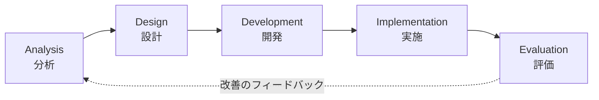
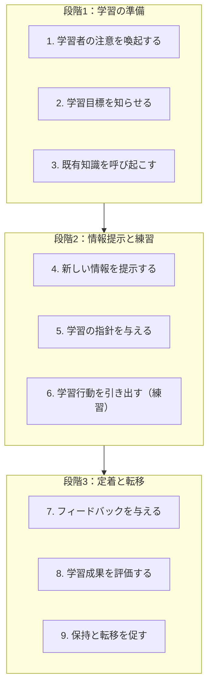

# インストラクショナルデザイン入門

学びを設計する——研修・eラーニング・OJTで成果を出すための基本フレームワーク

| 項目 | 内容 |
|---|---|
| カテゴリー | ビジネススキル |
| 難易度 | 入門 |
| 所要時間 | 約200分（全8レッスン） |
| 公開日 | 2026-05-18 |
| 最終更新日 | 2026-05-18 |
| コースURL | https://skillup.college/courses/business/instructional-design-basics/ |

## 対象者

「教育」「研修」という言葉は知っているが、本格的に学んだ経験がない社会人。人事・教育企画・採用研修に関わる管理職、OJTトレーナー、組織開発担当、eラーニング企業の企画担当の方。生成AIを活用した研修設計に興味がある方も対象。「じっくり理論を学びたい」というより「業務で明日から使える設計の型を学びたい」という実務志向の方に特に推奨。

## 前提知識

特になし。企業研修や教育・OJTに関わった経験があると理解が早いが、必須ではない。

## 学習目標

- インストラクショナルデザインの考え方と、研修・教育を「設計」する意義を理解する
- ADDIEモデルを使って研修・教材の制作プロセスを段階的に進められる
- ブルームのタキソノミーを使い、観察可能な学習目標を書き分けられる
- ガニェの9教授事象とARCSモデルを教材設計に組み込める
- カークパトリックの4段階で評価設計ができ、研修の成果を測れる
- 70-20-10とマイクロラーニングを活かし、研修と現場のバランスを設計できる
- 生成AI・LXD・xAPIなどデジタル時代のID実装の選択肢を理解する

## コース概要

「研修を作ってほしい」「動画教材を整理してほしい」「OJTの仕組みを考えてほしい」——人事・教育担当者は、こうした依頼を日常的に受けます。同じ時間とコストをかけても、学習者の行動が変わるものと、変わらないものに分かれます。両者を分けるのが「設計」の有無です。本コースでは、世界中で50年以上使われてきた古典的なID（インストラクショナルデザイン）のフレームワーク——ADDIE・ガニェの9教授事象・ARCSモデル・ブルームのタキソノミー・カークパトリックの4段階評価——を整理し、そのうえに2025〜2026年の最新動向（マイクロラーニング・学習体験デザイン・生成AI活用・xAPI）を重ねて学べる構成にしました。理論を「使える形」に翻訳することを優先しています。

## 学習の流れ

レッスン1〜2で、ID全体の考え方と最も基本的な設計フレームワーク「ADDIEモデル」を押さえます。レッスン3〜5は、教材設計の中核となる3つのツール——学習目標の書き方（ブルーム）、学習プロセスの設計（ガニェ）、学習意欲のデザイン（ARCS）——を順番に学びます。レッスン6で「評価」を扱い、研修の成果をどう測るかをカークパトリックの4段階で整理します。レッスン7で現場のバランス（70-20-10とマイクロラーニング）に視野を広げ、最後のレッスン8でデジタル時代のID実装（SAM・LXD・生成AI・xAPI）と、コース修了後の学習方向を案内します。前半（レッスン1〜2）は「全体像」、中盤（レッスン3〜6）は「設計と評価の核」、後半（レッスン7〜8）は「広がりと最新動向」という三段構えです。

## レッスン一覧

| No. | タイトル | 概要 | 所要時間 |
|---|---|---|---|
| 1 | インストラクショナルデザインとは何か——「学びを設計する」考え方 | IDの定義、「設計」が必要な理由、研修・eラーニング・OJT・マニュアルへの適用範囲を整理する | 25分 |
| 2 | ADDIEモデル——もっとも使われる設計フレームワーク | Analysis→Design→Development→Implementation→Evaluation の5ステップとフィードバックループ、強みと弱みを学ぶ | 25分 |
| 3 | 学習目標を立てる——ブルームのタキソノミーと観察可能な目標 | 認知・情意・精神運動の3領域、認知レベル6段階、「わかる」を「説明できる」に変換する書き方を学ぶ | 25分 |
| 4 | ガニェの9教授事象——学習を支援する9つの働きかけ | 「注意を喚起する」から「学習の般化を促す」までの9段階と、教材設計への落とし込みを学ぶ | 25分 |
| 5 | ARCSモデル——学習者の意欲をデザインする | Attention・Relevance・Confidence・Satisfactionの4要素で学習動機を構造化し、教材に組み込む方法を学ぶ | 25分 |
| 6 | 評価設計——カークパトリックの4段階とROI | 反応・学習・行動・結果の4段階と、レベル5（ROI）まで含めた評価設計の作り方を学ぶ | 25分 |
| 7 | 70-20-10とマイクロラーニング——研修と現場のバランス | 70-20-10の法則、コルブの経験学習サイクル、マイクロラーニング、パフォーマンスサポートの位置づけを学ぶ | 25分 |
| 8 | デジタル時代のID——生成AI・LXD・xAPI・次の学習 | SAM、学習体験デザイン（LXD）、生成AIによる教材生成・AIチューター、SCORM・xAPI・cmi5、コース修了後の学習方向を案内する | 25分 |

---

## レッスン1：インストラクショナルデザインとは何か——「学びを設計する」考え方

（所要時間：25分）

### このレッスンで学ぶこと

- インストラクショナルデザイン（ID）の定義を理解する
- なぜ研修や教育に「設計」が必要かを説明できる
- IDが活用される場面（研修・eラーニング・OJT・マニュアル）を把握する
- 本コース全体の見取り図を持つ

---

「研修を1つ作ってください」と依頼されたとき、あなたは何から始めるでしょうか。多くの人は、いきなりスライドを開いて、伝えたい内容を並べ始めます。これが、研修が「思った成果につながらない」最大の原因です。本コースでは、その代わりに使える「設計の型」を、世界中で50年以上使われてきたフレームワークを軸に整理していきます。

### インストラクショナルデザインとは

インストラクショナルデザイン（Instructional Design、以下ID）は、日本語では「教育設計」「教授設計」と訳されます。学習目標を達成するために、学習者・内容・方法・評価をひとまとまりとして設計する考え方と技術の総称です。

ここで大事なのは、IDは「教える側」のものではなく、「学ぶ側の成果」を中心に置くということです。「何を教えたか」ではなく「学習者が何をできるようになったか」を基準に、研修・教材・OJTを組み立てる発想です。

> **💡 ポイント**
> IDは「特別な教育理論」ではなく、「学習者がゴールに到達するための仕組みを意識的に作る」という発想の総称です。理科の授業も、新人研修も、Web上のeラーニングも、優れたものはたいてい、IDの考え方で組み立てられています。

### なぜ「設計」が必要なのか

「教育に設計など必要なのか」と感じる方もいるかもしれません。先生が教えれば、教科書を作れば、研修を実施すれば、学習者は学ぶ——という素朴な見方も、まだ多くの現場で残っています。

しかし、現実はそう単純ではありません。

- 同じ研修を受けたはずなのに、参加者によって行動の変化に大きな差が出る
- 「わかりやすかった」とアンケートで好評だった研修が、現場で活かされない
- 受講者の知識レベルがばらばらで、難しすぎる人・物足りない人が同居する
- 評価項目を後から考えると、何を測ればよいかわからない

これらは、内容そのものが悪いのではなく、「目標→学習者→方法→評価」の設計が抜けているために起きる問題です。設計があるだけで、こうしたずれの多くは事前に防げます。

> **🔰 初学者の方へ**
> 「いいコンテンツを作る」と「いい研修を設計する」は別物です。コンテンツは「素材」、設計は「料理の手順」に近いものです。優れたシェフは、よい素材を持っていても、必ず段取り表を作ります。研修も同じです。

### IDが活用される場面

IDが対象にする範囲は、想像より広いものです。

#### 1. 企業研修・社員教育

新入社員研修、管理職研修、コンプライアンス研修、技術研修——企業の中で行われる教育活動はすべてIDの対象になります。

#### 2. eラーニング

LMS（学習管理システム）に載せるオンラインコース、動画教材、確認テスト——これらは典型的なID設計の成果物です。本コースを掲載しているスキルアップカレッジ自身も、IDの考え方で設計されています。

#### 3. OJT（On-the-Job Training）

現場での実務教育もIDの対象です。「先輩がなんとなく教える」OJTから、「目標・進捗・評価が明示されたOJT」へと作り替えるのは、IDの典型的な仕事です。

#### 4. マニュアル・業務手順書

業務マニュアル、操作手順書、社内ポータルのヘルプ——これらも「学習を支援する道具」としてIDの対象に含まれます。「読めば誰でも作業できる」マニュアルは、設計されたマニュアルです。

#### 5. 学校教育・大学教育

授業設計、シラバス、ルーブリック——学校教育の現場では、ずっとIDの考え方が研究されてきました。日本では熊本大学大学院教授システム学専攻（鈴木克明先生らが牽引）が代表的な研究拠点です。

> **📝 補足**
> 「インストラクショナルデザイン」と聞くと特殊な専門領域に感じるかもしれませんが、本質は「学ぶ側の成果から逆算して教える側の活動を設計する」という考え方です。商品企画、サービス設計、UXデザインなどとも発想が近く、ビジネスパーソンがほかの領域で培ったスキルが活きやすい分野でもあります。

### IDの歴史を駆け足で

IDの考え方の系譜を、ざっくり押さえておきます。

- **1940〜1960年代**：第二次大戦中の米軍の大量訓練ニーズが、近代的なIDの出発点になった。フロリダ州立大学などで体系化が進む
- **1965年**：ロバート・ガニェが『The Conditions of Learning』を発表。後のレッスン4で扱う「9教授事象」の原型ができる
- **1970〜1980年代**：ADDIEモデルが米軍の訓練体系の中で実用化される。本コースのレッスン2のテーマ
- **1987年**：ジョン・ケラーが「ARCSモデル」を提唱（レッスン5のテーマ）
- **1990年代以降**：eラーニングの普及で、IDの実務適用が一気に広がる
- **2010年代以降**：マイクロラーニング、学習体験デザイン（LXD）、xAPIなどの新しい潮流
- **2020年代**：生成AIによる教材生成、AIチューター、AIロールプレイなど、IDの実装が大きく変わる時期

> **💡 ポイント**
> IDは50年以上の歴史を持つ「枯れた」領域でありながら、生成AIの登場で大きく揺さぶられている分野でもあります。本コースでは、古典的フレームワーク（ガニェ・ADDIE・ARCS・カークパトリック）を尊重しつつ、その上で2026年の最新動向（生成AI・LXD・xAPI）も扱います。

### このコースの全体像

本コースは8レッスンで構成されています。

- **レッスン2**：ADDIEモデル——もっとも使われる設計フレームワーク
- **レッスン3**：学習目標を立てる——ブルームのタキソノミーと観察可能な目標
- **レッスン4**：ガニェの9教授事象——学習を支援する9つの働きかけ
- **レッスン5**：ARCSモデル——学習者の意欲をデザインする
- **レッスン6**：評価設計——カークパトリックの4段階とROI
- **レッスン7**：70-20-10とマイクロラーニング——研修と現場のバランス
- **レッスン8**：デジタル時代のID——生成AI・LXD・xAPI・次の学習

前半（レッスン1〜2）で「全体像」、中盤（レッスン3〜6）で「設計と評価の核」、後半（レッスン7〜8）で「広がりと最新動向」、という三段構えです。

### このサイト自身が「IDのケーススタディ」

少し裏側の話をします。本コースを載せているスキルアップカレッジというサイト自体が、ID理論に沿って設計されています。

- **学習目標**：各レッスンの冒頭に「このレッスンで学ぶこと」を明示
- **既有知識の呼び起こし**：レッスンの冒頭で「前のレッスンの振り返り」を入れる
- **構造化された情報**：見出し・箇条書き・表で内容を整理
- **確認クイズ**：各レッスンの末尾でテスト、各レッスン5〜7問
- **総復習テスト**：コース末尾で全体を確認
- **用語集**：本文中の用語を即座に確認可能
- **モチベーション設計**：難易度を「入門」に絞り、ARCS的な「自信」を持たせる構成

レッスンを進めるなかで「あ、今学んだ理論が、このコースの構造そのものだ」と気づく瞬間があれば、それは学習転移の入り口です。

> **🔰 初学者の方へ**
> IDの面白いところは、学べば学ぶほど、自分が日常的に触れている教材・研修・マニュアルの「設計の良し悪し」が見えるようになることです。自分が「学ぶ側」として接している教材を、「設計する側」の目で見直す習慣がつきます。これが、本コースで身につく最大の財産かもしれません。

### まとめ

このレッスンでは、以下のことを学びました。

- インストラクショナルデザイン（ID）は、学習者の成果から逆算して、内容・方法・評価を設計する考え方
- 「いいコンテンツを並べる」と「いい研修を設計する」は別物
- IDは企業研修・eラーニング・OJT・マニュアル・学校教育など幅広い場面で活用される
- 1940年代の米軍訓練に源流を持ち、ガニェ・ADDIE・ARCSなど50年以上の蓄積がある
- 2020年代は生成AI・LXD・xAPIなどで実装が大きく変化している
- スキルアップカレッジ自身もID理論に沿って設計されたケーススタディ

次のレッスンでは、世界中の研修現場でもっとも使われているフレームワーク「ADDIEモデル」を学びます。5つのステップ（分析→設計→開発→実施→評価）を順番に追えば、「設計を飛ばす」失敗が起きにくくなる——その骨格を身につけましょう。

---

### 確認クイズ

このレッスンの理解度をチェックしましょう。

#### Q1. インストラクショナルデザイン（ID）の説明として最も適切なものはどれか？

- [x] 学習者の成果から逆算して、内容・方法・評価をひとまとまりとして設計する考え方
- [ ] 教える側が伝えたい内容を効率よく並べる技術
- [ ] AIだけが扱える特殊な領域
- [ ] 教科書の見栄えをデザインする技術

> **解説**
> IDの中心は「学ぶ側の成果」です。「何を教えたか」ではなく「学習者が何をできるようになったか」を基準に、研修・教材・OJTを組み立てる発想で、内容・方法・評価をひとまとまりとして設計します。

#### Q2. 「設計」が研修・教育に必要な理由として、本レッスンで挙げられていないものはどれか？

- [ ] 同じ研修でも受講者によって行動変化に差が出る
- [ ] 「わかりやすかった」と好評でも現場で活かされないことがある
- [ ] 受講者の知識レベルがばらばらで、難しすぎる／物足りない人が出る
- [x] 設計なしで作ると、必ず違法な内容になる

> **解説**
> 設計が必要な理由は「行動変化のばらつき」「評価とのずれ」「学習者レベルのばらつき」など、結果の質に関わる問題が中心です。違法性は設計の有無と直接の関係はありません。

#### Q3. IDが対象にする場面として、本レッスンで紹介されていないものはどれか？

- [ ] 企業研修・社員教育
- [ ] eラーニング・LMS上のコース
- [ ] OJT（現場での実務教育）
- [x] 株式売買のタイミングを判断する金融工学

> **解説**
> IDの対象は、企業研修・eラーニング・OJT・マニュアル・学校教育など「学習を支援する場面」全般です。金融工学はIDの対象ではありません。

#### Q4. IDの歴史に関する本レッスンの説明として最も適切なものはどれか？

- [ ] IDは2020年代に生まれた新しい分野である
- [ ] IDは学校教育のみで研究されてきた領域である
- [x] 1940年代の米軍訓練に源流を持ち、50年以上の蓄積がある古典的かつ進化し続ける分野である
- [ ] IDは日本でしか使われていない概念である

> **解説**
> IDは第二次大戦中の米軍の大量訓練ニーズを源流に、フロリダ州立大学などで体系化が進み、ガニェ・ADDIE・ARCSなど50年以上の蓄積があります。一方、生成AIの登場で2020年代に大きな変化を迎えている分野でもあります。

#### Q5. 本レッスンで述べられた「スキルアップカレッジ自身がIDのケーススタディ」とはどういう意味か？

- [ ] スキルアップカレッジが教育機関として認可を受けている、という意味
- [ ] 開発に時間がかかった、という意味
- [x] このサイト自体が、学習目標の明示・既有知識の呼び起こし・確認クイズなどID理論に沿って設計されている
- [ ] このサイトのデザインがおしゃれである、という意味

> **解説**
> スキルアップカレッジは、学習目標の明示・前レッスンの振り返り・構造化された情報・確認クイズ・用語集など、ID理論に沿った設計を採用しています。レッスンを進めるなかで「学んだ理論がこのサイトの構造そのもの」と気づくことで、学習転移を高める意図があります。

#### Q6. 本コースの構成として、本レッスンで紹介された三段構えはどれか？

- [ ] 入門→中級→上級
- [x] 全体像（レッスン1〜2）→設計と評価の核（レッスン3〜6）→広がりと最新動向（レッスン7〜8）
- [ ] 理論→実技→試験
- [ ] 個人→チーム→組織

> **解説**
> 本コースは、レッスン1〜2で全体像、レッスン3〜6で設計と評価の核（ブルーム・ガニェ・ARCS・カークパトリック）、レッスン7〜8で広がりと最新動向（70-20-10・生成AI・LXD・xAPI）、という三段構えで設計されています。

---

## レッスン2：ADDIEモデル——もっとも使われる設計フレームワーク

（所要時間：25分）

### このレッスンで学ぶこと

- ADDIEモデルの5ステップを順番に説明できる
- 各ステップで何を決め、何を成果物とするかを把握する
- ADDIEの強みと弱みを理解する
- ウォーターフォール型と反復型（アジャイル）の使い分けの感覚を持つ

---

レッスン1では、IDという考え方の全体像を見ました。本レッスンでは、世界中の研修現場でもっとも使われているフレームワーク「ADDIEモデル」を学びます。「研修や教材を設計するとき、何から始めて、どんな順序で進めるか」の標準的な答えを持つことが、今日のゴールです。

### ADDIEモデルとは

ADDIE（アディー）は、設計プロセスの5つのフェーズ——Analysis（分析）／Design（設計）／Development（開発）／Implementation（実施）／Evaluation（評価）——の頭文字を取ったものです。第二次大戦中の米軍訓練の必要性から発展し、1970年代にフロリダ州立大学が体系化したと言われています。

5ステップを並べると、こうなります。



評価から分析へ点線でフィードバックが戻っている点に注目してください。「やったら終わり」ではなく、評価結果を次の設計に活かすサイクルが、ADDIEの本質です。

> **💡 ポイント**
> ADDIEは「順番に並んだ5つのステップ」と理解されがちですが、本来は「評価のたびに上流へ戻る反復モデル」です。新人時代の私は最初これを誤解しており、「実施で終わり」のつもりで研修を作っていて、後から大きく作り直す経験を何度もしました。

### ステップ1：Analysis（分析）

「何のために、誰に、何を教えるか」を最初に明確にするフェーズです。本コースの中で、もっとも軽視されやすく、もっとも結果を左右するステップです。

#### 分析の主要な問い

- **ニーズ**：なぜこの研修・教材が必要か。解決したい業務上の問題は何か
- **学習者**：誰が受講者か。年齢・経験・知識レベル・職務・前提スキル
- **環境**：研修を行う環境は対面か／オンラインか／非同期か。時間・予算・場所の制約は
- **目標**：研修後に学習者は「何ができるようになるべきか」（レッスン3で詳しく扱う）
- **既存リソース**：すでに使える教材・資料・人材は何か

#### 分析の成果物

- ニーズ分析報告書
- ペルソナ（受講者の代表像）
- ゴール定義書（学習目標の素案）
- 制約条件リスト

#### 分析で陥りやすい罠

「忙しいので分析は省略して、すぐ作りに入りましょう」という依頼を受けることがあります。これに乗ると、必ず後で作り直しになります。私の経験では、分析を1日丁寧にやれば、開発を3日短縮できることが多いです。

> **🔰 初学者の方へ**
> 分析でいちばん欠けやすいのが「学習者像」です。「○○部の全員」のような大雑把な定義ではなく、「入社3年目、製品Aを扱った経験はあるが製品Bは初めて、PC操作に不慣れではないが営業ツールには馴染みがない」のように、具体的なペルソナまで掘り下げると、その後の設計が大きく楽になります。

### ステップ2：Design（設計）

分析の結果をもとに、「どんな学習経験を提供するか」の設計図を作るフェーズです。建築でいう「設計図面」にあたります。

#### 設計の主要な決定事項

- **学習目標**：観察可能な動詞で、各レッスンの到達点を書く（レッスン3で詳しく扱う）
- **構造**：レッスンをどんな順番で並べるか。前提知識から段階的に積み上げる
- **方法**：講義・演習・ディスカッション・ロールプレイ・eラーニングをどう組み合わせるか
- **評価方法**：学習目標が達成されたかをどう測るか（レッスン6で詳しく扱う）
- **時間配分**：各レッスンの所要時間、休憩・演習時間の配分

#### 設計の成果物

- コース企画書／プログラムシラバス
- レッスンプラン（時間配分・方法・教材を明示）
- 評価設計書（テスト・観察・課題などの設計）

#### 設計の精度が結果を決める

開発フェーズに入ると「もう手を入れにくい」状態になります。設計フェーズで90%は決まる、と言われる所以です。逆に言えば、設計が固まれば、開発はそれをコンテンツに落とすだけの作業になります。

> **📝 補足**
> 本コースの `course-plan.md` のレッスン構成表は、まさに設計フェーズの成果物の一例です。各レッスンの slug・title・description・estimated_time を一覧化することで、開発フェーズに入る前に「全体の構成」を見られるようにしています。

### ステップ3：Development（開発）

設計図に従って、実際の教材・コンテンツを作るフェーズです。

#### 開発の主要な作業

- **教材制作**：スライド資料、講師用ガイド、ワークシート、動画教材、eラーニングのコンテンツ
- **テスト・課題作成**：確認クイズ、演習問題、ロールプレイのシナリオ
- **環境構築**：LMSへの登録、配信設定、受講者向け案内資料
- **試行（パイロット）**：少人数で試運転し、問題点を洗い出す

#### 開発で陥りやすい罠

設計を飛ばして開発から始めると、後で「全体の整合性が取れない」「方向性がずれる」事態が頻発します。スライドを作りながら設計を考える、という進め方は、できあがるものの質を下げます。

> **💡 ポイント**
> 開発フェーズでは、パイロット（試運転）を必ず1回は挟みます。本番受講者の代表に近い5〜10名で試して、わかりにくい箇所・時間配分のずれ・課題の難易度を確認します。これだけで、本番のクオリティが大きく上がります。

### ステップ4：Implementation（実施）

教材を実際に学習者に届けるフェーズです。

#### 実施の主要な活動

- **告知・申込み**：対象者への案内、受講登録
- **当日運営**：講師・受講者・運営の三者をスムーズにつなぐ
- **受講中サポート**：質問対応、進捗確認、つまずきのフォロー
- **完了管理**：修了判定、修了証発行

#### 実施で陥りやすい罠

- 講師の説明だけに頼り、受講者の理解度を確認しない
- 質問が出にくい雰囲気で進めてしまう
- 受講者の経験レベルが想定と大きく違っても、軌道修正しない

> **⚠️ 注意**
> 実施フェーズで「予想と違う」ことに気づいたら、その場で軌道修正を試みつつ、必ずメモを残してください。次のサイクル（評価→分析）で活かすための一次データになります。

### ステップ5：Evaluation（評価）

実施した結果を測定し、次のサイクルに活かすフェーズです。

#### 評価の主要な活動

- **形成的評価**：研修中・直後に行う評価（理解度確認・アンケート）
- **総括的評価**：研修終了後の評価（行動変化・業務成果）
- **改善点の特定**：どこを次回修正するかを特定する
- **次サイクルへのインプット**：分析フェーズへのフィードバック

評価設計の中核はレッスン6で扱う「カークパトリックの4段階」ですが、概要だけ先取りしておくと、次の4レベルで評価します。

1. **反応**：受講者の満足度（アンケート）
2. **学習**：知識・スキルが身についたか（テスト）
3. **行動**：現場で行動が変わったか（観察・上司評価）
4. **結果**：業務成果が変わったか（売上・離職率・生産性）

#### 評価で陥りやすい罠

多くの研修が、レベル1（反応）の満足度アンケートだけで完結します。これでは「学んだか」「行動が変わったか」「成果につながったか」が見えません。レベル2以上の評価を最初から設計に組み込むことが重要です。

> **🔰 初学者の方へ**
> 評価は「研修が終わった後にやること」ではなく、「設計フェーズで決めておくこと」です。「研修後に何ができるようになるべきか（学習目標）」と「それをどう測るか（評価方法）」はセットで考えます。

### ADDIEの強み

ADDIEがいまも世界中で使われている理由は、3つに整理できます。

**1つ目：構造が明確で誰でも追える**

5ステップの順序が明確で、初心者でも「次に何をすればよいか」が見えます。チームで共通言語として使いやすい強みがあります。

**2つ目：成果物が各ステップで定義できる**

各フェーズで作るもの（成果物）が決まっているため、進捗管理がしやすくなります。

**3つ目：評価から分析へのフィードバックループ**

評価結果を次の分析にフィードバックするサイクルが組み込まれており、改善が累積する設計になっています。

### ADDIEの弱み

一方で、批判もあります。

**1つ目：時間がかかる**

すべてのステップを順に進めると、設計に何週間も要することがあります。スピードが求められる場面では重すぎることがあります。

**2つ目：ウォーターフォール型の限界**

設計フェーズで決めたことを途中で変えにくい構造になりがちです。学習者の反応を見ながら柔軟に変えたい場面では、不自由を感じます。

**3つ目：評価が後回しになりやすい**

最終フェーズに評価があるため、実務では「時間切れで評価まで届かない」事態が起きやすい構造です。

これらの弱みに応える形で、2010年代以降に台頭してきたのが「アジャイル型」のID手法です。代表例がレッスン8で紹介する SAM（Successive Approximation Model）です。

### ウォーターフォール型と反復型の使い分け

「ADDIE（ウォーターフォール）と SAM（アジャイル）はどちらが正しいか」と問われることがありますが、両者は対立するものではなく、目的によって使い分けるものです。

| 場面 | 向いている手法 |
|---|---|
| 大規模で要件が固まっている研修（コンプライアンス・新人研修など） | ADDIE |
| スピード重視・要件が変動する研修（DX人材育成・新サービス研修など） | SAM・アジャイル型 |
| 既存教材の改善・小規模な改修 | SAM・反復型 |
| 認証・標準化が必要な教材（業界標準カリキュラムなど） | ADDIE |

迷ったら、最初はADDIEで全体像を作り、運用後の改善を反復で回す——というハイブリッドが現実的です。

> **💡 ポイント**
> 「フレームワークを完璧に守る」ことが目的化すると、本来の目的（学習者の成果）から外れます。ADDIEはあくまで「考える順序の指針」です。プロジェクトの規模・予算・期限に応じて、ステップを軽くしたり省略したりするのも、現場では当たり前に行われます。

### まとめ

このレッスンでは、以下のことを学びました。

- ADDIEは Analysis（分析）→Design（設計）→Development（開発）→Implementation（実施）→Evaluation（評価）の5ステップからなる、もっとも使われる設計フレームワーク
- 5ステップは一方通行ではなく、評価から分析へフィードバックする反復サイクル
- 各ステップに成果物が定義され、チームで進捗を管理しやすい
- 強みは「構造の明確さ」「成果物の定義」「改善サイクル」
- 弱みは「時間がかかる」「変更しにくい」「評価が後回しになりやすい」
- ADDIE（ウォーターフォール）とSAM（アジャイル）は対立ではなく、目的による使い分け

次のレッスンでは、ADDIEの「Design（設計）」フェーズで最初に決めるべき「学習目標」の書き方を学びます。ブルームのタキソノミーを使って、「わかる」を「説明できる」に変換する技術を身につけましょう。

---

### 確認クイズ

このレッスンの理解度をチェックしましょう。

#### Q1. ADDIEモデルの5ステップの順序として正しいものはどれか？

- [ ] Design→Analysis→Development→Implementation→Evaluation
- [x] Analysis→Design→Development→Implementation→Evaluation
- [ ] Analysis→Design→Implementation→Development→Evaluation
- [ ] Implementation→Analysis→Design→Development→Evaluation

> **解説**
> ADDIEは Analysis（分析）→Design（設計）→Development（開発）→Implementation（実施）→Evaluation（評価）の5ステップです。最後の評価から、次のサイクルの分析にフィードバックするのが本来の構造です。

#### Q2. ADDIEの「Analysis（分析）」フェーズで決めるべきこととして、最も適切なものはどれか？

- [ ] スライドの色とフォント
- [x] ニーズ・学習者像・環境・目標・既存リソース
- [ ] 講師の交通費精算ルール
- [ ] LMSのライセンス契約条件

> **解説**
> 分析フェーズでは、「なぜこの研修が必要か（ニーズ）」「誰に向けてか（学習者）」「どんな環境で実施するか」「何ができるようになる必要があるか（目標）」「使える既存リソース」を整理します。

#### Q3. ADDIEモデルにおける「評価から分析へのフィードバック」の意味として最も適切なものはどれか？

- [x] 評価で得られた知見を次のサイクルの分析に活かす、改善が累積する仕組み
- [ ] 評価が悪かったら、研修自体を廃止すること
- [ ] 評価の結果を受講者本人だけにフィードバックすること
- [ ] 評価の結果を経営層にしか共有しないこと

> **解説**
> ADDIEは一方通行ではなく、評価結果を次の分析にフィードバックする反復サイクルです。改善が累積する設計が、ADDIEの本質的な強みの一つです。

#### Q4. ADDIEの弱みとして、本レッスンで挙げられていないものはどれか？

- [ ] 時間がかかる
- [ ] ウォーターフォール型で途中変更が難しい
- [ ] 評価が時間切れで後回しになりやすい
- [x] 評価フェーズが存在しない

> **解説**
> 評価（Evaluation）はADDIEの5番目のフェーズとして明確に存在しますが、実務では「時間切れで届かない」ことがある、という弱みは挙げられました。「評価フェーズが存在しない」は誤りです。

#### Q5. ADDIE と SAM（アジャイル型ID）の関係として、本レッスンの説明と一致するものはどれか？

- [ ] ADDIEは古く、SAMが完全に置き換えた
- [ ] SAMはADDIEの一部である
- [x] 両者は対立ではなく、規模や目的によって使い分ける、または組み合わせる
- [ ] ADDIEは大企業、SAMは中小企業向けという区別

> **解説**
> ADDIE（ウォーターフォール型）とSAM（アジャイル型）は対立するものではなく、プロジェクトの規模・予算・期限・要件の固まり方によって使い分けるものです。大規模な認証研修にはADDIE、要件が変動する研修にはSAM、というように両者の強みを活かす運用が現実的です。

#### Q6. ADDIEの設計フェーズの成果物として、本レッスンで紹介されたものはどれか？

- [ ] 経費精算書
- [ ] LMSのバックアップファイル
- [x] コース企画書／レッスンプラン／評価設計書
- [ ] 受講者の社員番号一覧

> **解説**
> 設計フェーズでは、コース企画書（プログラムシラバス）、レッスンプラン（時間配分・方法・教材を明示）、評価設計書（テスト・観察・課題の設計）などが主要な成果物です。「建築の設計図面」に相当する役割を持ちます。

---

## レッスン3：学習目標を立てる——ブルームのタキソノミーと観察可能な目標

（所要時間：25分）

### このレッスンで学ぶこと

- ブルームのタキソノミーの3領域と6段階を理解する
- 観察可能な動詞を使って学習目標を書ける
- 「わかる」「理解する」を具体的な動詞に変換できる
- 学習目標が研修全体を貫く理由を把握する

---

レッスン2では、ADDIEモデルの全体像を学びました。設計フェーズで最初に決めるのが「学習目標」です。本レッスンでは、世界中の教育現場で50年以上使われている「ブルームのタキソノミー」を軸に、観察可能な学習目標を書く技術を身につけます。

### なぜ学習目標から始めるのか

研修や教材を作るとき、内容（コンテンツ）から考え始める人が多いものです。これが、研修が「なんとなく終わる」最大の原因です。

学習目標から始めると、何が変わるか。

- **内容の取捨選択がしやすくなる**：目標に直結しない内容を削れる
- **評価方法が自然に決まる**：目標を測る方法を考えれば、評価設計になる
- **学習者と期待のすり合わせができる**：研修開始時に「ここまでできるようになる」と共有できる
- **時間配分が決まる**：目標の数とレベルから所要時間が見える

学習目標は、ADDIEの分析フェーズで素案を作り、設計フェーズで確定させ、評価フェーズで達成度を測る——コース全体を貫く軸になります。

> **💡 ポイント**
> 「研修で○○について話しました」は内容の説明であって、学習目標ではありません。学習目標は「受講者が○○できるようになる」と、学習者の行動で書きます。主語が「教える側」ではなく「学ぶ側」に置かれる、ここが核心です。

### ブルームのタキソノミーとは

ブルームのタキソノミー（Bloom's Taxonomy）は、ベンジャミン・ブルームを中心とする教育心理学者グループが1956年に発表した、学習目標の分類体系です。教育のあらゆる場面で使われ、現在もデファクト・スタンダードとして使われています。

ブルームは、学習目標を3つの大きな領域に分けました。

#### 1. 認知領域（Cognitive Domain）

知識・理解・思考に関する目標です。「説明できる」「分析できる」「評価できる」など。本コースではこの領域に絞って詳しく扱います。

#### 2. 情意領域（Affective Domain）

態度・価値観・関心に関する目標です。「興味を持つ」「価値を認める」「内面化する」など。

#### 3. 精神運動領域（Psychomotor Domain）

身体的なスキルに関する目標です。「正確に操作できる」「習熟して動かせる」など。

> **📝 補足**
> 元のブルームの分類は1956年版ですが、2001年にアンダーソンとクラスウォールによって改訂されました。改訂版はより使いやすく、現在の研修現場では改訂版（Revised Bloom's Taxonomy）がよく使われます。本コースでは改訂版を中心に紹介します。

### 認知領域の6段階

改訂版ブルームのタキソノミーは、認知領域を6段階に整理します。下から上へ、複雑さが増していきます。

| レベル | 名称 | 説明 |
|---|---|---|
| 1 | 記憶する（Remember） | 用語・事実・手順を覚えている |
| 2 | 理解する（Understand） | 自分の言葉で説明・要約できる |
| 3 | 応用する（Apply） | 学んだことを新しい場面で使える |
| 4 | 分析する（Analyze） | 構造を分解し、要素間の関係を見出せる |
| 5 | 評価する（Evaluate） | 基準に基づいて判断・批評できる |
| 6 | 創造する（Create） | 新しいアイデア・成果物を生み出せる |

下のレベルが土台になり、上のレベルへ積み上がる構造です。「応用する」前に「理解する」が、「分析する」前に「応用する」が必要、というイメージです。

#### 各レベルの具体例

ある業務知識を例に、6段階で書き分けてみます。テーマは「データ分析」とします。

1. **記憶する**：平均と中央値の違いを答えられる
2. **理解する**：平均と中央値を自分の言葉で説明できる
3. **応用する**：与えられたデータに対して、平均と中央値のどちらが適切か判断して計算できる
4. **分析する**：データの分布を見て、平均と中央値がずれる原因を特定できる
5. **評価する**：他者の分析を見て、選んだ代表値が妥当かを評価できる
6. **創造する**：業務課題に対して、独自の分析設計を構築できる

同じ「データ分析」というテーマでも、目標のレベルによって、必要な学習時間・教材・評価方法がまったく変わります。

> **🔰 初学者の方へ**
> 「うちの研修は最高レベル（創造する）を目指すべき」と考える必要はありません。多くのビジネス研修は、レベル2〜3（理解する・応用する）が現実的なゴールです。レベルの高低は「優劣」ではなく、対象者と目的に合ったレベルを選ぶことが大切です。

### 観察可能な動詞で書く

学習目標を書くときの最大のコツは、「観察可能な動詞」を使うことです。

#### NG例（曖昧な動詞）

- 「○○について理解する」
- 「○○がわかる」
- 「○○を知る」
- 「○○を意識する」

これらの動詞は、外から見ても達成したかどうか判定できません。「理解した」かどうかを、誰がどう測るのでしょうか。

#### OK例（観察可能な動詞）

- 「○○を自分の言葉で説明できる」
- 「○○を3つ以上挙げられる」
- 「○○を選んで計算できる」
- 「○○の妥当性を評価し、判断できる」

これらの動詞は、行動として観察できるため、テスト・課題・実技で達成度を測れます。

#### 各レベルでよく使う動詞

| レベル | よく使う動詞 |
|---|---|
| 1. 記憶する | 列挙する、定義する、名前を挙げる、識別する、再現する |
| 2. 理解する | 説明する、要約する、言い換える、例を挙げる、分類する |
| 3. 応用する | 適用する、計算する、選択する、実行する、実演する |
| 4. 分析する | 比較する、対照する、原因を特定する、構造を分解する |
| 5. 評価する | 評価する、批評する、判断する、推奨する、正当化する |
| 6. 創造する | 設計する、構築する、提案する、組み立てる、生み出す |

> **💡 ポイント**
> 「理解する」「知る」「わかる」を見たら、「具体的に何ができるようになるのか？」と自問してください。観察可能な動詞に変換できれば、目標としての精度が上がります。

### 学習目標の書き方の型——ABCDモデル

目標を書くときに使いやすい型に「ABCDモデル」があります。

- **A（Audience）**：誰が
- **B（Behavior）**：何をできるようになる
- **C（Condition）**：どんな条件で
- **D（Degree）**：どの程度の精度・基準で

#### 例

> 新入営業職（A）は、当社の主力製品3点について（C）、顧客の業種別ニーズに合わせた提案ポイントを（C）、自分の言葉で5分以内に説明できる（B+D）

長すぎる場合は、AとCを暗黙にして、BとDだけ書くこともあります。それでも「○○できる」「△△まで」が明示されていれば、目標として機能します。

#### 短いバージョン

> 主力製品3点について、業種別の提案ポイントを5分以内に説明できる

> **📝 補足**
> ABCDモデルは厳密に守る必要はありません。「観察可能な動詞」「達成基準」「条件」の3要素が含まれていれば、形式は柔軟でかまいません。むしろ、組織内で同じ書き方の型を共有することのほうが、運用上は重要です。

### 学習目標と評価をセットで考える

学習目標を書くとき、必ずセットで「評価方法」を考えます。

| 学習目標 | 適した評価方法 |
|---|---|
| 用語を列挙できる（記憶） | 選択式テスト、穴埋め問題 |
| 概念を説明できる（理解） | 短文記述、口頭発表 |
| 計算を選んで実行できる（応用） | 実技問題、ケーススタディ |
| 構造を分析できる（分析） | 事例分析レポート |
| 判断を正当化できる（評価） | ディベート、判断課題 |
| 新しい提案を構築できる（創造） | プロジェクト課題、企画書作成 |

「評価方法が決まらない学習目標」は、目標として未完成です。書いた目標を見て、評価方法がぱっと浮かばないなら、目標を書き直すサインです。

> **⚠️ 注意**
> 評価方法を考えると、コストや実施可能性が見えてきます。「全員にプロジェクト課題を出すのは無理」となれば、目標のレベルを下げるか、評価対象者を絞るか、選択肢が出てきます。設計の早い段階でこの調整ができることが、学習目標を立てる最大のメリットです。

### ありがちな失敗パターン

入門者がはまりやすい失敗を整理します。

#### 1. 動詞が曖昧

「理解する」「知る」「意識する」のままで放置してしまう。観察可能な動詞に置き換える。

#### 2. 目標数が多すぎる

1レッスンに10〜20の目標を盛り込んでしまう。1レッスンあたり3〜5個が適切な目安です。

#### 3. レベルが揃わない

「記憶する」目標と「創造する」目標を同じレッスンに並べてしまう。レベルが大きく違うと、所要時間や教材も変わるため、整理が必要です。

#### 4. 学習者の現状から離れている

入社1か月の新人に「経営戦略を評価できる」（レベル5）は無理です。学習者の前提知識から、無理のないレベル設定をする必要があります。

#### 5. 業務との接続が薄い

「○○を分析できる」と書いてあっても、業務でその分析を使う場面がなければ、研修の意味が薄れます。業務上の必要性とつながった目標を書くことが大切です。

> **🔰 初学者の方へ**
> 学習目標を書く練習は、最初は時間がかかります。私も新人時代、1つの研修の目標を書くのに半日かかっていました。慣れてくると、業務要件を聞きながら頭の中で目標が浮かぶようになります。地道に書く練習を重ねることが、IDの基礎体力を作ります。

### まとめ

このレッスンでは、以下のことを学びました。

- 学習目標は「学ぶ側の行動」で書き、コース全体を貫く軸になる
- ブルームのタキソノミーは認知・情意・精神運動の3領域に分け、認知領域は6段階で整理する
- 認知6段階：記憶する→理解する→応用する→分析する→評価する→創造する
- 「わかる」「知る」「理解する」などの曖昧な動詞を、観察可能な動詞に変換する
- ABCDモデル（誰が・何を・どんな条件で・どの程度）が書き方の型として有効
- 学習目標と評価方法はセットで考える
- 1レッスン3〜5個、学習者の前提に合ったレベル設定、業務との接続が大切

次のレッスンでは、学習目標を達成するための「教え方の流れ」を設計するフレームワーク——ガニェの9教授事象——を学びます。「導入→説明→演習→確認」の暗黙のリズムを、9段階で明示化する技術です。

---

### 確認クイズ

このレッスンの理解度をチェックしましょう。

#### Q1. 学習目標を書くときに使うべき動詞として最も適切なものはどれか？

- [ ] 「○○について理解する」
- [ ] 「○○がわかる」
- [x] 「○○を自分の言葉で説明できる」
- [ ] 「○○を意識する」

> **解説**
> 学習目標は「観察可能な動詞」で書きます。「理解する」「わかる」「意識する」は外から達成度を判定できないため、目標としては不適切です。「説明できる」「列挙できる」「計算できる」など、行動として測れる動詞を使います。

#### Q2. ブルームのタキソノミー（改訂版）の認知領域の6段階を低い順に並べたものとして正しいものはどれか？

- [x] 記憶→理解→応用→分析→評価→創造
- [ ] 記憶→応用→理解→評価→分析→創造
- [ ] 理解→記憶→応用→分析→創造→評価
- [ ] 創造→評価→分析→応用→理解→記憶

> **解説**
> 改訂版ブルームのタキソノミーの認知6段階は、低い順に「記憶する→理解する→応用する→分析する→評価する→創造する」です。下のレベルが土台になり、上のレベルへ積み上がる構造です。

#### Q3. ブルームのタキソノミーの3つの領域として、本レッスンで紹介されていないものはどれか？

- [ ] 認知領域
- [ ] 情意領域
- [ ] 精神運動領域
- [x] 経済領域

> **解説**
> ブルームのタキソノミーの3領域は、認知領域（知識・思考）、情意領域（態度・価値観）、精神運動領域（身体的スキル）です。経済領域は含まれません。

#### Q4. ABCDモデルの「D（Degree）」が指すものとして最も適切なものはどれか？

- [ ] 学習者の所属部署
- [x] どの程度の精度・基準で達成するか
- [ ] 研修の難易度
- [ ] 評価者の役職

> **解説**
> ABCDモデルは Audience（誰が）・Behavior（何ができるようになる）・Condition（どんな条件で）・Degree（どの程度の精度・基準で）の4要素です。Dは「どこまでできれば達成」を測る基準を指します。

#### Q5. 学習目標と評価方法の関係として最も適切なものはどれか？

- [ ] 学習目標は重要だが、評価方法は不要
- [ ] 評価方法は研修終了後に考えればよい
- [x] 学習目標と評価方法はセットで考える。評価方法が思い浮かばない目標は未完成
- [ ] 評価は形式的なもので、設計時には考えない

> **解説**
> 評価方法が決まらない学習目標は未完成です。設計の早い段階で「目標と評価」をセットで考えると、コスト・実施可能性も見えてきます。これが学習目標を立てる最大のメリットの一つです。

#### Q6. 入門者がはまりやすい学習目標の失敗として、本レッスンで挙げられていないものはどれか？

- [ ] 動詞が曖昧（「理解する」のまま）
- [ ] 目標数が多すぎる
- [ ] レベルが揃わない
- [x] 目標を英語で書いてしまう

> **解説**
> 入門者がはまりやすい失敗は、曖昧な動詞・目標数の多さ・レベルの不揃い・学習者の現状からの乖離・業務との接続の薄さ、などです。英語で書くこと自体は失敗ではありません（むしろグローバル組織では英語が標準）。

---

## レッスン4：ガニェの9教授事象——学習を支援する9つの働きかけ

（所要時間：25分）

### このレッスンで学ぶこと

- ガニェの9教授事象の全体像を理解する
- 9つの事象を「準備→情報提示→定着・転移」の3段階で捉えられる
- 各事象が研修や教材のどの場面に対応するかを把握する
- 自分の研修を9事象でチェックする視点を持つ

---

レッスン3では、学習目標を「観察可能な動詞」で書く技術を学びました。本レッスンでは、その目標を達成するための「教え方の流れ」を設計するフレームワーク——ガニェの9教授事象——を学びます。「導入→説明→演習→確認」のような暗黙のリズムを、9段階で明示化したものです。

### ガニェの9教授事象とは

ガニェの9教授事象（Gagné's Nine Events of Instruction）は、ロバート・ガニェが1965年の著書『The Conditions of Learning』で提唱した、学習を促進するための9つの教授活動です。認知心理学の情報処理モデルに基づいており、「学習者の脳が情報を取り込み、整理し、定着させる過程」に対応するように設計されています。

9つの事象は、大きく3つの段階に分けて捉えると見通しが立ちます。



「準備→提示→定着」という流れは、人間の認知プロセスに沿った設計です。それぞれの事象を順に見ていきます。

> **💡 ポイント**
> 9事象を全部覚える必要はありません。最初は「準備3つ・提示3つ・定着3つ」という3×3の構造で押さえ、必要に応じて各事象の具体的活動に踏み込むのが現実的です。

### 段階1：学習の準備

#### 事象1：学習者の注意を喚起する（Gain attention）

学習が始まる前に、学習者の注意を引きつけ、心を学習モードに切り替える働きかけです。

**具体例**：

- 業務上の課題エピソードを共有する
- 受講者を驚かせるデータや事実を提示する
- 簡単な問いかけや小ワークから始める
- 動画・画像で関心を喚起する

> **🔰 初学者の方へ**
> 冒頭5分の設計で、その後の学習効果が大きく変わります。「いきなり本題に入る」ではなく、「学習者の注意を学習対象に向ける」工夫を必ず入れます。例えばコース企画書のタイトルとサブタイトルも、注意喚起の役割を果たします。

#### 事象2：学習目標を知らせる（Inform learners of objectives）

レッスン3で書いた学習目標を、学習者に明示する事象です。

**具体例**：

- レッスン冒頭で「このレッスンが終わったら、○○できるようになります」と伝える
- 教材の最初に「学習目標」セクションを置く
- 受講前に研修の目的・到達点を案内する

学習目標が明確だと、学習者は「自分が今、何を学んでいるか」「ゴールまでどこまで来たか」を把握でき、能動的に学習に取り組めます。

> **📝 補足**
> 本コースの各レッスン冒頭にある「このレッスンで学ぶこと」セクションは、まさに事象2に対応します。スキルアップカレッジ自体が9教授事象に沿って設計されている、と気づくと、改めて構造の意図が見えてきます。

#### 事象3：既有知識を呼び起こす（Stimulate recall of prior learning）

新しい情報を取り込む前に、関連する既有知識を呼び起こす働きかけです。新知識を「ゼロから」ではなく「既存の知識構造に紐づける」ことで、定着が大きく向上します。

**具体例**：

- 前のレッスンの振り返りから始める
- 学習者の業務経験を尋ねる
- 似た概念との比較から入る
- 簡単な復習クイズから始める

> **💡 ポイント**
> 本コースの各レッスン冒頭の「レッスン○○では○○を学びました」という振り返りも、事象3に該当します。連続したレッスンで前のレッスンを呼び起こすことで、学習の積み重ねが効果的になります。

### 段階2：情報提示と練習

#### 事象4：新しい情報を提示する（Present the content）

学習目標に対応する新しい情報・スキル・概念を伝える事象です。9事象の中でも、もっとも時間を割く中心部分です。

**具体例**：

- 講義・スライドでの説明
- 動画教材の視聴
- 文章・図表の提示
- デモンストレーション

ここで大事なのは、「網羅」ではなく「学習目標に必要な情報に絞る」ことです。情報量が多すぎると、認知負荷が上がり、定着が下がります。

> **⚠️ 注意**
> 「これも教えたい」「これも知っておいてほしい」と情報を盛り込みすぎる失敗が、新人IDのもっとも多い落とし穴です。学習目標に直結しない情報は、付録・参考資料として別にする勇気が必要です。

#### 事象5：学習の指針を与える（Provide learning guidance）

学習者が新情報を理解・整理しやすくなる「考え方の補助線」を与える事象です。

**具体例**：

- 概念図・関係図・構造図を示す
- 類比・比喩で説明する
- チェックリスト・テンプレートを提供する
- 「重要なポイント」「やってはいけないこと」を明示する

例えば本レッスンの冒頭で示した「9事象を3段階に整理する」概念図は、事象5の典型です。情報を整理する補助線が、理解を加速します。

#### 事象6：学習行動を引き出す（Elicit performance、練習）

学習者に実際に手を動かしてもらう事象です。読む・聞くだけでなく、答える・書く・操作することで、知識が「使える形」になります。

**具体例**：

- 確認問題に答える
- ワークシートに記入する
- ロールプレイで演じる
- ケーススタディに取り組む
- 実機で操作する

「アウトプット」を入れることが、定着の鍵です。情報提示だけのコースが定着しにくいのは、事象6が抜けているからです。

> **💡 ポイント**
> 「練習が成果を作る」というのは、教育心理学のもっとも頑健な発見の一つです。1時間の研修なら、最低でも10〜15分は何らかのアウトプット時間を確保するのが目安です。

### 段階3：定着と転移

#### 事象7：フィードバックを与える（Provide feedback）

学習者の行動・回答に対して、「正解か」「どこが違うか」「どう直せばよいか」を返す事象です。

**具体例**：

- 確認問題の正答と解説を即座に提示する
- 演習の発表に対してコメントを返す
- ロールプレイ後の振り返りを行う
- 課題提出に対して個別フィードバックを返す

フィードバックは、できるだけ即時に、具体的に行うほど効果が高くなります。

> **🔰 初学者の方へ**
> 本コースの確認クイズで、各問題に「解説」が付いているのは、事象7に対応します。「正解か不正解か」だけでなく、「なぜそうなのか」を返すことで、学習者の理解が深まります。

#### 事象8：学習成果を評価する（Assess performance）

学習目標が達成されたかを、客観的に測る事象です。レッスン6で詳しく扱う「評価設計」の中核になります。

**具体例**：

- レッスン末の確認クイズ
- コース末の総合テスト
- 課題・レポート提出
- 実技試験・ロールプレイ評価

事象7（フィードバック）が「形成的評価」だとすると、事象8は「総括的評価」にあたります。両者を組み合わせて、学習者の到達度を測ります。

#### 事象9：保持と転移を促す（Enhance retention and transfer）

学習内容を「研修の場限り」で終わらせず、業務に持ち帰って活かせるよう働きかける事象です。

**具体例**：

- 業務に持ち帰る「明日からの一歩」を考えさせる
- 学んだことを別の文脈に応用する課題を出す
- フォローアップ研修を組み込む
- 受講後の上司との面談で実践状況を確認する

「研修後の業務適用」までを設計に組み込むことが、ID理論のもっとも実務的なエッセンスです。

> **⚠️ 注意**
> 多くの研修が事象6（演習）まではよく設計されますが、事象9（転移促進）が抜けがちです。「研修受講者の業務行動が変わらない」と感じたら、事象9の設計を見直すのが効果的です。

### 9事象は固定の順序か

9事象は「典型的な順序」を示すものですが、すべての研修で1から9まで順に進める必要はありません。

- 短時間のマイクロラーニングでは事象7・8を簡略化する
- 反復型の研修では事象3〜6を複数サイクル回す
- eラーニングでは事象8を学習者の進度に応じて配置する

「9事象すべてが完全に揃っているか」をチェックリスト的に使うのが、現場での実践的な活用方法です。

> **💡 ポイント**
> 既存の研修や教材を見直すとき、「9事象のうち、抜けているもの・弱いものはどれか」を確認すると、改善ポイントが見つかります。私は、新規案件を受けるたびに、最初の打ち合わせメモを9事象でチェックする習慣をつけています。

### 9事象を本コースで確かめる

スキルアップカレッジは、9教授事象に沿って設計されています。本コースの1レッスンを見てみましょう。

| 事象 | 本コースのどこに対応するか |
|---|---|
| 1. 注意喚起 | レッスン冒頭の「研修を作ってください」「いきなりスライドを書き始めますか」のような問いかけ |
| 2. 目標明示 | レッスン冒頭の「このレッスンで学ぶこと」セクション |
| 3. 既有知識の呼び起こし | レッスン冒頭の「レッスン○○では○○を学びました」 |
| 4. 情報提示 | 本文の本体（各セクションの内容） |
| 5. 学習の指針 | 表・図・「ポイント」「初学者の方へ」「注意」のコールアウト |
| 6. 学習行動の誘発 | 確認クイズの設問 |
| 7. フィードバック | クイズの解説 |
| 8. 評価 | レッスン末の確認クイズ、コース末の総復習テスト |
| 9. 保持と転移 | レッスン末の次レッスン予告、コース末の「次の学習方向」案内 |

これは偶然ではなく、9事象に対応するように設計しているからです。

### まとめ

このレッスンでは、以下のことを学びました。

- ガニェの9教授事象は、学習を支援する9つの教授活動を示すフレームワーク
- 9事象は「学習の準備（1〜3）」「情報提示と練習（4〜6）」「定着と転移（7〜9）」の3段階で整理できる
- 段階1：注意喚起・目標明示・既有知識の呼び起こし
- 段階2：新情報の提示・学習の指針・学習行動の誘発（練習）
- 段階3：フィードバック・評価・保持と転移
- 9事象は固定の順序ではなく、研修の規模・形式に応じて使い分ける
- 既存の研修を9事象でチェックすると、抜けている事象が改善のヒントになる
- 本コース自体も9事象に対応した設計になっている

次のレッスンでは、学習者の「やる気」をデザインするフレームワーク——ARCSモデル——を学びます。注意・関連性・自信・満足感の4要素で、学習者のモチベーションを構造化する技術です。

---

### 確認クイズ

このレッスンの理解度をチェックしましょう。

#### Q1. ガニェの9教授事象を提唱した人物として正しいものはどれか？

- [ ] ベンジャミン・ブルーム
- [x] ロバート・ガニェ
- [ ] ジョン・ケラー
- [ ] ドナルド・カークパトリック

> **解説**
> ガニェの9教授事象は、ロバート・ガニェが1965年の著書『The Conditions of Learning』で提唱しました。ベンジャミン・ブルームはタキソノミー（レッスン3）、ジョン・ケラーはARCSモデル（レッスン5）、ドナルド・カークパトリックは評価の4段階（レッスン6）の提唱者です。

#### Q2. 9教授事象の3段階に含まれないものはどれか？

- [ ] 学習の準備（事象1〜3）
- [ ] 情報提示と練習（事象4〜6）
- [ ] 定着と転移（事象7〜9）
- [x] 商品販売（事象10〜12）

> **解説**
> ガニェの9教授事象は3段階9事象です。「商品販売」は存在しません。学習の準備（注意・目標・既有知識）→情報提示と練習（提示・指針・誘発）→定着と転移（フィードバック・評価・保持転移）という構造です。

#### Q3. 事象3「既有知識を呼び起こす」の働きとして最も適切なものはどれか？

- [x] 新知識を既存の知識構造に紐づけることで定着を高める
- [ ] 学習者の学歴を確認する
- [ ] 受講前の予習を強制する
- [ ] 学習者のIQを測定する

> **解説**
> 事象3は、新しい情報を取り込む前に関連する既有知識を呼び起こすことで、新知識を既存の知識構造に紐づけ、定着を大きく向上させる働きかけです。「前のレッスンの振り返り」「学習者の経験を尋ねる」などが典型的な実装方法です。

#### Q4. 学習者に実際に手を動かしてもらう（演習・練習）に対応する事象はどれか？

- [ ] 事象1：注意喚起
- [ ] 事象4：新情報の提示
- [x] 事象6：学習行動の誘発（練習）
- [ ] 事象9：保持と転移

> **解説**
> 事象6は、学習者に確認問題・ワーク・ロールプレイ・操作などを通じて手を動かしてもらう事象です。「アウトプット」を入れることが定着の鍵で、情報提示だけのコースが定着しにくいのは事象6が抜けているからです。

#### Q5. 多くの研修で抜けがちな事象として、本レッスンで指摘されたものはどれか？

- [ ] 事象1：注意喚起
- [ ] 事象4：情報提示
- [ ] 事象6：練習
- [x] 事象9：保持と転移（業務への持ち帰り）

> **解説**
> 多くの研修は事象6（演習）までは設計されますが、事象9（学んだことを業務に転移させる働きかけ）が抜けがちです。研修受講者の業務行動が変わらないと感じたら、事象9の設計を見直すのが効果的です。

#### Q6. 9教授事象の使い方として、本レッスンで推奨されたアプローチはどれか？

- [ ] 全ての研修で必ず1から9まで順番通りに実施する
- [x] 既存の研修や教材を9事象でチェックし、抜けている・弱い事象を改善ポイントとして特定する
- [ ] 9事象は学校教育のみで使い、企業研修では使わない
- [ ] 9事象は完全に暗記してから使う必要がある

> **解説**
> 9事象は「典型的な順序」を示すもので、すべての研修で1〜9を順に進める必要はありません。むしろ既存の研修・教材を「9事象のうち抜けているもの・弱いもの」でチェックリスト的に活用するのが、現場での実践的な使い方です。

---

## レッスン5：ARCSモデル——学習者の意欲をデザインする

（所要時間：25分）

### このレッスンで学ぶこと

- ARCSモデルの4要素（注意・関連性・自信・満足感）を理解する
- 各要素を高めるための具体的な工夫を知る
- 学習意欲を「個人の性質」ではなく「設計の対象」として捉える
- 研修・教材のモチベーション設計を点検できる

---

レッスン4では、ガニェの9教授事象で学習プロセスの流れを設計する方法を学びました。本レッスンでは、学習者の「やる気」をデザインするフレームワーク——ARCSモデルを学びます。「やる気がないのは学習者の問題」と片づける前に、設計でできることがたくさんあります。

### ARCSモデルとは

ARCSモデル（アークス・モデル）は、フロリダ州立大学のジョン・ケラー（John Keller）が1987年に提唱した、学習動機をデザインするためのフレームワークです。学習意欲を構成する4要素の頭文字を取った名称です。

- **A**：Attention（注意）——「面白そう」
- **R**：Relevance（関連性）——「やる意味がある」
- **C**：Confidence（自信）——「やればできそう」
- **S**：Satisfaction（満足感）——「やってよかった」

ケラーは「学習者のモチベーションは、本人の性格や意欲だけで決まるのではなく、教材・研修の設計によって大きく左右される」と主張しました。この立場から、設計者が能動的にモチベーションをデザインするための4要素を整理したのが、ARCSモデルです。

> **💡 ポイント**
> 「うちの受講者はやる気がない」と嘆く前に、自分の研修・教材がARCSの4要素を満たしているかを確認することが、最初の打ち手です。やる気がない受講者を変えるより、研修の設計を変えるほうが、たいてい現実的です。

### A：Attention（注意）——「面白そう」と思わせる

最初の3秒で、学習者の注意を引きつけられるかどうか。動画でいう「最初のサムネイル」、本でいう「タイトルと表紙」、研修でいう「冒頭の数分」に相当します。

#### 注意を高める3つの戦略

ケラーは、注意を引く方法を3つに分けて整理しています。

**1つ目：知覚的喚起（Perceptual Arousal）**

驚きや好奇心を刺激する。意外な事実、印象的な画像・動画、予想外の問いかけなど。

例：

- 「平均年収が同じ2つの会社で、なぜ生活実感が大きく違うのか」
- 「あなたが採用に関わった人材の3割が、なぜ最初の1年で辞めるのか」

**2つ目：探究心の喚起（Inquiry Arousal）**

考えるべき問い・パズルを投げかける。

例：

- 「○○と△△、どちらが正しいでしょうか。理由を考えてみてください」
- 「この事例で、なぜこういう結果になったと思いますか」

**3つ目：変化性（Variability）**

教材の形式・進行を単調にしない。講義・動画・演習・ディスカッションを組み合わせるなど。

例：

- 10分の説明の後に5分の演習
- 動画→クイズ→ディスカッションのサイクル
- ストーリー形式と図表形式の切り替え

> **🔰 初学者の方へ**
> 「注意」は冒頭だけでなく、レッスンの途中でも保つ必要があります。1時間以上の研修なら、15〜20分ごとに「注意のリフレッシュ」を入れるのが目安です。長時間の単調な講義は、もっとも注意が落ちる形式です。

### R：Relevance（関連性）——「やる意味がある」と感じさせる

「これを学んで、自分にどんな良いことがあるのか」が見えると、学習意欲は大きく高まります。「やらされている感」が出ると、その逆になります。

#### 関連性を高める3つの戦略

**1つ目：目的との関連付け（Goal Orientation）**

学習者個人のキャリア・業務目標と研修内容を結びつける。

例：

- 「この研修を終えると、評価面談で○○を語れるようになります」
- 「この技術を身につけると、××のような業務に着手できるようになります」

**2つ目：動機との一致（Motive Matching）**

学習者の関心・興味のあり方に合わせて、教え方を変える。

例：

- 競争心がある層には、進捗を可視化するスコア表示
- 協力的な層には、グループワーク中心
- 自律性を重視する層には、自分のペースで進められる選択肢

**3つ目：親しみやすさ（Familiarity）**

学習者の経験や日常に近い例を使う。

例：

- 営業職向けには営業の事例で説明する
- エンジニア向けには技術的なメタファーを使う
- 自社の製品・業務を題材にする

> **⚠️ 注意**
> 関連性が伝わらないまま新しい内容を提示すると、「で、これって何の役に立つの？」という反応が出ます。レッスンの冒頭で「なぜこれを学ぶ必要があるのか」を1〜2文で示すだけで、その後の集中度が変わります。

### C：Confidence（自信）——「やればできそう」と感じさせる

「自分には難しすぎる」「やっても無理だ」と感じると、学習はそこで止まります。逆に、「やればできそう」「自分にもできた」という感覚があれば、学習は継続します。

#### 自信を高める3つの戦略

**1つ目：学習要件の明確化（Learning Requirements）**

学習目標・到達点・評価基準を最初に明示する。「ゴールが見える」だけで、不安が大きく減ります。

例：

- レッスン冒頭の「このレッスンで学ぶこと」
- 評価基準の事前共有
- 完了の目安時間の明示

**2つ目：成功機会の提供（Success Opportunities）**

簡単な課題から始めて、徐々に難易度を上げる。学習者が「できた」を積み重ねられる設計です。

例：

- 確認クイズで、最初の問題は基本的な内容にする
- 演習で、ガイド付き→ガイドなしの順に進める
- 段階的な難易度設定

**3つ目：個人的な統制感（Personal Control）**

学習の進度・順序・方法を学習者がある程度コントロールできるようにする。

例：

- 自分のペースで進められるeラーニング
- 興味のある順番で学べるモジュール構成
- 補足資料を選んで読める仕組み

> **💡 ポイント**
> 自信は、最初の小さな成功体験から育ちます。「いきなり難しい問題」で受講者を試すと、自信を奪うことになりかねません。「できた」を早めに体験してもらうことが、その後の学習を支えます。

### S：Satisfaction（満足感）——「やってよかった」と感じさせる

学習の最後（または途中）に、「やってよかった」という満足感が得られると、次の学習への意欲が生まれます。逆に「結局何が身についたかわからない」と感じると、その学習は記憶からも遠ざかります。

#### 満足感を高める3つの戦略

**1つ目：内発的な強化（Intrinsic Reinforcement）**

学んだ内容を実際に使う機会を提供する。「知識が役に立った」という体験が、もっとも強い満足感を生みます。

例：

- 学んだ直後に業務に近い演習を入れる
- ケーススタディで応用してみる
- グループで互いに教え合う

**2つ目：外発的な報酬（Extrinsic Rewards）**

完了証・認定・公的な評価などの外的報酬。

例：

- 修了証の発行
- 社内認定制度との連動
- バッジ・スコアの可視化

**3つ目：公平性（Equity）**

学習者全員が公平に評価されている感覚。「努力が報われない」「不公平だ」と感じると、満足感は崩れます。

例：

- 評価基準の事前明示と一貫した適用
- フィードバックの質を全員に揃える
- 努力の過程も評価対象に含める

> **🔰 初学者の方へ**
> 満足感は「ご褒美をたくさん用意する」ではなく、「学んだことの価値を実感できる」ことから生まれます。修了証や報酬よりも、「学んだ知識が業務で使えた」「気づきがあった」という内面の充実感のほうが、長期的なモチベーションを生みやすいです。

### ARCSのチェックリスト

研修・教材を設計したら、ARCSの観点でチェックしてみましょう。

| 要素 | チェック観点 |
|---|---|
| A：注意 | 冒頭で学習者の関心を引きつけているか／途中で注意が落ちる長い単調な区間はないか |
| R：関連性 | 「なぜこれを学ぶか」が学習者に伝わっているか／学習者の経験・業務に紐づいた例があるか |
| C：自信 | 学習目標と評価基準が事前に明示されているか／段階的に難易度が上がっているか |
| S：満足感 | 学んだことを使う機会があるか／評価のフィードバックが具体的か |

> **💡 ポイント**
> ARCSの4要素は、教材設計だけでなく、研修案内のメール、コース紹介ページ、講師の話し方など、学習者が触れるすべての接点で確認できます。「告知メールで関連性を訴求できているか」も、ARCSの観点で見直せます。

### ARCSと他のIDフレームワークの関係

ARCSは、ガニェの9教授事象やADDIEと矛盾するものではなく、相互に補完します。

- **ADDIE**：プロジェクト全体の進め方
- **ガニェ9事象**：1レッスン内の教え方の流れ
- **ARCS**：学習者のモチベーションの設計

例えば、ガニェの事象1（注意喚起）は、ARCSのA（注意）と直接対応します。事象2（目標明示）は、ARCSのC（自信）にも貢献します。事象9（保持と転移）は、ARCSのS（満足感）の内発的強化と重なります。

複数のフレームワークを「対立」ではなく「補完」と捉えると、設計の引き出しが広がります。

> **📝 補足**
> ID研究の世界では、ガニェの9事象・ARCS・ADDIEなどの古典的フレームワークは、いずれも「異なる視点から学習を捉えたもの」として共存しています。一つのフレームワークだけで全てを設計しようとすると、視点が狭くなることがあります。

### まとめ

このレッスンでは、以下のことを学びました。

- ARCSモデルは、学習動機の4要素——Attention（注意）・Relevance（関連性）・Confidence（自信）・Satisfaction（満足感）——を整理したフレームワーク
- 学習意欲は「学習者の性質」ではなく「設計の対象」として扱える
- Aは知覚的喚起・探究心・変化性で高める
- Rは目的との関連付け・動機との一致・親しみやすさで高める
- Cは学習要件の明確化・成功機会・統制感で高める
- Sは内発的強化・外発的報酬・公平性で高める
- ARCSはADDIEやガニェ9事象と相互に補完する

次のレッスンでは、「研修の成果をどう測るか」という評価設計のフレームワーク——カークパトリックの4段階——を学びます。「アンケートで終わる研修」を、「行動と成果を測る研修」へ変える方法です。

---

### 確認クイズ

このレッスンの理解度をチェックしましょう。

#### Q1. ARCSモデルの4要素として正しいものはどれか？

- [x] Attention, Relevance, Confidence, Satisfaction
- [ ] Action, Result, Cost, Strategy
- [ ] Awareness, Recognition, Communication, Skills
- [ ] Analysis, Research, Creation, Synthesis

> **解説**
> ARCSは Attention（注意）・Relevance（関連性）・Confidence（自信）・Satisfaction（満足感）の4要素の頭文字です。フロリダ州立大学のジョン・ケラーが1987年に提唱しました。

#### Q2. ARCSモデルの基本的なスタンスとして最も適切なものはどれか？

- [ ] 学習意欲は完全に学習者個人の性格で決まる
- [x] 学習意欲は学習者の性質だけでなく、教材・研修の設計によって大きく左右される
- [ ] 学習意欲は遺伝で決まるため変えられない
- [ ] 学習意欲は給与によってのみ決まる

> **解説**
> ケラーは「学習者のモチベーションは本人の性格や意欲だけで決まるのではなく、教材・研修の設計によって大きく左右される」と主張しました。だからこそ、設計者が能動的にモチベーションをデザインする必要がある、というのがARCSの基本スタンスです。

#### Q3. 「A：注意」を高める戦略として、本レッスンで紹介されていないものはどれか？

- [ ] 知覚的喚起（驚きや好奇心を刺激する）
- [ ] 探究心の喚起（考えるべき問いを投げる）
- [ ] 変化性（教材の形式を単調にしない）
- [x] 強制参加（受講を業務命令にする）

> **解説**
> 注意を高める3戦略は、知覚的喚起・探究心の喚起・変化性です。強制参加は注意を引く戦略ではなく、むしろRelevance（関連性）が伝わらない場合の代替手段で、本来は望ましくありません。

#### Q4. 「R：関連性」を高める方法として最も適切なものはどれか？

- [ ] 学習者の所属とは無関係な抽象例だけで説明する
- [ ] 講師の自慢話を多く入れる
- [ ] 関連性は学習者個人が見つけるべきで、設計者は関与しない
- [x] 学習者個人のキャリア・業務目標と研修内容を結びつける

> **解説**
> 関連性は「学習者にとってのやる意味」を見せることで高まります。学習者個人のキャリア・業務目標と研修内容を結びつける（目的との関連付け）、関心の傾向に合わせる（動機との一致）、学習者の経験に近い例を使う（親しみやすさ）の3戦略があります。

#### Q5. 「C：自信」を高める設計として最も適切なものはどれか？

- [ ] いきなり最高難度の問題で受講者を試す
- [ ] 評価基準は事後に決め、受講者には伝えない
- [x] 学習目標・評価基準を事前に明示し、簡単な課題から段階的に難易度を上げる
- [ ] 学習者のペースに関係なく講師のペースで進める

> **解説**
> 自信は「ゴールが見える」「できたを積み重ねる」「自分でコントロールできる」感覚から育ちます。本レッスンで紹介した3戦略は、学習要件の明確化・成功機会の提供・個人的な統制感です。

#### Q6. 「S：満足感」を高めるもっとも本質的な要素として、本レッスンで強調されたものはどれか？

- [ ] 修了証の発行
- [ ] バッジやスコアの可視化
- [x] 学んだ知識が業務で使える、気づきがあるなどの内発的な強化
- [ ] 修了者へのギフト券プレゼント

> **解説**
> 満足感の本質は、修了証や報酬よりも、「学んだ知識が業務で使えた」「気づきがあった」という内面の充実感（内発的強化）から生まれます。外発的報酬（修了証・バッジ・公的評価）も補助として機能しますが、それだけでは長期的なモチベーションは続きにくいです。

---

## レッスン6：評価設計——カークパトリックの4段階とROI

（所要時間：25分）

### このレッスンで学ぶこと

- カークパトリックの4段階評価の各レベルを理解する
- ROI評価（レベル5）の位置づけを把握する
- 各レベルの測定方法と現実的な実装例を知る
- 評価を「研修後」ではなく「設計時」に組み込む発想を持つ

---

レッスン5まで、研修・教材の設計（学習目標・教える流れ・モチベーション）を学んできました。本レッスンでは、設計したものの「成果をどう測るか」——評価設計を扱います。多くの研修が「アンケートで終わる」のは、評価設計が薄いからです。「学んだか」「行動が変わったか」「成果に結びついたか」を見える化するフレームワークを身につけましょう。

### なぜ評価が大事なのか

評価が不十分だと、次のような事態が起きます。

- 「やった感」はあるが、実際に成果につながっているかわからない
- 上層部から「あの研修、効果あるの？」と問われたときに答えられない
- 改善ポイントが特定できず、毎年同じ研修を繰り返す
- 予算配分の根拠が示せず、研修予算がじりじり削られる

逆に、評価がしっかりしていると、研修は「コスト」から「投資」になります。「○○の研修を実施した結果、現場で△△の指標が□%改善した」と言えれば、研修予算は守りやすくなり、改善も進みます。

> **💡 ポイント**
> 評価は「研修が終わった後にやること」ではなく、「設計フェーズで決めておくこと」です。学習目標（レッスン3）と評価方法は表裏一体で、目標を書くと同時に「どう測るか」も決めるのが鉄則です。

### カークパトリックの4段階評価

ドナルド・カークパトリック（Donald Kirkpatrick）が1959年に提唱した、研修評価のもっとも有名なフレームワークです。研修の効果を4つのレベルで段階的に測ります。

| レベル | 名称 | 測るもの | 測り方の例 |
|---|---|---|---|
| 1 | 反応（Reaction） | 受講者の満足度・印象 | 終了直後のアンケート |
| 2 | 学習（Learning） | 知識・スキルの習得 | 確認テスト・実技試験 |
| 3 | 行動（Behavior） | 現場での行動変化 | 上司・本人インタビュー、観察 |
| 4 | 結果（Results） | 業務指標への影響 | 売上・離職率・生産性などのKPI |

下のレベルから上のレベルへ、測定の難易度・コストは大きく上がっていきます。一方で、上のレベルほど「研修の本当の価値」を示します。

### レベル1：反応（Reaction）

受講者が研修を「どう感じたか」を測るレベルです。終了直後のアンケートが典型です。

#### 測定方法

- 5段階の満足度評価
- 自由記述（「特に役立った点」「改善してほしい点」）
- 推奨度（「同僚に勧めたいか」）

#### 強み

- 測定コストが低く、すぐに結果が得られる
- 講師・運営の改善には直結する

#### 弱み

- 「楽しかった」「わかりやすかった」は、必ずしも学習成果と一致しない
- レベル1だけ高い研修は、「学びが浅い」「研修が娯楽化している」可能性がある

> **⚠️ 注意**
> 「アンケートの満足度が95%だった」という事実だけで、研修が成功したと結論するのは早計です。レベル2以上でも成果が見えてはじめて、研修は機能していると言えます。

### レベル2：学習（Learning）

受講者が「何を学んだか」を測るレベルです。

#### 測定方法

- 研修前後の知識テスト（事前テストとの比較がベスト）
- 実技試験・課題提出
- ロールプレイの観察
- ケーススタディへの回答

#### 強み

- 受講直後に測定でき、学習成果が明確に見える
- ブルームのタキソノミー（レッスン3）と直結し、設計しやすい

#### 弱み

- 「テストで点を取れる」と「業務で使える」はずれることがある
- テスト形式によっては、暗記中心の評価に偏る

> **🔰 初学者の方へ**
> レベル2の評価で大事なのは、「事前テスト」も実施することです。受講後だけの点数では「もともとできていた人」と「研修で身についた人」が区別できません。事前と事後の差分こそが、研修の純粋な学習効果です。

### レベル3：行動（Behavior）

受講者が「現場で行動が変わったか」を測るレベルです。研修の「業務適用」を見るレベルとも言えます。

#### 測定方法

- 受講者本人へのフォローアップインタビュー
- 上司による行動観察評価
- 同僚・部下からの360度評価
- 業務記録（CRMの入力内容、議事録、対応履歴）の分析

#### 測定タイミング

研修終了から **3〜6か月後** が一般的です。直後では行動変化が観察できず、長期すぎると別の要因が混じります。

#### 強み

- 研修の「業務適用」を直接見ることができる
- 「学んだのに使われていない」問題に気づける

#### 弱み

- 測定にコスト・時間がかかる
- 業務環境の影響を受けやすい（上司のサポート、業務上の機会の有無など）

> **💡 ポイント**
> レベル3で測定する場合、研修と現場の橋渡しを設計に組み込みます。「研修後3か月で、学んだことを使った事例を3つ報告する」「上司との1on1で実践を振り返る」などの仕組みを、設計フェーズで組み込みます。

### レベル4：結果（Results）

受講者の行動変化が、組織の業務指標（KPI）にどう影響したかを測るレベルです。

#### 測定方法

- 売上・利益への影響
- 離職率の変化
- 生産性指標（処理件数・所要時間など）の変化
- 顧客満足度
- 安全性指標（事故率など）

#### 測定タイミング

研修終了から **6〜12か月以上後** が一般的です。

#### 強み

- 経営層・スポンサーに研修の価値を示しやすい
- 投資対効果（ROI）の議論に直結する

#### 弱み

- 外部要因（市場環境・季節変動・組織変更）の影響が大きい
- 因果関係の特定が難しい（研修だけが原因か、ほかの要因か）

> **⚠️ 注意**
> 「業績が上がったのは研修のおかげ」と単純に主張するのは危険です。レッスン6（データ分析入門）で扱った「相関と因果」の議論を思い出してください。可能なら、研修を受けたグループと受けていないグループを比較する、複数年のトレンドで見るなどの工夫を入れます。

### レベル5：ROI（投資対効果）——フィリップスの拡張

カークパトリックの4段階を、ジャック・フィリップス（Jack Phillips）が拡張し、5番目のレベルとして「ROI（Return on Investment）」を提案しました。

#### ROIの計算式

```
ROI（%） = (研修によって生まれた金額的便益 − 研修コスト) ÷ 研修コスト × 100
```

例えば、研修コストが500万円で、生産性向上による便益が1,500万円なら、ROI = (1,500 − 500) ÷ 500 × 100 = 200% となります。

#### 強みと弱み

**強み**：

- 経営層との対話で説得力が高い
- 研修予算の正当性を数値で示せる

**弱み**：

- 便益の金額換算が難しい（特に管理職研修・コンプライアンス研修など）
- ROIだけを追うと、短期的な研修に偏りやすい
- すべての研修でROIを測定するのは現実的でない

> **📝 補足**
> ROIを使うかどうかは、研修の性質によって判断します。営業研修・生産性研修のように成果が金額で測りやすいものはROIが使えます。一方、コンプライアンス研修・倫理研修などは「やらなかった場合のリスク回避効果」をROIで示すのは無理があります。

### 「逆ピラミッド」の設計順序

カークパトリックの後継者たち（息子のジェームズ・カークパトリックほか）が提唱した「New World Kirkpatrick Model」では、評価の設計順序を「逆ピラミッド」で進めることを推奨しています。

通常の発想：

```
レベル1 → レベル2 → レベル3 → レベル4
（反応） （学習） （行動） （結果）
```

逆ピラミッドの発想：

```
レベル4 → レベル3 → レベル2 → レベル1
（結果から逆算して設計する）
```

つまり、「最終的に組織のどの指標を改善したいか（レベル4）」を最初に決め、「そのために必要な行動は何か（レベル3）」「その行動に必要な学習は何か（レベル2）」「学習者にどう反応してほしいか（レベル1）」と逆算して研修を設計する、というアプローチです。

この発想は、レッスン3で扱った「学習目標から逆算する」という考え方と直結しています。

> **🔰 初学者の方へ**
> 「結果（レベル4）」から逆算して設計するクセがつくと、研修の「目的」と「内容」がずれません。逆に、レベル1（反応）から積み上げる発想だと、「気持ちよく研修を受けてもらう」だけに最適化され、成果につながらないことがあります。

### 4段階のどこまで測るか

すべての研修で4段階すべてを測る必要はありません。研修の性質・予算・規模に応じて、どこまで測るかを決めます。

| 研修の性質 | 推奨される測定レベル |
|---|---|
| 短時間のマイクロラーニング | レベル1〜2 |
| 一般的な業務スキル研修 | レベル1〜3 |
| 重要な戦略研修・大規模投資 | レベル1〜4（場合によってレベル5） |
| コンプライアンス研修 | レベル2〜3（行動の確実性が重要） |
| 安全研修 | レベル2〜4（事故率という明確な指標がある） |

> **💡 ポイント**
> 「全研修でレベル4まで」と決めると、コストが大きく、結局どの研修も中途半端になります。「研修ごとに何のレベルまで測るか」を事前に決めるのが、現実的な運用方法です。

### 評価設計で陥りやすい罠

#### 1. レベル1だけで完結する

満足度アンケートだけで「研修は成功した」と結論してしまう。レベル2以上を最初から組み込む。

#### 2. 評価方法を後から決める

設計時に決めずに、研修後に「どう評価しよう」と慌てる。事前テスト・事後テストを設計に組み込むには、研修開始前に準備が必要です。

#### 3. 比較対象を持たない

研修受講者の数値だけを見て、「上がった／下がった」と判断する。可能なら、受講していない比較対象（コントロールグループ）と比べる。

#### 4. 短期間で結論する

研修直後の数値だけで成否を判断する。レベル3・4は3か月以上の経過を見る必要があります。

#### 5. 因果関係を断定する

「研修を受けた人の売上が伸びた」だけで「研修のおかげ」と主張する。ほかの要因の影響も含めて、慎重に解釈します。

> **⚠️ 注意**
> 評価は研修担当者・人事だけの仕事ではなく、現場の上司・経営層との協働が必要です。とくにレベル3・4の測定には、現場のサポートが不可欠です。事前に「測定の協力」を関係者と合意しておくと、評価が頓挫しません。

### まとめ

このレッスンでは、以下のことを学びました。

- カークパトリックの4段階評価は、研修効果を「反応・学習・行動・結果」の4レベルで測るフレームワーク
- レベル1（反応）：満足度。コスト低だが研修の本質は測れない
- レベル2（学習）：知識・スキル。事前テストとの差分で見るのがベスト
- レベル3（行動）：現場での行動変化。3〜6か月後に測定
- レベル4（結果）：業務指標への影響。6〜12か月以上後に測定
- レベル5（ROI）：フィリップスが拡張した投資対効果
- 「逆ピラミッド」で結果から逆算して設計するのが本来の発想
- 全研修で4段階すべて測る必要はなく、研修の性質に応じて測定範囲を決める

次のレッスンでは、研修と現場の関係を広い視野で捉える「70-20-10の法則」と、近年急速に広がる「マイクロラーニング」を学びます。フォーマルな研修だけに頼らない学習設計の発想です。

---

### 確認クイズ

このレッスンの理解度をチェックしましょう。

#### Q1. カークパトリックの4段階評価のレベル1〜4を低い順に並べたものとして正しいものはどれか？

- [x] 反応→学習→行動→結果
- [ ] 結果→行動→学習→反応
- [ ] 学習→反応→結果→行動
- [ ] 行動→学習→結果→反応

> **解説**
> カークパトリックの4段階は、レベル1：反応（Reaction）→レベル2：学習（Learning）→レベル3：行動（Behavior）→レベル4：結果（Results）の順で、下から上に測定の難易度と価値が上がります。

#### Q2. レベル1（反応）の測定方法として最も典型的なものはどれか？

- [x] 研修終了直後の満足度アンケート
- [ ] 売上の前後比較
- [ ] 上司による行動観察
- [ ] ROI計算

> **解説**
> レベル1（反応）は受講者の満足度・印象を測るレベルで、終了直後のアンケートが典型です。コストが低くすぐ結果が得られますが、「楽しかった」と学習成果は必ずしも一致しないため、レベル2以上の評価と組み合わせる必要があります。

#### Q3. レベル2（学習）の評価で、本レッスンが推奨するのはどれか？

- [ ] 研修後のテストだけを行う
- [x] 事前テストと事後テストの差分を見る
- [ ] テストは行わず本人の自己評価のみ使う
- [ ] テストは法律で禁止されている

> **解説**
> 事後テストだけでは「もともとできていた人」と「研修で身についた人」が区別できません。事前テストと事後テストの差分が、研修の純粋な学習効果を示します。

#### Q4. レベル3（行動）の測定タイミングとして最も適切なものはどれか？

- [ ] 研修終了直後
- [ ] 研修終了から1週間後
- [x] 研修終了から3〜6か月後
- [ ] 研修終了から5年後

> **解説**
> レベル3は現場での行動変化を測るレベルで、直後では変化が観察できず、長すぎると別の要因が混じります。一般に3〜6か月後の測定が適切とされています。

#### Q5. レベル5（ROI）の説明として最も適切なものはどれか？

- [ ] カークパトリックが1959年に最初から定義した5番目のレベル
- [ ] 日本独自に定義された評価レベル
- [ ] AIによる自動評価のレベル
- [x] ジャック・フィリップスがカークパトリックの4段階を拡張し、投資対効果を5番目のレベルとして提案した

> **解説**
> レベル5（ROI）は、カークパトリックの4段階をジャック・フィリップスが拡張し、研修の投資対効果を金額換算する5番目のレベルとして提案したものです。経営層との対話で説得力がある反面、便益の金額換算が難しい研修も多くあります。

#### Q6. 「逆ピラミッド」の評価設計の発想として最も適切なものはどれか？

- [ ] レベル1から順に積み上げて設計する
- [x] レベル4（結果）から逆算してレベル1まで設計する
- [ ] レベル2だけで設計する
- [ ] 評価は設計に含めない

> **解説**
> New World Kirkpatrick Modelが推奨する「逆ピラミッド」の発想は、「最終的に組織のどの指標を改善したいか（レベル4）」から逆算して、必要な行動（3）→学習（2）→反応（1）と設計する方法です。これにより研修の目的と内容のずれを防げます。

---

## レッスン7：70-20-10とマイクロラーニング——研修と現場のバランス

（所要時間：25分）

### このレッスンで学ぶこと

- 70-20-10の法則の概要と背景を理解する
- コルブの経験学習サイクルを把握する
- マイクロラーニングの考え方と適用範囲を知る
- パフォーマンスサポートの発想を理解する

---

レッスン6まで、研修・教材の設計と評価のフレームワークを学んできました。本レッスンでは、視野を広げて「研修と現場の学習の関係」を考えます。「研修だけで人は育つわけではない」「現場の学習をどう設計するか」という、近年特に重要視されているテーマです。

### 70-20-10の法則とは

70-20-10の法則（または70:20:10モデル）は、1980年代にアメリカの調査機関 Center for Creative Leadership（CCL）が、優れたリーダーの育ち方を調査して整理したフレームワークです。リーダーは次の比率で能力を獲得していた、という調査結果がもとになっています。

- **70%**：業務経験から学ぶ（On-the-Job、業務経験・困難な仕事・修羅場）
- **20%**：他者から学ぶ（薫陶、上司・同僚・メンターからのフィードバック、観察）
- **10%**：研修から学ぶ（フォーマル、研修・eラーニング・書籍）

この比率はあくまで「優れたリーダーが振り返ったときの感覚」で、厳密な数値ではありません。しかし、研修担当者にとって示唆的な発見が含まれています。

> **💡 ポイント**
> 70-20-10は「研修は10%しか効かない」という意味ではありません。「人の成長は、研修だけではなく、業務経験と他者の影響を含む全体で起きる」という事実を、シンプルな比率で示したものです。研修担当者の仕事は「10%を最大化する」だけでなく、「70%と20%を支援する仕組みを作る」ことでもあります。

### 70-20-10の解釈と注意点

70-20-10は近年、批判的な再評価もされています。注意点を整理します。

#### 1. 比率は厳密ではない

元のCCLの調査は、特定の業界・職種・時代のリーダーが対象で、すべての場面に普遍的に当てはまるわけではありません。比率は「目安」として捉えるのが適切です。

#### 2. 業務経験「だけ」では育たない

「現場経験が大事」を「研修は不要」と読み替える誤解があります。実際には、業務経験を学びに変えるための内省・概念化が必要で、そこに「20%（他者）」「10%（研修）」が貢献します。3つはバランスして初めて効果を発揮します。

#### 3. 学習領域によって比率は変わる

技術スキル・コンプライアンス・専門知識などは、フォーマルな研修（10%）の比率が高くなります。一方、リーダーシップ・対人スキルなどは経験（70%）の比率が高くなります。

> **🔰 初学者の方へ**
> 「70-20-10は正確な数字」ではなく「学習の3つの源泉を意識するフレームワーク」と捉えるのが現実的です。研修担当者として大事なのは、「業務経験を学びに変える仕組み」「他者から学ぶ機会」「フォーマル研修」の3つを総合的に設計する視点です。

### コルブの経験学習サイクル

「業務経験から70%学ぶ」と言われても、ただ経験すれば学べるわけではありません。経験を学びに変えるプロセスを構造化したのが、デビッド・コルブの経験学習サイクルです。

コルブは、経験学習を4段階の循環として整理しました。

1. **具体的経験（Concrete Experience）**：実際に何かを体験する
2. **省察的観察（Reflective Observation）**：体験を振り返り、何が起きたかを観察する
3. **抽象的概念化（Abstract Conceptualization）**：観察から「何が言えるか」を整理し、概念や仮説を作る
4. **能動的実験（Active Experimentation）**：作った概念を別の場面で試してみる

このサイクルを回ることで、1つの経験が「次に活かせる学び」になります。逆に、経験しても省察・概念化を行わないと、同じ失敗を繰り返したり、何も学べないまま忙しく過ごしたりします。

> **💡 ポイント**
> 1on1ミーティング、業務後の振り返り、ジャーナリング（業務日誌）、メンタリングなどは、コルブのサイクルを支援する仕組みとして機能します。研修担当者は、「現場で学ぶための仕組み」を、研修以外の場面でも設計できます。

### OJTを「仕組み化」する

「OJT（On-the-Job Training）」は日本企業で広く使われる言葉ですが、運用は組織によって大きな差があります。「先輩に張り付かせる」だけで設計のないOJTは、トレーナーの個人差・指導の偏り・体系性のなさで成果が出にくくなります。

設計されたOJTの典型的な要素：

- **学習目標の明示**：「3か月後に何ができるようになるか」を本人と上司が合意
- **段階的なタスクアサイン**：簡単なタスクから始め、徐々に難度を上げる
- **OJTマニュアル**：教える側のばらつきを減らすための手引き
- **定期的な1on1**：進捗・つまずきを共有し、必要に応じて軌道修正
- **評価とフィードバック**：レッスン6のレベル2〜3を組み込む

OJTは「現場任せ」ではなく、ADDIE（レッスン2）の発想で設計できる対象です。

> **📝 補足**
> 日本の伝統的な「徒弟制度」「背中で教える」文化と、設計されたOJTは別物です。歴史的に「優れた先輩が後輩を見て育てる」という美徳がある一方、その仕組みが属人化・暗黙知化しやすい弱みもあります。70-20-10とコルブのサイクルを意識した設計に置き換えると、再現性が大きく上がります。

### マイクロラーニングとは

マイクロラーニング（Micro Learning）は、1〜5分程度の短時間で学べる教材・コンテンツの総称です。スマートフォン視聴を前提に、業務の合間や移動中に学べる形式が中心です。2010年代後半から急速に広がっています。

#### マイクロラーニングの特徴

- **1コンテンツ＝1テーマ**：1つの動画・記事で扱うのは1つの学習目標
- **短時間**：1〜5分、長くても10分以内
- **モバイルファースト**：スマホ視聴を想定した設計
- **必要なときに学ぶ**：体系的な研修より、必要な瞬間に検索して見る使い方
- **反復しやすい**：短いので何度も見直せる

#### マイクロラーニングが向く場面

- 業務手順・操作マニュアルの参照
- 新しいツールの使い方
- 短い概念・用語の説明
- 直前リマインダー（営業前の確認、安全研修の事前確認など）
- 業務に直結する小さなスキル

#### マイクロラーニングが向かない場面

- 抽象的・複雑な概念の体系的学習
- 対人スキル・ロールプレイが必要な領域
- 議論・対話が学習の中心となる領域
- 長時間の集中が必要な深い学習

> **⚠️ 注意**
> マイクロラーニングはあくまで「形式」であり、「マイクロにすれば学習効果が上がる」わけではありません。学習目標に応じて、マイクロ・フォーマル研修・OJTを組み合わせる発想が必要です。

### パフォーマンスサポート

マイクロラーニングと近い概念に、「パフォーマンスサポート（Performance Support）」があります。これは「業務を行うその瞬間に、必要な情報・道具を提供する」発想です。

例：

- 営業の電話前に、顧客情報と話法のチェックリストが画面に表示される
- 製造現場で、機械操作の動画ガイドがタブレットでいつでも見られる
- 新人のCRM入力時に、入力フォーマットのテンプレートが自動表示される
- AIアシスタントが、業務中の質問にリアルタイムで答える

パフォーマンスサポートは、「学んでから業務をする」ではなく、「業務をしながら学ぶ・支援を受ける」という発想です。研修・教材の延長線上にあり、研修と業務の境界をぼかします。

> **💡 ポイント**
> パフォーマンスサポートを設計する発想で考えると、「研修で全部教える」必要がなくなります。「業務中にすぐ参照できるリソース」があれば、研修は「概観の理解」と「リソースの存在の認知」に絞れます。これは、レッスン4の事象9（保持と転移）にも直結します。

### 学習エコシステムという発想

近年、ID業界では「学習エコシステム（Learning Ecosystem）」という考え方が広がっています。フォーマル研修・OJT・パフォーマンスサポート・マイクロラーニング・コーチング・1on1・ジョブローテーション・社内勉強会など、組織内のあらゆる学習機会を統合的に設計する発想です。

| 学習機会 | 70-20-10での位置づけ |
|---|---|
| フォーマル研修・eラーニング | 10%（研修） |
| マイクロラーニング | 10%〜20%（研修と他者の境界） |
| OJT・コーチング | 20%（他者） |
| 1on1・メンタリング | 20%（他者） |
| パフォーマンスサポート | 70%（業務経験） |
| ジョブローテーション・修羅場経験 | 70%（業務経験） |
| 社内勉強会・コミュニティ | 20%（他者） |

それぞれが単独で機能するだけでなく、相互に補完し合うことで、組織全体の学習能力が上がります。

> **🔰 初学者の方へ**
> 「研修担当者は研修だけを作る人」と狭く捉えると、組織の学習能力は伸びません。「研修・OJT・パフォーマンスサポート・コミュニティのすべての学習機会を、戦略的に設計・編成する人」と捉えると、仕事の幅が大きく広がります。

### まとめ

このレッスンでは、以下のことを学びました。

- 70-20-10の法則は、人が育つ3つの源泉を「業務経験70%・他者20%・研修10%」と整理したもの。比率は目安
- コルブの経験学習サイクル（経験→省察→概念化→実験）が、業務経験を学びに変える
- OJTは「現場任せ」ではなく、設計の対象。ADDIEと同じ発想で組み立てられる
- マイクロラーニングは1〜5分の短時間コンテンツ。業務直結の小さなスキルに向く
- パフォーマンスサポートは「業務をする瞬間に支援を提供する」発想
- 学習エコシステムは、研修・OJT・マイクロ・コーチング・コミュニティを統合的に設計する
- 研修担当者の役割は「研修を作る」から「学習機会を編成する」へ広がる

次のレッスンはコースの最終回です。デジタル時代のID実装——SAM（アジャイル型ID）・学習体験デザイン（LXD）・生成AI活用・xAPI——を扱い、コース修了後の学習方向を案内します。

---

### 確認クイズ

このレッスンの理解度をチェックしましょう。

#### Q1. 70-20-10の法則の比率が示す3つの学習源泉として正しいものはどれか？

- [ ] 研修70%・業務20%・他者10%
- [x] 業務経験70%・他者から20%・研修10%
- [ ] 自学自習70%・座学20%・実習10%
- [ ] 講義70%・テスト20%・課題10%

> **解説**
> 70-20-10は、Center for Creative Leadership（CCL）が優れたリーダーの育ち方を調査した結果で、業務経験70%・他者から学ぶ20%・研修から学ぶ10%と整理したものです。比率は厳密な数値ではなく、目安として捉えるのが適切です。

#### Q2. 70-20-10の法則の解釈として最も適切なものはどれか？

- [ ] 研修は10%しか効かないので、研修担当者は不要
- [ ] 全ての職種で比率は完全に固定である
- [x] 比率は目安で、業務経験・他者・研修の3つの源泉を意識するためのフレームワーク
- [ ] 業務経験「だけ」で全ての学習が完結する

> **解説**
> 70-20-10は厳密な数値ではなく、学習の3つの源泉を意識するフレームワークです。比率は業界・職種・学習領域によって変動します。研修担当者の役割は「10%」を作るだけでなく、「70%と20%を支援する仕組み」を設計することにあります。

#### Q3. コルブの経験学習サイクルの4段階を正しい順序で並べたものはどれか？

- [x] 具体的経験→省察的観察→抽象的概念化→能動的実験
- [ ] 抽象的概念化→具体的経験→省察的観察→能動的実験
- [ ] 能動的実験→省察的観察→具体的経験→抽象的概念化
- [ ] 省察的観察→能動的実験→抽象的概念化→具体的経験

> **解説**
> コルブの経験学習サイクルは、具体的経験→省察的観察→抽象的概念化→能動的実験の4段階を循環する構造です。経験を振り返り、概念化し、新しい場面で試す、というサイクルを回すことで経験が学びに変わります。

#### Q4. マイクロラーニングの特徴として最も適切なものはどれか？

- [ ] 半日〜1日の長時間学習で、深い理解を目指す
- [ ] 必ず対面・集合形式で実施する
- [ ] AI生成のみで作る教材を指す
- [x] 1〜5分の短時間で1つのテーマを扱い、スマホ視聴を前提とした設計

> **解説**
> マイクロラーニングは1〜5分の短時間コンテンツで、1テーマ1コンテンツ、モバイルファースト、必要なときに学ぶ、反復しやすい、といった特徴があります。長時間の集中が必要な深い学習や、抽象的・複雑な概念の体系的学習には不向きです。

#### Q5. パフォーマンスサポートの説明として最も適切なものはどれか？

- [ ] 業務の前にまとめて学ぶ集合研修のこと
- [x] 業務を行うその瞬間に、必要な情報・道具を提供する仕組み
- [ ] 受講者の業務評価の仕組み
- [ ] 報奨金の制度

> **解説**
> パフォーマンスサポートは、「業務をする瞬間に必要な情報・支援を提供する」発想です。営業電話前のチェックリスト、CRM入力時のテンプレート、AIアシスタントによるリアルタイム回答などが典型例で、研修と業務の境界をぼかす設計です。

#### Q6. 「学習エコシステム」の発想として最も適切なものはどれか？

- [ ] 研修だけを設計する
- [ ] OJTだけに依存する
- [x] フォーマル研修・OJT・パフォーマンスサポート・コミュニティなど、組織内のあらゆる学習機会を統合的に設計する
- [ ] 学習を完全にAIに任せる

> **解説**
> 学習エコシステムは、組織内のあらゆる学習機会（研修・OJT・コーチング・1on1・パフォーマンスサポート・社内コミュニティなど）を統合的に設計する発想です。研修担当者の役割を「研修を作る」から「学習機会を編成する」へ広げる視点を提供します。

---

## レッスン8：デジタル時代のID——生成AI・LXD・xAPI・次の学習

（所要時間：25分）

### このレッスンで学ぶこと

- SAM（Successive Approximation Model）の考え方を理解する
- 学習体験デザイン（LXD）の発想を把握する
- 生成AIの研修設計への活用方法を知る
- SCORM・xAPI・cmi5などのeラーニング規格を区別できる
- コース修了後の学習方向を選べる

---

レッスン1〜7で、IDの古典的フレームワーク（ADDIE・ガニェ・ARCS・カークパトリック）と、研修と現場のバランス（70-20-10・マイクロラーニング）を学んできました。最後のレッスンでは、2020年代に急速に広がる「デジタル時代のID」の風景を整理します。生成AI・LXD・xAPIといったキーワードが何を意味するか、コース修了後の学習方向と合わせて案内します。

### SAM——アジャイル型のID

レッスン2の最後で触れた、ADDIE（ウォーターフォール型）と並んで使われるID手法がSAM（Successive Approximation Model）です。マイケル・アレン（Michael Allen）が提唱しました。

#### SAMの基本思想

「完璧な設計図を最初に作る」ADDIEに対し、SAMは「小さく作って、評価し、改善する」を短いサイクルで繰り返します。ソフトウェア開発のアジャイル手法に近い発想です。

SAMには SAM1（簡易版）と SAM2（フル版）がありますが、ここでは考え方の核を押さえます。

#### SAMのサイクル

1. **設計（Design）**：短時間で大まかな設計をする
2. **プロトタイプ（Prototype）**：簡易版を作る
3. **レビュー（Review）**：関係者に見せて評価する
4. **改善（Refine）**：フィードバックを反映して改善する
5. 上記を繰り返す

ADDIEの「Analysis→Design→Development→Implementation→Evaluation」を直列に進めるのと対照的に、SAMは小さなサイクルを多数回します。

#### SAMが向く場面

- 要件が変動する研修（DX人材育成・新サービス研修・スタートアップ環境）
- 既存教材の改善・小規模な改修
- スピード優先のプロジェクト
- 学習者のフィードバックを早く反映したい場合

#### SAMが向かない場面

- 大規模で要件が固まっている認証研修
- コンプライアンス・法令遵守の研修（一定の網羅性が必要）
- 関係者が多く、合意形成に時間がかかる組織

> **💡 ポイント**
> ADDIEとSAMは、対立ではなく「使い分け」です。レッスン2でも述べたとおり、大規模プロジェクトはADDIEで全体を作り、その中の個別レッスン改善はSAMで回す——というハイブリッドが現実的です。

### 学習体験デザイン（LXD）——学習者中心へ

LXD（Learning Experience Design、学習体験デザイン）は、2010年代後半から広がった発想です。「教える側が情報を伝える」から、「学習者がどう体験するか」を中心に置く設計思想です。

#### LXDの特徴

- **学習者中心**：教える内容より、学習者の体験全体を設計する
- **UX的アプローチ**：UIデザイン・UXデザインの発想を学習設計に持ち込む
- **マルチチャネル統合**：研修・eラーニング・モバイル・コミュニティを統合的に設計
- **継続的な改善**：学習者の行動データから改善を繰り返す

#### IDとLXDの関係

「IDとLXDは別物か」と問われることがありますが、両者は対立ではなく、LXDがIDを包含する関係と捉えるのが適切です。

| 軸 | 古典的なID | LXD |
|---|---|---|
| 焦点 | 教える側の設計 | 学習者の体験 |
| 範囲 | 主に研修・教材 | 学習者が触れる全てのタッチポイント |
| データ | 終了時の評価が中心 | 学習中の行動データを継続的に活用 |
| 設計の発想 | 学習目標起点 | 学習目標＋体験設計 |

ID（特にカークパトリックの逆ピラミッド・ARCSモデル）の考え方を発展させたのがLXDです。古典的IDを「軽視」するのではなく、その上に「体験」の視点を重ねる発想です。

#### LXP（Learning Experience Platform）

LXDの広がりとともに、LXP（Learning Experience Platform）と呼ばれるツール群が成長しました。LMSが「コース管理」中心なのに対し、LXPは「学習者の体験統合」中心です。

- 学習者の興味・履歴から推薦するコンテンツを提示
- 社内外の学習リソースを統合（YouTube・LinkedIn Learning・社内マニュアル等）
- 学習者同士のコミュニティ機能
- マイクロラーニング・パフォーマンスサポートとの連携

> **📝 補足**
> 国内市場でLXPはまだ普及途上です。グローバルではEdCast、Cornerstone、Degreed、LinkedIn Learningなどが知られ、国内でもUMUなどが類似機能を提供しています。

### 生成AIの研修設計への活用

2023〜2026年で、IDの実務にもっとも大きな影響を与えたのが生成AIです。具体的な活用例を整理します。

#### 1. 教材の自動生成

- 学習目標から、講義原稿・スライド構成・確認問題を自動生成
- 社内ナレッジ（マニュアル・FAQ）からマイクロラーニング動画台本を作成
- 多言語対応の教材を効率的に作成

#### 2. AIチューター・AIメンター

- 学習者の質問に24時間応答するチャットボット
- 学習進度に応じて、追加教材や別の説明を提示
- 学習者のつまずきパターンを分析して支援

#### 3. AIロールプレイ

- 営業・接客・部下面談などの対人スキル研修で、AIが相手役を務める
- 受講者は無制限に練習でき、その場でフィードバックを受けられる
- 難易度・性格・状況を変えて何度も練習できる

#### 4. 評価の支援

- 自由記述回答の評価を自動化・補助する
- ロールプレイの動画を分析し、フィードバックを生成する
- 学習データから「次に取り組むべき内容」を提案する

#### 生成AI活用で変わる、設計者の役割

「教材を作る人」から「学習体験を設計する人」へ。生成AIは教材制作の生産性を大きく高める一方、「何を学ばせるか」「どんな体験を提供するか」の判断は、人間の設計者の仕事として残ります。むしろ、これらの判断の比重が大きくなります。

> **⚠️ 注意**
> 生成AIが作る教材には、ハルシネーション（誤った情報を断定的に書く）のリスクがあります。専門領域・法令関連・固有名詞は必ず人間が事実確認します。AIは「下書きを高速で作る道具」として使い、最終チェックは人間が行うのが2026年現在のベストプラクティスです。

### eラーニング規格——SCORM、xAPI、cmi5

eラーニングの世界では、教材とLMS（学習管理システム）の互換性を保つために「規格」が使われます。代表的なものを整理します。

#### SCORM（Sharable Content Object Reference Model）

2000年代から使われている古典的な規格。「進捗率」「完了」「テスト得点」など基本的な学習データをLMSに送信できます。

- **強み**：広く普及しており、ほぼすべてのLMSが対応
- **弱み**：LMSの中での学習しか記録できない／詳細な行動データは取れない

#### xAPI（Experience API、別名 Tin Can API）

2013年に登場した新世代の規格。LMSの外も含め、あらゆる学習活動を「○○が△△を□□した」という構造で記録します。

- **強み**：LMS外の学習（動画視聴・現場行動・モバイル学習）も記録できる／詳細な行動データが取れる
- **弱み**：実装コストがやや高い／データの活用には別途分析の仕組みが必要

xAPIのデータは LRS（Learning Record Store）と呼ばれるデータベースに保存されます。これにより、研修だけでなく、現場・モバイル・SNS・社内コミュニティでの学習行動を統合的に分析できるようになりました。

#### cmi5

SCORMの後継として、xAPIをLMS内で使いやすくした規格。SCORMの「コース管理」とxAPIの「詳細データ」の両方を活用できます。米国国防総省が推奨する規格として、徐々に広がっています。

#### 規格の選び方の目安

- **SCORM**：既存LMSとの互換性を重視する場合の標準
- **xAPI**：LMS外の学習・詳細な行動分析を活かしたい場合
- **cmi5**：両方の強みを活かしつつ、SCORMから移行したい場合

> **📝 補足**
> 多くの企業はまだSCORMが中心ですが、データドリブンな学習設計が広がるなかで、xAPI・cmi5への移行が徐々に進んでいます。LMSを新規導入する際は、xAPI対応を確認するのが2026年の標準的な判断です。

### データドリブンな学習設計

xAPI・LRSの登場により、「学習データから設計を改善する」発想が広がっています。

#### よく分析される指標

- どのコンテンツがよく見られているか／途中で離脱されているか
- どの問題で受講者がつまずいているか
- 学習開始から終了までの時間分布
- 学習者の興味カテゴリ・行動パターン
- 学習と業務指標の相関分析

#### 注意点

データドリブンな設計は強力ですが、データの解釈には慎重さが必要です。レッスン6（カークパトリック）で触れたとおり、「相関は因果ではない」原則を忘れないこと。データが示す事実と、設計者の判断は別物です。

> **💡 ポイント**
> 「データがあれば自動的に設計が改善される」は幻想です。データは「気づきの素材」を提供し、設計者の判断を支援するもの。「データに振り回される」のではなく、「データを使って判断の質を上げる」発想が大切です。

### このコースを振り返って

8レッスンを通じて、次のことを扱ってきました。

- **レッスン1**：IDの全体像。「設計する」考え方
- **レッスン2**：ADDIEモデル。設計の標準フレーム
- **レッスン3**：学習目標。ブルームのタキソノミーと観察可能な動詞
- **レッスン4**：ガニェの9教授事象。教える流れの設計
- **レッスン5**：ARCSモデル。学習者の意欲のデザイン
- **レッスン6**：カークパトリックの4段階。評価設計
- **レッスン7**：70-20-10とマイクロラーニング。研修と現場のバランス
- **レッスン8**：デジタル時代のID。SAM・LXD・生成AI・xAPI

このうち、レッスン1〜6は古典的フレームワークで、50年以上世界中の現場で使われ続けています。レッスン7〜8は、ここ10〜20年で急速に広がっている新しい潮流です。「古い理論はもう使えない」のではなく、「古い理論の上に、新しい視点を重ねる」のが現代のIDの姿勢です。

### コース修了後の学習方向

さらに深く学びたい方への、3つの方向をご紹介します。

#### 1. 古典理論を原典で読む

- ガニェ『The Conditions of Learning』（教育心理学・認知主義の古典）
- ブルーム『Taxonomy of Educational Objectives』
- ケラー『Motivational Design for Learning and Performance』（ARCSの体系的解説）
- カークパトリック『Evaluating Training Programs』

日本語訳が出ているものもあります。原典は時代背景を含めて読むと、フレームワークの設計意図がより深く理解できます。

#### 2. 教育工学・学習科学を体系的に学ぶ

- 教育工学会の論文・年次大会
- 熊本大学大学院教授システム学専攻のオンライン公開講義
- ATD（米国の人材開発組織）のリソース

学術的な背景に踏み込みたい方向けです。

#### 3. 実務で試して、振り返る

- 自分が担当する研修・OJT・教材に、本コースのフレームワークを当ててみる
- 既存の研修を「9事象でチェック」「カークパトリックの4段階で評価」してみる
- 改善した結果を、社内で共有する
- 業界の研修担当者コミュニティに参加する

理論を実務に適用し、振り返ることで、知識が「使える形」に定着します。

> **🔰 初学者の方へ**
> 「全部学ばないと」と焦る必要はありません。本コースで扱った内容を、まずは1つ自分の業務で試してみるところから始めてください。「学習目標を観察可能な動詞で書く」だけでも、研修・教材の質は大きく変わります。

### IDは「人の可能性を引き出す」仕事

最後に、本コース全体を通じて伝えてきたメッセージをまとめます。

インストラクショナルデザインは、単なる「教材作成のテクニック」ではありません。「人がどう学び、どう成長するか」を深く理解したうえで、その学びを支える環境を設計する仕事です。研修・eラーニング・OJT・マニュアル・パフォーマンスサポート——形式は何であれ、根底には「学ぶ側の成果を最大化する」という発想があります。

生成AI時代になり、コンテンツ作成のコストは大きく下がりました。だからこそ、「何を学ばせるか」「どう体験させるか」「成果をどう測るか」を考える設計者の役割は、むしろ大きくなっています。技術は道具で、設計は人間の判断です。

本コースで学んだフレームワークを、皆さんの現場で活かしていただければ嬉しいです。「研修を作ってください」と頼まれたときの最初の一手が、本コース受講前と変わっていれば、それが何よりのお礼です。

### 講師の最後のメッセージ

私が新人時代に「ADDIEを軽視」していた話を、レッスン1とレッスン2でお話ししました。当時の私は、「設計より作ることが大事」「経験を積めばわかる」と思っていました。

10年以上経って思うのは、フレームワークは「制約」ではなく「思考の足場」だということです。慣れてくると、頭の中で「これはガニェの事象3が抜けているな」「ここはARCSのR（関連性）が弱い」と自然に判断できるようになります。フレームワークが意識から消えるくらい身体化することが、ID実務者の成長段階の一つです。

本コースを最後まで進んでくださって、ありがとうございました。皆さんが現場で設計するすべての研修・教材が、誰かの学びと成長を支える瞬間になることを願っています。

最後に総復習テストで、コース全体を振り返ってみましょう。

### まとめ

このレッスンでは、以下のことを学びました。

- SAMはADDIEと並ぶアジャイル型のID手法。短いサイクルで小さく作って改善する
- 学習体験デザイン（LXD）は、学習者の体験全体を中心に置く設計思想
- 生成AIは教材自動生成・AIチューター・AIロールプレイ・評価支援などで設計を変えつつある
- 設計者の役割は「教材を作る」から「学習体験を設計する」へシフトしている
- eラーニング規格はSCORM・xAPI・cmi5があり、xAPIはLMS外の学習も記録できる
- データドリブンな学習設計は強力だが、データの解釈には慎重さが必要
- 古典理論（ガニェ・ブルーム・ケラー・カークパトリック）と新しい潮流を「対立」ではなく「重ねる」発想が大切

---

### 確認クイズ

このレッスンの理解度をチェックしましょう。

#### Q1. SAM（Successive Approximation Model）の説明として最も適切なものはどれか？

- [x] 短いサイクルで小さく作って評価・改善を繰り返す、アジャイル型のID手法
- [ ] ADDIEを完全に置き換える次世代モデル
- [ ] 認知心理学の理論モデル
- [ ] 評価専用のフレームワーク

> **解説**
> SAMはマイケル・アレンが提唱したアジャイル型のID手法で、「短いサイクルで小さく作って評価・改善する」発想です。ADDIE（ウォーターフォール型）と対立するものではなく、規模や要件に応じて使い分けるのが現実的です。

#### Q2. 学習体験デザイン（LXD）の発想として最も適切なものはどれか？

- [ ] 教える側が伝えたい情報を効率よく並べる
- [x] 学習者が触れる全てのタッチポイントで、学習体験全体を設計する
- [ ] eラーニングだけに使われる用語
- [ ] 古典的IDを完全否定する発想

> **解説**
> LXDは「学習者の体験全体」を中心に置く設計思想です。古典的なIDを否定するのではなく、その上に「体験」「UX」「マルチチャネル統合」の視点を重ねる発想です。

#### Q3. 生成AIの研修設計への活用例として、本レッスンで紹介されていないものはどれか？

- [ ] 教材の自動生成
- [ ] AIチューター・AIメンター
- [ ] AIロールプレイ
- [x] AIによる受講者の自動採用判定

> **解説**
> 本レッスンで紹介した生成AIの活用は、教材自動生成・AIチューター・AIロールプレイ・評価支援の4つです。AIによる採用判定はID（学習設計）の対象ではなく、人事領域の話題で、別の文脈で議論されるものです。

#### Q4. eラーニング規格のSCORMとxAPIの違いとして最も適切なものはどれか？

- [ ] SCORMは新しく、xAPIは古い
- [ ] xAPIは日本国内専用の規格
- [x] SCORMはLMS内の学習データに限定、xAPIはLMS外の学習も含む詳細な行動データを記録できる
- [ ] xAPIは無料、SCORMは有料

> **解説**
> SCORMは2000年代から使われる古典的な規格で、LMS内の「進捗率」「完了」「テスト得点」を中心に記録します。xAPI（Tin Can API）は2013年登場の新世代規格で、LMS外も含めたあらゆる学習活動を詳細に記録できます。

#### Q5. 生成AIで教材を作る際の注意点として最も適切なものはどれか？

- [ ] 生成AIが作った教材は完全に信頼してそのまま使ってよい
- [x] ハルシネーション（誤った情報の断定）のリスクがあるため、専門領域・法令・固有名詞は人間が事実確認する
- [ ] 生成AIを使うのは違法である
- [ ] 生成AIは日本語の教材だけ作れる

> **解説**
> 生成AIにはハルシネーションのリスクがあります。専門領域・法令関連・固有名詞は必ず人間が事実確認するのが、2026年現在のベストプラクティスです。AIは「下書きを高速で作る道具」として使い、最終チェックは人間が行います。

#### Q6. 本コースを通じて伝えてきた、IDの基本姿勢として最も適切なものはどれか？

- [ ] テクニックの集合体で、人の成長とは関係ない
- [ ] フレームワークを完璧に暗記することが最終目標
- [x] 学ぶ側の成果を中心に置き、内容・方法・評価をひとまとまりとして設計する
- [ ] 生成AIに任せれば、人間の設計者は不要になる

> **解説**
> 本コースで一貫して伝えてきたのは、IDは「学ぶ側の成果を中心に置き、内容・方法・評価をひとまとまりとして設計する」という考え方であり、人の成長を支える環境を設計する仕事である、ということです。生成AI時代になっても、設計者の判断の重要性はむしろ増しています。

---

## 総復習テスト

このテストでは、コース全体の理解度を確認します。各レッスンから出題されますので、自信がない問題があれば該当レッスンに戻って復習しましょう。

---

### Q1. インストラクショナルデザイン（ID）の説明として最も適切なものはどれか？【レッスン1】

- [x] 学習者の成果から逆算して、内容・方法・評価をひとまとまりとして設計する考え方
- [ ] 教える側が伝えたい内容を効率よく並べる技術
- [ ] eラーニングだけに使われる手法
- [ ] AIだけが扱える特殊な領域

> **解説**
> IDの中心は「学ぶ側の成果」です。何を教えたかではなく、学習者が何をできるようになったかを基準に、内容・方法・評価を一体として設計します。

### Q2. IDが対象にする場面として、本コースで紹介された範囲はどれか？【レッスン1】

- [ ] 学校教育のみ
- [ ] eラーニングのみ
- [x] 企業研修・eラーニング・OJT・マニュアル・学校教育など、学習を支援する場面全般
- [ ] 入社試験対策のみ

> **解説**
> IDは学習を支援する場面全般を対象とします。企業研修、eラーニング、OJT、マニュアル、学校教育などが含まれます。

### Q3. ADDIEモデルの5ステップとして正しい順序はどれか？【レッスン2】

- [ ] Design→Analysis→Development→Implementation→Evaluation
- [ ] Implementation→Analysis→Design→Development→Evaluation
- [ ] Analysis→Development→Design→Implementation→Evaluation
- [x] Analysis→Design→Development→Implementation→Evaluation

> **解説**
> ADDIE は Analysis（分析）→Design（設計）→Development（開発）→Implementation（実施）→Evaluation（評価）の5ステップで、評価から分析へのフィードバックループを持つ反復モデルです。

### Q4. ADDIEモデルにおける「評価から分析へのフィードバック」の意味として最も適切なものはどれか？【レッスン2】

- [x] 評価で得た知見を次のサイクルの分析に活かす、改善が累積する仕組み
- [ ] 受講者を厳しく評価する
- [ ] 評価結果は経営層のみに共有する
- [ ] 評価が悪い研修は廃止する

> **解説**
> ADDIEは一方通行ではなく、評価結果を次の分析にフィードバックする反復サイクルです。改善が累積する設計が、ADDIEの本質的な強みの一つです。

### Q5. 学習目標を書くときに使うべき動詞として最も適切なものはどれか？【レッスン3】

- [ ] 「○○について理解する」
- [ ] 「○○を意識する」
- [x] 「○○を自分の言葉で説明できる」
- [ ] 「○○がわかる」

> **解説**
> 学習目標は「観察可能な動詞」で書きます。「理解する」「わかる」「意識する」は外から達成度を判定できません。「説明できる」「列挙できる」「計算できる」など、行動として測れる動詞を使います。

### Q6. ブルームのタキソノミー（改訂版）の認知領域の6段階を低い順に並べたものはどれか？【レッスン3】

- [ ] 記憶→応用→理解→評価→分析→創造
- [ ] 理解→記憶→応用→評価→分析→創造
- [ ] 創造→評価→分析→応用→理解→記憶
- [x] 記憶→理解→応用→分析→評価→創造

> **解説**
> 改訂版ブルームのタキソノミーの認知6段階は「記憶→理解→応用→分析→評価→創造」の順で、下のレベルが上のレベルの土台となる構造です。

### Q7. ガニェの9教授事象の3段階の中で、本コースで「学習の準備」段階に含まれる事象はどれか？【レッスン4】

- [ ] 新情報を提示する
- [ ] 学習行動を引き出す（練習）
- [x] 学習者の注意を喚起する
- [ ] フィードバックを与える

> **解説**
> 「学習の準備」段階（事象1〜3）は、注意の喚起・学習目標の明示・既有知識の呼び起こしです。「新情報の提示」と「練習」は段階2、「フィードバック」は段階3に含まれます。

### Q8. 多くの研修で抜けがちな事象として、本コースで指摘されたものはどれか？【レッスン4】

- [ ] 事象1：注意の喚起
- [ ] 事象4：新情報の提示
- [ ] 事象6：練習
- [x] 事象9：保持と転移（業務への持ち帰り）

> **解説**
> 多くの研修は事象6（演習）までは設計されますが、事象9（学んだことを業務に転移させる働きかけ）が抜けがちです。「研修受講者の業務行動が変わらない」と感じたら、事象9の設計を見直すのが効果的です。

### Q9. ARCSモデルの4要素として正しいものはどれか？【レッスン5】

- [ ] Action, Result, Cost, Strategy
- [ ] Awareness, Recognition, Communication, Skills
- [x] Attention, Relevance, Confidence, Satisfaction
- [ ] Analysis, Research, Creation, Synthesis

> **解説**
> ARCSはAttention（注意）・Relevance（関連性）・Confidence（自信）・Satisfaction（満足感）の4要素の頭文字です。フロリダ州立大学のジョン・ケラーが1987年に提唱しました。

### Q10. ARCSモデルの基本的なスタンスとして最も適切なものはどれか？【レッスン5】

- [ ] 学習意欲は完全に学習者個人の性格で決まる
- [x] 学習意欲は学習者の性質だけでなく、教材・研修の設計によって大きく左右される
- [ ] 学習意欲は遺伝で決まるため変えられない
- [ ] 学習意欲は給与によってのみ決まる

> **解説**
> ケラーは「学習者のモチベーションは本人の性格や意欲だけで決まるのではなく、教材・研修の設計によって大きく左右される」と主張しました。だからこそ、設計者が能動的にモチベーションをデザインする必要がある、というのがARCSの基本スタンスです。

### Q11. カークパトリックの4段階評価のレベル1〜4を低い順に並べたものとして正しいものはどれか？【レッスン6】

- [x] 反応→学習→行動→結果
- [ ] 結果→行動→学習→反応
- [ ] 学習→反応→結果→行動
- [ ] 行動→学習→結果→反応

> **解説**
> カークパトリックの4段階は、レベル1：反応（Reaction）→レベル2：学習（Learning）→レベル3：行動（Behavior）→レベル4：結果（Results）の順で、下から上に測定の難易度と価値が上がります。

### Q12. レベル3（行動）の測定タイミングとして最も適切なものはどれか？【レッスン6】

- [ ] 研修終了直後
- [x] 研修終了から3〜6か月後
- [ ] 研修終了から1週間後
- [ ] 研修終了から5年後

> **解説**
> レベル3は現場での行動変化を測るレベルで、直後では変化が観察できず、長すぎると別の要因が混じります。一般に3〜6か月後の測定が適切とされています。

### Q13. レベル5（ROI）の説明として最も適切なものはどれか？【レッスン6】

- [ ] カークパトリックが1959年に最初から定義した5番目のレベル
- [x] ジャック・フィリップスがカークパトリックの4段階を拡張し、投資対効果を5番目のレベルとして提案した
- [ ] 日本独自に定義された評価レベル
- [ ] AIによる自動評価のレベル

> **解説**
> レベル5（ROI）は、カークパトリックの4段階をジャック・フィリップスが拡張し、研修の投資対効果を金額換算する5番目のレベルとして提案したものです。

### Q14. 70-20-10の法則の比率が示す3つの学習源泉として正しいものはどれか？【レッスン7】

- [ ] 研修70%・業務20%・他者10%
- [ ] 自学自習70%・座学20%・実習10%
- [ ] 講義70%・テスト20%・課題10%
- [x] 業務経験70%・他者から20%・研修10%

> **解説**
> 70-20-10は、Center for Creative Leadership（CCL）が優れたリーダーの育ち方を調査した結果で、業務経験70%・他者から学ぶ20%・研修から学ぶ10%と整理したものです。比率は厳密な数値ではなく、目安として捉えるのが適切です。

### Q15. コルブの経験学習サイクルの4段階を正しい順序で並べたものはどれか？【レッスン7】

- [x] 具体的経験→省察的観察→抽象的概念化→能動的実験
- [ ] 抽象的概念化→具体的経験→省察的観察→能動的実験
- [ ] 能動的実験→省察的観察→具体的経験→抽象的概念化
- [ ] 省察的観察→能動的実験→抽象的概念化→具体的経験

> **解説**
> コルブの経験学習サイクルは「具体的経験→省察的観察→抽象的概念化→能動的実験」の4段階を循環する構造です。経験を学びに変えるための内省と概念化のプロセスです。

### Q16. マイクロラーニングの特徴として最も適切なものはどれか？【レッスン7】

- [x] 1〜5分の短時間で1テーマを扱い、スマホ視聴を前提とした設計
- [ ] 半日〜1日の長時間学習で深い理解を目指す
- [ ] 必ず対面・集合形式で実施する
- [ ] AI生成のみで作る教材を指す

> **解説**
> マイクロラーニングは1〜5分の短時間コンテンツで、1テーマ1コンテンツ、モバイルファースト、必要なときに学ぶ、反復しやすい、といった特徴があります。

### Q17. SAM（Successive Approximation Model）の説明として最も適切なものはどれか？【レッスン8】

- [ ] ADDIEを完全に置き換える次世代モデル
- [x] 短いサイクルで小さく作って評価・改善を繰り返す、アジャイル型のID手法
- [ ] 認知心理学の理論モデル
- [ ] 評価専用のフレームワーク

> **解説**
> SAMはマイケル・アレンが提唱したアジャイル型のID手法で、「短いサイクルで小さく作って評価・改善する」発想です。ADDIE（ウォーターフォール型）と対立するものではなく、規模や要件に応じて使い分けるのが現実的です。

### Q18. eラーニング規格のSCORMとxAPIの違いとして最も適切なものはどれか？【レッスン8】

- [ ] SCORMは新しく、xAPIは古い
- [ ] xAPIは日本国内専用の規格
- [x] SCORMはLMS内の学習データに限定、xAPIはLMS外の学習も含む詳細な行動データを記録できる
- [ ] xAPIは無料、SCORMは有料

> **解説**
> SCORMは2000年代の古典的な規格で、LMS内の進捗率・完了・テスト得点を記録します。xAPI（Tin Can API）は2013年登場の新世代規格で、LMS外も含めたあらゆる学習活動を詳細に記録できます。

### Q19. 生成AIで教材を作る際の注意点として最も適切なものはどれか？【レッスン8】

- [ ] 生成AIが作った教材は完全に信頼してそのまま使ってよい
- [x] ハルシネーション（誤った情報の断定）のリスクがあるため、専門領域・法令・固有名詞は人間が事実確認する
- [ ] 生成AIを使うのは違法である
- [ ] 生成AIは日本語の教材だけ作れる

> **解説**
> 生成AIにはハルシネーションのリスクがあります。専門領域・法令関連・固有名詞は必ず人間が事実確認するのが、2026年現在のベストプラクティスです。AIは「下書きを高速で作る道具」として使い、最終チェックは人間が行います。

### Q20. 本コース全体を通じて強調された、IDの基本姿勢として最も適切なものはどれか？【コース横断】

- [ ] テクニックの集合体で、人の成長とは関係ない
- [ ] フレームワークを完璧に暗記することが最終目標
- [x] 学ぶ側の成果を中心に置き、内容・方法・評価をひとまとまりとして設計する
- [ ] 生成AIに任せれば、人間の設計者は不要になる

> **解説**
> 本コースで一貫して伝えてきたのは、IDは「学ぶ側の成果を中心に置き、内容・方法・評価をひとまとまりとして設計する」という考え方であり、人の成長を支える環境を設計する仕事である、ということです。生成AI時代になっても、設計者の判断の重要性はむしろ増しています。

---

## 用語集

---

### あ行

**ARCSモデル（あーくすもでる）**：ジョン・ケラーが1987年に提唱した、学習動機をデザインするためのフレームワーク。Attention（注意）・Relevance（関連性）・Confidence（自信）・Satisfaction（満足感）の4要素の頭文字。学習意欲は学習者の性質だけでなく、教材や研修の設計で大きく左右される、というスタンスに立つ。（レッスン5）

**ADDIEモデル（あでぃーもでる）**：Analysis（分析）・Design（設計）・Development（開発）・Implementation（実施）・Evaluation（評価）の5フェーズからなる、世界中でもっとも使われるID設計フレームワーク。米軍訓練を起点に1970年代にフロリダ州立大学で体系化された。評価から分析へのフィードバックループを持つ反復モデル。（レッスン2）

**アンダーソンとクラスウォール（あんだーそんとくらすうぉーる）**：ブルームのタキソノミーを2001年に改訂した教育心理学者の組。「記憶・理解・応用・分析・評価・創造」の6段階構造で整理した「改訂版ブルームのタキソノミー」がよく使われる。（レッスン3）

**eラーニング（いーらーにんぐ）**：インターネット・LMSを使ったオンライン学習。狭義には動画教材を中心とした受講形式、広義にはマイクロラーニング・xAPI対応コースなど多様な形式を含む。

**OJT（おーじぇーてぃー）**：On-the-Job Training の略。現場での実務を通じた教育・指導。設計の有無で効果が大きく変わるため、IDの対象として扱われる。（レッスン7）

---

### か行

**学習エコシステム（がくしゅうえこしすてむ）**：フォーマル研修・OJT・パフォーマンスサポート・マイクロラーニング・コーチング・1on1・社内勉強会など、組織内のあらゆる学習機会を統合的に設計する発想。LXDの広がりとともに重視されるようになった。（レッスン7）

**学習体験デザイン（がくしゅうたいけんでざいん）**：LXD（Learning Experience Design）の日本語表記。「教える側の設計」から「学習者の体験全体の設計」へ視点を移した設計思想。UI/UXデザインの発想を学習設計に取り入れる。（レッスン8）

**学習目標（がくしゅうもくひょう）**：研修・教材の最後に学習者が「何をできるようになるか」を示したゴール。観察可能な動詞で書き、評価方法とセットで設計する。（レッスン3）

**カークパトリックの4段階評価（かーくぱとりっくのよんだんかいひょうか）**：ドナルド・カークパトリックが1959年に提唱した研修評価フレームワーク。レベル1：反応／レベル2：学習／レベル3：行動／レベル4：結果の4段階で測定する。ジャック・フィリップスがレベル5（ROI）として拡張した。（レッスン6）

**観察可能な動詞（かんさつかのうなどうし）**：学習目標に使う動詞のうち、外部から達成を観察・測定できるもの。「説明できる」「列挙できる」「計算できる」など。「理解する」「わかる」「知る」など達成判定が難しい動詞と区別する。（レッスン3）

**ガニェ（がにぇ）**：ロバート・ガニェ。米国の教育心理学者。1965年の著書『The Conditions of Learning』で「9教授事象」を提唱し、IDの基礎を築いた一人。（レッスン4）

**ガニェの9教授事象（がにぇのきゅうきょうじゅじしょう）**：学習を支援するための9つの教授活動。「注意の喚起→目標の明示→既有知識の呼び起こし→新情報の提示→学習の指針→学習行動の誘発→フィードバック→評価→保持と転移」の3段階9事象。（レッスン4）

**既有知識（きゆうちしき）**：学習者が学習開始前にすでに持っている知識・経験。新しい情報を既有知識に紐づけることで、定着が大きく向上する。ガニェの事象3で「呼び起こす」働きかけが行われる。（レッスン4）

**経験学習サイクル（けいけんがくしゅうさいくる）**：デビッド・コルブが提唱した、経験を学びに変える4段階の循環。「具体的経験→省察的観察→抽象的概念化→能動的実験」を循環することで、経験から学ぶ。（レッスン7）

**形成的評価（けいせいてきひょうか）**：学習中・直後に行う評価。学習の進度確認・つまずきの早期発見・改善のためのフィードバックに使われる。ガニェの事象7（フィードバック）と関連が深い。（レッスン4・6）

**構成主義（こうせいしゅぎ）**：学習を「学習者が自ら知識を構築する過程」として捉える教育観。社会構成主義などの派生もある。本コースでは深く扱わないが、IDの背景理論の一つ。（関連：レッスン1）

**コルブ（こるぶ）**：デビッド・コルブ。経験学習サイクルを提唱した教育学者。（レッスン7）

---

### さ行

**SAM（さむ）**：Successive Approximation Model の略。マイケル・アレンが提唱した、ADDIEと並ぶアジャイル型のID手法。「短いサイクルで小さく作って評価・改善する」発想。ADDIEとは対立せず使い分け・組み合わせができる。（レッスン2・8）

**事前テスト（じぜんてすと）**：研修前に学習者の知識・スキルを測るテスト。事後テストとの差分を見ることで、研修の純粋な学習効果が測れる。カークパトリックのレベル2の評価で重要。（レッスン6）

**情意領域（じょういりょういき）**：ブルームのタキソノミーで、態度・価値観・関心に関する学習目標の領域。「興味を持つ」「価値を認める」「内面化する」など。（レッスン3）

**信頼性（しんらいせい）**：学習データ・評価結果が一貫性を持って測定できる性質。心理測定の基本概念。（関連：レッスン6）

**心理測定（しんりそくてい）**：人間の心理・能力・知識を測る学術領域。テストの信頼性・妥当性などはこの分野の概念。（関連：レッスン6）

**スキルアップカレッジ（すきるあっぷかれっじ）**：本コースを掲載している学習プラットフォーム。テキスト中心・体系的な学習を重視する。本コース自体もID理論に沿って設計されており、メタ的なケーススタディとして扱える。（レッスン1・4）

**精神運動領域（せいしんうんどうりょういき）**：ブルームのタキソノミーで、身体的スキルに関する学習目標の領域。「正確に操作できる」「習熟して動かせる」など。（レッスン3）

**総括的評価（そうかつてきひょうか）**：学習終了後の評価。学習目標の達成度を測る。ガニェの事象8と関連が深い。形成的評価と対比される。（レッスン4・6）

---

### た行

**ダニング＝クルーガー効果（だにんぐ＝くるーがーこうか）**：能力の低い人が自分の能力を過大評価する一方、能力の高い人が自分を過小評価する傾向。本コースでは触れていないが、自信の設計（ARCSのC）と関連する重要な認知バイアス。（関連：レッスン5）

**タキソノミー（たきそのみー）**：分類体系のこと。教育の文脈では特に「ブルームのタキソノミー」を指すことが多い。（レッスン3）

**Tin Can API（てぃんきゃんえーぴーあい）**：xAPI の別名。Rustici Software 社が開発時に使った愛称が広まったもの。LMS外の学習活動も記録できる新世代のeラーニング規格。（レッスン8）

**ドナルド・カークパトリック（どなるどかーくぱとりっく）**：研修評価の4段階モデルを提唱した米国の教育者。1959年に最初の論文を発表。（レッスン6）

**動機づけ（どうきづけ）**：モチベーションのこと。学習を続けるための内的なエネルギー。ARCSモデルは、設計者が能動的に動機づけをデザインする発想に立つ。（レッスン5）

---

### な行

**認知主義（にんちしゅぎ）**：学習を「情報処理プロセス」として捉える教育心理学の立場。ガニェの9教授事象はこの理論的背景を持つ。（関連：レッスン4）

**認知領域（にんちりょういき）**：ブルームのタキソノミーで、知識・理解・思考に関する学習目標の領域。改訂版では「記憶・理解・応用・分析・評価・創造」の6段階に整理される。（レッスン3）

---

### は行

**反証可能性（はんしょうかのうせい）**：「もし結果がこうなったら、仮説は否定される」と言える状態であること。学習目標の設計にも、反証可能性に近い「観察可能性」が求められる。（関連：レッスン3）

**パフォーマンスサポート（ぱふぉーまんすさぽーと）**：業務を行うその瞬間に、必要な情報・道具を提供する仕組み。営業電話前のチェックリスト、CRM入力時のテンプレート、AIアシスタントのリアルタイム回答などが典型例。（レッスン7）

**ブルーム（ぶるーむ）**：ベンジャミン・ブルーム。米国の教育心理学者。1956年に教育目標のタキソノミーを発表し、認知領域の6段階分類で広く知られる。（レッスン3）

**ブルームのタキソノミー（ぶるーむのたきそのみー）**：学習目標を「認知・情意・精神運動」の3領域と、認知領域の6段階（改訂版：記憶・理解・応用・分析・評価・創造）に分類する体系。1956年に発表、2001年にアンダーソンとクラスウォールが改訂。（レッスン3）

**フィリップス（ふぃりっぷす）**：ジャック・フィリップス。カークパトリックの4段階に「レベル5：ROI」を追加して拡張した米国の研修評価専門家。（レッスン6）

---

### ま行

**マイクロラーニング（まいくろらーにんぐ）**：1〜5分程度の短時間で学べる教材・コンテンツの総称。スマートフォン視聴を前提とし、業務の合間や移動中に学べる形式。（レッスン7）

**マイケル・アレン（まいけるあれん）**：SAM（Successive Approximation Model）を提唱した米国のID実務家。（レッスン8）

---

### ら行

**ロバート・ガニェ（ろばーとがにぇ）**：ガニェの9教授事象を提唱した米国の教育心理学者。（レッスン4）

**LXD（えるえっくすでぃー）**：Learning Experience Design の略。「学習体験デザイン」と訳される。学習者の体験全体を設計する発想で、UI/UXデザインの考え方を学習設計に取り入れる。（レッスン8）

**LXP（えるえっくすぴー）**：Learning Experience Platform の略。LMSが「コース管理」中心なのに対し、LXPは「学習者の体験統合」中心のプラットフォーム。学習者の興味・履歴からコンテンツを推薦する機能などを持つ。（レッスン8）

**LMS（えるえむえす）**：Learning Management System の略。学習管理システム。受講登録・進捗管理・成績管理を一元化するプラットフォーム。（レッスン1・8）

**LRS（えるあーるえす）**：Learning Record Store の略。xAPI で記録された学習データを保存するデータベース。LMS外の学習活動も含めて記録できる。（レッスン8）

---

### A-Z

**ABCDモデル（えーびーしーでぃーもでる）**：学習目標を Audience（誰が）・Behavior（何ができるようになる）・Condition（どんな条件で）・Degree（どの程度の精度・基準で）の4要素で書く型。（レッスン3）

**ARCS（あーくす）**：「ARCSモデル」を参照。（レッスン5）

**ADDIE（あでぃー）**：「ADDIEモデル」を参照。（レッスン2）

**Bloom's Taxonomy（ぶるーむずたきそのみー）**：「ブルームのタキソノミー」の英語表記。（レッスン3）

**cmi5（しーえむあいふぁいぶ）**：SCORMの後継として、xAPIをLMS内で使いやすくしたeラーニング規格。米国国防総省が推奨。（レッスン8）

**CCL（しーしーえる）**：Center for Creative Leadership の略。米国のリーダーシップ調査・研修機関。70-20-10の法則を最初に整理したことで知られる。（レッスン7）

**SCORM（すこーむ）**：Sharable Content Object Reference Model の略。2000年代から使われるeラーニングの古典的な規格。LMS内の進捗率・完了・テスト得点を記録する。（レッスン8）

**xAPI（えっくすえーぴーあい）**：Experience API の略、別名 Tin Can API。2013年に登場した新世代のeラーニング規格。LMS外も含めたあらゆる学習活動を「○○が△△を□□した」という構造で記録できる。（レッスン8）

---

## 参考資料

本コースを執筆するにあたって参照した、信頼性の高い情報源を分野別に整理しています。コース修了後にさらに学びたい方の参考にしてください。

---

### 主要モデルの原典

#### ガニェの9教授事象
- Gagné, R. M. (1965, 1985). *The Conditions of Learning*. Holt, Rinehart & Winston.
- Gagné, R. M., Wager, W. W., Golas, K. C., & Keller, J. M. (2005). *Principles of Instructional Design* (5th ed.). Thomson/Wadsworth.

#### ブルームのタキソノミー
- Bloom, B. S. (Ed.) (1956). *Taxonomy of Educational Objectives: The Classification of Educational Goals. Handbook I: Cognitive Domain*. David McKay Company.
- Anderson, L. W., & Krathwohl, D. R. (Eds.) (2001). *A Taxonomy for Learning, Teaching, and Assessing: A Revision of Bloom's Taxonomy of Educational Objectives*. Longman.

#### ARCSモデル
- Keller, J. M. (1987). "Development and Use of the ARCS Model of Instructional Design." *Journal of Instructional Development*, 10(3), 2-10.
- Keller, J. M. (2010). *Motivational Design for Learning and Performance: The ARCS Model Approach*. Springer.

#### カークパトリックの4段階評価
- Kirkpatrick, D. L. (1959). "Techniques for Evaluating Training Programs." *Journal of the American Society of Training Directors*.
- Kirkpatrick, D. L., & Kirkpatrick, J. D. (2006). *Evaluating Training Programs: The Four Levels* (3rd ed.). Berrett-Koehler.
- Phillips, J. J. (1997). *Return on Investment in Training and Performance Improvement Programs*. Gulf Publishing.

#### コルブの経験学習サイクル
- Kolb, D. A. (1984). *Experiential Learning: Experience as the Source of Learning and Development*. Prentice-Hall.

---

### ADDIE・SAM・LXD関連

#### ADDIE
- Branson, R. K., et al. (1975). *Interservice Procedures for Instructional Systems Development* (TRADOC Pam 350-30). U.S. Army Training and Doctrine Command.
- Branch, R. M. (2009). *Instructional Design: The ADDIE Approach*. Springer.

#### SAM
- Allen, M. W. (2012). *Leaving ADDIE for SAM: An Agile Model for Developing the Best Learning Experiences*. ASTD Press.
- Allen, M. W., & Sites, R. (2012). *Leaving ADDIE for SAM Field Guide*. ASTD Press.

#### LXD（学習体験デザイン）
- Floor, N. (2018). *Learning Experience Design Handbook*.
- ATD（Association for Talent Development）の Learning Experience Design 関連リソース

---

### 日本語の主要書籍・資料

- 鈴木克明（編著）（2002）『教材設計マニュアル——独学を支援するために』北大路書房
- 鈴木克明（2015）『教育設計実践のためのインストラクショナルデザイン』（熊本大学大学院・教授システム学専攻）
- 中原淳（編著）（2013）『企業内人材育成入門——人を育てる心理・教育学の基本理論を学ぶ』ダイヤモンド社
- 中原淳・島村公俊・鈴木英智佳・関根雅泰（2017）『研修開発入門「研修評価」の教科書』ダイヤモンド社
- 為末大・荒木博行（2023）『LX 学びのライフサイクル』日経BP
- ATDジャパン（編）（年次刊行物）『State of the Industry 日本語版』

---

### 国内の研究機関・公的資料

#### 熊本大学大学院教授システム学専攻
- 鈴木克明教授ほかが牽引する、日本国内の教授システム学（ID）の中心的研究拠点
- 公開講座・社会人向けプログラムなど多数

#### 日本教育工学会（JSET）
- 教育工学の学術団体。年次大会・論文誌（『日本教育工学会論文誌』）
- IDに関する学術研究の主要発信元

#### 経済産業省・厚生労働省
- リスキリング推進・人材開発支援助成金関連の各種ガイドライン
- 「人材版伊藤レポート」（人的資本経営との関連）

---

### eラーニング規格

- ADL Initiative「SCORM」公式ドキュメント（https://adlnet.gov/projects/scorm/）
- Experience API（xAPI）公式仕様（https://xapi.com/）
- cmi5 公式仕様（https://aicc.github.io/CMI-5_Spec_Current/）
- IEEE LTSC（Learning Technology Standards Committee）

---

### 70-20-10とリーダーシップ開発

- Lombardo, M. M., & Eichinger, R. W. (1996). *The Career Architect Development Planner*. Lominger.
- McCall, M. W., Lombardo, M. M., & Morrison, A. M. (1988). *The Lessons of Experience: How Successful Executives Develop on the Job*. Lexington Books.
- Center for Creative Leadership（CCL）の公開リサーチ・レポート

---

### 生成AI・最新トレンド

#### 国内記事・情報源（執筆時点で参照）
- サンライトヒューマンTDMC「インストラクショナルデザイン」関連解説
- Qualif eラーニングラボ「インストラクショナルデザイン」解説
- Learning Shift「ADDIEモデルのアジャイル学習設計術」
- UMU Technology Japan「LXD・LXP」解説
- NetLearning「LXD解説」
- Lightworks Research「70:20:10の法則」「マイクロラーニング内製方法」
- Site Engine「生成AIと教育研修」
- HR Brain「カークパトリックの4段階評価法」
- Britannica Japan「アダプティブラーニング」

#### 海外の主要メディア・調査機関
- ATD（Association for Talent Development）の年次レポート
- LinkedIn Learning の「Workplace Learning Report」
- Bersin by Deloitte の人材開発調査

---

### 関連する隣接領域

- 教育心理学・認知心理学：学習のメカニズムを深掘りしたい方向け
- UXデザイン・サービスデザイン：LXD・学習体験設計の発想と接続する領域
- 行動経済学・ナッジ理論：学習行動の設計に応用可能
- 人材戦略・人的資本経営：D&Iコース／データ分析入門コースと連動して学べる領域

---

### 学習の進め方

本コースで扱った内容は、ID（インストラクショナルデザイン）の広い分野の入口にすぎません。レッスン8で紹介した3つの学習方向に合わせて、上記の資料を組み合わせて活用してください。

- まずは公的資料・国内記事で全体像をつかむ
- 原典の主要モデル（ガニェ・ブルーム・ケラー・カークパトリック）を1冊ずつ深掘り
- 隣接領域（UX・行動経済学）でID理論の応用範囲を広げる
- 自社の研修・教材に当てはめて、実務で試す

すべてを一度に学ぶ必要はありません。ご自身の業務と関心に近いところから、少しずつ広げていってください。

---

## 利用規約・二次創作ルール・著作権

- **コース掲載元**: [スキルアップカレッジ](https://skillup.college/)
- **このコースのURL**: https://skillup.college/courses/business/instructional-design-basics/
- **利用規約・二次創作ルール**: https://skillup.college/terms
- **著作権**: © 2026 株式会社エレファンキューブ. All rights reserved.

本コースは [スキルアップカレッジ](https://skillup.college/)（運営：株式会社エレファンキューブ）で公開されている学習コンテンツの原稿です。コース本体は上記URLでオンライン受講できます（確認クイズの即時採点、用語集の自動リンクなど、Webならではの学習体験を提供しています）。
