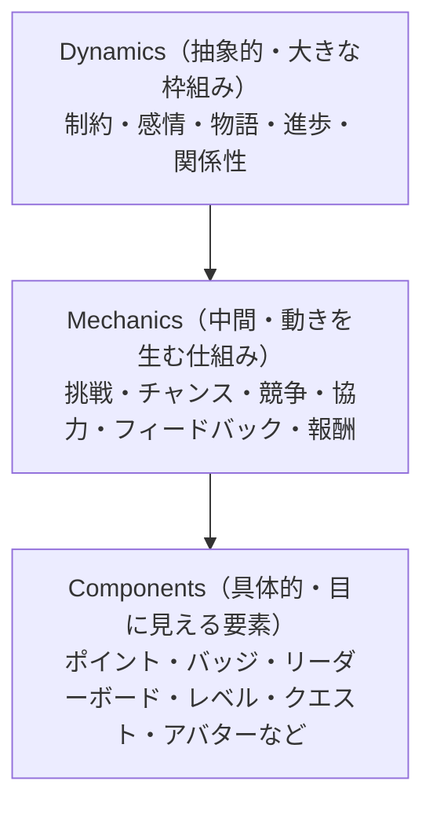
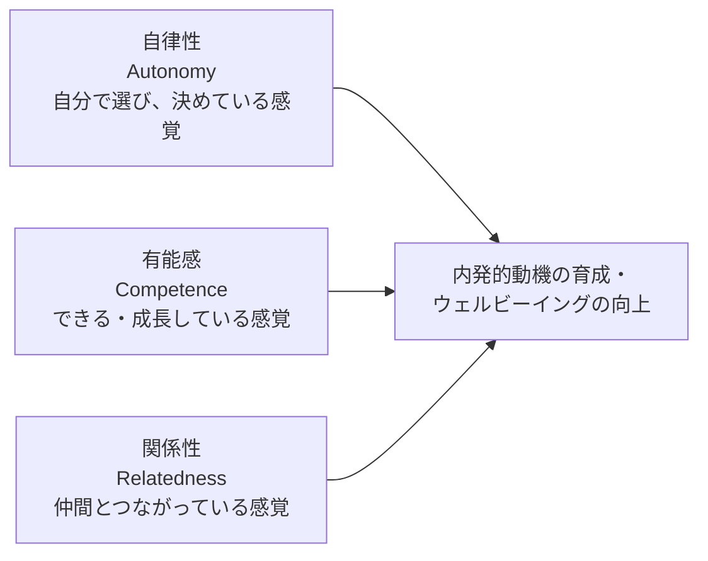
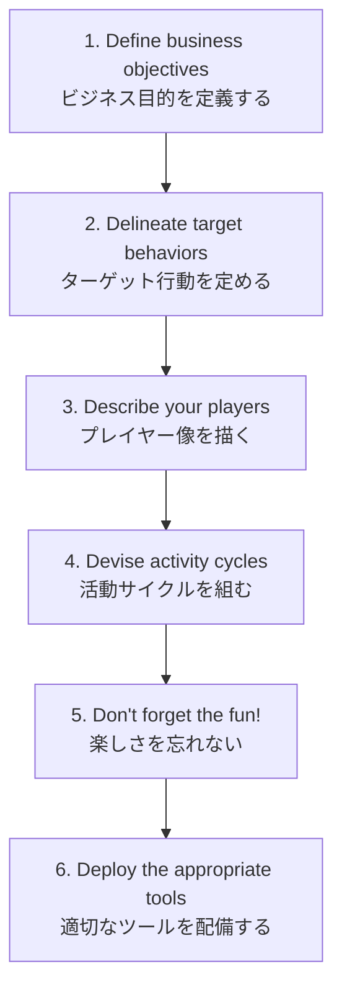
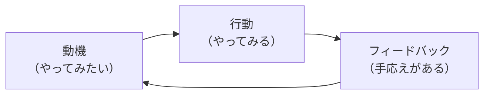
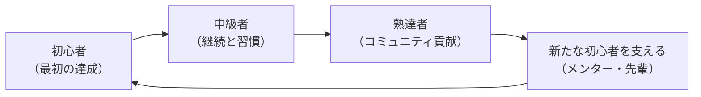

# ゲーミフィケーション入門

ポイントとバッジの先へ——人が動き続ける仕組みを設計する

| 項目 | 内容 |
|---|---|
| カテゴリー | ビジネススキル |
| 難易度 | 初級 |
| 所要時間 | 約200分（全8レッスン） |
| 公開日 | 2026-06-20 |
| 最終更新日 | 2026-06-20 |
| コースURL | https://skillup.college/courses/business/gamification-basics/ |

## 対象者

業種・職種を問わず、社員のエンゲージメント、顧客のロイヤルティ、学習者の動機付けに関わるすべての方。人事・人材育成・営業マネージャー・カスタマーサクセス・マーケター・教育担当・研修設計者・SaaS のプロダクトマネージャー・企画担当・教員・自治体職員など、全社員必修レベルで学べる入門コース。

## 前提知識

特になし。ゲーム業界での開発経験、心理学の学術的知識、プログラミングのスキルは不要。普段ゲームをほとんどしない方でも、本コースを通じて『人が続けたくなる仕組み』の発想を身につけられる。

## 学習目標

- ゲーミフィケーションの定義と『ゲーム化』にまつわる誤解を整理できる
- ゲーム要素（PBL・レベル・ミッション・ナラティブなど）の体系と、各要素の効能と限界を理解する
- 内発的動機付けと外発的動機付け、自己決定理論（SDT）、Octalysis、フロー理論などの動機付け理論を業務に紐付けられる
- Werbach の 6D を使い、目的を持ったゲーミフィケーション設計を組み立てられる
- 業務・組織（営業・人事・社内研修）、学習・教育（e ラーニング・教室）、顧客体験（ロイヤルティ・コミュニティ）の 3 軸での応用パターンを把握する
- 過剰なゲーミフィケーション、ダークパターン、Goodhart の法則など、避けるべき落とし穴と倫理上の論点を理解する
- AI 時代の動機設計と、コース修了後の学習方向（行動経済学・心理学・インストラクショナルデザイン）への接続をつかむ

## コース概要

「ポイントとバッジを付ければ、社員が動くだろうか」「ガチャを入れれば、顧客が継続するだろうか」「リーダーボードで競わせれば、学習者は伸びるだろうか」——人事・人材育成・営業・カスタマーサクセス・教育・自治体の現場で、ゲーミフィケーションへの期待が高まる一方、「ポイントを付けただけで終わる施策」「短期で盛り上がって消える企画」「過剰な競争で雰囲気を壊した事例」も同時に増えています。本コースは、ゲーミフィケーションを「ゲーム要素を並べる作業」ではなく「人がなぜ動き続けるのかを理解し、目的に合わせて要素を引き算する設計」として 8 レッスンで体系的に学びます。ゲーミフィケーションの定義から、ゲーム要素の体系、動機付け理論、設計フレーム、業務・学習・顧客体験への応用、そして過剰な設計の落とし穴と倫理までを段階的にカバーします。普段ゲームをほとんどしない方でも、家庭用ゲームに人生を費やしてきた方でも、それぞれの立場で取り組める入門コースです。

## 学習の流れ

レッスン 1 でゲーミフィケーションの定義と「ゲーム化」にまつわる誤解を解き、本コースの守備範囲を共有します。レッスン 2 はゲーム要素の体系で、Werbach の 3 層（Dynamics／Mechanics／Components）と PBL、進捗、社会的要素、ナラティブを整理します。レッスン 3 は動機付け理論で、内発と外発、自己決定理論、Octalysis、フローを扱います。ここまでが「理解」の前半です。レッスン 4 で Werbach の 6D を使い、目的を持った設計の組み立て方を学びます。レッスン 5 から 7 は応用編で、業務・組織（営業・人事・社内研修）、学習・教育（e ラーニング・教室）、顧客体験（ロイヤルティ・コミュニティ）の 3 軸を順に取り上げます。最後のレッスン 8 で、過剰なゲーミフィケーション批判、コンプガチャ規制、ダークパターンとナッジの境界、Goodhart の法則、AI 時代の個別化された動機設計、コース修了後の学習方向（行動経済学・心理学・インストラクショナルデザイン）を案内します。前半（レッスン 1〜4）は「ゲーミフィケーションの理解と設計」、後半（レッスン 5〜8）は「応用と倫理」の二段構えです。

## レッスン一覧

| No. | タイトル | 概要 | 所要時間 |
|---|---|---|---|
| 1 | ゲーミフィケーションとは何か——「ゲーム化」の正体と誤解を解く | ゲーミフィケーションの定義と起源、ゲーム／シリアスゲーム／PBL との違い、なぜ今再評価されているのか、ありがちな誤解、本コースの守備範囲を学ぶ | 25分 |
| 2 | ゲーム要素の体系——PBL・レベル・ミッション・ストーリー・ナラティブ | Werbach の 3 層（Dynamics／Mechanics／Components）、PBL、進捗系、社会的要素、ナラティブとアバター、フィードバックループ、サプライズなど、ゲーム要素の体系と各要素の効能・限界を学ぶ | 25分 |
| 3 | 動機付け理論——内発／外発と自己決定理論（SDT）を理解する | 内発的動機付けと外発的動機付け、Edward Deci・Richard Ryan の自己決定理論と 3 つの基本欲求、アンダーマイニング効果、Octalysis、フロー理論など、長期に機能する動機設計の理論を学ぶ | 25分 |
| 4 | 設計フレームワーク——Werbach の 6D で「目的を持ったゲーム化」を組み立てる | Kevin Werbach の 6D、Bartle の 4 プレイヤータイプ、エンゲージメントループとプログレッションループ、最小実行可能ゲーミフィケーション、レビューと反復、「楽しさを忘れない」の意味を学ぶ | 25分 |
| 5 | 業務・組織への応用——営業・人事・社内研修の現場で何ができるか | 営業 SaaS のリーダーボード、カスタマーサポートの KPI ボード、人事のオンボーディングとスキルバッジ、社内研修のプログレスとアンロック、ウェルネスの社内チャレンジ、よくある失敗と長期に機能する設計の原則を学ぶ | 25分 |
| 6 | 学習・教育への応用——e ラーニングと教室を変える設計の発想 | Duolingo・Khan Academy・Quizlet の設計分析、Quest と Skill Tree、即時フィードバックと間違いの安全性、適応的難易度、ストリーク・リーグ・クラスランキングの良し悪し、教員・研修設計者の心得を学ぶ | 25分 |
| 7 | 顧客体験への応用——ロイヤルティ・コミュニティ・継続課金 | マイレージ・ポイントカードの古典、サブスク継続率、ナイキ Run Club、ガチャ・パスとリテンション、SaaS のオンボーディングチェックリスト、Stack Overflow・GitHub のバッジ、ダークパターンの誘惑と正直な設計を学ぶ | 25分 |
| 8 | 落とし穴と倫理、AI 時代のゲーミフィケーション——「壊さない設計」のために | Ian Bogost の exploitationware 批判、コンプガチャ規制、ダークパターンとナッジの境界、Goodhart の法則、AI 時代の個別化された動機設計、ニューロダイバーシティ、コース修了後の学習方向を学ぶ | 25分 |

---

## レッスン1：ゲーミフィケーションとは何か——「ゲーム化」の正体と誤解を解く

（所要時間：25分）

### このレッスンで学ぶこと

- ゲーミフィケーションを「ゲーム要素を意図的に活用する設計」として定義する
- ゲーミフィケーションの起源と用語の広まりを整理する
- ゲーム／シリアスゲーム／PBL（ポイント・バッジ・リーダーボード）との違いを区別する
- なぜ 2026 年 6 月時点で再評価されているのかを把握する
- 「子供じみている」「ポイントを付ければゲーム化」など、ありがちな誤解への返答を持つ
- 本コースの守備範囲（業務・学習・顧客体験の 3 軸）を理解する

---

「ゲーミフィケーション」という言葉を、人事・人材育成・営業マネジメント・カスタマーサクセス・教育の現場で聞かない月はありません。社員エンゲージメント、e ラーニング継続率、顧客リテンション、住民参加アプリ——「ゲーム化すれば、人は動くのではないか」という期待が、業界・業種を問わず広がっています。しかし同時に、「ポイントを付けただけで終わった」「短期で盛り上がって、半年で誰も使わなくなった」「過剰なランキングで職場の雰囲気が壊れた」という失敗談も増えてきました。本レッスンは、本コースの前提として、ゲーミフィケーションの「正体」と「ありがちな誤解」を整理することから始めます。

### ゲーミフィケーションの定義

本コースでは、ゲーミフィケーション（gamification）を次のように定義します。

> 「ゲームではない文脈」に、ゲームの要素や設計の発想を意図的に組み込み、人の動機や行動を引き出す設計手法。

この定義は、2011 年に Sebastian Deterding らが研究論文「From Game Design Elements to Gamefulness: Defining Gamification」で示した立場を、初学者向けに整理したものです。鍵となる言葉は 3 つあります。

#### 「ゲームではない文脈」

ゲーミフィケーションは、それ自体がゲームを作ることではありません。営業の活動、社員研修、e ラーニング、健康アプリ、コミュニティ運営、住民参加など、本来の目的は「ゲームを遊ぶこと」ではない場面に、ゲームの要素を持ち込むのが特徴です。家庭用ゲームを作るのは「ゲームデザイン」であり、ゲーミフィケーションではありません。

#### 「ゲームの要素や設計の発想」

ゲーミフィケーションが借りるのは、ゲームの「要素」と「発想」です。要素とは、ポイント、バッジ、レベル、リーダーボード、ミッション、ストーリー、進捗バーなど、目に見える仕掛けです。発想とは、即時のフィードバック、達成感、適度な挑戦と成功体験、自分の選択が結果に影響する感覚など、ゲームが人を惹きつける仕組みの土台です。要素だけを並べても、発想が伴わないと機能しないというのが、本コースの重要なメッセージです。

#### 「意図的に組み込み、動機や行動を引き出す」

ゲーミフィケーションは「楽しさ」を目的にしません。目的は、人の動機を支え、特定の行動を続けてもらうことです。社員に新しいツールを使い続けてほしい、e ラーニングを最後まで終えてほしい、顧客にサービスを継続利用してほしい、健康のために歩いてほしい——こうした目的があってはじめて、ゲーム要素は意味を持ちます。「楽しいから」だけを理由に要素を並べると、本来の目的とずれた施策になります。

> **💡 ポイント**
> ゲーミフィケーションは「ゲームを作る」ことでも「楽しさを増す」ことでもなく、「目的のために、人の動機と行動を支える設計」です。要素は手段、目的は別にあります。

### 起源と用語の広まり

「ゲーミフィケーション」という言葉自体は、2000 年代後半に英語圏で使われ始め、2010 年代前半に世界的に広まりました。経緯を簡単に整理します。

#### 2000 年代後半：先駆的な企業の登場

ゲーミフィケーションを商品やサービスに体系的に持ち込んだ先駆者として、Bunchball 社（米国）が知られています。同社は企業のロイヤルティプログラムや社員エンゲージメント施策にゲーム要素を組み込むプラットフォームを提供し、業界での認知を広げました。

#### 2011 年：用語の定着と研究の出発

2011 年に Sebastian Deterding らが定義論文を発表し、学術コミュニティでの議論が動き出しました。同年、Ian Bogost（ジョージア工科大学のゲーム研究者）が「Gamification is Bullshit」というエッセイで批判を投げ、肯定派と懐疑派の議論が広がりました。本コースの後半（レッスン 8）で扱う倫理論争の出発点も、この時期にあります。

#### 2012 年：実務向け教科書の登場

Wharton School（ペンシルベニア大学経営大学院）の Kevin Werbach 教授と Dan Hunter による『For the Win: How Game Thinking Can Revolutionize Your Business』が出版され、ビジネス実務でのゲーミフィケーション設計の定番教科書となりました。邦訳『ウォートン・スクール ゲーミフィケーション集中講義』も翌年に出ています。本コースのレッスン 4 で扱う「Werbach の 6D」は、この本のフレームワークです。

#### 2015 年：Octalysis フレームワークの登場

Yu-kai Chou が『Actionable Gamification』を出版し、Octalysis（オクタリシス）と呼ばれる 8 つのコアドライブのフレームワークを提唱しました。本コースのレッスン 3 で扱います。

#### 2020 年代：再評価の波

リモートワークの定着、SaaS の全盛、AI による業務の自動化の進展で、「人間の動機をどう設計するか」が改めて課題になりました。Duolingo（2010 年代前半に登場した語学学習サービス）の継続率の高さ、Khan Academy の Quest 設計、Strava や Apple Watch のチャレンジ機能、Salesforce や HubSpot の標準機能としてのリーダーボードなど、ゲーミフィケーションは「業界のごく一部の手法」から「業務 SaaS の標準装備」に変わりつつあります。

> **💡 ポイント**
> ゲーミフィケーションは 2011 年前後に用語が定着しましたが、2020 年代に「業務 SaaS の標準装備」として再評価されています。本コースは、2026 年 6 月時点の最新状況を踏まえて構成しています。

### 「ゲーム」「シリアスゲーム」「PBL」との違い

ゲーミフィケーションは、隣接概念と混同されやすい言葉です。3 つの隣接概念との違いを整理します。

#### ゲーム（家庭用ゲーム・PC ゲーム・スマホゲーム）

ゲームは、遊ぶこと自体が目的の作品です。家庭用ゲーム機の RPG、スマホゲーム、PC のシミュレーションなど、プレイヤーは楽しさや達成感を求めて自発的に遊びます。ゲーミフィケーションは「ゲーム以外の文脈」に要素を持ち込むので、目的が違います。

#### シリアスゲーム

シリアスゲームは、教育や訓練、社会的課題の解決を目的に設計された「ゲームそのもの」です。医療従事者の訓練用シミュレーター、防災教育用のゲーム、社会問題を扱うシリアスゲームなどがあります。「ゲームを 1 つ作る」点が共通ですが、目的が娯楽ではない点で家庭用ゲームと異なります。ゲーミフィケーションは「既存の業務や学習にゲーム要素を持ち込む」点で、シリアスゲームと違います。

#### PBL（ポイント・バッジ・リーダーボード）

PBL は、ゲーミフィケーションの代表的な「要素」の頭文字です。Points（ポイント）、Badges（バッジ）、Leaderboards（リーダーボード）の 3 つを指します。ゲーミフィケーションを「PBL を付けること」と誤解する方が多いのですが、PBL は数あるゲーム要素のうちの 3 つにすぎません。レッスン 2 で扱うように、進捗バー、ミッション、ナラティブ、社会的要素など、PBL の外側にも要素が多くあります。

| 概念 | 目的 | 形 | ゲーミフィケーションとの関係 |
|---|---|---|---|
| ゲーム（家庭用） | 遊ぶ・楽しむ | 完結したゲーム作品 | ゲーミフィケーションは隣接概念 |
| シリアスゲーム | 教育・訓練・社会課題 | 完結したゲーム作品 | ゲーミフィケーションとは別物 |
| PBL | ゲーム要素の 3 つの代表 | ポイント・バッジ・リーダーボード | ゲーミフィケーションの**一部** |
| ゲーミフィケーション | 業務・学習・顧客体験で人の動機と行動を支える | ゲームの要素と発想の意図的な活用 | 本コースの中心 |

> **💡 ポイント**
> 「ゲーミフィケーション = PBL を付けること」は典型的な誤解です。PBL は要素の一部にすぎず、本質は「ゲームの発想を業務や学習や顧客体験に活かすこと」です。

### 2026 年 6 月時点で再評価される 4 つの背景

ゲーミフィケーションが 2020 年代に再評価されている背景を、本コースは 4 つに整理します。

#### 1. リモートワークと SaaS 全盛

オフィスでの偶然の声かけや、隣の席の同僚の様子から得られる「やる気の燃料」が、リモートワークでは減りました。SaaS のダッシュボードに表示される進捗バーやチームのバッジ、月次のリーダーボードなどが、その代替として注目されています。

#### 2. AI による業務の自動化と「人の動機」の再注目

定型業務が AI に任せられるほど、人間に求められる仕事は「動機が要る仕事」に偏ります。創造的な仕事、関係を築く仕事、判断する仕事——いずれも、本人が動機を持ち続けないと機能しません。ゲーミフィケーションは、AI に置き換えにくい「人の動機」を支える領域として、再評価されています。

#### 3. 教育のオンライン化

学校教育、企業研修、e ラーニングのいずれでも、対面で得られていた「教師の眼差し」や「同級生との競争」がオンラインでは弱まりました。Duolingo のストリーク、Khan Academy のスキルツリー、Quizlet のリーグなど、ゲーミフィケーションが「継続の助け」として広く採用されています。

#### 4. 顧客体験の長期化と継続課金

サブスクリプション（継続課金）が普及し、企業の関心が「売って終わり」から「使い続けてもらう」に移りました。マイレージや古典的なポイントカードの延長として、ロイヤルティプログラム、コミュニティでのレピュテーション、達成感の演出が業務 SaaS にも組み込まれています。

> **💡 ポイント**
> 2020 年代の再評価は、リモートワーク・AI 時代・教育オンライン化・継続課金の 4 つの大きな流れに支えられています。一時の流行ではなく、構造的な変化です。

### ありがちな 5 つの誤解

ゲーミフィケーションへの相談を受けるとき、現場でよく出会う誤解を整理しておきます。

#### 誤解 1：「ポイントとバッジを付ければゲーミフィケーション」

最も多い誤解です。PBL を並べただけで設計が機能するわけではなく、目的・対象・行動の理解が伴わないと「ポイント疲労」を起こします。

#### 誤解 2：「子供じみている」「ゲームファンしか喜ばない」

実際は、ナイキ Run Club のチャレンジ、Apple Watch のリング、Fitbit の歩数バッジなど、ゲーム愛好者でない一般成人にも広く受け入れられています。「子供じみる」かどうかは、要素の選び方と表現の問題です。

#### 誤解 3：「ゲーム化すれば、必ず売上や継続率が上がる」

ゲーミフィケーションは万能ではありません。目的とずれた要素を組み込むと、むしろ逆効果（ノルマ強化、行動の歪み、社員の冷め）になります。本コースのレッスン 5・8 で失敗事例を扱います。

#### 誤解 4：「最新の派手な要素を盛り込めばいい」

ガチャ、ランダム報酬、複雑なレベル制度、派手なアニメーション——「最新」「派手」を追うほど、設計はぶれます。本コースの講師トーンは「目的に合わせて、要素を引き算する」発想を強調します。

#### 誤解 5：「ゲーミフィケーションは新しい技術」

ゲーミフィケーションの発想は、はるかに古くから存在します。マイレージ、ポイントカード、子供のシール帳、学校の成績表、軍隊の階級章——いずれも「ゲーム要素で人の動機を支える」発想を含みます。新しいのは、SaaS とデータ計測の発達で「設計と検証がしやすくなった」ことです。

> **💡 ポイント**
> 5 つの誤解の根は同じです。「ゲーミフィケーション = ゲーム要素を並べること」と捉えてしまうと、目的と人を見失います。本コースが繰り返し戻る視点は、「人」と「目的」です。

### 本コースの守備範囲

本コースは、ゲーミフィケーションを 3 つの応用領域で扱います。

#### 業務・組織（レッスン 5）

営業マネジメント、カスタマーサポート、人事のオンボーディング、社内研修、ウェルネスの社内チャレンジなど、組織の中で社員の動機と行動を支える設計です。

#### 学習・教育（レッスン 6）

e ラーニング、学校教育、企業研修、自己学習アプリなど、学習者の継続と成長を支える設計です。

#### 顧客体験（レッスン 7）

ロイヤルティプログラム、サブスクの継続、SaaS のオンボーディング、コミュニティでのレピュテーションなど、顧客の長期的な関係を支える設計です。

3 つの応用に共通するのが、レッスン 2〜4 で扱う「ゲーム要素の体系」「動機付け理論」「設計フレームワーク」の理解です。応用領域ごとに使う要素や留意点は変わりますが、土台は共通です。

#### 守備範囲外

以下は本コースの守備範囲外です。

- 家庭用ゲーム・スマホゲームそのものの開発（ゲームデザインの専門領域）
- Unity・Unreal などのゲーム開発エンジンの操作
- ゲーミフィケーション用 SaaS の個別操作マニュアル
- 心理学・行動経済学の学術的な深掘り
- 倫理や規制についての法的助言（一般論として扱うのみ）

#### スタンス

本コースは、ゲーミフィケーションを「魔法の杖」とも「子供だまし」とも見なしません。目的を持って人の動機と行動を支える、地に足のついた設計手法として扱います。同時に、過剰な設計や倫理上の論点（操作・依存・歪み）を、レッスン 7・8 で正面から扱います。「楽しさで人を動かす」のと「人を操作する」のは、紙一重だという認識を持って学んでいただきたいと思います。

### まとめ

このレッスンでは、以下のことを学びました。

- ゲーミフィケーションは「ゲームではない文脈に、ゲームの要素や設計の発想を意図的に組み込み、人の動機や行動を引き出す設計手法」
- 鍵は「ゲームではない文脈」「ゲームの要素や発想」「意図的に組み込み、動機や行動を引き出す」の 3 つ
- 用語は 2010 年代前半に定着、2020 年代に「業務 SaaS の標準装備」として再評価
- ゲーム・シリアスゲーム・PBL との違い：ゲーミフィケーションは「業務や学習にゲーム要素を持ち込む」設計手法であり、ゲームを作ることではない
- 再評価の背景：リモートワーク・AI 時代・教育オンライン化・継続課金の 4 つ
- 5 つの誤解：「PBL = ゲーミフィケーション」「子供じみている」「必ず成果が上がる」「派手な要素を盛り込めばいい」「新しい技術」
- 本コースは業務・学習・顧客体験の 3 軸で応用を扱い、要素・理論・設計の土台を共通で学ぶ
- 守備範囲外：ゲーム開発そのもの、SaaS 個別操作、心理学の学術的深掘り、法的助言
- スタンス：「魔法の杖」でも「子供だまし」でもない、地に足のついた設計手法として扱い、倫理上の論点も正面から扱う

次のレッスンでは、Werbach の 3 層（Dynamics／Mechanics／Components）を入口に、PBL・進捗系・社会的要素・ナラティブなど、ゲーム要素の体系を整理します。

---

### 確認クイズ

このレッスンの理解度をチェックしましょう。

#### Q1. 本コースが定義する「ゲーミフィケーション」として、最も適切なものはどれか？

- [x] 「ゲームではない文脈」に、ゲームの要素や設計の発想を意図的に組み込み、人の動機や行動を引き出す設計手法
- [ ] 家庭用ゲームやスマホゲームを開発すること
- [ ] 教育・訓練を目的とした「シリアスゲーム」を作ること
- [ ] ポイントとバッジとリーダーボードの 3 つを並べること

> **解説**
> ゲーミフィケーションは「ゲームではない文脈」に「ゲームの要素や発想」を「意図的に」組み込む設計手法です。家庭用ゲーム開発・シリアスゲーム作成・PBL の付加は、いずれも本コースの定義とは異なります。PBL は要素の一部にすぎません。

#### Q2. ゲーミフィケーションと「シリアスゲーム」「PBL」の違いとして、本レッスンが説明した内容はどれか？

- [ ] ゲーミフィケーション・シリアスゲーム・PBL は同じ意味で、用語の違いだけ
- [x] シリアスゲームは「教育や訓練のために設計されたゲームそのもの」、PBL は「ポイント・バッジ・リーダーボードという要素の代表」、ゲーミフィケーションは「業務や学習にゲーム要素を持ち込む設計手法」で、目的と形が違う
- [ ] シリアスゲームは「ポイントを付けたゲーミフィケーション」のこと
- [ ] PBL はゲーミフィケーションの上位概念

> **解説**
> シリアスゲームは「ゲームそのもの」、PBL は要素の代表、ゲーミフィケーションは「ゲーム要素を別の文脈に持ち込む設計手法」です。3 つの違いを混同すると、企画段階で目的を見失います。

#### Q3. 2020 年代にゲーミフィケーションが再評価されている背景として、本レッスンが整理した内容はどれか？

- [ ] 家庭用ゲームの売上が減ったため、ゲーム会社が事業を業務 SaaS に転換しているから
- [ ] AI の進化により、ゲーミフィケーションの設計が自動化され、誰でも作れるようになったから
- [x] リモートワークの定着、AI による業務自動化で「人の動機」が再注目されたこと、教育のオンライン化、サブスクリプションによる顧客体験の長期化、の 4 つの構造的変化
- [ ] 国や行政がゲーミフィケーションを義務化する法律を整備したから

> **解説**
> 再評価の背景は、リモートワーク・AI 時代・教育オンライン化・継続課金という 4 つの構造的変化です。一時の流行ではなく、長期に続く社会的変化が背景にあります。

#### Q4. ゲーミフィケーションへのありがちな誤解として、本レッスンが「誤り」と整理したものはどれか？

- [ ] PBL は要素の一部にすぎず、ゲーミフィケーションの全体ではない
- [ ] 目的とずれた要素を組み込むと、ノルマ強化や社員の冷めなどの逆効果がありえる
- [ ] 「子供じみている」かどうかは、要素の選び方と表現の問題
- [x] 「ポイントとバッジを付ければ、自動的にゲーミフィケーションになる」「ゲーム化すれば、必ず売上や継続率が上がる」「最新の派手な要素を盛り込めばいい」など、PBL の付加で完結すると思い込み、目的と人の理解を軽視する誤解

> **解説**
> 「PBL を並べれば自動的に機能する」「必ず成果が上がる」「派手な要素を盛り込めばいい」は、典型的な誤解です。本コースは、目的と人の理解を土台にして、要素を選び・引き算する発想を強調します。

#### Q5. 本コースの守備範囲として、本レッスンが説明した内容はどれか？

- [x] 業務・組織、学習・教育、顧客体験の 3 軸での応用を扱い、共通の土台としてゲーム要素の体系・動機付け理論・設計フレームを学ぶ。家庭用ゲームやスマホゲームそのものの開発、SaaS の個別操作マニュアル、心理学の学術的な深掘り、法的助言は守備範囲外
- [ ] 家庭用ゲームやスマホゲームの開発を中心に、Unity の操作も扱う
- [ ] 心理学と行動経済学の学術的な研究を網羅する
- [ ] 特定の SaaS 製品の操作マニュアルを扱う

> **解説**
> 本コースは業務・学習・顧客体験の 3 軸で応用を扱い、要素・理論・設計の共通土台を整えます。ゲーム開発そのものや SaaS 個別操作、学術的深掘り、法的助言は対象外です。

#### Q6. 本コースのスタンスとして、本レッスンが示した内容はどれか？

- [ ] ゲーミフィケーションは「魔法の杖」であり、どの場面でも導入すれば成果が出る
- [x] ゲーミフィケーションを「魔法の杖」とも「子供だまし」とも見なさず、目的を持って人の動機と行動を支える地に足のついた設計手法として扱う。同時に、過剰な設計や倫理上の論点（操作・依存・歪み）を正面から扱う
- [ ] ゲーミフィケーションは「子供だまし」であり、ビジネス利用には適さない
- [ ] ゲーミフィケーションは倫理的に問題が多いため、原則として導入を避けるべき

> **解説**
> 本コースは肯定にも否定にも偏らず、目的と人を中心に据えた設計手法として扱います。倫理面（過剰な設計・依存・行動の歪み）も正面から扱い、「楽しさで人を動かす」のと「人を操作する」のは紙一重という認識を持って学びます。

---

## レッスン2：ゲーム要素の体系——PBL・レベル・ミッション・ストーリー・ナラティブ

（所要時間：25分）

### このレッスンで学ぶこと

- Werbach の 3 層（Dynamics／Mechanics／Components）でゲーム要素を体系的に整理する
- PBL（ポイント・バッジ・リーダーボード）の効能と限界を理解する
- 進捗系（プログレスバー・レベル・クエスト・アンロック）の発想を把握する
- 社会的要素（チーム・ギルド・対戦・協力）の使い分けを学ぶ
- ナラティブ・アバター・ストーリーの役割を理解する
- フィードバックループとサプライズ（ガチャ・ランダム報酬）の影響を整理する

---

前回のレッスンでは、ゲーミフィケーションを「ゲームではない文脈に、ゲームの要素や設計の発想を意図的に組み込み、人の動機や行動を引き出す設計手法」と定義しました。「PBL を並べることがゲーミフィケーションではない」と繰り返した一方で、「では、ゲーム要素には何があり、どう整理されているか」は次のレッスンで扱うとお話しました。本レッスンで、その全体像を 3 層構造で整理します。

### Werbach の 3 層構造（Dynamics・Mechanics・Components）

ゲーム要素を最も広く参照されている形で整理したのが、Kevin Werbach・Dan Hunter の『For the Win』（2012 年）で示された 3 層モデルです。3 層は、抽象度の高い順に Dynamics（ダイナミクス）、Mechanics（メカニクス）、Components（コンポーネント）と並びます。

抽象度の高い Dynamics が、設計の方向性を決めます。Mechanics は Dynamics を実現する具体的な仕組みで、Components はその仕組みを構成する目に見える要素です。

#### Dynamics（ダイナミクス）

Dynamics は、ゲーミフィケーション全体の方向性を決める抽象的な枠組みです。Werbach は 5 つを挙げています。

| Dynamics | 内容 |
|---|---|
| 制約（Constraints） | 自由を縛ることで意味を生む。時間制限・選択肢の制限 |
| 感情（Emotions） | 喜び・期待・誇り・好奇心・悔しさなどの感情的な動き |
| 物語（Narrative） | 一貫した文脈や世界観、ストーリーの流れ |
| 進歩（Progression） | 自分が変化・成長していく実感 |
| 関係性（Relationships） | 仲間・対戦相手・コミュニティとのつながり |

Dynamics は、いきなり目に見える要素にはなりません。が、Dynamics を意識しない設計は、要素を並べただけの「飾り」になります。

#### Mechanics（メカニクス）

Mechanics は、Dynamics を実現する具体的な仕組みです。Werbach は 10 個を挙げていますが、本コースでは代表的な 6 つを整理します。

| Mechanics | 内容 |
|---|---|
| 挑戦（Challenges） | クリアすべき課題やミッション |
| チャンス（Chance） | 偶然性の要素。ランダム報酬・抽選 |
| 競争（Competition） | 他者と勝ち負けを争う仕組み |
| 協力（Cooperation） | 仲間と協力して達成する仕組み |
| フィードバック（Feedback） | 行動への即時の反応 |
| 報酬（Rewards） | 行動への対価としての給付 |

Mechanics は「動きを生む仕組み」です。同じ「報酬」でも、固定報酬と変動報酬では効果が違います。同じ「競争」でも、個人対個人とチーム対チームでは雰囲気が違います。

#### Components（コンポーネント）

Components は、Mechanics を成立させる目に見える要素です。Werbach は 15 個を挙げています。本コースでは、よく使う 10 個を表で整理します。

| Components | 内容 |
|---|---|
| ポイント（Points） | 行動を数値化した得点 |
| バッジ（Badges） | 達成や状態を示すアイコン |
| リーダーボード（Leaderboards） | ランキング表 |
| レベル（Levels） | 段階的な進行 |
| クエスト（Quests） | 一連のミッション・課題群 |
| アンロック（Unlocks） | 条件を満たすと新しい要素が解放される |
| プログレスバー（Progress Bars） | 進捗の可視化 |
| アバター（Avatars） | プレイヤーを代表する人物・キャラクター |
| バーチャル財（Virtual Goods） | ゲーム内の道具・装飾・通貨 |
| チーム（Teams） | 共通の目的を持つグループ |

PBL（Points・Badges・Leaderboards）はこのうちの 3 つです。Werbach のリストでも、PBL は Components の一部にすぎません。

> **💡 ポイント**
> ゲーム要素は「Dynamics（方向性）→ Mechanics（仕組み）→ Components（目に見える要素）」の 3 層で整理します。PBL は最下層の Components の一部にすぎず、上位の 2 層を意識しないと「要素を並べただけの飾り」になります。

### PBL の効能と限界

ゲーミフィケーションの代表選手である PBL を、まず深く扱います。

#### ポイント（Points）

ポイントは、行動を数値化して可視化する道具です。営業の活動量、e ラーニングの受講数、SaaS の機能利用回数、健康アプリの歩数など、行動の積み重ねを 1 つの数字で示せます。

- 効能：行動の見える化、進捗の実感、達成感
- 限界：ポイントが目的化する「ポイント疲労」が起こりやすい。長期使用で陳腐化しやすい

#### バッジ（Badges）

バッジは、達成や状態を示すアイコンです。「初コミット」「30 日連続学習」「年間トップ営業」など、達成内容を視覚的に示せます。

- 効能：達成の象徴、誇りの可視化、収集の楽しみ
- 限界：価値の薄いバッジを大量発行すると「バッジ疲労」が起こる。バッジに意味を持たせる文脈設計が必要

#### リーダーボード（Leaderboards）

リーダーボードは、ランキング表で他者との比較を可視化します。営業コンテスト、e ラーニングのリーグ、住民参加アプリの月次ランキングなどに使われます。

- 効能：競争心の刺激、トップ層の動機付け、活動の見える化
- 限界：常時下位の人は意欲を失う（「リーダーボード疲労」）。職場の雰囲気を壊すリスクがある

#### PBL の使い分けの目安

| 場面 | PBL の中で重視するもの | 理由 |
|---|---|---|
| 行動の積み重ねを促したい | ポイント | 行動量の可視化 |
| 達成・成長を称えたい | バッジ | 状態の意味づけ |
| トップ層の動機を刺激したい | リーダーボード | 競争心の活用 |
| 初心者を支えたい | ポイントとプログレスバー | リーダーボードは避ける |
| 心理的安全性を重視 | バッジ中心、リーダーボードは控える | 競争の副作用を避ける |

> **💡 ポイント**
> PBL は強力な要素ですが、それぞれに副作用があります。場面と対象に合わせて選び、長期では「ポイント疲労」「バッジ疲労」「リーダーボード疲労」が起きないよう、要素の組み合わせと更新が必要です。

### 進捗系の要素——レベル・クエスト・アンロック・プログレスバー

PBL の次に大きな要素群が、進捗系です。

#### レベル（Levels）

レベルは、段階的な進行を示す要素です。e ラーニングのコース修了状況、社員のスキル習得状況、SaaS の活用習熟度などをレベルで表せます。1〜5 や Bronze・Silver・Gold など、表現は自由です。

#### クエスト（Quests）

クエストは、一連のミッションや課題群を 1 つにまとめたものです。「オンボーディングクエスト」「四半期目標クエスト」など、ストーリー性を持たせて連続した行動を促せます。

#### アンロック（Unlocks）

アンロックは、「条件を満たすと新しい要素が解放される」仕組みです。「研修コース A を修了するとコース B が受講可能になる」「契約から 1 か月で新機能が解放される」など、進捗に応じた段階的な開放が代表例です。

#### プログレスバー（Progress Bars）

プログレスバーは、進捗の度合いを 1 つの棒で表現します。SaaS のオンボーディングチェックリスト、e ラーニングのコース進捗、健康アプリの月間目標達成度などで広く使われています。

#### 進捗系の特徴

進捗系の要素は、PBL に比べて副作用が起こりにくいのが特徴です。なぜなら、進捗系は「他者との比較」ではなく「自分の中での進歩」を扱うからです。アンダーマイニング効果（次回扱う、外発報酬が内発動機を壊す現象）が起こりにくく、長期の習慣化に向いています。

> **💡 ポイント**
> 進捗系（レベル・クエスト・アンロック・プログレスバー）は、自分の中での進歩を扱うため、PBL に比べて副作用が起こりにくい要素群です。長期に機能する設計では、進捗系を土台にする発想が有効です。

### 社会的要素——チーム・ギルド・対戦・協力

人は「ひとりの動機」だけで動いているわけではありません。仲間や敵、コミュニティの存在が、行動を支えます。

#### チーム（Teams）・ギルド（Guilds）

共通の目的を持つグループを作り、グループ単位で目標を追う仕組みです。営業部のチーム別月次目標、e ラーニングの学習グループ、社内サークルなどが該当します。「ひとりだと続かないが、仲間がいるから続けられる」効果が期待できます。

#### 対戦（Competition）

個人または集団同士で勝ち負けを争う仕組みです。営業コンテスト、e ラーニングのクラスランキング、リーダーボードでの順位争いなどです。動機付けが強い一方、敗者の意欲を奪う副作用があるため、設計の難しさが高い要素です。

#### 協力（Cooperation）

仲間と協力して 1 つの目標を達成する仕組みです。営業部全体での売上目標、社内全体での学習時間の累計、SaaS のチームバッジなどがあります。対戦と違い、心理的安全性を保ちながら動機を支えられます。

#### 対戦と協力の使い分け

| 場面 | 対戦 | 協力 |
|---|---|---|
| トップ層の動機刺激 | 効果大 | 効果中 |
| 初心者を支える | 逆効果になりやすい | 効果大 |
| チームの結束を高めたい | 部内対立を生むリスク | 効果大 |
| 短期施策 | 効果大（ただし炎上リスク） | 効果中 |
| 長期施策 | 飽き・疲労を生みやすい | 持続しやすい |

> **💡 ポイント**
> 対戦は短期で強力ですが、副作用も大きい要素です。長期で機能させたいときや、初心者・心理的安全性を重視するときは、協力を中心に据える発想が有効です。

### ナラティブ・アバター・ストーリー

ゲーム要素の中でも、ナラティブ（物語）は強力な土台です。

#### ナラティブ（Narrative）

ナラティブは、施策や活動に一貫した文脈や世界観を与えます。社員研修を「新人冒険者の旅立ち」と位置づける、社内コミュニケーションアプリを「未来の街づくり」になぞらえる、e ラーニングを「スキルツリーの育成」と表現するなど、抽象度の高い物語を持ち込みます。

#### アバター（Avatar）

アバターは、プレイヤーを代表する人物・キャラクターです。SaaS のプロフィール画像、e ラーニングの学習者アイコン、社内コミュニケーションでのキャラクターなどが該当します。自分自身を投影する場が用意されると、所有感と関与度が増します。

#### ストーリー（Story）

ストーリーは、ナラティブを具体的な物語の形に落としたものです。Duolingo のキャラクターたちの掛け合い、ある研修プログラムでの「主人公の新人社員の 1 年間」、ロールプレイ研修の「商談の架空のお客さま」など、語られる筋書きが学習や業務に意味を与えます。

#### ナラティブの効能

ナラティブは、外発的な要素（PBL）と内発的な動機（次回扱う SDT）をつなぐ役割を果たします。ポイントを貯めることに意味が見いだせなくても、「自分が物語の主人公として進んでいる」という感覚があれば、続けたくなる動機が生まれます。

> **💡 ポイント**
> ナラティブ・アバター・ストーリーは「文脈と意味」を与える要素です。PBL のような数値の要素と組み合わせると、長期の動機付けに大きく寄与します。

### フィードバックループとサプライズ

最後に、ゲーム要素を機能させる 2 つの重要な仕組みを扱います。

#### フィードバックループ

フィードバックループは、「行動 → 反応 → 次の行動」の循環です。即時のフィードバックがあると、人は自分の行動の意味と効果を実感できます。ボタンを押した瞬間の音、ステップを踏んだ直後のプログレスバーの動き、ミッション達成のアニメーション——いずれも、行動と結果を結ぶ即時のフィードバックです。

| フィードバックの種類 | 例 |
|---|---|
| 視覚 | プログレスバーの伸び、バッジの解放アニメーション |
| 聴覚 | クリック音、達成音、レベルアップの音 |
| 触覚 | スマホのバイブレーション、ウォッチの振動 |
| テキスト | 「Great!」「+10 pt」などの即時メッセージ |
| 数値 | 累計ポイントの増加、進捗率の更新 |

#### サプライズ——ガチャ・ランダム報酬

サプライズは、予測できない結果がもたらす驚きを利用した仕組みです。代表例がガチャ（ランダム抽選）です。スマホゲームのキャラクター抽選、コンビニのくじ、社内サンクスカードのランダムな表彰など、形は変わってもサプライズは強い動機を生みます。

ただし、サプライズには 2 つのリスクがあります。1 つは依存性です。可変比率強化スケジュール（ランダム報酬を断続的に得る状況）は、行動科学で最も強い動機形成として知られており、ギャンブル依存に近い構造を持ちます。もう 1 つは、コンプガチャ（複数のガチャ結果の組み合わせで景品が出る仕組み）が日本では 2012 年に消費者庁から景品表示法上の問題があると見解が示されたという経緯です。倫理と規制の両面から、サプライズの設計は慎重さが必要です。本コースの最終レッスンで詳しく扱います。

> **💡 ポイント**
> フィードバックループは「即時の反応」が要素を機能させる土台です。サプライズは強力ですが、依存性と規制のリスクを伴います。設計するときは、短期の盛り上がりと長期の健全性のバランスを意識します。

### まとめ

このレッスンでは、以下のことを学びました。

- ゲーム要素は「Dynamics（方向性）→ Mechanics（仕組み）→ Components（目に見える要素）」の 3 層で整理する
- PBL（ポイント・バッジ・リーダーボード）は Components の一部にすぎず、それぞれに副作用がある
- 進捗系（レベル・クエスト・アンロック・プログレスバー）は自分の中での進歩を扱うため副作用が小さく、長期の習慣化に有効
- 社会的要素（チーム・ギルド・対戦・協力）は使い分けが大切で、対戦は短期で強力だが副作用が大きい
- ナラティブ・アバター・ストーリーは「文脈と意味」を与え、PBL と内発的動機をつなぐ役割を果たす
- フィードバックループは即時の反応で要素を機能させる土台、サプライズは強力だが依存性と規制のリスクを伴う
- 設計の発想：「要素を増やす」より「要素を絞り、意味を深く掘る」

次のレッスンでは、ゲーム要素の背後にある動機付け理論を扱います。内発的動機付けと外発的動機付け、自己決定理論（SDT）、Yu-kai Chou の Octalysis、Csikszentmihalyi のフロー理論を整理し、なぜポイントだけでは長続きしないのかを理論的に理解します。

---

### 確認クイズ

このレッスンの理解度をチェックしましょう。

#### Q1. Werbach の 3 層構造として、本レッスンが整理した内容はどれか？

- [ ] Points（ポイント）、Badges（バッジ）、Leaderboards（リーダーボード）の 3 層
- [x] Dynamics（抽象的・方向性）、Mechanics（中間・動きを生む仕組み）、Components（具体的・目に見える要素）の 3 層
- [ ] 入力・処理・出力の 3 層
- [ ] 初級・中級・上級の 3 層

> **解説**
> Werbach の 3 層は、抽象度の高い順に Dynamics（方向性）、Mechanics（仕組み）、Components（目に見える要素）です。PBL は最下層の Components の一部にすぎません。

#### Q2. PBL の効能と限界について、本レッスンが説明した内容はどれか？

- [ ] PBL は副作用がなく、どの場面でも導入すれば成果が出る
- [ ] PBL は要素として古く、現在では使われていない
- [x] ポイントは「ポイント疲労」、バッジは「バッジ疲労」、リーダーボードは「リーダーボード疲労」のリスクがあり、場面と対象に合わせて選び、長期では要素の組み合わせと更新が必要
- [ ] PBL は 3 つを必ずセットで導入する必要がある

> **解説**
> PBL はそれぞれに副作用があります。場面・対象・期間を考えて選び、長期では要素の更新と組み合わせの再設計が必要です。

#### Q3. 進捗系の要素（レベル・クエスト・アンロック・プログレスバー）について、本レッスンが説明した内容はどれか？

- [ ] 他者との比較を扱うため、心理的安全性を損なうリスクが高い
- [ ] 短期では効くが、長期では副作用が大きい
- [x] 「他者との比較」ではなく「自分の中での進歩」を扱うため、PBL に比べて副作用が起こりにくく、長期の習慣化に向いている
- [ ] PBL に比べて効果が弱いため、補助的にしか使えない

> **解説**
> 進捗系は自分の中での進歩を扱うため、副作用が起こりにくい要素群です。長期で機能する設計の土台になります。

#### Q4. 社会的要素（対戦と協力）の使い分けについて、本レッスンが説明した内容はどれか？

- [ ] 対戦は常に協力より効果が大きい
- [ ] 協力は競争心がないため、動機付けに役立たない
- [ ] 対戦と協力は同じ効果を持つ
- [x] 対戦は短期で強力だが副作用も大きく、敗者の意欲を奪うリスクがある。長期施策、初心者支援、心理的安全性を重視する場面では、協力を中心に据える発想が有効

> **解説**
> 対戦は短期では強い動機付けですが、長期や初心者支援には副作用が大きい仕組みです。協力中心の設計の方が、心理的安全性と持続性に優れます。

#### Q5. ナラティブ・アバター・ストーリーの役割について、本レッスンが説明した内容はどれか？

- [x] 「文脈と意味」を与える要素で、PBL のような数値の要素と組み合わせると、長期の動機付けに大きく寄与する。外発的な要素と内発的な動機をつなぐ役割を果たす
- [ ] 子供向けの要素であり、ビジネス利用には不向き
- [ ] PBL より効果が弱いため、補助的にしか使えない
- [ ] アバターはプライバシー上の問題があるため、業務利用は避けるべき

> **解説**
> ナラティブ・アバター・ストーリーは「文脈と意味」を与える要素で、PBL と組み合わせると長期の動機付けに有効です。外発と内発をつなぐ役割があります。

#### Q6. サプライズ（ガチャ・ランダム報酬）の留意点として、本レッスンが説明した内容はどれか？

- [ ] サプライズは効果が小さいため、業務利用には適さない
- [x] 強い動機を生むが、可変比率強化スケジュールによる依存性のリスクがあり、コンプガチャは 2012 年に消費者庁から景品表示法上の問題があると見解が示された経緯がある。倫理と規制の両面から、設計は慎重さが必要
- [ ] サプライズは法律で禁止されているため、業務利用できない
- [ ] サプライズは PBL の上位概念

> **解説**
> サプライズは強力ですが、依存性と規制のリスクを伴います。コンプガチャの規制経緯（2012 年消費者庁見解）は、設計者が知っておくべき重要な事例です。

---

## レッスン3：動機付け理論——内発／外発と自己決定理論（SDT）を理解する

（所要時間：25分）

### このレッスンで学ぶこと

- 内発的動機付けと外発的動機付けの違いを理解する
- Edward Deci・Richard Ryan の自己決定理論（SDT）と 3 つの基本欲求を整理する
- アンダーマイニング効果がゲーミフィケーション設計に与える影響を把握する
- Yu-kai Chou の Octalysis（8 つのコアドライブ）を概観する
- Csikszentmihalyi のフロー理論とゲーミフィケーションの接続を理解する
- 長期に機能する動機設計の発想を持ち帰る

---

前回のレッスンでは、ゲーム要素を Werbach の 3 層で整理し、PBL・進捗系・社会的要素・ナラティブ・フィードバック・サプライズなどの代表的な要素を見てきました。要素を選ぶ段階で必要になるのが、「人はなぜそれで動くのか」を支える動機付け理論です。本レッスンでは、ゲーミフィケーション設計に直結する 3 つの理論——内発／外発の対比、自己決定理論（SDT）、Octalysis、フロー理論——を整理します。

### 内発的動機付けと外発的動機付け

動機付け理論の出発点は、「内発的動機付け」と「外発的動機付け」の対比です。

#### 内発的動機付け

内発的動機付けとは、活動そのものの楽しさ・面白さ・意義から生まれる動機です。報酬や評価がなくても、その活動自体に取り組みたいと思う状態を指します。

- 例：絵を描くこと自体が好きで時間を忘れる
- 例：仕事の課題を解くプロセス自体に面白さを感じる
- 例：誰に評価されなくても、登山を続ける

#### 外発的動機付け

外発的動機付けとは、活動の外側にある報酬や罰、評価、義務などから生まれる動機です。報酬がなくなれば、活動も止まる傾向があります。

- 例：給料があるから出社する
- 例：上司に怒られるから期限を守る
- 例：ポイントが貯まるから e ラーニングを続ける

#### 両者の連続体

実際の人の動機は、内発と外発の「両極」ではなく、その間の「連続体」の上にあります。同じ活動でも、ある人にとっては内発的、別の人にとっては外発的、ということもあります。

| 動機の例 | 内発↔外発 の位置 |
|---|---|
| ただ楽しいからゲームをする | 完全に内発 |
| 学びそのものに興味がある研修参加 | 内発寄り |
| 自分のキャリアに役立つと信じて研修参加 | 中間 |
| 上司に勧められたから研修参加 | 外発寄り |
| ノルマを達成しないと評価が下がるから参加 | 完全に外発 |

#### ゲーミフィケーションは「外発寄り」の道具

ポイント・バッジ・リーダーボードなどの PBL は、典型的には外発的動機を刺激します。「ポイントが貯まる」「バッジが手に入る」「順位が上がる」のは、活動の外側にある報酬だからです。

ここに、ゲーミフィケーション設計者が直面する難問があります。「短期の動機付けは外発が強力だが、長期では内発が必要」という対立です。

> **💡 ポイント**
> 動機には内発と外発の連続体があり、ゲーミフィケーションは典型的には外発寄りの道具です。短期の起動には強力ですが、長期では内発を支える設計が必要になります。

### アンダーマイニング効果——外発報酬が内発動機を壊す

内発と外発の関係でもっとも有名な研究が、Edward Deci の「アンダーマイニング効果」（undermining effect）です。

#### 古典的な研究

1971 年、当時ロチェスター大学の若手研究者だった Edward Deci は、パズルが好きな大学生を 2 つのグループに分け、片方にはパズルを解くたびに金銭報酬を与え、もう片方には何も与えませんでした。実験後の「自由時間」で、報酬を受け取らなかったグループは引き続きパズルを楽しんで解き続けた一方、報酬を受け取っていたグループは、報酬がなくなった途端、パズルへの興味が下がったという結果が観察されました。

「報酬がパズルへの内発的動機を壊した」というのが、Deci の解釈です。この現象を、アンダーマイニング効果と呼びます。

#### ゲーミフィケーション設計への含意

アンダーマイニング効果は、ゲーミフィケーション設計者にとっての警告です。

- 内発的動機がもともと強い活動に外発報酬を持ち込むと、内発動機が損なわれるリスクがある
- 自分の意志で始めた学習に「ポイント」を付けると、ポイントが目的化し、ポイントがなくなったら学習をやめる結果になりうる
- 趣味で続けていた活動に「リーダーボード」を持ち込むと、競争が目的になり、楽しさを失うことがある

#### ただし、すべての場面で起こるわけではない

アンダーマイニング効果は重要ですが、すべての場面で同じように起こるわけではありません。後続の研究（Cameron・Pierce のメタ分析など）で、効果の大きさは状況によって変わることが示されています。一般に、次のような場面でアンダーマイニング効果は起こりにくいとされます。

- もともと内発的動機が弱い活動（やりたくない事務作業など）
- 報酬が「情報的フィードバック」として機能する場合（達成を称える意味の報酬）
- 報酬が活動を支える前提（給料・基本的な動機）として与えられる場合

> **💡 ポイント**
> アンダーマイニング効果は、ゲーミフィケーション設計の最重要の注意点です。「内発動機がある領域に外発報酬を持ち込むときは、内発動機を壊さないか」を、設計の最初に必ず問うべきです。

### 自己決定理論（SDT）——3 つの基本欲求

Deci は同僚の Richard Ryan とともに、動機付けの包括的な理論を発展させました。1985 年の著書『Intrinsic Motivation and Self-Determination in Human Behavior』で体系化された自己決定理論（Self-Determination Theory、SDT）です。

#### SDT の中核：3 つの基本心理欲求

SDT の中核は、人には 3 つの基本的な心理欲求があり、これらが満たされると内発的動機が育つ、という主張です。

| 基本欲求 | 内容 | 満たされる場面 |
|---|---|---|
| 自律性（Autonomy） | 自分で選び、決めている感覚 | やり方を選べる、ペースを決められる |
| 有能感（Competence） | できる、成長している感覚 | 適度な挑戦、即時のフィードバック |
| 関係性（Relatedness） | 仲間とつながっている感覚 | チームの一員、認め合う関係 |

#### ゲーミフィケーション設計と SDT

SDT は、ゲーミフィケーション設計に強い指針を与えます。

- **自律性を支える**：「強制」ではなく「選択」の余地を残す。Quest を選べる、難易度を選べる、参加・不参加を選べる
- **有能感を支える**：適度な難易度のミッション、即時のフィードバック、進捗の可視化
- **関係性を支える**：チーム・ギルド・協力ミッション、コミュニティ、認め合う仕組み

逆に、3 つの基本欲求を阻害する設計は、外発報酬が強くても長期では機能しません。

- 自律性を奪う：完全に強制的なミッション、選択肢ゼロのリーダーボード
- 有能感を奪う：難易度が極端な課題、フィードバックの遅さ
- 関係性を奪う：個人戦の対戦のみ、孤立を生むランキング

> **💡 ポイント**
> 自己決定理論（SDT）は、ゲーミフィケーション設計の理論的支柱です。3 つの基本欲求（自律性・有能感・関係性）を支える設計は長期に機能し、阻害する設計は短期で疲弊します。

### Octalysis——Yu-kai Chou の 8 つのコアドライブ

ゲーミフィケーション業界で、SDT と並んでよく参照されるフレームワークが、Yu-kai Chou の Octalysis（オクタリシス）です。Chou は『Actionable Gamification』（2015 年）で提唱しました。

#### Octalysis の 8 つのコアドライブ

Octalysis は、人を動かす 8 つのコアドライブ（中核的な動機）を整理した枠組みです。

| No. | コアドライブ | 内容 |
|---|---|---|
| 1 | 意義（Epic Meaning & Calling） | 自分は何か大きな意味のあることに関わっている感覚 |
| 2 | 達成感（Development & Accomplishment） | 進歩・達成・スキル獲得の感覚 |
| 3 | 創造性（Empowerment of Creativity & Feedback） | 自分で工夫・創造する余地と、それへのフィードバック |
| 4 | 所有感（Ownership & Possession） | 何かを所有・蓄積している感覚 |
| 5 | 社会的圧力（Social Influence & Relatedness） | 仲間・競争相手・憧れの存在からの影響 |
| 6 | 希少性（Scarcity & Impatience） | 手に入りにくいもの、待つ価値のあるもの |
| 7 | 予測不能性（Unpredictability & Curiosity） | 何が起こるかわからないことへの好奇心 |
| 8 | 喪失回避（Loss & Avoidance） | 失いたくない、機会を逃したくない |

#### 「ホワイトハット」と「ブラックハット」

Chou は 8 つのコアドライブを、「ホワイトハット」（白い帽子）と「ブラックハット」（黒い帽子）に分けます。

- **ホワイトハット**：意義（1）、達成感（2）、創造性（3）、所有感（4）。長期で気持ち良い動機。SDT に近い
- **ブラックハット**：希少性（6）、予測不能性（7）、喪失回避（8）。短期で強力だが、長期には不安や疲労を残す。ガチャ・期間限定セール・ストリークの罰など
- **中立**：社会的圧力（5）。場面によってホワイトにもブラックにもなる

「短期の盛り上がりはブラックハットで、長期の動機はホワイトハットで」というのが、Chou の基本指針です。ガチャや期間限定セールは強力ですが、それだけに頼ると倫理的な問題と長期の疲弊が起こります。

#### SDT と Octalysis の関係

両者は対立しているのではなく、補完的です。SDT の 3 つの基本欲求（自律性・有能感・関係性）は、Octalysis のホワイトハット 4 ドライブと深く重なります。設計の入り口として、まず SDT で土台を整え、Octalysis で具体的な引き出しを増やす、という使い方が有効です。

> **💡 ポイント**
> Octalysis は人を動かす 8 つのコアドライブを整理したフレームワークで、ホワイトハット（長期で気持ち良い）とブラックハット（短期で強力だが副作用が大きい）に分けられます。SDT と組み合わせて使うと、設計の引き出しが広がります。

### フロー理論——挑戦とスキルの均衡

ゲーミフィケーション設計でもう 1 つ重要な理論が、Mihaly Csikszentmihalyi（チクセントミハイ）のフロー理論です。1975 年の著書『Beyond Boredom and Anxiety』で提唱されました。

#### フロー状態とは

フローは、活動に完全に没頭し、時間の感覚を忘れ、自分と活動が一体になったかのような心理状態です。スポーツでの「ゾーン」、創作活動での「集中」、ゲームプレイ中の「没入」——いずれもフローに近い状態を指します。

#### フローを生む 8 つの条件

Csikszentmihalyi は、フローを生む条件を 8 つ整理しました。

1. 明確な目標がある
2. 即時のフィードバックがある
3. 挑戦のレベルと自分のスキルが釣り合っている
4. 行為と意識が融合している
5. 集中が深く、雑念がない
6. 自己統制感（自分でコントロールしている感覚）
7. 自意識の消失
8. 時間感覚の歪み

#### 「挑戦 × スキル」の均衡

フロー理論で最もよく引用されるのが、「挑戦のレベルとスキルのレベルが釣り合っていると、フローが生まれる」という主張です。

| 挑戦のレベル | スキルのレベル | 状態 |
|---|---|---|
| 高 | 高 | フロー（没頭・成長） |
| 低 | 高 | 退屈 |
| 高 | 低 | 不安・あきらめ |
| 低 | 低 | 無関心 |

#### ゲーミフィケーションへの含意

フロー理論は、ゲーミフィケーション設計に 3 つの指針を与えます。

- **適度な挑戦**：易しすぎず難しすぎないミッションを段階的に並べる
- **即時のフィードバック**：行動の結果がすぐに見える仕組みを組み込む
- **明確な目標**：「何のためにやっているか」が常に見える状態を保つ

Duolingo のレッスンが「適度に難しいが、すこし頑張ればクリアできる」設計になっているのも、Khan Academy のスキルツリーが「次に挑戦する内容を提案する」設計になっているのも、フロー理論の応用例です。

> **💡 ポイント**
> フロー理論は、ゲーミフィケーション設計の「適度な挑戦」と「即時のフィードバック」の土台になります。SDT の有能感とも深く重なる理論です。

### 長期に機能する動機設計の発想

3 つの理論（SDT・Octalysis・フロー）を踏まえて、長期に機能するゲーミフィケーション設計の発想を 4 つにまとめます。

#### 1. 外発で起動し、内発で持続する

短期の動機付けは外発（PBL）が強力ですが、長期では内発が必要です。設計の初期段階では PBL で起動を支え、ユーザーが慣れてきたら、内発を支える要素（ナラティブ、自律性、コミュニティ）に移行していく発想です。

#### 2. SDT の 3 欲求を中心に据える

自律性・有能感・関係性を阻害しないか、を毎回チェックします。完全な強制、フィードバックのない作業、孤立を生む設計は、長期では必ず疲弊します。

#### 3. ホワイトハットとブラックハットを使い分ける

短期のキャンペーンや、トップ層への動機刺激はブラックハットで強化してもよいが、土台はホワイトハットで作る。ブラックハットだけに頼ると、ユーザーは疲弊し、倫理上の問題も生まれます。

#### 4. 挑戦とスキルのバランスを保つ

ユーザーの成長に合わせて、挑戦のレベルも上げていく必要があります。固定の難易度のままでは、最初は機能しても、いずれ退屈または不安が支配します。適応的難易度（次回のレッスン 6 で扱う）が、長期設計の鍵です。

> **💡 ポイント**
> 長期に機能する動機設計は、「外発で起動・内発で持続」「SDT の 3 欲求を中心に」「ホワイトハットを土台に」「挑戦とスキルのバランス」の 4 つに集約されます。

### まとめ

このレッスンでは、以下のことを学びました。

- 内発的動機付けと外発的動機付けの違い、両者は連続体の上にある
- ゲーミフィケーションは典型的に外発寄りの道具で、短期は強力だが長期では内発が必要
- アンダーマイニング効果：もともと内発動機がある領域に外発報酬を持ち込むと、内発が壊れるリスク
- 自己決定理論（SDT）：自律性・有能感・関係性の 3 つの基本欲求が満たされると内発動機が育つ
- Octalysis：人を動かす 8 つのコアドライブ。ホワイトハット（長期で気持ち良い）とブラックハット（短期で強力だが副作用大）の使い分け
- フロー理論：明確な目標・即時のフィードバック・挑戦とスキルの均衡が没頭を生む
- 長期に機能する設計の 4 つの発想：「外発で起動・内発で持続」「SDT の 3 欲求を中心に」「ホワイトハットを土台に」「挑戦とスキルのバランス」

次のレッスンでは、Werbach の 6D を使って、目的を持ったゲーミフィケーション設計を組み立てる手順を学びます。前半（レッスン 1〜3）で築いた「定義・要素・理論」の土台の上に、設計の作業フローを乗せます。

---

### 確認クイズ

このレッスンの理解度をチェックしましょう。

#### Q1. 内発的動機付けと外発的動機付けの違いとして、本レッスンが説明した内容はどれか？

- [ ] 内発と外発は完全に別のものであり、両立しない
- [ ] 外発的動機付けは内発的動機付けより常に効果が大きい
- [x] 内発は活動そのものの楽しさ・面白さから生まれる動機、外発は活動の外側にある報酬や評価から生まれる動機。両者は両極ではなく連続体の上にある
- [ ] 内発は子供向け、外発は大人向け

> **解説**
> 内発と外発は連続体の上にあり、同じ活動でも人と場面によって位置づけが変わります。両極で固定的に捉えるのは正確ではありません。

#### Q2. アンダーマイニング効果について、本レッスンが説明した内容はどれか？

- [x] もともと内発的動機が強い活動に外発報酬を持ち込むと、内発動機が損なわれるリスクがある現象。Edward Deci の 1971 年のパズル研究で観察された
- [ ] 外発報酬は内発動機を必ず強化するため、いつでも導入すべきという主張
- [ ] ポイントを増やせば増やすほど、内発動機も比例して強くなる現象
- [ ] 内発と外発は無関係であり、互いに影響しないという立場

> **解説**
> アンダーマイニング効果は、Deci の 1971 年の研究で観察された現象です。内発動機がある領域への外発報酬は、内発を壊すリスクがあり、ゲーミフィケーション設計の最重要の注意点です。

#### Q3. 自己決定理論（SDT）の 3 つの基本欲求として、本レッスンが整理した内容はどれか？

- [ ] 競争心・所有欲・支配欲
- [x] 自律性（自分で選び、決めている感覚）、有能感（できる、成長している感覚）、関係性（仲間とつながっている感覚）
- [ ] 食欲・睡眠欲・名誉欲
- [ ] ポイント・バッジ・リーダーボード

> **解説**
> SDT の 3 つの基本欲求は、自律性・有能感・関係性です。これらが満たされると内発動機が育ち、阻害されると長期では機能しなくなります。

#### Q4. Yu-kai Chou の Octalysis について、本レッスンが説明した内容はどれか？

- [ ] 8 つのコアドライブを「使えるもの」と「使えないもの」に分ける
- [ ] 8 つのコアドライブのうち、ブラックハットだけが効果がある
- [ ] 8 つのコアドライブはすべてホワイトハットに分類される
- [x] 8 つのコアドライブ（意義・達成感・創造性・所有感・社会的圧力・希少性・予測不能性・喪失回避）をホワイトハット（長期で気持ち良い）とブラックハット（短期で強力だが副作用大）に分けて使い分ける

> **解説**
> Octalysis はホワイトハット（意義・達成感・創造性・所有感）とブラックハット（希少性・予測不能性・喪失回避）を区別します。短期の盛り上がりはブラックハット、長期の動機はホワイトハットが基本指針です。

#### Q5. Csikszentmihalyi のフロー理論について、本レッスンが説明した内容はどれか？

- [x] 活動に没頭し、時間の感覚を忘れる心理状態がフロー。挑戦のレベルとスキルのレベルが釣り合うとフローが生まれ、ずれると退屈・不安・無関心が支配する
- [ ] フローは天才だけが体験できる特別な心理状態
- [ ] フローは挑戦のレベルが極端に高いほど生まれやすい
- [ ] フローは外発報酬が多いほど生まれやすい

> **解説**
> フローは挑戦とスキルの均衡で生まれる没頭状態です。挑戦が高すぎると不安、低すぎると退屈になり、適度な挑戦が連続するとフローが生まれます。

#### Q6. 長期に機能するゲーミフィケーション設計の発想として、本レッスンが整理した内容はどれか？

- [ ] 短期のリーダーボードを毎週公開し続けることが最も効果的
- [x] 「外発で起動・内発で持続」「SDT の 3 欲求を中心に据える」「ホワイトハットを土台にブラックハットを部分的に使う」「挑戦とスキルのバランスを保つ」の 4 つに集約される
- [ ] PBL を増やすほど長期に機能する
- [ ] ブラックハットだけで設計するのが最も持続性が高い

> **解説**
> 長期設計の 4 つの発想は、「外発で起動・内発で持続」「SDT を土台に」「ホワイトハット中心」「挑戦とスキルの均衡」です。短期の派手な仕掛けに頼り続けると、長期では必ず疲弊します。

---

## レッスン4：設計フレームワーク——Werbach の 6D で「目的を持ったゲーム化」を組み立てる

（所要時間：25分）

### このレッスンで学ぶこと

- Kevin Werbach の 6D フレームワークの 6 つのステップを理解する
- ビジネス目的（KPI）とターゲット行動の橋渡しを設計の起点に置く
- Bartle の 4 プレイヤータイプでユーザー像を整理する
- 活動サイクル——エンゲージメントループとプログレッションループ——を組み立てる
- 「楽しさを忘れない」（Don't forget the fun!）の意味を業務設計に活かす
- 最小実行可能ゲーミフィケーションとレビュー・反復の発想を持ち帰る

---

前回まで（レッスン 1〜3）で、ゲーミフィケーションの定義、ゲーム要素の体系、動機付け理論を扱いました。土台は整いました。本レッスンから、いよいよ設計の作業フローに入ります。本コースが採用するフレームワークは、Kevin Werbach・Dan Hunter の『For the Win』（2012 年）で示された Werbach の 6D です。前半（レッスン 1〜4）の最後に、設計の地図を持って、後半の応用編（レッスン 5〜7）に進む準備を整えます。

### Werbach の 6D とは

6D は、Define・Delineate・Describe・Devise・Don't forget the fun・Deploy の頭文字 D を取った 6 つのステップです。設計者がこの順番でゲーミフィケーションを組み立てると、目的のずれや要素の暴走を防げる、というのが Werbach の主張です。

| ステップ | 内容 | キーワード |
|---|---|---|
| 1. Define | ビジネス目的を定義する | KPI、達成したい成果 |
| 2. Delineate | ターゲット行動を定める | 目的を実現する具体的な行動 |
| 3. Describe | プレイヤー像を描く | ユーザーペルソナ、Bartle の 4 タイプ |
| 4. Devise | 活動サイクルを組む | エンゲージメントループ、プログレッションループ |
| 5. Don't forget the fun! | 楽しさを忘れない | 楽しさのチェック |
| 6. Deploy | 適切なツールを配備する | 具体的な要素の実装 |

ポイントは、PBL・バッジ・ガチャなどの「具体的なツール（要素）」は、最後の 6 番目に来ているという点です。設計者が最初に飛びつきやすいツールから、Werbach は意図的に距離を取らせています。

### ステップ 1：Define——ビジネス目的を定義する

すべての出発点は、「何のためにゲーミフィケーションを導入するのか」というビジネス目的の言語化です。

#### よくある悪い目的

- 「最近ゲーミフィケーションが流行っているから、何か入れたい」
- 「上司に頼まれたから、ポイントを付けたい」
- 「他社が導入しているから、追随したい」

これらは目的ではなく動機です。これだけで設計を始めると、要素を並べただけのお飾りになります。

#### よい目的の例

| 場面 | よい目的の例 |
|---|---|
| 営業 | 新規顧客との初回ミーティング数を四半期で 30% 増やす |
| 人事 | 入社 3 か月以内の新入社員のオンボーディング完了率を 90% に上げる |
| e ラーニング | 全 8 回コースを 6 か月以内に修了する受講者を 50% 増やす |
| カスタマーサクセス | 契約後 60 日以内のアクティブユーザー率を 70% にする |
| ウェルネス | 社員の月平均歩数を 30% 増やす |

ビジネス目的は具体的・測定可能・期限付きにします。「やる気を上げる」「コミュニケーションを活発化する」では、要素の選択と効果の検証ができません。

#### 目的が複数あるときの優先順位付け

実務では複数の目的が並ぶことが多いものです。「営業を増やしたい、雰囲気もよくしたい、退職者を減らしたい」というように。このときは、優先順位を 1 つに絞ります。複数を同時に追うと、要素の選択がぶれます。

> **💡 ポイント**
> 設計の最初の問いは「具体的に何のためか」です。流行や他社追随ではなく、測定可能で期限付きの目的を 1 つ立てるのが、設計の起点になります。

### ステップ 2：Delineate——ターゲット行動を定める

ビジネス目的を、人の行動に翻訳します。

#### 「目的」から「行動」へ

「営業を増やしたい」は目的です。これを行動に翻訳すると、次のようになります。

| 営業を増やすための行動 | 内容 |
|---|---|
| 新規リストの作成 | 1 週間に 30 件 |
| 初回コンタクト | 1 週間に 10 件 |
| 初回ミーティング | 1 週間に 3 件 |
| 提案書の作成 | 1 か月に 5 件 |
| クロージング | 1 か月に 2 件 |

ゲーミフィケーションが扱うのは、こうした具体的な行動です。「行動の積み重ねが目的の達成につながる」という因果関係が、設計の前提です。

#### 行動を選ぶ基準

すべての行動にゲーミフィケーションを当てはめると煩雑になります。重視すべき行動の選び方は次の通りです。

- **目的への寄与が大きい**：その行動が増えると目的が達成される
- **本人が自分で増やせる**：本人の意志で行動量を変えられる
- **計測可能**：行動の量・質が記録できる
- **適度な難易度**：簡単すぎず難しすぎない

「目的への寄与が大きいが、本人が自分で増やせない行動」（運の要素が大きい契約獲得など）に直接ポイントを付けると、運の影響が動機を歪めます。代わりに、本人がコントロールできる前段階の行動（リスト作成、初回コンタクト、提案書改善）にゲーム要素を持ち込む方が、設計は安定します。

#### 望まない行動を生まない

行動の選び方を誤ると、ゲーミフィケーションは逆効果を生みます。

- 「コール件数」にポイントを付けると、ただ電話をかけて切るだけの行動が増える
- 「ミーティング件数」にポイントを付けると、無理なお願いミーティングが増える
- 「コードのコミット回数」にポイントを付けると、意味の薄い細切れコミットが増える

設計者は「ポイントを付けるとどう振る舞いが変わるか」を、事前に想像する必要があります。

> **💡 ポイント**
> ターゲット行動は「目的への寄与が大きく、本人が増やせて、計測可能で、適度な難易度」を満たすものを選びます。望まない副作用（量の暴走、質の低下）が起こらないかを事前に想像します。

### ステップ 3：Describe——プレイヤー像を描く

ゲーミフィケーションの対象になる人（プレイヤー）を、具体的に描きます。

#### Bartle の 4 プレイヤータイプ

オンラインゲームの研究者 Richard Bartle が 1996 年の論文「Hearts, Clubs, Diamonds, Spades: Players Who Suit MUDs」で示した、4 プレイヤータイプは、いまもゲーミフィケーション設計でよく参照されています。

| タイプ | 動機 | ゲーミフィケーションで響く要素 |
|---|---|---|
| Achievers（達成者） | 目標の達成・スコアの最大化 | ポイント、バッジ、レベル、プログレスバー |
| Explorers（探検者） | 新しいことの発見・学習 | アンロック、隠し要素、Quest |
| Socializers（社交家） | 仲間とのつながり・関係 | チーム、ギルド、コミュニティ |
| Killers（競争者） | 他者との競争・勝利 | リーダーボード、対戦、ランキング |

注意点として、Bartle の 4 タイプはオンラインゲームの研究から生まれたモデルなので、業務や教育の文脈にそのまま当てはまるとは限りません。傾向として理解し、組織のメンバーに当てはめてみる、というのが本コースの推奨です。

#### 4 タイプの構成比

組織や対象によって、4 タイプの構成比は変わります。

| 対象 | 比較的多いタイプ |
|---|---|
| 営業部・コンサル | Achievers・Killers 寄り |
| 研究開発・専門職 | Explorers 寄り |
| 一般事務・サポート | Socializers 寄り |
| 学校教育の学生 | Achievers・Socializers 寄り |
| 健康アプリの一般ユーザー | Socializers・Achievers 寄り |

設計のときは、対象集団でどのタイプが多いかを推測し、そのタイプに響く要素を中心に据えます。同時に、ほかのタイプを排除しない配慮も必要です。

#### プレイヤー像のもう 1 つの視点

Bartle の 4 タイプに加え、本コースが推奨するのは「初心者・中級者・熟達者」の 3 段階の視点です。

- **初心者**：参加への不安、操作の難しさ、すぐにあきらめるリスク
- **中級者**：継続のモチベーション、習慣化、適度な挑戦
- **熟達者**：飽き、新しい挑戦、コミュニティへの貢献

3 段階それぞれで、効く要素が変わります。初心者にはプログレスバーとプログレッションループ、中級者にはレベルとミッション、熟達者にはコミュニティ貢献とカスタマイズ要素が響きやすい、というのが経験則です。

> **💡 ポイント**
> プレイヤー像は Bartle の 4 タイプ（達成者・探検者・社交家・競争者）と、3 段階（初心者・中級者・熟達者）の 2 つの視点で描きます。対象に響く要素を中心に据え、ほかの層を排除しない配慮も大切です。

### ステップ 4：Devise——活動サイクルを組む

ゲーミフィケーションは「一度参加して終わり」では機能しません。継続的に人を巻き込むサイクルが必要です。Werbach は、2 つのサイクルを示します。

#### エンゲージメントループ（Engagement Loop）

エンゲージメントループは、「動機 → 行動 → フィードバック → 次の動機」という短いサイクルです。即時のフィードバックが、次の動機を呼び起こします。

エンゲージメントループは秒〜分の単位で回ります。タスクを 1 つ完了したら、すぐにポイントが付いて、進捗バーが進み、効果音が鳴る——こうしたミクロな体験の積み重ねです。

#### プログレッションループ（Progression Loop）

プログレッションループは、「初心者 → 中級者 → 熟達者」という長期の成長サイクルです。長い時間軸でユーザーの成長を支えます。

プログレッションループは日〜週〜月〜年の単位で回ります。最初の達成から、習慣化、そして熟達者としてコミュニティに貢献する——こうしたマクロな成長を、要素で支えます。

#### 2 つのループを組み合わせる

良い設計は、エンゲージメントループ（ミクロ）とプログレッションループ（マクロ）の両方を持っています。Duolingo のレッスンを 1 つ終えるたびのフィードバックがエンゲージメントループ、Skill Tree を進んで上のリーグに上がるのがプログレッションループです。e ラーニングなら、1 つのミッションをクリアするたびのフィードバックがエンゲージメントループ、Quest を進み、修了証を得て、後輩を支援する立場になるのがプログレッションループです。

> **💡 ポイント**
> 活動サイクルは、ミクロのエンゲージメントループ（秒・分単位）とマクロのプログレッションループ（日・週・月・年単位）の 2 種類で組みます。両方を意識すると、短期の盛り上がりと長期の成長の両方を支えられます。

### ステップ 5：Don't forget the fun!——楽しさを忘れない

5 番目のステップは、簡潔ですが、もっとも忘れられやすい指針です。

#### なぜ「楽しさ」が必要か

ビジネス目的・ターゲット行動・プレイヤー像・活動サイクルまで組み立てると、設計は緻密になります。が、緻密さは、ときに「楽しさ」を犠牲にします。指標が優先されすぎて、参加した人が「楽しい」と感じない設計になっていないか——5 番目のステップは、これをチェックする問いです。

#### 楽しさのチェックリスト

- 参加した人が「もう一度やりたい」と思える瞬間があるか
- 達成や進歩を素直に喜べる演出があるか
- 義務感や罰の側面が過剰になっていないか
- 「ゲームを楽しんでいない人にとって、退屈な構造」になっていないか
- 飽きを防ぐ新鮮さの要素があるか

#### 「fun」は派手さではない

「楽しさ」は派手なアニメーションやガチャでなくても構いません。クエストを 1 つクリアした瞬間のささやかな「やった」、仲間からの一言の称賛、進捗バーが半分を超えた満足感——こうしたささやかな楽しさが、長期の継続を支えます。

> **💡 ポイント**
> 設計が緻密になるほど「楽しさ」が犠牲になりやすいものです。Werbach の 5 番目のステップは、「もう一度やりたい瞬間があるか」「ささやかな達成感が積み重なる構造か」をチェックする問いです。

### ステップ 6：Deploy——適切なツールを配備する

最後の 6 番目で、いよいよ具体的なゲーム要素（コンポーネント）の選択と実装に入ります。

#### 要素を「引き算」で選ぶ

レッスン 2 で扱った Components（PBL、進捗系、社会的要素、ナラティブ、サプライズなど）の中から、これまでの 5 ステップで決まった「目的・行動・プレイヤー像・活動サイクル・楽しさ」に合う要素だけを選びます。

設計の現場でよく起こるのが「足し算の罠」です。「ポイントもバッジもリーダーボードもアバターもナラティブも全部入れたい」と要素を盛り込むほど、設計はぼやけます。本コースの推奨は「3 つに絞る」です。前のレッスンで扱った「Quest 設計（プログレスバー + アンロック + Quest 構造）の 3 要素」のように、絞り込んで意味を深く掘る発想です。

#### 最小実行可能ゲーミフィケーション

実装は、最初から完璧を目指さず、最小限の構成で開始するのが原則です。これを「最小実行可能ゲーミフィケーション」（Minimum Viable Gamification）と呼びます。

- 最初の 1 か月：3 要素だけで運用
- 1 か月後にレビュー：効いた要素、効かなかった要素を整理
- 2 か月目：効いた要素を強化、効かなかった要素を入れ替え
- 3 か月後にレビュー：プレイヤーの成長段階に応じた要素を追加
- 半年後にレビュー：飽きが出ていないか、長期で機能するかを点検

#### レビューと反復

ゲーミフィケーションは「設計して終わり」ではなく、「設計して、回して、観察して、変える」の反復です。データ計測（参加率、継続率、行動量、満足度）と質的フィードバック（インタビュー、自由記述）の両方を使い、半年〜1 年単位で設計を見直します。

> **💡 ポイント**
> 6 番目のステップ Deploy は、要素を「足し算」ではなく「引き算」で選びます。最小実行可能ゲーミフィケーションで始め、レビューと反復で設計を育てます。

### 6D の全体像と業務での使い方

6D は順番通りに進めるリニアな手順というより、行き来しながら設計を育てるサイクルです。

| ステップ | 主な問い |
|---|---|
| 1. Define | 何のために？ |
| 2. Delineate | どんな行動を？ |
| 3. Describe | 誰に？ |
| 4. Devise | どう繰り返すか？ |
| 5. Don't forget the fun! | 楽しいか？ |
| 6. Deploy | どの要素を、最小限で？ |

実務では、6 つのステップを 1 周してから、また 1 に戻って練り直す、ということが頻繁に起こります。1〜2 時間のワークショップで各ステップを 1 行ずつ言語化する「6D シート」を用意して、関係者と確認する進め方も有効です。

> **💡 ポイント**
> 6D は順番通りに進めて完成ではなく、何度も往復して設計を育てる地図です。1〜2 時間のワークショップで関係者と「6D シート」を埋める進め方が、実務で有効です。

### まとめ

このレッスンでは、以下のことを学びました。

- Werbach の 6D は Define・Delineate・Describe・Devise・Don't forget the fun・Deploy の 6 ステップで設計を組み立てるフレームワーク
- ステップ 1 Define：具体的・測定可能・期限付きのビジネス目的を 1 つに絞る
- ステップ 2 Delineate：目的への寄与が大きく、本人が増やせて、計測可能で、適度な難易度のターゲット行動を選ぶ
- ステップ 3 Describe：Bartle の 4 タイプ（達成者・探検者・社交家・競争者）と 3 段階（初心者・中級者・熟達者）でプレイヤー像を描く
- ステップ 4 Devise：エンゲージメントループ（ミクロ）とプログレッションループ（マクロ）の 2 種のサイクルを組む
- ステップ 5 Don't forget the fun!：緻密さに「楽しさ」が犠牲になっていないかをチェックする
- ステップ 6 Deploy：要素を「引き算」で選び、最小実行可能ゲーミフィケーションで始め、レビューと反復で育てる
- 6D は順番通りに進めて完成ではなく、何度も往復して設計を育てる地図

次のレッスンから、ゲーミフィケーションの応用編に入ります。レッスン 5 では、業務・組織（営業・人事・社内研修）の現場でゲーミフィケーションをどう活用するか、よくある失敗と長期に機能する設計の原則を学びます。

---

### 確認クイズ

このレッスンの理解度をチェックしましょう。

#### Q1. Werbach の 6D の 6 ステップとして、本レッスンが整理した順序はどれか？

- [ ] Deploy → Define → Delineate → Describe → Devise → Don't forget the fun!
- [ ] Describe → Define → Delineate → Devise → Don't forget the fun! → Deploy
- [x] Define（目的）→ Delineate（行動）→ Describe（プレイヤー）→ Devise（活動サイクル）→ Don't forget the fun!（楽しさ）→ Deploy（要素配備）
- [ ] Define → Deploy → Delineate → Describe → Devise → Don't forget the fun!

> **解説**
> 6D は Define・Delineate・Describe・Devise・Don't forget the fun!・Deploy の順番です。具体的なツール（要素）の選択は最後にあるのが特徴で、設計者が最初に飛びつきやすい要素の話から距離を取らせる構造になっています。

#### Q2. Werbach の 6D の最初のステップ Define として、本レッスンが説明した内容はどれか？

- [ ] 最も派手な要素を最初に選ぶこと
- [ ] 流行や他社追随をビジネス目的として採用すること
- [ ] 複数の目的を同時に追うこと
- [x] 具体的・測定可能・期限付きのビジネス目的を 1 つに絞ること。「やる気を上げる」「コミュニケーションを活発化する」のような曖昧な表現ではなく、「四半期で新規顧客との初回ミーティング数を 30% 増やす」のように測定可能な目的を定める

> **解説**
> Define は、設計のすべての出発点です。具体的・測定可能・期限付きの目的を 1 つに絞ることが、要素のずれや暴走を防ぎます。

#### Q3. Bartle の 4 プレイヤータイプとして、本レッスンが整理した内容はどれか？

- [ ] 初心者・中級者・熟達者・指導者
- [x] Achievers（達成者）、Explorers（探検者）、Socializers（社交家）、Killers（競争者）の 4 タイプ。1996 年の Richard Bartle の論文で示され、ゲーミフィケーション設計でよく参照される
- [ ] 経理タイプ・営業タイプ・技術タイプ・管理タイプ
- [ ] ポイント型・バッジ型・リーダーボード型・レベル型

> **解説**
> Bartle の 4 プレイヤータイプは Achievers・Explorers・Socializers・Killers です。オンラインゲームの研究から生まれたモデルですが、業務や教育の文脈でも傾向の理解に役立ちます。

#### Q4. エンゲージメントループとプログレッションループの違いについて、本レッスンが説明した内容はどれか？

- [ ] エンゲージメントループとプログレッションループは同じもの
- [ ] エンゲージメントループは長期、プログレッションループは短期のサイクル
- [x] エンゲージメントループは「動機 → 行動 → フィードバック → 次の動機」というミクロな短いサイクル（秒・分単位）、プログレッションループは「初心者 → 中級者 → 熟達者 → メンター」というマクロな長期サイクル（日・週・月・年単位）。両方を意識すると、短期の盛り上がりと長期の成長を支えられる
- [ ] プログレッションループだけがあればよく、エンゲージメントループは不要

> **解説**
> 2 種のループは時間軸が違います。両方を組み合わせると、短期の達成感と長期の成長の両方を支えられます。

#### Q5. ステップ 5「Don't forget the fun!」について、本レッスンが説明した内容はどれか？

- [x] 設計が緻密になるほど「楽しさ」が犠牲になりやすく、「参加した人がもう一度やりたい瞬間があるか」「ささやかな達成感が積み重なる構造か」をチェックする問い。楽しさは派手なアニメーションやガチャではなく、ささやかな達成感の積み重ねで生まれる
- [ ] ガチャやランダム報酬を必ず入れるべきだという指針
- [ ] 設計の楽しさより指標達成を優先すべきだという指針
- [ ] 楽しさは初心者にだけ必要で、熟達者には不要

> **解説**
> 「Don't forget the fun!」は、緻密になりすぎた設計から「楽しさ」を救う問いです。派手さではなく、ささやかな達成感の積み重ねが長期の継続を支えます。

#### Q6. ステップ 6「Deploy」と最小実行可能ゲーミフィケーションについて、本レッスンが説明した内容はどれか？

- [ ] 最初からすべての要素を盛り込み、後から削るのが推奨される
- [x] 要素は「足し算」ではなく「引き算」で選び、最小限の構成（最小実行可能ゲーミフィケーション）で開始する。1〜3 か月単位でレビューと反復を行い、効いた要素を強化し、効かなかった要素を入れ替える
- [ ] Deploy の段階で、Define を変更してもよい
- [ ] レビューと反復は不要で、設計したら 1 年は固定すべき

> **解説**
> Deploy は要素を引き算で絞り、最小実行可能ゲーミフィケーションで開始し、レビューと反復で設計を育てます。最初から完璧を目指さず、運用しながら改善する発想です。

---

## レッスン5：業務・組織への応用——営業・人事・社内研修の現場で何ができるか

（所要時間：25分）

### このレッスンで学ぶこと

- 営業マネジメント・カスタマーサポートでのゲーミフィケーションの典型例を理解する
- 人事（オンボーディング・スキルバッジ）と社内研修での活用パターンを把握する
- ウェルネス・社内チャレンジ（Fitbit・Apple Watch・歩数）の事例を整理する
- 生産性アプリ（Habitica）と業務 SaaS の標準機能の現状を概観する
- ありがちな失敗（ノルマ強化・行動の歪み・ポイント疲労）の構造を把握する
- 業務・組織で長期に機能する設計の原則を持ち帰る

---

前回のレッスンで Werbach の 6D を扱い、ゲーミフィケーション設計の土台が整いました。本レッスンから、応用編が始まります。最初は、業務・組織の現場——営業・人事・社内研修・ウェルネスです。「ゲーム化したら社員が動くだろうか」「コンテストを開くと営業が活性化するだろうか」「e ラーニングの修了率を上げたい」——人事・人材育成・営業マネジメントの現場で最も多い相談を、6D の発想を踏まえて整理します。

### 営業マネジメントへの応用

ゲーミフィケーションが業務で最も古くから使われてきた領域が、営業マネジメントです。

#### 営業 SaaS の標準機能化

2026 年 6 月時点で、主要な営業 SaaS（Salesforce、HubSpot、Pipedrive など）は、ゲーミフィケーション要素を標準機能として持っています。代表的なものを整理します。

| 要素 | 営業 SaaS での実装例 |
|---|---|
| ポイント | 商談ステージごとのポイント加算 |
| バッジ | 「初契約」「年間 100 件」「新規開拓トップ」などの達成バッジ |
| リーダーボード | 個人ランキング、チームランキング、月次・四半期ランキング |
| プログレスバー | クォータ（目標額）への進捗 |
| 通知 | 同僚の達成通知、リアルタイムの活動フィード |

#### 営業コンテストの典型と落とし穴

営業コンテスト（一定期間の達成度を競い、上位者を表彰するキャンペーン）は、ゲーミフィケーションの古典的な応用です。短期で大きな効果を上げる一方、副作用も大きいことで知られています。

| 効果 | 副作用 |
|---|---|
| 上位層の動機刺激 | 中下位層の意欲喪失 |
| 短期の業績向上 | 無理な提案・押し売り |
| 社内の活気 | 部内の対立、同僚間の関係悪化 |
| 営業活動の見える化 | コンテスト終了後の反動 |

レッスン 3 で扱った私の現場メモ（営業 80 名規模での 8 週目の若手退職）も、典型的な副作用の事例です。

#### 長期に機能する営業ゲーミフィケーションの 4 原則

長く機能する営業のゲーミフィケーションは、次の 4 つを満たす傾向があります。

1. **個人ランキング偏重を避ける**：チーム単位の協力ミッションを組み合わせる
2. **「数」だけでなく「質」を可視化**：契約件数だけでなく、顧客満足度、リピート率、提案書の質などのバッジ
3. **本人がコントロールできる行動にポイントを付ける**：契約獲得（運の要素も大きい）ではなく、リスト作成・初回コンタクト・提案書改善
4. **継続的なコンテンツ更新**：同じバッジ・同じランキングが半年続くと飽きる。四半期ごとにテーマを変える

> **💡 ポイント**
> 営業のゲーミフィケーションは、短期の個人コンテストが目立ちますが、長期に機能する設計はチーム協力・質の可視化・本人のコントロール・更新の 4 原則を意識しています。

### カスタマーサポートへの応用

サポート部門でも、ゲーミフィケーションは広く使われています。

#### サポートの典型的な要素

| 要素 | サポートでの実装例 |
|---|---|
| KPI ダッシュボード | 解決件数、平均応答時間、顧客満足度の可視化 |
| バッジ | 「初回解決率トップ」「複雑案件解決」「顧客から名指しの感謝」 |
| ナレッジ貢献ポイント | FAQ への投稿、社内 Wiki の更新へのポイント |
| チームバッジ | チーム全体の SLA 達成、顧客満足度の月次目標達成 |

#### サポートでの注意点

サポート部門でゲーミフィケーションを設計する際の注意点は、「速さ」を過剰に評価しない、ということです。応答時間や解決件数だけを評価軸にすると、雑な対応や、複雑な案件を避ける行動が増えます。質（顧客満足度、再問い合わせ率、ナレッジへの貢献）とバランスを取る設計が、長期では機能します。

#### 「感謝」を要素化する

社内チャットツール（Slack、Microsoft Teams など）でよく使われる「サンクスカード」（同僚同士で感謝を送り合う仕組み）も、広義のゲーミフィケーションです。表彰・ポイント加算・名指しの感謝など、関係性（SDT の関係欲求）を支える要素は、サポートだけでなく組織全体の文化に効きます。

> **💡 ポイント**
> サポートのゲーミフィケーションは、速さに偏らず、質と感謝の要素化でバランスを取ります。サンクスカードのような関係性を支える要素は、組織全体の文化にも効きます。

### 人事——オンボーディングとスキルバッジ

人事領域でのゲーミフィケーション応用も、急速に広がっています。

#### オンボーディングの Quest 化

入社直後のオンボーディング（新入社員の受け入れ・育成）は、ゲーミフィケーションが効きやすい場面です。

- 入社初日〜1 週目：プロフィール作成、自己紹介、ツール初期設定 → 「スタートクエスト」
- 入社 1〜4 週目：部署内顔合わせ、基礎研修受講、メンター 1on1 → 「ファーストミッション」
- 入社 1〜3 か月：実務 OJT、最初の成果、振り返り → 「ステップアップクエスト」
- 入社 3〜6 か月：自分の担当業務確立、社内コミュニティ参加 → 「定着クエスト」

Quest 構造（レッスン 2 で扱った進捗系の中核）が、新入社員の不安を減らし、達成感を順次積み重ねる役割を果たします。プログレスバーで「自分が今どこにいるか」が見え、アンロックで「次に何が来るか」がわかると、心理的安全性も高まります。

#### スキルバッジ

スキルバッジは、社員のスキル習得を可視化する仕組みです。

| スキルバッジの例 | 内容 |
|---|---|
| 業務ツールバッジ | Excel 中級、Salesforce 基本、Notion 活用 |
| 業務スキルバッジ | プレゼンテーション、報告書作成、Web ミーティング進行 |
| 専門スキルバッジ | データ分析、AI 利用、セキュリティ基礎 |
| ソフトスキルバッジ | アサーティブコミュニケーション、ファシリテーション、1on1 進行 |

スキルバッジの効果は、短期の動機付けだけでなく、社員のキャリア棚卸し、社内人材データベース、配置転換の判断材料にもなります。LinkedIn でのプロフィール表示や、社内の人材検索でのフィルタにも活用できます。

#### 注意点：「バッジを集めることが目的化」しない

スキルバッジで起こりがちな失敗は、「バッジを集めることが目的化」する状態です。バッジを取りやすい簡単な研修だけが人気になる、難しいバッジを目指す社員が少なくなる、バッジ受験のための時間が業務時間を圧迫する——いずれも、本来の目的（スキル習得）から逸れた状態です。

防ぐためには、「バッジは認定であり、目的ではない」というメッセージを繰り返し伝え、難易度の異なるバッジに価値の差を持たせる、評価制度とゆるく連動させるなどの設計が有効です。

> **💡 ポイント**
> 人事のオンボーディングと社員のスキル習得は、Quest 構造とスキルバッジで支えられます。設計で大事なのは「バッジが目的化しない」工夫で、難易度や評価連動の仕組みが鍵です。

### 社内研修への応用

社内研修（人材育成、コンプライアンス、セキュリティなどの定例研修）も、ゲーミフィケーションの相性が良い場面です。

#### 研修の Quest 化と適応的難易度

長時間の集合研修や、長文の e ラーニングは、参加者の飽きと離脱を生みます。Quest 構造で 1 つの研修を 5〜10 の短いミッションに分け、各ミッションでフィードバックがあり、進捗バーで全体の位置がわかる設計に変えると、修了率が大きく上がります。

適応的難易度（次のレッスン 6 で詳しく扱う）も、研修で有効です。受講者のレベルに応じて、次に出題する問題の難易度を調整する仕組みです。コンプライアンス研修や情報セキュリティ研修のような「全員が受けるが、知識レベルがばらつく研修」で、特に効きます。

#### バッジとアンロックの組み合わせ

研修修了バッジは、研修プログラム全体の動機付けに有効です。「マネジメント基礎修了」「セキュリティ意識中級」など、段階的に積み上がるバッジが、社員の学習履歴になります。アンロック（次の研修が解放される）の仕組みと組み合わせると、長期の学習計画が組みやすくなります。

#### コミュニティ要素

研修にコミュニティ要素を加えると、関係性（SDT）の動機が動きます。同期受講者のグループチャット、振り返り会、修了者のメンター登壇など、人と人のつながりを意識した設計です。e ラーニングが孤独になりがちな現状を、コミュニティで補う発想です。

> **💡 ポイント**
> 社内研修は Quest 構造・適応的難易度・修了バッジ・アンロック・コミュニティの組み合わせで、修了率と継続率が変わります。e ラーニングの孤独を、コミュニティで補う設計が長期に効きます。

### ウェルネス・社内チャレンジ

社員の健康（ウェルネス）も、ゲーミフィケーションの応用が広がっている領域です。

#### Fitbit・Apple Watch などのウェアラブル

Fitbit、Apple Watch、Google Pixel Watch などのウェアラブル機器が、企業の福利厚生として配布されることも増えています。これらの機器は、それ自体に強力なゲーミフィケーション要素（歩数バッジ、心拍計データ、月次チャレンジ、リング）が組み込まれています。

| ウェアラブルのゲーム要素 | 内容 |
|---|---|
| 歩数バッジ | 1 日 8,000 歩、1 か月で 25 万歩、年間で 365 万歩 |
| アクティブリング | 1 日の運動・スタンド・カロリー目標の達成 |
| ストリーク | 連続達成日数の維持 |
| チャレンジ | 友人・同僚との週次・月次の歩数競争 |

#### 社内チャレンジの設計

企業が独自にウェルネスチャレンジを設計するケースも増えています。

- 全社員参加の「夏の歩数チャレンジ」（3 か月）
- 部署対抗の「秋の運動チャレンジ」（1 か月）
- 健康診断結果改善チャレンジ（半年）
- 階段利用ポイント、社員食堂のヘルシーメニュー選択ポイント

#### 注意点：プライバシーと強制感

ウェルネスチャレンジで重要な注意点は、プライバシーと強制感です。

- 健康データ（歩数、心拍、体重）は機微情報。社員への可視化範囲を明確に
- 「全員参加が当然」の空気を作らない。任意参加の徹底
- 体調・障害・年齢で参加が難しい社員への配慮
- 評価・処遇との連動は避ける（不参加が不利にならない設計）

健康は本来、個人の自律性の領域です。組織として支援する一方で、個人の選択を尊重する設計が、長期では信頼を支えます。

> **💡 ポイント**
> ウェルネスチャレンジは効果も大きい一方、プライバシーと強制感のリスクも大きい領域です。任意参加・配慮・評価との非連動の 3 つを徹底することで、長期に機能します。

### 生産性アプリと業務 SaaS の現状

業務に直接組み込まれる生産性アプリにも、ゲーミフィケーションが広く取り入れられています。

#### Habitica の発想

Habitica は、2013 年に Kickstarter で資金調達して始まった習慣管理アプリで、RPG（ロールプレイングゲーム）の世界観で日常タスクを管理します。タスクを完了するとキャラクターが経験値を獲得し、レベルアップし、装備品を集められる、というシンプルな構造です。「自分の業務タスクを自分のキャラクターの育成に重ねる」発想は、生産性アプリの 1 つの型になっています。

#### 業務 SaaS の標準機能

業務 SaaS では、ゲーミフィケーション要素が標準機能になりつつあります。例示すると、次のようなパターンが普及しています。

- プロジェクト管理ツール：タスク完了の達成感の演出、プログレスバー
- ナレッジ管理ツール：投稿数・編集数のポイント、貢献度の可視化
- 学習管理システム（LMS）：受講進捗、修了証、リーダーボード
- 営業 SaaS：商談ステージごとのバッジ、月次トップ営業の表彰
- 採用管理：候補者へのスコア、面接官の評価フィードバック

設計者として大切なのは、SaaS の標準機能をそのまま使うことが正解ではない、ということです。自社の目的と社員に合わせて、機能の取捨選択や設定の調整を行います。

> **💡 ポイント**
> 業務 SaaS は標準でゲーミフィケーション要素を持つようになりました。設計者の仕事は、機能を全部使うことではなく、目的に合わせて取捨選択・調整することです。

### ありがちな失敗の構造

業務・組織でゲーミフィケーションを導入した際、失敗のパターンは比較的決まっています。

#### 失敗 1：ノルマ強化

ゲーミフィケーションを「ノルマの可視化」と捉えてしまう失敗です。リーダーボードで毎日ランキングを更新し、達成できない社員に圧力をかける——これはゲーミフィケーションではなく、伝統的なノルマ強化の道具にすぎません。SDT の自律性を奪い、長期では必ず疲弊します。

#### 失敗 2：行動の歪み

ポイントを付ける行動の選び方を誤ると、ポイント獲得のために本来望まない行動が増えます。

- コール件数にポイント → 短いコールを連発する
- ミーティング件数にポイント → お願いミーティングが増える
- ナレッジ投稿数にポイント → 質の低い投稿が量産される
- コミット回数にポイント → 意味の薄い細切れコミット

Goodhart の法則（次回扱う「指標が目的になると、指標は意味を失う」）の典型例です。

#### 失敗 3：ポイント疲労

レッスン 2 で触れた「ポイント疲労」は、長期施策で必ず起こります。最初は新鮮で楽しかったポイント・バッジ・リーダーボードが、半年〜1 年経つと飽きられ、誰も見なくなる現象です。コンテンツの更新、季節ごとのテーマ変更、レベル制度のリセットなどで、新鮮さを維持する仕組みが必要です。

#### 失敗 4：トップダウンの強制

役員や人事が「ゲーミフィケーションを導入する」と決め、現場の声を聞かずに進めると、現場は「やらされ感」を持ちます。SDT の自律性を支える設計のはずが、その入り口で自律性を奪っているという矛盾です。導入前に現場の声を聞く、パイロット導入で改善する、任意参加の余地を残す、などの工夫が必要です。

#### 失敗 5：短期評価で打ち切り

ゲーミフィケーションは、効果が出るまで時間がかかります。3 か月で「効果がない」と判断し、施策を打ち切る決定は、長期で見ると逆効果です。半年〜1 年単位での効果測定と、定期的な微調整が前提です。

> **💡 ポイント**
> 業務でのゲーミフィケーション失敗は、5 つのパターン（ノルマ強化・行動の歪み・ポイント疲労・トップダウン強制・短期打ち切り）に集約されます。失敗の構造を知っていれば、設計の時点で避けられます。

### 業務・組織で長期に機能する 5 原則

業務・組織でゲーミフィケーションを長期に機能させるための原則を、5 つにまとめます。

1. **目的を 1 つに絞る**：「営業を増やしたい、雰囲気もよくしたい、退職を減らしたい」を同時に追わない
2. **本人がコントロールできる行動にポイントを付ける**：契約獲得ではなく、リスト作成や提案書改善
3. **チームと協力の要素を入れる**：個人競争だけに偏らない
4. **コンテンツを定期的に更新する**：四半期ごとにテーマを変える
5. **倫理と任意性を守る**：強制感を生まない、評価との連動を慎重に

これらは、レッスン 3 で扱った SDT・Octalysis・フローを業務領域で具体化したものです。

> **💡 ポイント**
> 業務での長期成功は、目的の絞り込み・本人がコントロールできる行動・チーム協力・更新・倫理の 5 原則で支えられます。設計の評価軸として、5 原則をチェックリストに使うのも有効です。

### まとめ

このレッスンでは、以下のことを学びました。

- 営業マネジメントでのゲーミフィケーション：営業 SaaS の標準機能化、コンテストの効果と副作用、長期機能の 4 原則
- カスタマーサポート：KPI ダッシュボード、バッジ、ナレッジ貢献、感謝の要素化（サンクスカード）
- 人事：オンボーディングの Quest 化、スキルバッジ、「バッジ目的化」への対策
- 社内研修：Quest 構造、適応的難易度、修了バッジとアンロック、コミュニティ要素
- ウェルネス・社内チャレンジ：Fitbit や Apple Watch、社内チャレンジ、プライバシーと任意性の徹底
- 生産性アプリと業務 SaaS：Habitica の発想、SaaS の標準機能、目的に合わせた取捨選択
- ありがちな失敗 5 パターン：ノルマ強化・行動の歪み・ポイント疲労・トップダウン強制・短期打ち切り
- 業務での長期機能の 5 原則：目的の絞り込み・本人がコントロールできる行動・チーム協力・更新・倫理

次のレッスンでは、応用の第 2 軸「学習・教育」を扱います。Duolingo・Khan Academy・Quizlet などの実例を分析し、Quest と Skill Tree、即時フィードバック、適応的難易度、ストリーク文化の良し悪し、教員・研修設計者の心得を学びます。

---

### 確認クイズ

このレッスンの理解度をチェックしましょう。

#### Q1. 営業マネジメントでのゲーミフィケーションについて、本レッスンが説明した内容はどれか？

- [x] 短期コンテストは効果も大きいが、中下位層の意欲喪失・無理な提案・部内対立などの副作用も大きく、長期に機能する設計はチーム協力・質の可視化・本人がコントロールできる行動・コンテンツ更新の 4 原則を意識する
- [ ] 個人ランキングを毎週公開し続けることが最も効果的
- [ ] 営業 SaaS の標準機能をすべて有効にすれば成功する
- [ ] コンテストは短期だけでなく長期でも常に効果が高い

> **解説**
> 営業コンテストは短期で大きな効果を生む一方、副作用も大きい施策です。長期に機能する設計は、個人ランキング偏重を避け、チーム協力・質の可視化・本人のコントロール・更新の 4 原則を満たす傾向があります。

#### Q2. 人事のスキルバッジで起こりがちな失敗として、本レッスンが説明した内容はどれか？

- [ ] バッジを発行すると、必ず社員のキャリアにプラスになる
- [x] 「バッジを集めることが目的化」する状態。簡単なバッジだけが人気になる、難しいバッジを目指す社員が減る、バッジ受験時間が業務時間を圧迫するなどの問題が起こる。難易度の差・評価連動の工夫で防ぐ
- [ ] バッジの数を増やすほど社員の動機が高まる
- [ ] バッジは外発報酬なので、必ずアンダーマイニング効果を起こす

> **解説**
> スキルバッジで最も起こりやすい失敗は、バッジ集めが目的化する状態です。バッジは「認定であり目的ではない」というメッセージと、難易度の差や評価との連動の工夫が必要です。

#### Q3. ウェルネス・社内チャレンジでの注意点として、本レッスンが説明した内容はどれか？

- [ ] 健康データは公開情報なので、社員の歩数・心拍を社内全体で可視化すべき
- [ ] 全社員強制参加にして、参加率を 100% にすべき
- [x] 健康データは機微情報であり可視化範囲を明確に、「全員参加が当然」の空気を作らず任意参加を徹底、体調・障害・年齢への配慮、評価・処遇との連動を避ける、の 4 点が長期信頼の鍵
- [ ] 不参加者を評価で減点することが効果を高める

> **解説**
> ウェルネスチャレンジは、効果も大きい一方で、プライバシーと強制感のリスクも大きい領域です。任意性・配慮・評価との非連動が、信頼を支えます。

#### Q4. ゲーミフィケーションを業務に導入した際の「行動の歪み」について、本レッスンが説明した内容はどれか？

- [ ] ポイントを付けることで、行動の量も質も同時に上がる
- [ ] 行動の歪みは現代では起こらない
- [ ] ポイントを増やすほど、歪みは小さくなる
- [x] ポイントの対象になった行動が、ポイント獲得を目的に歪む現象。コール件数にポイントを付けると短いコールが連発される、ナレッジ投稿数にポイントを付けると質の低い投稿が量産される、など。Goodhart の法則の典型例

> **解説**
> 行動の歪みは、業務ゲーミフィケーションの典型的な失敗です。「指標が目的になると、指標は意味を失う」という Goodhart の法則の典型例で、設計時に「ポイントを付けるとどう振る舞いが変わるか」を想像する必要があります。

#### Q5. 業務・組織で長期に機能するゲーミフィケーション設計の 5 原則として、本レッスンが整理した内容はどれか？

- [x] 目的を 1 つに絞る、本人がコントロールできる行動にポイントを付ける、チームと協力の要素を入れる、コンテンツを定期的に更新する、倫理と任意性を守る、の 5 つ
- [ ] 派手な要素を盛り込む、上位者に大きな報酬、罰を強化する、評価と連動する、現場の声を無視する、の 5 つ
- [ ] PBL だけで設計する、リーダーボードを常時公開、トップダウンで強制、半年で打ち切る、現場の声を無視する、の 5 つ
- [ ] リーダーボードを常時公開する、罰を組み込む、評価と直結させる、強制参加、目標を増やす、の 5 つ

> **解説**
> 業務での長期成功は、目的の絞り込み・本人のコントロール・チーム協力・更新・倫理の 5 原則で支えられます。罰の強化、評価との強い連動、強制参加は、すべて副作用が大きい設計です。

#### Q6. 業務 SaaS（営業・人事・LMS など）の標準機能について、本レッスンが説明した内容はどれか？

- [ ] SaaS の機能は完成品なので、設定の調整は不要
- [x] 業務 SaaS にはゲーミフィケーション要素が標準で組み込まれているが、設計者の仕事は「機能を全部使うこと」ではなく「自社の目的と社員に合わせて取捨選択・調整すること」。標準機能のままでは、目的とずれる場面も多い
- [ ] SaaS の機能はすべて有効にするのが正解
- [ ] SaaS の機能は無効にして、すべて独自設計するのが推奨

> **解説**
> 業務 SaaS の標準機能をそのまま使うことが正解とは限りません。自社の目的と社員に合わせた取捨選択と調整が、設計者の役割です。

---

## レッスン6：学習・教育への応用——e ラーニングと教室を変える設計の発想

（所要時間：25分）

### このレッスンで学ぶこと

- Duolingo・Khan Academy・Quizlet の設計を分析し、応用の発想を学ぶ
- Quest と Skill Tree の使い分けを理解する
- 即時フィードバックと「間違いの安全性」が学習に与える効果を把握する
- 適応的難易度（Adaptive Learning）の発想を整理する
- 社会的要素（リーグ・ストリーク・クラスランキング）の良し悪しを考察する
- 教員・研修設計者の心得を 5 つに整理する

---

前回のレッスンで業務・組織での応用を扱いました。本レッスンでは応用の第 2 軸、学習・教育を扱います。社内研修、e ラーニング、学校教育、自己学習アプリ——いずれも「学習者の継続と成長を支える」点で共通する領域です。ゲーミフィケーションが大きく成功した代表事例も、この領域に多くあります。ただし、教育の現場ならではの注意点もあります。「ゲーム化で簡単になる」「楽しさで学習が深まる」という素朴な期待と、現場の実態のずれを整理しながら進めます。

### 学習・教育で成功した代表事例

ゲーミフィケーション設計を学ぶうえで、3 つのサービスの分析は外せません。

#### Duolingo——語学学習の代表事例

Duolingo は、2010 年代前半に米国で創業された無料の語学学習サービスです。創業者は、カーネギーメロン大学の Luis von Ahn と Severin Hacker。2021 年に米国市場に上場しています。2026 年 6 月時点で、世界で最も使われている語学学習アプリの 1 つで、日本でも英語・中国語・韓国語などの学習者が多く使っています。

| Duolingo の主なゲーム要素 | 内容 |
|---|---|
| Quest 構造 | レッスンを 1 ユニットにまとめ、ユニットごとにストーリー |
| プログレスバー | レッスンの中の問題数進捗 |
| 経験値（XP） | 1 つのレッスン完了で経験値獲得 |
| ストリーク | 連続学習日数の維持 |
| リーグ | 週次の学習量ランキング、上位昇格・下位降格 |
| ハート（ライフ） | 間違えるとハートが減る、ハート消費で課金 |
| キャラクター | 親しみやすいキャラクターによる演出 |

Duolingo の設計で特に注目すべきは、ストリーク（連続学習日数）です。1 日 1 レッスンでも続けると日数が積み上がり、途切れると 0 に戻る——「失う恐怖」（Octalysis のブラックハットの 1 つ、喪失回避）を強く使った仕組みです。学習者の継続を支える一方で、「ストリーク維持のために 1 日 1 問だけ薄く済ませる」「旅行で 1 日できなかったショックで挫折する」という副作用も指摘されています。

#### Khan Academy——適応学習の代表事例

Khan Academy は、2008 年に Salman Khan が立ち上げた無料のオンライン学習プラットフォームです。数学・科学・歴史・経済・プログラミングなど、幅広い分野の学習教材を、世界中の学習者に無料で提供しています。

| Khan Academy の主なゲーム要素 | 内容 |
|---|---|
| Skill Tree（スキルツリー） | 学習トピックを木構造で可視化、前提を満たすと次が解放 |
| 達成度ゲージ | 各スキルの習熟度を、初級〜上級の段階で表示 |
| バッジ | 「初めての XP」「100 問正解」「1 か月連続学習」など |
| 経験値 | 学習活動全体の累計 |
| 適応的問題出題 | 学習者のレベルに応じた問題を出題 |

Skill Tree（スキルツリー）が、Khan Academy の特徴です。数学なら「足し算 → 引き算 → 掛け算 → 割り算 → 分数 → 小数 → 比例 → 関数」のように、学習の依存関係が木構造で可視化されます。前提を満たすと、次のトピックが解放（アンロック）される仕組みで、自分が今どこにいて、次にどこへ進めるかが直感的にわかります。

#### Quizlet——記憶学習の代表事例

Quizlet は、2005 年に米国の高校生 Andrew Sutherland が作った単語帳サービスです。日本でも、語学学習・資格試験対策・医学・看護などの暗記学習で広く使われています。

| Quizlet の主なゲーム要素 | 内容 |
|---|---|
| 学習モード切替 | フラッシュカード、書き取り、聞き取り、選択問題、テスト |
| 適応的繰り返し | 苦手なカードを優先的に出題 |
| ゲームモード | Match、Gravity などの時間制限つきモード |
| クラス機能 | 教員が学習進捗を確認できる |

Quizlet の特徴は、「学習スタイルを変えると、同じ内容を別の角度から学べる」設計です。同じ単語リストを、フラッシュカード、書き取り、選択問題、ゲームと切り替えながら学べます。同じ反復を「飽きずに繰り返す」発想です。

> **💡 ポイント**
> Duolingo・Khan Academy・Quizlet は、それぞれ「Quest とストリーク」「Skill Tree と適応学習」「学習スタイル切替と適応的繰り返し」という異なる中核を持つ代表事例です。設計の引き出しとして、3 つの違いを意識すると応用が広がります。

### Quest と Skill Tree の使い分け

学習・教育のゲーミフィケーションで、構造的に重要な区別が「Quest」と「Skill Tree」です。

#### Quest（クエスト）

Quest は、一連の学習を 1 つのまとまりとして提示する仕組みです。「初心者の英語学習 30 日プログラム」「電気工事士 2 種の試験対策 60 日 Quest」など、開始から完了までの道筋がストーリー化されています。

- 適する場面：明確なゴールがある学習、入門〜基礎の学習、短期集中
- 強み：完了感が得やすい、ストーリーが動機を支える
- 弱み：完了後に次のステップが必要、長期の習慣化には不向き

#### Skill Tree（スキルツリー）

Skill Tree は、学習トピックを木構造（または網状）に並べ、自分のペースで進める仕組みです。Khan Academy の数学、プログラミング学習のロードマップ、医療従事者の継続学習などに使われます。

- 適する場面：広範な学習領域、自分のペースで進める長期学習、専門性の高い学習
- 強み：自律性が高い、自分の興味に合わせて進められる
- 弱み：道筋が見えにくい、初心者は迷子になりやすい

#### 使い分けの目安

| 学習内容 | 適する構造 |
|---|---|
| 入門・基礎 | Quest |
| 短期集中・受験対策 | Quest |
| 専門領域の継続学習 | Skill Tree |
| 自由探索の学習 | Skill Tree |
| 必修コンプライアンス研修 | Quest |
| 自社の業務スキル全体 | Skill Tree |

両者の組み合わせも有効です。Quest で入門を支え、修了後に Skill Tree に移行する設計は、学習者の段階に応じた構造を提供できます。

> **💡 ポイント**
> Quest は明確なゴールがある短期学習に、Skill Tree は自分のペースで進める長期学習に向きます。入門 Quest + 専門 Skill Tree の組み合わせも、設計の引き出しとして覚えておくと有効です。

### 即時フィードバックと「間違いの安全性」

学習・教育におけるゲーミフィケーションの最大の貢献は、「即時フィードバック」と「間違いの安全性」を生み出した点にあります。

#### 即時フィードバック

伝統的な教室での学習は、フィードバックが遅いものでした。答案を出して、返却まで 1 週間。試験で点数がわかるのは数週間後。即時のフィードバックがないので、学習者は「自分の理解が正しいか」をその場で確認できませんでした。

ゲーミフィケーションを採用した学習サービスでは、1 問解くたびに即座に正誤がわかります。間違えれば、正解と解説がその場で表示されます。次の問題は、その理解度に応じて選ばれます。フィードバックの遅延が「秒」になることで、学習の効率と動機の両方が大きく向上します。

#### 「間違いの安全性」

即時フィードバックと並んで重要なのが、「間違いの安全性」です。教室では「間違うと恥ずかしい」「先生に怒られる」「同級生に笑われる」というプレッシャーがあり、特に大人の学習者には強い心理的障壁になります。

オンライン学習では、間違えても誰も見ていません。何度でも挑戦できます。「正解するまで何度でも問題を出し直す」設計と組み合わせると、間違いを「学びの機会」に変えられます。Duolingo が「間違えるとハートが減る」仕組みを採用しつつ、解説と再挑戦の機会を用意しているのも、間違いの安全性を保つ工夫です。

#### 教室での応用

教室の集合学習でも、即時フィードバックと間違いの安全性を意識した設計は可能です。

- 投票機能で「全員回答 → 即時集計表示」を組み込む
- ペアで答え合わせをする時間を頻繁に挟む
- 「間違いを歓迎する」雰囲気を、グランドルールで明確にする
- 個人成績を全体に公開しない

> **💡 ポイント**
> 学習・教育におけるゲーミフィケーションの中核は、即時フィードバックと間違いの安全性です。教室でも、設計次第で両者を組み込めます。

### 適応的難易度（Adaptive Learning）

学習者のレベルに応じて、出題の難易度や次に学ぶ内容を調整する仕組みを「適応的難易度」または「適応学習」と呼びます。

#### 適応学習の発想

伝統的な学習教材は、全員に同じ問題を同じ順序で出題していました。すると、初級者は難しすぎて挫折し、上級者は易しすぎて飽きる、という両極の問題が起こります。フロー理論（レッスン 3）の「挑戦とスキルの均衡」が崩れた状態です。

適応学習は、学習者の正解率や反応時間に応じて、次の問題を選びます。

- 苦手な単元は基礎から復習
- 得意な単元は応用問題へ進む
- 連続正解で難易度を上げる
- 連続不正解で難易度を下げる、または基礎に戻る

#### 適応学習の効果と限界

適応学習は、フロー状態を維持しやすい点が強みです。一方、いくつかの限界も知られています。

- 出題のアルゴリズムが学習者には見えにくく、「なぜこの問題が出るのか」がわからない場合がある
- データが少ない初期段階では、適応の精度が低い
- 学習者の選択の自由が制限される（自律性の低下）

#### 2026 年 6 月時点の AI 適応学習

生成 AI の進展により、適応学習はさらに進化しています。学習者の解答の傾向を AI が分析し、個別の解説をその場で生成する、苦手な分野に合わせて新しい例題を作る、対話形式で理解度を確かめる、などの仕組みが普及してきました。一方で、AI の解説に誤情報が含まれるリスク、学習者が AI に依存しすぎるリスクも指摘されています。本コースの最終レッスン（レッスン 8）でも触れます。

> **💡 ポイント**
> 適応的難易度は、フロー状態を維持する強力な仕組みです。AI の進展で精度は上がっていますが、学習者の自律性の確保と AI への依存リスクも意識する設計が必要です。

### 社会的要素——リーグ・ストリーク・クラスランキング

学習・教育の場での社会的要素は、業務よりも繊細な扱いが必要です。

#### リーグ（League）

リーグは、同水準の学習者をグループ化し、週次や月次でランキングを競う仕組みです。Duolingo は、ブロンズリーグ・シルバーリーグからダイヤモンドリーグまでの 10 段階のリーグを用意しています。上位への昇格、下位への降格があり、競争心を刺激します。

- 効果：継続の動機、同水準の仲間との競争
- 副作用：上位を目指して無理な学習を続ける、降格のショックで挫折

#### ストリーク（連続学習日数）

ストリークは、連続学習日数を可視化し、途切れるとゼロに戻す仕組みです。「365 日連続」「1,000 日達成」など、年単位で続く学習者もいます。

- 効果：強い習慣化、長期の継続
- 副作用：1 日休めなかった日に強いストレス、「1 日 1 問だけで維持する」薄い学習化、旅行や病気で挫折

学習・教育の場では、ストリークの設計に「猶予日（freeze）」を組み込むのが一般的になっています。Duolingo の「Streak Freeze」（数日間ストリークを保護する道具）は、その代表例です。

#### クラスランキング

学校教育や企業研修で、クラス・チーム内の学習量ランキングを公開する設計です。

- 効果：トップ層の動機刺激、集団全体の活気
- 副作用：下位の意欲喪失、いじめや嘲笑のリスク、心理的安全性の崩壊

学校教育で個人ランキングを公開する設計は、特に慎重さが必要です。子供や青少年は、競争による傷つきが大人より深い場合があります。クラス対抗（チーム vs チーム）の方が、個人ランキングよりも副作用が小さい傾向にあります。

> **💡 ポイント**
> リーグ・ストリーク・クラスランキングは、学習・教育の場では業務以上に繊細な扱いが必要です。ストリークには猶予日を、ランキングはチーム単位を、設計の基本としておくと安全です。

### 「ゲーム化で簡単になる」の誤解

ゲーミフィケーションへの素朴な期待として、「ゲーム化すれば学習が楽しく、簡単になる」というものがあります。本レッスンの最後に、この期待を整理しておきます。

#### ゲーミフィケーションは「労力の代替」ではない

学習の本質は「考える」「覚える」「練習する」という労力です。ゲーミフィケーションは、この労力を肩代わりすることはできません。代わりに、労力を続けやすくするための「足場」を提供します。

- 即時フィードバックで、学習の手応えを実感しやすくする
- Quest 構造で、「次に何をすればよいか」をわかりやすくする
- バッジで、達成を可視化する
- ストリークで、習慣を支える
- リーグで、仲間との適度な刺激を提供する

これらはすべて、学習者の「続ける気持ち」を支える足場であり、学習の質や深さを保証するものではありません。

#### ゲーミフィケーションは「楽しさ」を保証しない

「ゲームのように楽しい学習」も、しばしば誤解されます。実際には、ゲーミフィケーションを採用した学習サービスでも、退屈な反復や、わからない苦しみは残ります。楽しさは、「労力を続けたあとの達成感」「仲間と話す関係性」「自分の成長の実感」など、複数の要因から生まれます。ゲーミフィケーションは、これらを支える 1 つの要素にすぎません。

#### ゲーミフィケーションは「効果」を保証しない

最後に、もっとも誤解の多い点です。ゲーミフィケーションを採用したからといって、学習効果（理解度、習得度、活用度）が必ず上がるわけではありません。Duolingo の研究でも、ストリークが長い学習者ほど学習成果が高いと結論できるかどうかは、慎重な議論があります。「続けやすさ」が「効果」とイコールにならない場面は、教育研究では繰り返し指摘されてきました。

> **💡 ポイント**
> ゲーミフィケーションは学習の「労力」「楽しさ」「効果」のいずれも保証しません。学習者の「続ける気持ち」を支える足場として、過剰な期待を持たずに使うのが、設計者の心得です。

### 教員・研修設計者の 5 つの心得

学習・教育の現場でゲーミフィケーションを使う方々への、本コースからの 5 つの心得です。

#### 心得 1：学習の本質を見失わない

ゲーミフィケーションは手段、学習の本質（考える・覚える・練習する）が目的です。要素が派手になるほど、本質から逸れやすくなります。

#### 心得 2：「続ける」と「学ぶ」は別の指標

ストリーク日数や学習時間は「続ける」の指標です。実際に学んだか（理解度・活用度）の指標は別です。両者を分けて測定する設計が、教育の責任として必要です。

#### 心得 3：競争を「強制」しない

リーグやランキングは、強い動機付けの一方で、苦手な学習者を傷つけます。「参加するかどうかを学習者が選べる」設計が、心理的安全性を支えます。

#### 心得 4：間違いを歓迎する文化を作る

正答率を競う設計は、間違いを恥ずかしいことに変えてしまいます。「何度間違えてもよい」「間違いから学ぶことが学習の中心」というメッセージを、設計と運用の両面で支えます。

#### 心得 5：要素を引き算する勇気を持つ

学習サービスを設計するとき、PBL、リーグ、ストリーク、バッジを全部入れたくなります。が、要素を引き算し、3 つに絞った方が、長期では機能します。前回のレッスンで紹介した「Quest + プログレスバー + アンロック」の組み合わせのように、絞り込んで意味を深く掘る発想が、学習・教育では特に重要です。

> **💡 ポイント**
> 教員・研修設計者の 5 つの心得：「本質を見失わない」「続けると学ぶは別」「競争を強制しない」「間違いを歓迎」「要素を引き算する勇気」。学習者を傷つけない、長期に機能する設計のための指針です。

### まとめ

このレッスンでは、以下のことを学びました。

- Duolingo・Khan Academy・Quizlet：それぞれ「Quest とストリーク」「Skill Tree と適応学習」「学習スタイル切替と適応的繰り返し」という異なる中核を持つ代表事例
- Quest と Skill Tree の使い分け：Quest は短期集中、Skill Tree は長期の自由学習
- 即時フィードバックと「間違いの安全性」：学習・教育におけるゲーミフィケーションの最大の貢献
- 適応的難易度：フロー状態の維持、AI の進展で精度向上、自律性と AI 依存への留意
- 社会的要素：リーグ・ストリーク・クラスランキングは繊細な扱いが必要。ストリークには猶予日、ランキングはチーム単位が安全
- 「ゲーム化で簡単になる」の誤解：ゲーミフィケーションは労力・楽しさ・効果のいずれも保証しない。学習者の「続ける気持ち」を支える足場
- 教員・研修設計者の 5 つの心得：本質を見失わない、続けると学ぶは別、競争を強制しない、間違いを歓迎、要素を引き算する勇気

次のレッスンでは、応用の第 3 軸「顧客体験」を扱います。マイレージ・ポイントカードの古典から、サブスク継続率、ナイキ Run Club、ガチャ・パスとリテンション、SaaS のオンボーディング、Stack Overflow・GitHub のバッジ、そしてダークパターンの誘惑と正直な設計までを学びます。

---

### 確認クイズ

このレッスンの理解度をチェックしましょう。

#### Q1. Duolingo・Khan Academy・Quizlet の設計の違いとして、本レッスンが整理した内容はどれか？

- [ ] 3 つとも同じ設計を採用している
- [x] Duolingo は「Quest とストリーク」、Khan Academy は「Skill Tree と適応学習」、Quizlet は「学習スタイル切替と適応的繰り返し」が中核で、それぞれ異なる設計の引き出しを提供する
- [ ] 3 つともリーダーボードだけで動機付けしている
- [ ] 3 つともゲーミフィケーション要素を持っていない

> **解説**
> 3 つのサービスは、それぞれ異なる中核設計を持っています。設計の引き出しとして、違いを意識すると応用の幅が広がります。

#### Q2. Quest と Skill Tree の使い分けについて、本レッスンが説明した内容はどれか？

- [ ] Quest と Skill Tree は同じ設計
- [x] Quest は明確なゴールがある短期集中・受験対策・必修研修などに向き、Skill Tree は専門領域の継続学習・自由探索の長期学習に向く。入門 Quest + 専門 Skill Tree の組み合わせも有効
- [ ] Skill Tree はすべての学習に Quest より優れる
- [ ] Quest はすべての学習に Skill Tree より優れる

> **解説**
> Quest は短期、Skill Tree は長期に向くという基本に、組み合わせの発想が加わります。学習内容と学習者の段階に合わせた使い分けが大切です。

#### Q3. 「即時フィードバック」と「間違いの安全性」について、本レッスンが説明した内容はどれか？

- [ ] 教室では実現できず、オンライン学習の独占
- [ ] 即時フィードバックは効果が小さい
- [x] 学習・教育におけるゲーミフィケーションの最大の貢献。1 問解くごとに即座に正誤がわかり、何度でも挑戦できる安全性が、学習の効率と動機を支える。教室でも投票機能・グランドルール・個人成績の非公開などで実現可能
- [ ] 間違いの安全性は学習に逆効果

> **解説**
> 即時フィードバックと間違いの安全性は、ゲーミフィケーションが教育にもたらした重要な貢献です。教室でも設計次第で実現できます。

#### Q4. 学習・教育における「ストリーク」の効果と副作用について、本レッスンが説明した内容はどれか？

- [ ] ストリークは効果が大きいので、必ず導入すべき
- [ ] ストリークは副作用が大きいので、必ず避けるべき
- [ ] ストリークは学習効果に何の影響も与えない
- [x] 強い習慣化と長期継続を支える一方、1 日休めなかった日のストレス、薄い学習化、旅行や病気での挫折といった副作用がある。Streak Freeze などの猶予日を組み込む、個人比較を避ける、強制しないなどの設計が必要

> **解説**
> ストリークは「Octalysis のブラックハット」（喪失回避）を強く使う仕組みで、効果と副作用の両方が大きい要素です。猶予日や任意化など、副作用を緩和する設計が必要です。

#### Q5. 「ゲーム化で簡単になる」の誤解について、本レッスンが説明した内容はどれか？

- [x] ゲーミフィケーションは学習の労力・楽しさ・効果のいずれも保証しない。学習者の「続ける気持ち」を支える足場であり、過剰な期待を持たずに使うのが設計者の心得
- [ ] ゲーム化すれば、必ず学習効果が上がる
- [ ] ゲーム化すれば、学習の労力が肩代わりされる
- [ ] ゲーム化すれば、学習が必ず楽しくなる

> **解説**
> ゲーミフィケーションは労力・楽しさ・効果のいずれも保証しません。学習の本質（考える・覚える・練習する）の労力は残り続けます。

#### Q6. 教員・研修設計者の 5 つの心得として、本レッスンが整理した内容はどれか？

- [ ] 派手な要素を増やす、競争を強制する、間違いを罰する、評価と直結する、本質より続けやすさを優先する
- [x] 「学習の本質（考える・覚える・練習する）を見失わない」「『続ける』と『学ぶ』は別の指標」「競争を強制しない」「間違いを歓迎する文化を作る」「要素を引き算する勇気を持つ」の 5 つ
- [ ] バッジを大量発行する、リーダーボードを毎日公開する、ストリークを強制する、ランキングを公開する、競争を煽る
- [ ] 学習者を 1 列に並べて比較する、間違いを罰する、競争を強制する、評価と連動させる、本質を脇に置く

> **解説**
> 5 つの心得は「本質を見失わない」「続けると学ぶは別」「競争を強制しない」「間違いを歓迎」「引き算の勇気」です。学習者を傷つけず、長期に機能する設計の指針です。

---

## レッスン7：顧客体験への応用——ロイヤルティ・コミュニティ・継続課金

（所要時間：25分）

### このレッスンで学ぶこと

- マイレージ・ポイントカードの古典から学べる顧客ロイヤルティの発想を整理する
- サブスクリプション（継続課金）の継続率とゲーミフィケーションの関係を理解する
- ナイキ Run Club・健康アプリの達成感設計を分析する
- ガチャ・パスとリテンションの仕組み、リスクを整理する
- SaaS のオンボーディング（チェックリスト・進捗バー）と Stack Overflow・GitHub のバッジを理解する
- ダークパターンの誘惑と「顧客にとって正直な設計」の境界を学ぶ

---

前々回（業務）・前回（学習）に続き、応用編の最後となる本レッスンでは、顧客体験への応用を扱います。マイレージ・ポイントカードの古典から、サブスク継続率、ヘルスケアアプリ、ガチャ・パス、SaaS のオンボーディング、コミュニティのレピュテーション、そしてダークパターンと向き合う設計までを整理します。「顧客に喜ばれる仕組み」と「顧客を操作する仕組み」は、紙一重です。この境界を見極めることが、本レッスンの最大のテーマです。

### マイレージ・ポイントカードの古典

ゲーミフィケーションの起源を、現代の SaaS や AI 時代だけに求めるのは正確ではありません。顧客ロイヤルティの仕組みは、はるかに古くから存在します。

#### マイレージプログラムの登場

商用航空のマイレージプログラム（フライト距離に応じてポイントが貯まり、特典航空券やアップグレードに交換できる仕組み）は、1980 年代に米国で本格的に始まりました。米国大手航空会社 American Airlines が 1981 年に開始した「AAdvantage」が、世界初の本格的なフリークエント・フライヤー・プログラム（FFP）とされています。

| マイレージの主なゲーム要素 | 内容 |
|---|---|
| ポイント蓄積 | フライト距離・搭乗回数による加算 |
| ステータス階層 | 一般・ゴールド・プラチナ・ダイヤモンドなど |
| 特典 | アップグレード、ラウンジ、優先搭乗、特典航空券 |
| 期限と更新 | 年間のステータス維持、ポイントの有効期限 |

#### ポイントカードの普及

日本でも、家電量販店、ドラッグストア、コンビニのポイントカードが 2000 年代以降に普及しました。共通ポイント（T ポイント、Ponta、d ポイント、楽天ポイントなど）の登場で、複数の小売・サービスをまたいだロイヤルティ設計が業界全体に広がりました。

#### マイレージから学べる 4 つの設計原則

50 年近い歴史を持つマイレージの仕組みは、現代のゲーミフィケーション設計でも参考になります。

1. **長期の積み上げ**：1 回 1 回の少額利用が、長期で大きな価値になる
2. **ステータス階層**：「上に上がる」発想が、Octalysis の達成感を支える
3. **特典の質**：ただのポイントではなく、特別な体験（ラウンジ、優先搭乗）で関係性を強化
4. **期限の役割**：適度な期限が継続を促す（が、強すぎると不信感）

> **💡 ポイント**
> マイレージとポイントカードは 1980 年代から続くゲーミフィケーションの古典です。長期積み上げ・ステータス階層・特典の質・期限の使い方は、現代の SaaS や顧客体験設計にも応用できます。

### サブスクリプションと継続率

2020 年代の顧客体験で最も大きな変化は、サブスクリプション（継続課金）の普及です。

#### サブスクの「使い続けてもらう」価値

伝統的なビジネスは「売って終わり」が中心でした。サブスクでは、顧客が毎月（または毎年）契約を更新し続けない限り、収益が続きません。企業の関心は「売る」から「使い続けてもらう」に移りました。

| 指標 | 内容 |
|---|---|
| MRR（Monthly Recurring Revenue） | 月次経常収益 |
| Churn Rate（解約率） | 一定期間に解約した顧客の割合 |
| LTV（Life Time Value） | 顧客の生涯価値 |
| NPS（Net Promoter Score） | 顧客推奨度 |

これらの指標を改善するために、ゲーミフィケーションが活用されています。

#### サブスクでのゲーミフィケーションの活用パターン

| 活用パターン | 内容 |
|---|---|
| オンボーディング Quest | 契約直後の機能習得を Quest 構造で支援 |
| 利用状況の可視化 | 月次レポートで「あなたが得た価値」を可視化 |
| バッジと達成 | 機能の習得・継続日数・コミュニティ貢献のバッジ |
| ロイヤルティ階層 | 利用期間や利用度に応じたステータス・特典 |
| コミュニティ | 利用者同士の交流、Tips の共有 |

サブスクのゲーミフィケーションは、業務 SaaS（前回扱った）と顧客向けサービス（次節で扱う）で重なる部分が多くあります。「使い続けてもらう」が共通の課題だからです。

#### 注意点：「離脱しにくくする」設計の倫理

サブスクのゲーミフィケーションで陥りやすいのが、「離脱しにくくする」設計です。

- ポイントが解約で消失する仕組み
- ステータスが解約でリセット
- 解約手続きを意図的に複雑化する（ダークパターン）
- 「あなたが失うもの」を過剰に強調するメッセージ

これらは短期では解約率を下げますが、長期では顧客の信頼を失います。Octalysis のブラックハット（喪失回避）を強く使う設計は、本コースが繰り返し警告する「紙一重」の領域です。

> **💡 ポイント**
> サブスクでは継続率の改善にゲーミフィケーションが活用されますが、「離脱しにくくする」設計は短期で効いて長期では信頼を失います。長期 LTV の最大化は、顧客が「使いたい」と思える価値の提供が本質です。

### ナイキ Run Club と健康アプリの達成感設計

顧客向けゲーミフィケーションで成功事例として頻繁に挙げられるのが、ヘルスケア・フィットネス領域です。

#### ナイキ Run Club（NRC）

ナイキが提供する無料のランニングアプリ Nike Run Club（NRC）は、ランニング愛好者にとって定番のサービスです。

| NRC のゲーム要素 | 内容 |
|---|---|
| トロフィー | 月間距離達成、1 km・5 km・10 km・ハーフマラソンなどの距離達成 |
| 月間チャレンジ | 月ごとの距離目標 |
| 友人との競争 | 友人と週次ランキング |
| ガイドラン | 著名なコーチによる音声ガイド付きラン |
| 達成シェア | SNS でのラン結果の共有 |

NRC は「ナイキの商品を売るためのアプリ」というより、「ランナーのコミュニティを支える存在」として設計されており、ナイキというブランドへの長期的なロイヤルティを育てています。

#### 健康アプリの達成感

Apple Health（特に Apple Watch のアクティブリング）、Fitbit、Google Fit などのヘルスケアアプリは、ゲーミフィケーション設計の宝庫です。

- アクティブリング（1 日の運動・スタンド・カロリー目標）
- 月間バッジ（毎月のチャレンジ達成）
- 友人とのアクティビティ共有
- 健康データのトレンド可視化

これらは「健康になりたい」という内発的動機を、外発的なゲーム要素で支える構造です。SDT の自律性・有能感を意識的に組み込んでいます。

#### ヘルスケアでの注意点

健康分野のゲーミフィケーションには、特有の注意点があります。

- データの機微性：個人の健康データは、企業や保険会社の関心事になりやすい
- 不健康な競争：過度な減量や運動の煽り
- 達成できない人への影響：障害・病気・体型・年齢による参加の難しさ
- 医療との混同：アプリの達成感が、医療的な健康改善を保証しない

「楽しく健康になる」のは魅力的な発想ですが、ヘルスケアの個別性とリスクを慎重に扱う必要があります。

> **💡 ポイント**
> ヘルスケアのゲーミフィケーションは、SDT の自律性・有能感を意識した設計で大きな成功を収めています。一方、データの機微性・健康差別・医療との境界など、設計の倫理的な配慮が業務領域より重要です。

### ガチャ・バトルパスとリテンション

スマホゲーム業界では、ゲーミフィケーションは商品の中核です。中でも、ガチャ（ランダム抽選）とバトルパス（期間限定の段階的報酬）は、業界の収益とリテンションを支える代表的な仕組みです。

#### ガチャ（Random Reward）

ガチャは、料金を支払って抽選を回し、ランダムに排出されるアイテム・キャラクターを獲得する仕組みです。レッスン 2 で触れた「サプライズ」の代表で、Octalysis のブラックハット（予測不能性）を強く使います。

- 短期効果：強い動機、収益化
- 長期効果：ヘビーユーザーの形成、収益の偏り
- リスク：ギャンブル類似の依存性、若年層への影響、コンプガチャ規制

#### バトルパス（Battle Pass）

バトルパスは、期間限定（多くは 2〜3 か月）で、毎日・毎週のミッションを達成すると段階的な報酬が解放される仕組みです。Fortnite、Apex Legends などの人気タイトルで広く採用されています。

| バトルパスのゲーム要素 | 内容 |
|---|---|
| Quest（日次・週次ミッション） | 毎日少しずつ進める動機 |
| プログレッション | レベルの段階的解放 |
| 期間限定の希少性 | 「今しか手に入らない」報酬 |
| 無料コース vs プレミアム | 無料でも遊べるが、課金で報酬倍増 |

バトルパスは「2〜3 か月の集中プレイ」を促す設計で、ヘビーユーザーのリテンションに効果が大きい仕組みです。

#### スマホゲームの仕組みを業務に持ち込む際の注意

スマホゲームのガチャ・バトルパスは、ゲーミフィケーション設計の引き出しとして強力ですが、業務や顧客サービスにそのまま持ち込むと、深刻な副作用を生みます。

- 依存性のある仕組みを、業務員や顧客に強いる倫理的問題
- ヘビーユーザー（多くお金を使う人）と一般ユーザーの分断
- 規制当局の関心（後述のコンプガチャ規制）
- 顧客の信頼の喪失

業務領域では、ガチャの仕組みを「軽い遊び」（ランダムな称賛メッセージ、誕生日サプライズなど）に薄める方向で活用するのが現実的です。

> **💡 ポイント**
> ガチャとバトルパスはスマホゲームの収益・リテンションを支える強力な仕組みですが、依存性と倫理のリスクが伴います。業務や顧客サービスに持ち込むときは、強い形ではなく、軽いサプライズ程度に薄める発想が安全です。

### SaaS のオンボーディングと UI 内ゲーミフィケーション

業務 SaaS や消費者向け SaaS では、サービス内の細かな UI にゲーミフィケーション要素が組み込まれています。

#### オンボーディングチェックリスト

新規ユーザーが契約直後に、サービスの主要機能を順次設定するチェックリストです。

- プロフィール写真の設定
- 通知設定
- チームメンバーの招待
- 初期データのインポート
- 最初のレポート生成

完了ごとにチェックマーク、全完了でバッジ、進捗バーで「あと 3 つで完了」が見える設計です。SaaS の「アクティベーション率」（新規ユーザーが活用に至る率）を支える定番手法です。

#### 進捗バーと「あと少し」効果

オンボーディングだけでなく、サービス全体のさまざまな場面で「あと少しで達成」のメッセージが使われます。心理学では「ゴール勾配効果」（Goal Gradient Effect）として知られ、ゴールに近づくほど人は加速する傾向があります。

例：「あと 2 件入力で月間目標達成」「あと 1 機能設定でフル活用」「あと 3 日で次のステータスへ」

#### プログレスバーの「進捗の錯覚」

ある実験（Nunes・Drèze の 2006 年の研究）では、スタンプカードに「10 個集めて 1 杯無料」と提示するより、「12 個のうち最初の 2 個を埋めた」状態で提示する方が、達成率が高いことが示されました。「すでに進んでいる」と感じさせる設計が、継続を支えます。

ただし、この技法は誠実さの境界も意識する必要があります。「進捗の錯覚」が顧客の判断を歪めれば、ダークパターンに近づきます。

> **💡 ポイント**
> SaaS のオンボーディングは、チェックリスト・進捗バー・「あと少し」効果で支えられます。心理学の知見を活かしつつ、誠実さの境界を超えない設計が大切です。

### コミュニティとレピュテーション——Stack Overflow と GitHub のバッジ

ゲーミフィケーションが顧客体験設計の中核に位置する代表事例として、エンジニア向けコミュニティが挙げられます。

#### Stack Overflow のレピュテーション設計

Stack Overflow は、2008 年に Joel Spolsky と Jeff Atwood が立ち上げたエンジニア向けの Q&A サイトです。レピュテーション（評判ポイント）とバッジが、コミュニティ運営の中核に組み込まれています。

| Stack Overflow のゲーム要素 | 内容 |
|---|---|
| レピュテーション | 良い質問・良い回答に投票されると獲得 |
| バッジ | 「最初の質問」「100 個の回答」「金バッジ」など多種 |
| 権限の段階解放 | レピュテーションに応じて投票・編集・モデレーション権限が解放 |
| タグ別レピュテーション | プログラミング言語ごとの専門性 |

Stack Overflow の特徴は、レピュテーションが「コミュニティでの権限解放」と直結している点です。レピュテーションを稼ぐと、回答に投票する、編集する、モデレーションに参加するなど、コミュニティに貢献できる範囲が広がります。「ポイントを稼ぐと、コミュニティに対する力が増す」という設計が、長期の動機を支えています。

#### GitHub のバッジとコントリビューショングラフ

GitHub は、ソフトウェア開発のソースコード管理プラットフォームです。GitHub にも、強力なゲーミフィケーション要素があります。

| GitHub のゲーム要素 | 内容 |
|---|---|
| Contribution Graph | 日々のコミット・PR・Issue 活動を緑のマス目で可視化 |
| Achievements | プロフィール画面に表示されるバッジ |
| Stars | リポジトリへの評価 |
| Followers | プロフィールのフォロワー数 |
| Pull Request の数 | OSS への貢献度の可視化 |

GitHub の「Contribution Graph」は、Duolingo のストリーク的な役割を果たしています。1 年間の活動が一目で見え、毎日少しずつコミットしている人は「緑のマス目」が連続します。エンジニアのモチベーションと習慣化を支える代表的な仕組みです。

#### コミュニティ設計の発想

エンジニア向けコミュニティの設計から、本コースが取り出せる発想は次の通りです。

- ポイント・バッジを「権限解放」と結びつける（ただのご褒美ではなく、責任の象徴）
- 「ほかの人を支援した」が評価される（個人の達成と並んで）
- 専門性ごとのレピュテーション（タグ別、領域別）
- 長期の活動が一目で見える（年単位のグラフ）

これらは業務領域・学習領域でも応用できます。社内 Wiki への貢献度、社内コミュニティでの相互評価、年単位の学習履歴の可視化など、参考になる要素が多いです。

> **💡 ポイント**
> Stack Overflow と GitHub のコミュニティ設計は、「ポイント・バッジを権限解放と結びつける」「ほかの人を支援したことが評価される」「専門性ごとのレピュテーション」「長期の活動の可視化」という発想で支えられています。業務・学習領域への応用も可能です。

### ダークパターンの誘惑と「顧客にとって正直な設計」

顧客体験のゲーミフィケーションで、最も注意すべき論点が「ダークパターン」です。

#### ダークパターンとは

ダークパターン（Dark Pattern）は、ユーザーを意図的に混乱させ、本来選びたくない選択肢を選ばせる UI 設計です。2010 年に UX デザイナーの Harry Brignull が提唱した概念で、欧州・米国・日本の規制当局も問題視しています。

代表的なダークパターンには、次のようなものがあります。

| ダークパターン | 内容 |
|---|---|
| Roach Motel | 入会は簡単・解約は複雑（サブスクで典型） |
| Confirmshaming | 不利益な選択肢を「私は○○の機会を逃します」と恥ずかしい表現に |
| Disguised Ads | 広告をコンテンツのように見せる |
| Forced Continuity | 無料お試し終了後に自動で課金、解約を忘れさせる |
| Hidden Costs | 最後の決済画面で追加料金が表示 |

#### ゲーミフィケーションとダークパターン

ゲーミフィケーション要素は、ダークパターンと組み合わせると強力な「操作」になります。

- 解約でポイント・バッジ・ストリークが消失する仕組み → Roach Motel
- 解約画面で「あなたはレベル 10 まで上がったのに本当に辞めますか？」 → Confirmshaming + 喪失回避
- 期間限定の特典で焦らせる → Forced Continuity の演出
- 「あと 3 日で次のステータス」と離脱を抑える → 進捗の錯覚

これらは短期で効きますが、ユーザーが「操作された」と気づいた瞬間、信頼を一気に失います。

#### 「顧客にとって正直な設計」の境界

ゲーミフィケーションを採用する企業に問われるのは、「顧客にとって正直な設計」かどうかです。本コースは、設計の境界として次の問いを提案します。

- **目的の境界**：「顧客のためになるか」を主目的にしているか、企業の収益のためだけになっていないか
- **情報の境界**：顧客に必要な情報を、隠さず、誤解させずに提供しているか
- **選択の境界**：顧客が、自分の意志で選べる状態を保っているか
- **撤退の境界**：解約・退会・脱退を、簡単に行える状態を保っているか
- **時間の境界**：「焦らせる」「待たせる」を、意図的に操作の道具にしていないか

5 つの境界をすべて守れる設計は、長期の信頼と顧客ロイヤルティを育てます。1 つでも崩すと、ダークパターンへの一歩を踏み入れています。

#### 規制動向と業界自主規制

ダークパターンへの規制も進んでいます。

- 欧州：デジタルサービス法（DSA、2024 年から本格運用）でダークパターン規制が明文化
- 米国：FTC（連邦取引委員会）が「ダークパターン報告書」を 2022 年に公表
- 日本：消費者庁・経済産業省で、サブスク解約手続きの簡素化を含むダークパターン対策の議論
- 業界自主規制：UX デザイナー団体での倫理ガイドライン

2026 年 6 月時点で、ダークパターンを使った設計は法的にも信頼面でもリスクが大きくなっています。設計者として、5 つの境界を意識した「正直な設計」が、長期の競争優位を生みます。

> **💡 ポイント**
> ダークパターンは、ゲーミフィケーション要素と組み合わさると強力な「操作」になります。「目的・情報・選択・撤退・時間」の 5 つの境界を意識する「顧客にとって正直な設計」が、長期の信頼と競争優位を生みます。規制動向も急速に進んでいます。

### まとめ

このレッスンでは、以下のことを学びました。

- マイレージ・ポイントカードの古典：1980 年代から続くゲーミフィケーションの原型。長期積み上げ・ステータス階層・特典の質・期限の使い方
- サブスクと継続率：「使い続けてもらう」が共通課題、オンボーディング Quest・利用可視化・ロイヤルティ階層・コミュニティが活用される
- ナイキ Run Club と健康アプリ：SDT を意識した達成感設計の成功例、データの機微性と医療との境界に注意
- ガチャとバトルパス：スマホゲームの強力な仕組み。業務・顧客サービスに持ち込むときは、軽いサプライズ程度に薄める
- SaaS のオンボーディング：チェックリスト・進捗バー・「あと少し」効果・進捗の錯覚。誠実さの境界を意識
- Stack Overflow と GitHub：レピュテーションと権限解放、コントリビューショングラフによる長期可視化、コミュニティ設計の参考
- ダークパターンと正直な設計：目的・情報・選択・撤退・時間の 5 つの境界、規制動向（欧州 DSA・米国 FTC・日本消費者庁）

次のレッスンでは、本コースの締めくくりとして、ゲーミフィケーションの落とし穴と倫理を体系的に扱います。Ian Bogost の exploitationware 批判、コンプガチャ規制の経緯、Goodhart の法則、AI 時代の個別化された動機設計、ニューロダイバーシティ、そしてコース修了後の学習方向を案内します。

---

### 確認クイズ

このレッスンの理解度をチェックしましょう。

#### Q1. マイレージ・ポイントカードから学べる設計原則として、本レッスンが整理した内容はどれか？

- [ ] 1 回 1 回の使用に大きな割引を付ける
- [ ] ポイントを毎日リセットする
- [ ] ステータス階層を作らない
- [x] 長期の積み上げ・ステータス階層・特典の質・期限の使い方の 4 原則。1980 年代から続くゲーミフィケーションの古典で、現代の SaaS 設計にも応用できる

> **解説**
> マイレージの 4 原則は、長期積み上げ・ステータス階層・特典の質・期限です。1980 年代に始まった仕組みが、現代の SaaS 顧客体験にも応用できます。

#### Q2. サブスクで陥りやすい「離脱しにくくする」設計について、本レッスンが説明した内容はどれか？

- [x] ポイントが解約で消失、ステータスのリセット、解約手続きの複雑化、過剰な喪失強調などは、短期では解約率を下げるが長期では信頼を失う。「離脱しにくくする」より「使いたいと思える価値の提供」が長期 LTV の本質
- [ ] 「離脱しにくくする」設計は常に推奨される
- [ ] サブスクでは離脱は気にしなくてよい
- [ ] 解約手続きの複雑化は問題ない

> **解説**
> 「離脱しにくくする」設計は短期では効きますが、長期では信頼を失います。Octalysis のブラックハット（喪失回避）を強く使う設計は、紙一重の領域です。

#### Q3. ガチャ・バトルパスを業務・顧客サービスに持ち込むときの注意について、本レッスンが説明した内容はどれか？

- [ ] スマホゲームと同じ強さで導入するのが推奨
- [ ] ガチャは法律で禁止されているので、業務利用は完全に不可
- [x] スマホゲームでの強力な仕組みが、業務や顧客サービスにそのまま持ち込まれると依存性・倫理・規制のリスクが大きい。業務領域では、軽いサプライズ程度（ランダムな称賛、誕生日サプライズなど）に薄める方向で活用するのが現実的
- [ ] 業務での導入の方が、スマホゲームより効果が大きい

> **解説**
> ガチャ・バトルパスは強力ですが、業務や顧客サービスに強い形で持ち込むと、依存性と倫理のリスクが大きくなります。軽い形で薄める発想が安全です。

#### Q4. Stack Overflow と GitHub のコミュニティ設計について、本レッスンが説明した内容はどれか？

- [ ] レピュテーションは単なるご褒美にすぎない
- [ ] バッジを大量発行すれば、コミュニティが活性化する
- [ ] コミュニティ設計は業務・学習領域には応用できない
- [x] レピュテーションが「コミュニティでの権限解放」と結びつき、「ほかの人を支援した」ことが評価され、専門性ごとのレピュテーションがあり、長期の活動が一目で見える設計が中核。業務・学習領域への応用も可能

> **解説**
> Stack Overflow と GitHub のコミュニティは、「ポイントを権限解放と結びつける」「支援が評価される」「専門性ごとのレピュテーション」「長期の活動の可視化」が中核です。

#### Q5. ダークパターンとゲーミフィケーションの関係について、本レッスンが説明した内容はどれか？

- [x] ゲーミフィケーション要素は、ダークパターンと組み合わさると強力な「操作」になる。解約でストリーク消失・「あなたはレベル 10 まで上がったのに辞めますか？」のようなメッセージ・期間限定の焦らせ・進捗の錯覚など、短期は効くが信頼を失う
- [ ] ダークパターンは効果が大きいため、積極的に採用すべき
- [ ] ゲーミフィケーションとダークパターンは無関係
- [ ] ダークパターンは規制されていない

> **解説**
> ゲーミフィケーション要素とダークパターンの組み合わせは強力ですが、ユーザーが「操作された」と気づくと信頼を失います。欧州 DSA や米国 FTC、日本消費者庁などの規制も進んでいます。

#### Q6. 「顧客にとって正直な設計」の 5 つの境界として、本レッスンが整理した内容はどれか？

- [ ] 派手さ・短期効果・収益優先・解約防止・焦らせ
- [x] 目的の境界（顧客のためか）、情報の境界（隠さず誤解させず）、選択の境界（自分の意志で選べる）、撤退の境界（解約・退会が簡単）、時間の境界（焦らせを操作の道具にしない）
- [ ] 暗さ・複雑さ・隠蔽・強制・操作
- [ ] 派手さ・継続強制・複雑化・期限・脅し

> **解説**
> 「正直な設計」の 5 つの境界は、目的・情報・選択・撤退・時間です。すべて守れる設計は長期の信頼と顧客ロイヤルティを育てます。1 つでも崩すとダークパターンへの一歩を踏み入れます。

---

## レッスン8：落とし穴と倫理、AI 時代のゲーミフィケーション——「壊さない設計」のために

（所要時間：25分）

### このレッスンで学ぶこと

- Ian Bogost の「exploitationware」批判の歴史と論点を理解する
- 日本のコンプガチャ規制（2012 年消費者庁見解）の経緯から学ぶ
- ダークパターンとナッジの境界を整理する
- Goodhart の法則と「指標が目的になる」現象を理解する
- 内発的動機を奪わない設計の原則を再確認する
- 2026 年 6 月時点の AI エージェント時代の個別化動機設計と、ニューロダイバーシティを意識した多様な動機設計を学ぶ
- コース修了後の学習方向（行動経済学・心理学・インストラクショナルデザイン）を持ち帰る

---

これまでのレッスンで、ゲーミフィケーションの定義、ゲーム要素の体系、動機付け理論、設計フレーム、業務・学習・顧客体験への応用までを扱ってきました。本コースの最終レッスンは、「壊さない設計」のための倫理を、正面から扱います。「楽しさで人を動かす」ことと「人を操作する」ことの境界、過剰なゲーミフィケーションへの批判、AI 時代の新しい論点、そしてコース修了後の学習方向。本コースが繰り返し述べてきた「目的に合わせて要素を引き算する」発想を、最終レッスンで仕上げます。

### Ian Bogost の「exploitationware」批判

ゲーミフィケーションを学ぶうえで、決して避けてはならない議論があります。Ian Bogost の批判です。

#### Ian Bogost の略歴

Ian Bogost は、米国のゲーム研究者・設計者で、ジョージア工科大学の教授を経て、現在はワシントン大学セントルイス校に所属（2026 年 6 月時点）。著書『Persuasive Games』（2007 年）でゲームが持つ説得・教育の可能性を論じる一方、ゲーミフィケーションには厳しい批判を投げ続けています。

#### 「Gamification is Bullshit」エッセイ（2011 年）

ゲーミフィケーションという用語が一般に広がり始めた 2011 年、Bogost は「Gamification is Bullshit」（ゲーミフィケーションは戯言だ）と題するエッセイを公表しました。論旨を整理すると、次の通りです。

- 「ゲーミフィケーション」は、ゲームの表面的な要素（ポイント・バッジ・リーダーボード）を、本来のゲームの深さ（プレイヤーの選択、世界観、物語、自由意志）から切り離して使う行為
- これは「ゲーム」ではなく、「ゲームらしき装飾を施した行動操作の道具」である
- だから「gamification」と呼ぶより、「exploitationware」（搾取的ソフトウェア）と呼ぶべきだ

#### exploitationware（搾取的ソフトウェア）とは

Bogost が提示したこの言葉は、強烈な批判として広く参照されています。意味は次の通りです。

- 顧客・社員・学習者の行動データを集め、ゲーム要素で動機を操作する
- 「楽しさ」の装いで、本来は嫌な労働や継続課金を続けさせる
- ゲームが本来持っていた「プレイヤーの選択」「自由意志」「意義の探求」を、ポイントとバッジの数値に矮小化する
- 企業の収益や指標の達成のために、人を「ゲーム化された労働者・消費者・学習者」に変える

#### Bogost への応答と本コースの立場

Bogost の批判は強烈ですが、ゲーミフィケーション擁護派からは「すべてのゲーミフィケーションが搾取的とは限らない」「設計次第で、人の幸福を支える仕組みになる」という応答もあります。Werbach、Yu-kai Chou ら設計派の論者は、「人の幸福」「内発的動機」「長期の充実」を意識した設計を提唱しています。

本コースの立場は、Bogost の批判を「設計者が常に意識すべき警告」として受け止めるものです。すべてのゲーミフィケーションが搾取的だとは考えませんが、設計者は「自分の設計が、人を操作する道具になっていないか」を、定期的に問い直す必要があります。

> **💡 ポイント**
> Ian Bogost の exploitationware 批判は、ゲーミフィケーション設計者が決して目をそらしてはならない論点です。「搾取的ソフトウェア」を作っていないか、を設計の節目ごとに問い直す習慣が、長期に信頼される設計を支えます。

### 日本のコンプガチャ規制（2012 年）

ガチャの仕組みに関する規制は、日本でも重要な歴史があります。

#### コンプガチャ（コンプリートガチャ）とは

コンプガチャ（コンプリートガチャ）は、複数の異なるアイテム（A、B、C、D、E、F など）を集め切ると、特別な景品が得られる仕組みです。1 個 1 個は通常のガチャで入手しますが、複数を「コンプリート」しないと特別な景品が得られない点が特徴です。

#### 2012 年 5 月、消費者庁の見解

スマホゲームの流行に伴い、コンプガチャに高額課金する未成年者・若年層の問題が社会的に注目されました。2012 年 5 月、消費者庁は、コンプガチャが景品表示法上の「景品類」に該当し、特定の組み合わせを揃えると景品が出る方式は規制の対象であるという見解を公表しました。

これを受けて、主要なスマホゲーム会社は短期間でコンプガチャの仕組みを取り下げ、業界全体での自主規制を強化しました。

#### コンプガチャ規制から学べる教訓

コンプガチャ規制の経緯は、ゲーミフィケーション設計者に多くの教訓を残しています。

- 「強力な動機付け」は、規制対象になりうる
- 業界全体への信頼が短期間で失われると、自主規制では足りず公的規制が入る
- 若年層・未成年者への影響は、社会的責任として常に意識する
- 「収益が出ている」「ユーザーが楽しんでいる」だけでは、設計の正当化にならない

業務や顧客体験のゲーミフィケーションでも、「強力な動機付けの仕組みを使うほど、規制と信頼の問題に向き合う」必要があります。

> **💡 ポイント**
> 2012 年の日本のコンプガチャ規制は、ゲーミフィケーション設計の倫理と社会的責任の重要さを示す事例です。強力な動機付けは、規制と信頼の問題と表裏一体です。

### ダークパターンとナッジの境界

ゲーミフィケーション設計で繰り返し議論される境界が、「ダークパターン」と「ナッジ」の違いです。

#### ナッジ（Nudge）とは

ナッジは、行動経済学者 Richard Thaler と法学者 Cass Sunstein が 2008 年の著書『Nudge』で提唱した概念です。「人の選択の自由を残しながら、より良い選択へとそっと後押しする」設計を指します。

| ナッジの代表例 | 内容 |
|---|---|
| 食堂の野菜を目線の高さに | 健康的な選択肢を選びやすく |
| 退職年金の自動加入 | 加入を初期値に、辞めるのは自由 |
| 公的書類のチェックボックスの初期値 | 望ましい選択を初期値に |
| 「あなたの隣人の 80% は……」というメッセージ | 社会規範の活用 |

ナッジの中核は「選択の自由を残す」点です。望ましい選択肢が選びやすくなっているが、ほかの選択肢を選ぶことは妨げない、というのが本義です。

#### ダークパターンとナッジの違い

ナッジとダークパターンの違いは、しばしば曖昧と言われます。本コースが提示する境界は、次の 4 点です。

| 観点 | ナッジ（白いナッジ） | ダークパターン |
|---|---|---|
| 目的 | ユーザーの利益 | 企業の利益 |
| 透明性 | 仕組みが説明できる | 隠されている |
| 選択の自由 | ほかの選択肢を妨げない | ほかの選択肢を選ばせない |
| 撤退の自由 | 簡単 | 困難 |

ナッジは「利他的な後押し」、ダークパターンは「利己的な誘導」です。同じ「初期値の設計」でも、ユーザーの利益のためか、企業の収益のためか、で性質が変わります。

#### グレーゾーンと設計者の責任

実務では、ナッジとダークパターンの境界はグレーゾーンが多くあります。設計者は、自分の設計がどちら側にあるかを常に問い直す必要があります。本コースの推奨は、「設計を公開ブログや社内で説明できるか」というシンプルなテストです。説明して恥ずかしくない設計はナッジに近く、説明できない・恥ずかしい設計はダークパターンに近づいています。

> **💡 ポイント**
> ナッジとダークパターンは「目的・透明性・選択の自由・撤退の自由」の 4 観点で区別できます。グレーゾーンが多いため、「設計を公開ブログで説明できるか」という自問が、設計者の倫理基準として有効です。

### Goodhart の法則——指標が目的になると、指標は意味を失う

ゲーミフィケーションが指標（ポイント・バッジ・ランキング）を中心に据える以上、避けて通れない法則があります。

#### Goodhart の法則とは

英国の経済学者 Charles Goodhart が 1975 年に提唱した法則です。原型は「ある測定値が目標となった瞬間、それは良い測定値ではなくなる」というものです。後に「指標が目的になると、指標は意味を失う」という形で広く引用されています。

#### ゲーミフィケーションでの典型例

業務・学習・顧客体験で、Goodhart の法則の典型例は数多くあります。

| 場面 | 指標を目的化した結果 |
|---|---|
| 営業のコール件数 | 短いコールを連発、内容は薄い |
| 学習のストリーク | 1 日 1 問だけ薄く済ませる |
| カスタマーサポートの解決時間 | 雑な対応、複雑案件を避ける |
| OSS のコミット数 | 意味の薄い細切れコミット |
| SNS のフォロワー数 | 数字目当てのフォロー返し、botのフォロー獲得 |
| 健康アプリの歩数 | デバイスを振って歩数を稼ぐ |

いずれも、指標が目的になった瞬間、指標自体の意味（活動量・質・成果）から離れていきました。

#### Goodhart の法則への対策

Goodhart の法則を完全に避けることはできませんが、影響を緩和する設計はあります。

- 複数の指標を組み合わせる（コール件数だけでなく、商談化率・顧客満足度も）
- 質の指標を含める（数だけでなく、内容のフィードバック）
- 指標を定期的に変える（同じ指標が長く続くと歪みが大きくなる）
- 「指標は手段、目的は別にある」を関係者に繰り返し伝える
- 観察可能で簡単に操作しにくい指標を選ぶ

#### 「指標化の限界」を認める

Goodhart の法則は、指標化そのものの限界を示しています。すべての価値を数値化できるわけではない、というのが教訓です。例えば、社員の「成長」「貢献」「文化への適応」、顧客の「満足度」「信頼」「ブランドへの愛着」、学習者の「深い理解」「応用力」——いずれも、数値化すると一面しか捉えられません。ゲーミフィケーション設計者は、「数値で捉えきれないものがある」を常に念頭に置く必要があります。

> **💡 ポイント**
> Goodhart の法則は、ゲーミフィケーション設計の構造的な限界を示します。複数指標の組み合わせ、質の指標、定期的な更新で緩和できますが、「数値で捉えきれないものがある」という前提を忘れない設計が、長期の信頼を支えます。

### 内発的動機を奪わない 6 つの原則

レッスン 3 で扱った SDT・アンダーマイニング効果・フローを踏まえ、内発的動機を奪わない設計の原則を 6 つに整理します。

#### 原則 1：内発動機がもともと強い領域に外発報酬を持ち込まない

すでに「やりたい」と思っている人の活動にポイントを付けると、ポイントが目的化し、内発動機が壊れます。趣味、自発的な勉強、本人の創作活動などには、外発報酬を慎重に扱います。

#### 原則 2：報酬は「情報的フィードバック」として設計する

報酬を「達成を称える意味の情報」として位置づけると、内発動機を壊しにくくなります。「報酬がもらえるから続ける」ではなく、「達成したから報酬が来た」という順序を意識します。

#### 原則 3：選択の余地を残す

参加・不参加、レベル、Quest の選択、ペースの設定など、ユーザーが自分で決められる余地を残します。完全に決め打たれた設計は、SDT の自律性を奪います。

#### 原則 4：「やらないと罰」を作らない

「ストリークが途切れると損する」「不参加だと評価が下がる」のような罰の設計は、内発動機を強く壊します。喪失回避（Octalysis のブラックハット）を強く使う設計は、短期で効いて長期で疲弊させます。

#### 原則 5：仲間と関わる場を作る

孤立した個人ランキングだけの設計は、SDT の関係性を阻害します。チーム、コミュニティ、相互支援の場を組み込むと、内発動機が支えられます。

#### 原則 6：「楽しさ」を強制しない

「楽しまなければならない」という圧力は、それ自体が内発動機を壊します。「楽しい時もある、つらい時もある、それでも続けられる構造」を目指す方が、長期に機能します。

> **💡 ポイント**
> 内発的動機を奪わない 6 つの原則：「内発が強い領域に外発を持ち込まない」「報酬を情報的フィードバックに」「選択の余地」「罰を作らない」「仲間と関わる場」「楽しさを強制しない」。設計のチェックリストとして使えます。

### 2026 年 6 月時点の AI 時代のゲーミフィケーション

最後に、本コースの執筆時点（2026 年 6 月）の AI 時代の論点を整理します。

#### AI エージェントによる個別化された動機設計

生成 AI の進化により、ゲーミフィケーション設計に「個別化」の可能性が大きく開けています。

- 学習者の過去の解答傾向に応じて、次の問題を AI が生成
- 営業担当者の活動データに応じて、AI コーチが個別のアドバイス
- 顧客の利用パターンに応じて、AI が次のステップを提案
- 「人それぞれの動機の引き出し」が、AI で実現可能に

これは、SDT の「自律性」「有能感」「関係性」の支援を、個別に最適化する可能性を持っています。一方で、個別化には新しい論点も生まれます。

#### AI 個別化の倫理

- データの収集と利用：個人の行動データを AI に渡すことの同意と範囲
- アルゴリズムの透明性：「なぜこの提案が出たのか」が説明できるか
- 個別最適化が「個別操作」に変質するリスク：一人一人の弱みを突く設計
- AI への依存：「AI に動機付けされる」ことが当たり前になり、自分で動機を作る力が弱まる

これらは、ゲーミフィケーション設計の倫理として、これまでにはなかった論点です。本コースの執筆時点（2026 年 6 月）で、業界全体でも議論が始まったばかりです。

#### ニューロダイバーシティと多様な動機設計

「人それぞれの動機」を考えるうえで、ニューロダイバーシティ（neurodiversity）の視点も重要になっています。注意・集中・社会的相互作用の特性は、人によって大きく異なります。

- ある人にとってのストリークは強い動機、別の人にとっては強いストレス
- ある人にとってのリーダーボードは励まし、別の人にとっては不安の源
- ある人にとっての即時フィードバックは集中の助け、別の人にとっては過剰刺激

「全員に同じ仕掛けが効く」という前提を手放し、「人によって動機の形は違う」という前提に立つことが、長期の信頼を生みます。AI 個別化と組み合わせると、ニューロダイバーシティを尊重した設計の可能性が広がります。

#### 「人と AI の協働」のゲーミフィケーション

2026 年 6 月時点で、業務の多くが「人と AI の協働」になりつつあります。AI が下書きを作り、人がレビューする、AI が提案し、人が判断する——ゲーミフィケーション設計も、この変化に対応する必要があります。

- 「AI に任せた仕事」と「自分が判断した仕事」のバランスをどう動機付けるか
- AI を活用したことを評価するか、AI なしで成果を出したことを評価するか
- AI との協働を「自分のスキル」として可視化するバッジ

これらは、本コースの執筆時点（2026 年 6 月）で答えが固まっていない問いです。設計者の創意工夫と、社会全体の議論が今後数年で広がるでしょう。

> **💡 ポイント**
> 2026 年 6 月時点の AI 時代のゲーミフィケーションは、個別化の可能性とニューロダイバーシティへの配慮、AI 個別化の倫理、人と AI の協働への対応など、新しい論点が多くあります。答えが固まっていない領域なので、設計者は学び続ける必要があります。

### コース修了後の学習方向

本コースを修了された方への、次の学習方向を整理します。

#### 1. 行動経済学・心理学

ゲーミフィケーションの土台にあるのが、動機付け・意思決定・行動変容の研究です。本コースで触れた SDT・Octalysis・フロー以外にも、Kahneman の二重過程理論、Thaler の行動経済学、Cialdini の影響力の心理学など、深く学べる領域が広がります。

#### 2. インストラクショナルデザイン（学習設計）

学習・教育のゲーミフィケーションを深めたい方は、インストラクショナルデザインの古典フレーム（ADDIE、ガニェの 9 教授事象、ARCS モデル、ブルームのタキソノミー、カークパトリックの 4 段階評価）が、土台になります。学校教育の専門書や、企業研修の実務書が参考になります。

#### 3. UX デザイン・サービスデザイン

顧客体験のゲーミフィケーションを深めたい方は、UX デザインと、より広いサービスデザインの分野が次のステップです。ジャーニーマップ、ペルソナ、サービスブループリント、ダブルダイヤモンドなど、ゲーミフィケーション要素を組み込むための土台が学べます。

#### 4. 倫理・規制

ゲーミフィケーションの倫理・規制を深めたい方は、UX 倫理、ダークパターン研究、データプライバシー（GDPR・改正個人情報保護法）、AI ガバナンス（AI 推進法・EU AI Act）の領域が広がります。設計者として、規制と社会的責任を学び続けることが、長期の競争力につながります。

#### 5. ゲームデザインそのもの

ゲーミフィケーションを越えて、ゲームデザインそのものに興味を持たれた方は、ゲームデザインの古典書（Schell『The Art of Game Design』、Salen と Zimmerman『Rules of Play』など）が次のステップです。本コースの守備範囲外でしたが、ゲームの深さを理解すると、ゲーミフィケーションの設計力もさらに上がります。

#### 6. 業界の最新動向のキャッチアップ

ゲーミフィケーションは進化が速い分野です。Gartner や Forrester の業界レポート、UX 系メディア（A List Apart、UX Collective）、ゲーミフィケーション系の国際カンファレンス（GSummit、Gamification Europe）、日本国内では日本ゲーミフィケーション協会のリソースなど、継続的な情報源を持つことが大切です。

> **💡 ポイント**
> 修了後の学習方向は、6 つに整理できます。「行動経済学・心理学」「インストラクショナルデザイン」「UX デザイン・サービスデザイン」「倫理・規制」「ゲームデザイン」「業界最新動向」。ご自身の関心と業務に応じて、選んでいただければと思います。

### まとめ

このレッスンでは、以下のことを学びました。

- Ian Bogost の exploitationware 批判：「ゲーミフィケーションは搾取的ソフトウェア」という 2011 年の批判。設計者が常に意識すべき警告
- 日本のコンプガチャ規制（2012 年）：強力な動機付けは、規制と信頼の問題と表裏一体。若年層への影響は社会的責任
- ダークパターンとナッジの境界：「目的・透明性・選択の自由・撤退の自由」の 4 観点で区別。「公開ブログで説明できるか」という自問が倫理基準
- Goodhart の法則：「指標が目的になると、指標は意味を失う」。複数指標・質の指標・定期更新で緩和、数値で捉えきれないものがあるという前提
- 内発的動機を奪わない 6 原則：「内発が強い領域に外発を持ち込まない」「報酬を情報的フィードバックに」「選択の余地」「罰を作らない」「仲間と関わる場」「楽しさを強制しない」
- 2026 年 6 月時点の AI 時代：個別化の可能性、AI 個別化の倫理、ニューロダイバーシティへの配慮、人と AI の協働への対応
- 修了後の学習方向 6 つ：行動経済学・心理学、インストラクショナルデザイン、UX デザイン・サービスデザイン、倫理・規制、ゲームデザイン、業界最新動向

8 レッスンの旅、お疲れさまでした。次は、これまで学んだ内容を総復習テストで振り返り、用語集と参考資料で理解を深めていただきます。皆さんが現場で、人を主役に据えた地に足のついた設計を作り続けられることを願っています。

---

### 確認クイズ

このレッスンの理解度をチェックしましょう。

#### Q1. Ian Bogost の「exploitationware」批判として、本レッスンが説明した内容はどれか？

- [x] 「ゲーミフィケーション」はゲームの表面的な要素（PBL）を、本来のゲームの深さ（プレイヤーの選択、自由意志、意義）から切り離して使う行為で、ゲームらしき装飾を施した行動操作の道具にすぎないという批判。2011 年のエッセイ「Gamification is Bullshit」で展開された
- [ ] ゲーミフィケーションを称賛する立場
- [ ] ゲーム業界全体への批判であり、ゲーミフィケーションには触れていない
- [ ] ゲーミフィケーションは安全であるという主張

> **解説**
> Bogost の批判は、ゲーミフィケーションがゲームの深さ（プレイヤーの選択・自由意志・意義）を切り捨て、ポイント・バッジに矮小化していると指摘するものです。設計者が目をそらしてはならない論点です。

#### Q2. 2012 年のコンプガチャ規制について、本レッスンが説明した内容はどれか？

- [x] 複数のアイテムをコンプリートすると特別な景品が得られる仕組みが、景品表示法上の景品類に該当するという消費者庁見解（2012 年 5 月）。主要なスマホゲーム会社が短期間で取り下げ、業界自主規制を強化した経緯。強力な動機付けは規制と信頼の問題と表裏一体
- [ ] 海外でのみ規制されており、日本では問題視されていない
- [ ] ガチャ全体が完全に禁止された
- [ ] ゲーミフィケーション設計には無関係な歴史

> **解説**
> コンプガチャ規制は、強力な動機付けが規制対象になりうることを示す重要な事例です。設計者は社会的責任を意識する必要があります。

#### Q3. ダークパターンとナッジの違いとして、本レッスンが整理した内容はどれか？

- [ ] ダークパターンとナッジは同じもの
- [ ] ダークパターンは合法、ナッジは違法
- [x] ナッジは「目的がユーザーの利益、透明性が高い、ほかの選択肢を妨げない、撤退が簡単」、ダークパターンは「目的が企業の利益、隠されている、ほかの選択肢を選ばせない、撤退が困難」。設計を「公開ブログで説明できるか」が倫理基準として有効
- [ ] ナッジは違法、ダークパターンは合法

> **解説**
> ナッジとダークパターンの違いは、目的・透明性・選択の自由・撤退の自由の 4 観点で整理できます。グレーゾーンが多いため、自問の習慣が大切です。

#### Q4. Goodhart の法則について、本レッスンが説明した内容はどれか？

- [ ] 指標を増やすほど、指標は意味を持つ
- [ ] 指標は常に客観的で歪まない
- [ ] 指標を 1 つに絞れば、Goodhart の法則は起こらない
- [x] 「指標が目的になると、指標は意味を失う」。Charles Goodhart が 1975 年に提唱。複数指標の組み合わせ、質の指標、定期的な更新で緩和できるが、「数値で捉えきれないものがある」という前提を忘れない設計が大切

> **解説**
> Goodhart の法則は、ゲーミフィケーション設計の構造的限界を示します。営業のコール件数、学習のストリーク、サポートの解決時間など、典型例は多くあります。

#### Q5. 内発的動機を奪わない 6 つの原則として、本レッスンが整理した内容はどれか？

- [x] 「内発動機が強い領域に外発報酬を持ち込まない」「報酬を情報的フィードバックに」「選択の余地を残す」「罰を作らない」「仲間と関わる場を作る」「楽しさを強制しない」の 6 つ
- [ ] 「派手な要素を増やす」「罰を強化する」「強制参加させる」「ランキングを公開する」「期間限定で焦らせる」「目的を曖昧にする」の 6 つ
- [ ] 「ガチャを必ず入れる」「リーダーボードを毎日更新する」「ストリークを強制する」「報酬を多くする」「個人ランキングを公開する」「罰を組み込む」の 6 つ
- [ ] 「楽しさを強制する」「罰を多用する」「選択の余地を奪う」「孤立を強める」「外発報酬で内発を上書きする」「目的を変える」の 6 つ

> **解説**
> 6 つの原則は、内発動機を守る設計のチェックリストです。SDT・アンダーマイニング効果・Octalysis の理論を、具体的な設計指針に落とし込んだものです。

#### Q6. 2026 年 6 月時点の AI 時代のゲーミフィケーションの論点として、本レッスンが整理した内容はどれか？

- [ ] AI の進化により、ゲーミフィケーション設計はすべて自動化された
- [x] 個別化の可能性が広がる一方、データの収集と利用の同意、アルゴリズムの透明性、個別最適化が「個別操作」に変質するリスク、AI への依存、ニューロダイバーシティへの配慮、人と AI の協働への対応など、新しい論点が多く、業界全体で議論が始まったばかり
- [ ] AI の進化により、ゲーミフィケーションは不要になった
- [ ] AI 時代でも、設計の論点は従来と変わらない

> **解説**
> AI 時代のゲーミフィケーションは個別化の可能性が大きい一方、新しい倫理論点も多くあります。答えが固まっていない領域なので、設計者は学び続ける姿勢が大切です。

---

## 総復習テスト

このテストでは、コース全体の理解度を確認します。各レッスンから出題されますので、自信がない問題があれば該当レッスンに戻って復習しましょう。

合格ラインは 80% です。20 問中 16 問以上の正解を目標にしてください。

---

### Q1. 本コースが定義する「ゲーミフィケーション」として、最も適切なものはどれか？【レッスン1】

- [x] 「ゲームではない文脈」に、ゲームの要素や設計の発想を意図的に組み込み、人の動機や行動を引き出す設計手法
- [ ] 家庭用ゲームやスマホゲームを開発すること
- [ ] 教育・訓練を目的としたシリアスゲームを 1 つ作ること
- [ ] ポイントとバッジとリーダーボードの 3 つを並べること

> **解説**
> ゲーミフィケーションは「ゲームではない文脈に、ゲームの要素や設計の発想を意図的に組み込み、人の動機や行動を引き出す設計手法」です。PBL（ポイント・バッジ・リーダーボード）の付加は要素の一部にすぎません。詳しくはレッスン 1 を参照してください。

### Q2. 2020 年代にゲーミフィケーションが再評価されている背景として、本コースが整理した内容はどれか？【レッスン1】

- [ ] 家庭用ゲームの売上が減り、ゲーム会社が業務 SaaS に転換しているから
- [x] リモートワークの定着、AI による業務自動化で「人の動機」が再注目されたこと、教育のオンライン化、サブスクリプションによる顧客体験の長期化、の 4 つの構造的変化
- [ ] AI の進化により、ゲーミフィケーション設計が完全に自動化されたから
- [ ] 国や行政がゲーミフィケーションを義務化する法律を整備したから

> **解説**
> 再評価の背景は、リモートワーク・AI 時代・教育オンライン化・継続課金の 4 つの構造的変化です。一時の流行ではなく長期に続く変化です。詳しくはレッスン 1 を参照してください。

### Q3. Werbach の 3 層構造として、本コースが整理した内容はどれか？【レッスン2】

- [ ] Points・Badges・Leaderboards の 3 層
- [ ] 入力・処理・出力の 3 層
- [x] Dynamics（抽象的・方向性）、Mechanics（中間・動きを生む仕組み）、Components（具体的・目に見える要素）の 3 層
- [ ] 初級・中級・上級の 3 層

> **解説**
> Werbach の 3 層は、抽象度の高い順に Dynamics・Mechanics・Components です。PBL は最下層の Components の一部にすぎません。詳しくはレッスン 2 を参照してください。

### Q4. 進捗系の要素（レベル・クエスト・アンロック・プログレスバー）について、本コースが説明した内容はどれか？【レッスン2】

- [ ] 他者との比較を扱うため、心理的安全性を損なうリスクが高い
- [ ] 短期では効くが、長期では副作用が大きい
- [ ] PBL に比べて効果が弱いため、補助的にしか使えない
- [x] 「他者との比較」ではなく「自分の中での進歩」を扱うため、PBL に比べて副作用が起こりにくく、長期の習慣化に向いている

> **解説**
> 進捗系は自分の中での進歩を扱うため、副作用が起こりにくい要素群です。長期で機能する設計の土台になります。詳しくはレッスン 2 を参照してください。

### Q5. アンダーマイニング効果について、本コースが説明した内容はどれか？【レッスン3】

- [x] もともと内発的動機が強い活動に外発報酬を持ち込むと、内発動機が損なわれるリスクがある現象。Edward Deci の 1971 年のパズル研究で観察された
- [ ] 外発報酬は内発動機を必ず強化するため、いつでも導入すべきという主張
- [ ] ポイントを増やせば増やすほど、内発動機も比例して強くなる現象
- [ ] 内発と外発は無関係であり、互いに影響しないという立場

> **解説**
> アンダーマイニング効果は、Deci の 1971 年の研究で観察された現象です。内発動機がある領域への外発報酬は、内発を壊すリスクがあり、ゲーミフィケーション設計の最重要の注意点です。詳しくはレッスン 3 を参照してください。

### Q6. 自己決定理論（SDT）の 3 つの基本欲求として、本コースが整理した内容はどれか？【レッスン3】

- [ ] 競争心・所有欲・支配欲
- [x] 自律性（自分で選び、決めている感覚）、有能感（できる、成長している感覚）、関係性（仲間とつながっている感覚）
- [ ] 食欲・睡眠欲・名誉欲
- [ ] ポイント・バッジ・リーダーボード

> **解説**
> SDT の 3 つの基本欲求は、自律性・有能感・関係性です。これらが満たされると内発動機が育ち、阻害されると長期では機能しなくなります。詳しくはレッスン 3 を参照してください。

### Q7. Yu-kai Chou の Octalysis のホワイトハットとブラックハットの区別について、本コースが説明した内容はどれか？【レッスン3】

- [ ] 8 つのコアドライブを「使えるもの」と「使えないもの」に分ける
- [ ] 8 つのコアドライブのうち、ブラックハットだけが効果がある
- [x] ホワイトハット（意義・達成感・創造性・所有感）は長期で気持ち良い動機、ブラックハット（希少性・予測不能性・喪失回避）は短期で強力だが副作用が大きい。短期はブラックハットも使うが、土台はホワイトハットで作るのが基本指針
- [ ] 8 つのコアドライブはすべてホワイトハットに分類される

> **解説**
> Octalysis はホワイトハット（長期で気持ち良い）とブラックハット（短期で強力だが副作用大）を区別します。詳しくはレッスン 3 を参照してください。

### Q8. Werbach の 6D の 6 ステップとして、本コースが整理した順序はどれか？【レッスン4】

- [ ] Deploy → Define → Delineate → Describe → Devise → Don't forget the fun!
- [ ] Describe → Define → Delineate → Devise → Don't forget the fun! → Deploy
- [ ] Define → Deploy → Delineate → Describe → Devise → Don't forget the fun!
- [x] Define（目的）→ Delineate（行動）→ Describe（プレイヤー）→ Devise（活動サイクル）→ Don't forget the fun!（楽しさ）→ Deploy（要素配備）

> **解説**
> 6D は Define・Delineate・Describe・Devise・Don't forget the fun!・Deploy の順番です。具体的なツールの選択は最後にあるのが特徴です。詳しくはレッスン 4 を参照してください。

### Q9. エンゲージメントループとプログレッションループの違いについて、本コースが説明した内容はどれか？【レッスン4】

- [x] エンゲージメントループは「動機 → 行動 → フィードバック → 次の動機」というミクロな短いサイクル（秒・分単位）、プログレッションループは「初心者 → 中級者 → 熟達者 → メンター」というマクロな長期サイクル（日・週・月・年単位）。両方を意識すると、短期の盛り上がりと長期の成長を支えられる
- [ ] エンゲージメントループとプログレッションループは同じもの
- [ ] エンゲージメントループは長期、プログレッションループは短期のサイクル
- [ ] プログレッションループだけがあればよく、エンゲージメントループは不要

> **解説**
> 2 種のループは時間軸が違います。両方を組み合わせると、短期の達成感と長期の成長の両方を支えられます。詳しくはレッスン 4 を参照してください。

### Q10. Bartle の 4 プレイヤータイプとして、本コースが整理した内容はどれか？【レッスン4】

- [ ] 初心者・中級者・熟達者・指導者
- [x] Achievers（達成者：目標達成・スコア最大化）、Explorers（探検者：新しいことの発見）、Socializers（社交家：仲間とのつながり）、Killers（競争者：他者との競争）の 4 タイプ。1996 年の Richard Bartle の論文で示された
- [ ] 経理タイプ・営業タイプ・技術タイプ・管理タイプ
- [ ] ポイント型・バッジ型・リーダーボード型・レベル型

> **解説**
> Bartle の 4 プレイヤータイプは Achievers・Explorers・Socializers・Killers です。それぞれに響くゲーム要素が違うため、対象集団のタイプ構成を意識した設計が有効です。詳しくはレッスン 4 を参照してください。

### Q11. 営業マネジメントでのゲーミフィケーションについて、本コースが説明した内容はどれか？【レッスン5】

- [ ] 個人ランキングを毎週公開し続けることが最も効果的
- [ ] コンテストは短期だけでなく長期でも常に効果が高い
- [x] 短期コンテストは効果も大きいが、中下位層の意欲喪失・無理な提案・部内対立などの副作用も大きく、長期に機能する設計はチーム協力・質の可視化・本人がコントロールできる行動・コンテンツ更新の 4 原則を意識する
- [ ] 営業 SaaS の標準機能をすべて有効にすれば成功する

> **解説**
> 営業コンテストは短期で効果がある一方、副作用も大きい施策です。長期に機能する設計は 4 原則を満たします。詳しくはレッスン 5 を参照してください。

### Q12. ゲーミフィケーションを業務に導入した際の「行動の歪み」について、本コースが説明した内容はどれか？【レッスン5】

- [ ] ポイントを付けることで、行動の量も質も同時に上がる
- [ ] 行動の歪みは現代では起こらない
- [ ] ポイントを増やすほど、歪みは小さくなる
- [x] ポイントの対象になった行動が、ポイント獲得を目的に歪む現象。コール件数にポイントを付けると短いコールが連発される、ナレッジ投稿数にポイントを付けると質の低い投稿が量産される、など。Goodhart の法則の典型例

> **解説**
> 行動の歪みは、業務ゲーミフィケーションの典型的な失敗です。設計時に「ポイントを付けるとどう振る舞いが変わるか」を想像する必要があります。詳しくはレッスン 5 を参照してください。

### Q13. 業務・組織で長期に機能するゲーミフィケーション設計の 5 原則として、本コースが整理した内容はどれか？【レッスン5】

- [x] 目的を 1 つに絞る、本人がコントロールできる行動にポイントを付ける、チームと協力の要素を入れる、コンテンツを定期的に更新する、倫理と任意性を守る、の 5 つ
- [ ] 派手な要素を盛り込む、上位者に大きな報酬、罰を強化する、評価と連動する、現場の声を無視する、の 5 つ
- [ ] PBL だけで設計する、リーダーボードを常時公開、トップダウンで強制、半年で打ち切る、現場の声を無視する、の 5 つ
- [ ] リーダーボードを常時公開、罰を組み込む、評価と直結させる、強制参加、目標を増やす、の 5 つ

> **解説**
> 業務での長期成功は、目的の絞り込み・本人のコントロール・チーム協力・更新・倫理の 5 原則で支えられます。詳しくはレッスン 5 を参照してください。

### Q14. Duolingo・Khan Academy・Quizlet の設計の違いとして、本コースが整理した内容はどれか？【レッスン6】

- [ ] 3 つとも同じ設計を採用している
- [x] Duolingo は「Quest とストリーク」、Khan Academy は「Skill Tree と適応学習」、Quizlet は「学習スタイル切替と適応的繰り返し」が中核で、それぞれ異なる設計の引き出しを提供する
- [ ] 3 つともリーダーボードだけで動機付けしている
- [ ] 3 つともゲーミフィケーション要素を持っていない

> **解説**
> 3 つのサービスは、それぞれ異なる中核設計を持っています。設計の引き出しとして違いを意識すると、応用の幅が広がります。詳しくはレッスン 6 を参照してください。

### Q15. 学習・教育における「ストリーク」の効果と副作用について、本コースが説明した内容はどれか？【レッスン6】

- [ ] ストリークは効果が大きいので、必ず導入すべき
- [ ] ストリークは副作用が大きいので、必ず避けるべき
- [x] 強い習慣化と長期継続を支える一方、1 日休めなかった日のストレス、薄い学習化、旅行や病気での挫折といった副作用がある。Streak Freeze などの猶予日を組み込む、個人比較を避ける、強制しないなどの設計が必要
- [ ] ストリークは学習効果に何の影響も与えない

> **解説**
> ストリークは強力な仕組みですが、副作用も大きい要素です。猶予日や任意化など、副作用を緩和する設計が大切です。詳しくはレッスン 6 を参照してください。

### Q16. 教員・研修設計者の 5 つの心得として、本コースが整理した内容はどれか？【レッスン6】

- [ ] 派手な要素を増やす、競争を強制する、間違いを罰する、評価と直結する、本質より続けやすさを優先する
- [ ] バッジを大量発行する、リーダーボードを毎日公開する、ストリークを強制する、ランキングを公開する、競争を煽る
- [ ] 学習者を 1 列に並べて比較する、間違いを罰する、競争を強制する、評価と連動させる、本質を脇に置く
- [x] 「学習の本質（考える・覚える・練習する）を見失わない」「『続ける』と『学ぶ』は別の指標」「競争を強制しない」「間違いを歓迎する文化を作る」「要素を引き算する勇気を持つ」の 5 つ

> **解説**
> 5 つの心得は「本質を見失わない」「続けると学ぶは別」「競争を強制しない」「間違いを歓迎」「引き算の勇気」です。学習者を傷つけない、長期に機能する設計の指針です。詳しくはレッスン 6 を参照してください。

### Q17. サブスクで陥りやすい「離脱しにくくする」設計について、本コースが説明した内容はどれか？【レッスン7】

- [x] ポイントが解約で消失、ステータスのリセット、解約手続きの複雑化、過剰な喪失強調などは、短期では解約率を下げるが長期では信頼を失う。「離脱しにくくする」より「使いたいと思える価値の提供」が長期 LTV の本質
- [ ] 「離脱しにくくする」設計は常に推奨される
- [ ] サブスクでは離脱は気にしなくてよい
- [ ] 解約手続きの複雑化は問題ない

> **解説**
> 「離脱しにくくする」設計は短期では効きますが、長期では信頼を失います。Octalysis のブラックハット（喪失回避）を強く使う設計は、紙一重の領域です。詳しくはレッスン 7 を参照してください。

### Q18. 「顧客にとって正直な設計」の 5 つの境界として、本コースが整理した内容はどれか？【レッスン7】

- [ ] 派手さ・短期効果・収益優先・解約防止・焦らせ
- [x] 目的の境界（顧客のためか）、情報の境界（隠さず誤解させず）、選択の境界（自分の意志で選べる）、撤退の境界（解約・退会が簡単）、時間の境界（焦らせを操作の道具にしない）
- [ ] 暗さ・複雑さ・隠蔽・強制・操作
- [ ] 派手さ・継続強制・複雑化・期限・脅し

> **解説**
> 「正直な設計」の 5 つの境界は、目的・情報・選択・撤退・時間です。すべて守れる設計は長期の信頼と顧客ロイヤルティを育てます。詳しくはレッスン 7 を参照してください。

### Q19. Goodhart の法則について、本コースが説明した内容はどれか？【レッスン8】

- [ ] 指標を増やすほど、指標は意味を持つ
- [ ] 指標は常に客観的で歪まない
- [x] 「指標が目的になると、指標は意味を失う」。Charles Goodhart が 1975 年に提唱。複数指標の組み合わせ、質の指標、定期的な更新で緩和できるが、「数値で捉えきれないものがある」という前提を忘れない設計が大切
- [ ] 指標を 1 つに絞れば、Goodhart の法則は起こらない

> **解説**
> Goodhart の法則は、ゲーミフィケーション設計の構造的限界を示します。営業のコール件数、学習のストリーク、サポートの解決時間など、典型例は多くあります。詳しくはレッスン 8 を参照してください。

### Q20. 内発的動機を奪わない 6 つの原則として、本コースが整理した内容はどれか？【レッスン8】

- [ ] 「派手な要素を増やす」「罰を強化する」「強制参加させる」「ランキングを公開する」「期間限定で焦らせる」「目的を曖昧にする」の 6 つ
- [ ] 「ガチャを必ず入れる」「リーダーボードを毎日更新する」「ストリークを強制する」「報酬を多くする」「個人ランキングを公開する」「罰を組み込む」の 6 つ
- [ ] 「楽しさを強制する」「罰を多用する」「選択の余地を奪う」「孤立を強める」「外発報酬で内発を上書きする」「目的を変える」の 6 つ
- [x] 「内発動機が強い領域に外発報酬を持ち込まない」「報酬を情報的フィードバックに」「選択の余地を残す」「罰を作らない」「仲間と関わる場を作る」「楽しさを強制しない」の 6 つ

> **解説**
> 6 つの原則は、内発動機を守る設計のチェックリストです。SDT・アンダーマイニング効果・Octalysis の理論を、具体的な設計指針に落とし込んだものです。詳しくはレッスン 8 を参照してください。

---

## テスト終了

お疲れさまでした。20 問中 16 問以上正解できたなら、本コースの主要な内容はしっかり身についています。

正解が 15 問以下だった場合は、間違えた問題のレッスン番号【レッスン X】を参考に、該当レッスンを再読することをおすすめします。

本コースの締めくくりとして、用語集と参考資料も活用しながら、現場での設計に役立てていただければ幸いです。

---

## 用語集

本コースで扱った主要な用語をまとめます。学習中に意味を忘れたとき、復習にお使いください。五十音順・アルファベット順で並べています。

---

### あ行

**アバター（あばたー）**：プレイヤーを代表する人物・キャラクター。SaaS のプロフィール画像、e ラーニングの学習者アイコン、社内コミュニケーションのキャラクターなど。自分を投影する場が用意されると、所有感と関与度が増す。【レッスン 2】

**アンダーマイニング効果（あんだーまいにんぐこうか）**：もともと内発的動機が強い活動に外発報酬を持ち込むと、内発動機が損なわれる現象。Edward Deci が 1971 年のパズル研究で示した。ゲーミフィケーション設計の最重要の注意点。【レッスン 3】

**アンロック（あんろっく）**：条件を満たすと新しい要素・コンテンツが解放される仕組み。レベルアップ、Quest 完了、機能の段階的開放など。進捗系の代表的な要素。【レッスン 2】

**意義（いぎ）**：Yu-kai Chou の Octalysis の 1 つ目のコアドライブ。自分が何か大きな意味のあることに関わっている感覚。ホワイトハットに分類される。【レッスン 3】

**エンゲージメントループ（えんげーじめんとるーぷ）**：「動機 → 行動 → フィードバック → 次の動機」というミクロな短いサイクル。秒・分の単位で回り、即時のフィードバックが次の動機を生む。【レッスン 4】

**Octalysis（おくたりしす）**：Yu-kai Chou が 2015 年の著書『Actionable Gamification』で提唱したフレームワーク。人を動かす 8 つのコアドライブ（意義・達成感・創造性・所有感・社会的圧力・希少性・予測不能性・喪失回避）を整理し、ホワイトハットとブラックハットに分類する。【レッスン 3】

**オンボーディング（おんぼーでぃんぐ）**：サービスや組織への参加直後の習熟・定着の過程。SaaS の機能設定、新入社員の研修、e ラーニングの導入など。Quest 構造とプログレスバーが効きやすい場面。【レッスン 4・レッスン 5・レッスン 7】

---

### か行

**外発的動機付け（がいはつてきどうきづけ）**：活動の外側にある報酬や罰、評価、義務などから生まれる動機。給料、ポイント、バッジ、リーダーボードなどが典型。短期は強力だが、長期では内発動機を支える設計が必要。【レッスン 3】

**ガチャ（がちゃ）**：料金を支払って抽選を回し、ランダムに排出されるアイテムを獲得する仕組み。サプライズ（予測不能性）の代表で、Octalysis のブラックハット。依存性とコンプガチャ規制のリスクを伴う。【レッスン 2・レッスン 7・レッスン 8】

**関係性（かんけいせい）**：自己決定理論（SDT）の 3 つの基本欲求の 1 つ。仲間とつながっている感覚。チーム、ギルド、協力ミッション、コミュニティで支えられる。【レッスン 3】

**喪失回避（きそんかいひ）**：Octalysis のコアドライブの 1 つ。失いたくない、機会を逃したくない感覚。ストリークの「途切れたら 0 に戻る」など、ブラックハットに分類される。【レッスン 3】

**希少性（きしょうせい）**：Octalysis のコアドライブの 1 つ。手に入りにくいもの、待つ価値のあるもの。期間限定特典など、ブラックハットに分類される。【レッスン 3】

**Khan Academy（かーんあかでみー）**：2008 年に Salman Khan が立ち上げた無料のオンライン学習プラットフォーム。Skill Tree、達成度ゲージ、バッジ、適応的問題出題が中核設計。【レッスン 6】

**クエスト（くえすと）**：一連のミッションや課題群を 1 つにまとめたもの。ストーリー性を持たせて連続した行動を促す。Werbach の Components の 1 つ。【レッスン 2・レッスン 6】

**Csikszentmihalyi（ちくせんとみはい）**：ハンガリー系米国の心理学者 Mihaly Csikszentmihalyi。フロー理論の提唱者。1975 年の著書『Beyond Boredom and Anxiety』で展開した。【レッスン 3】

**経験値（けいけんち）**：XP（Experience Points）とも。学習や活動の累積を 1 つの数値で表したもの。Duolingo・RPG の典型要素。【レッスン 6】

**6D（しっくすでぃー / Werbach の 6D）**：Kevin Werbach が『For the Win』（2012 年）で示したゲーミフィケーション設計の 6 ステップ：Define（目的）→ Delineate（行動）→ Describe（プレイヤー）→ Devise（活動サイクル）→ Don't forget the fun!（楽しさ）→ Deploy（要素配備）。【レッスン 4】

**コアドライブ（こあどらいぶ）**：Yu-kai Chou の Octalysis で、人を動かす 8 つの中核的な動機。意義・達成感・創造性・所有感・社会的圧力・希少性・予測不能性・喪失回避。【レッスン 3】

**効果のチェック（こうかのちぇっく）**：ゲーミフィケーションが意図した目的（KPI 達成、継続率向上など）に寄与しているかの確認。短期は伸びても長期で逆効果になる場面も多いため、半年〜1 年単位の継続的なレビューが必要。【レッスン 4・レッスン 5】

**コンプガチャ（こんぷがちゃ）**：複数のアイテム（A・B・C など）をすべて揃えると特別な景品が得られるガチャの仕組み。2012 年 5 月に消費者庁が景品表示法上の景品類に該当するという見解を公表し、業界が短期間で取り下げた。【レッスン 2・レッスン 8】

---

### さ行

**サブスクリプション（さぶすくりぷしょん）**：継続課金型のビジネスモデル。「売って終わり」ではなく「使い続けてもらう」が中核課題。ゲーミフィケーションが継続率向上に活用される一方、「離脱しにくくする」設計のリスクも大きい。【レッスン 7】

**自己決定理論（じこけっていりろん）**：Self-Determination Theory（SDT）。Edward Deci・Richard Ryan が 1985 年の著書で体系化した動機付けの理論。3 つの基本欲求（自律性・有能感・関係性）が満たされると内発動機が育つ。【レッスン 3】

**自律性（じりつせい）**：自己決定理論（SDT）の 3 つの基本欲求の 1 つ。自分で選び、決めている感覚。やり方を選べる、ペースを決められる設計で支えられる。【レッスン 3】

**Skill Tree（すきるつりー）**：学習トピックを木構造で可視化し、前提を満たすと次が解放される仕組み。Khan Academy の数学が代表例。長期の自由学習・専門領域に向く。【レッスン 6】

**スキルバッジ（すきるばっじ）**：社員のスキル習得を可視化するバッジ。業務ツール・ソフトスキル・専門スキルなど。社内人材データベース、キャリア棚卸し、配置転換の判断材料にもなる。「バッジ目的化」への対策が必要。【レッスン 5】

**Stack Overflow（すたっくおーばーふろー）**：2008 年に Joel Spolsky・Jeff Atwood が立ち上げたエンジニア向け Q&A サイト。レピュテーション（評判ポイント）が権限解放と結びつく設計が特徴。【レッスン 7】

**ストリーク（すとりーく）**：連続学習日数・連続活動日数を可視化し、途切れるとゼロに戻る仕組み。Duolingo の代表的な仕組み。強い習慣化を生む一方、ストレスや薄い学習化の副作用もある。【レッスン 6】

**創造性（そうぞうせい）**：Octalysis のコアドライブの 1 つ。自分で工夫・創造する余地と、それへのフィードバック。ホワイトハットに分類される。【レッスン 3】

**即時フィードバック（そくじふぃーどばっく）**：行動の結果がすぐに返ってくる仕組み。視覚・聴覚・触覚・テキスト・数値などの形がある。学習・教育におけるゲーミフィケーションの最大の貢献。【レッスン 2・レッスン 6】

**所有感（しょゆうかん）**：Octalysis のコアドライブの 1 つ。何かを所有・蓄積している感覚。アバターやバーチャル財などで支えられる。ホワイトハットに分類される。【レッスン 3】

**Sebastian Deterding（せばすちゃん・でたーでぃんぐ）**：ドイツ系の研究者・設計者。2011 年の論文「From Game Design Elements to Gamefulness: Defining Gamification」でゲーミフィケーションの学術的な定義を示した。【レッスン 1】

**社会的圧力（しゃかいてきあつりょく）**：Octalysis のコアドライブの 1 つ。仲間・競争相手・憧れの存在からの影響。場面によってホワイトにもブラックにもなる「中立」のドライブ。【レッスン 3】

**Salesforce（せーるすふぉーす）**：米国 Salesforce, Inc. が提供する営業 SaaS。リーダーボード、バッジ、コンテスト機能などのゲーミフィケーション要素を標準搭載。【レッスン 5】

---

### た行

**達成感（たっせいかん）**：Octalysis のコアドライブの 1 つ。進歩・達成・スキル獲得の感覚。ポイント、バッジ、レベルで支えられる。ホワイトハットに分類される。【レッスン 3】

**ダークパターン（だーくぱたーん）**：ユーザーを意図的に混乱させ、本来選びたくない選択肢を選ばせる UI 設計。UX デザイナー Harry Brignull が 2010 年に提唱。欧州 DSA・米国 FTC などの規制対象。【レッスン 7・レッスン 8】

**適応的難易度（てきおうてきなんいど）**：学習者のレベルに応じて、次に出題する問題の難易度を調整する仕組み。フロー状態の維持に有効。Adaptive Learning とも。【レッスン 6】

**Duolingo（でゅおりんご）**：2010 年代前半に Luis von Ahn・Severin Hacker が創業した語学学習サービス。Quest、ストリーク、リーグ、ハート、キャラクターなどのゲーム要素を組み合わせた代表事例。【レッスン 1・レッスン 6】

**Don't forget the fun!（どんとふぉーげっとざふぁん）**：Werbach の 6D の 5 番目のステップ。設計が緻密になるほど犠牲になりやすい「楽しさ」を、もう一度見直す問い。【レッスン 4】

---

### な行

**内発的動機付け（ないはつてきどうきづけ）**：活動そのものの楽しさ・面白さ・意義から生まれる動機。報酬や評価がなくても続けたい状態。ゲーミフィケーション設計では、内発動機を壊さない・支える発想が長期成功の鍵。【レッスン 3】

**ナッジ（なっじ）**：人の選択の自由を残しながら、より良い選択へとそっと後押しする設計。行動経済学者 Richard Thaler・法学者 Cass Sunstein が 2008 年の著書『Nudge』で提唱。【レッスン 8】

**ナラティブ（ならてぃぶ）**：施策や活動に一貫した文脈や世界観を与える要素。社員研修を「新人冒険者の旅立ち」、e ラーニングを「スキルツリーの育成」と表現するなど。【レッスン 2】

**Nike Run Club（ないきらんくらぶ）**：NRC とも。ナイキが提供する無料のランニングアプリ。トロフィー、月間チャレンジ、友人との競争、ガイドランなどで支えられる、顧客向けゲーミフィケーションの代表事例。【レッスン 7】

---

### は行

**バッジ（ばっじ）**：達成や状態を示すアイコン。Werbach の Components の 1 つで、PBL の B。「初コミット」「30 日連続学習」「年間トップ営業」など。【レッスン 2】

**バトルパス（ばとるぱす）**：期間限定（多くは 2〜3 か月）で、毎日・毎週のミッション達成で段階的な報酬が解放される仕組み。Fortnite・Apex Legends など。【レッスン 7】

**Bartle の 4 プレイヤータイプ（ばーとるのよんぷれいやーたいぷ）**：Richard Bartle が 1996 年の論文「Hearts, Clubs, Diamonds, Spades: Players Who Suit MUDs」で示した分類。Achievers（達成者）・Explorers（探検者）・Socializers（社交家）・Killers（競争者）の 4 タイプ。【レッスン 4】

**PBL（ぴーびーえる）**：ポイント・バッジ・リーダーボード（Points・Badges・Leaderboards）の頭文字。ゲーム要素の最も代表的な 3 つ。ただし要素のすべてではない。【レッスン 1・レッスン 2】

**有能感（ゆうのうかん）**：自己決定理論（SDT）の 3 つの基本欲求の 1 つ。できる、成長している感覚。適度な挑戦と即時のフィードバック、進捗の可視化で支えられる。【レッスン 3】

**Habitica（はびちか）**：2013 年に Tyler Renelle が Kickstarter で開始した習慣管理アプリ。RPG の世界観で日常タスクを管理する。生産性アプリのゲーミフィケーション代表例。【レッスン 5】

**フィードバックループ（ふぃーどばっくるーぷ）**：「行動 → 反応 → 次の行動」の循環。即時のフィードバックが、人の行動の意味と効果を実感させる。【レッスン 2】

**Fitbit（ふぃっとびっと）**：歩数・心拍・睡眠などを記録するウェアラブル機器。歩数バッジ・月間チャレンジ・友人とのアクティビティ共有などで、社内ウェルネスチャレンジに活用される。【レッスン 5】

**フロー理論（ふろーりろん）**：Mihaly Csikszentmihalyi が 1975 年の著書『Beyond Boredom and Anxiety』で提唱。挑戦のレベルとスキルのレベルが釣り合うと、活動に没頭する「フロー状態」が生まれる。【レッスン 3】

**プログレスバー（ぷろぐれすばー）**：進捗の度合いを 1 つの棒で表現する要素。SaaS のオンボーディング、e ラーニング、健康アプリで広く使われる。【レッスン 2】

**プログレッションループ（ぷろぐれっしょんるーぷ）**：「初心者 → 中級者 → 熟達者 → メンター」というマクロな長期サイクル。日・週・月・年の単位で回る。【レッスン 4】

**ブラックハット（ぶらっくはっと）**：Yu-kai Chou の Octalysis で、希少性・予測不能性・喪失回避のコアドライブ。短期で強力だが、長期には不安や疲労を残す。ガチャ・期間限定セール・ストリークの罰など。【レッスン 3】

**ホワイトハット（ほわいとはっと）**：Yu-kai Chou の Octalysis で、意義・達成感・創造性・所有感のコアドライブ。長期で気持ち良い動機。SDT の自律性・有能感・関係性と深く重なる。【レッスン 3】

---

### ま行

**マイレージプログラム（まいれーじぷろぐらむ）**：商用航空のフリークエント・フライヤー・プログラム（FFP）。1981 年に American Airlines が AAdvantage を開始し、世界に広がった。長期積み上げ・ステータス階層・特典・期限のゲーミフィケーション要素を持つ。【レッスン 7】

**ミッション（みっしょん）**：達成すべき特定の課題。クエストよりも単位が小さい場合が多い。日次ミッション・週次ミッションなどで活用される。【レッスン 2】

---

### や行

**予測不能性（よそくふのうせい）**：Octalysis のコアドライブの 1 つ。何が起こるかわからないことへの好奇心。ガチャ・ランダム報酬などで支えられる。ブラックハットに分類される。【レッスン 3】

---

### ら行

**リーグ（りーぐ）**：同水準の学習者・利用者をグループ化し、週次や月次でランキングを競う仕組み。Duolingo は 10 段階のリーグを採用。【レッスン 6】

**リーダーボード（りーだーぼーど）**：ランキング表で他者との比較を可視化する要素。Werbach の Components の 1 つで、PBL の L。短期の動機刺激には強力だが、下位層の意欲喪失の副作用がある。【レッスン 2】

**レベル（れべる）**：段階的な進行を示す要素。1〜5、Bronze・Silver・Gold などの形で表現される。【レッスン 2】

**レピュテーション（れぴゅてーしょん）**：コミュニティでの評判ポイント。Stack Overflow が代表例で、レピュテーションを稼ぐと投票・編集・モデレーションなどの権限が解放される設計が特徴。【レッスン 7】

---

### わ行

**Werbach の 3 層構造（うぁーばっくのさんそうこうぞう）**：Kevin Werbach がゲーム要素を整理した枠組み。抽象度の高い順に Dynamics（方向性）、Mechanics（仕組み）、Components（目に見える要素）の 3 層。【レッスン 2】

**Werbach の 6D（うぁーばっくのしっくすでぃー）**：Kevin Werbach がゲーミフィケーション設計の 6 ステップを整理したフレームワーク。本コースのレッスン 4 で扱う。【レッスン 4】

---

### A-Z

**Bunchball（バンチボール）**：2000 年代後半から活動した米国のゲーミフィケーションプラットフォーム企業。企業のロイヤルティプログラムや社員エンゲージメント施策にゲーム要素を組み込んだ先駆的事例。【レッスン 1】

**Edward Deci（エドワード・デシ）**：米国の心理学者。1971 年のパズル研究でアンダーマイニング効果を示し、Richard Ryan とともに自己決定理論（SDT）を体系化した。【レッスン 3】

**exploitationware（エクスプロイテーションウェア）**：「搾取的ソフトウェア」。Ian Bogost が 2011 年のエッセイ「Gamification is Bullshit」で提示した、ゲーミフィケーションへの批判的呼称。ゲーム要素を行動操作の道具として使うソフトウェアを指す。【レッスン 8】

**GitHub（ギットハブ）**：ソフトウェア開発のソースコード管理プラットフォーム。Contribution Graph、Achievements、Stars、Followers などのゲーミフィケーション要素を持つ。【レッスン 7】

**Goodhart の法則（グッドハートのほうそく）**：英国の経済学者 Charles Goodhart が 1975 年に提唱した法則。「ある測定値が目標となった瞬間、それは良い測定値ではなくなる」。指標が目的になると、指標は意味を失う。【レッスン 5・レッスン 8】

**HubSpot（ハブスポット）**：米国の SaaS 企業 HubSpot, Inc. が提供する CRM・営業・マーケティング SaaS。リーダーボードやコンテスト機能などのゲーミフィケーション要素を搭載。【レッスン 5】

**Ian Bogost（イアン・ボゴスト）**：米国のゲーム研究者・設計者。2011 年のエッセイ「Gamification is Bullshit」でゲーミフィケーションを exploitationware と批判した。【レッスン 8】

**Kevin Werbach（ケビン・ワーバック）**：米国ペンシルベニア大学経営大学院（Wharton School）教授。Dan Hunter との共著『For the Win』（2012 年）でゲーミフィケーション設計の 6D フレームワークを示した。【レッスン 1・レッスン 4】

**Quizlet（クイズレット）**：2005 年に米国の高校生 Andrew Sutherland が作った単語帳サービス。学習スタイル切替、適応的繰り返し、ゲームモードなどで支えられた記憶学習の代表事例。【レッスン 6】

**Richard Ryan（リチャード・ライアン）**：米国の心理学者。Edward Deci とともに自己決定理論（SDT）を体系化した。【レッスン 3】

**Streak Freeze（すとりーくふりーず）**：Duolingo の機能で、ストリークを数日間保護する道具。「1 日休めなかった日のストレス」「旅行や病気での挫折」を緩和する。【レッスン 6】

**Yu-kai Chou（ユーカイ・チョウ）**：ゲーミフィケーション設計者。2015 年の著書『Actionable Gamification』で Octalysis フレームワークを提唱した。【レッスン 3】

---

## 参考資料

このコースの作成にあたり、以下の資料を参考にしました。本コース修了後に、より深く学びたい方の手がかりとしてご活用ください。ゲーミフィケーション設計の古典的フレームワークは普遍的ですが、業務 SaaS や AI 個別化の動向は半年〜1 年単位で変わります。本資料の参照時点は 2026 年 6 月で、最新の動向や仕様は各機関・著者の公式情報を確認してください。

### ゲーミフィケーション設計の基本書

- Kevin Werbach, Dan Hunter『For the Win: How Game Thinking Can Revolutionize Your Business』Wharton Digital Press（2012 年初版）
- Kevin Werbach・Dan Hunter『ウォートン・スクール ゲーミフィケーション集中講義』阪急コミュニケーションズ（『For the Win』邦訳）
- Yu-kai Chou『Actionable Gamification: Beyond Points, Badges, and Leaderboards』Octalysis Media（2015 年）
- Brian Burke『Gamify: How Gamification Motivates People to Do Extraordinary Things』Routledge
- Janaki Kumar・Mario Herger『Gamification at Work: Designing Engaging Business Software』The Interaction Design Foundation

### 動機付け理論

- Edward L. Deci, Richard M. Ryan『Intrinsic Motivation and Self-Determination in Human Behavior』Springer（1985 年）
- Edward L. Deci, Richard M. Ryan『Self-Determination Theory: Basic Psychological Needs in Motivation, Development, and Wellness』Guilford Press
- エドワード・L・デシ、リチャード・フラスト『人を伸ばす力——内発と自律のすすめ』新曜社
- Mihaly Csikszentmihalyi『Beyond Boredom and Anxiety: Experiencing Flow in Work and Play』Jossey-Bass（1975 年）
- M・チクセントミハイ『フロー体験 喜びの現象学』世界思想社
- Daniel H. Pink『Drive: The Surprising Truth About What Motivates Us』Riverhead Books
- ダニエル・ピンク『モチベーション 3.0——持続する「やる気！」をいかに引き出すか』講談社+α 文庫

### 行動経済学・ナッジ

- Richard H. Thaler, Cass R. Sunstein『Nudge: Improving Decisions About Health, Wealth, and Happiness』Penguin Books（2008 年初版）
- リチャード・セイラー、キャス・サンスティーン『実践 行動経済学』日経 BP
- Daniel Kahneman『Thinking, Fast and Slow』Farrar, Straus and Giroux
- ダニエル・カーネマン『ファスト&スロー（上・下）』早川書房
- リチャード・セイラー『行動経済学の逆襲』早川書房
- ロバート・チャルディーニ『影響力の武器』誠信書房

### ゲーミフィケーション批判・倫理

- Ian Bogost「Gamification is Bullshit」Bogost.com（2011 年エッセイ、公式ブログで公開）
- Ian Bogost『Persuasive Games: The Expressive Power of Videogames』MIT Press（2007 年）
- Sebastian Deterding, Dan Dixon, Rilla Khaled, Lennart Nacke「From Game Design Elements to Gamefulness: Defining Gamification」MindTrek 2011 論文
- Harry Brignull『Deceptive Patterns: Exposing the Tricks Tech Companies Use to Control You』Testimonium Ltd（ダークパターン研究の専門書）
- deceptive.design（旧 darkpatterns.org）：Harry Brignull が運営するダークパターン研究サイト

### ゲームデザインの古典

- Jesse Schell『The Art of Game Design: A Book of Lenses』CRC Press
- ジェシー・シェル『ジェシー・シェルのゲームデザイン・バイブル』オライリージャパン
- Katie Salen・Eric Zimmerman『Rules of Play: Game Design Fundamentals』MIT Press
- Richard Bartle「Hearts, Clubs, Diamonds, Spades: Players Who Suit MUDs」（1996 年論文、Bartle 公式サイトで公開）

### 学習・教育設計（インストラクショナルデザイン）

- ロバート・M・ガニェ ほか『インストラクショナルデザインの原理』北大路書房
- ジョン・M・ケラー『学習意欲をデザインする——ARCS モデルによるインストラクショナルデザイン』北大路書房
- 鈴木克明『教材設計マニュアル——独学を支援するために』北大路書房
- 向後千春『教師のための「教える技術」』明治図書
- ベンジャミン・S・ブルーム『教育目標の分類学』第一法規

### UX デザイン・サービスデザイン

- Don Norman『The Design of Everyday Things』Basic Books
- D・A・ノーマン『誰のためのデザイン？』新曜社
- Jaime Levy『UX Strategy』O'Reilly Media
- Marc Stickdorn ほか『This Is Service Design Doing』O'Reilly Media
- Joe Macleod『Ends: Why We Overlook Endings for Humans, Products, Services and Digital. And Why We Shouldn't.』（サービスの終わり方の設計）

### 規制・倫理

- 消費者庁「景品表示法における景品類の指定の告示の運用基準について」（2012 年 5 月、いわゆるコンプガチャ見解の関連資料）
- 消費者庁「デジタル・プラットフォーム取引透明化法」関連資料
- 経済産業省「ダークパターン対策」関連資料
- 欧州デジタルサービス法（Digital Services Act, DSA）：欧州委員会の公式資料
- 米国連邦取引委員会（FTC）「Dark Patterns Report」（2022 年）

### ヘルスケア・ウェルネス・行動変容

- B. J. Fogg『Tiny Habits: The Small Changes That Change Everything』Houghton Mifflin Harcourt
- B・J・フォッグ『習慣超大全』ダイヤモンド社
- James Clear『Atomic Habits』Avery
- ジェームズ・クリアー『ジェームズ・クリアー式 複利で伸びる 1 つの習慣』パンローリング
- Charles Duhigg『The Power of Habit』Random House
- チャールズ・デュヒッグ『習慣の力』講談社+α 文庫

### サブスクリプション・カスタマーサクセス

- ティエン・ツォ、ゲイブ・ワイザート『サブスクリプション』ダイヤモンド社
- Nick Mehta ほか『Customer Success: How Innovative Companies Are Reducing Churn and Growing Recurring Revenue』Wiley
- Lincoln Murphy「Customer Success」ブログ（公式サイト）

### エンジニア向けコミュニティ・OSS

- Joel Spolsky『Joel on Software』Apress（Stack Overflow 共同創業者の公式ブログ「Joel on Software」も合わせて）
- Jeff Atwood「Coding Horror」ブログ（Stack Overflow 共同創業者の公式ブログ）
- GitHub Skills：https://skills.github.com/（GitHub の公式学習プラットフォーム）

### 業界カンファレンス・コミュニティ

- GSummit（米国のゲーミフィケーション国際カンファレンス）：公式サイト
- Gamification Europe（欧州のゲーミフィケーション国際カンファレンス）：公式サイト
- 日本ゲーミフィケーション協会：公式サイト
- IxDA（Interaction Design Association）：UX・インタラクション設計の国際組織
- ACM CHI（Conference on Human Factors in Computing Systems）：人間-コンピュータインタラクションの主要学会

### 業界レポート・調査

- Gartner Hype Cycle Reports：Gartner の業界動向レポート
- Forrester Research：UX・カスタマーエクスペリエンスの業界レポート
- Pew Research Center：消費者行動・テクノロジー利用の調査

### オンライン学習サービス（参考事例）

- Duolingo：https://www.duolingo.com/
- Khan Academy：https://www.khanacademy.org/
- Quizlet：https://quizlet.com/
- Habitica：https://habitica.com/
- Stack Overflow：https://stackoverflow.com/
- GitHub：https://github.com/
- Nike Run Club（NRC）：ナイキ公式アプリ

### オンラインコース（参考）

- Coursera「Gamification」（Kevin Werbach 講座、ペンシルベニア大学）
- edX「Gamification」関連コース（複数大学）
- LinkedIn Learning「Gamification of Learning」コース

### AI 時代の動機設計（2026 年 6 月時点の参考リソース）

- OpenAI Blog：OpenAI 公式ブログ
- Anthropic Blog：Anthropic 公式ブログ
- Google DeepMind Blog：Google DeepMind 公式ブログ
- MIT Technology Review：AI と社会の論考
- a16z「Future」：Andreessen Horowitz 系メディアの AI 関連分析
- Stanford HAI（Human-Centered AI Institute）：人間中心の AI 研究機関

### 心理学・神経科学の基礎

- B. F. Skinner『Science and Human Behavior』Macmillan
- Albert Bandura『Self-Efficacy: The Exercise of Control』W. H. Freeman
- アルバート・バンデューラ『激動社会の中の自己効力』金子書房
- Daniel Goleman『Emotional Intelligence』Bantam Books
- ダニエル・ゴールマン『EQ こころの知能指数』講談社+α 文庫

### ニューロダイバーシティ

- Steve Silberman『Neurotribes: The Legacy of Autism and the Future of Neurodiversity』Avery
- 村中直人『ニューロダイバーシティの教科書——多様性尊重社会へのキーワード』金子書房

### 参考にすべき定期メディア

- A List Apart：https://alistapart.com/（UX・Web デザインのメディア）
- UX Collective：https://uxdesign.cc/（UX デザインのメディア）
- Nielsen Norman Group：https://www.nngroup.com/（UX 研究機関の公式メディア）
- Smashing Magazine：https://www.smashingmagazine.com/（Web デザイン・開発のメディア）
- IDEO Insights：https://www.ideo.com/（IDEO のサービスデザイン論考）

---

## 利用規約・二次創作ルール・著作権

- **コース掲載元**: [スキルアップカレッジ](https://skillup.college/)
- **このコースのURL**: https://skillup.college/courses/business/gamification-basics/
- **利用規約・二次創作ルール**: https://skillup.college/terms
- **著作権**: © 2026 株式会社エレファンキューブ. All rights reserved.

本コースは [スキルアップカレッジ](https://skillup.college/)（運営：株式会社エレファンキューブ）で公開されている学習コンテンツの原稿です。コース本体は上記URLでオンライン受講できます（確認クイズの即時採点、用語集の自動リンクなど、Webならではの学習体験を提供しています）。
