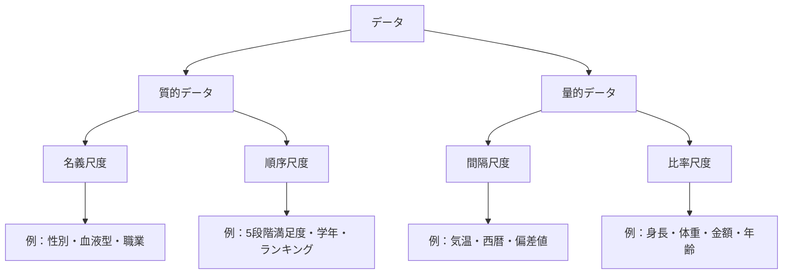
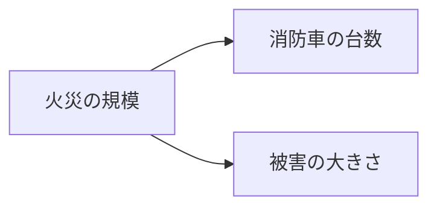
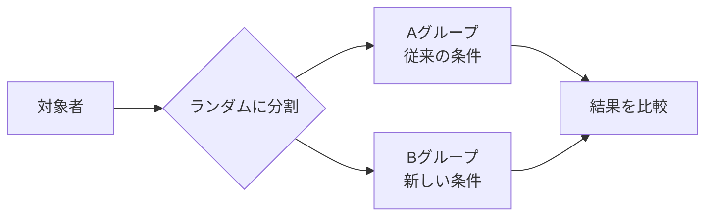
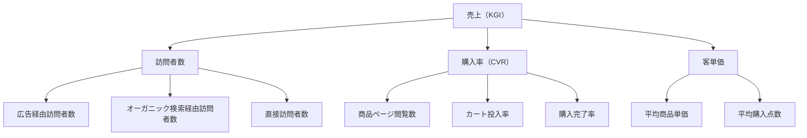

# データ分析入門

数字に強くなる——ビジネスで活きるデータとの向き合い方を学ぶ

| 項目 | 内容 |
|---|---|
| カテゴリー | ビジネススキル |
| 難易度 | 入門 |
| 所要時間 | 約200分（全8レッスン） |
| 公開日 | 2026-05-12 |
| 最終更新日 | 2026-05-30 |
| コースURL | https://skillup.college/courses/business/data-analysis-basics/ |

## 対象者

データ分析という言葉は知っているが、本格的に学んだ経験がない社会人・ビジネスパーソン。マーケティング、企画、営業、人事など、職種を問わず数字を扱う必要がある方。データに苦手意識があり、まずは考え方から学びたい方も対象。

## 前提知識

特になし。四則演算ができれば進められる。ExcelやGoogleスプレッドシートの基本操作（セル入力・関数・グラフ作成）に触れた経験があると理解が早いが、必須ではない。

## 学習目標

- データ分析の目的と基本プロセスを理解し、自分の業務に当てはめて考えられる
- 量的データと質的データを区別し、データの種類に応じた扱い方を判断できる
- 平均・中央値・標準偏差の意味を理解し、データの全体像を読み取れる
- 目的に応じて適切なグラフを選び、データを正しく伝えられる
- 相関と因果の違いを理解し、データの解釈で陥りやすい落とし穴を避けられる
- 仮説検証やA/Bテストの基本的な考え方を業務での意思決定に使える
- コース修了後、データ分析を学び続けるための次の方向を選べる

## コース概要

ビジネスの現場でデータを扱う場面は、年々増えています。営業成績の推移、マーケティング施策の効果、顧客アンケートの結果、人事評価のばらつき——どれも「データを読む力」があるかどうかで、見えてくる景色が変わります。本コースでは、データ分析の考え方と基本プロセスを、ビジネスパーソン向けに丁寧に解説します。記述統計、可視化、データクレンジング、相関と因果、仮説検証、KPIの考え方まで、職種を問わず役立つ基礎を体系的に身につけられます。ExcelやGoogleスプレッドシートを例として使いつつ、特定のツールに依存しない「考え方」を中心に学ぶコースです。

## 学習の流れ

レッスン1〜2で、データ分析の全体像とデータの種類という土台を整えます。レッスン3〜4で、データの全体像をつかむ「記述統計」と、人に伝えるための「可視化」を学びます。レッスン5でデータの前処理（クレンジング）を扱い、レッスン6〜7で分析の中核となる「相関と因果」「仮説検証とA/Bテスト」へと進みます。最後のレッスン8で、データ分析を業務に活かすためのKPI設計と、コース修了後の学習方向を案内します。前半（レッスン1〜2）は「土台」、中盤（レッスン3〜5）は「データの扱い方」、後半（レッスン6〜8）は「意思決定への活用」という三段構えの構成です。

## レッスン一覧

| No. | タイトル | 概要 | 所要時間 |
|---|---|---|---|
| 1 | データ分析とは何か——なぜ今、数字を読む力が必要なのか | データ分析の目的、データドリブンの考え方、分析の基本プロセス（問い→収集→整理→分析→解釈→意思決定）を学ぶ | 25分 |
| 2 | データの種類を見分ける——数値とカテゴリ、構造の違い | 量的データと質的データの違い、名義・順序・間隔・比率の4つの尺度、構造化データと非構造化データを学ぶ | 25分 |
| 3 | 記述統計の基本——平均・中央値・標準偏差で全体像をつかむ | 代表値（平均・中央値・最頻値）の使い分けと、ばらつきの指標（分散・標準偏差・四分位数）を学ぶ | 25分 |
| 4 | データを可視化する——適切なグラフを選ぶ | 棒グラフ・折れ線グラフ・円グラフ・散布図・ヒストグラムの使い分けと、誤解を招くグラフの避け方を学ぶ | 25分 |
| 5 | データクレンジング——分析の前に整える | 欠損値・重複・外れ値・表記揺れ・データ型の不整合の扱い方を学ぶ。「ゴミを入れたらゴミが出る」原則を理解する | 25分 |
| 6 | 相関と因果——「関係がある」と「原因である」は違う | 相関係数の意味、疑似相関と第三の変数、因果関係を主張するための条件を学ぶ | 25分 |
| 7 | 仮説検証とA/Bテスト——意思決定に活かす | 仮説の立て方、A/Bテストの基本、統計的有意性の入り口、早すぎる判断・遅すぎる判断の避け方を学ぶ | 25分 |
| 8 | データ分析を業務に活かす——KPI・ダッシュボード・次の学習 | KPI設計の基本とダッシュボードの考え方を学び、コース修了後の学習方向（Python・pandas／BIツール／統計学・機械学習）を案内する | 25分 |

---

## レッスン1：データ分析とは何か——なぜ今、数字を読む力が必要なのか

（所要時間：25分）

### このレッスンで学ぶこと

- データ分析が何のために行われるかを説明できる
- データドリブンという考え方の意味を理解する
- 分析の基本プロセス（問い→収集→整理→分析→解釈→意思決定）を把握する
- 自分の業務とデータ分析の関係を整理できる

---

### データ分析とは

データ分析とは、集めた数字や記録から何かを読み取り、意思決定や行動につなげる営みです。難しそうに聞こえるかもしれませんが、本質はとてもシンプルです。「事実をなるべく正確に見て、そのうえで判断する」——これがデータ分析の核心です。

逆の状態を想像してみるとわかりやすいでしょう。「なんとなく」「これまでの経験では」「上司の感覚で」決めた施策が、思った成果につながらなかった経験は誰にでもあります。データ分析は、こうした「感覚だけで決める」の対極にある考え方を提供してくれます。

> **💡 ポイント**
> データ分析は「データを使った占い」ではありません。あくまで判断材料を増やすための道具で、最終的に決断するのは人間です。データを「絶対の正解」と捉えるのではなく、判断を助ける材料として扱う姿勢が大切です。

### なぜ今、データを読む力が必要なのか

近年、ビジネスの現場でデータを扱う機会は急速に増えています。背景には、いくつかの大きな変化があります。

**1つ目は、データそのものが増えていること**です。POSレジ、Webアクセスログ、SNSの投稿、IoT機器のセンサーなど、日々あらゆる場所でデータが自動的に蓄積されています。

**2つ目は、ツールが使いやすくなっていること**です。かつてはエンジニアにしか扱えなかった分析作業が、ExcelやBIツールの進化で、誰でも触れられるようになりました。

**3つ目は、競合との差がデータ活用で決まるようになっていること**です。経験と勘だけで戦っていた時代から、データを使って速く・正確に判断する企業や個人が成果を出す時代へと変わってきました。

つまり、データを読む力は、もはや一部の専門職だけのものではなく、ビジネスパーソン全般に求められる教養になりつつあります。

### データドリブンとは

「データドリブン（data-driven）」という言葉を聞いたことがあるでしょうか。直訳すると「データに駆動される」、つまり「データを根拠にして判断や行動を進める」という意味です。

データドリブンの反対は「勘ドリブン」「経験ドリブン」と言えるかもしれません。もちろん、経験や勘がすべて悪いわけではありません。長年の現場感覚は貴重な資産です。ただ、それを「絶対」とせず、データで裏付けたり修正したりする姿勢が、データドリブンの考え方です。

> **📝 補足**
> 「データドリブン」と似た言葉に「データインフォームド（data-informed）」があります。後者は「データを使うが、最終判断は人間の総合判断で行う」というニュアンスで、より現実的な姿勢として近年は支持されています。本コースでも、データを絶対視せず、判断材料として活用する立場で進めます。

### データ分析の基本プロセス

データ分析は、行き当たりばったりに数字をいじることではありません。基本となるプロセスがあります。次の6つのステップで進むのが標準的な流れです。

**1つ目は「問いを立てる」**。何を知りたいのか、何を判断したいのかを明確にします。これが最も大事なステップです。「なんとなくデータを見る」では、得られるものが少ないからです。

**2つ目は「データを集める」**。問いに答えるために必要なデータをどこから集めるかを決め、実際に手元に持ってきます。

**3つ目は「整理する」**。集めたデータをそのまま使える状態にする工程です。欠損があれば対処し、表記のばらつきがあれば揃え、不要なものは取り除きます。これは本コースのレッスン5で扱う「データクレンジング」にあたります。

**4つ目は「分析する」**。整えたデータに対して、平均を取る、ばらつきを見る、関係性を調べる、といった処理を行います。

**5つ目は「解釈する」**。分析の結果が何を意味するかを言葉にします。数字そのものではなく、「だから何が言えるのか」を読み取る工程です。

**6つ目は「意思決定する」**。分析結果を踏まえて、どう行動するかを決め、実際に動きます。

> **💡 ポイント**
> 6つのステップの中で、最初の「問いを立てる」と最後の「意思決定する」が最も価値を生む工程です。中間の作業はツールが助けてくれることが多いですが、問いと意思決定は人間の役割です。

### 実例で見る分析プロセス

抽象的なプロセスだけではわかりにくいので、具体例で追ってみましょう。あるカフェの売上が、ここ3か月で下がってきているとします。

**問いを立てる**：なぜ売上が下がっているのか。曜日や時間帯によって違うのか。

**データを集める**：POSレジの売上データ（日時・商品・金額）を3か月分用意する。

**整理する**：データに欠損があれば補い、商品名の表記揺れ（「カフェラテ」と「カフェラッテ」など）を統一する。

**分析する**：日別・曜日別・時間帯別の売上を集計し、平均と推移を見る。

**解釈する**：「平日の午後の売上が特に落ちている」「常連顧客の来店頻度が下がっている」といった事実を読み取る。

**意思決定する**：平日午後のテコ入れ施策を打つ。例えば14〜17時限定のドリンク割引を試す。

これがデータ分析の典型的な流れです。難しい統計や複雑なツールは使っていませんが、立派なデータ分析です。

### 「データを見ているだけ」では分析にならない

ここで注意したい落とし穴があります。データを眺めているだけ、グラフを作っているだけでは、分析にはなりません。

例えば「先月の売上は120万円でした」というデータだけを示しても、それは事実の報告であって分析ではありません。「先月の売上は120万円で、前月比10%減でした。減った原因は新規顧客の獲得が鈍ったことによるものです」と踏み込むと、ようやく分析になります。

データ分析の価値は、**「何が起きているか」を超えて「なぜ起きているか」「どう動くべきか」まで踏み込むこと**にあります。

> **⚠️ 注意**
> 「データを集めること」自体が目的になってしまう状態を「データのコレクター」と揶揄することがあります。きれいな数字やグラフを作ることに満足してしまい、肝心の意思決定や行動につながらないケースです。本コースを通じて、こうした罠を避ける感覚を養っていきましょう。

### 自分の業務とデータ分析

データ分析は、特別な部署や役職の人だけが行うものではありません。職種別に、データ分析が役立つ場面の例を挙げてみます。

- **マーケティング**：施策ごとの効果測定、ターゲット顧客の特徴の把握
- **営業**：受注確度の分析、商談履歴からの傾向の読み取り
- **企画**：市場規模の推定、競合の動向把握、新商品の需要予測
- **人事**：採用ファネルの分析、離職率の傾向、エンゲージメントの測定
- **経営企画**：KPIのモニタリング、事業ポートフォリオの評価
- **店舗運営**：曜日・時間帯別の来客傾向、商品別の売上構成

ご自身の職種に近いものはありましたか。あるいは、まったく違う分野でも、扱っているデータは違えど考え方は同じです。

### このコースで学ぶこと

本コースを通じて、次のような流れで学んでいきます。

- **レッスン2**：データの種類を見分ける（量的・質的・構造化・非構造化）
- **レッスン3**：記述統計で全体像をつかむ（平均・中央値・標準偏差）
- **レッスン4**：適切なグラフを選んで可視化する
- **レッスン5**：データクレンジングで分析の前準備を整える
- **レッスン6**：相関と因果の違いを理解する
- **レッスン7**：仮説検証とA/Bテストの基本
- **レッスン8**：KPI設計と業務での活かし方、次の学習方向

すべて、ビジネスの現場で本当に役立つ基礎に絞っています。難しい数式や専門的なツールは最小限に抑え、考え方を中心に進めます。

> **🔰 初学者の方へ**
> 「数字や統計が苦手」という方こそ、このコースの対象です。専門用語が出てきても、必ず例え話や実例で説明します。1レッスンずつ、自分のペースで進めてください。

### まとめ

このレッスンでは、以下のことを学びました。

- データ分析とは、データから事実を読み取り、判断や行動につなげる営みである
- データドリブンは「データを根拠に判断する」考え方であり、勘や経験を補強・修正する役割を持つ
- 分析の基本プロセスは「問い→収集→整理→分析→解釈→意思決定」の6ステップ
- 「データを見るだけ」では分析にならない。「なぜ」「どう動くか」まで踏み込むことが分析の価値
- 職種を問わず、データ分析の考え方は活用できる

次のレッスンでは、データの「種類」を見分けられるようになります。量的データと質的データ、構造化データと非構造化データといった分類を学ぶことで、扱うデータに合った分析方法が選べるようになります。

---

### 確認クイズ

このレッスンの理解度をチェックしましょう。

#### Q1. データ分析の説明として最も適切なものはどれか？

- [x] データから事実を読み取り、判断や行動につなげる営み
- [ ] データを集めて美しいグラフを作ること
- [ ] AIに任せておけば自動で結論が出る仕組み
- [ ] 高度な統計知識を持つ専門家だけができる作業

> **解説**
> データ分析は、データを根拠に判断や行動につなげる営みです。グラフ作りはその一部分にすぎず、AIに完全に任せられるものでもありません。職種を問わず、誰もが基本を身につけられるスキルです。

#### Q2. 「データドリブン」の考え方として最も適切なものはどれか？

- [ ] 経験や勘は一切信用せず、データの結果に必ず従う
- [x] データを根拠に判断や行動を進める。経験や勘もデータで裏付けたり修正したりする姿勢
- [ ] データを集めることそのものが目的になる
- [ ] AIだけで判断する

> **解説**
> データドリブンは「データを根拠に判断する」考え方ですが、経験や勘を一切排除するわけではありません。両者を組み合わせ、データで裏付けたり修正したりする姿勢が現実的です。

#### Q3. データ分析の基本プロセスの6ステップとして、本レッスンで紹介された順序はどれか？

- [ ] 収集→分析→問い→整理→解釈→意思決定
- [x] 問い→収集→整理→分析→解釈→意思決定
- [ ] 意思決定→収集→分析→整理→問い→解釈
- [ ] 解釈→分析→意思決定→収集→整理→問い

> **解説**
> 「問いを立てる」から始まり、必要なデータを「収集」、使える状態に「整理」、実際に「分析」、結果を「解釈」、行動を「意思決定」する、という順序です。最初の問いと最後の意思決定が、人間の役割として最も価値を生む工程です。

#### Q4. 「データを見ているだけ」と「データ分析」の違いとして最も適切なものはどれか？

- [ ] グラフを作るかどうか
- [ ] Excelを使うかどうか
- [x] 「何が起きているか」を超えて「なぜ起きているか」「どう動くか」まで踏み込むかどうか
- [ ] 専門の分析ツールを使うかどうか

> **解説**
> 「先月の売上は120万円でした」という事実の報告では分析になりません。「なぜそうなったか」「どう動くべきか」まで踏み込むことで、はじめて分析の価値が生まれます。

#### Q5. 本レッスンで紹介された、データ分析の落とし穴として最も適切なものはどれか？

- [ ] データを集めすぎて時間が足りなくなる
- [x] きれいな数字やグラフを作ることが目的になり、意思決定や行動につながらない
- [ ] Excelの関数を覚えすぎる
- [ ] AIに任せきりにする

> **解説**
> データを集めること自体が目的になってしまう状態は「データのコレクター」と揶揄されることがあります。グラフ作りに満足してしまい、肝心の意思決定や行動につながらないケースは要注意です。

#### Q6. データ分析が活用される職種について、本レッスンで触れていないものはどれか？

- [ ] マーケティング
- [ ] 人事
- [ ] 営業
- [x] データ分析は専門部署にしか役立たない

> **解説**
> 本レッスンでは、マーケティング・営業・企画・人事・経営企画・店舗運営など、幅広い職種でデータ分析が役立つことを紹介しました。職種を問わず基礎は活用できます。

---

## レッスン2：データの種類を見分ける——数値とカテゴリ、構造の違い

（所要時間：25分）

### このレッスンで学ぶこと

- 量的データと質的データの違いを説明できる
- 名義・順序・間隔・比率の4つの尺度を区別できる
- 構造化データと非構造化データの違いを理解する
- 扱うデータに合った分析手法を選べるようになる

---

レッスン1では、データ分析の全体像と基本プロセスを学びました。このレッスンでは、データ分析の前提となる「データの種類」を整理します。データには種類があり、種類によって扱い方や使えるグラフ・分析手法が変わります。最初に種類を見分けられるようになると、その後の作業がぐっとスムーズになります。

### 量的データと質的データ

データはまず、大きく2種類に分けられます。

**量的データ**は、数値で測れるデータです。売上金額、来客数、年齢、気温、商品の重さなどが該当します。足し算や平均を取ることに意味があります。

**質的データ**は、カテゴリで区別するデータです。性別、職業、商品カテゴリ、満足度の「満足／不満」といったラベルが該当します。数字で表されることもありますが、四則演算には意味がないことが多いのが特徴です。

> **💡 ポイント**
> 「数字で書かれているか」だけで区別するのは早計です。例えば「商品番号1番、2番、3番」と並んでいても、これは順序や金額を表しているのではなく、ただの識別ラベルなので質的データです。一方、「身長170cm、171cm」は数字に意味があるので量的データです。

### 4つの尺度——名義・順序・間隔・比率

データの種類は、もう少し細かく4つの「尺度」に分けて考えると、扱い方が見えやすくなります。これは統計学者スティーブンスが提唱した分類で、現在も実務で広く使われています。

先に全体像を図で押さえておきましょう。「質的か量的か」の2分類と、その下にある4つの尺度の対応関係です。



#### 1. 名義尺度（質的データ）

ラベルや分類を表すデータで、順序にも数値的な意味にもならないものです。

- 例：性別（男性／女性／その他）、血液型（A／B／O／AB）、職業（営業／企画／開発）

「A型はB型より大きい」と比べることは意味を持ちません。

#### 2. 順序尺度（質的データ）

カテゴリに順序がついているものです。順序は意味を持ちますが、間隔の大きさは意味を持ちません。

- 例：満足度（とても不満／不満／普通／満足／とても満足）、学年（1年生／2年生／3年生）、ランキング

「とても満足」が「満足」より高評価という順序は意味を持ちますが、「『とても満足』と『満足』の差」と「『満足』と『普通』の差」が同じ大きさかは保証されません。

#### 3. 間隔尺度（量的データ）

数値の差に意味があるが、「0」が「何もない」を意味しない量です。

- 例：気温（摂氏）、西暦の年、テストの偏差値

「20℃と25℃の差は5℃」「2020年と2025年の差は5年」のように、差は意味を持ちます。ただし「0℃」は「気温がない」状態ではないので、「20℃は10℃の2倍」とは言えません。

#### 4. 比率尺度（量的データ）

数値の差に加え、比にも意味がある量。0が「何もない」を意味する場合です。

- 例：身長、体重、金額、来客数、年齢

「100cmは50cmの2倍」「3,000円は1,000円の3倍」のように、比に意味があります。

> **🔰 初学者の方へ**
> 4つの尺度を完璧に覚える必要はありません。実務でよく出るのは「数値（量的）か、カテゴリ（質的）か」の区別と、「カテゴリの中でも順序がついているか」の確認です。間隔尺度と比率尺度の細かい違いは、必要になったときに確認すれば十分です。

### 尺度ごとに使える計算が違う

データの尺度ごとに、意味のある計算は変わります。表にまとめると次のようになります。

| 計算 | 名義 | 順序 | 間隔 | 比率 |
|---|---|---|---|---|
| 出現回数を数える | ◯ | ◯ | ◯ | ◯ |
| 大小・順位を比べる | ✕ | ◯ | ◯ | ◯ |
| 差を計算する | ✕ | ✕ | ◯ | ◯ |
| 比を計算する | ✕ | ✕ | ✕ | ◯ |

例えば、「性別の平均」を計算することはできません（名義尺度なので）。「満足度の平均」も厳密には適切ではありませんが、実務では「便宜的に数値化して平均を取る」ことがよく行われます。これは「不適切だが伝わりやすい」例で、目安として理解するならOK、というのが多くの現場の運用です。

> **⚠️ 注意**
> 順序尺度に対する平均値は、統計学者からは「使うべきでない」と批判されることもあります。とはいえ、5段階評価のアンケートで「平均満足度3.8」のように示す事例は多く、これを完全に避けるのは現実的ではありません。「厳密には目安」だと自覚しておけば、誤った重大な判断を避けられます。

### 構造化データと非構造化データ

データはもう一つの観点で、「構造化されているか」で分けられます。

**構造化データ**は、表のように行と列で整理されたデータです。Excelの表、データベースのテーブル、CSVファイルなどが該当します。データ分析の入門段階で扱うのは、ほとんどがこの構造化データです。

| 日付 | 商品 | 金額 | 数量 |
|---|---|---|---|
| 2026-05-01 | カフェラテ | 480 | 1 |
| 2026-05-01 | サンドイッチ | 580 | 1 |
| 2026-05-02 | カフェラテ | 480 | 2 |

**非構造化データ**は、表として整理されていないデータです。文章、画像、音声、動画などが該当します。

- 顧客アンケートの自由回答（文章）
- SNSの投稿（文章＋画像）
- コールセンターの通話録音（音声）
- 防犯カメラの映像（動画）

非構造化データは情報量が多い一方、そのままでは分析しにくく、テキスト解析や画像認識といった専門技術が必要になります。本コースでは主に構造化データを扱います。

> **📝 補足**
> 近年は、生成AIや機械学習の発展により、非構造化データの分析が一般化してきました。例えば顧客アンケートの自由回答を生成AIで要約・分類する、といった使い方が広がっています。本コースでは深く扱いません。

### 1次データと2次データ

データの「集め方」による分類もあります。

**1次データ**は、自分で目的を持って集めたデータです。自社のPOSデータ、自社で実施したアンケート、自社の顧客から得た問い合わせなど。目的に合わせて設計できる反面、収集に手間とコストがかかります。

**2次データ**は、他者がすでに収集したデータです。政府統計、業界レポート、公開されているWebデータなどがこれにあたります。手軽に入手できますが、自分の問いにぴったり合うとは限らない点に注意が必要です。

実務では、1次データと2次データを組み合わせて使うことが多いです。「業界全体の傾向（2次データ）と、自社の動向（1次データ）を比べる」といった分析が代表的です。

### 実例：レッスン1のカフェ例で確認する

レッスン1で出てきた、売上が下がっているカフェの例で、データの種類を見分けてみましょう。POSレジから取り出した売上データには、次のような項目が並んでいるとします。

| 日時 | 曜日 | 商品名 | 商品カテゴリ | 単価 | 数量 | 顧客満足度 |
|---|---|---|---|---|---|---|

それぞれの項目を分類すると：

- **日時**：間隔尺度（量的データ、構造化）。差や順序に意味がある
- **曜日**：名義尺度（質的データ、構造化）。月〜日は単なる識別ラベル
- **商品名**：名義尺度（質的データ、構造化）
- **商品カテゴリ**：名義尺度（質的データ、構造化）
- **単価**：比率尺度（量的データ、構造化）
- **数量**：比率尺度（量的データ、構造化）
- **顧客満足度（5段階）**：順序尺度（質的データ、構造化）

このように、同じ「データ」と言っても、項目ごとに種類が違います。例えば「商品名の平均」を計算することは意味を持ちませんが、「単価の平均」「数量の合計」は意味を持ちます。「曜日別の売上合計を比べる」も、データの種類を踏まえれば自然な分析だとわかります。

> **💡 ポイント**
> データを扱う前に「これは何尺度のデータか」「どんな計算なら意味があるか」を見極める習慣をつけましょう。慣れてくると、項目を見ただけで頭の中で分類できるようになります。

### まとめ

このレッスンでは、以下のことを学びました。

- データは大きく量的データ（数値）と質的データ（カテゴリ）に分けられる
- 4つの尺度——名義・順序・間隔・比率——で扱い方が変わる
- 尺度によって意味のある計算が異なる（名義は数えるだけ、比率はすべて可能）
- 構造化データ（表形式）と非構造化データ（文章・画像・音声・動画）の違いがある
- 1次データ（自分で集めた）と2次データ（他者が集めた）の使い分けも重要

次のレッスンでは、量的データを「読む」ための最も基本となる「記述統計」を学びます。平均・中央値・標準偏差を使って、データの全体像をつかめるようになりましょう。

---

### 確認クイズ

このレッスンの理解度をチェックしましょう。

#### Q1. 量的データと質的データの違いとして最も適切なものはどれか？

- [x] 量的データは数値で測れるデータ、質的データはカテゴリで区別するデータ
- [ ] 量的データは多いほどよく、質的データは少ないほどよい
- [ ] 量的データは無料、質的データは有料
- [ ] 量的データはコンピューターでしか扱えない

> **解説**
> 量的データは数値（売上金額・年齢など）、質的データはカテゴリ（性別・職業など）です。両者は対立するものではなく、データ分析では両方をうまく組み合わせて扱います。

#### Q2. 「血液型（A／B／O／AB）」が該当する尺度はどれか？

- [x] 名義尺度
- [ ] 順序尺度
- [ ] 間隔尺度
- [ ] 比率尺度

> **解説**
> 血液型はラベルでしかなく、順序にも数値にも意味がありません。これは名義尺度の典型です。

#### Q3. 「アンケートの5段階満足度（1：とても不満〜5：とても満足）」が該当する尺度はどれか？

- [ ] 名義尺度
- [x] 順序尺度
- [ ] 間隔尺度
- [ ] 比率尺度

> **解説**
> 5段階満足度は順序に意味がある（5は4より高評価）一方、「5と4の差」と「4と3の差」が等しいとは保証されません。これは順序尺度の典型です。

#### Q4. 「比に意味があり、0が『何もない』を意味する」のはどの尺度か？

- [ ] 名義尺度
- [ ] 順序尺度
- [ ] 間隔尺度
- [x] 比率尺度

> **解説**
> 比率尺度は、0が「何もない」を意味し、「100kgは50kgの2倍」のように比が意味を持ちます。身長・体重・金額・年齢などが該当します。

#### Q5. 構造化データの説明として最も適切なものはどれか？

- [x] 表のように行と列で整理されたデータ
- [ ] 文章・画像・音声などのデータ
- [ ] AIだけが扱えるデータ
- [ ] 必ず数値で構成されているデータ

> **解説**
> 構造化データは、行と列で整理された表形式のデータです。Excelの表、CSVファイル、データベースのテーブルなどが該当します。文章や画像・音声は非構造化データです。

#### Q6. 1次データと2次データの違いとして最も適切なものはどれか？

- [ ] 1次データは古く、2次データは新しい
- [x] 1次データは自分で目的を持って集めたデータ、2次データは他者がすでに収集したデータ
- [ ] 1次データは正確、2次データは不正確
- [ ] 1次データは無料、2次データは有料

> **解説**
> 1次データは自分で集めるため目的に合わせやすいですが手間がかかります。2次データは政府統計など他者が集めたデータで、手軽に入手できる反面、自分の問いにぴったり合うとは限りません。実務では両者を組み合わせて使います。

#### Q7. 性別（男性／女性／その他）データに対して、意味のある計算はどれか？

- [ ] 平均
- [ ] 差
- [ ] 比
- [x] 出現回数を数える

> **解説**
> 性別は名義尺度なので、出現回数（度数）を数えることだけが意味を持ちます。平均や差・比を取ることはできません。

---

## レッスン3：記述統計の基本——平均・中央値・標準偏差で全体像をつかむ

（所要時間：25分）

### このレッスンで学ぶこと

- 代表値（平均・中央値・最頻値）の意味と使い分けを理解する
- ばらつきの指標（分散・標準偏差）が何を測っているかを説明できる
- 四分位数と箱ひげ図の考え方を知る
- ExcelやGoogleスプレッドシートで主要な値を出せる関数を知る

---

レッスン2では、データの種類を見分けることを学びました。このレッスンでは、量的データを扱うときに必ず登場する「記述統計」の基本を学びます。記述統計とは、データの全体像を要約する技術のことで、データ分析で最初に行うことの多い作業です。

### 記述統計とは

記述統計は、たくさんあるデータを少数の数字や図に要約して、全体の特徴をつかむための技術です。例えば1,000人の顧客アンケートの結果を一人ひとり見ていくのは大変ですが、「平均満足度3.8」「年齢層は20〜60代に幅広く分布」のように要約すれば、全体像が一瞬で見えます。

記述統計で扱う代表的な観点は2つあります。

1. **代表値**：データを1つの数字でまとめると、どこに集まっているか（中心はどこか）
2. **ばらつき**：データがどのくらい広がっているか

この2つを押さえると、データの全体像が見えてきます。

### 代表値1：平均（mean）

最もよく使われる代表値が「平均」です。すべての値を足してデータの個数で割る、というおなじみの計算です。

```
平均 = (値の合計) ÷ (データの個数)
```

例：3人の顧客が払った金額が「1,000円・2,000円・3,000円」なら、平均は (1,000 + 2,000 + 3,000) ÷ 3 = 2,000円。

平均は計算しやすく、合計を共有しやすい便利な指標です。一方、極端な値（外れ値）に引きずられやすいという弱点もあります。

> **💡 ポイント**
> 「平均年収」が話題になるとき、よく「平均は実態とずれている」と言われます。極端に高い人が少数いると、平均が大きく上振れしてしまうためです。次に紹介する中央値の方が、実感に近いことが多いのです。

### 代表値2：中央値（median）

中央値は、データを小さい順に並べたとき、ちょうど真ん中に来る値のことです。

例：1,000円・2,000円・3,000円・4,000円・100,000円という5つの金額があるとき、平均は (1,000 + 2,000 + 3,000 + 4,000 + 100,000) ÷ 5 = 22,000円。
一方、中央値は真ん中の「3,000円」です。

100,000円という外れ値があると、平均は大きく上振れしますが、中央値は影響を受けません。**極端な値の影響を受けにくいのが中央値の特徴**です。

> **💡 ポイント**
> 年収・売上・住宅価格・SNSのフォロワー数など、極端な値が混じりやすいデータでは、平均より中央値のほうが実態を表すことが多いです。「平均と中央値が大きくずれているデータ」は、分布が偏っている可能性があります。

### 代表値3：最頻値（mode）

最頻値は、最も多く出現する値のことです。

例：あるカフェで売れた商品の数が「ラテ50杯・モカ30杯・カプチーノ40杯・エスプレッソ10杯」だったとき、最頻値は「ラテ」です。

質的データ（カテゴリ）の代表値としては、最頻値が最もよく使われます。「一番売れた商品」「一番多い回答」など、ビジネスで自然に使う発想です。

### 平均・中央値・最頻値の使い分け

3つの代表値は、扱うデータと目的に応じて使い分けます。

| 代表値 | 向いている場面 |
|---|---|
| 平均 | 量的データの全体傾向を1つの数字で表したい。極端な値が少ないとき |
| 中央値 | 量的データで、極端な値の影響を受けたくないとき |
| 最頻値 | 質的データの代表的なカテゴリを示したいとき、または「最も多く起きること」を強調したいとき |

> **⚠️ 注意**
> 「平均だけ見て判断する」と、データの実態を見誤ることがあります。可能なら、平均・中央値の両方を出し、ずれが大きい場合は分布をグラフで確認するクセをつけましょう。可視化はレッスン4で扱います。

### ばらつき1：分散と標準偏差

代表値だけでは、データの全体像はつかめません。例えば、次の2つのクラスのテスト結果を考えてみてください。

- クラスA：60点、60点、60点、60点、60点 → 平均60点
- クラスB：20点、40点、60点、80点、100点 → 平均60点

どちらも平均は60点ですが、データの広がりはまるで違います。クラスAは全員同じ点数、クラスBは大きくばらついています。この「ばらつき」を測るのが「分散」と「標準偏差」です。

#### 分散（variance）

分散は、各値と平均の差を二乗して、その平均を取ったものです。「平均からの距離の二乗」の平均なので、データのばらつきが大きいほど分散も大きくなります。

ただし、二乗しているため、元のデータと単位が違ってしまうのが扱いにくい点です。「点数の分散」と言われても、単位は「点の二乗」になってしまいます。

#### 標準偏差（standard deviation）

標準偏差は、分散の平方根を取ったものです。これによって、元のデータと同じ単位に戻せます。

```
標準偏差 = √分散
```

クラスAは標準偏差0（全員同じ点数）、クラスBは標準偏差約28点（大きくばらついている）、と表せます。標準偏差が大きいほどばらつきが大きい、小さいほどそろっている、と読み取れます。

> **🔰 初学者の方へ**
> 数式の意味を完全に理解する必要はありません。「**標準偏差は、データのばらつきの大きさを元の単位で表した数字**」とだけ覚えておけば実用上十分です。値が大きい＝ばらつきが大きい、値が小さい＝そろっている、というイメージです。

### 標準偏差の感覚をつかむ

標準偏差を実務で使うときの目安をいくつか紹介します。

データが正規分布（平均周辺に山ができる左右対称の形）に近いとき、次のような目安があります。

- 平均±1標準偏差の範囲に、約68%のデータが収まる
- 平均±2標準偏差の範囲に、約95%のデータが収まる
- 平均±3標準偏差の範囲に、約99.7%のデータが収まる

例えば、テストの平均が60点・標準偏差が10点なら、約95%の生徒が40点〜80点の範囲に収まる、という見方ができます。

実務のデータが必ず正規分布になるわけではありませんが、おおまかな目安として知っておくと便利です。

### ばらつきの別の表現：四分位数

データのばらつきを別の角度から見るのが「四分位数」です。

データを小さい順に並べて、4等分にする位置の値を四分位数と呼びます。

- 第1四分位数（Q1）：下から25%の位置
- 第2四分位数（Q2）：下から50%の位置 → これが中央値
- 第3四分位数（Q3）：下から75%の位置

「第3四分位数−第1四分位数」を四分位範囲（IQR）と呼び、これは「真ん中半分のデータがどのくらいの範囲に収まっているか」を表します。

四分位数の良いところは、外れ値の影響を受けにくい点です。標準偏差は極端な値に引きずられますが、四分位範囲はそうした影響を抑えてばらつきを表せます。

> **📝 補足**
> 四分位数を視覚的に表したものに「箱ひげ図」があります。中央値を中心に、Q1〜Q3を箱で示し、最小値・最大値をひげで表します。ばらつきや外れ値の有無を一目で確認できる便利なグラフで、データ分析の現場でよく使われます。レッスン4で可視化を扱う際にもう一度触れます。

### ExcelやGoogleスプレッドシートで計算する

ここまでの代表値・ばらつきを、ExcelやGoogleスプレッドシートで出すための関数を紹介します。

| 値 | Excel関数 | Googleスプレッドシート関数 |
|---|---|---|
| 平均 | `=AVERAGE(範囲)` | `=AVERAGE(範囲)` |
| 中央値 | `=MEDIAN(範囲)` | `=MEDIAN(範囲)` |
| 最頻値 | `=MODE.SNGL(範囲)` | `=MODE(範囲)` |
| 分散（標本） | `=VAR.S(範囲)` | `=VAR(範囲)` |
| 標準偏差（標本） | `=STDEV.S(範囲)` | `=STDEV(範囲)` |
| 第1四分位数 | `=QUARTILE.INC(範囲, 1)` | `=QUARTILE(範囲, 1)` |

例えば、A2〜A100セルに売上データが入っているとき、`=AVERAGE(A2:A100)` で平均が、`=STDEV.S(A2:A100)` で標準偏差が出せます。

> **💡 ポイント**
> 関数名は微妙にツール間で違いますが、本コースの段階では「こういう関数で出せる」と知っておけば十分です。実際に使うときは、お使いのツールのヘルプで関数名を確認してください。

### 実例：3つの店舗の売上を読み解く

最後に、実例で読み取り方を練習しましょう。3つの店舗の月別売上（10か月分）から、次のような記述統計が得られたとします。

| 店舗 | 平均 | 中央値 | 標準偏差 |
|---|---|---|---|
| A店 | 100万円 | 100万円 | 5万円 |
| B店 | 100万円 | 95万円 | 30万円 |
| C店 | 100万円 | 100万円 | 0万円 |

どの店舗も平均は100万円ですが、ばらつきと中央値は大きく違います。

- **A店**：平均と中央値が一致しており、標準偏差も小さい。安定して100万円前後の売上が出ている
- **B店**：平均は100万円だが、中央値は95万円で、標準偏差が大きい。月によって大きく振れている。たまに大きな売上が出て平均を押し上げている可能性
- **C店**：標準偏差が0。10か月とも常にぴったり100万円。むしろ不自然で、データの誤りや計上の特殊な事情を疑うべき

このように、平均だけでなく中央値と標準偏差を組み合わせることで、データの実態が見えてきます。

> **💡 ポイント**
> 標準偏差が「不自然なほど小さい・大きい」場合、データの収集や入力に問題がある可能性も考えるべきです。記述統計はデータの異常に気づくための第一歩でもあります。

### まとめ

このレッスンでは、以下のことを学びました。

- 記述統計は、データの全体像を要約する技術
- 代表値（平均・中央値・最頻値）は、データの中心を表す
- 平均は計算しやすいが外れ値に弱く、中央値は外れ値の影響を受けにくい
- ばらつきは分散・標準偏差で測る。標準偏差は元のデータと同じ単位
- 正規分布に近いデータでは、平均±2標準偏差で約95%が収まる
- 四分位数と箱ひげ図で、外れ値に強いばらつきの把握ができる
- ExcelやGoogleスプレッドシートには記述統計用の関数が一通り揃っている

次のレッスンでは、ここで学んだ数字をグラフで「見える化」する方法を学びます。グラフの種類と選び方、そして誤解を招くグラフの避け方を身につけましょう。

---

### 確認クイズ

このレッスンの理解度をチェックしましょう。

#### Q1. 「外れ値の影響を受けにくい代表値」として正しいものはどれか？

- [ ] 平均
- [x] 中央値
- [ ] 合計
- [ ] 標準偏差

> **解説**
> 中央値はデータを小さい順に並べて真ん中の値を取るため、極端な値の影響を受けません。平均は外れ値があると大きく動きます。標準偏差はばらつきの指標で、代表値ではありません。

#### Q2. 標準偏差が表しているものとして最も適切なものはどれか？

- [ ] データの中心の位置
- [x] データのばらつきの大きさを元の単位で表したもの
- [ ] データの個数
- [ ] データの最大値と最小値の差

> **解説**
> 標準偏差は、データのばらつきを元のデータと同じ単位で表した指標です。値が大きいほどばらつきが大きく、小さいほどそろっています。最大値と最小値の差は「範囲（レンジ）」で別の指標です。

#### Q3. 「正規分布に近いデータで、平均±2標準偏差の範囲に収まる割合」として最も近いものはどれか？

- [ ] 約50%
- [ ] 約68%
- [x] 約95%
- [ ] 約100%

> **解説**
> 正規分布では、平均±1標準偏差で約68%、±2標準偏差で約95%、±3標準偏差で約99.7%のデータが収まります。これは目安として実務でも頻繁に使われます。

#### Q4. 平均と中央値が大きくずれているデータについての説明として最も適切なものはどれか？

- [ ] データに誤りがあるはず
- [x] 分布が偏っている可能性がある（極端な値や偏りがあるかもしれない）
- [ ] 平均と中央値はいつもずれるので気にする必要はない
- [ ] そのようなデータは存在しない

> **解説**
> 平均は極端な値に引きずられるため、平均と中央値が大きくずれているときは分布が偏っている可能性があります。年収・住宅価格などでよく見られる現象です。中央値の方が実態に近いことが多いです。

#### Q5. ExcelやGoogleスプレッドシートで平均を求める関数として正しいものはどれか？

- [x] AVERAGE
- [ ] MEAN
- [ ] AVG
- [ ] AVE

> **解説**
> Excel・Googleスプレッドシートどちらでも、平均は `=AVERAGE(範囲)` で求められます。`MEAN` や `AVG` は他のソフトウェアの関数で、Excel系では使えません。

#### Q6. 質的データ（カテゴリ）の代表値として最もよく使われるものはどれか？

- [ ] 平均
- [ ] 中央値
- [x] 最頻値
- [ ] 標準偏差

> **解説**
> 質的データには平均や中央値の計算が意味を持たないため、最も多く出現する値である「最頻値」が代表値として使われます。「一番売れた商品」のようなビジネスの発想と一致します。

#### Q7. 第1四分位数（Q1）から第3四分位数（Q3）までの範囲が表すものとして最も適切なものはどれか？

- [ ] データの最大値と最小値
- [x] 真ん中半分（50%）のデータがどのくらいの範囲に収まっているか
- [ ] データの平均
- [ ] データの個数

> **解説**
> 第1四分位数〜第3四分位数の範囲（四分位範囲・IQR）は、データを小さい順に並べたときの真ん中50%のデータが収まる幅を表します。外れ値の影響を受けにくい、ばらつきの指標です。

---

## レッスン4：データを可視化する——適切なグラフを選ぶ

（所要時間：25分）

### このレッスンで学ぶこと

- 可視化の目的とよくあるグラフの特徴を理解する
- 目的に応じて適切なグラフを選べる
- 誤解を招くグラフの典型例を知り、避けられる
- ExcelやGoogleスプレッドシートでグラフを作る基本を押さえる

---

レッスン3では、平均・中央値・標準偏差といった数値による要約を学びました。このレッスンでは、データをグラフとして「見える化」する方法を学びます。同じデータでも、適切なグラフを使えば一瞬で伝わり、誤ったグラフを使うと逆に混乱を生みます。

### 可視化の目的

データを可視化する目的は、大きく2つあります。

**1つ目は「自分が理解するため」**。表の数字を眺めるだけでは見えない傾向や異常を、グラフにすると一瞬で気づけることがあります。データ分析の最初の段階で、ざっくりグラフを描いて全体像を見る作業は「探索的データ分析（EDA）」と呼ばれ、実務では必須の習慣です。

**2つ目は「他者に伝えるため」**。上司・同僚・顧客に分析結果を共有するとき、表の数字よりグラフのほうが直感的に伝わります。プレゼンや報告書では、グラフが意思決定の決め手になることも多いです。

> **💡 ポイント**
> 「グラフを作る」のは作業の中間地点で、ゴールは「伝わる・気づく」ことです。きれいなグラフを作ること自体が目的にならないよう、何のための可視化なのかを意識しましょう。

### 代表的な5種類のグラフ

ビジネスの現場でよく使うグラフは、実はそれほど多くありません。本レッスンでは特に重要な5つに絞って紹介します。

#### 1. 棒グラフ

「カテゴリごとの数量を比較する」のに最適なグラフです。

- 例：商品別の売上、店舗別の来客数、部署別の人数

縦棒・横棒の両方がありますが、項目名が長いときは横棒のほうが読みやすくなります。

#### 2. 折れ線グラフ

「時間の経過に伴う変化を示す」のに最適なグラフです。

- 例：月別売上の推移、Webサイトの月間訪問者数の推移、株価の推移

横軸に時間、縦軸に数値を取り、点を線で結んで「変化の流れ」を表現します。

#### 3. 円グラフ

「全体に対する内訳の割合を示す」のに使うグラフです。

- 例：売上の商品カテゴリ別構成比、市場シェア

便利に見えますが、項目数が多すぎると見づらく、比較も難しいため、項目は3〜5個程度が目安です。それ以上になる場合は棒グラフのほうが伝わりやすいことが多いです。

#### 4. 散布図

「2つの量的データの関係を見る」のに使います。レッスン6で扱う「相関」とセットで重要です。

- 例：広告費と売上の関係、勉強時間とテストの点数の関係

縦軸と横軸にそれぞれ別のデータを取り、各データを点で打ちます。点の散らばり方から関係性を読み取ります。

#### 5. ヒストグラム

「数値データの分布を見る」のに使います。レッスン3で学んだ「ばらつき」を視覚化する代表的なグラフです。

- 例：顧客の年齢分布、商品単価の分布、テストの点数の分布

ヒストグラムは棒グラフに似ていますが、横軸が「カテゴリ」ではなく「数値の範囲」になります。棒の間に隙間を空けないのが慣例です。

> **📝 補足**
> レッスン3で触れた「箱ひげ図」も、複数のデータのばらつきを比べたいときに便利です。最近のExcel・スプレッドシートでも作成できますが、入門段階ではヒストグラムをまず使いこなすことを優先しましょう。

### グラフ選びの目安

「どんなときにどのグラフを使うか」を整理した目安です。

| 目的 | おすすめのグラフ |
|---|---|
| カテゴリごとの数量を比較したい | 棒グラフ |
| 時間の経過に伴う変化を見たい | 折れ線グラフ |
| 全体に対する割合（構成比）を示したい | 円グラフ（項目が3〜5個程度のとき） |
| 2つの数値の関係を見たい | 散布図 |
| 1つの数値データのばらつき・分布を見たい | ヒストグラム |

> **💡 ポイント**
> グラフを作る前に「何を伝えたいか」を1文で書いてみましょう。例えば「商品Aの売上が他より大きいことを伝えたい」なら棒グラフ、「売上が3か月で下がってきていることを伝えたい」なら折れ線グラフ、と自然に決まります。

### やってしまいがちな失敗

可視化でよくある失敗を3つ紹介します。これらを避けるだけで、グラフの質はぐっと上がります。

#### 失敗1：円グラフを使いすぎる

円グラフは「割合」を示すのに使いますが、項目が増えると一気に読みにくくなります。同じデータでも、項目数が多い場合は棒グラフのほうが比較しやすく、誤解も生みません。

> **⚠️ 注意**
> 「3D円グラフ」は特に避けましょう。3D表現は手前の項目を大きく見せる効果があり、実際の比率を誤って伝える原因になります。実務では平面の2D表現が基本です。

#### 失敗2：縦軸を不自然に切る

棒グラフや折れ線グラフで、縦軸の0を省略すると、わずかな差が極端に大きく見えます。

例：100→102の変化を、縦軸を98から始めるグラフで描くと「2倍以上に増えた」ように見えてしまう。

意図的に行うと「データで嘘をつく」ことになりかねません。原則として、棒グラフは0から始めるのが安全です。折れ線グラフは変化を強調する目的で軸を切ることもありますが、その場合は注釈を入れて誠実に伝えます。

#### 失敗3：必要のない装飾でデータを邪魔する

派手な色、過剰なエフェクト、立体的な装飾——どれもデータの読み取りを邪魔します。データ可視化の世界では、装飾を控えめにし、データそのものを引き立てるのが基本姿勢です。

> **📖 もっと詳しく**
> 「データインク比」という考え方があります。グラフのうち、データを表現するインク（実質的な情報）の比率を高めようという原則です。提唱者のエドワード・タフテは『The Visual Display of Quantitative Information』という古典的な書籍で、データ可視化の本質を体系化しました。

### ExcelやGoogleスプレッドシートでの作り方

ExcelとGoogleスプレッドシートでは、データの範囲を選択してメニューから「グラフの挿入」を選ぶだけで、基本的なグラフが作れます。

**Excelの手順：**
1. データ範囲を選択
2. 「挿入」タブの「グラフ」セクションから種類を選ぶ
3. 必要に応じてタイトル・軸ラベル・凡例を編集

**Googleスプレッドシートの手順：**
1. データ範囲を選択
2. メニューの「挿入」→「グラフ」をクリック
3. 右側のエディタで種類を選び、調整する

どちらも、軸の最小値・最大値、目盛りの間隔、色などを後から調整できます。最初は基本のグラフだけ覚えて、必要に応じて細かい設定を学んでいけば十分です。

> **🔰 初学者の方へ**
> 美しいグラフより、まず「正しい種類のグラフ」「縦軸の0を省略しない」「タイトルと軸ラベルがわかりやすい」の3点を押さえることを優先しましょう。基本さえ守れば、デザインの細部はあとからいくらでも改善できます。

### 良いグラフの3つのチェックポイント

最後に、できあがったグラフを見直すときのチェックポイントを3つにまとめます。

**1つ目：タイトルが明確か**

「2026年4月 商品別売上比較」のように、何のグラフかが一目でわかるタイトルを付けましょう。「グラフ1」のような無味乾燥なタイトルは避けます。

**2つ目：軸ラベルと単位が明示されているか**

縦軸に「売上（万円）」、横軸に「商品名」のようなラベルが付いているかを確認します。単位を書き忘れると、見る人が「これは円なのか万円なのか」と混乱します。

**3つ目：選んだグラフが目的と合っているか**

「変化を見たいのに円グラフ」「比較したいのに折れ線グラフ」など、目的とずれていないかをチェックします。グラフを変えるだけで、伝わりやすさは劇的に変わります。

### まとめ

このレッスンでは、以下のことを学びました。

- 可視化の目的は「自分が理解するため」と「他者に伝えるため」の2つ
- 代表的な5種類のグラフは、棒グラフ・折れ線グラフ・円グラフ・散布図・ヒストグラム
- 目的に応じてグラフを選び分ける（比較・変化・割合・関係・分布）
- 円グラフを使いすぎる、縦軸を切る、装飾を過剰にする、はやりがちな失敗
- グラフの完成後は、タイトル・軸ラベル・グラフ選びの3点をチェックする

次のレッスンでは、分析の前段階として欠かせない「データクレンジング」を学びます。集めたデータをそのまま使えることはほとんどなく、整える作業が必要です。「ゴミを入れたらゴミが出る」原則と、よくある対処パターンを身につけましょう。

---

### 確認クイズ

このレッスンの理解度をチェックしましょう。

#### Q1. 「時間の経過に伴う変化を示す」のに最適なグラフはどれか？

- [ ] 棒グラフ
- [ ] 円グラフ
- [x] 折れ線グラフ
- [ ] 散布図

> **解説**
> 折れ線グラフは時間軸での変化を表現するのに最適です。横軸に時間、縦軸に数値を取り、点を線で結んで流れを示します。月別売上の推移などが典型例です。

#### Q2. 「2つの量的データの関係性を見る」のに最適なグラフはどれか？

- [ ] 棒グラフ
- [ ] 折れ線グラフ
- [ ] 円グラフ
- [x] 散布図

> **解説**
> 散布図は縦軸と横軸にそれぞれ別のデータを取り、各データを点で打って関係性を見るためのグラフです。広告費と売上の関係などを見るときに使います。レッスン6で扱う相関とセットで重要です。

#### Q3. 「1つの数値データのばらつき・分布を見る」のに最適なグラフはどれか？

- [ ] 棒グラフ
- [ ] 折れ線グラフ
- [ ] 散布図
- [x] ヒストグラム

> **解説**
> ヒストグラムは、数値の範囲（階級）ごとの度数を棒で表す、分布を見るためのグラフです。年齢分布や売上金額の分布などを把握するのに使います。

#### Q4. 円グラフの使い方として最も適切なものはどれか？

- [ ] 時間の経過による変化を示す
- [x] 全体に対する内訳の割合を示す（項目数は3〜5個程度が目安）
- [ ] 2つの数値の関係を見る
- [ ] 必ず3D表現で派手に見せる

> **解説**
> 円グラフは「全体に対する割合」を表すのに使います。項目数が多すぎると見づらくなるため、3〜5個程度が目安です。3D表現は手前の項目を大きく見せる効果があるので避けましょう。

#### Q5. 棒グラフでよくある失敗として、本レッスンで紹介された落とし穴はどれか？

- [ ] タイトルが長すぎる
- [x] 縦軸の0を省略して、わずかな差を極端に大きく見せてしまう
- [ ] 色を1色にしてしまう
- [ ] グラフのサイズを変えない

> **解説**
> 棒グラフで縦軸の0を省略すると、わずかな差が極端に大きく見えるという「見え方の歪み」が起きます。意図しなくても誤解を生むため、棒グラフの縦軸は0から始めるのが基本です。

#### Q6. グラフ作成後にチェックすべきポイントとして、本レッスンで紹介されていないものはどれか？

- [ ] タイトルが明確か
- [ ] 軸ラベルと単位が明示されているか
- [ ] 選んだグラフが目的と合っているか
- [x] グラフが必ず3D表現になっているか

> **解説**
> 3D表現はむしろ避けるべき装飾の典型です。本レッスンでチェックすべきとして紹介したのは「タイトルの明確さ」「軸ラベルと単位」「グラフと目的の整合」の3点でした。

---

## レッスン5：データクレンジング——分析の前に整える

（所要時間：25分）

### このレッスンで学ぶこと

- データクレンジングが必要な理由を説明できる
- 欠損値・重複・外れ値・表記揺れの対処法を知る
- データ型の不整合に気づき、修正できる
- 「ゴミを入れたらゴミが出る」原則を理解する

---

レッスン4までで、データの種類・記述統計・可視化を学びました。実はここまでの内容は、すべて「きれいなデータ」が手元にある前提でした。現実のデータ分析では、ほとんどの場合、最初にデータを整える作業が必要です。このレッスンでは、その作業——「データクレンジング」——を学びます。

### データクレンジングとは

データクレンジング（cleansing、または cleaning）は、データに含まれるエラー・欠損・重複・表記揺れなどを取り除き、分析できる状態に整える作業のことです。日本語では「データクリーニング」「データの前処理」とも呼ばれます。

実務のデータ分析では、全工程の半分以上の時間がクレンジングに費やされる、と言われることがあります。「分析」というと華やかな仕事に聞こえますが、地味な前処理がほとんど、というのが現実です。

> **💡 ポイント**
> 「Garbage In, Garbage Out（ゴミを入れたらゴミが出る）」という言葉があります。略してGIGO（ガイゴ）と呼ばれます。入力するデータが汚れていれば、いくら高度な分析手法を使っても、出てくる結果はゴミ同然——という考えです。クレンジングは見栄えの悪い作業ですが、分析の質を決定づけます。

### 現実のデータは「汚れている」

理想的には、データは整然と入力されているべきです。しかし現実は次のような状態が普通です。

- 一部のセルが空欄になっている（欠損値）
- 同じ顧客が二重に登録されている（重複）
- ある月の売上が桁違いに大きい（外れ値）
- 「東京」「東京都」「Tokyo」が混在している（表記揺れ）
- 日付の列に「2026/05/12」と「2026-05-12」が混在している（データ型の不整合）

これらをそのまま分析にかけると、平均が狂ったり、グラフが歪んだり、結論を誤ったりします。次から、よくあるパターンと対処を順に見ていきます。

### クレンジング1：欠損値の扱い

「データが入っていない」セルを欠損値と呼びます。Excelでは空白セル、データベースでは `NULL` と表現されることが多いです。

#### 欠損値が発生する原因

- アンケートの未回答
- システムのバグや一時的な障害
- 取得時の物理的な問題（センサー不調など）
- 「該当なし」を意図的に空欄にした

#### 欠損値への対処

主な対処は3つあります。

**1つ目は「除外する」**：欠損のある行を分析対象から外す。シンプルだが、データ量が大きく減ることもある。

**2つ目は「補完する」**：平均・中央値・最頻値などで埋める。簡便だが、本当の値とずれる危険がある。

**3つ目は「『欠損あり』として扱う」**：欠損していること自体を1つの情報とみなし、新たなカテゴリ（例：「未回答」）を作る。

> **⚠️ 注意**
> 欠損値を機械的に「0」で埋めるのはやめましょう。例えば「年齢」の欠損を0で埋めると、平均年齢が大きく下がってしまいます。0と「未入力」は別の意味です。

### クレンジング2：重複データの除去

同じデータが2回以上記録されていることも、よくあります。

- 同じメールアドレスで2度登録された顧客
- システムエラーで同じ取引が2回記録された
- 別の人がコピー&ペーストで同じ行を作ってしまった

重複を放置すると、人数・件数の集計が二重にカウントされてしまいます。

#### 重複への対処

ExcelやGoogleスプレッドシートには、重複を取り除く機能が標準で備わっています。

- Excel：「データ」タブの「重複の削除」
- Googleスプレッドシート：「データ」→「データクリーンアップ」→「重複を削除」

ただし、機械的に削除する前に「どの列が一致したら重複とみなすか」を考える必要があります。例えば「氏名と電話番号が一致したら重複」と判断するか、「メールアドレスのみで判断する」かで結果が変わります。

> **💡 ポイント**
> 重複の判定基準は、データの性質によって変わります。慎重に検討せず削除すると、本来は別の顧客だったデータをまとめて消してしまう危険があります。

### クレンジング3：外れ値の扱い

外れ値（outlier）は、ほかのデータから大きく外れた値のことです。例えば、月平均10万円の売上の中で、ある月だけ1,000万円という値が混じっているような場合です。

#### 外れ値の原因

- データ入力ミス（桁を間違えた）
- センサー異常や測定エラー
- 本当に特別なイベントが起きた
- 別の集団のデータが紛れ込んでいる

#### 外れ値への対処

外れ値を見つけても、すぐに削除してはいけません。**まず「なぜそうなったか」を調べる**のが原則です。

- 単なるミスなら、修正または除外
- 本当の特別なイベントなら、注釈をつけて残す
- 別の集団なら、分析対象を分ける

外れ値を機械的に除外すると、肝心の重要な情報を見落とすことがあります。例えば「あるキャンペーン日だけ売上が10倍になった」という外れ値は、貴重なヒットの記録かもしれません。

> **⚠️ 注意**
> 外れ値は「異常値」とも「特別値」とも言える曖昧な存在です。データを見て「なぜ」を考えるクセをつけましょう。

### クレンジング4：表記揺れの統一

同じものを違う書き方で記録してしまう「表記揺れ」も、現場で頻発します。

例：
- 「東京都」「東京」「Tokyo」「とうきょう」
- 「株式会社○○」「（株）○○」「○○株式会社」
- 「2026/05/12」「2026-05-12」「2026年5月12日」

これらをそのままにすると、「東京都」と「東京」が別カテゴリとして集計され、実態と違う結果が出ます。

#### 対処

表記揺れの解消は、項目によって方針が変わります。

- **都道府県・市区町村**：マスタを用意して照合（例：総務省の地方公共団体コード）
- **企業名**：標準化ルールを決める（例：「株式会社」は前置で統一）
- **日付・時刻**：ツールの機能でフォーマットを揃える

Excelの「検索と置換（`Ctrl + H`）」や、関数の `SUBSTITUTE`、Googleスプレッドシートの正規表現を使った置換などで対処できます。

> **💡 ポイント**
> 表記揺れを完全に防ぐには、データ入力の段階でリスト選択式（プルダウン）にする、必須項目のバリデーション（妥当性チェック）を入れるなど、入力時の工夫が効果的です。クレンジングで毎回直すより、入り口で揃える方が長い目で見て楽です。

### クレンジング5：データ型の不整合

「数値の列に文字列が混じっている」「日付の列にいろいろなフォーマットが混在している」といった、データ型の不整合もよくあります。

例：
- 「金額」列に `1,000` と `1000` と `"1,000円"` が混在
- 「日付」列に `2026/5/12` と `2026-05-12` と `5月12日` が混在

これがあると、Excelの合計関数が正しく動かなかったり、並べ替えが意図と違う順序になったりします。

#### 対処

- 数値列：カンマや単位を取り除き、純粋な数値に統一
- 日付列：標準的なフォーマット（`YYYY-MM-DD` など）に統一
- カテゴリ列：表記揺れを統一

ExcelもGoogleスプレッドシートも、データ型を視覚的に区別する機能を持っています（数値は右寄せ、文字列は左寄せがデフォルト）。データを並べたときに表示位置がそろっていない列があれば、データ型の不整合を疑いましょう。

### クレンジング作業の進め方

実際にデータを整えるときは、次の順序で進めるのがおすすめです。

1. **データの全体像をつかむ**：行数・列数・各列の中身をざっと確認する
2. **データ型を揃える**：数値・日付・文字列を、それぞれの型に整理する
3. **重複を取り除く**：判定基準を決めて重複行を除去
4. **欠損値を確認する**：どの列にどれだけ欠損があるか把握し、対処方針を決める
5. **表記揺れを統一する**：同じものを違う書き方で表現していないか確認
6. **外れ値を調べる**：異常な値を見つけたら原因を確認

最後に、クレンジング前後でデータの行数・主要な集計値（合計・平均など）を比べ、想定外の変化がないかを確認します。

> **🔰 初学者の方へ**
> クレンジングは地道で時間のかかる作業ですが、慣れるほど早くなります。最初はチェックリストを手元に置き、1つずつ確認するクセをつけましょう。慣れてくると、データを見ただけで「ここに欠損が多そう」「この列は表記揺れがありそう」と勘が働くようになります。

### まとめ

このレッスンでは、以下のことを学びました。

- データクレンジングは、データを分析できる状態に整える作業で、全工程の半分以上を占めることもある
- 「ゴミを入れたらゴミが出る（GIGO）」が基本原則
- 主な対処対象は、欠損値・重複・外れ値・表記揺れ・データ型の不整合
- 欠損値を機械的に0で埋める、重複を判定基準を考えずに削除する、外れ値を理由なく除外する、はやってはいけない代表的な悪手
- 作業順序は「全体像→データ型→重複→欠損→表記揺れ→外れ値」が目安

次のレッスンでは、整えたデータを使った分析の中核となる「相関と因果」を学びます。「2つのデータに関係がある」のと「片方が原因でもう片方が結果である」のは、まったく違う話です。データ分析でもっとも誤解されやすいテーマを丁寧に扱います。

---

### 確認クイズ

このレッスンの理解度をチェックしましょう。

#### Q1. データクレンジングが大事な理由を表す原則として正しいものはどれか？

- [ ] Less is More（少ないほど良い）
- [x] Garbage In, Garbage Out（ゴミを入れたらゴミが出る）
- [ ] First In, First Out（先入れ先出し）
- [ ] No Pain, No Gain（苦労なくして得るものなし）

> **解説**
> Garbage In, Garbage Out（略してGIGO）は、入力データが汚れていれば、いくら高度な分析手法を使っても出てくる結果はゴミ同然、という考えです。クレンジングが分析の質を決定づけることを表す古典的な原則です。

#### Q2. 欠損値の対処として、本レッスンで「やってはいけない」とされているものはどれか？

- [ ] 欠損のある行を除外する
- [ ] 平均値で補完する
- [x] 機械的に0で埋める
- [ ] 「未入力」というカテゴリを作る

> **解説**
> 「年齢」など意味のある数値の欠損を0で埋めると、平均が大きく下がるなどデータの実態を壊してしまいます。0と「未入力」は別の意味として扱うべきです。

#### Q3. 外れ値を見つけたとき、まず最初にすべきことはどれか？

- [ ] 必ず削除する
- [x] なぜそうなったかを調べる
- [ ] 平均値で置き換える
- [ ] 別のグラフを作る

> **解説**
> 外れ値は単純なミスのこともあれば、貴重な特別なイベントのこともあります。機械的に削除する前に「なぜ」を考える姿勢が大切です。

#### Q4. 「東京都」「東京」「Tokyo」がデータに混在している状態を何と呼ぶか？

- [ ] 欠損値
- [ ] 外れ値
- [x] 表記揺れ
- [ ] 重複

> **解説**
> 同じものを違う書き方で記録してしまう状態を「表記揺れ」と呼びます。マスタを用意して照合する、置換機能を使う、入力段階でプルダウン化するなどの対処方法があります。

#### Q5. 重複データへの対処として最も適切なものはどれか？

- [ ] 重複は気にする必要がない
- [x] どの列が一致したら重複とみなすか、判定基準を決めてから機能で削除する
- [ ] 必ず最新の行を残し、古い行はすべて消す
- [ ] 重複は分析を正確にするので残しておく

> **解説**
> 機械的に重複削除すると、本来は別の顧客だったデータをまとめて消す危険があります。「どの列が一致したら重複とみなすか」を慎重に検討するのがポイントです。

#### Q6. クレンジング作業の進め方として、本レッスンで紹介された一般的な順序はどれか？

- [ ] 重複→欠損→外れ値→全体像→データ型
- [x] 全体像→データ型→重複→欠損→表記揺れ→外れ値
- [ ] 外れ値→欠損→全体像→重複→データ型
- [ ] 全体像→外れ値→欠損→重複→データ型

> **解説**
> 最初に全体像をつかみ、データ型を揃え、重複を除き、欠損を確認し、表記揺れを統一し、最後に外れ値を調べる、という順序が一般的です。

---

## レッスン6：相関と因果——「関係がある」と「原因である」は違う

（所要時間：25分）

### このレッスンで学ぶこと

- 相関の意味と相関係数の感覚的な理解を身につける
- 相関と因果が違うことを実例で説明できる
- 疑似相関と第三の変数を見抜く視点を持つ
- 因果関係を主張するための条件を知る

---

レッスン5までで、データを整え、要約し、グラフで見える化する技術を学びました。このレッスンでは、データ分析の中でも特に間違いの起きやすい「相関と因果」を扱います。データを使うときに最も陥りやすい誤解の一つで、ここを押さえると、データ分析の解釈力がぐっと上がります。

### 相関とは

2つの量的データがあるとき、片方が変化するともう片方も変化する関係を「相関」と呼びます。

- 例：気温が上がるとアイスの売上が上がる
- 例：勉強時間が長いほどテストの点数が高い

相関にはいくつかのパターンがあります。

**正の相関**：片方が増えると、もう片方も増える関係。例：身長と体重、広告費と認知度。

**負の相関**：片方が増えると、もう片方は減る関係。例：商品の価格と販売数、運動時間と体重。

**無相関**：2つの値の間に明確な関係が見られない状態。

> **💡 ポイント**
> 相関の有無やパターンを視覚的に確認するのに最適なのが、レッスン4で紹介した「散布図」です。点が右肩上がりなら正の相関、右肩下がりなら負の相関、ばらばらなら無相関、と一目で読み取れます。

### 相関係数

2つのデータの相関の強さを数値で表したものが「相関係数」です。一般的にはピアソンの相関係数を指し、`-1` から `+1` の範囲を取ります。

- `+1` に近いほど強い正の相関（完全な正の相関は +1）
- `-1` に近いほど強い負の相関（完全な負の相関は -1）
- `0` に近いほど相関が弱い（無相関）

#### 相関係数の目安

絶対値で見たときの一般的な解釈です。

| 絶対値の範囲 | 一般的な解釈 |
|---|---|
| 0.0〜0.2 | ほとんど相関なし |
| 0.2〜0.4 | 弱い相関 |
| 0.4〜0.7 | 中程度の相関 |
| 0.7〜1.0 | 強い相関 |

ただし、これはあくまで目安です。分野や文脈によって基準は変わります。

#### ExcelやGoogleスプレッドシートでの相関係数

相関係数の関数は次のとおりです。

- Excel・Googleスプレッドシート共通：`=CORREL(範囲1, 範囲2)`

例えば、A列に気温、B列にアイスの売上が入っているとき、`=CORREL(A2:A100, B2:B100)` で相関係数が出ます。

> **🔰 初学者の方へ**
> 相関係数の計算式を覚える必要はありません。「-1から+1の範囲を取り、0から離れるほど強い関係」とだけ覚えておけば十分です。

### ここからが本題：相関は因果ではない

データ分析で最も誤解されやすいのが、「相関があるからといって、因果関係があるとは限らない」という点です。

「相関がある」とは、「2つのデータが一緒に動いている」という事実だけを指します。「片方がもう片方の原因である」という意味ではありません。

> **💡 ポイント**
> 「相関は因果ではない（Correlation does not imply causation）」は、データ分析の世界で最も有名な格言の一つです。データを使う人全員が肝に銘じるべき原則です。

### 実例で見る「相関と因果のずれ」

#### 例1：アイスの売上と水難事故

夏のあいだ、アイスの売上が増えると、水難事故も増える、というデータがあったとします。相関係数は正で、強い相関が見られます。

しかし、アイスを食べると水難事故が起きるわけではありません。両者の本当の原因は「気温が上がる」という第三の要因です。気温が上がると、アイスが売れる。気温が上がると、海・川・プールに行く人が増えて水難事故が起きる。

この関係を図にすると、次のようになります。


実線の矢印が「本当の因果」、破線が「データ上に見える、見かけの相関」です。両者は同時に動きますが、片方がもう片方の原因ではなく、上にある「気温」がそろって動かしているだけ——という構造が見て取れます。

このように、別の要因が両方に影響していて、見かけ上の相関が出ることを「疑似相関」と呼びます。

#### 例2：ヘルメットを着けている人ほどケガが重い

事故現場のデータを見ると、ヘルメットを着けていた人のほうがケガが重い、という結果が出ることがあります。

これはヘルメットがケガを重くするのではなく、「危険な活動（バイク・建設現場など）に従事している人ほどヘルメットを着けている」ためです。第三の変数は「活動の危険度」です。

#### 例3：消防車が多く来た火事ほど被害が大きい

火災現場のデータを見ると、消防車の台数が多いほど被害金額が大きい、という相関があります。

しかし、消防車が来たから被害が大きくなるわけではありません。「大規模な火災ほど多くの消防車が必要」という、逆向きの因果関係（火災の大きさ→消防車の台数）が背後にあります。

直感（誤）と実際の関係を並べると次のようになります。

直感（誤った解釈）：


実際の関係：



矢印を逆向きに引いただけで、意味はまったく違います。データに相関を見つけたとき、「どちらが原因か」を一度立ち止まって考えるクセが必要です。

### 疑似相関を見抜く3つの視点

相関を見たら、すぐに因果と結論せず、次の3つを疑いましょう。

#### 1. 第三の変数（交絡因子）はないか

両方のデータに影響を与えている「別の要因」がないかを考えます。アイスと水難事故では「気温」が、ヘルメットとケガでは「活動の危険度」が第三の変数でした。

#### 2. 因果の向きは逆ではないか

「Aが原因でBが起こる」と思っていたら、実は「BがあるからAが起きている」のかもしれません。消防車と火災被害の例がこれにあたります。

#### 3. 単なる偶然ではないか

データの数が少ない、あるいは特殊な期間に偏っていると、たまたま見せかけの相関が出ることがあります。データ量を増やしたり、別の期間でも同じ結果が出るかを確認することが大切です。

> **⚠️ 注意**
> 相関の確認だけで意思決定するのは危険です。「データに相関が出ていたから」というだけで施策を打つと、本当の原因とずれた対応をしてしまい、効果が出ないどころか逆効果になることもあります。

### 因果関係を主張するための条件

では、どうすれば因果関係を主張できるのでしょうか。簡略化すると、次の3条件が古典的にあげられます。

#### 1. 時間的な前後関係

原因が結果よりも時間的に前に起きていること。広告を出してから売上が上がった、なら時間的順序は正しい。同時に起きているなら、因果の判定は難しくなります。

#### 2. 相関が存在すること

両者の間に確かに相関が認められること。相関がなければ、そもそも因果を考える土台がありません。

#### 3. ほかの説明が排除できること

第三の変数や逆の因果ではないことを示せること。これが最も難しい部分です。

> **📖 もっと詳しく**
> ほかの説明を排除する代表的な手法が「ランダム化比較試験（RCT）」です。対象者をランダムに2グループに分け、片方に施策を適用、もう片方には適用せず、結果を比較します。両グループの違いが施策の有無だけなら、施策が原因であると強く言えます。これがレッスン7で扱うA/Bテストの基本発想です。

### 業務で意識すべきこと

実務でデータを扱うとき、相関と因果の混同を避けるために、次のような姿勢が役立ちます。

**1つ目：相関を見つけたら、まず「なぜ」を考える**

数字の上で関係があるだけで結論を出さず、背景にある原因を想像する習慣をつけましょう。

**2つ目：意思決定の前に、第三の変数を疑う**

「Aを増やせばBが増えるはず」と考えたとき、両方に効く別の要因がないか、いったん立ち止まって考えます。

**3つ目：可能なら、実験で確かめる**

相関の観察だけで判断せず、A/Bテストのような実験で因果を確かめるのが理想です。これはレッスン7で詳しく扱います。

**4つ目：データの取り方を疑う**

特殊な期間や対象者だけのデータだと、偏った相関が出やすくなります。データの背景や収集方法を確認することは、結論を出す前の大事な習慣です。

### 実例：マーケティング施策で起きやすい誤解

実例で締めくくります。次のような状況を想像してください。

メルマガを開封している顧客ほど、購入金額が大きい、というデータが出ました。担当者は「メルマガが購入を促している」と結論し、メルマガの配信を強化することにしました。

しかし、本当の原因は「もともと自社に強い興味を持っている顧客がメルマガを開封し、そういう顧客は購入金額も大きい」という第三の変数（自社への関心）だったかもしれません。だとすると、メルマガを強化しても、興味の薄い顧客には響かず、効果は限定的になります。

この場合、より確実な判断のためには「メルマガを送るグループと送らないグループに分けてA/Bテストする」のがおすすめです。両グループの違いがメルマガの有無だけになるので、因果がはっきり見えます。

> **💡 ポイント**
> データに相関が出ているとき、最初に湧く「これが原因に違いない」という直感をいったん疑ってみる。これだけで、データ分析の質は大きく上がります。

### まとめ

このレッスンでは、以下のことを学びました。

- 相関は、2つの量的データの「一緒に動く関係」のこと
- 相関係数は -1 から +1 の範囲を取り、絶対値が大きいほど関係が強い
- 「相関があるからといって、因果関係があるとは限らない」が最重要原則
- 疑似相関は、第三の変数によって見かけ上の相関が出る現象
- 因果関係を主張するには、時間的な前後関係・相関・ほかの説明の排除が必要
- 実務では「なぜ」を考え、第三の変数を疑い、可能なら実験で確かめる姿勢が大切

次のレッスンでは、相関の観察を超えて因果に近づくための強力な手法、「仮説検証」と「A/Bテスト」を学びます。意思決定にデータを活かすための実践的な考え方を身につけましょう。

---

### 確認クイズ

このレッスンの理解度をチェックしましょう。

#### Q1. 相関係数が取りうる範囲として正しいものはどれか？

- [ ] 0 から 100 まで
- [ ] -100 から +100 まで
- [x] -1 から +1 まで
- [ ] 0 から 1 まで

> **解説**
> 相関係数は -1 から +1 の範囲を取ります。+1 に近いほど強い正の相関、-1 に近いほど強い負の相関、0 に近いほど相関が弱いと解釈します。

#### Q2. 「アイスの売上が増えると、水難事故も増える」というデータの本当の原因として最も妥当なものはどれか？

- [ ] アイスを食べると水難事故が起きやすくなる
- [ ] 水難事故が起きるとアイスが売れる
- [x] 気温が上がるという第三の変数が、両方に影響している
- [ ] このデータは間違っているはず

> **解説**
> アイスと水難事故が両方とも夏に増えるのは、「気温が上がる」という第三の変数が両方に影響しているためです。これを「疑似相関」と呼びます。

#### Q3. データ分析の世界で最も有名な格言として、本レッスンで紹介された原則はどれか？

- [ ] データはすべて正しい
- [x] 相関は因果ではない
- [ ] グラフは美しく描くべき
- [ ] 数字は嘘をつかない

> **解説**
> 「Correlation does not imply causation（相関は因果ではない）」は、データ分析を行う人全員が肝に銘じるべき古典的な原則です。

#### Q4. 「消防車が多く来た火事ほど被害が大きい」というデータの解釈として最も適切なものはどれか？

- [ ] 消防車が原因で被害が大きくなる
- [x] 火災の規模が大きいほど多くの消防車が必要なので、因果の向きが逆である
- [ ] 消防車を減らせば被害が減る
- [ ] このデータは無視すべき

> **解説**
> 消防車の台数と火災被害には相関がありますが、因果の向きは「火災の大きさ→消防車の台数」が自然です。相関を見たときに「因果の向きが逆かもしれない」と疑うのも重要な視点です。

#### Q5. 因果関係を主張するための条件として、本レッスンで挙げられていないものはどれか？

- [ ] 原因が結果よりも時間的に前に起きていること
- [ ] 両者の間に相関があること
- [ ] 第三の変数や逆の因果が排除できること
- [x] データの個数が必ず1万件以上あること

> **解説**
> 本レッスンで紹介した3条件は「時間的前後関係」「相関の存在」「ほかの説明の排除」です。データ量は多いほうが望ましいですが、「必ず1万件以上」のような具体的な数値基準は条件ではありません。

#### Q6. ExcelとGoogleスプレッドシートで相関係数を計算する関数として正しいものはどれか？

- [ ] CORRELATION
- [ ] RELATION
- [x] CORREL
- [ ] LINKED

> **解説**
> Excel・Googleスプレッドシートのどちらでも、相関係数は `=CORREL(範囲1, 範囲2)` で求められます。

#### Q7. 「メルマガ開封者ほど購入金額が大きい」というデータから「メルマガを強化すべき」と結論するのは早い理由として、最も適切なものはどれか？

- [ ] メルマガは効果が必ずないため
- [x] 「もともと自社に強い興味を持つ顧客がメルマガを開封する」という第三の変数の可能性があるため
- [ ] メルマガは違法だから
- [ ] 開封の定義があいまいだから

> **解説**
> 「自社への関心」という第三の変数が両方に影響している可能性があります。メルマガが原因で購入が増えたとは限らないため、より確実な判断にはA/Bテストが必要です。

---

## レッスン7：仮説検証とA/Bテスト——意思決定に活かす

（所要時間：25分）

### このレッスンで学ぶこと

- 仮説検証の考え方と進め方を理解する
- A/Bテストの基本的な仕組みを説明できる
- 統計的有意性の入り口を知る
- 早すぎる判断・遅すぎる判断の落とし穴を避けられる

---

レッスン6では、相関と因果の違いを学びました。データの観察だけでは因果関係を主張するのは難しい——その上で、因果に近づく強力な手法が「仮説検証」と「A/Bテスト」です。このレッスンでは、ビジネスの意思決定で使える基本を学びます。

### 仮説検証の考え方

仮説検証とは、あらかじめ「こうではないか」という仮説を立て、データを使ってその仮説が成り立つかを確かめるプロセスです。

レッスン1で「データ分析の最初のステップは『問いを立てる』こと」とお伝えしました。仮説検証は、その問いをもう一歩進めて「答えの予想（仮説）」を持った状態で進める分析です。仮説があると、必要なデータも見るべき結果も明確になります。

#### 仮説検証の基本ステップ

1. **問題意識を持つ**：「なぜ売上が伸び悩んでいるのか」「どんな施策が効果的か」など
2. **仮説を立てる**：「平日の昼休み層へのアプローチが弱いのではないか」
3. **検証方法を決める**：「平日昼の特別メニューを試してみる」
4. **データを集める**：施策実施前後の売上、施策あり/なしの比較
5. **結果を判定する**：仮説が支持されたか、否定されたか、判断保留か
6. **意思決定する**：支持されたら本格導入、否定されたら別の仮説を試す

> **💡 ポイント**
> 仮説検証の魅力は、「結果がどうだったか」だけでなく「仮説が外れたこと自体も貴重な学び」になる点です。外れた仮説は、次の仮説を立てるためのヒントになります。「失敗から学ぶ」がデータ分析の精神です。

### 良い仮説の条件

何でも仮説にすればよいわけではありません。検証に値する良い仮説には、共通する特徴があります。

#### 1. 具体的である

「売上を上げたい」は願望であって仮説ではありません。「平日14〜16時に滞在客向けのドリンク割引を出すと、客単価が上がる」のように、対象・条件・期待される結果が具体的になっていることが大切です。

#### 2. 測定可能である

検証するには、結果が数値で測れる必要があります。「みんなが満足する」より「再来店率が10%以上上がる」のように、はかれる形で書きます。

#### 3. 反証可能である

「もし結果がこうなったら、仮説は否定される」と言える状態である必要があります。どんな結果でも仮説が成り立つように見える「やわらかい仮説」は、検証する意味がありません。

> **🔰 初学者の方へ**
> 「反証可能」は科学的思考の根本概念です。「仮説が間違っていれば、データで示せる」状態でなければ、仮説検証は機能しません。最初は難しく感じるかもしれませんが、「もしこの結果が出なかったら、仮説を取り下げます」と宣言できるか、と考えるとわかりやすくなります。

### A/Bテストとは

A/Bテストは、仮説検証を実行するための最も実践的な手法のひとつです。対象者をランダムに2つのグループ（AグループとBグループ）に分け、それぞれに違う条件を試して結果を比較します。

ビジネスの現場で広く使われており、ECサイト、Webサービス、メールマーケティング、店舗の販促などで頻繁に行われています。

#### A/Bテストの基本構造

- **Aグループ（コントロール群）**：従来のまま
- **Bグループ（介入群）**：新しい施策を適用
- **比較**：両グループの結果を比べる

図にすると次のような流れです。



ランダムに分けることが大事です。両グループに似た特性の人が割り当てられるため、結果の違いは「施策の違い」によるものだと強く言えます。これがレッスン6で学んだ「第三の変数」や「逆の因果」を排除する強力な仕組みです。

#### A/Bテストの実例

例：ECサイトでの購入ボタンの色

- Aグループ：従来の青いボタン
- Bグループ：新しい緑のボタン
- 比較指標：購入完了率

訪問者をランダムに半々に振り分け、1週間データを取って比較します。緑の方が高ければ、緑への変更を本格導入する、というシンプルな仕組みです。

#### A/Bテストの注意点

A/Bテストは強力ですが、いくつかの注意点があります。

**1つ目：一度に1つの違いだけを試す**

ボタンの色も変え、ついでに文言も変え、配置も変える——というように複数の変更を同時に行うと、効果が出てもどの要因が効いたのかわかりません。1回のテストでは1つの変更だけにするのが原則です。

**2つ目：十分なデータ量を確保する**

データが少ないと、たまたまの差なのか、本当の差なのかが判定できません。テスト前に「最低何件のデータが必要か」を考えておくべきです。

**3つ目：期間を適切に設定する**

短すぎるとデータ量が足りず、長すぎると別の要因（季節変動、競合の動き）が混じってきます。多くの実務では「最低1〜2週間」が目安です。

> **⚠️ 注意**
> 「数日見て効果が出たから本採用」「逆に効果が出ないから即中止」と早すぎる判断をすると、たまたまの揺れに振り回されます。これを「早すぎる判断」の問題と呼びます。一方で、永遠にテストを続けて意思決定しないのも問題で、これは「遅すぎる判断」です。バランスが重要です。

### 統計的有意性の入り口

A/Bテストの結果を見たとき、こんな疑問が湧きます。

「AグループとBグループで5%差が出たけれど、これは本当に施策の効果？それとも単なる偶然？」

この問いに答えるための考え方が「統計的有意性」です。詳しい計算はやや専門的ですが、考え方の入り口だけ紹介します。

#### 仮説検定の基本発想

統計学では「帰無仮説」と呼ぶ「両グループに差はない」という仮説を立て、それを否定できるかどうかを調べます。データから「もし差がないとしたら、こんな結果が出る確率はとても低い」と言えれば、帰無仮説を棄却し、「差はある」と結論できる、という流れです。

「とても低い」の目安として、一般的には「5%未満」または「1%未満」が使われます。これを「有意水準」と呼びます。

#### p値（pち）

統計検定の結果として出てくる代表的な数値が「p値」です。p値は「もし帰無仮説（差はない）が正しいとしたら、観察された結果かそれ以上の差が出る確率」を表します。

- p値が小さい（例えば 0.05 未満）→ 帰無仮説を棄却。「差はある」と言える
- p値が大きい（0.05 以上）→ 帰無仮説を棄却できない。「差があるとは言えない」

> **📝 補足**
> p値の解釈は専門家でも誤解しやすいテーマです。「p値が小さい＝効果が大きい」ではありません。p値はあくまで「偶然でこの差が出る確率」の指標で、効果の大きさとは別物です。本コースでは深入りしませんが、p値だけで判断せず、「効果の大きさ」と「ビジネス上の意味」も合わせて見るのが実務的な姿勢です。

#### 統計検定をしないとどうなるか

ピンとこないかもしれませんが、検定なしで判断するとどんな問題が起きるか、簡単な例を示します。

200人のAグループで購入率10%、200人のBグループで購入率12%だったとします。一見、Bが2%高くて勝っているように見えます。しかし、200人ずつでは「2%差くらいなら偶然でも普通に出る」というのが統計の世界の標準的な感覚です。検定をすれば「有意差なし」と判定される可能性が高い結果です。

検定なしで「Bが勝った！」と本採用すると、本当はAとBに差がなかったケースで、無駄な変更を行うことになります。これが「早すぎる判断」の典型です。

> **🔰 初学者の方へ**
> 「統計検定がわからないとA/Bテストできない」と構える必要はありません。実務では、検定機能が組み込まれたA/Bテストツール（Google Optimize後継のサービスや、社内のBIツール）を使うことが多く、利用者は結果を読むだけで判断できます。本コースでは「検定の存在を知っていて、結果を読むときに『有意差あり/なし』を意識できる」レベルを目指します。

### A/Bテストが向かない場面

A/Bテストはあらゆる場面で使えるわけではありません。向かない場面もあります。

#### 1. ランダムに割り当てられない

実店舗のレイアウト変更など、対象者を物理的にランダムに分けられない施策には、A/Bテストは使いにくいです。「店舗AとB」のような比較になりますが、店舗の立地・顧客層の違いが交絡しやすく、純粋な比較になりません。

#### 2. データが少ない

小規模なサービスや、効果が小さい施策では、必要なデータ量が確保できず、検定の意味のある結果が出ません。

#### 3. 倫理的な問題がある

医療や教育の現場では、「片方のグループだけ施策の恩恵を受けない」状況を作ることが倫理的に問題になることがあります。

こうした場合は、A/Bテストの代わりに、観察データを使った分析、シミュレーション、専門家の判断を組み合わせて意思決定します。

### 仮説検証の考え方を業務に持ち込む

最後に、仮説検証の発想を日々の業務に活かすコツを3つ紹介します。

**1つ目：「やってみる」より「仮説を立ててからやる」**

施策を打つときに「上手くいくはず」とだけ思って始めるより、「こういう仕組みで効くはず、もし効かなければこの要因が違う」と仮説を持つほうが、結果から学べる量がずっと増えます。

**2つ目：小さく試す**

いきなり全面導入せず、一部の顧客・店舗・期間で試してから広げる発想を持ちましょう。これがビジネスでのA/Bテストの本質です。

**3つ目：結果の解釈を急がない**

「数字が良かった」「悪かった」だけで終わらせず、「なぜそうなったか」を考える時間を取りましょう。たまたまの揺れか、本当の傾向かを見極めることが、次の意思決定の質を上げます。

### まとめ

このレッスンでは、以下のことを学びました。

- 仮説検証は「予想（仮説）を立て、データで確かめる」プロセス
- 良い仮説は「具体的・測定可能・反証可能」の3条件を満たす
- A/Bテストは、対象者をランダムに2グループに分けて施策の効果を比較する手法
- A/Bテストでは「一度に1つの違いだけ」「十分なデータ量」「適切な期間」が大切
- 統計的有意性は「観察された差が偶然か、本当か」を判定するための考え方
- 早すぎる判断・遅すぎる判断の両方を避ける感覚が重要

次のレッスンは最終回です。コース全体の総まとめとして、データ分析を業務に活かすためのKPI設計とダッシュボードの考え方、そしてコース修了後の次の学習ステップを案内します。

---

### 確認クイズ

このレッスンの理解度をチェックしましょう。

#### Q1. 仮説検証の流れとして、本レッスンで紹介された順序はどれか？

- [ ] 結果→仮説→問題意識→意思決定
- [x] 問題意識→仮説→検証方法→データ収集→結果判定→意思決定
- [ ] データ収集→問題意識→仮説→結果→検証
- [ ] 仮説→結果→データ収集→検証

> **解説**
> 「問題意識→仮説→検証方法→データ収集→結果判定→意思決定」が標準の流れです。仮説を持つことで、必要なデータも見るべき結果も明確になります。

#### Q2. 「良い仮説の条件」として、本レッスンで紹介されていないものはどれか？

- [ ] 具体的である
- [ ] 測定可能である
- [ ] 反証可能である
- [x] 誰もが賛同できる

> **解説**
> 良い仮説の条件は「具体的・測定可能・反証可能」の3つです。「誰もが賛同できる」は仮説の条件ではありません。むしろ意見が割れる仮説のほうが、検証する価値が高いこともあります。

#### Q3. A/Bテストの基本構造として最も適切なものはどれか？

- [x] 対象者をランダムに2グループに分け、違う条件を試して比較する
- [ ] 同じグループに2回試して比較する
- [ ] AグループとBグループで完全に異なる対象者を使う
- [ ] AグループのデータをBグループに上書きする

> **解説**
> A/Bテストは、対象者をランダムに2グループ（AとB）に分け、それぞれに違う条件を試して結果を比較する手法です。ランダム性が因果を主張するための鍵になります。

#### Q4. A/Bテストで一度に複数の変更を試してはいけない理由として最も適切なものはどれか？

- [ ] テストの費用が高くなるから
- [x] どの要因が効果に効いたかわからなくなるから
- [ ] ツールが対応していないから
- [ ] 単に古い慣習だから

> **解説**
> 複数の変更を同時に行うと、効果が出ても「どの要因が効いたか」わかりません。一度のテストでは1つの違いだけにするのが原則です。

#### Q5. 統計的有意性に関する「p値」の説明として最も適切なものはどれか？

- [ ] 効果の大きさを表す数値
- [ ] 投資対効果を示す数値
- [x] もし帰無仮説（差はない）が正しいとしたら、観察された結果かそれ以上の差が出る確率
- [ ] グラフのきれいさを評価する数値

> **解説**
> p値は「帰無仮説が正しいとしたら、観察された結果が出る確率」を表します。p値が小さいほど「偶然では起きにくい結果」を意味します。効果の大きさとは別概念なので、p値だけで判断しないのが実務的な姿勢です。

#### Q6. A/Bテストが向かない場面として、本レッスンで紹介されていないものはどれか？

- [ ] ランダムに割り当てられない場合
- [ ] データが少ない場合
- [ ] 倫理的な問題がある場合
- [x] 最新のツールを使っている場合

> **解説**
> 本レッスンで紹介したのは「ランダムに割り当てられない」「データが少ない」「倫理的問題がある」の3つでした。ツールの新しさは関係ありません。

#### Q7. 「早すぎる判断」の典型として最も適切なものはどれか？

- [ ] 1か月以上テストを続ける
- [x] テスト開始から数日でわずかな差を見て、本採用や中止を決めてしまう
- [ ] 仮説を立てる
- [ ] データをグラフにする

> **解説**
> テスト開始直後のわずかな差は、本当の効果ではなく単なる揺れのことが多いです。短期間で結論を急ぐと、たまたまの結果に振り回されます。十分な期間とデータ量を確保することが大切です。

---

## レッスン8：データ分析を業務に活かす——KPI・ダッシュボード・次の学習

（所要時間：25分）

### このレッスンで学ぶこと

- KPIの考え方と設計の基本を理解する
- ダッシュボードの役割と設計のコツを知る
- コース修了後の学習方向を選べる
- データ分析を「日々の習慣」にする発想を身につける

---

レッスン1〜7で、データ分析の基本的な考え方と手法を学んできました。最後のレッスンでは、これらの知識を日々の業務に活かすための仕組み——KPIとダッシュボード——を紹介します。そしてコース修了後、さらに学びたい方のための次の学習方向もご案内します。

### KPIとは

KPIは Key Performance Indicator の略で、日本語では「重要業績評価指標」と訳されます。組織や個人が目標に対してどれだけ近づいているかを測るための代表的な数値です。

「目標」と「現状」のあいだに測定可能な指標を置き、その動きを継続的に観測することで、計画のズレに早く気づいたり、施策の効果を判断したりできます。

#### 似た言葉との違い

KPIと混同しやすい言葉に、KGIとOKRがあります。

- **KGI**（Key Goal Indicator）：最終的に達成したいゴール。例：「年間売上10億円」
- **KPI**：KGIに至るための道筋を測る指標。例：「月間新規顧客数100人」
- **OKR**（Objectives and Key Results）：定性的な目標（Objectives）と、その達成を測る数値（Key Results）の組み合わせ

ざっくり言うと、KGIが最終目標、KPIがそのための中間指標です。OKRはより野心的な目標管理のフレームワークで、組織全体のベクトル合わせに使われます。

### 良いKPIの3条件

KPIなら何でもよいわけではありません。役立つKPIには、共通する特徴があります。

#### 1. ゴールと結びついている

KPIを動かすと、最終目標（KGI）に近づくか。これが第一条件です。「測りやすいから」という理由だけでKPIを設定すると、本来達成したいことから遠ざかる「KPIハック」が起きます。

#### 2. 測定可能である

定義が明確で、誰が見ても同じ値が出る指標であること。曖昧な定義のKPIは、運用が始まってから人によって解釈が違い、議論が空転します。

#### 3. 行動につながる

KPIの数値を見て、何をすればよいかがわかること。「達成しているか/していないか」を見るだけで終わるのではなく、「下がっているから○○を強化する」「上がっているから他チームに横展開する」と次の行動につながる指標にします。

> **⚠️ 注意**
> 数値目標を達成することそのものが目的化する「KPIハック」は、多くの組織で起きる失敗です。例えば「商談件数」をKPIにしたら、質の低い商談を量産する文化が生まれる、といった事例が典型です。KPIの背景にあるゴールを常に意識することが大切です。

### KPIツリーで全体像を整理する

複数のKPIがあるとき、それらの関係を整理するのが「KPIツリー」です。KGI（最終目標）を頂点に、それを分解した中間目標を枝分かれで描きます。

例：あるECサイトのKPIツリー



このように分解すると、「訪問者数を増やしたいのか、購入率を高めたいのか、客単価を上げたいのか」によって取るべき施策が変わってくる、ということが見えてきます。

> **💡 ポイント**
> KPIツリーは、組織の中で施策を考えるときの「共通言語」になります。営業・マーケ・開発のメンバーが同じツリーを見ながら議論することで、認識のズレが起きにくくなります。

### ダッシュボードとは

ダッシュボードは、KPIや関連する数値を一覧で表示する画面です。車のダッシュボードに各種計器が並んでいるのと同じ発想で、ビジネスの状況を一目で把握できるよう設計されたものです。

良いダッシュボードは、毎日・毎週、関係者がさっと開いて見るだけで、現状の把握と次のアクションのヒントが得られます。データ分析の成果物として最終的にダッシュボードを作ることは、実務で非常によくあります。

#### ダッシュボード設計のコツ

ダッシュボードは、見せ方ひとつで価値が大きく変わります。本コースで紹介できる範囲で、設計のコツを4つ。

**1つ目：主役のKPIを上に、補助情報を下に**

ダッシュボードを開いて最初に目に入る位置に、最も重要な指標を置きます。詳細データはスクロールして見られる場所に。

**2つ目：比較対象とセットで示す**

「今月の売上1,200万円」だけでは判断できません。「先月比+10%」「目標比-5%」「前年同月比+15%」のような比較とセットで示すことで、初めて意味を持ちます。

**3つ目：時系列を見せる**

数字だけでなく、推移を見せると傾向が見えやすくなります。レッスン4で学んだ折れ線グラフがここで生きてきます。

**4つ目：色は控えめに、警告色は意味を持たせる**

赤・緑・黄色などの強い色を多用するとダッシュボードが情報過多になります。基本は白黒・グレー系で、目標から外れている部分だけ赤で警告するなど、色に意味を持たせるのが効果的です。

> **📝 補足**
> ダッシュボードを作るためのツールは多数あります。代表的なのは Tableau、Looker Studio（旧Googleデータポータル）、Power BI、Excel（ピボットテーブル＋グラフの組み合わせでも作れる）など。最初はExcelやGoogleスプレッドシートで始めるのが手軽でおすすめです。

### データ分析を「日々の習慣」にする

データ分析は、年に1回の大プロジェクトとして行うものではなく、日々の業務に組み込むのが理想です。次のような小さな習慣から始めてみてください。

#### 1. 毎週、データを「眺める」時間を取る

特別な目的がなくても、自分の担当するKPIや指標を毎週15分眺める時間を作りましょう。気になる変化や違和感を発見する力は、定期的にデータに触れることで養われます。

#### 2. 議論や提案にデータを添える

「なんとなく〇〇したほうがいい気がする」だけで提案するのではなく、関連するデータを1つでも添える習慣をつけましょう。説得力が上がるのはもちろん、自分の判断の根拠を確認することにもなります。

#### 3. 仮説を持って動く

何かの施策を打つときに、「これが効くはず」だけで終わらせず、「なぜ効くと思うか」「どんな結果が出れば成功か」を事前に書き出してみましょう。レッスン7で学んだ仮説検証の発想です。

#### 4. 失敗から学ぶ

仮説が外れたときに、「そういう結果か」で終わらせず、「なぜ外れたか」を考えるクセをつけましょう。外れた仮説からの学びは、当たった仮説からの学びと同じくらい貴重です。

### このコースの先へ——次の学習方向

ここまで学んでくださって、本当にお疲れさまでした。データ分析の基本的な考え方と手法はひと通り押さえました。さらに深く・広く学びたい方のために、次の方向を3つご紹介します。

#### 1. プログラミングでの分析（Python・pandas）

データの量が大きくなったり、分析を自動化したくなったりすると、Excelやスプレッドシートだけでは扱いきれない場面が出てきます。そのとき助けになるのが、プログラミングを使った分析です。

**Python** は、データ分析の世界で最も広く使われているプログラミング言語です。中でも **pandas（パンダス）** という道具を使うと、表形式のデータを柔軟に扱えます。本コースで学んだ平均・中央値・グラフ作成・データクレンジングといった操作は、すべてpandasで効率よく行えます。

最初の壁はPythonのインストールと文法の学習ですが、一度乗り越えれば、扱えるデータの量と分析の自由度が一気に広がります。

#### 2. BIツール（Tableau・Looker Studio・Power BI）

組織で継続的にデータをモニタリングするなら、専用のBI（Business Intelligence）ツールが便利です。本レッスンで紹介したダッシュボードを、本格的に作るためのツール群です。

- **Tableau**：データ可視化の業界標準。直感的な操作で高品質なダッシュボードが作れる
- **Looker Studio**（旧Googleデータポータル）：Googleが提供する無料のBIツール。Googleサービスとの連携が強力
- **Power BI**：Microsoftが提供するBIツール。Excelとの相性が良く、企業導入が増えている

データ分析の結果を組織で共有することに重きを置く方は、BIツールの学習が選択肢になります。

#### 3. 統計学・機械学習

データ分析をさらに深めたいなら、統計学や機械学習へと進む道があります。

**統計学**は、本コースで触れた相関・仮説検定・有意性の話を、もっと体系的に深めるための土台です。回帰分析、分散分析、ベイズ統計など、ビジネス分析でも使われる手法が多数あります。

**機械学習**は、データから自動的に予測や分類のルールを学ばせる技術です。需要予測、顧客の離脱予測、レコメンドなど、ビジネスでの活用範囲が広がっています。本コースの「相関と因果」「仮説検証」の発想は、機械学習を学ぶ際の土台にもなります。

統計学・機械学習はやや専門的な領域ですが、必要に応じて学べばよく、最初からすべてを学ぶ必要はありません。

> **🔰 初学者の方へ**
> 「全部学ばないと」と焦る必要はありません。ご自身の業務でよく使うものから、少しずつ広げていけば大丈夫です。最初は本コースの内容をExcelやスプレッドシートで実際に手を動かして練習することから始めましょう。

### まとめ

このレッスンでは、以下のことを学びました。

- KPIは最終目標（KGI）に至るための中間指標で、「ゴールと結びついている・測定可能・行動につながる」が良い条件
- KPIツリーで指標の関係を整理すると、組織の共通言語ができる
- ダッシュボードは状況の一覧表示で、主役のKPIを上に・比較対象とセット・時系列・控えめな色、が設計の基本
- データ分析を日々の習慣に組み込むことが、長期的な力になる
- 次の学習方向は「Python・pandas」「BIツール」「統計学・機械学習」など多様

そして、本コース全体を通じて、データ分析は「特別な人だけのスキル」ではなく、職種を問わず役立つ教養であることを伝えてきました。難しい数式やツールに走らず、データを丁寧に読み、誤解を避け、意思決定につなげる——この姿勢こそが、データ分析の本質です。

最後に総復習テストで、コース全体を振り返ってみましょう。お疲れさまでした。

---

### 確認クイズ

このレッスンの理解度をチェックしましょう。

#### Q1. KPIの説明として最も適切なものはどれか？

- [x] 最終目標に至るための道筋を測る、重要な中間指標
- [ ] 最終的に達成したいゴールそのもの
- [ ] 売上の合計値
- [ ] 組織の人数

> **解説**
> KPIは Key Performance Indicator の略で、最終目標（KGI）に至るための道筋を測る中間指標です。KGIが「最終的に達成したいゴール」で、KPIが「そこに近づいているかを測る指標」です。

#### Q2. 「良いKPI」の条件として、本レッスンで紹介されていないものはどれか？

- [ ] ゴールと結びついている
- [ ] 測定可能である
- [ ] 行動につながる
- [x] 誰でもすぐに達成できる

> **解説**
> 本レッスンで紹介した条件は「ゴールと結びついている」「測定可能」「行動につながる」の3つです。簡単に達成できるかどうかは、KPIの良し悪しとは別の話です。

#### Q3. 「KPIハック」とは、本レッスンの文脈では何を指すか？

- [ ] KPIをハッキングして書き換えること
- [x] KPIの数値達成そのものが目的化し、本来のゴールから遠ざかる現象
- [ ] KPIを設定しすぎて管理しきれなくなること
- [ ] KPIを一切設定しないこと

> **解説**
> KPIハックは、KPI達成自体が目的になってしまい、本来達成したいゴールから遠ざかる失敗を指します。商談件数を増やすために質の低い商談を量産する、などが典型例です。

#### Q4. KPIツリーの役割として最も適切なものはどれか？

- [ ] KPI達成者にボーナスを支給する仕組み
- [x] KGI（最終目標）を頂点に、それを分解したKPIの関係を可視化して整理する
- [ ] 木の種類でデータを管理する手法
- [ ] KPIを暗記するためのフラッシュカード

> **解説**
> KPIツリーは、KGIを頂点にして関連するKPIを枝分かれで整理した図です。施策の優先順位を決めたり、組織で共通言語として議論したりするのに役立ちます。

#### Q5. ダッシュボード設計のコツとして、本レッスンで紹介されていないものはどれか？

- [ ] 主役のKPIを上に置く
- [ ] 比較対象とセットで示す
- [ ] 時系列の推移も見せる
- [x] 強い色をたくさん使って派手にする

> **解説**
> 本レッスンでは「主役を上に」「比較対象とセット」「時系列を見せる」「色は控えめに、警告色は意味を持たせる」の4点を紹介しました。強い色の多用はむしろ避けるべきです。

#### Q6. 本コース修了後の学習方向として、本レッスンで紹介していないものはどれか？

- [ ] プログラミング（Python・pandas）
- [ ] BIツール（Tableau・Looker Studio・Power BI）
- [ ] 統計学・機械学習
- [x] データ分析をやめてしまうこと

> **解説**
> 本レッスンで紹介した次の学習方向は「Python・pandas」「BIツール」「統計学・機械学習」の3つです。データ分析をやめることは推奨されていません。

#### Q7. データ分析を日々の習慣にするためのコツとして、本レッスンで紹介された姿勢はどれか？

- [ ] 自分の感覚だけを信じてデータを見ない
- [x] 毎週データを眺める時間を取り、議論や提案にデータを添える
- [ ] 失敗したら次の仮説を立てずに諦める
- [ ] データを集めて貯めることだけに集中する

> **解説**
> 本レッスンでは「毎週眺める時間を取る」「議論や提案にデータを添える」「仮説を持って動く」「失敗から学ぶ」の4つを紹介しました。データを貯めるだけでは活かせません。

---

## 総復習テスト

このテストでは、コース全体の理解度を確認します。各レッスンから出題されますので、自信がない問題があれば該当レッスンに戻って復習しましょう。

---

### Q1. データ分析の基本プロセスの順序として正しいものはどれか？【レッスン1】

- [ ] 収集→分析→問い→整理→解釈→意思決定
- [x] 問い→収集→整理→分析→解釈→意思決定
- [ ] 解釈→分析→意思決定→収集→整理→問い
- [ ] 整理→収集→問い→分析→意思決定→解釈

> **解説**
> 「問いを立てる」→「データを収集」→「整理する」→「分析する」→「解釈する」→「意思決定」が標準の流れです。最初の問いと最後の意思決定が、人間の役割として最も価値を生む工程です。

### Q2. 「データドリブン」の考え方として最も適切なものはどれか？【レッスン1】

- [ ] 経験や勘は一切信用せず、データだけに従う
- [x] データを根拠に判断や行動を進める。経験や勘もデータで裏付けたり修正したりする姿勢
- [ ] データを集めることそのものが目的になる
- [ ] AIだけで判断する

> **解説**
> データドリブンは「データを根拠に判断する」考え方ですが、経験や勘を一切排除するわけではありません。両者を組み合わせ、データで裏付けたり修正したりする姿勢が現実的です。

### Q3. 「5段階のアンケート満足度」が該当する尺度はどれか？【レッスン2】

- [ ] 名義尺度
- [x] 順序尺度
- [ ] 間隔尺度
- [ ] 比率尺度

> **解説**
> 5段階満足度は順序に意味がありますが、「5と4の差」と「4と3の差」が等しいとは保証されません。順序尺度の典型例です。

### Q4. 量的データと質的データの違いとして最も適切なものはどれか？【レッスン2】

- [x] 量的データは数値で測れるデータ、質的データはカテゴリで区別するデータ
- [ ] 量的データは大量、質的データは少量という意味
- [ ] 量的データは無料、質的データは有料
- [ ] 量的データはコンピューターでしか扱えない

> **解説**
> 量的データは数値（売上金額・年齢など）、質的データはカテゴリ（性別・職業など）です。両者は対立するものではなく、データ分析では両方を組み合わせて扱います。

### Q5. 外れ値の影響を受けにくい代表値として正しいものはどれか？【レッスン3】

- [ ] 平均
- [x] 中央値
- [ ] 合計
- [ ] 範囲

> **解説**
> 中央値はデータを小さい順に並べて真ん中の値を取るため、極端な値の影響を受けません。平均は外れ値があると大きく動きます。

### Q6. 正規分布に近いデータで、平均±2標準偏差の範囲に収まる割合として最も近いものはどれか？【レッスン3】

- [ ] 約50%
- [ ] 約68%
- [x] 約95%
- [ ] 約100%

> **解説**
> 正規分布では、平均±1標準偏差で約68%、±2標準偏差で約95%、±3標準偏差で約99.7%が収まる、というのが目安です。

### Q7. 「2つの量的データの関係を見る」のに最適なグラフはどれか？【レッスン4】

- [ ] 棒グラフ
- [ ] 円グラフ
- [x] 散布図
- [ ] ヒストグラム

> **解説**
> 散布図は2つの量的データの関係を表すのに最適なグラフです。広告費と売上の関係などを見るときに使い、相関の確認とセットで重要です。

### Q8. 棒グラフでやってしまいがちな誤りとして正しいものはどれか？【レッスン4】

- [ ] タイトルを長く書く
- [x] 縦軸の0を省略してわずかな差を極端に大きく見せる
- [ ] 色を1色だけにする
- [ ] 軸ラベルを書かない

> **解説**
> 棒グラフで縦軸の0を省略すると、わずかな差が極端に大きく見えるという見え方の歪みが生まれます。原則として棒グラフの縦軸は0から始めるのが安全です。

### Q9. データクレンジングが大事な理由を表す原則として正しいものはどれか？【レッスン5】

- [x] Garbage In, Garbage Out（ゴミを入れたらゴミが出る）
- [ ] Less is More
- [ ] First In, First Out
- [ ] Big Data, Big Power

> **解説**
> Garbage In, Garbage Out（GIGO）は、入力データが汚れていればいくら高度な分析手法を使ってもゴミ同然の結果しか出ない、という古典的な原則です。

### Q10. 欠損値の対処として、本コースで「やってはいけない」とされているものはどれか？【レッスン5】

- [ ] 欠損のある行を除外する
- [ ] 平均値で補完する
- [x] 機械的にすべて0で埋める
- [ ] 「未入力」というカテゴリを作る

> **解説**
> 「年齢」などの欠損を0で埋めると、平均が大きく下がるなどデータの実態を壊してしまいます。0と「未入力」は別の意味として扱うべきです。

### Q11. 相関係数が取りうる範囲として正しいものはどれか？【レッスン6】

- [ ] 0 から 100
- [ ] -100 から +100
- [x] -1 から +1
- [ ] 0 から 1

> **解説**
> 相関係数は -1 から +1 の範囲を取ります。+1 に近いほど強い正の相関、-1 に近いほど強い負の相関、0 に近いほど相関が弱いという解釈です。

### Q12. データ分析で最も誤解されやすい原則として、本コースで強調されたものはどれか？【レッスン6】

- [x] 相関は因果ではない
- [ ] 平均は必ず正しい
- [ ] グラフは派手であるべき
- [ ] データは常に十分に集まる

> **解説**
> 「Correlation does not imply causation（相関は因果ではない）」は、データ分析を行う人全員が肝に銘じるべき古典的な原則です。

### Q13. 「アイスの売上が増えると、水難事故も増える」というデータの本当の原因として最も妥当なものはどれか？【レッスン6】

- [ ] アイスが水難事故を起こす
- [ ] 水難事故がアイスを売っている
- [x] 気温という第三の変数が両方に影響している
- [ ] このデータは間違い

> **解説**
> アイスと水難事故が両方とも夏に増えるのは、「気温」という第三の変数が両方に影響しているためです。これを「疑似相関」と呼びます。

### Q14. A/Bテストの基本構造として最も適切なものはどれか？【レッスン7】

- [x] 対象者をランダムに2グループに分け、違う条件を試して比較する
- [ ] 同じグループに2回試して比較する
- [ ] 完全に異なる対象者を使う
- [ ] AグループのデータでBグループを上書きする

> **解説**
> A/Bテストは、対象者をランダムに2グループに分け、それぞれに違う条件を試して結果を比較します。ランダム性が因果を主張するための鍵です。

### Q15. 「良い仮説の条件」として、本コースで紹介されていないものはどれか？【レッスン7】

- [ ] 具体的である
- [ ] 測定可能である
- [ ] 反証可能である
- [x] 全員が賛同できる

> **解説**
> 本コースで紹介した良い仮説の条件は「具体的・測定可能・反証可能」の3つです。全員が賛同できることは仮説の条件ではありません。

### Q16. p値の説明として最も適切なものはどれか？【レッスン7】

- [ ] 効果の大きさそのものを表す
- [x] もし帰無仮説（差はない）が正しいとしたら、観察された結果以上の差が出る確率
- [ ] 投資対効果
- [ ] グラフの美しさを評価する数値

> **解説**
> p値は「もし差がないとしたら、観察された結果以上の差が偶然出る確率」を表します。効果の大きさとは別概念で、p値が小さいからといって効果が大きいわけではありません。

### Q17. KPIの説明として最も適切なものはどれか？【レッスン8】

- [ ] 最終目標そのもの
- [x] 最終目標に至るための道筋を測る、重要な中間指標
- [ ] 売上の合計値
- [ ] 組織の人数

> **解説**
> KPIは Key Performance Indicator の略で、最終目標（KGI）に至る道筋を測る指標です。KGIが最終目標、KPIがそこに近づいているかを測る指標、と区別します。

### Q18. ダッシュボード設計のコツとして、本コースで紹介されていないものはどれか？【レッスン8】

- [ ] 主役のKPIを上に置く
- [ ] 比較対象とセットで示す
- [ ] 時系列の推移も見せる
- [x] 色をたくさん使って派手にする

> **解説**
> 本コースでは「主役を上に」「比較対象とセット」「時系列を見せる」「色は控えめに、警告色は意味を持たせる」の4点を紹介しました。派手な色を多用するのはむしろ逆効果です。

### Q19. 本コース修了後の学習方向として、本コースで紹介していないものはどれか？【レッスン8】

- [ ] Python・pandasによるプログラミングでの分析
- [ ] Tableau・Looker StudioなどのBIツール
- [ ] 統計学・機械学習
- [x] データ分析を完全にやめる

> **解説**
> 本コースで紹介した次の学習方向は「Python・pandas」「BIツール」「統計学・機械学習」の3つです。データ分析をやめることは推奨していません。

### Q20. 本コース全体を通じて強調された、データ分析の基本姿勢として最も適切なものはどれか？【コース横断】

- [ ] 必ず大量のデータを集めてから判断する
- [ ] 専門家にすべて任せる
- [x] データを丁寧に読み、誤解を避け、意思決定や行動につなげる
- [ ] グラフを派手に作る

> **解説**
> 本コースを通じて伝えてきたのは、難しい数式やツールに頼るのではなく「データを丁寧に読み、誤解を避け、意思決定につなげる」という基本姿勢です。これがデータ分析の本質です。

---

## 用語集

このコースで使われる主要な用語をまとめています。
本文中の用語をクリックすると、この用語集の該当箇所が表示されます。

---

### あ行

**1次データ（いちじでーた）**：自分で目的を持って収集したデータ。自社のPOSデータ、自社で実施したアンケートなどが該当する。目的に合わせて設計できる反面、収集にコストがかかる。（レッスン2）

**因果関係（いんがかんけい）**：「Aが原因でBが起きる」という関係。因果を主張するには、時間的前後関係・相関・ほかの説明の排除が必要。相関とは区別する。（レッスン6）

**円グラフ（えんぐらふ）**：全体に対する内訳の割合を示すグラフ。項目が3〜5個程度のときに有効。多すぎると見づらく、3D表現は誤解を招くため避ける。（レッスン4）

**折れ線グラフ（おれせんぐらふ）**：時間の経過に伴う変化を表すのに最適なグラフ。横軸に時間、縦軸に数値を取って点を線で結ぶ。（レッスン4）

---

### か行

**仮説検証（かせつけんしょう）**：「こうではないか」という仮説を立て、データを使って成り立つかを確かめるプロセス。良い仮説は具体的・測定可能・反証可能。（レッスン7）

**間隔尺度（かんかくしゃくど）**：数値の差に意味があるが、0が「何もない」を意味しない量。気温（摂氏）や西暦の年など。「差」は意味を持つが「比」は意味を持たない。（レッスン2）

**帰無仮説（きむかせつ）**：統計検定で「差はない」と設定する仮説。データから棄却できれば「差はある」と結論できる。（レッスン7）

**記述統計（きじゅつとうけい）**：データの全体像を要約する技術。代表値（平均・中央値・最頻値）とばらつき（分散・標準偏差・四分位数）の2つの観点で記述する。（レッスン3）

**欠損値（けっそんち）**：データが入力されていないセル。アンケートの未回答やシステム障害などで発生する。除外・補完・「未入力」カテゴリ化などで対処する。0で機械的に埋めるのは避ける。（レッスン5）

**構造化データ（こうぞうかでーた）**：行と列で整理された表形式のデータ。Excelの表、CSVファイル、データベースのテーブルなど。（レッスン2）

**交絡因子（こうらくいんし）**：2つのデータ両方に影響を与えている第三の変数。疑似相関の原因。アイスと水難事故の例における「気温」がこれにあたる。（レッスン6）

---

### さ行

**最頻値（さいひんち）**：データの中で最も多く出現する値。質的データ（カテゴリ）の代表値としてよく使われる。（レッスン3）

**散布図（さんぷず）**：2つの量的データの関係を点で表したグラフ。点の散らばり方から相関を読み取れる。（レッスン4）

**質的データ（しつてきでーた）**：カテゴリで区別するデータ。性別、職業、商品カテゴリなど。基本的に四則演算には意味がない。（レッスン2）

**重複（じゅうふく）**：同じデータが2回以上記録されている状態。クレンジング作業で取り除く対象のひとつ。判定基準を考えてから削除する。（レッスン5）

**順序尺度（じゅんじょしゃくど）**：順序に意味があるが、間隔の大きさは意味を持たない尺度。5段階満足度や学年など。（レッスン2）

**正の相関（せいのそうかん）**：片方が増えるともう片方も増える関係。広告費と認知度、勉強時間とテスト点数など。（レッスン6）

**相関（そうかん）**：2つの量的データが「一緒に動く関係」のこと。相関があっても因果関係があるとは限らない。（レッスン6）

**相関係数（そうかんけいすう）**：相関の強さを表す数値。-1から+1の範囲を取り、絶対値が大きいほど関係が強い。（レッスン6）

---

### た行

**第三の変数（だいさんのへんすう）**：2つのデータ両方に影響を与えている、見えていない要因。疑似相関の原因。交絡因子とも呼ぶ。（レッスン6）

**ダッシュボード**：KPIや関連数値を一覧表示する画面。状況を一目で把握できるよう設計する。Tableau・Looker Studio・Power BIなどのBIツールで作る。（レッスン8）

**探索的データ分析（たんさくてきでーたぶんせき）**：データの全体像を見て傾向や異常を発見する作業。略してEDA。データ分析の最初の段階で行う。（レッスン4）

**中央値（ちゅうおうち）**：データを小さい順に並べたときに真ん中に来る値。外れ値の影響を受けにくく、平均と並んでよく使われる代表値。（レッスン3）

**データクレンジング（でーたくれんじんぐ）**：データに含まれる欠損・重複・外れ値・表記揺れなどを取り除き、分析できる状態に整える作業。「データクリーニング」「データ前処理」とも。（レッスン5）

**データドリブン（でーたどりぶん）**：データを根拠に判断や行動を進める考え方。経験や勘を補強・修正する役割を持つ。（レッスン1）

**統計的有意性（とうけいてきゆういせい）**：観察された差が「単なる偶然」か「意味のある差」かを判定するための統計的な考え方。（レッスン7）

**棒グラフ（ぼうぐらふ）**：カテゴリごとの数量を比較するのに最適なグラフ。縦軸の0は省略しないのが原則。（レッスン4）

---

### な行

**2次データ（にじでーた）**：他者がすでに収集したデータ。政府統計、業界レポート、公開Webデータなど。手軽だが自分の問いに完全には合わない場合がある。（レッスン2）

---

### は行

**外れ値（はずれち）**：ほかのデータから大きく離れた値。入力ミスのこともあれば、特別なイベントのこともある。理由を確認せず削除しないのが鉄則。（レッスン5）

**反証可能（はんしょうかのう）**：仮説検証において、「結果がこうならその仮説は否定される」と明確に言える状態のこと。良い仮説の必須条件。（レッスン7）

**比率尺度（ひりつしゃくど）**：数値の差にも比にも意味がある尺度。0が「何もない」を意味する量。身長、体重、金額、来客数など。（レッスン2）

**ヒストグラム**：数値データの分布を見るためのグラフ。横軸が数値の範囲、縦軸が度数。棒の間に隙間を空けないのが慣例。（レッスン4）

**標準偏差（ひょうじゅんへんさ）**：データのばらつきを元のデータと同じ単位で表した指標。値が大きいほどばらつきが大きい。（レッスン3）

**表記揺れ（ひょうきゆれ）**：同じものを違う書き方で記録してしまう現象。「東京都」と「東京」と「Tokyo」の混在など。マスタ照合や置換で統一する。（レッスン5）

**負の相関（ふのそうかん）**：片方が増えるともう片方は減る関係。価格と販売数、運動時間と体重など。（レッスン6）

**分散（ぶんさん）**：データのばらつきを表す統計量で、各値と平均の差の二乗の平均。単位は元データの二乗になるため、扱いやすくするために平方根を取った標準偏差がよく使われる。（レッスン3）

**平均（へいきん）**：すべての値を足してデータの個数で割った値。最もよく使われる代表値だが、外れ値に弱い。（レッスン3）

---

### ま行

**無相関（むそうかん）**：2つのデータの間に明確な関係が見られない状態。相関係数が0に近い。（レッスン6）

**名義尺度（めいぎしゃくど）**：ラベルや分類を表し、順序にも数値にも意味がない尺度。性別、血液型、職業名など。（レッスン2）

---

### や行

**有意水準（ゆういすいじゅん）**：統計検定で「これより小さければ偶然とは言えない」と判定する閾値。一般的に5%や1%が使われる。（レッスン7）

---

### ら行

**量的データ（りょうてきでーた）**：数値で測れるデータ。売上金額、来客数、年齢、気温など。四則演算（特に平均）に意味がある。（レッスン2）

---

### A-Z

**A/Bテスト**：対象者をランダムに2グループに分け、それぞれに違う条件を試して効果を比較する手法。ECサイトのボタン色変更や、メール文面の比較などで広く使われる。（レッスン7）

**BIツール**：Business Intelligence ツールの略。データの可視化やダッシュボード化を専門に行うツール群。Tableau、Looker Studio、Power BIなどが代表的。（レッスン8）

**EDA**：Exploratory Data Analysis の略。「探索的データ分析」。（レッスン4）

**Garbage In, Garbage Out**：「ゴミを入れたらゴミが出る」。略してGIGO（ガイゴ）。入力データが汚れていれば、いくら高度な分析手法でも結果はゴミ同然、というデータクレンジングの基本原則。（レッスン5）

**IQR**：Interquartile Range の略。「四分位範囲」。第3四分位数から第1四分位数を引いた幅で、外れ値の影響を受けにくいばらつきの指標。（レッスン3）

**KGI**：Key Goal Indicator の略。最終的に達成したいゴールを表す指標。KPIの上位にあたる。（レッスン8）

**KPI**：Key Performance Indicator の略。「重要業績評価指標」。最終目標（KGI）に至る道筋を測る中間指標。（レッスン8）

**KPIツリー**：KGIを頂点に、関連するKPIを枝分かれで整理した図。組織内の共通言語として使われる。（レッスン8）

**Looker Studio**：Googleが提供する無料のBIツール。旧名「Googleデータポータル」。Googleサービスとの連携が強み。（レッスン8）

**p値（ぴーち）**：統計検定の結果として出る数値で、「もし差がないとしたら、観察された結果以上の差が偶然出る確率」を表す。値が小さいほど「偶然では起きにくい」と言える。（レッスン7）

**pandas（ぱんだす）**：Python用のデータ分析ライブラリ。表形式データを柔軟に扱える。データ分析で広く使われている。（レッスン8）

**Power BI**：Microsoftが提供するBIツール。Excelとの相性が良く、企業導入が増えている。（レッスン8）

**Python**：データ分析の世界で最も広く使われているプログラミング言語のひとつ。pandasと組み合わせることで効率的な分析が可能。（レッスン8）

**Tableau**：データ可視化の業界標準と言われるBIツール。直感的な操作で高品質なダッシュボードが作れる。（レッスン8）

---

## 参考資料

このコースの作成にあたり、以下の資料を参考にしました。データ分析をさらに学びたい方は、これらのサイトや書籍もぜひ活用してください。

### 公的資料・公式ドキュメント

- 総務省統計局「なるほど統計学園」 https://www.stat.go.jp/naruhodo/ （最終閲覧日：2026年5月12日）
- 政府統計の総合窓口（e-Stat） https://www.e-stat.go.jp/ （最終閲覧日：2026年5月12日）
- 経済産業省「データ駆動型経済社会の実現に向けて」 https://www.meti.go.jp/policy/it_policy/data_governance/ （最終閲覧日：2026年5月12日）

### データ分析ツールの公式情報

- Microsoft Excel 公式サポート https://support.microsoft.com/ja-jp/excel （最終閲覧日：2026年5月12日）
- Google スプレッドシート ヘルプセンター https://support.google.com/docs/topic/9054603 （最終閲覧日：2026年5月12日）
- Tableau 公式サイト https://www.tableau.com/ja-jp （最終閲覧日：2026年5月12日）
- Looker Studio 公式サイト https://lookerstudio.google.com/ （最終閲覧日：2026年5月12日）
- Microsoft Power BI 公式サイト https://www.microsoft.com/ja-jp/power-platform/products/power-bi （最終閲覧日：2026年5月12日）

### プログラミングでの分析

- Python 公式サイト https://www.python.org/ （最終閲覧日：2026年5月12日）
- pandas 公式ドキュメント https://pandas.pydata.org/docs/ （最終閲覧日：2026年5月12日）

### 統計学・データ可視化の参考

- Edward R. Tufte『The Visual Display of Quantitative Information』Graphics Press, 2001（データ可視化の古典）
- Hans Rosling・Ola Rosling・Anna Rosling Rönnlund『FACTFULNESS』日経BP、2019（データを正しく読むための10の習慣）
- Carl Bergstrom・Jevin West『デタラメ——データ社会の嘘を見抜く』日本経済新聞出版、2021（疑似相関や統計の落とし穴の入門書として）

### 注記

本コースで紹介したExcel関数や、BIツールの名称・機能は、2026年5月時点のものです。アプリのバージョン更新により機能名や画面構成が変わる場合があります。最新の情報は各公式サイトを参照してください。

データ分析・統計の世界は手法やツールが日々進化しています。基礎を一度しっかり身につけたら、興味のある分野で実際に手を動かすことが、結局のところ最も効率の良い学習法です。

---

## 利用規約・二次創作ルール・著作権

- **コース掲載元**: [スキルアップカレッジ](https://skillup.college/)
- **このコースのURL**: https://skillup.college/courses/business/data-analysis-basics/
- **利用規約・二次創作ルール**: https://skillup.college/terms
- **著作権**: © 2026 株式会社エレファンキューブ. All rights reserved.

本コースは [スキルアップカレッジ](https://skillup.college/)（運営：株式会社エレファンキューブ）で公開されている学習コンテンツの原稿です。コース本体は上記URLでオンライン受講できます（確認クイズの即時採点、用語集の自動リンクなど、Webならではの学習体験を提供しています）。
