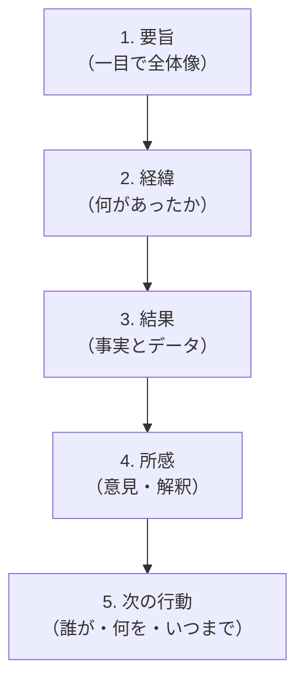
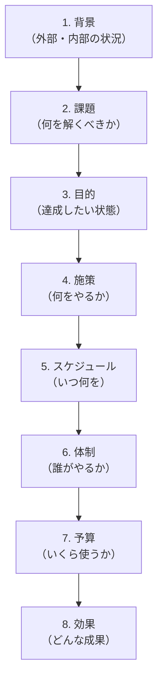
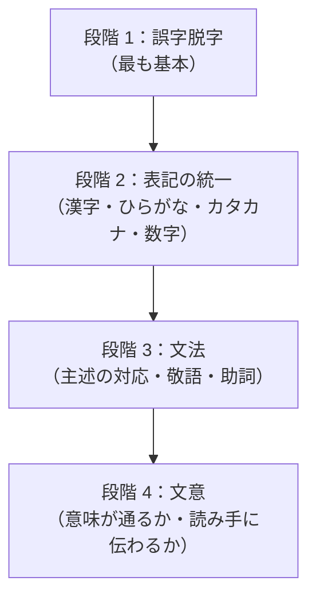

# ビジネス文書・ライティング入門

一文の作法から業務文書の型まで——読まれる文書を整える発想

| 項目 | 内容 |
|---|---|
| カテゴリー | ビジネススキル |
| 難易度 | 初級 |
| 所要時間 | 約200分（全8レッスン） |
| 公開日 | 2026-06-21 |
| 最終更新日 | 2026-06-21 |
| コースURL | https://skillup.college/courses/business/business-writing-basics/ |

## 対象者

業種・職種を問わず、業務で日常的に文書を書くすべての方。新入社員〜中堅社員、事務・営業・企画・人事・経理・総務・教員・公務員など全社員必修レベルで使える入門コース。

## 前提知識

特になし。社会人としての基本的な業務経験があれば十分。文章を書くのが得意である必要はなく、「自分の文書が読まれている実感が薄い」「書くのに時間がかかる」「敬語と表記に不安がある」「AI が書いた文書をどう直すか迷う」という方を対象に設計。

## 学習目標

- ビジネス文書の 4 つの基本原則（目的・読み手・簡潔・正確）を理解する
- 一文の作法（主述の対応・助詞・句読点・文の長さ・能動と受動）を身につける
- 敬体／常体・敬語の 3 種・表記統一など、文体と表記の基本を扱える
- メールの型（件名・宛先・本文・結び）と社内／社外の使い分けを身につける
- 報告書と議事録で「事実と所感を分けて書く」発想を持つ
- 企画書と提案書の構造（背景・課題・目的・施策）を整理できる
- 稟議書・依頼文・お礼状・お詫び状・断り文など、社内文書の典型を扱える
- 校正と推敲の 4 段階、AI 校正ツールの現在地と限界、AI 時代に「人間が書く価値」を理解する

## コース概要

「メールが長くなりがちで反省する」「報告書を書くのに時間がかかる」「敬語に自信がない」「AI が書いた文書を、何を直せばよいかわからない」——事務・営業・企画・人事・経理・総務など、業務で文書を書くすべての方が直面する悩みです。本コースは、ビジネス文書を「才能や気合で書くもの」ではなく「型と推敲で整える技術」として、8 レッスンで体系的に学びます。一文の作法（主述・助詞・句読点・文の長さ）、文体と表記（敬体／常体・敬語・表記統一）、メールの型、報告書と議事録、企画書と提案書、社内文書（稟議書・依頼文・お礼状・お詫び状）、校正と推敲、AI 時代の付き合い方まで、新入社員〜中堅社員の方が「読まれる文書」を整える基礎技術を順次積み上げます。書くのが苦手な方も、得意な方も、それぞれの立場で取り組める入門コースです。

## 学習の流れ

レッスン 1 でビジネス文書の発想（「読まれるために書く」）と本コースの守備範囲を共有します。レッスン 2 と 3 が「言葉のレベル」で、一文の作法と文体・表記を扱います。ここまでが共通の土台です。レッスン 4 から 7 は文書の型編で、メール（L4）、報告書と議事録（L5）、企画書と提案書（L6）、稟議書・依頼文・お礼状・お詫び状（L7）と、業務で出会う典型の文書を順番に扱います。最後のレッスン 8 で、校正と推敲の 4 段階、AI 校正ツールの現在地と限界、生成 AI で書いた文書を整える発想、人間が書く価値、修了後の学習方向を案内します。前半（レッスン 1〜3）は「言葉のレベル」、中盤（レッスン 4〜7）は「文書の型」、後半（レッスン 8）は「校正と AI 時代」の三段構えです。

## レッスン一覧

| No. | タイトル | 概要 | 所要時間 |
|---|---|---|---|
| 1 | ビジネス文書とは何か——「書く」より「読まれる」発想 | ビジネス文書の定義、私的文書・文学との違い、「読まれる」発想の重要性、4 つの基本原則（目的・読み手・簡潔・正確）、生成 AI 時代の文書事情と「人間が書く価値」、本コースの守備範囲を学ぶ | 25分 |
| 2 | 一文の作法——主述の対応・助詞・句読点・文の長さ | 主述のねじれ、助詞の使い分け、読点の打ち方、一文の長さの目安（40〜60 文字）、能動態と受動態、二重否定の解消、修飾語の位置、悪文の典型パターンを学ぶ | 25分 |
| 3 | 文体と表記——敬体／常体・敬語・表記統一 | 敬体（です・ます調）と常体（だ・である調）の使い分け、敬語の 3 種（尊敬語・謙譲語・丁寧語）、二重敬語の回避、表記統一（漢字・ひらがな・カタカナ・数字・単位）、業界標準の表記ルール、絵文字の扱いを学ぶ | 25分 |
| 4 | メールの型——件名・宛先・本文の構成 | ビジネスメールの基本構造、件名の作り方、宛先（To・Cc・Bcc）の使い分け、社内／社外のトーン、依頼・お礼・お詫びの定型、引用と返信、過度に長いメールを短くする工夫、チャットとの使い分けを学ぶ | 25分 |
| 5 | 報告書と議事録——事実と所感の分離、構造化 | 報告書の基本構造（要旨・経緯・結果・所感・次の行動）、事実と所感の分離、5W1H と 6W3H、データと根拠の示し方、議事録の基本構造、書くべき／書かないことの判断、生成 AI 議事録ツールとの付き合い方を学ぶ | 25分 |
| 6 | 企画書と提案書——課題設定と論理展開 | 企画書の基本構造（背景・課題・目的・施策・スケジュール・体制・予算・効果）、提案書との違い、課題設定の発想、構成の組み立て方、図表の役割、長さの目安、社内承認を取るための工夫を学ぶ | 25分 |
| 7 | 社内文書と社外文書——稟議書・依頼文・お礼状・お詫び状 | 稟議書、依頼文、お礼状、お詫び状、断り文の典型的な型、社外向け文書のテンプレート、紙とメールでの違い、テンプレートを使いつつ自分の声を残す工夫を学ぶ | 25分 |
| 8 | 校正と推敲、AI 時代のライティング——「読まれる文書」へ仕上げる | 校正と推敲の違い、校正の 4 段階（誤字脱字・表記・文法・文意）、送信前の 3 分チェックリスト、よくある誤り、AI 校正ツール（Microsoft Editor・Grammarly・文賢・テキスト校正くん）の現在地と限界、生成 AI で書いた文書を整える発想、人間が書く価値、修了後の学習方向を学ぶ | 25分 |

---

## レッスン1：ビジネス文書とは何か——「書く」より「読まれる」発想

（所要時間：25分）

### このレッスンで学ぶこと

- ビジネス文書の定義と、私的文書・文学との違いを理解する
- 「読まれる」を発想の中心に置く意味を整理する
- ビジネス文書の 4 つの基本原則（目的・読み手・簡潔・正確）を把握する
- 2026 年 6 月時点の生成 AI 時代のビジネス文書事情を概観する
- 「人間が書く価値」を再確認する
- 本コースの守備範囲（言葉のレベル・文書の型・校正の 3 層）を理解する

---

ビジネスの場で「文書を書く時間」を計ったことはあるでしょうか。あるリモートワーク主体のホワイトカラーの調査では、業務時間の 3〜4 割が文書作成に費やされている、という結果もあります。メール、報告書、議事録、企画書、稟議書、社内連絡、議題メモ、提案書、お詫び、お礼——朝から夕方まで、何かを書いていない時間のほうが少ないほどです。それだけ時間をかけているにもかかわらず、「自分の文書がきちんと読まれた」という確信は意外と少ないのではないでしょうか。本レッスンは、本コースの前提として、ビジネス文書の発想を「書く」から「読まれる」に切り替えることから始めます。

### ビジネス文書の定義

本コースでは、ビジネス文書（business document）を次のように定義します。

> 業務上の目的を果たすために書かれ、特定の読み手に確実に届ける必要のある文書。

この定義の鍵は 3 つです。

#### 「業務上の目的を果たす」

ビジネス文書には、必ず目的があります。報告書には「進捗を共有して次の判断を仰ぐ」目的、メールには「依頼を伝えて返事をもらう」目的、企画書には「予算と承認を得る」目的、議事録には「決定事項を残して後日参照する」目的があります。目的のない文書は、業務上は不要な文書です。

#### 「特定の読み手」

ビジネス文書には、必ず読み手がいます。直属の上司、取引先の担当者、社内の関係部署、来期の自分、引き継ぎを受ける後任——誰に向けて書くかが明確でない文書は、誰にも届きません。「不特定多数」の場合（プレスリリースなど）も、読み手像（メディアの記者・関心ある一般読者など）を意識します。

#### 「確実に届ける」

書いて出すだけでなく、相手に内容が確実に伝わってはじめて、ビジネス文書は機能します。送信した・提出したではなく、「読まれて・理解されて・行動につながった」までが完了の基準です。

> **💡 ポイント**
> ビジネス文書は「業務上の目的を果たす」「特定の読み手がいる」「確実に届ける」の 3 つを土台にした文書です。送信や提出ではなく、「読まれて行動につながる」までが完了です。

### 私的文書・文学との違い

ビジネス文書を理解するには、隣接する文書ジャンルとの違いを整理するのが近道です。

| ジャンル | 主な目的 | 読み手の動機 | 評価軸 |
|---|---|---|---|
| ビジネス文書 | 業務目的の達成 | 義務（読まなければならない） | 簡潔・正確・読まれる |
| 私的文書（日記・手紙） | 自己表現・関係構築 | 関心・愛情 | 個性・温度感・共感 |
| 文学（小説・詩） | 表現と感動 | 楽しみ | 表現力・独創性・美しさ |
| ジャーナリズム | 情報伝達・公益 | 関心・社会的責任 | 正確・公平・速報性 |
| 学術論文 | 知の蓄積・検証 | 専門的関心 | 厳密性・再現性・新規性 |

ビジネス文書は、私的文書のような「個性」も、文学のような「表現力」も、第一義には求められません。極端に言えば、「個性がなく」「表現力に乏しく」「平凡な文体」で構わないのです。求められるのは「読み手の時間を奪わない」「行動を促す」「誤解されない」という 3 つの実利。これが、本コースの土台になる発想です。

> **💡 ポイント**
> ビジネス文書は私的文書・文学・ジャーナリズム・学術論文と目的・読み手・評価軸がすべて異なります。個性や表現力より、簡潔・正確・読まれる、の 3 つを最優先します。

### 「読まれる」を発想の中心に置く

本コースの中核メッセージは、たった 1 つに集約できます。

> ビジネス文書は、「書く」より「読まれる」に発想の中心を置く。

書き手の都合（書きやすさ、思いつき、感情）ではなく、読み手の都合（読みやすさ、理解しやすさ、行動の取りやすさ）から逆算するということです。

#### 「読まれる」発想の具体的な意味

- **件名で内容がわかる**：メールを開く前に、要件と緊急度がつかめる
- **冒頭で結論が見える**：忙しい読み手が、3 行で全体像を理解できる
- **一文が短い**：呼吸 1 回で読める長さに収まっている
- **見出しと番号が付いている**：途中から飛ばし読みしてもわかる
- **語彙が平易**：専門用語が必要なら、初出で 1 行の説明を添える

これらはすべて、書き手の手間を増やし、読み手の手間を減らす工夫です。本コースで扱う「型」「校正」「推敲」は、突き詰めるとすべてこの発想に行き着きます。

#### 「書いて満足」を脱出する

書き手は、書き終えた瞬間に「終わった」と思ってしまいます。本コースの推奨は、書き終わった瞬間が「ようやくスタート地点」と捉え直すこと。そこから読み直し、整え、校正し、推敲する時間が、文書を「読まれるもの」に育てます。

> **💡 ポイント**
> ビジネス文書の発想の中心は「読まれる」。書き手の都合ではなく、読み手の都合から逆算します。書き終わった瞬間は終わりではなく、読み直しのスタート地点です。

### ビジネス文書の 4 つの基本原則

本コースは、ビジネス文書の基本原則を 4 つにまとめます。本コースの全レッスンを貫く軸として、最初に共有します。

#### 原則 1：目的

何のために書くか、を明確にする。

- 何を伝えたいか
- 読み手にどう動いてほしいか
- 読み終わったあとの状態を、どう変えたいか

書き始める前に 1 行で言えるようにします。「来週の役員会で X 案の承認を得たい」「先週の研修の結果を経営層に共有し、追加予算の議論を始めたい」のように。

#### 原則 2：読み手

誰に向けて書くか、を具体的に思い浮かべる。

- 役職、立場、知識レベル
- 文書を読む状況（机の前か、移動中のスマホか）
- すでに知っていること、知らないこと
- 何を期待しているか

「役員」と言っても、財務に詳しい役員と人事系の役員では、欲しい情報が違います。一人の読み手を、できるだけ具体的に想像します。

#### 原則 3：簡潔

短く、無駄なく書く。

- 一文を短く（40〜60 文字目安）
- 不要な修飾語を削る
- 重複を避ける
- 結論を先に出す

「短さ」は「冷たさ」とは違います。むしろ、読み手の時間を奪わない丁寧さの表現です。

#### 原則 4：正確

事実と表現の正確さを守る。

- 数字・固有名詞・日付の検証
- 事実と所感を分けて書く
- 推測や噂を断定で書かない
- 表記の統一

正確さを欠いた文書は、読み手の判断を狂わせ、信頼を失います。「速く出す」より「正確に出す」を、業務文書では優先します。

#### 4 原則の関係

| 原則 | 主な問い |
|---|---|
| 1. 目的 | 何のため？ |
| 2. 読み手 | 誰に？ |
| 3. 簡潔 | どれだけ短く？ |
| 4. 正確 | 事実はどうか？ |

4 つの原則は、書く前（目的・読み手）→ 書きながら（簡潔）→ 書き終わったあと（正確）と、文書を作るプロセス全体で活用します。

> **💡 ポイント**
> ビジネス文書の 4 つの基本原則は「目的」「読み手」「簡潔」「正確」。書く前の準備と、書きながらの選択、書き終わったあとの確認の、それぞれで意識します。

### 2026 年 6 月時点の生成 AI と文書事情

2026 年現在、ビジネス文書を取り巻く環境は、ここ数年で大きく変わりました。

#### 生成 AI の標準化

ChatGPT・Claude・Gemini などの生成 AI が、文書作成の現場に深く入り込みました。「メールの下書きを作る」「報告書の構成を提案させる」「お詫び文のたたき台を作る」——文書作成の入口として、AI が広く使われています。同時に、Microsoft Editor・Grammarly・文賢などの校正ツールも進化し、誤字脱字や文法の誤りを自動で指摘してくれる時代に。

#### チャット文化の定着

Slack・Microsoft Teams などのチャットツールが、社内コミュニケーションの中心になりました。短文のやり取りが増え、メールは「公式の連絡」「外部とのやり取り」に役割が絞られつつあります。同時に、チャットは「すぐ書いてすぐ送る」ぶん、推敲する時間が極端に短くなる傾向もあります。

#### 「AI が書いた」文書を読み手が見抜く時代

業務現場で増えているのが、「これ、AI が書きましたよね」と読み手に気づかれるケースです。やや冗長な前置き、紋切り型の結論、平均的すぎる語彙、感情の薄さ——AI の出力には傾向があり、慣れた読み手は数秒で識別できます。文書を「AI に書かせて、そのまま送る」だけだと、読み手との関係が薄まるリスクもあるのが、2026 年現在の現実です。

#### 人間が書く価値

こうした中で、改めて評価されているのが「人間が書く文書」の価値です。

- **声**：書き手の人格・経験・関係性が滲む文章
- **判断**：状況に応じた言葉選び、絶妙な余白
- **責任**：書き手が自分の名前で文書を背負う

AI を否定するのではなく、AI が出力した叩き台に「人間の声と判断と責任」を載せ直す——それが、本コースが目指す 2026 年型のビジネス文書の在り方です。

> **💡 ポイント**
> 2026 年現在、生成 AI による文書作成と AI 校正が標準化する一方、「AI が書いた」文書を読み手が見抜く事例も増えています。AI に書かせるだけでなく、「人間の声と判断と責任」を載せ直す発想が、これからの書き手に求められます。

### 本コースの守備範囲

本コースは、ビジネス文書を 3 つの層で扱います。

#### 層 1：言葉のレベル（レッスン 2・3）

一文の作法（主述の対応・助詞・句読点・文の長さ）、文体（敬体／常体）、敬語の 3 種、表記統一——文書を組み立てる「最小の部品」を整えます。

#### 層 2：文書の型（レッスン 4〜7）

メール、報告書、議事録、企画書、提案書、稟議書、依頼文、お礼状、お詫び状、断り文——業務で出会う典型的な文書の構造とテンプレートを扱います。

#### 層 3：校正と推敲（レッスン 8）

書き終わったあと、文書を整える 4 段階の校正、AI 校正ツールの現在地と限界、そして AI 時代に「人間が書く価値」を再確認します。

#### 本コースの守備範囲外

- 論理的な構造の作り方（PREP・結論ファースト・ピラミッドストラクチャー）：別途の領域の守備範囲。本コースは「整った構造の上に、一文の作法・敬語・表記・校正の実装を載せる」位置づけ
- AI を使って文書の叩き台を作る方法：別途の領域の守備範囲。本コースは「叩き台ができたあとの推敲」が中核
- 小説・エッセイ・ブログ記事などの私的・創作文書：扱わない
- Web ライティング・SEO ライティング：扱わない
- 英文ビジネスライティング：扱わない（参考程度に Grammarly を紹介する程度）
- 法務・契約書・規程の作成：扱わない（社内文書の「型」程度で紹介）

#### スタンス

本コースは、ビジネス文書を「才能や気合で書くもの」とも「AI に全部書かせるもの」とも見なしません。型と推敲で整える技術として扱い、AI を否定せず、AI に依存もせず、「人間が書く価値」を残しつつ AI を活用する道を提案します。

> **💡 ポイント**
> 本コースは「言葉のレベル」「文書の型」「校正と推敲」の 3 層でビジネス文書を扱います。論理的な構造の作り方と AI による叩き台作成は守備範囲外で、本コースは「整った構造と叩き台の上に、推敲を載せる」位置づけです。

### まとめ

このレッスンでは、以下のことを学びました。

- ビジネス文書は「業務上の目的を果たす」「特定の読み手がいる」「確実に届ける」の 3 つを土台にした文書
- 私的文書・文学・ジャーナリズム・学術論文と目的・読み手・評価軸が異なる。個性や表現力より、簡潔・正確・読まれる、を最優先
- 中核メッセージ：「書く」より「読まれる」を発想の中心に置く。書き手の都合ではなく読み手の都合から逆算
- 4 つの基本原則：「目的」「読み手」「簡潔」「正確」。書く前の準備と書きながらの選択と書き終わったあとの確認、それぞれで意識する
- 2026 年現在の動向：生成 AI と AI 校正の標準化、チャット文化の定着、「AI が書いた」文書を読み手が見抜く時代、「人間が書く価値」の再評価
- 本コースの守備範囲：「言葉のレベル」「文書の型」「校正と推敲」の 3 層。論理的な構造の作り方と AI による叩き台作成は守備範囲外
- スタンス：才能や気合でも、AI 任せでもなく、「型と推敲で整える技術」として扱う

次のレッスンでは、ビジネス文書を組み立てる最小の部品——「一文」の作法を扱います。主述の対応、助詞、句読点、文の長さ、能動と受動、二重否定など、一文を読みやすく整える基本技術を学びます。

---

### 確認クイズ

このレッスンの理解度をチェックしましょう。

#### Q1. 本コースが定義する「ビジネス文書」として、最も適切なものはどれか？

- [x] 業務上の目的を果たすために書かれ、特定の読み手に確実に届ける必要のある文書
- [ ] 個性と表現力を最大限に発揮した文学的な文書
- [ ] 不特定多数に向けて広く宣伝するための文書
- [ ] 書き手が書きたいことを自由に書く私的な文書

> **解説**
> ビジネス文書は「業務上の目的を果たす」「特定の読み手がいる」「確実に届ける」の 3 つを土台にした文書です。個性や表現力、自由な自己表現は別ジャンルの軸であり、ビジネス文書の中心軸ではありません。

#### Q2. ビジネス文書と私的文書・文学との違いについて、本レッスンが説明した内容はどれか？

- [ ] ビジネス文書も文学も、評価軸はすべて同じ
- [x] ビジネス文書は「簡潔・正確・読まれる」が評価軸で、私的文書（個性・温度感・共感）・文学（表現力・独創性・美しさ）・ジャーナリズム（正確・公平・速報性）・学術論文（厳密性・再現性・新規性）とは目的・読み手・評価軸が異なる。個性や表現力は第一義には求められない
- [ ] ビジネス文書は文学より上等な文書である
- [ ] ビジネス文書には目的がない

> **解説**
> ビジネス文書は隣接ジャンルと評価軸が異なります。個性や表現力ではなく、簡潔・正確・読まれる、を最優先します。

#### Q3. 「書く」より「読まれる」を発想の中心に置くという本コースの中核メッセージについて、本レッスンが説明した内容はどれか？

- [ ] 書き手の感情を最優先する
- [ ] 文章の表現力を磨くことを最優先する
- [x] 書き手の都合（書きやすさ・思いつき・感情）ではなく、読み手の都合（読みやすさ・理解しやすさ・行動の取りやすさ）から逆算する。件名で内容がわかる、冒頭で結論が見える、一文が短い、見出しと番号が付いている、語彙が平易、などの工夫はすべてこの発想に行き着く
- [ ] 不特定多数を読み手として想定する

> **解説**
> 本コースの中核は「読み手の都合から逆算する」発想です。書き手の手間を増やし、読み手の手間を減らす工夫が、すべてこの発想に行き着きます。

#### Q4. ビジネス文書の 4 つの基本原則として、本レッスンが整理した内容はどれか？

- [ ] 美しさ、独創性、感動、表現力
- [ ] 速度、量、頻度、長さ
- [ ] 個性、温度感、感情、共感
- [x] 「目的」「読み手」「簡潔」「正確」の 4 つ。書く前の準備（目的・読み手）、書きながらの選択（簡潔）、書き終わったあとの確認（正確）の、それぞれで意識する

> **解説**
> 4 原則は「目的」「読み手」「簡潔」「正確」です。本コース全レッスンを貫く軸として、書く前・書きながら・書き終わったあと、の 3 段階で意識します。

#### Q5. 2026 年 6 月時点のビジネス文書と生成 AI の関係について、本レッスンが説明した内容はどれか？

- [x] 生成 AI による文書作成と AI 校正が標準化する一方、「AI が書いた」文書を読み手が見抜く事例も増えている。本コースは AI を否定せず、依存もせず、AI の叩き台に「人間の声と判断と責任」を載せ直す道を提案する
- [ ] 生成 AI を使うのは禁止すべきである
- [ ] 生成 AI に任せれば人間は何もしなくてよい
- [ ] 生成 AI はビジネス文書には使えない

> **解説**
> 2026 年現在、生成 AI は標準化していますが、読み手が見抜く事例も増えています。本コースは「AI の叩き台に人間の声と判断と責任を載せ直す」道を提案します。

#### Q6. 本コースの守備範囲について、本レッスンが説明した内容はどれか？

- [ ] 小説・エッセイ・ブログ記事などの創作文書を中心に扱う
- [x] 「言葉のレベル」（一文の作法・文体・表記）「文書の型」（メール・報告書・議事録・企画書・社内文書）「校正と推敲」の 3 層を扱う。論理的な構造の作り方（PREP・結論ファースト）と AI による叩き台作成は守備範囲外で、本コースは「整った構造と叩き台の上に推敲を載せる」位置づけ
- [ ] Web ライティング・SEO ライティングが中心
- [ ] 英文ビジネスライティングが中心

> **解説**
> 本コースは 3 層（言葉・型・校正）で構成され、論理的構造と AI 叩き台作成は守備範囲外です。「整った構造と叩き台の上に推敲を載せる」位置づけです。

---

## レッスン2：一文の作法——主述の対応・助詞・句読点・文の長さ

（所要時間：25分）

### このレッスンで学ぶこと

- 主述の対応（ねじれ）の典型例と修正の発想を理解する
- 助詞の使い分け（特に「は」と「が」）の基本を身につける
- 読点（、）の打ち方を整理する
- 一文の長さの目安（40〜60 文字）を意識して書ける
- 能動態と受動態の使い分け、受動態を減らす発想を持つ
- 二重否定を肯定文に書き換えられる
- 修飾語の位置と「が」の連発を避ける工夫を理解する
- よくある一文の悪文パターンを把握する

---

前回のレッスンでは、ビジネス文書を「読まれる」発想で組み立てる土台を共有しました。本レッスンから、いよいよ手を動かして「整える」段階に入ります。最初に扱うのは、文書を構成する最小の部品——「一文」の作法です。一文を読みやすく整える技術は、ビジネス文書のすべての層を支える基礎体力になります。

### 主述の対応——「ねじれ」を見つけて直す

「主述のねじれ」は、ビジネス文書でもっとも頻発する悪文の典型です。主語と述語が論理的にかみ合っていない文を指します。

#### 典型例 1：主語が違うものになる

```
✗ 私の目標は、来期、新規顧客を 20 社獲得します。
```

主語は「私の目標は」ですが、述語は「獲得します」。「目標が獲得する」のは論理的におかしいです。

```
○ 私の目標は、来期、新規顧客を 20 社獲得することです。
○ 私は来期、新規顧客を 20 社獲得します。
```

述語を名詞句に変えるか、主語を変えるかで解消します。

#### 典型例 2：主語と述語の距離が遠い

```
✗ 本企画は、市場の動向を踏まえ、競合各社の動きと顧客の声をすり合わせた上で、コストを抑制しつつ、来期の業績目標を達成するために提案します。
```

主語「本企画は」と述語「提案します」の間に修飾語が連なり、何を言いたいかが伝わりにくくなっています。

```
○ 本企画は、来期の業績目標を達成するための提案です。背景には、市場の動向、競合の動き、顧客の声があります。コストも抑制できます。
```

一文を分けて、主述の距離を縮めます。

#### 主述のねじれを直す 3 つの問い

- 主語と述語だけ抜き出してみて、自然な日本語になるか
- 主語が「事物」なのに、述語が「人の動作」になっていないか
- 主語の前後に長い修飾語が挟まっていないか

> **💡 ポイント**
> 主述のねじれは「主語と述語だけ抜き出して読み返す」と多くが見つかります。一文が長くなるほどねじれは増えるため、文を分割するのも有効な対策です。

### 助詞の使い分け

日本語の難所の 1 つが助詞です。本コースでは、業務で最も頻出する 3 組を扱います。

#### 「は」と「が」

- 「は」：主題を提示する。すでに知っている話題、または対比に使う
- 「が」：新情報を示す。これまで触れていない主語、または強調に使う

```
○ 今期の売上は、前年比 110% でした。（主題：今期の売上）
○ 売上が伸びたのは、新商品 X の好調が理由です。（新情報：売上が）
```

ルールに迷ったら、「すでに話題に出たもの・前提を共有しているものは『は』、新しく出てくるもの・強調したいものは『が』」と覚えておくとほぼ困りません。

#### 「に」と「で」

- 「に」：場所・時間の到達点、対象、目的
- 「で」：場所・時間の範囲、手段

```
○ 会議室 A に集合します。（到達点）
○ 会議室 A で議論しました。（場所の範囲）
○ メールで送ります。（手段）
```

#### 「を」と「が」（自動詞・他動詞）

- 「を」：他動詞の目的語（働きかける相手）
- 「が」：自動詞の主語

```
○ 報告書を作成しました。（他動詞「作成する」の目的語）
○ 報告書が完成しました。（自動詞「完成する」の主語）
```

「作成」と「完成」のように、似た意味でも自動詞と他動詞で取る助詞が変わります。

> **💡 ポイント**
> 助詞は「は」と「が」が業務で最も頻出する難所です。「すでに話題に出たもの／前提共有は『は』、新情報・強調は『が』」を基本として持っておきます。

### 句読点の打ち方

句読点は、一文の読みやすさを左右する要素です。

#### 句点（。）

句点は文末に打ちます。日本語のビジネス文書では、文末は「。」で揃えるのが基本です。ただし、見出し・表のセル・箇条書きの中などは省略する流派もあり、社内文書スタイルガイドで統一されている場合はそれに合わせます。

#### 読点（、）

読点は、一文の中で「呼吸の区切り」を作る記号です。読点の打ち方には目安があります。

| パターン | 例 |
|---|---|
| 接続詞のあと | しかし、私はこう考えます |
| 主語のあと（長い場合） | 本企画は、市場の動向を踏まえた提案です |
| 修飾語と被修飾語の間が遠いとき | 来期に向けて全社員が、新しい目標に取り組む |
| 並列の区切り | A、B、C を検討します |
| 漢字が連続するとき | 月末、月次決算の作業を始めます |

#### 読点の打ちすぎ・打たなさすぎ

```
✗ 本企画は、市場の動向を、踏まえ、競合各社の、動きと、顧客の声を、すり合わせた、提案です。
✗ 本企画は市場の動向を踏まえ競合各社の動きと顧客の声をすり合わせた提案です。
○ 本企画は、市場の動向を踏まえ、競合各社の動きと顧客の声をすり合わせた提案です。
```

読点は「呼吸 1 回」が目安。声に出して読み、息継ぎする場所に置きます。

> **💡 ポイント**
> 読点は「呼吸の区切り」。接続詞のあと・長い主語のあと・並列の区切り・漢字連続の区切りに打ちます。打ちすぎても打たなさすぎても読みにくくなるため、声に出して読んで確認します。

### 一文の長さの目安

一文を短く保つことは、ビジネス文書でもっとも効果の大きい工夫です。

#### 目安：40〜60 文字

一文の長さは「40〜60 文字」を上限の目安にします。これは、声に出して 1 呼吸で読める長さです。新聞記事のリード文や、よく書かれた企業のプレスリリースの平均は、この範囲に収まっています。

#### 80 文字を超えたら警戒

80 文字を超える一文は、読み手の負担が一気に増えます。修飾語が多すぎる、複数の論点が詰まっている、主述のねじれが起きている——いずれかの状態になっていることが多く、見直しのサインです。

#### 一文を短くする 3 つの方法

##### 1. 接続助詞を句点で切る

```
✗ 本企画は予算 100 万円で実施でき、来期の業績目標達成に貢献するため、ぜひご承認ください。
○ 本企画は予算 100 万円で実施できます。来期の業績目標達成に貢献します。ぜひご承認ください。
```

##### 2. 並列を箇条書きに分ける

```
✗ 本施策の目的は、新規顧客の獲得、既存顧客の維持、社内体制の整備、コスト削減、業績の安定化です。
○ 本施策の目的は次の 5 つです。
- 新規顧客の獲得
- 既存顧客の維持
- 社内体制の整備
- コスト削減
- 業績の安定化
```

##### 3. 修飾語を後ろの文に逃す

```
✗ 市場規模の拡大と業界平均の成長率を踏まえた当社の来期目標は、前年比 110% です。
○ 当社の来期目標は前年比 110% です。市場規模の拡大と業界平均の成長率を踏まえた数字です。
```

> **💡 ポイント**
> 一文は 40〜60 文字を目安に、80 文字を超えたら警戒。接続助詞を句点で切る、並列を箇条書きにする、修飾語を後ろの文に逃す、の 3 つの方法で短くできます。

### 能動態と受動態——「されました」を減らす

業務文書では、能動態を基本に書きます。受動態は意味が曖昧になりやすく、誰がやったのかがぼやけます。

#### 受動態が増える理由

業務では「責任の所在を曖昧にしたい」「自分を主語に立てるのは謙虚さに欠ける」という心理から、受動態が増える傾向があります。

```
✗ 報告書が提出されました。
✗ 会議が開催されました。
✗ 決定がなされました。
```

これらは「誰が」がわからない文です。

#### 能動態に書き換える

```
○ 私が報告書を提出しました。
○ 営業部が会議を開催しました。
○ 役員会で X 案を決定しました。
```

主語を明示して能動態にすると、責任の所在も行動主体も明確になります。

#### 受動態を残す場面

受動態が適切な場面もあります。

- 主語が不明・特定する必要がない場合（「この製品は世界で広く使われています」）
- 「物」を主題にしたい場合（「本契約書は来週、両社で締結されます」）
- 被害や影響を受けた側を強調したい場合

受動態を完全に避ける必要はありません。「無意識に受動態が増えていないか」を意識する程度で十分です。

> **💡 ポイント**
> 業務文書は能動態を基本に書きます。「されました」が連続するときは、誰がやったかを明示する能動態への書き換えを検討します。

### 二重否定と肯定文

二重否定は、意味が伝わりにくい文体の典型です。

#### 二重否定の例と書き換え

```
✗ 本企画を実施しないわけにはいきません。
○ 本企画を実施する必要があります。

✗ 状況を考えると、提案を見送らないこともない、と考えております。
○ 状況を考えると、提案を進められる可能性があります。

✗ 顧客満足度が低いとは言えない。
○ 顧客満足度は一定の水準にある。
```

二重否定は丁寧さや慎重さの表現として使われがちですが、読み手は意味を反転させながら読むため、認知負荷が高くなります。肯定文に直すと、意味が明確になり、決断の方向も伝わります。

> **💡 ポイント**
> 二重否定は肯定文に書き換えると、意味が明確になり、読み手の認知負荷が下がります。「丁寧さの代償として、伝わらない」二重否定を避けます。

### 修飾語の位置

修飾語は、被修飾語の直前に置くのが基本です。距離が遠いほど、読み手は何を修飾しているかを推測しなければならなくなります。

#### 例

```
✗ 来期に向けて市場の動向を踏まえた全社員の取り組み
○ 来期に向けて、市場の動向を踏まえた取り組みを全社員で行う
○ 市場の動向を踏まえた来期向けの取り組みを、全社員で行う
```

「全社員の取り組み」の前に長い修飾語が並ぶより、修飾と被修飾を近づけ、主述をシンプルに整える方が読みやすくなります。

#### 「長い修飾語は前、短い修飾語は後ろ」の原則

複数の修飾語が並ぶときは、長い順に前から並べると読みやすくなります。

```
✗ 業界の動向を踏まえた来期の私たちの取り組み
○ 来期の、業界の動向を踏まえた、私たちの取り組み
```

> **💡 ポイント**
> 修飾語は被修飾語の直前に置くのが基本。複数の修飾語が並ぶときは「長い修飾語は前、短い修飾語は後ろ」を意識します。

### 「が」の連発を避ける

接続助詞の「が」を続けて使うと、文の意味がぼやけます。

```
✗ 来期の業績目標は前年比 110% ですが、市場の動向を踏まえると達成は厳しい状況ですが、新商品 X の好調もあり、十分に挑戦できる目標ではあります。
```

「が」が 2 回出てきますが、どちらが「逆接」か「順接」かが曖昧になり、読み手は迷います。

#### 書き換え方

```
○ 来期の業績目標は前年比 110% です。市場の動向を踏まえると達成は厳しい状況です。一方で、新商品 X の好調もあり、十分に挑戦できる目標と考えます。
```

接続助詞「が」を句点で切り、必要に応じて「一方で」「ただし」「そのため」など明確な接続詞に置き換えます。

> **💡 ポイント**
> 接続助詞「が」は連発を避け、句点で切るか明確な接続詞（「一方で」「ただし」「そのため」など）に置き換えます。

### よくある一文の悪文パターン

最後に、業務文書でよく出会う悪文パターンを 5 つにまとめます。

#### パターン 1：主述のねじれ

「私の目標は、新規顧客を獲得します」のように、主語と述語がかみ合わない文。

#### パターン 2：一文が長すぎる

80 文字を超え、複数の論点が詰まっている文。

#### パターン 3：受動態の連続

「されました」「されました」が続き、誰がやったかわからない文。

#### パターン 4：二重否定の連続

「〜ないわけではない」「〜とも言えない」が続き、結論が見えない文。

#### パターン 5：「が」「ので」「ため」の多用

接続助詞でつなぎ続け、文を切らない癖。

これらは、書く本人は気づきにくく、読み手にとっては読みにくさの主な原因になります。本コース最終のレッスン 8 で扱う「校正」の段階で、これらをチェックリストとして見直すと、文書の質が一気に上がります。

> **💡 ポイント**
> 業務文書の悪文 5 パターン：「主述のねじれ」「一文が長すぎる」「受動態の連続」「二重否定の連続」「『が』『ので』『ため』の多用」。書き手は気づきにくく、読み手にとっては読みにくさの主因になります。

### まとめ

このレッスンでは、以下のことを学びました。

- 主述のねじれ：主語と述語が論理的にかみ合っていない文。主語と述語だけ抜き出して読み返すと多くが見つかる
- 助詞の使い分け：「は」（主題・既知）と「が」（新情報・強調）、「に」（到達点）と「で」（範囲・手段）、自動詞と他動詞での「を」「が」
- 句読点：句点は文末で揃える。読点は「呼吸の区切り」で、接続詞のあと・長い主語のあと・並列の区切り・漢字連続の区切りに打つ
- 一文の長さ：40〜60 文字を目安、80 文字を超えたら警戒。接続助詞を句点で切る、並列を箇条書きに、修飾語を後ろに逃す、で短くできる
- 能動態と受動態：能動態を基本に、「されました」が連続するときは能動態への書き換えを検討
- 二重否定：肯定文に書き換えると意味が明確になり、認知負荷が下がる
- 修飾語：被修飾語の直前に置く。複数並ぶときは「長い修飾語は前、短い修飾語は後ろ」
- 「が」の連発を避ける：句点で切るか、明確な接続詞（「一方で」「ただし」「そのため」）に置き換える
- 悪文 5 パターン：「主述のねじれ」「一文が長すぎる」「受動態の連続」「二重否定の連続」「『が』『ので』『ため』の多用」

次のレッスンでは、文体と表記を扱います。敬体（です・ます調）と常体（だ・である調）の使い分け、敬語の 3 種、表記統一（漢字・ひらがな・カタカナ・数字）の基本を学びます。

---

### 確認クイズ

このレッスンの理解度をチェックしましょう。

#### Q1. 主述のねじれについて、本レッスンが説明した内容はどれか？

- [x] 主語と述語が論理的にかみ合っていない文を指す。「私の目標は、新規顧客を獲得します」のような文が典型例。主語と述語だけ抜き出して読み返す、主語が事物なのに述語が人の動作になっていないか、長い修飾語が挟まっていないか、の 3 つの問いで多くが見つかる
- [ ] 主述のねじれは日本語特有の正しい文法
- [ ] 主述のねじれは文学では推奨される表現
- [ ] 主述のねじれという概念は存在しない

> **解説**
> 主述のねじれは業務文書で最も頻発する悪文の典型です。主語と述語を抜き出して読み返す習慣で多くが見つかります。

#### Q2. 助詞の「は」と「が」の使い分けについて、本レッスンが説明した内容はどれか？

- [ ] 「は」と「が」はどちらを使ってもまったく同じ
- [x] 「は」はすでに話題に出たもの・前提共有しているもの・対比の主題を提示するときに使い、「が」は新情報を示す主語・強調したいときに使う。「すでに話題に出たもの／前提共有は『は』、新情報・強調は『が』」を基本として持つ
- [ ] 「は」は文頭でしか使えない
- [ ] 「が」は文末でしか使えない

> **解説**
> 「は」は既知・主題提示、「が」は新情報・強調が基本です。業務で頻出する助詞の難所として押さえます。

#### Q3. 読点（、）の打ち方について、本レッスンが説明した内容はどれか？

- [ ] 読点は 5 文字に 1 個必ず打つ
- [ ] 読点は文書では使わない
- [x] 読点は「呼吸の区切り」を作る記号。接続詞のあと、長い主語のあと、修飾語と被修飾語の間が遠いとき、並列の区切り、漢字が連続するとき、などに打つ。打ちすぎても打たなさすぎても読みにくくなるため、声に出して読んで息継ぎする場所に置く
- [ ] 読点は装飾なので任意に多くつける

> **解説**
> 読点は「呼吸の区切り」が基本です。声に出して読み、息継ぎする場所に置きます。

#### Q4. 一文の長さの目安について、本レッスンが説明した内容はどれか？

- [ ] 一文は必ず 200 文字以上で書くべき
- [ ] 一文の長さに目安は存在しない
- [ ] 一文は短いほど常に良い
- [x] 一文は 40〜60 文字を目安、80 文字を超えたら警戒。短くするには「接続助詞を句点で切る」「並列を箇条書きに分ける」「修飾語を後ろの文に逃す」の 3 つの方法がある

> **解説**
> 一文の長さは 40〜60 文字が目安です。80 文字を超えたら見直しのサイン。3 つの短縮方法を覚えます。

#### Q5. 業務文書における能動態と受動態について、本レッスンが説明した内容はどれか？

- [x] 業務文書は能動態を基本に書く。「されました」が連続するときは、誰がやったかを明示する能動態への書き換えを検討する。受動態は主語が不明・特定不要な場合や「物」を主題にしたい場合などには適切
- [ ] 受動態のみで書くのが業務文書の作法
- [ ] 能動態は使ってはいけない
- [ ] 能動態と受動態は意味がまったく同じ

> **解説**
> 業務文書は能動態が基本です。受動態を完全に避ける必要はありませんが、無意識に増えていないかを意識します。

#### Q6. 業務文書の悪文 5 パターンとして、本レッスンが整理した内容はどれか？

- [ ] 「敬語の使用」「絵文字の使用」「漢字の多用」「箇条書きの使用」「見出しの設置」
- [x] 「主述のねじれ」「一文が長すぎる」「受動態の連続」「二重否定の連続」「『が』『ので』『ため』の多用」
- [ ] 「結論ファースト」「箇条書き」「短い文」「能動態」「肯定文」
- [ ] 「数字の使用」「日付の記載」「件名の記入」「署名の付加」「タイトルの設定」

> **解説**
> 悪文 5 パターンは「主述のねじれ」「一文長すぎる」「受動態連続」「二重否定連続」「『が』『ので』『ため』の多用」です。書き手は気づきにくく、読み手にとっては読みにくさの主因になります。

---

## レッスン3：文体と表記——敬体／常体・敬語・表記統一

（所要時間：25分）

### このレッスンで学ぶこと

- 敬体（です・ます調）と常体（だ・である調）の使い分けを理解する
- 敬語の 3 種（尊敬語・謙譲語・丁寧語）の基本を整理する
- 二重敬語の典型と回避方法を把握する
- 社内／社外でのトーンの違いを意識する
- 表記統一（漢字・ひらがな・カタカナ・数字・単位）の発想を持つ
- 「開く・閉じる」の判断と業界標準の表記ルール（記者ハンドブック・社内スタイルガイド）を知る
- 絵文字・顔文字・記号の業務での扱いを理解する

---

前回のレッスンで、一文の作法を扱いました。本レッスンは「言葉のレベル」の第 2 弾、文体と表記です。一文の組み立てが整っても、文体と表記が揺れていると、文書全体の信頼感が損なわれます。敬体と常体の混在、不適切な敬語、表記のばらつき——どれも、書き手の細かい注意で防げる失敗です。本レッスンでは、業務でぶれずに書ける土台を作ります。

### 敬体と常体——「です・ます」と「だ・である」

日本語の文末には大きく 2 つの種類があります。

#### 敬体（です・ます調）

```
○ 来期の業績目標は、前年比 110% です。
○ 本企画を実施します。
○ ご検討よろしくお願いいたします。
```

「です」「ます」「いたします」などの丁寧な文末。読み手への配慮を示す基本形で、ビジネス文書のほとんどはこの敬体で書きます。

#### 常体（だ・である調）

```
○ 来期の業績目標は、前年比 110% である。
○ 本企画を実施する。
○ 検討いただきたい。
```

「だ」「である」「する」などの直接的な文末。論文・報告書（社内向けで簡潔さ重視）・社内のメモ・規程類などに使われます。

#### 使い分けの目安

| 場面 | 敬体／常体の選択 |
|---|---|
| 社外向けメール・公式文書 | 敬体 |
| 社内向けの公式文書（人事通知・規程） | 敬体または常体（社風による） |
| 社内のメモ・進捗報告 | 敬体または常体 |
| 論文・研究報告 | 常体 |
| ニュースリリース | 敬体 |
| 議事録 | 常体が多い（簡潔さのため） |

判断に迷ったら、社内の文書スタイルガイドを確認します。スタイルガイドがない場合は、過去の文書を見て社内の慣習に合わせます。

#### 敬体と常体の混在は避ける

1 つの文書内で敬体と常体を混在させると、読み手は強い違和感を抱きます。

```
✗ 本企画は、来期の業績目標達成に貢献します。市場の動向を踏まえた提案である。
○ 本企画は、来期の業績目標達成に貢献します。市場の動向を踏まえた提案です。
```

文書を書き始める前に「この文書は敬体で書く」と決めて、最後まで揃えます。

> **💡 ポイント**
> ビジネス文書のほとんどは敬体（です・ます調）で書きます。常体（だ・である調）は論文・規程・議事録などで使われます。1 つの文書内で混在させないのが鉄則です。

### 敬語の 3 種——尊敬語・謙譲語・丁寧語

敬語は、文化庁の「敬語の指針」（2007 年 2 月文化審議会答申）で 5 種類に整理されていますが、本コースでは業務でよく使う 3 種に絞って扱います。

#### 尊敬語

相手の動作・状態を高める表現。「相手の動き」を扱う。

```
○ 部長がおっしゃいました。（部長の動作）
○ お客さまがお越しになりました。（お客さまの動作）
○ ご覧いただけますでしょうか。（読み手の動作）
```

#### 謙譲語

自分の動作・状態を低める表現。「自分の動き」を扱う。

```
○ 私がお伺いいたします。（自分の動作）
○ ご報告申し上げます。（自分の動作）
○ お送りいたしました。（自分の動作）
```

#### 丁寧語

相手と自分の区別なく、文末を丁寧にする表現。「です・ます」が代表。

```
○ 雨が降っています。（事実の丁寧な表現）
○ 検討いたします。（自分の動作を「ます」で丁寧に）
```

#### 3 種の使い分け

| 動作の主体 | 使う敬語 |
|---|---|
| 相手（上司・顧客・取引先） | 尊敬語 |
| 自分（書き手） | 謙譲語 |
| どちらでもなく、または丁寧さを足したい | 丁寧語 |

「誰の動作か」を意識すれば、3 種は混同しにくくなります。

#### よく間違える敬語の例

- ✗「拝見させていただきました」→ ○「拝見しました」（拝見だけで謙譲、「させていただく」が二重敬語）
- ✗「お送りいたします」→ 二重敬語と見なす立場もある（「お送りします」「送ります」で十分という見解）
- ✗「了解いたしました」→ ○「承知いたしました」「かしこまりました」（「了解」は同等以下の相手に使う言葉と見なす流派が多い）
- ✗「申されました」→ ○「おっしゃいました」（「申す」は謙譲語なので相手には使わない）

> **💡 ポイント**
> 敬語の 3 種は「動作の主体」で使い分けます。相手の動作は尊敬語、自分の動作は謙譲語、文末の丁寧さは丁寧語。よく間違える敬語は、自分の癖として認識し、書き直しの段階で確認します。

### 二重敬語と過剰敬語

敬語を 2 つ重ねた「二重敬語」は、業務でも頻発するミスです。

#### 二重敬語の典型例

```
✗ ご覧になられましたか。
   （「ご覧になる」が尊敬語 + 「られる」が尊敬語）
○ ご覧になりましたか。

✗ おっしゃられました。
   （「おっしゃる」が尊敬語 + 「られる」が尊敬語）
○ おっしゃいました。

✗ お見えになられました。
   （「お見えになる」が尊敬語 + 「られる」が尊敬語）
○ お見えになりました。
```

#### 「させていただく」の多用

「させていただく」は、業務文書で過剰に使われる典型表現です。

```
✗ ご報告させていただきます。
✗ 検討させていただきます。
✗ 出席させていただきます。
```

「させていただく」は本来、「相手の許可をいただいて自分が動作する」という限定的な意味を持ちます。「相手の許可がない動作」「自分の意思の動作」には使いません。

```
○ ご報告いたします。
○ 検討いたします。
○ 出席いたします。
```

「させていただく」を「いたします」に置き換えると、自然で簡潔になります。

#### 「ら抜き言葉」「さ入れ言葉」

業務文書では、原則として「ら抜き言葉」「さ入れ言葉」を避けます。

- ✗「見れます」→ ○「見られます」（ら抜き言葉）
- ✗「食べれます」→ ○「食べられます」（ら抜き言葉）
- ✗「行かさせていただきます」→ ○「行かせていただきます」（さ入れ言葉）

ら抜き言葉は会話では一般化していますが、社外向けの公式文書ではまだ違和感を持つ読み手も多くいます。社内の慣習で許容されている場合は、それに合わせます。

> **💡 ポイント**
> 二重敬語と「させていただく」の多用は、業務文書の過剰敬語の典型です。簡潔な敬語（ご報告いたします、検討いたします）に置き換えるだけで、文章が読みやすくなります。

### 社内／社外でのトーンの違い

同じビジネス文書でも、宛先によってトーンを使い分けます。

#### 社内向けのトーン

```
○ 来期の業績見通しを共有します。詳細は添付の資料を参照ください。
○ 表記の通り、明日 15 時に会議室 A に集まってください。
```

社内では、過度な敬語を避け、簡潔に伝えるのが基本。「ご報告申し上げます」より「報告します」、「お集まりいただけますでしょうか」より「集まってください」のような、シンプルな敬体が多用されます。

#### 社外向けのトーン

```
○ 来期の業績見通しにつきまして、ご報告申し上げます。
○ ご多忙の中、誠に恐縮ですが、ご検討のほどよろしくお願い申し上げます。
```

社外、特に取引先や顧客に対しては、より丁寧な敬語を使います。「ご報告申し上げます」「お願い申し上げます」など、敬語の重なりも一定許容されます。

#### 顧客・取引先・上司・同僚・部下のトーン

| 関係 | トーン |
|---|---|
| 顧客（最大級の敬語） | ご検討くださいますよう、お願い申し上げます |
| 取引先（丁寧な敬語） | ご検討のほど、よろしくお願いいたします |
| 上司（丁寧な敬語） | ご検討ください |
| 同僚（フラットな敬語） | 検討してください |
| 部下（シンプルな依頼） | 検討してほしい／検討してください |

「過剰な敬語」も「ぞんざいな表現」も、関係を歪めます。読み手との関係に応じてトーンを調整します。

> **💡 ポイント**
> 社内ではシンプルな敬体、社外では丁寧な敬語、顧客や取引先には最大級の敬語、と段階的にトーンを使い分けます。「過剰な敬語」も「ぞんざいな表現」も避けます。

### 表記統一——文書全体の一貫性

表記が文書内で揺れていると、書き手が「丁寧に推敲していない」印象を与えてしまいます。

#### 表記揺れの典型例

```
✗ 1 つの文書内に「Web」と「web」と「ウェブ」が混在
✗ 「お問い合わせ」と「お問合せ」と「問合せ」が混在
✗ 「行う」と「行なう」が混在
✗ 「30日」と「30 日」と「３０日」と「三十日」が混在
✗ 「ユーザー」と「ユーザ」が混在
```

これらは「どちらも間違いではない」が、1 つの文書内では統一すべきものです。

#### 表記統一の主な対象

| 対象 | 例 |
|---|---|
| 半角／全角 | 「30」と「３０」 |
| 漢字／ひらがな | 「言う」と「いう」 |
| 送りがな | 「行う」と「行なう」 |
| カタカナの長音 | 「ユーザー」と「ユーザ」 |
| 英数字の半角／全角 | 「Web」と「Ｗｅｂ」 |
| 数字の表記 | 「1 つ」と「ひとつ」と「一つ」 |
| 日付の表記 | 「2026 年 6 月 21 日」と「2026/6/21」 |

#### 表記統一の進め方

1. 文書スタイルガイドを参照する（社内に存在するなら）
2. 業界標準を参照する（共同通信社『記者ハンドブック』など）
3. 文書内で揺れに気づいたら、最初に出てきた表記に統一する
4. AI 校正ツールに揺れチェックをかける（次のレッスン 8 で扱う）

> **💡 ポイント**
> 表記統一は文書の信頼感を支える土台です。半角／全角、漢字／ひらがな、送りがな、カタカナ長音、日付の表記など、1 文書内で揺れがないかを確認します。

### 「開く」と「閉じる」の判断

漢字をひらがなにすることを「開く」、ひらがなを漢字にすることを「閉じる」と言います。

#### 開くべき語（業界の主流）

業界の主流の判断として、次の語は「開く」（ひらがなで書く）のが推奨です。

| 開く（推奨） | 閉じる（避ける） |
|---|---|
| こと | 事 |
| もの | 物 |
| とき | 時（時間の意味のときは漢字でも可） |
| ため | 為 |
| ほか | 他 |
| すべて | 全て（流派による） |
| いただく（補助動詞） | 頂く（補助動詞のとき） |
| ください（補助動詞） | 下さい（補助動詞のとき） |
| わかる | 分かる |
| できる | 出来る |
| または | 又は |
| なお | 尚 |
| そのため | 其の為 |

#### 「いただく」「ください」の使い分け

「いただく」「ください」は、補助動詞のときは開く（ひらがな）、本動詞のときは閉じる（漢字）と区別する立場が主流です。

```
○ ご検討いただけますでしょうか。（補助動詞、ひらがな）
○ お土産を頂きました。（本動詞「もらう」の意、漢字でも可）

○ ご検討ください。（補助動詞、ひらがな）
○ お皿を下さい。（本動詞「与える」の意、漢字でも可）
```

#### 開閉判断の参考

業界標準の表記ルールとして広く参照されているのが、共同通信社『記者ハンドブック』（1956 年初版、現在第 14 版）です。日本のマスメディアの表記ルールの定番で、企業の社内文書スタイルガイドのベースにもなっています。社内にスタイルガイドがない場合は、『記者ハンドブック』を参考にすると業界主流の判断に合わせやすくなります。

> **💡 ポイント**
> 「開く・閉じる」の判断は、業界主流では「こと・もの・とき・ため・ほか・いただく・ください・わかる・できる」などを開く（ひらがな）のが推奨。「いただく」「ください」は補助動詞のときに開きます。共同通信社『記者ハンドブック』が業界標準の参考になります。

### 絵文字・顔文字・記号の扱い

2026 年現在、メールよりチャットツール（Slack・Teams）でのやり取りが増えました。絵文字・顔文字の使い方も、業務文書のトピックになっています。

#### メール／公式文書では原則使わない

メール（特に社外）、公式の報告書、企画書などでは、絵文字・顔文字を使わないのが基本です。

```
✗ ご対応ありがとうございました🙏 来週もよろしくお願いします😊
○ ご対応ありがとうございました。来週もよろしくお願いいたします。
```

#### チャット内では文脈次第

社内チャットでは、絵文字（🙏 ✅ 👍）が「短いリアクション」として機能する場面が増えました。文章のトーンを和らげる役割もあり、業務の人間関係を支える要素として一定の意義があります。ただし、社外向けのチャット、フォーマルな依頼、責任が伴う決定事項などには絵文字を避けます。

#### 記号（！？など）の扱い

業務文書では「！」（感嘆符）「？」（疑問符）は原則として使いません。代わりに丁寧な表現で意図を伝えます。

```
✗ 来週までによろしくお願いします！
○ 来週までに、ご対応をお願いいたします。

✗ いかがでしょうか？
○ いかがでしょうか。（社内向け）／ご検討のほどよろしくお願いいたします。（社外向け）
```

カジュアルな社内メールやチャットでは「？」を使うこともありますが、社外向けでは丁寧表現に置き換えます。

> **💡 ポイント**
> 絵文字・顔文字はメール・公式文書では原則使わない。社内チャットでは文脈次第で「短いリアクション」として機能。「！」「？」は業務文書では避け、丁寧な表現に置き換えます。

### まとめ

このレッスンでは、以下のことを学びました。

- 敬体（です・ます調）と常体（だ・である調）：ビジネス文書はほとんど敬体。1 文書内で混在させないのが鉄則
- 敬語の 3 種：尊敬語（相手の動作）・謙譲語（自分の動作）・丁寧語（文末の丁寧化）。動作の主体で使い分ける
- 二重敬語と「させていただく」の多用：簡潔な敬語（ご報告いたします、検討いたします）に置き換える
- 社内／社外のトーン：社内はシンプルな敬体、社外は丁寧な敬語、顧客には最大級の敬語、と段階的に使い分ける
- 表記統一：半角／全角、漢字／ひらがな、送りがな、カタカナ長音、日付の表記など、文書内で揺れがないか確認
- 「開く・閉じる」の判断：「こと・もの・とき・ため・ほか・いただく・ください・わかる・できる」は開く（ひらがな）が業界主流。共同通信社『記者ハンドブック』が業界標準の参考
- 絵文字・顔文字：メール・公式文書では原則使わない、社内チャットでは文脈次第。「！」「？」は業務文書では丁寧表現に置き換える

次のレッスンでは、ビジネス文書でもっとも頻度の高い「メールの型」を扱います。件名・宛先・本文の構成、社内／社外のトーン、依頼・お礼・お詫びの定型、チャットとの使い分けを学びます。

---

### 確認クイズ

このレッスンの理解度をチェックしましょう。

#### Q1. 敬体と常体の使い分けについて、本レッスンが説明した内容はどれか？

- [ ] ビジネス文書はすべて常体（だ・である調）で書く
- [x] 敬体（です・ます調）はビジネス文書のほとんどで使う基本形、常体（だ・である調）は論文・規程・議事録などで使う。1 つの文書内で混在させないのが鉄則。判断に迷ったら社内の文書スタイルガイドや過去の文書を確認する
- [ ] 敬体と常体は混在させるのが正解
- [ ] 敬体と常体に区別はない

> **解説**
> ビジネス文書のほとんどは敬体です。常体は論文・規程・議事録などで使われます。1 文書内で混在させないのが鉄則です。

#### Q2. 敬語の 3 種について、本レッスンが整理した内容はどれか？

- [ ] 過去形・現在形・未来形
- [ ] 平叙文・疑問文・命令文
- [x] 尊敬語（相手の動作を高める）、謙譲語（自分の動作を低める）、丁寧語（文末の丁寧化）。「動作の主体」で使い分ける
- [ ] 漢字・ひらがな・カタカナ

> **解説**
> 敬語の 3 種は「動作の主体」で使い分けます。相手の動作は尊敬語、自分の動作は謙譲語、文末の丁寧さは丁寧語です。

#### Q3. 二重敬語と「させていただく」の多用について、本レッスンが説明した内容はどれか？

- [ ] 二重敬語は丁寧さの証なので積極的に使うべき
- [ ] 「させていただく」は業務文書でいつでも使える万能表現
- [x] 業務文書の過剰敬語の典型。「ご覧になられる」「おっしゃられる」のような二重敬語は避け、「させていただく」も「いたします」に置き換えると、自然で簡潔になる
- [ ] 二重敬語と「させていただく」は同じ意味

> **解説**
> 二重敬語と「させていただく」の多用は過剰敬語の典型です。簡潔な敬語に置き換えると、文章が読みやすくなります。

#### Q4. 社内／社外でのトーンの違いについて、本レッスンが説明した内容はどれか？

- [ ] 社内も社外もまったく同じトーンで書くべき
- [ ] 社外には絵文字を多用するのが推奨
- [ ] 社内では絵文字を絶対に使ってはいけない
- [x] 社内はシンプルな敬体、社外は丁寧な敬語、顧客や取引先には最大級の敬語、と段階的に使い分ける。「過剰な敬語」も「ぞんざいな表現」も関係を歪める

> **解説**
> 社内／社外で段階的にトーンを使い分けます。読み手との関係に応じてトーンを調整します。

#### Q5. 表記統一について、本レッスンが説明した内容はどれか？

- [x] 1 文書内で「Web」「web」「ウェブ」が混在するような揺れを避ける。半角／全角、漢字／ひらがな、送りがな、カタカナ長音、日付の表記などを統一する。社内文書スタイルガイドや業界標準（共同通信社『記者ハンドブック』など）を参照する
- [ ] 表記は気分次第で揺らしてよい
- [ ] 表記統一は業務文書では不要
- [ ] 表記は毎ページ違っていてよい

> **解説**
> 表記統一は文書の信頼感を支える土台です。文書内で揺れがないかを確認し、スタイルガイドや業界標準を参照します。

#### Q6. 「開く・閉じる」の判断について、本レッスンが説明した内容はどれか？

- [ ] 「こと」「もの」「とき」「ため」「ほか」「いただく」「ください」「わかる」「できる」はすべて漢字で書く
- [x] 「こと」「もの」「とき」「ため」「ほか」「いただく」「ください」「わかる」「できる」は開く（ひらがな）が業界主流。「いただく」「ください」は補助動詞のときに開き、本動詞のときは漢字でも可。共同通信社『記者ハンドブック』が業界標準の参考になる
- [ ] 漢字とひらがなの選択にルールはない
- [ ] 「開く」とは「文書を公開する」という意味

> **解説**
> 「開く・閉じる」の判断は業界主流のルールがあります。「いただく」「ください」は補助動詞のときに開き、共同通信社『記者ハンドブック』が業界標準の参考です。

---

## レッスン4：メールの型——件名・宛先・本文の構成

（所要時間：25分）

### このレッスンで学ぶこと

- ビジネスメールの基本構造（件名・宛名・あいさつ・本文・結び・署名）を理解する
- 件名の作り方（要件と期限を明示）を身につける
- 宛先（To・Cc・Bcc）の使い分けを把握する
- 社内メールと社外メールのトーンの違いを意識する
- 依頼メール・お礼メール・お詫びメールの定型を扱える
- 引用と返信の作法を理解する
- 過度に長いメールを短くする 5 つの工夫を持つ
- メールとチャット（Slack・Teams）の使い分けを把握する

---

前回のレッスンまでで、言葉のレベルの土台（一文の作法・文体・表記）を整えました。本レッスンから 4 回にわたって、業務文書の「型」を扱います。最初は、業務でもっとも頻度の高いメールです。1 日に何通も書き、何通も読む文書だからこそ、型を持つと時間と思考の節約効果が大きくなります。

### ビジネスメールの基本構造

ビジネスメールには、ほぼ決まった基本構造があります。

```text
件名：来週の役員会の議題ご相談（6/28 までにご返信ください）

株式会社○○
営業部 部長 田中様

いつもお世話になっております。
株式会社△△の富田でございます。

来週月曜（6/28）の役員会で、新規企画 X の議論を予定しております。
事前にご相談したい点が 3 点ございます。

1. 予算枠の見直し可能性
2. 営業部の体制への影響
3. 競合 A 社の最新動向の共有可否

恐れ入りますが、6/28 のご返信をお願いいたします。
ご不明点がございましたら、本メールにご返信ください。

何卒よろしくお願い申し上げます。

——————————————————
株式会社△△ 営業部
富田 修一
TEL：03-1234-5678
Email：tomita@example.com
——————————————————
```

この型を構成する 6 要素を順に見ていきます。

#### 1. 件名

メールの「顔」。件名で内容と緊急度がつかめると、読み手は開く前から動き始められます。

#### 2. 宛名

「○○様」「○○部長」など、相手を明確にする一行。社内では「○○さん」も許容される場合があります。

#### 3. あいさつ

「いつもお世話になっております」「お疲れさまです」などの定型。1 行で済ませます。

#### 4. 本文

メールの中核。要件・背景・依頼内容を、結論ファーストで伝えます。

#### 5. 結び

「よろしくお願いいたします」などの締めくくり。

#### 6. 署名

会社名・部署・名前・連絡先。社外メールには必須です。

> **💡 ポイント**
> ビジネスメールの基本構造は「件名・宛名・あいさつ・本文・結び・署名」の 6 要素。型を持つと、書く時間も読む時間も短くなります。

### 件名の作り方

件名は、メールでもっとも工夫の余地が大きい部分です。読み手は件名を見て「開くか・後で読むか・無視するか」を判断します。

#### 良い件名の 3 要素

- **要件**：何のメールか
- **誰の**：書き手と読み手の関係を簡潔に
- **期限**：いつまでに、何をしてほしいか

```
○ 来週の役員会の議題ご相談（6/28 までにご返信ください）
○ 【依頼】社内研修参加者の選定について（7/5 まで）
○ 【お礼】6/15 の打ち合わせのお時間に
○ 【お詫び】請求書の送付遅延につきまして
○ 【ご案内】新商品 X の発表会（7/20）
```

#### 件名で避けるべきパターン

```
✗ ご連絡（中身が見えない）
✗ お世話になっております（あいさつだけで要件不明）
✗ 重要！！（緊急性の信頼を失う）
✗ Re: Re: Re: Re: ご相談（古いやり取りの引きずり）
```

#### 件名にカッコを使う

`【依頼】`、`【お礼】`、`【お詫び】`、`【ご案内】`、`【ご報告】`、`【確認】` のような「カッコ書きのタグ」を冒頭に付けると、受信トレイで一目で内容がわかります。社内ルールがあればそれに合わせ、なければ自分の中で型を持っておくと便利です。

> **💡 ポイント**
> 件名は「要件・誰の・期限」を盛り込み、`【依頼】`のような冒頭タグを使うと、読み手が一目で判断できます。「ご連絡」「お世話になっております」など中身の見えない件名は避けます。

### 宛先の使い分け——To・Cc・Bcc

宛先の使い分けは、メールの基本作法の中でもっとも誤解されやすいポイントです。

#### To（宛先）

「直接アクションを取ってほしい人」を入れます。返信や対応を期待する相手です。複数人を To に入れると、誰が動くべきかが曖昧になります。

#### Cc（カーボンコピー）

「情報共有しておきたい人」を入れます。アクションは期待しないが、状況を知っておいてほしい相手。上司、関係部署のリーダーなどが典型です。

#### Bcc（ブラインドカーボンコピー）

「To と Cc に入っている人には宛先が見えないが、メールの内容を見せたい人」を入れます。例えば、自分の上司に内容を共有しつつ、相手には上司を CC していることを知られたくない場合などに使います。**ただし、社外向けの一斉送信に Bcc を使うのが定番**です。社外の複数の相手に同じメールを送るとき、To や Cc にすると相手のアドレスがほかの受信者に見えてしまいます。Bcc にすればアドレスが互いに見えません。

#### Bcc の落とし穴

Bcc の代わりに To や Cc に大量のアドレスを入れて社外に送ると、個人情報漏えいの事故になります。これは、業界・規模を問わず継続的に起こっている事故の典型です。一斉送信は必ず Bcc を使うルールを徹底します。

#### 「全員に返信」の罠

受信したメールに「全員に返信」をすると、Cc に入っていた全員に自分の返信が届きます。返事の内容次第では、必要な人にだけ送る配慮も大切です。

> **💡 ポイント**
> To は「動いてほしい人」、Cc は「情報共有したい人」、Bcc は「相手に見られず内容を見せたい人」と社外一斉送信時の必須機能。To に大量のアドレスを入れる社外一斉送信は、個人情報漏えい事故の典型です。

### 社内メールと社外メールのトーン

レッスン 3 で扱ったトーンの違いを、メールの場面で具体化します。

#### 社内メール

```
件名：明日の打ち合わせ資料を共有します

田中さん

お疲れさまです。富田です。

明日 14 時の打ち合わせで使う資料を共有します。
添付の通り、3 つの議題で議論を進める予定です。

事前にご一読いただけますと幸いです。
質問があれば本メールに返信ください。

よろしくお願いします。

富田
```

特徴：

- あいさつは「お疲れさまです」
- 名乗りは姓のみで簡潔に
- 結びは「よろしくお願いします」
- 「いたします」「申し上げます」などの最大級敬語は使わない

#### 社外メール

```
件名：明日の打ち合わせ資料のご共有

株式会社○○
田中様

いつもお世話になっております。
株式会社△△の富田でございます。

明日 14 時の打ち合わせで使用する資料を、添付にてお送りいたします。
3 つの議題でご議論をお願いしたく存じます。

事前にご一読いただけますと幸いです。
ご不明点がございましたら、本メールにご返信ください。

何卒よろしくお願い申し上げます。

——————————————————
株式会社△△
営業部 富田 修一
TEL：03-1234-5678
Email：tomita@example.com
——————————————————
```

特徴：

- あいさつは「いつもお世話になっております」「平素より大変お世話になっております」
- 名乗りは社名 + 姓・名
- 結びは「よろしくお願い申し上げます」「何卒よろしくお願いいたします」
- 適度に敬語を厚めに（過剰にはしない）

> **💡 ポイント**
> 社内メールは簡潔な敬体、社外メールは丁寧な敬語が基本。どちらも「過剰な敬語」「ぞんざいな表現」を避け、相手との関係に合わせます。

### 依頼・お礼・お詫びの定型

3 つの典型的なメールには、それぞれ「型」があります。

#### 依頼メールの型

1. 依頼の背景（なぜ必要か）
2. 依頼内容（何を、どうしてほしいか）
3. 期限（いつまでに）
4. 代替案や柔軟性（難しい場合の選択肢）
5. お願いの言葉

```
件名：【依頼】来月の経営会議の資料作成について（7/5 まで）

田中部長

いつもお世話になっております。富田です。

来月 7/15 の経営会議で、新規市場の動向報告が予定されています。
（背景：先月の役員指示で追加された議題のため）

つきまして、田中部長に下記の資料作成をお願いしたく存じます。

- 内容：新規市場の動向（A4 2〜3 ページ）
- 期限：7/5（金）17 時まで
- 提出先：本メールに返信、または共有フォルダ X

ご多忙の中恐縮ですが、もし期限が厳しいようでしたら、
中間共有の調整も可能です。お気軽にご相談ください。

何卒よろしくお願いいたします。

富田
```

#### お礼メールの型

1. 何への感謝か（出来事を具体的に）
2. どんな点が助けになったか
3. 自分や関係者への影響
4. 今後への期待

```
件名：【お礼】6/15 の打ち合わせのお礼

田中様

いつもお世話になっております。富田です。

本日 6/15 は、ご多忙の中、長時間の打ち合わせにお時間をいただき、
誠にありがとうございました。

特に、新規顧客 X 社への提案アプローチについて、田中様から
具体的な事例を踏まえてご助言いただけたこと、大変参考になりました。
社内に持ち帰り、来週中に提案書のドラフトを作成いたします。

引き続き、よろしくお願い申し上げます。

富田
```

#### お詫びメールの型

1. 事実の確認（何が起こったか）
2. 原因（推測でなく事実ベース）
3. 対応（すでに行ったこと・これから行うこと）
4. 再発防止（具体的な策）
5. 謝罪（控えめに、誠実に）

```
件名：【お詫び】請求書の送付遅延について

田中様

いつもお世話になっております。富田でございます。

本日付でお届けすべき 6 月分の請求書につきまして、
社内の確認手続きに遅れが生じ、6/22（明日）の発送となります旨、
お詫び申し上げます。

原因：当社経理部での確認フローに遅延が発生
対応：明日 6/22 にレターパックにて発送、6/24 着予定
再発防止：締切前 3 日のリマインダー設定を強化

ご迷惑をおかけして誠に申し訳ございません。
今後はこのようなことのないよう、社内体制を整えてまいります。

引き続き、何卒よろしくお願い申し上げます。

——————————————————
株式会社△△
営業部 富田 修一
TEL：03-1234-5678
——————————————————
```

> **💡 ポイント**
> 依頼・お礼・お詫びの 3 つの型を覚えると、業務メールの 7 割は型に乗せて書けます。それぞれに「背景・内容・期限」「感謝・点・影響・期待」「事実・原因・対応・再発防止・謝罪」の構成要素があります。

### 引用と返信の作法

返信メールでは、相手の文を「引用」する形が便利ですが、いくつか作法があります。

#### 引用記号「>」を使う

メールクライアントの多くで、相手の文を引用すると行頭に `>` が付きます。

```
> 来週の打ち合わせは 14 時開始でよろしいでしょうか。

承知しました。14 時に伺います。
場所は予約済みの会議室 A でお願いします。
```

引用 + 自分の回答の組み合わせで、何への返事かが明確になります。

#### 全文引用と部分引用

社外メールでは「全文引用」（前のメールを全部引用したまま下に返信を書く）がデフォルトです。やり取りの履歴が追えるためです。社内チャットや短い返信では、部分引用や引用なしも許容されます。

#### 「Re:」の扱い

件名の「Re:」は、返信を意味します。やり取りが続くと「Re: Re: Re: Re:」と重なることがありますが、最新の Re: 1 つだけ残すのが業界の慣習です。

#### 返信のタイミング

社外向けは「24 時間以内」に返事する、または「○○までに返信します」と一報する、というのが標準的なマナーです。即答できない場合も、受け取った旨と次のアクションの予定を伝えるだけで、相手の不安が消えます。

> **💡 ポイント**
> 引用は「全文引用 + 自分の返信」が基本。引用記号「>」を活かして部分引用も使いこなします。返信は 24 時間以内、即答できないときは「○○までに返信します」と一報します。

### 過度に長いメールを短くする 5 つの工夫

業務メールでよく起こるのが「長すぎて読まれない」問題です。短くする工夫を 5 つ整理します。

#### 1. 結論を冒頭に置く

```
✗ いつもお世話になっております。先日の打ち合わせの件で、社内でいろいろと議論しまして、関係部署からも意見を集めて、最終的には……（最後に結論）。
○ 結論を先に：「新規企画 X、来期実施で社内承認が下りました。詳細は以下の通りです。」
```

#### 2. 箇条書きで構造化

```
✗ 来週の打ち合わせは、まず議題 A から始めて、次に議題 B、その後に休憩を挟んで、議題 C、そして最後に……。
○ 来週の打ち合わせの議題：
- 議題 A
- 議題 B
- （休憩）
- 議題 C
- まとめ
```

#### 3. 別添資料に任せる

メール本文にすべてを書こうとせず、詳細は添付資料や共有フォルダのリンクに任せます。

```
○ 詳細は添付の資料 A（PDF・5 ページ）をご覧ください。
```

#### 4. 過剰な前置きを削る

```
✗ いつもお世話になっております。先日は大変お世話になりました。さて、突然のメールで失礼いたしますが、本日はお願いがありましてご連絡を差し上げました。実は……
○ いつもお世話になっております。富田です。お願いが 1 件ございます。
```

#### 5. 1 メール 1 用件

複数の用件を 1 通に詰め込まず、用件ごとに分割します。読み手も返信もシンプルになります。

> **💡 ポイント**
> 長いメールを短くする 5 つの工夫：「結論冒頭」「箇条書き」「添付資料」「過剰前置き削除」「1 メール 1 用件」。書き終えたあとに本文を見直し、削れる箇所を削るだけで、メールの読まれ方が変わります。

### メールとチャットの使い分け

2026 年現在、Slack・Microsoft Teams などのチャットツールが社内コミュニケーションの中心になりました。メールとチャットには、それぞれ得意な場面があります。

| 場面 | メール | チャット |
|---|---|---|
| 社外との公式連絡 | ◎ | △ |
| 社内の正式な通知 | ◎ | ○ |
| 短い質問・相談 | △ | ◎ |
| プロジェクト進行中の議論 | △ | ◎ |
| ファイルの正式提出 | ◎ | ○ |
| 記録として残したい | ◎ | ○ |
| リアクションだけ | × | ◎ |
| 関係者全員への通知 | ○ | ◎ |

#### メールとチャットの使い分け原則

- **公式・社外・記録に残す**：メール
- **社内・即時性・短文**：チャット
- **重大な決定や承認の最終確認**：メール
- **作業の途中相談・進捗確認**：チャット

メールとチャットを使い分けるだけで、それぞれの場面で求められるトーンの違いを意識できます。

#### チャットでのライティング

チャットでも、本コースで扱う「一文の作法」「文体と表記」の基本は活きます。短い文だからこそ、誤解を生まない言葉選びが大切です。

```
✗ あれってどうなりましたか？
○ 先週相談した X 社の件、進捗を教えてください。
```

> **💡 ポイント**
> メールとチャットは「公式・社外・記録に残す」と「社内・即時性・短文」で使い分けます。チャットでも「一文の作法」「文体と表記」の基本は活き、短い文だからこそ誤解を生まない言葉選びが大切です。

### まとめ

このレッスンでは、以下のことを学びました。

- ビジネスメールの基本構造は「件名・宛名・あいさつ・本文・結び・署名」の 6 要素
- 件名は「要件・誰の・期限」を盛り込み、`【依頼】`などの冒頭タグで一目で判断できるようにする
- To は「動いてほしい人」、Cc は「情報共有したい人」、Bcc は「相手に見られず見せたい人」と社外一斉送信時の必須機能
- 社内メールはシンプルな敬体、社外メールは丁寧な敬語。過剰な敬語もぞんざいな表現も避ける
- 依頼・お礼・お詫びの 3 つの型を覚えると、業務メールの 7 割は型に乗せて書ける
- 引用は「全文引用 + 自分の返信」が基本。返信は 24 時間以内、即答できないときは「○○までに返信します」と一報
- 長いメールを短くする 5 つの工夫：「結論冒頭」「箇条書き」「添付資料」「過剰前置き削除」「1 メール 1 用件」
- メールとチャットは「公式・社外・記録に残す」と「社内・即時性・短文」で使い分ける

次のレッスンでは、業務でもう 1 つ頻度の高い文書——報告書と議事録を扱います。事実と所感を分けて書く、5W1H、構造化、生成 AI 議事録ツールとの付き合い方を学びます。

---

### 確認クイズ

このレッスンの理解度をチェックしましょう。

#### Q1. ビジネスメールの基本構造として、本レッスンが整理した 6 要素はどれか？

- [x] 「件名・宛名・あいさつ・本文・結び・署名」
- [ ] 「タイトル・サブタイトル・キーワード・本文・参考文献・索引」
- [ ] 「URL・ID・パスワード・カテゴリ・タグ・コメント」
- [ ] 「ヘッダー・フッター・ボディ・サイドバー・ナビゲーション・メニュー」

> **解説**
> ビジネスメールの基本構造は「件名・宛名・あいさつ・本文・結び・署名」の 6 要素です。型を持つと、書く時間も読む時間も短くなります。

#### Q2. メールの件名の作り方について、本レッスンが説明した内容はどれか？

- [ ] 件名は「ご連絡」「お世話になっております」のように曖昧にすべき
- [x] 件名は「要件・誰の・期限」を盛り込み、`【依頼】`「【お礼】」「【お詫び】」のような冒頭タグを使うと、受信トレイで一目で内容がわかる。「ご連絡」「お世話になっております」など中身の見えない件名は避ける
- [ ] 件名には絵文字を多用すべき
- [ ] 件名は不要

> **解説**
> 件名は「要件・誰の・期限」を盛り込み、冒頭タグを使うと、読み手が一目で判断できます。中身の見えない件名は開く判断ができません。

#### Q3. To・Cc・Bcc の使い分けについて、本レッスンが説明した内容はどれか？

- [ ] To と Cc と Bcc はすべて同じ意味
- [ ] 社外一斉送信では To に全員のアドレスを入れるべき
- [x] To は「動いてほしい人」、Cc は「情報共有したい人」、Bcc は「相手に見られず内容を見せたい人」と社外一斉送信時の必須機能。社外一斉送信に To や Cc で大量のアドレスを入れると個人情報漏えい事故になるため、Bcc を必ず使う
- [ ] Bcc は使ってはいけない

> **解説**
> To・Cc・Bcc の使い分けは基本作法です。特に社外一斉送信時の Bcc は、個人情報漏えい事故を防ぐ必須機能です。

#### Q4. 依頼メールの型について、本レッスンが整理した内容はどれか？

- [ ] 「あいさつ・あいさつ・あいさつ・あいさつ・あいさつ」
- [ ] 「結論・結論・結論・結論・結論」
- [ ] 「お礼・お礼・お礼・お礼・お礼」
- [x] 「依頼の背景（なぜ必要か）」「依頼内容（何を、どうしてほしいか）」「期限（いつまでに）」「代替案や柔軟性（難しい場合の選択肢）」「お願いの言葉」の 5 要素

> **解説**
> 依頼メールの型は「背景・内容・期限・代替案・お願い」の 5 要素です。3 つの型（依頼・お礼・お詫び）を覚えると業務メールの 7 割は型に乗せられます。

#### Q5. 過度に長いメールを短くする 5 つの工夫として、本レッスンが整理した内容はどれか？

- [x] 「結論を冒頭に置く」「箇条書きで構造化」「別添資料に任せる」「過剰な前置きを削る」「1 メール 1 用件」の 5 つ。書き終えたあとに本文を見直し、削れる箇所を削るだけで読まれ方が変わる
- [ ] 「結論を最後に置く」「絵文字を多用する」「前置きを長くする」「複数用件を詰める」「敬語を二重にする」
- [ ] 「あいさつを長くする」「敬語を増やす」「件名を長くする」「Cc を増やす」「Re: を重ねる」
- [ ] 「読みにくく書く」「曖昧に書く」「結論を隠す」「件名を曖昧にする」「期限を入れない」

> **解説**
> 5 つの工夫は「結論冒頭」「箇条書き」「添付資料」「過剰前置き削除」「1 メール 1 用件」です。書き終えたあとの見直しで実装します。

#### Q6. メールとチャット（Slack・Teams）の使い分けについて、本レッスンが説明した内容はどれか？

- [ ] メールはもう古いので使うべきでない
- [x] 「公式・社外・記録に残す」場面はメール、「社内・即時性・短文」場面はチャットが向く。重大な決定や承認の最終確認はメール、作業の途中相談や進捗確認はチャット、と場面で使い分ける。チャットでも「一文の作法」「文体と表記」の基本は活きる
- [ ] チャットは絵文字だけで会話するのが正解
- [ ] メールとチャットは完全に同じ機能

> **解説**
> メールとチャットは「公式・社外・記録に残す」と「社内・即時性・短文」で使い分けます。チャットでも基本のライティングは活きます。

---

## レッスン5：報告書と議事録——事実と所感の分離、構造化

（所要時間：25分）

### このレッスンで学ぶこと

- 報告書の基本構造（要旨・経緯・結果・所感・次の行動）を理解する
- 事実と所感（意見・推測・感想）を分けて書く発想を持つ
- 5W1H と 6W3H の使い分けを身につける
- データと根拠の示し方を整理する
- 議事録の基本構造（日時・場所・参加者・議題・決定事項・宿題）を理解する
- 議事録で書くべきこと／書かないことを判断できる
- 生成 AI 議事録ツール（Microsoft Teams・Notta・Otter・Notion AI）との付き合い方を考える

---

前回のレッスンでメールを扱いました。本レッスンは業務文書の型編、第 2 弾。「報告書」と「議事録」を扱います。どちらも、業務の「事実」を残し、次の判断を支える文書です。書き手の感想や意見が前に出すぎると、判断を歪めるリスクがあります。本レッスンの中核は、「事実と所感を分けて書く」発想です。

### 報告書の基本構造

報告書には、業務の場面・目的によってさまざまな形がありますが、本コースでは万能の基本構造を 5 要素で扱います。

#### 5 要素の基本構造



| No. | 要素 | 内容 |
|---|---|---|
| 1 | 要旨 | 報告書全体を 3〜5 行で要約 |
| 2 | 経緯 | 報告対象の業務がどう進んだか |
| 3 | 結果 | 実際の数字・成果・事実 |
| 4 | 所感 | 書き手の意見・解釈（事実とは分ける） |
| 5 | 次の行動 | 誰が、何を、いつまでにやるか |

#### 要旨は「読み手が 30 秒で理解できる」分量に

要旨は報告書のサマリーです。役員や上司は、要旨だけ読んで「詳細を読むかどうか」を判断します。3〜5 行に収め、結論を先に出します。

```
要旨：
新商品 X の試験販売（5/1〜6/15、3 店舗）を完了しました。
販売目標 500 個に対し、実績は 612 個（達成率 122%）です。
来期の本格展開に向けて、生産体制と販売チャネルの拡大を提案します。
詳細は以下の通り。
```

#### 経緯は「事実の流れ」を時系列で

```
経緯：
- 4/15：商品開発部から新商品 X の試験販売の提案
- 4/25：営業会議で 3 店舗での試験販売を決定
- 5/1：3 店舗で販売開始
- 5/15：中間レビュー（達成率 65%）
- 6/15：試験販売終了
```

時系列で「いつ・何が」が並ぶ形が、もっとも読みやすい構造です。

#### 結果は「数字とエビデンス」を中心に

```
結果：
- 販売実績：612 個（目標 500 個、達成率 122%）
- 店舗別内訳：A 店 235 個、B 店 198 個、C 店 179 個
- 顧客属性：30〜40 代女性が 65% を占める
- アンケート回収：187 件（試験顧客 280 名中、回収率 67%）
- 平均満足度：4.2/5.0
```

数字を伴うエビデンスを示すと、所感の説得力が増します。

#### 所感は「事実とは別」と明示

所感は「書き手の意見・解釈」のセクションです。事実とは別だと明示し、客観的な根拠とともに書きます。

```
所感：
試験販売の結果から、新商品 X は来期の本格展開で月間 2,000 個（年間 24,000 個）の販売が見込めると考えます。理由は次の 2 点です。

1. 3 店舗の合計平均が月間 200 個ペースで、10 店舗展開すれば月間 2,000 個に届く見込み
2. アンケートで「リピート購入したい」が 78% と高水準

ただし、原材料費の高騰が来期 5% 程度見込まれており、価格戦略の見直しは必要です。
```

「事実」と「所感」を別セクションにすることで、読み手は数字と意見を区別して判断できます。

#### 次の行動は「誰が・何を・いつまで」を明示

```
次の行動：
- 営業部（富田）：来期の販売チャネル拡大候補 10 店舗のリストを 7/15 まで作成
- 商品開発部（田中）：生産体制の見直し計画を 7/20 まで策定
- 経営企画部（鈴木）：来期予算への組み込みを 7/31 まで完了
- 経営会議：7 月末に本件の本格展開を最終判断
```

「次の行動」が曖昧だと、報告書を読んでも何も動きません。「誰が・何を・いつまで」が明示されているかを必ず確認します。

> **💡 ポイント**
> 報告書の基本構造は「要旨・経緯・結果・所感・次の行動」の 5 要素。要旨は 3〜5 行で全体像、経緯は時系列、結果は数字とエビデンス、所感は事実と別に明示、次の行動は「誰が・何を・いつまで」を明示します。

### 事実と所感の分離

報告書でもっとも頻発する失敗は、「事実」と「所感」が混在してしまうことです。

#### 混在の悪い例

```
✗ 新商品 X の試験販売は大成功でした。3 店舗で販売目標 500 個を上回る 612 個を販売し、来期の本格展開で大ヒットが期待できます。
```

「大成功」「大ヒットが期待できる」は書き手の意見（所感）です。一方、「目標 500 個を上回る 612 個」は事実です。これらが混ざると、読み手は数字の妥当性を疑い始めます。

#### 分離した良い例

```
○ 結果：販売実績は 612 個（目標 500 個、達成率 122%）。
○ 所感：販売実績から、来期の本格展開で月間 2,000 個の販売が見込めると考えます（理由は ○○）。
```

事実は「結果」セクション、所感は「所感」セクションに分けると、読み手は数字を信頼しつつ、書き手の意見も別途吟味できます。

#### 「思います」「考えます」「と推測します」を所感マーカーに

文末に「思います」「考えます」「と推測します」「と見込まれます」を付けると、所感であることが明確になります。事実は「〜です」「〜でした」「〜となっています」で結びます。

```
事実：新商品 X の販売実績は 612 個でした。
所感：来期の本格展開で月間 2,000 個が見込めると考えます。
```

> **💡 ポイント**
> 事実と所感の分離は報告書の信頼性を支える土台です。「結果」セクションと「所感」セクションを分け、文末で「事実」「所感」を区別して書きます。

### 5W1H と 6W3H

報告書や議事録で、情報の漏れを防ぐ伝統的なフレームが「5W1H」です。

#### 5W1H

| 項目 | 内容 |
|---|---|
| When（いつ） | 日時・期間・期限 |
| Where（どこで） | 場所・対象・範囲 |
| Who（誰が） | 主体・対象・関係者 |
| What（何を） | 内容・対象物 |
| Why（なぜ） | 理由・目的・背景 |
| How（どのように） | 手段・方法 |

#### 6W3H（拡張版）

業務によっては、5W1H を拡張した「6W3H」が使われます。

| 追加項目 | 内容 |
|---|---|
| Whom（誰に） | 対象の相手 |
| How much（いくら） | 金額・予算 |
| How many（いくつ） | 数量・回数 |

例：

```
5W1H で報告するなら：
- いつ：5/1〜6/15
- どこで：A 店、B 店、C 店
- 誰が：営業部が
- 何を：新商品 X の試験販売を
- なぜ：来期の本格展開に向けた市場確認のため
- どのように：通常の店頭販売 + アンケート

6W3H に拡張：
- 誰に：30〜40 代女性中心
- いくらの予算で：販促費 50 万円
- いくつ：販売目標 500 個
```

すべての項目を埋める必要はありません。報告対象に応じて、必要な W と H を抜粋して使います。

> **💡 ポイント**
> 5W1H（When・Where・Who・What・Why・How）は情報の漏れを防ぐ伝統的なフレーム。6W3H（+ Whom、How much、How many）に拡張する場面も。報告対象に応じて必要項目を選びます。

### データと根拠の示し方

報告書の質は、データと根拠の示し方で決まります。

#### 数字には「比較対象」を添える

```
✗ 612 個販売しました。
○ 612 個販売しました（目標 500 個、達成率 122%）。
○ 612 個販売しました（目標 500 個、達成率 122%、前年同時期の類似商品 Y は 420 個）。
```

絶対値だけでは意味が伝わりません。「目標との比較」「前年との比較」「業界平均との比較」など、比較対象を添えると、数字の意味がつかめます。

#### 出典を明示する

外部のデータを使うときは、必ず出典を明示します。

```
○ 業界の平均成長率は前年比 105%（出典：○○調査会社『2026 年市場動向レポート』）
○ 競合 A 社の販売数量は推定 800 個（出典：自社営業部独自調査、6 月時点）
```

「業界の平均は ○○ らしい」「競合は ○○ ほどと言われている」のような曖昧な記述は避けます。

#### 推測と事実を区別する

「○○と思われる」「推測される」「と見込まれる」は、推測の表現です。事実と区別して使います。

```
○ 5/15 時点で達成率 65%（事実）
○ 終了時には目標を達成する見込みです（推測）
```

> **💡 ポイント**
> 数字は比較対象とセットで示し、外部データには出典を明示し、推測と事実を文末表現で区別します。これだけで報告書の信頼性が大きく上がります。

### 議事録の基本構造

議事録は「会議で起こったこと」と「決まったこと」を残す文書です。

#### 議事録の 6 要素

```
日時：2026 年 6 月 21 日（日）14:00〜15:00
場所：会議室 A（オンライン併用）
参加者：富田（議長）、田中、鈴木、佐藤、山田（オンライン）
欠席者：高橋
議題：
1. 新商品 X の試験販売結果報告
2. 来期予算の検討
3. 次回会議の日程調整

決定事項：
1. 新商品 X の試験販売、目標達成（612 個 / 500 個）を確認
2. 来期予算は 7 月末に経営会議で最終決定
3. 次回会議は 7 月 15 日（火）14:00〜

宿題（誰が・何を・いつまで）：
- 富田：来期販売チャネル拡大候補リストを 7/15 まで
- 田中：生産体制見直し計画を 7/20 まで
- 鈴木：来期予算ドラフトを 7/25 まで
- 全員：次回会議の議題追加案を 7/10 までに富田まで連絡
```

#### 「決定事項」と「宿題」を明示する

議事録でもっとも価値があるのが「決定事項」と「宿題」です。

- **決定事項**：会議で合意したこと。後日「決まったか、決まっていないか」を判断する根拠
- **宿題**：会議の結果として発生したアクション。「誰が」「何を」「いつまで」を必ず明示

これらが曖昧な議事録は、業務上の機能を果たしません。

#### 議事録で書くべきこと／書かないこと

| 書くべきこと | 書かないこと |
|---|---|
| 議題と論点 | 雑談・脱線 |
| 主な発言の要点 | 個人を傷つける発言の生の引用 |
| 決定事項 | 決まっていないこと（議論したが結論なし） |
| 宿題（誰が・何を・いつまで） | 推測・憶測 |
| 次回会議の日程・議題候補 | 「○○氏は△△と思ったらしい」など二次情報 |

「議事録は会議で起こったすべてを書くもの」ではありません。「業務に必要な事実と合意」を選んで書くものです。

#### リアルタイム議事録のすすめ

会議中にリアルタイムで議事録を作る「リアルタイム議事録」が、業務現場で広がっています。

- 議題ごとに見出しを作り、発言の要点を箇条書き
- 「決定」「宿題」「次回」の 3 つのカテゴリを画面に表示
- 会議の最後の 5 分で全員に画面共有して内容を確認

この形を取ると、会議終了 = 議事録完成、というワークフローになります。後日まとめる時間と労力が、ゼロに近づきます。

> **💡 ポイント**
> 議事録は「日時・場所・参加者・議題・決定事項・宿題」の 6 要素。決定事項と宿題（誰が・何を・いつまで）を明示するのがもっとも大事。雑談や脱線、推測は書かない。リアルタイム議事録で会議終了 = 議事録完成の形を目指せます。

### 生成 AI 議事録ツールとの付き合い方

2026 年現在、生成 AI を活用した議事録ツールが業務に深く入りました。

#### 代表的なツール

| ツール | 特徴 |
|---|---|
| Microsoft Teams（録音 + 文字起こし + 要約） | Microsoft 365 連携、社内利用で標準的 |
| Notta | 多言語対応、音声から議事録 |
| Otter（オッター） | 英語が中心、AI 要約機能 |
| Notion AI | Notion 内の議事録テンプレートと連携 |
| Zoom AI Companion | Zoom 会議内蔵 |

これらは音声から自動で文字起こしし、要約を生成する機能を持ちます。

#### AI 議事録の長所

- 会議中に議事録を取る手間がなくなる
- 発言の漏れがなくなる
- 多言語の会議でも対応できる

#### AI 議事録の短所と注意点

- **文字起こしの誤認識**：固有名詞、業界用語、社内ジャーゴンで誤認識が発生
- **要約の精度**：「決定事項」と「議論の途中の発言」を AI は区別しにくい
- **機微情報の扱い**：社外秘の議論を AI ツールに渡すリスク
- **責任の所在**：誤った議事録による業務トラブルの責任

本コースの推奨は、「AI 議事録は『文字起こしと下書き』として使い、最終的な議事録（特に決定事項と宿題）は人間が確認・整理する」スタンスです。AI に任せきりにすると、誤認識・誤要約・誤判断のリスクがあります。

#### AI と人間の役割分担

```
AI の仕事：
- 音声の文字起こし
- 議論の流れの整理
- 要約の下書き

人間の仕事：
- 決定事項の判断と確認
- 宿題の責任者・期限の確定
- 機微情報・社外秘情報の判断
- 関係者への配布前の最終確認
```

> **💡 ポイント**
> 生成 AI 議事録ツール（Microsoft Teams・Notta・Otter・Notion AI など）は「文字起こしと下書き」として活用。決定事項・宿題・機微情報の判断は必ず人間が行う。AI に任せきりにしない発想が、業務の信頼を守ります。

### まとめ

このレッスンでは、以下のことを学びました。

- 報告書の基本構造は「要旨・経緯・結果・所感・次の行動」の 5 要素。要旨は 30 秒で全体像、経緯は時系列、結果は数字、所感は事実と別に、次の行動は「誰が・何を・いつまで」
- 事実と所感の分離：「結果」セクションと「所感」セクションを分け、文末で「事実」「所感」を区別。報告書の信頼性を支える土台
- 5W1H（When・Where・Who・What・Why・How）と 6W3H（+ Whom、How much、How many）：情報の漏れを防ぐフレーム
- データと根拠：数字には比較対象を添え、外部データには出典を明示し、推測と事実を文末で区別
- 議事録の基本構造：「日時・場所・参加者・議題・決定事項・宿題」の 6 要素。決定事項と宿題（誰が・何を・いつまで）を明示
- 議事録で書くべきこと／書かないこと：書くべきは事実と合意、書かないのは雑談・脱線・推測・憶測
- リアルタイム議事録：会議中に作り、会議終了 = 議事録完成を目指せる
- AI 議事録ツール（Microsoft Teams・Notta・Otter・Notion AI など）：文字起こしと下書きは AI、決定事項・宿題・機微情報の判断は人間、の役割分担

次のレッスンでは、業務文書のもう 1 つの大物——企画書と提案書を扱います。背景・課題・目的・施策の論理展開、課題設定の発想、図表の役割、社内承認を取るための工夫を学びます。

---

### 確認クイズ

このレッスンの理解度をチェックしましょう。

#### Q1. 報告書の基本構造として、本レッスンが整理した 5 要素はどれか？

- [x] 「要旨」「経緯」「結果」「所感」「次の行動」の 5 要素。要旨は 3〜5 行で全体像、経緯は時系列、結果は数字とエビデンス、所感は事実と別に明示、次の行動は「誰が・何を・いつまで」
- [ ] 「タイトル」「サブタイトル」「目次」「参考文献」「索引」
- [ ] 「あいさつ」「お礼」「お詫び」「依頼」「結び」
- [ ] 「件名」「宛先」「本文」「結び」「署名」

> **解説**
> 報告書の基本構造は「要旨・経緯・結果・所感・次の行動」の 5 要素です。万能の基本構造として、業務のあらゆる報告書に応用できます。

#### Q2. 事実と所感の分離について、本レッスンが説明した内容はどれか？

- [ ] 事実と所感は混ぜて書くのが正解
- [x] 「結果」セクションには事実、「所感」セクションには意見・解釈を分けて書く。文末で「〜です」「〜でした」（事実）と「と考えます」「と見込まれます」（所感）を区別する。報告書の信頼性を支える土台
- [ ] 所感は書かないのが正解
- [ ] 事実は書かないのが正解

> **解説**
> 事実と所感の分離は報告書の信頼性を支えます。読み手は数字を信頼しつつ、書き手の意見も別途吟味できるようになります。

#### Q3. 5W1H と 6W3H について、本レッスンが整理した内容はどれか？

- [ ] 5W1H は 6 つのカ行で表される
- [ ] 5W1H は不要なフレーム
- [x] 5W1H は When（いつ）・Where（どこで）・Who（誰が）・What（何を）・Why（なぜ）・How（どのように）。6W3H は 5W1H に Whom（誰に）・How much（いくら）・How many（いくつ）を加えた拡張版。報告対象に応じて必要項目を選ぶ
- [ ] 5W1H は英語の文法用語

> **解説**
> 5W1H は情報の漏れを防ぐ伝統的なフレームです。すべての項目を埋める必要はなく、報告対象に応じて必要項目を選びます。

#### Q4. データと根拠の示し方について、本レッスンが説明した内容はどれか？

- [ ] 数字だけ書けばよく、比較対象は不要
- [ ] 外部データの出典は記載しなくてよい
- [ ] 推測と事実は区別しなくてよい
- [x] 数字は比較対象（目標・前年・業界平均など）とセットで示す、外部データには出典を明示する、推測と事実は文末表現で区別する。これらだけで報告書の信頼性が大きく上がる

> **解説**
> データと根拠の示し方は「比較対象」「出典」「推測と事実の区別」が三本柱です。報告書の信頼性を支える要素です。

#### Q5. 議事録の基本構造として、本レッスンが整理した 6 要素はどれか？

- [x] 「日時」「場所」「参加者」「議題」「決定事項」「宿題（誰が・何を・いつまで）」の 6 要素。決定事項と宿題を明示するのがもっとも大事。雑談・脱線・推測・憶測は書かない
- [ ] 「タイトル」「目次」「序論」「本論」「結論」「参考文献」
- [ ] 「件名」「宛先」「本文」「結び」「署名」「添付」
- [ ] 「あいさつ」「お礼」「お詫び」「依頼」「結び」「署名」

> **解説**
> 議事録の基本構造は「日時・場所・参加者・議題・決定事項・宿題」の 6 要素です。決定事項と宿題（誰が・何を・いつまで）を明示するのがもっとも重要です。

#### Q6. 生成 AI 議事録ツール（Microsoft Teams・Notta・Otter・Notion AI など）との付き合い方について、本レッスンが説明した内容はどれか？

- [ ] AI に議事録を完全に任せ、人間は何もしない
- [x] AI は「文字起こし」「議論の流れの整理」「要約の下書き」が得意。決定事項の判断、宿題の責任者・期限の確定、機微情報・社外秘情報の判断、関係者への配布前の最終確認は人間が必ず行う。「AI 議事録ツールは『下書き』として使い、最終確認は人間が行う」スタンスが推奨
- [ ] AI 議事録ツールは業務では使うべきでない
- [ ] AI 議事録ツールは無料で完璧な議事録を作る

> **解説**
> AI 議事録ツールは「文字起こしと下書き」として活用し、決定事項・宿題・機微情報の判断は人間が必ず行う、というのが本コースの推奨スタンスです。

---

## レッスン6：企画書と提案書——課題設定と論理展開

（所要時間：25分）

### このレッスンで学ぶこと

- 企画書の基本構造（背景・課題・目的・施策・スケジュール・体制・予算・効果）を理解する
- 企画書と提案書の違いを整理する
- 課題設定の発想（顧客視点・経営視点）を身につける
- 構成の組み立て方を理解する
- 図表の役割と「過剰な装飾」を避ける発想を持つ
- 企画書の長さの目安を意識する
- 「読まれる企画書」と「読まれない企画書」の差を把握する
- 社内承認を取るための工夫を知る

---

前回のレッスンで報告書と議事録を扱いました。本レッスンは業務文書の型編、第 3 弾。「企画書」と「提案書」を扱います。これらは、業務文書の中でもっとも「書き手の意思」が問われる文書です。「何を変えたいか」「どこに投資してほしいか」「どんな未来を作りたいか」を、論理と数字と言葉で伝える文書です。

### 企画書の基本構造

企画書の基本構造は、業界・業種で多少異なりますが、本コースでは万能の構造を 8 要素で扱います。

#### 8 要素の基本構造



| No. | 要素 | 内容 |
|---|---|---|
| 1 | 背景 | 外部環境・内部の状況・経緯 |
| 2 | 課題 | 何が問題か・なぜ解くべきか |
| 3 | 目的 | この企画で達成したい状態 |
| 4 | 施策 | 具体的に何をやるか |
| 5 | スケジュール | いつ何を実行するか |
| 6 | 体制 | 誰がやるか・組織と役割 |
| 7 | 予算 | いくら必要か・内訳と根拠 |
| 8 | 効果 | 数字での目標・定性的な効果 |

#### 8 要素の論理関係

- 背景 → 課題：状況から問題を抽出する
- 課題 → 目的：問題を解決したい状態にする
- 目的 → 施策：状態を実現する手段を選ぶ
- 施策 → スケジュール／体制／予算：実行に必要なリソースを整理
- 全体 → 効果：何を得るかで投資判断を支える

この 8 要素は、互いに論理的にかみ合っています。途中の論理が崩れる企画書は、読み手から「論理が飛んでいる」「説得力がない」と受け止められます。

> **💡 ポイント**
> 企画書の基本構造は「背景・課題・目的・施策・スケジュール・体制・予算・効果」の 8 要素。8 要素は論理でつながっていて、どこかが崩れると全体の説得力が下がります。

### 企画書と提案書の違い

「企画書」と「提案書」は似た言葉ですが、業務の現場では使い分けがあります。

#### 企画書

- 自社内で新しい取り組みを始めるための文書
- 読み手は社内（上司、役員、関係部署）
- 主に「予算承認」「体制決定」を引き出す
- 例：新商品開発企画書、社内研修企画書、業務改善企画書

#### 提案書

- 社外（顧客、取引先）への提案文書
- 読み手は顧客企業の意思決定者
- 主に「契約獲得」「予算化」を引き出す
- 例：システム導入提案書、コンサルティング提案書、製品サービス提案書

#### 構造の違い

| 要素 | 企画書（社内向け） | 提案書（社外向け） |
|---|---|---|
| 背景 | 社内の状況中心 | 顧客の状況中心 |
| 課題 | 自社の課題 | 顧客の課題 |
| 目的 | 自社が達成したい状態 | 顧客が達成したい状態 |
| 施策 | 社内で実行する | 提案者が顧客に提供する |
| 体制 | 自社の体制 | 提案者と顧客の役割分担 |
| 予算 | 自社が出す予算 | 顧客が支払う金額 |
| 効果 | 自社のメリット | 顧客のメリット（ROI） |

企画書は「自分たちが何をやるか」、提案書は「相手が何を得られるか」という視点の違いがあります。

> **💡 ポイント**
> 企画書（社内向け）と提案書（社外向け）は、構造は近いが視点が違う。企画書は「自分たちが何をやるか」、提案書は「相手が何を得られるか」を中心に組み立てます。

### 課題設定の発想

企画書・提案書でもっとも重要なのが「課題設定」です。何を課題とするかで、企画書全体の方向が決まります。

#### 良い課題設定の特徴

- **具体的**：「業績向上」ではなく「来期の営業利益率を 5% から 8% に上げる」
- **解くべき理由がある**：「やってもいい」ではなく「やらないと困る」
- **解ける見込みがある**：「やってみないとわからない」ではなく「こうすれば解ける」
- **読み手と共有できる**：「自分だけの問題意識」ではなく「読み手も問題と感じる」

#### 課題設定の悪い例

```
✗ 当社の業績を向上させる必要があります。
✗ DX を推進する必要があります。
✗ 社員のモチベーションを上げる必要があります。
```

これらは抽象的すぎ、「やってもいい」レベルにとどまります。

#### 課題設定の良い例

```
○ 当社の営業利益率は業界平均（8%）を下回る 5% で、3 年連続で下落している。来期に下げ止まりさせないと、来年度の役員賞与の支給が困難になる。
○ 受発注業務の手作業が日次 6 時間発生しており、来年度の人員 1 名退職時に業務が回らない見込み。
○ 入社 1 年以内の若手社員の離職率が 30% で業界平均（15%）の倍になっている。来期の採用計画に影響する。
```

数字、比較対象、解くべき理由（やらないとどうなるか）が明示されています。

#### 「顧客の課題」を解く——提案書の場合

提案書は、顧客の課題を解く文書です。提案者が「これが課題ですよ」と決めつけるのではなく、顧客の言葉や事実から課題を構造化します。

```
○ 御社の業務担当者の方々へのヒアリングで、次の 3 つの課題が浮かびました：
  1. 受発注業務の手作業による残業（月平均 30 時間/人）
  2. 入力ミスによる返金事故（年間 12 件、累計 800 万円）
  3. 退職予定者の業務引き継ぎが進まない
```

> **💡 ポイント**
> 課題設定は企画書の核心。「具体的」「解くべき理由がある」「解ける見込みがある」「読み手と共有できる」の 4 条件を満たします。提案書では「自社が思う課題」ではなく「顧客の課題」を構造化します。

### 構成の組み立て方

8 要素を、どんな順序でどう配置するか——構成は読み手の理解を左右します。

#### 結論ファーストの組み立て

企画書のページ構成は、「結論ファースト」の発想で組み立てます。

```
ページ 1：エグゼクティブサマリー（A4 1 ページで全体像）
ページ 2：背景と課題
ページ 3：目的と施策の概要
ページ 4〜6：施策の詳細
ページ 7：スケジュールと体制
ページ 8：予算
ページ 9：効果と KPI
ページ 10：リスクと対策
```

最初の 1 ページで全体像が伝わるようにします。忙しい役員は、エグゼクティブサマリーだけ読んで予算承認の意思決定をすることもあります。

#### エグゼクティブサマリーの構造

エグゼクティブサマリーは、A4 1 ページに次の要素を凝縮します。

- 企画名
- 目的（1 文で）
- 背景・課題（3 行で）
- 施策の概要（5 つ以内に絞った要素）
- 予算と期間（数字を 1 行で）
- 期待効果（数字を 1 行で）

#### ピラミッド構造の活用

論理構造は、上から下へ「結論 → 根拠 → 詳細」のピラミッド型が読みやすくなります。書く前にピラミッドを描いて確認すると、論理の飛びを防げます。

> **💡 ポイント**
> 企画書は「結論ファースト」「エグゼクティブサマリーから始める」「ピラミッド構造で論理を整理」が組み立ての基本。1 ページ目で意思決定できる構成を目指します。

### 図表の役割

企画書・提案書では、図表が大きな役割を果たします。一方で、図表の使いすぎは逆効果になることもあります。

#### 図表が活きる場面

- **数値の比較**：表とグラフで一目で比較できる
- **構造の説明**：組織図・フロー図で構造を可視化
- **時間軸の整理**：スケジュール表で「いつ何を」を一目で
- **比較の可視化**：競合分析、選択肢比較などの 2 軸マトリクス

#### 図表の使いすぎを避ける

派手な装飾、3D グラフ、過剰なアニメーション、文字情報が少なすぎる図——これらは「見栄え」を上げますが、「読まれる」を下げます。

```
✗ パワーポイントの各ページに 3D 円グラフ、アイコン、影、グラデーション、複数のフォントを並べ、本質的な情報は薄い
○ 必要な数字・要素を、シンプルな表とグラフで示し、白い余白を活かす
```

「派手な装飾より、シンプルで意味のある図」が、業務文書の図表の鉄則です。

#### 表とグラフの使い分け

| やりたいこと | 適する形 |
|---|---|
| 数値そのものを正確に示したい | 表 |
| 数値の傾向を視覚化したい | グラフ（棒・線・円） |
| 構造や流れを示したい | フローチャート、組織図 |
| 比較を可視化したい | 2 軸マトリクス、レーダーチャート |

> **💡 ポイント**
> 図表は「数値の比較」「構造の説明」「時間軸の整理」「比較の可視化」で活きる。派手な装飾より、シンプルで意味のある図を目指します。表とグラフの使い分けを意識します。

### 企画書の長さの目安

企画書の「適切な長さ」は、読み手と企画の規模で変わります。

#### 規模別の目安

| 規模 | 適切な長さ |
|---|---|
| 部署内の小規模な改善（予算 100 万円以下） | A4 で 1〜3 ページ |
| 部署横断の中規模な企画（予算 100 〜 500 万円） | A4 で 5〜10 ページ |
| 経営判断が必要な大規模企画（予算 500 万円以上） | A4 で 10〜20 ページ + 別添 |
| M&A・新規事業（数千万円以上） | A4 で 30 ページ以上 + 詳細別添 |

#### 「長ければ価値がある」は誤解

業界・業種を問わず、「企画書が分厚いほど価値が高い」という誤解があります。実態は逆で、「短く、要点が伝わり、必要な情報がすべて入っている」企画書が、もっとも価値が高い文書です。読み手の時間が限られているからこそ、無駄を削るのが書き手の責任です。

#### 「読まれる企画書」と「読まれない企画書」の差

| 読まれる企画書 | 読まれない企画書 |
|---|---|
| エグゼクティブサマリーで全体が伝わる | 1 ページ目から詳細が始まる |
| 一目で「課題」がわかる | 課題がぼやけている |
| 数字（予算・効果）が明確 | 数字が曖昧、出典なし |
| シンプルな図表 | 派手な装飾、3D グラフ |
| 長さが適切（部署内なら 3 ページ） | やたら長い、情報が薄い |
| 結論が先、詳細が後 | 結論が最後、詳細が冒頭 |

> **💡 ポイント**
> 企画書の長さは、企画の規模で 1〜30 ページ以上と幅がある。「長ければ価値がある」は誤解で、「短く、要点が伝わり、必要な情報がすべて入っている」のが理想。読まれる企画書と読まれない企画書には明確な差があります。

### 社内承認を取るための工夫

企画書の最大の目的は「社内承認を取る」ことです。承認を取りやすくする工夫を整理します。

#### 事前の根回し

書く前に、関係者（直属の上司、関係部署のキーパーソン、経理など）に「こんな企画を考えています」と打診します。書き終えてから初めて見せるよりも、書きながら反映できるフィードバックを得られます。

#### リスクと対策を明示する

役員や上司が知りたいのは「成功」だけでなく「失敗の可能性とその対応」です。

```
リスクと対策：
- リスク 1：開発の遅延（原因：技術検証で予想外の問題発生）
  - 対策：5/30 を中間チェックポイント、遅延時は機能を段階的に縮小
- リスク 2：予算超過（原因：外部委託費の見積もり差異）
  - 対策：上限を予算の 110% に設定、超過時は経営判断
```

#### 段階的な承認の提案

大規模な企画は、「全部いきなりやる」より「段階的に承認する」形を提案すると、承認のハードルが下がります。

```
段階的承認の提案：
- フェーズ 1（2026 年 8〜10 月）：パイロット導入、予算 50 万円
- フェーズ 2（2026 年 11 月〜）：効果を確認後、本格展開、予算 300 万円
- フェーズ 3（2027 年 4 月〜）：拡大、予算 500 万円
```

「フェーズ 1 だけまず承認してください」とすると、「全額の 850 万円を一気に承認」より、心理的なハードルが下がります。

#### 競合・他社事例の活用

「他社では成功している」「業界では標準になっている」という事例があると、承認のハードルが下がります。ただし、出典を明示し、過度に誇張しないことが鉄則です。

> **💡 ポイント**
> 社内承認を取るための工夫：「事前の根回し」「リスクと対策の明示」「段階的承認の提案」「競合・他社事例の活用」の 4 つ。「これだけ書いた」より「読み手の心配を先回りで解いている」企画書が承認されます。

### まとめ

このレッスンでは、以下のことを学びました。

- 企画書の基本構造は「背景・課題・目的・施策・スケジュール・体制・予算・効果」の 8 要素。8 要素は論理でつながり、どこかが崩れると全体の説得力が下がる
- 企画書と提案書の違い：企画書は「自分たちが何をやるか」（社内向け）、提案書は「相手が何を得られるか」（社外向け）
- 課題設定の 4 条件：「具体的」「解くべき理由がある」「解ける見込みがある」「読み手と共有できる」。企画書の核心
- 構成の組み立て：結論ファースト、エグゼクティブサマリー、ピラミッド構造で論理を整理
- 図表は「数値の比較」「構造の説明」「時間軸の整理」「比較の可視化」で活きる。派手な装飾より、シンプルで意味のある図
- 企画書の長さは規模で 1〜30 ページ以上と幅がある。「長ければ価値がある」は誤解
- 社内承認を取るための工夫：「事前の根回し」「リスクと対策の明示」「段階的承認の提案」「競合・他社事例の活用」

次のレッスンでは、業務文書のさらに細かい型——稟議書・依頼文・お礼状・お詫び状・断り文などの社内文書と社外文書を扱います。

---

### 確認クイズ

このレッスンの理解度をチェックしましょう。

#### Q1. 企画書の基本構造として、本レッスンが整理した 8 要素はどれか？

- [x] 「背景」「課題」「目的」「施策」「スケジュール」「体制」「予算」「効果」の 8 要素。8 要素は論理でつながっていて、どこかが崩れると全体の説得力が下がる
- [ ] 「タイトル」「目次」「序論」「本論」「結論」「参考文献」「索引」「謝辞」
- [ ] 「件名」「宛先」「あいさつ」「本文」「結び」「署名」「添付」「URL」
- [ ] 「あいさつ」「お礼」「お詫び」「依頼」「結び」「署名」「日付」「件名」

> **解説**
> 企画書の基本構造は「背景・課題・目的・施策・スケジュール・体制・予算・効果」の 8 要素です。8 要素は論理でつながっています。

#### Q2. 企画書と提案書の違いについて、本レッスンが説明した内容はどれか？

- [ ] 企画書と提案書はまったく同じもの
- [x] 企画書は社内向けで「自分たちが何をやるか」、提案書は社外向けで「相手が何を得られるか」が中心。構造は近いが視点が違う
- [ ] 企画書は社外向け、提案書は社内向け
- [ ] 企画書も提案書も顧客向けの文書

> **解説**
> 企画書（社内向け）と提案書（社外向け）は構造は近いが視点が違います。企画書は「自分たちが何をやるか」、提案書は「相手が何を得られるか」を中心に組み立てます。

#### Q3. 良い課題設定の 4 条件について、本レッスンが整理した内容はどれか？

- [ ] 「曖昧」「抽象的」「解けない」「読み手と共有しない」
- [ ] 「派手」「派手」「派手」「派手」
- [x] 「具体的」「解くべき理由がある（やらないとどうなるか）」「解ける見込みがある」「読み手と共有できる」の 4 つ。企画書の核心は課題設定で、これが弱いと全体の説得力がぼやける
- [ ] 「短い」「短い」「短い」「短い」

> **解説**
> 良い課題設定の 4 条件は「具体的」「解くべき理由がある」「解ける見込みがある」「読み手と共有できる」です。企画書の核心です。

#### Q4. 企画書の構成の組み立てについて、本レッスンが説明した内容はどれか？

- [ ] 結論を最後に置き、序論から順番に積み上げるのが推奨
- [ ] エグゼクティブサマリーは不要
- [ ] ページ数を多くするほど企画書の質が上がる
- [x] 「結論ファースト」「エグゼクティブサマリー（A4 1 ページで全体像）から始める」「ピラミッド構造（結論 → 根拠 → 詳細）で論理を整理」が基本。1 ページ目で意思決定できる構成を目指す

> **解説**
> 結論ファースト、エグゼクティブサマリー、ピラミッド構造が企画書構成の基本です。1 ページ目で意思決定できる構成を目指します。

#### Q5. 企画書の長さと「読まれる」「読まれない」の差について、本レッスンが説明した内容はどれか？

- [x] 企画書の長さは規模で 1〜30 ページ以上と幅があるが、「長ければ価値がある」は誤解。「短く、要点が伝わり、必要な情報がすべて入っている」のが理想。読まれる企画書には「エグゼクティブサマリーで全体が伝わる」「課題が一目でわかる」「数字が明確」「シンプルな図表」「長さが適切」「結論が先」などの特徴がある
- [ ] 企画書は長いほど読まれる
- [ ] 企画書はどんな企画も同じ長さで書く
- [ ] 派手な装飾を増やすと読まれる企画書になる

> **解説**
> 企画書の質は「書いた量」ではなく「読まれた効果」で決まります。長く書く誘惑を抑え、エッセンスを 1 ページに凝縮します。

#### Q6. 社内承認を取るための工夫として、本レッスンが整理した内容はどれか？

- [ ] 「事前の根回しを避ける」「リスクは隠す」「いきなり全額承認を求める」「他社事例は使わない」
- [x] 「事前の根回し（書きながらフィードバックを得る）」「リスクと対策の明示（成功だけでなく失敗の可能性とその対応）」「段階的承認の提案（フェーズ 1・2・3 と分ける）」「競合・他社事例の活用」の 4 つ
- [ ] 「派手な装飾」「グラフィックの多用」「動画の埋め込み」「アニメーション」
- [ ] 「曖昧に書く」「数字を入れない」「課題をぼかす」「効果を誇張する」

> **解説**
> 社内承認を取るための工夫は「事前の根回し」「リスクと対策の明示」「段階的承認の提案」「競合・他社事例の活用」の 4 つです。読み手の心配を先回りで解く発想です。

---

## レッスン7：社内文書と社外文書——稟議書・依頼文・お礼状・お詫び状

（所要時間：25分）

### このレッスンで学ぶこと

- 稟議書の基本構造（目的・概要・予算・効果・リスク）を理解する
- 依頼文の型（依頼の理由・内容・期限・お願いの言葉）を扱える
- お礼状の型（出来事への感謝・具体的なエピソード・今後の期待）を身につける
- お詫び状の型（事実の確認・原因・対応・再発防止・謝罪）を扱える
- 断り文の型（感謝・理由・代替案・余韻）を理解する
- 社外向け文書のテンプレート（注文書・見積依頼・契約関連の基本）を把握する
- 紙とメールでの違いを意識する
- テンプレートを使いつつ「自分の声」を残す工夫を持つ

---

前回のレッスンで企画書と提案書を扱いました。本レッスンは業務文書の型編、最終回。日常業務で頻出する細かい文書——稟議書、依頼文、お礼状、お詫び状、断り文、社外向け文書を扱います。これらは「型」が確立されているからこそ、毎回ゼロから考えなくて済む文書です。同時に、テンプレートに頼りきると「自分の声」が消えてしまうリスクもあります。本レッスンでは「型」と「自分の声」のバランスを意識します。

### 稟議書の基本構造

稟議書（りんぎしょ）は、業務上の決定について承認を仰ぐための社内文書です。経費の使途、契約の締結、人事の異動、業務の開始・終了など、さまざまな場面で使われます。

#### 稟議書の 5 要素

| No. | 要素 | 内容 |
|---|---|---|
| 1 | 件名 | 何の稟議か（1 行で） |
| 2 | 目的 | 何のための承認依頼か |
| 3 | 概要 | 具体的な内容、金額、期間など |
| 4 | 効果 | 期待される業務上の効果 |
| 5 | リスクと対策 | 想定されるリスクと対応策 |

#### 稟議書の例

```
稟議書

件名：来期向け新規 SaaS ツール導入の件

起案者：営業部 富田
起案日：2026 年 6 月 21 日

目的：
来期の営業活動効率化と顧客管理の品質向上のため、CRM ツール「○○」の導入を稟議いたします。

概要：
- 導入ツール：○○（提供：株式会社△△）
- 契約期間：2026 年 7 月 1 日〜2027 年 6 月 30 日（1 年契約）
- ユーザー数：営業部 25 名 + マネジメント 5 名 = 計 30 名
- 月額費用：30 万円（年間 360 万円）
- 導入支援：別途 50 万円（初期費用）
- 合計：410 万円（税別）

効果：
- 顧客接点の管理一元化により、見落とし・対応漏れの削減
- 営業担当者の月次レポート作成時間を約 30% 削減見込み
- 経営層向け営業ダッシュボードの自動化

リスクと対策：
- リスク 1：現行 Excel 管理からの移行混乱
  対策：移行期間 2 か月を設定、専属支援窓口を設置
- リスク 2：定着率の低さ
  対策：3 か月後にユーザー満足度調査、定着率 80% 未達なら継続判断

添付資料：
- 提案書（株式会社△△）
- 他社事例（3 社）

以上、ご承認のほどよろしくお願い申し上げます。
```

#### 稟議書の鉄則

- **金額は税別と税込を明示**：「30 万円」だけでなく「30 万円（税別）」「33 万円（税込）」
- **比較検討の根拠を添える**：「他社製品 A・B との比較表」を添付
- **リスクの想定範囲を明示**：「想定外のリスクは別途稟議」と明記する場面も
- **稟議書はフォーマット化**：社内に決まった様式があれば必ずそれに従う

> **💡 ポイント**
> 稟議書の 5 要素は「件名・目的・概要・効果・リスクと対策」。金額の税別／税込、他社比較、想定リスクの明示が鉄則です。社内に決まったフォーマットがあれば必ずそれに従います。

### 依頼文の型

依頼文は、業務で日常的に書く文書です。依頼の質で、相手の動きが変わります。

#### 依頼文の 5 要素

| No. | 要素 | 内容 |
|---|---|---|
| 1 | 依頼の背景 | なぜ必要なのか |
| 2 | 依頼の内容 | 何をしてほしいか |
| 3 | 期限 | いつまでに |
| 4 | お願いの言葉 | 丁寧な依頼の表現 |
| 5 | 余裕や代替案 | 難しい場合の調整可能性 |

#### 依頼文の例

```
件名：【依頼】社内研修参加者の選定について（7/15 まで）

田中部長

いつもお世話になっております。人事部の富田です。

来月 8/10 に、新任マネジャー向けの社内研修を実施することになりました。
（背景：新任マネジャーが入社後 6 か月を迎え、定着支援を強化したい）

つきまして、田中部長の部門から、対象となる新任マネジャー 2 名を選定し、
下記までご連絡いただきたくお願いいたします。

- ご連絡内容：氏名、所属、入社月、本研修への参加可否
- 期限：2026 年 7 月 15 日（火）17 時まで
- 連絡先：本メールに返信、または社内チャット #training

部門の業務状況により、参加が難しい場合は、その旨もお知らせください。
別の機会や個別フォローでの対応も検討させていただきます。

ご多忙の中恐縮ですが、何卒よろしくお願いいたします。

人事部 富田 修一
```

#### 依頼文を書くときの心得

- **「お願い」の方向を明確に**：何を、いつまでに、どの形で
- **背景を 1 行で示す**：「なぜ自分にこの依頼が来るのか」を相手が理解
- **断りやすさを残す**：「難しい場合はご相談ください」の一文で、相手の心理的負担を減らす
- **過度な低姿勢を避ける**：「お願いいたします」の連発は逆効果

> **💡 ポイント**
> 依頼文の 5 要素は「背景・内容・期限・お願い・余裕」。背景の 1 行と「断りやすさを残す」発想で、依頼の質が上がります。

### お礼状の型

お礼状は、業務上の関係を温める文書です。短くても、心に届くお礼状は、長期的な関係構築の力になります。

#### お礼状の 4 要素

| No. | 要素 | 内容 |
|---|---|---|
| 1 | 出来事への感謝 | 何にお礼を言うのか |
| 2 | 具体的なエピソード | 何が印象に残ったか |
| 3 | 自分や関係者への影響 | どう役立ったか |
| 4 | 今後への期待 | 関係の継続を示唆 |

#### お礼状の例（社外向け、メール）

```
件名：【お礼】6/15 の打ち合わせのお礼

株式会社○○
営業部 田中様

平素より大変お世話になっております。
株式会社△△の富田でございます。

本日 6/15 は、ご多忙の中、長時間の打ち合わせのお時間を頂戴し、
誠にありがとうございました。

田中様から「自社の業務改善は、現場の小さな成功体験から始める」という
具体的な事例をお話しいただいたこと、大変印象に残りました。
当社の業務改善プロジェクトでも、来月から現場の小さな取り組みを始める方針です。
社内に持ち帰り、来週中にプロジェクトのドラフトを作成いたします。

引き続き、ご指導のほどよろしくお願い申し上げます。

——————————————————
株式会社△△ 営業部 富田 修一
TEL：03-1234-5678
Email：tomita@example.com
——————————————————
```

#### お礼状の心得

- **「お礼」だけで終わらせない**：具体的なエピソードと、自分への影響を 1 文ずつ加える
- **早く出す**：「お礼」は当日中、または翌営業日中が基本
- **テンプレートに頼りすぎない**：紋切り型のお礼状はかえって冷たく感じられる
- **手書きを使い分ける**：節目（契約締結、長期取引のお礼）には手書きの便箋・はがきが効く

#### 「形式的なお礼」を超える 1 文

「ありがとうございました」だけで終わるお礼状は、誰の心にも残りません。「○○の話が特に印象的でした」「△△の点で自社の課題解決の糸口になりました」の 1 文を添えると、受け取った相手は「自分の言葉が届いた」と感じます。

> **💡 ポイント**
> お礼状の 4 要素は「感謝・具体的なエピソード・影響・期待」。「形式的なお礼」を超える 1 文を添えると、関係構築の力になります。早く出す、テンプレートに頼りすぎない、節目では手書きを使い分ける、も心得。

### お詫び状の型

お詫び状は、業務上のトラブル・ミスがあった際に、相手に対して書く文書です。書き方を間違えると、火に油を注ぐリスクもあります。

#### お詫び状の 5 要素

| No. | 要素 | 内容 |
|---|---|---|
| 1 | 事実の確認 | 何が起こったか |
| 2 | 原因 | なぜ起こったか（推測でなく事実） |
| 3 | 対応 | すでに行ったこと・これから行うこと |
| 4 | 再発防止 | 具体的な策 |
| 5 | 謝罪 | 控えめに、誠実に |

#### お詫び状の例（社外向け、メール）

```
件名：【お詫び】6 月分請求書送付遅延の件

株式会社○○
経理部 田中様

平素より大変お世話になっております。
株式会社△△の富田でございます。

このたび、当社よりお送りすべき 6 月分の請求書につきまして、
送付が当初の予定 6/20 から 6/24 へと遅延いたしましたこと、
心よりお詫び申し上げます。

事実：6 月分請求書の送付予定日 6/20 → 実際の到着 6/24
原因：当社経理部の確認フローにおいて、月末の業務集中により遅延が発生
対応：6/24 にレターパックにて発送、6/26 着で確認済み
再発防止：締切前 3 日のリマインダー設定を強化、確認担当を二重化

ご迷惑をおかけいたしましたこと、改めて深くお詫び申し上げます。
このようなことのないよう、社内体制を整えてまいります。

引き続き、ご指導のほどよろしくお願い申し上げます。

——————————————————
株式会社△△ 営業部 富田 修一
TEL：03-1234-5678
Email：tomita@example.com
——————————————————
```

#### お詫び状の心得

- **言い訳をしない**：原因は事実ベースで簡潔に。「忙しかったので」「うっかりして」は避ける
- **謝罪の対象を明確に**：「ご迷惑をおかけしたこと」を具体的に表現
- **再発防止を具体的に**：「気をつけます」では弱い。「○○の仕組みを変えます」が必要
- **謝罪は控えめに**：「平身低頭」のような過剰表現は不要、誠実な言葉で 1 〜 2 回が適切

#### 重大なミスのお詫びは複数経路で

請求漏れ、納品ミス、データ流出など重大なミスのお詫びは、メールだけで済ませず、電話 → メール → 訪問の複数経路で対応します。書面でのお詫び状は、最後の節目として効きます。

> **💡 ポイント**
> お詫び状の 5 要素は「事実・原因・対応・再発防止・謝罪」。言い訳しない、具体的に再発防止を書く、謝罪は誠実に控えめに、が鉄則。重大なミスは複数経路で対応します。

### 断り文の型

業務では「断る」場面が必ずあります。断り方の質で、関係が続くかどうかが決まります。

#### 断り文の 4 要素

| No. | 要素 | 内容 |
|---|---|---|
| 1 | 感謝 | 提案・依頼への感謝 |
| 2 | 理由 | なぜお引き受けできないか |
| 3 | 代替案 | 別の形での協力可能性 |
| 4 | 余韻 | 今後の関係を示唆 |

#### 断り文の例

```
件名：来月の講演ご依頼の件

株式会社○○
田中様

いつもお世話になっております。
株式会社△△の富田でございます。

このたびは、貴社の新人研修における講演のご依頼を頂戴し、
誠にありがとうございます。光栄に存じます。

慎重に検討いたしましたが、ご希望日（7/15）には、
別件の業務が重なっており、お引き受けが難しい状況です。

ご希望に添えず申し訳ございません。

もし可能でしたら、下記のいずれかでご検討いただけますでしょうか。
- 8 月以降での別日程
- 別の講師の紹介（社内で適任者を探します）
- 録画形式での研修コンテンツの提供

引き続き、よろしくお願い申し上げます。

富田 修一
```

#### 断り文の心得

- **感謝から始める**：いきなり「お断りいたします」は冷たい
- **理由を明確に**：「諸般の事情により」のような曖昧さは不誠実に映る
- **代替案を 1 つは出す**：「お引き受けできないが、別の形では協力したい」が伝わる
- **余韻を残す**：「今後とも」「引き続き」で関係の継続を示唆
- **過度な平身低頭を避ける**：「お引き受けできず申し訳ございません」を 5 回も書かない

#### 「断り上手」は「関係上手」

断りの上手な人は、関係構築の上手な人です。断りの段階で関係が壊れず、むしろ「誠実さ」と「代替案を出す姿勢」が信頼を高めることもあります。

> **💡 ポイント**
> 断り文の 4 要素は「感謝・理由・代替案・余韻」。感謝から始め、理由を明確に、代替案を 1 つは出し、余韻を残します。断り上手は関係上手です。

### 社外向け文書のテンプレート

業務で頻出する社外向け文書を、簡単に整理します。

#### 注文書

```
注文書

発行日：2026 年 6 月 21 日
注文番号：2026-001
発注元：株式会社△△ 営業部 富田 修一
発注先：株式会社○○ 営業部 田中様

下記の通り注文いたします。

| 品名 | 数量 | 単価 | 金額 |
|---|---|---|---|
| ○○商品 A | 100 個 | 1,000 円 | 100,000 円 |

合計：100,000 円（税別）／110,000 円（税込）

希望納期：2026 年 7 月 15 日
納品先：株式会社△△ 本社（東京都○○）
支払条件：請求書発行後 30 日以内、振込

ご対応のほどよろしくお願いいたします。
```

#### 見積依頼

```
件名：【見積依頼】○○商品 A 100 個の見積もり

株式会社○○
営業部 田中様

いつもお世話になっております。
株式会社△△の富田でございます。

下記の通り、見積もりをお願いいたします。

- 品名：○○商品 A
- 数量：100 個
- 希望納期：7/15
- 納品先：東京都○○

ご対応のほどよろしくお願いいたします。
お見積もりは 6/30 までに頂戴できますと幸いです。
```

#### 契約関連の基本

契約書は法務領域に踏み込みますが、本コースでは「業務担当者として最低限押さえること」を整理します。

- 契約書の確認は法務部・顧問弁護士に依頼する（自分の判断で押印しない）
- 期限・金額・解約条件・違約金は必ず複数人で確認する
- 電子契約（CloudSign、DocuSign など）が業務で広がっている
- 「とりあえず締結」は避ける、不明点は契約相手にしっかり確認する

> **💡 ポイント**
> 注文書・見積依頼・契約関連の社外文書は、業界・社内の様式に従うのが原則。契約書は法務・顧問弁護士に確認し、自分の判断で押印しない。

### 紙とメールでの違い

業務文書は、紙とメールで使い分けの場面があります。

| 場面 | 紙が向く | メールが向く |
|---|---|---|
| 重要な契約書 | ◎（押印・原本保管） | △（電子契約は別） |
| お礼状・お詫び状の節目 | ◎（手書きの便箋・はがき） | ○ |
| 公的な手続き（行政・税務） | ◎ | △ |
| 日常の業務連絡 | △ | ◎ |
| 速報・即時性が必要 | △ | ◎ |
| 配布対象が多人数 | △ | ◎ |

紙の文書は、メールに比べて「重み」「正式さ」「節目感」を表現できます。一方、紙はコスト（印刷・郵送）と時間がかかるため、日常業務ではメール中心になります。

#### 紙の文書の作法

- 縦書きか横書きかは社風と相手で決める（伝統的な企業・行政関係は縦書きが多い）
- 印刷用紙の質（A4、上質紙）にも気を配る
- 手書きはお礼状・お詫び状の節目に効く

> **💡 ポイント**
> 紙とメールは「重要な契約書・お礼状の節目・公的手続き」は紙、「日常の業務連絡・即時性・多人数配布」はメールが基本。紙の文書には「重み」「正式さ」「節目感」がある。

### テンプレートを使いつつ「自分の声」を残す

社内の文書テンプレートや、ネットのテンプレートをそのまま使うと、紋切り型の文書になります。テンプレートを土台にしつつ、「自分の声」を残す工夫が、業務文書を読まれるものに育てます。

#### 「自分の声」を残す 3 つの工夫

##### 1. 具体的なエピソードを 1 文加える

```
✗ ご対応ありがとうございました。
○ ご対応ありがとうございました。特に納品時の梱包の丁寧さに、当社の現場担当者が感動しておりました。
```

##### 2. 相手の関心に触れる 1 文を入れる

```
✗ 引き続き、よろしくお願いいたします。
○ 引き続き、よろしくお願いいたします。来月の田中様の新プロジェクトのご成功を、心より祈念しております。
```

##### 3. 自分の役割を 1 行で示す

```
✗ ご質問はお気軽にご連絡ください。
○ ご質問はお気軽にご連絡ください。当社の○○について、私のほうから 24 時間以内にお返事いたします。
```

これらの 1 文があるだけで、テンプレート文書が「自分が書いた文書」に変わります。

> **💡 ポイント**
> テンプレートは便利だが、紋切り型を脱出するには「自分の声」を残す工夫が必要。「具体的なエピソード」「相手の関心に触れる」「自分の役割を 1 行で示す」の 3 つで、紋切り型を超えられます。

### まとめ

このレッスンでは、以下のことを学びました。

- 稟議書の 5 要素：「件名・目的・概要・効果・リスクと対策」。金額の税別／税込、他社比較、想定リスクの明示が鉄則
- 依頼文の 5 要素：「背景・内容・期限・お願い・余裕」。背景の 1 行と「断りやすさを残す」発想
- お礼状の 4 要素：「感謝・具体的なエピソード・影響・期待」。「形式的なお礼」を超える 1 文が関係構築の力になる
- お詫び状の 5 要素：「事実・原因・対応・再発防止・謝罪」。言い訳しない、具体的に再発防止を書く、控えめに誠実に。重大なミスは複数経路で
- 断り文の 4 要素：「感謝・理由・代替案・余韻」。断り上手は関係上手
- 社外文書（注文書・見積依頼・契約関連）：業界・社内の様式に従う。契約は法務・顧問弁護士に確認
- 紙とメール：「重要な契約書・お礼状の節目・公的手続き」は紙、「日常の業務連絡・即時性・多人数配布」はメール
- テンプレートを超える「自分の声」：「具体的なエピソード」「相手の関心に触れる」「自分の役割を 1 行で示す」の 3 つの工夫

次のレッスンでは、本コースの締めくくりとして、校正と推敲、AI 校正ツールの現在地と限界、AI 時代に「人間が書く価値」、修了後の学習方向を扱います。

---

### 確認クイズ

このレッスンの理解度をチェックしましょう。

#### Q1. 稟議書の 5 要素として、本レッスンが整理した内容はどれか？

- [x] 「件名」「目的」「概要」「効果」「リスクと対策」の 5 要素。金額の税別／税込、他社比較、想定リスクの明示が鉄則。社内に決まったフォーマットがあれば必ずそれに従う
- [ ] 「タイトル」「目次」「序論」「本論」「結論」
- [ ] 「件名」「宛先」「あいさつ」「本文」「結び」
- [ ] 「あいさつ」「お礼」「お詫び」「依頼」「結び」

> **解説**
> 稟議書の 5 要素は「件名・目的・概要・効果・リスクと対策」です。金額の税別／税込、他社比較、想定リスクの明示が鉄則です。

#### Q2. 依頼文の心得について、本レッスンが説明した内容はどれか？

- [ ] 依頼文は感情的にお願いするのが正解
- [x] 「お願い」の方向を明確に（何を、いつまでに、どの形で）、背景を 1 行で示す、断りやすさを残す（「難しい場合はご相談ください」）、過度な低姿勢を避ける、が心得。背景の 1 行と「断りやすさを残す」発想が、依頼の質を上げる
- [ ] 依頼文では断りやすさを残してはいけない
- [ ] 依頼文では背景を書かないほうがよい

> **解説**
> 依頼文の心得は「方向を明確に」「背景を 1 行で」「断りやすさを残す」「過度な低姿勢を避ける」の 4 つです。相手の心理的負担を減らす発想です。

#### Q3. お礼状の心得について、本レッスンが説明した内容はどれか？

- [ ] お礼状は派手な装飾で目立たせるべき
- [ ] お礼状は冷たい文体で済ませるべき
- [x] 「お礼」だけで終わらせず、具体的なエピソードと自分への影響を 1 文ずつ加える。早く出す（当日中または翌営業日中）、テンプレートに頼りすぎない、節目（契約締結・長期取引のお礼）には手書きの便箋・はがきを使い分ける、が心得
- [ ] お礼状は遅く出すほど価値がある

> **解説**
> お礼状の心得は「形式的な感謝を超える」「早く出す」「テンプレート依存を避ける」「節目は手書き」の 4 つです。

#### Q4. お詫び状の鉄則について、本レッスンが説明した内容はどれか？

- [ ] お詫び状は言い訳を多く入れるべき
- [ ] お詫び状は再発防止を書かないほうがよい
- [ ] お詫び状は派手な謝罪表現を 10 回繰り返すべき
- [x] 言い訳をしない（原因は事実ベース）、謝罪の対象を明確に、再発防止を具体的に（「気をつけます」では弱い）、謝罪は控えめに誠実に（過剰表現は不要）、が鉄則。重大なミスは電話 → メール → 訪問の複数経路で対応する

> **解説**
> お詫び状の鉄則は「言い訳しない」「謝罪対象を明確に」「再発防止を具体的に」「謝罪は控えめに誠実に」の 4 つ。重大なミスは複数経路での対応も必要です。

#### Q5. 断り文の 4 要素として、本レッスンが整理した内容はどれか？

- [x] 「感謝（提案・依頼への感謝）」「理由（なぜお引き受けできないか）」「代替案（別の形での協力可能性）」「余韻（今後の関係を示唆）」の 4 要素。「断り上手は関係上手」で、断りの上手な人は関係構築の上手な人
- [ ] 「拒絶」「拒絶」「拒絶」「拒絶」
- [ ] 「派手」「派手」「派手」「派手」
- [ ] 「冷たく」「短く」「曖昧に」「無視」

> **解説**
> 断り文の 4 要素は「感謝・理由・代替案・余韻」です。断り上手は関係上手という発想を持ちます。

#### Q6. テンプレートを超える「自分の声」の 3 つの工夫として、本レッスンが整理した内容はどれか？

- [ ] 「派手な装飾」「絵文字」「大文字の連呼」
- [x] 「具体的なエピソードを 1 文加える」「相手の関心に触れる 1 文を入れる」「自分の役割を 1 行で示す」の 3 つ。テンプレートを土台にしつつ「自分の声」を残すと、紋切り型を脱出できる
- [ ] 「コピペ」「絵文字」「短縮」
- [ ] 「曖昧に」「無責任に」「冷たく」

> **解説**
> テンプレートを超える「自分の声」の 3 工夫は「具体的なエピソード」「相手の関心に触れる」「自分の役割を 1 行で示す」です。これだけで、テンプレート文書が「自分が書いた文書」に変わります。

---

## レッスン8：校正と推敲、AI 時代のライティング——「読まれる文書」へ仕上げる

（所要時間：25分）

### このレッスンで学ぶこと

- 校正と推敲の違いを理解する
- 校正の 4 段階（誤字脱字・表記・文法・文意）を扱える
- 推敲の発想（読み手の立場で読み直す）を身につける
- 送信前の 3 分チェックリストを持つ
- よくある誤りリスト（同音異義語・敬語の誤用・主述のねじれ）を覚える
- 2026 年 6 月時点の AI 校正ツール（Microsoft Editor・Grammarly・文賢・テキスト校正くん）の現在地と限界を理解する
- 生成 AI で書いた文書を整える発想を持つ
- 人間が書く価値（声・経験・関係性）を再確認する
- 本コース修了後の学習方向を案内する

---

これまでのレッスンで、言葉のレベル（一文の作法・文体・表記）、業務文書の型（メール・報告書・議事録・企画書・提案書・社内文書・社外文書）を扱ってきました。本コースの最終レッスンは、書き終わったあとに文書を仕上げる「校正と推敲」を扱います。書き終わった瞬間が終わりではなく、読み直しのスタート地点——本コース冒頭で共有したこの発想を、最終レッスンで仕上げます。

### 校正と推敲の違い

業務文書の世界では、「校正」と「推敲」は別の作業として区別されています。

#### 校正（こうせい）

「文書の中の誤りを見つけ、修正する」作業です。

- 誤字脱字
- 表記の不統一
- 文法の誤り
- 数字・固有名詞の誤り
- 体裁の崩れ（フォント、レイアウト）

校正は、書き手だけでなく第三者の目を入れる場面も多くあります。新聞・出版業界では、専門の「校正者」「校閲者」が複数の目でチェックします。

#### 推敲（すいこう）

「文書の質をより良くするために、内容と表現を見直す」作業です。

- 構成は読み手にとって最適か
- 一文がもっと短くできないか
- 不要な情報はないか
- 読み手の関心に応えているか
- 表現がより明確にならないか

推敲は、書き手自身が「読み手の立場」になって読み直す作業です。

#### 校正と推敲の使い分け

| 観点 | 校正 | 推敲 |
|---|---|---|
| 対象 | 誤り | 質 |
| 目的 | 正確さを保つ | 読まれる文書にする |
| 方法 | チェックリストで網羅 | 全体を再構成する余地も含めて検討 |
| タイミング | 書き終わったあと | 書きながらと、書き終わったあと |
| 主体 | 書き手＋第三者 | 主に書き手（一部、第三者） |

業務文書では、校正と推敲の両方が必要です。校正だけだと「正しいが読まれない文書」になり、推敲だけだと「魅力的だが誤りのある文書」になります。

> **💡 ポイント**
> 校正は「誤りを修正する作業」、推敲は「質を高める作業」。両方が必要で、校正だけでは「正しいが読まれない文書」、推敲だけでは「魅力的だが誤りのある文書」になります。

### 校正の 4 段階

校正は、4 つの段階で進めると効率的です。



#### 段階 1：誤字脱字

最も基本の段階です。AI 校正ツールが得意な領域でもあります。

- 漢字の誤り（「保証」と「保障」、「以外」と「意外」、「製作」と「制作」など）
- 同音異義語の混同
- タイプミス（「お疲れさまですす」のような重複）
- 半角・全角の混在（「ABC」と「ＡＢＣ」）

#### 段階 2：表記の統一

レッスン 3 で扱った表記統一の確認です。

- 1 文書内の表記揺れ（「Web」と「ウェブ」、「お問い合わせ」と「お問合せ」など）
- 数字の表記（半角・全角、漢数字・算用数字）
- 開く・閉じるの判断
- カタカナ長音（「ユーザー」と「ユーザ」）

#### 段階 3：文法

- 主述の対応（ねじれ）
- 敬語の使い方（尊敬語・謙譲語・丁寧語・二重敬語）
- 助詞の使い方（「は」と「が」、「に」と「で」など）
- 受動態と能動態
- 二重否定の解消

#### 段階 4：文意

- 意味が論理的に通っているか
- 読み手にとって理解しやすい順序か
- 必要な情報が抜けていないか
- 不要な情報がないか
- 結論が冒頭にあるか

段階 1 から 4 へ、順に難しくなります。段階 1・2 は AI 校正ツールに任せられる範囲、段階 3・4 は人間の判断が必要な範囲です。

> **💡 ポイント**
> 校正は「誤字脱字」「表記の統一」「文法」「文意」の 4 段階で進めると効率的。段階 1・2 は AI 校正ツールが得意、段階 3・4 は人間の判断が必要な範囲です。

### 推敲の発想——読み手の立場で読み直す

推敲は、書き手が「読み手」に役を変えて、自分の文書を読み直す作業です。

#### 読み手の立場で読み直す 4 つの視点

1. **30 秒で全体像がつかめるか**：冒頭の 3 行で何の文書かわかるか
2. **読みやすいか**：声に出して読んで、つかえずに読み切れるか
3. **論理は通っているか**：「だから何？」を 1 文ごとに問い、答えがあるか
4. **アクションが取れるか**：読み終えて、相手は何をすればよいかわかるか

#### 一晩寝かせる効果

書いた直後と、一晩寝かせた後では、文書の見え方が違います。書いた直後は「自分の頭の中の論理」で読んでしまうため、抜けや飛びが見えにくい。一晩寝かせて翌朝読むと、「他人の文書」として読めるようになり、改善点が見えやすくなります。

業務で「明日朝までに送る」と決まっているメールは、夜書いて朝送る、というワークフローが推敲の効果を最大化します。

#### 声に出して読む

推敲の手軽で効果的な方法は、書いた文書を声に出して読むことです。声に出して読むと、次のような問題が見えやすくなります。

- 一文が長すぎる（息継ぎが続かない）
- 読点の位置が不自然
- 同じ言葉の繰り返し
- 主述のねじれ
- 漢字とひらがなのバランス

> **💡 ポイント**
> 推敲は「読み手の立場で読み直す」発想。4 つの視点（全体像・読みやすさ・論理・アクション）で読み直す。一晩寝かせる、声に出して読む、が手軽で効果的です。

### 送信前の 3 分チェックリスト

業務メール・文書を送信する直前に、3 分でチェックする項目を整理します。

#### 3 分チェックリストの項目

| No. | チェック項目 | 確認時間 |
|---|---|---|
| 1 | 宛先（To・Cc・Bcc）が正しいか | 10 秒 |
| 2 | 件名が要件と期限を示しているか | 10 秒 |
| 3 | 添付ファイルがついているか（言及があれば） | 10 秒 |
| 4 | 誤字脱字がないか（AI 校正ツールで確認） | 30 秒 |
| 5 | 一文が長すぎないか（80 文字超に警戒） | 20 秒 |
| 6 | 主述のねじれがないか（主語と述語だけ抜き出す） | 20 秒 |
| 7 | 敬語の誤用がないか | 20 秒 |
| 8 | 数字・日付・固有名詞が正しいか | 20 秒 |
| 9 | 結論が冒頭にあるか | 10 秒 |
| 10 | 読み手にとって行動の指示が明確か | 10 秒 |
| 合計 | 約 3 分 |

#### 「送信前の 3 分」を習慣化する

3 分のチェックを習慣化することで、送信後に「あ、書き間違えた」「件名を間違えた」「添付がついていない」という事故が大幅に減ります。1 通あたり 3 分の投資で、1 日に何通も送るメールでも、合計で 30 〜 60 分の手戻りを防げます。

#### 重要なメールは「下書きを 1 時間置く」

特に重要なメール（社外向けの依頼、重要な提案、お詫び状など）は、下書きを 1 時間以上寝かせると、推敲の質が上がります。朝書いて昼送る、夜書いて朝送る、というワークフローを試してみてください。

> **💡 ポイント**
> 送信前の 3 分チェックリストで、「宛先」「件名」「添付」「誤字」「文の長さ」「主述」「敬語」「数字」「結論」「行動の指示」を確認。重要なメールは下書きを 1 時間以上寝かせる。

### よくある誤りリスト

業務文書でよく出会う誤りを整理しておきます。

#### 同音異義語の混同

| 正 | 誤の例 |
|---|---|
| 保証（責任を負う） | 保障（守ること）と混同 |
| 製作（製品を作る） | 制作（作品を作る）と混同 |
| 以外（除く） | 意外（思いがけない）と混同 |
| 体制（仕組み） | 態勢（構え）と混同 |
| 干渉（介入） | 鑑賞（楽しむ）と混同 |
| 規定（決まり） | 既定（すでに決まったこと）と混同 |
| 真摯（しんし、誠実な） | 信士（しんじ、男性の戒名） |

#### 敬語の誤用

| 正 | 誤の例 |
|---|---|
| 承知しました | 了解しました（同等以下に使う言葉） |
| ご覧になりましたか | ご覧になられましたか（二重敬語） |
| おっしゃいました | 申されました（「申す」は謙譲語） |
| 拝見しました | 拝見させていただきました（二重敬語） |
| ご報告いたします | ご報告させていただきます（過剰敬語） |

#### 主述のねじれ

| 正 | 誤の例 |
|---|---|
| 私の目標は新規顧客 20 社獲得です | 私の目標は新規顧客 20 社獲得します |
| 本企画の特長は短期間で成果が出ることです | 本企画の特長は短期間で成果を出します |

#### 数字・日付の確認

- 金額：税別／税込の明示、桁の区切り、円・万円の単位
- 日付：年月日の表記統一、曜日との対応
- 数値：単位（個、件、円、% など）、小数点の位置

これらは AI 校正ツールでは検出されにくく、自分の目での確認が必須です。

> **💡 ポイント**
> よくある誤り：「同音異義語の混同」（保証／保障など）、「敬語の誤用」（了解しました／二重敬語）、「主述のねじれ」、「数字・日付の誤り」。同音異義語と数字は AI 校正でも見落とされやすく、自分の目での確認が必須です。

### 2026 年 6 月時点の AI 校正ツール

2026 年現在、AI 校正ツールが業務で広く使われるようになりました。

#### 代表的なツール

| ツール | 対応言語 | 特徴 |
|---|---|---|
| Microsoft Editor | 日本語・英語など多言語 | Word・Outlook・Edge に組み込み、無料版あり |
| Grammarly | 英語中心 | 英文校正の業界標準、有料プランで高度な提案 |
| 文賢（ぶんけん） | 日本語特化 | 株式会社ウェブライダー提供、有料、表記揺れ・冗長表現の指摘 |
| テキスト校正くん | 日本語 | VS Code 拡張機能の OSS、日本語の表記揺れ検出 |
| ChatGPT・Claude などの汎用 AI | 多言語 | 「○○を校正してください」と依頼すれば校正案を提示 |

#### AI 校正の長所

- 24 時間 365 日、いつでも使える
- 大量の文書を短時間でチェックできる
- 誤字脱字・表記揺れ・基本的な文法の誤りを検出
- 表記揺れの指摘（同じ用語の表記の不統一）
- 学習効果（指摘を受けて自分の癖を意識する）

#### AI 校正の短所と限界

- **誤検出**：固有名詞や業界用語を「誤り」と指摘することがある
- **文意の判断**：「意味が通るか」「読み手に伝わるか」の判断はできない
- **トーンの調整**：「上司には丁寧に、同僚にはフラットに」のような関係性の調整は不得意
- **機微情報**：社外秘情報を AI ツールに渡すリスク
- **責任の所在**：AI 校正の見落としによる業務トラブルの責任は人間が負う

#### AI 校正と人間の役割分担

```
AI 校正の仕事：
- 誤字脱字の検出
- 表記揺れの指摘
- 基本的な文法エラーの指摘
- 冗長表現の指摘

人間の仕事：
- AI の指摘の採否判断
- 文意の確認
- 読み手との関係性に応じたトーン調整
- 機微情報の判断
- 最終確認と責任
```

本コースの推奨は、「AI 校正は校正の段階 1 と 2（誤字脱字と表記）で活用し、段階 3 と 4（文法と文意）は人間が判断する」スタンスです。

> **💡 ポイント**
> 2026 年 6 月時点で AI 校正ツール（Microsoft Editor・Grammarly・文賢・テキスト校正くん・汎用生成 AI）が業務に深く入りました。「AI 校正は校正の段階 1 と 2（誤字脱字と表記）で活用、段階 3 と 4（文法と文意）は人間」が推奨スタンスです。

### 生成 AI で書いた文書を整える発想

生成 AI（ChatGPT・Claude・Gemini など）で文書のたたき台を作るのは、2026 年現在の標準的な業務スタイルです。一方で、AI が出力した文書をそのまま送るのは、読み手から「AI が書いたな」と気づかれるリスクがあります。

#### 生成 AI で書いた文書の特徴

- やや冗長な前置き
- 紋切り型の結論
- 平均的すぎる語彙
- 感情の薄さ
- 「お疲れさまです」「お世話になっております」のパターン化された冒頭

#### 生成 AI で書いた文書を整える 4 つの工夫

##### 1. 冒頭の前置きを削る

```
AI が出した文書（前置きが長い）：
お世話になっております。先日は大変お世話になり、ありがとうございました。突然のメールで誠に恐縮ですが、本日は1件、ご相談がありましてご連絡を差し上げました。

人間が整えた文書（前置きを削る）：
お世話になっております。1 件ご相談があり、ご連絡しました。
```

##### 2. 自分の声を 1 〜 2 文加える

AI の出力に、自分自身のエピソード・関心・経験を 1 〜 2 文加えます。これだけで「人間が書いた」感覚が戻ります。

```
AI のままの結論：
ぜひご検討のほどよろしくお願いいたします。

自分の声を加える：
ぜひご検討のほどよろしくお願いいたします。先週の打ち合わせで田中様がおっしゃっていた「現場の小さな成功体験」の話とも繋がる提案かと存じます。
```

##### 3. 数字や固有名詞を確認する

生成 AI は、ときに事実と異なる数字・固有名詞・日付を出力します（ハルシネーション）。AI に書かせた文書の中の数字・固有名詞・日付・URL は、必ず自分の目で確認します。

##### 4. 過剰な敬語を簡潔に直す

AI は「過剰な敬語」を出しがちです。「させていただきます」「お送りさせていただきます」のような表現を「いたします」「お送りします」のように整えます。

#### 生成 AI で書いた文書のチェックリスト

| No. | チェック項目 |
|---|---|
| 1 | 冒頭の前置きは適切な長さか |
| 2 | 自分の声・経験・関係性が反映されているか |
| 3 | 数字・固有名詞・日付・URL は正確か |
| 4 | 過剰な敬語になっていないか |
| 5 | 自分の責任で送れる内容か |

> **💡 ポイント**
> 生成 AI で書いた文書を整える 4 つの工夫：「冒頭の前置きを削る」「自分の声を 1 〜 2 文加える」「数字や固有名詞を確認する」「過剰な敬語を簡潔に直す」。AI の出力に「人間の声と判断と責任」を載せ直す発想です。

### 人間が書く価値——声・経験・関係性

2026 年現在、ビジネス文書の領域で「人間が書く価値」が改めて評価されつつあります。

#### AI には書けない 3 つの要素

##### 1. 声（自分の人格・スタイル）

文章には、書き手の人格・スタイル・好み・癖が滲みます。一見「型通り」のメールでも、書き手の声があると、読み手は「この人が書いた」と感じます。AI の出力は平均的すぎ、書き手の声が希薄になります。

##### 2. 経験（個別の事実・記憶）

書き手の個人的な経験・記憶・現場で見た事実は、AI には知らされていません。「先週の打ち合わせで田中様がおっしゃっていた○○の話」「半年前の障害対応の経験から」のような具体性は、人間にしか書けません。

##### 3. 関係性（特定の相手との関係）

書き手と読み手の関係性は、書き手にしかわかりません。「いつもお世話になっている田中様だからこそ伝える」「初対面の相手だから慎重に」のようなトーンの調整は、人間の判断です。

#### 人間が書く価値を残す書き方

- AI のたたき台に「自分の声」を 1 〜 2 文加える
- 具体的なエピソード・固有の記憶を含める
- 相手との関係性に応じてトーンを調整する
- 紋切り型の文末を、自分の言葉で言い換える

#### 「全部 AI」も「全部人間」もない

本コースのスタンスは、極端ではありません。AI に下書きを書かせるのも、自分で書くのも、両方の選択肢を持ち、文書の重要性と時間に応じて使い分けます。重要な文書ほど、「自分の声・経験・関係性」を意識して書きます。

> **💡 ポイント**
> 人間が書く価値は「声・経験・関係性」の 3 つ。AI には書けない要素です。AI と人間の使い分けで、重要な文書ほど「自分の声・経験・関係性」を意識します。

### コース修了後の学習方向

本コースを修了された方への、次の学習方向を整理します。

#### 1. 文章の名著を読む

ビジネス文書の土台にあるのは、日本語の文章作法です。次のような名著が、長期の学びを支えます。

- 本多勝一『日本語の作文技術』
- 木下是雄『理科系の作文技術』
- 古賀史健『取材・執筆・推敲——書く人の教科書』
- 阿部紘久『文章力の基本』
- 野口悠紀雄『「超」文章法』

#### 2. 表記ルールの参照書を持つ

- 共同通信社『記者ハンドブック』（業界標準）
- 朝日新聞社『朝日新聞の用語の手引』
- 文化庁『敬語の指針』（2007 年）
- 文化審議会答申『公用文作成の考え方』（2022 年）

#### 3. AI 校正ツールを業務に組み込む

Microsoft Editor、Grammarly、文賢、テキスト校正くん——自分の業務に合うツールを 1 つ選び、日常の校正の段階 1 と 2 を AI に任せる習慣を作ります。

#### 4. 社内文書スタイルガイドを作る・参照する

社内に文書スタイルガイドがあるなら必ず参照する。なければ、業界標準（『記者ハンドブック』）をベースに、自分・部署用のミニスタイルガイドを作る。

#### 5. プロの編集者・校正者と関わる

可能なら、自分の文書を編集者・校正者の目を入れてもらう機会を持つ。社外の編集者、社内のベテランの先輩、研修講師——他者の目は、自分では気づけない癖を可視化してくれます。

#### 6. 「読まれる手応え」を集める

書いた文書がどう読まれたか、どんな反応があったかをフィードバックとして集めます。「文書を出した → 相手が動いた」が積み上がると、書き手としての感覚が育ちます。

> **💡 ポイント**
> 修了後の学習方向は 6 つ：「文章の名著を読む」「表記ルールの参照書を持つ」「AI 校正ツールを業務に組み込む」「社内文書スタイルガイドを作る・参照する」「プロの編集者・校正者と関わる」「『読まれる手応え』を集める」。本コースの土台の上に、長く積み上げる発想です。

### まとめ

このレッスンでは、以下のことを学びました。

- 校正は「誤りを修正する作業」、推敲は「質を高める作業」。両方が必要
- 校正の 4 段階：「誤字脱字」「表記の統一」「文法」「文意」。段階 1・2 は AI 校正が得意、段階 3・4 は人間の判断が必要
- 推敲は「読み手の立場で読み直す」発想。4 つの視点（全体像・読みやすさ・論理・アクション）。一晩寝かせる、声に出して読む、が手軽で効果的
- 送信前の 3 分チェックリスト：10 項目を 3 分で確認。重要なメールは下書きを 1 時間以上寝かせる
- よくある誤り：「同音異義語の混同」「敬語の誤用」「主述のねじれ」「数字・日付の誤り」。AI 校正でも見落とされやすい
- 2026 年 6 月時点の AI 校正ツール：Microsoft Editor・Grammarly・文賢・テキスト校正くん・汎用生成 AI。校正の段階 1・2 で活用し、段階 3・4 は人間の判断
- 生成 AI で書いた文書を整える 4 つの工夫：「冒頭の前置きを削る」「自分の声を加える」「数字や固有名詞を確認する」「過剰な敬語を簡潔に直す」
- 人間が書く価値：「声」「経験」「関係性」の 3 つ。AI と人間の使い分けで、重要な文書ほど「自分の声・経験・関係性」を意識する
- 修了後の学習方向 6 つ：「文章の名著を読む」「表記ルールの参照書を持つ」「AI 校正ツールを業務に組み込む」「社内文書スタイルガイドを作る・参照する」「プロの編集者・校正者と関わる」「『読まれる手応え』を集める」

8 レッスンの旅、お疲れさまでした。次は、これまで学んだ内容を総復習テストで振り返り、用語集と参考資料で理解を深めていただきます。皆さんが業務の現場で「読まれる文書」を書き続けられることを願っています。

---

### 確認クイズ

このレッスンの理解度をチェックしましょう。

#### Q1. 校正と推敲の違いについて、本レッスンが説明した内容はどれか？

- [x] 校正は「文書の中の誤りを見つけ、修正する」作業、推敲は「文書の質をより良くするために、内容と表現を見直す」作業。校正だけだと「正しいが読まれない文書」、推敲だけだと「魅力的だが誤りのある文書」になる。両方が必要
- [ ] 校正と推敲はまったく同じ
- [ ] 校正は不要、推敲だけあればよい
- [ ] 推敲は不要、校正だけあればよい

> **解説**
> 校正は「誤りの修正」、推敲は「質の向上」です。両方が必要で、どちらが欠けても文書は機能しません。

#### Q2. 校正の 4 段階として、本レッスンが整理した内容はどれか？

- [ ] 「タイトル」「目次」「序論」「結論」
- [x] 「誤字脱字」「表記の統一」「文法（主述の対応・敬語・助詞）」「文意（意味が通るか・読み手に伝わるか）」の 4 段階。段階 1・2 は AI 校正ツールが得意、段階 3・4 は人間の判断が必要
- [ ] 「企画」「実行」「評価」「改善」
- [ ] 「あいさつ」「お礼」「お詫び」「依頼」

> **解説**
> 校正の 4 段階は「誤字脱字」「表記の統一」「文法」「文意」です。段階 1・2 は AI、段階 3・4 は人間の役割分担です。

#### Q3. 推敲の発想について、本レッスンが説明した内容はどれか？

- [ ] 推敲は書き手の主観で行うべき
- [ ] 推敲は早く済ませるべきで時間をかけてはいけない
- [x] 推敲は「読み手の立場で読み直す」発想。4 つの視点（30 秒で全体像がつかめるか・読みやすいか・論理は通っているか・アクションが取れるか）で見る。一晩寝かせる、声に出して読む、が手軽で効果的
- [ ] 推敲は推測で進めてよい

> **解説**
> 推敲は「読み手の立場で読み直す」発想です。一晩寝かせる、声に出して読む、が手軽で効果的な方法です。

#### Q4. 送信前の 3 分チェックリストについて、本レッスンが説明した内容はどれか？

- [ ] 送信前にチェックは不要
- [ ] チェックは 30 分以上かけるべき
- [ ] チェックは AI に完全に任せるべき
- [x] 「宛先」「件名」「添付」「誤字」「文の長さ」「主述」「敬語」「数字」「結論」「行動の指示」の 10 項目を約 3 分で確認する。重要なメールは下書きを 1 時間以上寝かせる、もあわせて推奨

> **解説**
> 送信前の 3 分チェックリストで 10 項目を確認します。重要なメールは下書きを 1 時間以上寝かせると推敲の質が上がります。

#### Q5. 2026 年 6 月時点の AI 校正ツールについて、本レッスンが説明した内容はどれか？

- [x] Microsoft Editor・Grammarly・文賢・テキスト校正くん・汎用生成 AI（ChatGPT・Claude など）が業務で広く使われている。長所は「誤字脱字・表記揺れ・基本的な文法エラーの検出」、短所は「誤検出・文意の判断不可・トーン調整不可・機微情報のリスク」。校正の段階 1・2 で活用し、段階 3・4 は人間の判断が推奨スタンス
- [ ] AI 校正ツールはまだ存在しない
- [ ] AI 校正ツールに任せきりにするのが推奨
- [ ] AI 校正ツールは使うべきでない

> **解説**
> 2026 年 6 月時点で AI 校正ツールは業務に深く入りました。「校正の段階 1・2 は AI、段階 3・4 は人間」が本コースの推奨スタンスです。

#### Q6. 人間が書く価値（3 つの要素）として、本レッスンが整理した内容はどれか？

- [ ] 「速度」「量」「頻度」
- [x] 「声（自分の人格・スタイル）」「経験（個別の事実・記憶）」「関係性（特定の相手との関係）」の 3 つ。AI には書けない要素で、AI のたたき台に 1 〜 2 文加えるだけで「人間が書いた」感覚が戻る。重要な文書ほどこの 3 つを意識する
- [ ] 「派手さ」「装飾」「色」
- [ ] 「曖昧さ」「複雑さ」「長さ」

> **解説**
> 人間が書く価値は「声・経験・関係性」の 3 つです。AI には書けない要素で、重要な文書ほどこの 3 つを意識します。

---

## 総復習テスト

このテストでは、コース全体の理解度を確認します。各レッスンから出題されますので、自信がない問題があれば該当レッスンに戻って復習しましょう。

合格ラインは 80% です。20 問中 16 問以上の正解を目標にしてください。

---

### Q1. 本コースが定義する「ビジネス文書」として、最も適切なものはどれか？【レッスン1】

- [x] 業務上の目的を果たすために書かれ、特定の読み手に確実に届ける必要のある文書
- [ ] 個性と表現力を最大限に発揮した文学的な文書
- [ ] 不特定多数に向けて広く宣伝するための文書
- [ ] 書き手が書きたいことを自由に書く私的な文書

> **解説**
> ビジネス文書は「業務上の目的を果たす」「特定の読み手がいる」「確実に届ける」の 3 つを土台にした文書です。詳しくはレッスン 1 を参照してください。

### Q2. ビジネス文書の 4 つの基本原則として、本コースが整理した内容はどれか？【レッスン1】

- [ ] 美しさ、独創性、感動、表現力
- [x] 「目的」「読み手」「簡潔」「正確」の 4 つ。書く前の準備（目的・読み手）、書きながらの選択（簡潔）、書き終わったあとの確認（正確）の、それぞれで意識する
- [ ] 個性、温度感、感情、共感
- [ ] 速度、量、頻度、長さ

> **解説**
> 4 原則は「目的」「読み手」「簡潔」「正確」です。書く前・書きながら・書き終わったあと、の 3 段階で意識します。詳しくはレッスン 1 を参照してください。

### Q3. 主述のねじれについて、本コースが説明した内容はどれか？【レッスン2】

- [ ] 主述のねじれは日本語特有の正しい文法
- [ ] 主述のねじれは文学では推奨される表現
- [x] 主語と述語が論理的にかみ合っていない文。「私の目標は、新規顧客を獲得します」のような文が典型例。主語と述語だけ抜き出して読み返す、主語が事物なのに述語が人の動作になっていないか、長い修飾語が挟まっていないか、の 3 つの問いで多くが見つかる
- [ ] 主述のねじれという概念は存在しない

> **解説**
> 主述のねじれは業務文書で最も頻発する悪文の典型です。詳しくはレッスン 2 を参照してください。

### Q4. 一文の長さの目安について、本コースが説明した内容はどれか？【レッスン2】

- [ ] 一文は必ず 200 文字以上で書くべき
- [ ] 一文の長さに目安は存在しない
- [ ] 一文は短いほど常に良い
- [x] 一文は 40〜60 文字を目安、80 文字を超えたら警戒。短くするには「接続助詞を句点で切る」「並列を箇条書きに分ける」「修飾語を後ろの文に逃す」の 3 つの方法がある

> **解説**
> 一文の長さは 40〜60 文字が目安、80 文字を超えたら見直しのサインです。詳しくはレッスン 2 を参照してください。

### Q5. 敬体と常体の使い分けについて、本コースが説明した内容はどれか？【レッスン3】

- [x] 敬体（です・ます調）はビジネス文書のほとんどで使う基本形、常体（だ・である調）は論文・規程・議事録などで使う。1 つの文書内で混在させないのが鉄則
- [ ] ビジネス文書はすべて常体で書く
- [ ] 敬体と常体は混在させるのが正解
- [ ] 敬体と常体に区別はない

> **解説**
> ビジネス文書のほとんどは敬体です。常体は論文・規程・議事録で使われます。1 文書内で混在させないのが鉄則です。詳しくはレッスン 3 を参照してください。

### Q6. 敬語の 3 種について、本コースが整理した内容はどれか？【レッスン3】

- [ ] 過去形・現在形・未来形
- [x] 尊敬語（相手の動作を高める）、謙譲語（自分の動作を低める）、丁寧語（文末の丁寧化）。「動作の主体」で使い分ける
- [ ] 平叙文・疑問文・命令文
- [ ] 漢字・ひらがな・カタカナ

> **解説**
> 敬語の 3 種は「動作の主体」で使い分けます。詳しくはレッスン 3 を参照してください。

### Q7. 「開く・閉じる」の判断について、本コースが説明した内容はどれか？【レッスン3】

- [ ] 「こと」「もの」「とき」「ため」「ほか」「いただく」「ください」「わかる」「できる」はすべて漢字で書く
- [ ] 漢字とひらがなの選択にルールはない
- [x] 「こと」「もの」「とき」「ため」「ほか」「いただく」「ください」「わかる」「できる」は開く（ひらがな）が業界主流。「いただく」「ください」は補助動詞のときに開き、本動詞のときは漢字でも可。共同通信社『記者ハンドブック』が業界標準の参考になる
- [ ] 「開く」とは「文書を公開する」という意味

> **解説**
> 「開く・閉じる」の判断は業界主流のルールがあります。共同通信社『記者ハンドブック』が業界標準の参考です。詳しくはレッスン 3 を参照してください。

### Q8. メールの件名の作り方について、本コースが説明した内容はどれか？【レッスン4】

- [ ] 件名は「ご連絡」「お世話になっております」のように曖昧にすべき
- [ ] 件名には絵文字を多用すべき
- [ ] 件名は不要
- [x] 件名は「要件・誰の・期限」を盛り込み、`【依頼】`「【お礼】」「【お詫び】」のような冒頭タグを使うと、受信トレイで一目で内容がわかる。「ご連絡」「お世話になっております」など中身の見えない件名は避ける

> **解説**
> 件名は「要件・誰の・期限」を盛り込み、冒頭タグを使うと、読み手が一目で判断できます。詳しくはレッスン 4 を参照してください。

### Q9. To・Cc・Bcc の使い分けについて、本コースが説明した内容はどれか？【レッスン4】

- [x] To は「動いてほしい人」、Cc は「情報共有したい人」、Bcc は「相手に見られず内容を見せたい人」と社外一斉送信時の必須機能。社外一斉送信に To や Cc で大量のアドレスを入れると個人情報漏えい事故になるため、Bcc を必ず使う
- [ ] To と Cc と Bcc はすべて同じ意味
- [ ] 社外一斉送信では To に全員のアドレスを入れるべき
- [ ] Bcc は使ってはいけない

> **解説**
> To・Cc・Bcc の使い分けは基本作法です。社外一斉送信時の Bcc は個人情報漏えい事故を防ぐ必須機能です。詳しくはレッスン 4 を参照してください。

### Q10. 過度に長いメールを短くする 5 つの工夫として、本コースが整理した内容はどれか？【レッスン4】

- [ ] 「結論を最後に置く」「絵文字を多用する」「前置きを長くする」「複数用件を詰める」「敬語を二重にする」
- [x] 「結論を冒頭に置く」「箇条書きで構造化」「別添資料に任せる」「過剰な前置きを削る」「1 メール 1 用件」の 5 つ。書き終えたあとに本文を見直し、削れる箇所を削るだけで読まれ方が変わる
- [ ] 「あいさつを長くする」「敬語を増やす」「件名を長くする」「Cc を増やす」「Re: を重ねる」
- [ ] 「読みにくく書く」「曖昧に書く」「結論を隠す」「件名を曖昧にする」「期限を入れない」

> **解説**
> 5 つの工夫は「結論冒頭」「箇条書き」「添付資料」「過剰前置き削除」「1 メール 1 用件」です。詳しくはレッスン 4 を参照してください。

### Q11. 報告書の基本構造として、本コースが整理した 5 要素はどれか？【レッスン5】

- [ ] 「タイトル」「サブタイトル」「目次」「参考文献」「索引」
- [ ] 「あいさつ」「お礼」「お詫び」「依頼」「結び」
- [x] 「要旨」「経緯」「結果」「所感」「次の行動」の 5 要素。要旨は 3〜5 行で全体像、経緯は時系列、結果は数字とエビデンス、所感は事実と別に明示、次の行動は「誰が・何を・いつまで」
- [ ] 「件名」「宛先」「本文」「結び」「署名」

> **解説**
> 報告書の基本構造は「要旨・経緯・結果・所感・次の行動」の 5 要素です。詳しくはレッスン 5 を参照してください。

### Q12. 事実と所感の分離について、本コースが説明した内容はどれか？【レッスン5】

- [ ] 事実と所感は混ぜて書くのが正解
- [ ] 所感は書かないのが正解
- [ ] 事実は書かないのが正解
- [x] 「結果」セクションには事実、「所感」セクションには意見・解釈を分けて書く。文末で「〜です」「〜でした」（事実）と「と考えます」「と見込まれます」（所感）を区別する。報告書の信頼性を支える土台

> **解説**
> 事実と所感の分離は報告書の信頼性を支えます。詳しくはレッスン 5 を参照してください。

### Q13. 議事録の基本構造として、本コースが整理した 6 要素はどれか？【レッスン5】

- [x] 「日時」「場所」「参加者」「議題」「決定事項」「宿題（誰が・何を・いつまで）」の 6 要素。決定事項と宿題を明示するのがもっとも大事。雑談・脱線・推測・憶測は書かない
- [ ] 「タイトル」「目次」「序論」「本論」「結論」「参考文献」
- [ ] 「件名」「宛先」「本文」「結び」「署名」「添付」
- [ ] 「あいさつ」「お礼」「お詫び」「依頼」「結び」「署名」

> **解説**
> 議事録の基本構造は「日時・場所・参加者・議題・決定事項・宿題」の 6 要素です。詳しくはレッスン 5 を参照してください。

### Q14. 企画書と提案書の違いについて、本コースが説明した内容はどれか？【レッスン6】

- [ ] 企画書と提案書はまったく同じもの
- [x] 企画書は社内向けで「自分たちが何をやるか」、提案書は社外向けで「相手が何を得られるか」が中心。構造は近いが視点が違う
- [ ] 企画書は社外向け、提案書は社内向け
- [ ] 企画書も提案書も顧客向けの文書

> **解説**
> 企画書と提案書は構造は近いが視点が違います。企画書は「自分たちが何をやるか」、提案書は「相手が何を得られるか」を中心に組み立てます。詳しくはレッスン 6 を参照してください。

### Q15. 良い課題設定の 4 条件について、本コースが整理した内容はどれか？【レッスン6】

- [ ] 「曖昧」「抽象的」「解けない」「読み手と共有しない」
- [ ] 「派手」「派手」「派手」「派手」
- [x] 「具体的」「解くべき理由がある（やらないとどうなるか）」「解ける見込みがある」「読み手と共有できる」の 4 つ。企画書の核心は課題設定で、これが弱いと全体の説得力がぼやける
- [ ] 「短い」「短い」「短い」「短い」

> **解説**
> 良い課題設定の 4 条件は「具体的」「解くべき理由がある」「解ける見込みがある」「読み手と共有できる」です。詳しくはレッスン 6 を参照してください。

### Q16. 社内承認を取るための工夫として、本コースが整理した内容はどれか？【レッスン6】

- [ ] 「事前の根回しを避ける」「リスクは隠す」「いきなり全額承認を求める」「他社事例は使わない」
- [ ] 「派手な装飾」「グラフィックの多用」「動画の埋め込み」「アニメーション」
- [ ] 「曖昧に書く」「数字を入れない」「課題をぼかす」「効果を誇張する」
- [x] 「事前の根回し（書きながらフィードバックを得る）」「リスクと対策の明示（成功だけでなく失敗の可能性とその対応）」「段階的承認の提案（フェーズ 1・2・3 と分ける）」「競合・他社事例の活用」の 4 つ

> **解説**
> 社内承認を取るための工夫は「事前の根回し」「リスクと対策の明示」「段階的承認の提案」「競合・他社事例の活用」の 4 つです。詳しくはレッスン 6 を参照してください。

### Q17. お詫び状の鉄則について、本コースが説明した内容はどれか？【レッスン7】

- [x] 言い訳をしない（原因は事実ベース）、謝罪の対象を明確に、再発防止を具体的に（「気をつけます」では弱い）、謝罪は控えめに誠実に（過剰表現は不要）、が鉄則。重大なミスは電話 → メール → 訪問の複数経路で対応する
- [ ] お詫び状は言い訳を多く入れるべき
- [ ] お詫び状は再発防止を書かないほうがよい
- [ ] お詫び状は派手な謝罪表現を 10 回繰り返すべき

> **解説**
> お詫び状の鉄則は「言い訳しない」「謝罪対象を明確に」「再発防止を具体的に」「謝罪は控えめに誠実に」です。詳しくはレッスン 7 を参照してください。

### Q18. テンプレートを超える「自分の声」の 3 つの工夫として、本コースが整理した内容はどれか？【レッスン7】

- [ ] 「派手な装飾」「絵文字」「大文字の連呼」
- [x] 「具体的なエピソードを 1 文加える」「相手の関心に触れる 1 文を入れる」「自分の役割を 1 行で示す」の 3 つ。テンプレートを土台にしつつ「自分の声」を残すと、紋切り型を脱出できる
- [ ] 「コピペ」「絵文字」「短縮」
- [ ] 「曖昧に」「無責任に」「冷たく」

> **解説**
> テンプレートを超える「自分の声」の 3 工夫は「具体的なエピソード」「相手の関心に触れる」「自分の役割を 1 行で示す」です。詳しくはレッスン 7 を参照してください。

### Q19. 校正の 4 段階として、本コースが整理した内容はどれか？【レッスン8】

- [ ] 「タイトル」「目次」「序論」「結論」
- [ ] 「企画」「実行」「評価」「改善」
- [x] 「誤字脱字」「表記の統一」「文法（主述の対応・敬語・助詞）」「文意（意味が通るか・読み手に伝わるか）」の 4 段階。段階 1・2 は AI 校正ツールが得意、段階 3・4 は人間の判断が必要
- [ ] 「あいさつ」「お礼」「お詫び」「依頼」

> **解説**
> 校正の 4 段階は「誤字脱字」「表記の統一」「文法」「文意」です。段階 1・2 は AI、段階 3・4 は人間の役割分担です。詳しくはレッスン 8 を参照してください。

### Q20. 人間が書く価値（3 つの要素）として、本コースが整理した内容はどれか？【レッスン8】

- [ ] 「速度」「量」「頻度」
- [ ] 「派手さ」「装飾」「色」
- [ ] 「曖昧さ」「複雑さ」「長さ」
- [x] 「声（自分の人格・スタイル）」「経験（個別の事実・記憶）」「関係性（特定の相手との関係）」の 3 つ。AI には書けない要素で、AI のたたき台に 1 〜 2 文加えるだけで「人間が書いた」感覚が戻る。重要な文書ほどこの 3 つを意識する

> **解説**
> 人間が書く価値は「声・経験・関係性」の 3 つです。AI には書けない要素で、重要な文書ほどこの 3 つを意識します。詳しくはレッスン 8 を参照してください。

---

## テスト終了

お疲れさまでした。20 問中 16 問以上正解できたなら、本コースの主要な内容はしっかり身についています。

正解が 15 問以下だった場合は、間違えた問題のレッスン番号【レッスン X】を参考に、該当レッスンを再読することをおすすめします。

本コースの締めくくりとして、用語集と参考資料も活用しながら、業務の文書作成に役立てていただければ幸いです。

---

## 用語集

本コースで扱った主要な用語をまとめます。学習中に意味を忘れたとき、復習にお使いください。五十音順・アルファベット順で並べています。

---

### あ行

**宛名（あてな）**：メールや文書の冒頭に書く、相手を指す行。「○○様」「○○部長」など。社内では「○○さん」も許容される場面がある。【レッスン 4】

**お礼状（おれいじょう）**：業務上の関係を温める文書。出来事への感謝・具体的なエピソード・自分への影響・今後への期待の 4 要素で構成する。早く出すこと、テンプレートに頼りすぎないこと、節目は手書きを使い分けることが心得。【レッスン 7】

**お詫び状（おわびじょう）**：業務上のトラブル・ミスがあった際に相手に対して書く文書。事実の確認・原因・対応・再発防止・謝罪の 5 要素で構成する。言い訳をせず、再発防止を具体的に、謝罪は控えめに誠実に。重大なミスは電話 → メール → 訪問の複数経路で。【レッスン 7】

**開く（ひらく）**：漢字をひらがなにすること。「こと」「もの」「とき」「ため」「ほか」「いただく」「ください」「わかる」「できる」などは開く（ひらがな）が業界主流。【レッスン 3】

---

### か行

**仮名遣い（かなづかい）**：ひらがな・カタカナの正書法。現代仮名遣いが業務文書の標準。【レッスン 3】

**課題（かだい）**：企画書において、何が問題か・なぜ解くべきかを示すセクション。「具体的」「解くべき理由がある」「解ける見込みがある」「読み手と共有できる」の 4 条件を満たすのが良い課題設定。【レッスン 6】

**件名（けんめい）**：メールの「顔」。「要件・誰の・期限」を盛り込み、`【依頼】`「【お礼】」「【お詫び】」のような冒頭タグを使うと、受信トレイで一目で内容がわかる。【レッスン 4】

**経緯（けいい）**：報告書において、業務がどう進んだかを時系列で示すセクション。「いつ・何が」が並ぶ形がもっとも読みやすい。【レッスン 5】

**結果（けっか）**：報告書において、実際の数字・成果・事実を示すセクション。数字は比較対象とセットで示し、外部データには出典を明示する。【レッスン 5】

**結論ファースト**：文書の冒頭に結論を置く構成。忙しい読み手が、最初の数行で全体像を理解できる。レッスン 6 の企画書ではエグゼクティブサマリーの形で実装される。【レッスン 1・レッスン 6】

**校正（こうせい）**：文書の中の誤りを見つけ、修正する作業。誤字脱字・表記の不統一・文法の誤り・数字や固有名詞の誤りなどを対象とする。本コースでは校正を「誤字脱字」「表記の統一」「文法」「文意」の 4 段階で進める。【レッスン 8】

**5W1H（ごだぶりゅういちえいち）**：When（いつ）・Where（どこで）・Who（誰が）・What（何を）・Why（なぜ）・How（どのように）の頭文字。情報の漏れを防ぐ伝統的なフレーム。【レッスン 5】

**6W3H（ろくだぶりゅーさんえいち）**：5W1H に Whom（誰に）、How much（いくら）、How many（いくつ）を加えた拡張版。【レッスン 5】

**件名タグ**：`【依頼】`、`【お礼】`、`【お詫び】`、`【ご案内】`、`【ご報告】`、`【確認】` のような件名冒頭のカッコ書きラベル。受信トレイで内容を一目で判断できる。【レッスン 4】

---

### さ行

**事実と所感の分離（じじつとしょかんのぶんり）**：報告書の信頼性を支える土台。「結果」セクションには事実、「所感」セクションには意見・解釈を分けて書く。文末でも「〜です」「〜でした」（事実）と「と考えます」「と見込まれます」（所感）を区別する。【レッスン 5】

**施策（しさく）**：企画書において、具体的に何をやるかを示すセクション。【レッスン 6】

**主述の対応（しゅじゅつのたいおう）**：主語と述語が論理的にかみ合っていること。ねじれた状態は業務文書で最も頻発する悪文の典型。主語と述語だけ抜き出して読み返すと多くが見つかる。【レッスン 2】

**受動態（じゅどうたい）**：「されました」のような、動作を受ける側を主語にした文の形。業務文書では能動態を基本に書き、受動態の連続は能動態への書き換えを検討する。【レッスン 2】

**所感（しょかん）**：報告書において、書き手の意見・解釈を示すセクション。「事実」とは別に明示し、客観的な根拠とともに書く。【レッスン 5】

**署名（しょめい）**：メールの末尾に置く、会社名・部署・名前・連絡先の情報ブロック。社外メールには必須。【レッスン 4】

**推敲（すいこう）**：文書の質をより良くするために、内容と表現を見直す作業。校正が「誤りの修正」であるのに対し、推敲は「質の向上」が目的。書き手が「読み手の立場」になって読み直す作業。【レッスン 8】

**「させていただく」**：「相手の許可をいただいて自分が動作する」という意味の謙譲表現。業務文書で過剰に使われる典型表現で、「いたします」に置き換えると自然で簡潔になる。【レッスン 3】

**尊敬語（そんけいご）**：相手の動作・状態を高める表現。「相手の動き」を扱う。「おっしゃいました」「お越しになりました」「ご覧いただけますでしょうか」など。【レッスン 3】

---

### た行

**宛先（あてさき）**：メールの To・Cc・Bcc。To は「動いてほしい人」、Cc は「情報共有したい人」、Bcc は「相手に見られず内容を見せたい人」と社外一斉送信時の必須機能。【レッスン 4】

**丁寧語（ていねいご）**：相手と自分の区別なく、文末を丁寧にする表現。「です・ます」が代表。【レッスン 3】

**二重敬語（にじゅうけいご）**：敬語を 2 つ重ねた表現。「ご覧になられる」「おっしゃられる」など。簡潔な敬語（「ご覧になる」「おっしゃる」）に置き換える。【レッスン 3】

**テンプレート**：業務文書の定型ひな形。便利だが、紋切り型を脱出するには「具体的なエピソード」「相手の関心に触れる」「自分の役割を 1 行で示す」の 3 つの工夫が必要。【レッスン 7】

---

### な行

**二重否定（にじゅうひてい）**：「〜ないわけではない」「〜とも言えない」のような、否定を 2 回重ねた表現。肯定文に書き換えると、意味が明確になり読み手の認知負荷が下がる。【レッスン 2】

**能動態（のうどうたい）**：「○○が△△する」のように、動作の主体を主語にした文の形。業務文書の基本。【レッスン 2】

---

### は行

**背景（はいけい）**：企画書において、外部環境・内部の状況・経緯を示すセクション。【レッスン 6】

**表記統一（ひょうきとういつ）**：文書内で同じ用語の表記を統一すること。「Web」と「ウェブ」、「お問い合わせ」と「お問合せ」、「ユーザー」と「ユーザ」など、混在を避ける。【レッスン 3】

**表記揺れ（ひょうきゆれ）**：1 文書内で同じ意味の語が違う表記で混在している状態。書き手の推敲不足を示唆し、文書の信頼感を下げる。【レッスン 3】

**文意（ぶんい）**：文章の意味の通り具合。校正の段階 4 で確認する観点で、意味が論理的に通っているか、読み手にとって理解しやすい順序か、必要な情報が抜けていないかを見る。【レッスン 8】

**文体（ぶんたい）**：文末の様式。「です・ます調」の敬体と「だ・である調」の常体に大別される。【レッスン 3】

**文賢（ぶんけん）**：株式会社ウェブライダーが提供する日本語校正ツール。有料、表記揺れ・冗長表現の指摘などに強み。【レッスン 8】

**報告書（ほうこくしょ）**：業務上の進捗・結果・所感を残し、次の判断を支える文書。「要旨・経緯・結果・所感・次の行動」の 5 要素で構成。【レッスン 5】

---

### ま行

**見出し（みだし）**：文書内の節・項を示す表題。長い文書では「飛ばし読み」のための地図になる。【レッスン 1】

**Microsoft Editor（まいくろそふと えでぃたー）**：Microsoft が提供する AI 校正機能。Word・Outlook・Edge ブラウザに組み込まれ、無料版もある。【レッスン 8】

**申し送り**：業務の引き継ぎ事項。議事録の「宿題」セクションで残すのが定番。【レッスン 5】

---

### や行

**要旨（ようし）**：報告書において、全体を 3〜5 行で要約するセクション。役員や上司が要旨だけ読んで「詳細を読むかどうか」を判断する。【レッスン 5】

**読み手中心（よみてちゅうしん）**：書き手の都合ではなく、読み手の都合（読みやすさ・理解しやすさ・行動の取りやすさ）から逆算する発想。本コースの中核メッセージ。【レッスン 1】

---

### ら行

**稟議書（りんぎしょ）**：業務上の決定について承認を仰ぐための社内文書。「件名・目的・概要・効果・リスクと対策」の 5 要素で構成。【レッスン 7】

**リアルタイム議事録**：会議中にリアルタイムで議事録を作る発想。「決定」「宿題」「次回」の 3 カテゴリを画面共有しながら、会議終了 = 議事録完成、というワークフロー。【レッスン 5】

---

### わ行

**「わたしの目標は○○します」型のねじれ**：主語と述語のねじれの典型例。主語「私の目標は」と述語「○○します」がかみ合わない。「私の目標は○○することです」「私は○○します」のいずれかに直す。【レッスン 2】

---

### A-Z

**Bcc（びーしーしー）**：ブラインドカーボンコピー。To と Cc に入っている人には宛先が見えないが、メールの内容を見せたい人を入れる宛先。社外一斉送信時の必須機能。【レッスン 4】

**Cc（しーしー）**：カーボンコピー。情報共有しておきたい人を入れる宛先。アクションは期待しないが、状況を知っておいてほしい相手。【レッスン 4】

**Grammarly（ぐらまりー）**：2009 年創業の英文校正ツール。英文校正の業界標準で、無料版と有料プランがある。【レッスン 8】

**Notion AI（のーしょん えーあい）**：Notion 内蔵の AI 機能。議事録テンプレートとの連携、自動要約などができる。【レッスン 5】

**Notta（のった）**：音声から議事録を自動生成するサービス。多言語対応が特徴。【レッスン 5】

**Otter（おったー）**：英語が中心の AI 議事録サービス。AI 要約機能を持つ。【レッスン 5】

**PR（ぴーあーる）**：Public Relations（パブリックリレーションズ）。企業と社会との関係構築の総称。広報・IR・社内コミュニケーションを含む。【レッスン 1】

**Slack（すらっく）**：社内コミュニケーションを支えるチャットツールの代表例。【レッスン 4】

**Teams（ちーむず）**：Microsoft Teams。Microsoft が提供するチャット・会議・ファイル共有のプラットフォーム。AI 議事録機能も組み込まれている。【レッスン 4・レッスン 5】

**To（とぅー）**：メールの宛先。直接アクションを取ってほしい人を入れる。【レッスン 4】

---

## 参考資料

このコースの作成にあたり、以下の資料を参考にしました。本コース修了後に、より深く学びたい方の手がかりとしてご活用ください。本資料の参照時点は 2026 年 6 月で、最新の動向や仕様は各機関・著者の公式情報を確認してください。

### 日本語の作文・文章の名著

- 本多勝一『日本語の作文技術』朝日文庫（1976 年初版）
- 木下是雄『理科系の作文技術』中公新書（1981 年）
- 古賀史健『取材・執筆・推敲——書く人の教科書』ダイヤモンド社（2021 年）
- 阿部紘久『文章力の基本』日本実業出版社（2009 年）
- 野口悠紀雄『「超」文章法』中公新書
- 三島由紀夫『文章読本』中公文庫
- 谷崎潤一郎『文章読本』中公文庫
- 山田ズーニー『伝わる・揺さぶる！文章を書く』PHP 新書

### ビジネス文書・ライティング実務

- 上阪徹『超スピード文章術』ダイヤモンド社
- 田中泰延『読みたいことを、書けばいい。』ダイヤモンド社
- 唐木元『新しい文章力の教室』インプレス
- 阿部紘久『文章力をつける——朝日文庫』朝日新聞出版
- 高橋俊一『稼ぐ人のメールはなぜ短いのか』日本実業出版社
- 平野友朗『仕事が速い人は、メールがうまい』日経 BP
- 鈴木真理子『ミスゼロ仕事のメール術』クロスメディア・パブリッシング

### 表記ルールの参照書

- 共同通信社『記者ハンドブック 第 14 版』共同通信社（2022 年）
- 朝日新聞社『朝日新聞の用語の手引』朝日新聞出版
- 日本エディタースクール出版部『標準 校正必携』日本エディタースクール出版部
- 文化審議会答申『公用文作成の考え方』文化庁（2022 年 1 月公表）
- 文化庁『敬語の指針』文化庁（2007 年 2 月文化審議会答申）
- 文化庁『常用漢字表』
- 文化庁『現代仮名遣い』

### 敬語・日本語の正書法

- 菊地康人『敬語』講談社学術文庫
- 井上史雄『敬語』岩波新書
- 北原保雄『日本語の常識・非常識』毎日新聞社
- 池上嘉彦『「する」と「なる」の言語学』大修館書店

### 校正・編集の専門書

- 大西寿男『校正のこころ』創元社
- 高橋順子『校正：稼ぐにはまずこの一冊』日経 BP
- 山田ズーニー『あなたの話はなぜ「通じない」のか』ちくま文庫
- 鴨方賢一『はじめての文芸校正——プロフェッショナルへの道』雷鳥社

### メール・コミュニケーション

- 平野友朗『「気がきく人」と思われる！ビジネスメール 即効！ 99 のテクニック』KADOKAWA
- 鈴木真理子『仕事が速い人ほどメールが短い』クロスメディア・パブリッシング
- 直井みずほ『ビジネスメールの「正解」がわかる本』クロスメディア・パブリッシング

### 報告書・議事録・企画書

- 一色俊明『社会人として大切なことはみんなディズニーランドで教わった』こう書房（議事録・サービス面）
- 大塚寿『ビジネス文書手紙の書き方完全マニュアル』ぱる出版
- 倉田まり子『書くだけで稼げる人になる！「公務員のすごい文章塾」』学陽書房
- 内藤明亜『議事録の達人』ナツメ社

### 企画書・プレゼンテーション

- 三谷宏治『戦略読書日記』日本実業出版社
- 高田貴久『ロジカル・プレゼンテーション』英治出版
- ガー・レイノルズ『プレゼンテーション Zen』丸善出版
- ナンシー・デュアルテ『スライドロジー』ビー・エヌ・エヌ新社
- 木暮太一『書くだけで人生が変わる文章法』マガジンハウス

### AI 校正ツール（2026 年 6 月時点）

- Microsoft Editor 公式：https://www.microsoft.com/ja-jp/microsoft-365/microsoft-editor
- Grammarly 公式：https://www.grammarly.com/
- 文賢公式（株式会社ウェブライダー）：https://rider-store.jp/bun-ken/
- テキスト校正くん（VS Code 拡張）：https://marketplace.visualstudio.com/items?itemName=ICS.japanese-proofreading
- Just Right!（ジャストシステム）公式：https://www.justsystems.com/jp/products/justright/

### AI 議事録ツール（2026 年 6 月時点）

- Microsoft Teams 公式：https://www.microsoft.com/ja-jp/microsoft-teams/
- Notta 公式：https://www.notta.ai/ja/
- Otter 公式：https://otter.ai/
- Notion AI 公式：https://www.notion.so/product/ai
- Zoom AI Companion 公式：https://www.zoom.com/

### 生成 AI（2026 年 6 月時点）

- ChatGPT（OpenAI）公式：https://chat.openai.com/
- Claude（Anthropic）公式：https://claude.ai/
- Gemini（Google）公式：https://gemini.google.com/
- Microsoft Copilot 公式：https://copilot.microsoft.com/

### チャットツール

- Slack 公式：https://slack.com/
- Microsoft Teams 公式：https://www.microsoft.com/ja-jp/microsoft-teams/

### 電子契約

- CloudSign（GMO クラウド）公式：https://www.cloudsign.jp/
- DocuSign 公式：https://www.docusign.com/
- 電子帳簿保存法に関する国税庁ガイドライン：https://www.nta.go.jp/

### 公用文・行政文書

- 文化庁「公用文作成の考え方」（2022 年 1 月）：https://www.bunka.go.jp/
- 内閣府「公用文に関する内閣告示・内閣訓令」
- 各省庁の文書管理規程

### 業界・分野別の参考

- 一般社団法人 日本 IR 協議会：https://www.jira.or.jp/
- 一般社団法人 日本広報学会：https://jsccs.jp/
- 経済広報センター：https://www.kkc.or.jp/

### 編集・ライティングの専門メディア

- 編集者の専門誌『編集会議』宣伝会議
- ライター向けメディア「sentence」（株式会社インクワイア）：https://sentence.ai/
- 「Writing Hacks」ライター養成講座
- note 公式マガジン「note 公式」

### 大学・社会人教育

- 早稲田大学エクステンションセンター「ビジネスライティング講座」
- 慶應義塾大学通信教育課程「文章作法」関連科目
- 各社が提供するビジネス文書研修
- グロービス経営大学院「論理思考とコミュニケーション」

---

## 利用規約・二次創作ルール・著作権

- **コース掲載元**: [スキルアップカレッジ](https://skillup.college/)
- **このコースのURL**: https://skillup.college/courses/business/business-writing-basics/
- **利用規約・二次創作ルール**: https://skillup.college/terms
- **著作権**: © 2026 株式会社エレファンキューブ. All rights reserved.

本コースは [スキルアップカレッジ](https://skillup.college/)（運営：株式会社エレファンキューブ）で公開されている学習コンテンツの原稿です。コース本体は上記URLでオンライン受講できます（確認クイズの即時採点、用語集の自動リンクなど、Webならではの学習体験を提供しています）。
