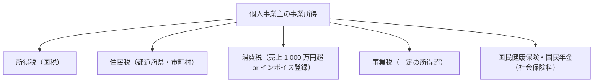
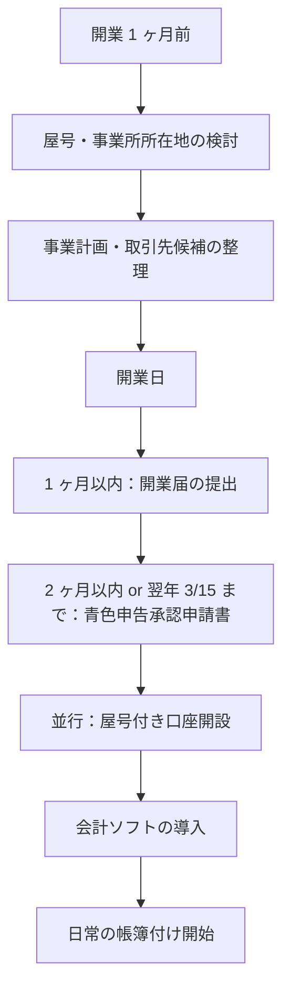
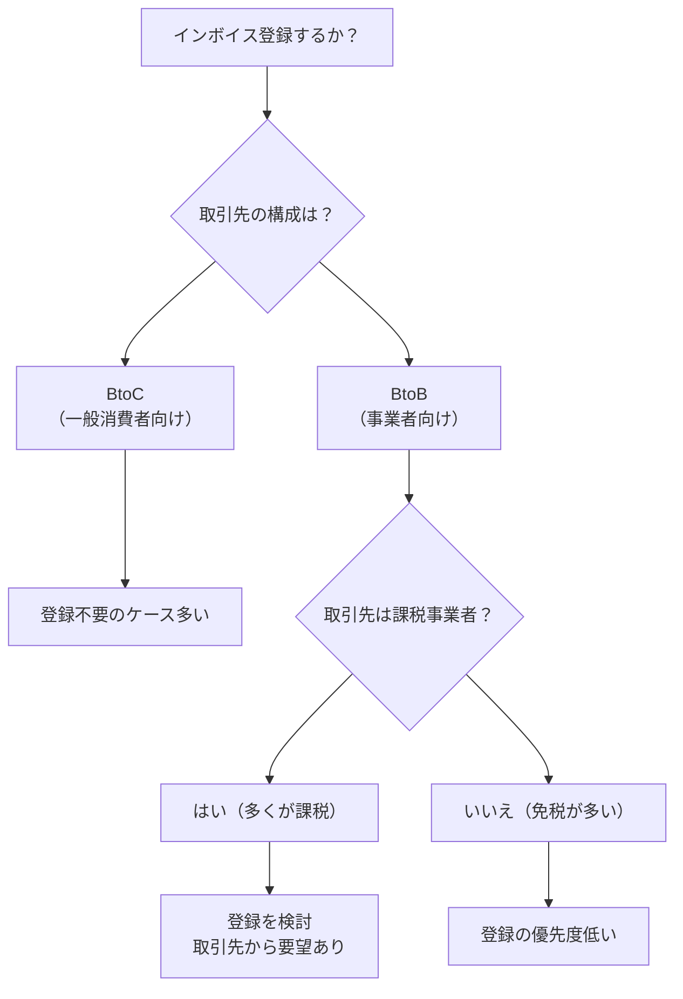
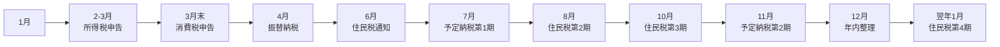
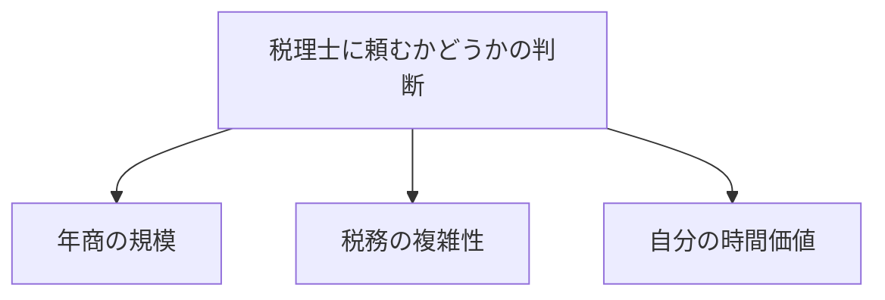

# フリーランスの確定申告

開業届から青色申告・インボイス対応まで——個人事業主の税務手続き入門

| 項目 | 内容 |
|---|---|
| カテゴリー | ビジネススキル |
| 難易度 | 初級 |
| 所要時間 | 約200分（全8レッスン） |
| 公開日 | 2026-06-24 |
| 最終更新日 | 2026-06-24 |
| コースURL | https://skillup.college/courses/business/freelance-tax-basics/ |

## 対象者

独立直後〜2年目のフリーランス・個人事業主を主軸に、副業から個人事業主への移行を検討中の会社員、これから独立を考えている方など、自分で確定申告に取り組む必要のあるすべての方。

## 前提知識

特になし。会社員時代の年末調整経験があれば十分。簿記資格は不要。「自分はフリーランスとして開業したばかりで税務を 0 から学びたい」「副業を始めて確定申告が必要になりそう」「青色申告と白色申告の違いがわからない」「インボイスをどうすればよいか迷っている」という方を主対象に設計。

## 学習目標

- 個人事業主（フリーランス）の税務環境と本コースの位置づけを理解する
- 開業届と青色申告承認申請書の提出方法と期限を把握する
- 複式簿記の発想と会計ソフトの活用方法を身につける
- 経費計上の判断軸と家事按分・減価償却の作法を理解する
- インボイス制度の概要と課税／免税事業者の判断軸を持てる
- 所得控除と税額控除を組み合わせた合法的な節税の発想を学ぶ
- e-Taxによる確定申告の流れと申告ミスへの対応方法を把握する
- フリーランスの年間スケジュールと税理士活用のタイミングを判断できる

## コース概要

「開業したけれど、何から手をつければいいかわからない」「青色申告と白色申告の違いがわからない」「インボイスは登録すべきなのか迷っている」「税理士に頼むのは早すぎる気がする」——独立直後のフリーランス・個人事業主の方の共通の悩みです。本コースは、独立直後〜 2 年目のフリーランスを主軸に、副業から個人事業主への移行を検討する会社員、これから独立を考えている方を対象に、税務手続きの実務を 8 レッスンで体系的に学びます。フリーランスの税務環境、開業届、帳簿付け、経費計上、インボイス制度、所得控除、e-Tax での確定申告、年間スケジュールと税理士活用まで、「最初の確定申告を乗り切る」ために必要な実務知識を、簿記資格を持たない方が「制度を理解してから判断する」発想で身につけられる構成です。なお、本コースは教育目的のコースで、個別の税務相談は税理士の独占業務である点を踏まえ、原則と判断軸を提示するに留めています。

## 学習の流れ

レッスン 1 でフリーランスの税務環境（個人事業主の定義、会社員との税務の違い、本コースの位置づけ）を共有します。レッスン 2 〜 3 は開業準備編で、開業届・青色申告承認申請書などの届出（L2）と、帳簿付けの基本・会計ソフトの活用（L3）を扱います。レッスン 4 〜 5 は実務編で、経費計上の作法・家事按分・減価償却（L4）と、インボイス制度・消費税の対応（L5）に踏み込みます。レッスン 6 〜 7 は申告編で、所得控除と税額控除の組み合わせ（L6）と、e-Tax での確定申告の実務・申告ミスへの対応（L7）を組み立てます。最後のレッスン 8 で、フリーランスの年間スケジュール、税理士に頼むタイミングの判断軸、修了後の学習方向を案内します。前半（1〜3）は「環境と準備」、中盤（4〜5）は「日常の実務」、後半（6〜8）は「申告と運用」の三段構成です。

## レッスン一覧

| No. | タイトル | 概要 | 所要時間 |
|---|---|---|---|
| 1 | フリーランスとは何か——個人事業主の税務環境と本コースの位置づけ | 個人事業主（フリーランス）の定義、会社員との税務の違い、所得税・住民税・消費税・国民健康保険・国民年金の関係、税理士の独占業務と本コースの教育目的、本コースの守備範囲を学ぶ | 25分 |
| 2 | 開業の手続き——開業届・青色申告承認申請書・ほかの届出 | 開業届（開業から 1 ヶ月以内）、青色申告承認申請書（3 月 15 日まで／開業から 2 ヶ月以内）、青色専従者給与に関する届出書、源泉所得税の納期の特例、屋号付き口座、フリーランス新法の影響を学ぶ | 25分 |
| 3 | 帳簿付けの基本——複式簿記の発想と会計ソフト | 帳簿の役割（青色申告 65 万円控除の前提）、現金主義と発生主義、複式簿記の発想（借方・貸方、勘定科目）、会計ソフト（freee／マネーフォワード／弥生）の活用、AI 仕訳の現在地、帳簿保管 7 年の義務を学ぶ | 25分 |
| 4 | 経費計上の作法——何を経費にできるか、家事按分、減価償却 | 事業に関連する出費の判断、経費にできるもの／できないもの、家事按分（家賃・通信費・自動車費用）、減価償却と少額減価償却資産の特例（30 万円未満）、電子帳簿保存法と電子取引データ保存義務、税務調査の発想を学ぶ | 25分 |
| 5 | インボイス制度と消費税——適格請求書・課税／免税の選択・2 割特例 | 消費税の仕組み、課税事業者と免税事業者（売上 1,000 万円判定）、インボイス制度（2023 年 10 月 1 日施行）、適格請求書発行事業者の登録、2 割特例の経過措置、簡易課税制度、フリーランス新法と取引適正化を学ぶ | 25分 |
| 6 | 所得控除と税額控除——節税は合法、賢く制度を使う | 所得控除の全体像、基礎控除、社会保険料控除、小規模企業共済、iDeCo（個人事業主は月額上限 68,000 円）、ふるさと納税、医療費控除、住宅借入金等特別控除、定額減税（2024 年実施）、節税と脱税の境界を学ぶ | 25分 |
| 7 | 確定申告の実務——e-Tax・申告書類・提出期限・申告ミスへの対応 | 確定申告の全体像、申告期限（原則 3 月 15 日）、必要書類（青色申告決算書・確定申告書 B・添付書類）、e-Tax の選択肢、納税方法、申告ミスへの対応（更正の請求・修正申告）、税務調査の備え、消費税申告を学ぶ | 25分 |
| 8 | 開業後の年間スケジュールと税理士活用——プロに頼むタイミング・修了後の学習方向 | フリーランスの年間スケジュール（法定調書・予定納税・住民税・確定申告）、税理士に頼むタイミングの判断軸、税理士の選び方、顧問契約とスポット相談の比較、修了後の学習方向（管理会計入門・お金の基礎・法人成りの判断）を学ぶ | 25分 |

---

## レッスン1：フリーランスとは何か——個人事業主の税務環境と本コースの位置づけ

（所要時間：25分）

### このレッスンで学ぶこと

- 「フリーランス」と「個人事業主」の違いを整理する
- 会社員との税務の違い（給与所得と事業所得）を理解する
- 所得税・住民税・消費税・国民健康保険・国民年金の関係を全体像で把握する
- 税理士の独占業務（税務代理・税務書類作成・税務相談）と本コースの教育目的の境界を共有する
- 本コースの守備範囲と「制度を理解してから判断する」発想を共有する
- 2026 年 6 月時点の税制動向の概要を知る

---

「会社を辞めて独立した」「副業の収入が増えてきた」「フリーランスとして仕事を受け始めた」——独立直後の方の多くが、税務手続きで戸惑います。理由は単純で、会社員時代は会社が大半の税務処理を代わりにやってくれていたからです。給与から所得税が天引きされ、年末調整で精算され、住民税は会社が天引きで自治体に納付し、社会保険料も会社と折半で天引きされる——会社員にとって、税務は「ほぼ自動」だったのです。

ところが、独立すると、これらすべてを自分でやることになります。本コースは、その新しい世界に踏み込んだ皆さんが「最初の確定申告を乗り切る」ために必要な実務知識を、8 レッスンで体系的にお伝えするコースです。本レッスンでは、まずフリーランスの税務環境の全体像と、本コースの位置づけを共有することから始めます。

### フリーランスと個人事業主の違い

「フリーランス」と「個人事業主」は、日常会話ではほぼ同じ意味で使われていますが、厳密には異なる概念です。

| 用語 | 意味 |
|---|---|
| フリーランス | 働き方の概念。特定の企業に属さず、独立して仕事を受ける働き方 |
| 個人事業主 | 税務上の区分。法人ではない事業者として、国税庁に開業届を提出した人 |

フリーランスのなかには、開業届を提出していない方もいます。提出していなくても「フリーランス」と名乗ることに法的な問題はありませんが、青色申告を選択する場合は、開業届と青色申告承認申請書の提出が前提になります（次のレッスン 2 で扱います）。

なお、フリーランスと並ぶ言葉として「自営業」「自由業」「個人企業」などもありますが、これらも税務上は「個人事業主」として扱われます。本コースでは原則として「個人事業主」を使い、必要に応じて「フリーランス」を使い分けます。

> **💡 ポイント**
> 「フリーランス」は働き方、「個人事業主」は税務上の区分。本コースは、開業届を提出して個人事業主として活動する方を主対象に、税務手続きの実務を学びます。

### 会社員と個人事業主の税務の違い

会社員時代と独立後では、税務の発想が大きく変わります。違いを整理します。

#### 会社員時代

- **所得の種類**：給与所得（給与から給与所得控除を差し引いたもの）
- **税の計算と納付**：会社が源泉徴収して納付し、年末調整で精算
- **社会保険**：健康保険（協会けんぽ または 健康保険組合）・厚生年金、会社と折半
- **住民税**：会社が給与から天引きして自治体に納付（特別徴収）

#### 個人事業主

- **所得の種類**：事業所得（売上から経費を差し引いたもの）
- **税の計算と納付**：自分で帳簿をつけ、年に 1 度の確定申告で精算
- **社会保険**：国民健康保険・国民年金、全額自己負担
- **住民税**：自治体から送られる納税通知書で自分で納付（普通徴収）

会社員時代の「給与所得控除」に相当するのが、個人事業主の「経費」です。給与所得控除は機械的に計算されますが、経費は「事業に関連する出費か」を自分で判断する必要があります。**「自分で判断する」が、独立後の税務の中核**です。

### 5 つの税・公的負担の全体像

個人事業主が向き合う税・公的負担は、おおむね 5 つに整理できます。



#### 1. 所得税（国税）

事業所得に対して課される国税。累進課税で 5% 〜 45% の税率。確定申告で計算し、申告期限（原則 3 月 15 日）までに納付します。

#### 2. 住民税（都道府県民税＋市町村民税）

事業所得をもとに、自治体が翌年度の住民税を計算し、納税通知書を送ってきます。原則として一律 10%（都道府県民税 4% + 市町村民税 6%）。6 月・8 月・10 月・翌年 1 月の 4 期に分けて納付するのが一般的です。

#### 3. 消費税（国税）

売上に応じて、課税事業者と免税事業者の 2 つに区分されます。基準期間（前々年）の課税売上高 1,000 万円超で課税事業者に該当します。インボイス制度（2023 年 10 月 1 日施行）により、免税事業者でもインボイス登録すれば課税事業者になります（レッスン 5 で詳しく扱います）。

#### 4. 事業税（都道府県民税）

事業所得が一定額（おおむね 290 万円の事業主控除を超える額）に対して課されます。業種により税率が異なります（おおむね 3% 〜 5%）。

#### 5. 国民健康保険・国民年金

社会保険料。国民健康保険は自治体ごとに計算式が異なり、所得割・均等割・平等割の組み合わせ。国民年金は定額（月額は年度ごとに改定）。所得控除（社会保険料控除）の対象になります。

> **💡 ポイント**
> 個人事業主は、所得税・住民税・消費税・事業税・社会保険料の 5 つに向き合います。会社員時代より把握すべき範囲が広い分、制度を理解すると合法的な節税の選択肢も増えます。

### 税理士の独占業務と本コースの位置づけ

本コースの位置づけを共有するうえで、税理士法との関係を最初に整理します。**税理士法 52 条**で、税理士の独占業務として次の 3 つが定められています。

| 業務 | 内容 | 税理士以外が業として行うと罰則の対象 |
|---|---|---|
| 税務代理 | 税務官公署に対する申告・申請・主張・陳述の代理 | ◯（税理士法 52 条違反） |
| 税務書類作成 | 確定申告書などの税務書類を他人の依頼で作成 | ◯ |
| 税務相談 | 税務に関する具体的な相談に応じること | ◯ |

**「他人の税務を、業として代行・相談する」が税理士の独占業務**で、税理士以外の人が業として行うと税理士法違反になります。

一方、**自分自身の税務手続きを自分で行うこと**は、法的に何の問題もありません。本コースは、皆さんが「自分の税務手続きを自分で実行できるようになる」ための教育コースです。

#### 本コースで扱うこと

- 制度の解説（個人事業主の税務の全体像、各種制度の仕組み）
- 一般的な原則と判断軸の提示
- 公式の手続きと書類の説明
- 用語の解説

#### 本コースで扱わないこと

- **個別の税務相談**（「私のケースではどうすべきか」という個別判断は行いません）
- **税理士業務の代行**（皆さんの代わりに申告書を作成する、税務官公署と交渉するなど）
- **税理士試験・簿記検定の対策**（本コースは実務本位で、試験対策には言及しません）

「自分の判断に自信がない」「複雑な事業形態でどう対応すべきかわからない」という場合は、**お近くの税理士にご相談ください**。本コース修了後も、税理士に頼るタイミングについてはレッスン 8 で扱います。

> **💡 ポイント**
> 本コースは教育目的のコースで、個別税務相談・税務代理・税務書類作成は行いません。皆さんの事業の判断は、必要に応じてお近くの税理士にご相談ください。

### 「最初の確定申告」の全体像

独立から最初の確定申告までの大きな流れを、頭に入れておきます。

#### 開業前後（1 ヶ月以内）

- 開業届を税務署に提出
- 青色申告承認申請書を税務署に提出（青色申告を希望する場合）
- 屋号付き口座の開設
- 会計ソフトの導入

#### 開業後の日常

- 売上と経費の記録（帳簿付け）
- 領収書・請求書の保管
- 消費税の取り扱い判断

#### 年末年始（12 月〜 1 月）

- 年内の取引の最終整理
- 翌年 1 月 1 日時点の在庫確認
- 確定申告の準備開始

#### 確定申告期間（2 月 16 日〜 3 月 15 日）

- 確定申告書 B と青色申告決算書の作成
- e-Tax または書面で提出
- 所得税の納付

#### 確定申告後

- 住民税・事業税の納税通知書を受け取って納付
- 消費税申告（課税事業者のみ、原則 3 月 31 日まで）
- 翌年の予定納税（前年の所得税が一定額以上の場合）

このフローを意識しながら、本コースの各レッスンを進めていただくと、全体像のなかでの位置づけが明確になります。

### 2026 年 6 月時点の税制動向

本コースを学ばれるタイミングで、押さえておきたい税制動向は次のとおりです。

- **インボイス制度**：2023 年 10 月 1 日施行。免税事業者から課税事業者になった事業者向けの「2 割特例」が経過措置として運用中（2023 年 10 月 1 日〜 2026 年 9 月 30 日を含む課税期間）
- **電子帳簿保存法**：電子取引データの電子保存義務化が 2024 年 1 月 1 日から完全施行
- **定額減税**：2024 年実施（所得税 3 万円＋住民税 1 万円）。個人事業主は予定納税からの減税
- **フリーランス新法**：正式名称「特定受託事業者に係る取引の適正化等に関する法律」、2024 年 11 月 1 日施行
- **会計ソフト SaaS の標準化**：freee／マネーフォワード／弥生などのクラウド会計ソフトの普及

これらの動向は、本コースの各レッスンで詳しく扱います。なお、税制は毎年改正されるため、本コースの内容は**「2026 年 6 月時点」**であることを念頭に置いていただき、最新情報は国税庁の公式情報をあわせて確認することをおすすめします。

### 本コースの守備範囲

本コースは「フリーランスの確定申告の実務」を中核に据えています。具体的には、フリーランスの税務環境（L1）、開業の手続き（L2）、帳簿付け（L3）、経費計上（L4）、インボイス制度（L5）、所得控除と税額控除（L6）、確定申告の実務（L7）、年間スケジュールと税理士活用（L8）の 8 領域を扱います。

一方で、次の領域は本コースの守備範囲外です。

- **法人成りの判断と法人税務**（修了後の発展領域として L8 でご案内）
- **管理会計・経営分析**（修了後の発展領域）
- **企業財務分析・決算書の読み方**（別の入門コースを参照）
- **簿記検定・税理士試験の対策**（試験対策ではなく実務本位）
- **株式投資・つみたて NISA の運用論**（資産形成の入門領域）
- **個別の税務相談・税務代理・税務書類作成**（税理士の独占業務）

### まとめ

- **フリーランス（働き方）と個人事業主（税務上の区分）**：本コースは個人事業主の税務手続きを扱う
- **会社員と個人事業主の税務の違い**：会社員は「ほぼ自動」、個人事業主は「自分で判断」が中核
- **5 つの税・公的負担**：所得税・住民税・消費税・事業税・国民健康保険／国民年金
- **税理士の独占業務**：税務代理・税務書類作成・税務相談は税理士のみ。本コースは教育目的に徹し、個別税務相談は行わない
- **「最初の確定申告」の流れ**：開業前後 → 日常 → 年末年始 → 申告期間 → 申告後
- **2026 年 6 月時点の動向**：インボイス制度の 2 割特例、電子帳簿保存法、定額減税、フリーランス新法
- **本コースの守備範囲**：個人事業主の税務手続きに特化。法人成り・管理会計・試験対策・個別税務相談は守備範囲外

次のレッスンでは、開業の手続きを扱います。開業届・青色申告承認申請書の提出方法と期限、青色専従者給与に関する届出書、源泉所得税の納期の特例、屋号付き口座、フリーランス新法の影響など、独立直後に必要な届出を整理します。

### 確認クイズ

このレッスンの理解度をチェックする 6 問です。

#### Q1. 「フリーランス」と「個人事業主」の違いとして、本コースの整理にもっとも近いものはどれですか。

- [x] フリーランスは働き方の概念、個人事業主は税務上の区分（開業届を提出した人）
- [ ] フリーランスと個人事業主は完全に同じ意味で、使い分ける必要はない
- [ ] フリーランスは法人、個人事業主は法人ではない事業者
- [ ] フリーランスは会社員、個人事業主は無職

> **解説**：フリーランスは働き方の概念（特定企業に属さず独立して仕事を受ける）、個人事業主は税務上の区分（開業届を提出した個人）です。日常的に同じ意味で使われることが多いですが、税務手続きを扱う本コースでは厳密に区別します。フリーランスのなかには開業届を提出していない方もいて、その場合も「フリーランス」と名乗ること自体に法的問題はありません。

#### Q2. 会社員と個人事業主の税務の違いとして、もっとも適切な説明はどれですか。

- [ ] 会社員は所得税のみ、個人事業主は所得税と住民税の 2 つを納付する
- [x] 会社員は会社が源泉徴収・年末調整・住民税天引きで「ほぼ自動」、個人事業主は確定申告と納付を「自分で実行」
- [ ] 会社員と個人事業主の税務手続きはまったく同じで、違いはない
- [ ] 個人事業主は所得税を納付しない（消費税のみ納付）

> **解説**：会社員は会社が源泉徴収・年末調整・住民税天引きを代行するため、税務手続きは「ほぼ自動」です。個人事業主は、帳簿付け・確定申告・納付をすべて自分で実行する必要があります。所得税は会社員にも個人事業主にも課されますし、住民税も両者ともに納付します。個人事業主が所得税を納付しないわけではありません。

#### Q3. 個人事業主が向き合う 5 つの税・公的負担の組み合わせとして、本コースが挙げているものはどれですか。

- [ ] 所得税・法人税・相続税・贈与税・固定資産税
- [ ] 所得税・住民税・登録免許税・印紙税・自動車税
- [x] 所得税・住民税・消費税・事業税・国民健康保険／国民年金
- [ ] 所得税・住民税・酒税・たばこ税・関税

> **解説**：個人事業主が向き合う 5 つの税・公的負担は、所得税（国税）、住民税（都道府県＋市町村）、消費税（売上 1,000 万円超 or インボイス登録の場合）、事業税（事業主控除を超える所得）、国民健康保険・国民年金（社会保険料）です。法人税・相続税・贈与税は別領域、酒税・たばこ税・関税は事業者の業種次第で関係する場合もありますが、本コースの守備範囲外です。

#### Q4. 税理士の独占業務として、税理士法 52 条で定められているものはどれですか。

- [ ] 会計帳簿の記帳代行のみ
- [ ] 株式投資のアドバイスと投資信託の販売
- [ ] 登記申請と不動産取引の仲介
- [x] 税務代理・税務書類作成・税務相談

> **解説**：税理士法 52 条で定められた税理士の独占業務は、税務代理（税務官公署への申告・申請の代理）、税務書類作成（確定申告書などを他人の依頼で作成）、税務相談（税務に関する具体的な相談）の 3 つです。会計帳簿の記帳代行は税理士の独占業務ではなく、税理士以外でも業として行えます（ただし税理士法人との連携で実施することが多い）。登記は司法書士、株式投資のアドバイスは別の士業の領域です。

#### Q5. 本コースの位置づけとして、もっとも適切なものはどれですか。

- [x] 教育目的のコースで、制度の解説・一般的な原則と判断軸の提示を行う。個別税務相談・税務代理・税務書類作成は税理士の独占業務として扱わない
- [ ] 税理士業務の代行を行うコースで、修了後は税理士として開業できる
- [ ] 簿記検定・税理士試験の合格対策コース
- [ ] 個別の税務相談を行うコースで、受講者のケースに応じた具体的な判断を提供する

> **解説**：本コースは教育目的のコースで、税理士の独占業務（税務代理・税務書類作成・税務相談）は扱いません。受講者の事業の具体的な判断は、必要に応じてお近くの税理士にご相談いただく前提です。税理士業務の代行・税理士試験対策・個別税務相談は、本コースの守備範囲外です。「制度を理解してから判断する」発想を持つための教育コースです。

#### Q6. 2026 年 6 月時点の税制動向として、本コースが挙げているものはどれですか。

- [ ] 所得税率の大幅引き下げ、消費税率 5% への引き下げ、住民税廃止
- [ ] 法人税率の大幅引き上げ、相続税率の見直し、贈与税の廃止
- [x] インボイス制度の 2 割特例経過措置（2023 年 10 月 1 日〜 2026 年 9 月 30 日）、電子帳簿保存法の電子取引データ電子保存義務化（2024 年 1 月 1 日完全施行）、定額減税（2024 年実施）、フリーランス新法（2024 年 11 月 1 日施行）
- [ ] NISA 制度の廃止、iDeCo の上限引き下げ、ふるさと納税の上限廃止

> **解説**：2026 年 6 月時点の主要な税制動向は、インボイス制度の 2 割特例経過措置、電子帳簿保存法の電子取引データの電子保存義務化（2024 年 1 月 1 日完全施行）、定額減税（2024 年実施、所得税 3 万円＋住民税 1 万円）、フリーランス新法（特定受託事業者法、2024 年 11 月 1 日施行）です。所得税率引き下げや消費税率引き下げの大規模改正は 2026 年 6 月時点では実施されていません。NISA・iDeCo は拡充の方向で、廃止・上限引き下げではありません。

---

## レッスン2：開業の手続き——開業届・青色申告承認申請書・ほかの届出

（所要時間：25分）

### このレッスンで学ぶこと

- 開業届（個人事業の開業・廃業等届出書）の提出方法と期限を把握する
- 青色申告承認申請書の提出方法と期限を理解する
- 青色専従者給与に関する届出書・源泉所得税の納期の特例の概要を知る
- 屋号と屋号付き口座の発想を身につける
- 開業前に整えておくべき準備（口座・名刺・契約書）を整理する
- フリーランス新法（2024 年 11 月 1 日施行）の影響を把握する

---

前回のレッスンでは、個人事業主の税務環境の全体像と本コースの位置づけを共有しました。本レッスンからは、実際の手続きに踏み込みます。独立直後にまず取り組むのが、税務署への各種届出です。本レッスンでは、開業届・青色申告承認申請書を中心に、提出のタイミング、書き方、関連する届出を順番に扱います。「開業届を出していない」「出すべきタイミングがわからない」という方は、本レッスンを読みながら、提出のスケジュールを立てていただければと思います。

### 開業届の全体像

開業届の正式名称は「**個人事業の開業・廃業等届出書**」。所得税法第 229 条で、新たに事業所得を生ずべき事業を開始した場合に提出するよう定められています。

#### 提出先・期限

- **提出先**：納税地（原則として住所地）を管轄する税務署
- **期限**：事業を開始した日から **1 ヶ月以内**

#### 提出しなくても罰則はないが……

開業届の提出に対する直接的な罰則はありません。提出していなくてもすぐに不利益が発生するわけではありません。ただし、次の点で**実務上、提出することが圧倒的に有利**です。

- **青色申告**を選択するには、開業届の提出が前提
- **屋号付き口座**を開設するには、開業届の控えが必要なケースが多い
- **小規模企業共済**への加入に開業届の控えが必要
- **持続化給付金・補助金・助成金**などで、開業の証明として開業届の控えが使われることがある
- **クレジットカードの事業用カード**を作る際に、開業届の控えが必要なケースもある

> **💡 ポイント**
> 開業届は「提出しても損はない」手続きです。独立から 1 ヶ月以内に提出するのが基本ですが、後から提出することも可能です。「あとで出そう」と思っていると忘れがちなので、早めの提出をおすすめします。

#### 開業届の書き方の主な項目

開業届の主な記入項目は次のとおりです。

| 項目 | 内容 |
|---|---|
| 納税地 | 原則として住所地（住所・電話番号） |
| 氏名・生年月日・個人番号 | 個人番号（マイナンバー）の記載が必要 |
| 職業 | 「ライター」「Webデザイナー」「コンサルタント」など、業種を具体的に |
| 屋号 | あれば記入（任意） |
| 届出の区分 | 「開業」を選択 |
| 開業・廃業等日 | 事業開始日 |
| 開業に伴う届出書の提出の有無 | 青色申告承認申請書・課税事業者選択届出書を一緒に出すか |
| 事業の概要 | 「Web制作・コーディング業務」など具体的に |
| 給与等の支払の状況 | 従業員を雇う場合は記入 |

### 開業手続きのタイムライン

開業前後の主な手続きをタイムラインで整理します。



開業日から数えて、1 ヶ月以内に開業届、2 ヶ月以内 or 翌年 3 月 15 日までに青色申告承認申請書、というのが基本のリズムです。

### 青色申告承認申請書

青色申告は、税制上の優遇措置を受けるための申告方法です。**青色申告特別控除 65 万円（複式簿記＋ e-Tax または電子帳簿保存）**、**赤字を 3 年間繰り越せる**、**家族への給与を経費にできる**など、フリーランスにとって大きなメリットがあります。

#### 提出先・期限

- **提出先**：納税地を管轄する税務署
- **期限**：青色申告の適用を受けようとする年の **3 月 15 日まで**（その年 1 月 16 日以降に開業した場合は、開業日から 2 ヶ月以内）

例えば、2026 年 5 月 1 日に開業した方が、2026 年分の所得から青色申告を適用するなら、2026 年 7 月 1 日（開業から 2 ヶ月）までに提出が必要です。期限を過ぎると、その年は白色申告になり、翌年から青色申告に切り替えになります。

#### 青色申告と白色申告の違い

| 項目 | 青色申告 | 白色申告 |
|---|---|---|
| 帳簿付け | 複式簿記（10 万円控除なら簡易簿記でも可） | 簡易な帳簿（収支内訳書） |
| 青色申告特別控除 | 65 万円／55 万円／10 万円 | なし |
| 赤字の繰越し | 3 年間繰越し可能 | できない |
| 家族への給与 | 全額経費に（青色事業専従者給与） | 専従者控除（年間 86 万円まで） |
| 提出書類 | 青色申告決算書 | 収支内訳書 |
| 申請書 | 青色申告承認申請書（事前提出） | 不要 |

**青色申告のほうが手続きの負担はやや増えますが、控除と繰越しの効果が大きい**ため、本コースでは青色申告を前提に扱います。

#### 青色申告特別控除の 3 段階

| 控除額 | 条件 |
|---|---|
| 65 万円 | 複式簿記＋ e-Tax 申告または電子帳簿保存（電子帳簿保存法の優良な電子帳簿の要件） |
| 55 万円 | 複式簿記（e-Tax または電子帳簿保存の条件を満たさない） |
| 10 万円 | 簡易簿記 |

会計ソフトを使って複式簿記をつけ、e-Tax で申告する——これだけで 65 万円控除が取れます。**所得税・住民税合わせて十数万円の節税効果**になりますから、青色申告の手間を上回るリターンになるのが一般的です。

> **💡 ポイント**
> 青色申告 65 万円控除は、会計ソフト＋ e-Tax で実現できます。複式簿記といっても、会計ソフトが自動的に処理してくれるため、簿記の専門知識は必須ではありません。

### ほかの主な届出

開業時に状況に応じて検討する届出を整理します。

#### 1. 青色事業専従者給与に関する届出書

家族（配偶者・親など）に給与を支払って事業を手伝ってもらう場合の届出です。届出書に「給与の額・支払方法」を記載して、その内容で支払いを行います。**配偶者控除との選択が必要**で、専従者給与を選ぶと配偶者控除は適用できなくなります（給与計算の総額で比較して有利な方を選ぶ判断が必要）。

提出期限：青色申告と同じく、その年の 3 月 15 日まで（その年 1 月 16 日以降に開業の場合は開業から 2 ヶ月以内）。

#### 2. 源泉所得税の納期の特例の承認に関する申請書

従業員や青色専従者に給与を支払う場合、毎月源泉所得税を納付する義務が発生します。この特例を申請すると、**半年分をまとめて納付**できます（年 2 回、7 月 10 日と翌年 1 月 20 日）。給与支給人数が常時 10 人未満の事業所のみが対象。

#### 3. 消費税課税事業者選択届出書

通常は売上高 1,000 万円超で課税事業者になりますが、自分から課税事業者を選択することもできます。インボイス制度の登録（適格請求書発行事業者の登録）でも、結果的に課税事業者になります。レッスン 5 で詳しく扱います。

#### 4. 給与支払事務所等の開設・移転・廃止届出書

従業員や青色専従者を雇って給与を支払う場合に提出する届出。

### 屋号と屋号付き口座

「屋号」は、個人事業主が自分の事業に付ける名前です。法人で言う「商号」に近い概念です。

#### 屋号は付けるべきか

屋号の登録は任意です。付けないまま個人名で事業を続けてもまったく問題ありません。屋号を付けるメリットは次のとおり。

- **対外的な印象**：請求書・名刺などで個人名より組織感が伝わる
- **屋号付き口座**：取引先が「△△商店 様」のように振り込めて、プライベートと事業の分離がしやすい
- **クレジットカード**：屋号付き事業用カードを作れる場合がある（カード会社による）

一方、屋号を付けないメリットは「シンプル」「変更がいらない」など。**「絶対に付けるべき」とまでは言えない**ので、自分の事業の性質に合わせて判断します。

#### 屋号付き口座の開設

屋号付き口座は、金融機関によって対応が異なります。一般的にはネット系の金融機関（GMOあおぞらネット銀行、PayPay 銀行、住信SBIネット銀行など）が比較的開設しやすい傾向があります。地方銀行・メガバンクは、店舗での手続きが必要で、開業届の控え・本人確認書類などが求められるのが一般的です。

> **💡 ポイント**
> 屋号付き口座は、事業用とプライベート用の資金を分けるための便利な道具です。**事業と私生活の通帳が混ざっていると、確定申告の経費計算が非常に手間になる**ため、開業を機に分けることを強くおすすめします。

### 開業前に整える 4 つの準備

開業の届出と並行して、開業前に整えておきたい 4 つの準備を整理します。

#### 1. 屋号と事業所所在地

屋号を決める、事業所所在地（自宅と兼用でも可）を決める。

#### 2. 事業用の口座とクレジットカード

事業用の口座を 1 つ用意する。クレジットカードも事業用に 1 枚（個人名でもよい）。**事業のお金とプライベートのお金を分ける**のが基本です。

#### 3. 名刺と請求書のテンプレート

名刺、請求書、見積書のテンプレートを準備しておきます。請求書はインボイス制度対応のため、**適格請求書発行事業者の登録番号**を入れるかどうかをレッスン 5 までに判断します。

#### 4. 契約書のひな型

業務委託契約書のひな型を準備しておくと、新規取引が始まる際に役立ちます。フリーランス新法（後述）の影響も意識します。

### フリーランス新法（2024 年 11 月 1 日施行）

正式名称：**特定受託事業者に係る取引の適正化等に関する法律**。フリーランス（特定受託事業者）と取引する事業者（特定業務委託事業者）との関係を適正化することを目的に、2024 年 11 月 1 日に施行されました。

#### 主な内容

- **契約条件の書面交付**：業務委託の内容、報酬額、支払期日を書面（または電子データ）で明示する義務
- **報酬支払期日**：原則として、給付の受領日から 60 日以内
- **禁止行為**：不当な減額、返品、買いたたきなどを禁止
- **ハラスメント対策**：発注事業者は、相談体制の整備など必要な措置をとる義務

#### フリーランス側の意味

フリーランス側にとっては、不当な契約条件で取引させられるリスクが下がり、相談窓口も整備されました。**書面（または電子データ）での契約条件確認**を取引開始時に求めるのが、新法時代の基本姿勢です。

### まとめ

- **開業届**：開業から 1 ヶ月以内に税務署へ。提出しないと罰則はないが、青色申告・口座開設・補助金などで実務上必須
- **青色申告承認申請書**：その年 3 月 15 日まで／開業から 2 ヶ月以内に提出。青色申告特別控除 65 万円・赤字 3 年繰越し・専従者給与のメリット
- **青色申告特別控除の 3 段階**：65 万円（複式簿記＋ e-Tax）／ 55 万円（複式簿記のみ）／ 10 万円（簡易簿記）
- **ほかの届出**：青色事業専従者給与・源泉所得税の納期の特例・消費税課税事業者選択・給与支払事務所等の届出
- **屋号と屋号付き口座**：任意だが、事業とプライベートを分けるのに有効。ネット銀行が比較的開設しやすい
- **開業前の 4 つの準備**：屋号・事業所所在地、事業用口座とクレジットカード、名刺と請求書テンプレート、契約書ひな型
- **フリーランス新法（2024 年 11 月 1 日施行）**：契約条件の書面交付、報酬支払期日（受領日から 60 日以内）、禁止行為、ハラスメント対策

次のレッスンでは、帳簿付けの基本を扱います。複式簿記の発想、会計ソフト（freee・マネーフォワード・弥生）の活用、AI 仕訳の現在地、帳簿保管の義務など、日常の経理を「楽に・正確に」運用するための基礎を学びます。

### 確認クイズ

このレッスンの理解度をチェックする 6 問です。

#### Q1. 開業届（個人事業の開業・廃業等届出書）の提出期限として、本レッスンが挙げているのはどれですか。

- [ ] 開業から 1 年以内
- [ ] 開業から 6 ヶ月以内
- [x] 開業から 1 ヶ月以内
- [ ] 開業日の前日まで

> **解説**：開業届の提出期限は、所得税法第 229 条で「事業を開始した日から 1 ヶ月以内」と定められています。提出しなくても直接的な罰則はありませんが、青色申告・屋号付き口座開設・小規模企業共済加入・補助金申請などで実務上必須になります。

#### Q2. 青色申告承認申請書の提出期限として、もっとも正確なものはどれですか。

- [x] 青色申告の適用を受けようとする年の 3 月 15 日まで（その年 1 月 16 日以降に開業の場合は開業から 2 ヶ月以内）
- [ ] 開業から 1 年以内
- [ ] 確定申告と同時に提出
- [ ] 12 月 31 日まで

> **解説**：青色申告承認申請書の提出期限は、その年の 3 月 15 日まで（1 月 16 日以降に開業した場合は開業から 2 ヶ月以内）です。期限を過ぎると、その年は白色申告となり、翌年から青色申告に切り替わります。開業届と同時に提出するのが実務上のおすすめです。

#### Q3. 青色申告と白色申告の違いとして、もっとも正確な説明はどれですか。

- [ ] 青色申告と白色申告は名称が違うだけで、内容に違いはない
- [ ] 白色申告のほうが税制上の優遇措置が大きい
- [x] 青色申告は青色申告特別控除（65 万円／55 万円／10 万円）、赤字の 3 年繰越し、家族への給与の全額経費化など、税制上の優遇措置が大きい
- [ ] 青色申告は法人のみ、白色申告は個人のみが選択できる

> **解説**：青色申告は、青色申告特別控除（65 万円／55 万円／10 万円の 3 段階）、赤字の 3 年繰越し、家族への給与（青色事業専従者給与）の全額経費化など、税制上の優遇措置が大きい申告方法です。手続きの負担はやや増えますが、控除と繰越しの効果がそれを上回るのが一般的です。法人・個人の区別ではなく、所得税法上の選択肢です。

#### Q4. 青色申告特別控除 65 万円を受けるための条件として、本レッスンが示しているものはどれですか。

- [ ] 簡易簿記での記帳のみ
- [ ] 売上 1,000 万円超の事業者であること
- [ ] 開業から 10 年以上経過していること
- [x] 複式簿記＋ e-Tax 申告または電子帳簿保存（電子帳簿保存法の優良な電子帳簿の要件）

> **解説**：青色申告特別控除 65 万円を受けるには、複式簿記での記帳に加えて、e-Tax での電子申告、または電子帳簿保存（電子帳簿保存法の優良な電子帳簿の要件を満たす）が必要です。簡易簿記の場合は 10 万円控除、複式簿記のみで e-Tax または電子帳簿保存の条件を満たさない場合は 55 万円控除になります。売上規模や開業年数は条件ではありません。

#### Q5. 屋号付き口座の開設について、本レッスンの整理にもっとも近いものはどれですか。

- [ ] 屋号付き口座はすべての金融機関で同じ手続きで開設できる
- [ ] 屋号付き口座は法人のみが開設できる
- [ ] 屋号付き口座は税務署の許可が必要
- [x] 金融機関により対応が異なり、一般的にネット系銀行が比較的開設しやすい傾向。開業届の控えが必要なケースが多い

> **解説**：屋号付き口座は金融機関により対応が異なり、ネット系銀行（GMOあおぞらネット銀行、PayPay 銀行、住信SBIネット銀行など）が比較的開設しやすい傾向にあります。開業届の控えなどの本人確認書類が求められるのが一般的です。法人専用ではなく、税務署の許可も不要です。事業用とプライベート用の口座を分けることが、確定申告の経費計算の手間を減らす実務上の重要なポイントです。

#### Q6. フリーランス新法（2024 年 11 月 1 日施行）の主な内容として、本レッスンが挙げているものはどれですか。

- [ ] フリーランスの最低時給を定める法律
- [x] 業務委託契約の条件を書面（または電子データ）で明示する義務、報酬支払期日（給付の受領日から 60 日以内）、禁止行為（不当な減額・返品・買いたたき）、ハラスメント対策
- [ ] フリーランスの収入を一定額以上保証する法律
- [ ] フリーランスの活動を禁止する法律

> **解説**：フリーランス新法（特定受託事業者に係る取引の適正化等に関する法律、2024 年 11 月 1 日施行）の主な内容は、契約条件の書面交付（または電子データ）、報酬支払期日（給付の受領日から 60 日以内）、不当な減額・返品・買いたたきなどの禁止、相談体制の整備などのハラスメント対策です。最低時給・収入保証・フリーランス活動の禁止ではなく、フリーランスと取引する発注事業者との関係を適正化することを目的にしています。

---

## レッスン3：帳簿付けの基本——複式簿記の発想と会計ソフト

（所要時間：25分）

### このレッスンで学ぶこと

- 帳簿の役割（青色申告 65 万円控除の前提）を理解する
- 現金主義と発生主義の違いを把握する
- 複式簿記の発想（借方・貸方・勘定科目）の基本を身につける
- 主要勘定科目（売上・経費・現金・預金・売掛金・買掛金など）の使い分けを知る
- 会計ソフト（freee・マネーフォワード・弥生）の活用法を整理する
- 帳簿保管 7 年の義務と電子帳簿保存法の関係を把握する

---

前回のレッスンでは、開業の手続きとフリーランス新法を扱いました。本レッスンからは、独立後の日常の経理に踏み込みます。「複式簿記」と聞くと身構える方が多いのですが、現代は会計ソフトが大半の処理を自動化してくれます。本レッスンでは、複式簿記の基本的な発想と、それを実装する会計ソフトの使い方を、簿記の専門知識がない方でも理解できるように整理します。

### 帳簿の役割

帳簿は、事業の「お金の流れと残高」を記録する書類です。確定申告で青色申告 65 万円控除を受けるには、**複式簿記による帳簿付け**が前提になります。

#### 帳簿が果たす 4 つの役割

1. **税務申告の根拠**：確定申告書・青色申告決算書の作成に必要
2. **事業の経営判断**：売上・経費・利益を可視化して、次の判断に活かす
3. **税務調査への備え**：税務調査が入ったときに、取引の根拠を示す
4. **過去の振り返り**：去年と今年の比較、月次の傾向の把握

「税務申告のため」だけではなく、「事業を続けるための経営の道具」として帳簿があると考えるのが、フリーランスの正しい姿勢です。

#### 主な帳簿の種類

| 帳簿 | 内容 | 青色 65 万円控除に必要 |
|---|---|---|
| 仕訳帳 | 取引を発生順に記録 | ◯ |
| 総勘定元帳 | 勘定科目ごとに記録 | ◯ |
| 現金出納帳 | 現金の入出金 | ◯（補助簿） |
| 売掛帳 | 売掛金の管理 | ◯（補助簿） |
| 買掛帳 | 買掛金の管理 | ◯（補助簿） |
| 固定資産台帳 | 減価償却資産の管理 | ◯ |

これらは会計ソフトを使えば自動的に作成されます。**手作業で個別に作る必要はない**のが現代の運用です。

### 現金主義と発生主義

帳簿の付け方には、現金主義と発生主義の 2 つの考え方があります。

#### 現金主義

「お金が動いた日」を取引の発生日として記録する方法。請求書を出した日ではなく、入金された日が売上の計上日になります。

- **メリット**：シンプル、お金の動きと帳簿が一致
- **デメリット**：年をまたぐ取引で、税務上の所得計算が実態と乖離する場合がある
- **採用条件**：原則として小規模な事業者に限定（青色申告 10 万円控除のみ可、65 万円控除は不可）

#### 発生主義

「取引が確定した日」を取引の発生日として記録する方法。請求書を発行した日（売上を確定した日）が売上の計上日になります。お金の入金は別の取引として記録します。

- **メリット**：実態に即した所得計算ができる、税務上の正確性が高い
- **デメリット**：売掛金・買掛金の管理が必要、やや複雑
- **採用条件**：青色申告 65 万円控除を受けるなら**発生主義が前提**

> **💡 ポイント**
> 青色申告 65 万円控除を狙うなら、発生主義が前提です。「請求書を発行した日が売上」「請求書を受け取った日が経費」と覚えれば、ほとんどのケースで対応できます。

### 複式簿記の発想

複式簿記は、ひとつの取引を「**借方（かりかた）**」と「**貸方（かしかた）**」の 2 つの面から記録する方法です。「複式」とは「両面で記録する」という意味です。

#### 借方と貸方の基本

| 種類 | 借方が増えるとき | 貸方が増えるとき |
|---|---|---|
| 資産（現金・預金・売掛金など） | 増加 | 減少 |
| 負債（買掛金・借入金など） | 減少 | 増加 |
| 純資産（元入金など） | 減少 | 増加 |
| 収益（売上など） | 減少（まれ） | 増加 |
| 費用（経費など） | 増加 | 減少（まれ） |

#### 取引の仕訳例

##### 例 1：銀行口座に売掛金が入金された

| 借方 | 金額 | 貸方 | 金額 |
|---|---|---|---|
| 普通預金 | 110,000 | 売掛金 | 110,000 |

「普通預金」（資産）が増えて、同じ額だけ「売掛金」（資産）が減った、という両面の動きを 1 行で記録します。

##### 例 2：Web 制作の業務委託の請求書を発行した

| 借方 | 金額 | 貸方 | 金額 |
|---|---|---|---|
| 売掛金 | 110,000 | 売上 | 100,000 |
| | | 仮受消費税 | 10,000 |

「売掛金」（資産）が増えて、「売上」と「仮受消費税」（収益）が同じ額だけ増えた。

##### 例 3：パソコンを 80,000 円で購入した

| 借方 | 金額 | 貸方 | 金額 |
|---|---|---|---|
| 消耗品費 | 80,000 | 普通預金 | 80,000 |

「消耗品費」（費用）が増えて、同じ額だけ「普通預金」（資産）が減った。

借方の合計と貸方の合計が**常に一致**するのが複式簿記の特徴で、これが「貸借平均の原理」と呼ばれます。

#### 簿記を学ぶ必要はあるか

ここまで読んで「複式簿記、難しそう……」と感じた方も、安心してください。**会計ソフトを使えば、ほとんどの仕訳は自動的に処理されます**。皆さんが手作業で「借方」「貸方」を入力する場面は、ごく限られた特殊な取引のみです。

「日常の仕訳は会計ソフトが処理 → 例外的な取引のみ自分で判断」というのが、現代のフリーランスの帳簿付けです。簿記検定のような体系的な知識は必須ではありません。

### 主要勘定科目

勘定科目は、取引の内容を分類するラベルです。よく使う勘定科目を整理します。

#### 資産（持っているもの）

- **現金**：手元の現金
- **普通預金**：銀行口座の残高
- **売掛金**：請求書を発行したが、まだ入金されていない金額
- **前払金**：先払いで支払ったが、まだサービスを受けていない金額
- **棚卸資産**：商品在庫
- **建物・備品**：固定資産

#### 負債（借りているもの・支払うべきもの）

- **買掛金**：請求書を受け取ったが、まだ支払っていない金額
- **未払金**：商品以外の経費で、まだ支払っていない金額
- **借入金**：銀行からの借入
- **前受金**：先に受け取ったが、まだサービスを提供していない金額

#### 純資産（自分のもの）

- **元入金**：開業時に事業に投入したお金
- **事業主借**：事業用口座に個人のお金を入れたとき
- **事業主貸**：事業用口座から個人のために引き出したとき

#### 収益（売上・利益）

- **売上**：本業の収益
- **雑収入**：本業以外の小さな収入

#### 費用（経費）

- **仕入**：商品の仕入れ
- **外注費**：ほかの業者への外注費用
- **旅費交通費**：交通費、出張費
- **通信費**：携帯、インターネット、郵便
- **消耗品費**：10 万円未満の備品、消耗品
- **接待交際費**：取引先との会食、贈答
- **会議費**：会議の喫茶代など
- **広告宣伝費**：広告費、印刷費
- **地代家賃**：事務所家賃
- **水道光熱費**：水道、電気、ガス
- **支払手数料**：振込手数料、決済手数料
- **租税公課**：事業税、印紙代、自動車税など

> **💡 ポイント**
> 勘定科目は会社ごとに細かい違いはありますが、フリーランスは標準的なものを使えば十分です。会計ソフトに用意されたデフォルトの勘定科目で対応できるケースがほとんどです。

### 会計ソフトの活用

2026 年 6 月時点で、フリーランスに広く使われている会計ソフトは次の 3 つが代表的です。

#### freee（フリー）

- **特徴**：会計知識が浅くても使いやすい UI、日常使いに振った設計、銀行・クレジットカード連携が強力
- **対象**：会計初心者、簿記の知識が浅い方
- **価格帯**：スターターから上位プランまで複数（最新は公式サイトで確認）
- **強み**：質問形式で仕訳を入力できる、確定申告書 B の自動作成、e-Tax 連携

#### マネーフォワード クラウド確定申告

- **特徴**：複数サービス連携、会計知識のある方向け、銀行・カード連携の自動化
- **対象**：簿記の知識がある方、家計簿サービス「マネーフォワード ME」を併用したい方
- **価格帯**：パーソナルライトから上位まで複数
- **強み**：UI が会計知識者向け、複数事業の管理にも対応

#### 弥生（やよい）

- **特徴**：老舗、対応窓口が手厚い、青色申告オンラインは無料プラン（白色申告のみ）あり
- **対象**：オフライン版に親しみがある方、サポートを重視する方
- **価格帯**：青色申告オンラインのセルフプランは初年度無料（最新は公式サイトで確認）
- **強み**：サポートデスクの厚み、税理士業界での認知度

具体的な月額料金は変動するため、最新は各公式サイトで確認してください。**特定のソフトを過剰推奨する立場は取りません**。自分の事業の規模・会計知識・好みで選ぶのが基本です。

#### 銀行口座・クレジットカード連携

3 つのソフトに共通する強みは、**銀行口座・クレジットカード・電子マネー・PayPay などの決済サービスとの自動連携**です。連携設定をすると、取引データが自動的に取り込まれ、AI が仕訳の候補を提示してくれます。**仕訳の手作業はほぼゼロ**になります。

#### AI 仕訳の現在地

2026 年 6 月時点で、会計ソフトの AI 仕訳の精度は、定型的な取引（毎月の家賃、固定の支払い、よく使うコンビニの少額決済など）では実用十分です。一方、**例外的な取引・大きな取引・税務的に判断が割れる取引**は、AI 提案を鵜呑みにせず、自分で勘定科目を判断する必要があります。

「AI の提案を確認してから承認する」発想を持つと、効率と精度のバランスを取れます。

### 帳簿の保管義務

帳簿と取引関係書類は、保管義務があります。

#### 保管期間

- **青色申告者**：帳簿（仕訳帳・総勘定元帳）と決算関係書類は **7 年**、領収書・請求書などは原則 **7 年**
- **白色申告者**：帳簿は **7 年**、収入金額・必要経費を記載した帳簿以外の帳簿は **5 年**、領収書・請求書は **5 年**

「7 年保管」を覚えておけば、青色・白色どちらでも安全です。

#### 電子帳簿保存法（電帳法）

帳簿・取引関係書類の保存方法を定める法律。2024 年 1 月 1 日から、**電子取引データの電子保存義務化**が完全施行されました。

| 取引の形態 | 保存方法 |
|---|---|
| 紙の請求書を受領 | 紙のまま保存（スキャナ保存も選択可） |
| メール添付の PDF 請求書を受領 | **電子データのまま保存（紙印刷の保存だけはダメ）** |
| クラウド請求書（クラウドサインなど） | **電子データで保存** |
| アマゾン・楽天の領収書 | **電子データで保存** |

**「電子で受け取った請求書・領収書は、電子のまま保存」**——これが完全施行後のルールです。プリントアウトしてファイリングするだけだと、電子取引データの電子保存義務違反になります。

#### 電子保存の要件

- **真実性**：タイムスタンプ、改ざん防止などの措置
- **可視性**：検索しやすい状態（日付・取引先・金額で検索可能）

会計ソフトのなかには、これらの要件を満たす「優良な電子帳簿」として保存できる機能を備えたものがあります。会計ソフトの活用は、電帳法対応にも役立ちます。

### まとめ

- **帳簿の役割**：税務申告・経営判断・税務調査備え・過去の振り返り。「経営の道具」として帳簿を持つ
- **現金主義と発生主義**：青色 65 万円控除は発生主義が前提（請求書発行日が売上、請求書受領日が経費）
- **複式簿記**：借方・貸方の両面で記録。会計ソフトを使えば手作業はほぼゼロ
- **主要勘定科目**：資産・負債・純資産・収益・費用に分類。デフォルトの科目で十分
- **会計ソフト**：freee／マネーフォワード／弥生の 3 つが代表的。銀行・クレジットカード連携が強力
- **AI 仕訳の現在地**：定型取引は実用十分、例外取引は自分で判断
- **帳簿の保管**：青色 7 年、白色 5 年。「7 年」と覚えれば安全
- **電子帳簿保存法**：2024 年 1 月 1 日から電子取引データの電子保存が完全義務化

次のレッスンでは、経費計上の作法を扱います。何を経費にできるか、家事按分の発想（家賃・通信費・自動車費用）、減価償却と少額減価償却資産の特例、電子帳簿保存法の電子取引データ保存、税務調査の発想までを整理します。

### 確認クイズ

このレッスンの理解度をチェックする 6 問です。

#### Q1. 青色申告 65 万円控除を受けるための帳簿付けの前提として、本レッスンが示しているものはどれですか。

- [ ] 現金主義による簡易簿記
- [ ] 帳簿付け不要、領収書の保管のみで足りる
- [x] 発生主義による複式簿記（請求書発行日が売上、請求書受領日が経費）
- [ ] 商業簿記検定 1 級に合格していること

> **解説**：青色申告 65 万円控除は、発生主義による複式簿記が前提です。現金主義の場合は青色申告 10 万円控除のみ、複式簿記が 55 万円控除（e-Tax または電子帳簿保存の条件を満たさない場合）、複式簿記＋ e-Tax 申告または電子帳簿保存で 65 万円控除です。商業簿記検定の合格は条件ではありません。

#### Q2. 複式簿記の「借方」と「貸方」について、もっとも正確な説明はどれですか。

- [ ] 借方と貸方の合計は、別々の金額になるのが正しい
- [x] 1 つの取引を借方と貸方の両面から記録し、借方の合計と貸方の合計は常に一致する（貸借平均の原理）
- [ ] 借方は資産の増加のみ、貸方は資産の減少のみを記録する
- [ ] 借方と貸方は、税務上の罰則を回避するために形式的に分けているだけで実態的な意味はない

> **解説**：複式簿記では、1 つの取引を借方と貸方の両面から記録します。例えば「銀行入金で売掛金が回収された」場合、借方に「普通預金（増加）」、貸方に「売掛金（減少）」と書きます。借方の合計と貸方の合計は常に一致する（貸借平均の原理）のが複式簿記の基本です。借方は資産の増加だけでなく費用の増加・負債の減少なども記録し、貸方も同様に多様な意味を持ちます。

#### Q3. 会計ソフトの位置づけとして、本レッスンの整理にもっとも近いものはどれですか。

- [ ] 会計ソフトを使えば、簿記の専門知識は一切不要で、すべての取引が完全に自動処理される
- [ ] 会計ソフトは法人専用で、フリーランスは手書きの帳簿でなければならない
- [x] 銀行・クレジットカード連携と AI 仕訳で日常取引はほぼ自動化される。例外取引は自分で判断する
- [ ] 会計ソフトは税務署が指定したものを使う義務がある

> **解説**：会計ソフトは銀行・クレジットカード連携と AI 仕訳で日常の取引をほぼ自動化しますが、例外的な取引（売却損益、繰延処理、減価償却の見直しなど）は自分で判断する必要があります。「すべて完全自動」ではなく、「AI 提案を承認するか、自分で判断するか」の感覚が必要です。法人専用ではなく、税務署が指定するものでもありません。

#### Q4. フリーランスに広く使われている会計ソフトとして、本レッスンが挙げている 3 つの組み合わせはどれですか。

- [ ] Excel・Numbers・Google スプレッドシート
- [ ] Word・Pages・Google ドキュメント
- [ ] Slack・Teams・Zoom
- [x] freee・マネーフォワード クラウド確定申告・弥生

> **解説**：フリーランスに広く使われている会計ソフトは、freee・マネーフォワード クラウド確定申告・弥生の 3 つが代表的です。本レッスンはこれら 3 つをフラットに紹介し、特定のソフトを過剰推奨する立場は取りません。具体的な月額料金は変動するため、最新は各公式サイトで確認するのが基本です。Excel やドキュメント系、コミュニケーションツールは会計ソフトではありません。

#### Q5. 帳簿の保管期間として、本レッスンが「これを覚えれば安全」としているものはどれですか。

- [x] 7 年
- [ ] 3 ヶ月
- [ ] 1 年
- [ ] 永久保存

> **解説**：帳簿の保管期間は、青色申告者は帳簿（仕訳帳・総勘定元帳）と決算関係書類が 7 年、領収書・請求書も原則 7 年です。白色申告者は帳簿が 7 年、ほかは 5 年です。「7 年保管」を覚えておけば、青色・白色どちらでも安全です。3 ヶ月・1 年では大幅に不足、永久保存までは法律で求められていません。

#### Q6. 電子帳簿保存法（2024 年 1 月 1 日完全施行）の電子取引データに関するルールとして、もっとも正確な説明はどれですか。

- [ ] すべての請求書・領収書を紙にプリントアウトして保存することが義務化された
- [ ] 電子データはすべて削除して紙で保存する必要がある
- [ ] 電子取引データの保存は任意で、紙でも電子でもどちらでもよい
- [x] 電子で受け取った請求書・領収書は、電子データのまま保存する義務（紙印刷だけの保存は不可）

> **解説**：電子帳簿保存法の電子取引データの電子保存義務化（2024 年 1 月 1 日完全施行）により、メール添付 PDF、クラウド請求書、アマゾン・楽天の領収書など、電子で受け取った請求書・領収書は電子データのまま保存する義務があります。紙にプリントアウトしただけの保存は、電子取引データ保存義務違反になります。電子データを削除して紙で保存することはルール違反になります。

---

## レッスン4：経費計上の作法——何を経費にできるか、家事按分、減価償却

（所要時間：25分）

### このレッスンで学ぶこと

- 「経費にできるもの／できないもの」の判断軸を持つ
- 家事按分の発想（家賃・水道光熱費・通信費・自動車費用）を身につける
- 減価償却の基本と少額減価償却資産の特例（30 万円未満）を理解する
- レシート・領収書の保存と電子帳簿保存法の関係を整理する
- 税務調査の発想（証憑と説明責任）を把握する
- 「節税」と「脱税」の境界を明確にする

---

前回のレッスンでは、帳簿付けの基本と会計ソフトの活用を扱いました。本レッスンは、独立後の日常で最も判断に迷う領域——「これは経費になりますか？」のテーマです。「経費に入れて節税したい」気持ちと、「税務署に否認されるリスク」のあいだで揺れる方が多い領域です。本レッスンでは、判断軸を整理しながら、「合法的に経費を取る」「グレーゾーンに手を出さない」発想を一緒に身につけていきます。

### 経費の定義

所得税法における経費（必要経費）の定義は、概ね次のとおりです。

> 事業所得を生ずべき業務について生じた費用のうち、その事業の収入を得るために直接要した費用、およびその年における販売費・一般管理費・その他これらの業務について生じた費用。

ポイントは「**事業のために**」「**直接要した**」の 2 つです。事業と関係ない出費、事業に間接的・遠回りに関わるだけの出費は、経費になりません。

#### 判断軸

「経費になるか」を判断する基本軸は、次の 3 つです。

1. **事業との関連性**：その出費は、自分の事業の収入を得るために直接的に必要だったか
2. **業務との連動**：日付・目的・相手先が、業務と整合的に説明できるか
3. **証憑（しょうひょう）の存在**：領収書・請求書・契約書などで、出費の事実と内容が証明できるか

3 つすべてを満たす出費が「経費」になります。1 つでも欠けると、税務調査でグレーになる可能性があります。

> **💡 ポイント**
> 「事業との関連性」「業務との連動」「証憑の存在」の 3 つが、経費判断の三本柱です。「節税のために」ではなく、「事業のために」が出発点です。

### 経費にできるもの・できないもの

具体的なケースで整理します。

#### 経費にできる典型例

- **事業所家賃**（自宅兼事務所の場合は家事按分）
- **水道光熱費**（自宅兼事務所の場合は家事按分）
- **通信費**（業務用の携帯・インターネット）
- **旅費交通費**（業務目的の出張、顧客訪問、移動）
- **消耗品費**（10 万円未満の備品、コピー用紙、文具）
- **広告宣伝費**（業務の広告、Web 広告、印刷物）
- **会議費・接待交際費**（業務目的の食事、贈答）
- **外注費**（業務委託費、業務協力費）
- **租税公課**（事業税、印紙代、自動車税の事業使用分など）
- **減価償却費**（10 万円以上の備品の取得価額）
- **書籍・新聞**（業務に関連する書籍、業界紙）
- **研修費・セミナー費**（業務スキルの向上に直結するもの）
- **支払手数料**（振込手数料、決済手数料）

#### 経費にできない典型例

- **本人の生活費**（食費、衣服、医療費など、業務と関係ない出費）
- **本人の所得税・住民税**（事業税は経費になるが、所得税・住民税は経費にならない）
- **本人の国民健康保険・国民年金**（経費ではなく所得控除の対象）
- **本人の小遣い**（生活費）
- **家族との食事**（業務と関係ない場合）
- **業務目的を装った娯楽費**（業務と関係ないレジャー、旅行）
- **本人の医療費**（経費ではなく医療費控除の対象）

#### グレーゾーン（要判断）

- **業務と私用が混在するスマートフォン**（家事按分が必要）
- **業務と私用が混在する自動車**（家事按分が必要）
- **取引先との会食**（業務目的が明確なら経費、純粋な親交目的なら経費にならない）
- **業務スーツ・業務用衣服**（業務と私用の境界が曖昧、原則として経費否認の傾向）
- **業務目的の出張に伴う観光**（業務部分のみ経費）

グレーゾーンの取り扱いに迷ったら、「税務調査で説明できるか」を基準に判断します。

### 家事按分の発想

「家事按分」は、業務用と私用が混在する出費を、業務分のみ経費にする発想です。

#### 家事按分が必要な典型例

| 出費 | 按分基準の例 |
|---|---|
| 家賃（自宅兼事務所） | 業務に使用する面積 ÷ 自宅全体面積 |
| 水道光熱費 | 業務時間 ÷ 24 時間、または家賃と同じ割合 |
| 通信費（インターネット） | 業務使用時間 ÷ 総使用時間 |
| 携帯電話料金 | 業務使用時間 ÷ 総使用時間 |
| 自動車費用（ガソリン、車検、保険） | 業務走行距離 ÷ 総走行距離 |
| 自動車本体（減価償却） | 業務走行距離 ÷ 総走行距離 |

#### 按分の根拠を残す

家事按分の比率は、自分で決めることができます。ただし「税務調査で説明できる根拠」が必要です。

- **面積按分**：間取り図、業務用デスクの位置、業務時間
- **時間按分**：1 日の業務時間、業務カレンダー、メールやチャットの利用記録
- **距離按分**：業務用 ETC 履歴、移動記録、業務メモ

「家賃の 30% を経費に」というだけでは、税務調査で根拠を示せません。**「業務専用部屋が 6 畳、自宅全体が 60 平方メートル、業務専用部屋の面積比は 16%。共用部分の 30% も業務使用と判断して、合計 25% を按分」**のように、計算ロジックを残します。

> **💡 ポイント**
> 家事按分は「自分で決める」ものですが、根拠が説明できる比率にします。**書類で残せない比率は、税務調査で否認されるリスク**があります。

#### 家事按分の代表的な比率

明確な「正解の比率」はありませんが、業界での目安は次のとおりです。

- **家賃・水道光熱費**：自宅兼事務所で 20% 〜 40% 程度（業務専用部屋の有無で変動）
- **通信費（業務専用契約なし）**：50% 〜 70% 程度
- **携帯電話料金（プライベートと業務兼用）**：50% 〜 70% 程度
- **自動車費用（業務兼用）**：30% 〜 60% 程度

「業界の目安」を基準に、自分の事業の実態に合わせて調整します。極端に高い比率（自宅兼事務所で 80% 経費など）は、税務調査で疑問符が付くケースが多いです。

### 減価償却

10 万円以上の備品（パソコン、カメラ、自動車、応接セットなど）は、購入年に全額を経費にできず、**耐用年数にわたって分割して経費計上**します。これが減価償却です。

#### 減価償却の基本

- **対象**：10 万円以上の固定資産
- **耐用年数**：国税庁が定める「減価償却資産の耐用年数等に関する省令」で資産ごとに定められている
- **計算方法**：定額法（毎年同額を計上）と定率法（最初は多く、徐々に減らす）

#### よく使う耐用年数

| 資産 | 耐用年数 |
|---|---|
| パソコン（4 年） | 4 年 |
| スマートフォン | 10 年（携帯電話） |
| ソフトウェア（業務用） | 5 年（複写販売以外） |
| 自動車（普通車） | 6 年 |
| 自動車（小型・軽自動車） | 4 年 |
| 自転車 | 2 年 |
| 応接セット | 8 年 |
| カメラ | 5 年 |

#### 例：パソコンを 12 万円で購入

- **耐用年数**：4 年
- **定額法での計算**：12 万円 ÷ 4 年 = 3 万円／年
- **4 年間にわたって、毎年 3 万円を経費（減価償却費）に**

#### 少額減価償却資産の特例（30 万円未満）

**青色申告者には、10 万円以上 30 万円未満の備品を、購入年に一括で経費にできる特例**があります（年間 300 万円まで）。

- **例**：20 万円のパソコンを購入 → 20 万円を購入年に全額経費にできる
- **要件**：青色申告者、年間 300 万円まで、決算書に明細書を添付

これは青色申告の大きな魅力の 1 つです。**少額減価償却資産の特例を使うかどうかは、その年の所得・税率と相談して判断**します。

#### 10 万円未満の備品

10 万円未満の備品は、購入年に全額経費（消耗品費など）にします。減価償却の対象外です。

> **💡 ポイント**
> 「10 万円未満は消耗品費」「10 万円以上 30 万円未満は少額減価償却資産の特例で一括経費（青色のみ）」「30 万円以上は減価償却」のリズムを覚えれば、ほとんどの備品購入で対応できます。

### レシート・領収書の保存

経費の根拠となるのが、レシート・領収書・請求書などの**証憑（しょうひょう）**です。

#### 必須項目

| 項目 | 内容 |
|---|---|
| 取引日 | 出費の日付 |
| 取引先 | 支払先（店舗名、企業名） |
| 金額 | 税込／税抜の表示 |
| 取引内容 | 何を購入・利用したか |
| （適格請求書の場合）登録番号 | インボイス対応の請求書 |

レシートが薄れて読めなくなりやすい店舗の場合は、写真撮影で保存するなどの工夫を。

#### 電子取引データの電子保存（電帳法）

前回のレッスン 3 で扱ったとおり、**電子で受け取った請求書・領収書は電子データのまま保存**するのが、2024 年 1 月 1 日からのルールです（電子帳簿保存法）。

- メール添付 PDF の請求書 → メール ＋ PDF を電子保存
- クラウド請求書（クラウドサインなど） → ダウンロードして電子保存
- アマゾン・楽天の領収書 → 注文履歴をダウンロード or スクリーンショット保存

会計ソフトの「証憑保存機能」を使うと、これらを一元管理できます。

#### 紙の保存

紙の領収書は、原則として紙のまま保存します。スキャナ保存制度（スキャンしてデータで保存）も選択できますが、要件が複雑なため、フリーランス規模では紙のまま保存することが多いです。

### 税務調査の発想

「税務調査が入ったら……」は、フリーランスにとって不安要素の 1 つです。実際の調査の発想を共有しておきます。

#### 税務調査の現実

- 個人事業主の税務調査は、**売上規模・取引内容・申告内容の整合性**などから対象が選ばれます
- 売上 1,000 万円以下の小規模な個人事業主への調査は、頻度としては高くない一方で、ゼロではありません
- 調査の事前通知が来てから、実際の調査までは数日〜数週間の準備期間があります

#### 調査で確認されること

- 帳簿と証憑の整合性
- 売上の漏れがないか
- 経費の正当性（事業との関連性、家事按分の根拠）
- 消費税の取り扱い
- 源泉徴収の有無

#### 調査に備える日常の習慣

- **領収書を 7 年保管**
- **家事按分の根拠を文書で残す**
- **不明な取引にはメモを残す**（後から「これは何だったか」を思い出せるように）
- **大きな支出はその場で事業との関連性を考える**

> **💡 ポイント**
> 税務調査が来てから対応するのではなく、**日常から「説明できる帳簿」を作る**のが基本です。会計ソフトに証憑のリンクや業務メモを残しておくと、調査時に説明がスムーズです。

### 節税と脱税の境界

経費の話で必ず触れておきたいのが、**節税と脱税の境界**です。

#### 節税（合法）

- 制度を正しく理解して、合法的に税負担を減らす
- 例：青色申告 65 万円控除、家事按分、減価償却、所得控除、税額控除の活用
- 例：少額減価償却資産の特例の活用、専従者給与の活用

#### 脱税（違法）

- 売上を意図的に除外する（売上の隠蔽）
- 架空の経費を計上する（経費の水増し）
- 領収書を捏造する
- 二重帳簿（白帳簿と裏帳簿）の作成

「経費を多めに入れる」のうち、**事業と関連のない出費を経費に入れることは、脱税にあたります**。「これくらいいいだろう」が積み重なると、税務調査で大きな追徴になる可能性があります。

> **💡 ポイント**
> 節税は「制度を理解して使う」、脱税は「事実を歪める」。両者の境界はとても明確で、「グレーゾーンを攻める」発想は危険です。本コースの立場は、**節税の制度を最大限に活用する一方で、脱税には絶対に手を出さない**です。

### まとめ

- **経費の判断軸 3 つ**：事業との関連性、業務との連動、証憑の存在
- **経費にできないもの**：本人の生活費、所得税・住民税、本人の社会保険料、本人の医療費、業務と無関係な出費
- **家事按分**：業務用と私用が混在する出費の按分。家賃・水道光熱費・通信費・自動車費用が代表例。**根拠を残す**のが鉄則
- **減価償却**：10 万円以上の備品は耐用年数で分割。青色申告者は少額減価償却資産の特例（30 万円未満を一括経費、年間 300 万円まで）が使える
- **電子帳簿保存法**：電子で受け取った請求書・領収書は電子データのまま保存
- **税務調査**：日常から「説明できる帳簿」を作るのが基本
- **節税と脱税**：節税は制度を理解して使う、脱税は事実を歪める。境界は明確、グレーゾーンは攻めない

次のレッスンでは、インボイス制度と消費税を扱います。消費税の仕組み、課税事業者と免税事業者の判断、適格請求書発行事業者の登録、2 割特例の経過措置、簡易課税制度、取引先との交渉まで、フリーランスの最大の判断ポイントを学びます。

### 確認クイズ

このレッスンの理解度をチェックする 6 問です。

#### Q1. 経費を判断する 3 つの軸として、本レッスンが挙げているものはどれですか。

- [x] 事業との関連性、業務との連動、証憑（領収書など）の存在
- [ ] 金額の大きさ、購入頻度、購入店舗の知名度
- [ ] 申告予定の所得税率、住民税率、消費税率
- [ ] 取引先の規模、業界の標準、競合他社の動き

> **解説**：経費判断の 3 軸は、事業との関連性（その出費が事業の収入を得るために直接的に必要か）、業務との連動（日付・目的・相手先が業務と整合的に説明できるか）、証憑の存在（領収書・請求書・契約書などで証明できるか）です。3 つすべてを満たす出費が経費になります。

#### Q2. 「経費にできない」典型例として、本レッスンが挙げているものの組み合わせはどれですか。

- [ ] 業務用のパソコン、業務用の机、業務用の書籍
- [x] 本人の生活費、本人の所得税・住民税、本人の国民健康保険・国民年金、本人の医療費
- [ ] 業務目的の出張費、業務目的の取引先との会食、業務用の名刺
- [ ] 業務用の通信費、業務用の広告費、外注費

> **解説**：経費にできない典型例は、本人の生活費（食費・衣服など事業と関係ない出費）、本人の所得税・住民税（所得税法上、経費にできない）、本人の国民健康保険・国民年金（経費ではなく所得控除の対象）、本人の医療費（経費ではなく医療費控除の対象）です。業務用の備品・出張費・通信費・外注費はいずれも経費になります。

#### Q3. 家事按分の運用について、本レッスンの整理にもっとも近いものはどれですか。

- [ ] 家事按分の比率は、税務署が一律に決めている
- [ ] 家事按分の比率は、家賃の 80% が標準
- [x] 自分で決められるが、税務調査で説明できる根拠（面積・時間・距離など）が必要
- [ ] 家事按分は、確定申告ではなくその月の請求時に計算する

> **解説**：家事按分の比率は自分で決められますが、税務調査で説明できる根拠（面積按分なら間取り図、時間按分なら業務時間記録、距離按分なら ETC 履歴など）が必要です。税務署が一律に決めているわけではなく、家賃の 80% を標準とする根拠もありません。根拠が示せない比率は、税務調査で否認されるリスクがあります。

#### Q4. 青色申告者の「少額減価償却資産の特例」として、もっとも正確な説明はどれですか。

- [ ] 100 万円未満の備品を、購入年に一括で経費にできる（年間 1,000 万円まで）
- [x] 10 万円以上 30 万円未満の備品を、購入年に一括で経費にできる（年間 300 万円まで）
- [ ] すべての金額の備品を、購入年に一括で経費にできる（無制限）
- [ ] 1 万円以下の備品のみを経費にできる

> **解説**：少額減価償却資産の特例は、青色申告者が 10 万円以上 30 万円未満の備品を購入年に一括で経費計上できる制度で、年間合計 300 万円まで適用できます。10 万円未満は消耗品費として通常経費、30 万円以上は通常の減価償却が必要です。100 万円未満・無制限・1 万円以下というのは正確ではありません。

#### Q5. 税務調査に備える日常の習慣として、本レッスンが推奨するものはどれですか。

- [ ] 領収書を 1 年保管、ほかは破棄
- [ ] 家事按分の根拠は記録せず、適当な比率で経費にする
- [ ] 不明な取引は無視して帳簿から外す
- [x] 領収書を 7 年保管、家事按分の根拠を文書で残す、不明な取引にメモを残す、大きな支出はその場で事業との関連性を考える

> **解説**：税務調査に備える日常の習慣は、領収書を 7 年保管する、家事按分の根拠を文書で残す、不明な取引にはメモを残す（後から思い出せるように）、大きな支出はその場で事業との関連性を考える、です。1 年保管では大幅に不足し、根拠の記録を怠ったり不明な取引を外す行為は、調査で問題視されます。

#### Q6. 節税と脱税の境界として、本レッスンが整理しているものはどれですか。

- [ ] 節税も脱税も、税負担を減らせれば手段は問わない
- [ ] 節税は税理士のみができ、フリーランスは脱税しかできない
- [ ] 節税は経費を増やすこと、脱税は所得控除を増やすこと
- [x] 節税は制度を理解して合法的に使う、脱税は事実を歪める（売上隠蔽・経費水増し・領収書捏造・二重帳簿）

> **解説**：節税は制度を理解して合法的に税負担を減らすこと（青色申告 65 万円控除、家事按分、減価償却、所得控除、税額控除の活用など）、脱税は事実を歪めて納税を回避すること（売上の意図的な除外、架空経費の計上、領収書の捏造、二重帳簿）です。境界は明確で、「グレーゾーンを攻める」発想は危険です。

---

## レッスン5：インボイス制度と消費税——適格請求書・課税／免税の選択・2 割特例

（所要時間：25分）

### このレッスンで学ぶこと

- 消費税の仕組み（売上時に預かる・仕入れ時に支払う）を理解する
- 課税事業者と免税事業者の判定（基準期間の課税売上高 1,000 万円）を把握する
- インボイス制度（2023 年 10 月 1 日施行）の概要と背景を理解する
- 適格請求書発行事業者の登録の意味とメリット・デメリットを整理する
- 2 割特例の経過措置を把握する
- 簡易課税制度と本則課税の使い分けを学ぶ

---

前回のレッスンでは、経費計上の作法を扱いました。本レッスンでは、2023 年 10 月以降のフリーランス界隈で最大の話題となった「インボイス制度」を中心に、消費税の全体像を扱います。「登録すべきか」「2 割特例とは何か」「取引先からインボイス登録を求められた」など、フリーランスにとって直接的に関わる判断テーマです。本レッスンを通じて、自分の事業に合った判断軸を持っていただければと思います。

### 消費税の仕組み

消費税は、商品・サービスの「最終消費者」が負担する税です。フリーランスは「事業者」の立場で、消費税を「預かって・納付する」役割を担います。

#### 課税事業者の場合の仕組み

| 取引 | 動き | 消費税 |
|---|---|---|
| 売上（取引先から受領） | 売上金額 110 万円 | 10 万円を「預かる」（仮受消費税） |
| 経費（取引先に支払） | 経費金額 55 万円 | 5 万円を「支払う」（仮払消費税） |
| 納付（税務署へ） | 預かった分 − 支払った分 | 10 万 − 5 万 = 5 万円を納付 |

これを **本則課税** といいます。**「預かった消費税 − 支払った消費税 = 納付額」**が基本式です。

#### 免税事業者の場合

基準期間（前々年）の課税売上高が 1,000 万円以下の場合、消費税の納税義務が免除されます。これが**免税事業者**です。

免税事業者は、

- 売上時に消費税相当額を取引先から受け取っても、税務署に納付する義務はない
- 経費時に支払った消費税を控除する仕組みもない

つまり、**免税事業者は消費税の枠外**にいる、と整理できます。

> **💡 ポイント**
> 課税事業者は「預かって・納付する」、免税事業者は「枠外」。フリーランスの多くは独立直後、売上 1,000 万円以下のため**免税事業者からスタート**するのが一般的です。

### 課税事業者と免税事業者の判定

#### 基本ルール

| 期間 | 課税売上高 | 該当年の扱い |
|---|---|---|
| 基準期間（前々年） | 1,000 万円超 | その年は課税事業者 |
| 基準期間（前々年） | 1,000 万円以下 | その年は免税事業者 |

新規開業 1 年目・ 2 年目は、基準期間（前々年）が存在しないため、原則として免税事業者です。

#### 特定期間の特例

ただし、開業 2 年目で「特定期間（前年の上半期）」の課税売上高が 1,000 万円超で、給与等支払額も 1,000 万円超の場合、2 年目から課税事業者になります。フリーランスは給与支払いが少ないケースが多く、この特例に該当するのはまれです。

#### 「自分から課税事業者になる」選択

免税事業者でも、消費税課税事業者選択届出書を提出すれば、自ら課税事業者になることができます。インボイス制度の登録（後述）でも、結果的に課税事業者になります。

### インボイス制度の概要

正式名称：**適格請求書等保存方式**。2023 年 10 月 1 日施行。

#### 仕組みの中核

- **適格請求書発行事業者**（インボイス登録した事業者）のみが、「適格請求書（インボイス）」を発行できる
- 課税事業者が経費の消費税を控除するには、**取引先から適格請求書を受け取る必要がある**
- 適格請求書には、**インボイス登録番号**（T で始まる 13 桁）の記載が必須

#### なぜインボイス制度が導入されたのか

導入の背景は、**「益税」の解消**と説明されています。免税事業者は、売上時に消費税相当額を受け取っても税務署に納付しない仕組みでした。一方、取引先（課税事業者）はその支払額を経費の消費税として控除できていた——これが「益税」と呼ばれる構造で、財務省が長年問題視していました。

インボイス制度導入により、**免税事業者からの経費の消費税は控除できなくなる方向**になります（経過措置あり、後述）。

#### 免税事業者への影響

インボイス制度導入により、**取引先（課税事業者）の側で、免税事業者との取引が「不利」になる構造**が生まれました。

- 取引先が免税事業者から仕入れる → 経費の消費税を控除できない → 取引先の税負担が増える
- 取引先が課税事業者（インボイス登録）から仕入れる → 経費の消費税を控除できる → 通常どおり

結果として、**取引先からインボイス登録を求められる、または取引価格の見直しを求められる**ケースが、2023 年 10 月以降に頻発しています。

### 適格請求書発行事業者の登録

#### 登録する／しないの判断軸



#### 取引先別の判断

- **BtoC（一般消費者向け）**：消費者は消費税控除を行わないため、インボイス登録の必要性は低い。例：一般消費者向けライティング、個人レッスン、ハンドメイド販売（消費者向け）
- **BtoB（事業者向け、相手が課税事業者）**：相手が消費税控除を行うため、インボイス登録の必要性が高い。例：企業向け Web 制作、企業向けコンサル、企業向けライティング
- **BtoB（事業者向け、相手が免税事業者）**：相手も消費税控除を行わないため、優先度は低め

#### 登録の手続き

国税庁の「インボイス制度適格請求書発行事業者公表サイト」で、オンライン申請が可能です。e-Tax を使った申請が便利です。

登録すると、「T」で始まる 13 桁の登録番号が発行されます。請求書・領収書には、この番号を記載します。

#### 登録のメリット・デメリット

| メリット | デメリット |
|---|---|
| 取引先との取引を維持しやすい | 消費税の納税義務が発生（事務負担増） |
| 取引先からの信頼が高まる | 売上の消費税相当を納税する必要 |
| BtoB 取引で価格交渉力を維持 | 帳簿・申告の手間が増える |

### 2 割特例の経過措置

インボイス制度の影響緩和のため、**「2 割特例」**という経過措置があります。

#### 2 割特例の内容

- **対象**：免税事業者からインボイス登録で課税事業者になった事業者
- **適用期間**：2023 年 10 月 1 日から 2026 年 9 月 30 日までを含む課税期間（個人事業主は 2023 年〜 2026 年の 4 年間）
- **計算方法**：売上の消費税額 × 20% を納税

例えば、年間売上 660 万円（消費税 60 万円含む）の場合、本則課税で計算するより、2 割特例なら **60 万円 × 20% = 12 万円** を納付すればよい、ということです。

#### 2 割特例を使うべきか

経費の消費税が少ない事業（コンサル、ライティング、Web デザインなど、人件費や知的労働が中心の業務）では、2 割特例が有利になるケースが多いです。逆に、経費の消費税が多い事業（仕入れが多い小売など）では、本則課税のほうが有利な場合があります。

> **💡 ポイント**
> 2 割特例は、課税事業者になりたてのフリーランスにとって、有利な選択肢になることが多いです。**2026 年 9 月 30 日までの経過措置**なので、その後の対応も含めて、年単位で見直す必要があります。

### 簡易課税制度と本則課税

消費税の計算方法には、本則課税のほかに「簡易課税」があります。

#### 簡易課税の仕組み

- 売上の消費税額 × **みなし仕入率**（業種により 90% 〜 40%）で経費の消費税を計算
- 実際の経費の消費税は計算不要
- 適用要件：基準期間の課税売上高が **5,000 万円以下**、簡易課税制度選択届出書の事前提出

#### みなし仕入率

| 業種 | みなし仕入率 |
|---|---|
| 第 1 種（卸売業） | 90% |
| 第 2 種（小売業） | 80% |
| 第 3 種（製造業など） | 70% |
| 第 4 種（飲食店業など） | 60% |
| 第 5 種（サービス業、金融保険業など） | 50% |
| 第 6 種（不動産業） | 40% |

フリーランスの多くは**第 5 種（サービス業）でみなし仕入率 50%** に該当します。

#### 本則課税・簡易課税・2 割特例の比較

| 方法 | 計算方法 | 有利な場面 |
|---|---|---|
| 本則課税 | 預かった消費税 − 支払った消費税 | 経費の消費税が多い場合 |
| 簡易課税 | 売上の消費税 ×（1 − みなし仕入率） | サービス業など、第 5 種で経費の消費税が少ない場合 |
| 2 割特例 | 売上の消費税 × 20% | 経費の消費税が少ない場合、経過措置期間中 |

**2 割特例の経過措置期間中（2026 年 9 月 30 日まで）は、2 割特例が有利になるケースが多い**。経過措置終了後は、簡易課税 or 本則課税で判断します。

### フリーランス新法とインボイス対応

レッスン 2 で触れたフリーランス新法（2024 年 11 月 1 日施行）は、インボイス制度との関係でも重要です。

- 取引先が「インボイス登録していない」ことを理由に**不当な価格引き下げを要求する**ことは、フリーランス新法・下請法・独占禁止法のいずれかで規制される可能性があります
- 「インボイス登録しないなら取引終了」という一方的な通告も、相応の事前協議が必要

ただし、双方の合意のもとで「取引価格を見直す」「インボイス登録の検討期間を持つ」などは、当事者間の通常の交渉として認められます。

> **💡 ポイント**
> インボイス制度は取引先との関係を変える可能性があります。**取引先の規模・課税事業者か免税事業者か・契約期間・代替可能性**を踏まえて、自分の事業の取引構造に合わせた判断をするのが基本です。

### まとめ

- **消費税の仕組み**：課税事業者は「売上時に預かって・経費分を差し引いて・納付」、免税事業者は枠外
- **判定の基本**：基準期間（前々年）の課税売上高 1,000 万円超で課税事業者。独立 1 〜 2 年目は原則免税
- **インボイス制度（2023 年 10 月 1 日施行）**：適格請求書発行事業者のみがインボイスを発行可能。免税事業者からの仕入れの消費税控除が制限される方向
- **登録の判断軸**：取引先の構成（BtoC/BtoB、課税／免税）で判断する
- **2 割特例の経過措置**：2023 年 10 月 1 日〜 2026 年 9 月 30 日を含む課税期間。売上の消費税 × 20% を納税
- **簡易課税制度**：基準期間の課税売上高 5,000 万円以下で選択可、業種別みなし仕入率（フリーランスの多くは第 5 種 50%）
- **フリーランス新法との関係**：不当な価格引き下げ要求は規制される可能性

次のレッスンでは、所得控除と税額控除を扱います。基礎控除、社会保険料控除、小規模企業共済、iDeCo、ふるさと納税、医療費控除、住宅借入金等特別控除、定額減税までの「節税の引き出し」を整理します。

### 確認クイズ

このレッスンの理解度をチェックする 6 問です。

#### Q1. 消費税の本則課税における基本的な計算式として、もっとも正確なものはどれですか。

- [ ] 売上 × 10% を全額納付
- [x] 預かった消費税（売上時）− 支払った消費税（経費時）＝ 納付額
- [ ] 経費 × 10% を全額納付
- [ ] 売上 ÷ 経費 ×消費税率 = 納付額

> **解説**：消費税の本則課税は「預かった消費税（売上時に取引先から受け取った分）− 支払った消費税（経費時に支払った分）＝ 納付額」が基本式です。売上 × 10% 全額納付では、すでに支払った消費税の二重課税になります。

#### Q2. 課税事業者と免税事業者の判定について、もっとも正確な説明はどれですか。

- [ ] 売上の額に関係なく、全フリーランスが課税事業者
- [ ] 売上 1,000 万円以下のフリーランスは、必ず消費税を納付する義務がある
- [ ] 課税事業者と免税事業者の区別はない
- [x] 基準期間（前々年）の課税売上高が 1,000 万円超で課税事業者、1,000 万円以下で免税事業者。新規開業 1 〜 2 年目は基準期間がないため原則免税

> **解説**：課税事業者と免税事業者の基本的な判定は、基準期間（前々年）の課税売上高が 1,000 万円超かどうかです。新規開業 1 〜 2 年目は基準期間がないため、特定期間の特例に該当しない限り原則免税事業者です。売上の額に関係なく全員課税、または 1,000 万円以下で課税、というのは不正確です。

#### Q3. インボイス制度（適格請求書等保存方式）の概要として、本レッスンが示しているものはどれですか。

- [ ] 全フリーランスが必ず登録する義務がある
- [ ] 免税事業者は自動的に登録される
- [x] 2023 年 10 月 1 日施行。適格請求書発行事業者のみが「適格請求書（インボイス）」を発行できる。登録は任意で、自分の事業の取引構造に応じて判断
- [ ] 個人事業主は対象外、法人のみに適用される

> **解説**：インボイス制度は 2023 年 10 月 1 日施行で、適格請求書発行事業者として登録した事業者のみが「適格請求書（インボイス）」を発行できる制度です。登録は任意で、義務ではありません。免税事業者は自動登録ではなく、自分から申請する必要があります。個人事業主・法人の両方が対象です。

#### Q4. インボイス登録するかどうかの判断軸として、本レッスンが提示しているものはどれですか。

- [ ] 周囲のフリーランスの動向のみで判断する
- [ ] 売上の規模のみで判断する（売上 500 万円超で登録必須）
- [ ] 業種のみで判断する（IT 業界は登録必須、ほかは不要）
- [x] 取引先の構成（BtoC / BtoB、課税事業者か免税事業者か、契約期間や代替可能性）に基づいて判断する

> **解説**：インボイス登録の判断軸は、取引先の構成です。BtoC（一般消費者向け）か BtoB（事業者向け）か、相手が課税事業者か免税事業者か、契約期間や代替可能性、フリーランス新法との関係などを踏まえて判断します。周囲の動向・売上規模・業種のみで判断するのは、自分の事業の実態と合わない可能性があります。

#### Q5. 2 割特例の経過措置について、もっとも正確な説明はどれですか。

- [x] 免税事業者からインボイス登録で課税事業者になった事業者に適用、2023 年 10 月 1 日〜 2026 年 9 月 30 日を含む課税期間、売上の消費税 × 20% を納税
- [ ] すべての課税事業者に永続的に適用、売上 × 20% を納税
- [ ] 法人事業者のみに適用、売上 × 2% を納税
- [ ] 2025 年に廃止、2026 年からは本則課税のみ

> **解説**：2 割特例は、免税事業者からインボイス登録で課税事業者になった事業者に、2023 年 10 月 1 日〜 2026 年 9 月 30 日を含む課税期間で適用される経過措置です。納税額は、売上の消費税額 × 20%（つまり納税額が 2 割になる）です。すべての事業者対象・永続的・法人専用・2025 年廃止は正確ではありません。

#### Q6. 消費税の簡易課税制度（フリーランスの多くが該当する第 5 種）のみなし仕入率はどれですか。

- [ ] 90%
- [ ] 80%
- [ ] 70%
- [x] 50%

> **解説**：簡易課税制度における第 5 種（サービス業、金融保険業など）のみなし仕入率は 50% です。フリーランスの多くがサービス業に該当します。第 1 種（卸売業）が 90%、第 2 種（小売業）が 80%、第 3 種（製造業など）が 70%、第 4 種（飲食店業など）が 60%、第 6 種（不動産業）が 40% です。基準期間の課税売上高 5,000 万円以下で選択可、簡易課税制度選択届出書の事前提出が必要です。

---

## レッスン6：所得控除と税額控除——節税は合法、賢く制度を使う

（所要時間：25分）

### このレッスンで学ぶこと

- 所得控除と税額控除の違いを理解する
- 基礎控除（48 万円、合計所得 2,400 万円以下）の仕組みを把握する
- 社会保険料控除・小規模企業共済等掛金控除の運用を理解する
- iDeCo（個人事業主の上限月額 68,000 円）の活用を学ぶ
- ふるさと納税・医療費控除・生命保険料控除の使い方を整理する
- 税額控除（住宅借入金等特別控除など）と定額減税（2024 年実施）を理解する

---

前回のレッスンでは、インボイス制度と消費税の判断軸を扱いました。本レッスンでは、所得税の計算における「控除」を扱います。控除は、節税の中核です。「合法的に税負担を減らす制度」の引き出しを増やせれば、フリーランスのキャッシュフローは大きく改善します。前回のレッスン 4 で触れたとおり、本コースの立場は「節税の制度を最大限に活用する一方で、脱税には絶対に手を出さない」です。本レッスンを通じて、合法的な節税の選択肢を一緒に整理します。

### 所得控除と税額控除の違い

所得税の計算は、おおむね次の流れです。

```
売上 − 経費 − 青色申告特別控除 = 事業所得
事業所得 − 所得控除 = 課税所得
課税所得 × 税率 = 算出税額
算出税額 − 税額控除 = 納付税額
```

ここで「所得控除」と「税額控除」は、適用される場所が違います。

| 種類 | 適用場所 | 効果 |
|---|---|---|
| 所得控除 | 課税所得を計算する前 | 税率がかかる前の所得を減らす → 節税額 = 所得控除額 × 税率 |
| 税額控除 | 算出税額から直接差し引く | 算出税額を直接減らす → 節税額 = 税額控除額 |

例えば、所得税率 20% の方が 10 万円の所得控除を受けると、節税額は 2 万円。同じ方が 10 万円の税額控除を受けると、節税額は 10 万円。**税額控除のほうが節税効果は大きい**ですが、適用される機会は限定的です。

> **💡 ポイント**
> 所得控除は「課税対象を減らす」、税額控除は「税額を直接減らす」。両者を組み合わせて使うのが、節税の基本パターンです。

### 所得控除の全体像

主な所得控除を整理します。

| 控除 | 概要 |
|---|---|
| 基礎控除 | 48 万円（合計所得 2,400 万円以下） |
| 社会保険料控除 | 国民健康保険・国民年金・国民年金基金などの全額 |
| 小規模企業共済等掛金控除 | 小規模企業共済・iDeCo・心身障害者扶養共済の掛金全額 |
| 生命保険料控除 | 一般・介護医療・個人年金の各最大 4 万円（合計最大 12 万円） |
| 地震保険料控除 | 地震保険料の最大 5 万円 |
| 配偶者控除・配偶者特別控除 | 配偶者の所得に応じて最大 38 万円 |
| 扶養控除 | 扶養家族 1 人につき 38 万円〜 63 万円 |
| 障害者控除 | 27 万円〜 75 万円 |
| ひとり親控除・寡婦控除 | 27 万円〜 35 万円 |
| 勤労学生控除 | 27 万円 |
| 医療費控除 | 年間の医療費が一定額超で適用 |
| 寄附金控除 | ふるさと納税など、寄附金額に応じて |
| 雑損控除 | 災害・盗難等で被災した場合 |

主要な控除を、順番に詳しく整理します。

### 基礎控除

すべての納税者が原則として受けられる控除です。

- **控除額**：48 万円（2026 年 6 月時点。所得税法上の基礎控除）
- **適用条件**：合計所得 2,400 万円以下（2,400 万円超は段階的に減額、2,500 万円超で適用外）

会社員時代は給与所得控除（55 万円）+ 基礎控除（48 万円）の二段階だったので、103 万円までの収入は所得税がゼロでした（給与のみの場合）。フリーランス（事業所得）では、給与所得控除がなく、青色申告特別控除（65 万円）+ 基礎控除（48 万円）の組み合わせで、**売上 113 万円までなら所得税がゼロ**になる計算になります（事業所得から経費を差し引いた後の所得が 48 万円未満なら）。

### 社会保険料控除

国民健康保険・国民年金・国民年金基金などの社会保険料を、**全額控除**できます。

#### 国民健康保険

- 自治体ごとに計算式が異なる
- 所得割（前年所得をもとに）・均等割（世帯人数）・平等割（世帯ごと）の組み合わせ
- 上限額は自治体ごとに定められる（おおむね年間 70 万円〜 100 万円台）

#### 国民年金

- 定額（2026 年度は月額の最新値を国民年金機構の公式情報で確認）
- 前納による割引制度（半年・1 年・2 年の前納がある）

#### 国民年金基金（任意加入）

- 国民年金に上乗せできる任意加入の制度
- 月額の上限は 6 万 8,000 円（iDeCo と合算で上限）
- 掛金は全額が社会保険料控除

社会保険料は **「払わなければ控除も使えない」**ので、未納のメリットはありません。**社会保険料控除はフリーランスの節税の出発点**です。

### 小規模企業共済

中小機構が運営する、個人事業主・小規模法人役員向けの「退職金積み立て」制度。フリーランスにとっての**節税の王道**です。

#### 仕組み

- 月額 1,000 円〜 7 万円（500 円単位）で設定可能
- 全額が「小規模企業共済等掛金控除」として所得控除
- 廃業・引退時にまとまった額を退職所得として受け取れる

#### 節税効果

- 例えば月 7 万円（年 84 万円）を積み立てると、年 84 万円が所得控除
- 所得税率 20%、住民税率 10% の方なら、**節税効果は年 25.2 万円**（84 万円 × 30%）
- 同時に積み立て金は年 1.5% 程度の予定利率で運用される

#### 加入の要件

- 個人事業主、または小規模法人の役員
- 業種・規模による要件あり

中小機構の公式サイト、または金融機関（銀行・信用金庫など）で加入できます。

> **💡 ポイント**
> 小規模企業共済は、「節税」と「退職金積み立て」の両立。フリーランスの長期キャリアを考えるなら、検討の価値が高い制度です。

### iDeCo（個人型確定拠出年金）

国民年金基金連合会が運営する、私的年金制度。フリーランスは特に上限額が大きく設定されています。

#### 仕組み

- 個人事業主の上限：**月額 6 万 8,000 円（年 81.6 万円、国民年金基金との合算）**
- 全額が「小規模企業共済等掛金控除」として所得控除
- 自分で運用商品を選ぶ（投資信託、定期預金、保険など）
- 60 歳まで原則引き出せない

#### 節税効果

- 年 81.6 万円を満額拠出すると、年 81.6 万円が所得控除
- 所得税率 20%、住民税率 10% の方なら、**節税効果は年 24.5 万円**
- さらに、運用益は非課税

#### 注意点

- 60 歳まで原則引き出せない（流動性が低い）
- 元本割れの可能性がある運用商品もある
- 加入手数料・運用手数料がかかる

iDeCo は、**節税効果と資産形成の両立を狙う**フリーランスの定番の選択肢です。

#### 小規模企業共済と iDeCo の比較

| 項目 | 小規模企業共済 | iDeCo |
|---|---|---|
| 月額上限 | 7 万円（年 84 万円） | 6 万 8,000 円（年 81.6 万円） |
| 引き出し | 廃業・引退時 | 60 歳以降 |
| 運用 | 予定利率（決まっている） | 自分で運用商品を選択 |
| 受け取り時の課税 | 退職所得 or 公的年金等 | 退職所得 or 公的年金等 |
| 中途解約 | 一定条件で可能 | 原則不可 |

**両方併用も可能**で、それぞれの月額上限まで積み立てれば、年 165.6 万円の所得控除になります。

### ふるさと納税（寄附金控除）

自分の好きな自治体に寄附することで、所得税・住民税の控除を受けられる制度。実質負担 2,000 円で、自治体から返礼品も受け取れる仕組みです。

#### 仕組み

- 自治体への寄附 → 翌年に確定申告 or ワンストップ特例
- 寄附額 −2,000 円 が所得税・住民税から控除（控除上限あり、所得や家族構成により変動）
- 自治体からは返礼品（おおむね寄附額の 30% 相当）

#### 控除上限の目安

控除上限は、年収・家族構成により異なります。「ふるさと納税 シミュレーター」などのオンラインツールで計算するのが基本です。例えば、年間所得 400 万円の独身フリーランスなら、上限は概ね 4 万円〜 5 万円。

#### 注意点

- **個人事業主は確定申告で寄附金控除を申請**（ワンストップ特例は給与所得者のみ）
- 控除上限を超える寄附は、自己負担になる
- 「節税」というより「自治体への寄附＋返礼品」の制度

### 医療費控除

年間の医療費が一定額を超えた場合に、所得控除を受けられる制度。

#### 計算式

- 控除額 = 年間医療費 − 保険金等で補填された額 − 10 万円（または所得の 5% のいずれか低い額）
- 上限：200 万円

#### 対象になる医療費

- 病院・歯科・薬局の支払い
- 治療目的の通院費（電車・バス）
- 治療目的の市販薬（一定範囲）

#### 対象にならないもの

- 美容目的の医療
- 健康増進目的（サプリメント、ジムなど）
- 通院のための自家用車のガソリン代

家族の医療費を合算できるため、扶養家族がいる方は合計額を計算してみてください。

#### セルフメディケーション税制

ドラッグストアで購入した特定の OTC 医薬品が年 1 万 2,000 円を超える場合、医療費控除の特例として「セルフメディケーション税制」を選択できます（医療費控除との併用は不可）。

### 生命保険料控除・地震保険料控除

#### 生命保険料控除

| 区分 | 控除上限 |
|---|---|
| 一般生命保険料 | 4 万円 |
| 介護医療保険料 | 4 万円 |
| 個人年金保険料 | 4 万円 |
| **合計** | **最大 12 万円** |

新契約（2012 年 1 月 1 日以降の契約）の場合の上限。旧契約はさらに上限が異なります。

#### 地震保険料控除

- 控除上限：5 万円

### 税額控除

主な税額控除を整理します。

#### 住宅借入金等特別控除（住宅ローン控除）

住宅取得時のローン残高の一定率を、税額から控除する制度。

- 一般住宅の控除率：年末ローン残高 × 0.7%（最大 13 年間）
- 認定住宅は別の控除率
- 適用要件：床面積・所得・借入期間など複数

フリーランス（事業所得）の方も、住宅ローン控除は適用できます。会社員時代と変わらず利用可能です。

#### 寄附金特別控除（政党等寄附金特別控除）

政党・政治団体・認定 NPO 法人への寄附の一部は、税額控除として申告できます（所得控除と選択）。

#### 配当控除

株式・投資信託からの配当所得に対する税額控除（一定条件）。

### 定額減税（2024 年実施）

2024 年に実施された一時的な減税。

- **所得税**：3 万円
- **住民税**：1 万円

個人事業主は、2024 年の予定納税からの減税という形で実施されました。会社員の場合は給与から減税されましたが、フリーランスは予定納税からの減税です。

2025 年以降の継続については、政府の方針を確認する必要があります。**「2026 年 6 月時点」では一時的な減税として扱われています**。

### 節税の優先順位

控除を全部使うのは難しいので、優先順位を整理します。

#### 優先度高

1. **社会保険料控除**：払わなければ控除も使えない
2. **基礎控除**：自動適用
3. **青色申告特別控除**：65 万円（前提：複式簿記＋ e-Tax）

#### 優先度中

4. **小規模企業共済**：節税＋退職金積み立て
5. **iDeCo**：節税＋老後資産形成
6. **ふるさと納税**：寄附＋返礼品

#### 優先度低（状況による）

7. **医療費控除**：医療費が多い年のみ
8. **生命保険料控除**：契約状況による
9. **住宅ローン控除**：住宅取得時のみ

> **💡 ポイント**
> 「すべての控除を使い切る」のは難しいので、**自分のキャッシュフロー・ライフプランとの整合性で判断**します。小規模企業共済と iDeCo は、節税と将来資産形成の両立で、優先度が高い選択肢です。

### まとめ

- **所得控除と税額控除の違い**：所得控除は「課税対象を減らす」（節税額 = 控除額 × 税率）、税額控除は「税額を直接減らす」（節税額 = 控除額）
- **基礎控除**：48 万円（合計所得 2,400 万円以下、2026 年 6 月時点）
- **社会保険料控除**：国民健康保険・国民年金・国民年金基金の全額。フリーランス節税の出発点
- **小規模企業共済**：月 1,000 円〜 7 万円、全額所得控除、退職金積み立てとの両立
- **iDeCo**：個人事業主は月額上限 6 万 8,000 円（国民年金基金と合算）、全額所得控除、運用益非課税
- **ふるさと納税**：個人事業主は確定申告で寄附金控除、控除上限は所得・家族構成で変動
- **医療費控除**：年間医療費 − 補填額 − 10 万円（または所得の 5%）、上限 200 万円
- **住宅ローン控除（税額控除）**：年末ローン残高 × 0.7%、最大 13 年間
- **定額減税（2024 年実施）**：所得税 3 万円＋住民税 1 万円。個人事業主は予定納税からの減税

次のレッスンでは、確定申告の実務を扱います。申告期限、必要書類、e-Tax、納税方法、申告ミスへの対応、税務調査の備え、消費税申告まで、実際の手続きの流れを整理します。

### 確認クイズ

このレッスンの理解度をチェックする 6 問です。

#### Q1. 所得控除と税額控除の違いとして、もっとも正確な説明はどれですか。

- [ ] 所得控除と税額控除はまったく同じ意味で、使い分ける必要はない
- [x] 所得控除は課税所得を計算する前に適用（節税額 = 控除額 × 税率）、税額控除は算出税額から直接差し引く（節税額 = 控除額）
- [ ] 所得控除は個人事業主のみ、税額控除は会社員のみが使える
- [ ] 所得控除は廃止され、現在は税額控除のみが使える

> **解説**：所得控除は課税所得（税率がかかる前の所得）を減らす控除で、節税額は「控除額 × 税率」になります。税額控除は算出税額から直接差し引く控除で、節税額は「控除額」そのものです。同じ 10 万円の控除でも、所得税率 20% の所得控除なら節税額 2 万円、税額控除なら 10 万円と効果が異なります。

#### Q2. 基礎控除の控除額として、2026 年 6 月時点でもっとも正確なものはどれですか。

- [ ] 38 万円
- [x] 48 万円（合計所得 2,400 万円以下）
- [ ] 65 万円
- [ ] 103 万円

> **解説**：基礎控除は 48 万円です（合計所得 2,400 万円以下、2,400 万円超は段階的に減額、2,500 万円超で適用外）。38 万円は 2019 年以前の旧基礎控除額、65 万円は青色申告特別控除（最大）、103 万円は会社員の「給与所得控除 55 万円 + 基礎控除 48 万円」の合計額です。

#### Q3. iDeCo（個人型確定拠出年金）の個人事業主の月額上限として、もっとも正確なものはどれですか。

- [ ] 月額 1 万円
- [ ] 月額 2 万 3,000 円
- [x] 月額 6 万 8,000 円（国民年金基金と合算で）
- [ ] 月額 50 万円

> **解説**：iDeCo の個人事業主（第 1 号被保険者）の上限は、月額 6 万 8,000 円（年 81.6 万円、国民年金基金と合算）です。会社員（第 2 号被保険者）の上限（職種により月額 1 万 2,000 円〜 2 万 3,000 円）と異なり、フリーランスは特に大きな枠が設定されています。

#### Q4. 小規模企業共済の運用について、もっとも正確な説明はどれですか。

- [ ] 月額 100 万円から積み立て可能、節税効果なし
- [ ] 法人役員のみが加入可能、個人事業主は対象外
- [ ] 任意で積み立てるが、所得控除は適用されない
- [x] 月額 1,000 円〜 7 万円（500 円単位）で積み立て、全額が小規模企業共済等掛金控除として所得控除、廃業・引退時に退職金として受け取れる

> **解説**：小規模企業共済は、中小機構が運営する個人事業主・小規模法人役員向けの退職金積み立て制度で、月額 1,000 円〜 7 万円（500 円単位）で設定できます。掛金は全額が所得控除になり、廃業・引退時に退職所得として受け取れる、節税と退職金積み立てを両立する制度です。

#### Q5. ふるさと納税について、フリーランス・個人事業主の場合の手続きとして、もっとも正確な説明はどれですか。

- [x] 確定申告で寄附金控除を申請する。ワンストップ特例は給与所得者のみで、個人事業主は使えない
- [ ] ワンストップ特例で完結し、確定申告は不要
- [ ] 寄附金控除は受けられない（給与所得者専用の制度）
- [ ] 寄附先の自治体が控除手続きを代行してくれる

> **解説**：個人事業主・フリーランスは、ふるさと納税の控除を受けるには確定申告で寄附金控除を申請する必要があります。ワンストップ特例は給与所得者のみ（しかも年間 5 自治体以内など要件あり）で、確定申告をする個人事業主は使えません。

#### Q6. 定額減税（2024 年実施）について、もっとも正確な説明はどれですか。

- [ ] 所得税 1 万円＋住民税 3 万円
- [ ] 所得税 10 万円＋住民税 5 万円
- [ ] 個人事業主は対象外、会社員のみ
- [x] 所得税 3 万円＋住民税 1 万円。個人事業主は予定納税からの減税という形で実施

> **解説**：定額減税は 2024 年に実施された一時的な減税で、所得税 3 万円＋住民税 1 万円です。会社員は給与から減税され、個人事業主は予定納税からの減税という形で実施されました。2025 年以降の継続については政府方針を確認する必要があります。

---

## レッスン7：確定申告の実務——e-Tax・申告書類・提出期限・申告ミスへの対応

（所要時間：25分）

### このレッスンで学ぶこと

- 確定申告の全体像と申告期限（原則 3 月 15 日）を把握する
- 必要書類（青色申告決算書・確定申告書・添付書類）を整理する
- e-Tax の選択肢（マイナンバーカード方式・ID パスワード方式）を理解する
- 納税方法（振替納税・電子納税・クレジットカード）の使い分けを学ぶ
- 申告ミスへの対応（更正の請求・修正申告）を把握する
- 税務調査への備えと、消費税申告の概要を整理する

---

前回のレッスンでは、所得控除と税額控除を扱いました。本レッスンは、いよいよ「確定申告そのもの」の実務に踏み込みます。年に 1 度、フリーランスが向き合うイベント——その全体像と手続きを、一つずつ整理していきます。「初めての確定申告で何から始めればよいかわからない」という方も、本レッスンを通じて、流れと作法を把握していただけたらと思います。

### 確定申告の全体像

確定申告は、その年（1 月 1 日〜 12 月 31 日）の所得と税額を計算して、税務署に申告・納付する手続きです。

#### 申告期間

- **対象期間**：その年の 1 月 1 日 〜 12 月 31 日
- **申告期間**：翌年の 2 月 16 日 〜 3 月 15 日（原則）
- **休日の場合**：翌平日まで（例えば 3 月 15 日が土日なら翌月曜）

申告期限を 1 日でも過ぎると、無申告加算税・延滞税の対象になります。**期限内申告は必須**です。

#### 還付申告の場合

医療費控除など、税金が戻る還付申告は、申告期限後でも申告可能（5 年以内）。ただし、青色申告 65 万円控除を狙うなら、期限内申告が前提です。

### 申告に必要な書類

確定申告で提出する主な書類を整理します。

#### 青色申告者（事業所得）

1. **確定申告書 B**（所得税の申告書、メインの書類）
2. **青色申告決算書**（収益・費用・財産の集計）
3. **添付書類**
   - 社会保険料控除証明書（国民年金などは控除証明書、国民健康保険は支払金額の証明）
   - 小規模企業共済掛金払込証明書
   - iDeCo の掛金払込証明書
   - 生命保険料・地震保険料の控除証明書
   - ふるさと納税の寄附金受領証明書（または「寄附金控除に関する証明書」）
   - 医療費の領収書（または医療費控除の明細書）
   - その他控除関連の証明書

#### 白色申告者の場合

- **確定申告書 B**
- **収支内訳書**

#### e-Tax での提出

e-Tax で申告する場合は、書類を税務署に持参・郵送する必要はありません。データで送信して完了です。**ただし、添付書類の原本は手元で 7 年保管**する義務があります（税務調査時に提示できるように）。

### e-Tax の選択肢

#### マイナンバーカード方式

- **必要なもの**：マイナンバーカード、IC カードリーダー（または NFC 対応のスマートフォン）
- **メリット**：青色申告 65 万円控除の前提条件をクリア
- **設定**：マイナポータルとの連携で、控除証明書を自動取得可能（社会保険料・iDeCo・ふるさと納税など）

#### ID パスワード方式

- **必要なもの**：事前に税務署で発行された ID とパスワード
- **メリット**：マイナンバーカードがなくても利用可能
- **注意点**：将来的にマイナンバーカード方式に統合される可能性

#### 書面申告

- 紙の申告書を税務署に持参または郵送
- e-Tax の青色申告 65 万円控除の前提を満たさない
- 青色申告 55 万円控除（複式簿記のみ、e-Tax 申告なし）の場合

会計ソフト（freee・マネーフォワード・弥生など）は、e-Tax との連携機能があります。会計ソフトから直接送信できるため、申告書の作成と提出が一連の流れで完結します。

> **💡 ポイント**
> 青色申告 65 万円控除を狙うなら、**マイナンバーカード方式の e-Tax**を選ぶのが最短ルートです。マイナンバーカード未取得の方は、申告までに取得しておくことをおすすめします。

### 申告書類の作成

#### 青色申告決算書

青色申告決算書は、収益・費用・財産の集計表です。次の 4 ページで構成されます。

| ページ | 内容 |
|---|---|
| 1 ページ目 | 損益計算書（売上、経費、所得） |
| 2 ページ目 | 月別売上、月別仕入れ、家事按分の計算 |
| 3 ページ目 | 減価償却費の計算、利子割引料、税理士・弁護士等への報酬、地代家賃、貸倒引当金 |
| 4 ページ目 | 貸借対照表、製造原価の計算（製造業のみ） |

#### 確定申告書 B

確定申告書 B は、所得税の計算書です。主な記入項目は次のとおり。

- 所得の種類（事業所得、雑所得、給与所得など）
- 所得控除（社会保険料、小規模企業共済等掛金、生命保険料、ふるさと納税など）
- 税額控除（住宅借入金等特別控除など）
- 算出された税額、源泉徴収税額、納付・還付の金額

会計ソフトを使えば、青色申告決算書も確定申告書 B も**ほぼ自動で作成**されます。手作業での記入は、控除関連の証明書の入力などに限られます。

### 納税方法

#### 1. 振替納税（推奨）

事前に銀行口座を登録しておき、納税期限後の指定日に自動引き落とし。

- **メリット**：手数料無料、納税の手間が最小限、引き落とし日が **4 月 中旬**になることが多いため資金繰りに余裕
- **設定**：事前に「預貯金口座振替依頼書」を提出（一度設定すれば翌年以降も自動）

#### 2. 電子納税

e-Tax を使った銀行口座引き落とし、またはダイレクト納付。手数料無料。

#### 3. クレジットカード納付

- 「国税クレジットカードお支払サイト」で納付
- 決済手数料が発生（おおむね納税額の 0.8% 〜 1%）
- カードのポイントが付与される

#### 4. コンビニ納付

- 30 万円以下の納税のみ
- 納付書を税務署で受け取り、コンビニで支払い

#### 5. 銀行窓口・税務署窓口

- 紙の納付書で銀行窓口または税務署窓口

> **💡 ポイント**
> 振替納税は、**手数料無料・手間最小限・資金繰りに余裕**の三拍子で、フリーランスの定番選択です。一度設定すれば翌年以降も自動で続くため、忘れる心配が少ないのもメリットです。

### 申告ミスへの対応

申告後に「ミスがあった」「漏れがあった」と気づいた場合の対応です。

#### 更正の請求（払いすぎを取り戻す）

- 申告税額より少なく算出すべきだった場合
- **5 年以内**に「更正の請求書」を税務署に提出
- 認められれば差額が還付される

#### 修正申告（少なすぎを訂正する）

- 申告税額より多く算出すべきだった場合
- 「修正申告書」を税務署に提出
- 不足分の納税が必要、状況により延滞税・過少申告加算税の対象

#### 期限後申告

- 申告期限を過ぎてから初めて申告する場合
- **無申告加算税**（15% 〜 20%）と延滞税の対象
- ただし、税務署の調査前に自主申告する場合は加算税が軽減される（5%）

#### 重加算税

- 意図的な隠蔽・仮装による申告漏れがあった場合、**最大 40% の重加算税**
- 単純なミスとは区別される

> **💡 ポイント**
> 申告ミスは恥ずかしいことではありません。**気づいたら早めに修正**することが、加算税・延滞税を最小限に抑えるコツです。意図的な隠蔽だけは絶対に避けましょう。

### 税務調査の備え

レッスン 4 でも触れましたが、税務調査が来た場合の備えを再確認します。

#### 調査が来るタイミング

- 主に申告から数ヶ月〜数年後に、税務署から連絡
- 事前通知（おおむね 1 週間〜数週間前）

#### 当日までの準備

- 帳簿（仕訳帳・総勘定元帳）の確認
- 領収書・請求書・契約書の整理
- 家事按分の根拠の確認
- 不明な取引のメモの確認

#### 当日の対応

- 質問には正直に答える
- わからないことは「確認します」と伝える
- 個別の判断が割れる論点は、その場で結論を急がない

#### 税理士の活用

税務調査の連絡が来た時点で、税理士に相談するのが安全です。スポット相談・調査同席など、専門家のサポートを受けられます。

### 消費税申告（課税事業者のみ）

消費税の課税事業者は、所得税の確定申告に加えて、消費税申告も必要です。

#### 申告期限

- 個人事業主の消費税申告期限は **原則 3 月 31 日**（所得税と異なる）

#### 申告方法

- e-Tax で電子申告
- 「課税事業者選択届出書」や「2 割特例適用」「簡易課税選択」に応じて計算

#### 納税方法

- 所得税と同じ選択肢（振替納税・電子納税・クレジットカード・コンビニ・銀行窓口）

会計ソフトは、消費税申告書も自動作成してくれるものが大半です。

### フリーランスが気をつけたい源泉徴収

業種により、取引先が報酬から所得税を**源泉徴収**しているケースがあります。

#### 源泉徴収される業種の例

- ライター、編集者、デザイナー
- カメラマン
- 翻訳、通訳
- 講演料、原稿料

源泉徴収された税額は、確定申告で**「源泉徴収税額」として申告**して、年間の所得税と精算します。源泉徴収税額のほうが算出税額より多い場合は、**還付**を受けられます。

#### 確認方法

- 取引先から送られる「支払調書」を確認
- 支払調書が来ない場合も、自分の入金履歴と請求書から計算

源泉徴収を把握しないと、**「税金がすでに引かれている」のに「もう一度全額を申告」してしまう**ミスにつながります。

### まとめ

- **申告期間**：翌年 2 月 16 日 〜 3 月 15 日（休日の場合は翌平日）、期限内申告は必須
- **必要書類**：青色申告者は確定申告書 B ＋青色申告決算書＋控除関連の添付書類
- **e-Tax**：マイナンバーカード方式（青色 65 万円控除の前提）／ ID パスワード方式
- **納税方法**：振替納税が手数料無料・手間最小限で定番。電子納税・クレジットカード・コンビニ・銀行窓口も選択可
- **申告ミス対応**：払いすぎは更正の請求（5 年以内）、少なすぎは修正申告。気づいたら早めに対応
- **無申告加算税・延滞税・重加算税**：期限後申告・申告漏れには加算税。重加算税は意図的な隠蔽の場合
- **消費税申告**：課税事業者は所得税申告に加えて消費税申告（原則 3 月 31 日まで）
- **源泉徴収**：ライター・デザイナー・カメラマンなど、源泉徴収される業種は確定申告で精算

次のレッスンでは、フリーランスの年間スケジュールと税理士活用を扱います。法定調書・住民税・予定納税の流れ、税理士に頼むタイミングの判断軸、税理士の選び方、修了後の学習方向まで、本コースの締めくくりとして整理します。

### 確認クイズ

このレッスンの理解度をチェックする 6 問です。

#### Q1. 個人事業主の確定申告の申告期間として、本レッスンが示しているものはどれですか。

- [ ] 翌年 1 月 1 日 〜 1 月 31 日
- [x] 翌年 2 月 16 日 〜 3 月 15 日（原則、休日の場合は翌平日）
- [ ] その年の 12 月 31 日まで（年内に申告）
- [ ] 翌年 12 月 31 日まで

> **解説**：個人事業主の確定申告期間は、翌年 2 月 16 日 〜 3 月 15 日（原則）です。3 月 15 日が土日の場合は、翌平日まで延長されます。期限を 1 日でも過ぎると、無申告加算税・延滞税の対象になるため、期限内申告は必須です。

#### Q2. 青色申告 65 万円控除を狙う場合の e-Tax 選択として、本レッスンが推奨するものはどれですか。

- [x] マイナンバーカード方式の e-Tax
- [ ] 紙での申告（書面申告）
- [ ] 電話での口頭申告
- [ ] 税理士に代理申告のみ依頼

> **解説**：青色申告 65 万円控除を狙うなら、マイナンバーカード方式の e-Tax を選ぶのが最短ルートです。複式簿記＋ e-Tax 申告（または電子帳簿保存）が 65 万円控除の前提です。書面申告は 55 万円控除止まりになります。電話での口頭申告という制度は存在しません。

#### Q3. 確定申告の納税方法として、本レッスンが「手数料無料・手間最小限・資金繰りに余裕」の三拍子で推奨するものはどれですか。

- [ ] クレジットカード納付
- [ ] コンビニ納付
- [x] 振替納税
- [ ] 銀行窓口

> **解説**：振替納税は、事前に銀行口座を登録しておき、納税期限後の指定日に自動引き落とされる仕組みです。手数料無料、納税の手間が最小限、引き落とし日が 4 月中旬になることが多いため資金繰りに余裕——この三拍子で、フリーランスの定番選択です。クレジットカード納付は手数料が発生、コンビニは 30 万円以下のみ、銀行窓口は時間と手間がかかります。

#### Q4. 申告後に「払いすぎていた」と気づいた場合の対応として、本レッスンが示しているものはどれですか。

- [ ] 払いすぎたお金は戻ってこないので諦める
- [ ] 来年の確定申告で勝手に調整する
- [ ] 翌日に「申告取り消し」を税務署に申し出る
- [x] 5 年以内に「更正の請求書」を税務署に提出。認められれば差額が還付される

> **解説**：払いすぎていた場合は、5 年以内に「更正の請求書」を税務署に提出します。認められれば差額が還付されます。逆に「少なすぎた」場合は修正申告で対応します。「戻ってこない」「来年に調整」「申告取り消し」は正しい手続きではありません。

#### Q5. 期限後申告・申告漏れに対するペナルティとして、もっとも重い「重加算税」が課されるのはどのような場合ですか。

- [ ] 単純な計算ミスがあった場合
- [ ] 控除証明書を入れ忘れた場合
- [ ] 申告期限を 1 日過ぎた場合
- [x] 意図的な隠蔽・仮装による申告漏れがあった場合（最大 40% の加算税）

> **解説**：重加算税は、意図的な隠蔽・仮装（売上の意図的な除外、架空経費の計上、領収書の捏造、二重帳簿など）による申告漏れに対して課される、もっとも重いペナルティで最大 40% です。単純な計算ミス・控除漏れ・申告期限の遅延などは、より軽い加算税（過少申告加算税・無申告加算税）の対象になります。

#### Q6. 消費税の課税事業者のフリーランスが確定申告時に注意すべきこととして、もっとも正確な説明はどれですか。

- [ ] 所得税の確定申告だけでよく、消費税申告は不要
- [ ] 消費税は法人のみが申告する義務がある
- [ ] 消費税の申告期限は、所得税と完全に同じ 3 月 15 日
- [x] 所得税申告に加えて消費税申告が必要、消費税の申告期限は原則 3 月 31 日（所得税と異なる）

> **解説**：消費税の課税事業者である個人事業主は、所得税の確定申告に加えて、消費税申告も必要です。消費税の申告期限は原則 3 月 31 日で、所得税（3 月 15 日）とは異なります。両方の申告期限を意識する必要があります。法人専用ではなく、課税事業者の個人事業主にも適用されます。

---

## レッスン8：開業後の年間スケジュールと税理士活用——プロに頼むタイミング・修了後の学習方向

（所要時間：25分）

### このレッスンで学ぶこと

- フリーランスの年間スケジュール（法定調書・予定納税・住民税・確定申告）を把握する
- 税理士に頼むタイミングを判断する 3 軸（年商・複雑性・時間価値）を理解する
- 税理士の選び方（フリーランス特化・業界経験・会計ソフト連携）の発想を身につける
- 顧問契約とスポット相談の使い分けを学ぶ
- 修了後の学習方向（管理会計入門・社会人のためのお金の基礎・法人成りの判断）を確認する
- 本コース全体のメッセージを振り返る

---

前回のレッスンでは、確定申告の実務を扱いました。本レッスンは本コースの最終回として、開業後の「年間を通じた税務スケジュール」と「税理士活用のタイミング」を扱います。「最初の確定申告」を乗り切ったあと、フリーランスとしてどのように税務を続けていくか——年間の流れを頭に入れておくと、毎年の準備がぐっと楽になります。最後に、本コース修了後の学習方向と、本コース全体のメッセージを振り返ります。

### フリーランスの年間スケジュール

開業後のフリーランスは、年間を通じて、確定申告以外にもいくつかの税務イベントがあります。

#### 1 月：法定調書の準備・前年の取引整理

- 取引先からの「支払調書」が届き始める（1 月末まで）
- 前年の取引データを最終確認
- 確定申告の準備を本格的に開始

#### 2 月 〜 3 月：確定申告期間

- **2 月 16 日 〜 3 月 15 日**：所得税の確定申告
- **3 月 31 日まで**：消費税の確定申告（課税事業者のみ）

#### 4 月：所得税の振替納税（多くの場合）

- 振替納税を選択した場合、4 月中旬に銀行口座から自動引き落とし
- 振替日は税務署が指定する日（年により異なる）

#### 5 月 〜 6 月：住民税の通知

- 6 月ごろに自治体から「住民税の納税通知書」が送られる
- 一括払い、または 6 月・8 月・10 月・翌年 1 月の 4 期に分けて納付

#### 7 月：予定納税（前年の所得税が一定額以上の場合）

- 前年の予定納税基準額が 15 万円以上の場合、**7 月 31 日**までに第 1 期分を納付
- 予定納税額は、前年の確定税額 × 3 分の 1（第 1 期）

#### 8 月：住民税の第 2 期

#### 10 月：住民税の第 3 期

#### 11 月：予定納税の第 2 期

- 第 2 期分を **11 月 30 日**までに納付

#### 12 月：年内取引の最終整理

- 12 月 31 日時点の在庫確認
- 翌年の確定申告に向けた前準備
- 年内に支払うべき経費の整理
- ふるさと納税の最終締切

#### 翌年 1 月 〜：住民税の第 4 期、確定申告サイクルの再開



#### 予定納税とは

予定納税は、前年の確定税額が一定以上の場合に、その年の所得税の前払いをする制度です。確定申告で精算され、払いすぎた分は還付されます。

**前年予定納税基準額が 15 万円以上**の場合、その年の 7 月と 11 月に予定納税が発生します。それぞれ前年税額の 3 分の 1。例えば前年所得税が 60 万円なら、7 月に 20 万円、11 月に 20 万円、3 月の確定申告で残り 20 万円（または還付）という構造です。

> **💡 ポイント**
> 「年間 1 回の確定申告」と思いがちですが、フリーランスは年間を通じて税務イベントがあります。**カレンダーに転記しておく**だけで、忘れない・慌てない年間運営ができます。

### 税理士に頼むタイミング

「税理士に頼むのは早すぎる」「税理士費用がもったいない」と考える方が多いのですが、**タイミング次第で、税理士費用以上のリターンが見込める**のが現実です。

#### タイミングを判断する 3 軸



##### 1. 年商の規模

- 年商 500 万円以下：自分で対応可能なケースが多い、スポット相談で十分
- 年商 500 万円〜 1,000 万円：消費税対応など複雑性が増す、税理士検討フェーズ
- 年商 1,000 万円超：課税事業者必須、税理士契約のメリットが大きい
- 年商 2,000 万円超：顧問契約推奨

##### 2. 税務の複雑性

- インボイス対応の判断
- 法人成りの検討
- 複数事業の管理
- 海外取引の発生
- 不動産投資・株式投資との組み合わせ

これらが発生したら、**税理士相談の優先度が一気に上がる**サインです。

##### 3. 自分の時間価値

- 自分の 1 時間あたりの売上単価が高い場合、税務に時間をかけるより税理士に頼んだほうがトータルでプラス
- 「時給 1 万円のフリーランスが税務に 30 時間使う」より、「税理士に 10 時間分の費用を払って、自分は 30 時間を稼ぐ」が合理的

#### 税理士相談の費用感の目安

具体的な費用は税理士事務所により異なりますが、相場感（2026 年 6 月時点）の目安。

- **スポット相談**：1 時間 5,000 円 〜 2 万円
- **確定申告のみの代行**：5 万円 〜 15 万円
- **顧問契約（毎月）**：月 2 万円 〜 5 万円（業務量による）
- **税務調査の同席**：日当 3 万円 〜 10 万円

最新の費用は、依頼する税理士事務所に確認してください。

> **💡 ポイント**
> 「税理士に頼むタイミング」は、年商・複雑性・時間価値の 3 軸で判断します。**「税理士相談は、お金がかかるのではなく、時間と安心を買う投資」**という発想で考えると、ちょうどよいタイミングが見えてきます。

### 税理士の選び方

税理士は全国に多数いますが、フリーランスとして相性のよい税理士を選ぶことが大事です。

#### 選び方の 5 軸

##### 1. フリーランス特化の経験

- 個人事業主・フリーランスの顧問先が多い
- 業種別の経験（IT 系・クリエイティブ系・コンサル系など）

##### 2. 会計ソフト連携の経験

- 自分が使う会計ソフト（freee・マネーフォワード・弥生など）に精通している
- クラウド対応・リモート対応が可能

##### 3. 業界経験

- 自分の業界の取引慣行を理解している
- 業界特有の経費判断ができる

##### 4. 相性

- 質問のしやすさ
- レスポンスの速さ
- 説明のわかりやすさ

##### 5. 費用と提供内容のバランス

- 費用に対する提供サービスの量
- 追加対応の柔軟性

#### 探し方

- **税理士紹介サービス**（税理士ドットコム、税理士マッチングサイトなど）
- **会計ソフトの公認パートナー**（freee の認定アドバイザー、マネーフォワードの公認メンバーなど）
- **業界の口コミ・SNS**
- **税理士会の紹介**（地域の税理士会）

#### 顧問契約とスポット相談の使い分け

| 種類 | メリット | 適した場面 |
|---|---|---|
| 顧問契約 | 継続的なサポート、税務調査時の対応、随時相談可能 | 年商 1,000 万円超、複数事業、頻繁な相談需要 |
| スポット相談 | 必要な時だけ、費用が抑えられる | 単発の相談、確定申告期の助言、複雑な判断の確認 |
| 確定申告代行のみ | 申告作業を委託 | 申告書作成の負担を減らしたい、確定申告期だけ依頼したい |

スポット相談から始めて、必要に応じて顧問契約に切り替えるパターンが、フリーランスでは多いです。

### 修了後の学習方向

本コースを修了された皆さんの、次の学習・実務の方向を案内します。

#### 1. 管理会計入門

事業の損益分析、原価計算、利益計画など、経営判断のための数値管理。フリーランスでも、事業規模が大きくなるにつれて重要性が増します。

#### 2. 社会人のためのお金の基礎

税金以外のお金のトピック——年金、保険、投資、不動産、相続など。個人のキャッシュフローと事業のキャッシュフローの両立を考えるための知識です。

#### 3. 法人成りの判断

事業規模が大きくなると、個人事業主から法人へ移行する選択肢が出てきます。**年商 1,000 万円超、所得 800 万円超**あたりで、法人成りのメリット（節税・信用力・退職金制度）と デメリット（社会保険料負担・法人税申告の複雑性）を比較する段階に入ります。

#### 4. 新 NISA・iDeCo 活用

iDeCo は本コースで触れましたが、新 NISA（つみたて投資枠・成長投資枠）と組み合わせた長期資産形成。フリーランスは厚生年金がない分、自分で老後資金を準備する必要性が高い領域です。

#### 5. 財務諸表の読み方

会社の決算書（P/L・B/S・C/F）を読み解くスキル。取引先の財務状況を判断する、自分の事業との比較分析をする際に役立ちます。

#### 6. インボイス制度・電子帳簿保存法（企業経理向け）

フリーランス視点では本コースで扱いましたが、企業経理側からの視点で学ぶと、取引先の事情を理解できるようになります。

### 本コース全体のメッセージ

最後に、本コース全体を通じて私がお伝えしたかったメッセージを 6 つにまとめます。

#### 1. 「税務は『難しい』ではなく『覚えると楽になる』」

最初の壁を乗り越えれば、毎年のリズムに慣れます。1 年目より 2 年目、2 年目より 3 年目と、税務作業はどんどん効率化していきます。

#### 2. 「青色申告は『手間』ではなく『投資』」

複式簿記と e-Tax の手間を上回るリターン（青色申告特別控除 65 万円、赤字 3 年繰越し、専従者給与）が用意されています。

#### 3. 「インボイス時代、適切な選択肢を理解することが武器」

登録するかしないかは、自分の取引構造で判断。「みんなが」「なんとなく」ではなく、自分の事業に合わせた判断軸を持つ。

#### 4. 「節税と脱税は別物——制度を知ったうえで合法的に使う」

合法的な節税（控除の活用、青色申告、少額減価償却資産特例など）を最大限に。脱税（売上隠蔽、架空経費、領収書捏造）には絶対に手を出さない。

#### 5. 「税理士相談は『お金がかかる』ではなく『時間と安心を買う投資』」

タイミングが合えば、税理士費用以上のリターンが得られる。**自分の時間価値・税務の複雑性・年商の規模**で判断する。

#### 6. 「制度を理解してから判断する」

本コースの根底にある発想。「みんなが言うから」「なんとなく」ではなく、自分で制度を理解して判断する力を持つ——これが、長く続けられるフリーランスの土台です。

### まとめ

- **年間スケジュール**：1 月（法定調書）→ 2 〜 3 月（確定申告）→ 4 月（振替納税）→ 6 月（住民税通知）→ 7 月（予定納税第 1 期）→ 8 月（住民税第 2 期）→ 10 月（住民税第 3 期）→ 11 月（予定納税第 2 期）→ 12 月（年内整理）
- **予定納税**：前年予定納税基準額が 15 万円以上で、7 月と 11 月に発生
- **税理士に頼むタイミング 3 軸**：年商の規模、税務の複雑性、自分の時間価値
- **税理士相談の費用感**：スポット 5,000 円 〜 2 万円／時間、確定申告代行 5 万 〜 15 万円、顧問契約 月 2 万 〜 5 万円
- **税理士の選び方 5 軸**：フリーランス特化、会計ソフト連携、業界経験、相性、費用と提供内容のバランス
- **修了後の学習方向**：管理会計、社会人のお金の基礎、法人成り、新 NISA・iDeCo、財務諸表、企業経理視点のインボイス・電帳法
- **本コース全体のメッセージ**：「税務は覚えると楽になる」「青色申告は投資」「インボイス時代の判断軸」「節税と脱税は別物」「税理士相談は時間と安心を買う投資」「制度を理解してから判断する」

### 確認クイズ

このレッスンの理解度をチェックする 6 問です。

#### Q1. 予定納税が発生する条件として、もっとも正確な説明はどれですか。

- [ ] すべてのフリーランスに毎年自動的に発生する
- [x] 前年予定納税基準額が 15 万円以上の場合、その年の 7 月と 11 月に発生
- [ ] 年商 1 億円超のフリーランスのみに発生
- [ ] 法人のみに発生し、個人事業主には関係ない

> **解説**：予定納税は、前年の予定納税基準額が 15 万円以上の場合、その年の 7 月（第 1 期、7 月 31 日まで）と 11 月（第 2 期、11 月 30 日まで）に発生します。各期分は前年税額の 3 分の 1 で、確定申告で精算されます。全フリーランスに自動発生・年商 1 億円超のみ・法人のみ、というのは正確ではありません。

#### Q2. 税理士に頼むタイミングを判断する 3 軸として、本レッスンが挙げているものはどれですか。

- [ ] 講師の人気・事務所の規模・所在地
- [x] 年商の規模、税務の複雑性、自分の時間価値
- [ ] 個人の好み・友人の紹介・SNS のフォロワー数
- [ ] 業界平均・税理士の年齢・性別

> **解説**：税理士に頼むタイミングの判断軸は、年商の規模（500 万円・1,000 万円・2,000 万円のラインで複雑性が変わる）、税務の複雑性（インボイス対応・法人成り・複数事業・海外取引など）、自分の時間価値（自分の 1 時間あたりの売上単価と税理士費用の比較）の 3 つです。

#### Q3. 税理士の選び方として、本レッスンが挙げている 5 軸はどれですか。

- [ ] 知名度・テレビ出演経験・著書の数・所在地・年齢
- [ ] 月額料金の最安値・割引キャンペーンの有無
- [x] フリーランス特化の経験、会計ソフト連携の経験、業界経験、相性、費用と提供内容のバランス
- [ ] 税理士登録の年数のみ、ほかの要素は考慮しない

> **解説**：税理士の選び方の 5 軸は、フリーランス特化の経験、会計ソフト連携の経験、業界経験、相性（質問のしやすさ・レスポンスの速さ）、費用と提供内容のバランスです。知名度・著書・最安値のみ・登録年数のみ、では自分の事業との相性を判断できません。

#### Q4. 「税理士相談は『お金がかかる』ではなく『時間と安心を買う投資』」という本コースの発想について、もっとも近い説明はどれですか。

- [ ] 税理士に頼むのは贅沢で、フリーランスは絶対に自分で全部やるべき
- [ ] 税理士費用は経費にできないので、頼まないほうがよい
- [ ] 税理士に丸投げすれば、何も学ばずに済む
- [x] 自分の時間価値と税理士費用を比較して、合理的に判断する。タイミングが合えば税理士費用以上のリターンが得られる

> **解説**：本コースの立場は、自分の時間価値（時給）と税理士費用を比較して、合理的に判断するというものです。「時給 1 万円のフリーランスが税務に 30 時間使う」より、「税理士に 10 時間分の費用を払って、自分は 30 時間を稼ぐ」が合理的になるケースは少なくありません。タイミングが合えば、税理士費用以上のリターンが得られます。「絶対に自分で」も「丸投げ」も極端な発想です。

#### Q5. 修了後の学習方向として、本レッスンが案内しているものはどれですか。

- [x] 管理会計入門、社会人のためのお金の基礎、法人成りの判断、新 NISA・iDeCo 活用、財務諸表の読み方、企業経理視点のインボイス・電帳法
- [ ] 簿記検定 1 級、税理士試験、公認会計士試験の対策
- [ ] 法律全般（民法・刑法・労働法）の体系的学習
- [ ] 投資信託の販売資格・FP 資格・宅建資格の取得

> **解説**：本レッスンが案内する修了後の学習方向は、管理会計入門、社会人のためのお金の基礎、法人成りの判断、新 NISA・iDeCo 活用、財務諸表の読み方、企業経理視点のインボイス・電帳法など、フリーランスの長期キャリアと事業運営に直結する分野です。本コースは試験対策ではなく実務本位のため、簿記・税理士試験などには言及しません。

#### Q6. 本コース全体の中核メッセージとして、もっとも正確に整理しているのはどれですか。

- [ ] 「税務はすべて税理士に丸投げするのが正解」
- [ ] 「節税のためなら、グレーな経費計上もやむを得ない」
- [x] 「税務は覚えると楽になる」「青色申告は投資」「インボイス時代の判断軸を持つ」「節税と脱税は別物——制度を理解して合法的に使う」「税理士相談は時間と安心を買う投資」「制度を理解してから判断する」
- [ ] 「フリーランスは絶対に法人成りすべき」

> **解説**：本コース全体のメッセージは、税務を「難しい」から「覚えると楽になる」に変えること、青色申告を「手間」ではなく「投資」と捉えること、インボイス時代に自分の判断軸を持つこと、節税と脱税の境界を明確にして合法的な節税を最大限活用すること、税理士相談を「お金がかかる」ではなく「時間と安心を買う投資」と捉えること、そして根底にある「制度を理解してから判断する」発想です。「全部丸投げ」「グレー経費」「絶対法人化」は本コースの立場ではありません。

---

## 総復習テスト

このテストでは、コース全体の理解度を確認します。各レッスンから出題されますので、自信がない問題があれば該当レッスンに戻って復習しましょう。

合格ラインは 80% です。20 問中 16 問以上の正解を目標にしてください。

---

### Q1. 「フリーランス」と「個人事業主」の違いとして、本コースが整理しているものはどれか？【レッスン1】

- [x] フリーランスは働き方の概念、個人事業主は税務上の区分（開業届を提出した人）
- [ ] フリーランスと個人事業主はまったく同じ意味で、使い分け不要
- [ ] フリーランスは法人、個人事業主は法人ではない事業者
- [ ] フリーランスは会社員、個人事業主は無職

> **解説**
> フリーランスは働き方の概念、個人事業主は税務上の区分です。本コースは個人事業主の税務手続きを扱います。詳しくはレッスン 1 を参照してください。

### Q2. 個人事業主が向き合う 5 つの税・公的負担として、本コースが挙げているものの組み合わせはどれか？【レッスン1】

- [ ] 所得税・法人税・相続税・贈与税・固定資産税
- [x] 所得税・住民税・消費税・事業税・国民健康保険／国民年金
- [ ] 所得税・住民税・登録免許税・印紙税・自動車税
- [ ] 所得税・住民税・酒税・たばこ税・関税

> **解説**
> 個人事業主が向き合う 5 つの税・公的負担は、所得税・住民税・消費税・事業税・国民健康保険／国民年金です。詳しくはレッスン 1 を参照してください。

### Q3. 開業届の提出期限として、もっとも正確なものはどれか？【レッスン2】

- [ ] 開業日の前日まで
- [ ] 開業から 6 ヶ月以内
- [x] 開業から 1 ヶ月以内
- [ ] 開業から 1 年以内

> **解説**
> 開業届（個人事業の開業・廃業等届出書）の提出期限は、所得税法第 229 条で「事業を開始した日から 1 ヶ月以内」と定められています。詳しくはレッスン 2 を参照してください。

### Q4. 青色申告承認申請書の提出期限として、もっとも正確なものはどれか？【レッスン2】

- [ ] 開業から 1 年以内
- [ ] 確定申告と同時に提出
- [ ] 12 月 31 日まで
- [x] 青色申告の適用を受けようとする年の 3 月 15 日まで（その年 1 月 16 日以降に開業の場合は開業から 2 ヶ月以内）

> **解説**
> 青色申告承認申請書の提出期限は、その年の 3 月 15 日まで（1 月 16 日以降に開業した場合は開業から 2 ヶ月以内）です。詳しくはレッスン 2 を参照してください。

### Q5. 青色申告と白色申告の違いとして、もっとも正確な説明はどれか？【レッスン2】

- [x] 青色申告は青色申告特別控除（65 万円／55 万円／10 万円）、赤字の 3 年繰越し、家族への給与の全額経費化など、税制上の優遇措置が大きい
- [ ] 青色申告と白色申告は名称が違うだけで、内容に違いはない
- [ ] 白色申告のほうが税制上の優遇措置が大きい
- [ ] 青色申告は法人のみ、白色申告は個人のみが選択できる

> **解説**
> 青色申告は青色申告特別控除、赤字 3 年繰越し、家族への給与の全額経費化など、税制上の優遇措置が大きい申告方法です。詳しくはレッスン 2 を参照してください。

### Q6. 青色申告 65 万円控除を受けるための条件として、本コースが示しているものはどれか？【レッスン3】

- [ ] 簡易簿記での記帳のみ
- [x] 複式簿記＋ e-Tax 申告または電子帳簿保存（電子帳簿保存法の優良な電子帳簿の要件）
- [ ] 売上 1,000 万円超の事業者であること
- [ ] 開業から 10 年以上経過していること

> **解説**
> 青色申告 65 万円控除は、複式簿記＋ e-Tax 申告（または電子帳簿保存）が前提です。詳しくはレッスン 3 を参照してください。

### Q7. 帳簿の保管期間として、本コースが「これを覚えれば安全」としているものはどれか？【レッスン3】

- [ ] 3 ヶ月
- [ ] 1 年
- [x] 7 年
- [ ] 永久保存

> **解説**
> 帳簿の保管期間は、青色申告者で 7 年です。詳しくはレッスン 3 を参照してください。

### Q8. 電子帳簿保存法（2024 年 1 月 1 日完全施行）の電子取引データに関するルールとして、もっとも正確な説明はどれか？【レッスン3】

- [ ] すべての請求書・領収書を紙にプリントアウトして保存する義務
- [ ] 電子データはすべて削除して紙で保存する必要がある
- [ ] 電子取引データの保存は任意で、紙でも電子でもどちらでもよい
- [x] 電子で受け取った請求書・領収書は、電子データのまま保存する義務（紙印刷だけの保存は不可）

> **解説**
> 電子帳簿保存法の電子取引データ保存義務化により、電子で受け取った請求書・領収書は電子データのまま保存します。詳しくはレッスン 3 を参照してください。

### Q9. 経費を判断する 3 つの軸として、本コースが挙げているものはどれか？【レッスン4】

- [x] 事業との関連性、業務との連動、証憑（領収書など）の存在
- [ ] 金額の大きさ、購入頻度、購入店舗の知名度
- [ ] 申告予定の所得税率、住民税率、消費税率
- [ ] 取引先の規模、業界の標準、競合他社の動き

> **解説**
> 経費判断の 3 軸は、事業との関連性、業務との連動、証憑の存在です。詳しくはレッスン 4 を参照してください。

### Q10. 経費にできない典型例として、本コースが挙げているものの組み合わせはどれか？【レッスン4】

- [ ] 業務用パソコン、業務用机、業務用書籍
- [x] 本人の生活費、本人の所得税・住民税、本人の国民健康保険・国民年金、本人の医療費
- [ ] 業務目的の出張費、業務目的の取引先との会食、業務用の名刺
- [ ] 業務用の通信費、業務用の広告費、外注費

> **解説**
> 経費にできない典型例は、本人の生活費、本人の所得税・住民税、本人の社会保険料、本人の医療費などです。詳しくはレッスン 4 を参照してください。

### Q11. 青色申告者の「少額減価償却資産の特例」として、もっとも正確な説明はどれか？【レッスン4】

- [ ] 100 万円未満の備品を、購入年に一括で経費にできる（年間 1,000 万円まで）
- [ ] すべての金額の備品を、購入年に一括で経費にできる（無制限）
- [x] 10 万円以上 30 万円未満の備品を、購入年に一括で経費にできる（年間 300 万円まで）
- [ ] 1 万円以下の備品のみを経費にできる

> **解説**
> 少額減価償却資産の特例は、青色申告者が 10 万円以上 30 万円未満の備品を購入年に一括経費計上できる制度で、年間 300 万円までです。詳しくはレッスン 4 を参照してください。

### Q12. 課税事業者と免税事業者の基本的な判定として、もっとも正確な説明はどれか？【レッスン5】

- [ ] 売上の額に関係なく、全フリーランスが課税事業者
- [ ] 売上 1,000 万円以下のフリーランスは、必ず消費税を納付する義務がある
- [ ] 課税事業者と免税事業者の区別はない
- [x] 基準期間（前々年）の課税売上高が 1,000 万円超で課税事業者、1,000 万円以下で免税事業者。新規開業 1 〜 2 年目は基準期間がないため原則免税

> **解説**
> 基準期間（前々年）の課税売上高 1,000 万円超で課税事業者、1,000 万円以下で免税事業者です。詳しくはレッスン 5 を参照してください。

### Q13. インボイス制度（適格請求書等保存方式）の概要として、本コースが示しているものはどれか？【レッスン5】

- [x] 2023 年 10 月 1 日施行。適格請求書発行事業者のみが「適格請求書（インボイス）」を発行できる。登録は任意で、自分の事業の取引構造に応じて判断
- [ ] 全フリーランスが必ず登録する義務がある
- [ ] 免税事業者は自動的に登録される
- [ ] 個人事業主は対象外、法人のみに適用される

> **解説**
> インボイス制度は 2023 年 10 月 1 日施行、登録は任意です。詳しくはレッスン 5 を参照してください。

### Q14. 2 割特例の経過措置について、もっとも正確な説明はどれか？【レッスン5】

- [ ] すべての課税事業者に永続的に適用、売上 × 20% を納税
- [x] 免税事業者からインボイス登録で課税事業者になった事業者に適用、2023 年 10 月 1 日〜 2026 年 9 月 30 日を含む課税期間、売上の消費税 × 20% を納税
- [ ] 法人事業者のみに適用、売上 × 2% を納税
- [ ] 2025 年に廃止、2026 年からは本則課税のみ

> **解説**
> 2 割特例は、免税事業者からインボイス登録で課税事業者になった事業者に、2023 年 10 月 1 日〜 2026 年 9 月 30 日を含む課税期間で適用される経過措置です。詳しくはレッスン 5 を参照してください。

### Q15. 基礎控除の控除額として、2026 年 6 月時点でもっとも正確なものはどれか？【レッスン6】

- [ ] 38 万円
- [ ] 65 万円
- [x] 48 万円（合計所得 2,400 万円以下）
- [ ] 103 万円

> **解説**
> 基礎控除は 48 万円（合計所得 2,400 万円以下、2,400 万円超は段階的に減額、2,500 万円超で適用外）です。詳しくはレッスン 6 を参照してください。

### Q16. iDeCo（個人型確定拠出年金）の個人事業主の月額上限として、もっとも正確なものはどれか？【レッスン6】

- [ ] 月額 1 万円
- [ ] 月額 2 万 3,000 円
- [ ] 月額 50 万円
- [x] 月額 6 万 8,000 円（国民年金基金と合算で）

> **解説**
> iDeCo の個人事業主（第 1 号被保険者）の上限は月額 6 万 8,000 円（国民年金基金と合算）です。詳しくはレッスン 6 を参照してください。

### Q17. 個人事業主の確定申告の申告期間として、本コースが示しているものはどれか？【レッスン7】

- [x] 翌年 2 月 16 日 〜 3 月 15 日（原則、休日の場合は翌平日）
- [ ] 翌年 1 月 1 日 〜 1 月 31 日
- [ ] その年の 12 月 31 日まで（年内に申告）
- [ ] 翌年 12 月 31 日まで

> **解説**
> 個人事業主の確定申告期間は、翌年 2 月 16 日 〜 3 月 15 日（原則、休日の場合は翌平日）です。詳しくはレッスン 7 を参照してください。

### Q18. 確定申告の納税方法として、本コースが「手数料無料・手間最小限・資金繰りに余裕」の三拍子で推奨するものはどれか？【レッスン7】

- [ ] クレジットカード納付
- [x] 振替納税
- [ ] コンビニ納付
- [ ] 銀行窓口

> **解説**
> 振替納税は、手数料無料・手間最小限・資金繰りに余裕の三拍子でフリーランスの定番選択です。詳しくはレッスン 7 を参照してください。

### Q19. 税理士に頼むタイミングを判断する 3 軸として、本コースが挙げているものはどれか？【レッスン8】

- [ ] 講師の人気・事務所の規模・所在地
- [ ] 個人の好み・友人の紹介・SNS のフォロワー数
- [x] 年商の規模、税務の複雑性、自分の時間価値
- [ ] 業界平均・税理士の年齢・性別

> **解説**
> 税理士に頼むタイミングの判断軸は、年商の規模、税務の複雑性、自分の時間価値の 3 つです。詳しくはレッスン 8 を参照してください。

### Q20. 本コース全体の中核メッセージとして、もっとも正確に整理しているのはどれか？【レッスン8】

- [ ] 「税務はすべて税理士に丸投げするのが正解」
- [ ] 「節税のためなら、グレーな経費計上もやむを得ない」
- [ ] 「フリーランスは絶対に法人成りすべき」
- [x] 「税務は覚えると楽になる」「青色申告は投資」「インボイス時代の判断軸を持つ」「節税と脱税は別物——制度を理解して合法的に使う」「税理士相談は時間と安心を買う投資」「制度を理解してから判断する」

> **解説**
> 本コース全体のメッセージは、税務を「覚えると楽になる」に変える、青色申告を「投資」と捉える、インボイス時代の判断軸を持つ、節税と脱税の境界を明確にする、税理士相談を「時間と安心を買う投資」と捉える、「制度を理解してから判断する」発想です。詳しくはレッスン 8 を参照してください。

---

## 用語集

本コースで扱った主要な用語をまとめます。学習中に意味を忘れたとき、復習にお使いください。五十音順・アルファベット順で並べています。

---

### あ行

**青色事業専従者給与（あおいろじぎょうせんじゅうしゃきゅうよ）**：事業に従事する家族（配偶者・親など）に支払う給与。青色申告者は、青色事業専従者給与に関する届出書を提出することで、全額を経費にできる。【レッスン 2】

**青色申告（あおいろしんこく）**：帳簿付けの要件を満たして申告することで、青色申告特別控除・赤字 3 年繰越し・専従者給与などの税制優遇を受けられる申告方法。事前に青色申告承認申請書の提出が必要。【レッスン 2】

**青色申告決算書（あおいろしんこくけっさんしょ）**：青色申告で提出する、損益計算書・月別売上・減価償却費・貸借対照表などの集計表。会計ソフトでほぼ自動作成できる。【レッスン 7】

**青色申告承認申請書（あおいろしんこくしょうにんしんせいしょ）**：青色申告を適用するために事前に提出する申請書。提出期限は、青色申告の適用を受けようとする年の 3 月 15 日まで（1 月 16 日以降開業は開業から 2 ヶ月以内）。【レッスン 2】

**青色申告特別控除（あおいろしんこくとくべつこうじょ）**：青色申告者が受けられる控除。65 万円（複式簿記＋ e-Tax または電子帳簿保存）／ 55 万円（複式簿記のみ）／ 10 万円（簡易簿記）の 3 段階。【レッスン 2】

**インボイス（適格請求書）**：適格請求書発行事業者が発行する、登録番号・税率別の消費税額などを記載した請求書。課税事業者は、インボイスを受け取らないと経費の消費税を控除できない（経過措置あり）。【レッスン 5】

**インボイス制度（適格請求書等保存方式）**：2023 年 10 月 1 日施行。適格請求書発行事業者として登録した事業者のみが「適格請求書（インボイス）」を発行できる制度。フリーランスにとっては、登録の有無が取引先との関係に影響する。【レッスン 5】

**売上（うりあげ）**：事業の本業から得た収益。発生主義では「請求書を発行した日」が売上計上日になる。【レッスン 3】

**売掛金（うりかけきん）**：請求書を発行したが、まだ入金されていない金額。資産（流動資産）として帳簿に計上。【レッスン 3】

**屋号（やごう）**：個人事業主が自分の事業に付ける名前。法人で言う「商号」に近い。登録は任意。【レッスン 2】

---

### か行

**会計ソフト**：事業の取引を記録し、帳簿・確定申告書類を作成するソフトウェア。freee／マネーフォワード／弥生などが代表的。銀行口座・クレジットカード連携と AI 仕訳で日常の経理を自動化できる。【レッスン 3】

**課税事業者（かぜいじぎょうしゃ）**：消費税の納税義務がある事業者。基準期間（前々年）の課税売上高が 1,000 万円超、またはインボイス登録などで該当する。【レッスン 5】

**家事按分（かじあんぶん）**：業務用と私用が混在する出費を、業務分のみ経費にする発想。家賃・水道光熱費・通信費・自動車費用が代表例。根拠を残すのが鉄則。【レッスン 4】

**簡易課税制度（かんいかぜいせいど）**：消費税の計算方法の 1 つ。売上の消費税 × みなし仕入率で経費の消費税を計算。基準期間の課税売上高 5,000 万円以下で選択可能。フリーランスの多くが該当する第 5 種（サービス業）はみなし仕入率 50%。【レッスン 5】

**簡易簿記（かんいぼき）**：家計簿のような簡易な記帳方法。青色申告 10 万円控除が適用される。【レッスン 3】

**勘定科目（かんじょうかもく）**：取引の内容を分類するラベル。資産・負債・純資産・収益・費用に大別される。会計ソフトのデフォルト科目で十分。【レッスン 3】

**基準期間（きじゅんきかん）**：消費税の課税・免税判定の対象期間。個人事業主の場合は前々年。【レッスン 5】

**基礎控除（きそこうじょ）**：すべての納税者が原則として受けられる所得控除。2026 年 6 月時点で 48 万円（合計所得 2,400 万円以下）。【レッスン 6】

**行為（業）として行う**：税理士法における「業として」の定義。「報酬を得て、反復継続的に」が含まれる。自分自身の税務手続きは「業として」ではないため、税理士法違反にはならない。【レッスン 1】

**経費（けいひ）**：事業に関連する出費のうち、所得計算上の必要経費として認められるもの。事業との関連性・業務との連動・証憑の存在が判断軸。【レッスン 4】

**軽減税率**：消費税の軽減対象品目に適用される税率（8%）。飲食料品・新聞などが対象。【レッスン 5】

**減価償却（げんかしょうきゃく）**：10 万円以上の固定資産を、耐用年数にわたって分割して経費計上する手続き。定額法と定率法の 2 つの計算方法がある。【レッスン 4】

**現金主義（げんきんしゅぎ）**：お金が動いた日を取引の発生日として記録する方法。青色申告 10 万円控除のみ可、65 万円控除は不可。【レッスン 3】

**源泉徴収（げんせんちょうしゅう）**：取引先が報酬から所得税を天引きして納付する仕組み。ライター・デザイナー・カメラマンなどの業種で適用される。【レッスン 7】

**源泉所得税の納期の特例（げんせんしょとくぜいののうきのとくれい）**：従業員や青色専従者に給与を支払う事業者が、半年分の源泉所得税をまとめて納付できる特例。給与支給人数が常時 10 人未満の事業所のみが対象。【レッスン 2】

**更正の請求（こうせいのせいきゅう）**：申告税額より少なく算出すべきだった場合に、5 年以内に税務署に提出する請求書。認められれば差額が還付される。【レッスン 7】

**国民健康保険（こくみんけんこうほけん）**：個人事業主が加入する公的医療保険。自治体ごとに計算式が異なる。社会保険料控除の対象。【レッスン 1・6】

**国民年金（こくみんねんきん）**：個人事業主が加入する公的年金。定額（年度ごとに改定）。社会保険料控除の対象。【レッスン 1・6】

**国民年金基金（こくみんねんきんききん）**：国民年金に上乗せできる任意加入の制度。掛金は全額が社会保険料控除。iDeCo と合算で月額上限 6 万 8,000 円。【レッスン 6】

**個人事業主（こじんじぎょうぬし）**：法人ではない事業者として、税務上の区分。開業届を提出した個人。【レッスン 1】

---

### さ行

**事業所得（じぎょうしょとく）**：事業から得る所得。売上 − 経費 − 青色申告特別控除で計算。【レッスン 1】

**事業税（じぎょうぜい）**：都道府県民税の一つ。事業所得が一定額（おおむね 290 万円の事業主控除超）に対して課される。業種により税率が異なる。【レッスン 1】

**事業主借（じぎょうぬしかり）**：事業用口座に個人のお金を入れたときの勘定科目（純資産）。【レッスン 3】

**事業主貸（じぎょうぬしかし）**：事業用口座から個人のために引き出したときの勘定科目（純資産）。【レッスン 3】

**社会保険料控除（しゃかいほけんりょうこうじょ）**：国民健康保険・国民年金・国民年金基金などの全額が所得控除の対象。【レッスン 6】

**修正申告（しゅうせいしんこく）**：申告税額より多く算出すべきだった場合に、税務署に提出する申告書。不足分の納税が必要。【レッスン 7】

**住民税（じゅうみんぜい）**：都道府県民税＋市町村民税。事業所得をもとに自治体が翌年度の税額を計算。原則として一律 10%。【レッスン 1】

**純資産（じゅんしさん）**：事業の自己資本。資産 − 負債で計算される。元入金・事業主借・事業主貸などが含まれる。【レッスン 3】

**消費税（しょうひぜい）**：商品・サービスの最終消費者が負担する税。課税事業者は売上時に「預かって」・経費時に「支払って」・差額を「納付」する。【レッスン 5】

**証憑（しょうひょう）**：経費の根拠となる書類。領収書・請求書・契約書など。「事業との関連性」と「業務との連動」を証明する役割。【レッスン 4】

**少額減価償却資産の特例（しょうがくげんかしょうきゃくしさんのとくれい）**：青色申告者が 10 万円以上 30 万円未満の備品を購入年に一括経費計上できる特例。年間 300 万円まで。【レッスン 4】

**小規模企業共済（しょうきぼきぎょうきょうさい）**：中小機構が運営する個人事業主・小規模法人役員向けの退職金積み立て制度。月額 1,000 円〜 7 万円、掛金は全額が所得控除。【レッスン 6】

**所得控除（しょとくこうじょ）**：課税所得を計算する前に適用される控除。基礎控除・社会保険料控除・小規模企業共済等掛金控除など。節税額 = 控除額 × 税率。【レッスン 6】

**所得税（しょとくぜい）**：事業所得などに対して課される国税。累進課税で 5% 〜 45% の税率。【レッスン 1】

**仕訳（しわけ）**：取引を借方と貸方の両面から記録すること。複式簿記の基本。【レッスン 3】

**税額控除（ぜいがくこうじょ）**：算出税額から直接差し引く控除。住宅借入金等特別控除・配当控除・寄附金特別控除など。節税額 = 控除額。【レッスン 6】

**税理士（ぜいりし）**：税務代理・税務書類作成・税務相談を業として行うことができる国家資格者。【レッスン 1】

**税理士法（ぜいりしほう）**：税理士の業務範囲・独占業務・義務などを定めた法律。52 条で独占業務（税務代理・税務書類作成・税務相談）を定めている。【レッスン 1】

**税務書類作成（ぜいむしょるいさくせい）**：確定申告書などの税務書類を他人の依頼で作成する業務。税理士の独占業務。【レッスン 1】

**税務相談（ぜいむそうだん）**：税務に関する具体的な相談に応じること。税理士の独占業務。【レッスン 1】

**税務代理（ぜいむだいり）**：税務官公署に対する申告・申請・主張・陳述の代理。税理士の独占業務。【レッスン 1】

**税務調査（ぜいむちょうさ）**：税務署が申告内容の真実性を確認する調査。事前通知後、数日〜数週間で実施。【レッスン 4・7】

**節税（せつぜい）**：制度を理解して合法的に税負担を減らすこと。青色申告 65 万円控除・家事按分・所得控除・税額控除の活用など。【レッスン 4・6】

**専従者控除（せんじゅうしゃこうじょ）**：白色申告で家族に支払う給与の一部を控除できる制度。年間 86 万円まで（配偶者）。【レッスン 2】

---

### た行

**貸借平均の原理（たいしゃくへいきんのげんり）**：複式簿記で、借方の合計と貸方の合計が常に一致する原理。【レッスン 3】

**耐用年数（たいようねんすう）**：減価償却資産を経費計上する期間。資産ごとに国税庁が定めている（パソコン 4 年、自動車 6 年など）。【レッスン 4】

**脱税（だつぜい）**：事実を歪めて納税を回避すること。売上隠蔽・架空経費・領収書捏造・二重帳簿など。違法。【レッスン 4】

**帳簿（ちょうぼ）**：事業の取引を記録する書類。仕訳帳・総勘定元帳など。青色申告 65 万円控除を受けるには複式簿記による帳簿付けが前提。【レッスン 3】

**適格請求書発行事業者（てきかくせいきゅうしょはっこうじぎょうしゃ）**：インボイス制度に登録した事業者。「適格請求書（インボイス）」を発行できる。【レッスン 5】

**電子帳簿保存法（でんしちょうぼほぞんほう）**：帳簿・取引関係書類の保存方法を定める法律。2024 年 1 月 1 日から電子取引データの電子保存義務化が完全施行。【レッスン 3・4】

**電子取引データ**：メール添付 PDF、クラウド請求書、ネット通販の領収書など、電子で受け取った取引データ。電子帳簿保存法により、電子データのまま保存する義務がある。【レッスン 3・4】

**振替納税（ふりかえのうぜい）**：事前に銀行口座を登録して、納税期限後の指定日に自動引き落とされる納税方法。手数料無料・手間最小限・資金繰りに余裕の三拍子。【レッスン 7】

---

### な行

**2 割特例（にわりとくれい）**：インボイス制度の経過措置。免税事業者からインボイス登録で課税事業者になった事業者に、2023 年 10 月 1 日〜 2026 年 9 月 30 日を含む課税期間で適用。売上の消費税 × 20% を納税。【レッスン 5】

---

### は行

**白色申告（しろいろしんこく）**：事前申請なしで適用される申告方法。青色申告と比較して税制優遇が少ない。【レッスン 2】

**発生主義（はっせいしゅぎ）**：取引が確定した日（請求書発行日・受領日）を取引の発生日として記録する方法。青色申告 65 万円控除は発生主義が前提。【レッスン 3】

**開業届（かいぎょうとどけ）**：正式名称「個人事業の開業・廃業等届出書」。事業を開始した日から 1 ヶ月以内に税務署へ提出。【レッスン 2】

**複式簿記（ふくしきぼき）**：ひとつの取引を借方と貸方の両面から記録する記帳方法。青色申告 55 万円・65 万円控除の前提。【レッスン 3】

**振替伝票（ふりかえでんぴょう）**：取引を仕訳して記入する伝票。会計ソフトで自動作成される。【レッスン 3】

**フリーランス**：働き方の概念。特定の企業に属さず独立して仕事を受ける働き方。【レッスン 1】

**フリーランス新法**：正式名称「特定受託事業者に係る取引の適正化等に関する法律」。2024 年 11 月 1 日施行。書面交付義務・60 日以内支払い・禁止行為・ハラスメント対策などを定める。【レッスン 2・5】

**法定調書（ほうていちょうしょ）**：支払者が税務署に提出する報告書。フリーランスへの支払いも対象になる。【レッスン 7・8】

**本則課税（ほんそくかぜい）**：消費税の本来の計算方法。預かった消費税 − 支払った消費税 = 納付額。【レッスン 5】

---

### ま行

**マイナンバーカード方式（マイナンバーカードほうしき）**：e-Tax の認証方式の 1 つ。マイナンバーカード＋ IC カードリーダー（または NFC 対応スマートフォン）で利用。青色申告 65 万円控除の前提条件をクリア。【レッスン 7】

**みなし仕入率（みなししいれりつ）**：簡易課税制度における業種別の係数。フリーランスの多くが該当する第 5 種（サービス業）は 50%。【レッスン 5】

**免税事業者（めんぜいじぎょうしゃ）**：消費税の納税義務が免除される事業者。基準期間（前々年）の課税売上高が 1,000 万円以下の場合に該当。【レッスン 5】

---

### や行・ら行

**屋号付き口座（やごうつきこうざ）**：屋号と個人名を併記した口座。事業用とプライベート用の資金を分けるのに便利。金融機関ごとに開設の手続きが異なる。【レッスン 2】

**予定納税（よていのうぜい）**：前年の予定納税基準額が 15 万円以上の場合、その年の所得税の前払いを行う制度。7 月（第 1 期）と 11 月（第 2 期）に発生。【レッスン 8】

**領収書（りょうしゅうしょ）**：代金を受け取ったことを証明する書類。経費の証憑として保存する。【レッスン 4】

---

### A-Z（アルファベット順）

**e-Tax（イータックス）**：国税庁が運営する電子申告システム。マイナンバーカード方式または ID パスワード方式で利用可能。青色申告 65 万円控除の前提。【レッスン 7】

**freee（フリー）**：会計知識が浅くても使いやすい UI が特徴のクラウド会計ソフト。質問形式で仕訳を入力できる。【レッスン 3】

**iDeCo（イデコ）**：個人型確定拠出年金。個人事業主は月額上限 6 万 8,000 円（国民年金基金と合算）、掛金は全額所得控除、運用益は非課税。60 歳まで原則引き出せない。【レッスン 6】

**ID パスワード方式（IDパスワードほうしき）**：e-Tax の認証方式の 1 つ。事前に税務署で発行された ID とパスワードで利用。マイナンバーカード未取得でも利用可能。【レッスン 7】

**マネーフォワード クラウド確定申告**：会計知識のある方向けの設計が特徴のクラウド会計ソフト。複数事業の管理や家計簿サービス「マネーフォワード ME」との連携が強み。【レッスン 3】

**弥生（やよい）**：老舗の会計ソフトベンダー。「やよいの青色申告 オンライン」「やよいの白色申告 オンライン」を提供。サポートデスクが手厚いのが特徴。【レッスン 3】

---

## 参考資料

本コースで扱った内容を、より深く学びたい方のための公式情報・書籍・サービスをまとめます。本コースは教育目的のコースで、個別税務相談・税務代理は税理士の独占業務です。皆さんの事業の判断は、必要に応じてお近くの税理士にご相談ください。

---

### 国税庁・公的機関

#### 国税庁 公式サイト

[https://www.nta.go.jp/](https://www.nta.go.jp/)

確定申告・税法・税制改正の公式情報。フリーランスにとっての一次情報源です。

#### 国税庁 タックスアンサー

[https://www.nta.go.jp/taxes/shiraberu/taxanswer/index2.htm](https://www.nta.go.jp/taxes/shiraberu/taxanswer/index2.htm)

税金に関する Q&A 集。所得税・消費税・相続税など、テーマ別に整理されています。実務で迷ったときの定番リファレンス。

#### 国税庁 確定申告書等作成コーナー

[https://www.keisan.nta.go.jp/](https://www.keisan.nta.go.jp/)

オンラインで確定申告書を作成できる公式ツール。e-Tax での提出も可能。会計ソフトを使わない場合の選択肢。

#### 国税庁 適格請求書発行事業者公表サイト

[https://www.invoice-kohyo.nta.go.jp/](https://www.invoice-kohyo.nta.go.jp/)

インボイス登録事業者の検索・公表サイト。取引先がインボイス登録しているかの確認に使えます。

#### 中小機構（中小企業基盤整備機構）

[https://www.smrj.go.jp/](https://www.smrj.go.jp/)

小規模企業共済の運営機関。掛金シミュレーション・加入手続きの情報を提供。

#### 国民年金基金連合会 iDeCo 公式サイト

[https://www.ideco-koushiki.jp/](https://www.ideco-koushiki.jp/)

iDeCo の公式情報。加入手続き・運用商品・節税効果のシミュレーションなど。

#### マイナポータル

[https://myna.go.jp/](https://myna.go.jp/)

マイナンバーカードを使った行政手続きのポータル。社会保険料控除証明書・iDeCo 掛金払込証明書・ふるさと納税寄附金受領証明書などを電子で取得できる。

#### 公正取引委員会・中小企業庁 フリーランス新法（特定受託事業者法）情報

[https://www.jftc.go.jp/](https://www.jftc.go.jp/)

公正取引委員会（フリーランス新法の主たる執行機関の 1 つ）。フリーランス新法の概要、申告・相談窓口の情報。

---

### 税理士業界の公的機関・業界団体

#### 日本税理士会連合会

[https://www.nichizeiren.or.jp/](https://www.nichizeiren.or.jp/)

日本の税理士業界の連合会。税理士の探し方・税理士会員の検索・税理士会の活動などの情報。

#### 日本商工会議所

[https://www.jcci.or.jp/](https://www.jcci.or.jp/)

商工会議所は地域の中小企業・フリーランスの相談窓口になっている。税務相談会も実施。

#### 日本政策金融公庫

[https://www.jfc.go.jp/](https://www.jfc.go.jp/)

フリーランス・小規模事業者向けの融資情報。創業融資・運転資金融資など。

---

### 会計ソフト公式情報

#### freee（フリー）

[https://www.freee.co.jp/](https://www.freee.co.jp/)

会計ソフト「freee」の公式サイト。料金プラン・機能・サポート情報。e-Tax 連携・銀行口座連携・クレジットカード連携の機能を提供。

#### マネーフォワード クラウド確定申告

[https://biz.moneyforward.com/](https://biz.moneyforward.com/)

会計ソフト「マネーフォワード クラウド確定申告」の公式サイト。料金プラン・機能・家計簿サービス「マネーフォワード ME」との連携情報。

#### 弥生（やよい）

[https://www.yayoi-kk.co.jp/](https://www.yayoi-kk.co.jp/)

会計ソフト「やよいの青色申告 オンライン」「やよいの白色申告 オンライン」「弥生会計」などの公式サイト。サポート情報・料金プラン。

---

### 書籍

#### 大村大次郎『フリーランス・個人事業者のための確定申告 ガイドブック』系の入門書

書店・図書館で「フリーランス 確定申告」のキーワードで多数の入門書が出版されている。年度版（毎年改訂）が一般的なので、最新年度を選ぶのが基本。

#### 山本宏『すぐわかる！個人事業主・フリーランスのための確定申告』系の図解本

図解中心の入門書も多数出版されている。視覚的に学びたい方向け。

#### 樋口正勝『マンガでわかる はじめての確定申告』系のマンガ入門書

マンガ形式の入門書も学習の入口として有効。短時間で全体像を把握できる。

#### 『フリーランスのための青色申告』『フリーランスのためのインボイス対応』系の特化本

青色申告に特化した本、インボイス対応に特化した本など、テーマ別の解説書。深掘りしたい領域に絞って読むのが効率的。

---

### 学習サイト・コミュニティ

#### MFクラウド大学 / freee 大学

各会計ソフトのベンダーが運営する学習サイト。会計ソフトの使い方だけでなく、確定申告の基礎も学べる。

#### 確定申告関連のオンライン勉強会

各税理士事務所・商工会議所・自治体などが、確定申告期に向けて勉強会を開催することがある。地域の商工会議所のイベント情報を確認するのが入口。

#### フリーランス向けのコミュニティ

業界ごとのフリーランスコミュニティ（Slack グループ、Discord など）で、確定申告期に「あるある」を共有する場が増えている。経験者の体験談から学ぶことも多い。

---

### 海外取引・フリーランス特有のトピック

#### Stripe・PayPal などの決済サービス公式情報

海外取引のあるフリーランスは、Stripe・PayPal などの決済サービスの利用が一般的。各サービスの公式情報で、海外送金・為替・手数料の扱いを確認。

#### 海外取引と消費税の取り扱い

国税庁タックスアンサー「No.6207 国外で行う取引」など、海外取引の消費税扱いを公式情報で確認。

---

## 利用規約・二次創作ルール・著作権

- **コース掲載元**: [スキルアップカレッジ](https://skillup.college/)
- **このコースのURL**: https://skillup.college/courses/business/freelance-tax-basics/
- **利用規約・二次創作ルール**: https://skillup.college/terms
- **著作権**: © 2026 株式会社エレファンキューブ. All rights reserved.

本コースは [スキルアップカレッジ](https://skillup.college/)（運営：株式会社エレファンキューブ）で公開されている学習コンテンツの原稿です。コース本体は上記URLでオンライン受講できます（確認クイズの即時採点、用語集の自動リンクなど、Webならではの学習体験を提供しています）。
