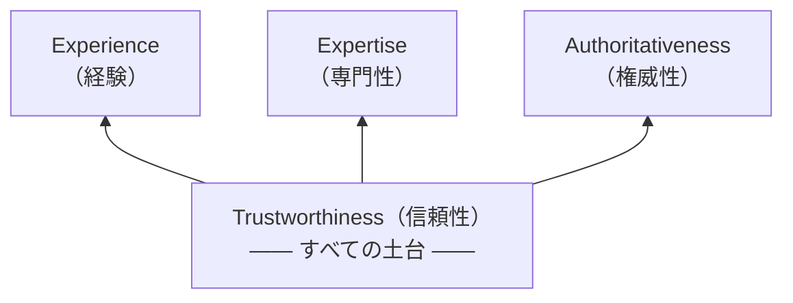
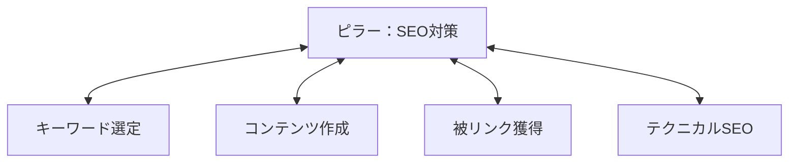
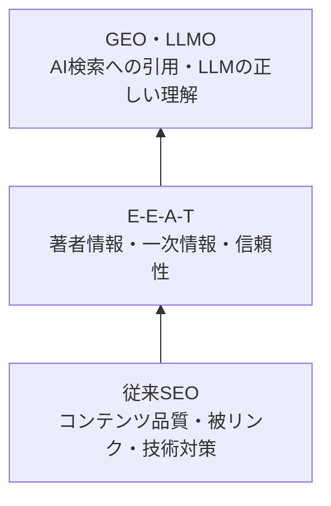

# 生成AI時代のSEO

AI検索が変える集客の常識——これからのWebサイトに求められる最適化戦略を基礎から学ぶ

| 項目 | 内容 |
|---|---|
| カテゴリー | ビジネススキル |
| 難易度 | 初級〜中級 |
| 所要時間 | 約90分（全5レッスン） |
| 公開日 | 2026-04-04 |
| 最終更新日 | 2026-05-13 |
| コースURL | https://skillup.college/courses/business/seo-in-ai-era/ |

## 対象者

自社サイトやブログの検索流入を増やしたいWeb担当者・マーケター。SEOの基本は知っているが、AI OverviewやGEOといった最新動向にキャッチアップできていない方。副業やフリーランスでWebサイト運営に関わる方も対象。

## 前提知識

HTMLの基本構造（タグ、見出し、リンクなど）をおおまかに理解していること。SEOという言葉を聞いたことがある程度で可。

## 学習目標

- 生成AIが検索エンジンにもたらした変化を体系的に説明できる
- E-E-A-Tの4要素を理解し、自サイトのコンテンツ改善に適用できる
- AI OverviewやGEO・LLMOへの基本的な対策を実践できる
- 構造化データの役割を理解し、主要なスキーマを選定できる
- Core Web Vitalsの指標を把握し、改善の優先順位を判断できる

## コース概要

Google検索にAI Overviewが導入され、ChatGPTやPerplexityなどAI検索エンジンが普及した2026年現在、SEOの常識は大きく変わりつつあります。本コースでは、従来のSEOの基本をおさえたうえで、E-E-A-T（経験・専門性・権威性・信頼性）の強化、AI Overviewへの対応、GEO（生成エンジン最適化）・LLMO（大規模言語モデル最適化）という新しい最適化手法、構造化データの実装、そしてCore Web Vitalsの最適化まで、これからのWebサイト運営に必要な知識を体系的に学びます。

## 学習の流れ

レッスン1で検索エンジンの基本とAI時代の変化を全体像として把握する。レッスン2でコンテンツの品質基準であるE-E-A-Tを深く理解する。レッスン3ではAI Overviewとゼロクリック検索という「検索結果の変化」に対応する方法を学ぶ。レッスン4ではさらに一歩進んで、Google以外のAI検索エンジンも視野に入れたGEOとLLMO（大規模言語モデル最適化）を学ぶ。レッスン5では技術面の最適化としてコンテンツの裏側を支える構造化データとCore Web Vitalsを扱う。全体を通じて「コンテンツの質」と「技術的な基盤」の両輪でSEOを理解できる構成になっている。

## レッスン一覧

| No. | タイトル | 概要 | 所要時間 |
|---|---|---|---|
| 1 | SEOの基本と生成AIがもたらした変化 | SEOの基本的な仕組みを振り返りながら、Google AI OverviewやAI検索エンジンの登場によって検索がどう変わったかを理解する | 18分 |
| 2 | E-E-A-Tを理解し信頼されるコンテンツを作る | Googleが重視するE-E-A-T（経験・専門性・権威性・信頼性）の各要素を学び、AI時代に評価されるコンテンツの条件を理解する | 18分 |
| 3 | AI Overviewとゼロクリック検索への対応 | AI Overviewの仕組みとゼロクリック検索の実態を学び、検索結果で選ばれるための具体的な施策を理解する | 18分 |
| 4 | GEOとLLMO——AI検索エンジンに選ばれる最適化手法 | GEO（Generative Engine Optimization）とLLMO（Large Language Model Optimization）の概念と実践手法を学び、ChatGPTやPerplexityなどAI検索エンジンに引用されるための戦略を理解する | 20分 |
| 5 | テクニカルSEOの最前線——構造化データとCore Web Vitals | 構造化データ（Schema.org）の役割と主要なスキーマの選定方法、Core Web Vitals（LCP・CLS・INP）の最新指標と改善の考え方を学ぶ | 18分 |

---

## レッスン1：SEOの基本と生成AIがもたらした変化

（所要時間：18分）

### このレッスンで学ぶこと

- SEO（検索エンジン最適化）の基本的な仕組みを理解する
- Google検索がどのようにWebページを評価しているかを説明できる
- 生成AIの登場によって検索の世界がどう変わったかを把握する
- AI OverviewやAI検索エンジンの概要を理解する

---

### SEOとは何か

SEOとは「Search Engine Optimization」の略で、日本語では「検索エンジン最適化」と呼ばれます。GoogleやBingなどの検索エンジンで、自分のWebサイトが検索結果の上位に表示されるように工夫する取り組みのことです。

なぜSEOが重要なのでしょうか。多くのユーザーは、検索結果の1ページ目に表示されたサイトしかクリックしません。2ページ目以降のサイトは、ほとんど訪問されないのが現実です。つまり、検索結果で上位に表示されることは、Webサイトへの訪問者を増やすうえで非常に大きな意味を持ちます。

### Google検索の基本的な仕組み

Google検索がWebページを表示するまでには、大きく分けて3つのステップがあります。

**1つ目は「クロール」です。** Googleは「クローラー」と呼ばれるプログラムを使って、インターネット上のWebページを自動的に巡回しています。クローラーはリンクをたどりながらページを発見し、その内容を読み取ります。

**2つ目は「インデックス」です。** クローラーが読み取ったページの情報は、Googleの巨大なデータベースに登録されます。この登録作業を「インデックス」と呼びます。インデックスされていないページは、検索結果に表示されません。

**3つ目は「ランキング」です。** ユーザーが検索キーワードを入力すると、Googleはインデックスの中から最も関連性が高く、品質の良いページを選び出し、順位を付けて表示します。この順位を決めるルールが「検索アルゴリズム」です。

> **💡 ポイント**
> SEO対策とは、この3つのステップそれぞれに対して最適化を行うことです。クローラーに発見されやすくする、正しくインデックスされるようにする、そしてランキングで上位に評価されるようにする。この3つの視点を持つことが大切です。

### 検索意図を理解することの重要性

Googleのアルゴリズムが最も重視しているのは「検索意図との一致」です。検索意図とは、ユーザーがそのキーワードで検索したときに「本当に知りたいこと」を指します。

例えば、「カレー 作り方」と検索するユーザーは、カレーのレシピを知りたいと考えています。一方、「カレー 渋谷」と検索するユーザーは、渋谷にあるカレー店を探しています。同じ「カレー」というキーワードでも、検索意図はまったく異なります。

検索意図は、大きく4つの種類に分けられます。

1. **情報検索型（Know）**：何かを知りたい。例：「SEOとは」
2. **案内型（Go）**：特定のサイトに行きたい。例：「Google Search Console ログイン」
3. **取引型（Do）**：何かをしたい、購入したい。例：「SEO対策ツール 比較」
4. **商業調査型（Commercial Investigation）**：購入前に調べたい。例：「SEO会社 おすすめ」

コンテンツを作るときは、ターゲットとするキーワードの検索意図を正確に把握し、その意図に合った情報を提供することが、SEOの基本中の基本です。

### 生成AIの登場と検索の変化

2022年末にChatGPTが登場して以降、生成AI（ジェネレーティブAI）はWebの世界に大きな変化をもたらしました。検索の分野も例外ではありません。

従来のGoogle検索は、ユーザーの質問に対して「関連するWebページのリンク一覧」を返すものでした。ユーザーはそのリンクをクリックして、各サイトで情報を探す必要がありました。

しかし、生成AIの登場によって、検索エンジンが「質問に対する回答そのもの」を直接表示する時代が到来しました。ユーザーはリンクをクリックしなくても、検索結果の画面上で答えを得られるようになったのです。

### Google AI Overviewとは

この変化を象徴するのが、Googleの「AI Overview」です。

AI Overviewは、2024年5月にアメリカで正式に導入され、同年8月に日本でも提供が開始されました。もともと「SGE（Search Generative Experience）」という名称で試験運用されていた機能が、正式サービスとして生まれ変わったものです。

AI Overviewが表示されると、検索結果の最上部にAIが生成した回答が表示されます。この回答は、複数のWebページの情報を要約・統合したものです。回答の下には、情報の参照元となったWebページへのリンクも表示されます。

2025年3月以降、AI Overviewの影響で自然検索からの流入が減少したと回答した企業は約6割にのぼります。従来のSEO対策だけでは、Webサイトへの集客が難しくなりつつあります。

> **⚠️ 注意**
> AI Overviewは、すべての検索クエリに表示されるわけではありません。特に情報検索型の質問に対して表示されやすい傾向があります。一方、特定のサイトに行きたいという案内型の検索には表示されにくいです。

### AI検索エンジンの台頭

Google以外にも、AI技術を活用した新しい検索サービスが登場しています。代表的なものを紹介します。

**ChatGPT検索**は、OpenAIが提供するChatGPTにWeb検索機能を統合したものです。ユーザーの質問に対して、Web上の最新情報を参照しながら回答を生成します。

**Perplexity**は、AI検索に特化したサービスです。質問に対して、情報の出典を明示しながら回答を生成する点が特徴です。「回答エンジン」とも呼ばれています。

**Google AIモード**は、2025年に日本でも提供が開始された機能です。通常のGoogle検索とは別に、AIとの対話形式でより深い情報探索ができるモードです。

これらのAI検索エンジンの利用は急速に拡大しています。AI経由のWebサイト訪問数は、2025年の前半だけで前年比527%も増加したという調査結果もあります。

### SEOの新しい全体像

ここまでの内容を整理しましょう。生成AIの登場によって、SEOの全体像は次のように変わりつつあります。

**従来のSEO**は、Google検索で上位に表示されることが目標でした。対策の中心は、キーワードの最適化、良質なコンテンツの作成、被リンク（ほかのサイトからのリンク）の獲得などでした。

**これからのSEO**は、従来の対策に加えて、AI Overviewに参照元として採用されること、そしてChatGPTやPerplexityなどのAI検索エンジンに情報源として引用されることも重要になります。

つまり、「検索結果で上位に表示される」だけでなく、「AIに選ばれるコンテンツを作る」という新しい視点が必要になりました。この新しい最適化の考え方を「GEO」や「LLMO」と呼びます。GEOはGenerative Engine Optimization（生成エンジン最適化）、LLMOはLarge Language Model Optimization（大規模言語モデル最適化）の略です。これらについては、レッスン4で詳しく学びます。

> **💡 ポイント**
> 従来のSEOが不要になったわけではありません。AI検索エンジンは、既存のSEO評価（サイトの権威性や被リンクの質など）を信頼シグナルとして利用しています。従来のSEOを土台としたうえで、AI対応を上乗せしていくという考え方が大切です。

### まとめ

このレッスンでは、以下のことを学びました。

- SEOとは、検索エンジンで自サイトを上位表示させるための最適化の取り組みである
- Google検索は「クロール→インデックス→ランキング」の3ステップで動いている
- コンテンツは検索意図に合致していることが最も重要である
- 生成AIの登場により、Google AI Overviewが検索結果の最上部に回答を表示するようになった
- ChatGPTやPerplexityなど、AI検索エンジンの利用が急拡大している
- これからのSEOは、従来の対策に加えてAIに選ばれるコンテンツ作りが求められる

次のレッスンでは、Googleが重視する品質基準「E-E-A-T」について詳しく学びます。AIが生成するコンテンツとの差別化において、E-E-A-Tがなぜ重要なのかを理解しましょう。

---

### 確認クイズ

このレッスンの理解度をチェックしましょう。

#### Q1. SEOの3つの基本ステップとして正しい組み合わせはどれか？

- [ ] 企画→制作→公開
- [x] クロール→インデックス→ランキング
- [ ] キーワード調査→コンテンツ作成→リンク構築
- [ ] 設計→実装→テスト

> **解説**
> Google検索は、クローラーによるWebページの巡回（クロール）、データベースへの登録（インデックス）、検索結果の順位付け（ランキング）という3つのステップで動作します。CやDはWeb制作やSEO施策の手順であり、検索エンジンの動作ステップではありません。

#### Q2. 「SEO対策 おすすめ」と検索するユーザーの検索意図として最も適切なものはどれか？

- [ ] 情報検索型（Know）：SEOの意味を知りたい
- [ ] 案内型（Go）：特定のSEOサイトにアクセスしたい
- [x] 商業調査型（Commercial Investigation）：SEOサービスやツールを比較検討したい
- [ ] 取引型（Do）：今すぐSEO対策を購入したい

> **解説**
> 「おすすめ」というキーワードが含まれていることから、複数の選択肢を比較検討している段階であることがわかります。まだ具体的な購入や契約を決めているわけではなく、情報を集めて判断しようとしている状態です。

#### Q3. Google AI Overviewについての説明として正しいものはどれか？

- [ ] すべての検索クエリに必ず表示される
- [x] 2024年に日本でも提供が開始され、複数のWebページの情報を要約して表示する
- [ ] AI Overviewが表示されると、従来の検索結果は一切表示されなくなる
- [ ] AI Overviewに表示されるためには、Googleへの有料申請が必要である

> **解説**
> AI Overviewは2024年5月にアメリカで導入され、同年8月に日本でも提供が開始されました。すべての検索に表示されるわけではなく、主に情報検索型のクエリで表示されます。従来の検索結果も引き続き表示されます。有料申請は不要です。

#### Q4. 生成AI時代のSEOについての説明として誤っているものはどれか？

- [ ] 従来のSEO対策は引き続き重要である
- [ ] AI検索エンジンは既存のSEO評価を信頼シグナルとして利用している
- [x] 従来のSEOをやめて、AI対応だけに集中すべきである
- [ ] 「AIに選ばれるコンテンツ」という新しい視点が必要になった

> **解説**
> 従来のSEOは不要になったわけではありません。AI検索エンジンは、ドメインの権威性や被リンクの質といった既存のSEO評価を信頼シグナルとして利用しています。従来のSEOを土台としたうえで、AI対応を上乗せしていくのが正しいアプローチです。

#### Q5. AI経由のWebサイト訪問数の変化として、調査結果に基づく記述はどれか？

- [x] 2025年前半で前年比約527%増加した
- [ ] 2025年に前年比で約50%減少した
- [ ] 2024年から変化していない
- [ ] AI検索からの流入は全体の1%未満にとどまっている

> **解説**
> Previsibleの2025年AIトラフィックレポートによると、AI経由のWebサイト訪問セッションは2025年の最初の5か月間で前年比527%増加しました。AI検索エンジンの利用は急速に拡大しており、SEO戦略において無視できない存在になっています。

---

## レッスン2：E-E-A-Tを理解し信頼されるコンテンツを作る

（所要時間：18分）

### このレッスンで学ぶこと

- E-E-A-T（経験・専門性・権威性・信頼性）の各要素を説明できる
- なぜ生成AI時代にE-E-A-Tがより重要になったかを理解する
- YMYLコンテンツにおけるE-E-A-Tの役割を把握する
- 自サイトのE-E-A-Tを高める具体的な施策を理解する

---

レッスン1では、SEOの基本的な仕組みと、生成AIの登場による検索の変化を学びました。AI Overviewの登場やAI検索エンジンの台頭により、「AIに選ばれるコンテンツ」を作ることが重要になっています。では、GoogleやAIはどのような基準でコンテンツの品質を判断しているのでしょうか。その答えが、このレッスンで学ぶ「E-E-A-T」です。

### E-E-A-Tとは何か

E-E-A-Tは、Googleがコンテンツの品質を評価するための基準です。4つの英単語の頭文字を取っています。

1. **Experience（経験）**：コンテンツの作成者が、そのテーマについて実際の経験を持っているか
2. **Expertise（専門性）**：そのテーマに関する十分な知識やスキルを持っているか
3. **Authoritativeness（権威性）**：その分野で信頼される情報源として認められているか
4. **Trustworthiness（信頼性）**：サイトやコンテンツ全体が信頼に値するか

この4つの中で最も重要とされているのが「信頼性（Trustworthiness）」です。Googleは、信頼性を他の3つの要素の土台として位置づけています。経験・専門性・権威性が高くても、信頼性が低ければ評価は上がりません。

4要素の関係を図にすると、次のようになります。



下にある信頼性（Trustworthiness）が、上の経験・専門性・権威性を支える土台になっている、という関係です。横並びに4つ並べると同じ重みに見えてしまいますが、実際は信頼性が崩れると上の3つも評価されなくなります。

> **📝 補足**
> E-E-A-Tはもともと「E-A-T」（専門性・権威性・信頼性）の3要素でした。2022年12月に「Experience（経験）」が追加され、現在の4要素になりました。実体験に基づく情報が、AI生成コンテンツとの差別化において重要視されるようになった背景があります。

### 各要素を詳しく理解する

#### Experience（経験）

「経験」とは、コンテンツの作成者がそのテーマを実際に体験しているかどうかを指します。

例えば、料理のレシピを紹介する記事であれば、実際にその料理を作った人が書いた記事は「経験」の評価が高くなります。旅行先の紹介記事であれば、実際にその場所を訪れた人の情報が評価されます。

この「経験」の要素は、生成AIが最も再現しにくい領域です。AIは膨大なテキストデータから文章を生成できますが、「実際に体験した」という事実は持ち合わせていません。そのため、実体験に基づくコンテンツは、AI時代においてますます価値が高まっています。

#### Expertise（専門性）

「専門性」とは、コンテンツの作成者がそのテーマについて十分な知識やスキルを持っているかを指します。

医療に関する記事であれば医師が書いたもの、法律に関する記事であれば弁護士が書いたものは、専門性が高いと判断されます。ただし、必ずしも資格や学位が必要なわけではありません。長年の実務経験や深い知識に基づく情報も、専門性として評価されます。

#### Authoritativeness（権威性）

「権威性」とは、そのサイトや著者が、特定の分野で信頼できる情報源として認知されているかを指します。

権威性は、ほかのサイトからどれだけ参照（リンク）されているか、業界内での評判、メディアへの掲載実績などから総合的に判断されます。例えば、SEOに関する情報であれば、Google公式のSearch Centralブログは非常に高い権威性を持っています。

#### Trustworthiness（信頼性）

「信頼性」は、E-E-A-Tの中核に位置する最も重要な要素です。サイト全体が信頼できるかどうかを総合的に評価します。

信頼性に影響する要因には、次のようなものがあります。

- サイトの運営者情報が明確に記載されているか
- 問い合わせ先が用意されているか
- HTTPS（暗号化通信）が導入されているか
- 情報の正確性が保たれているか
- 誤解を招くような表現や広告がないか

### YMYLコンテンツとE-E-A-T

YMYLとは「Your Money or Your Life」の略で、「お金や人生に大きな影響を与えるテーマ」を指します。具体的には、医療・健康、法律、金融、安全に関する情報などが該当します。

YMYLに該当するコンテンツでは、E-E-A-Tの基準がとりわけ厳格に適用されます。誤った情報がユーザーの健康や財産に深刻な影響を及ぼす可能性があるためです。

例えば、「頭痛の治し方」というキーワードで検索したとき、医師が監修した医療機関のサイトが上位に表示されるのは、YMYLテーマにおけるE-E-A-Tの評価が反映された結果です。

> **⚠️ 注意**
> YMYLのテーマを扱う場合は、必ず信頼できる情報源を参照し、可能であれば専門家の監修を受けましょう。根拠のない情報を発信すると、サイト全体の信頼性が低下する恐れがあります。

### 生成AI時代にE-E-A-Tが重視される理由

生成AIは、既存のWebコンテンツを学習して、もっともらしい文章を大量に生成できます。しかし、その一方で次のような限界があります。

- **実体験がない**：AIはテキストデータから文章を生成するだけで、実際に何かを体験したわけではない
- **独自の見解を持たない**：学習データの平均的な内容を出力するため、独自の分析や見解は苦手
- **情報の正確性に限界がある**：学習データの誤りをそのまま反映したり、存在しない情報を生成したりすることがある

Googleは2025年1月に検索品質評価ガイドラインを改定し、AI生成コンテンツの評価基準を明確化しました。人間の監修なしにAIで大量生成されたコンテンツは「最低品質」として分類されるとしています。一方で、AIを活用しつつも人間が独自の価値を付加したコンテンツは、生成方法にかかわらず適切に評価されます。

つまり、E-E-A-Tの各要素を高めることは、AI生成コンテンツとの差別化であり、Googleの評価基準に沿ったコンテンツを作るための最も確実な方法なのです。

### E-E-A-Tを高める具体的な施策

ここからは、自サイトのE-E-A-Tを高めるための実践的な施策を紹介します。

#### 著者情報を充実させる

記事の執筆者や監修者のプロフィールを詳しく記載しましょう。名前、経歴、専門分野、実績などを明記します。著者のプロフィールページを作成し、記事からリンクすることも効果的です。

2026年現在では、Schema.orgの構造化データを用いて著者のプロフィールやSNSアカウントを紐づけることで、Googleに著者を「実在する専門家」として認識させる手法が一般的になっています。

#### 一次情報を提供する

ほかのサイトの情報をまとめるだけでなく、自分自身の経験や調査に基づく一次情報を提供しましょう。独自のデータ、事例研究、体験談、インタビューなどが該当します。

#### 情報の根拠を明示する

統計データや事実を記載する際は、その出典を明記しましょう。公的機関のデータ、学術論文、企業の公式発表など、信頼性の高い情報源を参照元として示すことで、コンテンツの信頼性が向上します。

#### サイトの信頼性基盤を整える

コンテンツの質だけでなく、サイト全体の信頼性も重要です。以下の項目を確認しましょう。

- 運営者情報ページの設置（会社名、所在地、連絡先など）
- プライバシーポリシーの掲載
- HTTPSの導入
- 正確で最新の情報への定期的な更新

#### 外部からの評価を高める

権威性を高めるには、ほかの信頼できるサイトからリンク（被リンク）を獲得することが有効です。質の高いコンテンツを発信し続けることで、自然と被リンクが集まる状態を目指します。業界メディアへの寄稿や、専門家としてのメディア出演も権威性の向上につながります。

> **💡 ポイント**
> E-E-A-Tの向上は、一朝一夕で実現するものではありません。しかし、一つひとつの施策を着実に積み重ねることで、サイト全体の評価は確実に高まっていきます。まずは著者情報の充実と、一次情報の提供から始めてみましょう。

### まとめ

このレッスンでは、以下のことを学びました。

- E-E-A-Tは「経験・専門性・権威性・信頼性」の4要素で構成される品質評価基準である
- 4要素の中で「信頼性」が最も重要な土台である
- YMYL（お金や人生に関わるテーマ）ではE-E-A-Tが特に厳格に評価される
- 生成AIは実体験や独自の見解を持たないため、E-E-A-Tは差別化の鍵となる
- 著者情報の充実、一次情報の提供、情報の根拠の明示が具体的な施策である

次のレッスンでは、AI Overviewとゼロクリック検索への対応について学びます。検索結果からクリックされなくても成果を上げるための戦略を理解しましょう。

---

### 確認クイズ

このレッスンの理解度をチェックしましょう。

#### Q1. E-E-A-Tの4つの要素の中で、Googleが最も重要な土台として位置づけているものはどれか？

- [ ] Experience（経験）
- [ ] Expertise（専門性）
- [ ] Authoritativeness（権威性）
- [x] Trustworthiness（信頼性）

> **解説**
> Googleは信頼性を他の3つの要素の土台として位置づけています。経験・専門性・権威性がどれだけ高くても、信頼性が低ければ総合的なE-E-A-T評価は上がりません。

#### Q2. E-E-A-Tに「Experience（経験）」が追加された背景として最も適切なものはどれか？

- [ ] Googleの広告収入を増やすため
- [x] 実体験に基づく情報が、AI生成コンテンツとの差別化において重要視されるようになったため
- [ ] Webサイトのデザインを評価するため
- [ ] SNSのフォロワー数を評価基準に含めるため

> **解説**
> 生成AIはテキストデータから文章を生成できますが、実際に何かを体験することはできません。2022年12月にExperienceが追加された背景には、実体験に基づくコンテンツの価値をより正しく評価するという目的があります。

#### Q3. YMYLに該当するコンテンツのテーマとして適切でないものはどれか？

- [ ] 高血圧の予防法
- [ ] 住宅ローンの選び方
- [x] 映画のレビュー
- [ ] 交通事故時の法的手続き

> **解説**
> YMYLは「お金や人生に大きな影響を与えるテーマ」を指します。医療・健康（A）、金融（B）、法律（D）はYMYLに該当しますが、映画のレビューはユーザーの健康や財産に直接影響を与えないため、通常はYMYLには該当しません。

#### Q4. 著者情報のE-E-A-T向上施策として、2026年現在で一般的になっている手法はどれか？

- [ ] 著者の顔写真を大きく表示すること
- [x] Schema.orgの構造化データで著者のプロフィールやSNSアカウントを紐づけること
- [ ] 著者名を記事タイトルに含めること
- [ ] 著者のブログへの外部リンクをすべての段落に挿入すること

> **解説**
> 2026年現在では、単にテキストで著者名を記載するだけでなく、構造化データを用いてGoogleに著者を「実在する専門家」として認識させることが一般的になっています。これにより、著者のエンティティ認識が強化されます。

#### Q5. GoogleのAI生成コンテンツに対する方針として正しいものはどれか？

- [ ] AIが生成したコンテンツはすべて低品質として扱われる
- [ ] AIを使用したコンテンツは検索結果から完全に除外される
- [x] 人間の監修なしにAIで大量生成されたコンテンツは最低品質とされるが、人間が独自の価値を付加したものは適切に評価される
- [ ] AI生成コンテンツはすべて「AI生成」と明記する義務がある

> **解説**
> Googleは2025年1月のガイドライン改定で、AI生成コンテンツの評価基準を明確化しました。AIの使用自体が問題なのではなく、労力、独自性、付加価値があるかどうかが評価の鍵です。

---

## レッスン3：AI Overviewとゼロクリック検索への対応

（所要時間：18分）

### このレッスンで学ぶこと

- ゼロクリック検索の実態と増加の背景を理解する
- AI Overviewに参照元として採用されるための施策を説明できる
- Featured Snippets（強調スニペット）の獲得方法を理解する
- トピッククラスター戦略の基本を把握する

---

レッスン2では、E-E-A-Tの4要素と、AI時代における信頼性の重要性を学びました。E-E-A-Tを高めたコンテンツを作っても、検索結果で適切に表示されなければ、ユーザーに届きません。このレッスンでは、AI Overviewとゼロクリック検索という「検索結果の変化」に対応するための具体的な戦略を学びます。

### ゼロクリック検索とは

ゼロクリック検索とは、ユーザーが検索結果のページ上で必要な情報を得てしまい、どのWebサイトもクリックしないまま検索を終了する現象です。

例えば、「東京 天気」と検索すると、検索結果の最上部に天気予報が直接表示されます。「1ドル 何円」と検索すれば、為替レートが即座に表示されます。これらの場合、ユーザーはどのサイトにもアクセスする必要がありません。

ゼロクリック検索の割合は年々増加しています。2024年のデータでは、アメリカ市場で約58.5%、EU市場で約59.7%の検索がゼロクリックで終了しています。さらに、AI Overviewが表示された場合のゼロクリック率は約83%に達するという調査結果もあります。

### ゼロクリック検索が増加した背景

ゼロクリック検索が増えた主な要因は3つあります。

**1つ目は、検索結果の充実です。** Googleは、検索結果ページにさまざまな情報を直接表示するようになりました。Featured Snippets（強調スニペット）、ナレッジパネル（検索結果の右側に表示される情報ボックス）、「他の人はこちらも質問」セクションなど、多くの情報が検索結果ページ上で完結します。

**2つ目は、AI Overviewの導入です。** レッスン1で学んだとおり、AI Overviewは検索結果の最上部にAIが生成した回答を表示します。回答が充実しているほど、ユーザーはリンクをクリックせずに満足してしまいます。

**3つ目は、音声検索やスマートフォン検索の普及です。** 音声アシスタントに質問すると、回答は音声で返されるため、Webサイトへのクリックが発生しにくくなります。

> **📝 補足**
> ゼロクリック検索の増加は、必ずしも悪いことばかりではありません。AI Overviewに自サイトの情報が参照元として表示されれば、ブランドの認知度向上やサイトの権威性向上につながります。「クリック数」だけでなく、「AIに引用される回数」も新しい成果指標として考える必要があります。

### AI Overviewに採用されるための施策

AI Overviewに自サイトの情報が参照元として採用されるには、いくつかの条件を満たす必要があります。

#### 複数のキーワードで上位表示を狙う

AI Overviewは、複数のWebページの情報を統合して回答を生成します。特定のキーワードだけでなく、関連する複数のキーワードで検索上位に表示されていることが重要です。1つの記事で1つのキーワードを狙うのではなく、テーマ全体をカバーする包括的なコンテンツが求められます。

#### 明確で簡潔な回答を本文に含める

AI Overviewは、ユーザーの質問に対する「直接的な回答」を含むコンテンツを好みます。記事の冒頭40〜60語以内に、質問に対する端的な回答を記述しましょう。その後に詳しい解説を展開する構成が効果的です。

#### 構造化されたコンテンツを作る

見出し（h2、h3）を適切に使い、情報を論理的に整理しましょう。箇条書きや表を活用して、情報を構造化することも有効です。AIは、構造が明確なコンテンツから情報を抽出しやすくなります。

#### 信頼性の高い情報源を引用する

統計データや事実を記載するときは、公的機関や学術機関などの信頼性の高い情報源を引用しましょう。AI Overviewは、信頼性の高いコンテンツを優先的に参照します。

### Featured Snippets（強調スニペット）を獲得する

Featured Snippets（強調スニペット）は、検索結果の最上部に枠付きで表示される回答です。「ポジションゼロ」とも呼ばれ、通常の検索順位よりも上に表示されるため、高い視認性を持ちます。

強調スニペットには、主に3つの表示形式があります。

1. **段落型**：質問に対する回答が文章で表示される
2. **リスト型**：手順や項目が箇条書きで表示される
3. **表型**：比較やデータが表形式で表示される

#### 強調スニペットを獲得するためのポイント

**質問形式のキーワードを意識しましょう。** 「〜とは」「〜の方法」「〜の違い」といったキーワードは、強調スニペットが表示されやすい傾向があります。

**回答を簡潔にまとめましょう。** Googleは通常40〜60語程度のテキストを強調スニペットとして抽出します。質問に対する回答を、見出しの直下に簡潔にまとめて記述しましょう。

**情報の整理方法を使い分けましょう。** 手順の説明には番号付きリスト、複数の項目の列挙には箇条書き、データの比較には表を使うと、それぞれの形式の強調スニペットに採用されやすくなります。

> **💡 ポイント**
> 強調スニペットに表示されるコンテンツは、AI Overviewの参照元としても採用されやすい傾向があります。強調スニペットの獲得を目指すことは、AI Overview対策にもつながります。

### トピッククラスター戦略

AI Overviewやゼロクリック検索に対応するための有効な戦略として、「トピッククラスター」があります。

トピッククラスターとは、1つの大きなテーマ（ピラーコンテンツ）を中心に、関連する個別のテーマ（クラスターコンテンツ）を内部リンクでつなぐコンテンツ構成の手法です。

例えば、「SEO対策」をピラーコンテンツとして、「キーワード選定」「コンテンツ作成」「被リンク獲得」「テクニカルSEO」といったクラスターコンテンツを作成し、それぞれを相互にリンクで結びます。

構造を図にすると、中心にピラーがあり、その周囲に複数のクラスターが双方向リンクでつながる、ハブ＆スポーク型になります。



ピラーから個別記事へだけでなく、個別記事からピラーへも内部リンクを張るのがポイントです。双方向のリンクで「この一群はひとつの専門領域である」という意味が検索エンジンとAIに伝わりやすくなります。

この戦略には、次のようなメリットがあります。

- **サイトの専門性が伝わる**：1つのテーマを複数の記事で深掘りすることで、そのテーマに関する専門性が検索エンジンに認識されやすくなる
- **AIがサイト全体を理解しやすくなる**：情報が「親子関係」で整理されることで、AIがサイト全体のテーマ性を把握しやすくなる
- **内部リンクの強化**：関連記事同士が内部リンクでつながることで、クローラーの回遊性が向上し、各ページのインデックスが促進される

### 新しい成果指標を持つ

ゼロクリック検索が増加する時代では、「検索順位」や「クリック数」だけで成果を測るのは不十分です。新しい指標も組み合わせて、総合的にSEOの効果を判断しましょう。

- **AI Overviewでの参照回数**：自サイトがAI Overviewの参照元として表示された回数
- **強調スニペットの獲得数**：Featured Snippetsに表示されたキーワードの数
- **ブランド検索の増加**：サイト名やサービス名で直接検索されるようになったかどうか
- **質の高いリード数**：リード（見込み顧客）の獲得数。単なるページビューではなく、問い合わせや申し込みにつながった訪問の数

> **💡 ポイント**
> Google Search Consoleでは、検索結果での「表示回数（インプレッション）」を確認できます。クリック数が減っていても表示回数が増えていれば、ゼロクリック検索でブランド認知が広がっている可能性があります。表示回数とCTR（Click Through Rate：クリック率）を合わせて分析しましょう。

### まとめ

このレッスンでは、以下のことを学びました。

- ゼロクリック検索はすでに検索全体の約6割を占め、AI Overviewの導入でさらに増加傾向にある
- AI Overviewに採用されるには、複数キーワードでの上位表示、明確な回答、構造化されたコンテンツが重要である
- Featured Snippets（強調スニペット）の獲得はAI Overview対策にもつながる
- トピッククラスター戦略により、サイトの専門性をAIに伝えやすくなる
- クリック数だけでなく、AI引用数やブランド検索など新しい指標も重要である

次のレッスンでは、GEOとLLMOという新しい最適化手法について学びます。Google以外のAI検索エンジンにも自サイトの情報を届けるための戦略を理解しましょう。

---

### 確認クイズ

このレッスンの理解度をチェックしましょう。

#### Q1. ゼロクリック検索についての説明として正しいものはどれか？

- [ ] 検索エンジンが正常に動作しない状態を指す
- [x] ユーザーが検索結果のページ上で情報を得て、どのサイトもクリックしないまま検索を終了する現象
- [ ] 検索結果に広告が1つも表示されない状態を指す
- [ ] 検索順位が0位になることを指す

> **解説**
> ゼロクリック検索は、検索結果ページに表示されたFeatured SnippetsやAI Overviewなどの情報で、ユーザーの疑問が解消されてしまう現象です。「クリックがゼロ」という意味から、ゼロクリック検索と呼ばれています。

#### Q2. AI Overviewに参照元として採用されやすいコンテンツの特徴として、適切でないものはどれか？

- [ ] 記事の冒頭40〜60語以内に質問への直接的な回答がある
- [ ] 見出しや箇条書きで情報が構造化されている
- [x] 画像を大量に使用してビジュアル重視にしている
- [ ] 信頼性の高い情報源を引用している

> **解説**
> AI Overviewはテキスト情報を中心に参照元を選定します。画像の量ではなく、テキストの質と構造が重要です。明確な回答、構造化された情報、信頼性の高い引用が、AI Overviewに採用されるための鍵です。

#### Q3. Featured Snippets（強調スニペット）の表示形式に含まれないものはどれか？

- [ ] 段落型
- [ ] リスト型
- [x] 動画型
- [ ] 表型

> **解説**
> Featured Snippetsの主な表示形式は、段落型（文章による回答）、リスト型（箇条書きや手順）、表型（データの比較）の3種類です。動画は検索結果に表示されることがありますが、Featured Snippetsの標準的な形式には含まれません。

#### Q4. トピッククラスター戦略の説明として正しいものはどれか？

- [ ] 1つの記事にできるだけ多くのキーワードを詰め込む手法
- [x] 中心となるテーマ（ピラー）の周りに関連記事（クラスター）を配置し、内部リンクでつなぐ手法
- [ ] 複数のサイトを作成して、それぞれから被リンクを送る手法
- [ ] SNSとの連携を強化して流入を増やす手法

> **解説**
> トピッククラスターは、ピラーコンテンツ（包括的な記事）を中心に、クラスターコンテンツ（個別テーマの記事）を内部リンクで結ぶ構成です。これにより、サイトの専門性が検索エンジンやAIに伝わりやすくなります。

#### Q5. ゼロクリック検索時代の成果指標として適切でないものはどれか？

- [ ] AI Overviewでの参照回数
- [x] ページの文字数
- [ ] ブランド検索の増加
- [ ] 質の高いリード数

> **解説**
> ページの文字数は、コンテンツの品質や成果を直接測る指標ではありません。重要なのは、AI Overviewでの引用回数、ブランド認知度の向上、そして実際のビジネス成果（リードや問い合わせ）につながっているかどうかです。

---

## レッスン4：GEOとLLMO——AI検索エンジンに選ばれる最適化手法

（所要時間：20分）

### このレッスンで学ぶこと

- GEO（Generative Engine Optimization）の概念と目的を説明できる
- LLMO（Large Language Model Optimization）の概念とGEOとの違いを理解する
- AI検索エンジンに引用されるための具体的な施策を実践できる
- GEO・LLMOの効果を測定するための指標を把握する

---

レッスン3では、AI Overviewとゼロクリック検索への対応方法を学びました。AI Overviewは、あくまでGoogle検索の機能の1つです。しかし、2026年現在、ChatGPT、Perplexity、Geminiなど、Google以外のAI検索エンジンの利用も急速に拡大しています。このレッスンでは、これらのAI検索エンジンすべてに対応するための新しい最適化手法、GEOとLLMOについて学びます。

### GEOとは何か

GEO（Generative Engine Optimization）は、「生成エンジン最適化」と訳されます。AIが回答を生成するタイプの検索エンジンに対して、自サイトのコンテンツが情報源として引用・参照されるように最適化する取り組みです。

従来のSEOとの違いを整理しましょう。

- **SEO**は、Google検索の結果で「上位に表示される」ことを目指す
- **GEO**は、AI検索エンジンの回答に「情報源として引用される」ことを目指す

SEOでは「順位」が成果の指標でしたが、GEOでは「引用されるかどうか」が成果の指標になります。

GEOの対象となるAI検索エンジンには、以下のようなものがあります。

- **Google AI Overview**：Google検索のAI回答機能
- **ChatGPT（Web検索機能付き）**：OpenAIの対話型AI
- **Perplexity**：AI検索に特化した回答エンジン
- **Gemini**：Googleの対話型AI
- **Microsoft Copilot**：Microsoftの統合AI検索

> **📝 補足**
> GEOという用語は、2023年にジョージア工科大学の研究者らが発表した論文で初めて定義されました。論文では、GEO施策によってAIエンジンでの表示率が最大40%向上する可能性が示されています。

### LLMOとは何か

LLMO（Large Language Model Optimization）は、「大規模言語モデル最適化」と訳されます。ChatGPTやClaude、GeminiといったLLM（大規模言語モデル）に、自サイトのコンテンツを正しく理解・引用してもらうための最適化手法です。

GEOとLLMOは密接に関連していますが、焦点が少し異なります。

- **GEO**は、AI検索エンジンの回答に「表示される」ことに焦点を当てる
- **LLMO**は、LLMにコンテンツを「正しく理解され、引用される」ことに焦点を当てる

LLMOがGEOと異なるのは、対象範囲の広さです。検索エンジン経由だけでなく、ユーザーがChatGPTやClaudeと直接対話する場面でも、自サイトの情報が正確に引用されることを目指します。

つまり、SEOは「検索結果に表示される」ためのもの、GEOは「AIの回答に引用される」ためのもの、LLMOは「LLMに正しく理解され活用される」ためのものです。この3つは相互に補完する関係にあります。

### AI検索エンジンごとの特性

GEO・LLMOを実践するうえで重要なのは、AI検索エンジンごとに引用するコンテンツの選定基準が異なるという点です。

**ChatGPT（Web検索機能付き）** は、百科事典的な網羅性のあるコンテンツを好む傾向があります。テーマを体系的に解説し、基本から応用まで幅広くカバーしている記事が引用されやすいです。

**Perplexity**は、情報の新しさとコミュニティでの評価を重視します。最新の情報が反映されている記事や、実例を豊富に含むコンテンツが引用されやすい傾向にあります。

**Google AI Overview**は、既存のGoogle検索で上位に表示されているコンテンツを優先的に参照します。つまり、従来のSEOでの評価が、AI Overviewでの引用にも直結します。

> **💡 ポイント**
> すべてのAI検索エンジンに共通するのは、「信頼性が高く、構造化された、事実に基づくコンテンツ」が引用されやすいということです。個別のエンジン対策に振り回されるのではなく、コンテンツの品質を高めることが最も確実な戦略です。

### GEO・LLMOの実践手法

ここからは、AIに選ばれるコンテンツを作るための具体的な手法を紹介します。

#### 冒頭に直接的な回答を置く

AI検索エンジンは、ユーザーの質問に対する「直接的な回答」をコンテンツの冒頭から探します。記事の最初の40〜60語以内に、テーマの核心を端的にまとめましょう。

例えば、「SEOとは何か」というテーマの記事であれば、冒頭で「SEOとは、検索エンジンで自サイトを上位表示させるための最適化手法です」と明記してから、詳細な解説を展開します。

#### 事実密度を高める

LLMは、統計データ、具体的な数値、研究結果など、事実に基づく情報を多く含むコンテンツを高く評価します。150〜200語ごとに統計データや具体的な数値を含めることが推奨されています。

ある研究では、引用データ、統計、信頼できる情報源へのリンクを含むコンテンツは、LLMに引用される確率が30〜40%高いことが示されています。

#### 権威ある情報源を引用する

コンテンツ内で、公的機関、学術機関、業界の権威あるサイトの情報を引用し、リンクを張りましょう。AIはこれらの引用を「信頼性の裏付け」として認識します。

#### 独自の見解や一次情報を提供する

LLMは、すでに広く知られている情報の繰り返しよりも、独自の分析、調査結果、体験談を含むコンテンツを好みます。他サイトにはない独自の価値を提供することが、AIに引用されるための差別化要因になります。

#### 構造化された書き方を徹底する

見出し（h2、h3）で情報を階層的に整理し、箇条書きや番号付きリストで要点を明確にしましょう。定義を述べるときは、「〜とは、〜のことです」のような明確な定義文を使います。AIは、構造が明確なコンテンツから情報を抽出しやすくなります。

#### Schema.orgの構造化データを実装する

構造化データは、コンテンツの意味を検索エンジンやAIに機械可読な形で伝えるための仕組みです。FAQ、HowTo、Articleなどのスキーマを適切に実装することで、AIがコンテンツの内容を正確に把握できるようになります。構造化データについては、レッスン5で詳しく学びます。

### AEO（Answer Engine Optimization）との関係

GEOやLLMOと関連する概念として、AEO（Answer Engine Optimization）があります。AEOは「回答エンジン最適化」と訳され、ユーザーの質問に対して直接的な回答を提供するエンジン（Perplexityなど）に最適化する手法です。

AEOの特徴は、ユーザーの質問に対して「端的な回答」を提供することに特化している点です。GEOやLLMOの実践手法と多くの部分が重なりますが、特に「質問→回答」の形式を意識したコンテンツ設計が重要になります。

実務上は、GEO・LLMO・AEOを別々の施策として考える必要はありません。すべてに共通する本質は、「質の高い情報を、わかりやすく、構造的に提供する」ことです。

### GEO・LLMOの効果測定

GEO・LLMOの効果を測定するために、以下のような新しい指標が提唱されています。

- **AI可視性レート（AI Visibility Rate）**：AI検索エンジンの回答に自サイトが引用される割合
- **引用率（Citation Rate）**：AIの回答内で自サイトのURLやブランド名が言及される割合
- **コンテンツ抽出率（Content Extraction Rate）**：AIが自サイトから情報を抽出して回答に使用する割合
- **対話からコンバージョンへの転換率（Conversation-to-Conversion Rate）**：AI検索経由の訪問がビジネス成果につながる割合

これらの指標を計測するためのツールは、まだ発展途上です。Perplexityの場合は引用元のリンクが明示されるため比較的追跡しやすいですが、ChatGPTの場合は引用の追跡が難しいのが現状です。まずはGoogle Search ConsoleやGoogleアナリティクスで、AI検索エンジンからの流入を分類して追跡することから始めましょう。

### SEO・GEO・LLMOの統合戦略

最後に、SEO・GEO・LLMOを統合した戦略の考え方をまとめます。

この3つは相互に補完する関係にあり、対立するものではありません。SEOで築いた土台（ドメインの権威性、被リンク、コンテンツの質）は、GEOやLLMOにおいても信頼シグナルとして機能します。

関係を図にすると、次のような層構造になります。



「GEO・LLMOがSEOを置き換える」のではなく、**SEOを土台にE-E-A-Tを上乗せし、その上にGEO・LLMOが乗る**という構造です。下の層が崩れると、上の層も成り立ちません。

実務では、以下の優先順位で取り組むのが効果的です。

1. **まず従来のSEOの基盤を固める**（質の高いコンテンツ、適切な技術対策）
2. **E-E-A-Tを高める施策を追加する**（著者情報、一次情報、信頼性の担保）
3. **GEO・LLMO向けのコンテンツ最適化を行う**（冒頭に回答、事実密度の向上、構造化）

SEOを無視してGEOだけに注力しても効果は出ません。逆に、従来のSEOだけに固執してAI対応をしなければ、AI検索が主流になる時代に取り残されてしまいます。両方をバランスよく進めることが、2026年のWeb集客の鍵です。

### まとめ

このレッスンでは、以下のことを学びました。

- GEOはAI検索エンジンの回答に「引用される」ための最適化手法である
- LLMOはLLMにコンテンツを「正しく理解・引用される」ための最適化手法である
- AI検索エンジンごとに引用基準が異なるが、共通するのは信頼性と構造化である
- 冒頭に直接回答を置く、事実密度を高める、独自情報を提供する、構造化を徹底するのが実践の鍵
- SEO・GEO・LLMOは対立ではなく補完関係にあり、統合的に取り組むことが重要である

次のレッスンでは、テクニカルSEOの最前線として、構造化データとCore Web Vitalsについて学びます。コンテンツの裏側を支える技術的な基盤を理解しましょう。

---

### 確認クイズ

このレッスンの理解度をチェックしましょう。

#### Q1. GEO（Generative Engine Optimization）の目的として最も適切なものはどれか？

- [ ] SNSでのシェア数を増やすこと
- [ ] Google検索で1位を獲得すること
- [ ] Webサイトのデザインを改善すること
- [x] AI検索エンジンの回答に自サイトが情報源として引用されること

> **解説**
> GEOはSEOと異なり、検索順位ではなく「AIの回答に引用されるかどうか」を重視します。ChatGPT、Perplexity、Google AI Overviewなど、AIが回答を生成する場面で自サイトの情報が参照元として選ばれることがGEOの目標です。

#### Q2. LLMOとGEOの違いとして最も適切なものはどれか？

- [ ] LLMOはGoogle専用、GEOはChatGPT専用の最適化
- [x] LLMOはLLMにコンテンツを正しく理解・引用されることに焦点、GEOはAI検索の回答に表示されることに焦点
- [ ] LLMOは無料、GEOは有料のサービス
- [ ] LLMOはテキスト向け、GEOは画像向けの最適化

> **解説**
> GEOは「AI検索の結果に表示される」ことを目指し、LLMOは「LLMにコンテンツを正しく理解され活用される」ことを目指します。LLMOは検索エンジン経由だけでなく、ユーザーがChatGPTと直接対話する場面も対象に含みます。

#### Q3. AI検索エンジンに引用されやすいコンテンツの特徴として正しいものはどれか？

- [x] 冒頭に直接的な回答があり、事実密度が高く、構造化されている
- [ ] できるだけ長い文章で、詳細に記述されている
- [ ] 画像やイラストが豊富に使われている
- [ ] キーワードが文章中に繰り返し出現している

> **解説**
> AIは冒頭40〜60語から直接的な回答を探し、統計データや引用を含む高い事実密度のコンテンツを評価します。文章の長さやキーワードの繰り返しではなく、情報の質と構造が重要です。

#### Q4. SEO・GEO・LLMOの関係として正しいものはどれか？

- [ ] GEOが普及すれば、従来のSEOは不要になる
- [x] 3つは相互に補完する関係であり、SEOの土台の上にGEO・LLMOを上乗せしていく
- [ ] 3つはまったく別の施策であり、同時に取り組む必要はない
- [ ] LLMOだけを行えば、SEOとGEOの効果も自動的に得られる

> **解説**
> AI検索エンジンは既存のSEO評価を信頼シグナルとして利用しています。SEOを無視してGEOだけに注力しても効果は出ません。従来のSEOを土台として、GEO・LLMO施策を上乗せしていくのが効果的なアプローチです。

#### Q5. GEO・LLMOの効果測定指標として提唱されていないものはどれか？

- [ ] AI可視性レート
- [ ] 引用率
- [x] ページの直帰率
- [ ] コンテンツ抽出率

> **解説**
> ページの直帰率は従来のWebアクセス解析の指標です。GEO・LLMOの効果測定には、AI可視性レート、引用率、コンテンツ抽出率、対話からコンバージョンへの転換率といった新しい指標が提唱されています。

---

## レッスン5：テクニカルSEOの最前線——構造化データとCore Web Vitals

（所要時間：18分）

### このレッスンで学ぶこと

- 構造化データ（Schema.org）の役割と主要なスキーマの種類を説明できる
- JSON-LDによる構造化データの記述方法を理解する
- Core Web Vitals（LCP・CLS・INP）の各指標の意味と基準値を把握する
- テクニカルSEOの改善優先順位を判断できる

---

レッスン4では、GEOとLLMOというAI検索エンジンに対応するための新しい最適化手法を学びました。良質なコンテンツを作ることに加えて、そのコンテンツを検索エンジンやAIに正しく伝え、ユーザーに快適に表示する「技術的な基盤」も重要です。このレッスンでは、テクニカルSEOの中でも特に重要な構造化データとCore Web Vitalsについて学びます。

### 構造化データとは

構造化データとは、Webページの内容を検索エンジンやAIに「意味」として伝えるための仕組みです。

通常のHTMLでは、ブラウザはテキストの見た目（見出し、段落、リンクなど）を理解できますが、そのテキストが「商品の価格」なのか「イベントの日時」なのかといった意味までは自動的に判断できません。

構造化データを使うと、「この数字は商品の価格です」「この日付はイベントの開催日です」といった意味を、検索エンジンが機械的に理解できる形で伝えられます。

構造化データの標準的な語彙として、[Schema.org](https://schema.org)が広く使われています。Schema.orgは、Google、Microsoft、Yahoo!などの主要な検索エンジンが共同で策定した語彙集です。

### JSON-LDによる記述方法

構造化データの記述方法にはいくつかの形式がありますが、Googleが推奨しているのは「JSON-LD（ジェイソン・エルディー）」という形式です。JSON-LDは、HTMLの`<script>`タグ内にJSON形式で構造化データを記述する方法です。

以下は、記事ページにArticleスキーマを記述する例です。

```html
<script type="application/ld+json">
{
  "@context": "https://schema.org",
  "@type": "Article",
  "headline": "生成AI時代のSEO入門",
  "author": {
    "@type": "Person",
    "name": "藤原 真紀"
  },
  "datePublished": "2026-04-01",
  "description": "AI検索時代に対応するSEO戦略を解説します"
}
</script>
```

JSON-LDの利点は、HTMLの本文コードに手を加えずに、`<head>`タグ内にスクリプトとして追加できる点です。既存のページを改修する際にも導入しやすく、メンテナンスも容易です。

### SEOで重要な構造化データの種類

2026年現在、SEOやGEOの観点で特に重要な構造化データの種類を紹介します。

#### Article（記事）

ブログ記事やニュース記事に使用します。タイトル、著者、公開日、更新日などを明示できます。AI Overviewが記事の内容を参照する際にも活用されます。

#### FAQPage（よくある質問）

質問と回答のセットを構造化できます。検索結果に質問と回答が直接表示される「リッチリザルト」として表示される可能性があり、ゼロクリック検索の時代でも高い視認性を確保できます。

#### HowTo（手順）

ステップバイステップの手順を構造化できます。料理のレシピ、DIYの手順、ソフトウェアの設定方法などに適しています。

#### Person（人物）

著者や専門家のプロフィールを構造化できます。レッスン2で学んだE-E-A-Tの向上に直結する重要なスキーマです。著者の名前、肩書き、所属組織、SNSアカウントなどを紐づけることで、Googleが著者を実在の専門家として認識しやすくなります。

#### Organization（組織）

企業や団体の情報を構造化できます。会社名、所在地、ロゴ、連絡先などを明示することで、サイトの信頼性を高められます。

#### Course（コース）/ LearningResource（学習リソース）

教育コンテンツに使用します。学習コンテンツを提供するサイトでは、コースの名称、提供者、学習レベル、レッスン数などを構造化することで、検索エンジンに教育コンテンツとして認識されやすくなります。

> **💡 ポイント**
> 構造化データを実装したからといって、検索順位が直接上がるわけではありません。しかし、リッチリザルトとして検索結果に表示されることでクリック率が向上し、AIがコンテンツの意味を正確に理解するための手助けにもなります。間接的にSEOとGEOの両方に効果があります。

### 構造化データの実装と検証

構造化データを実装したら、正しく記述されているかを検証しましょう。Googleが提供する以下の無料ツールが活用できます。

- **リッチリザルトテスト**：構造化データが正しく記述されているか、リッチリザルトの対象になるかを確認できる
- **Google Search Console**：サイト全体の構造化データの状態を確認し、エラーがあれば修正できる

構造化データの記述にエラーがあると、リッチリザルトが表示されなくなるだけでなく、検索エンジンがコンテンツの意味を正しく認識できなくなります。実装後は必ず検証を行いましょう。

### Core Web Vitalsとは

Core Web Vitals（コア・ウェブ・バイタルズ）は、Googleがユーザー体験の品質を測定するための指標です。「実際にページを訪れたユーザーが、どのような体験をしているか」をデータとして可視化します。

Googleは、Core Web Vitalsをランキングの評価要素として使用しています。2026年3月のコアアップデートでは、パフォーマンスの重みがさらに強化されました。

Core Web Vitalsは3つの指標で構成されています。

#### LCP（Largest Contentful Paint）

LCPは「最大コンテンツの描画」を測定します。ページ内で最も大きなコンテンツ要素（画像やテキストブロックなど）が表示されるまでの時間です。

- **良好：2.5秒以内**
- 改善が必要：2.5秒〜4.0秒
- 不良：4.0秒超

ユーザーがページを開いてから「ページが表示された」と感じるまでの速さを表す指標です。LCPが遅いと、ユーザーはページの読み込みを待ちきれずに離脱してしまいます。

#### CLS（Cumulative Layout Shift）

CLSは「累積レイアウトシフト」を測定します。ページの読み込み中に、コンテンツの位置が予期せずにずれる現象の度合いを数値化したものです。

- **良好：0.1以下**
- 改善が必要：0.1〜0.25
- 不良：0.25超

例えば、記事を読んでいる最中に広告が急に表示されて、読んでいた位置がずれてしまう経験はないでしょうか。このようなレイアウトのずれは、ユーザーに不快感を与えます。CLSはこのずれの度合いを測定します。

#### INP（Interaction to Next Paint）

INPは「次の描画までのインタラクション」を測定します。ユーザーがボタンをクリックしたり、テキストを入力したりしたときに、画面がその操作に反応するまでの時間です。

- **良好：200ミリ秒以内**
- 改善が必要：200〜500ミリ秒
- 不良：500ミリ秒超

INPは、2024年3月に旧来の指標であるFID（First Input Delay）に代わって正式に導入された比較的新しい指標です。FIDが「最初の操作」だけを測定していたのに対し、INPはページ上のすべての操作を対象とします。

2026年現在、サイトの43%がINPの基準値をクリアできていないというデータがあり、3つの指標の中で最も対策が遅れている領域です。

> **⚠️ 注意**
> Core Web Vitalsはランキング要素の1つですが、コンテンツの質が最も重要であることに変わりはありません。Core Web Vitalsが多少基準に達していなくても、コンテンツの質が高ければ上位に表示されることはあります。ただし、同程度の品質のコンテンツであれば、Core Web Vitalsが良好なサイトが優先されます。

### Core Web Vitalsの改善の考え方

Core Web Vitalsの改善は、専門的な技術知識が必要な場合も多いですが、基本的な考え方を理解しておくことは重要です。

#### LCPの改善

- サーバーの応答速度を改善する
- 画像を最適化する（次世代フォーマットの使用、適切なサイズへの圧縮）
- 不要なJavaScriptやCSSの読み込みを遅延させる

#### CLSの改善

- 画像や動画のサイズ（幅と高さ）をHTMLで事前に指定する
- 広告や埋め込みコンテンツのスペースを事前に確保する
- フォントの読み込みによるレイアウトのずれを防ぐ

#### INPの改善

- JavaScriptの実行時間を短縮する
- ユーザーの操作に対する処理を最適化する
- メインスレッドをブロックする重い処理を分割する

> **📝 補足**
> Core Web Vitalsの現状は、Google Search Consoleの「ウェブに関する主な指標」レポートで確認できます。また、個別のページの状態は、Googleの「PageSpeed Insights」というツールで詳しく分析できます。まずは現状を把握することから始めましょう。

### テクニカルSEOの優先順位

テクニカルSEOの改善項目は多岐にわたりますが、すべてを同時に対応する必要はありません。以下の優先順位で取り組むことをお勧めします。

1. **クロール・インデックスの確保**：サイトが正しくクロール・インデックスされていることを確認する（最低限の土台）
2. **HTTPS対応**：サイト全体がHTTPSで配信されていることを確認する
3. **Core Web Vitalsの改善**：LCP、CLS、INPの順に改善に取り組む
4. **構造化データの実装**：主要なページにArticle、FAQPage、Personなどのスキーマを追加する
5. **モバイル対応の確認**：モバイルでの表示とユーザビリティを確認する

### このコースの総まとめ

レッスン5まで、「生成AI時代のSEO」について体系的に学んできました。最後に、コース全体を振り返りましょう。

- **レッスン1**では、SEOの基本とAI検索の台頭による変化を学びました
- **レッスン2**では、コンテンツの品質基準であるE-E-A-Tと、AI時代における差別化の重要性を学びました
- **レッスン3**では、AI Overviewとゼロクリック検索への具体的な対応策を学びました
- **レッスン4**では、GEOとLLMOという新しい最適化手法と、SEOとの統合戦略を学びました
- **レッスン5**では、構造化データとCore Web Vitalsという技術的な基盤を学びました

生成AI時代のSEOは、「コンテンツの質」と「技術的な基盤」の両輪で成り立っています。AIの進化は今後も続きますが、「ユーザーにとって本当に価値のある情報を、わかりやすく、正確に提供する」という本質は変わりません。このコースで学んだ知識を土台に、自サイトのSEO改善に取り組んでいただければ幸いです。

### まとめ

このレッスンでは、以下のことを学びました。

- 構造化データは、Webページの内容の「意味」を検索エンジンやAIに伝える仕組みである
- JSON-LDがGoogleの推奨する記述形式である
- Article、FAQPage、HowTo、Person、Organizationなどが主要なスキーマである
- Core Web VitalsはLCP（表示速度）、CLS（レイアウトの安定性）、INP（操作への応答速度）の3指標で構成される
- INPは2024年に導入された新しい指標で、43%のサイトが基準未達である
- テクニカルSEOは優先順位を付けて段階的に改善するのが効果的である

---

### 確認クイズ

このレッスンの理解度をチェックしましょう。

#### Q1. 構造化データの役割として最も適切なものはどれか？

- [ ] Webページのデザインを改善する
- [x] Webページの内容の「意味」を検索エンジンやAIに機械可読な形で伝える
- [ ] Webページのセキュリティを強化する
- [ ] Webページの読み込み速度を向上させる

> **解説**
> 構造化データは、テキストの見た目ではなく「意味」を伝えるための仕組みです。「この数字は価格」「この日付はイベントの開催日」といった情報を、検索エンジンやAIが機械的に理解できる形で提供します。

#### Q2. Googleが推奨する構造化データの記述形式はどれか？

- [ ] Microdata
- [ ] RDFa
- [x] JSON-LD
- [ ] XML

> **解説**
> GoogleはJSON-LD（JavaScript Object Notation for Linked Data）を推奨しています。HTMLの`<script>`タグ内にJSON形式で記述でき、本文のHTMLコードに手を加えずに導入できる点が利点です。

#### Q3. Core Web Vitalsの3つの指標の正しい組み合わせはどれか？

- [ ] LCP・FID・CLS
- [x] LCP・CLS・INP
- [ ] FCP・TTI・TBT
- [ ] LCP・CLS・TTFB

> **解説**
> 2024年3月にFID（First Input Delay）がINP（Interaction to Next Paint）に置き換えられました。2026年現在のCore Web Vitalsは、LCP（最大コンテンツの描画）、CLS（累積レイアウトシフト）、INP（次の描画までのインタラクション）の3指標です。

#### Q4. INP（Interaction to Next Paint）の「良好」と判定される基準値はどれか？

- [ ] 100ミリ秒以内
- [x] 200ミリ秒以内
- [ ] 500ミリ秒以内
- [ ] 1秒以内

> **解説**
> INPの基準値は、良好が200ミリ秒以内、改善が必要が200〜500ミリ秒、不良が500ミリ秒超です。ユーザーがクリックやタップなどの操作を行ってから、画面が反応するまでの時間を測定します。

#### Q5. E-E-A-Tの向上に直結する構造化データのスキーマはどれか？

- [ ] Product（商品）
- [ ] Event（イベント）
- [x] Person（人物）
- [ ] Recipe（レシピ）

> **解説**
> Personスキーマを使って著者のプロフィール、肩書き、所属組織、SNSアカウントなどを構造化データとして記述することで、Googleが著者を実在の専門家として認識しやすくなります。これはE-E-A-Tの「経験」「専門性」「権威性」の向上に直結します。

---

## 総復習テスト

このテストでは、コース全体の理解度を確認します。
各レッスンから出題されますので、自信がない問題があれば該当レッスンに戻って復習しましょう。

---

### Q1. Google検索がWebページを表示するまでのステップとして正しい順序はどれか？【レッスン1】

- [x] クロール→インデックス→ランキング
- [ ] ランキング→クロール→インデックス
- [ ] インデックス→クロール→ランキング
- [ ] クロール→ランキング→インデックス

> **解説**
> Googleはまずクローラーでページを巡回（クロール）し、次にデータベースに登録（インデックス）し、最後にアルゴリズムで順位を付けて表示（ランキング）します。詳しくはレッスン1を参照してください。

### Q2. 「AI Overviewの導入後、自然検索からの流入が減少した」と回答した企業の割合として正しいものはどれか？【レッスン1】

- [ ] 約2割
- [ ] 約4割
- [x] 約6割
- [ ] 約8割

> **解説**
> 2025年3月以降の調査で、AI Overviewの影響で自然検索からの流入が減少したと回答した企業は約6割（61.9%）にのぼりました。AI対応が企業のWeb集客戦略において急務となっていることを示すデータです。詳しくはレッスン1を参照してください。

### Q3. E-E-A-Tの「Experience（経験）」が追加された意義として最も適切なものはどれか？【レッスン2】

- [ ] サイトの表示速度を評価するため
- [x] AIが再現しにくい「実体験に基づく情報」の価値を評価するため
- [ ] Webサイトのデザイン性を評価するため
- [ ] ソーシャルメディアでの拡散力を評価するため

> **解説**
> 生成AIはテキストデータから文章を生成できますが、実際に何かを体験することはできません。Experienceの追加により、実体験に基づくコンテンツが適切に評価されるようになりました。詳しくはレッスン2を参照してください。

### Q4. AI生成コンテンツに対するGoogleの評価方針として正しいものはどれか？【レッスン2】

- [ ] AI生成コンテンツはすべて検索結果から除外される
- [ ] AI生成であることを明記すれば、品質に関係なく評価される
- [x] 人間の監修なしの大量生成は最低品質とされるが、独自の価値を付加したものは適切に評価される
- [ ] AI生成コンテンツはすべて人間が書いたコンテンツより低く評価される

> **解説**
> Googleは「AIかどうか」ではなく「労力、独自性、付加価値があるか」を評価の基準としています。AIを活用しつつも独自の視点や情報を加えたコンテンツは、適切に評価されます。詳しくはレッスン2を参照してください。

### Q5. ゼロクリック検索の割合について、2024年のアメリカ市場における数値として正しいものはどれか？【レッスン3】

- [ ] 約20%
- [ ] 約40%
- [x] 約58%
- [ ] 約80%

> **解説**
> 2024年のデータでは、アメリカ市場で約58.5%の検索がゼロクリックで終了しています。AI Overviewが表示された場合のゼロクリック率はさらに高く、約83%に達するという調査結果もあります。詳しくはレッスン3を参照してください。

### Q6. トピッククラスター戦略の主な目的として最も適切なものはどれか？【レッスン3】

- [ ] 外部サイトからの被リンクを効率的に獲得する
- [x] ピラーコンテンツとクラスターコンテンツを内部リンクで結び、サイトの専門性をAIに伝える
- [ ] 1つの記事に可能な限り多くのキーワードを含める
- [ ] ページ数を増やしてクローラーの巡回頻度を上げる

> **解説**
> トピッククラスターは、中心テーマ（ピラー）の周りに関連テーマ（クラスター）を配置し、内部リンクで結ぶ戦略です。AIがサイト全体のテーマ性を理解しやすくなり、専門性の評価向上につながります。詳しくはレッスン3を参照してください。

### Q7. GEOとLLMOの違いとして最も適切なものはどれか？【レッスン4】

- [ ] GEOは有料サービス、LLMOは無料で実施できる
- [x] GEOはAI検索の回答への表示に焦点、LLMOはLLMに正しく理解・引用されることに焦点
- [ ] GEOはテキスト向け、LLMOは画像向けの最適化
- [ ] GEOは日本限定、LLMOはグローバル対応

> **解説**
> GEOは「AI検索エンジンの回答に表示されること」、LLMOは「LLMにコンテンツが正しく理解されて引用されること」を目指します。LLMOは検索エンジン経由だけでなく、ユーザーとLLMの直接対話も対象に含みます。詳しくはレッスン4を参照してください。

### Q8. LLMに引用されやすいコンテンツの特徴を述べた研究結果として正しいものはどれか？【レッスン4】

- [ ] 文字数が10,000字以上のコンテンツは引用率が2倍になる
- [x] 引用データ、統計、信頼できる情報源へのリンクを含むコンテンツは引用率が30〜40%高い
- [ ] 画像を5枚以上含むコンテンツは引用率が50%高い
- [ ] SNSでのシェア数が多いコンテンツほど引用されやすい

> **解説**
> 研究によると、統計データ、引用、信頼できる情報源へのリンクを含むコンテンツは、LLMに引用される確率が30〜40%高いことが示されています。事実密度の高いコンテンツがAIに評価されることを裏付けるデータです。詳しくはレッスン4を参照してください。

### Q9. Core Web Vitalsの指標のうち、2026年現在で最も多くのサイトが基準未達の指標はどれか？【レッスン5】

- [ ] LCP（Largest Contentful Paint）
- [ ] FID（First Input Delay）
- [ ] CLS（Cumulative Layout Shift）
- [x] INP（Interaction to Next Paint）

> **解説**
> 2026年現在、サイトの43%がINPの200ミリ秒の基準値をクリアできていないというデータがあり、3つの指標の中で最も対策が遅れています。INPは2024年3月にFIDに代わって導入された比較的新しい指標であることも影響しています。詳しくはレッスン5を参照してください。

### Q10. このコース全体を通じた「生成AI時代のSEO」の本質として最も適切なものはどれか？【コース全体】

- [ ] 従来のSEOをすべてやめて、AI対応だけに集中する
- [x] コンテンツの質を高めながら、構造化と技術基盤の両面でAIに対応する
- [ ] AI検索はまだ普及していないので、従来のSEOだけで十分である
- [ ] Google以外のAI検索エンジンは無視してよい

> **解説**
> 生成AI時代のSEOは、「コンテンツの質」と「技術的な基盤」の両輪で成り立ちます。従来のSEOを土台としつつ、E-E-A-Tの強化、GEO・LLMO対策、構造化データ、Core Web Vitalsの最適化を統合的に進めることが求められます。

---

## 用語集

このコースで使われる主要な用語をまとめています。
本文中の用語をクリックすると、この用語集の該当箇所が表示されます。

---

### あ行

**インデックス（いんでっくす）**：検索エンジンがクロールしたWebページの情報をデータベースに登録すること。インデックスされていないページは検索結果に表示されない。（レッスン1）

---

### か行

**クローラー（くろーらー）**：検索エンジンがインターネット上のWebページを自動的に巡回して情報を収集するプログラム。Googleのクローラーは「Googlebot」と呼ばれる。（レッスン1）

**クロール（くろーる）**：検索エンジンのクローラーがWebページを巡回し、内容を読み取る作業のこと。クロールされないページはインデックスに登録されず、検索結果に表示されない。（レッスン1）

**検索アルゴリズム（けんさくあるごりずむ）**：検索エンジンがインデックスされたページの中から、検索キーワードに対して最も関連性が高く品質の良いページを選び出し、順位を付けるためのルール。Googleは年に数回、大規模な更新（コアアップデート）を行う。（レッスン1）

**検索意図（けんさくいと）**：ユーザーが特定のキーワードで検索したときに「本当に知りたいこと」。情報検索型、案内型、取引型、商業調査型の4種類に分類される。サーチインテントとも呼ばれる。（レッスン1）

**構造化データ（こうぞうかでーた）**：Webページの内容の「意味」を検索エンジンやAIに機械可読な形で伝えるための仕組み。Schema.orgの語彙を用いて、JSON-LD形式で記述するのが一般的。（レッスン5）

**コアアップデート（こああっぷでーと）**：Googleが検索アルゴリズムに対して行う大規模な更新。年に数回実施され、検索順位に大きな変動をもたらすことがある。（レッスン1）

---

### さ行

**ゼロクリック検索（ぜろくりっくけんさく）**：ユーザーが検索結果のページ上で必要な情報を得てしまい、どのWebサイトもクリックしないまま検索を終了する現象。2024年時点で検索全体の約58〜60%を占める。（レッスン3）

---

### た行

**トピッククラスター（とぴっくくらすたー）**：1つの大きなテーマ（ピラーコンテンツ）を中心に、関連する個別テーマ（クラスターコンテンツ）を内部リンクでつなぐコンテンツ構成の手法。サイトの専門性を検索エンジンやAIに伝えやすくする。（レッスン3）

---

### な行

**ナレッジパネル（なれっじぱねる）**：Google検索結果の右側（モバイルでは上部）に表示される情報ボックス。企業、人物、場所などの概要情報をまとめて表示する。Googleのナレッジグラフのデータをもとに自動生成される。（レッスン3）

---

### は行

**被リンク（ひりんく）**：ほかのWebサイトから自サイトに向けて張られたリンクのこと。バックリンクとも呼ばれる。質の高い被リンクはサイトの権威性向上につながる。（レッスン1）

---

### ら行

**ランキング（らんきんぐ）**：検索エンジンがインデックス内のページに対して、検索キーワードとの関連性や品質を評価して順位を付けるプロセス。この順位が検索結果の表示順となる。（レッスン1）

**リッチリザルト（りっちりざると）**：構造化データの実装によって、通常の検索結果よりも視覚的に強化された形式で表示される検索結果。FAQの展開表示、レシピのカロリー表示、レビューの星評価などが含まれる。（レッスン5）

---

### A-Z

**AEO（Answer Engine Optimization）**：回答エンジン最適化。ユーザーの質問に直接的な回答を提供するエンジン（Perplexityなど）に対して、自サイトのコンテンツが引用されるように最適化する手法。GEO・LLMOと密接に関連する。（レッスン4）

**AI Overview**：Googleが検索結果の最上部に表示するAI生成の回答。2024年に「SGE」から名称変更され正式導入。複数のWebページの情報を要約・統合して表示し、参照元へのリンクも併記する。（レッスン1）

**CLS（Cumulative Layout Shift）**：Core Web Vitalsの1つ。ページの読み込み中にコンテンツの位置が予期せずにずれる現象の度合いを測定する指標。良好な基準値は0.1以下。（レッスン5）

**Core Web Vitals**：Googleがユーザー体験の品質を測定するための指標群。LCP（表示速度）、CLS（レイアウトの安定性）、INP（操作への応答速度）の3指標で構成される。ランキングの評価要素として使用される。（レッスン5）

**CTR（Click Through Rate）**：クリック率。検索結果に表示された回数（インプレッション）に対して、実際にクリックされた割合を示す指標。CTRが高いほど、検索結果でのタイトルや説明文がユーザーの関心を引いていることを意味する。（レッスン3）

**E-E-A-T**：Googleがコンテンツの品質を評価するための基準。Experience（経験）、Expertise（専門性）、Authoritativeness（権威性）、Trustworthiness（信頼性）の4要素で構成される。信頼性が最も重要な土台とされる。（レッスン2）

**Featured Snippets**：検索結果の最上部に枠付きで表示される回答。強調スニペットとも呼ばれる。段落型、リスト型、表型の3形式がある。AI Overviewの参照元としても採用されやすい。（レッスン3）

**GEO（Generative Engine Optimization）**：生成エンジン最適化。AIが回答を生成するタイプの検索エンジンに対して、自サイトのコンテンツが情報源として引用されるように最適化する取り組み。2023年にジョージア工科大学の研究者らが定義した概念。（レッスン4）

**HTTPS**：HTTPにSSL/TLSによる暗号化を加えた安全な通信方式。Webサイトの信頼性を示す基本要素であり、Googleはランキングシグナルの1つとしてHTTPS対応を評価している。（レッスン2）

**INP（Interaction to Next Paint）**：Core Web Vitalsの1つ。ユーザーの操作（クリック、タップ、入力など）から画面が反応するまでの時間を測定する指標。2024年3月にFIDに代わって導入された。良好な基準値は200ミリ秒以内。（レッスン5）

**JSON-LD**：JavaScript Object Notation for Linked Dataの略。構造化データをHTMLの`<script>`タグ内にJSON形式で記述する方式。Googleが推奨する構造化データの記述形式。（レッスン5）

**LCP（Largest Contentful Paint）**：Core Web Vitalsの1つ。ページ内で最も大きなコンテンツ要素が表示されるまでの時間を測定する指標。良好な基準値は2.5秒以内。（レッスン5）

**LLMO（Large Language Model Optimization）**：大規模言語モデル最適化。ChatGPTやClaudeなどのLLMに、自サイトのコンテンツを正しく理解・引用してもらうための最適化手法。SEO・GEOと補完関係にある。（レッスン4）

**Schema.org**：Google、Microsoft、Yahoo!などの主要な検索エンジンが共同で策定した構造化データの語彙集。Article、FAQPage、Person、Organizationなど、さまざまな種類のスキーマが定義されている。（レッスン5）

**SEO（Search Engine Optimization）**：検索エンジン最適化。GoogleやBingなどの検索エンジンで、自サイトが検索結果の上位に表示されるように工夫する取り組みの総称。（レッスン1）

**SGE（Search Generative Experience）**：Google AI Overviewの試験運用段階での名称。2024年5月にAI Overviewとして正式にリリースされた。（レッスン1）

**YMYL（Your Money or Your Life）**：「お金や人生に大きな影響を与えるテーマ」を指すGoogleの用語。医療・健康、法律、金融、安全に関する情報が該当し、E-E-A-Tが特に厳格に評価される。（レッスン2）

---

## 参考資料

このコースの作成にあたり、以下の資料を参考にしました。

### Webサイト・記事

- 「AI Overviewとは？2026年最新の仕組み・SGE差分・SEOへの影響と対策」trilia、https://trilia.co.jp/ai-overview/ （最終閲覧日：2026年4月2日）
- 「【2026年最新】AI Overview対策 完全ガイド」テクロ株式会社、https://techro.co.jp/aioverview/ （最終閲覧日：2026年4月2日）
- 「もう無視できないAI Overviewの影響｜メリット・デメリット・今後の展望を総まとめ」SiTest ブログ、https://sitest.jp/blog/?p=31435 （最終閲覧日：2026年4月2日）
- 「Google Search's Core Updates」Google Search Central、https://developers.google.com/search/docs/appearance/core-updates （最終閲覧日：2026年4月2日）
- 「Google Core Update December 2025: Major Changes in E-E-A-T, Core Web Vitals & Recovery Strategies」Dataslayer、https://www.dataslayer.ai/blog/google-core-update-december-2025-what-changed-and-how-to-fix-your-rankings （最終閲覧日：2026年4月2日）
- 「Google's March 2026 Core Algorithm Update」emfluence、https://emfluence.com/blog/googles-core-algorithm-updates （最終閲覧日：2026年4月2日）
- 「Google Search's Guidance on Generative AI Content on Your Website」Google Search Central、https://developers.google.com/search/docs/fundamentals/using-gen-ai-content （最終閲覧日：2026年4月2日）
- 「更新されたGoogle検索品質ガイドラインではAI生成コンテンツはどう評価されているのか？」鈴木謙一、https://www.suzukikenichi.com/blog/ai-generated-content-references-in-the-search-quality-evaluator-guidelines-updated-on-january-2025/ （最終閲覧日：2026年4月2日）
- 「【2026年最新】SEOトレンド完全攻略｜E-E-A-TからAI検索対応まで今すぐ実践すべき7つの施策」バクヤスAI、https://bakuyasu.techsuite.co.jp/30927/ （最終閲覧日：2026年4月2日）
- 「E-E-A-T(旧E-A-T)とは？Googleが重視する評価基準とSEOにおける対策方法を解説」emma tools、https://emma.tools/magazine/search-engine/google-algorithm/eat-seo/ （最終閲覧日：2026年4月2日）
- 「【2026年最新】ゼロクリック検索最適化の完全ガイド」Keyword Finder、https://keywordfinder.jp/blog/zero-click_search_optimization/ （最終閲覧日：2026年4月2日）
- 「【SEO2026】ゼロクリックの衝撃｜AI引用を勝ち取るWeb生存戦略」アール株式会社、https://www.r-co.jp/seo-measures/21393/ （最終閲覧日：2026年4月2日）
- 「What is Generative Engine Optimization (GEO)? 2026 Guide」Frase.io、https://www.frase.io/blog/what-is-generative-engine-optimization-geo （最終閲覧日：2026年4月2日）
- 「What Is GEO (Generative Engine Optimization)? — Complete Guide 2026」REVERB、https://reverbico.com/blog/what-is-geo-generative-engine-optimization-complete-guide-2026/ （最終閲覧日：2026年4月2日）
- 「What Is LLMO? Will it Replace SEO in 2026?」ClickPoint Software、https://blog.clickpointsoftware.com/what-is-llmo （最終閲覧日：2026年4月2日）
- 「LLMO (Large Language Model Optimization): SEO Strategy for 2026」Tilipman Digital、https://www.tilipmandigital.com/resource-center/articles/llmo-large-language-model-optimization-guide （最終閲覧日：2026年4月2日）
- 「What is LLMO? Optimize content for AI & large language models」Search Engine Land、https://searchengineland.com/guides/large-language-model-optimization-llmo （最終閲覧日：2026年4月2日）
- 「Core Web Vitals 2026: Technical SEO That Actually Moves the Needle」ALM Corp、https://almcorp.com/blog/core-web-vitals-2026-technical-seo-guide/ （最終閲覧日：2026年4月2日）
- 「Understanding Core Web Vitals and Google search results」Google Search Central、https://developers.google.com/search/docs/appearance/core-web-vitals （最終閲覧日：2026年4月2日）

### 公的資料・論文

- Pranjal Aggarwal et al.「GEO: Generative Engine Optimization」arXiv:2311.09735、https://arxiv.org/abs/2311.09735 （最終閲覧日：2026年4月2日）
- Google Search Central「Google Search Quality Evaluator Guidelines」https://developers.google.com/search/docs/fundamentals/creating-helpful-content （最終閲覧日：2026年4月2日）

---

## 利用規約・二次創作ルール・著作権

- **コース掲載元**: [スキルアップカレッジ](https://skillup.college/)
- **このコースのURL**: https://skillup.college/courses/business/seo-in-ai-era/
- **利用規約・二次創作ルール**: https://skillup.college/terms
- **著作権**: © 2026 株式会社エレファンキューブ. All rights reserved.

本コースは [スキルアップカレッジ](https://skillup.college/)（運営：株式会社エレファンキューブ）で公開されている学習コンテンツの原稿です。コース本体は上記URLでオンライン受講できます（確認クイズの即時採点、用語集の自動リンクなど、Webならではの学習体験を提供しています）。
