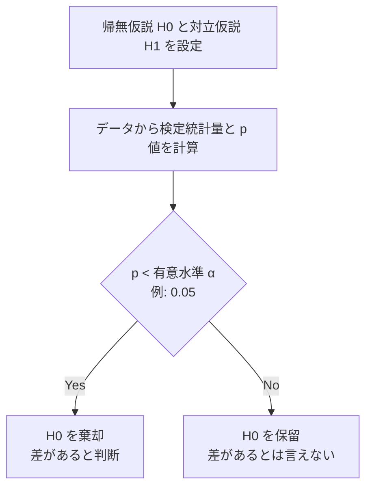
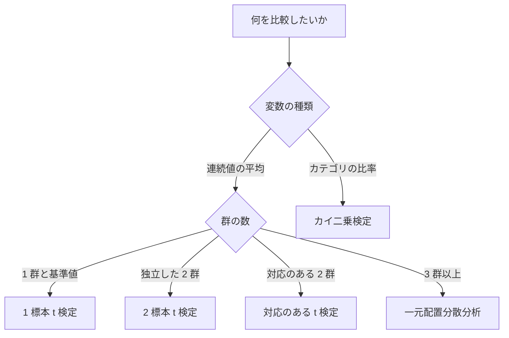

# 統計学の基礎入門

数字の不確かさを扱う技術——ビジネスで使う推測統計の考え方

| 項目 | 内容 |
|---|---|
| カテゴリー | ビジネススキル |
| 難易度 | 入門 |
| 所要時間 | 約200分（全8レッスン） |
| 公開日 | 2026-06-06 |
| 最終更新日 | 2026-06-06 |
| コースURL | https://skillup.college/courses/business/statistics-basics/ |

## 対象者

「数値や統計データを根拠に意思決定したい」「A/B テストや顧客サーベイの結果を正しく読みたい」「他人の数値主張に騙されないようになりたい」と感じている社会人。マーケ・営業・人事・経営企画・プロダクト・カスタマーサクセスなど、データを「使う」側のすべての職種。

## 前提知識

特になし。中学校レベルの四則演算がわかれば読める設計。データ分析入門コースを先に受講していると、ばらつきや相関の理解がスムーズだが、独立して読めるようにしている。

## 学習目標

- 記述統計と推測統計の違いを理解し、「不確かさを扱う学問」としての統計学を捉え直す
- 中心の指標（平均・中央値・最頻値）とばらつきの指標（分散・標準偏差・四分位範囲）を、場面に応じて使い分けられる
- 確率分布の基本（二項分布・正規分布）と、なぜ正規分布が多用されるかを理解する
- 標本と母集団の関係、中心極限定理、信頼区間を「自分の言葉で」説明できる
- 仮説検定の論理（帰無仮説・対立仮説・p 値・有意水準・第一種／第二種の過誤）を理解し、誤用を避けられる
- t 検定・カイ二乗検定・分散分析の使い分けを、変数の種類と標本数から判断できる
- 相関と回帰の意味を理解し、「相関があれば因果がある」のような誤解を避けられる
- p 値ハッキング・選択バイアス・再現性危機など、統計の誤用と限界を直視する姿勢を持つ

## コース概要

「統計学」と聞くと数式や記号を思い浮かべて身構えてしまう方は多いのではないでしょうか。本コースは、その身構えを解いて、統計学を「数字の不確かさを扱う技術」として体系的に学べる入門コースです。データ分析入門コースが「データの読み方とビジネス判断への活用」を中心に扱ったのに対し、本コースは推測統計の領域に踏み込みます。確率分布・標本と母集団・仮説検定・主要な検定の使い分け・相関と回帰までを 8 レッスンで学び、最後に「p 値ハッキング」「再現性危機」など統計学の限界と倫理にも踏み込みます。数式は最小限に抑え、「考え方・直感・誤用の避け方」を中心に組み立てました。ビジネスの現場で「データを根拠に意思決定する」「他人の数値主張を吟味する」「A/B テストや顧客サーベイの結果を読む」ために必要十分な統計の考え方を、運用できる粒度で持ち帰っていただける構成です。

## 学習の流れ

レッスン 1〜2 は「土台」として、統計学の役割（記述と推測）と、記述統計の基本指標（平均・中央値・分散・標準偏差・箱ひげ図）を本コースの言葉で再整理します。レッスン 3〜4 は「推測の準備」として、確率と確率分布、標本と母集団の関係、中心極限定理、信頼区間を学びます。レッスン 5〜6 は「推測の中核」、仮説検定の論理と主要な検定（t 検定・カイ二乗・分散分析）の使い分けを扱います。レッスン 7 は「変数の関係」として、相関と回帰、相関と因果の区別を学びます。レッスン 8 で「統計の誤用と倫理」、p 値ハッキング・選択バイアス・再現性危機を直視し、ベイズ統計の入口とコース修了後の学習方向を案内します。前半（1〜2）が「土台」、中盤（3〜6）が「推測統計の中核」、後半（7〜8）が「関係と倫理」という三段構えです。

## レッスン一覧

| No. | タイトル | 概要 | 所要時間 |
|---|---|---|---|
| 1 | 統計学とは何か——記述統計と推測統計、何を支える学問か | 統計学の 2 つの役割（記述と推測）、「不確かさを扱う」という核、なぜ推測が必要か、本コースの守備範囲、数式の扱い方を整理する | 25分 |
| 2 | データのばらつきを捉える——記述統計のまとめ直し | 中心の指標（平均・中央値・最頻値の使い分け）、ばらつきの指標（分散・標準偏差・四分位範囲）、外れ値と歪み、箱ひげ図の読み方を学ぶ | 25分 |
| 3 | 確率と確率分布——統計学の言葉を整える | 確率の基本、確率変数、離散分布と連続分布、二項分布、正規分布（68-95-99.7 ルール）、なぜ正規分布が多用されるかを学ぶ | 25分 |
| 4 | 標本と推測——見えない母集団を推測する | 母集団と標本、ランダムサンプリング、中心極限定理、標本平均の分布、標準誤差、信頼区間（95% の正確な意味）を学ぶ | 25分 |
| 5 | 仮説検定の考え方——「偶然か必然か」を判断する | 帰無仮説と対立仮説、p 値の正確な意味と誤解、有意水準、第一種・第二種の過誤、効果量、統計的有意性と実用的有意性の区別を学ぶ | 25分 |
| 6 | 主要な検定の使い分け——t 検定、カイ二乗、分散分析 | 1 標本／2 標本 t 検定、対応のある t 検定、カイ二乗適合度・独立性検定、一元配置分散分析の入口、検定の選び方フローチャートを学ぶ | 25分 |
| 7 | 相関と回帰——変数の関係を測り、予測する | ピアソン相関係数の意味と限界、相関と因果の区別、単回帰分析、決定係数 R²、残差プロット、多変数回帰の入口、多重共線性を学ぶ | 25分 |
| 8 | 統計の誤用と倫理——p 値ハッキング、選択バイアス、再現性危機 | p 値ハッキング・HARKing、選択バイアス、サバイバー・バイアス、シンプソンのパラドックス、心理学の再現性危機、ベイズ統計の入口、コース修了後の学習方向を案内する | 25分 |

---

## レッスン1：統計学とは何か——記述統計と推測統計、何を支える学問か

（所要時間：25分）

### このレッスンで学ぶこと

- 統計学を「数字の不確かさを扱う学問」として捉え直す
- 統計学の 2 つの役割（記述統計と推測統計）を区別できる
- なぜビジネスで推測統計が必要かを理解する
- 本コースの守備範囲と扱わない範囲を知る
- 数式に身構えなくてよい理由を理解する

---

「統計学」と聞いて、最初に頭に浮かぶものは何でしょうか。教科書のシグマ記号、確率分布の難しい数式、p 値、t 値、検定——どれも、人によっては苦手意識を呼ぶ言葉だと思います。本コースは、その苦手意識を解くことを最初の目的にしました。統計学は、数式ではなく考え方で理解できる学問です。むしろ、考え方を理解しないまま数式だけ覚えると、現場では誤用しやすくなります。本レッスンでは、まず「統計学とは何のための道具か」を整理することから始めます。

### 統計学は「不確かさを扱う」道具

統計学を一言で表すなら、「数字の不確かさをどう扱うかを考える学問」です。

世の中の意思決定はほぼすべて、不確かさを抱えています。ある広告キャンペーンが本当に売上に効いたのか、ある研修が本当に従業員の生産性を上げたのか、ある製品の不良率が許容範囲内なのか——どれも、「絶対に正しい」と言い切れる答えはありません。手元のデータは「全体の一部」だったり、「観測の誤差」を含んでいたり、「偶然のばらつき」を伴ったりします。

このような不確かさの中で、

- 何を「ありそうな結論」とし、
- 何を「偶然のばらつき」とし、
- どこまで自信を持って言えるかを、

整理する道具が統計学です。

> **💡 ポイント**
> 統計学は「数字を出すための公式集」ではなく、「数字の不確かさを定量的に語るための言葉」です。本コース全体を通じて、この発想に何度も戻ります。

### 統計学の 2 つの役割——記述統計と推測統計

統計学には大きく分けて 2 つの役割があります。本コースで最も繰り返す区別なので、最初に整理しておきます。

#### ①記述統計（descriptive statistics）

手元のデータを「要約して説明する」役割です。膨大な数字を、いくつかの代表値・ばらつきの指標・グラフに要約して、データの特徴を把握できる形に直します。

例えば、ある月の店舗の日次売上 30 日分をすべて並べるのではなく、「平均は 50 万円、中央値は 48 万円、最小は 28 万円、最大は 92 万円、標準偏差は 12 万円」と要約すると、データの様子がつかみやすくなります。

代表的な道具：平均・中央値・最頻値・分散・標準偏差・四分位範囲・ヒストグラム・箱ひげ図・散布図など。

#### ②推測統計（inferential statistics）

手元の限られたデータ（標本）から、その背後にある「より大きな全体（母集団）」について推測する役割です。記述統計が「手元のデータを語る」のに対し、推測統計は「手元のデータからまだ見ていない世界を語る」道具です。

例えば、1,000 人の顧客アンケートから日本の全顧客の傾向を推測する、A/B テストの数百サンプルから今後すべての訪問者で本当に効果が出るかを判断する、製造ラインから抜き取った 50 個の検査から今日のロット全体の品質を判断する——どれも推測統計の典型例です。

代表的な道具：信頼区間・仮説検定（t 検定・カイ二乗検定・分散分析）・回帰分析・効果量・p 値など。

#### 2 つの違いを掴むために

両者の違いを別の角度で表現すると、こうも言えます。

| | 記述統計 | 推測統計 |
|---|---|---|
| 対象 | 手元のデータそのもの | 手元のデータから推測する「大きな全体」 |
| 問い | このデータはどんな形をしているか | このデータから何を「もっともらしい」と言えるか |
| 出力 | 平均・分散・グラフなどの要約 | 信頼区間・p 値・効果量・回帰係数など |
| 不確かさの扱い | 含まないことが多い | 中心的に扱う |

本コースの主軸は、後者の推測統計です。記述統計はレッスン 2 で本コースの言葉で整理し直しますが、深掘りはレッスン 3 以降の推測統計に時間を割きます。

> **📝 補足**
> 「データを集めて、平均を出して、グラフを描いて報告する」までは記述統計の領域です。多くのビジネス現場で「データ分析」と呼ばれている作業は、この記述統計までで終わっていることがよくあります。推測統計に踏み込むと、「で、それは本当に意味のある差なのか」「偶然のばらつきの範囲を超えているのか」を語れるようになります。

### なぜ「推測」が必要か——全数調査の限界

「全部のデータを見れば、推測なんてしなくていいんじゃないか」という疑問は、最初に多くの方が抱くものです。実際、データが全部見られるなら推測は不要です。問題は、ほとんどの現場で「全部」を見ることができない、という現実にあります。

#### 全数調査ができない 4 つの理由

##### ①コストが大きすぎる

国民全員、顧客全員、製品の全製造ロット——どれもサンプルを取らずに全数を調べるとなると、時間とコストが膨大になります。国勢調査のような全数調査は、国家規模の投資があってようやく成り立ちます。

##### ②調べる対象が破壊される

製品の強度試験や寿命試験は、調べると製品が壊れます。「全製品を試験する」と全製品が売り物にならなくなります。一部の抜き取り検査で全体の品質を推測する必要があります。

##### ③対象がまだ存在しない（未来予測）

「次の四半期の売上」「これから訪れる新規顧客」「来月の不良率」——どれも、まだ起きていない出来事です。過去のデータから未来を推測するには、推測統計の発想が要ります。

##### ④対象が動き続けている

顧客の好み、市場の動向、品質工程の状態は、刻一刻と変化します。「ある時点で見たデータ」は、その瞬間の標本でしかなく、全体を捉えきっているとは限りません。

これら 4 つの理由から、ビジネスの現場では「一部のデータから全体を推測する」が日常的に求められます。だから推測統計が必要なのです。

> **🔰 初学者の方へ**
> 「サンプルから全体を推測する」と聞くと、「それで本当に大丈夫なのか」と不安に感じる方は多いです。実は、推測統計の中心テーマがまさにこの不安——「どれくらいの自信を持ってそう言えるか」を、数字で語れるようにすることです。レッスン 4 以降で、その仕組みを少しずつ解きほぐしていきます。

### 統計学が支える 3 つの場面——ビジネスでの典型

統計学が実際にビジネスでどう使われるか、典型例を 3 つ挙げておきます。本コース全体を通じて、これらの場面を意識しながら学んでいただくと、知識が「使えるもの」として定着しやすくなります。

#### ①意思決定の根拠を持つ

「広告 A と広告 B、どちらが効くか」「新しい価格設定で売上は本当に伸びるか」「新研修プログラムは離職率を下げるか」——どれも、データに基づいて意思決定したい場面です。推測統計は、こうした問いに「偶然のばらつきを超えた効果と言えるか」を答える道具を提供します。

#### ②他人の主張を吟味する

「この新商品で売上が 20% 伸びた」「この施策で満足度が大きく改善した」「相関係数 0.8 だから因果関係がある」——日常で耳にする数値主張のうち、十分な裏付けがないものも少なくありません。統計学を学ぶと、「その数字、そう言い切れるのか」を吟味できるようになります。

#### ③不確かさを共有する

ビジネスでは「絶対に儲かる施策」「確実に効く処方」は存在しません。それでも、「どれくらいの確からしさでそう言えるのか」を、関係者と共有することはできます。信頼区間や効果量は、結論の「確からしさの幅」を言葉にする道具です。

> **⚠️ 注意**
> 統計学は「正解を出す機械」ではありません。同じデータでも、問いの立て方や検定の選び方で結論が変わることがあります。本コースでは、「どの場面でどの道具を選ぶか」「結論をどこまで言えてどこから言えないか」を区別する発想を、繰り返し扱っていきます。

### 本コースの守備範囲と限界

本コースで扱う範囲と扱わない範囲を、最初に整理しておきます。

#### 扱う範囲

- 記述統計の基本指標（レッスン 2）
- 確率と確率分布（レッスン 3）
- 標本と推測の関係、中心極限定理、信頼区間（レッスン 4）
- 仮説検定の考え方、p 値、有意水準、過誤、効果量（レッスン 5）
- 主要な検定の使い分け（t 検定・カイ二乗・分散分析）（レッスン 6）
- 相関と回帰、相関と因果の区別（レッスン 7）
- 統計の誤用と倫理、再現性危機、ベイズ統計の入口（レッスン 8）

#### 扱わない範囲

- 数式の証明・導出（考え方の図と比喩で代替）
- 統計ソフト（R・Python・SPSS など）の操作方法（コースの目的は概念理解）
- 機械学習の本格的なモデル（軽くレッスン 8 で触れる程度）
- 高度なベイズ統計・階層モデル・時系列分析（入門の範囲外）
- 特定業界の専門的な統計手法（医療統計のみ・金融工学のみなど）

#### スタンス

本コースは、統計学を「数式の体系」ではなく「意思決定の質を上げる道具」として扱います。完璧な理解を目指すと挫折しやすいので、「考え方の地図」を持って現場で迷わなくなる、というレベルを目標に置きます。深掘りしたい方は、レッスン 8 の最後に外部の書籍を案内します。

### 数式に身構えなくてよい理由

最後に、本コースの「数式の扱い方」について触れておきます。

統計学の教科書は、たいてい数式から入ります。「分散の定義は……」「正規分布の確率密度関数は……」と書かれると、それだけで身構えてしまう方が多いはずです。本コースは、その入口を変えます。

数式は「考え方を厳密に書く言語」ですが、考え方そのものは数式なしでも語れます。例えば、

- 「分散 = 平均からのずれの 2 乗を平均したもの」
- 「信頼区間 = この推定値の周りに、95% の確からしさで真の値が入る幅」
- 「p 値 = 帰無仮説が正しいと仮定したとき、観測結果以上に極端なデータが出る確率」

このように、日本語の文で表現できます。数式で表現すれば短く厳密になりますが、ビジネスの現場で他人に説明するときは、むしろ日本語の文の方が伝わります。本コースは、日本語の文と図・表・直感的な例を中心に進めます。

> **💡 ポイント**
> 数式を「使えるようになりたい」方は、本コースで考え方を掴んだあと、専門書で数式に進むのが最短ルートです。逆に「数式から入って挫折した」経験がある方は、本コースで考え方の地図を作り直すと、数式に戻ったときに腹落ちしやすくなります。

### まとめ

このレッスンでは、以下のことを学びました。

- 統計学は「数字の不確かさを扱うための言葉」
- 統計学には記述統計と推測統計の 2 つの役割がある
- 記述統計は「手元のデータを語る」、推測統計は「手元のデータからまだ見ていない世界を語る」
- ビジネスでは、コスト・破壊・未来・変化の理由で「全数調査」ができないことが多く、推測統計が必要
- 統計学が支える典型場面：①意思決定の根拠、②他人の主張の吟味、③不確かさの共有
- 本コースは数式を最小限に抑え、「考え方・直感・誤用の避け方」を中心に進める
- 「p < 0.05 で有意」だけでなく「効果量」「実用的有意性」をセットで考える発想を貫く

次のレッスンでは、記述統計を本コースの言葉でまとめ直します。平均・中央値・最頻値の使い分け、分散・標準偏差・四分位範囲の意味、外れ値や歪んだ分布の見抜き方を学びます。データ分析入門コースで触れた内容と重なる部分もありますが、推測統計に進む土台として、本コースの言葉でもう一度整理します。

---

### 確認クイズ

このレッスンの理解度をチェックしましょう。

#### Q1. 本レッスンが整理した「統計学」の核として最も適切なものはどれか？

- [x] 数字の不確かさを定量的に扱うための言葉
- [ ] 平均と分散を計算するための公式集
- [ ] 数字を使って他人を説得するための技法
- [ ] 大量のデータを保存するための仕組み

> **解説**
> 本コースは、統計学を「数字の不確かさを定量的に語るための言葉」として位置づけます。世の中の意思決定はほぼすべて不確かさを伴うため、「何をありそうな結論とし、何を偶然のばらつきとし、どこまで自信を持って言えるか」を整理する道具として統計学を捉えます。公式集や説得の技法ではありません。

#### Q2. 記述統計と推測統計の違いとして最も適切なものはどれか？

- [ ] 記述統計は古い手法、推測統計は新しい手法
- [x] 記述統計は手元のデータを要約して語る、推測統計は手元のデータから「より大きな全体」を推測する
- [ ] 記述統計は数式が簡単、推測統計は数式が難しい
- [ ] 記述統計は専門家用、推測統計は一般人用

> **解説**
> 記述統計は「手元のデータを要約して説明する」役割（平均・分散・グラフなど）、推測統計は「手元の限られたデータから、その背後にあるより大きな全体を推測する」役割（信頼区間・仮説検定・回帰分析など）です。本コースは特に後者の推測統計に時間を割きます。

#### Q3. ビジネスで「全数調査」ができない理由として、本レッスンが挙げていないものはどれか？

- [ ] コストが大きすぎる
- [ ] 製品の検査では対象が破壊される
- [x] 数学的に全数調査は禁止されている
- [ ] 未来や動き続ける対象は「全部」を見られない

> **解説**
> 本レッスンが挙げた理由は、①コストが大きすぎる、②調べる対象が破壊される（強度試験など）、③対象がまだ存在しない（未来予測）、④対象が動き続けている、の 4 つです。「数学的に禁止されている」というルールはありません。これらの理由から、現場では「一部のデータから全体を推測する」が日常的に必要になります。

#### Q4. 統計学がビジネスで支える典型場面として、本レッスンが挙げているものはどれか？

- [ ] データを保存するためのデータベース設計
- [ ] 数値計算を高速化するアルゴリズム
- [ ] 売上を必ず上げるための処方箋
- [x] 意思決定の根拠を持つ／他人の主張を吟味する／不確かさを共有する

> **解説**
> 本レッスンは、統計学が支える 3 つの場面として、①意思決定の根拠を持つ、②他人の主張を吟味する、③不確かさを共有する、を挙げました。「売上を必ず上げる処方箋」のような「正解を出す機械」としての統計学ではない、というスタンスを最初に明示しています。

#### Q5. 本コースが「扱わない範囲」として明示しているものはどれか？

- [x] 数式の証明・導出と、統計ソフトの操作方法
- [ ] 記述統計の基本指標
- [ ] 仮説検定の考え方
- [ ] 相関と回帰の区別

> **解説**
> 本コースは、数式の証明・導出、統計ソフト（R・Python・SPSS など）の操作方法、機械学習の本格的なモデル、高度なベイズ統計や時系列分析、特定業界の専門統計などは扱いません。記述統計の基本指標・仮説検定・相関と回帰は本コースの中核です。

#### Q6. 「数式に身構えなくてよい理由」として、本レッスンの整理として最も適切なものはどれか？

- [ ] 統計学では数式は使われない
- [ ] 数式を理解しなくても結論が変わらない
- [x] 数式は考え方を厳密に書く言語で、考え方そのものは日本語の文と図・直感で語れる
- [ ] ビジネスでは数式の説明は禁止されている

> **解説**
> 本コースは、数式を「考え方を厳密に書く言語」として位置づけつつ、考え方そのものは数式なしでも日本語の文で語れる、というスタンスを取ります。「分散 = 平均からのずれの 2 乗を平均したもの」のように、概念を言葉で押さえることで、現場で他人に説明するときの伝わりやすさも上がります。

---

## レッスン2：データのばらつきを捉える——記述統計のまとめ直し

（所要時間：25分）

### このレッスンで学ぶこと

- 「中心」を表す 3 つの指標（平均・中央値・最頻値）の使い分けを身につける
- 「ばらつき」を表す代表的な指標（分散・標準偏差・四分位範囲）の意味を理解する
- 外れ値や歪んだ分布を見抜くための観点を持つ
- 箱ひげ図の構造を読み解けるようになる
- 「平均だけ見るのは危険」が、なぜ起きるかを直感で説明できる

---

レッスン 1 では、統計学の核を「数字の不確かさを扱う」と置き、記述統計と推測統計の役割の違いを整理しました。本レッスンでは、推測統計に進む前に記述統計の基本指標を本コースの言葉で再整理します。データ分析入門コースで触れた話と重なる部分もありますが、レッスン 3 以降の推測統計の土台になる発想を、もう一度押さえ直すのが目的です。

### データを「数字 1 つ」で要約する難しさ

データを誰かに伝えようとするとき、私たちはよく「だいたい平均でこれくらいです」と言います。月次売上、顧客の年齢、社員の評価点、品質工程の寸法——どれも、最初に「平均」が出てきます。

ところが平均には、たった 1 つの数字が背景の多様性を覆い隠してしまう、という限界があります。例えば、5 店舗の月次売上が「30 万、40 万、50 万、60 万、70 万」のときと、「10 万、10 万、50 万、90 万、90 万」のときでは、平均はどちらも 50 万ですが、店舗ごとの「ばらつき方」はまったく違います。

記述統計は、平均という 1 つの数字だけでは伝えきれない「データの様子」を、いくつかの指標とグラフで補う道具です。

> **💡 ポイント**
> 記述統計の出発点は、「平均だけ見るな、ばらつきも見ろ」というシンプルな発想です。本コースは、平均（中心）と、分散・標準偏差（ばらつき）を、必ずセットで扱う姿勢で進めます。

### 中心を表す 3 つの指標

データの「真ん中あたり」を捉える指標は、大きく 3 つあります。

#### ①平均（mean）

すべての数字を足して、データの個数で割ったものです。最もよく使われる「中心」の指標です。

例：30, 40, 50, 60, 70 の平均 → (30+40+50+60+70) ÷ 5 = 50

平均の長所は、すべてのデータを反映していることです。短所は、外れ値（極端に大きい／小さい数字）に強く引きずられることです。

#### ②中央値（median）

データを小さい順に並べたときに、真ん中に来る数字です。

例：30, 40, 50, 60, 70 の中央値 → 50（3 番目）
例：30, 40, 50, 60, 1000 の中央値 → 50（外れ値があっても変わらない）

中央値の長所は、外れ値に強いことです。短所は、すべてのデータを反映しているわけではないことです。

#### ③最頻値（mode）

データの中で最も多く出てくる値です。

例：30, 40, 40, 50, 70 の最頻値 → 40

最頻値の長所は、「典型的な値」を直感的に捉えやすいことです。短所は、すべてのデータが 1 回ずつしか出てこない連続値の場合、ほぼ意味を持たないことです。

#### 使い分けの原則

| 場面 | 推奨される指標 |
|---|---|
| データに外れ値がなく、ほぼ左右対称 | 平均 |
| データに外れ値がある／分布が歪んでいる | 中央値 |
| カテゴリーや離散的な値の「典型」を知りたい | 最頻値 |
| 全体像を伝えたい | 平均と中央値を両方示す |

> **⚠️ 注意**
> 年収・売上・株価・住宅価格などの分布は、外れ値があり、しばしば右に歪んでいます（少数の極端に大きい値が、平均を引き上げる構造）。こうしたデータで「平均年収」だけを伝えると、実態とずれた印象を与えます。中央値を併記するか、中央値だけで伝える方が、誤解が少ないことが多いです。

### ばらつきを表す指標

「中心」と並んで重要なのが、「ばらつき」を表す指標です。

#### ①分散（variance）

「平均からのずれの 2 乗を平均したもの」と本コースでは表現します。式に直すと長くなりますが、考え方はこれだけです。

なぜ 2 乗するのか。平均からのずれをそのまま足すと、プラスとマイナスが打ち消し合って 0 になってしまうため、2 乗してプラスに揃えています。

例：30, 40, 50, 60, 70 の平均は 50。
- 30 のずれは -20、2 乗で 400
- 40 のずれは -10、2 乗で 100
- 50 のずれは 0、2 乗で 0
- 60 のずれは +10、2 乗で 100
- 70 のずれは +20、2 乗で 400
- 平均 = (400+100+0+100+400) ÷ 5 = 200

この 200 が分散です。

#### ②標準偏差（standard deviation）

分散の平方根です。「平均からのずれの典型的な大きさ」と覚えると直感的です。

例：上の分散 200 の平方根 ≈ 14.14。標準偏差は約 14.14。

なぜ平方根を取るのか。分散は「2 乗の世界」の数字なので、元のデータと単位が違います（元が「万円」なら、分散は「万円²」）。平方根を取ると、元のデータと同じ単位になり、直感的に解釈しやすくなります。

> **💡 ポイント**
> 分散と標準偏差は、ほぼ同じ情報を持っています。実務で「ばらつき」を語るときは、ほぼ標準偏差を使います。分散は「定義のため」「数式の途中で出てくるもの」と覚えておくと十分です。

#### ③四分位範囲（interquartile range, IQR）

データを小さい順に並べ、4 等分したときの「第 1 四分位点（下から 25%）」から「第 3 四分位点（下から 75%）」までの幅です。中央 50% のデータが含まれる幅、と言い換えてもよいでしょう。

例：30, 40, 50, 60, 70 では、第 1 四分位は 40、第 3 四分位は 60、IQR = 60 - 40 = 20。

IQR の長所は、外れ値に強いことです。極端に大きい／小さい値があっても、中央 50% の幅は変わりません。データが歪んでいるとき、または外れ値が含まれるときは、標準偏差より IQR の方が「ばらつきの実態」を捉えやすくなります。

#### ばらつき指標の使い分け

| 場面 | 推奨される指標 |
|---|---|
| データに外れ値がなく、ほぼ左右対称 | 標準偏差 |
| データに外れ値がある／分布が歪んでいる | 四分位範囲（IQR） |
| 推測統計（信頼区間・検定）で使いたい | 標準偏差（数学的に扱いやすい） |
| ビジネス報告で「ばらつきの実態」を伝えたい | 標準偏差と IQR を両方示す |

### 外れ値と歪んだ分布の見抜き方

ここまでで、「中心」と「ばらつき」の指標が整理できました。次に問題になるのが、「自分のデータが外れ値を含むか、歪んでいるか、どう判断するか」です。

#### 外れ値の典型的なサイン

- 平均と中央値が大きく違う（差が標準偏差の 2 倍以上、など）
- 最大値が、第 3 四分位の 3 倍以上ある
- ヒストグラムを描くと、一部だけ離れた山がある
- 業務上「ありえない」と感じる値がある（人の身長 250cm、年齢 200 歳など）

#### 歪んだ分布の典型例

ビジネスの数字は、左右対称な「釣り鐘型」より、右に裾を引いた「歪んだ分布」の方が多い印象があります。代表例：

- 個人の年収・売上・取引額（少数の大型取引が平均を引き上げる）
- ウェブサイトの 1 ユーザーあたり滞在時間（多くは数秒、少数が数時間）
- メーカーの製品寿命（多くは平均近辺だが、一部が極端に長持ち／早期故障）
- 顧客の購買回数（多くは 1〜2 回、少数のリピーターが高頻度購入）

これらに対して、平均だけを見ると実態を見誤ります。中央値や四分位範囲を併用しないと、意思決定の根拠としては危ういのです。

> **🔰 初学者の方へ**
> 「うちの平均顧客単価は◯◯円です」「平均月収は◯◯万円です」のような表現を見かけたとき、「中央値はいくつだろう」と心の中で問うてみてください。多くの場合、中央値の方が「典型的な顧客／社員」の像に近い数字になります。

### 箱ひげ図——「中心」と「ばらつき」を一目で

中心とばらつきと外れ値を、1 つの図で示せるのが箱ひげ図（box plot）です。本コースで Mermaid で箱ひげ図そのものは描けないので、構造を言葉で説明します。

箱ひげ図は、横向きまたは縦向きの 1 本の軸上に、次の要素を表現します。

| 要素 | 意味 |
|---|---|
| 箱の下端 | 第 1 四分位点（下から 25%） |
| 箱の中の線 | 中央値（下から 50%） |
| 箱の上端 | 第 3 四分位点（下から 75%） |
| 箱の下から伸びるひげ | 通常、下側の「外れ値ではない最小値」 |
| 箱の上から伸びるひげ | 通常、上側の「外れ値ではない最大値」 |
| ひげの外側の点 | 外れ値 |

外れ値の判定はソフトや慣習で違いますが、「第 1 四分位 - 1.5 × IQR より下」「第 3 四分位 + 1.5 × IQR より上」を外れ値とする「テューキー（Tukey）の方法」がよく使われます。

> **📝 補足**
> 箱ひげ図は、グループ間の比較に特に強い図です。例えば、部署別の評価点分布や、店舗別の客単価分布を並べて描くと、「中心が違うのか、ばらつきが違うのか、外れ値があるのか」が一目でわかります。本コースのレッスン後半で実例を扱う際にも、箱ひげ図のイメージを念頭に置いておくとよいでしょう。

### 「平均だけ見るな」の具体例

最後に、本レッスンの実用的な教訓として、「平均だけ見ると判断を誤る」場面を 3 つ挙げます。

#### 例 1：給与の議論

「うちの会社の平均年収は 800 万円です」と言われると、多くの社員が 800 万円もらっていそうに聞こえます。しかし、高給な役員数名が平均を引き上げており、中央値は 550 万円ということもあります。社内議論では、中央値や四分位範囲も併記するのが誠実です。

#### 例 2：顧客満足度サーベイ

「平均満足度 7.0 点（10 点満点）」と聞くと、おおむね満足してもらっていそうですが、実は「10 点を付けた人と 3 点を付けた人に分割しており、平均が 7」というケースもあります。中央値・分散・回答分布を見ると、「全体に満足」と「両極端に割れている」の違いが見えます。

#### 例 3：A/B テストの結果

「施策 B の方が平均購入額が 5% 高い」と言われても、ばらつきが大きく一部のヘビーユーザーが平均を押し上げている可能性があります。標準偏差・中央値・分布の形を見ないと、「本当に全体が改善している」とは言い切れません。

> **💡 ポイント**
> 統計学を学んだ人とそうでない人の最も大きな差の 1 つは、「平均を見たら、必ずばらつきも見るか」です。これは、推測統計に進む前の、基本姿勢として身につけてほしい習慣です。

### まとめ

このレッスンでは、以下のことを学びました。

- データを「中心の指標」（平均・中央値・最頻値）と「ばらつきの指標」（分散・標準偏差・IQR）の両輪で捉える
- 平均は外れ値に弱い。中央値は外れ値に強い。最頻値は典型値を直感的に伝える
- 分散は「平均からのずれの 2 乗の平均」、標準偏差はその平方根で「ばらつきの典型的な大きさ」
- 四分位範囲（IQR）は中央 50% の幅で、外れ値や歪んだ分布に強い
- ビジネスの数字は右に歪んでいることが多く、平均だけを見ると実態を見誤りやすい
- 箱ひげ図は中心・ばらつき・外れ値を 1 図で示せる、グループ比較に強い道具
- 「平均だけ見るな、必ず中央値とばらつきも見ろ」が、本コースを通じての基本姿勢

次のレッスンでは、推測統計の準備として「確率と確率分布」を扱います。確率変数、離散分布と連続分布、二項分布、正規分布、そして「なぜ正規分布が多用されるか」を、考え方の軸で押さえていきます。

---

### 確認クイズ

このレッスンの理解度をチェックしましょう。

#### Q1. データに極端に大きい外れ値がある場合、「中心」を表す指標として最も適切なものはどれか？

- [ ] 平均
- [x] 中央値
- [ ] 最頻値（カテゴリーでない連続値の場合）
- [ ] 合計

> **解説**
> 平均は外れ値に強く引きずられる弱点があります。データに外れ値があるときや、分布が歪んでいるときは、中央値（データを並べて真ん中に来る値）の方が「典型的な値」をより正確に捉えます。年収・売上・株価のような右に歪んだ分布では、中央値の方が実態を反映しやすい指標です。

#### Q2. 「分散」の意味として最も適切なものはどれか？

- [ ] データの最大値と最小値の差
- [ ] データの個数
- [ ] データを並べたときの真ん中の値
- [x] 平均からのずれの 2 乗を平均したもの

> **解説**
> 分散は「平均からのずれの 2 乗を平均したもの」です。なぜ 2 乗するかというと、ずれをそのまま足すとプラスとマイナスが打ち消し合って 0 になるため。標準偏差は分散の平方根で、「平均からのずれの典型的な大きさ」として元の単位で扱いやすくしたものです。

#### Q3. 四分位範囲（IQR）の長所として最も適切なものはどれか？

- [x] 外れ値や歪んだ分布に強く、「中央 50% の幅」として実態を捉えやすい
- [ ] 最も小さい値と最も大きい値の差を直接示せる
- [ ] 標準偏差より数式が簡単
- [ ] 平均を計算するための前段階になる

> **解説**
> 四分位範囲（IQR）は、第 1 四分位点（下から 25%）から第 3 四分位点（下から 75%）までの幅で、中央 50% のデータが含まれる範囲です。外れ値があっても中央 50% の幅は変わらないため、歪んだ分布のばらつきを実態として捉えやすくなります。標準偏差より外れ値に頑健（ロバスト）な指標です。

#### Q4. ビジネス数字を「平均」だけで判断する危険性として、本レッスンが挙げているものはどれか？

- [ ] 平均は計算が複雑である
- [ ] 平均は法的に使用が制限されている
- [ ] 平均は外れ値の影響を受けないので不正確
- [x] 年収・売上・利用時間など、ビジネス数字は右に歪んでいることが多く、平均だけでは少数の極端な値に引きずられた印象を伝える

> **解説**
> ビジネスの数字は、年収・売上・取引額・利用時間・購買回数など、右に裾を引いた歪んだ分布が多いのが特徴です。少数の極端な値が平均を押し上げる構造なので、平均だけを見ると「典型的な実態」を見誤りやすくなります。中央値や四分位範囲を併用するのが、誤解を避ける基本姿勢です。

#### Q5. 箱ひげ図の構造について、本レッスンの説明として正しいものはどれか？

- [ ] 箱の中の線は平均を表す
- [ ] ひげの長さは標準偏差を表す
- [x] 箱は第 1 四分位から第 3 四分位までで、中の線は中央値を表す
- [ ] ひげの外の点は最頻値を表す

> **解説**
> 箱ひげ図では、箱の下端が第 1 四分位（25%）、箱の中の線が中央値（50%）、箱の上端が第 3 四分位（75%）です。ひげは「外れ値ではない範囲」の最大／最小、ひげの外の点が外れ値です。箱の中の線は平均ではなく中央値、という点が誤解しやすいポイントです。

#### Q6. 講師の現場メモで紹介された「平均利用時間が前月比 20% 伸びた」事例から導かれる学びはどれか？

- [ ] 平均が伸びたことは即座に経営報告に上げてよい
- [x] 平均は一部の極端な値に引きずられることがあり、中央値や四分位範囲もセットで確認しないと「全体の改善」とは言えない
- [ ] グロース指標は平均だけで十分
- [ ] 上位 1% のヘビーユーザーは全体の代表である

> **解説**
> 事例では、平均利用時間は 20% 伸びていたが、中央値はわずかに低下しており、上位 1% のヘビーユーザーが平均を引き上げていただけでした。「全体が伸びた」のではなく「一部のヘビーユーザーがさらに濃く使っただけ」だったのです。中央値・四分位範囲・分布の形を見れば、ほぼ即座に気づける構造でした。「平均だけで意思決定すると、しばしばコストが大きく出る」教訓です。

---

## レッスン3：確率と確率分布——統計学の言葉を整える

（所要時間：25分）

### このレッスンで学ぶこと

- 統計学が前提とする「確率」の基本的な考え方を理解する
- 確率変数・離散分布・連続分布という統計学の語彙に親しむ
- 二項分布を「成功と失敗」のシンプルなモデルとして使えるようになる
- 正規分布の形と「68-95-99.7 ルール」を直感で押さえる
- なぜ正規分布が統計学で多用されるのかを理解する

---

レッスン 1〜2 では、統計学の役割と記述統計の基本指標を整理しました。本レッスンは、いよいよ推測統計に進むための「言葉」を揃える回です。確率・確率変数・確率分布・正規分布——いずれも教科書では数式から入りやすい単語ですが、本コースは「考え方の地図」として押さえます。レッスン 4 以降の標本・検定・回帰の議論で、繰り返し戻ってくる土台になります。

### 確率とは何か——3 つの捉え方

確率（probability）と聞いて、最初に思い浮かぶのは「サイコロで 1 の目が出る確率は 6 分の 1」のような例ではないでしょうか。確率には、実は大きく分けて 3 つの捉え方があります。本コースで詳細な哲学論争には踏み込みませんが、最初に整理しておきます。

#### ①古典的確率（理論的確率）

すべての場合の数が同じくらい起きるとして、「目的の場合の数 ÷ 全体の場合の数」と決める考え方です。サイコロや、よくシャッフルされたトランプの例が典型例です。

#### ②頻度主義的確率

同じ試行を非常に多く繰り返したとき、目的の結果が出る割合（頻度）が、ある値に近づいていく、と考える捉え方です。例えば「コインを 10,000 回投げたら、約 5,000 回表が出る」という発想です。実務の統計学（本コースの本筋）は、ほぼこの頻度主義の立場で進みます。

#### ③主観確率（ベイズ的確率）

「人の信念の度合い」として確率を捉える考え方です。「明日雨が降る確率は 70%」のように、繰り返せない一回限りの事象にも確率を当てはめられる立場です。レッスン 8 で「ベイズ統計の入口」として再度触れます。

> **💡 ポイント**
> 本コースの推測統計は、主に「頻度主義」の立場です。「同じ調査を何度も繰り返したら、結果はどのくらいばらつくか」を想像する発想が、レッスン 4 以降で繰り返し出てきます。ベイズ統計はまた別の道具立てですが、本コースでは入門の範囲内で軽く触れる程度にとどめます。

### 確率変数——「結果がいくつかありえる数」

確率変数（random variable）は、推測統計の頻出語彙です。難しそうな響きですが、考え方はシンプルです。

確率変数とは、「結果がいくつかありえて、それぞれに確率がついている数」のことです。例えば、

- サイコロの出る目（1〜6 のどれかが、6 分の 1 ずつの確率で出る）
- ある製品の不良率調査で 100 個中の不良品数（0〜100 のどれかが、ある確率で出る）
- 顧客 1 人あたりの月間購買額（0 円〜数十万円のどれかが、ある確率で出る）

これらは、観測する前は「いくつになるか確定していない」が、観測すると 1 つの値に決まる数です。確率変数は、確率分布（後述）とセットで扱うのが基本です。

> **🔰 初学者の方へ**
> 「確率変数」と「観測値」は混同しやすい言葉です。確率変数は「これから観測するときに、どんな値が出うるか」のモデル。観測値は「実際に取った 1 つの数字」です。確率変数は、観測前の「ぼんやりした可能性の集合」、と捉えるとよいでしょう。

### 確率分布——確率の「形」を捉える

確率分布（probability distribution）は、確率変数がどの値をどれくらいの確率で取るかを、まとめて表したものです。表で書くこともできますし、グラフで書くこともできます。

確率分布は、データの種類によって 2 つに分類されます。

#### ①離散分布（discrete distribution）

数えられる値（整数など）を取る確率変数の分布です。

例：
- サイコロの出る目（1, 2, 3, 4, 5, 6）
- ある期間に発生する不良品数（0, 1, 2, ...）
- アンケートの 1〜5 段階回答

代表的な離散分布：二項分布、ポアソン分布、幾何分布など。

#### ②連続分布（continuous distribution）

連続的な値（小数・分数を含む）を取る確率変数の分布です。

例：
- 顧客の身長（150.3cm、165.7cm など）
- 製品の重量（98.45g、100.12g など）
- 待ち時間（3.2 分、5.8 分など）

代表的な連続分布：正規分布、t 分布、F 分布、カイ二乗分布など。

本コースでは、特に二項分布と正規分布を取り上げます。

### 二項分布——「成功と失敗」のシンプルなモデル

二項分布（binomial distribution）は、最も基本的な離散分布の 1 つです。

#### 二項分布が当てはまる場面

次の条件をすべて満たす場面で使われます。

- 試行が独立に何度も繰り返される（n 回）
- 各試行の結果は「成功」または「失敗」の 2 つだけ
- 成功の確率 p は、毎回同じ

例：
- コインを 10 回投げて、表が出る回数（n = 10、p = 0.5）
- 100 個の製品を検査して、不良品の数（n = 100、p = 不良率）
- 1,000 通のメール広告で、開封される数（n = 1,000、p = 開封率）

#### 二項分布のイメージ

二項分布の形は、p と n によって変わりますが、おおよそ「成功回数の最も起きやすいあたりにピークがあり、そこから左右に減っていく」山型になります。p = 0.5 のときは左右対称、p が 0.5 から離れると非対称になります。

n が十分大きい（目安として np と n(1-p) が両方 10 以上）になると、二項分布は正規分布で近似できます。これは、レッスン 4 で扱う中心極限定理の最も身近な例です。

> **📝 補足**
> 「100 個中 95 個合格」と「1,000 個中 950 個合格」は、合格率はどちらも 95% ですが、推測統計の世界では情報量が違います。後者の方が標本数が多く、推定の幅（信頼区間）が狭くなります。二項分布は、その「不確かさの幅」を計算する出発点になります。

### 正規分布——統計学の主役

正規分布（normal distribution）は、統計学で最もよく使われる連続分布です。「ガウス分布」「釣り鐘型分布」とも呼ばれます。

#### 正規分布の特徴

- 左右対称の釣り鐘型
- 中心の値（平均）が、最も起きやすい
- 中心から離れるほど、起きる確率は急速に小さくなる
- 形は「平均 μ」と「標準偏差 σ」の 2 つで完全に決まる

#### 68-95-99.7 ルール

正規分布の最も覚えやすい性質が、この経験則です。

| 範囲 | データが入る割合 |
|---|---|
| 平均 ± 1 標準偏差（μ ± 1σ） | 約 68% |
| 平均 ± 2 標準偏差（μ ± 2σ） | 約 95% |
| 平均 ± 3 標準偏差（μ ± 3σ） | 約 99.7% |

例えば、ある製品の重量が「平均 100g、標準偏差 5g」の正規分布に従うとします。すると、

- 100g ± 5g（95g〜105g）の範囲に、約 68% の製品が入る
- 100g ± 10g（90g〜110g）の範囲に、約 95% の製品が入る
- 100g ± 15g（85g〜115g）の範囲に、約 99.7% の製品が入る

製造業の品質管理で、「3σ を超えると要注意」「6σ を超えるとほぼ起きえない」と言われるのは、この性質が背景にあります。

> **⚠️ 注意**
> 68-95-99.7 ルールは、データが正規分布に従っている場合の話です。実際のビジネスデータは右に歪んでいることが多く、正規分布に従わないことも珍しくありません。「平均 ± 2 標準偏差で 95%」と機械的に当てはめると、実態と外れる場合があります。データが正規分布に近いかどうか（ヒストグラムで確認するなど）を、必ず先に見るのが大事です。

### なぜ正規分布が多用されるか——3 つの理由

正規分布は、なぜ統計学でこれほど多く出てくるのでしょうか。本レッスンでは 3 つの理由を整理しておきます。

#### ①現実のデータが正規分布に近いことがある

人の身長、製造工程の寸法、測定誤差、IQ スコアなど、多くの自然現象や測定値が、近似的に正規分布に従うことが知られています。「複数の小さな要因がランダムに加わってできる量」は、正規分布に近くなる傾向があります。

#### ②標本平均は、正規分布に近づく（中心極限定理）

これが、推測統計で正規分布が中心的に使われる最大の理由です。元のデータが正規分布でなくても、そこから「ランダムに取った標本の平均」を多数集めると、その平均の分布は正規分布に近づいていく、という驚くべき性質があります。これを中心極限定理（central limit theorem）と呼びます。詳しくはレッスン 4 で扱います。

#### ③数学的に扱いやすい

正規分布は、数式や確率計算が比較的扱いやすい性質を持ちます。多くの統計手法（t 検定、分散分析、回帰分析など）は、正規分布の仮定を前提に設計されています。仮定が成り立っているとき、計算と解釈がシンプルになります。

> **💡 ポイント**
> 正規分布は「現実のデータがそうである」というより、「標本平均がそう振る舞う」という性質によって、推測統計の主役になっています。元のデータの分布が何であろうと、「標本の平均」を扱う限り正規分布の発想が使えるのは、推測統計の強力な武器です。

### まとめ

このレッスンでは、以下のことを学びました。

- 確率には、古典的・頻度主義的・主観的の 3 つの捉え方がある。本コースは頻度主義が主軸
- 確率変数は「結果がいくつかありえて、それぞれに確率がついている数」
- 確率分布には離散分布（数えられる値）と連続分布（連続的な値）がある
- 二項分布は「成功と失敗」が独立に繰り返されるシーンに使う基本的な離散分布
- 正規分布は左右対称の釣り鐘型で、平均 μ と標準偏差 σ で形が決まる
- 68-95-99.7 ルール：μ±1σ で 68%、μ±2σ で 95%、μ±3σ で 99.7%
- 正規分布が多用される理由：①現実のデータが正規分布に近いことがある、②標本平均が正規分布に近づく（中心極限定理）、③数学的に扱いやすい
- ただし、データが正規分布に従わないケースも多い（ファットテール、歪んだ分布）。仮定の確認が必須

次のレッスンでは、推測統計の中核となる「標本と母集団」の関係を扱います。なぜ標本から全体を推測できるのか、中心極限定理が推測統計に何をもたらすのか、信頼区間とは何の確率なのかを、考え方の軸で押さえていきます。

---

### 確認クイズ

このレッスンの理解度をチェックしましょう。

#### Q1. 本コースが推測統計の主軸とする確率の捉え方として最も適切なものはどれか？

- [x] 頻度主義的確率（同じ試行を繰り返したときの頻度の極限）
- [ ] 古典的確率（場合の数の比）
- [ ] 主観確率（信念の度合い）
- [ ] 演繹的確率（論理から導く確率）

> **解説**
> 本コースの推測統計は、頻度主義の立場で進みます。「同じ調査や同じ実験を何度も繰り返したら、結果はどれくらいばらつくか」を想像する発想が、レッスン 4 以降で繰り返し出てきます。主観確率（ベイズ的）はレッスン 8 で軽く触れますが、本コースの主軸ではありません。

#### Q2. 「確率変数」の説明として最も適切なものはどれか？

- [ ] 観測された 1 つの値
- [ ] 確率を計算するための公式
- [x] 結果がいくつかありえて、それぞれに確率がついている数
- [ ] 既に確定した数字

> **解説**
> 確率変数は、観測する前の「いくつかの値を、それぞれの確率で取りうる」ぼんやりした可能性の集合です。サイコロの出る目、ある期間の不良品数、顧客 1 人あたりの月間購買額などが典型例です。観測した結果としての 1 つの数字（観測値）とは区別されます。

#### Q3. 二項分布が当てはまる典型場面として最も適切なものはどれか？

- [ ] 顧客の身長を測定する
- [x] 100 個の製品を検査して、不良品の数を数える
- [ ] 顧客の月間購買額の中央値を求める
- [ ] 株価の日次収益率を分析する

> **解説**
> 二項分布は、①試行が独立に何度も繰り返される、②各試行の結果は「成功／失敗」の 2 つだけ、③成功確率 p が毎回同じ、の 3 条件を満たす場面に使います。100 個の製品検査での不良品数は典型例（n=100、p=不良率）。身長や購買額は連続値で、二項分布ではなく正規分布などの連続分布の対象になります。

#### Q4. 正規分布の「68-95-99.7 ルール」として最も適切なものはどれか？

- [ ] 平均 ± 0.5 σ で 50%、± 1σ で 90%、± 2σ で 95%
- [ ] 平均 ± 2σ で 60%、± 3σ で 80%、± 4σ で 99%
- [ ] 平均 ± 0.68σ で 68%、± 0.95σ で 95%、± 0.997σ で 99.7%
- [x] 平均 ± 1σ で約 68%、± 2σ で約 95%、± 3σ で約 99.7%

> **解説**
> 正規分布では、平均から標準偏差の 1 倍以内に約 68%、2 倍以内に約 95%、3 倍以内に約 99.7% のデータが入るというのが、68-95-99.7 ルールです。製造業の品質管理で「3σ を超えると要注意」と言われる背景もここにあります。

#### Q5. 「正規分布が統計学で多用される最大の理由」として、本レッスンが挙げた中心の理由はどれか？

- [x] 元のデータが正規分布でなくても、ランダムに取った標本の平均は正規分布に近づく（中心極限定理）
- [ ] 計算がすべて加減算で済む
- [ ] 法的に統計学では正規分布の使用が義務付けられている
- [ ] 正規分布以外の分布は禁止されている

> **解説**
> 本レッスンが挙げた 3 つの理由のうち、推測統計で正規分布が中心的に使われる最大の理由は、中心極限定理です。元のデータの分布が何であっても、そこから取った標本の「平均」を多数集めると、平均の分布は正規分布に近づきます。これによって、推測統計の多くの手法が成立します。

#### Q6. データが正規分布に従わないケースで、本レッスンが講師の現場メモで挙げた例はどれか？

- [ ] 工場での部品寸法
- [ ] 学校での生徒の身長
- [x] 株式の日次収益率（ファットテール、極端な値の確率が正規分布より高い）
- [ ] サイコロを大量に投げたときの目の平均

> **解説**
> 講師の現場メモで紹介されたのは、株式の日次収益率の事例です。日次収益率は教科書的には「正規分布に従うと仮定する」ことが多いのですが、実際は「ファットテール（裾が厚い）」と呼ばれる、極端な値が正規分布の予測より高い確率で起きる性質を持ちます。「正規分布を仮定する前に、データの分布の形を確認する」が、現場での教訓です。

---

## レッスン4：標本と推測——見えない母集団を推測する

（所要時間：25分）

### このレッスンで学ぶこと

- 母集団と標本の関係を整理する
- ランダムサンプリングの意味と、なぜそれが大事かを理解する
- 中心極限定理を「考え方の地図」として押さえる
- 標準誤差と標準偏差の違いを区別できる
- 信頼区間の「95%」が何の確率なのかを、正確に説明できる

---

レッスン 3 では、確率と確率分布の言葉を整えました。本レッスンから本格的に推測統計の中核に踏み込みます。「手元の限られたデータから、見えない全体を推測する」という、統計学の核心を考えていきます。本コース全体で最も「考え方」が鍵になる回かもしれません。数式は使わず、「同じ調査を繰り返したら何が起きるか」を想像することで、推測統計の論理を押さえていきます。

### 母集団と標本——統計学の基本構造

推測統計の出発点は、「母集団」と「標本」という 2 つの概念を区別することです。

#### 母集団（population）

知りたい対象の「全体」のことです。例えば、

- 日本の働く人全員の年収
- ある製品の今年の全生産ロット
- 自社のすべての顧客の満足度
- これから新規登録するすべての見込み客の購買行動

母集団は、しばしば全部を見ることができません。コスト、時間、対象の破壊、未来の予測などの理由で、レッスン 1 で触れた全数調査の限界が立ちはだかります。

#### 標本（sample）

母集団から取り出した「一部のデータ」のことです。

- 調査会社が選んだ 2,000 人の年収アンケート
- 製造ラインから抜き取った 50 個の検査
- 自社の中でアンケートに答えた 500 人の満足度
- 過去 1 年のキャンペーンに反応した 1 万人の購買履歴

標本のサイズ（n）は、推測の精度を大きく左右する要素です。

#### 母集団と標本の関係を可視化

推測統計は、この双方向の流れを「不確かさを伴って」整理する道具です。「標本から母集団は完全には見えないが、どのくらいの確からしさで何が言えるかは語れる」というのが、推測統計の発想の核です。

> **💡 ポイント**
> 母集団は、しばしば「実在するが見えない全体」です。市場調査の対象になる「日本の生活者全員」、品質管理の対象になる「今期の製品全数」、A/B テストの対象になる「これから訪れる未来のユーザー」など、いずれも全部を観測することは現実的ではありません。だから標本から推測する、という発想が出てきます。

### ランダムサンプリング——標本の質を支える

標本がどのように母集団から取り出されたかによって、推測の質は大きく変わります。最も大事なのが、**ランダムサンプリング（random sampling）** という考え方です。

#### ランダムサンプリングの定義

母集団のすべての要素が、等しい確率で標本に選ばれるような取り方です。「無作為抽出」とも訳されます。

例：日本の有権者全員から 2,000 人を選ぶとき、住民基本台帳のリストから等間隔で抜き出す（系統抽出）、地域や年代で層に分けて各層から比例で取る（層化抽出）、など。「自分で答えてくれる人」「アンケートサイトに登録している人」だけから集めると、ランダムではなくなります。

#### ランダムサンプリングが大事な理由

ランダムサンプリングが守られていれば、

- 標本の平均は、母集団の平均の「不偏な推定値」になる（平均的に正しい）
- 大数の法則により、標本のサイズを増やせば、推定の精度が上がる
- 中心極限定理が適用でき、後で出てくる信頼区間や検定の理論が成り立つ

ランダムでない標本（偏った標本）を使うと、サイズをいくら増やしても、推定値は母集団の真の値から系統的にズレ続けます。これを「選択バイアス（selection bias）」と呼びます。レッスン 8 で改めて扱いますが、ここでは「ランダムサンプリング = 推測統計の前提」と覚えてください。

> **⚠️ 注意**
> 現実のビジネス現場で、純粋なランダムサンプリングを実現するのは難しい場面が多いです。「自社の既存顧客アンケート」「自社サイトに訪れた人の行動ログ」は、母集団から見れば偏っている可能性が高いのです。本コースで学ぶ推測統計の手法は、「ランダムサンプリングが前提」だと最初に意識すると、結論の限界を見極めやすくなります。

### 大数の法則——「たくさん集めれば、平均は安定する」

レッスン 3 で触れた頻度主義的確率の基礎にもなる、シンプルだが強力な定理があります。「大数の法則（law of large numbers）」です。

大数の法則は、次のように述べられます。

> 同じ条件で観測を繰り返すと、観測の平均値は、観測回数を増やすほど、母集団の真の平均に近づいていく。

例えば、コインを 10 回投げると表が 7 回出ることもあります（表の割合 = 0.7）が、10,000 回投げると表の割合は 0.5 にほぼ収束します。

ビジネスでも、「サンプル数が少ないと結果が安定しない」「数を増やすほど推定が正確になる」という直感は、大数の法則に基づいています。

> **🔰 初学者の方へ**
> 「サンプル数が大きいほど安定する」と聞くと、「では何件あれば十分なのか」と気になるはずです。これは推測したい量や精度の要求によりますが、本レッスンの後半で扱う「標準誤差」が、その目安を考える道具になります。

### 中心極限定理——推測統計の心臓部

ここからが、本レッスンの山場です。**中心極限定理（central limit theorem, CLT）** は、推測統計のほぼすべての手法を支える、極めて重要な定理です。

#### 中心極限定理の主旨

ざっくり言うと、こうです。

> 元のデータの分布が何であっても、そこからランダムに取った標本の平均は、標本サイズが十分大きければ、ほぼ正規分布に従う。

ここで起きていることは、実は「驚くべきこと」です。元のデータが正規分布でなくても、歪んでいても、二項分布でも、ポアソン分布でも、なんなら奇妙な形でも——その「標本平均」を多数考えると、その分布は正規分布に近づくのです。

#### 想像してみてください

具体例で想像します。日本のある SaaS サービスの月間利用時間（個人ユーザー）が、極端に右に歪んだ分布になっているとします。多くのユーザーは月数時間、少数のヘビーユーザーは月数百時間。元の分布は、釣り鐘型ではなく、右に長い裾を引く形です。

ここで、1,000 人のランダムサンプルを取って平均を出します。これが「標本 1 」の平均。
次に、別の 1,000 人のランダムサンプルを取って、平均を出します。これが「標本 2 」の平均。
さらに、別の 1,000 人……というふうに、「標本平均」を 10,000 回繰り返したとします。

すると、それら 10,000 個の「標本平均」を集めたヒストグラムは、ほぼ正規分布の形になります。元の利用時間の分布が右に歪んでいても、「標本平均の分布」は釣り鐘型に揃ってくる、というのが中心極限定理の核です。

#### なぜこれが推測統計を支えるか

中心極限定理があるおかげで、

- 元のデータの分布が何であろうと、「標本平均」を扱う限り正規分布の発想が使える
- 信頼区間の計算ができる（正規分布の性質を利用）
- 仮説検定の論理が成り立つ
- t 検定、分散分析、回帰分析など、多くの手法が成立する

逆に言えば、中心極限定理が成り立たないような状況（標本サイズが極端に小さい、極端な外れ値が多いなど）では、推測統計の手法をそのまま使うと推定が外れる可能性があります。

> **💡 ポイント**
> 中心極限定理は、推測統計の「土台の土台」です。本レッスンで「考え方の地図」を持っておくと、レッスン 5 以降の信頼区間や検定の話が、地に足のついた理解になります。

### 標準誤差——「標本平均の不確かさ」

標準誤差（standard error）は、初学者がよく標準偏差と混同する概念です。区別しておきます。

#### 標準偏差と標準誤差の違い

| 用語 | 意味 |
|---|---|
| 標準偏差（standard deviation, SD） | 元のデータ 1 個 1 個のばらつき |
| 標準誤差（standard error, SE） | 標本平均の、母集団平均からのばらつき（推定の不確かさ） |

両者の関係は、おおよそ次のように覚えてください。

> 標準誤差 ≈ 標準偏差 ÷ √標本サイズ

つまり、標本サイズ n を大きくすると、標準誤差は小さくなります。n を 4 倍にすると、標準誤差は半分になります（√4 = 2 で割られるため）。これが「サンプル数を増やすほど推定が正確になる」の具体的なメカニズムです。

#### 例で確認

ある SaaS の月間利用時間が、標準偏差 100 分のデータだとします。

- 標本サイズ 100 のとき：標準誤差 = 100 ÷ √100 = 10 分
- 標本サイズ 400 のとき：標準誤差 = 100 ÷ √400 = 5 分
- 標本サイズ 10,000 のとき：標準誤差 = 100 ÷ √10,000 = 1 分

つまり、標本サイズを 100 倍にしても、推定の不確かさは 10 分の 1 にしかなりません。「サンプルを増やせば増やすほど良い」ですが、増やすコストとリターンが釣り合うところで止める判断も必要、ということです。

### 信頼区間——「95%」の正確な意味

信頼区間（confidence interval）は、ビジネスの現場で最もよく使われる推測統計の概念の 1 つです。同時に、最も誤解されやすい概念でもあります。

#### 信頼区間の正しい説明

ある推定値（例えば「顧客満足度の平均は 7.2 点」）に対して、95% 信頼区間が「6.9〜7.5 点」と算出されたとします。これの正しい解釈は、次のようなものです。

> 同じ手続きで標本を取り直し、毎回 95% 信頼区間を作る作業を多数回繰り返すと、そのうちの 95% の信頼区間は、母集団の真の平均を含む。

つまり、「95% 信頼区間」の 95% は、「区間を作る手続きの成功率」のような確率です。

#### 信頼区間の誤った解釈

次の解釈は、頻度主義の立場では誤りです（厳密には、ベイズ統計の立場では別の解釈もありえます）。

- ❌「真の値が、この区間内にある確率が 95%」
- ❌「この区間にデータの 95% が入る」
- ❌「次に標本を取ると、95% の確率で同じ区間が得られる」

なぜ「真の値がこの区間にある確率」と言えないかというと、頻度主義では「真の値」は固定された値（変動しない）で、確率の対象は「区間を作る手続き」だからです。

> **⚠️ 注意**
> 信頼区間の正確な意味は、専門家でも口にするのが難しいくらい繊細です。実務では「95% の確からしさで、真の値はおおよそこの範囲」と簡易的に伝えても、誤解を生まないケースが多いでしょう。ただし、厳密な議論や論文の文脈では、「区間を作る手続きの成功率」というニュアンスを意識する必要があります。

#### ビジネス現場での実用

信頼区間が最も役立つのは、「点推定値だけでは判断に迷う」場面です。

- A/B テストで「施策 B の方が平均購入額が 5% 高い」と聞いたとき、95% 信頼区間が「±2%」なら明確な差を期待できますが、「±10%」なら結論を保留すべきかもしれません
- 顧客満足度サーベイで「平均 7.0 点」と報告されたとき、信頼区間が「6.5〜7.5」なら 7 程度と言えますが、「3〜10」なら何も言えていません

信頼区間の幅が、結論の確からしさを物語ります。点推定値だけでなく、必ず信頼区間（または標準誤差）をセットで見る習慣が、推測統計の実用の基本です。

### まとめ

このレッスンでは、以下のことを学びました。

- 推測統計の基本構造は、母集団（見えない全体）と標本（手元のデータ）の関係
- ランダムサンプリングは、推測統計の手法すべての前提。偏った標本では選択バイアスが生じる
- 大数の法則：観測を増やすほど、平均は母集団の真の値に近づく
- 中心極限定理：元のデータの分布が何であれ、標本平均は標本サイズが十分大きければ正規分布に近づく
- 標準誤差は「標本平均の不確かさ」。標準偏差 ÷ √n でおおよそ表せる
- 標本サイズ n を 4 倍にすると、標準誤差は半分になる（√n に反比例）
- 信頼区間の「95%」は「同じ手続きで区間を作る作業を多数繰り返すと、95% は真の値を含む」という意味
- 信頼区間の幅が、結論の確からしさを物語る。点推定値だけでなくセットで見るのが基本

次のレッスンでは、推測統計のもう一つの中核「仮説検定」に踏み込みます。帰無仮説、対立仮説、p 値、有意水準、第一種・第二種の過誤、効果量——よく見かけるが誤用されがちな概念を、考え方の地図として押さえていきます。

---

### 確認クイズ

このレッスンの理解度をチェックしましょう。

#### Q1. 推測統計における「母集団」と「標本」の関係として最も適切なものはどれか？

- [ ] 母集団は標本の一部である
- [ ] 母集団と標本は同じものを指す
- [x] 母集団は知りたい全体（しばしば見えない）、標本はそこから取り出した一部のデータ
- [ ] 標本がないと母集団は決められない

> **解説**
> 母集団は、知りたい対象の全体（しばしば直接観測できない）で、標本はそこから取り出した一部のデータです。推測統計は、この双方向の流れ（標本から母集団を推測する）を、不確かさを伴って整理する道具です。母集団は概念として先に定義され、それに対して標本が抽出されるのが推測の基本構造です。

#### Q2. ランダムサンプリングが推測統計で重要視される理由として最も適切なものはどれか？

- [x] 偏った標本では選択バイアスが生じ、サイズを増やしても推定が真の値から系統的にズレる
- [ ] ランダムであれば標本サイズは何でもよい
- [ ] ランダムサンプリングは法律で定められている
- [ ] ランダムサンプリングをすると常に標本平均が母集団平均に一致する

> **解説**
> ランダムサンプリング（母集団のすべての要素が等しい確率で選ばれる取り方）は、推測統計の手法すべての前提です。偏った標本（例：自分で答えてくれる人だけのアンケート）では、サイズをいくら増やしても、推定値は母集団の真の値から系統的にズレます。これが選択バイアスで、レッスン 8 でも改めて扱われます。

#### Q3. 「中心極限定理」の主旨として最も適切なものはどれか？

- [ ] 元のデータが正規分布でなければ、推測統計は使えない
- [ ] 標本サイズが小さいほど推定が正確になる
- [ ] 大数の法則と同じ定理
- [x] 元のデータの分布が何であっても、標本サイズが十分大きければ、標本平均はほぼ正規分布に従う

> **解説**
> 中心極限定理は、元のデータの分布が何であろうと、そこからランダムに取った標本の「平均」を多数考えれば、その分布は正規分布に近づく、という驚くべき性質を示します。これによって、t 検定や信頼区間など、推測統計の多くの手法が成り立ちます。本レッスンの山場です。

#### Q4. 「標準誤差」と「標準偏差」の違いとして最も適切なものはどれか？

- [ ] 両者は完全に同じものを指す
- [x] 標準偏差はデータ 1 個 1 個のばらつき、標準誤差は「標本平均」のばらつき（推定の不確かさ）
- [ ] 標準偏差は連続値、標準誤差は離散値で使う
- [ ] 標準偏差は記述統計、標準誤差は古い手法

> **解説**
> 標準偏差はデータ 1 個 1 個の散らばりを表します。一方、標準誤差は「標本平均が、母集団平均からどれくらいズレているか」の不確かさで、おおよそ「標準偏差 ÷ √標本サイズ」で表されます。標本サイズを増やすと標準誤差は小さくなり、推定が正確になります。

#### Q5. 「95% 信頼区間」の正しい解釈として最も適切なものはどれか？

- [ ] 真の値がこの区間内にある確率が 95% である
- [ ] 標本のデータの 95% がこの区間に入る
- [x] 同じ手続きで標本を取り直し、信頼区間を作る作業を多数繰り返すと、そのうち 95% の信頼区間は母集団の真の値を含む
- [ ] 次に標本を取ると 95% の確率で同じ区間が得られる

> **解説**
> 信頼区間の「95%」は、「区間を作る手続きの成功率」のような確率です。「真の値がこの区間にある確率」と直接言えないのは、頻度主義の立場では真の値は固定された値で、確率の対象は「区間を作る手続き」だからです。実務では「95% の確からしさで、真の値はおおよそこの範囲」と簡易表現することもありますが、厳密な意味は注意が必要です。

#### Q6. 講師の現場メモで紹介された「アンケート回答率 20%、平均満足度 8.2 点」の事例から導かれる学びはどれか？

- [x] 回答してくれた層が母集団の特定部分（例：満足している層）に偏っていると選択バイアスが生じ、サイズを増やしても真の母集団の値からズレる
- [ ] 回答率 20% でも 500 件あれば十分に推定できる
- [ ] 平均満足度が高ければ全体も高いと判断してよい
- [ ] 回答してくれない顧客はアンケートに無関心なので除外して問題ない

> **解説**
> 事例では、500 件のサンプルがあったものの、回答者は「ある程度満足しており、サービスを使い続けていて、かつアンケートに答える余裕がある人」に偏っていました。母集団（全顧客）からランダムに取られていないため、サイズが大きくても推定値は母集団の真の満足度からズレます。「数を集める前に、母集団との関係を確認する」のが、選択バイアスを避ける基本姿勢です。

---

## レッスン5：仮説検定の考え方——「偶然か必然か」を判断する

（所要時間：25分）

### このレッスンで学ぶこと

- 帰無仮説と対立仮説の役割を区別できる
- p 値の正確な意味と、よくある誤解を理解する
- 有意水準 α と、第一種・第二種の過誤の関係を説明できる
- 「統計的有意性」と「実用的有意性」の違いを意識できる
- 効果量がなぜ重要かを理解する

---

レッスン 4 では、推測統計の中核として「標本から母集団を推測する」発想を扱いました。本レッスンでは、推測統計のもう一つの中核「仮説検定」に踏み込みます。仮説検定は、ビジネスの現場で最も使われる統計手法の 1 つであり、同時に最も誤用されやすい手法でもあります。本レッスンは、数式ではなく「考え方の論理」を中心に押さえます。

### 仮説検定が答える問い

仮説検定（hypothesis testing）が答えようとする問いを、一言で表すなら、次のようになります。

> 観測したデータの差や効果は、偶然のばらつきの範囲を超えていると言えるか？

例えば、

- 広告 A の購入率 3.5%、広告 B の購入率 3.8%。この 0.3 ポイントの差は、偶然ではなく本当に B の方が効くと言えるか？
- 新研修プログラムを受けた部門の評価点が、受けていない部門より 0.2 高い。これは研修の効果と言えるか、それとも単なるばらつきか？
- 製造工程の改善前後で不良率が 1.2% から 1.0% に下がった。これは改善が効いたのか、それとも誤差か？

これらに対して、「偶然のばらつきだけでこんな差が起きる確率はどれくらいか」を計算し、その確率が十分小さければ「偶然ではない」と判断する——これが仮説検定の論理の核です。

> **💡 ポイント**
> 仮説検定は、「効果があった」と直接証明する道具ではなく、「偶然のばらつきだけでは説明しにくい」と判断する道具です。後者を「効果があった」と言い換えるのは多くの場面で許容されますが、論理的には少し違う、ということを最初に押さえておくと、p 値の誤解が減ります。

### 帰無仮説と対立仮説——「ぶつけ合う」2 つの主張

仮説検定の第一歩は、2 つの仮説を立てることです。

#### 帰無仮説（null hypothesis, H₀）

「効果がない」「差がない」「変わらない」という主張です。検定では、こちらを「最初に置く仮説」とします。

例：
- 「広告 A と広告 B の購入率に差はない」
- 「研修の前後で評価点に差はない」
- 「製造工程の改善は不良率を変えない」

#### 対立仮説（alternative hypothesis, H₁ または Hₐ）

「効果がある」「差がある」「変わった」という主張です。帰無仮説を否定する形で立てます。

例：
- 「広告 A と広告 B の購入率に差がある」
- 「研修の前後で評価点に差がある」
- 「製造工程の改善は不良率を下げた」

#### なぜ「帰無仮説」を最初に置くのか

これは、仮説検定の論理の妙味です。直接「効果がある」を証明するのは難しいので、まず「効果がない」と仮定したうえで、「もし効果がないなら、こんなデータは起きにくいはず」と論じます。観測したデータが「効果がないと仮定するとあまりに起きにくい」場合、「効果がない」という仮定を捨てて「効果がある」と結論します。

この「背理法」のような論理が、仮説検定の核です。最初は不自然に聞こえますが、レッスン全体で何度か戻ると、自然に身についていきます。

> **🔰 初学者の方へ**
> 「なぜ最初から『効果がある』と仮定しないのか」と疑問に思うかもしれません。これは、「効果がない」の方が「効果がある」より、データの計算がしやすいからです。「効果がない（差は 0）」と仮定すれば、データの分布が決まり、計算が進めやすくなります。「効果がある」だと、効果の大きさが不明で、計算ができません。

### 仮説検定のフロー

仮説検定の全体の流れを、図で押さえておきます。

ステップは 3 つです。①仮説を立てる、②p 値を計算する、③有意水準と比較して結論を出す。この基本フローは、t 検定、カイ二乗検定、分散分析など、どの検定でも同じです。

### p 値の正確な意味——最も誤解されやすい数値

p 値（p-value）は、ビジネス現場で最もよく耳にする統計の数値であり、同時に最も誤解されやすい数値です。本レッスンの中心テーマと言ってもよいでしょう。

#### p 値の正しい定義

> 帰無仮説が正しいと仮定したとき、観測した結果以上に「極端な」データが起きる確率。

数式ではなく、文で押さえることが大事です。例えば、ある A/B テストで「広告 B の方が 0.3 ポイント高い」という結果が出て、p 値が 0.03 だったとします。これの意味は、

> 「広告 A と広告 B に本当は差がない（帰無仮説）」と仮定したとき、観測されたような「0.3 ポイント以上の差」が偶然のばらつきで起きる確率は 3%。

つまり、「差がないと仮定すると、これくらいの差が偶然起きるのは 3% くらいの確率」ということです。

#### p 値の正しい解釈

- 小さい p 値（例：0.001）：帰無仮説のもとでは観測データが起きにくい → 帰無仮説を疑う根拠が強い
- 大きい p 値（例：0.4）：帰無仮説のもとでも観測データが起きやすい → 帰無仮説を否定する根拠が弱い

#### p 値の誤った解釈

次の解釈は、いずれも厳密には誤りです。

- ❌「p 値は、帰無仮説が正しい確率」
- ❌「p 値は、対立仮説が間違っている確率」
- ❌「p 値が小さいほど、効果が大きい」
- ❌「p 値が 0.05 を切ったので、施策の効果が証明された」

特に最後の解釈は、ビジネスでも学術でも極めて頻繁に見られる誤用です。p 値は「差があると言えるかどうか」のシグナルにはなりますが、「差の大きさ」「ビジネス的な意味」「効果が証明された度合い」は教えてくれません。

> **⚠️ 注意**
> 2016 年に米国統計学会（American Statistical Association, ASA）が「p 値に関する声明」を発表し、p 値の濫用に警鐘を鳴らしました。要旨は「p 値だけで科学的な結論や政策決定をしてはいけない」「p 値はモデルや仮定の妥当性に依存する」「効果量や信頼区間など、ほかの指標も併用すべき」というものです。本コースのスタンスもこの声明と一致しています。

### 有意水準と過誤——「線引き」の話

p 値だけでは結論にならないので、「どこまで小さい p 値なら帰無仮説を棄却するか」の線引きをします。これが有意水準（significance level, α）です。

#### 有意水準 α

慣習的に、自然科学・社会科学では α = 0.05 がよく使われます。医療や創薬では α = 0.01 など、もっと厳しい値を取ることがあります。製造の品質管理では、また別の基準が使われます。

p 値 ≤ α なら、帰無仮説を棄却（「差がある」と判断）。
p 値 > α なら、帰無仮説を保留（「差があるとは言えない」と判断）。

「保留」が「採択」でないことに注意してください。「証拠が足りなくて、差があるとは言えない」のであって、「差がないことが証明された」のではない、というのが厳密な論理です。

#### 第一種の過誤と第二種の過誤

仮説検定では、2 種類の判断ミスがありえます。

| | 帰無仮説が本当は正しい | 帰無仮説が本当は誤り |
|---|---|---|
| **帰無仮説を棄却した** | **第一種の過誤（α、偽陽性）** | 正解 |
| **帰無仮説を保留した** | 正解 | **第二種の過誤（β、偽陰性）** |

- 第一種の過誤（type I error, α）：差がないのに「差がある」と誤って判断するミス。「偽陽性」とも呼ばれる
- 第二種の過誤（type II error, β）：差があるのに「差があるとは言えない」と誤って判断するミス。「偽陰性」とも呼ばれる

有意水準 α は、「第一種の過誤を犯す確率の上限」を意味します。α = 0.05 と設定すると、「差がないときに、誤って差があると判断してしまう確率」を 5% 以下に抑える、というルールです。

第二種の過誤（β）は、α とトレードオフの関係にあります。α を厳しくする（小さくする）と、第二種の過誤の確率（β）は大きくなる傾向があります。「両方を同時に小さくする」ためには、標本サイズを増やす必要があります。

> **💡 ポイント**
> 「α = 0.05 が絶対の基準」ではありません。重大な医療判断では α = 0.01 など厳しめに、探索的なマーケティング判断では α = 0.10 などやや緩めに、と業界や用途で違うのが実態です。「常に 0.05」ではなく「文脈に応じた線引き」が、運用上の発想として大事です。

### 検出力——「差を見逃さない力」

検出力（power, 1 − β）は、「本当に差があるとき、それを正しく検出できる確率」です。第二種の過誤を犯さない確率と言い換えてもよいでしょう。

検出力は、

- 標本サイズが大きいほど高まる
- 本当の効果の大きさ（効果量）が大きいほど高まる
- 有意水準 α が緩いほど高まる

慣習的に、検出力 0.8（80%）を目安にすることが多いですが、これも文脈次第です。検定をデザインする段階で、「どれくらいの効果量を、どれくらいの確率で検出したいか」を考えると、必要な標本サイズが見えてきます。

### 効果量——「差の大きさ」を語る指標

p 値は「差があると言えるか」を答えますが、「差がどれくらい大きいか」は答えません。差の大きさを語るために必要なのが、効果量（effect size）です。

#### 代表的な効果量

| 指標 | 用途 |
|---|---|
| Cohen's d | 2 群の平均の差を標準偏差で割ったもの。t 検定の効果量 |
| Pearson's r | 相関係数。-1〜+1 |
| Cohen's h | 2 群の比率の差の指標 |
| η²（イータ二乗） | 分散分析の効果量。分散の何割が要因で説明されるか |

これらは、検定によって使われる指標が変わります。本コースでは深入りせず、「効果量という考え方がある」「p 値だけでなく必ずセットで見るべき」という発想を持ち帰ってもらえれば十分です。

#### Cohen's d の目安

Cohen's d については、おおよその「目安」が知られています。

| 目安 | Cohen's d |
|---|---|
| 小さい効果 | 0.2 |
| 中程度の効果 | 0.5 |
| 大きい効果 | 0.8 |

ただし、これも分野・文脈次第です。創薬では d = 0.2 でも臨床的に重要な意味があることがあり、マーケティングでは d = 0.5 でもビジネス的に意味があるとは限らないなど、機械的に当てはめると判断を誤ります。

> **🔰 初学者の方へ**
> p 値と効果量はセットで見るのが基本です。「p < 0.05、d = 0.05」のような結果は、「統計的には有意だが、効果は無視できるほど小さい」状態。これは、標本サイズが非常に大きいときに起きがちです。逆に「p > 0.05、d = 0.8」は、「効果は大きいが、標本サイズが小さくて統計的には言い切れない」状態。どちらも、p 値だけ見ていると意思決定を誤ります。

### 統計的有意性と実用的有意性——区別する発想

仮説検定の最大の落とし穴の 1 つが、「統計的に有意」と「ビジネスとして意味がある」を混同することです。

#### 統計的有意性（statistical significance）

p 値が有意水準を下回り、「偶然のばらつきだけでは説明しにくい差」と判断された状態。

#### 実用的有意性（practical significance）

その差が、ビジネス・実生活・臨床において「実用的に意味がある」と判断される状態。

両者は別物です。レッスン 1 の講師の現場メモでも触れたように、p 値が小さく「統計的に有意」であっても、効果量が小さければ「ビジネスとしては動かす意味がない」場合があります。逆に、p 値が 0.05 を超えていても、効果量が大きく「もっと標本を増やせば有意になりそう」な場合、保留しておくべきかもしれません。

> **⚠️ 注意**
> ビジネスで「統計的に有意でした」とだけ報告するのは、しばしば判断材料として不十分です。必ず「効果量はこの程度」「ビジネス的にこの意味がある」「投資判断との関係はこう」までセットで伝えるのが、実用的な統計の使い方です。

### まとめ

このレッスンでは、以下のことを学びました。

- 仮説検定は「観測された差が、偶然のばらつきの範囲を超えていると言えるか」を判断する道具
- 帰無仮説（差がない）と対立仮説（差がある）を立て、データから p 値を計算し、有意水準 α と比較する
- p 値は「帰無仮説のもとで、観測結果以上に極端なデータが起きる確率」。「効果が証明された確率」ではない
- 有意水準 α は「第一種の過誤（差がないのに差があると判断する誤り）の確率の上限」
- 第一種の過誤と第二種の過誤はトレードオフ。標本サイズを増やすと両方下げられる
- 検出力（1 − β）は「本当に差があるときに正しく検出できる確率」。目安は 0.8
- 効果量は「差の大きさ」を語る指標。p 値とセットで必ず見るべき
- 「統計的有意性」と「実用的有意性」は別物。ビジネス判断には実用的有意性が要る
- ASA 声明：p 値だけで科学的結論や政策決定をしてはいけない

次のレッスンでは、主要な検定の使い分けを扱います。t 検定、カイ二乗検定、分散分析。「変数の種類と標本数」から選び方をフローチャートで整理します。A/B テストとの結び付けも含めて、現場で迷わないための道具立てを揃えていきます。

---

### 確認クイズ

このレッスンの理解度をチェックしましょう。

#### Q1. 仮説検定が答えようとする問いとして最も適切なものはどれか？

- [ ] 差がどれくらい大きいか
- [x] 観測した差や効果は、偶然のばらつきの範囲を超えていると言えるか
- [ ] 効果があったことを直接証明できるか
- [ ] データを増やすと差はどう変わるか

> **解説**
> 仮説検定は、「観測されたデータの差や効果が、偶然のばらつきだけでは説明しにくいと言えるか」を判断する道具です。差の大きさそのものは効果量で語ります。「効果があった」と直接証明する道具ではなく、「偶然のばらつきだけでは説明しにくい」と判断する道具、というのが厳密な位置づけです。

#### Q2. p 値の正確な意味として最も適切なものはどれか？

- [x] 帰無仮説が正しいと仮定したとき、観測した結果以上に極端なデータが偶然起きる確率
- [ ] 帰無仮説が正しい確率
- [ ] 対立仮説が間違っている確率
- [ ] 観測されたデータの効果の大きさ

> **解説**
> p 値は「帰無仮説のもとで、観測されたような『極端な』データが偶然起きる確率」です。「帰無仮説が正しい確率」や「対立仮説が間違っている確率」とは異なります。また、p 値は効果の大きさを表すものでもありません。米国統計学会（ASA）の 2016 年声明でも、p 値の濫用に強い警鐘が鳴らされています。

#### Q3. 「第一種の過誤」の意味として最も適切なものはどれか？

- [ ] 帰無仮説が本当に正しいときに、それを保留する判断
- [ ] 対立仮説を最初から立てない誤り
- [x] 帰無仮説が本当は正しいのに、それを棄却してしまう誤り（差がないのに「差がある」と判断する偽陽性）
- [ ] 標本サイズを誤って小さくする選択

> **解説**
> 第一種の過誤（type I error）は、帰無仮説が本当は正しいのに、誤って棄却してしまう判断ミスで、「偽陽性」とも呼ばれます。有意水準 α は、この過誤を犯す確率の上限を意味します。α = 0.05 と設定すれば、「差がないのに差があると判断する」確率を 5% 以下に抑える、というルールです。

#### Q4. 「検出力（1 − β）」が表すものとして最も適切なものはどれか？

- [ ] p 値の大きさ
- [ ] 有意水準の値
- [ ] 効果量の絶対値
- [x] 本当に差があるときに、それを正しく検出できる確率（第二種の過誤を犯さない確率）

> **解説**
> 検出力は、本当に差があるときにそれを正しく検出できる確率です。第二種の過誤（β、偽陰性）を犯さない確率と言い換えられます。標本サイズが大きいほど、本当の効果量が大きいほど、有意水準が緩いほど、検出力は高まります。目安として 0.8 が使われることが多いですが、文脈次第です。

#### Q5. 「統計的有意性」と「実用的有意性」の関係として最も適切なものはどれか？

- [ ] 両者は同じものを指す
- [x] 統計的に有意でも実用的に意味があるとは限らず、両者を区別して必ずセットで考える
- [ ] 統計的に有意なら自動的に実用的にも意味がある
- [ ] 実用的有意性は学術論文では使わない

> **解説**
> 統計的有意性は「偶然のばらつきを超えた差」と判断された状態、実用的有意性は「ビジネス・実生活・臨床において意味がある差」と判断された状態です。両者は別物で、特に標本サイズが大きいときは、p 値が小さくても効果量はわずか、ということが起きます。p 値と効果量はセットで見るのが基本です。

#### Q6. 講師の現場メモで紹介された「p = 0.04 で全店展開」を止めた事例から導かれる学びはどれか？

- [x] p 値が有意水準を下回っていても、効果量が小さければビジネス的には全店展開を見送る判断もありうる
- [ ] p 値が有意水準を下回ったら、ビジネス判断としても展開すべき
- [ ] 標本サイズが大きいほど p 値の信頼性が下がる
- [ ] 効果量は学術論文だけのもの

> **解説**
> 事例では、p 値は 0.04 で有意水準 0.05 を下回っていましたが、効果量（Cohen's d）は約 0.05 と非常に小さく、ビジネスインパクトに翻訳すると展開コストが回収できない構造でした。p 値だけ見ると判断を誤るので、効果量とビジネスインパクトをセットで報告するルールが必要、という教訓です。標本サイズが大きいと、わずかな差でも p 値が小さくなる現象も背景にあります。

---

## レッスン6：主要な検定の使い分け——t 検定、カイ二乗、分散分析

（所要時間：25分）

### このレッスンで学ぶこと

- 検定を「変数の種類」と「群の数」から選ぶ発想を身につける
- t 検定の 3 つのバリエーション（1 標本、2 標本、対応のある t 検定）を区別できる
- カイ二乗検定（適合度・独立性）が、カテゴリーデータに使う検定であることを理解する
- 一元配置分散分析を「3 群以上の平均比較」の道具として位置づけられる
- A/B テストとの結び付けを意識して、現場で使う場面を持ち帰る

---

レッスン 5 で仮説検定の論理を整理しました。本レッスンは、実際にビジネスで使う代表的な検定の「選び方」を、フローチャート形式で押さえる回です。本コースは数式に踏み込まないので、「どの場面でどの検定を選ぶか」の地図を持ち帰ることを目標にします。検定の計算は統計ソフト（Excel、R、Python など）が引き受けてくれるので、現場で重要なのは「何を選ぶか」と「結果をどう読むか」です。

### 検定を選ぶ 2 つの軸

検定の使い分けは、ほぼ次の 2 つの軸で決まります。

#### ①変数の種類

比較したい変数が「連続値」か「カテゴリー」かで、検定が変わります。

- 連続値（数値で、間に細かい段階がある）：売上、購買額、利用時間、評価点、寸法、温度など
- カテゴリー（離散的なラベル）：性別、購入有無、製品種別、アンケートの選択肢など

#### ②群の数

比較したい「グループ」がいくつあるかで、検定が変わります。

- 1 群（手元のデータが、基準値と比べてどうか）
- 2 群（A と B、施策あり／なし、男女など）
- 3 群以上（A・B・C、3 つの店舗、3 つの広告クリエイティブなど）

### 検定選びのフローチャート

具体的なフローを図にまとめると、こうなります。

これが現場で迷わないための「地図」です。本レッスンの残りで、各検定を順に整理していきます。

> **💡 ポイント**
> 検定の選び方は、教科書だけ読むと膨大なバリエーションがあるように見えます。本コースでは、まずこのフローチャートで主要なものだけ押さえます。実務で 80% のケースはこの中で対処でき、残り 20% の特殊な状況（時系列、ノンパラ、複数要因など）は、必要になった段階で個別に学ぶのが現実的です。

### t 検定の 3 つのバリエーション

t 検定（t-test）は、連続値の平均を比較するときに使う代表的な検定です。1908 年に、ウィリアム・シーリー・ゴセット（William Sealy Gosset）が、当時勤めていたギネス・ビール工場で品質管理のために考案したことから、論文ペンネーム「Student（学生）」を取って「スチューデントの t 検定」とも呼ばれます。

#### ①1 標本 t 検定

手元のデータの平均が、ある基準値と比べて違うかを判断します。

例：
- 自社製品の重量の平均は、仕様書の基準値「100g」と違うか
- 顧客満足度の平均は、業界平均の「7.0 点」と違うか
- 製造工程の不良品の長さの平均は、規定値「50mm」と違うか

帰無仮説：母集団の平均 = 基準値
対立仮説：母集団の平均 ≠ 基準値（または、片側で「大きい／小さい」）

#### ②2 標本 t 検定（独立 2 群）

別々に取った 2 つの群の平均が違うかを判断します。両群は、独立であることが前提です。

例：
- 男性と女性で顧客単価の平均は違うか
- 関東と関西で店舗平均売上は違うか
- 施策 A を見た人と施策 B を見た人で、購入率は違うか（A/B テストの定番）

帰無仮説：群 A の平均 = 群 B の平均
対立仮説：群 A の平均 ≠ 群 B の平均

注意点：2 群の分散（ばらつき）が等しいかどうかで、計算式がやや変わります（Welch の t 検定など）。実務では、Welch 流を使うのが安全とされ、統計ソフトの多くがそれをデフォルトにしています。

#### ③対応のある t 検定（ペア t 検定）

同じ対象を 2 回観測して、その差を判断します。「ビフォーアフター」のような構造です。

例：
- 研修の前後で、同じ社員の評価点は変わったか
- 改善前と改善後で、同じ工程の不良率は変わったか
- 広告 A と広告 B を、同じユーザーに順に見せて、購入意向は変わったか

帰無仮説：個人ごとの差の平均 = 0
対立仮説：個人ごとの差の平均 ≠ 0

対応のある t 検定は、個人差の影響を取り除けるため、独立 2 群の t 検定より検出力が高くなる傾向があります。「同じ対象を 2 回見られる」場面では、こちらを選ぶ方が効率的です。

> **🔰 初学者の方へ**
> 「2 標本 t 検定」と「対応のある t 検定」の選び分けは、実務でよく混乱します。判別の鍵は「測定対象が同じか別か」です。同じ人を 2 回測ったなら対応あり、別々の人を 1 回ずつ測ったなら独立 2 群、と覚えると判断しやすくなります。

### カイ二乗検定——カテゴリーの世界の検定

カイ二乗検定（chi-squared test）は、カテゴリーデータ（性別、選択肢、有無など）の比率や独立性を扱う検定です。代表的なバリエーションが 2 つあります。

#### ①適合度検定（goodness-of-fit test）

観測された分布が、想定した理論的な分布と一致しているかを判断します。

例：
- サイコロが「公平か」（1〜6 がそれぞれ 1/6 ずつ出るか）
- アンケートの回答比率が、過去の比率と変わったか
- 来店者の年代構成が、想定したターゲット構成と一致するか

帰無仮説：観測分布 = 想定分布
対立仮説：観測分布 ≠ 想定分布

#### ②独立性検定（test of independence）

2 つのカテゴリ変数が独立か（互いに関係ないか）を判断します。

例：
- 性別と購入有無は独立か（性別によって購入率が違うか）
- 居住地域と利用プランは独立か
- 部署と退職意向は独立か

これは、A/B テストの「購入有無」の分析でも使われます。ただし、A/B テストで「コンバージョン率の差」を扱う場合は、2 標本 t 検定（割合の検定）でも、カイ二乗検定でも、両者は同等に近い結果になります。実務的にはどちらでも構いません。

帰無仮説：2 変数は独立
対立仮説：2 変数は独立でない（関連がある）

> **⚠️ 注意**
> カイ二乗検定には、データの度数（観測数）が小さいと、結果が不安定になるという制限があります。慣習的に、「期待度数がすべて 5 以上」「クロス表のどのセルも度数が極端に小さくない」が条件です。少数しか観測されないカテゴリは、フィッシャーの直接確率法（Fisher's exact test）を使うことがあります。

### 分散分析——3 群以上の平均を一度に比較する

分散分析（analysis of variance, ANOVA）は、3 群以上の連続値の平均を比較するときに使う検定です。ロナルド・A・フィッシャー（Ronald A. Fisher）が 1920 年代に開発しました。

#### なぜ「t 検定を繰り返す」ではダメか

「3 つの群（A・B・C）を比較するなら、t 検定を 3 回（A 対 B、A 対 C、B 対 C）すればいいのでは？」と思うかもしれません。実はこれは推奨されません。

理由は、検定を繰り返すと「第一種の過誤（差がないのに差があると誤判定する確率）」が累積するためです。1 回の t 検定で α = 0.05 でも、3 回繰り返すと「少なくとも 1 つで偽陽性が出る確率」は約 14% になります。10 回繰り返せば 40% を超えます。これを「多重比較問題（multiple comparisons problem）」と呼びます。

分散分析は、「3 群以上の平均に差があるか」をひとつの検定で答える設計になっており、多重比較問題を回避します。

#### 一元配置分散分析（one-way ANOVA）

最も基本的な分散分析です。1 つの要因（例：店舗・広告・部署）の水準ごとに、連続値の平均を比較します。

例：
- 3 つの店舗で平均客単価に差があるか
- 4 種類の広告クリエイティブで購入率に差があるか
- 5 つの部署で平均評価点に差があるか

帰無仮説：すべての群の平均が等しい
対立仮説：少なくとも 1 つの群の平均が他と違う

#### 分散分析の結果と「事後検定」

分散分析で「差がある」とわかったあと、「具体的にどの群とどの群の差か」を知るには、事後検定（post-hoc test）が必要です。代表的な手法に Tukey の HSD、Bonferroni 法、Scheffé 法などがあります。本コースでは深入りしませんが、「分散分析で全体に差があるとわかったあと、事後検定で個別の差を見る」という流れがあることだけ押さえてください。

> **📝 補足**
> 分散分析の「分散」という名前は、データのばらつきを「群の間（要因の効果）」と「群の中（誤差）」に分解する発想から来ています。「群の間のばらつき」が「群の中のばらつき」より十分大きいとき、「群によって平均が違う」と判断します。これが分散分析の基本ロジックです。

### A/B テストと検定——実務上の典型場面

ビジネスで検定を最もよく使う場面の 1 つが、A/B テストです。実務上の典型をまとめておきます。

#### コンバージョン率の差（カテゴリ：購入した／しない）

施策 A の購入率 3.5%、施策 B の購入率 3.8%。この差は偶然か？

- カイ二乗検定（独立性）または 2 標本の比率の検定で扱う
- 統計ソフト・A/B テストツールでは「カイ二乗検定」「Z 検定」「Fisher 検定」のいずれかが使われる

#### 平均購入額の差（連続値）

施策 A の購入額平均 5,200 円、施策 B の購入額平均 5,500 円。この差は偶然か？

- 2 標本 t 検定（Welch 流）で扱う
- ただし、購入額は右に歪んだ分布になることが多いため、中央値で見る・対数変換するなど工夫することも

#### 繰り返し検定の罠

A/B テストでは、「テスト期間中に何度も中間結果を見て、有意になったら早期終了」が誘惑になります。これは多重比較問題を引き起こし、第一種の過誤が膨らみます。「事前に決めた標本サイズに達するまで結果を見ない」のが原則ですが、「逐次検定」「ベイズ A/B テスト」など、繰り返し見ることを前提とした手法も実務で使われています。

> **⚠️ 注意**
> A/B テストでよくある失敗：①標本サイズを事前に決めない、②p < 0.05 になった時点で早期終了、③テスト終了後に「セグメント別に分けてみる」と再分析（これは HARKing と呼ばれる、レッスン 8 で扱う問題）。これらは検定の前提を崩します。「設計を先、解析を後」の順序を守るのが運用の基本です。

### 「検定の前提」を意識する

最後に、本レッスンで触れた検定の多くが、いくつかの「前提」を置いていることを意識しておきましょう。

- t 検定：データが正規分布に近い、観測が独立（中心極限定理により、標本が十分大きければ正規性は緩い）
- カイ二乗検定：期待度数が小さすぎない、観測が独立
- 分散分析：データが正規分布に近い、群ごとの分散が等しい、観測が独立

前提が大きく崩れていると、検定の結論は信頼できません。実務では、ヒストグラムや箱ひげ図でデータの形を確認したり、ノンパラメトリック検定（Mann-Whitney U 検定、Kruskal-Wallis 検定など）の使用を検討したりします。本コースでは詳細に立ち入りませんが、「検定には前提がある」ことだけ覚えておくと、誤用が減ります。

### まとめ

このレッスンでは、以下のことを学びました。

- 検定は「変数の種類（連続値／カテゴリ）」と「群の数（1／2／3 以上）」で選ぶ
- t 検定（William Gosset、1908 年、ギネス工場で開発）：連続値の平均比較。1 標本／独立 2 群／対応のある t 検定の 3 種類
- カイ二乗検定：カテゴリーデータの比率や独立性の検定。適合度検定と独立性検定の 2 種類
- 分散分析（Ronald A. Fisher、1920 年代）：3 群以上の連続値の平均を一度に比較。多重比較問題を回避する設計
- t 検定を繰り返すと多重比較問題（第一種の過誤の累積）が起きるので、3 群以上は分散分析を使う
- A/B テストの実務：コンバージョン率はカイ二乗、購入額は t 検定。繰り返し検定や事後分析の罠に注意
- 検定には前提（正規性・独立性・等分散性など）があり、大きく崩れていると結論が信頼できない

次のレッスンでは、変数の関係を扱います。相関係数の意味と限界、相関と因果の区別、単回帰分析、決定係数、多変数回帰の入口、多重共線性。検定とは別の角度から「数字の関係」を読み解く道具を学びます。

---

### 確認クイズ

このレッスンの理解度をチェックしましょう。

#### Q1. 検定を選ぶ 2 つの軸として最も適切な組み合わせはどれか？

- [ ] 計算速度と精度
- [ ] 標本サイズと有意水準
- [ ] 研究分野と論文形式
- [x] 変数の種類（連続値／カテゴリ）と群の数（1／2／3 以上）

> **解説**
> 検定の選び方は、ほぼ「変数の種類」と「群の数」の 2 つの軸で決まります。連続値の平均比較なら t 検定や分散分析、カテゴリの比率比較ならカイ二乗検定、というふうに、データの構造から自然に決まる発想を持つと、迷いが減ります。

#### Q2. 「対応のある t 検定」を使う典型場面として最も適切なものはどれか？

- [ ] 男性と女性で顧客単価を比較する
- [x] 研修の前後で、同じ社員の評価点が変わったかを比較する
- [ ] 関東と関西で店舗平均売上を比較する
- [ ] 施策 A を見た人と施策 B を見た人で購入率を比較する

> **解説**
> 対応のある t 検定は、「同じ対象を 2 回観測して、その差を判断する」検定です。研修の前後で同じ社員を測る、改善の前後で同じ工程を測る、などがビフォーアフター構造の典型です。別々の人を比べるのは「独立 2 群」で、こちらは 2 標本 t 検定の対象になります。

#### Q3. カイ二乗検定（独立性検定）が答える問いとして最も適切なものはどれか？

- [x] 2 つのカテゴリー変数が独立か（互いに関係ないか）
- [ ] 2 つの連続値変数の平均に差があるか
- [ ] データが正規分布に従っているか
- [ ] 3 群以上の連続値の平均に差があるか

> **解説**
> カイ二乗検定の独立性検定は、性別と購入有無、居住地域と利用プラン、部署と退職意向など、2 つのカテゴリー変数が独立か（関連があるか）を判断します。連続値の平均比較は t 検定や分散分析、データの正規性確認は別の検定（シャピロ・ウィルク検定など）で扱います。

#### Q4. 「3 群以上の平均比較に t 検定を繰り返してはいけない」理由として最も適切なものはどれか？

- [ ] t 検定は 2 群専用の登録商標である
- [ ] t 検定の計算が複雑になりすぎる
- [x] 検定を繰り返すと、第一種の過誤（偽陽性）の確率が累積する（多重比較問題）
- [ ] 3 群以上では p 値が定義できない

> **解説**
> t 検定を繰り返すと、1 回の検定で α = 0.05 でも、3 回繰り返すと「少なくとも 1 つで偽陽性が出る確率」は約 14% に膨らみます。これを多重比較問題と呼びます。分散分析は、3 群以上の平均比較をひとつの検定で答えることで、この問題を回避する設計になっています。

#### Q5. A/B テストの実務でよく起きる「失敗」として、本レッスンが挙げているものはどれか？

- [ ] 統計ソフトを使わずに手計算する
- [ ] 標本サイズが大きすぎる
- [ ] 検定を 1 回しか行わない
- [x] 標本サイズを事前に決めず、p 値が 0.05 を切った時点で早期終了する

> **解説**
> A/B テストでは、「事前に決めた標本サイズに達するまで結果を見ない」のが原則です。途中で何度も結果を見て早期終了すると多重比較問題が起き、第一種の過誤が膨らみます。逐次検定やベイズ A/B テストなど、繰り返し見ることを前提とした手法も実務で使われていますが、それらも「設計を先、解析を後」の発想は同じです。

#### Q6. 講師の現場メモで紹介された「3 店舗の客単価比較」事例の教訓として最も適切なものはどれか？

- [ ] 統計ソフトを使えば多重比較問題は気にしなくてよい
- [x] 真に差がないときでも t 検定を 3 回繰り返すと「少なくとも 1 つで偽陽性」が約 14% で起き、抽象論よりシミュレーションが腹落ちする
- [ ] 分散分析は計算が難しいので避けるべき
- [ ] 3 店舗の比較なら t 検定で十分

> **解説**
> 事例では、「3 店舗の真の客単価がすべて同じ」と仮定したシミュレーションで、t 検定を 3 回繰り返す手続きを 10,000 回試したところ、約 14% で「少なくとも 1 つの比較で p < 0.05」が出ました。本来は差がないので有意にならないはずなのに、繰り返しの誘惑で偽陽性が膨らむ構造が、数字で確認できた事例です。多重比較問題はシミュレーションで見せると腹落ちしやすい、というのも教訓です。

---

## レッスン7：相関と回帰——変数の関係を測り、予測する

（所要時間：25分）

### このレッスンで学ぶこと

- ピアソン相関係数の意味と、3 つの限界を理解する
- 「相関と因果は別物」を、具体例で区別できる
- 単回帰分析を「最小二乗法で線を引く道具」として直感的に押さえる
- 決定係数 R² が表すものを説明できる
- 多変数回帰の入口と「多重共線性」の存在を意識できる

---

レッスン 5・6 で仮説検定の論理と主要な検定の使い分けを学びました。本レッスンでは、検定とは別の角度から「変数の関係」を扱います。「広告費と売上は関係するか」「気温と来店者数の関係は」「顧客満足度と再購入率の関係は」——日常的に出会う「2 つの数字の関係」を、相関と回帰という道具で読み解きます。同時に、「相関があれば因果がある」のような誤解を、本レッスンで正面から扱います。

### 相関——「一緒に動く度合い」を 1 つの数字で

相関（correlation）は、2 つの変数が「どれくらい一緒に動くか」を 1 つの数字で表す指標です。最もよく使われるのが、ピアソン相関係数（Pearson's r）です。

#### ピアソン相関係数の特徴

- 値は -1 〜 +1 の範囲
- +1 に近いほど「正の相関」（一方が増えると他方も増える）
- -1 に近いほど「負の相関」（一方が増えると他方は減る）
- 0 に近いほど「線形の関係はない」

例：
- 気温と来店者数の相関係数が +0.7：気温が高い日ほど来店者が多い傾向が、かなり強い
- 広告費と売上の相関係数が +0.5：広告費が多い時期に売上が高い傾向が、ある程度ある
- 在庫日数と粗利率の相関係数が -0.3：在庫日数が長いほど粗利率が下がる傾向が、弱くある
- 社員の年齢と評価点の相関係数が +0.05：ほぼ無関係

#### 「強い／弱い」の目安

慣習的な「強さ」の目安として、次のような表が使われることがあります。

| 相関係数の絶対値 | 目安 |
|---|---|
| 0.0 〜 0.2 | ほぼ無相関 |
| 0.2 〜 0.4 | 弱い相関 |
| 0.4 〜 0.7 | 中程度の相関 |
| 0.7 〜 1.0 | 強い相関 |

ただし、これは分野や用途で大きく違います。物理学では 0.99 でないと意味がない場面もあれば、社会科学では 0.3 でも興味深い知見になることもあります。「絶対値の目安」だけで機械的に判断するのは避けるべきです。

> **⚠️ 注意**
> 相関係数を「ビジネスの定説」のように使うのは危険です。「相関係数 0.7 以上で強い相関」のような数字を、業界の文脈を考えずに伝えると、誤解を生みます。「相関係数の絶対値 + 散布図を必ず見る」が、本レッスンを通じての基本姿勢です。

### ピアソン相関係数の 3 つの限界

ピアソン相関係数は便利ですが、限界もあります。本レッスンで最も大事な部分です。

#### ①線形関係しか測れない

ピアソン相関係数は、「直線的な関係」の強さを測る指標です。U 字型・逆 U 字型・S 字型など、非線形な関係があっても、相関係数は 0 に近く出ることがあります。

例：「広告費と購入率」が、「一定までは効くが、ある量を超えると飽和して逆に下がる」逆 U 字型の関係を持つ場合。データ全体での相関係数は低くなりますが、関係がないわけではありません。

#### ②外れ値の影響を強く受ける

相関係数は、平均と標準偏差を使って計算するため、外れ値の影響を強く受けます。1 件の極端な値が、本来 0 に近い相関を 0.6 に押し上げたり、逆に強い相関を弱めたりします。

#### ③散布図を見ないと誤解する

これは「アンスコムのカルテット（Anscombe's quartet）」という有名な例で示されます。1973 年に統計学者フランシス・アンスコムが示した、平均・分散・相関係数・回帰直線がすべて同じなのに、散布図はまったく違う形を持つ 4 つのデータセットです。

数字だけ見ると「同じ関係」に見えるのに、散布図を描くと、片方は線形、片方は非線形、片方は外れ値による錯覚、と全然違う構造でした。これは「相関係数を信じる前に、必ず散布図を見ろ」という強力な教訓です。

> **💡 ポイント**
> 相関係数は便利ですが、それだけを信じると判断を誤ります。散布図を併用するのが必須、と覚えてください。Excel でも統計ソフトでも、散布図はすぐに描けます。

### 相関と因果——最も大事な区別

相関の議論で、最も重要なのが「相関は因果ではない」という原則です。

#### 相関 ≠ 因果

「相関がある」とは、「2 つの変数が一緒に動く傾向がある」ということ。
「因果がある」とは、「一方が他方の原因になっている」ということ。

両者は別物です。相関は因果の「必要条件」（因果があれば相関も観測されることが多い）ですが、「十分条件」ではありません（相関があっても因果とは限らない）。

#### 相関が因果を意味しない 3 つの構造

##### ①第三の変数（交絡要因）が両方を動かしている

「アイスクリームの売上」と「溺死者数」の間には、強い正の相関があります。しかし、アイスクリームが溺死を引き起こすわけではありません。両者を同時に動かしているのは「気温」という第三の変数です。気温が高い夏に、アイスクリームも売れるし、海や川での溺死も増える。これを「交絡（confounding）」と呼びます。

ビジネスでも、「広告費と売上」の相関が、実は「季節要因」「経済全体の景気」によって両者が同時に動いているだけ、というケースは少なくありません。

##### ②因果の向きが逆

「業績が高い会社ほど、社員の幸福度が高い」という相関があったとします。これを「社員の幸福度が業績を上げる」と解釈するか、「業績が高いと社員が幸福になる」と解釈するか、データだけでは決めきれません。両方向の因果がありえます。

##### ③偶然の相関

データの数が少なかったり、変数を多数試したりすると、偶然に相関が出ることがあります。「マーガリン消費量とメイン州の離婚率に相関がある」のような、明らかに偶然と思える相関は、ネット上で「spurious correlations（偽の相関）」として多数紹介されています。

> **🔰 初学者の方へ**
> 「相関があるからおそらく因果がある」と直感的に飛びつくのは、人間の自然な思考の癖です。本コースで「相関 ≠ 因果」を繰り返し意識しておくと、職場や報道で「相関を因果のように語る」議論に出会ったとき、立ち止まれるようになります。これは統計学を学ぶ最大の実用効果の 1 つです。

#### 因果を主張するには

相関だけでは因果は主張できません。因果を主張するには、次のいずれか（または複数）が必要です。

- ランダム化比較試験（RCT）：対象をランダムに 2 群に分け、片方だけに介入する。A/B テストもこの仲間
- 自然実験：制度変更などで「偶然」介入群と対照群に分割された状況を活用する
- 因果推論の手法：傾向スコア・操作変数法・差分の差分法など、計量経済学・疫学で発達した手法

これらは本コースでは深入りしませんが、「因果を主張するには、相関を超えた工夫が必要」と覚えておいてください。

### 単回帰分析——「線を引いて予測する」

回帰分析（regression analysis）は、変数の関係を「式」として表現し、予測に使う道具です。最もシンプルな形が、単回帰分析（simple regression）です。

#### 単回帰の発想

2 つの変数 x（説明変数）と y（目的変数）に対して、散布図に「最もよく当てはまる直線」を引きます。式の形は、

> y = a × x + b

a は傾き（x が 1 増えるごとに y がどれだけ増えるか）、b は切片（x = 0 のときの y）です。

例：
- x = 広告費、y = 売上 → 「広告費を 1 万円増やすと、売上はどれくらい増えるか」を a で表す
- x = 気温、y = 来店者数 → 「気温が 1 度上がると、来店者がどれくらい増えるか」を a で表す

#### 「最もよく当てはまる線」の選び方

「最もよく当てはまる」をどう定義するかが、回帰分析の核です。最もよく使われるのが、最小二乗法（least squares method）です。

最小二乗法は、「実際のデータ点と、引いた線の予測値との縦方向のずれ（残差）の 2 乗の合計を最小にする」線を選びます。なぜ 2 乗するかは、レッスン 2 の分散と同じ理由——ずれをそのまま足すと打ち消し合って 0 になるからです。

直感的には、「散布図の中心を通って、データ点に最も近い 1 本の直線」を機械的に決める方法、と思って大丈夫です。

> **💡 ポイント**
> 最小二乗法は、ガウス（Carl Friedrich Gauss）が 19 世紀初頭に天文学の観測誤差処理のために用いた、極めて古典的な手法です。シンプルですが、現代でも回帰分析の標準として広く使われています。

### 決定係数 R²——「回帰がデータをどれくらい説明するか」

回帰分析の結果として、最もよく報告される指標が、決定係数 R²（coefficient of determination）です。

#### R² の意味

「y のばらつきのうち、x で説明できる割合」を表します。値の範囲は 0 〜 1 で、1 に近いほど x が y をよく説明していると言えます。

例：
- R² = 0.9：y のばらつきの 90% は x で説明できる。x の予測精度が非常に高い
- R² = 0.3：y のばらつきの 30% は x で説明できる。x はある程度効くが、ほかの要因も大きい
- R² = 0.05：y のばらつきの 5% しか x で説明できない。x ではほぼ予測できない

#### R² の落とし穴

- R² が高くても、回帰の前提（線形性、誤差の独立性、等分散性、正規性）が崩れていれば結論は怪しい
- 説明変数（x）を増やせば、R² は機械的に上がる。本当に意味があるかは別問題（後述の重回帰で扱う「自由度調整済み R²」が補正の役割を持つ）
- R² が低くても、「弱い関係はある」「ほかの要因も加えれば説明できる」ことを示唆する場合がある

#### 残差プロットで前提を確認

回帰分析の前提が成り立っているかは、「残差プロット」を見て確認します。残差（実測値 − 予測値）を、説明変数または予測値に対してプロットして、

- 残差が無作為にバラついていれば、線形モデルが妥当
- 残差にパターンが見える（曲線、扇形など）と、線形では不十分

これも、教科書の数式より「散布図を見る」直感の方が、はるかに早く理解できます。

### 多変数回帰の入口

単回帰は説明変数が 1 つですが、現実のビジネスでは「複数の変数で予測したい」ことがほとんどです。これを扱うのが、重回帰分析（multiple regression）です。

#### 重回帰の発想

説明変数を複数（x₁, x₂, x₃, ...）に増やして、

> y = a₁ × x₁ + a₂ × x₂ + a₃ × x₃ + ... + b

の形で式を立てます。例えば、売上を「広告費・気温・店舗の広さ・曜日」の 4 つから予測する、というふうに。

#### 多重共線性——重回帰の落とし穴

重回帰で最も問題になるのが、「説明変数同士に強い相関がある」状態です。これを多重共線性（multicollinearity）と呼びます。

例：「広告費」と「販促費」の両方を説明変数に入れたとき、両者が強く相関していると（広告費を増やすと販促費も連動して増えるなど）、回帰係数が不安定になり、「広告費の効果」と「販促費の効果」を分けて推定するのが難しくなります。

#### 多重共線性の対処

- 相関が強い変数のどちらかを削る
- 主成分分析などで合成した変数を使う
- 正則化回帰（リッジ回帰、ラッソ回帰）を使う

本コースでは深入りしませんが、「重回帰では、説明変数同士の関係も気にする」が、実用上の重要原則です。

> **⚠️ 注意**
> 重回帰の結果を解釈するとき、「広告費の係数が + 50」と聞いて「広告費 1 万円増やすと売上が 50 万円増える」と直感的に読むのは、しばしば誤りです。重回帰の係数は「ほかのすべての変数を一定に保ったまま、その変数だけ 1 増やしたときの y の増加分」という意味で、現実の意思決定にそのまま使えるとは限りません。回帰係数の解釈は、本コースの範囲を超える注意が必要です。

### まとめ

このレッスンでは、以下のことを学びました。

- ピアソン相関係数は -1 〜 +1 の範囲で、2 変数の「線形的に一緒に動く度合い」を測る
- 「相関係数の目安」は分野や用途で違い、機械的に当てはめると判断を誤る
- ピアソン相関係数の 3 つの限界：①線形関係しか測れない、②外れ値の影響を強く受ける、③散布図を見ないと誤解する（アンスコムのカルテット）
- 相関と因果は別物：①交絡要因、②因果の向きの問題、③偶然の相関
- 因果の主張には、RCT（A/B テスト）・自然実験・因果推論の手法など、相関を超えた工夫が要る
- 単回帰分析：散布図に「最もよく当てはまる直線」を引く道具。最小二乗法が標準
- 決定係数 R² は「y のばらつきのうち、x で説明できる割合」。1 に近いほど x の説明力が高い
- 多変数回帰では、説明変数同士の相関（多重共線性）が結果を不安定にする
- 回帰係数の解釈には、本コースの範囲を超える注意が要る

次のレッスンが本コースの最終レッスンです。統計の誤用と倫理として、p 値ハッキング、HARKing、選択バイアス、サバイバー・バイアス、シンプソンのパラドックス、心理学の再現性危機を扱います。統計学の限界と、コース修了後の学習方向までを案内します。

---

### 確認クイズ

このレッスンの理解度をチェックしましょう。

#### Q1. ピアソン相関係数の特徴として最も適切なものはどれか？

- [x] -1 〜 +1 の範囲で、2 変数の「直線的な関係」の強さを表す
- [ ] 0 〜 1 の範囲で、必ず正の値しか取らない
- [ ] 大きい値ほど因果関係が強いことを表す
- [ ] U 字型や曲線関係も精度よく捉えられる

> **解説**
> ピアソン相関係数は -1 〜 +1 の範囲を取り、+1 に近いほど正の線形相関、-1 に近いほど負の線形相関、0 に近いほど線形関係なしを意味します。「直線的な関係」しか測らないため、U 字型や逆 U 字型の非線形な関係はうまく捉えられません。因果関係を示すものでもありません。

#### Q2. 「相関 ≠ 因果」を示す典型構造として、本レッスンが挙げていないものはどれか？

- [ ] 第三の変数（交絡要因）が両方を動かしている
- [ ] 因果の向きが逆である
- [ ] 偶然の相関である
- [x] 標本サイズが大きすぎて、p 値が小さくなりすぎている

> **解説**
> 本レッスンが挙げた「相関が因果を意味しない」3 つの構造は、①交絡要因（第三の変数）、②因果の向きの問題、③偶然の相関、です。「標本サイズが大きすぎて p 値が小さい」は、レッスン 5 で扱った「統計的有意性 vs 実用的有意性」の問題で、本レッスンの相関 ≠ 因果の話とは別の論点です。

#### Q3. 「アンスコムのカルテット」が示している教訓として最も適切なものはどれか？

- [ ] 平均と分散は不要である
- [x] 平均・分散・相関係数・回帰直線が同じでも、散布図はまったく違う形になりうるので、必ず散布図も見るべき
- [ ] 4 つのデータセットを使えば必ず正しい結論が出る
- [ ] 統計学では数式が最も重要である

> **解説**
> アンスコムのカルテット（1973 年）は、フランシス・アンスコムが作った 4 つのデータセットで、平均・分散・相関係数・回帰直線がすべて同じなのに、散布図の形はまったく異なります。「数字だけ信じず、必ず散布図も見る」という強力な教訓を、現代でも教えてくれる例です。

#### Q4. 最小二乗法で回帰直線を引くときの「最もよく当てはまる」の意味として最も適切なものはどれか？

- [ ] すべてのデータ点を必ず線の上に通す
- [ ] 線とデータ点の縦方向のずれを単純に足したものが最小
- [x] 線とデータ点の縦方向のずれ（残差）の 2 乗の合計が最小
- [ ] データ点と線の距離の絶対値の最大値が最小

> **解説**
> 最小二乗法は、実際のデータ点と回帰直線の予測値との縦方向のずれ（残差）の 2 乗の合計を最小にする線を選びます。なぜ 2 乗するかは、レッスン 2 の分散と同じで、ずれをそのまま足すと打ち消し合って 0 になるからです。ガウスが 19 世紀初頭に天文学の観測誤差処理のために用いたことで知られます。

#### Q5. 決定係数 R² の説明として最も適切なものはどれか？

- [x] y のばらつきのうち、x で説明できる割合（0 〜 1）
- [ ] x が y を引き起こす確率
- [ ] 回帰直線の傾きの絶対値
- [ ] 残差の標準偏差

> **解説**
> 決定係数 R² は、目的変数 y のばらつきのうち、説明変数 x で説明できる割合を表す指標で、0 〜 1 の範囲です。1 に近いほど x の予測力が高いと言えます。「x が y を引き起こす確率」ではなく、線形モデルの「あてはまりの良さ」を示す指標です。

#### Q6. 講師の現場メモで紹介された「オンボーディング期間と解約率の相関 -0.8」事例から導かれる学びはどれか？

- [ ] 強い相関は常に強い因果を意味する
- [ ] 散布図を見なくても相関係数だけで判断できる
- [ ] オンボーディング期間を長くすれば必ず解約率は下がる
- [x] 因果の向きが逆だったり、第三の変数が両方を動かしていたりする可能性を、散布図とサブグループ分析で確認する必要がある

> **解説**
> 事例では、「初月で解約する顧客はオンボーディングを完走しない」という構造が、相関を見かけ上強くしていました。因果の向きが「オンボーディング → 解約防止」ではなく「解約する顧客はオンボーディングを終えない」だったわけです。散布図とサブグループ分析（初月解約とそれ以降の分離）で、見せかけの相関の構造が見えてきました。「相関を見たら散布図」「因果の向きと交絡要因を考える」が、現場での教訓です。

---

## レッスン8：統計の誤用と倫理——p 値ハッキング、選択バイアス、再現性危機

（所要時間：25分）

### このレッスンで学ぶこと

- p 値ハッキングと HARKing が、なぜ統計の信頼性を崩すかを理解する
- 選択バイアスとサバイバー・バイアスを、現場の事例で見抜けるようになる
- シンプソンのパラドックスを、シンプルな例で説明できる
- 心理学の再現性危機が、ビジネスにとっても他人事ではないと知る
- ベイズ統計の入口と、コース修了後の学習方向を持つ

---

レッスン 1〜7 で、統計学の考え方・記述統計・確率分布・推測統計・主要な検定・相関と回帰までを扱ってきました。最終レッスンの本章では、視点を切り替えて「統計の限界と倫理」を扱います。統計学は強力な道具ですが、誤用されると「正しそうに見える間違い」を量産します。本レッスンは、誤用パターンを正面から扱い、本コースの「これから現場で使うときに気をつけること」を整理する回です。

### 「統計でわかること」の限界

本コースの締めくくりとして、最初にスタンスを明確にしておきます。統計学は強力ですが、「すべての問いに答えてくれる魔法」ではありません。具体的には、

- 統計学はデータがある問いにしか答えられない（未観測のことは推測の枠を超える）
- 統計学は仮定の上に成り立つ（分布、独立性、サンプリングなど）
- 統計学は因果を直接示さない（実験計画なしには相関を超えない）
- 統計学は意思決定を代替しない（数字をどう解釈するかは人の仕事）

これを忘れて「統計の結論」を絶対視すると、しばしば大きな失敗につながります。本レッスンで紹介するのは、その失敗のパターンです。

### p 値ハッキング——「有意になるまで探す」誘惑

p 値ハッキング（p-hacking）は、「有意な結果を得るために、データや解析を意図的または無自覚に操作する行為」の総称です。

#### よくある p 値ハッキングの形

##### ①繰り返し検定の早期終了

A/B テストで「毎日結果を見て、p < 0.05 になった時点でテスト終了」とすると、本来差がないテストでも偽陽性が高まります。レッスン 6 で触れた多重比較問題の一種です。

##### ②サブグループの探索

全体では有意な差がなくても、「20 代女性だけ」「関東地方の店舗だけ」とサブグループで切り直すと、どこかで有意な結果が出ることがあります。あらかじめ仮説に含まれていないサブグループ分析は、偶然の有意を生みやすくなります。

##### ③変数の取捨選択

複数の指標（売上、来店者数、客単価、リピート率……）を測っておき、「有意になった指標だけ」を報告するのも、ハッキングの一種です。

##### ④外れ値の恣意的な除去

「説明できない高い値」「異常値」と理由をつけて、有意になる方向にデータを削るのも、しばしばハッキングになります。

#### p 値ハッキングの何が問題か

p 値ハッキングは、「事前に決めた解析計画なら 5% の偽陽性しか起きないはず」が、実際は 30%、50% 以上の偽陽性を引き起こす状態を作ります。結果として、「有意な発見」と報告されたものの多くが、実は偶然に過ぎないことが、後から判明します。

これは、研究者の悪意というより、「無自覚に・善意で行われる」ことも多いのが厄介な点です。「もう少し分析を頑張ってみよう」「ここを除いたらクリーンになるかも」という自然な行為の積み重ねが、知らず知らずのうちにハッキングになります。

> **⚠️ 注意**
> p 値ハッキングを避ける運用上の発想として、「事前解析計画（pre-analysis plan）」があります。データを取る前に「何を、どう分析するか」を文書化し、変更がある場合は明示する、という考え方です。学術界では事前登録（pre-registration）が広がっており、ビジネスの A/B テストでも、テスト計画書を事前にまとめておくのが、再現性のある運用の基本です。

### HARKing——「結果を見てから仮説を作る」

HARKing（Hypothesizing After the Results are Known、「結果を知ってから仮説を立てる」の頭文字）は、p 値ハッキングと並ぶ重大な誤用です。

#### HARKing の典型形

例：A/B テストで、当初は「全体の購入率」を比較する設計だったが、結果が有意でなかった。後から「20 代男性の購入率」を見たら有意な差があったので、報告書には「20 代男性向けに施策 B が効くという仮説を検証した」と書き直す。

このとき、「結果を見てから、データに合う仮説を立てている」ので、もはや仮説検定の論理が成り立っていません。仮説検定は「仮説を立てて、それをデータで検証する」流れが前提で、「データに合う仮説を選ぶ」のは検証ではなく後付けです。

#### なぜ HARKing が起きるか

HARKing も、悪意ではなく自然な思考の癖から起きます。「せっかくデータを取ったのだから何か知見を出さねば」「上司に有意な結果を見せねば」というプレッシャーの中で、「これも仮説の一つだったと考えれば」と書き換える誘惑が出てきます。

#### 防ぐ発想

- 探索的分析（exploratory analysis）と検証的分析（confirmatory analysis）を区別する
- 探索で見つけた仮説は、別のデータセットで改めて検証する
- 報告書には「これは事前仮説、これは事後の探索」と明示する

> **💡 ポイント**
> 探索的分析そのものは悪ではありません。問題なのは、「探索の結果」を「検証の結果」と偽装することです。実務でも「これは探索でわかった気づき」「これは検証された仮説」を明確に分けて報告すると、信頼性が大きく上がります。

### 選択バイアス——「誰を見ているか」の問題

選択バイアス（selection bias）は、レッスン 4 でも触れましたが、ここで改めて整理します。標本が母集団からランダムに取れていないとき、推定値が母集団の真の値から系統的にズレることです。

#### よくある選択バイアスの形

##### ①回答バイアス

アンケート・調査で「答えてくれる人」だけが母集団に偏りを生む。満足している人ほど答えやすい、強い意見を持つ人ほど答えやすい、など。

##### ②生存バイアス（サバイバー・バイアス、survivorship bias）

過去のデータを見るとき、「生き残ったもの」だけしか見えていない問題です。

- 第二次世界大戦中、帰還した戦闘機の被弾箇所を見て「ここを補強しよう」と考えた。実は被弾しても帰還できた箇所より、被弾した戦闘機が落ちて見えなくなった箇所（エンジン部など）を補強すべき
- 「成功した経営者は朝が早い」というデータ。失敗した経営者で朝が早かった人を見ていない
- 「投資の達人」は、生き残った人だけで、損して撤退した同数の人は調査対象に入っていない

##### ③自己選択バイアス

参加者が自分で参加を選ぶ場合、選んだ人は選ばなかった人と特性が違うはずです。「研修を希望した社員の成果が高い」のは、研修の効果ではなく、もともと意欲が高い人が研修を希望した結果かもしれません。

#### 選択バイアスを意識する習慣

- 「このデータには誰が含まれていないか」を、データを見るたびに問う
- 「もし全員を見られたら、この結論は変わるか」を考える
- 自社の顧客データ・サイトのログは、母集団に対して偏りがあることが多い、と覚えておく

> **🔰 初学者の方へ**
> 「選択バイアス」は、統計学を学ぶ最大の実用効果の 1 つです。日常で「成功者の習慣はこうだ」「うちの顧客はこう言っている」と聞いたとき、「失敗した人や、答えてくれない顧客はどんな状態か」を瞬時に問えるようになると、判断の質が大きく変わります。

### シンプソンのパラドックス——「全体と部分で結論が逆になる」

シンプソンのパラドックス（Simpson's paradox）は、データを「全体」と「サブグループ」で見たときに、結論が逆転する現象です。1951 年に統計学者エドワード・シンプソンが論じたことから、この名で呼ばれます。

#### 古典的な例

ある大学の合格率を、男女別に見たとき、

- 全体：男性の合格率が、女性より高い

しかし、学部別に分けると、

- 学部 A：女性の合格率の方が高い
- 学部 B：女性の合格率の方が高い
- 学部 C：女性の合格率の方が高い

「全部の学部で女性の方が合格率が高い」のに、「全体では男性の方が高い」ということが、実際に起こりえます。

原因は「学部ごとの志願者数の偏り」です。女性が、合格率の低い学部 A にたくさん志願し、男性が、合格率の高い学部 C にたくさん志願した場合、各学部での女性優位は、全体の合格率の集計では学部の合格率に飲み込まれて見えなくなります。

#### ビジネスでの注意

シンプソンのパラドックスは、A/B テストや KPI 分析でも起きます。「全体では施策 B の方が良いが、世代別に見ると全世代で施策 A の方が良い」ということがありえます。

これを防ぐには、

- データを「集約された全体」だけでなく、「重要なサブグループ」でも見る
- 平均だけでなく、サブグループの内訳を確認する
- ただし、HARKing にならないよう、「事前にどのサブグループを見るか」を決めておく

> **⚠️ 注意**
> シンプソンのパラドックスは、データの構造を見ないと気づかない罠です。「全体の平均だけ見て結論を出す」運用には、常にこの罠が潜んでいると意識しておくと、見落としが減ります。

### 再現性危機——統計の信頼性を揺るがした事件

最後に、現代統計学が直面している大きな問題に触れておきます。再現性危機（replication crisis）です。

#### 再現性危機の経緯

2015 年、Open Science Collaboration（OSC）という国際研究グループが、心理学の主要論文 100 本を選び、同じ手続きで再実験する大規模プロジェクトを行いました。結果は、衝撃的なものでした。

- 元の論文で「統計的に有意」とされた効果のうち、再実験で同じ結論が出たのは約 36%
- 再現された場合でも、効果量は元の論文の半分程度

つまり、心理学の研究の多くが「再現できない」状態だったわけです。続いて医学、経済学、経営学などでも同様の問題が指摘され、「再現性危機」として大きなニュースになりました。

#### 何が原因か

再現性危機の原因として、以下が指摘されています。

- p 値ハッキング・HARKing
- 標本サイズが小さく、検出力が低い研究の量産
- 「有意でない結果は論文にならない」出版バイアス
- 探索的分析を検証的分析として報告する習慣

#### 対応の動き

- 米国統計学会（ASA）の 2016 年「p 値声明」：p 値だけで結論を出さない、効果量や信頼区間を併用する、など
- 事前登録（pre-registration）の制度化：研究計画を事前公開する
- オープンサイエンスの推進：データと解析コードの公開を標準化
- p 値の基準値の見直し議論：「0.05 ではなく 0.005 を有意の基準にすべき」など

#### ビジネスにとっての意味

再現性危機は学術界の話に見えますが、ビジネスにも他人事ではありません。

- 「学術的に有名な経営理論」を社内施策に持ち込むとき、その元の研究が再現されているか確認する
- 自社の A/B テストで「有意な結果」が出ても、別のテスト期間・別の対象で再現するかを試す
- 「論文で証明された」と言われる経営手法・心理テクニックを鵜呑みにしない

> **💡 ポイント**
> 統計学は「正解を出す機械」ではないという認識を、再現性危機は強烈に教えてくれました。自分の結論にも、他人の結論にも、健全な懐疑を持ち続けることが、統計学を使う上での倫理的な基本姿勢です。

### ベイズ統計の入口——もう 1 つの世界

レッスン 3 で「主観確率」として軽く触れた、ベイズ統計（Bayesian statistics）について、最後に入口だけ紹介します。

#### ベイズ統計の発想

本コースで扱ってきた頻度主義（frequentist）統計が「同じ調査を繰り返したら、どれくらいばらつくか」を中心軸にするのに対し、ベイズ統計は「観測前の信念（事前分布）を、データで更新する」発想を取ります。

ベイズの定理（Thomas Bayes、1763 年に遺稿として公表）に基づき、

- 事前分布：観測前に持っている確率分布の信念
- 尤度（likelihood）：観測されたデータが、ある仮説のもとでどれくらい起きやすいか
- 事後分布：データを観測した後の、更新された確率分布

これらを掛け合わせて、結論を更新する流れになります。

#### ベイズ統計のメリット

- 一回限りの事象に確率を当てはめられる（「次のプロジェクトが成功する確率」など）
- 過去の知見を、事前分布として明示的に取り込める
- 結果として「真の値がこの区間にある確率」を直接言える（信頼区間と違う「確信区間」）
- 逐次的な意思決定（A/B テストの逐次解析など）と相性が良い

#### ベイズ統計の課題

- 「事前分布をどう決めるか」が主観的になりがち
- 計算が複雑になりやすい（マルコフ連鎖モンテカルロ法など）
- 結果の解釈に専門知識が要る

本コースでは、頻度主義の発想を中心に進めてきましたが、現代統計学ではベイズ統計も主流の道具の 1 つです。興味のある方は、書籍で深掘りしてみてください。

### コース修了後の学習方向

本コースは、統計学の入門として、考え方の地図を作ることに集中してきました。さらに学びを深めたい方には、次の方向が考えられます。

#### ①数式の世界に踏み込む

本コースは数式を最小限に抑えました。本格的に統計学を使いたい方は、線形代数・微分積分の基礎を踏まえ、確率論と数理統計学の入門書に進むのが王道です。

#### ②統計ソフトを使えるようになる

考え方を持っていても、計算は専用ソフトでやる必要があります。R、Python（pandas、scipy、statsmodels）、Stata、SPSS など、自分の業務に合うものを選んでください。

#### ③ベイズ統計に進む

本コースで触れた「ベイズ統計の入口」を超えて、専門書で体系的に学ぶ。

#### ④因果推論を学ぶ

相関ではなく因果を主張するための手法群。傾向スコア、操作変数法、差分の差分法、回帰不連続デザインなど。ビジネスのデータ分析にも応用範囲が広い領域です。

#### ⑤実験計画法を学ぶ

A/B テスト、多変数テスト、要因配置実験などを設計する考え方。Fisher の古典的な仕事に源流があり、現代の Web プロダクトでも実用されています。

#### ⑥再現性とオープンサイエンスの議論を追う

再現性危機を巡る議論は今も進化中です。最新の動向を追うことで、統計学の使い方の標準が更新されているのを実感できます。

#### ⑦現場で実践する

何より大事なのは、「現場で実践する」ことです。本コースで学んだ考え方を 1 つでよいので、職場のデータで試してみてください。実践の中でしか、統計学の本当の感覚は身につきません。

> **💡 ポイント**
> 「もっと学んでから実践する」は、しばしば「いつまでも実践しない」になります。来週から、まずは 1 つだけ試してください。「平均と中央値の両方を見る」「散布図を描く」「p 値だけでなく効果量を見る」「サブグループにシンプソンの罠がないか確かめる」——どれも、明日から実践できる小さな習慣です。

### まとめ

このレッスンでは、以下のことを学びました。

- 統計学の限界：データがある問いにしか答えられない、仮定の上に成り立つ、因果を直接示さない、意思決定を代替しない
- p 値ハッキング：繰り返し検定の早期終了、サブグループ探索、変数の取捨選択、外れ値の恣意的除去
- HARKing：結果を見てから仮説を立てる行為。検証ではなく後付けになる
- 選択バイアス：回答バイアス、生存バイアス（サバイバー・バイアス）、自己選択バイアス
- シンプソンのパラドックス：全体とサブグループで結論が逆転する現象
- 再現性危機：心理学の主要論文 100 本のうち、再現できたのは約 36%（OSC 2015）。医学・経営学にも波及
- ASA 2016 年声明：p 値だけで結論を出さない、効果量・信頼区間を併用する
- ベイズ統計の入口：事前分布をデータで更新する発想。一回限りの事象や逐次的意思決定と相性が良い
- コース修了後の学習方向：数式・統計ソフト・ベイズ統計・因果推論・実験計画法・再現性議論・現場での実践

### コース全体のまとめ

本コース「統計学の基礎入門」では、8 つのレッスンを通じて次のことを学んできました。

- 統計学は「数字の不確かさを扱う技術」（レッスン 1）
- 記述統計の基本：中心とばらつきを必ずセットで見る（レッスン 2）
- 確率と確率分布の語彙：二項分布・正規分布の基本（レッスン 3）
- 標本と推測：中心極限定理、標準誤差、信頼区間（レッスン 4）
- 仮説検定：帰無仮説、p 値、有意水準、過誤、効果量（レッスン 5）
- 主要な検定の使い分け：t 検定、カイ二乗、分散分析（レッスン 6）
- 相関と回帰：相関 ≠ 因果、最小二乗法、決定係数、多重共線性（レッスン 7）
- 統計の誤用と倫理：p 値ハッキング、選択バイアス、再現性危機（レッスン 8）

統計学は「正解を出す機械」ではなく、「数字の不確かさを定量的に語るための言葉」です。本コースで学んだ考え方を、明日からの仕事で 1 つでも試してみてください。「平均と中央値の両方を見る」「散布図を描く」「p 値だけでなく効果量を見る」——どれも、小さな習慣の積み重ねが、長期的には大きな違いを生みます。

本コースの内容が、皆さんの「数字に強くなる」道のりに、少しでもお役に立つことを心から願っています。

---

### 確認クイズ

このレッスンの理解度をチェックしましょう。

#### Q1. 「p 値ハッキング」に含まれる典型的な行為として、本レッスンが挙げているものはどれか？

- [ ] 統計ソフトのバグを利用する
- [ ] データの集計を厳密に行う
- [x] 繰り返し検定の早期終了、サブグループの事後探索、変数の取捨選択、外れ値の恣意的除去
- [ ] 標本サイズを事前に決める

> **解説**
> p 値ハッキングは、「有意な結果を得るためにデータや解析を意図的または無自覚に操作する行為」の総称です。本レッスンが挙げた典型は、繰り返し検定の早期終了、サブグループの事後探索、変数の取捨選択、外れ値の恣意的除去です。事前に解析計画を文書化すること（pre-analysis plan）が、対策の基本です。

#### Q2. 「HARKing」の説明として最も適切なものはどれか？

- [x] 結果を見てから、それに合う仮説を立て、最初からその仮説を持っていたかのように報告する行為
- [ ] 統計ソフトをカスタマイズする行為
- [ ] 高度な数学を使うこと
- [ ] データを公開する行為

> **解説**
> HARKing は「Hypothesizing After the Results are Known」の頭文字で、結果を知ってから仮説を立てる行為です。仮説検定は「仮説を立ててデータで検証する」流れが前提なので、「データに合う仮説を選ぶ」のは検証ではなく後付けで、論理の枠を超えています。探索的分析と検証的分析を区別する発想が対策になります。

#### Q3. 「サバイバー・バイアス（生存バイアス）」の典型例として最も適切なものはどれか？

- [ ] 計算の途中で誤差が累積する現象
- [ ] サンプルサイズが小さい問題
- [ ] 統計ソフトの設定ミス
- [x] 戦場から帰還した戦闘機の被弾箇所だけ見て補強箇所を決めようとした事例

> **解説**
> サバイバー・バイアスは、過去のデータで「生き残ったもの」だけしか見えていない問題です。帰還した戦闘機の被弾箇所だけ見ても、被弾して落ちて見えなくなった戦闘機の被弾箇所（エンジン部など）を補強する判断は導けない、というのが典型例です。「成功した経営者の習慣」「生き残った投資家のスタイル」なども同じ罠を含みます。

#### Q4. 「シンプソンのパラドックス」が示す現象として最も適切なものはどれか？

- [ ] 標本サイズが大きいほど結論が安定する
- [x] データを「全体」と「サブグループ」で見たとき、結論が逆転することがある
- [ ] 因果の向きが必ず明確になる
- [ ] 検定の結果が必ず一致する

> **解説**
> シンプソンのパラドックス（1951 年、エドワード・シンプソン）は、データを集約された全体で見るか、サブグループで見るかによって、結論が逆転することがある現象です。全部のサブグループで A の方が良くても、全体では B の方が良いといったことが、サブグループの比重の違いで起こりえます。

#### Q5. 「再現性危機（replication crisis）」について、本レッスンの説明として最も適切なものはどれか？

- [ ] 全ての論文が改ざんされていることが判明した事件
- [ ] 統計学が完全に否定されたムーブメント
- [x] 2015 年に OSC が心理学の主要論文 100 本を再実験したところ、再現されたのは約 36% にとどまり、医学・経済学にも問題が波及した
- [ ] 計算機の精度が足りなかった問題

> **解説**
> 再現性危機は、2015 年に Open Science Collaboration が心理学の主要論文 100 本を再実験した結果、約 36% しか再現されなかったことから広がった議論です。原因として、p 値ハッキング・HARKing・出版バイアス・標本サイズの小ささなどが指摘されました。米国統計学会の 2016 年「p 値声明」など、対応の動きが続いています。

#### Q6. 本コース全体が貫いた「統計学の位置づけ」として最も適切なものはどれか？

- [x] 数字の不確かさを定量的に語るための言葉。考え方を持って、誤用を避けながら、意思決定の質を上げる道具
- [ ] 正解を出す万能の機械
- [ ] 数学を使った魔法
- [ ] 学術研究者だけの専門領域

> **解説**
> 本コースは、統計学を「正解を出す機械」ではなく「数字の不確かさを定量的に語るための言葉」として位置づけてきました。考え方を持つこと、誤用を避けること、効果量や信頼区間も併用すること、自分にも他人にも健全な懐疑を持つこと——これらが、本コース全体の核心メッセージです。明日からの小さな実践が、長期的には大きな違いを生みます。

---

## 総復習テスト

このテストでは、コース全体の理解度を確認します。各レッスンから出題されますので、自信がない問題があれば該当レッスンに戻って復習しましょう。

---

### Q1. 本コースが位置づける「統計学」の核として最も適切なものはどれか？【レッスン1】

- [x] 数字の不確かさを定量的に語るための言葉
- [ ] 平均と分散を計算する公式集
- [ ] 数字を使った説得の技法
- [ ] 大量データを保存する仕組み

> **解説**
> 本コースは、統計学を「数字の不確かさを定量的に語るための言葉」として位置づけてきました。意思決定はほぼすべて不確かさを伴うため、何をありそうな結論とし、何を偶然のばらつきとし、どこまで自信を持って言えるかを整理する道具として捉えます。

### Q2. 記述統計と推測統計の違いとして最も適切なものはどれか？【レッスン1】

- [ ] 記述統計が新しい、推測統計が古い
- [x] 記述統計は手元のデータを要約して語る、推測統計は手元のデータから「より大きな全体」を推測する
- [ ] 記述統計は専門家用、推測統計は一般人用
- [ ] 両者は同じものの呼び名違い

> **解説**
> 記述統計は手元のデータを要約して説明する役割（平均・分散・グラフ）、推測統計は標本から母集団を推測する役割（信頼区間・仮説検定・回帰）です。本コースはレッスン 2 で記述統計を本コースの言葉で再整理した上で、推測統計に時間を割く構成にしました。

### Q3. ビジネスで「全数調査」ができない理由として、本コースが挙げていないものはどれか？【レッスン1】

- [ ] コストが大きすぎる
- [ ] 製品の検査では対象が破壊される
- [x] 法律で全数調査が禁じられている
- [ ] 未来や動き続ける対象は「全部」を見られない

> **解説**
> 本コースが挙げた理由は、①コストが大きすぎる、②対象が破壊される、③対象がまだ存在しない（未来予測）、④対象が動き続けている、の 4 つです。法的に禁じられているわけではありません。これらの理由から推測統計が必要になります。

### Q4. データに極端な外れ値があるとき、「中心」を表す指標として最も適切なものはどれか？【レッスン2】

- [ ] 平均
- [ ] 合計
- [ ] 標準偏差
- [x] 中央値

> **解説**
> 平均は外れ値に強く引きずられます。データに外れ値があるときや分布が歪んでいるときは、中央値（並べて真ん中に来る値）の方が「典型的な値」を正確に捉えます。年収・売上・株価のような右に歪んだ分布では、中央値の方が実態を反映しやすい指標です。

### Q5. 「分散」の意味として最も適切なものはどれか？【レッスン2】

- [x] 平均からのずれの 2 乗を平均したもの
- [ ] 最大値と最小値の差
- [ ] データの個数
- [ ] データを並べたときの真ん中の値

> **解説**
> 分散は「平均からのずれの 2 乗を平均したもの」です。2 乗するのは、ずれをそのまま足すと打ち消し合って 0 になるためです。標準偏差は分散の平方根で、「ばらつきの典型的な大きさ」として元の単位で扱いやすくしたものです。

### Q6. 四分位範囲（IQR）の長所として最も適切なものはどれか？【レッスン2】

- [ ] 計算が標準偏差より簡単
- [x] 外れ値や歪んだ分布に強く、中央 50% の幅として実態を捉えやすい
- [ ] すべてのデータを反映する
- [ ] 連続値にしか使えない

> **解説**
> 四分位範囲は、第 1 四分位（25%）から第 3 四分位（75%）までの幅で、外れ値があっても中央 50% の幅は変わりません。歪んだ分布のばらつきを実態として捉えやすく、標準偏差より外れ値に頑健（ロバスト）な指標です。

### Q7. 二項分布が当てはまる典型場面として最も適切なものはどれか？【レッスン3】

- [ ] 顧客の身長を測定する
- [ ] 株価の日次収益率を扱う
- [x] 100 個の製品を検査して、不良品の数を数える
- [ ] 顧客の平均購買額を求める

> **解説**
> 二項分布は、①試行が独立に繰り返される、②結果は成功か失敗の 2 つだけ、③成功確率 p が毎回同じ、の 3 条件を満たす場面に使います。100 個中の不良品数は典型例で、n = 100、p = 不良率となります。連続値（身長・購買額）は連続分布の対象です。

### Q8. 正規分布の「68-95-99.7 ルール」として最も適切なものはどれか？【レッスン3】

- [ ] 平均 ± 0.5σ で 50%、± 1σ で 90%
- [ ] 平均 ± 0.68σ で 68%、± 0.95σ で 95%
- [ ] 平均 ± 2σ で 50%、± 3σ で 80%
- [x] 平均 ± 1σ で約 68%、± 2σ で約 95%、± 3σ で約 99.7%

> **解説**
> 正規分布では、平均から標準偏差の 1 倍以内に約 68%、2 倍以内に約 95%、3 倍以内に約 99.7% のデータが入ります。製造業の品質管理で「3σ を超えると要注意」と言われる背景もここにあります。ただしデータが正規分布に従っているのが前提です。

### Q9. 中心極限定理の主旨として最も適切なものはどれか？【レッスン4】

- [x] 元のデータの分布が何であっても、標本サイズが十分大きければ、標本平均はほぼ正規分布に従う
- [ ] 大数の法則と完全に同じ定理
- [ ] 標本サイズが小さいほど推定が正確
- [ ] 元のデータが正規分布でなければ推測統計は使えない

> **解説**
> 中心極限定理は、元のデータの分布が何であろうと、ランダムに取った標本の「平均」を多数考えれば、その分布は正規分布に近づくという驚くべき性質です。これによって t 検定や信頼区間など、推測統計の多くの手法が成り立ちます。

### Q10. 「95% 信頼区間」の正しい解釈として最も適切なものはどれか？【レッスン4】

- [ ] 真の値がこの区間内にある確率が 95%
- [x] 同じ手続きで標本を取り直して信頼区間を作る作業を多数繰り返すと、そのうち 95% の信頼区間は母集団の真の値を含む
- [ ] 標本のデータの 95% がこの区間に入る
- [ ] 次の標本で 95% の確率で同じ区間が得られる

> **解説**
> 信頼区間の「95%」は「区間を作る手続きの成功率」のような確率です。頻度主義の立場では、真の値は固定された値で、確率の対象は「区間を作る手続き」です。実務では簡易表現することもありますが、厳密な意味は注意が必要です。

### Q11. 標準誤差と標本サイズの関係として最も適切なものはどれか？【レッスン4】

- [ ] 標本サイズを増やすほど標準誤差は大きくなる
- [ ] 標本サイズと標準誤差は無関係
- [x] 標準誤差は「標準偏差 ÷ √標本サイズ」で、標本サイズを 4 倍にすると標準誤差は半分になる
- [ ] 標本サイズを増やすと標準誤差は 0 になる

> **解説**
> 標準誤差は標本平均の不確かさで、おおよそ「標準偏差 ÷ √標本サイズ」で表されます。標本サイズ n を 4 倍にすると、√4 = 2 で割られるため、標準誤差は半分になります。「サンプルを増やせば精度が上がる」が、増やすコストとリターンのトレードオフで決まる発想の根拠です。

### Q12. p 値の正確な意味として最も適切なものはどれか？【レッスン5】

- [ ] 帰無仮説が正しい確率
- [ ] 対立仮説が間違っている確率
- [ ] 観測された効果の大きさ
- [x] 帰無仮説が正しいと仮定したとき、観測した結果以上に極端なデータが偶然起きる確率

> **解説**
> p 値は「帰無仮説のもとで、観測されたような『極端な』データが偶然起きる確率」です。「帰無仮説が正しい確率」や「対立仮説が間違っている確率」とは異なります。米国統計学会の 2016 年声明でも、p 値の濫用に強い警鐘が鳴らされています。

### Q13. 「第一種の過誤」の意味として最も適切なものはどれか？【レッスン5】

- [x] 帰無仮説が本当は正しいのに、それを棄却してしまう誤り（差がないのに差があると判断する偽陽性）
- [ ] 帰無仮説が本当に正しいときに、それを保留する正しい判断
- [ ] 標本サイズを誤って小さくする選択
- [ ] 対立仮説を最初から立てない誤り

> **解説**
> 第一種の過誤（type I error）は、帰無仮説が本当は正しいのに誤って棄却してしまう判断ミスで、「偽陽性」とも呼ばれます。有意水準 α は、この過誤を犯す確率の上限を意味します。

### Q14. 「統計的有意性」と「実用的有意性」の関係として最も適切なものはどれか？【レッスン5】

- [ ] 両者は同じものを指す
- [x] 統計的に有意でも実用的に意味があるとは限らず、両者を区別して必ずセットで考える
- [ ] 統計的に有意なら自動的に実用的にも意味がある
- [ ] 実用的有意性は学術論文では使わない

> **解説**
> 統計的有意性は「偶然のばらつきを超えた差」と判断された状態、実用的有意性は「ビジネス・実生活で意味がある差」と判断された状態です。標本サイズが大きいと p 値が小さくなりやすいので、効果量もセットで見て、ビジネスとして動かす価値があるかを別途判断する必要があります。

### Q15. 検定の選び方の基本軸として最も適切な組み合わせはどれか？【レッスン6】

- [ ] 計算速度と精度
- [ ] 研究分野と論文形式
- [x] 変数の種類（連続値／カテゴリ）と群の数（1／2／3 以上）
- [ ] 標本サイズと有意水準

> **解説**
> 検定の選び方は、ほぼ「変数の種類」と「群の数」の 2 つの軸で決まります。連続値の平均比較なら t 検定や分散分析、カテゴリの比率比較ならカイ二乗検定、というふうに、データの構造から自然に決まります。

### Q16. 「3 群以上の平均比較に t 検定を繰り返してはいけない」理由として最も適切なものはどれか？【レッスン6】

- [ ] t 検定は 2 群専用の登録商標である
- [ ] 計算が複雑になりすぎる
- [ ] 3 群以上では p 値が定義できない
- [x] 検定を繰り返すと、第一種の過誤（偽陽性）の確率が累積する（多重比較問題）

> **解説**
> t 検定を繰り返すと、1 回で α = 0.05 でも、3 回繰り返すと「少なくとも 1 つで偽陽性が出る確率」は約 14% に膨らみます。これを多重比較問題と呼びます。分散分析は、3 群以上の平均比較をひとつの検定で答えることで、この問題を回避する設計になっています。

### Q17. ピアソン相関係数の特徴として最も適切なものはどれか？【レッスン7】

- [x] -1 〜 +1 の範囲で、2 変数の「直線的な関係」の強さを表す
- [ ] 0 〜 1 の範囲で、必ず正の値しか取らない
- [ ] 大きい値ほど因果関係が強い
- [ ] U 字型や曲線関係も精度よく捉える

> **解説**
> ピアソン相関係数は -1 〜 +1 の範囲を取り、「直線的な関係」の強さを表します。+1 で完全な正の線形相関、-1 で完全な負の線形相関、0 で線形関係なしです。U 字型・逆 U 字型などの非線形関係は捉えられず、因果関係を示すものでもありません。

### Q18. 「相関 ≠ 因果」を示す典型構造として、本コースが挙げていないものはどれか？【レッスン7】

- [ ] 第三の変数（交絡要因）が両方を動かしている
- [x] 標本サイズが大きすぎて p 値が小さい
- [ ] 因果の向きが逆である
- [ ] 偶然の相関である

> **解説**
> 本コースが挙げた「相関 ≠ 因果」3 つの構造は、①交絡要因（第三の変数）、②因果の向きの問題、③偶然の相関、です。「標本サイズが大きすぎて p 値が小さい」は、レッスン 5 の「統計的有意性 vs 実用的有意性」の論点で、相関 ≠ 因果の話とは別です。

### Q19. 「再現性危機」について、本コースの説明として最も適切なものはどれか？【レッスン8】

- [ ] 全論文が改ざんされていることが判明した事件
- [ ] 統計学が完全に否定された運動
- [x] 2015 年に OSC が心理学の主要論文 100 本を再実験したところ約 36% しか再現されず、医学・経営学にも問題が波及した
- [ ] 計算機の精度不足の問題

> **解説**
> 再現性危機は、2015 年に Open Science Collaboration が心理学の主要論文 100 本を再実験した結果、約 36% しか再現されなかったことから広がった議論です。p 値ハッキング・HARKing・出版バイアス・標本サイズの小ささなどが原因として指摘され、ASA 2016 年「p 値声明」など対応の動きが続いています。

### Q20. 本コース全体が貫いた「統計学の位置づけ」として最も適切なものはどれか？【コース全体】

- [ ] 正解を出す万能の機械
- [ ] 数学を使った魔法
- [ ] 学術研究者だけの専門領域
- [x] 数字の不確かさを定量的に語るための言葉。考え方を持って、誤用を避けながら、意思決定の質を上げる道具

> **解説**
> 本コースは、統計学を「正解を出す機械」ではなく「数字の不確かさを定量的に語るための言葉」として位置づけてきました。考え方を持つこと、誤用を避けること、効果量や信頼区間も併用すること、自分にも他人にも健全な懐疑を持つこと——これらが本コース全体の核心メッセージです。

---

## 用語集

このコースで使われる主要な用語をまとめています。本文中の用語をクリックすると、この用語集の該当箇所が表示されます。

---

### あ行

**アンスコムのカルテット（あんすこむのかるてっと）**：1973 年に統計学者フランシス・アンスコムが作った 4 つのデータセット。平均・分散・相関係数・回帰直線がすべて同じなのに、散布図はまったく違う形を示し、「数字だけ信じず散布図も見るべき」という教訓を伝える例として知られる。（レッスン7）

**一元配置分散分析（いちげんはいちぶんさんぶんせき）**：1 つの要因（店舗・広告・部署など）の水準ごとに、連続値の平均を比較する分散分析の基本形。3 群以上の平均比較に使い、t 検定の繰り返しによる多重比較問題を回避する。（レッスン6）

**因果（いんが）**：一方が他方の原因になっている関係。相関とは別物で、相関は因果の必要条件であって十分条件ではない。因果を主張するには、ランダム化比較試験・自然実験・因果推論の手法などが必要。（レッスン7）

**大数の法則（たいすうのほうそく）**：同じ条件で観測を繰り返すと、観測の平均値は観測回数を増やすほど母集団の真の平均に近づく、という基本定理。「サンプル数が多いほど推定が安定する」直感の数学的な根拠になる。（レッスン4）

**帯外れ値（おびはずれち）**：（レッスン2）

**帯（範囲）**：（「信頼区間」「四分位範囲」を参照）

---

### か行

**確率（かくりつ）**：ある事象が起きる「割合」「起こりやすさ」を表す数値。古典的確率、頻度主義的確率、主観確率の 3 つの捉え方があり、本コースの推測統計は頻度主義の立場を主軸とする。（レッスン3）

**確率変数（かくりつへんすう）**：結果がいくつかありえて、それぞれに確率がついている数。観測する前は値が確定していないが、観測後は 1 つの値になる。確率分布とセットで扱う。（レッスン3）

**確率分布（かくりつぶんぷ）**：確率変数がどの値をどれくらいの確率で取るかをまとめたもの。離散分布（数えられる値）と連続分布（連続的な値）の 2 種類に分類される。（レッスン3）

**帰無仮説（きむかせつ）**：「効果がない」「差がない」「変わらない」という主張。仮説検定では、まず帰無仮説を仮定したうえで、データから「これくらいの差が偶然起きる確率（p 値）」を計算する。背理法に近い論理構造を取る。（レッスン5）

**検出力（けんしゅつりょく）**：本当に差があるときに、それを正しく検出できる確率（1 − β）。第二種の過誤を犯さない確率と言い換えられる。標本サイズ・効果量・有意水準で決まる。目安として 0.8 がよく使われる。（レッスン5）

**効果量（こうかりょう）**：差の「大きさ」を語る指標。Cohen's d、Pearson's r、η² など、検定によって使われる指標が変わる。p 値だけでは「差があるか」しか語れず、効果量とセットで見るのが基本。（レッスン5）

**古典的確率（こてんてきかくりつ）**：すべての場合の数が同じくらい起きるとして、「目的の場合の数 ÷ 全体の場合の数」と決める確率の捉え方。サイコロやよくシャッフルされたトランプの例が典型例。（レッスン3）

**カイ二乗検定（かいにじょうけんてい）**：カテゴリーデータの比率や独立性を判断する検定。適合度検定（観測分布と理論分布の一致）と独立性検定（2 変数の関連の有無）の 2 つの代表的な使い方がある。（レッスン6）

**偽陰性（ぎいんせい）**：（レッスン5）

**偽陽性（ぎようせい）**：（レッスン5）

**観測値（かんそくち）**：実際に取った 1 つの数字。確率変数（観測前の可能性の集合）と区別される。（レッスン3）

**過誤（かご）**：仮説検定で起こる判断の誤り。第一種の過誤（差がないのに「ある」と判断する偽陽性、確率 α）と第二種の過誤（差があるのに「ない」と判断する偽陰性、確率 β）がある。（レッスン5）

---

### さ行

**最頻値（さいひんち）**：データの中で最も多く出てくる値。カテゴリーや離散値の「典型的な値」を直感的に伝える。連続値で全データが 1 回ずつしか出ないケースでは、ほぼ意味を持たない。（レッスン2）

**最小二乗法（さいしょうにじょうほう）**：回帰直線を引くときの代表的な方法。実際のデータ点と直線の予測値との縦方向のずれ（残差）の 2 乗の合計を最小にする線を選ぶ。ガウスが 19 世紀初頭に天文学の観測誤差処理のために用いた古典的手法。（レッスン7）

**散布図（さんぷず）**：2 つの変数の値を、横軸・縦軸の座標として点で示した図。相関係数だけでは捉えきれない関係の形（非線形・外れ値の影響など）を視覚的に確認できる。アンスコムのカルテットが示すように、相関を語る前に必ず描くべき図。（レッスン7）

**サンプリング**：母集団から標本を取り出すこと。ランダムサンプリングが推測統計の手法すべての前提となる。（レッスン4）

**サバイバー・バイアス**：過去のデータで「生き残ったもの」だけしか見えていない問題。第二次世界大戦中の帰還戦闘機の被弾箇所分析、「成功した経営者の習慣」「生き残った投資家のスタイル」などが典型例。選択バイアスの一種。（レッスン8）

**残差（ざんさ）**：回帰分析で、実際のデータ点と回帰直線の予測値との縦方向のずれ。最小二乗法は残差の 2 乗の合計を最小化する。残差プロットで回帰の前提（線形性など）を確認できる。（レッスン7）

**シンプソンのパラドックス**：データを「全体」と「サブグループ」で見たときに、結論が逆転する現象。1951 年にエドワード・シンプソンが論じた。集約された全体だけ見ると、サブグループの構造を見落とすことがある。（レッスン8）

**信頼区間（しんらいくかん）**：点推定値のまわりに置かれる、不確かさを表す区間。95% 信頼区間は「同じ手続きで標本を取り直して区間を作る作業を多数回繰り返すと、そのうち 95% が母集団の真の値を含む」という意味で、「真の値がこの区間にある確率が 95%」とは厳密には異なる。（レッスン4）

**重回帰分析（じゅうかいきぶんせき）**：説明変数が複数（x₁, x₂, ...）の回帰分析。多変数で目的変数を予測・説明する。多重共線性の問題に注意が必要。（レッスン7）

**主観確率（しゅかんかくりつ）**：人の信念の度合いとして確率を捉える考え方。一回限りの事象にも確率を当てはめられる立場で、ベイズ統計の基礎になる。（レッスン3）

**説明変数（せつめいへんすう）**：回帰分析で、予測や説明に使う側の変数（x）。独立変数とも呼ばれる。目的変数 y を予測・説明するために置かれる。（レッスン7）

**選択バイアス**：標本が母集団からランダムに取れていないとき、推定値が真の値から系統的にズレる現象。回答バイアス、生存バイアス（サバイバー・バイアス）、自己選択バイアスなど、さまざまな形で現れる。（レッスン4、レッスン8）

**事前分布／事後分布（じぜんぶんぷ／じごぶんぷ）**：ベイズ統計の重要な概念。観測前の信念を表す確率分布（事前分布）を、観測されたデータの尤度で更新して、事後分布を得る。（レッスン8）

---

### た行

**対立仮説（たいりつかせつ）**：「効果がある」「差がある」「変わった」という主張。帰無仮説を否定する形で立てられ、検定の結果として帰無仮説が棄却されたときに、「対立仮説を採択する」と表現される。（レッスン5）

**単回帰分析（たんかいきぶんせき）**：説明変数が 1 つの回帰分析。散布図に「最もよく当てはまる直線」を引いて、変数の関係を式で表現する。最小二乗法が標準的に使われる。（レッスン7）

**対応のある t 検定（たいおうのあるてぃーけんてい）**：同じ対象を 2 回観測して、その差を判断する t 検定。研修の前後で同じ社員を測る、改善の前後で同じ工程を測るなど、ビフォーアフター構造に使う。個人差の影響を取り除けるため、独立 2 群の t 検定より検出力が高くなる傾向がある。（レッスン6）

**中央値（ちゅうおうち）**：データを小さい順に並べたときに、真ん中に来る数字。外れ値に強い「中心」の指標で、歪んだ分布や外れ値があるデータで実態を捉えやすい。（レッスン2）

**中心極限定理（ちゅうしんきょくげんていり）**：元のデータの分布が何であっても、そこからランダムに取った標本の平均は、標本サイズが十分大きければ正規分布に近づく、という驚くべき性質。推測統計の多くの手法が、この定理に支えられている。（レッスン4）

**適合度検定（てきごうどけんてい）**：カイ二乗検定の 1 つで、観測された分布が想定した理論的な分布と一致しているかを判断する検定。（レッスン6）

**独立性検定（どくりつせいけんてい）**：カイ二乗検定の 1 つで、2 つのカテゴリー変数が独立か（互いに関係ないか）を判断する検定。（レッスン6）

**第一種の過誤（だいいっしゅのかご）**：帰無仮説が本当は正しいのに、誤って棄却してしまう判断ミス。「偽陽性」とも呼ばれる。確率は α（有意水準）で抑える。（レッスン5）

**第二種の過誤（だいにしゅのかご）**：帰無仮説が本当は誤りなのに、保留してしまう判断ミス。「偽陰性」とも呼ばれる。確率は β で表され、検出力（1 − β）と相補的。（レッスン5）

**多重共線性（たじゅうきょうせんせい）**：重回帰分析で、説明変数同士に強い相関がある状態。回帰係数が不安定になり、変数の効果を分けて推定するのが難しくなる。相関の強い変数を削る、正則化回帰を使うなどの対処がある。（レッスン7）

**多重比較問題（たじゅうひかくもんだい）**：複数回の検定を繰り返すと、第一種の過誤（偽陽性）の確率が累積する問題。3 群以上の平均比較で t 検定を繰り返すと、本来差がないのに「少なくとも 1 つ有意」が出る確率が膨らむ。分散分析やボンフェローニ法などで回避する。（レッスン6）

---

### な行

**二項分布（にこうぶんぷ）**：試行が独立に n 回繰り返され、各試行の結果が「成功／失敗」の 2 つだけ、成功確率 p が毎回同じ、という条件で成り立つ離散分布。100 個の製品検査での不良品数、メール広告の開封数などが典型例。（レッスン3）

---

### は行

**箱ひげ図（はこひげず）**：データの中央値、第 1・第 3 四分位、ばらつき範囲、外れ値を 1 つの図で示すグラフ。複数グループの比較に強い。中央の線は平均ではなく中央値であることに注意。（レッスン2）

**外れ値（はずれち）**：ほかのデータ点から大きく離れた値。平均や標準偏差に強い影響を与えるため、中央値や四分位範囲を併用して実態を捉える。慣習として、第 1 四分位 - 1.5 × IQR より下、第 3 四分位 + 1.5 × IQR より上を外れ値とする「テューキーの方法」がよく使われる。（レッスン2）

**バイアス**：推定値が母集団の真の値から系統的にズレる現象。選択バイアス、サバイバー・バイアス、回答バイアス、自己選択バイアスなど、さまざまな種類がある。（レッスン4、レッスン8）

**p 値ハッキング（ぴーちはっきんぐ）**：有意な結果を得るためにデータや解析を意図的または無自覚に操作する行為の総称。繰り返し検定の早期終了、サブグループの事後探索、変数の取捨選択、外れ値の恣意的除去などが典型。事前解析計画が対策の基本。（レッスン8）

**HARKing（はーきんぐ）**：Hypothesizing After the Results are Known の頭文字で、結果を見てから仮説を立て、最初からその仮説を持っていたかのように報告する行為。仮説検定の論理を崩す重大な誤用。（レッスン8）

**母集団（ぼしゅうだん）**：推測統計で、知りたい対象の全体。しばしば直接観測できず、標本を通じて推測する。（レッスン4）

**標本（ひょうほん）**：母集団から取り出した一部のデータ。標本サイズと取り方（ランダム性）が推定の精度を左右する。（レッスン4）

**標本平均（ひょうほんへいきん）**：標本から計算された平均値。母集団平均の推定値として使われる。中心極限定理により、標本平均の分布は標本サイズが十分大きければ正規分布に近づく。（レッスン4）

**分散（ぶんさん）**：ばらつきを表す指標で、「平均からのずれの 2 乗を平均したもの」。元のデータと単位が違うため、実用的には標準偏差（分散の平方根）の方がよく使われる。（レッスン2）

**分散分析（ぶんさんぶんせき）**：3 群以上の連続値の平均を一度に比較する検定。R. A. Fisher が 1920 年代に開発。多重比較問題を回避する設計で、一元配置・二元配置などのバリエーションがある。（レッスン6）

**標準偏差（ひょうじゅんへんさ）**：分散の平方根。「ばらつきの典型的な大きさ」として、元のデータと同じ単位で扱える。正規分布の 68-95-99.7 ルールなど、推測統計の語彙の中核。（レッスン2）

**標準誤差（ひょうじゅんごさ）**：標本平均が母集団平均からどれくらいズレているかの不確かさ。おおよそ「標準偏差 ÷ √標本サイズ」で表され、標本サイズを 4 倍にすると標準誤差は半分になる。（レッスン4）

**ピアソン相関係数（ぴあそんそうかんけいすう）**：2 つの連続変数の「直線的な関係」の強さを表す指標。-1 〜 +1 の範囲を取り、+1 で完全な正の線形相関、-1 で完全な負の線形相関、0 で線形関係なし。非線形関係や外れ値に弱いため、散布図と併用が必須。（レッスン7）

**頻度主義的確率（ひんどしゅぎてきかくりつ）**：同じ試行を非常に多く繰り返したとき、目的の結果が出る割合がある値に近づいていく、と考える確率の捉え方。本コースの推測統計が主軸とする立場。（レッスン3）

**比率の検定（ひりつのけんてい）**：2 群の比率（例：施策 A と B のコンバージョン率）の差を判断する検定。A/B テストでよく使われ、Z 検定やカイ二乗検定（独立性）で扱う。（レッスン6）

---

### ま行

**マンホイットニーの U 検定（まんほいっとにーのゆーけんてい）**：データの正規性が崩れているときに使うノンパラメトリック検定の代表。順位に基づく検定で、2 群の中央値の差を判断する。本コースでは概念紹介のみ。（レッスン6）

---

### や行

**有意水準（ゆういすいじゅん）**：仮説検定で、帰無仮説を棄却するかどうかの線引きの値。α で表され、慣習的に 0.05 がよく使われる。「第一種の過誤を犯す確率の上限」を意味する。（レッスン5）

---

### ら行

**ランダムサンプリング**：母集団のすべての要素が等しい確率で標本に選ばれるような取り方。推測統計の手法すべての前提となる。これが守られていないと選択バイアスが生じる。（レッスン4）

**連続分布（れんぞくぶんぷ）**：連続的な値（小数・分数を含む）を取る確率変数の分布。正規分布、t 分布、F 分布、カイ二乗分布などが代表的。（レッスン3）

**離散分布（りさんぶんぷ）**：数えられる値（整数など）を取る確率変数の分布。二項分布、ポアソン分布、幾何分布などが代表的。（レッスン3）

---

### A-Z

**ANOVA**：Analysis of Variance（分散分析）の略。1920 年代に R. A. Fisher が開発した、3 群以上の連続値の平均を一度に比較する検定の総称。本コースでは一元配置 ANOVA を中心に紹介。（レッスン6）

**ASA p 値声明**：米国統計学会（American Statistical Association）が 2016 年に発表した、p 値の使い方に関する声明。「p 値だけで科学的結論や政策決定をしてはいけない」「p 値はモデルや仮定の妥当性に依存する」「効果量や信頼区間も併用すべき」が主旨。本コースのスタンスもこの声明と一致する。（レッスン5、レッスン8）

**Cohen's d**：2 群の平均の差を標準偏差で割った値で、t 検定の代表的な効果量指標。慣習的な目安として 0.2 を小、0.5 を中、0.8 を大とするが、分野・文脈次第で解釈が変わる。（レッスン5）

**Open Science Collaboration（OSC）**：心理学の主要論文 100 本を再実験するプロジェクトを 2015 年に実施した国際研究グループ。約 36% しか再現されず、効果量も半分程度に縮小していたことを報告し、再現性危機の議論を広げた。（レッスン8）

**p 値（ぴーち）**：帰無仮説が正しいと仮定したとき、観測した結果以上に「極端な」データが偶然起きる確率。「帰無仮説が正しい確率」ではない。0.05 を慣習的な有意水準とすることが多いが、業界や用途で違う。（レッスン5）

**R²（決定係数）**：回帰分析で、目的変数 y のばらつきのうち、説明変数 x で説明できる割合（0 〜 1）。1 に近いほど x の予測力が高い。説明変数を増やせば機械的に上がるため、「自由度調整済み R²」で補正することもある。（レッスン7）

**t 検定（てぃーけんてい）**：連続値の平均を比較する代表的な検定。1908 年に William Sealy Gosset（ペンネーム「Student」）が、ギネス・ビール工場で品質管理のために考案した。1 標本／独立 2 群／対応のあるの 3 種類のバリエーションがある。（レッスン6）

**α（あるふぁ）**：有意水準。仮説検定で帰無仮説を棄却するかどうかの線引きの値。「第一種の過誤を犯す確率の上限」と解釈される。（レッスン5）

**β（べーた）**：第二種の過誤（差があるのに「ない」と判断する偽陰性）を犯す確率。検出力 1 − β と対の関係にある。（レッスン5）

---

## 参考資料

このコースの作成にあたり、以下の資料を参考にしました。統計学の入門書、推測統計学・実験計画法の古典、再現性危機関連の論文・声明、および現代のビジネス応用書を中心にまとめています。

### 書籍（統計学の入門書）

- David S. Moore, William I. Notz, Michael A. Fligner『The Basic Practice of Statistics』9th ed.、W. H. Freeman、2021
- 東京大学教養学部統計学教室 編『統計学入門』東京大学出版会、1991
- 鳥居 泰彦『はじめての統計学』日本経済新聞出版、1994
- 西内 啓『統計学が最強の学問である』ダイヤモンド社、2013（一般向け解説書）
- David Spiegelhalter『The Art of Statistics: How to Learn from Data』Pelican、2019（邦訳：デイヴィッド・シュピーゲルハルター『データを正しく見るための数学的思考』みすず書房、2022）

### 書籍（推測統計・古典）

- Ronald A. Fisher『Statistical Methods for Research Workers』Oliver & Boyd、1925（推測統計の古典）
- John W. Tukey『Exploratory Data Analysis』Addison-Wesley、1977（箱ひげ図の起源）
- Jerzy Neyman, Egon S. Pearson「On the Problem of the Most Efficient Tests of Statistical Hypotheses」Philosophical Transactions of the Royal Society A、231、1933（仮説検定の古典）
- William Sealy Gosset（Student）「The Probable Error of a Mean」Biometrika、6(1)、1908（t 検定の原典）

### 書籍（実験計画・因果推論）

- Ronald A. Fisher『The Design of Experiments』Oliver & Boyd、1935
- Joshua D. Angrist, Jörn-Steffen Pischke『Mostly Harmless Econometrics: An Empiricist's Companion』Princeton University Press、2009（邦訳：ヨシュア・アングリスト、ヨーン=ステフィン・ピスケ『「ほとんど無害」な計量経済学』NTT出版、2013）
- 安井 翔太『効果検証入門——正しい比較のための因果推論／計量経済学の基礎』技術評論社、2020

### 書籍（ベイズ統計の入門）

- 豊田 秀樹『はじめての統計データ分析——ベイズ的〈ポストp値時代〉の統計学』朝倉書店、2016
- John K. Kruschke『Doing Bayesian Data Analysis: A Tutorial with R, JAGS, and Stan』2nd ed.、Academic Press、2014

### 論文・声明

- Ronald L. Wasserstein, Nicole A. Lazar「The ASA's Statement on p-Values: Context, Process, and Purpose」The American Statistician、70(2)、129-133、2016（ASA p 値声明）
- Open Science Collaboration「Estimating the Reproducibility of Psychological Science」Science、349(6251)、aac4716、2015（心理学の再現性危機の起点）
- Frank L. Schmidt「Statistical Significance Testing and Cumulative Knowledge in Psychology: Implications for Training of Researchers」Psychological Methods、1(2)、115-129、1996
- Jacob Cohen「The Earth Is Round (p < .05)」American Psychologist、49(12)、997-1003、1994（p 値批判の古典）

### Web 資料・記事

- American Statistical Association「Statement on Statistical Significance and P-Values」https://www.amstat.org/asa/files/pdfs/p-valuestatement.pdf （最終閲覧日：2026年6月6日）
- Center for Open Science「Reproducibility Project: Psychology」https://osf.io/ezcuj/ （最終閲覧日：2026年6月6日）
- Tyler Vigen「Spurious Correlations」https://www.tylervigen.com/spurious-correlations （偶然の相関の例集）

### 公的資料・統計

- 総務省統計局「日本の統計」https://www.stat.go.jp/data/nihon/index.html （最終閲覧日：2026年6月6日）
- e-Stat（政府統計の総合窓口）https://www.e-stat.go.jp/ （最終閲覧日：2026年6月6日）
- 厚生労働省「人口動態統計」https://www.mhlw.go.jp/toukei/list/81-1.html （最終閲覧日：2026年6月6日）

### アンスコムのカルテット関連

- Francis J. Anscombe「Graphs in Statistical Analysis」The American Statistician、27(1)、17-21、1973（アンスコムのカルテットの原典）
- Justin Matejka, George Fitzmaurice「Same Stats, Different Graphs: Generating Datasets with Varied Appearance and Identical Statistics through Simulated Annealing」Proceedings of CHI、2017（現代版「Datasaurus」の事例）

---

本コースの記述は、上記の資料を出発点として、講師（架空）の現場経験を加味して執筆しました。引用にあたっては、原典の主旨を歪めないよう注意しています。詳細な議論・最新の研究動向については、各資料の原典を参照してください。

---

## 利用規約・二次創作ルール・著作権

- **コース掲載元**: [スキルアップカレッジ](https://skillup.college/)
- **このコースのURL**: https://skillup.college/courses/business/statistics-basics/
- **利用規約・二次創作ルール**: https://skillup.college/terms
- **著作権**: © 2026 株式会社エレファンキューブ. All rights reserved.

本コースは [スキルアップカレッジ](https://skillup.college/)（運営：株式会社エレファンキューブ）で公開されている学習コンテンツの原稿です。コース本体は上記URLでオンライン受講できます（確認クイズの即時採点、用語集の自動リンクなど、Webならではの学習体験を提供しています）。
