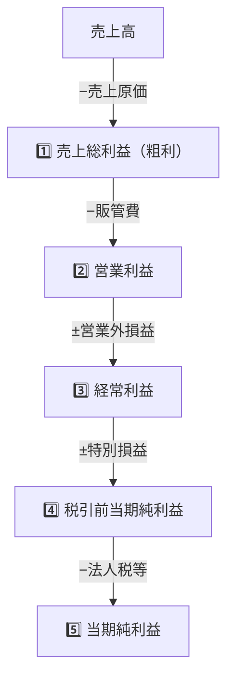
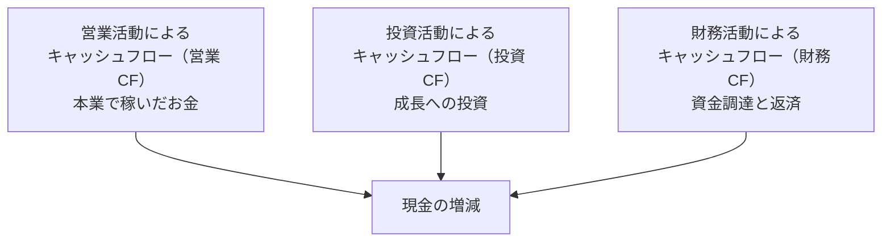
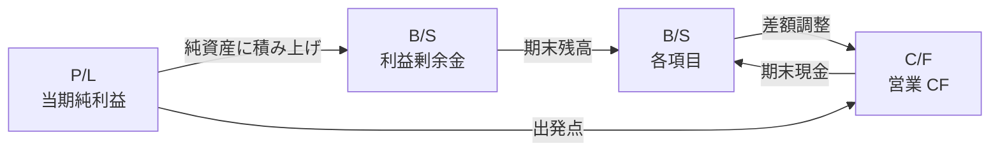

# 財務諸表の読み方

三表から会社を読み解く——簿記なしで身につける経営リテラシー

| 項目 | 内容 |
|---|---|
| カテゴリー | ビジネススキル |
| 難易度 | 初級〜中級 |
| 所要時間 | 約200分（全8レッスン） |
| 公開日 | 2026-06-23 |
| 最終更新日 | 2026-06-23 |
| コースURL | https://skillup.college/courses/business/financial-statements-basics/ |

## 対象者

業種・職種を問わず、業務で「会社の数字」と向き合う必要のあるすべての方。中堅企業の事業部長・部長・課長、経営企画担当、営業のキーアカウントマネジャー、コンサルタント、人事の経営層向け企画担当、社内転換やマネジメント階層を上げる予定の方など。簿記資格を持たない方を主対象に、「資格対策ではなく実務での読解スキル」として設計。

## 前提知識

特になし。簿記の知識・資格は不要。中学校レベルの算数（四則演算、割合）ができれば十分。Excel・スプレッドシートの基本操作経験があると、業界比較の演習で役立つ。

## 学習目標

- 財務諸表の役割と三表（P/L・B/S・C/F）の関係を理解する
- 損益計算書（P/L）の 5 段階利益と業種別の構造を読める
- 貸借対照表（B/S）の左右構造（資産・負債・純資産）から会社の体質を読める
- キャッシュフロー計算書（C/F）の 3 区分と 8 つのパターン分類で経営の現実を読める
- 三表の連環で「儲かっているのに倒産」「赤字でも生き残る」のからくりを理解する
- 主要な財務指標（収益性・安全性・効率性・成長性）を組み合わせて使える
- 業界別（製造・小売・SaaS・金融・スタートアップ）の財務諸表の特徴を把握する
- 決算短信の構造と AI 時代の財務分析ツールを使いこなす入口に立つ

## コース概要

「決算書を読めるようになりたいけれど、簿記から学ぶのは荷が重い」「経営会議で財務の話題になると黙ってしまう」「上場企業の決算短信を見ても、どこを見ればよいかわからない」——事業部長・部長・課長・経営企画担当・キーアカウントマネジャー・コンサルタントなど、業務で「会社の数字」と向き合う方々の共通の悩みです。本コースは、財務諸表を「資格対策の対象」ではなく「会社を読み解く実務スキル」として、8 レッスンで体系的に学びます。三表（P/L・B/S・C/F）の構造、三表の連環、主要な財務指標（収益性・安全性・効率性・成長性）、業界別の特徴（製造・小売・SaaS・金融・スタートアップ）、決算短信と AI 時代の財務分析ツールまで、簿記の専門知識を持たない方が「数字で会社を理解する」感覚を持ち帰れる構成です。書く力（仕訳を切る）ではなく、読む力（決算書を解釈する）に集中しています。

## 学習の流れ

レッスン 1 で財務諸表の役割と本コースの位置づけを共有します。レッスン 2 〜 4 が三表編で、損益計算書（L2）、貸借対照表（L3）、キャッシュフロー計算書（L4）と順番に扱います。三表それぞれを単独で理解するのが前半の目標です。レッスン 5 は連環編で、三表のつながりから「儲かっているのに倒産」「赤字でも生き残る」のからくりを解き明かします。レッスン 6 は指標編で、収益性・安全性・効率性・成長性の代表的な指標を、業界平均との比較で使いこなす技術を学びます。レッスン 7 は業界別編で、製造業・小売・SaaS・金融・スタートアップの特徴を整理します。最後のレッスン 8 で、実務の決算短信の読み方、AI 時代の財務分析ツール、修了後の学習方向（管理会計・IFRS・コーポレートファイナンス）を案内します。前半（1〜4）は「三表を読む」、中盤（5〜6）は「連環と指標で読み解く」、後半（7〜8）は「業界別と実戦」の三段構成です。

## レッスン一覧

| No. | タイトル | 概要 | 所要時間 |
|---|---|---|---|
| 1 | 財務諸表とは何か——「会社を読み解く言葉」と本コースの位置づけ | 財務諸表の定義と役割、三表（P/L・B/S・C/F）の関係、簿記との違い、誰が何のために読むのか、会計基準（日本基準・IFRS）、本コースの守備範囲を学ぶ | 25分 |
| 2 | 損益計算書（P/L）——会社が稼いだか、稼げなかったか | P/L の構造（5 段階利益）、売上総利益（粗利）・営業利益・経常利益・税引前利益・当期純利益、販管費の中身、業種別の利益構造、P/L から見える経営者の意志を学ぶ | 25分 |
| 3 | 貸借対照表（B/S）——会社が何を持ち、何を借りているか | B/S の構造（左右の意味）、資産（流動・固定）の意味、負債（流動・固定）の意味、純資産（自己資本）の意味、流動性の発想、業種別の B/S の特徴、B/S から見える会社の体質を学ぶ | 25分 |
| 4 | キャッシュフロー計算書（C/F）——お金は実際にどう動いたか | C/F の 3 区分（営業・投資・財務）、P/L の利益と C/F が違う理由、営業 CF（実際の稼ぐ力）、投資 CF（成長への投資）、財務 CF（資金調達と返済）、C/F の 8 パターン分類を学ぶ | 25分 |
| 5 | 三表のつながり——P/L・B/S・C/F の連環で読み解く | 当期純利益が B/S 純資産に流れる連環、P/L と C/F の差額調整、運転資金の発想、「儲かっているのに倒産」「赤字でも生き残る」のからくり、三表で会社の物語を読む発想を学ぶ | 25分 |
| 6 | 財務指標の読み方——収益性・安全性・効率性・成長性 | 収益性（売上総利益率、営業利益率、ROE、ROIC、ROA）、安全性（自己資本比率、流動比率、当座比率）、効率性（総資産回転率、棚卸資産回転日数）、成長性（売上・利益成長率）と業界比較を学ぶ | 25分 |
| 7 | 業界別の財務諸表の特徴——製造・小売・SaaS・金融・スタートアップ | 製造業（設備投資・棚卸資産・減価償却）、小売・流通（在庫回転・店舗投資）、SaaS・IT（MRR/ARR・CAC・LTV・繰延収益）、金融（BIS 規制・自己資本比率）、スタートアップ（赤字経営・バーンレート・ランウェイ）を学ぶ | 25分 |
| 8 | 決算短信と AI 時代の財務分析——実務での読み方と修了後 | 決算短信の構造と読み方、注記の重要性、セグメント情報、経営者による分析（MD&A）、2026 年 6 月時点の AI 財務分析ツール（ChatGPT・Claude・Bloomberg GPT・xbrl Japan）、修了後の学習方向（管理会計・IFRS・コーポレートファイナンス）を学ぶ | 25分 |

---

## レッスン1：財務諸表とは何か——「会社を読み解く言葉」と本コースの位置づけ

（所要時間：25分）

### このレッスンで学ぶこと

- 財務諸表の定義と「会社を読み解く言葉」としての役割を理解する
- 三表（P/L・B/S・C/F）それぞれの目的を整理する
- 簿記との違い（書く力と読む力の分離）を把握する
- 誰が、何のために、財務諸表を読むのかを理解する
- 会計基準（日本基準・IFRS・米国基準）の基本を知る
- 本コースの守備範囲と「資格試験対策ではない」スタンスを把握する

---

「決算書」「P/L」「B/S」「キャッシュフロー」——ビジネスの会議で耳にする言葉ですが、いざ「読んでみて」と言われると、どこを見ればよいかわからない方が多いのではないでしょうか。簿記の勉強を始めようとすると、仕訳・勘定科目・複式簿記の原理など、学ぶことが多く、続かなかった経験を持つ方もいるかもしれません。本コースは、簿記の知識がなくても、財務諸表を「読める」ようにするための実務コースです。本レッスンは、コース全体の前提として、財務諸表の役割と本コースの位置づけを共有することから始めます。

### 財務諸表の定義

本コースでは、財務諸表（financial statements）を次のように定義します。

> 会社の経済活動の結果を、定められた書式で要約した報告書の集合。会社を外側から読み解くための「公式の言葉」。

この定義の鍵は 3 つです。

#### 1. 「経済活動の結果」

会社は日々、商品を売り、原材料を仕入れ、人を雇い、設備に投資し、お金を借ります。これらすべての経済活動が、最終的に数字としてまとまったものが財務諸表です。会社の「行動の記録」とも言えます。

#### 2. 「定められた書式」

財務諸表の書式は、自由ではありません。会計基準（日本基準・IFRS・米国基準など）で定められたルールに従って作成されます。これにより、異なる会社同士の比較が可能になります。「A 社の決算書は読めるが B 社のは読めない」という事態を防ぐ、共通言語としての役割を持ちます。

#### 3. 「会社を外側から読み解く」

財務諸表は、会社の外部の人（投資家、取引先、銀行、就職活動者、顧客など）が「この会社はどんな状態か」を理解するための窓口です。会社の経営者・社員でなくても、財務諸表を読めば、その会社の収益性・安全性・成長性などをある程度把握できます。

> **💡 ポイント**
> 財務諸表は「会社の経済活動の結果を、定められた書式で要約した報告書」。会社を外側から読み解く「公式の言葉」として機能し、異なる会社の比較を可能にします。

### 三表——財務諸表の中核

財務諸表は複数の報告書から構成されますが、その中核となるのが「三表」と呼ばれる 3 つの表です。


#### 損益計算書（P/L、Profit and Loss Statement）

ある一定期間（通常は 1 年間や四半期）に、会社がいくら稼いだか、いくら失ったかを表す表です。「フロー（流れ）の表」。本レッスン後半の参考として、典型的な構造は次の通りです。

```
売上高               1,000
売上原価              -600
売上総利益（粗利）      400
販売費・一般管理費    -250
営業利益              150
営業外損益            +10
経常利益              160
特別損益              -5
税引前当期純利益      155
法人税等             -50
当期純利益            105
```

#### 貸借対照表（B/S、Balance Sheet）

ある時点（決算日など）に、会社が「何を持っているか（資産）」「何を借りているか（負債）」「自分のお金はいくらか（純資産）」を表す表です。「ストック（蓄積）の表」。

```
（資産の部）              （負債の部）
現金・預金     200        買掛金        100
売掛金        300         短期借入金    200
棚卸資産      150         長期借入金    400
建物・設備    500         負債合計      700
土地         200          
                          （純資産の部）
                          資本金        300
                          利益剰余金    350
                          純資産合計    650
資産合計    1,350         負債純資産合計 1,350
```

#### キャッシュフロー計算書（C/F、Cash Flow Statement）

ある一定期間に、会社のお金（キャッシュ）が実際にどれだけ増えたか、減ったかを表す表です。P/L の利益と、実際のお金の動きは違うため、別に作られます。

```
営業 CF（本業で稼いだお金）           120
投資 CF（設備投資・売却）             -80
財務 CF（借入・返済・配当）           -20
現金の増減                            20
期首現金                              180
期末現金                              200
```

#### 三表の役割分担

3 つの表は、見る角度が違います。

| 表 | 何を見るか | 時間軸 |
|---|---|---|
| P/L | 稼ぐ力（フロー） | 一定期間（1 年など） |
| B/S | 蓄積された状態（ストック） | ある時点（決算日） |
| C/F | 実際のお金の動き | 一定期間（1 年など） |

会社全体を理解するには、3 表をセットで読むのが基本です。本コースのレッスン 2〜4 で 1 表ずつ扱い、レッスン 5 で連環を学びます。

> **💡 ポイント**
> 三表とは P/L（一定期間に稼いだか）、B/S（ある時点に何を持ち何を借りているか）、C/F（一定期間にお金がどう動いたか）。見る角度が違うため、3 表をセットで読むのが基本です。

### 簿記との違い——書く力と読む力

「財務諸表を読みたいなら、まず簿記から」と思う方は多いですが、本コースの立場は違います。**書く力（簿記）と読む力（読解）は別物で、読む力は簿記の知識がなくても身につく**、というのが本コースの前提です。

#### 簿記とは

簿記（bookkeeping）は、日々の経済活動を「仕訳」という形で記録し、最終的に財務諸表を作る技術です。資格としては「日商簿記検定 3 級・2 級・1 級」などがあります。

簿記が扱う中核：

- 仕訳（左借方・右貸方の記録）
- 勘定科目（現金、売掛金、売上、給料など）
- 試算表の作成
- 決算整理仕訳
- 最終的な財務諸表の作成

#### 書く力と読む力の違い

- **書く力（簿記）**：取引を仕訳に分解し、勘定科目を選び、帳簿に記入する技術
- **読む力（本コース）**：すでに作られた財務諸表を読み、会社の状態を解釈する技術

両者の関係を例えると、料理に近いです。

- **書く力 = 料理人**：素材を選び、調理し、料理を仕上げる
- **読む力 = 食通**：出来上がった料理を味わい、何が使われているか、誰が作ったかを推測する

食通になるのに料理人の修行が必須でないように、財務諸表を読めるようになるのに簿記の修行は必須ではありません。

#### なぜ「書く力」より「読む力」が易しいか

3 つの理由があります。

1. **読む側は「結果」だけ見ればよい**：仕訳のルールや過程を知らなくても、最終的な数字の意味は理解できる
2. **業界・会社固有の処理は会社側の責任**：読む側はそれを信頼して見ればよい
3. **AI 時代に「書く」は自動化されつつある**：会計クラウド（freee・マネーフォワード）が自動仕訳を進化させ、人間の「書く力」の役割は減少。一方「読む力」は AI で代替されにくい

> **💡 ポイント**
> 簿記（書く力）と読解（読む力）は別の技術。読む力は簿記の知識がなくても身につく。本コースは「読む力」に集中、簿記資格対策は別領域に譲ります。

### 誰が、何のために読むのか

財務諸表を読む人は、業務上の立場によって、見る視点が違います。

#### 主な読み手と目的

| 読み手 | 目的 | 重点を置く視点 |
|---|---|---|
| 投資家 | 投資判断（株を買うか売るか） | 収益性・成長性・株主還元 |
| 銀行・債権者 | 貸付判断（お金を貸すか） | 安全性・返済能力 |
| 取引先 | 取引継続判断（取引を続けるか） | 安全性・継続性 |
| 経営者 | 経営判断（戦略策定・改善） | すべて、特に内部管理指標 |
| 従業員 | 自社理解、転職判断 | 収益性・成長性・安定性 |
| 就職活動者 | 入社判断 | 収益性・成長性・福利厚生 |
| 顧客 | 取引相手としての信頼性 | 安全性・継続性 |
| 業界アナリスト | 業界分析・競合比較 | すべて、業界別の特徴 |
| 監査人 | 監査判断 | 妥当性・正確性 |
| 税務当局 | 税務調査 | 適法性・税務処理 |

#### 本コースの読者像

本コースで想定する主な読者は、次のような立場の方です。

- 事業部長・部長・課長など、業務で「数字に責任を持つ」立場
- 経営企画担当・財務担当（実務上、必須スキル）
- 営業のキーアカウントマネジャー（取引先の財務分析）
- コンサルタント（クライアント企業の理解）
- 人事の経営層向け企画担当（経営層との対話）
- マネジャー候補で、次の階層に上がりたい方
- 自社の経営をより深く理解したい一般社員

これらの方は、投資家のような「投資判断」が目的ではなく、「業務の中で会社を理解する」のが主な目的です。本コースは、この読者層に最適化しています。

> **💡 ポイント**
> 財務諸表の読み手は投資家・銀行・経営者・社員・就職活動者など多様で、それぞれ見る視点が違います。本コースの主な読者は、業務で「数字に責任を持つ」立場、「業務の中で会社を理解する」が目的の方々です。

### 会計基準——日本基準・IFRS・米国基準

財務諸表の書式は、世界共通ではありません。国・地域によって基準が違います。

#### 主要な会計基準

| 基準 | 主な利用国・地域 |
|---|---|
| 日本基準 | 日本国内の上場・非上場企業の多く |
| IFRS（国際財務報告基準） | EU、英国、オーストラリア、韓国など 100 か国超 |
| 米国基準（US GAAP） | 米国の上場企業 |
| 中国基準 | 中国本土の企業 |

日本の上場企業の中には、IFRS を任意適用する企業が増えています（2026 年 6 月時点で 250 社超）。米国市場に上場する日本企業は、米国基準で財務諸表を作る場合もあります。

#### 基準による主な違い

- 売上高の認識タイミング（特に長期契約、サブスクリプション）
- のれん（M&A で取得した無形価値）の処理（償却 or 減損のみ）
- 開発費の処理（費用化 or 資産化）
- リース会計（IFRS は原則オンバランス、日本基準も改正で変化中）
- 表示順序（流動性配列 vs 固定性配列）

#### 本コースは「日本基準」を中心に

本コースは、日本企業の財務諸表を読むことを主目的とするため、日本基準を中心に解説します。IFRS との主な違いは、レッスン 8 で補足的に触れます。深く学びたい方は、修了後に IFRS の専門書に進むのが推奨です。

> **💡 ポイント**
> 会計基準は世界共通ではなく、日本基準・IFRS・米国基準などがあります。本コースは日本基準を中心に、必要に応じて IFRS との違いを補足します。

### 本コースの守備範囲

本コースは、財務諸表を「読む」ことに集中します。8 レッスンで以下を扱います。

#### 扱う範囲

- 三表（P/L・B/S・C/F）の構造と読み方
- 三表の連環
- 主要な財務指標（収益性・安全性・効率性・成長性）
- 業界別の財務諸表の特徴
- 決算短信の構造と AI 時代の財務分析

#### 扱わない範囲

- 簿記の仕訳・記帳の技術（書く力は別領域）
- 簿記検定の対策（資格対策は別領域）
- 税務・税法（法人税・消費税の細かい計算）
- 監査・内部統制の専門領域
- 連結会計の複雑な処理（基礎のみ触れる）
- IFRS の詳細（修了後の学習方向として案内）
- コーポレートファイナンス（資本コスト・企業価値評価）
- 管理会計（原価計算・損益分岐点分析）

#### スタンス

本コースは、財務諸表を「資格試験対策の対象」ではなく「業務で会社を読み解く実務スキル」として扱います。簿記の専門知識がなくても、業務に必要な範囲で財務諸表を読めるようになることが目的です。「もっと深く学びたい」と感じた方には、修了後の学習方向を最終レッスンで案内します。

> **💡 ポイント**
> 本コースは三表・連環・指標・業界別・実戦の 5 つを 8 レッスンで扱います。簿記・税務・監査・コーポレートファイナンス・管理会計の詳細は守備範囲外。「業務で会社を読み解く実務スキル」が中核です。

### まとめ

このレッスンでは、以下のことを学びました。

- 財務諸表は「会社の経済活動の結果を、定められた書式で要約した報告書」。会社を外側から読み解く「公式の言葉」
- 三表とは P/L（一定期間に稼いだか）、B/S（ある時点に何を持ち何を借りているか）、C/F（一定期間にお金がどう動いたか）。3 表をセットで読むのが基本
- 簿記（書く力）と読解（読む力）は別の技術。読む力は簿記の知識がなくても身につく。本コースは「読む力」に集中
- 読む人は投資家・銀行・経営者・社員・就職活動者など多様で、視点が違う。本コースの主な読者は業務で「数字に責任を持つ」立場
- 会計基準は世界共通ではなく日本基準・IFRS・米国基準などがある。本コースは日本基準が中心
- 本コースは「三表・連環・指標・業界別・実戦」の 5 つを 8 レッスンで扱う
- 守備範囲外：簿記・税務・監査・コーポレートファイナンス・管理会計の詳細
- スタンス：「資格試験対策ではなく業務で会社を読み解く実務スキル」

次のレッスンでは、三表の第 1 弾、損益計算書（P/L）を扱います。5 段階利益の構造、売上高・売上原価・売上総利益・営業利益・経常利益・税引前利益・当期純利益、業種別の利益構造、P/L から見える経営者の意志を学びます。

---

### 確認クイズ

このレッスンの理解度をチェックしましょう。

#### Q1. 本コースが定義する「財務諸表」として、最も適切なものはどれか？

- [x] 会社の経済活動の結果を、定められた書式で要約した報告書の集合。会社を外側から読み解くための「公式の言葉」
- [ ] 経営者だけが見る秘密の内部資料
- [ ] 自由な書式で作れる経営者の自己アピール文書
- [ ] 個人の銀行通帳のような単純な記録

> **解説**
> 財務諸表は「経済活動の結果」を「定められた書式で要約」した「会社を外側から読み解く公式の言葉」です。秘密でも自由でも単純でもありません。

#### Q2. 三表（P/L・B/S・C/F）の役割分担について、本レッスンが整理した内容はどれか？

- [ ] 3 つの表はすべて同じことを表している
- [x] P/L は「一定期間に稼いだか」（フロー）、B/S は「ある時点に何を持ち何を借りているか」（ストック）、C/F は「一定期間にお金が実際にどう動いたか」を示す。見る角度が違うため、3 表をセットで読むのが基本
- [ ] P/L だけ読めば会社全体がわかる
- [ ] B/S だけ読めば会社全体がわかる

> **解説**
> 三表は見る角度が違います。フロー（P/L）、ストック（B/S）、お金の動き（C/F）の 3 つをセットで読むのが基本です。

#### Q3. 簿記と財務諸表読解の関係について、本レッスンが説明した内容はどれか？

- [ ] 財務諸表を読むには、必ず簿記検定 1 級が必要
- [ ] 簿記と財務諸表読解はまったく同じ
- [x] 書く力（簿記）と読む力（読解）は別の技術。読む力は簿記の知識がなくても身につく。本コースは「読む力」に集中、簿記資格対策は別領域に譲る
- [ ] 簿記を学ばないと財務諸表は理解できない

> **解説**
> 書く力（簿記）と読む力（読解）は別の技術です。読む力は簿記の知識がなくても身につくため、本コースは「読む力」に集中します。

#### Q4. 財務諸表の読み手と目的について、本レッスンが説明した内容はどれか？

- [ ] 読み手は経営者だけ
- [ ] 読み手はすべて同じ視点で見る
- [ ] 読み手は経営者と監査人だけ
- [x] 投資家（投資判断）、銀行（貸付判断）、取引先（取引継続判断）、経営者（経営判断）、社員・就職活動者（自社理解）、コンサルタント（クライアント理解）など多様で、それぞれ見る視点が違う。本コースの主な読者は業務で「数字に責任を持つ」立場で、「業務の中で会社を理解する」が目的

> **解説**
> 読み手は多様で、それぞれ見る視点が違います。本コースは「業務で会社を理解する」が目的の方々を主対象に設計されています。

#### Q5. 会計基準について、本レッスンが説明した内容はどれか？

- [x] 会計基準は世界共通ではなく、日本基準・IFRS（国際財務報告基準、EU 等 100 か国超）・米国基準（US GAAP、米国上場企業）・中国基準などがある。日本の上場企業の中には IFRS を任意適用する企業が増えている（2026 年 6 月時点で 250 社超）。本コースは日本基準を中心に解説
- [ ] 会計基準は世界共通の 1 つだけ
- [ ] 会計基準は各社が自由に決められる
- [ ] 会計基準は財務諸表とは無関係

> **解説**
> 会計基準は世界共通ではなく、日本基準・IFRS・米国基準などがあります。本コースは日本基準を中心に、必要に応じて IFRS との違いを補足します。

#### Q6. 本コースの守備範囲とスタンスについて、本レッスンが説明した内容はどれか？

- [ ] 簿記検定の対策と税務処理が中心
- [x] 三表・連環・指標・業界別・実戦の 5 つを 8 レッスンで扱い、簿記・税務・監査・コーポレートファイナンス・管理会計の詳細は守備範囲外。スタンスは「資格試験対策ではなく業務で会社を読み解く実務スキル」
- [ ] 連結会計とコーポレートファイナンスが中心
- [ ] 監査と内部統制が中心

> **解説**
> 本コースは「業務で会社を読み解く実務スキル」が中核で、三表・連環・指標・業界別・実戦の 5 つを扱います。簿記・税務・監査などの詳細は守備範囲外です。

---

## レッスン2：損益計算書（P/L）——会社が稼いだか、稼げなかったか

（所要時間：25分）

### このレッスンで学ぶこと

- 損益計算書（P/L）の役割と構造を理解する
- 5 段階の利益（売上総利益・営業利益・経常利益・税引前当期純利益・当期純利益）の意味を整理する
- 売上原価と販管費の中身を把握する
- 営業外損益・特別損益の扱いを理解する
- 業種別の利益構造の違いを把握する
- P/L から見える「経営者の意志」を読み取る発想を持つ

---

前回のレッスンで財務諸表の役割と本コースの位置づけを共有しました。本レッスンから、三表編に入ります。最初に扱うのは、もっとも親しみやすい損益計算書（P/L、Profit and Loss Statement、または Income Statement）。会社が「ある一定期間にいくら稼いだか、いくら失ったか」を表す表です。新聞や会社案内の「売上高 1,000 億円、営業利益 100 億円」という表現は、すべて P/L の数字です。

### 損益計算書（P/L）の役割

P/L は「一定期間（通常は 1 年間や四半期）の経営活動の結果」を表します。1 年経って「いくら売って、いくらかかって、いくら残ったか」をまとめた成績表です。

#### P/L が答える 3 つの問い

P/L を読むと、次の 3 つがわかります。

| 問い | P/L のどこを見るか |
|---|---|
| 会社はどれだけ大きいか | 売上高 |
| 会社は儲かっているか | 各段階の利益 |
| 会社の儲けの構造はどうか | 売上 → 各段階の利益の流れ |

特に「儲けの構造」を見るのが、P/L の真の価値です。同じ「営業利益 100 億円」でも、売上 1,000 億円から作った場合と、売上 10,000 億円から作った場合では意味が違います。

#### P/L の特徴：「フロー」の表

P/L は、ある期間（例：2025 年 4 月 1 日 〜 2026 年 3 月 31 日）の「流れ」を表します。期間の終わりにリセットされ、翌期はゼロから始まります。これに対し、貸借対照表（B/S）は「ある時点の蓄積」（次回のレッスン 3 で扱う）です。

> **💡 ポイント**
> P/L は「一定期間に稼いだか」を表すフロー（流れ）の表。会社の大きさ（売上）と儲け（利益）と儲けの構造（売上から利益への流れ）の 3 つがわかります。

### 5 段階の利益——P/L の中核

P/L の中核は、「5 段階の利益」です。日本基準の P/L では、上から順に 5 つの利益が並びます。



#### 1 段階目：売上総利益（粗利）

> 売上総利益 = 売上高 − 売上原価

「商品を仕入れて売る」「製品を作って売る」の差額です。「粗利（あらり）」とも呼ばれます。商品・サービスそのものの儲け力を表します。

例（小売店）：

```
売上高（年間）：1,000
売上原価（仕入れコスト）：600
売上総利益（粗利）：400
```

粗利率（売上総利益率）：400 ÷ 1,000 = 40%

#### 2 段階目：営業利益

> 営業利益 = 売上総利益 − 販売費及び一般管理費（販管費）

粗利から、販管費（家賃、人件費、広告費、通信費、減価償却費など）を引いたものです。「本業で稼いだ利益」を表します。投資家や経営者がもっとも注目するのが、この営業利益です。

```
売上総利益：400
販管費：250
営業利益：150
```

営業利益率：150 ÷ 1,000 = 15%

#### 3 段階目：経常利益（けいじょうりえき）

> 経常利益 = 営業利益 ± 営業外損益

営業利益に、「本業以外の経常的な損益」を加減したものです。営業外損益には、受取利息（プラス）、支払利息（マイナス）、為替差損益などが含まれます。

```
営業利益：150
営業外収益：+15（受取利息など）
営業外費用：-5（支払利息など）
経常利益：160
```

経常利益は「本業 + 財務活動を含めた、毎期繰り返される儲け」を表します。日本企業では伝統的に重視されますが、IFRS や米国基準では経常利益という区分はありません。

#### 4 段階目：税引前当期純利益

> 税引前当期純利益 = 経常利益 ± 特別損益

経常利益に、「臨時的・突発的な損益」を加減したものです。特別利益（固定資産売却益、保険差益など）、特別損失（災害損失、減損損失、リストラ費用など）が含まれます。

```
経常利益：160
特別利益：+5（土地売却益）
特別損失：-10（工場の減損）
税引前当期純利益：155
```

#### 5 段階目：当期純利益

> 当期純利益 = 税引前当期純利益 − 法人税等

法人税・住民税・事業税を引いた、最終的な利益です。「当期純利益」または「純利益」「ボトムライン（bottom line、P/L の一番下）」と呼ばれます。株主への配当の元となり、内部留保（B/S の利益剰余金）に積み上がります。

```
税引前当期純利益：155
法人税等：50
当期純利益：105
```

#### 5 段階を一覧で

```
売上高               1,000
売上原価              -600
─────────────────────
売上総利益（粗利）      400  ← 1 段階目
販管費               -250
─────────────────────
営業利益              150  ← 2 段階目
営業外収益            +15
営業外費用             -5
─────────────────────
経常利益              160  ← 3 段階目
特別利益              +5
特別損失             -10
─────────────────────
税引前当期純利益      155  ← 4 段階目
法人税等              -50
─────────────────────
当期純利益            105  ← 5 段階目
```

> **💡 ポイント**
> P/L には 5 段階の利益があります。①売上総利益（粗利、商品の儲け力）、②営業利益（本業の儲け）、③経常利益（本業＋財務活動の儲け）、④税引前当期純利益（特別損益を含む）、⑤当期純利益（最終利益）。それぞれの段階で「儲けの種類」が変わります。

### 売上原価と販管費——コストの 2 大区分

P/L の理解で外せないのが、「売上原価」と「販管費（販売費及び一般管理費）」の違いです。

#### 売上原価とは

商品・サービスを「直接生み出すコスト」です。業種によって中身が違います。

| 業種 | 売上原価の中身 |
|---|---|
| 小売 | 商品の仕入れ価格 |
| 製造業 | 原材料費、製造現場の人件費、製造設備の減価償却 |
| 飲食 | 食材費、調理人件費 |
| サービス業（コンサル） | コンサルタントの人件費（直接稼働分） |
| SaaS | サーバー費、エンジニア人件費（直接プロダクト開発） |

#### 販管費とは

商品・サービスを「売る・支える」コストです。販売費（営業活動）と一般管理費（管理部門）の総称。

| 区分 | 例 |
|---|---|
| 販売費 | 営業人件費、広告宣伝費、販売手数料、運送費 |
| 一般管理費 | 役員報酬、本社人件費、家賃、減価償却費（本社建物）、通信費、消耗品費、研究開発費 |

#### 「直接コスト」と「間接コスト」の区別

- 売上原価：商品・サービスを直接生み出すコスト（直接コスト）
- 販管費：商品・サービスを支えるコスト（間接コスト）

業種ごとに区分は変わりますが、この発想を持っておくと P/L の読み方が変わります。

#### 業種で違う「売上原価率」

売上原価率（売上原価 ÷ 売上高）は、業種ごとに大きく違います。

| 業種 | 売上原価率の目安 |
|---|---|
| 小売（スーパー） | 70〜80% |
| 小売（ブランド品） | 30〜50% |
| 製造業（一般） | 60〜75% |
| 飲食 | 25〜35%（食材費のみ） |
| サービス業 | 30〜60% |
| SaaS（高粗利） | 10〜30% |

「同じ売上原価率」でも、業種が違えば意味が違います。業種比較するときは、同業種の平均値と比べます。

> **💡 ポイント**
> 売上原価は「商品・サービスを直接生み出すコスト」、販管費は「商品・サービスを支えるコスト」。業種により中身も比率も大きく違うため、業種平均と比較して読みます。

### 営業外損益と特別損益——「経常」「特別」の意味

3 段階目以降の利益で出てくる「営業外損益」と「特別損益」の違いを整理します。

#### 営業外損益——「経常的だが本業ではない」

毎期繰り返し発生するが、本業ではない損益。

| 種類 | 主な項目 |
|---|---|
| 営業外収益 | 受取利息、受取配当金、為替差益、雑収入 |
| 営業外費用 | 支払利息、為替差損、雑損失 |

例えば、預金から発生する利息（受取利息）は、毎期発生しますが、本業の商品販売ではありません。借入金の支払利息も、本業のコストではないが、財務活動として毎期発生します。

#### 特別損益——「臨時的・突発的」

その期だけの臨時の損益。

| 種類 | 主な項目 |
|---|---|
| 特別利益 | 固定資産売却益、保険差益、過年度損益修正益 |
| 特別損失 | 固定資産売却損、災害損失、減損損失、リストラ費用、訴訟損失 |

例えば、保有していた土地を売って利益が出た場合は「固定資産売却益」として特別利益になります。工場が老朽化して帳簿価額を下回ったので評価を下げた場合は「減損損失」として特別損失になります。

#### なぜ区別するか

P/L で営業外損益と特別損益を区別する目的は、「本業の力」と「臨時の影響」を分けて読みたいから、です。

- 営業利益（本業の力）→ 来期も繰り返される
- 経常利益（本業 + 経常的な財務活動）→ 来期も繰り返される
- 当期純利益（特別損益を含む）→ 来期は変わる可能性

例えば、「当期純利益 1 億円」という会社が、実は「営業赤字 5 億円、土地売却で特別利益 7 億円」だったとしたら、来期の見通しは厳しいと判断できます。営業赤字の本業はそのまま、土地という資産も既に売ってしまっているので、来期は同じ利益を出せません。

> **💡 ポイント**
> 営業外損益は「経常的だが本業ではない」、特別損益は「臨時的・突発的」。区別する目的は、「本業の力」と「臨時の影響」を分けて読むため。当期純利益だけで判断せず、5 段階の利益のどこから利益が出ているかを見ます。

### 業種別の利益構造の違い

業種によって、P/L の「利益構造」は大きく違います。

#### 高粗利・低営業利益型（例：SaaS、コンサル）

- 売上原価率：低い（10〜30%）
- 販管費率：高い（営業・マーケ・開発が大きい）
- 営業利益率：中程度（10〜30%）

成長期は赤字でもよいビジネス。粗利は高いが、販管費（営業・マーケ・開発）で投資する。Salesforce、Workday などの成熟 SaaS は営業利益率 15〜25%。

#### 低粗利・低営業利益型（例：スーパー、商社、卸売）

- 売上原価率：高い（80〜95%）
- 販管費率：低めだが、絶対額は大きい
- 営業利益率：低い（1〜5%）

薄利多売のビジネス。粗利は低いが、回転で稼ぐ。イオン、セブン&アイ、商社の卸売部門など。

#### 高粗利・高営業利益型（例：高級ブランド、製薬大手）

- 売上原価率：低い（30〜50%）
- 販管費率：中程度
- 営業利益率：高い（20〜30% 以上）

ブランド力・知的財産で稼ぐビジネス。LVMH、エルメス、武田薬品など。

#### 設備投資型（例：製造業、電力、通信）

- 売上原価率：中程度（60〜75%）
- 販管費率：中程度（減価償却が大きい）
- 営業利益率：中程度（5〜15%）

巨額の設備投資が必要なビジネス。減価償却費が販管費の大きな部分を占める。トヨタ自動車、東京電力、NTT など。

#### 業種を理解せずに比較しない

新任の方が陥りやすいのが、「営業利益率の絶対値で会社を評価する」発想です。例えば「A 社は営業利益率 25% で、B 社は 5% だから A 社が優れている」と判断するのは早計です。A 社が高級ブランド（高粗利型）、B 社がスーパー（低粗利型）ならば、業種が違うので比較できません。同業種の平均値と比較するのが基本です。

> **💡 ポイント**
> 業種別に P/L の利益構造は大きく違います。高粗利・低営業利益型（SaaS）、低粗利・低営業利益型（小売）、高粗利・高営業利益型（ブランド）、設備投資型（製造業）など。同業種の平均と比較するのが基本です。

### P/L から見える経営者の意志

P/L を読む醍醐味は、数字の裏に経営者の意志が見えることです。

#### 投資判断の意志——「販管費の使い方」

販管費の中身を見ると、経営者が「どこに投資しているか」がわかります。

- 広告宣伝費が前年比 +50%：マーケティング投資を強化
- 研究開発費が前年比 +30%：技術開発に注力
- 営業人件費が前年比 -20%：営業組織を縮小
- 役員報酬が前年比 +200%：経営層の処遇改善

#### 業績見通しの意志——「特別損失の計上」

特別損失の計上タイミングも、経営者の意志を表します。

- 大規模な減損損失を計上：将来の業績見通しを下方修正
- リストラ費用を計上：構造改革に踏み込む
- 訴訟損失を計上：法務リスクを整理

#### 将来への布石——「研究開発費・人件費」

P/L の数字は、過去の結果であると同時に、将来への布石です。研究開発費・人件費の増減は、「数年後の P/L」への投資を意味します。

#### 数字の背景にあるストーリー

優れた事業部長・マネジャー・コンサルタントは、P/L の数字から「なぜこの数字になったか」というストーリーを読み取れます。

例：

```
売上高：前年比 +20%（事業成長）
売上総利益率：40% → 35%（粗利率の低下）
販管費：前年比 +30%（広告投資の増加）
営業利益率：15% → 8%（営業利益率の低下）
```

このパターンを見たら、「成長フェーズで、粗利を犠牲にしても市場拡大を取りに行き、広告投資で売上を伸ばしている」というストーリーが推測できます。経営者は意図的に短期の利益率を下げて、長期の市場ポジションを取りに行っているかもしれません。

P/L を読むのは、数字の暗記ではなく、「数字から経営の物語を読み取る」読解です。これが、本コースが推奨するスタンスです。

> **💡 ポイント**
> P/L の数字の裏には経営者の意志があります。投資判断（販管費の使い方）、業績見通し（特別損失の計上）、将来への布石（研究開発・人件費）など。数字から「経営の物語」を読み取るのが、優れた P/L 読解の本質です。

### まとめ

このレッスンでは、以下のことを学びました。

- P/L は「一定期間に稼いだか」を表すフロー（流れ）の表。会社の大きさ（売上）と儲け（利益）と儲けの構造の 3 つがわかる
- 5 段階の利益：①売上総利益（粗利）、②営業利益、③経常利益、④税引前当期純利益、⑤当期純利益
- 売上原価は「商品・サービスを直接生み出すコスト」、販管費は「支えるコスト」。業種により中身も比率も違う
- 営業外損益は「経常的だが本業ではない」、特別損益は「臨時的・突発的」。「本業の力」と「臨時の影響」を分けて読む
- 業種別の利益構造：高粗利・低営業利益型（SaaS）、低粗利・低営業利益型（小売）、高粗利・高営業利益型（ブランド）、設備投資型（製造業）など、業種平均と比較する
- P/L の数字には経営者の意志が映る：販管費の使い方（投資判断）、特別損失の計上（業績見通し）、研究開発費・人件費（将来への布石）
- 「数字から経営の物語を読み取る」のが P/L 読解の本質

次のレッスンでは、三表の第 2 弾、貸借対照表（B/S）を扱います。左右の構造、資産（流動・固定）の意味、負債（流動・固定）の意味、純資産（自己資本）の意味、流動性の発想、業種別の B/S の特徴を学びます。

---

### 確認クイズ

このレッスンの理解度をチェックしましょう。

#### Q1. 損益計算書（P/L）の特徴と役割について、本レッスンが説明した内容はどれか？

- [x] 一定期間（通常は 1 年間や四半期）の経営活動の結果を表すフロー（流れ）の表。会社の大きさ（売上高）、儲け（各段階の利益）、儲けの構造（売上から利益への流れ）の 3 つがわかる
- [ ] ある時点の蓄積を表すストックの表
- [ ] お金の動きを表すキャッシュフローの表
- [ ] 会社の社員数や規模を表す表

> **解説**
> P/L は「一定期間に稼いだか」を表すフロー（流れ）の表です。ある時点のストックを表すのは B/S、お金の動きを表すのは C/F です。

#### Q2. P/L の 5 段階の利益として、本レッスンが整理した内容はどれか？

- [ ] 「給与利益・賞与利益・年金利益・福利厚生利益・退職金利益」
- [x] 「売上総利益（粗利、売上高 − 売上原価）」「営業利益（売上総利益 − 販管費、本業の儲け）」「経常利益（営業利益 ± 営業外損益、本業 + 経常的な財務活動）」「税引前当期純利益（経常利益 ± 特別損益）」「当期純利益（税引前 − 法人税等、最終利益）」の 5 段階
- [ ] 「過去利益・現在利益・未来利益・想定利益・希望利益」
- [ ] 「東京利益・大阪利益・名古屋利益・福岡利益・札幌利益」

> **解説**
> 5 段階の利益は「売上総利益・営業利益・経常利益・税引前当期純利益・当期純利益」です。それぞれ「儲けの種類」が変わります。

#### Q3. 売上原価と販管費の違いについて、本レッスンが説明した内容はどれか？

- [ ] 売上原価と販管費はまったく同じ
- [ ] 売上原価は「販売活動のコスト」、販管費は「製造コスト」
- [x] 売上原価は「商品・サービスを直接生み出すコスト」（小売の仕入れ、製造業の原材料・製造人件費、SaaS のサーバー費・直接エンジニア人件費など）、販管費は「商品・サービスを支えるコスト」（営業人件費、広告費、本社人件費、家賃、減価償却費など）。業種により中身も比率も大きく違う
- [ ] 売上原価と販管費の区別は重要でない

> **解説**
> 売上原価は「直接生み出すコスト」、販管費は「支えるコスト」です。業種により中身と比率が大きく違うため、業種平均と比較して読みます。

#### Q4. 営業外損益と特別損益の違いについて、本レッスンが説明した内容はどれか？

- [ ] 営業外損益と特別損益は同じ
- [ ] 営業外損益は「臨時的」、特別損益は「経常的」
- [ ] どちらも本業のコスト
- [x] 営業外損益は「経常的だが本業ではない」（受取利息、支払利息、為替差損益など）、特別損益は「臨時的・突発的」（固定資産売却益、災害損失、減損損失、リストラ費用など）。区別する目的は「本業の力」と「臨時の影響」を分けて読むため

> **解説**
> 営業外損益は「経常的だが本業ではない」、特別損益は「臨時的・突発的」です。区別の目的は「本業の力」と「臨時の影響」を分けて読むためです。

#### Q5. 業種別の利益構造について、本レッスンが説明した内容はどれか？

- [x] 業種により利益構造は大きく違う。高粗利・低営業利益型（SaaS、コンサル、成長期は赤字でも投資）、低粗利・低営業利益型（スーパー、商社、薄利多売）、高粗利・高営業利益型（高級ブランド、製薬、ブランド力で稼ぐ）、設備投資型（製造業、電力、減価償却が大きい）など。「営業利益率の絶対値だけで比較する」のは誤りで、同業種の平均と比較するのが基本
- [ ] 業種に関係なく営業利益率の絶対値で比較すればよい
- [ ] すべての業種は同じ利益構造
- [ ] 営業利益率が高い業種が常に優れている

> **解説**
> 業種により利益構造が大きく違うため、絶対値での比較は誤りです。同業種の平均と比較するのが基本です。

#### Q6. P/L から経営者の意志を読み取る発想について、本レッスンが説明した内容はどれか？

- [ ] P/L の数字に経営者の意志は映らない
- [x] P/L の数字の裏には経営者の意志がある：投資判断（販管費の使い方、広告投資・研究開発費・採用人件費の増減）、業績見通し（特別損失の計上タイミング）、将来への布石（研究開発費・人件費）。表面的な営業利益の増減だけ見るのではなく、販管費の中身・業界文脈・経営者の戦略を合わせて読む。「数字から経営の物語を読み取る」のが P/L 読解の本質
- [ ] P/L は機械的な計算結果にすぎない
- [ ] 経営者の意志は P/L とは無関係

> **解説**
> P/L の数字には経営者の意志が映ります。販管費の使い方、特別損失の計上、研究開発費の増減など、「数字から経営の物語を読み取る」のが本質です。

---

## レッスン3：貸借対照表（B/S）——会社が何を持ち、何を借りているか

（所要時間：25分）

### このレッスンで学ぶこと

- 貸借対照表（B/S）の役割と「左右が必ず一致する」構造を理解する
- 資産（流動資産・固定資産）の中身と意味を把握する
- 負債（流動負債・固定負債）の中身と意味を理解する
- 純資産（自己資本）の中身と「会社の自分のお金」の発想を持つ
- 流動性の発想と「短期で支払えるか」の見方を扱える
- 業種別の B/S の特徴を把握する
- B/S から見える「会社の体質」を読み取る発想を持つ

---

前回のレッスンで損益計算書（P/L）を扱いました。本レッスンは三表の第 2 弾、貸借対照表（B/S、Balance Sheet）を扱います。P/L が「一定期間の流れ」を表すフロー（流れ）の表だったのに対し、B/S は「ある時点の蓄積」を表すストック（蓄積）の表です。決算日（例：3 月 31 日）時点で、「会社が何を持ち、何を借りているか」のスナップショットを表します。新任の方が最初に戸惑いやすい表ですが、構造を理解すれば「会社の体質」が見えてきます。

### 貸借対照表（B/S）の役割と構造

B/S は「ある時点（決算日など）に、会社が何を持ち、何を借り、いくらが自分のお金かを表す表」です。

#### B/S が答える 3 つの問い

| 問い | B/S のどこを見るか |
|---|---|
| 会社は何を持っているか | 資産の部 |
| 何を借りているか（誰のお金で） | 負債の部 |
| 自分のお金はいくらあるか | 純資産の部 |

#### B/S の左右構造

B/S の最大の特徴は、左右が必ず一致することです。

```
（左側）             （右側）
資産の部              負債の部
  流動資産              流動負債
  固定資産              固定負債
                      純資産の部
                        資本金
                        利益剰余金
資産合計  = 負債合計 + 純資産合計
```

なぜ左右が一致するか。これは「会社が持っているもの（左）は、調達したお金で買ったもの（右）」という会計の基本恒等式です。

```
資産 = 負債 + 純資産

「持っているもの」 = 「借りたお金」 + 「自分のお金」
```

例えば、会社が現金 1,000 万円を持っているとします。これはどこから来たか？  借りた（負債）か、自分で出資・稼いだ（純資産）か、のどちらかです。

#### B/S は「ある時点のスナップショット」

B/S は決算日（年に 1 度、または四半期ごとに 4 回）の「その瞬間」を表します。翌日には数字が変わっています。P/L のように 1 年分の合計ではなく、「ある瞬間の写真」が B/S です。

> **💡 ポイント**
> B/S は「ある時点に会社が何を持ち、何を借り、いくらが自分のお金か」を表すストック（蓄積）の表。左右は必ず一致する（資産 = 負債 + 純資産）。会計の基本恒等式です。

### 資産の部——会社が「持っているもの」

資産の部は、会社が所有する「経済的価値のあるもの」をまとめます。流動性（現金に変えやすさ）で「流動資産」と「固定資産」に大きく区分されます。

#### 流動資産——1 年以内に現金になるもの

```
流動資産
  現金及び預金        200
  受取手形・売掛金    300
  有価証券             50
  棚卸資産（在庫）    150
  前払費用              20
  流動資産合計        720
```

#### 主な流動資産の意味

| 項目 | 意味 |
|---|---|
| 現金・預金 | そのまま使えるお金 |
| 受取手形・売掛金 | 商品を売ったがまだ回収していないお金 |
| 有価証券 | 短期で売る予定の株式・債券 |
| 棚卸資産（在庫） | 仕入れたが売れていない商品、製造中の製品 |
| 前払費用 | すでに支払ったが、来期以降のサービス |

#### 固定資産——長期で使うもの

```
固定資産
  有形固定資産
    建物                400
    機械装置            200
    車両運搬具           20
    土地                150
    建設仮勘定           10
  無形固定資産
    のれん               80
    ソフトウェア          40
  投資その他の資産
    投資有価証券        100
    関係会社株式         50
  固定資産合計          1,050
```

#### 主な固定資産の意味

| 項目 | 意味 |
|---|---|
| 建物・機械装置・車両 | 業務で使う物理的な設備 |
| 土地 | 工場・店舗・本社の敷地 |
| のれん | M&A で買収した会社の「ブランド価値」「顧客基盤」など |
| ソフトウェア | 業務システム、自社開発ソフト |
| 投資有価証券 | 長期保有目的の株式・債券 |
| 関係会社株式 | 子会社・関連会社の株式 |

#### 流動・固定の境界——「1 年ルール」

流動と固定の区別は、「1 年以内に現金化する予定か」が基本です（1 年ルール、ワン・イヤー・ルール）。

- 1 年以内に現金化 → 流動資産
- 1 年超で長期保有 → 固定資産

業種により例外はありますが、基本ルールとして覚えておきます。

> **💡 ポイント**
> 資産は「流動資産（1 年以内に現金化）」と「固定資産（長期で使う）」に二分される。流動資産は現金・売掛金・在庫など、固定資産は建物・機械・土地・のれん・ソフトウェアなど。1 年ルールで区別します。

### 負債の部——会社が「借りているお金」

負債の部は、会社が「他者から借りているお金、いずれ返すべきもの」をまとめます。資産と同じく、流動性で「流動負債」と「固定負債」に区分されます。

#### 流動負債——1 年以内に支払うべきもの

```
流動負債
  支払手形・買掛金   200
  短期借入金         150
  未払金              30
  未払法人税等        50
  賞与引当金          40
  流動負債合計       470
```

#### 主な流動負債の意味

| 項目 | 意味 |
|---|---|
| 支払手形・買掛金 | 商品を仕入れたがまだ支払っていない |
| 短期借入金 | 1 年以内に返す予定の借金 |
| 未払金 | サービスを受けたがまだ支払っていない |
| 未払法人税等 | 確定した税金で未払い |
| 賞与引当金 | 翌期に支払う賞与の見込み計上 |

#### 固定負債——1 年超で返済するもの

```
固定負債
  長期借入金         300
  社債               200
  退職給付引当金     130
  固定負債合計       630
```

#### 主な固定負債の意味

| 項目 | 意味 |
|---|---|
| 長期借入金 | 1 年超で返す借金 |
| 社債 | 投資家に発行した借用証書 |
| 退職給付引当金 | 将来の従業員退職金の見込み計上 |

#### 負債は「悪」ではない

新任の方が陥りやすい誤解が、「負債が多いと悪い会社」と決めつけることです。負債は適切に使えば、「他人のお金で投資して儲ける」レバレッジ効果を生みます。

- 銀行からの借入で工場を建て、その工場で利益を出す → 自己資金以上の事業ができる
- 社債を発行して大規模 M&A 投資 → 成長加速

ただし、負債が過大になると、返済負担と倒産リスクが増します。本レッスン後半で扱う「自己資本比率」「流動比率」で、負債の妥当性を判定します。

> **💡 ポイント**
> 負債は「流動負債（1 年以内に支払い）」と「固定負債（1 年超で返済）」に二分される。流動負債は買掛金・短期借入金など、固定負債は長期借入金・社債・退職給付引当金など。負債は「悪」ではなく、適切に使えばレバレッジ効果を生むが、過大になると倒産リスクが増す。

### 純資産の部——「会社の自分のお金」

純資産は、会社が「他者に返す必要のない、自分のお金」です。資本金と利益剰余金を中心に構成されます。

#### 純資産の主な構成

```
純資産の部
  株主資本
    資本金             300
    資本剰余金         100
    利益剰余金         350
    自己株式           -20
  その他の包括利益累計額
    その他有価証券評価差額金   5
  非支配株主持分                15
  純資産合計                   750
```

#### 主な純資産項目の意味

| 項目 | 意味 |
|---|---|
| 資本金 | 株主が会社に出資したお金 |
| 資本剰余金 | 株主出資のうち資本金にしなかった部分 |
| 利益剰余金 | 過去の利益の積み上げ（毎期の純利益から配当を引いた残り） |
| 自己株式 | 自社が買い戻した自社株（マイナス計上） |

#### 「自己資本」と「他人資本」

- 自己資本 = 純資産
- 他人資本 = 負債

自己資本は「返さなくてよい自分のお金」、他人資本は「いずれ返すべき他人のお金」。会社の安全性は、この比率で測れます。

#### 自己資本比率——会社の体力を測る

```
自己資本比率 = 自己資本（純資産）÷ 総資産 × 100%
```

自己資本比率の目安：

| 自己資本比率 | 評価 |
|---|---|
| 40% 以上 | 健全（業界による） |
| 20〜40% | 標準 |
| 10〜20% | やや脆弱（業界による） |
| 10% 未満 | 脆弱（要警戒） |

ただし、業種によって標準値が違います。金融業（銀行・保険）は規制で要求される自己資本比率があり、製造業・小売業とは比較が成立しません。同業種で比較するのが基本です。

> **💡 ポイント**
> 純資産は「他者に返す必要のない、自分のお金」。資本金（株主出資）、利益剰余金（過去の利益の積み上げ）が中心。自己資本比率（純資産 ÷ 総資産）で会社の体力を測る。業種により標準値が違う。

### 流動性の発想——「短期で支払えるか」

B/S を読む発想の中核に、「流動性」があります。

#### 流動比率——1 年で見た支払能力

```
流動比率 = 流動資産 ÷ 流動負債 × 100%
```

- 1 年以内に支払う必要がある負債（流動負債）に対して、1 年以内に現金化できる資産（流動資産）でカバーできるか
- 100% 以上が望ましい、200% 以上だと余裕がある
- 100% 未満は短期支払いに不安

#### 当座比率——もっと厳しい見方

```
当座比率 = 当座資産（現金・売掛金・有価証券）÷ 流動負債 × 100%
```

- 流動資産から在庫（棚卸資産）を除いた「当座資産」だけで、流動負債をカバーできるか
- 在庫は売れないと現金にならないため、より厳しい支払能力の指標
- 100% 以上が望ましい

#### 「儲かっているのに倒産」の典型

流動性が悪い会社の典型例：

- P/L 上は利益が出ている（売上 100、利益 10）
- けれども、売掛金回収が遅く、流動資産の大半が売掛金
- 流動負債（買掛金・短期借入金）が大きく、現金が枯渇

これが「黒字倒産」のパターンです。P/L だけ見ると順調ですが、B/S を見ると、流動性が悪く、支払いが滞っていることが見えてきます。本コースのレッスン 5（連環編）で詳しく扱います。

> **💡 ポイント**
> 流動性は「短期で支払えるか」の発想。流動比率（流動資産 ÷ 流動負債、100% 以上が望ましい）、当座比率（在庫を除く、より厳しい）。P/L で利益が出ていても、B/S の流動性が悪いと「黒字倒産」のリスクあり。

### 業種別の B/S の特徴

業種により B/S の構造は大きく違います。

#### 設備投資型（製造業、電力、通信、鉄道）

- 固定資産（建物・機械・土地）が巨大
- 長期借入金・社債で大規模調達
- 自己資本比率は 30〜50% 程度

トヨタ、東京電力、NTT などは、巨額の設備が B/S の中心を占めます。

#### 在庫回転型（小売、卸売、商社）

- 棚卸資産（在庫）が大きい
- 売掛金・買掛金が回転して動く
- 自己資本比率は 20〜40% 程度

セブン&アイ、ファーストリテイリング、商社などは、在庫と売掛・買掛が中心です。

#### 軽資産型（コンサル、SaaS、IT サービス）

- 固定資産が小さい（オフィスとサーバーくらい）
- 売掛金が中心の流動資産
- 自己資本比率は 50〜80% と高い

野村総合研究所、Salesforce、Workday などの IT サービス系は、物理資産が少なく、自己資本比率が高い傾向。

#### 金融型（銀行、保険、証券）

- 資産の大半が貸付金・有価証券・保険資産
- 負債の大半が預金・保険準備金
- 自己資本比率は 5〜10%（業種特性）

銀行や保険は、業種特性として「他人のお金を預かって運用する」のがビジネスモデルなので、自己資本比率が低くて当たり前です。BIS 規制（バーゼル規制）で最低基準が定められています。

#### 不動産型

- 土地・建物が中心
- 長期借入金が中心
- 開発・販売のサイクルで利益が出る

三井不動産、三菱地所などは、土地と建物が B/S の中心。

業種が違えば、B/S の見方も違います。「自己資本比率が低い銀行は危ない」というのは誤読で、銀行業の構造を理解すれば、低い自己資本比率は当たり前です。

> **💡 ポイント**
> 業種により B/S の構造が大きく違う。設備投資型（製造業、巨大な固定資産）、在庫回転型（小売、在庫と売掛・買掛が中心）、軽資産型（IT、自己資本比率が高い）、金融型（銀行、自己資本比率が低くて当たり前）、不動産型（土地・建物中心）。業種を理解せずに数字を絶対値で比較しない。

### B/S から見える会社の体質

P/L が「経営者の意志」を映すなら、B/S は「会社の体質」を映します。

#### 「健全な成長期」の B/S

```
資産：成長に伴って増加
負債：適度に増えるが、自己資本比率は維持
純資産：利益剰余金が積み上がる
流動比率：150〜200%
```

このような B/S は、無理せず成長している会社の典型です。

#### 「投資先行型」の B/S

```
固定資産：急増（M&A、設備投資）
長期借入金・社債：急増
自己資本比率：低下
営業 CF（次回扱う）：プラス
```

将来への投資を、借入で実行している。経営判断が正しければ、3〜5 年後に利益が伸びて B/S も整います。

#### 「衰退期・赤字続き」の B/S

```
利益剰余金：減少
（過去の累積赤字がマイナス計上）
自己資本比率：低下
固定資産：減損で減少
流動比率：低下
```

過去の赤字が累積し、自己資本が痩せている会社。改革か撤退の判断が必要な状況。

#### B/S は「過去のすべての結果」

B/S の数字は、創業以来のすべての経営判断の結果です。P/L は今期 1 年の結果ですが、B/S は会社の歴史の集積。長期にわたって良い経営をしてきたか、過去の失敗を引きずっているか、すべて B/S に表れます。

> **💡 ポイント**
> B/S は「会社の体質」を映す表。健全な成長期・投資先行型・衰退期で、B/S の表情は変わる。B/S の数字は創業以来のすべての経営判断の結果で、会社の歴史の集積を表します。

### まとめ

このレッスンでは、以下のことを学びました。

- B/S は「ある時点に会社が何を持ち、何を借り、いくらが自分のお金か」を表すストック（蓄積）の表
- 左右は必ず一致する（資産 = 負債 + 純資産）。会計の基本恒等式
- 資産は「流動資産（1 年以内に現金化、現金・売掛金・在庫など）」と「固定資産（長期で使う、建物・機械・土地・のれんなど）」に二分される
- 負債は「流動負債（1 年以内に支払い）」と「固定負債（1 年超で返済）」に二分される。負債は「悪」ではなく、適切に使えばレバレッジ効果を生む
- 純資産は「他者に返す必要のない、自分のお金」。資本金（株主出資）と利益剰余金（過去の利益の積み上げ）が中心
- 流動性の発想：流動比率（100% 以上が望ましい）、当座比率（在庫を除いた厳しい指標）。P/L で利益が出ていても B/S の流動性が悪いと「黒字倒産」のリスクあり
- 業種別の B/S の特徴：設備投資型・在庫回転型・軽資産型・金融型・不動産型。業種を理解せずに絶対値で比較しない
- B/S は「会社の体質」を映す。健全な成長期・投資先行型・衰退期で表情が違う。創業以来のすべての経営判断の結果が映る

次のレッスンでは、三表の第 3 弾、キャッシュフロー計算書（C/F）を扱います。なぜ P/L の利益と実際のお金の動きが違うのか、営業 CF・投資 CF・財務 CF の 3 区分、C/F の 8 パターン分類で経営の現実を読む方法を学びます。

---

### 確認クイズ

このレッスンの理解度をチェックしましょう。

#### Q1. 貸借対照表（B/S）の特徴と左右の関係について、本レッスンが説明した内容はどれか？

- [x] B/S は「ある時点に会社が何を持ち、何を借り、いくらが自分のお金か」を表すストック（蓄積）の表。左右は必ず一致する（資産 = 負債 + 純資産）。会計の基本恒等式
- [ ] B/S は「一定期間の流れ」を表すフローの表
- [ ] B/S の左右は一致しなくてよい
- [ ] B/S は「お金の動き」を表すキャッシュフローの表

> **解説**
> B/S は「ある時点のストック」を表し、左右は必ず一致（資産 = 負債 + 純資産）します。フローは P/L、お金の動きは C/F が表します。

#### Q2. 資産の流動・固定の区分について、本レッスンが説明した内容はどれか？

- [ ] 資産は「商品資産」と「人件費資産」に二分される
- [x] 流動資産は「1 年以内に現金化する予定のもの」（現金・預金、売掛金、有価証券、棚卸資産、前払費用）、固定資産は「長期で使うもの」（建物、機械、土地、のれん、ソフトウェア、投資有価証券）。1 年ルール（ワン・イヤー・ルール）で区別する
- [ ] 流動と固定の区別は重要でない
- [ ] 流動資産は固定資産より価値が高い

> **解説**
> 資産は流動（1 年以内に現金化）と固定（長期で使う）に二分され、1 年ルールで区別します。

#### Q3. 負債について、本レッスンが説明した内容はどれか？

- [ ] 負債は「悪」なので、すべての会社で減らすべき
- [ ] 負債と純資産はまったく同じ
- [x] 負債は「流動負債（1 年以内に支払い、買掛金・短期借入金など）」と「固定負債（1 年超で返済、長期借入金・社債・退職給付引当金など）」に二分される。負債は「悪」ではなく、適切に使えばレバレッジ効果を生むが、過大になると倒産リスクが増す
- [ ] 負債は無限に増やしても問題ない

> **解説**
> 負債は流動と固定に二分され、適切に使えばレバレッジ効果を生みます。「悪」ではないが、過大になると倒産リスクが増します。

#### Q4. 純資産（自己資本）と自己資本比率について、本レッスンが説明した内容はどれか？

- [ ] 純資産は他者に返す必要があるお金
- [ ] 自己資本比率はどの業種でも同じ標準値
- [ ] 純資産は B/S とは無関係
- [x] 純資産は「他者に返す必要のない、自分のお金」。資本金（株主出資）、利益剰余金（過去の利益の積み上げ）が中心。自己資本比率 = 純資産 ÷ 総資産で会社の体力を測る。一般に 40% 以上で健全、業種により標準値が違う（金融業は規制で要求される基準あり）

> **解説**
> 純資産は「返す必要のない自分のお金」、自己資本比率（純資産 ÷ 総資産）で体力を測ります。業種により標準値が違うため、同業種で比較します。

#### Q5. 流動性の発想について、本レッスンが説明した内容はどれか？

- [x] 流動比率（流動資産 ÷ 流動負債、100% 以上が望ましい）、当座比率（当座資産 ÷ 流動負債、在庫を除く厳しい指標）で「短期で支払えるか」を見る。P/L で利益が出ていても、B/S の流動性が悪い（売掛金回収が遅く現金が枯渇など）と「黒字倒産」のリスクがある
- [ ] 流動性は会社の評価に関係ない
- [ ] 流動比率は 50% 以下が望ましい
- [ ] 在庫を含めた流動比率だけが重要

> **解説**
> 流動性は「短期で支払えるか」の発想で、流動比率と当座比率で測ります。P/L だけ見ると見落とす「黒字倒産」のリスクを、B/S で発見できます。

#### Q6. 業種別の B/S の特徴について、本レッスンが説明した内容はどれか？

- [ ] 業種に関係なく、自己資本比率の絶対値で比較できる
- [x] 業種により B/S の構造が大きく違う。設備投資型（製造業、巨大な固定資産）、在庫回転型（小売、在庫と売掛・買掛が中心）、軽資産型（IT、自己資本比率が高い）、金融型（銀行、自己資本比率が低くて当たり前、BIS 規制で最低基準あり）、不動産型（土地・建物中心）。業種を理解せずに絶対値で比較しない
- [ ] すべての業種で B/S の構造は同じ
- [ ] 金融業の自己資本比率が低いのは経営悪化の証拠

> **解説**
> 業種により B/S の構造が大きく違うため、業種を理解した上で比較します。金融業の低い自己資本比率は業種特性で、経営悪化ではありません。

---

## レッスン4：キャッシュフロー計算書（C/F）——お金は実際にどう動いたか

（所要時間：25分）

### このレッスンで学ぶこと

- キャッシュフロー計算書（C/F）の役割を理解する
- なぜ P/L の利益と実際のお金の動きが違うのかを把握する
- C/F の 3 区分（営業 CF・投資 CF・財務 CF）の意味を整理する
- 営業 CF が「本当に稼ぐ力」を表す理由を理解する
- フリーキャッシュフロー（FCF）の発想を扱える
- C/F の 8 パターン分類で経営の現実を読み取る発想を持つ

---

前回までで P/L（一定期間に稼いだか）と B/S（ある時点に何を持ち何を借りているか）を扱いました。本レッスンは三表の最後、キャッシュフロー計算書（C/F、Cash Flow Statement）です。「お金の動き」を表す表で、上場企業は 2000 年から開示が義務化されました。「黒字なのに倒産」「赤字でも生き残る」のからくりを解き明かす重要な表で、近年は P/L 以上に重視する投資家・経営者が増えています。

### キャッシュフロー計算書（C/F）の役割

C/F は「一定期間に、会社のお金（キャッシュ）が実際にどれだけ増えたか、減ったか」を表す表です。

#### C/F が答える 3 つの問い

| 問い | C/F のどこを見るか |
|---|---|
| 本業で実際にお金を稼げているか | 営業 CF |
| 成長への投資にどれだけ使ったか | 投資 CF |
| 資金調達と返済はどう動いたか | 財務 CF |

#### なぜ「利益」と「お金の動き」が違うのか

新任の方が最初に戸惑うのが、「P/L で利益が出ているのに、なぜ別に C/F を作るのか」という疑問です。答えは、「P/L の利益と、実際のお金の動きは違うから」です。

#### 違いを生む 4 つの典型例

##### 1. 売掛金の回収タイミングのずれ

商品を売って 100 万円の売上を計上したとしても、お客さまから入金されるのは 2 か月後（売掛金）。P/L には今期の売上として計上されますが、お金の流入は来期です。

##### 2. 仕入れ・買掛金の支払いタイミングのずれ

逆に、仕入れた商品代金（買掛金）を、3 か月後に支払う場合。P/L には今期の売上原価として計上されますが、お金の流出は来期です。

##### 3. 棚卸資産（在庫）の積み上げ

製品を製造する原材料費・人件費はお金を払って動かしますが、その分の在庫が積み上がる。P/L 上は、まだ売れていないので売上原価にはなりません。お金は流出したが、利益には影響しないという状態です。

##### 4. 減価償却費

機械や建物を 10 億円で買って、10 年で減価償却すると、毎年 1 億円ずつ P/L に費用計上されます。けれども、お金の流出は 10 億円購入時の 1 回だけ。毎年の P/L では「お金は出ていないが、費用は計上される」状態です。

#### 「利益」は意見、「キャッシュ」は事実

会計の世界には有名な格言があります。「Profit is an opinion, cash is a fact」（利益は意見、キャッシュは事実）。

利益は会計ルールに従った計算結果で、解釈の余地があります（在庫評価、減価償却の年数、引当金の見積もりなど）。一方、キャッシュは「実際にお金がいくら動いたか」の事実です。

不正会計事件の多くは、「P/L の利益を操作」したケースです。「C/F のキャッシュを操作」は、はるかに難しい（実際の銀行残高がベースなので）。だからこそ、近年の投資家は C/F を重視するのです。

> **💡 ポイント**
> C/F は「お金が実際にどう動いたか」を表す表。P/L の利益と実際のお金の動きが違うのは、売掛・買掛・在庫・減価償却などの会計ルールが関係する。「利益は意見、キャッシュは事実」。C/F は不正に操作しにくいため、近年は P/L 以上に重視される。

### C/F の 3 区分——営業・投資・財務

C/F は「お金の流れの目的」によって、3 つの区分に分けられます。



#### 営業 CF——本業で稼いだお金

営業 CF は、商品・サービスの提供といった本業の活動で、実際にどれだけお金が増えたか減ったかを表します。

主な要素：

- 売上による現金流入
- 仕入れ・人件費・経費による現金流出
- 法人税等の支払い
- 売掛金・買掛金・在庫の増減調整

営業 CF がプラスなら、本業でお金を稼げています。マイナスなら、本業で持ち出しが発生している危険信号。

#### 投資 CF——成長への投資

投資 CF は、設備・株式などの「将来のための投資」で動いたお金を表します。

主な要素：

- 有形固定資産（建物・機械）の購入・売却
- 投資有価証券の購入・売却
- 子会社の株式取得（M&A）・売却
- 貸付金の貸付・回収

積極的に投資している会社は、投資 CF がマイナス（お金が出ていく）になります。逆に、設備売却・投資回収中の会社は投資 CF がプラス（お金が入ってくる）。

#### 財務 CF——資金調達と返済

財務 CF は、銀行借入・社債発行・株主への配当・自社株買いなど、資金調達と返済の動きを表します。

主な要素：

- 短期借入金・長期借入金の調達・返済
- 社債の発行・償還
- 株式の発行（増資）
- 配当金の支払い
- 自社株買い

借入を増やしている会社は財務 CF がプラス（お金が入ってくる）、借入を返済している会社は財務 CF がマイナス（お金が出ていく）。

#### 3 区分の合計が「現金の増減」

```
営業 CF：本業で稼いだお金
+
投資 CF：投資に使ったお金（プラスか、マイナスか）
+
財務 CF：資金調達・返済の動き（プラスか、マイナスか）
=
当期の現金の増減
+
期首の現金残高
=
期末の現金残高
```

期末の現金残高は、B/S の「現金及び預金」と一致します。三表は連環していることが、ここで見えます。

> **💡 ポイント**
> C/F の 3 区分は「営業（本業で稼いだお金）」「投資（成長への投資）」「財務（資金調達と返済）」。3 区分の合計が当期の現金増減で、期末残高は B/S の現金預金と一致する。

### 営業 CF が「本当に稼ぐ力」を表す

C/F の中でも、もっとも重要なのが営業 CF です。

#### 営業 CF とは何か

営業 CF は「本業の活動で、実際にどれだけお金が手元に残ったか」を表します。P/L の営業利益や経常利益と似ていますが、決定的に違うのは「実際のお金の動き」を反映している点です。

#### 「営業利益 vs 営業 CF」のずれ

健全な会社では、営業利益と営業 CF はほぼ同じ規模になります。けれども、次のような場面でずれが生まれます。

- 売上急増で売掛金が増えた → P/L 上は利益、C/F 上は売掛金増でお金は出ていく
- 大量の在庫を積み上げた → P/L 上は変わらないが、C/F 上はお金が出ていく
- 設備の減価償却が大きい → P/L 上は費用、C/F 上はお金は動かない（営業 CF にプラス調整）

特に、「急成長企業」は売掛金・在庫が膨らんで、営業利益がプラスでも営業 CF がマイナスになることがあります。これが「成長企業の現金枯渇」の典型パターンです。

#### 営業 CF がマイナスの危険信号

営業 CF が継続的にマイナスの会社は、深刻な状態です。「本業でお金を稼げていない」ということは、いずれ投資 CF や財務 CF（借入）で穴埋めしないと、現金が枯渇します。

- 営業 CF マイナスでも、投資 CF プラス（資産売却）でしのいでいる → 一時しのぎ
- 営業 CF マイナス、投資 CF マイナス、財務 CF プラス（借入増）→ 持続困難
- 営業 CF マイナス、投資 CF プラス（資産売却）、財務 CF マイナス（借入返済）→ 撤退モード

> **💡 ポイント**
> 営業 CF は「本業で実際にどれだけお金が手元に残ったか」を表し、もっとも重要な指標。健全な会社では営業利益と営業 CF はほぼ同じ規模。営業 CF が継続的にマイナスの会社は、深刻な状態。

### フリーキャッシュフロー（FCF）——本業の余裕資金

C/F を読むときの重要な概念が「フリーキャッシュフロー（FCF、Free Cash Flow）」です。

#### FCF の定義

```
FCF = 営業 CF + 投資 CF
```

または、より厳密に：

```
FCF = 営業 CF − 設備投資（投資 CF のうち事業継続に必要な部分）
```

FCF は、「本業で稼いだお金から、事業継続に必要な投資を引いた、自由に使える余裕資金」を表します。

#### FCF の使い道

FCF がプラスなら、会社は次の使い道を選べます。

- 株主への配当
- 自社株買い
- 借入返済
- 追加の成長投資（M&A、新規事業）
- 現金として積み上げ

FCF がマイナスなら、選択肢が限られます。

#### FCF と企業価値

コーポレートファイナンスでは、企業価値を「将来の FCF の現在価値」として評価します。M&A の買収価格、IPO の公開価格、株価などの根拠に、FCF が使われます。

#### 「成熟期の会社」と「成長期の会社」

- 成熟期：営業 CF プラス、投資 CF マイナス（設備更新程度）、FCF プラス → 余裕資金を配当・自社株買いに
- 成長期：営業 CF プラス、投資 CF 大きくマイナス（積極投資）、FCF マイナス → 借入や増資で投資資金を補う

FCF だけ見て「成長期の会社は危険」と判断するのは早計です。投資 CF の中身を見て、「事業継続に必要な投資」と「将来への積極投資」を区別する発想が必要です。

> **💡 ポイント**
> フリーキャッシュフロー（FCF）= 営業 CF + 投資 CF。本業で稼いだお金から、事業継続に必要な投資を引いた「自由に使える余裕資金」。コーポレートファイナンスでは企業価値の評価根拠。成熟期は FCF プラス、成長期は FCF マイナスでも問題ないことがある。

### C/F の 8 パターン分類——経営の現実を読み取る

C/F の 3 区分（営業・投資・財務）はそれぞれプラス・マイナスの 2 通り、組み合わせると 2 × 2 × 2 = 8 パターンになります。各パターンが、会社の経営フェーズを表します。

| 営業 CF | 投資 CF | 財務 CF | パターン名 | 経営状態 |
|---|---|---|---|---|
| ＋ | − | − | 健全成熟型 | 本業で稼ぎ、投資し、借入を返している。理想形 |
| ＋ | − | ＋ | 積極投資型 | 本業で稼ぎつつ、借入も増やして大規模投資 |
| ＋ | ＋ | − | 安定型 | 本業で稼ぎ、資産売却もし、借入返済 |
| ＋ | ＋ | ＋ | 余裕型・縮小準備 | 本業で稼ぎ、資産売却し、借入も増やす（特殊） |
| − | − | ＋ | 創業期・成長期 | 本業がまだ稼げず、投資し、借入で補う（スタートアップ典型） |
| − | ＋ | ＋ | 救済型 | 本業赤字、資産売却、借入増。延命の段階 |
| − | ＋ | − | 撤退型 | 本業赤字、資産売却で借入返済。事業縮小 |
| − | − | − | 危機的 | 本業赤字、投資もし、借入返済。現金枯渇間近 |

#### 主要パターンの読み方

##### 健全成熟型（＋ − −）

業績が安定した大企業の典型。トヨタ、NTT、JR 東日本などの成熟期の会社に多い。

##### 積極投資型（＋ − ＋）

成長期で大規模投資を行う会社。SaaS の成長期、製造業の新規工場建設期など。営業 CF プラスで本業は安定。

##### 創業期・成長期（− − ＋）

スタートアップ・新興企業の典型。本業はまだ赤字、新規開発投資中、ベンチャーキャピタルからの資金で運営。

##### 危機的（− − −）

3 区分すべてがマイナスの会社は、現金枯渇が間近。すぐに対策が必要。

#### パターン分類の実用

会社の決算短信や有価証券報告書で、まず C/F の 3 区分の符号（プラス・マイナス）を見ます。3 区分の符号で大まかな経営フェーズが判明し、その後で各区分の金額の大きさで詳細を読む——これが本コースが推奨する C/F 読解の進め方です。

> **💡 ポイント**
> C/F の 3 区分の符号（プラス・マイナス）の組み合わせで 8 パターン。健全成熟型（＋−−）、積極投資型（＋−＋）、創業期・成長期（−−＋）、危機的（−−−）など、経営フェーズが判明する。まず符号、次に金額の順で読むのが推奨。

### まとめ

このレッスンでは、以下のことを学びました。

- C/F は「お金が実際にどう動いたか」を表す表。P/L の利益と実際のお金の動きが違うのは、売掛・買掛・在庫・減価償却などの会計ルールが関係する
- 「利益は意見、キャッシュは事実」。C/F は不正に操作しにくいため、近年は P/L 以上に重視される
- C/F の 3 区分：営業 CF（本業で稼いだお金）、投資 CF（成長への投資）、財務 CF（資金調達と返済）。3 区分の合計が当期の現金増減
- 営業 CF が「本当に稼ぐ力」を表す。健全な会社では営業利益と営業 CF はほぼ同じ規模。継続的にマイナスは危険信号
- フリーキャッシュフロー（FCF）= 営業 CF + 投資 CF。本業の余裕資金を表し、企業価値評価の根拠
- C/F の 8 パターン分類：健全成熟型（＋−−）、積極投資型（＋−＋）、創業期・成長期（−−＋）、危機的（−−−）など、経営フェーズが判明する
- まず 3 区分の符号、次に金額の順で読むのが推奨

次のレッスンでは、本コースのハイライト、三表の連環を扱います。P/L・B/S・C/F がどうつながっているか、当期純利益が B/S 純資産に流れる連環、「儲かっているのに倒産」「赤字でも生き残る」のからくりを解き明かします。

---

### 確認クイズ

このレッスンの理解度をチェックしましょう。

#### Q1. キャッシュフロー計算書（C/F）の役割について、本レッスンが説明した内容はどれか？

- [x] 「お金が実際にどう動いたか」を表す表。P/L の利益と実際のお金の動きが違うのは、売掛・買掛・在庫・減価償却などの会計ルールが関係する。「Profit is an opinion, cash is a fact（利益は意見、キャッシュは事実）」と言われ、不正操作しにくいため近年 P/L 以上に重視される
- [ ] C/F は P/L とまったく同じことを表す
- [ ] C/F はお金の動きとは無関係の表
- [ ] C/F は会社の社員数を表す表

> **解説**
> C/F は「お金の動き」を表し、P/L の利益と異なる場合があります。「利益は意見、キャッシュは事実」の発想が中核です。

#### Q2. C/F の 3 区分について、本レッスンが整理した内容はどれか？

- [ ] 「給料 CF・賞与 CF・退職金 CF」
- [x] 「営業 CF（本業で稼いだお金）」「投資 CF（成長への投資）」「財務 CF（資金調達と返済）」の 3 区分。3 区分の合計が当期の現金増減で、期末現金残高は B/S の現金預金と一致する
- [ ] 「東京 CF・大阪 CF・名古屋 CF」
- [ ] 「過去 CF・現在 CF・未来 CF」

> **解説**
> C/F の 3 区分は「営業・投資・財務」です。3 区分の合計が当期の現金増減で、B/S の現金預金と一致します。

#### Q3. 営業 CF の重要性について、本レッスンが説明した内容はどれか？

- [ ] 営業 CF は重要でない
- [ ] 営業 CF がマイナスでも問題ない
- [x] 営業 CF は「本業で実際にどれだけお金が手元に残ったか」を表し、もっとも重要な指標。健全な会社では営業利益と営業 CF はほぼ同じ規模。営業 CF が継続的にマイナスの会社は、「本業でお金を稼げていない」深刻な状態で、いずれ財務 CF（借入）で穴埋めが限界に達し現金枯渇のリスク
- [ ] 営業 CF は P/L とまったく同じ

> **解説**
> 営業 CF は「本業の真の稼ぐ力」を表す最重要指標です。継続的なマイナスは現金枯渇のリスクシグナルです。

#### Q4. フリーキャッシュフロー（FCF）について、本レッスンが説明した内容はどれか？

- [ ] FCF は無料のお金
- [ ] FCF と営業 CF はまったく同じ
- [ ] FCF はマイナスなら必ず経営危機
- [x] FCF = 営業 CF + 投資 CF（または営業 CF − 設備投資）。本業で稼いだお金から、事業継続に必要な投資を引いた「自由に使える余裕資金」。コーポレートファイナンスでは企業価値評価の根拠。成熟期は FCF プラス（配当・自社株買い）、成長期は FCF マイナスでも積極投資の結果なら問題ない場合がある

> **解説**
> FCF は「本業の余裕資金」を表し、企業価値評価の根拠です。成熟期と成長期で正常な符号が違うため、投資 CF の中身を見て判断します。

#### Q5. C/F の 8 パターン分類について、本レッスンが整理した内容はどれか？

- [x] 3 区分の符号（プラス・マイナス）の組み合わせで 2 × 2 × 2 = 8 パターン。健全成熟型（営業＋・投資−・財務−）、積極投資型（＋−＋）、創業期・成長期（−−＋）、撤退型（−＋−）、危機的（−−−）などで、経営フェーズが判明する。まず 3 区分の符号、次に金額の順で読むのが推奨
- [ ] C/F のパターン分類は不要
- [ ] パターンはすべて同じ意味
- [ ] パターン分類より絶対値が重要

> **解説**
> 8 パターン分類で経営フェーズが判明します。まず符号、次に金額の順で読むのが推奨です。

#### Q6. なぜ P/L の利益と実際のお金の動きが違うのかについて、本レッスンが説明した内容はどれか？

- [ ] P/L の利益と C/F のお金は常に一致する
- [x] 売掛金の回収タイミングのずれ（売上計上は今期、入金は来期）、買掛金の支払いタイミングのずれ、棚卸資産（在庫）の積み上げ、減価償却費（P/L には費用計上、お金は動かない）などの会計ルールが関係する。だからこそ C/F を別に作る必要がある
- [ ] 違いは経理ミスが原因
- [ ] 違いは経営者の操作が原因

> **解説**
> P/L と C/F のずれは、会計ルール（売掛・買掛・在庫・減価償却）から生まれます。だからこそ C/F を別に作る必要があります。

---

## レッスン5：三表のつながり——P/L・B/S・C/F の連環で読み解く

（所要時間：25分）

### このレッスンで学ぶこと

- P/L・B/S・C/F の三表が「どのようにつながっているか」を理解する
- 当期純利益が B/S 純資産に流れる連環を把握する
- P/L と C/F の差額調整（運転資金の発想）を扱える
- 三表の連環から「儲かっているのに倒産」（黒字倒産）のからくりを読み解く
- 「赤字でも生き残る」会社のからくりを把握する
- 三表で会社の物語を読む発想を持つ

---

前回までで三表（P/L・B/S・C/F）を 1 表ずつ扱いました。本レッスンは本コースのハイライト、三表の連環です。3 表は独立して存在するのではなく、互いに連環しています。連環を理解すると、「P/L で利益が出ているのに会社が傾いている」「P/L が赤字でも長期で生き残っている」という、一見矛盾する現象が読み解けるようになります。財務読解の本質的な楽しさが、本レッスンに集約されています。

### 三表の連環の全体像

三表は、次の図のようにつながっています。



#### 連環の主な 3 つ

##### 連環 1：P/L の当期純利益が B/S の純資産（利益剰余金）に流れる

P/L の最終利益（当期純利益）は、毎期、B/S の純資産の中の「利益剰余金」に積み上がります。

```
今期の利益剰余金（B/S）
= 前期末の利益剰余金 + 今期の当期純利益（P/L）− 配当金
```

会社の創業以来のすべての P/L の純利益が、利益剰余金として B/S に蓄積されています。「過去の利益の積み上げ」がそのまま会社の自己資本になります。

##### 連環 2：P/L の利益から C/F の営業 CF への調整

C/F は P/L の当期純利益を起点にして、「お金が動かないもの」を調整して計算されます。

```
当期純利益（P/L 起点）
+ 減価償却費（お金が動かない費用）
± 売掛金・買掛金の増減（B/S の変動）
± 棚卸資産の増減
= 営業 CF
```

C/F の「間接法」と呼ばれる計算方法で、日本企業の C/F の大多数がこの形式で開示されます。

##### 連環 3：C/F の期末現金が B/S の現金預金と一致

C/F の期末現金残高は、B/S の現金及び預金と一致します。

```
期首現金（B/S）
+ 営業 CF
+ 投資 CF
+ 財務 CF
= 期末現金（B/S）
```

これは「お金の流れの結論」を表し、三表が連環している証拠でもあります。

> **💡 ポイント**
> 三表の連環：①P/L の当期純利益が B/S 利益剰余金に積み上がる、②C/F は P/L の純利益から B/S の変動を調整して計算、③C/F の期末現金が B/S の現金預金と一致。

### P/L の純利益が B/S 純資産に流れる

連環 1 を、より具体的に見ます。

#### 利益剰余金の動き

B/S の純資産の中に「利益剰余金」という項目があります。これは、創業以来の毎期の P/L の純利益から、株主への配当を引いた残りが、毎年積み上がったものです。

```
利益剰余金（今期末）
= 利益剰余金（前期末）
+ 当期純利益（P/L）
− 配当金（株主還元）
```

例：

```
前期末の利益剰余金：300 億円
今期の P/L：当期純利益 100 億円
配当：40 億円

今期末の利益剰余金 = 300 + 100 − 40 = 360 億円
```

#### 「過去の経営の結果」が利益剰余金

利益剰余金は、創業以来のすべての P/L 純利益の蓄積です。創業 50 年の老舗が大きな利益剰余金を持っているのは、過去 50 年の純利益が積み上がっているから。

逆に、創業 5 年のスタートアップは、利益剰余金がほぼゼロ、または累積赤字でマイナス（「利益剰余金 △ 50 億円」と表示される）の場合もあります。

#### 「過去の累損」と「自己資本のマイナス」

過去の累積赤字が大きい会社は、利益剰余金がマイナスになります。資本金とのバランス次第で、純資産全体がマイナス（債務超過、debt overhang）になることもあります。

債務超過の状態：

```
資産：100
負債：120
純資産：-20（債務超過）
```

「持っているもの（資産）より、借りているもの（負債）の方が多い」状態。法律上、債務超過が 2 期続くと上場廃止の対象になります。

#### 連環 1 で見えること

利益剰余金を見ると、「会社が創業以来、どれだけ稼いできたか」がわかります。

- 老舗大企業の利益剰余金：数千億〜数兆円
- 成長期のスタートアップ：マイナス（累損中）
- 再生企業の利益剰余金：再生後にプラスに転じる

> **💡 ポイント**
> P/L の当期純利益が B/S 利益剰余金に毎期積み上がる。利益剰余金は「創業以来のすべての純利益の蓄積」。マイナスになると「累積赤字」「債務超過」のサインで、改革が必要な状態。

### P/L と C/F の差額調整——運転資金の発想

連環 2 を詳しく見ます。なぜ P/L の利益と C/F の営業 CF が違うのか、典型的な「差額調整」を見ます。

#### 営業 CF の計算（間接法）

```
当期純利益（P/L から）           105
+ 減価償却費                    +30
+ 引当金の増減                   +5
± 売掛金の増減                  -20（売掛金が増えた → お金が出ていく扱い）
± 棚卸資産の増減                -15（在庫が増えた → お金が出ていく扱い）
± 買掛金の増減                  +10（買掛金が増えた → お金が入ってくる扱い）
± 法人税等の支払                -45
営業 CF                         70
```

P/L の純利益 105 億円から、「お金が動かないもの」「B/S の変動分」を調整して、実際のお金の動き 70 億円が算出されます。

#### 運転資金の発想

「運転資金（working capital）」は、本業を回すために必要な短期の資金で、次の式で表されます。

```
運転資金 = 売掛金 + 在庫 − 買掛金
```

運転資金が増える（売掛金・在庫が増える、または買掛金が減る）と、お金が会社から出ていきます。営業 CF が利益より少なくなります。

逆に、運転資金が減る（売掛金・在庫が減る、または買掛金が増える）と、お金が会社に入ってきます。営業 CF が利益より多くなります。

#### 「成長企業の現金枯渇」の構造

急成長企業は、売上が伸びるに連れて売掛金・在庫が急増します。

```
売上 100 → 売上 200 に倍増
売掛金 20 → 売掛金 40 に倍増
在庫 15 → 在庫 30 に倍増
買掛金 10 → 買掛金 20 に倍増

運転資金の増加 = (40 − 20) + (30 − 15) − (20 − 10) = 25

営業 CF への影響：-25 億円
```

P/L 上は売上倍増で利益が増えても、運転資金が膨らみ、営業 CF が大きく圧迫されます。これが「成長企業の現金枯渇」の構造です。

#### 「事業縮小・撤退」の C/F

逆に、事業縮小期は売掛金・在庫が減ります。

```
売上 100 → 売上 50 に縮小
売掛金 20 → 売掛金 10 に減少
在庫 15 → 在庫 5 に減少

運転資金の減少：+20

営業 CF への影響：+20
```

事業縮小は、P/L は赤字でも、運転資金の回収で営業 CF はプラスになることがあります。これが「赤字でも生き残る」会社の典型構造です。

> **💡 ポイント**
> 運転資金（売掛金 + 在庫 − 買掛金）の増減が、利益と営業 CF の差を生む。急成長企業は運転資金が膨らんで営業 CF が圧迫される（現金枯渇のリスク）。事業縮小期は運転資金が回収されて営業 CF がプラスになる。

### 「儲かっているのに倒産」の典型構造

三表の連環を理解すると、「黒字倒産」のからくりが見えてきます。

#### 黒字倒産の典型パターン

```
P/L：
売上     500
営業利益  50（営業利益率 10%）
当期純利益 30

B/S（期末時点）：
現金       5
売掛金   150（売上の 3.6 か月分、回収遅延）
棚卸資産  80
流動資産 235
流動負債 200（買掛金・短期借入）
（流動比率は 117% で見た目は健全）

C/F：
営業 CF   -20（運転資金の増加で持ち出し）
投資 CF   -10
財務 CF   +25（追加借入）
現金増減   -5
```

ここから何が読み取れるか。

- P/L 上は黒字（純利益 30）
- 売掛金が売上の 3.6 か月分（標準は 1〜2 か月分）→ 回収サイクルが伸びている
- 在庫も大量に積んでいる
- 営業 CF はマイナス → 本業でお金を稼げていない
- 財務 CF で借入増加 → 自転車操業で運転資金を補っている

このような会社は、銀行が追加融資を止めた瞬間、現金が枯渇して倒産します。P/L だけ見ると「黒字成長企業」だが、三表を連環で読むと「危機的」と判断できます。

#### 「黒字倒産」を見抜く 3 つの指標

新任の方が「黒字倒産」を見抜くために、次の 3 つを必ずチェックします。

1. **営業 CF と営業利益の乖離**：営業 CF が継続的に営業利益を下回る、または継続的にマイナス
2. **売掛金回転日数**：売掛金 ÷ 売上高 × 365 日。業界平均より大幅に長い場合は要警戒
3. **流動比率と当座比率**：流動比率 100% 未満、当座比率 80% 未満は短期支払いに不安

これらが揃っているとき、その会社は黒字倒産の予備軍です。

> **💡 ポイント**
> 「黒字倒産」は、P/L 黒字でも C/F の営業 CF マイナス、B/S の売掛金急増・現金枯渇で発生する。3 表を連環で読まないと見抜けない。「営業 CF と営業利益の乖離」「売掛金回転日数」「流動比率・当座比率」の 3 つで予兆を捉える。

### 「赤字でも生き残る」会社の構造

逆のケース、「P/L が赤字でも生き残っている会社」も三表の連環で読み解けます。

#### 投資先行型のスタートアップ

```
P/L：
売上     30
営業利益 -10（投資期で赤字）
当期純利益 -8

B/S：
現金     50
固定資産 40（投資の結果）
純資産   30（資本金で出資を受けた）

C/F：
営業 CF  -5（本業はまだ赤字だが運転資金は管理）
投資 CF -30（成長投資）
財務 CF +60（株主から増資）
現金増減 +25
```

このスタートアップは、P/L は赤字ですが、財務 CF で増資を受けて潤沢な現金を持っています。営業 CF のマイナスも、運転資金の管理は良好。投資 CF で成長投資中。3 年後に売上が拡大して営業 CF プラスに転じる計画。これは「健全な投資先行型」です。

#### 減価償却が大きい設備投資型

```
P/L：
売上    1,000
営業利益 -50
当期純利益 -40

C/F：
営業 CF  +60（減価償却 100 をプラス調整で実際は黒字）
```

製造業や鉄道会社で、設備の減価償却費が巨大なため、P/L 上は赤字に見える場合があります。減価償却は「お金が動かない費用」なので、C/F では戻し計算（プラス）されます。営業 CF を見ると、実は本業はお金を稼いでいる、というケースです。

#### 「赤字でも生き残る」を見抜く 3 つの指標

1. **営業 CF が継続的にプラス**：減価償却の影響で P/L 赤字でも、営業 CF プラスなら本業の現金生産能力はある
2. **現金残高の水準**：B/S の現金預金が、年間の必要運転資金の数倍ある
3. **株主・銀行のサポート**：財務 CF で継続的に資金調達が可能（信頼関係がある）

> **💡 ポイント**
> 「赤字でも生き残る」会社は、減価償却が大きい設備投資型・成長投資中のスタートアップ・株主や銀行から継続的支援を受ける企業など。営業 CF プラス・現金潤沢・資金調達可能、の 3 つが揃えば、P/L 赤字でも問題ない。

### 三表で会社の物語を読む

三表の連環を理解すると、財務諸表は「数字の集合」ではなく「会社の物語」として読めるようになります。

#### 物語の章立て

- **P/L**：「今期、会社は何をし、どう評価されたか」（今期の物語）
- **B/S**：「会社は創業以来どんな道を歩み、いま何を蓄積しているか」（累積の物語）
- **C/F**：「会社のお金は実際にどう動き、いまどんな状態か」（現実の物語）

#### 物語の登場人物

- **経営者**：投資判断、戦略判断、人事判断を P/L・B/S に刻む
- **株主**：増資、配当、自社株買いを通じて B/S 純資産に影響
- **銀行**：借入、返済を通じて B/S 負債と C/F 財務に関わる
- **取引先**：売掛金・買掛金として B/S と C/F の運転資金に登場
- **従業員**：人件費（P/L）と退職給付引当金（B/S）に表れる
- **顧客**：売上（P/L）と売掛金（B/S）として現れる

財務諸表は、すべての関係者の経済活動が集約されたものです。

#### 「読解の楽しさ」

三表を連環で読めるようになると、財務諸表が「会社の物語」として楽しめるようになります。

- 「この会社は成長期で投資先行」
- 「この会社は成熟期で安定配当」
- 「この会社は構造転換中で苦しいが、布石を打っている」
- 「この会社は累損で再生中、債務超過解消が直近の課題」
- 「この会社は健全な成長で、業界平均を上回るパフォーマンス」

ニュースで会社名を見たとき、決算短信を 30 分眺めて、その会社のいまの物語を語れるようになる——これが本コースが目指す到達点です。

> **💡 ポイント**
> 三表は連環で読むと「会社の物語」になる。P/L は今期の物語、B/S は累積の物語、C/F は現実の物語。すべての関係者（経営者・株主・銀行・取引先・従業員・顧客）の経済活動が集約される。

### まとめ

このレッスンでは、以下のことを学びました。

- 三表の連環：①P/L の当期純利益が B/S 利益剰余金に積み上がる、②C/F は P/L の純利益から B/S の変動を調整して計算、③C/F の期末現金が B/S の現金預金と一致
- 利益剰余金は「創業以来のすべての純利益の蓄積」。マイナスは累損・債務超過のサイン
- 運転資金（売掛金 + 在庫 − 買掛金）の増減が、利益と営業 CF の差を生む。急成長は運転資金が膨らみ、事業縮小は運転資金が回収される
- 「黒字倒産」は P/L 黒字でも C/F の営業 CF マイナス、B/S の売掛金急増・現金枯渇で発生。「営業 CF と営業利益の乖離」「売掛金回転日数」「流動比率・当座比率」の 3 つで予兆を捉える
- 「赤字でも生き残る」会社は、減価償却が大きい設備投資型・成長投資中のスタートアップ・株主や銀行の継続支援を受ける企業など。営業 CF プラス・現金潤沢・資金調達可能、が条件
- 三表は連環で読むと「会社の物語」になる。P/L は今期、B/S は累積、C/F は現実の物語。すべての関係者の経済活動が集約される
- 転職・取引先評価・投資判断では、必ず三表の連環で 30 分読む習慣が、人生やキャリアの重要な判断を支える

次のレッスンでは、財務指標の読み方を扱います。収益性（売上総利益率、ROE、ROIC）、安全性（自己資本比率、流動比率）、効率性（総資産回転率、棚卸資産回転日数）、成長性（売上成長率）の代表指標と、業界比較の発想を学びます。

---

### 確認クイズ

このレッスンの理解度をチェックしましょう。

#### Q1. 三表の連環について、本レッスンが整理した内容はどれか？

- [x] ①P/L の当期純利益が B/S 利益剰余金に積み上がる、②C/F は P/L の純利益から B/S の変動を調整して計算（間接法）、③C/F の期末現金が B/S の現金預金と一致、の 3 つの連環
- [ ] 三表は独立しており、つながっていない
- [ ] P/L だけがほかの表とつながり、B/S と C/F は独立
- [ ] 三表は別々の会社のものなのでつながらない

> **解説**
> 三表は連環していて、3 つの主要連環があります。これが財務読解の本質的な仕組みです。

#### Q2. 利益剰余金について、本レッスンが説明した内容はどれか？

- [ ] 利益剰余金は今期だけの利益
- [x] B/S 純資産の中の項目で、創業以来の毎期の P/L 純利益から株主への配当を引いた残りの累積。「過去のすべての純利益の蓄積」。マイナスは累損のサインで、純資産全体がマイナスになると債務超過（法律上、2 期続くと上場廃止対象）
- [ ] 利益剰余金は B/S とは無関係
- [ ] 利益剰余金は法律的には意味がない

> **解説**
> 利益剰余金は「過去のすべての純利益の蓄積」で、B/S 純資産の中核です。マイナスは累損・債務超過のサインです。

#### Q3. 運転資金の発想について、本レッスンが説明した内容はどれか？

- [ ] 運転資金は固定資産の同義語
- [ ] 運転資金は会社経営とは無関係
- [x] 運転資金 = 売掛金 + 在庫 − 買掛金。本業を回すために必要な短期の資金。運転資金が増える（売掛金・在庫増、買掛金減）と営業 CF が圧迫され、運転資金が減ると営業 CF にプラス。「成長企業の現金枯渇」は運転資金の急増で発生
- [ ] 運転資金は無視してよい

> **解説**
> 運転資金は「売掛金 + 在庫 − 買掛金」で、利益と営業 CF の差を生みます。成長企業の現金枯渇の典型構造です。

#### Q4. 「黒字倒産」のからくりについて、本レッスンが説明した内容はどれか？

- [ ] P/L が黒字なら倒産しない
- [ ] 黒字倒産は実際には起こらない
- [ ] B/S だけ見れば防げる
- [x] P/L 上は黒字でも、C/F の営業 CF がマイナス（売掛金・在庫の急増で運転資金が膨らむ）、B/S の現金が枯渇、財務 CF で借入により延命している会社は、銀行が追加融資を止めた瞬間に倒産する。3 表を連環で読まないと見抜けない。「営業 CF と営業利益の乖離」「売掛金回転日数」「流動比率・当座比率」の 3 つで予兆を捉える

> **解説**
> 黒字倒産は実際に発生する現象で、3 表の連環で読まないと見抜けません。3 つの指標で予兆を捉えます。

#### Q5. 「赤字でも生き残る」会社の構造について、本レッスンが説明した内容はどれか？

- [x] 減価償却が大きい設備投資型（製造業・鉄道など、P/L 赤字でも営業 CF プラス）、成長投資中のスタートアップ（増資で現金潤沢）、株主や銀行から継続的支援を受ける企業など。「営業 CF プラス」「現金潤沢」「資金調達可能」の 3 つが揃えば P/L 赤字でも問題ない
- [ ] 赤字会社は必ず倒産する
- [ ] 赤字は意味がない
- [ ] 赤字でも生き残るのは不可能

> **解説**
> 赤字でも生き残る会社は実際に存在し、3 つの条件が揃えば問題ありません。減価償却の影響で見かけの赤字、成長投資中などが典型です。

#### Q6. 三表で会社の物語を読む発想について、本レッスンが説明した内容はどれか？

- [ ] 財務諸表は数字の集合にすぎず、物語はない
- [x] 三表は連環で読むと「会社の物語」になる。P/L は今期の物語、B/S は創業以来の累積の物語、C/F は現実の物語。すべての関係者（経営者・株主・銀行・取引先・従業員・顧客）の経済活動が集約される。決算短信を 30 分眺めて会社のいまの物語を語れるようになるのが本コースの到達点
- [ ] 物語を読むのは作家だけの仕事
- [ ] 数字と物語は無関係

> **解説**
> 三表を連環で読むと「会社の物語」になり、すべての関係者の経済活動が集約されます。本コースの到達点です。

---

## レッスン6：財務指標の読み方——収益性・安全性・効率性・成長性

（所要時間：25分）

### このレッスンで学ぶこと

- 財務指標の 4 つの大分類（収益性・安全性・効率性・成長性）を理解する
- 収益性指標（売上総利益率・営業利益率・ROE・ROIC・ROA）の意味と使い分けを扱える
- 安全性指標（自己資本比率・流動比率・当座比率）を理解する
- 効率性指標（総資産回転率・棚卸資産回転日数・売掛金回転日数）を把握する
- 成長性指標（売上成長率・利益成長率）を扱える
- 「単一指標を絶対視しない」発想と業界比較の重要性を持つ

---

前回までで三表（P/L・B/S・C/F）と連環を扱いました。本レッスンは、財務諸表から計算される「財務指標」を扱います。指標は会社を評価するための「ものさし」で、業界比較・時系列比較で会社の特徴を浮き彫りにします。本コースは資格試験対策ではないため、計算式の暗記ではなく「指標の意味と使い方」に集中します。

### 財務指標の 4 大分類

財務指標は、目的によって 4 つに大きく分類できます。

| 大分類 | 何を測るか | 主な指標 |
|---|---|---|
| 収益性 | 儲ける力 | 売上総利益率、営業利益率、ROE、ROIC、ROA |
| 安全性 | 倒れにくさ | 自己資本比率、流動比率、当座比率 |
| 効率性 | 資産の使い回し | 総資産回転率、棚卸資産回転日数、売掛金回転日数 |
| 成長性 | 伸び率 | 売上成長率、利益成長率 |

#### 4 分類のバランス

会社を評価する際、4 分類すべてを見るのが基本です。

- 収益性だけ高い → 成長性が低いと将来の儲けは減る
- 安全性だけ高い → 効率性が低いと資産を活かせていない
- 成長性だけ高い → 安全性が低いと倒産リスクが増す
- 効率性だけ高い → 収益性が低いと「忙しいけど稼げない」状態

4 分類のバランスで、会社の総合力が見えてきます。

> **💡 ポイント**
> 財務指標は「収益性（儲ける力）」「安全性（倒れにくさ）」「効率性（資産の使い回し）」「成長性（伸び率）」の 4 大分類。4 分類のバランスで会社の総合力が見える。

### 収益性指標——儲ける力

収益性は「会社がどれだけ儲ける力があるか」を測る指標です。

#### 売上総利益率（粗利率、Gross Profit Margin）

```
売上総利益率 = 売上総利益 ÷ 売上高 × 100%
```

商品・サービスそのものの儲け力を表す。業種により大きく違う。

| 業種 | 売上総利益率の目安 |
|---|---|
| スーパー | 20〜30% |
| アパレル小売 | 40〜50% |
| 製造業 | 25〜40% |
| SaaS | 70〜85% |
| 高級ブランド | 50〜70% |

#### 営業利益率（Operating Profit Margin）

```
営業利益率 = 営業利益 ÷ 売上高 × 100%
```

本業全体の儲け力。販管費を含む。

| 業種 | 営業利益率の目安 |
|---|---|
| 製造業 | 5〜15% |
| 小売 | 2〜8% |
| SaaS（成熟期） | 15〜30% |
| 銀行 | 業種特性で別計算 |

#### ROE（Return on Equity、自己資本利益率）

```
ROE = 当期純利益 ÷ 自己資本（純資産） × 100%
```

「株主のお金で、いくらの利益を生み出したか」を表す。投資家がもっとも注目する指標の 1 つ。日本企業の標準は 8〜10%、優良企業は 15% 以上、米国優良企業は 15〜25% が標準。

#### ROIC（Return on Invested Capital、投下資本利益率）

```
ROIC = 税引後営業利益 ÷ 投下資本（自己資本 + 有利子負債） × 100%
```

「事業に投じた資本（自己資本＋有利子負債）で、いくらの利益を生み出したか」を表す。借入の影響を取り除いた本業の効率を測る。近年、ROE より重視する経営者・投資家が増えている。

#### ROA（Return on Assets、総資産利益率）

```
ROA = 当期純利益 ÷ 総資産 × 100%
```

「会社の全資産で、いくらの利益を生み出したか」を表す。総合的な収益効率の指標。

#### ROE・ROIC・ROA の使い分け

| 指標 | 分子 | 分母 | 何を測るか |
|---|---|---|---|
| ROE | 当期純利益 | 自己資本 | 株主のお金の効率 |
| ROIC | 税引後営業利益 | 投下資本 | 事業に投じた資本の効率 |
| ROA | 当期純利益 | 総資産 | 全資産の効率 |

3 つはそれぞれ違う角度から「資本の効率」を測ります。

> **💡 ポイント**
> 収益性指標：売上総利益率・営業利益率（フローの儲け力）、ROE・ROIC・ROA（ストックの効率）。ROE は株主視点、ROIC は事業視点、ROA は資産全体視点。業種により標準値が違うため、同業種で比較する。

### 安全性指標——倒れにくさ

安全性は「会社の倒産リスクが低いか」を測る指標です。

#### 自己資本比率

```
自己資本比率 = 自己資本（純資産） ÷ 総資産 × 100%
```

レッスン 3 で扱いました。一般に 40% 以上で健全。業種により標準値が違う。

#### 流動比率

```
流動比率 = 流動資産 ÷ 流動負債 × 100%
```

1 年以内の支払能力を測る。100% 以上で健全、200% 以上で余裕あり、100% 未満で短期支払いに不安。

#### 当座比率

```
当座比率 = 当座資産（現金・売掛金・有価証券） ÷ 流動負債 × 100%
```

在庫を除く厳しい支払能力指標。100% 以上が望ましい。

#### 負債比率

```
負債比率 = 負債 ÷ 自己資本 × 100%
```

自己資本に対して負債がどれだけあるかを表す。100% 以下が望ましいが、業種により大きく違う。

#### インタレスト・カバレッジ・レシオ

```
インタレスト・カバレッジ = 営業利益 ÷ 支払利息
```

「営業利益で、何倍の支払利息をカバーできるか」を表す。10 倍以上が望ましい、3 倍未満で要警戒。借入の負担度を測る。

> **💡 ポイント**
> 安全性指標：自己資本比率（資本の厚み）、流動比率・当座比率（短期支払能力）、負債比率（借入の重さ）、インタレスト・カバレッジ（利息負担）。総合的に倒産リスクを評価する。

### 効率性指標——資産の使い回し

効率性は「会社が資産をどれだけ効率的に使っているか」を測る指標です。

#### 総資産回転率

```
総資産回転率 = 売上高 ÷ 総資産 （倍）
```

「総資産 1 円で、いくらの売上を生み出したか」を表す。1.0 倍が標準的、商社・小売は 2.0〜3.0 倍と高く、設備投資型の製造業は 0.5〜1.0 倍と低い。

#### 棚卸資産回転日数（在庫日数）

```
棚卸資産回転日数 = 棚卸資産 ÷ 売上原価 × 365 日
```

「在庫が売れるまでに何日かかるか」を表す。短いほど効率的。

| 業種 | 棚卸資産回転日数の目安 |
|---|---|
| スーパー（食品） | 10〜20 日 |
| アパレル小売 | 60〜100 日 |
| 製造業 | 30〜90 日 |
| 自動車製造 | 30〜60 日 |

#### 売掛金回転日数

```
売掛金回転日数 = 売掛金 ÷ 売上高 × 365 日
```

「売掛金が回収されるまでに何日かかるか」を表す。短いほど現金繰りが良い。30〜60 日が標準的、90 日超は要注意。

#### 買掛金回転日数

```
買掛金回転日数 = 買掛金 ÷ 売上原価 × 365 日
```

「仕入れの代金を何日後に支払うか」を表す。長いほど運転資金的に有利（支払いを遅らせて自社の現金を温存）。

#### キャッシュ・コンバージョン・サイクル（CCC）

```
CCC = 棚卸資産回転日数 + 売掛金回転日数 − 買掛金回転日数
```

「現金が出ていってから戻ってくるまでの日数」を表す。短いほど現金効率が良い。マイナス（先に現金が入る）の会社は驚異的に強い。

例：

- Apple：CCC は約 -70 日（先に現金が入る、世界最強の現金効率）
- 一般小売：CCC は 30〜90 日

> **💡 ポイント**
> 効率性指標：総資産回転率（資産の使い回し速度）、棚卸資産・売掛金・買掛金の回転日数（運転資金の効率）、CCC（現金が戻るまでの日数）。CCC が短いほど現金効率が高い。

### 成長性指標——伸び率

成長性は「会社がどれだけ伸びているか」を測る指標です。

#### 売上成長率

```
売上成長率 = (今期売上高 − 前期売上高) ÷ 前期売上高 × 100%
```

業種により標準値が違う。

| 業種 | 売上成長率の目安 |
|---|---|
| スタートアップ（成長期） | 50〜200% 以上 |
| 成長期の上場企業 | 20〜50% |
| 成熟期の大企業 | 2〜10% |
| 衰退業界 | -10〜+5% |

#### 利益成長率

```
営業利益成長率 = (今期営業利益 − 前期営業利益) ÷ 前期営業利益 × 100%
```

売上成長率と比較する。

- 売上成長率 > 利益成長率：販管費が利益を圧迫している（投資先行）
- 売上成長率 < 利益成長率：効率化により利益率が改善している
- 売上成長率 ≈ 利益成長率：バランスの取れた成長

#### CAGR（年平均成長率）

```
CAGR = (n 期目 ÷ 0 期目)^(1/n) − 1
```

複数年の平均成長率を表す。「直近 5 年の売上 CAGR は 12%」のように使う。短期の年次変動を平準化して見るのに便利。

#### MRR / ARR の成長率（SaaS 特化）

SaaS 業界では、MRR（Monthly Recurring Revenue、月次経常収益）や ARR（Annual Recurring Revenue、年間経常収益）の成長率が重要視されます。

```
MRR 成長率（月次） = (今月 MRR − 前月 MRR) ÷ 前月 MRR × 100%
```

> **💡 ポイント**
> 成長性指標：売上成長率と利益成長率（業種により標準値が違う）、CAGR（年平均成長率、複数年の平均）、SaaS は MRR/ARR 成長率も重要。売上と利益の成長率を比較して経営判断を読み取る。

### 業界比較と時系列比較——指標の使い方

財務指標は、単独で見るのではなく、必ず比較して読みます。

#### 業界比較

同業他社と比較することで、その会社の位置がわかります。

- 業界 1 位、上位 3 社平均、業界平均と比較
- 自社が業界の何分位にいるか（上位 25%、中位、下位 25%）
- 業界平均と乖離している指標の原因を探る

例：自社の営業利益率が業界平均より 3% 低い

- 原因 1：販管費が業界平均より高い → コスト改革が必要
- 原因 2：売上総利益率が低い → 商品ミックスや調達の見直し
- 原因 3：成長投資中で意図的に利益を圧縮 → 経営判断として妥当

#### 時系列比較

自社の過去 5 期、10 期を時系列で見ることで、傾向がわかります。

- 上昇トレンド、下降トレンド、横ばい
- 業界平均と自社の乖離が拡大しているか縮小しているか
- 経営者交代・大型 M&A・規制変化などのイベントとの関連

#### 「単一指標を絶対視しない」発想

財務指標の使い方で、新任の方が陥りやすい罠が「単一指標を絶対視する」発想です。

- ROE が高い = 良い会社 → でも借入を増やせば ROE は上がる（自己資本を圧縮するため）
- 自己資本比率が高い = 安全 → でも資産を活用していないとも読める
- 売上成長率が高い = 成長企業 → でも利益が伴わないと持続不可能

複数の指標を組み合わせて、業界比較と時系列比較で見るのが、財務指標の正しい使い方です。

#### 業界比較の情報源（2026 年 6 月時点）

- **業界平均データ**：日本経済新聞「会社情報」、Bloomberg、Refinitiv、SPEEDA
- **政府統計**：法人企業統計（財務省）、業種別経営状況（経済産業省）
- **業界団体の統計**：各業界団体が発行する経営指標の調査
- **AI 財務分析ツール**：xbrl Japan、Bloomberg GPT、独自 AI ツール（レッスン 8 で扱う）

> **💡 ポイント**
> 財務指標は単独で見るのではなく、業界比較・時系列比較で読む。「単一指標を絶対視しない」発想が大切。複数指標の組み合わせで会社の総合力を評価する。業界平均データは日経・Bloomberg・SPEEDA・政府統計・業界団体などから入手。

### まとめ

このレッスンでは、以下のことを学びました。

- 財務指標の 4 大分類：収益性（儲ける力）、安全性（倒れにくさ）、効率性（資産の使い回し）、成長性（伸び率）。4 分類のバランスで総合力が見える
- 収益性指標：売上総利益率（粗利率）、営業利益率、ROE（株主視点）、ROIC（事業視点）、ROA（資産全体視点）
- 安全性指標：自己資本比率、流動比率、当座比率、負債比率、インタレスト・カバレッジ・レシオ
- 効率性指標：総資産回転率、棚卸資産・売掛金・買掛金の回転日数、CCC（キャッシュ・コンバージョン・サイクル）
- 成長性指標：売上成長率、利益成長率、CAGR、SaaS は MRR/ARR 成長率
- 財務指標は単独で見ず、業界比較・時系列比較で読む。「単一指標を絶対視しない」発想が大切
- 業界平均データは日経・Bloomberg・SPEEDA・政府統計・業界団体などから入手

次のレッスンでは、業界別の財務諸表の特徴を扱います。製造業（設備投資・棚卸資産）、小売・流通（在庫回転・店舗投資）、SaaS・IT（MRR/ARR・CAC・LTV）、金融（BIS 規制）、スタートアップ（赤字経営・バーンレート・ランウェイ）を順番に学びます。

---

### 確認クイズ

このレッスンの理解度をチェックしましょう。

#### Q1. 財務指標の 4 大分類として、本レッスンが整理した内容はどれか？

- [x] 「収益性（儲ける力、売上総利益率・営業利益率・ROE・ROIC・ROA）」「安全性（倒れにくさ、自己資本比率・流動比率・当座比率）」「効率性（資産の使い回し、総資産回転率・棚卸資産回転日数）」「成長性（伸び率、売上成長率・利益成長率）」の 4 分類。4 分類のバランスで会社の総合力が見える
- [ ] 「給与・賞与・年金・退職金」
- [ ] 「東京・大阪・名古屋・福岡」
- [ ] 「過去・現在・未来・希望」

> **解説**
> 4 大分類は「収益性・安全性・効率性・成長性」です。バランスで総合力を評価します。

#### Q2. ROE・ROIC・ROA の使い分けについて、本レッスンが説明した内容はどれか？

- [ ] ROE・ROIC・ROA はまったく同じ意味
- [x] ROE（当期純利益 ÷ 自己資本、株主のお金の効率）、ROIC（税引後営業利益 ÷ 投下資本、事業に投じた資本の効率、借入の影響を取り除いた本業の効率）、ROA（当期純利益 ÷ 総資産、全資産の効率）。3 つは違う角度から資本の効率を測る
- [ ] ROE だけ見ればよい
- [ ] ROA は計算できない

> **解説**
> ROE は株主視点、ROIC は事業視点、ROA は資産全体視点で、それぞれ違う角度から資本の効率を測ります。

#### Q3. キャッシュ・コンバージョン・サイクル（CCC）について、本レッスンが説明した内容はどれか？

- [ ] CCC は会社の従業員数を表す
- [ ] CCC は計算できない指標
- [x] CCC = 棚卸資産回転日数 + 売掛金回転日数 − 買掛金回転日数。「現金が出ていってから戻ってくるまでの日数」を表す。短いほど現金効率が良い。マイナス（先に現金が入る）の会社は驚異的に強い。Apple は約 -70 日で世界最強の現金効率
- [ ] CCC は売上の単位

> **解説**
> CCC は「現金が戻るまでの日数」を表す効率性指標で、短いほど現金効率が高くなります。

#### Q4. 売上成長率と利益成長率の関係について、本レッスンが説明した内容はどれか？

- [ ] 売上成長率と利益成長率は常に同じ
- [ ] 成長率は意味がない
- [ ] 利益成長率だけ見ればよい
- [x] 売上成長率 > 利益成長率なら「販管費が利益を圧迫している（投資先行）」、売上成長率 < 利益成長率なら「効率化により利益率が改善している」、売上成長率 ≈ 利益成長率なら「バランスの取れた成長」。2 つを比較することで経営判断を読み取れる

> **解説**
> 売上と利益の成長率の比較で、投資先行・効率化・バランス成長の経営判断が読み取れます。

#### Q5. 財務指標の使い方の本質について、本レッスンが説明した内容はどれか？

- [x] 財務指標は単独で見るのではなく、業界比較（同業他社、業界平均）と時系列比較（過去 5〜10 期の傾向）で読む。「単一指標を絶対視しない」発想が大切。例えば ROE が高くても、財務レバレッジ（借入の多さ）で達成している場合は本質的な収益力ではない。複数指標の組み合わせで会社の総合力を評価する
- [ ] 単一指標を絶対視するのが正解
- [ ] 業界比較は不要
- [ ] 時系列比較は無意味

> **解説**
> 財務指標は業界比較・時系列比較で読み、「単一指標を絶対視しない」発想が本質です。

#### Q6. 業界平均データの情報源として、本レッスンが整理した内容はどれか？

- [ ] 個人の SNS の投稿
- [x] 日本経済新聞「会社情報」、Bloomberg、Refinitiv、SPEEDA、政府統計（法人企業統計：財務省、業種別経営状況：経済産業省）、業界団体の統計、AI 財務分析ツール（xbrl Japan、Bloomberg GPT など）から入手
- [ ] 口コミだけで十分
- [ ] 業界平均は存在しない

> **解説**
> 業界平均データは複数の情報源から入手できます。複数を組み合わせて比較するのが基本です。

---

## レッスン7：業界別の財務諸表の特徴——製造・小売・SaaS・金融・スタートアップ

（所要時間：25分）

### このレッスンで学ぶこと

- 業界によって財務諸表の構造が大きく違うことを理解する
- 製造業（設備投資・棚卸資産・減価償却）の特徴を把握する
- 小売・流通（在庫回転・店舗投資・出店戦略）の特徴を扱える
- SaaS・IT（MRR/ARR・CAC・LTV・繰延収益）の独特の指標を理解する
- 金融（銀行・保険）の業種特性と BIS 規制を把握する
- スタートアップ（赤字経営・バーンレート・ランウェイ）の見方を扱える

---

前回のレッスンで財務指標の 4 大分類を扱いました。本レッスンは「業界別の財務諸表の特徴」を扱います。業界によって、財務諸表の構造・重視される指標・標準的な数値が大きく違います。同じ「営業利益率 10%」でも、業界によって意味が違います。本コースの応用編として、5 つの代表的な業界の特徴を整理します。

### 製造業——設備投資・棚卸資産・減価償却

製造業（自動車、機械、電機、化学、食品など）の財務諸表は、「物を作る」ビジネスの特徴が色濃く出ます。

#### P/L の特徴

- 売上原価率：60〜75%（原材料費、製造人件費、減価償却費）
- 営業利益率：5〜15%
- 売上総利益率：25〜40%
- 研究開発費（R&D）が販管費の中で大きい（特に技術製造業）

#### B/S の特徴

- 固定資産（有形固定資産）が巨大：工場、機械、土地
- 棚卸資産が大きい：原材料、仕掛品、製品在庫
- 自己資本比率：30〜50%
- 長期借入金・社債で大規模調達

#### C/F の特徴

- 営業 CF：減価償却費が大きく、利益より大きいことも
- 投資 CF：継続的にマイナス（設備更新・拡張）
- 財務 CF：状況により変動

#### 重視される指標

- **設備投資額**：継続的に投資できているか
- **減価償却費**：設備の更新サイクル
- **R&D 費 ÷ 売上高**：技術投資の度合い
- **棚卸資産回転日数**：在庫管理の効率

#### 製造業特有のポイント

製造業は「巨大な設備投資 → 長期の減価償却 → 利益貢献」のサイクルを持ちます。

- 投資先行型 P/L：投資直後は減価償却で利益が圧迫
- 投資回収型 P/L：減価償却が進み、利益率が改善
- 設備更新サイクル：10〜30 年の長期スパン

代表企業：トヨタ自動車、ソニーグループ、パナソニック、武田薬品工業、日立製作所

> **💡 ポイント**
> 製造業の財務諸表：P/L は売上原価率 60〜75%、B/S は固定資産・棚卸資産が大きい、C/F は減価償却が大きく営業 CF を支える。設備投資・R&D・棚卸資産回転日数が重要指標。

### 小売・流通——在庫回転・店舗投資・出店戦略

小売（コンビニ、スーパー、ドラッグストア、専門店）・流通（卸売、商社）の財務諸表は「物を回す」ビジネスの特徴が色濃く出ます。

#### P/L の特徴

- 売上原価率：70〜95%（仕入れコスト）
- 営業利益率：2〜8%（薄利多売）
- 売上総利益率：5〜30%
- 販管費の中で店舗費・人件費が大きい

#### B/S の特徴

- 棚卸資産が大きい：商品在庫
- 売掛金・買掛金が回転して動く
- 固定資産：店舗・物流センター
- 自己資本比率：20〜40%

#### C/F の特徴

- 営業 CF：在庫変動と買掛金の動きが影響
- 投資 CF：店舗出店・改装投資
- 財務 CF：状況により変動

#### 重視される指標

- **棚卸資産回転日数**：在庫の回転速度
- **CCC**：現金が戻るまでの日数
- **既存店売上高前年比**：成長持続性
- **新規出店数**：拡大の度合い
- **売上総利益率（粗利率）**：商品ミックスと調達力

#### 小売・流通特有のポイント

- **PB（プライベートブランド）**：粗利率を高める手段
- **店舗ライフサイクル**：開店 → 立ち上がり → 成熟 → 衰退の 5〜15 年スパン
- **既存店比較**：「成長は新店」「収益は既存店」のバランス
- **季節性**：年末年始・夏期・冬期で売上が変動

代表企業：セブン&アイ・ホールディングス、ファーストリテイリング、イオン、コストコ、ニトリ、伊藤忠商事、三井物産

#### コンビニの典型 P/L

```
売上：1,000
売上原価：750（仕入れコスト）
売上総利益：250（粗利率 25%）
販管費：220（店舗運営費、人件費、本部費）
営業利益：30（営業利益率 3%）
```

> **💡 ポイント**
> 小売・流通の財務諸表：P/L は薄利多売（売上原価率 70〜95%）、B/S は棚卸資産が大きい、C/F は在庫変動と買掛金が影響。棚卸資産回転日数・CCC・既存店売上高前年比・新規出店数が重要指標。

### SaaS・IT サービス——MRR/ARR・CAC・LTV・繰延収益

SaaS（Software as a Service、Salesforce、Workday、Slack 型ビジネス）・IT サービス業の財務諸表は、独特の指標と構造を持ちます。

#### P/L の特徴

- 売上原価率：10〜30%（サーバー費、直接エンジニア人件費）
- 営業利益率：成長期は赤字、成熟期は 15〜30%
- 売上総利益率：70〜90%（軽資産モデル）
- 販管費の中で営業費（S&M）と研究開発費（R&D）が大きい

#### B/S の特徴

- 固定資産：小さい（オフィス、サーバー）
- 売掛金：年契約の月割り回収など、業種特性
- 繰延収益（前受収益）：将来サービス分の前受け
- 自己資本比率：50〜80%（軽資産型）

#### C/F の特徴

- 営業 CF：成長期はマイナスもあり、成熟期はプラス
- 投資 CF：M&A や成長投資
- 財務 CF：上場前は増資中心、上場後は配当・自社株買い

#### SaaS 特有の指標（KPI）

| 指標 | 意味 |
|---|---|
| MRR（Monthly Recurring Revenue） | 月次経常収益 |
| ARR（Annual Recurring Revenue） | 年間経常収益（MRR × 12） |
| CAC（Customer Acquisition Cost） | 顧客獲得コスト |
| LTV（Life Time Value） | 顧客生涯価値 |
| LTV/CAC | 投資効率（3 倍以上が健全） |
| Churn Rate | 解約率（月次・年次） |
| NRR（Net Revenue Retention） | 既存顧客の売上維持率（100% 超で成長） |
| Magic Number | 営業効率（1.0 倍以上で健全） |

#### 繰延収益（前受収益）の理解

SaaS は「1 年契約を前払い」が一般的。年間 12 万円の契約を 1 月に締結すると、12 万円受け取りますが、サービスは 12 月まで提供する必要があります。

- 受け取った 12 万円のうち、1 月のサービス分（1 万円）が今月の売上
- 残り 11 万円は B/S に「繰延収益（前受収益）」として負債計上

これは負債（将来サービスを提供する義務）として B/S 右側に計上されます。SaaS 企業の B/S を読むときは、繰延収益が大きいことに注目します。

#### 「Rule of 40」——SaaS 成熟度の判定

SaaS 業界で広く使われる指標：

```
Rule of 40 = 売上成長率 + 営業利益率 ≥ 40%
```

- 成長期：売上成長率 50% + 営業利益率 −10% = 40%（合格）
- 成熟期：売上成長率 15% + 営業利益率 25% = 40%（合格）

40% 未満の SaaS は、成長と収益のバランスに課題があると評価されます。

代表企業：Salesforce、Workday、Adobe、ServiceNow、Snowflake、freee、サイボウズ

> **💡 ポイント**
> SaaS の財務諸表：P/L は高粗利・販管費大、B/S は軽資産・繰延収益が特徴、C/F は成長期赤字でも問題なし。MRR/ARR・CAC・LTV・Churn・NRR・Rule of 40 など独特の指標。

### 金融（銀行・保険）——業種特性と BIS 規制

金融業（銀行、生命保険、損害保険、証券）は、財務諸表の構造が他業種と全く違います。

#### 銀行の B/S 構造

```
（資産）              （負債）
現金・預け金 100     預金        800
有価証券    300     借入金       50
貸出金      500     社債        50
その他       50     負債合計    900
                    
                    （純資産）
                    純資産      50
資産合計   950     負債純資産  950
```

#### 銀行の特徴

- **預金が負債**：銀行にとって預金は「お客さまから預かったお金」で負債
- **貸出金が資産**：銀行が貸し付けたお金は資産
- **自己資本比率は低い**：5〜10%（業種特性、規制で最低基準あり）
- **利ざや**：貸出金利と預金金利の差が収益源

#### BIS 規制（バーゼル規制）

国際決済銀行（BIS、Bank for International Settlements）が定める銀行の自己資本比率規制：

- バーゼル III（2022 年完全施行）：国際業務行で 8% 以上、国内業務行で 4% 以上
- 自己資本の質も問われる（Tier 1、Tier 2）

銀行の自己資本比率は、規制で最低水準が定められているため、業種特性として一般企業とは別に評価する必要があります。

#### 保険業の特徴

- **保険準備金が巨大な負債**：将来の保険金支払いに備える
- **運用資産が巨大**：保険料を株式・債券で運用
- **長期視点の経営**：契約は数十年単位

#### 金融業の P/L

銀行：
- 業務粗利益（=貸出利息収益 − 預金利息費用）
- 営業経費（人件費・物件費）
- 業務純利益（=業務粗利益 − 営業経費）

保険：
- 保険料収入
- 運用収益
- 保険金支払い・準備金繰入

代表企業：三菱 UFJ フィナンシャル・グループ、三井住友フィナンシャルグループ、第一生命ホールディングス、東京海上ホールディングス

#### 一般企業の視点から見ない

金融業の財務諸表は、一般企業の感覚で見ると「自己資本比率 5% は危険」「資産の 90% が借入」と誤読します。業種特性を理解した上で、同業種で比較するのが基本です。

> **💡 ポイント**
> 金融業：銀行は「預金が負債、貸出金が資産」の独特構造、BIS 規制で自己資本比率の最低水準を要求。保険業は「保険準備金が巨大な負債、運用資産が巨大」。一般企業の感覚で見ない、同業種で比較する。

### スタートアップ——赤字経営・バーンレート・ランウェイ

スタートアップ（創業 0〜10 年の急成長企業）の財務諸表は、伝統的な大企業とは全く違う読み方が必要です。

#### スタートアップの P/L

- 売上：小さい、しかし急成長
- 営業利益：マイナス（赤字）
- 当期純利益：マイナス（赤字）

P/L 赤字でも、急成長を実現できているなら問題ありません。投資家もそれを理解しています。

#### スタートアップの B/S

- 現金預金：株主からの増資で潤沢
- 売掛金・棚卸資産：規模に応じて
- 固定資産：軽資産（IT 系の場合）
- 純資産：累積赤字でマイナスもあり、増資で補強
- 利益剰余金：マイナス（累損）

#### スタートアップの C/F

- 営業 CF：マイナス（成長投資中）
- 投資 CF：マイナス（設備投資、M&A）
- 財務 CF：プラス（増資、借入）

3 区分のパターンは「（−）（−）（＋）」が典型。レッスン 4 の C/F 8 パターンの「創業期・成長期」。

#### スタートアップ特有の指標

| 指標 | 意味 |
|---|---|
| バーンレート（Burn Rate） | 月次の現金消費額（月にいくら赤字でお金が出るか） |
| ランウェイ（Runway） | 残りの現金で何か月持つか |
| キャッシュランウェイ | 現金預金 ÷ バーンレート |
| グロースレート | 売上の前月比・前年比の伸び率 |
| バリュエーション | 評価額（投資ラウンド時の株価） |

#### バーンレートとランウェイの計算

```
現金預金（B/S）：12 億円
月次の営業 CF：-1 億円（バーンレート 1 億円/月）

ランウェイ = 12 億円 ÷ 1 億円/月 = 12 か月
```

「あと 12 か月で現金が尽きる」状態。スタートアップは、ランウェイが 6〜12 か月を切ると、次の資金調達を真剣に検討します。

#### スタートアップの 4 段階

| 段階 | 状態 |
|---|---|
| シード期 | プロダクトの初期開発、PMF 模索 |
| アーリー期（シリーズ A） | PMF 達成、初期売上、急成長 |
| グロース期（シリーズ B〜D） | 市場拡大、組織拡大、収益化 |
| レイター期（プレ IPO） | 黒字化、上場準備 |

段階によって、財務諸表の見方が変わります。シード期は「現金消費を減らす」、グロース期は「成長率を維持」、レイター期は「黒字化への道筋」が重要視されます。

代表企業（上場前/上場直後）：OpenAI（推定）、Stripe（推定）、Notion、Canva、Figma（買収済み）、SmartHR、KARTE、メルカリ（上場済み）

> **💡 ポイント**
> スタートアップの財務諸表：P/L 赤字でも急成長なら問題なし、B/S 累損で純資産薄い、C/F は「−−＋」が典型。バーンレートとランウェイで現金繰りを管理。シード期・アーリー期・グロース期・レイター期で見方が変わる。

### 業界比較の落とし穴

業界別の特徴を理解した上で、新任の方が陥りやすい落とし穴を整理します。

#### 落とし穴 1：業界を間違える

複合企業（コングロマリット）は、複数の業界に跨ります。例えば、ソニーグループは「ゲーム・音楽・映画・エレクトロニクス・金融・半導体」と業界横断です。1 つの業界の指標で評価するのは誤りで、セグメント別に見る必要があります。

#### 落とし穴 2：業界平均と乖離している理由を探らない

業界平均より自己資本比率が低い、営業利益率が高い、CAC が大きい——理由は経営判断か、業種内のサブセグメントか、一時的な要因か、を必ず探ります。

#### 落とし穴 3：業界が移行期にある

業界自体が変革期にある場合、過去の業界平均は意味を失います。例えば、自動車業界は EV シフトで急変中、銀行業界はフィンテックで構造変化中。直近 3〜5 年の数字で評価します。

#### 落とし穴 4：海外と国内の混同

業界平均は国によって違います。米国のソフトウェア企業と日本のソフトウェア企業では、給与水準・粗利率・成長率が異なります。同国・同セグメントで比較します。

> **💡 ポイント**
> 業界比較の落とし穴：①業界を間違える（コングロマリットはセグメント別に）、②業界平均と乖離している理由を探らない、③業界が移行期にある、④海外と国内の混同。複数の角度で検証する。

### まとめ

このレッスンでは、以下のことを学びました。

- 製造業：P/L は売上原価率 60〜75%、B/S は固定資産・棚卸資産が大きい、C/F は減価償却が大きい。設備投資・R&D・棚卸資産回転日数が重要
- 小売・流通：薄利多売（営業利益率 2〜8%）、B/S は棚卸資産が大きい、棚卸資産回転日数・CCC・既存店売上高前年比が重要
- SaaS・IT：高粗利・販管費大、B/S は軽資産・繰延収益が特徴、独特の指標（MRR/ARR・CAC・LTV・Churn・NRR・Rule of 40）
- 金融：銀行は「預金が負債、貸出金が資産」、BIS 規制で自己資本比率の最低水準あり、保険は「保険準備金が巨大な負債、運用資産が巨大」、一般企業の感覚で見ない
- スタートアップ：P/L 赤字でも急成長なら問題なし、C/F は「−−＋」が典型、バーンレートとランウェイで現金繰り管理、フェーズで見方が変わる
- 業界比較の落とし穴：業界を間違える、乖離理由を探らない、業界移行期、海外と国内の混同

次のレッスンでは、本コースの締めくくりとして、決算短信の構造と読み方、AI 時代の財務分析ツール（ChatGPT・Claude・Bloomberg GPT・xbrl Japan）、修了後の学習方向（管理会計・IFRS・コーポレートファイナンス）を扱います。

---

### 確認クイズ

このレッスンの理解度をチェックしましょう。

#### Q1. 製造業の財務諸表の特徴について、本レッスンが整理した内容はどれか？

- [x] P/L は売上原価率 60〜75%・営業利益率 5〜15%、B/S は固定資産（工場・機械）と棚卸資産が大きく自己資本比率 30〜50%、C/F は減価償却が大きく営業 CF を支える。重要指標は設備投資額・R&D 費・棚卸資産回転日数
- [ ] 製造業は固定資産が小さい
- [ ] 製造業はサービス業と同じ構造
- [ ] 製造業の財務諸表は読めない

> **解説**
> 製造業は「物を作る」ビジネスの特徴が色濃く出ます。固定資産・棚卸資産が大きく、減価償却が C/F を支えます。

#### Q2. SaaS の独特の指標について、本レッスンが整理した内容はどれか？

- [ ] SaaS と製造業の指標は同じ
- [x] MRR（月次経常収益）、ARR（年間経常収益）、CAC（顧客獲得コスト）、LTV（顧客生涯価値）、LTV/CAC（3 倍以上が健全）、Churn Rate（解約率）、NRR（純収益維持率、100% 超で成長）、Magic Number（営業効率）、Rule of 40（売上成長率 + 営業利益率 ≥ 40%）など、伝統的指標と別の独特の指標群
- [ ] SaaS は決算書を作らない
- [ ] SaaS には指標がない

> **解説**
> SaaS は独特の指標（MRR/ARR・CAC・LTV・Rule of 40 など）を持ち、伝統的な財務指標と組み合わせて読みます。

#### Q3. 繰延収益（前受収益）について、本レッスンが説明した内容はどれか？

- [ ] 繰延収益は売上
- [ ] 繰延収益は資産
- [x] SaaS は「1 年契約を前払い」が一般的で、受け取ったお金のうち未提供分は B/S に「繰延収益（前受収益）」として負債（将来サービスを提供する義務）として計上される。SaaS 企業の B/S では繰延収益が大きいのが特徴
- [ ] 繰延収益は P/L の利益

> **解説**
> 繰延収益は「将来サービスを提供する義務」を表す負債で、SaaS の B/S 特有の項目です。

#### Q4. 金融業（銀行）の財務諸表の特徴について、本レッスンが説明した内容はどれか？

- [ ] 銀行の財務諸表は一般企業と完全に同じ
- [ ] 銀行は預金が資産
- [ ] 銀行の自己資本比率 5〜10% は経営悪化のサイン
- [x] 銀行は「預金が負債（お客さまから預かったお金）、貸出金が資産（銀行が貸し付けたお金）」の独特構造。自己資本比率は 5〜10%（業種特性、BIS 規制で最低基準あり、バーゼル III で国際業務行 8% 以上・国内業務行 4% 以上）。一般企業の感覚で見ない、同業種で比較

> **解説**
> 銀行は「預金が負債」の独特構造、BIS 規制で自己資本比率の最低水準が定められています。一般企業の感覚で見ません。

#### Q5. スタートアップのバーンレートとランウェイについて、本レッスンが説明した内容はどれか？

- [x] バーンレート = 月次の現金消費額（月にいくら赤字でお金が出るか）、ランウェイ = 残りの現金で何か月持つか（現金預金 ÷ バーンレート）。スタートアップはランウェイが 6〜12 か月を切ると、次の資金調達を真剣に検討する
- [ ] バーンレートは収益の単位
- [ ] ランウェイは滑走路の長さ
- [ ] スタートアップは現金繰りを管理しない

> **解説**
> バーンレートとランウェイはスタートアップの現金管理の中核指標です。

#### Q6. 業界比較の落とし穴について、本レッスンが整理した内容はどれか？

- [ ] 業界比較は完璧で落とし穴はない
- [x] ①業界を間違える（コングロマリットはセグメント別に）、②業界平均と乖離している理由を探らない、③業界が移行期にある（過去の平均は意味を失う）、④海外と国内の混同（米国 SaaS と日本 SaaS は給与・粗利率・成長率が違う）の 4 つ。複数の角度で検証する
- [ ] 業界平均は無意味
- [ ] 海外と国内は同じ

> **解説**
> 業界比較は誤読のリスクがあり、4 つの落とし穴を意識して複数の角度で検証します。

---

## レッスン8：決算短信と AI 時代の財務分析——実務での読み方と修了後

（所要時間：25分）

### このレッスンで学ぶこと

- 決算短信の構造（サマリー・三表・注記・セグメント・MD&A）を理解する
- 決算短信のどこから読めばよいか、効率的な読み方を扱える
- 注記の重要性とよく見るポイントを把握する
- セグメント情報の読み方を理解する
- 経営者による分析（MD&A）の意義を把握する
- 2026 年 6 月時点の AI 財務分析ツール（ChatGPT・Claude・Bloomberg GPT・xbrl Japan）の現在地と限界を理解する
- 修了後の学習方向（管理会計・IFRS・コーポレートファイナンス）を整理する

---

これまでの 7 レッスンで、財務諸表の役割、三表、連環、指標、業界別の特徴を扱ってきました。本コース最終レッスンは、実務での財務読解の中核「決算短信の読み方」と「AI 時代の財務分析」を扱います。さらに、本コース修了後の学習方向を案内し、皆さんが「会社を読み解く読解スキル」を業務で深め続けられるよう、地図を共有します。

### 決算短信とは

決算短信は、上場企業が四半期ごと・年度末に開示する「業績速報」です。証券取引所への開示書類で、最新情報がもっとも早く読める財務情報源です。

#### 決算短信の構造

決算短信は、通常 30〜100 ページ程度。主要セクションは次の通りです。

| セクション | 内容 | ページ数の目安 |
|---|---|---|
| 1. サマリー | 主要数値の要約 | 1〜2 |
| 2. 経営成績等の概況 | 経営者による分析（MD&A） | 5〜10 |
| 3. 連結財務諸表 | P/L・B/S・C/F 本体 | 5〜10 |
| 4. 注記 | 会計方針、特殊事項、リスク | 10〜30 |
| 5. セグメント情報 | 事業部別・地域別の業績 | 5〜10 |
| 6. その他 | 配当、業績予想、リスク | 5〜10 |

#### 決算短信の入手場所

- **会社の IR ページ**：各社の公式サイトの IR セクション
- **TDnet（適時開示情報閲覧サービス）**：東証の公式ポータル
- **金融庁 EDINET**：有価証券報告書も同時に閲覧可能
- **日経電子版・Bloomberg**：要約と分析付き

> **💡 ポイント**
> 決算短信は上場企業の業績速報で、最新情報がもっとも早く読める財務情報源。サマリー・MD&A・財務諸表・注記・セグメント情報・その他で構成。IR ページ・TDnet・EDINET から入手できる。

### 決算短信のどこから読むか——効率的な読み方

決算短信を 30〜100 ページ全部読むのは時間的に難しい場合があります。本コースが推奨する「30 分で要点把握」の読み方を紹介します。

#### 30 分読みの順序

##### ステップ 1（3 分）：サマリーで全体像

- 売上高、営業利益、当期純利益（前年比）
- 配当、業績予想
- 大きく変動した数字に注目

##### ステップ 2（5 分）：MD&A（経営者の説明）

- 業績変動の理由
- 事業環境の認識
- 来期の見通し
- リスク要因

##### ステップ 3（5 分）：P/L 本体

- 5 段階の利益（売上総利益、営業利益、経常利益、税引前、当期純利益）
- 売上原価率、営業利益率の変化
- 特別損益の中身

##### ステップ 4（5 分）：B/S 本体

- 自己資本比率
- 流動比率
- 売掛金・棚卸資産の前期比
- 借入金の前期比

##### ステップ 5（5 分）：C/F 本体

- 営業 CF と当期純利益の乖離
- 投資 CF の大きさ
- 財務 CF の符号
- 期末現金残高

##### ステップ 6（5 分）：セグメント情報

- 事業セグメント別の業績
- 地域セグメント別の業績
- 成長セグメント、衰退セグメント

##### ステップ 7（2 分）：注記から重要事項

- 後発事象（決算日後に起きた重要なこと）
- 偶発債務（訴訟など）
- 監査人の意見（適正意見か）

合計 30 分で、その会社のいまの姿を把握できます。

#### 「全部読む」より「優先順位を持つ」

決算短信を「最初から全部読む」と時間が膨大にかかり、要点を見失います。「優先順位を持って、要点から読む」のが、実務での財務読解の本質です。

> **💡 ポイント**
> 30 分で決算短信の要点を把握する読み方：サマリー → MD&A → P/L → B/S → C/F → セグメント情報 → 注記の重要事項、の順序。「全部読む」より「優先順位を持って要点から読む」のが実務の本質。

### 注記——「数字の裏に隠れた重要事項」

決算短信の中で、新任の方が見落としがちな重要セクションが「注記」です。

#### 注記とは

注記（footnote）は、財務諸表の数字を補足する詳細情報です。会計方針、特殊な処理、リスク、後発事象などが記載されます。本体の数字だけ見ていてはわからない「裏の事情」が、注記に書かれています。

#### 必ず見たい主な注記

##### 1. 重要な会計方針

- 棚卸資産の評価方法（先入先出 vs 移動平均など）
- 減価償却の方法（定額法 vs 定率法）
- 退職給付の処理
- 連結子会社の範囲

会計方針の変更があった場合、過年度比較が困難になります。注記で必ず確認します。

##### 2. 偶発債務（contingent liabilities）

- 訴訟中の事案
- 保証債務
- 損害賠償リスク

訴訟負けで巨額の損失が発生する可能性も、注記に書かれます。

##### 3. 後発事象（subsequent events）

決算日後、決算短信発行日までに起きた重要な事象。

- 大型 M&A の決定
- 経営陣の交代
- 訴訟の判決
- 自然災害の影響

決算日後の重要な情報源です。

##### 4. セグメント情報

- 事業セグメント別の売上・利益・資産
- 地域別の売上・利益・資産
- 主要顧客（売上の 10% 超を占める顧客）

##### 5. 関連当事者取引

- 親会社、子会社、関連会社、役員、その家族との取引
- 通常の取引条件と乖離した取引

「身内優遇」「利益相反」の可能性を、関連当事者取引から読み取れます。

##### 6. 監査人の意見

- 「適正意見」が標準
- 「限定付適正意見」「不適正意見」「意見不表明」は重大な問題のシグナル

監査人の意見は、決算書全体の信頼性を表します。「適正意見」以外の場合、慎重な評価が必要です。

> **💡 ポイント**
> 注記は「数字の裏に隠れた重要事項」。重要な会計方針、偶発債務、後発事象、セグメント情報、関連当事者取引、監査人の意見が中核。本体の数字だけ見ていてはわからない「裏の事情」が書かれている。

### セグメント情報——「事業の真の姿」

セグメント情報は、会社が複数の事業・地域に跨る場合、それぞれの業績を開示する情報です。コングロマリット企業（複数事業展開）を読むときは必須です。

#### 事業セグメント別

例：ソニーグループのセグメント

- ゲーム&ネットワークサービス
- 音楽
- 映画
- エンタテインメント・テクノロジー＆サービス（旧家電）
- 半導体（イメージング＆センシング・ソリューション）
- 金融サービス

各セグメントの売上・営業利益が開示されます。「全社の数字」だけ見ると、成長セグメントと衰退セグメントが相殺されて見えなくなります。セグメント別に見ることで、「成長エンジン」と「衰退分野」が明確になります。

#### 地域セグメント別

例：トヨタ自動車の地域セグメント

- 日本
- 北米
- 欧州
- アジア
- その他

地域別の売上・営業利益から、地理的な強み・弱みが見えます。

#### セグメント分析の読み方

- どのセグメントが利益の中心か（売上・利益の貢献度）
- 成長セグメントはどれか（前年比成長率）
- 衰退セグメントはどれか
- セグメント間でリソース配分が適切か

> **💡 ポイント**
> セグメント情報は「事業の真の姿」を表す。コングロマリット企業を読むときは必須。事業セグメント別・地域セグメント別の業績で、成長エンジンと衰退分野を見抜く。

### 経営者による分析（MD&A）

MD&A（Management's Discussion and Analysis）は、経営者が「自社の経営状況をどう見ているか、どう対応するか」を説明する文書です。

#### MD&A の主な内容

- 当期の業績変動の理由
- 事業環境の認識（市場動向、競合状況）
- セグメント別の状況
- 来期の業績予想と前提
- リスク要因と対応

#### MD&A を読む意義

数字だけでは見えない「経営者の認識」「戦略の方向性」が、文章で書かれています。

- 経営者が業績変動の理由を「外部環境」と「内部要因」のどちらに帰属させているか
- リスクをどう認識し、どう対応するか
- 来期の見通しに対する楽観・悲観のトーン

優れた経営者の MD&A は、業界の構造変化を踏まえた中長期の戦略が見えます。逆に、説明が表面的・楽観的すぎる MD&A は要注意です。

#### 「文章のトーン」も情報

経営者の文章のトーンは、財務情報の補助として読みます。

- 「我々は引き続き堅調」→ 自信を表明
- 「厳しい環境が継続」→ 慎重姿勢
- 「構造改革を加速」→ 大きな変化を準備中
- 「あらゆる選択肢を検討」→ 重要な判断を控える

> **💡 ポイント**
> MD&A（Management's Discussion and Analysis）は経営者の自社認識を説明する文書。業績変動の理由、事業環境の認識、来期予想、リスク要因と対応を読む。文章のトーンも情報として読む。

### 2026 年 6 月時点の AI 財務分析ツール

2026 年現在、生成 AI を活用した財務分析ツールが急速に普及しています。

#### 代表的なツール

| ツール | 特徴 |
|---|---|
| ChatGPT（OpenAI） | 決算短信を貼り付けて要約・分析を依頼できる |
| Claude（Anthropic） | 長文の財務報告書も処理可能、論理的な分析が得意 |
| Gemini（Google） | Google Workspace 連携、検索情報を活用 |
| Microsoft Copilot | Excel・Word 連携、業務での日常使用 |
| Bloomberg GPT | Bloomberg の金融データに特化した独自モデル |
| Refinitiv Workspace AI | 金融プロ向けの統合ツール |
| xbrl Japan の AI 機能 | 日本の上場企業の財務データを XBRL で取得・分析 |

#### AI ツールでできること（2026 年 6 月時点）

- 決算短信の自動要約
- 三表の連環で重要ポイントの抽出
- 業界比較の自動計算
- 過去 5 期トレンド分析
- 「なぜこの数字になったか」の仮説生成
- 質問への対話的な回答

#### AI ツールの限界

- **業界知識の正確性**：業界特有の指標やフェーズ別標準値の判定に誤りが含まれる
- **「ハルシネーション」**：存在しないデータを生成する場合がある（特に数字）
- **最新性**：訓練データのタイミングにより最新情報が反映されない場合がある
- **機微情報**：自社の内部財務情報を AI に送るリスク
- **責任の所在**：AI の分析を信頼して経営判断したときの責任

#### 推奨スタンス

本コースの推奨は、「AI ツールは下書き、確認は人間」のスタンスです。

- 決算短信の要約は AI に下書きさせ、要点を確認する
- 業界比較の数字は AI で取得し、出典を確認する
- 三表の連環分析は AI に仮説を生成させ、自分で検証する
- 重要な経営判断の根拠は、必ず原資料（決算短信そのもの）で確認する

「AI に頼り切らず、自分で読む力を維持する」のが、長期的に財務読解スキルを伸ばす発想です。

> **💡 ポイント**
> 2026 年 6 月時点で AI 財務分析ツール（ChatGPT・Claude・Gemini・Bloomberg GPT・xbrl Japan など）が普及。長所は要約・比較・トレンド分析、短所は業界知識の正確性・ハルシネーション・機微情報リスク。「AI ツールは下書き、確認は人間」が推奨スタンス。

### 修了後の学習方向

本コースで身につけた「財務諸表を読む」基礎の上に、さらに学びを深めたい方向けに、修了後の学習方向を 5 つに整理します。

#### 1. 管理会計（management accounting）

社内の経営判断のための会計。

- 原価計算（直接原価、標準原価）
- 損益分岐点分析
- 予算管理
- 経営計画策定
- 業績評価（KPI、バランス・スコアカード）

実務で「経営判断の数字」を扱う方は、管理会計が次の学習方向です。

#### 2. IFRS（国際財務報告基準）

国際標準の会計基準。

- IFRS と日本基準の主要な差異
- IFRS の主要基準（収益認識、リース、減損、金融商品）
- IFRS 適用企業の財務諸表の読み方

海外企業や IFRS 任意適用の日本企業を読む方は、IFRS が次のステップです。

#### 3. コーポレートファイナンス

企業価値評価と資本政策の領域。

- 資本コスト（WACC）
- 企業価値評価（DCF、類似企業比較、類似取引比較）
- M&A の財務分析
- 資本政策（配当、自社株買い、株式分割）

M&A、IPO、IR、投資家対応に関わる方は、コーポレートファイナンスを学びます。

#### 4. 業界別の深い知識

本コースのレッスン 7 で扱った業界別の特徴を、自分の関わる業界で深掘りします。

- 業界レポート（野村総合研究所、矢野経済研究所、業界団体）
- 業界専門誌（日経業界別、業界別の白書）
- 業界の重要企業 5〜10 社を継続的に追う
- 業界カンファレンスへの参加

#### 5. 投資の世界

投資家視点の財務分析。

- ファンダメンタル分析
- バリュエーション（PER、PBR、EV/EBITDA）
- 業界アナリストのレポートを読む
- 自分で銘柄を選んで仮想ポートフォリオを運用する

投資の視点で財務を学ぶと、企業の評価軸が大きく広がります。

#### 推奨書籍

- 管理会計：稲盛和夫『稲盛和夫の実学』、安本隆晴『会計力と戦略思考力』
- IFRS：あずさ監査法人『IFRS 完全攻略ガイド』、新日本有限責任監査法人『IFRS 詳説』
- コーポレートファイナンス：マッキンゼー『企業価値評価』、伊藤邦雄『新・現代会計入門』
- 投資：ベンジャミン・グレアム『証券分析』、ピーター・リンチ『株で勝つ』

> **💡 ポイント**
> 修了後の学習方向 5 つ：管理会計（社内経営判断）、IFRS（国際基準）、コーポレートファイナンス（企業価値評価）、業界別の深い知識、投資の世界。自分の関わる業務に応じて選ぶ。

### まとめ

このレッスンでは、以下のことを学びました。

- 決算短信は上場企業の業績速報で、サマリー・MD&A・財務諸表・注記・セグメント情報で構成。IR ページ・TDnet・EDINET から入手
- 30 分で決算短信の要点を把握する読み方：サマリー → MD&A → P/L → B/S → C/F → セグメント情報 → 注記の重要事項、の順序
- 注記は「数字の裏に隠れた重要事項」。会計方針、偶発債務、後発事象、セグメント情報、関連当事者取引、監査人の意見が中核
- セグメント情報は「事業の真の姿」。コングロマリット企業を読むときは必須
- MD&A（経営者による分析）は数字だけでは見えない「経営者の認識」「戦略の方向性」を文章で説明
- 2026 年 6 月時点の AI 財務分析ツール（ChatGPT・Claude・Gemini・Bloomberg GPT・xbrl Japan）。「AI ツールは下書き、確認は人間」が推奨スタンス
- 修了後の学習方向 5 つ：管理会計、IFRS、コーポレートファイナンス、業界別の深い知識、投資の世界

8 レッスンの旅、お疲れさまでした。次は、総復習テスト、用語集、参考資料で理解を深めていただきます。皆さんが「数字で会社を理解する」読解スキルを、業務と人生で活かしていかれることを願っています。

---

### 確認クイズ

このレッスンの理解度をチェックしましょう。

#### Q1. 決算短信について、本レッスンが説明した内容はどれか？

- [x] 上場企業が四半期ごと・年度末に開示する業績速報。証券取引所への開示書類で、最新情報がもっとも早く読める財務情報源。サマリー、経営者による分析（MD&A）、連結財務諸表、注記、セグメント情報、その他で構成。IR ページ・TDnet・EDINET から入手できる
- [ ] 決算短信は内部資料で外部に開示されない
- [ ] 決算短信は法律で禁止されている
- [ ] 決算短信は新聞だけに掲載される

> **解説**
> 決算短信は上場企業の業績速報で、最新情報がもっとも早く読める財務情報源です。複数のチャネルから入手できます。

#### Q2. 決算短信の効率的な読み方について、本レッスンが整理した内容はどれか？

- [ ] 最初から最後まで一字一句読む
- [x] 30 分で要点把握する読み方：サマリー（3 分）→ MD&A（5 分）→ P/L（5 分）→ B/S（5 分）→ C/F（5 分）→ セグメント情報（5 分）→ 注記の重要事項（2 分）。「全部読む」より「優先順位を持って要点から読む」のが実務の本質
- [ ] 数字部分だけ見る
- [ ] 注記は無視する

> **解説**
> 効率的な読み方は「優先順位を持って要点から読む」のが本質で、30 分で要点把握できます。

#### Q3. 決算短信の注記について、本レッスンが説明した内容はどれか？

- [ ] 注記は重要でない補足情報
- [ ] 注記は読まなくてよい
- [x] 注記は「数字の裏に隠れた重要事項」。重要な会計方針（変更があれば過年度比較に影響）、偶発債務（訴訟・保証）、後発事象（決算日後の重要事象）、セグメント情報、関連当事者取引、監査人の意見（適正意見以外は重大な問題のシグナル）が中核。本体の数字だけ見ていてはわからない「裏の事情」が書かれている
- [ ] 注記は財務諸表とは無関係

> **解説**
> 注記は「数字の裏に隠れた重要事項」で、本体だけ見ていてはわからない「裏の事情」が書かれています。

#### Q4. セグメント情報について、本レッスンが説明した内容はどれか？

- [ ] セグメント情報は不要
- [ ] セグメントは全社の数字と同じ
- [ ] コングロマリットは見やすい
- [x] セグメント情報は「事業の真の姿」。複数事業を展開するコングロマリット企業を読むときは必須。事業セグメント別・地域セグメント別の業績で、成長エンジンと衰退分野が明確になる。「全社の数字」だけ見ると相殺されて見えなくなる

> **解説**
> セグメント情報は「事業の真の姿」で、コングロマリット企業を読むときは必須です。

#### Q5. 2026 年 6 月時点の AI 財務分析ツールについて、本レッスンが説明した内容はどれか？

- [x] ChatGPT・Claude・Gemini・Microsoft Copilot・Bloomberg GPT・xbrl Japan などが普及。長所は要約・比較・トレンド分析・対話的回答。短所は業界知識の正確性・ハルシネーション（存在しないデータの生成）・最新性・機微情報リスク。「AI ツールは下書き、確認は人間」が推奨スタンスで、重要な経営判断は必ず原資料で確認
- [ ] AI ツールはまだ存在しない
- [ ] AI ツールに任せきりでよい
- [ ] AI ツールは無料で完璧

> **解説**
> AI 財務分析ツールは普及していますが、ハルシネーション・機微情報リスクなどがあり、「下書き、確認は人間」が推奨スタンスです。

#### Q6. 修了後の学習方向 5 つとして、本レッスンが整理した内容はどれか？

- [ ] 「無視する」「忘れる」「諦める」「降りる」「辞める」
- [x] 「管理会計（社内経営判断のための会計、原価計算・損益分岐点・予算管理）」「IFRS（国際財務報告基準）」「コーポレートファイナンス（企業価値評価、WACC・DCF・M&A）」「業界別の深い知識（業界レポート・専門誌）」「投資の世界（ファンダメンタル分析・バリュエーション）」の 5 つ。自分の関わる業務に応じて選ぶ
- [ ] 「資格を取る」「学位を取る」「転職する」「独立する」「副業する」
- [ ] 「財務は才能だから学習不要」

> **解説**
> 修了後の学習方向は「管理会計・IFRS・コーポレートファイナンス・業界別・投資」の 5 つです。

---

## 総復習テスト

このテストでは、コース全体の理解度を確認します。各レッスンから出題されますので、自信がない問題があれば該当レッスンに戻って復習しましょう。

合格ラインは 80% です。20 問中 16 問以上の正解を目標にしてください。

---

### Q1. 本コースが定義する「財務諸表」として、最も適切なものはどれか？【レッスン1】

- [x] 会社の経済活動の結果を、定められた書式で要約した報告書の集合。会社を外側から読み解くための「公式の言葉」
- [ ] 経営者だけが見る秘密の内部資料
- [ ] 自由な書式で作れる経営者の自己アピール文書
- [ ] 個人の銀行通帳のような単純な記録

> **解説**
> 財務諸表は「経済活動の結果」を「定められた書式で要約」した「会社を外側から読み解く公式の言葉」です。詳しくはレッスン 1 を参照してください。

### Q2. 三表（P/L・B/S・C/F）の役割分担について、本コースが整理した内容はどれか？【レッスン1】

- [ ] 3 つの表はすべて同じことを表している
- [x] P/L は「一定期間に稼いだか」（フロー）、B/S は「ある時点に何を持ち何を借りているか」（ストック）、C/F は「一定期間にお金が実際にどう動いたか」を示す。見る角度が違うため、3 表をセットで読むのが基本
- [ ] P/L だけ読めば会社全体がわかる
- [ ] B/S だけ読めば会社全体がわかる

> **解説**
> 三表は見る角度が違います。3 表をセットで読むのが基本です。詳しくはレッスン 1 を参照してください。

### Q3. P/L の 5 段階の利益として、本コースが整理した内容はどれか？【レッスン2】

- [ ] 「給与利益・賞与利益・年金利益・福利厚生利益・退職金利益」
- [ ] 「過去利益・現在利益・未来利益・想定利益・希望利益」
- [x] 「売上総利益（粗利、売上高 − 売上原価）」「営業利益（売上総利益 − 販管費、本業の儲け）」「経常利益（営業利益 ± 営業外損益、本業 + 経常的な財務活動）」「税引前当期純利益（経常利益 ± 特別損益）」「当期純利益（税引前 − 法人税等、最終利益）」の 5 段階
- [ ] 「東京利益・大阪利益・名古屋利益・福岡利益・札幌利益」

> **解説**
> 5 段階の利益は「売上総利益・営業利益・経常利益・税引前当期純利益・当期純利益」です。詳しくはレッスン 2 を参照してください。

### Q4. P/L から経営者の意志を読み取る発想について、本コースが説明した内容はどれか？【レッスン2】

- [ ] P/L の数字に経営者の意志は映らない
- [ ] P/L は機械的な計算結果にすぎない
- [ ] 経営者の意志は P/L とは無関係
- [x] P/L の数字の裏には経営者の意志がある：投資判断（販管費の使い方、広告投資・研究開発費・採用人件費の増減）、業績見通し（特別損失の計上タイミング）、将来への布石（研究開発費・人件費）。表面的な営業利益の増減だけ見るのではなく、販管費の中身・業界文脈・経営者の戦略を合わせて読む

> **解説**
> P/L の数字には経営者の意志が映ります。「数字から経営の物語を読み取る」のが本質です。詳しくはレッスン 2 を参照してください。

### Q5. 貸借対照表（B/S）の特徴と左右の関係について、本コースが説明した内容はどれか？【レッスン3】

- [x] B/S は「ある時点に会社が何を持ち、何を借り、いくらが自分のお金か」を表すストック（蓄積）の表。左右は必ず一致する（資産 = 負債 + 純資産）。会計の基本恒等式
- [ ] B/S は「一定期間の流れ」を表すフローの表
- [ ] B/S の左右は一致しなくてよい
- [ ] B/S は「お金の動き」を表すキャッシュフローの表

> **解説**
> B/S はストックの表で、左右は必ず一致します。詳しくはレッスン 3 を参照してください。

### Q6. 流動性の発想について、本コースが説明した内容はどれか？【レッスン3】

- [ ] 流動性は会社の評価に関係ない
- [x] 流動比率（流動資産 ÷ 流動負債、100% 以上が望ましい）、当座比率（当座資産 ÷ 流動負債、在庫を除く厳しい指標）で「短期で支払えるか」を見る。P/L で利益が出ていても、B/S の流動性が悪いと「黒字倒産」のリスクがある
- [ ] 流動比率は 50% 以下が望ましい
- [ ] 在庫を含めた流動比率だけが重要

> **解説**
> 流動性は「短期で支払えるか」の発想で、流動比率と当座比率で測ります。詳しくはレッスン 3 を参照してください。

### Q7. 業種別の B/S の特徴について、本コースが説明した内容はどれか？【レッスン3】

- [ ] 業種に関係なく、自己資本比率の絶対値で比較できる
- [ ] すべての業種で B/S の構造は同じ
- [x] 業種により B/S の構造が大きく違う。設備投資型（製造業、巨大な固定資産）、在庫回転型（小売、在庫と売掛・買掛が中心）、軽資産型（IT、自己資本比率が高い）、金融型（銀行、自己資本比率が低くて当たり前、BIS 規制で最低基準あり）、不動産型（土地・建物中心）。業種を理解せずに絶対値で比較しない
- [ ] 金融業の自己資本比率が低いのは経営悪化の証拠

> **解説**
> 業種により B/S の構造が大きく違うため、業種を理解した上で比較します。詳しくはレッスン 3 を参照してください。

### Q8. C/F の役割について、本コースが説明した内容はどれか？【レッスン4】

- [ ] C/F は P/L とまったく同じことを表す
- [ ] C/F はお金の動きとは無関係の表
- [ ] C/F は会社の社員数を表す表
- [x] 「お金が実際にどう動いたか」を表す表。P/L の利益と実際のお金の動きが違うのは、売掛・買掛・在庫・減価償却などの会計ルールが関係する。「Profit is an opinion, cash is a fact（利益は意見、キャッシュは事実）」と言われ、不正操作しにくいため近年 P/L 以上に重視される

> **解説**
> C/F は「お金の動き」を表し、近年 P/L 以上に重視されます。詳しくはレッスン 4 を参照してください。

### Q9. 営業 CF の重要性について、本コースが説明した内容はどれか？【レッスン4】

- [x] 営業 CF は「本業で実際にどれだけお金が手元に残ったか」を表し、もっとも重要な指標。健全な会社では営業利益と営業 CF はほぼ同じ規模。営業 CF が継続的にマイナスの会社は、「本業でお金を稼げていない」深刻な状態で、いずれ財務 CF（借入）で穴埋めが限界に達し現金枯渇のリスク
- [ ] 営業 CF は重要でない
- [ ] 営業 CF がマイナスでも問題ない
- [ ] 営業 CF は P/L とまったく同じ

> **解説**
> 営業 CF は「本業の真の稼ぐ力」を表す最重要指標です。詳しくはレッスン 4 を参照してください。

### Q10. C/F の 8 パターン分類について、本コースが整理した内容はどれか？【レッスン4】

- [ ] C/F のパターン分類は不要
- [x] 3 区分の符号（プラス・マイナス）の組み合わせで 2 × 2 × 2 = 8 パターン。健全成熟型（営業＋・投資−・財務−）、積極投資型（＋−＋）、創業期・成長期（−−＋）、撤退型（−＋−）、危機的（−−−）などで、経営フェーズが判明する。まず 3 区分の符号、次に金額の順で読むのが推奨
- [ ] パターンはすべて同じ意味
- [ ] パターン分類より絶対値が重要

> **解説**
> 8 パターン分類で経営フェーズが判明します。詳しくはレッスン 4 を参照してください。

### Q11. 三表の連環について、本コースが整理した内容はどれか？【レッスン5】

- [ ] 三表は独立しており、つながっていない
- [ ] P/L だけがほかの表とつながり、B/S と C/F は独立
- [x] ①P/L の当期純利益が B/S 利益剰余金に積み上がる、②C/F は P/L の純利益から B/S の変動を調整して計算（間接法）、③C/F の期末現金が B/S の現金預金と一致、の 3 つの連環
- [ ] 三表は別々の会社のものなのでつながらない

> **解説**
> 三表は連環していて、3 つの主要連環があります。詳しくはレッスン 5 を参照してください。

### Q12. 「黒字倒産」のからくりについて、本コースが説明した内容はどれか？【レッスン5】

- [ ] P/L が黒字なら倒産しない
- [ ] 黒字倒産は実際には起こらない
- [ ] B/S だけ見れば防げる
- [x] P/L 上は黒字でも、C/F の営業 CF がマイナス（売掛金・在庫の急増で運転資金が膨らむ）、B/S の現金が枯渇、財務 CF で借入により延命している会社は、銀行が追加融資を止めた瞬間に倒産する。3 表を連環で読まないと見抜けない。「営業 CF と営業利益の乖離」「売掛金回転日数」「流動比率・当座比率」の 3 つで予兆を捉える

> **解説**
> 黒字倒産は実際に発生し、3 表の連環で読まないと見抜けません。詳しくはレッスン 5 を参照してください。

### Q13. 運転資金の発想について、本コースが説明した内容はどれか？【レッスン5】

- [x] 運転資金 = 売掛金 + 在庫 − 買掛金。本業を回すために必要な短期の資金。運転資金が増える（売掛金・在庫増、買掛金減）と営業 CF が圧迫され、運転資金が減ると営業 CF にプラス。「成長企業の現金枯渇」は運転資金の急増で発生
- [ ] 運転資金は固定資産の同義語
- [ ] 運転資金は会社経営とは無関係
- [ ] 運転資金は無視してよい

> **解説**
> 運転資金は「売掛金 + 在庫 − 買掛金」で、利益と営業 CF の差を生みます。詳しくはレッスン 5 を参照してください。

### Q14. ROE・ROIC・ROA の使い分けについて、本コースが説明した内容はどれか？【レッスン6】

- [ ] ROE・ROIC・ROA はまったく同じ意味
- [x] ROE（当期純利益 ÷ 自己資本、株主のお金の効率）、ROIC（税引後営業利益 ÷ 投下資本、事業に投じた資本の効率、借入の影響を取り除いた本業の効率）、ROA（当期純利益 ÷ 総資産、全資産の効率）。3 つは違う角度から資本の効率を測る
- [ ] ROE だけ見ればよい
- [ ] ROA は計算できない

> **解説**
> ROE は株主視点、ROIC は事業視点、ROA は資産全体視点です。詳しくはレッスン 6 を参照してください。

### Q15. キャッシュ・コンバージョン・サイクル（CCC）について、本コースが説明した内容はどれか？【レッスン6】

- [ ] CCC は会社の従業員数を表す
- [ ] CCC は計算できない指標
- [x] CCC = 棚卸資産回転日数 + 売掛金回転日数 − 買掛金回転日数。「現金が出ていってから戻ってくるまでの日数」を表す。短いほど現金効率が良い。マイナス（先に現金が入る）の会社は驚異的に強い。Apple は約 -70 日で世界最強の現金効率
- [ ] CCC は売上の単位

> **解説**
> CCC は「現金が戻るまでの日数」を表す効率性指標です。詳しくはレッスン 6 を参照してください。

### Q16. 財務指標の使い方の本質について、本コースが説明した内容はどれか？【レッスン6】

- [ ] 単一指標を絶対視するのが正解
- [ ] 業界比較は不要
- [ ] 時系列比較は無意味
- [x] 財務指標は単独で見るのではなく、業界比較（同業他社、業界平均）と時系列比較（過去 5〜10 期の傾向）で読む。「単一指標を絶対視しない」発想が大切。例えば ROE が高くても、財務レバレッジ（借入の多さ）で達成している場合は本質的な収益力ではない。複数指標の組み合わせで会社の総合力を評価する

> **解説**
> 財務指標は業界比較・時系列比較で読み、「単一指標を絶対視しない」発想が本質です。詳しくはレッスン 6 を参照してください。

### Q17. SaaS の独特の指標について、本コースが整理した内容はどれか？【レッスン7】

- [x] MRR（月次経常収益）、ARR（年間経常収益）、CAC（顧客獲得コスト）、LTV（顧客生涯価値）、LTV/CAC（3 倍以上が健全）、Churn Rate（解約率）、NRR（純収益維持率、100% 超で成長）、Magic Number（営業効率）、Rule of 40（売上成長率 + 営業利益率 ≥ 40%）など、伝統的指標と別の独特の指標群
- [ ] SaaS と製造業の指標は同じ
- [ ] SaaS は決算書を作らない
- [ ] SaaS には指標がない

> **解説**
> SaaS は独特の指標を持ち、伝統的な財務指標と組み合わせて読みます。詳しくはレッスン 7 を参照してください。

### Q18. スタートアップのバーンレートとランウェイについて、本コースが説明した内容はどれか？【レッスン7】

- [ ] バーンレートは収益の単位
- [x] バーンレート = 月次の現金消費額（月にいくら赤字でお金が出るか）、ランウェイ = 残りの現金で何か月持つか（現金預金 ÷ バーンレート）。スタートアップはランウェイが 6〜12 か月を切ると、次の資金調達を真剣に検討する
- [ ] ランウェイは滑走路の長さ
- [ ] スタートアップは現金繰りを管理しない

> **解説**
> バーンレートとランウェイはスタートアップの現金管理の中核指標です。詳しくはレッスン 7 を参照してください。

### Q19. 注記の重要性について、本コースが説明した内容はどれか？【レッスン8】

- [ ] 注記は重要でない補足情報
- [ ] 注記は読まなくてよい
- [x] 注記は「数字の裏に隠れた重要事項」。重要な会計方針（変更があれば過年度比較に影響）、偶発債務（訴訟・保証）、後発事象（決算日後の重要事象）、セグメント情報、関連当事者取引、監査人の意見（適正意見以外は重大な問題のシグナル）が中核。本体の数字だけ見ていてはわからない「裏の事情」が書かれている
- [ ] 注記は財務諸表とは無関係

> **解説**
> 注記は「数字の裏に隠れた重要事項」で、本体だけ見ていてはわからない「裏の事情」が書かれています。詳しくはレッスン 8 を参照してください。

### Q20. 2026 年 6 月時点の AI 財務分析ツールについて、本コースが説明した内容はどれか？【レッスン8】

- [ ] AI ツールはまだ存在しない
- [ ] AI ツールに任せきりでよい
- [ ] AI ツールは無料で完璧
- [x] ChatGPT・Claude・Gemini・Microsoft Copilot・Bloomberg GPT・xbrl Japan などが普及。長所は要約・比較・トレンド分析・対話的回答。短所は業界知識の正確性・ハルシネーション（存在しないデータの生成）・最新性・機微情報リスク。「AI ツールは下書き、確認は人間」が推奨スタンスで、重要な経営判断は必ず原資料で確認

> **解説**
> AI 財務分析ツールは「下書き、確認は人間」が推奨スタンスです。詳しくはレッスン 8 を参照してください。

---

## テスト終了

お疲れさまでした。20 問中 16 問以上正解できたなら、本コースの主要な内容はしっかり身についています。

正解が 15 問以下だった場合は、間違えた問題のレッスン番号【レッスン X】を参考に、該当レッスンを再読することをおすすめします。

本コースの締めくくりとして、用語集と参考資料も活用しながら、業務での財務読解に役立てていただければ幸いです。皆さんが「数字で会社を理解する」読解スキルを業務と人生で活かしていかれることを願っています。

---

## 用語集

本コースで扱った主要な用語をまとめます。学習中に意味を忘れたとき、復習にお使いください。五十音順・アルファベット順で並べています。

---

### あ行

**IFRS（あいえふあーるえす、International Financial Reporting Standards）**：国際財務報告基準。EU・英国・オーストラリア・韓国など 100 か国超で採用。日本企業も任意適用が増えており、2026 年 6 月時点で 250 社超が適用。【レッスン 1・レッスン 8】

**売掛金（うりかけきん）**：商品を売ったがまだ回収していないお金。B/S の流動資産。【レッスン 3】

**売上原価（うりあげげんか）**：商品・サービスを「直接生み出すコスト」。小売の仕入れ、製造業の原材料・製造人件費、SaaS のサーバー費・直接エンジニア人件費など。【レッスン 2】

**売上総利益（うりあげそうりえき・粗利）**：P/L の 1 段階目の利益 = 売上高 − 売上原価。商品・サービスそのものの儲け力。【レッスン 2】

**売上総利益率（粗利率）**：売上総利益 ÷ 売上高 × 100%。業種により大きく違う（スーパー 20〜30%、SaaS 70〜85%）。【レッスン 6】

**営業 CF（営業キャッシュフロー）**：C/F の 3 区分の 1 つ。本業の活動で実際に増減したお金。健全な会社では営業利益とほぼ同じ規模。継続的にマイナスは危険信号。【レッスン 4】

**営業利益（えいぎょうりえき）**：P/L の 2 段階目の利益 = 売上総利益 − 販管費。本業全体の儲け力。【レッスン 2】

**営業利益率**：営業利益 ÷ 売上高 × 100%。業種により標準値が違う。【レッスン 6】

**営業外損益（えいぎょうがいそんえき）**：経常的だが本業ではない損益。受取利息、支払利息、為替差損益など。【レッスン 2】

---

### か行

**会計基準**：財務諸表作成の書式・ルール。日本基準・IFRS・米国基準（US GAAP）・中国基準など。【レッスン 1】

**買掛金（かいかけきん）**：仕入れた商品代金でまだ支払っていないもの。B/S の流動負債。【レッスン 3】

**CCC（キャッシュ・コンバージョン・サイクル）**：= 棚卸資産回転日数 + 売掛金回転日数 − 買掛金回転日数。「現金が出ていってから戻ってくるまでの日数」。短いほど現金効率が良い。Apple は約 -70 日。【レッスン 6】

**株主資本（かぶぬしほん）**：B/S 純資産のうち、株主に帰属する部分。資本金・資本剰余金・利益剰余金・自己株式から構成。【レッスン 3】

**監査人の意見**：監査法人による監査結果。「適正意見」が標準、「限定付適正意見」「不適正意見」「意見不表明」は重大な問題のシグナル。【レッスン 8】

**経常利益（けいじょうりえき）**：P/L の 3 段階目の利益 = 営業利益 ± 営業外損益。本業 + 経常的な財務活動の儲け。日本企業で伝統的に重視されるが、IFRS・米国基準では区分なし。【レッスン 2】

**減価償却（げんかしょうきゃく）**：固定資産（建物・機械など）の取得価額を、使用期間にわたって費用配分する処理。「お金が動かない費用」のため、C/F では戻し計算（プラス）される。【レッスン 4】

**検収収益（けんしゅうしゅうえき）**：（「繰延収益（前受収益）」を参照。）

**公認会計士**：監査・税務・コンサルティングの専門資格。本コース講師の浅野 律子の保有資格。【レッスン 1（講師プロフィール）】

**後発事象（こうはつじしょう）**：決算日後、決算短信発行日までに起きた重要な事象。M&A、経営陣交代、訴訟判決など。注記で開示される。【レッスン 8】

**コーポレートファイナンス**：企業価値評価と資本政策の領域。WACC、DCF、M&A の財務分析、配当・自社株買い・株式分割など。【レッスン 8】

---

### さ行

**財務 CF（財務キャッシュフロー）**：C/F の 3 区分の 1 つ。借入・返済、社債発行・償還、増資、配当、自社株買いなど、資金調達と返済の動き。【レッスン 4】

**財務諸表**：会社の経済活動の結果を、定められた書式で要約した報告書の集合。三表（P/L・B/S・C/F）が中核。【レッスン 1】

**在庫日数**：（「棚卸資産回転日数」を参照。）

**三表**：P/L（損益計算書）、B/S（貸借対照表）、C/F（キャッシュフロー計算書）の 3 つの財務諸表。【レッスン 1】

**自己株式（じこかぶしき）**：自社が買い戻した自社株。B/S の純資産にマイナス計上。【レッスン 3】

**自己資本（じこしほん）**：B/S 純資産（おおむね同義）。「他者に返す必要のない、自分のお金」。【レッスン 3】

**自己資本比率**：= 自己資本 ÷ 総資産 × 100%。会社の体力を測る。一般に 40% 以上で健全、業種により標準値が違う。【レッスン 3・レッスン 6】

**仕掛品（しかかりひん）**：製造業で、製造途中の在庫。B/S の棚卸資産。【レッスン 3】

**純資産（じゅんしさん）**：B/S 右下の部の総称。資本金・利益剰余金などから構成。「他者に返す必要のない、自分のお金」。【レッスン 3】

**償却（しょうきゃく）**：（「減価償却」を参照。）

**棚卸資産（たなおろししさん）**：製造途中の仕掛品、完成した製品、仕入れた商品の在庫。B/S の流動資産。【レッスン 3】

**棚卸資産回転日数**：= 棚卸資産 ÷ 売上原価 × 365 日。「在庫が売れるまでに何日かかるか」。短いほど効率的。【レッスン 6】

**設備投資型**：業界分類の 1 つ。製造業・電力・通信・鉄道など、巨額の設備投資が必要なビジネス。【レッスン 7】

**総資産回転率**：= 売上高 ÷ 総資産。「総資産 1 円で、いくらの売上を生み出したか」。【レッスン 6】

**損益計算書（P/L）**：（「P/L」を参照。）

---

### た行

**貸借対照表（B/S）**：（「B/S」を参照。）

**棚卸資産**：（五十音「し」の「棚卸資産」を参照。）

**注記**：財務諸表の数字を補足する詳細情報。会計方針、偶発債務、後発事象、セグメント情報、関連当事者取引、監査人の意見など。【レッスン 8】

**当座資産**：現金、預金、売掛金、有価証券など、すぐに支払いに使える資産。【レッスン 3】

**当座比率**：= 当座資産 ÷ 流動負債 × 100%。在庫を除く厳しい支払能力指標。【レッスン 3・レッスン 6】

**投資 CF（投資キャッシュフロー）**：C/F の 3 区分の 1 つ。設備の購入・売却、有価証券の購入・売却、M&A など、将来のための投資の動き。【レッスン 4】

**当期純利益（とうきじゅんりえき）**：P/L の 5 段階目（最終）の利益 = 税引前当期純利益 − 法人税等。「ボトムライン」とも呼ばれる。【レッスン 2】

---

### な行

**内部留保（ないぶりゅうほ）**：利益剰余金（B/S 純資産）と同義で使われることが多い。過去の利益の積み上げ。【レッスン 3】

---

### は行

**B/S（貸借対照表、Balance Sheet）**：ある時点に会社が「何を持ち、何を借り、いくらが自分のお金か」を表すストック（蓄積）の表。左右は必ず一致する（資産 = 負債 + 純資産）。【レッスン 3】

**売上原価率**：= 売上原価 ÷ 売上高 × 100%。業種により大きく違う。【レッスン 2】

**バーンレート（Burn Rate）**：スタートアップ用語。月次の現金消費額。「月にいくら赤字でお金が出るか」。【レッスン 7】

**バーゼル規制（BIS 規制）**：国際決済銀行（BIS）が定める銀行の自己資本比率規制。バーゼル III で国際業務行 8% 以上・国内業務行 4% 以上が要求される。【レッスン 7】

**販売費及び一般管理費（販管費）**：商品・サービスを「売る・支える」コスト。販売費（営業活動）と一般管理費（管理部門）の総称。【レッスン 2】

**BIS（びーあいえす）**：国際決済銀行（Bank for International Settlements）。スイスのバーゼルに本部を置く中央銀行間の協調機関。バーゼル規制を策定。【レッスン 7】

**引当金（ひきあてきん）**：将来発生する見込みの費用・損失を見積もって、現在の B/S に計上したもの。退職給付引当金、貸倒引当金、賞与引当金など。【レッスン 3】

**P/L（損益計算書、Profit and Loss Statement）**：一定期間（通常は 1 年や四半期）に「会社がいくら稼いだか、いくら失ったか」を表すフロー（流れ）の表。5 段階の利益を持つ。【レッスン 2】

**5 段階の利益**：P/L の利益区分：①売上総利益、②営業利益、③経常利益、④税引前当期純利益、⑤当期純利益。それぞれ「儲けの種類」が違う。【レッスン 2】

**フリーキャッシュフロー（FCF）**：= 営業 CF + 投資 CF。本業で稼いだお金から、事業継続に必要な投資を引いた「自由に使える余裕資金」。コーポレートファイナンスでは企業価値評価の根拠。【レッスン 4】

**負債（ふさい）**：他者から借りているお金。流動負債（1 年以内に支払い）と固定負債（1 年超で返済）に二分される。「悪」ではなく、適切に使えばレバレッジ効果。【レッスン 3】

**包括利益**：当期純利益 + その他の包括利益（外貨換算差額、有価証券評価差額など）。IFRS で重視される。【レッスン 3】

---

### ま行

**MD&A（Management's Discussion and Analysis）**：経営者による分析。経営者が「自社の経営状況をどう見ているか、どう対応するか」を説明する文書。決算短信に含まれる。【レッスン 8】

**MRR（Monthly Recurring Revenue）**：SaaS 用語。月次経常収益。【レッスン 7】

**持分法（もちぶんほう）**：連結会計の方法の 1 つ。関連会社（議決権 20〜50%）の利益を、持分比率で取り込む方式。【レッスン 3（軽く触れる）】

---

### や行

**有価証券（ゆうかしょうけん）**：株式、債券、そのほかの金融商品。B/S では流動資産（短期保有目的）と固定資産（長期保有目的）に二分される。【レッスン 3】

**有利子負債（ゆうりしふさい）**：利息支払いが発生する負債。短期借入金・長期借入金・社債など。【レッスン 6（ROIC の計算）】

---

### ら行

**ランウェイ（Runway）**：スタートアップ用語。残りの現金で何か月持つか。= 現金預金 ÷ バーンレート。【レッスン 7】

**利益剰余金（りえきじょうよきん）**：B/S 純資産の中の項目。創業以来の毎期の P/L 純利益から株主への配当を引いた残りの累積。「過去のすべての純利益の蓄積」。【レッスン 3・レッスン 5】

**流動資産（りゅうどうしさん）**：1 年以内に現金化する予定の資産。現金・売掛金・有価証券・棚卸資産・前払費用など。【レッスン 3】

**流動性（りゅうどうせい）**：「短期で支払えるか」の発想。流動比率・当座比率で測る。【レッスン 3】

**流動負債（りゅうどうふさい）**：1 年以内に支払うべき負債。買掛金・短期借入金・未払金・賞与引当金など。【レッスン 3】

**流動比率**：= 流動資産 ÷ 流動負債 × 100%。1 年で見た支払能力。100% 以上が望ましい。【レッスン 3・レッスン 6】

**連結財務諸表**：親会社と子会社をまとめた財務諸表。1 つのグループとして経済実態を表す。【レッスン 8】

**Rule of 40**：SaaS 業界の指標。売上成長率 + 営業利益率 ≥ 40% で健全。【レッスン 7】

---

### A-Z

**ARR（Annual Recurring Revenue）**：SaaS 用語。年間経常収益（MRR × 12）。【レッスン 7】

**ARR / MRR**：（各項目を参照。）

**CAGR（Compound Annual Growth Rate）**：年平均成長率。複数年の平均成長率を表す。「直近 5 年の売上 CAGR は 12%」のように使う。【レッスン 6】

**CAC（Customer Acquisition Cost）**：SaaS 用語。顧客獲得コスト。【レッスン 7】

**C/F（Cash Flow Statement、キャッシュフロー計算書）**：（「キャッシュフロー計算書」を参照。）

**Churn Rate**：SaaS 用語。解約率（月次・年次）。【レッスン 7】

**DCF（Discounted Cash Flow）**：将来のキャッシュフローを現在価値に割り引いて企業価値を評価する手法。コーポレートファイナンスの中核。【レッスン 8】

**EDINET**：金融庁が運営する有価証券報告書等の閲覧サービス。【レッスン 8】

**EV/EBITDA**：企業価値（EV）÷ EBITDA。バリュエーション指標。【レッスン 8】

**LTV（Life Time Value）**：SaaS 用語。顧客生涯価値。【レッスン 7】

**LTV/CAC**：LTV ÷ CAC。3 倍以上が健全と言われる。【レッスン 7】

**Magic Number**：SaaS 用語。営業効率指標。1.0 倍以上で健全。【レッスン 7】

**NRR（Net Revenue Retention）**：SaaS 用語。既存顧客の売上維持率。100% 超で成長中。【レッスン 7】

**PBR（Price Book-value Ratio）**：株価純資産倍率。バリュエーション指標。【レッスン 8】

**PER（Price Earnings Ratio）**：株価収益率。バリュエーション指標。【レッスン 8】

**ROA（Return on Assets、総資産利益率）**：= 当期純利益 ÷ 総資産 × 100%。全資産の効率。【レッスン 6】

**ROE（Return on Equity、自己資本利益率）**：= 当期純利益 ÷ 自己資本 × 100%。株主のお金の効率。日本企業の標準は 8〜10%、優良企業は 15% 以上。【レッスン 6】

**ROIC（Return on Invested Capital、投下資本利益率）**：= 税引後営業利益 ÷ 投下資本 × 100%。事業に投じた資本の効率。近年 ROE より重視する経営者・投資家が増えている。【レッスン 6】

**SaaS（Software as a Service）**：サブスクリプション型のソフトウェアサービス。MRR/ARR・CAC・LTV・Churn・NRR・Rule of 40 などの独特の指標を持つ。【レッスン 7】

**SPEEDA**：ユーザベース社が提供する企業・業界分析プラットフォーム。日本では業界平均データの主要な情報源の 1 つ。【レッスン 6】

**TDnet**：東京証券取引所の適時開示情報閲覧サービス。決算短信などの開示書類を即時に閲覧できる。【レッスン 8】

**WACC（Weighted Average Cost of Capital）**：加重平均資本コスト。コーポレートファイナンスの中核指標。【レッスン 8】

**XBRL（eXtensible Business Reporting Language）**：財務情報の電子報告のための国際標準言語。XBRL Japan は日本の上場企業の財務データを XBRL で配信。【レッスン 8】

---

## 参考資料

このコースの作成にあたり、以下の資料を参考にしました。本コース修了後に、より深く学びたい方の手がかりとしてご活用ください。会計基準や AI 財務分析ツールは半年〜1 年単位で変化します。本資料の参照時点は 2026 年 6 月で、最新の動向や仕様は各機関・著者の公式情報を確認してください。

### 財務諸表の読み方の定番書

- 國貞克則『財務 3 表一体理解法』朝日新書（初級者向けの定番、累計 100 万部超）
- 國貞克則『財務 3 表図解分析法』朝日新書（指標の使い方）
- 斎藤孝『財務諸表の読み方が面白いほどわかる本』KADOKAWA
- 大畑伊知郎『「決算書を読む技術」がやさしくわかる本』日本実業出版社
- 林總『正しい家計管理のための財務 3 表の読み方』ダイヤモンド社
- 真山仁『ハゲタカ』講談社（小説、財務諸表が物語の中で生きる）

### 中級向け

- Karen Berman, Joe Knight『財務マネジメントの基本と原則』日経 BP（『Financial Intelligence』邦訳）
- 矢部謙介『指標で読む決算書速読法』ダイヤモンド社
- 矢部謙介『決算書はここだけ読もう』PHP 研究所
- 西山茂『戦略管理会計』ダイヤモンド社（管理会計入門）
- 桜井久勝『財務会計講義』中央経済社（大学のテキスト）

### 業界別・実務向け

- 林總『餃子屋と高級フレンチでは、どちらが儲かるか？』ダイヤモンド社（業界比較の入門）
- 大津広一『戦略思考で読み解く経営分析入門』ダイヤモンド社
- 川井隆史『現場で使える会計知識』日本実業出版社
- 川井隆史『キャッシュフローを増やすための財務戦略』日本実業出版社

### SaaS・スタートアップの財務

- 田所雅之『起業の科学 スタートアップ・サイエンス』日経 BP
- 横尾良明『SaaS 経営の教科書』翔泳社
- David Skok『SaaS Metrics 2.0』（オンライン、forEntrepreneurs.com）
- Tomasz Tunguz『SaaS Strategy』ブログ（Redpoint Ventures）

### IFRS・国際会計

- あずさ監査法人『IFRS 完全攻略ガイド』中央経済社
- 新日本有限責任監査法人『IFRS 詳説』中央経済社
- 国際会計基準審議会（IASB）公式：https://www.ifrs.org/

### 管理会計

- 稲盛和夫『稲盛和夫の実学——経営と会計』日本経済新聞出版
- 安本隆晴『会計力と戦略思考力』ダイヤモンド社
- 西山茂『管理会計の基本と原則』日本実業出版社

### コーポレートファイナンス

- マッキンゼー&カンパニー『企業価値評価』ダイヤモンド社
- 伊藤邦雄『新・現代会計入門』日本経済新聞出版
- 砂川伸幸『コーポレートファイナンス入門』日本経済新聞出版
- リチャード・ブリーリー、スチュワート・マイヤーズ『コーポレート・ファイナンス』日経 BP

### 投資の世界

- Benjamin Graham『The Intelligent Investor』HarperBusiness
- ベンジャミン・グレアム『賢明なる投資家』パンローリング
- Peter Lynch『One Up On Wall Street』Simon & Schuster
- ピーター・リンチ『ピーター・リンチの株の法則』ダイヤモンド社
- Howard Marks『The Most Important Thing』Columbia Business School Publishing
- ハワード・マークス『投資で一番大切な 20 の教え』日本経済新聞出版

### 公式の財務情報源

- 金融庁 EDINET：https://disclosure2.edinet-fsa.go.jp/
- 東京証券取引所 TDnet：https://www.release.tdnet.info/
- 日本取引所グループ JPX：https://www.jpx.co.jp/
- 各上場企業の IR ページ

### 業界平均・財務分析データ

- 日本経済新聞「会社情報」：https://www.nikkei.com/markets/
- SPEEDA（ユーザベース）：https://jp.ub-speeda.com/
- Bloomberg Terminal（プロ向け、有料）
- Refinitiv Workspace（プロ向け、有料）
- 法人企業統計（財務省）：https://www.mof.go.jp/pri/reference/ssc/
- 業種別経営状況（経済産業省）：https://www.meti.go.jp/

### 業界レポート

- 野村総合研究所（NRI）：https://www.nri.com/jp/knowledge/
- 矢野経済研究所：https://www.yano.co.jp/
- 三菱総合研究所（MRI）：https://www.mri.co.jp/
- みずほ総合研究所：https://www.mizuho-rt.co.jp/
- 大和総研：https://www.dir.co.jp/

### AI 財務分析ツール（2026 年 6 月時点）

- ChatGPT（OpenAI）：https://chat.openai.com/
- Claude（Anthropic）：https://claude.ai/
- Gemini（Google）：https://gemini.google.com/
- Microsoft Copilot：https://copilot.microsoft.com/
- Bloomberg GPT：Bloomberg Terminal 内蔵
- Refinitiv Workspace AI：Refinitiv Workspace 内蔵
- XBRL Japan：https://xbrljapan.org/
- 株 1：https://kabu1.com/（個人投資家向け AI 財務分析）

### 公的機関

- 公益財団法人 財務会計基準機構（ASBJ）：日本基準を策定
- 国際会計基準審議会（IASB）：IFRS を策定
- 国際決済銀行（BIS）：バーゼル規制を策定
- 米国財務会計基準審議会（FASB）：US GAAP を策定
- 日本公認会計士協会（JICPA）：https://jicpa.or.jp/

### 経営者・経営学者の必読書

- ピーター・F・ドラッカー『現代の経営』ダイヤモンド社
- ピーター・F・ドラッカー『マネジメント——基本と原則』ダイヤモンド社
- 安宅和人『シン・ニホン』NewsPicks パブリッシング
- 楠木建『ストーリーとしての競争戦略』東洋経済新報社
- 入山章栄『世界標準の経営理論』ダイヤモンド社

### オンライン学習リソース

- Coursera『Financial Markets』（Yale University、Robert Shiller）
- Coursera『Introduction to Financial Accounting』（Wharton）
- edX『Introduction to Corporate Finance』（複数大学）
- グロービス経営大学院『財務・会計プログラム』
- Khan Academy「Finance and Capital Markets」

### 雑誌・専門誌

- 日経ビジネス
- 週刊東洋経済
- 週刊ダイヤモンド
- Harvard Business Review（HBR）日本版
- 日経マネー（個人投資家向け）
- 月刊『企業会計』中央経済社

### ニュース・記事

- 日経電子版：https://www.nikkei.com/
- 日経 BPロ：https://business.nikkei.com/
- ロイター：https://jp.reuters.com/
- Bloomberg：https://www.bloomberg.co.jp/
- ダイヤモンドオンライン：https://diamond.jp/
- 東洋経済オンライン：https://toyokeizai.net/

### 業界カンファレンス・勉強会

- 日本公認会計士協会の研修
- 日本 CFO 協会のセミナー
- 各証券会社主催のアナリスト勉強会
- 業界団体のセミナー

---

## 利用規約・二次創作ルール・著作権

- **コース掲載元**: [スキルアップカレッジ](https://skillup.college/)
- **このコースのURL**: https://skillup.college/courses/business/financial-statements-basics/
- **利用規約・二次創作ルール**: https://skillup.college/terms
- **著作権**: © 2026 株式会社エレファンキューブ. All rights reserved.

本コースは [スキルアップカレッジ](https://skillup.college/)（運営：株式会社エレファンキューブ）で公開されている学習コンテンツの原稿です。コース本体は上記URLでオンライン受講できます（確認クイズの即時採点、用語集の自動リンクなど、Webならではの学習体験を提供しています）。
