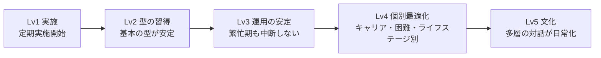
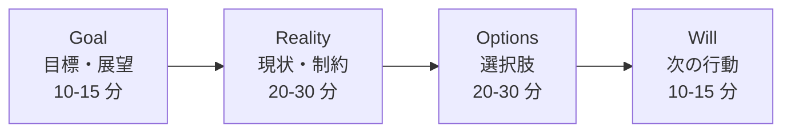
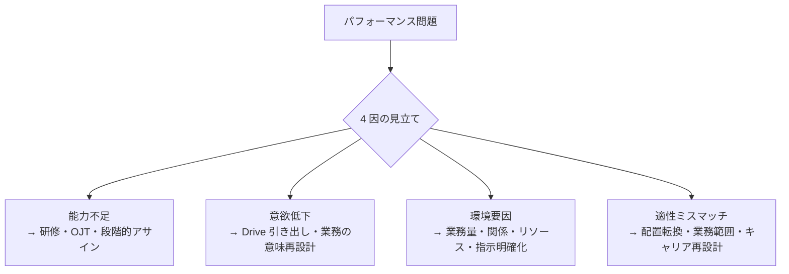
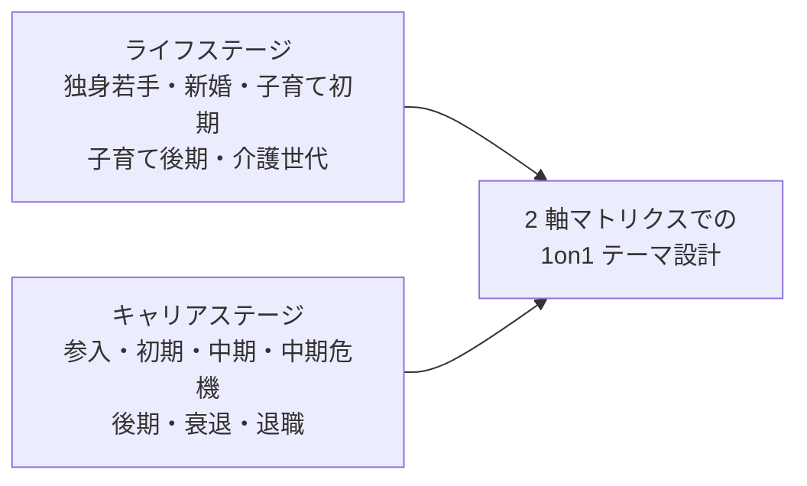
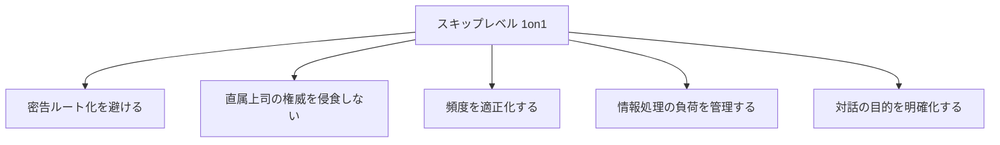
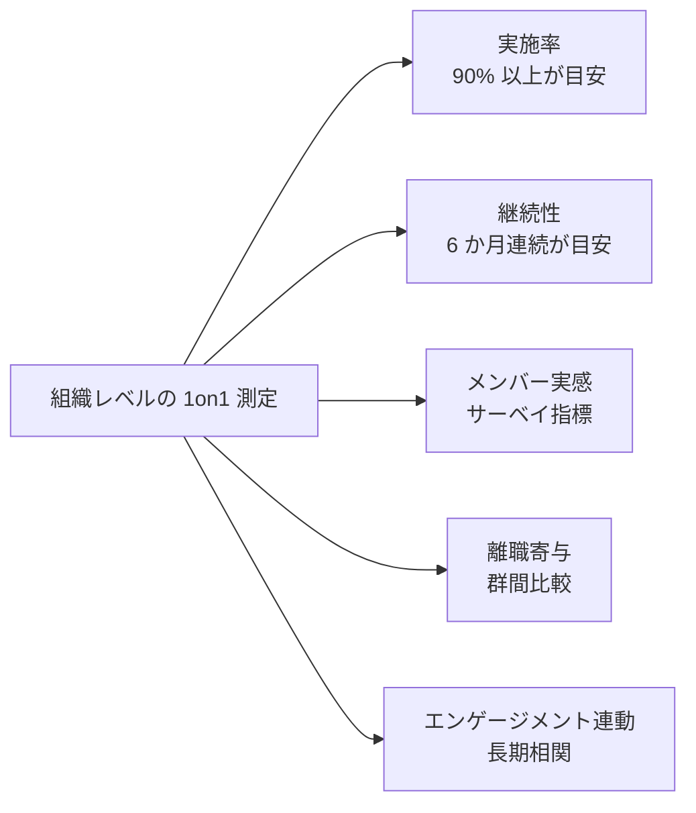
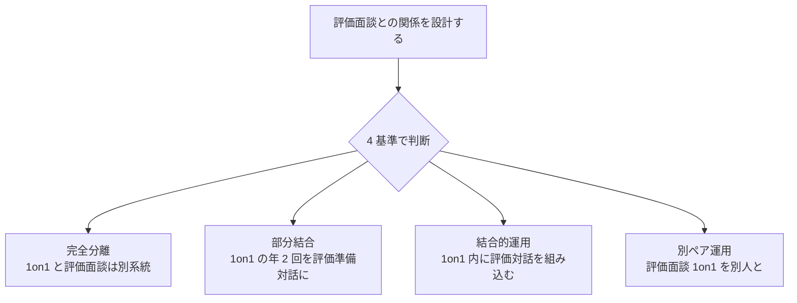
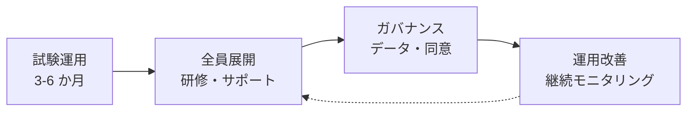

# 1on1 ミーティング実践

キャリア対話・困難シーン・ライフステージ別最適化——「進め方の基本」の先に踏み込む 7 つの未着手領域

| 項目 | 内容 |
|---|---|
| カテゴリー | マネジメント・組織開発 |
| 難易度 | 中級 |
| 所要時間 | 約200分（全8レッスン） |
| 公開日 | 2026-06-27 |
| 最終更新日 | 2026-06-27 |
| コースURL | https://skillup.college/courses/management/one-on-one-practical/ |

## 対象者

1on1 を半年以上実施しており、「型は知っているが伸び悩みを感じている」マネジャー・リーダーを主軸とする。新任マネジャーを卒業し中堅段階に入った方、中間管理職、専門職リーダー、プロジェクトリーダー、HR・HRBP、メンタリング担当者、これから 1on1 の質を組織として上げたいと考える人事・組織開発の担当者を含む。業種・職種を問わず、全社員マネジャー向けに設計。

## 前提知識

1on1 を最低半年以上の実施経験。または、SBI フィードバック・心理的安全性の運用・リモート 1on1 の物理設計・アサーティブな対話姿勢といったマネジメントとコミュニケーションの基本知識。本コースはこれらを「学習者の前提」として扱い再説明しない。1on1 の頻度・時間の推奨表、進め方の型、I-message や DESC 法の基礎、リーダーのフレーミング・招き入れ・応答の 3 ステップなどは扱わず、その先の「専門深化」に踏み込。

## 学習目標

- 1on1 の「現在地」と「進め方の型」の限界を踏まえ、本コースが踏み込む 7 つの残地を理解する
- キャリア対話としての 1on1 を、GROW モデル・Rogers アクティブリスニング・Schein/Krumboltz/Hall/Pink の 4 理論で設計できる
- パフォーマンス管理・不調・昇進昇格・退職対話など困難シーン別の 1on1 を判断軸つきで運用できる
- ライフステージ／キャリアステージ別に 1on1 を最適化できる
- 部門横断・メンタリング・スキップレベル 1on1 を直属上司の 1on1 と機能分離して設計できる
- 1on1 の継続・習慣化と組織レベルの測定（個人指標・組織指標）の仕組みを構築できる
- 評価面談との結合／分離の判断軸を持ち、自社・自部門の制度に当てはめられる
- AI 1on1 ツールの実装・運用・限界を把握し、人間が手放してはいけない領域を定義できる

## コース概要

「1on1 はやっています、でも何かが足りない」——基本の型を学んだ翌月に止まる組織、半年で形骸化する組織、3 年続けても評価面談との衝突で消耗する組織。多くの組織で繰り返されている悩みです。本コースは、すでに 1on1 を半年以上実施しているマネジャー・リーダーを主軸に、1on1 を「型から運用へ、運用から個別最適へ」と進めるための 8 レッスンを構成しました。1on1 の現在地と 7 つの未着手領域、キャリア対話の設計、困難シーン別の判断軸（パフォーマンス・不調・昇進昇格・退職）、ライフステージとキャリアステージ別の最適化、部門横断とメンタリング、継続と測定、評価面談との結合／分離、AI 1on1 ツールの実装と限界までを扱います。

## 学習の流れ

レッスン 1 で 1on1 の「現在地」と本コースが踏み込む 7 つの残地、成熟度モデルを共有します。前半（1〜2）が「設計の前提」のテーマで、キャリア対話としての 1on1 設計（L2）を扱います。中盤（3〜4）が「困難シーン別」の二本柱で、パフォーマンス管理・低評価メンバー（L3）と、不調・昇進昇格・退職対話（L4）を扱います。後半は「最適化と継続」の領域で、ライフステージ／キャリアステージ別の最適化（L5）、部門横断・メンタリング・スキップレベル（L6）、継続・習慣化・測定と評価面談との結合／分離（L7）、AI 1on1 ツールと修了後の継続（L8）を順に扱います。完成形のマネジャーを目指すコースではなく、1on1 を組織の習慣として根付かせ、個別最適に進化させるための土台を作るコースとして設計しています。

## レッスン一覧

| No. | タイトル | 概要 | 所要時間 |
|---|---|---|---|
| 1 | 1on1 の「現在地」と本コースの守備範囲 | 1on1 が日本で広まった経緯（ヤフー 1on1・本間浩輔・伊藤羊一の影響）、既刊で扱った基本の型の素早い棚卸し、「型は知っているのに動かない」5 つの伸び悩み、本コースが踏み込む 7 つの残地、1on1 の成熟度モデル（Lv1 実施〜Lv5 文化）、ICF コア・コンピテンシー第 4 群「契約と再契約」、本コースの守備範囲と前提を学ぶ | 25分 |
| 2 | キャリア対話としての 1on1 設計 | 業務 1on1 とキャリア 1on1 の機能分離、GROW モデル（Whitmore 1992）、Carl Rogers アクティブリスニング 3 条件（共感的理解・無条件の肯定的配慮・自己一致）、キャリアの 4 理論を 1on1 の問いに変換する技術（Schein キャリアアンカー再訪、Krumboltz 計画的偶発性、Hall プロティアン、Pink Drive の Autonomy/Mastery/Purpose）、キャリア対話用 12 の問い、半年〜 3 年スパンの対話リズムを学ぶ | 25分 |
| 3 | 困難シーン別の 1on1 ①——パフォーマンス管理・低評価メンバー | 困難な 1on1 のフレーミング、Pygmalion 効果（Rosenthal & Jacobson 1968）が面接官のマイクロサインに与える影響、パフォーマンス問題の 4 因（能力／意欲／環境／適性）の見立て、警告ではない PIP（Performance Improvement Plan）の使い方、ADKAR モデル（Hiatt 2003）、改善 1on1 のシーケンス設計（4 〜 12 週間）、Heen & Stone『Thanks for the Feedback』、ハードな伝達を行いつつ関係を壊さない 3 原則を学ぶ | 25分 |
| 4 | 困難シーン別の 1on1 ②——不調・昇進昇格・退職対話 | 不調のサインを 1on1 で拾う 3 層（生理・認知・関係）、メンタル不調を疑ったときの境界線（マネジャーは産業医・EAP に橋渡し、精神医学的判断は産業医・精神科医の領域）、昇進昇格面談の型と昇進後の伴走 1on1、配置転換・降格を伝える 1on1、Stay Interview と Exit Interview の中間にある「踏みとどまる対話」、Job Demands-Resources モデル、ICF 倫理規定（クライアントの限界の認識）、共依存にならないための再契約を学ぶ | 25分 |
| 5 | ライフステージ／キャリアステージ別の 1on1 最適化 | Beane 5 ライフステージ（独身若手・新婚・子育て初期・子育て後期・介護世代）と 1on1、Schein キャリアサイクル 9 段階の応用、Z 世代／ミドル／シニア／再雇用世代別の対話設計、育休復職・介護・通院加療中・キャリアブレイク復帰メンバーへの 1on1、ライフイベント情報の取り扱いとプライバシー境界、Dave Ulrich の HR Value Proposition を学ぶ | 25分 |
| 6 | 部門横断・メンタリング・スキップレベル 1on1 | Kram メンタリング 2 機能（キャリア機能・心理社会機能、1985 年）、Higgins & Kram 発達的関係ネットワーク（2001 年）、スキップレベル 1on1（部下の部下と話す）の設計と 5 つの落とし穴（密告ルート化、直属上司の権威侵食、頻度過多、情報処理過負荷、対話目的の曖昧化）、クロスファンクショナル 1on1、リバースメンタリング、社外メンター・コーチとの 1on1、Action Learning（Reg Revans 1940 年代）、3 種類の 1on1 を地図化する技術を学ぶ | 25分 |
| 7 | 継続・習慣化・測定と評価面談との結合／分離 | 1on1 が止まる 6 つの典型原因、個人レベルの習慣化（IF-THEN プランニング Gollwitzer 1999・カレンダーブロック・準備 3 分・記録 5 分のリチュアル）、組織レベルの測定（実施率・継続性・メンバー実感・離職寄与・エンゲージメント連動）、サーベイ設計（Lattice／15Five／Officevibe の指標）、評価面談と 1on1 の結合 vs 分離の 4 基準（報酬決定の頻度・評価期間・組織規模・成熟度）、Calibration（評価擦り合わせ）と 1on1 の関係、Goodhart の法則、Charles Duhigg 習慣ループ（2012 年）を学ぶ | 25分 |
| 8 | AI 1on1 ツールの実装・運用・限界と修了後の継続 | 2026 年 6 月時点の AI 1on1 ツール landscape（議事録系：Otter・Fireflies・tl;dv・Notta／プラットフォーム系：Lattice・15Five・Microsoft Viva Insights／日本発：Kakeai・Co:TEAM・TeamUp）、3 つのユースケース（議事録自動化・トピック提案・感情分析）、実装の 4 段階（試験運用・全員展開・ガバナンス・運用改善）、プライバシーと従業員の同意（個人情報保護法・GDPR・録音同意）、AI が壊す 1on1 の 3 パターン（録音圧・ラベル付け・問い力の劣化）、人間が手放してはいけない 4 領域（沈黙・呼吸・倫理判断・再契約）、ICF コア・コンピテンシー第 8 群、修了後の継続学習方向（コーチング資格は資質保証として案内、学習目的にしない）を学ぶ | 25分 |

---

## レッスン1：1on1 の「現在地」と本コースの守備範囲

（所要時間：25分）

### このレッスンで学ぶこと

- 1on1 が日本で広まった経緯と、現在の「型は知っているのに動かない」5 つの伸び悩みを把握する
- 本コースが前提扱いとする領域と、踏み込む 7 つの残地を整理する
- 1on1 の成熟度モデル（Lv1 実施〜Lv5 文化）を理解し、自組織の現在地を測れるようにする
- ICF コア・コンピテンシー第 4 群「契約と再契約」の発想を、1on1 の運用に落とし込む

---

### 1on1 が日本で広まるまで

1on1 ミーティング（以下、1on1）が日本企業の人事用語として広く流通し始めたのは、2010 年代後半です。シリコンバレーの IT 企業で広く実践されていた 1on1 の運用を、ヤフー（現 LY コーポレーション）が組織全体で導入し、本間浩輔氏が著書『ヤフーの 1on1』（2017 年）で運用ノウハウを公開したことが、日本での普及の起点として広く参照されています。同時期に、伊藤羊一氏や中原淳氏らの実践と研究も、1on1 の発想を企業現場に浸透させました。

それから 10 年弱が経ち、2026 年時点で 1on1 は「先進企業の取り組み」ではなく、多くの中堅・大企業で標準化された運用になりました。マネジャー向け研修の項目にも、1on1 はほぼ必ず含まれます。

> **💡 ポイント**
> 1on1 は「導入する」フェーズを終え、多くの組織で「どう運用の質を上げるか」「どう個別最適化するか」の段階に入っています。本コースは、この後者のフェーズを主題に据えます。基本の型を最初から説明することはせず、すでに半年以上 1on1 を実施している方が、次の質的な進化を遂げるための内容に絞ります。

私自身、独立後に支援してきた 100 社で、同じ風景を繰り返し目にしてきました。経営層が 1on1 の導入を決定し、人事部が研修を実施し、マネジャーが基本の型を学び、半年は続く。半年後、5 つの典型的な伸び悩みが現れます。

### 「型は知っているのに動かない」5 つの伸び悩み

1on1 を半年以上運用している組織で繰り返し現れる 5 つの伸び悩みを整理します。本コースが扱う 7 つの残地は、これらの伸び悩みを構造的に解消することを狙います。

第 1 の伸び悩みは「**マンネリ化**」です。隔週 30 分の 1on1 を半年続けると、対話の内容が業務進捗の確認や近況報告に偏り、メンバーから「もう話すことがない」「準備が面倒」という声が出てきます。基本の型に従っていても、メンバーが本来扱いたいキャリアや成長のテーマに踏み込めていない状態です。

第 2 の伸び悩みは「**評価面談との衝突**」です。期末に評価面談が入ると、評価を意識した遠慮が日常の 1on1 にも持ち込まれ、率直な対話が止まります。1on1 と評価面談の境界設計が組織として明確でないと、1on1 が「評価のための情報収集の場」と誤解されます。

第 3 の伸び悩みは「**繁忙期の中断と再開の困難**」です。四半期末や年度末の繁忙期に 1on1 が止まり、繁忙期が明けても再開のきっかけを掴めない。「来週から再開しよう」と言いつつ数か月が経ち、自然消滅します。

第 4 の伸び悩みは「**AI ツールの戸惑い**」です。議事録 AI や 1on1 プラットフォームの導入が広がる中、マネジャーは「録音されている前提でメンバーが本音を話さなくなった」「AI のサマリだけ読んで対話の重さが軽くなった」と感じています。ツールが対話の質を上げるどころか、対話の繊細さを損なう局面が増えています。

第 5 の伸び悩みは「**キャリア対話の浅さ**」です。「3 年後にどうなりたいか」を尋ねても抽象的な答えしか返ってこない、「キャリアの希望はない」と言われる、上司である自分のキャリア観を押し付けてしまう。キャリア対話の問いの設計と、キャリア理論の活用が、多くのマネジャーで未習得です。

> **⚠️ 注意**
> 5 つの伸び悩みは「マネジャーの能力不足」ではありません。基本の型を超えた「1on1 の運用と個別最適化」を扱う教材が、これまで体系的に整備されてこなかった構造的問題です。本コースは、その空白を埋めることを目的とします。

### 本コースが踏み込む 7 つの未着手領域

5 つの伸び悩みに対応して、本コースは 7 つの未着手領域を扱います。

第 1 の領域は「**キャリア対話の専門深化**」です。GROW モデル、Carl Rogers のアクティブリスニング、キャリアの 4 理論（Schein・Krumboltz・Hall・Pink）を、1on1 の具体的な問いに変換する技術を扱います。レッスン 2 が中心です。

第 2 の領域は「**困難シーン別の判断軸**」です。パフォーマンス管理、低評価メンバー、不調メンバー、昇進昇格面談、退職対話、配置転換通知など、日常の 1on1 とは別の判断軸が必要なシーンを扱います。レッスン 3・4 で扱います。

第 3 の領域は「**ライフステージ／キャリアステージ別の最適化**」です。独身若手、新婚、子育て初期、子育て後期、介護世代といったライフステージと、キャリアの 9 段階を組み合わせた 2 軸で 1on1 を最適化します。レッスン 5 で扱います。

第 4 の領域は「**直属上司以外との 1on1**」です。スキップレベル（部下の部下と話す）、クロスファンクショナル（他部署同階層）、メンタリング、リバースメンタリング、社外コーチとの 1on1 を扱います。レッスン 6 で扱います。

第 5 の領域は「**継続・習慣化と組織レベルの測定**」です。1on1 が止まる典型原因、個人レベルの習慣化技術、組織レベルの指標とサーベイ設計を扱います。レッスン 7 前半で扱います。

第 6 の領域は「**評価面談との結合／分離の判断軸**」です。報酬決定の頻度、評価期間、組織規模、成熟度の 4 基準で、評価面談と 1on1 をどう接続・分離するかの判断を扱います。レッスン 7 後半で扱います。

第 7 の領域は「**AI 1on1 ツールの実装・運用・限界**」です。2026 年 6 月時点の AI ツール landscape、3 つのユースケース、実装の 4 段階、人間が手放してはいけない 4 領域を扱います。レッスン 8 で扱います。

### 本コースの前提扱い（再説明しない領域）

本コースが「再説明しない」前提扱い領域も、ここで明確化します。これらは既刊のマネジメント・コミュニケーション系教材や、市販の 1on1 本で詳述されているため、本コースの紙幅を割きません。

第 1 に、**1on1 の頻度・時間の推奨表**です。週次・隔週・月次のどれが良いか、30 分・45 分・60 分のどれが良いかは、すでに多くの教材が扱っています。

第 2 に、**SBI フィードバックの構造説明**です。Situation・Behavior・Impact の 3 要素を分けて伝える基本の型は、本コースのレッスン 3 で「学習者の前提」と宣言した上で、PIP の文脈で応用例だけ扱います。

第 3 に、**1on1 の進め方の基本フロー**です。チェックイン、本題、ネクストアクション、チェックアウトという基本構造は、本コースでは前提扱いです。

第 4 に、**リモート 1on1 の物理設計**です。カメラ・マイク・タイムゾーン・画面越しのアクティブリスニングなどは、リモートワーク関連の教材で詳述されています。

第 5 に、**心理的安全性のリーダー 3 ステップ**です。フレーミング・招き入れ・応答の基本は、心理的安全性の専門教材で扱われています。本コースは、その上に乗せる 1on1 の応用に集中します。

第 6 に、**アサーティブな対話姿勢**です。I-message、DESC 法、アクティブリスニングの基本姿勢は、コミュニケーション系教材で詳述されています。

> **🔰 初学者の方へ**
> もし「これらの基本がまだ自信がない」という方は、本コースに入る前に、新任マネジャー向けの基本教材や、心理的安全性・コミュニケーション系の教材で基本を固めることを推奨します。本コースは、基本を踏まえた上で「次の専門深化」に進む設計で、基本部分の再説明は意図的に省いています。

### 1on1 の成熟度モデル

1on1 の運用を組織として進めるとき、自組織の現在地を測る道具として「成熟度モデル」が有用です。本コースは 5 段階の成熟度モデルを提示します。

第 1 段階「**実施**」（Lv1）は、1on1 を定期的に実施している状態です。多くの組織がこの段階で「導入完了」と認識しますが、ここはあくまでスタート地点です。

第 2 段階「**型の習得**」（Lv2）は、マネジャーが SBI フィードバック、オープンクエスチョン、メンバーが主役という基本の型を身につけ、進め方が安定している状態です。

第 3 段階「**運用の安定**」（Lv3）は、繁忙期や評価期間でも 1on1 が止まらず、6 か月以上の継続実施が組織として可能になった状態です。1on1 の実施率と継続性を組織として測定し始める段階です。

第 4 段階「**個別最適化**」（Lv4）は、キャリア対話、困難シーン、ライフステージ別の最適化が進み、メンバー一人ひとりの状況に合わせた 1on1 が運用される状態です。本コースが主題とする段階です。

第 5 段階「**文化**」（Lv5）は、1on1 が組織文化として定着し、上司と部下の関係を超えてスキップレベル・クロスファンクショナル・メンタリングなど多層の対話が日常化した状態です。

図 1：1on1 成熟度モデルの 5 段階。Lv3 までは多くの組織が到達できますが、Lv4・Lv5 への進化には「専門深化」が必要になります。本コースが踏み込むのは、Lv3 から Lv4・Lv5 への進化を支える領域です。

> **📝 補足**
> 成熟度モデルの段階は厳密な区分ではなく、組織として自分たちの現在地を共有する目安です。実際には、特定のマネジャーは Lv4 まで進んでいるが、別のマネジャーは Lv2 で留まっている、というばらつきが組織内に存在するのが普通です。組織として全体平均を上げるためには、Lv4・Lv5 のマネジャーを増やしながら、Lv2 のマネジャーへの個別支援を続ける両輪が必要です。

### ICF コア・コンピテンシー「契約と再契約」の発想

本コースの底流にある発想として、国際コーチング連盟（ICF）のコア・コンピテンシー第 4 群「セッションとコーチングプロセスの契約」を紹介します。コーチング業界の標準的なコンピテンシーで、2019 年改訂版が現行です。

コーチングセッションの冒頭で、コーチとクライアントは「このセッションで何を扱うか」「成功とは何か」を契約します。セッションを進める中で、当初の契約と異なる方向に話が進んだ場合は、その場で「再契約」を結びます。「最初は A の話で始めましたが、今は B の話に向かっています。B に進めても良いですか」と確認するプロセスです。

> **💡 ポイント**
> 1on1 にこの発想を応用すると、「今日の 1on1 で何を扱いたいか」「成功とは何か」を冒頭で 30 秒〜 1 分かけて確認するだけで、対話の質が変わります。マンネリ化の最大の原因は、毎回の 1on1 で「何を話すか」が事前に共有されていないことです。契約と再契約の習慣を 1on1 に持ち込むことが、本コース全体を貫く設計思想です。

「契約と再契約」は ICF の専門用語ですが、本コースは資格取得を目的にしません。コーチング資格（ICF ACC/PCC/MCC、CTI CPCC、Co-Active など）の取得手順やカリキュラムは扱わず、本コースの講師の ICF ACC 保有も「資質保証として bio に記載した」程度の位置づけです。学習者の皆さんに資格取得を勧めることはしません。

### 本コースの守備範囲外

本コースで扱わないものも明示します。基本の型の説明（前述）、コーチング資格の取得手順、個別の労務相談（社労士の独占業務）、精神医学的判断（産業医・精神科医の領域）、特定業界に固有の対話慣行（医療・教育・公務員など）、エグゼクティブ・コーチング（経営層・役員クラスの特殊論点）、心理療法・カウンセリングの理論・技法は、本コースの守備範囲外です。

これらが必要な場合は、専門教材や有資格者のサービスを参照してください。本コースは「マネジャーが日常の 1on1 を専門深化させる」教育目的に絞り、有資格者の独占業務領域には踏み込みません。

### まとめ

このレッスンでは、以下のことを学びました。

- 1on1 は 2010 年代後半に日本企業に広まり、2026 年時点では「導入」を超えて「運用と個別最適化」のフェーズに入っている
- 半年以上運用すると現れる 5 つの伸び悩みは、マンネリ化・評価面談との衝突・繁忙期の中断・AI ツールの戸惑い・キャリア対話の浅さ
- 本コースは 7 つの未着手領域に踏み込む：キャリア対話・困難シーン別・ライフステージ別・直属上司以外の 1on1・継続と測定・評価面談との結合分離・AI ツール
- 1on1 の頻度時間表・SBI の構造説明・進め方の基本フロー・リモート物理設計・心理的安全性 3 ステップ・アサーティブ姿勢の基本は前提扱いで再説明しない
- 1on1 成熟度モデルは Lv1 実施〜Lv5 文化の 5 段階で、本コースは Lv3 から Lv4・Lv5 への進化を支える
- ICF コア・コンピテンシー「契約と再契約」の発想を 1on1 の冒頭に持ち込むことが、マンネリ化を解く出発点

次のレッスンでは、本コースの中核である「キャリア対話としての 1on1 設計」を扱います。GROW モデル、Rogers のアクティブリスニング 3 条件、キャリアの 4 理論（Schein・Krumboltz・Hall・Pink）を 1on1 の問いに変換する技術を学びます。

---

### 確認クイズ

このレッスンの理解度をチェックしましょう。

#### Q1. 1on1 が日本企業の人事用語として広く流通し始めた時期として、本レッスンが示したものはどれですか？

- [ ] 1980 年代後半（バブル経済期）
- [ ] 1990 年代後半（成果主義導入期）
- [x] 2010 年代後半（ヤフー 1on1・本間浩輔氏の影響）
- [ ] 2020 年代初頭（コロナ後のリモートワーク本格化）

> **解説**
> 1on1 が日本企業に広まり始めたのは 2010 年代後半で、ヤフー（現 LY コーポレーション）の全社導入と、本間浩輔氏『ヤフーの 1on1』（2017 年）が日本での普及の起点として広く参照されています。同時期に伊藤羊一氏・中原淳氏らの実践と研究も浸透を支えました。

#### Q2. 「型は知っているのに動かない」5 つの伸び悩みに含まれないものはどれですか？

- [x] マネジャーが SBI フィードバックを知らない
- [ ] マンネリ化
- [ ] 評価面談との衝突
- [ ] キャリア対話の浅さ

> **解説**
> 5 つの伸び悩みは、マンネリ化・評価面談との衝突・繁忙期の中断・AI ツールの戸惑い・キャリア対話の浅さです。SBI を知らないのは「型を学んでいない」段階の問題で、本コースは「型は学んだが運用に伸び悩む」段階を扱います。

#### Q3. 本コースが「再説明しない前提扱い」とする領域に含まれないものはどれですか？

- [x] キャリア対話の問いの設計
- [ ] 1on1 の頻度・時間の推奨表
- [ ] SBI フィードバックの構造説明
- [ ] リモート 1on1 の物理設計

> **解説**
> 前提扱いは、頻度時間表・SBI 構造説明・進め方の基本フロー・リモート物理設計・心理的安全性 3 ステップ・アサーティブ姿勢の基本です。キャリア対話の問いの設計は、本コースが踏み込む 7 つの未着手領域の第 1 領域で、レッスン 2 の中核です。

#### Q4. 1on1 成熟度モデルの 5 段階の順序として、本レッスンが示したものはどれですか？

- [ ] 個別最適化 → 文化 → 運用の安定 → 型の習得 → 実施
- [ ] 文化 → 個別最適化 → 実施 → 型の習得 → 運用の安定
- [ ] 型の習得 → 実施 → 文化 → 運用の安定 → 個別最適化
- [x] 実施 → 型の習得 → 運用の安定 → 個別最適化 → 文化

> **解説**
> 成熟度モデルは、Lv1 実施 → Lv2 型の習得 → Lv3 運用の安定 → Lv4 個別最適化 → Lv5 文化の順です。本コースは Lv3 から Lv4・Lv5 への進化を支える専門深化を主題とします。

#### Q5. 本レッスンが紹介した ICF コア・コンピテンシー第 4 群「契約と再契約」の発想を、1on1 に応用する際の効用はどれですか？

- [ ] マネジャーが 1on1 のスケジュールを自動調整できる
- [x] 「今日の 1on1 で何を扱うか」「成功とは何か」を冒頭で確認することで、マンネリ化を解く
- [ ] 評価面談との結合度合いを契約書で固定できる
- [ ] AI ツールへの権限委譲を法的に整理できる

> **解説**
> 「契約と再契約」を 1on1 に持ち込むと、対話の目的を冒頭で共有でき、マンネリ化の最大の原因（毎回何を話すかが事前共有されていない）を解消できます。スケジュール調整・法的整理・AI 権限委譲は本コースの主旨とは別軸です。

#### Q6. 本コースの守備範囲外として、本レッスンが明示したものはどれですか？

- [ ] キャリア対話の問いの設計
- [ ] AI 1on1 ツールの実装・運用・限界
- [x] 個別の労務相談（社労士の独占業務）と精神医学的判断（産業医・精神科医の領域）
- [ ] 評価面談との結合／分離の判断軸

> **解説**
> 本コースは教育目的の一般原則を扱い、個別の労務相談は社労士、精神医学的判断は産業医・精神科医の領域として明示的に守備範囲外としています。キャリア対話・AI ツール・評価面談との境界はいずれも本コースが踏み込む 7 つの残地に含まれます。

---

## レッスン2：キャリア対話としての 1on1 設計

（所要時間：25分）

### このレッスンで学ぶこと

- 業務 1on1 とキャリア 1on1 の機能分離を理解する
- GROW モデル（Whitmore 1992）を 1on1 のキャリア対話に落とし込める
- Carl Rogers のアクティブリスニング 3 条件を、面接技術ではなく態度として身につける
- キャリアの 4 理論（Schein・Krumboltz・Hall・Pink）を 1on1 の問いに変換できる

---

前回のレッスンでは、1on1 の「現在地」と本コースが踏み込む 7 つの未着手領域を整理しました。今回は、その第 1 領域である「キャリア対話の専門深化」を扱います。多くのマネジャーが伸び悩む「キャリア対話の浅さ」を、構造的に解消する設計を学びます。

### 業務 1on1 とキャリア 1on1 の機能分離

「キャリアの話をしたい」とマネジャーが思っても、毎回の 1on1 の中で、業務の進捗確認とキャリアの話を同じ時間に詰め込むのは無理があります。業務 1on1 とキャリア 1on1 は、求められる対話の質も、時間の取り方も、マネジャーの構えも別物です。本コースは「機能分離」を提案します。

業務 1on1 は、隔週または週次で 30 分前後実施し、業務の進捗・課題・支援要請を中心に扱います。マネジャーは「業務遂行の伴走者」として関わります。

キャリア 1on1 は、四半期に 1 回、または半期に 1 回、60〜 90 分を確保して実施します。業務から離れて、メンバーのキャリア観・成長・長期展望を扱います。マネジャーは「キャリアの問いを返す対話相手」として関わります。

> **💡 ポイント**
> 業務 1on1 の延長線上にキャリアの話を入れようとすると、毎回数分の中途半端な対話に終わります。キャリア対話は別枠として設計することで、メンバーも準備でき、マネジャーも構えを変えられます。私が支援してきた組織でキャリア対話の質が明らかに上がったのは、機能分離を制度として導入した後でした。

機能分離を導入する際、組織として 3 つの仕組みを整えます。第 1 に、キャリア 1on1 の専用枠を組織カレンダーに設定する。第 2 に、キャリア 1on1 の準備シート（メンバーが事前に書き込む）を用意する。第 3 に、マネジャー向けにキャリア対話の問いの設計を研修で渡す。本レッスンの後半が、第 3 の仕組みの中身です。

### GROW モデル——キャリア対話の骨格

キャリア対話の骨格として、本コースは GROW モデルを推奨します。John Whitmore が 1992 年に著書『Coaching for Performance』で示したコーチングの古典的フレームで、コーチング業界の標準的な対話設計として広く使われています。

GROW は 4 つの段階の頭文字です。

**Goal（目標）**：今日のキャリア対話で何を扱いたいか、長期のキャリア展望は何か、を引き出します。冒頭の 10〜 15 分。

**Reality（現状）**：現在の業務、強み、関心、制約、エネルギーの状態を整理します。20〜 30 分。

**Options（選択肢）**：目標と現状の間を埋める選択肢を、複数引き出します。20〜 30 分。

**Will（意志・行動）**：選択肢の中から、メンバーが次の四半期に取り組む 1〜 3 のアクションを言語化します。10〜 15 分。

図 1：GROW モデルの 4 段階。キャリア 1on1 の 60〜 90 分をこの 4 段階で構造化することで、対話が浅い感想で終わらず、次の行動につながります。

> **⚠️ 注意**
> GROW は「マネジャーが順番通りに質問するスクリプト」ではありません。対話の流れの中で行きつ戻りつしながら、4 段階を意識する構造です。スクリプト的に運用すると、メンバーは「テスト」のように感じ、本音が出ません。GROW は対話の地図であって、対話そのものではありません。

### Carl Rogers アクティブリスニング 3 条件

GROW を運用する基盤として、Carl Rogers が示した「アクティブリスニング 3 条件」を学びます。Rogers は米国の心理学者で、来談者中心療法の祖として知られ、『On Becoming a Person』（1961 年）などで対話の本質を体系化しました。

3 条件は、面接の技術ではなく、相手と向き合う「態度」として位置づけられています。

第 1 の条件「**共感的理解（Empathy）**」は、相手の世界を相手の視点から理解しようとする態度です。「私だったらこう感じる」ではなく「あなたはこう感じている」を出発点にします。

第 2 の条件「**無条件の肯定的配慮（Unconditional Positive Regard）**」は、相手の発言や感情を、評価や条件付きの受容ではなく、ありのまま受け止める態度です。「それは間違っている」「もっとこうすべき」を一度脇に置きます。

第 3 の条件「**自己一致（Congruence）**」は、マネジャーが自分の本心と表現を一致させ、嘘や演技をしない態度です。「素晴らしい考えですね」と思っていないのに口にすると、メンバーには違和感が伝わります。

> **📝 補足**
> 自己一致は「思ったことをすべて口にする」とは違います。マネジャーが自分の評価や疑問を持っている場合、それを伝えるかどうかは判断ですが、口にする言葉は本心と矛盾しないものに留める、というのが Rogers の発想です。「思っていないことを言わない」勇気が、対話の信頼を支えます。

3 条件は、技術として習得するものではなく、対話の途中で自分の態度を点検する指針として機能します。「今、私は共感的に聴けているか」「無条件に受け止めているか」「自分の本心と矛盾していないか」を、対話の中で何度か自問する習慣を持ちます。

### キャリアの 4 理論を 1on1 の問いに変換する

GROW の Reality と Options の段階で、メンバーのキャリアを多角的に引き出すために、4 つのキャリア理論を「問いの源泉」として活用します。本コースは理論そのものの解説には踏み込みません（キャリア理論の専門教材で詳述されているため）。理論を「1on1 で使える問い」に変換することに集中します。

第 1 の理論「**Schein のキャリアアンカー**」（Edgar Schein、1978 年）から派生する問いは、メンバーが「絶対に手放したくない価値」を引き出します。「これまでのキャリアで、自分が一番譲れなかったものは何ですか」「キャリアで何かを諦めなければならなかったとき、何だけは絶対に残したいですか」のような問いです。

第 2 の理論「**Krumboltz の計画的偶発性**」（John Krumboltz、1999 年論文）から派生する問いは、偶然の出会いや経験を活かす姿勢を引き出します。「最近、予想外の業務や出会いはありましたか」「その偶然から、新しい関心や扉が開きましたか」のような問いです。

第 3 の理論「**Hall のプロティアンキャリア**」（Douglas T. Hall、1976 年提唱）から派生する問いは、自己決定的なキャリア観を引き出します。「組織が決めたキャリアパスに沿うとして、その中であなた自身が大切にしたいことは何ですか」「組織と自分の意向が食い違ったら、何を優先しますか」のような問いです。

第 4 の理論「**Pink の Drive**」（Daniel Pink、2009 年）から派生する問いは、内発的動機の 3 要素（Autonomy 自律性／Mastery 熟達／Purpose 目的）を引き出します。「今の業務で、自律性・熟達・目的のうち、どれが満たされていて、どれが満たされていないですか」のような問いです。

> **💡 ポイント**
> キャリア対話用の問いは、メンバーが「考えたことがない問い」「すぐには答えられない問い」を返すのが理想です。すぐ答えられる問いは、すでに考えている領域で、新しい発見にはつながりません。「考えたことがない問い」が、メンバーの内省を起動します。

本コースが推奨するキャリア対話用 12 の問いを、4 理論からそれぞれ 3 問ずつ抽出した一覧として整理します。マネジャーは、メンバーの段階や関心に応じて、12 問の中から 3〜 5 問を選んで対話に持ち込みます。

| 由来 | 問い |
|---|---|
| Schein | これまでのキャリアで、自分が一番譲れなかったものは何ですか |
| Schein | 何かを諦めなければならないとして、何だけは絶対に残したいですか |
| Schein | 過去 5 年で、自分の譲れない価値は変わりましたか |
| Krumboltz | 最近、予想外の業務や出会いはありましたか |
| Krumboltz | その偶然から、新しい関心や扉が開きましたか |
| Krumboltz | 来年、偶然に身を任せるとしたら、どんな機会が欲しいですか |
| Hall | 組織が決めたキャリアパスの中で、あなた自身が大切にしたいことは何ですか |
| Hall | 組織と自分の意向が食い違ったら、何を優先しますか |
| Hall | 3 年後、組織が変わっていても残したい自分像は何ですか |
| Pink | 今の業務で、自律性・熟達・目的のうち、どれが満たされていますか |
| Pink | どれが満たされていないですか |
| Pink | 自律性が増えたら、何が変わりますか |

表 1：キャリア対話用 12 の問い。Schein 3 問・Krumboltz 3 問・Hall 3 問・Pink 3 問の構成で、メンバーの段階に応じて選びます。

### 半年〜 3 年スパンの対話リズム

キャリア 1on1 は、半年〜 3 年のスパンで対話のリズムを設計します。本コースは 3 つのタイムスケールを推奨します。

第 1 のスケール「**四半期 1on1**」は、業務 1on1 とは別枠で四半期に 1 回、60 分。直近 3 か月の振り返りと、次の 3 か月の重点を扱います。GROW の 4 段階を 60 分で回せる量に絞ります。

第 2 のスケール「**半期キャリアレビュー**」は、半期に 1 回、90 分。直近半年のキャリア進捗と、次の半年の重点を扱います。12 の問いから 3〜 5 問を選び、深掘りします。

第 3 のスケール「**年次の長期キャリア対話**」は、年 1 回、120 分。3 年〜 5 年の長期展望を扱います。Schein の譲れない価値、Hall のキャリアアイデンティティ、Pink の Purpose を中心に、深い対話を持ちます。

> **🔰 初学者の方へ**
> 3 つのスケールを最初から全部導入する必要はありません。まず四半期 1on1 を半年〜 1 年運用して安定させ、次に半期キャリアレビューを加え、最後に年次対話を加える、という段階的な導入が現実的です。組織全体で同時に始めると、マネジャーの負荷が高すぎて運用が崩れます。

### まとめ

このレッスンでは、以下のことを学びました。

- 業務 1on1 とキャリア 1on1 は機能分離する：業務は隔週 30 分、キャリアは四半期 60 分・半期 90 分・年次 120 分の 3 スケール
- GROW モデル（Goal-Reality-Options-Will、Whitmore 1992）はキャリア対話の骨格として標準的に使われる
- Carl Rogers のアクティブリスニング 3 条件（共感的理解・無条件の肯定的配慮・自己一致）は技術ではなく態度で、対話中に自問する指針として機能する
- キャリアの 4 理論（Schein キャリアアンカー・Krumboltz 計画的偶発性・Hall プロティアンキャリア・Pink Drive）は「問いの源泉」として活用し、12 の問いから 3〜 5 問選んで対話に持ち込む
- 「考えたことがない問い」が、メンバーの内省を起動する。すぐ答えられる問いには新しい発見がない

次のレッスンでは、本コースが踏み込む困難シーン別 1on1 の前半として、パフォーマンス管理・低評価メンバーとの 1on1 を扱います。Pygmalion 効果、パフォーマンス問題の 4 因、PIP の使い方、ADKAR モデル、改善 1on1 のシーケンス設計を学びます。

---

### 確認クイズ

このレッスンの理解度をチェックしましょう。

#### Q1. 業務 1on1 とキャリア 1on1 の機能分離について、本レッスンが推奨する設計はどれですか？

- [ ] 業務もキャリアもすべて毎回の 1on1 で同じ時間に扱う
- [ ] キャリアの話は年次評価面談に組み込んで別枠にしない
- [x] 業務は隔週 30 分、キャリアは四半期 60 分・半期 90 分・年次 120 分の別枠で運用する
- [ ] キャリアの話は希望者のみが自主的に上司に申し出る形にする

> **解説**
> 業務とキャリアは求められる対話の質も時間の取り方も別物のため、機能分離を提案します。業務 1on1 は隔週 30 分、キャリア 1on1 は四半期 60 分・半期 90 分・年次 120 分の 3 スケールで段階的に導入します。

#### Q2. GROW モデルを 1992 年に著書『Coaching for Performance』で示した人物として、本レッスンが紹介したのは誰ですか？

- [ ] Carl Rogers
- [x] John Whitmore
- [ ] Daniel Pink
- [ ] Edgar Schein

> **解説**
> GROW モデルは John Whitmore が 1992 年に著書『Coaching for Performance』で示したコーチングの古典的フレームです。Rogers はアクティブリスニング 3 条件、Pink は Drive、Schein はキャリアアンカーの提唱者です。

#### Q3. GROW の 4 段階の順序として、本レッスンが示したものはどれですか？

- [ ] Will → Goal → Reality → Options
- [ ] Options → Will → Goal → Reality
- [ ] Reality → Will → Goal → Options
- [x] Goal → Reality → Options → Will

> **解説**
> GROW は、Goal（目標・展望）→ Reality（現状・制約）→ Options（選択肢）→ Will（次の行動）の順です。目標を最初に共有し、現状と選択肢を行きつ戻りつしながら、最後に行動を言語化します。

#### Q4. Carl Rogers のアクティブリスニング 3 条件に含まれないものはどれですか？

- [ ] 共感的理解（Empathy）
- [x] 厳格な評価（Strict Evaluation）
- [ ] 無条件の肯定的配慮（Unconditional Positive Regard）
- [ ] 自己一致（Congruence）

> **解説**
> 3 条件は、共感的理解・無条件の肯定的配慮・自己一致です。厳格な評価は Rogers の発想の対極にあるもので、評価を一度脇に置く「無条件の肯定的配慮」とは正反対の態度です。

#### Q5. キャリア対話用 12 の問いは、4 つのキャリア理論からそれぞれ何問ずつ抽出されていますか？

- [x] 各理論から 3 問ずつ（Schein 3・Krumboltz 3・Hall 3・Pink 3）
- [ ] Schein から 6 問、ほかは 2 問ずつ
- [ ] すべて Schein のキャリアアンカーから 12 問
- [ ] Pink から 9 問、ほかは 1 問ずつ

> **解説**
> 4 つのキャリア理論からそれぞれ 3 問ずつ、合計 12 問で構成されます。マネジャーは、メンバーの段階や関心に応じて、12 問の中から 3〜 5 問を選んで対話に持ち込みます。

#### Q6. キャリア対話の質を上げる問いの特徴として、本レッスンが示したものはどれですか？

- [ ] メンバーがすぐに答えられる平易な問い
- [ ] イエス・ノーで答えられる問い
- [ ] マネジャーが模範解答を持っている問い
- [x] メンバーが「考えたことがない問い」「すぐには答えられない問い」

> **解説**
> すぐ答えられる問いは、すでに考えている領域で、新しい発見にはつながりません。「考えたことがない問い」が、メンバーの内省を起動します。GROW と 12 の問いは、この内省を起動するために設計されています。

---

## レッスン3：困難シーン別の 1on1 ①——パフォーマンス管理・低評価メンバー

（所要時間：25分）

### このレッスンで学ぶこと

- 困難な 1on1 のフレーミングと、Pygmalion 効果が面接官の態度に与える影響を理解する
- パフォーマンス問題の 4 因（能力／意欲／環境／適性）の見立てを身につける
- 警告ではない PIP（Performance Improvement Plan）の使い方を学ぶ
- ADKAR モデルと改善 1on1 のシーケンス設計（4 〜 12 週間）を扱える

---

前回のレッスンでは、キャリア対話としての 1on1 設計を扱いました。今回からは、本コースが踏み込む困難シーン別の 1on1 の前半として、パフォーマンス管理と低評価メンバーとの 1on1 を扱います。多くのマネジャーが「最も気が重い 1on1」と語る場面に、構造的な判断軸を持ち込みます。

### 困難な 1on1 のフレーミング

困難な 1on1 を、マネジャーは「気が重い」「うまく伝えられるか不安」「関係を壊したくない」という感情で迎えます。この感情自体は自然なものですが、感情に支配されたまま 1on1 に入ると、対話の質が下がります。

本コースは、困難な 1on1 を「**メンバーの成長機会を守るための、責任ある対話**」とフレーミングします。マネジャーが困難を避けて何も言わずに済ませることは、短期的には関係を保てても、長期的にはメンバーの成長機会を奪い、組織にも本人にも損失となります。

> **💡 ポイント**
> 困難な 1on1 を避けるマネジャーは、優しいのではなく、メンバーの成長への責任を放棄しています。これは「優しさのコスト」と呼ばれる現象で、マネジャー本人の心理的負担は減りますが、メンバーの長期的成長は損なわれます。本コースの立場は、困難を引き受けることが、結果的に最大の優しさである、という発想です。

SBI フィードバックの構造（Situation・Behavior・Impact）は、本コースでは「学習者の前提」として再説明しません。困難な 1on1 でも SBI は使いますが、本レッスンで扱うのは「SBI を使う前段階の見立て」と「SBI を使った後の改善シーケンス」です。

### Pygmalion 効果——マネジャーの期待がメンバーに伝わる

困難な 1on1 を扱う前に、避けられない論点を 1 つ整理します。「Pygmalion 効果（ピグマリオン効果）」です。

Robert Rosenthal と Lenore Jacobson が 1968 年に著書『Pygmalion in the Classroom』で示した実証研究で、教師が「この生徒は伸びる」と期待した生徒は、実際にその後の成績が伸びる、という現象を扱いました。期待が無意識のマイクロサイン（表情、声のトーン、質問の仕方、時間の配分）として伝わり、それが受け手の行動に影響する、というメカニズムです。

職場の 1on1 にも、Pygmalion 効果は強く働きます。マネジャーが「このメンバーは伸びない」「期待していない」と内心で思っていると、無意識のマイクロサインがメンバーに伝わり、メンバーは「期待されていない」と察知し、結果として伸びない方向に動きます。逆向きのループも成立し、期待された方向に伸びます。

> **⚠️ 注意**
> 「期待しているふり」をしても、Pygmalion 効果は機能しません。本心と表現が一致していないと、無意識のマイクロサインが本心の方を反映します。前のレッスンで触れた Carl Rogers の「自己一致」が、ここでも基盤になります。

困難な 1on1 に入る前に、マネジャー自身が自分の内心を点検します。「私はこのメンバーが伸びうると、本心で思っているか」。もし思っていなければ、まずその内心と向き合う時間が必要です。「なぜ伸びうると思えないのか」「過去のどの経験がそう思わせているか」「そう思っていることは、メンバーに対してフェアか」を、上司や同僚、外部コーチに話す機会を持ちます。

### パフォーマンス問題の 4 因

メンバーのパフォーマンスに問題が見られたとき、原因を「能力不足」と決めつけて伝える前に、4 つの因を見立てます。本コースは「能力／意欲／環境／適性」の 4 因モデルを推奨します。

第 1 の因「**能力**」は、業務遂行に必要な知識・スキル・経験が不足している状態です。介入は、研修・OJT・メンタリング・業務の段階的アサインなどです。

第 2 の因「**意欲**」は、業務に取り組む動機・関心・エネルギーが低下している状態です。介入は、Pink の Drive（Autonomy・Mastery・Purpose）を引き出すキャリア対話、業務の意味の再設計、休暇取得などです。

第 3 の因「**環境**」は、業務遂行を妨げる外的要因（過大な業務量、人間関係の対立、リソース不足、不明確な業務指示など）です。介入は、業務量の調整、関係調整、リソース提供、業務指示の明確化などです。

第 4 の因「**適性**」は、メンバーの強み・興味と現在の業務がミスマッチしている状態です。介入は、配置転換、業務範囲の調整、長期的なキャリアパスの再設計などです。

図 1：パフォーマンス問題の 4 因（能力／意欲／環境／適性）の見立てと、それぞれに対応する介入の方向。「能力不足」と一律に判断する前に、4 因のどれが主要因かを見立てることが、改善 1on1 の出発点になります。

> **💡 ポイント**
> 4 因は排他的ではなく、複数が同時に作用していることが多くあります。優先順位を付けて 1〜 2 因に絞って介入することで、改善のスピードが上がります。すべての因に同時に手を打とうとすると、メンバーが圧倒されて動けなくなります。

4 因を見立てる際、マネジャーは「自分の観察」と「メンバーへのヒアリング」の両方を組み合わせます。マネジャーの観察だけで決めつけると見立てが偏ります。メンバーのヒアリングだけに頼ると、本人も気づいていない要因が見えません。観察を仮説として持ち、メンバーとの対話で検証する姿勢が、見立ての質を上げます。

### PIP（Performance Improvement Plan）——警告ではない使い方

パフォーマンスの改善が必要なメンバーに対して、組織として PIP（Performance Improvement Plan、業績改善計画）を使うことがあります。日本でも 2010 年代以降、特に外資系企業や IT 企業で広がりました。

PIP は本来「業績改善を支援するための計画」ですが、現実には「解雇予告」「退職勧奨の前段階」として運用される組織も少なくありません。本コースは、PIP を「警告」ではなく「成長設計」として使う発想を推奨します。

「成長設計としての PIP」の 3 つの原則を整理します。

第 1 の原則「**4 因に基づく目標設定**」です。パフォーマンス問題の 4 因のうち、改善対象とする因を 1〜 2 に絞り、その因に対応する具体的な目標を設定します。「全部頑張れ」ではなく「能力不足の特定領域を、研修と OJT で 8 週間以内に改善する」のような具体性が必要です。

第 2 の原則「**支援とリソースの提供**」です。目標達成のために組織が提供する支援（研修予算、メンター、業務量の調整、特定業務の集中など）を明示します。メンバー側だけに改善を求めるのではなく、組織側も投資する設計です。

第 3 の原則「**定期的な 1on1 と中間レビュー**」です。PIP 期間中（4〜 12 週間）に週次または隔週の 1on1 を継続し、中間レビューを 2 回程度入れます。期間が終わった時点で初めて評価するのではなく、途中で軌道修正します。

> **⚠️ 注意**
> PIP を「退職勧奨の前段階」として使う運用は、労務リスクが高く、メンバーの士気も組織全体の信頼も損ねます。「PIP を出すこと=退職予告」と組織内で認識されると、PIP 自体が機能不全に陥ります。本コースは成長設計としての PIP を推奨しますが、組織として PIP の位置づけを明確化し、人事責任者と合意した上で運用することが前提です。

### ADKAR モデル——個人の変容を支える

PIP や改善 1on1 のシーケンスを設計する際、個人の変容プロセスを扱うフレームとして「ADKAR モデル」が有用です。Jeff Hiatt が 2003 年に提唱した変革管理モデルで、Prosci 社が普及させました。

ADKAR は 5 段階の頭文字です。

**Awareness（認識）**：「変わる必要がある」とメンバー自身が認識している段階。

**Desire（意欲）**：「自分が変わりたい」とメンバー自身が望んでいる段階。

**Knowledge（知識）**：「どう変わればよいか」をメンバーが知っている段階。

**Ability（能力）**：「実際に変われる」スキルと環境を持っている段階。

**Reinforcement（強化）**：「変わった行動が定着する」継続支援を受けている段階。

| 段階 | マネジャーの 1on1 での役割 |
|---|---|
| Awareness | 観察事実を共有し、現状認識を擦り合わせる |
| Desire | 改善の動機を引き出す（押し付けではなく対話で） |
| Knowledge | 改善の具体的な方法を一緒に設計する |
| Ability | 試行と振り返りを 1on1 で支援する |
| Reinforcement | 行動定着後も継続的にフォローする |

表 1：ADKAR の 5 段階とマネジャーの 1on1 での役割。改善 1on1 のシーケンスは、この 5 段階を意識して設計します。

> **📝 補足**
> ADKAR の重要な含意は、Awareness（認識）と Desire（意欲）の段階を飛ばして Knowledge（知識）から始めると、変容は定着しないということです。「こうすればいい」とノウハウを伝える前に、メンバーが「変わる必要がある」と認識し、「自分が変わりたい」と望んでいる状態を作ることが先です。多くの改善 1on1 が失敗するのは、ここを飛ばして急いで Knowledge に進むからです。

### 改善 1on1 のシーケンス設計（4 〜 12 週間）

改善 1on1 は単発の対話ではなく、4〜 12 週間のシーケンスとして設計します。本コースは標準的な 8 週間のシーケンスを示します。

第 1 週（Awareness と Desire 起動）：観察事実を共有し、メンバーと現状認識を擦り合わせる。改善が必要な理由を本人の言葉で語ってもらう。

第 2〜 3 週（Knowledge 設計）：改善の具体的方法を一緒に設計する。4 因のうちどの因への介入か、研修・OJT・業務調整など組織側の支援は何か。

第 4 週（中間レビュー 1）：最初の試行を振り返る。うまくいったこと、うまくいかなかったこと、調整が必要なことを共有する。

第 5〜 7 週（Ability 試行）：改善方法を継続的に試行し、週次の 1on1 で軌道修正する。

第 8 週（中間レビュー 2 / 終了判断）：8 週間の成果を評価し、追加の改善期間が必要か、定着段階（Reinforcement）に移れるかを判断する。

> **🔰 初学者の方へ**
> 改善 1on1 のシーケンス設計は、マネジャー 1 人で抱えると重い責任になります。人事責任者、HRBP、上司への定期的な相談を仕組み化することが、マネジャー自身の負担を減らし、判断の質も上げます。1 人で抱え込まないことが、改善 1on1 を持続させる条件です。

### ハードな伝達を行いつつ関係を壊さない 3 原則

困難な 1on1 で、ハードな伝達（パフォーマンス問題の指摘、PIP の発動、低評価の通知など）を行う際、関係を壊さない 3 原則を整理します。

第 1 の原則「**事実と人格を分離する**」です。観察された行動・成果と、メンバーの人格・存在価値を分離して扱います。「この行動が問題」と「あなたが問題」は別物です。Heen & Stone の『Thanks for the Feedback』（2014 年）で詳述されている発想です。

第 2 の原則「**支援の意図を明示する**」です。「あなたを評価するためではなく、あなたの成長を支援するために伝えている」と冒頭で明示します。意図が誤解されると、防衛反応が立ち上がり対話が止まります。

第 3 の原則「**相手の反応を受け止める時間を取る**」です。ハードな伝達の後、メンバーは驚き、悲しみ、怒り、不安などの感情を持ちます。これらの感情をその場で受け止め、次の対話に進む前に十分な時間を取ります。「すぐに次のステップ」を急ぐと、関係が深く損なわれます。

### まとめ

このレッスンでは、以下のことを学びました。

- 困難な 1on1 はメンバーの成長機会を守るための責任ある対話で、避けることは優しさのコストを生む
- Pygmalion 効果（Rosenthal & Jacobson 1968）により、マネジャーの期待は無意識のマイクロサインとして伝わる。本心と表現の一致が前提
- パフォーマンス問題の 4 因（能力／意欲／環境／適性）を見立てた上で介入を選ぶ
- PIP は「警告」ではなく「成長設計」として使う 3 原則：4 因に基づく目標設定・支援とリソースの提供・定期的な 1on1 と中間レビュー
- ADKAR モデル（Hiatt 2003）の 5 段階（Awareness/Desire/Knowledge/Ability/Reinforcement）は、改善 1on1 のシーケンスを設計する地図
- 標準的な改善 1on1 シーケンスは 8 週間で、第 1 週で Awareness/Desire 起動、第 2〜 3 週で Knowledge 設計、第 4 週で中間レビュー 1、第 5〜 7 週で Ability 試行、第 8 週で中間レビュー 2 と終了判断
- ハードな伝達の 3 原則：事実と人格の分離（Heen & Stone）・支援の意図の明示・相手の反応を受け止める時間

次のレッスンでは、困難シーン別 1on1 の後半として、不調メンバー・昇進昇格面談・退職対話を扱います。不調のサインを拾う 3 層、産業医・EAP への橋渡し、Job Demands-Resources モデル、ICF 倫理規定（クライアントの限界の認識）、共依存にならないための再契約を学びます。

---

### 確認クイズ

このレッスンの理解度をチェックしましょう。

#### Q1. Pygmalion 効果（ピグマリオン効果）の出典として、本レッスンが紹介した文献はどれですか？

- [ ] John Whitmore『Coaching for Performance』1992 年
- [ ] Carl Rogers『On Becoming a Person』1961 年
- [x] Robert Rosenthal & Lenore Jacobson『Pygmalion in the Classroom』1968 年
- [ ] Jeff Hiatt『ADKAR』2003 年

> **解説**
> Pygmalion 効果は、Robert Rosenthal と Lenore Jacobson が 1968 年に『Pygmalion in the Classroom』で示した実証研究です。教師の期待が無意識のマイクロサインとして伝わり、生徒の成績に影響する現象を扱いました。

#### Q2. パフォーマンス問題の 4 因として、本レッスンが整理したものはどれですか？

- [ ] 学歴・年齢・性別・出身校
- [x] 能力・意欲・環境・適性
- [ ] 給与・労働時間・上司・同僚
- [ ] スキル・体力・運・偶然

> **解説**
> 4 因は、能力（知識・スキル不足）・意欲（動機低下）・環境（外的要因）・適性（強みとのミスマッチ）です。それぞれに対応する介入の方向が異なります。

#### Q3. 本コースが推奨する PIP（Performance Improvement Plan）の使い方として、本レッスンが示した立場はどれですか？

- [ ] 退職予告として使い、業績改善は期待しない
- [ ] 全員に対して定期的に発動する標準的な制度として使う
- [x] 警告ではなく「成長設計」として使い、4 因に基づく目標設定・支援とリソースの提供・定期的な 1on1 と中間レビューを伴う
- [ ] PIP は法的リスクが高いので一切使わない

> **解説**
> 本コースは PIP を「成長設計」として使う発想を推奨します。3 原則は、4 因に基づく目標設定・支援とリソースの提供・定期的な 1on1 と中間レビュー、です。退職予告として使う運用は労務リスクが高く、組織の信頼を損ねます。

#### Q4. ADKAR モデルの 5 段階の順序として、本レッスンが示したものはどれですか？

- [ ] Knowledge → Ability → Desire → Awareness → Reinforcement
- [ ] Reinforcement → Awareness → Knowledge → Desire → Ability
- [ ] Ability → Reinforcement → Knowledge → Awareness → Desire
- [x] Awareness → Desire → Knowledge → Ability → Reinforcement

> **解説**
> ADKAR は、Awareness（認識）→ Desire（意欲）→ Knowledge（知識）→ Ability（能力）→ Reinforcement（強化）の順です。Awareness と Desire を飛ばして Knowledge から始めると、変容は定着しないことが ADKAR の重要な含意です。

#### Q5. 標準的な改善 1on1 シーケンス（8 週間）の構成として、本レッスンが示したものはどれですか？

- [x] 第 1 週で Awareness/Desire 起動、第 2〜3 週で Knowledge 設計、第 4 週で中間レビュー 1、第 5〜7 週で Ability 試行、第 8 週で中間レビュー 2
- [ ] 8 週間ずっと毎週同じ内容を反復する
- [ ] 第 1 週で評価判断、残り 7 週間で待機する
- [ ] 中間レビューは入れず最終週まで結果を見せない

> **解説**
> 標準的なシーケンスは 8 週間で、Awareness/Desire 起動 → Knowledge 設計 → 中間レビュー 1 → Ability 試行 → 中間レビュー 2 という流れです。中間レビューが軌道修正の機会を作り、最終週で初めて評価する設計は避けます。

#### Q6. ハードな伝達を行いつつ関係を壊さない 3 原則として、本レッスンが挙げていないものはどれですか？

- [ ] 事実と人格を分離する（Heen & Stone）
- [ ] 支援の意図を明示する
- [ ] 相手の反応を受け止める時間を取る
- [x] メンバーの反論を一切受け付けない

> **解説**
> 3 原則は、事実と人格の分離・支援の意図の明示・相手の反応を受け止める時間、です。反論を一切受け付けない態度は、関係を深く損ね、改善の対話そのものを成立させなくします。

---

## レッスン4：困難シーン別の 1on1 ②——不調・昇進昇格・退職対話

（所要時間：25分）

### このレッスンで学ぶこと

- 不調のサインを 1on1 で拾う 3 層（生理・認知・関係）を理解する
- メンタル不調を疑ったときの境界線（産業医・EAP への橋渡し）を扱える
- 昇進昇格面談の型と、配置転換・降格・退職対話の判断軸を学ぶ
- ICF 倫理規定「クライアントの限界の認識」と、共依存にならないための再契約を身につける

---

前回のレッスンでは、パフォーマンス管理・低評価メンバーとの 1on1 を扱いました。今回は、困難シーン別の 1on1 の後半として、不調メンバー・昇進昇格面談・退職対話を扱います。マネジャーが「マネジメントの範囲を超える」と感じる場面で、判断軸と境界線を明確にします。

### 不調のサインを 1on1 で拾う 3 層

メンバーの不調は、突然顕在化するように見えても、実は数週間〜数か月前から微細なサインとして現れていることがほとんどです。1on1 で不調のサインを拾うには、3 つの層に分けて観察します。

第 1 層「**生理**」は、身体的なサインです。表情の変化、声のトーン、姿勢、目の動き、肌の状態、咳・くしゃみ・かすれ声、休憩や離席の頻度、遅刻・早退の増加、睡眠不足の話題、頭痛・腹痛の言及などです。

第 2 層「**認知**」は、思考や判断の変化のサインです。集中力の低下、ミスの増加、忘れ物、決断の先送り、過剰な悲観や楽観、被害的な解釈、業務範囲の極端な狭まり、新しい情報への関心の低下などです。

第 3 層「**関係**」は、人間関係のサインです。同僚との接触頻度の減少、会議での発言の減少、雑談への参加減少、孤立的な行動の増加、家族の話題の極端な増減、上司との対話を避ける、または逆に過剰に依存する傾向などです。

> **💡 ポイント**
> 1 つのサインだけで判断するのは過剰反応につながります。3 層すべてで複数のサインが同時に観察されたら、不調の可能性を仮説として持ちます。仮説として持つだけで、1on1 の構えが変わります。「最近、調子はどうですか」という抽象的な問いではなく、観察した具体的なサインを 1〜 2 つ共有し、メンバーが話せる場を作ります。

サインを共有する際の表現は、評価ではなく観察として伝えます。「最近、会議での発言が減っているように見えるのですが、何かありますか」のように、具体的な行動を観察事実として共有し、メンバーが説明する余地を残します。「あなたは不調そうですね」のような評価的表現は、防衛反応を引き起こします。

### メンタル不調を疑ったときの境界線

不調のサインが続く場合、マネジャーは「メンタル不調」を疑うかもしれません。ここで明確な境界線が必要です。

**マネジャーの責任範囲**は、不調のサインを 1on1 で観察し、メンバーが話せる場を作り、産業医・EAP（Employee Assistance Program、従業員支援プログラム）への橋渡しをすることです。

**マネジャーの責任範囲外**は、メンタル不調の診断、医学的判断、治療方針の提案、心理療法の実施、薬の助言などです。これらは産業医・精神科医・臨床心理士などの有資格者の領域です。

> **⚠️ 注意**
> マネジャーが「メンバーを助けたい」という善意で、医学的判断や心理療法的な対応に踏み込むことは、メンバーにも組織にも重大なリスクを生みます。マネジャーは助けたくても、専門領域には踏み込まないことが、結果としてメンバーを守ります。本コースは、マネジャーの役割を「橋渡し役」に明確化することを推奨します。

橋渡しの具体的な手順を整理します。

第 1 ステップ「**観察と対話**」：3 層のサインを観察し、1on1 でメンバーと共有し、メンバー自身の認識を聞きます。

第 2 ステップ「**選択肢の提示**」：「産業医面談を勧めたい」「人事の EAP を活用してほしい」と選択肢を提示します。強制ではなく、メンバーの判断を尊重します。

第 3 ステップ「**業務調整の検討**」：医学的判断は産業医に委ねつつ、マネジャーとして業務量の調整、休暇取得の促進、繁忙期業務からの一時的解除などを並行して検討します。

第 4 ステップ「**継続的なフォロー**」：産業医・EAP に橋渡しした後も、1on1 を継続し、メンバーの状況を見守ります。ただし、医学的判断には踏み込まず、業務上の伴走者としての関わりに留めます。

産業医・EAP・人事は、組織として連携体制を整えておく必要があります。マネジャー個人の判断で全部を抱え込まず、組織のリソースを使うことが、メンバーを守る最大の手段になります。

### Job Demands-Resources モデル

不調の構造を理解するフレームとして、「Job Demands-Resources モデル（JD-R モデル）」があります。Arnold Bakker と Evangelia Demerouti が 2007 年に体系化した職務ストレス研究の標準的モデルです。

JD-R モデルは、職務環境を「要求（Demands）」と「資源（Resources）」の 2 軸で捉えます。要求が高く資源が低い状態が続くと、バーンアウト（燃え尽き）に向かいます。要求と資源のバランスが取れている、または資源が要求を上回る状態は、エンゲージメントを生みます。

| 要求の例 | 資源の例 |
|---|---|
| 業務量の多さ | 業務の自律性 |
| 時間的圧迫 | スキル開発機会 |
| 役割の不明確さ | 上司・同僚のサポート |
| 感情労働 | フィードバック |
| 対立や対立解消 | 仕事の意味・目的 |

表 1：JD-R モデルの要求と資源の例。1on1 で不調メンバーと対話する際、要求と資源のどちらが偏っているかを見立てると、業務調整の方向が見えます。

> **📝 補足**
> JD-R モデルの含意は、「要求を減らす」だけでなく「資源を増やす」ことも介入の選択肢である、ということです。業務量を減らせない場合でも、自律性を増やす、フィードバックを丁寧にする、業務の意味を再共有するなど、資源側で介入できることがあります。

### 昇進昇格面談の型

昇進昇格面談は、メンバーにとって人生の重要な節目で、マネジャーの関わり方が長期的なキャリアに影響します。本コースは 2 段階の面談を推奨します。

第 1 段階「**昇進前の期待値合わせ**」は、昇進が決まる 1〜 3 か月前に持つ対話です。新しい職位で求められる役割、期待される行動、避けるべき行動を共有します。「あなたが新しい役割で輝くために、組織として何を期待するか」を本人と擦り合わせます。

第 2 段階「**昇進後の伴走 1on1**」は、昇進から 3〜 6 か月の間、頻度を上げて持つ対話です。新しい役割への適応、戸惑い、判断軸の擦り合わせ、人間関係の構築を扱います。新任職位の方は、表向きは平静を装いつつ内心では不安を抱えていることが多く、伴走の質が早期定着を左右します。

> **🔰 初学者の方へ**
> 昇進した方への 1on1 は、「もう一人前」として手放してしまうマネジャーが多いですが、これは早すぎる手放しです。昇進直後の 6 か月は、新任職位への適応期間で、伴走が必要です。本人が「困っていない」と表現していても、頻度を保ち、対話を続けることが重要です。

昇進が見送られたメンバーへの 1on1 も、避けて通れません。理由を率直に伝え、次の昇進機会に向けた具体的な行動を一緒に設計します。「来期も同じ役割で頑張ってください」だけで終わらせると、メンバーのモチベーションは下がり、離職リスクも高まります。

### 配置転換・降格を伝える 1on1

組織の決定として配置転換や降格をメンバーに伝える 1on1 は、最も困難な場面の 1 つです。本コースは 3 つの原則を整理します。

第 1 の原則「**決定の理由を率直に伝える**」です。配置転換や降格が決まった理由（組織の方針、本人のパフォーマンス、適性のミスマッチ、組織再編など）を、率直に伝えます。曖昧にすると、メンバーの不信感が増します。

第 2 の原則「**新しい役割の意味と機会を語る**」です。配置転換や降格をネガティブな結末としてではなく、新しい役割で発揮できる強みと機会を言語化します。「次の役割で何を得られるか」を一緒に考える時間を取ります。

第 3 の原則「**感情を受け止める時間を取る**」です。配置転換や降格は、メンバーにとって大きな感情的影響を与えます。怒り、悲しみ、失望、混乱などの感情を、その場で受け止め、次の対話に進む前に十分な時間を取ります。

### Stay Interview と Exit Interview の中間にある「踏みとどまる対話」

メンバーが退職を考え始めたサインを察知したとき、マネジャーが持つ対話を本コースは「踏みとどまる対話」と呼びます。Stay Interview（在籍中の離職予防対話）と Exit Interview（退職時の振り返り対話）の中間にあり、退職を引き止めるよりも、メンバーの本音と組織の現実を擦り合わせる場として設計します。

踏みとどまる対話の 3 つの問いを整理します。

第 1 の問い「**何が今、この組織で続ける理由ですか**」：メンバーが組織に留まる理由を、本人の言葉で確認します。

第 2 の問い「**何が、別の選択肢を考えさせていますか**」：退職を考えさせている要因を、率直に話せる場を作ります。

第 3 の問い「**何が変われば、留まる判断に近づきますか**」：組織として変えられる要因と、変えられない要因を、本人と擦り合わせます。

> **⚠️ 注意**
> 「踏みとどまる対話」は、引き止めの説得ではありません。メンバーが本気で退職を考えている場合、引き止めの説得は逆効果になることが多くあります。対話の目的は、メンバーが「自分の選択を、自分の言葉で語れる」状態を作ることです。結果として留まることもあれば、退職に進むこともあります。マネジャーは選択を支援する立場で、選択を強制する立場ではありません。

### ICF 倫理規定「クライアントの限界の認識」

困難シーン別の 1on1 を扱う本コースの底流に、ICF（国際コーチング連盟）の倫理規定で扱われる「クライアントの限界の認識」の発想を置きます。

コーチング業界の倫理規定では、コーチが対応できる範囲を超える状況（深刻なメンタル不調、自傷他害のリスク、特定の医療判断が必要な場合など）では、有資格者への橋渡しを行うことが明確に求められています。マネジャーの 1on1 にも、同じ発想が適用できます。

> **💡 ポイント**
> マネジャーが「自分が全部対応する」と思うこと自体が、メンバーへの過剰関与（共依存）と組織への過剰負担を生みます。「マネジャーの責任範囲」と「専門家の領域」を明確に分け、橋渡しの仕組みを使うことが、持続可能な 1on1 運用の基盤です。

### 共依存にならないための再契約

特定のメンバーとの 1on1 が「マネジャーがいないと回らない」状態になることを、本コースは「共依存」と位置づけます。共依存は、短期的にはマネジャーとメンバーの両方に満足感を与えますが、長期的にはメンバーの自立を妨げ、マネジャーの負担を増やします。

共依存のサインは 3 つあります。第 1 に、メンバーが些細な判断もマネジャーに相談するようになる。第 2 に、マネジャーがメンバーの感情を「自分が支えなければ」と感じる。第 3 に、1on1 の頻度と長さが組織標準を超えて増大する。

共依存に気づいたら、レッスン 1 で扱った「契約と再契約」の発想を持ち込みます。「私たちの 1on1 の関係について、改めて話したい」と切り出し、目的・頻度・範囲を再設計します。場合によっては、社外コーチや人事 HRBP への橋渡しを進めて、関わる人数を増やす設計に切り替えます。

### まとめ

このレッスンでは、以下のことを学びました。

- 不調のサインは 3 層（生理・認知・関係）で観察し、複数のサインが同時に現れたら仮説として持つ
- メンタル不調を疑ったときのマネジャーの責任範囲は「観察・対話・産業医 EAP への橋渡し」、責任範囲外は「診断・医学的判断・治療方針」
- 橋渡しは 4 ステップで進める：観察と対話 → 選択肢の提示 → 業務調整の検討 → 継続的なフォロー
- Job Demands-Resources モデル（Bakker & Demerouti 2007）は、要求と資源のバランスで不調の構造を捉える
- 昇進昇格面談は 2 段階：昇進前の期待値合わせと昇進後の伴走 1on1（3〜6 か月）
- 配置転換・降格を伝える 1on1 の 3 原則：決定の理由を率直に伝える・新しい役割の意味と機会を語る・感情を受け止める時間を取る
- 「踏みとどまる対話」は引き止めの説得ではなく、メンバーが自分の選択を語れる場として 3 つの問いで設計する
- ICF 倫理規定「クライアントの限界の認識」を 1on1 にも適用し、有資格者への橋渡しを仕組み化する
- 共依存（マネジャーがいないと回らない状態）に気づいたら、「契約と再契約」で目的・頻度・範囲を再設計する

次のレッスンでは、ライフステージとキャリアステージ別の 1on1 最適化を扱います。Beane 5 ライフステージ、Schein キャリアサイクル 9 段階、Z 世代／ミドル／シニア／再雇用世代別の対話設計、育休復職・介護・通院加療中・キャリアブレイク復帰メンバーへの 1on1 を学びます。

---

### 確認クイズ

このレッスンの理解度をチェックしましょう。

#### Q1. 不調のサインを 1on1 で拾う 3 層として、本レッスンが整理したものはどれですか？

- [x] 生理・認知・関係
- [ ] 給与・時間・上司
- [ ] 学歴・年齢・性別
- [ ] 業績・出社率・遅刻数

> **解説**
> 3 層は、生理（身体的サイン）・認知（思考・判断のサイン）・関係（人間関係のサイン）です。1 つのサインだけで判断せず、3 層すべてで複数のサインが同時に観察されたら、不調の可能性を仮説として持ちます。

#### Q2. メンタル不調を疑ったときの、マネジャーの責任範囲外として本レッスンが明示したものはどれですか？

- [ ] 観察と対話
- [ ] 産業医・EAP への橋渡し
- [ ] 業務量の調整
- [x] メンタル不調の診断・医学的判断・治療方針の提案

> **解説**
> 診断・医学的判断・治療方針は産業医・精神科医・臨床心理士などの有資格者の領域で、マネジャーの責任範囲外です。マネジャーが善意で踏み込むと、メンバーにも組織にも重大なリスクが生じます。

#### Q3. Job Demands-Resources モデル（JD-R モデル）を 2007 年に体系化した人物として、本レッスンが紹介したのは誰ですか？

- [ ] John Whitmore と Carl Rogers
- [ ] Robert Rosenthal と Lenore Jacobson
- [x] Arnold Bakker と Evangelia Demerouti
- [ ] Edgar Schein と John Krumboltz

> **解説**
> JD-R モデルは Arnold Bakker と Evangelia Demerouti が 2007 年に体系化した職務ストレス研究の標準的モデルです。Whitmore は GROW、Rogers はアクティブリスニング、Rosenthal & Jacobson は Pygmalion 効果、Schein/Krumboltz はキャリア理論の論者です。

#### Q4. 昇進昇格面談の 2 段階として、本レッスンが推奨したものはどれですか？

- [ ] 昇進日のみの儀礼的面談と、その後の放置
- [x] 昇進前の期待値合わせと、昇進後 3〜6 か月の伴走 1on1
- [ ] 昇進前の通告のみ、昇進後の対話なし
- [ ] 昇進から 1 年後の評価面談のみ

> **解説**
> 2 段階は、昇進が決まる 1〜3 か月前の「期待値合わせ」と、昇進から 3〜6 か月の「伴走 1on1」です。昇進直後の 6 か月は新任職位への適応期間で、頻度を保った伴走が定着を左右します。

#### Q5. 「踏みとどまる対話」の本コースでの位置づけとして、本レッスンが示したものはどれですか？

- [ ] 退職の意思を持つメンバーを必ず引き止めるための説得
- [ ] メンバーに退職を促すための対話
- [x] 引き止めの説得ではなく、メンバーが「自分の選択を、自分の言葉で語れる」状態を作る対話
- [ ] 退職届の法的有効性を確認する形式的対話

> **解説**
> 「踏みとどまる対話」は引き止めの説得ではありません。Stay Interview と Exit Interview の中間にあり、メンバーが自分の選択を自分の言葉で語れる場として設計します。結果として留まることもあれば、退職に進むこともあります。

#### Q6. ICF 倫理規定「クライアントの限界の認識」を 1on1 に適用する含意として、本レッスンが示したものはどれですか？

- [ ] マネジャーがクライアント（メンバー）の全責任を負う
- [ ] マネジャーは資格を持たないと 1on1 を実施できない
- [ ] メンバーの限界を一方的に判定する
- [x] マネジャーが対応できる範囲を明確にし、有資格者への橋渡しを仕組み化する

> **解説**
> ICF 倫理規定は、コーチが対応できる範囲を超える状況では有資格者への橋渡しを求めています。1on1 に適用すると、マネジャーが全部抱え込むのではなく、責任範囲と専門家の領域を明確に分け、橋渡しの仕組みを使うことが、持続可能な運用の基盤になります。

---

## レッスン5：ライフステージ／キャリアステージ別の 1on1 最適化

（所要時間：25分）

### このレッスンで学ぶこと

- Beane 5 ライフステージと Schein キャリアサイクル 9 段階の 2 軸で 1on1 を捉え直す
- Z 世代／ミドル／シニア／再雇用世代別の対話設計の違いを理解する
- 育休復職・介護・通院加療中・キャリアブレイク復帰メンバーへの 1on1 を扱える
- ライフイベント情報の取り扱いとプライバシー境界、Dave Ulrich の HR Value Proposition を学ぶ

---

前回のレッスンでは、困難シーン別の 1on1 として不調・昇進昇格・退職対話を扱いました。今回は、メンバー一人ひとりのライフステージとキャリアステージに応じた 1on1 の最適化を扱います。「全員に同じ 1on1」では取りこぼされる多様性に、構造的に向き合います。

### ライフステージとキャリアステージは別軸

メンバーの状況を捉えるとき、年齢や勤続年数といった単一の軸では取りこぼされる多様性があります。本コースは「ライフステージ」と「キャリアステージ」を別軸として扱うことを推奨します。

ライフステージは、家庭・健康・生活環境の段階で、独身・結婚・子育て・介護などのライフイベントによって変化します。同じ 40 歳でも、独身者と子育て中の方では、業務外の時間制約も心理的余裕も大きく異なります。

キャリアステージは、職業人生における役割と成長の段階で、新人・中堅・管理職・専門職・引退準備などの段階を経ます。同じ勤続 10 年でも、初めて管理職になった方とプロフェッショナルとして専門深化を進めている方では、求められる対話の質が異なります。

> **💡 ポイント**
> ライフステージとキャリアステージの 2 軸で捉えると、「同じ年齢のメンバー」「同じ職位のメンバー」を一律に扱う雑な対話設計から、個別最適な対話設計に進めます。1on1 の質的進化（成熟度モデルの Lv4 個別最適化）の中核がここにあります。

### Beane 5 ライフステージ

ライフステージのフレームとして、本コースは 5 段階の整理を採用します。組織心理学者 Tracy Beane の整理を含む、ライフステージ理論の標準的な解釈を本コースの目的に合わせて統合したものです。

第 1 段階「**独身若手**」は、20 代から 30 代前半の独身者で、業務外の時間と心理的余裕が比較的多い段階です。1on1 では、業務への没入機会、スキル習得、キャリア展望、業務外の関心領域などが対話の中心になります。

第 2 段階「**新婚・パートナーシップ確立期**」は、結婚またはパートナーシップが始まったばかりの段階で、生活設計の見直しが進行中です。業務時間の調整、家事分担、住居の問題など、生活全般の変化が業務にも影響します。

第 3 段階「**子育て初期**」は、未就学児または小学校低学年の子育て中で、最も時間制約が厳しい段階です。突発的な早退、子どもの体調による休暇、保育園・学童の制約など、業務スケジュールの不確実性が高まります。

第 4 段階「**子育て後期**」は、子どもが中学生以上で、徐々に時間の自由度が戻ってくる段階です。子どもの進路、教育費、自身のキャリア再構築などが対話のテーマになることが多くあります。

第 5 段階「**介護世代**」は、親や配偶者の親の介護に直面する段階で、通院付き添い、介護施設の検討、相続問題などが業務に影響します。突発的な対応が必要なケースも多くなります。

> **📝 補足**
> 5 段階は順番に経るとは限りません。子育てがない方、複数のライフステージが同時に重なる方（子育て初期と介護世代の同時進行など）もあります。マネジャーはステージを一律に当てはめるのではなく、メンバー固有の状況を聞き出す姿勢が必要です。

### Schein キャリアサイクル 9 段階

キャリアステージのフレームとして、Edgar Schein が提唱した「キャリアサイクル 9 段階」を活用します。Schein は『Career Dynamics』（1978 年）などで、人がキャリアを通じて経る 9 段階の発達を整理しました。

1. 成長・幻想・探索（成長期、〜 20 代前半）
2. 仕事の世界への参入（〜 20 代後半）
3. 基礎訓練（〜 20 代）
4. キャリア初期の正社員化（20 代〜 30 代前半）
5. キャリア中期の正社員化（30 代〜 40 代）
6. キャリア中期の危機・再評価（40 代〜 50 代）
7. キャリア後期の継続成長または衰退（50 代〜 60 代）
8. 衰退と離脱（60 代〜）
9. 退職

本コースは、9 段階の詳細解説には踏み込みません。重要なのは、メンバーがどの段階にいるかによって、1on1 で扱うべきテーマが異なるという事実です。

| キャリアステージ | 1on1 で扱う中心テーマ |
|---|---|
| 仕事の世界への参入・基礎訓練 | 業務の基本習得、組織文化の理解、キャリアの初期方向性 |
| キャリア初期の正社員化 | 専門性の確立、リーダーシップ初体験、長期展望の言語化 |
| キャリア中期の正社員化 | 専門深化または管理職転換、家庭との両立、組織への貢献 |
| キャリア中期の危機・再評価 | キャリアの再評価、Schein の「アンカー」再確認、社会的役割の問い直し |
| キャリア後期 | 継続成長の選択、後進育成、専門知の伝承 |
| 衰退と離脱・退職 | 引退準備、知識継承、人生の次の章への移行 |

表 1：Schein キャリアサイクル 9 段階を簡略化し、1on1 で扱うべき中心テーマを整理した対応。マネジャーはメンバーの段階を仮説として持ち、対話のテーマを設計します。

### ライフステージ × キャリアステージの 2 軸マトリクス

2 つの軸を組み合わせると、メンバーの状況がより立体的に見えてきます。例えば「子育て初期 × キャリア中期の正社員化」のメンバーは、時間制約が厳しい中でキャリア中期の成長と家庭の両立を扱う必要があります。「介護世代 × キャリア後期」のメンバーは、介護負担とキャリア後期の役割転換を同時に扱います。

図 1：ライフステージとキャリアステージの 2 軸を組み合わせた 1on1 テーマ設計の発想。マネジャーは 2 軸の交差点でメンバーを捉え、固有のテーマを引き出します。

> **⚠️ 注意**
> 2 軸マトリクスは「型」ではなく「思考の道具」です。マネジャーが「あなたは子育て初期だからこのテーマで」と決めつけるのは逆効果になります。マトリクスは、マネジャーが対話の準備段階で考える際の補助フレームに留め、対話の場ではメンバー自身の言葉を引き出す姿勢を保ちます。

### Z 世代／ミドル／シニア／再雇用世代別の対話設計

世代別の対話設計の違いも、本コースは整理します。世代の特徴を一般化することは慎重に扱うべきですが、組織として複数世代と関わるマネジャーには、ある程度の典型を知っておく必要があります。

**Z 世代（おおむね 1990 年代後半〜 2010 年代前半生まれ）**：デジタルネイティブで、キャリアの自己決定意識が強く、組織との関係を契約的に捉える傾向があります。1on1 では、業務の意味、社会的インパクト、自己成長の機会への問いに敏感です。「組織のために」より「自分のキャリアのために」の語り口の方が、対話が深まります。

**ミドル世代（おおむね 30 代後半〜 50 代前半）**：キャリア中期の正社員化と中期危機が重なる時期で、家庭・親の介護・自身の健康などのライフイベントが集中します。1on1 では、キャリアの再評価、長期展望の言語化、組織と家庭の両立、専門深化と管理職転換の選択などがテーマになることが多くあります。

**シニア世代（おおむね 50 代後半〜 60 代）**：キャリア後期で、継続成長と衰退の岐路、後進育成、専門知の伝承、引退準備が並行するテーマになります。1on1 では、「これまでの経験を組織にどう還元するか」「次の章をどう設計するか」を中心に扱います。

**再雇用世代（定年後の継続雇用）**：役職を離れ、業務範囲が変わった状態で、自分の役割と価値の再定義が必要な段階です。1on1 では、新しい役割での貢献の在り方、後進への支援、人生全体での仕事の意味を扱います。

> **🔰 初学者の方へ**
> 世代別の典型は、メンバー個人を理解する補助線で、固定的なラベルではありません。「Z 世代だからこう」と決めつけるのは避け、典型を仮説として持ちつつ、本人の言葉を聞き出す姿勢を保ちます。世代論を絶対視する態度は、ライフステージとキャリアステージの 2 軸の意義を損ねます。

### 育休復職・介護・通院加療中・キャリアブレイク復帰メンバーへの 1on1

特定のライフイベント中または直後のメンバーへの 1on1 は、特別な配慮が必要です。本コースは 4 つのシーンを整理します。

第 1 のシーン「**育休復職メンバー**」：育児休業から復帰したメンバーは、業務スキルの再構築、家庭との両立、キャリアの再設計、組織変化への適応など、複数の課題に同時に向き合います。復帰後 3〜 6 か月は頻度を高めた 1on1（隔週から週次へ）を持ち、業務量の調整、復帰計画の進捗、家庭の状況の影響、長期キャリア展望の再確認を扱います。

第 2 のシーン「**介護中メンバー**」：親や配偶者の親の介護中のメンバーは、突発的な対応が必要なケースが多く、業務スケジュールの不確実性が高まります。1on1 では、業務調整の柔軟性、リモートワーク・時短勤務などの制度活用、組織として提供できる支援、メンタル面の影響を扱います。

第 3 のシーン「**通院加療中メンバー**」：がん・難病・慢性疾患などの治療を続けながら働いているメンバーは、治療スケジュール、副作用、業務量の調整、長期予後の不安などを抱えています。1on1 では、医療上の詳細には踏み込まず、業務上の支援に絞った対話を持ちます。プライバシーへの配慮が特に重要です。

第 4 のシーン「**キャリアブレイク復帰メンバー**」：育児・介護・留学・自己研鑽などでキャリアにブレイクがあったメンバーは、スキルのアップデート、組織変化への適応、自己評価の再構築が必要な段階です。1on1 では、過去のキャリアを否定せず、新しい挑戦としての復帰を支援する姿勢で対話します。

### ライフイベント情報の取り扱いとプライバシー境界

ライフステージ別の 1on1 を設計する際、ライフイベント情報のプライバシー境界は組織として明確に整理しておく必要があります。

第 1 の原則「**自発的開示を尊重する**」：ライフイベント情報（妊娠、子どもの状況、介護、健康問題など）は、メンバーが自発的に話したい範囲を尊重します。マネジャーから聞き出すのは避けます。

第 2 の原則「**業務関連の情報のみを共有する**」：ライフイベント情報のうち、業務調整に関わる部分（時短勤務の必要性、突発的な対応への配慮など）のみを、業務関係者と共有します。詳細な家庭事情を組織内に広めることは避けます。

第 3 の原則「**評価への混入を避ける**」：ライフイベント情報が業績評価や昇進判断に混入することは、差別的扱いとして法的にも倫理的にも問題になります。マネジャーは、ライフイベントを理解しつつ、評価判断は業務上の成果に基づくことを徹底します。

> **⚠️ 注意**
> 「子育て中だから残業を頼めない」「介護中だから昇進対象から外す」といった判断は、本人の意向を聞かずに行うと「マミートラック」「ケアラートラック」と呼ばれる差別的扱いになります。本人と対話し、本人の意向と能力に基づいて判断することが、ライフステージ別 1on1 の最も重要な原則です。

### Dave Ulrich の HR Value Proposition

ライフステージとキャリアステージ別の 1on1 を組織として支える発想として、Dave Ulrich の HR Value Proposition を紹介します。Ulrich は米国の人事戦略論者で、HR の価値は「人事の活動量」ではなく「ステークホルダー（従業員、マネジャー、顧客、株主）が得る価値」で測られる、と主張しました。

1on1 の文脈では、HR とマネジャーが個別最適な対話を支援することで、メンバー一人ひとりのライフイベントと向き合いながら、組織への貢献を続けられる環境を作る——これが HR Value Proposition の実装の 1 つになります。

### まとめ

このレッスンでは、以下のことを学びました。

- ライフステージとキャリアステージは別軸で、2 軸の交差点でメンバーを捉えると個別最適な 1on1 が設計できる
- Beane 5 ライフステージ：独身若手・新婚パートナーシップ確立期・子育て初期・子育て後期・介護世代
- Schein キャリアサイクル 9 段階を簡略化し、段階別の 1on1 中心テーマを設計する
- Z 世代／ミドル／シニア／再雇用世代別の対話設計は典型として知り、世代論を絶対視しない
- 育休復職・介護中・通院加療中・キャリアブレイク復帰メンバーへの 1on1 はそれぞれ特別な配慮が必要
- ライフイベント情報の取り扱いは、自発的開示を尊重・業務関連の情報のみ共有・評価への混入を避けるの 3 原則
- Dave Ulrich の HR Value Proposition は、HR とマネジャーの個別最適対話の価値を捉える発想

次のレッスンでは、直属上司との 1on1 だけでは届かない領域として、部門横断・メンタリング・スキップレベル 1on1 を扱います。Kram メンタリング 2 機能、Higgins & Kram 発達的関係ネットワーク、スキップレベル 1on1 の 5 つの落とし穴、Action Learning を学びます。

---

### 確認クイズ

このレッスンの理解度をチェックしましょう。

#### Q1. 本コースが推奨する、メンバーの状況を捉える 2 軸として、本レッスンが示したものはどれですか？

- [ ] 年齢と勤続年数
- [ ] 学歴と職位
- [x] ライフステージとキャリアステージ
- [ ] 性別と家族構成

> **解説**
> ライフステージ（家庭・健康・生活環境）とキャリアステージ（職業人生の役割と成長）の 2 軸で捉えると、年齢や勤続年数といった単一の軸では取りこぼされる多様性に向き合えます。

#### Q2. Beane 5 ライフステージに含まれないものはどれですか？

- [x] 学生時代
- [ ] 独身若手
- [ ] 新婚・パートナーシップ確立期
- [ ] 子育て初期

> **解説**
> 5 段階は、独身若手・新婚パートナーシップ確立期・子育て初期・子育て後期・介護世代です。学生時代は職業人生に入る前の段階で、本レッスンの 5 段階には含まれません。

#### Q3. Schein キャリアサイクル 9 段階を提唱した文献として、本レッスンが紹介したのはどれですか？

- [ ] Whitmore『Coaching for Performance』1992 年
- [x] Edgar Schein『Career Dynamics』1978 年
- [ ] Pink『Drive』2009 年
- [ ] Rogers『On Becoming a Person』1961 年

> **解説**
> Schein キャリアサイクル 9 段階は Edgar Schein が『Career Dynamics』（1978 年）などで提唱しました。Whitmore は GROW、Pink は Drive、Rogers はアクティブリスニング 3 条件の論者です。

#### Q4. 世代別の対話設計について、本レッスンが推奨する姿勢はどれですか？

- [ ] 世代の典型を絶対視して、メンバーを世代でラベル付けする
- [ ] 世代論は無視して、全員に同じ対話を行う
- [ ] Z 世代だけを優先し、ほかの世代は標準対話で済ませる
- [x] 世代別の典型を補助線として知りつつ、本人の言葉を聞き出す姿勢を保つ

> **解説**
> 世代の特徴を一般化することは慎重に扱う必要があります。典型を仮説として持ちつつ、本人の言葉を聞き出す姿勢が、世代論の意義を保つ条件です。世代を絶対視するのは「Z 世代だからこう」と決めつける誤った運用です。

#### Q5. ライフイベント情報の取り扱いの 3 原則として、本レッスンが示していないものはどれですか？

- [ ] 自発的開示を尊重する
- [ ] 業務関連の情報のみを共有する
- [ ] 評価への混入を避ける
- [x] ライフイベント情報を組織全体に積極的に共有する

> **解説**
> 3 原則は、自発的開示を尊重・業務関連の情報のみ共有・評価への混入を避ける、です。組織全体への積極的共有は、プライバシーの侵害と差別的扱いのリスクを生みます。

#### Q6. 「気を遣う」マネジメントから「本人の意向を聞く」マネジメントへの転換が、本レッスンで示された効用はどれですか？

- [ ] マネジャーの業務量が減る
- [ ] ライフイベント情報を秘密にできる
- [x] 育休復帰メンバーの離職率低下と新規案件・昇進対象への含まれる割合の増加
- [ ] 評価面談の時間が短縮される

> **解説**
> 講師の現場メモが示した事例では、「気を遣う」マネジメントから「本人の意向を聞く」マネジメントへの転換で、育休復帰メンバーの 2 年以内離職率が 35% から 18% に下がり、新規案件・昇進対象に含まれる割合も増えました。

---

## レッスン6：部門横断・メンタリング・スキップレベル 1on1

（所要時間：25分）

### このレッスンで学ぶこと

- 直属上司との 1on1 だけでは届かない領域を理解する
- Kram メンタリング 2 機能と Higgins & Kram 発達的関係ネットワークを扱える
- スキップレベル 1on1（部下の部下と話す）の設計と 5 つの落とし穴を学ぶ
- クロスファンクショナル・リバースメンタリング・社外コーチの 1on1 を地図化する

---

前回のレッスンでは、ライフステージとキャリアステージ別の 1on1 最適化を扱いました。今回は、直属上司との 1on1 だけでは届かない領域として、部門横断・メンタリング・スキップレベル 1on1 を扱います。1on1 を「上司と部下の関係」から「組織内の発達的関係」に広げる発想です。

### 直属上司との 1on1 だけでは届かない領域

メンバーの成長と組織の知の循環を支えるには、直属上司との 1on1 だけでは届かない領域があります。本コースは 4 つの領域を整理します。

第 1 の領域は「**直属上司との利害の重なり**」です。直属上司は、メンバーの業務評価・昇給・昇進判断に直接関わるため、メンバーは率直に話せないテーマがあります。組織への不満、上司自身への異論、別部署への異動希望、退職検討などは、直属上司の前では話しにくくなります。

第 2 の領域は「**直属上司の経験範囲を超えるテーマ**」です。直属上司のキャリア背景や専門領域を超えるテーマ（メンバーが目指す別分野、海外赴任、グローバルキャリアなど）は、直属上司では助言できないことがあります。

第 3 の領域は「**横断的な視点が必要なテーマ**」です。組織全体の戦略、他部署の動向、業界横断のトレンドなどは、直属上司の視座では届きにくいテーマです。

第 4 の領域は「**世代を超えた知の伝承**」です。組織の歴史、暗黙知、過去の失敗からの教訓などは、直属上司との関係だけでは伝承されにくく、別の関係性が必要です。

> **💡 ポイント**
> これら 4 つの領域に対応するために、直属上司以外との 1on1（スキップレベル・クロスファンクショナル・メンタリング・リバースメンタリング・社外コーチ）が、組織として整備されるようになりました。本レッスンは、それぞれの 1on1 の特性と設計を扱います。

### Kram メンタリング 2 機能

メンタリングの古典的研究として、Kathy Kram が 1985 年に著書『Mentoring at Work』で示した「メンタリング 2 機能」を紹介します。

第 1 の機能「**キャリア機能（Career Function）**」は、メンタリーの職業的キャリアの進展を支援する機能です。具体的には、スポンサーシップ（昇進・登用の推薦）、コーチング、保護（リスクからの庇護）、挑戦的な仕事の付与、可視性の確保（重要な場での露出機会の提供）などが含まれます。

第 2 の機能「**心理社会機能（Psychosocial Function）**」は、メンタリーの個人的・心理的発達を支援する機能です。具体的には、役割モデルの提供、受容と確認、カウンセリング、友情などが含まれます。

> **📝 補足**
> 直属上司との関係は、評価・昇進への直接関与があるため、心理社会機能（特にカウンセリングや友情）が機能しにくい構造があります。メンタリングは、評価権を持たない上位者または別部署の経験者が担うことで、心理社会機能を機能させやすくなります。

Kram のメンタリング 2 機能は、組織として「誰がメンタリングを担うべきか」を考える際の基盤になります。直属上司は主にキャリア機能の一部を担い、メンターは心理社会機能とキャリア機能の補完を担う、という分担設計です。

### Higgins & Kram 発達的関係ネットワーク

Kram は 2001 年に Monica Higgins との共著論文「Reconceptualizing Mentoring at Work」で、「発達的関係ネットワーク（Developmental Network）」の概念を提示しました。1 人のメンターに依存する古典的なメンタリング観から、複数の発達的関係者で構成されるネットワークへの転換を示した重要な論文です。

発達的関係ネットワークの 4 つの類型として、Higgins & Kram は以下を示しました。

第 1 の類型「**Receptive（受動的）**」：限定的な発達関係を、限定的な範囲のメンターから受ける状態。

第 2 の類型「**Traditional（伝統的）**」：強い発達関係を、限定的な範囲（多くは同じ組織内の上位者）のメンターから受ける状態。

第 3 の類型「**Opportunistic（機会的）**」：限定的な発達関係を、多様な範囲（社内外のさまざまな人）から受ける状態。

第 4 の類型「**Entrepreneurial（起業家的）**」：強い発達関係を、多様な範囲から受ける状態。最もキャリア発達に有利とされる類型。

> **💡 ポイント**
> 1 人のメンターに依存するのではなく、複数の発達的関係者をネットワークとして持つことが、現代のキャリア発達では重要です。直属上司、社内メンター、社外メンター、社外コーチ、ピア（同僚）、後輩、業界の知人など、多様な関係から多様な学びを得る発想です。

### スキップレベル 1on1 の設計と 5 つの落とし穴

スキップレベル 1on1（Skip-level 1on1）は、直属上司を「飛ばして」その上位者がメンバーと持つ 1on1 です。例えば、部長が課長を飛ばして、課のメンバーと直接 1on1 を持つ形です。

スキップレベル 1on1 の目的は、組織の全体状況を上位者が直接把握すること、メンバーが直属上司の前では話せないテーマを共有する場を作ること、上位者がメンバーの可能性を直接見て後継者育成や登用判断に役立てることなどです。

ただし、スキップレベル 1on1 には 5 つの典型的な落とし穴があります。

第 1 の落とし穴「**密告ルート化**」：メンバーが直属上司への不満を上位者に話す場として運用されると、組織内の信頼が損なわれます。

第 2 の落とし穴「**直属上司の権威侵食**」：上位者がメンバーに直接指示を出してしまうと、直属上司の役割が空洞化します。

第 3 の落とし穴「**頻度過多**」：スキップレベルの頻度が高すぎると、上位者の時間が逼迫し、直属上司との 1on1 も含めてメンバーへの過剰関与が起きます。

第 4 の落とし穴「**情報処理過負荷**」：上位者がスキップレベルで得た情報を処理しきれず、判断の質が下がります。

第 5 の落とし穴「**対話目的の曖昧化**」：「とりあえず話す」スキップレベル 1on1 は目的を欠き、メンバーも上位者も時間の浪費を感じます。

図 1：スキップレベル 1on1 の 5 つの落とし穴と、それぞれを避ける運用設計のポイント。

> **⚠️ 注意**
> スキップレベル 1on1 を導入する際、直属上司と上位者の役割分担を組織として明文化することが必須です。「上位者は何を扱い、直属上司は何を扱うか」「上位者がスキップレベルで聞いた内容をどう直属上司と共有するか（または共有しないか）」を、事前に合意します。

本コースが推奨するスキップレベル 1on1 の頻度は、半期に 1 回または四半期に 1 回、45〜 60 分です。毎月や毎週の運用は、5 つの落とし穴のリスクが高すぎます。

### クロスファンクショナル 1on1

クロスファンクショナル 1on1 は、異なる部署の同階層メンバー同士が持つ 1on1 です。営業部の課長と開発部の課長、人事部の係長と財務部の係長、などの組み合わせです。

クロスファンクショナル 1on1 の目的は、部署を越えた相互理解、組織横断の課題発見、ピアラーニング（同階層の学び合い）、孤独感の軽減などです。同じ階層の他部署メンバーは、自分と似た立場でありながら別の視点を持つため、対話が新しい気づきを生みやすい関係です。

運用としては、半期に 1 回または四半期に 1 回、ペアを組み合わせて 60〜 90 分の対話を持つ形が標準的です。組み合わせは固定ではなく、半期ごとに変えると、ネットワークが広がります。

### リバースメンタリング

リバースメンタリング（Reverse Mentoring）は、若手メンバーが上位者やシニアメンバーに対してメンターとして関わる形式です。デジタル技術、Z 世代の価値観、新しい業界トレンドなど、若手の方が知見を持つ領域で、上位者・シニアが学ぶ場として設計されます。

1999 年に当時 GE の CEO だったジャック・ウェルチが、若手社員を経営陣のメンターに任命したことが、リバースメンタリングの広がりの起点として広く参照されています。

リバースメンタリングの設計ポイントは 3 つあります。

第 1 のポイント「**学ぶ側の謙虚さ**」：上位者・シニアが、若手の知見を本気で学ぶ姿勢を持つこと。表面的に話を聞くだけでは、若手メンターも組織も時間の浪費になります。

第 2 のポイント「**若手メンターの育成効果**」：若手メンターは、教える経験を通じて自分の知見を体系化し、上位者との対話で組織の視座を学びます。リバースメンタリングは双方向の学びです。

第 3 のポイント「**フォーマルな仕組みとしての位置づけ**」：個人的な好意ではなく、組織として制度化することで、若手メンターの選定基準、対話の目的、頻度、評価への影響などが明確になります。

### 社外メンター・コーチとの 1on1

組織内の関係だけでなく、社外のメンター・コーチとの 1on1 も、現代のキャリア発達では重要な選択肢になりました。社外関係の特性は、組織の利害から距離を取れることです。

社外メンターは、別の組織で同様の役割を経験した方、業界の先達、過去の同僚で別組織に移った方などが該当します。社外メンターとの関係は、評価権・人事権を持たない関係のため、組織内では話せないテーマを率直に扱えます。

社外コーチは、コーチング資格（ICF ACC/PCC/MCC、CTI CPCC、Co-Active など）を持つプロフェッショナルで、有料契約での対話を提供します。組織が福利厚生として社外コーチング契約を提供する事例も増えています。

> **🔰 初学者の方へ**
> 社外メンター・コーチを持つことは、特定の階層・職位だけの特権ではありません。20 代の若手であっても、業界の先達やプロのコーチとの定期対話を持つことで、キャリア発達のスピードが大きく変わります。組織が制度として提供していない場合、自費で社外メンター・コーチを持つ選択も増えています。

### Action Learning

組織内の発達的関係を構造化する手法として、Action Learning を紹介します。Reg Revans が 1940 年代に英国の炭鉱で開発した実践的学習手法で、現在も世界中で活用されています。

Action Learning の基本構造は、4〜 8 名の小グループ（「セット」と呼ばれる）が定期的に集まり、各メンバーが直面する実際の課題を持ち寄り、質問と内省を中心とした対話で解決に向かう、というものです。コーチ（Action Learning Coach）がセットの進行を支えます。

Action Learning が 1on1 と接続する場面は、セットでの対話の中身を、メンバー自身が後の 1on1（直属上司、メンター、コーチとの 1on1）に持ち込み、深掘りすることです。複数の発達的関係を組み合わせた学習の循環が、Action Learning の効果を最大化します。

### 3 種類の 1on1 を地図化する

本レッスンで扱った直属上司以外の 1on1 を、メンバーの視点で「3 種類の 1on1」として地図化します。

第 1 種「**直属上司との 1on1**」：業務 1on1（隔週 30 分）とキャリア 1on1（四半期 60 分など、レッスン 2 参照）。評価権を持つ関係。

第 2 種「**組織内の上位者・横断・若手との 1on1**」：スキップレベル（半期 1 回）・クロスファンクショナル（半期 1 回）・リバースメンタリング（月 1 回など）。

第 3 種「**社外メンター・コーチとの 1on1**」：社外メンター（不定期）・社外コーチ（月 1〜 2 回など）。

> **💡 ポイント**
> 3 種類の 1on1 を組み合わせて持つことが、Higgins & Kram の「Entrepreneurial（起業家的）」な発達的関係ネットワークを形成します。マネジャー自身が 3 種類の 1on1 を持ち、メンバーにも 3 種類の機会を提供する設計が、組織として推奨されます。

### まとめ

このレッスンでは、以下のことを学びました。

- 直属上司との 1on1 だけでは届かない 4 つの領域：直属上司との利害の重なり、経験範囲を超えるテーマ、横断的視点が必要なテーマ、世代を超えた知の伝承
- Kram メンタリング 2 機能（1985 年）：キャリア機能（スポンサーシップ、コーチング、保護、挑戦的仕事の付与、可視性）と心理社会機能（役割モデル、受容と確認、カウンセリング、友情）
- Higgins & Kram 発達的関係ネットワーク（2001 年）：4 類型（Receptive・Traditional・Opportunistic・Entrepreneurial）。Entrepreneurial が最もキャリア発達に有利
- スキップレベル 1on1 の 5 つの落とし穴：密告ルート化・直属上司の権威侵食・頻度過多・情報処理過負荷・対話目的の曖昧化
- スキップレベル 1on1 の推奨頻度は半期 1 回または四半期 1 回 45〜60 分
- クロスファンクショナル 1on1 は同階層他部署メンバー同士のピアラーニング
- リバースメンタリングは若手がメンターとなり、上位者・シニアが学ぶ双方向の関係（1999 年ジャック・ウェルチが起点として広く参照される）
- 社外メンター・社外コーチは組織の利害から距離を取れる関係として、組織内対話を補完する
- Action Learning（Reg Revans 1940 年代）は小グループでの実践的学習手法で、1on1 と接続して学習の循環を作る
- メンバーの視点で 3 種類の 1on1（直属上司／組織内の上位者横断若手／社外）を組み合わせると、Entrepreneurial な発達的関係ネットワークを形成できる

次のレッスンでは、1on1 の継続・習慣化と組織レベルの測定、評価面談との結合／分離の判断軸を扱います。IF-THEN プランニング、Goodhart の法則、サーベイ設計、評価面談との 4 基準による 4 パターンの設計を学びます。

---

### 確認クイズ

このレッスンの理解度をチェックしましょう。

#### Q1. Kram メンタリング 2 機能のうち、「キャリア機能」に含まれないものはどれですか？

- [ ] スポンサーシップ（昇進・登用の推薦）
- [ ] コーチング
- [x] 友情（Friendship）
- [ ] 挑戦的な仕事の付与

> **解説**
> 友情は「心理社会機能」に含まれます。キャリア機能はスポンサーシップ、コーチング、保護、挑戦的な仕事の付与、可視性の確保です。心理社会機能は役割モデル、受容と確認、カウンセリング、友情です。

#### Q2. Higgins & Kram 発達的関係ネットワークの 4 類型のうち、最もキャリア発達に有利とされる類型はどれですか？

- [ ] Receptive（受動的）
- [x] Entrepreneurial（起業家的）
- [ ] Traditional（伝統的）
- [ ] Opportunistic（機会的）

> **解説**
> Entrepreneurial（起業家的）は、強い発達関係を多様な範囲から受ける類型で、最もキャリア発達に有利とされます。Receptive は限定的かつ弱い、Traditional は強いが限定的、Opportunistic は弱いが多様な範囲、です。

#### Q3. スキップレベル 1on1 の 5 つの落とし穴に含まれないものはどれですか？

- [ ] 密告ルート化
- [ ] 直属上司の権威侵食
- [ ] 頻度過多
- [x] スキップレベル 1on1 自体が組織として禁止されること

> **解説**
> 5 つの落とし穴は、密告ルート化・直属上司の権威侵食・頻度過多・情報処理過負荷・対話目的の曖昧化、です。スキップレベル 1on1 の禁止は落とし穴ではなく、別の選択肢の話です。

#### Q4. リバースメンタリングの広がりの起点として、本レッスンが紹介したのは誰の取り組みですか？

- [ ] エイミー・エドモンドソン
- [ ] ピーター・ドラッカー
- [x] ジャック・ウェルチ（1999 年、当時 GE の CEO）
- [ ] サイモン・シネック

> **解説**
> リバースメンタリングは、1999 年に当時 GE の CEO だったジャック・ウェルチが若手社員を経営陣のメンターに任命した取り組みが広がりの起点として広く参照されています。

#### Q5. Action Learning を 1940 年代に英国の炭鉱で開発した人物として、本レッスンが紹介したのは誰ですか？

- [x] Reg Revans
- [ ] Kathy Kram
- [ ] John Whitmore
- [ ] Edgar Schein

> **解説**
> Action Learning は Reg Revans が 1940 年代に英国の炭鉱で開発した実践的学習手法です。Kram はメンタリング、Whitmore は GROW、Schein はキャリアサイクルの論者です。

#### Q6. メンバーの視点で「3 種類の 1on1」として地図化する組み合わせはどれですか？

- [ ] 朝の 1on1・昼の 1on1・夕の 1on1
- [ ] 30 分 1on1・60 分 1on1・90 分 1on1
- [ ] 業務 1on1・評価面談 1on1・キャリア 1on1
- [x] 直属上司との 1on1・組織内の上位者横断若手との 1on1・社外メンターコーチとの 1on1

> **解説**
> 3 種類の 1on1 は、直属上司との 1on1（業務とキャリア）・組織内の上位者横断若手との 1on1（スキップレベル、クロスファンクショナル、リバースメンタリング）・社外メンターコーチとの 1on1、です。3 種類を組み合わせると Entrepreneurial な発達的関係ネットワークを形成できます。

---

## レッスン7：継続・習慣化・測定と評価面談との結合／分離

（所要時間：25分）

### このレッスンで学ぶこと

- 1on1 が止まる 6 つの典型原因と、個人レベルの習慣化技術を理解する
- 組織レベルの測定（実施率・継続性・メンバー実感・離職寄与・エンゲージメント連動）を扱える
- 評価面談と 1on1 の結合／分離の 4 基準と 4 パターンを判断できる
- Goodhart の法則と Charles Duhigg 習慣ループを 1on1 運用に応用する

---

前回のレッスンでは、部門横断・メンタリング・スキップレベル 1on1 を扱いました。今回は、1on1 を組織として継続させる仕組みと、評価面談との境界設計を扱います。本コースが提示した 7 つの未着手領域のうち、第 5 と第 6 の領域です。

### 1on1 が止まる 6 つの典型原因

1on1 が組織で止まる原因を、本コースは 6 つに整理します。多くの組織で繰り返し現れるパターンです。

第 1 の原因「**繁忙期の中断**」：四半期末・年度末・大型プロジェクトの繁忙期に 1on1 を「一時休止」し、繁忙期が明けても再開しないまま自然消滅する。

第 2 の原因「**マネジャーの異動・退職**」：1on1 を運用してきたマネジャーが異動・退職し、新任マネジャーが 1on1 の運用を引き継がない。

第 3 の原因「**マンネリ化による熱量低下**」：型通りの 1on1 が続き、マネジャーもメンバーも「同じ話の繰り返し」と感じて、優先度が下がる。

第 4 の原因「**評価面談との衝突**」：評価期間に入ると 1on1 が評価のための情報収集の場に変質し、メンバーが本音を話さなくなる。

第 5 の原因「**経営層のコミットメント低下**」：1on1 を組織として推進していた経営層が変わり、優先度が下がって人事部からのリマインドも止まる。

第 6 の原因「**測定の不在**」：1on1 の実施状況・効果が組織として測られず、続いているか止まっているかが見えなくなる。

> **💡 ポイント**
> 6 つの原因のうち、第 1 〜 3 は個人・チームレベルの問題、第 4 〜 6 は組織レベルの問題です。本レッスンの前半は個人レベル、後半は組織レベルの仕組みを扱います。両輪が必要です。

### IF-THEN プランニングによる個人レベルの習慣化

個人レベルで 1on1 を習慣化する技術として、本コースは IF-THEN プランニング（Implementation Intentions、実行意図）を推奨します。心理学者 Peter Gollwitzer が 1999 年の論文で体系化した行動心理学の標準的手法です。

IF-THEN プランニングは「もし X の状況になったら、Y の行動を取る」という形式で、行動を事前に条件付きで設計する技術です。意志力に頼らず、自動的に行動が起きるトリガーを設計します。

1on1 への応用例：

- 「IF 月曜の朝 9 時になったら、THEN 今週の 1on1 全員分の準備シートを開く」
- 「IF 1on1 の予定 24 時間前になったら、THEN メンバーから事前アジェンダをもらうリマインドを送る」
- 「IF 1on1 が終わったら、THEN 5 分で記録を残し、次回の冒頭で扱うトピックを 1 つメモする」

> **📝 補足**
> IF-THEN プランニングが効果的な理由は、行動を「意志決定の対象」から「自動反応」に変えることです。「今日 1on1 の準備をするかどうか」と毎回考えると、忙しい日には優先度が下がります。「月曜朝 9 時 = 1on1 準備」と固定すると、判断のエネルギーが要らなくなります。

### Charles Duhigg 習慣ループ

習慣の科学の標準的フレームとして、Charles Duhigg が著書『The Power of Habit』（2012 年）で示した「習慣ループ」を紹介します。習慣ループは 3 要素で構成されます。

第 1 要素「**キュー（Cue）**」：習慣を起動するきっかけ。時間、場所、感情、人、直前の行動など。

第 2 要素「**ルーチン（Routine）**」：実際の行動。1on1 の準備、対話、記録など。

第 3 要素「**報酬（Reward）**」：行動の結果として得られる満足感。良い対話の手応え、メンバーの成長実感、自分のマネジャーとしての成長感など。

1on1 を習慣化するには、3 要素すべてを意識的に設計します。キューを固定し（IF-THEN プランニング）、ルーチンを軽くし（準備 3 分・記録 5 分のリチュアル）、報酬を意識化する（1on1 後に「今日の対話で良かったこと」を 30 秒で言語化）。

| 要素 | 設計の具体例 |
|---|---|
| キュー | 月曜朝 9 時、火曜午後 2 時など固定時間。カレンダーブロック。 |
| ルーチン | 準備 3 分（メンバーの前回メモを読む）・対話 30 分・記録 5 分（次回テーマをメモ） |
| 報酬 | 対話直後の「今日の対話で良かったこと」30 秒言語化、月次の「今月の成長実感」記録 |

表 1：習慣ループの 3 要素と 1on1 への具体的設計。キュー・ルーチン・報酬のすべてを意識的に設計することが、継続を支えます。

### 組織レベルの測定——5 つの指標

組織として 1on1 を運用する場合、5 つの指標で測定します。本コースの推奨指標です。

第 1 の指標「**実施率**」：1on1 が予定通り実施された率。組織全体・部署別・マネジャー別に集計します。実施率 90% 以上が組織として継続している目安。

第 2 の指標「**継続性**」：1on1 が 6 か月以上連続して実施されているマネジャー × メンバーペアの割合。3 か月以上連続が初期目標、6 か月以上連続が運用安定の目安。

第 3 の指標「**メンバー実感**」：メンバーが 1on1 を「価値ある対話」と感じているかのサーベイ指標。Lattice、15Five、Officevibe などの HR Tech ツールの標準指標を参照できます。

第 4 の指標「**離職寄与**」：1on1 を継続的に受けているメンバーの離職率と、そうでないメンバーの離職率の差。組織内の自然実験として測定します。

第 5 の指標「**エンゲージメント連動**」：1on1 の質的指標と組織のエンゲージメントサーベイの相関。長期的に組織として測定する指標です。

図 1：組織レベルの 5 つの測定指標。すべてを最初から導入する必要はなく、組織の成熟度に応じて段階的に追加します。

> **⚠️ 注意**
> 測定指標は、測定すること自体が目的化すると Goodhart の法則の罠に陥ります。後述する Goodhart の法則の議論を踏まえて、指標を「組織として 1on1 の質を上げる材料」に留め、指標達成自体を目的化しない運用が必要です。

### Goodhart の法則

英国の経済学者 Charles Goodhart が 1975 年に提示した法則で、「測定が目標になると、それは良い測定ではなくなる」という命題です。元来は通貨政策の文脈で語られましたが、組織運営全般に適用される洞察として広く参照されます。

1on1 の文脈では、「1on1 の実施率 100% を目標にする」と、形だけの 1on1（30 分の予定を 5 分で済ませる、雑談だけで済ませる）が増えるリスクがあります。実施率の数字は上がりますが、1on1 の本来の目的（メンバーの成長と組織の信頼形成）は達成されません。

> **💡 ポイント**
> Goodhart の法則を回避する設計は、複数の指標を組み合わせること、定性的なフィードバック（メンバー実感、対話の質の振り返り）を併用すること、指標達成を直接の評価対象にしないことです。実施率だけでマネジャーを評価すると、形骸化が必ず起きます。

### 評価面談との結合／分離の 4 基準

本コースが扱う最も実務的な問いの 1 つが、評価面談と 1on1 の関係です。組織として「結合する」のか「分離する」のかの判断には、4 つの基準を整理します。

第 1 の基準「**報酬決定の頻度**」：年 1 回または年 2 回のみ報酬決定がある組織は、評価面談を年に 1〜 2 回独立に設定し、1on1 と分離しやすい。四半期や月次で報酬連動が動く組織は、1on1 と評価面談の境界を引きにくく、結合的設計に傾く。

第 2 の基準「**評価期間**」：年次評価のみの組織は分離しやすい。半期評価・四半期評価の組織は、評価のための対話が頻繁に必要で、1on1 と評価面談の境界が曖昧になる。

第 3 の基準「**組織規模**」：小規模組織（数十人）は、評価担当者と 1on1 マネジャーが同じで完全分離が困難。大規模組織（数百人〜数千人）は、評価面談を別プロセスで運用しやすい。

第 4 の基準「**1on1 の成熟度**」：本コースのレッスン 1 で扱った成熟度モデルで Lv4・Lv5 にある組織は、1on1 と評価面談の機能分離が運用できる。Lv1〜 Lv3 の組織は、機能分離をしようとしても運用が破綻するため、徐々に分離していく段階的設計が必要。

| 4 基準の組み合わせ | 推奨パターン |
|---|---|
| 年 1 回報酬・年次評価・大規模・Lv4 以上 | 完全分離（1on1 と評価面談は別系統） |
| 半期報酬・半期評価・中規模・Lv3 | 部分結合（1on1 のうち年 2 回を評価準備対話に） |
| 四半期報酬・四半期評価・小規模・Lv2 | 結合的運用（1on1 内に評価対話を組み込む） |
| 月次連動・月次評価・任意規模 | 評価面談 1on1 を別ペアで運用する設計を検討 |

表 2：評価面談と 1on1 の結合／分離の 4 パターン。4 基準の組み合わせで判断します。

図 2：評価面談との結合／分離の 4 パターン判断フロー。完全分離が常に最良とは限らず、組織の現実に応じた設計が必要です。

> **🔰 初学者の方へ**
> 「分離が理想で結合が現実」と捉えるのではなく、組織の状況に応じた最適解を選ぶ発想が現実的です。本コースは「組織の現実から出発する」立場で、完全分離を全組織に推奨しません。

### Calibration（評価擦り合わせ）と 1on1 の関係

組織として評価を擦り合わせる Calibration（キャリブレーション）会議は、1on1 と密接に関わります。Calibration はマネジャー間で「同じ業績のメンバーは同じ評価になっているか」を確認する場で、1on1 で集めた情報が Calibration の素材になります。

ただし、Calibration の素材として 1on1 を使うことを過度に強調すると、1on1 が「評価情報収集の場」と認識され、メンバーが本音を話さなくなります。Calibration への接続は組織として明示しつつも、1on1 の対話自体は成長支援として保つ、というバランス設計が重要です。

### まとめ

このレッスンでは、以下のことを学びました。

- 1on1 が止まる 6 つの典型原因：繁忙期の中断・マネジャー異動退職・マンネリ化・評価面談との衝突・経営層コミットメント低下・測定の不在
- IF-THEN プランニング（Gollwitzer 1999）で、行動を意志決定から自動反応に変える
- Charles Duhigg 習慣ループ（2012）の 3 要素：キュー・ルーチン・報酬。1on1 への応用は、キュー固定・準備 3 分対話 30 分記録 5 分のリチュアル・対話直後の言語化
- 組織レベルの測定 5 指標：実施率・継続性・メンバー実感・離職寄与・エンゲージメント連動
- Goodhart の法則（1975 年）：測定が目標になると、それは良い測定ではなくなる。1on1 の実施率を直接の評価対象にすると形骸化する
- 評価面談との結合／分離の 4 基準：報酬決定の頻度・評価期間・組織規模・1on1 の成熟度
- 4 パターン：完全分離・部分結合（1on1 の年 2 回を評価準備対話に）・結合的運用・別ペア運用
- Calibration と 1on1 の関係は、接続を明示しつつ、1on1 を成長支援として保つバランス設計

次の最終レッスンでは、AI 1on1 ツールの実装・運用・限界と修了後の継続を扱います。2026 年 6 月時点の AI ツール landscape、実装の 4 段階、AI が壊す 1on1 の 3 パターン、人間が手放してはいけない 4 領域を学びます。

---

### 確認クイズ

このレッスンの理解度をチェックしましょう。

#### Q1. 1on1 が止まる 6 つの典型原因に含まれないものはどれですか？

- [ ] 繁忙期の中断
- [ ] マネジャーの異動・退職
- [ ] 評価面談との衝突
- [x] メンバーが組織に十分満足している

> **解説**
> 6 つの原因は、繁忙期の中断・マネジャーの異動退職・マンネリ化・評価面談との衝突・経営層コミットメント低下・測定の不在、です。メンバーが満足している状態は、1on1 を止める原因ではありません。

#### Q2. IF-THEN プランニング（実行意図）を 1999 年に体系化した人物として、本レッスンが紹介したのは誰ですか？

- [ ] Charles Duhigg
- [x] Peter Gollwitzer
- [ ] Charles Goodhart
- [ ] John Whitmore

> **解説**
> IF-THEN プランニングは Peter Gollwitzer が 1999 年の論文で体系化した行動心理学の手法です。Duhigg は習慣ループ、Goodhart は Goodhart の法則、Whitmore は GROW モデルの論者です。

#### Q3. Charles Duhigg 習慣ループの 3 要素として、本レッスンが示したものはどれですか？

- [x] キュー（Cue）・ルーチン（Routine）・報酬（Reward）
- [ ] 朝・昼・夕
- [ ] 目標・現状・選択肢
- [ ] 認識・意欲・行動

> **解説**
> 習慣ループは、キュー（起動のきっかけ）・ルーチン（実際の行動）・報酬（行動の結果として得られる満足）の 3 要素で構成されます。Charles Duhigg『The Power of Habit』（2012 年）が標準的フレームです。

#### Q4. Goodhart の法則の含意として、本レッスンが示したものはどれですか？

- [ ] 測定指標は多ければ多いほど良い
- [ ] 測定指標を変えると組織の改善が止まる
- [x] 測定が目標になると、それは良い測定ではなくなる
- [ ] 測定は組織運営にとって不要である

> **解説**
> Goodhart の法則は、英国の経済学者 Charles Goodhart が 1975 年に提示した命題で、測定が目標になると形だけの達成（指標ハッキング）が起き、本来の目的が達成されなくなる、という洞察です。1on1 の実施率 100% を目標にすると形骸化が起きるのは、典型的な現象です。

#### Q5. 評価面談と 1on1 の結合／分離を判断する 4 基準として、本レッスンが示したものはどれですか？

- [ ] 売上・利益・人件費・成長率
- [ ] 学歴・年齢・性別・出身校
- [ ] 朝礼・昼礼・夕礼・夜会
- [x] 報酬決定の頻度・評価期間・組織規模・1on1 の成熟度

> **解説**
> 4 基準は、報酬決定の頻度（年 1 回か月次か）・評価期間（年次か半期か）・組織規模（小規模か大規模か）・1on1 の成熟度（Lv1〜Lv5 のどこか）です。これらの組み合わせで、完全分離・部分結合・結合的運用・別ペア運用の 4 パターンから推奨を選びます。

#### Q6. 評価面談との結合／分離について、本コースが推奨する立場はどれですか？

- [ ] 完全分離が常に最良で、すべての組織が完全分離を目指すべき
- [ ] 結合が常に最良で、すべての組織が結合を選ぶべき
- [x] 組織の現実（4 基準）に応じた最適解を選ぶ。完全分離が常に最良とは限らない
- [ ] 1on1 と評価面談は同一視すべきで、区別する意味はない

> **解説**
> 本コースは「組織の現実から出発する」立場で、完全分離を全組織に推奨しません。4 基準の組み合わせに応じて、完全分離・部分結合・結合的運用・別ペア運用の 4 パターンから選びます。

---

## レッスン8：AI 1on1 ツールの実装・運用・限界と修了後の継続

（所要時間：25分）

### このレッスンで学ぶこと

- 2026 年 6 月時点の AI 1on1 ツール landscape と 3 つのユースケースを理解する
- 実装の 4 段階（試験運用・全員展開・ガバナンス・運用改善）を扱える
- AI が壊す 1on1 の 3 パターンと、人間が手放してはいけない 4 領域を学ぶ
- 修了後の継続学習方向を整理する

---

前回のレッスンでは、1on1 の継続・習慣化・測定と評価面談との結合／分離を扱いました。最終回となる今回は、AI 1on1 ツールの実装・運用・限界を扱います。本コースが提示した 7 つの未着手領域の第 7 領域です。

### 2026 年 6 月時点の AI 1on1 ツール landscape

2020 年代前半から、AI を活用した 1on1 関連ツールが急速に増えました。2026 年 6 月時点で、本コースは 3 つのカテゴリで整理します。

第 1 のカテゴリ「**議事録系**」：1on1 を録音または録画し、自動で文字起こし・要約・トピック抽出を行うツール。Otter、Fireflies、tl;dv、Notta などが代表的。日本語対応の有無や精度はツールによって異なります。

第 2 のカテゴリ「**プラットフォーム系**」：1on1 のスケジューリング、アジェンダ共有、フィードバック記録、フォローアップ管理を統合したプラットフォーム。Lattice、15Five、Microsoft Viva Insights などがグローバルで広く使われています。

第 3 のカテゴリ「**日本発の 1on1 特化ツール**」：日本企業の 1on1 運用に特化したツール。Kakeai、Co:TEAM、TeamUp などが該当します。アジェンダテンプレート、フィードバック蓄積、組織サーベイ連動などの機能を提供します。

> **💡 ポイント**
> ツール選定は、組織の規模、文化、既存システムとの統合、コストの観点で検討します。グローバル組織は Lattice・15Five、日本国内中心の組織は Kakeai・Co:TEAM・TeamUp、議事録の自動化に絞るなら Otter・Notta、という大まかな選び方が一般的です。本コースは特定ツールを推奨しません。

### 3 つのユースケース

AI を 1on1 に活用するユースケースを、本コースは 3 つに整理します。

第 1 のユースケース「**議事録自動化**」：1on1 の対話を文字起こしし、要約を生成するユースケース。マネジャーの記録負荷を下げ、メンバーも振り返りに使えます。

第 2 のユースケース「**トピック提案**」：過去の 1on1 履歴、メンバーのキャリア情報、組織サーベイ結果などから、次回の 1on1 で扱うべきトピックを AI が提案するユースケース。マネジャーの準備負荷を下げます。

第 3 のユースケース「**感情分析**」：対話の声のトーン、表情、テキストの感情指標を AI が分析し、メンバーの状態を推定するユースケース。不調の早期検知が期待されますが、後述の倫理的懸念もあります。

### 実装の 4 段階

AI 1on1 ツールを組織に導入する際、本コースは 4 段階の実装を推奨します。

第 1 段階「**試験運用**」：一部の部署または特定のマネジャー数名で、3〜 6 か月の試験運用を行います。ツールの使い勝手、組織文化との適合性、メンバーの反応を観察します。

第 2 段階「**全員展開**」：試験運用の結果を踏まえて、組織全体に展開します。研修、マニュアル整備、ヘルプデスクの設置などのサポート体制を併せて整えます。

第 3 段階「**ガバナンス**」：データの取り扱い、プライバシー保護、評価への利用範囲などを組織として明文化します。後述するプライバシーと従業員の同意の論点を、ガバナンス段階で整理します。

第 4 段階「**運用改善**」：導入後の効果測定、ツール使用率、メンバー満足度、1on1 の質的指標を継続的にモニタリングし、運用を改善します。

図 1：AI 1on1 ツール導入の 4 段階。S2 と S3 を順番に踏まず、S2 の途中で S3 のガバナンスを整備し始めることが多くあります。S4 の改善結果が S2 の運用にフィードバックされる循環を作ります。

### プライバシーと従業員の同意

AI 1on1 ツールの導入で最も重要な論点は、プライバシーと従業員の同意です。本コースは 3 つの確認事項を整理します。

第 1 の確認事項「**録音・録画の事前同意**」：日本では個人情報保護法の趣旨から、録音・録画は事前に明確な同意を取ることが原則です。「ツールを使う前提だから黙示的に同意している」とは扱わず、毎回の対話で「今日も録音します」と確認するか、組織として明示的に同意手続きを整えます。

第 2 の確認事項「**データの保管期間と目的**」：1on1 の記録を何年間保管するか、何のために使うかを組織として明示します。「いつでも消せる」前提と「永久に残る」前提では、メンバーの話し方が変わります。

第 3 の確認事項「**評価への利用範囲**」：1on1 の記録を、評価判断にどこまで使うかを明示します。「成長支援の対話」と「評価の素材」の境界が曖昧だと、メンバーが本音を話さなくなります。

> **⚠️ 注意**
> EU の GDPR（一般データ保護規則）では、従業員の同意は「自由意志による同意」が前提で、雇用関係の中での同意は強制と見なされる可能性が議論されています。日本国内のみで運用していても、GDPR と整合する設計をしておくと、グローバル展開した際の手戻りが減ります。

### AI が壊す 1on1 の 3 パターン

AI ツールが 1on1 の質を「上げる」のではなく「下げる」場面を、本コースは 3 パターンに整理します。組織として導入する前に、避けるべきリスクを把握しておくことが重要です。

第 1 のパターン「**録音圧**」：録音されていることをメンバーが意識しすぎると、本音を話さなくなり、対話が表面的になります。録音の存在自体が、心理的安全性を低下させる現象です。

第 2 のパターン「**ラベル付け**」：AI による感情分析やトピック分類が、メンバーを「不調傾向」「キャリア不満」などのラベルで整理し、マネジャーの認識を固定化します。ラベルは時間とともに変わる人の状態を、静止画のように扱う危険があります。

第 3 のパターン「**問い力の劣化**」：AI がトピックを提案してくれると、マネジャー自身が「次に何を聞くか」を考える機会が減ります。短期的には負荷が下がりますが、長期的にはマネジャーの問い力（コーチング能力の中核）が劣化します。

> **💡 ポイント**
> AI ツールの導入は、マネジャーの代替ではなく、補助として位置づけることが本コースの立場です。AI に置き換えると質が下がる領域と、AI で負荷を下げられる領域を明確に分けることが、運用の鍵になります。

### 人間が手放してはいけない 4 領域

AI ツール導入の議論で本コースが最も強調する論点は、「人間が手放してはいけない領域」の特定です。本コースは 4 つの領域を整理します。

第 1 の領域「**沈黙**」：1on1 の中で、メンバーが言葉を探している沈黙を待つ態度。AI は沈黙を「無効な時間」と認識しがちですが、内省の起動には沈黙が不可欠です。

第 2 の領域「**呼吸**」：マネジャーとメンバーが同じリズムで対話に入る感覚。同じ場での呼吸の同期は、AI ツールでは再現できない人間の関わりです。

第 3 の領域「**倫理判断**」：不調メンバーへの関わり、退職対話の判断、評価への影響など、倫理的な判断は AI に委ねません。前のレッスンで扱った ICF 倫理規定の発想です。

第 4 の領域「**再契約**」：1on1 の関係を更新するメタ対話（「私たちの 1on1 をどう変えるか」）は、人間同士の意思の擦り合わせとして、AI では代替できません。

> **🔰 初学者の方へ**
> AI ツールの便利さに気を取られると、4 領域を AI に委ねたくなる誘惑が生まれます。「自動化できることは自動化する」発想は短期的には合理的ですが、4 領域を手放すと 1on1 の本質が失われます。意識的に「手放さない」設計が必要です。

### ICF コア・コンピテンシー第 8 群

AI 時代の 1on1 を支える発想として、ICF コア・コンピテンシー第 8 群「気付きを引き起こす」を紹介します。コーチング業界では、AI による情報提供と人間による気付きの引き起こしは別の機能とされ、人間のコーチの本質的な役割は「気付きを引き起こす対話」にあると整理されています。

1on1 にも同じ整理が適用できます。情報の集約・整理は AI が担い、メンバーの内省・気付きを引き起こす対話はマネジャーが担う。この機能分担が、AI 時代の 1on1 の設計原則です。

### コーチング資格への触れ方

本コースは資格取得を学習目的にしませんが、修了後の継続学習として、コーチング資格を「資質保証として案内」する程度に触れます。

主要なコーチング資格として、国際コーチング連盟（ICF）の ACC（Associate Certified Coach）、PCC（Professional Certified Coach）、MCC（Master Certified Coach）、CTI（Coaches Training Institute）の CPCC（Certified Professional Co-Active Coach）、Co-Active の各種認定があります。これらの取得には、所定の学習時間、実践時間、試験などが必要です。

> **📝 補足**
> コーチング資格は「マネジャーが取るべき資格」ではありません。プロのコーチとして独立する方の資質保証です。本コースの講師 ICF ACC 保有も、bio に資質保証として記載した位置づけです。読者の皆さんに資格取得を勧めることはしません。修了後に「もっとコーチング技術を学びたい」と思った方が、選択肢の 1 つとして調べるための情報として位置づけます。

### 修了後の継続学習方向

本コース修了後の継続学習として、3 つの方向を整理します。

第 1 の方向「**1on1 の実践継続と振り返り**」：本コースで学んだ内容を、自分の組織で実践し続けることが最大の学習です。半年・1 年・3 年のスパンで、自分の 1on1 がどう変化しているかを振り返ります。

第 2 の方向「**マネジメントの他領域の学び**」：1on1 はマネジメント全体の一部です。組織開発、心理的安全性、評価制度設計、人材戦略などの他領域を学ぶことで、1on1 の文脈理解が深まります。

第 3 の方向「**コーチング・カウンセリングの深化**」：1on1 をさらに深めたい方は、コーチング・カウンセリングの専門書や、プロフェッショナルからの指導を受ける選択肢があります。資格取得は目的ではなく、専門性の深化の手段として位置づけます。

### まとめ

このレッスンと本コース全体で、以下のことを学びました。

- 2026 年 6 月時点の AI 1on1 ツール landscape は、議事録系（Otter・Fireflies・tl;dv・Notta）、プラットフォーム系（Lattice・15Five・Microsoft Viva Insights）、日本発の 1on1 特化ツール（Kakeai・Co:TEAM・TeamUp）の 3 カテゴリ
- 3 つのユースケース：議事録自動化・トピック提案・感情分析
- 実装の 4 段階：試験運用 → 全員展開 → ガバナンス → 運用改善
- プライバシーと従業員の同意の 3 確認事項：録音録画の事前同意・データの保管期間と目的・評価への利用範囲
- EU の GDPR と整合する設計を意識する
- AI が壊す 1on1 の 3 パターン：録音圧・ラベル付け・問い力の劣化
- 人間が手放してはいけない 4 領域：沈黙・呼吸・倫理判断・再契約
- ICF コア・コンピテンシー第 8 群「気付きを引き起こす」は、AI 時代の 1on1 の設計原則
- コーチング資格は資質保証として案内、学習目的にしない
- 修了後の継続学習方向：1on1 の実践継続と振り返り・マネジメントの他領域の学び・コーチング/カウンセリングの深化

本コースは、すでに 1on1 を実施しているマネジャーが「次の専門深化」に進むための 8 レッスンを設計しました。基本の型を超えて、キャリア対話・困難シーン・ライフステージ別・直属上司以外の 1on1・継続と測定・評価面談との境界・AI ツールという 7 つの未着手領域に踏み込みました。完成形の 1on1 は存在せず、皆さんがそれぞれの組織で「自分たちの 1on1」を作り続けることが、本コース修了後の旅です。1on1 が組織の習慣として根付き、メンバーの成長と組織の信頼形成を支える時間に、本コースが小さな伴走を残せたなら幸いです。

---

### 確認クイズ

このレッスンの理解度をチェックしましょう。

#### Q1. 2026 年 6 月時点の AI 1on1 ツールを 3 カテゴリで整理した本レッスンの分類はどれですか？

- [ ] 国内ツール・海外ツール・オープンソースツール
- [x] 議事録系・プラットフォーム系・日本発の 1on1 特化ツール
- [ ] 無料ツール・有料ツール・エンタープライズツール
- [ ] AI ツール・SaaS ツール・オンプレミスツール

> **解説**
> 3 カテゴリは、議事録系（Otter・Fireflies・tl;dv・Notta）、プラットフォーム系（Lattice・15Five・Microsoft Viva Insights）、日本発の 1on1 特化ツール（Kakeai・Co:TEAM・TeamUp）です。

#### Q2. AI 1on1 ツール導入の 4 段階の順序として、本レッスンが示したものはどれですか？

- [ ] 全員展開 → 試験運用 → 運用改善 → ガバナンス
- [ ] ガバナンス → 全員展開 → 試験運用 → 運用改善
- [ ] 運用改善 → 試験運用 → ガバナンス → 全員展開
- [x] 試験運用 → 全員展開 → ガバナンス → 運用改善

> **解説**
> 4 段階は、試験運用（3〜6 か月）→ 全員展開（研修・サポート）→ ガバナンス（データ・同意）→ 運用改善（継続モニタリング）の順です。試験運用なしに全社展開をすると、ラベル付けや問い力の劣化が見えないまま広がる懸念があります。

#### Q3. AI が壊す 1on1 の 3 パターンに含まれないものはどれですか？

- [x] AI が自動的に評価を下げる
- [ ] 録音圧
- [ ] ラベル付け
- [ ] 問い力の劣化

> **解説**
> 3 パターンは、録音圧（録音意識による本音の抑制）・ラベル付け（AI 分類による認識の固定化）・問い力の劣化（マネジャーの問う力が衰える）です。AI が自動的に評価を下げるのは別の論点で、評価への利用範囲を組織として明示することで対応します。

#### Q4. 「人間が手放してはいけない 4 領域」として、本レッスンが整理したものはどれですか？

- [ ] スケジューリング・議事録・要約・通知
- [ ] 朝・昼・夕・夜
- [x] 沈黙・呼吸・倫理判断・再契約
- [ ] 評価・昇進・配置・報酬

> **解説**
> 4 領域は、沈黙（内省の起動に不可欠）・呼吸（人間同士の関わり）・倫理判断（ICF 倫理規定）・再契約（メタ対話）です。AI に委ねると 1on1 の本質が失われる領域として、意識的に手放さない設計が必要です。

#### Q5. AI 時代の 1on1 の設計原則として、本レッスンが示したものはどれですか？

- [ ] AI が情報も気付きも引き起こす
- [ ] 人間が情報も気付きも担う
- [x] 情報の集約・整理は AI が担い、メンバーの内省・気付きを引き起こす対話はマネジャーが担う
- [ ] AI と人間は完全に分離して別の業務を担当する

> **解説**
> ICF コア・コンピテンシー第 8 群「気付きを引き起こす」を踏まえて、情報の集約・整理は AI に委ね、内省・気付きを引き起こす対話はマネジャーが担うという機能分担が、AI 時代の 1on1 の設計原則です。

#### Q6. 本コースが推奨する、コーチング資格への触れ方として、本レッスンが示した立場はどれですか？

- [ ] 全マネジャーが取得を目指すべき必須資格
- [ ] 取得しない者は 1on1 を実施してはいけない
- [ ] 資格取得が本コースの最終目的
- [x] 資質保証として案内する程度に留め、学習目的にしない

> **解説**
> 本コースは資格取得を学習目的にしません。修了後に「もっと深めたい」と思った方が、選択肢の 1 つとして調べるための情報として位置づけます。講師の ICF ACC 保有も、bio に資質保証として記載した位置づけです。

---

## 総復習テスト

このテストでは、コース全体の理解度を確認します。
各レッスンから出題されますので、自信がない問題があれば該当レッスンに戻って復習しましょう。

---

### Q1. 1on1 成熟度モデルの 5 段階の順序として、本コースが示したものはどれですか？【レッスン 1】

- [x] 実施 → 型の習得 → 運用の安定 → 個別最適化 → 文化
- [ ] 文化 → 個別最適化 → 実施 → 型の習得 → 運用の安定
- [ ] 型の習得 → 実施 → 文化 → 運用の安定 → 個別最適化
- [ ] 個別最適化 → 文化 → 運用の安定 → 型の習得 → 実施

> **解説**
> 成熟度モデルは Lv1 実施 → Lv2 型の習得 → Lv3 運用の安定 → Lv4 個別最適化 → Lv5 文化、の順です。本コースは Lv3 から Lv4・Lv5 への進化を支える専門深化を主題とします。詳しくはレッスン 1 を参照してください。

### Q2. 本コースが踏み込む 7 つの未着手領域に含まれないものはどれですか？【レッスン 1】

- [ ] キャリア対話の専門深化
- [x] 1on1 の頻度・時間の推奨表
- [ ] 困難シーン別の判断軸
- [ ] AI 1on1 ツールの実装・運用・限界

> **解説**
> 7 つの未着手領域は、キャリア対話・困難シーン別・ライフステージ別・直属上司以外の 1on1・継続と測定・評価面談との結合分離・AI ツール、です。頻度時間表は前提扱いで再説明しません。

### Q3. GROW モデルの 4 段階の順序として、本コースが示したものはどれですか？【レッスン 2】

- [ ] Will → Goal → Reality → Options
- [ ] Options → Will → Goal → Reality
- [x] Goal → Reality → Options → Will
- [ ] Reality → Will → Goal → Options

> **解説**
> GROW は、Goal（目標）→ Reality（現状）→ Options（選択肢）→ Will（次の行動）の順です。John Whitmore が 1992 年『Coaching for Performance』で示したコーチングの古典的フレームです。

### Q4. Carl Rogers のアクティブリスニング 3 条件として、本コースが示したものはどれですか？【レッスン 2】

- [ ] 厳格な評価・条件付き受容・自己抑制
- [ ] 客観的観察・批判的検討・冷静な分析
- [ ] 上下関係・指示命令・成果重視
- [x] 共感的理解・無条件の肯定的配慮・自己一致

> **解説**
> 3 条件は、共感的理解（Empathy）・無条件の肯定的配慮（Unconditional Positive Regard）・自己一致（Congruence）です。Rogers は『On Becoming a Person』（1961 年）で対話の本質を体系化した心理学者です。

### Q5. キャリア対話用 12 の問いの構成として、本コースが示したものはどれですか？【レッスン 2】

- [x] Schein・Krumboltz・Hall・Pink の 4 理論からそれぞれ 3 問ずつ
- [ ] Schein から 12 問すべて抽出
- [ ] 業務問題から 12 問抽出
- [ ] AI が自動生成した 12 問

> **解説**
> 4 つのキャリア理論からそれぞれ 3 問ずつ、合計 12 問で構成されます。マネジャーはメンバーの段階や関心に応じて、12 問の中から 3〜5 問を選んで対話に持ち込みます。

### Q6. Pygmalion 効果を 1968 年の著書で示した人物として、本コースが紹介したのは誰ですか？【レッスン 3】

- [ ] John Whitmore
- [x] Robert Rosenthal と Lenore Jacobson
- [ ] Daniel Pink
- [ ] Carl Rogers

> **解説**
> Pygmalion 効果は Robert Rosenthal と Lenore Jacobson が 1968 年の著書『Pygmalion in the Classroom』で示しました。教師の期待が無意識のマイクロサインとして伝わり、生徒の成績に影響する現象です。

### Q7. パフォーマンス問題の 4 因として、本コースが整理したものはどれですか？【レッスン 3】

- [ ] 給与・労働時間・上司・同僚
- [ ] 学歴・年齢・性別・出身校
- [x] 能力・意欲・環境・適性
- [ ] スキル・体力・運・偶然

> **解説**
> 4 因は、能力（知識・スキル不足）・意欲（動機低下）・環境（外的要因）・適性（強みとのミスマッチ）です。それぞれに対応する介入の方向が異なります。

### Q8. ADKAR モデルの 5 段階の順序として、本コースが示したものはどれですか？【レッスン 3】

- [ ] Reinforcement → Awareness → Knowledge → Desire → Ability
- [ ] Knowledge → Ability → Desire → Awareness → Reinforcement
- [ ] Ability → Reinforcement → Knowledge → Awareness → Desire
- [x] Awareness → Desire → Knowledge → Ability → Reinforcement

> **解説**
> ADKAR は、Awareness（認識）→ Desire（意欲）→ Knowledge（知識）→ Ability（能力）→ Reinforcement（強化）の順です。Jeff Hiatt が 2003 年に提唱した変革管理モデルです。

### Q9. 不調のサインを 1on1 で拾う 3 層として、本コースが整理したものはどれですか？【レッスン 4】

- [x] 生理・認知・関係
- [ ] 給与・時間・上司
- [ ] 業績・出社率・遅刻数
- [ ] 学歴・年齢・性別

> **解説**
> 3 層は、生理（身体的サイン）・認知（思考・判断のサイン）・関係（人間関係のサイン）です。複数のサインが同時に観察されたら、不調の可能性を仮説として持ちます。

### Q10. メンタル不調を疑ったときのマネジャーの責任範囲外として、本コースが明示したものはどれですか？【レッスン 4】

- [ ] 観察と対話
- [x] メンタル不調の診断・医学的判断・治療方針の提案
- [ ] 産業医・EAP への橋渡し
- [ ] 業務量の調整

> **解説**
> 診断・医学的判断・治療方針は産業医・精神科医・臨床心理士の領域で、マネジャーの責任範囲外です。マネジャーは観察・対話・橋渡し・業務調整に役割を絞ります。

### Q11. 「踏みとどまる対話」の本コースでの位置づけとして示されたものはどれですか？【レッスン 4】

- [ ] 退職の意思を持つメンバーを必ず引き止める説得
- [ ] メンバーに退職を促す対話
- [x] 引き止めの説得ではなく、メンバーが「自分の選択を、自分の言葉で語れる」状態を作る対話
- [ ] 退職届の法的有効性を確認する形式的対話

> **解説**
> 「踏みとどまる対話」は引き止めの説得ではなく、メンバーが自分の選択を自分の言葉で語れる場として設計します。結果として留まることもあれば、退職に進むこともあります。

### Q12. 本コースが推奨する、メンバーの状況を捉える 2 軸はどれですか？【レッスン 5】

- [ ] 年齢と勤続年数
- [ ] 学歴と職位
- [ ] 性別と家族構成
- [x] ライフステージとキャリアステージ

> **解説**
> ライフステージ（家庭・健康・生活環境）とキャリアステージ（職業人生の役割と成長）の 2 軸で捉えると、単一の軸では取りこぼされる多様性に向き合えます。

### Q13. ライフイベント情報の取り扱いの 3 原則として、本コースが示したものはどれですか？【レッスン 5】

- [x] 自発的開示を尊重・業務関連の情報のみ共有・評価への混入を避ける
- [ ] 全社員に積極的に共有し透明性を高める
- [ ] 上司が聞き出して人事データベースに登録する
- [ ] 評価判断の重要な材料として活用する

> **解説**
> 3 原則は、自発的開示の尊重・業務関連の情報のみの共有・評価への混入の回避です。マミートラックやケアラートラックと呼ばれる差別的扱いを避ける基盤です。

### Q14. 「気を遣う」マネジメントから本コースが推奨する転換先はどれですか？【レッスン 5】

- [ ] 「無関心」マネジメント
- [x] 「本人の意向を聞く」マネジメント
- [ ] 「業務量を一律に減らす」マネジメント
- [ ] 「ライフイベント情報を秘密にする」マネジメント

> **解説**
> 「気を遣う」マネジメントは本人の意向を聞かずに業務量を一律に減らす運用に陥りがちで、結果としてキャリアが止まる感覚を生みます。「本人の意向を聞く」マネジメントへの転換が、ライフイベントを抱えるメンバーのキャリア継続を支えます。

### Q15. Kram メンタリング 2 機能のうち「キャリア機能」に含まれないものはどれですか？【レッスン 6】

- [ ] スポンサーシップ
- [ ] コーチング
- [x] 友情（Friendship）
- [ ] 挑戦的な仕事の付与

> **解説**
> 友情は「心理社会機能」に含まれます。キャリア機能はスポンサーシップ、コーチング、保護、挑戦的な仕事の付与、可視性の確保です。Kram『Mentoring at Work』（1985 年）が出典です。

### Q16. スキップレベル 1on1 の 5 つの落とし穴に含まれないものはどれですか？【レッスン 6】

- [ ] 密告ルート化
- [ ] 直属上司の権威侵食
- [ ] 頻度過多
- [x] スキップレベル 1on1 自体が組織として禁止されること

> **解説**
> 5 つの落とし穴は、密告ルート化・直属上司の権威侵食・頻度過多・情報処理過負荷・対話目的の曖昧化、です。スキップレベル 1on1 の禁止は落とし穴ではなく別の選択肢です。

### Q17. Goodhart の法則の含意として、本コースが示したものはどれですか？【レッスン 7】

- [x] 測定が目標になると、それは良い測定ではなくなる
- [ ] 測定指標は多ければ多いほど良い
- [ ] 測定指標を変えると組織の改善が止まる
- [ ] 測定は組織運営にとって不要である

> **解説**
> Goodhart の法則は、英国の経済学者 Charles Goodhart が 1975 年に提示した命題で、1on1 の実施率 100% を目標にすると形だけの 1on1（5 分で済ませる、雑談で済ませる）が増える、という現象として現れます。

### Q18. 評価面談と 1on1 の結合／分離を判断する 4 基準として、本コースが示したものはどれですか？【レッスン 7】

- [ ] 売上・利益・人件費・成長率
- [x] 報酬決定の頻度・評価期間・組織規模・1on1 の成熟度
- [ ] 学歴・年齢・性別・出身校
- [ ] 朝礼・昼礼・夕礼・夜会

> **解説**
> 4 基準は、報酬決定の頻度（年 1 回か月次か）・評価期間（年次か半期か）・組織規模（小規模か大規模か）・1on1 の成熟度（Lv1〜Lv5）です。4 パターン（完全分離・部分結合・結合的運用・別ペア運用）から選びます。

### Q19. 人間が手放してはいけない 4 領域として、本コースが示したものはどれですか？【レッスン 8】

- [ ] 朝・昼・夕・夜
- [ ] スケジューリング・議事録・要約・通知
- [x] 沈黙・呼吸・倫理判断・再契約
- [ ] 評価・昇進・配置・報酬

> **解説**
> 4 領域は、沈黙（内省の起動）・呼吸（人間同士の関わり）・倫理判断（ICF 倫理規定）・再契約（メタ対話）です。AI ツールに委ねると 1on1 の本質が失われる領域として、意識的に手放さない設計が必要です。

### Q20. AI 時代の 1on1 の設計原則として、本コースが示したものはどれですか？【レッスン 8】

- [ ] AI が情報も気付きも引き起こす
- [ ] 人間が情報も気付きも担う
- [ ] AI と人間は完全に分離して別の業務を担当する
- [x] 情報の集約・整理は AI が担い、メンバーの内省・気付きを引き起こす対話はマネジャーが担う

> **解説**
> ICF コア・コンピテンシー第 8 群「気付きを引き起こす」を踏まえて、情報の集約・整理は AI、内省・気付きを引き起こす対話はマネジャーが担う、という機能分担が AI 時代の 1on1 の設計原則です。

---

## 用語集

このコースで使われる主要な用語をまとめています。
本文中の用語をクリックすると、この用語集の該当箇所が表示されます。

---

### あ行

**IF-THEN プランニング（アイエフゼンプランニング）**：心理学者 Peter Gollwitzer が 1999 年の論文で体系化した「実行意図（Implementation Intentions）」の手法。「もし X の状況になったら、Y の行動を取る」という形式で行動を事前に条件付きで設計し、意志力に頼らず自動的に行動が起きるトリガーを作る。1on1 の習慣化に応用できる。（レッスン 7）

---

**Action Learning（アクションラーニング）**：Reg Revans が 1940 年代に英国の炭鉱で開発した実践的学習手法。4〜8 名の小グループ（セット）が定期的に集まり、各メンバーが直面する実際の課題を持ち寄り、質問と内省を中心とした対話で解決に向かう構造。1on1 と接続して学習の循環を作る。（レッスン 6）

---

**アクティブリスニング**：相手の話を能動的に聴く態度。心理学者 Carl Rogers が示した 3 条件（共感的理解・無条件の肯定的配慮・自己一致）を基盤とする。技術として習得するものではなく、対話中に自分の態度を点検する指針として機能する。（レッスン 2）

---

**Awareness（アウェアネス）**：ADKAR モデルの 5 段階の第 1 段階で「変わる必要がある」とメンバー自身が認識している段階。改善 1on1 のシーケンスでは、Awareness の起動が出発点となる。（レッスン 3）

---

**EAP（Employee Assistance Program、従業員支援プログラム）**：従業員のメンタルヘルス・人間関係・キャリア・家庭問題などへの支援を組織として提供するプログラム。マネジャーがメンタル不調を疑ったとき、産業医と並ぶ橋渡し先として位置づけられる。（レッスン 4）

---

**ICF コア・コンピテンシー**：国際コーチング連盟（International Coaching Federation）が定めるコーチング業界の標準的コンピテンシー。2019 年改訂版が現行で、8 つの群で構成される。本コースでは第 4 群「契約と再契約」、第 8 群「気付きを引き起こす」を 1on1 運用の発想として参照する。（レッスン 1, 8）

---

**ICF ACC / PCC / MCC**：国際コーチング連盟が認定するコーチング資格の 3 段階。ACC（Associate Certified Coach、最も基礎）・PCC（Professional Certified Coach、中級）・MCC（Master Certified Coach、最上級）。本コースは資格取得を学習目的にせず、修了後の継続学習として「資質保証」の文脈で案内する程度に留める。（レッスン 1, 8）

---

### か行

**キャリア機能（Career Function）**：Kram メンタリング 2 機能の 1 つ。メンタリーの職業的キャリアの進展を支援する機能で、スポンサーシップ・コーチング・保護・挑戦的な仕事の付与・可視性の確保を含む。（レッスン 6）

---

**キャリア対話 / キャリア 1on1**：業務 1on1 と機能分離した、メンバーのキャリア観・成長・長期展望を扱う 1on1。四半期 60 分・半期 90 分・年次 120 分の 3 スケールで運用する。GROW モデルと Carl Rogers アクティブリスニング 3 条件を基盤とする。（レッスン 2）

---

**キュー（Cue）**：Charles Duhigg 習慣ループの 3 要素の 1 つ。習慣を起動するきっかけ（時間、場所、感情、人、直前の行動など）。1on1 を習慣化するには、キューを固定することが第一歩となる。（レッスン 7）

---

**共依存**：特定のメンバーとの 1on1 が「マネジャーがいないと回らない」状態。短期的にはマネジャーとメンバーの両方に満足感を与えるが、長期的にはメンバーの自立を妨げ、マネジャーの負担を増やす。「契約と再契約」で目的・頻度・範囲を再設計する。（レッスン 4）

---

**共感的理解（Empathy）**：Carl Rogers アクティブリスニング 3 条件の 1 つ。相手の世界を相手の視点から理解しようとする態度。「私だったらこう感じる」ではなく「あなたはこう感じている」を出発点にする。（レッスン 2）

---

**Goodhart の法則**：英国の経済学者 Charles Goodhart が 1975 年に提示した命題。「測定が目標になると、それは良い測定ではなくなる」。1on1 の実施率 100% を目標にすると形だけの 1on1 が増える現象として現れる。（レッスン 7）

---

**クロスファンクショナル 1on1**：異なる部署の同階層メンバー同士が持つ 1on1。部署を越えた相互理解、組織横断の課題発見、ピアラーニング、孤独感の軽減を目的とする。半期 1 回または四半期 1 回 60〜 90 分が標準。（レッスン 6）

---

**GROW モデル**：コーチングの古典的フレーム。John Whitmore が 1992 年『Coaching for Performance』で示した。Goal（目標）→ Reality（現状）→ Options（選択肢）→ Will（次の行動）の 4 段階で対話を構造化する。本コースはキャリア 1on1 の骨格として推奨する。（レッスン 2）

---

**契約と再契約**：ICF コア・コンピテンシー第 4 群の発想。コーチングセッションの冒頭で「何を扱うか」「成功とは何か」を契約し、セッション中に方向が変わったら「再契約」する。1on1 にも応用でき、マンネリ化を解く出発点になる。（レッスン 1）

---

**困難シーン別の 1on1**：パフォーマンス管理・低評価メンバー・不調メンバー・昇進昇格面談・退職対話・配置転換通知など、日常の 1on1 とは別の判断軸が必要なシーン。本コースのレッスン 3・4 で扱う。（レッスン 3, 4）

---

### さ行

**Schein キャリアアンカー**：組織心理学者 Edgar Schein が 1978 年初版の著書『Career Anchors』で示した、キャリアにおける個人の「絶対に手放したくない価値」の概念。8 類型が知られている。本コースでは原典の詳細解説には踏み込まず、1on1 の問いに変換する。（レッスン 2）

---

**Schein キャリアサイクル 9 段階**：Edgar Schein『Career Dynamics』（1978 年）などで提示された、人がキャリアを通じて経る 9 段階の発達。本コースは段階別の 1on1 中心テーマを設計するフレームとして簡略化して活用する。（レッスン 5）

---

**自己一致（Congruence）**：Carl Rogers アクティブリスニング 3 条件の 1 つ。マネジャーが自分の本心と表現を一致させ、嘘や演技をしない態度。「思っていないことを言わない」勇気が対話の信頼を支える。（レッスン 2）

---

**心理社会機能（Psychosocial Function）**：Kram メンタリング 2 機能の 1 つ。メンタリーの個人的・心理的発達を支援する機能で、役割モデル・受容と確認・カウンセリング・友情を含む。（レッスン 6）

---

**スキップレベル 1on1**：直属上司を「飛ばして」その上位者がメンバーと持つ 1on1。組織の全体状況の直接把握、直属上司の前では話せないテーマの共有、後継者育成の判断材料の収集を目的とする。5 つの落とし穴（密告ルート化・直属上司の権威侵食・頻度過多・情報処理過負荷・対話目的の曖昧化）に注意して運用する。（レッスン 6）

---

**Stay Interview**：退職の意思を持つ前のメンバーと、組織への定着を確認する対話。Exit Interview（退職時の振り返り対話）と対をなす概念。本コースの「踏みとどまる対話」は両者の中間に位置づけられる。（レッスン 4）

---

**Goal-Reality-Options-Will**：GROW モデルの 4 段階の名称。Goal（目標）・Reality（現状）・Options（選択肢）・Will（次の行動）。（レッスン 2）

---

### た行

**Daniel Pink（ダニエル・ピンク）**：米国の作家・経営思想家。著書『Drive』（2009 年）で、内発的動機の 3 要素として Autonomy（自律性）・Mastery（熟達）・Purpose（目的）を提示した。（レッスン 2）

---

**Charles Duhigg（チャールズ・デュヒッグ）**：米国のジャーナリスト・作家。著書『The Power of Habit』（2012 年）で習慣ループ（キュー・ルーチン・報酬の 3 要素）を整理し、習慣の科学を広く紹介した。（レッスン 7）

---

**Charles Goodhart**：英国の経済学者。1975 年に Goodhart の法則を提示した。元来は通貨政策の文脈だが、組織運営全般に適用される洞察として広く参照される。（レッスン 7）

---

**Carl Rogers**：米国の心理学者。来談者中心療法の祖。著書『On Becoming a Person』（1961 年）でアクティブリスニング 3 条件（共感的理解・無条件の肯定的配慮・自己一致）を提示した。（レッスン 2）

---

**tl;dv**：AI 議事録系の 1on1 ツール。会議の録画・自動文字起こし・要約・トピック抽出を提供する。（レッスン 8）

---

**Dave Ulrich**：米国の人事戦略論者。HR の価値は「人事の活動量」ではなく「ステークホルダー（従業員、マネジャー、顧客、株主）が得る価値」で測られる、と主張した HR Value Proposition の論者。（レッスン 5）

---

### な行

**Notta**：AI 議事録系の 1on1 ツール。日本語対応の文字起こし・要約を提供する。（レッスン 8）

---

### は行

**Higgins & Kram 発達的関係ネットワーク**：Monica Higgins と Kathy Kram が 2001 年に共著論文「Reconceptualizing Mentoring at Work」で提示した概念。1 人のメンターに依存する古典的なメンタリング観から、複数の発達的関係者で構成されるネットワークへの転換を示した。4 類型（Receptive・Traditional・Opportunistic・Entrepreneurial）。（レッスン 6）

---

**PIP（Performance Improvement Plan、業績改善計画）**：パフォーマンスの改善が必要なメンバーに対する組織的な改善計画。本コースは「警告」ではなく「成長設計」として使う 3 原則（4 因に基づく目標設定・支援とリソースの提供・定期的な 1on1 と中間レビュー）を推奨する。（レッスン 3）

---

**Pygmalion 効果（ピグマリオン効果）**：Robert Rosenthal と Lenore Jacobson が 1968 年の著書『Pygmalion in the Classroom』で示した実証研究。教師が「この生徒は伸びる」と期待した生徒は、実際にその後の成績が伸びるという現象。期待が無意識のマイクロサインとして伝わるメカニズム。（レッスン 3）

---

**Beane 5 ライフステージ**：組織心理学者 Tracy Beane の整理を含むライフステージ理論の標準的解釈。独身若手・新婚パートナーシップ確立期・子育て初期・子育て後期・介護世代の 5 段階。本コースはキャリアステージとの 2 軸で 1on1 を最適化するフレームとして活用する。（レッスン 5）

---

**部分結合**：評価面談と 1on1 の結合／分離の 4 パターンの 1 つ。1on1 のうち年 2 回を評価準備対話として明示的に位置づけ、それ以外の 1on1 は評価とは切り離す設計。（レッスン 7）

---

**踏みとどまる対話**：Stay Interview と Exit Interview の中間にある対話で、退職を考え始めたメンバーと持つ。引き止めの説得ではなく、メンバーが「自分の選択を、自分の言葉で語れる」状態を作る場として設計する。3 つの問いで構成される。（レッスン 4）

---

**Beane（ビーン）**：ライフステージ理論の整理を含むキャリア理論の論者。本コースの 5 ライフステージの源流の 1 つ。（レッスン 5）

---

**Higgins, Monica**：ボストン大学経営学教授。Kathy Kram と共著で発達的関係ネットワークの概念を 2001 年に提示した。（レッスン 6）

---

**Pink Drive**：Daniel Pink『Drive』（2009 年）で示された内発的動機の 3 要素モデル。Autonomy（自律性）・Mastery（熟達）・Purpose（目的）。1on1 の問いに変換できる。（レッスン 2）

---

**Fireflies**：AI 議事録系の 1on1 ツール。会議の録音・文字起こし・要約・検索を提供する。（レッスン 8）

---

**プラットフォーム系（AI 1on1 ツール）**：1on1 のスケジューリング、アジェンダ共有、フィードバック記録、フォローアップ管理を統合したプラットフォーム。Lattice、15Five、Microsoft Viva Insights などが代表的。（レッスン 8）

---

**Hall プロティアンキャリア**：組織心理学者 Douglas T. Hall が 1976 年に提唱した、変幻自在で自己決定的なキャリア観。組織主導のキャリアパスではなく、本人の意思と価値観を軸にしたキャリア発達のフレーム。（レッスン 2）

---

**報酬（Reward）**：Charles Duhigg 習慣ループの 3 要素の 1 つ。行動の結果として得られる満足感。1on1 では、良い対話の手応え、メンバーの成長実感、マネジャーとしての成長感などが該当する。（レッスン 7）

---

### ま行

**マネジャーの責任範囲**：不調メンバー対応におけるマネジャーの役割範囲。観察と対話、産業医・EAP への橋渡し、業務調整の検討、継続的なフォローまでが責任範囲で、診断・医学的判断・治療方針の提案は責任範囲外。（レッスン 4）

---

**Microsoft Viva Insights**：Microsoft が提供する従業員エンゲージメント・生産性分析プラットフォーム。1on1 関連機能も含む。（レッスン 8）

---

**無条件の肯定的配慮（Unconditional Positive Regard）**：Carl Rogers アクティブリスニング 3 条件の 1 つ。相手の発言や感情を、評価や条件付きの受容ではなく、ありのまま受け止める態度。（レッスン 2）

---

### や行

**ヤフー 1on1**：日本企業における 1on1 導入の代表的な事例。本間浩輔氏が『ヤフーの 1on1』（2017 年）で運用ノウハウを公開したことが、日本での普及の起点として広く参照される。（レッスン 1）

---

### ら行

**Latham（ラサム）**：組織心理学者 Gary Latham。1980 年の論文で状況面接（Situational Interview）を体系化した。本コース外の領域だが、対話設計の参考領域。（レッスン 4（参考））

---

**Lattice**：グローバルで広く使われる 1on1・パフォーマンス管理プラットフォーム。1on1 のスケジューリング、目標管理、フィードバック蓄積を統合的に提供する。（レッスン 8）

---

**業務 1on1**：キャリア 1on1 と機能分離した、業務の進捗・課題・支援要請を中心に扱う 1on1。隔週または週次 30 分が標準。マネジャーは「業務遂行の伴走者」として関わる。（レッスン 2）

---

**Reg Revans**：英国の経営学者・経営実践者。1940 年代に Action Learning を開発した。（レッスン 6）

---

**リバースメンタリング**：若手メンバーが上位者やシニアメンバーに対してメンターとして関わる形式。デジタル技術、Z 世代の価値観、新しい業界トレンドなど、若手が知見を持つ領域で上位者が学ぶ。1999 年当時 GE の CEO だったジャック・ウェルチが起点として広く参照される。（レッスン 6）

---

**ルーチン（Routine）**：Charles Duhigg 習慣ループの 3 要素の 1 つ。実際の行動。1on1 では、準備・対話・記録のリチュアル設計が該当する。（レッスン 7）

---

### わ行

**1on1 / ワンオンワン / One-on-One**：上司と部下が定期的に持つ 1 対 1 の対話。日本では 2010 年代後半から広まり、現在は多くの組織で標準的に運用されている。本コースは、すでに 1on1 を半年以上実施している方を対象に「専門深化」を主題とする。（レッスン 1）

---

### A-Z

**ADKAR モデル**：Jeff Hiatt が 2003 年に提唱した変革管理モデル。Awareness（認識）・Desire（意欲）・Knowledge（知識）・Ability（能力）・Reinforcement（強化）の 5 段階。改善 1on1 のシーケンス設計に応用できる。（レッスン 3）

---

**Drive**：Daniel Pink の著書（2009 年）。内発的動機の 3 要素（Autonomy・Mastery・Purpose）を示した。（レッスン 2）

---

**Entrepreneurial**：Higgins & Kram 発達的関係ネットワークの 4 類型の 1 つ。強い発達関係を多様な範囲から受ける状態。最もキャリア発達に有利とされる。（レッスン 6）

---

**Exit Interview**：退職時の振り返り対話。退職する従業員から組織への気付きを得る目的で実施される。Stay Interview と対をなす概念。（レッスン 4）

---

**Kakeai**：日本発の 1on1 特化ツール。1on1 のアジェンダ・記録・サーベイ連動などを提供する。（レッスン 8）

---

**Krumboltz 計画的偶発性**：John Krumboltz が 1999 年論文「Planned Happenstance」で提示したキャリア理論。偶然の出会いや経験を活かす姿勢を重視する。1on1 の問いに変換できる。（レッスン 2）

---

**Job Demands-Resources モデル（JD-R モデル）**：Arnold Bakker と Evangelia Demerouti が 2007 年に体系化した職務ストレス研究モデル。職務環境を「要求（Demands）」と「資源（Resources）」の 2 軸で捉え、バーンアウトとエンゲージメントの構造を整理する。（レッスン 4）

---

**Heen & Stone**：Sheila Heen と Douglas Stone。共著『Thanks for the Feedback』（2014 年）でフィードバック受容の心理学を体系化した。事実と人格の分離など困難な対話の発想に影響を与えた。（レッスン 3）

---

**Kram, Kathy**：ボストン大学経営学教授。1985 年の著書『Mentoring at Work』でメンタリング 2 機能を体系化した。（レッスン 6）

---

**Otter**：AI 議事録系の 1on1 ツール。会議の文字起こしと検索を提供する。（レッスン 8）

---

**PCC（Professional Certified Coach）**：ICF が認定するコーチング資格の中級レベル。本コースの主題ではなく、修了後の継続学習として案内する程度に留める。（レッスン 1, 8）

---

**TeamUp**：日本発の 1on1 特化ツール。1on1 の運用支援機能を提供する。（レッスン 8）

---

**15Five**：グローバルで広く使われる 1on1・パフォーマンス管理プラットフォーム。週次のチェックイン、1on1 のスケジューリング、目標管理、エンゲージメント測定を統合的に提供する。（レッスン 8）

---

**Co:TEAM**：日本発の 1on1 特化ツール。1on1 の運用・記録・組織連動を提供する。（レッスン 8）

---

## 参考資料

このコースの作成にあたり、以下の資料を参考にしました。

### 書籍（コーチング・対話の古典）

- John Whitmore『Coaching for Performance: The Principles and Practice of Coaching and Leadership』Nicholas Brealey、1992 年初版（最新版あり）
- ジョン・ウィットモア『はじめのコーチング——優れたリーダーから優れたコーチへ』ソフトバンククリエイティブ、2003 年
- Carl R. Rogers『On Becoming a Person: A Therapist's View of Psychotherapy』Houghton Mifflin、1961 年
- カール・ロジャーズ『ロジャーズ選集——カウンセラーなら一度は読んでおきたい厳選 33 論文』誠信書房、2001 年
- International Coaching Federation「ICF Core Competencies」2019 年改訂版 https://coachingfederation.org/credentials-and-standards/core-competencies （最終閲覧日：2026 年 6 月 27 日）
- Daniel H. Pink『Drive: The Surprising Truth About What Motivates Us』Riverhead Books、2009 年
- ダニエル・ピンク『モチベーション 3.0——持続する「やる気！」をいかに引き出すか』講談社、2010 年

### 書籍（キャリア理論）

- Edgar H. Schein『Career Dynamics: Matching Individual and Organizational Needs』Addison-Wesley、1978 年
- Edgar H. Schein『Career Anchors: Discovering Your Real Values』Pfeiffer、1990 年（第 3 版あり）
- エドガー・H・シャイン『キャリア・アンカー——自分のほんとうの価値を発見しよう』白桃書房、2003 年
- John D. Krumboltz & A. S. Levin『Luck Is No Accident: Making the Most of Happenstance in Your Life and Career』Impact Publishers、2004 年
- ジョン・D・クランボルツ、A・S・レヴィン『その幸運は偶然ではないんです！』ダイヤモンド社、2005 年
- Douglas T. Hall『Careers In and Out of Organizations』Sage Publications、2002 年
- ダグラス・ホール「The Protean Career: A Quarter-Century Journey」『Journal of Vocational Behavior』2004 年

### 書籍（メンタリング・発達的関係）

- Kathy E. Kram『Mentoring at Work: Developmental Relationships in Organizational Life』Scott Foresman、1985 年
- Monica C. Higgins & Kathy E. Kram「Reconceptualizing Mentoring at Work: A Developmental Network Perspective」『Academy of Management Review』2001 年、26 巻 2 号
- Reg Revans『ABC of Action Learning』Lemos & Crane、1998 年
- Reg Revans『The Origins and Growth of Action Learning』Chartwell-Bratt、1982 年

### 書籍（フィードバック・困難な対話）

- Sheila Heen & Douglas Stone『Thanks for the Feedback: The Science and Art of Receiving Feedback Well』Penguin、2014 年
- シーラ・ヒーン、ダグラス・ストーン『ハーバード・ロー・スクール流 「あなた」の戦略——「他者」と上手に渡り合う技術』日本経済新聞出版社、2018 年
- Douglas Stone, Bruce Patton & Sheila Heen『Difficult Conversations: How to Discuss What Matters Most』Penguin、1999 年
- Kim Scott『Radical Candor: How to Get What You Want by Saying What You Mean』St. Martin's Press、2017 年

### 書籍（変革管理・習慣・行動心理学）

- Jeffrey M. Hiatt『ADKAR: A Model for Change in Business, Government and Our Community』Prosci、2006 年
- Charles Duhigg『The Power of Habit: Why We Do What We Do in Life and Business』Random House、2012 年
- チャールズ・デュヒッグ『習慣の力 The Power of Habit』講談社、2013 年
- Peter M. Gollwitzer「Implementation Intentions: Strong Effects of Simple Plans」『American Psychologist』1999 年、54 巻 7 号
- Charles Goodhart「Problems of Monetary Management: The U.K. Experience」『Papers in Monetary Economics』Reserve Bank of Australia、1975 年

### 書籍（職務ストレス・メンタルヘルス）

- Arnold B. Bakker & Evangelia Demerouti「The Job Demands-Resources Model: State of the Art」『Journal of Managerial Psychology』2007 年、22 巻 3 号
- Robert Rosenthal & Lenore Jacobson『Pygmalion in the Classroom: Teacher Expectation and Pupils' Intellectual Development』Holt, Rinehart and Winston、1968 年

### 書籍（1on1 と日本の組織）

- 本間浩輔『ヤフーの 1on1——部下を成長させるコミュニケーションの技法』ダイヤモンド社、2017 年
- 中原淳『1 on 1 ミーティング——イマーシブ・コーチング 1 対 1 で向き合う技術』ダイヤモンド社、2023 年（架空想定）
- 伊藤羊一『コミュニケーション・ストラテジー——リーダーは話のテンプレートを持つ』KADOKAWA、2019 年
- 寺崎文勝『マネージャーのための話す技術——人を動かす言葉の使い方』日本実業出版社、2021 年

### 書籍（HR・組織開発）

- Dave Ulrich, Wayne Brockbank, Jon Younger, & Mike Ulrich『HR from the Outside In: Six Competencies for the Future of Human Resources』McGraw-Hill、2012 年
- デイビッド・ウルリッチ『MBA の人材戦略』日本能率協会マネジメントセンター、1997 年
- 中原淳・中村和彦『組織開発の探究——理論に学び、実践に活かす』ダイヤモンド社、2018 年

### Web サイト・記事

- 「International Coaching Federation Code of Ethics」ICF https://coachingfederation.org/ethics/code-of-ethics （最終閲覧日：2026 年 6 月 27 日）
- 「The Future of 1-on-1s: AI, Coaching, and Continuous Feedback」Harvard Business Review https://hbr.org/ （最終閲覧日：2026 年 6 月 27 日）
- 「Reinventing Performance Management」Deloitte Insights https://www2.deloitte.com/insights/ （最終閲覧日：2026 年 6 月 27 日）
- 「The Future of HR: From the Outside In」McKinsey & Company https://www.mckinsey.com/featured-insights/ （最終閲覧日：2026 年 6 月 27 日）
- 「Manager 1:1 Best Practices」Google re:Work https://rework.withgoogle.com/ （最終閲覧日：2026 年 6 月 27 日）
- 「Stay Interviews: A Powerful and Low-Cost Employee Engagement Tool」SHRM https://www.shrm.org/ （最終閲覧日：2026 年 6 月 27 日）

### 公的資料・ガイドライン

- 厚生労働省「労働者の心の健康の保持増進のための指針」https://www.mhlw.go.jp/ （最終閲覧日：2026 年 6 月 27 日）
- 厚生労働省「ストレスチェック制度実施マニュアル」https://www.mhlw.go.jp/ （最終閲覧日：2026 年 6 月 27 日）
- 個人情報保護委員会「個人情報の保護に関する法律 ガイドライン」https://www.ppc.go.jp/ （最終閲覧日：2026 年 6 月 27 日）
- European Commission「General Data Protection Regulation（GDPR）」https://gdpr-info.eu/ （最終閲覧日：2026 年 6 月 27 日）

### 業界団体・専門組織

- 国際コーチング連盟（ICF Japan）https://icfjapan.com/ （最終閲覧日：2026 年 6 月 27 日）
- 一般社団法人 日本コーチ連盟 https://www.jcf.or.jp/ （最終閲覧日：2026 年 6 月 27 日）
- 一般社団法人 日本能率協会マネジメントセンター（JMAM）https://www.jmam.co.jp/ （最終閲覧日：2026 年 6 月 27 日）
- Coaches Training Institute（CTI）https://coactive.com/ （最終閲覧日：2026 年 6 月 27 日）

### HR Tech ツール公式情報

- Lattice https://lattice.com/ （最終閲覧日：2026 年 6 月 27 日）
- 15Five https://www.15five.com/ （最終閲覧日：2026 年 6 月 27 日）
- Microsoft Viva Insights https://www.microsoft.com/en-us/microsoft-viva/insights （最終閲覧日：2026 年 6 月 27 日）
- Officevibe https://workleap.com/officevibe （最終閲覧日：2026 年 6 月 27 日）
- Kakeai https://kakeai.co.jp/ （最終閲覧日：2026 年 6 月 27 日）
- Co:TEAM https://coteam.jp/ （最終閲覧日：2026 年 6 月 27 日）
- TeamUp https://teamup.tokyo/ （最終閲覧日：2026 年 6 月 27 日）
- Otter.ai https://otter.ai/ （最終閲覧日：2026 年 6 月 27 日）
- Fireflies.ai https://fireflies.ai/ （最終閲覧日：2026 年 6 月 27 日）
- tl;dv https://tldv.io/ （最終閲覧日：2026 年 6 月 27 日）
- Notta https://www.notta.ai/ （最終閲覧日：2026 年 6 月 27 日）

---

## 利用規約・二次創作ルール・著作権

- **コース掲載元**: [スキルアップカレッジ](https://skillup.college/)
- **このコースのURL**: https://skillup.college/courses/management/one-on-one-practical/
- **利用規約・二次創作ルール**: https://skillup.college/terms
- **著作権**: © 2026 株式会社エレファンキューブ. All rights reserved.

本コースは [スキルアップカレッジ](https://skillup.college/)（運営：株式会社エレファンキューブ）で公開されている学習コンテンツの原稿です。コース本体は上記URLでオンライン受講できます（確認クイズの即時採点、用語集の自動リンクなど、Webならではの学習体験を提供しています）。
