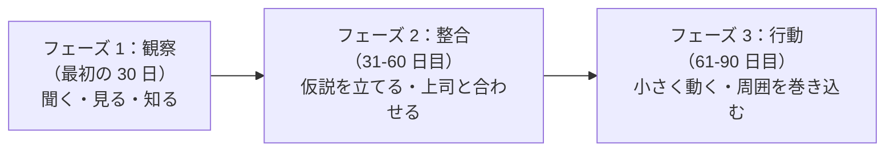
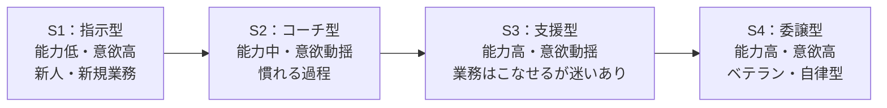

# はじめての部下マネジメント

任命直後の混乱から最初の評価面談まで——マネジャーとしての旅を始める

| 項目 | 内容 |
|---|---|
| カテゴリー | マネジメント・組織開発 |
| 難易度 | 初級 |
| 所要時間 | 約200分（全8レッスン） |
| 公開日 | 2026-06-23 |
| 最終更新日 | 2026-06-23 |
| コースURL | https://skillup.college/courses/management/new-manager-basics/ |

## 対象者

新しくマネジャー（管理職・チームリーダー・課長・係長など）になった方、近い将来マネジャーへの昇格が予定されている方、過去に新任マネジャーとして失敗経験のある方の学び直しに。プレイヤーとして実績を上げてきた方が、はじめて「人を介して成果を出す」立場に立つときの羅針盤として使える入門コース。業種・職種を問わず受講できる。

## 前提知識

特になし。社会人として一定の業務経験があれば十分。マネジメント経験は不要。むしろ「これから初めてマネジャーになる方」「マネジャーになったばかりで戸惑っている方」を主対象に設計。

## 学習目標

- マネジャーの役割の本質（プレイヤーとの違い、3つの責任）を理解する
- 最初の 90 日プランで「信頼の貯金」を作る発想を持つ
- 業務マネジメント（目標設定・進捗管理・優先順位）の基本を扱える
- 人のマネジメント（観察・声がけ・関わり方）の発想を身につける
- 権限委譲（任せる技術）の段階と、過度な介入を避ける方法を理解する
- 1on1 と日常のフィードバックで部下の成長を支えられる
- 初めての評価面談で公正さと納得感、成長促進を両立する発想を持つ
- マネジャーの孤独に向き合い、上司・周囲との関わりで長く続けられる準備をする

## コース概要

「優秀なプレイヤーが、優秀なマネジャーになるとは限らない」——任命直後に多くの新任マネジャーが直面する現実です。プレイヤーとして高い成果を上げてきた方ほど、マネジャーになった瞬間に「自分でやった方が早い」「部下のやり方が気になる」「人を待つのが苦痛」と感じます。これは欠点ではなく、プレイヤーとしての努力の結果。けれども、マネジャーには別の発想が要ります。本コースは、新任マネジャー（任命直後〜入社 1 年目）の方を主対象に、マネジャーとしての役割の本質、最初の 90 日プラン、業務と人の両輪、権限委譲、1on1 とフィードバック、評価面談の初体験、マネジャーの孤独との付き合い方までを 8 レッスンで段階的に学びます。「これからマネジャーになる方」「マネジャーになったばかりで戸惑っている方」「過去の新任時の失敗を学び直したい中堅マネジャー」のいずれにも応える構成です。

## 学習の流れ

レッスン 1 でマネジャーの役割の本質と、プレイヤーからの発想転換を扱います。レッスン 2 は「最初の 90 日プラン」で、信頼の貯金を作る期間の使い方を学びます。前半（1〜2）が「マインドセット編」です。中盤（3〜5）は「業務と人と権限」の三本柱で、業務マネジメント（L3）、人のマネジメント（L4）、権限委譲（L5）と展開します。後半（6〜8）は「対話と評価と長期視点」で、1on1 とフィードバック（L6）、評価面談（L7）、マネジャーの孤独と長く続けるための関わり（L8）を扱います。最終的に、新任マネジャーの方が「最初の 1 年を生き延びる」だけでなく、「長く続けられるマネジャーになる」土台を持ち帰っていただく構成です。

## レッスン一覧

| No. | タイトル | 概要 | 所要時間 |
|---|---|---|---|
| 1 | マネジャーとは何か——「プレイヤー」から「マネジャー」への発想転換 | マネジャーの定義と 3 つの責任、プレイヤーとの違い 5 つ、任命直後によくある 5 つの混乱、「優秀なプレイヤー = 優秀なマネジャー」とは限らない理由、本コースの守備範囲を学ぶ | 25分 |
| 2 | 最初の 90 日プラン——「信頼の貯金」を作る期間 | 「最初の 90 日」が決定的に重要な理由、Watkins の First 90 Days、フェーズ別の重点（観察・整合・行動）、ヒアリングと観察、「すぐ変えたい」誘惑への対処、クイックウィンの設計を学ぶ | 25分 |
| 3 | 業務マネジメント——目標設定と進捗管理の基本 | マネジャーの業務（プレイヤー業務との分離）、チーム目標の設定（OKR・KPI・MBO の使い分け）、進捗管理の発想（マイクロマネジメントの罠）、優先順位付け、業務の見える化、リソース配分を学ぶ | 25分 |
| 4 | 人のマネジメント——観察・声がけ・一人ひとりへの関わり | 「人を見る」とは何か、メンバー一人ひとりを知る 4 つの視点（職務スキル・キャリア志向・性格・状況）、日常の観察と声がけ、不調・成長サインへの気づき、「全員に同じ接し方」では機能しない理由を学ぶ | 25分 |
| 5 | 権限委譲——「任せる技術」を身につける | 権限委譲の発想、「自分でやった方が早い病」からの脱出、任せ方の段階（状況対応リーダーシップ）、スキルと意欲のマトリクス、任せた後のモニタリング、失敗を許容する範囲の設計を学ぶ | 25分 |
| 6 | 1on1 とフィードバック——部下の成長を支える対話 | 1on1 の目的（成果ではなく成長）、準備・進め方・記録、質問の技術、ポジティブフィードバックの型、改善フィードバックの型（SBI・サンドイッチ）、生成 AI 1on1 ツールの現在地を学ぶ | 25分 |
| 7 | 評価面談の初体験——公正・納得・成長を両立する | 評価面談の意味（賃金決定 vs 成長促進）、評価制度の理解、評価面談の準備（評価結果・根拠・伝え方）、面談の進め方、低評価・高評価メンバーへの対応、面談後のフォローアップを学ぶ | 25分 |
| 8 | マネジャーの孤独と長く続けるために——上司・周囲・自分との関わり | マネジャーの孤独（誰にも話せないこと）、上司との関わり（最大の相談相手）、同期マネジャーの繋がり、メンター・コーチを持つ、人事の力を借りる、メンタルケア、修了後の学習方向を学ぶ | 25分 |

---

## レッスン1：マネジャーとは何か——「プレイヤー」から「マネジャー」への発想転換

（所要時間：25分）

### このレッスンで学ぶこと

- マネジャーの定義と 3 つの責任（業務・人・組織）を理解する
- プレイヤーとマネジャーの違いを 5 つの観点で整理する
- 任命直後の新任マネジャーが直面する 5 つの混乱パターンを知る
- 「優秀なプレイヤー = 優秀なマネジャー」とは限らない理由を理解する
- 本コースの守備範囲と、他コースとの位置づけを把握する

---

「マネジャーになりました」「来月から課長です」「チームリーダーに抜擢されました」——おめでとうございます、と同時に、戸惑いや不安を抱える方が大半ではないでしょうか。プレイヤーとして実績を上げてきた方ほど、任命直後にこんな声を内側に聞きます。「自分でやった方が早い」「部下のやり方が気になる」「人を待つのが苦痛」「会議ばかりで自分の仕事が進まない」——本レッスンは、本コース全体の前提として、マネジャーとは何か、プレイヤーとの違いは何か、なぜ任命直後に混乱するのかを整理することから始めます。

### マネジャーの定義

本コースでは、マネジャー（manager）を次のように定義します。

> 自分の手を動かして成果を出すのではなく、メンバーを介して成果を出すことに責任を持つ役割。

この定義の鍵は 3 つです。

#### 1. 「自分の手を動かす」のではない

プレイヤーは、自分の手を動かして成果を出すのが本業です。営業なら自分が商談する、エンジニアなら自分がコードを書く、企画なら自分が企画書を書く——「自分の動き」が成果に直結します。

マネジャーは違います。マネジャーの「自分の動き」は、メンバーの動きを支える行為（会議、1on1、調整、判断、評価、報告）に変わります。直接の成果（売上、コード、企画書）は、メンバーが出します。

#### 2. 「メンバーを介して」成果を出す

マネジャーの成果は、メンバー全員の合計です。マネジャー単独では、ほとんど成果を出せません。「3 人のメンバーがいて、各自 100 の成果を出せば、マネジャーの成果は 300」という発想です。

ここで重要なのが、メンバー個人の成果以上のものを引き出す「掛け算」の発想です。3 人が個別に動けば 300 ですが、3 人が協力し合えば 400 や 500 になります。逆に、3 人がバラバラだったり、足を引っ張り合えば 200 にも届きません。

#### 3. 「責任を持つ」

マネジャーは、チームの成果に責任を持ちます。「メンバーが頑張ったのに成果が出なかった」「部下が失敗した」——いずれも、最終的にマネジャーの責任です。「自分は指示したのに」「部下の能力が足りなかった」と言うのは、マネジャーの責任放棄です。

逆に、メンバーが出した成果は、メンバーの手柄として称えます。「自分の指導の成果」と独り占めしない発想が、信頼を支えます。

> **💡 ポイント**
> マネジャーは「自分の手を動かす」のではなく「メンバーを介して」成果を出し、「責任を持つ」役割です。3 人のメンバーの合計以上の成果を引き出すのがマネジャーの仕事、責任は自分が、手柄はメンバーに、が基本です。

### マネジャーの 3 つの責任

マネジャーが負う責任を、本コースでは 3 つに整理します。

#### 責任 1：業務責任（チームの成果を出す）

担当業務のチーム目標を達成する責任です。営業マネジャーなら売上目標、開発マネジャーなら開発スケジュール、企画マネジャーなら企画の遂行——「数字」や「成果物」で評価されることが多いです。

#### 責任 2：人責任（メンバーの成長を支える）

メンバーの育成、評価、キャリア支援、心身の健康、定着の責任です。短期的には数字に表れにくいですが、長期的にはチームの成果と組織の競争力の源です。

#### 責任 3：組織責任（上司・他部署・経営との橋渡し）

自分のチームを孤立させず、組織の中で機能させる責任です。上司への報告、他部署との連携、経営からの方針の翻訳、組織のルールへの適合——「組織の一部としてのチーム」を保つ役割です。

#### 3 つの責任のバランス

| 責任 | 主な行動 | 評価軸 |
|---|---|---|
| 業務責任 | 目標設定、進捗管理、業務調整 | 短期の数字・成果物 |
| 人責任 | 1on1、フィードバック、評価、育成 | 中長期の定着・成長・エンゲージメント |
| 組織責任 | 上司への報告、他部署との連携、ルール遵守 | 組織の中でのチームの位置 |

新任マネジャーが最初に苦しむのは、3 つの責任のバランスです。業務責任に偏ると人が疲弊し、人責任に偏ると数字が落ち、組織責任に偏ると現場との信頼が薄れます。「3 つすべてを完璧に」は無理なので、状況に応じて重心を変える発想が必要です。

> **💡 ポイント**
> マネジャーの責任は「業務・人・組織」の 3 つ。新任時はバランスに迷いますが、3 つすべてを完璧にする必要はありません。状況に応じて重心を変える発想が大切です。

### プレイヤーとマネジャーの違い

プレイヤーとマネジャーは、同じ「会社員」でも、求められる発想が大きく違います。5 つの観点で対比します。

#### 違い 1：成果の出し方

| 観点 | プレイヤー | マネジャー |
|---|---|---|
| 成果の主体 | 自分 | メンバー |
| 成果の時間軸 | 短期（週・月） | 中長期（四半期・年） |
| 成果の単位 | 個人の成果物 | チームの成果合計 |

#### 違い 2：時間の使い方

| 観点 | プレイヤー | マネジャー |
|---|---|---|
| 集中業務 | 多い（コード、商談、企画） | 少ない（短時間に細切れ） |
| 会議 | 少なめ | 多い（管理職会議、1on1、面談、上司報告） |
| 「自分の予定」 | 自分でコントロール | 部下と上司の都合で振り回される |

#### 違い 3：評価される軸

| 観点 | プレイヤー | マネジャー |
|---|---|---|
| 評価対象 | 個人の業績 | チームの業績＋部下の育成 |
| 主な評価者 | 直属上司 | 直属上司＋部下（360 度評価） |
| 「すぐ評価」されるか | されやすい | されにくい（半年〜1 年後） |

#### 違い 4：意思決定の質

| 観点 | プレイヤー | マネジャー |
|---|---|---|
| 決定の対象 | 自分の業務 | 部下の業務・配置・評価 |
| 決定の影響 | 自分のみ | チーム全員 |
| 失敗の重み | 自分でカバー | 部下のキャリアに影響 |

#### 違い 5：感情の扱い

| 観点 | プレイヤー | マネジャー |
|---|---|---|
| 自分の感情 | 自分のもの | 部下に伝染する |
| 部下への感情 | 仕事仲間 | 評価する立場 |
| 不機嫌の扱い | 自由 | 不機嫌は職権乱用に近い |

特に「自分の感情の扱い」は、新任マネジャーの方が後から気づくことが多いポイントです。プレイヤー時代に「忙しいときは不機嫌になる」「気分にムラがある」が許されていた方も、マネジャーになると、自分の機嫌が部下のパフォーマンスを直接左右します。

> **💡 ポイント**
> プレイヤーとマネジャーは「成果の出し方・時間の使い方・評価軸・意思決定・感情の扱い」の 5 観点で大きく違います。特に「自分の感情が部下に伝染する」点は、新任マネジャーが後から気づきやすい論点です。

### 任命直後によくある 5 つの混乱パターン

新任マネジャーの方々が、任命直後の 3 〜 6 か月によく直面する混乱を、5 つに整理します。

#### 混乱 1：「自分でやった方が早い」病

部下のアウトプットが遅い、品質に納得できない、と感じて、自分で巻き取ってしまうパターン。短期は回りますが、部下が育たず、マネジャー自身も疲弊します。

#### 混乱 2：「マイクロマネジメント」化

部下のやり方を細かく指示し、進捗を頻繁に確認し、自分の思う通りに動かそうとするパターン。部下の主体性が育たず、関係も冷えていきます。

#### 混乱 3：「優しすぎる」病

部下に嫌われたくない、評価面談で厳しいことを言いたくない、と感じて、当たり障りのない対応に終始するパターン。部下は成長機会を失い、チームの基準も下がります。

#### 混乱 4：「会議だけで 1 日が終わる」状態

マネジャーになると会議が増えます。1on1、管理職会議、上司への報告、他部署との連携、評価会議——気がつくと、自分の頭を使う時間がなくなります。「マネジャーになって何の仕事をしたのかわからない 1 日」の典型です。

#### 混乱 5：「孤独」を感じる

プレイヤー時代は同僚と愚痴を言い合えました。マネジャーになると、部下には言えない、上司にも言いにくい、と感じる場面が増えます。家族や元同僚にも、業務の機微は話せません。「相談できる相手がいない」感覚が、知らず知らず蓄積します。

#### 5 つの混乱は、誰もが通る

これら 5 つの混乱は、新任マネジャーが避けて通れるものではありません。むしろ、「自分だけが苦しんでいるのではない」と知ることが、最初の救いになります。本コースでは、各レッスンでこれらの混乱への具体的な対処を扱います。

> **💡 ポイント**
> 任命直後の混乱 5 パターン：「自分でやった方が早い病」「マイクロマネジメント化」「優しすぎる病」「会議だけで 1 日が終わる」「孤独」。誰もが通る道で、自分だけが苦しんでいるわけではありません。

### 「優秀なプレイヤー = 優秀なマネジャー」とは限らない

研修現場で、私が冒頭に必ずお伝えする一言があります。「優秀なプレイヤーが、優秀なマネジャーになるとは限らない」。これは事実であり、新任マネジャーに対する慰めでもあります。

#### なぜ、別のスキルなのか

プレイヤーとして高い成果を出すスキルは、「自分の業務遂行能力」です。営業なら商談力、エンジニアなら技術力、企画なら発想力。

マネジャーとして高い成果を出すスキルは、「メンバーを介して成果を出す能力」です。観察力、聴く力、任せる力、評価する力、組織を動かす力。

二つは別物です。プレイヤーで優秀でも、マネジャーで優秀になるとは限らない。プレイヤーで凡庸でも、マネジャーで優秀になることもある。「マネジャーは別のスキル、別の発想」というのが、本コースの大前提です。

#### 「ピーターの法則」

組織論で有名な「ピーターの法則」（Laurence J. Peter、1969 年）が、この現実を語っています。「人は、能力の限界に達するまで昇進し続け、最終的には『能力を発揮できない地位』にとどまる」。プレイヤーとして優秀だから昇進し、マネジャーで困難に直面する——これは個人の問題ではなく、組織の構造的な現象です。

#### 「マネジャーの素質がない」ではなく「学んでいない」

新任マネジャーで苦しむ方が、「自分はマネジャーに向いていないのでは」と落ち込むことがあります。多くの場合、それは事実ではありません。「マネジメントを学んでいない」「経験を積み始めたばかり」というのが正確です。マネジャーは技術であり、訓練と経験で身につきます。素質や才能の問題ではありません。

> **💡 ポイント**
> 「優秀なプレイヤー = 優秀なマネジャー」とは限らない、というのは事実であり慰めでもあります。プレイヤーとマネジャーは別のスキル。マネジャーは技術であり、訓練と経験で身につきます。素質や才能の問題ではありません。

### 本コースの守備範囲

本コースは、新任マネジャー（任命直後〜入社 1 年目）の方を主対象に、8 レッスンで以下を扱います。

#### 扱う範囲

- マネジャーの役割の本質（プレイヤーとの違い、3 つの責任）
- 最初の 90 日プラン（信頼の貯金を作る期間）
- 業務マネジメント（目標設定・進捗管理・優先順位）
- 人のマネジメント（観察・声がけ・関わり方）
- 権限委譲（任せる技術）
- 1on1 とフィードバック（基本の型）
- 評価面談の初体験
- マネジャーの孤独と長く続けるための関わり

#### 扱わない範囲

- 組織開発の専門領域（OD、組織変革）
- 人事制度設計（等級・評価・報酬制度の設計）
- 経営戦略策定
- 中間管理職・部長以上の階層別論点（カテゴリ 21 の続編で扱う想定）
- 業種特有のマネジメント（製造業の現場マネジメント、IT 業界のエンジニアマネジメントなど）
- リーダーシップの哲学・思想史

#### 守備範囲外だが、隣接コース

本コースと隣接する他コースは複数あります。本コースは「新任マネジャー」の視点に集中するため、これらのコースを併用すると理解が深まります。

- **心理的安全性**：チームに心理的安全性を作る技法。本コースのレッスン 4 で軽く触れますが、詳細は別領域
- **リモートマネジメント**：リモート・ハイブリッド環境特有の運用。本コースは対面・リモートを区別しません
- **ファシリテーション**：会議運営の専門技法。本コースのレッスン 3 で軽く触れます
- **アサーティブコミュニケーション**：自己表現と境界線の対人スキル。本コースのレッスン 6・7 で軽く触れます
- **多様性とインクルージョン**：D&I の知識と実践。本コースは基本的な前提として組み込みます

#### スタンス

本コースは、マネジャーを「魔法の存在」とも「特別な才能のある人」とも見なしません。技術であり、訓練と経験で身につく職務として扱います。「最初は誰でも新任マネジャー」を前提に、新任の方が「最初の 1 年を生き延びる」だけでなく「長く続けられるマネジャーになる」土台を提供することを目指します。

> **💡 ポイント**
> 本コースは新任マネジャー（任命〜1 年目）を主対象に、8 レッスンで役割の本質から最初の 90 日、業務と人、権限委譲、1on1、評価面談、マネジャーの孤独までを扱います。マネジャーは技術であり、訓練と経験で身につく職務として位置づけます。

### まとめ

このレッスンでは、以下のことを学びました。

- マネジャーは「自分の手を動かす」のではなく「メンバーを介して」成果を出し「責任を持つ」役割
- マネジャーの 3 つの責任：業務責任・人責任・組織責任。3 つすべてを完璧にする必要はなく、状況に応じて重心を変える
- プレイヤーとマネジャーの違い 5 観点：成果の出し方・時間の使い方・評価軸・意思決定の質・感情の扱い
- 任命直後の混乱 5 パターン：「自分でやった方が早い病」「マイクロマネジメント化」「優しすぎる病」「会議だけで 1 日が終わる」「孤独」。誰もが通る道
- 「優秀なプレイヤー = 優秀なマネジャー」とは限らない。ピーターの法則。マネジャーは別のスキル
- 「素質がない」ではなく「学んでいない」。マネジャーは技術であり、訓練と経験で身につく
- 本コースは新任マネジャー（任命〜1 年目）を主対象に 8 レッスンで段階的に学ぶ構成

次のレッスンでは、「最初の 90 日プラン」を扱います。Watkins の First 90 Days を土台に、信頼の貯金を作る期間の使い方、観察・整合・行動のフェーズ、「すぐ変えたい」誘惑への対処、クイックウィンの設計を学びます。

---

### 確認クイズ

このレッスンの理解度をチェックしましょう。

#### Q1. 本コースが定義する「マネジャー」として、最も適切なものはどれか？

- [x] 自分の手を動かして成果を出すのではなく、メンバーを介して成果を出すことに責任を持つ役割。「責任は自分が、手柄はメンバーに」が基本
- [ ] 自分の業務スキルで最高のアウトプットを出すスペシャリスト
- [ ] 部下に指示を出して自分の思う通りに動かす権限者
- [ ] 経営層からの指示を部下に伝えるだけの中継者

> **解説**
> マネジャーは「自分の手を動かす」のではなく「メンバーを介して」成果を出し、「責任を持つ」役割です。スペシャリスト、権限者、中継者というのは部分的な誤解です。

#### Q2. マネジャーの 3 つの責任として、本レッスンが整理した内容はどれか？

- [ ] 給与責任・福利厚生責任・採用責任
- [x] 業務責任（チームの成果を出す）、人責任（メンバーの成長を支える）、組織責任（上司・他部署・経営との橋渡し）の 3 つ。新任時はバランスに迷うが、3 つすべてを完璧にする必要はなく、状況に応じて重心を変える
- [ ] 報告責任・連絡責任・相談責任
- [ ] 設計責任・実装責任・運用責任

> **解説**
> マネジャーの 3 つの責任は「業務・人・組織」です。新任時はバランスに迷いますが、状況に応じて重心を変える発想が大切です。

#### Q3. プレイヤーとマネジャーの違いとして、本レッスンが整理した内容はどれか？

- [ ] プレイヤーもマネジャーも、求められる発想は完全に同じ
- [ ] マネジャーはプレイヤーより常に「楽」な仕事
- [x] 「成果の出し方（自分 vs メンバー）」「時間の使い方（集中 vs 細切れ）」「評価される軸（個人 vs チーム＋部下育成）」「意思決定の質（自分のみ vs チーム全員に影響）」「感情の扱い（自分のもの vs 部下に伝染）」の 5 観点で大きく違う
- [ ] プレイヤーはマネジャーより常に「楽」な仕事

> **解説**
> プレイヤーとマネジャーは 5 観点で大きく違います。特に「自分の感情が部下に伝染する」点は、新任マネジャーが後から気づきやすい論点です。

#### Q4. 任命直後の新任マネジャーが直面する混乱 5 パターンとして、本レッスンが整理した内容はどれか？

- [ ] 「給料が上がる」「権限が増える」「会議が減る」「自由時間が増える」「ストレスが減る」
- [ ] 「部下が自動的に動く」「成果が勝手に上がる」「会議が減る」「気楽になる」「自由が増える」
- [ ] 「手柄を独り占めできる」「責任を回避できる」「自由に決められる」「部下を選べる」「給与が高い」
- [x] 「自分でやった方が早い病」「マイクロマネジメント化」「優しすぎる病」「会議だけで 1 日が終わる」「孤独」。誰もが通る道で、自分だけが苦しんでいるわけではない

> **解説**
> 任命直後の 5 つの混乱は誰もが通る道です。「自分だけが苦しんでいるのではない」と知ることが最初の救いになります。

#### Q5. 「優秀なプレイヤー = 優秀なマネジャー」とは限らないという主張について、本レッスンが説明した内容はどれか？

- [x] プレイヤーとマネジャーは別のスキル。プレイヤーで優秀でも、マネジャーで優秀になるとは限らない。「ピーターの法則」（Laurence J. Peter、1969 年）が示すように、組織の構造的な現象。新任マネジャーで苦しむのは「素質がない」のではなく「マネジメントを学んでいない、経験を積み始めたばかり」が正確
- [ ] 優秀なプレイヤーは必ず優秀なマネジャーになる
- [ ] プレイヤーで優秀でない人だけがマネジャーになる
- [ ] マネジャーは生まれつきの素質で決まる

> **解説**
> プレイヤーとマネジャーは別のスキルです。マネジャーは技術であり、訓練と経験で身につきます。素質や才能の問題ではありません。

#### Q6. 本コースの守備範囲とスタンスについて、本レッスンが説明した内容はどれか？

- [ ] 中間管理職・部長以上の階層別論点を中心に扱う
- [x] 新任マネジャー（任命直後〜入社 1 年目）の方を主対象に、役割の本質から最初の 90 日、業務と人、権限委譲、1on1、評価面談、マネジャーの孤独までを 8 レッスンで段階的に扱う。マネジャーは技術であり、訓練と経験で身につく職務として位置づける
- [ ] 経営戦略策定や組織開発の専門論点を中心に扱う
- [ ] 業種特有のマネジメント（製造業・IT 業など）を扱う

> **解説**
> 本コースは新任マネジャーを主対象に、役割の本質から最初の 1 年を支える要素を 8 レッスンで扱います。マネジャーは技術であり、訓練と経験で身につく職務として位置づけます。

---

## レッスン2：最初の 90 日プラン——「信頼の貯金」を作る期間

（所要時間：25分）

### このレッスンで学ぶこと

- 「最初の 90 日」が決定的に重要な理由を理解する
- Michael Watkins の First 90 Days（2003 年）の発想を整理する
- 90 日を 3 つのフェーズ（観察・整合・行動）に分けて使う発想を持つ
- メンバーへのヒアリング・観察・記録の進め方を理解する
- 「すぐ変えたい」誘惑への対処法を身につける
- 最初の 90 日にやってはいけない 5 つのことを把握する
- クイックウィン（Quick Win）の設計と注意点を理解する

---

前回のレッスンで、マネジャーの役割の本質とプレイヤーからの発想転換を扱いました。本レッスンは、新任マネジャーが任命直後にもっとも投資すべき時期——「最初の 90 日」を扱います。この 3 か月をどう使うかで、その後の 1 年・3 年の成果が大きく変わります。本コース 2 回目の核心テーマです。

### なぜ「最初の 90 日」が決定的に重要か

新任マネジャーの最初の 90 日が重要な理由は、3 つあります。

#### 1. 「第一印象」の修正可能期間が短い

新しいチームに着任すると、メンバーは数日のうちに「このマネジャーはどんな人か」の第一印象を形成します。「厳しい人」「優しい人」「マイクロマネジメント型」「放任型」「自分の話を聞いてくれる人」——印象は早期に固まり、後から修正するのに大きな労力が要ります。

#### 2. 「変えたい」が殺到する時期

新任マネジャーは、着任直後に「あれもこれも変えたい」と感じます。前任の進め方、メンバーの行動、ツール、会議体——プレイヤー視点で気になっていた点が、マネジャー視点で改めて見えるからです。けれども、最初の 90 日で何でも変えると、信頼を失うリスクが大きくなります。

#### 3. 「信頼の貯金」が後に効く

最初の 90 日は、業務の成果を急ぐより、メンバー・上司・関係者との「信頼の貯金」を作る時期です。後で困難な意思決定が必要になったとき、貯金があれば突破できます。貯金がないと、正しい判断でもメンバーがついてきません。

> **💡 ポイント**
> 最初の 90 日は「第一印象の修正可能期間が短い」「変えたい誘惑が殺到する」「信頼の貯金が後に効く」の 3 つの理由で決定的に重要。業務の成果を急ぐより、信頼の貯金を作ることに投資する時期です。

### Michael Watkins の First 90 Days

新任マネジャーの「最初の 90 日」について、世界でもっとも参照されている書籍が、Michael Watkins の『The First 90 Days』（2003 年初版、最新版は 2013 年改訂版）です。Watkins はハーバード・ビジネス・スクールの教授を経て、現在は IMD ビジネススクール（スイス）の教授・経営コンサルタント。本書は世界で 150 万部以上を売り、新任マネジャー・新任役員向けの定番書として知られています。

#### 本書の中核メッセージ

> 新しい役職に就いた直後の 90 日は、リーダーシップの過渡期。早期に効果を出すのではなく、効果を出すための土台を作る期間。

「すぐ成果を出さなければ」と焦りがちな新任マネジャーに、「最初は土台作りが本業」と教えるのが本書の核心です。

#### Watkins の 7 つの定石

Watkins は新任マネジャーが守るべき定石を 7 つ挙げています。本コースでは、本書の核心を新任の方向けに 3 フェーズに整理して扱います。

> **💡 ポイント**
> Michael Watkins の『The First 90 Days』（2003 年）は新任マネジャー・新任役員向けの定番書。「最初の 90 日は早期に効果を出すのではなく、効果を出すための土台を作る期間」が中核メッセージです。

### 90 日を 3 フェーズに分ける——観察・整合・行動

本コースでは、最初の 90 日を 3 つのフェーズに分けます。



#### フェーズ 1：観察（最初の 30 日）

「聞く・見る・知る」が中心の期間です。

- メンバー全員と 1 対 1 で面談する（30 分〜1 時間）
- 上司と詳細に話す（チームへの期待・前任者の評価・経営からの注文）
- 業務の流れ・既存資料・主要 KPI を読み込む
- 他部署・顧客・取引先からの「チームへの評価」を集める
- 自分の感覚で「気になる点」をメモする（変えるとは決めない）

このフェーズで重要なのは、「判断を保留」することです。「自分ならこう変える」と思っても、まだ口に出さない。情報収集に徹します。

#### フェーズ 2：整合（31〜60 日目）

「仮説を立て、上司と合わせる」期間です。

- 観察の結果から、チームの強み・弱み・機会・脅威を整理する
- 業務の優先順位を再設計する仮説を立てる
- メンバー一人ひとりの強みと課題、配置の見直し案を考える
- 上司と「自分の見立てと、これから何に取り組むか」を合わせる
- 全メンバーに「チームのこれから」を伝える（小さなビジョン）

このフェーズで重要なのは、「上司との整合」です。新任マネジャーが独断で動き始めると、上司との関係にひびが入ります。「自分はこう見ました、これを変えたいと思いますがいかがでしょうか」と相談しながら進める。

#### フェーズ 3：行動（61〜90 日目）

「小さく動き、周囲を巻き込む」期間です。

- フェーズ 2 で立てた仮説のうち、優先度の高いものを 2 〜 3 つ実行する
- メンバーを巻き込み、変更の理由と進め方を共有する
- クイックウィン（次節で扱う）を 1 つ作る
- 上司・他部署に「何が変わったか・なぜ変わったか」を報告する
- 次の 90 日（91〜180 日目）の計画を立てる

このフェーズで重要なのは、「全部はやらない」ことです。気になる点が 10 個あっても、優先度の高い 2 〜 3 つに絞ります。残りは次の 90 日に持ち越します。

> **💡 ポイント**
> 90 日を「観察（1〜30 日）→ 整合（31〜60 日）→ 行動（61〜90 日）」の 3 フェーズに分けます。フェーズ 1 は判断を保留、フェーズ 2 は上司との整合、フェーズ 3 は優先度の高い 2 〜 3 つに絞って実行します。

### メンバーへのヒアリングの進め方

フェーズ 1 でもっとも投資すべきが、メンバー全員との 1 対 1 面談です。

#### 面談の準備

- 30 分〜1 時間を確保する（短すぎると深い話にならない）
- 場所は静かなところ（個室、社外カフェ、リモートなら静かな環境）
- メモは取るが、相手の話を遮らない
- 「これは評価ではない」と最初に伝える

#### 質問の型

具体的な質問の型を、5 つに整理します。

1. **自己紹介**：「ご自身の経歴と、いまの仕事の中身を簡単に教えてください」
2. **業務理解**：「いまの業務で、もっとも時間をかけているのは何ですか？」
3. **満足と不満**：「いまの仕事で、好きなところと、変えたいところは何ですか？」
4. **チームへの見方**：「チームの強みと、改善したい点は何ですか？」
5. **マネジャーへの期待**：「私にやってほしいこと、やってほしくないことはありますか？」

質問の順序が大切です。いきなり「マネジャーへの期待」を聞くと、相手は警戒します。順に温めていきます。

#### 「やってほしくないこと」が金脈

5 番目の「マネジャーへの期待」で、「やってほしくないこと」を必ず聞きます。多くのメンバーは最初は遠慮しますが、安全だとわかると本音を話してくれます。「前任の○○さんは細かく指示してきて、自分のペースで仕事できなかった」「会議が多すぎて、集中する時間がなかった」など、貴重な情報です。

#### 記録の取り方

面談後は、相手別に簡単なメモを残します。

- 名前、所属、入社年
- 業務の中身
- 強み（自己評価と私の印象）
- 課題（本人が言ったこと、私が感じたこと）
- マネジャーへの期待・希望
- 次に話したいテーマ

このメモは、後の 1on1（レッスン 6 で扱う）の基礎データになります。

> **💡 ポイント**
> フェーズ 1 でもっとも投資すべきは、メンバー全員との 1 対 1 面談です。質問の型は「自己紹介 → 業務理解 → 満足と不満 → チームへの見方 → マネジャーへの期待」。特に「やってほしくないこと」が金脈で、後の関係構築の土台になります。

### 「すぐ変えたい」誘惑への対処

新任マネジャーの最大の落とし穴が「すぐ変えたい」誘惑です。フェーズ 1（観察期間）に、外から見えた「気になる点」が次々と浮かびます。プレイヤー時代に不満だった会議体、メンバーの雑な進め方、ツール、KPI、レポート様式——「これは早く変えたい」「自分なら 1 週間でできる」と感じます。

#### なぜ、すぐ変えてはいけないか

- 観察が浅いまま変えると、本当の原因を見誤る
- 「前任を否定する」メッセージが伝わり、前任を慕うメンバーから反発を買う
- 信頼の貯金がゼロのうちに大きな変更を行うと、メンバーの抵抗が大きい
- 1 か月後に「やはり戻した方が良い」と気づいても、戻すコストが大きい

#### 「3 か月待つ」というルール

本コースが推奨するのは、「3 か月は大きな変更をしない」というルールです。気になる点はメモに残し、観察を続ける。3 か月経ってもまだ気になり、かつ理由が明確になっていれば、変える。多くの場合、3 か月経つと「最初の気になり方とは違う角度」で理解が深まり、変更内容も変わります。

#### 「すぐ変える」が許される例外

ただし、いくつか例外があります。

- 法令違反・コンプライアンス上の問題（即時是正）
- 安全に関わる問題（即時是正）
- メンバーや関係者の心身の健康を損なう状況（即時介入）
- 上司から明確に「○○を 1 か月以内に変えてほしい」と指示された事項

これらは「3 か月待つ」より優先します。それ以外は、待つ方が結局早く着きます。

> **💡 ポイント**
> 新任マネジャーの最大の誘惑は「すぐ変えたい」。本コースの推奨は「3 か月は大きな変更をしない」ルール。例外はコンプライアンス・安全・健康・上司からの明確な指示のみ。「観察した上で変える」方が結局早く着きます。

### 最初の 90 日にやってはいけない 5 つのこと

90 日の使い方として、典型的な失敗を 5 つに整理します。

#### 失敗 1：前任の悪口を言う

「前のマネジャーは○○だったらしいですね」「前任のやり方はおかしいですよね」——絶対に言いません。たとえメンバーから前任批判が出ても、同調しません。「貴重な情報ありがとうございます。私はまだ判断できる立場じゃないので、まずは観察させてください」と返します。

#### 失敗 2：「自分ならこう変える」を早期に宣言

着任初日のチーム朝礼で「私の方針は○○です」と宣言してしまうケース。フェーズ 1（観察）が終わる前の宣言は、ほぼ確実に後悔します。

#### 失敗 3：上司との整合をスキップして動く

「上司は忙しそうだから」「自分の判断で進めた方が早い」と思い、上司への相談・報告を怠るケース。後で「聞いていない」「そんな話だったか」と問題化します。

#### 失敗 4：メンバー全員と面談しない

時間を節約するため、一部のメンバーとしか面談しないケース。面談しなかったメンバーは「自分は重要視されていない」と感じ、信頼関係の土台が崩れます。

#### 失敗 5：プレイヤー業務を抱え続ける

「プレイヤーの仕事も得意だから、自分でやった方が早い」と、プレイヤー業務を継続するケース。マネジャー業務の時間が圧迫され、観察も整合も中途半端になります。

> **💡 ポイント**
> 最初の 90 日にやってはいけない 5 つ：「前任の悪口」「自分ならこう変えるの早期宣言」「上司との整合スキップ」「メンバー全員と面談しない」「プレイヤー業務を抱え続ける」。すべて、知らず知らずに陥りやすい罠です。

### クイックウィン（Quick Win）の設計

最初の 90 日で、ぜひ 1 つ実現してほしいのが「クイックウィン」です。

#### クイックウィンとは

短期間（4 〜 8 週間程度）で実現可能で、メンバーや上司に「マネジャーが変わって良くなった」と感じてもらえる成果を指します。Watkins の『First 90 Days』でも、新任マネジャーの「初期の信頼を作る重要な手段」として強調されています。

#### 良いクイックウィンの 4 条件

- **早く達成できる**：4 〜 8 週間以内
- **メンバーに価値がある**：自分のアピールではなく、メンバーの仕事が楽になる
- **目に見える**：成果が誰の目にも明らかにわかる
- **将来への布石になる**：単発で終わらず、次の改革の土台になる

#### クイックウィンの例

- 「報告書のフォーマットを簡素化して、作成時間を半分にする」
- 「無駄な会議体を 1 つ廃止して、メンバーの集中時間を増やす」
- 「上司との掛け合いで、メンバーが長年困っていた予算を確保する」
- 「他部署と調整して、メンバーの作業を止めていた承認フローを高速化する」
- 「メンバーの誰かが提案していた改善案を実行に移す」

最後の「メンバーの提案を実行に移す」は、特に効果的です。前任時代に提案が通らなかった案を、新任マネジャーが上司と掛け合って通す——メンバーから「このマネジャーは話を聞いてくれる」という信頼を得る最短経路です。

#### 注意点：「自分の手柄」にしない

クイックウィンが実現したとき、それを「自分の成果」として上司にアピールするのは逆効果です。「○○さんが前から提案していた案を、実行に移しました」と、メンバーや関係者の手柄として表現します。これが、次のクイックウィンへの信頼に繋がります。

> **💡 ポイント**
> クイックウィンは「4 〜 8 週間で達成、メンバーに価値あり、目に見える、将来への布石」の 4 条件。メンバーの提案を実行に移すのが特に効果的。実現しても「自分の手柄」にせず、メンバーや関係者の手柄として表現します。

### まとめ

このレッスンでは、以下のことを学びました。

- 最初の 90 日が重要な理由：「第一印象の修正可能期間が短い」「変えたい誘惑が殺到する」「信頼の貯金が後に効く」
- Michael Watkins『The First 90 Days』（2003 年）：「最初の 90 日は早期に効果を出すのではなく、効果を出すための土台を作る期間」が中核メッセージ
- 90 日を 3 フェーズに分ける：観察（1〜30 日）→ 整合（31〜60 日）→ 行動（61〜90 日）
- フェーズ 1 の中心はメンバー全員との 1 対 1 面談。質問の型は「自己紹介 → 業務理解 → 満足と不満 → チームへの見方 → マネジャーへの期待」
- 「すぐ変えたい」誘惑への対処：「3 か月は大きな変更をしない」ルール。例外はコンプライアンス・安全・健康・上司の明確な指示のみ
- やってはいけない 5 つ：「前任の悪口」「自分ならこう変えるの早期宣言」「上司との整合スキップ」「メンバー全員と面談しない」「プレイヤー業務を抱え続ける」
- クイックウィンの 4 条件：「4 〜 8 週間で達成、メンバーに価値あり、目に見える、将来への布石」。メンバーの提案を実行に移すのが特に効果的、自分の手柄にしない

次のレッスンでは、業務マネジメントの基本を扱います。マネジャーの業務とは何か、チーム目標の設定（OKR・KPI・MBO の使い分け）、進捗管理の発想（マイクロマネジメントの罠）、優先順位付け、業務の見える化を学びます。

---

### 確認クイズ

このレッスンの理解度をチェックしましょう。

#### Q1. 最初の 90 日が新任マネジャーにとって重要な理由として、本レッスンが整理した内容はどれか？

- [ ] 90 日以内に売上を 2 倍にする必要があるから
- [x] 「第一印象の修正可能期間が短い」「変えたい誘惑が殺到する」「信頼の貯金が後に効く」の 3 つの理由。業務の成果を急ぐより、信頼の貯金を作ることに投資する時期
- [ ] 90 日以内に部下を全員入れ替える必要があるから
- [ ] 90 日以内に上司を交代させる必要があるから

> **解説**
> 最初の 90 日は信頼の貯金を作る時期です。3 つの理由（第一印象、変えたい誘惑、貯金が後に効く）を理解すると、この時期の優先順位が変わります。

#### Q2. Michael Watkins の『The First 90 Days』（2003 年）の中核メッセージとして、本レッスンが説明した内容はどれか？

- [ ] 新任マネジャーは 90 日以内に大改革を実行すべき
- [x] 新しい役職に就いた直後の 90 日は、リーダーシップの過渡期。早期に効果を出すのではなく、効果を出すための土台を作る期間
- [ ] 90 日で結果を出せないマネジャーは交代すべき
- [ ] 90 日のうちにメンバーを全員入れ替えるべき

> **解説**
> Watkins の中核メッセージは「最初の 90 日は土台を作る期間」です。「すぐ成果を」と焦りがちな新任マネジャーに、「最初は土台作りが本業」と教える書籍です。

#### Q3. 本コースが推奨する 90 日の 3 フェーズとして、本レッスンが整理した内容はどれか？

- [ ] 攻撃・防衛・撤退の 3 フェーズ
- [ ] 採用・教育・解雇の 3 フェーズ
- [x] フェーズ 1：観察（1〜30 日、聞く・見る・知る）、フェーズ 2：整合（31〜60 日、仮説を立てる・上司と合わせる）、フェーズ 3：行動（61〜90 日、小さく動く・周囲を巻き込む）の 3 フェーズ
- [ ] 計画・実行・評価の 3 フェーズ

> **解説**
> 90 日を観察・整合・行動の 3 フェーズに分けます。フェーズ 1 は判断を保留、フェーズ 2 は上司との整合、フェーズ 3 は優先度の高い 2 〜 3 つに絞って実行します。

#### Q4. メンバーへの 1 対 1 面談の質問の型として、本レッスンが整理した順序はどれか？

- [ ] いきなり「私にやってほしいこと、やってほしくないことは何ですか？」から始める
- [ ] 「給料を上げてほしいですか？」「昇進したいですか？」だけを聞く
- [ ] 仕事の話は一切せず、プライベートの話だけをする
- [x] 「自己紹介 → 業務理解 → 満足と不満 → チームへの見方 → マネジャーへの期待（やってほしくないことを含む）」の順序。順に温めていく。特に「やってほしくないこと」が金脈

> **解説**
> 1 対 1 面談の質問の型は、いきなり期待を聞くのではなく順に温めていきます。「やってほしくないこと」が、後の関係構築の土台になります。

#### Q5. 「すぐ変えたい」誘惑への対処として、本コースが推奨する基本ルールはどれか？

- [x] 「3 か月は大きな変更をしない」ルール。気になる点はメモに残し、観察を続ける。3 か月経ってもまだ気になり、かつ理由が明確になっていれば変える。例外はコンプライアンス・安全・健康・上司からの明確な指示のみ
- [ ] 「気になったら即日変える」ルール
- [ ] 「3 年は何も変えない」ルール
- [ ] 「すべての変更を 1 か月以内に完了する」ルール

> **解説**
> 推奨は「3 か月は大きな変更をしない」ルール。「観察した上で変える」方が結局早く着きます。例外（コンプライアンス・安全・健康・上司指示）以外は待ちます。

#### Q6. 最初の 90 日にやってはいけない 5 つとして、本レッスンが整理した内容はどれか？

- [ ] 「メンバーと話す」「上司に報告する」「業務を理解する」「会議に出る」「観察する」
- [x] 「前任の悪口を言う」「『自分ならこう変える』を早期に宣言」「上司との整合をスキップして動く」「メンバー全員と面談しない」「プレイヤー業務を抱え続ける」の 5 つ
- [ ] 「自己紹介をする」「業務を覚える」「メンバーに会う」「マニュアルを読む」「上司と話す」
- [ ] 「研修を受ける」「資格を取る」「本を読む」「メンターに相談する」「同期と話す」

> **解説**
> やってはいけない 5 つは、すべて知らず知らずに陥りやすい罠です。覚えておくと、最初の 90 日の選択が変わります。

---

## レッスン3：業務マネジメント——目標設定と進捗管理の基本

（所要時間：25分）

### このレッスンで学ぶこと

- マネジャーの業務とプレイヤーの業務を分離する発想を理解する
- チーム目標の設定方法（OKR・KPI・MBO）の使い分けを把握する
- 進捗管理の発想と、マイクロマネジメントの罠を回避する方法を学ぶ
- 業務の優先順位付け（緊急 vs 重要、アイゼンハワー・マトリクス）を扱える
- 業務の見える化（ダッシュボード・カンバン・週次レポート）の基本を身につける
- リソース配分（人・時間・予算）の発想を持つ

---

前回のレッスンで「最初の 90 日プラン」を扱いました。本レッスンから、マネジャーの 3 つの責任のうち、まず「業務責任」の中身に入ります。「チームの成果を出す」とは、具体的に何をどう管理することか——目標設定、進捗管理、優先順位、見える化、リソース配分の 5 つの観点を、新任マネジャーに必要な範囲で整理します。

### マネジャーの業務とプレイヤーの業務を分離する

新任マネジャーが最初に直面する問いの 1 つが、「自分は何の業務をやるのか」です。

#### マネジャーの業務とは

マネジャーの業務は、「メンバーが業務を進めやすくする活動」の総体です。具体的には次のような行為です。

| 種類 | 例 |
|---|---|
| 目標設定 | チーム目標、個人目標、KPI の設計 |
| 計画 | 四半期計画、月次計画、リソース配分 |
| 進捗管理 | 週次レビュー、月次レビュー |
| 関係調整 | 上司への報告、他部署との連携、顧客対応 |
| 人の管理 | 1on1、評価、配置、採用 |
| 障害除去 | メンバーの相談対応、社内ルールの調整 |
| 環境整備 | ツール選定、会議体の運用、ナレッジ蓄積 |
| 判断 | 優先順位の判断、リスクの判断、稟議 |

これらはすべて、「メンバーが本業に集中できる環境を作る」活動です。

#### プレイヤー業務との分離

新任マネジャーがハマる典型が、「プレイヤー業務を抱え続ける」状態です。プレイヤーとして得意だった業務、自分でやった方が早い業務、評価面談で何か実績を作りたい業務——これらを抱え込むと、マネジャー業務の時間が圧迫されます。

本コースの推奨は、「マネジャー業務とプレイヤー業務を時間帯で分ける」発想です。

```
朝（9:00〜12:00）：マネジャー業務（メンバー対応、会議、判断）
昼（13:00〜15:00）：プレイヤー業務（残ったとしても 1〜2 件）
夕（15:00〜18:00）：マネジャー業務（記録、上司対応、翌日準備）
```

これは目安ですが、「マネジャー業務 70%、プレイヤー業務 30%」が新任の目安。1 年後には「マネジャー業務 85%、プレイヤー業務 15%」、3 年後には「マネジャー業務 95%、プレイヤー業務 5%（特殊案件のみ）」が標準的な遷移です。

#### プレイングマネジャーの罠

日本企業では「プレイングマネジャー」（プレイヤー業務を継続するマネジャー）が多く見られます。組織のリソース不足、本人の意欲、人事の判断——理由はさまざまですが、新任マネジャーの段階では、できる限り「マネジャー業務 70%以上」を確保すべきです。

プレイヤー業務を抱え過ぎると、3 つの問題が起こります。

- マネジャー業務（特に 1on1・観察・上司との整合）が疎かになる
- メンバーが「マネジャーは自分でやる人」と認識し、相談しなくなる
- 自分自身が燃え尽きる

> **💡 ポイント**
> マネジャー業務は「メンバーが業務を進めやすくする活動」の総体。プレイヤー業務との分離が新任マネジャーの最初の課題。「マネジャー業務 70%、プレイヤー業務 30%」が目安です。

### チーム目標の設定——OKR・KPI・MBO の使い分け

マネジャーの業務の中核が「目標設定」です。チームの方向を定め、メンバー全員と共有します。

#### 3 つの目標管理手法

業務で広く使われる目標管理手法を 3 つ整理します。

| 手法 | 略称の意味 | 中核発想 | 期間 |
|---|---|---|---|
| MBO | Management by Objectives | 目標による管理（個人 → 上司との合意） | 半年〜年 |
| KPI | Key Performance Indicator | 重要業績評価指標（業務の状態を数値化） | 月〜四半期 |
| OKR | Objectives and Key Results | 大胆な目的と測定可能な成果（達成 70% で OK） | 四半期 |

#### MBO（目標による管理）

Peter Drucker が 1954 年に提唱。「目標による管理（Management by Objectives, MBO）」は、個人がマネジャーと合意した目標に対して自律的に動く発想です。日本企業では人事評価と直結することが多く、半期・年間の業績評価の基礎に使われます。

特徴：

- メンバー個人の目標を上司と合意で決める
- 半期〜年間で達成度を評価する
- 達成度が評価・賞与・昇格に直結する場面が多い
- 設定が現実的になりがち（保身のため、過小設定）

#### KPI（重要業績評価指標）

Key Performance Indicator は、業務の状態を数値で把握するための指標です。営業の月次売上、開発のリリース数、サポートの応答時間、SaaS の MRR（月次経常収益）など、業務の中心軸を数値で追います。

特徴：

- 業務の進行状況をリアルタイムに近い形で把握できる
- ダッシュボードで可視化しやすい
- 短期の判断（来週の優先順位など）の根拠になる
- 数値偏重のリスクがある

#### OKR（大胆な目的と測定可能な成果）

Andy Grove（Intel 元 CEO）が 1970 年代に Intel で実践し、John Doerr が Google を含む多くの企業に広めた手法。「Objectives（目的）」と「Key Results（鍵となる成果）」の組み合わせで構成され、四半期単位で運用されます。

特徴：

- 大胆な Objective（達成困難な目標）を設定
- 3〜5 個の Key Results（測定可能）で進捗を追う
- 達成度 70%で「OK」とする発想（100% 達成は目標が低すぎたサイン）
- 透明性が高い（全社で公開する組織も）
- 評価（賞与）とは切り離して運用するのが基本

#### 3 つの使い分け

| シーン | 適切な手法 |
|---|---|
| 半期・年間の業績評価と連動 | MBO |
| 業務状態の日次・週次の把握 | KPI |
| 四半期で大胆な挑戦を促す | OKR |
| 新任マネジャーが最初に取り組むなら | MBO + KPI（OKR は組織導入が前提） |

新任マネジャーの方は、まず社内の既存の目標管理制度に従うのが基本です。日本企業の多くは MBO ベースで、KPI が現場運用に使われ、OKR は導入企業がまだ限定的、というのが 2026 年 6 月時点の実態です。

> **💡 ポイント**
> 目標管理手法は MBO（半期評価連動）、KPI（業務状態の把握）、OKR（大胆な挑戦）の 3 つが代表。新任マネジャーは社内の既存制度に従うのが基本で、多くの日本企業は MBO + KPI の組み合わせです。

### 進捗管理——マイクロマネジメントの罠を回避する

目標を設定したら、進捗を管理します。ここに、新任マネジャーの最大の罠の 1 つ「マイクロマネジメント」が潜んでいます。

#### マイクロマネジメントとは

メンバーの行動・判断を細かく管理し、自分の思う通りに動かそうとする管理スタイル。短期的には業務の精度が上がる場合もありますが、長期的には次の問題を引き起こします。

- メンバーの主体性が育たない
- メンバーが「マネジャーが見ていなければ動かない」状態になる
- メンバーが提案・改善を諦める
- 優秀なメンバーから離職する（自由を求めて）
- マネジャー自身の時間が圧迫される

#### マイクロマネジメントになりやすいパターン

新任マネジャーがマイクロマネジメントになりやすい場面：

- 自分がプレイヤーとして得意だった業務領域
- 失敗が許されない場面（重要顧客、初期段階の案件）
- メンバーの経験が浅い場面
- 自分が不安なとき（数字が悪い、上司から圧力など）

#### マイクロマネジメントを回避する 3 つの工夫

##### 1. 進捗確認の「頻度」と「粒度」を決める

「毎日の進捗を聞く」のではなく、「週次で進捗会議、月次で深い振り返り」のように頻度を決めます。粒度も「個別タスクの進捗」ではなく「マイルストーン達成状況」など、抽象度を一段上げます。

##### 2. 「結果」を見て「過程」は見ない

業務の進め方はメンバーに任せ、最終的な結果（成果物、数字）を見ます。「過程の管理」は信頼が薄いシグナルになり、メンバーの主体性を奪います。

##### 3. 「相談を待つ」姿勢を作る

「マネジャーから細かく聞きに行く」のではなく、「メンバーから困ったときに相談に来る」関係を作ります。1on1 を定期的に設定し、「ここで何でも相談してほしい」と伝えるのが基本パターンです。

#### 「マイクロマネジメントが必要な場面」もある

ただし、すべての場面でマイクロマネジメントを避けるべきとは限りません。

- 新人・経験浅メンバーの最初の数か月（守破離の「守」）
- 重大な品質問題が起こった直後の是正期間
- 業績悪化時の短期立て直し
- 法令違反・コンプライアンス領域

これらは「一時的に細かく見る」期間として、メンバーにも明示的に伝えます。「3 か月は丁寧にレビューします、それ以降は任せます」のように。

> **💡 ポイント**
> マイクロマネジメントは新任マネジャーの最大の罠の 1 つ。回避する 3 つの工夫：「進捗確認の頻度と粒度を決める」「結果を見て過程は見ない」「相談を待つ姿勢」。ただし、新人の最初・是正期間・コンプライアンスなど、一時的に細かく見る場面もあります。

### 業務の優先順位付け——アイゼンハワー・マトリクス

マネジャーが日常で直面する判断の 1 つが、「どれを優先するか」です。

#### 緊急 × 重要のマトリクス

Dwight D. Eisenhower（米国第 34 代大統領）が「最も緊急なことが最も重要であることは稀である」と述べたとされる発想を、Stephen Covey が 1989 年の著書『The 7 Habits of Highly Effective People』で「アイゼンハワー・マトリクス」として広めました。

| | 緊急 | 緊急でない |
|---|---|---|
| **重要** | 第 1 領域：危機・締切（応急対応） | 第 2 領域：戦略・育成・予防（投資） |
| **重要でない** | 第 3 領域：割り込み・電話（最小化） | 第 4 領域：時間泥棒（排除） |

#### 4 領域の使い方

- **第 1 領域（緊急＆重要）**：危機・締切。やらないと業務が止まる。マネジャーの即時介入
- **第 2 領域（緊急でない＆重要）**：戦略・育成・予防・改善。マネジャーが最も時間を投資すべき領域
- **第 3 領域（緊急＆重要でない）**：割り込み・他人の依頼・電話。最小化、可能なら委譲
- **第 4 領域（緊急でなく重要でもない）**：時間泥棒。排除する

#### マネジャーが特に意識すべき第 2 領域

新任マネジャーは、第 1 領域（火消し）に時間を取られがちです。第 2 領域（戦略・育成・予防）に意識的に時間を確保しないと、長期の成果が出ません。

第 2 領域の例：

- 部下の 1on1（育成）
- チーム戦略の検討
- 業務プロセスの改善
- 上司との中長期の整合
- 自身の学習・読書

これらは「やらなくてもすぐには困らない」けれど、3 か月、半年、1 年で大きな差を生みます。

#### 「やらない」の判断

マネジャーの優先順位付けの本質は、「やる」より「やらない」を決めることです。第 3・第 4 領域を意識的に排除しないと、第 2 領域に時間が回りません。

- メンバーで対応可能な「割り込み」は委譲する
- 自分が出る必要のない会議は断る、または部下に任せる
- 形式的な報告は簡素化する
- 「ちょっといいですか」の連発は、1on1 にまとめる

> **💡 ポイント**
> 優先順位付けはアイゼンハワー・マトリクス（緊急 × 重要の 4 領域）。マネジャーは第 2 領域（緊急でない＆重要：戦略・育成・予防）に意識的に時間を確保する。「やらない」を決めるのが本質です。

### 業務の見える化——チームの状態を共有する

マネジャーが業務を管理するには、「いま何が起きているか」が見える状態を作る必要があります。

#### 見える化の 3 段階

##### 1. ダッシュボード（数値の見える化）

KPI をダッシュボードで可視化します。営業 SaaS（Salesforce、HubSpot）、BI ツール（Looker、Tableau、Power BI）、スプレッドシートでも実現可能。週次・月次の自動更新が理想です。

##### 2. カンバン（業務の見える化）

業務の進行状況を「やる・やっている・終わった」の 3 列で可視化する手法。Trello、Asana、Notion、Microsoft Loop、社内のホワイトボードなどで実現可能。チームが「いま誰が何をやっているか」を共有できます。

##### 3. 週次レポート（活動の見える化）

メンバーが週次で「今週やったこと・来週やること・困っていること」を簡潔に共有する仕組み。slack の専用チャンネル、Notion ページ、メールなどで運用。マネジャーがリアルタイムに介入しなくても、状況をつかめます。

#### 見える化の落とし穴

見える化は便利な一方、過剰になると逆効果です。

- 「報告のための報告」が増え、本業の時間が圧迫される
- マネジャーがダッシュボードを見て「数字に介入しすぎる」（マイクロマネジメント）
- メンバーが「マネジャーが見ているから動く」状態になる

新任マネジャーは、見える化の「やりすぎ」に注意しながら、「自分が安心できる最小限の見える化」を目指します。

> **💡 ポイント**
> 業務の見える化は「ダッシュボード（数値）」「カンバン（業務）」「週次レポート（活動）」の 3 段階。過剰になると報告のための報告が増えるので、「自分が安心できる最小限の見える化」を目指します。

### リソース配分——人・時間・予算

マネジャーの業務の終盤に位置するのが、リソース配分です。

#### 3 つのリソース

- **人**：誰が何をやるか（配置、役割分担、採用）
- **時間**：何にどれだけ時間を使うか（業務優先順位、会議体）
- **予算**：何にお金を使うか（外注、ツール、研修）

新任マネジャーは、最初の 3 〜 6 か月は前任の配分を継承するのが現実的です。観察期間を経て、自分の判断で配分を変えていきます。

#### 「全員に均等」ではない配分

リソース配分の本質は、「重要な領域に集中する」ことです。「全員に均等に時間を配る」「全部署に均等に予算を配る」発想は、戦略の不在を意味します。マネジャーは「どこに集中するか」を意識的に決めます。

#### 配分変更のタイミング

配分を変更するタイミングは、次のような場面です。

- 四半期・半期の区切り
- 大きな案件の開始・終了
- メンバーの異動・採用
- 経営方針の転換
- 業績の大幅な変動

変更時はメンバーに「なぜ変えるか」を明確に伝えます。「マネジャーの気分で変わる」と受け取られると、信頼を失います。

> **💡 ポイント**
> リソース配分は「人・時間・予算」の 3 つ。新任は最初の 3 〜 6 か月は前任を継承、その後自分の判断で変えていく。「全員に均等」は戦略の不在で、「どこに集中するか」を意識的に決めるのがマネジャーの仕事です。

### まとめ

このレッスンでは、以下のことを学びました。

- マネジャーの業務は「メンバーが業務を進めやすくする活動」の総体（目標設定、計画、進捗管理、関係調整、人の管理、障害除去、環境整備、判断）
- プレイヤー業務との分離：新任は「マネジャー業務 70%、プレイヤー業務 30%」が目安、1 年で 85%、3 年で 95% への遷移
- 目標管理手法：MBO（半期評価連動、Drucker 1954 年）、KPI（業務状態の把握）、OKR（大胆な挑戦、Andy Grove・John Doerr 提唱）の 3 つ
- 進捗管理：マイクロマネジメントの罠を回避する 3 つの工夫（頻度と粒度、結果重視、相談を待つ姿勢）。新人最初・是正期間・コンプライアンス領域は例外
- 優先順位付け：アイゼンハワー・マトリクス（緊急 × 重要の 4 領域）。マネジャーは第 2 領域（戦略・育成・予防）に意識的に時間を確保
- 業務の見える化：「ダッシュボード（数値）」「カンバン（業務）」「週次レポート（活動）」の 3 段階。過剰にしない
- リソース配分：「人・時間・予算」の 3 つ。新任は前任を継承から始め、観察を経て自分の判断で配分を変える。「全員に均等」は戦略の不在

次のレッスンでは、マネジメントのもう 1 つの両輪、「人のマネジメント」を扱います。メンバー一人ひとりを知る、観察と声がけ、不調・成長サインへの気づき、心理的安全性の基本などを学びます。

---

### 確認クイズ

このレッスンの理解度をチェックしましょう。

#### Q1. マネジャーの業務とプレイヤーの業務の分離について、本レッスンが説明した内容はどれか？

- [x] マネジャー業務は「メンバーが業務を進めやすくする活動」の総体。新任は「マネジャー業務 70%、プレイヤー業務 30%」が目安、1 年で 85%、3 年で 95% への遷移。プレイングマネジャー（プレイヤー業務を抱え続ける）は新任の典型的な罠
- [ ] マネジャーもプレイヤーも、業務内容はまったく同じ
- [ ] マネジャーはプレイヤー業務を 100% やめるべき
- [ ] 新任マネジャーはプレイヤー業務 100% を継続すべき

> **解説**
> マネジャー業務とプレイヤー業務は別物です。「マネジャー業務 70% 以上」を新任の目安とし、徐々に比率を上げます。

#### Q2. 目標管理手法の 3 つ（MBO・KPI・OKR）について、本レッスンが整理した内容はどれか？

- [ ] MBO・KPI・OKR はまったく同じ意味
- [x] MBO（Drucker 1954 年提唱、半期〜年の業績評価と連動）、KPI（業務状態の数値把握、月〜四半期）、OKR（Andy Grove・John Doerr、四半期で大胆な挑戦、達成 70% で OK）の 3 つ。新任マネジャーは社内の既存制度に従うのが基本で、多くの日本企業は MBO + KPI の組み合わせ
- [ ] 目標管理手法は OKR だけが正解
- [ ] 目標管理手法は MBO だけが正解

> **解説**
> 3 つの手法は目的と期間が違います。新任マネジャーは社内既存制度に従うのが基本です。

#### Q3. マイクロマネジメントの罠と回避方法について、本レッスンが説明した内容はどれか？

- [ ] マイクロマネジメントは常に推奨される
- [ ] マイクロマネジメントは絶対に避けるべき（例外なし）
- [x] マイクロマネジメントは新任の最大の罠の 1 つ。回避する 3 つの工夫：「進捗確認の頻度と粒度を決める」「結果を見て過程は見ない」「相談を待つ姿勢」。ただし、新人最初の数か月・重大品質問題の是正期間・コンプライアンス領域など、一時的に細かく見る場面もある
- [ ] マイクロマネジメントはマネジャーの本業

> **解説**
> マイクロマネジメントは新任の典型的な罠。基本は回避ですが、例外（新人最初・是正期間・コンプライアンス）はあります。

#### Q4. 優先順位付けの「アイゼンハワー・マトリクス」について、本レッスンが説明した内容はどれか？

- [ ] 「給与 × 役職」の 4 領域マトリクス
- [ ] 「年齢 × 経験」の 4 領域マトリクス
- [ ] 「スキル × 意欲」の 4 領域マトリクス
- [x] 「緊急 × 重要」の 4 領域。第 1 領域（緊急＆重要：危機）、第 2 領域（緊急でない＆重要：戦略・育成・予防）、第 3 領域（緊急＆重要でない：割り込み）、第 4 領域（緊急でなく重要でもない：時間泥棒）。マネジャーは第 2 領域に意識的に時間を確保するのが本質

> **解説**
> アイゼンハワー・マトリクスは「緊急 × 重要」の 4 領域。マネジャーは第 2 領域に時間を投資します。

#### Q5. 業務の見える化について、本レッスンが説明した内容はどれか？

- [x] 「ダッシュボード（数値の見える化、Salesforce・Looker・Power BI など）」「カンバン（業務の見える化、Trello・Asana・Notion など）」「週次レポート（活動の見える化）」の 3 段階。過剰になると「報告のための報告」が増え本業が圧迫されるので、「自分が安心できる最小限の見える化」を目指す
- [ ] 見える化はマネジメントには不要
- [ ] 見える化は派手にすればするほど良い
- [ ] 見える化は紙のメモだけで十分

> **解説**
> 見える化は「数値・業務・活動」の 3 段階。過剰にせず、「自分が安心できる最小限」を目指します。

#### Q6. リソース配分（人・時間・予算）について、本レッスンが説明した内容はどれか？

- [ ] 「全員に均等に配る」のが戦略的な配分
- [x] リソース配分の本質は「重要な領域に集中する」こと。新任は最初の 3 〜 6 か月は前任の配分を継承し、観察期間を経て自分の判断で変える。「全員に均等」は戦略の不在を意味する。配分変更時は「なぜ変えるか」をメンバーに明確に伝える
- [ ] リソース配分は経営層だけの仕事で、マネジャーには不要
- [ ] リソース配分は気分で変えてよい

> **解説**
> リソース配分の本質は「重要な領域に集中する」こと。「全員に均等」は戦略の不在です。新任は前任継承から始め、観察を経て自分の判断で変えます。

---

## レッスン4：人のマネジメント——観察・声がけ・一人ひとりへの関わり

（所要時間：25分）

### このレッスンで学ぶこと

- 「人を見る」とは何かを理解する
- メンバー一人ひとりを知る 4 つの視点（職務スキル・キャリア志向・性格・状況）を扱える
- 日常の観察と声がけの基本パターンを身につける
- メンバーの不調・成長サインへの気づき方を理解する
- 「全員に同じ接し方」では機能しない理由を把握する
- 心理的安全性の最低限の発想を持つ（詳細は別領域のため軽く触れる）

---

前回のレッスンで業務マネジメントの基本を扱いました。本レッスンは、マネジメントのもう 1 つの両輪、「人のマネジメント」を扱います。マネジャーの業務時間の半分は「人を見ること」に向ける、というのが本コースの推奨です。具体的に「人を見る」とは何をするのか、どう関わるのかを、新任マネジャーの視点で整理します。

### 「人を見る」とは何か

「人を見る」を、本コースでは次のように定義します。

> メンバー一人ひとりの仕事と人生の両方を知り、その人が活躍できる環境を整え、必要な時に必要な関わりをする一連の行為。

この定義の鍵は 3 つです。

#### 1. 「仕事と人生の両方」

メンバーは「労働力」ではなく「一人ひとりの人」です。仕事の能力だけ見るのは「人を見る」ではありません。家族の状況、健康、関心、夢、過去の経験——人生の一面まで含めて知るのが「人を見る」の本質です。

ただし、プライバシーの境界線は厳格に守ります。本人が話したいことに限定し、聞き出そうとはしません。

#### 2. 「活躍できる環境を整える」

人を知るだけでは足りません。その人が自分の力を発揮できる環境を整えるのが、マネジャーの仕事です。配置、役割、リソース、関係性——マネジャーが調整できる要素は多くあります。

#### 3. 「必要な時に必要な関わり」

「常に関わる」「毎日声をかける」ではありません。メンバーの状況とニーズに応じて、関わりの濃淡を調整するのが「人を見る」の本質です。順調なメンバーには軽く、不調なメンバーには厚く、新人には頻繁に、ベテランには間隔を空けて——一律ではありません。

> **💡 ポイント**
> 「人を見る」は「メンバー一人ひとりの仕事と人生の両方を知り、活躍できる環境を整え、必要な時に必要な関わりをする」一連の行為。プライバシー境界は守りつつ、一律ではない関わりを設計します。

### メンバー一人ひとりを知る 4 つの視点

メンバーを知るとき、本コースは 4 つの視点で整理します。

#### 視点 1：職務スキル

業務上の能力です。新任マネジャーが最初に把握しやすい視点。

- 担当業務の経験年数
- 業務上の強み（提案力、技術力、調整力など）
- 業務上の課題（苦手、つまずきやすい場面）
- 業務に必要なスキルのレベル（初級・中級・上級）

#### 視点 2：キャリア志向

中長期にどうなりたいかの方向性です。

- 専門性を深めたいか、幅を広げたいか
- マネジャーに進みたいか、エキスパートを目指すか
- 社内で異動希望はあるか
- 5 年後、10 年後のキャリアイメージ

これらは新任マネジャーが任命直後に聞き出すのは難しいテーマです。1on1 を重ねる中で、徐々に理解を深めます。

#### 視点 3：性格・働き方の好み

業務外の特性です。

- 集中型か、対話型か（一人で深く集中したいか、人と話しながら進めたいか）
- 朝型か、夜型か
- 計画的に進めたいか、状況対応で動きたいか
- フィードバックを多く欲しいか、放任を好むか
- 称賛を好むか、控えめな対応を好むか

これらの好みを知ると、関わり方の調整ができます。「集中型のメンバーに『ちょっといいですか』を連発する」は、相手の集中を奪うので避けるべき行動です。

#### 視点 4：いまの状況

時々刻々と変わる、現在の状況です。

- 業務の負荷状況（過剰か、適切か、余裕があるか）
- メンタル・体調の状況
- 家庭や私生活の状況（本人が話せる範囲で）
- 業務上の困り事
- 業務外の関心事（学習中の分野など）

「いまの状況」は変動するため、定期的に確認する必要があります。1on1 で「最近どう？」と聞くのが基本。

#### 4 視点の使い分け

| 視点 | 把握のタイミング | 更新頻度 |
|---|---|---|
| 職務スキル | 着任直後の面談 | 評価面談（半期） |
| キャリア志向 | 1on1 の積み重ね | 年に 1 度の深掘り |
| 性格・好み | 観察と 1on1 | 大きく変わらない |
| いまの状況 | 1on1・日常の声がけ | 週次・月次で更新 |

> **💡 ポイント**
> メンバーを知る 4 視点：「職務スキル」「キャリア志向」「性格・好み」「いまの状況」。タイミングと更新頻度が違うため、計画的に把握します。

### 日常の観察と声がけ

人のマネジメントの日々の中心は、「観察」と「声がけ」です。

#### 観察するもの

マネジャーがメンバーを観察する観点を、5 つに整理します。

| 観点 | 観察ポイント |
|---|---|
| 表情・声 | 元気か、疲れているか、緊張しているか |
| 業務の様子 | スムーズか、詰まっているか、焦っているか |
| 周囲との関わり | 同僚と話しているか、孤立していないか |
| 出退社・休暇 | 出社時刻、休暇取得、遅刻・早退の頻度 |
| 業務以外の様子 | 服装、姿勢、ふとした言葉 |

観察は「監視」とは違います。短時間でも「気にかけて見ている」という姿勢が大切です。

#### 声がけの基本パターン

日常の声がけのパターンを、5 つに整理します。

| パターン | 例 |
|---|---|
| 業務外の挨拶 | 「おはよう」「お疲れさま」「ありがとう」 |
| 状況確認 | 「○○の件、進捗どう？」「困ってない？」 |
| 称賛 | 「○○の対応、よかったよ」「あの場面、助かった」 |
| 関心の表明 | 「先週話してくれた○○、その後どう？」 |
| 業務以外の話題 | 「週末どうだった？」「○○の趣味、続けてる？」 |

新任マネジャーは、「業務確認」ばかりになりがちです。意識的に「業務外の挨拶」「称賛」「業務以外の話題」を増やすのがコツです。

#### 称賛の頻度を高める

新任マネジャーが意識的に増やすべきが「称賛」です。日本の組織文化では、改善要求は伝わるが、称賛は控えめになりがちです。「悪いことは言うが、良いことは言わない」マネジャーは、メンバーから「厳しい人」と認識されます。

称賛は「大げさ」より「具体的」が効きます。

```
✗ いつもありがとう
○ さっきの会議で、○○さんが議論を整理してくれて、決定が早かった。助かった
```

#### 「ちょっといい？」の連発を避ける

新任マネジャーが知らずに連発するのが「○○さん、ちょっといいですか」の呼びかけです。マネジャーは「軽い気持ち」のつもりでも、メンバーは集中を奪われ、心理的負担を感じます。

代替策：

- 急ぎでない用件は、定期 1on1 にまとめる
- メッセージで送る（チャット・メール）
- メンバーが自分のタイミングで返せるようにする
- 緊急のみ口頭で呼びかける

> **💡 ポイント**
> 観察と声がけは人のマネジメントの日常の中心。観察 5 観点、声がけ 5 パターン。意識的に「業務外の挨拶」「称賛」「業務以外の話題」を増やす。「ちょっといい？」の連発は避け、定期 1on1 やメッセージにまとめる。

### メンバーの不調・成長サインへの気づき

人のマネジメントで最も重要な瞬間が、「メンバーの変化」に気づくことです。

#### 不調のサイン

メンバーがメンタル・体調を崩している、あるいは離職を考えているサインを、表で整理します。

| 種類 | 具体例 |
|---|---|
| 出退社の変化 | 遅刻が増える、休暇が突然増える、有給取得が偏る |
| 業務の変化 | パフォーマンスが急に落ちる、ミスが増える、納期遅延 |
| 表情・声の変化 | 笑顔が消える、声が小さくなる、目を合わせない |
| コミュニケーションの変化 | 雑談しなくなる、会議で発言しなくなる、メールが冷たくなる |
| 身体的変化 | 服装が変わる、顔色が悪い、姿勢が悪くなる |

これらが複数同時に出ているとき、メンタル不調や離職検討の可能性があります。

#### 不調に気づいたときの対処

- まず気にかける（「最近どう？」と声をかける）
- 1on1 で深く聞く（無理に聞き出さない、本人が話せる範囲で）
- 業務調整を検討する（負荷軽減、配置変更）
- 人事や産業医に相談する（本人と相談の上で）
- 本人の希望を尊重する（休職、転換、相談継続）

新任マネジャーが「自分で何とかしなければ」と抱え込むと、対処が遅れます。早期に上司や人事に相談する発想を持ちます。

#### 成長のサイン

不調と同様、成長のサインも見逃さないようにします。

| 種類 | 具体例 |
|---|---|
| 業務の質の向上 | アウトプットの精度が上がる、判断が早くなる |
| 主体性の発露 | 自分から提案する、改善案を出す、率先して動く |
| 影響力の拡大 | 同僚に教える、他部署と連携する、後輩を支援する |
| 視野の広がり | 全体最適を考える、上司視点で発言する |

成長のサインが見えたら、次のステップ（より大きな役割、新しい業務、昇格候補）を検討します。

#### 成長に気づいたときの対処

- 1on1 で「最近の成長」を具体的にフィードバックする
- 次のチャレンジを提案する（より難しい業務、リーダー候補）
- 上司・人事と共有し、評価や配置に反映する
- 本人のキャリア志向に合わせて、社内の機会を紹介する

> **💡 ポイント**
> 不調のサイン（出退社、業務、表情、コミュニケーション、身体）と成長のサイン（質、主体性、影響力、視野）に気づくのが、人のマネジメントの最重要瞬間。不調は抱え込まず人事や産業医に相談、成長は次のチャレンジを提案します。

### 「全員に同じ接し方」では機能しない

新任マネジャーがハマる罠の 1 つが、「公平性のために、全員に同じ接し方をする」発想です。

#### なぜ「同じ接し方」は機能しないか

メンバー一人ひとりは、職務スキル・キャリア志向・性格・状況がすべて違います。同じ接し方をすると、それぞれにとって最適ではなくなります。

例：

- 集中型のメンバーには「軽い声がけ」、対話型には「頻繁な会話」
- 経験浅のメンバーには「細かい支援」、ベテランには「任せて見守る」
- フィードバック好きには「具体的・頻繁」、放任好きには「節目だけ」
- 称賛で動くメンバーには「具体的称賛」、自律で動くメンバーには「成果の認知」

#### 「公平」と「画一」は別

「全員に同じ機会と評価軸を提供する」のが公平。「全員に同じ接し方をする」のは画一。マネジャーが目指すのは公平であり、画一ではありません。

メンバーから「○○さんと△△さんで接し方が違う」と言われたとき、説明できる軸があるかが鍵です。「業務経験が違うから支援の細かさが違う」「本人の希望で頻度を変えている」など、納得感のある説明が用意できれば問題ありません。

#### 個別最適と全体最適のバランス

ただし、個別最適に振り過ぎると、チームの一体感が損なわれます。

- チーム全体への共通メッセージは画一に
- 個別の支援・関わりは個別最適に
- 評価軸・機会の提供は公平に

3 軸を意識的に運用するのが、新任マネジャーの課題です。

> **💡 ポイント**
> 「全員に同じ接し方」は画一であり、公平ではありません。一人ひとりの違いに応じて関わり方を変えるのが本質。チーム全体メッセージは画一、個別支援は個別最適、評価軸・機会は公平、と 3 軸で運用します。

### 心理的安全性の最低限の発想

人のマネジメントを語る上で、「心理的安全性」（Psychological Safety）は外せません。本コースは詳細を別領域に譲りますが、新任マネジャーに最低限知ってほしい発想を整理します。

#### 心理的安全性とは

Amy Edmondson（ハーバード・ビジネス・スクール教授）が 1999 年の論文で示した概念。「対人関係でリスクを取ることが安全だと共有された信念」と定義されます。簡単に言えば、「正直なことを言っても罰せられない」と感じる場の状態です。

#### 新任マネジャーが心理的安全性を作る最低限の 5 行動

##### 1. 自分のミスを素直に認める

「ごめん、私の判断が間違っていた」「先週の指示はミスリードだった」と素直に言うマネジャーには、メンバーも安全に発言できます。

##### 2. メンバーの発言を遮らない

会議や 1on1 で、メンバーの話を途中で遮らない。最後まで聞いてから自分の意見を言う。

##### 3. 質問を歓迎する

「わからない」「教えてほしい」が言える空気を作る。「そんなことも知らないの？」「自分で調べて」は禁句。

##### 4. 反対意見を称賛する

メンバーが自分の判断に異を唱えたら、「いい指摘ありがとう」と称賛する。同調圧力を避ける。

##### 5. 失敗から学ぶ

ミスや失敗を「責める」のではなく「学ぶ」材料として扱う。再発防止に集中し、犯人探しをしない。

#### 心理的安全性は「ぬるい職場」ではない

心理的安全性は「優しさ」や「ぬるさ」とは違います。むしろ、「率直に意見を交換し、互いに高め合う」厳しさを伴う関係性です。新任マネジャーが「優しくしなきゃ」と思って遠慮ばかりすると、メンバーの成長が止まります。

> **💡 ポイント**
> 心理的安全性は「対人関係でリスクを取ることが安全だと共有された信念」（Amy Edmondson、1999 年）。新任マネジャーが作る 5 行動：「自分のミスを認める」「発言を遮らない」「質問を歓迎」「反対意見を称賛」「失敗から学ぶ」。「優しさ」ではなく「率直さ」が本質です。

### まとめ

このレッスンでは、以下のことを学びました。

- 「人を見る」とは「メンバー一人ひとりの仕事と人生の両方を知り、活躍できる環境を整え、必要な時に必要な関わりをする」一連の行為。プライバシー境界は守る
- メンバーを知る 4 視点：「職務スキル」「キャリア志向」「性格・好み」「いまの状況」。タイミングと更新頻度が違う
- 日常の観察 5 観点：「表情・声」「業務の様子」「周囲との関わり」「出退社・休暇」「業務以外の様子」
- 声がけ 5 パターン：「業務外の挨拶」「状況確認」「称賛」「関心の表明」「業務以外の話題」。称賛の頻度を意識的に高める
- 不調のサイン：出退社・業務・表情・コミュニケーション・身体の変化。早期に上司や人事に相談、抱え込まない
- 成長のサイン：質・主体性・影響力・視野。次のチャレンジを提案
- 「全員に同じ接し方」は画一であり、公平ではない。チーム全体メッセージは画一、個別支援は個別最適、評価軸・機会は公平、と 3 軸で運用
- 心理的安全性の最低限の 5 行動：「ミスを認める」「発言を遮らない」「質問を歓迎」「反対意見を称賛」「失敗から学ぶ」。「優しさ」ではなく「率直さ」が本質

次のレッスンでは、人のマネジメントから一歩踏み込み、「権限委譲（任せる技術）」を扱います。「自分でやった方が早い病」からの脱出、状況対応リーダーシップ、メンバーのスキルと意欲のマトリクス、任せた後のモニタリングなどを学びます。

---

### 確認クイズ

このレッスンの理解度をチェックしましょう。

#### Q1. 「人を見る」の定義として、本レッスンが説明した内容はどれか？

- [x] メンバー一人ひとりの仕事と人生の両方を知り、その人が活躍できる環境を整え、必要な時に必要な関わりをする一連の行為。プライバシー境界は守りつつ、一律ではない関わりを設計する
- [ ] メンバーを 24 時間監視し、すべての行動を記録すること
- [ ] メンバーの業務能力だけを評価すること
- [ ] メンバーのプライベートを根掘り葉掘り聞き出すこと

> **解説**
> 「人を見る」は「仕事と人生の両方を知り、活躍できる環境を整え、必要な時に必要な関わりをする」一連の行為です。プライバシー境界は厳格に守ります。

#### Q2. メンバーを知る 4 視点として、本レッスンが整理した内容はどれか？

- [ ] 「年齢」「性別」「出身校」「結婚状況」
- [x] 「職務スキル（業務上の能力）」「キャリア志向（中長期の方向性）」「性格・働き方の好み（集中型か対話型かなど）」「いまの状況（業務負荷、メンタル、私生活）」の 4 視点。タイミングと更新頻度が違う
- [ ] 「給与」「役職」「勤続年数」「評価」
- [ ] 「身長」「体重」「視力」「健康診断結果」

> **解説**
> 4 視点は「職務スキル・キャリア志向・性格・好み・いまの状況」です。プライバシー境界に配慮した、業務マネジメントに必要な範囲の視点です。

#### Q3. 声がけの 5 パターンとして、本レッスンが整理した内容はどれか？

- [ ] 「説教」「指示」「叱責」「注意」「警告」
- [ ] 「沈黙」「無視」「監視」「追跡」「監督」
- [x] 「業務外の挨拶」「状況確認」「称賛」「関心の表明」「業務以外の話題」の 5 パターン。新任マネジャーは「業務確認」ばかりになりがちなので、意識的に「業務外の挨拶」「称賛」「業務以外の話題」を増やす
- [ ] 「報告」「連絡」「相談」「確認」「決裁」

> **解説**
> 声がけ 5 パターンは「業務外の挨拶・状況確認・称賛・関心の表明・業務以外の話題」です。新任マネジャーは称賛と業務外の話題を意識的に増やすのがコツです。

#### Q4. メンバーの不調・成長のサインへの気づきと対処について、本レッスンが説明した内容はどれか？

- [ ] 不調のサインは無視する
- [ ] 成長のサインは無視する
- [ ] 不調も成長も、自分一人で抱え込んで対処する
- [x] 不調のサイン（出退社・業務・表情・コミュニケーション・身体）に気づいたら、早期に上司や人事に相談し抱え込まない。成長のサイン（質・主体性・影響力・視野）に気づいたら、次のチャレンジを提案する。両方への気づきが人のマネジメントの最重要瞬間

> **解説**
> 不調のサインは抱え込まず、上司・人事・産業医に相談。成長のサインは次のチャレンジを提案。両方への気づきが人のマネジメントの中核です。

#### Q5. 「全員に同じ接し方」について、本レッスンが説明した内容はどれか？

- [x] 「全員に同じ接し方」は画一であり、公平ではない。一人ひとりの違いに応じて関わり方を変えるのが本質。チーム全体メッセージは画一、個別支援は個別最適、評価軸・機会は公平、と 3 軸で運用する
- [ ] 「全員に同じ接し方」が公平の本質
- [ ] 接し方は気分で変えてよい
- [ ] メンバーには一切関わらないのが公平

> **解説**
> 「全員に同じ接し方」は画一であり、公平ではありません。「公平」は機会と評価軸、「個別最適」は支援、「画一」は全体メッセージ、の 3 軸で運用します。

#### Q6. 心理的安全性の最低限の 5 行動として、本レッスンが整理した内容はどれか？

- [ ] 「ミスを隠す」「発言を遮る」「質問を禁じる」「反対意見を否定」「失敗者を責める」
- [x] 「自分のミスを素直に認める」「メンバーの発言を遮らない」「質問を歓迎する」「反対意見を称賛する」「失敗から学ぶ」の 5 行動。心理的安全性は「優しさ」「ぬるさ」ではなく、「率直に意見を交換し互いに高め合う」厳しさを伴う関係性
- [ ] 「優しくする」「叱らない」「期待しない」「責めない」「指導しない」
- [ ] 「沈黙する」「無関心」「放任」「無視」「断絶」

> **解説**
> 5 行動は「ミスを認める・発言を遮らない・質問歓迎・反対意見称賛・失敗から学ぶ」です。心理的安全性は「率直さ」が本質で、「優しさ」「ぬるさ」とは違います。

---

## レッスン5：権限委譲——「任せる技術」を身につける

（所要時間：25分）

### このレッスンで学ぶこと

- 権限委譲（デリゲーション）の発想を理解する
- 「自分でやった方が早い病」からの脱出方法を学ぶ
- 任せ方の段階（状況対応リーダーシップ）を扱える
- メンバーのスキルと意欲のマトリクスで関わり方を変える発想を持つ
- 任せた後のモニタリング（過度な介入の罠）を回避する
- 失敗を許容する範囲の設計を理解する

---

前回のレッスンで人のマネジメントの基礎を扱いました。本レッスンは、人のマネジメントの中でも、新任マネジャーがもっとも難しさを感じる「権限委譲」を扱います。「自分でやった方が早い」誘惑を抑え、メンバーに任せる技術。短期では遠回りに見えますが、長期ではチームの成果とメンバーの成長を支える、マネジメントの核心の 1 つです。

### 権限委譲とは

権限委譲（delegation、デリゲーション）を、本コースでは次のように定義します。

> マネジャーが本来やるべき業務や判断を、メンバーに任せ、結果の責任は最終的にマネジャーが持つ仕組み。

この定義の鍵は 3 つです。

#### 1. 「本来やるべき業務や判断」

権限委譲の対象は、マネジャー本来の業務（目標設定、計画、判断、対外調整など）です。マネジャー業務でないもの（プレイヤー業務）を「任せる」のは、権限委譲ではなく業務分担です。

#### 2. 「メンバーに任せ」

任せるとは、進め方や中間の判断を含めて、メンバーに委ねることです。「やり方を指定して作業させる」のは、任せたことになりません。

#### 3. 「結果の責任は最終的にマネジャーが持つ」

権限を委譲しても、結果に対する責任は委譲できません。「任せたから」「部下のミス」と責任を逃れるマネジャーは、部下から信頼を失います。

> **💡 ポイント**
> 権限委譲は「マネジャー本来の業務や判断をメンバーに任せ、結果の責任は最終的にマネジャーが持つ」仕組み。進め方を委ね、責任は手放さない、が本質です。

### 「自分でやった方が早い病」からの脱出

新任マネジャーが権限委譲に踏み込めない最大の理由が、「自分でやった方が早い病」です。

#### なぜ「自分でやった方が早い」と感じるか

- 自分のスキル・経験が高い領域
- メンバーがまだ慣れていない
- 失敗を許容する余裕がない（時間的・心理的に）
- メンバーに教える時間より、自分でやる方が短時間
- 「教える」スキルが自分にない

#### 「自分でやった方が早い」は短期の真実、長期の罠

確かに、短期で見れば自分でやった方が早いです。ただし、長期で見ると次の問題が起こります。

- メンバーが成長しない
- マネジャーが業務を抱え込み、本来のマネジャー業務に時間が回らない
- メンバーが「マネジャーがやってくれる」と依存する
- マネジャーが燃え尽きる
- マネジャーが異動・退職したときにチームが回らなくなる

「短期 1 時間の節約のために、長期 100 時間を失う」のが、自分でやった方が早い病の本質です。

#### 脱出の 3 ステップ

##### ステップ 1：「教える時間」を投資と捉える

メンバーに教える時間は、コストではなく投資です。1 回教えるのに 2 時間かかっても、その後メンバーが 10 回 1 時間で実行できれば、合計 8 時間の節約になります。

##### ステップ 2：「完璧」を諦める

メンバーのアウトプットの 70% を受け入れる訓練をします。「自分なら 100% できる」業務に対して、メンバーの 70% で許容する勇気が必要です。残りの 30% は、メンバーが学んで埋めていきます。

##### ステップ 3：「最初の失敗」を予算化する

新しい業務をメンバーに任せると、最初の数回は失敗や遅延が発生します。これを「失敗予算」として事前に組み込みます。「最初の 3 回は失敗してもよい、4 回目から成果を期待する」と決めると、マネジャーも気持ちが楽になります。

> **💡 ポイント**
> 「自分でやった方が早い」は短期の真実、長期の罠。脱出には「教える時間を投資と捉える」「完璧を諦める（70% を受け入れる）」「最初の失敗を予算化する」の 3 ステップ。

### 任せ方の段階——状況対応リーダーシップ

「任せる」と一口に言っても、メンバーの状況によって関わり方を変える必要があります。Paul Hersey と Ken Blanchard が 1969 年に提唱した「状況対応リーダーシップ理論（Situational Leadership Theory, SLT）」が、業務で広く使われる枠組みです。

#### 4 つの関わりスタイル

メンバーの「成熟度」（業務能力 × 業務への意欲）に応じて、マネジャーが取るべき関わりを 4 つに分けます。



| スタイル | メンバーの状態 | マネジャーの関わり |
|---|---|---|
| S1：指示型（Directing） | 能力低・意欲高（新人、新規業務） | 細かく指示、進め方を教える |
| S2：コーチ型（Coaching） | 能力中・意欲動揺（慣れる過程） | 指示しながら理由を説明、対話 |
| S3：支援型（Supporting） | 能力高・意欲動揺（業務はこなせるが迷いあり） | 相談相手として支援、判断を委ねる |
| S4：委譲型（Delegating） | 能力高・意欲高（ベテラン・自律型） | 任せて結果のみ確認 |

#### スタイルの使い分け

新任マネジャーが押さえるべきは、「メンバーや業務によって、4 つのスタイルを使い分ける」発想です。同じメンバーでも、業務領域が違えばスタイルが変わります。

例：

- 営業経験 10 年のベテランに、既存顧客対応は S4（任せる）、新しい SaaS ツールの導入支援は S1（指示）
- 新人エンジニアに、コードレビューは S1（細かく指示）、社内勉強会の企画は S3（支援）
- ミドルメンバーに、定例業務は S4（任せる）、新規案件は S2（コーチ）

「人」ではなく「人 × 業務」でスタイルを選びます。

#### スタイルの遷移

長期的には、メンバーは成熟度を上げていきます。マネジャーは S1 → S2 → S3 → S4 と関わりを段階的に変えます。S1 のままにしておくと、メンバーは「いつまでも細かく管理される」と感じます。S4 にしたままにすると、新しい業務領域でメンバーが詰まります。意識的な遷移が必要です。

> **💡 ポイント**
> 「任せる」は一律ではありません。Hersey & Blanchard の状況対応リーダーシップ理論（1969 年）で、メンバーの成熟度に応じて S1：指示型、S2：コーチ型、S3：支援型、S4：委譲型の 4 スタイルを使い分けます。「人 × 業務」でスタイルを選び、長期では段階的に遷移させます。

### スキルと意欲のマトリクス

状況対応リーダーシップを、もう少しシンプルに使うための枠組みが「スキルと意欲のマトリクス」です。

#### 2 軸でメンバーを分類

| | 意欲 高 | 意欲 低 |
|---|---|---|
| **スキル 高** | A：自律型（任せる） | B：見限りリスク（理由を探る） |
| **スキル 低** | C：育成期（教える） | D：適性課題（再配置検討） |

#### 4 タイプへの関わり方

##### A：自律型（スキル高・意欲高）

ベテランで意欲もあるメンバー。S4（委譲型）で任せる。マネジャーの仕事は「報告を受ける」「結果を称賛する」「次のチャレンジを提案する」程度。過剰な介入は逆効果。

##### B：見限りリスク（スキル高・意欲低）

スキルはあるが意欲が下がっている状態。理由を探るのがマネジャーの仕事。「業務に飽きた」「評価に不満」「キャリアの停滞感」「私生活の問題」など、原因は様々。1on1 で深く聞いて、業務変更・配置・キャリア相談などで対応。

##### C：育成期（スキル低・意欲高）

新人や新規業務に取り組み始めたばかりのメンバー。意欲は高い。S1（指示型）または S2（コーチ型）で、丁寧に教える。最も投資すべき期間。

##### D：適性課題（スキル低・意欲低）

業務とのミスマッチが起こっている可能性。業務変更・配置変更・場合によっては転職支援。新任マネジャーが対応に困りやすいタイプ。早期に上司や人事に相談する。

#### マトリクスの使い方

新任マネジャーは、月次でメンバー全員をこの 2 × 2 のマトリクスに当てはめてみます。「いま誰が A で、誰が C で、誰が B か」を意識すると、関わり方の濃淡が決まります。

ただし、人を「ラベルで決めつける」のは避けます。マトリクスは「いまの状態」を整理する道具であり、「その人の本質」ではありません。半年後には別のタイプに移動していることもあります。

> **💡 ポイント**
> スキルと意欲のマトリクス（2 × 2）で、メンバーを 4 タイプに分類：A 自律型、B 見限りリスク、C 育成期、D 適性課題。月次で全員を当てはめ、関わり方の濃淡を決めます。ラベルで決めつけず、状態の整理として使います。

### 任せた後のモニタリング——過度な介入の罠

権限委譲をしたあと、マネジャーがどう関わるかで、委譲の成否が決まります。

#### 過度な介入の罠

「任せた」と言いながら、頻繁に進捗を聞く、細部を指摘する、進め方を変更させる——これは「任せた」とは言えません。メンバーは「結局マネジャーが決めるなら、最初から指示してほしい」と感じます。

#### 適切なモニタリングの 4 原則

##### 原則 1：チェックポイントを事前に決める

任せる時点で、「いつ・何を・どう報告するか」を合意します。例：「2 週間後の金曜に、進捗を 30 分で報告。中間レビューはここ 1 回のみ」。

##### 原則 2：途中の進め方は聞かない

合意したチェックポイント以外で、進め方を聞くのは「任せていない」シグナル。メンバーから「相談したい」と来たときだけ対応します。

##### 原則 3：障害があれば相談しやすい場を作る

メンバーが「自分で抱え込んでしまう」のを防ぐため、「困ったときはいつでも相談していいよ」と明示します。ただし、相談に来ない場合は、信頼して待ちます。

##### 原則 4：最終結果に対するフィードバックは必ず行う

任せた業務が完了したら、必ず結果に対してフィードバックします。称賛・改善点・次の業務への期待を伝える。「任せたまま結果に触れない」は、メンバーを孤独にします。

#### マネジャーが介入すべき場面

ただし、すべての場面で介入を控えるべきとは限りません。次の場合は、躊躇なく介入します。

- 法令違反・コンプライアンス領域
- 安全に関わる重大なリスク
- 顧客・取引先との関係に重大な影響
- メンバー自身の心身の健康に影響
- チーム全体の業績に重大な影響

これらが見えたときは、即座に状況を確認し、必要に応じて介入します。「任せたから」と放置するのは責任放棄です。

> **💡 ポイント**
> 任せた後のモニタリングは「チェックポイントを事前に決める」「途中の進め方は聞かない」「相談しやすい場を作る」「最終結果に対するフィードバックは必ず行う」の 4 原則。法令・安全・顧客・健康・業績の重大領域は即座に介入。

### 失敗を許容する範囲の設計

権限委譲では、メンバーが失敗する可能性を受け入れる必要があります。

#### 失敗の許容範囲を事前に決める

任せる時点で、「どこまでの失敗は許容するか、どこからは介入するか」を、自分の中で決めておきます。

| 失敗の規模 | 対応 |
|---|---|
| 個人で完結（学習機会として） | 任せる、結果のみフィードバック |
| チーム内で完結（後でリカバリ可能） | 任せる、必要に応じて支援 |
| 部署・他部署に影響（リカバリ可能） | 中間チェックを増やす、本人と相談 |
| 顧客・取引先に影響 | マネジャー承認制、または共同進行 |
| 法令違反・コンプライアンス | 即時介入、上司・人事に報告 |

#### 「失敗から学ぶ」文化を作る

失敗が起きたとき、マネジャーが「責める」のではなく「次に活かす」姿勢を取ると、チームに失敗から学ぶ文化が育ちます。

```
✗ なぜミスしたの？　次は気をつけて
○ 何が起きたかを教えて。次に同じことが起きないように、何を変えればよい？
```

「責任追及」より「再発防止」に集中するのが、心理的安全性を守る基本姿勢です。

#### マネジャー自身も失敗を見せる

メンバーに「失敗していい」と伝えるには、マネジャー自身が失敗を素直に見せる必要があります。「先週の判断、ミスだった」「私の指示が間違っていた」と素直に認めるマネジャーには、メンバーも安全に失敗できます。

> **💡 ポイント**
> 失敗の許容範囲を事前に設計：個人〜チーム内は任せる、部署影響はチェック増、顧客影響はマネジャー承認、コンプライアンスは即時介入。「責任追及」より「再発防止」に集中。マネジャー自身も失敗を見せる。

### まとめ

このレッスンでは、以下のことを学びました。

- 権限委譲は「マネジャー本来の業務や判断をメンバーに任せ、結果の責任は最終的にマネジャーが持つ」仕組み
- 「自分でやった方が早い病」は短期の真実、長期の罠。脱出 3 ステップ：「教える時間を投資と捉える」「完璧を諦める（70% を受け入れる）」「最初の失敗を予算化する」
- 状況対応リーダーシップ理論（Hersey & Blanchard、1969 年）：S1：指示型、S2：コーチ型、S3：支援型、S4：委譲型を「人 × 業務」で使い分ける
- スキルと意欲のマトリクス（2 × 2）：A 自律型、B 見限りリスク、C 育成期、D 適性課題。月次で全員を当てはめ、関わり方の濃淡を決める
- 任せた後のモニタリング 4 原則：「チェックポイントを事前に決める」「途中の進め方は聞かない」「相談しやすい場を作る」「最終結果に対するフィードバックは必ず行う」
- 「任せる」と「放置」は別物。法令・安全・顧客・健康・業績の重大領域は即座に介入
- 失敗の許容範囲を事前に設計。「責任追及」より「再発防止」。マネジャー自身も失敗を見せる

次のレッスンでは、人のマネジメントの具体的な対話、「1on1 とフィードバック」を扱います。1on1 の目的・準備・進め方・記録、質問の技術、ポジティブと改善のフィードバックの型、生成 AI 1on1 ツールの現在地を学びます。

---

### 確認クイズ

このレッスンの理解度をチェックしましょう。

#### Q1. 権限委譲の定義として、本レッスンが説明した内容はどれか？

- [x] マネジャー本来の業務や判断をメンバーに任せ、結果の責任は最終的にマネジャーが持つ仕組み。進め方を委ね、責任は手放さない、が本質
- [ ] マネジャーが業務をすべて放棄して責任もメンバーに移す仕組み
- [ ] マネジャーがやり方を細かく指定して、メンバーに作業させる仕組み
- [ ] マネジャーがプレイヤー業務を増やして自分でやる仕組み

> **解説**
> 権限委譲は「進め方を委ね、責任は手放さない」が本質です。放棄でもなく、細かい指示でもありません。

#### Q2. 「自分でやった方が早い病」からの脱出 3 ステップとして、本レッスンが整理した内容はどれか？

- [ ] 「自分でやり続ける」「メンバーを排除する」「責任から逃れる」
- [x] 「教える時間を投資と捉える」「完璧を諦める（メンバーの 70% を受け入れる）」「最初の失敗を予算化する」の 3 ステップ。短期 1 時間の節約のために長期 100 時間を失う罠から脱出する
- [ ] 「完璧を求める」「失敗を許さない」「教えない」
- [ ] 「メンバーを評価しない」「フィードバックしない」「無視する」

> **解説**
> 脱出 3 ステップは「教える時間を投資と捉える・完璧を諦める・最初の失敗を予算化する」です。短期と長期の時間配分を意識します。

#### Q3. Hersey & Blanchard の状況対応リーダーシップ理論について、本レッスンが説明した内容はどれか？

- [ ] すべてのメンバーに同じスタイルで関わるのが正解
- [ ] マネジャーは常にマイクロマネジメントすべき
- [x] メンバーの成熟度（業務能力 × 業務への意欲）に応じて、S1：指示型、S2：コーチ型、S3：支援型、S4：委譲型の 4 スタイルを使い分ける。「人」ではなく「人 × 業務」でスタイルを選び、長期では段階的に S1 → S4 へ遷移させる
- [ ] マネジャーは常に放任すべき

> **解説**
> 状況対応リーダーシップは 4 スタイルを「人 × 業務」で使い分ける枠組みです。1969 年に Hersey と Blanchard が提唱しました。

#### Q4. スキルと意欲のマトリクス（2 × 2）について、本レッスンが整理した内容はどれか？

- [ ] スキルと意欲は無関係
- [ ] スキル高・意欲高のメンバーには細かい指示が必要
- [ ] スキル低・意欲低のメンバーには関わらない
- [x] A：自律型（スキル高・意欲高、任せる）、B：見限りリスク（スキル高・意欲低、理由を探る）、C：育成期（スキル低・意欲高、教える）、D：適性課題（スキル低・意欲低、再配置検討）の 4 タイプ。月次で全員を当てはめ、関わり方の濃淡を決める

> **解説**
> マトリクスは 4 タイプの分類で、関わり方の濃淡を整理します。ラベルで決めつけず、いまの状態の整理として使います。

#### Q5. 任せた後のモニタリング 4 原則として、本レッスンが整理した内容はどれか？

- [x] 「チェックポイントを事前に決める」「途中の進め方は聞かない」「相談しやすい場を作る」「最終結果に対するフィードバックは必ず行う」の 4 原則。法令・安全・顧客・健康・業績の重大領域は即座に介入
- [ ] 「毎日全部チェック」「メンバーから相談を遮断」「結果を聞かない」「介入しない」
- [ ] 「途中で全部やり方を変更させる」「責任を全部メンバーに押し付ける」
- [ ] 「すべてを放置」「介入を完全に避ける」「結果も聞かない」

> **解説**
> 4 原則は「事前のチェックポイント・途中介入を避ける・相談しやすい場・必ずフィードバック」です。「任せる」と「放置」は別物です。

#### Q6. 失敗を許容する範囲の設計について、本レッスンが説明した内容はどれか？

- [ ] すべての失敗を厳しく追及する
- [x] 失敗の規模に応じて対応を変える：個人〜チーム内完結は任せる、部署影響はチェック増、顧客影響はマネジャー承認、コンプライアンスは即時介入。「責任追及」より「再発防止」に集中。マネジャー自身も失敗を見せると、メンバーも安全に失敗できる
- [ ] すべての失敗を放置する
- [ ] 失敗の対応は気分で変える

> **解説**
> 失敗の許容範囲を規模で設計します。「責任追及」より「再発防止」に集中し、マネジャー自身も失敗を素直に見せます。

---

## レッスン6：1on1 とフィードバック——部下の成長を支える対話

（所要時間：25分）

### このレッスンで学ぶこと

- 1on1 の目的（成果ではなく成長）を理解する
- 1on1 の準備・進め方・記録の基本を扱える
- 質問の技術（オープンクローズの使い分け）を身につける
- ポジティブフィードバックの型を理解する
- 改善フィードバックの型（SBI・サンドイッチ）を扱える
- 2026 年 6 月時点の生成 AI 1on1 ツールの現在地と限界を把握する

---

前回までで「マネジメントの土台」（役割の本質、最初の 90 日、業務と人の両輪、権限委譲）を学びました。本レッスンは、日々のマネジメントを支える対話の中心、「1on1 とフィードバック」を扱います。新任マネジャーがもっとも頻繁に行う対話で、メンバーの成長を支える最大の手段です。

### 1on1 とは

1on1（ワンオンワン、One-on-One）を、本コースでは次のように定義します。

> マネジャーとメンバーの 1 対 1 の定期的な対話。メンバーの成長を支えることを目的に、メンバーが主役の時間として設計される。

この定義の鍵は 3 つです。

#### 1. 「定期的」

1on1 は、不定期ではなく定期的に行います。週次・隔週・月次など、組織や状況に応じて頻度を決め、それを守ります。「忙しいから来週」と頻繁にスキップすると、メンバーは「自分は重要視されていない」と感じます。

#### 2. 「メンバーの成長を支える」

1on1 の目的は「業務の進捗確認」ではなく「メンバーの成長」です。進捗確認は別の場（朝会、週次会議、報告メール）で行います。1on1 は、業務報告に終始しない、より深い対話の時間です。

#### 3. 「メンバーが主役」

1on1 はマネジャーが伝えたいことを話す時間ではありません。メンバーが話したいこと、悩んでいること、考えていることを話す時間です。マネジャーは「聴く」が中心、「話す」は最小限。

> **💡 ポイント**
> 1on1 はマネジャーとメンバーの 1 対 1 の「定期的」「メンバーの成長を支える」「メンバーが主役」の対話。業務の進捗確認とは別の、深い対話の時間です。

### 1on1 の準備

良い 1on1 は、準備で決まります。

#### 頻度と時間

| メンバーの状況 | 推奨頻度 | 1 回の時間 |
|---|---|---|
| 新人（入社 3 か月以内） | 週次 | 30 分 |
| 慣れていない業務に取り組み中 | 隔週 | 30〜45 分 |
| 通常業務メンバー | 月次〜隔週 | 30〜45 分 |
| ベテラン・自律型 | 月次 | 30 分 |
| 不調や転機の最中 | 週次〜隔週 | 45〜60 分 |

新任マネジャーは「全員に同じ頻度」にしがちですが、メンバーの状況に応じて頻度を変えます（レッスン 4 の「全員に同じ接し方は機能しない」参照）。

#### 1on1 シートの活用

1on1 を継続するための簡単な道具が「1on1 シート」です。

```
【1on1 シート】

メンバー：○○さん
日時：2026-06-23 14:00〜14:30
場所：会議室 A / オンライン

■ 前回の宿題確認
- ○○について調べる → どうだった？

■ 今日のメンバーからの議題
（メンバーに事前記入してもらう）
- 

■ マネジャーからのフィードバック
- 良かった点：
- 改善してほしい点：

■ 今後の予定・宿題
- 
```

シートをメンバーと共有し、事前に「今日話したいこと」を書いてもらうと、対話が深くなります。

#### マネジャー側の準備

1on1 の 10 分前に、マネジャーは前回までの内容を見直します。

- 前回の話題は何だったか
- メンバーが取り組んでいた業務はどうなったか
- 私から伝えるべきフィードバックはあるか
- メンバーの様子で気になることはあるか

「前回の話題を覚えていてくれる」マネジャーは、メンバーから信頼されます。

> **💡 ポイント**
> 1on1 はメンバーの状況に応じて頻度を変えます。1on1 シートで議題を事前共有、マネジャーは 10 分前の準備で前回内容を見直します。

### 1on1 の進め方

1on1 の標準的な進め方を、5 段階に整理します。

#### ステップ 1：アイスブレイク（最初の 3 分）

業務の話に入る前に、軽い話題で空気をほぐします。「週末どう過ごした？」「最近見た映画は？」など、相手の好みに応じて。緊張しているメンバーには特に重要です。

#### ステップ 2：メンバーの議題から（10〜15 分）

メンバーが事前に書いた議題から話します。「今日、話したいことは何ですか？」と振り、メンバーの話を聞きます。マネジャーは聴くに徹し、必要に応じて質問で深めます。

#### ステップ 3：マネジャーからのフィードバック（5〜10 分）

メンバーの議題が落ち着いたら、マネジャーから観察・フィードバックを伝えます。後述の「フィードバックの型」に従って、具体的に。

#### ステップ 4：キャリア・成長の話（5 分）

時折、中長期のキャリアや成長について話します。「3 か月後、こうなっていたい」「来期、新しいチャレンジを」など。毎回ではなく、月に 1 度程度。

#### ステップ 5：次回までの宿題と次回日程（最後の 2 分）

「次回までに○○について考えてくる」「私が△△を調べておく」など、宿題を確認します。次回日程も確定。

#### 「沈黙」を恐れない

新任マネジャーがハマる罠の 1 つが、「沈黙が怖くて、マネジャーが話し続ける」状態です。1on1 で 5 秒の沈黙があっても、慌てて話を埋めない。メンバーが考える時間を尊重します。「沈黙は、メンバーが深く考えている時間」と捉えます。

> **💡 ポイント**
> 1on1 の 5 ステップ：アイスブレイク → メンバーの議題 → マネジャーのフィードバック → キャリア・成長 → 宿題と次回。「沈黙を恐れない」のがコツで、5 秒の沈黙はメンバーが考える時間です。

### 質問の技術——オープンとクローズ

1on1 で深い対話を引き出すには、質問の技術が必要です。

#### オープンクエスチョンとクローズドクエスチョン

| 種類 | 特徴 | 例 |
|---|---|---|
| オープン | 自由に答えられる、考えを広げる | 「最近、業務でどう感じている？」 |
| クローズド | はい／いいえ、または短答 | 「○○の件は完了した？」 |

#### オープンクエスチョンを意識する

1on1 では、オープンクエスチョンを意識的に増やします。深い対話を引き出すための鍵です。

```
✗ ○○の件、終わった？（クローズド）
○ ○○の件、どんな感じで進めている？（オープン）

✗ 最近、忙しい？（クローズド）
○ 最近、業務のペースはどう？（オープン）
```

#### 質問の階層を深める

「最近どう？」と聞いたあと、表面的な答え（「順調です」）で終わらせない。さらに深める質問を続けます。

```
マネジャー：「最近、業務のペースはどう？」
メンバー：「順調です」
マネジャー：「順調と感じるのは、特にどの業務？」
メンバー：「○○の案件です」
マネジャー：「○○のどの部分が、自分にハマっている感覚？」
```

3 段階深めると、メンバーの本当の思考や感覚が見えてきます。

#### 「Why」より「How」「What」

質問で「Why（なぜ）」を多用すると、メンバーが詰問されている感覚を持つことがあります。「How（どう）」「What（何）」を中心に使うと、対話が柔らかくなります。

```
✗ なぜ、○○の件は遅れているの？
○ ○○の件、どんな状況？　何が起きている？
```

「Why」が必要な場面では、「○○の理由を教えてほしい」と直接的に聞くより、「どんな背景があってこうなった？」と状況を聞く方が、相手の防御を解きやすくなります。

> **💡 ポイント**
> 質問はオープン（自由回答）とクローズド（短答）の使い分け。1on1 ではオープンを意識的に増やす。3 段階深めると本当の思考が見える。「Why」より「How」「What」が柔らかい。

### ポジティブフィードバックの型

フィードバックには「ポジティブ（称賛）」と「改善（指摘）」の 2 種類があります。新任マネジャーは、ポジティブを意識的に増やすのが基本（レッスン 4 の「称賛の頻度を高める」参照）。

#### ポジティブフィードバックの 3 要素

良いポジティブフィードバックには、3 つの要素があります。

##### 1. 具体的な事実

「ありがとう」「すごい」だけではなく、何を見てそう言っているかを具体的に伝えます。

```
✗ 助かったよ
○ 昨日の会議で、○○さんが議論を整理して結論を引き出してくれた。あれが助かった
```

##### 2. 影響の説明

その行動が、どう影響したかを説明します。

```
○ ○○さんが整理してくれたおかげで、会議が予定時間で終わり、参加者全員が次のステップを共有できた
```

##### 3. 感謝や認知

最後に感謝や認知の言葉を添えます。

```
○ 本当にありがとう。今後もそういう場面で力を発揮してほしい
```

#### 3 要素を組み合わせる

```
「昨日の会議で、○○さんが議論を整理して結論を引き出してくれた。あれが助かった。おかげで会議が予定時間で終わり、参加者全員が次のステップを共有できた。本当にありがとう」
```

具体的な事実 + 影響 + 感謝の 3 要素で、ポジティブフィードバックの効果が高まります。

#### ポジティブを「リアルタイムに」「頻繁に」

ポジティブフィードバックは、1on1 にためずに、リアルタイムに頻繁に伝えるのが基本。「今、いいことが起きた」と思ったら、その場で伝える。1 週間後の 1on1 では新鮮さが失われます。

> **💡 ポイント**
> ポジティブフィードバックの 3 要素：「具体的な事実」「影響の説明」「感謝や認知」。リアルタイムに頻繁に伝えるのが基本で、1on1 にためない。

### 改善フィードバックの型——SBI

メンバーに改善してほしい点を伝えるとき、適切な型を使わないと、相手を傷つけたり、関係を壊したりします。世界的によく使われる型が「SBI」です。

#### SBI の 3 要素

「Center for Creative Leadership（CCL、米国のリーダーシップ研究機関）」が提唱したフィードバックの型。

| 要素 | 内容 |
|---|---|
| S：Situation（状況） | いつ、どこで、どんな場面で |
| B：Behavior（行動） | 相手が取った具体的な行動 |
| I：Impact（影響） | その行動が他者・業務にどう影響したか |

#### SBI の例

```
「先週金曜の会議で（Situation）、○○さんがほかのメンバーの発言を最後まで聞かずに反論したとき（Behavior）、発言したメンバーが萎縮して、その後の議論が停滞した（Impact）」
```

事実 → 行動 → 影響、の順で淡々と伝えます。判断や評価（「君は人の話を聞かない」など）を含めません。相手は事実と影響を聞いて、自分で考える時間を得られます。

#### サンドイッチ型（賛否両論）

別の型として「サンドイッチ（Sandwich）」があります。「良い点 → 改善点 → 良い点」で挟む型。

```
「○○さんの分析力はいつも助けられている（良い）。一方で先週の会議では、結論を急いでほかのメンバーの意見を遮る場面があった（改善）。分析力に加えて聴く力が組み合わさると、もっと大きな成果が出ると思う（良い・期待）」
```

サンドイッチは、相手の防御を解きやすい一方、「良い点が前振り」と受け取られて改善点が伝わりにくいリスクもあります。SBI と組み合わせて使うのが現実的です。

#### フィードバックを「与える」とは限らない

改善フィードバックを伝えると、メンバーが「やっぱり自分はダメだ」と落ち込むことがあります。マネジャーは、フィードバック後に「これは攻撃ではない、一緒に考えたい」と添える配慮を忘れません。

```
「これは○○さんを責めているわけではない。一緒に、どうすれば次回はうまくいくかを考えたい。○○さん自身は、何があれば違う対応ができたと思う？」
```

「フィードバックを与える」より「フィードバックを通じて一緒に考える」姿勢が、関係を保ちます。

> **💡 ポイント**
> 改善フィードバックは SBI（Situation・Behavior・Impact）で淡々と伝える。判断や評価を含めない。サンドイッチ型は防御を解きやすいが、改善点が伝わりにくいリスクも。「攻撃ではなく一緒に考えたい」姿勢を添える。

### 2026 年 6 月時点の生成 AI 1on1 ツール

2026 年現在、生成 AI を活用した 1on1 支援ツールが業務で広がっています。

#### 代表的なツール

| ツール | 機能 |
|---|---|
| Notta、Otter | 1on1 の音声を文字起こしし、要約 |
| Microsoft Teams（録音 + AI 要約） | Teams 上での 1on1 を自動記録 |
| Notion AI、Confluence AI | 1on1 メモを AI で整理 |
| HR Tech 系専用ツール | 1on1 アジェンダ提案、フォローアップ自動化 |

#### AI ツールの長所

- 1on1 中の「メモを取りながら聞く」負担が減る
- 過去の 1on1 を検索しやすい
- アジェンダの提案
- 振り返り時の要約が自動

#### AI ツールの短所と注意点

- **機微情報の扱い**：1on1 はメンバーの個人的な話題を含むため、AI への音声送信は本人の同意が必須
- **要約の精度**：複雑な感情やニュアンスは、AI 要約では取りこぼされる
- **「記録すること」の影響**：録音されていると意識すると、メンバーが本音を話しにくくなる場合がある
- **マネジャー自身の観察力が育たない**：AI に任せ続けると、マネジャー自身の「聴く力」「観察力」が育たない

#### 推奨スタンス

本コースの推奨は、「AI ツールは補助、対話は人間が中心」のスタンスです。

- 1on1 中は AI 録音ではなく、紙やシンプルなメモで対話に集中する
- 録音する場合は、メンバーに「録音してよいか」を必ず確認する
- AI 要約は補助として使い、マネジャー自身も振り返りメモを残す
- 「AI に任せて自分は観察しない」を避ける

> **💡 ポイント**
> 生成 AI 1on1 ツール（Notta・Otter・Teams AI・Notion AI など）は補助として有用だが、機微情報の扱い・要約の精度・録音による影響・マネジャー自身の観察力低下のリスクあり。「AI ツールは補助、対話は人間が中心」が推奨スタンス。

### まとめ

このレッスンでは、以下のことを学びました。

- 1on1 はマネジャーとメンバーの「定期的」「メンバーの成長を支える」「メンバーが主役」の対話。業務進捗確認とは別の、深い対話の時間
- 頻度はメンバーの状況に応じて変える。1on1 シートで議題を事前共有、マネジャーは 10 分前の準備で前回内容を見直す
- 1on1 の 5 ステップ：アイスブレイク → メンバーの議題 → マネジャーのフィードバック → キャリア・成長 → 宿題と次回。「沈黙を恐れない」
- 質問はオープン（自由回答）とクローズド（短答）の使い分け。3 段階深めると本当の思考が見える。「Why」より「How」「What」が柔らかい
- ポジティブフィードバックの 3 要素：「具体的な事実」「影響の説明」「感謝や認知」。リアルタイムに頻繁に伝える
- 改善フィードバックは SBI（Situation・Behavior・Impact）で淡々と伝える。判断や評価を含めない。サンドイッチ型と組み合わせ可
- 「フィードバックを与える」より「フィードバックを通じて一緒に考える」姿勢
- 生成 AI 1on1 ツール（Notta・Otter・Teams AI・Notion AI など）は補助として有用だが、機微情報・録音の影響・マネジャー自身の観察力低下のリスクあり

次のレッスンでは、新任マネジャーが大きく緊張する場面、「初めての評価面談」を扱います。評価制度の理解、面談の準備、面談の進め方、低評価・高評価メンバーへの対応、面談後のフォローアップを学びます。

---

### 確認クイズ

このレッスンの理解度をチェックしましょう。

#### Q1. 本コースが定義する 1on1 として、最も適切なものはどれか？

- [x] マネジャーとメンバーの 1 対 1 の「定期的」「メンバーの成長を支える」「メンバーが主役」の対話。業務の進捗確認とは別の、深い対話の時間
- [ ] マネジャーが業務指示と進捗確認を一方的に行う時間
- [ ] メンバーがマネジャーに業績を報告する時間
- [ ] マネジャーが伝えたいことを話す時間

> **解説**
> 1on1 は「定期的・成長を支える・メンバーが主役」が 3 要件。業務進捗確認とは別の、深い対話の時間です。

#### Q2. 1on1 の準備と進め方について、本レッスンが説明した内容はどれか？

- [ ] 1on1 は思いついたときに不定期に行う
- [x] メンバーの状況に応じて頻度を変える（新人は週次、ベテランは月次）。1on1 シートで議題を事前共有、マネジャーは 10 分前に前回内容を見直す。進め方は「アイスブレイク → メンバーの議題 → マネジャーのフィードバック → キャリア・成長 → 宿題と次回」の 5 ステップ。「沈黙を恐れない」のがコツ
- [ ] 1on1 は事前準備なしで始めるのが最良
- [ ] 1on1 では沈黙を絶対に避けるべき

> **解説**
> 1on1 は準備で決まります。シートの活用、頻度の調整、5 ステップの進行が基本で、沈黙はメンバーが考える時間として尊重します。

#### Q3. 1on1 における質問の技術について、本レッスンが説明した内容はどれか？

- [ ] クローズドクエスチョンだけで対話する
- [ ] 「Why（なぜ）」を多用するのが最良
- [x] オープン（自由回答）とクローズド（短答）の使い分け。1on1 ではオープンを意識的に増やす。表面的な答えで終わらせず、3 段階深めると本当の思考が見える。「Why」より「How」「What」が柔らかく、相手の防御を解きやすい
- [ ] 質問せず、マネジャーが話し続ける

> **解説**
> 質問はオープンとクローズドの使い分け、3 段階深める、Why より How・What、が基本です。

#### Q4. ポジティブフィードバックの 3 要素として、本レッスンが整理した内容はどれか？

- [ ] 「曖昧」「短い」「印象論」
- [ ] 「派手」「大げさ」「形式的」
- [ ] 「叱責」「指摘」「警告」
- [x] 「具体的な事実」「影響の説明」「感謝や認知」の 3 要素。リアルタイムに頻繁に伝える。1on1 にためずに、その場で伝えるのが基本

> **解説**
> ポジティブフィードバックは「具体的な事実・影響・感謝」の 3 要素で、リアルタイムに頻繁に伝えます。

#### Q5. 改善フィードバックの型「SBI」について、本レッスンが説明した内容はどれか？

- [x] Center for Creative Leadership が提唱したフィードバックの型。S：Situation（状況、いつどこで）、B：Behavior（行動、相手の具体行動）、I：Impact（影響、行動が他者や業務に与えた影響）。判断や評価（「君は人の話を聞かない」など）を含めず、事実 → 行動 → 影響の順で淡々と伝える
- [ ] SBI は文房具の種類
- [ ] SBI は人事制度の名前
- [ ] SBI は AI ツールの名前

> **解説**
> SBI は Center for Creative Leadership 提唱のフィードバックの型で、「状況・行動・影響」の 3 要素で淡々と伝えます。判断や評価を含めません。

#### Q6. 2026 年 6 月時点の生成 AI 1on1 ツールについて、本レッスンが説明した内容はどれか？

- [ ] AI ツールに 1on1 をすべて任せて、マネジャーは関わらないのが最良
- [x] Notta・Otter・Microsoft Teams（AI 要約）・Notion AI などが業務で広がっている。長所は文字起こし・要約・アジェンダ提案。短所は機微情報の扱い・要約の精度・録音による影響・マネジャー自身の観察力低下のリスク。「AI ツールは補助、対話は人間が中心」が推奨スタンス
- [ ] AI ツールはまだ存在しない
- [ ] AI ツールは無料で完璧な対話を実現する

> **解説**
> AI 1on1 ツールは補助として有用ですが、機微情報・録音の影響・マネジャー自身の観察力低下のリスクがあります。「補助、対話は人間が中心」が推奨スタンスです。

---

## レッスン7：評価面談の初体験——公正・納得・成長を両立する

（所要時間：25分）

### このレッスンで学ぶこと

- 評価面談の意味（賃金決定 vs 成長促進）の二面性を理解する
- 評価制度の基本（等級・評価・報酬の関係）を把握する
- 評価面談の準備（評価結果・根拠・伝え方）を扱える
- 評価面談の進め方（フィードフォワード）を身につける
- 低評価メンバーへの対応（厳しい現実の伝え方）を理解する
- 高評価メンバーへの対応（次のチャレンジの提案）を扱える
- 評価面談後のフォローアップの重要性を理解する

---

前回のレッスンで日々の対話を支える 1on1 とフィードバックを扱いました。本レッスンは、新任マネジャーが「もっとも緊張する場面」の 1 つ、「初めての評価面談」を扱います。半年・年に 1 度の重要なイベントで、メンバーの賃金やキャリアに直接影響します。同時に、メンバーの成長を促す最大の機会でもあります。本レッスンでは、新任マネジャーが「評価面談を恐れずに、公正・納得・成長を両立する」ための発想を整理します。

### 評価面談の意味——二面性を理解する

評価面談には、二つの目的が同居しています。

#### 目的 1：賃金決定（過去の評価）

過去の業績・行動を評価し、賃金・賞与・昇格を決める目的。会社の人事制度の中で、メンバーに「いくらの賃金を支払うか」「次のグレードに上げるか」を判断します。これは経営の責任の一部です。

#### 目的 2：成長促進（未来への伝達）

メンバーの強みと課題を伝え、次の期間の成長を促す目的。「次の半年でどう成長してほしいか」をマネジャーが期待として伝え、メンバーが自分の方向を再認識する場です。

#### 二面性が難しさを生む

この 2 つの目的は、しばしば対立します。

- 「賃金決定」を強調すると、メンバーは身構え、防御的になる
- 「成長促進」を強調すると、評価結果が曖昧になり、メンバーが納得しにくい

新任マネジャーが直面する難しさは、この二面性のバランスです。本コースの推奨は、「評価結果と理由は明確に、その上で成長促進の対話に時間をかける」というスタンスです。

> **💡 ポイント**
> 評価面談には「賃金決定（過去）」と「成長促進（未来）」の 2 つの目的が同居。両者は時に対立する。新任マネジャーは「評価結果と理由は明確に、成長促進の対話に時間をかける」のがバランスの基本。

### 評価制度の基本——等級・評価・報酬の関係

評価面談に臨むには、自社の評価制度の基本を理解しておく必要があります。

#### 評価制度の 3 要素

多くの企業の人事制度は、3 つの要素で構成されます。

| 要素 | 内容 |
|---|---|
| 等級制度 | グレード（M1・M2・M3、課長・部長など）の階層 |
| 評価制度 | 期中の業績・行動の評価（A・B・C などのランク） |
| 報酬制度 | 等級と評価から賃金・賞与を決める仕組み |

#### 等級が「人の格」を表す

等級は、メンバーの「役割の大きさ」「組織内での位置づけ」を表します。等級が上がると賃金水準も上がり、期待される責任も増えます。等級が上がる（昇格）は、賃金以上にメンバーのキャリアに大きな影響があります。

#### 評価が「期中の活動」を表す

評価は、半期・年の期中に出した業績・行動を評価します。S・A・B・C・D の 5 段階、または S・A・B・C の 4 段階が多いです。評価の結果は、賞与の係数や次の昇格判断の材料になります。

#### 等級と評価のマトリクス

| | 評価 S | 評価 A | 評価 B | 評価 C |
|---|---|---|---|---|
| 等級 M3（上位） | 賞与高 + 昇格候補 | 賞与高 | 賞与標準 | 賞与減・降格検討 |
| 等級 M2 | 賞与高 + 昇格候補 | 賞与高 | 賞与標準 | 賞与減 |
| 等級 M1 | 賞与高 + 昇格候補 | 賞与高 | 賞与標準 | 賞与減 |

#### 評価の「分布制約」

多くの企業では、評価の分布に制約があります。「S と A は合わせて全体の 30% まで」「B は最低 50% にする」など。マネジャーが「全員に A をつけたい」と思っても、組織のルールで難しい場面があります。

新任マネジャーは、自社の評価制度・分布制約を、人事部や上司に必ず事前確認します。「制度を知らずに評価面談に臨む」は、後で大きな問題を引き起こします。

> **💡 ポイント**
> 評価制度は「等級（役割の大きさ）」「評価（期中の業績）」「報酬（賃金・賞与）」の 3 要素。等級と評価のマトリクスで賞与や昇格が決まる。多くの企業は分布制約あり。新任マネジャーは自社制度を事前確認。

### 評価面談の準備

評価面談は、準備の質で結果が決まります。

#### 評価結果の決定（面談前 2〜4 週間）

評価面談の前に、評価結果を確定させます。

- メンバーの自己評価を提出してもらう
- マネジャーが期中の業績・行動を整理する（1on1 メモ、業績データ、観察記録）
- 上司・関連部署と「上位調整」（複数マネジャー間のバランス）
- 評価会議（カリブレーション）で最終決定
- 評価結果と理由を、文書で整理

#### 「面談で評価が決まる」のではない

新任マネジャーが誤解しやすいのが、「評価面談の場で評価を決める」ではないという点です。評価は面談前に確定しており、面談では「すでに決まった結果」をメンバーに伝え、対話する場です。

「面談中に評価を変える」はしてはいけません。メンバーから反論があっても、「事前に決まった評価」を伝え、反論内容は次期に向けた材料として記録します。

#### 評価の根拠を準備

面談でメンバーに伝えるべき内容を、事前に整理します。

| 要素 | 内容 |
|---|---|
| 評価結果 | 全体評価 S/A/B/C、業績評価、行動評価 |
| 根拠（業績） | 期中の業績データ（達成率、案件成果） |
| 根拠（行動） | 期中の行動の具体例（良かった点・改善点） |
| 強み | メンバーの強みを 3 つ |
| 課題 | 改善してほしい点を 1〜2 つ |
| 次期の期待 | 次の半期・年の役割と期待 |

「曖昧な評価」ほど、メンバーから不信感を持たれます。具体的な事実とデータで支える準備が必須です。

#### 面談の場と時間

- 場所：個室（オープンスペースは避ける）
- 時間：60 分〜90 分（30 分は短すぎる）
- リモートの場合：静かで集中できる環境
- 録音は事前合意の上で（一般的には録音しない）

> **💡 ポイント**
> 評価面談は事前準備で決まる。評価結果は面談前に確定（上位調整・評価会議経由）、面談では「決まった結果」を伝え対話する。評価結果・根拠（業績・行動）・強み・課題・次期の期待を事前に整理。場は個室で 60〜90 分。

### 評価面談の進め方

評価面談の標準的な進め方を、6 段階に整理します。

#### ステップ 1：開始（最初の 5 分）

- 雰囲気作り（「今日はゆっくり話そう」）
- 面談の目的を共有（「評価結果と次期の期待を話したい」）
- 流れを共有（「自己評価を聞いた後、私の評価を伝え、対話する」）

#### ステップ 2：メンバーの自己評価を聞く（10〜15 分）

- メンバーが自己評価をどう捉えているかを聞く
- 期中の活動の振り返り
- 自分の強みと課題の認識
- 次期に向けた希望

メンバーの自己評価がマネジャー評価と大きく違うとき、ここでギャップが見えます。「同じ業績をどう捉えているか」の差は、その後の対話の重要なテーマになります。

#### ステップ 3：マネジャーから評価結果を伝える（10〜15 分）

- 全体評価をはっきり伝える（「全体評価は B です」など、曖昧にしない）
- 業績評価と行動評価の根拠を、事実とデータで説明
- 「具体的に何が、どう評価されたか」を伝える
- メンバーの自己評価との差があれば、その理由を説明

#### ステップ 4：メンバーの反応を受け止める（10〜15 分）

- メンバーが評価結果をどう感じたかを聞く
- 反論・異議があれば、まず聞く
- 「評価は事前に決まっているので変えられない」ことを丁寧に伝える
- 反論内容は記録し、次期に向けた材料に

#### ステップ 5：次期の期待を伝える（15〜20 分）

- 次の半期・年で、何を期待するか
- 強みをどう伸ばすか
- 改善点をどう克服するか
- 新しいチャレンジの提案
- メンバーの希望（キャリア、業務）

#### ステップ 6：締め（最後の 5 分）

- 今日話したことの要点をまとめる
- 次回の面談時期を確認
- フォローアップの予定（1on1 で深める）
- 感謝の言葉

#### 「フィードフォワード」を意識

評価面談は「過去の評価」が中心ですが、過去だけでは終わらせず、「未来（フィードフォワード）」に多くの時間を割きます。「過去 50% : 未来 50%」が目安。新任マネジャーは「過去の評価を伝えること」で精一杯になりがちですが、未来への対話に時間を残す配分を意識します。

> **💡 ポイント**
> 評価面談の 6 ステップ：開始 → 自己評価を聞く → 評価結果を伝える → 反応を受け止める → 次期の期待を伝える → 締め。過去（評価）50% : 未来（フィードフォワード）50% の時間配分を意識。

### 低評価メンバーへの対応

評価面談でもっとも難しいのが、低評価メンバー（C や D）への対応です。

#### 「真実を伝える」が基本

低評価を「曖昧にぼかす」「優しく言ってお茶を濁す」は、メンバーのためになりません。事実と評価をはっきり伝えるのが、長期的にはメンバーのキャリアを守ります。

```
✗ 「全体としては頑張ってもらったんだけど、ちょっと厳しい結果になっちゃって……」
○ 「全体評価は C です。○○の業績が目標の 60% にとどまったこと、△△の行動で問題が起きたことが理由です」
```

#### 「人格否定」と「行動評価」を区別する

低評価は「メンバーの行動・業績」への評価であり、「メンバーの人格」への評価ではありません。これを区別して伝えます。

```
✗ 君は意欲が低い
○ 期中の活動を見ていると、○○の場面で意欲を感じない時間が多かった
```

「君は」ではなく「○○の場面では」と、具体的な行動や場面を指す。これが、行動評価と人格否定の境界です。

#### 改善のための対話を厚くする

低評価を伝えたあと、「では、次の半期どうすればいい？」の対話に時間をかけます。

- 改善が必要な行動を具体化
- 改善のための支援（研修、メンタリング、配置変更）
- 「次の評価でどうなれば B か」の明確化
- 期中のチェックポイント

「評価を伝えて終わり」では、メンバーは「自分を否定された」だけが残ります。改善の道筋を一緒に描くのが、マネジャーの仕事です。

#### 適性課題への対応

評価が継続的に低く、業務との適性課題が見える場合は、配置変更や業務変更を検討します。マネジャー単独の判断ではなく、人事や上司と相談して進めます。

「○○さんは別の業務の方が活躍できるのではないか」を、本人と一緒に考える対話も、新任マネジャーには難しいですが、長期的にはメンバーのキャリアを守ります。

> **💡 ポイント**
> 低評価メンバーへの対応：真実を曖昧にしない、人格否定と行動評価を区別する、改善のための対話を厚くする。継続的な低評価は人事・上司と配置変更を検討。「評価を伝えて終わり」ではなく、改善の道筋を一緒に描く。

### 高評価メンバーへの対応

低評価が難しい一方、高評価メンバーへの対応も意外と難しいです。

#### 「具体的に何が評価されたか」を明確に

高評価でも、「素晴らしかった」「期待以上」だけでは伝わりません。具体的に何が評価されたかを伝えます。

```
✗ 全体的に素晴らしかった
○ ○○の案件で前年比 130% を達成、△△の場面でメンバーをまとめてくれた、□□の改善提案が組織全体に展開された、この 3 点が高評価の理由です
```

#### 「現状維持」を期待しない

高評価メンバーには、「次の半期はもっと上を」の期待を伝えます。

```
○ 次の半期は、現状維持ではなく、新しいチャレンジをしてほしい。具体的には、△△の領域で新しい取り組みを始めるとか、後輩のメンタリングを担うとか、視野を広げてほしい
```

「もう十分やっている」「これ以上を求めるのは酷」と思わない。高評価メンバーほど、次のチャレンジで成長します。

#### 昇格候補としての対話

高評価が続くメンバーは、昇格候補です。「次の等級への準備」を意識的に対話します。

- 次の等級で求められる役割を共有
- 必要なスキル・経験を整理
- 育成計画を一緒に立てる
- 上司・人事に推薦する道筋

新任マネジャーが「自分の部下を昇格させたい」と思っても、組織のルールや上司の判断があります。早めに上司と相談し、メンバーには「私はあなたを推薦したい」と意志を伝えます。

#### 「ぬるま湯」を避ける

高評価メンバーに対して、新任マネジャーが「現状に満足してもらえばいい」と無意識に思うのも罠です。優秀なメンバーほど、成長機会がないと「停滞感」を感じ、転職を考え始めます。

「あなたにはこれ以上を期待している」「次のチャレンジを用意したい」と、意志的に伝えるのがマネジャーの仕事です。

> **💡 ポイント**
> 高評価メンバーへの対応：具体的に何が評価されたかを明確に、現状維持ではなく次のチャレンジを期待、昇格候補としての対話、「ぬるま湯」を避ける。優秀なメンバーほど成長機会がないと停滞感を感じ転職を考え始める。

### 評価面談後のフォローアップ

評価面談は「一度きりのイベント」ではなく、その後の継続的な対話の起点です。

#### 1 週間後のフォロー

評価面談から 1 週間後、メンバーの様子を観察します。

- 低評価メンバー：表情、業務への取り組み、コミュニケーション
- 高評価メンバー：新しいチャレンジへの動き、期待の受け止め
- 全員：1 週間で気持ちが整理できたかどうか

必要に応じて、追加の 1on1 を設定します。

#### 1 か月後の振り返り

評価面談で約束した「次期の取り組み」が始まっているか、1 か月後に確認します。1on1 で「先月の面談で○○について話したけど、何か始められた？」と。

#### 次期評価への布石

評価は半期・年に 1 度ですが、その間も継続的に対話を続け、次の評価への材料を蓄積します。

- 月次の 1on1 で「次の評価ではこの点を見る」と早めに伝える
- 業績の途中経過を共有
- 改善が見られたら早めに称賛
- 改善が見られない場合は早めに警鐘

「次の評価面談で初めて驚く」のは、マネジャーの観察不足。途中の対話で「これは伝えておくべき」を逃さないようにします。

#### 評価面談を毎期 PDCA で改善

新任マネジャーは、最初の評価面談で多くの学びを得ます。「もっとこう伝えればよかった」「準備不足だった」「相手の反応が予想と違った」など。次の評価面談に向けて、改善点を整理して臨みます。

評価面談の質は、回数を重ねるごとに上がります。最初の 1 回が完璧でなくても、続けることで上達します。

> **💡 ポイント**
> 評価面談は一度きりではなく継続的な対話の起点。1 週間後・1 か月後にフォロー、次期評価への布石として日常の 1on1 で材料を蓄積。新任マネジャーは PDCA で評価面談の質を上げていく。

### まとめ

このレッスンでは、以下のことを学びました。

- 評価面談には「賃金決定（過去）」と「成長促進（未来）」の 2 つの目的が同居、両者は時に対立する
- 評価制度は「等級（役割の大きさ）」「評価（期中の業績）」「報酬（賃金・賞与）」の 3 要素。多くの企業は分布制約あり。新任マネジャーは自社制度を事前確認
- 評価面談は事前準備で決まる。評価結果は面談前に確定、面談では「決まった結果」を伝え対話する。評価結果・根拠・強み・課題・次期の期待を整理
- 評価面談の 6 ステップ：開始 → 自己評価を聞く → 評価結果を伝える → 反応を受け止める → 次期の期待 → 締め。過去 50% : 未来 50% の時間配分
- 低評価メンバーへの対応：真実を曖昧にしない、人格否定と行動評価を区別、改善のための対話を厚くする
- 高評価メンバーへの対応：具体的に何が評価されたかを明確に、次のチャレンジを期待、昇格候補としての対話、「ぬるま湯」を避ける
- 評価面談後のフォロー：1 週間後・1 か月後、次期評価への布石。一度きりではなく継続的な対話の起点

次のレッスンでは、本コースの締めくくりとして、マネジャーの孤独、上司・周囲との関わり、メンタルケア、長く続けるための姿勢を扱います。

---

### 確認クイズ

このレッスンの理解度をチェックしましょう。

#### Q1. 評価面談の二面性について、本レッスンが説明した内容はどれか？

- [x] 「賃金決定（過去の評価）」と「成長促進（未来への伝達）」の 2 つの目的が同居。両者は時に対立する。新任マネジャーは「評価結果と理由は明確に、その上で成長促進の対話に時間をかける」のがバランスの基本
- [ ] 評価面談の目的は「賃金決定」だけ
- [ ] 評価面談の目的は「成長促進」だけ
- [ ] 評価面談に目的はない

> **解説**
> 評価面談は「賃金決定」と「成長促進」の二面性があり、両者は時に対立します。「評価結果は明確に、成長促進の対話に時間をかける」がバランスです。

#### Q2. 評価制度の 3 要素として、本レッスンが整理した内容はどれか？

- [ ] 「給料」「賞与」「退職金」
- [x] 「等級制度（グレード・役割の大きさ）」「評価制度（期中の業績・行動の評価）」「報酬制度（等級と評価から賃金・賞与を決める仕組み）」の 3 要素。多くの企業は評価の分布制約あり。新任マネジャーは自社制度を人事や上司に事前確認
- [ ] 「面接」「入社」「退社」
- [ ] 「採用」「教育」「異動」

> **解説**
> 評価制度の 3 要素は「等級・評価・報酬」です。新任マネジャーは自社制度の理解が必須です。

#### Q3. 評価面談の事前準備について、本レッスンが説明した内容はどれか？

- [ ] 評価面談の場で評価を決める
- [ ] 評価面談中に反論されたら、評価をすぐ変える
- [x] 評価結果は面談前に確定（自己評価収集、業績整理、上位調整、評価会議経由）させ、面談では「決まった結果」を伝え対話する。評価結果・根拠（業績・行動）・強み・課題・次期の期待を整理。面談で評価を変えるのは禁止
- [ ] 事前準備は不要で、その場の雰囲気で決める

> **解説**
> 評価は面談前に確定し、面談では「決まった結果」を伝えます。「面談で評価を決める」は誤解で、反論があっても評価は変えません。

#### Q4. 評価面談の進め方の 6 ステップとして、本レッスンが整理した内容はどれか？

- [ ] 「叱責 → 説教 → 警告 → 命令 → 命令 → 命令」
- [ ] 「給料を伝える → 終わり」
- [ ] 「自己評価を聞かない → 即評価を押し付ける → 反論を遮る → 締める」
- [x] 「開始（雰囲気作り・目的共有）→ メンバーの自己評価を聞く → マネジャーから評価結果を伝える → メンバーの反応を受け止める → 次期の期待を伝える → 締め」の 6 ステップ。過去（評価）50% : 未来（フィードフォワード）50% の時間配分を意識

> **解説**
> 6 ステップは「開始 → 自己評価 → 評価結果 → 反応 → 次期期待 → 締め」です。過去と未来の時間配分を意識します。

#### Q5. 低評価メンバーへの対応について、本レッスンが説明した内容はどれか？

- [x] 真実を曖昧にしない（はっきり伝える）、人格否定（「君は意欲が低い」）と行動評価（「○○の場面では」）を区別する、改善のための対話を厚くする（評価を伝えて終わりにしない）、継続的な低評価は人事・上司と配置変更を検討
- [ ] 低評価は曖昧にぼかして優しく伝える
- [ ] 低評価は「君は人格がダメ」と人格否定で伝える
- [ ] 低評価を伝えたら、対話は不要

> **解説**
> 低評価は「真実を伝える」「人格否定と行動評価を区別」「改善のための対話を厚くする」が基本です。

#### Q6. 高評価メンバーへの対応について、本レッスンが説明した内容はどれか？

- [ ] 「素晴らしかった」だけで具体性は不要
- [x] 具体的に何が評価されたかを明確に、現状維持ではなく次のチャレンジを期待、昇格候補としての対話、「ぬるま湯」を避ける。優秀なメンバーほど成長機会がないと「停滞感」を感じ転職を考え始める
- [ ] 高評価メンバーには現状維持を期待する
- [ ] 高評価メンバーには関わらないのが最良

> **解説**
> 高評価メンバーには具体性、次のチャレンジ、昇格候補としての対話が基本です。「ぬるま湯」を避け、優秀なメンバーほど成長機会を提供します。

---

## レッスン8：マネジャーの孤独と長く続けるために——上司・周囲・自分との関わり

（所要時間：25分）

### このレッスンで学ぶこと

- マネジャーの孤独（誰にも話せないこと）の構造を理解する
- 上司との関わり（最大の相談相手としての活用）を整理する
- 同期マネジャー・メンター・コーチを持つ意義を把握する
- 「人事の力を借りる」発想を扱える
- マネジャーのメンタルケアと境界線の基本を理解する
- 修了後の学習方向（次の階層・専門領域）を案内する
- 本コース全体の学びを締めくくる

---

これまでの 7 レッスンで、マネジャーの役割の本質、最初の 90 日、業務と人と権限、1on1、評価面談を扱ってきました。本コース最終レッスンは、新任マネジャーが「長く続ける」ための準備、特に「マネジャーの孤独との付き合い方」を扱います。スキルや知識ではなく、心構えや関係性の作り方の話です。本コースの締めくくりとして、皆さんに持ち帰ってほしい姿勢を整理します。

### マネジャーの孤独——誰にも話せないこと

マネジャーになると、知らず知らずに「孤独」を感じる場面が増えます。

#### 何が孤独を生むか

新任マネジャーが孤独を感じる典型場面：

##### 1. 部下に話せないこと

- 経営方針への迷い
- 上司への不満
- 評価制度への疑問
- 業績見通しの不安
- 自分自身の不安

これらを部下に共有すると、チームの士気を下げます。マネジャーは「不安を内に抱え、表には平静を見せる」役割を求められます。

##### 2. 上司にも言いにくいこと

- 「うまくマネジメントできていない」自分の弱さ
- メンバー間の人間関係の機微
- 自分のキャリアへの迷い

「弱音を上司に見せると評価に響く」と感じて、抱え込みがち。

##### 3. プレイヤー時代の同僚にも話せないこと

- 機微な人事情報
- メンバーの評価
- 経営方針

立場が変わると、過去の同僚との話題に「言えない領域」が増えます。

##### 4. 家族にも話しにくいこと

- 業務の専門的な内容
- 守秘義務に関わる情報
- 自分の感情を持ち込むと家庭に影響する

#### 孤独は「個人の弱さ」ではなく「構造」

新任マネジャーが孤独を感じるのは、本人の性格や弱さの問題ではなく、マネジャーという役割の構造的な特徴です。プレイヤーから昇格した瞬間、「上下左右に話せない領域」が一気に増えます。これは多くのマネジャーが共通して経験することです。

#### 「孤独を認識する」が第一歩

孤独を「気のせい」「自分が弱い」と否定しないこと。「マネジャーになると、誰でも孤独を感じる構造がある」と認識することが、対処の第一歩です。

> **💡 ポイント**
> マネジャーの孤独は「部下・上司・元同僚・家族」のいずれにも話せない領域が増える構造的な現象。個人の弱さではなく、役割の特徴。「気のせい」と否定せず、「マネジャーは孤独を感じる構造がある」と認識するのが対処の第一歩。

### 上司との関わり——最大の相談相手

新任マネジャーが孤独に対抗する最大の手段は、上司との関係構築です。

#### 上司は「敵」ではなく「最大の味方」

新任マネジャーは、上司に対して「評価される側」「結果を求められる側」と感じやすく、距離を取りがちです。けれども、上司は新任マネジャーにとって、最大の相談相手になりえる存在です。理由は 3 つ：

- 上司も過去に新任マネジャーだった
- 上司は組織の中での新任マネジャーの立場を理解している
- 上司は新任マネジャーを「育てる責任」を負っている

#### 「評価される対象」から「育成される対象」への発想転換

「上司に弱みを見せると評価に響く」と感じる新任マネジャーは多いです。けれども、優秀な上司ほど、「困っていることを早く相談してくれる部下」を評価します。「弱みを隠して問題を悪化させる部下」より、「弱みを正直に話して一緒に解決を考える部下」の方が、長期的に信頼されます。

#### 上司との 1on1 を活用する

多くの組織で、新任マネジャーは上司との 1on1 を定期的に持っています。この時間を、業務報告だけで終わらせないことが鍵です。

| 1on1 で持ち込みたい話題 |
|---|
| 業務の進捗（簡潔に） |
| 自分が迷っている判断（具体的に） |
| 部下のマネジメントで困っていること（個別事案） |
| 自分のキャリアへの考え |
| 上司に学びたいこと |

特に「自分が迷っている判断」を持ち込むのが、上司との関係を深める最大の方法です。「判断を委ねる」のではなく、「判断の前にあなたの意見を聞きたい」と相談する姿勢が、上司から評価されます。

#### 上司との関係の落とし穴

ただし、上司との関係でも落とし穴があります。

- **すべてを相談する依存**：自分の判断を持たず、上司に頼り切りになるのは逆効果
- **上司の指示の単純伝達**：「上司が○○と言っていた」を部下に伝えるだけのマネジャーは、部下から信頼されない
- **上司を批判する**：部下の前で上司を批判するのは、組織への不信を広げる

「自分の判断を持ちつつ、上司の知見を借りる」「上司の指示を翻訳して部下に伝える」「上司への不満は別ルートで処理」が基本姿勢です。

> **💡 ポイント**
> 上司は新任マネジャーの最大の味方。「評価される対象」から「育成される対象」に発想転換。1on1 に「判断の前の相談」「困っていること」を持ち込む。ただし依存・単純伝達・上司批判は避ける。

### 同期マネジャー・メンター・コーチを持つ

上司以外にも、新任マネジャーを支える関係性があります。

#### 同期マネジャー——同じ立場の仲間

同じ時期にマネジャーになった同期、または近い時期にマネジャーになった同僚との関係は、孤独への最強の対抗策です。同期マネジャーとの関係の特徴：

- 同じ立場の悩みを共有できる
- 評価される側ではない（互いに評価しない）
- 機微な情報も「同じ守秘義務の中」で話せる
- 苦労を笑い合える

新任マネジャー研修で知り合った同期、部署を超えた同期会、社外のマネジャーコミュニティなどで、意識的にネットワークを作ります。

#### メンター——少し先を行く先輩

5〜10 年先のマネジャー経験を持つ先輩で、自分の話を聞いてくれる関係。社内の先輩、過去の上司、社外で出会ったマネジャー、業界の先輩などが候補です。

メンターは、月に 1 回程度、1〜2 時間の対話で十分。テーマは新任マネジャーの困り事、キャリアの方向、業界の動向など。形式は様々で、ランチ・コーヒー・お酒の場でも構いません。

#### コーチ——プロの伴走者

最近では、新任マネジャー向けにプロのコーチング（資格を持つコーチによる対話）を導入する企業が増えています。コーチは、答えを教えるのではなく、新任マネジャー自身の答えを引き出す存在。月 2 回、1 回 60〜90 分が標準的な形です。

社内に制度がない場合、社外のコーチに自費で依頼するマネジャーもいます。年間 30〜50 万円程度の投資で、初期のマネジメント経験の質が大きく変わります。

#### 「自分にコーチを付ける」発想

新任マネジャーがメンバーをコーチングする立場であると同時に、自分自身もコーチングを受ける対象として、関係を作るのが推奨です。

> **💡 ポイント**
> 同期マネジャー（同じ立場の仲間、孤独の対抗策）、メンター（少し先を行く先輩、月 1 回の対話）、コーチ（プロの伴走者、月 2 回の対話）を意識的に持つ。自分自身もコーチングを受ける対象として、関係を作る。

### 人事の力を借りる

新任マネジャーが意外と気づかないのが、「人事部の活用」です。

#### 人事は「敵」ではなく「専門家」

新任マネジャーは、人事を「制度を管理する側」「異動・採用を決める側」と感じて、距離を取りがちです。けれども、人事は新任マネジャーの「マネジメント上の困り事」の専門家です。

#### 人事に持ち込める相談

- メンバーの不調・離職リスクへの対応
- メンバー間の人間関係の課題
- ハラスメント相談・対応
- 配置変更の検討
- 採用・育成計画の設計
- 評価制度・報酬制度の運用
- メンタルヘルス対応（産業医との連携）
- 自分自身のキャリア相談

#### HRBP（HR ビジネスパートナー）の活用

最近では、人事部内に「HRBP（HR Business Partner）」と呼ばれる、事業部に入り込む人事担当者を置く企業が増えています。HRBP は新任マネジャーの「マネジメント上のパートナー」として機能します。

自社に HRBP がいる場合、「マネジメントで困ったときの最初の相談先」として活用するのが推奨です。HRBP がいない場合、人事部の担当者を 1 人決めて、定期的に相談する関係を作るのが現実的です。

#### 「人事に相談 = マネジメント失敗」ではない

新任マネジャーが「人事に相談することは、自分のマネジメント失敗を認めることではないか」と感じることがあります。これは誤解です。「専門家に相談することは、健全な行動」が現代のマネジメントの常識です。医者に相談するように、人事に相談する。マネジャーは「孤独で全てを抱える」のではなく、「適切な専門家と連携する」のが本業です。

> **💡 ポイント**
> 人事は新任マネジャーの「マネジメント上のパートナー」。HRBP（HR Business Partner）が事業部に入り込む企業が増えている。「人事に相談 = マネジメント失敗」は誤解で、「専門家と連携する」が健全な行動。

### メンタルケアと境界線

新任マネジャーは、自分自身のメンタルケアも重要な業務の 1 つです。

#### マネジャーは「ストレスフルな職務」

新任マネジャーが直面するストレス：

- 部下のミス・トラブルへの対応
- 評価面談の難しさ
- 上司からの結果プレッシャー
- 業績見通しの不安
- 部下の不調・離職への対処
- マネジャー自身の業務量の増加
- 自由時間の喪失

これらは複数同時に襲ってきます。新任の半年〜1 年は、マネジャー人生の中でもっともストレスの高い時期の 1 つです。

#### 自分自身のメンタル不調のサイン

以下のサインが見えたら、自分のメンタルケアに向き合う時期です。

- 朝起きるのが辛い
- 仕事の翌日が憂鬱
- 食欲・睡眠に変化
- 部下や周囲にイライラが増える
- 自分の判断に自信が持てない
- 「辞めたい」と頻繁に思う
- 体調不良が続く

これらが複数同時に出ているとき、または 2 週間以上続いているときは、専門家（産業医、精神科、カウンセラー）への相談を躊躇しません。

#### 境界線——「公私の分離」

新任マネジャーは、業務時間外も「マネジメントの考え事」が頭を離れにくくなります。意識的に境界線を引く工夫が必要です。

- 業務時間外はメール・チャットを見ない
- 休日は仕事の話題を家族としない
- 趣味・運動・読書など、業務と無関係な時間を確保
- 睡眠時間を最優先で確保（7 時間以上）
- 定期的な有給休暇

「マネジャーになると休めない」「常時オンラインが期待される」と感じるかもしれませんが、これは長期的に持続不可能です。境界線を引く勇気が、長く続けるための投資です。

#### 「自分を犠牲にする」ことが美徳ではない

日本の職場文化では、「自分を犠牲にして組織に尽くす」が美徳とされてきました。けれども、マネジャー自身がメンタル不調や燃え尽きを起こすと、チーム全体が深刻な影響を受けます。「自分のメンタルケアもマネジャーの業務」が、現代の標準的な考え方です。

> **💡 ポイント**
> マネジャーは「ストレスフルな職務」で、新任の半年〜1 年はもっともストレスが高い時期。メンタル不調のサインに早期に気づき、専門家に相談する。境界線を引く（業務時間外・休日・睡眠時間）が長く続けるための投資。「自分を犠牲にする」が美徳ではない。

### 修了後の学習方向

本コースは「新任マネジャーの最初の旅路」を扱いました。マネジメントは技術であり、長期的に学び続ける領域です。修了後の学習方向を、5 つに整理します。

#### 1. マネジメントの個別スキルを深める

本コースは入り口です。個別のスキルは、それぞれ専門の領域があります。

- 心理的安全性の深掘り
- リモートマネジメントの実践
- ファシリテーションの専門技術
- アサーティブコミュニケーション
- D&I の理解と実践
- コーチング技術

#### 2. マネジメントの古典書を読む

マネジメントの世界には、時代を超えて読まれている古典があります。Peter Drucker、Michael Watkins、Patrick Lencioni、Amy Edmondson、John Maxwell など。新任の最初の 1 年で 5〜10 冊を読むと、視野が広がります。

#### 3. 業界・業種のマネジメントを学ぶ

製造業、IT・SaaS、金融、医療、小売など、業界によってマネジメントのスタイルが違います。自社の業界の知見、競合他社の事例、業界のカンファレンスへの参加など、業界特有の知見を積み上げます。

#### 4. 次の階層への準備

新任マネジャー（チームリーダー・課長）の次は、ミドルマネジャー（部長・本部長）、その先は役員・経営層です。階層が上がると、求められる視座が変わります。

- ミドルマネジャー：複数チームの統括、戦略を現場に翻訳
- 部長・本部長：中規模組織の運営、組織設計、後継者育成
- 役員・経営層：取締役の責任、長期視点の意思決定

本コースは、これらの階層の「最初の階段」です。修了後、次の階層を意識した学びを続けます。

#### 5. 自分自身のキャリアを設計する

マネジャーとしての成長は、自分自身のキャリアと密接です。「マネジャーとして専門性を深めるか」「専門職に戻るか」「経営層を目指すか」——選択肢を持ちつつ、自分の意志でキャリアを設計するのも、マネジャーとしての成長の一部です。

> **💡 ポイント**
> 修了後の学習方向 5 つ：個別スキルの深掘り、古典書の読書、業界・業種のマネジメント、次の階層への準備、自分自身のキャリア設計。マネジメントは技術であり、長期的に学び続ける領域。

### まとめ

このレッスンでは、以下のことを学びました。

- マネジャーの孤独は「部下・上司・元同僚・家族のいずれにも話せない領域が増える」構造的な現象。個人の弱さではなく、役割の特徴
- 上司は新任マネジャーの最大の味方。「評価される対象」から「育成される対象」に発想転換。1on1 に「判断の前の相談」「困っていること」を持ち込む
- 同期マネジャー（同じ立場の仲間、孤独の対抗策）、メンター（少し先を行く先輩、月 1 回）、コーチ（プロの伴走者、月 2 回）を意識的に持つ
- 人事は「マネジメント上のパートナー」。HRBP（HR Business Partner）の活用。「人事に相談 = マネジメント失敗」は誤解
- マネジャーは「ストレスフルな職務」で新任の半年〜1 年はもっともストレスが高い時期。メンタル不調のサインに早期に気づき、専門家に相談、境界線を引く（業務時間外・休日・睡眠時間）
- 修了後の学習方向 5 つ：個別スキルの深掘り、古典書の読書、業界・業種のマネジメント、次の階層への準備、自分自身のキャリア設計
- 講師から 3 つの伝言：「最初の 1 年は誰でも苦しい」「一人で抱え込まない」「マネジャーは『人を支える仕事』として深い喜びがある」

8 レッスンの旅、お疲れさまでした。次は、これまで学んだ内容を総復習テストで振り返り、用語集と参考資料で理解を深めていただきます。皆さんが「長く続けられるマネジャー」になることを願っています。

---

### 確認クイズ

このレッスンの理解度をチェックしましょう。

#### Q1. マネジャーの孤独について、本レッスンが説明した内容はどれか？

- [x] 「部下・上司・元同僚・家族」のいずれにも話せない領域が増える構造的な現象。個人の弱さではなく、役割の特徴。「気のせい」と否定せず「マネジャーは孤独を感じる構造がある」と認識するのが対処の第一歩
- [ ] 孤独は個人の弱さの問題
- [ ] 孤独はマネジャー独自の現象ではない
- [ ] 孤独を感じるマネジャーはマネジメントに向いていない

> **解説**
> マネジャーの孤独は構造的な現象であり、個人の弱さではありません。「マネジャーは孤独を感じる構造がある」と認識するのが対処の第一歩です。

#### Q2. 上司との関わりについて、本レッスンが説明した内容はどれか？

- [ ] 上司には弱みを絶対に見せないのが正解
- [x] 上司は新任マネジャーの最大の味方。「評価される対象」から「育成される対象」に発想転換。1on1 に「判断の前の相談」「困っていること」を持ち込む。ただし依存・単純伝達・上司批判は避ける
- [ ] 上司との関係は気にしなくてよい
- [ ] 上司を敵と捉えるのが正解

> **解説**
> 上司は新任マネジャーの最大の味方です。「育成される対象」として、判断前の相談や困っていることを持ち込みます。

#### Q3. 同期マネジャー・メンター・コーチについて、本レッスンが説明した内容はどれか？

- [ ] これらの関係は不要、自分一人で完結すべき
- [ ] 上司との関係だけあればよい
- [x] 同期マネジャー（同じ立場の仲間、孤独の対抗策）、メンター（少し先を行く先輩、月 1 回程度）、コーチ（プロの伴走者、月 2 回程度）を意識的に持つ。新任マネジャーがメンバーをコーチングする立場であると同時に、自分自身もコーチングを受ける対象として関係を作る
- [ ] これらの関係は弱者のもの

> **解説**
> 同期・メンター・コーチは新任マネジャーを支える 3 つの関係性です。自分自身も支えられる対象として関係を作ります。

#### Q4. 人事の力を借りる発想について、本レッスンが説明した内容はどれか？

- [ ] 人事は「敵」なので関わらない
- [ ] 人事に相談 = マネジメント失敗
- [ ] 人事は制度管理だけが仕事
- [x] 人事は新任マネジャーの「マネジメント上のパートナー」。HRBP（HR Business Partner）が事業部に入り込む企業が増えている。メンバーの不調・関係課題・ハラスメント・配置変更・採用・メンタルヘルスなどを相談できる。「人事に相談 = マネジメント失敗」は誤解で、「専門家と連携する」が健全な行動

> **解説**
> 人事は「マネジメント上のパートナー」です。HRBP の活用、メンバーの不調や関係課題への相談など、新任マネジャーが頼れる存在です。

#### Q5. メンタルケアと境界線について、本レッスンが説明した内容はどれか？

- [x] マネジャーは「ストレスフルな職務」で新任の半年〜1 年はもっともストレスが高い時期。メンタル不調のサインに早期に気づき専門家に相談、境界線を引く（業務時間外のメール・チャットを見ない、休日は仕事の話題を家族としない、睡眠時間を最優先）が長く続けるための投資。「自分を犠牲にする」が美徳ではない
- [ ] マネジャーは 24 時間オンラインでいるのが正解
- [ ] メンタルケアは個人の問題で業務に関係ない
- [ ] 「自分を犠牲にする」のがマネジャーの美徳

> **解説**
> メンタルケアと境界線は、長く続けるための投資です。「自分を犠牲にする」が美徳ではなく、「自分のメンタルケアもマネジャーの業務」が現代の標準的な考え方です。

#### Q6. 修了後の学習方向 5 つとして、本レッスンが整理した内容はどれか？

- [ ] 「無視する」「忘れる」「諦める」「降りる」「辞める」
- [x] 「マネジメントの個別スキルを深める（心理的安全性・リモート・ファシリ・アサーティブなど）」「マネジメントの古典書を読む（Drucker・Watkins・Lencioni・Edmondson など）」「業界・業種のマネジメントを学ぶ」「次の階層への準備（ミドル・部長・役員）」「自分自身のキャリアを設計する」の 5 つ
- [ ] 「資格を取る」「学位を取る」「転職する」「独立する」「副業する」
- [ ] 「マネジメントは才能だから学習不要」

> **解説**
> 修了後の学習方向は「個別スキル・古典書・業界別・次の階層・自分のキャリア」の 5 つです。マネジメントは技術であり、長期的に学び続ける領域です。

---

## 総復習テスト

このテストでは、コース全体の理解度を確認します。各レッスンから出題されますので、自信がない問題があれば該当レッスンに戻って復習しましょう。

合格ラインは 80% です。20 問中 16 問以上の正解を目標にしてください。

---

### Q1. 本コースが定義する「マネジャー」として、最も適切なものはどれか？【レッスン1】

- [x] 自分の手を動かして成果を出すのではなく、メンバーを介して成果を出すことに責任を持つ役割。「責任は自分が、手柄はメンバーに」が基本
- [ ] 自分の業務スキルで最高のアウトプットを出すスペシャリスト
- [ ] 部下に指示を出して自分の思う通りに動かす権限者
- [ ] 経営層からの指示を部下に伝えるだけの中継者

> **解説**
> マネジャーは「自分の手を動かす」のではなく「メンバーを介して」成果を出し、「責任を持つ」役割です。詳しくはレッスン 1 を参照してください。

### Q2. マネジャーの 3 つの責任として、本コースが整理した内容はどれか？【レッスン1】

- [ ] 給与責任・福利厚生責任・採用責任
- [x] 業務責任（チームの成果を出す）、人責任（メンバーの成長を支える）、組織責任（上司・他部署・経営との橋渡し）の 3 つ。新任時はバランスに迷うが、3 つすべてを完璧にする必要はなく、状況に応じて重心を変える
- [ ] 報告責任・連絡責任・相談責任
- [ ] 設計責任・実装責任・運用責任

> **解説**
> マネジャーの 3 つの責任は「業務・人・組織」です。詳しくはレッスン 1 を参照してください。

### Q3. Michael Watkins の『The First 90 Days』（2003 年）の中核メッセージとして、本コースが説明した内容はどれか？【レッスン2】

- [ ] 新任マネジャーは 90 日以内に大改革を実行すべき
- [ ] 90 日で結果を出せないマネジャーは交代すべき
- [x] 新しい役職に就いた直後の 90 日は、リーダーシップの過渡期。早期に効果を出すのではなく、効果を出すための土台を作る期間
- [ ] 90 日のうちにメンバーを全員入れ替えるべき

> **解説**
> Watkins の中核メッセージは「最初の 90 日は土台を作る期間」です。詳しくはレッスン 2 を参照してください。

### Q4. 「すぐ変えたい」誘惑への対処として、本コースが推奨する基本ルールはどれか？【レッスン2】

- [ ] 「気になったら即日変える」ルール
- [ ] 「3 年は何も変えない」ルール
- [ ] 「すべての変更を 1 か月以内に完了する」ルール
- [x] 「3 か月は大きな変更をしない」ルール。気になる点はメモに残し、観察を続ける。3 か月経ってもまだ気になり、かつ理由が明確になっていれば変える。例外はコンプライアンス・安全・健康・上司からの明確な指示のみ

> **解説**
> 推奨は「3 か月は大きな変更をしない」ルールです。詳しくはレッスン 2 を参照してください。

### Q5. マネジャーの業務とプレイヤーの業務の分離について、本コースが説明した内容はどれか？【レッスン3】

- [x] マネジャー業務は「メンバーが業務を進めやすくする活動」の総体。新任は「マネジャー業務 70%、プレイヤー業務 30%」が目安、1 年で 85%、3 年で 95% への遷移。プレイングマネジャー（プレイヤー業務を抱え続ける）は新任の典型的な罠
- [ ] マネジャーもプレイヤーも、業務内容はまったく同じ
- [ ] マネジャーはプレイヤー業務を 100% やめるべき
- [ ] 新任マネジャーはプレイヤー業務 100% を継続すべき

> **解説**
> マネジャー業務とプレイヤー業務は別物です。「マネジャー業務 70% 以上」を新任の目安とします。詳しくはレッスン 3 を参照してください。

### Q6. 目標管理手法の 3 つ（MBO・KPI・OKR）について、本コースが整理した内容はどれか？【レッスン3】

- [ ] MBO・KPI・OKR はまったく同じ意味
- [x] MBO（Drucker 1954 年提唱、半期〜年の業績評価と連動）、KPI（業務状態の数値把握、月〜四半期）、OKR（Andy Grove・John Doerr、四半期で大胆な挑戦、達成 70% で OK）の 3 つ。新任マネジャーは社内の既存制度に従うのが基本で、多くの日本企業は MBO + KPI の組み合わせ
- [ ] 目標管理手法は OKR だけが正解
- [ ] 目標管理手法は MBO だけが正解

> **解説**
> 3 つの手法は目的と期間が違います。詳しくはレッスン 3 を参照してください。

### Q7. 優先順位付けの「アイゼンハワー・マトリクス」について、本コースが説明した内容はどれか？【レッスン3】

- [ ] 「給与 × 役職」の 4 領域マトリクス
- [ ] 「年齢 × 経験」の 4 領域マトリクス
- [x] 「緊急 × 重要」の 4 領域。第 1 領域（緊急＆重要：危機）、第 2 領域（緊急でない＆重要：戦略・育成・予防）、第 3 領域（緊急＆重要でない：割り込み）、第 4 領域（緊急でなく重要でもない：時間泥棒）。マネジャーは第 2 領域に意識的に時間を確保するのが本質
- [ ] 「スキル × 意欲」の 4 領域マトリクス

> **解説**
> アイゼンハワー・マトリクスは「緊急 × 重要」の 4 領域。マネジャーは第 2 領域に時間を投資します。詳しくはレッスン 3 を参照してください。

### Q8. 「人を見る」の定義として、本コースが説明した内容はどれか？【レッスン4】

- [ ] メンバーを 24 時間監視し、すべての行動を記録すること
- [ ] メンバーの業務能力だけを評価すること
- [ ] メンバーのプライベートを根掘り葉掘り聞き出すこと
- [x] メンバー一人ひとりの仕事と人生の両方を知り、その人が活躍できる環境を整え、必要な時に必要な関わりをする一連の行為。プライバシー境界は守りつつ、一律ではない関わりを設計する

> **解説**
> 「人を見る」は「仕事と人生の両方を知り、活躍できる環境を整え、必要な時に必要な関わりをする」一連の行為です。詳しくはレッスン 4 を参照してください。

### Q9. メンバーを知る 4 視点として、本コースが整理した内容はどれか？【レッスン4】

- [x] 「職務スキル（業務上の能力）」「キャリア志向（中長期の方向性）」「性格・働き方の好み（集中型か対話型かなど）」「いまの状況（業務負荷、メンタル、私生活）」の 4 視点。タイミングと更新頻度が違う
- [ ] 「年齢」「性別」「出身校」「結婚状況」
- [ ] 「給与」「役職」「勤続年数」「評価」
- [ ] 「身長」「体重」「視力」「健康診断結果」

> **解説**
> 4 視点は「職務スキル・キャリア志向・性格・好み・いまの状況」です。詳しくはレッスン 4 を参照してください。

### Q10. 心理的安全性の最低限の 5 行動として、本コースが整理した内容はどれか？【レッスン4】

- [ ] 「ミスを隠す」「発言を遮る」「質問を禁じる」「反対意見を否定」「失敗者を責める」
- [x] 「自分のミスを素直に認める」「メンバーの発言を遮らない」「質問を歓迎する」「反対意見を称賛する」「失敗から学ぶ」の 5 行動。心理的安全性は「優しさ」「ぬるさ」ではなく、「率直に意見を交換し互いに高め合う」厳しさを伴う関係性
- [ ] 「優しくする」「叱らない」「期待しない」「責めない」「指導しない」
- [ ] 「沈黙する」「無関心」「放任」「無視」「断絶」

> **解説**
> 5 行動は「ミスを認める・発言を遮らない・質問歓迎・反対意見称賛・失敗から学ぶ」です。詳しくはレッスン 4 を参照してください。

### Q11. Hersey & Blanchard の状況対応リーダーシップ理論について、本コースが説明した内容はどれか？【レッスン5】

- [ ] すべてのメンバーに同じスタイルで関わるのが正解
- [ ] マネジャーは常にマイクロマネジメントすべき
- [x] メンバーの成熟度（業務能力 × 業務への意欲）に応じて、S1：指示型、S2：コーチ型、S3：支援型、S4：委譲型の 4 スタイルを使い分ける。「人」ではなく「人 × 業務」でスタイルを選び、長期では段階的に S1 → S4 へ遷移させる
- [ ] マネジャーは常に放任すべき

> **解説**
> 状況対応リーダーシップは 4 スタイルを「人 × 業務」で使い分ける枠組みです。詳しくはレッスン 5 を参照してください。

### Q12. 任せた後のモニタリング 4 原則として、本コースが整理した内容はどれか？【レッスン5】

- [ ] 「毎日全部チェック」「メンバーから相談を遮断」「結果を聞かない」「介入しない」
- [ ] 「途中で全部やり方を変更させる」「責任を全部メンバーに押し付ける」
- [ ] 「すべてを放置」「介入を完全に避ける」「結果も聞かない」
- [x] 「チェックポイントを事前に決める」「途中の進め方は聞かない」「相談しやすい場を作る」「最終結果に対するフィードバックは必ず行う」の 4 原則。法令・安全・顧客・健康・業績の重大領域は即座に介入

> **解説**
> 4 原則は「事前のチェックポイント・途中介入を避ける・相談しやすい場・必ずフィードバック」です。詳しくはレッスン 5 を参照してください。

### Q13. 「自分でやった方が早い病」からの脱出 3 ステップとして、本コースが整理した内容はどれか？【レッスン5】

- [x] 「教える時間を投資と捉える」「完璧を諦める（メンバーの 70% を受け入れる）」「最初の失敗を予算化する」の 3 ステップ。短期 1 時間の節約のために長期 100 時間を失う罠から脱出する
- [ ] 「自分でやり続ける」「メンバーを排除する」「責任から逃れる」
- [ ] 「完璧を求める」「失敗を許さない」「教えない」
- [ ] 「メンバーを評価しない」「フィードバックしない」「無視する」

> **解説**
> 脱出 3 ステップは「教える時間を投資と捉える・完璧を諦める・最初の失敗を予算化する」です。詳しくはレッスン 5 を参照してください。

### Q14. 1on1 の定義として、本コースが説明した内容はどれか？【レッスン6】

- [ ] マネジャーが業務指示と進捗確認を一方的に行う時間
- [x] マネジャーとメンバーの 1 対 1 の「定期的」「メンバーの成長を支える」「メンバーが主役」の対話。業務の進捗確認とは別の、深い対話の時間
- [ ] メンバーがマネジャーに業績を報告する時間
- [ ] マネジャーが伝えたいことを話す時間

> **解説**
> 1on1 は「定期的・成長を支える・メンバーが主役」の対話です。詳しくはレッスン 6 を参照してください。

### Q15. 改善フィードバックの型「SBI」について、本コースが説明した内容はどれか？【レッスン6】

- [ ] SBI は文房具の種類
- [ ] SBI は人事制度の名前
- [x] Center for Creative Leadership が提唱したフィードバックの型。S：Situation（状況、いつどこで）、B：Behavior（行動、相手の具体行動）、I：Impact（影響、行動が他者や業務に与えた影響）。判断や評価（「君は人の話を聞かない」など）を含めず、事実 → 行動 → 影響の順で淡々と伝える
- [ ] SBI は AI ツールの名前

> **解説**
> SBI は「状況・行動・影響」の 3 要素で淡々と伝えるフィードバックの型です。詳しくはレッスン 6 を参照してください。

### Q16. 2026 年 6 月時点の生成 AI 1on1 ツールについて、本コースが説明した内容はどれか？【レッスン6】

- [ ] AI ツールに 1on1 をすべて任せて、マネジャーは関わらないのが最良
- [ ] AI ツールはまだ存在しない
- [ ] AI ツールは無料で完璧な対話を実現する
- [x] Notta・Otter・Microsoft Teams（AI 要約）・Notion AI などが業務で広がっている。長所は文字起こし・要約・アジェンダ提案。短所は機微情報の扱い・要約の精度・録音による影響・マネジャー自身の観察力低下のリスク。「AI ツールは補助、対話は人間が中心」が推奨スタンス

> **解説**
> AI 1on1 ツールは補助として有用ですが、機微情報・録音の影響・マネジャー自身の観察力低下のリスクがあります。詳しくはレッスン 6 を参照してください。

### Q17. 評価面談の二面性について、本コースが説明した内容はどれか？【レッスン7】

- [x] 「賃金決定（過去の評価）」と「成長促進（未来への伝達）」の 2 つの目的が同居。両者は時に対立する。新任マネジャーは「評価結果と理由は明確に、その上で成長促進の対話に時間をかける」のがバランスの基本
- [ ] 評価面談の目的は「賃金決定」だけ
- [ ] 評価面談の目的は「成長促進」だけ
- [ ] 評価面談に目的はない

> **解説**
> 評価面談は「賃金決定」と「成長促進」の二面性があり、両者は時に対立します。詳しくはレッスン 7 を参照してください。

### Q18. 低評価メンバーへの対応について、本コースが説明した内容はどれか？【レッスン7】

- [ ] 低評価は曖昧にぼかして優しく伝える
- [x] 真実を曖昧にしない（はっきり伝える）、人格否定（「君は意欲が低い」）と行動評価（「○○の場面では」）を区別する、改善のための対話を厚くする（評価を伝えて終わりにしない）、継続的な低評価は人事・上司と配置変更を検討
- [ ] 低評価は「君は人格がダメ」と人格否定で伝える
- [ ] 低評価を伝えたら、対話は不要

> **解説**
> 低評価は「真実を伝える」「人格否定と行動評価を区別」「改善のための対話を厚くする」が基本です。詳しくはレッスン 7 を参照してください。

### Q19. マネジャーの孤独について、本コースが説明した内容はどれか？【レッスン8】

- [ ] 孤独は個人の弱さの問題
- [ ] 孤独はマネジャー独自の現象ではない
- [x] 「部下・上司・元同僚・家族」のいずれにも話せない領域が増える構造的な現象。個人の弱さではなく、役割の特徴。「気のせい」と否定せず「マネジャーは孤独を感じる構造がある」と認識するのが対処の第一歩
- [ ] 孤独を感じるマネジャーはマネジメントに向いていない

> **解説**
> マネジャーの孤独は構造的な現象であり、個人の弱さではありません。詳しくはレッスン 8 を参照してください。

### Q20. メンタルケアと境界線について、本コースが説明した内容はどれか？【レッスン8】

- [ ] マネジャーは 24 時間オンラインでいるのが正解
- [ ] メンタルケアは個人の問題で業務に関係ない
- [ ] 「自分を犠牲にする」のがマネジャーの美徳
- [x] マネジャーは「ストレスフルな職務」で新任の半年〜1 年はもっともストレスが高い時期。メンタル不調のサインに早期に気づき専門家に相談、境界線を引く（業務時間外のメール・チャットを見ない、休日は仕事の話題を家族としない、睡眠時間を最優先）が長く続けるための投資。「自分を犠牲にする」が美徳ではない

> **解説**
> メンタルケアと境界線は、長く続けるための投資です。詳しくはレッスン 8 を参照してください。

---

## テスト終了

お疲れさまでした。20 問中 16 問以上正解できたなら、本コースの主要な内容はしっかり身についています。

正解が 15 問以下だった場合は、間違えた問題のレッスン番号【レッスン X】を参考に、該当レッスンを再読することをおすすめします。

本コースの締めくくりとして、用語集と参考資料も活用しながら、新任マネジャーの最初の旅路に役立てていただければ幸いです。皆さんが「長く続けられるマネジャー」になることを願っています。

---

## 用語集

本コースで扱った主要な用語をまとめます。学習中に意味を忘れたとき、復習にお使いください。五十音順・アルファベット順で並べています。

---

### あ行

**アイゼンハワー・マトリクス（あいぜんはわー まとりくす）**：「緊急 × 重要」の 4 領域で業務の優先順位を整理する枠組み。Dwight D. Eisenhower の発想を、Stephen Covey が 1989 年の著書『The 7 Habits of Highly Effective People』で広めた。マネジャーは第 2 領域（緊急でない＆重要：戦略・育成・予防）に時間を投資すべき。【レッスン 3】

**1on1（わんおんわん）**：マネジャーとメンバーの 1 対 1 の定期的な対話。メンバーの成長を支えることを目的に、メンバーが主役の時間として設計される。業務進捗確認とは別物。【レッスン 6】

**S1（指示型）・S2（コーチ型）・S3（支援型）・S4（委譲型）**：Hersey & Blanchard の状況対応リーダーシップ理論（1969 年）における 4 つのリーダーシップスタイル。メンバーの成熟度（業務能力 × 業務への意欲）に応じて使い分ける。【レッスン 5】

**MBO（えむびーおー、Management by Objectives）**：Peter Drucker が 1954 年に提唱した「目標による管理」。個人がマネジャーと合意した目標に対して自律的に動く発想。日本企業では人事評価と直結することが多い。【レッスン 3】

**OKR（おーけーあーる、Objectives and Key Results）**：Andy Grove（Intel 元 CEO）が 1970 年代に実践し、John Doerr が Google などに広めた目標管理手法。「大胆な目的」と「測定可能な成果」の組み合わせ。達成 70% で OK とする発想。【レッスン 3】

**オープンクエスチョン**：「最近どう感じている？」のように、自由に答えられる質問の形式。1on1 で深い対話を引き出すのに使う。クローズドクエスチョン（はい／いいえ）と対比される。【レッスン 6】

---

### か行

**1on1 シート（わんおんわん しーと）**：1on1 の議題・フィードバック・宿題を整理するための簡単なテンプレート。マネジャーとメンバーが事前に共有することで、対話が深まる。【レッスン 6】

**KPI（けーぴーあい、Key Performance Indicator）**：重要業績評価指標。業務の状態を数値で把握するための指標。月〜四半期単位で運用される。【レッスン 3】

**観察（かんさつ）**：人のマネジメントの中心的活動。メンバーの「表情・声」「業務の様子」「周囲との関わり」「出退社・休暇」「業務以外の様子」を継続的に見る。「監視」とは違い、「気にかけて見ている」姿勢。【レッスン 4】

**期中（きちゅう）**：半期や年度の評価対象期間中の業績・行動を指す。評価面談では「期中の業績」「期中の行動」を評価する。【レッスン 7】

**キャリブレーション**：評価会議とも。複数のマネジャーが集まって、各メンバーの評価を擦り合わせる場。評価の公平性を保つために実施される。【レッスン 7】

**クイックウィン（Quick Win）**：新任マネジャーが最初の 90 日で実現する短期成果。4〜8 週間で達成可能、メンバーに価値があり、目に見え、将来への布石になる、の 4 条件を満たすことが理想。Watkins の『First 90 Days』で強調される。【レッスン 2】

**権限委譲（けんげんいじょう、デリゲーション、Delegation）**：マネジャーが本来やるべき業務や判断をメンバーに任せ、結果の責任は最終的にマネジャーが持つ仕組み。進め方を委ね、責任は手放さない。【レッスン 5】

**コーチ（コーチング）**：プロのコーチによる対話で、メンバーの答えを引き出す関係性。1 回 60〜90 分、月 2 回程度が標準。新任マネジャー自身もコーチングを受ける対象になりえる。【レッスン 8】

**Coaching（コーチ型・S2）**：Hersey & Blanchard の状況対応リーダーシップ理論の S2。能力中・意欲動揺のメンバーに、指示しながら理由を説明し対話するスタイル。【レッスン 5】

**困難な対話（こんなんなたいわ）**：評価面談での低評価伝達、改善フィードバック、低パフォーマンスメンバーへの対応など、新任マネジャーが緊張する対話の総称。準備と練習で質が上がる。【レッスン 7】

**行動評価（こうどうひょうか）**：メンバーの「行動・業績」への評価。人格評価（「君は意欲が低い」など）と区別する。低評価メンバーへの対応で重要な発想。【レッスン 7】

---

### さ行

**最初の 90 日（さいしょの きゅうじゅうにち）**：新任マネジャー・新任役員が任命直後の 3 か月に投資すべき期間。Michael Watkins の『The First 90 Days』（2003 年）で「リーダーシップの過渡期」「土台を作る期間」と定義される。【レッスン 2】

**サンドイッチ型（サンドイッチがた）**：改善フィードバックの型の 1 つ。「良い点 → 改善点 → 良い点」で挟む型。相手の防御を解きやすい一方、改善点が伝わりにくいリスクもある。【レッスン 6】

**SBI（えすびーあい、Situation-Behavior-Impact）**：Center for Creative Leadership（CCL）が提唱したフィードバックの型。Situation（状況）、Behavior（行動）、Impact（影響）の 3 要素で淡々と伝える。判断や評価を含めない。【レッスン 6】

**状況対応リーダーシップ理論（じょうきょうたいおうりーだーしっぷりろん、Situational Leadership Theory）**：Paul Hersey と Ken Blanchard が 1969 年に提唱。メンバーの成熟度に応じて S1：指示型、S2：コーチ型、S3：支援型、S4：委譲型の 4 スタイルを使い分ける枠組み。【レッスン 5】

**Situation（状況）**：SBI の S。「いつ、どこで、どんな場面で」を指す。フィードバックの前提となる文脈。【レッスン 6】

**称賛（しょうさん）**：ポジティブフィードバックの 1 種。具体的な事実、影響の説明、感謝や認知の 3 要素で伝える。リアルタイムに頻繁に行うのが基本。【レッスン 4・レッスン 6】

**信頼の貯金（しんらいのちょきん）**：新任マネジャーが最初の 90 日で作るべき、メンバー・上司・関係者との信頼関係。後で困難な意思決定が必要になったときに「貯金を使う」発想。【レッスン 2】

**スキルと意欲のマトリクス（すきるといよくのまとりくす）**：メンバーを「スキル × 意欲」の 2 軸 4 タイプ（A：自律型、B：見限りリスク、C：育成期、D：適性課題）に分類する枠組み。月次でメンバー全員を当てはめ、関わり方の濃淡を決める。【レッスン 5】

**Situational Leadership**：（「状況対応リーダーシップ理論」を参照。）

**成熟度（せいじゅくど）**：Hersey & Blanchard の状況対応リーダーシップで、メンバーの「業務能力 × 業務への意欲」の組み合わせ。マネジャーが取るべきスタイル（S1〜S4）を決める基準。【レッスン 5】

**第 2 領域（だい2 りょういき）**：アイゼンハワー・マトリクスの「緊急でない＆重要」の領域。戦略・育成・予防・改善が含まれる。マネジャーが意識的に時間を投資すべき領域。【レッスン 3】

**評価制度（ひょうかせいど）**：期中の業績・行動を評価する仕組み。S・A・B・C・D の 5 段階、または S・A・B・C の 4 段階が多い。等級制度・報酬制度と組み合わせて運用される。【レッスン 7】

---

### た行

**Delegating（委譲型・S4）**：Hersey & Blanchard の状況対応リーダーシップ理論の S4。能力高・意欲高のメンバーに、任せて結果のみ確認するスタイル。【レッスン 5】

**Directing（指示型・S1）**：Hersey & Blanchard の状況対応リーダーシップ理論の S1。能力低・意欲高（新人、新規業務）のメンバーに、細かく指示し進め方を教えるスタイル。【レッスン 5】

**等級制度（とうきゅうせいど）**：メンバーの「役割の大きさ」「組織内での位置づけ」を表すグレード（M1・M2・M3、課長・部長など）の階層。等級が上がると賃金水準も上がる。【レッスン 7】

**同期マネジャー（どうきまねじゃー）**：同じ時期にマネジャーになった同期、または近い時期にマネジャーになった同僚。新任マネジャーの孤独の最強の対抗策の 1 つ。【レッスン 8】

---

### な行

**認知（にんち）**：ポジティブフィードバックの 1 要素。メンバーの行動・業績を「見ている」「価値を認めている」と伝える行為。【レッスン 6】

---

### は行

**配分制約（はいぶんせいやく）**：評価制度における「S と A は全体の 30% まで」「B は最低 50%」などの分布の制約。マネジャーが「全員に A をつけたい」と思っても、組織のルールで難しい場面がある。【レッスン 7】

**Behavior（行動）**：SBI の B。相手が取った具体的な行動を指す。事実ベースで述べる。【レッスン 6】

**Hersey & Blanchard**：Paul Hersey と Ken Blanchard。1969 年に状況対応リーダーシップ理論を提唱。【レッスン 5】

**Peter Drucker（ピーター・ドラッカー）**：オーストリア生まれ、アメリカで活躍した経営学者（1909-2005）。1954 年に『The Practice of Management』で MBO（Management by Objectives）を提唱。「マネジメントの父」と呼ばれる。【レッスン 3】

**ピーターの法則（ぴーたーのほうそく）**：Laurence J. Peter が 1969 年の著書『The Peter Principle』で示した法則。「人は、能力の限界に達するまで昇進し続け、最終的には『能力を発揮できない地位』にとどまる」。プレイヤーで優秀だから昇進し、マネジャーで困難に直面する組織の構造的現象を説明する。【レッスン 1】

**Watkins（マイケル・ワトキンス）**：Michael Watkins。ハーバード・ビジネス・スクール教授を経て、現在は IMD ビジネススクール（スイス）の教授・経営コンサルタント。2003 年の著書『The First 90 Days』で新任リーダーの最初の 90 日を体系化。【レッスン 2】

**フィードバック**：メンバーの行動・業績に対して、マネジャーから伝える評価や認知。ポジティブフィードバック（称賛）と改善フィードバック（指摘）の 2 種類がある。【レッスン 6】

**フィードフォワード**：「過去の評価」を中心としたフィードバックに対し、「未来への期待」を中心とした対話。評価面談では過去 50% : 未来 50% の時間配分が推奨される。【レッスン 7】

**プレイングマネジャー**：プレイヤー業務を継続するマネジャー。日本企業では多く見られるが、新任マネジャーの段階では「マネジャー業務 70% 以上」を確保することが推奨される。【レッスン 3】

**Hersey, Paul（ポール・ハーシー）**：（「Hersey & Blanchard」を参照。）

**HRBP（えいちあーるびーぴー、HR Business Partner）**：人事部内に置かれる、事業部に入り込む人事担当者。新任マネジャーの「マネジメント上のパートナー」として機能する。【レッスン 8】

---

### ま行

**マイクロマネジメント**：メンバーの行動・判断を細かく管理し、自分の思う通りに動かそうとする管理スタイル。新任マネジャーが陥りやすい罠の 1 つ。【レッスン 1・レッスン 3】

**メンター**：5〜10 年先のマネジャー経験を持つ先輩。新任マネジャーが月に 1 回程度、1〜2 時間の対話で関わる関係。社内・社外を問わない。【レッスン 8】

**メンタルケア**：マネジャー自身の心身の健康を維持する活動。新任の半年〜1 年はもっともストレスが高い時期。サインに早期に気づき、専門家に相談、境界線を引く（業務時間外・休日・睡眠時間）が長く続けるための投資。【レッスン 8】

---

### や行

**7 つの定石（ななつのじょうせき）**：Michael Watkins が『The First 90 Days』で示した、新任リーダーが守るべき定石。本コースでは 3 フェーズ（観察・整合・行動）に整理して扱う。【レッスン 2】

---

### ら行

**Laurence J. Peter（ローレンス・J・ピーター）**：カナダ系アメリカの教育学者（1919-1990）。1969 年に『The Peter Principle』で「ピーターの法則」を提唱。【レッスン 1】

---

### A-Z

**Amy Edmondson（エイミー・エドモンドソン）**：ハーバード・ビジネス・スクール教授。1999 年の論文で「心理的安全性（Psychological Safety）」を概念化。新任マネジャーが知っておくべきマネジメント論者の 1 人。【レッスン 4】

**Andy Grove（アンディ・グローブ）**：ハンガリー出身の米国経営者（1936-2016）。Intel 元 CEO。1970 年代に Intel で OKR を実践。John Doerr 経由で Google などに広めた。【レッスン 3】

**Blanchard, Ken（ケン・ブランチャード）**：（「Hersey & Blanchard」を参照。）

**Center for Creative Leadership（CCL）**：米国のリーダーシップ研究機関。フィードバックの型「SBI（Situation-Behavior-Impact）」を提唱。【レッスン 6】

**Impact（影響）**：SBI の I。行動が他者・業務・組織にどう影響したかを指す。【レッスン 6】

**John Doerr（ジョン・ドーア）**：米国のベンチャーキャピタリスト。Andy Grove の OKR を Google などのスタートアップに広めた。2018 年の著書『Measure What Matters』で OKR を体系化。【レッスン 3】

**Notta（のった）**：音声から議事録を自動生成するサービス。1on1 や評価面談の文字起こしに使われる。【レッスン 6】

**Otter（おったー）**：英語が中心の AI 議事録・対話記録サービス。【レッスン 6】

**Stephen Covey（スティーブン・コヴィー）**：米国の経営コンサルタント（1932-2012）。1989 年の著書『The 7 Habits of Highly Effective People（7 つの習慣）』で、Eisenhower の発想を「アイゼンハワー・マトリクス」として広めた。【レッスン 3】

**The First 90 Days**：Michael Watkins の 2003 年の著書（最新版は 2013 年改訂版）。新任マネジャー・新任役員の最初の 90 日を体系化した定番書。世界で 150 万部以上を売る。【レッスン 2】

**Watkins, Michael**：（「Watkins」を参照。）

---

## 参考資料

このコースの作成にあたり、以下の資料を参考にしました。本コース修了後に、より深く学びたい方の手がかりとしてご活用ください。マネジメントの古典書は普遍的ですが、AI 駆動マネジメントや業界別の動向は半年〜1 年単位で変わります。本資料の参照時点は 2026 年 6 月で、最新の動向や仕様は各機関・著者の公式情報を確認してください。

### 新任マネジャーの定番書

- Michael Watkins『The First 90 Days: Proven Strategies for Getting Up to Speed Faster and Smarter』Harvard Business Review Press（2003 年初版、2013 年改訂版）
- マイケル・ワトキンス『ハーバード流マネジャーの仕事術——最初の 90 日』翔泳社（『The First 90 Days』邦訳）
- Linda A. Hill『Becoming a Manager: How New Managers Master the Challenges of Leadership』Harvard Business Review Press
- リンダ A. ヒル『新任マネジャーの行動学』生産性出版（『Becoming a Manager』邦訳）
- 田坂広志『リーダーシップの旅』光文社新書

### マネジメントの古典書

- Peter F. Drucker『The Practice of Management』Harper & Brothers（1954 年初版）
- ピーター・F・ドラッカー『現代の経営（上・下）』ダイヤモンド社（『The Practice of Management』邦訳）
- ピーター・F・ドラッカー『マネジメント——基本と原則』ダイヤモンド社
- Andrew S. Grove『High Output Management』Vintage（1983 年初版）
- アンドリュー・S・グローブ『HIGH OUTPUT MANAGEMENT』日経 BP（『High Output Management』邦訳、Intel 元 CEO のマネジメント論）

### リーダーシップ理論

- Paul Hersey, Ken Blanchard『Management of Organizational Behavior』Pearson（1969 年初版、状況対応リーダーシップ）
- Ken Blanchard『The One Minute Manager』William Morrow & Company
- ケン・ブランチャード、スペンサー・ジョンソン『新版 1 分間マネジャー』ダイヤモンド社
- John C. Maxwell『The 21 Irrefutable Laws of Leadership』Thomas Nelson
- ジョン・C・マクスウェル『統率者の哲学』三笠書房
- Simon Sinek『Start with Why』Portfolio
- サイモン・シネック『WHY から始めよ！』日本経済新聞出版

### 心理的安全性と組織行動

- Amy C. Edmondson『The Fearless Organization』Wiley（2018 年）
- エイミー・C・エドモンドソン『恐れのない組織』英治出版（『The Fearless Organization』邦訳）
- Patrick Lencioni『The Five Dysfunctions of a Team』Jossey-Bass
- パトリック・レンシオーニ『あなたのチームは、機能してますか？』翔泳社（『The Five Dysfunctions』邦訳）
- ピョートル・フェリクス・グジバチ『心理的安全性 最強の教科書』東洋経済新報社

### 目標管理・OKR

- John Doerr『Measure What Matters』Portfolio（2018 年）
- ジョン・ドーア『Measure What Matters——伝説のベンチャー投資家が Google に教えた成功手法 OKR』日本経済新聞出版（『Measure What Matters』邦訳）
- Christina Wodtke『Radical Focus』Cucina Media
- クリスティーナ・ウォドキ『OKR——シリコンバレー式で大胆な目標を達成する方法』日経 BP

### 1on1・フィードバック・コーチング

- Kim Scott『Radical Candor』St. Martin's Press
- キム・スコット『グーグルの主席弁護士のフィードバック術』東洋経済新報社
- Marshall Goldsmith『What Got You Here Won't Get You There』Hachette Books
- マーシャル・ゴールドスミス『コーチングの神様が教える「できる人」の法則』日本経済新聞出版
- 本間正人、松瀬理保『コーチング入門 第 2 版』日本経済新聞出版
- 伊藤守『コーチング・マネジメント』ディスカヴァー・トゥエンティワン
- 世古詞一『シリコンバレー式 最強の育て方』かんき出版（1on1 の実践書）

### 評価面談・人事制度

- 高橋俊介『成果主義は怖くない』プレジデント社
- 守島基博『人材マネジメント入門』日本経済新聞出版
- 八木洋介、金井寿宏『戦略人事のビジョン』光文社新書
- 楠田丘『日本型成果主義の基盤』生産性労働情報センター
- 守島基博、島貫智行『1 万人調査でわかった！　日本型雇用の未来』東洋経済新報社

### マネジメントスキルの個別分野

- Stephen R. Covey『The 7 Habits of Highly Effective People』Free Press（1989 年初版）
- スティーブン・R・コヴィー『7 つの習慣』キングベアー出版（アイゼンハワー・マトリクスを含む）
- David Allen『Getting Things Done』Penguin Books
- デビッド・アレン『はじめての GTD ストレスフリーの整理術』二見書房

### 状況リーダーシップ・コーチングの古典

- Ronald A. Heifetz, Marty Linsky『Leadership on the Line』Harvard Business Review Press
- Robert E. Quinn『Becoming a Master Manager』Wiley
- John Whitmore『Coaching for Performance』Nicholas Brealey Publishing
- ジョン・ウィットモア『はじめのコーチング』ソフトバンククリエイティブ

### マネジャーのメンタル・ウェルビーイング

- Susan David『Emotional Agility』Avery
- スーザン・デイビッド『EA ハーバード流 こころのマネジメント』ダイヤモンド社
- Brené Brown『Dare to Lead』Random House
- ブレネー・ブラウン『リーダーの教科書』講談社

### 業界別マネジメントの参考

- Camille Fournier『The Manager's Path』O'Reilly Media（IT エンジニアリングマネジャー向け）
- カミーユ・フォルニエ『エンジニアリングマネージャーのしごと』O'Reilly Japan（『The Manager's Path』邦訳）
- Will Larson『An Elegant Puzzle』Stripe Press（エンジニア組織のマネジメント）
- 中竹竜二『リーダーシップからフォロワーシップへ』CCC メディアハウス（スポーツマネジメント）

### 日本の人事・労務関連の参考

- 経済産業省「持続的な企業価値の向上と人的資本に関する研究会 報告書」（人材版伊藤レポート）
- 厚生労働省「労働経済の分析」（毎年）
- 内閣府「経済財政白書」（毎年）

### オンライン学習・継続教育

- Coursera『Leading People and Teams Specialization』（ミシガン大学）
- edX『Leadership and Communication Skills』（複数大学）
- LinkedIn Learning『New Manager Foundations』
- グロービス経営大学院『マネジメントスキルプログラム』

### マネジャー向けコミュニティ・カンファレンス

- 一般社団法人 日本人材マネジメント協会（JSHRM）
- 日本コーチ協会
- 国際コーチ連盟（ICF）日本支部
- 一般社団法人 日本能率協会（JMA）

### 業界・分野別の研究機関

- Harvard Business Review（HBR、ハーバード・ビジネス・レビュー）
- McKinsey Quarterly
- MIT Sloan Management Review
- 一橋ビジネスレビュー
- DIAMOND ハーバード・ビジネス・レビュー（日本語版）

### マネジメント支援ツール（2026 年 6 月時点）

- Notion AI（1on1 メモ、議事録）
- Microsoft Teams（録音 + AI 要約）
- Notta、Otter（音声から文字起こし、要約）
- Lattice、15Five（1on1 支援、評価管理）
- BetterUp（コーチングプラットフォーム）

### 公的支援・補助金

- 厚生労働省「人材開発支援助成金」
- 厚生労働省「キャリアアップ助成金」
- 経済産業省「リスキリングを通じたキャリアアップ支援事業」
- 文部科学省「リカレント教育」関連事業

### 読み物・エッセイ

- 安宅和人『イシューからはじめよ』英治出版
- 高田貴久『ロジカル・プレゼンテーション』英治出版
- 内田和成『仮説思考』東洋経済新報社
- 楠木建『ストーリーとしての競争戦略』東洋経済新報社

---

## 利用規約・二次創作ルール・著作権

- **コース掲載元**: [スキルアップカレッジ](https://skillup.college/)
- **このコースのURL**: https://skillup.college/courses/management/new-manager-basics/
- **利用規約・二次創作ルール**: https://skillup.college/terms
- **著作権**: © 2026 株式会社エレファンキューブ. All rights reserved.

本コースは [スキルアップカレッジ](https://skillup.college/)（運営：株式会社エレファンキューブ）で公開されている学習コンテンツの原稿です。コース本体は上記URLでオンライン受講できます（確認クイズの即時採点、用語集の自動リンクなど、Webならではの学習体験を提供しています）。
