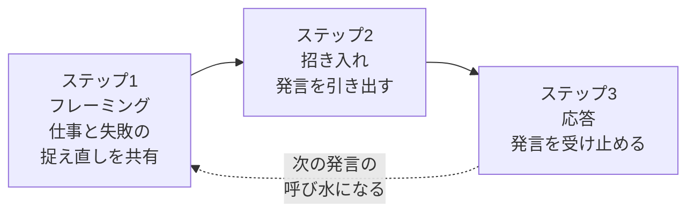
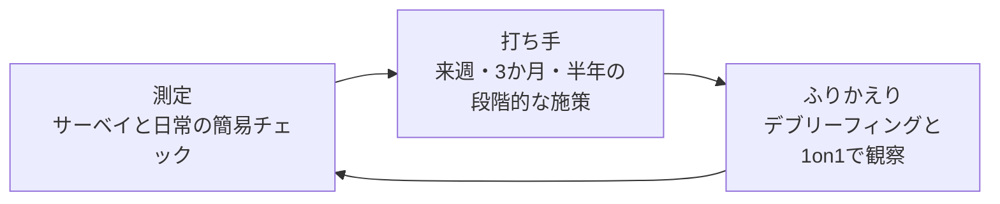

# チームの心理的安全性入門

「言ってもいい」「聴いてもらえる」が当たり前のチームをつくる

| 項目 | 内容 |
|---|---|
| カテゴリー | マネジメント・組織開発 |
| 難易度 | 入門 |
| 所要時間 | 約200分（全8レッスン） |
| 公開日 | 2026-06-04 |
| 最終更新日 | 2026-06-04 |
| コースURL | https://skillup.college/courses/management/psychological-safety-basics/ |

## 対象者

チームでパフォーマンスを上げたいリーダー・マネジャー、人事・組織開発担当者。リーダーでなくとも「言いたいことが言えない」「会議で意見が出ない」と感じているメンバー、これからリーダーになる方も対象。業種・規模・国際性を問わない。

## 前提知識

特になし。マネジメントや組織論の予備知識は不要。リーダー・メンバーいずれの立場でも学べる構成。

## 学習目標

- 心理的安全性を「ぬるい職場」「優しい職場」と区別して理解する
- 対人関係のリスクと 4 つの不安が、発言・報告・提案・相談をどう止めているかを説明できる
- 心理的安全性と仕事の基準を組み合わせた「学習ゾーン」の発想を持つ
- 失敗の 3 分類を踏まえ、失敗報告を学習機会として扱える
- リーダーとしてフレーミング・招き入れ・応答の 3 ステップを実践できる
- メンバーとして発言する力・聴く力・反対意見の出し方を身につける
- 建設的衝突とデブリーフィングを使い、優しい職場ではなく学習する職場をつくる
- 心理的安全性を測り、段階的に育てる継続課題として運用できる

## コース概要

「心理的安全性」は、エイミー・エドモンドソンの 1999 年論文と Google の Project Aristotle 以降、日本企業でも研修テーマとして定着しました。一方で現場では「ぬるい職場」「優しい職場」と取り違えられたり、「リーダーが優しくすれば作れる」と矮小化されたりして、本来の意味を失いがちです。本コースは、エドモンドソンの理論を骨格にしつつ、日本の職場文脈（忖度・同調圧力・形式的 1on1・減点主義）とリモート／ハイブリッド時代のリアルに合わせて再構築した、「運用できる心理的安全性」入門です。リーダー視点を主軸（レッスン 4・5）にしつつ、メンバー視点（レッスン 6）も独立して扱い、「自分が部下だから何もできない」と思わせない設計にしました。完成しない継続課題として、測り、育てる発想までを 8 レッスンで体系的に学べます。

## 学習の流れ

レッスン 1〜3 は「土台」として、定義と歴史（レッスン 1）、パフォーマンスとの関係（レッスン 2）、日本の職場が抱える構造（レッスン 3）を扱います。前提を共有することで、レッスン 4 以降の実践論が「概念遊び」にならないようにします。レッスン 4・5 は「リーダーの役割」として、Edmondson の 3 ステップ（フレーミング・招き入れ・応答）を 2 章に分けて、運用可能なレベルまで掘り下げます。レッスン 6 は「メンバーの役割」として、リーダーでなくても文化を変えうる発言・聴き方の実践を扱います。レッスン 7 は「反対意見と建設的衝突」、優しい職場と学習する職場の違いを明確にし、健全な対立を扱う技術を学びます。レッスン 8 は「測り、育てる」として、サーベイの使い方と段階的な打ち手を整理し、心理的安全性を「完成しない継続課題」として位置づけて締めくくります。前半（レッスン 1〜3）が「土台」、中盤（レッスン 4〜6）が「リーダー × メンバー」、後半（レッスン 7〜8）が「衝突と継続」という三段構えです。

## レッスン一覧

| No. | タイトル | 概要 | 所要時間 |
|---|---|---|---|
| 1 | 心理的安全性とは何か——定義・誤解・歴史 | エイミー・エドモンドソンの 1999 年定義、対人関係のリスク、4 つの不安（無知・無能・邪魔・否定）、「ぬるま湯」「何でも言える職場」との違い、なぜ今この話題か、本コースの守備範囲を整理する | 25分 |
| 2 | なぜ心理的安全性がパフォーマンスを左右するのか | Google Project Aristotle、学習する組織との関係、心理的安全性 × 高基準のマトリクス、失敗の 3 分類、エラー報告とインシデント学習を学ぶ | 25分 |
| 3 | 心理的安全性を阻む構造——日本の職場文脈 | 忖度・同調圧力・年功・形式的 1on1・減点主義、4 つの落とし穴、リモート／ハイブリッドでさらに弱くなる構造を直視する | 25分 |
| 4 | リーダーの役割①——枠組み設定と招き入れ | Edmondson の 3 ステップ（フレーミング・招き入れ・応答）の前半 2 つ、失敗を学習機会として位置づける、リーダー自身の限界の開示、質問で誘い出す技術を学ぶ | 25分 |
| 5 | リーダーの役割②——応答とフィードバック | Edmondson の 3 ステップの「応答」、悪い知らせ・失敗報告への反応の型、1on1 の使い方、SBI フィードバック、「心理的安全性は伝染する」を学ぶ | 25分 |
| 6 | メンバーの役割——発言と聴く力 | 「言ってもいいかわからない」状態を抜ける、発言のハードルを下げる小技、同僚への応答、聴く力と質問する力を学ぶ | 25分 |
| 7 | 反対意見と建設的衝突——優しい職場と学習する職場の違い | 健全な対立と不健全な対立、反対意見が出ない会議を変える 4 つの問い、デブリーフィング（事後ふりかえり）、失敗のリ・フレーミング、同調圧力の崩し方を学ぶ | 25分 |
| 8 | 心理的安全性を測り、育てる——継続課題として | Edmondson 7 項目尺度、チーム・1on1・ふりかえりでの簡易チェック、段階的な打ち手、リモート／ハイブリッド／グローバルチームでの応用、コース修了後の学習方向を案内する | 25分 |

---

## レッスン1：心理的安全性とは何か——定義・誤解・歴史

（所要時間：25分）

### このレッスンで学ぶこと

- 心理的安全性の学術的な定義と、そこに含まれる「対人関係のリスク」を理解する
- 4 つの不安（無知・無能・邪魔・否定）が、発言・報告・提案・相談をどう止めているかを区別できる
- 「ぬるい職場」「優しい職場」「何でも言える職場」との違いを説明できる
- 心理的安全性の研究がどのように始まり、なぜ今これほど語られるのかを知る
- 本コースで扱う範囲と扱わない範囲を理解する

---

「心理的安全性」という言葉は、ここ数年ですっかり日本のビジネス用語になりました。書店には関連書籍が並び、企業研修のテーマとしても定番です。一方で現場では、「うちは優しい職場だから心理的安全性は高い」「いやうちはハラスメントがあるから低い」というような、雑な議論で終わってしまうことが多いように感じます。本コースは、まず「心理的安全性とは何か」を、定義と歴史と誤解の整理から始めて、運用できる形に組み直していきます。

### 心理的安全性の定義

心理的安全性（psychological safety）は、ハーバード大学のエイミー・エドモンドソンが 1999 年に提唱した概念です。エドモンドソン本人の定義は、次のようなものです。

> チームの中で、対人関係上のリスクを取っても安全だと感じられる、メンバー間で共有された信念

英語の原文では「a shared belief that the team is safe for interpersonal risk-taking」とされ、ポイントは「個人の性格」ではなく「チームで共有された信念」であるという点です。同じ人でも、チーム A では率直に話せて、チーム B では黙ってしまう、ということが普通に起きます。心理的安全性はチームの性質であり、個人の勇気の話ではない、というのが研究の出発点です。

> **💡 ポイント**
> 心理的安全性は「個人の性格」ではなく「チームの性質」です。「うちのメンバーは内気だから発言しない」と片付けるのではなく、「このチームの場の作り方が、発言を止めている」と捉え直すことが、運用の出発点になります。

### 「対人関係のリスク」とは何か

心理的安全性の定義に出てくる「対人関係上のリスク」は、聞き慣れない方も多いはずです。これは、職場で何かを口にしようとしたときに、わたしたちが瞬時に計算してしまう、次のような不安のことです。

- こんな初歩的なことを聞いたら、バカだと思われないか
- ミスを報告したら、能力がないと思われないか
- 反対意見を出したら、空気が読めないと思われないか
- 弱音や懸念を口にしたら、後ろ向きな人と思われないか

これらは、業務上の合理性とは別の、対人関係の上での損得計算です。多くの場合、「言わない」ほうが対人関係のリスクは小さく見えます。だから人は黙る——という構造が、職場のいたるところで起きています。

エドモンドソンは、この計算が「無意識のうちに、瞬時に」行われていることを強調しました。本人さえ、なぜ自分が発言を控えたのかを言語化できないことが多い、というのが研究の知見です。

### 4 つの不安——心理的安全性が低いときに起きること

エドモンドソンは、心理的安全性が低い状態で人が抱える不安を、4 つに整理しました。日本語訳は出典によりばらつきがありますが、本コースでは次のように呼びます。

#### ①無知の不安（Ignorant）

「こんなことを聞いたら、無知だと思われるかも」という不安です。質問や確認をためらわせます。

職場で起きやすいこと：

- ミーティング中、わからないまま頷いてしまう
- ツールやプロセスを聞けず、自己流で進めて後でミスが発覚する
- 新入社員や中途入社者が、最初の数か月間で多くの「聞けない」を抱え込む

#### ②無能の不安（Incompetent）

「ミスを認めたら、無能だと思われるかも」という不安です。失敗の報告や、できないことの相談をためらわせます。

職場で起きやすいこと：

- ミスを隠す、または小さく報告する
- 助けを求められず、抱え込んで納期が遅れる
- インシデント・不具合・クレームが上に届かない

#### ③邪魔の不安（Intrusive）

「反対意見を言ったら、空気を読まない人だと思われるかも」という不安です。提案や反論をためらわせます。

職場で起きやすいこと：

- 明らかに無理のある計画でも、誰も異論を出さずに進む
- 意思決定が独走し、後から問題が表面化する
- 会議の沈黙が「合意」と扱われる

#### ④否定の不安（Negative）

「弱音や懸念を口にしたら、ネガティブな人と思われるかも」という不安です。本音やリスクの共有をためらわせます。

職場で起きやすいこと：

- 残業の限界、ハラスメントなどを言い出せない
- リスクが表に出ず、後で大きな問題になる
- 「前向きな意見しか歓迎されない」雰囲気が固定化する

> **📝 補足**
> これらの不安は、新入社員や若手だけのものではありません。経験豊富な管理職でも、上の役職や経営に対しては同じ不安を抱きます。「部下の異動希望を経営に上申できない」「自部門の不祥事を経営会議で発言できない」という形で、組織のどの階層でも起きうるものです。心理的安全性は階層ごとに別々に成立する、ということを覚えておいてください。

### 「ぬるい職場」「優しい職場」との違い

心理的安全性がもっとも誤解されやすいのが、「みんなが仲良くて何でも許される職場」「優しくて居心地のよい職場」と取り違えられる点です。これは、研究者自身が繰り返し否定している誤解です。

エドモンドソンは、心理的安全性を「仕事の基準の高さ」と組み合わせた 2 軸のマトリクスで整理しています。本コースでは次のレッスンで詳しく扱いますが、ここで簡単に触れておきます。

| | 仕事の基準・要求度が低い | 仕事の基準・要求度が高い |
|---|---|---|
| **心理的安全性が高い** | 快適ゾーン（ぬるい職場） | **学習ゾーン（理想）** |
| **心理的安全性が低い** | 無関心ゾーン（アパシー） | 不安ゾーン（萎縮する職場） |

理想は「心理的安全性が高く、仕事の基準も高い」状態です。高い目標を共有しつつ、率直に意見を交わし、ミスから学べる——これが「学習ゾーン」です。

「心理的安全性が高いが仕事の基準が低い」状態は「快適ゾーン」、いわゆる「ぬるい職場」で、成果は出にくくなります。逆に「心理的安全性が低く仕事の基準は高い」状態は「不安ゾーン」、短期的には数字が出ても長期的には離職・隠蔽・メンタル不調が増えます。

> **⚠️ 注意**
> 「心理的安全性が高い職場 ＝ 何でも言える職場」とも限りません。建設的な議論・反対意見・厳しいフィードバックを率直に交わせる、という意味であって、「思いついた個人攻撃も口にしてよい」「相手の人格を否定してもよい」という意味ではありません。本コースでは「言える」よりも「言って受け止められる」という観点を重視します。

### なぜ今この話題か——心理的安全性の研究略史

心理的安全性は最近の流行語のように聞こえますが、研究としては 20 年以上の歴史があります。簡単に略史を追っておきましょう。

#### 1965 年：エドガー・シャインら、原型を示す

組織心理学者のエドガー・シャインらが、組織変革を扱う研究の中で、「変化を受け入れるために心理的に安全な環境が必要」という主旨の議論をしました。心理的安全性という概念の遠い祖先にあたります。

#### 1999 年：エドモンドソンが現代の定義を確立

エドモンドソンは、病院でのチーム研究を進める中で、「ミス報告が多い病棟ほど業績が高い」という逆説的なデータに出会いました。「ミスが多い病棟は本当はうまくやっていないのでは」と仮説を立てて調べていったところ、実はミスが多いのではなく「ミスを報告できる空気」が違ったことがわかりました。これをきっかけに、エドモンドソンは「Psychological Safety and Learning Behavior in Work Teams」と題する論文を 1999 年に発表し、現代の心理的安全性研究の出発点となりました。

#### 2012〜2016 年：Google「Project Aristotle」の社内調査

Google は社内の数百のチームを 2 年以上かけて分析し、「成果を上げるチームの共通点は何か」を探りました。能力・経験・男女比などを調べた結果、最も強く成果に相関したのは「心理的安全性」でした。次いで「相互依存」「構造と明確性」「仕事の意味」「インパクトの実感」が続きます。「優秀な人を集めれば成果が出る」という直感的な仮説より、「安全に話せるチームをつくる」ほうが効いていたことを示し、世界中で引用されました。

#### 2018 年：『The Fearless Organization』で経営の言葉へ

エドモンドソンは 2018 年に『The Fearless Organization（邦訳：恐れのない組織）』を出版し、心理的安全性を「学術用語」から「経営の言葉」へ移しました。同書では、フォルクスワーゲンの排ガス不正、福島原発事故、Wells Fargo の不正口座開設、ボーイング 737 MAX の事故などを、心理的安全性の不在が招いた事例として整理しています。

#### 2020 年代：日本でも研修テーマとして定着

日本でも 2020 年前後から、人的資本経営・働き方改革・ハラスメント防止・1on1 ブームの流れと連動して、心理的安全性が広く語られるようになりました。石井遼介『心理的安全性のつくりかた』（2020 年）など、日本の文脈に翻訳した解説書も出版され、研修・組織サーベイの定番テーマとなっています。

> **💡 ポイント**
> 心理的安全性は、まず医療現場のミス報告研究から始まり、テック企業の社内調査で経営の関心事になり、産業事故・不祥事の事例で社会的注目を集め、日本では人的資本経営の文脈で定着しました。「優しい職場をつくる話」ではなく「事故・不祥事・隠蔽を防ぐ仕組みの話」として始まったことを、覚えておくと議論がぶれません。

### 「個人の話」ではなく「チームの話」

ここまで読んできて、「結局、自分の上司次第」「自分のチームでは無理」と感じた方もいるかもしれません。たしかに心理的安全性はチームの性質ですから、リーダーの影響は大きい。一方で、研究は次のことも示しています。

- 心理的安全性は、メンバー全員の小さな行動の積み重ねで作られる
- 同じ会社内でも、隣り合うチーム同士で心理的安全性のレベルが大きく違う
- リーダーが代わっても、メンバーが残っていればチームの安全感は引き継がれる
- 「リーダーが優しいかどうか」では決まらない（厳しくても安全感が高いチームはある）

つまり、「リーダー任せ」でも「諦め」でもなく、自分が立っている場所から作っていけるものです。本コースでは、レッスン 4・5 でリーダーの役割、レッスン 6 でメンバーの役割を、それぞれ独立して扱います。

### 本コースの守備範囲と限界

最後に、本コースで扱う範囲と扱わない範囲を整理しておきます。

#### 扱う範囲

- 心理的安全性の定義と誤解の解消（本レッスン）
- パフォーマンス・学習・失敗との関係（レッスン 2）
- 日本の職場文脈と構造（レッスン 3）
- リーダーの役割：フレーミング・招き入れ・応答（レッスン 4・5）
- メンバーの役割：発言・聴く・反応する（レッスン 6）
- 反対意見と建設的衝突の扱い（レッスン 7）
- 測定と継続的な育成（レッスン 8）

#### 扱わない範囲

- 個別のハラスメント事案の法的対応（弁護士・専門家の領域）
- メンタルヘルスの不調そのものの治療・休職復職（医療と隣接）
- 特定のサーベイツール・ベンダーの製品レビュー（ツールは概念に必要な範囲のみ）
- 「○○式」「△△メソッド」という商標的手法（Edmondson の枠組みを骨格に置き、補助的に Lencioni・Brown を概念名として登場させる程度）

#### スタンス

本コースは、心理的安全性を「優しい職場づくり」ではなく「学習する組織の前提」として扱います。完成して終わるものではなく、メンバーの入れ替わり・状況の変化のたびに作り直すものとして位置づけます。サーベイで数値を出すだけの運用や、リーダーだけが頑張る運用は避け、リーダーとメンバーが一緒に育てる継続課題として描きます。

### まとめ

このレッスンでは、以下のことを学びました。

- 心理的安全性は「チームの中で対人関係上のリスクを取っても安全だと感じられる、共有された信念」
- 個人の性格ではなく、チームの性質である
- 対人関係のリスクとは、無意識に瞬時に計算する「言わない方が損が小さい」という感覚のこと
- 4 つの不安：無知・無能・邪魔・否定と思われる不安
- 「ぬるい職場」「優しい職場」とは別物。理想は「心理的安全性が高く、仕事の基準も高い」学習ゾーン
- 研究は 1999 年のエドモンドソン論文に始まり、Google Project Aristotle や『恐れのない組織』を経て、日本でも 2020 年代に定着
- リーダーだけが作るものでもなく、メンバーの行動の積み重ねでも変わる
- 本コースは「学習する組織の前提」として、運用できる心理的安全性を扱う

次のレッスンでは、心理的安全性がチームのパフォーマンスをどう左右するのかを、Google Project Aristotle と「学習ゾーン」マトリクス、失敗の 3 分類を通じて整理します。「心理的安全性が成果に効く」というスローガンの中身を、もう一段掘り下げます。

---

### 確認クイズ

このレッスンの理解度をチェックしましょう。

#### Q1. 心理的安全性の定義として最も適切なものはどれか？

- [ ] メンバーが個人的に勇気を持って発言できる状態
- [x] チームの中で対人関係上のリスクを取っても安全だと感じられる、共有された信念
- [ ] みんなが仲良くて、議論が起きない状態
- [ ] 上司に絶対服従する状態

> **解説**
> エイミー・エドモンドソンが 1999 年に提唱した定義は「チームの中で対人関係上のリスクを取っても安全だと感じられる、メンバー間で共有された信念」です。個人の勇気や性格ではなく、チームで共有された性質である点がポイントです。

#### Q2. 「対人関係のリスク」が示す内容として最も適切なものはどれか？

- [ ] 仕事上の責任を取らされること
- [ ] 給与が下がる可能性
- [x] 質問・報告・反対意見・本音を口にしたときに、相手から低く見られたり否定されたりすると感じる不安
- [ ] 残業を強いられること

> **解説**
> 対人関係のリスクとは、業務上の合理性とは別に、職場で何かを口にするときに無意識に計算される対人関係上の損得です。心理的安全性が低いと、この計算が「言わない方が安全」という結論になりやすく、質問・報告・反対意見・本音が止まります。

#### Q3. エドモンドソンが整理した「4 つの不安」に含まれないものはどれか？

- [x] 退屈の不安
- [ ] 無知の不安
- [ ] 無能の不安
- [ ] 邪魔の不安

> **解説**
> エドモンドソンが整理した 4 つの不安は、無知（Ignorant）・無能（Incompetent）・邪魔（Intrusive）・否定（Negative）と思われる不安です。退屈の不安は含まれません。否定の不安は「ネガティブと思われる不安」と訳されることもあります。

#### Q4. 「心理的安全性が高い職場」と「ぬるい職場」の違いとして最も適切なものはどれか？

- [ ] 心理的安全性が高い職場は、メンバーが優秀で、ぬるい職場は優秀ではない
- [ ] 心理的安全性が高い職場は外資系、ぬるい職場は日本企業
- [ ] 心理的安全性が高い職場は若手中心、ぬるい職場は年配中心
- [x] 心理的安全性が高い職場は仕事の基準も高く、率直な議論で学習する。ぬるい職場は安全性は高いが基準が低い

> **解説**
> エドモンドソンのマトリクスでは、心理的安全性と仕事の基準の両方が高い状態が「学習ゾーン」で、理想とされます。安全性が高いだけで基準が低い状態は「快適ゾーン（ぬるい職場）」と呼ばれ、別物です。安全性と厳しさは両立します。

#### Q5. 心理的安全性の研究史について、本レッスンで紹介した内容として正しいものはどれか？

- [ ] 心理的安全性は 2020 年代に日本で生まれた概念である
- [ ] 心理的安全性は SNS の流行とともに生まれた概念である
- [ ] 心理的安全性は Google が 2012 年に独自に提唱した概念である
- [x] エドモンドソンは病院のチーム研究で「ミス報告が多い病棟ほど業績が高い」逆説的データに出会い、現代の研究が始まった

> **解説**
> エドモンドソンが 1999 年に発表した論文「Psychological Safety and Learning Behavior in Work Teams」が、現代の心理的安全性研究の出発点とされます。病院でのチーム研究で「ミスが多い病棟は本当はうまくやっていないのでは」と仮説を立てた結果、実はミスが多いのではなく「ミスを報告できる空気」が違ったことがわかったエピソードがよく知られています。

#### Q6. 本コースが扱う範囲・スタンスとして適切なものはどれか？

- [x] 心理的安全性を「学習する組織の前提」として、リーダーとメンバーが一緒に育てる継続課題として扱う
- [ ] 個別ハラスメント事案の法的対応を中心に扱う
- [ ] メンタル不調そのものの治療を扱う
- [ ] 特定サーベイ製品の使い方を中心に扱う

> **解説**
> 本コースは、心理的安全性を「優しい職場づくり」ではなく「学習する組織の前提」として、また完成して終わるものではなく「継続課題」として扱います。個別のハラスメント法対応・医療的治療・特定製品レビューは扱わず、リーダー視点とメンバー視点の両方から運用できる形に整理します。

---

## レッスン2：なぜ心理的安全性がパフォーマンスを左右するのか

（所要時間：25分）

### このレッスンで学ぶこと

- Google「Project Aristotle」が示した、心理的安全性と成果の関係を理解する
- 「学習する組織」と心理的安全性のつながりを説明できる
- 心理的安全性と仕事の基準の 2 軸で整理する「学習ゾーン」マトリクスを使える
- エイミー・エドモンドソンの「失敗の 3 分類」（予防可能・複雑系・知的）を区別できる
- エラー報告とインシデント学習が、なぜ心理的安全性なしには機能しないかを理解する

---

レッスン 1 では、心理的安全性の定義と 4 つの不安、「ぬるい職場」との違いを整理しました。本レッスンでは、もう一段踏み込んで、「なぜそれが成果につながるのか」を確認します。「心理的安全性が高いと成果が出る」というスローガンの中身を、研究と運用論の両面で見ていきます。

### Google「Project Aristotle」が示したこと

心理的安全性が経営の関心事として注目される一つの転機が、Google が 2012 年から数年間かけて社内で実施した「Project Aristotle」と呼ばれる調査でした。Google は、社内の数百のチームを対象に「成果を上げるチームの共通点は何か」を探りました。

最初に当たり前のように立てられた仮説は、次のようなものでした。

- 優秀な人を集めれば成果が出る
- 経験年数が長い人を集めれば成果が出る
- 男女比・年齢構成を最適化すれば成果が出る
- 仲のよいメンバーを集めれば成果が出る

しかしデータを集めて分析すると、メンバーの構成や能力そのものより、チームの「動き方」が成果を左右していました。最終的に、Google は次の 5 つを「成果を上げるチームに共通する要素」として整理しました。順位は概ね影響度の大きさ順とされています。

1. 心理的安全性（psychological safety）
2. 相互依存（dependability）
3. 構造と明確性（structure & clarity）
4. 仕事の意味（meaning of work）
5. インパクトの実感（impact）

このうち、最も強く成果に相関したのが心理的安全性でした。「優秀な人を集めれば」という直感に反する結論が、世界中で引用されることになります。

> **📝 補足**
> Project Aristotle の調査結果は、Google の社内取り組みサイト「re:Work」で一部公開されています。心理的安全性を高めるための具体的な行動ガイドも掲載されており、英語ですが無料で読めます。本コースの内容と重なる部分も多いので、興味のある方は一度のぞいてみるとよいでしょう。

#### 「優秀な人を集めれば」が効きにくい理由

Project Aristotle の結果は、現場感覚とも合致します。優秀な個人を集めても、お互いに発言を控えたり、ミスを隠したり、反対意見を呑み込んだりするチームでは、それぞれの能力が掛け算になりません。

逆に、平均的な能力のメンバーであっても、「気づいたことを口にできる」「失敗を共有して学ぶ」「反対意見をテーブルに乗せられる」チームは、能力の総和を超えた成果を出すことがあります。チームの成果は、メンバー個々の能力の単純な足し算ではなく、「率直なやり取りがどれだけ起きるか」に強く依存する、というのが研究の含意です。

### 「学習する組織」と心理的安全性

心理的安全性を成果と結びつけるもう一つの枠組みが、ピーター・センゲの「学習する組織（learning organization）」という概念です。センゲは 1990 年の著書『The Fifth Discipline（邦訳：最強組織の法則／学習する組織）』で、変化に強い組織の条件として、メンバー個々の学習だけでなく「組織として学べる能力」を挙げました。

組織として学ぶには、「気づき」「失敗」「うまくいかなさ」を、隠さずにテーブルに上げて共有する必要があります。心理的安全性が低い組織では、これらは外に出てこないか、出ても遅すぎる形で出てきます。

エドモンドソンも、学習する組織と心理的安全性を強く結びつけて論じています。エドモンドソンの言葉を借りると、「心理的安全性なしに学習する組織は成立しないが、心理的安全性だけでも学習する組織にはならない」となります。安全性は学習の必要条件であり、十分条件ではない、というところがポイントです。

> **💡 ポイント**
> 心理的安全性は「成果を出すための魔法」ではなく、「学習を回すための基盤」です。学習が回らない組織は、環境変化に追従できず、長期的にじわじわと競争力を失います。短期の数字よりも、「学び続けられるか」を見るときに効いてくる、という発想が大事です。

### 「学習ゾーン」マトリクス——心理的安全性 × 仕事の基準

レッスン 1 で簡単に触れた、エドモンドソンによる 2 軸のマトリクスを、ここで詳しく見ます。横軸が「仕事の基準・要求度」、縦軸が「心理的安全性」です。それぞれ高低で 4 つの象限ができます。

| | 仕事の基準・要求度が低い | 仕事の基準・要求度が高い |
|---|---|---|
| **心理的安全性が高い** | 快適ゾーン（comfort zone） | **学習ゾーン（learning zone）** |
| **心理的安全性が低い** | 無関心ゾーン（apathy zone） | 不安ゾーン（anxiety zone） |

#### ①無関心ゾーン

心理的安全性が低く、仕事の基準も低い状態です。「何も求められない、何も話さない」職場で、メンバーは去っていきます。日本では、形式化したルーチン業務だけが残った職場でこの状態が見られます。

#### ②不安ゾーン

心理的安全性が低く、仕事の基準は高い状態です。短期的には数字が出るように見えますが、ミスは隠され、本音は出ず、メンタル不調・離職が増えます。「うちは厳しいから伸びる」という発想で正当化されることが多い状態ですが、長期的には組織が弱くなります。

#### ③快適ゾーン

心理的安全性は高いが、仕事の基準が低い状態です。いわゆる「ぬるい職場」で、居心地はよいですが成長は止まります。問題が起きてから「なぜ言わなかったのか」を問うても、「言いやすかったが、求められていなかった」という結果になりがちです。

#### ④学習ゾーン

心理的安全性も仕事の基準も高い状態です。高い目標を共有しつつ、率直に意見を交わし、ミスから学べる、研究が示す「望ましい状態」です。エドモンドソンが理想として描くのも、この象限です。

> **⚠️ 注意**
> マトリクスは静的なものではありません。同じチームでも、忙しい時期や新メンバー加入のタイミングで、安全性と基準のバランスは変動します。「学習ゾーンに移ったら終わり」ではなく、何度も滑り落ちる前提で運用する発想が必要です。

#### 「厳しさ」と「安全」の両立

このマトリクスから読み取るべき一番大事なメッセージは、「厳しさ」と「安全」は両立する、ということです。「うちは厳しいから安全なんて贅沢だ」も誤解、「うちは安全だから厳しさを求めない」も誤解です。両方を同時に満たすことが、長期的なパフォーマンスの条件になります。

### エドモンドソンの「失敗の 3 分類」

心理的安全性とセットで重要なのが、エドモンドソンが整理した「失敗の 3 分類」です。すべての失敗を同じように扱うのではなく、種類によって対処を変える、という発想です。

| 種類 | 説明 | 対処の方針 |
|---|---|---|
| 予防可能な失敗 | 既知の手順・ルールから外れたことで起きる失敗。チェックリスト・ルール遵守で防げる | 予防が中心。再発防止策・標準化 |
| 複雑系の失敗 | 予測不可能な相互作用・状況変化から起きる失敗。完全には防げない | 早期発見・早期対処。インシデント学習 |
| 知的失敗 | 新しい挑戦・実験から生まれる、結果として「うまくいかなかった」失敗 | 称賛と学習対象。次の挑戦への投資 |

#### ①予防可能な失敗

製造現場のチェックリスト忘れ、医療現場の手順スキップ、IT 運用の確認漏れなど、「やればよかったのにやらなかった」ことで起きる失敗です。原因は不注意・手順不徹底・教育不足など。

対処は、再発防止策・標準化・チェックリスト・教育です。「責めて反省させる」よりも、「同じ条件で誰が来てもミスしない仕組み」をつくる方が効きます。

#### ②複雑系の失敗

複数の要因が絡んで、誰かが悪意で起こしたわけでも怠慢で起こしたわけでもなく起きる失敗です。新規プロジェクトの想定外、災害時の混乱、複雑なシステム障害などが典型例です。

対処は、早期発見・早期対処・インシデント後の学習です。「誰のせいか」を探すより、「次に同じ条件になったときに、もっと早く気づける仕掛けは何か」を考える方が建設的です。

#### ③知的失敗

新しいことを試した結果、うまくいかなかった失敗です。新製品の試作、新しい働き方の試行、新市場への挑戦、新しい技術スタックの導入など。

対処は、称賛と学習対象としての記録です。エドモンドソンは「知的失敗は組織が学ぶための投資である」と言います。知的失敗が「処罰」される組織では、新しい挑戦そのものが消えてしまいます。

> **🔰 初学者の方へ**
> 多くの組織では、3 種類の失敗が混同されています。新規事業の知的失敗が「予防可能だった」かのように叱責されたり、複雑系の障害が「予防可能な失敗」のチェックリスト追加で対処されたり。区別がつくだけでも、対処のしかたが大きく変わります。

### エラー報告と心理的安全性

ここで、レッスン 1 で触れた「ミス報告が多い病棟ほど業績が高い」というエドモンドソンの研究エピソードに戻ります。

エドモンドソンが看護師チームの研究を始めたとき、彼女は「業績の高いチームほどミスが少ないはず」という仮説で動いていました。集めたデータでは逆に、「業績の高いチームほどミス報告数が多い」という結果が出ました。最初は「業績の高いチームは仕事量が多いからミスも多いのでは」とも考えましたが、観察を重ねた結果、本当のミスの数ではなく「報告される数」が違っていたことがわかりました。

業績の低い病棟では、ミスが起きても看護師が黙っていました。報告すれば叱責されるからです。結果として、組織はミスから学べず、同じミスが繰り返されました。業績の高い病棟では、ミスは率直に報告され、原因が分析され、手順が改善されていました。

このエピソードは、組織の安全性・品質・学習・パフォーマンスが、どれも「ミスを上に出せるか」という入り口で決まっていることを示しています。

#### 産業事故・不祥事の事例

エドモンドソンは『The Fearless Organization』で、心理的安全性の不在が招いた産業事故・不祥事の例として、次のようなケースを挙げています。

- フォルクスワーゲンの排ガス不正：上に逆らえない文化が、不正の温存と拡大を許した
- ボーイング 737 MAX の事故：エンジニアの懸念が経営に届かなかった構造
- Wells Fargo の不正口座開設：高い数値目標と低い心理的安全性の組み合わせ
- 福島第一原発事故：技術的懸念が組織内で十分に検討されないまま運用が続いた

これらに共通するのは、「現場の人が気づいていた」「しかし上に届かなかった」ことです。心理的安全性の不在は、優しさの欠如ではなく、組織の重大な脆弱性として描かれています。

> **💡 ポイント**
> 心理的安全性の議論は、はじめは医療現場のミス報告から始まり、産業事故・不祥事の研究で広がりました。「気持ちよく働く」話ではなく、「重大な失敗を防ぐ仕組み」の話として始まったことを、覚えておくと議論がぶれません。

### 「数値が出ているから問題ない」の落とし穴

経営側から心理的安全性の議論に対してよく出てくる反応が、「うちは業績が出ているから心理的安全性は十分だろう」というものです。これは、危ない発想です。

短期的な数値が出ているうちは、不安ゾーン（低安全 × 高基準）でも組織は動きます。むしろ、強烈なプレッシャーで一時的に数値が伸びることもあります。問題は、不安ゾーンでは「警告サイン」が表に出てこないことです。

- 大事故の前兆となるヒヤリハットが報告されない
- 退職リスクの高いメンバーが、辞めるまで黙っている
- 数値の達成のために、隠蔽・粉飾・不正が起きていても、気づくのが遅れる
- 環境変化への対応が遅れ、ある日突然「時代に取り残された」と気づく

数値が出ているうちこそ、心理的安全性を見るタイミングです。組織の体温計のような役割を持つ概念だと思って差し支えありません。

### まとめ

このレッスンでは、以下のことを学びました。

- Google Project Aristotle では、心理的安全性が成果に最も強く相関した
- 心理的安全性は「成果の魔法」ではなく「学習を回すための基盤」
- 学習ゾーンマトリクス：心理的安全性と仕事の基準の 2 軸で 4 象限。理想は「学習ゾーン」
- 「厳しさ」と「安全」は両立する。「うちは厳しいから安全は無理」も「うちは安全だから厳しさを求めない」も誤解
- エドモンドソンの失敗の 3 分類：予防可能・複雑系・知的、それぞれ対処の方針が違う
- 心理的安全性の不在は、産業事故・不祥事の事例で繰り返し見られる重大な組織的脆弱性
- 「数値が出ている」は「心理的安全性が高い」を意味しない。むしろ不安ゾーンの典型でも短期的に数値は出る

次のレッスンでは、心理的安全性を阻む構造を「日本の職場文脈」の側から見ていきます。忖度・同調圧力・形式的 1on1・減点主義・リモート／ハイブリッド固有の難しさなど、日本企業のリアルに照らして整理します。

---

### 確認クイズ

このレッスンの理解度をチェックしましょう。

#### Q1. Google「Project Aristotle」で、成果に最も強く相関した要素はどれか？

- [x] 心理的安全性
- [ ] メンバーの男女比
- [ ] メンバーの経験年数
- [ ] メンバーの IQ

> **解説**
> Google は数百チームを分析した結果、心理的安全性が成果に最も強く相関する要素であることを見いだしました。続いて相互依存・構造と明確性・仕事の意味・インパクトの実感が並びました。「優秀な人を集めれば」という直感的な仮説より、「安全に話せるチームをつくる」ほうが効いていた、という結果が世界中で引用されています。

#### Q2. 「学習する組織」と心理的安全性の関係として最も適切なものはどれか？

- [ ] 学習する組織には心理的安全性は必要ない
- [x] 心理的安全性は学習する組織の必要条件だが、十分条件ではない
- [ ] 心理的安全性があれば自動的に学習する組織になる
- [ ] 学習する組織は心理的安全性が低い方が成立する

> **解説**
> エドモンドソンは「心理的安全性なしに学習する組織は成立しないが、心理的安全性だけでも学習する組織にはならない」と述べています。安全性は学習の必要条件ですが、それだけで学習が回るわけではなく、仕事の基準・継続的な振り返り・フィードバックなどとセットで機能します。

#### Q3. 学習ゾーンマトリクスで「学習ゾーン」と呼ばれる象限はどれか？

- [ ] 心理的安全性が高く、仕事の基準が低い状態
- [ ] 心理的安全性が低く、仕事の基準が低い状態
- [x] 心理的安全性も仕事の基準も高い状態
- [ ] 心理的安全性が低く、仕事の基準が高い状態

> **解説**
> 学習ゾーンは、心理的安全性と仕事の基準の両方が高い象限です。高い目標を共有しつつ、率直に意見を交わし、ミスから学べる理想の状態です。安全性だけ高い「快適ゾーン（ぬるい職場）」とも、基準だけ高い「不安ゾーン」とも区別されます。

#### Q4. エドモンドソンの「失敗の 3 分類」に含まれないものはどれか？

- [ ] 予防可能な失敗
- [ ] 複雑系の失敗
- [ ] 知的失敗
- [x] 故意による失敗

> **解説**
> エドモンドソンが整理した失敗の 3 分類は、予防可能な失敗・複雑系の失敗・知的失敗です。故意による失敗は分類に含まれません。なお、悪意のある故意の規律違反は心理的安全性とは別の問題として、別の対処が必要です。

#### Q5. 「知的失敗」への適切な対処として最も適切なものはどれか？

- [x] 称賛と学習対象としての記録、次の挑戦への投資
- [ ] 厳しく叱責し、再発防止を徹底させる
- [ ] チェックリストを増やして同じ失敗を防ぐ
- [ ] 失敗者を異動させ、責任を明確化する

> **解説**
> 知的失敗は、新しい挑戦・実験から生まれる失敗で、組織が学ぶための投資としての性質を持ちます。叱責の対象ではなく、称賛と学習対象として扱うのが基本です。知的失敗が処罰される組織では、新しい挑戦そのものが消えてしまいます。予防可能な失敗とは扱いが完全に異なります。

#### Q6. 心理的安全性が低い組織で、産業事故・不祥事の事例に共通する構造はどれか？

- [ ] 現場の人が気づかない事故が起きる
- [ ] 経営が悪意を持って不正を指示する
- [x] 現場は気づいていたが、上に届かない、または届いても無視される構造があった
- [ ] 偶然による事故が連続して起きる

> **解説**
> エドモンドソンが『The Fearless Organization』で挙げたフォルクスワーゲン・ボーイング 737 MAX・Wells Fargo・福島第一原発などの事例に共通するのは、「現場は気づいていたが、上に届かなかった」「届いても十分に検討されなかった」という構造です。心理的安全性の不在は、優しさの欠如ではなく組織の重大な脆弱性として描かれています。

---

## レッスン3：心理的安全性を阻む構造——日本の職場文脈

（所要時間：25分）

### このレッスンで学ぶこと

- 日本の職場文脈に多い、心理的安全性を阻む 4 つの落とし穴を区別できる
- 忖度・同調圧力・年功・タテマエ文化が、4 つの不安をどう増幅させるかを理解する
- リモート／ハイブリッドで弱くなりやすい構造を把握する
- ハラスメント懸念・コンプライアンス強化が、副作用として発言を止めることもあると知る
- リーダーとメンバー、どちらの立場から見ても感じる「言えなさ」の構造を整理できる

---

レッスン 1・2 で、心理的安全性の定義と、それがパフォーマンス・学習・失敗とどう結びつくかを整理しました。本レッスンでは、それを「日本の職場で実装しようとすると、どこで止まるか」という視点から、構造的な障害を直視します。心理的安全性の話を抽象論で終わらせないために、現場でよく見る具体的な詰まり方を、4 つの落とし穴として整理します。

### 日本の職場に多い、心理的安全性を阻む 4 つの落とし穴

私が現場で支援してきた中で、繰り返し出会ってきたのが、次の 4 つの落とし穴です。日本特有とまでは言いませんが、日本の職場文脈で特に強く出やすい構造です。

#### ①議論なき会議

会議に集まっても、リーダーや声の大きい人が話し、ほかは黙って聞いている、という構造です。発言は「指名されたら」「短く」「無難に」が暗黙のルール化されています。最後に「何か意見はありますか」と聞かれても、誰も口を開かないまま会議が終わります。

この構造の特徴：

- 議題は事前に決まっており、結論も内々で決まっている
- メンバーは「会議は儀式」と認識し、発言の意義を感じていない
- 反対意見を出すと、後で「あの人は和を乱す」と評される
- 重要な決定が会議以外の場（飲み会・廊下・幹部の個別調整）でなされている

#### ②タテマエの 1on1

「うちは 1on1 を導入しています」と言いつつ、その中身が空洞化している構造です。形式上は 1on1 が走っているので「やっている」と言えますが、実態としては心理的安全性を高めることに寄与していません。

タテマエの 1on1 の特徴：

- 業務報告・タスク確認だけで終わる（部下から見れば「報告会」）
- 上司が一方的に話す。部下は聞き役
- 「困っていることはないか」と聞かれても、「特にありません」と返すことが暗黙のルール
- 評価につながるので、本音を言うとリスクと感じる
- 30 分の時間枠だけが守られ、回数だけ「実施した」ことになる

#### ③失敗を隠す文化

ミスや失敗が、組織内で表に出にくい構造です。「黙っていればバレないかも」「報告すると評価が下がる」という計算が働き、隠蔽・矮小化・引き延ばしが起きます。

失敗を隠す文化の特徴：

- 小さな失敗の段階で報告がなく、大きくなってから発覚する
- 「なぜ早く言わなかった」と叱責される「報告した人」が損をする構造
- 失敗の原因分析が「個人の責任探し」で終わる
- 同じ失敗が、別の部署・別の人で繰り返される
- インシデントレビューやポストモーテム（事後ふりかえり）の文化がない

#### ④リーダー独占型のコミュニケーション

リーダーが情報・意思決定・発言の機会を独占し、メンバーは「指示を受ける側」に固定化される構造です。リーダーの能力・カリスマがあるほど、この構造は強化されます。

リーダー独占型の特徴：

- 重要な情報がリーダーから先にしか来ない
- メンバー同士の横の議論が少ない
- 「上が決めたことだから」が常套句
- リーダーが不在のとき、議論が止まる
- メンバーの育成は、リーダーの個人的な指導頼り

> **💡 ポイント**
> これら 4 つは独立しているのではなく、しばしばセットで現れます。「議論なき会議で結論が決まり、形式的な 1on1 で報告だけ吸い上げ、失敗は隠され、リーダーがすべてを動かしている」——これが、心理的安全性が低い日本の職場の典型像です。

### 文化的な背景——忖度・同調圧力・年功

これらの落とし穴は、個別のリーダーやメンバーの問題というより、日本の職場文化に深く根を張る要素と結びついています。

#### 忖度（そんたく）

明示的な指示がなくても、相手の意向を察して行動する習慣です。「言われなくてもわかる」が美徳とされる文脈では、「言葉にして確かめる」「聞き直す」ことが、無能・空気が読めない・面倒くさい人として扱われやすくなります。忖度が強い場では、「無知の不安」と「邪魔の不安」が増幅されます。

#### 同調圧力

集団の方向性に合わせることを強く求める圧力です。「みんなが賛成しているのに反対するのか」「波風を立てるな」という形で、反対意見を抑え込みます。同調圧力が強い場では、「邪魔の不安」と「否定の不安」が増幅されます。

#### 年功・タテ社会

経験年数・役職・年齢を上下の序列として尊重する文化です。経験豊富な人の意見が重く、若手の意見が軽く扱われやすい構造を生みます。年功が強い場では、若手の「邪魔の不安」が増幅されると同時に、上司側にも「下からの意見を受け止めにくい」癖がつきます。

#### タテマエとホンネ

公式の場ではタテマエを述べ、本音は別の場（飲み会・廊下・信頼できる相手との 1on1 以外の場）で出す、という文化です。1on1 や会議という「公式の場」が、本音を出す場にはなりにくい構造です。タテマエ文化が強いほど、4 つの不安すべてが増幅されます。

> **⚠️ 注意**
> これらの文化要素は「悪」ではなく、長く機能してきた合理性もあります。忖度は調整コストを下げ、同調圧力は意思決定を早め、年功は経験の継承を助けてきた面もあります。問題は、変化が激しく多様性が増した現代では、これらが学習・発言・率直な議論を止める方向に強く働くようになった、ということです。完全に否定するのではなく、副作用を自覚して扱う発想が必要です。

### リモート／ハイブリッドで弱くなる構造

2020 年以降、リモートワーク・ハイブリッドワークが広がりました。これらは多くの面で働き方を改善しましたが、心理的安全性の観点からは「弱くなりやすい構造」を持ち込んでもいます。

#### 雑談・余白の減少

オフィスの廊下・給湯室・昼食時の雑談が、実は心理的安全性を支えていた、という発見が多くの企業で起きました。雑談は「業務上の用件がないときの会話」ですが、ここで生まれる相互理解・信頼が、いざ業務で「ちょっと相談していい？」を言いやすくしていました。

リモートでは、業務に直結しない接点が失われやすく、「話しかけるハードル」が上がります。

#### 表情・空気が読めない

ビデオ会議では、表情・声のトーン・微妙な間が伝わりにくくなります。「相手がどう受け取ったか」が見えないと、発言する側のリスク感が高まります。チャットだけのやり取りでは、なおさら誤解が生まれやすく、「言うのをやめておく」が増えます。

#### チャットの「沈黙＝反対」誤解

リアルタイムの会議では沈黙が「保留・合意」と扱われることもありますが、チャットでは「反応しない＝興味がない・反対」と受け取られがちです。逆に、即時のリアクションを求められるプレッシャーから「とりあえずスタンプだけ押す」「定型句で返す」が増え、内容のある対話が減ります。

#### ハイブリッドのもう 1 つの壁

リモートと出社が混在するハイブリッドでは、「会議室の人 vs 画面の中の人」の非対称が起きます。会議室の方が情報が多く、声をかけやすく、決定に関わりやすい。画面の中の人は、「気を遣って話を振ってもらう」状態になりやすく、対人関係のリスクが片側に偏ります。

> **🔰 初学者の方へ**
> 「リモートだと心理的安全性が下がる」という指摘に対して、「いやリモートの方が言いやすい」という反論もあります。実際、対面の場でハラスメント的な威圧を受けてきた人にとっては、画面越しの方が安全と感じることもあります。一律にどちらが上、ではなく、「どんな人にとって、どんな場面で、安全になり／なりにくいか」を、チームごとに観察するのが現実的です。

### ハラスメント懸念・コンプライアンス強化の副作用

最後に、心理的安全性の議論ではあまり語られない逆方向の力にも触れておきます。ハラスメント懸念・コンプライアンス強化が、副作用として心理的安全性を下げてしまうことがある、という現象です。

#### 「うかつなことを言ったらハラスメントと言われる」

パワハラ防止法施行（2020 年、中小企業は 2022 年から）以降、管理職層の中には「うかつに指導すると、ハラスメントと言われるのが怖い」と感じる人が増えました。結果として、率直なフィードバックを避け、当たり障りのない指導しかしなくなる、という反応が起きることがあります。

これは「心理的安全性が高くなった」のではなく、「対人関係のリスクが、リーダー側に振り替わっただけ」です。フィードバックがない職場で、メンバーが成長できるはずもありません。

#### 「正解の発言しかしてはいけない」

コンプライアンス・DEI・ハラスメント研修などが繰り返されると、「言ってはいけない言葉」のリストが増えていきます。これ自体は重要ですが、行きすぎると「うっかり地雷を踏むのが怖いから、無難な発言しかしない」という萎縮を生むこともあります。

特に多様性を扱う議論では、「自分は当事者ではないから発言できない」「学んでから話したい」という遠慮が、活発な議論を止めてしまうことがあります。

#### 心理的安全性とハラスメント防止は同じ方向を向いている

誤解しないでほしいのですが、心理的安全性とハラスメント防止は対立するものではなく、本来は同じ方向を向いています。

- ハラスメントが起きている職場は、被害者だけでなく周囲も「次は自分かも」と不安を抱える＝心理的安全性が極端に低い
- 心理的安全性が高い職場は、ハラスメントが起きにくいだけでなく、起きたときに早期に表面化しやすい

両者を対立させずに、「ハラスメントを禁止する」と同時に「率直な議論を奨励する」両方を運用する発想が必要です。実際にどう両立させるかは、レッスン 5・7 で扱います。

### リーダー視点・メンバー視点、それぞれの「言えなさ」

ここまで読んできて、リーダーとメンバーのどちらも「言いにくい」と感じる構造があることが見えてきたのではないでしょうか。

#### リーダー側の「言えなさ」

- 経営に対して、現場の懸念を上申しにくい（経営から見たら自分のチームの管理能力が問われる）
- メンバーに対して、厳しいフィードバックを出しにくい（ハラスメントを恐れて）
- 同僚マネジャーに対して、相互批判・相互学習が起きにくい
- 自分の「わからなさ」「迷い」を見せにくい（リーダーは強くあるべき、という固定観念）

#### メンバー側の「言えなさ」

- 上司に対して、反対意見・困りごとを言いにくい
- 同僚に対して、助けを求めにくい・反論しにくい
- チームを越えた人に対して、初歩的な質問をしにくい
- 自分の能力・貢献を「自分から」可視化しにくい（自己アピールが嫌われる文化）

つまり、心理的安全性は「リーダーが頑張ればよい」話でも、「メンバーが勇気を持てば変わる」話でもありません。組織のどの階層でも、どの立場でも、「言いにくさ」の構造があります。本コースでは、レッスン 4・5 でリーダー側のアプローチ、レッスン 6 でメンバー側のアプローチを、両方扱う設計にしてあります。

> **💡 ポイント**
> 心理的安全性の議論を「リーダーの問題」「会社の問題」と他人事化すると、自分の立っている場所からは何も変わりません。同じくらい、「メンバーが勇気を持てばいい」と個人の根性論で片付けると、構造が温存されます。「構造」と「行動」の両面から、双方が動かす発想を持ってください。

### まとめ

このレッスンでは、以下のことを学びました。

- 日本の職場で心理的安全性を阻む 4 つの落とし穴：議論なき会議・タテマエの 1on1・失敗を隠す文化・リーダー独占型コミュニケーション
- 文化的背景：忖度・同調圧力・年功・タテマエとホンネは、4 つの不安を増幅する方向に働く
- 文化要素は「悪」ではなく、長く機能してきた合理性もある。問題はその副作用が現代環境では強く出すぎていること
- リモート／ハイブリッドは、雑談の減少・表情の伝わりにくさ・チャットの誤解・会議室と画面越しの非対称など、固有の難しさを持ち込む
- ハラスメント懸念・コンプライアンス強化は、副作用として「うかつに言えない」を生みうる。本来は同じ方向を向く話
- リーダー側にもメンバー側にも「言えなさ」がある。心理的安全性は両者が一緒に動かす話
- 形を入れただけでは文化は変わらない。中身を作るのは行動と応答の積み重ね

次のレッスンから、いよいよ実践に入ります。レッスン 4 では、リーダーの役割の前半として「枠組み設定と招き入れ」を、エイミー・エドモンドソンの 3 ステップに沿って詳しく学びます。

---

### 確認クイズ

このレッスンの理解度をチェックしましょう。

#### Q1. 本レッスンで挙げた「日本の職場に多い、心理的安全性を阻む 4 つの落とし穴」に含まれないものはどれか？

- [ ] 議論なき会議
- [ ] タテマエの 1on1
- [ ] 失敗を隠す文化
- [x] 過剰な雑談文化

> **解説**
> 本レッスンで挙げた 4 つの落とし穴は、議論なき会議・タテマエの 1on1・失敗を隠す文化・リーダー独占型コミュニケーションです。「過剰な雑談文化」は含まれません。むしろリモート時代には、雑談が減ったことが心理的安全性を下げる方向に働くことが触れられています。

#### Q2. 「タテマエの 1on1」が空洞化している典型的な特徴として最も適切なものはどれか？

- [x] 業務報告・タスク確認だけで終わり、上司が一方的に話し、部下は「特にありません」と返すことが暗黙のルール化している
- [ ] 上司と部下が同じ時間に同じ場所にいることが求められる
- [ ] 月 1 回ではなく週 1 回行われる
- [ ] 評価制度と完全に切り離されている

> **解説**
> タテマエの 1on1 は、形式上は実施されているが、中身として「対人関係のリスクを下げる対話」が起きていない状態です。業務報告・タスク確認で終わる、上司が一方的に話す、本音を出すことが評価リスクと感じられる、といった特徴が挙げられます。

#### Q3. 「忖度」が心理的安全性を阻む主な理由として最も適切なものはどれか？

- [ ] 忖度をすると業務効率が下がるから
- [x] 「言葉にして確かめる」ことが、無能・空気が読めない人として扱われ、無知の不安と邪魔の不安が増幅されるから
- [ ] 忖度はリーダーだけが行うものだから
- [ ] 忖度は法律で禁止されているから

> **解説**
> 忖度が強い文脈では、明示的な指示がなくても相手の意向を察するのが当たり前とされ、「言葉にして確かめる」「聞き直す」ことが「無能」「空気が読めない」「面倒くさい人」として扱われやすくなります。結果として、無知の不安と邪魔の不安が増幅されます。忖度自体に長く機能してきた合理性もあるため、本レッスンでは「副作用を自覚して扱う」と整理しています。

#### Q4. リモート／ハイブリッドが心理的安全性に与える影響として、本レッスンの整理として適切なものはどれか？

- [ ] リモートは心理的安全性を必ず上げる
- [ ] リモートは心理的安全性を必ず下げる
- [ ] リモートはハラスメントを完全になくす
- [x] 弱くなりやすい構造（雑談の減少・表情の伝わりにくさ・チャットの誤解・会議室と画面越しの非対称）を持ち込む一方、人によっては安全と感じる場面もある

> **解説**
> 本レッスンは「リモートは弱くなりやすい構造を持ち込む」と整理しつつ、対面で威圧を受けてきた人にとってはむしろ画面越しの方が安全と感じることもある、という両面を示しています。「一律にどちらが上か」ではなく、チームごと・場面ごとに観察するのが現実的だと述べています。

#### Q5. ハラスメント懸念・コンプライアンス強化が心理的安全性に与える副作用として、本レッスンが指摘していることはどれか？

- [ ] ハラスメント防止と心理的安全性は本来対立する
- [ ] コンプライアンス強化は心理的安全性を必ず上げる
- [x] 「うかつに言ったらハラスメントと言われる」と感じる管理職が、率直なフィードバックを避けることがある
- [ ] ハラスメント研修を増やせば心理的安全性は自動的に上がる

> **解説**
> 本レッスンは「ハラスメント防止と心理的安全性は本来同じ方向を向く」と前提を置きつつ、副作用として「管理職が率直なフィードバックを避ける」「正解の発言しかしない萎縮が生まれる」現象を挙げています。両者を対立させるのではなく、「ハラスメントを禁止する」と「率直な議論を奨励する」を両立させる発想が必要だと整理しています。

#### Q6. リーダー側にもある「言えなさ」の例として、本レッスンが挙げているものはどれか？

- [x] 自分の「わからなさ」「迷い」を見せにくい、経営に対して現場の懸念を上申しにくい
- [ ] 経営の指示に常に従うこと
- [ ] メンバーの能力を評価する権限がないこと
- [ ] 1on1 を実施することができないこと

> **解説**
> リーダー側の「言えなさ」として、経営への上申しにくさ、メンバーへの厳しいフィードバックの出しにくさ、同僚マネジャーとの相互批判・相互学習の起きにくさ、自分の「わからなさ」「迷い」の見せにくさが挙げられました。心理的安全性は階層ごとに別々に成立する、というレッスン 1 の発想とつながります。

---

## レッスン4：リーダーの役割①——枠組み設定と招き入れ

（所要時間：25分）

### このレッスンで学ぶこと

- エイミー・エドモンドソンが整理した「リーダーの 3 ステップ」を理解する
- ステップ 1「フレーミング（枠組み設定）」で何をするのかを説明できる
- ステップ 2「招き入れ」で使う質問と聴き方の型を持ち帰る
- リーダー自身の限界・わからなさを開示する意味と方法を理解する
- 「指示するリーダー」から「対話を引き出すリーダー」への発想転換を意識できる

---

レッスン 1〜3 で土台を整理しました。本レッスンからは、いよいよ「では、どう動かすか」の実践編に入ります。エドモンドソンは『The Fearless Organization』の中で、心理的安全性を高めるリーダーの仕事を 3 つのステップに整理しました。本レッスンではその最初の 2 つ、フレーミングと招き入れを扱います。3 つ目の応答とフィードバックは、次のレッスン 5 で詳しく扱います。

### エドモンドソンの「リーダーの 3 ステップ」

エドモンドソンが整理した、心理的安全性を高めるリーダーの 3 ステップは、次のとおりです。

この 3 ステップは「一度やったら終わり」ではなく、日々のあらゆる場面で繰り返し回すものです。会議のはじまり・終わり、1on1、ふりかえり、雑談、チャット、すべての対話が小さなサイクルになります。

本レッスンではステップ 1・2、次のレッスンでステップ 3 を扱います。

> **💡 ポイント**
> 3 ステップは、リーダーの「キャラクター」を変える話ではありません。優しいリーダー・厳しいリーダー、内向的・外向的、いずれのスタイルでも実行できる「行動の型」です。自分のスタイルを否定するのではなく、行動の型を上に乗せるイメージで取り組んでください。

### ステップ 1：フレーミング（枠組み設定）

フレーミング（framing）は「枠組み設定」と訳されます。これは、仕事の性質・失敗の意味・発言の役割を、リーダーがチームに対して言語化し、繰り返し共有することです。

エドモンドソンは、フレーミングがなぜ大事かを次のように説明しています。同じ出来事でも、それを「何の枠組みで捉えるか」によって、メンバーの反応は大きく変わります。例えば、新規プロジェクトでの試行錯誤を、「失敗が許されない一発勝負」と捉えるか、「学習の過程に必ず失敗が含まれる挑戦」と捉えるかでは、メンバーがどこまでリスクを取るかが変わります。

リーダーの仕事は、「うちの仕事はこういう性質のものだから、こういう発言・行動が望ましい」という枠組みを、何度も言語化することです。

#### フレーミングの代表的な 3 つの軸

エドモンドソンは、フレーミングで触れるべき軸として、おおむね次の 3 つを挙げています。

##### ①仕事の性質を共有する

「うちの仕事は、答えがわかっている作業ではなく、不確実な中で試行錯誤するものだ」「お客様のニーズは多様で、私たち一人ひとりの観察と判断が要る」「市場が動くスピードが速く、計画通りに進めるよりも、走りながら直すほうが現実的だ」など、仕事の性質を率直に共有します。

これは「不確実なんだから失敗してよい」という免罪符ではなく、「不確実な仕事だから、率直な情報共有と協力が要る」という前提を作るための言語化です。

##### ②失敗の扱い方を共有する

レッスン 2 で学んだ「失敗の 3 分類」を、リーダー自身がチームに翻訳して伝えます。

- 予防可能な失敗は、再発防止と仕組み改善の対象である
- 複雑系の失敗は、誰のせいでもない場合が多く、早期発見と学習が大事である
- 知的失敗は、新しい挑戦の中で必然的に生まれるもので、学習対象として歓迎する

その上で、「責められるのは隠したときであって、報告したときではない」というメッセージを、繰り返し共有します。

##### ③発言の役割を共有する

「気づいたことを、小さなうちに口にしてほしい」「わからないことは、その場で聞いてほしい」「反対意見こそ、考えるチャンスになる」など、メンバーの発言を「ありがたいもの」「価値あるもの」として位置づけ直します。

逆に言うと、「あなたの発言は、価値あるものとして扱う」というメッセージを、行動と言葉の両方で示し続けることです。

#### フレーミングの実例

抽象的な話に聞こえるかもしれませんので、具体的にフレーミングの言葉の例を挙げます。

- 「うちの仕事は、答えがわかっていることをこなす仕事ではない。だから、迷い・疑問・反対は、ぜひ表に出してほしい」
- 「失敗そのものを責めることはない。責めるのは、報告が遅れて手当てができなくなったときだ」
- 「会議で発言が出ないのは、メンバーが悪いんじゃない。私の聞き方や場の作り方が悪い」
- 「経験豊富な人ほど、自分の経験を疑う発言をしてほしい」
- 「わからない、と言える人が、このチームでは強い」

これらは「一度言って終わり」ではなく、毎週のミーティング、1on1、雑談、メール、Slack の発言など、あらゆる機会に繰り返し出てくることで意味を持ちます。

> **⚠️ 注意**
> フレーミングと「言葉だけのフレーミング」は別物です。リーダーがどれだけ「失敗を歓迎する」と言っても、実際に失敗報告に対して不機嫌になったり、評価を下げたりすれば、メッセージは一瞬で打ち消されます。フレーミングは、次の「応答」（レッスン 5）と一貫していて初めて効きます。

### ステップ 2：招き入れ（invitation）

招き入れは、メンバーの発言・質問・意見を、リーダーが意図的に引き出す行為です。「自由に発言してください」と一度宣言するだけでは、ほとんど何も起きません。場の作り方・問いの立て方・聞き方を含めて、リーダーが能動的に招き入れる必要があります。

#### 招き入れる前提：リーダーの「わからなさ」の開示

招き入れに先立って、リーダー側がやるべきことが 1 つあります。自分の「わからなさ」「迷い」「能力の限界」を開示することです。エドモンドソンも、ブレネー・ブラウンの「vulnerability（脆弱性、自分の弱さを見せる力）」の議論を引きながら、リーダー側の弱さの開示が、発言を呼び込む最大の準備だと述べています。

リーダーが「私はこの問題の答えを持っていない」「私もこの判断に迷っている」「以前、似た状況で間違えたことがある」と先に開示すると、メンバーは「自分もわからない・迷っていることを口にしてよい」と感じやすくなります。逆に、リーダーが完璧な答えを持っているフリをするほど、メンバーは黙ります。

> **💡 ポイント**
> 「弱さの開示」は、リーダーの権威を失う行為ではありません。むしろ、人として信頼を得る行為です。自分の能力・経験・判断に正直であるリーダーの方が、結果として大きな影響力を持ちます。「わからない」を言える上司を、メンバーは見捨てません。

#### 招き入れに使う問いの型

リーダーがメンバーを招き入れるとき、どんな問いを立てるかが大きく結果を左右します。「何かありますか？」と聞いて沈黙が返ってきても、それはメンバーの問題ではなく、問いの問題であることが多いのです。

招き入れに効きやすい問いの型を、いくつか紹介します。

##### ①「考えを聞く」問い

- 「この方針について、引っかかっているところがあれば聞きたい」
- 「自分なら違うやり方を選ぶ、というところがあれば、聞かせてほしい」
- 「もう少し時間が欲しい、という気持ちがあれば、いつでも教えてほしい」

「いいですか？／だめですか？」のような二者択一の質問よりも、「どこが」「どんなふうに」と具体を聞く問いの方が、考えを引き出しやすくなります。

##### ②「観察を聞く」問い

- 「現場で見ていて、最近気になっていることはありますか」
- 「お客様との対話で、当初の想定と違うと感じたところはありますか」
- 「ほかのチームと比べて、うちはどこが弱いと思いますか」

抽象的な意見ではなく、「観察」を聞くと、答えが具体的になり、発言のハードルが下がります。「意見を求められると気が引けるが、観察を求められると話せる」というメンバーは多いです。

##### ③「懸念を聞く」問い

- 「今の進め方で、いちばん心配なところはどこですか」
- 「うまくいかないとしたら、どこから崩れそうですか」
- 「お客様から見たときに、いちばん不安な点はどこでしょうか」

「うまくいくか」を聞くと前向きな答えしか出ませんが、「うまくいかないとしたら」と聞くと、懸念やリスクが表に出やすくなります。

##### ④「沈黙を埋めない」問い

問いを立てたあと、リーダーは沈黙を「数秒待つ」必要があります。日本の会議では、3〜5 秒の沈黙を「気まずい」と感じて、リーダー自身が答え始めてしまうことが多いのですが、メンバーが言葉を組み立てるには時間がかかります。

「沈黙を埋めない」だけで、発言量は明らかに増えます。

> **🔰 初学者の方へ**
> 問いを立てたあと、心の中で「7 秒数える」習慣を持ってみてください。最初は気まずく感じますが、それを越えたあたりで、メンバーが口を開き始めることが多いです。「沈黙＝失敗」ではなく、「沈黙＝メンバーが考えている時間」と捉え直すと、楽になります。

#### 名指しの招き入れ

会議で全員に向けて問いを投げても答えが出ないとき、特定のメンバーを名指しで招き入れる手法があります。エドモンドソンは、これを慎重に使うべきだとしつつ、効果的な方法として紹介しています。

名指しのコツ：

- 詰問にならないよう、「観察を聞く」「経験を聞く」形にする
- 役割や立場に紐づける（「現場で見ている◯◯さんの感覚はどうですか」「お客様と直接話している◯◯さんに聞きたいんですが」）
- 「答えが出なくてもよい」と前置きする（「もし思いつかなければ後で構いません」）
- 名指しした人を、あとで「振ってくれてありがとう」と感謝のメッセージで承認する

詰問のような名指しは逆効果ですが、「あなたの観察を聞きたい」というメッセージを丁寧に届ければ、心理的安全性を上げる方向に働きます。

### 場の設計——招き入れの下地

招き入れがうまくいくかどうかは、場そのものの設計にも左右されます。本レッスンでは詳細には立ち入りませんが、リーダーが配慮すべき場の設計ポイントを 4 つ挙げておきます。

#### ①会議の冒頭での枠組み共有

会議の最初の数分で、リーダーが「今日の目的」「議論で歓迎したいこと」を共有します。「今日は答えを出すより、論点を広げたい」「私はまだ案を持っていないので、皆さんの意見が欲しい」など。

#### ②発言量の偏りに気づく

会議中、発言量の偏りに意識を向けます。少ない人がいたら、無理に振らなくてもよいので、「あとで個別に話したい」と一言伝えるだけでも、「見ている」というメッセージになります。

#### ③チャット・事前共有の併用

会議だけで発言を引き出すのは難しいことが多いので、チャットや事前共有を併用します。「この資料について、事前に気づいたことがあれば、明日の朝までにチャットに書いてほしい」など。

#### ④記録と承認

招き入れて出た発言を、議事録・チャット・1on1 などで「拾った」ことを示します。「先週◯◯さんが出してくれたこの懸念について、これから議論したい」など。発言が「拾われない」と、次の発言は出てきません。

### まとめ

このレッスンでは、以下のことを学びました。

- エドモンドソンのリーダー 3 ステップ：フレーミング → 招き入れ → 応答。本レッスンは前半 2 つ
- フレーミングは、仕事の性質・失敗の扱い方・発言の役割を、リーダーが繰り返し言語化する行為
- 仕事の不確実性・失敗の 3 分類・発言の価値、を伝え続けることが土台
- 招き入れの前に、リーダー側の「わからなさ」「迷い」を開示することが効く
- 招き入れの問いの型：「考えを聞く」「観察を聞く」「懸念を聞く」「沈黙を埋めない」
- 名指しの招き入れは、観察・経験・役割に紐づけ、答えが出なくてよい前置きとセットで使う
- 場の設計：会議冒頭での枠組み共有、発言量の偏りへの気づき、チャット・事前共有の併用、発言を拾って返す

次のレッスンでは、リーダーの 3 ステップのうち最後の「応答」を扱います。発言を受けたときの反応が、次の発言を呼ぶか止めるかを決めます。SBI フィードバック、悪い知らせへの反応の型、1on1 の使い方を、運用できる粒度で学びます。

---

### 確認クイズ

このレッスンの理解度をチェックしましょう。

#### Q1. エドモンドソンが整理した「心理的安全性を高めるリーダーの 3 ステップ」として最も適切な組み合わせはどれか？

- [ ] 採用・育成・評価
- [x] フレーミング・招き入れ・応答
- [ ] 計画・実行・評価（PDC）
- [ ] 観察・指導・記録

> **解説**
> エドモンドソンが『The Fearless Organization』で整理したリーダーの 3 ステップは、フレーミング（枠組み設定）・招き入れ・応答です。本レッスンでは前半 2 つを、次のレッスンで応答を詳しく扱います。3 ステップは日々のあらゆる対話で繰り返し回す行動の型で、リーダーのキャラクターを変えるものではありません。

#### Q2. 「フレーミング（枠組み設定）」で共有する 3 つの軸として、本レッスンが挙げたものはどれか？

- [ ] 売上・利益・コスト
- [ ] 採用・育成・離職
- [ ] 計画・実行・評価
- [x] 仕事の性質・失敗の扱い方・発言の役割

> **解説**
> フレーミングで触れるべき 3 つの軸は、仕事の性質（不確実性の前提を共有）・失敗の扱い方（3 分類に翻訳して共有）・発言の役割（メンバーの発言を価値あるものとして位置づける）です。これらをリーダーが繰り返し言語化することが、発言と報告の土台になります。

#### Q3. リーダーが「招き入れ」に先立って行うべきこととして、本レッスンが強調したものはどれか？

- [x] 自分の「わからなさ」「迷い」「能力の限界」を開示すること
- [ ] チームに完璧な計画を提示すること
- [ ] 全員に発言を強制すること
- [ ] 沈黙する人を厳しく指摘すること

> **解説**
> 招き入れる前提として、リーダー側の「弱さの開示」（vulnerability）が効きます。「私はこの問題の答えを持っていない」「以前似た状況で間違えたことがある」と先に開示することで、メンバーは「自分もわからない・迷っていることを口にしてよい」と感じやすくなります。完璧なリーダー像を演じるほど、メンバーは黙ります。

#### Q4. 「招き入れ」で使う問いとして、本レッスンが効果的だとしているものはどれか？

- [ ] 「何か質問はありますか？」と全員に投げる
- [ ] 「賛成ですか反対ですか？」と二者択一で問う
- [x] 「現場で見ていて、最近気になっていることは？」と観察を聞く
- [ ] 「みんな大丈夫ですよね？」と確認する

> **解説**
> 「観察を聞く」問いは、抽象的な意見ではなく具体的な気づきを引き出しやすく、発言のハードルを下げます。「何か質問は」のような開放質問だけでは沈黙が返ってきやすく、「賛成ですか反対ですか」では考えが押し込められます。本レッスンでは「考えを聞く」「観察を聞く」「懸念を聞く」「沈黙を埋めない」の 4 つの型を挙げました。

#### Q5. 名指しの招き入れを使うときのコツとして、本レッスンが推奨しないものはどれか？

- [ ] 詰問にならないよう「観察を聞く」「経験を聞く」形にする
- [x] 答えが出ないと「準備不足」だと指摘する
- [ ] 役割や立場に紐づける（「現場で見ている◯◯さんの感覚は？」）
- [ ] 「もし思いつかなければ後で構いません」と前置きする

> **解説**
> 名指しの招き入れは、詰問でなく観察・経験・役割に紐づけて行うのがコツです。「答えが出なくてもよい」と前置きし、後で「振ってくれてありがとう」と承認する流れがセットです。「答えが出ないと準備不足」と詰問する形は、心理的安全性を下げる方向に働きます。

#### Q6. 講師の現場メモで紹介された「うちのメンバーは発言しない」と嘆く部長の事例から導かれる学びはどれか？

- [x] 発言が出ないのは多くの場合、リーダー側の発信・問い・応答の設計に課題がある
- [ ] メンバーの性格を変える研修を増やす必要がある
- [ ] 沈黙の時間を 0 秒にすることが正解である
- [ ] 名指しでの発言強制が効く

> **解説**
> 事例では、部長が「会議冒頭での枠組み共有」「観察を聞く問い」「発言を拾って返す」の 3 点を試したところ、メンバーの発言量が明らかに増えました。メンバーの性格は何も変わっていません。「うちのメンバーは発言しない」と嘆くリーダーのほとんどは、リーダー側の発信・問い・応答の設計に課題があります。

---

## レッスン5：リーダーの役割②——応答とフィードバック

（所要時間：25分）

### このレッスンで学ぶこと

- リーダーの 3 ステップの最後「応答」が、なぜ次の発言を呼ぶ／止めるのかを理解する
- 「悪い知らせ・失敗報告」への反応の型を持ち帰る
- 1on1 を「タテマエの 1on1」にしないための運用の勘所を学ぶ
- SBI フィードバックを使い、率直さと尊重を両立できる
- 「心理的安全性は伝染する」——リーダーの応答がチーム全体に広がる仕組みを知る

---

レッスン 4 では、リーダーの 3 ステップのうち「フレーミング」と「招き入れ」を扱いました。本レッスンでは最後の「応答」を、運用できる粒度で学びます。応答は、招き入れて出てきた発言を「拾う」工程です。ここがおざなりだと、フレーミングと招き入れがどれだけ立派でも、メンバーの発言は確実に減っていきます。応答こそがリーダーの 3 ステップの最重要工程だ、と言ってもよいくらいです。

### 応答が「次の発言」を呼ぶか止めるか

人が何かを発言したとき、その直後に起きる相手の反応によって、次に同じ場面で発言するかどうかが大きく変わります。これは脳の働きとしてある程度知られていて、「発言→反応→学習」のサイクルが、無意識のうちに回っているとされています。

具体的には、こんな現象が起きます。

- 発言したら受け止められた → 「ここでは話してよい」と学習し、次も発言する
- 発言したら無視された → 「ここでは話しても意味がない」と学習し、次は黙る
- 発言したら否定された → 「ここでは話すと損をする」と学習し、確実に黙る
- 発言したら攻撃された → 「ここでは話すと痛い目を見る」と学習し、決して話さない

これは、相手が学習効果として刷り込まれていくものです。一度や二度の「いい応答」では足りず、長期にわたって積み重ねる必要があります。逆に、悪い応答は数回でチームを冷やすには十分です。

> **💡 ポイント**
> 「応答」は、リーダーの中で「自分の意見を返す」工程ではありません。「相手の発言を、まず受け止める」工程です。意見を返すのはその後でもよく、しばしば「受け止めるだけで十分」の場面も多いのです。

### 悪い応答の典型パターン

リーダーが、悪気なくやってしまいがちな「悪い応答」のパターンをいくつか挙げます。自分の癖と照らし合わせてみてください。

#### ①即答・即否定

発言が終わるか終わらないかのうちに、「いや、それは違う」「それはもう検討した」と即否定する。スピード感のあるリーダーほどやりがちで、「効率重視」「答えは出ている」という意識が背景にあります。即否定が続くと、メンバーは「考える前に否定される」と感じ、発言が消えます。

#### ②無反応・スルー

発言を受けても、リアクションせずに次の議題に進む。「議論にならない発言だった」と判断したのかもしれませんが、発言者からは「無視された」としか見えません。Slack や Teams のチャットでも、誰かの発言にだれも反応しないまま流れていく状態は、無反応と同じ効果を持ちます。

#### ③表情・声のトーンでの否定

言葉では「ありがとう」と返しながら、ため息をついたり、不機嫌な顔をしたり、声のトーンが冷たかったりする。これは言葉以上に強いメッセージとして相手に伝わります。リモートのビデオ会議でも、画面越しに表情はかなり伝わります。

#### ④報告者の責任を問う

「悪い知らせ」を伝えてきたメンバーに対して、「で、どう対処するの？」「なぜもっと早く言わなかった」と、報告者自身の責任を問う形で反応する。事実関係をまだ把握する前から責任を問うと、次から悪い知らせは上がってきません。

#### ⑤過剰な称賛・お世辞

逆に、どんな発言にも「素晴らしい！」「いい意見！」と過剰に反応するのも、機能しません。称賛のインフレが起きると、本当に良い発言と区別がつかなくなり、信頼が薄れます。メンバーは「またあの台詞か」と感じます。

> **⚠️ 注意**
> これらの悪いパターンは、リーダーが「自分はそうしていない」と思っていても、本人の自覚なく出ていることが多いです。1on1 や会議の録画・録音を週 1 回 5 分だけ振り返るだけでも、自分の応答パターンの癖が見えてきます。

### 「悪い知らせ・失敗報告」への反応の型

リーダーの応答がもっとも問われるのが、「悪い知らせ」「失敗報告」を受けたときです。ここでの反応が、組織のエラー報告文化を決めます。レッスン 2 のミス報告研究を思い出してください。

エドモンドソンや、医療・航空分野のインシデント研究で繰り返し示されてきた、悪い知らせへの推奨反応の型は、おおむね次の 3 ステップです。

#### ①まず「報告してくれたこと」に感謝する

「教えてくれてありがとう」「早く言ってくれて助かった」「大事な情報だ」と、まず報告という行為そのものに感謝します。これは美辞麗句ではなく、率直に「早期に情報が出てきたこと」が、組織にとって大きな価値だからです。

「報告がなければ、もっと大きな問題になっていた」「ここで気づけたから、対処の幅がある」というメッセージを、はっきり言葉にします。

#### ②事実関係を一緒に整理する

責任の話に入る前に、事実関係を一緒に整理します。「何が、いつ、どんな経緯で起きたか」「現在の影響範囲はどこか」「わかっていることとわかっていないことを切り分ける」。

このとき、リーダーが先回りして「犯人」を推測しないことが大事です。事実が出揃う前に犯人探しをすると、報告者は次の発言を控えるか、事実を歪めて伝えるようになります。

#### ③対処と再発防止を、構造の観点から考える

事実関係が見えたら、対処（いま何をするか）と再発防止（同じことを繰り返さないために何を変えるか）を、構造の観点から考えます。

ここで効くのが、レッスン 2 で学んだ失敗の 3 分類です。

- 予防可能な失敗 → 仕組み・チェックリスト・教育の見直し
- 複雑系の失敗 → 早期発見の仕掛け・コミュニケーション設計の見直し
- 知的失敗 → 学習対象として記録、次の挑戦への投資

「個人を叱責する」ではなく「構造を見直す」発想が、組織の学習を回します。

> **💡 ポイント**
> もちろん、悪意のある故意の規律違反・倫理違反は、別の問題として別の対処が必要です。心理的安全性は、悪意の隠蔽を許す話ではありません。失敗の 3 分類と、悪意ある違反を区別したうえで、3 分類の方には学習対象としての扱いをする、というのが運用の発想です。

### 1on1 を「タテマエの 1on1」にしないために

レッスン 3 で「タテマエの 1on1」が、形式化した 1on1 の典型例として挙げました。本レッスンでは、それを避けて、応答が効く 1on1 を運用するためのポイントを 4 つ挙げます。

#### ①「業務報告」ではなく「対話」にする

1on1 を「業務の進捗確認会」にしないことです。進捗は別のミーティングやチャットで済ませ、1on1 では「業務以外の何か」を扱う時間にします。

具体的に扱える論点：

- 最近気になっていること、引っかかっていること
- 仕事で楽しい場面、つまらない場面
- 半年〜1 年スパンでやりたいこと
- 私への要望・改善の希望
- チームの動き方への観察と気づき

#### ②リーダーが話す時間を 3 割以下にする

1on1 はメンバーの時間です。リーダーが話す時間が 3 割を超えると、ほぼ「上司の話を聞く時間」になります。リーダー側は「聞き手」に徹し、自分の意見・指示は最小限にとどめる発想が必要です。

#### ③評価面談と切り離す

1on1 が評価面談を兼ねていると、メンバーは「評価につながること」しか話さなくなります。1on1 は評価とは別の場として明示し、評価面談は別の場で行う設計が望ましいです。

#### ④記録は最小限、共有は不要

1on1 の内容を細かく記録し、人事やほかのマネジャーに共有する運用にすると、メンバーは話す内容を選びます。記録は「次回までに自分が覚えておきたいこと」程度にとどめ、メンバーの了解なしに第三者に共有しない原則を作るのがよいでしょう。

> **🔰 初学者の方へ**
> 「では 1on1 で何を話せばよいかわからない」というリーダーは、最初の数回は「メンバーが話したいテーマを 1 つ持ってきてもらう」「メンバーが話す内容で時間を埋める」と決めてしまうと楽になります。リーダーがアジェンダを準備しなくても、対話は成立します。

### SBI フィードバック——率直さと尊重を両立する

応答の中でも、フィードバック（評価・指摘・改善の要求）は特に難しい工程です。「フィードバックを出すと、心理的安全性が下がるのではないか」と心配する方も多いでしょう。

実際には、心理的安全性とフィードバックは対立しません。むしろ、心理的安全性が高い職場の方が、率直なフィードバックを伝えやすく、受け取りやすい職場です。問題は「どう伝えるか」です。

フィードバックの代表的な型として、米国のセンター・フォー・クリエイティブ・リーダーシップ（CCL）が提唱した SBI モデルがあります。次の 3 要素で構成されます。

| 要素 | 内容 | 例 |
|---|---|---|
| Situation（状況） | いつ、どんな場面で | 「先週の経営会議で」 |
| Behavior（行動） | 観察した具体的な行動 | 「あなたが顧客の懸念を 3 つに整理して説明したとき」 |
| Impact（影響） | その行動がもたらした影響 | 「経営陣の理解が一気に進み、意思決定が早まった」 |

ポイントは、人格や性格を評価せず、「状況」「行動」「影響」という 3 要素に限定することです。「あなたは説明が上手い」ではなく、「先週のあの場面で、こう説明したから、こういう影響があった」と表現します。

#### ポジティブ × 建設的の両輪

SBI は、ポジティブなフィードバック（うまくいった行動）にも、建設的なフィードバック（改善してほしい行動）にも使えます。ポイントは、ポジティブも建設的も両方を、日常的に出すことです。

- 建設的だけだと「いつも文句を言われる」と感じる
- ポジティブだけだと「成長の機会がない」と感じる
- 両方を、観察に基づいて、具体的に出すと、信頼が積み重なる

> **💡 ポイント**
> 「フィードバックは年 1 回の評価面談で」というスタイルでは、SBI は機能しません。年 1 回まとめて出された建設的フィードバックは、「ずっと黙って見ていたのか」と感じさせ、関係を悪化させます。日々、小さく、具体的に、その場で出すのが SBI の前提です。

### 「心理的安全性は伝染する」——リーダーの応答がチームに広がる仕組み

リーダーの応答は、その場の発言者だけに影響するわけではありません。同じ場にいる、ほかのメンバー全員に対する「メッセージ」として届きます。

会議である発言者が報告したミスに対して、リーダーが「報告してくれてありがとう、一緒に整理しよう」と返した場面を、同席していた 5 人のメンバーが目撃したとします。その 5 人は「このチームでは、ミスを報告しても大丈夫だ」と学習します。次の会議で、別のメンバーがミスを報告しやすくなります。

逆に、ある発言者が反対意見を出したのに対して、リーダーがため息をついて「またその話か」と返した場面を 5 人が目撃すれば、5 人とも「このチームでは、反対意見を出すと損をする」と学習します。

この「目撃による学習」は、心理学では観察学習（observational learning）と呼ばれます。心理的安全性は、リーダーの個別の応答を通じて、チーム全体に伝染します。

さらに、応答の影響はメンバー同士の応答にも広がります。リーダーが報告者に感謝する文化のあるチームでは、メンバー同士でも「報告してくれてありがとう」が増えます。リーダーが反対意見を歓迎するチームでは、メンバー同士で反対意見を出し合いやすくなります。「リーダーが何度も繰り返した応答」が、チーム全体の応答の型になっていきます。

> **⚠️ 注意**
> 同じ理由で、「悪い応答」も伝染します。リーダーが特定のメンバーに対して冷たく当たれば、ほかのメンバーも「あの人にはあれくらい言ってよい」と学習します。リーダーは、自分の応答がチーム全体の応答の鋳型になることを、強く意識する必要があります。

### まとめ

このレッスンでは、以下のことを学びました。

- 応答は「自分の意見を返す」ではなく「相手の発言を、まず受け止める」工程
- 悪い応答の典型：即否定・無反応・表情の否定・報告者の責任問い・過剰な称賛
- 悪い知らせへの反応の型：①報告してくれたことに感謝、②事実関係を一緒に整理、③構造の観点から対処・再発防止
- 1on1 を「タテマエの 1on1」にしないために：業務報告にしない、リーダーは聞き手、評価面談と切り離す、記録は最小限
- SBI フィードバック：Situation・Behavior・Impact に限定し、人格を評価しない。ポジティブ × 建設的の両輪
- フィードバックは年 1 回ではなく、日々、小さく、具体的に
- 「心理的安全性は伝染する」——リーダーの応答は、目撃したメンバー全員に学習され、チーム全体の応答の鋳型になる
- 応答の型は後天的に身につく。リーダーの性格を変えなくても、最初の一言を変えるだけでチームは動く

次のレッスンでは、視点を切り替えて「メンバーの役割」を扱います。リーダーでなくても、心理的安全性を作る側に立てる、ということを「発言と聴く力」を軸に学びます。

---

### 確認クイズ

このレッスンの理解度をチェックしましょう。

#### Q1. 本レッスンが整理した「応答」の役割として最も適切なものはどれか？

- [ ] 自分の意見をすぐに返すこと
- [ ] 発言を効率的に処理すること
- [x] 相手の発言を、まず受け止めること。次の発言を呼ぶ／止める分岐点になる
- [ ] フィードバックを保留すること

> **解説**
> 応答は、自分の意見を返す工程ではなく、相手の発言をまず受け止める工程です。リーダーの応答が「次の発言を呼ぶか止めるか」を決め、目撃したほかのメンバーにも観察学習として広がります。意見を返すのはその後でもよく、しばしば「受け止めるだけで十分」の場面も多くあります。

#### Q2. 本レッスンが挙げた「悪い応答の典型パターン」に含まれないものはどれか？

- [ ] 即答・即否定
- [x] 沈黙を 5 秒だけ我慢する
- [ ] 報告者の責任を即座に問う
- [ ] 過剰な称賛・お世辞

> **解説**
> 悪い応答の典型として、即否定・無反応・表情の否定・報告者の責任問い・過剰な称賛が挙げられました。「沈黙を 5 秒だけ我慢する」のは、レッスン 4 で推奨された招き入れの技法であり、悪い応答ではありません。

#### Q3. 「悪い知らせ・失敗報告」への反応の型として、本レッスンが最初に推奨するのはどれか？

- [x] まず「報告してくれたこと」に感謝する
- [ ] まず「なぜもっと早く言わなかった」と確認する
- [ ] まず「どう対処するつもりか」を問う
- [ ] まず「ほかのメンバーに共有する」

> **解説**
> 悪い知らせへの反応の型は、①報告してくれたことへの感謝、②事実関係を一緒に整理、③構造の観点から対処・再発防止、の 3 ステップです。最初に「報告という行為そのものに感謝する」ことで、報告した人が損をしない構造を作ります。これがなければ、次の悪い知らせは上がってきません。

#### Q4. 1on1 を「タテマエの 1on1」にしないためのポイントとして、本レッスンが挙げていないものはどれか？

- [ ] 業務報告ではなく対話にする
- [ ] リーダーが話す時間を 3 割以下にする
- [ ] 評価面談と切り離す
- [x] 1on1 の内容を細かく記録して人事に共有する

> **解説**
> 1on1 の内容を細かく記録して人事やほかのマネジャーに共有する運用は、メンバーが話す内容を選ぶ方向に働き、タテマエの 1on1 を強化します。記録は「次回までに自分が覚えておきたいこと」程度にとどめ、メンバーの了解なしに第三者に共有しないのが原則です。

#### Q5. SBI フィードバックの 3 要素として最も適切な組み合わせはどれか？

- [ ] Strength・Behavior・Improvement
- [ ] Story・Belief・Insight
- [x] Situation・Behavior・Impact
- [ ] Subject・Behavior・Intent

> **解説**
> SBI モデルは Situation（状況）・Behavior（行動）・Impact（影響）の 3 要素で構成されます。「いつ・どんな場面で」「観察した具体的な行動」「その行動がもたらした影響」を伝え、人格や性格は評価しません。米国のセンター・フォー・クリエイティブ・リーダーシップ（CCL）が提唱した型で、ポジティブにも建設的にも使えます。

#### Q6. 「心理的安全性は伝染する」とは、本レッスンの整理ではどういう意味か？

- [ ] 心理的安全性は感染症のように物理的に広がる
- [ ] 心理的安全性は SNS の拡散で広がる
- [ ] 心理的安全性はリーダー研修を受けた人にだけ広がる
- [x] リーダーの応答は、その場の発言者だけでなく目撃したほかのメンバー全員に学習され、チーム全体の応答の鋳型になる

> **解説**
> 「心理的安全性は伝染する」とは、リーダーの応答が観察学習として目撃したほかのメンバーに広がり、メンバー同士の応答にも影響を与えていく現象です。逆に「悪い応答」も同様に伝染するため、リーダーは自分の応答がチーム全体の応答の鋳型になることを意識する必要があります。

---

## レッスン6：メンバーの役割——発言と聴く力

（所要時間：25分）

### このレッスンで学ぶこと

- 心理的安全性は「リーダー任せ」ではなく、メンバーの行動でも作られることを理解する
- 「言ってもいいかわからない」状態を抜けるための小さな手がかりを持ち帰る
- 発言のハードルを下げる小技（前置き・チャット併用・事前共有）を使いこなす
- 同僚の発言に「応答する」ことが、チーム文化をどう変えるかを知る
- 「聴く力」「質問する力」を、メンバー側のリーダーシップとして身につける

---

レッスン 4・5 でリーダーの 3 ステップを扱いました。本レッスンでは視点を切り替えて、メンバーの役割を扱います。スキルアップカレッジは「働く個人」をターゲットにした学習プラットフォームですから、「自分はメンバーだから、リーダーが変わるまでどうにもならない」と思ってほしくありません。実際には、メンバーの小さな行動が、チームの心理的安全性を上下させる影響は、思っているよりずっと大きいのです。

### 心理的安全性は「リーダーが作って降りてくる」ものではない

ありがちな誤解に、「心理的安全性はリーダーが作るもの。メンバーは作られた環境を享受する立場」というものがあります。これは正確ではありません。研究は次のことを示しています。

- 同じリーダーが率いる隣り合うチームでも、心理的安全性に差が出ることがある
- リーダーが代わっても、メンバーの応答の型が残っていれば、安全感は引き継がれる
- メンバー同士の応答（互いに反応するか・無視するか・否定するか）が、その場の安全感を大きく動かす
- リーダーが「招き入れ」「応答」を頑張っていても、メンバーが互いに冷笑し合っていたら、安全性は崩れる

つまり、心理的安全性は「リーダーが作って降りてくる」ものではなく、「リーダーとメンバー全員の応答が編んでいく」ものです。メンバー側にも、固有の役割があります。

> **💡 ポイント**
> 「自分はリーダーじゃないから関係ない」と思った瞬間、自分は心理的安全性の作り手から降りています。リーダーシップは役職ではなく、行動です。発言する・聴く・反応する、という日常の行動が、メンバー側のリーダーシップそのものです。

### 「言ってもいいかわからない」状態を抜ける

メンバーが発言しないとき、心の中ではどんなことが起きているのでしょうか。実際に多くの 1on1 で聞いてきた声を整理すると、こんな順序の独白になっています。

1. 「何か言ったほうがいいかもしれない」
2. 「でも、これは的外れかもしれない」
3. 「言って『そんなのは前提だ』と言われたら恥ずかしい」
4. 「ほかの人も黙っているのに、自分だけ口を開くのは目立ちすぎる」
5. 「考えがまとまるまで時間がかかる。今出すのは半端だ」
6. 「次に発言するチャンスがあったら出そう」
7. （結局、出ないまま会議が終わる）

これは特殊な人の独白ではなく、多くのメンバーが日常的に通っている思考プロセスです。レッスン 1 で触れた「対人関係のリスク」が、無意識のうちに瞬時に計算されている状態です。

この状態を抜けるためには、「考えがまとまってから」を待たない、というのが最大のコツです。発言は、思考の結論ではなく、思考の途中経過でも出してよい、と自分にルールづけることです。

#### 「半端なまま」出すための言い回し

「半端な発言は無責任」と感じる方も多いので、発言を出しやすくする言い回しを身につけておくと楽になります。

- 「まだ整理しきれていないんですが」
- 「素朴な質問なんですが」
- 「半分は思いつきなんですが」
- 「外している可能性が高いんですが、念のため」
- 「これは私の観察なんですが、ほかの方はどうですか」

こうした「前置き」を添えるだけで、発言のハードルは下がります。前置きは「逃げ」ではなく、「自分の発言の重みづけ」をリスナーに伝える役割を果たします。受け止める側も、半端な発言として受けられるので、議論が広がりやすくなります。

> **🔰 初学者の方へ**
> 「前置きが多すぎる発言は信頼を落とすのでは」と心配する方もいますが、適度な前置きは「自分の発言を客観視できている人」というシグナルとして、信頼を上げる方向に働くこともあります。一律にどちらが上、ではないので、自分の置かれた場で実験してみるとよいでしょう。

### 発言のハードルを下げる小技

「発言する勇気を持とう」は、根性論になりがちで実装しにくいアドバイスです。本レッスンでは、勇気の話ではなく、ハードルの話として、具体的な小技を 4 つ紹介します。

#### ①事前に発言の準備をしておく

会議の前に、議題に対して「自分の観察」「気になること」「質問」を 1〜2 個だけメモしておきます。会議でいきなり考え始めると、まとまる前に時間が過ぎてしまうので、事前に「言えるネタ」をストックしておくと、出すハードルが下がります。

5 分の事前準備で発言量は明らかに変わります。

#### ②チャットを併用する

声で発言するのが苦手な人は、会議のチャット欄を併用します。「気になっています」「これは確認したいです」と、簡単なテキストで意思表示するだけでも、会議の空気は変わります。

ハイブリッドや完全リモートの会議では、チャットでの発言が「公式の発言」として扱われやすくなっています。書くことが楽な方は、まずチャットから始めるのが効きます。

#### ③「最初の発言者」になる

会議の冒頭、誰も口を開かない時間の最初に発言すると、その後の発言量が増えやすくなります。「みんなが黙っているから自分も黙ろう」が「沈黙の連鎖」を生むので、最初に切る役を引き受けると、場全体が動きます。

最初の発言は、意見でなくても構いません。「議題の確認なんですが、これは結論を出す会議ですか、論点を広げる会議ですか」のような確認質問でも、空気を切り替えるには十分です。

#### ④事後に追加発言する

会議中に発言できなかったとき、終了後にチャットやメールで「会議では言えなかったんですが」と追加することができます。「あの場でしか言えない」と思い込まないことが、ハードルを下げます。

リーダーが応答上手なら、こうした事後発言を歓迎してくれます。レッスン 4 で触れたように、リーダー側の招き入れ・応答とセットで機能します。

### 反対意見・違和感を出す技術

メンバーの発言の中でも、ハードルが高いのが「反対意見・違和感の表明」です。「同調圧力」「邪魔だと思われる不安」が強く働く場面で、ここを越える技術が、チームを「学習ゾーン」に押し上げます。

詳細は次のレッスン 7「反対意見と建設的衝突」で扱いますが、ここでは「メンバー側の入り口」として 3 つの方法を紹介します。

#### ①「賛成 + 1 つだけ違和感」の型

完全な反対ではなく、「全体には賛成だが、1 つだけ気になる点がある」という形で出します。「全体の方向性は賛成です。1 点だけ、◯◯のところが気になっています」のような言い回しです。

これは、自分の中で反対意見が完全に整理できていなくても、違和感の段階で出せます。違和感は、後から重要な論点に育つことがよくあります。

#### ②「観察を共有する」型

「反対です」ではなく、「こういう観察があります」と事実を共有する形で出します。「お客様と話していて、ここに不安を感じている方が複数いました」「現場のメンバーから、こういう声を聞きました」など。

意見は対立しますが、観察は対立しません。観察を共有することで、議論を「立場の対立」ではなく「事実の積み上げ」に切り替えられます。

#### ③「質問」として出す型

反対意見を、断定ではなく質問として出します。「これは反対なんですが」ではなく、「念のため確認なんですが、◯◯の場合はどう対応する想定でしょうか」と聞きます。

質問の形は、自分の意見を出しつつも、対話の余白を残せます。リーダーが応答上手なら、質問から重要な論点に発展することが多いのです。

> **⚠️ 注意**
> これらの技術は、「反対意見を遠慮せよ」という話ではなく、「対立を恐れて沈黙するくらいなら、入りやすい形でテーブルに乗せよう」という話です。最終的には率直な議論が望ましいので、入門の段階として位置づけてください。

### 同僚への「応答」が文化を作る

レッスン 5 で「リーダーの応答が次の発言を呼ぶ／止める」と学びました。同じことは、メンバー同士の応答にも当てはまります。

会議で同僚が何か発言したとき、ほかのメンバーがどう反応するかが、その同僚の「次の発言」を決めています。

- うなずく、メモを取る → 「聴いてくれている」と感じ、続けやすい
- 「いいですね」「私も気になっていました」と声を上げる → 「価値ある発言だった」と感じる
- 質問を返す → 「考えを深めてくれた」と感じ、対話に発展する
- 無反応、視線を合わせない、スマホを見ている → 「不要な発言だった」と感じ、次は黙る
- 即座に否定する、冷笑する → 「言うと損をする」と感じ、決して話さない

つまり、メンバー同士の応答が、その場の心理的安全性を作っています。リーダーがどれだけ「招き入れ」「応答」をしても、メンバー同士が無反応や冷笑のチームは、安全性が崩れます。

逆に、リーダーが少し雑な応答をしても、メンバー同士が互いに「いいですね」「もう少し聞きたい」と応答し合うチームは、十分に安全感を保てます。

#### メンバーの応答の型——3 つだけ覚える

メンバーが意識すべき応答の型として、次の 3 つだけ覚えておけば十分です。

##### ①うなずく・視線を返す

声を出さなくても、うなずいたり視線を合わせたりするだけで、発言者は「聴いてもらっている」と感じます。リモートのビデオ会議では特に、うなずきが意図的に大きめでないと伝わりません。

##### ②「面白い」「私も気になっていました」と声を上げる

短くてもよいので、声で反応します。「面白いですね」「同感です」「私も似たことを感じていました」など。発言が孤立しなくなり、議論に発展しやすくなります。

##### ③「もう少し聞きたい」と質問する

発言を引き出す側に回ります。「もう少し詳しく聞かせてもらえますか」「具体的にはどんな場面ですか」と質問することで、発言者は「価値ある発言として扱われた」と感じます。

> **💡 ポイント**
> リーダーが応答を頑張るだけでは、心理的安全性は半分しか作れません。メンバー同士が「うなずき・声・質問」で応答し合うことで、もう半分が成り立ちます。リーダーシップは役職ではなく、応答する側に回るという行動です。

### 「聴く力」「質問する力」がメンバーのリーダーシップ

メンバー側のリーダーシップは、「発言する力」と同じくらい、「聴く力」「質問する力」に表れます。聴く・質問するは、地味に見えますが、チームの議論の質を最も大きく動かします。

#### 聴く力——3 つの段階

聴くにも段階があります。ここでは便宜的に 3 つに整理します。

##### ①事実を聴く

相手が「何を言ったか」を、正確に拾います。要約・確認質問で、認識のずれを潰します。「つまり◯◯ということでしょうか」と確認するだけで、聴く力は明らかに上がります。

##### ②感情を聴く

相手が「どう感じているか」を聴きます。「それは大変でしたね」「もどかしいですよね」と、感情を言葉にして受け止めます。事実だけ拾うより、対話が深まります。

##### ③意図を聴く

相手が「なぜそれを今、自分に伝えているのか」を聴きます。表面的な言葉ではなく、その奥にある意図・希望・困りごとを推測します。意図が見えると、応答の質が変わります。

#### 質問する力——「広げる質問」と「深める質問」

質問にも、おおむね 2 種類あります。

##### ①広げる質問

「ほかにはどんな選択肢がありますか」「もし制約がなければ、どんなふうにしたいですか」など、視点を広げる質問です。議論が一方向に流れているときに、広げる質問が論点を増やします。

##### ②深める質問

「それはなぜですか」「具体的にはどんな場面ですか」「いちばん引っかかっているのはどこですか」など、論点を深掘りする質問です。議論が表面的なときに、深める質問が本質に近づけます。

両方を場面に応じて使い分けることで、メンバーは「議論のファシリテーター」のような役割を、リーダーでなくても担えるようになります。

### まとめ

このレッスンでは、以下のことを学びました。

- 心理的安全性は「リーダーが作って降りてくる」ものではなく、「リーダーとメンバー全員の応答が編む」もの
- 「言ってもいいかわからない」状態を抜けるコツは、考えがまとまる前に、半端なまま出すこと
- 前置き（「まだ整理しきれていないんですが」「素朴な質問なんですが」）が、発言のハードルを下げる
- 発言の小技：①事前準備、②チャット併用、③最初の発言者になる、④事後追加発言
- 反対意見・違和感の入り口：①賛成 + 1 つだけ違和感、②観察を共有、③質問として出す
- メンバー同士の応答（うなずき・声・質問）が、心理的安全性のもう半分を作る
- メンバーのリーダーシップは「発言」と同じくらい「聴く力」「質問する力」に表れる
- 聴く力の 3 段階：事実を聴く・感情を聴く・意図を聴く
- 質問する力：「広げる質問」と「深める質問」を場面で使い分ける

次のレッスンでは、「反対意見と建設的衝突」を扱います。優しい職場と学習する職場の違い、健全な対立の作り方、デブリーフィング（事後ふりかえり）、同調圧力の崩し方を、リーダー・メンバー双方の視点から学びます。

---

### 確認クイズ

このレッスンの理解度をチェックしましょう。

#### Q1. 心理的安全性とメンバーの役割について、本レッスンの整理として最も適切なものはどれか？

- [x] メンバーの応答（うなずき・声・質問）が、心理的安全性のもう半分を作る
- [ ] 心理的安全性はリーダーだけが作るもので、メンバーは関係しない
- [ ] メンバーが頑張れば、リーダーは何もしなくてよい
- [ ] 心理的安全性は会社のルールで作られる

> **解説**
> 心理的安全性は、リーダーとメンバー全員の応答が編んで作るもので、リーダーが作って降りてくるものではありません。メンバー同士の応答（うなずき・声・質問）が、リーダーの応答と並んで安全性のもう半分を作ります。「自分はリーダーじゃないから関係ない」と思った瞬間、心理的安全性の作り手から降りていることになります。

#### Q2. 「言ってもいいかわからない」状態を抜けるための、本レッスンの最大のコツはどれか？

- [ ] 完璧に整理してから発言すること
- [x] 考えがまとまる前に、半端なまま出す自分ルールを持つこと
- [ ] ほかの人より早く発言すること
- [ ] 大きな声で発言すること

> **解説**
> 「考えがまとまってから」を待たないのが最大のコツです。発言は、思考の結論ではなく、思考の途中経過でも出してよいと自分にルール化することで、ハードルが下がります。前置き（「まだ整理しきれていないんですが」など）と組み合わせると、半端なまま出すことが自然になります。

#### Q3. 発言のハードルを下げる小技として、本レッスンが挙げていないものはどれか？

- [ ] 事前に発言の準備をしておく
- [ ] チャットを併用する
- [ ] 最初の発言者になる
- [x] 自分の意見を必ず会議中だけで完結させる

> **解説**
> 本レッスンが挙げた小技は、①事前準備、②チャット併用、③最初の発言者になる、④事後追加発言、の 4 つです。「会議中だけで完結させる」は推奨されていません。会議で言えなかったら、終了後にチャットやメールで「あの場では言えなかったのですが」と追加することは、ハードルを下げる方法として勧められています。

#### Q4. 反対意見・違和感を出す技術として、本レッスンが推奨する 3 つの型に含まれないものはどれか？

- [ ] 「賛成 + 1 つだけ違和感」の型
- [ ] 「観察を共有する」型
- [x] 「全否定する」型
- [ ] 「質問として出す」型

> **解説**
> 本レッスンが推奨する 3 つの型は、①賛成 + 1 つだけ違和感、②観察を共有、③質問として出す、です。「全否定する」型は推奨されていません。これらは「反対意見を遠慮せよ」という話ではなく、「対立を恐れて沈黙するくらいなら、入りやすい形でテーブルに乗せよう」という入門の段階としての技術です。

#### Q5. メンバー同士の応答について、本レッスンが「3 つだけ覚えておけば十分」とした応答の型はどれか？

- [x] うなずく・視線を返す／「面白い」「私も気になっていました」と声を上げる／「もう少し聞きたい」と質問する
- [ ] 反論する・否定する・代替案を出す
- [ ] 議事録を取る・要約する・配布する
- [ ] 終了後に評価する・採点する・順位をつける

> **解説**
> 本レッスンでは、メンバーが意識すべき応答の型として、うなずき・声を上げる・質問する、の 3 つだけを挙げました。これらが揃うと、発言者は「聴いてもらっている」「価値ある発言として扱われた」と感じ、発言が孤立せず議論に発展します。リーダーが応答を頑張るだけでは半分しか作れず、メンバー同士の応答が残りの半分を作ります。

#### Q6. 「聴く力」の 3 段階として、本レッスンが整理したものとして最も適切な組み合わせはどれか？

- [ ] 表面・中間・本質
- [x] 事実を聴く・感情を聴く・意図を聴く
- [ ] 短期・中期・長期
- [ ] 入力・処理・出力

> **解説**
> 本レッスンが整理した聴く力の 3 段階は、①事実を聴く（相手が何を言ったか）、②感情を聴く（相手がどう感じているか）、③意図を聴く（相手がなぜ今これを伝えているか）、です。事実だけ拾うのではなく、感情・意図まで聴けると応答の質が変わります。メンバー側のリーダーシップは「発言する力」と同じくらい「聴く力」「質問する力」に表れます。

---

## レッスン7：反対意見と建設的衝突——優しい職場と学習する職場の違い

（所要時間：25分）

### このレッスンで学ぶこと

- 「健全な対立」と「不健全な対立」を区別できる
- 反対意見が出ない会議を変える「4 つの問い」を使えるようになる
- デブリーフィング（事後ふりかえり、After Action Review）の基本構造を学ぶ
- 失敗を「責任探し」ではなく「学習材料」にリ・フレーミングする発想を持つ
- 同調圧力の中で、率直さを守るための小さな工夫を持ち帰る

---

レッスン 4・5 でリーダー視点、レッスン 6 でメンバー視点を扱いました。本レッスンでは、リーダー・メンバー双方に共通する「衝突の扱い方」を学びます。学習ゾーンと快適ゾーンを分けるのは、実は「衝突を扱える力」です。優しい職場と学習する職場の違いは、ここに表れます。

### 「優しい職場」と「学習する職場」を分けるもの

レッスン 2 の学習ゾーンマトリクスを思い出してください。心理的安全性と仕事の基準の両方が高い「学習ゾーン」と、安全性は高いが基準が低い「快適ゾーン（ぬるい職場）」を分けているものは何でしょうか。

それは、「健全な対立を扱える力」です。

- 快適ゾーン：衝突が起きそうになると、お互いに譲り合って終わる。表面的な合意が積み重なる
- 学習ゾーン：衝突をテーブルに乗せ、論点を整理し、対立から学ぶ。次に進む

どちらも「優しい」のですが、優しさの向きが違います。快適ゾーンは「短期の関係を保つ優しさ」、学習ゾーンは「長期の成果と成長を支える優しさ」です。短期の優しさだけでは、組織は学べません。

> **💡 ポイント**
> 「衝突がない＝心理的安全性が高い」ではありません。むしろ、心理的安全性が高いチームは、健全な対立が「適度に」起きています。一方で、不健全な対立（人格攻撃・派閥対立・感情的応酬）は別問題で、これは安全性を下げる方向に働きます。本レッスンでは、健全な対立と不健全な対立を区別したうえで、健全な対立を扱える力を養います。

### 健全な対立と不健全な対立

経営コンサルタントのパトリック・レンシオーニ（Patrick Lencioni）は『The Five Dysfunctions of a Team（邦訳：あなたのチームは、機能してますか？）』（2002 年）で、チームの機能不全を 5 層で整理しました。その第 2 層が「衝突への恐れ（fear of conflict）」です。レンシオーニは、衝突への恐れがあるチームは「人工的な調和（artificial harmony）」を作り、本音が出ない、と整理しました。

レンシオーニの整理を借りつつ、本レッスンでは健全な対立と不健全な対立を、次のように区別します。

| | 健全な対立 | 不健全な対立 |
|---|---|---|
| 対象 | 意見・案・論点 | 人格・性格・属性 |
| 目的 | より良い結論に近づくこと | 相手を負かすこと、感情的な発散 |
| 言葉づかい | 「私はこう考える」「ここが気になる」 | 「あなたはいつもそうだ」「だからダメなんだ」 |
| 結果 | 論点が整理され、次の行動が決まる | 関係が悪化し、本音が出にくくなる |
| 後の関係 | 立場を交えても、関係は維持される | 派閥化・距離化・退職リスク |

健全な対立は、論点を扱い、人格を扱いません。「あなたの案には反対だ」と言うとき、「あなた」ではなく「案」に向き合う、というシンプルな原則を貫きます。

#### 「賛成のフリ」が一番危ない

不健全な対立より、もしかすると怖いのが「賛成のフリ」です。会議では全員が賛成し、廊下では全員が反対する、という状態は、表面的には平和でも、長期的には組織の学習を止めます。

レンシオーニも、機能不全の根本は「人工的な調和」にあると述べています。「対立がない＝うまくいっている」と思い込まないことが、リーダー・メンバー双方の出発点です。

> **⚠️ 注意**
> 不健全な対立を抑え込もうとして、健全な対立も一緒に消してしまうと、組織は「快適ゾーン」に滑り落ちます。「対立全般を避ける」のではなく、「健全な対立を増やし、不健全な対立を減らす」が方針です。「対立は人格ではなく論点に向ける」というルールを、繰り返しチームで共有することが効きます。

### 反対意見が出ない会議を変える「4 つの問い」

会議で反対意見・違和感が出てこないとき、リーダーまたは進行役が使える「4 つの問い」を紹介します。これは、私が現場で何度も使ってきた、シンプルですが効果のある問いの型です。

#### ①「反対側の立場で考えると、どう見えますか」

ある案に対して、全員が賛成のように見えるとき、「反対側の立場の人が、この案を見たら何と言うと思いますか」と問います。これは「自分が反対する」のではなく、「反対の立場を演じる」形なので、心理的なハードルが低くなります。

「お客様の立場で見ると、どこに不安を感じそうですか」「経営の立場で見ると、どこを厳しく問われそうですか」など、立場を変えて見せる質問は、論点を増やすのに効きます。

#### ②「うまくいかないとしたら、どこから崩れますか」

「うまくいくか」を聞くと前向きな答えしか出ませんが、「うまくいかないとしたら、最初に崩れるのはどこか」を聞くと、リスクや懸念が表に出やすくなります。

これは、「Pre-mortem（プレモーテム、事前検死）」と呼ばれる手法を簡略化したものです。Pre-mortem はノーベル経済学賞を受けたダニエル・カーネマンが推奨してきた手法で、「プロジェクトが失敗した未来から振り返って、何が原因だったかを書き出す」という発想を使います。

#### ③「いちばん引っかかっている人は誰ですか」

会議で発言が偏っているとき、「いちばん引っかかっている人」を探す問いです。「いちばん不安を感じている人」「いちばん納得していない人」「いちばん追加情報が欲しい人」など、消極的な感情を持っている人を、名指しではなく「該当する人がいたら手を上げてもらう」形で探します。

引っかかっている人が手を上げたら、レッスン 4 の「招き入れ」の型で、観察や懸念を聞いていきます。

#### ④「もし制約がなかったら」

逆方向の問いとして、「もし制約がなかったら、どんなふうにしたいですか」と聞くこともできます。制約を一時的に外すと、本音や理想が出やすくなります。

ここで出てきた答えと、現実の制約のすり合わせを行うと、隠れていた論点が表に出ます。

> **🔰 初学者の方へ**
> これら 4 つの問いは、リーダーだけでなくメンバーも使えます。会議で停滞を感じたら、「もし反対側の立場で考えると」「うまくいかないとしたら」と、メンバーから問いを出すと、進行役を助けることになります。メンバーが「進行役の補助」に回るのも、心理的安全性を作る側に立つ行動です。

### デブリーフィング——失敗・成功から学ぶ仕組み

健全な対立を扱える力を、組織として持つには、衝突や失敗の後で「学ぶ場」を仕組み化することが効きます。これを、本レッスンでは「デブリーフィング」と呼びます。

デブリーフィング（debriefing）は、もともと航空・軍事・医療などの現場で使われてきた「事後ふりかえり」のことです。米国陸軍が広めた「After Action Review（AAR）」もこの系譜にあります。

#### デブリーフィングの 4 つの問い

代表的な構造は、次の 4 つの問いに答える形です。

| 問い | 内容 |
|---|---|
| ①何を計画していたか | 開始時の目的・期待・想定を確認する |
| ②実際に何が起きたか | 起きたことを、事実ベースで時系列に並べる |
| ③なぜ起きたか | 計画と実際の差を、構造から分析する |
| ④次に何を変えるか | 次回に活かす学びを、具体的な行動に翻訳する |

ポイントは、③で「個人の責任」ではなく「構造の要因」を探すことです。「あの人が悪い」ではなく、「あの場面で、あの情報が共有されていなかった」「あのときの分担が、こういう想定で組まれていた」と、構造の側から要因を見ます。

#### デブリーフィングを機能させるルール

デブリーフィングが「犯人探し」にならないためのルールが、いくつか経験的に知られています。

##### ①「責めない、隠さない」を冒頭で宣言する

ふりかえりの冒頭で、「責めない、隠さない」を全員で確認します。「責めない」だけでは「隠す」が増えるので、両方をセットにします。

##### ②上位役職者がまず自分の判断を振り返る

リーダー・上位役職者が「自分はあのとき、こう判断した。今振り返ると、ここが甘かった」と先に振り返ると、その下のメンバーも振り返りやすくなります。これは、レッスン 4 で扱った「リーダーのわからなさの開示」と同じ構造です。

##### ③成功からも学ぶ

失敗のときだけデブリーフィングをすると、「失敗 = 反省会」のイメージが強くなり、嫌われます。成功のときも「なぜうまくいったか」を分析する習慣を持つと、デブリーフィングが「学ぶ場」として位置づき直ります。

##### ④記録は短く、共有は適切に

デブリーフィングの記録は、長文の報告書ではなく、4 つの問いに答える短いメモ程度で十分です。重要な学びは、チーム内・関連部署・組織全体に、適切な範囲で共有します。

> **💡 ポイント**
> デブリーフィングは、レッスン 2 で学んだ「失敗の 3 分類」と組み合わせると、より効果的です。予防可能な失敗→仕組み・チェックリストの見直し、複雑系の失敗→早期発見の仕掛けの見直し、知的失敗→学習対象としての記録、という対処方針を、デブリーフィングの結論として明示します。

### 失敗のリ・フレーミング

レッスン 4 で「フレーミング」を扱いました。リ・フレーミング（reframing）は、起きた出来事の「枠組み」を捉え直すことです。失敗を扱うときの言葉づかい・捉え方を、リーダー・メンバーが意識的に変えると、組織の学習速度が上がります。

#### リ・フレーミングの例

| 元の枠組み | リ・フレーミング後 |
|---|---|
| 失敗 | 学習機会 |
| ミスを犯した人 | 早期に気づいた人 |
| 反対意見 | 視点の追加 |
| 想定外 | 学べる兆候 |
| 隠した人 | 報告のハードルを感じていた人 |

「ミスを犯した人」を「早期に気づいた人」と捉え直すと、報告そのものに価値があることが見えやすくなります。「隠した人」を「報告のハードルを感じていた人」と捉え直すと、個人を責めるのではなく、ハードルを下げる仕組みを作る発想になります。

#### 「リ・フレーミング」と「美化」の違い

リ・フレーミングは、失敗を「なかったこと」「成功と同じこと」と美化することではありません。失敗は失敗として認識したうえで、「ここから何を学べるか」「次にどう活かすか」という側面を強調する行為です。

「学習機会だったね」と言うだけで、対処や再発防止を怠るのは美化です。リ・フレーミングは、対処と再発防止とセットで運用するのが原則です。

### 同調圧力を崩す小さな工夫

最後に、同調圧力の中で率直さを守るための、小さな工夫を 3 つ紹介します。レッスン 3 で日本の職場文脈として整理した「忖度」「同調圧力」「年功」が強いチームほど、これらが効きます。

#### ①「異論を歓迎する」を会議の冒頭で宣言する

会議の冒頭で、リーダーまたは進行役が「今日は異論を歓迎します」と一言宣言するだけで、その会議の発言量は変わります。明示の効果は、想像より大きいものです。

#### ②「ステアマン・ロール」をローテーションする

「ステアマン・ロール（steel man role）」は、議論で「反対側の立場をいちばん強く擁護する人」を意図的に置く役割です。会議のたびに 1 人、「反対派の最強の擁護人」を担当してもらい、ローテーションで回します。

この役割を担うことで、「反対意見を出すこと」が「役割上の責任」になり、対人関係のリスクが下がります。

#### ③「決定の前に、もう一巡」を入れる

意思決定の直前に、「最後にもう一巡、気になっていることを聞きたい」と確認する時間を入れます。1〜2 分でよいので、全員に「ここまで黙っていたけれど、いま言っておきたいことはあるか」を問います。

決定前の最後の確認は、「言うなら今しかない」という後押しになり、隠れていた懸念が表に出やすくなります。

> **⚠️ 注意**
> これらの工夫は、フレーミング・招き入れ・応答（レッスン 4・5）と組み合わせて使うのが前提です。「異論を歓迎する」と宣言したのに、出てきた異論に不機嫌な反応をすると、メッセージは即座に打ち消されます。工夫は単体で機能するのではなく、応答の型とセットで効きます。

### まとめ

このレッスンでは、以下のことを学びました。

- 学習ゾーンと快適ゾーン（ぬるい職場）を分けるのは、「健全な対立を扱える力」
- 健全な対立は意見・案・論点に向き合い、不健全な対立は人格・属性に向く
- 「賛成のフリ」「人工的な調和」が、もっとも危険な落とし穴
- 反対意見が出ない会議を変える 4 つの問い：①反対側の立場で、②うまくいかないとしたら、③いちばん引っかかっている人は、④もし制約がなかったら
- デブリーフィング（事後ふりかえり）の 4 つの問い：①何を計画していたか、②実際に何が起きたか、③なぜ起きたか、④次に何を変えるか
- デブリーフィングのルール：責めない隠さない／上位役職者が先に振り返る／成功からも学ぶ／記録は短く
- 失敗のリ・フレーミング：失敗を「学習機会」、ミスを犯した人を「早期に気づいた人」と捉え直す。ただし対処と再発防止とセットで
- 同調圧力を崩す工夫：異論歓迎の宣言／ステアマン・ロール／決定の前のもう一巡

次のレッスンが本コースの最終レッスンです。心理的安全性を「測り、育てる」ための継続的な運用——サーベイの使い方、段階的な打ち手、リモート／ハイブリッド／グローバルチームでの応用、コース修了後の学習方向まで、運用論をまとめます。

---

### 確認クイズ

このレッスンの理解度をチェックしましょう。

#### Q1. 学習ゾーンと快適ゾーン（ぬるい職場）を分けるものは、本レッスンの整理として最も適切なものはどれか？

- [ ] メンバーの平均年齢の若さ
- [ ] サーベイの実施頻度の高さ
- [ ] 1on1 の時間枠の長さ
- [x] 健全な対立を扱える力

> **解説**
> 学習ゾーンと快適ゾーンを分けるのは「健全な対立を扱える力」です。快適ゾーンは衝突を避けて譲り合いますが、学習ゾーンは衝突をテーブルに乗せ、論点を整理し、対立から学びます。「衝突がない＝心理的安全性が高い」ではなく、「健全な対立が適度に起きる」が学習ゾーンの特徴です。

#### Q2. 健全な対立と不健全な対立の違いとして、本レッスンの整理として最も適切なものはどれか？

- [ ] 健全な対立は短く、不健全な対立は長い
- [ ] 健全な対立は声が大きく、不健全な対立は声が小さい
- [x] 健全な対立は意見・案・論点に向き合い、不健全な対立は人格・性格・属性に向く
- [ ] 健全な対立は管理職同士で起き、不健全な対立はメンバー同士で起きる

> **解説**
> 健全な対立は、意見・案・論点を扱い、人格を扱いません。「あなたの案には反対」と言うときに、「あなた」ではなく「案」に向き合うのが原則です。不健全な対立は人格・性格・属性を攻撃し、関係を悪化させます。両者を区別したうえで、「健全な対立を増やし、不健全な対立を減らす」が運用方針になります。

#### Q3. 「反対意見が出ない会議を変える 4 つの問い」に含まれないものはどれか？

- [ ] 反対側の立場で考えると、どう見えますか
- [x] 賛成の根拠を全員順番に述べてください
- [ ] うまくいかないとしたら、どこから崩れますか
- [ ] もし制約がなかったら、どうしたいですか

> **解説**
> 本レッスンの 4 つの問いは、①反対側の立場で、②うまくいかないとしたら、③いちばん引っかかっている人は、④もし制約がなかったら、です。「賛成の根拠を全員順番に」は含まれません。むしろ全員賛成を促す問いになるため、隠れていた懸念を引き出す方向には働きにくくなります。

#### Q4. デブリーフィング（事後ふりかえり）の 4 つの問いとして最も適切な組み合わせはどれか？

- [x] 何を計画していたか／実際に何が起きたか／なぜ起きたか／次に何を変えるか
- [ ] 誰が悪いか／誰の失敗か／誰が責任を取るか／誰を異動させるか
- [ ] 何時に始まったか／何時に終わったか／何人が関わったか／何円の損失か
- [ ] 良い点／悪い点／関係ない点／個人的な点

> **解説**
> デブリーフィングの 4 つの問いは、①何を計画していたか、②実際に何が起きたか、③なぜ起きたか、④次に何を変えるか、です。米国陸軍の After Action Review（AAR）にも近い構造で、計画と実際の差を「構造の要因」から分析するのがポイントです。「個人の責任探し」ではなく「構造の要因」を探すことが、犯人探しを避ける要となります。

#### Q5. デブリーフィングを「犯人探し」にしないためのルールとして、本レッスンが挙げているものはどれか？

- [ ] 全員に順番に責任を語らせる
- [ ] 当事者だけで密室で行う
- [ ] 1 年に 1 回だけまとめて行う
- [x] 「責めない、隠さない」を冒頭で宣言し、上位役職者がまず自分の判断を振り返る

> **解説**
> デブリーフィングを犯人探しにしないルールとして、①「責めない、隠さない」を冒頭で宣言、②上位役職者が先に自分の判断を振り返る、③成功からも学ぶ、④記録は短く共有は適切に、が挙げられました。「責めない」だけでは「隠す」が増えるので両方セットにします。上位役職者の自己振り返りが、その下のメンバーの振り返りを促します。

#### Q6. 同調圧力の中で率直さを守る工夫として、本レッスンが推奨しているものはどれか？

- [x] 意思決定の直前に「決定の前に、もう一巡」と全員に確認する時間を入れる
- [ ] 反対意見はすべて事前に書面で出させる
- [ ] 反対した人を後で個別に追及する
- [ ] 全員賛成になるまで会議を続ける

> **解説**
> 「決定の前に、もう一巡」を入れることで、「言うなら今しかない」という後押しになり、隠れていた懸念が表に出やすくなります。本レッスンでは「異論を歓迎する宣言」「ステアマン・ロールのローテーション」「決定の前のもう一巡」の 3 つを推奨しました。これらは、フレーミング・招き入れ・応答とセットで運用するのが前提です。

---

## レッスン8：心理的安全性を測り、育てる——継続課題として

（所要時間：25分）

### このレッスンで学ぶこと

- エイミー・エドモンドソンの 7 項目尺度を理解し、簡易なサーベイとして使えるようになる
- サーベイの数値だけに頼らない、日常の簡易チェックの方法を持ち帰る
- 段階的な打ち手の組み立て方（来週・3 か月・半年）を学ぶ
- リモート／ハイブリッド／グローバルチームでの応用ポイントを理解する
- 心理的安全性が「完成しない継続課題」であることを受け入れ、コース修了後の学習方向を持つ

---

レッスン 1〜7 で、定義・背景・リーダーの役割・メンバーの役割・建設的衝突までを扱ってきました。最終レッスンの本章では、「測り、育てる」という運用論を扱います。心理的安全性は、施策を打って終わるものではありません。メンバーの入れ替わり、状況の変化、組織の節目のたびに、繰り返し作り直す継続課題です。本レッスンは、その伴走に役立つ道具立てをまとめます。

### エドモンドソンの 7 項目尺度

心理的安全性を測るときに、最もよく使われる指標が、エイミー・エドモンドソンが 1999 年の論文で示した「7 項目尺度」です。これは、チームメンバーに 7 つの質問に答えてもらい、その回答から心理的安全性のレベルを推定する、というシンプルな仕組みです。

各項目は「強くそう思う」から「まったくそう思わない」までの 5〜7 段階で回答してもらいます。

| 項目 | 質問の概略 |
|---|---|
| ①失敗に対する寛容 | このチームでは、ミスを犯しても責められない |
| ②難しい話題の扱い | このチームでは、難しい問題や厳しい論点を取り上げられる |
| ③違いの受け入れ | このチームのメンバーは、自分と違う意見を持つ人を拒絶しない |
| ④リスクを取る安全 | このチームでは、リスクを取っても安全だと感じる |
| ⑤助けを求められる | このチームのメンバーに、助けを求めるのは難しくない |
| ⑥意図的に貶められない | このチームでは、誰かに意図的に自分の努力を貶められることはない |
| ⑦自分のスキルが活かされる | このチームのメンバーとともに働くと、自分の独自のスキルや才能が活かされる |

ポジティブな項目（①〜⑤、⑦）とネガティブな項目（⑥は逆転項目に近い扱い）が混ざっており、回答パターンの一貫性も見られるように設計されています。

各項目の点数を集計し、平均値を出すと、チームの心理的安全性スコアの概観が得られます。論文の元の質問文と日本語訳は、出典により若干異なりますが、本コースの目的では「7 つの観点で多面的に見る」ことが押さえどころです。

> **📝 補足**
> 7 項目尺度は、市販のエンゲージメントサーベイ・組織サーベイの製品にも、多くが取り込まれています。専門のサーベイベンダーを使う場合は、ベンダーの設計を信頼してよいでしょう。社内で簡易に運用するときは、上の 7 項目を Google Forms などで質問するだけでも、出発点としては十分です。

### サーベイの落とし穴

サーベイは便利ですが、運用を間違えると逆効果になります。本レッスンでは、よくある落とし穴を 4 つ挙げておきます。

#### ①「数値を取って終わり」になる

サーベイを実施し、スコアを出し、報告書を作って終わり、という運用です。スコアが下がっていても、改善のアクションがなければ、メンバーは「答えても何も変わらない」と感じ、次回の回答率が落ちるか、無難な回答ばかりになります。

#### ②匿名性が守られない

「匿名サーベイ」と謳いながら、回答者が特定できる粒度で結果が共有される運用は、信頼を一気に崩します。チームの人数が少ない場合や、属性別の分析を細かくやりすぎると、実質的に匿名でなくなります。匿名性の担保は、設計段階で最重要事項です。

#### ③高頻度すぎる、または低頻度すぎる

毎週・毎日のサーベイは「答え疲れ」を生み、形式的な回答が増えます。一方で、年 1 回のサーベイは、変化を捉えきれず、施策の効果も見えにくくなります。チームの状況に応じて、四半期〜半年に 1 回のペースが標準的です。

#### ④スコアでリーダーを評価する

サーベイのスコアでリーダーを評価する運用にすると、リーダーがメンバーに「高いスコアをつけて」と圧力をかけるリスクが生まれます。スコアは「評価の道具」ではなく「対話の道具」として使うのが原則です。

> **⚠️ 注意**
> サーベイの数値だけを見て「うちは心理的安全性が低い／高い」と結論を出すのは危険です。サーベイは「気になる兆候」を見つける道具で、本当の理解は日常の対話・観察・1on1 から得られます。サーベイは入口、出口は対話、という発想を持ってください。

### 日常の簡易チェック——サーベイに頼らない

サーベイに頼らずに、日常の中で心理的安全性をチェックする観点を、いくつか紹介します。リーダーが自分のチームを見るとき、メンバーが自分の所属を見るときに使えます。

#### ①直近の会議で、リーダー以外の発言量はどうだったか

会議のうち、リーダー以外のメンバーが「発言量の合計」で何割を占めていたかをざっくり振り返ります。リーダーが半分以上を話していたら、招き入れ・応答の機能が弱い兆候です。

#### ②直近 1 か月で、失敗・ミスの報告は何件あったか

失敗・ミスの報告がゼロの月は、心理的安全性のスコアが高い証拠ではなく、低い証拠の可能性が高いです。レッスン 2 の「ミス報告研究」を思い出してください。報告数が少ない場合は、「報告されていないだけ」と疑う発想が必要です。

#### ③直近の意思決定で、反対意見・違和感は出たか

直近の重要な意思決定で、反対意見・違和感が「ひとつも」出ていない場合、レッスン 7 の「賛成のフリ」「人工的な調和」が起きている可能性があります。意思決定の質を担保するには、反対意見が出る方が健全です。

#### ④メンバー同士の応答は活発か

会議・チャットでメンバー同士が応答し合っているかを観察します。発言に対して、リーダーだけが応答し、ほかのメンバーが無反応の場合、心理的安全性のもう半分（メンバー同士の応答）が弱い兆候です。

#### ⑤新メンバーが質問・確認をしているか

直近で参加した新メンバーが、初歩的な質問・確認・お願いを率直にしているかを観察します。新メンバーは、最初の数か月で「ここは聞いてよい場か」を学習します。質問が出てこない新メンバーが多い場合、「聞きにくい空気」が固定化している兆候です。

> **💡 ポイント**
> サーベイは数値で捉えられますが、これら 5 つは「観察」で捉えるものです。リーダーは毎週 15 分、メンバーは月 1 回 10 分、自分のチームを 5 つの観点で振り返るだけで、サーベイの数値より早く、変化に気づけます。

### 段階的な打ち手——来週・3 か月・半年の組み立て

心理的安全性に課題があるとわかったとき、いきなり大きな施策を打つよりも、段階的に組み立てる方が効きます。本レッスンでは、来週・3 か月・半年の 3 段階で打ち手を整理します。

#### 来週から始められる打ち手

- 会議の冒頭 2 分で、「今日の目的」「私が迷っている論点」「歓迎したい発言」を共有する
- 1on1 で、業務報告を後回しにして、メンバーの「気になっていること」を最初の 10 分で聞く
- 悪い知らせを受けたら、最初の一言として「教えてくれてありがとう」を必ず言う
- 会議のチャット欄を、「賛同・追記・観察」のスタンプや短文で活発化させる
- 自分が話す時間が会議の 3 割を超えないよう、メモを取りながら聞く

#### 3 か月で組み立てる打ち手

- 月 1 回のチームふりかえり（デブリーフィング）を、4 つの問いの構造で運用する
- 失敗事例を、四半期に 1 回、構造の観点から共有する「失敗共有会」を開く
- 「異論歓迎」「責めない・隠さない」をチームの行動規範として明文化する
- 1on1 の「業務報告」と「対話」を分け、対話の時間を別途確保する
- リーダー自身が自分の応答パターンを記録し、月末に振り返る

#### 半年〜1 年で取り組む打ち手

- 心理的安全性のサーベイ（簡易版）を、半年に 1 回実施し、対話の入口に使う
- メンバーから「リーダーへのフィードバック」を、四半期に 1 回受ける仕組みを作る
- ステアマン・ロール（反対派の最強の擁護人）を会議でローテーションする
- 「決定の前に、もう一巡」を、意思決定会議の運用ルールに組み込む
- 隣のチームと「相互観察」して、応答パターンの違いを学び合う

> **🔰 初学者の方へ**
> いきなり全部に手を出さなくて構いません。本コースを学んだ方は、「来週から始められる打ち手」のうち、1 つだけを選んで 1 か月続けてみてください。「悪い知らせに『教えてくれてありがとう』を返す」だけでも、メンバーの反応は変わります。小さな打ち手の積み重ねが、長期的には大きな違いを生みます。

### 育てるサイクル——測定・打ち手・ふりかえり

段階的な打ち手は、単発で終わるのではなく、サイクルとして回します。本レッスンでは、シンプルなループとして次のように整理します。

このループは、四半期〜半年で一巡するのが現実的なペースです。回すたびに、チームの状態と打ち手の手応えを見て、次の四半期の重点を選びます。

サイクルを回すうえで、3 つのコツがあります。

#### ①「完成」を目指さない

心理的安全性は、メンバーが入れ替わるたび、組織が変わるたびに、再構築するものです。「100% 達成」「卒業」のような完成形を目指すと、達成の難しさに疲れます。「いつも作り直しているもの」と受け入れる方が、長く続きます。

#### ②小さな変化を可視化する

サーベイの大きなスコア変化を待つのではなく、「先月より会議の発言量が増えた」「悪い知らせが早く上がるようになった」など、小さな変化を見つけて言葉にします。可視化された変化は、次の打ち手の燃料になります。

#### ③「やめる」打ち手も持つ

うまく回っていない打ち手は、こだわらずに「やめる」判断もします。「半年やってみたが手応えがなかった」サーベイは、形を変えるか別の方法に切り替えます。打ち手が増えすぎると、運用が形式化しやすいので、「やめる」も選択肢に入れます。

### リモート／ハイブリッド／グローバルチームでの応用

最後に、特殊な状況での応用ポイントを 3 つに分けて整理します。

#### ①リモートチームでの応用

- ビデオ会議は、可能な限り顔を出してもらう（無理強いはしない）
- チャットのリアクション・スタンプ文化を、明示的に推奨する
- 非同期コミュニケーション（ドキュメント・チャット）の比率が高まるので、書く・読むのスキルを上げる
- 「雑談チャネル」を意図的に運用する。業務以外の話題ができる場を持つ
- 1on1 を、対面より少し短く・回数を増やすのもひとつの方法

#### ②ハイブリッドチームでの応用

- 会議室の人と画面の中の人を、できる限り対称に扱う仕組みを作る
- 会議のはじめに、画面の中の人から発言を求める習慣をつける
- 出社日とリモート日のスケジュール調整を、メンバーの希望ベースで柔軟に
- 「リモート組と出社組の派閥化」を、リーダーが早期に観察する

#### ③グローバルチームでの応用

- 言語のハードルを下げる工夫（書く・翻訳・通訳の活用）
- 文化的に「沈黙＝合意／反対」の解釈が違うことを、明示的に確認する
- 階層・上下関係への態度が文化で大きく違うことを、メンバーで議論する
- 時間帯の違いから、非同期のドキュメント文化を中心に据える

> **💡 ポイント**
> リモート・ハイブリッド・グローバルは、心理的安全性を「弱くする」だけでなく「再設計する機会」でもあります。対面の常識に頼れない分、何を当たり前にするかをチームで言語化する必要があり、それ自体が心理的安全性の土台になります。

### コース修了後の学習方向

本コースは、心理的安全性の「入門」として、Edmondson の理論を骨格に、運用論まで踏み込んできました。さらに学びを深めたい方は、次の方向が考えられます。

#### ①一次資料に当たる

エイミー・エドモンドソンの著作は、本コースのほぼすべての章の根拠になっています。特に『The Fearless Organization（邦訳：恐れのない組織）』『Teaming』は、本コースを補完する一次資料として読む価値があります。

#### ②隣接領域の古典を読む

ピーター・センゲ『The Fifth Discipline（最強組織の法則／学習する組織）』、パトリック・レンシオーニ『The Five Dysfunctions of a Team』、ブレネー・ブラウン『Dare to Lead』なども、心理的安全性を別の角度から照らす古典です。

#### ③日本の文脈に翻訳した解説書

石井遼介『心理的安全性のつくりかた』（2020 年）は、日本の職場文脈に合わせて心理的安全性を解説した代表的な書籍です。本コースで扱った 4 つの不安・行動分析・組織変革の視点を、別の枠組みで学べます。

#### ④組織サーベイ・組織開発の実務知識

エンゲージメント・サーベイ、組織開発（OD）、HRBP の実務、評価制度の設計などは、心理的安全性を「組織の仕組み」として扱うときに役立つ実務知識です。書籍・実務家のブログ・研修などから、自分の関心に合うものを選んでください。

#### ⑤現場で実践する

最後に、何より大事なのは「現場で実践する」ことです。本コースで学んだことを 1 つでよいので、自分のチームで試してみてください。実践の中でしか、心理的安全性の本当の意味はわかりません。

> **💡 ポイント**
> 「もっと学んでから実践する」は、しばしば「いつまでも実践しない」になります。来週から、まずは 1 つだけ試してください。実践し、観察し、調整し、また学ぶ——このサイクルが、心理的安全性を「自分のもの」にする道です。

### まとめ

このレッスンでは、以下のことを学びました。

- エドモンドソンの 7 項目尺度：失敗への寛容・難しい話題の扱い・違いの受け入れ・リスクを取る安全・助けを求められる・意図的に貶められない・スキルが活かされる
- サーベイの落とし穴：数値を取って終わり／匿名性が守られない／高頻度・低頻度すぎる／スコアでリーダーを評価する
- 日常の簡易チェック：会議の発言量・失敗報告数・反対意見の有無・メンバー同士の応答・新メンバーの質問の出やすさ
- 段階的な打ち手：来週から始める／3 か月で組み立てる／半年〜1 年で取り組む、の 3 層
- 育てるサイクル：測定 → 打ち手 → ふりかえり → 測定、の循環
- 「完成」を目指さない／小さな変化を可視化する／うまくいかない打ち手はやめる
- リモート／ハイブリッド／グローバルチームでの応用ポイント
- コース修了後の学習方向：一次資料・隣接領域の古典・日本文脈の解説書・組織開発の実務・現場での実践

### コース全体のまとめ

本コース「チームの心理的安全性入門」では、8 つのレッスンを通じて次のことを学んできました。

- 心理的安全性は「対人関係のリスクを取っても安全と感じられる、共有された信念」（レッスン 1）
- 「優しい職場」「ぬるい職場」ではなく、学習する組織の前提（レッスン 1・2）
- パフォーマンス・学習・失敗との関係を、Google Project Aristotle と失敗の 3 分類から整理（レッスン 2）
- 日本の職場文脈（忖度・タテマエ・形式的 1on1・減点主義）が、4 つの不安をどう増幅するか（レッスン 3）
- リーダーの 3 ステップ：フレーミング・招き入れ・応答（レッスン 4・5）
- メンバーの役割：発言する・聴く・反応する、それぞれの型（レッスン 6）
- 健全な対立を扱う技術：4 つの問い・デブリーフィング・同調圧力の崩し方（レッスン 7）
- 測り、育てるサイクルと、リモート時代の応用（レッスン 8）

心理的安全性は、リーダー任せでもメンバー任せでもなく、両方の応答が編んでいくものです。役職ではなく、行動です。明日からの 1 つの応答が、チームを少し変えます。

本コースの内容が、皆さんの職場での実践につながることを、講師として心から願っています。

---

### 確認クイズ

このレッスンの理解度をチェックしましょう。

#### Q1. エドモンドソンの 7 項目尺度に含まれない観点はどれか？

- [ ] 失敗に対する寛容
- [x] 給与水準の満足度
- [ ] 助けを求められる
- [ ] 自分のスキルが活かされる

> **解説**
> エドモンドソンの 7 項目尺度は、①失敗への寛容、②難しい話題の扱い、③違いの受け入れ、④リスクを取る安全、⑤助けを求められる、⑥意図的に貶められない、⑦自分のスキルが活かされる、で構成されます。給与水準の満足度は含まれません。これは別途、報酬満足度や賃金公平性として測られるべき観点です。

#### Q2. 心理的安全性サーベイの「落とし穴」として、本レッスンが挙げているものはどれか？

- [ ] サーベイの設問を増やすほど精度が上がる
- [ ] 月 1 回以下にすると効果がない
- [x] スコアでリーダーを評価すると、メンバーへの圧力につながるリスクがある
- [ ] サーベイは外部ベンダーに任せれば必ず成功する

> **解説**
> サーベイのスコアでリーダーを評価する運用にすると、リーダーがメンバーに「高いスコアをつけて」と圧力をかけるリスクが生まれます。スコアは「評価の道具」ではなく「対話の道具」として使うのが原則です。ほかにも、数値を取って終わり・匿名性が守られない・高頻度すぎる／低頻度すぎる、が落とし穴として挙げられました。

#### Q3. 日常の簡易チェックの観点として、本レッスンが挙げているものはどれか？

- [x] 直近 1 か月で、失敗・ミスの報告が何件あったか
- [ ] 直近 1 か月で、社内表彰が何件あったか
- [ ] 直近 1 か月で、稟議の起案数が何件あったか
- [ ] 直近 1 か月で、残業時間の合計が何時間だったか

> **解説**
> 本レッスンの簡易チェック 5 観点は、会議の発言量・失敗報告数・反対意見の有無・メンバー同士の応答・新メンバーの質問の出やすさです。失敗報告がゼロの月は「心理的安全性が高い証拠」ではなく「報告されていない可能性」を疑う必要があります。レッスン 2 のミス報告研究を思い出してください。

#### Q4. 段階的な打ち手の組み立てとして、本レッスンが推奨する考え方はどれか？

- [ ] 半年で全施策を一気に展開する
- [ ] 経営からの号令を受けて全社一律で実施する
- [ ] サーベイのスコアを完全にコントロールする
- [x] 来週から始められる打ち手・3 か月で組み立てる打ち手・半年〜1 年で取り組む打ち手、の 3 層で組み立てる

> **解説**
> 本レッスンは、来週・3 か月・半年の 3 段階で段階的に打ち手を組み立てることを推奨しています。いきなり大きな施策を打つよりも、段階的に組み立てる方が現実的で、続きやすいからです。「来週から始められる打ち手」を 1 つだけ選んで 1 か月続けるところから始めるのが、入門者の第一歩になります。

#### Q5. 心理的安全性を「育てるサイクル」として、本レッスンが示したループはどれか？

- [ ] 計画 → 実行 → 評価 → 報告
- [x] 測定 → 打ち手 → ふりかえり → 測定
- [ ] 採用 → 育成 → 評価 → 異動
- [ ] 観察 → 指導 → 注意 → 処分

> **解説**
> 本レッスンが示した育てるサイクルは、①測定（サーベイと日常の簡易チェック）、②打ち手（段階的な施策）、③ふりかえり（デブリーフィングと 1on1 で観察）、の循環です。四半期〜半年で一巡するのが現実的なペースで、「完成」を目指さず、「いつも作り直すもの」として運用するのがコツです。

#### Q6. 本レッスンが、コース修了後の学習方向として「最も大事」と位置づけたものはどれか？

- [x] 学んだことを 1 つでよいので、自分のチームで現場実践する
- [ ] 心理的安全性に関するすべての書籍を読破する
- [ ] サーベイの設計と統計分析の専門知識を身につける
- [ ] 大学院で組織行動論を学ぶ

> **解説**
> 本レッスンは、コース修了後の学習方向として、一次資料・隣接領域の古典・日本文脈の解説書・組織開発の実務知識・現場での実践、の 5 つを挙げ、その中で「現場での実践」を最も大事と位置づけました。「もっと学んでから実践する」は、しばしば「いつまでも実践しない」になります。来週から 1 つだけ試すことが、本コースの「卒業課題」です。

---

## 総復習テスト

このテストでは、コース全体の理解度を確認します。各レッスンから出題されますので、自信がない問題があれば該当レッスンに戻って復習しましょう。

---

### Q1. 心理的安全性が「個人の性格」ではなく「チームの性質」であるとされる理由として最も適切なものはどれか？【レッスン1】

- [x] 同じ人でも、チーム A では率直に話せて、チーム B では黙ってしまう、ということが普通に起きるから
- [ ] 個人の性格はサーベイで測れないから
- [ ] チームの性質は法律で定められているから
- [ ] 個人の性格を変えることは不可能だから

> **解説**
> 心理的安全性は、エイミー・エドモンドソンの定義で「メンバー間で共有された信念」とされており、個人の勇気や性格ではなくチームの性質です。同じ人が、チームによって発言量や率直さが変わるという経験的事実が、その根拠になっています。詳しくはレッスン 1 を参照してください。

### Q2. レッスン 1 で示した「対人関係のリスク」が瞬時に計算されることの意味として最も適切なものはどれか？【レッスン1】

- [ ] メンバーが故意に発言を避ける戦略を立てている
- [x] 本人さえ自覚しないまま、発言の前に「言わない方が安全」という結論に達してしまう
- [ ] 上司が部下の発言を計算して評価している
- [ ] 心理学者が計算式で発言量を予測している

> **解説**
> 対人関係のリスクは、業務上の合理性とは別に、職場で何かを口にしようとしたときに無意識のうちに、瞬時に行われる計算です。本人さえ「なぜ発言を控えたか」を言語化できないことが多い、というのが研究の知見です。心理的安全性が低いと、この計算が常に「言わない方が安全」に傾きます。

### Q3. レッスン 1 が整理した「ぬるい職場」と「学習ゾーン」の関係として最も適切なものはどれか？【レッスン1】

- [ ] 「ぬるい職場」は心理的安全性が低い
- [ ] 「学習ゾーン」は心理的安全性が低い
- [x] 「ぬるい職場」は心理的安全性は高いが仕事の基準が低い。「学習ゾーン」は両方が高い理想状態
- [ ] 「ぬるい職場」と「学習ゾーン」は同じ意味

> **解説**
> エドモンドソンのマトリクスでは、心理的安全性と仕事の基準の組み合わせで 4 象限が描かれます。「ぬるい職場（快適ゾーン）」は心理的安全性は高いが仕事の基準が低い状態、「学習ゾーン」は両方が高い理想状態です。安全性と厳しさが両立するのが学習ゾーンの特徴です。

### Q4. レッスン 2 で紹介した Google「Project Aristotle」が示した、成果に最も強く相関した要素はどれか？【レッスン2】

- [ ] メンバーの個別能力の高さ
- [ ] メンバーの経験年数の長さ
- [ ] メンバーの男女比のバランス
- [x] 心理的安全性

> **解説**
> Google が社内数百チームを 2 年以上かけて分析した結果、成果に最も強く相関した要素は心理的安全性でした。続いて相互依存・構造と明確性・仕事の意味・インパクトの実感が並びます。「優秀な人を集めれば」という直感的な仮説より「安全に話せるチームをつくる」ほうが効いていた、という結果が世界中で引用されています。

### Q5. エドモンドソンの「失敗の 3 分類」のうち、「次の挑戦への投資として記録・称賛する」対象になるものはどれか？【レッスン2】

- [x] 知的失敗
- [ ] 予防可能な失敗
- [ ] 複雑系の失敗
- [ ] 故意による違反

> **解説**
> 知的失敗は、新しい挑戦・実験から生まれる「結果として、うまくいかなかった」失敗です。組織が学ぶための投資としての性質を持ち、称賛と学習対象としての記録が望ましい対処です。予防可能な失敗は仕組み改善、複雑系の失敗は早期発見の仕掛け、というふうに対処の方針が異なります。

### Q6. レッスン 2 が示した「心理的安全性が低いまま数値が出ている組織」の最大のリスクとして適切なものはどれか？【レッスン2】

- [ ] 数値が出すぎて経営が混乱する
- [x] 警告サイン（ヒヤリハット・退職リスク・隠蔽の予兆）が表に出てこないまま、ある日大きな問題として顕在化する
- [ ] 数値が伸び続けるので株価が崩れる
- [ ] サーベイのスコアだけが高くなる

> **解説**
> 心理的安全性が低い「不安ゾーン」では、短期的に数値が出ることがあります。問題は、警告サインが表に出てこないことです。大事故の前兆となるヒヤリハットが報告されない、退職リスクの高いメンバーが辞めるまで黙っている、隠蔽・粉飾・不正が起きていても気づくのが遅れる、などが典型例です。数値が出ているうちこそ、心理的安全性を見るタイミングです。

### Q7. レッスン 3 が挙げた「タテマエの 1on1」が空洞化する典型的な特徴はどれか？【レッスン3】

- [ ] 上司と部下が違う場所で話す
- [ ] 1on1 のフォーマットが整っていない
- [x] 業務報告で終わり、上司が一方的に話し、部下から本音が出てこない
- [ ] 1on1 の頻度が低すぎる

> **解説**
> タテマエの 1on1 は、形式上は実施されているが、中身として「対人関係のリスクを下げる対話」が起きていない状態です。業務報告・タスク確認で終わる、上司が一方的に話す、本音を出すことが評価リスクと感じられる、といった特徴があります。器を入れただけでは文化は変わらないのが、レッスン 3 の核心です。

### Q8. レッスン 3 が「日本の職場文化と心理的安全性」について整理した主張として最も適切なものはどれか？【レッスン3】

- [ ] 忖度・同調圧力・年功はすべて廃止しなければ心理的安全性は実現しない
- [ ] 日本企業では心理的安全性は実現不可能
- [ ] 日本企業は世界で最も心理的安全性が高い
- [x] 文化要素には長く機能してきた合理性もあるが、現代環境では発言・学習を止める副作用が強く出やすいので、副作用を自覚して扱う発想が必要

> **解説**
> レッスン 3 は、忖度・同調圧力・年功・タテマエとホンネのいずれについても、「悪」と一刀両断にせず、長く機能してきた合理性もあると認めたうえで、現代では副作用が強く出すぎている、と整理しています。完全に否定するのではなく副作用を自覚して扱う発想が必要、というのが本コースの立場です。

### Q9. エドモンドソンが整理した「リーダーの 3 ステップ」のうち、最初のステップ「フレーミング」で共有する 3 つの軸として最も適切な組み合わせはどれか？【レッスン4】

- [x] 仕事の性質・失敗の扱い方・発言の役割
- [ ] 目標・予算・期限
- [ ] 採用・育成・離職
- [ ] 計画・実行・評価

> **解説**
> フレーミングで触れるべき 3 つの軸は、①仕事の性質（不確実性の前提を共有）、②失敗の扱い方（3 分類に翻訳して共有）、③発言の役割（メンバーの発言を価値あるものとして位置づける）です。リーダーが繰り返し言語化することで、発言と報告の土台ができます。

### Q10. リーダーが「招き入れ」に先立って行うべき行動として、本コースが強調するものはどれか？【レッスン4】

- [ ] 全員に完璧な計画を提示する
- [x] 自分の「わからなさ」「迷い」「能力の限界」を開示する
- [ ] 全員に発言を強制する
- [ ] 沈黙する人を厳しく指摘する

> **解説**
> 招き入れに先立って、リーダー側の「弱さの開示（vulnerability）」が効きます。「私はこの問題の答えを持っていない」「以前似た状況で間違えたことがある」と先に開示することで、メンバーは「自分もわからない・迷っていることを口にしてよい」と感じやすくなります。完璧なリーダー像を演じるほど、メンバーは黙ります。

### Q11. レッスン 4 が招き入れの問いの型として推奨するものはどれか？【レッスン4】

- [ ] 「賛成ですか反対ですか？」と二者択一で問う
- [ ] 「みんな大丈夫ですよね？」と確認する
- [x] 「現場で見ていて気になっていることはありますか」と観察を聞く
- [ ] 「沈黙する人を順番に指名して発言させる」

> **解説**
> 招き入れの 4 つの型は、①「考えを聞く」、②「観察を聞く」、③「懸念を聞く」、④「沈黙を埋めない」です。「観察を聞く」は、抽象的な意見ではなく具体的な気づきを引き出しやすく、発言のハードルを下げます。意見を求められると引けるが、観察を求められると話せる、というメンバーは多くいます。

### Q12. レッスン 5 が整理した「悪い知らせ・失敗報告への反応の型」の最初のステップとして最も適切なものはどれか？【レッスン5】

- [ ] まず「どう対処するつもりか」を問う
- [ ] まず「なぜもっと早く言わなかった」と確認する
- [ ] まず「ほかのメンバーに共有する」
- [x] まず「報告してくれたこと」に感謝する

> **解説**
> 悪い知らせへの反応の型は、①報告してくれたことへの感謝、②事実関係を一緒に整理、③構造の観点から対処・再発防止、の 3 ステップです。最初に「報告という行為そのものに感謝する」ことで、報告した人が損をしない構造を作ります。これがなければ、次の悪い知らせは上がってきません。

### Q13. レッスン 5 が紹介した「SBI フィードバック」について最も適切な説明はどれか？【レッスン5】

- [x] Situation（状況）・Behavior（行動）・Impact（影響）に限定し、人格や性格は評価しない
- [ ] Strength・Belief・Insight を組み合わせる
- [ ] 単純・簡潔・直接の 3 原則
- [ ] 短期・中期・長期の 3 期間で評価する

> **解説**
> SBI フィードバックは、米国のセンター・フォー・クリエイティブ・リーダーシップ（CCL）が提唱した型で、Situation（状況）・Behavior（行動）・Impact（影響）の 3 要素で構成されます。人格や性格を評価せず、観察した具体的な行動とその影響を伝えます。ポジティブにも建設的にも使え、年 1 回ではなく日々、小さく、具体的に出すのが前提です。

### Q14. レッスン 5 の「心理的安全性は伝染する」の意味として最も適切なものはどれか？【レッスン5】

- [ ] 心理的安全性は物理的に広がる感染症のような性質を持つ
- [x] リーダーの応答は、その場の発言者だけでなく目撃したほかのメンバー全員に学習され、チーム全体の応答の鋳型になる
- [ ] 心理的安全性は SNS で広がる流行語である
- [ ] 心理的安全性は研修を受けた人にだけ広がる

> **解説**
> 「心理的安全性は伝染する」とは、リーダーの応答が観察学習として目撃したメンバーに広がり、メンバー同士の応答にも影響していく現象です。同じ理由で「悪い応答」も伝染するため、リーダーは自分の応答がチーム全体の応答の鋳型になることを強く意識する必要があります。

### Q15. レッスン 6 が整理した「メンバー同士の応答」の重要性として最も適切なものはどれか？【レッスン6】

- [ ] メンバーの応答はリーダーの応答に比べて重要性が低い
- [ ] メンバーの応答はリーダーの権限がないので影響力がない
- [x] メンバー同士の応答（うなずき・声・質問）が、心理的安全性のもう半分を作る
- [ ] メンバーの応答は会議では効くがチャットでは効かない

> **解説**
> リーダーがどれだけ「招き入れ」「応答」を頑張っても、メンバー同士が無反応や冷笑のチームは安全性が崩れます。逆に、リーダーが少し雑な応答をしても、メンバー同士が互いに「いいですね」「もう少し聞きたい」と応答し合うチームは、安全感を保てます。メンバー同士の応答が、心理的安全性のもう半分を作ります。

### Q16. レッスン 6 が紹介した「反対意見・違和感を出す技術」に含まれるものはどれか？【レッスン6】

- [ ] 全否定する型
- [ ] 沈黙する型
- [ ] 派閥を作る型
- [x] 「賛成 + 1 つだけ違和感」を伝える型

> **解説**
> レッスン 6 では、反対意見・違和感の入り口として、①「賛成 + 1 つだけ違和感」の型、②「観察を共有する」型、③「質問として出す」型、の 3 つを紹介しました。これらは「反対意見を遠慮せよ」という話ではなく、「対立を恐れて沈黙するくらいなら、入りやすい形でテーブルに乗せよう」という入門的な技術です。

### Q17. レッスン 7 が「健全な対立」と「不健全な対立」を分けるものとして整理しているものはどれか？【レッスン7】

- [x] 対象が「意見・案・論点」に向くか、「人格・性格・属性」に向くか
- [ ] 対立の時間の長さ
- [ ] 対立で出る声の大きさ
- [ ] 対立に関わる人数の多さ

> **解説**
> 健全な対立は意見・案・論点に向き合い、不健全な対立は人格・性格・属性に向きます。「あなたの案には反対」と言うときに、「あなた」ではなく「案」に向き合うのが原則です。両者を区別したうえで、「健全な対立を増やし、不健全な対立を減らす」が運用方針になります。

### Q18. レッスン 7 が紹介した「デブリーフィング（事後ふりかえり）」の 4 つの問いの 3 番目「なぜ起きたか」の分析で大事な観点はどれか？【レッスン7】

- [ ] 個人の責任を明確にすること
- [x] 個人の責任ではなく構造の要因を探すこと
- [ ] 経営の意図を最優先で考えること
- [ ] 統計的な手法で原因分析すること

> **解説**
> デブリーフィングの 4 つの問いは、①何を計画していたか、②実際に何が起きたか、③なぜ起きたか、④次に何を変えるか、です。③では「個人の責任」ではなく「構造の要因」を探すのが大事です。「あの人が悪い」ではなく、「あの場面で、あの情報が共有されていなかった」「あのときの分担が、こういう想定で組まれていた」と、構造の側から要因を見ます。

### Q19. レッスン 8 が「サーベイの落とし穴」として挙げているものはどれか？【レッスン8】

- [ ] サーベイの設問を増やすほど精度が上がる
- [ ] サーベイは外部ベンダーに任せれば必ず成功する
- [x] スコアでリーダーを評価すると、メンバーへの圧力につながるリスクがある
- [ ] 月 1 回以下にすると効果がない

> **解説**
> サーベイのスコアでリーダーを評価する運用にすると、リーダーがメンバーに「高いスコアをつけて」と圧力をかけるリスクが生まれます。スコアは「評価の道具」ではなく「対話の道具」として使うのが原則です。ほかにも、数値を取って終わり・匿名性が守られない・高頻度すぎる／低頻度すぎる、が落とし穴として挙げられました。

### Q20. 本コース全体が貫いた「心理的安全性の位置づけ」として最も適切なものはどれか？【コース全体】

- [ ] 短期間で「完成」させるべき経営施策
- [ ] リーダーだけが作るもので、メンバーは関与しない
- [ ] 個人の勇気と気合いで作るもの
- [x] 完成しない継続課題として、リーダーとメンバーが一緒に育てる組織の基盤

> **解説**
> 本コースは、心理的安全性を「完成しない継続課題」「リーダーとメンバーが一緒に育てるもの」「学習する組織の基盤」として位置づけてきました。短期で完成させる施策でも、リーダー任せ・メンバー任せでも、個人の勇気でもありません。明日の会議・1on1・チャットでの 1 つの応答が、チームを少し変えます。これが本コース全体の核心メッセージです。

---

## 用語集

このコースで使われる主要な用語をまとめています。本文中の用語をクリックすると、この用語集の該当箇所が表示されます。

---

### あ行

**異論歓迎の宣言（いろんかんげいのせんげん）**：会議の冒頭で「今日は異論を歓迎する」とリーダーまたは進行役が明示する小さな工夫。同調圧力を緩める効果がある。（レッスン7）

**招き入れ（まねきいれ）**：リーダーがメンバーの発言・質問・意見を意図的に引き出す行為。エドモンドソンが整理したリーダーの 3 ステップの第 2 ステップで、問いの型・場の設計・名指しの工夫などを含む。（レッスン4）

**インパクトの実感（いんぱくとのじっかん）**：Google Project Aristotle が抽出した、成果を上げるチームの 5 要素のうちの 1 つ。「自分の仕事が組織や顧客に届いているという実感」を指す。（レッスン2）

**エイミー・エドモンドソン**：ハーバード大学の組織行動学者。1999 年に「Psychological Safety and Learning Behavior in Work Teams」を発表し、現代の心理的安全性研究の出発点を作った。本コースの理論的骨格を提供している。（レッスン1）

**エラー報告**：ミス・事故・不具合を、起きたあとに組織に伝える行為。心理的安全性が低い組織ではエラー報告が止まり、組織は同じミスを繰り返す。エドモンドソンが看護師研究で着目した重要な観点。（レッスン2）

**エンゲージメントサーベイ**：組織が定期的に実施する従業員アンケート。心理的安全性の 7 項目尺度を取り込んだ製品が多い。スコアは「評価の道具」ではなく「対話の道具」として使うのが原則。（レッスン8）

**応答（おうとう）**：リーダーがメンバーの発言を受けたときの反応。エドモンドソンの 3 ステップの第 3 ステップで、次の発言を呼ぶか止めるかを決める最重要工程。「自分の意見を返す」ではなく「相手の発言をまず受け止める」工程として位置づけられる。（レッスン5）

---

### か行

**学習ゾーン（がくしゅうぞーん）**：エドモンドソンが整理した 2 軸マトリクスのうち、心理的安全性も仕事の基準も高い理想象限。高い目標を共有しつつ、率直に意見を交わし、ミスから学べる状態。（レッスン1・2）

**学習する組織（がくしゅうするそしき）**：ピーター・センゲが 1990 年の著書『The Fifth Discipline』で提唱した、変化に適応し続けられる組織のあり方。心理的安全性は学習する組織の必要条件（だが十分条件ではない）。（レッスン2）

**観察学習（かんさつがくしゅう）**：心理学の概念。自分が直接経験しなくても、他者の行動とその結果を見ることで学習が起きる現象。「心理的安全性は伝染する」の理論的根拠。（レッスン5）

**観察を聞く問い（かんさつをきくとい）**：招き入れの問いの型の 1 つ。「最近現場で気になっていることは？」「お客様と話していて感じたことは？」など、意見ではなく観察を聞く問い。発言のハードルを下げる効果が高い。（レッスン4）

**議論なき会議（ぎろんなきかいぎ）**：リーダーや声の大きい人だけが話し、ほかは黙って聞いている構造の会議。日本の職場で心理的安全性を阻む 4 つの落とし穴の 1 つ。（レッスン3）

**共有された信念（きょうゆうされたしんねん）**：エドモンドソンの心理的安全性の定義に登場する重要キーワード。心理的安全性は個人の信念ではなく、チーム全員の間で共有された状態として捉えられる。（レッスン1）

**健全な対立（けんぜんなたいりつ）**：意見・案・論点に向き合う対立。人格や属性を攻撃しない。学習ゾーンを支える重要な要素で、不健全な対立とは区別される。（レッスン7）

**構造と明確性（こうぞうとめいかくせい）**：Google Project Aristotle が抽出した、成果を上げるチームの 5 要素のうちの 1 つ。「役割・責任・進め方が明確であること」を指す。（レッスン2）

---

### さ行

**賛成のフリ（さんせいのふり）**：会議では全員が賛成し、廊下では全員が反対する、という状態。表面的には平和でも、長期的には組織の学習を止める。レンシオーニの「人工的な調和」と同じ現象。（レッスン7）

**サーベイ**：組織や個人を対象に実施する質問紙調査。心理的安全性の 7 項目尺度はサーベイで使われる代表的な指標。「数値を取って終わり」「匿名性が守られない」「高頻度すぎる」「リーダー評価に使う」が代表的な落とし穴。（レッスン8）

**SBI フィードバック（エス・ビー・アイ・ふぃーどばっく）**：Situation（状況）・Behavior（行動）・Impact（影響）に限定し、人格や性格を評価しないフィードバックの型。米国のセンター・フォー・クリエイティブ・リーダーシップ（CCL）が提唱した。（レッスン5）

**失敗の 3 分類（しっぱいの 3 ぶんるい）**：エドモンドソンが整理した、組織が扱う失敗の 3 種類。①予防可能な失敗、②複雑系の失敗、③知的失敗。それぞれ対処の方針が異なる。（レッスン2）

**失敗を隠す文化（しっぱいをかくすぶんか）**：ミスや失敗が組織内で表に出にくい状態。日本の職場で心理的安全性を阻む 4 つの落とし穴の 1 つ。（レッスン3）

**邪魔の不安（じゃまのふあん）**：エドモンドソンの 4 つの不安の 1 つ（Intrusive）。「反対意見を言ったら、空気を読まない人だと思われるかも」という不安。提案や反論をためらわせる。（レッスン1）

**招き入れ（まねきいれ）**：（レッスン4）

**心理的安全性（しんりてきあんぜんせい）**：チームの中で、対人関係上のリスクを取っても安全だと感じられる、メンバー間で共有された信念。エイミー・エドモンドソンが 1999 年に提唱した。本コースの中心概念。（レッスン1）

**人工的な調和（じんこうてきなちょうわ）**：パトリック・レンシオーニが指摘した、衝突への恐れがあるチームに見られる「表面的な賛成」の状態。本音が出ず、本質的な合意ではない状態。（レッスン7）

**ステアマン・ロール（すてあまん・ろーる）**：議論で「反対側の立場をいちばん強く擁護する人」を意図的に置く役割。会議のたびにローテーションすることで、反対意見を出すことが「役割上の責任」になり、対人関係のリスクが下がる。（レッスン7）

**相互依存（そうごいぞん）**：Google Project Aristotle が抽出した、成果を上げるチームの 5 要素のうちの 1 つ。「メンバーが互いに頼りにできる関係」を指す。（レッスン2）

**忖度（そんたく）**：明示的な指示がなくても、相手の意向を察して行動する習慣。日本の職場文化の代表的な要素で、「無知の不安」「邪魔の不安」を増幅させる方向に働きやすい。（レッスン3）

---

### た行

**対人関係のリスク（たいじんかんけいのりすく）**：心理的安全性の定義に登場する重要キーワード。職場で何かを口にしたときに、相手から低く見られたり否定されたりすると感じる不安のこと。業務上の合理性とは別に、無意識に瞬時に計算される。（レッスン1）

**ダニエル・カーネマン**：ノーベル経済学賞を受けた心理学者。Pre-mortem（プレモーテム）の手法を推奨してきたことで知られる。本コースではレッスン 7 で言及。（レッスン7）

**タテマエの 1on1（たてまえのわんおんわん）**：形式上は 1on1 が実施されているが、業務報告・タスク確認だけで終わり、本音が出てこない空洞化した運用。日本の職場で心理的安全性を阻む 4 つの落とし穴の 1 つ。（レッスン3）

**タテマエとホンネ**：公式の場ではタテマエを述べ、本音は別の場で出す日本の職場文化の特徴。1on1 や会議という「公式の場」が本音を出す場になりにくい構造を生む。（レッスン3）

**知的失敗（ちてきしっぱい）**：エドモンドソンの失敗の 3 分類の 1 つ。新しい挑戦・実験から生まれる「結果として、うまくいかなかった」失敗。組織が学ぶための投資として、称賛と学習対象としての記録が望ましい対処。（レッスン2）

**沈黙を埋めない（ちんもくをうめない）**：招き入れの問いの型の 1 つ。問いを立てたあとに 5〜7 秒の沈黙を待つこと。リーダーが沈黙を埋めず、メンバーが言葉を組み立てる時間を確保する。（レッスン4）

**デブリーフィング**：事後ふりかえりのこと。①何を計画していたか、②実際に何が起きたか、③なぜ起きたか、④次に何を変えるか、の 4 つの問いに答える構造を取る。米国陸軍の After Action Review（AAR）が代表的。（レッスン7）

**同調圧力（どうちょうあつりょく）**：集団の方向性に合わせることを強く求める圧力。日本の職場文化の代表的な要素で、「邪魔の不安」「否定の不安」を増幅させる方向に働く。（レッスン3）

---

### な行

**名指しの招き入れ（なざしのまねきいれ）**：特定のメンバーを指名して発言を引き出す手法。詰問にならないよう「観察を聞く」「経験を聞く」形にし、「答えが出なくてもよい」と前置きするのが要点。（レッスン4）

**年功（ねんこう）**：経験年数・役職・年齢を上下の序列として尊重する日本の職場文化。経験豊富な人の意見が重く、若手の意見が軽く扱われる構造を生む。（レッスン3）

---

### は行

**パトリック・レンシオーニ**：経営コンサルタント。『The Five Dysfunctions of a Team（あなたのチームは、機能してますか？）』（2002 年）でチームの機能不全を 5 層で整理。本コースでは「衝突への恐れ」「人工的な調和」をレッスン 7 で参照。（レッスン7）

**否定の不安（ひていのふあん）**：エドモンドソンの 4 つの不安の 1 つ（Negative）。「弱音や懸念を口にしたら、ネガティブな人と思われるかも」という不安。本音やリスクの共有をためらわせる。（レッスン1）

**ピーター・センゲ**：組織学者。1990 年の著書『The Fifth Discipline（最強組織の法則／学習する組織）』で、変化に強い組織の条件として「組織として学べる能力」を挙げた。（レッスン2）

**複雑系の失敗（ふくざつけいのしっぱい）**：エドモンドソンの失敗の 3 分類の 1 つ。複数の要因が絡んで、誰の悪意でも怠慢でもなく起きる失敗。新規プロジェクトの想定外・災害時の混乱・複雑なシステム障害などが典型例。早期発見・早期対処・インシデント後の学習が対処の方針。（レッスン2）

**不健全な対立（ふけんぜんなたいりつ）**：人格・性格・属性に向く対立。健全な対立とは区別され、関係を悪化させ、本音が出にくくする。心理的安全性を下げる方向に働く。（レッスン7）

**不安ゾーン（ふあんぞーん）**：学習ゾーンマトリクスのうち、心理的安全性が低く仕事の基準が高い象限。短期的に数値が出ることがあるが、ミスの隠蔽・離職・メンタル不調が増え、長期的には組織が弱くなる。（レッスン2）

**ブレネー・ブラウン**：研究者。著書『Dare to Lead』（2018 年）などで「vulnerability（脆弱性、自分の弱さを見せる力）」の重要性を論じた。心理的安全性とリーダーシップを語るときによく参照される。（レッスン4）

**フレーミング**：リーダーが、仕事の性質・失敗の扱い方・発言の役割を、チームに対して言語化し繰り返し共有する行為。エドモンドソンのリーダーの 3 ステップの第 1 ステップ。（レッスン4）

**Pre-mortem（プレモーテム）**：ダニエル・カーネマンが推奨した手法。「プロジェクトが失敗した未来から振り返って、何が原因だったかを書き出す」という発想で、隠れたリスクを浮かび上がらせる。（レッスン7）

---

### ま行

**無関心ゾーン（むかんしんぞーん）**：学習ゾーンマトリクスのうち、心理的安全性が低く仕事の基準も低い象限。「何も求められない、何も話さない」職場で、メンバーは去っていく。アパシーゾーンとも呼ばれる。（レッスン2）

**無知の不安（むちのふあん）**：エドモンドソンの 4 つの不安の 1 つ（Ignorant）。「こんなことを聞いたら、無知だと思われるかも」という不安。質問や確認をためらわせる。（レッスン1）

**無能の不安（むのうのふあん）**：エドモンドソンの 4 つの不安の 1 つ（Incompetent）。「ミスを認めたら、無能だと思われるかも」という不安。失敗の報告や、できないことの相談をためらわせる。（レッスン1）

---

### や行

**4 つの不安（よっつのふあん）**：エドモンドソンが整理した、心理的安全性が低い状態で人が抱える 4 種類の不安。無知（Ignorant）・無能（Incompetent）・邪魔（Intrusive）・否定（Negative）の不安。（レッスン1）

**予防可能な失敗（よぼうかのうなしっぱい）**：エドモンドソンの失敗の 3 分類の 1 つ。既知の手順・ルールから外れたことで起きる失敗。チェックリスト・ルール遵守で防げる。再発防止策・標準化が対処の中心。（レッスン2）

---

### ら行

**リ・フレーミング**：起きた出来事の「枠組み」を捉え直すこと。「失敗」を「学習機会」、「ミスを犯した人」を「早期に気づいた人」と捉え直す。ただし対処と再発防止とセットで運用するのが原則で、「美化」とは区別される。（レッスン7）

**リーダー独占型コミュニケーション（りーだーどくせんがたこみゅにけーしょん）**：リーダーが情報・意思決定・発言の機会を独占し、メンバーは「指示を受ける側」に固定化される構造。日本の職場で心理的安全性を阻む 4 つの落とし穴の 1 つ。（レッスン3）

**リーダーの 3 ステップ（りーだーの 3 すてっぷ）**：エドモンドソンが整理した、心理的安全性を高めるリーダーの行動の型。フレーミング → 招き入れ → 応答、の 3 ステップを日々の対話で繰り返し回す。（レッスン4・5）

---

### A-Z

**After Action Review（AAR）**：米国陸軍が広めた事後ふりかえりの手法。デブリーフィングの代表的な構造で、計画・実際・原因・次の打ち手、の 4 つの問いに答える形式が標準。（レッスン7）

**Dare to Lead**：ブレネー・ブラウンの著書（2018 年）。「vulnerability（脆弱性）」の概念をリーダーシップ論として整理した。心理的安全性とリーダーシップを語るときに参照されることが多い。（レッスン4）

**Edmondson 7 項目尺度（エドモンドソン 7 こうもくしゃくど）**：エイミー・エドモンドソンが 1999 年論文で示した、心理的安全性を測る 7 項目の質問。失敗への寛容・難しい話題の扱い・違いの受け入れ・リスクを取る安全・助けを求められる・意図的に貶められない・自分のスキルが活かされる、の 7 観点で構成される。（レッスン8）

**Google Project Aristotle（ぐーぐる ぷろじぇくと ありすとてれす）**：Google が 2012 年から数年間かけて、社内数百チームを分析した調査。成果を上げるチームの共通点を探り、心理的安全性が最も強く成果に相関する要素であることを示した。re:Work というサイトで成果の一部が公開されている。（レッスン2）

**Situation・Behavior・Impact（しちゅえーしょん・びへいびあ・いんぱくと）**：SBI フィードバックの 3 要素。状況・行動・影響に限定し、人格や性格は評価しない。（レッスン5）

**Teaming（ティーミング）**：エイミー・エドモンドソンの著書（2012 年）。学習する組織と心理的安全性を結びつけて論じた、本コースの理論的背景の一冊。（レッスン2）

**The Fearless Organization（恐れのない組織）**：エイミー・エドモンドソンの著書（2018 年）。心理的安全性を「学術用語」から「経営の言葉」へ移した代表作。フォルクスワーゲン・ボーイング 737 MAX・Wells Fargo・福島原発事故などを心理的安全性の不在事例として論じた。（レッスン1・2）

**The Fifth Discipline（最強組織の法則／学習する組織）**：ピーター・センゲの著書（1990 年）。組織として学べる能力を「学習する組織」として整理した古典。（レッスン2）

**The Five Dysfunctions of a Team（あなたのチームは、機能してますか？）**：パトリック・レンシオーニの著書（2002 年）。チームの機能不全を 5 層で整理し、「衝突への恐れ」「人工的な調和」を重要な落とし穴として描いた。（レッスン7）

**vulnerability（脆弱性／自分の弱さを見せる力）**：ブレネー・ブラウンが論じた概念。リーダーが自分の「わからなさ」「迷い」「能力の限界」を開示する力。心理的安全性の招き入れの土台として機能する。（レッスン4）

---

## 参考資料

このコースの作成にあたり、以下の資料を参考にしました。心理的安全性とそれを支える組織論・リーダーシップ論・チームビルディング論の代表的な書籍・論文・公的資料を中心にまとめています。

### 書籍（心理的安全性の中核）

- Amy C. Edmondson『Teaming: How Organizations Learn, Innovate, and Compete in the Knowledge Economy』Jossey-Bass、2012
- Amy C. Edmondson『The Fearless Organization: Creating Psychological Safety in the Workplace for Learning, Innovation, and Growth』Wiley、2018（邦訳：エイミー・C・エドモンドソン『恐れのない組織』英治出版、2021）
- 石井 遼介『心理的安全性のつくりかた』日本能率協会マネジメントセンター、2020
- 原田 将嗣『心理的安全性をつくる言葉55』飛鳥新社、2022

### 書籍（隣接領域）

- Peter M. Senge『The Fifth Discipline: The Art & Practice of The Learning Organization』Doubleday、1990（邦訳：ピーター・M・センゲ『学習する組織——システム思考で未来を創造する』英治出版、2011）
- Patrick Lencioni『The Five Dysfunctions of a Team』Jossey-Bass、2002（邦訳：パトリック・レンシオーニ『あなたのチームは、機能してますか？』翔泳社、2003）
- Brené Brown『Dare to Lead: Brave Work. Tough Conversations. Whole Hearts.』Random House、2018
- Kim Scott『Radical Candor: Be a Kick-Ass Boss Without Losing Your Humanity』St. Martin's Press、2017（邦訳：キム・スコット『グッドボス、バッドボス』東洋経済新報社、2019）
- Daniel Kahneman『Thinking, Fast and Slow』Farrar, Straus and Giroux、2011（邦訳：ダニエル・カーネマン『ファスト & スロー』早川書房、2014）
- Geoff Smart, Randy Street 『Who: The A Method for Hiring』Ballantine Books、2008（採用とチームビルディングの古典）

### 書籍（日本の組織論・1on1・フィードバック）

- 中原 淳『フィードバック入門——耳の痛いことを伝えて部下と職場を立て直す技術』PHP研究所、2017
- 本間 浩輔『ヤフーの 1on1——部下を成長させるコミュニケーションの技法』ダイヤモンド社、2017
- 中原 淳『話し合いの作法』PHP研究所、2022
- 麻野 耕司『THE TEAM——5 つの法則』幻冬舎、2019

### 論文・学術資料

- Amy C. Edmondson「Psychological Safety and Learning Behavior in Work Teams」Administrative Science Quarterly, 44(2), 350-383, 1999
- Amy C. Edmondson, Zhike Lei「Psychological Safety: The History, Renaissance, and Future of an Interpersonal Construct」Annual Review of Organizational Psychology and Organizational Behavior, 1, 23-43, 2014

### Web 資料・記事

- Google「re:Work — Guide: Understand team effectiveness（Project Aristotle）」https://rework.withgoogle.com/print/guides/5721312655835136/ （最終閲覧日：2026年6月4日）
- Charles Duhigg「What Google Learned From Its Quest to Build the Perfect Team」The New York Times Magazine, 2016 年 2 月 25 日
- Amy Edmondson「Building a Psychologically Safe Workplace」TEDxHGSE 2014, https://www.youtube.com/watch?v=LhoLuui9gX8 （最終閲覧日：2026年6月4日）
- Harvard Business Review「The Competitive Advantage of Anxiety（不安と心理的安全性に関する記事群）」https://hbr.org/topic/psychological-safety （最終閲覧日：2026年6月4日）

### 公的資料

- 厚生労働省「あかるい職場応援団——パワーハラスメント防止対策」https://www.no-harassment.mhlw.go.jp/ （最終閲覧日：2026年6月4日）
- 厚生労働省「労働者の心の健康の保持増進のための指針（メンタルヘルス指針）」2006 年策定、2015 年改正、https://www.mhlw.go.jp/file/06-Seisakujouhou-11200000-Roudoukijunkyoku/0000055195.pdf （最終閲覧日：2026年6月4日）
- 経済産業省「人材版伊藤レポート 2.0」2022 年、https://www.meti.go.jp/policy/economy/jinteki_shihon/pdf/report2.0.pdf （最終閲覧日：2026年6月4日）

### デブリーフィングと組織学習に関する補助資料

- U.S. Army「A Leader's Guide to After-Action Reviews」TC 25-20、1993（After Action Review の原典）
- Atul Gawande『The Checklist Manifesto: How to Get Things Right』Metropolitan Books、2009（邦訳：アトゥール・ガワンデ『アナタはなぜチェックリストを使わないのか？』晋遊舎、2011）

---

本コースの記述は、上記の資料を出発点として、講師（架空）の現場経験を加味して執筆しました。引用にあたっては、原典の主旨を歪めないよう注意しています。詳細な議論・最新の研究動向については、各資料の原典を参照してください。

---

## 利用規約・二次創作ルール・著作権

- **コース掲載元**: [スキルアップカレッジ](https://skillup.college/)
- **このコースのURL**: https://skillup.college/courses/management/psychological-safety-basics/
- **利用規約・二次創作ルール**: https://skillup.college/terms
- **著作権**: © 2026 株式会社エレファンキューブ. All rights reserved.

本コースは [スキルアップカレッジ](https://skillup.college/)（運営：株式会社エレファンキューブ）で公開されている学習コンテンツの原稿です。コース本体は上記URLでオンライン受講できます（確認クイズの即時採点、用語集の自動リンクなど、Webならではの学習体験を提供しています）。
