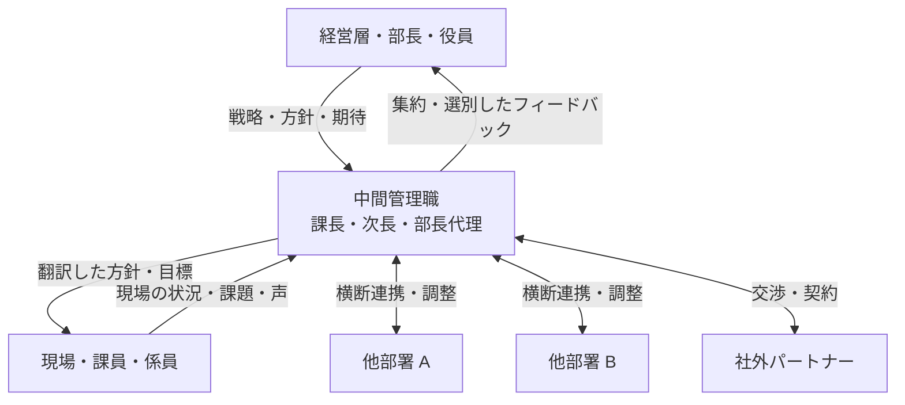
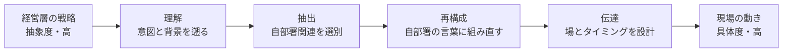

# ミドルマネジャー実践

課長 2〜5 年目からの中間管理職——上司と部下の橋渡し、複数チームの統括、戦略の翻訳

| 項目 | 内容 |
|---|---|
| カテゴリー | マネジメント・組織開発 |
| 難易度 | 中級 |
| 所要時間 | 約200分（全8レッスン） |
| 公開日 | 2026-06-25 |
| 最終更新日 | 2026-06-25 |
| コースURL | https://skillup.college/courses/management/middle-manager-practical/ |

## 対象者

課長・係長として 2〜5 年の経験を積み、複数チームの統括や部長代理級・室長級・グループリーダーへのトランジションを迎えている中間管理職の方。マトリクス組織で複数チームを束ねるシニアリーダー、近い将来に中間管理職への昇進が予定されている方、現在ミドルマネジャーとして 5 年以上の経験はあるが学び直しを求めている方も対象。業種・職種を問わず受講できる。

## 前提知識

数名規模のチームを 1〜2 年以上マネジメントした経験、または相応のリーダー経験。新任マネジャーが扱う「最初の 90 日」「1on1 と評価面談の初体験」「業務マネジメントと人のマネジメントの両輪」は理解している前提で進めます。

## 学習目標

- 新任マネジャーと中間管理職の階層差（直接マネジメント vs 間接マネジメント、5 つの責任の変化）を理解する
- 上司との関わり方（Managing Up）を「上司も人間」「上司の上司の視座」「期待のすり合わせ」の 3 軸で設計できる
- 経営戦略を現場に翻訳する 4 ステップを身につけ、納得感のある伝達ができる
- 複数チームの統括に必要な間接マネジメントの発想と、課長を介した運用ができる
- 部下マネジャー（自分の部下が部下を持つ構造）の育成と権限委譲を段階的に進められる
- 横断連携と組織政治の構造を理解し、健全に他部署と動かす技術を持つ
- 予算・人員計画・KPI 設計など、数字とリソース配分の中間管理職としての責任を扱える
- 部長・経営層への階段と、中間管理職を長く続けるためのキャリア戦略を持つ

## コース概要

「課長になったときの戸惑いは半年で消えた。けれども複数チームを統括する立場になってからの戸惑いは、5 年経っても消えない」——中間管理職としての階層が上がるたびに、それまでのマネジメント手法が通用しなくなる感覚を多くの方が味わいます。本コースは、課長として 2〜5 年の経験を積み、複数チームの統括や部長代理級・室長級へのトランジションを迎えている方を主対象に、新任マネジャーとは別の山を登るための発想と技術を 8 レッスンで段階的に学びます。中間管理職の役割の本質、上司との関わり（Managing Up）、戦略を現場に翻訳する技術、直接マネジメントから間接マネジメントへの移行、部下マネジャーの育成、横断連携と組織政治、予算・人員計画・KPI 設計、中間管理職のキャリア戦略と長く続けるための準備までを扱います。

## 学習の流れ

レッスン 1 で「ミドルマネジャー」という独自の職種の本質と、新任マネジャーから階層が上がったときの 5 つの責任の変化を扱います。前半（1〜3）は「上下の階層をつなぐ橋」のテーマで、Managing Up（L2）と戦略の翻訳（L3）に展開します。中盤（4〜5）は「複数チームと部下マネジャー」の二本柱で、間接マネジメントへの移行（L4）と部下マネジャーの育成（L5）を扱います。後半（6〜7）は「横断と数字」で、横断連携と組織政治（L6）、予算・人員計画・KPI（L7）を扱います。レッスン 8 は「中間管理職のキャリア戦略と継続」として、部長・経営層への階段、ピラミッドの細る現実、中間管理職の孤独の構造、長く続けるためのリフレクション・メンター・コーチを総括します。完成形のマネジャーを目指すコースではなく、中間管理職という職種を引き受け、長く続けるための土台を作るコースとして設計しています。

## レッスン一覧

| No. | タイトル | 概要 | 所要時間 |
|---|---|---|---|
| 1 | ミドルマネジャーとは何か——「新任」から「中間管理職」への階層転換 | 新任マネジャーと中間管理職の違い、5 つの責任の変化、直接マネジメントから間接マネジメントへ、「中間管理職」の語源と日本企業での位置づけ、サンドイッチ症候群と橋としての中間管理職、本コースの守備範囲を学ぶ | 25分 |
| 2 | 上司との関わり（Managing Up）——「上に効く」マネジメント | Managing Up の定義と Peter Drucker・John Gabarro の整理、上司も人間という前提、上司の 4 タイプと付き合い方、上司の上司の視座を借りる、期待のすり合わせ、報告と相談の設計、上司との対立への対処を学ぶ | 25分 |
| 3 | 戦略を現場に翻訳する——意思決定を伝える技術 | ミドルマネジャーは戦略の翻訳者、4 ステップの翻訳プロセス（理解・抽出・再構成・伝達）、Why から始める伝達、現場の声を戦略にフィードバックする逆翻訳、納得を作る 3 つの場（会議・1on1・カジュアル対話）を学ぶ | 25分 |
| 4 | 複数チームの統括——直接マネジメントから間接マネジメントへ | 直接マネジメントの限界（スパン・オブ・コントロール 7 人説の再考）、間接マネジメントの 5 つの発想、課長を介した運用、ダブルヘッダー（兼任）の罠、横並びチーム間のリソース配分、チーム間の不公平感への対処を学ぶ | 25分 |
| 5 | 部下マネジャーの育成——次のマネジャーを育てる | 部下マネジャー（部下が部下を持つ構造）の育成、ピーターの法則の再考、後継者育成と 9 ボックス、部下マネジャーへの権限委譲（業務委譲と人事権限委譲の分離）、部下マネジャーの 1on1、後継者を持つマネジャーの心理を学ぶ | 25分 |
| 6 | 横断連携と組織政治——他部署・他組織と動かす | ミドルマネジャーの横断連携の宿命、組織政治の構造的理解（Pfeffer・Mintzberg）、不健全な政治と健全な調整の境界、ステークホルダー・マップ、影響力の 6 タイプ（Cialdini）、横断プロジェクトの動かし方、社内対立への対処を学ぶ | 25分 |
| 7 | 数字とリソース配分——部門予算・人員計画・KPI 設計 | 中間管理職に求められる数字感覚、部門予算策定の年間サイクル、人員計画と要員プランニング、KPI と OKR の使い分け、リソース配分の意思決定、削減判断の作法、財務指標との接続を学ぶ | 25分 |
| 8 | 中間管理職のキャリア戦略と継続——部長・経営層への階段、長く続けるために | 中間管理職の 3 つの将来選択肢（上に上がる・横展開する・専門職へ転身する）、部長・経営層への準備、ピラミッドの細る現実、中間管理職の孤独の構造、リフレクション・メンター・コーチ・スーパービジョン、修了後の学習方向を学ぶ | 25分 |

---

## レッスン1：ミドルマネジャーとは何か——「新任」から「中間管理職」への階層転換

（所要時間：25分）

### このレッスンで学ぶこと

- 新任マネジャーと中間管理職は別の職種であることを理解する
- 階層が上がるときに変化する 5 つの責任を整理する
- 直接マネジメントから間接マネジメントへの転換が中間管理職の最大の壁である理由を学ぶ
- サンドイッチ症候群と橋としての中間管理職という 2 つの捉え方の違いを把握する

---

### 「新任マネジャー」と「中間管理職」は別の職種

中間管理職になった方の多くが、最初の数か月で同じ違和感を口にします。「課長になったときに学んだやり方が、今は通用しない」。これは記憶違いではありません。新任マネジャーとして覚えた技術と、中間管理職に求められる技術は、別の山に登るほど性質が異なります。

新任マネジャーの仕事は、自分が直接見ている数名〜十数名のメンバーに対して、目標を設定し、進捗を見守り、1on1 で対話し、評価を伝えることが中心です。プレイヤーとの違いは明確で、「自分でやる」ことから「人に任せて成果を出す」ことへの転換が最大のテーマでした。

中間管理職は、その先にあります。複数のチーム、複数の課長、複数の機能を束ねる立場では、自分の目で全員を見ることはできません。日々の対話相手は部下というよりも、自分の部下である課長や係長、隣の部署の管理職、上司である部長や役員、社外のパートナーへと広がります。「人を介して成果を出す」が「人を介して人を動かす人を育てる」に変わります。

> **💡 ポイント**
> 新任マネジャーの主たる課題が「プレイヤーからマネジャーへの転換」だとすれば、中間管理職の主たる課題は「直接マネジメントから間接マネジメントへの転換」です。同じマネジメントという言葉でも、扱うものが別物だと最初に認めることが、中間管理職としての第一歩になります。

### 5 つの責任の変化

新任マネジャーから中間管理職への階層転換で変化する責任を、5 つの視点で整理します。

第 1 に、**人の管理範囲**が広がります。新任マネジャーは数名〜十数名を直接見ますが、中間管理職は数十名〜百数十名を、課長や係長を介して間接的に見ます。一人ひとりの顔と名前を毎日把握することは現実的でなくなり、「課長を通じてチームの状態を読み取る」技術が必要になります。

第 2 に、**時間軸**が伸びます。新任マネジャーが扱うのは四半期から半期、長くて 1 年です。中間管理職は単年度の業績に責任を持ちつつ、3 年後の組織像、5 年後の事業構造を意識した意思決定が求められます。短期と中長期を同時に持つ二重視点が必要です。

第 3 に、**上下の橋渡し**が中心業務になります。新任マネジャーにとって上司との関わりは「報告と相談」が主でしたが、中間管理職にとっては「経営の意図を現場に翻訳する」「現場の声を経営に届ける」が日々の仕事の大半を占めます。

第 4 に、**横断的な調整**の比重が上がります。新任マネジャーは自分のチームの中で完結する仕事が多いですが、中間管理職は他部署との連携、組織横断のプロジェクト、社内政治を伴う交渉が日常になります。「自分の部署のことだけ考えていればよい」発想は通用しません。

第 5 に、**戦略への関与**が始まります。新任マネジャーは与えられた目標を達成することが仕事の中心ですが、中間管理職は目標そのものの設計に加わります。中期経営計画、部門戦略、人員計画、予算編成の場で意見を求められ、選択肢の中から選び取る責任を負います。

これら 5 つの変化は、どれか 1 つだけ意識すればよいものではなく、同時並行で全部が変わります。中間管理職になった直後の違和感の正体は、この同時多発の変化に他なりません。

### 直接マネジメントから間接マネジメントへ

5 つの責任の変化の中でも、最大の壁は「直接マネジメントから間接マネジメントへの転換」です。

直接マネジメントとは、自分の目で見て、自分の言葉で伝え、自分の判断で動かす管理の形です。新任マネジャー時代に身につけた 1on1、フィードバック、評価面談はすべて直接マネジメントの技術でした。手応えがあり、自分の影響が直接見えるため、達成感も得やすい形です。

間接マネジメントとは、自分の代わりに動く人（多くは課長や係長）を介して、組織全体を動かす管理の形です。自分の言葉が直接届くのは課長までで、その先の現場には課長の言葉として届きます。自分の判断が現場の動きに反映されるまでに時間がかかり、途中で意図が薄まったり変質したりすることもあります。

> **⚠️ 注意**
> 中間管理職になりたての方がよく陥る罠は、「全部自分で見たい」誘惑です。課長時代の癖で部下マネジャーの担当領域に踏み込んで直接指示を出すと、課長の権威が失われ、課長が育たなくなります。間接マネジメントへの転換は、自分の力の使い方を変える訓練そのものです。

間接マネジメントが機能するには、3 つの条件が必要です。1 つ目は、課長や係長を信頼して権限を委ねること。2 つ目は、自分が直接見なくても組織が回る仕組みを作ること。3 つ目は、課長の言葉を通じて自分の意図が伝わるよう、課長との意思疎通の質を上げることです。

### 「中間管理職」の語源と日本企業での位置づけ

「中間管理職」という言葉は、英語の middle management の訳語です。経営学者ピーター・ドラッカーが 20 世紀後半に組織論を体系化した際に、上位の経営層（top management）、中位の管理層（middle management）、現場の監督層（lower management）の 3 階層として整理しました。

日本企業では、課長・次長・部長代理・室長・グループリーダーといった肩書きが中間管理職の典型例にあたります。組織や業界によって呼び名や階層数は異なりますが、「経営層から方針を受け取り、現場のメンバーを率いる管理職層」という機能は共通しています。

> **📝 補足**
> 1980 年代から 1990 年代の日本企業では、課長級が中間管理職の中心でした。2000 年代以降、組織のフラット化（階層を減らす動き）が進む中で、課長と部長の間に「次長」「グループリーダー」「室長」などの中間階層を置く企業と、課長から直接部長へ昇格する企業の 2 つに区分されるようになりました。本コースでは前者を主に想定しつつ、後者にも応用できる発想を扱います。

中間管理職の比重と役割は、業種や組織規模によっても変わります。製造業の大企業では多階層構造の中で中間管理職が重要な接続点となり、IT 系のスタートアップではフラットな組織の中で中間管理職を意識的に置かない設計もあります。本コースは「複数チームの統括」「上下の橋渡し」「戦略の翻訳」という機能に注目します。これらは肩書きが何であろうと、人を介して人を動かす階層に立った瞬間に必要になる技術です。

### サンドイッチ症候群と橋としての中間管理職

中間管理職を語るときに頻繁に登場する言葉が「サンドイッチ症候群」です。上司からのプレッシャーと部下からの突き上げの両方を受けて、間に挟まれて消耗する状態を指します。1980 年代から欧米のマネジメント文献で議論されてきた、中間管理職特有のストレス構造です。

サンドイッチ症候群を否定する必要はありません。中間管理職が上下に挟まれる構造は事実であり、消耗しやすいことも事実です。けれども、この構造を「中間管理職は不幸な職種である」という結論に直結させると、自分の役割を肯定的に引き受けられなくなります。

別の捉え方が「橋」です。橋は、両岸をつなぐ存在として、両方の重みを引き受けます。橋がなければ、人や物資は対岸に渡れません。経営層が考えた戦略は、橋がなければ現場に届きません。現場の声も、橋がなければ経営層に届きません。中間管理職は組織にとって不可欠な構造体として機能している、という捉え方です。

図 1：中間管理職は上下の階層と左右の部署を結ぶ「橋」として機能します。経営層と現場の縦の流れに加えて、他部署や社外との横のやり取りも担います。

サンドイッチか橋か——同じ構造を別の言葉で捉えるだけで、中間管理職としての日々の見え方が変わります。本コースは「橋として中間管理職を引き受ける」立場で設計しています。挟まれる構造を消そうとするのではなく、橋として機能する技術を磨くことで、消耗を減らし役割を引き受けやすくする発想です。

### 本コースの守備範囲と前提

本コースは、課長として 2〜5 年の経験を積み、複数チームの統括や部長代理級・室長級へのトランジションを迎えている方を主対象に設計しています。新任マネジャーが扱う「最初の 90 日」「業務と人の両輪」「1on1 と評価面談の初体験」「マネジャーの孤独」については、本コース内では前提として扱い、深掘りはしません。

扱う 7 つのテーマは、レッスン 2 から順に、上司との関わり（Managing Up）、戦略の翻訳、複数チーム統括、部下マネジャーの育成、横断連携と組織政治、予算・人員計画・KPI 設計、中間管理職のキャリア戦略と継続です。すべてが「直接マネジメントから間接マネジメントへの転換」という共通テーマの上に乗っています。

> **🔰 初学者の方へ**
> もし「自分はまだ新任マネジャーで、複数チーム統括は先の話だ」と感じる方は、本コースの内容を「来年・再来年の自分への備え」として読み進めるとよいです。中間管理職への昇進は突然訪れることが多く、訪れてから学び始めるのでは遅い場面が多くあります。

本コースで扱わないものも明示します。経営層（取締役・執行役員・社長）の意思決定論、創業者や個人事業主のセルフマネジメント、特定の業界に固有の技能（製造現場の作業管理、医療現場の臨床マネジメントなど）、人事制度の設計実務、労務管理の実務手続きは扱いません。これらが必要な場合は、別の専門教材を参照してください。

### まとめ

このレッスンでは、以下のことを学びました。

- 新任マネジャーと中間管理職は、同じ「マネジメント」という言葉でも別の山を登る職種である
- 階層転換では、人の管理範囲・時間軸・上下の橋渡し・横断的調整・戦略への関与の 5 つの責任が同時に変わる
- 直接マネジメントから間接マネジメントへの転換が中間管理職の最大の壁で、課長を介した運用ができるかどうかが成否を分ける
- 「中間管理職」は middle management の訳語で、経営層と現場をつなぐ管理層を指す
- サンドイッチ症候群として上下に挟まれる構造を見るか、橋として両側をつなぐ機能を引き受けるかで、中間管理職としての日々の見え方が変わる
- 本コースは「橋として中間管理職を引き受ける」立場で、上司との関わり・戦略の翻訳・複数チーム統括・部下マネジャー育成・横断連携・数字とリソース配分・キャリア戦略を扱う

次のレッスンでは、中間管理職の日常で大きな比重を占める「上司との関わり（Managing Up）」を扱います。上司も人間であるという前提から、上司の 4 タイプとの付き合い方、上司の上司の視座を借りる発想、期待のすり合わせの技術までを学びます。

---

### 確認クイズ

このレッスンの理解度をチェックしましょう。

#### Q1. 新任マネジャーと中間管理職の最大の違いとして、本レッスンが示したものはどれですか？

- [x] 直接マネジメントから間接マネジメントへの転換が必要になること
- [ ] 担当する業務の専門性が深まること
- [ ] 給与の額が大きく上がること
- [ ] 出社時間が早まり残業時間が増えること

> **解説**
> 新任マネジャーは自分の目で見て自分の言葉で動かす直接マネジメントが中心ですが、中間管理職は課長や係長を介して組織を動かす間接マネジメントが中核業務になります。専門性・給与・労働時間は階層転換の本質ではありません。

#### Q2. 新任マネジャーから中間管理職への階層転換で変化する 5 つの責任に含まれないものはどれですか？

- [ ] 人の管理範囲が広がる
- [ ] 時間軸が伸びる
- [ ] 横断的な調整の比重が上がる
- [x] 個別案件の実務作業を自分で行う比重が増える

> **解説**
> 中間管理職に上がると、むしろ自分が個別案件の実務を直接担当する比重は減ります。本レッスンが挙げた 5 つは、人の管理範囲の拡大、時間軸の伸長、上下の橋渡し、横断的調整、戦略への関与でした。

#### Q3. 「直接マネジメントから間接マネジメントへの転換」を阻む、新任から中間管理職になりたての方がよく陥る罠はどれですか？

- [ ] 上司の言葉に従いすぎてメンバーへの説明を怠ること
- [x] 課長時代の癖で部下マネジャーの担当領域に直接指示を出してしまうこと
- [ ] 部下マネジャーに完全に任せて自分は何もしなくなること
- [ ] 業務の細部に立ち入らず、毎日定時で帰宅し続けること

> **解説**
> 中間管理職になりたての方は、課長時代の手応えのある直接マネジメントが忘れられず、課長を飛び越して現場メンバーに直接指示を出してしまいがちです。これは課長の権威を奪い、課長が育たない構造を生みます。完全な放任も別の問題ですが、本レッスンが警告したのは「全部自分で見たい」誘惑です。

#### Q4. 中間管理職を「サンドイッチ症候群」ではなく「橋」として捉えることの効用は何ですか？

- [ ] 上司や部下からの要求を無視できるようになる
- [ ] 部下マネジャーへの権限委譲が不要になる
- [x] 挟まれる構造を消そうとせず、両側をつなぐ機能を引き受けられる
- [ ] 自分の仕事量が物理的に減らせる

> **解説**
> 橋として中間管理職を捉えると、上下に挟まれる構造そのものは変わりませんが、「橋がなければ組織は機能しない」という肯定的な役割認識を持てます。要求の無視・権限委譲の不要化・仕事量の削減はいずれも橋の捉え方とは関係ありません。

#### Q5. 「中間管理職」という言葉の由来として、本レッスンが説明したものはどれですか？

- [ ] 江戸時代の幕藩体制から続く日本独自の階層概念
- [ ] 1950 年代に労働組合運動の中で生まれた呼称
- [x] 英語の middle management の訳語で、ピーター・ドラッカーが整理した 3 階層の中位
- [ ] 戦後の高度経済成長期に労働省が定めた法律用語

> **解説**
> 中間管理職は英語の middle management の訳語で、経営学者ピーター・ドラッカーが 20 世紀後半に整理した経営層・中位の管理層・現場の監督層という 3 階層構造の中位を指します。日本独自の概念でも法律用語でもありません。

#### Q6. 本コースが守備範囲としないものはどれですか？

- [ ] 上司との関わり（Managing Up）
- [ ] 部下マネジャーの育成
- [ ] 横断連携と組織政治
- [x] 経営層（取締役・執行役員・社長）の意思決定論

> **解説**
> 本コースは課長 2〜5 年目で複数チーム統括の中間管理職を主対象としており、取締役・執行役員・社長など経営層の意思決定論は扱いません。これは別の専門教材に譲ります。Managing Up、部下マネジャー育成、横断連携と組織政治はすべて本コース後半で扱う中核テーマです。

---

## レッスン2：上司との関わり（Managing Up）——「上に効く」マネジメント

（所要時間：25分）

### このレッスンで学ぶこと

- Managing Up の定義と、ピーター・ドラッカーとジョン・ガバロが示した整理を理解する
- 「上司も人間」という前提から、上司の 4 タイプとの付き合い方を学ぶ
- 上司の上司の視座を借りる発想を持つ
- 期待のすり合わせと、報告・相談の設計、上司との対立への対処方法を身につける

---

前回のレッスンでは、新任マネジャーと中間管理職が別の山を登る職種であり、直接マネジメントから間接マネジメントへの転換が中間管理職の最大の壁であることを学びました。今回からは、中間管理職としての日常で大きな比重を占めるテーマを順に扱います。最初のテーマは「上司との関わり」です。

### Managing Up とは何か

Managing Up（マネージング・アップ）とは、自分の上司を含む上位の階層との関係を、自分の責任として能動的に設計し運用する考え方と技術を指します。日本語では「上司マネジメント」「上に効くマネジメント」と訳されることもあります。中間管理職にとって、部下マネジメントと並ぶ二本柱の片方として位置づけられます。

経営学者ピーター・ドラッカーは 1960 年代から、上司との関わりを「マネジメントの一部」として明確に扱いました。著書『経営者の条件』の中で、上司を取り扱うことは部下を取り扱うことと同じくらい重要であり、上司に自分の強みを使ってもらうのは部下の責任である、と述べています。

ハーバード・ビジネス・スクールの組織行動学者ジョン・ガバロは、1980 年に同僚のジョン・コッターと共著の論文「Managing Your Boss」（『Harvard Business Review』）でこの概念を体系化しました。ガバロらは、上司との関係構築が失敗するのはたいてい「上司を理解する努力が足りない」「自分の側のニーズや強みを上司に伝える努力が足りない」の 2 つに集約されると示しました。

> **💡 ポイント**
> Managing Up の核心は「上司を変えようとする」ことではなく、「上司と自分の関係を設計する責任を自分が持つ」ことです。上司の性格や能力を変えるのは難しい一方で、関係の設計は自分の側からでも始められます。

中間管理職にとって Managing Up が特に重要な理由は 3 つあります。第 1 に、自分が上司に伝える情報の質が、組織全体の意思決定の質を左右するためです。第 2 に、上司の信頼を得られないと、自分が部下マネジャーに与える権限や自由度が制約されるためです。第 3 に、中間管理職は経営層と直接対話する機会が限られており、上司との関係が経営層への接続の窓口になるためです。

### 「上司も人間」という前提

Managing Up の出発点は、「上司も人間である」という当たり前の前提を改めて確認することです。

中間管理職になりたての方は、上司を「指示を出す機械」「評価を下す審判」のように捉えがちです。実際の上司は、過去のキャリアと現在の役割の中で動き、得意分野と苦手分野を持ち、不安や迷いを抱えながら判断しています。経営層からのプレッシャーを受けつつ、自分の部下である中間管理職をどう育てるかを考えています。

この当たり前を意識すると、関わり方が変わります。「上司は何を不安に思っているか」「上司の上司から何を求められているか」「上司は何が得意で、何を任せたら喜ぶか」を観察対象として持てるようになります。上司を観察するのは「媚びを売る」ためではなく、関係の設計に必要な情報を集めるためです。

> **⚠️ 注意**
> 「上司も人間」という認識は、上司の判断や指示を盲目的に受け入れることを意味しません。むしろ逆で、上司が完璧でないことを認めるからこそ、自分が情報提供や反論を含む能動的な働きかけをする責任が生まれます。

### 上司の 4 タイプと付き合い方

上司を一律に扱うのは現実的ではありません。本レッスンでは、中間管理職が日常的に出会う上司を 4 つのタイプに整理して、それぞれの付き合い方の指針を示します。タイプ分けは便宜的なものであり、現実の上司は複数タイプの組み合わせです。

第 1 のタイプは、**任せきり型**です。「お前に任せたから自由にやれ」と権限を委ねる代わりに、細かい状況把握には関心が薄いタイプです。自由度が高いのは利点ですが、報告不足から認識のずれが大きくなる危険があります。付き合い方として、定例の報告タイミングを自分から設計し、上司が知っておくべき情報を「忘れた頃に届ける」習慣を持つことが有効です。

第 2 のタイプは、**マイクロ型**です。細かい指示を頻繁に出し、進捗を逐一確認したいタイプです。自由度は下がりますが、上司の意図は明確で迷いにくい利点があります。付き合い方として、上司が見たい情報を先回りして提供することで、上司の不安を減らし、徐々に自由度を獲得していく戦略が有効です。先回りの情報提供を続けると、上司は「この人は任せても大丈夫」と判断する材料を持ちます。

第 3 のタイプは、**ビジョン型**です。大きな方針や夢を語るのは得意だが、具体策や実務の細部は苦手というタイプです。スタートアップ創業者や事業立ち上げ経験者に多い傾向があります。付き合い方として、ビジョンを具体策に翻訳する役を自分が引き受け、「あなたのビジョンを現場でこう実現します」という形で対話することで、信頼関係が深まります。

第 4 のタイプは、**実務型**です。現場の細部まで把握し、具体的な指示を出すのは得意だが、長期ビジョンや組織全体の方向性を語るのが苦手なタイプです。叩き上げの管理職に多い傾向があります。付き合い方として、長期視点や横断的な論点を上司に提供する役を自分が引き受け、上司が経営層と話す際の素材を提供することで、補完関係を作ります。

> **📝 補足**
> どのタイプの上司も「悪い上司」ではありません。それぞれに強みと弱みがあり、中間管理職である自分の側がその差を埋める努力をするのが Managing Up の発想です。上司の弱みを批判しても関係は良くなりません。

### 上司の上司の視座を借りる

中間管理職が Managing Up で意識すべき独自の発想が、「上司の上司の視座を借りる」ことです。

上司は単独で意思決定しているわけではなく、自身の上司（多くの場合は部長・本部長・役員）の期待と評価の中で動いています。上司に何かを提案したり、上司を説得したりするとき、「上司の上司から見たらどう映るか」を意識すると、上司にとって採用しやすい提案になります。

例えば、新しいプロジェクトの予算を上司に要求するとき、「自分の部署で必要だから」と説明するよりも、「上司の上司が今期重視している経営課題に直結する投資だから」と整理した方が、上司は経営層への説明材料を持って判断できます。上司が判断しやすい情報の渡し方そのものが、Managing Up の中核技術です。

上司の上司の視座を知るには、3 つの情報源を組み合わせます。1 つ目は、経営会議の議事録や中期経営計画など公式の文書です。2 つ目は、上司との 1on1 で「上司の上司は今何を気にしているか」を率直に聞くことです。3 つ目は、隣の部署の中間管理職や、過去に上司の上司と関わった先輩から間接的に情報を得ることです。

### 期待のすり合わせ

上司との関係で最大の事故源は「期待のずれ」です。上司は伝えたつもりで伝わっていない、中間管理職は理解したつもりで理解していない、という二重のずれが、長期的な信頼の喪失につながります。

期待のすり合わせを設計する 3 つの場面を整理します。

第 1 の場面は、**着任時のすり合わせ**です。新しい上司を迎えたとき、または自分が新しい職位に就いたときに、上司が自分に何を期待しているかを 30 〜 60 分の時間を取って言葉にしてもらうセッションを持ちます。「上司が私に最も期待しているのは何か」「私が外してはいけないものは何か」「半年後にどんな状態になっていれば成功と評価するか」の 3 つを問います。

第 2 の場面は、**期初・期央・期末のすり合わせ**です。期初に目標を共有しただけで放置すると、期末に「思っていた成果と違う」となりがちです。期初に目標を、期央に進捗と再調整を、期末に振り返りと次期の準備をすり合わせる年 3 回のリズムを設計します。

第 3 の場面は、**重要な意思決定の前のすり合わせ**です。組織を大きく変える人事、外部との重要な契約、予算配分の方向性などは、決めてから報告するのではなく、決める前に上司の意向を確認します。「私はこう判断しようとしていますが、何か違和感はありませんか」と尋ねる短い対話だけで、後の事故を大幅に減らせます。

> **🔰 初学者の方へ**
> 「期待のすり合わせ」と聞くと「上司の機嫌を取る」ように響くかもしれませんが、これは事故防止の技術です。上司の好みに迎合することではなく、上司と自分の認識のずれを早期に発見し、互いに調整する技術です。

### 報告と相談の設計

期待のすり合わせの基盤として、日常の報告と相談の設計があります。中間管理職が上司に何を、いつ、どのように伝えるかを意識的に設計することで、上司の不安を減らし、自分の自由度を増やします。

報告の 3 原則として、「速さ・要点・選択肢」を意識します。第 1 に、悪い情報ほど早く伝えます。問題が顕在化する前に、リスクの段階で共有することで、上司は判断する時間を持てます。第 2 に、要点を先に伝えます。背景や経緯から始めるのではなく、「結論は A です。理由は 3 点」の順で伝えることで、忙しい上司の時間を節約します。第 3 に、選択肢を提示します。「A と B の選択肢があり、私は A を推奨します。理由は」と整理することで、上司は判断しやすくなり、中間管理職の思考の質も評価できます。

相談の 3 原則として、「早期・準備・依頼内容の明示」を意識します。第 1 に、判断に迷ったら早期に相談します。決断直前ではなく、選択肢を検討している段階で相談することで、上司の知見を借りられます。第 2 に、相談前に自分なりの整理を持ちます。「どう思いますか」と丸投げするのではなく、「私の整理ではこうですが、見落としはありますか」と問うことで、対話の質が上がります。第 3 に、相談時に依頼内容を明示します。「決めてほしい」のか「意見を聞きたい」のか「情報を共有したい」のかを冒頭で伝えることで、上司は適切な深さで関わります。

### 上司との対立への対処

Managing Up を磨いても、上司との意見対立は避けられません。中間管理職としての成熟度は、対立を健全に扱える技術にも表れます。

対立への対処として、3 つの段階を意識します。

第 1 段階は、**正面から伝える**ことです。上司の判断に違和感があるとき、まずは 1on1 の場で率直に伝えます。「私は別の見方をしています。理由は」と整理した上で、上司の判断材料に新しい情報を加えます。この段階で多くの対立は解消します。

第 2 段階は、**選択肢として残す**ことです。正面から伝えても上司の判断が変わらないとき、自分の見解を「記録に残す」形で文書化し、上司にも共有します。「私は別の見方を持っていることを記録します。判断は上司に従いますが、結果を振り返るときの材料として残します」と伝えます。これは反抗ではなく、後日の振り返りを建設的にする準備です。

第 3 段階は、**自分の境界線を確認する**ことです。上司の判断が法令・倫理・自分の核となる価値観に反すると感じる場合、自分の境界線を確認します。コンプライアンス窓口への相談、人事部への相談、最終的には自分のキャリア選択を考えるなど、選択肢は段階的に存在します。中間管理職は組織の一員でありつつ、自分の判断と倫理を持つ個人でもあります。

> **⚠️ 注意**
> 上司との対立は感情的になりやすい場面です。怒りや失望のエネルギーを「正面から伝える」段階で使うのではなく、まず一晩寝てから、整理した言葉で対話する習慣を持つことが、長期的な関係維持に役立ちます。

### まとめ

このレッスンでは、以下のことを学びました。

- Managing Up は上司を含む上位の階層との関係を、自分の責任として能動的に設計する考え方と技術である
- 出発点は「上司も人間」という前提で、上司を観察対象として持つ
- 上司は便宜的に 4 タイプ（任せきり型・マイクロ型・ビジョン型・実務型）に分けられ、それぞれに応じた付き合い方がある
- 上司の上司の視座を借りると、上司にとって採用しやすい提案ができる
- 期待のすり合わせは着任時・期初期央期末・重要な意思決定の前の 3 場面で設計する
- 報告は速さ・要点・選択肢の 3 原則、相談は早期・準備・依頼内容の明示の 3 原則で運用する
- 上司との対立は、正面から伝える・選択肢として残す・自分の境界線を確認する、の 3 段階で扱う

次のレッスンでは、中間管理職の中核業務である「戦略を現場に翻訳する」技術を扱います。経営層から下りてくる戦略や方針を、現場が動ける形に再構成して伝える 4 ステップを学びます。

---

### 確認クイズ

このレッスンの理解度をチェックしましょう。

#### Q1. Managing Up の核心として、本レッスンが示したものはどれですか？

- [ ] 上司の性格や能力を変える働きかけをすること
- [ ] 上司の判断に従順に従い対立を避けること
- [x] 上司との関係を設計する責任を自分が持つこと
- [ ] 上司の好みに合わせた成果物を作ること

> **解説**
> Managing Up の核心は、上司を変えようとすることでも盲目的に従うことでもなく、上司との関係を自分の責任として能動的に設計することです。上司の性格は変えにくくても、関係の設計は自分の側から始められます。

#### Q2. ピーター・ドラッカーが上司との関わりについて述べたこととして、本レッスンが紹介したものはどれですか？

- [x] 上司に自分の強みを使ってもらうのは部下の責任である
- [ ] 上司に物申すのは越権行為であり避けるべきである
- [ ] 上司との関係は人事評価制度に委ねればよい
- [ ] 上司との関係は個人的な好き嫌いの問題である

> **解説**
> ドラッカーは『経営者の条件』で、上司を取り扱うことは部下を取り扱うことと同じくらい重要であり、上司に自分の強みを使ってもらうのは部下の責任であると述べました。Managing Up を「マネジメントの一部」として位置づけた古典です。

#### Q3. マイクロ型の上司との付き合い方として、本レッスンが推奨したものはどれですか？

- [ ] 上司の指示を一切受け付けず自分のやり方を貫く
- [ ] 上司の細かい指示を表面的に受けてその場をしのぐ
- [x] 上司が見たい情報を先回りして提供することで不安を減らし徐々に自由度を獲得する
- [ ] 上司を飛び越して上司の上司に直接報告する

> **解説**
> マイクロ型の上司は細かい確認をしたい不安を抱えています。先回りで情報を提供することで上司の不安が減り、「この人は任せても大丈夫」という判断材料を持てるようになります。指示の無視・表面的対応・飛び越しはいずれも信頼を損ねます。

#### Q4. 「上司の上司の視座を借りる」発想の利点として、本レッスンが説明したものはどれですか？

- [ ] 上司を飛び越して直接経営層に近づける
- [ ] 上司の判断を批判する材料が増える
- [ ] 自分の権限が法的に拡大する
- [x] 上司にとって採用しやすい提案ができる

> **解説**
> 上司の上司の視座を借りることで、上司が経営層への説明材料を持って判断できる形の提案ができます。これは上司を支援する発想であり、飛び越しでも批判でも権限拡大でもありません。

#### Q5. 期待のすり合わせを設計する 3 つの場面に含まれないものはどれですか？

- [ ] 着任時のすり合わせ
- [ ] 期初・期央・期末のすり合わせ
- [ ] 重要な意思決定の前のすり合わせ
- [x] 上司が退職する直前のすり合わせ

> **解説**
> 本レッスンが示した 3 場面は、着任時・期初期央期末・重要な意思決定の前です。上司の退職前のすり合わせは特殊なケースで、本レッスンの設計には含まれていません。

#### Q6. 上司との対立への対処の第 2 段階として、本レッスンが推奨した行動はどれですか？

- [ ] 上司の指示に従いつつ陰で別の判断を実行する
- [x] 自分の見解を文書化し記録に残した上で上司の判断に従う
- [ ] 直ちに人事部へ異動希望を提出する
- [ ] 同僚に上司の悪口を共有してガス抜きする

> **解説**
> 第 2 段階は「選択肢として残す」、つまり自分の見解を記録に残しつつ上司の判断に従う対応です。これは反抗ではなく、後日の振り返りを建設的にする準備です。隠れての別行動・即時の異動希望・悪口の共有はいずれも問題解決になりません。

---

## レッスン3：戦略を現場に翻訳する——意思決定を伝える技術

（所要時間：25分）

### このレッスンで学ぶこと

- 中間管理職が「戦略の翻訳者」であるとはどういうことかを理解する
- 戦略翻訳の 4 ステップ（理解・抽出・再構成・伝達）を身につける
- Why から始める伝達によって納得を作る発想を学ぶ
- 現場の声を戦略に届ける「逆翻訳」と、納得を作る 3 つの場を扱える

---

前回のレッスンでは、Managing Up を通じた上司との関わり方を学びました。今回は、その上司から下りてきた戦略や方針を、現場が動ける形に再構成して伝える「戦略の翻訳」を扱います。中間管理職の中核業務の 1 つで、ここが機能しないと組織は止まります。

### ミドルマネジャーは「戦略の翻訳者」である

経営層が策定した戦略は、そのままでは現場で動きにつながりません。戦略は抽象度が高く、組織全体に向けた言葉で書かれており、特定のチームが「明日から何をすればよいか」を示すには遠すぎることがほとんどです。一方、現場のメンバーは目の前の業務に集中しており、戦略の文書をそのまま読み解いて自分の動きに落とし込む余力はありません。

この間に立つのが中間管理職です。経営層が決めた戦略を、自部署が動ける形に翻訳して伝えることで、戦略が現場の動きとして結実します。中間管理職を翻訳者として位置づけた経営学者は何人もいますが、特にハーバード・ビジネス・スクールのジョセフ・バウアーは 1970 年代から、戦略実行における中間管理職の翻訳機能を研究してきました。

> **💡 ポイント**
> 戦略は文書ではなく、人々の動きとして組織に宿るものです。中間管理職の翻訳が失敗すると、いかに優れた戦略も実行されません。戦略実行の質は、中間管理職の翻訳の質で決まると言ってよいほど、この役割は決定的です。

戦略翻訳がうまく機能していない組織には、共通の症状があります。経営層は「現場が戦略を理解していない」と嘆き、現場は「経営層が現実を知らない」と不満を持ち、中間管理職は「上下から責められる」状態に陥ります。これはサンドイッチ症候群の典型例ですが、その背後にあるのは翻訳機能の欠落です。翻訳者がいなければ、原文と読者の間に深い溝が残ります。

### 戦略翻訳の 4 ステップ

戦略翻訳を意識的に運用するために、4 ステップに分解して整理します。

第 1 ステップは「**理解**」です。経営層が決めた戦略の意図を、表面的な文言ではなく、背後にある問題意識や仮説まで遡って理解します。経営会議の議事録、中期経営計画の本体だけでなく、上司との対話、ほかの役員のスピーチ、社外環境の変化など複数の情報源を組み合わせます。「なぜ今この戦略なのか」「何を恐れて、何を狙っているのか」が腑に落ちるまで、自分の側で問い直します。

第 2 ステップは「**抽出**」です。戦略全体のうち、自部署に関係する要素だけを抽出します。中期経営計画には全社の方針が書かれていますが、そのすべてが自部署の業務に関わるわけではありません。「自部署が貢献する戦略テーマは何か」「自部署が無関係でいてよい部分はどこか」を見極めることで、現場に伝える内容を絞り込みます。

第 3 ステップは「**再構成**」です。抽出した戦略要素を、自部署のメンバーが理解できる言語と文脈で再構成します。経営層が使う抽象的な用語を具体的な業務行動に翻訳し、自部署の現状を出発点とした語り方に組み直します。「全社の DX 推進」を「自部署のこの業務を、来月からこの順序で自動化する」と言い換えるような作業です。

第 4 ステップは「**伝達**」です。再構成した内容を、適切なタイミングと場で現場に伝えます。一斉メールで済むものもあれば、部署全体の集会が必要なものもあり、1on1 で個別に伝えるべきものもあります。伝達の場の設計が、納得形成の質を左右します。

図 1：戦略翻訳の 4 ステップは、抽象度の高い戦略を、具体度の高い現場の動きへと段階的に落とし込むプロセスです。

> **⚠️ 注意**
> 4 ステップを順番に踏まずに「上司から聞いた言葉をそのまま現場に流す」中間管理職は珍しくありません。これは翻訳の放棄であり、戦略実行の失敗を招く典型パターンです。中間管理職の付加価値は、原文をそのまま流すことではなく、翻訳の労を引き受けることにあります。

### Why から始める伝達

翻訳した戦略を伝達するとき、中間管理職が最も意識すべきは「Why から始める」順序です。

組織コンサルタントのサイモン・シネックが 2009 年の TED 講演とその後の著書『Start With Why』で広く知られるようにした考え方です。人は What（何を）でも How（どうやって）でもなく、Why（なぜ）に動かされる、という主張です。同じ業務指示でも、Why が共有されているかどうかで、現場の動きの質が変わります。

例えば、新しい顧客対応プロセスを導入するとき、「来月から手順 A を踏んでください」と What だけを伝えても、現場は受動的に従うだけです。「最近顧客満足度の低下が見られ、その原因は対応の一貫性の欠如だと分析されました。そこで一貫性を高めるために、来月から手順 A を踏みます」と Why から始めると、現場は能動的に手順 A の意図を理解し、必要に応じて改善提案も出すようになります。

伝達の構造として、3 層モデルを意識します。

第 1 層は **Why**（なぜこの戦略なのか）です。経営環境、競合動向、顧客の変化、自社の弱みなど、戦略を必要にした背景を語ります。

第 2 層は **What**（何を目指すのか）です。戦略の目標、達成像、成功の指標を語ります。

第 3 層は **How**（どう実行するのか）です。具体的なアクション、スケジュール、役割分担を語ります。

伝達の場では Why から始め、What を経て How に至ります。逆順で How から始めると、現場は作業として受け取り、戦略との接続を見失います。

### 現場の声を戦略に届ける「逆翻訳」

戦略翻訳は経営から現場への一方向だけではありません。中間管理職には、現場の声を集めて経営層に届ける「逆翻訳」の役割もあります。

現場のメンバーは、戦略の影響を実際に受けて動くため、戦略の盲点や実行上の課題に最初に気づきます。「この戦略は理屈はわかるが現実にはこの障害がある」「顧客の反応は経営の想定と違う」「他部署との連携でこういう摩擦が出ている」といった情報は、現場にしか集まりません。

中間管理職は、これらの声を集約し、選別し、経営層が判断できる形に翻訳して届けます。すべての声をそのまま上に流すのは情報過多であり、無視するのは現場を裏切ります。「経営層が次の意思決定に使える情報」と「現場が解消すべき不満」を分け、前者を上に届け、後者を自部署で解消します。

> **📝 補足**
> 逆翻訳の質は、現場との日常的な信頼関係に支えられます。1on1 や雑談の場で現場の本音が出てこなければ、逆翻訳の素材が集まりません。中間管理職が「現場の声を聞く構え」を持っていることが、戦略を組織に着地させる条件になります。

逆翻訳が機能している組織では、戦略が時間とともに改善されます。最初に策定された戦略が完璧であることは現実にはなく、実行の過程で見えてくる現実を反映して、戦略は調整されるものです。中間管理職の逆翻訳が、その調整の質を左右します。

### 納得を作る 3 つの場

戦略翻訳の伝達は、1 つの大きな場では完結しません。納得は時間をかけて、複数の場で重ねられます。中間管理職が設計すべき 3 つの場を整理します。

第 1 の場は、**部署全体の会議**です。月次の全体会議、四半期の事業方針共有会、年度始まりの方針発表会など、部署の全員が同じ場で同じ言葉を聞く機会です。Why・What・How の 3 層を構造的に伝えるのに適しており、戦略の輪郭を共有する場として機能します。ここで全員が同じスタート地点に立つことが、その後の納得形成の基盤になります。

第 2 の場は、**1on1**です。1 対 1 の対話で、メンバーが個別に抱える疑問や不安、自身の業務との接続の問いに応じます。全体会議で語った戦略を、メンバー一人ひとりの業務文脈に再翻訳する場として機能します。1on1 を通じて、戦略が「全体の話」から「私の話」に変わります。

第 3 の場は、**カジュアル対話**です。給湯室での立ち話、ランチでの会話、業務後の短い雑談など、設計されていない場での会話です。フォーマルな場では言いにくい本音や、戦略への小さな違和感は、カジュアルな場で表出します。中間管理職がこれらの場に意識的に身を置くことで、納得の進度を把握できます。

3 つの場の組み合わせ方を、戦略の重みと現場の動揺度に応じて設計します。組織を大きく変える戦略ほど、3 つの場を厚く重ねます。日常業務の小さな変更であれば、全体会議の場で説明し、1on1 で個別の懸念を拾えば十分です。

### まとめ

このレッスンでは、以下のことを学びました。

- 中間管理職は経営層と現場の間に立つ「戦略の翻訳者」で、翻訳の質が戦略実行の質を決める
- 戦略翻訳は 4 ステップで進める：理解（意図と背景を遡る）、抽出（自部署関連を選別）、再構成（自部署の言葉に組み直す）、伝達（場とタイミングを設計）
- 伝達は Why から始める：Why（なぜ）→ What（何を）→ How（どう）の 3 層構造で語る
- 中間管理職には現場の声を経営層に届ける「逆翻訳」の役割もあり、戦略を時間とともに改善させる
- 納得は 3 つの場で重ねる：部署全体の会議で輪郭を共有し、1on1 で個別翻訳し、カジュアル対話で本音を拾う

次のレッスンでは、中間管理職の最大の壁である「複数チームの統括」を扱います。直接マネジメントの限界、間接マネジメントへの転換、課長を介した運用、ダブルヘッダーの罠、横並びチーム間のリソース配分などを学びます。

---

### 確認クイズ

このレッスンの理解度をチェックしましょう。

#### Q1. 中間管理職が「戦略の翻訳者」であるとされる理由として、本レッスンが示したものはどれですか？

- [ ] 中間管理職には戦略を独自に決める権限があるから
- [x] 経営層が決めた戦略は抽象度が高く、現場が直接動ける形ではないため、間に翻訳が必要だから
- [ ] 経営層は戦略を作成する能力が不足しているから
- [ ] 現場のメンバーは戦略の文書を読む権限を持たないから

> **解説**
> 戦略は抽象度の高い言葉で書かれており、特定のチームが「明日から何をすればよいか」を示すには遠すぎることがほとんどです。中間管理職が間に立って翻訳しないと、戦略は現場の動きに結実しません。

#### Q2. 戦略翻訳の 4 ステップの順序として、本レッスンが示したものはどれですか？

- [ ] 抽出 → 理解 → 伝達 → 再構成
- [ ] 伝達 → 抽出 → 再構成 → 理解
- [x] 理解 → 抽出 → 再構成 → 伝達
- [ ] 再構成 → 伝達 → 理解 → 抽出

> **解説**
> 戦略翻訳の 4 ステップは、理解（意図と背景を遡る）→ 抽出（自部署関連を選別）→ 再構成（自部署の言葉に組み直す）→ 伝達（場とタイミングを設計）の順です。抽象度の高い戦略を段階的に具体度の高い動きに落とし込みます。

#### Q3. 「Why から始める伝達」の考え方を広めた人物として、本レッスンが紹介したのは誰ですか？

- [x] サイモン・シネック
- [ ] ピーター・ドラッカー
- [ ] ジョセフ・バウアー
- [ ] ジョン・ガバロ

> **解説**
> 組織コンサルタントのサイモン・シネックが 2009 年の TED 講演と著書『Start With Why』で広く知られるようにした考え方です。人は What や How ではなく Why に動かされるという主張です。ピーター・ドラッカーは経営学、ジョセフ・バウアーは戦略実行論、ジョン・ガバロは Managing Up の論者です。

#### Q4. 戦略を伝達する 3 層モデルにおいて、伝達順序として本レッスンが推奨したものはどれですか？

- [ ] How → What → Why
- [x] Why → What → How
- [ ] What → How → Why
- [ ] How → Why → What

> **解説**
> 伝達は Why から始め、What を経て How に至ります。Why（なぜこの戦略なのか）が共有されることで、現場は能動的に動けます。How から始めると、現場は作業として受け取り、戦略との接続を見失います。

#### Q5. 「逆翻訳」とは何ですか？

- [ ] 戦略を一度英語に翻訳し直してから日本語に戻す技術
- [ ] 経営層の指示を意図的に変えて現場に流す行為
- [x] 現場の声を集約・選別して経営層が判断できる形に届ける役割
- [ ] 部署の言葉を別部署の言葉に置き換える調整

> **解説**
> 逆翻訳は、現場の声を集約・選別して経営層に届ける役割です。これにより戦略は時間とともに改善されます。意図的な変質や言語的な翻訳ではなく、組織内のコミュニケーションフローの設計の話です。

#### Q6. 納得を作る「3 つの場」に含まれないものはどれですか？

- [ ] 部署全体の会議
- [ ] 1on1
- [ ] カジュアル対話
- [x] 社外への記者発表

> **解説**
> 本レッスンが示した 3 つの場は、部署全体の会議・1on1・カジュアル対話です。社外への記者発表は対外コミュニケーションであり、内部の納得形成の場には含まれません。

---

## レッスン4：複数チームの統括——直接マネジメントから間接マネジメントへ

（所要時間：25分）

### このレッスンで学ぶこと

- 直接マネジメントの限界とスパン・オブ・コントロールの古典理論を再考する
- 間接マネジメントの 5 つの発想を身につける
- 課長を介した運用とダブルヘッダー（兼任）の罠を学ぶ
- 横並びチーム間のリソース配分と、チーム間の不公平感への対処方法を扱える

---

前回のレッスンでは、戦略を現場に翻訳する技術を学びました。今回は、中間管理職の最大の壁である「複数チームの統括」を扱います。レッスン 1 で「最大の壁」と位置づけた直接マネジメントから間接マネジメントへの移行を、具体的な運用レベルまで掘り下げます。

### 直接マネジメントの限界

新任マネジャーとして数名〜十数名のチームを率いていた方は、自分の目で全員を見て、自分の言葉で全員に伝え、自分の判断で全員を動かす経験を持っています。これが直接マネジメントです。中間管理職に上がる前は、この直接マネジメントが「マネジメントそのもの」だと感じていた方が多いはずです。

しかし、複数チームを統括する立場になると、直接マネジメントには物理的な限界が訪れます。3 つの課（合計 30 名）を統括する次長を例に考えてみます。週に 1 回 30 分の 1on1 を全員と行うとすれば、毎週 15 時間を 1on1 に費やすことになります。日常の業務指示、会議、資料確認、上司との対話を加えると、現実的には不可能です。

> **💡 ポイント**
> 直接マネジメントの限界は「努力不足」ではなく「物理的制約」です。中間管理職が消耗するパターンの 1 つは、努力で限界を突破しようとして長時間労働に陥り、結果として全体の判断の質が下がることです。限界を制約として認め、別の運用に切り替えるのが中間管理職の知恵です。

### スパン・オブ・コントロールの古典理論を再考する

組織論の古典的な概念に「スパン・オブ・コントロール」（管理可能な部下数の範囲）があります。1 人の管理職が直接マネジメントできる部下の数を指し、英国の経営学者リンドール・アーウィックが 1956 年の論文で「5 〜 6 人が適切」と主張したことが広く知られています。さらに古い時代には、軍隊や教会の組織論で「7 人説」「8 人説」も語られてきました。

ただし、この理論はそのまま現代の中間管理職に適用できるわけではありません。背景には 3 つの変化があります。

第 1 に、業務内容の多様化です。1950 年代の工場現場と異なり、現代のオフィスワークは標準化が難しく、メンバー一人ひとりの仕事の独自性が高くなっています。同じ管理範囲でも、扱う情報量と判断の質が大きく変わります。

第 2 に、コミュニケーション手段の変化です。Slack や Teams のような非同期コミュニケーションツール、ビデオ会議、文書共有などにより、物理的な距離や時間の制約は緩和されました。一方で、情報量が増えて選別の負荷は高まりました。

第 3 に、自律的なメンバーの増加です。詳細な指示を必要とせず、目標と方向性さえ共有されれば自走するメンバーが増えました。これは管理範囲を広げる効果を持ちます。

> **📝 補足**
> 現代の中間管理職にとって、スパン・オブ・コントロールは「絶対的な数字」ではなく「自分の置かれた状況での目安」として扱うのが現実的です。直接マネジメントするチーム数は 3 〜 5 が現実的な上限という経験則は多くの管理職が共有していますが、業種・業務内容・メンバーの自律度によって変わります。

スパン・オブ・コントロールを論じる本当の意味は、「直接マネジメントには限界がある」という制約を制度として認め、その上に間接マネジメントの仕組みを設計することにあります。

### 間接マネジメントの 5 つの発想

間接マネジメントを運用するための 5 つの発想を整理します。

第 1 の発想は「**任せる範囲を明確にする**」です。課長や係長に何を任せ、何を自分が判断するかの境界を、暗黙ではなく明示的に決めます。「予算 100 万円までの案件判断は課長に任せる」「人事考課の素案作成は課長が行い、最終決定は自分が責任を持つ」のように、具体的な線引きを文書化します。境界が曖昧だと、課長は判断を保留して自分に戻し、間接マネジメントが崩れます。

第 2 の発想は「**情報の流れを設計する**」です。3 つの課で起きていることを自分が把握するには、課長から自分への報告経路を設計する必要があります。週次の課長会議、隔週の 1on1、緊急時の即時連絡など、複数の経路を組み合わせます。情報が偶然届くのを期待するのではなく、必要な情報が自分のもとに集まる仕組みを意識的に作ります。

第 3 の発想は「**指標で組織を見る**」です。自分の目で全員を見られないからこそ、業績指標、進捗指標、エンゲージメント指標などの数字を使って組織の状態を読み取ります。指標は完全ではなく、見えない情報も多くありますが、複数の指標を組み合わせることで、組織の状態を一定の精度で把握できます。指標で異常値が出たときに、初めて自分の目を直接向けます。

第 4 の発想は「**例外で介入する**」です。日常の判断は課長に委ね、自分は例外的な状況（戦略上重要な意思決定、複数チームをまたぐ問題、課長が判断に迷う案件、コンプライアンス上の論点など）にのみ介入します。介入の頻度を絞ることで、課長は自分の判断で動く経験を積み、自走力が育ちます。「全部見たい」誘惑に勝つことが、間接マネジメントの実装条件です。

第 5 の発想は「**仕組みで動かす**」です。個別の指示で動かすのではなく、目標設定の枠組み、評価制度、会議体、報告フォーマットなどの仕組みを通じて組織を動かします。仕組みが整えば、自分が直接動かなくても組織は機能し続けます。中間管理職の付加価値の 1 つは、この仕組みの設計と改善にあります。

### 課長を介した運用

5 つの発想の中でも、課長を介した運用が間接マネジメントの中核です。具体的な運用の仕方を 3 つの場面で整理します。

第 1 の場面は、**現場メンバーへの直接介入を避ける**ことです。次長として現場メンバーと話す機会は当然ありますが、業務上の指示や判断は課長を介して伝えます。現場メンバーから直接相談されたとき、自分で答える前に「これは課長と相談しましたか」と尋ね、課長に判断機会を返します。次長が現場メンバーに直接指示を出すと、課長の権威が失われ、課長が育ちません。

第 2 の場面は、**課長会議の運営**です。3 課を統括する次長なら、3 人の課長が集まる会議を週次または隔週で持ちます。この場で課題共有・情報交換・横断調整を行い、課長同士が直接対話する機会を作ります。次長は司会と総括に徹し、課長たちが議論する場として設計します。課長会議が機能すれば、次長を介さない横の連携が育ちます。

第 3 の場面は、**1on1 の階層化**です。次長は課長と 1on1 を持ち、課長は係長または現場メンバーと 1on1 を持ちます。次長が現場メンバーと 1on1 を持つのは、年 1 回程度の人事考課時期や、特別な配慮が必要なケースに限ります。階層化された 1on1 によって、各階層が自分の役割で機能します。

> **⚠️ 注意**
> 次長が課長を飛び越して現場メンバーと頻繁に 1on1 を持つと、課長は「次長に直接話されてしまうなら、自分の役割は何か」と感じます。情報のショートカットは短期的には効率的に見えますが、長期的には階層構造を壊します。

### ダブルヘッダー（兼任）の罠

中間管理職が複数チームの統括に移行する際、組織の都合で「次長兼課長」「部長代理兼グループリーダー」のような兼任が一時的に発生することがあります。本レッスンではこれを「ダブルヘッダー」と呼びます。

ダブルヘッダーは短期的には組織の都合で必要になることがありますが、長く続けると 3 つの問題を引き起こします。

第 1 の問題は、**役割の混同**です。次長として複数チーム統括の意思決定をしているのか、課長として 1 つのチームを直接マネジメントしているのか、自分でも区別がつかなくなります。混同が続くと、本来の次長業務が後手に回ります。

第 2 の問題は、**部下の混乱**です。次長兼課長の上司は、次長として動いている時と課長として動いている時で求めるものが違います。部下は「今どちらの上司として話しかけているのか」を読み取らないと適切な対応ができません。

第 3 の問題は、**間接マネジメントの学習機会の喪失**です。兼任の課長としての直接マネジメントが心地よくて、本来育てるべき間接マネジメント技術の習得が遅れます。「自分でできてしまう」ことが、長期的な階層移行の足かせになります。

ダブルヘッダーへの対処として、3 つの原則を持ちます。1 つ目は、期限を切ることです。「3 か月以内に課長を任命する」「半期中に兼任を解消する」と上司と合意します。2 つ目は、課長業務の比重を意識的に下げ、次長業務に時間を寄せます。3 つ目は、課長業務の一部を係長や副課長相当のメンバーに段階的に委譲し、後継者育成と兼任解消を同時に進めます。

### 横並びチーム間のリソース配分

複数チームを統括する中間管理職には、横並びのチーム間でリソースを配分する責任が生じます。人員、予算、設備、案件機会など、限られた資源をどのチームに振り分けるかの意思決定です。

リソース配分の 3 つの基準を整理します。

第 1 の基準は、**戦略的優先度**です。今期の事業戦略上、最も重要なチームに資源を厚く配分します。すべてのチームに等しく配分する平等は、戦略の不在を意味します。中間管理職には「どこに張るか」を選ぶ責任があります。

第 2 の基準は、**機会と難度**です。同じ戦略テーマでも、達成までの難度や成果の規模はチームによって違います。難度の高い挑戦に取り組むチームには、相応の資源を配分します。

第 3 の基準は、**チームの成長段階**です。立ち上げ期のチームは厚い投資が必要で、成熟期のチームは効率化が中心になります。チームのライフサイクルに応じた配分が、長期的な組織健全性を保ちます。

3 つの基準を組み合わせると、「すべてを平等に分ける」発想からは離れます。配分の不均衡は不可避であり、中間管理職の責務はこの不均衡を選び取り、説明できる形にすることです。

### チーム間の不公平感への対処

リソース配分が不均衡である以上、配分の少ないチームから不公平感が出ることは避けられません。中間管理職の役割の 1 つは、この不公平感を構造的に扱うことです。

不公平感への対処として、3 つの段階を意識します。

第 1 段階は、**配分の透明化**です。各チームへの配分の論理を、隠さずに開示します。「今期は A 課に重点投資する。理由は経営戦略上の最優先テーマであり、ここで成果を出すことが全社の方針だからです」と説明します。透明性が、納得の前提になります。

第 2 段階は、**配分の少ないチームの位置づけを言語化する**ことです。資源が少ないチームの存在意義、長期視点での役割、次期の配分予定などを明示します。「今期は配分が少ないが、貴チームには既存事業の安定運営という戦略上不可欠な役割がある。来期は新規領域への配分を予定しており、その準備を今期から始めてほしい」のように、将来の見通しと併せて伝えます。

第 3 段階は、**配分とは別の認知で報いる**ことです。資源配分が少ないチームに対して、別の形での評価や認知（成果の社内発信、上位者からのねぎらい、来期の機会優先など）で補います。資源は有限ですが、認知は有限ではありません。

> **🔰 初学者の方へ**
> 不公平感を「不満だから抑え込む」と扱うと、現場の信頼を失います。不公平は事実として認め、その上で説明と認知で対処するのが中間管理職の作法です。隠そうとすると、後でより大きな問題になります。

### まとめ

このレッスンでは、以下のことを学びました。

- 直接マネジメントには物理的な限界があり、複数チーム統括の段階では間接マネジメントへの転換が必須になる
- スパン・オブ・コントロールは絶対値ではなく、現代では「直接マネジメントには限界がある」という制約を認める論理の土台
- 間接マネジメントには 5 つの発想がある：任せる範囲を明確にする、情報の流れを設計する、指標で組織を見る、例外で介入する、仕組みで動かす
- 課長を介した運用は、現場メンバーへの直接介入を避け、課長会議を運営し、1on1 を階層化する 3 場面で実装する
- ダブルヘッダーは期限を切る・課長業務の比重を下げる・段階的に委譲する 3 原則で扱う
- 横並びチーム間のリソース配分は、戦略的優先度・機会と難度・成長段階の 3 基準で行う
- 不均衡への不公平感は、配分の透明化・位置づけの言語化・別の認知で報いる 3 段階で対処する

次のレッスンでは、複数チーム統括の中核である「部下マネジャーの育成」を扱います。部下が部下を持つ構造、ピーターの法則の再考、後継者育成と 9 ボックス、部下マネジャーへの権限委譲を学びます。

---

### 確認クイズ

このレッスンの理解度をチェックしましょう。

#### Q1. 直接マネジメントの限界として、本レッスンが示したものはどれですか？

- [x] 物理的な時間制約により全員と密に関わるのは現実的に不可能になる
- [ ] 法律で管理範囲の上限が定められている
- [ ] 直接マネジメントは原則として禁止されている
- [ ] 本社の指示で直接マネジメントが廃止されている

> **解説**
> 直接マネジメントの限界は努力不足ではなく物理的制約です。複数チームを統括すると、全員と週次の 1on1 を持つだけで時間が足りなくなります。限界を制約として認め、別の運用に切り替えるのが中間管理職の知恵です。

#### Q2. スパン・オブ・コントロールの古典理論を現代の中間管理職にそのまま適用できない理由として、本レッスンが挙げたものはどれですか？

- [ ] 法律で部下数の上限が変更されたから
- [x] 業務の多様化、コミュニケーション手段の変化、自律的メンバーの増加が起きているから
- [ ] 中間管理職という職位そのものが廃止されたから
- [ ] スパン・オブ・コントロールは虚構の理論だから

> **解説**
> 本レッスンが挙げた 3 つの変化は、業務内容の多様化、コミュニケーション手段の変化、自律的なメンバーの増加です。古典理論は「直接マネジメントには限界がある」という制約を制度として認める論理として今も意味があります。

#### Q3. 間接マネジメントの 5 つの発想に含まれないものはどれですか？

- [ ] 任せる範囲を明確にする
- [ ] 情報の流れを設計する
- [x] 全メンバーと毎週 1on1 を実施する
- [ ] 例外で介入する

> **解説**
> 5 つの発想は、任せる範囲を明確にする、情報の流れを設計する、指標で組織を見る、例外で介入する、仕組みで動かす、です。全員と毎週 1on1 は直接マネジメントの発想であり、複数チーム統括では物理的に不可能です。

#### Q4. 課長を介した運用の場面として、本レッスンが推奨したものはどれですか？

- [ ] 現場メンバーから相談されたら次長が直接判断を下す
- [ ] 課長会議は廃止し次長が各課長と個別にだけ話す
- [x] 現場メンバーから相談されたら「これは課長と相談しましたか」と尋ねて課長に判断機会を返す
- [ ] 1on1 は階層化せず次長が全現場メンバーと持つ

> **解説**
> 課長を介した運用の核心は、現場メンバーへの直接介入を避け、課長の判断機会を奪わないことです。次長が直接判断を下すと課長の権威が失われ、課長が育ちません。

#### Q5. ダブルヘッダー（兼任）が長く続いたときに起きる問題として、本レッスンが挙げていないものはどれですか？

- [ ] 役割の混同
- [ ] 部下の混乱
- [ ] 間接マネジメントの学習機会の喪失
- [x] 直接マネジメント能力の低下

> **解説**
> 本レッスンが挙げた問題は、役割の混同、部下の混乱、間接マネジメントの学習機会の喪失です。むしろ直接マネジメント能力は兼任で温存されることが多く、それが間接マネジメント習得の遅れにつながる、というのが本レッスンの論点でした。

#### Q6. 横並びチーム間のリソース配分で、本レッスンが「すべてを平等に分ける」配分について示した考えはどれですか？

- [ ] 平等配分こそが理想的で公平な姿である
- [x] 平等配分は戦略の不在を意味する
- [ ] 平等配分は法的に義務付けられている
- [ ] 平等配分は財務部から指示される標準的手法である

> **解説**
> 本レッスンは、すべてのチームに等しく配分する平等は戦略の不在を意味する、と示しました。中間管理職には「どこに張るか」を選び取り、説明する責任があります。

---

## レッスン5：部下マネジャーの育成——次のマネジャーを育てる

（所要時間：25分）

### このレッスンで学ぶこと

- 「部下マネジャー」を育てる責任が中間管理職特有のテーマであることを理解する
- ピーターの法則を再考し、部下マネジャー育成における意味を学ぶ
- 後継者育成と 9 ボックス（人材ポートフォリオ）の発想を扱える
- 業務委譲と人事権限委譲を分離し、部下マネジャーへの権限委譲を段階的に進められる

---

前回のレッスンでは、複数チーム統括の運用を扱いました。今回は、複数チーム統括の中核である「部下マネジャーの育成」を掘り下げます。中間管理職特有の役割で、ここを引き受けるかどうかが、組織の長期的な健全性を左右します。

### 部下マネジャーを育てるのは中間管理職特有の責任

新任マネジャーは、自分の部下である現場メンバーを育てます。仕事の進め方を教え、フィードバックを重ね、評価面談で成長を促します。これは「マネジャーが部下を育てる」という直線的な構造です。

中間管理職になると、構造が変わります。自分の部下である課長や係長が、それぞれ部下を持っています。中間管理職が育てるべき対象は「部下マネジャー」、つまり自分の部下でありかつ部下を持つマネジャーです。本レッスンでは、この構造を中心に扱います。

> **💡 ポイント**
> 部下マネジャーを育てる仕事は、新任マネジャー時代には存在しない、中間管理職特有の責任です。自分の部下を育てるのは「自分の業務」ですが、部下マネジャーを育てるのは「組織の未来を作る業務」です。前者は短期的な成果に直結し、後者は長期的な組織の健全性に直結します。

部下マネジャーを育てる作業が機能していない組織には、共通の症状があります。中間管理職が燃え尽きるまで頑張り続けるか、組織の階層が老朽化して次世代の管理職が不足するか、課長級が同じ職位に長く留まり続けて昇進機会が詰まるか——いずれも、部下マネジャーの育成が組織レベルで遅れているサインです。

### ピーターの法則を再考する

組織論の有名な命題に「ピーターの法則」があります。1969 年にローレンス・ピーターとレイモンド・ハルが著書『The Peter Principle』で示した命題で、「人は自分の無能の段階まで昇進する」という主張です。

具体的には、優秀な現場メンバーは課長に昇進し、優秀な課長は次長に昇進し、優秀な次長は部長に昇進します。それぞれの段階で求められる能力が違うため、ある階層で「自分の能力では務まらない」段階に達したところで昇進が止まり、人は自分の無能のレベルに固定される、という命題です。

ピーターの法則は皮肉として広く知られていますが、中間管理職にとっての含意は別にあります。「昇進した部下マネジャーが、新しい階層で求められる能力をすぐに発揮できるとは限らない」という現実を、構造的な課題として認識することです。

> **📝 補足**
> ピーターの法則を「人を昇進させてはいけない」と読むのは誤読です。ピーター自身も「人は昇進すべきだが、新しい階層の能力獲得を支援する仕組みが必要」と主張しています。中間管理職の責任の 1 つは、自分が任命した部下マネジャーが新階層の能力を獲得するまで支援することです。

部下マネジャーをピーターの法則から救うために、3 つの支援が役立ちます。第 1 に、新階層で求められる能力の言語化です。「課長に求められる能力は、現場メンバーとは違うこの 5 つだ」と言葉にして渡します。第 2 に、習得の機会の設計です。研修、メンタリング、段階的な権限委譲を組み合わせます。第 3 に、習得期間の保証です。新階層で結果を出すには 6 か月 〜 1 年の助走期間が必要であることを認め、その期間は短期成果ではなく成長プロセスで評価します。

### 後継者育成と 9 ボックス

中間管理職には「自分の後継者を育てる」責任もあります。自分が部長や役員に昇進するとき、誰が次の中間管理職を担うか——この問いに答えを持っていない中間管理職は、組織の昇進フローを詰まらせます。

後継者育成のフレームワークとして、「9 ボックス（ナイン・ボックス・グリッド）」がよく使われます。1970 年代に米マッキンゼー・アンド・カンパニーが米 GE のために設計したと言われ、その後タレントマネジメント分野の標準ツールとして普及しました。

9 ボックスは、縦軸に「将来性（potential）」、横軸に「現在の業績（performance）」を取り、3 × 3 のマトリクスでメンバーを位置づけます。将来性低・業績低の左下から、将来性高・業績高の右上まで、9 つのマスにメンバーを配置します。

| | 業績：低 | 業績：中 | 業績：高 |
|---|---|---|---|
| **将来性：高** | 育成要員 | 期待株 | スター（後継候補） |
| **将来性：中** | 改善対象 | 安定要員 | 高業績者 |
| **将来性：低** | 配置転換検討 | 適所配置 | 専門職 |

表 1：9 ボックスの基本配置。実際の運用ではマスの呼称や方針は組織により異なります。

中間管理職は、自部署の主要メンバー（特に課長級と次世代の候補者）を 9 ボックスにマッピングし、それぞれに対する育成や配置の方針を考えます。右上の「スター」候補は次の中間管理職として育成し、左下の「配置転換検討」は現在の役割が合っていないかを再考します。

> **⚠️ 注意**
> 9 ボックスはあくまで思考の補助ツールであり、メンバーをラベル付けして固定化するものではありません。位置づけは時間とともに変わります。また、結果を本人にそのまま開示することは推奨されません。中間管理職の頭の中で組織を整理する道具として使います。

後継者育成は、9 ボックスの右上に位置するメンバーを 2 〜 3 名特定し、彼らに段階的な機会と権限を与えることから始めます。「次の中間管理職になる準備をしてほしい」と本人に伝え、3 年程度の助走期間で育成していきます。

### 業務委譲と人事権限委譲を分離する

部下マネジャーへの権限委譲を考えるとき、業務委譲と人事権限委譲を分けて扱うことが重要です。

業務委譲とは、特定の業務に関する判断や決定を、自分から部下マネジャーに移すことです。例えば、「特定顧客との契約交渉は課長に任せる」「予算 100 万円までの案件判断は課長が決める」のように、業務上の意思決定を移します。

人事権限委譲とは、メンバーの採用・評価・昇進・配置など、人に関する判断を、自分から部下マネジャーに移すことです。例えば、「新規メンバーの 1 次面接は課長が判断する」「課内の評価素案は課長が作成し、私が最終決定する」のように、人事面の意思決定を移します。

> **💡 ポイント**
> 業務委譲と人事権限委譲を一括して「権限委譲」と呼んでしまうと、混乱が生じます。業務委譲は比較的早い段階で進められますが、人事権限委譲は段階的・慎重に進めるべきものです。両者を分けて設計することで、部下マネジャーの育成スピードに応じた委譲ができます。

人事権限委譲が業務委譲よりも段階的であるべき理由は 3 つあります。第 1 に、人事決定の結果はメンバーのキャリアに直結するため、誤りの影響が大きいことです。第 2 に、部下マネジャーが人事判断の経験を積むには時間がかかることです。第 3 に、組織全体の人事方針との整合が必要で、中間管理職が窓口として残るべき部分があることです。

人事権限委譲の段階的な進め方として、4 段階を設計します。

第 1 段階は「**観察**」です。新任の部下マネジャーは、しばらくは自分の課のメンバーを観察する時期に充てます。中間管理職は人事判断について方針を伝え、部下マネジャーは観察と質問を中心にします。

第 2 段階は「**素案作成**」です。部下マネジャーは評価や配置の素案を作成し、中間管理職が確認・調整します。素案を作る経験を通じて、人事判断の枠組みを学びます。

第 3 段階は「**判断と最終承認**」です。部下マネジャーが判断を下し、中間管理職が最終承認します。判断の責任は部下マネジャーが持ちつつ、最終的な責任は中間管理職が保持します。

第 4 段階は「**独立判断**」です。部下マネジャーが独立して判断し、中間管理職は事後報告を受けます。これは 2 〜 3 年の経験を経た段階で、部下マネジャーが本格的に成長した状態です。

### 部下マネジャーとの 1on1

中間管理職が部下マネジャーと持つ 1on1 は、新任マネジャー時代の 1on1 とは性質が違います。技能面のコーチングよりも、判断軸や視座の対話が中心になります。

部下マネジャーとの 1on1 で扱うテーマを 3 つに整理します。

第 1 のテーマは、**判断の妥当性**です。部下マネジャーが直面している意思決定について、判断の選択肢、根拠、リスクを対話します。中間管理職は答えを与えるのではなく、「自分ならどう判断するか」を部下マネジャーに考えさせます。

第 2 のテーマは、**人のマネジメント**です。部下マネジャーが部下とどう関わっているか、特定のメンバーへの対応で迷っていることはないかを話します。中間管理職は自分の経験から助言しつつ、部下マネジャー自身の判断を尊重します。

第 3 のテーマは、**キャリアと成長**です。部下マネジャー自身のキャリア展望、次の階層に向けた準備、悩み事を扱います。中間管理職は、自分が同じ階層を歩いた経験を共有しつつ、押し付けにならない距離感を保ちます。

> **🔰 初学者の方へ**
> 部下マネジャーとの 1on1 で「答えを与える」のではなく「問いを返す」発想は最初は難しく感じます。新任マネジャー時代に身につけた「自分が解を持っている」スタンスから、「部下マネジャーが解を持つ」スタンスへの転換が必要です。

### 後継者を持つマネジャーの心理

部下マネジャーを育てる作業は、中間管理職にとって心理的な複雑さを伴います。優秀な部下マネジャーを育てることは、組織の未来のためには望ましい一方で、自分の存在意義や立ち位置への揺らぎを生むことがあります。

具体的に起こる心理を 3 つ整理します。

第 1 の心理は、**自分の必要性への不安**です。部下マネジャーが優秀に育つと、「自分がいなくても組織は回るのではないか」という不安が生じます。これは自然な感情ですが、中間管理職の付加価値は「自分にしかできない仕事をすること」ではなく「組織が自走する仕組みを作ること」にあると認識を改める必要があります。

第 2 の心理は、**自分のポストへの脅威**です。優秀な部下マネジャーが「自分の次の中間管理職」として浮上したとき、自分のポストを取られるのではないかという脅威を感じることがあります。健全な組織では、中間管理職は自分の昇進または横展開を選択肢として持ち、ポスト固執は組織の停滞を招きます。

第 3 の心理は、**世代交代の寂しさ**です。自分が若手の頃に受けた指導を、今度は自分が次世代に渡す立場になります。これは時間の経過を実感する瞬間で、しばしば寂しさを伴います。寂しさは否定すべきではなく、中間管理職としての成熟の一部です。

これらの心理を 1 人で抱えるのは難しく、本コース最終レッスンで扱うリフレクションやメンターとの対話が支えになります。

### まとめ

このレッスンでは、以下のことを学びました。

- 中間管理職には自分の部下マネジャーを育てる責任があり、これは新任マネジャー時代にはない、中間管理職特有のテーマ
- ピーターの法則は「人は無能のレベルに達するまで昇進する」という命題だが、中間管理職への含意は「新階層の能力獲得を支援する仕組みが必要」という設計思想
- 9 ボックス（業績 × 将来性のマトリクス）は後継者育成の思考補助ツールで、右上の候補を 2 〜 3 名特定し段階的に育てる
- 部下マネジャーへの権限委譲は、業務委譲と人事権限委譲を分離して扱い、人事は 4 段階で慎重に進める
- 部下マネジャーとの 1on1 は、判断の妥当性・人のマネジメント・キャリアと成長の 3 テーマを中心とし、答えを与えるのではなく問いを返す
- 部下マネジャーを育てる作業は、自分の必要性への不安・自分のポストへの脅威・世代交代の寂しさという 3 つの心理を伴う

次のレッスンでは、中間管理職が日常的に直面する「横断連携と組織政治」を扱います。他部署との連携、組織政治の構造的理解、ステークホルダー・マップ、影響力の 6 タイプを学びます。

---

### 確認クイズ

このレッスンの理解度をチェックしましょう。

#### Q1. 「部下マネジャーを育てる」責任が中間管理職特有のテーマであるとされる理由はどれですか？

- [ ] 新任マネジャー時代に既に同じ業務を経験しているから
- [ ] 部下マネジャーは新任マネジャーが育てるべき対象だから
- [x] 自分の部下でありかつ部下を持つマネジャーを育てる構造は、中間管理職になって初めて発生するから
- [ ] 部下マネジャー育成は人事部の責任であり中間管理職は関与しないから

> **解説**
> 新任マネジャーが育てるのは「自分の部下である現場メンバー」で、これは直線的な構造です。中間管理職が育てるのは「自分の部下でありかつ部下を持つマネジャー」で、この構造は階層が上がって初めて生じます。

#### Q2. ピーターの法則の中間管理職にとっての含意として、本レッスンが示したものはどれですか？

- [ ] 部下マネジャーを昇進させてはいけない
- [ ] 昇進した部下マネジャーは必ず失敗する
- [ ] 部下マネジャーは無能のまま放置すべきである
- [x] 新階層で求められる能力の獲得を支援する仕組みが必要である

> **解説**
> ピーターの法則は「昇進させるな」ではなく、「新階層の能力獲得を支援する仕組みが必要だ」というメッセージとして読むのが、中間管理職にとって有益な解釈です。能力の言語化・習得機会の設計・習得期間の保証が支援の柱になります。

#### Q3. 9 ボックス（ナイン・ボックス・グリッド）の縦軸と横軸の組み合わせはどれですか？

- [ ] 縦軸：年齢、横軸：勤続年数
- [x] 縦軸：将来性、横軸：現在の業績
- [ ] 縦軸：給与水準、横軸：肩書き
- [ ] 縦軸：技術スキル、横軸：マネジメントスキル

> **解説**
> 9 ボックスは、縦軸に将来性、横軸に現在の業績を取った 3 × 3 のマトリクスです。1970 年代にマッキンゼーが GE のために設計したと言われ、タレントマネジメント分野の標準ツールになりました。年齢・給与・スキル分類は基本配置ではありません。

#### Q4. 業務委譲と人事権限委譲を分離する理由として、本レッスンが説明していないものはどれですか？

- [x] 業務委譲は法律で禁止されている
- [ ] 人事決定の結果はメンバーのキャリアに直結するため誤りの影響が大きい
- [ ] 部下マネジャーが人事判断の経験を積むには時間がかかる
- [ ] 組織全体の人事方針との整合が必要で中間管理職が窓口として残るべき部分がある

> **解説**
> 業務委譲が法律で禁止されているという事実はありません。本レッスンが挙げた 3 つの理由は、人事決定の影響の大きさ、判断経験の蓄積時間、組織人事方針との整合です。これらが人事権限委譲を段階的に進めるべき理由になります。

#### Q5. 人事権限委譲の 4 段階の順序として、本レッスンが示したものはどれですか？

- [ ] 独立判断 → 判断と最終承認 → 素案作成 → 観察
- [x] 観察 → 素案作成 → 判断と最終承認 → 独立判断
- [ ] 素案作成 → 観察 → 独立判断 → 判断と最終承認
- [ ] 判断と最終承認 → 独立判断 → 観察 → 素案作成

> **解説**
> 4 段階は、観察（方針を伝え部下マネジャーは観察）→ 素案作成（部下マネジャーが素案を作り中間管理職が調整）→ 判断と最終承認（部下マネジャーが判断、中間管理職が最終承認）→ 独立判断（部下マネジャーが独立判断、中間管理職は事後報告）です。

#### Q6. 部下マネジャーを育てる際に中間管理職に生じる心理として、本レッスンが挙げていないものはどれですか？

- [ ] 自分の必要性への不安
- [ ] 自分のポストへの脅威
- [ ] 世代交代の寂しさ
- [x] 後継者への嫉妬と排除欲求

> **解説**
> 本レッスンが挙げた 3 つの心理は、自分の必要性への不安、自分のポストへの脅威、世代交代の寂しさです。「後継者への嫉妬と排除欲求」は本レッスンの整理には含まれず、健全な組織では中間管理職はこれらを克服する立場として扱われます。

---

## レッスン6：横断連携と組織政治——他部署・他組織と動かす

（所要時間：25分）

### このレッスンで学ぶこと

- 中間管理職にとって横断連携が宿命的な業務である理由を理解する
- 組織政治を構造的に捉える視点を、ジェフリー・フェファーやヘンリー・ミンツバーグの整理から学ぶ
- 不健全な政治と健全な調整の境界を引き、ステークホルダー・マップで関係者を整理する
- ロバート・チャルディーニの影響力の 6 タイプを使って、他部署を動かす技術を扱える

---

前回のレッスンでは、部下マネジャーの育成を扱いました。今回は、中間管理職が日々向き合う「横断連携と組織政治」を扱います。階層をまたぐ Managing Up に加えて、左右に広がる他部署・他組織との関わりが、中間管理職の業務の半分以上を占めるようになります。

### ミドルマネジャーの横断連携は宿命

中間管理職になると、自分の部署内で完結する業務は急速に減ります。新しいプロジェクトを進めるには他部署の協力が必要で、予算配分は他部署との競合の中で決まり、顧客対応は複数部署を横断します。社内外のステークホルダーを動かす技術が、業務の中核に組み込まれます。

横断連携が中間管理職の宿命である理由は、組織構造そのものにあります。事業会社の組織は、機能（営業・開発・製造・人事など）と地域（国内・海外、東京・大阪など）と顧客セグメント（法人・個人など）の組み合わせで分割されています。一つの仕事を完結させるには、これらの分割線を越える調整が必要になります。

> **💡 ポイント**
> 横断連携を「やりたくない仕事」「政治的で疲れる」と捉えるか、「中間管理職の付加価値の源泉」と捉えるかで、日々の働き方が変わります。本レッスンは後者の立場で設計しています。横断連携の質が中間管理職としての実力を測る重要な指標です。

新任マネジャー時代には、自部署内のメンバーマネジメントが中心で、横断連携は限定的でした。中間管理職になると、横断連携が「業務の半分以上」を占めるようになります。これは時間配分の問題だけでなく、エネルギーと注意の配分の問題でもあります。

### 組織政治を構造的に理解する

「組織政治」という言葉には負のイメージがつきまといます。陰湿な派閥争い、根回し、社内の足の引っ張り合いを連想する方が多いはずです。これらは確かに組織政治の一面ですが、組織政治全体を表すものではありません。

組織政治を体系的に研究した古典的な経営学者の 1 人が、スタンフォード大学のジェフリー・フェファーです。著書『Power: Why Some People Have It—and Others Don't』（2010 年）や『Managing With Power』（1992 年）で、組織における権力と政治を率直に論じてきました。フェファーの基本主張は、「組織には限られた資源と多様な利害があり、その配分を巡る相互作用が組織政治である」というものです。

カナダの経営学者ヘンリー・ミンツバーグも、組織の中での権力と政治を構造的に扱いました。『Power In and Around Organizations』（1983 年）などの著作で、組織の中の異なる利害集団（経営陣、中間管理職、現場、専門家、支援機能、外部影響者）が、それぞれの利益を追求しながら相互作用する場として組織を描きました。

これらの研究が示すのは、組織政治は「無くせるもの」ではなく「組織に内在する構造」だということです。複数の利害が並存する以上、調整は避けられず、調整のプロセスが組織政治です。

> **📝 補足**
> 組織政治を否定的にだけ捉えると、「政治に関わらない」「政治を避ける」スタンスを取ることになります。しかし、組織政治を避けることは、組織内での影響力を放棄することと同じです。中間管理職として組織を動かす責任を負う以上、組織政治の構造を理解し、健全に関与する技術が必要になります。

### 不健全な政治と健全な調整の境界

組織政治には不健全な側面と健全な側面の両方があります。境界を引くことで、避けるべき行為と引き受けるべき行為を区別できます。

不健全な政治の典型例は、3 つあります。

第 1 に、**陰口や中傷**です。直接当事者と話さず、第三者経由で批判を広げる行為です。短期的には情報伝達の速度は速いかもしれませんが、信頼を長期的に損ねます。

第 2 に、**情報の隠匿と独占**です。自分の権力を保つために情報を抱え込み、他者の判断を妨げる行為です。中間管理職が情報を独占すると、組織の判断の質が下がります。

第 3 に、**不必要な派閥形成**です。組織横断の課題があるとき、解決に向かう連携ではなく、派閥への忠誠を試す行為です。組織のエネルギーを内向きに消費します。

健全な調整の典型例も 3 つあります。

第 1 に、**事前のすり合わせ**です。重要な意思決定の前に、関係者の意向を個別に確認し、会議で揉めずに済む状態を作ります。日本企業では「根回し」と呼ばれることが多く、否定的に捉えられがちですが、組織横断の意思決定では機能的な技術です。

第 2 に、**利害の言語化**です。各部署の利害や懸念を率直に言葉にすることで、対立の構造を共有財産にします。「うちはこの点が困る」「あなたの部署にとってこのリスクがある」と互いに言語化することで、調整の素材が揃います。

第 3 に、**共通利益の構築**です。それぞれの部署の利益を犠牲にして全体最適を押し付けるのではなく、複数部署が同時に得をする設計を探します。これは創造的な作業であり、中間管理職の付加価値の発揮どころです。

> **⚠️ 注意**
> 不健全な政治と健全な調整は、行為の見た目では区別が難しいことがあります。同じ「根回し」でも、当事者と直接対話している前提があれば健全な調整で、当事者を飛ばして第三者を動員すれば不健全な政治です。境界は「当事者性」「透明性」「目的の妥当性」の 3 つで判断します。

### ステークホルダー・マップ

横断的な仕事を進めるとき、関係者を整理する道具がステークホルダー・マップです。プロジェクトマネジメント分野で広く使われるツールで、中間管理職の日常業務でも有用です。

ステークホルダー・マップの基本形は、2 軸のマトリクスです。横軸は「関心の高さ」、縦軸は「影響力の大きさ」を取ります。

| | 影響力：低 | 影響力：高 |
|---|---|---|
| **関心：高** | 情報共有を維持 | キーパートナーとして密に協働 |
| **関心：低** | 状況の変化を監視 | 必要時の関心を高める |

表 1：ステークホルダー・マップの基本配置。象限ごとに異なる関わり方の方針を持ちます。

右上の象限（関心高・影響力高）に位置する関係者が、横断的な仕事の成否を左右します。中間管理職は、彼らとの関係を日常的に維持し、重要な意思決定の前に意向を確認する習慣を持ちます。

右下の象限（関心低・影響力高）の関係者には、必要な場面で関心を高めてもらう働きかけが必要です。普段は接点が少なくても、重要な局面で支援者になってもらうための準備を進めます。

左上の象限（関心高・影響力低）の関係者には、情報共有を維持することで、不満を未然に防ぎます。「自分は関係者なのに知らされていない」という感覚は、不信感の温床になります。

左下の象限（関心低・影響力低）の関係者には、状況の変化を監視する程度で十分です。ただし、状況が変わって象限を移動することもあるため、定期的な見直しは必要です。

### 影響力の 6 タイプ（Cialdini）

他者を動かす技術の古典として、社会心理学者ロバート・チャルディーニの『影響力の武器』（1984 年初版、邦訳あり）で示された影響力の 6 タイプがあります。マーケティングや営業の文脈で語られることが多いですが、組織内の影響力にも応用できます。

第 1 のタイプは「**返報性**」です。先に何かを与えると、相手は返したくなる心理です。横断連携では、他部署からの依頼に先に応えることで、自分の依頼が通りやすくなります。

第 2 のタイプは「**コミットメントと一貫性**」です。一度言葉にしたことや小さな約束は、後の行動に影響します。横断連携では、相手から「協力する」という小さな言葉を引き出すことで、後の本格的な協力につながります。

第 3 のタイプは「**社会的証明**」です。他者がやっていることは正しいと感じる心理です。横断連携では、「ほかの事業部も同じアプローチを進めている」という情報が、保守的な部署を動かす材料になります。

第 4 のタイプは「**好意**」です。好きな相手の依頼は受け入れやすくなります。横断連携では、日常的な関係構築（雑談、ランチ、共通の話題）が、いざというときの依頼を通りやすくします。

第 5 のタイプは「**権威**」です。専門家や上位者の意見は影響力が大きくなります。横断連携では、上司や経営層の支持を背景に持つことで、依頼の重みが増します。

第 6 のタイプは「**希少性**」です。限られた機会や時間制約は行動を促します。横断連携では、「この機会を逃すと次は半期後」という言葉が、判断の先送りを防ぎます。

> **🔰 初学者の方へ**
> 影響力の 6 タイプは、悪用すれば操作に使えますが、適切に使えば組織を動かす技術です。境界線は「相手の利益を考えているか」「透明な情報提供か」の 2 点です。相手の利益を犠牲にして自分の利益だけを追求する使い方は、長期的な信頼を損ねます。

### 横断プロジェクトの動かし方

複数部署が関与する横断プロジェクトを動かす中間管理職の役割は、関係者の合意形成と進捗の維持です。3 段階で動かします。

第 1 段階は「**合意形成の設計**」です。キックオフ前に、ステークホルダー・マップで関係者を整理し、影響力の大きい部署のキーパーソンに個別に事前すり合わせを行います。「このプロジェクトの方向性で合意できるか」「懸念点はあるか」を確認し、キックオフ時には大きな対立が出ない状態を作ります。

第 2 段階は「**運営の設計**」です。意思決定の仕組み（誰がいつ何を決めるか）、情報共有の仕組み（議事録、定例会、緊急連絡網）、評価の仕組み（成功基準と途中チェックポイント）を文書化します。文書化された仕組みが、政治的な逸脱を防ぎます。

第 3 段階は「**継続的な調整**」です。プロジェクト進行中に新しい情報や状況変化が起きるたびに、関係者の意向を再確認し、必要に応じて方向修正を提案します。継続的な調整こそが、横断プロジェクトを失敗させない最大の鍵です。

### 社内対立への対処

組織内では、利害の異なる部署同士の対立が日常的に発生します。中間管理職が対立に巻き込まれたり、対立の解消役を求められたりする場面は珍しくありません。

対立への対処として、3 つの原則を持ちます。

第 1 の原則は「**当事者同士の直接対話を促す**」です。対立の当事者同士が直接話さず、第三者経由で批判が広がる状況は、組織のエネルギーを最も損ねます。中間管理職は、当事者同士の対話の場を設定する役割を引き受けます。

第 2 の原則は「**対立の構造を可視化する**」です。対立の表面（誰が何を言っているか）ではなく、構造（どの利害がぶつかっているか）に焦点を当てます。「あなたの部署はこの利害、私の部署はこの利害、その衝突点はここ」と整理することで、対立の感情から構造への議論に移れます。

第 3 の原則は「**上位者の判断を仰ぐタイミングを見極める**」です。中間管理職の対話で解消しない対立は、上位者の判断が必要になることがあります。早すぎる上位者への持ち込みは中間管理職の機能放棄であり、遅すぎる持ち込みは組織の判断遅延を招きます。「自分たちで解消できない、かつ事業に影響が出始める」段階で持ち込むのが目安です。

### まとめ

このレッスンでは、以下のことを学びました。

- 横断連携は中間管理職の宿命であり、業務の半分以上を占める中核業務である
- 組織政治は無くせるものではなく、組織に内在する構造である。フェファーやミンツバーグの研究が、限られた資源と多様な利害の調整プロセスとして政治を位置づけた
- 不健全な政治（陰口、情報隠匿、不必要な派閥）と健全な調整（事前すり合わせ、利害の言語化、共通利益の構築）の境界は、当事者性・透明性・目的の妥当性で判断する
- ステークホルダー・マップは関心と影響力の 2 軸で関係者を整理する道具で、右上の象限（関心高・影響力高）が成否を左右する
- チャルディーニの影響力の 6 タイプ（返報性、コミットメントと一貫性、社会的証明、好意、権威、希少性）は、組織内の関係構築にも応用できる
- 横断プロジェクトは、合意形成の設計、運営の設計、継続的な調整の 3 段階で動かす
- 社内対立は、当事者同士の直接対話を促す、構造を可視化する、上位者の判断を仰ぐタイミングを見極める、の 3 原則で対処する

次のレッスンでは、中間管理職に求められる「数字とリソース配分」を扱います。部門予算、人員計画、KPI と OKR の使い分け、削減判断の作法、財務指標との接続を学びます。

---

### 確認クイズ

このレッスンの理解度をチェックしましょう。

#### Q1. 横断連携が中間管理職の宿命であるとされる理由として、本レッスンが示したものはどれですか？

- [ ] 中間管理職は他部署との関わりが法令で義務付けられているから
- [x] 組織が機能・地域・顧客セグメントなどで分割されており、一つの仕事の完結には分割線を越える調整が必要だから
- [ ] 中間管理職は自部署の業務に関わってはいけないから
- [ ] 横断連携は経営層から強制される定型業務だから

> **解説**
> 事業会社の組織は機能・地域・顧客セグメントの組み合わせで分割されており、一つの仕事を完結させるには分割線を越える調整が必要になります。これは組織構造そのものから生じる宿命であり、法令義務や強制ではありません。

#### Q2. 組織政治を体系的に研究した経営学者として、本レッスンが紹介したのは誰ですか？

- [ ] ピーター・ドラッカーとサイモン・シネック
- [x] ジェフリー・フェファーとヘンリー・ミンツバーグ
- [ ] ロバート・チャルディーニとマイケル・ポーター
- [ ] エイミー・エドモンドソンとピーター・センゲ

> **解説**
> 組織政治を体系的に扱った古典的な経営学者として、スタンフォード大学のジェフリー・フェファー（『Power』『Managing With Power』）とカナダのヘンリー・ミンツバーグ（『Power In and Around Organizations』）を本レッスンは紹介しました。

#### Q3. 不健全な政治と健全な調整の境界を判断する 3 つの観点として、本レッスンが挙げたものはどれですか？

- [ ] 速度・効率・コスト
- [ ] 階層・職位・年功
- [x] 当事者性・透明性・目的の妥当性
- [ ] 業績・予算・人員

> **解説**
> 同じ行為でも、当事者と直接対話している前提があり、情報が透明で、目的が妥当ならば健全な調整です。当事者を飛ばし、情報を隠し、自己利益のみを追求するなら不健全な政治になります。

#### Q4. ステークホルダー・マップの右上の象限（関心高・影響力高）に対する関わり方として、本レッスンが推奨したものはどれですか？

- [x] キーパートナーとして密に協働する
- [ ] 状況の変化を監視する
- [ ] 必要時に関心を高めてもらう
- [ ] 情報共有を最小限に抑える

> **解説**
> 右上の象限は横断的な仕事の成否を左右する関係者で、日常的に関係を維持し、重要な意思決定の前に意向を確認します。「状況の監視」は左下、「関心を高めてもらう」は右下、「情報共有最小化」はいずれの象限にも適しません。

#### Q5. ロバート・チャルディーニの影響力の 6 タイプに含まれないものはどれですか？

- [ ] 返報性
- [ ] 社会的証明
- [ ] 権威
- [x] 信頼関係の強制

> **解説**
> チャルディーニの 6 タイプは、返報性、コミットメントと一貫性、社会的証明、好意、権威、希少性です。「信頼関係の強制」は 6 タイプには含まれず、そもそも信頼は強制できないものです。

#### Q6. 社内対立への対処原則として、本レッスンが示していないものはどれですか？

- [ ] 当事者同士の直接対話を促す
- [ ] 対立の構造を可視化する
- [ ] 上位者の判断を仰ぐタイミングを見極める
- [x] 対立が起きないようすべての発言を事前検閲する

> **解説**
> 本レッスンが示した 3 原則は、当事者同士の直接対話を促す、対立の構造を可視化する、上位者の判断を仰ぐタイミングを見極める、です。発言の事前検閲は対立を抑えても根本解決にならず、組織の判断の質を下げます。

---

## レッスン7：数字とリソース配分——部門予算・人員計画・KPI 設計

（所要時間：25分）

### このレッスンで学ぶこと

- 中間管理職に求められる数字感覚の中身を理解する
- 部門予算策定の年間サイクルと、人員計画・要員プランニングの基本を扱える
- KPI と OKR を中間管理職視点で使い分けられる
- リソース配分と削減判断の作法、財務指標との接続を学ぶ

---

前回のレッスンでは、横断連携と組織政治を扱いました。今回は、中間管理職に求められる「数字とリソース配分」を扱います。中間管理職は経営に近い数字を扱う最初の階層であり、ここでの数字感覚が部長・経営層への階段に直結します。

### 中間管理職に求められる数字感覚

新任マネジャーは、自分のチームの目標と進捗を数字で扱うのが中心でした。中間管理職に上がると、扱う数字の範囲と質が変わります。

範囲としては、部門全体の損益、複数チームの合計予算、組織横断の KPI、人員計画と人件費、設備投資と減価償却など、これまでは経理や経営企画が扱っていたような数字に触れるようになります。これらは個人の業績評価とは別軸で、組織の経営状態を表す数字です。

質としては、単発の数字ではなく、複数の数字の関係性を読み解く力が必要になります。売上が伸びていても利益が出ていないなら原価率が悪化している、人員を増やしたのに生産性が上がらないなら採用と業務設計が噛み合っていない——複数の数字を組み合わせて構造を見る発想です。

> **💡 ポイント**
> 中間管理職に求められるのは「会計の専門知識」ではなく、自部署の経営状態を数字で読み取り、説明できる力です。仕訳や決算書作成は経理の仕事で、中間管理職はそれを「読む」側に立ちます。

数字に対する苦手意識を持つ中間管理職は珍しくありません。しかし、苦手のまま放置すると、経営層との対話で「説明できない」状態が続き、自部署の主張も通りにくくなります。本レッスンでは、必要最小限の数字感覚を整理します。

### 部門予算策定の年間サイクル

事業会社の部門予算は、おおむね年間サイクルで策定されます。中間管理職はこのサイクルの中核を担います。一般的な日本の事業会社の例で、4 月始まりの会計年度を想定してサイクルを整理します。

第 1 段階（前年度の 10 〜 11 月）は「方針共有」です。経営層から翌年度の事業方針が示され、各部門の方針もこれに沿って準備されます。中間管理職は、自部署の翌年度の方向性を上司と対話しながら定めます。

第 2 段階（前年度の 12 月 〜 翌年度の 1 月）は「予算案の積み上げ」です。各課・各チームから「来年度はこれだけの予算が必要」という積み上げ案を出してもらい、中間管理職が部門全体に集約します。多くの場合、積み上げの合計は経営層が許容する枠を超えるため、優先順位付けと削減が必要になります。

第 3 段階（翌年度の 1 〜 2 月）は「予算案の調整」です。経営層との対話、財務部門との数字の擦り合わせ、関連部署との調整を経て、予算案を確定に向けて磨きます。複数回の修正が入ることが一般的です。

第 4 段階（翌年度の 3 月）は「予算の確定と展開」です。経営層の承認を得て予算が確定し、自部署の課やチームに最終的な配分を伝達します。配分はレッスン 4 で扱った 3 基準（戦略的優先度、機会と難度、成長段階）に従って実施します。

第 5 段階（4 月以降の翌年度内）は「実績管理」です。月次・四半期で実績と予算を比較し、差異が大きい場合は対策を打ちます。下期に予算修正（予算組み換え）が入ることもあります。

> **📝 補足**
> 予算策定サイクルの細部は組織ごとに異なります。半期ごとに予算を策定する組織、ローリングフォーキャスト（3 か月ごとに先 12 か月の予測を更新する手法）を採用する組織、四半期ごとに予算を見直す組織もあります。自分の組織のサイクルを把握することが第一歩です。

### 人員計画と要員プランニング

部門予算と並んで中間管理職が扱う重要な数字が「人員計画」です。来年度に何人の人員が必要か、どの職位・どのスキルが何人必要か、新規採用と異動はどう組み合わせるかを設計します。

人員計画の基本要素は 3 つです。

第 1 に「**現状の棚卸し**」です。現在の人員構成（職位、スキル、業務分担、年齢構成）を整理します。退職予定者、育休復職予定者、異動候補者を含めて、現在の見え方を共有財産にします。

第 2 に「**必要人員の見積もり**」です。来年度の事業計画に基づいて、必要となる人員数とスキル構成を見積もります。新規プロジェクトには新しいスキルが必要、業務効率化により一部の人員が不要、特定領域では追加採用が必要——という形で整理します。

第 3 に「**ギャップの解消方法**」です。現状と必要の差を、新規採用、社内異動、外部委託、業務削減のどの組み合わせで埋めるかを決めます。新規採用は最も費用と時間がかかる選択肢で、安易に増員を要求すると経営層から「ほかの選択肢を検討したか」と問われます。

> **⚠️ 注意**
> 「忙しいから人を増やしてほしい」という現場の声をそのまま経営層に伝えるのは中間管理職の機能放棄です。本当に増員が必要なのか、業務削減や効率化で解消できないのかを検討した上で、「これらの選択肢を検討した結果、X 名の増員が必要」と論理化して伝えるのが中間管理職の仕事です。

要員プランニングという言葉も使われます。これは「中長期（3 〜 5 年）の人員構成をどう設計するか」を扱うもので、組織全体の人事戦略に近いテーマです。中間管理職は、自部署の要員プランニングを上司や人事部と対話しながら設計する役割を担います。

### KPI と OKR を中間管理職視点で使い分ける

新任マネジャーは、自部署の業務目標として KPI（重要業績評価指標、Key Performance Indicator）や OKR（目標と主要な結果、Objectives and Key Results）を設定する経験を持ちました。中間管理職になると、これらの指標を「設定する側」だけでなく「設計する側」に立ちます。

KPI は、業務の継続的な達成度を測る指標です。月次の売上、案件成約率、応答時間、顧客満足度など、組織が継続的にウォッチすべき数字を KPI として定めます。中間管理職の役割は、複数チームの KPI が経営層が見たい数字と整合しているか、KPI 同士が矛盾していないかを設計することです。

OKR は、四半期や半期の挑戦的な目標を設定する仕組みです。Google や Intel で広く使われてきました。「O（目的）」は方向性を示す定性的な言葉で、「KR（主要な結果）」は達成度を測る 3 〜 5 個の具体的指標です。中間管理職の役割は、部門レベルの O を設定し、それを各チームの O・KR に分解する設計を担います。

> **💡 ポイント**
> 新任マネジャーと中間管理職の違いは、「与えられた目標を達成する」か「目標を設計する」かにあります。中間管理職は、上司から与えられた方向性を、複数チームに分解できる形の指標に設計する責任を負います。

KPI と OKR の使い分けの目安として、3 つの場面で考えます。

第 1 の場面は、**継続業務の管理**です。安定的な業務運営の質を保つには KPI が適しています。「月次の応答時間 3 時間以内」「四半期の顧客満足度 4.0 以上」といった指標で、組織の健全性を継続的に確認します。

第 2 の場面は、**挑戦的な目標設定**です。組織の方向性を変えたい、新しいことに挑戦したい場面では OKR が適しています。「半期で新規領域のプロトタイプを完成させる」のように、達成への意欲を引き出す目標を設計します。

第 3 の場面は、**両方の組み合わせ**です。実際の中間管理職の業務では、KPI で継続業務を回しつつ、OKR で挑戦領域を進めることが多くなります。両者を排他的に考えるのではなく、補完的に組み合わせる発想を持ちます。

### リソース配分の意思決定

部門予算、人員計画、KPI を設計する一連の流れは、結局のところリソース配分の意思決定です。レッスン 4 で「横並びチーム間のリソース配分」の 3 基準（戦略的優先度、機会と難度、成長段階）を扱いました。中間管理職レベルではさらに、複数のリソース種類（人員、予算、設備、機会）を組み合わせた配分が必要になります。

組み合わせ配分の発想として、3 つの原則を持ちます。

第 1 の原則は「**人員と予算の連動**」です。人員を増やすには採用コスト、給与、社会保険、教育コストが発生し、予算に直結します。予算を増やすには人員投入が必要なことが多く、人員に直結します。両者は独立した変数ではなく、連動した変数として設計します。

第 2 の原則は「**機会の希少性を考慮する**」です。予算と人員以外にも、社内の重要プロジェクトへのアサイン機会、外部顧客との重要案件の担当機会、新規領域への参画機会などは、限られた希少資源です。これらの配分は、メンバーや課のキャリア機会に直結するため、慎重に検討します。

第 3 の原則は「**長期視点を持つ**」です。今期の業績を最大化する配分と、来期以降の組織健全性を保つ配分は、しばしば衝突します。中間管理職は短期と中長期のバランスを取る最初の階層で、長期視点の保有が役割の中核です。

### 削減判断の作法

リソース配分の中でも、削減判断は中間管理職にとって最も難しい意思決定の 1 つです。予算が増える場面では関係者の合意は得やすいですが、削減場面では関係者の納得を得るのが困難です。

削減判断の作法として、3 つの段階を意識します。

第 1 の段階は「**削減対象の優先順位付け**」です。配分の基準（戦略的優先度、機会と難度、成長段階）の逆順で、戦略的優先度の低いもの、機会の少ないもの、成熟期で効率化余地のあるものから削減を検討します。

第 2 の段階は「**削減方法の検討**」です。一律削減（全部署 5% 減）は最も安易な選択ですが、戦略不在の代名詞です。重点投資領域を維持し、他で大きく削減する非対称削減の方が、長期的には組織の活力を保ちます。

第 3 の段階は「**削減対象への説明**」です。削減を受ける課やメンバーに対して、削減の論理と背景、削減後の役割と期待を、丁寧に対話します。レッスン 4 で扱った「不公平感への対処」の 3 段階を、削減場面でも適用します。

> **🔰 初学者の方へ**
> 削減判断は「悪役を引き受ける」覚悟が必要な場面です。経営層からは「もっと削れ」と言われ、現場からは「これ以上は無理」と言われる中で、判断と説明を続けるのが中間管理職です。この役割の重さは、中間管理職を経験しないと実感しにくい部分です。

### 財務指標との接続

中間管理職は、経営層と対話する最初の階層です。経営層は組織を財務指標で見る習慣があり、中間管理職は自部署の業績を財務指標の言葉でも説明できる必要があります。

最低限押さえたい財務指標を 5 つ整理します。

第 1 に、**売上高**です。一定期間の収益の総額を表します。事業の規模感を示す基本指標です。

第 2 に、**売上総利益（粗利）**です。売上高から売上原価を引いたもので、本業での儲けの基本水準を示します。粗利率（粗利 ÷ 売上）は、事業の収益性を測る重要な指標です。

第 3 に、**営業利益**です。売上総利益から販売費及び一般管理費を引いたもので、本業の利益を表します。営業利益率は事業の効率性を測ります。

第 4 に、**人件費**です。給与、賞与、社会保険料、福利厚生費の合計です。人件費を売上で割った人件費率は、業種により水準が大きく異なります。

第 5 に、**ROIC（投下資本利益率）**または **ROE（自己資本利益率）**です。投下した資本に対してどれだけの利益を生んでいるかを示し、経営層が重視する指標です。中間管理職は、自部署の判断が ROIC や ROE にどう影響するかを意識する習慣を持ちます。

> **📖 もっと詳しく**
> 財務指標の読み方を体系的に学びたい方は、独学では財務諸表（損益計算書、貸借対照表、キャッシュフロー計算書）の構造を理解する書籍や、公認会計士・税理士による財務分析の入門書を参照すると良いでしょう。本コースは「中間管理職としての判断軸」を主眼とするため、財務指標は最低限の枠組みに留めます。

### まとめ

このレッスンでは、以下のことを学びました。

- 中間管理職に求められるのは会計の専門知識ではなく、自部署の経営状態を数字で読み取り説明できる力である
- 部門予算策定は年間サイクル（方針共有 → 積み上げ → 調整 → 確定と展開 → 実績管理）で進む
- 人員計画は、現状の棚卸し・必要人員の見積もり・ギャップの解消方法の 3 要素で設計する
- KPI（継続業務の達成度）と OKR（挑戦的な目標）は補完的に組み合わせて使い、中間管理職は指標を設計する立場に立つ
- リソース配分は、人員と予算の連動・機会の希少性・長期視点の 3 原則で考える
- 削減判断は、優先順位付け・非対称削減・対象への説明の 3 段階で運用する
- 中間管理職は経営層と対話する最初の階層で、財務指標（売上高、売上総利益、営業利益、人件費、ROIC・ROE）の言葉で自部署を説明できる必要がある

次のレッスンでは、中間管理職のキャリア戦略と継続を扱います。3 つの将来選択肢、ピラミッドの細る現実、中間管理職の孤独の構造、リフレクション・メンター・コーチ・スーパービジョン、修了後の学習方向を学びます。

---

### 確認クイズ

このレッスンの理解度をチェックしましょう。

#### Q1. 中間管理職に求められる数字感覚として、本レッスンが示したものはどれですか？

- [ ] 仕訳や決算書作成のための会計の専門知識
- [x] 自部署の経営状態を数字で読み取り、説明できる力
- [ ] 個人の家計を最適化する家計簿の知識
- [ ] 投資銘柄を選定する金融取引の知識

> **解説**
> 仕訳や決算書作成は経理の仕事で、中間管理職はそれを「読む」側に立ちます。家計や投資は業務とは別の領域です。本レッスンが示したのは、自部署の経営状態を読み取り、経営層に説明できる力です。

#### Q2. 部門予算策定の年間サイクルの順序として、本レッスンが示したものはどれですか？

- [x] 方針共有 → 積み上げ → 調整 → 確定と展開 → 実績管理
- [ ] 積み上げ → 方針共有 → 実績管理 → 調整 → 確定と展開
- [ ] 確定と展開 → 方針共有 → 調整 → 実績管理 → 積み上げ
- [ ] 実績管理 → 確定と展開 → 調整 → 積み上げ → 方針共有

> **解説**
> 年間サイクルは、経営層の方針共有から始まり、各課からの予算案の積み上げ、関係部署との調整、経営層承認による確定と展開、年度内の実績管理へと進みます。組織により細部は異なりますが、基本の流れはこの順序です。

#### Q3. 人員計画における中間管理職の役割として、本レッスンが推奨したものはどれですか？

- [ ] 現場からの増員要求をそのまま経営層に伝える
- [ ] 増員要求は一切受け付けず常に現状維持を主張する
- [x] 増員の必要性を業務削減・効率化・社内異動などの代替案と併せて論理化して伝える
- [ ] 増員判断は人事部に丸投げし自分は関与しない

> **解説**
> 「忙しいから人を増やしてほしい」をそのまま伝えるのは中間管理職の機能放棄です。代替選択肢を検討した上で「これらを検討した結果、増員が必要」と論理化して伝えるのが中間管理職の仕事です。

#### Q4. KPI と OKR の使い分けについて、本レッスンが示した整理はどれですか？

- [ ] KPI は必ず OKR より優先される
- [ ] OKR は古い概念で KPI に置き換えるべきである
- [ ] KPI と OKR は排他的で同時に使えない
- [x] 継続業務の管理には KPI、挑戦的な目標設定には OKR が適し、補完的に組み合わせて使う

> **解説**
> KPI は安定的な業務運営の質を測る指標、OKR は四半期や半期の挑戦的な目標を扱う仕組みです。両者は排他的ではなく補完的に組み合わせて使うのが、現実の中間管理職の運用に合います。

#### Q5. 削減判断の作法として、本レッスンが示した整理はどれですか？

- [x] 優先順位付け → 削減方法の検討（一律ではなく非対称） → 対象への説明、の 3 段階で運用する
- [ ] 全部署一律 5% 削減が公平で最も推奨される
- [ ] 削減対象を伏せて発表することで反論を抑える
- [ ] 削減判断は経営層に委ね中間管理職は関与しない

> **解説**
> 削減判断は、優先順位付け、非対称削減、対象への丁寧な説明の 3 段階で運用します。一律削減は戦略不在の代名詞であり、伏せて発表は信頼を損ね、経営層への丸投げは中間管理職の機能放棄です。

#### Q6. 中間管理職が最低限押さえたい財務指標として、本レッスンが挙げていないものはどれですか？

- [ ] 売上高
- [ ] 営業利益
- [ ] 人件費
- [x] 株価収益率（PER）

> **解説**
> 本レッスンが挙げた 5 つは、売上高、売上総利益、営業利益、人件費、ROIC・ROE です。株価収益率（PER）は投資家や経営層が市場との関係で参照する指標で、中間管理職の日常業務の必須指標には含まれていません。

---

## レッスン8：中間管理職のキャリア戦略と継続——部長・経営層への階段、長く続けるために

（所要時間：25分）

### このレッスンで学ぶこと

- 中間管理職の 3 つの将来選択肢（上に上がる・横展開する・専門職へ転身する）を整理する
- 部長・経営層への階段、ピラミッドの細る現実、ポスト希少性の構造を理解する
- 中間管理職の孤独の構造と、リフレクション・メンター・コーチ・スーパービジョンの役割を学ぶ
- 修了後の学習方向と、本コースが残した宿題を整理する

---

前回のレッスンでは、数字とリソース配分を扱いました。最終回となる今回は、中間管理職としての将来選択肢と長期的な継続性を扱います。本コースが冒頭で掲げた「中間管理職を引き受け、長く続けるための土台」を総括する内容です。

### 中間管理職の 3 つの将来選択肢

中間管理職の方の将来は、3 つの方向に大きく分けられます。どの方向を選ぶかは、年齢、能力、組織の機会、個人の価値観の組み合わせで決まり、唯一の正解はありません。本レッスンでは 3 つを並列に置き、選択肢として整理します。

第 1 の方向は「**上に上がる**」です。部長、本部長、執行役員、取締役と階層を上がっていく道です。組織への影響範囲が広がり、扱う数字も大きくなります。一方で、ポストの数は階層を上がるほど減り、競争は厳しくなります。レッスン 4 で扱った間接マネジメントが部長や役員ではさらに深くなり、現場との距離が一段と広がります。

第 2 の方向は「**横展開する**」です。同じ階層の中で、別の部署、別の機能、別の地域へと経験を広げていく道です。例えば営業部の課長から人事部の課長へ、国内事業から海外事業へ、本社から事業会社への異動などです。階層は同じでも、扱う領域が広がることで、組織全体を俯瞰する視座が育ちます。将来的に経営層を目指す場合、横展開の経験は強力な準備になります。

第 3 の方向は「**専門職へ転身する**」です。マネジメントから離れ、自分の専門領域で深く貢献する道です。技術専門職、コンサルタント、研究者、フリーランスなど、形は様々です。組織内で専門職コース（管理職コースと並ぶキャリアパス）が整備されている組織もあります。マネジメントが向かない、あるいはマネジメントの消耗から距離を置きたいと感じる方の選択肢です。

> **💡 ポイント**
> 3 つの方向に優劣はありません。「上に上がる」が唯一の正解だと考えると、上がれない場面で自分の価値を否定してしまいます。「横展開」「専門職への転身」も、組織と個人の双方にとって意味のある選択肢として位置づけることが、長期的な健全性を保ちます。

3 つの方向は排他的ではなく、組み合わせることもできます。横展開を 5 年経験してから上に上がる、上で 10 年経験してから専門職に転身する、専門職と中間管理職を行き来する——さまざまな組み合わせがあります。

### 部長・経営層への階段

「上に上がる」方向を選んだ場合、部長や経営層への準備として何を意識すればよいかを整理します。

第 1 の準備は「**経営的視座の獲得**」です。中間管理職は自部署の視座で動くことが中心ですが、部長や経営層になると組織全体の視座が求められます。経営会議の議事録を読む、中期経営計画を深く理解する、社内外の経営層との対話機会を作るなど、視座を意識的に広げる作業を日常的に積み重ねます。

第 2 の準備は「**横断経験の蓄積**」です。1 つの部署で 15 年務めた中間管理職と、複数の部署で 15 年務めた中間管理職では、部長以上での適応力に差が出ます。組織内の横展開の機会には、可能な範囲で手を挙げる発想を持ちます。

第 3 の準備は「**社外との接点の構築**」です。部長・経営層は社外との対話（業界団体、顧客、メディア、投資家、行政）が増えます。中間管理職の段階から、業界の勉強会、社外のネットワーキング、業界誌への寄稿など、社外との接点を意識的に持つことが、後の階層で生きてきます。

第 4 の準備は「**自分の弱みの言語化**」です。階層が上がるほど、得意領域だけでは対応できない場面が増えます。「自分は数字に弱い」「人前で話すのが苦手」「特定の業務領域に偏った経験しかない」など、弱みを言語化し、補完する人材を周囲に置く準備を進めます。

> **⚠️ 注意**
> 「上を目指す」ことは、現在の役職での働きを軽んじることと同じではありません。むしろ逆で、現在の中間管理職としての成果が、上への階段の最大の説得材料になります。「次の準備」ばかりに目を向けて現在を疎かにすると、上への階段は遠のきます。

### ピラミッドの細る現実

組織は基本的にピラミッド構造を持ちます。下に行くほど人数が多く、上に行くほど人数が減ります。これは組織の基本的な力学であり、避けられない現実です。

中間管理職の数を 100 名とすると、その上の部長級は 20 名程度、本部長級は 5 名程度、役員は 2 〜 3 名というのが、大企業のおおまかな比率です。比率は組織により異なりますが、上に行くほどポストの数は急減します。

この現実は、上に上がる方向を選んだ全員が部長や役員になれるわけではないことを意味します。中間管理職としての評価が高くても、ポストが空かなければ昇進できません。組織の構造上の制約であり、個人の努力で解消できない部分です。

> **📝 補足**
> ピラミッドの細る現実を直視することは、悲観論ではなく現実主義です。「頑張れば必ず上に行ける」という幻想を持ち続けると、ポストに恵まれなかったときに自分の価値を否定してしまいます。3 つの方向（上に上がる・横展開・専門職）を並列の選択肢として持つことで、特定のポストに固執しない柔軟性が生まれます。

ピラミッドの細る現実への対処として、3 つの心構えを持ちます。

第 1 に、**ポストではなく機能で自分を定義する**ことです。「次長」「部長代理」という肩書きで自分を定義するのではなく、「組織横断で動かす技術」「人を育てる経験」「数字を読み解く力」のような機能で自分を捉えると、肩書きに頼らない自己評価が可能になります。

第 2 に、**社外でも通用する経験を蓄積する**ことです。自社固有の知識や人脈だけでは、社内の階層が詰まったときに動きにくくなります。業界横断で通用する技術や、社外で評価される実績を意識して積むことが、選択肢を広げます。

第 3 に、**時間軸を長く取る**ことです。短期での昇進にこだわると、目の前のポストに振り回されます。10 年・20 年の時間軸で見ると、「今期上がれなかった」ことは小さな揺らぎに過ぎません。

### 中間管理職の孤独の構造

中間管理職の孤独は、レッスン 1 で「サンドイッチ症候群」として触れました。最終レッスンでは、孤独の構造をより深く扱い、付き合う技術を整理します。

孤独の原因は、構造的に 4 つに分けられます。

第 1 に、**上下の階層と話せない内容がある**ことです。上司には部下の人事評価や難しい判断の弱みを話しにくく、部下には経営判断や上司との対立は共有できません。中間管理職には「話せる相手の少ない情報」が多く溜まります。

第 2 に、**同じ階層の同僚と競合関係になりやすい**ことです。同期の中間管理職は、限られた上位ポストを巡る競合相手でもあります。本音を話すと自分の弱みが伝わり、ポスト競争で不利になる懸念が生じます。

第 3 に、**家族や友人と仕事の細部を共有できない**ことです。中間管理職の悩みは組織内の具体的な人間関係や政治を含むため、社外の相手には文脈が伝わりにくく、共有してもアドバイスが返ってきません。

第 4 に、**判断の責任を 1 人で抱える**ことです。経営層は集団で判断し、現場メンバーは指示に従いますが、中間管理職は自分の判断で自部署を動かします。判断の正否を最終的に引き受けるのは自分 1 人で、この重みが孤独を生みます。

> **💡 ポイント**
> 孤独を「解消する」のではなく「付き合う技術を持つ」発想が、中間管理職を長く続ける鍵です。孤独を解消しようとして同僚に過度に依存したり、部下に弱音を吐いたりすると、関係を壊します。孤独を構造的に認め、別の場で対話の機会を作るのが、本レッスンの提案です。

### リフレクション・メンター・コーチ・スーパービジョン

中間管理職の孤独に付き合うための支援構造として、4 つの機能を整理します。

第 1 に、**リフレクション（内省）**です。自分の判断、感情、関係について、定期的に立ち止まって振り返る時間を意識的に取ります。日記、週次の振り返り、月次の自己対話など、形式は問いません。リフレクションは「もう 1 人の自分」と対話する場です。

第 2 に、**メンター**です。自分より階層が上で、業界や組織を経験豊富に渡ってきた方との関係です。社内外の経験者に「相談に乗ってほしい」と依頼し、月 1 回程度の対話を持ちます。メンターは答えを与えるのではなく、自分の視座を広げる問いを返してくれます。

第 3 に、**コーチ**です。プロのコーチング資格を持つ方との関係です。自分の課題や目標について、構造化された対話の中で気づきを引き出してもらいます。社内では話せない論点も、コーチとの守秘の中で扱えます。費用は発生しますが、本格的な節目で利用する価値があります。

第 4 に、**スーパービジョン（同業者との対話）**です。同じ立場・職位の方々との学び合いの場です。社外の中間管理職コミュニティ、業界横断の勉強会、卒業生ネットワークなどが該当します。「同じ悩みを抱える人がいる」という事実そのものが、孤独を和らげます。

> **📖 もっと詳しく**
> リフレクション、メンタリング、コーチング、スーパービジョンはそれぞれ独立した分野として体系化されています。本レッスンでは中間管理職の支援構造として簡潔に紹介しましたが、興味がある方は、これらを専門に扱った書籍や、社外のプロフェッショナル団体（コーチング関連団体、メンタリング関連団体など）の情報を調べると、より深く学べます。

4 つの機能は組み合わせて持ちます。週次のリフレクション、月次のメンターとの対話、四半期に 1 度のコーチングセッション、半期に 1 度の同業者との合宿、というようなリズムを設計する方もいます。中間管理職を長く続けるには、自分なりの支援構造を意識的に作ることが必要です。

### 修了後の学習方向

本コースは中間管理職の入り口を 8 レッスンで扱いましたが、扱いきれなかったテーマも多くあります。修了後の学習方向を 3 つの軸で整理します。

第 1 の軸は「**経営的視座の深化**」です。経営戦略、競合分析、市場調査、新規事業開発、M&A、財務会計、コーポレートガバナンスなど、経営層の言語を体系的に学ぶ領域です。書籍、ビジネススクール、社内の経営塾、業界団体の研修などが学習機会になります。

第 2 の軸は「**マネジメント技術の継続学習**」です。本コースで扱った Managing Up、戦略翻訳、間接マネジメント、部下マネジャー育成、横断連携、数字とリソース配分は、それぞれが深い分野です。さらに、リモートマネジメント、グローバル組織マネジメント、合併・統合後の組織運営など、特定状況のマネジメントも学習対象になります。

第 3 の軸は「**自分の領域の深化**」です。中間管理職になっても、自分のもとの専門領域（営業、技術、人事、経理など）の最新動向に触れ続けることは、視座と判断の質を保つ基盤になります。マネジメントだけになって専門領域から離れすぎると、現場の判断材料が薄くなります。

> **🔰 初学者の方へ**
> 中間管理職になりたての方は、最初の 1 〜 2 年は本コースの内容を実践することに集中するのが現実的です。学習を広げすぎると、目の前の業務に集中できなくなります。本コースの内容が日常運用に馴染んできた段階で、修了後の学習方向に手を伸ばすのが推奨です。

### まとめ

このレッスンと本コース全体で、以下のことを学びました。

- 中間管理職の将来選択肢は、上に上がる・横展開する・専門職へ転身するの 3 方向で、優劣はなく組み合わせも可能
- 上を目指す場合、経営的視座の獲得・横断経験の蓄積・社外との接点構築・自分の弱みの言語化が準備の柱
- 組織はピラミッド構造を持ち、ポストの希少性は構造的な現実。ポストではなく機能で自分を定義し、社外でも通用する経験を蓄積し、時間軸を長く取る
- 中間管理職の孤独は構造的で、上下と話せない・同期と競合・社外と共有しにくい・判断を 1 人で抱える、の 4 要因がある
- 孤独に付き合うための支援構造として、リフレクション・メンター・コーチ・スーパービジョン（同業者との対話）の 4 機能を組み合わせて持つ
- 修了後の学習方向は、経営的視座の深化・マネジメント技術の継続学習・自分の領域の深化、の 3 軸で広げる

本コースは「中間管理職という独自の職種を引き受け、長く続けるための土台」を提供することを目的に設計しました。8 レッスンを通して、上司との関わり、戦略の翻訳、複数チーム統括、部下マネジャーの育成、横断連携、数字とリソース配分、キャリア戦略を扱いました。完成形のマネジャーは存在せず、皆さんがそれぞれの組織と立場で「自分の中間管理職像」を作り続けることが、本コース修了後の旅です。中間管理職としての皆さんの歩みに、本コースが小さな伴走を残せたなら幸いです。

---

### 確認クイズ

このレッスンの理解度をチェックしましょう。

#### Q1. 中間管理職の将来選択肢として、本レッスンが示した 3 方向はどれですか？

- [ ] 経営者になる・起業する・引退する
- [ ] 同じ職位を続ける・降格する・退職する
- [x] 上に上がる・横展開する・専門職へ転身する
- [ ] 海外赴任する・本社勤務する・地方勤務する

> **解説**
> 本レッスンが示した 3 方向は、上に上がる（部長・経営層への階段）、横展開する（同じ階層で別領域へ）、専門職へ転身する（マネジメントから専門領域へ）です。3 つに優劣はなく、組み合わせも可能です。

#### Q2. 「上に上がる」方向を選んだ場合の準備として、本レッスンが推奨していないものはどれですか？

- [ ] 経営的視座の獲得
- [ ] 横断経験の蓄積
- [ ] 社外との接点の構築
- [x] 現在の役職での働きを軽んじて次の準備に集中する

> **解説**
> 本レッスンは「『次の準備』ばかりに目を向けて現在を疎かにすると、上への階段は遠のく」と注意しています。現在の中間管理職としての成果が、上への階段の最大の説得材料になります。

#### Q3. ピラミッドの細る現実への対処として、本レッスンが示した心構えはどれですか？

- [x] ポストではなく機能で自分を定義し、社外でも通用する経験を蓄積し、時間軸を長く取る
- [ ] 上司に積極的に媚びることで競合に対する優位を確保する
- [ ] 同期の中間管理職を蹴落とすことで自分のポストを確保する
- [ ] 上のポストが空くまで一切の挑戦を控えて待機する

> **解説**
> 3 つの心構えは、機能で自分を定義する、社外でも通用する経験を蓄積する、時間軸を長く取る、です。媚び・蹴落とし・待機はいずれも本レッスンの推奨ではなく、長期的にも逆効果になります。

#### Q4. 中間管理職の孤独の構造的な原因として、本レッスンが挙げていないものはどれですか？

- [ ] 上下の階層と話せない内容がある
- [ ] 同じ階層の同僚と競合関係になりやすい
- [ ] 家族や友人と仕事の細部を共有できない
- [x] 中間管理職は法律で対話を制限されている

> **解説**
> 本レッスンが挙げた 4 つの原因は、上下と話せない、同期と競合、家族・友人と共有しにくい、判断を 1 人で抱える、です。法律で対話が制限されているという事実はありません。

#### Q5. 中間管理職の孤独に付き合うための 4 つの支援機能に含まれないものはどれですか？

- [ ] リフレクション
- [ ] メンター
- [x] 直接の上司への週次相談
- [ ] コーチ

> **解説**
> 本レッスンが示した 4 機能は、リフレクション（内省）、メンター、コーチ、スーパービジョン（同業者との対話）です。直接の上司は重要な支援者ですが、人事評価権を持つ立場のため、すべての悩みを共有するのは現実的ではなく、4 機能とは別軸の関係です。

#### Q6. 修了後の学習方向として、本レッスンが示した 3 軸はどれですか？

- [ ] 趣味の充実・運動・自己投資
- [x] 経営的視座の深化・マネジメント技術の継続学習・自分の領域の深化
- [ ] 簿記検定・TOEIC・MBA の取得
- [ ] 副業・転職活動・独立準備

> **解説**
> 修了後の学習方向の 3 軸は、経営的視座の深化、マネジメント技術の継続学習、自分の領域の深化、です。資格取得や副業・転職活動は個別の選択肢として位置づけられるもので、本レッスンが学習方向の柱として示したものではありません。

---

## 総復習テスト

このテストでは、コース全体の理解度を確認します。
各レッスンから出題されますので、自信がない問題があれば該当レッスンに戻って復習しましょう。

---

### Q1. 新任マネジャーから中間管理職への階層転換における「最大の壁」として、本コースが位置づけたものはどれですか？【レッスン 1】

- [x] 直接マネジメントから間接マネジメントへの転換
- [ ] プレイヤーからマネジャーへの転換
- [ ] 個人成果から組織成果への転換
- [ ] 単年度業績から複数年度業績への転換

> **解説**
> プレイヤーからマネジャーへの転換は新任マネジャーの主たる課題でした。中間管理職の最大の壁は、自分の目で見て自分の言葉で動かす直接マネジメントから、課長や係長を介して組織を動かす間接マネジメントへの転換です。詳しくはレッスン 1 を参照してください。

### Q2. 中間管理職を「サンドイッチ症候群」ではなく「橋」として捉えることの効用として本コースが示したものはどれですか？【レッスン 1】

- [ ] 上司や部下からの要求を技術的に無視できる
- [x] 挟まれる構造を消そうとせず両側をつなぐ機能を肯定的に引き受けられる
- [ ] 中間管理職の物理的な業務量が削減できる
- [ ] 部下マネジャーへの権限委譲が法的に簡略化できる

> **解説**
> 橋として中間管理職を捉えると、上下に挟まれる構造そのものは変わりませんが、組織にとって不可欠な役割を肯定的に引き受けられます。要求の無視・業務量削減・委譲の簡略化はいずれも橋の捉え方とは関係ありません。

### Q3. Managing Up の核心として本コースが示したものはどれですか？【レッスン 2】

- [ ] 上司の好みに合わせた成果物を作ること
- [ ] 上司の判断に従順に従い対立を避けること
- [x] 上司との関係を設計する責任を自分が持つこと
- [ ] 上司の性格や能力を変える働きかけをすること

> **解説**
> Managing Up の核心は、上司を変えようとすることでも盲目的に従うことでもなく、上司との関係を自分の責任として能動的に設計することです。詳しくはレッスン 2 を参照してください。

### Q4. ピーター・ドラッカーが上司との関わりについて『経営者の条件』で述べたこととして、本コースが紹介したものはどれですか？【レッスン 2】

- [ ] 上司との関係は人事評価制度に委ねればよい
- [ ] 上司に物申すのは越権行為であり避けるべきである
- [ ] 上司との関係は個人的な好き嫌いの問題である
- [x] 上司に自分の強みを使ってもらうのは部下の責任である

> **解説**
> ドラッカーは『経営者の条件』で、上司を取り扱うことは部下を取り扱うことと同じくらい重要であり、上司に自分の強みを使ってもらうのは部下の責任である、と述べました。Managing Up を「マネジメントの一部」として位置づけた古典です。

### Q5. マイクロ型の上司との付き合い方として本コースが推奨したものはどれですか？【レッスン 2】

- [x] 上司が見たい情報を先回りして提供することで不安を減らし、徐々に自由度を獲得する
- [ ] 上司の指示を一切受け付けず自分のやり方を貫く
- [ ] 上司を飛び越して上司の上司に直接報告する
- [ ] 上司の細かい指示を表面的に受けてその場をしのぐ

> **解説**
> マイクロ型の上司は細かい確認をしたい不安を抱えています。先回りで情報を提供することで上司の不安が減り、信頼が生まれ、徐々に自由度が広がります。詳しくはレッスン 2 を参照してください。

### Q6. 戦略翻訳の 4 ステップの順序として本コースが示したものはどれですか？【レッスン 3】

- [ ] 抽出 → 理解 → 伝達 → 再構成
- [x] 理解 → 抽出 → 再構成 → 伝達
- [ ] 伝達 → 抽出 → 再構成 → 理解
- [ ] 再構成 → 伝達 → 理解 → 抽出

> **解説**
> 戦略翻訳の 4 ステップは、理解（意図と背景を遡る）→ 抽出（自部署関連を選別）→ 再構成（自部署の言葉に組み直す）→ 伝達（場とタイミングを設計）の順です。

### Q7. 戦略を伝達する 3 層モデルの順序として本コースが推奨したものはどれですか？【レッスン 3】

- [ ] How → What → Why
- [ ] What → How → Why
- [x] Why → What → How
- [ ] How → Why → What

> **解説**
> サイモン・シネックが広めた考え方で、伝達は Why（なぜ）から始め、What（何を）を経て How（どう）に至ります。How から始めると現場は作業として受け取り、戦略との接続を見失います。

### Q8. 納得を作る「3 つの場」として本コースが示したものはどれですか？【レッスン 3】

- [ ] 全体会議・記者発表・株主総会
- [ ] メール・チャット・SNS
- [ ] 朝礼・昼礼・夕礼
- [x] 部署全体の会議・1on1・カジュアル対話

> **解説**
> 3 つの場は、部署全体の会議（輪郭を共有）・1on1（個別翻訳）・カジュアル対話（本音を拾う）です。納得は時間をかけて複数の場で重ねられます。

### Q9. 間接マネジメントの 5 つの発想に含まれないものはどれですか？【レッスン 4】

- [x] 全メンバーと毎週 1on1 を実施する
- [ ] 任せる範囲を明確にする
- [ ] 情報の流れを設計する
- [ ] 例外で介入する

> **解説**
> 5 つの発想は、任せる範囲を明確にする、情報の流れを設計する、指標で組織を見る、例外で介入する、仕組みで動かす、です。全員と毎週 1on1 は直接マネジメントの発想で、複数チーム統括では物理的に不可能です。

### Q10. 課長を介した運用の場面として本コースが推奨したものはどれですか？【レッスン 4】

- [ ] 現場メンバーから相談されたら次長が直接判断を下す
- [x] 現場メンバーから相談されたら「これは課長と相談しましたか」と尋ねて課長に判断機会を返す
- [ ] 1on1 は階層化せず次長が全現場メンバーと直接持つ
- [ ] 課長会議は廃止し次長が各課長と個別にだけ話す

> **解説**
> 課長を介した運用の核心は、現場メンバーへの直接介入を避け、課長の判断機会を奪わないことです。次長が直接判断を下すと課長の権威が失われ、課長が育ちません。

### Q11. 横並びチーム間のリソース配分で「すべてを平等に分ける」発想に対する、本コースの整理はどれですか？【レッスン 4】

- [ ] 平等配分こそが理想的で公平な姿である
- [ ] 平等配分は法的に義務付けられている
- [x] 平等配分は戦略の不在を意味する
- [ ] 平等配分は財務部から指示される標準的手法である

> **解説**
> 本コースは、すべてのチームに等しく配分する平等は戦略の不在を意味する、と示しました。中間管理職には「どこに張るか」を選び取り、説明する責任があります。

### Q12. ピーターの法則の中間管理職にとっての含意として本コースが示したものはどれですか？【レッスン 5】

- [ ] 部下マネジャーを昇進させてはいけない
- [ ] 部下マネジャーは無能のまま放置すべきである
- [ ] 昇進した部下マネジャーは必ず失敗する
- [x] 新階層で求められる能力の獲得を支援する仕組みが必要である

> **解説**
> ピーターの法則は「昇進させるな」ではなく、「新階層の能力獲得を支援する仕組みが必要だ」というメッセージとして読むのが、中間管理職にとって有益な解釈です。能力の言語化・習得機会の設計・習得期間の保証が支援の柱になります。

### Q13. 9 ボックス（ナイン・ボックス・グリッド）の縦軸と横軸の組み合わせはどれですか？【レッスン 5】

- [x] 縦軸：将来性、横軸：現在の業績
- [ ] 縦軸：年齢、横軸：勤続年数
- [ ] 縦軸：給与水準、横軸：肩書き
- [ ] 縦軸：技術スキル、横軸：マネジメントスキル

> **解説**
> 9 ボックスは、縦軸に将来性、横軸に現在の業績を取った 3 × 3 のマトリクスです。1970 年代にマッキンゼーが GE のために設計したと言われ、タレントマネジメントの標準ツールとして普及しました。

### Q14. 業務委譲と人事権限委譲を分離する理由として本コースが説明したものはどれですか？【レッスン 5】

- [ ] 業務委譲は法律で禁止されているから
- [x] 人事決定はメンバーのキャリアに直結し、判断経験の蓄積に時間がかかり、組織人事方針との整合が必要だから
- [ ] 人事権限委譲は早く進めるほど組織が活性化するから
- [ ] 業務委譲と人事権限委譲は同じ概念で分離する意味がないから

> **解説**
> 業務委譲は比較的早い段階で進められますが、人事権限委譲は段階的・慎重に進めるべきものです。人事決定の影響の大きさ、判断経験の蓄積時間、組織人事方針との整合という 3 つの理由が、両者の分離設計を支えています。

### Q15. 不健全な政治と健全な調整の境界を判断する 3 つの観点として本コースが挙げたものはどれですか？【レッスン 6】

- [ ] 速度・効率・コスト
- [ ] 階層・職位・年功
- [x] 当事者性・透明性・目的の妥当性
- [ ] 業績・予算・人員

> **解説**
> 同じ行為でも、当事者と直接対話している前提があり、情報が透明で、目的が妥当ならば健全な調整です。当事者を飛ばし、情報を隠し、自己利益のみを追求するなら不健全な政治になります。

### Q16. ロバート・チャルディーニの影響力の 6 タイプに含まれないものはどれですか？【レッスン 6】

- [ ] 返報性
- [ ] 社会的証明
- [ ] 権威
- [x] 信頼関係の強制

> **解説**
> チャルディーニの 6 タイプは、返報性、コミットメントと一貫性、社会的証明、好意、権威、希少性です。「信頼関係の強制」は 6 タイプには含まれず、そもそも信頼は強制できないものです。

### Q17. 中間管理職に求められる数字感覚として本コースが示したものはどれですか？【レッスン 7】

- [x] 自部署の経営状態を数字で読み取り、説明できる力
- [ ] 仕訳や決算書作成のための会計の専門知識
- [ ] 個人の家計を最適化する家計簿の知識
- [ ] 投資銘柄を選定する金融取引の知識

> **解説**
> 仕訳や決算書作成は経理の仕事で、中間管理職はそれを読む側に立ちます。本コースが示したのは、自部署の経営状態を読み取り、経営層に説明できる力です。

### Q18. 削減判断の作法として本コースが示した整理はどれですか？【レッスン 7】

- [ ] 全部署一律 5% 削減が公平で最も推奨される
- [x] 優先順位付け → 非対称削減 → 対象への説明、の 3 段階で運用する
- [ ] 削減対象を伏せて発表することで反論を抑える
- [ ] 削減判断は経営層に委ね中間管理職は関与しない

> **解説**
> 削減判断は、優先順位付け、重点投資領域を維持し他で大きく削減する非対称削減、対象への丁寧な説明の 3 段階で運用します。一律削減は戦略不在の代名詞で、伏せた発表は信頼を損ね、経営層への丸投げは中間管理職の機能放棄です。

### Q19. 中間管理職の将来選択肢として本コースが示した 3 方向はどれですか？【レッスン 8】

- [ ] 経営者になる・起業する・引退する
- [ ] 同じ職位を続ける・降格する・退職する
- [x] 上に上がる・横展開する・専門職へ転身する
- [ ] 海外赴任する・本社勤務する・地方勤務する

> **解説**
> 3 方向は、上に上がる（部長・経営層への階段）、横展開する（同じ階層で別領域へ）、専門職へ転身する（マネジメントから専門領域へ）です。3 つに優劣はなく、組み合わせも可能です。

### Q20. 中間管理職の孤独に付き合うための 4 つの支援機能の組み合わせとして本コースが示したものはどれですか？【レッスン 8】

- [ ] 趣味・運動・食事・睡眠
- [ ] 同期・上司・部下・人事
- [ ] 直接の上司・直接の部下・人事部・経営層
- [x] リフレクション・メンター・コーチ・スーパービジョン（同業者との対話）

> **解説**
> 本コースが示した 4 機能は、リフレクション（内省）、メンター、コーチ、スーパービジョン（同業者との対話）です。直接の上司や部下は重要な関係ですが、人事評価権を持つ立場や部下という関係上、すべての悩みを共有する場としては機能しません。

---

## 用語集

このコースで使われる主要な用語をまとめています。
本文中の用語をクリックすると、この用語集の該当箇所が表示されます。

---

### あ行

**1on1（ワンオンワン）**：上司と部下が定期的に持つ 1 対 1 の対話の場。本コースでは、中間管理職が部下マネジャーと持つ 1on1 を扱い、判断の妥当性・人のマネジメント・キャリアと成長の 3 テーマを扱う場として位置づけている。新任マネジャー時代の 1on1 とは性質が違い、答えを与えるのではなく問いを返す対話が中心になる。（レッスン 5）

---

**影響力の 6 タイプ（えいきょうりょくのろくたいぷ）**：社会心理学者ロバート・チャルディーニが『影響力の武器』（1984 年初版）で示した影響力の 6 つの原則。返報性、コミットメントと一貫性、社会的証明、好意、権威、希少性の 6 つで、組織内の横断連携にも応用できる。（レッスン 6）

---

**営業利益（えいぎょうりえき）**：売上総利益から販売費及び一般管理費を引いたもの。本業の利益を表す指標で、営業利益率（営業利益 ÷ 売上）は事業の効率性を測る。中間管理職が経営層と対話する際に押さえたい財務指標の 1 つ。（レッスン 7）

---

**OKR（オーケーアール）**：Objectives and Key Results の略。四半期や半期の挑戦的な目標を設定する仕組み。「O（目的）」は方向性を示す定性的な言葉で、「KR（主要な結果）」は達成度を測る 3 〜 5 個の具体的指標。Google や Intel で広く使われてきた。（レッスン 7）

---

**横断連携（おうだんれんけい）**：複数の部署、複数の機能、複数の地域、複数の顧客セグメントなどを横断して、組織を動かす連携。中間管理職にとっては宿命的な業務で、日常業務の半分以上を占めるようになる。（レッスン 6）

---

### か行

**課長（かちょう）**：事業会社の典型的なライン管理職で、現場のチームを率いる立場。本コースでは「中間管理職の前段階」として位置づけ、中間管理職は課長を介した間接マネジメントを運用する立場として描いている。（レッスン 1）

---

**課長会議（かちょうかいぎ）**：複数の課長が集まる会議。中間管理職（次長や部長代理など）が司会と総括に徹し、課長同士が直接対話する機会として設計する。課長同士の横の連携を育てる仕組みでもある。（レッスン 4）

---

**間接マネジメント（かんせつマネジメント）**：自分の代わりに動く課長や係長を介して組織全体を動かす管理の形。中間管理職に上がるときの最大の壁で、任せる範囲を明確にする・情報の流れを設計する・指標で組織を見る・例外で介入する・仕組みで動かすの 5 つの発想で運用する。（レッスン 1, 4）

---

**期待のすり合わせ（きたいのすりあわせ）**：上司と中間管理職の間で、何を期待しているか、どのような状態が成功かを定期的に言葉にする作業。着任時、期初・期央・期末、重要な意思決定の前の 3 つの場面で設計する。（レッスン 2）

---

**逆翻訳（ぎゃくほんやく）**：現場で起きている事実、戦略の盲点、実行上の課題を、中間管理職が集約・選別し、経営層が判断できる形に届ける役割。経営から現場への戦略翻訳の対になる、現場から経営への翻訳機能。（レッスン 3）

---

**9 ボックス（ナイン・ボックス・グリッド）**：縦軸に「将来性（potential）」、横軸に「現在の業績（performance）」を取った 3 × 3 のマトリクスで、メンバーを 9 マスに位置づけるタレントマネジメントツール。1970 年代に米マッキンゼーが米 GE のために設計したと言われ、後継者育成の思考補助ツールとして広く使われる。（レッスン 5）

---

**KPI（ケーピーアイ）**：Key Performance Indicator の略。重要業績評価指標。業務の継続的な達成度を測る指標で、安定的な業務運営の質を保つ場面で使う。中間管理職は KPI が経営層が見たい数字と整合しているかを設計する立場に立つ。（レッスン 7）

---

**経営的視座（けいえいてきしざ）**：組織全体を俯瞰し、長期的な意思決定を扱う視座。中間管理職が部長や経営層への階段を上る準備として、意識的に獲得する必要がある視座。経営会議の議事録、中期経営計画、社内外の経営層との対話などで広げる。（レッスン 8）

---

**健全な調整（けんぜんなちょうせい）**：組織政治のうち、当事者性・透明性・目的の妥当性を備えた調整行為。事前のすり合わせ、利害の言語化、共通利益の構築などが含まれる。不健全な政治と区別される。（レッスン 6）

---

**後継者育成（こうけいしゃいくせい）**：自分の次の中間管理職を担う人材を、意識的に育てる作業。9 ボックスの右上に位置するメンバーを 2 〜 3 名特定し、段階的な機会と権限を与えて育てる。組織の昇進フローを詰まらせないために、中間管理職が引き受ける長期的責任。（レッスン 5）

---

**コーチ**：プロのコーチング資格を持つ専門家との対話関係。構造化された対話の中で気づきを引き出してもらう。社内では話せない論点も、守秘の中で扱える。中間管理職を長く続けるための支援構造の 1 つ。（レッスン 8）

---

**5 つの責任の変化（いつつのせきにんのへんか）**：新任マネジャーから中間管理職への階層転換で同時並行で変化する責任。人の管理範囲が広がる、時間軸が伸びる、上下の橋渡しが中心業務になる、横断的調整の比重が上がる、戦略への関与が始まる、の 5 つ。（レッスン 1）

---

### さ行

**サクセッションプラン**：後継者計画。組織として、各階層の重要ポストに対する後継候補者を意識的に育てるプログラム。中間管理職は自分のチームと自分自身の後継者を考える立場に立つ。（レッスン 5）

---

**削減判断（さくげんはんだん）**：リソース配分のうち、予算・人員・機会などを縮小する判断。優先順位付け、一律ではない非対称削減、対象への丁寧な説明の 3 段階で運用する。中間管理職にとって最も孤独な意思決定の 1 つ。（レッスン 7）

---

**サイモン・シネック**：組織コンサルタント・著作家。2009 年の TED 講演と著書『Start With Why』で「Why から始める」考え方を広めた。本コースでは、戦略を伝達する際の 3 層モデル（Why → What → How）の論拠として紹介。（レッスン 3）

---

**サンドイッチ症候群（さんどいっちしょうこうぐん）**：上司からのプレッシャーと部下からの突き上げの両方を受けて、間に挟まれて消耗する状態。中間管理職に特有のストレス構造として 1980 年代から欧米のマネジメント文献で議論されてきた。本コースは「橋」という別の捉え方を提示する。（レッスン 1）

---

**ジェフリー・フェファー**：スタンフォード大学の組織行動学者。著書『Power: Why Some People Have It—and Others Don't』『Managing With Power』で、組織における権力と政治を率直に論じてきた。本コースでは組織政治を構造的に捉える論拠として紹介。（レッスン 6）

---

**仕組みで動かす（しくみでうごかす）**：個別の指示で組織を動かすのではなく、目標設定の枠組み、評価制度、会議体、報告フォーマットなどの仕組みを通じて組織を動かす発想。間接マネジメントの 5 つの発想の 1 つ。（レッスン 4）

---

**ジョセフ・バウアー**：ハーバード・ビジネス・スクールの経営学者。1970 年代から戦略実行における中間管理職の翻訳機能を研究してきた古典的論者。本コースでは中間管理職を「戦略の翻訳者」と位置づける論拠として紹介。（レッスン 3）

---

**ジョン・ガバロ**：ハーバード・ビジネス・スクールの組織行動学者。1980 年に同僚のジョン・コッターと共著の論文「Managing Your Boss」で Managing Up を体系化した。上司との関係構築の失敗は「上司を理解する努力」と「自分の側のニーズと強みを伝える努力」の不足に集約されると示した。（レッスン 2）

---

**上司の上司の視座（じょうしのじょうしのしざ）**：自分の直接の上司の、さらに上の階層から見たときの判断材料。中間管理職が提案や説得を行う際に、上司の上司の視座を借りることで、上司が経営層への説明材料を持って判断できる形の提案ができる。（レッスン 2）

---

**人員計画（じんいんけいかく）**：来年度に何人の人員が必要か、どの職位・スキルが何人必要か、新規採用と異動の組み合わせをどうするかを設計する作業。現状の棚卸し、必要人員の見積もり、ギャップの解消方法の 3 要素で設計する。（レッスン 7）

---

**人事権限委譲（じんじけんげんいじょう）**：メンバーの採用・評価・昇進・配置などの人事判断を、中間管理職から部下マネジャーに移すこと。業務委譲とは分離して扱い、観察 → 素案作成 → 判断と最終承認 → 独立判断、の 4 段階で慎重に進める。（レッスン 5）

---

**スーパービジョン**：同じ立場・職位の方々との学び合いの場。社外の中間管理職コミュニティ、業界横断の勉強会、卒業生ネットワークなどが該当する。中間管理職の孤独に付き合うための支援構造の 1 つ。（レッスン 8）

---

**ステークホルダー・マップ**：横軸に「関心の高さ」、縦軸に「影響力の大きさ」を取った 2 軸のマトリクスで関係者を整理する道具。プロジェクトマネジメント分野で広く使われ、中間管理職の横断連携でも有用。（レッスン 6）

---

**スパン・オブ・コントロール**：1 人の管理職が直接マネジメントできる部下の数の範囲。英国の経営学者リンドール・アーウィックが 1956 年の論文で「5 〜 6 人が適切」と主張したが、現代では「直接マネジメントには限界がある」という制約を制度として認める論理として扱われる。（レッスン 4）

---

**戦略の翻訳（せんりゃくのほんやく）**：経営層が決めた戦略を、自部署が動ける形に再構成して伝える作業。中間管理職の中核業務の 1 つで、4 ステップ（理解 → 抽出 → 再構成 → 伝達）で運用する。翻訳の質が戦略実行の質を決める。（レッスン 3）

---

**専門職コース（せんもんしょくこーす）**：管理職コースと並ぶキャリアパスとして、組織内で技術専門職や領域専門職のキャリアを設計する制度。マネジメントから離れて専門領域で貢献する選択肢を支える。中間管理職の 3 つの将来選択肢の 1 つ「専門職への転身」の組織的な受け皿。（レッスン 8）

---

### た行

**ダブルヘッダー**：本コースでは、中間管理職が一時的に下位の職位を兼任する状態を指す。「次長兼課長」「部長代理兼グループリーダー」など。期限を切らずに続けると、役割の混同・部下の混乱・間接マネジメント学習機会の喪失という 3 つの問題を引き起こす。（レッスン 4）

---

**中間管理職（ちゅうかんかんりしょく）**：経営層と現場のメンバーをつなぐ管理層。課長・次長・部長代理・室長・グループリーダーなどの肩書きが典型例。英語の middle management の訳語で、ピーター・ドラッカーが整理した 3 階層構造の中位を指す。（レッスン 1）

---

**直接マネジメント（ちょくせつマネジメント）**：自分の目で見て、自分の言葉で伝え、自分の判断で動かす管理の形。新任マネジャー時代の 1on1、フィードバック、評価面談はすべて直接マネジメントの技術。中間管理職に上がると物理的な限界が訪れる。（レッスン 1, 4）

---

**同調圧力（どうちょうあつりょく）**：集団の中で多数派の意見や雰囲気に従うように働く力。組織政治の中で不健全な作用を生むことがあるが、中間管理職は健全な調整を維持する役割として、同調圧力に呑まれずに対話を続ける位置にいる。（レッスン 6）

---

**透明性（とうめいせい）**：情報や意思決定のプロセスを隠さずに開示する姿勢。健全な調整と不健全な政治を分ける 3 つの判断観点（当事者性・透明性・目的の妥当性）の 1 つ。リソース配分の説明にも不可欠。（レッスン 6, 4）

---

### な行

**根回し（ねまわし）**：日本企業で重要な意思決定の前に、関係者の意向を個別に確認する慣習。否定的に捉えられがちだが、当事者と直接対話している前提があり、情報が透明で、目的が妥当ならば健全な調整の典型例として機能する。（レッスン 6）

---

### は行

**橋（はし）**：中間管理職を捉える本コースの中核的な比喩。上下の階層と左右の部署をつなぐ存在として、両方の重みを引き受ける役割。サンドイッチ症候群と同じ構造を別の言葉で捉えることで、肯定的な役割認識を持てる。（レッスン 1）

---

**派閥（はばつ）**：組織内の集団のうち、特定の利害や人物への忠誠で結びついたもの。不必要な派閥形成は組織政治の不健全な側面で、組織のエネルギーを内向きに消費する。（レッスン 6）

---

**ピーター・ドラッカー**：オーストリア生まれの経営学者。「マネジメントの父」と呼ばれる。著書『経営者の条件』で、上司を取り扱うことは部下を取り扱うことと同じくらい重要であると述べ、Managing Up の発想を明確に扱った。経営層・中位の管理層・現場の監督層の 3 階層構造も整理した。（レッスン 1, 2）

---

**ピーターの法則（ぴーたーのほうそく）**：1969 年にローレンス・ピーターとレイモンド・ハルが著書『The Peter Principle』で示した命題。「人は自分の無能の段階まで昇進する」という主張で、各階層で求められる能力が違うため、ある階層で能力の限界に達したところで昇進が止まる、というもの。本コースでは「新階層の能力獲得を支援する仕組みが必要」というメッセージとして読み直す。（レッスン 5）

---

**ビジョン型（びじょんがた）**：上司の 4 タイプの 1 つ。大きな方針や夢を語るのは得意だが、具体策や実務の細部は苦手というタイプ。スタートアップ創業者や事業立ち上げ経験者に多い。付き合い方はビジョンを具体策に翻訳する役を自分が引き受けることで信頼関係を作る。（レッスン 2）

---

**ピラミッド構造（ぴらみっどこうぞう）**：組織の基本的な階層構造で、下に行くほど人数が多く、上に行くほど人数が減る形。中間管理職の数を 100 とすると、部長級 20、本部長級 5、役員 2 〜 3 程度というのが大企業のおおまかな比率。上を目指す全員が部長や役員になれるわけではない構造的現実を表す。（レッスン 8）

---

**不健全な政治（ふけんぜんなせいじ）**：組織政治のうち、陰口や中傷、情報の隠匿と独占、不必要な派閥形成などの行為。当事者性・透明性・目的の妥当性のいずれかを欠いており、組織の信頼と判断の質を長期的に損ねる。（レッスン 6）

---

**部下マネジャー（ぶかマネジャー）**：中間管理職の部下でありかつ自身も部下を持つマネジャー。課長や係長が典型例。中間管理職には部下マネジャーを育てる責任があり、これは新任マネジャー時代にはない、中間管理職特有のテーマ。（レッスン 5）

---

**部長代理（ぶちょうだいり）**：部長を補佐し、部の運営の一部を担う中間管理職の典型的なポスト。次長、室長、グループリーダーと並ぶ階層のひとつで、組織により呼称や階層数は異なる。（レッスン 1）

---

**部門予算（ぶもんよさん）**：事業会社の部門ごとに策定される年間予算。中間管理職は方針共有 → 積み上げ → 調整 → 確定と展開 → 実績管理の年間サイクルの中核を担う。（レッスン 7）

---

**返報性（へんぽうせい）**：チャルディーニの影響力の 6 タイプの 1 つ。先に何かを与えると、相手は返したくなる心理。横断連携では、他部署からの依頼に先に応えることで、自分の依頼が通りやすくなる。（レッスン 6）

---

**ヘンリー・ミンツバーグ**：カナダの経営学者。組織の中での権力と政治を構造的に扱い、『Power In and Around Organizations』（1983 年）などで、組織の異なる利害集団がそれぞれの利益を追求しながら相互作用する場として組織を描いた。（レッスン 6）

---

**報告と相談の設計（ほうこくとそうだんのせっけい）**：日常的な報告（速さ・要点・選択肢の 3 原則）と相談（早期・準備・依頼内容の明示の 3 原則）を中間管理職が意識的に設計する作業。上司の不安を減らし、自分の自由度を増やす基盤になる。（レッスン 2）

---

### ま行

**マイクロ型（マイクロがた）**：上司の 4 タイプの 1 つ。細かい指示を頻繁に出し、進捗を逐一確認したいタイプ。付き合い方として、上司が見たい情報を先回りして提供することで、上司の不安を減らし、徐々に自由度を獲得していく。（レッスン 2）

---

**任せきり型（まかせきりがた）**：上司の 4 タイプの 1 つ。「お前に任せたから自由にやれ」と権限を委ねる代わりに、細かい状況把握には関心が薄いタイプ。報告不足から認識のずれが大きくなる危険があるため、定例の報告タイミングを自分から設計するのが付き合い方の指針。（レッスン 2）

---

**MBO（エムビーオー）**：Management by Objectives の略。目標による管理。1954 年にピーター・ドラッカーが『The Practice of Management』で提示した経営手法で、目標設定と達成度評価を組織的に行う仕組み。日本企業の人事評価制度の基盤として広く採用されている。（レッスン 7）

---

**Managing Up（マネージング・アップ）**：自分の上司を含む上位の階層との関係を、自分の責任として能動的に設計し運用する考え方と技術。「上司マネジメント」「上に効くマネジメント」と訳されることもある。ジョン・ガバロとジョン・コッターの 1980 年論文「Managing Your Boss」で体系化された。（レッスン 2）

---

**ミドルマネジメント**：中間管理職の英語表現 middle management のカタカナ表記。経営層（top management）と現場の監督層（lower management）の中位を指す。（レッスン 1）

---

**ミドルマネジャー**：中間管理職の英語表現 middle manager のカタカナ表記。本コースの中核的な対象者。（レッスン 1）

---

### や行

**要員プランニング（よういんぷらんにんぐ）**：中長期（3 〜 5 年）の人員構成をどう設計するかを扱う作業。組織全体の人事戦略に近いテーマで、中間管理職は自部署の要員プランニングを上司や人事部と対話しながら設計する。（レッスン 7）

---

### ら行

**ライン管理職（らいんかんりしょく）**：組織の指揮命令系統に沿って、業務遂行の責任を持つ管理職。本コースの中間管理職の中心はライン管理職だが、後半ではマトリクス組織や横断プロジェクトのリーダーなど「ライン外」の中間管理職にも触れる。（レッスン 1）

---

**リフレクション**：自分の判断、感情、関係について、定期的に立ち止まって振り返る時間を意識的に取る作業。日記、週次の振り返り、月次の自己対話など、形式は問わない。中間管理職の孤独に付き合うための支援構造の 1 つ。（レッスン 8）

---

**リンドール・アーウィック**：英国の経営学者・経営コンサルタント。1956 年の論文でスパン・オブ・コントロールの「5 〜 6 人説」を主張した。古典的な組織論の論者として広く参照される。（レッスン 4）

---

**例外で介入する（れいがいでかいにゅうする）**：間接マネジメントの 5 つの発想の 1 つ。日常の判断は課長に委ね、自分は例外的な状況（戦略上重要な意思決定、複数チームをまたぐ問題、課長が判断に迷う案件、コンプライアンス上の論点など）にのみ介入する。介入の頻度を絞ることで、課長は自走力を育てる。（レッスン 4）

---

**ローレンス・ピーター**：カナダ生まれの教育学者。1969 年にレイモンド・ハルと共著で『The Peter Principle』を出版し、「人は自分の無能の段階まで昇進する」というピーターの法則を提示した。（レッスン 5）

---

**ローリングフォーキャスト**：3 か月ごとに先 12 か月の予測を更新する予算管理手法。年度始まりで予算を確定する伝統的なサイクルに対し、環境変化に応じて柔軟に見直す発想に立つ。（レッスン 7）

---

**ロバート・チャルディーニ**：米国の社会心理学者。著書『影響力の武器』（1984 年初版）で影響力の 6 タイプ（返報性、コミットメントと一貫性、社会的証明、好意、権威、希少性）を体系化した。（レッスン 6）

---

### A-Z

**KR（ケーアール）**：Key Results の略。OKR の構成要素で、目的（Objective）の達成度を測る 3 〜 5 個の具体的指標。（レッスン 7）

---

**ROE（アールオーイー）**：Return on Equity の略。自己資本利益率。自己資本に対してどれだけの当期純利益を生んでいるかを示す指標。経営層が重視する財務指標の 1 つ。（レッスン 7）

---

**ROIC（ロイック）**：Return on Invested Capital の略。投下資本利益率。投下した資本に対してどれだけの利益を生んでいるかを示す指標。経営層が重視する財務指標の 1 つ。（レッスン 7）

---

**Start With Why（スタート・ウィズ・ホワイ）**：組織コンサルタントのサイモン・シネックの 2009 年の TED 講演と著書のタイトル。「人は What や How ではなく Why に動かされる」という主張で、戦略を伝達する 3 層モデル（Why → What → How）の論拠になる。（レッスン 3）

---

**What・Why・How（ホワット・ホワイ・ハウ）**：戦略の伝達における 3 層構造。Why（なぜこの戦略なのか）から始め、What（何を目指すのか）を経て、How（どう実行するのか）に至る順序が、現場の納得を作るための推奨。（レッスン 3）

---

## 参考資料

このコースの作成にあたり、以下の資料を参考にしました。

### 書籍（中間管理職論・組織論の古典）

- ピーター・F・ドラッカー『経営者の条件』ダイヤモンド社、2006 年（原著 1966 年）
- ピーター・F・ドラッカー『マネジメント【エッセンシャル版】——基本と原則』ダイヤモンド社、2001 年
- ヘンリー・ミンツバーグ『Power In and Around Organizations』Prentice-Hall、1983 年
- ヘンリー・ミンツバーグ『マネジャーの実像——「管理職」はなぜ仕事に追われているのか』日経 BP、2011 年
- ジェフリー・フェファー『Power: Why Some People Have It—and Others Don't』HarperBusiness、2010 年
- ジェフリー・フェファー『Managing With Power: Politics and Influence in Organizations』Harvard Business Review Press、1992 年
- ローレンス・J・ピーター、レイモンド・ハル『The Peter Principle: Why Things Always Go Wrong』William Morrow、1969 年
- マイケル・ワトキンス『The First 90 Days: Proven Strategies for Getting Up to Speed Faster and Smarter』Harvard Business Review Press、2013 年（最新版）

### 書籍（Managing Up・戦略翻訳・影響力）

- ジョン・ガバロ、ジョン・コッター「Managing Your Boss」『Harvard Business Review』1980 年 1 月号（および 2005 年再録版）
- サイモン・シネック『Start With Why: How Great Leaders Inspire Everyone to Take Action』Portfolio、2009 年
- サイモン・シネック『WHY から始めよ！——インスパイア型リーダーはここが違う』日本経済新聞出版、2012 年
- ロバート・B・チャルディーニ『影響力の武器——なぜ、人は動かされるのか』誠信書房、2014 年（第 3 版）
- ロバート・B・チャルディーニ『Influence: The Psychology of Persuasion』Harper Business、2006 年（改訂版）
- ジョセフ・L・バウアー「Managing the Resource Allocation Process: A Study of Corporate Planning and Investment」Harvard Business School Press、1986 年（初版 1970 年）

### 書籍（マネジメント技術・組織行動）

- エイミー・C・エドモンドソン『恐れのない組織——「心理的安全性」が学習・イノベーション・成長をもたらす』英治出版、2021 年
- ピーター・M・センゲ『学習する組織——システム思考で未来を創造する』英治出版、2011 年
- ジョン・P・コッター『リーダーシップ論——いま何をすべきか』ダイヤモンド社、2012 年（第 2 版）
- パトリック・レンシオーニ『あなたのチームは、機能してますか？』翔泳社、2003 年
- リズ・ワイズマン『Multipliers: How the Best Leaders Make Everyone Smarter』HarperBusiness、2017 年（改訂版）
- アンドリュー・S・グローブ『High Output Management』Vintage、1995 年（再版）
- アンドリュー・S・グローブ『HIGH OUTPUT MANAGEMENT——人を育て、成果を最大にするマネジメント』日経 BP、2017 年

### 書籍（数字とリソース配分・財務）

- ジョン・ドーア『Measure What Matters: OKR メジャー・ホワット・マターズ』日本経済新聞出版、2018 年
- 國貞 克則『財務 3 表一体理解法』朝日新聞出版、2016 年（増補改訂版）
- 國貞 克則『財務 3 表図解分析法』朝日新聞出版、2016 年
- ラム・チャラン『The Talent Masters: Why Smart Leaders Put People Before Numbers』Crown Business、2010 年（9 ボックス含む）

### 書籍（組織政治・パワー）

- リチャード・パスカル、アンソニー・エイトス『The Art of Japanese Management』Penguin、1981 年
- ジョン・コッター『The General Managers』Free Press、1986 年
- ロザベス・モス・カンター『The Change Masters: Innovation and Entrepreneurship in the American Corporation』Simon & Schuster、1983 年

### Web サイト・記事

- 「Managing Your Boss」『Harvard Business Review』https://hbr.org/2005/01/managing-your-boss （最終閲覧日：2026 年 6 月 25 日）
- 「The Reinvention of Middle Management」McKinsey Quarterly https://www.mckinsey.com/featured-insights （最終閲覧日：2026 年 6 月 25 日）
- 「Middle Managers Are the Heart of the Organization」Harvard Business School Working Knowledge https://hbswk.hbs.edu/ （最終閲覧日：2026 年 6 月 25 日）
- 「Three Skills Every 21st-Century Manager Needs」『Harvard Business Review』2012 年 1-2 月号
- 「9-Box Talent Grid」Gartner HR Practice https://www.gartner.com/en/human-resources （最終閲覧日：2026 年 6 月 25 日）
- 「Why Middle Managers Are So Unhappy」『Harvard Business Review』https://hbr.org/2020/11/why-middle-managers-are-so-unhappy （最終閲覧日：2026 年 6 月 25 日）
- 「The Real Value of Middle Managers」『Harvard Business Review』https://hbr.org/2021/06/the-real-value-of-middle-managers （最終閲覧日：2026 年 6 月 25 日）
- 「Make Your Middle Managers a Strategic Asset」Bain & Company https://www.bain.com/insights/ （最終閲覧日：2026 年 6 月 25 日）

### 公的資料・論文

- Gabarro, J. J. & Kotter, J. P. (1980). "Managing your boss." Harvard Business Review, 58(1), 92-100.
- Sims, H. P. & Manz, C. C. (1996). "Company of Heroes: Unleashing the Power of Self-Leadership." Wiley.
- Bower, J. L. (2017). "Managing Resource Allocation: Personal Reflections from a Managerial Perspective." Journal of Management Studies.
- Floyd, S. W. & Wooldridge, B. (1992). "Middle management involvement in strategy and its association with strategic type: A research note." Strategic Management Journal, 13(S1), 153-167.
- Wooldridge, B., Schmid, T., & Floyd, S. W. (2008). "The Middle Management Perspective on Strategy Process: Contributions, Synthesis, and Future Research." Journal of Management, 34(6), 1190-1221.
- Edmondson, A. C. (1999). "Psychological safety and learning behavior in work teams." Administrative Science Quarterly, 44(2), 350-383.
- 厚生労働省「能力開発基本調査」https://www.mhlw.go.jp/stf/houdou/ （最終閲覧日：2026 年 6 月 25 日）
- 厚生労働省「働きやすい職場環境形成事業」https://www.mhlw.go.jp/ （最終閲覧日：2026 年 6 月 25 日）
- 経済産業省「中小企業の人材確保・育成等に関する調査」https://www.meti.go.jp/ （最終閲覧日：2026 年 6 月 25 日）
- 独立行政法人 労働政策研究・研修機構（JILPT）「管理職の役割と職場マネジメントに関する調査」https://www.jil.go.jp/ （最終閲覧日：2026 年 6 月 25 日）
- 産業能率大学「上場企業の課長に関する実態調査」https://www.sanno.ac.jp/ （最終閲覧日：2026 年 6 月 25 日）

### 業界団体・専門組織

- 日本マネジメント協会（JMA）https://www.j-management.org/ （最終閲覧日：2026 年 6 月 25 日）
- 日本能率協会（JMA）https://www.jma.or.jp/ （最終閲覧日：2026 年 6 月 25 日）
- 一般社団法人 日本コーチ連盟 https://www.jcf.or.jp/ （最終閲覧日：2026 年 6 月 25 日）
- 国際コーチング連盟（ICF Japan）https://icfjapan.com/ （最終閲覧日：2026 年 6 月 25 日）
- 一般社団法人 日本能率協会マネジメントセンター（JMAM）https://www.jmam.co.jp/ （最終閲覧日：2026 年 6 月 25 日）

---

## 利用規約・二次創作ルール・著作権

- **コース掲載元**: [スキルアップカレッジ](https://skillup.college/)
- **このコースのURL**: https://skillup.college/courses/management/middle-manager-practical/
- **利用規約・二次創作ルール**: https://skillup.college/terms
- **著作権**: © 2026 株式会社エレファンキューブ. All rights reserved.

本コースは [スキルアップカレッジ](https://skillup.college/)（運営：株式会社エレファンキューブ）で公開されている学習コンテンツの原稿です。コース本体は上記URLでオンライン受講できます（確認クイズの即時採点、用語集の自動リンクなど、Webならではの学習体験を提供しています）。
