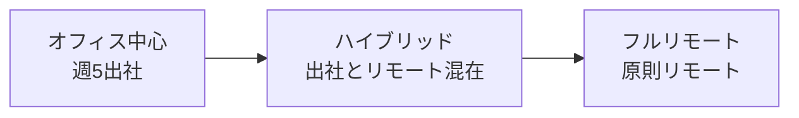
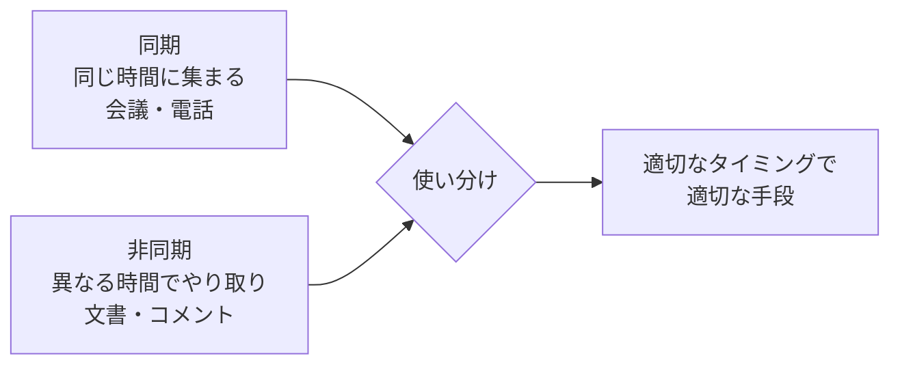
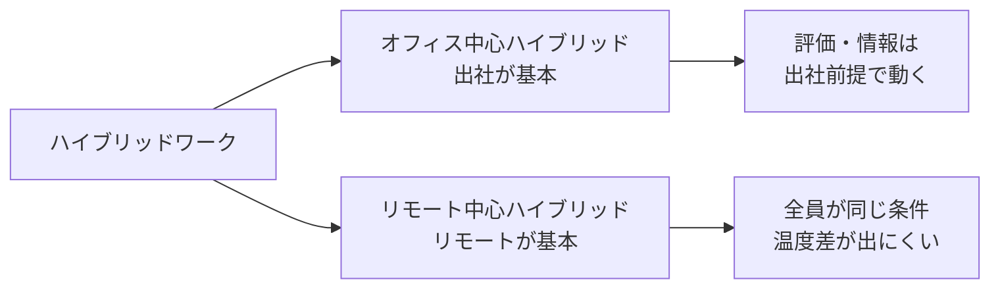

# リモートマネジメント実践

物理的に離れたチームで成果を出す設計と運用——「管理放棄」でも「過剰監視」でもない第三の道

| 項目 | 内容 |
|---|---|
| カテゴリー | マネジメント・組織開発 |
| 難易度 | 初級〜中級 |
| 所要時間 | 約200分（全8レッスン） |
| 公開日 | 2026-06-10 |
| 最終更新日 | 2026-06-10 |
| コースURL | https://skillup.college/courses/management/remote-management-practical/ |

## 対象者

リモート／ハイブリッド体制でチームを率いるマネージャー・チームリーダー・プロジェクトマネージャー・スタートアップ創業者。コロナ後に急遽リモート化した組織で運用に悩んでいる方、これから分散チームの責任者を引き受ける方、人事・組織開発の担当者として全社のリモート方針を設計する立場の方も対象。後半 2 レッスンはリモートで働くメンバーの方にも役立つ内容。

## 前提知識

業務上、複数人のチームをマネジメントした経験（数名以上のチームリーダー以上）。または、これから初めてリモートチームの責任者を引き受ける方。チームメンバーとしてリモート・ハイブリッドで働いている方も、レッスン 7・8 を中心に役立つ。

## 学習目標

- リモート／ハイブリッド／オフィス中心の 3 形態の違いと、リモートマネジメントの 3 つの誤解を区別できる
- リモートでの信頼構築（能力・誠実・思いやりの 3 要素）と、心理的安全性の追加課題を理解する
- 同期と非同期コミュニケーションを使い分け、文書化主義による会議削減を設計できる
- リモート 1on1 とフィードバックを画面越しで機能させる動作を身につける
- アウトプット型パフォーマンス管理と、過剰監視ソフトの倫理的境界を判断できる
- ハイブリッドワークのプロキシミティ・バイアスと「公平な土俵」の設計発想を持つ
- メンバー視点で、リモートでの孤立対策・可視化されない仕事・自律を捉えられる
- リモートでキャリアを育てる戦略と、継続的なリモートマネジメント文化の設計ができる

## コース概要

「リモートでチームが回らない」「メンバーが何をしているかわからない」「ハイブリッドにしたら出社組とリモート組で温度差が出た」——コロナ後、世界中のマネージャーが直面した悩みです。本コースは、リモートマネジメントを「対面の劣化版」でも「夢のような自由な働き方」でもなく、独自の設計と運用が必要な技能として体系化します。GitLab Handbook や Tsedal Neeley、Nick Bloom などの世界的な実践と研究を参照しつつ、日本の労働法・雇用慣行・住宅事情を踏まえた現実的な手触りで、8 レッスンで一巡します。マネージャー視点を主軸に、メンバー視点（レッスン 7・8）も含めた構成です。

## 学習の流れ

レッスン 1 で、リモートマネジメントの全体像と 3 つの誤解を整理します。レッスン 2〜6 が中盤で、信頼と心理的安全性、非同期コミュニケーション、1on1 とフィードバック、パフォーマンス管理、ハイブリッドワークという 5 つの実務領域を順に扱います。レッスン 7・8 はメンバー視点で、リモートで働く側が孤立対策・可視化されない仕事・自律・キャリア形成をどう設計するかを学びます。前半（レッスン 1）は「考え方の土台」、中盤（レッスン 2〜6）は「マネージャーの実務」、終盤（レッスン 7〜8）は「メンバー視点と継続的文化づくり」という三段構えです。

## レッスン一覧

| No. | タイトル | 概要 | 所要時間 |
|---|---|---|---|
| 1 | リモートマネジメントとは何か——3 つの誤解と全体像 | リモート／ハイブリッド／オフィス中心の 3 形態の違い、「リモート＝管理放棄」「リモート＝出社の代替」「リモート＝コミュニケーション減少」という 3 つの誤解、世界の主流の動き（GitLab Handbook、Atlassian Team Anywhere）、本コースの守備範囲を学ぶ | 25分 |
| 2 | 信頼と心理的安全性——リモートで「同じ場にいない」を補う | リモートでの信頼構築（Mayer & Davis 1995 の能力・誠実・思いやりの 3 要素）、Edmondson の心理的安全性のリモートでの追加課題、Tsedal Neeley『Remote Work Revolution』の論点、非言語シグナルの読み方、「弱いシグナル」（Slack の反応の遅さなど）の解釈を学ぶ | 25分 |
| 3 | 非同期コミュニケーションの設計——会議を減らし、文書化する | 同期 vs 非同期の使い分け、Default to Async 原則（GitLab、Stripe）、文書化主義、Loom などの非同期ビデオの位置づけ、会議の意思決定階層、不要な会議を減らす運用、タイムゾーン分散の現実を学ぶ | 25分 |
| 4 | リモート 1on1 とフィードバック——画面越しの対話設計 | リモート 1on1 のベストプラクティス（頻度・長さ・準備）、画面越しのアクティブリスニング、SBI フィードバック、オンライン 1on1 で起きやすい失敗パターン、メンバーの「見えない不安」を引き出す問いを学ぶ | 25分 |
| 5 | パフォーマンス管理——アウトプット型と監視のはざま | アウトプット型 vs インプット型評価、OKR・KPI の使い方、時間追跡ソフト・画面録画・キーログなど「過剰監視」の倫理、Microsoft Productivity Score（2020 年）論争、日本の労働法との関係、信頼と検証のバランスを学ぶ | 25分 |
| 6 | ハイブリッドワーク——プロキシミティ・バイアスと「公平な土俵」 | ハイブリッドの 2 形態（オフィス中心／リモート中心）、Nick Bloom（スタンフォード）の Working from Home 研究、プロキシミティ・バイアス（昇進・評価の格差）、ハイブリッド会議の落とし穴、「全員リモート参加」の合意形成を学ぶ | 25分 |
| 7 | メンバー視点①——孤立対策、可視化されない仕事、自律 | 在宅勤務の孤立問題、「見えない仕事」（emotional labor、調整作業）、自律と自己管理、Microsoft Teams 研究（Yang et al. 2022, Nature Human Behavior）、リモートでのバーンアウト予防を学ぶ | 25分 |
| 8 | メンバー視点②と継続的な文化づくり——キャリア、振り返り、修了後 | リモートで自分のキャリアを育てる戦略、可視性を意識的に作る、継続的なリモートマネジメント文化の設計、年次の振り返り、コース修了後の学習方向を学ぶ | 25分 |

---

## レッスン1：リモートマネジメントとは何か——3 つの誤解と全体像

（所要時間：25分）

### このレッスンで学ぶこと

- リモート／ハイブリッド／オフィス中心の 3 つの働き方の違いを区別できる
- リモートマネジメントをめぐる「3 つの誤解」を整理できる
- 世界の主流の実践（GitLab Handbook、Atlassian Team Anywhere）の概観を知る
- 日本の文脈（労働法・雇用慣行・住宅事情）との関係を押さえる
- 本コースが扱う範囲と扱わない範囲を理解する

---

「リモートマネジメント」という言葉は、ここ数年で誰でも口にするようになりました。けれど、現場でよく耳にするのは、「結局、対面に戻すべきか」「リモートだとマネジメントが効かない」「ハイブリッドにしたら出社組とリモート組の温度差で揉めた」といった、漠然とした悩みです。本コースは、まず「リモートマネジメントとは何か」を、3 つの形態と 3 つの誤解の整理から始めて、設計と運用ができる形に組み直していきます。

### リモート／ハイブリッド／オフィス中心——3 つの形態

現代の働き方は、ざっくり次の 3 形態に分けて整理できます。

#### ①オフィス中心（office-first）

働く場所の基本がオフィスで、リモートは例外。週 5 日出社が標準で、リモートワークは出張時・在宅医療・特例的な事情のみという形態です。コロナ前の多くの日本企業がこの形態でした。

#### ②ハイブリッド（hybrid）

オフィスとリモートを組み合わせて働く形態。「週 3 出社・週 2 リモート」「火・水・木は出社、月・金はリモート」など、ルールはさまざまです。コロナ後、世界的に主流になりつつあります。さらに細かく分けると、

- **オフィス中心ハイブリッド**：出社が基本で、リモートはオプション
- **リモート中心ハイブリッド**：リモートが基本で、対面集会日のみ出社

の 2 形態があります。

#### ③フルリモート（remote-first / fully remote）

働く場所の基本がリモートで、オフィスは持たない、あるいは小さい拠点のみ持つ形態。GitLab・Automattic（WordPress.com の運営会社）・Zapier などのテック企業が代表例で、世界中の社員が分散しています。

> **💡 ポイント**
> 「リモートマネジメント」は、フルリモートの組織だけの話ではありません。ハイブリッドの組織でも、メンバーの一部がリモートで働く瞬間が必ずあり、そこで対面マネジメントの慣性が通じなくなります。本コースは、ハイブリッド・フルリモートの両方を視野に入れて構成しています。

### 3 つの誤解

リモートマネジメントを扱うとき、現場でしばしば耳にする 3 つの誤解を、まず解いておきましょう。

#### 誤解①：リモート＝管理放棄

「リモートだとメンバーが何をしているかわからない」「結局、信用するしかなくなる」という声があります。これは半分本当で、半分誤解です。

たしかに、リモートでは「席にいるかどうか」「画面を見ているかどうか」を肉眼で確認することはできません。けれど、対面でも「席にいる＝働いている」とは限らないのは経験的に明らかです。リモートマネジメントは「監視できないから諦める」のではなく、**アウトプットと進捗を可視化する仕組みを設計する**ことで成果を見える化します。「管理放棄」ではなく「管理の対象を変える」だけです。レッスン 5 で詳しく扱います。

#### 誤解②：リモート＝出社の代替

「とりあえずオフィスでやっていたことを、そのままオンラインに移せばよい」という発想です。コロナ初期の多くの組織がこれをやりました。結果として、「全員が画面の前にずっと座っている」「会議だけが増えた」「Slack 通知に追い回される」状態に陥りました。

リモートは「出社の代替」ではなく、**異なる前提の働き方**です。同期コミュニケーション（リアルタイムの会話）の比重を下げて、非同期コミュニケーション（時差ありでも回る文書・メッセージ）を増やす——という設計の変更が必要になります。レッスン 3 で詳しく扱います。

#### 誤解③：リモート＝コミュニケーション減少

「リモートだとコミュニケーションが減って、チームがバラバラになる」という懸念もよく聞きます。これも単純には言えません。

Microsoft Research の Yang らが 2022 年に Nature Human Behavior 誌で発表した研究では、コロナ禍でリモート化した社員約 6 万人の Microsoft 社内データを分析しました。結果は、「**チーム外のコミュニケーションが大きく減り、サイロ化が進んだ**」というものでした。一方、チーム内のコミュニケーションは増えていました。

つまり「コミュニケーションが減った」のではなく「コミュニケーションの構造が変わった」のです。新しい構造に合わせた設計（部門横断の意図的なつなぎ込み、雑談時間の設計など）が必要、というのが本コースのスタンスです。レッスン 7 でこの研究の含意を扱います。

> **⚠️ 注意**
> 3 つの誤解は、いずれも一面の真実を含んでいます。「リモートにすると本当に何も見えなくなる」「単純に出社をオンラインに移して破綻した」「実際にコミュニケーションが減って関係が薄れた」——どれも現場で起きうる事実です。本コースが言うのは、「これらは適切な設計と運用で大きく改善できる」ということです。設計を放棄して「だからリモートは無理」と結論するのが、もっとも大きな誤解です。

### 世界の主流の実践

リモートマネジメントの参照点として、世界には公開された資料が豊富にあります。代表的なものを紹介します。

#### GitLab Handbook

GitLab は、世界 60 か国以上に約 2,000 名の社員を持つフルリモートのソフトウェア企業です。彼らは社内運用のすべてを「GitLab Handbook」として Web 上に公開しています（handbook.gitlab.com）。採用から評価、給与、文化、コミュニケーション、休暇制度まで、テキスト量で約 200 万語に及ぶ膨大な文書群です。

GitLab Handbook の中核思想は「Single Source of Truth（唯一の真実の源）」と「Default to Async（非同期を基本とする）」です。これらは本コースのレッスン 3 で詳しく扱います。

#### Atlassian「Team Anywhere」

オーストラリアの大手 SaaS 企業 Atlassian は、コロナ後に「Team Anywhere」プログラムを立ち上げ、社員が世界 13 か国のどこからでも働ける体制を整えました。「会社が認めた場所」ではなく、「社員が選んだ場所」を基本とする発想です。彼らも研究レポートを継続的に公開しており、リモートワークの効果検証データが豊富です。

#### Buffer「State of Remote Work」

ソーシャル管理ツールを提供する Buffer は、毎年「State of Remote Work」レポートを公開しており、世界のリモートワーカーの実態と課題を継続的に追跡しています。「リモートの最大のメリット」「最大の課題」「将来の希望」など、現場の感覚を統計的に捉える資料として参考になります。

> **📝 補足**
> GitLab・Atlassian・Buffer の実践は、参考にはなりますが、「そのまま日本企業に移植できる」わけではありません。これらは IT・ソフトウェア業界、英語ベース、グローバル分散の前提で組み立てられています。日本のメンバーシップ型雇用、対面文化、住宅事情、労働法の前提では、調整が必要です。本コースは、これらの実践を「翻案する」スタンスを取ります。

### 日本固有の文脈

日本でリモートマネジメントを設計するときに、見落とせない要因を 4 つ整理します。

#### ①メンバーシップ型雇用との相性

日本の伝統的な雇用は「メンバーシップ型」と呼ばれ、職務範囲が明確に定義されないまま採用し、配属で役割を決めていく形式が多くを占めます。「これは自分の仕事、これは違う」という線引きが弱いため、アウトプット型評価との相性に難しさがあります。レッスン 5 で扱います。

#### ②対面文化と「同じ釜の飯」

会議・飲み会・喫煙所での雑談など、対面の偶発的なやり取りでチームの結束を作る文化が強い組織が多くあります。リモートではこれらが消失するため、意図的な代替手段の設計が必要になります。

#### ③住宅事情の制約

日本の都市部では、独立した書斎を持てる住宅はむしろ少数派です。リビング・寝室・台所と兼用で在宅勤務する社員も多く、「Web カメラで自宅を映す」だけでもプライバシーの問題があります。レッスン 4・5 で扱います。

#### ④労働法の枠組み

日本の労働基準法は、労働時間管理を雇用者の義務として定めています。「働いていないときは給料を払わない」という意味ではなく、「労働時間を把握する責任は会社にある」という意味です。一方で、「24 時間張り付いて監視する」のは、本人の人格権を侵害するため、許されません。この線引きはレッスン 5 で扱います。

> **💡 ポイント**
> 日本固有の文脈は、米国型のリモート文化をそのまま適用できない理由を、構造的に説明します。一方で「だから日本ではリモートは無理」という結論にもなりません。これらの制約を踏まえた上で、日本企業に合った設計を組み立てるのが、本コースのスタンスです。

### 本コースの守備範囲と限界

最後に、本コースで扱う範囲と扱わない範囲を整理しておきます。

#### 扱う範囲

- リモートマネジメントの全体像と 3 つの誤解（本レッスン）
- リモートでの信頼構築と心理的安全性（レッスン 2）
- 非同期コミュニケーションの設計（レッスン 3）
- リモート 1on1 とフィードバック（レッスン 4）
- パフォーマンス管理と過剰監視の境界（レッスン 5）
- ハイブリッドワークとプロキシミティ・バイアス（レッスン 6）
- メンバー視点：孤立対策・可視化されない仕事・キャリア（レッスン 7・8）

#### 扱わない範囲

- 特定のリモートワークツール（Slack・Microsoft Teams・Zoom など）の使い方・比較（メーカー資料や別の操作研修を活用）
- 在宅勤務手当・通勤費の制度設計の細部（社労士・会計士の領域）
- リモート採用面接の質問テンプレート（採用専門のリソースを活用）
- 個別のメンタル不調の治療判断（医療と隣接、専門家の領域）
- 「○○式」「△△メソッド」という商標的手法（古典理論と公開実践を骨格に置く）

#### スタンス

本コースは、リモートマネジメントを「対面マネジメントの劣化版」でも「夢の自由な働き方」でもなく、**独自の設計と運用が必要な技能**として位置づけます。「リモート＝高自由度＝管理放棄」と「リモート＝過剰監視」のどちらの極端にも振れず、その間の「第三の道」を設計する伴走をします。

### まとめ

このレッスンでは、以下のことを学びました。

- 現代の働き方は「オフィス中心」「ハイブリッド（オフィス中心／リモート中心）」「フルリモート」の 3 形態で整理できる
- リモートマネジメントの 3 つの誤解：①管理放棄ではなく「管理の対象を変える」／②出社の代替ではなく「異なる前提の働き方」／③コミュニケーション減少ではなく「構造の変化」
- 世界の主流の実践：GitLab Handbook、Atlassian Team Anywhere、Buffer の State of Remote Work
- 日本固有の文脈：メンバーシップ型雇用、対面文化、住宅事情、労働基準法の労働時間管理
- 本コースは「リモート＝管理放棄」と「リモート＝過剰監視」の極端を避けて「第三の道」を設計する立場

次のレッスンでは、リモートマネジメントの基盤として、信頼と心理的安全性を扱います。Mayer & Davis の信頼の 3 要素、Edmondson の心理的安全性のリモート特有の課題、Tsedal Neeley の論点を学びます。

---

### 確認クイズ

このレッスンの理解度をチェックしましょう。

#### Q1. 「ハイブリッドワーク」の説明として正しいものはどれか？

- [ ] フルリモートと同義で、オフィスを持たない形態
- [x] オフィスとリモートを組み合わせて働く形態。さらに「オフィス中心」「リモート中心」の 2 形態に細分される
- [ ] 全社員が同時に同じ場所で働くオフィス中心の形態
- [ ] 業務委託契約と雇用契約を混在させる雇用形態

> **解説**
> ハイブリッドワークは、オフィスとリモートを組み合わせて働く形態で、「オフィス中心ハイブリッド（出社が基本）」と「リモート中心ハイブリッド（リモートが基本）」の 2 形態があります。フルリモートやオフィス中心とは区別されます。

#### Q2. リモートマネジメントの「3 つの誤解」のうち、本レッスンが扱った「誤解①」はどれか？

- [ ] リモート＝コミュニケーション減少
- [x] リモート＝管理放棄
- [ ] リモート＝出社の代替
- [ ] リモート＝高生産性

> **解説**
> 誤解①は「リモート＝管理放棄」です。「席にいるかどうかが見えない＝管理できない」という発想を、「アウトプットと進捗を可視化する仕組みを設計する」という対応に置き換えるのが本コースのスタンスです。

#### Q3. 「リモート＝出社の代替」という誤解への本レッスンの対応として正しいものはどれか？

- [ ] 出社をすべてオンラインに置き換える
- [ ] リモートを完全にやめて出社に戻す
- [x] 同期コミュニケーションの比重を下げて、非同期コミュニケーションを増やす設計に変更する
- [ ] Web カメラを常時オンにして在席を確認する

> **解説**
> リモートは「出社の代替」ではなく「異なる前提の働き方」です。同期コミュニケーション（リアルタイム会議）の比重を下げ、非同期コミュニケーション（時差ありでも回る文書・メッセージ）を増やすという設計の変更が必要、というのが本レッスンの立場です。

#### Q4. Yang et al.（2022, Nature Human Behavior）の Microsoft 研究について、本レッスンが示した含意はどれか？

- [ ] リモートでコミュニケーションが完全に消失した
- [ ] リモートで全社的にコミュニケーションが増えた
- [ ] リモートと出社でコミュニケーションは変わらなかった
- [x] チーム内のコミュニケーションは増えた一方、チーム外（部門横断）のコミュニケーションは大きく減ってサイロ化した

> **解説**
> Yang et al. 2022 の Microsoft 研究は、リモート化により「チーム内」のやり取りは増え「チーム外（部門横断）」のやり取りは大きく減ったことを示しました。コミュニケーションが「減った」のではなく「構造が変わった」と捉え、新しい構造に合わせた設計が必要、というのが本レッスンの解釈です。

#### Q5. 日本でリモートマネジメントを設計するときの「日本固有の文脈」として、本レッスンが挙げたものはどれか？

- [x] メンバーシップ型雇用、対面文化、住宅事情、労働基準法の労働時間管理など
- [ ] 日本人の精神論で語ればすべて解決する
- [ ] 米国型のリモート文化をそのまま輸入すれば問題は起きない
- [ ] 日本では構造的にリモートワークができないので、議論する意味がない

> **解説**
> 本レッスンが挙げた日本固有の文脈は、メンバーシップ型雇用、対面文化、住宅事情、労働基準法の労働時間管理の 4 つです。これらを踏まえた上で日本企業に合った設計を組み立てるのが本コースのスタンスで、米国型をそのまま輸入することも、「日本では無理」と諦めることも避けます。

#### Q6. 本コースが取るリモートマネジメントのスタンスとして正しいものはどれか？

- [ ] リモート＝高自由度＝管理放棄、を理想とする
- [ ] リモート＝過剰監視で生産性を最大化する、を理想とする
- [x] 「管理放棄」と「過剰監視」の両極を避けて、設計と運用の「第三の道」を伴走する
- [ ] リモートをすべてやめて、対面に戻す

> **解説**
> 本コースは、「リモート＝管理放棄」と「リモート＝過剰監視」のどちらの極端にも振れず、その間の「第三の道」を設計する立場を取ります。レッスン 5 でこの中庸の境界を、特に丁寧に扱います。

---

## レッスン2：信頼と心理的安全性——リモートで「同じ場にいない」を補う

（所要時間：25分）

### このレッスンで学ぶこと

- 信頼の 3 要素（能力・誠実・思いやり）を理解する
- リモート特有の信頼の課題を区別できる
- Edmondson の心理的安全性が、リモートでどんな追加課題を抱えるかを把握する
- Tsedal Neeley のリモートチームの 4 つのカテゴリを知る
- 「弱いシグナル」（Slack の反応の遅さなど）の読み方を学ぶ

---

前回のレッスンで、リモートマネジメントの全体像と 3 つの誤解を整理しました。今回は、リモートマネジメントの土台となる「信頼」と「心理的安全性」を扱います。対面では暗黙のうちに作られていた基盤が、リモートでは意図的に設計しないと崩れていく——という構造を、現代の研究と現場の感覚で見ていきます。

### なぜリモートで信頼が論点になるか

対面で働いていると、信頼は半ば自動的に作られます。挨拶を交わし、雑談し、忙しそうな表情を見て、相手の働き方を肌で感じる。「この人は誠実に仕事をしている」「困っているときに助けてくれる」という認識は、こうした日常の積み重ねで形成されます。

リモートでは、これらのほとんどが消えます。テキストとビデオ会議だけのやり取りでは、「相手が何を考え、どう働いているか」がほとんど見えません。だから、信頼が新しい論点として浮上します。

> **💡 ポイント**
> リモートマネジメントで「信頼が大事」と言われるのは、抽象論ではなく、対面で作られていた信頼の機構がリモートでは働かなくなるからです。仕組みを意図的に設計し直すことが、リモートマネジメントの最初の課題になります。

### 信頼の 3 要素——Mayer & Davis の枠組み

組織心理学の信頼研究で、もっとも広く参照されているのが、Roger C. Mayer・James H. Davis・F. David Schoorman が 1995 年に Academy of Management Review に発表した論文「An Integrative Model of Organizational Trust」です。彼らは、信頼を支える要素を 3 つに整理しました。

#### ①能力（Ability）

「この人は、その分野で適切に動ける技能を持っているか」という認識。専門スキル、判断力、経験などが含まれます。

#### ②誠実（Integrity）

「この人は、自分の言うことと行動が一貫しているか」という認識。約束を守る、誠実に振る舞う、嘘をつかない、などの価値観の一貫性です。

#### ③思いやり（Benevolence）

「この人は、自分のことを利己的にではなく、相手の利益にも配慮して動いてくれるか」という認識。相手への善意・配慮・関心です。

> 信頼の 3 要素：能力・誠実・思いやり
> 3 つは別物で、独立に評価される

これら 3 つは、別々に評価されます。「能力は信頼するが、思いやりは信頼しない」「誠実は信頼するが、能力は信頼しない」というような組み合わせが、現実には頻繁に起きます。

> **📝 補足**
> Mayer & Davis のモデルは、対面・リモートを問わず、信頼研究の標準的な枠組みです。本レッスンでは、これをリモート特有の課題に当てはめて読み解きます。3 要素のうち、リモートで特に課題になるのは「誠実」と「思いやり」です。「能力」は、過去のアウトプットや経歴で比較的見えやすいですが、誠実と思いやりは、対面の日常の積み重ねで形成される側面が大きいからです。

### リモートで信頼が崩れやすい場面

リモートで信頼が崩れやすい代表的な場面を、3 要素ごとに整理します。

#### 能力への疑念が生まれる場面

- メンバーのアウトプットがブラックボックスで、何をしているかが見えない
- 進捗報告が遅く、上司が「ちゃんと動いているのか」と不安になる
- アウトプットの質が安定せず、何が原因かわからない

#### 誠実への疑念が生まれる場面

- メッセージの返信が遅く、「無視されているのか」と感じる
- 「今日中にやる」と約束したことが何度も遅れる
- ビデオ会議で「忙しい」と言いつつ、Slack はオンラインのまま

#### 思いやりへの疑念が生まれる場面

- 困っていることを共有しても、リアクションがない
- チームの相談に対して、雑談ゼロで業務だけ返ってくる
- メンバー個別の事情（家庭の問題、健康など）への配慮が感じられない

> **⚠️ 注意**
> これらの場面は、対面でも起こりますが、リモートでは「文脈の手がかり」が少ないため、誤解として固定化しやすくなります。返信が遅い → 「無視している」と決めつける → 信頼が下がる、というループが、対面より早く回りやすいのがリモートの特徴です。

### Edmondson の心理的安全性と、リモート特有の課題

心理的安全性（psychological safety）は、ハーバード大学の Amy C. Edmondson が 1999 年に提唱した概念で、「チームの中で対人関係上のリスクを取っても安全だと感じられる、メンバー間で共有された信念」と定義されます。

心理的安全性が高いと、メンバーは率直に質問し、失敗を報告し、反対意見を述べ、本音を共有できます。低いと、これらが止まり、組織の学習が機能不全に陥ります。Edmondson 自身の研究は対面職場が中心でしたが、リモートチームには次のような特有の課題があります。

#### ①「沈黙の意味」が読めない

会議で誰かが黙っているとき、対面なら「考えている」「困っている」「同意しない」などを表情・姿勢で推測できます。リモートでは、画面オフ・ミュート・ビデオ越しの表情の見えにくさで、沈黙の意味がほぼ読めません。

#### ②非言語的なフォローアップが消える

対面なら、会議後に「さっきの発言、ちょっと心配したけど大丈夫？」とエレベーターで声をかけられます。リモートでは、こうした偶発的なフォローアップが構造的に消えるため、発言した側の不安がフォローされません。

#### ③Slack やチャットの「反応のなさ」が大きく響く

リモートでは、相手の反応の手がかりがチャット上の絵文字・スタンプ・コメントしかありません。発言に対して反応がないと、対面の「うなずき」「微笑み」「沈黙の理解」がないため、「失言だったかも」「無視されている」と感じやすくなります。

> **💡 ポイント**
> リモートチームでは、心理的安全性を「対面より高くする」必要がある、というのが現代の研究のおおむねの結論です。理由は、対面の暗黙の安全装置（表情、フォローアップ、雰囲気）がないため、明示的なシグナル（反応、感謝、共感の言葉）を意識的に出さないと、メンバーは安全と感じられないからです。

### Tsedal Neeley のリモートチームの 4 つのカテゴリ

ハーバード・ビジネス・スクールの Tsedal Neeley は、2021 年の著書『Remote Work Revolution』で、リモートチームを 4 つに分類しました。

| カテゴリ | 内容 |
|---|---|
| ①Co-located, Synchronous | 同じ場所・同じ時間（伝統的なオフィス） |
| ②Co-located, Asynchronous | 同じ場所だが時間がズレる（24 時間運用の工場など） |
| ③Distributed, Synchronous | 異なる場所・同じ時間（タイムゾーンが近い分散チーム） |
| ④Distributed, Asynchronous | 異なる場所・異なる時間（グローバル分散チーム） |

リモートマネジメントの議論の多くは「③」を想定して語られますが、グローバル分散の組織では「④」の運用が必要です。④では、信頼と心理的安全性の構築は、対面の偶発に依存できないため、すべて文書とプロセスで設計する必要があります。

> **📝 補足**
> Neeley は、リモートチームでも「Burst」（短期間の集中的な同期コラボレーション）と「Distance」（拡散した非同期作業）を意識的に切り替えることを推奨しています。例えば、四半期に 1 回 1 週間だけ全員が同じ場所に集まり、残りの期間は完全リモート、というハイブリッドが、信頼の維持には効果的とされます。

### 「弱いシグナル」を読む

リモートでは、対面より「弱いシグナル」に注意を向ける必要があります。代表例を挙げます。

#### 弱いシグナルの例

| シグナル | 解釈の候補 |
|---|---|
| Slack の返信がここ 1 週間で目に見えて遅い | 体調不良／燃え尽き／チーム外の問題／家庭の事情／単に多忙 |
| ビデオ会議でカメラオフが急に増えた | 体調・気分の問題／環境の問題／対人疲労 |
| 1on1 で雑談の時間が極端に短くなった | 心理的距離が遠くなっている／時間的余裕がない |
| 「大丈夫です」が増えた | 大丈夫ではない可能性 |
| 反応の絵文字が減った | 関心の低下／疲労／信頼の低下 |

これらは、ひとつだけ見ても判断はできません。複数のシグナルが重なったときに、「何か起きているかもしれない」と仮説を立てて、1on1 などで丁寧に確認するのが、リモートマネージャーの大切な動作です。

> **⚠️ 注意**
> 弱いシグナルへの注意は「監視」とは違います。監視は「離脱や違反を捕まえる」目的で、シグナル観察は「相手の状態を理解する」目的です。動機が違うと、メンバーの感じ方も違います。本レッスンが勧めるのは後者です。

### 信頼を意図的に作る動作

リモートで信頼を意図的に作る動作を、シンプルな 4 つにまとめます。

#### ①約束を守る、守れないときは早めに開示する

「今日中にやる」と言ったら必ずやる、できないときは事前にわかった時点で開示する。これだけで「誠実」の評価は大きく変わります。

#### ②反応する、感謝を言葉にする

メッセージに 1 行でも反応する、メンバーのアウトプットに感謝の言葉を返す。「思いやり」のシグナルとして、対面の何倍も重要です。

#### ③弱さを開示する（権力を持つ側から）

「実は私もこの分野はよくわかっていない」「先週の判断を間違えた」と上司側から先に弱さを開示する。心理的安全性の確立には、上司側からの脆弱性の開示が決定的に効くという研究があります。

#### ④雑談時間を構造化する

「最初の 5 分は雑談」「金曜の最後 30 分はバーチャル雑談」など、雑談を「構造の中に組み込む」。偶発に頼らず、意図的に作る発想です。

> **💡 ポイント**
> 信頼と心理的安全性は、抽象的な「マインドセット」ではなく、日々の小さな動作の積み重ねで作られます。リモートでは、対面以上に「動作の意図的な反復」が必要です。本コースの後のレッスンで扱う 1on1、フィードバック、コミュニケーション設計も、すべてこの信頼の土台の上に乗ります。

### まとめ

このレッスンでは、以下のことを学びました。

- リモートで信頼が論点になるのは、対面で半ば自動的に作られていた信頼の機構がリモートでは働かなくなるから
- Mayer & Davis の信頼の 3 要素：能力・誠実・思いやり。3 つは独立に評価される
- リモートでは「誠実」と「思いやり」が特に崩れやすく、誤解として固定化しやすい
- Edmondson の心理的安全性は、リモートでは「沈黙の意味が読めない」「非言語フォローアップが消える」「チャットの反応のなさが響く」という追加課題を抱える
- Tsedal Neeley のリモートチーム 4 分類：Co-located/Distributed と Synchronous/Asynchronous の 2 軸
- 弱いシグナル（返信の遅さ、絵文字の減少、雑談の短縮、「大丈夫」の増加など）への注意は「監視」ではなく「理解」のための動作
- 信頼を意図的に作る 4 つの動作：約束を守る／反応する・感謝する／弱さを開示する／雑談時間を構造化する

次のレッスンでは、リモートマネジメントの中核技法のひとつ、非同期コミュニケーションの設計を学びます。会議を減らし、文書化主義で意思決定を組み立てる方法と、Default to Async 原則を扱います。

---

### 確認クイズ

このレッスンの理解度をチェックしましょう。

#### Q1. Mayer & Davis（1995）が示した信頼の 3 要素として正しい組み合わせはどれか？

- [x] 能力・誠実・思いやり
- [ ] 経験・人脈・実績
- [ ] 速さ・正確さ・丁寧さ
- [ ] 学歴・職歴・年齢

> **解説**
> Mayer・Davis・Schoorman が 1995 年に Academy of Management Review に発表した論文「An Integrative Model of Organizational Trust」で示した信頼の 3 要素は、能力（Ability）・誠実（Integrity）・思いやり（Benevolence）です。組織心理学の信頼研究で最も広く参照されている枠組みです。

#### Q2. リモートで「誠実」への疑念が生まれる場面として、本レッスンが挙げたものはどれか？

- [ ] アウトプットの質が安定しない
- [x] 「今日中にやる」と約束したことが何度も遅れる、メッセージの返信が遅く「無視」と感じる、ビデオ会議で忙しいと言いつつ Slack はオンライン
- [ ] 困っているときにリアクションがない
- [ ] 個別の事情への配慮が感じられない

> **解説**
> 誠実への疑念は、「言うことと行動の一貫性」が崩れる場面で生まれます。約束の遅延、返信の遅さ、振る舞いの不一致などが代表例です。アウトプットの質は「能力」、リアクションのなさや個別の配慮の欠如は「思いやり」に該当します。

#### Q3. リモートで心理的安全性が「対面より追加課題を抱える」理由として、本レッスンが示したものはどれか？

- [ ] リモートでは心理的安全性は不要だから
- [ ] リモートでは誰も発言しないから
- [x] 沈黙の意味が読めない、非言語フォローアップが消える、チャットの反応のなさが大きく響く、など対面の暗黙の安全装置がないため
- [ ] リモートでは全員が同じ意見になるから

> **解説**
> リモートでは、対面の暗黙の安全装置（表情・姿勢・偶発的フォロー）がないため、メンバーは明示的なシグナルがないと安全と感じられません。マネージャーは反応・感謝・共感の言葉を意識的に出す必要があります。

#### Q4. Tsedal Neeley のリモートチーム 4 分類で「グローバル分散の組織」が当たるカテゴリはどれか？

- [ ] Co-located, Synchronous（同じ場所・同じ時間）
- [ ] Co-located, Asynchronous（同じ場所・時間ズレ）
- [ ] Distributed, Synchronous（異なる場所・同じ時間）
- [x] Distributed, Asynchronous（異なる場所・異なる時間）

> **解説**
> Neeley の 4 分類は、Co-located/Distributed と Synchronous/Asynchronous の 2 軸です。グローバル分散の組織は、場所もタイムゾーンも異なる「Distributed, Asynchronous」に該当します。このカテゴリでは、信頼と心理的安全性の構築を文書とプロセスで設計する必要があります。

#### Q5. 「弱いシグナル」への注意について、本レッスンの説明として正しいものはどれか？

- [x] 「離脱や違反を捕まえる」監視ではなく、「相手の状態を理解する」ための観察
- [ ] メンバーを 24 時間監視するために必要
- [ ] アウトプットの数値だけを追跡する
- [ ] 弱いシグナルは無視して構わない

> **解説**
> 弱いシグナルへの注意は、目的が「監視」ではなく「理解」です。Slack の絵文字の減少、返信の遅延、雑談時間の短縮、「大丈夫」の増加など、複数のシグナルが重なったときに、1on1 で丁寧に確認するのがリモートマネージャーの動作です。

#### Q6. リモートで信頼を意図的に作る 4 つの動作に含まれないものはどれか？

- [ ] 約束を守る、守れないときは早めに開示する
- [ ] 反応する、感謝を言葉にする
- [ ] 雑談時間を構造化する
- [x] 全員に同じ評価をつけて差をつけない

> **解説**
> 本レッスンが挙げた 4 つの動作は、①約束を守る／守れないときは早めに開示する、②反応する・感謝を言葉にする、③上司側から先に弱さを開示する、④雑談時間を構造化する、です。「全員に同じ評価」は信頼形成とは別の話で、むしろ評価の公平性を損なう可能性があります。

---

## レッスン3：非同期コミュニケーションの設計——会議を減らし、文書化する

（所要時間：25分）

### このレッスンで学ぶこと

- 同期コミュニケーションと非同期コミュニケーションの違いを理解する
- 「Default to Async」原則の意味を押さえる
- 文書化主義（Single Source of Truth）の発想を学ぶ
- 同期と非同期を使い分ける判断基準を持つ
- タイムゾーン分散の組織での運用の考え方を知る

---

前回のレッスンでは、リモートマネジメントの土台として信頼と心理的安全性を扱いました。今回は、リモートで「成果を出す働き方」の核心である、非同期コミュニケーションの設計に入ります。「会議を減らし、文書化する」というシンプルな方針が、現代の代表的なリモート組織（GitLab・Stripe・Automattic など）に共通する文化の中心にあります。

### 同期と非同期——2 つのコミュニケーション

コミュニケーションには、大きく分けて 2 種類あります。

#### 同期コミュニケーション（synchronous）

参加者全員が「同じ時間」に集まって行うコミュニケーション。対面の会議、ビデオ会議、電話、リアルタイム・チャットなどが該当します。

特徴：

- 全員が即時に反応できる
- 議論の温度感や非言語情報が伝わる
- 一方で、全員のスケジュールを揃える必要がある
- タイムゾーンが分散すると、参加できない人が出る

#### 非同期コミュニケーション（asynchronous）

参加者がそれぞれ「異なる時間」にやり取りするコミュニケーション。文書、メール、コメント、録画動画（Loom など）、Wiki、コードレビューなどが該当します。

特徴：

- 各自のペースで読み・書きできる
- 内容が文字や動画として残るので、後から参照できる
- 一方で、即時のフィードバックは期待できない
- 文章を書く力が必要

> **💡 ポイント**
> 多くの組織は、ほとんどのコミュニケーションを同期（会議）で行ってきました。リモートマネジメントは、これを「非同期を基本（Default）にして、同期は必要なときに使う」という形に反転させる発想です。本レッスンの中心テーマです。

### Default to Async 原則

「Default to Async」は、フルリモート組織を象徴するスローガンで、GitLab Handbook の中核思想のひとつとして広く知られています。直訳すれば「非同期をデフォルトとする」。

意味するところは、

> 同期（会議）を最初の選択肢にせず、非同期（文書・メッセージ）で済むかをまず考える。同期が本当に必要なときだけ、会議を開く

ということです。多くの組織が陥っている「とりあえず会議で集まる」という慣性を、意識的に反転させる発想です。

#### Default to Async の効果

- 会議の総数が減り、深い作業時間（ディープワーク）が確保できる
- タイムゾーンが分散しても、全員が同じ情報にアクセスできる
- 議論と意思決定が文書として残り、後から参照・再利用できる
- 「話を聞いていなかった人」「会議に呼ばれなかった人」のフォローが楽になる

#### Default to Async の前提

一方、これが機能するには次の前提が必要です。

- 文章を書く文化と能力が組織にある
- 「すぐ返事を期待しない」というメンバー間の合意がある
- 文書化のための場（Wiki、Handbook、共有ドキュメントなど）が整備されている
- 非同期で意思決定する仕組み（コメント、承認、期限）が設計されている

> **⚠️ 注意**
> Default to Async は、対面文化が強い日本の組織でいきなり導入すると、「冷たい」「業務的すぎる」と感じられる可能性があります。雑談時間の構造化、定期的な対面集会、初期の信頼構築の工夫など、段階的な導入と運用上の補完が必要です。本コースの後半（レッスン 8）で、文化づくりの観点で扱います。

### 文書化主義（Single Source of Truth）

GitLab Handbook の中心思想のもうひとつが、「Single Source of Truth（唯一の真実の源）」です。これは、

> 重要な情報は必ず文書化し、誰でも参照できる単一の場所に置く。「あの人に聞かないとわからない」「あの会議に出ないと知れない」状態を作らない

という発想です。GitLab Handbook 自体が、Web で公開された 200 万語超の文書群で、社内のあらゆる方針・意思決定・運用ルールがそこに集約されています。

#### 文書化主義のメリット

- 新メンバーのオンボーディングが格段に楽になる（自分で読める）
- タイムゾーンの違いを越えて、同じ情報にアクセスできる
- 意思決定の根拠が後から検証できる
- 担当者が休んでも、引き継ぎが文書だけで可能
- 「俺の聞いていない話だ」型のトラブルが減る

#### 文書化主義のコスト

- 書くこと自体に時間がかかる
- 古い情報のメンテナンスが必要
- 「とりあえず書く文化」を作るのに時間がかかる
- 抽象的な議論や微妙なニュアンスは文書化が難しい

> **📝 補足**
> 文書化主義は「すべてを書く」ことではありません。「重要な意思決定の根拠と結論」「ルールと運用方針」「役割と責任分担」など、後から参照する必要があるものに集中します。日常の雑談やブレインストーミング段階の議論は、必ずしも文書化する必要はありません。何を書き、何を書かないかの判断も、設計の一部です。

### 同期と非同期の使い分け基準

「Default to Async」と言っても、すべてを非同期にできるわけではありません。同期が本当に必要な場面を、判断基準として整理しておきます。

#### 同期（会議）が向いている場面

- 創発的なブレインストーミングが必要
- 感情的に難しいフィードバックを伝える
- 信頼関係の構築期（新メンバーとの最初の会話）
- 緊急のインシデント対応
- 複数人で同時に判断を擦り合わせる必要がある

#### 非同期（文書）が向いている場面

- ある程度方針が固まった上での意思決定
- ルール・運用方針の共有
- 進捗報告・状況共有
- 検討の整理と論点の絞り込み
- タイムゾーンが分散したメンバーへの情報共有

| 場面 | 推奨手段 |
|---|---|
| ブレストや創発的議論 | 同期（会議・ホワイトボード） |
| 感情的に難しいフィードバック | 同期（1on1） |
| 進捗報告・状況共有 | 非同期（文書・チャット） |
| 検討の整理と論点絞り込み | 非同期（文書） |
| 緊急対応 | 同期（チャット・電話） |
| ルール変更の合意形成 | 非同期（提案文書 + コメント） |

> **💡 ポイント**
> 「同期 vs 非同期」は、どちらが優れているかという話ではなく、「場面に合わせて使い分ける」発想です。本レッスンが言う「Default to Async」は、「常に非同期」ではなく「同期を最初の選択肢にしない」という意味です。判断の起点を、「会議を入れる」から「文書で済むか」に変えるのがポイントです。

### 不要な会議を減らす運用

「Default to Async」を運用に落とすために、現場で使える小技を紹介します。

#### ①「議題なしでは会議を開かない」ルール

会議の招待に、目的・議題・期待される成果が書かれていないものは、原則として開催しない、または欠席してよいというルール。これだけで、惰性の会議が大きく減ります。

#### ②会議前の事前読み込み

会議の 24 時間前までに、議論の前提となる資料を共有し、参加者が読み込んでから会議に入る運用。会議の中で「説明から始める」時間を削減できます。

#### ③ノー・ミーティング・デイ

週に 1 日（例：水曜日）を「会議なしの日」と決めて、その日は全員がディープワークに集中する制度。Atlassian や Asana など多くの組織が導入しています。

#### ④会議の最大時間を 30 分に区切る

デフォルトの会議時間を 60 分から 30 分に変更すると、議論が引き締まり、無駄話が減ります。本当に 60 分必要な議題だけ、明示的に長く設定します。

#### ⑤「録画 + 文書化」で会議を非同期化する

定例の状況共有会議は、リーダーが Loom などで 5〜10 分の動画を録画し、メンバーが各自のペースで視聴する形式に変える方法もあります。会議の参加者全員の時間を節約できます。

> **⚠️ 注意**
> これらの運用は、「会議を否定する」のではなく「会議の質を上げる」発想です。重要な意思決定や信頼構築のための会議は、むしろ削らず、深く議論できる時間を確保します。不要な会議を削ることで、本当に必要な会議の質が上がるのが、本レッスンの狙いです。

### タイムゾーン分散の現実

グローバル分散のチームでは、タイムゾーンの差が最大 12 時間にも及び、「全員が同時にオンライン」の時間がほぼゼロという状況が普通に起きます。このとき、Default to Async は「望ましい運用」ではなく「唯一の現実的な運用」になります。

#### タイムゾーン分散の運用の原則

- 同期会議は原則として「全員が起きている時間帯」を選ぶ。それがなければ、輪番で犠牲を分散する（毎回同じメンバーが深夜参加にならないように）
- 意思決定の期限を「48 時間以内にコメントがなければ承認」のような形式にする
- 重要な意思決定は録画＋文書化して、見られない人がキャッチアップできるようにする
- タイムゾーンごとに「対面ハブ」（東京・シンガポール・ベルリン・サンフランシスコなど）を作り、ハブ内では同期、ハブ間は非同期というハイブリッド構造を作る
- メンバーのカレンダーに、勤務時間帯を明示する

> **📝 補足**
> 日本国内のリモートマネジメントでは、タイムゾーンの問題は基本的にありません。けれど、企業によっては東京・大阪・福岡などに分散し、朝の通勤事情や子育て家庭の朝の時間帯（保育園送迎の前後）でメンバー間の働ける時間がズレることがあります。これは「タイムゾーン」ではないですが「働ける時間帯の分散」として、同じ運用原則が当てはまります。

### まとめ

このレッスンでは、以下のことを学びました。

- コミュニケーションには同期（同じ時間に集まる）と非同期（時差ありでやり取りする）の 2 種類があり、それぞれ得意な場面が異なる
- Default to Async：同期を最初の選択肢にせず、非同期で済むかをまず考える発想（GitLab Handbook の中核思想）
- 文書化主義（Single Source of Truth）：重要な情報は単一の場所に文書化し、誰でも参照できるようにする
- 同期が向く場面：ブレインストーミング・難しいフィードバック・信頼構築・緊急対応
- 非同期が向く場面：方針が固まった意思決定・ルール共有・進捗報告・タイムゾーン分散
- 不要な会議を減らす運用：議題なしでは開かない／事前読み込み／ノー・ミーティング・デイ／30 分デフォルト／録画＋文書化
- グローバル分散では Default to Async が「唯一の現実的な運用」になる
- 非同期は効率化だけでなく、書く能力で勝負できる人を引き上げる「公平化」の効果もある

次のレッスンでは、リモートマネジメントの「人と向き合う技術」として、リモート 1on1 とフィードバックを扱います。画面越しでも機能する対話の設計、SBI フィードバック、メンバーの「見えない不安」を引き出す問いを学びます。

---

### 確認クイズ

このレッスンの理解度をチェックしましょう。

#### Q1. 同期コミュニケーションと非同期コミュニケーションの違いとして正しいものはどれか？

- [ ] 同期はテキスト、非同期は音声を使う
- [ ] 同期は対面、非同期はビデオ会議のこと
- [x] 同期は全員が同じ時間に集まる形式、非同期はそれぞれが異なる時間にやり取りする形式
- [ ] 同期は社員向け、非同期は社外向け

> **解説**
> 同期は「全員が同じ時間に集まる」形式（会議・電話など）、非同期は「それぞれが異なる時間にやり取りする」形式（文書・メール・コメントなど）です。媒体（テキスト／音声）や対面／オンラインの区別とは別の軸です。

#### Q2. 「Default to Async」原則の意味として、本レッスンの説明として正しいものはどれか？

- [x] 同期（会議）を最初の選択肢にせず、非同期（文書・メッセージ）で済むかをまず考える発想
- [ ] すべてのコミュニケーションを非同期で行い、会議は一切開かない
- [ ] 会議は必ず録音し、議事録を作成する
- [ ] 非同期コミュニケーションをすべて廃止する

> **解説**
> Default to Async は、「常に非同期」ではなく「同期を最初の選択肢にしない」という意味です。判断の起点を「会議を入れる」から「文書で済むか」に変えるのがポイントで、必要な場面では会議も使います。

#### Q3. 「Single Source of Truth（唯一の真実の源）」について、本レッスンの説明として正しいものはどれか？

- [ ] すべての情報を一人の管理者が独占する
- [ ] 真実は一つしかないので、議論を禁止する
- [ ] 同期会議だけが意思決定の場である
- [x] 重要な情報は文書化し、誰でも参照できる単一の場所に置く。「あの人に聞かないとわからない」状態を作らない

> **解説**
> Single Source of Truth は、重要な情報を単一の文書化された場所に集約する発想です。新メンバーのオンボーディング、タイムゾーン違いを越えた情報共有、引き継ぎなどに効果があります。情報の独占や議論の禁止とは反対の方向です。

#### Q4. 同期コミュニケーション（会議）が向いている場面として、本レッスンが挙げたものはどれか？

- [ ] 進捗報告・状況共有
- [x] 創発的なブレインストーミング、感情的に難しいフィードバック、信頼関係の構築期、緊急のインシデント対応
- [ ] ルール変更の合意形成
- [ ] タイムゾーン分散メンバーへの情報共有

> **解説**
> 同期が向くのは、ブレストや創発的議論、感情的に難しいフィードバック、新メンバーとの最初の信頼構築、緊急対応など、リアルタイムで反応や非言語情報が重要な場面です。進捗報告・ルール共有・タイムゾーン分散への共有は非同期が向きます。

#### Q5. 「不要な会議を減らす運用」として、本レッスンが挙げた内容はどれか？

- [x] 議題なしでは開かない／事前読み込み／ノー・ミーティング・デイ／30 分デフォルト／録画＋文書化
- [ ] 全社員に毎日 5 回会議に参加させる
- [ ] 会議を完全に廃止する
- [ ] すべての会議を 4 時間以上に延長する

> **解説**
> 本レッスンが挙げた運用は、議題なし会議の禁止、事前読み込み、ノー・ミーティング・デイ、30 分デフォルト、録画＋文書化による非同期化、などです。会議を完全廃止するのではなく、不要な会議を削って本当に必要な会議の質を上げるのが趣旨です。

#### Q6. Default to Async の効果として、本レッスンが「効率化以外」に指摘したものはどれか？

- [ ] 声の大きい人だけが議論を主導するようになる
- [ ] チームの結束が完全に消える
- [ ] マネージャーの権限が強化される
- [x] 書く能力に強みを持つ人を引き上げる、声の大きい人による議論の偏りを是正する「公平化」の効果

> **解説**
> 本レッスンの講師の現場メモで触れたように、Default to Async には効率化だけでなく、声の大きい人だけが議論を主導する偏りを是正し、書く能力で勝負できる人（普段の同期会議で発言が少ないメンバーなど）を引き上げる、構造的な「公平化」の効果があります。

---

## レッスン4：リモート 1on1 とフィードバック——画面越しの対話設計

（所要時間：25分）

### このレッスンで学ぶこと

- リモート 1on1 のベストプラクティス（頻度・長さ・準備）を理解する
- 画面越しでも機能するアクティブリスニングの技法を押さえる
- SBI フィードバックの構造と、リモートでの使い方を学ぶ
- オンライン 1on1 で起きやすい失敗パターンを把握する
- メンバーの「見えない不安」を引き出す問いを持つ

---

前回のレッスンで、非同期コミュニケーションの設計とDefault to Async 原則を学びました。一方、リモートマネジメントには「同期だからこそ機能する場面」も確実にあります。代表が、1on1 とフィードバックです。本レッスンは、リモートで 1on1 とフィードバックを「画面越しでも機能する形」に設計する技法を扱います。対面の慣性をそのままビデオ会議に持ち込むと、なぜ上滑りするのか——そこから話を始めます。

### なぜリモート 1on1 は「上滑り」しやすいのか

リモートに移行した多くのマネージャーが、1on1 で次のような違和感を経験します。

- 会話が表面的になり、深い話に入っていかない
- メンバーが「特に問題ありません」を繰り返す
- 時間が来ると、お互い名残惜しさなく終わる
- 何を話したか後で思い出せない

これは、対面の 1on1 で機能していた「暗黙の手がかり」が、リモートでは消えるためです。

- 部屋に入る前後の表情・姿勢の変化
- お茶を入れる手の動きで様子をうかがう瞬間
- メンバーの目線・席の角度・呼吸の浅さ
- 隣の人の動きで察する場の空気
- 「ところで」を切り出すまでの間

これらが、対面の 1on1 では深い話への入り口を作っていました。ビデオ会議では、上半身しか映らない長方形の画面と、わずかな遅延のある音声しかありません。同じやり方を踏襲しても、上滑りするのは構造的な問題です。

> **💡 ポイント**
> リモート 1on1 は「対面 1on1 のオンライン版」ではなく、独自の設計が必要な対話の場です。本レッスンでは、対面の手がかりを補う仕組みと、画面越しでも機能する技法を、順に整理します。

### リモート 1on1 のベストプラクティス

#### 頻度

- **新メンバーや異動直後**：週 1 回・30〜45 分
- **定常運用のメンバー**：隔週 1 回・30 分、または週 1 回・15〜20 分
- **シニアメンバーや遠距離拠点**：月 1 回・60 分（深い話に時間を確保）

頻度が低すぎると関係性が薄くなり、高すぎるとマネジメント負荷が増えます。チームの規模や成熟度に応じて調整します。

#### 長さ

リモート 1on1 は、対面より少し長めに設定するのが推奨です。理由は、雑談から本題に入るまでの「助走」が、対面より長くかかるためです。30 分の対面 1on1 は、リモートでは 40〜45 分に相当します。

#### 準備

リモート 1on1 で特に効くのが、両者の事前準備です。

- メンバー側：「話したいテーマを 1〜2 つメモしてくる」
- マネージャー側：「前回からの変化を整理してくる」
- 共有ドキュメント：「お互いが書き込める 1on1 ノート」を Google Docs などで継続

「準備の手間」が高そうに見えますが、5 分前に書ければ十分です。むしろ「いきなり始めて雑談で時間が消える」のを防ぐ効果が大きいです。

#### 場所と環境

- **メンバー側の環境を尊重する**：自宅の生活空間が映ることへの配慮（背景ぼかしの許可、強制的なカメラオンを避けるなど）
- **マネージャー側もカメラオン**：相互性が大切。「マネージャーは音声だけ、メンバーはカメラオン」は信頼に悪く効きます
- **静かな環境を確保**：周囲の生活音やノイズは集中を奪います

> **📝 補足**
> 日本では、独立した書斎を持てる住宅は少数派です。リビングと兼用の在宅環境では、家族の生活音や背景の映り込みは避けられません。「常にカメラオン」を強制せず、メンバーの判断を尊重するのが、信頼形成にとって決定的に重要です。これはレッスン 5 でも繰り返し扱います。

### 画面越しのアクティブリスニング

対面で機能していた傾聴の技法も、リモートでは追加の工夫が必要です。

#### ①明示的なうなずきとリアクション

対面なら、自然なうなずきや微笑みで「聴いている」が伝わります。リモートでは、画面の四角の中での動きが小さく映るため、対面の 2 倍くらい大きく頷く、明示的に「うん、なるほど」と声を出す、感情を顔と声で表現する、などの工夫が必要です。

#### ②沈黙を「許す」

対面の沈黙は、お互いの距離感の中で自然に許容できます。リモートの沈黙は、相手の顔がフリーズしているように見え、技術的な問題かと不安になりやすい。マネージャー側が意識的に「沈黙を保つ」ことで、メンバーが考えをまとめる時間を作れます。「沈黙を埋めずに待つ」が、リモート 1on1 のもっとも難しい技法です。

#### ③パラフレーズの頻度を増やす

メンバーが話したことを「つまり、こういうことですね」と言い換えて返す技法を、対面より頻繁に使うのがコツです。「ちゃんと聴いてもらえている」感覚を補強し、自分の理解の精度も確認できます。

#### ④メモを取らないか、取っていることを開示する

リモートで「ノートに何か書いている」のは、メンバーから見ると相手の視線が画面外にあって不安になります。完全にメモを取らないか、取るなら「あ、今のは大事だからメモさせて」と一言開示するのがよいです。

> **⚠️ 注意**
> アクティブリスニングの技法は、メンバーを「操作する」ものではありません。「相手を尊重して理解しようとする姿勢」を、画面越しに伝わる形にする工夫です。技法だけ真似ても、姿勢が伴わなければメンバーには見抜かれます。

### SBI フィードバック——画面越しでも機能する型

フィードバックは、リモートで特に難しい場面のひとつです。対面なら表情・声のトーン・姿勢でフォローできていた「悪い知らせ」を、ビデオ越しでどう伝えるか。古典的だが今でも有効なのが SBI フィードバックです。

SBI は、Situation・Behavior・Impact の頭文字で、Center for Creative Leadership が広めた構造化フィードバックの型です。

| 記号 | 内容 | 例 |
|---|---|---|
| S | Situation（状況） | いつ・どこで・どんな場面で | 「先週の金曜の進捗報告で」 |
| B | Behavior（行動） | 具体的に観察できた行動 | 「結論を最初に伝えず、20 分の経過説明から入った」 |
| I | Impact（影響） | その結果、どんな影響があったか | 「私とほかのメンバーが集中力を保てず、本来議論したかった論点に到達できなかった」 |

SBI の核心は、「行動」と「人格」を分けることです。

> 「あなたはダラダラ話す人だ」（人格批判）
> ↓
> 「先週の進捗報告で結論が最後に来て、私たちは論点に到達できなかった」（SBI）

#### リモートで SBI を使うときの工夫

- 文章で書いてから話す（事前に SBI を書き出しておくと、ビデオ越しでもブレない）
- 1on1 の冒頭ではなく中盤で扱う（雑談で空気を作ってから本題に入る）
- 「変えてほしい行動」を一緒に考えるための起点として SBI を使う（一方的な指摘で終わらせない）
- ポジティブ SBI（うまくいったことを SBI で褒める）も併用する

> **💡 ポイント**
> SBI は、対面では「言いにくいことを構造化する」道具ですが、リモートでは「行動と人格を分けて、画面越しでも誤解されない言葉にする」道具として、価値が増します。ビデオ越しで伝わりにくい非言語ニュアンスを、構造の明確さで補う発想です。

### オンライン 1on1 で起きやすい失敗パターン

リモート 1on1 で特に陥りやすい失敗を、3 つ整理します。

#### 失敗①：進捗確認だけで終わる

「最近どう？」「特に問題ないです」「次の案件は順調？」「順調です」で 30 分終わる、というパターン。進捗確認に終始して、メンバーの状態・関心・キャリアの話に届きません。

対策：1on1 の最初 5 分は雑談、次の 10 分は進捗（メンバー側のテーマ優先）、次の 10 分は「最近の気づき」「悩み」「キャリア」、最後 5 分はマネージャー側のフィードバックや次回までの宿題、と時間配分を意識する。

#### 失敗②：マネージャーが話しすぎる

会話の 80% をマネージャーが話している、というパターン。リモートだと「沈黙が怖い」気持ちから、マネージャーがつい話してしまいます。

対策：マネージャーの発言は全体の 30% を目安にする。沈黙が訪れたら、5 秒数えて待つ習慣をつける。

#### 失敗③：「大丈夫」を本気で受け取る

メンバーの「特に問題ありません」「大丈夫です」を、額面通り受け取って次に進むパターン。レッスン 2 で見た「弱いシグナル」を見落とすことになります。

対策：「特に問題ない」と言われたら、「ここ 1 週間で、ちょっとモヤモヤしたことは？」「来週に向けて少しでも不安に感じることは？」など、別の角度の問いを 2 つ追加する。

> **📝 補足**
> これら 3 つの失敗パターンは、対面 1on1 でも起こりますが、リモートでは構造的に起きやすくなります。チェックリストとして、毎回の 1on1 の前後で確認してみるとよいです。

### メンバーの「見えない不安」を引き出す問い

リモートで働くメンバーは、対面より「見えない不安」を抱えやすいです。代表的なのは、

- 自分の働きがマネージャーに見えていない不安
- 評価で不利になる不安
- 孤立して情報から取り残される不安
- キャリアが停滞している不安
- 心身の不調が認識されない不安

これらを引き出すための問いを、いくつか挙げておきます。

| 領域 | 問いの例 |
|---|---|
| 仕事の手応え | 「ここ 1 か月で、自分の仕事が誰かの役に立ったと感じた瞬間は？」 |
| 不安・違和感 | 「いま、自分のキャリアで一番気になっていることは？」「言いそびれている話はある？」 |
| 情報の流れ | 「自分が知るべきだったのに、知らなかった情報はあった？」 |
| 役割と期待 | 「私から期待されていることが、明確になっていない部分はある？」 |
| 健康と環境 | 「最近の働き方、自分の体と心のペースに合っている？」 |

> **💡 ポイント**
> これらの問いは、毎回の 1on1 ですべて聞く必要はありません。1 回の 1on1 で 1 つの領域に絞って深く問うのが、効果的です。リモートでは特に、「広く浅く」より「狭く深く」が向きます。

### まとめ

このレッスンでは、以下のことを学びました。

- リモート 1on1 は対面のオンライン版ではなく、独自の設計が必要な対話の場
- 頻度・長さ・準備：新メンバーは週 1 回 30〜45 分、定常運用は隔週 30 分、シニアは月 1 回 60 分が目安。リモートは対面より少し長めに、両者が事前に話したいテーマを準備する
- 画面越しのアクティブリスニング：明示的なうなずきとリアクション、沈黙を許す、パラフレーズの頻度を増やす、メモは開示する
- SBI フィードバック：Situation・Behavior・Impact の 3 要素で、行動と人格を分けて伝える。リモートでは構造の明確さが非言語ニュアンスの欠落を補う
- オンライン 1on1 の失敗パターン：進捗確認だけで終わる／マネージャーが話しすぎる／「大丈夫」を額面通り受け取る
- 「見えない不安」を引き出す問い：仕事の手応え／不安・違和感／情報の流れ／役割と期待／健康と環境
- 1on1 を「進捗確認の場」ではなく「期待と不安を相互に開示する場」として再設計する

次のレッスンでは、リモートマネジメントの中でも特に判断が難しい、パフォーマンス管理を扱います。アウトプット型評価と過剰監視ソフトの倫理、Microsoft Productivity Score 論争、日本の労働法との関係を学びます。

---

### 確認クイズ

このレッスンの理解度をチェックしましょう。

#### Q1. リモート 1on1 が「上滑り」しやすい理由として、本レッスンが示したものはどれか？

- [ ] メンバーがマネージャーを嫌っているから
- [ ] ビデオ会議の画質が悪いから
- [x] 対面で機能していた「暗黙の手がかり」（表情の変化、姿勢、間など）が、ビデオ会議では消えるため
- [ ] リモートの 1on1 は時間が短すぎるから

> **解説**
> リモートで対話が上滑りするのは、対面の「暗黙の手がかり」が消えるという構造的問題です。同じやり方を踏襲しても表面化する違和感で、設計の変更が必要なことを示しています。

#### Q2. リモート 1on1 の時間について、本レッスンの推奨として正しいものはどれか？

- [ ] 対面より短く設定する
- [x] 対面より少し長めに設定する（30 分の対面は、リモートでは 40〜45 分相当）
- [ ] 必ず 60 分に固定する
- [ ] 15 分以内で済ませる

> **解説**
> 雑談から本題に入る「助走」がリモートでは対面より長くかかるため、対面より少し長めに設定するのが推奨です。30 分の対面 1on1 は、リモートでは 40〜45 分相当と本レッスンでは示しています。

#### Q3. 画面越しのアクティブリスニングの技法として、本レッスンが挙げたものはどれか？

- [ ] うなずきを抑えて表情を出さない
- [ ] 沈黙が訪れたらすぐ別の話題に移る
- [x] 明示的なうなずきとリアクション、沈黙を許す、パラフレーズの頻度を増やす、メモを取るなら開示する
- [ ] メンバーが話している途中で結論を急ぐ

> **解説**
> 画面越しでも機能するアクティブリスニングは、対面より大きなうなずき、沈黙を保つ姿勢、パラフレーズの頻度増、メモの開示、などの工夫が必要です。対面の暗黙の手がかりを補う、意識的な動作の組み合わせです。

#### Q4. SBI フィードバックの 3 要素として正しい組み合わせはどれか？

- [ ] Speed（速度）・Balance（均衡）・Impact（影響）
- [ ] System（仕組み）・Behavior（行動）・Idea（着想）
- [ ] Situation（状況）・Belief（信念）・Improvement（改善）
- [x] Situation（状況）・Behavior（行動）・Impact（影響）

> **解説**
> SBI フィードバックは、Center for Creative Leadership が広めた構造化フィードバックの型で、Situation（いつ・どこで・どんな場面で）・Behavior（具体的に観察できた行動）・Impact（その結果どんな影響があったか）の 3 要素で構成されます。

#### Q5. オンライン 1on1 で起きやすい失敗パターンに含まれないものはどれか？

- [ ] 進捗確認だけで終わる
- [ ] マネージャーが話しすぎる
- [ ] メンバーの「大丈夫」を額面通り受け取る
- [x] フィードバックを文書で詳細に伝える

> **解説**
> 本レッスンが挙げた 3 つの失敗パターンは、①進捗確認だけで終わる、②マネージャーが話しすぎる、③「大丈夫」を額面通り受け取る、です。「フィードバックを文書で詳細に伝える」は失敗ではなく、むしろリモートでは推奨される運用です。

#### Q6. メンバーの「見えない不安」を引き出す問いとして、本レッスンが挙げたものはどれか？

- [x] 「ここ 1 か月で誰かの役に立ったと感じた瞬間は？」「言いそびれている話はある？」「私から期待されていることで明確でない部分は？」など、複数の領域から狭く深く問う
- [ ] 「今日の業務報告を 5 分でお願いします」と単一の問いを繰り返す
- [ ] メンバーの私生活について詳しく聞き出す
- [ ] 評価を伝えるだけで対話は不要

> **解説**
> 「見えない不安」を引き出すには、仕事の手応え・不安・情報の流れ・役割と期待・健康と環境などの複数領域から、1 回の 1on1 では 1 つの領域に絞って深く問う「狭く深く」が効果的です。業務報告に終始したり、私生活に踏み込みすぎるのは別の問題を生みます。

---

## レッスン5：パフォーマンス管理——アウトプット型と監視のはざま

（所要時間：25分）

### このレッスンで学ぶこと

- インプット型評価とアウトプット型評価の違いを理解する
- リモートで OKR・KPI を機能させる発想を持つ
- 「過剰監視ソフト」の倫理的・心理的・労働法的な論点を区別できる
- Microsoft Productivity Score（2020 年）論争の含意を知る
- 「信頼と検証」のバランスの設計ができるようになる

---

前回のレッスンで、リモート 1on1 とフィードバックを扱いました。今回は、リモートマネジメントで最も議論が割れるテーマ——パフォーマンス管理に入ります。「リモートだとサボるのでは」「監視ソフトを入れたい」「アウトプットで評価すべきだ」など、相反する意見が飛び交う領域です。本レッスンは、アウトプット型評価と過剰監視ソフトの倫理の境界、日本の労働法との関係を、現代の研究と現場の感覚で整理します。

### 評価の 2 つの軸——インプットとアウトプット

人事評価は、大きく分けて 2 つの軸で見ることができます。

#### インプット型評価

「どれだけ時間を投じたか」「どれだけ頑張ったか」など、投入されたものを評価する考え方。出勤時間、残業時間、姿勢、上司への報告の頻度、会議への参加状況などが含まれます。

#### アウトプット型評価

「どんな成果を出したか」「どれだけ価値を生んだか」など、生み出されたものを評価する考え方。達成した目標、顧客の評価、顧客への影響、収益、品質などが含まれます。

| 軸 | インプット型 | アウトプット型 |
|---|---|---|
| 見るもの | 投入された時間・努力 | 生み出された成果・価値 |
| 評価の根拠 | 「席にいた」「働いた」 | 「結果を出した」 |
| リモートとの相性 | 弱い（投入が見えない） | 強い（成果は文書化可能） |
| 日本企業との相性 | 強い（伝統的） | 弱い（メンバーシップ型雇用） |

> **💡 ポイント**
> リモートマネジメントが議論されると、必ず「アウトプット型へ移行すべき」という結論が出てきます。これは方向としては正しいですが、日本の組織でいきなり移行するのは難しい。メンバーシップ型雇用、ジョブ型雇用への過渡期にある現実、若手育成の文脈などを踏まえて、段階的に進めるのが本コースの立場です。

### リモートで OKR・KPI を機能させる

アウトプット型評価を運用するための具体的な道具として、OKR（Objectives and Key Results）と KPI（Key Performance Indicators）が広く使われています。

#### OKR の概要

OKR は、Andy Grove が Intel で開発し、John Doerr によって Google などに広められた目標管理の枠組みです。次の構造で目標を設定します。

- **Objective**：定性的で、挑戦的で、人を動かす目標（3〜5 個）
- **Key Results**：定量的で、Objective の達成を測れる結果（各 Objective に 3〜5 個）

OKR は、四半期や半期で設定し、進捗を可視化することで、メンバーが「何を達成すべきか」を明確に把握します。リモートでも文書化された目標として残るので、参照しやすい構造です。

#### KPI との違い

KPI は、業務やプロセスを継続的に測る指標。OKR が「次の四半期で達成したい挑戦」を扱うのに対し、KPI は「日常的に追い続ける数値」を扱います。両者は補完関係にあります。

#### リモートで OKR・KPI を機能させる工夫

- **Objective は野心的に**：「達成率 100% を目指さない」「7 割の達成で OK」など、挑戦を促す文化を組み合わせる
- **Key Results は厳密に測れる形に**：「リリースする」ではなく「Q2 末までに月間アクティブユーザー 1,000 人到達」のように、誰でも判定できる
- **進捗を週次で可視化**：Slack や Notion で毎週の進捗を更新し、チーム全体で見える状態にする
- **失敗を歓迎する文化**：Key Results が未達でも、過程の学びを評価する。心理的安全性（レッスン 2）と直結

> **⚠️ 注意**
> OKR・KPI は「魔法の道具」ではありません。設計や運用が雑だと、「数値だけ追って質を落とす」「達成しやすい目標だけ立てる」などの逆効果が出ます。導入は徐々に進めて、メンバーと一緒に試行錯誤するのが現実的です。

### 「過剰監視ソフト」の問題

リモート化が進む中で、「メンバーがちゃんと働いているか確認したい」というマネージャーの不安に乗じる形で、各種の監視ソフトが市場に出回りました。

#### 過剰監視ソフトの代表例

- **時間追跡ソフト**：マウス・キーボードの動きを記録し、稼働時間を計測
- **スクリーンショット定期取得**：5 分〜10 分ごとに画面を撮影
- **画面録画**：勤務時間中の画面を常時録画
- **キーログ**：すべての打鍵を記録
- **Web カメラのランダム撮影**：勤務時間中の本人の様子を確認
- **生産性スコア化**：使うアプリやキーボード打鍵量から「生産性」を算出

これらは、表向きには「労働時間の正確な把握」「業務改善」のためとされますが、運用次第で重大な問題を引き起こします。

#### 倫理的な問題

- メンバーを「信頼できない存在」として扱う前提が、信頼を構造的に壊す
- 私的な情報（家庭の事情、健康問題、個人的なやり取り）が誤って収集される
- 監視されているという感覚自体が、メンバーのストレス源になり、生産性を下げる
- 「監視に最適化する」行動（マウスを定期的に動かす、無意味な打鍵を続ける）を誘発する

#### 心理的な問題

監視が常態化すると、メンバーは「常に見られている」前提で振る舞い、本来の創造性・自発性が抑制されます。これは「パノプティコン効果」と呼ばれる、社会学・心理学で広く知られた現象です。

#### 労働法的な論点（日本）

日本の労働基準法は、労働時間管理を雇用者の義務として定めていますが、これは「労働時間を把握する」義務であって、「24 時間張り付いて監視する」権利ではありません。

- 個人情報保護法：取得した監視データは個人情報として扱われ、目的外利用は禁止
- 労働基準法：労働時間の管理義務はあるが、過剰な監視は人格権の侵害になりうる
- 安全配慮義務：過度な監視自体が、メンバーの精神的健康を害する可能性

実際に、日本の労働紛争で「過剰な監視によるパワーハラスメント」と認定された事例も出てきています。

> **💡 ポイント**
> 「労働時間の把握」と「常時監視」は、まったく別物です。本コースは、労働時間の管理は雇用者の責務として尊重しつつ、過剰な監視ソフトの導入には批判的な立場を取ります。理由は、倫理・心理・法・運用のすべての観点で、得るものよりリスクが大きいからです。

### Microsoft Productivity Score 論争（2020 年）

過剰監視の問題が世界的に議論された象徴的な出来事が、2020 年の Microsoft Productivity Score の論争です。

#### 何が起きたか

2020 年 10 月、Microsoft は「Microsoft 365 Productivity Score」という機能を一般公開しました。これは、企業の従業員が Microsoft 365 のさまざまなアプリ（Teams、Outlook、Word、Excel など）をどれだけ使っているかを測り、組織と個人の「生産性スコア」を算出する機能でした。

しかし公開後すぐに、欧州を中心にプライバシー専門家から強い批判が出ました。批判の中心は、

- 個人レベルで使用パターンが追跡され、上司に見える状態になる
- 「生産性スコア」という指標が、利用ツールの量を生産性と誤って同一視する
- メンバーへの監視・プレッシャーを助長する

というものでした。

#### Microsoft の対応

批判を受けて、Microsoft は数日のうちに方針転換しました。2020 年 12 月には、Productivity Score の機能から「個人を特定できる情報」を削除し、組織レベルのみの分析に変更しました。

#### この出来事の含意

この一連の流れは、リモートマネジメントの世界における「過剰監視への倫理的なレッドライン」を、明確に示しました。世界最大級のテック企業すら、個人レベルの監視機能を引っ込めざるをえなかった——という事実は、その後の業界に大きな影響を与えています。

> **📝 補足**
> Microsoft Productivity Score の論争は、「テック企業が、自社のツールでメンバーを監視できる」ことを世界に知らしめた瞬間でもありました。Slack の利用パターン、メールの送受信時刻、会議の参加時間、これらはすべて、雇用者がアクセスできる情報です。これをどう使うかは、組織の倫理的判断です。

### 「信頼と検証」のバランス

過剰監視と管理放棄の間の「第三の道」を、本レッスンの中心メッセージとして整理します。

#### 原則：信頼を基本に、検証は仕組みで

- メンバーを「信頼できない存在」として扱う前提を取らない
- 一方、「信頼するから何もしない」のではなく、検証は「仕組み」で行う
- 検証の対象は「投入された時間や姿勢」ではなく「生み出された成果」

#### 具体的な動作

| 軸 | 推奨 | 非推奨 |
|---|---|---|
| 労働時間管理 | 法的義務として、自己申告ベースで把握 | キーログ・画面録画など常時監視 |
| 進捗管理 | 週次の進捗共有（文書化）と OKR・KPI | マウス・キーボードの動きを追跡 |
| 1on1 | 隔週〜週次の対話で状態を確認 | 「常時オン」を強制 |
| Slack・Teams の活動 | 必要に応じて参照、個人を比較しない | 「オンライン時間ランキング」を貼り出す |
| カメラ | 1on1 では推奨、すべての会議では強制しない | 24 時間オンを強制 |

> **⚠️ 注意**
> 「信頼と検証のバランス」は、組織の規模・業界・成熟度・雇用形態によって最適点が変わります。本レッスンの提示は、一般的なホワイトカラーのリモートワークを念頭にしたものです。製造業、医療、コールセンター、金融など、業界特有の規制や安全要件がある場合は、別の検討が必要です。

### まとめ

このレッスンでは、以下のことを学びました。

- 評価の 2 つの軸：インプット型（投入された時間・努力）とアウトプット型（生み出された成果）。リモートはアウトプット型と相性が良いが、日本企業では段階的な移行が現実的
- OKR・KPI は、アウトプット型評価を運用する代表的な道具。野心的な目標、定量的な Key Results、週次の可視化、失敗を歓迎する文化が機能の条件
- 過剰監視ソフト：時間追跡・画面録画・キーログなど、運用次第で倫理・心理・労働法の問題を引き起こす
- 倫理：信頼を構造的に壊す／心理：常時監視のストレス／法：日本の労働法・個人情報保護法・人格権・安全配慮義務の論点
- Microsoft Productivity Score（2020 年）論争：世界最大級のテック企業が個人レベルの監視機能を引っ込めた象徴的事例
- 「信頼と検証」のバランス：信頼を基本に、検証は仕組み（進捗共有・OKR・1on1）で
- 「労働時間の把握」と「常時監視」はまったく別物

次のレッスンでは、現代のリモート組織の実質的な標準形である、ハイブリッドワークを扱います。プロキシミティ・バイアス、Nick Bloom の Working from Home 研究、ハイブリッド会議の落とし穴を学びます。

---

### 確認クイズ

このレッスンの理解度をチェックしましょう。

#### Q1. インプット型評価とアウトプット型評価の違いとして正しいものはどれか？

- [x] インプット型は「投入された時間・努力」、アウトプット型は「生み出された成果・価値」を評価する
- [ ] インプット型は新人向け、アウトプット型は管理職向け
- [ ] インプット型は数値、アウトプット型は感覚で測る
- [ ] インプット型と アウトプット型は同じ意味である

> **解説**
> インプット型は「投入されたものを評価する」考え方（出勤時間、残業時間、姿勢など）、アウトプット型は「生み出されたものを評価する」考え方（達成した目標、価値、影響など）です。リモートはアウトプット型と相性が良いとされます。

#### Q2. OKR の構造として正しいものはどれか？

- [ ] Objective だけを設定する
- [x] 定性的で挑戦的な Objective と、定量的で測れる Key Results を組み合わせる
- [ ] Key Results だけを設定する
- [ ] 月次の業績だけを評価する

> **解説**
> OKR は、定性的で挑戦的な Objective（目標）と、その達成を測れる定量的な Key Results（結果指標）を組み合わせる目標管理の枠組みです。Andy Grove（Intel）→ John Doerr → Google などへ広まりました。本レッスンでは野心的な目標と週次の可視化、失敗を歓迎する文化が機能の条件として示しました。

#### Q3. 「過剰監視ソフト」の倫理的・心理的・法的な問題として、本レッスンが指摘した内容はどれか？

- [ ] 監視ソフトはすべての場面で生産性を向上させる
- [ ] 監視ソフトはメンバーの満足度を上げる
- [x] 信頼を構造的に壊す、私的情報の誤収集、「監視に最適化する」行動の誘発、ストレスの増大、人格権侵害になりうる、など複数の論点
- [ ] 監視ソフトの問題は労働法上は何もない

> **解説**
> 過剰監視ソフトは、倫理（信頼の構造的破壊、私的情報の誤収集）、心理（常時監視によるストレス、創造性の抑制、パノプティコン効果）、労働法（人格権の侵害、安全配慮義務、個人情報保護法）の複数論点で問題を抱えると本レッスンでは整理しています。

#### Q4. Microsoft Productivity Score（2020 年）論争について、本レッスンの説明として正しいものはどれか？

- [ ] Microsoft が個人レベルの監視機能を強化した出来事
- [ ] 業界が監視ソフトの導入を一斉に進めた出来事
- [ ] 日本企業だけで議論された出来事
- [x] 2020 年に Microsoft が個人レベルで生産性スコアを公開する機能を出したが、プライバシー批判を受けて短期間で個人特定情報を削除した出来事

> **解説**
> Microsoft Productivity Score 論争は、2020 年 10 月に公開された機能が、欧州を中心とするプライバシー批判を受けて、2020 年 12 月に個人特定情報が削除された一連の出来事です。世界最大級のテック企業すら個人レベルの監視機能を引っ込めざるをえなかった象徴的事例として、業界に大きな影響を与えました。

#### Q5. 「信頼と検証」のバランスの設計について、本レッスンの推奨として正しいものはどれか？

- [x] 信頼を基本に、検証は「仕組み」（進捗共有・OKR・1on1 など）で行う
- [ ] 信頼はせず、すべてを常時監視する
- [ ] 検証は不要で、すべて信頼に任せる
- [ ] 全メンバーのキーログを記録する

> **解説**
> 本レッスンは、「信頼を基本に、検証は仕組みで行う」発想を推奨します。投入された時間や姿勢ではなく、生み出された成果を週次の進捗共有・OKR・1on1 などの仕組みで検証します。常時監視も、検証ゼロも避けます。

#### Q6. 日本の労働法とリモート監視の関係について、本レッスンの説明として正しいものはどれか？

- [ ] 労働基準法は、24 時間の常時監視を雇用者の権利として認めている
- [ ] 個人情報保護法は、業務目的なら無制限のデータ取得を認めている
- [ ] 過剰監視は労働法上一切問題にならない
- [x] 労働時間の把握は雇用者の義務だが、過剰監視は人格権侵害・安全配慮義務違反・個人情報保護法違反になりうる

> **解説**
> 日本の労働法は、労働時間の管理を雇用者の義務として定めていますが、これは「労働時間を把握する」義務であり、「24 時間張り付いて監視する」権利ではありません。過剰な監視は人格権侵害、安全配慮義務違反、個人情報保護法違反として、労働紛争でパワーハラスメントと認定された事例も出てきています。

---

## レッスン6：ハイブリッドワーク——プロキシミティ・バイアスと「公平な土俵」

（所要時間：25分）

### このレッスンで学ぶこと

- ハイブリッドワークの 2 形態（オフィス中心／リモート中心）を区別できる
- Nick Bloom（スタンフォード）の Working from Home 研究の含意を理解する
- プロキシミティ・バイアス（近接バイアス）の構造を把握する
- ハイブリッド会議で起きやすい不公平と、その対策を学ぶ
- 「全員リモート参加」など、構造設計レベルでの公平化の方法を持つ

---

前回のレッスンで、パフォーマンス管理と監視ソフトの倫理を扱いました。今回は、現代の多くの組織が落ち着きつつある働き方の主流——ハイブリッドワークを扱います。「フルリモート」も「全員出社」も少数派で、「ハイブリッド」が標準的になりつつあるのが、コロナ後の世界の実態です。一方、ハイブリッドには独自の難しさがあります。プロキシミティ・バイアス（近接バイアス）、出社組とリモート組の温度差、ハイブリッド会議の構造的不公平。本レッスンは、これらを設計レベルで扱う技法を学びます。

### ハイブリッドワークの 2 形態

ハイブリッドワークは、ひとことで言っても、内容は大きく 2 形態に整理できます。

#### ①オフィス中心ハイブリッド（office-first hybrid）

「基本は出社、週 1〜2 日リモート可」というモデル。出社が標準で、リモートは特別な日扱いです。多くの日本企業がコロナ後にこの形態に落ち着きました。

特徴：

- 評価・昇進・情報の流れは依然として「オフィスに集まる」前提
- リモート日は「業務時間が短い」「集中作業の日」として扱われやすい
- リモート選択者と出社選択者の間に、構造的な温度差が生まれやすい

#### ②リモート中心ハイブリッド（remote-first hybrid）

「基本はリモート、必要に応じて集まる」というモデル。リモートが標準で、出社は意図的な集会日扱いです。GitLab・Atlassian・Dropbox など、テック企業に多い形態です。

特徴：

- 評価・昇進・情報の流れは「リモートが標準」を前提に設計される
- 出社日は「対面でしかできないこと」（ブレスト、信頼構築、社内交流）に集中
- 全員が同じ条件で働くため、温度差は出にくい

> **💡 ポイント**
> 多くの組織は「ハイブリッドにした」で終わらせていますが、実際には「どちらのハイブリッドなのか」を意識的に選ぶ必要があります。「オフィス中心」は伝統との連続性が保ちやすく、「リモート中心」はリモート組の不利を防ぎやすい。本レッスンは特に「オフィス中心ハイブリッド」での落とし穴を、丁寧に扱います。

### Nick Bloom の Working from Home 研究

ハイブリッドワークを語るとき、必ず参照されるのが、スタンフォード大学経済学部の Nick Bloom 教授の Working from Home（WFH）研究シリーズです。

#### Ctrip 研究（2015 年）

Bloom らは、中国の旅行サイト Ctrip（携程旅行網）で、9 か月にわたるランダム化実験を行いました。コールセンター業務の社員を、ランダムに「在宅勤務」「オフィス勤務」のグループに分け、生産性を比較したのです。

結果は注目を集めました。

- 在宅勤務グループの生産性は、オフィス勤務グループより 13% 高い
- 離職率は半分以下
- 一方、在宅勤務者は「昇進率が低かった」

最後の点が特に重要でした。**同じ仕事をしているのに、オフィスにいる人の方が昇進している**——これが、後に「プロキシミティ・バイアス」として理論化される現象の初期の実証研究のひとつです。

#### コロナ後の WFH 研究（2020 年〜）

Bloom らは、コロナ後も継続的に研究を行い、「WFH の生産性は職種・タスクで大きく変わる」「ハイブリッドが多くの組織に最適」と結論しています。代表的な研究では、

- ハイブリッド（週 2〜3 日リモート）は、離職率を 33% 下げ、満足度を上げる
- 完全フルリモートと完全フル出社では、生産性は職種次第で変わる
- ハイブリッドでもプロキシミティ・バイアスは依然として存在し、設計が必要

ことを示しています。

> **📝 補足**
> Bloom の研究は、米国・中国・欧州の幅広いサンプルに基づいており、リモート・ハイブリッドの議論で世界的に最も参照されるエビデンスです。日本の組織でも、この知見は応用可能ですが、メンバーシップ型雇用や対面文化との折り合いを別途検討する必要があります。

### プロキシミティ・バイアス（近接バイアス）

ハイブリッドワークが抱える最大の構造的問題が、プロキシミティ・バイアス（proximity bias、近接バイアス）です。

#### 定義

> 「物理的に近い人を、無意識のうちに優先・評価してしまう」傾向

これは個人の悪意ではなく、人間の認知バイアスとして広く観察される現象です。具体的には、

- 廊下ですれ違うメンバーの存在感が強く印象に残る
- 会議の前後の雑談で、無意識に情報が偏って共有される
- 昇進候補を考えるとき、「顔をよく見る人」が思い浮かぶ
- 困っている人に手を差し伸べるとき、「目の前にいる人」が優先される

#### プロキシミティ・バイアスの帰結

オフィス中心ハイブリッドの組織では、これが次のような格差を生みます。

| 領域 | 出社組 | リモート組 |
|---|---|---|
| 重要情報の流入 | 早い、偶発も含む | 遅い、フォーマルに限定 |
| 上司の認識 | 強い、定期的 | 弱い、意識的にしないと薄れる |
| 昇進候補 | 浮かびやすい | 忘れられやすい |
| 重要案件のアサイン | 多い | 少ない |
| 雑談・人脈構築 | 自然に進む | 意識しないと進まない |

これは、メンバーの能力や努力とは無関係に、「出社頻度」だけで生じる構造的な格差です。Microsoft の Yang らの 2022 年研究（レッスン 1 で触れた研究）も、リモート組の「組織横断ネットワーク」が縮小することを示しています。

> **⚠️ 注意**
> プロキシミティ・バイアスは、本人がいくら意識しても完全には消せません。「気をつけよう」「公平に扱おう」というマインドセットの呼びかけだけでは不十分で、構造設計レベルで対処する必要があります。これが本レッスンの中心メッセージです。

### ハイブリッド会議の落とし穴

ハイブリッドワークで特に問題が顕在化しやすいのが、ハイブリッド会議——「一部のメンバーが会議室に集まり、残りがリモートで参加する」形式です。

#### 典型的な不公平

- 会議室の参加者の声は遠くて聞き取りにくいが、リモート参加者の声は明瞭
- 会議室では雑談やジョークが交わされるが、リモートには届かない
- ホワイトボードや紙の資料が共有されない
- 会議室メンバーが会議後も場に残って続きを話し、リモート組は弾かれる
- リモート参加者が発言したいときの「割り込みのタイミング」が難しい

#### 対策の選択肢

ハイブリッド会議の構造的不公平への対策は、主に 3 つあります。

##### 対策①：「全員リモート参加」ルール

会議の参加者のうち一人でもリモートにいる場合、会議室組も自席から個人の PC で参加する。全員が「同じビデオ会議の四角」に映る状態を作ります。

メリット：構造的に公平になる
デメリット：会議室の意味が薄れる

##### 対策②：高品質のハイブリッド会議設備

カメラを複数配置、マイクを天井から吊り下げる、ホワイトボードをリアルタイム共有する装置を導入する、など、会議室の側を「リモート参加者にも公平に見える」設備にする。

メリット：物理的な集まりの良さを残せる
デメリット：設備投資が高額

##### 対策③：意思決定は非同期に移す

そもそも、ハイブリッド会議で議論しなくてもよいように、意思決定の多くを非同期（文書とコメント）に移す。会議は「対面でしか議論できないこと」に絞る。レッスン 3 で扱った Default to Async の応用です。

> **💡 ポイント**
> 多くの組織が、対策②（設備投資）に走りますが、本レッスンの推奨は「対策①と対策③の組み合わせ」です。リモート参加者がいる会議は全員リモート参加、それ以外の意思決定は非同期、というシンプルなルールで、ハイブリッド会議の不公平は大きく軽減できます。

### 昇進・評価の構造的見直し

プロキシミティ・バイアスへの対処は、会議の設計だけでなく、昇進・評価の構造にも及びます。

#### 推奨される運用

##### ①リモート組と出社組の昇進率を定期的にモニタリング

昇進率・評価分布を、「出社頻度別」に統計的に追跡します。差が出ている場合、構造的な問題が潜んでいる可能性を疑います。

##### ②評価会議に「リモート組の代弁者」を置く

評価会議で、誰か一人が意識的に「リモート組の視点」を代弁する役割を担います。意識的な役割設計だけでも、バイアスは軽減できます。

##### ③出社頻度を評価に含めない

評価基準から「出社頻度」「会議への対面参加率」を明示的に除外します。アウトプットと貢献内容だけで評価する原則を明確化します。

##### ④メンバーへの評価フィードバックを文書化する

評価結果と理由を文書で残すことで、「なんとなく」で出社組が有利になる傾向を防ぎます。後から検証可能になります。

> **📝 補足**
> これらの運用は、人事制度との連携が必要なので、現場のマネージャーだけでは完結しません。人事部・経営層と共に、組織の方針として組み込む必要があります。本コースの読者がマネージャー個人であれば、まずは自分のチーム内の会議運用とフィードバック頻度から始めるのが現実的です。

### ハイブリッドの「集まる日」を設計する

リモート中心ハイブリッドでも、定期的に対面で集まる日は重要です。問題は、その日に何をするかです。

#### 集まる日に「やるべきこと」

- 信頼構築・関係性の醸成（食事・雑談を含む）
- 創発的なブレインストーミング
- 「画面越しでは伝わらない」深い対話・フィードバック
- 新メンバーのオンボーディングや、チームビルディング
- 経営方針の説明会、Q&A

#### 集まる日に「やってはいけないこと」

- リモートでもできる進捗報告会議
- 文書で済む情報共有
- 出社組だけで重要な意思決定をしてリモート組に通知する

> **⚠️ 注意**
> 「集まる日」を作るときに、リモート組にとって出社のハードルが高すぎないか（遠方居住、子育てなど）を考慮します。年に 1〜2 回の全社集会なら旅費を会社が出す、四半期に 1 回の地域集会なら徒歩・電車圏内で行う、など、参加可能性の設計も大切です。

### まとめ

このレッスンでは、以下のことを学びました。

- ハイブリッドワークには「オフィス中心」と「リモート中心」の 2 形態があり、どちらを選ぶかを意識的に決める必要がある
- Nick Bloom の Ctrip 研究（2015）：在宅勤務の生産性は 13% 高い、離職率は半分、ただし「昇進率が低かった」
- プロキシミティ・バイアス：物理的に近い人を無意識に優先・評価する人間の認知バイアス。マインドセットの呼びかけだけでは消せない
- ハイブリッド会議の落とし穴：会議室組の雑談がリモートに届かない、ホワイトボードが共有されない、発言タイミングが取りにくい
- 対策の選択肢：①全員リモート参加ルール／②高品質設備／③非同期化。本レッスンは①と③の組み合わせを推奨
- 昇進・評価の構造的見直し：出社頻度別のモニタリング、評価会議でのリモート組代弁者、出社頻度を評価から除外、評価フィードバックの文書化
- 「集まる日」は信頼構築・ブレスト・深い対話に絞り、リモートでできることに使わない

次のレッスンからは、メンバー視点でリモートワークを扱います。前回までのマネージャー視点のコースの締めくくりとして、リモートで働くメンバーが孤立対策・可視化されない仕事・自律をどう扱うかを学びます。

---

### 確認クイズ

このレッスンの理解度をチェックしましょう。

#### Q1. ハイブリッドワークの 2 形態について、本レッスンの説明として正しいものはどれか？

- [ ] 「対面型」と「電話型」の 2 種類
- [x] 「オフィス中心ハイブリッド」（出社が基本）と「リモート中心ハイブリッド」（リモートが基本）の 2 形態
- [ ] 「平日型」と「週末型」の 2 種類
- [ ] ハイブリッドに種類はない

> **解説**
> ハイブリッドワークは「オフィス中心」（出社が基本、リモートはオプション）と「リモート中心」（リモートが基本、対面集会日のみ出社）の 2 形態があります。前者は伝統との連続性、後者はリモート組の不利を防ぎやすい特徴があります。

#### Q2. Nick Bloom の Ctrip 研究（2015）が示した結果として正しいものはどれか？

- [ ] 在宅勤務の生産性は半減した
- [ ] 在宅勤務者の昇進率は、オフィス勤務者と完全に同じだった
- [x] 在宅勤務の生産性はオフィスより 13% 高く離職率は半分、ただし在宅勤務者の昇進率は低かった
- [ ] 在宅勤務者は離職率が 3 倍に増加した

> **解説**
> 中国 Ctrip での 9 か月のランダム化実験では、在宅勤務の生産性が 13% 高く、離職率が半分以下、しかし在宅勤務者の昇進率が低い、という結果でした。最後の点が、後に「プロキシミティ・バイアス」として理論化される現象の初期の実証研究のひとつです。

#### Q3. 「プロキシミティ・バイアス」について、本レッスンの説明として正しいものはどれか？

- [ ] 上司の意識改革だけで完全に消せる
- [ ] 出社頻度とは無関係である
- [x] 物理的に近い人を無意識に優先・評価する認知バイアスで、マインドセットの呼びかけだけでは消せず、構造設計レベルで対処する必要がある
- [ ] 個人の悪意の表れである

> **解説**
> プロキシミティ・バイアスは、個人の悪意ではなく人間の認知バイアスとして広く観察される現象です。「気をつけよう」と意識するだけでは不十分で、会議の運用ルール・評価制度・昇進プロセスなど構造設計レベルで対処する必要があります。

#### Q4. ハイブリッド会議の落とし穴として、本レッスンが挙げた内容はどれか？

- [ ] リモート参加者の声が明瞭すぎる
- [ ] 会議室組の発言が短すぎる
- [ ] ハイブリッド会議に問題はない
- [x] 会議室の雑談がリモートに届かない、ホワイトボードが共有されない、リモート参加者の発言タイミングが取りにくい、会議後に会議室組だけで続きを話す、など

> **解説**
> ハイブリッド会議の構造的不公平は、雑談の偏在、可視化資料の共有困難、発言タイミングの取りにくさ、会議後の継続議論からの疎外、などです。意図的な対策（全員リモート参加、設備投資、非同期化）が必要です。

#### Q5. ハイブリッド会議への本レッスンの推奨対策として正しいものはどれか？

- [x] 「全員リモート参加」ルール（一人でもリモートにいるなら全員リモート参加）と、意思決定の非同期化の組み合わせ
- [ ] 高品質設備への投資だけで十分
- [ ] リモート組を会議から完全に除外する
- [ ] ハイブリッド会議を増やす

> **解説**
> 本レッスンの推奨は、「全員リモート参加ルール」（構造的公平性）と「意思決定の非同期化」（そもそも会議を減らす）の組み合わせです。設備投資もひとつの選択肢ですが、高額になりがちで、優先順位は前 2 つの後です。

#### Q6. プロキシミティ・バイアスへの「昇進・評価の構造的見直し」として、本レッスンが挙げた運用はどれか？

- [ ] 出社頻度を評価の中心に置く
- [x] 出社頻度別の昇進率モニタリング、評価会議でのリモート組代弁者、出社頻度を評価から除外、評価フィードバックの文書化
- [ ] リモート組には昇進機会を与えない
- [ ] 評価は一切しない

> **解説**
> 構造的見直しの運用には、出社頻度別の統計モニタリング、評価会議でリモート組視点を代弁する役割、出社頻度を評価基準から除外する明示化、評価フィードバックの文書化、などがあります。出社頻度を評価中心に置くのは、プロキシミティ・バイアスを強化する方向で、本レッスンの推奨と反対です。

---

## レッスン7：メンバー視点①——孤立対策、可視化されない仕事、自律

（所要時間：25分）

### このレッスンで学ぶこと

- リモートで起きる「孤立」の構造を理解する
- 「可視化されない仕事」（emotional labor、調整作業）を捉える視点を持つ
- 自律と自己管理のための日々の動作を身につける
- Microsoft Teams 研究（Yang et al. 2022）の含意をメンバー側で読む
- リモートワークでのバーンアウト予防の発想を学ぶ

---

ここまでの 6 レッスンは、マネージャー視点でリモートマネジメントを設計する内容でした。レッスン 7・8 は、視点を切り替えてメンバー側を扱います。「リモートで働く側」が、孤立・可視化されない仕事・自律・キャリアといったテーマで、どんな課題を抱え、どう対処できるか——本コースを学ぶマネージャーにとっても、「メンバーが見ている景色」を理解する材料として有用です。

### なぜメンバー視点が必要か

リモートマネジメントを語るとき、マネージャー側の議論だけでは不十分です。理由は 2 つあります。

ひとつ目は、マネージャー自身がメンバーでもあるからです。多くの中間管理職は、上司には部下として接し、部下にはマネージャーとして接します。メンバー視点を理解することは、自分自身の働き方を整える助けになります。

ふたつ目は、メンバーがどんな景色を見ているかを理解することで、マネジメントの精度が上がるからです。「メンバーから見たリモート」を知らずに「マネージャーから見たリモート」だけを設計すると、自分の意図が伝わらないマネジメントになります。

> **💡 ポイント**
> 本レッスンと次レッスンは、メンバー自身が読んでも役立つ内容です。同時に、マネージャーが「メンバーの目線」で自分のマネジメントを点検する材料にもなります。両方の視点から、ぜひ読んでみてください。

### リモートで起きる「孤立」の構造

リモートワーカーの調査で、最も多く挙げられる課題のひとつが「孤独・孤立」です。Buffer の「State of Remote Work」では、毎年「リモートワークの最大の課題」のトップ 3 に必ず孤独・孤立が入ります。

ただし、「孤立」と言っても、内容は単一ではありません。少なくとも次の 4 種類に分けて考えるのが有効です。

#### ①社会的孤立——人と関わる時間が物理的に減る

オフィスなら自然に発生する「廊下ですれ違う」「ランチに行く」「飲み会に参加する」がリモートでは消える。一人で家にいる時間が長くなり、人と話す総量が減ります。

#### ②情報的孤立——重要な情報の流れから外れる

オフィスなら偶発的に得られる「あの案件は本当はこういう背景があった」「あの人事はこういう経緯があった」などの情報が、リモートでは届きません。フォーマルな情報共有チャネルだけで得られる情報は、組織内の現実の一部に過ぎません。

#### ③関係的孤立——同僚との信頼関係が薄れる

同じ仕事をしているが、相手の性格・好み・状況がわからない。「困ったとき、誰に相談すればよいか」が見えなくなります。

#### ④文化的孤立——組織の価値観・空気から外れる

組織がどんな価値観で動いているか、何が「ここでは当たり前」とされるかが、リモートだと身体的に身につきません。新メンバーや異動者で特に深刻になります。

> **⚠️ 注意**
> 4 つの孤立は、それぞれ別の対策が必要です。「みんなで雑談時間を作りましょう」という単一の対策では、文化的孤立や情報的孤立には届きません。自分が感じている孤立がどの種類かを区別することが、有効な対策の出発点です。

### 「可視化されない仕事」を捉える

リモートで働く中で、特に女性・若手・新メンバーが感じやすいのが、「可視化されない仕事」の負担です。

#### emotional labor（感情労働）

組織心理学者の Arlie Hochschild が 1983 年に提唱した概念で、「自分の感情を職務として管理し、特定の感情を表現する仕事」を指します。具体的には、

- 怒っているお客様に微笑みで応対する
- チーム内の不和を察知して場を整える
- 困っているメンバーに気を配り、声をかける
- 重い議題の会議で空気を和らげるコメントをする

これらは、明示的な業務ではないですが、組織が回るために誰かが担っている仕事です。リモートでは、こうした「場を整える」仕事の担い手が見えにくくなり、特定のメンバーに過剰な負担がかかりやすくなります。

#### 調整作業

会議の日程調整、議事録の作成、文書のフォーマット統一、フォローアップメールの送信など、「やった人だけが感謝される、やらない人は気づかれない」作業群。リモートではこれらの貢献が、見えるアウトプット（プロダクト、収益、文書など）の陰に隠れがちです。

#### Microsoft Teams 研究（Yang et al. 2022）の含意

レッスン 1 で触れた Yang らの 2022 年の研究は、リモート化により「チーム外（部門横断）のコミュニケーションが減ったことを示しました。これはメンバー側で見ると、

- 自分のチーム外への影響力が、知らないうちに薄れる
- 他部門の人に貢献する機会が減る
- 組織横断のネットワークが縮小し、キャリアの選択肢が狭くなる

という、見えにくい長期的なコストとして現れます。

> **📝 補足**
> 「可視化されない仕事」と「組織横断ネットワーク」は、本人がリモート移行直後には気づきにくいタイプの負荷とコストです。リモート移行後 6 か月〜1 年たって、「なんとなく評価されない」「キャリアが停滞している気がする」と感じる場合、これらが背景にある可能性が高いです。

### 自分の貢献を可視化する動作

可視化されない仕事をしている人や、リモートで存在感を保ちたい人にとって、「自分の貢献を意識的に可視化する」動作が大切です。卑屈な自己アピールではなく、本来あるはずの貢献を、組織が見える形にする作業です。

#### ①週次の「やったこと」共有

毎週金曜などに、自分が今週やったこと・解決した問題・サポートした人を、Slack や 1on1 用ドキュメントに簡潔に書く。3〜5 行で十分です。

#### ②貢献の文書化

会議の議事録、検討結果の整理、トラブル対応の経緯メモなど、「自分が書いた文書」として残します。後から自分のクレジットがわかる形にします。

#### ③感謝の連鎖

自分が誰かに助けられたら、Slack の公開チャンネルでお礼を伝える。これは相手のためでもあり、自分の関係性ネットワークの可視化でもあります。

#### ④マネージャーとの 1on1 で「見えていない貢献」を共有

「目立たない仕事だが、これをやっています」と、1on1 でマネージャーに伝える。マネージャーは案外、メンバーの細かい貢献を見えていません。

> **💡 ポイント**
> 「自己アピールはみっともない」と思う方も多いですが、リモートでは「言わなければ伝わらない」が前提です。卑屈になる必要はなく、事実を共有する作業として、可視化を習慣にしてください。

### 自律と自己管理

リモートワークでは、自分の時間・集中・休息を自分で管理する責任が重くなります。オフィスにいると、誰かが「もう昼休みだよ」「今日は早く帰ろう」と声をかけてくれていました。リモートでは、これがありません。

#### 自律のためのシンプルな動作

##### ①始業・終業の儀式

- 朝、PC を立ち上げる前に、コーヒーを淹れる・散歩する・着替える、などの「仕事モードに切り替える行為」を作る
- 夕方、最後に「今日のクローズ」のチェックリストを書いて PC を閉じる、Slack の通知をオフにする、などの「仕事モードを終わらせる行為」を作る

##### ②休憩を意識的に取る

オフィスなら、人の動きに合わせて自然に休憩していました。リモートでは、座り続けてしまいがちです。

- 1 時間に 1 回、必ず 5 分の休憩（ストレッチ、水を飲む、窓の外を見る）
- 昼休みは、必ず PC から離れる
- 25 分作業 + 5 分休憩のポモドーロ・テクニックなど、構造化された休憩

##### ③Slack の通知を制御する

すべての通知を常時受け取ると、集中作業ができなくなります。

- 業務時間外は通知をオフ
- 「今は集中時間」のステータスを設定
- DM は重要、メンションは中、チャンネル全体は低、と優先度を分ける

##### ④仕事と私生活の境界を物理的に作る

- 仕事スペースと生活スペースを物理的に分ける（書斎、台所の一角、リビングの机など）
- 仕事終わりは、その場から物理的に離れる
- 在宅勤務でも、外出する時間を 1 日 1 回作る

> **⚠️ 注意**
> リモートワークでは、「家にいるのだから永遠に働ける」という幻想が、自分自身を蝕みます。境界を意識的に作ることは、自分を守る基本動作です。これを「自分の責任」と一人で抱え込まず、組織にも「常時オン」を期待しない文化を作るよう要求する権利があります。

### リモートでのバーンアウト予防

リモートワークは、自由度が高い反面、バーンアウトに陥りやすいという複合的なリスクを持っています。理由は、

- 仕事と私生活の境界が物理的にない
- 「家にいるから働ける」プレッシャーが内外から来る
- 孤立が長期的な疲弊につながる
- 仕事の「終わり」が見えにくい
- 通勤による強制的なオン・オフがない

#### バーンアウトの初期サイン

- 朝、起きるのがつらい日が続く
- 仕事の前に強い不安や憂鬱を感じる
- 集中が以前のように続かない
- 些細なことで強くイライラする
- 食欲や睡眠が乱れる
- 「自分は何のために働いているのか」が見えなくなる

#### 早期の対処

これらのサインが 2 週間以上続く場合、自力での対処より、専門家への相談が安全な選択です。

- 産業医・産業保健スタッフ
- EAP（従業員支援プログラム、契約のある企業の場合）
- 厚生労働省「こころの耳——働く人のメンタルヘルス・ポータルサイト」
- 精神科・心療内科

> **⚠️ 注意**
> リモートのバーンアウトは、対面より発見が遅れがちです。自分でも気づきにくく、周囲も気づきにくい構造があります。「最近、自分の状態がおかしい」と感じたら、それ自体が重要なシグナルです。我慢せず、早めに専門家のサポートを受けることが、長期的なキャリアと健康を守ります。

### まとめ

このレッスンでは、以下のことを学びました。

- リモートで起きる「孤立」は 4 種類：社会的・情報的・関係的・文化的。それぞれに別の対策が必要
- 「可視化されない仕事」：emotional labor（感情労働）、調整作業、組織横断ネットワーク維持。リモートで特に見えにくくなる
- Yang et al. 2022 の Microsoft 研究の含意：リモートでチーム外（部門横断）のコミュニケーションが減る → メンバーの長期的なキャリアコストになりうる
- 自分の貢献を可視化する 4 つの動作：週次の「やったこと」共有／文書化／感謝の連鎖／1on1 で「見えていない貢献」を共有
- 自律と自己管理：始業・終業の儀式／意識的な休憩／Slack 通知の制御／物理的な境界
- リモートのバーンアウト：境界がない、内外からのプレッシャー、孤立、通勤のオフがない、などが複合
- 初期サインが 2 週間以上続く場合、産業医・EAP・「こころの耳」など専門家へ
- マネージャー自身が「業務時間を区切る」と宣言することで、チーム全体に許可が出る

次の最終レッスンでは、メンバー視点の続きとして、リモートでキャリアを育てる戦略と、継続的なリモートマネジメント文化の設計を扱います。本コースの締めくくりです。

---

### 確認クイズ

このレッスンの理解度をチェックしましょう。

#### Q1. リモートで起きる「孤立」の 4 種類として、本レッスンが挙げたものはどれか？

- [x] 社会的孤立／情報的孤立／関係的孤立／文化的孤立
- [ ] 朝・昼・夕・夜
- [ ] 北・東・南・西
- [ ] 春・夏・秋・冬

> **解説**
> 本レッスンが整理した孤立の 4 種類は、社会的（人と関わる時間が減る）・情報的（重要情報から外れる）・関係的（同僚との信頼が薄れる）・文化的（組織の価値観・空気から外れる）です。それぞれに別の対策が必要です。

#### Q2. 「emotional labor（感情労働）」を提唱した研究者はどれか？

- [ ] Amy Edmondson
- [x] Arlie Hochschild
- [ ] Nick Bloom
- [ ] Tsedal Neeley

> **解説**
> emotional labor（感情労働）は、組織心理学者の Arlie Hochschild が 1983 年に提唱した概念で、自分の感情を職務として管理し、特定の感情を表現する仕事を指します。リモートでは、こうした場を整える仕事の担い手が見えにくくなります。

#### Q3. Yang et al.（2022, Nature Human Behavior）の Microsoft 研究のメンバー側の含意として正しいものはどれか？

- [ ] リモートで自分のチーム外の影響力が増した
- [ ] リモートでネットワークがすべての方向で広がった
- [x] リモートでチーム外（部門横断）のコミュニケーションが減り、自分の組織横断ネットワークが縮小し、長期的なキャリアコストになりうる
- [ ] リモートでチーム内の交流が完全に消失した

> **解説**
> Yang et al. 2022 の研究は、リモート化により「チーム外」のコミュニケーションが減ったことを示しました。メンバー側で見ると、自分のチーム外への影響力が薄れ、組織横断ネットワークが縮小し、長期的なキャリアコストになりうる、という含意があります。

#### Q4. 自分の貢献を可視化する動作として、本レッスンが挙げたものはどれか？

- [ ] 上司に対して自慢話を毎日繰り返す
- [ ] 自分の業務を隠して目立たないようにする
- [ ] 同僚の貢献を無視する
- [x] 週次の「やったこと」共有／貢献の文書化／感謝の連鎖／1on1 で「見えていない貢献」を共有

> **解説**
> 本レッスンが挙げた可視化の動作は、週次の「やったこと」共有、文書化、感謝の連鎖、1on1 での共有、です。卑屈な自己アピールではなく、本来あるはずの貢献を組織が見える形にする作業です。

#### Q5. 「自律と自己管理」のためのシンプルな動作として、本レッスンが挙げたものはどれか？

- [ ] 24 時間ずっと PC を立ち上げ続ける
- [x] 始業・終業の儀式、意識的な休憩、Slack 通知の制御、仕事と私生活の物理的な境界
- [ ] 昼休みもメッセージに返信し続ける
- [ ] 仕事スペースと生活スペースを完全に同じにする

> **解説**
> 自律のための動作は、始業・終業の儀式（仕事モードへの切り替え）、意識的な休憩（1 時間に 5 分など）、Slack 通知の制御、物理的な境界づくり、などです。境界を意識的に作ることが、自分を守る基本動作です。

#### Q6. リモートのバーンアウトの初期サインが 2 週間以上続く場合の本レッスンの推奨はどれか？

- [ ] 我慢して仕事を続ける
- [ ] アルコールに頼って乗り切る
- [x] 産業医・EAP・厚生労働省「こころの耳」・精神科・心療内科など専門家への相談
- [ ] 自分一人で対処する

> **解説**
> バーンアウトの初期サイン（不眠・気分の落ち込み・集中力低下・食欲の乱れなど）が 2 週間以上続く場合、自力での対処より専門家への相談が安全な選択です。産業医・EAP・「こころの耳」（厚生労働省）・精神科・心療内科などを推奨します。

---

## レッスン8：メンバー視点②と継続的な文化づくり——キャリア、振り返り、修了後

（所要時間：25分）

### このレッスンで学ぶこと

- リモートで自分のキャリアを育てる戦略を持つ
- 「可視性」を意識的に作る動作を身につける
- 継続的なリモートマネジメント文化の設計を理解する
- 年次・四半期の振り返り方法を学ぶ
- コース修了後の学習方向を考える

---

ここまでのレッスンで、リモートマネジメントの全体像（L1）、信頼と心理的安全性（L2）、非同期コミュニケーション（L3）、1on1 とフィードバック（L4）、パフォーマンス管理（L5）、ハイブリッドワーク（L6）、メンバー視点の孤立対策と自律（L7）を学んできました。最終レッスンの今回は、メンバー視点の続きとして「リモートでキャリアを育てる戦略」と、マネージャー視点に戻って「継続的なリモートマネジメント文化の設計」を扱います。本コースの締めくくりです。

### リモートで自分のキャリアを育てる戦略

レッスン 6 で扱ったプロキシミティ・バイアス（近接バイアス）の現実は、メンバー側から見ると「リモートで働き続けると、自然に任せると不利になりやすい」という意味でもあります。これを構造的に踏まえた上で、リモートでキャリアを育てる戦略を整理します。

#### 戦略①：可視性を意識的に作る

レッスン 7 で触れた「貢献の可視化」を、キャリア戦略のレベルに引き上げます。

- 自分の仕事の成果を、四半期ごとに整理して上司に共有
- 自分が関わったプロジェクトの「振り返り文書」を残し、自分の役割を明示
- LinkedIn・社内プロフィールを定期的に更新
- 社内の他部門の人にも、自分が何をしているかを意識的に伝える

#### 戦略②：組織横断のネットワークを意図的に作る

リモートでは「廊下ですれ違う」が消えるため、組織横断のネットワークは意図的に作らないと縮小します。

- 月に 1 回、自分の部門外の人とコーヒー（リモートでも対面でも）
- 社内勉強会、Slack の趣味チャンネル、ERG（社員リソースグループ）への参加
- 全社イベント、四半期に 1 回の対面集会には可能な限り参加
- 直接的な業務関連性が薄い人とも、定期的に対話する

#### 戦略③：「対面集会日」を最大限活用する

リモート中心のハイブリッドで集まる日は、貴重な対面機会です。

- 集会日の前に「この人と話したい」リストを作る
- 集会日の夜の懇親会は、可能な限り参加（無理しない範囲で）
- 集会日にしかできない会話（フィードバック、関係構築、雑談）に集中
- リモートでもできる仕事は、集会日にやらない

#### 戦略④：キャリア相談を定期的に持つ

リモートでは、対面で「ちょっと相談」がしにくいため、定期的なキャリア相談の場を意図的に作ります。

- マネージャーとの 1on1 で、四半期に 1 回はキャリアの話を入れる
- 別部門の信頼できる先輩に、半年に 1 回は時間をもらう
- 社外のメンター（前職の上司、業界の知人など）と定期的に対話
- 国家資格キャリアコンサルタント（社外の独立した立場の専門家）への相談

> **💡 ポイント**
> これらの戦略は、いずれも「待ち」ではなく「能動的な動作」です。リモートでは「自然に任せる」と組織との関係が薄まっていきます。意識的に動くことで、対面以上のキャリアを育てられる可能性があります。

### 「常時オン」を期待しない文化を要求する

メンバーとして自分を守る動作のもうひとつが、「常時オン」文化に流されないことです。

#### 自分から境界を作る

- 業務時間外は、Slack の通知をオフにする
- メッセージへの応答は、業務時間内に限定する
- 休暇中は、本当に休む（緊急時のみ連絡可能、を明示）
- 「24 時間以内に返信」を約束しない

#### 組織にも要求する

- マネージャーに「自分の業務時間」を伝え、共有カレンダーに反映する
- 業務時間外のメッセージに、即時の応答を期待しないでほしい、と伝える
- 組織のリモート方針として「常時オフでよい」が明文化されているか確認
- 文化として浸透していなければ、マネージャー・人事に変更を要求する権利がある

> **⚠️ 注意**
> 「常時オン」を断ることは、決して怠慢ではありません。長期的に持続可能な働き方を作る、合理的な選択です。日本の労働基準法は、雇用者に労働時間管理の義務を課しています。業務時間外の労働を強要されている場合、それ自体が労働法違反の可能性があります。

### 継続的なリモートマネジメント文化の設計（マネージャー視点に戻る）

ここから視点をマネージャー側に戻して、リモートマネジメントを「一度設計して終わり」ではなく「継続的に磨いていく」ための仕組みを考えます。

#### 年次の振り返り

年に 1 回、チームのリモートマネジメントを振り返る場を持ちます。検討する問いは次のとおりです。

| カテゴリ | 問い |
|---|---|
| 信頼と安全性 | チームの心理的安全性は、1 年前と比べてどう変化したか |
| コミュニケーション | 同期と非同期のバランスは、適切か |
| 1on1 とフィードバック | メンバーの満足度はどうか |
| パフォーマンス管理 | OKR・KPI は機能しているか |
| ハイブリッド設計 | プロキシミティ・バイアスは出ていないか |
| メンバーの自律 | バーンアウトの兆候はないか |

これを文書化し、チームメンバーにも共有して意見を募ります。

#### 四半期の小さな調整

年次振り返りに加えて、四半期ごとに小さな調整を加えます。

- 会議の頻度・長さ・参加者の見直し
- 1on1 の頻度と内容の見直し
- 文書化主義の徹底度の確認
- 出社・リモートのリズムの見直し

#### メンバーからのフィードバックを定期的に集める

無記名で「今のリモートマネジメントについて、改善してほしい点」を集める仕組みを作ります。

- 四半期に 1 回の匿名サーベイ
- 全社サーベイの自チーム部分の分析
- 退職者面談の蓄積（自チームの傾向の把握）

> **💡 ポイント**
> リモートマネジメントは、組織と環境の変化に応じて常に調整が必要な、生きた設計対象です。「いったん設計した」で固定するのではなく、振り返り・調整・改善を繰り返す姿勢が、長期的にチームを良い状態に保ちます。

### マネージャー自身のメンタル管理

最後に、マネージャー自身の話をします。

リモートマネジメントは、対面マネジメントよりマネージャーの精神的負担が大きい、というのが私の現場感覚です。理由は、

- メンバーの状態が常に見えないという不安が積もる
- マネージャー自身も孤立しやすい
- 「見えないから多めに連絡しよう」で自分が疲弊
- すべてを文書化する負担
- グローバル分散ではタイムゾーンの負担

ことが重なります。マネージャー自身が、自分の限界を超えないことが、結局チーム全体の健全性を守ります。

#### マネージャー自身の動作

- 自分の業務時間を意識的に区切る（レッスン 7 の現場メモ）
- マネージャー仲間との定期的な対話（横の支え合い）
- 自分自身も誰かのメンバーであることを忘れない（上司・コーチへの相談）
- 完璧主義を捨てる（リモートマネジメントに「正解」はない）
- 失敗を受け入れる（試行錯誤の連続として理解する）

> **⚠️ 注意**
> マネージャー自身がバーンアウトすると、チーム全体が深刻なダメージを受けます。「メンバーを守ること」と「自分を守ること」は対立しません。むしろ、自分を守れているマネージャーだけが、メンバーを守れます。マネージャー自身も、レッスン 7 で扱った専門家相談の選択肢を持ってください。

### コース修了後の学習方向

本コースで扱った内容は、リモートマネジメントの基本に絞っています。さらに学びを深めたい方には、以下の方向があります。

#### グローバル・リモートワークの実践研究

- Tsedal Neeley『Remote Work Revolution: Succeeding from Anywhere』Harper Business, 2021（リモートワーク全般の体系書）
- Erin Meyer『The Culture Map』PublicAffairs, 2014（文化差を超えるコミュニケーション）
- Buffer「State of Remote Work」年次レポート（最新の現場感覚）

#### Nick Bloom 等のリモートワーク経済学

- Nick Bloom の Working from Home 研究シリーズ（Stanford WFH Research のサイトで公開）
- WFH Research 関連の論文

#### 組織心理学・チーム研究

- Amy C. Edmondson『The Fearless Organization』Wiley, 2018（心理的安全性）
- Patrick Lencioni『The Five Dysfunctions of a Team』Jossey-Bass, 2002（チームの 5 つの機能不全）

#### 公開ハンドブック・実践資料

- GitLab Handbook（handbook.gitlab.com）— フルリモート運営の実例
- Atlassian「Team Anywhere」公開資料
- 厚生労働省「テレワークの適切な導入及び実施の推進のためのガイドライン」

#### 日本の労働法・テレワーク制度

- 厚生労働省「テレワークに関する情報」
- 産業医・社労士・労務専門家への相談

> **📝 補足**
> 学習方向は、自分のチーム・組織の局面に応じて選んでください。すべてを学ぶ必要はなく、いま自分が直面している課題に最も役立つ方向を 1〜2 つ深掘りするのが、現場で機能する学び方です。

### まとめ

このレッスンでは、以下のことを学びました。

- リモートでキャリアを育てる戦略：①可視性を意識的に作る／②組織横断ネットワークを意図的に作る／③対面集会日を最大限活用する／④定期的なキャリア相談を持つ
- 「常時オン」を期待しない文化を、自分と組織の両側から要求する
- 継続的なリモートマネジメント文化：年次振り返り／四半期の小さな調整／メンバーからのフィードバック
- マネージャー自身のメンタル管理：自分の業務時間を区切る／マネージャー仲間との対話／完璧主義を捨てる／失敗を受け入れる
- マネージャー自身もメンバーであり、専門家相談の選択肢を持つ
- リモートマネジメントには「正解」はなく、自分のチームに合った設計を試行錯誤で作る
- 本コース修了後の学習方向：グローバル研究／経済学／組織心理学／公開ハンドブック／日本の労働法

リモートマネジメントは、「一度設計して終わり」ではなく、組織と環境の変化に応じて磨き続ける生きた設計対象です。本コースを学び終えた皆さんが、来年・3 年後・5 年後の節目に、また本コースの内容を思い出して、自分のチームを点検する手がかりにしてくださることが、私からの願いです。「リモート＝管理放棄」でも「リモート＝過剰監視」でもない第三の道を、皆さん自身が、皆さんのチームで作っていってください。本コースのご受講、ありがとうございました。

---

### 確認クイズ

このレッスンの理解度をチェックしましょう。

#### Q1. リモートで自分のキャリアを育てる戦略として、本レッスンが挙げたものはどれか？

- [x] 可視性を意識的に作る、組織横断ネットワークを意図的に作る、対面集会日を最大限活用する、定期的なキャリア相談を持つ
- [ ] すべての業務を一人で抱え込む
- [ ] 上司との接触を完全に避ける
- [ ] 同じチームの人とだけ関わる

> **解説**
> 本レッスンが挙げた 4 つの戦略は、可視性の意識的な作成、組織横断ネットワークの意図的な構築、対面集会日の最大活用、定期的なキャリア相談の確保、です。リモートでは「自然に任せる」と組織との関係が薄まるため、能動的な動作が鍵です。

#### Q2. 「常時オン」文化への対応について、本レッスンのスタンスとして正しいものはどれか？

- [ ] 「常時オン」を維持して 24 時間応答する
- [x] 自分から境界を作り、組織にも「常時オフでよい」文化を要求する。日本の労働基準法は雇用者に労働時間管理義務を課しており、業務時間外の労働強要は労働法違反の可能性
- [ ] 上司に従って何でも応答する
- [ ] 業務時間外の対応を断ることは怠慢である

> **解説**
> 本レッスンは、「常時オン」を断ることが怠慢ではなく、長期的に持続可能な働き方を作る合理的選択だとします。日本の労働基準法では、業務時間外労働の強要自体が労働法違反の可能性があります。マネージャー・組織にも「常時オフ」文化を要求する権利があります。

#### Q3. 継続的なリモートマネジメント文化の設計として、本レッスンが挙げたものはどれか？

- [ ] 一度設計したら何もしない
- [ ] 完璧な設計を最初から作る
- [x] 年次振り返り、四半期の小さな調整、メンバーからの定期的なフィードバック収集
- [ ] マネージャーが独断で全てを決める

> **解説**
> リモートマネジメントは「いったん設計して固定」ではなく、生きた設計対象です。年に 1 回の振り返り、四半期ごとの小さな調整、無記名サーベイなどでメンバーからのフィードバックを定期的に集める仕組みを作ります。

#### Q4. マネージャー自身のメンタル管理について、本レッスンの説明として正しいものはどれか？

- [ ] マネージャーは常にメンバーを優先し、自分は犠牲にする
- [ ] マネージャーが完璧でないと、チームは崩壊する
- [ ] マネージャーは専門家に相談すべきではない
- [x] 自分を守れているマネージャーだけがメンバーを守れる。完璧主義を捨て、失敗を受け入れ、必要に応じて専門家相談の選択肢を持つ

> **解説**
> マネージャー自身がバーンアウトすると、チーム全体が深刻なダメージを受けます。「メンバーを守ること」と「自分を守ること」は対立せず、自分を守れているマネージャーだけがメンバーを守れる、というのが本レッスンの立場です。

#### Q5. リモートマネジメントの「正解」について、本コースのスタンスとして正しいものはどれか？

- [ ] GitLab Handbook が唯一の正解である
- [x] 「正解」はなく、自分のチーム・組織に合った、その時点での最善解を試行錯誤で見つけていく
- [ ] 米国型のリモート文化を必ず模倣すべき
- [ ] 日本企業はリモート不可能なので議論しても意味がない

> **解説**
> 本コースは、リモートマネジメントに「正解」はないとします。あるのは「自分のチーム・組織に合った、その時点での最善解」だけで、メンバーと一緒に試行錯誤して見つけていくしかありません。GitLab・米国型・特定の組織を模倣するのではなく、自分の文脈で設計するのが本コースの立場です。

#### Q6. コース修了後の学習方向として、本レッスンが案内した内容はどれか？

- [ ] 本コースだけで学習を完結させる
- [ ] 隣接領域はすべて誤りなので無視する
- [ ] リモートマネジメント以外の話題は学ばない
- [x] グローバル・リモートワーク研究、Nick Bloom の WFH 経済学、組織心理学、公開ハンドブック、日本の労働法・テレワーク制度など、隣接領域への広がりを案内

> **解説**
> 本コース修了後の学習方向として、Tsedal Neeley や Erin Meyer のグローバル研究、Nick Bloom 等のリモートワーク経済学、Edmondson 等の組織心理学、GitLab Handbook や Atlassian の公開資料、日本の労働法・テレワーク制度、などが案内されています。すべてを学ぶ必要はなく、自分の局面に合わせて 1〜2 つ深掘りするのが現場で機能する学び方です。

---

## 総復習テスト

このテストでは、コース全体の理解度を確認します。各レッスンから出題されますので、自信がない問題があれば該当レッスンに戻って復習しましょう。

合格ラインは 80% です。20 問中 16 問以上の正解を目標にしてください。

---

### Q1. リモートマネジメントの「3 つの誤解」のうち、「リモート＝管理放棄」への本コースの対応として正しいものはどれか？【レッスン1】

- [x] アウトプットと進捗を可視化する仕組みを設計することで成果を見える化し、「管理の対象を変える」
- [ ] リモートを完全にやめて出社に戻す
- [ ] Web カメラで 24 時間監視する
- [ ] メンバーに丸投げして何もしない

> **解説**
> 誤解①「リモート＝管理放棄」への対応は、「監視できないから諦める」のではなく「管理の対象を変える」発想です。アウトプットと進捗を可視化する仕組みで成果を見える化します。詳しくはレッスン1を参照してください。

### Q2. Yang et al.（2022, Nature Human Behavior）の Microsoft 研究について正しいものはどれか？【レッスン1】

- [ ] リモートで全社的にコミュニケーションが増えた
- [x] チーム内のコミュニケーションは増えたが、チーム外（部門横断）のコミュニケーションは大きく減ってサイロ化した
- [ ] リモートでコミュニケーションは完全に消失した
- [ ] リモートと出社でコミュニケーションは変わらなかった

> **解説**
> Yang らの 2022 年研究は、リモート化により「チーム内」のやり取りは増え「チーム外（部門横断）」のやり取りは大きく減った（サイロ化）ことを示しました。コミュニケーションが減ったのではなく構造が変わったと捉えるのが本コースの解釈です。詳しくはレッスン1を参照してください。

### Q3. Mayer & Davis（1995）が示した信頼の 3 要素として正しい組み合わせはどれか？【レッスン2】

- [ ] 経験・人脈・実績
- [ ] 速さ・正確さ・丁寧さ
- [x] 能力・誠実・思いやり
- [ ] 学歴・職歴・年齢

> **解説**
> Mayer・Davis・Schoorman が 1995 年に Academy of Management Review に発表した論文で示した信頼の 3 要素は、能力（Ability）・誠実（Integrity）・思いやり（Benevolence）です。組織心理学の信頼研究で最も広く参照されています。詳しくはレッスン2を参照してください。

### Q4. リモートで心理的安全性が「対面より追加課題を抱える」理由として、本コースが示したものはどれか？【レッスン2】

- [ ] リモートでは心理的安全性は不要だから
- [ ] リモートでは誰も発言しないから
- [ ] リモートでは全員が同じ意見になるから
- [x] 沈黙の意味が読めない、非言語フォローアップが消える、チャットの反応のなさが大きく響くなど、対面の暗黙の安全装置がないため

> **解説**
> リモートでは対面の暗黙の安全装置（表情・姿勢・偶発的フォロー）がないため、メンバーは明示的なシグナル（反応・感謝・共感の言葉）がないと安全と感じられません。詳しくはレッスン2を参照してください。

### Q5. リモートで信頼を意図的に作る 4 つの動作に含まれるものはどれか？【レッスン2】

- [x] 約束を守る／反応・感謝の言葉／上司側からの弱さの開示／雑談時間を構造化する
- [ ] メンバーを全員 24 時間監視する
- [ ] 失敗を厳しく咎める
- [ ] 全員に同じ評価をつける

> **解説**
> 本コースが挙げた 4 つの動作は、約束を守る、反応する・感謝を言葉にする、上司側から先に弱さを開示する、雑談時間を構造化する、です。詳しくはレッスン2を参照してください。

### Q6. 「Default to Async」原則の意味として正しいものはどれか？【レッスン3】

- [ ] すべてのコミュニケーションを非同期で行い、会議は一切開かない
- [x] 同期（会議）を最初の選択肢にせず、非同期（文書・メッセージ）で済むかをまず考える発想
- [ ] 会議は必ず録音し、議事録を作成する
- [ ] 非同期コミュニケーションをすべて廃止する

> **解説**
> Default to Async は「常に非同期」ではなく「同期を最初の選択肢にしない」という意味です。判断の起点を「会議を入れる」から「文書で済むか」に変えるのがポイントです。詳しくはレッスン3を参照してください。

### Q7. 「Single Source of Truth（唯一の真実の源）」の発想として正しいものはどれか？【レッスン3】

- [ ] すべての情報を一人の管理者が独占する
- [ ] 真実は一つしかないので議論を禁止する
- [x] 重要な情報は文書化し、誰でも参照できる単一の場所に置く。「あの人に聞かないとわからない」状態を作らない
- [ ] 同期会議だけが意思決定の場である

> **解説**
> Single Source of Truth は、重要な情報を単一の文書化された場所に集約する発想です。新メンバーのオンボーディング、タイムゾーン違いを越えた情報共有、引き継ぎなどに効果があります。詳しくはレッスン3を参照してください。

### Q8. リモート 1on1 が「上滑り」しやすい理由として正しいものはどれか？【レッスン4】

- [ ] メンバーがマネージャーを嫌っているから
- [ ] ビデオ会議の画質が悪いから
- [ ] リモートの 1on1 は時間が短すぎるから
- [x] 対面で機能していた「暗黙の手がかり」（表情の変化、姿勢、間など）がビデオ会議では消えるため

> **解説**
> リモートで対話が上滑りするのは、対面の「暗黙の手がかり」が消える構造的問題です。同じやり方を踏襲しても表面化する違和感で、設計の変更が必要です。詳しくはレッスン4を参照してください。

### Q9. SBI フィードバックの 3 要素として正しい組み合わせはどれか？【レッスン4】

- [x] Situation（状況）・Behavior（行動）・Impact（影響）
- [ ] Speed（速度）・Balance（均衡）・Impact（影響）
- [ ] System（仕組み）・Behavior（行動）・Idea（着想）
- [ ] Situation（状況）・Belief（信念）・Improvement（改善）

> **解説**
> SBI フィードバックは Center for Creative Leadership が広めた構造化フィードバックの型で、Situation（いつ・どこで・どんな場面で）・Behavior（具体的に観察できた行動）・Impact（その結果どんな影響があったか）の 3 要素です。詳しくはレッスン4を参照してください。

### Q10. オンライン 1on1 で起きやすい失敗パターンに含まれないものはどれか？【レッスン4】

- [ ] 進捗確認だけで終わる
- [x] フィードバックを文書で詳細に伝える
- [ ] マネージャーが話しすぎる
- [ ] メンバーの「大丈夫」を額面通り受け取る

> **解説**
> 本コースが挙げた 3 つの失敗パターンは、①進捗確認だけで終わる、②マネージャーが話しすぎる、③「大丈夫」を額面通り受け取る、です。「フィードバックを文書で詳細に伝える」は失敗ではなく、むしろリモートでは推奨される運用です。詳しくはレッスン4を参照してください。

### Q11. インプット型評価とアウトプット型評価の違いとして正しいものはどれか？【レッスン5】

- [ ] インプット型は新人向け、アウトプット型は管理職向け
- [ ] インプット型は数値、アウトプット型は感覚で測る
- [x] インプット型は「投入された時間・努力」、アウトプット型は「生み出された成果・価値」を評価する
- [ ] インプット型とアウトプット型は同じ意味である

> **解説**
> インプット型は「投入されたもの」（出勤時間、残業時間、姿勢など）、アウトプット型は「生み出されたもの」（達成した目標、価値、影響など）を評価する考え方です。リモートはアウトプット型と相性が良いとされます。詳しくはレッスン5を参照してください。

### Q12. Microsoft Productivity Score（2020 年）論争について正しいものはどれか？【レッスン5】

- [ ] Microsoft が個人レベルの監視機能を強化した出来事
- [ ] 業界が監視ソフトの導入を一斉に進めた出来事
- [ ] 日本企業だけで議論された出来事
- [x] 2020 年に Microsoft が個人レベルで生産性スコアを公開する機能を出したが、プライバシー批判を受けて短期間で個人特定情報を削除した出来事

> **解説**
> 2020 年 10 月に公開された機能が欧州を中心とするプライバシー批判を受け、2020 年 12 月に個人特定情報が削除されました。世界最大級のテック企業すら個人レベルの監視機能を引っ込めざるをえなかった象徴的事例として、業界に影響を与えました。詳しくはレッスン5を参照してください。

### Q13. 「信頼と検証」のバランスの設計について、本コースの推奨として正しいものはどれか？【レッスン5】

- [x] 信頼を基本に、検証は「仕組み」（進捗共有・OKR・1on1 など）で行う
- [ ] 信頼はせず、すべてを常時監視する
- [ ] 検証は不要で、すべて信頼に任せる
- [ ] 全メンバーのキーログを記録する

> **解説**
> 本コースは「信頼を基本に、検証は仕組みで行う」発想を推奨します。投入された時間や姿勢ではなく、生み出された成果を週次の進捗共有・OKR・1on1 などの仕組みで検証します。詳しくはレッスン5を参照してください。

### Q14. ハイブリッドワークの 2 形態として正しい組み合わせはどれか？【レッスン6】

- [ ] 「対面型」と「電話型」
- [x] 「オフィス中心ハイブリッド」（出社が基本）と「リモート中心ハイブリッド」（リモートが基本）
- [ ] 「平日型」と「週末型」
- [ ] ハイブリッドに種類はない

> **解説**
> ハイブリッドワークは「オフィス中心」（出社が基本、リモートはオプション）と「リモート中心」（リモートが基本、対面集会日のみ出社）の 2 形態があります。詳しくはレッスン6を参照してください。

### Q15. 「プロキシミティ・バイアス」について正しいものはどれか？【レッスン6】

- [ ] 上司の意識改革だけで完全に消せる
- [ ] 出社頻度とは無関係である
- [x] 物理的に近い人を無意識に優先・評価する認知バイアスで、マインドセットの呼びかけだけでは消せず、構造設計レベルで対処する必要がある
- [ ] 個人の悪意の表れである

> **解説**
> プロキシミティ・バイアスは、個人の悪意ではなく人間の認知バイアスとして広く観察される現象です。「気をつけよう」と意識するだけでは不十分で、会議の運用ルール・評価制度・昇進プロセスなど構造設計レベルで対処する必要があります。詳しくはレッスン6を参照してください。

### Q16. ハイブリッド会議への本コースの推奨対策として正しいものはどれか？【レッスン6】

- [ ] 高品質設備への投資だけで十分
- [ ] リモート組を会議から完全に除外する
- [ ] ハイブリッド会議を増やす
- [x] 「全員リモート参加」ルール（一人でもリモートにいるなら全員リモート参加）と意思決定の非同期化の組み合わせ

> **解説**
> 本コースの推奨は、「全員リモート参加ルール」（構造的公平性）と「意思決定の非同期化」（そもそも会議を減らす）の組み合わせです。設備投資もひとつの選択肢ですが、高額になりがちで優先順位は前 2 つの後です。詳しくはレッスン6を参照してください。

### Q17. リモートで起きる「孤立」の 4 種類として、本コースが挙げたものはどれか？【レッスン7】

- [x] 社会的孤立／情報的孤立／関係的孤立／文化的孤立
- [ ] 朝・昼・夕・夜
- [ ] 北・東・南・西
- [ ] 春・夏・秋・冬

> **解説**
> 本コースが整理した孤立の 4 種類は、社会的（人と関わる時間が減る）・情報的（重要情報から外れる）・関係的（同僚との信頼が薄れる）・文化的（組織の価値観・空気から外れる）です。詳しくはレッスン7を参照してください。

### Q18. 「emotional labor（感情労働）」を提唱した研究者はどれか？【レッスン7】

- [ ] Amy Edmondson
- [x] Arlie Hochschild
- [ ] Nick Bloom
- [ ] Tsedal Neeley

> **解説**
> emotional labor は組織心理学者の Arlie Hochschild が 1983 年に提唱した概念で、自分の感情を職務として管理し特定の感情を表現する仕事を指します。リモートでは「場を整える仕事」の担い手が見えにくくなります。詳しくはレッスン7を参照してください。

### Q19. リモートマネジメントの「正解」について、本コースのスタンスとして正しいものはどれか？【レッスン8】

- [ ] GitLab Handbook が唯一の正解である
- [ ] 米国型のリモート文化を必ず模倣すべき
- [x] 「正解」はなく、自分のチーム・組織に合った、その時点での最善解を試行錯誤で見つけていく
- [ ] 日本企業はリモート不可能なので議論しても意味がない

> **解説**
> 本コースは、リモートマネジメントに「正解」はないとします。あるのは「自分のチーム・組織に合った、その時点での最善解」だけで、メンバーと一緒に試行錯誤して見つけていくしかありません。詳しくはレッスン8を参照してください。

### Q20. リモートで自分のキャリアを育てる 4 つの戦略として、本コースが挙げたものはどれか？【レッスン8】

- [ ] すべての業務を一人で抱え込む
- [ ] 上司との接触を完全に避ける
- [ ] 同じチームの人とだけ関わる
- [x] 可視性を意識的に作る／組織横断ネットワークを意図的に作る／対面集会日を最大限活用する／定期的なキャリア相談を持つ

> **解説**
> 本コースが挙げた 4 つの戦略は、可視性の意識的な作成、組織横断ネットワークの意図的な構築、対面集会日の最大活用、定期的なキャリア相談の確保、です。リモートでは「自然に任せる」と組織との関係が薄まるため、能動的な動作が鍵です。詳しくはレッスン8を参照してください。

---

## 用語集

このコースで使われる主要な用語をまとめています。本文中の用語をクリックすると、この用語集の該当箇所が表示されます。

---

### あ行

**Atlassian Team Anywhere（あとらしあん・ちーむ・えにうぇあ）**：オーストラリアの大手 SaaS 企業 Atlassian が、コロナ後に立ち上げたリモート・ハイブリッドワークのプログラム。社員が世界 13 か国のどこからでも働ける体制を整え、現場運用の知見を継続的に公開している。（レッスン1）

**アウトプット型評価（あうとぷっとがたひょうか）**：「どんな成果を出したか」「どれだけ価値を生んだか」など、生み出されたものを評価する考え方。リモートと相性が良いとされるが、日本のメンバーシップ型雇用では段階的な移行が現実的。（レッスン5）

**Arlie Hochschild（あーりー・ほっくしるど）**：米国の社会学者・組織心理学者。1983 年の『The Managed Heart』で emotional labor（感情労働）の概念を提唱した。（レッスン7）

**Amy C. Edmondson（えいみー・えどもんどそん）**：ハーバード・ビジネス・スクールの組織心理学者。1999 年の論文「Psychological Safety and Learning Behavior in Work Teams」で心理的安全性を提唱、2018 年の『The Fearless Organization』で広く普及させた。（レッスン2）

**OKR（おーけーあーる）**：Objectives and Key Results。Andy Grove が Intel で開発し、John Doerr によって Google などに広められた目標管理の枠組み。挑戦的な Objective と、達成を測れる定量的な Key Results を組み合わせる。（レッスン5）

**オフィス中心ハイブリッド（おふぃすちゅうしんはいぶりっど）**：ハイブリッドワークの一形態。出社が基本でリモートはオプション。多くの日本企業がコロナ後にこの形態に落ち着いた。リモート組と出社組の温度差が生まれやすい。（レッスン1）

**オフィス中心（おふぃすちゅうしん）**：働く場所の基本がオフィスで、リモートは例外という働き方の形態。週 5 日出社が標準で、リモートワークは出張時・在宅医療・特例的な事情のみ。コロナ前の多くの日本企業がこの形態だった。（レッスン1）

---

### か行

**過剰監視（かじょうかんし）**：時間追跡ソフト・画面録画・キーログ・スクリーンショット定期取得・Web カメラのランダム撮影など、メンバーの労働を常時詳細に監視する運用。倫理・心理・労働法の複数の観点で問題を引き起こす。（レッスン5）

**雑談時間の構造化（ざつだんじかんのこうぞうか）**：リモートで偶発的な雑談が消えるため、「最初の 5 分は雑談」「金曜の最後 30 分はバーチャル雑談」など、雑談を意図的に時間として組み込む発想。信頼形成の基本動作のひとつ。（レッスン2）

**KPI（けーぴーあい）**：Key Performance Indicators。業務やプロセスを継続的に測る指標。日常的に追い続ける数値で、OKR と補完関係にある。（レッスン5）

**関係的孤立（かんけいてきこりつ）**：リモートで生じる孤立の 4 種類のひとつ。同僚との信頼関係が薄れ、「困ったとき、誰に相談すればよいか」が見えなくなる状態。（レッスン7）

**可視化されない仕事（かしかされないしごと）**：感情労働、調整作業、組織横断ネットワーク維持など、明示的な業務ではないが組織が回るために誰かが担っている仕事。リモートでは特に見えにくくなり、特定のメンバーに過剰な負担がかかりやすい。（レッスン7）

---

### さ行

**Single Source of Truth（しんぐる・そーす・おぶ・とぅるーす）**：「唯一の真実の源」。重要な情報は文書化し、誰でも参照できる単一の場所に置く発想。GitLab Handbook の中心思想で、「あの人に聞かないとわからない」状態を作らない。（レッスン3）

**SBI フィードバック（えすびーあいふぃーどばっく）**：Center for Creative Leadership が広めた構造化フィードバックの型。Situation（状況）・Behavior（行動）・Impact（影響）の 3 要素で構成され、行動と人格を分けて伝えることで誤解を防ぐ。（レッスン4）

**信頼の 3 要素（しんらいのさんようそ）**：Mayer・Davis・Schoorman が 1995 年に提唱した信頼を支える 3 要素：能力（Ability）・誠実（Integrity）・思いやり（Benevolence）。3 つは別物で独立に評価される。（レッスン2）

**心理的安全性（しんりてきあんぜんせい）**：Amy C. Edmondson が 1999 年に提唱した、「チームの中で対人関係上のリスクを取っても安全だと感じられる、メンバー間で共有された信念」。リモートでは沈黙の意味が読めない・非言語フォローアップが消えるなど、追加課題を抱える。（レッスン2）

**Slack（すらっく）**：ビジネス向けチャットツール。リモートワークで広く使われるが、通知の管理、業務時間外応答の境界、絵文字リアクションの解釈など、運用設計が重要。（レッスン2）

**信頼と検証のバランス（しんらいとけんしょうのばらんす）**：リモートマネジメントの中核設計原則。信頼を基本に、検証は「仕組み」（進捗共有・OKR・1on1 など）で行う。「管理放棄」と「常時監視」のどちらの極端も避ける本コースの中心メッセージ。（レッスン5）

**情報的孤立（じょうほうてきこりつ）**：リモートで生じる孤立の 4 種類のひとつ。オフィスなら偶発的に得られる「あの案件は本当はこういう背景があった」などの情報が届かず、フォーマルな情報共有チャネルだけで得られる情報が組織内現実の一部に過ぎなくなる状態。（レッスン7）

**社会的孤立（しゃかいてきこりつ）**：リモートで生じる孤立の 4 種類のひとつ。「廊下ですれ違う」「ランチに行く」など、オフィスで自然に発生する人との関わりがなくなり、一人の時間が長くなる状態。（レッスン7）

**弱いシグナル（よわいしぐなる）**：Slack の絵文字リアクションの減少、返信の遅延、雑談時間の短縮、「大丈夫」の増加など、メンバーの状態を示す微細な手がかり。リモートでは「離脱や違反を捕まえる監視」ではなく「相手の状態を理解する観察」の対象として注意を向ける。（レッスン2）

**始業・終業の儀式（しぎょう・しゅうぎょうのぎしき）**：リモートワークで仕事モードへの切り替えを意図的に作る動作。朝のコーヒー、着替え、散歩、夕方のチェックリスト作成、Slack 通知のオフなど。境界を意識的に作る基本動作。（レッスン7）

---

### た行

**Tsedal Neeley（つぇだる・にーりー）**：ハーバード・ビジネス・スクールのリモートワーク研究者。2021 年の『Remote Work Revolution: Succeeding from Anywhere』でリモートチームを 4 つに分類し、信頼構築・コミュニケーション・文化形成の枠組みを示した。（レッスン2）

**同期コミュニケーション（どうきこみゅにけーしょん）**：参加者全員が「同じ時間」に集まって行うコミュニケーション。対面の会議、ビデオ会議、電話、リアルタイム・チャットなど。即時に反応できるが、全員のスケジュールを揃える必要がある。（レッスン3）

**「全員リモート参加」ルール（ぜんいんりもーとさんかるーる）**：ハイブリッド会議のプロキシミティ・バイアス対策。一人でもリモートにいる場合、会議室組も自席から個人の PC で参加し、全員が同じビデオ会議の四角に映る状態を作る。構造的公平性を確保する設計。（レッスン6）

**Default to Async（でふぉると・とぅ・あしんく）**：「非同期をデフォルトとする」。GitLab Handbook の中核思想のひとつで、同期（会議）を最初の選択肢にせず、非同期（文書・メッセージ）で済むかをまず考える発想。判断の起点を「会議を入れる」から「文書で済むか」に変える。（レッスン3）

**対面集会日（たいめんしゅうかいび）**：リモート中心ハイブリッドで定期的に対面で集まる日。信頼構築・ブレインストーミング・「画面越しでは伝わらない深い対話」に絞り、リモートでできることには使わないのが推奨。（レッスン6）

**タイムゾーン分散（たいむぞーんぶんさん）**：グローバル分散チームで、メンバーのタイムゾーンが最大 12 時間程度に分散している状態。「全員が同時にオンライン」の時間がほぼゼロで、Default to Async が「望ましい運用」ではなく「唯一の現実的な運用」になる。（レッスン3）

---

### な行

**Nick Bloom（にっく・ぶるーむ）**：スタンフォード大学経済学部の Working from Home 研究の代表的研究者。2015 年の中国 Ctrip ランダム化実験、コロナ後のハイブリッド研究シリーズで、リモートワークの効果と限界を実証的に示した。（レッスン6）

**認知バイアス（にんちばいあす）**：人間が無意識のうちに陥る判断の偏り。プロキシミティ・バイアスもその一種で、意識の改革だけでは消せず、構造設計レベルでの対処が必要。（レッスン6）

**非同期コミュニケーション（ひどうきこみゅにけーしょん）**：参加者がそれぞれ「異なる時間」にやり取りするコミュニケーション。文書、メール、コメント、録画動画（Loom など）、Wiki、コードレビューなど。各自のペースで読み・書きでき、内容が後から参照できる。（レッスン3）

**Nature Human Behavior（ねいちゃー・ひゅーまん・ビヘイビア）**：科学誌 Nature 系列の社会科学・行動科学専門誌。Yang らの 2022 年論文「The effects of remote work on collaboration among information workers」を掲載し、リモートとコミュニケーション構造変化の議論を加速させた。（レッスン1）

---

### は行

**ハイブリッドワーク（はいぶりっどわーく）**：オフィスとリモートを組み合わせて働く形態。「オフィス中心」（出社が基本）と「リモート中心」（リモートが基本）の 2 形態に細分される。コロナ後、世界的に主流になりつつある。（レッスン1）

**ハイブリッド会議（はいぶりっどかいぎ）**：一部のメンバーが会議室に集まり、残りがリモートで参加する会議形式。雑談がリモートに届かない、ホワイトボードが共有されない、発言タイミングが取りにくい、など構造的不公平が生じやすい。（レッスン6）

**バーンアウト（ばーんあうと）**：慢性的なストレスや過重労働により、心身のエネルギーが枯渇した状態。リモートでは仕事と私生活の境界がない、孤立、通勤のオフがないなど、複合的要因で陥りやすい。2 週間以上の症状継続は専門家相談が安全。（レッスン7）

**パノプティコン効果（ぱのぷてぃこんこうか）**：社会学・心理学の概念で、監視が常態化した環境では、メンバーが「常に見られている」前提で振る舞い、本来の創造性・自発性が抑制される現象。Jeremy Bentham のパノプティコン（円形監獄）構想に由来し、Michel Foucault が広めた。過剰監視ソフトの心理的問題として参照される。（レッスン5）

**パラフレーズ（ぱらふれーず）**：相手が話したことを「つまり、こういうことですね」と言い換えて返す傾聴の技法。リモートでは「ちゃんと聴いてもらえている」感覚を補強し、自分の理解の精度を確認するために、対面より頻繁に使うのが推奨される。（レッスン4）

**Buffer State of Remote Work（ばっふぁー・すていと・おぶ・りもーと・わーく）**：ソーシャル管理ツール Buffer 社が毎年公開するリモートワーカーの実態と課題の年次レポート。「リモートの最大のメリット」「最大の課題」「将来の希望」などを統計的に追跡している。（レッスン1）

**フルリモート（ふるりもーと）**：働く場所の基本がリモートで、オフィスを持たないか小さい拠点のみ持つ形態。GitLab・Automattic・Zapier などのテック企業が代表例。「remote-first」「fully remote」とも呼ばれる。（レッスン1）

**プロキシミティ・バイアス（ぷろきしみてぃ・ばいあす）**：近接バイアス。物理的に近い人を無意識のうちに優先・評価してしまう認知バイアス。オフィス中心ハイブリッドの組織では、出社頻度だけで構造的な格差を生む。マインドセットの呼びかけだけでは消せず、構造設計レベルでの対処が必要。（レッスン6）

**文書化主義（ぶんしょかしゅぎ）**：重要な情報を必ず文書化する運用思想。GitLab Handbook の Single Source of Truth と直結し、新メンバーのオンボーディング・タイムゾーン違いを越えた情報共有・引き継ぎの容易さなどに効果がある。（レッスン3）

**文化的孤立（ぶんかてきこりつ）**：リモートで生じる孤立の 4 種類のひとつ。組織がどんな価値観で動いているか、何が「ここでは当たり前」とされるかが身体的に身につかない状態。新メンバーや異動者で特に深刻になる。（レッスン7）

---

### ま行

**Mayer & Davis（めいやー・あんど・でいびす）**：Roger C. Mayer と James H. Davis（共著者に F. David Schoorman）。1995 年に Academy of Management Review に発表した論文「An Integrative Model of Organizational Trust」で、組織における信頼の 3 要素モデルを示した。（レッスン2）

**Microsoft Productivity Score（まいくろそふと・ぷろだくてぃびてぃ・すこあ）**：2020 年 10 月に Microsoft が公開した、従業員の Microsoft 365 使用パターンから生産性スコアを算出する機能。欧州を中心とするプライバシー批判を受け、2020 年 12 月に個人特定情報が削除された。リモート監視の倫理的レッドラインを世界に示した象徴的事例。（レッスン5）

**Microsoft Teams 研究（まいくろそふと・ちーむず・けんきゅう）**：Yang・Holtz・Jaffe らが 2022 年に Nature Human Behavior に発表した「The effects of remote work on collaboration among information workers」。コロナ禍でリモート化した Microsoft 社員約 6 万人の社内データを分析し、チーム外（部門横断）のコミュニケーションが大きく減少しサイロ化が進んだことを示した。（レッスン1）

**メンバーシップ型雇用（めんばーしっぷがたこよう）**：日本の伝統的な雇用形態。職務範囲が明確に定義されないまま採用し、配属で役割を決めていく形式が多くを占める。「これは自分の仕事、これは違う」という線引きが弱く、アウトプット型評価との相性に難しさがある。（レッスン1）

**メンタル不調（めんたるふちょう）**：仕事のストレス・将来不安・人間関係の悩みなどが続き、心身の不調につながる状態。リモートのバーンアウトもここに含まれる。2 週間以上続く場合、産業医・EAP・「こころの耳」（厚生労働省）・精神科・心療内科など専門家への相談が安全。（レッスン7）

---

### や行

**Yang et al.（やん・えとあーる）**：Microsoft Research の Longqi Yang らによる、2022 年 Nature Human Behavior 掲載のリモートワーク研究著者グループ。Microsoft 社員約 6 万人の社内データ分析で、リモート化が組織コミュニケーション構造に与えた影響を実証した。（レッスン1）

---

### ら行

**リモート 1on1（りもーと・わんおんわん）**：リモートでマネージャーとメンバーが定期的に対話する場。対面の慣性をそのまま持ち込むと上滑りしやすく、頻度・長さ・準備・環境・聴き方など独自の設計が必要。（レッスン4）

**リモート中心ハイブリッド（りもーとちゅうしんはいぶりっど）**：ハイブリッドワークの一形態。リモートが基本で、必要に応じて集まる。GitLab・Atlassian・Dropbox などテック企業に多い形態。全員が同じ条件で働くため温度差は出にくい。（レッスン1）

**リモートワーク（りもーとわーく）**：オフィスではなく自宅・カフェ・コワーキングスペースなど自由な場所で働く形態。テレワーク・在宅勤務とほぼ同義に使われる。フルリモート、ハイブリッドの一部としても運用される。（レッスン1）

**録画＋文書化（ろくが・ぶんしょか）**：定例の状況共有会議をリーダーが Loom などの動画録画と文書で代替し、メンバーが各自のペースで視聴・閲覧する形式に変える運用。会議の参加者全員の時間を節約できる。（レッスン3）

**Loom（るーむ）**：画面録画と Web カメラ録画を組み合わせた、短い動画メッセージを送れるツール。非同期コミュニケーションの代表手段の一つで、文書だけでは伝えにくいニュアンスを残しながら同期会議の代替になる。（レッスン3）

**Roger C. Mayer（ろじゃー・めいやー）**：組織における信頼研究の代表的研究者。Davis・Schoorman との 1995 年論文で信頼の統合モデル（能力・誠実・思いやり）を提唱した。（レッスン2）

---

### わ行

**Working from Home（WFH）研究（わーきんぐ・ふろむ・ほーむ・けんきゅう）**：スタンフォード大学の Nick Bloom らによる、在宅勤務とオフィス勤務の生産性・離職率・昇進率を比較する一連の研究。2015 年の中国 Ctrip ランダム化実験、コロナ後の継続研究で、ハイブリッドが多くの組織に最適と結論している。（レッスン6）

---

### A-Z

**Erin Meyer（えりん・まいやー）**：INSEAD の組織行動学教授。2014 年の『The Culture Map: Breaking Through the Invisible Boundaries of Global Business』で、ビジネスにおける文化差を 8 つの軸で整理した。グローバル分散チームのリモートマネジメントで広く参照される。（レッスン2）

**EAP（いー・えー・ぴー）**：Employee Assistance Program の略。従業員支援プログラムのこと。企業が契約する社外相談窓口で、メンタルヘルス相談・職場の対人問題などを匿名・無料で扱う。リモートワーカーのバーンアウト相談窓口としても重要。（レッスン7）

**emotional labor（えもーしょなる・れいばー）**：感情労働。Arlie Hochschild が 1983 年に提唱した、自分の感情を職務として管理し特定の感情を表現する仕事。チーム内の不和の調整、メンバーへの気配り、場を和らげる発言など。リモートでは見えにくく、特定メンバーに過剰負担がかかりやすい。（レッスン7）

**GitLab Handbook（ぎっとらぼ・はんどぶっく）**：フルリモートのソフトウェア企業 GitLab が公開する社内運用マニュアル。採用・評価・給与・文化・コミュニケーション・休暇制度まで約 200 万語の文書群として handbook.gitlab.com で公開されている。「Single Source of Truth」「Default to Async」が中核思想。（レッスン1）

---

## 参考資料

このコースの作成にあたり、以下の資料を参考にしました。リモートマネジメントをさらに学びたい方は、コース修了後の独学・研修参加の手がかりとして活用してください。

### リモートワーク全般・実践書

- Tsedal Neeley『Remote Work Revolution: Succeeding from Anywhere』Harper Business, 2021
- Erin Meyer『The Culture Map: Breaking Through the Invisible Boundaries of Global Business』PublicAffairs, 2014
- David Burkus『Leading from Anywhere: The Essential Guide to Managing Remote Teams』Houghton Mifflin Harcourt, 2021
- Sid Sijbrandij（GitLab CEO）の公開講演・記事（GitLab.com）
- Buffer「State of Remote Work」年次レポート https://buffer.com/state-of-remote-work

### Working from Home（WFH）研究

- Nick Bloom, James Liang, John Roberts, Zhichun Jenny Ying「Does Working from Home Work? Evidence from a Chinese Experiment」Quarterly Journal of Economics, Vol. 130, No. 1, pp. 165-218, 2015（Ctrip 研究）
- Nick Bloom, Ruobing Han, James Liang「Hybrid Working from Home Improves Retention without Damaging Performance」Nature, 2024
- Stanford WFH Research プロジェクトのサイト https://wfhresearch.com/

### 心理的安全性・組織心理学

- Amy C. Edmondson「Psychological Safety and Learning Behavior in Work Teams」Administrative Science Quarterly, Vol. 44, No. 2, pp. 350-383, 1999
- Amy C. Edmondson『The Fearless Organization: Creating Psychological Safety in the Workplace for Learning, Innovation, and Growth』Wiley, 2018
- Patrick Lencioni『The Five Dysfunctions of a Team: A Leadership Fable』Jossey-Bass, 2002

### 信頼研究

- Roger C. Mayer, James H. Davis, F. David Schoorman「An Integrative Model of Organizational Trust」Academy of Management Review, Vol. 20, No. 3, pp. 709-734, 1995

### Microsoft 研究・コミュニケーション構造

- Longqi Yang, David Holtz, Sonia Jaffe, et al.「The effects of remote work on collaboration among information workers」Nature Human Behavior, Vol. 6, pp. 43-54, 2022
- Microsoft「Work Trend Index」年次レポート https://www.microsoft.com/en-us/worklab/work-trend-index

### 感情労働・組織社会学

- Arlie Russell Hochschild『The Managed Heart: Commercialization of Human Feeling』University of California Press, 1983（最新版は 2012 年）

### 過剰監視と倫理

- BBC・Financial Times・Wired・The Guardian など各種メディアの「Microsoft Productivity Score」2020 年関連報道
- Privacy International による職場監視に関する報告書

### 公開ハンドブック・実践資料

- GitLab Handbook https://handbook.gitlab.com/
- Atlassian「Team Anywhere」https://www.atlassian.com/team-anywhere
- Dropbox「Virtual First」https://blog.dropbox.com/topics/company/virtual-first

### 日本の労働法・テレワーク制度

- 厚生労働省「テレワークの適切な導入及び実施の推進のためのガイドライン」最終改定 2021 年
- 厚生労働省「テレワーク総合ポータルサイト」https://telework.mhlw.go.jp/
- 厚生労働省「あかるい職場応援団——職場のハラスメント対策ポータルサイト」https://www.no-harassment.mhlw.go.jp/
- 厚生労働省「こころの耳——働く人のメンタルヘルス・ポータルサイト」https://kokoro.mhlw.go.jp/
- 総務省「テレワークセキュリティガイドライン」最終版

### OKR・目標管理

- John Doerr『Measure What Matters: How Google, Bono, and the Gates Foundation Rock the World with OKRs』Portfolio, 2017
- Christina Wodtke『Radical Focus: Achieving Your Most Important Goals with Objectives and Key Results』Cucina Media, 2016

### SBI フィードバックと対話

- Center for Creative Leadership「Talent Conversations: What They Are, Why They're Crucial, and How to Do Them Right」CCL Press, 2007（SBI フィードバックの古典的解説）

### メンバー側の自律・キャリア

- Cal Newport『Deep Work: Rules for Focused Success in a Distracted World』Grand Central Publishing, 2016
- Cal Newport『A World Without Email: Reimagining Work in an Age of Communication Overload』Portfolio, 2021

---

## 利用規約・二次創作ルール・著作権

- **コース掲載元**: [スキルアップカレッジ](https://skillup.college/)
- **このコースのURL**: https://skillup.college/courses/management/remote-management-practical/
- **利用規約・二次創作ルール**: https://skillup.college/terms
- **著作権**: © 2026 株式会社エレファンキューブ. All rights reserved.

本コースは [スキルアップカレッジ](https://skillup.college/)（運営：株式会社エレファンキューブ）で公開されている学習コンテンツの原稿です。コース本体は上記URLでオンライン受講できます（確認クイズの即時採点、用語集の自動リンクなど、Webならではの学習体験を提供しています）。
