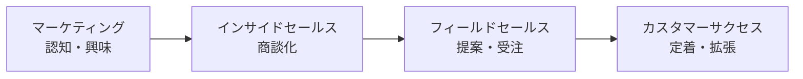
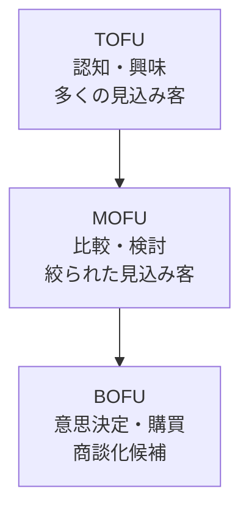
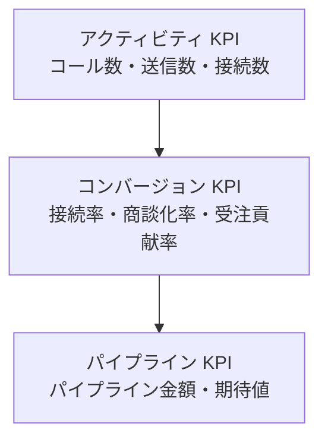

# インサイドセールス入門

BtoB SaaS で「数を打つ」より「データで打つ」——リード獲得から商談化までの設計図

| 項目 | 内容 |
|---|---|
| カテゴリー | マーケティング・営業 |
| 難易度 | 初級〜中級 |
| 所要時間 | 約200分（全8レッスン） |
| 公開日 | 2026-06-11 |
| 最終更新日 | 2026-06-11 |
| コースURL | https://skillup.college/courses/marketing-sales/inside-sales-basics/ |

## 対象者

BtoB SaaS／サブスク企業のインサイドセールス（SDR・BDR・新規 IS 担当者）。フィールドセールスからインサイドセールスへキャリアシフトする方。営業企画・マーケティング・カスタマーサクセス担当者でマーケ〜営業の連携を整理したい方。中小〜中堅 BtoB SaaS の経営者・幹部で営業組織を設計しようとしている方。エンジニアでも、所属企業の営業組織の仕組みを理解したい方に役立つ。

## 前提知識

営業の基本用語（受注・失注・商談・提案・顧客）を知っていること。SaaS／サブスクリプション型サービスの利用経験があると理解が早いが必須ではない。プログラミング経験は不要。

## 学習目標

- インサイドセールスをフィールドセールス・カスタマーサクセスと区別して定義できる
- マーケティングファネルと MQL／SQL／SAL の境界を引き、リード管理の流れを描ける
- SDR と BDR の役割分担を、インバウンドとアウトバウンドの観点から整理できる
- コール・メール・マルチチャネルでのアプローチ設計と Cadence を組める
- BANT と SPIN を使い分け、ヒアリングと商談化の判断軸を持てる
- アクティビティ・コンバージョン・パイプラインの 3 階層で KPI を設計できる
- CRM・SFA・MA・会話分析 AI・生成 AI を「設計の前提を整える道具」として捉えられる
- フィールドセールス／カスタマーサクセスへのハンドオフを設計し、組織と個人の次のステップを描ける

## コース概要

インサイドセールスという職種は、日本では 2010 年代後半から SaaS 業界を中心に急速に広がりました。いまや BtoB SaaS の営業組織では、マーケティング・インサイドセールス・フィールドセールス・カスタマーサクセスという 4 つの分業が一般的なフォーメーションになっています。一方で、現場では「コール数のノルマだけが追われ、結果が伴わない」「ツールを入れただけで結果が出ない」「生成 AI で全部解決できると思い込んでいる」など、課題は尽きません。本コースは、リード獲得から商談化までを担うインサイドセールスを、「数を打つ」根性論ではなく「データで打つ」運用視点で体系的に学びます。2026 年 6 月時点の生成 AI ／会話分析 AI 活用も含めますが、特定ツールの推奨ではなく、自分のチームの設計と運用に活かせる軸を持ち帰れる構成にしました。BtoB SaaS を中心に解説しますが、BtoC や対面商談の世界でも応用できる発想を提供します。

## 学習の流れ

レッスン 1 でインサイドセールスの定義と、営業の 4 分業（マーケ・IS・FS・CS）におけるインサイドセールスの位置づけを整理します。レッスン 2 はリード管理とファネル設計の基本を学びます。レッスン 3 で SDR と BDR の役割分担、レッスン 4 でコール・メール・マルチチャネルのアプローチ設計を扱います。レッスン 5 は本コースの中核となるヒアリングと商談化（BANT・SPIN）、レッスン 6 で KPI と PDCA の設計を学びます。レッスン 7 では CRM・SFA・MA に加え、2026 年 6 月時点の生成 AI と会話分析 AI の活用を扱います。最後のレッスン 8 で、ハンドオフ設計とインサイドセールス担当者のキャリアパス、コース修了後の学習方向を案内します。前半（レッスン 1）は「考え方の土台」、中盤（レッスン 2〜4）は「リード管理とアプローチ」、後半（レッスン 5〜7）は「ヒアリング・KPI・ツール」、終盤（レッスン 8）は「組織とこれから」という四段構えです。

## レッスン一覧

| No. | タイトル | 概要 | 所要時間 |
|---|---|---|---|
| 1 | インサイドセールスとは何か——営業の分業化と SaaS 時代の前提 | インサイドセールスとフィールドセールスの違い、営業の 4 分業（マーケ・IS・FS・CS）、レベニュー・チーム、BtoB SaaS 普及に伴うインサイドセールスの必然性、日本での普及背景、「営業＝個の根性」から「組織のサイエンス」への転換を学ぶ | 25分 |
| 2 | リード獲得とファネル設計——MQL・SQL・SAL の定義 | リード（見込み客）の定義、インバウンドとアウトバウンドの違い、マーケティングファネル（TOFU・MOFU・BOFU）、MQL・SQL・SAL の境界、リードスコアリングの基本、マーケと営業の SLA（サービスレベル合意）を学ぶ | 25分 |
| 3 | SDR と BDR の役割分担——アウトバウンドとインバウンドの境界 | SDR（Sales Development Representative）・BDR（Business Development Representative）の起源、インバウンド対応とアウトバウンド開拓の違い、ABM（Account Based Marketing）との接続、SDR・BDR のキャリアパス、Aaron Ross 『Predictable Revenue』の発想を学ぶ | 25分 |
| 4 | アプローチ設計——コール・メール・マルチチャネル | 電話・メール・LinkedIn・ウェビナー・ホワイトペーパー・チャットなど接点設計、Cadence（コール・メールの間隔と回数）、パーソナライゼーションと量産のバランス、コールスクリプトの考え方（「読み上げ」ではなく「型」）、メール件名・本文の構造（PASONA・AIDA）を学ぶ | 25分 |
| 5 | ヒアリングと商談化——BANT／SPIN／顧客課題の言語化 | ヒアリングフレームワーク BANT（Budget・Authority・Needs・Timeline）、SPIN（Situation・Problem・Implication・Need-payoff、Rackham 1988）、顧客の課題を顧客の言葉で再構成する設計、Discovery Call の組み立て、フィールドセールスへの商談引き継ぎ、Disqualify（あえて見送る）の判断軸を学ぶ | 25分 |
| 6 | KPI と PDCA——数字で運用を回す | アクティビティ KPI（コール数・接続率・送信数・開封率）、コンバージョン KPI（商談化率・受注貢献率）、パイプライン KPI（パイプライン金額・期待値）、リードタイム、PDCA とエラー分析、量と質のバランス、「数字を追う」のではなく「数字に追われない」設計を学ぶ | 25分 |
| 7 | ツール活用——CRM・SFA・MA・会話分析 AI と生成 AI | CRM・SFA・MA の役割分担、Sales Engagement Platform、会話分析 AI の概要、2026 年 6 月時点の生成 AI 活用（メール下書き・会話要約・商談前リサーチ・逆質問予測）、ツール選定の基本、データ品質と入力ハードルの問題を学ぶ | 25分 |
| 8 | 組織と次のステップ——キャリアパス・FS／CS との連携・コース修了後 | SDR／BDR からのキャリアパス（FS・マネージャー・RevOps・マーケ）、フィールドセールスへの引き継ぎ（SLA・ハンドオフ会議）、カスタマーサクセスへの伝言、インサイドセールス組織のスケール段階、担当者のメンタルマネジメント、コース修了後の学習方向を学ぶ | 25分 |

---

## レッスン1：インサイドセールスとは何か——営業の分業化と SaaS 時代の前提

（所要時間：25分）

### このレッスンで学ぶこと

- インサイドセールスの定義と、フィールドセールスとの違いを理解する
- 営業の 4 分業（マーケ・IS・FS・CS）とレベニュー・チームの全体像を把握する
- BtoB SaaS 普及がインサイドセールスを必然化した背景を理解する
- 日本でインサイドセールスが広がった時期と要因を押さえる
- 「営業＝個の根性」から「組織のサイエンス」への転換を意識する

---

「インサイドセールス」という言葉は、日本では 2010 年代後半から SaaS 業界を中心に急速に広がりました。一方、現場では「営業の一部署が電話とメールを担当するだけの仕事」「テレアポと同じでは」と誤解されていることも少なくありません。本コースの出発点として、まずインサイドセールスとは何か、なぜ生まれたのか、いまの BtoB 営業の中でどう位置づけられるのかを整理します。

### インサイドセールスの定義

インサイドセールス（inside sales）は、訪問を伴わずに電話・メール・Web 会議・チャットなどの内勤チャネルを使って、見込み客との関係を構築し、商談化や受注貢献を担う営業職を指します。

訪問営業を中心とするフィールドセールス（field sales、外勤営業）と対になる概念で、両者は連携しながら役割を分担します。本コースが扱うのは、主に BtoB SaaS／サブスクリプション型ビジネスの世界で標準化したスタイルのインサイドセールスです。

> **💡 ポイント**
> 「内勤の電話営業＝テレアポ」と混同されがちですが、現在の BtoB SaaS でのインサイドセールスは、テレアポ専業ではありません。コール・メール・ウェビナー・LinkedIn・チャットなど複数チャネルを組み合わせ、CRM／MA／SFA を使ってデータドリブンに運用される点が特徴です。

### 営業の 4 分業——マーケ・IS・FS・CS

現在の BtoB SaaS では、営業組織を 4 つの機能に分業するフォーメーションが標準的になっています。



- **マーケティング**：認知・興味を生み、見込み客（リード）を獲得する
- **インサイドセールス（IS）**：リードを精査し、商談として成立する見込みのある状態まで育てる
- **フィールドセールス（FS）**：商談を引き継ぎ、提案・クロージング・受注を担当する
- **カスタマーサクセス（CS）**：契約後の顧客の定着・拡張を担当する

この 4 分業は、ベンダーや組織によって呼称が違うことがありますが、機能としての分担は共通しています。本コースはこのうち「インサイドセールス」を扱います。フィールドセールスは「商談の引き継ぎ先」として、カスタマーサクセスは「受注後の連携先」として登場します。

#### レベニュー・チームという呼び方

この 4 機能をまとめて「レベニュー・チーム（revenue team）」または「レベニュー・オーガニゼーション」と呼ぶことも増えています。「営業＝売る人」ではなく「マーケ・IS・FS・CS が連携して収益を生む組織」と捉える発想です。北米 SaaS 企業ではこの呼び方が定着し、日本でも 2020 年代に入って徐々に広まりました。

> **📝 補足**
> 「レベニュー・オペレーションズ（RevOps）」という言葉も近年よく使われます。これは 4 機能をまたぐデータ整備・ツール運用・KPI 設計を専門に担う職種・チームを指します。レッスン 8 のキャリアパスの話で再び登場します。

### インサイドセールスとフィールドセールスの違い

| 観点 | インサイドセールス（IS） | フィールドセールス（FS） |
|---|---|---|
| 主な活動 | 電話・メール・Web 会議・チャットで非対面コミュニケーション | 訪問・対面商談・提案・クロージング |
| 担当フェーズ | リード精査〜商談化（商談前半） | 商談化済みリードへの提案〜受注（商談後半） |
| 1 人あたりの接触数 | 多い（1 日数十件〜） | 少ない（1 日数件） |
| 1 件あたりの時間 | 短め（数分〜数十分） | 長め（数十分〜数時間） |
| KPI の中心 | コール数・商談化率・パイプライン金額 | 受注率・受注金額・受注件数 |
| ツール依存度 | 高（CRM／SFA／MA／Cadence ツール） | 中〜高（CRM／SFA） |

両者は対立ではなく連携します。インサイドセールスが精査・育成したリードを、フィールドセールスが商談として引き継ぎ、提案・受注を担う流れです。この引き継ぎ（ハンドオフ）の設計が、組織全体の成果を大きく左右します。詳細はレッスン 8 で扱います。

#### 「IS だけ」「FS だけ」のモデルもある

近年は、SMB（中小企業）向けの低単価 SaaS では、商談から受注までインサイドセールスだけで完結する「インサイドセールス完結型」も増えています。逆に、エンタープライズ向けの高単価製品では、初期接点からフィールドセールスが担当する「FS 主導型」も健在です。「IS と FS の分業」は標準ではありますが、商材と顧客サイズに応じて柔軟に設計されます。

> **⚠️ 注意**
> 「インサイドセールスは商談化までで、受注は必ずフィールドセールスがやる」と決めつけるのは誤解です。受注までを IS が担うモデル、初期から FS が担うモデルなど、組織や商材によって設計は異なります。本コースは「IS と FS の分業がある一般形」を前提に解説しますが、自社の設計に合わせて読み替えてください。

### なぜインサイドセールスが必要になったか

インサイドセールスが BtoB の標準的な役割として広まった背景には、複数の要因が重なっています。

#### ①SaaS／サブスクリプションの普及

SaaS は、月額・年額のサブスクリプション契約で売上を立てるビジネスモデルです。1 件あたりの初回契約金額は、買い切り型ソフトウェアより小さくなりやすく、訪問営業のコストを 1 件で回収しにくくなりました。「低単価・高回転」のリード処理には、訪問しないインサイドセールスが適しています。

#### ②検討プロセスの長期化と複雑化

BtoB の購買検討は、複数の関係者が関わり、数か月〜半年単位で進むのが普通です。Web 上での情報収集が標準化したことで、見込み客は問い合わせ前にすでに比較検討を進めています。「いきなり訪問してクロージング」ではなく、「複数回の接点で関係を深め、検討状況に応じた情報提供を続ける」スタイルが必要になりました。

#### ③データドリブン営業の前提整備

CRM・SFA・MA などのツール普及により、顧客との接触履歴をデジタルで蓄積できるようになりました。コール数・接続率・商談化率といった KPI を測り、改善を回す運用が現実的になったのです。インサイドセールスは、この「測れる営業」を最も体現する職種です。

#### ④コロナ禍以降の非対面営業の常識化

2020 年以降、Web 会議が顧客との打ち合わせに広く使われるようになりました。「対面でないと商談にならない」という前提が崩れ、インサイドセールス的なアプローチが顧客側にも受け入れられやすくなった点も、追い風になりました。

### 日本での普及——2010 年代後半から

日本の BtoB SaaS 業界でインサイドセールスが標準化したのは、おおむね 2010 年代後半からです。SaaS スタートアップが急増した時期と重なります。それ以前にも内勤営業・テレアポ部門は存在しましたが、北米モデルを参考にした「リードを精査して FS に引き継ぐ」「データドリブンで KPI を回す」型の運用は、この時期から広がりました。

2020 年以降は、コロナ禍を契機にエンタープライズ寄りの伝統的な BtoB 企業もインサイドセールスを取り入れるようになり、いまや業界を問わず幅広く採用されています。

> **📝 補足**
> 「インサイドセールスは SaaS だけの話」と思われがちですが、製造業・金融業・人材業など、SaaS 以外の BtoB ビジネスでも広まっています。本コースは BtoB SaaS を中心に解説しますが、扱う概念の多くは他業界にも応用できます。

### 「営業＝個の根性」から「組織のサイエンス」へ

インサイドセールスが体系化される前、BtoB 営業は「優秀な担当者の属人スキル」に大きく依存していました。「飛び込みの数」「気合いと根性」「先輩から学ぶ勘どころ」が成果の源泉と考えられがちでした。

インサイドセールスの考え方は、ここに大きな転換を持ち込みました。

- **属人スキルから組織設計へ**：成果は個人の根性ではなく、ファネル・KPI・ツール・コーチングの設計で決まる
- **直感からデータへ**：商談化率・接続率・受注貢献率を測定し、ボトルネックを発見して改善する
- **個別最適から連携最適へ**：マーケ・IS・FS・CS が連携することで全体の収益が伸びる

これは「個人の力量が要らない」という意味ではありません。優秀な個人の存在は重要です。ただ、組織全体としては「個に依存しすぎず、設計と運用で再現性のある成果を生む」発想が必要になった、ということです。

> **💡 ポイント**
> 本コースは、この「組織のサイエンス」としての営業を前提に進めます。コール数 100 件のノルマだけを追う発想や、「優秀な人を採用すれば全部解決する」という考え方は、本コースの立場とは異なります。同時に、「ツールを入れれば全部自動化される」という発想にも与しません。設計・運用・人の三つが揃って初めて、データドリブンな営業が機能するという立場です。

### 本コースの守備範囲

最後に、本コースで扱う範囲と扱わない範囲を整理しておきます。

#### 扱う範囲

- インサイドセールスの全体像と「営業の 4 分業」の発想（本レッスン）
- リード管理とファネル設計：MQL／SQL／SAL（レッスン 2）
- SDR と BDR の役割分担（レッスン 3）
- アプローチ設計：コール・メール・マルチチャネル（レッスン 4）
- ヒアリングと商談化：BANT／SPIN（レッスン 5）
- KPI と PDCA（レッスン 6）
- ツール活用：CRM／SFA／MA／会話分析 AI／生成 AI（レッスン 7）
- 組織設計とハンドオフ、キャリアパス（レッスン 8）

#### 扱わない範囲

- 特定 SaaS 製品の操作手順・画面遷移（公式ドキュメントを参照）
- 受注クロージングの細かい技法（フィールドセールス側の領域）
- 契約後のカスタマーサクセスの実務（別領域）
- BtoC の対面販売・店舗営業のテクニック
- 「飛び込み営業の極意」「魔法のトークスクリプト」

#### スタンス

本コースは、インサイドセールスを「属人スキルの集合」ではなく「組織のサイエンス」として扱います。同時に、「データさえあれば全部解決する」「AI を入れれば自動化される」という幻想も批判的に整理した上で、データと人の両方を活かす運用視点を中心に置きます。

### まとめ

このレッスンでは、以下のことを学びました。

- インサイドセールスは、訪問を伴わない内勤チャネルで見込み客との関係を構築し、商談化や受注貢献を担う営業職
- 現在の BtoB SaaS では、マーケ・IS・FS・CS の 4 分業が標準で、まとめてレベニュー・チームと呼ばれる
- インサイドセールスとフィールドセールスは対立ではなく連携の関係で、商材・顧客サイズによって設計は変わる
- インサイドセールスが必要になった背景には、SaaS の普及、検討プロセスの長期化、データドリブン営業の前提整備、コロナ禍の非対面営業常識化がある
- 日本では 2010 年代後半から SaaS 業界を中心に広まり、2020 年代に他業界にも拡大した
- 本コースは「営業＝個の根性」から「組織のサイエンス」への転換を前提に進める

次のレッスンでは、リード獲得の入口となるマーケティングファネルの設計と、MQL・SQL・SAL という 3 つの「リードの状態」の境界を整理します。

---

### 確認クイズ

このレッスンの理解度をチェックしましょう。

#### Q1. 本レッスンが定義するインサイドセールスとして最も適切なものはどれか？

- [ ] 訪問営業を主体とし、Web 会議を補助的に使う営業職
- [x] 訪問を伴わずに電話・メール・Web 会議・チャットなどの内勤チャネルを使って、見込み客との関係を構築し、商談化や受注貢献を担う営業職
- [ ] 受注後の顧客に定着支援を提供する職種
- [ ] マーケティング部門が獲得したリードを集計するだけの内勤事務職

> **解説**
> インサイドセールスは「内勤チャネルで見込み客との関係を構築し、商談化や受注貢献を担う営業職」です。テレアポ専業でも事務職でもなく、複数チャネルをデータドリブンに運用する点が特徴です。

#### Q2. 営業の 4 分業として、本レッスンが説明した組み合わせはどれか？

- [x] マーケティング・インサイドセールス・フィールドセールス・カスタマーサクセス
- [ ] マーケティング・広報・営業企画・経理
- [ ] テレアポ・営業・コールセンター・受付
- [ ] 営業・人事・経営・総務

> **解説**
> BtoB SaaS の標準的な 4 分業は、マーケティング → インサイドセールス → フィールドセールス → カスタマーサクセスです。この 4 機能をまとめてレベニュー・チームと呼ぶことも増えています。

#### Q3. インサイドセールスとフィールドセールスの違いとして、本レッスンが説明した内容はどれか？

- [ ] IS は受注金額の最大化、FS はコール数の最大化が KPI の中心
- [ ] IS と FS は同じ KPI を共有しており役割は完全に同じ
- [x] IS は内勤チャネルで商談前半（リード精査〜商談化）を担い、FS は対面中心で商談後半（提案〜受注）を担う。1 人あたりの接触数は IS のほうが多く、1 件あたりの時間は FS のほうが長い
- [ ] IS は対面営業の補助としてのみ存在し、独立した役割は持たない

> **解説**
> IS は内勤チャネルで多くの接点を短く処理し、商談前半を担います。FS は対面中心で 1 件あたりの時間が長く、商談後半（提案・クロージング）を担います。KPI も IS は商談化率・パイプライン金額、FS は受注率・受注金額が中心です。

#### Q4. インサイドセールスが BtoB の標準的役割として広まった背景として、本レッスンが挙げた要因はどれか？

- [ ] LLM の登場により営業が完全自動化されたから
- [ ] 飛び込み訪問が法律で禁止されたから
- [x] SaaS／サブスクリプションの普及、検討プロセスの長期化、データドリブン営業の前提整備、コロナ禍以降の非対面営業の常識化など複数の要因が重なったから
- [ ] 訪問営業より対面営業のほうが受注率が高いことが証明されたから

> **解説**
> インサイドセールスが広まった背景は単一要因ではなく、SaaS の普及、検討プロセスの複雑化、CRM・MA など測れる営業の前提整備、コロナ禍の非対面営業常識化など、複数の要因が重なっています。

#### Q5. 日本でインサイドセールスが標準化した時期として、本レッスンが説明した内容はどれか？

- [ ] 1980 年代前半に、製造業を中心に標準化した
- [ ] 1990 年代後半に、官公庁の調達改革で広まった
- [x] 2010 年代後半から SaaS 業界を中心に広がり、2020 年代に他業界にも拡大した
- [ ] 2024 年に AI ブームと同時に登場した、ごく新しい職種である

> **解説**
> 日本では 2010 年代後半に SaaS スタートアップの急増とともに広まり、2020 年代にエンタープライズや非 SaaS 業界にも拡大しました。「2024 年に登場した」ような新しい職種ではありません。

#### Q6. 本コースのスタンスとして、適切なものはどれか？

- [ ] コール件数のノルマを最大化することが営業の唯一の正解である
- [ ] 優秀な営業担当者を採用すれば、組織設計や KPI 設計は不要である
- [ ] CRM や AI ツールを導入すれば、運用はすべて自動化される
- [x] インサイドセールスを「組織のサイエンス」として扱い、設計と運用、データと人の両方を活かす運用視点を中心に置く

> **解説**
> 本コースは「数を打つ」根性論にも「ツールが全部解決する」幻想にも与しません。設計・運用・人の三つが揃って初めて、データドリブンな営業が機能するという立場で進めます。

---

## レッスン2：リード獲得とファネル設計——MQL・SQL・SAL の定義

（所要時間：25分）

### このレッスンで学ぶこと

- リード（見込み客）の定義と種類を整理する
- インバウンドとアウトバウンドの違いを理解する
- マーケティングファネルの 3 階層（TOFU・MOFU・BOFU）を押さえる
- MQL・SQL・SAL という 3 つの「リードの状態」の境界を引ける
- リードスコアリングの基本発想を持つ
- マーケと営業のあいだの SLA（サービスレベル合意）の必要性を理解する

---

前のレッスンでは、インサイドセールスを「組織のサイエンス」として捉える発想と、営業の 4 分業（マーケ・IS・FS・CS）を整理しました。本レッスンでは、その流れの入口にあたる「リード（見込み客）」の獲得と管理の基本を扱います。MQL・SQL・SAL という用語の意味と、マーケと営業の境界をどう設計するかが中心テーマです。

### リード（見込み客）とは

リード（lead）は、自社の商品・サービスに何らかの興味を示した、まだ顧客になっていない個人や企業を指します。日本語では「見込み客」と訳されますが、業界では「リード」という呼び方が広く使われています。

#### リードの種類

| 種類 | 状態 |
|---|---|
| 個人リード | 名前・メール・所属企業など、個人ベースでデータがある |
| アカウントリード | 企業単位で「商談化候補」と見ているが、個人の名前は未取得のこともある |
| ターゲットアカウント | まだ接点はないが、自社が狙うべき企業として選定済み |

BtoB SaaS では、「個人リード」と「アカウントリード」の両方の視点で管理することが多くなっています。1 つの企業に複数の関係者（決裁者・利用者・情シスなど）がいるため、個人だけ／企業だけの管理では実態に合わないからです。

> **📝 補足**
> 個人情報保護法や GDPR の観点で、リードの取り扱いには法律上の制約があります。本コースでは法務の詳細は扱いませんが、自社の法務・コンプライアンス部門と連携して運用設計を行うのが必須です。

### インバウンドとアウトバウンド

リードの獲得経路は、大きく 2 つに区分できます。

#### インバウンド

見込み客側から自発的に接点を取ってくれるパターンです。Web サイトの問い合わせフォーム、資料ダウンロード、ウェビナー申込、無料トライアルの開始などが典型です。

- **強み**：すでに興味を持っている人なので、商談化率が比較的高い
- **弱み**：自社が狙いたい企業ばかりが来るとは限らない。量も自社でコントロールしにくい

#### アウトバウンド

自社側から能動的に接点を作りに行くパターンです。コール、メール、LinkedIn メッセージ、紹介依頼などが該当します。

- **強み**：狙いたい企業に対して計画的にアプローチできる
- **弱み**：相手は興味を持っていない状態から始まるため、商談化率は相対的に低くなる

両者は補完関係です。インバウンドだけでは「狙いたい企業」にアプローチできないし、アウトバウンドだけでは効率が悪い。BtoB SaaS の多くは、両方を組み合わせて運用しています。

> **💡 ポイント**
> 「インバウンドだけで成り立つ」と思っているマーケ部門と出会うことがあります。コンテンツや SEO で自然流入が増える局面では確かに見える化しやすいのですが、狙いたい大型アカウントは自分から問い合わせてこないことがほとんどです。「インバウンドが順調なときこそアウトバウンドの仕込みを続ける」という運用が、長期的には成果に効きます。

### マーケティングファネルの 3 階層

リードがどのような状態にあるかを段階的に整理する考え方として、マーケティングファネル（漏斗）があります。広く使われるのが、TOFU・MOFU・BOFU の 3 階層です。



- **TOFU（Top of Funnel、ファネルの上部）**：認知・興味の段階。広告・SEO・SNS・ウェビナーなどで広く接触する
- **MOFU（Middle of Funnel、ファネルの中央）**：比較・検討の段階。ホワイトペーパー・事例紹介・製品比較資料などで深堀りしてもらう
- **BOFU（Bottom of Funnel、ファネルの下部）**：意思決定・購買の段階。デモ申込・無料トライアル・商談打診などで具体化する

ファネルは「漏斗」の比喩通り、上に行くほど人数は多く、下に行くほど人数は減ります。マーケティングが TOFU・MOFU を担い、インサイドセールスが MOFU・BOFU の境界に立つ、という分担が一般的です。

#### ファネルだけでは語れない実態

ファネルは便利な比喩ですが、実際の購買行動は一直線には進みません。比較段階に来た人が認知に戻ったり、購買直前に他社へ流れたりします。最近では「ファネルではなくジャーニー」「リニア（直線）ではなくループ」と捉える論考も増えています。本コースでは「ファネルは大まかな整理の道具」と割り切り、運用で必要な精度に応じて使い分ける立場で進めます。

> **⚠️ 注意**
> 「ファネルの数字（TOFU 人数・MOFU 人数・BOFU 人数）を毎月見て、減っているから問題だ」と早合点するのは危険です。一時的なノイズか、構造的な変化かは、ファネルだけでは判断できません。次のレッスン以降で扱う KPI 設計と組み合わせて初めて、意味のある示唆が得られます。

### MQL・SQL・SAL の 3 つの境界

ファネルの中で、特にインサイドセールスが扱うのが「リードの質」を表す 3 つの段階です。

| 状態 | 定義 |
|---|---|
| MQL（Marketing Qualified Lead） | マーケティング部門の基準で「営業に渡せる」と判断したリード |
| SAL（Sales Accepted Lead） | 営業（IS）側が「受け取る価値あり」と認めたリード |
| SQL（Sales Qualified Lead） | 営業（IS）側が「商談化の可能性が高い」と精査したリード |

#### MQL の意味

MQL は、マーケティング部門が「ここから先は営業に渡してよい」と判断する基準を満たしたリードです。判断基準は組織ごとに異なりますが、例えば「ホワイトペーパーを 3 つ以上ダウンロード」「ウェビナーに参加」「料金ページを複数回閲覧」など、興味の強さを示す行動を組み合わせたものになります。

#### SAL の意味

SAL は、インサイドセールス側が「これは受け取る価値がある」と判断したリードです。MQL がマーケの基準を満たしていても、営業側から見ると「ターゲット外」「すでに失注済み」など、受け取れないケースがあります。SAL は、その「営業側のフィルター」を通過した状態です。

#### SQL の意味

SQL は、インサイドセールスが実際に接触し、「商談化の可能性が高い」と精査した状態です。具体的には、後のレッスン 5 で扱う BANT（予算・決裁権・課題・タイミング）などの基準を一定程度満たすことが目安になります。SQL に到達したリードは、フィールドセールスへ商談として引き継がれます。

> **📝 補足**
> MQL・SAL・SQL の定義は組織ごとに違います。本レッスンの説明は「業界で広く使われる代表的な定義」ですが、自社の運用に当てはまるとは限りません。むしろ、自社の基準を明文化することが運用上の最重要事項です。「うちの MQL は何で、SQL は何か」を、マーケと営業で揃えて議論することから始めてください。

#### 3 つを使う意味

「MQL と SAL と SQL の 3 段階は細かすぎる」と感じる人もいます。実際、組織のフェーズによっては MQL と SQL の 2 段階で十分なこともあります。3 段階に分ける意味は、マーケと営業のあいだに「お互いの基準のすり合わせ」のレイヤーを作ることにあります。

- マーケは「MQL の量」で評価される傾向がある
- 営業は「商談化率・受注率」で評価される傾向がある
- 両者の基準がずれると、「マーケは MQL を量産するが、営業からは『質が低い』と返される」という典型的なすれ違いが起きる

SAL を間に置くことで、「営業側が実際に受け取った数」が見える化され、両者の基準を揃える対話のきっかけになります。

### リードスコアリングの基本

リードの「興味の強さ」「商談化の確からしさ」を数値で表すのが、リードスコアリングです。

#### 基本の発想

- 行動（ホワイトペーパー DL、ウェビナー参加、料金ページ閲覧など）に点数を割り当てる
- 属性（業種・規模・役職など）にも点数を割り当てる
- 合計スコアが一定値を超えたら MQL とみなす

例えば「ホワイトペーパー DL ＋ 10 点、ウェビナー参加 ＋ 20 点、料金ページ 3 回閲覧 ＋ 15 点、役職部長以上 ＋ 10 点、合計 50 点以上で MQL」のような設計です。

#### 落とし穴

- **過剰なスコア体系**：項目を細かく作りすぎると、運用が複雑になり保守できなくなる
- **属性の偏重**：「役職」「規模」だけで判断すると、興味の薄い大企業を高く評価してしまう
- **減点ロジックの欠落**：時間経過で興味が薄れたリードのスコアを下げる仕組みがないと、古い高得点が残り続ける

> **💡 ポイント**
> 初期はシンプルに（5〜10 項目程度）始め、運用しながら見直すのが現実的です。完璧なスコアモデルを最初から作ろうとして、立ち上げが遅れる組織を見てきました。「動かして測りながら直す」のは、本コースのほかの場面でも繰り返し登場する発想です。

### マーケと営業の SLA

マーケから営業へリードを渡す境界には、「お互いの責任範囲」を明文化した SLA（Service Level Agreement、サービスレベル合意）を結ぶ運用が広まっています。

#### SLA に含める典型的な項目

- マーケ側：月間で渡す MQL の最低件数・質の基準
- 営業（IS）側：MQL を受け取ってから何時間以内に接触するか、SAL に上げる比率の目安
- 両者：定義の文言、不一致が起きたときのエスカレーション手順

#### なぜ SLA が必要か

SLA がない組織では、「マーケは数字を達成したと言い、営業は『質が低い』と返す」というすれ違いが恒常化します。SLA は、お互いの期待値を言語化して合意し、月次の振り返りで数字とすり合わせるための器です。形式的な書類ではなく、運用のための合意であることが大切です。

> **⚠️ 注意**
> SLA を結んだだけで対話が始まるわけではありません。月次・四半期で、「数字と感覚」を両方持ち寄って振り返る場を設計しないと、SLA は形骸化します。本コースのレッスン 6 で扱う KPI 設計と組み合わせて運用してください。

### まとめ

このレッスンでは、以下のことを学びました。

- リード（見込み客）には個人・アカウント・ターゲットアカウントといった種類がある
- リード獲得経路はインバウンドとアウトバウンドの 2 つに区分でき、両者は補完関係
- マーケティングファネルは TOFU・MOFU・BOFU の 3 階層で整理できるが、購買行動は一直線ではない
- MQL（マーケ側基準）・SAL（営業側の受け取り判断）・SQL（営業側の精査結果）という 3 段階の境界がある
- リードスコアリングはシンプルに始めて運用しながら見直す
- マーケと営業の SLA は、お互いの期待値を言語化し、振り返りの場と組み合わせて運用する

次のレッスンでは、インサイドセールスの中での役割分担として、SDR（インバウンド対応）と BDR（アウトバウンド開拓）の境界、そして Aaron Ross 『Predictable Revenue』に始まる SaaS 営業組織の発想を扱います。

---

### 確認クイズ

このレッスンの理解度をチェックしましょう。

#### Q1. インバウンドリードとアウトバウンドリードの違いとして、本レッスンが説明した内容はどれか？

- [ ] インバウンドはアウトバウンドより必ず受注単価が高い
- [x] インバウンドは見込み客が自発的に接点を取るパターン、アウトバウンドは自社が能動的に接点を作りに行くパターン。両者は補完関係
- [ ] アウトバウンドは法律で禁止されているため、現在は使えない
- [ ] BtoB SaaS ではインバウンドだけで成り立つのが標準的である

> **解説**
> インバウンドは見込み客側からの自発的接点、アウトバウンドは自社からの能動的接点です。インバウンドは商談化率が高い反面、狙った企業が来るとは限らず、アウトバウンドは計画的にアプローチできる反面、商談化率は相対的に低い。両者は補完関係で組み合わせるのが BtoB SaaS の標準です。

#### Q2. マーケティングファネルの 3 階層として、本レッスンが説明した組み合わせはどれか？

- [ ] TOFU（取引）・MOFU（モバイル）・BOFU（ボーナス）
- [ ] TOFU（顧客）・MOFU（メンバー）・BOFU（ブランド）
- [ ] TOFU（チーム）・MOFU（マネージャー）・BOFU（バイヤー）
- [x] TOFU（認知・興味）・MOFU（比較・検討）・BOFU（意思決定・購買）

> **解説**
> TOFU は Top of Funnel（認知・興味）、MOFU は Middle of Funnel（比較・検討）、BOFU は Bottom of Funnel（意思決定・購買）の略です。マーケが TOFU・MOFU を担い、インサイドセールスが MOFU・BOFU の境界に立つ分担が一般的です。

#### Q3. MQL・SAL・SQL の 3 段階として、本レッスンが説明した内容はどれか？

- [x] MQL はマーケ側基準を満たしたリード、SAL は IS 側が受け取る価値ありと認めたリード、SQL は IS 側が商談化可能性が高いと精査したリード
- [ ] MQL は IS 側基準、SAL はマーケ側基準、SQL は経営側基準
- [ ] MQL・SAL・SQL はすべて同じ意味で使われる業界用語
- [ ] MQL は受注したリード、SAL は失注したリード、SQL は保留中のリード

> **解説**
> MQL（Marketing Qualified Lead）はマーケ側基準を満たしたリード、SAL（Sales Accepted Lead）は IS 側が受け取り判断したリード、SQL（Sales Qualified Lead）は IS 側が商談化可能性ありと精査したリードです。3 段階に分ける意味は、マーケと営業の基準すり合わせのレイヤーを作る点にあります。

#### Q4. リードスコアリングの基本発想として、本レッスンが説明した内容はどれか？

- [ ] 行動データを一切使わず、属性（業種・規模）だけで決める
- [ ] 100 項目以上の細かいスコア体系を最初から完璧に作る
- [x] 行動と属性に点数を割り当て、合計スコアが基準値を超えたら MQL とみなす。初期はシンプルに始め運用しながら見直す
- [ ] 時間経過によるスコア減点は不要で、いったん付けたスコアは永続する

> **解説**
> リードスコアリングは、行動（DL、ウェビナー参加、料金ページ閲覧など）と属性（業種・規模・役職）に点数を割り当てる仕組みです。初期はシンプルに（5〜10 項目程度）始めて運用しながら見直すのが現実的で、減点ロジックも必要です。

#### Q5. マーケと営業のあいだの SLA の役割として、本レッスンが説明した内容はどれか？

- [ ] 形式的な書類を整えるための法務文書
- [ ] マーケ部門が営業部門を統制するための一方的な命令
- [x] お互いの責任範囲・期待値を言語化して合意し、月次・四半期で数字と感覚を持ち寄って振り返るための器
- [ ] 一度結べば見直し不要の永続的な合意文書

> **解説**
> SLA は、マーケ側と営業（IS）側のお互いの責任範囲を言語化して合意するための運用文書です。月次・四半期で振り返る場と組み合わせて初めて機能します。一度結んで放置すると形骸化します。

#### Q6. 本レッスンが描いた MQL の運用上の典型的な落とし穴として、適切なものはどれか？

- [ ] MQL の数を増やすほど、必ず商談数も比例して増える
- [ ] MQL は IS 側が単独で定義すべきもので、マーケと合意する必要はない
- [x] MQL の定義がマーケ側に偏ると、件数は増えるが商談化率が下がり、IS の現場が消耗するすれ違いが起きやすい
- [ ] MQL の件数は経営指標として最重要であり、SAL 化率や SQL 化率は無視してよい

> **解説**
> マーケ側だけで MQL を定義し件数の最大化を追うと、IS の現場では「商談化しないリードばかりコールする」消耗が起きます。SAL 化率・SQL 化率まで含めた SLA で両者を揃え、合意のもとで運用するのが本レッスンの示した解決方向です。

---

## レッスン3：SDR と BDR の役割分担——アウトバウンドとインバウンドの境界

（所要時間：25分）

### このレッスンで学ぶこと

- SDR と BDR という 2 つの役割の起源と定義を理解する
- インバウンド対応とアウトバウンド開拓の違いを整理する
- ABM（Account Based Marketing）と BDR の関係を押さえる
- SDR・BDR からのキャリアパスの広がりを把握する
- Aaron Ross 『Predictable Revenue』が SaaS 営業組織に与えた発想を理解する

---

前のレッスンでは、リード管理の入口にあたる MQL・SAL・SQL とファネル設計を扱いました。本レッスンでは、インサイドセールスの内部における役割分担——とくに SDR と BDR の違い——を整理します。両者は混同されがちですが、担当するリードの種類とアプローチの起点が大きく異なります。

### SDR と BDR とは

SDR と BDR は、いずれもインサイドセールスの中の専門的な役割を指す呼称です。北米 SaaS 業界で広まり、日本にも 2010 年代後半から導入が進みました。

| 呼称 | 略称 | 主な担当 |
|---|---|---|
| Sales Development Representative | SDR | インバウンドリードの精査・育成、商談化への引き上げ |
| Business Development Representative | BDR | アウトバウンドでのターゲット企業開拓、新規アカウントの掘り起こし |

#### SDR の起点はインバウンド

SDR は、マーケティングが獲得したインバウンドリード（資料 DL、ウェビナー参加、問い合わせなど）を受け取り、コールやメールで状況を確認しながら、商談化の見込みがあれば SQL に引き上げる役割です。インバウンドの「待ち」を起点にしながら、能動的なフォローで質を上げていきます。

#### BDR の起点はアウトバウンド

BDR は、リードがまだ存在していないターゲット企業に対して、自ら能動的にコール・メール・LinkedIn などでアプローチし、接点を作ります。マーケティングからの引き渡しは受けず、ターゲット企業リスト（後述する ABM の発想と接続します）から自分で開拓するイメージです。

> **📝 補足**
> 「SDR と BDR の名称や定義は会社によって違う」ことに注意してください。実際、両者の意味を逆に使う組織や、両方を「インサイドセールス」とひとくくりにする組織もあります。本レッスンの説明は「業界で広く使われる代表的な定義」で、自社の慣習に合わせて読み替えていただいてかまいません。

### SDR と BDR の比較

| 観点 | SDR | BDR |
|---|---|---|
| アプローチの起点 | インバウンド（マーケ獲得リード） | アウトバウンド（ターゲット企業リスト） |
| ターゲット | 自発的に接点を作ってきた企業・個人 | 自社が狙うべき企業（まだ接点なし） |
| 1 件あたりのリサーチ時間 | 中（事前の興味があるため） | 長（仮説と切り口を準備する必要） |
| 接続率 | 高め | 低め |
| 商談化率 | 高め | 低め |
| 求められるスキル | スピード、ヒアリング、フォロー設計 | リサーチ、仮説構築、粘り強さ |

#### どちらが「上」というわけではない

SDR と BDR は、求められるスキル・性格・KPI が違うだけで、役割の優劣はありません。SDR は「興味を持っている人に的確に応える設計力」が、BDR は「興味を持っていない人に文脈を作って入り込む設計力」が求められます。両者は補完関係です。

> **💡 ポイント**
> 「BDR は SDR の上位職」「SDR は新人がやる仕事」のような誤解を見かけますが、実態は違います。組織によっては BDR の方が経験者向け（粘り強さが必要）であったり、SDR の方が瞬発力が必要だったりします。スキルの違いとして整理するのが本レッスンの立場です。

### インバウンドとアウトバウンドの境界

SDR と BDR の境界を明確にする運用は、組織全体の効率を上げる上で重要です。

#### 境界を引かない場合の問題

- インバウンドが多い月は、BDR がインバウンド対応に流れて、アウトバウンドが止まる
- アウトバウンドが進まない月は、「インバウンドが少なかったから」と原因を曖昧にしてしまう
- メンバーが「楽な方（インバウンド）」に流れ、結果的にターゲット企業に届かない

#### 境界を引いた場合のメリット

- SDR は「マーケから来るリードへの対応速度」「商談化率」で評価される
- BDR は「ターゲットアカウントへの接触数」「ミーティング化率」で評価される
- 両者が「比べられない」KPI を持つため、お互いの数字を奪い合うすれ違いが減る

> **⚠️ 注意**
> 境界を引きすぎると、今度は「自分の担当外」と互いに無関心になります。SDR が拾ったリードがじつはアウトバウンドの仕込みから来ていた、BDR が開拓した企業がインバウンドで戻ってきた、といったケースは日常的に起きます。境界はあるが連携する、というバランス設計が運用の現実解です。

### ABM（Account Based Marketing）と BDR

BDR の活動と密接に関係するのが、ABM（Account Based Marketing、アカウント・ベースド・マーケティング）の発想です。

#### ABM とは

ABM は、「個人リードを大量に集めてからファネルで絞り込む」のではなく、「狙うべき企業（アカウント）を最初に決め、そこに集中してアプローチする」マーケティングと営業の連携手法です。北米では 2010 年代から普及し、日本でも 2020 年前後から本格的に取り入れられるようになりました。

#### ABM と BDR の接続

ABM では、まずターゲットアカウントリスト（数十〜数百社）を選定します。マーケはこれらの企業に向けて広告・コンテンツ・イベントを集中投下し、BDR は同じリストに対して個別アプローチを設計します。マーケと営業が「同じ企業のリスト」を共有して動く点が、従来のファネル型と最も違うところです。

#### 注意点

ABM はリストの選定と、企業ごとのカスタマイズに大きなコストがかかります。SMB 向けのプロダクトには合いません。エンタープライズ向けや、限られた数の大型アカウントを攻める商材で効果を発揮しやすい手法です。

> **📝 補足**
> 「全社で ABM をやろう」と決めて、ターゲットアカウントが 1,000 社・3,000 社になってしまう組織を見かけます。それでは ABM の集中の発想が薄まります。最初は 30〜50 社、慣れてきても 100〜200 社程度に絞るのが現実的、というのが多くの実務家の感覚です。

### SDR・BDR からのキャリアパス

SDR・BDR は、入社後の経験を積みやすい役割として、SaaS 業界では新卒・第二新卒の入口になることが多いポジションです。一方で、ベテランがあえて選ぶケースもあります。キャリアの広がりは多様です。

| 進む先 | 理由 |
|---|---|
| AE（Account Executive、商談のクロージング担当）／FS | 商談前半で見えた顧客課題をクロージングまで担いたい |
| インサイドセールスマネージャー | チームの設計・KPI 運用・コーチングに進む |
| マーケティング（特に Demand Generation） | リード獲得側の設計に回り、ファネル全体を見る |
| カスタマーサクセス | 契約後の顧客側に回り、長期の関係構築を担う |
| RevOps（Revenue Operations） | データ・ツール・KPI 設計を専門に支える役割 |
| 起業・独立 | 営業組織の立ち上げを丸ごと請け負う形での独立も増えている |

> **💡 ポイント**
> 「SDR・BDR は若手の通過点」と決めつけてしまう組織は、人材を消耗させがちです。一方で、「ずっと SDR を続けるべきか」と悩む担当者には、上記のような複数のキャリアの選択肢を知っておいてもらうことで、職場での会話が前向きになります。組織側も、キャリアパスの設計を採用・育成と一体で考えることが、定着率に直結します。

### Aaron Ross 『Predictable Revenue』の発想

SDR と BDR の分業は、Aaron Ross 氏が 2011 年に出版した『Predictable Revenue』という書籍で広く知られるようになりました。Ross 氏は、Salesforce 社の初期社員として、アウトバウンド型のセールス開発組織を設計した経験を本にまとめました。

#### 主な主張

- 営業を「ハンター（新規開拓）」「ファーマー（既存維持・拡張）」と単純に分けるのではなく、「アウトバウンドの専門役割」を独立した分業として設計せよ
- アウトバウンドリードと、インバウンドの問い合わせ対応は、求められるスキルも KPI も違うため、人を分けるべき
- 営業組織は「予測可能な収益（predictable revenue）」を生む機械として、ファネル・KPI で設計できる

『Predictable Revenue』の発想は、SaaS 業界の営業組織設計の古典となり、SDR・BDR・AE のような専門役割の分業はここから広く普及しました。

> **⚠️ 注意**
> 『Predictable Revenue』は 2011 年の書籍であり、当時の文脈（北米 SaaS の急成長期、メールアプローチが効きやすかった時代）に最適化された主張も含まれます。例えば「コールドメールでアポを取る」具体的な手法はいまでは効きにくい部分もあります。本書の意義は「アウトバウンドを独立した分業として設計する」発想の提示にあり、個別手法はそのまま流用するのではなく、現在の環境に合わせて読み替える必要があります。

### まとめ

このレッスンでは、以下のことを学びました。

- SDR はインバウンドリードの精査と商談化引き上げ、BDR はアウトバウンドでのターゲット企業開拓を担う
- 両者は求められるスキル・KPI が違うが、優劣はなく補完関係
- インバウンドとアウトバウンドの境界を引くことで、組織全体の効率が上がる
- ABM はターゲット企業を最初に選定する手法で、BDR の活動と接続しやすい
- SDR・BDR からのキャリアパスは多様（FS、IS マネージャー、マーケ、CS、RevOps、独立）
- Aaron Ross 『Predictable Revenue』（2011）は、アウトバウンド専門役割の分業発想を SaaS 業界に広めた古典

次のレッスンでは、SDR・BDR が実際にリードへ働きかける接点設計——コール・メール・マルチチャネルを組み合わせた Cadence の組み立て方を学びます。

---

### 確認クイズ

このレッスンの理解度をチェックしましょう。

#### Q1. 本レッスンが示した SDR と BDR の代表的な定義の組み合わせはどれか？

- [ ] SDR がアウトバウンド開拓、BDR がインバウンド精査
- [ ] SDR と BDR は完全に同じ役割で、呼び方の違いだけ
- [ ] SDR は契約後の顧客対応、BDR は経理処理
- [x] SDR がインバウンドリードの精査・商談化引き上げ、BDR がアウトバウンドでのターゲット企業開拓

> **解説**
> 業界で広く使われる定義では、SDR がインバウンド起点で精査・商談化を担い、BDR がアウトバウンド起点で新規アカウントを開拓します。組織によっては逆の定義を使うこともあるため、自社の慣習に合わせて読み替える必要があります。

#### Q2. SDR と BDR の関係について、本レッスンが説明した内容はどれか？

- [ ] BDR は SDR の上位職で、SDR は新人専用のポジション
- [x] 求められるスキル・KPI が違うだけで優劣はなく、補完関係である
- [ ] 同じ KPI で評価され、業務範囲も完全に同じ
- [ ] SDR と BDR を持つのは大企業だけで、スタートアップは持ってはいけない

> **解説**
> SDR と BDR は、スキル・性格・KPI が違うだけで優劣はありません。SDR は「興味を持っている人に的確に応える設計力」、BDR は「興味を持っていない人に文脈を作って入り込む設計力」が求められます。

#### Q3. インバウンドとアウトバウンドの境界を引くメリットとして、本レッスンが説明した内容はどれか？

- [ ] アウトバウンドを廃止することで、コストを大幅に削減できる
- [ ] インバウンドだけに集中することで、商談数を最大化できる
- [x] SDR は商談化率、BDR はミーティング化率といった「比べられない」KPI を持つことで、メンバーが楽な方に流れたり数字を奪い合ったりするすれ違いを減らせる
- [ ] 境界を引かないことで、メンバーは自由度を保ちやすくなり、結果的に成果が上がる

> **解説**
> 境界を引かないと、インバウンドが多い月はメンバーが楽な方に流れてアウトバウンドが止まり、アウトバウンドの仕込みが水の泡になります。境界と KPI 分離により、両方の活動を継続できる設計になります。ただし、境界が強すぎても問題なのでバランスが必要です。

#### Q4. ABM（Account Based Marketing）の特徴として、本レッスンが説明した内容はどれか？

- [ ] 個人リードを大量に集めてファネルで絞り込む手法
- [x] 狙うべき企業（アカウント）を最初に決め、マーケと営業が同じターゲットリストを共有して集中アプローチする手法
- [ ] BtoC の店舗集客に最適化された手法
- [ ] BDR とは無関係で、SDR だけが使う手法

> **解説**
> ABM は「狙うべき企業を最初に決め、そこに集中アプローチする」発想です。マーケと営業（特に BDR）が同じターゲットアカウントリストを共有して動くのが特徴で、エンタープライズや限られた大型アカウントを攻める商材に向きます。

#### Q5. SDR・BDR からのキャリアパスとして、本レッスンが挙げたものはどれか？

- [x] AE／FS への移行、インサイドセールスマネージャー、マーケティング（Demand Generation）、CS、RevOps、起業・独立など多様
- [ ] フィールドセールスへの一本道のみ
- [ ] 製造業のラインオペレーターへの転籍
- [ ] SDR・BDR からのキャリアパスは存在しない

> **解説**
> SDR・BDR からは AE／FS、IS マネージャー、マーケ、CS、RevOps、独立など多様なキャリアパスが広がります。「若手の通過点」と決めつけず、本人の志向に応じた選択肢を提示することが組織の定着率にも直結します。

#### Q6. Aaron Ross 『Predictable Revenue』に関する本レッスンの説明として、適切なものはどれか？

- [ ] 2024 年に出版された最新のエージェント技術書である
- [ ] 営業活動を完全に自動化する AI ツールの解説書である
- [x] 2011 年に出版された SaaS 営業組織設計の古典で、アウトバウンドを独立した分業として設計する発想を広めた
- [ ] BtoC の店舗営業向けトークスクリプト集である

> **解説**
> Aaron Ross 氏は Salesforce 社の初期社員でアウトバウンド型セールス開発組織を設計した経験を、2011 年に『Predictable Revenue』として出版しました。SDR・BDR・AE の分業の発想は本書で広く知られるようになりましたが、個別手法は当時の環境前提なので現代に合わせた読み替えが必要です。

---

## レッスン4：アプローチ設計——コール・メール・マルチチャネル

（所要時間：25分）

### このレッスンで学ぶこと

- リードへの接点（チャネル）の選択肢を整理する
- Cadence（コール・メールの間隔と回数）の組み立て方を理解する
- パーソナライゼーションと量産のバランスを設計できる
- コールスクリプトを「読み上げ原稿」ではなく「型」として扱う発想を持つ
- メール件名・本文の構造（PASONA・AIDA）を実務に応用できる

---

前のレッスンでは、SDR と BDR の役割分担と、Aaron Ross 『Predictable Revenue』に始まる SaaS 営業組織の発想を扱いました。本レッスンでは、SDR・BDR が実際にリードへ働きかける接点設計——コール・メール・マルチチャネルの組み立て方を学びます。「数を打つ」根性論にも「テンプレを使い回すだけ」の手抜きにも陥らない、設計の発想を中心に置きます。

### チャネルの選択肢

インサイドセールスがリードに働きかけるチャネルは、近年急速に多様化しています。代表的なものを整理します。

| チャネル | 特徴 |
|---|---|
| 電話（コール） | 同期的、双方向、深い対話が成立しやすい一方、相手の時間を奪う |
| メール | 非同期、量産可能、相手のペースで読める一方、開封されないリスクが高い |
| LinkedIn など SNS | プロフィールが見えるためパーソナライズしやすい、業界によって普及度が異なる |
| ウェビナー・イベント | 多人数に同時接触、興味のある層が自発的に集まる |
| ホワイトペーパー・ブログ | 接点というより「素材」、後の Cadence に組み込んで使う |
| チャット（Web 接客） | Web サイト訪問者にリアルタイム対応、興味の強い人に短時間で接触できる |
| Web 会議（オンライン商談） | コールの延長線として、深い対話と画面共有が可能 |

#### 「電話だけ」「メールだけ」では届かない

2010 年代までは、コールとメールがほぼ唯一の選択肢でした。現在は、上記のように多様なチャネルが選べる一方、「どのチャネルを使えば良いか」の難度は上がっています。本レッスンでは、複数チャネルを組み合わせる Cadence（後述）が現実解になっていることを前提に進めます。

> **💡 ポイント**
> 「コールが古い、メールが効かない、LinkedIn が新しい」のような短絡的な議論をよく見かけますが、相手の業界・役職・年代・好みによってチャネルの効きやすさは変わります。例えば製造業の現場系の役職には LinkedIn は届きにくく、IT 業界の経営層には電話よりメールが好まれます。「自社のターゲットに何が届くか」を仮説と検証で見極めるのが本筋です。

### Cadence——間隔と回数の設計

Cadence（ケイデンス）は、リードに対して「いつ・どのチャネルで・何回」アプローチするかの一連の流れを指します。一度コールしてつながらないからといって 1 回で諦めるのではなく、複数チャネル・複数日にわたるシーケンスを設計するのが現代の標準です。

#### Cadence の基本パターン例

| 日 | アクション |
|---|---|
| Day 1 | コール 1 回目（つながらなければ留守電を残す）→ メール 1 通目（コールの内容を補足） |
| Day 3 | LinkedIn でつながり申請、メッセージ |
| Day 5 | コール 2 回目（時間帯を変える） |
| Day 8 | メール 2 通目（参考事例の紹介） |
| Day 12 | コール 3 回目 |
| Day 15 | クロージングメール（「ご縁がなさそうでしたら、本シーケンスは一旦止めます」） |

これはあくまで一例で、業界・商材・ターゲットによって最適な間隔・回数は違います。重要なのは「個別の判断ではなく、シーケンスとして事前に設計する」発想です。

#### Cadence の設計指針

- **最初の 24 時間**：マーケから渡された MQL には、できるだけ早く（できれば 5 分以内に）最初の接触を試みる
- **複数チャネル**：コールだけ、メールだけではつながらない。最低 2 種類は組み合わせる
- **時間帯のばらつき**：相手が出やすい時間は朝・昼・夕方で違う。同じ時間ばかりは避ける
- **クロージング**：永遠に追わない。10〜15 日ほどで一旦区切り、見込みが薄ければ別タイミングで仕切り直す

> **📝 補足**
> 「インバウンドリードへの初動が 5 分以内なら商談化率が大きく上がる」という主張は、北米の研究（Harvard Business Review 2011 年の Oldroyd 氏らの記事など）でよく引用されます。日本でも一般論として支持されていますが、業界・商材によっては「5 分以内が必須」とは限りません。原則として「早ければ早いほど良い」と捉え、自社の数字で具体的な閾値を測るのが現実的です。

### パーソナライゼーションと量産のバランス

Cadence を回す上で常に直面するのが、「パーソナライゼーション（個別最適化）」と「量産（スケール）」のバランスです。

#### パーソナライズしすぎる

- 1 件あたりに 30 分のリサーチをかけ、深く相手企業を理解した上で接触する
- 商談化率は高いが、1 日に処理できる件数が極端に少ない
- 結果として、月のコール数が伸びず、パイプラインが枯れる

#### 量産しすぎる

- テンプレートのメールを 1 日 200 件送る
- 開封率・返信率は極端に低くなる
- 「またテンプレかよ」と相手企業にネガティブな印象を残し、ブランドを傷つける

#### 現実解：階層化

実務では、両極の間で次のような階層化を組むのが一般的です。

| 階層 | 対象 | パーソナライズの深さ |
|---|---|---|
| 完全パーソナライズ | ターゲットアカウントの中核（10〜30 社） | 1 件 30 分のリサーチ、業界課題仮説 2〜3 本 |
| 半パーソナライズ | ターゲットアカウントの周辺（100〜300 社） | 業界・規模ごとにテンプレを分け、最初の 1 行だけ個別 |
| テンプレ運用 | 大量のリード対応 | 業界別テンプレを用意し、件名と冒頭だけ動的に置換 |

> **💡 ポイント**
> 「全部完全パーソナライズしたい」という気持ちは現場の真心ですが、組織の生産性は崩れます。逆に「全部テンプレでいい」では届きません。「どこに 30 分かけ、どこは 5 分で済ませるか」を組織で合意して階層化することが、現実の運用の腰になります。

### コールスクリプト——「読み上げ原稿」ではなく「型」

電話の最初の数十秒で、相手の興味を引けるかどうかが決まります。そのためにコールスクリプト（電話の台本）を用意することは、多くの組織で標準です。一方、スクリプトの扱い方を誤ると、機械的でぎこちないコールになり、かえって商談化率が下がります。

#### スクリプトを「読み上げ原稿」として扱う問題

- 抑揚が機械的になり、相手に「マニュアル通りに話している」と伝わる
- 想定外の返答に対応できず、沈黙してしまう
- 自分の言葉ではないため、説得力が出ない

#### スクリプトを「型」として扱う考え方

スクリプトは「読み上げの原稿」ではなく「会話の流れの型」として使うのが現実的です。

```
1. 名乗りと挨拶（10 秒）
   「××社の江口と申します。本日はお時間 1 分だけよろしいでしょうか」
2. 相手企業への理解の提示（20 秒）
   「先日御社の××プレスリリース、拝見しました。○○の取り組みを進めておられるのですね」
3. 課題仮説の提示（20 秒）
   「同じような取り組みを進めておられる企業さまから、○○の点でご相談をいただくことが多くなっています」
4. 用件の提示（10 秒）
   「もしご興味があれば、15 分ほど詳しいお話を共有させていただけませんか」
5. 反応への対応（柔軟に）
   - 興味あり → 日程調整
   - 課題が違う → ヒアリング
   - 興味なし → 退きどころを判断
```

この「型」を踏まえつつ、相手の反応に応じてアドリブで応じます。最初の 10 秒の名乗りや、最後のクロージングだけはぶれない方が良いですが、中盤の対話は柔軟性を持たせます。

> **⚠️ 注意**
> 「魔法のトークスクリプト」「これだけで受注率 3 倍」のような誇大広告に乗らないでください。スクリプトは型として共有する道具で、個々のコールでは相手と自分の会話が主役です。スクリプトを読み上げているだけの 100 件のコールより、相手の言葉に応じた 30 件のコールの方が、商談化率が高いというのが実務の感覚です。

### メール件名と本文の構造

メールが開封されるかどうかは、件名で 7〜8 割が決まると言われます。本文の構造設計も含めて、いくつかの定型を覚えておくと役立ちます。

#### 件名の設計指針

- **30 文字以内に収める**：スマホで切れない長さ
- **相手の業界・関心を入れる**：「【○○業界向け】」「【△△の取り組みを進める方へ】」など
- **クエスチョンや具体性**：「○○の課題、どう乗り越えていますか？」「○○の事例 3 社」など
- **避けるべき表現**：「【至急】」「【重要】」「【お知らせ】」など、量産メール特有の表現はかえって開封率を下げる

#### 本文の構造——PASONA と AIDA

代表的な構造として、PASONA と AIDA があります。

##### PASONA の法則

| 要素 | 内容 |
|---|---|
| Problem | 相手が抱えているであろう問題を提起 |
| Affinity | 共感・理解の表明 |
| Solution | 自社のソリューションの紹介 |
| Offer | 具体的な提案（資料・デモなど） |
| Narrowing down | 対象の絞り込み |
| Action | 行動の促し |

PASONA は神田昌典氏が日本で広めたフレームワークで、購買心理に沿った流れになっています。

##### AIDA の法則

| 要素 | 内容 |
|---|---|
| Attention | 注意を引く |
| Interest | 興味を持たせる |
| Desire | 欲求を喚起 |
| Action | 行動を起こさせる |

AIDA は 19 世紀末に米国の広告業界で生まれた、マーケティングの古典です。

#### 使い分け

- PASONA：相手の課題に寄り添うスタイル、BtoB の長文メールに向く
- AIDA：シンプルにストーリーを組み立てたいとき、短文や広告コピーに向く

> **💡 ポイント**
> どちらの構造も「テンプレに当てはめる」と平凡になります。型として使いつつ、最初の 1〜2 行だけは相手企業の固有の文脈を入れる——というのが、開封率・返信率に効きます。

### まとめ

このレッスンでは、以下のことを学びました。

- 接点のチャネルは多様化しており、業界・役職・年代に応じて使い分ける
- Cadence は「いつ・どのチャネルで・何回」アプローチするかの設計で、複数チャネルを組み合わせるのが現代の標準
- パーソナライゼーションと量産は、階層化（中核・周辺・テンプレ）で両立させる
- コールスクリプトは「読み上げ原稿」ではなく「会話の流れの型」として使う
- メール件名は 30 文字以内、本文は PASONA や AIDA の型を使いつつ最初の 1 行は個別
- 「魔法のトーク」「無敵テンプレ」への過信は、再現性・モデル更新・タスク特化の盲点を生む

次のレッスンでは、コールやメールでつながった先のヒアリング——BANT と SPIN という 2 つの代表的なフレームワーク、Discovery Call の設計、Disqualify（あえて見送る）の判断軸を扱います。

---

### 確認クイズ

このレッスンの理解度をチェックしましょう。

#### Q1. Cadence の基本発想として、本レッスンが説明した内容はどれか？

- [ ] 1 回コールしてつながらなければ即座に諦める
- [x] 複数チャネル・複数日にわたるシーケンスを事前に設計し、組織として運用する
- [ ] 同じ時間帯に毎日コールを繰り返す
- [ ] 個々の担当者の感覚で都度判断する

> **解説**
> Cadence は「いつ・どのチャネルで・何回」アプローチするかの設計です。1 回で諦めるのでも個別判断でもなく、複数チャネルを組み合わせて複数日にわたるシーケンスを事前に設計するのが現代の標準的な運用です。

#### Q2. パーソナライゼーションと量産のバランスとして、本レッスンが推奨する現実解はどれか？

- [x] ターゲット中核・周辺・大量リードの 3 階層に分け、パーソナライズの深さを使い分ける
- [ ] すべてのリードを完全パーソナライズで対応する
- [ ] すべてのリードをテンプレートで一律対応する
- [ ] 個々の担当者の判断に完全に委ねる

> **解説**
> 完全パーソナライズだけでは件数が処理できず、テンプレ一律だけでは届きません。中核（10〜30 社）は深いリサーチ、周辺（100〜300 社）は半パーソナライズ、大量は業界別テンプレ、という階層化が現実解です。

#### Q3. コールスクリプトの扱い方として、本レッスンが推奨する考え方はどれか？

- [ ] 一字一句を読み上げる「読み上げ原稿」として使う
- [ ] スクリプトは用意せず、毎回完全アドリブで対応する
- [ ] スクリプトを完璧に暗記し、想定外の返答には沈黙で対応する
- [x] 「会話の流れの型」として使い、相手の反応に応じてアドリブを混ぜつつ、名乗りやクロージングだけはぶれないようにする

> **解説**
> スクリプトは「型」として共有する道具です。名乗りや用件の提示など最初と最後の骨格はぶれないようにし、中盤の対話は相手の反応に応じて柔軟に対応する設計が、商談化率に直結します。

#### Q4. メール件名の設計指針として、本レッスンが推奨するものはどれか？

- [ ] 「【至急】【重要】」を多用して開封率を上げる
- [ ] 100 文字以上の長い説明文を入れる
- [x] 30 文字以内に収め、相手の業界・関心を反映した文言にする
- [ ] 件名は空欄にして、本文だけで勝負する

> **解説**
> 件名は 30 文字以内（スマホで切れない長さ）、相手の業界や関心を反映した文言が推奨です。「【至急】」「【重要】」のような量産メール特有の表現はかえって開封率を下げます。

#### Q5. PASONA の法則の構成として、本レッスンが説明したものはどれか？

- [x] Problem → Affinity → Solution → Offer → Narrowing down → Action の 6 段階
- [ ] Plan → Action → Search → Output → Network → Analysis の 6 段階
- [ ] Process → Architecture → Security → Operations → Network → Application の 6 段階
- [ ] Product → Affinity → Sales → Order → Note → Account の 6 段階

> **解説**
> PASONA は Problem（問題提起）・Affinity（共感）・Solution（解決策）・Offer（提案）・Narrowing down（絞り込み）・Action（行動促し）の 6 段階で構成されます。神田昌典氏が日本で広めたフレームワークで、BtoB の長文メールに向きます。

#### Q6. 講師の現場メモが示す「Day 1 メール改善」の学びとして、本レッスンが伝えたメッセージはどれか？

- [ ] 完全パーソナライズで 30 分かけることが唯一の正解
- [ ] テンプレを使い続けて改善は不要
- [x] 「すべてに 30 分かける」のではなく「最初の 1 行に 5 分かける」階層化と限定化で、効率と効果を両立できる
- [ ] 件名は変えず本文だけ工夫すれば十分

> **解説**
> 講師のエピソードでは、本文の最初の 1 行で相手企業のプレスリリース・公開情報に触れる工夫が、返信率を 1% から 3% に伸ばしました。すべてを完全パーソナライズするのではなく、効きどころに限定して投資する階層化が、現実の運用に効くというメッセージです。

---

## レッスン5：ヒアリングと商談化——BANT／SPIN／顧客課題の言語化

（所要時間：25分）

### このレッスンで学ぶこと

- BANT という代表的なヒアリングフレームワークの内容を理解する
- SPIN という質問構造の 4 タイプ（Situation・Problem・Implication・Need-payoff）を使い分けられる
- 顧客の課題を「顧客自身の言葉」で再構成する設計を持つ
- Discovery Call の組み立て方を押さえる
- フィールドセールスへの商談引き継ぎ（ハンドオフ）の条件を整理する
- Disqualify（あえて見送る）の判断軸を持つ

---

前のレッスンでは、コール・メール・マルチチャネルを組み合わせた Cadence と、コールスクリプトやメールの構造設計を扱いました。本レッスンは、コールや Web 会議でつながった先の「ヒアリング」と「商談化」の中核を扱います。本コースの中で最もインサイドセールスの実務に直結するレッスンです。

### ヒアリングの目的——「聞き出す」のではなく「整理する」

ヒアリングと聞くと、「相手から情報を聞き出す」イメージを持つ方が多いと思います。けれど、ベテランのインサイドセールスのヒアリングは、むしろ「相手自身が言語化できていない課題を、相手と一緒に整理する」プロセスに近いものです。

#### 「聞き出す」モデルの問題

- 相手は自分の課題を完全には言語化できていない
- 「予算は」「決裁者は」と聞かれても、本当のところは答えにくい
- 一方的に質問されると「査定されている」と感じて防衛的になる

#### 「整理する」モデルの発想

- 相手の話を聞きながら、こちらが要素に分けて言語化する
- 「○○ということでしょうか」「××の点で困っておられる、ということに聞こえました」など、要約と確認を繰り返す
- 相手から「そうそう、そういうこと」と返ってくる対話に近づく

> **💡 ポイント**
> 「ヒアリングが上手い人ほど、質問が少ない」とよく言われます。質問は最小限にして、相手の話を要約・整理・再構成する力の方が、ヒアリングの本質に近いのです。BANT や SPIN は質問の道具ですが、使い方を誤ると「査定インタビュー」になりがちです。

### BANT——4 つの基本観点

BANT は、長らく BtoB 営業のヒアリングで使われてきた代表的なフレームワークです。1960 年代に IBM 社が体系化したと一般に語られる古典で、現在も多くの組織で活用されています。

| 略称 | 観点 | 確認内容 |
|---|---|---|
| B | Budget（予算） | 検討中の取り組みに割ける予算規模 |
| A | Authority（決裁権） | 意思決定の権限を持つ人物 |
| N | Needs（課題・ニーズ） | 解決したい課題、達成したい状態 |
| T | Timeline（タイミング） | 導入・意思決定の時間軸 |

#### BANT の使い方

BANT は「全部聞き出さなければならないチェックリスト」ではありません。「商談として進めるかどうか」を判断する 4 つの観点として、Discovery Call の中で会話のなかから自然に把握していくものです。

- B（予算）：「いくらですか」と直接聞くより、「予算化はどの段階ですか」「年度予算の話か、別枠か」など状況を聞く
- A（決裁権）：「決裁者は誰ですか」より、「どのような方が一緒に検討に入られますか」「最終的に GO サインを出されるのはどなたでしょうか」
- N（課題）：「課題は何ですか」より、「いま、この件で一番気になっておられるのはどの点でしょうか」
- T（タイミング）：「いつまでに決めますか」より、「いつ頃から動かしたいというイメージはありますか」

#### BANT の限界

BANT は古典として有用ですが、現代の購買では限界も指摘されています。

- 「予算がまだない」段階の検討も多い（特に新しい領域では予算枠が後から作られる）
- 「決裁権者 1 人」より「複数のステークホルダーが関与」する傾向が強い
- 「明確なニーズ」より「漠然とした問題意識」から始まる検討も多い
- タイミングも「半年後」「1 年後」のような長期も普通

> **⚠️ 注意**
> BANT の 4 観点を「全部 YES」だけが商談化、と機械的に判断すると、現代の購買の実態を取りこぼします。一方で、4 観点すべてが「NO」のリードを延々と追うのも効率を欠きます。BANT は判断の道具で、運用の最終決定は組織と商材によって違います。

### SPIN——質問の 4 タイプ

SPIN は、英国の Neil Rackham 氏が 1988 年の著書『SPIN Selling』で提唱した、質問の構造を 4 タイプに分けたフレームワークです。Rackham 氏は数千件の商談を分析し、「うまい営業の質問パターン」を体系化しました。

| 略称 | 質問タイプ | 内容 |
|---|---|---|
| S | Situation Questions（状況質問） | 相手の現状・背景を理解するための質問 |
| P | Problem Questions（問題質問） | 抱えている問題・困りごとを表面化させる質問 |
| I | Implication Questions（示唆質問） | 問題が放置されると何が起きるかを考えてもらう質問 |
| N | Need-payoff Questions（解決の価値質問） | 解決された場合に得られる価値を相手自身に語ってもらう質問 |

#### SPIN の使い方の流れ

1. **S（状況）**：「現在、御社では○○の業務はどのような体制で進めておられますか」
2. **P（問題）**：「進める中で、どこかで詰まる箇所や、もう少し改善したい部分はありますか」
3. **I（示唆）**：「このままの状態が続くと、半年後・1 年後にはどのような影響がありそうですか」
4. **N（解決の価値）**：「もしこの問題が解決されたら、御社にとってどういう価値がありそうですか」

#### SPIN の発想——「相手に語ってもらう」

SPIN の核心は、最後の N（解決の価値）にあります。営業側が「この製品は××に効きます」と説明するのではなく、相手自身に「もし解決されたら、○○の価値がある」と語ってもらう設計です。相手自身の言葉で価値が言語化されることで、購買の動機が内発的なものになります。

> **💡 ポイント**
> 「営業が説得する」よりも「相手自身が説得される」方が、購買意思は強くなります。SPIN は心理学的にも妥当な構造で、現代の BtoB 営業でも有効です。ただし、機械的に「S・P・I・N」を聞くだけでは作為が透けるので、自然な対話の流れの中に織り込む技量が必要です。

### BANT と SPIN の使い分け

BANT と SPIN は対立するフレームワークではなく、目的が違います。

| 観点 | BANT | SPIN |
|---|---|---|
| 目的 | 商談として進めるか判断する | 顧客の課題を深掘りし購買動機を引き出す |
| 使う場面 | Discovery Call の終盤、商談化判断時 | Discovery Call 全体、特に前半〜中盤 |
| 質問の性質 | 状況を確認する閉じた質問が多い | 思考を促す開いた質問が多い |

実務では、SPIN で課題を深掘りしながら、BANT の 4 観点を会話から把握する、という組み合わせが現実的です。

### 顧客の課題を「顧客自身の言葉」で

ヒアリングの成果は、商談化判断だけではありません。次のフィールドセールスや、提案書、社内の事例共有のために「顧客の課題を、顧客自身の言葉で記録する」ことが重要です。

#### 営業の言葉で書かれた課題の例

> 「業務効率化のニーズあり。基幹システムの改善余地があり、当社製品の導入余地あり」

#### 顧客の言葉で書かれた課題の例

> 「現在、見積書の作成に営業 1 人あたり週 5 時間を取られている。営業が本来のお客さま訪問に使う時間が削られている。半年で 10 社の競合が同じ領域に参入してきており、訪問の量を増やさないとシェアを失う危機感がある」

#### なぜ顧客の言葉が大切か

- フィールドセールスが商談を引き継ぐとき、顧客の文脈で会話を始められる
- 提案書や事例化のとき、顧客が読んでも「自分のことを理解してくれている」と感じる
- 社内の他案件で類似の悩みを聞いたとき、「あ、これは○○社と似ている」と気づける

> **📝 補足**
> 「顧客の言葉での記録」をルール化するには、CRM のメモ欄に「現状」「困りごと」「解決後の理想」の 3 つの観点を必須項目にするなど、入力フォーマットの工夫が役立ちます。レッスン 7 のツール活用と組み合わせて運用してください。

### Discovery Call の組み立て

Discovery Call（ディスカバリーコール）は、インサイドセールスが「最初の本格的なヒアリング」として実施する Web 会議です。30 分〜1 時間の枠で、SPIN や BANT を駆使して顧客理解を深める場です。

#### 典型的な構成（30 分の場合）

| 時間 | 内容 |
|---|---|
| 最初の 3 分 | 名乗りと議題確認、会話のゴール合意 |
| 3〜10 分 | S（状況質問）：現状の業務・体制の理解 |
| 10〜20 分 | P・I（問題質問・示唆質問）：困りごとと、放置した場合の影響 |
| 20〜25 分 | N（解決の価値質問）：解決された場合の価値、BANT の主要観点 |
| 25〜28 分 | 自社からの提案・次のアクション提示 |
| 28〜30 分 | クロージング、次回日程の合意 |

#### 失敗パターン

- 自社製品の説明に時間を使いすぎ、ヒアリングが浅くなる
- 質問が連続して「査問」になり、相手が防衛的になる
- 「次のアクション」を明確に合意せず、Call が空中分解する

> **⚠️ 注意**
> 「Discovery Call で全部聞き出さなければならない」と思い込むと、相手の負荷が高まります。1 回で全部聞こうとせず、2 回目・3 回目に分ける設計でも問題ありません。むしろ「重要な論点は次回詳しく」と次に繋ぐ方が、関係構築としては効きます。

### フィールドセールスへの商談引き継ぎ（ハンドオフ）

Discovery Call の結果、「フィールドセールスに引き渡す（商談化する）」と判断したら、引き継ぎ（ハンドオフ）の手続きに入ります。引き継ぎが雑だと、次のフィールドセールスのアプローチが浅くなり、せっかくの商談が落ちます。

#### ハンドオフの基本条件

- **顧客の課題が顧客の言葉で記録されている**：上述の通り
- **BANT の 4 観点が把握できている**：完全に揃わなくとも、少なくとも N・T はある程度押さえる
- **次のアクションが顧客と合意されている**：「来週、貴社のソリューション担当からデモを共有」など
- **顧客が「次のステップに進む意思」を表明している**：押し付けではなく合意している

#### ハンドオフ会議の運用

組織によっては、IS から FS への引き継ぎを「ハンドオフ会議」として 15〜30 分の枠で実施します。CRM の情報だけでなく、「相手の温度感」「会話の中で印象的だった発言」「FS が踏むべき地雷」など、文字に残しにくい情報を共有する場です。

> **💡 ポイント**
> ハンドオフは、組織の中で最もすれ違いが起きやすいポイントです。IS は「やり切った」、FS は「情報が足りない」と思いがちです。両者が「共通の引き継ぎテンプレ」と「対話の場」を持つことで、組織全体の商談化率と受注率が大きく改善します。

### Disqualify——あえて見送る判断

ヒアリングの結果、「自社の製品では顧客の課題に応えられない」と判断することがあります。これを Disqualify（ディスクオリファイ、見送り）と呼びます。

#### Disqualify の重要性

- **顧客の信頼を守る**：合わない案件を無理に進めると、後で関係が崩れる
- **組織の生産性を守る**：商談化しても受注しない案件にリソースを使うと、ほかの案件が手薄になる
- **担当者の感覚を保つ**：「合わないと思いながら追う」状態は、担当者のメンタルを消耗させる

#### Disqualify の判断軸

- 自社製品が解決できない領域の課題が中心
- 予算規模が自社の最低水準を下回る
- 検討時期が遠すぎる（半年以上先で具体性がない）
- 競合製品との差別化要因がない領域でのリプレース
- ステークホルダーが多すぎる、または決定権者が不明

#### Disqualify の伝え方

「お見送り」をはっきり伝える運用が、長期的な信頼につながります。「機会があればまた」と濁すより、「現時点では弊社の製品では難しい場面が多そうです。○○の状況になったタイミングで、改めてお声がけください」と具体的に伝える方が、相手にも誠実です。

> **⚠️ 注意**
> 「Disqualify が多いほどよい」というわけではありません。あくまで「自社の強みを正しく見極めた上で、合わないものを見送る」判断です。Disqualify を増やすことが目的化すると、攻めるべき案件まで見送ってしまいます。

### まとめ

このレッスンでは、以下のことを学びました。

- ヒアリングは「聞き出す」のではなく「相手の課題を相手と一緒に整理する」プロセス
- BANT（Budget・Authority・Needs・Timeline）は商談化判断の 4 観点として有効だが、現代の購買では限界もある
- SPIN（Situation・Problem・Implication・Need-payoff）は質問の 4 タイプで、Rackham 1988 年の古典
- BANT と SPIN は対立せず、SPIN で深掘りしながら BANT を会話から把握するのが現実的
- 顧客の課題は「営業の言葉」ではなく「顧客自身の言葉」で記録する
- Discovery Call は 30 分〜1 時間の枠で、自社製品説明とヒアリングのバランスを設計する
- ハンドオフ（フィールドセールスへの引き継ぎ）の質は、組織全体の受注率を左右する
- Disqualify（あえて見送る）は、顧客との信頼と組織の生産性を守るための重要な判断

次のレッスンでは、ここまでのヒアリング・Cadence・商談化を「数字で運用する」設計——アクティビティ・コンバージョン・パイプラインの 3 階層 KPI と PDCA を学びます。

---

### 確認クイズ

このレッスンの理解度をチェックしましょう。

#### Q1. BANT の 4 観点として、本レッスンが説明した組み合わせはどれか？

- [ ] Budget・Architecture・Network・Tools
- [x] Budget（予算）・Authority（決裁権）・Needs（課題）・Timeline（タイミング）
- [ ] Business・Action・Network・Trust
- [ ] Brand・Audience・Need・Time

> **解説**
> BANT は Budget（予算）・Authority（決裁権）・Needs（課題）・Timeline（タイミング）の 4 観点で構成されます。1960 年代に IBM 社が体系化したと一般に語られる古典で、いまも多くの組織で商談化判断の枠組みとして使われています。

#### Q2. SPIN の 4 タイプとして、本レッスンが説明した組み合わせはどれか？

- [ ] Speed・Product・Influence・Network
- [ ] System・Plan・Implementation・Notification
- [x] Situation（状況質問）・Problem（問題質問）・Implication（示唆質問）・Need-payoff（解決の価値質問）
- [ ] Sales・Process・Information・Notice

> **解説**
> SPIN は Neil Rackham 氏が 1988 年の『SPIN Selling』で提唱した質問構造で、Situation（状況）・Problem（問題）・Implication（示唆）・Need-payoff（解決の価値）の 4 タイプから成ります。核心は最後の N で、相手自身に解決の価値を語ってもらう設計です。

#### Q3. ヒアリングの本質として、本レッスンが推奨する考え方はどれか？

- [ ] 相手から情報を「聞き出す」尋問
- [ ] BANT の項目を機械的にチェックリスト形式で確認する
- [ ] 自社製品の優位性を相手に説得するための場
- [x] 相手自身が言語化できていない課題を、要約・確認・再構成しながら相手と一緒に整理する

> **解説**
> ベテランのヒアリングは「相手と一緒に整理する」プロセスです。質問は最小限にし、相手の話を要約・確認・再構成する力の方が、商談化率にも顧客の納得感にも直結します。

#### Q4. BANT と SPIN の使い分けとして、本レッスンが説明した内容はどれか？

- [x] BANT は商談化判断の 4 観点として、SPIN は質問の 4 タイプとして、対立せず組み合わせて使う
- [ ] BANT が古く SPIN が新しいので、SPIN だけ使えばよい
- [ ] BANT と SPIN は全く同じ意味の用語である
- [ ] BANT は北米向け、SPIN は欧州向けで地域ごとに使い分ける

> **解説**
> BANT は商談化判断の観点、SPIN は質問の構造で、目的が違います。SPIN で課題を深掘りしながら、BANT の 4 観点を会話から把握する組み合わせが現実的です。

#### Q5. フィールドセールスへの商談引き継ぎ（ハンドオフ）の基本条件として、本レッスンが挙げたものはどれか？

- [ ] 顧客に内緒で、IS から FS へ情報だけ渡す
- [x] 顧客の課題が顧客の言葉で記録されている、BANT の主要観点が把握されている、次のアクションが顧客と合意されている、顧客が次のステップに進む意思を表明している
- [ ] 商談化判断は不要で、すべてのリードを FS に渡す
- [ ] 顧客の課題は「営業の言葉」で抽象化して FS に渡す

> **解説**
> ハンドオフの基本条件は、顧客の言葉での課題記録、BANT 主要観点の把握、次のアクションの顧客との合意、顧客側の次のステップへの意思表明、の 4 つです。これらが揃わないまま渡すと FS が浅い提案に陥り、商談が落ちます。

#### Q6. Disqualify（あえて見送る）の判断として、本レッスンが説明した内容はどれか？

- [ ] 一度でも興味を示した顧客は、絶対に Disqualify してはいけない
- [ ] Disqualify の件数を増やすこと自体が KPI として最優先
- [x] 自社製品で応えられない、予算規模が合わない、検討時期が遠すぎる、競合差別化の余地がない、などの判断軸で、長期の信頼と組織の生産性を守るために実施する
- [ ] Disqualify は新人には判断できないので、必ずマネージャーに依頼する

> **解説**
> Disqualify は「合わない案件を無理に進めない」判断で、顧客との信頼・組織の生産性・担当者のメンタルを守る重要な運用です。判断軸（自社製品の領域外、予算・時期の不一致、差別化要因の欠如、ステークホルダー不明など）を組織で合意して使います。件数を増やすこと自体が目的化しないよう注意も必要です。

---

## レッスン6：KPI と PDCA——数字で運用を回す

（所要時間：25分）

### このレッスンで学ぶこと

- アクティビティ・コンバージョン・パイプラインの 3 階層 KPI を設計できる
- 接続率・商談化率・受注貢献率といった主要指標の意味を理解する
- リードタイム（接触から商談化までの時間）の重要性を押さえる
- PDCA とエラー分析の発想を運用に組み込める
- 「量を追う」運用と「数字に追われない」設計の違いを理解する
- KPI 設計の落とし穴を避ける

---

前のレッスンでは、ヒアリングと商談化の中核として BANT・SPIN・Discovery Call・ハンドオフ・Disqualify を扱いました。本レッスンは、その活動全体を「数字で運用する」設計に踏み込みます。コール数の最大化だけを追う発想とも、ふんわりした感覚論とも違う、データドリブンな運用の発想を整理します。

### KPI 設計の 3 階層

インサイドセールスの KPI は、大きく 3 つの階層に分けて設計するのが一般的です。



| 階層 | KPI の例 | 意味 |
|---|---|---|
| アクティビティ | コール数・メール送信数・接続数 | 活動の量 |
| コンバージョン | 接続率・商談化率・受注貢献率 | 活動の質 |
| パイプライン | パイプライン金額・期待値・受注金額 | 成果の規模 |

3 階層に分ける意味は、「量だけ」「質だけ」「成果だけ」を追うと、運用がいびつになるからです。3 階層を組み合わせて、量と質と成果を同時にウォッチします。

### アクティビティ KPI——活動の量

アクティビティ KPI は、インサイドセールス担当者が日々どのような活動をしたかを定量化する指標です。

| 指標 | 意味 |
|---|---|
| コール数 | 1 日あたりの架電回数 |
| 接続数 | 相手と実際に会話できた回数 |
| メール送信数 | 1 日あたりのメール送信件数 |
| LinkedIn 接触数 | LinkedIn 経由の接触件数 |
| Web 会議実施数 | Discovery Call などの実施回数 |

#### アクティビティ KPI の使いどころ

- **立ち上がり期**：新メンバーの活動が動いているかを見る
- **不調期**：数字が落ちたときに「活動量が落ちたのか、コンバージョンが落ちたのか」を切り分ける
- **業界・商材の変化期**：環境が変わったときに、活動量の前提が変わっていないかを点検する

#### アクティビティ KPI の落とし穴

「コール数 100 件を毎日達成せよ」のような単純なノルマは、量だけが目的化して質が落ちる典型です。アクティビティはあくまで「動いているか」の点検指標で、それ単独で評価する KPI ではないと割り切るのが本コースの立場です。

> **⚠️ 注意**
> アクティビティ KPI のノルマが厳しすぎる組織では、「達成のために形だけのコールを行う」「中身のないメールを大量送信する」など、数字を満たすための運用が横行します。これは顧客との信頼を傷つけ、長期的にはブランドを毀損します。ノルマは「最低限の活動を担保するライン」として位置づけ、評価の中心はコンバージョンやパイプラインに置く方が健全です。

### コンバージョン KPI——活動の質

コンバージョン KPI は、ある段階から次の段階への移行率を測る指標です。インサイドセールスの仕事の「質」が表れる指標群です。

| 指標 | 意味 | 計算式（例） |
|---|---|---|
| 接続率 | コールしたうち相手と話せた割合 | 接続数 ÷ コール数 |
| メール開封率 | 送信したメールが開かれた割合 | 開封数 ÷ 送信数 |
| メール返信率 | 送信したメールに返信が来た割合 | 返信数 ÷ 送信数 |
| 商談化率（IS） | 接触したリードのうち商談として渡せた割合 | 商談数 ÷ 接触数 |
| 商談受諾率（FS） | IS から FS に渡したうち、FS が受諾した割合 | FS 受諾数 ÷ IS 渡し数 |
| 受注貢献率 | 自分が起点になった商談のうち最終的に受注した割合 | 受注数 ÷ 商談数 |

#### コンバージョン KPI の使いどころ

- **個人のスキル評価**：同じリードソースを担当している人の中で、商談化率の差を見る
- **コーチング**：「接続率が低い」「メール返信率が低い」など、どの段階で詰まっているかを特定する
- **マーケとの対話**：MQL → SAL → SQL の各段階のコンバージョン率を可視化することで、リードの質の議論が具体的になる

#### コンバージョン KPI の落とし穴

- **分母が小さいと不安定**：月のコール数 50 件のうち接続が 5 件、商談化 1 件、というような小さな数字は、月次でブレが大きい
- **環境要因の影響**：景気・季節・業界トレンドで上下するため、絶対値だけでなく相対変化やトレンドで見る
- **数字の操作可能性**：「商談化のハードルを下げれば商談化率は上がる」など、定義を歪めれば数字は動く

> **💡 ポイント**
> コンバージョン KPI は、絶対値より「自分の昨年との比較」「同チームの平均との比較」「環境の変化と照らした傾向」で読むのが現実的です。数字は文脈の中でしか意味を持ちません。

### パイプライン KPI——成果の規模

パイプライン KPI は、インサイドセールスの活動が最終的にどれだけの収益機会を生んでいるかを測る指標です。

| 指標 | 意味 |
|---|---|
| パイプライン金額 | 進行中の商談の金額合計 |
| 期待値（Expected Value） | パイプライン金額 × ステージ別の受注確率 |
| 受注金額 | 期間内に受注した商談の金額合計 |
| 受注件数 | 期間内に受注した商談の件数 |
| 平均受注単価 | 受注金額 ÷ 受注件数 |
| Sales Cycle | リード接触から受注までの平均日数 |

#### パイプライン KPI の使いどころ

- **経営判断**：来期の売上見通しをパイプライン金額と期待値から推計する
- **チーム判断**：「いまのペースで、四半期目標を達成できそうか」を期待値で点検する
- **個人判断**：「自分の手元のパイプラインがいくらあるか」を把握し、不足を埋める活動を組み立てる

#### パイプライン KPI の落とし穴

- **見せかけのパイプライン**：受注確率が低い案件もすべてパイプラインに積むと、実態以上に厚く見える
- **ステージ定義の曖昧さ**：「商談初期」「中期」「クロージング」の定義が組織内で揃っていないと、確率の精度が落ちる
- **過去 3 か月偏重**：直近のパイプラインだけ見て、長期の積み上げを見落とす

> **📝 補足**
> パイプライン管理は CRM/SFA の運用と直結します。ステージ定義・確率設定の標準化、入力のルール化、定期的なクリーンアップ（古い・放置されている案件の整理）が必要です。次のレッスン 7 でツール活用と合わせて扱います。

### リードタイム——「速さ」の指標

KPI の中で見落とされがちですが重要なのが、リードタイム（時間）の指標です。

| 指標 | 意味 |
|---|---|
| 初動時間 | MQL を受け取ってから最初の接触までの時間 |
| 商談化までの日数 | 接触開始から商談化までの平均日数 |
| Sales Cycle | リード接触から受注までの平均日数 |

#### なぜリードタイムが大切か

- **初動の速さは商談化率に直結**：レッスン 4 で触れた通り、MQL の初動は早いほど商談化率が上がる
- **長すぎる Sales Cycle は機会損失**：相手の検討が冷める、競合に流れる、決裁者の異動で振り出しに戻る、などのリスクが時間と共に増える
- **チームの体力測定**：Sales Cycle が長いと、手元の案件量が増え、フォロー漏れが起きやすくなる

> **💡 ポイント**
> 「時間」を KPI として明示的に設定している組織は、まだ少数派です。コール数や商談化率は見ているのに、「MQL を受け取って何時間で接触したか」は計測していない、という組織も少なくありません。リードタイムを KPI ダッシュボードに加えることで、改善余地が見えてきます。

### PDCA とエラー分析

KPI を測ったあと、それを改善に回す枠組みが PDCA（Plan・Do・Check・Action）です。多くの組織で耳にする概念ですが、実際に回せている組織は意外と少ないものです。

#### PDCA を回すための条件

- **目標と現状のギャップが定量化されている**：「商談化率 20% を目指す、現在 12%」のような形
- **ギャップの原因が分類されている**：「接続率が低い」「ヒアリングが浅い」「ハンドオフ後に落ちる」など
- **打ち手と検証期間が決まっている**：「Cadence の Day 1 メールを改善し、4 週間で接続率を測る」など
- **振り返りの場が定期的にある**：週次・月次・四半期で、数字と打ち手を持ち寄って議論する

#### エラー分析

数字が悪いとき、「全部が悪い」と感じがちですが、PDCA を回すには「どこが悪いか」を絞り込む必要があります。インサイドセールスのエラー分析の典型的な切り口を挙げます。

| エラー領域 | 兆候 | 打ち手の候補 |
|---|---|---|
| リードの質 | SAL 化率が低い | マーケと MQL 定義をすり合わせる |
| 初動の遅さ | 初動時間が長い | アラート設定、当番制を導入 |
| 接続の質 | 接続率は高いが商談化率が低い | Cadence・スクリプトの見直し |
| ヒアリングの浅さ | Discovery Call 後の FS 受諾率が低い | ロールプレイ・コーチング強化 |
| ハンドオフの雑さ | FS 受諾後の受注貢献率が低い | ハンドオフテンプレ・会議の運用 |

> **⚠️ 注意**
> 「全部の改善を同時に進めよう」は、PDCA を機能不全にする典型です。1 サイクルで 1〜2 個の改善に絞り、4〜8 週間で検証する、というリズムを守る方が、結果的に組織全体の改善速度は速くなります。

### 「量を追う」と「数字に追われない」の境界

KPI を設計する上で繰り返し議論になるのが、「量を追わせる」運用と「自由度を持たせる」運用のバランスです。

#### 「量を追う」が機能する場面

- 新メンバーの立ち上がり期：行動量の最低ラインを示すことで、活動の癖をつける
- 不調期からの脱出：感覚的に動けなくなっているメンバーに、機械的な行動量を取り戻させる
- 営業組織の標準化期：全員の活動水準を揃え、組織として最低限の動きを担保する

#### 「量を追う」が逆効果になる場面

- 個人技が成熟した段階：行動量より質を磨くフェーズに入っているのに、量で評価されると質が落ちる
- 商材が複雑化した段階：1 件あたりに時間がかかる商材で、量だけ追うと中身のないコールが増える
- ターゲットが大型化した段階：ABM など限定アカウントでは、量より深さが価値を生む

#### 本コースのスタンス

本コースは、「アクティビティ KPI は最低ラインとして担保するが、評価の中心はコンバージョンとパイプラインに置く」立場です。「数字で運用する」と「数字に追われる」は紙一重ですが、3 階層 KPI のうち下位（アクティビティ）を最低ラインに、上位（コンバージョン・パイプライン）を評価の主軸に置くことで、「数字に追われない」設計が可能になります。

> **💡 ポイント**
> KPI 設計は「組織の価値観の表明」でもあります。何を測り、何で評価するかが、メンバーの行動を大きく形作ります。経営者・マネージャーは、KPI の設計が組織文化を作っていることを、常に意識する必要があります。

### まとめ

このレッスンでは、以下のことを学びました。

- インサイドセールスの KPI はアクティビティ・コンバージョン・パイプラインの 3 階層で設計する
- アクティビティ KPI は活動の量、コンバージョン KPI は活動の質、パイプライン KPI は成果の規模
- 接続率・商談化率・受注貢献率といった主要指標は、絶対値より傾向と文脈で読む
- リードタイム（初動時間・Sales Cycle）は見落とされやすいが重要な指標
- PDCA を回すには、目標と現状のギャップ・原因の分類・打ち手と検証期間・振り返りの場、の 4 条件が必要
- エラー分析は「全部悪い」ではなく「どこが悪いか」を絞り込む
- アクティビティ KPI は最低ラインの担保に使い、評価の中心はコンバージョンとパイプラインに置く

次のレッスンでは、これらの KPI を運用する基盤としての CRM・SFA・MA・Sales Engagement Platform・会話分析 AI・生成 AI のツール群を、2026 年 6 月時点の最新動向を踏まえて整理します。

---

### 確認クイズ

このレッスンの理解度をチェックしましょう。

#### Q1. インサイドセールスの KPI の 3 階層として、本レッスンが説明した組み合わせはどれか？

- [ ] 個人・チーム・会社の 3 階層
- [ ] 日次・週次・月次の 3 階層
- [x] アクティビティ（活動の量）・コンバージョン（活動の質）・パイプライン（成果の規模）の 3 階層
- [ ] 業績・行動・評価の 3 階層

> **解説**
> 3 階層の KPI 設計は、アクティビティ（量）・コンバージョン（質）・パイプライン（成果）です。3 つを組み合わせて運用することで、量だけ・質だけ・成果だけを追うことのいびつさを避けられます。

#### Q2. アクティビティ KPI の位置づけとして、本レッスンが推奨する考え方はどれか？

- [ ] 評価の中心軸として、最大化を最優先で追求する
- [x] 「動いているか」の点検指標として最低ラインの担保に使い、評価の中心はコンバージョンとパイプラインに置く
- [ ] 完全に無視してよい指標
- [ ] アクティビティ KPI だけがあれば他は要らない

> **解説**
> アクティビティ KPI は活動量の点検指標で、最低ラインの担保として使うのが本コースの推奨です。コール数ノルマだけを追うと、量が目的化して質が落ちる典型に陥ります。評価の中心はコンバージョンとパイプラインに置きます。

#### Q3. コンバージョン KPI を読む際の留意点として、本レッスンが説明した内容はどれか？

- [ ] 絶対値だけを見て、文脈や傾向は無視する
- [x] 絶対値より「昨年との比較」「同チーム平均との比較」「環境変化と照らした傾向」で読む。分母が小さいと不安定な点にも注意
- [ ] 数字は嘘をつかないので、定義を変えても安心して比較できる
- [ ] 商談化のハードルを下げて商談化率を上げる運用が標準

> **解説**
> コンバージョン KPI は文脈と傾向で読むのが現実的です。分母が小さいと月次でブレが大きく、定義を変えれば数字も動きます。「商談化のハードルを下げて率を上げる」のは数字の操作で、長期的には組織を歪めます。

#### Q4. リードタイム（初動時間や Sales Cycle）が KPI として重要な理由として、本レッスンが説明した内容はどれか？

- [ ] 短ければ短いほど、必ず売上が増える線形関係がある
- [ ] 計測が難しいため、設定しないのが標準
- [ ] 時間は KPI に含めない方が、メンバーの自由度が保たれる
- [x] 初動の速さは商談化率に直結し、長すぎる Sales Cycle は機会損失（検討の冷え・競合流出・決裁者異動）を増やすため

> **解説**
> 初動の速さは商談化率に直結し、Sales Cycle が長いと検討の冷えや競合流出のリスクが時間と共に増えます。コール数や商談化率は見ているのに時間を測っていない組織が多く、ダッシュボードに加えることで改善余地が見えてきます。

#### Q5. PDCA を回すための条件として、本レッスンが挙げたものはどれか？

- [x] 目標と現状のギャップが定量化されている、ギャップの原因が分類されている、打ち手と検証期間が決まっている、振り返りの場が定期的にある
- [ ] PDCA は会議で口頭で議論するだけで自然に回る
- [ ] 全員の合意がなければ 1 サイクルも回せない
- [ ] PDCA は理論上の概念であり、実務では使えない

> **解説**
> PDCA を回すには、ギャップの定量化・原因の分類・打ち手と検証期間の明確化・振り返りの場の定期化、の 4 条件が必要です。会議で議論するだけでは回りません。1 サイクルで 1〜2 個の改善に絞ることも、機能させる上で大切です。

#### Q6. 講師の現場メモが示す「コール数ノルマ撤廃」のエピソードの学びとして、本レッスンが伝えたメッセージはどれか？

- [ ] 量を追うことは常に正しく、撤廃すべきではない
- [ ] アクティビティ KPI を完全に廃止すれば、いつでも質が上がる
- [x] 組織のフェーズと個人のフェーズに応じて、量を追う運用と質を追う運用を柔軟に切り替える。アクティビティ KPI は最低ラインの担保に絞り、評価の主軸はコンバージョンとパイプラインに置く方が中長期で効きやすい
- [ ] コール数の自動測定ツールを導入すれば、ノルマも改善も不要になる

> **解説**
> ノルマ撤廃で量が 25% 減り、商談化数が 40% 増えたエピソードは、「量を追う」と「質を追う」が組織のフェーズで切り替わるべきという学びを示します。新メンバーの立ち上がりには最低ラインも有効ですが、評価の主軸はコンバージョンとパイプラインに置く方が中長期で機能しやすいというのが本コースの立場です。

---

## レッスン7：ツール活用——CRM・SFA・MA・会話分析 AI と生成 AI

（所要時間：25分）

### このレッスンで学ぶこと

- CRM・SFA・MA の役割分担を整理する
- Sales Engagement Platform の位置づけを理解する
- 会話分析 AI の概要と運用上の効果・限界を押さえる
- 2026 年 6 月時点の生成 AI 活用（メール下書き・会話要約・商談前リサーチ・逆質問予測）を把握する
- ツール選定の基本発想を持つ
- データ品質と入力ハードルという「ツール導入の壁」を理解する

---

前のレッスンでは、3 階層 KPI と PDCA を中心に「数字で運用する」設計を扱いました。本レッスンでは、その運用を支えるツール群——CRM・SFA・MA・Sales Engagement Platform・会話分析 AI・生成 AI——を、2026 年 6 月時点の動向を踏まえて整理します。「ツールを入れれば自動的に成果が出る」という幻想にも、「ツールは無くても何とかなる」という古い発想にも与しないスタンスで進めます。

### CRM・SFA・MA の役割分担

BtoB SaaS の営業組織で標準的に使われる 3 つのツールカテゴリを整理します。

| カテゴリ | 主な用途 | 代表的な製品 |
|---|---|---|
| CRM（Customer Relationship Management） | 顧客情報の蓄積・関係性の管理 | Salesforce、HubSpot、Microsoft Dynamics 365 など |
| SFA（Sales Force Automation） | 営業活動の管理・案件進捗の見える化 | Salesforce Sales Cloud、HubSpot Sales Hub など |
| MA（Marketing Automation） | リード獲得・育成の自動化 | Marketo、HubSpot Marketing Hub、Adobe Marketo Engage、Pardot（Marketing Cloud Account Engagement）など |

#### 3 つのカテゴリの関係

歴史的には、CRM、SFA、MA は別々の製品カテゴリとして発展してきました。現在は 1 つの製品ベンダーが複数カテゴリをカバーすることが多く、組織にとって「どこまでが CRM か」の境界は曖昧です。本レッスンでは、機能としての分類を理解しておけば実務には十分という立場で進めます。

- **CRM**：顧客の名前・会社・連絡先・接触履歴・契約情報など、顧客に関する情報の中央データベース
- **SFA**：CRM に紐づく案件（商談）の進捗・確度・予測金額などを管理する機能
- **MA**：CRM 内のリードに対して、自動でメールを送ったり、Web 行動を追跡したりして育成する機能

#### 製品名と機能名の混同に注意

「Salesforce」と聞くと、CRM・SFA・MA のいずれかを指しているように感じますが、実際は Salesforce 社が提供する CRM プラットフォーム全体を指す名称です。HubSpot も同様で、CRM・MA・カスタマーサクセスツールなど複数製品の集合体です。組織内の会話で「Salesforce を使う」と言われたとき、それがどの機能を指しているのかは文脈で確認するのが現実的です。

> **📝 補足**
> CRM 製品の歴史は 1990 年代に遡ります。SFA はそれ以前から存在しました。MA は 2000 年代後半から急速に広まりました。3 つのカテゴリが融合した「Sales Cloud」「Marketing Cloud」のような統合製品は 2010 年代以降に標準化しました。

### Sales Engagement Platform——Cadence 実行の専門ツール

CRM・SFA・MA の組み合わせに加えて、近年広まっているのが Sales Engagement Platform（セールス・エンゲージメント・プラットフォーム、SEP）と呼ばれる専門ツール群です。

#### SEP の役割

レッスン 4 で扱った Cadence（複数チャネル・複数日のシーケンス）の実行を支援するツールです。

- リードに対する Cadence（コール・メール・LinkedIn など）の事前設計
- 各ステップの自動実行（メールは事前に下書き、コールは時刻にリマインド）
- 実行履歴の自動記録、CRM への同期
- A/B 比較のためのバリエーション管理

#### 代表的な製品

代表的な SEP として Outreach、Salesloft（現 SalesLoft）、Apollo などが知られます。日本市場では国内製品（マツリカの Senses、Magic Moment Playbook など）も普及しています。

#### SEP を使うメリット・限界

| メリット | 限界 |
|---|---|
| Cadence を組織として標準化できる | Cadence の設計自体は人間がやる必要がある |
| 抜け漏れの少ない実行ができる | 自動化が「機械的すぎる」と感じさせるリスク |
| データが蓄積され分析しやすい | データ入力負荷・設定運用の手間が大きい |
| 新メンバーの立ち上がりが早くなる | ツール費用が中堅以上の SaaS でも負担になる |

> **💡 ポイント**
> 「SEP を入れれば Cadence が自動回転する」と思って導入する組織がありますが、ツールはあくまで Cadence の実行を支援するもので、Cadence の設計・検証・改善は人間の仕事です。導入前に「自社で回せている Cadence の原型がある」ことが、SEP 投資が回収できる条件になります。

### 会話分析 AI——録音と AI で商談の中身を見える化

近年急速に普及しているのが、会話分析 AI（Conversation Intelligence、CI）と呼ばれるカテゴリです。代表的な製品として Gong、Chorus（ZoomInfo Chorus）、ZoomInfo などが知られます。

#### 会話分析 AI の機能

- コール・Web 会議の音声を録音し、自動文字起こし
- 話す比率（営業側 vs 顧客側）の可視化
- キーワード抽出（競合製品名・予算関連・課題関連など）
- AI による要約と次のアクション提案
- 商談ステージや受注確率との相関分析

#### 運用上の効果

- **コーチング**：マネージャーが録音を聞いてフィードバックする回数が、従来の数十倍にできる
- **ベストプラクティス共有**：高成果のメンバーのコールから「型」を抽出してチームに展開
- **顧客の声の集約**：複数の Discovery Call から共通の課題パターンを発見

#### 運用上の限界

- **録音の同意**：相手企業側の合意取り付けが必要で、法務・倫理的なハードルがある
- **AI の解釈精度**：話速・専門用語・複数人会話などで精度が落ちる
- **メンバー側の心理的負荷**：「監視されている」と感じるメンバーの離反

> **⚠️ 注意**
> 会話分析 AI は強力な道具ですが、メンバーの心理的安全性を犠牲にする運用に陥りやすい点に注意が必要です。「録音は学習のため、評価には使わない」という運用ルールを明文化することで、メンバーの納得感を保つ組織もあります。マネージャーのコーチング技量と組み合わせて初めて、ツールの価値が引き出されます。

### 2026 年 6 月時点の生成 AI 活用

ChatGPT が登場した 2022 年末以降、生成 AI（LLM）はインサイドセールスの現場でも急速に活用が広まっています。2026 年 6 月時点で、代表的な活用領域を整理します。

#### ①メールの下書き作成

- アウトバウンドメールの 1 通目を、業界・役職・課題仮説を入力して下書きさせる
- 件名のバリエーション案を 5〜10 案出させて、A/B 比較の素材にする
- 既存のテンプレを「もっと自然な日本語に」「もっと短く」と書き直させる

#### ②会話要約と CRM 入力支援

- Discovery Call の文字起こしを生成 AI に渡して、要約と次のアクションを抽出させる
- CRM の必須項目に合わせた形式で、構造化された記録を生成
- 「顧客の言葉」と「営業の言葉」を分離して記録するルールに沿った要約

#### ③商談前リサーチ

- ターゲット企業の公開情報（プレスリリース・決算資料・採用情報など）を入力し、課題仮説を出させる
- 業界トレンドと顧客企業の状況を組み合わせた「会話の入り口」候補を生成
- 競合製品との差別化ポイントの整理

#### ④逆質問予測

- Discovery Call で顧客から想定される質問を、業界・規模・役職別に予測
- 質問に対する回答テンプレートと、回答の中で確認すべき逆質問の準備

#### 生成 AI 活用の限界

- **ハルシネーション**：存在しない事例・統計・顧客名を生成するリスクがあり、検証なしに使うと信頼を損なう
- **情報の機密性**：顧客企業の固有情報を生成 AI に入力する場合、契約上・コンプライアンス上の検討が必要
- **「らしさ」の過剰**：生成 AI のメールは「いかにも AI が書いた」感が残るため、最後は人間が手を入れる
- **特定タスク向け工夫**：プロンプトの設計や評価が必要で、「入れれば自動的に効く」わけではない

> **💡 ポイント**
> 「生成 AI で営業が完全自動化される」「インサイドセールスが要らなくなる」という言説をしばしば見かけますが、現場の実感はかなり違います。下書き・要約・リサーチなど「人間の準備時間を短縮する」用途では確実に効きますが、「顧客との対話そのもの」を肩代わりするには至っていません。本コースのほかのレッスンで扱った「設計と運用」の本質は、生成 AI が普及してもなお人間の仕事です。

### ツール選定の基本発想

ここまで紹介したツールカテゴリを見ると、「全部入れた方がよさそう」と感じるかもしれません。実際には、組織のフェーズと商材によって、必要なツールは大きく違います。

#### 立ち上がり期（〜5 人）

- CRM＋簡易 MA の組み合わせで十分
- HubSpot や Zoho など、CRM・SFA・MA を統合した低価格帯製品が現実的
- SEP や会話分析 AI は、コストに対する効果が見合わないことが多い

#### 拡張期（5〜30 人）

- CRM・SFA・MA の本格運用に入る（Salesforce、HubSpot Pro 帯など）
- SEP の導入で Cadence 標準化のメリットが出始める
- 会話分析 AI は、マネージャーのコーチング負荷が高まる時期に検討する価値が出る

#### 成熟期（30 人〜）

- CRM・SFA・MA・SEP・会話分析 AI の組み合わせが標準
- 生成 AI の本格的な業務組み込み（自社プロンプトの設計、評価セットの整備）
- データウェアハウスや BI ツールとの連携で、分析の深さが変わる

#### 共通の落とし穴

- **ツール先行**：「Salesforce を入れたから運用が良くなる」と期待しても、運用設計がなければデータが入らない
- **過剰投資**：使いこなせない高機能ツールを早期に導入し、運用コストだけが膨らむ
- **ベンダーロックイン**：特定ベンダーへの依存が深まり、後で乗り換えが困難になる

> **⚠️ 注意**
> ツール選定の最大の落とし穴は、「業界で話題になっている」「他社が導入している」を理由に導入することです。自社の運用課題と、ツールが解決する範囲を冷静に照らし合わせ、運用が定着する見込みがあるかを評価することが、投資回収の前提です。

### データ品質と入力ハードル

ツールがどれだけ高機能でも、データが入っていなければ意味がありません。インサイドセールスのツール運用で最大の壁になるのが、データ品質と入力ハードルです。

#### よくある入力ハードル

- **入力項目が多すぎる**：完璧な項目設計を目指した結果、メンバーが入力を怠る
- **入力タイミングが曖昧**：「コール後すぐに」のルールがなく、後回しになる
- **重複と矛盾**：同じ顧客の情報が複数レコードに分散し、分析できない
- **古いデータの放置**：受注見込みのない案件が「進行中」のまま積み上がる

#### データ品質を保つ運用

- **入力項目は最低限に絞る**：「これがないと困る」項目に絞り、「あったら便利」は除外
- **入力は活動と同時に**：コール直後・メール送信直後に入力する習慣を徹底
- **定期的なクリーンアップ**：四半期ごとに古い案件の整理を組織として実施
- **入力支援の自動化**：生成 AI で要約を提案、SEP で実行履歴を自動同期するなど

> **💡 ポイント**
> 「データドリブンな営業」を標榜する組織ほど、データ品質を維持する地味な作業を軽視しがちです。CRM のクリーンアップは「派手な仕事」ではありませんが、これを怠ると分析・予測・コーチング、すべての基盤が崩れます。RevOps の役割が広まったのは、まさにこの「地味だが基盤になる仕事」を専門で担う必要性が高まったからです。

### まとめ

このレッスンでは、以下のことを学びました。

- CRM・SFA・MA は機能としての分類で、現代の製品は複数カテゴリを統合している
- Sales Engagement Platform は Cadence 実行を支援する専門ツールで、Cadence 設計自体は人間がやる
- 会話分析 AI はコーチングとベストプラクティス共有に強いが、心理的安全性とのバランスが必要
- 2026 年 6 月時点の生成 AI 活用は、メール下書き・会話要約・商談前リサーチ・逆質問予測など「準備時間を短縮する」用途で確実に効く
- 生成 AI は「人間の準備を加速する」道具で、「顧客との対話そのもの」は人間の仕事
- ツール選定は組織のフェーズと商材によって違い、「業界標準」「他社導入」は判断軸として弱い
- データ品質と入力ハードルは、ツール運用最大の壁。RevOps はこの基盤を専門で担う役割

次のレッスンでは、本コースの最終回として、フィールドセールス／カスタマーサクセスへのハンドオフ、SDR・BDR からのキャリアパス、インサイドセールス担当者のメンタルマネジメント、コース修了後の学習方向を扱います。

---

### 確認クイズ

このレッスンの理解度をチェックしましょう。

#### Q1. CRM・SFA・MA の関係として、本レッスンが説明した内容はどれか？

- [ ] 3 つは互換性のない別カテゴリで、絶対に統合できない
- [ ] CRM が SFA と MA を完全に置き換えた、というのが現代の標準
- [x] 3 つは歴史的には別の製品カテゴリだったが、現代の製品は複数カテゴリを統合しており、機能としての分類を理解しておけば実務には十分
- [ ] CRM は BtoC 専用、SFA は BtoB 専用、MA は BtoB と BtoC 両用

> **解説**
> CRM・SFA・MA は歴史的には別カテゴリでしたが、現代の Salesforce や HubSpot のような統合製品では境界が曖昧です。機能としての分類（顧客情報の中央 DB・案件進捗管理・リード育成自動化）を理解しておけば、実務には十分です。

#### Q2. Sales Engagement Platform（SEP）の役割として、本レッスンが説明した内容はどれか？

- [ ] CRM・SFA・MA を完全に置き換える後継製品
- [x] Cadence（複数チャネル・複数日のシーケンス）の実行を支援するツール。Cadence の設計・検証・改善は人間がやる必要がある
- [ ] 顧客企業の代わりに購買判断をする AI 決裁システム
- [ ] 経理処理を自動化するツール

> **解説**
> SEP は Cadence の実行を支援するツールで、設計や検証は人間の仕事です。Outreach、Salesloft、Apollo、Senses、Magic Moment Playbook などが代表的な製品です。「自社で回せている Cadence の原型がある」ことが投資回収の前提になります。

#### Q3. 会話分析 AI の運用上の留意点として、本レッスンが説明した内容はどれか？

- [ ] メンバーには無断で録音し、評価に反映する運用が標準
- [ ] 録音同意は不要で、相手企業も無条件で受け入れる
- [x] 録音の同意取り付け、心理的安全性の確保、「録音は学習用、評価には使わない」など運用ルールの明文化が必要
- [ ] 会話分析 AI を入れれば、マネージャーのコーチングは完全に不要

> **解説**
> 会話分析 AI は強力な道具ですが、相手企業の同意取り付け、メンバーの心理的安全性確保が前提です。「録音は学習のため、評価には使わない」という運用ルールを明文化することで、メンバーの納得感を保つ組織もあります。マネージャーのコーチング技量と組み合わせて初めて価値が引き出されます。

#### Q4. 2026 年 6 月時点の生成 AI 活用領域として、本レッスンが挙げたものはどれか？

- [x] メール下書き、会話要約、商談前リサーチ、逆質問予測など「準備時間を短縮する」用途で確実に効く
- [ ] 顧客との対話そのものを完全に肩代わりして人間が不要になる
- [ ] 法務契約書の最終締結を AI が自動で行う
- [ ] 営業組織を完全に廃止する代替物

> **解説**
> 生成 AI は下書き・要約・リサーチ・逆質問予測など「人間の準備を加速する」用途で確実に効きますが、「顧客との対話そのもの」を肩代わりするには至っていません。ハルシネーション、情報機密性、AI らしさの過剰など限界もあるため、検証と人間の関与が必要です。

#### Q5. ツール選定の基本発想として、本レッスンが推奨する判断軸はどれか？

- [ ] 業界で話題になっているツールを優先する
- [ ] 他社が導入しているから自社も導入する
- [ ] 機能が一番多いツールを選べば間違いない
- [x] 自社の運用課題と、ツールが解決する範囲を冷静に照らし合わせ、運用が定着する見込みがあるかを評価する

> **解説**
> 「業界標準」「他社導入」を理由にしたツール選定は失敗しやすい典型です。自社の運用課題を起点に、ツールが解く範囲と運用定着の見込みを評価することが、投資回収の前提になります。組織のフェーズ（立ち上がり・拡張・成熟）によって必要なツールも変わります。

#### Q6. データ品質を保つ運用として、本レッスンが推奨する内容はどれか？

- [ ] 入力項目を最大限に増やして網羅性を高める
- [ ] 入力タイミングは個人に完全に任せる
- [x] 入力項目は最低限に絞る、入力は活動と同時に、定期的なクリーンアップ、入力支援の自動化（生成 AI・SEP）など組み合わせて運用する
- [ ] 入力ルールは不要で、データは自然と整う

> **解説**
> データ品質を保つには、入力項目を「これがないと困る」項目に絞り、活動と同時に入力する習慣を徹底、四半期ごとのクリーンアップ、生成 AI や SEP による入力支援自動化を組み合わせます。「データドリブン」を標榜する組織ほど、この地味な基盤作業を軽視しがちで、RevOps はこの仕事を専門で担う役割として広まりました。

---

## レッスン8：組織と次のステップ——キャリアパス・FS／CS との連携・コース修了後

（所要時間：25分）

### このレッスンで学ぶこと

- フィールドセールスへのハンドオフを設計上のポイントとして整理する
- カスタマーサクセスへの伝言・連携を考える
- インサイドセールス組織のスケール段階（5 人・30 人・100 人）を理解する
- SDR・BDR からのキャリアパスを具体的に押さえる
- インサイドセールス担当者のメンタルマネジメントの基本を持つ
- コース修了後の学習方向を持って次の一歩を踏み出せる

---

前のレッスンでは、CRM・SFA・MA・Sales Engagement Platform・会話分析 AI・生成 AI のツール群を整理しました。本レッスンは本コースの最終回として、インサイドセールスを「組織として運営し続ける」発想と、「個人としてどう成長するか」の両方を扱います。最後はコース修了後の学習方向と、本コースの中核メッセージの再確認で締めくくります。

### フィールドセールスへのハンドオフ——再設計のポイント

レッスン 5 でハンドオフの基本条件を扱いました。本レッスンでは、組織として継続的にハンドオフの質を上げるための運用設計に踏み込みます。

#### ハンドオフ会議の定型化

週次・隔週で、IS と FS の合同会議を 30〜60 分の枠で持つのが、多くの組織で採用されている運用です。

- IS から「今週渡す商談」のサマリーを共有
- 顧客の課題・温度感・想定提案軸を口頭で伝える
- FS からの「もう少し確認してほしい点」を IS に戻す
- 過去案件の振り返り（受注・失注の要因分析）

CRM の情報だけでは伝わらない「相手の温度感」「印象的だった発言」「踏むべき地雷」を、文字に残しにくい情報として共有する場です。

#### ハンドオフ後のフォロー

IS が FS に渡したあと、商談が動かなくなるケースがあります。「FS が忙しくて初動が遅れた」「顧客の検討が冷えた」「FS と顧客の相性が合わなかった」などの原因が考えられます。

- 渡してから 7 日以内に FS の初動を確認する
- 30 日経過して動きがなければ、IS と FS で「Reawakening（再アプローチ）」の可能性を議論する
- 失注した場合は IS にも共有し、エラー分析の材料にする

#### 「渡して終わり」にしないルール

ハンドオフが組織の弱点になる典型は、「IS は渡して終わり、FS は受け取って自分の仕事」と分離してしまうパターンです。実際は、IS の Discovery Call の内容を FS の提案で活かし、FS の提案で見えた顧客の追加課題を IS が次のリードのヒアリングに活かす、という循環を回すことで、組織全体の商談化率と受注率が伸びます。

> **💡 ポイント**
> ハンドオフは「分業の境界」ですが、「無関心の境界」ではありません。境界を引きながら連携する、というバランスを成り立たせるのは、明文化されたルールと、両者が顔を合わせて議論する場の組み合わせです。SLA とハンドオフ会議の両方を運用することが、組織として再現性を担保する条件になります。

### カスタマーサクセスへの伝言

インサイドセールスの仕事は、契約までで終わりではありません。受注後、その顧客はカスタマーサクセス（CS）が担当することになります。IS が Discovery Call で聞いた情報——顧客の課題・期待・組織の状況——は、CS の初期オンボーディングにとって非常に価値があります。

#### IS → FS → CS のリレー

- IS：商談化前の顧客課題と期待を記録
- FS：商談中の提案内容・コミットした成果を記録
- CS：オンボーディング以降、上の 2 つを起点に成果を出す

このリレーは、CRM の中で「営業活動の記録」と「カスタマー情報」が分断されている組織では機能しません。本コースでは深く踏み込みませんが、IS → CS の連携を意識した CRM 設計と、IS と CS の定期的な情報交換が、長期的な NRR（Net Revenue Retention）に効きます。

> **📝 補足**
> 「IS は商談化までが仕事、それ以降は関係ない」という考え方では、組織全体の収益最適化はできません。リカーリングレベニュー型のビジネスでは、契約後の解約率・拡張率が収益を大きく左右するため、IS の段階で「将来 CS が引き継ぐ」前提を持つことが、組織として大きな差を生みます。

### インサイドセールス組織のスケール段階

組織のフェーズによって、IS チームの設計は大きく変わります。本レッスンでは、人数を目安に 3 段階に整理します。

#### 立ち上がり期（〜5 人）

- 専門役割を分けず、全員が SDR・BDR・FS の一部を兼任
- ツールは CRM＋簡易 MA で十分
- 「成功パターンを発見する」フェーズで、KPI も柔軟に運用
- マネージャーが現場とほぼ同じ目線で動く

#### 拡張期（5〜30 人）

- SDR・BDR の分業を明確化
- CRM・SFA・MA・SEP・会話分析 AI の本格運用に入る
- KPI 体系の標準化、コーチング体制の整備
- マネージャーは現場とチーム運営の両方を担う

#### 成熟期（30 人〜）

- SDR・BDR・AE・RevOps の多層構造
- ABM など高度な戦略の本格運用
- データウェアハウス・BI ツールでの分析の深さが武器に
- マネージャーは戦略・組織設計が主軸、現場は AM 層へ委譲

#### 段階移行の落とし穴

- **拡張期に立ち上がり期のやり方を引きずる**：分業しないまま 10 人を超え、マネージャーが疲弊
- **成熟期に拡張期の運用を引きずる**：30 人を超えてもマネージャーが現場の数字を細かく見続け、戦略に時間が割けない
- **逆に段階を飛ばす**：5 人で SEP・会話分析 AI まで導入し、設定運用で疲弊して立ち上がらない

> **⚠️ 注意**
> 「成熟組織のベストプラクティス」をスタートアップに導入してもうまくいきません。組織のフェーズに合わせた運用設計が、IS マネージャーの中核業務です。本コースで紹介した KPI・ツール・ハンドオフのいずれも、「自社のフェーズに合った最低限」から始めることをお勧めします。

### SDR・BDR からのキャリアパス

レッスン 3 で簡単に触れましたが、本レッスンではキャリアパスをもう少し具体的に整理します。

| キャリアパス | 求められる要素 |
|---|---|
| AE（クロージング）／フィールドセールス | 商談前半で見えた顧客課題を提案・クロージングまで担う技量 |
| インサイドセールスマネージャー | 個人の数字より、チームの設計・KPI 運用・コーチング |
| マーケティング（Demand Generation） | ファネル全体の設計、コンテンツ・広告・イベントの戦略 |
| カスタマーサクセス | 契約後の顧客に成果を届ける長期視点 |
| RevOps（Revenue Operations） | データ・ツール・KPI・プロセスの全体設計 |
| 営業企画／セールス・イネーブルメント | 営業組織の育成・標準化・コーチング体制設計 |
| 起業・独立 | 営業組織立ち上げの請負、コンサル、自社プロダクト立ち上げ |

#### キャリアパスを描く 3 つの軸

- **専門化 vs 統合**：1 つの領域を極めるか、複数の領域を横断するか
- **個人 vs 組織**：自分が数字を出す側か、組織を作る側か
- **大企業 vs スタートアップ**：成熟した仕組みの中で動くか、ゼロから作るか

これら 3 つの軸の交差点として、自分のキャリアパスを描いていくのが現実的です。1 つの正解はありません。

> **💡 ポイント**
> 「SDR・BDR は若手の通過点」と扱う組織では、優秀なメンバーが「ずっと SDR をやり続ける選択肢」を持ちにくく、結果として早期離職が増えがちです。長く続けるベテラン IS には独自の価値があります（顧客理解の深さ、コーチング力、組織全体への影響力）。組織側がキャリアパスの幅を提示することは、定着率にも採用力にも直結します。

### インサイドセールス担当者のメンタルマネジメント

インサイドセールスは、断られ続ける職種です。1 日 30 件コールして接続が 10 件、興味を示すのが 3 件、商談化が 1 件、といった数字が珍しくありません。つまり、「断られる」回数の方が「進む」回数より圧倒的に多い仕事です。

#### よくあるメンタル消耗のパターン

- **拒絶の個人化**：「自分が悪いから断られる」と受け止めてしまう
- **数字の支配**：「今月の数字」だけが頭を占め、長期視点を失う
- **比較の苦しみ**：同僚との数字比較が、健全な競争ではなく劣等感に転じる
- **燃え尽き**：休まずに数字を追い続け、ある日突然動けなくなる

#### 「働く個人」としてのセルフケア

本コースは「働く個人」の視点を中心に置きます。具体的な対処を挙げます。

- **拒絶を個人化しない**：断られたのは「タイミング・課題のミスマッチ・予算なし」など、自分の人格とは別の要因が大半
- **数字を客観視する**：自分の数字を「成績」ではなく「データ」と捉え、感情と切り離す
- **小さな成功を記録する**：商談化や受注だけでなく、「丁寧なヒアリングができた Call」「良いメールが書けた」などのプロセスの成功も記録する
- **休む**：長期戦の仕事なので、週次・月次・四半期のリズムで意識的に休む設計を持つ
- **同僚との対話**：同じ職種のメンバーと「断られた話」を共有し合うことで、孤立感が薄れる

#### 組織側の対応

組織としても、IS 担当者のメンタルマネジメントを意識した運用が必要です。

- アクティビティ KPI のノルマを過剰にしない
- 商談化以外の「プロセス指標」も評価に反映
- 1on1 で数字だけでなく「気持ちの揺らぎ」も話題にする
- 休暇取得を奨励し、休まない人を称賛する文化を作らない

> **⚠️ 注意**
> 「メンタルの強さ」を採用基準にしてしまう組織は、長期的に持ちません。誰もが消耗する局面があり、組織として対応する設計が必要です。「個人の根性」に依存した運用は、結局は離職率を高め、採用コストを膨らませます。

### コース修了後の学習方向

ここまで 8 レッスンを通じて、インサイドセールスの全体像を学んでいただきました。本コースは「入門」として全体地図を提示しましたが、実務での運用には、さらに深い学習と経験が必要です。修了後の学習方向をいくつか提示します。

#### 1. 自分のチームの数字を点検する

本コースで扱った 3 階層 KPI（アクティビティ・コンバージョン・パイプライン）を、自分のチームでどう測っているかを点検してください。MQL・SAL・SQL の定義はマーケと揃っているか、ハンドオフのテンプレはあるか、データ品質を保つ運用があるか、を 1 つずつチェックします。

#### 2. Discovery Call の質を上げる

BANT と SPIN を頭で理解するのと、実際の対話で自然に運用するのは別物です。自分の Call を録音して聞き返す、同僚と Call を比較する、コーチを置く、などの方法で、ヒアリングの技量を磨いてください。

#### 3. 業界・商材ごとの深い知見を持つ

本コースは「BtoB SaaS 一般」を前提に進めましたが、医療・金融・製造・人材など、業界によって購買プロセスや関係者構造は大きく違います。自社の業界に特化した知見を、現場の経験と書籍で積み上げてください。

#### 4. 海外の動向を継続して把握する

インサイドセールスは北米発祥の職種で、現在も新しい運用パターンが北米から登場します。英語の業界メディア（SaaStr、Pavilion、Sales Hacker など）の継続購読や、海外カンファレンスへの参加は、視野を広げる助けになります。

#### 5. 隣接領域に視野を広げる

レッスン 8 で扱ったキャリアパスのとおり、IS は隣接領域（マーケ・CS・RevOps）との接点に立つ職種です。マーケティング、カスタマーサクセス、データ分析、組織開発など、隣接領域の入門を学ぶことで、IS の仕事も奥行きが増します。

#### 6. 「自分の言葉」で原則を語れるようになる

本コースの最終ゴールは、「本コースで紹介した枠組み（MQL/SQL、BANT/SPIN、KPI、ハンドオフ、メンタルマネジメント）を、自分の言葉で同僚や後輩に説明できるようになる」ことです。理解したことは人に伝えてみる、というのが、定着の近道です。

### 本コースの中核メッセージの再確認

最後に、本コースを貫いてきた中核メッセージを 3 点に絞ってお伝えします。

#### ①「数を打つ」ではなく「データで打つ」

レッスン 1 から繰り返したスタンスです。コール数 100 件を最大化するのではなく、ターゲット理解と仮説構築に時間を投資し、質の高い 30 件のコールを生む方が、商談化率も受注率も伸びます。

#### ②「組織のサイエンス」と「個人の真心」の両立

データドリブンな運用と、顧客一人ひとりへの真心を持った対応は対立しません。SLA・KPI・ハンドオフ・ツールは「組織として再現性を担保する基盤」、Discovery Call での誠実なヒアリングと、顧客の言葉での記録は「個人として真心を尽くす技量」です。両方が揃って初めて、長期的な成果が出ます。

#### ③「ツールが解決する」ではなく「人間が運用する」

CRM・SFA・MA・SEP・会話分析 AI・生成 AI は、強力な道具です。しかし、ツールは前提を整えるだけで、運用は人間がやる、というのが本コースの一貫したスタンスです。「魔法のテンプレ」「無敵プロンプト」「全自動エージェント」のような言説に振り回されず、自分のチームの設計と運用を磨き続けてください。

### まとめ

このレッスンでは、以下のことを学びました。

- フィールドセールスへのハンドオフは、会議の定型化と「渡して終わり」にしない循環の運用で質を保つ
- カスタマーサクセスへの伝言（顧客課題・期待・組織状況の記録）は、長期 NRR に効く
- IS 組織は立ち上がり期・拡張期・成熟期で設計が大きく変わる
- SDR・BDR からのキャリアパスは多様で、「専門化 vs 統合」「個人 vs 組織」「大企業 vs スタートアップ」の 3 軸で描ける
- IS 担当者のメンタルマネジメントは、拒絶を個人化しない・数字を客観視する・小さな成功を記録する・休む・対話する、の組み合わせ
- コース修了後の学習方向は、自分のチームの数字点検・Discovery Call の質向上・業界深掘り・海外動向・隣接領域・自分の言葉で語れることへ
- 本コースの中核メッセージは「数を打つではなく数で打つ」「組織のサイエンスと個人の真心の両立」「ツールが解決するではなく人間が運用する」の 3 点

長い間ありがとうございました。本コースで提示した枠組みが、皆さんの現場で少しでも役に立てば幸いです。次は総復習テストで、コース全体の理解度を確認しましょう。

---

### 確認クイズ

このレッスンの理解度をチェックしましょう。

#### Q1. フィールドセールスへのハンドオフを組織として質を保つ運用として、本レッスンが推奨するものはどれか？

- [ ] CRM への情報入力だけで完結させ、対面の会議は廃止する
- [x] 週次・隔週でハンドオフ会議を持ち、CRM に残しにくい温度感や印象的な発言を共有、渡したあとも 7 日後の初動確認や失注時の共有まで連携する
- [ ] IS と FS は完全に分離し、互いの活動には一切関わらない
- [ ] FS が IS の Discovery Call に毎回同席することを必須にする

> **解説**
> ハンドオフ会議で「文字に残しにくい情報」を共有し、渡したあとの初動確認・失注時の情報共有まで含めて連携する運用が現実的です。「分業の境界」を「無関心の境界」にしないことが、長期の組織能力に直結します。

#### Q2. IS 組織のスケール段階として、本レッスンが整理した区分はどれか？

- [ ] 国内・海外・グローバルの 3 段階
- [x] 立ち上がり期（〜5 人）、拡張期（5〜30 人）、成熟期（30 人〜）の 3 段階
- [ ] 月次・四半期・年次の 3 段階
- [ ] 入社 1 年目・3 年目・10 年目の 3 段階

> **解説**
> 人数を目安に立ち上がり期・拡張期・成熟期の 3 段階に分け、それぞれで分業の細かさ・ツールの厚み・マネージャーの役割が変わります。段階を間違えて運用すると、立ち上がらない・疲弊する・戦略が描けない、などの典型的なつまずきが起きます。

#### Q3. SDR・BDR からのキャリアパスを描く 3 つの軸として、本レッスンが提示したものはどれか？

- [ ] 国内・海外・グローバルの 3 軸
- [ ] 日次・週次・月次の 3 軸
- [x] 「専門化 vs 統合」「個人 vs 組織」「大企業 vs スタートアップ」の 3 軸
- [ ] 男性・女性・無回答の 3 軸

> **解説**
> キャリアパスは「専門化 vs 統合」（1 領域を極めるか複数横断するか）、「個人 vs 組織」（数字を出す側か組織を作る側か）、「大企業 vs スタートアップ」（成熟した仕組みかゼロから作るか）の 3 軸の交差点として描けます。1 つの正解はなく、自分の志向に合わせて選びます。

#### Q4. インサイドセールス担当者のメンタル消耗を防ぐセルフケアとして、本レッスンが推奨する内容はどれか？

- [ ] 拒絶を完全に自分のスキル不足と受け止める
- [ ] 同僚と数字を競い続ける
- [ ] 「強いメンタル」を採用基準に置き、消耗しないメンバーだけを残す
- [x] 拒絶を個人化しない、数字を客観視する、小さな成功（プロセスの成功）を記録する、休む、同僚との対話で孤立感を薄める、の組み合わせ

> **解説**
> 拒絶の個人化を避け、数字を「成績」ではなく「データ」と捉え、プロセスの成功も記録し、意識的に休み、同僚と対話する組み合わせが、長期に持続可能なセルフケアです。「メンタルの強さ」を採用基準にすると組織は持ちません。

#### Q5. 本コースの中核メッセージとして、本レッスンが再確認した内容はどれか？

- [x] 「数を打つ」ではなく「データで打つ」、「組織のサイエンス」と「個人の真心」の両立、「ツールが解決する」ではなく「人間が運用する」
- [ ] コール件数の最大化が唯一の正解
- [ ] AI ツールに全部任せるのが現代の標準
- [ ] 個人のスキルだけで組織を動かす

> **解説**
> 本コースは、3 つの中核メッセージで貫かれています。「数を打つではなく数で打つ」「組織のサイエンスと個人の真心の両立」「ツールが解決するではなく人間が運用する」。データドリブンと真心、組織設計と個人技量、ツールと人間、いずれも対立ではなく両立の発想で運用するのが本コースのスタンスです。

#### Q6. コース修了後の学習方向として、本レッスンが提示した方向はどれか？

- [ ] このコースで全部終わったので、今後の学習は不要
- [x] 自分のチームの数字を点検する、Discovery Call の質を上げる、業界深掘り、海外動向の把握、隣接領域（マーケ・CS・RevOps）への視野拡大、自分の言葉で原則を語れるようになる
- [ ] 他人のテンプレートを集めて、それだけを使い回す
- [ ] 営業以外の領域に転身することを最優先で検討する

> **解説**
> 修了後の学習方向は、自社チームの数字点検・Call の質向上・業界深掘り・海外動向・隣接領域・「自分の言葉で語れる」への到達、の 6 つです。本コースは入門として全体地図を提示しましたが、実務での運用には深い学習と経験が必要です。

---

## 総復習テスト

このテストでは、コース全体の理解度を確認します。各レッスンから出題されますので、自信がない問題があれば該当レッスンに戻って復習しましょう。

合格ラインは 80% です。20 問中 16 問以上の正解を目標にしてください。

---

### Q1. 本コースが定義するインサイドセールスとして最も適切なものはどれか？【レッスン1】

- [x] 訪問を伴わずに電話・メール・Web 会議・チャットなどの内勤チャネルを使って、見込み客との関係を構築し、商談化や受注貢献を担う営業職
- [ ] 訪問営業を主体とし、Web 会議を補助的に使う営業職
- [ ] 受注後の顧客に定着支援を提供する職種
- [ ] マーケティング部門が獲得したリードを集計するだけの内勤事務職

> **解説**
> インサイドセールスは「内勤チャネルで見込み客との関係を構築し、商談化や受注貢献を担う営業職」です。テレアポ専業でも事務職でもなく、複数チャネルをデータドリブンに運用する点が特徴です。詳しくはレッスン 1 を参照してください。

### Q2. 営業の 4 分業として、本コースが説明した組み合わせはどれか？【レッスン1】

- [ ] テレアポ・営業・コールセンター・受付
- [x] マーケティング・インサイドセールス・フィールドセールス・カスタマーサクセス
- [ ] マーケティング・広報・営業企画・経理
- [ ] 営業・人事・経営・総務

> **解説**
> BtoB SaaS の標準的な 4 分業は、マーケティング → インサイドセールス → フィールドセールス → カスタマーサクセスです。この 4 機能をまとめてレベニュー・チームと呼ぶことも増えています。詳しくはレッスン 1 を参照してください。

### Q3. マーケティングファネルの 3 階層として、本コースが説明した組み合わせはどれか？【レッスン2】

- [x] TOFU（認知・興味）・MOFU（比較・検討）・BOFU（意思決定・購買）
- [ ] TOFU（顧客）・MOFU（メンバー）・BOFU（ブランド）
- [ ] TOFU（取引）・MOFU（モバイル）・BOFU（ボーナス）
- [ ] TOFU（チーム）・MOFU（マネージャー）・BOFU（バイヤー）

> **解説**
> TOFU は Top of Funnel（認知・興味）、MOFU は Middle of Funnel（比較・検討）、BOFU は Bottom of Funnel（意思決定・購買）の略です。マーケが TOFU・MOFU を担い、インサイドセールスが MOFU・BOFU の境界に立つ分担が一般的です。詳しくはレッスン 2 を参照してください。

### Q4. MQL・SAL・SQL の 3 段階として、本コースが説明した内容はどれか？【レッスン2】

- [x] MQL はマーケ側基準を満たしたリード、SAL は IS 側が受け取る価値ありと認めたリード、SQL は IS 側が商談化可能性が高いと精査したリード
- [ ] MQL は IS 側基準、SAL はマーケ側基準、SQL は経営側基準
- [ ] MQL・SAL・SQL はすべて同じ意味で使われる業界用語
- [ ] MQL は受注したリード、SAL は失注したリード、SQL は保留中のリード

> **解説**
> MQL（Marketing Qualified Lead）はマーケ側基準を満たしたリード、SAL（Sales Accepted Lead）は IS 側が受け取り判断したリード、SQL（Sales Qualified Lead）は IS 側が商談化可能性ありと精査したリードです。3 段階に分ける意味は、マーケと営業の基準すり合わせのレイヤーを作る点にあります。詳しくはレッスン 2 を参照してください。

### Q5. 本コースが示した SDR と BDR の代表的な定義の組み合わせはどれか？【レッスン3】

- [ ] SDR がアウトバウンド開拓、BDR がインバウンド精査
- [ ] SDR と BDR は完全に同じ役割で、呼び方の違いだけ
- [ ] SDR は契約後の顧客対応、BDR は経理処理
- [x] SDR がインバウンドリードの精査・商談化引き上げ、BDR がアウトバウンドでのターゲット企業開拓

> **解説**
> 業界で広く使われる定義では、SDR がインバウンド起点で精査・商談化を担い、BDR がアウトバウンド起点で新規アカウントを開拓します。組織によっては逆の定義を使うこともあるため、自社の慣習に合わせて読み替える必要があります。詳しくはレッスン 3 を参照してください。

### Q6. ABM（Account Based Marketing）の特徴として、本コースが説明した内容はどれか？【レッスン3】

- [ ] 個人リードを大量に集めてファネルで絞り込む手法
- [ ] BtoC の店舗集客に最適化された手法
- [x] 狙うべき企業（アカウント）を最初に決め、マーケと営業が同じターゲットリストを共有して集中アプローチする手法
- [ ] BDR とは無関係で、SDR だけが使う手法

> **解説**
> ABM は「狙うべき企業を最初に決め、そこに集中アプローチする」発想です。マーケと営業（特に BDR）が同じターゲットアカウントリストを共有して動くのが特徴で、エンタープライズや限られた大型アカウントを攻める商材に向きます。詳しくはレッスン 3 を参照してください。

### Q7. Cadence の基本発想として、本コースが説明した内容はどれか？【レッスン4】

- [ ] 1 回コールしてつながらなければ即座に諦める
- [ ] 同じ時間帯に毎日コールを繰り返す
- [ ] 個々の担当者の感覚で都度判断する
- [x] 複数チャネル・複数日にわたるシーケンスを事前に設計し、組織として運用する

> **解説**
> Cadence は「いつ・どのチャネルで・何回」アプローチするかの設計です。1 回で諦めるのでも個別判断でもなく、複数チャネルを組み合わせて複数日にわたるシーケンスを事前に設計するのが現代の標準的な運用です。詳しくはレッスン 4 を参照してください。

### Q8. パーソナライゼーションと量産のバランスとして、本コースが推奨する現実解はどれか？【レッスン4】

- [ ] すべてのリードを完全パーソナライズで対応する
- [x] ターゲット中核・周辺・大量リードの 3 階層に分け、パーソナライズの深さを使い分ける
- [ ] すべてのリードをテンプレートで一律対応する
- [ ] 個々の担当者の判断に完全に委ねる

> **解説**
> 完全パーソナライズだけでは件数が処理できず、テンプレ一律だけでは届きません。中核（10〜30 社）は深いリサーチ、周辺（100〜300 社）は半パーソナライズ、大量は業界別テンプレ、という階層化が現実解です。詳しくはレッスン 4 を参照してください。

### Q9. BANT の 4 観点として、本コースが説明した組み合わせはどれか？【レッスン5】

- [ ] Budget・Architecture・Network・Tools
- [ ] Business・Action・Network・Trust
- [ ] Brand・Audience・Need・Time
- [x] Budget（予算）・Authority（決裁権）・Needs（課題）・Timeline（タイミング）

> **解説**
> BANT は Budget（予算）・Authority（決裁権）・Needs（課題）・Timeline（タイミング）の 4 観点で構成されます。1960 年代に IBM 社が体系化したと一般に語られる古典で、いまも多くの組織で商談化判断の枠組みとして使われています。詳しくはレッスン 5 を参照してください。

### Q10. SPIN の 4 タイプとして、本コースが説明した組み合わせはどれか？【レッスン5】

- [ ] Speed・Product・Influence・Network
- [x] Situation（状況質問）・Problem（問題質問）・Implication（示唆質問）・Need-payoff（解決の価値質問）
- [ ] System・Plan・Implementation・Notification
- [ ] Sales・Process・Information・Notice

> **解説**
> SPIN は Neil Rackham 氏が 1988 年の『SPIN Selling』で提唱した質問構造で、Situation（状況）・Problem（問題）・Implication（示唆）・Need-payoff（解決の価値）の 4 タイプから成ります。核心は最後の N で、相手自身に解決の価値を語ってもらう設計です。詳しくはレッスン 5 を参照してください。

### Q11. Disqualify（あえて見送る）の判断として、本コースが説明した内容はどれか？【レッスン5】

- [x] 自社製品で応えられない、予算規模が合わない、検討時期が遠すぎる、競合差別化の余地がない、などの判断軸で、長期の信頼と組織の生産性を守るために実施する
- [ ] Disqualify の件数を増やすこと自体が KPI として最優先
- [ ] 一度でも興味を示した顧客は、絶対に Disqualify してはいけない
- [ ] Disqualify は新人には判断できないので、必ずマネージャーに依頼する

> **解説**
> Disqualify は「合わない案件を無理に進めない」判断で、顧客との信頼・組織の生産性・担当者のメンタルを守る重要な運用です。判断軸（自社製品の領域外、予算・時期の不一致、差別化要因の欠如、ステークホルダー不明など）を組織で合意して使います。件数を増やすこと自体が目的化しないよう注意も必要です。詳しくはレッスン 5 を参照してください。

### Q12. インサイドセールスの KPI の 3 階層として、本コースが説明した組み合わせはどれか？【レッスン6】

- [x] アクティビティ（活動の量）・コンバージョン（活動の質）・パイプライン（成果の規模）の 3 階層
- [ ] 個人・チーム・会社の 3 階層
- [ ] 日次・週次・月次の 3 階層
- [ ] 業績・行動・評価の 3 階層

> **解説**
> 3 階層の KPI 設計は、アクティビティ（量）・コンバージョン（質）・パイプライン（成果）です。3 つを組み合わせて運用することで、量だけ・質だけ・成果だけを追うことのいびつさを避けられます。詳しくはレッスン 6 を参照してください。

### Q13. アクティビティ KPI の位置づけとして、本コースが推奨する考え方はどれか？【レッスン6】

- [ ] 評価の中心軸として、最大化を最優先で追求する
- [ ] 完全に無視してよい指標
- [x] 「動いているか」の点検指標として最低ラインの担保に使い、評価の中心はコンバージョンとパイプラインに置く
- [ ] アクティビティ KPI だけがあれば他は要らない

> **解説**
> アクティビティ KPI は活動量の点検指標で、最低ラインの担保として使うのが本コースの推奨です。コール数ノルマだけを追うと、量が目的化して質が落ちる典型に陥ります。評価の中心はコンバージョンとパイプラインに置きます。詳しくはレッスン 6 を参照してください。

### Q14. リードタイム（初動時間や Sales Cycle）が KPI として重要な理由として、本コースが説明した内容はどれか？【レッスン6】

- [ ] 短ければ短いほど、必ず売上が増える線形関係がある
- [x] 初動の速さは商談化率に直結し、長すぎる Sales Cycle は機会損失（検討の冷え・競合流出・決裁者異動）を増やすため
- [ ] 計測が難しいため、設定しないのが標準
- [ ] 時間は KPI に含めない方が、メンバーの自由度が保たれる

> **解説**
> 初動の速さは商談化率に直結し、Sales Cycle が長いと検討の冷えや競合流出のリスクが時間と共に増えます。コール数や商談化率は見ているのに時間を測っていない組織が多く、ダッシュボードに加えることで改善余地が見えてきます。詳しくはレッスン 6 を参照してください。

### Q15. Sales Engagement Platform（SEP）の役割として、本コースが説明した内容はどれか？【レッスン7】

- [ ] CRM・SFA・MA を完全に置き換える後継製品
- [ ] 顧客企業の代わりに購買判断をする AI 決裁システム
- [x] Cadence（複数チャネル・複数日のシーケンス）の実行を支援するツール。Cadence の設計・検証・改善は人間がやる必要がある
- [ ] 経理処理を自動化するツール

> **解説**
> SEP は Cadence の実行を支援するツールで、設計や検証は人間の仕事です。Outreach、Salesloft、Apollo、Senses、Magic Moment Playbook などが代表的な製品です。「自社で回せている Cadence の原型がある」ことが投資回収の前提になります。詳しくはレッスン 7 を参照してください。

### Q16. 2026 年 6 月時点の生成 AI 活用領域として、本コースが挙げたものはどれか？【レッスン7】

- [ ] 法務契約書の最終締結を AI が自動で行う
- [ ] 顧客との対話そのものを完全に肩代わりして人間が不要になる
- [x] メール下書き、会話要約、商談前リサーチ、逆質問予測など「準備時間を短縮する」用途で確実に効く
- [ ] 営業組織を完全に廃止する代替物

> **解説**
> 生成 AI は下書き・要約・リサーチ・逆質問予測など「人間の準備を加速する」用途で確実に効きますが、「顧客との対話そのもの」を肩代わりするには至っていません。ハルシネーション、情報機密性、AI らしさの過剰など限界もあるため、検証と人間の関与が必要です。詳しくはレッスン 7 を参照してください。

### Q17. データ品質を保つ運用として、本コースが推奨する内容はどれか？【レッスン7】

- [ ] 入力項目を最大限に増やして網羅性を高める
- [x] 入力項目は最低限に絞る、入力は活動と同時に、定期的なクリーンアップ、入力支援の自動化（生成 AI・SEP）など組み合わせて運用する
- [ ] 入力タイミングは個人に完全に任せる
- [ ] 入力ルールは不要で、データは自然と整う

> **解説**
> データ品質を保つには、入力項目を「これがないと困る」項目に絞り、活動と同時に入力する習慣を徹底、四半期ごとのクリーンアップ、生成 AI や SEP による入力支援自動化を組み合わせます。「データドリブン」を標榜する組織ほど、この地味な基盤作業を軽視しがちで、RevOps はこの仕事を専門で担う役割として広まりました。詳しくはレッスン 7 を参照してください。

### Q18. フィールドセールスへのハンドオフを組織として質を保つ運用として、本コースが推奨するものはどれか？【レッスン8】

- [ ] CRM への情報入力だけで完結させ、対面の会議は廃止する
- [ ] IS と FS は完全に分離し、互いの活動には一切関わらない
- [x] 週次・隔週でハンドオフ会議を持ち、CRM に残しにくい温度感や印象的な発言を共有、渡したあとも 7 日後の初動確認や失注時の共有まで連携する
- [ ] FS が IS の Discovery Call に毎回同席することを必須にする

> **解説**
> ハンドオフ会議で「文字に残しにくい情報」を共有し、渡したあとの初動確認・失注時の情報共有まで含めて連携する運用が現実的です。「分業の境界」を「無関心の境界」にしないことが、長期の組織能力に直結します。詳しくはレッスン 8 を参照してください。

### Q19. インサイドセールス担当者のメンタル消耗を防ぐセルフケアとして、本コースが推奨する内容はどれか？【レッスン8】

- [ ] 拒絶を完全に自分のスキル不足と受け止める
- [ ] 同僚と数字を競い続ける
- [ ] 「強いメンタル」を採用基準に置き、消耗しないメンバーだけを残す
- [x] 拒絶を個人化しない、数字を客観視する、小さな成功（プロセスの成功）を記録する、休む、同僚との対話で孤立感を薄める、の組み合わせ

> **解説**
> 拒絶の個人化を避け、数字を「成績」ではなく「データ」と捉え、プロセスの成功も記録し、意識的に休み、同僚と対話する組み合わせが、長期に持続可能なセルフケアです。「メンタルの強さ」を採用基準にすると組織は持ちません。詳しくはレッスン 8 を参照してください。

### Q20. 本コースの中核メッセージとして、本コースが再確認した内容はどれか？【レッスン8】

- [ ] コール件数の最大化が唯一の正解
- [ ] AI ツールに全部任せるのが現代の標準
- [ ] 個人のスキルだけで組織を動かす
- [x] 「数を打つ」ではなく「データで打つ」、「組織のサイエンス」と「個人の真心」の両立、「ツールが解決する」ではなく「人間が運用する」

> **解説**
> 本コースは、3 つの中核メッセージで貫かれています。「数を打つではなく数で打つ」「組織のサイエンスと個人の真心の両立」「ツールが解決するではなく人間が運用する」。データドリブンと真心、組織設計と個人技量、ツールと人間、いずれも対立ではなく両立の発想で運用するのが本コースのスタンスです。詳しくはレッスン 8 を参照してください。

---

## テスト結果の振り返り

20 問中、何問正解できましたか？

- **18〜20 問正解**：素晴らしい！本コースの内容をしっかり理解できています。修了後の学習方向（レッスン 8）に沿って、自社の運用改善に進みましょう
- **16〜17 問正解**：合格ラインに達しています。間違えた問題のレッスンを見直し、応用に進みましょう
- **13〜15 問正解**：あと一歩です。間違えた領域のレッスンを重点的に復習しましょう
- **12 問以下**：もう一度コース全体を通して読み返すことをおすすめします。インサイドセールスは奥が深い領域です。じっくり積み上げましょう

なお、本コースは「入門」として全体地図を提示しました。実務での運用には、自社の業界・商材・組織フェーズに応じた読み替えと、継続的な経験の積み上げが欠かせません。本コースが、皆さんの現場での「数字を扱う」運用への第一歩になれば幸いです。

---

## 用語集

本コースで登場する重要用語をまとめました。学習中はもちろん、修了後の振り返りや業務現場での参照にもお使いください。

---

### あ行

**アウトバウンド（あうとばうんど）**：自社側から能動的に見込み客との接点を作るアプローチ。コール、メール、LinkedIn メッセージ、紹介依頼などが該当する。インバウンドの対概念。

**アクティビティ KPI（あくてぃびてぃ けーぴーあい）**：インサイドセールス担当者が日々どのような活動をしたかを定量化する指標。コール数・接続数・メール送信数など。本コースでは「動いているかの点検指標」として位置づけ、最低ラインの担保に使うことを推奨する。

**アクション（あくしょん）**：行動・行動の促し。PASONA の法則・AIDA の法則の最終段階で、メールや会話で相手に具体的な次の行動（資料 DL、デモ申込、日程予約など）を促す箇所。

**アップセル（あっぷせる）**：既存顧客に対して、より上位プランや追加機能を提案して契約金額を拡張する動き。インサイドセールスの直接の主管領域ではないが、IS の Discovery Call で得た顧客情報が将来のアップセル機会の起点になる。

**インサイドセールス（いんさいどせーるす）**：訪問を伴わずに電話・メール・Web 会議・チャットなどの内勤チャネルを使って、見込み客との関係を構築し、商談化や受注貢献を担う営業職。フィールドセールスの対概念で、両者は連携して役割を分担する。

**インバウンド（いんばうんど）**：見込み客側から自発的に自社へ接点を取ってくるアプローチ。問い合わせフォーム、資料 DL、ウェビナー申込、無料トライアル開始などが典型。アウトバウンドの対概念。

**ウェビナー（うぇびなー）**：Web 上で開催されるセミナー。インバウンドリードの獲得チャネルとして広く活用される。参加者の興味関心を可視化しやすく、MQL の判定材料にもなる。

**エラー分析（えらーぶんせき）**：KPI の数字が悪いときに「どこが悪いか」を絞り込んで分類する作業。リードの質・初動の遅さ・接続の質・ヒアリングの浅さ・ハンドオフの雑さなどの観点で整理する。

### か行

**会話分析 AI（かいわぶんせき えーあい）**：コールや Web 会議の音声を録音・文字起こしし、AI で要約・キーワード抽出・話す比率分析などを行うツールカテゴリ。コーチング・ベストプラクティス共有に強い。Gong、Chorus、ZoomInfo などが代表的な製品。録音同意と心理的安全性確保が運用前提。

**カスタマーサクセス（かすたまーさくせす）**：契約後の顧客に成果を届け、定着・拡張を担う職種・組織。営業の 4 分業のうち最終段階。インサイドセールスとは「契約後・契約前」で住み分け、IS の記録した顧客課題が CS のオンボーディングに役立つ。

**期待値（きたいち、Expected Value）**：パイプライン金額×ステージ別の受注確率で算出する数値。生のパイプライン金額より実態に近い「受注見込みの期待値」として、経営の見通し判断に使われる。

**件名（けんめい）**：メールの最初に表示される短い文。開封されるかどうかの 7〜8 割を決めるとされる。本コースでは「30 文字以内に収める」「相手の業界・関心を反映する」「【至急】【重要】を多用しない」などの設計指針を示した。

**顧客の言葉（こきゃくのことば）**：ヒアリングで得た顧客の課題を、営業側の言い換え（「業務効率化のニーズ」など）ではなく、顧客自身が口にした言葉のまま記録する発想。フィールドセールスへのハンドオフや事例化、社内の類似案件への横展開で価値を発揮する。

**コールスクリプト（こーるすくりぷと）**：電話の台本。本コースでは「読み上げ原稿」ではなく「会話の流れの型」として使うことを推奨。最初の名乗りやクロージングだけ揺らさず、中盤の対話は柔軟性を持たせる。

**コンバージョン KPI（こんばーじょん けーぴーあい）**：ある段階から次の段階への移行率を測る指標。接続率・メール開封率・メール返信率・商談化率・受注貢献率など。インサイドセールスの「仕事の質」が表れる指標群。

### さ行

**受注貢献率（じゅちゅうこうけんりつ）**：自分が起点になった商談のうち、最終的に受注に至った割合。インサイドセールスがどれだけ受注に貢献したかを測るコンバージョン KPI。

**初動時間（しょどうじかん）**：MQL を受け取ってから、IS が最初に接触するまでの時間。初動が早いほど商談化率が上がるという研究が広く知られ、KPI として明示することで改善余地が見える。

**商談化率（しょうだんかりつ）**：接触したリードのうち、商談として渡せた割合。インサイドセールスの主要なコンバージョン KPI。商談化の定義（自社の SQL 基準）を組織内で揃えていることが、数字の比較可能性の前提。

**スクリプト（すくりぷと）**：（コールスクリプトを参照。）

**接続率（せつぞくりつ）**：架電したうち、相手と実際に会話できた割合。インサイドセールスのアクティビティに付随する基本コンバージョン KPI。時間帯のばらつき、リードの鮮度、業界・役職などによって大きく変動する。

### た行

**ターゲットアカウント（たーげっとあかうんと）**：自社が狙うべき企業として選定された企業群。リード化前のリストとして管理し、BDR がアプローチを設計する対象になる。ABM の前提となる概念。

**接点（せってん）**：（チャネルを参照。）

**チャーン（ちゃーん）**：顧客の離脱・解約。リカーリングレベニュー型ビジネスでは特に重要な指標で、カスタマーサクセスの主管領域だが、契約前の IS のヒアリング品質が長期のチャーン率にも影響する。

**チャネル（ちゃねる）**：見込み客とコミュニケーションを取る経路。電話・メール・LinkedIn・ウェビナー・ホワイトペーパー・チャット・Web 会議などがあり、本コースでは複数チャネルを組み合わせる Cadence を推奨。

**データドリブン（でーたどりぶん）**：データに基づいて判断・運用する発想。コール数・接続率・商談化率・パイプライン金額などの KPI を測り、改善を回すインサイドセールスの基本スタンス。

**電話（でんわ）**：（コール、チャネルを参照。）

### な行

**内勤チャネル（ないきんちゃねる）**：訪問を伴わずに相手とコミュニケーションを取る経路の総称。電話・メール・Web 会議・チャットなど。インサイドセールスは内勤チャネルを軸に活動する。

### は行

**ハンドオフ（はんどおふ）**：インサイドセールスからフィールドセールスへ商談を引き継ぐ作業。顧客の言葉での記録、BANT 主要観点の把握、次のアクションの顧客との合意、顧客側の意思表明、の 4 条件が基本。ハンドオフ会議の運用と組み合わせる組織が多い。

**ハンター・ファーマー（はんたー・ふぁーまー）**：営業の役割分担の古典的な比喩。新規開拓を担うハンターと、既存顧客の維持・拡張を担うファーマーに分ける発想。Aaron Ross 『Predictable Revenue』はこの 2 分類を超えて、「アウトバウンドの専門役割」を独立させる分業を提唱した。

**ハルシネーション（はるしねーしょん）**：生成 AI が「もっともらしいが事実ではない情報」を生成してしまう現象。インサイドセールスの文脈では、生成 AI で商談前リサーチを行う際の検証なしの引用、メール本文への架空事例混入などのリスクがある。

**パイプライン（ぱいぷらいん）**：進行中の商談の集合体、またその合計金額。インサイドセールスの上位 KPI として、パイプライン金額・期待値・受注金額・Sales Cycle などの指標がある。

**ファネル（ふぁねる）**：「漏斗」の意。マーケティング・営業のリード管理で、認知から購買までの段階的な絞り込みを比喩的に表現する。TOFU・MOFU・BOFU の 3 階層で整理する発想が広く使われる。

**フィールドセールス（ふぃーるどせーるす）**：訪問・対面商談・提案・クロージングを担う外勤営業。インサイドセールスの対概念で、両者は連携して役割を分担する。

**マルチチャネル（まるちちゃねる）**：複数の接点（電話・メール・LinkedIn など）を組み合わせて見込み客にアプローチする発想。1 チャネルだけでは届かないリードに、複数チャネル・複数日の Cadence で接触を試みる現代の標準的なスタイル。

### ま行

**マーケティング・オートメーション（まーけてぃんぐ・おーとめーしょん）**：（MA を参照。）

**メール（めーる）**：インサイドセールスの主要な非同期チャネル。件名・本文の構造（PASONA・AIDA など）、最初の 1 行のパーソナライズ、件数と質のバランスが運用の腰になる。

### や行

**予測可能な収益（よそくかのうな しゅうえき）**：（Predictable Revenue を参照。）

### ら行

**リード（りーど）**：自社の商品・サービスに何らかの興味を示した、まだ顧客になっていない個人や企業。日本語では「見込み客」と訳されるが、業界では「リード」の呼称が広く使われる。

**リードスコアリング（りーどすこありんぐ）**：リードの行動と属性に点数を割り当て、合計が一定値を超えたら MQL とみなす仕組み。初期はシンプルに（5〜10 項目程度）始め、運用しながら見直すのが現実的。

**リードタイム（りーどたいむ）**：リードへの接触から商談化や受注までにかかる時間。初動時間・Sales Cycle などが代表的な指標。本コースではコール数や商談化率と並んで重要な KPI として位置づけている。

**レベニュー・チーム（れべにゅー・ちーむ）**：マーケティング・インサイドセールス・フィールドセールス・カスタマーサクセスの 4 機能をまとめて呼ぶ呼称。「営業＝売る人」ではなく「4 機能が連携して収益を生む組織」と捉える発想。北米 SaaS 業界で広まり、日本でも 2020 年代に浸透した。

**ロールプレイ（ろーるぷれい）**：メンバー同士で営業の場面を模擬体験する練習。Discovery Call のヒアリングや、コールスクリプトの「型」を体得するためのコーチング手法として広く使われる。

### A-Z

**ABM（えーびーえむ、Account Based Marketing）**：「狙うべき企業（アカウント）を最初に決め、そこに集中アプローチする」マーケと営業の連携手法。北米では 2010 年代から、日本では 2020 年前後から広まった。ターゲット数は 30〜50 社、慣れても 100〜200 社程度に絞るのが現実的とされる。BDR の活動と接続しやすい。

**AE（えーいー、Account Executive）**：商談の中盤〜終盤を担当する営業職。多くの BtoB SaaS 組織では、IS（SDR・BDR）から渡された商談を引き継ぎ、提案・クロージングを担う。日本ではフィールドセールスと呼ばれることもある。

**AIDA（あいだ）**：19 世紀末の米国広告業界に起源を持つ古典的なフレームワーク。Attention（注意）・Interest（興味）・Desire（欲求）・Action（行動）の 4 段階で、シンプルにストーリーを組み立てる構造。短文メールや広告コピーに向く。

**Aaron Ross（あーろん ろす）**：Salesforce 社の初期社員として、アウトバウンド型のセールス開発組織を設計した経験を、2011 年に『Predictable Revenue』として出版した米国の起業家・コンサルタント。SDR・BDR の分業発想を SaaS 業界に広めた。

**BANT（ばんと）**：Budget（予算）・Authority（決裁権）・Needs（課題）・Timeline（タイミング）の 4 観点を頭文字にした、商談化判断のヒアリングフレームワーク。1960 年代に IBM 社が体系化したと一般に語られる古典で、いまも多くの組織で使われる。

**BDR（びーでぃーあーる、Business Development Representative）**：アウトバウンドでターゲット企業を開拓し、新規アカウントの接点を作る役割。マーケから引き渡しを受けず、自分でターゲットリストから開拓するのが特徴。SDR とは求められるスキル・KPI が違うが優劣はない。

**BOFU（ぼーふ、Bottom of Funnel）**：マーケティングファネルの最下部、意思決定・購買の段階。デモ申込・無料トライアル・商談打診などで具体化する局面で、インサイドセールスが MOFU から引き継ぐ。

**Cadence（けいでんす）**：リードに対して「いつ・どのチャネルで・何回」アプローチするかの一連の流れ。複数チャネル・複数日のシーケンスを事前に設計するのが現代の標準。本コースでは Cadence を「組織として設計する道具」として位置づけ、メンバーの個別判断に委ねない発想を推奨。

**CRM（しーあーるえむ、Customer Relationship Management）**：顧客情報の中央データベースとなるツールカテゴリ。Salesforce、HubSpot、Microsoft Dynamics 365 などが代表的な製品。SFA や MA と統合された製品で提供されることが多い。

**Discovery Call（でぃすかばりーこーる）**：インサイドセールスが Web 会議などで実施する、最初の本格的なヒアリング。30 分〜1 時間の枠で、BANT や SPIN を活用しながら顧客理解を深め、商談化判断とハンドオフ準備を行う。

**Disqualify（でぃすくおりふぁい）**：ヒアリングの結果、「自社の製品で顧客の課題に応えられない」と判断して、あえて商談化を見送る判断。顧客との信頼・組織の生産性・担当者のメンタルを守る重要な運用。

**Gong（ごん）**：代表的な会話分析 AI 製品。コール・Web 会議の自動文字起こし、AI による要約・キーワード抽出、商談ステージとの相関分析などを提供する。

**HubSpot（はぶすぽっと）**：CRM・SFA・MA・カスタマーサクセスツールを統合したプラットフォーム製品。中小規模の組織でも導入しやすい価格帯と UX で広まった。

**LTV（えるてぃーぶい、Lifetime Value）**：顧客 1 社あたりが契約期間中にもたらす総売上。リカーリングレベニュー型ビジネスでは特に重要な指標で、IS のリード品質や CS の解約防止が長期 LTV に効く。

**MA（えむえー、Marketing Automation）**：リード獲得・育成の自動化ツール。Marketo（現 Adobe Marketo Engage）、Pardot（現 Marketing Cloud Account Engagement）、HubSpot Marketing Hub などが代表的な製品。CRM 内のリードに対して自動メール送信や Web 行動追跡を行う。

**MOFU（もーふ、Middle of Funnel）**：マーケティングファネルの中央、比較・検討の段階。ホワイトペーパー・事例紹介・製品比較資料などで深掘りしてもらう局面で、インサイドセールスと接続しやすい。

**MQL（えむきゅーえる、Marketing Qualified Lead）**：マーケティング部門の基準で「営業に渡せる」と判断したリード。判断基準は組織ごとに異なり、行動（DL・ウェビナー参加・料金ページ閲覧）と属性（業種・規模・役職）の組み合わせで定義することが多い。

**NRR（えぬあーるあーる、Net Revenue Retention）**：既存顧客の翌期売上を、解約・縮小・拡張も加味して当期売上に対する比率として表す指標。100% を超えると既存顧客だけで売上が伸びている状態。カスタマーサクセスの主要指標だが、IS の段階で「CS が引き継ぐ前提」を持つことが長期 NRR に効く。

**Outreach（あうとりーち）**：代表的な Sales Engagement Platform 製品の 1 つ。Cadence の設計・実行・分析を支援する。Salesloft、Apollo などと並んで北米市場でシェアが高い。

**PASONA（ぱそな）**：Problem（問題提起）・Affinity（共感）・Solution（解決策）・Offer（提案）・Narrowing down（絞り込み）・Action（行動促し）の 6 段階で構成される、神田昌典氏が日本で広めたフレームワーク。BtoB の長文メールに向く。

**Predictable Revenue（ぷれでぃくたぶる れべにゅー）**：Aaron Ross 氏が 2011 年に出版した SaaS 営業組織設計の古典。アウトバウンド専門役割（後の BDR）を独立した分業として設計する発想を広めた。具体的な手法は当時の環境前提のため、現代の文脈に合わせた読み替えが必要。

**RevOps（れぼっぷす、Revenue Operations）**：マーケ・IS・FS・CS の 4 機能をまたぐデータ整備・ツール運用・KPI 設計を専門に担う職種・チーム。2010 年代後半に北米で広まり、日本でも 2020 年代に浸透中。SDR・BDR からのキャリアパスの 1 つでもある。

**SAL（えすえーえる、Sales Accepted Lead）**：マーケから渡された MQL のうち、営業（IS）側が「受け取る価値あり」と判断したリード。マーケと営業の基準すり合わせの中間レイヤーとして機能する。

**Sales Cycle（せーるす さいくる）**：リード接触から受注までの平均日数。長すぎる Sales Cycle は機会損失（検討の冷え・競合流出・決裁者異動）を増やすため、リードタイムの重要な KPI として測ることが推奨される。

**Sales Engagement Platform（せーるす えんげーじめんと ぷらっとふぉーむ、SEP）**：Cadence の実行を支援する専門ツールカテゴリ。リードへの Cadence の事前設計、自動実行、実行履歴の自動記録、A/B 比較の管理などを提供する。Outreach、Salesloft、Apollo、Senses、Magic Moment Playbook などが代表的な製品。

**Salesforce（せーるすふぉーす）**：Salesforce 社が提供する CRM プラットフォーム。Sales Cloud・Service Cloud・Marketing Cloud などの製品群で構成され、世界的に広く使われている。「Salesforce を使う」と言ったとき、文脈によって指す機能が違うため確認が必要。

**Salesloft（せーるすろふと）**：代表的な Sales Engagement Platform 製品の 1 つ。Outreach、Apollo などと並ぶ。

**SDR（えすでぃーあーる、Sales Development Representative）**：インバウンドリード（マーケから引き渡されたリード）を精査し、コール・メールでフォローして SQL に引き上げる役割。BDR とは求められるスキル・KPI が違うが優劣はなく、補完関係。

**SFA（えすえふえー、Sales Force Automation）**：営業活動の管理・案件進捗の見える化を行うツールカテゴリ。Salesforce Sales Cloud、HubSpot Sales Hub などが代表的な製品で、CRM と統合された製品で提供されることが多い。

**SLA（えすえるえー、Service Level Agreement）**：マーケと営業のあいだで「お互いの責任範囲・期待値」を明文化して合意する運用文書。月間 MQL 件数、初動時間、SAL 化率、定義のすり合わせ、不一致時のエスカレーション手順などを含む。月次・四半期の振り返りと組み合わせて機能する。

**SPIN（すぴん）**：Neil Rackham 氏が 1988 年の著書『SPIN Selling』で提唱した質問構造のフレームワーク。Situation（状況質問）・Problem（問題質問）・Implication（示唆質問）・Need-payoff（解決の価値質問）の 4 タイプで、相手自身に解決の価値を語ってもらう設計が核心。

**SQL（えすきゅーえる、Sales Qualified Lead）**：営業（IS）が実際に接触し、BANT などの基準を一定程度満たすと精査したリード。SQL に到達したリードは、フィールドセールスへ商談として引き継がれる。

**TOFU（とーふ、Top of Funnel）**：マーケティングファネルの最上部、認知・興味の段階。広告・SEO・SNS・ウェビナーなどで広く接触する局面。

**Web 会議（うぇぶかいぎ）**：Zoom、Microsoft Teams、Google Meet などのオンライン会議ツールでの打ち合わせ。Discovery Call の主要な実施チャネルとして広く使われ、対面とコールの中間にあたる接点。

---

## 参考資料

このコースの作成にあたり、以下の資料を参考にしました。本コース修了後に、より深く学びたい方の手がかりとして活用してください。なお、インサイドセールスは生成 AI や新ツールの登場で運用が変わりやすい領域です。日付の新しい資料を優先的にチェックする習慣を持ってください。

### インサイドセールスの古典書籍

- Aaron Ross, Marylou Tyler『Predictable Revenue: Turn Your Business Into a Sales Machine with the $100 Million Best Practices of Salesforce.com』PebbleStorm, 2011（邦訳『売れる営業組織の作り方』2014）—— アウトバウンドの分業発想を SaaS 業界に広めた古典
- Aaron Ross, Jason Lemkin『From Impossible to Inevitable』Wiley, 2016 ／改訂版 2019 —— 急成長スタートアップの営業組織設計の続編
- Mike Weinberg『New Sales. Simplified.』AMACOM, 2012 —— 新規開拓のシンプルな原則を整理

### ヒアリング・営業心理学

- Neil Rackham『SPIN Selling』McGraw-Hill, 1988（邦訳『SPIN セリング』海と月社、2009）—— 数千件の商談分析から SPIN フレームワークを体系化した古典
- Matthew Dixon, Brent Adamson『The Challenger Sale: Taking Control of the Customer Conversation』Portfolio, 2011（邦訳『チャレンジャー・セールス・モデル』海と月社、2015）
- Daniel Pink『To Sell is Human』Riverhead, 2012（邦訳『人を動かす、新たな 3 原則』講談社、2013）

### マーケティング・リード管理

- Brian Carroll『Lead Generation for the Complex Sale』McGraw-Hill, 2006 —— BtoB のリードジェネレーション原則
- 神田昌典『稼ぐ言葉の法則』ダイヤモンド社、2017（PASONA の法則）
- HubSpot Academy「Inbound Marketing Certification」https://academy.hubspot.com/

### ABM

- Jon Miller, Sangram Vajre, et al.「ABM is B2B: Why B2B Marketing and Sales is Broken and How to Fix it」Ideapress, 2019
- ITSMA / Demandbase の各種 ABM 公開資料

### KPI・営業管理

- Mark Roberge『The Sales Acceleration Formula』Wiley, 2015（HubSpot 元 CRO による営業組織の科学的設計）
- Trish Bertuzzi『The Sales Development Playbook』Moore-Lake, 2016 —— SDR の運用設計に特化した実務書

### ツール・公式ドキュメント

- Salesforce Trailhead（無料の学習プラットフォーム）https://trailhead.salesforce.com/
- HubSpot Academy（無料の学習プラットフォーム）https://academy.hubspot.com/
- Outreach 公式ドキュメント https://www.outreach.io/resources
- Salesloft 公式ドキュメント https://salesloft.com/resources/
- Apollo 公式ドキュメント https://apollo.io/resources

### 会話分析 AI

- Gong 公式ブログ・リサーチ https://www.gong.io/resources/
- Chorus by ZoomInfo 公式ガイド https://www.chorus.ai/resources

### SaaS 営業の業界メディア

- SaaStr（Jason Lemkin 主催）https://www.saastr.com/
- Pavilion（旧 Revenue Collective）https://www.joinpavilion.com/
- Sales Hacker https://www.saleshacker.com/
- Bowery Capital Podcast「The Startup Sales Podcast」

### 国内の業界資料

- 株式会社マツリカ「インサイドセールス白書」（年次調査）
- 株式会社セレブリックス「インサイドセールス実態調査」（年次レポート）
- ベルフェイス株式会社「BtoB 営業実態調査」
- 一般社団法人日本イノベーション融合学会 営業 DX 分科会の公開資料
- HubSpot Japan「年次 B2B トレンドレポート」

### 生成 AI の営業活用（2026 年 6 月時点の動向）

- Anthropic Claude 公式ガイド https://www.anthropic.com/news
- OpenAI Sales/CS 関連ユースケース https://openai.com/business/
- Microsoft Sales Copilot 公式ガイド https://www.microsoft.com/microsoft-365/copilot/sales
- Salesforce Einstein GPT / Einstein Copilot for Sales 公式資料

注：生成 AI 関連のツール・機能は数か月単位で大きく変わります。本資料の参照時点は 2026 年 6 月で、最新版は各ベンダーの公式情報を確認してください。

### 学術論文・公開研究

- James Oldroyd, Kristina McElheran, David Elkington「The Short Life of Online Sales Leads」Harvard Business Review, March 2011 —— 初動時間と商談化率の関係に関する古典的研究
- Frank V. Cespedes『Aligning Strategy and Sales: The Choices, Systems, and Behaviors that Drive Effective Selling』Harvard Business Review Press, 2014
- Steve W. Martin「Heavy Hitter Sales Psychology」シリーズ —— トップ営業の意思決定に関する観察研究

### 顧客心理・購買行動

- Robert Cialdini『Influence: The Psychology of Persuasion』Harper Business, 2006（邦訳『影響力の武器』誠信書房、2014）
- Chip Heath, Dan Heath『Made to Stick』Random House, 2007（邦訳『アイデアのちから』日経 BP、2008）

### メンタルマネジメント・組織開発

- Brené Brown『Dare to Lead』Random House, 2018（邦訳『恥と対峙する勇気』飛鳥新社、2019）—— 拒絶を個人化しないリーダーシップ
- 厚生労働省「働く人のメンタルヘルス・ポータルサイト こころの耳」https://kokoro.mhlw.go.jp/

### 法律・コンプライアンス

- 個人情報保護委員会 公式サイト https://www.ppc.go.jp/
- 特定電子メールの送信の適正化等に関する法律（特定電子メール法）公式解説
- EU 一般データ保護規則（GDPR）公式解説

注：本コースで扱った範囲を超えるリード管理・データ保護・営業活動には、個人情報保護法・特定電子メール法・GDPR・電気通信事業法など、複数の法律が関わります。実務での運用設計は、自社の法務・コンプライアンス部門と連携して行うことが必須です。

---

## 利用規約・二次創作ルール・著作権

- **コース掲載元**: [スキルアップカレッジ](https://skillup.college/)
- **このコースのURL**: https://skillup.college/courses/marketing-sales/inside-sales-basics/
- **利用規約・二次創作ルール**: https://skillup.college/terms
- **著作権**: © 2026 株式会社エレファンキューブ. All rights reserved.

本コースは [スキルアップカレッジ](https://skillup.college/)（運営：株式会社エレファンキューブ）で公開されている学習コンテンツの原稿です。コース本体は上記URLでオンライン受講できます（確認クイズの即時採点、用語集の自動リンクなど、Webならではの学習体験を提供しています）。
