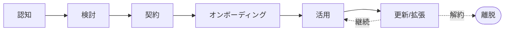
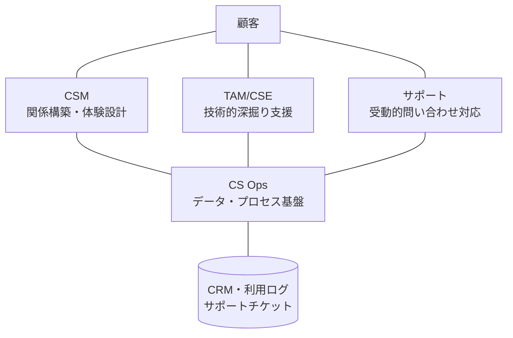

# カスタマーサクセス入門

サブスク時代の顧客成功——契約後の顧客に成果を届け、解約を防ぎ、関係を拡げる

| 項目 | 内容 |
|---|---|
| カテゴリー | マーケティング・営業 |
| 難易度 | 入門 |
| 所要時間 | 約200分（全8レッスン） |
| 公開日 | 2026-05-29 |
| 最終更新日 | 2026-05-30 |
| コースURL | https://skillup.college/courses/marketing-sales/customer-success-basics/ |

## 対象者

「カスタマーサクセス」という言葉は知っているが、本格的に学んだ経験がない社会人。SaaS／サブスク企業で営業・サポート・プロダクトに関わっている方、カスタマーサクセスへのキャリアチェンジを考えている方、CS 組織を立ち上げ・拡張しようとしている経営層・人事担当者、CS を導入する顧客企業側の担当者も対象。営業・マーケ・サポートとの違いを整理して理解したい方にも有用。

## 前提知識

特になし。SaaS／サブスクリプション型サービスの利用経験があると理解が早いが、必須ではない。営業・マーケティング・サポートのいずれかの業務経験があると応用しやすい。

## 学習目標

- カスタマーサクセスの定義と、営業・カスタマーサポートとの違いを説明できる
- サブスクリプション型ビジネスの構造（LTV・チャーン・更新）を理解する
- カスタマー・ライフサイクルと顧客ジャーニーで、契約後の道のりを描ける
- オンボーディング設計とタイム・トゥ・バリューの考え方を実務に応用できる
- ヘルススコアで顧客の状態を見える化する基本ができる
- チャーンの種類と解約防止の基本パターンを身につける
- NPS・CSAT・CES の違いを理解し、カスタマーボイスの収集設計ができる
- エクスパンション・レベニュー（アップセル・クロスセル）と NRR の考え方を持てる
- CSM・CS Ops の役割と、生成AI 時代の CS の動向を把握する

## コース概要

「カスタマーサクセス」という言葉は、SaaS／サブスクリプション型ビジネスの広がりとともに、いまや営業・マーケティング・サポートと並ぶ標準的な機能名になりました。一方で、「結局何をする仕事か」「営業の延長ではないのか」「サポートとどう違うのか」と問われたとき、明確に答えられる人は意外と少ないものです。本コースは、CS の定義と組織内での位置づけから始め、カスタマー・ライフサイクル、オンボーディング、ヘルススコア、チャーン分析、NPS、エクスパンション・レベニュー、CS 組織と次の動向まで、ビジネスパーソンが「CS の全体像と判断軸」を持ち帰れる構成にしました。事例の派手さや特定ツールに振り回されず、「地道なオペレーション設計」の基本を、現場の感覚も交えて丁寧に押さえます。B2B SaaS を中心に解説しますが、B2C やサブスク以外のビジネスにも応用できる発想を提供します。

## 学習の流れ

レッスン1で、カスタマーサクセスの定義と、営業・サポートとの違い、サブスクリプション・ビジネスの構造を整理します。レッスン2は「全体地図」として、カスタマー・ライフサイクルと顧客ジャーニーを扱います。レッスン3〜4は契約後の最初のフェーズ、オンボーディング設計とヘルススコアによる状態の見える化を学びます。レッスン5でチャーン分析と解約防止、レッスン6でNPSとカスタマーボイスの収集設計、レッスン7でエクスパンション・レベニュー（アップセル・クロスセル・コミュニティ）を扱います。最後のレッスン8で、CS 組織の設計（CSM・CS Ops）と生成AI・PLG など最新動向、コース修了後の学習方向を案内します。前半（レッスン1〜2）は「考え方の土台と全体像」、中盤（レッスン3〜5）は「契約後の運用設計」、後半（レッスン6〜7）は「声を聴き、関係を拡げる」、終盤（レッスン8）は「組織とこれから」という四段構えです。

## レッスン一覧

| No. | タイトル | 概要 | 所要時間 |
|---|---|---|---|
| 1 | カスタマーサクセスとは何か——サブスク時代の顧客成功の考え方 | CSの定義、サブスクリプション型ビジネスとリカーリングレベニュー、LTV、カスタマーサポート・営業との違い、なぜ今CSが必要なのか、日本での普及を学ぶ | 25分 |
| 2 | 顧客ジャーニーとカスタマー・ライフサイクル——契約後の道のりを描く | カスタマー・ライフサイクル（認知→検討→契約→オンボーディング→活用→更新→拡張）、顧客ジャーニーマップ、タッチポイントの設計と運用を学ぶ | 25分 |
| 3 | オンボーディング設計——契約後の最初の90日が勝負 | タイム・トゥ・バリュー、オンボーディングの段階（キックオフ・初期設定・初成功・定着）、ハイタッチ・ロータッチ・テックタッチの使い分け、90日ルールを学ぶ | 25分 |
| 4 | ヘルススコア——顧客の状態を見える化する | ヘルススコアの3要素（使用状況・契約・関係性）、スコアリング設計、グリーン・イエロー・レッドの運用、予兆検知とアクションへの接続を学ぶ | 25分 |
| 5 | チャーン分析と解約防止——「なぜ離れるか」を可視化する | チャーンの定義（自発的／非自発的・カスタマー／レベニュー）、チャーン率の計算、解約理由の構造化（製品・運用・関係性）、解約防止アクションの基本を学ぶ | 25分 |
| 6 | NPS とカスタマーボイス——顧客の声を経営に届ける | NPS（Net Promoter Score）の計算と運用、CSAT・CES との違い、カスタマーボイスの収集と分析、クローズドループ・フィードバックの仕組みを学ぶ | 25分 |
| 7 | エクスパンション・レベニュー——アップセル・クロスセルとコミュニティ | エクスパンション・レベニューの位置づけ、アップセル・クロスセルの設計、パワーユーザーとアドボカシー、カスタマーコミュニティ、NRR（Net Revenue Retention）を学ぶ | 25分 |
| 8 | CS 組織とこれから——CSM・CS Ops・生成AI・次の学習 | CSM の役割と KPI、CS Ops・TAM・サポートとの役割分担、CS プラットフォーム、PLG・生成AI 時代の CS、コース修了後の学習方向を案内する | 25分 |

---

## レッスン1：カスタマーサクセスとは何か——サブスク時代の顧客成功の考え方

（所要時間：25分）

### このレッスンで学ぶこと

- カスタマーサクセス（CS）の定義を理解する
- なぜ今 CS が必要とされているのか、その背景を説明できる
- カスタマーサポート・営業との違いを整理する
- 本コース全体の見取り図を持つ

---

「カスタマーサクセス」という言葉を、ここ数年で何度も耳にしたかもしれません。SaaS 企業の求人、書籍、業界レポート、社内の組織図——さまざまな場面に登場します。しかし、「カスタマーサクセスとは何か」「営業や既存のカスタマーサポートとどう違うのか」と問われたとき、明確に答えられる人は意外と少ないものです。本レッスンでは、よく聞きながらも輪郭が掴みにくい「カスタマーサクセス」という言葉を、現代のビジネスの文脈で整理することから始めます。

### カスタマーサクセスとは

カスタマーサクセス（Customer Success、以下 CS）は、文字通りには「顧客の成功」を意味します。実務上の定義はもう少し具体的で、次のように整理されることが多くなっています。

> 顧客が自社の製品・サービスを通じて、自身のビジネス目標や成果を達成できるよう、能動的・体系的に支援する活動

ポイントは3つあります。

1. **顧客の成果が起点**：自社製品の売上ではなく、顧客の成功を起点に考える
2. **能動的な働きかけ**：顧客が困ったら助ける受動的なサポートではなく、こちらから働きかける
3. **体系的なプロセス**：個別対応ではなく、契約後の道のり全体を設計・運用する

CS は、書籍『Customer Success』（Nick Mehta・Dan Steinman・Lincoln Murphy／Wiley、2016 年）で世界的に広く知られるようになりました。日本では 2018 年前後から本格的に広まり、2020 年代に入って B2B SaaS 企業を中心に標準的な機能となっています。

> **💡 ポイント**
> CS の本質は「顧客がうちの製品で成果を出してくれたら、結果としてうちのビジネスも続く」という発想です。顧客の成功と自社の成功が連動する構造をビジネスに組み込むことで、長期的な関係が築かれます。

### なぜ今、CS が必要なのか

CS が独立した機能として広まった最大の背景は、ビジネスモデルの変化、特に「サブスクリプション型ビジネス」の拡大です。

#### 売り切り型からサブスク型へ

20 世紀後半までのソフトウェアや製品の販売は、基本的に「売り切り型」でした。顧客は製品を一度購入し、所有・利用します。販売した時点で、企業の収益はほぼ確定します。

サブスクリプション型は構造が違います。顧客は月額・年額で利用料を支払い続けます。更新するかどうかの判断は、毎月・毎年やってきます。1 か月使って気に入らなければ解約され、収益は失われます。

この変化が、CS が必要になった根本的な理由です。

#### LTV（顧客生涯価値）という考え方

サブスク型ビジネスでは、ひとりの顧客が将来どれだけの収益をもたらすかを示す指標として LTV（Lifetime Value、顧客生涯価値）が重視されます。簡略化すると次のような関係です。

- 月額料金 × 平均継続月数 − 顧客にかかる原価 ≒ LTV

継続月数が長いほど、LTV は大きくなります。逆に言うと、継続してもらえないと、たとえ多くの顧客を獲得しても、ビジネスは積み上がっていきません。

#### CAC との関係

顧客の獲得には費用がかかります。広告費・営業人件費・販促費などをまとめて CAC（Customer Acquisition Cost、顧客獲得コスト）と呼びます。

CAC を回収するには、LTV が CAC を十分に上回る必要があります。SaaS 業界では「LTV ÷ CAC が 3 以上が健全」といった目安が語られることもありますが、業界・事業ステージで大きく変動します。

ポイントは、LTV を伸ばす活動が、ビジネス全体の健全性を支えるということです。CS は、契約後の顧客を伸ばすことで、LTV を最大化する役割を担います。

> **🔰 初学者の方へ**
> 「営業ががんばって獲ってきた顧客がすぐ解約してしまう」状態は、サブスク型ビジネスでは致命的です。穴の空いたバケツで水を汲み続けるようなもの。CS は「バケツの穴を塞ぐ」「バケツを大きくする」役割を担います。

### CS、カスタマーサポート、営業——3 つの違い

CS は、よく似た既存の機能と混同されます。違いを整理します。

#### CS とカスタマーサポートの違い

カスタマーサポート（CS と呼ばれることもありますが、本コースではサポートと表記）は、顧客からの問い合わせやトラブルに対応する受動的な役割が中心です。顧客が困ったら答える、不具合があれば対処する——これがサポートの基本です。

カスタマーサクセスはより能動的です。顧客が困る前に働きかけ、製品の活用度を高め、成果につなげていく。サポートが「火が付いてから消す」のに対し、CS は「火が付かないようにする」役割と言えます。

両者は対立するのではなく、補完関係にあります。多くの SaaS 企業では、両方を別チームとして持ち、連携して顧客に向き合っています。

#### CS と営業の違い

営業は、新規顧客を獲得することが主な役割です。アポイント取得・商談・契約締結まで——契約前のフェーズが中心です。

CS は契約後を担います。営業がバトンを渡した後、顧客が実際に製品で成果を出せるよう支援するのが CS です。

ただし、CS の活動の中で「アップセル（上位プランへの変更）」「クロスセル（別製品の追加販売）」が発生することがあります。この意味では「契約後の営業活動」とも捉えられますが、本質は「顧客の成果と相関する形で売上が伸びる」ことなので、純粋な営業とは性格が異なります。レッスン7 で詳しく扱います。

#### 3 つの役割の整理

| 役割 | フェーズ | スタンス | KPI の例 |
|---|---|---|---|
| 営業 | 契約前 | 能動的 | 新規受注額・受注件数 |
| カスタマーサクセス | 契約後 | 能動的 | 継続率・NRR・活用度 |
| カスタマーサポート | 契約後 | 受動的 | 一次解決率・回答時間 |

> **💡 ポイント**
> 3 つの役割は、組織として明確に分けられている場合もあれば、小規模なスタートアップでは 1 人が兼任することもあります。重要なのは「どの帽子をかぶって今動いているか」を意識すること。同じ顧客との対話でも、営業の帽子なのか、CS の帽子なのかで、向き合い方が変わります。

### 「顧客が成功する」とはどういうことか

CS の中心テーマである「顧客の成功」とは、具体的に何を指すのでしょうか。これは製品や業界によって異なり、定義の出発点が現場の判断にゆだねられる難しさがあります。

#### 製品によって成功の意味は違う

- 営業支援 SaaS：受注率の改善、商談数の増加
- 経費精算 SaaS：処理工数の短縮、精算ミスの減少
- マーケティングオートメーション：リード獲得効率、ナーチャリング成果
- 人事評価 SaaS：評価プロセスの短縮、評価制度の運用定着

導入企業の業界、規模、目的によっても変わります。同じ営業支援 SaaS でも、新規開拓を主目的にしている企業と、既存顧客の管理を主目的にしている企業では、「成功」の中身が違います。

#### 「契約時の期待」を起点にする

実務的な指針として、「契約時に顧客が期待していた成果」を起点にするのが基本です。契約前の営業フェーズで、顧客が何を達成したくて製品を導入するのかを共有し、それを CS のチームが引き継ぎます。

「契約時の期待」と「実際の活用」が一致していない場合、解約の原因になります。レッスン5 でチャーン分析を扱いますが、ここでも「期待のすり合わせ」が頻繁に登場します。

> **🔰 初学者の方へ**
> 「うちの製品はこんなに良い機能があります」というスタンスではなく、「お客様は何ができるようになりたいですか」と問うのが CS の出発点です。製品中心の発想ではなく、顧客中心の発想に立つ——これが営業から CS へキャリアチェンジする人が最初に戸惑う点でもあります。

### 日本での普及と現在地

日本での CS の普及は、米国に約 5 年遅れたと言われます。

- 2016 年前後：『カスタマーサクセス』日本語版（英治出版、2018 年）の登場前後で、IT 業界の先進企業が導入開始
- 2018〜2019 年：SaaS スタートアップを中心に「CSM」のポジションが本格的に登場
- 2020〜2022 年：コロナ禍によるリモートワーク・SaaS 利用拡大で、CS の重要性が広く認識される
- 2023 年〜：CS は B2B SaaS の標準機能となり、コミュニティ（SaaSCSPN、CS HACK など）も拡大
- 2025〜2026 年：生成AI 時代の CS、CS Ops の整備、PLG との関係といった新たな論点が議論されている

日本独自の文脈として、「もともと日本企業はアフターサービスが手厚い」「終身的な関係を重視する商慣行がある」といった土台があり、CS の発想は日本企業に馴染みやすい面もあると言われています。

> **📝 補足**
> 日本では「CS」がカスタマーサポートとカスタマーサクセスの両方を指す場合があり、紛らわしいケースがあります。本コースでは、特に断らない限り「CS＝カスタマーサクセス」とします。サポートを指すときは「カスタマーサポート」「サポート」と明示します。

### 本コースの全体像

本コースは 8 レッスンで構成されています。

- **レッスン2**：顧客ジャーニーとカスタマー・ライフサイクル——契約後の道のりを描く
- **レッスン3**：オンボーディング設計——契約後の最初の90日が勝負
- **レッスン4**：ヘルススコア——顧客の状態を見える化する
- **レッスン5**：チャーン分析と解約防止——「なぜ離れるか」を可視化する
- **レッスン6**：NPS とカスタマーボイス——顧客の声を経営に届ける
- **レッスン7**：エクスパンション・レベニュー——アップセル・クロスセルとコミュニティ
- **レッスン8**：CS 組織とこれから——CSM・CS Ops・生成AI・次の学習

前半（レッスン1〜2）は「考え方の土台と全体像」、中盤（レッスン3〜5）は「契約後の運用設計」、後半（レッスン6〜7）は「声を聴き、関係を拡げる」、終盤（レッスン8）は「組織とこれから」、という四段構えです。

本コースは B2B SaaS を中心に説明しますが、B2C やサブスク以外のビジネスでも応用できる発想を扱います。

> **💡 ポイント**
> CS は「やり方」の知識だけ覚えても、現場では機能しません。「なぜそれをやるか」という構造的な理解が大事です。本コースは、各レッスンで「なぜ」を必ず添えるよう書いています。

### まとめ

このレッスンでは、以下のことを学びました。

- カスタマーサクセス（CS）は、顧客が製品・サービスを通じて成果を達成できるよう、能動的・体系的に支援する活動
- 背景にあるのは、売り切り型からサブスク型ビジネスへのシフト。LTV と CAC の構造が CS を必要にした
- CS は「火を付かないようにする」、サポートは「火を消す」、営業は「契約前」を担う、補完関係
- 「顧客の成功」の定義は、製品・業界・顧客ごとに異なる。「契約時の期待」を起点に運用する
- 日本では 2018 年前後から本格的に広まり、現在は B2B SaaS の標準機能
- 本コースは「考え方の土台 → 運用設計 → 声を聴き関係を拡げる → 組織とこれから」の四段構え

次のレッスンでは、CS の全体地図にあたる「カスタマー・ライフサイクル」と「顧客ジャーニー」を扱います。契約後の顧客がどんな道のりを辿るのか、どこで CS が介入するのかを描く力をつけていきます。

---

### 確認クイズ

このレッスンの理解度をチェックしましょう。

#### Q1. カスタマーサクセスの定義として最も適切なものはどれか？

- [x] 顧客が自社の製品・サービスを通じて、自身のビジネス目標や成果を達成できるよう、能動的・体系的に支援する活動
- [ ] 顧客からの問い合わせやトラブルを受動的に対応する活動
- [ ] 新規顧客を獲得するための営業活動全般
- [ ] 製品の機能を増やしてマーケットシェアを拡大する活動

> **解説**
> カスタマーサクセスは、顧客の成果を起点に、能動的・体系的に支援する活動です。受動的な問い合わせ対応はカスタマーサポート、新規獲得は営業、機能拡張はプロダクト開発の仕事で、CS とは異なる役割です。

#### Q2. CS が独立した機能として広まった最大の背景として最も適切なものはどれか？

- [ ] 売り切り型ビジネスの拡大
- [x] サブスクリプション型ビジネスの拡大と、LTV を中心とした収益構造の変化
- [ ] AI による業務自動化の普及
- [ ] 国際的な品質規格の標準化

> **解説**
> CS が独立機能として広まった最大の背景は、サブスクリプション型ビジネスの拡大です。継続利用してもらえないとビジネスが積み上がらない構造になり、契約後の顧客成功を支援する CS が必要になりました。LTV を最大化する活動として位置づけられます。

#### Q3. CS とカスタマーサポートの違いとして最も適切なものはどれか？

- [ ] CS は無料、サポートは有料である
- [ ] CS は中堅層向け、サポートは新人向けの仕事である
- [ ] CS は対面、サポートはオンラインで行う
- [x] サポートは顧客が困ったら答える受動的役割、CS は顧客が困る前に働きかける能動的役割

> **解説**
> サポートは「火が付いてから消す」受動的な役割、CS は「火が付かないようにする」能動的な役割です。両者は対立ではなく補完関係にあり、多くの企業では別チームとして連携しています。

#### Q4. CS と営業の違いとして最も適切なものはどれか？

- [ ] 両者は同じ意味で、呼び方が違うだけ
- [ ] 営業は契約後、CS は契約前を担当する
- [x] 営業は契約前の獲得、CS は契約後の顧客成果支援を主な役割とする
- [ ] CS は技術的、営業は人間関係を中心に動く

> **解説**
> 営業は契約前の新規獲得が主役割、CS は契約後の顧客成果支援が主役割です。CS の中でアップセル・クロスセルが発生することはありますが、本質は「顧客の成果と相関する形で売上が伸びる」点にあり、純粋な営業とは性格が異なります。

#### Q5. 「顧客の成功」の定義について本レッスンが示した実務的な指針として最も適切なものはどれか？

- [ ] すべての顧客に同じ成功定義を当てはめる
- [x] 「契約時に顧客が期待していた成果」を起点にする
- [ ] 自社の売上目標を達成することが顧客の成功である
- [ ] 顧客の声を聞かず、業界平均で機械的に判断する

> **解説**
> 「顧客の成功」の中身は製品・業界・顧客ごとに異なります。実務的な指針として、「契約時に顧客が期待していた成果」を起点にすることが基本で、契約時の期待と実際の活用が一致していないことが多くの解約の原因にもなります。

#### Q6. 本レッスンの講師の現場メモで強調された、CS とサポートの違いを語るメタファーとして最も適切なものはどれか？

- [ ] CS は雨を降らせ、サポートは傘を貸す
- [ ] CS は壁を作り、サポートはドアを開ける
- [x] CS は火が付かないようにし、サポートは火を消す
- [ ] CS は橋を渡り、サポートは川を作る

> **解説**
> 講師は「サポートは火が付いた後の対応で優秀、CS は火が付かないようにする活動として別に必要」というメタファーを使って経営層に説明しました。両者は別物ですが、両方やってはじめて顧客が長く使ってくれます。

---

## レッスン2：顧客ジャーニーとカスタマー・ライフサイクル——契約後の道のりを描く

（所要時間：25分）

### このレッスンで学ぶこと

- カスタマー・ライフサイクルの全体像を描けるようになる
- 顧客ジャーニーマップの基本要素を理解する
- 契約後の主要なタッチポイントを設計する発想を身につける
- ライフサイクルと CS の介入ポイントの関係を把握する

---

レッスン1では、カスタマーサクセスの定義と、営業・サポートとの違いを整理しました。本レッスンでは、CS の全体地図にあたる「カスタマー・ライフサイクル」と「顧客ジャーニー」を扱います。地図がなければ、どこで何をすべきかは決まりません。CS の仕事は、顧客がどんな道のりを辿るかを描き、その各地点でどう関わるかを設計することから始まります。

### カスタマー・ライフサイクルの 6 段階

カスタマー・ライフサイクル（Customer Lifecycle）は、顧客と自社の関係の時間的な経過を段階に分けて捉える考え方です。実務では 5〜7 段階に整理されることが多く、本コースでは次の 6 段階で扱います。

1. **認知（Awareness）**：顧客が自社のことを知る
2. **検討（Consideration）**：顧客が導入を検討する
3. **契約（Purchase）**：契約が締結される
4. **オンボーディング（Onboarding）**：初期設定・初成功までの期間
5. **活用（Adoption）**：日常的に製品を使い成果を出している期間
6. **更新／拡張（Renewal / Expansion）**：契約更新と追加購入



この図は、認知から始まり、契約・オンボーディング・活用を経て、更新と拡張へ進む流れと、更新時点で「継続」「拡張」「離脱（解約）」に分岐することを示しています。CS の主戦場は、点線部分を含めた「契約後のすべての段階」です。

#### 営業 / マーケと CS の責任範囲

ライフサイクル上、責任分担の目安は次のとおりです。

- 認知 → マーケティング
- 検討 → マーケティング・営業
- 契約 → 営業
- オンボーディング → CS（一部営業や導入支援チーム）
- 活用 → CS
- 更新／拡張 → CS（営業と連携）

組織構造により細部は変わりますが、「契約以降は CS が主役」というのが標準的な整理です。

> **💡 ポイント**
> CS は、契約後の活動を「点」ではなく「線（ライフサイクル全体）」で捉えます。1 回の対応の善し悪しではなく、ライフサイクル全体での体験設計が成果を決めます。

### なぜライフサイクルで考えるか

ライフサイクルという視点を持つメリットは大きく 3 つあります。

#### メリット1：状態に応じた対応ができる

オンボーディング期と活用期では、顧客の悩みも CS の役割も異なります。同じ「うまくいかない」という訴えでも、オンボーディング期なら設定の問題、活用期なら運用習慣の問題、ということが多くなります。

状態を識別すれば、対応を変えられます。これがライフサイクルで考える出発点です。

#### メリット2：先回りができる

「いまの顧客はどの段階にいるか」がわかれば、次に何が起きるかを予測できます。オンボーディング期の顧客には、活用期に入る前の準備を促せます。活用期に入った顧客には、更新前の振り返り面談を計画できます。

CS の能動性は、ライフサイクル上の「先回り」によって発揮されます。

#### メリット3：チームで共通言語を持てる

「あの顧客はオンボーディング中」「この顧客は活用期に入った」と段階で語れると、チーム内で状況を素早く共有できます。属人的な感覚ではなく、組織的な対応が可能になります。

> **🔰 初学者の方へ**
> ライフサイクルは難しい概念に見えるかもしれませんが、要するに「いまどこにいるか」を捉える地図です。地図がなければ目的地に着けません。明日からの業務でも「この顧客はどの段階か」と問う習慣を持つと、見え方が変わります。

### 顧客ジャーニーマップ

カスタマー・ライフサイクルが時間的な「段階」を捉えるのに対し、顧客ジャーニーマップ（Customer Journey Map）は、その段階の中で顧客が何を考え、何を感じ、何をしているかを描く視覚化ツールです。マーケティング・UX デザインの領域でよく使われ、CS でも応用されています。

#### 顧客ジャーニーマップの基本要素

典型的な顧客ジャーニーマップは、次のような要素で構成されます。

1. **ステージ**：ライフサイクルの段階
2. **顧客の行動**：その段階で顧客がする行動
3. **顧客の思考**：何を考えているか
4. **顧客の感情**：どう感じているか（不安・期待・困惑など）
5. **タッチポイント**：自社と顧客が接する接点
6. **痛み（ペインポイント）**：そこで顧客が困りやすいこと
7. **機会**：自社が介入して価値を提供できる機会

これらを行列で並べて、ステージごとに 1 列ずつ埋めていくのが基本形式です。

#### ジャーニーマップ作成の効果

ジャーニーマップを作ると、見えてくるものがいくつかあります。

- 自社が「どの瞬間に」「何を提供しているか」が一目でわかる
- 一方で「どこに穴があるか」も明確になる
- 顧客視点で物事を語れる共通言語ができる
- 部門横断で「ここの体験を誰が持つか」を議論できる

完璧なジャーニーマップを最初から作る必要はありません。1 つのセグメントについて、簡易な版を作って改訂を重ねるのが現実的です。

> **📝 補足**
> 顧客ジャーニーマップは、業界・製品・顧客セグメントごとに作るのが理想です。同じ製品でも、エンタープライズ向けと中小企業向けでは旅の道のりが大きく違うからです。1 つの「決定版」を目指すより、複数の地図を持つほうが実用的です。

### タッチポイントの設計

タッチポイント（Touchpoint）は、顧客と自社が接する接点のことです。CS が設計する主なタッチポイントを段階別に整理します。

#### オンボーディング期のタッチポイント

- キックオフ・ミーティング（契約直後の正式な顔合わせ）
- 初期設定のサポート（オンライン会議・チャット・ドキュメント）
- 初成功体験のための伴走（最初の成果を一緒に作る）
- オンボーディング完了の確認とフィードバック

#### 活用期のタッチポイント

- 定期面談（月次・四半期）
- ヘルススコアに基づくアラート対応
- 新機能のお知らせと活用相談
- ユーザー向けセミナー・ウェビナー
- ニュースレター・コミュニティ

#### 更新／拡張期のタッチポイント

- 更新前の振り返り面談（QBR：Quarterly Business Review）
- 成果報告書（顧客が出した成果の言語化）
- 拡張提案
- 更新後のお礼と次期計画

すべての顧客にすべてのタッチポイントを提供するわけではありません。次のレッスン3で扱う「ハイタッチ・ロータッチ・テックタッチ」の使い分けが基本になります。

> **💡 ポイント**
> タッチポイントを設計するときは、「数を増やす」のではなく「タイミングと中身を整える」発想が大事です。連絡が多すぎると顧客は煙たがり、少なすぎると関係が希薄になります。「ちょうどよさ」を顧客セグメントごとに探していくのが CS の腕の見せ所です。

### ライフサイクル上の重要な瞬間

ライフサイクル全体の中で、特に CS が意識すべき「重要な瞬間」がいくつかあります。

#### 重要な瞬間1：契約直後

契約直後は、顧客の期待が最も高い瞬間です。同時に、不安も大きい瞬間でもあります。「本当にこれで成果が出るのか」という疑念は、契約直後に最も強く残っています。

ここでの初動が、その後の関係を大きく左右します。レッスン3 で詳しく扱います。

#### 重要な瞬間2：「初成功」を体験するとき

製品を使い始めて、初めて顧客が「使ってよかった」と思える瞬間。「アハ・モーメント（aha moment）」とも呼ばれます。ここを早く・確実に作ることが、定着の鍵です。

#### 重要な瞬間3：習慣化のフェーズ

毎日／毎週、自然に製品を使う状態に入った段階。ここまで来れば解約リスクは大きく下がりますが、機能更新や運用変更によって離脱しないよう、活用を支え続ける必要があります。

#### 重要な瞬間4：契約更新の数か月前

更新のタイミングは、顧客にとっても自社にとっても「考え直すチャンス」です。「このまま続けるか」「上位プランに切り替えるか」「他社の提案を聞くか」が天秤にかけられます。

更新の数か月前から振り返り面談を設定し、成果を一緒に確認するのが標準的な動きです。

#### 重要な瞬間5：担当者の交代

顧客側の担当者が交代する瞬間は、関係性が一からやり直しになる可能性があります。新担当者は前任者の評価を引き継ぎますが、自分の言葉で価値を語れないと、解約候補として再評価されることがあります。

> **⚠️ 注意**
> 担当者交代は CS の盲点になりやすい瞬間です。前任者と築いた信頼関係が、新任者には引き継がれないことが多い。新任者向けの再オンボーディングを意識的に提供すると、解約リスクが減ります。

### ジャーニー設計の典型的な失敗

ジャーニー設計でよくある失敗を、3 つ挙げます。

#### 失敗1：自社視点になってしまう

「うちはここで連絡する」「うちはここで会議する」と、自社が何をするかだけを描くと、ジャーニーマップは内部マニュアルにしかなりません。顧客が何を考え、何に困っているかを中心に置く視点が必要です。

#### 失敗2：完璧を目指して動けない

「全顧客セグメント・全段階を網羅したジャーニーマップを作る」とプロジェクトが終わりません。1 セグメントの 1 段階から始めて、運用しながら改訂するのが実用的です。

#### 失敗3：作って終わり

ジャーニーマップは、作って壁に貼って終わるものではありません。月次・四半期で見直し、実際の顧客の声と照らし合わせて修正するのが基本です。

> **🔰 初学者の方へ**
> 「まずは雑でいいから 1 枚描いてみる」のが、ジャーニーマップ作成の鉄則です。完璧を目指さず、A4 紙 1 枚に手書きで 1 セグメントを描くところから始めてみてください。話題にすれば、自然と議論が広がります。

### オンライン・リモート時代のジャーニー

近年は、リモートワークの普及で、顧客側の動きも変化しました。

- 対面の打ち合わせが減り、オンライン会議が標準
- 顧客社内の意思決定者と、現場利用者が物理的に離れている
- ドキュメント・ナレッジベースが「顔の見えない顧客」への接点として重要

ジャーニー設計においても、対面前提のタッチポイントだけでなく、非同期・非対面のタッチポイントを織り込む必要があります。具体的には：

- 動画オンボーディング（顧客が好きな時間に見られる）
- ナレッジベース・ヘルプセンター
- アプリ内ガイド（ツアー機能、ヒント表示）
- コミュニティ（顧客同士の助け合い）

これらを使い分けることで、CS チームの工数を抑えつつ、多くの顧客に体験を届けられます。

### まとめ

このレッスンでは、以下のことを学びました。

- カスタマー・ライフサイクルは、認知 → 検討 → 契約 → オンボーディング → 活用 → 更新／拡張 の 6 段階
- CS の主戦場は「契約以降」のすべての段階
- ライフサイクル視点を持つメリットは、状態に応じた対応・先回り・チームの共通言語
- 顧客ジャーニーマップは、各段階で顧客の行動・思考・感情・タッチポイント・痛みを描くツール
- タッチポイントは段階別に設計する。「数」より「タイミングと中身」が大事
- 重要な瞬間は、契約直後・初成功・習慣化・更新前・担当者交代
- 自社視点・完璧主義・作って終わりは典型的な失敗パターン
- リモート時代は非同期・非対面のタッチポイント設計も必須

次のレッスンでは、ライフサイクルの中で最も重要な「オンボーディング設計」を深掘りします。契約後の最初の 90 日が、その後の関係をほぼ決めると言われる理由と、タイム・トゥ・バリュー、ハイタッチ／ロータッチ／テックタッチの使い分けを学びます。

---

### 確認クイズ

このレッスンの理解度をチェックしましょう。

#### Q1. 本レッスンが示したカスタマー・ライフサイクルの 6 段階として正しい組み合わせはどれか？

- [x] 認知 → 検討 → 契約 → オンボーディング → 活用 → 更新／拡張
- [ ] 営業 → マーケ → サポート → CS → 経営 → 撤退
- [ ] 計画 → 実行 → 監視 → 改善 → 標準化 → 引退
- [ ] 訓練 → 実践 → 成果 → 評価 → 表彰 → 退場

> **解説**
> 本レッスンが示したライフサイクルは「認知 → 検討 → 契約 → オンボーディング → 活用 → 更新／拡張」の 6 段階で、CS の主戦場は契約以降のすべての段階です。

#### Q2. ライフサイクル視点を持つメリットとして本レッスンで挙げられたものはどれか？

- [ ] 顧客に同じ対応を一律で提供できる
- [x] 状態に応じた対応・先回り・チームの共通言語が可能になる
- [ ] すべての顧客対応を自動化できる
- [ ] 営業の活動を CS が肩代わりできる

> **解説**
> 3 つのメリットは、状態に応じた対応・先回り・チームの共通言語です。「いまどこにいるか」を捉えることで、属人的でなく組織的な対応が可能になります。

#### Q3. 顧客ジャーニーマップの基本要素として本レッスンで紹介されていないものはどれか？

- [ ] 顧客の行動・思考・感情
- [ ] タッチポイント
- [x] 競合製品の価格表
- [ ] 痛み（ペインポイント）と機会

> **解説**
> ジャーニーマップの基本要素は、ステージ・顧客の行動・思考・感情・タッチポイント・痛み・機会の 7 つです。競合価格表は別の分析手段で、ジャーニーマップの構成要素ではありません。

#### Q4. タッチポイント設計の発想として本レッスンが示した姿勢として最も適切なものはどれか？

- [ ] とにかく数を増やすことが正解
- [x] 「数」より「タイミングと中身」を整えること
- [ ] 全顧客に同じタッチポイントを提供する
- [ ] タッチポイントは少なければ少ないほどよい

> **解説**
> タッチポイント設計は「数を増やす」のではなく「タイミングと中身を整える」発想が大事です。連絡が多すぎると顧客は煙たがり、少なすぎると関係が希薄になります。「ちょうどよさ」を探していくのが CS の役割です。

#### Q5. ライフサイクル上の「重要な瞬間」として本レッスンで挙げられていないものはどれか？

- [ ] 契約直後
- [ ] 初成功（アハ・モーメント）を体験するとき
- [ ] 担当者の交代
- [x] 競合他社の決算発表のタイミング

> **解説**
> 本レッスンで挙げられた重要な瞬間は、契約直後・初成功・習慣化のフェーズ・契約更新の数か月前・担当者の交代の 5 つです。競合他社の決算は CS の介入ポイントではありません。

#### Q6. ジャーニー設計の典型的な失敗として本レッスンで挙げられていないものはどれか？

- [ ] 自社視点で書いてしまう
- [ ] 完璧を目指して動けなくなる
- [ ] 作って壁に貼って終わる
- [x] チーム全員で共有する

> **解説**
> 失敗パターンは、自社視点になる・完璧を目指して動けない・作って終わる、の 3 つです。チーム全員で共有することは推奨されるアプローチで、失敗ではありません。

---

## レッスン3：オンボーディング設計——契約後の最初の90日が勝負

（所要時間：25分）

### このレッスンで学ぶこと

- オンボーディングの目的とタイム・トゥ・バリューの考え方を理解する
- オンボーディングの 4 段階（キックオフ・初期設定・初成功・定着）を把握する
- ハイタッチ・ロータッチ・テックタッチの使い分けを身につける
- 「90 日ルール」の意味と実務への応用を学ぶ

---

レッスン2では、カスタマー・ライフサイクル全体と顧客ジャーニーを扱いました。本レッスンからは、その中の重要フェーズを 1 つずつ深掘りしていきます。最初は、契約直後のフェーズ「オンボーディング」です。CS の世界では「最初の 90 日で関係が決まる」とも言われる、もっとも重要な期間です。

### オンボーディングとは

オンボーディング（Onboarding）は、英語の「on board（乗船する）」が語源で、新しいメンバーが組織やサービスに馴染んでいくプロセスを指します。

CS の文脈では、契約締結から「顧客が日常的に製品を使い成果を出している状態」までを指します。具体的には次のような活動が含まれます。

- キックオフ・ミーティング
- 初期設定・データ移行・連携設定の支援
- 利用者向けトレーニング
- 「初成功」体験への伴走
- 定着までのフォローアップ

オンボーディング期間は、製品の複雑さや顧客規模によって変わります。シンプルなツールなら数日、エンタープライズ向けの基幹システムなら半年〜1 年というケースもあります。本コースでは中規模 B2B SaaS を念頭に、「30〜90 日」を典型として説明します。

### なぜオンボーディングが重要か

オンボーディングの良し悪しが、その後の関係をほぼ決める——これは CS 業界での経験則として広く語られています。

#### 早期解約はオンボーディングで決まる

契約 6 か月以内に解約する顧客の多くは、オンボーディングがうまくいかなかった顧客です。「設定が複雑で使えなかった」「期待していた成果が出なかった」「社内で広がらなかった」など、原因の多くはこの期間に作られます。

#### 「習慣化」が長期継続の鍵

人間が新しい行動を習慣にするには、一定期間の継続が必要だと心理学の研究で示されています。製品の利用も同じで、毎日・毎週使う習慣がつくまで支えることが、定着の要です。

#### 「初期投資」の最も重要なリターン

オンボーディングは CS の活動の中でも最もコストがかかる期間です。しかし、ここに投資しないと、その後の解約や活用度の低さで何倍にもなって跳ね返ってきます。「あとで丁寧にしよう」では取り返せない時期です。

> **💡 ポイント**
> 「最初の 90 日が勝負」という言葉は、契約後 90 日以内の行動が、その後数年の関係を決めるという経験則です。この期間に集中投資する設計を持つことが、CS の基本姿勢です。

### タイム・トゥ・バリュー（TTV）

オンボーディング設計の中心となる概念が「タイム・トゥ・バリュー（Time to Value、TTV）」です。「顧客が製品を使い始めてから、最初の価値を実感するまでの時間」を指します。

#### なぜ TTV が重要か

TTV が短い顧客は、

- 製品の良さを実感しやすい
- 社内に広めるための材料を持ちやすい
- 解約リスクが低くなる

逆に、TTV が長い顧客は、

- 「使えるようになる前に挫折する」可能性が高い
- 上司や同僚から「成果はまだ？」と圧力を受ける
- 期待が冷めて温度が下がる

TTV を短くする工夫が、オンボーディング設計の核心になります。

#### TTV を短くするコツ

- **最初の「成功体験」を小さく設定する**：すべての機能を使いこなすことではなく、「1 つの業務がこれで楽になった」と感じる小さな成功
- **初期設定を最小化する**：すぐに使い始められる状態をデフォルトに
- **チュートリアル・サンプルデータを充実させる**：「白紙の画面に何を入れればいい？」を解消
- **ハンズオン形式のトレーニング**：説明より体験を優先

> **🔰 初学者の方へ**
> TTV を短くすることと、「製品の全機能を理解させる」ことは別です。むしろ「全機能を理解させよう」とすると、TTV は長くなります。最初は「1 つの成果」を素早く出すことを目指し、機能の幅は段階的に広げていくのが基本です。

### オンボーディングの 4 段階

オンボーディングは、次の 4 段階で設計するのが基本です。

#### 段階1：キックオフ（契約直後〜1 週間）

契約直後の正式な顔合わせです。営業から CS への引き継ぎをこの場で済ませ、関係者全員で次の項目を確認します。

- 顧客が達成したい成果（契約時の期待）
- 利用するチーム・メンバー
- スケジュールとマイルストーン
- 連絡体制（誰が窓口か、どんなチャネルを使うか）

キックオフは「正式な開始の合図」です。曖昧にすると、その後の活動がすべて曖昧になります。

#### 段階2：初期設定（1 週間〜1 か月）

製品を使えるようにするための、設定・データ移行・連携の段階です。具体的には：

- アカウント発行・権限設定
- マスタデータの登録（顧客リスト・組織情報など）
- 既存システムとの連携（API・SSO・SFA／CRM など）
- 利用者向けトレーニング

技術的な作業が多く、CS だけでなくサポートや実装支援チームと連携することが多くなります。

#### 段階3：初成功（1 か月〜2 か月）

「使い始めた」だけでなく、「使って成果が出た」最初の体験を作る段階です。例えば：

- 営業支援 SaaS なら、最初の 1 件の受注に貢献
- 経費精算 SaaS なら、初月の精算処理を完了
- マーケティング SaaS なら、1 回目のキャンペーン配信を実施

ここで顧客が「使ってよかった」と感じる体験を作れるかが、最大の山場です。

#### 段階4：定着（2 か月〜3 か月）

初成功を経て、毎日・毎週の業務に組み込まれる段階です。利用者の活用度を継続的に観察し、停滞しそうな兆候があれば声がけします。

定着が確認できれば、オンボーディング完了です。ここから先は「活用期」になり、定例の振り返りやヘルススコア管理が中心になります。

> **💡 ポイント**
> 4 段階は順次進むものですが、重なる場合もあります。例えば、初期設定の途中で初成功が見えてくるケース、定着の中で次のステップに進む顧客など、現実は単純な階段ではありません。「いまどの段階に重点があるか」を意識するのが実用的です。

### オンボーディングのチェックポイント

オンボーディングを「終わり」と判断するためのチェックポイントを、いくつか定型化しておくと運用しやすくなります。

- 主要ユーザー全員がアカウントを発行され、ログインしている
- 必要なマスタデータが登録されている
- 「初成功」と定義した業務が、最低 1 回完了している
- 主要ユーザーが過去 1 週間以内に製品を利用している
- 顧客側の責任者と、オンボーディング完了を相互確認している

これらをスコアカード化して、顧客ごとに進捗を可視化するのが標準です。

### ハイタッチ・ロータッチ・テックタッチ

CS の世界では、顧客への関わり方を 3 つに分類する考え方があります。

#### ハイタッチ（High Touch）

担当 CSM が個別に密に関わるアプローチ。エンタープライズ顧客、高額契約、戦略的に重要な顧客が対象です。

- 定期的な対面・オンライン面談
- カスタムされた支援
- 経営層も巻き込んだ関係構築

#### ロータッチ（Low Touch）

ある程度の個別対応はするが、効率を意識したアプローチ。中規模顧客や、複数顧客を 1 人の CSM がカバーする場合が中心です。

- 共通の定例（複数社をまとめた説明会など）
- ライト版の個別面談
- メール・チャットでの状況確認

#### テックタッチ（Tech Touch）

人手をかけず、製品やコンテンツで顧客との関係を維持するアプローチ。小規模顧客や、規模が大きすぎて個別対応できない場合に使います。

- アプリ内ガイド・ツアー
- 自動メール・通知
- ナレッジベース・ヘルプセンター
- コミュニティ・FAQ
- ウェビナー・動画

#### 使い分けの発想

3 つの分類は、顧客セグメント（契約額・規模・戦略性）で固定的に決めるのが古典的な発想ですが、現代では「同じ顧客でも段階によって変える」発想が広がっています。

- オンボーディング期はハイタッチ
- 活用期に入ったらロータッチ
- 安定的に使えている顧客はテックタッチ中心

「いつ・どこで・どう接するか」を、顧客の状態とフェーズで動的に組み立てる——これがジャーニー・オーケストレーション（journey orchestration）と呼ばれる近年の発想です。

> **📝 補足**
> 3 つの分類は、CSM 1 人がカバーする顧客数（ratio）を意識した運用設計に直結します。ハイタッチは 1 人で数社、ロータッチは 1 人で数十社、テックタッチは 1 人で数百社という違いが目安として語られます。組織の経済性を考えるうえで重要な視点です。

### オンボーディングで起こりがちな失敗

オンボーディングの失敗パターンを 3 つ紹介します。

#### 失敗1：「自社の都合」で進める

「うちのプロセスはこうです」「次はこのステップです」と、自社の手順を押し付ける形になると、顧客は「業務に合わない」「窮屈」と感じます。顧客の業務リズムに合わせる柔軟性が必要です。

#### 失敗2：機能説明に終始する

「この機能はこう使えます」「次にこの画面で…」と機能を順番に説明する形になると、顧客は「結局自分の業務でどう使うのか」がわかりません。機能ではなく、業務シーンを起点に説明する発想が大事です。

#### 失敗3：「終わり」が曖昧

オンボーディングを終わりにせず、ずっと「初期支援」が続いてしまうケース。CS 側のリソースが消耗し、活用期への移行も曖昧になります。明確なチェックポイントを設けて、「完了した」と相互確認することが必要です。

> **⚠️ 注意**
> オンボーディングを「親切なつもりで延ばす」のは、必ずしも顧客のためになりません。顧客にも「自分たちで使いこなしている」状態に早く到達するメリットがあります。区切りを明確にすることが、両者にとって健全です。

### まとめ

このレッスンでは、以下のことを学びました。

- オンボーディングは、契約から顧客が日常的に成果を出す状態までの期間。CS の最重要フェーズ
- タイム・トゥ・バリュー（TTV）を短くする設計が中心。「全機能の理解」ではなく「最初の成功体験」が目標
- 4 段階：キックオフ・初期設定・初成功・定着
- ハイタッチ・ロータッチ・テックタッチを、顧客セグメントとライフサイクル段階で使い分ける
- 「90 日ルール」は、契約後 90 日の行動がその後の関係を決めるという経験則
- 失敗パターンは、自社都合・機能説明中心・終わりが曖昧
- チェックポイント可視化が、組織で揃える基盤になる

次のレッスンでは、オンボーディング後の活用期の中核となる「ヘルススコア」を扱います。顧客の状態を見える化し、停滞や離脱の予兆を早期に発見する仕組みを学びます。

---

### 確認クイズ

このレッスンの理解度をチェックしましょう。

#### Q1. タイム・トゥ・バリュー（TTV）の意味として最も適切なものはどれか？

- [x] 顧客が製品を使い始めてから、最初の価値を実感するまでの時間
- [ ] 製品を契約してから請求書が届くまでの時間
- [ ] 顧客が解約を申し出てから解約処理が完了するまでの時間
- [ ] 営業がアポイントを取ってから契約に至るまでの時間

> **解説**
> TTV（Time to Value）は、顧客が製品を使い始めてから最初の価値を実感するまでの時間です。短いほど解約リスクが下がり、社内展開も進みやすくなります。オンボーディング設計の中心概念です。

#### Q2. 本レッスンで紹介されたオンボーディングの 4 段階として正しい組み合わせはどれか？

- [ ] 計画 → 実行 → 評価 → 報告
- [x] キックオフ → 初期設定 → 初成功 → 定着
- [ ] 検討 → 契約 → 利用 → 更新
- [ ] 認知 → 関心 → 比較 → 購入

> **解説**
> オンボーディングの 4 段階は、キックオフ（顔合わせ）→ 初期設定（設定・データ移行）→ 初成功（初の成果体験）→ 定着（毎日／毎週の利用）です。重なる場合もありますが、設計の軸として有効です。

#### Q3. ハイタッチ・ロータッチ・テックタッチの使い分けについて本レッスンが示した現代的な発想として最も適切なものはどれか？

- [ ] 顧客の契約額だけで固定的に決める
- [ ] エンタープライズ顧客にはテックタッチを優先する
- [x] 顧客セグメントだけでなく、同じ顧客でもライフサイクル段階によって動的に組み立てる
- [ ] すべての顧客にハイタッチを提供するのが理想

> **解説**
> 古典的には契約額で固定的に決めましたが、現代では「同じ顧客でも段階によって変える」発想が広がっています。オンボーディング期はハイタッチ、活用期はロータッチ、安定期はテックタッチというように動的に組み立てるジャーニー・オーケストレーションが標準的な考え方です。

#### Q4. TTV を短くするコツとして本レッスンで挙げられたものはどれか？

- [ ] 最初に全機能を完璧に理解してもらう
- [x] 最初の「成功体験」を小さく設定し、初期設定を最小化する
- [ ] 顧客に長期間トレーニングを義務付ける
- [ ] サンプルデータやチュートリアルは提供しない

> **解説**
> TTV を短くするコツは、最初の成功体験を小さく設定する・初期設定を最小化する・チュートリアルやサンプルデータを充実させる・ハンズオン形式のトレーニングを優先するなどです。「全機能の理解」を目指すと逆に TTV は長くなります。

#### Q5. オンボーディングの典型的な失敗パターンとして本レッスンで挙げられていないものはどれか？

- [ ] 「自社の都合」でプロセスを進める
- [ ] 機能説明に終始する
- [ ] 「終わり」が曖昧で延々と続く
- [x] チェックポイントを設けて完了基準を明示する

> **解説**
> 失敗パターンは、自社都合・機能説明中心・終わりが曖昧の 3 つです。チェックポイントを設けて完了基準を明示することは、推奨される対策であり失敗ではありません。

#### Q6. 「最初の 90 日が勝負」という本レッスンのメッセージの意味として最も適切なものはどれか？

- [ ] 契約後 90 日経ったら、顧客は自動的に成果を出せるようになる
- [x] 契約後 90 日以内の行動が、その後数年の関係を決めるという経験則
- [ ] CS の活動は 90 日でほぼ終わる
- [ ] 90 日以内に解約されたら全額返金しなければならない

> **解説**
> 「最初の 90 日が勝負」は、契約後 90 日以内の CS の行動が、その後の関係（継続・拡張・解約）を大きく左右するという経験則です。この期間に集中投資する設計を持つことが、CS の基本姿勢です。

---

## レッスン4：ヘルススコア——顧客の状態を見える化する

（所要時間：25分）

### このレッスンで学ぶこと

- ヘルススコアの目的と基本構造を理解する
- ヘルススコアを構成する 3 要素（使用状況・契約・関係性）を把握する
- グリーン・イエロー・レッドの運用とアクションへの接続を学ぶ
- ヘルススコア設計の典型的な落とし穴を回避する発想を持つ

---

レッスン3 では、オンボーディング設計を扱いました。本レッスンからは、オンボーディング後の「活用期」を支える仕組みに入ります。最初に学ぶのは「ヘルススコア」——顧客の状態を見える化するための基本ツールです。

### ヘルススコアとは

ヘルススコア（Health Score、健康度スコア）は、顧客が「健康な状態か」「危険な状態か」を、複数の指標から総合的に数値化した指標です。CS の現場では、顧客一人ひとり（または契約ごと）にヘルススコアを割り当て、優先度を決める判断材料として使います。

医療検査の数値を、健康診断の総合判定でランク付けする感覚に近いと考えてください。個別の指標だけでは判断しにくい状態を、合成スコアで一目で見られるようにするのが狙いです。

#### なぜヘルススコアが必要か

CS の現場で、顧客の数が増えてくると、「すべての顧客に均等に時間をかける」のは不可能になります。リソースは有限なので、優先度を決める必要があります。

優先度を決めるには、「いまどの顧客が危険か」「どの顧客が安定しているか」がわかる必要があります。それを担うのがヘルススコアです。

#### ヘルススコアの主な用途

1. **介入の優先順位付け**：レッドの顧客から順に対応する
2. **先行的な行動の判断材料**：イエローの段階で予防的に動く
3. **チーム内の状況共有**：色や数値で素早く共有できる
4. **経営層への報告**：顧客ポートフォリオ全体の健全性を示せる

> **💡 ポイント**
> ヘルススコアは「精密な計測」を目指すものではありません。「素早く判断し、行動につなげる」ためのツールです。完璧なスコアを作ろうとすると複雑になりすぎて運用が破綻します。「使われるシンプルさ」を優先する設計が大事です。

### ヘルススコアの 3 要素

ヘルススコアは、複数の指標を組み合わせて作ります。実務で広く使われる枠組みは「使用状況」「契約」「関係性」の 3 要素を中核に置く形です。

#### 要素1：使用状況（プロダクト利用データ）

製品をどれだけ使っているかを示す客観的なデータ。

- ログイン頻度（週次・月次）
- 主要機能の利用率
- アクティブユーザー数
- 利用パターン（オンボーディングで設定したパターンと比較）

使用状況は CS が最も信頼する指標です。「使っていない」事実は、解約リスクを強く示唆します。

#### 要素2：契約（コマーシャル）

商取引上の状況。

- 契約の更新時期までの残り月数
- 過去の更新履歴
- 契約金額・契約規模
- 支払い状況（遅延の有無）

契約面の指標は、ビジネス側のリスクを示します。更新が近い顧客で活用度が低ければ、解約リスクは高い。

#### 要素3：関係性（リレーションシップ）

顧客側との人的な関係の状態。

- 主要連絡先との接触頻度
- 連絡への反応速度
- サポートチケットの件数・傾向
- NPS・CSAT などのフィードバック
- 顧客側の組織変更（担当者交代など）

関係性指標は数値化しにくく、CSM の主観が入る部分もあります。それでも、他の 2 要素では拾えない予兆を示してくれます。

> **🔰 初学者の方へ**
> 3 要素は「客観的データ（使用状況）」「商取引データ（契約）」「人的データ（関係性）」と整理して覚えると忘れにくいです。どれか 1 つだけ見ていると、危険な顧客を見逃します。複数の窓から同じ顧客を見るのがヘルススコアの発想です。

### スコアリングの実務設計

3 要素をどう組み合わせて 1 つのスコアにするか。実務での設計手順を整理します。

#### ステップ1：指標を選ぶ

各要素から、3〜5 個程度の具体的な指標を選びます。多すぎると運用できなくなるので、最初は 1 要素あたり 2〜3 個から始めるのが現実的です。

例（営業支援 SaaS の場合）：

- 使用状況：週次ログイン率、商談登録数、レポート閲覧数
- 契約：更新までの残り月数、契約金額
- 関係性：定例面談の実施有無、過去 30 日のサポートチケット数

#### ステップ2：閾値を決める

各指標について、「グリーン（健全）」「イエロー（注意）」「レッド（危険）」の閾値を決めます。

例：週次ログイン率
- グリーン：80% 以上
- イエロー：50〜79%
- レッド：50% 未満

最初の閾値は推定でかまいません。運用しながら調整します。

#### ステップ3：合成方法を決める

複数指標をどう合成するかの方針です。代表的な方法：

- **重み付け合計**：各指標にウェイトをかけて足し算
- **「最悪指標」式**：1 つでもレッドがあれば全体もレッド
- **マトリクス方式**：要素ごとに小カテゴリのスコアを出し、組み合わせで判定

入門段階では、「最悪指標」式から始めるのが分かりやすく、失敗が少ない方法です。

#### ステップ4：可視化と運用

ヘルススコアは、CSM が日常的に見られる場所に表示します。CRM、CS プラットフォーム（Gainsight・Totango など）、スプレッドシートのダッシュボードなど、形式は問いません。重要なのは「毎日見られる」ことです。

> **📝 補足**
> ヘルススコアの計算ロジックは、専用の CS プラットフォーム（Gainsight、Totango、ChurnZero、HiCustomer など）を使うと比較的容易に構築できますが、最初はスプレッドシートでも十分です。ツールから入るのではなく、「何を測りたいか」を先に決めるのが原則です。

### グリーン・イエロー・レッドの運用

スコアを色で表現するのは、業界で広く使われる慣習です。各色の意味と、それに対するアクションを整理します。

#### グリーン：健全

製品を活発に利用し、関係性も良好、契約も安定。CS の積極介入は少なめでよく、テックタッチ中心で十分維持できる状態。

主なアクション：

- 自動メールや定期ニュースレター
- 新機能の案内（追加価値の機会）
- アップセル・クロスセルの検討（レッスン7 で扱う）

#### イエロー：注意

何らかの指標が悪化傾向。まだ危険ではないが、放置すれば悪化する可能性がある。

主なアクション：

- CSM から個別連絡（理由を確認）
- ログを詳細に確認
- 顧客側の担当者と短時間の面談を設定

#### レッド：危険

複数の指標が悪化、または重要指標が悪化。解約や活用停止のリスクが高い。

主なアクション：

- 緊急対応の優先順位を上げる
- 顧客側の責任者と直接対話を設定
- 内部で対策会議を実施
- 場合によっては経営層の介入

> **⚠️ 注意**
> 色付けは「だけ」では機能しません。「どのアクションを誰がいつまでに行うか」を、色ごとに事前に決めておくことが運用の鍵です。色を見て眺めるだけでは、状態は改善しません。

### 予兆検知という発想

ヘルススコアの最大の価値は、「実際に解約されてからではなく、その手前で気づける」点にあります。これを「予兆検知（early warning）」と呼びます。

#### 予兆としてよく見られるパターン

- **ログイン頻度の低下**：それまで毎日使っていた人が、徐々に週 1 回程度に減る
- **キーパーソンの利用停止**：管理者・推進担当者が使わなくなる
- **連絡への反応の遅れ**：それまで即返信だった人が、数日返さなくなる
- **サポートチケットの内容変化**：使い方の質問から、不満や要望に変わる
- **担当者の交代の連絡**：顧客社内で担当が変わったというお知らせ

これらは個別には「特に何もない」ように見えますが、組み合わさると危険なサインになります。ヘルススコアは、こうした予兆を組織的に拾い上げる仕組みです。

#### 予兆を「行動」に変える

予兆を見つけても、行動につながらなければ意味がありません。CS チームでは、典型的な予兆パターンに対して、定型的なアクションを用意しておくのが効果的です。

- ログイン低下 → CSM が短時間の面談を打診
- キーパーソンの利用停止 → 顧客側責任者に状況確認
- 担当者交代 → 新担当者向けに再オンボーディングを提案

> **💡 ポイント**
> 「気づくこと」と「動くこと」は別の能力です。多くの組織で、データを見て気づいてはいるものの、行動につなげる仕組みがないために予兆を活かせていません。アクションをパターン化して、迷いなく動ける状態を作ることが大事です。

### ヘルススコア設計の落とし穴

ヘルススコアを導入するときに、よく陥る失敗を 3 つ紹介します。

#### 落とし穴1：完璧主義で複雑にしすぎる

「あらゆる指標を考慮した完璧なスコア」を目指すと、計算ロジックが複雑になり、CSM が理解できなくなります。理解できないものは使われません。

最初はシンプルな 3〜5 指標から始め、運用しながら改良するのが現実的です。

#### 落とし穴2：指標の偏り

「ログイン率だけ」「契約金額だけ」など、1 要素に偏ったスコアは、別の要素のリスクを見逃します。3 要素のバランスを意識する必要があります。

#### 落とし穴3：「赤を見るだけ」になる

レッドの顧客対応に追われ、イエローの顧客への先回りができなくなる状態。レッドになる前のイエロー段階で動くのが、本来のヘルススコアの価値です。

> **🔰 初学者の方へ**
> ヘルススコアは「完璧」より「運用される」が大事です。最初は粗くてもよい。「みんなが毎週見て、議論する」状態が作れれば、半分は成功です。スコアの精度は運用しながら上げていけます。

### オンライン・分散時代のヘルススコア

リモートワーク・分散組織の拡大で、ヘルススコアの活用にも変化が見られます。

- **データ連携の高度化**：CRM・利用ログ・サポートチケットを統合する必要性が増す
- **AI による予測モデル**：機械学習で「解約確率」を計算する CS プラットフォームが普及しつつある
- **顧客側の状況の見えにくさ**：対面で察知していた変化が見えなくなり、データへの依存が高まる
- **チーム内共有の重要性**：CSM が分散しているため、属人化を防ぐためにダッシュボードの可視化がより重要に

これらは、ヘルススコアそのものを大きく変えるというより、運用の精度と速度を上げる動きです。

### まとめ

このレッスンでは、以下のことを学びました。

- ヘルススコアは、顧客の健康度を複数指標から合成して見える化する仕組み
- 3 要素：使用状況（プロダクト利用データ）・契約（コマーシャル）・関係性（リレーションシップ）
- スコアリング設計は、指標選定 → 閾値決定 → 合成方法 → 可視化と運用 の流れ
- グリーン・イエロー・レッドの 3 段階に色付け、各色にアクションを事前定義
- 予兆検知が最大の価値。データを「行動」に変える仕組みが必要
- 落とし穴は、完璧主義・指標偏り・「赤を見るだけ」運用
- リモート時代はデータ連携・AI 予測・属人化防止のためのダッシュボード可視化が重要

次のレッスンでは、ヘルススコアの活用が最も問われる場面、「チャーン分析と解約防止」を扱います。「なぜ顧客は離れるか」を構造的に捉え、解約を予防する基本パターンを学びます。

---

### 確認クイズ

このレッスンの理解度をチェックしましょう。

#### Q1. ヘルススコアの目的として最も適切なものはどれか？

- [x] 顧客の状態を素早く判断し、行動につなげるための見える化
- [ ] 顧客に厳密で精密な健康診断書を提供すること
- [ ] 顧客の人格を評価して取引可否を判断すること
- [ ] 解約申請をした顧客だけを記録する仕組み

> **解説**
> ヘルススコアの目的は、「精密な計測」ではなく「素早く判断し、行動につなげる」ことです。完璧を目指して複雑にしすぎると運用が破綻するため、「使われるシンプルさ」を優先する設計が大事です。

#### Q2. ヘルススコアを構成する 3 要素として本レッスンが示したものはどれか？

- [ ] 売上・利益・コスト
- [x] 使用状況・契約・関係性
- [ ] 短期・中期・長期
- [ ] ロイヤルティ・満足度・推奨度

> **解説**
> 3 要素は、使用状況（プロダクト利用データ）・契約（コマーシャル）・関係性（人的関係）です。3 要素を組み合わせることで、1 つの要素では拾えない予兆も見えるようになります。

#### Q3. グリーン・イエロー・レッドの運用について本レッスンが強調したポイントとして最も適切なものはどれか？

- [x] 色をつけるだけでなく「どのアクションを誰がいつまでに行うか」を事前に決める
- [ ] 色は CSM の主観で日々変更してよい
- [ ] グリーン顧客にはアプローチしないのが原則
- [ ] レッドだけが対応対象で、イエローは無視する

> **解説**
> 色付けだけでは状態は改善しません。色ごとに「アクション・担当・期限」を事前定義することが運用の鍵です。グリーンにもテックタッチでのアプローチを行い、イエローへの先回りこそが最も重要です。

#### Q4. 予兆検知の価値として本レッスンが示したものとして最も適切なものはどれか？

- [ ] 解約した顧客の理由を後から分析できる
- [ ] 新規契約の確率を上げられる
- [x] 実際に解約される前の段階で気づき、行動に移せる
- [ ] サポートチケットを自動で分類できる

> **解説**
> 予兆検知の最大の価値は、解約される前に気づける点です。ログイン頻度の低下・キーパーソンの利用停止・連絡反応の遅れなどを組織的に拾い、定型的なアクションにつなげる仕組みが効果的です。

#### Q5. ヘルススコア設計の落とし穴として本レッスンで挙げられていないものはどれか？

- [ ] 完璧主義で複雑にしすぎる
- [ ] 指標が偏っている
- [ ] レッドへの対応に追われ、イエローを見逃す
- [x] 顧客に毎月スコアを公開する

> **解説**
> 落とし穴は、完璧主義・指標の偏り・「赤を見るだけ」運用の 3 つです。顧客への公開は別の論点で、本レッスンの落とし穴には挙げられていません。

#### Q6. 講師の現場メモから引き出される教訓として最も適切なものはどれか？

- [ ] レッドの数を減らすことが CS の最大の使命である
- [x] レッド対応に追われる状態より、イエローで止める運用に変えることが解約低減に効く
- [ ] ヘルススコアを導入すれば自動的に解約は減る
- [ ] レッドの顧客は経営層の対応に任せ、CSM は触らない

> **解説**
> 講師の経験では、レッドの対応に追われている状態では解約は減らず、イエローへの先回りに集中する運用に変えたことで解約が大きく減りました。レッド・イエローのバランスを意識した運用設計が鍵です。

---

## レッスン5：チャーン分析と解約防止——「なぜ離れるか」を可視化する

（所要時間：25分）

### このレッスンで学ぶこと

- チャーンの定義と種類（自発的・非自発的、カスタマー・レベニュー）を理解する
- チャーン率の基本的な計算方法を把握する
- 解約理由を構造的に分類する発想を身につける
- 解約防止のアクション設計の基本パターンを学ぶ

---

レッスン4 でヘルススコアを学びました。本レッスンでは、CS の最大の課題である「解約（チャーン）」を直接扱います。チャーンは「悪いこと」として隠したくなる現象ですが、向き合って構造化することで、はじめて防げるようになります。

### チャーンとは

チャーン（Churn）は、英語で「かき混ぜる」「攪拌する」という意味の動詞・名詞ですが、ビジネス文脈では「顧客の流出」「解約」を指します。サブスクリプション型ビジネスでは、収益が継続的な利用に依存するため、チャーンは最も重要な経営指標の一つになります。

「チャーンを防ぐ」「チャーンを下げる」「チャーンレート（解約率）を管理する」といった表現で日常的に使われます。

#### チャーンの 2 つの軸

チャーンは、次の 2 つの軸で整理されます。

##### 軸1：自発的 vs 非自発的

- **自発的チャーン（voluntary churn）**：顧客が能動的に解約を申し出るケース
- **非自発的チャーン（involuntary churn）**：クレジットカードの期限切れ・支払い失敗など、意図しない原因での解約

自発的チャーンは CS の典型的な対象です。一方、非自発的チャーンは、決済処理や請求業務の改善で防げる種類のチャーンで、別の取り組みが必要です。

##### 軸2：カスタマー vs レベニュー

- **カスタマーチャーン**：解約した「顧客数」で測る
- **レベニューチャーン**：解約による「収益額の減少」で測る

両者は似ていますが、意味は異なります。例えば、1,000 円の顧客が 10 社解約と、100 万円の顧客が 1 社解約とでは、カスタマーチャーンは前者が大きいのに、レベニューチャーンは後者が大きい。事業へのインパクトはレベニューで測るほうが正確な場面が多くなります。

> **💡 ポイント**
> 「カスタマーチャーン率」と「レベニューチャーン率」は、別の数値です。経営報告では両方を見るのが普通で、どちらか一方だけ見ていると判断を誤ります。「件数のチャーン」と「金額のチャーン」の両方を意識する習慣を持ってください。

### チャーン率の計算

チャーン率（churn rate）の計算は、月次・四半期・年次で行います。基本式は次のとおりです。

#### カスタマーチャーン率（月次）の例

期首の顧客数を分母、期中に解約した顧客数を分子にして計算します。

```text
カスタマーチャーン率 ＝ 期中に解約した顧客数 ÷ 期首の顧客数
```

例えば、月初に 200 社の顧客がいて、月内に 4 社が解約したら、月次カスタマーチャーン率は 4 ÷ 200 ＝ 2.0% です。

#### レベニューチャーン率（月次）の例

期中の解約による契約金額減少を、期首の月間収益で割ります。

```text
レベニューチャーン率 ＝ 期中の契約金額減少 ÷ 期首の月間収益
```

実務では、ダウンセル（プラン縮小）も解約と同様にレベニュー減少として扱う場合があり、定義は社内で揃える必要があります。

#### 業界・規模による違い

チャーン率の「良い・悪い」の絶対基準はありません。業界・顧客規模・契約期間で大きく変動します。

- 中小企業向け SaaS：月次 1〜3% 程度が標準的な目安
- エンタープライズ向け SaaS：月次 1% 未満が目標
- B2C アプリ・コンシューマー製品：月次 5% を超えることも珍しくない

業界の数字を絶対視するのではなく、自社の過去と比べて改善できているか、を中心に見るのが現実的です。

> **🔰 初学者の方へ**
> 「年次チャーン率」と「月次チャーン率」を混同しないよう注意してください。月次 2% は、複利的にだいたい年次 22% 程度になります（1 − (1 − 0.02)^12 ≒ 0.215）。報告で使う期間を必ず明示することが大事です。

### なぜ顧客は離れるのか——解約理由の構造化

「なぜチャーンしたか」を理解しないと、防ぎようがありません。解約理由を、3 つの層に整理する発想が実務的です。

#### 層1：製品要因

製品そのものに起因する解約。

- 必要な機能がない、または不足
- 動作が遅い、不安定
- UI が使いにくい
- 他社製品に明確に劣る

製品要因は、CS だけでは解決できません。プロダクトチームと連携した中長期の改善が必要です。

#### 層2：運用要因

顧客側の使い方・自社の支援のしかたに起因する解約。

- オンボーディング不足で使いこなせなかった
- 業務に組み込まれず、習慣化しなかった
- 推進担当者の異動でモメンタムが失われた
- 期待していた成果と実際の活用にギャップが生まれた

運用要因は、CS が最も貢献できる領域です。オンボーディング設計（レッスン3）・ヘルススコア（レッスン4）・適切なタッチポイントが効きます。

#### 層3：関係性要因

顧客と CSM・自社との人的・組織的な関係に起因する解約。

- 担当 CSM との相性が悪かった
- 連絡レスポンスが遅く、不満が溜まった
- 顧客側の経営方針変更（買収・統合・撤退）
- 競合への乗り換え

関係性要因の一部は CS でコントロールできますが、顧客側の事情に左右されるものもあります。

> **📝 補足**
> 多くのチャーンは、1 つの要因だけでなく、複数要因が組み合わさって起きます。「製品要因が 60%、運用要因が 30%、関係性要因が 10%」のように、加重で捉える発想が現実的です。

### 解約理由の収集——「3 つの聞き方」

解約理由を構造化するには、聞き方も大事です。次の 3 つの聞き方を組み合わせるのが実務的です。

#### 聞き方1：解約手続き時のアンケート

解約申請のフォームに、選択式の理由アンケートを組み込みます。多くの顧客は短時間で回答します。

選択肢の例：

- 機能が不足
- 料金が高い
- 社内で活用が広がらなかった
- 他社サービスに切り替え
- 事業環境の変化（縮小・撤退）
- その他

#### 聞き方2：解約面談（インタビュー）

選択式アンケートだけでは深い理由はわかりません。重要顧客や高額契約の解約では、CSM が個別面談を行い、深く聞きます。

- なぜ解約に至ったか、時系列で振り返ってもらう
- どんな期待があり、何が満たされなかったか
- 改善されれば再契約の可能性はあるか
- 今後のサービス選定の判断軸

#### 聞き方3：解約後の追跡

解約後しばらく経ってから、再度連絡して状況を聞きます。「解約直後は本音を言いにくい」「時間が経ってから振り返れる」という特性を活かします。

> **⚠️ 注意**
> 解約面談は、CSM にとって心理的に重い仕事です。「自分の対応が悪かったのでは」と責められた気分になることもあります。組織として、解約面談を「失敗の追及」ではなく「学習の機会」と位置づけることが、健全な運用には欠かせません。

### 解約防止の基本パターン

解約理由を構造化したら、それに応じた防止アクションを設計します。代表的なパターンを紹介します。

#### パターン1：オンボーディング期の集中支援

オンボーディング不足が解約原因として最も多い場合、最初の 90 日に集中投資する設計（レッスン3）が効きます。短期的にコストは増えますが、長期的なリターンは大きい。

#### パターン2：ヘルススコアによる早期介入

ヘルススコアでイエロー段階の顧客に早めに介入する（レッスン4）。レッドになってからでは手遅れになりやすい。

#### パターン3：成果報告の習慣化

四半期ごとに「顧客が出した成果」を可視化して報告する習慣を持つ。顧客は自分でも気づかなかった成果を再認識し、契約継続の納得感が増します。

#### パターン4：担当者交代時の再オンボーディング

顧客側で担当者が交代したら、新担当者向けに再オンボーディングを提案する。「前任から引き継いだだけ」の状態を放置すると、新担当者は契約価値を理解しないまま解約候補にしてしまいます。

#### パターン5：「離脱兆候」リストの組織共有

「ログイン低下」「キーパーソン不在」「サポート問い合わせの不満化」など、離脱の兆候を組織で共有し、誰でも気づける状態にする。

#### パターン6：契約条件の柔軟化

最後の手段として、契約条件の柔軟化（一時休止・プラン変更・期間短縮など）を用意しておく。「全か無か」の選択を迫らないことで、関係を維持できる可能性が残ります。

> **💡 ポイント**
> 解約防止は「6 つのパターンを全部やる」のではなく、「自社の解約理由の傾向に応じて重点を選ぶ」のが基本です。すべてに均等に投資するのは、リソースの無駄になります。

### 解約「させない」のではなく「成功」を目指す

最後に、解約防止に対する姿勢について触れます。

「解約させないために、しがみつく」発想は、長期的には自社にも顧客にも害になります。

- 製品が顧客の課題を解決していないのに無理に引き留めれば、顧客は不満を募らせる
- 不満を持ったまま続ける顧客は、社内に悪い評判を広げる
- そうした顧客との関係維持に CS のリソースを使うと、本来支援すべき顧客が放置される

健全なスタンスは、「顧客の成功を目指す → 結果として解約が減る」です。順序が逆だと、続かない関係になります。場合によっては「お互いのために、いまは解約していただく」という判断もあります。

> **🔰 初学者の方へ**
> 「解約は失敗」と受け止めすぎないことも大事です。事業環境が変わった、組織が変わった、本当に必要な機能と合わなかった——避けられないチャーンは必ずあります。重要なのは、「避けられたチャーンを減らす」ことと、「学べる教訓を組織に残す」ことです。

### チャーン分析を組織で運用する

チャーンは個別のケースを追うだけでなく、組織として継続的に分析・改善する取り組みが必要です。代表的な運用形式：

- 月次・四半期ごとのチャーンレビュー会議
- 解約理由別・セグメント別の集計レポート
- プロダクト・営業・マーケティングを含む横断的な振り返り
- 解約理由から導いた改善施策の優先順位付け

CSM 単独ではなく、関係部署を巻き込んだ運用が、根本的な改善につながります。

### まとめ

このレッスンでは、以下のことを学びました。

- チャーンは「顧客の流出・解約」を指す、サブスク型ビジネスの最重要指標
- 2 つの軸：自発的／非自発的、カスタマー／レベニュー
- チャーン率の計算は月次・四半期・年次で。期間を必ず明示する
- 業界・規模で良し悪しの絶対基準はない。自社の改善が中心
- 解約理由は 3 層に分解：製品要因・運用要因・関係性要因
- 聞き方は 3 つ組み合わせ：解約時アンケート・解約面談・解約後追跡
- 解約防止の基本パターンは 6 つ。自社の解約傾向に応じて重点を選ぶ
- 「解約させない」ではなく「成功を目指す」のが健全なスタンス
- 組織として継続的に分析・改善する運用が、根本改善につながる

次のレッスンでは、顧客の声を継続的に聴くための仕組み——NPS とカスタマーボイスを扱います。数値での測定と、声の収集・分析・経営への接続を学びます。

---

### 確認クイズ

このレッスンの理解度をチェックしましょう。

#### Q1. チャーンの 2 つの軸として本レッスンが示したものはどれか？

- [x] 自発的／非自発的、カスタマー／レベニュー
- [ ] 月次／年次、国内／海外
- [ ] 法人／個人、有料／無料
- [ ] 短期／長期、現金／クレジット

> **解説**
> チャーンの 2 軸は、「自発的（顧客の意思）／非自発的（決済失敗など）」と「カスタマー（顧客数）／レベニュー（収益額）」です。両軸の組み合わせで、どこに対策を打つべきかが見えてきます。

#### Q2. カスタマーチャーン率の月次計算について最も適切なものはどれか？

- [ ] 期中の新規顧客数を、期末の顧客数で割る
- [x] 期中に解約した顧客数を、期首の顧客数で割る
- [ ] 期末の顧客数から期首の顧客数を引いて、絶対値を取る
- [ ] 期中の解約金額を、期末の収益で割る

> **解説**
> カスタマーチャーン率（月次）は、期中に解約した顧客数 ÷ 期首の顧客数で計算します。レベニューチャーン率は契約金額減少 ÷ 期首月間収益という別の式です。期間（月次・年次）を必ず明示することが大事です。

#### Q3. 解約理由を分類する 3 層構造として本レッスンが示したものはどれか？

- [ ] 営業要因・マーケ要因・サポート要因
- [ ] 短期要因・中期要因・長期要因
- [ ] 個別要因・組織要因・社会要因
- [x] 製品要因・運用要因・関係性要因

> **解説**
> 解約理由の 3 層は、製品要因（製品自体の問題）・運用要因（使い方・支援の不足）・関係性要因（人的関係・顧客側事情）です。多くの解約は複数要因の組み合わせで起きます。

#### Q4. 解約理由の収集について本レッスンが示した 3 つの聞き方として正しい組み合わせはどれか？

- [ ] 営業による商談・マーケアンケート・SNS 調査
- [x] 解約手続き時のアンケート・解約面談・解約後の追跡
- [ ] 経営層への報告・社員アンケート・顧客満足度調査
- [ ] サポートチケット集計・お問い合わせフォーム・電話応対

> **解説**
> 3 つの聞き方は、解約手続き時のアンケート（選択式）・解約面談（深い理解）・解約後の追跡（時間を経ての本音）です。それぞれ補完的な役割があり、組み合わせることで全体像が見えます。

#### Q5. 解約防止のスタンスとして本レッスンが推奨するものはどれか？

- [ ] あらゆる手段で「解約させない」のが CS の使命
- [ ] 不満を持つ顧客でも引き留め続ければよい
- [x] 「顧客の成功を目指す → 結果として解約が減る」が健全。場合によっては円満解約も判断する
- [ ] 解約は CS の責任なので、防げない場合は CSM が辞職する

> **解説**
> 「解約させない」のではなく「成功を目指す」のが健全なスタンスです。製品が顧客の課題を解決しない場合は、無理に引き留めず、お互いのために円満解約する判断も含まれます。順序が逆だと、続かない関係になります。

#### Q6. 講師の現場メモから引き出される示唆として最も適切なものはどれか？

- [ ] あらゆる解約を防ぐことが CS チームの最大の使命である
- [ ] 怒っている顧客の声だけが価値ある情報源
- [x] 「ベスト解約（円満解約）」を分析することで、自社が集中すべき改善対象が見えてくる
- [ ] 解約面談は CSM の責任追及の場である

> **解説**
> 講師の経験では、「良い解約（円満解約）」を分析することで、防げる解約と防げない解約の比率が見え、リソースを集中すべき領域が明確になりました。悪い顧客だけ見るのではなく、円満解約からの学びも貴重です。

---

## レッスン6：NPS とカスタマーボイス——顧客の声を経営に届ける

（所要時間：25分）

### このレッスンで学ぶこと

- NPS（Net Promoter Score）の計算と運用を理解する
- CSAT・CES など関連する満足度指標の違いを把握する
- カスタマーボイスの収集と分析の発想を学ぶ
- クローズドループ・フィードバックの仕組みを身につける

---

レッスン5 でチャーン分析を扱いました。本レッスンでは、顧客の声を継続的に聴き、経営に届ける仕組みを学びます。NPS をはじめとする満足度指標と、その使い方、そして声を行動に結びつけるクローズドループの考え方を整理します。

### NPS とは

NPS（Net Promoter Score、ネット・プロモーター・スコア）は、顧客ロイヤルティを測定する指標として、2003 年にコンサルティング会社ベイン・アンド・カンパニーのフレデリック・ライクヘルドが提唱しました（『The Ultimate Question』）。現在は世界中の B2C・B2B 企業で広く使われています。

NPS は、顧客に「この製品（サービス）を友人や同僚にどの程度勧めますか？」という質問を投げかけ、0〜10 の 11 段階で回答してもらう、シンプルな仕組みです。

#### NPS の計算方法

回答を 3 つのグループに分けます。

- **推奨者（Promoter）**：9〜10 と答えた人
- **中立者（Passive）**：7〜8 と答えた人
- **批判者（Detractor）**：0〜6 と答えた人

NPS の値は、次の式で計算します。

```text
NPS ＝ 推奨者の割合（%）− 批判者の割合（%）
```

例えば、回答 100 人のうち、推奨者 40 人、中立者 35 人、批判者 25 人なら、NPS は 40 − 25 ＝ 15 となります。

NPS は −100 から +100 までの値を取ります。

#### NPS の目安

「NPS が何点なら良いか」は業界・国・製品で大きく変動するため、絶対的な基準を出すのは難しいテーマです。一般論として：

- B2B SaaS：30〜50 が良好と言われることが多い
- 業界平均：業種により 0〜40 の範囲が広い
- 日本市場：欧米よりも全体的に低めに出る傾向（控えめな評価文化）

業界平均との比較より、「自社の前期との比較」「セグメントごとの分布」を見るのが実用的です。

> **💡 ポイント**
> NPS は単一の数値で表せる便利さが特徴です。しかし、数値だけ見て一喜一憂するのは本質ではありません。「なぜその点数か」「セグメント別にどう違うか」「時系列でどう動いているか」を分析する素材として使うのが本来の使い方です。

### なぜ NPS なのか

満足度を測る方法は多くあります。なぜ NPS が広く使われるのか、その理由を整理します。

#### 理由1：シンプルで答えやすい

1 つの質問だけでアンケートが完結します。回答者の負担が小さく、回答率が高くなりやすい。

#### 理由2：比較可能性が高い

世界中で同じ方法で測られているため、業界平均・他社事例との比較がしやすい。

#### 理由3：「行動意図」を捉える

「満足したか」ではなく「人に勧めるか」を聞くため、より行動に近い感情を測れる、と提唱者は主張しています。

#### 理由4：経営指標として使える

シンプルな数値なので、経営会議や IR でも引用しやすい。多くの企業で経営の KPI に組み込まれています。

> **🔰 初学者の方へ**
> NPS は完璧な指標ではなく、批判もあります（「11 段階の区切り方は恣意的」「文化差が大きい」など）。ただし、「現場で広く使われ、比較可能で、経営に届く」という点で、CS にとって貴重な道具です。限界を理解した上で、使いこなすのがよい姿勢です。

### CSAT と CES——他の満足度指標

NPS と並んで使われる指標を 2 つ紹介します。

#### CSAT（Customer Satisfaction Score）

「あなたは○○にどの程度満足していますか？」という質問に、5 段階または 7 段階で答えてもらう指標。最も古典的な満足度指標で、特定のタッチポイントの直後（サポート対応後、オンボーディング完了時など）に使われることが多い。

#### CES（Customer Effort Score）

「○○を完了するのは、どれくらい簡単でしたか？」「努力が必要でしたか？」という質問で測る指標。サポート対応・問い合わせ対応など、「努力（労力）」を測る場面で使います。低いほどよい（労力が少ない）。

#### 3 指標の使い分け

| 指標 | 測るもの | 使う場面 |
|---|---|---|
| NPS | ロイヤルティ（推奨意向） | 関係全体の評価、定期測定 |
| CSAT | 個別のタッチポイント満足度 | 特定の体験後の即時評価 |
| CES | 体験の労力 | サポート・操作完了後の評価 |

3 指標は補完関係にあります。NPS でロイヤルティを定点観測し、CSAT で個別タッチポイントの質を確認し、CES でストレスのかかる体験を改善する——という組み合わせ運用が一般的です。

> **📝 補足**
> 3 指標すべてを同時に運用すると、顧客への負担が増えます。アンケート疲れを避けるためにも、組織として「どの指標を主軸にするか」を決め、ほかは必要に応じて補助的に使うのが現実的です。

### NPS の運用パターン

NPS の測定タイミングには、2 つの代表的なパターンがあります。

#### パターン1：リレーショナル NPS（関係全体）

年 1〜2 回、すべての顧客に対して一斉に測る方法。「うちのサービス全体への評価」を測ります。

メリット：時系列で全体の動きが見える
デメリット：個別タッチポイントの問題は見えにくい

#### パターン2：トランザクショナル NPS（個別タッチポイント）

特定のタッチポイント（オンボーディング完了時、サポート対応後、QBR 後など）の直後に測る方法。

メリット：どの体験が良かった／悪かったかを特定できる
デメリット：全体の動きは見えにくい

#### 両方の組み合わせ

実務では、両方を併用するのが標準的です。年 1〜2 回のリレーショナル NPS で全体傾向を見つつ、重要なタッチポイントごとにトランザクショナル NPS（または CSAT）で個別の質を測ります。

#### 質問項目の追加

NPS の質問だけでは「なぜその点数か」がわかりません。多くの企業で、評価質問の直後に自由記述欄を設けます。

- 「推奨理由を教えてください」（推奨者向け）
- 「改善してほしい点を教えてください」（中立者・批判者向け）

この自由記述が、カスタマーボイスの主要な源泉になります。

> **💡 ポイント**
> NPS のスコアより、自由記述の中身のほうが価値が高いことがあります。スコアは「全体のシグナル」、自由記述は「具体的な行動の手がかり」。両方を見るのが正しい運用です。

### カスタマーボイスの収集と分析

カスタマーボイス（Voice of Customer、VoC）は、顧客から得られる声・意見・要望の総称です。NPS のような構造化された数値だけでなく、自由記述・面談記録・サポートチケット・SNS の声など、あらゆる接点からの声を含みます。

#### 主な収集チャネル

- アンケート（NPS・CSAT・CES の自由記述）
- 定期面談・QBR の記録
- サポートチケット・問い合わせ
- 製品内フィードバック機能
- カスタマーインタビュー（深掘り）
- SNS・レビューサイト
- コミュニティ（社外・社内のユーザー会など）

#### 分析の基本

集まったカスタマーボイスを、次のように分析します。

1. **テーマで分類**：機能要望・UI 改善・サポート品質・教育コンテンツ・連携要望、など
2. **頻度を集計**：同じテーマが何件出ているかをカウント
3. **重要度の評価**：解約への影響・契約金額の大きさ・将来性で重み付け
4. **優先順位付け**：頻度と重要度で改善対象を絞る

近年は、生成 AI を使ってテキスト分析を自動化する取り組みも広がっています。手作業では分類しきれない量のコメントを、AI が要約・分類・タグ付けする運用が現実的になってきました。

> **🔰 初学者の方へ**
> 「集めた声をどう活かすか」が、カスタマーボイス運用の最大の論点です。集めただけで何も起きない組織が多い。次に扱う「クローズドループ」の仕組みが、声を行動に変える鍵です。

### クローズドループ・フィードバック

クローズドループ・フィードバック（Closed-Loop Feedback）は、「顧客からの声を聞いて → 行動を起こし → その結果を顧客にフィードバックする」というループを閉じる発想です。

#### なぜループを閉じるのか

声を集めても、何も変わらなければ、顧客は「言っても無駄」と感じて声を出さなくなります。声を集める量を維持し続けるためにも、「言った結果が何かに反映された」という体験を顧客に提供する必要があります。

#### クローズドループの 2 つの段階

##### インナーループ（Inner Loop）：個別対応

低スコアや具体的な不満を表明した顧客に対して、CSM やサポート担当者が直接連絡し、対応する。

- 24〜48 時間以内に CSM が連絡
- 不満の詳細を聞き、可能な範囲で対応
- 改善できたら結果を報告

##### アウターループ（Outer Loop）：組織的な改善

多くの顧客から共通して挙げられる声を、組織として改善する。

- 集計データをプロダクト・サポート・営業に共有
- 改善ロードマップに反映
- 改善が実装されたら、関連顧客に告知

#### インナーとアウターの両輪

クローズドループの効果を最大化するには、両方を回す必要があります。

- インナーだけ：個別顧客は救えるが、組織として学ばない
- アウターだけ：組織は改善するが、個別の顧客は「言ったのに何も反応がなかった」と感じる

> **⚠️ 注意**
> 「アンケートで集めた声に全部対応する」のは現実的ではありません。重要度と影響範囲を見ながら、優先順位をつけて対応するのが基本です。「すべての声に対応する」を約束しないことも、運用を続ける上で大事です。

### NPS 運用の典型的な失敗

NPS を導入した組織でよく見られる失敗を 3 つ紹介します。

#### 失敗1：スコアだけ追って中身を見ない

「今期は 35 だった、目標達成」で終わってしまい、自由記述や個別の声を見ない運用。スコアが下がってから慌てても、原因がわからない。

#### 失敗2：CSM のボーナス指標にしてしまう

NPS を CSM の評価に使うと、CSM が「点数を上げる」ことに執着しすぎる場合があります。低スコアの顧客に過剰なケアをするあまり、別の顧客が手薄になる、あるいはアンケート対象を選びすぎる、といった偏りが生まれます。

評価指標としては慎重に扱うのが基本です。

#### 失敗3：「測って終わり」

NPS を測ったあと、結果を共有するだけで何も改善しない運用。声を集める意味がなくなり、顧客は次回から答えなくなります。

> **💡 ポイント**
> NPS は「測る」より「使う」が大事です。組織全体で「次に何をするか」を決められないなら、測る意味は半減します。導入する際は「使う仕組み」をセットで設計してください。

### まとめ

このレッスンでは、以下のことを学びました。

- NPS は「友人や同僚に勧めますか？」の 0〜10 評価で測るロイヤルティ指標
- 計算式：推奨者（9〜10）の割合 − 批判者（0〜6）の割合
- 「絶対的な良し悪し」より「自社の前期との比較」「セグメント比較」「自由記述の中身」を見る
- CSAT（個別タッチポイント満足）と CES（労力）と組み合わせて使う
- リレーショナル NPS（全体）と トランザクショナル NPS（個別）を併用
- カスタマーボイスは数値と自由記述の両方を集める。テーマ分類・頻度・重要度で分析
- クローズドループは「個別対応（インナー）」と「組織改善（アウター）」の両輪
- 失敗パターン：スコアだけ追う・評価指標化しすぎる・測って終わり

次のレッスンでは、CS の「攻めの側面」、エクスパンション・レベニュー（アップセル・クロスセル・コミュニティ）を扱います。顧客の成功を支えながら、契約を拡げていく仕組みを学びます。

---

### 確認クイズ

このレッスンの理解度をチェックしましょう。

#### Q1. NPS の計算式として正しいものはどれか？

- [ ] 回答者の合計平均点
- [ ] 推奨者の人数 ÷ 回答者全員の人数
- [x] 推奨者（9〜10 点）の割合（%）− 批判者（0〜6 点）の割合（%）
- [ ] 中立者（7〜8 点）の人数 × 平均点

> **解説**
> NPS は、推奨者（9〜10 点）の割合から批判者（0〜6 点）の割合を引いた数値です。−100 から +100 の範囲を取ります。中立者（7〜8 点）は計算に含めないのが特徴です。

#### Q2. NPS の評価について本レッスンが示した実用的な見方として最も適切なものはどれか？

- [x] 業界平均との比較より、「自社の前期との比較」「セグメント別の分布」「自由記述の中身」を中心に見る
- [ ] 業界平均と比較して順位を決める
- [ ] スコアだけ追えば十分で、自由記述は不要
- [ ] 1 度だけ測定して終わるのが最も精度が高い

> **解説**
> NPS は業界・国・製品で値が大きく変動するため、絶対基準より自社の時系列・セグメント分布・自由記述を見るのが実用的です。スコアは「全体のシグナル」、自由記述は「行動の手がかり」で、両方を見る必要があります。

#### Q3. CSAT と CES の特徴として最も適切な組み合わせはどれか？

- [ ] CSAT は労力を測り、CES は満足度を測る
- [x] CSAT は個別タッチポイントの満足度、CES は体験の労力を測る
- [ ] CSAT は B2B 専用、CES は B2C 専用
- [ ] CSAT は 0〜10、CES は 0〜100 の範囲を取る

> **解説**
> CSAT（Customer Satisfaction Score）は特定タッチポイント直後の満足度、CES（Customer Effort Score）は体験の労力（努力）を測ります。NPS とあわせて 3 指標を補完的に使うのが標準です。

#### Q4. NPS の運用パターンについて本レッスンで示された 2 種類として正しい組み合わせはどれか？

- [ ] 国内 NPS と海外 NPS
- [x] リレーショナル NPS（関係全体）とトランザクショナル NPS（個別タッチポイント）
- [ ] 法人 NPS と個人 NPS
- [ ] 即時 NPS と遅延 NPS

> **解説**
> 2 種類は、リレーショナル NPS（年 1〜2 回、全体評価）とトランザクショナル NPS（特定タッチポイント直後）です。両者を併用することで、全体傾向と個別タッチポイントの質を同時に把握できます。

#### Q5. クローズドループ・フィードバックの 2 つの段階として正しい組み合わせはどれか？

- [ ] 入口ループと出口ループ
- [ ] 短期ループと長期ループ
- [x] インナーループ（個別対応）とアウターループ（組織的な改善）
- [ ] 内部 NPS と外部 NPS

> **解説**
> インナーループは個別顧客への対応（24〜48 時間以内の連絡）、アウターループは組織的な改善（プロダクト・サポート・営業を巻き込んだロードマップ反映）です。両輪を回すことで効果が最大化されます。

#### Q6. NPS 運用の典型的な失敗として本レッスンで挙げられていないものはどれか？

- [ ] スコアだけ追って中身を見ない
- [ ] CSM のボーナス指標にしてしまう
- [ ] 「測って終わり」になる
- [x] 顧客に自由記述欄も提供する

> **解説**
> 失敗パターンは、スコアだけ追う・CSM 評価指標化・測って終わりの 3 つです。自由記述欄の提供は推奨される実務であり、失敗ではありません。むしろ「行動の手がかり」を得るために重要です。

---

## レッスン7：エクスパンション・レベニュー——アップセル・クロスセルとコミュニティ

（所要時間：25分）

### このレッスンで学ぶこと

- エクスパンション・レベニューの意味と CS との関係を理解する
- アップセル・クロスセルの違いと設計の発想を把握する
- パワーユーザー・アドボカシー・コミュニティの位置づけを学ぶ
- NRR（Net Revenue Retention）と GRR の違いを整理する

---

レッスン6 で NPS とカスタマーボイスを扱いました。本レッスンでは、CS の「攻めの側面」を学びます。解約を防ぐ「守り」だけでなく、顧客の成功を支えながら関係を拡げる「攻め」も、サブスク型ビジネスの CS では重要なテーマです。

### エクスパンション・レベニューとは

エクスパンション・レベニュー（Expansion Revenue）は、既存顧客からの収益拡大を指します。

サブスク型ビジネスでは、収益の伸ばし方は大きく 2 つあります。

1. **新規獲得**：新しい顧客を増やす（営業の役割）
2. **既存拡張**：既存顧客からの収益を増やす（CS と営業の連携領域）

エクスパンション・レベニューは、後者を担う活動です。

#### なぜ既存拡張が重要か

新規獲得には大きな CAC（顧客獲得コスト）がかかります。既存顧客への拡張は、すでに関係ができている分、コストが小さくなる傾向にあります。

また、既存顧客は製品の価値を理解しているため、追加サービスや上位プランの説得力が高くなります。「使い続けている価値ある製品の追加機能」は、新規顧客への「これから使う未知の製品」より受け入れられやすい。

#### 拡張の主な形式

エクスパンションは、いくつかの形に分かれます。

1. **アップセル（Upsell）**：上位プラン・追加機能への変更
2. **クロスセル（Cross-sell）**：別製品・別カテゴリの追加販売
3. **シート拡大**：同じ製品を、より多くのユーザー・部門に広げる
4. **利用量増加**：使用量に応じた課金で、量が増える

これらは併用されることが多く、明確に区別しないケースもあります。

> **💡 ポイント**
> エクスパンションは、CS にとって「成果の証明」でもあります。顧客が活用度を上げて、関連製品も買ってくれる状態は、CS がしっかり機能している証拠。ヘルススコアが高い顧客から、自然にエクスパンションが生まれます。

### アップセルとクロスセルの違い

両者は混同されがちですが、性質は異なります。

#### アップセル

同じ製品カテゴリの中で、上位のプランや追加機能に切り替えてもらうこと。

例：

- 月額 5,000 円のスタンダードプラン → 月額 12,000 円のプロプラン
- ユーザー 10 人プラン → ユーザー 50 人プラン
- 基本機能のみ → 拡張機能パック追加

アップセルは「同じ製品の中での成長」です。顧客の使い方が深まった結果として上位プランが必要になる、という流れが理想的です。

#### クロスセル

別の製品・別の機能領域を追加販売すること。

例：

- 営業支援 SaaS の既存顧客に、マーケティング自動化 SaaS を提案
- 経費精算ツール → 勤怠管理ツールの追加
- 主機能 → オプションの分析機能ツール

クロスセルは「異なる課題の解決」です。顧客の業務範囲が広がり、新たな課題が出てきたタイミングが好機です。

#### 両者の使い分け

- 顧客が「同じ製品をもっと深く使いたい」と感じている → アップセル
- 顧客が「別の課題も解決したい」と話し始める → クロスセル

どちらが先かは、顧客の状況によります。CS は、顧客の業務状況を観察しながら、適切なタイミングを判断します。

> **🔰 初学者の方へ**
> アップセル・クロスセルを「営業の仕事」と思いがちですが、サブスク型ビジネスでは CS が起点になることが多くなっています。理由は、顧客の利用状況・課題・成果を最もよく知っているのが CSM だから。営業に引き継ぐ場合でも、CS の情報が起点になります。

### エクスパンションの「健全な姿勢」

エクスパンションを推進するにあたって、CS が持つべき姿勢があります。

#### 姿勢1：顧客の成功が先

「売る」のが先ではなく、「顧客が成功している」が先です。成功していない顧客にアップセルを提案しても、断られるか、買われても活用されないかのどちらかです。

#### 姿勢2：押し売りはしない

CS の最大の資産は顧客との信頼関係です。押し売りに走ると、信頼が崩れて長期的な関係を失います。「いま必要ではないなら、いまは買わなくていい」と言える姿勢が、結局は次のチャンスを生みます。

#### 姿勢3：成果連動の提案

「使えば使うほど成果が出る」という構造の製品では、利用量に応じた成長は自然な拡張です。「業務が広がる → 必要な機能が増える」も健全な拡張。

逆に、「使わないのに増やす」「使えていないのに上位プラン」は不健全な拡張で、後で解約につながります。

> **⚠️ 注意**
> CS のチームを売上目標で締め付けすぎると、健全な姿勢が崩れます。「成功体験」を起点にした自然な拡張ができるよう、目標設計と評価設計をバランスさせる必要があります。

### パワーユーザーとアドボカシー

エクスパンションを支える重要な存在が、「パワーユーザー」と「アドボケイト（推奨者）」です。

#### パワーユーザーとは

製品を深く理解し、活発に活用している顧客側のユーザー。多くの場合、業務リーダーや推進担当者として、社内の活用を引っ張る人物です。

#### パワーユーザーが CS にもたらすもの

- 社内展開の自然な広がり
- 製品改善への質の高いフィードバック
- 経営層・予算決裁者への影響力
- 競合提案が来たときの抵抗力

パワーユーザーが育っている顧客は、解約リスクが低く、エクスパンションの機会も多くなります。

#### アドボカシー（推奨）

アドボカシー（Advocacy）は、顧客が自社製品を社外に推奨する行為です。

- 業界カンファレンスでの登壇・事例発表
- ケーススタディや顧客取材への協力
- 紹介営業（リファラル）
- レビューサイト・SNS での好意的な発信

アドボカシーは、新規顧客獲得にも貢献するため、マーケティングと CS の両方にとって価値があります。NPS の「推奨者（Promoter）」が、実際に推奨行動を取ってくれる状態を作るのが理想です。

#### アドボカシーを育てる

- 成果報告書で顧客の成功を可視化し、自社で使えるストーリーにしてもらう
- 事例化のお願いを丁寧に提案
- 業界イベント登壇の機会を提供
- アドボカシー・プログラム（特別な情報提供、新機能の先行体験など）

> **💡 ポイント**
> アドボカシーは「お願いする」ではなく「育てる」ものです。顧客が本当に成功体験を持っていれば、推奨は自然に出てきます。逆に、成功実感のない顧客に推奨を頼んでも、誠実な反応は返ってきません。

### カスタマーコミュニティ

CS の領域で近年広がっているのが、カスタマーコミュニティ（Customer Community）の運営です。

#### コミュニティの形

- オンラインのフォーラム・Slack・Discord
- 業界別ユーザー会・地域別ユーザー会
- ベストプラクティス共有のイベント
- ユーザー会議（年次のフラッグシップイベント）

これらは、顧客同士が交流し、知識を共有する場です。

#### コミュニティの価値

1. **学習の場**：顧客が他社の活用事例から学べる
2. **解決の場**：CS が答える前に、顧客同士で問題が解決される
3. **新機能の検証場**：限定された顧客にベータ版を試してもらえる
4. **エンゲージメントの場**：自社製品への愛着を深める
5. **コスト効率**：少人数の運営でも、多くの顧客の体験を底上げできる

特に、テックタッチ中心の顧客セグメントでは、コミュニティが「CSM の代わり」を一部担います。

#### コミュニティ運営の難しさ

良いコミュニティは、立ち上げよりも継続が難しいことで知られます。

- 初期は運営側が情報を提供し続ける必要がある
- 顧客が「ここに集まれば価値がある」と感じる状態を作るまで時間がかかる
- 一部の声の大きい顧客に偏らないようなモデレーション
- 「不満の溜まり場」にならないようなトーン作り

CS の専任担当（Community Manager）を置く企業もあれば、CSM が兼任する企業もあります。

> **📝 補足**
> 日本では、SaaS 企業の多くがコミュニティを実験中の段階で、定着までいっている例はまだ少数です。米国の Salesforce や HubSpot のようなコミュニティ大成功事例を目指すには、長期投資が必要です。

### NRR と GRR

エクスパンションを語るときに必ず登場する指標が、NRR と GRR です。

#### GRR（Gross Revenue Retention）

「期首の収益のうち、解約・ダウングレードを除いて維持された収益の割合」です。エクスパンションは含めません。

```text
GRR ＝ (期首収益 − 解約損失 − ダウンセル損失) ÷ 期首収益
```

GRR の上限は 100% です。これより高くはなりません。

#### NRR（Net Revenue Retention）

GRR にエクスパンションを加えた指標です。

```text
NRR ＝ (期首収益 − 解約損失 − ダウンセル損失 + アップセル + クロスセル) ÷ 期首収益
```

NRR は 100% を超えうるのが特徴です。100% を超えるということは、「新規顧客を獲得しなくても、既存顧客だけで収益が成長している」状態を意味します。

#### NRR の目安

- 中堅 SaaS：100% を維持できれば健全とされることが多い
- 高成長 SaaS：110〜130% を目指す企業もある
- エンタープライズ SaaS：120% 以上の達成も珍しくない

NRR は SaaS 経営の最重要 KPI の 1 つで、上場 SaaS 企業の IR でも頻繁に開示されます。

#### GRR と NRR の使い分け

GRR は「守りの強さ」、NRR は「攻めも含めた総合力」を示します。GRR が低くて NRR が高い場合、「解約は多いが、残った顧客への拡張で取り返している」という状態。これは中長期的に持続しないため、両指標を見る必要があります。

> **💡 ポイント**
> 「NRR 110%」と聞くと優秀に聞こえますが、内訳を確認することが大事です。GRR 80%＋エクスパンション 30% で 110% になっているなら、解約が多い不健全な状態。GRR 95%＋エクスパンション 15% で 110% なら健全な拡張。同じ NRR でも意味は全く違います。

### エクスパンションの失敗パターン

エクスパンションでよくある失敗を 3 つ紹介します。

#### 失敗1：オンボーディング中にエクスパンションを話し出す

契約直後・初期設定中の顧客に「次のプランは…」と話を始めると、不信感を生みます。「まずちゃんと使えるようにしてほしい」というのが顧客の本音です。

#### 失敗2：成功実感のない顧客への提案

ヘルススコアが低い、活用度が伸びていない顧客にアップセルを提案するのは逆効果。提案が断られるだけでなく、信頼関係も傷つけます。

#### 失敗3：CS と営業の連携不足

CS が把握している顧客状況が営業に共有されておらず、営業が独自のアプローチで「拡張提案」を持ち込んで顧客を混乱させるケース。組織横断の情報共有が必要です。

> **🔰 初学者の方へ**
> エクスパンションは「攻めの活動」と表現されますが、CS にとっては「顧客の成功を継続的に支援した結果」として現れるものです。「拡張ありき」のアプローチは、CS の本来の姿勢から外れることに注意してください。

### まとめ

このレッスンでは、以下のことを学びました。

- エクスパンション・レベニューは既存顧客からの収益拡大。新規獲得より CAC が低く、説得力も高い
- 4 つの形式：アップセル（上位プラン）・クロスセル（別製品）・シート拡大・利用量増加
- アップセルは「同じ製品の深化」、クロスセルは「別課題の解決」
- 健全な姿勢：顧客の成功が先、押し売りせず、成果連動の提案
- パワーユーザー・アドボカシーは、社内展開と外部推奨の起点
- カスタマーコミュニティは、テックタッチ顧客の体験を底上げする仕組み
- GRR（守りの強さ）と NRR（攻め含む総合力）を両方見る。NRR の内訳を確認することが大事
- 失敗パターン：オンボーディング中の提案・成功実感ない顧客への提案・CS と営業の連携不足

次のレッスンは、本コースの最終回です。CS 組織の設計（CSM・CS Ops・サポートとの役割分担）、生成 AI 時代の CS、PLG との関係、コース修了後の学習方向を案内します。

---

### 確認クイズ

このレッスンの理解度をチェックしましょう。

#### Q1. エクスパンション・レベニューの意味として最も適切なものはどれか？

- [ ] 新規顧客の獲得から得られる収益
- [x] 既存顧客からの収益拡大（アップセル・クロスセル・シート拡大・利用量増加）
- [ ] 海外市場進出による拡張収益
- [ ] 株式公開で得られる資本収益

> **解説**
> エクスパンション・レベニューは、既存顧客からの収益拡大を指します。新規獲得（営業の役割）に対し、既存拡張は CS と営業の連携領域で、CAC が低く説得力も高いという特徴があります。

#### Q2. アップセルとクロスセルの違いとして最も適切なものはどれか？

- [x] アップセルは同じ製品の中での上位プラン・追加機能、クロスセルは別製品・別カテゴリの追加販売
- [ ] アップセルは大企業向け、クロスセルは中小企業向け
- [ ] アップセルは無償、クロスセルは有償
- [ ] アップセルは CS、クロスセルは営業が担当する

> **解説**
> アップセルは「同じ製品の中での成長（上位プラン・追加機能）」、クロスセルは「別の課題の解決（別製品・別カテゴリ）」です。両者は併用されることが多く、CS が情報の起点になります。

#### Q3. エクスパンションの「健全な姿勢」として本レッスンが示したものはどれか？

- [ ] 目標額達成のためなら多少の押し売りも辞さない
- [x] 顧客の成功が先、押し売りはしない、成果連動の提案を行う
- [ ] CS チームを売上目標で厳しく管理する
- [ ] 顧客が断っても繰り返し提案を続ける

> **解説**
> 健全な姿勢の 3 つは、顧客の成功が先・押し売りしない・成果連動の提案です。CS の最大の資産は顧客との信頼関係で、押し売りに走ると長期的な関係を失います。

#### Q4. アドボカシー（推奨）を「育てる」発想について最も適切なものはどれか？

- [x] 成果体験を可視化し、事例化や登壇の機会を提供することで、自然に推奨が出る状態を作る
- [ ] 推奨を強く頼み、断られたら関係を断つ
- [ ] アドボカシーは新規顧客獲得のための営業活動である
- [ ] 推奨してくれた顧客に金銭的報酬を必ず支払う

> **解説**
> アドボカシーは「お願いする」ではなく「育てる」ものです。顧客が本当に成功体験を持っていれば、推奨は自然に出てきます。成果報告書・事例化提案・登壇機会・アドボカシー・プログラムなどで支援します。

#### Q5. NRR（Net Revenue Retention）と GRR（Gross Revenue Retention）の違いとして最も適切なものはどれか？

- [ ] NRR は B2C 用、GRR は B2B 用の指標
- [ ] NRR は月次、GRR は年次でしか測れない
- [x] GRR は守りの強さ（解約・ダウンセル考慮）、NRR は守り＋攻め（エクスパンション含む）の総合力を示す
- [ ] NRR は CSAT と同義、GRR は NPS と同義

> **解説**
> GRR は期首収益から解約・ダウンセルを引いた割合（上限 100%）、NRR はそれにアップセル・クロスセルを加えた指標（100% を超えうる）です。GRR は「守りの強さ」、NRR は「総合力」を示します。

#### Q6. エクスパンションの失敗パターンとして本レッスンで挙げられていないものはどれか？

- [ ] オンボーディング中にエクスパンションを話し出す
- [ ] 成功実感のない顧客への提案
- [ ] CS と営業の連携不足
- [x] 四半期ごとに成果報告書を提供する

> **解説**
> 失敗パターンは、オンボーディング中の提案・成功実感ない顧客への提案・CS と営業の連携不足の 3 つです。成果報告書の提供は推奨される活動で、自然なエクスパンションを支える基盤になります。

---

## レッスン8：CS 組織とこれから——CSM・CS Ops・生成AI・次の学習

（所要時間：25分）

### このレッスンで学ぶこと

- CSM の役割と KPI を理解する
- CS Ops・TAM・サポートとの役割分担を整理する
- CS プラットフォームの位置づけを把握する
- PLG・生成 AI 時代の CS の動向を整理する
- コース修了後の学習方向を選べる

---

レッスン1〜7 で、カスタマーサクセスの考え方・運用の各論を扱ってきました。本コースの最終回となる本レッスンでは、これらを支える「CS 組織」の設計と、これからの CS の動向を学びます。コース修了後の学習方向も案内します。

### CSM（Customer Success Manager）の役割

CSM は、CS チームの中核を担うポジションです。担当顧客との関係構築、契約後の体験設計、ヘルススコア管理、解約防止、エクスパンション提案——本コースで学んできた多くの活動を、実際に動かす存在です。

#### CSM が担う主な業務

- 担当顧客のオンボーディング設計と運用
- 定期面談・QBR の実施
- ヘルススコアのモニタリング
- 解約リスク対応
- アップセル・クロスセルの起点づくり
- 社内（営業・サポート・プロダクト）との連携

CSM は「外向き」と「内向き」の両方の活動を担います。

#### 1 人の CSM が担当する顧客数

CSM の担当顧客数（ratio）は、運用形式で大きく変動します。

- ハイタッチ中心：1 人で 5〜15 社程度
- ロータッチ中心：1 人で 30〜100 社程度
- テックタッチ中心：1 人で 100 社以上（実質的にチーム運用）

担当数が多すぎると、個別対応の質が落ちます。少なすぎると、組織のコスト効率が下がります。最適化はそれぞれの組織の経済性次第です。

#### CSM の KPI

CSM の評価指標は、組織によって異なりますが、代表的なものを挙げます。

- リテンション率（GRR / NRR）
- チャーン率
- アクティブユーザー数・利用率
- NPS・CSAT
- エクスパンション収益
- 顧客面談実施率

レッスン6 でも触れましたが、NPS をボーナス指標にすると行動が偏る場合があるため、KPI 設計は慎重に行う必要があります。「成果指標（リテンション・拡張）」と「行動指標（面談実施・予兆検知）」のバランスが大事です。

> **💡 ポイント**
> CSM の仕事は「顧客の伴走者」と表現されることが多い職種です。営業のような「短期の数字を作る」性格でも、サポートのような「個別の問題を解く」性格でもなく、「中長期の関係を育てる」のが本質。短期的な圧力にさらすと、本質的な仕事が失われやすい職種です。

### CS Ops（CS Operations）の役割

CS Ops は、CS チームの「運用基盤」を整える機能です。CSM が顧客に向き合えるよう、データ・プロセス・ツールを整備します。

#### CS Ops の主な業務

- ヘルススコアの設計・運用
- データ整備（CRM・利用ログ・サポートチケットの統合）
- CS プラットフォーム（Gainsight など）の管理
- KPI・ダッシュボードの運用
- プロセスの標準化（テンプレート・プレイブック）
- 新規 CSM のオンボーディング・教育

#### なぜ CS Ops が必要か

CSM の人数が増えてくると、各 CSM が個別にデータを取り、個別に判断している状態では、組織として揃いません。データを統合し、プロセスを標準化することで、「組織として顧客に向き合える」状態が作れます。

CS チームの規模が小さいうちは、CS マネージャー（あるいは VP）が兼任することが多いですが、ある規模を超えると独立した役割になります。米国の SaaS 業界では、CSM 10〜15 人につき 1 人の CS Ops が目安と言われることもあります。

#### CS Ops の浸透

CS Ops は米国では 2010 年代後半から広まり、現在は大手 SaaS の標準機能です。日本では 2020 年代に入って徐々に認知されつつある段階で、専任担当を置く企業はまだ少数です。

> **🔰 初学者の方へ**
> CS Ops は「裏方」の仕事ですが、CS チーム全体の生産性を左右する重要なポジションです。データやプロセス設計に強みを持つ人にとっては、CS の中で独自のキャリアパスになる領域です。

### TAM（Technical Account Manager）と他の役割

CS の周辺には、いくつかの専門的な役割が存在します。

#### TAM（Technical Account Manager）

技術的な深い支援が必要な顧客向けの専門担当者。CSM がビジネス面の関係を担う一方、TAM は技術的な設定支援・カスタマイズ相談・連携サポートなどを担います。

エンタープライズ向け SaaS で、複雑な実装が必要な場合に活躍します。

#### CSE（Customer Success Engineer）

TAM と近い役割で、より「エンジニアリング寄り」の専門担当者。API 連携、データ移行、複雑な技術問題の解決を担います。

#### CS Architect / Solution Architect

導入時のソリューション設計を担う専門役職。「製品をどう使えば顧客の課題を解けるか」を構想する立場で、営業フェーズから関わることが多い。

#### サポート（Customer Support）

レッスン1 でも触れた、受動的な問い合わせ対応を担うチーム。CS とは別チームとして連携する形が標準です。

#### 役割分担の整理



この図は、顧客に対して CSM・TAM/CSE・サポートが直接的な接点を持ち、その背後で CS Ops がデータと基盤を整え、CRM・利用ログ・サポートチケットを統合している構造を表しています。組織によって役割の分け方は異なりますが、「直接接点」と「基盤」の両層を意識して設計するのが基本です。

> **📝 補足**
> 中小規模の組織では、1 人が複数役割を兼ねるのが普通です。CSM が TAM 的な技術支援も行い、Ops もマネージャーが兼任する、というケースが多い。役割の分離は組織規模に応じて段階的に行います。

### CS プラットフォーム

CS の運用を支えるツールとして、専用のプラットフォームが世界で広く使われています。代表的なものを紹介します。

#### 海外主要プラットフォーム

- **Gainsight**：CS プラットフォームの最大手。総合的な機能を持ち、エンタープライズ向け
- **Totango**：軽量で使いやすく、中堅向け
- **ChurnZero**：チャーン予測に強み
- **Catalyst**：UI が直感的で、近年急成長

#### 国内プラットフォーム

- **HiCustomer**：国内 SaaS 向けに設計された CS プラットフォーム
- **pottos**：ヘルススコアに強みを持つ国内サービス
- **CustomerCore**：国内 SaaS スタートアップを中心に利用

#### プラットフォームの主な機能

- 顧客 360 度ビュー（CRM・利用ログ・サポートチケットの統合）
- ヘルススコアの計算と可視化
- アラート・タスク管理（イエロー・レッドへの自動アラート）
- プレイブック（定型業務の標準化）
- 顧客向けポータル
- 分析・レポート

#### 導入の判断軸

CS プラットフォームは、必ずしも初期から導入が必要なものではありません。

- 顧客数が数十社規模 → スプレッドシートでも運用可能
- 数百社規模 → 軽量プラットフォームの検討
- 千社規模以上 → 専用プラットフォームの実質的な必須化

「ツールから入る」のではなく、「運用したいプロセス」が先で、それを支えるためにツールを選ぶ順序が大事です。

> **⚠️ 注意**
> CS プラットフォームの導入失敗で最も多いのは、「契約してから何を入れるか考える」ケースです。データ整備・プロセス設計が伴わないと、高価なツールが「空のダッシュボード」になります。導入前に運用設計を固めることが必須です。

### PLG（Product-Led Growth）と CS

近年、CS の世界で大きな論点になっているのが PLG（Product-Led Growth、製品主導の成長）です。

#### PLG とは

製品そのものがユーザー獲得・活用・拡張のドライバーになる事業モデル。代表例は Slack・Notion・Figma など。フリーミアム（無料で使い始められる）からユーザー単位で広がり、自然にチーム導入・有料化へつながる構造を持つ製品です。

#### 従来の SaLes-Led Growth（営業主導）との違い

- 営業主導：営業が大口契約を獲得 → CS が契約後を支援
- 製品主導：ユーザーが個人で使い始める → 製品の中で拡張・有料化 → CS は活用層を支える

#### PLG 時代の CS

PLG では、顧客接点の主役が「営業」「CSM」ではなく「製品自体」に移ります。CS の役割も変わります。

- **テックタッチの比重が高まる**：個別の CSM 対応より、製品内ガイドや自動メールが中心
- **データに基づく介入**：ユーザー数の多さから、AI による自動判定・自動アクションの設計が重要に
- **コミュニティの重要性増大**：ユーザー同士の助け合いが、CS の代替的役割を担う
- **「タッチが必要な顧客」を見極める**：すべての顧客にハイタッチする経済性は成り立たない

#### 「CS 不要論」と「CS 進化論」

PLG の文脈で、「CSM は要らなくなるのでは」という議論が出ます。実際には、PLG の中でも「タッチが必要な顧客」は存在し、CSM の役割は完全には消えません。ただし、活動の比重と求められるスキルは変化します。

データ分析・プロダクト連携・コミュニティ運営など、「製品と並走する CS」のスキルが重要になっていく傾向です。

> **💡 ポイント**
> PLG と SaLes-Led は、二者択一ではなく組み合わせて運用するハイブリッドが現実的です。中小企業向けのライト機能は PLG で、エンタープライズ向けの高機能は SaLes-Led で——という使い分けがよく見られます。CS の運用もそれに合わせて設計します。

### 生成 AI 時代の CS

2022 年末の ChatGPT 登場以降、生成 AI は CS の現場にも入ってきています。2026 年現在の動向を整理します。

#### AI が支援できる領域

- **カスタマーボイスの分析**：大量のアンケート・面談記録・サポートチケットを自動要約・分類
- **ヘルススコアの精度向上**：機械学習による解約予測モデル
- **コミュニケーション支援**：メールの下書き、面談のサマリ生成、対応履歴の自動更新
- **顧客向けセルフサービス**：チャットボット・AI ヘルプデスクによる自動応答
- **CS Ops の生産性向上**：ダッシュボード・レポートの自動生成

#### AI で変わる業務

- 単純な照会対応 → AI 自動応答
- ヘルススコア計算 → 機械学習モデル
- 議事録・面談メモ → AI 自動文字起こし・要約
- アラート生成 → AI 予測モデルによる先回り

CSM はこれらの効率化された時間で、より高度な顧客対話・戦略設計・経営層との対話に集中できるようになります。

#### AI で変わらない業務

- 顧客との信頼関係の構築
- 複雑な政治的状況の調整
- 創造的な提案・課題解決
- チーム内の意思決定・人材育成

これらは、AI に置き換えることが本質的に難しい領域です。

#### 「AI と協働する CS」のスキル

これからの CSM には、次のスキルが求められると言われます。

- AI ツールを使いこなすリテラシー
- AI の出力を批判的に検証する力
- AI で削減された時間を、より高付加価値な活動に投じる発想
- データから示唆を引き出す力

### 顧客視点を持ち続けることの重要性

技術が変わっても変わらないのが、「顧客の成功を起点にする」という CS の本質です。

- どんな高度な AI モデルも、顧客が成功する方向に向いていなければ意味がない
- どんなに洗練されたプラットフォームも、運用する人間の判断が問われる
- どんなに効率化されても、「この顧客にとっての成功は何か」を考える役割は残る

CS は、時代とともに形を変えてきましたが、根本にある「顧客の成功と自社の成功を連動させる」発想は変わりません。

> **🔰 初学者の方へ**
> CS の世界は変化が早く、5 年前の常識は今や古いことも珍しくありません。しかし、「顧客の成果を起点に考える」「能動的に働きかける」「体系的に運用する」という本質は、これからも変わりません。本質を押さえれば、変化に振り回されずに学び続けられます。

### コース修了後の学習方向

本コースで学んだのは、CS の基本一巡です。さらに学びを深めるには、いくつかの方向があります。

#### 1. 古典書籍で土台を固める

- Nick Mehta / Dan Steinman / Lincoln Murphy 『Customer Success』Wiley, 2016（日本語版『カスタマーサクセス』英治出版、2018）
- Nick Mehta / Allison Pickens 『The Customer Success Economy』Wiley, 2020
- Lincoln Murphy のブログ・記事（customer-success の古典的論考が豊富）
- 弘子ラザヴィ『カスタマーサクセスとは何か』英治出版、2019（日本市場の文脈で整理）

#### 2. 業界レポート・統計

- Gainsight・ChurnZero などのプラットフォーム企業の年次レポート
- 国内では SaaSCSPN（SaaS Customer Success Pro Network）・CS HACK の公開資料
- Bessemer Venture Partners 等の SaaS ベンチマークレポート

#### 3. コミュニティと実務交流

- SaaSCSPN：国内 SaaS の CS 担当者コミュニティ
- CS HACK：CS をテーマにした勉強会・イベント
- Pulse（Gainsight 主催の年次カンファレンス）：世界最大の CS イベント

#### 4. 隣接領域で視野を広げる

- 営業（Sales）・マーケティング・プロダクトマネジメントは、CS の隣接領域
- データ分析・統計（CS のデータ駆動運用に直結）
- UX・サービスデザイン（顧客体験全体の設計）

#### 5. 実務での経験を積む

最も大きな学びは、現場での実務経験です。

- 担当顧客のオンボーディングを 1 件最後まで設計・運用する
- ヘルススコアを自分の責任で 1 つ作って運用する
- NPS の自由記述を 50 件読んで構造化する
- 解約面談を 3 件実施し、自分の言葉で振り返る

これらの「やってみる」が、本だけでは届かない学びをもたらします。

### まとめ

このレッスンでは、以下のことを学びました。

- CSM は CS チームの中核。外向き（顧客）と内向き（社内連携）の両方を担う
- 担当顧客数（ratio）は、ハイタッチ・ロータッチ・テックタッチで変動
- CS Ops は運用基盤を整える機能。データ・プロセス・ツール・人材育成を担う
- TAM・CSE・サポートとの役割分担を、組織規模に応じて段階的に分離
- CS プラットフォームは「ツールから入らず、運用設計から始める」が原則
- PLG 時代の CS は、テックタッチ・データ駆動・コミュニティの比重が高まる
- 生成 AI は CS の業務を変えるが、信頼関係構築・複雑な調整・創造的提案は人間の領域
- 「顧客の成功を起点にする」CS の本質は変わらない
- 学習方向：古典書籍・業界レポート・コミュニティ・隣接領域・実務経験

これで本コース「カスタマーサクセス入門」は終了です。8 レッスンを通じて、CS の定義から、カスタマー・ライフサイクル、オンボーディング、ヘルススコア、チャーン分析、NPS、エクスパンション、CS 組織と未来までを一巡しました。最後の総復習テストで全体を振り返り、用語集・参考資料を活用して、明日からの業務で 1 つでも「視点」を持ち込んでみてください。

---

### 確認クイズ

このレッスンの理解度をチェックしましょう。

#### Q1. CSM（Customer Success Manager）の役割として最も適切なものはどれか？

- [x] 担当顧客の関係構築・体験設計・ヘルススコア管理・解約防止・拡張提案など、契約後の伴走を中心に担う
- [ ] 新規顧客の獲得を主とする営業活動全般
- [ ] 受動的な問い合わせ対応と問題解決
- [ ] 製品のソースコードを書いて機能追加する

> **解説**
> CSM は「顧客の伴走者」として、担当顧客との関係構築・契約後の体験設計・ヘルススコア管理・解約防止・エクスパンション提案などを担います。営業は契約前、サポートは受動対応、プロダクトは機能開発と、それぞれ役割が異なります。

#### Q2. CS Ops（CS Operations）の主な役割として最も適切なものはどれか？

- [ ] 営業の代わりに新規顧客を獲得する
- [x] CS チームの運用基盤（データ・プロセス・ツール・KPI ダッシュボード・新規 CSM のオンボーディング）を整える
- [ ] CSM 全員の評価面談を行う人事業務
- [ ] 顧客に直接連絡して解約手続きを止める

> **解説**
> CS Ops は CS チームの運用基盤を整える機能で、データ整備・プロセス標準化・プラットフォーム管理・KPI ダッシュボード運用・新規 CSM 教育などを担います。CSM が顧客に向き合えるよう、後方支援する役割です。

#### Q3. CS プラットフォーム導入の発想として本レッスンが示したものはどれか？

- [x] 運用したいプロセスが先で、それを支えるためにツールを選ぶ
- [ ] 高額なツールを契約してから運用を考える
- [ ] 顧客数が少なくても専用プラットフォームを必ず導入する
- [ ] スプレッドシートで運用するのは非効率なので避ける

> **解説**
> 「ツールから入る」のではなく「運用設計から始める」が原則です。顧客数が数十社規模ならスプレッドシートでも運用可能、数百社規模で軽量プラットフォーム、千社規模以上で専用プラットフォームが目安です。

#### Q4. PLG（Product-Led Growth）時代の CS で重要性が高まる要素として最も適切なものはどれか？

- [ ] CSM の個別ハイタッチ対応のみ
- [ ] 営業による大規模商談だけ
- [x] テックタッチ・データ駆動の介入・コミュニティの運営
- [ ] CS は不要なので組織として廃止する

> **解説**
> PLG では顧客接点の主役が製品自体になるため、テックタッチ（製品内ガイド・自動メール）、データに基づく自動介入、ユーザー同士のコミュニティが重要になります。CSM は「タッチが必要な顧客」を見極める役割に変化します。

#### Q5. 生成 AI 時代の CS で「変わらない業務」として本レッスンで挙げられたものはどれか？

- [ ] 議事録の文字起こし
- [ ] 単純な照会への一次応答
- [ ] ダッシュボードのレポート自動生成
- [x] 顧客との信頼関係の構築・複雑な政治的状況の調整・創造的な提案

> **解説**
> AI が支援できる領域は単純照会対応・データ要約・ダッシュボード生成など効率化が中心。一方、信頼関係の構築・複雑な調整・創造的提案・チーム意思決定など、人間性が問われる領域は AI に置き換えにくく、CSM の本質的な役割として残ります。

#### Q6. 本コース全体を通じて強調された、カスタマーサクセスの本質として最も適切なものはどれか？

- [ ] 営業の延長として契約を拡張させる活動
- [ ] 顧客からの問い合わせに反応する受動的活動
- [x] 顧客の成功と自社の成功を連動させる発想で、契約後を能動的・体系的に支援する活動
- [ ] AI と自動化で人間の関与を最小化する活動

> **解説**
> 本コースで一貫して伝えてきた CS の本質は、「顧客の成果を起点に、能動的・体系的に支援する」発想で、顧客の成功と自社の成功を連動させることです。営業の延長でも、サポートの拡張でもなく、独自の役割を持つ機能です。技術が変わっても、この本質は変わりません。

---

## 総復習テスト

このテストでは、コース全体の理解度を確認します。各レッスンから出題されますので、自信がない問題があれば該当レッスンに戻って復習しましょう。

---

### Q1. カスタマーサクセスの定義として最も適切なものはどれか？【レッスン1】

- [x] 顧客が自社の製品・サービスを通じて、自身のビジネス目標や成果を達成できるよう、能動的・体系的に支援する活動
- [ ] 顧客からの問い合わせやトラブルを受動的に対応する活動
- [ ] 新規顧客を獲得するための営業活動全般
- [ ] 製品の機能を増やしてマーケットシェアを拡大する活動

> **解説**
> CS は顧客の成果を起点に、能動的・体系的に支援する活動です。受動的対応はサポート、新規獲得は営業、機能拡張はプロダクト開発で、それぞれ別の役割です。

### Q2. CS が独立機能として広まった最大の背景として最も適切なものはどれか？【レッスン1】

- [ ] 売り切り型ビジネスの拡大
- [ ] AI による業務自動化の普及
- [ ] 国際的な品質規格の標準化
- [x] サブスクリプション型ビジネスの拡大と、LTV を中心とした収益構造の変化

> **解説**
> サブスク型では継続利用が前提となり、契約後の顧客成功支援が必須になりました。LTV を最大化する活動として CS は位置づけられます。

### Q3. 本レッスンが示したカスタマー・ライフサイクルの 6 段階として正しい組み合わせはどれか？【レッスン2】

- [x] 認知 → 検討 → 契約 → オンボーディング → 活用 → 更新／拡張
- [ ] 営業 → マーケ → サポート → CS → 経営 → 撤退
- [ ] 計画 → 実行 → 評価 → 報告 → 改善 → 完了
- [ ] 訓練 → 実践 → 成果 → 評価 → 表彰 → 退場

> **解説**
> 認知 → 検討 → 契約 → オンボーディング → 活用 → 更新／拡張、の 6 段階で、CS の主戦場は契約以降のすべての段階です。

### Q4. 顧客ジャーニーマップの基本要素として最も適切なものはどれか？【レッスン2】

- [x] ステージ・顧客の行動・思考・感情・タッチポイント・痛み・機会
- [ ] 売上・利益・コスト・利益率・成長率・市場シェア
- [ ] 短期目標・中期目標・長期目標
- [ ] 計画フェーズ・実行フェーズ・検証フェーズ

> **解説**
> ジャーニーマップの基本要素は、ステージ・顧客の行動・思考・感情・タッチポイント・痛み・機会の 7 つです。顧客視点で各段階を捉える視覚化ツールです。

### Q5. タイム・トゥ・バリュー（TTV）の意味として最も適切なものはどれか？【レッスン3】

- [ ] 製品を契約してから請求書が届くまでの時間
- [ ] 顧客が解約を申し出てから解約処理が完了するまでの時間
- [x] 顧客が製品を使い始めてから、最初の価値を実感するまでの時間
- [ ] 営業がアポイントを取ってから契約に至るまでの時間

> **解説**
> TTV は、顧客が製品を使い始めてから最初の価値を実感するまでの時間です。短いほど解約リスクが下がり、社内展開も進みやすくなります。

### Q6. オンボーディングの 4 段階として正しい組み合わせはどれか？【レッスン3】

- [x] キックオフ → 初期設定 → 初成功 → 定着
- [ ] 計画 → 実行 → 評価 → 報告
- [ ] 検討 → 契約 → 利用 → 更新
- [ ] 認知 → 関心 → 比較 → 購入

> **解説**
> 本レッスンの 4 段階は、キックオフ → 初期設定 → 初成功 → 定着です。重なる場合もありますが、設計の軸として有効です。

### Q7. ハイタッチ・ロータッチ・テックタッチの使い分けについて現代的な発想として最も適切なものはどれか？【レッスン3】

- [ ] 顧客の契約額だけで固定的に決める
- [x] 顧客セグメントだけでなく、同じ顧客でもライフサイクル段階によって動的に組み立てる
- [ ] エンタープライズ顧客にはテックタッチを優先する
- [ ] すべての顧客にハイタッチを提供するのが理想

> **解説**
> 現代では、契約額だけでなく顧客の状態とフェーズで動的に組み立てるジャーニー・オーケストレーションが標準です。オンボーディング期はハイタッチ、活用期はロータッチ、安定期はテックタッチが典型例です。

### Q8. ヘルススコアを構成する 3 要素として本コースが示したものはどれか？【レッスン4】

- [ ] 売上・利益・コスト
- [x] 使用状況・契約・関係性
- [ ] 短期・中期・長期
- [ ] ロイヤルティ・満足度・推奨度

> **解説**
> ヘルススコアの 3 要素は、使用状況（プロダクト利用データ）・契約（コマーシャル）・関係性（人的関係）です。複数の窓から顧客を見ることで予兆を捉えます。

### Q9. ヘルススコアの最大の価値として最も適切なものはどれか？【レッスン4】

- [ ] 解約した顧客の理由を後から分析できる
- [x] 実際に解約される前の段階で気づき、行動に移せる（予兆検知）
- [ ] 新規契約の確率を上げられる
- [ ] サポートチケットを自動分類できる

> **解説**
> ヘルススコアの最大の価値は予兆検知です。ログイン低下・キーパーソン不在・反応の遅れなどを組織的に拾い、定型的なアクションにつなげることが重要です。

### Q10. チャーンの 2 つの軸として本コースが示したものはどれか？【レッスン5】

- [ ] 月次／年次、国内／海外
- [x] 自発的／非自発的、カスタマー／レベニュー
- [ ] 法人／個人、有料／無料
- [ ] 短期／長期、現金／クレジット

> **解説**
> 自発的（意図的解約）／非自発的（決済失敗など）と、カスタマー（顧客数）／レベニュー（収益額）の 2 軸です。両軸の組み合わせで対策の方向が見えます。

### Q11. 解約理由を分類する 3 層構造として本コースが示したものはどれか？【レッスン5】

- [ ] 営業要因・マーケ要因・サポート要因
- [x] 製品要因・運用要因・関係性要因
- [ ] 短期要因・中期要因・長期要因
- [ ] 個別要因・組織要因・社会要因

> **解説**
> 3 層は、製品要因（製品の問題）・運用要因（使い方・支援の不足）・関係性要因（人的関係・顧客側事情）です。多くの解約は複数要因の組み合わせで起きます。

### Q12. 解約防止のスタンスとして本コースが推奨するものはどれか？【レッスン5】

- [ ] あらゆる手段で「解約させない」のが CS の使命
- [ ] 不満を持つ顧客でも引き留め続ければよい
- [ ] 解約は CS の責任なので、防げない場合は CSM が辞職する
- [x] 「顧客の成功を目指す → 結果として解約が減る」が健全。場合によっては円満解約も判断する

> **解説**
> 「解約させない」のではなく「成功を目指す」のが健全です。製品が顧客の課題を解決しない場合、無理に引き留めず、円満解約も含めた判断が大事です。

### Q13. NPS の計算式として正しいものはどれか？【レッスン6】

- [ ] 回答者の合計平均点
- [ ] 推奨者の人数 ÷ 回答者全員の人数
- [x] 推奨者（9〜10 点）の割合（%）− 批判者（0〜6 点）の割合（%）
- [ ] 中立者（7〜8 点）の人数 × 平均点

> **解説**
> NPS は推奨者（9〜10）の割合から批判者（0〜6）の割合を引いた値で、中立者（7〜8）は計算に含めません。

### Q14. クローズドループ・フィードバックの 2 つの段階として正しい組み合わせはどれか？【レッスン6】

- [ ] 入口ループと出口ループ
- [ ] 短期ループと長期ループ
- [x] インナーループ（個別対応）とアウターループ（組織的な改善）
- [ ] 内部 NPS と外部 NPS

> **解説**
> インナーループは個別顧客への対応（24〜48 時間以内の連絡）、アウターループは組織的な改善（プロダクト・サポート・営業を巻き込む）。両輪が必要です。

### Q15. アップセルとクロスセルの違いとして最も適切なものはどれか？【レッスン7】

- [ ] アップセルは大企業向け、クロスセルは中小企業向け
- [ ] アップセルは無償、クロスセルは有償
- [ ] アップセルは CS、クロスセルは営業が担当する
- [x] アップセルは同じ製品の中での上位プラン・追加機能、クロスセルは別製品・別カテゴリの追加販売

> **解説**
> アップセルは「同じ製品の中での成長」、クロスセルは「別課題の解決」。両者は併用されることが多く、CS が情報の起点になります。

### Q16. NRR と GRR の違いとして最も適切なものはどれか？【レッスン7】

- [ ] NRR は B2C 用、GRR は B2B 用
- [ ] NRR は月次、GRR は年次でしか測れない
- [x] GRR は守りの強さ（解約・ダウンセル考慮）、NRR は守り＋攻め（エクスパンション含む）の総合力
- [ ] NRR は CSAT と同義、GRR は NPS と同義

> **解説**
> GRR は期首収益から解約・ダウンセルを引いた割合（上限 100%）、NRR はエクスパンションを加えた指標（100% 超もありうる）。両者を見ることが大事です。

### Q17. CS Ops の主な役割として最も適切なものはどれか？【レッスン8】

- [ ] 営業の代わりに新規顧客を獲得する
- [ ] CSM 全員の評価面談を行う人事業務
- [ ] 顧客に直接連絡して解約手続きを止める
- [x] CS チームの運用基盤（データ・プロセス・ツール・KPI ダッシュボード・新規 CSM 教育）を整える

> **解説**
> CS Ops は CS チームの運用基盤を整える機能で、データ整備・プロセス標準化・プラットフォーム管理・KPI ダッシュボード運用・新規 CSM 教育などを担います。

### Q18. CS プラットフォーム導入の発想として本コースが示したものはどれか？【レッスン8】

- [x] 運用したいプロセスが先で、それを支えるためにツールを選ぶ
- [ ] 高額なツールを契約してから運用を考える
- [ ] 顧客数が少なくても専用プラットフォームを必ず導入する
- [ ] スプレッドシートで運用するのは非効率なので避ける

> **解説**
> 「ツールから入る」のではなく「運用設計から始める」が原則。顧客数が数十社規模ならスプレッドシートで運用可能、数百社規模で軽量プラットフォーム、千社規模以上で専用プラットフォームが目安です。

### Q19. 生成 AI 時代の CS で「変わらない業務」として本コースで挙げられたものはどれか？【レッスン8】

- [ ] 議事録の文字起こし
- [ ] 単純な照会への一次応答
- [ ] ダッシュボードのレポート自動生成
- [x] 顧客との信頼関係の構築・複雑な政治的状況の調整・創造的な提案

> **解説**
> AI が支援できるのは効率化系の業務が中心。信頼関係構築・複雑な調整・創造的提案・チーム内意思決定は AI に置き換えにくく、CSM の本質的な領域として残ります。

### Q20. 本コース全体を通じて強調された、カスタマーサクセスの本質として最も適切なものはどれか？【コース横断】

- [ ] 営業の延長として契約を拡張させる活動
- [ ] 顧客からの問い合わせに反応する受動的活動
- [x] 顧客の成功と自社の成功を連動させる発想で、契約後を能動的・体系的に支援する活動
- [ ] AI と自動化で人間の関与を最小化する活動

> **解説**
> 本コースで一貫して伝えてきた CS の本質は、「顧客の成果を起点に、能動的・体系的に支援する」発想で、顧客の成功と自社の成功を連動させることです。技術が変わっても、この本質は変わりません。

---

## 用語集

---

### あ行

**アドボカシー（あどぼかしー）**：顧客が自社製品・サービスを社外に推奨する行為。事例登壇・ケーススタディ・紹介営業・レビュー・SNS 発信などが含まれる。NPS の推奨者が実際の推奨行動を取る状態を目指す。（レッスン7）

**アハ・モーメント（あはもーめんと）**：顧客が初めて「使ってよかった」と実感する瞬間。オンボーディング設計の重要な達成点で、TTV を短くする工夫が中心になる。（レッスン3）

**アップセル（あっぷせる）**：同じ製品の中で、上位プランや追加機能への変更を促す活動。顧客の使い方が深まった結果として上位プランが必要になる流れが理想的。（レッスン7）

**アクティブユーザー（あくてぃぶゆーざー）**：一定期間内に製品を実際に使用したユーザー。週次アクティブユーザー（WAU）・月次アクティブユーザー（MAU）などの単位で測る。ヘルススコアの主要指標。（レッスン4）

**アウターループ（あうたーるーぷ）**：クローズドループ・フィードバックの 2 段階のうち、組織的な改善側。多くの顧客から共通して挙がる声を、プロダクト・サポート・営業を巻き込んで組織として改善する。（レッスン6）

**インナーループ（いんなーるーぷ）**：クローズドループ・フィードバックの 2 段階のうち、個別対応側。低スコアや具体的な不満を表明した顧客に CSM が個別連絡して対応する。24〜48 時間以内が目安。（レッスン6）

**NPS（えぬぴーえす）**：Net Promoter Score。「友人や同僚に勧めますか？」を 0〜10 段階で聞き、推奨者（9〜10）の割合から批判者（0〜6）の割合を引いた指標。−100〜+100 の値を取る。（レッスン6）

**NRR（えぬあーるあーる）**：Net Revenue Retention。期首収益から解約・ダウンセル分を引き、エクスパンション（アップセル・クロスセル）を足した割合。100% を超えうるのが特徴。SaaS 経営の最重要 KPI の 1 つ。（レッスン7）

**エクスパンション・レベニュー（えくすぱんしょん・れべにゅー）**：既存顧客からの収益拡大。アップセル・クロスセル・シート拡大・利用量増加が含まれる。新規獲得より CAC が低く、説得力も高い。（レッスン7）

**オンボーディング（おんぼーでぃんぐ）**：契約から顧客が日常的に成果を出している状態までの期間と活動。キックオフ・初期設定・初成功・定着の 4 段階で設計する。CS の最重要フェーズ。（レッスン3）

---

### か行

**カスタマー・ライフサイクル（かすたまー・らいふさいくる）**：顧客と自社の関係の時間的な経過を段階に分けて捉える考え方。本コースでは認知・検討・契約・オンボーディング・活用・更新／拡張の 6 段階で扱う。（レッスン2）

**カスタマーサポート（かすたまーさぽーと）**：顧客からの問い合わせやトラブルに受動的に対応するチーム。CS とは別チームとして連携するのが標準。CS は予防、サポートは対応。（レッスン1）

**カスタマーサクセス（かすたまーさくせす）**：顧客が自社の製品・サービスを通じて自身のビジネス目標や成果を達成できるよう、能動的・体系的に支援する活動。（レッスン1）

**カスタマーボイス（かすたまーぼいす）**：Voice of Customer（VoC）。顧客から得られる声・意見・要望の総称。アンケート・面談・サポートチケット・SNS・コミュニティなど、あらゆる接点から収集する。（レッスン6）

**カスタマージャーニーマップ（かすたまーじゃーにーまっぷ）**：ライフサイクルの各段階で顧客が何を考え、感じ、行動しているかを描く視覚化ツール。ステージ・行動・思考・感情・タッチポイント・痛み・機会の 7 要素で構成。（レッスン2）

**カスタマーコミュニティ（かすたまーこみゅにてぃ）**：顧客同士が交流し知識を共有する場。オンラインフォーラム・ユーザー会・ベストプラクティス共有イベントなどの形がある。（レッスン7）

**CAC（しーえーしー）**：Customer Acquisition Cost。顧客獲得コスト。広告費・営業人件費・販促費などの合計。LTV ÷ CAC が 3 以上が SaaS の健全性目安と言われることがある。（レッスン1）

**CSAT（しーさっと）**：Customer Satisfaction Score。「あなたは○○にどの程度満足していますか？」と聞く満足度指標。特定タッチポイント直後の評価に向く。（レッスン6）

**CES（しーいーえす）**：Customer Effort Score。体験完了の「労力」を測る指標。サポート対応・操作完了後など、ストレスのかかる体験の評価に向く。（レッスン6）

**CSM（しーえすえむ）**：Customer Success Manager。CS チームの中核を担うポジション。担当顧客との関係構築・体験設計・ヘルススコア管理・解約防止・エクスパンション提案を担う。（レッスン8）

**CS Ops（しーえす・おっぷす）**：CS Operations。CS チームの運用基盤を整える機能。データ整備・プロセス標準化・プラットフォーム管理・KPI ダッシュボード運用・新規 CSM 教育を担う。（レッスン8）

**CS プラットフォーム（しーえす・ぷらっとふぉーむ）**：CS の運用を支える専用ツール。Gainsight・Totango・ChurnZero・HiCustomer などが代表的。顧客 360 度ビュー・ヘルススコア計算・プレイブック管理・分析を提供する。（レッスン8）

**キックオフ・ミーティング（きっくおふ・みーてぃんぐ）**：契約直後に行う正式な顔合わせ。営業から CS への引き継ぎ、顧客の達成したい成果・スケジュール・連絡体制の確認を行う。オンボーディングの 1 段階目。（レッスン3）

**クロスセル（くろすせる）**：別製品・別カテゴリを追加販売する活動。顧客の業務範囲が広がり、新たな課題が出てきたタイミングで提案するのが理想的。（レッスン7）

**クローズドループ・フィードバック（くろーずどるーぷ・ふぃーどばっく）**：顧客の声 → 行動 → 結果のフィードバック、というループを閉じる発想。インナーループ（個別対応）とアウターループ（組織改善）の両輪で運用する。（レッスン6）

**グリーン（ぐりーん）**：ヘルススコアの色付けで「健全」を示す状態。製品を活発に利用し関係性も良好で、契約も安定。テックタッチ中心の維持で十分。（レッスン4）

**グロス・チャーン（ぐろす・ちゃーん）**：解約のみによる収益減少。エクスパンションは含めない。GRR の計算で使われる。（レッスン5）

**GRR（じーあーるあーる）**：Gross Revenue Retention。期首収益のうち解約・ダウンセルを除いて維持された収益の割合。上限 100%。守りの強さを示す。（レッスン7）

---

### さ行

**サブスクリプション（さぶすくりぷしょん）**：継続的な利用料を支払うことで製品・サービスを利用する契約形態。月額・年額制が一般的。SaaS（Software as a Service）はその代表例。（レッスン1）

**自発的チャーン（じはつてきちゃーん）**：顧客が能動的に解約を申し出るケース。CS の主な対応対象。製品・運用・関係性の問題によって起きる。（レッスン5）

**ジャーニー・オーケストレーション（じゃーにー・おーけすとれーしょん）**：顧客のライフサイクル段階や活用フェーズで、タッチポイントとアプローチを動的に組み立てる発想。ハイタッチ・ロータッチ・テックタッチを固定的に決めず、状態で変える。（レッスン3）

**ジョブクラフティング（じょぶくらふてぃんぐ）**：本コースで直接扱わないが、リスキリング戦略入門コースで扱う隣接概念。CSM のキャリア設計でも参考になる。（コース外（隣接））

**スコアカード（すこあかーど）**：オンボーディング進捗を可視化するためのチェックポイント表。アカウント発行・データ登録・初成功・主要ユーザー利用などを項目化し、顧客ごとに進捗を管理する。（レッスン3）

**成果報告書（せいかほうこくしょ）**：四半期ごとに、顧客が出した成果を可視化して報告する文書。顧客が社内説明や経営層への稟議で使える素材になり、解約防止・エクスパンションの双方に寄与する。（レッスン7）

---

### た行

**担当者交代（たんとうしゃこうたい）**：顧客側の窓口担当者が交代するタイミング。関係性が一からやり直しになりやすく、解約リスクの隠れた要因。新担当者向けの再オンボーディングが有効。（レッスン2）

**タッチポイント（たっちぽいんと）**：自社と顧客が接する接点。キックオフ・定期面談・ニュースレター・コミュニティなど、多様な形がある。数より「タイミングと中身」を整える発想が大事。（レッスン2）

**タイム・トゥ・バリュー（たいむ・とぅ・ばりゅー）**：TTV。顧客が製品を使い始めてから最初の価値を実感するまでの時間。短いほど解約リスクが下がる。オンボーディング設計の中心概念。（レッスン3）

**TAM（たむ）**：Technical Account Manager。技術的な深い支援が必要な顧客向けの専門担当者。CSM がビジネス面、TAM が技術面を担う分業体制が見られる。（レッスン8）

**ダウンセル（だうんせる）**：契約金額の減額。プランの引き下げや機能の削減で起きる。完全解約ではないが、レベニューチャーンに含めて扱うのが一般的。（レッスン5）

**チャーン（ちゃーん）**：顧客の流出・解約。サブスク型ビジネスの最重要指標の 1 つ。自発的／非自発的、カスタマー／レベニューの 2 軸で整理する。（レッスン5）

**チャーン率（ちゃーんりつ）**：一定期間に解約された顧客数（または収益）の、期首の顧客数（または収益）に対する割合。月次・四半期・年次で測る。期間を必ず明示する。（レッスン5）

**中立者（ちゅうりつしゃ）**：NPS で 7〜8 と回答した顧客。Passive と表記される。NPS の計算には含まれないが、中立者を推奨者に変えることが NPS 改善のドライバーの 1 つ。（レッスン6）

**定着（ていちゃく）**：オンボーディングの 4 段階目で、製品が顧客の日常業務に組み込まれた状態。「初成功」を超えて、毎日／毎週の利用が安定している段階。（レッスン3）

**テックタッチ（てっくたっち）**：人手をかけず、製品やコンテンツで顧客との関係を維持するアプローチ。アプリ内ガイド・自動メール・ナレッジベース・コミュニティが中心。小規模顧客や大規模運用に向く。（レッスン3）

---

### な行

**内発的動機（ないはつてきどうき）**：本コースで直接扱わないが、リスキリング戦略入門で扱う、CSM の評価設計を考えるうえで有用な隣接概念。（コース外（隣接））

**認知（にんち）**：カスタマー・ライフサイクルの最初の段階。顧客が自社のことを知る。CS の介入は少なく、マーケティングが主担当。（レッスン2）

---

### は行

**ハイタッチ（はいたっち）**：担当 CSM が個別に密に関わるアプローチ。エンタープライズ顧客・高額契約・戦略的に重要な顧客に向く。1 人で 5〜15 社程度が目安。（レッスン3）

**批判者（ひはんしゃ）**：NPS で 0〜6 と回答した顧客。Detractor と表記される。インナーループでの個別対応の対象になる。（レッスン6）

**ヘルススコア（へるすすこあ）**：顧客の「健康度」を複数指標から合成して数値化した指標。3 要素（使用状況・契約・関係性）で構成。グリーン・イエロー・レッドで色付けし、CSM の優先度判断材料に使う。（レッスン4）

**非自発的チャーン（ひじはつてきちゃーん）**：クレジットカードの期限切れ・支払い失敗など、意図しない原因での解約。決済処理や請求業務の改善で防げる種類のチャーン。（レッスン5）

**PLG（ぴーえるじー）**：Product-Led Growth。製品自体がユーザー獲得・活用・拡張のドライバーになる事業モデル。Slack・Notion・Figma などが代表例。CS の運用にも変化をもたらす。（レッスン8）

**90 日ルール（きゅうじゅうにちるーる）**：契約後 90 日以内の行動がその後の関係を決めるという経験則。この期間に集中投資する設計を持つことが CS の基本姿勢。（レッスン3）

**ファシリテーション（ふぁしりてーしょん）**：本コースで直接扱わないが、ファシリテーション入門コースで扱う、顧客対話・QBR 運営に役立つ隣接スキル。（コース外（隣接））

**プレイブック（ぷれいぶっく）**：CS の定型業務を標準化した手順書。新規 CSM の立ち上がりを早め、組織として品質を揃えるために使う。CS Ops が整備するのが一般的。（レッスン8）

---

### ま行

**マル秘（まるひ）**：本コースで直接扱わないが、コンプライアンス基礎コースで扱う、社内情報の機密区分。CS が扱う顧客情報の取扱いとも関連する隣接概念。（コース外（隣接））

---

### や行

**予兆検知（よちょうけんち）**：ヘルススコアの最大の価値。実際に解約される前の段階で、ログイン低下・キーパーソン不在・反応の遅れなどの兆候を捉えて行動につなげる。（レッスン4）

---

### ら行

**LTV（えるてぃーぶい）**：Lifetime Value。顧客生涯価値。1 人の顧客が将来もたらす収益の合計の予測値。サブスク型では「月額料金 × 平均継続月数 − 原価」で簡略化される。（レッスン1）

**リテンション（りてんしょん）**：顧客の継続・維持。チャーンの反対概念で、リテンション率 ＝ 1 − チャーン率の関係。サブスク型ビジネスの基幹指標。（レッスン5）

**レベニューチャーン（れべにゅーちゃーん）**：解約による収益額の減少で測るチャーン。カスタマーチャーン（顧客数で測る）と区別される。事業へのインパクトはレベニューで測るほうが正確な場面が多い。（レッスン5）

**レッド（れっど）**：ヘルススコアの色付けで「危険」を示す状態。解約や活用停止のリスクが高い。緊急対応の優先順位を上げ、顧客側責任者と直接対話を設定する。（レッスン4）

**ロータッチ（ろーたっち）**：ある程度の個別対応はするが効率を意識したアプローチ。中規模顧客や複数顧客を 1 人の CSM がカバーする場合に向く。1 人で 30〜100 社程度が目安。（レッスン3）

---

### わ行

**Will-Can-Must（うぃる・きゃん・まする）**：本コースで直接扱わないが、リスキリング戦略入門で扱う、CSM のキャリア設計に有用なフレーム。（コース外（隣接））

---

### A-Z

**Adoption（あどぷしょん）**：活用。ライフサイクルの 5 段階目で、日常的に製品を使い成果を出している期間。CS の主な活躍フィールドの 1 つ。（レッスン2）

**B2B SaaS（びーつーびー・さーす）**：法人向け SaaS。本コースが中心に解説するビジネス形態。B2C・モバイルアプリ向け SaaS とは性質が異なる場合がある。（レッスン1）

**ChurnZero（ちゃーんぜろ）**：米国の CS プラットフォームの 1 つで、チャーン予測に強みを持つ。（レッスン8）

**Gainsight（げいんさいと）**：CS プラットフォームの最大手。総合的な機能を持ち、エンタープライズ向けに広く採用される。米国を中心に世界で普及。（レッスン8）

**HiCustomer（はいかすたまー）**：国内 SaaS 向けに設計された CS プラットフォーム。国内 B2B SaaS で導入が広がっている。（レッスン8）

**Lincoln Murphy（りんかーん・まーふぃー）**：CS の古典的提唱者の 1 人。「The Definitive Guide」など、CS の基本概念や運用に関する論考を多く発表している。（レッスン1）

**Nick Mehta（にっく・めーた）**：Gainsight CEO。『Customer Success』（Wiley、2016）の共著者として、CS の世界的な普及に大きな貢献。（レッスン1）

**QBR（きゅーびーあーる）**：Quarterly Business Review。四半期ごとに顧客と行う振り返り面談。成果の可視化と次期計画のすり合わせに使う。（レッスン2）

**Totango（とたんご）**：米国の CS プラットフォームの 1 つ。軽量で使いやすく、中堅向けに広く採用される。（レッスン8）

**TTV（てぃーてぃーぶい）**：Time to Value。顧客が製品を使い始めてから最初の価値を実感するまでの時間。タイム・トゥ・バリュー参照。（レッスン3）

---

## 参考資料

本コースを執筆するにあたって参照した、信頼性の高い情報源を分野別に整理しています。コース修了後にさらに学びたい方の参考にしてください。

---

### 主要書籍

#### CS の古典・原典

- Mehta, N., Steinman, D., & Murphy, L. (2016). *Customer Success: How Innovative Companies Are Reducing Churn and Growing Recurring Revenue*. Wiley.
- ニック・メータ／ダン・スタインマン／リンカーン・マーフィー（2018）『カスタマーサクセス——サブスクリプション時代に求められる「顧客の成功」10 の原則』英治出版（前掲書の日本語版）
- Mehta, N., & Pickens, A. (2020). *The Customer Success Economy: Why Every Aspect of Your Business Model Needs A Paradigm Shift*. Wiley.
- Steinman, D. (2022). *Customer Success Professional's Handbook*. Wiley.

#### 日本語の書籍

- 弘子ラザヴィ（2019）『カスタマーサクセスとは何か——日本企業にこそ必要な「これからの顧客との付き合い方」』英治出版
- 山田ひさのり（2020）『カスタマーサクセス実行戦略』翔泳社
- 桑野順一郎（2020）『カスタマーサクセスのはじめかた』日経BP（タイトルは類似書がいくつかあるので最新版を確認）

#### サブスクリプション・SaaS ビジネス全般

- Tzuo, T., & Weisert, G. (2018). *Subscribed: Why the Subscription Model Will Be Your Company's Future*. Portfolio.
- ティエン・ツォ／ゲイブ・ワイザート（2018）『サブスクリプション——「顧客の成功」が収益を生む新時代のビジネスモデル』ダイヤモンド社（前掲書の日本語版）

#### NPS の原典

- Reichheld, F. F. (2003). "The One Number You Need to Grow." *Harvard Business Review*, December 2003.
- Reichheld, F. F. (2006). *The Ultimate Question: Driving Good Profits and True Growth*. Harvard Business School Press.
- Reichheld, F. F., & Markey, R. (2011). *The Ultimate Question 2.0*. Harvard Business School Press.

#### NPS の批判的検討

- Keiningham, T., Cooil, B., Andreassen, T. W., & Aksoy, L. (2007). "A Longitudinal Examination of Net Promoter and Firm Revenue Growth." *Journal of Marketing*, 71(3), 39-51.

---

### CS プラットフォーム企業の公式リソース

#### Gainsight

- 公式サイト：https://www.gainsight.com/
- Gainsight が運営する Customer Success ナレッジサイト「Customer Success Resources」
- 年次カンファレンス「Pulse」の公開資料

#### Totango

- 公式サイト：https://www.totango.com/
- Customer Success ブログ

#### ChurnZero

- 公式サイト：https://churnzero.com/
- Customer Success ベンチマークレポート（年次）

#### HiCustomer（国内）

- 公式サイト：https://hicustomer.jp/
- 国内 SaaS CS の動向ブログ

#### Pottos（国内）

- 公式サイト：https://www.pottos.jp/

#### CustomerCore（国内）

- 公式サイト：https://customercore.jp/

---

### 業界レポート・ベンチマーク

#### 海外

- Bessemer Venture Partners「State of the Cloud」（年次レポート）
- KeyBanc Capital Markets「SaaS Survey」（年次）
- OpenView Partners「SaaS Benchmarks Report」
- ChurnZero「Customer Success Leadership Study」（年次）
- Gainsight「Customer Success Index」

#### 国内

- ARR Lab（株式会社ALL STAR SAAS FUND）の SaaS マーケットレポート
- 日経 BP「日経クロステック」の SaaS 関連調査
- 経済産業省「DX レポート」シリーズ
- 経済産業省「カスタマーサクセスを通じた SaaS 事業の成長」関連報告

---

### CS コミュニティ・イベント

#### 国内

- **SaaSCSPN（SaaS Customer Success Pro Network）**：国内 SaaS CS 担当者の代表的なコミュニティ
- **CS HACK**：CS をテーマとする勉強会・イベント
- **CXMG（Customer Experience Management Group）**：CS を含む顧客体験全般のコミュニティ
- **Pulse Japan**：Gainsight 関連の国内イベント（不定期）

#### 海外

- **Pulse**：Gainsight 主催の世界最大の CS カンファレンス（米国・年次）
- **CCO Forum**：Chief Customer Officer 向けのコミュニティ
- **Customer Success Association**：CS の業界団体

---

### NPS・カスタマーボイス関連

#### 業界ベンチマーク

- Bain & Company「Net Promoter System」公式リソース：https://www.netpromotersystem.com/
- Satmetrix（NICE 傘下）の業界別 NPS ベンチマーク
- 国内 NPS 関連調査（NTT コム リサーチ、マクロミルなど）

#### カスタマーボイス分析

- Qualtrics「XM Institute」のリサーチ
- SurveyMonkey の調査メソッドリソース

---

### CS ツール・カテゴリ別資料

#### CS プラットフォーム比較

- G2 Crowd「Customer Success Software」カテゴリ
- TrustRadius「Customer Success Software」レビュー
- Gartner「Magic Quadrant for Customer Engagement Platforms」

#### ヘルススコア設計

- 各 CS プラットフォーム企業のホワイトペーパー
- Lincoln Murphy のブログ記事（ヘルススコア関連）

#### コミュニティ運営

- CMX（Salesforce 傘下）：コミュニティビルダーのコミュニティ
- Vanilla Forums、Discourse などのコミュニティプラットフォームの公式ドキュメント

---

### 隣接領域の参考文献

#### 営業・マーケティング

- Aaron Ross & Marylou Tyler『Predictable Revenue』
- ヒース兄弟『行動デザインの教科書』ダイヤモンド社

#### UX・サービスデザイン

- 上平崇仁『コ・デザイン——デザインすることをみんなの手に』NTT 出版
- This Is Service Design Doing（オライリー・ジャパン）

#### プロダクトマネジメント

- 小城久美子・及川卓也・曽根原春樹『プロダクトマネジメントのすべて』翔泳社

#### データ分析

- 西内啓『統計学が最強の学問である』ダイヤモンド社（CS のデータ分析の入門書として）

---

### 学習の進め方

CS の学習は、本を読むだけでは身につきません。次の 3 つを並行することをおすすめします。

1. **読む**：本コース＋古典書籍（『カスタマーサクセス』日本語版）＋日本語の入門書 1 冊
2. **試す**：自社（または自分が利用しているサービス提供企業）で「顧客の状態をどう測っているか」「オンボーディングはどう設計されているか」を観察し、本コースの枠組みに当てはめてみる
3. **コミュニティに出る**：SaaSCSPN・CS HACK などの勉強会に参加し、他社の CS 担当者と情報交換する

3 か月続けると、業界で語られている話の意味が立体的に見えてきます。1 年続けると、自社の CS 戦略を 自分の言葉で語れるようになります。終わりのない学びの旅を、自分のペースで楽しんでください。

---

## 利用規約・二次創作ルール・著作権

- **コース掲載元**: [スキルアップカレッジ](https://skillup.college/)
- **このコースのURL**: https://skillup.college/courses/marketing-sales/customer-success-basics/
- **利用規約・二次創作ルール**: https://skillup.college/terms
- **著作権**: © 2026 株式会社エレファンキューブ. All rights reserved.

本コースは [スキルアップカレッジ](https://skillup.college/)（運営：株式会社エレファンキューブ）で公開されている学習コンテンツの原稿です。コース本体は上記URLでオンライン受講できます（確認クイズの即時採点、用語集の自動リンクなど、Webならではの学習体験を提供しています）。
