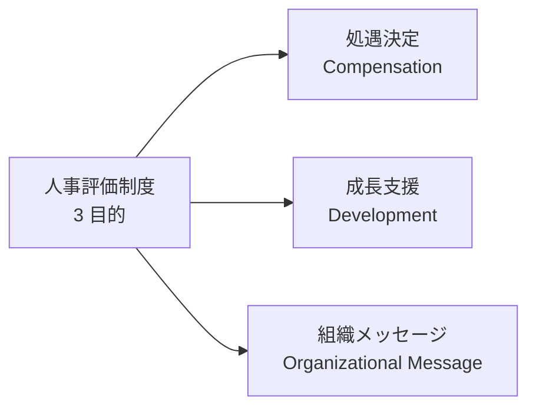
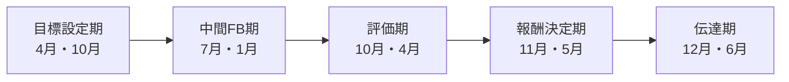
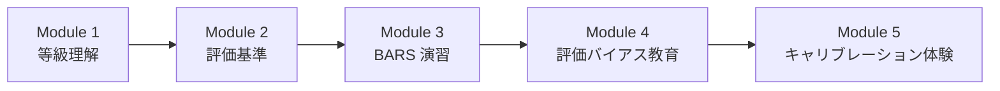
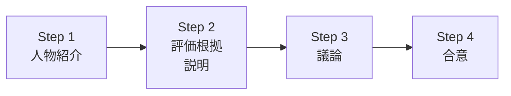
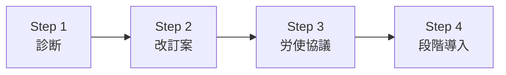

# 人事評価制度の運用

「人事担当者が制度を運用する」——年間サイクル設計・評価者研修・キャリブレーション・報酬連動・タレントレビュー・HR Tech 活用まで、人事評価の制度側実装を 2026 年 7 月時点の実務で体系化

| 項目 | 内容 |
|---|---|
| カテゴリー | 人事・労務実務 |
| 難易度 | 中級 |
| 所要時間 | 約200分（全8レッスン） |
| 公開日 | 2026-07-20 |
| 最終更新日 | 2026-07-20 |
| コースURL | https://skillup.college/courses/hr-labor/performance-management-practical/ |

## 対象者

中堅企業（従業員 100〜1,000 名規模）の人事担当 1〜3 年目・人事から評価制度を運用する立場・人事マネジャー・HRBP・タレントマネジメント担当・人事責任者。

## 前提知識

MBO/OKR・SBI・9 ボックスなどの基本用語を耳にしたことがある程度。マネジャーとしての評価経験があれば理解が深まる。

## 学習目標

- 人事評価制度の 3 目的（処遇決定・成長支援・組織メッセージ）と 3 要素（等級・評価・報酬）を持てる
- 人事担当者の年間運用サイクルを組み立てられる
- 評価者研修の設計と実施の型を持てる
- キャリブレーション会議のファシリテーションを扱える
- 報酬制度と評価の連動（賞与テーブル・昇給テーブル）を設計できる
- タレントレビュー・9 ボックスの組織運用を組み立てられる
- 360 度評価・HR Tech・人的資本開示への対応を持ち帰れる
- 制度改訂プロセス・労務リスク・人事担当のキャリアを扱える

## コース概要

人事評価制度は、多くの会社で「作った瞬間から陳腐化する」ものです。制度設計に時間をかけても、現場で運用されなければ意味がなく、逆に運用が優れていれば多少雑な制度でも組織は動きます。本コースは、中堅企業（従業員 100〜1,000 名規模）の人事担当 1〜3 年目、HRBP、タレントマネジメント担当を対象に、人事担当者の年間運用サイクル・評価者研修・キャリブレーション会議・報酬制度と評価の連動・タレントレビュー・360 度評価・HR Tech・制度改訂と労務リスクまでを 8 レッスンで体系化します。マネジャー個人の評価面談スキル・1on1 と評価面談の結合／分離・PIP 対話・9 ボックスを自チームで使う視点は既刊のマネジメント関連の入門コースに譲り、本コースは「人事担当者が制度を設計・運用・改訂する」視点に軸足を置きます。

## 学習の流れ

前半 3 レッスンで人事評価制度の全体像と日常運用の中核を扱います。レッスン 1 で 3 目的と 3 要素、レッスン 2 で年間運用サイクル、レッスン 3 で評価者研修を扱います。中盤のレッスン 4 でキャリブレーション会議、レッスン 5 で報酬制度と評価の連動、レッスン 6 でタレントレビューと後継者育成を扱い、制度運用の本丸を組み立てます。後半のレッスン 7 で 360 度評価・HR Tech・人的資本開示、レッスン 8 で制度改訂・労務リスク・人事担当のキャリアまでを扱います。全 8 レッスン・約 200 分の構成です。

## レッスン一覧

| No. | タイトル | 概要 | 所要時間 |
|---|---|---|---|
| 1 | 人事評価制度とは何か——3 目的と 3 要素 | 評価の 3 目的（処遇決定・成長支援・組織メッセージ）、等級・評価・報酬の 3 要素、コース守備範囲・境界明示（マネジャーの面談スキル・1on1 との結合分離は既刊譲り）を学ぶ | 25分 |
| 2 | 人事担当者の年間運用サイクル | 年間スケジュール（目標設定期・中間 FB 期・評価期・報酬決定期・伝達期）、締切管理、評価者への一斉通知、提出物管理、評価データの集計、次期への引継ぎを学ぶ | 25分 |
| 3 | 評価者研修の設計と実施 | 新任評価者研修（等級理解・評価基準・BARS 演習）、リコース研修、面談スキル研修、評価バイアス（ハロー効果・寛大化・中心化）の教育、評価誤差の統計的検出を学ぶ | 25分 |
| 4 | キャリブレーション会議の設計と運営 | 会議の目的（分布調整・評価根拠の説明・上位承認）、参加者と役割、進行の型（人物紹介・評価根拠・議論・合意）、時間割設計、ファシリテーターの技術を学ぶ | 25分 |
| 5 | 報酬制度と評価の連動 | 賞与テーブル設計（原資配分・評価別支給率）、昇給テーブル、賃金カーブ、インセンティブ・SO の位置づけ、報酬伝達の型、報酬満足度と評価分布の関係を学ぶ | 25分 |
| 6 | タレントレビューと後継者育成 | 9 ボックスの組織運用、タレントレビュー会議の設計、ハイポテンシャル選抜、サクセッションプラン、後継者ボードの運営を学ぶ | 25分 |
| 7 | 360 度評価・HR Tech・人的資本開示 | 360 度評価の設計と運用、HR Tech（SmartHR・HRMOS・カオナビ・Talentio）の選定、人的資本開示（ISO 30414・有価証券報告書 2023 年から義務化）を学ぶ | 25分 |
| 8 | 制度改訂・労務リスク・人事担当のキャリア | 制度改訂プロセス（診断→改訂案→労使協議→段階導入）、労務リスク（降格・不利益変更・評価根拠の記録保管）、パワハラ・過小評価との境界（既刊参照）、人事担当のキャリア（HRBP・タレントマネジメント・CHRO）を学ぶ | 25分 |

---

## レッスン1：人事評価制度とは何か——3 目的と 3 要素

（所要時間：25分）

### このレッスンで学ぶこと

- 人事評価制度の 3 目的（処遇決定・成長支援・組織メッセージ）を語れる
- 等級・評価・報酬の 3 要素と、それぞれの相互関係を持てる
- 人事担当者とマネジャーの役割分担を俯瞰できる
- 本コースの守備範囲と、既刊のマネジメント関連の入門コースとの境界を持ち帰れる

---

人事評価制度と聞くと、多くの方は「S・A・B・C の評価をつけて賞与を決めるもの」を思い浮かべます。しかし、人事評価は単なる「処遇決定の道具」ではなく、社員の成長を支援し、会社が何を大切にするかを組織に伝えるメッセージでもあります。本レッスンでは、人事評価制度の 3 目的、等級・評価・報酬の 3 要素、人事担当者とマネジャーの役割分担、そして本コース全体で扱う範囲と扱わない範囲を整理します。

### 人事評価制度の 3 目的

人事評価は、次の 3 目的を同時に達成する仕組みです。

#### 目的 1：処遇決定（Compensation）

- 賞与の配分
- 昇給・昇格
- 職務変更・異動

処遇決定は最も見えやすい目的で、社員の関心も高い領域です。ただし、処遇決定だけで人事評価を語ると「賞与を決めるための面倒な作業」になってしまい、制度が形骸化します。

#### 目的 2：成長支援（Development）

- 強みと課題のフィードバック
- 育成計画の策定
- キャリア開発支援

成長支援は、評価者と被評価者の対話を通じて実現します。マネジャーの面談スキル（既刊譲り）が中核となる領域ですが、人事担当者は「評価者が対話しやすい制度と研修の設計」で貢献します。

#### 目的 3：組織メッセージ（Organizational Message）

- 会社が求める行動・成果の明示
- 経営理念・バリューの浸透
- 期待人材像の共有

「何が高評価されるか」は、会社の意思そのものです。評価項目・評価基準の設計は、会社の戦略と直結します。



### 等級・評価・報酬の 3 要素

人事評価制度は、次の 3 要素で構成されます。

#### 要素 1：等級制度（Grade System）

- 社員を階層的に分類する枠組み
- 職能等級（何ができるか）・職務等級（何をやっているか）・役割等級（どのポジションか）の 3 タイプ
- ジョブ型（職務等級）vs メンバーシップ型（職能等級）の議論の中核

#### 要素 2：評価制度（Evaluation System）

- 業績評価（何を達成したか）
- 能力・行動評価（どう行動したか）
- 目標管理制度（MBO・OKR）を用いた運用

#### 要素 3：報酬制度（Compensation System）

- 基本給・賞与・退職金・福利厚生
- 賃金テーブル・賞与テーブル・昇給テーブル
- ストックオプション・従業員持株会

#### 3 要素の相互関係

3 要素は独立ではなく、密接に絡み合います。

- 等級 → 報酬レンジを規定
- 評価 → 報酬・等級変更（昇格・昇進）の判断材料
- 報酬 → 等級と評価の結果を反映

「等級制度を触ると報酬体系が動く」「評価制度を触ると賞与配分が動く」——3 要素の相互作用を理解せずに個別要素だけを触ると、想定外の副作用が生じます。人事担当者は 3 要素を統合的に扱う視点が必須です。

### 人事担当者とマネジャーの役割分担

人事評価は、人事担当者とマネジャーの共同作業で成立します。

#### 人事担当者の役割（本コースの主役）

- 評価制度の設計・改訂
- 年間運用サイクルの管理（スケジュール・締切）
- 評価者研修の実施
- キャリブレーション会議の運営
- 報酬テーブル・分布制約の設計
- 制度に関する社内相談の一次窓口
- HR Tech の導入・運用
- 労務リスクの管理

#### マネジャーの役割（既刊のマネジメント関連の入門コース譲り）

- 部下との目標設定
- 期中の 1on1 とフィードバック
- 期末の評価入力・面談実施
- キャリブレーション会議での議論参加

人事担当者は「制度を作って回す側」、マネジャーは「制度を使う側」です。両者の視点が違うため、コミュニケーションのミスマッチが起きやすい構造です。本コースは人事担当者側の視点で、マネジャー側の期待とギャップを理解する視野を持つことに集中します。

### コースの守備範囲と境界

本コースは人事評価を「人事担当者が制度を設計・運用する」視点で扱います。既刊コースや関連する専門領域と明確に区別して学ぶ必要があります。

**本コースで扱う領域**：人事評価の 3 目的・3 要素・人事担当者の年間運用サイクル・評価者研修の設計と実施・キャリブレーション会議の設計と運営・報酬制度と評価の連動・タレントレビューと後継者育成・360 度評価・HR Tech の選定と運用・人的資本開示・制度改訂プロセス・労務リスク・人事担当のキャリア

**本コースで扱わない領域**（別の入門コースや専門教材で扱う）：

- マネジャー側の評価面談スキル（SBI・サンドイッチ型・ポジティブフィードバックの 3 要素）・評価面談の 6 ステップ・低評価/高評価対応・面談後フォローは、マネジメント関連の入門コースを参照してください
- 1on1 と評価面談の結合／分離の 4 基準・4 パターン、Calibration とマネジャー個人 1on1 の関係は、1on1 に特化した入門コースを参照してください
- パフォーマンス問題の 4 因・PIP を成長設計として使う 3 原則・ADKAR モデル・改善 1on1 のシーケンスは、1on1 に特化した入門コースを参照してください
- マネジャー個人視点で 9 ボックスを部下配置分析に使う型は、中間管理職向けの実践コースを参照してください
- パワハラ 6 類型・過小評価との境界などのハラスメント論点は、コンプライアンス基礎コースを参照してください
- 採用面接設計（構造化面接・STAR 法・BARS の設計）は、採用面接設計の実践コースを参照してください
- リモートマネジメント下でのプロキシミティ・バイアス対策は、リモートマネジメントの実践コースを参照してください

> **⚠️ 注意**
> 本コースは資格試験対策コースではありません。社会保険労務士・キャリアコンサルタント・産業カウンセラーなどの資格取得を目的とする方は、それぞれの資格専門の予備校教材を参照してください。本コースは資格ではなく、人事担当者としての実務に集中します。また、労働法の詳細解釈（不利益変更・降格・解雇の要件）は、社会保険労務士・弁護士の独占業務にあたるため、本コースでは実務上の判断枠組みを提示するに留めます。

### 中堅企業における人事評価制度の年間業務

イメージを持ちやすくするため、3 月期決算・従業員 500 名規模の会社での人事担当者の年間業務を示します。

- **4 月**：新年度の目標設定期スタート、新任評価者研修実施
- **5〜6 月**：目標設定期の締切管理、部門長との調整
- **7〜9 月**：中間フィードバック期、期中の 1on1 促進、目標見直しの反映
- **10〜12 月**：評価準備、リコース研修、キャリブレーション会議準備
- **1〜3 月**：評価期、キャリブレーション会議、賞与・昇給・昇格の決定、伝達期、制度改訂案の起案

### 次のステップ

本レッスンでは人事評価制度の 3 目的・3 要素・役割分担を俯瞰しました。次のレッスンでは、人事担当者の年間運用サイクルを詳細に扱い、目標設定期・中間 FB 期・評価期・報酬決定期・伝達期の各業務の型を組み立てます。

### 確認クイズ

このレッスンで学んだ内容を確認しましょう。

#### Q1. 人事評価制度の 3 目的として、本レッスンで挙げていないものはどれか。

- [x] 節税対策
- [ ] 処遇決定（賞与配分・昇給・昇格・職務変更）
- [ ] 成長支援（フィードバック・育成計画・キャリア開発）
- [ ] 組織メッセージ（会社が求める行動・成果の明示・経営理念浸透）

> **解説**
> 本レッスンで挙げている人事評価制度の 3 目的は「処遇決定」「成長支援」「組織メッセージ」です。節税対策は人事評価とは無関係な財務・税務の領域です。3 目的を同時に達成することが人事評価制度の設計思想であり、処遇決定だけで語ると制度が形骸化します。

#### Q2. 等級・評価・報酬の 3 要素の相互関係について、本レッスンで示している内容として正しいものはどれか。

- [ ] 3 要素は独立して設計する
- [x] 3 要素は密接に絡み合い、等級 → 報酬レンジを規定、評価 → 報酬・等級変更の判断材料、報酬 → 等級と評価の結果を反映という関係にある。個別要素だけを触ると想定外の副作用が生じる
- [ ] 等級制度と評価制度は関係ない
- [ ] 報酬制度は評価とは無関係

> **解説**
> 3 要素は密接に絡み合います。「等級 → 報酬レンジを規定」「評価 → 報酬・等級変更（昇格・昇進）の判断材料」「報酬 → 等級と評価の結果を反映」という相互作用があります。個別要素だけを触ると想定外の副作用が生じるため、人事担当者は 3 要素を統合的に扱う視点が必須です。

#### Q3. 人事担当者とマネジャーの役割分担について、本レッスンで示している内容はどれか。

- [ ] 人事担当者がマネジャーの面談も全て実施する
- [ ] マネジャーが評価制度の設計も全て担う
- [x] 人事担当者は「制度を作って回す側」（制度設計・年間運用管理・研修・キャリブレーション運営）、マネジャーは「制度を使う側」（目標設定・1on1・面談実施・議論参加）
- [ ] 両者は同じ役割

> **解説**
> 人事担当者は「制度を作って回す側」で、評価制度の設計・年間運用サイクル管理・評価者研修・キャリブレーション会議運営・報酬テーブル設計・HR Tech 運用・労務リスク管理を担います。マネジャーは「制度を使う側」で、部下との目標設定・期中の 1on1 とフィードバック・期末の評価入力・面談実施・キャリブレーション会議での議論参加を担います。両者の視点が違うためコミュニケーションのミスマッチが起きやすい構造ですが、それぞれの役割を理解することで協働が機能します。

#### Q4. 本コースの守備範囲として、扱わない領域はどれか。

- [ ] 評価者研修の設計と実施
- [ ] キャリブレーション会議の設計と運営
- [ ] 報酬制度と評価の連動
- [x] マネジャー側の評価面談スキル（SBI・サンドイッチ型）・評価面談 6 ステップ・低/高評価対応、1on1 と評価面談の結合分離、PIP 対話、9 ボックスを自チームで使う視点

> **解説**
> 本コースは人事評価を「人事担当者が制度を設計・運用する」視点で扱います。マネジャー個人の面談スキル、1on1 と評価面談の結合分離、PIP 対話、9 ボックスを自チームで思考補助として使う視点は、マネジメント関連の入門コースに譲ります。本コースの中核は、制度側（評価者研修・キャリブレーション運営・報酬テーブル・タレントレビュー・HR Tech）に振り切っています。

---

## レッスン2：人事担当者の年間運用サイクル

（所要時間：25分）

### このレッスンで学ぶこと

- 年間運用サイクルの 5 期（目標設定・中間 FB・評価・報酬決定・伝達）を持てる
- 各期の締切管理と評価者への一斉通知の型を組み立てられる
- 提出物管理・評価データ集計の実務を扱える
- 次期への引継ぎの考え方を持ち帰れる

---

前レッスンでは人事評価制度の 3 目的・3 要素を俯瞰しました。本レッスンでは、人事担当者の年間業務のバックボーンとなる運用サイクルを詳細に扱います。「人事評価は制度ではなく運用」——マニュアル通りに動く年間サイクルこそが、制度を機能させる骨格です。

### 年間運用サイクルの 5 期

3 月期決算・年 2 回評価（上期・下期）の会社を例に、年間サイクルを 5 期で整理します。



#### 期 1：目標設定期（4 月・10 月）

- 会社の期初方針・部門目標のカスケード
- 個人目標の設定と上長合意
- 目標記述の質の確保（SMART の適用）
- 目標設定シートの提出締切管理

#### 期 2：中間 FB 期（7 月・1 月）

- 期中の進捗確認と目標修正
- 1on1 実施の促進
- 中間フィードバック面談の実施状況モニタリング
- 期中の突発異動・退職への対応

#### 期 3：評価期（10 月・4 月）

- 自己評価の提出
- 上長評価の入力
- キャリブレーション会議の実施
- 評価データの集計と分布分析

#### 期 4：報酬決定期（11 月・5 月）

- 賞与配分の実施
- 昇給・昇格の決定
- 経営会議での承認
- 予算との整合確認

#### 期 5：伝達期（12 月・6 月）

- 評価結果面談の実施
- 賞与・昇給・昇格の通知
- 個人への説明資料の配布
- 苦情処理・再評価プロセスの対応

### 締切管理の型

各期の締切管理は、人事担当者の業務効率を大きく左右します。

#### 締切管理の 4 レベル

- **社内公式締切**：期の開始時に全社通知する締切
- **リマインダー締切**：公式締切の 1 週間前
- **バッファー**：公式締切から人事集計までの余裕期間
- **エスカレーション期日**：バッファー内で未提出者を上長へエスカレーション

例：評価期の締切管理

- 10/1：評価入力開始通知
- 10/25：一次リマインダー（人事から全評価者へ）
- 10/28：二次リマインダー（人事から未提出評価者へ個別に）
- 10/31：社内公式締切
- 11/2：エスカレーション（未提出評価者の上長へ通知）
- 11/5：人事集計完了、キャリブレーション会議準備

### 評価者への一斉通知の型

年間サイクルの各期で、評価者（多くはマネジャー）への通知が必要です。

#### 通知の 4 要素

- **背景**：なぜこの通知が今必要か
- **依頼事項**：具体的に何をすべきか
- **期日**：いつまでに完了するか
- **サポート**：不明点への問い合わせ先・関連資料

#### 通知チャネルの使い分け

- **公式メール**：正式な締切通知・重要事項
- **チャット（Slack・Teams）**：リマインダー・軽微な連絡
- **社内ポータル・イントラ**：関連資料・FAQ の恒常掲載
- **HR Tech ツール内通知**：システム化された定型通知
- **オフライン面談**：制度改訂の説明・複雑な議論

一斉通知だけでは動かない評価者が必ず出るため、複数チャネルの組み合わせが実務標準です。

### 提出物管理の実務

人事評価の年間サイクルでは、次のような提出物を管理します。

- 目標設定シート
- 中間フィードバック実施記録
- 自己評価シート
- 上長評価シート
- キャリブレーション会議議事録
- 評価結果面談実施記録

#### 提出物管理のツール

- **HR Tech（SmartHR・HRMOS・カオナビ・Talentio）**：システム上で提出状況を可視化
- **Excel + 共有フォルダ**：中小規模で採用される簡便手法
- **紙運用**：レガシー環境で残るが、集計・可視化が困難

中堅企業では HR Tech への移行が進んでいますが、まだ Excel 運用の会社も多いのが実情です。

### 評価データの集計と分布分析

評価期終了後、評価データを集計し、次の分析を行います。

#### 分布分析の観点

- 全社の評価分布（S・A・B・C の比率）
- 部門別分布（部門間の甘辛差）
- 評価者別分布（評価者の傾向）
- 経年変化（前期・前々期との比較）

#### 分布制約の 3 パターン

- **強制分布制約**：S 10 %・A 30 %・B 40 %・C 20 % など明示的な比率縛り
- **参考分布**：目安として提示、逸脱時は説明を求める
- **制約なし**：完全に評価者判断（属人的評価分布のリスクあり）

強制分布制約は評価の公平性を担保する一方、「評価の実質を反映しない」という批判もあります。制約と裁量のバランスは、会社の文化と経営陣の意向で決まります。

### 次期への引継ぎ

評価期の終了は、次期への引継ぎの起点でもあります。

#### 引継ぎで整備すべき情報

- 評価分布の集計データ
- 昇格・降格・異動の実施結果
- 評価者研修で発見された改善点
- 制度改訂候補のリスト
- 社員からの苦情・意見

これらを整理して次期の目標設定期の準備資料とすることで、年間サイクルが連続した改善プロセスになります。

### 確認クイズ

このレッスンで学んだ内容を確認しましょう。

#### Q1. 年間運用サイクルの 5 期として、本レッスンで挙げているものはどれか。

- [x] 目標設定期・中間 FB 期・評価期・報酬決定期・伝達期
- [ ] 春期・夏期・秋期・冬期・年末年始
- [ ] 企画・選定・契約・導入・運用
- [ ] 要件定義・設計・開発・テスト・本番

> **解説**
> 年間運用サイクルの 5 期は「目標設定期（4 月・10 月）／中間 FB 期（7 月・1 月）／評価期（10 月・4 月）／報酬決定期（11 月・5 月）／伝達期（12 月・6 月）」です。年 2 回評価（上期・下期）の会社を例にした場合、それぞれの期が半年ごとに繰り返されます。

#### Q2. 締切管理の 4 レベルとして、本レッスンで示している内容はどれか。

- [ ] 早い・普通・遅い・最終
- [x] 社内公式締切・リマインダー締切・バッファー・エスカレーション期日
- [ ] 一次・二次・三次・四次
- [ ] 自主・強制・警告・処分

> **解説**
> 締切管理の 4 レベルは「社内公式締切（期の開始時に全社通知）」「リマインダー締切（公式締切の 1 週間前）」「バッファー（公式締切から人事集計までの余裕期間）」「エスカレーション期日（バッファー内で未提出者を上長へエスカレーション）」です。この 4 レベルを使い分けることで、単なる「締切通知」ではなく計画的な催促と対応が可能になります。

#### Q3. 評価者への一斉通知の 4 要素として、本レッスンで示している内容はどれか。

- [ ] 挨拶・要件・添付・署名
- [ ] 見出し・本文・付録・出典
- [x] 背景（なぜ今必要か）・依頼事項（具体的に何をすべきか）・期日（いつまでに）・サポート（問い合わせ先・関連資料）
- [ ] タイトル・要約・詳細・結論

> **解説**
> 評価者への一斉通知の 4 要素は「背景」「依頼事項」「期日」「サポート」です。この 4 要素を明確に構造化することで、評価者は「何を、いつまでに、なぜやるべきか」を即座に理解できます。通知チャネルは公式メール・チャット・社内ポータル・HR Tech ツール内通知・オフライン面談を使い分けます。

#### Q4. 評価データの分布制約 3 パターンとして、本レッスンで示している内容はどれか。

- [ ] 高分布・中分布・低分布
- [ ] 5 段階・7 段階・10 段階
- [ ] 部門別・拠点別・全社別
- [x] 強制分布制約（S 10 %・A 30 %・B 40 %・C 20 % など明示的な比率縛り）・参考分布（目安として提示、逸脱時は説明を求める）・制約なし（完全に評価者判断）

> **解説**
> 評価データの分布制約は「強制分布制約」「参考分布」「制約なし」の 3 パターンがあります。強制分布は評価の公平性を担保する一方「評価の実質を反映しない」批判もあります。参考分布は柔軟性が高いですが評価者の裁量が大きくなります。制約なしは属人的評価分布のリスクがあります。制約と裁量のバランスは、会社の文化と経営陣の意向で決まります。

---

## レッスン3：評価者研修の設計と実施

（所要時間：25分）

### このレッスンで学ぶこと

- 評価者研修の 3 種類（新任評価者研修・リコース研修・面談スキル研修）を持てる
- 評価バイアス（ハロー効果・寛大化・中心化・対比・近時傾向）の教育の型を持つ
- BARS 演習の設計方法を扱える
- 評価誤差の統計的検出と評価者へのフィードバックの型を持ち帰れる

---

前レッスンでは人事担当者の年間運用サイクルを扱いました。本レッスンでは、制度の質を根本から左右する「評価者研修」の設計と実施を扱います。評価者研修は多くの会社で軽視されがちですが、「評価者の質が制度の質を決める」——これは本コースの中核メッセージの 1 つです。

### なぜ評価者研修が必要か

評価者（多くはマネジャー）は、部下との日常業務のプロとして着任していますが、評価者としては未経験のまま権限を与えられるケースがほとんどです。

- 昇格昇進で自動的に評価者になる
- 制度説明はマニュアル配布で終わり
- 評価入力の技術的な操作説明のみ
- 評価者としての判断基準は「先輩の見様見真似」

この状態で評価者を放置すると、評価品質にばらつきが生じ、キャリブレーション会議での議論が「感覚論」に陥ります。

### 評価者研修の 3 種類

評価者研修は、次の 3 種類を組み合わせて設計します。

#### 種類 1：新任評価者研修

- **対象**：昇格昇進で初めて評価者になった年 1〜 2 名
- **時期**：昇格通知から 1〜 2 か月以内
- **時間**：半日〜 1 日
- **内容**：等級理解・評価基準・BARS 演習・評価バイアス教育

#### 種類 2：リコース研修（Refresher）

- **対象**：既存評価者全員（年 1 回）
- **時期**：評価期の 2〜 3 か月前
- **時間**：2〜 3 時間
- **内容**：前期の評価分布振り返り・改善ポイント・制度改訂の周知

#### 種類 3：面談スキル研修

- **対象**：新任評価者と、部下評価に課題があるマネジャー
- **時期**：随時（評価期の前後が多い）
- **時間**：半日〜 1 日
- **内容**：フィードバック面談のロールプレイ・低評価対応の型（既刊譲り部分は言及のみ）

### 新任評価者研修の 5 モジュール

新任評価者研修は、次の 5 モジュールで構成します。



#### Module 1：等級理解（60 分）

- 自社の等級制度（等級数・等級定義・昇格要件）
- 部下の等級構成の把握
- 等級ごとの期待成果と行動

#### Module 2：評価基準（60 分）

- 評価項目の詳細説明
- 評価スケール（5 段階・7 段階など）
- 業績評価と能力評価・行動評価の切り分け

#### Module 3：BARS 演習（90 分）

- BARS（Behaviorally Anchored Rating Scales：行動基準評価尺度）の理解
- 各評価項目・スケールの具体的な行動例
- 参加者による実例演習

#### Module 4：評価バイアス教育（60 分）

代表的な 5 バイアスの教育：

- **ハロー効果**：ある 1 つの特性が全体評価に影響
- **寛大化傾向**：全体的に高評価に偏る
- **中心化傾向**：中間評価（B）に偏る
- **対比誤差**：他者との比較で評価がぶれる
- **近時傾向**：直近の出来事が期全体の評価に影響

対策として、評価根拠を具体的行動で記録すること、期中の記録を継続的に取ること、キャリブレーションで他評価者と議論することを教えます。

#### Module 5：キャリブレーション体験（60 分）

- 模擬キャリブレーション会議の実施
- 評価根拠の説明訓練
- 他評価者との議論の型

### BARS の設計と運用

BARS は、評価項目・評価スケールごとに「具体的な行動例」を明示する技法です。1963 年に Smith と Kendall が Journal of Applied Psychology で提唱しました。

#### BARS の例（「顧客対応」項目・5 段階評価）

- **5（Exceeds）**：期待を大幅に超える顧客対応で、他部門の顧客対応の模範となる行動を示した
- **4（Above Expectation）**：期待を超える顧客対応で、部下・後輩の指導も担った
- **3（Meets）**：期待どおりの顧客対応を安定的に実施した
- **2（Below Expectation）**：顧客対応でクレームが発生し、部門内で改善が必要
- **1（Well Below）**：顧客対応で重大な問題が繰り返し発生した

BARS を用いることで、評価者間の判断のばらつきが大幅に減ります。設計には全評価者と業務側の議論が必要で、初回設計に 3〜 6 か月かかるのが実務標準です。

### 評価バイアスの詳細と対策

評価バイアスは避けられませんが、意識化と対策で軽減できます。

#### バイアス 1：ハロー効果（Halo Effect）

- 現象：好印象の部下は全項目高評価、悪印象の部下は全項目低評価
- 対策：評価項目ごとに独立して考える練習、時期を分けて評価

#### バイアス 2：寛大化傾向（Leniency）

- 現象：全体的に高評価に偏る（S・A ばかり）
- 対策：分布制約の設定、キャリブレーションでの相対比較

#### バイアス 3：中心化傾向（Central Tendency）

- 現象：中間評価（B・3）に偏り、極端な評価を避ける
- 対策：極端な評価にも根拠を求めるルール、S・C 評価の理由を必ず記載

#### バイアス 4：対比誤差（Contrast Error）

- 現象：直前に高評価者を見た後の評価が下がる（またはその逆）
- 対策：評価順序をランダム化、複数回に分けて評価

#### バイアス 5：近時傾向（Recency Bias）

- 現象：直近 1〜 2 か月の出来事が期全体の評価に強く影響
- 対策：期中の記録を継続、四半期ごとの中間サマリーを作成

### 評価誤差の統計的検出

人事担当者は、評価データを統計的に分析し、評価誤差を検出します。

#### 検出指標の例

- **平均評価スコアの部門間差**：ある部門だけ平均が極端に高い/低い
- **評価分布の歪度**：本来正規分布に近いはずが偏っている
- **評価者ごとの分布パターン**：ある評価者だけ寛大化 or 中心化
- **前期との相関**：評価が固定化していないか（変化がない場合、評価が本当の実態を反映していない可能性）

これらを検出したら、次期の評価者研修で改善ポイントとしてフィードバックします。

### 評価者へのフィードバックの型

統計的に検出した評価誤差を、評価者本人にフィードバックする際の型です。

- 個別 1on1 でのフィードバック（一斉フィードバックは避ける）
- データを示し「なぜこの分布になったか」を対話
- 改善アクションの合意（次期の評価で意識するポイント）
- 過度に責めない（バイアスは誰にでもある前提）

### 次のステップ

本レッスンでは評価者研修の設計と実施を扱いました。次のレッスンでは、評価者研修の集大成でもあるキャリブレーション会議の設計と運営を扱います。会議のファシリテーションこそが人事担当者の見せ場です。

### 確認クイズ

このレッスンで学んだ内容を確認しましょう。

#### Q1. 評価者研修の 3 種類として、本レッスンで挙げていないものはどれか。

- [x] 就業規則研修（労働時間・服務規律の教育）
- [ ] 新任評価者研修（昇格昇進で初めて評価者になった人向け）
- [ ] リコース研修（既存評価者全員向けの年 1 回リフレッシュ研修）
- [ ] 面談スキル研修（フィードバック面談のロールプレイ）

> **解説**
> 本レッスンで挙げている評価者研修の 3 種類は「新任評価者研修」「リコース研修（Refresher）」「面談スキル研修」です。就業規則研修は労務管理・コンプライアンス研修の領域で、評価者研修とは別です。3 種類を組み合わせて設計することで、評価者の質を継続的に向上させます。

#### Q2. BARS（Behaviorally Anchored Rating Scales）の提唱者と発表年について、本レッスンで示している内容はどれか。

- [ ] Kaplan & Norton が 1992 年に提唱
- [x] Smith と Kendall が 1963 年に Journal of Applied Psychology で提唱
- [ ] Drucker が 1954 年に提唱
- [ ] Doerr が 2018 年に提唱

> **解説**
> BARS（行動基準評価尺度）は 1963 年に Smith と Kendall が Journal of Applied Psychology で提唱しました。評価項目・評価スケールごとに「具体的な行動例」を明示する技法で、評価者間の判断のばらつきを大幅に減らせます。Kaplan & Norton は BSC（バランスト・スコアカード）、Drucker は MBO、Doerr は OKR の提唱者です。

#### Q3. 評価バイアスの 5 種類のうち、「中間評価（B・3）に偏り、極端な評価を避ける」現象はどれか。

- [ ] ハロー効果
- [ ] 寛大化傾向
- [x] 中心化傾向
- [ ] 近時傾向

> **解説**
> 中心化傾向は、中間評価（B・3）に偏り、極端な評価を避ける現象です。対策として、極端な評価（S・C）にも根拠を求めるルール、S・C 評価の理由を必ず記載するなどが有効です。ハロー効果は好悪印象が全項目に波及、寛大化傾向は全体的に高評価に偏る、近時傾向は直近の出来事が期全体の評価に影響する現象です。

#### Q4. 評価誤差の統計的検出後の評価者へのフィードバックの型として、本レッスンで示している内容はどれか。

- [ ] 一斉メールで全評価者に警告
- [ ] 評価者を降格処分にする
- [ ] 経営会議で公開処罰する
- [x] 個別 1on1 でデータを示し「なぜこの分布になったか」を対話し、改善アクションを合意する。過度に責めない（バイアスは誰にでもある前提）

> **解説**
> 統計的に検出した評価誤差は、個別 1on1 でのフィードバックが原則です。一斉フィードバックは避け、データを示して対話し、改善アクションを合意します。過度に責めないことが重要で、バイアスは誰にでもある前提で扱います。人事担当者の仕事は、バイアスの根っこにある想いを理解しつつ、制度としての公平性を担保することです。

---

## レッスン4：キャリブレーション会議の設計と運営

（所要時間：25分）

### このレッスンで学ぶこと

- キャリブレーション会議の 3 目的（分布調整・評価根拠の説明・上位承認）を持てる
- 参加者と役割の設計を組み立てられる
- 進行の型（人物紹介・評価根拠・議論・合意）と時間割設計を扱える
- 人事担当者のファシリテーターとしての技術を持ち帰れる

---

前レッスンでは評価者研修の設計と実施を扱いました。本レッスンでは、評価の質を最終的に決めるキャリブレーション会議の設計と運営を扱います。この会議のファシリテーションこそが、人事担当者の年間業務のハイライトです。

### キャリブレーション会議とは何か

キャリブレーション会議は、複数の評価者が集まり、評価を相互に検証し合意する場です。各評価者が独立して部下を評価した後、部門長・複数マネジャー・人事担当者が同席し、評価の妥当性を議論します。

#### なぜキャリブレーションが必要か

- 評価者間の甘辛差の是正
- 部下の異動時の評価連続性確保
- 評価根拠の言語化促進
- 経営陣への評価の説明責任担保

キャリブレーションがない会社では、評価はマネジャー個人の裁量で決まり、部門間・年度間で一貫性を失います。

### キャリブレーション会議の 3 目的

キャリブレーション会議は次の 3 目的を同時に達成します。

#### 目的 1：分布調整

- 部門ごとの分布（S・A・B・C の比率）を全社の目安に近づける
- 極端な分布の是正
- 分布制約（強制分布 or 参考分布）の実現

#### 目的 2：評価根拠の説明

- 各マネジャーが「なぜこの評価にしたか」を口頭で説明
- 抽象的な評価から具体的な行動事実への深掘り
- 評価者間の議論による評価精度の向上

#### 目的 3：上位承認

- 部門長が最終評価を承認
- 人事責任者・役員クラスの目線での確認
- 評価結果に対する組織としての説明責任

### 参加者と役割

キャリブレーション会議の標準的な参加者と役割は次のとおりです。

#### 参加者と役割

- **部門長（議長）**：会議の議長、最終評価の承認者
- **マネジャー（評価者）**：自分が評価した部下について説明
- **人事担当者（ファシリテーター）**：進行管理、記録、議論のサポート
- **人事責任者（オブザーバー）**：上位からの視点で監督（必要に応じて）

#### 会議規模

- 部下 30〜 50 名を対象とする会議：マネジャー 5〜 8 名、所要 3〜 4 時間
- 部下 100 名を対象とする会議：マネジャー 10〜 15 名、所要 6〜 8 時間（半日 × 2 回）

規模が大きくなると議論の質が下がるため、部下 30〜 50 名を単位に分割するのが実務標準です。

### 進行の型——4 ステップ

キャリブレーション会議は次の 4 ステップで進行します。



#### Step 1：人物紹介（1 名あたり 1〜 2 分）

- 氏名・所属・等級・在籍年数
- 主な担当業務
- 過去 2 期の評価

#### Step 2：評価根拠の説明（1 名あたり 3〜 5 分）

- マネジャーが今期の評価と根拠を説明
- 業績・能力・行動の 3 面から具体的行動事実で語る
- BARS の項目に沿って評価根拠を示す

#### Step 3：議論（1 名あたり 5〜 10 分）

- 他マネジャーからの質問
- 「もし自部門なら」の視点での意見
- 部門長・人事責任者からの追加観点
- 分布制約から見た必要な調整の議論

#### Step 4：合意（1 名あたり 1〜 2 分）

- 最終評価の合意
- 議論の結果を反映した評価の確定
- 議事録への記録

1 名あたり合計 10〜 20 分で進行します。30 名の場合、5〜 10 時間の会議となります。

### 時間割設計

キャリブレーション会議は長丁場になるため、時間割設計が重要です。

#### 半日 4 時間の時間割例（部下 30 名対象）

- 0:00-0:15：オープニング、進行説明、分布ターゲット共有
- 0:15-1:45：Step 1〜 4 × 6 名（60 分 / 6 名 = 各 10 分）
- 1:45-2:00：休憩
- 2:00-3:00：残り 6 名を議論
- 3:00-3:15：休憩
- 3:15-4:00：全体分布の確認と最終調整

#### 進行のコツ

- タイムキーパーを別途配置（人事担当者以外に）
- 議論が延びる部下は「保留」として最後にまとめて議論
- 休憩を必ず入れる（集中力の維持）
- 議事録を並行して記録

### 人事担当者のファシリテーター技術

キャリブレーション会議のファシリテーターとしての技術は、人事担当者の最重要スキルの 1 つです。

#### 技術 1：オープニング設計

- 会議の目的と分布ターゲットの明示
- 議論のルール（発言時間・敬意ある議論・秘密保持）の宣言
- 議事進行のスケジュール共有

#### 技術 2：議論の掘り下げ

- 「なぜそう評価したのですか」の具体化質問
- 「もし別のマネジャーが評価したら同じ結果ですか」の相対化質問
- 抽象的表現（「頑張っている」など）への行動事実への深掘り

#### 技術 3：対立の中立化

- 対立するマネジャー同士の議論への介入
- 「両方の視点に一理ある」ことの承認
- 部門長への判断委譲

#### 技術 4：分布制約の運用

- 分布ターゲットからの逸脱の可視化
- 「調整のために誰かを下げる」議論への対応
- 制約が実質と乖離する場合の柔軟対応

#### 技術 5：議事録の質

- 議論の要点を簡潔に記録
- 決定事項と保留事項の明確な区別
- 個別の評価変更の理由を記録

### キャリブレーション会議後のフォローアップ

会議終了後、次の対応が必要です。

- 議事録の関係者への共有
- 評価結果の HR Tech への反映
- 議論で発見された制度改訂候補のリスト化
- 次期の評価者研修へのフィードバック

### 次のステップ

本レッスンではキャリブレーション会議の設計と運営を扱いました。次のレッスンでは、評価結果を報酬に反映する「報酬制度と評価の連動」を扱い、賞与テーブル・昇給テーブル・報酬伝達の型を組み立てます。

### 確認クイズ

このレッスンで学んだ内容を確認しましょう。

#### Q1. キャリブレーション会議の 3 目的として、本レッスンで挙げていないものはどれか。

- [x] 昇進候補者の面接選抜
- [ ] 分布調整（部門ごとの分布を全社の目安に近づける）
- [ ] 評価根拠の説明（各マネジャーが「なぜこの評価にしたか」を口頭で説明）
- [ ] 上位承認（部門長が最終評価を承認）

> **解説**
> キャリブレーション会議の 3 目的は「分布調整」「評価根拠の説明」「上位承認」です。昇進候補者の面接選抜は別の会議体（人事委員会・タレントレビュー会議など）で行うもので、キャリブレーション会議の目的ではありません。3 目的を同時に達成することで、評価の妥当性と組織としての説明責任を担保します。

#### Q2. キャリブレーション会議の進行 4 ステップとして、本レッスンで示している順序はどれか。

- [ ] 議論 → 合意 → 人物紹介 → 評価根拠の説明
- [x] 人物紹介 → 評価根拠の説明 → 議論 → 合意
- [ ] 合意 → 議論 → 評価根拠の説明 → 人物紹介
- [ ] 評価根拠の説明 → 人物紹介 → 議論 → 合意

> **解説**
> キャリブレーション会議の進行 4 ステップは「Step 1 人物紹介（1〜 2 分／氏名・所属・等級・過去 2 期の評価）→ Step 2 評価根拠の説明（3〜 5 分／マネジャーが評価と根拠を BARS 項目に沿って説明）→ Step 3 議論（5〜 10 分／他マネジャー・部門長・人事の意見交換）→ Step 4 合意（1〜 2 分／最終評価の確定と議事録への記録）」です。1 名あたり合計 10〜 20 分で進行します。

#### Q3. キャリブレーション会議の規模設計として、本レッスンで示している内容はどれか。

- [ ] 部下 500 名を対象に 1 回で議論する
- [ ] 参加者は 30 名以上必要
- [x] 部下 30〜 50 名を対象とする会議に分割し、マネジャー 5〜 8 名・所要 3〜 4 時間が実務標準。規模が大きくなると議論の質が下がる
- [ ] 会議は 15 分で完了する

> **解説**
> キャリブレーション会議の規模は「部下 30〜 50 名を対象とする会議：マネジャー 5〜 8 名、所要 3〜 4 時間」が実務標準です。部下 100 名を超える場合は分割して実施します。規模が大きくなると議論の質が下がるため、単位を絞ることが重要です。

#### Q4. 人事担当者のファシリテーター技術として、本レッスンで挙げていないものはどれか。

- [ ] オープニング設計（会議の目的・分布ターゲット共有・議論のルール宣言）
- [ ] 議論の掘り下げ（「なぜそう評価したか」の具体化質問）
- [ ] 対立の中立化（対立するマネジャー同士への介入）
- [x] 経営陣への直接的な人事権行使（マネジャーの解任・降格の即決）

> **解説**
> 人事担当者のファシリテーター技術は「オープニング設計」「議論の掘り下げ」「対立の中立化」「分布制約の運用」「議事録の質」の 5 つです。経営陣への直接的な人事権行使や、マネジャーの解任・降格の即決は、人事担当者の権限を越え、ファシリテーターの役割でもありません。人事担当者はあくまで議論の場を機能させる裏方に徹します。

---

## レッスン5：報酬制度と評価の連動

（所要時間：25分）

### このレッスンで学ぶこと

- 賞与テーブル設計（原資配分・評価別支給率）を組み立てられる
- 昇給テーブルと賃金カーブの設計を持てる
- インセンティブ・ストックオプションの位置づけを扱える
- 報酬伝達の型と報酬満足度と評価分布の関係を持ち帰れる

---

前レッスンではキャリブレーション会議の設計と運営を扱いました。本レッスンでは、評価結果を報酬に反映する「報酬制度と評価の連動」を扱います。報酬は評価の最終アウトプットであり、社員の関心が最も高い領域です。ここでの設計ミスは組織のモチベーションに直撃します。

### 報酬制度の構成要素

報酬制度は次の要素で構成されます。

- **基本給**：等級と年齢・経験を反映
- **賞与**：業績評価と会社業績を反映
- **昇給**：等級変更と定期昇給
- **手当**：役職手当・住宅手当・家族手当など
- **退職金**：長期勤続への報酬
- **株式報酬**：ストックオプション・従業員持株会
- **福利厚生**：健康保険・研修・保養所など

本レッスンでは、評価と直結する「賞与」「昇給」を中心に扱います。

### 賞与テーブル設計

賞与の配分は、次の 3 ステップで設計します。

#### Step 1：原資の決定

- 会社の業績（営業利益・純利益）から賞与原資総額を決定
- 労使協定または経営陣の意向で決定
- 前年比・売上比・業績連動などの決定方式

#### Step 2：等級別配分

- 各等級の平均賞与額を決定
- 高位等級ほど賞与金額が大きくなる基本設計
- 賞与原資が等級別配分の合計と一致するよう調整

#### Step 3：評価別支給率

- 個人評価に応じて配分を決定
- 例：等級平均賞与を 100 % として、S=150 %、A=120 %、B=100 %、C=70 %

#### 賞与テーブルの例（等級 4 の場合、平均賞与 100 万円）

| 評価 | 支給率 | 支給額 |
|---|---|---|
| S | 150 % | 150 万円 |
| A | 120 % | 120 万円 |
| B | 100 % | 100 万円 |
| C | 70 % | 70 万円 |

#### 賞与テーブル設計の考慮点

- **メリハリ**：S と C の差を大きくすると個人インセンティブが強くなるが、モチベーション差も大きくなる
- **中間ボリューム**：B 評価者が全体の 40〜 50 % を占めるのが標準的
- **予算整合**：全社の賞与総額が原資と一致するように分布制約と連動

### 昇給テーブルの設計

昇給は定期昇給と評価連動昇給の 2 要素で構成します。

#### 定期昇給

- 年齢・経験に応じて自動的に上がる部分
- 年功要素の反映
- 中堅企業では 2,000〜 5,000 円/月の設定が標準

#### 評価連動昇給

- 個人評価に応じた昇給
- 例：S=10,000 円、A=6,000 円、B=3,000 円、C=1,000 円/月

#### 昇給テーブルの例

| 評価 | 定期昇給 | 評価連動 | 合計月額 |
|---|---|---|---|
| S | 3,000 | 10,000 | 13,000 |
| A | 3,000 | 6,000 | 9,000 |
| B | 3,000 | 3,000 | 6,000 |
| C | 3,000 | 1,000 | 4,000 |

### 賃金カーブの設計

賃金カーブは、年齢や勤続年数に応じた賃金水準の推移を示します。

#### カーブの 3 パターン

- **右肩上がりカーブ**：年齢と共に賃金が上昇し続ける（伝統的な日本企業）
- **フラットカーブ**：40 代以降は賃金が横ばい（ジョブ型）
- **山型カーブ**：40〜 50 代でピーク、60 代以降は下がる（役職定年制）

賃金カーブは、会社の人事戦略（ジョブ型 vs メンバーシップ型）と密接に連動します。近年は右肩上がりカーブから山型カーブへの移行が進んでいます。

### インセンティブとストックオプション

一部の会社では、賞与に加えてインセンティブや株式報酬を用意します。

#### 短期インセンティブ

- 四半期・半期の業績連動賞与
- 営業部門のコミッション
- 目標達成賞金

#### 長期インセンティブ

- ストックオプション（SO）
- 譲渡制限付株式（RSU）
- 業績連動株式（PSU）

#### スタートアップと大企業の違い

- スタートアップ：SO を主力とする報酬設計
- 大企業：基本給と賞与が中心、SO・RSU は経営陣中心

税制適格ストックオプションは 2023〜 2024 年の税制改正で行使価格・付与対象の柔軟性が拡大しました。

### 報酬伝達の型

評価結果と報酬を社員に伝える面談は、報酬制度運用の最重要場面です。

#### 伝達面談の 4 ステップ

- **Step 1**：評価の伝達（等級・評価・根拠）
- **Step 2**：報酬の伝達（賞与・昇給・昇格の内容）
- **Step 3**：期待の伝達（次期の目標・成長期待）
- **Step 4**：質疑応答（社員からの質問・不服）

#### 伝達面談の 3 原則

- **明確性**：曖昧な表現を避け、数字と事実で伝える
- **一貫性**：評価根拠と報酬に矛盾がない
- **敬意**：社員の受け止めに配慮した伝え方

#### 低評価者への伝達

低評価者への伝達は特に難しく、次の配慮が必要です。

- 面談時間を十分確保（30〜 60 分）
- 事前に人事担当者と伝達内容を打ち合わせ
- 改善支援の提示（研修・異動・PIP など）
- 面談後のフォローアップ（1 週間以内）

### 報酬満足度と評価分布の関係

報酬満足度調査を実施すると、評価分布と報酬満足度の関係が見えます。

#### 報酬満足度の一般傾向

- S・A 評価者：報酬満足度は高い（60〜 80 %）
- B 評価者：報酬満足度は中程度（40〜 60 %）
- C 評価者：報酬満足度は低い（10〜 30 %）

#### 分布制約と満足度のジレンマ

- 強制分布制約で C 評価を必ず作ると、C 評価者の離職リスクが上がる
- 寛大化して B 以上ばかりにすると、原資配分の柔軟性を失い、S・A 評価者への配分が薄くなる
- バランスの取り方が経営陣・人事責任者の判断領域

### 確認クイズ

このレッスンで学んだ内容を確認しましょう。

#### Q1. 賞与テーブル設計の 3 ステップとして、本レッスンで示している順序はどれか。

- [x] Step 1：原資の決定 → Step 2：等級別配分 → Step 3：評価別支給率
- [ ] Step 1：評価別支給率 → Step 2：原資の決定 → Step 3：等級別配分
- [ ] Step 1：等級別配分 → Step 2：評価別支給率 → Step 3：原資の決定
- [ ] Step 1：個人配分 → Step 2：部門配分 → Step 3：全社原資

> **解説**
> 賞与テーブル設計は「Step 1 原資の決定（会社業績から賞与原資総額を決定）」「Step 2 等級別配分（各等級の平均賞与額を決定）」「Step 3 評価別支給率（個人評価に応じた配分決定、例：S=150 %・A=120 %・B=100 %・C=70 %）」の順で進めます。原資を先に決めてから配分を決める設計思想です。

#### Q2. 昇給の構成要素として、本レッスンで示している 2 要素はどれか。

- [ ] 基本昇給と特別昇給
- [x] 定期昇給（年齢・経験に応じて自動的に上がる）と評価連動昇給（個人評価に応じた昇給）
- [ ] 正規昇給と非正規昇給
- [ ] 部門昇給と個人昇給

> **解説**
> 昇給は「定期昇給（年齢・経験に応じた自動昇給、中堅企業で 2,000〜 5,000 円/月の年功要素）」と「評価連動昇給（個人評価に応じた昇給、例：S=10,000 円・A=6,000 円・B=3,000 円・C=1,000 円/月）」の 2 要素で構成します。両者を組み合わせることで、年功と実力の両方をバランスします。

#### Q3. 賃金カーブの 3 パターンとして、本レッスンで示している内容はどれか。

- [ ] 上・中・下の 3 段階
- [ ] 若年層・中堅・シニアの分類
- [x] 右肩上がりカーブ（伝統的日本企業）・フラットカーブ（ジョブ型）・山型カーブ（40〜 50 代でピーク、60 代以降下がる、役職定年制）
- [ ] 一定・変動・成果連動の 3 種

> **解説**
> 賃金カーブの 3 パターンは「右肩上がりカーブ（年齢と共に賃金上昇、伝統的日本企業）」「フラットカーブ（40 代以降は横ばい、ジョブ型）」「山型カーブ（40〜 50 代でピーク、60 代以降下がる、役職定年制）」です。会社の人事戦略（ジョブ型 vs メンバーシップ型）と密接に連動し、近年は右肩上がりカーブから山型カーブへの移行が進んでいます。

#### Q4. 低評価者への報酬伝達で本レッスンで示している配慮として、正しいものはどれか。

- [ ] 短時間で済ませる（10 分以内）
- [ ] 人事担当者との事前打ち合わせは不要
- [ ] 改善支援は提示しない
- [x] 面談時間を十分確保（30〜 60 分）、事前に人事担当者と伝達内容を打ち合わせ、改善支援を提示、面談後のフォローアップを 1 週間以内に実施

> **解説**
> 低評価者への伝達は特に難しく、次の配慮が必要です。「面談時間を十分確保（30〜 60 分）」「事前に人事担当者と伝達内容を打ち合わせ」「改善支援の提示（研修・異動・PIP など）」「面談後のフォローアップ（1 週間以内）」。短時間で済ませたり、事前打ち合わせを省略したり、改善支援を提示しないことは、低評価者のモチベーション棄損と離職につながります。

---

## レッスン6：タレントレビューと後継者育成

（所要時間：25分）

### このレッスンで学ぶこと

- 9 ボックスの組織運用の型を持てる
- タレントレビュー会議の設計と運営を組み立てられる
- ハイポテンシャル選抜とサクセッションプランを扱える
- 後継者ボードの運営の考え方を持ち帰れる

---

前レッスンでは報酬制度と評価の連動を扱いました。本レッスンでは、個人評価から一段上の視点であるタレントレビューと後継者育成を扱います。「9 ボックスは道具、運営が本質」——ツールを使うだけでなく、組織的なレビュー会議を機能させることが人事担当者の付加価値です。

### タレントレビューとは何か

タレントレビューは、複数の評価者・人事責任者・経営陣が集まり、社員の業績と将来性を組織横断で議論する場です。個人の評価（キャリブレーション）を超えて、「組織全体で誰を伸ばすか」「誰を次のポジションに就けるか」を戦略的に決定します。

#### タレントレビューとキャリブレーション会議の違い

- **キャリブレーション会議**：個人評価の妥当性を検証する場（過去の業績にフォーカス）
- **タレントレビュー**：将来の配置・育成・登用を議論する場（未来にフォーカス）

両者は連動しますが、目的と参加者の視点が違います。

### 9 ボックスの組織運用

9 ボックスは、マッキンゼーと GE が 1970 年代に体系化したフレームワークで、社員を「業績」と「将来性（ポテンシャル）」の 2 軸で 9 分類します。

```
将来性↑
│ Emerging  │ Growth   │ Star     │
│ Talent    │ Talent   │ (未来の  │
│           │          │  リーダー)│
├───────────┼──────────┼──────────┤
│ Solid     │ Core     │ High     │
│ Performer │ Employee │ Performer│
├───────────┼──────────┼──────────┤
│ Under-    │ Effective│ Trusted  │
│ performer │ Employee │ Contribu │
│           │          │  tor     │
└───────────┴──────────┴──────────┘
    低 ← 業績 → 高
```

#### 9 ボックスの 3 タイプ処遇

- **Star / Emerging Talent / Growth Talent**：積極的な育成投資、次期リーダー候補として抜擢
- **High Performer / Core Employee / Solid Performer**：現状ポジションでの継続活躍、育成継続
- **Trusted Contributor / Effective Employee / Underperformer**：業績改善支援、配置転換検討

#### 9 ボックスの落とし穴

- 「将来性」の評価が主観的になりやすい
- ラベル貼りで思考停止する（「あの人は Underperformer だから…」）
- 上位ボックスの人材ばかり注目し、下位ボックスへの配慮を欠く

人事担当者はこれらの落とし穴を意識し、9 ボックスを「議論の道具」として使うことに徹します。

### タレントレビュー会議の設計

タレントレビュー会議は、次の要素で設計します。

#### 参加者

- 経営陣（社長・CHRO・関連役員）
- 部門長
- 人事責任者・人事担当者（ファシリテーター）

#### 対象

- **全社版**：管理職以上・ハイポテンシャル候補
- **部門版**：部門内の全社員
- **職種別版**：エンジニア・営業などの職種横断

#### 頻度

- 年 1〜 2 回（半期）
- 昇格昇進タイミングと合わせるのが実務的

#### 議題

- 9 ボックス配置の確認・議論
- ハイポテンシャル人材の特定
- 後継者候補の議論
- 育成投資・配置転換の決定

### ハイポテンシャル人材の選抜

ハイポテンシャル（HiPo）は、将来のリーダー候補として集中育成する社員です。

#### HiPo 選抜の 3 基準

- **業績**：継続的に高評価（過去 2〜 3 期で S・A 評価）
- **ポテンシャル**：将来の上位ポジションを担える資質（学習能力・視座・関係構築力）
- **意欲**：本人にキャリアアップの意志がある

#### HiPo プールの規模

- 全社員の 5〜 10 % 程度
- 過大にすると希少性が失われ、過小にすると育成投資が偏る

#### HiPo への育成投資

- **ストレッチアサインメント**：現在の能力を超える業務を意図的に割り当てる
- **クロスファンクショナル異動**：他部門・他機能への異動で視野を広げる
- **経営陣メンタリング**：役員クラスがメンターとして関与
- **外部プログラム**：ビジネススクール・エグゼクティブ研修への派遣

### サクセッションプラン（後継者計画）

サクセッションプランは、重要ポジションの後継者を事前に特定し育成する仕組みです。

#### 対象ポジション

- CEO・COO・CFO・CHRO などの経営層
- 事業部長・機能部門長
- 主要子会社の代表

#### 後継者候補の分類

- **Ready Now**：3 か月以内に就任可能
- **Ready in 1-2 Years**：1〜 2 年の準備で就任可能
- **Ready in 3-5 Years**：3〜 5 年の育成で就任可能

#### サクセッションプランのメリット

- 経営リスクの低減（突発的な離任への対応）
- 内部登用による組織文化の継承
- 候補者への育成投資の集中

#### 実務上の課題

- 「後継者に指名されなかった」ことでの現任者・候補外者のモチベーション低下
- サクセッションプランの秘匿性と透明性のバランス
- 外部登用との使い分け

### 後継者ボードの運営

サクセッションプランを恒常的に議論する組織的な仕組みが「後継者ボード」です。

#### 後継者ボードの参加者

- 社長
- CHRO・人事責任者
- 主要役員
- 人事担当者（事務局）

#### 開催頻度

- 四半期 1 回
- 突発事象（重要ポジションの離任予告など）時は臨時開催

#### 議題

- 各主要ポジションの後継者候補の状況
- Ready Now 候補者の準備状況
- 育成投資の実行状況
- 外部登用の必要性判断

### 次のステップ

本レッスンではタレントレビューと後継者育成を扱いました。次のレッスンでは、近年重要性が高まっている 360 度評価・HR Tech・人的資本開示を扱い、人事担当者が対応すべき新しい潮流を組み立てます。

### 確認クイズ

このレッスンで学んだ内容を確認しましょう。

#### Q1. タレントレビューとキャリブレーション会議の違いについて、本レッスンで示している内容として正しいものはどれか。

- [x] キャリブレーション会議は個人評価の妥当性を検証する場（過去の業績にフォーカス）、タレントレビューは将来の配置・育成・登用を議論する場（未来にフォーカス）
- [ ] 両者は同じもので名称違い
- [ ] タレントレビューは過去の業績のみを議論する
- [ ] キャリブレーション会議は未来の配置を決める

> **解説**
> キャリブレーション会議は個人評価の妥当性を検証する場で過去の業績にフォーカスします。タレントレビューは将来の配置・育成・登用を議論する場で未来にフォーカスします。両者は連動しますが、目的と参加者の視点が違うため、別会議として設計するのが実務的です。

#### Q2. 9 ボックスの落とし穴として、本レッスンで挙げていないものはどれか。

- [ ] 「将来性」の評価が主観的になりやすい
- [x] 数字が客観的すぎて議論の余地がない
- [ ] ラベル貼りで思考停止する
- [ ] 上位ボックスの人材ばかり注目し、下位ボックスへの配慮を欠く

> **解説**
> 9 ボックスの落とし穴は「将来性の評価が主観的になりやすい」「ラベル貼りで思考停止する」「上位ボックスの人材ばかり注目し、下位ボックスへの配慮を欠く」です。9 ボックスは業績と将来性の 2 軸で人材を分類するツールですが、特に「将来性」は主観要素が強いため、議論の余地は大きく、「客観的すぎる」わけではありません。

#### Q3. ハイポテンシャル（HiPo）選抜の 3 基準として、本レッスンで示している内容はどれか。

- [ ] 学歴・語学力・IT スキル
- [ ] 年齢・勤続年数・入社経路
- [x] 業績（継続的な高評価）・ポテンシャル（将来上位ポジションを担える資質）・意欲（本人のキャリアアップの意志）
- [ ] 役職・部門・地域

> **解説**
> HiPo 選抜の 3 基準は「業績（継続的な高評価、過去 2〜 3 期で S・A 評価）」「ポテンシャル（将来の上位ポジションを担える資質、学習能力・視座・関係構築力）」「意欲（本人にキャリアアップの意志がある）」です。HiPo プールは全社員の 5〜 10 % 程度が実務標準で、ストレッチアサインメント・クロスファンクショナル異動・経営陣メンタリング・外部プログラムなどで集中育成します。

#### Q4. サクセッションプランの後継者候補の分類として、本レッスンで示している内容はどれか。

- [ ] A ランク・B ランク・C ランクの 3 分類
- [ ] Gold・Silver・Bronze の 3 分類
- [ ] 上位・中位・下位の 3 分類
- [x] Ready Now（3 か月以内）・Ready in 1-2 Years（1〜 2 年）・Ready in 3-5 Years（3〜 5 年）の 3 分類

> **解説**
> サクセッションプランの後継者候補は「Ready Now（3 か月以内に就任可能）」「Ready in 1-2 Years（1〜 2 年の準備で就任可能）」「Ready in 3-5 Years（3〜 5 年の育成で就任可能）」の 3 分類で管理します。この分類により、経営リスクの低減、内部登用による組織文化の継承、候補者への育成投資の集中が可能になります。

---

## レッスン7：360 度評価・HR Tech・人的資本開示

（所要時間：25分）

### このレッスンで学ぶこと

- 360 度評価の設計と運用（目的・対象・質問設計・フィードバック）を持てる
- HR Tech（SmartHR・HRMOS・カオナビ・Talentio）の選定軸を組み立てられる
- 人的資本開示（ISO 30414・有価証券報告書）への対応を扱える
- HR Tech 導入で「仕事が増える」構造を理解できる

---

前レッスンではタレントレビューと後継者育成を扱いました。本レッスンでは、近年重要性が高まっている 3 つのトピック「360 度評価」「HR Tech」「人的資本開示」を扱います。人事担当者が対応すべき新しい潮流であり、既刊コースでも扱われていない領域です。

### 360 度評価とは何か

360 度評価は、上司・同僚・部下・自己の複数の視点から社員を評価する仕組みです。従来の上司単独評価では見えなかった側面（部下からの視点・同僚との関係）を可視化します。

#### 360 度評価の 4 種類

- **上司評価**：直属上長からの評価
- **同僚評価**：同格・他部門メンバーからの評価
- **部下評価**：部下からの評価（対象が管理職の場合）
- **自己評価**：本人による自己評価

#### 360 度評価の目的（2 分類）

- **育成目的（開発型）**：本人の気づきと成長を促す
- **処遇目的（評価型）**：昇進昇格・報酬決定に反映

育成目的での実施が実務標準です。処遇目的にすると、評価者間で「政治」が入り、率直な評価が集まりにくくなります。

### 360 度評価の設計

360 度評価を導入する際は、次の要素を設計します。

#### 対象の設計

- 管理職以上（部長・課長）
- ハイポテンシャル人材
- 全社員（企業文化として実施する会社）

#### 質問設計

- リーダーシップ関連（10〜 15 項目）
- コミュニケーション関連（10〜 15 項目）
- 業務遂行関連（10〜 15 項目）
- チームワーク関連（10〜 15 項目）

質問数が多すぎると回答負担が上がり、回収率が下がります。40〜 60 項目が実務標準です。

#### 回答者の設計

- 回答者数：5〜 10 名（対象 1 名につき）
- 選定：本人・上司・人事の 3 者で調整
- 匿名性の担保（誰が何と答えたかを本人に見せない）

#### フィードバックの型

- 数値サマリー（各カテゴリの平均スコア）
- 自己評価と他者評価のギャップ分析
- 定性コメントの要約
- 育成アクションプランの合意

### 360 度評価の落とし穴

360 度評価には次の落とし穴があります。

- **回答者バイアス**：同僚同士で「良い評価をつけ合う」「反対派が意図的に低評価をつける」
- **匿名性の限界**：回答者を絞ると誰の意見か推測できてしまう
- **フィードバックの負担**：数値と定性コメントを本人が受け止めるのは心理的負担が大きい
- **改善アクションの実効性**：気づきを実行に移すサポートが不足しがち

対策として、フィードバック面談を必ず実施すること、外部コーチを活用すること、実施頻度を年 1 回に絞ることなどが有効です。

### HR Tech の選定

HR Tech は、人事業務の DX を担うクラウドツールです。近年、機能ごとに専門ツールが登場し、統合的な HR Tech 基盤の構築が進んでいます。

#### HR Tech の主要選択肢

- **SmartHR**：2015 年設立、労務管理を中心に評価・報酬・組織図まで拡張
- **HRMOS**（ビズリーチ）：2016 年、採用・評価・タレントマネジメントを統合
- **カオナビ**：2008 年設立、人材データベースと評価管理に強い
- **Talentio**：2016 年設立、採用中心から評価・タレント管理へ拡張
- **SAP SuccessFactors**：グローバル大企業向け統合 HR Tech
- **Workday HCM**：グローバル大企業向け統合 HR Tech

#### HR Tech 選定の 5 軸

- **カバー範囲**：労務・採用・評価・タレント・報酬など、どの機能に強いか
- **使いやすさ**：業務側・従業員側の UI/UX
- **カスタマイズ性**：自社の制度に合わせた設定の柔軟性
- **既存システム連携**：勤怠・給与・会計システムとの API 連携
- **費用**：初期費用・月額利用料・保守費用

#### 中堅企業での実務標準

- 従業員 100〜 300 名：SmartHR、カオナビ、HRMOS のいずれか単独導入
- 従業員 300〜 1,000 名：複数ツールの組み合わせ（労務は SmartHR、評価はカオナビなど）
- 従業員 1,000 名以上：統合基盤（SAP SuccessFactors、Workday HCM）の検討

### HR Tech で「仕事が増える」構造

HR Tech 導入で人事の仕事が減るという期待は、多くの場合裏切られます。むしろ、次の理由で仕事は増えます。

#### 増える仕事

- ツール設定・運用の担当（新規業務）
- ツール導入時のプロセス再設計
- 従業員からの操作サポート問い合わせ
- データ分析・可視化のレポート作成
- 複数ツール間のデータ整合性維持

#### 減る仕事

- 紙運用の集計作業
- 単純な入力チェック
- 人事情報の手動更新

トータルで「仕事の質が変わる」ことは事実ですが、「仕事量が減る」わけではありません。人事担当者はこの構造を経営陣に事前に説明し、期待値を調整することが重要です。

### 人的資本開示の潮流

人的資本開示は、企業の人材関連情報を投資家・ステークホルダーに開示する仕組みで、2020 年代以降に急速に義務化が進んでいます。

#### 主要な人的資本開示制度

- **ISO 30414**（2018 年発行）：国際的な人的資本開示ガイドライン
- **有価証券報告書の人的資本情報**（2023 年 3 月期以降義務化、改正内閣府令 2023 年 1 月）
- **コーポレートガバナンス・コード**（2021 年改訂で人的資本項目を追加）

#### 有価証券報告書での開示項目

- 女性管理職比率
- 男性育児休業取得率
- 男女賃金差異
- 人材育成方針
- 社内環境整備方針

#### 開示のポイント

- 単年度の数字だけでなく、複数年の推移を示す
- 数値と方針を組み合わせた記述
- 業界比較・国際比較の視点
- 経営戦略との連動性の説明

人事担当者は、これらの開示項目のデータを継続的に収集・整理し、IR 部門と連携して開示資料を作成する役割を担います。

### 次のステップ

本レッスンでは 360 度評価・HR Tech・人的資本開示を扱いました。次の最終レッスンでは、制度改訂プロセス・労務リスク・人事担当のキャリアパスをまとめて本コースの締めとします。

### 確認クイズ

このレッスンで学んだ内容を確認しましょう。

#### Q1. 360 度評価の 4 種類として、本レッスンで挙げていないものはどれか。

- [x] 顧客評価（社外顧客からの評価）
- [ ] 上司評価（直属上長からの評価）
- [ ] 同僚評価（同格・他部門メンバーからの評価）
- [ ] 部下評価（対象が管理職の場合）

> **解説**
> 360 度評価の 4 種類は「上司評価」「同僚評価」「部下評価」「自己評価」です。顧客評価は 360 度評価の一般的な種類ではありません（一部の営業職では顧客からのフィードバックを別途取ることもありますが、360 度評価の 4 種類には含まれません）。360 度評価は育成目的での実施が実務標準で、処遇目的にすると評価者間で「政治」が入り率直な評価が集まりにくくなります。

#### Q2. HR Tech の主要選択肢のうち、2015 年設立で労務管理を中心に評価・報酬・組織図まで拡張したツールはどれか。

- [ ] Talentio
- [x] SmartHR
- [ ] SAP SuccessFactors
- [ ] Workday HCM

> **解説**
> SmartHR は 2015 年設立、労務管理を中心に評価・報酬・組織図まで拡張したツールです。HRMOS（ビズリーチ）は 2016 年で採用・評価・タレントマネジメント統合、カオナビは 2008 年で人材データベースと評価管理に強い、Talentio は 2016 年で採用中心から評価・タレント管理へ拡張、SAP SuccessFactors と Workday HCM はグローバル大企業向け統合 HR Tech です。

#### Q3. 有価証券報告書での人的資本情報開示について、本レッスンで示している内容として正しいものはどれか。

- [ ] 2020 年 3 月期から義務化された
- [ ] 開示は任意で強制ではない
- [x] 2023 年 3 月期以降義務化（改正内閣府令 2023 年 1 月）、開示項目は女性管理職比率・男性育児休業取得率・男女賃金差異・人材育成方針・社内環境整備方針
- [ ] 開示項目は数字のみで方針の記述は不要

> **解説**
> 有価証券報告書の人的資本情報開示は 2023 年 3 月期以降義務化されました（改正内閣府令 2023 年 1 月）。開示項目は「女性管理職比率／男性育児休業取得率／男女賃金差異／人材育成方針／社内環境整備方針」です。単年度の数字だけでなく複数年の推移、数値と方針を組み合わせた記述、業界比較・国際比較、経営戦略との連動性の説明が求められます。

#### Q4. HR Tech 導入と人事担当者の仕事の関係について、本レッスンで示している内容として正しいものはどれか。

- [ ] HR Tech 導入で仕事は必ず半減する
- [ ] HR Tech は人事担当者を不要にする
- [ ] HR Tech は導入時のみ工数がかかり、運用後は工数ゼロになる
- [x] HR Tech は「制度の代替」ではなく「制度の可視化」——導入で仕事は増えることが多く（ツール設定・運用・データ分析・複数ツール連携の維持）、経営陣に事前に期待値を調整する必要がある

> **解説**
> HR Tech 導入で人事の仕事が減るという期待は、多くの場合裏切られます。むしろ「ツール設定・運用の担当」「導入時のプロセス再設計」「従業員からの操作サポート」「データ分析・可視化」「複数ツール間のデータ整合性維持」など、新しい仕事が増えます。トータルで「仕事の質が変わる」ことは事実ですが、「仕事量が減る」わけではありません。人事担当者はこの構造を経営陣に事前に説明し、期待値を調整することが重要です。

---

## レッスン8：制度改訂・労務リスク・人事担当のキャリア

（所要時間：25分）

### このレッスンで学ぶこと

- 制度改訂プロセス（診断→改訂案→労使協議→段階導入）を組み立てられる
- 労務リスク（降格・不利益変更・評価根拠の記録保管）を扱える
- 人事担当のキャリアパス（HRBP・タレントマネジメント・CHRO）を持てる
- 本コース全体で扱った 6 中核メッセージを整理し直せる

---

前レッスンまでで、人事評価制度の 3 目的・年間運用・評価者研修・キャリブレーション・報酬制度・タレントレビュー・360 度評価と HR Tech・人的資本開示までを扱いました。本レッスンでは、制度改訂プロセス・労務リスク・人事担当のキャリアパスをまとめて本コースの締めとします。

### 制度改訂プロセスの 4 ステップ

人事評価制度は「作った瞬間から陳腐化する」ため、定期的な改訂が必要です。改訂は次の 4 ステップで進めます。



#### Step 1：診断（3〜 6 か月）

- 現行制度の運用状況分析
- 従業員サーベイ（制度満足度・公平性認識）
- マネジャーヒアリング（評価者としての課題）
- 分布分析・離職者データ分析
- 他社事例研究

#### Step 2：改訂案（3〜 6 か月）

- 改訂の目的と原則の明確化
- 複数改訂案の比較検討
- 経営陣との議論
- 財務影響試算（賞与原資・昇給テーブル変更の影響）
- 改訂案の合意形成

#### Step 3：労使協議（3〜 6 か月）

- 労働組合との協議（労組がある場合）
- 従業員代表との意見交換
- 就業規則の変更（労働基準法 89 条）
- 労働基準監督署への届出

#### Step 4：段階導入（1〜 2 年）

- 全社一斉導入 vs 部門別段階導入の判断
- 移行期間の設計（新旧制度の並行運用）
- 全マネジャーへの研修実施
- 従業員への説明会
- 導入後のモニタリング

制度改訂は最短で 1 年半、大規模改訂では 3 年程度かかる長丁場の取り組みです。

### 労務リスクの管理

人事評価は労務トラブルの源泉となる領域でもあります。人事担当者が管理すべき主要リスクは次のとおりです。

#### リスク 1：不利益変更

- 労働契約法 10 条により、就業規則の不利益変更は「合理性」と「周知」が必要
- 評価制度の改訂で報酬が下がる場合、不利益変更に該当する可能性
- 対策：改訂の合理性を文書化、経過措置を設ける、労使協議を丁寧に

#### リスク 2：降格・降給

- 評価が下がった場合の降格・降給の要件
- 就業規則に明記した要件を満たすこと
- 対策：降格・降給の根拠を文書化、事前面談で本人合意を得る

#### リスク 3：ハラスメントとの境界

- 「過小評価はパワハラの一種」との認識（コンプライアンス基礎コース譲り）
- 業務指導と評価のグレーゾーン
- 対策：評価根拠を客観的行動事実で記録、複数評価者の視点を組み込む

#### リスク 4：評価差別

- 性別・年齢・国籍・障害・LGBTQ+ などによる評価差別
- 男女雇用機会均等法・改正障害者差別解消法（2024 年 4 月施行）などとの整合
- 対策：分布分析で属性別偏りを検出、評価者研修で意識化

#### リスク 5：評価根拠の記録不備

- 労働審判・訴訟時の評価根拠の説明責任
- 記録がないと「恣意的評価」と判断されるリスク
- 対策：評価入力時に具体的行動事実の記録を必須化、記録の保管期間（最低 5 年）を規定

> **⚠️ 注意**
> 労働法の詳細解釈（不利益変更の合理性判断、降格・解雇の要件、労働審判での判例動向）は、社会保険労務士・弁護士の独占業務にあたります。本コースは実務上の判断枠組みを提示するに留め、個別事案での判断は必ず外部専門家（社労士・弁護士）に相談してください。

### 人事担当者のキャリアパス

人事担当者のキャリアは、次の 5 方向に展開します。

#### 方向 1：HRBP（HR Business Partner）

事業部門に密着し、事業戦略と人事戦略を統合する役割です。伝統的な「人事部門所属で全社横断」から、「事業部門所属で HRBP として派遣」へのシフトが進んでいます。

- 事業戦略の理解
- 部門長との日常対話
- 組織課題の特定と解決
- 部門特有の人事施策の実施

#### 方向 2：タレントマネジメント担当

タレントレビュー・サクセッションプラン・ハイポテンシャル育成に特化する役割です。9 ボックスの運用や後継者ボードの事務局を担います。

- タレントレビュー会議の運営
- HiPo プログラムの設計と実施
- サクセッションプランの管理
- 経営陣メンタリングの手配

#### 方向 3：報酬・制度企画

報酬制度・評価制度・等級制度の設計と改訂に特化する役割です。財務・IR・経営企画との連携が中心となります。

- 賞与テーブル・昇給テーブルの設計
- 等級制度の改訂
- 経営陣報酬（役員報酬）の設計
- 有価証券報告書の人的資本情報の作成

#### 方向 4：CHRO（Chief Human Resources Officer）

人事責任者として、経営陣の一員として全社人事戦略を統括するキャリアです。

- 全社人事戦略の策定
- 経営会議・取締役会での人事報告
- 労使関係の総責任者
- 有価証券報告書・IR での人事情報開示

#### 方向 5：独立コンサルタント

40 代後半以降、中堅企業向けの人事制度コンサルタントとして独立するキャリアです。

- 中堅企業の人事制度構築支援
- 評価制度改訂プロジェクトのリード
- 経営陣メンタリング
- 社外役員兼務

### 6 か月・1 年・3 年の学習ロードマップ

人事は継続学習が必須の職種です。修了後の学びを 3 段階に分けて示します。

#### 6 か月目標：本コースで扱った基本を実務で回す

- 年間運用サイクルを独力で回す
- 評価者研修の設計と実施
- キャリブレーション会議のファシリテーション
- 賞与テーブルに基づく報酬配分の実施

#### 1 年目標：中核業務を独力で担う

- 制度改訂プロジェクトの中心メンバーとして参画
- タレントレビュー会議の設計と運営
- 360 度評価の設計と導入
- HR Tech の選定と導入プロジェクト参画

#### 3 年目標：人事チームの中核として立ち位置を確立

- 制度改訂プロジェクトのリード
- 労務トラブル対応の中心
- 若手人事担当者の育成
- 経営陣・取締役会に対する人事戦略の提案

### 修了後の情報源

人事の情報源は幅広く、常時学習が必須です。

#### 情報源 1：書籍

- Peter F. Drucker『The Practice of Management』（1954 年、MBO 提唱の古典）
- John Doerr『Measure What Matters』（2018 年、OKR の実践書）
- Lyle M. Spencer・Signe M. Spencer『Competence at Work』（1993 年、コンピテンシー氷山モデル）
- Andrew S. Grove『High Output Management』（1983 年、OKR 前身の名著）
- David Ulrich『Human Resource Champions』（1997 年、HRBP 概念の原点）
- 労政時報（労務行政研究所）——月刊、人事労務の実務誌
- 人事の地図（労務行政）——年 4 回、人事施策の総論

#### 情報源 2：業界コミュニティ

- 日本人事協会
- HRBP コミュニティ
- タレントマネジメント研究会
- 各社人事責任者ネットワーク

#### 情報源 3：公的情報源

- 厚生労働省「モデル就業規則」
- 厚生労働省「働き方改革」関連ガイドライン
- 経済産業省「人的資本経営」関連レポート
- 内閣府「人的資本可視化指針」
- ISO 30414（人的資本開示ガイドライン、2018 年発行）

#### 情報源 4：外部専門家との対話

- 社会保険労務士・労働法弁護士
- 人事コンサルティングファームのシニアメンバー
- HR Tech ベンダーのコンサルタント
- 同業他社の人事責任者

### 非弁行為・非社労士行為の境界

人事担当者は、労務トラブル・不利益変更・降格・解雇などで判断を求められる場面で、弁護士法 72 条・社会保険労務士法 27 条の境界を毎日引く必要があります。

- 個別事案の断定的な法的判断は避け、社労士・弁護士に確認する
- 制度改訂の合理性判断は、社労士・弁護士の意見書を得る
- 労働審判・訴訟対応は弁護士に委任する

### 中核メッセージ 6 個の総括

本コース全体を通じて、6 個のメッセージを繰り返してきました。

1. **人事評価は制度ではなく運用——マニュアルより現場のリズム**
2. **評価者の質が制度の質を決める——研修とキャリブレーションが本業**
3. **評価と報酬の紐付けは設計次第——分布・原資・伝え方の 3 セット**
4. **タレントレビューは会議設計——9 ボックスは道具、運営が本質**
5. **HR Tech は「制度の代替」ではなく「制度の可視化」——導入で仕事は増える**
6. **人事評価は労務リスクの現場——記録と手続きが会社を守る**

これらは、人事担当者として日々の業務を回すためだけでなく、経営陣・事業部・従業員・外部専門家との関係を長期的に築くための思想でもあります。制度・ツールは変化しますが、この 6 つの視点は変わりません。

### 次のステップ

本コース修了後は、まず総復習テストで理解度を確認してください。そのうえで、自社の人事評価業務を「年間サイクル・評価者研修・キャリブレーション・報酬連動・タレントレビュー」の 5 領域で棚卸ししてみてください。「今、時間をどこに使っているか」「どこが不足しているか」を可視化することが、業務改善の第一歩です。

人事担当者は、経営の意思と現場の実感を繋ぐ翻訳者です。制度を設計し、研修を実施し、キャリブレーションを回し、報酬を伝える——地味な業務の積み重ねが、社員一人ひとりの人生と会社の未来を作ります。誇りを持って続けてください。

### 確認クイズ

このレッスンで学んだ内容を確認しましょう。

#### Q1. 人事担当者のキャリアパスとして、本レッスンで挙げていない方向はどれか。

- [x] CTO（最高技術責任者）
- [ ] HRBP（HR Business Partner）
- [ ] タレントマネジメント担当
- [ ] CHRO（Chief Human Resources Officer）

> **解説**
> 人事担当者のキャリアパス 5 方向は「HRBP／タレントマネジメント担当／報酬・制度企画／CHRO／独立コンサルタント」です。CTO は技術系のキャリアパスで、人事担当者からの一般的な次のキャリアではありません。人事担当者は制度・組織・人材の統合スキルを主軸とするため、HR 関連のキャリアが典型的です。

#### Q2. 制度改訂プロセスの 4 ステップとして、本レッスンで示している順序はどれか。

- [ ] 改訂案 → 診断 → 段階導入 → 労使協議
- [x] 診断 → 改訂案 → 労使協議 → 段階導入
- [ ] 段階導入 → 診断 → 改訂案 → 労使協議
- [ ] 労使協議 → 診断 → 改訂案 → 段階導入

> **解説**
> 制度改訂プロセスの 4 ステップは「Step 1 診断（3〜 6 か月）→ Step 2 改訂案（3〜 6 か月）→ Step 3 労使協議（3〜 6 か月）→ Step 4 段階導入（1〜 2 年）」の順です。制度改訂は最短で 1 年半、大規模改訂では 3 年程度かかる長丁場の取り組みです。

#### Q3. 労務リスクとして本レッスンで挙げている「不利益変更」について、本コースで示している内容として正しいものはどれか。

- [ ] 不利益変更は自由に実施できる
- [ ] 労働組合との協議は不要
- [x] 労働契約法 10 条により、就業規則の不利益変更は「合理性」と「周知」が必要。評価制度改訂で報酬が下がる場合に該当する可能性があり、対策として改訂の合理性文書化・経過措置・労使協議が重要
- [ ] 労働基準法とは無関係

> **解説**
> 労働契約法 10 条により、就業規則の不利益変更は「合理性」と「周知」が必要です。評価制度の改訂で報酬が下がる場合、不利益変更に該当する可能性があります。対策として、改訂の合理性を文書化、経過措置を設ける、労使協議を丁寧に行うことが重要です。個別事案の合理性判断は社労士・弁護士の独占業務にあたるため、必ず外部専門家に相談します。

#### Q4. 本コースの中核メッセージ 6 個として、本レッスンで挙げていないものはどれか。

- [ ] 人事評価は制度ではなく運用
- [ ] 評価者の質が制度の質を決める
- [ ] HR Tech は「制度の代替」ではなく「制度の可視化」
- [x] マーケティングは 4P で組み立てる

> **解説**
> 本コースの中核メッセージ 6 個は「人事評価は制度ではなく運用」「評価者の質が制度の質を決める」「評価と報酬の紐付けは設計次第」「タレントレビューは会議設計」「HR Tech は制度の可視化」「人事評価は労務リスクの現場」です。マーケティングの 4P は別コースの主題で、本コースの中核メッセージには含まれません。

---

## 総復習テスト

本コース全 8 レッスンで学んだ内容の理解度を確認するテストです。全 20 問、80 点以上で合格です。

### Q1. 人事評価制度の 3 目的として、本コースで挙げていないものはどれか。【レッスン 1】

- [x] 節税対策
- [ ] 処遇決定（賞与配分・昇給・昇格・職務変更）
- [ ] 成長支援（フィードバック・育成計画・キャリア開発）
- [ ] 組織メッセージ（会社が求める行動・成果の明示・経営理念浸透）

> **解説**
> 3 目的は「処遇決定／成長支援／組織メッセージ」です。節税対策は財務・税務の領域で、人事評価とは無関係です。

### Q2. 等級・評価・報酬の 3 要素の相互関係について、本コースで示している内容として正しいものはどれか。【レッスン 1】

- [ ] 3 要素は独立して設計する
- [x] 3 要素は密接に絡み合い、等級 → 報酬レンジを規定、評価 → 報酬・等級変更の判断材料、報酬 → 等級と評価の結果を反映
- [ ] 等級制度と評価制度は関係ない
- [ ] 報酬制度は評価とは無関係

> **解説**
> 3 要素は密接に絡み合い、個別要素だけを触ると想定外の副作用が生じます。人事担当者は 3 要素を統合的に扱う視点が必須です。

### Q3. 本コースの守備範囲として、扱わない領域はどれか。【レッスン 1】

- [x] マネジャー側の評価面談スキル（SBI・サンドイッチ型）・評価面談 6 ステップ・低/高評価対応、1on1 と評価面談の結合分離、PIP 対話
- [ ] 評価者研修の設計と実施
- [ ] キャリブレーション会議の設計と運営
- [ ] 報酬制度と評価の連動

> **解説**
> 本コースは「人事担当者が制度を設計・運用する」視点で扱います。マネジャー個人の面談スキル、1on1 との結合分離、PIP 対話は、マネジメント関連の入門コースに譲ります。

### Q4. 年間運用サイクルの 5 期として、本コースで挙げているものはどれか。【レッスン 2】

- [ ] 春期・夏期・秋期・冬期・年末年始
- [ ] 企画・選定・契約・導入・運用
- [ ] 要件定義・設計・開発・テスト・本番
- [x] 目標設定期・中間 FB 期・評価期・報酬決定期・伝達期

> **解説**
> 年間運用サイクルは「目標設定期／中間 FB 期／評価期／報酬決定期／伝達期」の 5 期で構成します。

### Q5. 締切管理の 4 レベルとして、本コースで示している内容はどれか。【レッスン 2】

- [x] 社内公式締切・リマインダー締切・バッファー・エスカレーション期日
- [ ] 早い・普通・遅い・最終
- [ ] 一次・二次・三次・四次
- [ ] 自主・強制・警告・処分

> **解説**
> 締切管理の 4 レベルは「社内公式締切／リマインダー締切（1 週間前）／バッファー／エスカレーション期日」です。

### Q6. 評価データの分布制約 3 パターンとして、本コースで示している内容はどれか。【レッスン 2】

- [ ] 高分布・中分布・低分布
- [x] 強制分布制約（明示的な比率縛り）・参考分布（目安）・制約なし（完全に評価者判断）
- [ ] 5 段階・7 段階・10 段階
- [ ] 部門別・拠点別・全社別

> **解説**
> 分布制約は「強制分布制約」「参考分布」「制約なし」の 3 パターンです。制約と裁量のバランスは会社の文化と経営陣の意向で決まります。

### Q7. 評価者研修の 3 種類として、本コースで挙げていないものはどれか。【レッスン 3】

- [ ] 新任評価者研修
- [ ] リコース研修（Refresher）
- [ ] 面談スキル研修
- [x] 就業規則研修

> **解説**
> 評価者研修の 3 種類は「新任評価者研修／リコース研修／面談スキル研修」です。就業規則研修は労務管理・コンプライアンス研修の領域です。

### Q8. BARS の提唱者と発表年について、本コースで示している内容はどれか。【レッスン 3】

- [ ] Kaplan & Norton が 1992 年に提唱
- [ ] Drucker が 1954 年に提唱
- [ ] Doerr が 2018 年に提唱
- [x] Smith と Kendall が 1963 年に Journal of Applied Psychology で提唱

> **解説**
> BARS（行動基準評価尺度）は 1963 年に Smith と Kendall が Journal of Applied Psychology で提唱しました。評価者間の判断ばらつきを大幅に減らせます。

### Q9. 評価バイアスの「中間評価（B・3）に偏り、極端な評価を避ける」現象はどれか。【レッスン 3】

- [x] 中心化傾向
- [ ] ハロー効果
- [ ] 寛大化傾向
- [ ] 近時傾向

> **解説**
> 中心化傾向は中間評価に偏り極端な評価を避ける現象です。対策として、極端な評価に根拠を求めるルールが有効です。

### Q10. キャリブレーション会議の 3 目的として、本コースで挙げていないものはどれか。【レッスン 4】

- [ ] 分布調整（部門ごとの分布を全社の目安に近づける）
- [x] 昇進候補者の面接選抜
- [ ] 評価根拠の説明（各マネジャーが「なぜこの評価にしたか」を口頭で説明）
- [ ] 上位承認（部門長が最終評価を承認）

> **解説**
> 3 目的は「分布調整」「評価根拠の説明」「上位承認」です。昇進候補者の面接選抜は別の会議体（人事委員会・タレントレビュー会議）で行います。

### Q11. キャリブレーション会議の進行 4 ステップとして、本コースで示している順序はどれか。【レッスン 4】

- [ ] 議論 → 合意 → 人物紹介 → 評価根拠の説明
- [ ] 合意 → 議論 → 評価根拠の説明 → 人物紹介
- [x] 人物紹介 → 評価根拠の説明 → 議論 → 合意
- [ ] 評価根拠の説明 → 人物紹介 → 議論 → 合意

> **解説**
> 進行 4 ステップは「人物紹介 → 評価根拠の説明 → 議論 → 合意」の順です。1 名あたり合計 10〜 20 分で進行します。

### Q12. 賞与テーブル設計の 3 ステップとして、本コースで示している順序はどれか。【レッスン 5】

- [ ] Step 1：評価別支給率 → Step 2：原資の決定 → Step 3：等級別配分
- [ ] Step 1：等級別配分 → Step 2：評価別支給率 → Step 3：原資の決定
- [x] Step 1：原資の決定 → Step 2：等級別配分 → Step 3：評価別支給率
- [ ] Step 1：個人配分 → Step 2：部門配分 → Step 3：全社原資

> **解説**
> 賞与テーブル設計は「原資の決定 → 等級別配分 → 評価別支給率」の順です。原資を先に決めてから配分を決める設計思想です。

### Q13. 昇給の構成要素として、本コースで示している 2 要素はどれか。【レッスン 5】

- [ ] 基本昇給と特別昇給
- [ ] 正規昇給と非正規昇給
- [x] 定期昇給（年齢・経験に応じて自動的に上がる）と評価連動昇給（個人評価に応じた昇給）
- [ ] 部門昇給と個人昇給

> **解説**
> 昇給は「定期昇給」と「評価連動昇給」の 2 要素で構成します。両者を組み合わせて年功と実力をバランスします。

### Q14. タレントレビューとキャリブレーション会議の違いについて、本コースで示している内容として正しいものはどれか。【レッスン 6】

- [ ] 両者は同じもので名称違い
- [x] キャリブレーション会議は個人評価の妥当性を検証する場（過去にフォーカス）、タレントレビューは将来の配置・育成・登用を議論する場（未来にフォーカス）
- [ ] タレントレビューは過去の業績のみを議論する
- [ ] キャリブレーション会議は未来の配置を決める

> **解説**
> キャリブレーション会議は過去の業績にフォーカス、タレントレビューは未来にフォーカスします。両者は連動しますが、目的と参加者の視点が違います。

### Q15. サクセッションプランの後継者候補の分類として、本コースで示している内容はどれか。【レッスン 6】

- [ ] A ランク・B ランク・C ランクの 3 分類
- [ ] Gold・Silver・Bronze の 3 分類
- [x] Ready Now（3 か月以内）・Ready in 1-2 Years・Ready in 3-5 Years の 3 分類
- [ ] 上位・中位・下位の 3 分類

> **解説**
> 後継者候補は Ready Now・Ready in 1-2 Years・Ready in 3-5 Years の 3 分類で管理します。経営リスクの低減・内部登用・育成投資の集中が可能になります。

### Q16. 360 度評価の 4 種類として、本コースで挙げていないものはどれか。【レッスン 7】

- [ ] 上司評価
- [ ] 同僚評価
- [ ] 部下評価
- [x] 顧客評価（社外顧客からの評価）

> **解説**
> 360 度評価の 4 種類は「上司評価」「同僚評価」「部下評価」「自己評価」です。顧客評価は 360 度評価の一般的な種類ではありません。

### Q17. HR Tech の主要選択肢のうち、2015 年設立で労務管理を中心に評価・報酬・組織図まで拡張したツールはどれか。【レッスン 7】

- [x] SmartHR
- [ ] Talentio
- [ ] SAP SuccessFactors
- [ ] Workday HCM

> **解説**
> SmartHR は 2015 年設立、労務管理を中心に評価・報酬・組織図まで拡張したツールです。HRMOS は 2016 年、カオナビは 2008 年設立です。

### Q18. HR Tech 導入と人事担当者の仕事の関係について、本コースで示している内容として正しいものはどれか。【レッスン 7】

- [ ] HR Tech 導入で仕事は必ず半減する
- [x] HR Tech は「制度の代替」ではなく「制度の可視化」——導入で仕事は増えることが多く、経営陣に事前に期待値を調整する必要がある
- [ ] HR Tech は人事担当者を不要にする
- [ ] HR Tech は導入時のみ工数がかかり、運用後は工数ゼロになる

> **解説**
> HR Tech 導入で仕事はむしろ増えることが多く、経営陣に事前に期待値を調整する必要があります。「仕事の質が変わる」ことは事実ですが、「仕事量が減る」わけではありません。

### Q19. 制度改訂プロセスの 4 ステップとして、本コースで示している順序はどれか。【レッスン 8】

- [ ] 改訂案 → 診断 → 段階導入 → 労使協議
- [ ] 段階導入 → 診断 → 改訂案 → 労使協議
- [x] 診断 → 改訂案 → 労使協議 → 段階導入
- [ ] 労使協議 → 診断 → 改訂案 → 段階導入

> **解説**
> 制度改訂プロセスは「診断 → 改訂案 → 労使協議 → 段階導入」の順で、最短 1 年半、大規模改訂で 3 年程度かかる長丁場です。

### Q20. 本コースの中核メッセージ 6 個として、本コースで挙げていないものはどれか。【レッスン 8】

- [ ] 人事評価は制度ではなく運用
- [ ] 評価者の質が制度の質を決める
- [ ] HR Tech は「制度の代替」ではなく「制度の可視化」
- [x] マーケティングは 4P で組み立てる

> **解説**
> 中核メッセージ 6 個は「人事評価は制度ではなく運用」「評価者の質が制度の質を決める」「評価と報酬の紐付けは設計次第」「タレントレビューは会議設計」「HR Tech は制度の可視化」「人事評価は労務リスクの現場」です。

## 総復習テストを終えて

お疲れさまでした。80 点以上で合格ですが、点数以上に「間違えた問題がどのレッスンに紐づいているか」を確認し、該当レッスンに戻って復習することが重要です。人事担当者の日々の業務は、経営の意思と現場の実感を繋ぐ翻訳者としての仕事です。本コースで得た型を、明日からの業務でぜひ試してみてください。

---

## 用語集

本コースで扱った人事評価制度・報酬制度・タレントマネジメント・HR Tech の用語を五十音順・A-Z 順に整理しています。各用語には該当レッスンを示していますので、詳細はそちらを参照してください。

### あ行

**インセンティブ**：評価・業績に応じた追加報酬。短期インセンティブ（四半期・半期業績連動賞与、営業コミッション、目標達成賞金）と長期インセンティブ（SO、RSU、PSU）に分類される。（レッスン 5）

**有価証券報告書の人的資本情報（ゆうかしょうけんほうこくしょ）**：2023 年 3 月期以降義務化（改正内閣府令 2023 年 1 月）。開示項目は女性管理職比率・男性育児休業取得率・男女賃金差異・人材育成方針・社内環境整備方針。（レッスン 7）

**ISO 30414**：2018 年発行の国際的な人的資本開示ガイドライン。（レッスン 7）

### か行

**カオナビ**：2008 年設立、人材データベースと評価管理に強い HR Tech。（レッスン 7）

**賃金カーブ（ちんぎんかーぶ）**：年齢や勤続年数に応じた賃金水準の推移。右肩上がりカーブ（伝統的日本企業）・フラットカーブ（ジョブ型）・山型カーブ（40〜 50 代でピーク、60 代以降下がる、役職定年制）の 3 パターンがある。（レッスン 5）

**感度分析（除外、他コース用語）**：（除外）

**寛大化傾向（かんだいかけいこう・Leniency）**：評価バイアスの 1 種。全体的に高評価に偏る（S・A ばかり）現象。対策として分布制約の設定、キャリブレーションでの相対比較が有効。（レッスン 3）

**キャリブレーション会議**：複数の評価者・部門長・人事責任者が集まり、評価の妥当性を議論する会議。分布調整・評価根拠の説明・上位承認の 3 目的を持つ。（レッスン 4）

**業績評価（ぎょうせきひょうか）**：評価の 3 面の 1 つ。何を達成したかを評価する。MBO・OKR を用いた運用が中心。（レッスン 1）

**CHRO（Chief Human Resources Officer）**：最高人事責任者。経営陣の一員として全社人事戦略を統括するキャリア。（レッスン 8）

**経営陣メンタリング（けいえいじんめんたりんぐ）**：ハイポテンシャル人材への育成投資の 1 つ。役員クラスがメンターとして関与する。（レッスン 6）

**現任者（げんにんしゃ）**：現在のポジションに就いている社員。サクセッションプランでの検討対象。（レッスン 6）

**後継者ボード（こうけいしゃぼーど）**：サクセッションプランを恒常的に議論する会議体。四半期 1 回・突発事象時は臨時開催、社長・CHRO・主要役員・人事担当者（事務局）で構成する。（レッスン 6）

**コンピテンシー**：（他コース用語のため簡略、除外）

### さ行

**360 度評価（さんびゃくろくじゅうどひょうか）**：上司・同僚・部下・自己の複数視点から評価する仕組み。育成目的（開発型）と処遇目的（評価型）の 2 分類があり、育成目的が実務標準。（レッスン 7）

**賞与テーブル（しょうよてーぶる）**：評価に応じた賞与配分を定めた表。等級ごとに平均賞与、評価別支給率（例：S=150 %・A=120 %・B=100 %・C=70 %）で設計する。（レッスン 5）

**昇給テーブル（しょうきゅうてーぶる）**：評価に応じた昇給額を定めた表。定期昇給と評価連動昇給の 2 要素で構成する。（レッスン 5）

**職能等級（しょくのうとうきゅう）**：等級制度の 1 タイプ。「何ができるか」に着目する。メンバーシップ型の中核。（レッスン 1）

**職務等級（しょくむとうきゅう）**：等級制度の 1 タイプ。「何をやっているか」に着目する。ジョブ型の中核。（レッスン 1）

**SmartHR（スマートエイチアール）**：2015 年設立、労務管理を中心に評価・報酬・組織図まで拡張した HR Tech。（レッスン 7）

**Star（スター）**：9 ボックスの区分の 1 つ。業績・将来性ともに高い、未来のリーダー候補。積極的な育成投資と抜擢が推奨される。（レッスン 6）

**制度改訂（せいどかいてい）**：人事評価制度を定期的に見直す取り組み。診断→改訂案→労使協議→段階導入の 4 ステップで進める。最短 1 年半、大規模改訂で 3 年程度。（レッスン 8）

**成長支援（せいちょうしえん・Development）**：人事評価の 3 目的の 1 つ。強みと課題のフィードバック・育成計画の策定・キャリア開発支援を担う。（レッスン 1）

**ストックオプション（SO）**：長期インセンティブの代表。付与された価格で自社株を購入できる権利。税制適格 SO は 2023〜 2024 年の税制改正で行使価格・付与対象の柔軟性が拡大。（レッスン 5）

**組織メッセージ（そしきめっせーじ）**：人事評価の 3 目的の 1 つ。会社が求める行動・成果の明示、経営理念・バリューの浸透、期待人材像の共有を担う。（レッスン 1）

### た行

**対比誤差（たいひごさ）**：評価バイアスの 1 種。他者との比較で評価がぶれる現象（直前に高評価者を見た後の評価が下がるなど）。対策として評価順序のランダム化、複数回に分けての評価が有効。（レッスン 3）

**タレントマネジメント**：人材の可視化・育成・配置を統合的に扱うマネジメント。9 ボックス・タレントレビュー・サクセッションプラン・ハイポテンシャル選抜が主要要素。（レッスン 6）

**タレントレビュー**：複数の評価者・人事責任者・経営陣が集まり、社員の業績と将来性を組織横断で議論する場。個人評価を超えて「誰を伸ばすか」「誰を次のポジションに就けるか」を戦略的に決定する。（レッスン 6）

**中間 FB 期（ちゅうかんふぃーどばっくき）**：年間運用サイクルの 1 期。期中の進捗確認と目標修正、1on1 実施の促進、中間フィードバック面談の実施状況モニタリングを行う。（レッスン 2）

**中心化傾向（ちゅうしんかけいこう・Central Tendency）**：評価バイアスの 1 種。中間評価（B・3）に偏り、極端な評価を避ける現象。対策として、極端な評価にも根拠を求めるルール、S・C 評価の理由記載義務が有効。（レッスン 3）

**定期昇給（ていきしょうきゅう）**：昇給の 1 要素。年齢・経験に応じて自動的に上がる部分。年功要素の反映で、中堅企業では 2,000〜 5,000 円/月の設定が標準。（レッスン 5）

**伝達期（でんたつき）**：年間運用サイクルの 1 期。評価結果面談の実施、賞与・昇給・昇格の通知、個人への説明資料配布、苦情処理・再評価プロセス対応を行う。（レッスン 2）

**Talentio（タレンティオ）**：2016 年設立、採用中心から評価・タレント管理へ拡張した HR Tech。（レッスン 7）

### な行

**内部登用（ないぶとうよう）**：社内の後継者候補を上位ポジションに就任させること。サクセッションプランの中核。外部登用との使い分けが実務論点。（レッスン 6）

**9 ボックス（ないんぼっくす）**：マッキンゼーと GE が 1970 年代に体系化した人材分類フレームワーク。「業績」と「将来性（ポテンシャル）」の 2 軸で 9 分類する。Star / Emerging Talent / Growth Talent / High Performer / Core Employee / Solid Performer / Trusted Contributor / Effective Employee / Underperformer の 9 区分。（レッスン 6）

**認知の歪み（除外、他コース用語）**：（除外）

**年間運用サイクル（ねんかんうんようさいくる）**：人事担当者の年間業務のバックボーン。目標設定期・中間 FB 期・評価期・報酬決定期・伝達期の 5 期で構成される。（レッスン 2）

### は行

**ハイポテンシャル（HiPo）**：将来のリーダー候補として集中育成する社員。全社員の 5〜 10 % 程度が実務標準。業績・ポテンシャル・意欲の 3 基準で選抜する。（レッスン 6）

**ハロー効果（Halo Effect）**：評価バイアスの 1 種。ある 1 つの特性が全体評価に影響する現象。対策として、評価項目ごとに独立して考える練習、時期を分けての評価が有効。（レッスン 3）

**半期評価（はんきひょうか）**：年 2 回（上期・下期）の評価サイクル。中堅企業で標準的。年 1 回のみの会社もある。（レッスン 2）

**評価期（ひょうかき）**：年間運用サイクルの 1 期。自己評価の提出、上長評価の入力、キャリブレーション会議の実施、評価データの集計と分布分析を行う。（レッスン 2）

**評価者研修（ひょうかしゃけんしゅう）**：評価者（マネジャー）向けの研修。新任評価者研修・リコース研修・面談スキル研修の 3 種類を組み合わせて設計する。（レッスン 3）

**評価バイアス（ひょうかばいあす）**：評価者の主観による偏り。ハロー効果・寛大化傾向・中心化傾向・対比誤差・近時傾向の 5 種類が代表的。教育と対策で軽減できる。（レッスン 3）

**評価連動昇給（ひょうかれんどうしょうきゅう）**：昇給の 1 要素。個人評価に応じた昇給。例：S=10,000 円、A=6,000 円、B=3,000 円、C=1,000 円/月。（レッスン 5）

**不利益変更（ふりえきへんこう）**：就業規則の労働者に不利な変更。労働契約法 10 条により「合理性」と「周知」が必要。評価制度の改訂で報酬が下がる場合に該当する可能性がある。（レッスン 8）

**PIP（Performance Improvement Plan）**：（他コース譲り、除外）

**分布制約（ぶんぷせいやく）**：評価分布の比率縛り。強制分布制約（明示的な比率）・参考分布（目安）・制約なし（完全に評価者判断）の 3 パターン。（レッスン 2）

**報酬決定期（ほうしゅうけっていき）**：年間運用サイクルの 1 期。賞与配分の実施、昇給・昇格の決定、経営会議での承認、予算との整合確認を行う。（レッスン 2）

**報酬伝達（ほうしゅうでんたつ）**：評価結果と報酬を社員に伝える面談。評価の伝達・報酬の伝達・期待の伝達・質疑応答の 4 ステップ。明確性・一貫性・敬意の 3 原則を守る。（レッスン 5）

### ま行

**目標設定期（もくひょうせっていき）**：年間運用サイクルの 1 期。会社の期初方針・部門目標のカスケード、個人目標の設定と上長合意、SMART の適用、目標設定シート提出締切管理を行う。（レッスン 2）

### ら行

**リコース研修（Refresher）**：評価者研修の 1 種類。既存評価者全員が対象、年 1 回、2〜 3 時間、評価期の 2〜 3 か月前に実施。前期の評価分布振り返り・改善ポイント・制度改訂の周知が中心。（レッスン 3）

**労使協議（ろうしきょうぎ）**：制度改訂プロセスの Step 3。労働組合との協議（労組がある場合）、従業員代表との意見交換、就業規則の変更（労働基準法 89 条）、労働基準監督署への届出を含む。（レッスン 8）

**労務リスク（ろうむりすく）**：人事評価に関わる労務トラブルのリスク。不利益変更・降格降給・ハラスメントとの境界・評価差別・評価根拠の記録不備が代表的。（レッスン 8）

### A-Z

**BARS（Behaviorally Anchored Rating Scales・行動基準評価尺度）**：1963 年に Smith と Kendall が Journal of Applied Psychology で提唱。評価項目・評価スケールごとに「具体的な行動例」を明示する技法。評価者間の判断ばらつきを大幅に減らす。（レッスン 3）

**HRBP（HR Business Partner）**：事業部門に密着し、事業戦略と人事戦略を統合する人事の役割。Dave Ulrich が 1997 年『Human Resource Champions』で提唱。伝統的な「人事部門所属で全社横断」から、「事業部門所属で HRBP として派遣」へのシフトが進んでいる。（レッスン 8）

**HRMOS（ハーモス）**：ビズリーチが 2016 年に提供開始した HR Tech。採用・評価・タレントマネジメントを統合。（レッスン 7）

**HR Tech**：人事業務の DX を担うクラウドツールの総称。SmartHR・HRMOS・カオナビ・Talentio・SAP SuccessFactors・Workday HCM など。（レッスン 7）

**MBO（Management by Objectives・目標管理）**：Peter F. Drucker が 1954 年『The Practice of Management』で提唱。目標を上下で合意し、達成度で評価する仕組み。日本企業で広く採用される。（レッスン 1）

**OKR（Objectives and Key Results）**：Andrew S. Grove が Intel で 1970 年代に始め、John Doerr が Google で 1999 年に導入した目標管理手法。四半期単位で運用するのが標準。（レッスン 1）

**SAP SuccessFactors**：グローバル大企業向け統合 HR Tech。（レッスン 7）

**Workday HCM**：グローバル大企業向け統合 HR Tech。（レッスン 7）

**Ready Now / Ready in 1-2 Years / Ready in 3-5 Years**：サクセッションプランの後継者候補分類。Ready Now は 3 か月以内に就任可能、Ready in 1-2 Years は 1〜 2 年の準備で就任可能、Ready in 3-5 Years は 3〜 5 年の育成で就任可能。（レッスン 6）

---

## 参考資料

本コースの執筆にあたって参照した資料と、修了後の継続学習のための情報源を整理しています。

### 書籍・技術記事

- Peter F. Drucker『The Practice of Management』（Harper & Row, 1954 年）——MBO 提唱の古典
- John Doerr『Measure What Matters』（Portfolio Penguin, 2018 年、日本語版『Measure What Matters 伝説のベンチャー投資家がグーグルに教えた成功手法 OKR』）
- Andrew S. Grove『High Output Management』（Random House, 1983 年）——OKR 前身の名著
- Lyle M. Spencer, Signe M. Spencer『Competence at Work』（John Wiley & Sons, 1993 年）——コンピテンシー氷山モデル
- David Ulrich『Human Resource Champions』（Harvard Business School Press, 1997 年）——HRBP 概念の原点
- Ram Charan, Dennis Carey, Michael Useem『Talent Wins: The New Playbook for Putting People First』（Harvard Business Review Press, 2018 年）
- Marcus Buckingham, Ashley Goodall『Nine Lies About Work』（Harvard Business Review Press, 2019 年）
- 高橋俊介『ヒューマン・リソース・マネジメント』（東洋経済新報社、シリーズ）
- 平康慶浩『同一労働同一賃金の実務書』（労務行政、2020 年）
- 石田英夫『人事制度改革の実務』（労務行政、シリーズ）
- 労政時報（労務行政研究所）——月刊、人事労務の実務誌
- 人事の地図（労務行政）——年 4 回、人事施策の総論
- 労務事情（産労総合研究所）——月 2 回、労務管理の実務誌
- 日本労働研究雑誌（労働政策研究・研修機構）——月刊、労働研究の学術誌
- 各人事コンサルティングファーム刊行の年次レポート（マーサー・タワーズワトソン・ケンリック・PwC・デロイト）

### 公式ドキュメント

- 厚生労働省「モデル就業規則」
- 厚生労働省「働き方改革」関連ガイドライン
- 厚生労働省「同一労働同一賃金ガイドライン」
- 厚生労働省「パワーハラスメント防止のための指針」
- 経済産業省「人的資本経営」関連レポート
- 経済産業省「人材版伊藤レポート 2.0」（2022 年 5 月公表）
- 内閣府「人的資本可視化指針」（2022 年 8 月公表）
- 金融庁「有価証券報告書」記載事項ガイドライン
- 東京証券取引所「コーポレートガバナンス・コード」（2021 年 6 月改訂）
- ISO 30414（人的資本開示ガイドライン、2018 年発行）
- SmartHR 公式ドキュメント https://smarthr.jp/
- HRMOS 公式ドキュメント https://hrmos.co/
- カオナビ 公式ドキュメント https://www.kaonavi.jp/
- Talentio 公式ドキュメント https://www.talentio.com/
- SAP SuccessFactors 公式ドキュメント
- Workday HCM 公式ドキュメント

### 論文・公的資料

- Kaplan, R. S., & Norton, D. P. (1992). The Balanced Scorecard—Measures That Drive Performance. Harvard Business Review, 70(1), 71-79.
- Smith, P. C., & Kendall, L. M. (1963). Retranslation of expectations: An approach to the construction of unambiguous anchors for rating scales. Journal of Applied Psychology, 47(2), 149-155.
- Meyer, H. H., Kay, E., & French, J. R. P. (1965). Split roles in performance appraisal. Harvard Business Review, 43(1), 123-129.
- 中村天江ほか『日本の人事評価制度の変遷』労働政策研究・研修機構
- 労働政策研究・研修機構「労働政策研究レポート」各号
- 経済産業省「人材版伊藤レポート」（2020 年 9 月公表）「人材版伊藤レポート 2.0」（2022 年 5 月）
- 内閣府「経済財政運営と改革の基本方針（骨太の方針）」人的資本関連記述
- 金融審議会「ディスクロージャーワーキング・グループ」報告書
- 日本人事協会 研究論集
- 日本経営者団体連盟（日経連）→ 日本経済団体連合会 提言各号
- 日本労働組合総連合会（連合）調査レポート各号
- タレントマネジメント研究会 発表資料
- 主要人事コンサルティングファーム（マーサー・タワーズワトソン・PwC・デロイト）刊行の年次レポート
- HR Tech 系スタートアップ（SmartHR・HRMOS・カオナビなど）が公表する業界動向レポート

---

最終閲覧日：2026 年 7 月 20 日

---

## 利用規約・二次創作ルール・著作権

- **コース掲載元**: [スキルアップカレッジ](https://skillup.college/)
- **このコースのURL**: https://skillup.college/courses/hr-labor/performance-management-practical/
- **利用規約・二次創作ルール**: https://skillup.college/terms
- **著作権**: © 2026 株式会社エレファンキューブ. All rights reserved.

本コースは [スキルアップカレッジ](https://skillup.college/)（運営：株式会社エレファンキューブ）で公開されている学習コンテンツの原稿です。コース本体は上記URLでオンライン受講できます（確認クイズの即時採点、用語集の自動リンクなど、Webならではの学習体験を提供しています）。
