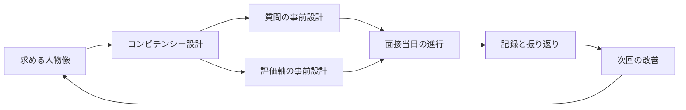
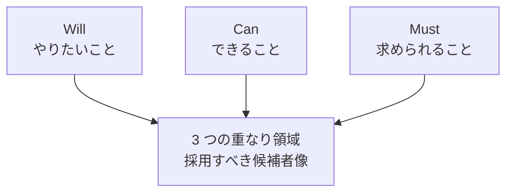
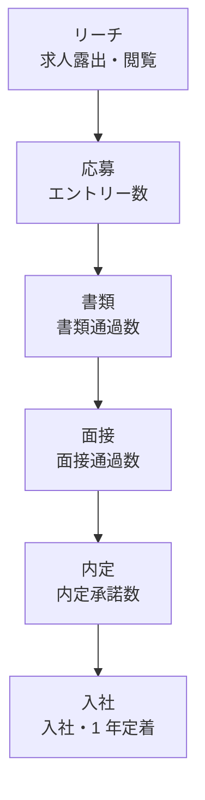
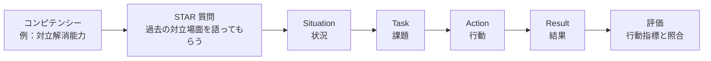
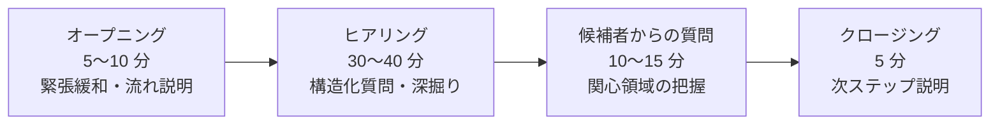
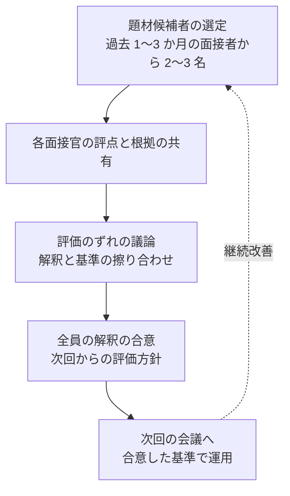
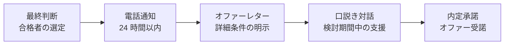
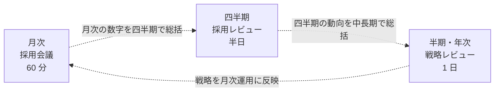

# 採用面接設計実践

構造化面接・コンピテンシー・候補者体験——人事担当者と面接官マネジャーのための実務入門

| 項目 | 内容 |
|---|---|
| カテゴリー | 人事・労務実務 |
| 難易度 | 初級〜中級 |
| 所要時間 | 約200分（全8レッスン） |
| 公開日 | 2026-06-26 |
| 最終更新日 | 2026-06-26 |
| コースURL | https://skillup.college/courses/hr-labor/interview-design-practical/ |

## 対象者

新任〜中堅の人事担当者（採用担当・人事企画）と、面接官に任命された事業部マネジャーを両方主たる対象とする。これから採用に関わる新人人事の方、面接官を担当することになったマネジャー、スタートアップで採用責任者を任された経営層、人事を持たない中小企業で経営者自ら面接する方など、構造化された採用面接を設計・運用する立場のすべての方が対象。業種・企業規模を問わず受講できる。

## 前提知識

特になし。社会人として一定の業務経験があれば十分。採用の実務経験、人事の知識、面接官経験はいずれも不要。「これから採用面接に関わる」「面接官に任命されたが何を準備すればよいかわからない」「現在の採用面接が印象判断になっている自覚があり改善したい」という方を主対象に設計。

## 学習目標

- 構造化面接の理論的根拠を理解し、印象判断（非構造化面接）の限界を説明できる
- コンピテンシーモデルとジョブディスクリプションを使って求める人物像を設計できる
- 母集団形成の発想（採用ファネル、リファラル、ダイレクトリクルーティング）を扱える
- STAR 法・状況面接など構造化面接の質問設計と評価軸を作成できる
- 面接当日の進行（4 段階）と暗黙バイアスへの自覚を実践できる
- 面接官カリブレーションで複数面接官の判断ばらつきを抑えられる
- 候補者体験と内定後フロー（不合格通知・オファー・口説き）を設計できる
- 採用 KPI と継続改善、AI 時代の採用業務の現在地を把握する

## コース概要

「面接官を任されたが、何を準備すればよいかわからない」「面接の手応えと入社後の活躍が一致しない」「自社の採用基準が言語化されていない」——多くの組織で繰り返されている悩みです。本コースは、新任〜中堅の人事担当者と、面接官に任命された事業部マネジャーを両方主たる対象に、採用面接を「技術として運用する」ための 8 レッスンを段階的に構成しました。構造化面接の理論的根拠、コンピテンシーモデルによる求める人物像の設計、母集団形成の発想、構造化面接の質問設計、面接当日の進行と暗黙バイアスへの対処、面接官カリブレーション、候補者体験と内定後フロー、採用 KPI と AI 時代の採用業務までを扱います。

## 学習の流れ

レッスン 1 で構造化面接の理論的根拠と、Schmidt & Hunter（1998）のメタ分析が示した印象判断の限界を確認します。前半（1〜3）は「設計の前提と母集団」のテーマで、求める人物像の設計（L2）と母集団形成（L3）を扱います。中盤（4〜6）が本コースの中核で、構造化面接の設計（L4）、面接当日の進行（L5）、面接官トレーニング（L6）を順に学びます。後半（7〜8）は「採用全体の運用」で、候補者体験と内定後フロー（L7）、採用 KPI と継続改善（L8）を扱います。最終的に、人事担当者と面接官マネジャーが同じ言語で採用を設計・運用できる土台を持ち帰っていただく構成です。

## レッスン一覧

| No. | タイトル | 概要 | 所要時間 |
|---|---|---|---|
| 1 | 採用面接設計の出発点——なぜ「構造化」が必要か | 採用が組織を作るというピーター・カペリらの人的資本論、印象判断（非構造化面接）の限界を示した Schmidt & Hunter（1998）のメタ分析、構造化面接の発想、法令の前提（職業安定法・男女雇用機会均等法・改正障害者差別解消法）、社労士・弁護士の独占業務と本コースの教育目的、本コースの守備範囲を学ぶ | 25分 |
| 2 | 求める人物像の設計——コンピテンシーとジョブディスクリプション | コンピテンシーの定義（Spencer & Spencer のモデル）、行動指標としての分解、ジョブディスクリプション（JD）の作り方、Must・Want コンピテンシーの整理（5 〜 7 個＋ 3 〜 5 個）、Will/Can/Must の三角形を採用視点で使う、現場マネジャーとの JD すり合わせを学ぶ | 25分 |
| 3 | 母集団形成——応募者プールの作り方とリファラル設計 | 採用ファネル（リーチ→応募→書類→面接→内定→入社）、採用手法の使い分け（求人広告・ダイレクトリクルーティング・エージェント・リファラル）、求人票の書き方と心理的契約、候補者体験（Candidate Experience）の基本、リファラル制度の設計と運用を学ぶ | 25分 |
| 4 | 構造化面接の設計——質問設計と評価軸の作り方 | 構造化面接の 4 要素（質問設計・順序・評価軸・記録）、コンピテンシー面接と行動面接の設計、STAR 法（Situation, Task, Action, Result）、状況面接（Situational Interview）の設計、不適切な質問の整理（プライバシー、家族構成、思想、健康状態、宗教）を学ぶ | 25分 |
| 5 | 面接当日の進行——アイスブレイク、深掘り、合否判断 | 面接の 4 段階（オープニング・ヒアリング・候補者からの質問・クロージング）、アイスブレイクの位置づけ、深掘り質問の技術（オープンクエスチョン、フォロー、Why の 3 段）、メモの取り方（評価記録）、合否判断における暗黙バイアス（Halo Effect、First Impression Effect、類似性バイアス）への自覚を学ぶ | 25分 |
| 6 | 面接官トレーニング——複数面接官の判断ばらつきを抑える | 面接官カリブレーション（Calibration）、キャリブレーション会議の設計、評価尺度の運用（BARS Behavior Anchor Rating Scale）、面接官の継続育成（フィードバック、振り返り、新人面接官の OJT）、面接官プールの管理を学ぶ | 25分 |
| 7 | 候補者体験と内定後フロー——意思決定通知から入社まで | 候補者体験の全体像、不合格通知の作法（タイミング、文面、関係維持）、内定通知の作法（オファーレター、年収提示、口説き）、内定承諾後のフォロー（オンボーディング前接点）、SNS と転職口コミサイト時代の評判管理を学ぶ | 25分 |
| 8 | 採用組織の構築と継続改善——採用 KPI、振り返り、AI 時代の採用 | 採用 KPI（応募数、書類通過率、面接通過率、内定承諾率、入社後 1 年定着率、入社後業績）、振り返りの設計、人事評価との接続、採用業務における AI 活用（書類スクリーニング、面接動画分析）の現在地と注意点、採用組織の構築（採用責任者、リクルーター、面接官プール）、修了後の学習方向を学ぶ | 25分 |

---

## レッスン1：採用面接設計の出発点——なぜ「構造化」が必要か

（所要時間：25分）

### このレッスンで学ぶこと

- 採用が組織を作るという発想と、人的資本論の基本を理解する
- 印象判断（非構造化面接）の限界を、Schmidt & Hunter（1998）のメタ分析の視点で把握する
- 構造化面接の発想と、本コースが扱う構造化の 4 要素を概観する
- 法令の前提と、社労士・弁護士の独占業務との境界を整理する

---

### 採用が組織を作る

「採用に失敗した、では育成でカバーしよう」という言葉を、私はこれまで何百回も聞いてきました。意図はわかります。すでに入社した人にできる手を打つしかないという、現場の苦肉の選択です。けれども、長期的に見ると、採用は育成よりはるかに大きく組織を左右します。採用の質が組織の質を決め、組織の質が事業の質を決める——この順序は、現代の経営学では繰り返し確認されている命題です。

スタンフォード大学のジェフリー・フェファーは、組織の権力や政治を研究する一方で、人的資本論の代表的論者でもあります。著書『The Human Equation』などで、優れた組織と平凡な組織の最大の違いは「採用と人材選別の質」にあると論じてきました。ペンシルバニア大学ウォートン・スクールのピーター・カペリも、『Why Good People Can't Get Jobs』などで、採用の構造的な問題が現代の労働市場の機能不全を生んでいると指摘しています。

> **💡 ポイント**
> 採用は「人を 1 人増やす作業」ではなく「組織の未来を 1 人ずつ作る意思決定」です。1 人の採用判断が、その後 5 年・10 年の組織文化と事業に影響します。この時間軸を持つことが、採用面接を設計する出発点になります。

採用が組織を作るというのは、抽象的な理念ではなく、具体的な事業の数字に直結します。新規採用の質が事業成長を支え、入社後の活躍と定着が長期的な人件費効率を決め、退職率の高さが採用コストの増大と組織知の流出を招きます。1 人の採用判断の重みを、コスト・パフォーマンス・組織文化の 3 側面で捉える発想が、本コース全体の前提になります。

### 印象判断（非構造化面接）の限界

採用面接の質を語るとき、避けて通れない論文があります。1998 年に米心理学会の学術誌に掲載された、Frank Schmidt（フランク・シュミット）と John Hunter（ジョン・ハンター）による「The Validity and Utility of Selection Methods in Personnel Psychology: Practical and Theoretical Implications of 85 Years of Research Findings」というメタ分析論文です。85 年分の人材選別研究を統合した、採用研究の最重要文献の 1 つとされます。

この論文の含意の中で、面接設計に最も影響を与えたのが「非構造化面接（Unstructured Interview）の予測妥当性の低さ」です。非構造化面接、つまり面接官が自由に質問を組み立てる印象判断中心の面接は、入社後の業績や定着を予測する力が、構造化面接よりはるかに低いとデータが示しました。

具体的に、非構造化面接の予測妥当性（入社後業績との相関係数）は約 0.20 前後とされる一方、構造化面接は 0.50 以上に達することが、その後の追研究も含めて繰り返し確認されています。0.20 と 0.50 という数字の意味は、「印象判断は当たるときも当たるが、ランダムに近い精度」「構造化は安定して当たる」と要約できます。

> **⚠️ 注意**
> 「自分は人を見る目がある」と感じる面接官は、ほとんどの場合で印象判断に陥っています。Schmidt & Hunter のデータが示すのは、誰がやっても非構造化面接は精度が低いという事実で、特定の面接官だけが例外的に高い精度を持つというデータは確認されていません。本コースは「個性ではなく技術として面接を扱う」立場に立ちます。

なぜ印象判断は精度が低いのか。3 つの構造的な理由があります。

第 1 に、**面接官のバイアスが入る**ためです。第一印象、見た目、話し方、自分との類似性、出身校や前職への先入観など、面接官が無自覚に持っているフィルターが判断に紛れ込みます。

第 2 に、**質問が候補者ごとに異なる**ためです。同じポジションへの応募者でも、面接官が異なる質問を投げかければ、候補者の回答内容を直接比較できません。複数候補者の比較を要する採用では、致命的な弱点です。

第 3 に、**評価基準が事前に決まっていない**ためです。面接後に「良かった・悪かった」という総合印象だけが残り、何を基準に判断したかが言語化されないため、面接官間で判断軸を共有することも、後から振り返ることもできません。

### 構造化面接の発想

構造化面接（Structured Interview）は、非構造化面接の弱点に正面から応える設計です。本コースが扱う構造化の中核を、4 つの要素として整理します。

第 1 の要素は「**質問の事前設計**」です。何を聞くかを面接前に決め、複数候補者に同じ質問を行います。質問は、求める人物像（コンピテンシー）から逆算して設計します。

第 2 の要素は「**質問順序の固定**」です。面接の流れ（オープニング、ヒアリング、候補者からの質問、クロージング）を 4 段階で設計し、各段階で扱う内容を決めます。質問順序の違いだけでも、候補者の心理状態は変わり、回答内容に影響します。

第 3 の要素は「**評価軸の事前設計**」です。「何を評価するか」「どのレベルが期待値か」を事前に決めます。本コースでは BARS（Behavior Anchor Rating Scale）という具体的な行動指標を使う発想を扱います。

第 4 の要素は「**記録と振り返り**」です。面接中のメモを構造化された形式で残し、面接後に評価軸ごとに記録します。面接官同士の議論や、入社後の検証を可能にします。

図 1：構造化面接は「求める人物像」から逆算して質問・評価軸を設計し、記録と振り返りで継続改善を回します。4 つの要素は独立した手順ではなく、循環的な設計プロセスを形成します。

> **📝 補足**
> 構造化を進めると、面接が「マニュアル化されて窮屈になるのではないか」という懸念を持つ方がいます。本コースの立場は逆で、構造化は面接官の判断を窮屈にするのではなく、自由に判断するための土台を作るものです。基本構造があるからこそ、その上で深い対話と個別の気づきが乗ります。

### 法令の前提と本コースの守備範囲

採用面接は、複数の法令の枠組みの中で行われます。本コースは個別の法令解釈や具体的な労務相談は扱いませんが、面接設計の前提として最低限の枠組みを整理します。

第 1 に、**職業安定法**です。採用活動の基本的な枠組みを定める法律で、求人情報の明示、虚偽記載の禁止、個人情報の取扱いなどを規定します。2017 年改正で求人情報の明示義務が強化され、2022 年改正で求職者等の個人情報の取扱いがさらに整理されました。

第 2 に、**男女雇用機会均等法**です。性別を理由とする差別的な取扱いを禁止します。採用面接では、性別、結婚予定、出産予定、家族構成（特に女性候補者への質問）など、直接・間接の差別につながる質問は避ける必要があります。

第 3 に、**改正障害者差別解消法**です。2024 年 4 月に施行された改正で、民間事業者の合理的配慮の提供が義務化されました。採用面接における障害のある候補者への配慮（手話通訳、文字情報、面接時間の延長など）が、努力義務から義務に変わりました。

第 4 に、**個人情報保護法**です。応募者から取得する情報の利用目的の特定、第三者への提供の制限、開示請求への対応などを定めます。採用業務での個人情報の保管期間と廃棄ルールも、組織として明示する必要があります。

> **⚠️ 注意**
> 本コースは「教育目的の一般原則」を扱うものであり、特定の事例に対する法的判断は提供しません。個別の労務相談・労務代理は社会保険労務士（社労士）の独占業務、特定の差別事例の法的判断や訴訟対応は弁護士の独占業務です。皆さんの組織で具体的な判断に迷う場面では、必ず専門家にご相談ください。

加えて、本コースは資格試験対策（人事関連の検定、社労士試験など）として扱いません。実務で「自社の採用面接をどう設計するか」を主眼とします。資格対策は各資格専門の予備校・教材に譲ります。

### 本コースの守備範囲と前提

本コースの主たる対象は、新任〜中堅の人事担当者（採用担当・人事企画）と、面接官に任命された事業部マネジャーです。両者が同じ言語で採用を設計・運用できることが、組織全体の採用の質を底上げするという発想で構成しています。

扱う 7 つのテーマは、レッスン 2 から順に、求める人物像の設計、母集団形成、構造化面接の設計、面接当日の進行、面接官トレーニング、候補者体験と内定後フロー、採用 KPI と AI 時代の採用業務です。すべてが「構造化」という共通テーマの上に乗っています。

> **🔰 初学者の方へ**
> 「これから採用面接に関わる」「面接官に任命されたが何を準備すればよいかわからない」という方も、本コースを最初から順に読み進めることで、採用面接の全体像を把握できる構成にしています。特定のレッスンから読み始めると、用語と発想の積み上げが失われるため、最初は順番通りに進めることを推奨します。

本コースで扱わないものも明示します。労務管理の実務手続き、社会保険・労働保険の手続き、就業規則の作成、給与計算、人事評価制度の設計、退職実務、特定業界に固有の採用慣行（医療・教育・公務員など）、リーダーシップ採用（経営層・役員クラス）の特殊論点は、本コースの守備範囲外です。

### まとめ

このレッスンでは、以下のことを学びました。

- 採用は「人を 1 人増やす作業」ではなく「組織の未来を 1 人ずつ作る意思決定」で、コスト・パフォーマンス・組織文化の 3 側面で重みを持つ
- Schmidt & Hunter（1998）のメタ分析が示した、非構造化面接の予測妥当性の低さ（約 0.20）と、構造化面接の予測妥当性の高さ（約 0.50 以上）
- 印象判断が精度を欠く構造的理由は、面接官バイアス・質問の不統一・評価基準の不在の 3 つ
- 構造化面接の 4 要素は、質問の事前設計・質問順序の固定・評価軸の事前設計・記録と振り返り
- 法令の前提として、職業安定法・男女雇用機会均等法・改正障害者差別解消法（2024 年 4 月施行）・個人情報保護法の枠組みを意識する
- 個別の労務相談は社労士、特定の差別事例の判断は弁護士の独占業務で、本コースは教育目的に徹する

次のレッスンでは、構造化面接の最初のステップである「求める人物像の設計」を扱います。コンピテンシーモデル、ジョブディスクリプション、Will/Can/Must の三角形を採用視点で使う方法、現場マネジャーとの JD すり合わせを学びます。

---

### 確認クイズ

このレッスンの理解度をチェックしましょう。

#### Q1. Schmidt & Hunter（1998）のメタ分析が示した、非構造化面接の予測妥当性（入社後業績との相関係数）として、本レッスンが紹介した数値はどれですか？

- [ ] 約 0.80
- [ ] 約 0.50 以上
- [x] 約 0.20 前後
- [ ] 約 0.95

> **解説**
> 非構造化面接の予測妥当性は約 0.20 前後と確認されており、ランダムに近い精度です。構造化面接は 0.50 以上に達することが繰り返し確認されています。0.20 と 0.50 の差が、構造化の効用を示します。

#### Q2. 印象判断（非構造化面接）が精度を欠く構造的理由として、本レッスンが挙げていないものはどれですか？

- [ ] 面接官のバイアスが入る
- [x] 面接時間が短すぎる
- [ ] 質問が候補者ごとに異なる
- [ ] 評価基準が事前に決まっていない

> **解説**
> 本レッスンが挙げた 3 つの構造的理由は、面接官バイアス・質問の不統一・評価基準の不在です。面接時間の短さは精度の主要因として本レッスンでは扱っていません。長くしても、構造がなければ精度は上がりません。

#### Q3. 本コースが扱う構造化面接の 4 要素に含まれないものはどれですか？

- [x] 面接官の容姿の統一
- [ ] 質問の事前設計
- [ ] 質問順序の固定
- [ ] 評価軸の事前設計

> **解説**
> 4 要素は、質問の事前設計・質問順序の固定・評価軸の事前設計・記録と振り返り、です。面接官の容姿は構造化の要素ではありません。

#### Q4. 採用面接の法令の前提として、本レッスンが整理していないものはどれですか？

- [ ] 職業安定法
- [ ] 男女雇用機会均等法
- [ ] 改正障害者差別解消法
- [x] 道路交通法

> **解説**
> 本レッスンが整理した 4 つの法令の前提は、職業安定法・男女雇用機会均等法・改正障害者差別解消法（2024 年 4 月施行）・個人情報保護法です。道路交通法は採用面接の法令前提には含まれません。

#### Q5. 本コースの守備範囲と前提として、本レッスンが示したものはどれですか？

- [x] 個別の労務相談は社労士、特定の差別事例の判断は弁護士の独占業務で、本コースは教育目的の一般原則を扱う
- [ ] 本コースを修了すれば社会保険労務士として開業できる
- [ ] 本コースで個別の差別事例に対する法的助言を提供する
- [ ] 本コースは社労士・行政書士・弁護士の試験対策を含む

> **解説**
> 本コースは教育目的の一般原則を扱い、個別の労務相談は社会保険労務士、特定の差別事例の法的判断は弁護士の独占業務であることを明示しています。資格試験対策や個別法的助言は含みません。

#### Q6. 採用が組織を作るという発想の論拠として、本レッスンが紹介した人的資本論の論者はどれですか？

- [ ] ロバート・チャルディーニとサイモン・シネック
- [ ] ピーター・ドラッカーとサイモン・シネック
- [x] ジェフリー・フェファーとピーター・カペリ
- [ ] ヘンリー・ミンツバーグとロバート・チャルディーニ

> **解説**
> 本レッスンが紹介した論者は、スタンフォード大学のジェフリー・フェファー（『The Human Equation』など）と、ペンシルバニア大学ウォートン・スクールのピーター・カペリ（『Why Good People Can't Get Jobs』など）です。両者は「採用と人材選別の質が組織の質を決める」と論じてきた人的資本論の代表的論者です。

---

## レッスン2：求める人物像の設計——コンピテンシーとジョブディスクリプション

（所要時間：25分）

### このレッスンで学ぶこと

- コンピテンシーの定義と Spencer & Spencer のモデルを理解する
- 行動指標としての分解と、観察可能なコンピテンシーの設計を学ぶ
- ジョブディスクリプション（JD）の作り方と、Must・Want コンピテンシーの整理を扱える
- Will/Can/Must の三角形を採用視点で使い、現場マネジャーとの JD すり合わせを進められる

---

前回のレッスンでは、構造化面接の理論的根拠と 4 要素を学びました。今回からは構造化面接を具体的に設計します。最初のステップは「何を見極めるか」、つまり求める人物像の設計です。コンピテンシーモデルとジョブディスクリプションを中核として扱います。

### コンピテンシーとは何か

採用面接で「優秀な人を採りたい」「うちのカルチャーに合う人を採りたい」という言葉はよく聞かれます。けれども、「優秀」「カルチャーフィット」のままでは、面接官 5 人が同じ言葉を使っても、それぞれが違うものを評価することになります。求める人物像を具体化する道具が「コンピテンシー」です。

コンピテンシー（Competency）は、米心理学者デイビッド・マクレランドが 1973 年の論文「Testing for Competence Rather Than for Intelligence」で提唱した概念です。学歴や知能テストでは予測できない、職務での成功を支える行動特性を指します。その後、ライル・スペンサー（Lyle Spencer）とシグネ・スペンサー（Signe Spencer）が 1993 年の著書『Competence at Work』で体系化し、人事実務の標準的なフレームワークになりました。

Spencer & Spencer のモデルでは、コンピテンシーを 5 つの構成要素に分解します。

第 1 に、**知識（Knowledge）**です。職務に関する情報・知見の蓄積。研修や経験で獲得できます。

第 2 に、**スキル（Skill）**です。特定の作業を遂行する能力。練習で習得できます。

第 3 に、**自己概念（Self-Concept）**です。自分自身に対する認識、価値観、信念。比較的安定していますが、経験を通じて変化します。

第 4 に、**特性（Trait）**です。状況に対する反応や行動の傾向。比較的固定的です。

第 5 に、**動機（Motive）**です。行動を駆動する深層的な欲求や関心。最も変化しにくい要素です。

Spencer & Spencer は、これら 5 要素を「氷山モデル」で説明しました。海面より上に見えるのが知識とスキル、海面下に隠れているのが自己概念・特性・動機です。多くの企業の採用は知識とスキルだけで判断しがちですが、実際に長期的な業績差を生むのは海面下の要素である、という主張です。

> **💡 ポイント**
> コンピテンシーモデルの真価は「知識とスキルだけでは予測できない、業績差の源泉」を捉えることにあります。採用面接で氷山の海面下を覗くことが、本コースが目指す技術です。観察できる行動を通じて、自己概念・特性・動機の手がかりを掴む発想です。

### 行動指標としての分解

コンピテンシーを概念のまま使うと、面接官ごとに解釈が異なり、構造化の意味が失われます。Spencer & Spencer のモデルで重要なのは、各コンピテンシーを「観察可能な行動指標」に分解する作業です。

例えば、「協調性」というコンピテンシーがあったとします。これだけでは曖昧で、面接官が違う行動を見ます。これを行動指標に分解すると、次のようになります。

| 行動指標例 |
|---|
| チームの議論で、自分の主張と異なる意見にも耳を傾けた経験を語れる |
| 過去のプロジェクトで、自分以外のメンバーの貢献を具体的に挙げられる |
| 対立が起きた場面で、解決のために自分が動いた具体的なエピソードがある |
| 自分の得意領域以外の業務を引き受けた経験と、その理由を説明できる |

表 1：「協調性」を行動指標 4 つに分解した例。面接官は、これらを満たす具体的なエピソードが候補者から引き出せるかどうかを評価します。

このように分解することで、面接官 5 人がいても、同じ行動指標を見て同じ評価ができます。複数候補者の比較も可能になります。本コースが構造化面接で扱う「評価軸」は、この行動指標の集合体です。

> **⚠️ 注意**
> 行動指標は「言葉として聞き取れる行動」である必要があります。「協調性が高そう」「優しそう」のような印象は行動指標になりません。「過去のプロジェクトで、自分以外のメンバーの貢献を具体的に挙げられる」のように、具体的な観察対象である必要があります。

### ジョブディスクリプション（JD）の作り方

コンピテンシーを設計するには、まず「どの職務に対する採用か」を明確にする必要があります。ここで使うのが「ジョブディスクリプション」（Job Description、以下 JD）です。

JD は、職務の内容、責任範囲、必要なスキル・経験、求めるコンピテンシーを言語化した文書です。欧米企業では採用の前提として広く整備されており、日本企業でも 2010 年代以降、ジョブ型雇用の議論が進む中で導入が広がりました。

JD の基本構成は 6 つのブロックです。

第 1 ブロックは「**職務名と所属**」です。役職名、部署、勤務地、雇用形態（正社員、契約社員など）を明示します。

第 2 ブロックは「**職務概要**」です。この職務が組織の中で何を担うかを 3 〜 5 行で要約します。

第 3 ブロックは「**主要業務**」です。日常的に行う業務を 5 〜 10 項目で列挙します。優先度の高い順に並べます。

第 4 ブロックは「**責任範囲と権限**」です。意思決定の範囲、予算権限、人事権限などを明示します。

第 5 ブロックは「**必須要件**」です。学歴、職務経験年数、必須スキル、必須資格を列挙します。

第 6 ブロックは「**期待するコンピテンシー**」です。職務の遂行に必要な行動特性を列挙します。本レッスンのテーマである Must・Want の整理がここに入ります。

> **📝 補足**
> 日本企業の伝統的な採用では、職務を限定しない総合職採用が中心でした。この場合、職務を特定した JD よりも「育成過程で複数の職務を経験する」前提の人物像設計が必要になります。本コースは JD ベースの設計を主に扱いますが、総合職採用の場合は「3 〜 5 年後の想定職務群」に対する JD を仮置きする発想で応用できます。

### Must コンピテンシーと Want コンピテンシー

JD の中の「期待するコンピテンシー」を設計するとき、本コースは Must（必須）と Want（望ましい）の 2 段階で整理することを推奨します。

**Must コンピテンシー**は、職務の遂行に欠かせない、これがないと業務が回らない能力です。一般的に 5 〜 7 個に絞ります。すべての候補者で Must を満たすことが採用条件になります。

**Want コンピテンシー**は、あれば望ましいが、なくても代替手段がある能力です。一般的に 3 〜 5 個程度に整理します。候補者間の差別化や、複数候補者から優先順位をつける際の材料になります。

例えば、中堅マネジャー職の JD の場合、Must コンピテンシーの例として「目標設定と進捗管理」「1on1 と日常的なフィードバック」「チームメンバー間の対立解消」「上位者への提案と報告」「予算配分の意思決定」などを 5 〜 7 個に絞ります。Want コンピテンシーの例として「外部講演経験」「英語での業務経験」「業界横断のネットワーク」などを 3 〜 5 個に整理します。

> **💡 ポイント**
> Must を多くしすぎると、応募者全員が不合格になります。Want を多くしすぎると、判断軸が散らかります。両者の数のバランスが、JD 設計の質を決めます。Must 5 〜 7、Want 3 〜 5 という目安は、私自身が 50 社で支援した経験からの実用的な範囲です。

### Will/Can/Must の三角形を採用視点で使う

採用面接でよく参照される枠組みに、「Will（やりたいこと）」「Can（できること）」「Must（求められること）」の三角形があります。キャリアデザインや個人の動機の整理にも使われますが、採用面接の文脈では特に有用です。

採用面接における Will/Can/Must の意味を整理します。

**Will（やりたいこと）**は、候補者が自分の意思で取り組みたいと感じる業務、関心領域、長期的なキャリア展望です。候補者の自己概念・動機の手がかりを得る場面で使います。「なぜこの職務に応募したか」「3 年後にどうなっていたいか」「これまでの仕事で最も熱中した瞬間は何か」などの質問で、Will を引き出します。

**Can（できること）**は、候補者が現時点で持つスキル・経験・知識です。Spencer & Spencer の氷山モデルの海面より上の要素にあたります。職務経歴書・履歴書・面接でのエピソード説明で確認します。

**Must（求められること）**は、職務が候補者に求める能力と行動です。JD で言語化された Must コンピテンシーがこれにあたります。

採用判断の質は、Will・Can・Must の 3 つが重なる領域の大きさで決まります。Will と Must が重ならない候補者は、入社後に動機が続かず早期退職するリスクがあります。Can と Must が重ならない候補者は、入社後に業務遂行で苦しみます。Will と Can が重ならない候補者は、能力はあるが本人の納得が薄い状態で働くことになります。

図 2：Will・Can・Must の三角形を採用視点で使うと、3 つが重なる領域の候補者が長期的に活躍する可能性が高いことが見えてきます。

> **⚠️ 注意**
> 「採用してから育てればよい」（Hire for Will, Train for Skill）という発想は、Will があり Can が不足する候補者を採る判断を正当化します。一定の合理性はあるものの、Must コンピテンシーの中に「育成では追いつかない」要素があるかどうかを冷静に評価する必要があります。本コースは「Will と Skill の両方を見極める」立場です。

### 現場マネジャーとの JD すり合わせ

JD は人事部だけで作るものではありません。職務を最もよく知る現場マネジャーとの共創で作るのが原則です。すり合わせのプロセスを 3 つの段階で整理します。

第 1 段階は「**現場マネジャーへのヒアリング**」です。職務の実態、必須業務、責任範囲、求めるスキル、好ましいタイプの候補者などを 60 〜 90 分のセッションでヒアリングします。「過去に活躍したメンバーの共通点は何か」「過去に早期退職した方の共通する弱点は何か」を尋ねると、コンピテンシーの手がかりが集まります。

第 2 段階は「**人事による JD ドラフトの作成**」です。ヒアリング内容を基に、人事担当者が JD のドラフトを作成します。Must・Want のコンピテンシー数のバランス、行動指標への分解、法令との整合（不適切な要件が含まれていないか）を人事の視点でチェックします。

第 3 段階は「**現場マネジャーとの合意**」です。ドラフトを現場マネジャーと共有し、修正と合意を経て確定します。合意したコンピテンシーが、その後の母集団形成・書類選考・面接設計・合否判断のすべての基準になります。

> **🔰 初学者の方へ**
> 現場マネジャーが「うちは即戦力が欲しい」と漠然と求めることはよくあります。即戦力という言葉は、具体性が低くコンピテンシーになりません。人事担当者は「即戦力とは具体的にどの業務を、入社何か月以内に、どのレベルでできることですか」と問い直す役割を引き受けます。これが現場マネジャーとの JD すり合わせの中核技術です。

### まとめ

このレッスンでは、以下のことを学びました。

- コンピテンシーは、デイビッド・マクレランドが 1973 年に提唱し、Spencer & Spencer が 1993 年に体系化した職務での成功を支える行動特性
- Spencer & Spencer のモデルでは、コンピテンシーを知識・スキル・自己概念・特性・動機の 5 要素に分解し、「氷山モデル」で表現する
- コンピテンシーは「観察可能な行動指標」に分解しないと、面接官間で同じ評価ができない
- ジョブディスクリプション（JD）は職務の内容を文書化する基本ツールで、職務名と所属・職務概要・主要業務・責任範囲と権限・必須要件・期待するコンピテンシーの 6 ブロックで構成する
- 期待するコンピテンシーは Must（5 〜 7 個）と Want（3 〜 5 個）の 2 段階で整理する
- Will（やりたいこと）・Can（できること）・Must（求められること）の 3 つが重なる領域の候補者が、長期的に活躍する可能性が高い
- JD すり合わせは現場マネジャーとの共創で、過去のメンバーの具体的なエピソードを行動指標に翻訳する技術が中核

次のレッスンでは、求める人物像が定まった後の「母集団形成」を扱います。採用ファネル、採用手法の使い分け、求人票の書き方、候補者体験の基本、リファラル制度の設計を学びます。

---

### 確認クイズ

このレッスンの理解度をチェックしましょう。

#### Q1. コンピテンシーの概念を 1973 年の論文で最初に提唱した人物として、本レッスンが紹介したのは誰ですか？

- [x] デイビッド・マクレランド
- [ ] ロバート・チャルディーニ
- [ ] ピーター・ドラッカー
- [ ] エイミー・エドモンドソン

> **解説**
> 米心理学者デイビッド・マクレランドが 1973 年の論文「Testing for Competence Rather Than for Intelligence」でコンピテンシーの概念を提唱しました。Spencer & Spencer がその後 1993 年に体系化しました。

#### Q2. Spencer & Spencer のコンピテンシーモデルの 5 要素に含まれないものはどれですか？

- [ ] 知識
- [ ] スキル
- [x] 学歴
- [ ] 動機

> **解説**
> 5 要素は、知識・スキル・自己概念・特性・動機です。学歴は構成要素ではありません。Spencer & Spencer のモデルは、まさに「学歴では予測できない業績差」を捉えるための枠組みです。

#### Q3. コンピテンシーを「観察可能な行動指標」に分解する作業の意味として、本レッスンが示したものはどれですか？

- [ ] 面接官の主観を排除して機械的に判断するため
- [x] 面接官間で同じ行動指標を見て同じ評価ができるようにするため
- [ ] 候補者にコンピテンシーを暗記してもらうため
- [ ] 採用ホームページの宣伝文句を作るため

> **解説**
> コンピテンシーを概念のまま使うと面接官ごとに解釈が違いますが、行動指標に分解すると面接官 5 人がいても同じ行動指標を見て同じ評価ができ、複数候補者の比較も可能になります。

#### Q4. 期待するコンピテンシーを Must と Want の 2 段階で整理する目安として、本レッスンが推奨した数はどれですか？

- [x] Must 5 〜 7 個、Want 3 〜 5 個
- [ ] Must 1 〜 2 個、Want 10 〜 15 個
- [ ] Must 20 個以上、Want は不要
- [ ] Must と Want は分けず合計 50 個程度

> **解説**
> Must は職務の遂行に欠かせない能力で 5 〜 7 個に絞り、Want はあれば望ましい能力で 3 〜 5 個に整理します。Must を多くしすぎると応募者全員が不合格になり、Want を多くしすぎると判断軸が散らかります。

#### Q5. Will/Can/Must の三角形を採用視点で使う発想として、本レッスンが示したものはどれですか？

- [ ] Will は不要で、Can と Must だけで判断すればよい
- [ ] Can は無視して、Will と Must の重なりだけで判断する
- [ ] Must は曖昧でよく、Will と Can があれば採用する
- [x] Will・Can・Must の 3 つが重なる領域の候補者が、長期的に活躍する可能性が高い

> **解説**
> Will（やりたいこと）・Can（できること）・Must（求められること）の 3 つが重なる領域の候補者を見つけることが、採用判断の質を決めます。1 つでも欠けると、入社後の動機・遂行・納得感のいずれかが弱くなります。

#### Q6. 現場マネジャーとの JD すり合わせで「優秀な人を採りたい」という曖昧な要望に対し、本レッスンが推奨した問いはどれですか？

- [ ] 「優秀さの定義は人事の仕事ですので、現場は口を出さないでください」
- [ ] 「優秀さは個人の感覚なので、JD には書かなくていいです」
- [x] 「過去に活躍した A さんと、早期退職した B さんの具体的な違いは何ですか」
- [ ] 「優秀さは経営層が決めるものなので、現場マネジャーは関係ありません」

> **解説**
> 抽象的な「優秀さ」を問うのではなく、過去の具体的なメンバーのエピソードを引き出すことで、漠然とした要望を行動指標に翻訳できます。これが現場マネジャーとの JD すり合わせの中核技術です。

---

## レッスン3：母集団形成——応募者プールの作り方とリファラル設計

（所要時間：25分）

### このレッスンで学ぶこと

- 採用ファネル（リーチ→応募→書類→面接→内定→入社）の構造を理解する
- 採用手法の使い分け（求人広告、ダイレクトリクルーティング、エージェント、リファラル）を扱える
- 求人票の書き方と、応募前に始まる心理的契約を意識できる
- 候補者体験の基本と、リファラル制度の設計と運用を進められる

---

前回のレッスンでは、コンピテンシーモデルとジョブディスクリプションを使った求める人物像の設計を扱いました。今回は、設計した求める人物像にどう候補者を集めるか、つまり「母集団形成」を学びます。面接設計のレッスンに入る前に、面接の手前で何が起きているかを把握することが、本コース全体の設計を支えます。

### 採用ファネルの構造

採用は、リーチから入社まで多くの段階を経る一連の流れです。マーケティング分野で使われる「ファネル」の発想を採用に応用したのが「採用ファネル」で、近年の人事実務で標準的な見方になりました。

採用ファネルの基本構造は 6 段階です。

第 1 段階「**リーチ**」は、自社の採用情報が候補者の目に触れる段階です。求人広告の閲覧者数、自社採用ページの訪問者数、社外イベントでの接点数などで測ります。

第 2 段階「**応募**」は、候補者が実際に応募行動を取る段階です。エントリー数、書類提出数で測ります。

第 3 段階「**書類**」は、応募書類を選考する段階です。書類通過数で測ります。

第 4 段階「**面接**」は、複数回の面接を通じて候補者を評価する段階です。一次面接、二次面接、最終面接の通過数で測ります。

第 5 段階「**内定**」は、候補者にオファーを出す段階です。内定数、内定承諾数で測ります。

第 6 段階「**入社**」は、候補者が実際に入社する段階です。入社数、入社後 1 年定着数で測ります。

図 1：採用ファネルの 6 段階。各段階で多くの候補者がふるい落とされ、最終的に入社に至る人数は最初のリーチの数十分の一から数百分の一になります。各段階の通過率を測ることが、ファネル改善の第一歩です。

> **💡 ポイント**
> 採用ファネルの考え方を持つと、「面接の精度を上げる」だけでなく「ファネル全体のどこに弱点があるか」を診断できます。応募数は多いが書類通過率が低いなら求人票と応募者属性のミスマッチ、書類は通るが面接通過率が低いなら書類選考の基準が甘い、内定は出るが承諾率が低いならオファーの伝え方や年収提示に問題がある、というように、ボトルネックの所在を構造的に捉えられます。

各段階の通過率の目安は、業種・職種・採用規模で大きく変わります。新卒一括採用、中途即戦力採用、エグゼクティブ採用ではまったく異なる数字になります。自社の過去 3 年のデータを基準点にし、業界の参考値と照らし合わせて、ボトルネックを特定するのが現実的な進め方です。

### 採用手法の使い分け

候補者にリーチする手法は、近年、急速に多様化しました。本コースは主要な 4 つを整理します。

第 1 の手法は「**求人広告**」です。求人情報サイト（リクナビ、マイナビ、エン転職、ビズリーチ、indeed など）への掲載で、候補者の能動的な応募を待つ形式です。リーチ規模は大きいですが、自社の業種・職種に関心を持つ候補者だけが応募する自己選別性があります。広告掲載コストは月数十万円から百万円規模が一般的です。

第 2 の手法は「**ダイレクトリクルーティング**」です。自社の採用担当者が、データベースやネットワーク上で候補者を探し、直接スカウトメッセージを送る形式です。リーチは限定的ですが、求人広告では集まりにくい層（特定スキルの中堅人材、転職を真剣に検討していない潜在層）にアプローチできます。Wantedly、LinkedIn、ビズリーチのスカウト機能などが代表的です。

第 3 の手法は「**人材紹介エージェント**」です。エージェントが候補者と企業を仲介し、入社時に成功報酬（一般的に年収の 30 〜 35%）を支払う形式です。エージェントが候補者を一次スクリーニングするため、人事の工数が削減できますが、候補者がエージェント経由でしか応募できない構造のため、自社の魅力がエージェント次第になる側面があります。

第 4 の手法は「**リファラル**」です。社員からの紹介で候補者と接点を持つ形式です。社員の知人ネットワークを活用するため、候補者と組織のカルチャー適合性が高い傾向があります。リファラル経由の入社者は、求人広告経由よりも定着率が 1.5 〜 2 倍高いというデータが多くの調査で確認されています。

> **📝 補足**
> 採用手法は排他的に選ぶものではなく、組み合わせて使うのが現実的です。職種・採用ボリューム・時間軸・予算で組み合わせを決めます。新卒一括採用は求人広告中心、中途即戦力は求人広告とダイレクトリクルーティングの併用、エグゼクティブはエージェントとダイレクトリクルーティング中心、内定数を底上げしたい場合はリファラルを加速する、というような設計です。

採用手法ごとに、候補者の動機や応募経路が異なるため、その後の面接設計でも考慮が必要です。リファラル候補者は紹介者の名前を意識して応募しており、エージェント経由候補者はエージェントの推薦書を背景に持つ、というように、候補者の文脈を把握することが、面接の質を上げます。

### 求人票の書き方と心理的契約

求人票（または求人広告の文面）は、候補者と組織の最初の接点で、その内容が応募の質と量を決めます。求人票には 2 つの機能があります。

第 1 の機能は「**応募の促進**」です。候補者の応募動機を喚起し、エントリー数を増やします。仕事の魅力、組織の特徴、待遇、成長機会などを訴求します。

第 2 の機能は「**心理的契約の前提作り**」です。心理的契約（Psychological Contract）とは、明文化されていない、組織と従業員の相互期待を指す概念で、デニス・ルソー（Denise Rousseau）らが 1990 年代から体系化しました。求人票で過大な期待を抱かせると、入社後に「思っていた業務と違う」という心理的契約の違反を生み、早期退職につながります。

求人票の書き方の原則を 3 つ整理します。

第 1 の原則は「**良いことも難しいことも書く**」です。仕事の魅力だけを並べると、入社後の現実とのギャップで早期退職を生みます。「裁量権が大きい代わりに業務量も多い」「成長機会は豊富だが、自分で機会を取りに行く必要がある」のように、組織の現実を率直に伝える発想を持ちます。

第 2 の原則は「**抽象的な言葉を避ける**」です。「やりがいのある仕事」「成長できる環境」「フラットな組織」のような抽象的な表現は、候補者にとって意味が掴めません。「半期に 1 度、自分でテーマを設定して新規プロジェクトを立ち上げる機会がある」のように、具体的な行動レベルで伝えます。

第 3 の原則は「**JD と求人票の整合**」です。JD で設計した Must コンピテンシーや必須要件と、求人票の応募要件が一致している必要があります。JD では「英語業務経験」を必須にしているのに、求人票では「英語スキル歓迎」と書くと、応募者層がずれます。

> **⚠️ 注意**
> 求人票で「フラットな組織」「自由な社風」と書きながら、面接で「上司への報告と相談の徹底」を強く求める組織を、私は数多く見てきました。求人票と面接で伝えるメッセージが一致しないと、候補者は混乱し、内定承諾率も低下します。求人票・採用ページ・面接が同じ組織像を伝えるよう、人事の視点で全体を整える必要があります。

### 候補者体験の基本

候補者体験（Candidate Experience）は、候補者が応募から入社（または不合格通知）までの過程で感じる全体的な印象と評価を指す概念です。2010 年代から米国の採用業界で議論が広がり、現在では採用業務の重要指標になりました。

候補者体験が重要な理由は 3 つあります。

第 1 に、**SNS と転職口コミサイト時代の評判管理**です。候補者は応募体験を、Glassdoor、転職会議、OpenWork などの口コミサイトや SNS で共有します。悪い候補者体験は組織の評判を直接損ねます。

第 2 に、**不合格者の再応募と紹介**です。不合格になった候補者が、丁寧な対応を受けると、将来別のポジションへ再応募したり、知人を紹介してくれたりします。「不合格通知も会社の顔」という発想です。

第 3 に、**内定承諾率への影響**です。候補者は複数社を並行して選考しているのが普通で、各社の候補者体験を比較して入社先を決めます。応募から内定までの体験の質が、最終的な承諾判断に直結します。

候補者体験の設計ポイントを 4 つに整理します。応募後の自動返信メールのタイミングと文面、書類選考結果の通知速度、面接日程調整の柔軟性、各面接後のフィードバック有無——これら 4 つだけで、候補者体験は大きく変わります。

### リファラル制度の設計と運用

リファラル採用は定着率が高い手法ですが、制度設計が雑だと社員から疑問の声が上がり、定着しない場合があります。本コースは、機能するリファラル制度の設計を 4 要素で整理します。

第 1 の要素は「**透明な仕組み**」です。誰が、いつ、どんな候補者を紹介し、その候補者が何次選考まで進んだかを社員が把握できる仕組みを設計します。紹介した社員が「自分の紹介はどうなったのか」と問い合わせる手間がない透明性が前提です。

第 2 の要素は「**インセンティブ設計**」です。リファラルで入社者が出た場合、紹介した社員に金銭または非金銭のインセンティブを支払います。金額は職位や難易度で変動しますが、一般的には 10 万円から 50 万円程度の範囲です。「人材紹介エージェントに支払う数百万円の一部を、社員に還元する」発想です。

第 3 の要素は「**紹介者と被紹介者の関係配慮**」です。紹介した社員の知人が選考で不合格になった場合、紹介者と被紹介者の人間関係に悪影響が出ないよう、不合格通知のタイミングや文面で配慮します。紹介者には選考途中の状況を共有するか、不合格を先に伝えるかなど、ルールを事前に定めます。

第 4 の要素は「**人事との連携**」です。リファラル候補者でも、書類選考と面接は通常の選考プロセスを通します。「紹介だから優遇する」と社員が誤解すると、紹介の質が落ちます。同じ基準で選考し、その結果として相対的に定着率が高い傾向が出る、という構造です。

> **🔰 初学者の方へ**
> リファラル制度を導入する際、最初に陥りがちな失敗は「金銭インセンティブだけで動かそうとする」発想です。金銭インセンティブだけでは、社員は「自社で活躍できそうにない知人」も紹介してしまい、紹介の質が下がります。リファラルが機能するのは、社員が「自社を友人に勧めたい」と感じている前提があるときだけです。社員のエンゲージメントが低い組織では、リファラル制度を作っても紹介が出ません。

### まとめ

このレッスンでは、以下のことを学びました。

- 採用ファネルは、リーチ・応募・書類・面接・内定・入社の 6 段階で、各段階の通過率を測ることでボトルネックを特定できる
- 採用手法の使い分けは、求人広告（リーチ重視）、ダイレクトリクルーティング（潜在層へのアプローチ）、人材紹介エージェント（一次選別の外部委託）、リファラル（カルチャー適合性が高い）の 4 つを組み合わせる
- 求人票の 2 つの機能は応募の促進と心理的契約の前提作りで、「良いことも難しいことも書く」「抽象表現を避ける」「JD と求人票の整合」の 3 原則で書く
- 心理的契約は明文化されていない組織と従業員の相互期待で、デニス・ルソーらが 1990 年代に体系化した
- 候補者体験は SNS と転職口コミ時代の評判管理、不合格者の再応募と紹介、内定承諾率への影響の 3 つの理由で重要
- リファラル制度は、透明な仕組み・インセンティブ設計・紹介者と被紹介者の関係配慮・人事との連携の 4 要素で機能する

次のレッスンでは、本コースの中核である「構造化面接の設計」を扱います。構造化面接の 4 要素、STAR 法、状況面接、不適切な質問の整理を学びます。

---

### 確認クイズ

このレッスンの理解度をチェックしましょう。

#### Q1. 採用ファネルの 6 段階の順序として、本レッスンが示したものはどれですか？

- [x] リーチ → 応募 → 書類 → 面接 → 内定 → 入社
- [ ] 応募 → 書類 → リーチ → 面接 → 内定 → 入社
- [ ] 内定 → 入社 → 面接 → 書類 → 応募 → リーチ
- [ ] 書類 → 面接 → リーチ → 応募 → 内定 → 入社

> **解説**
> 採用ファネルは、リーチ（求人露出・閲覧）→ 応募（エントリー数）→ 書類（書類通過数）→ 面接（面接通過数）→ 内定（内定承諾数）→ 入社（入社・1 年定着）の順です。各段階で多くの候補者がふるい落とされていく構造を理解します。

#### Q2. 本レッスンが扱った 4 つの採用手法に含まれないものはどれですか？

- [ ] 求人広告
- [x] テレビ CM
- [ ] ダイレクトリクルーティング
- [ ] 人材紹介エージェント

> **解説**
> 4 つの手法は、求人広告・ダイレクトリクルーティング・人材紹介エージェント・リファラルです。テレビ CM は採用専用の手法としては本コースで扱っていません。ブランディング目的では使われることがありますが、採用手法の整理には含めません。

#### Q3. リファラル経由の入社者の定着率について、本レッスンが紹介した一般的な傾向はどれですか？

- [ ] 求人広告経由よりも 0.5 倍程度低い
- [ ] 求人広告経由とほぼ同じ
- [x] 求人広告経由よりも 1.5 〜 2 倍高い
- [ ] 求人広告経由よりも 10 倍以上高い

> **解説**
> リファラル経由の入社者は、社員の知人ネットワークを通じて応募し、組織のカルチャー適合性が高い傾向があるため、求人広告経由よりも定着率が 1.5 〜 2 倍高いというデータが多くの調査で確認されています。

#### Q4. 心理的契約（Psychological Contract）の概念を体系化した人物として、本レッスンが紹介したのは誰ですか？

- [ ] エイミー・エドモンドソン
- [ ] ピーター・ドラッカー
- [ ] サイモン・シネック
- [x] デニス・ルソー

> **解説**
> 心理的契約は、明文化されていない組織と従業員の相互期待を指す概念で、デニス・ルソーらが 1990 年代から体系化しました。求人票で過大な期待を抱かせると、入社後に心理的契約の違反を生み、早期退職につながります。

#### Q5. 求人票の書き方の原則として、本レッスンが推奨しているものはどれですか？

- [x] 良いことも難しいことも書き、抽象表現を避け、JD と求人票を整合させる
- [ ] 抽象的な表現で多くの候補者の関心を引く
- [ ] 仕事の魅力だけを並べて、組織の課題は隠す
- [ ] JD と求人票で異なるメッセージを伝えて応募の幅を広げる

> **解説**
> 求人票の 3 原則は、「良いことも難しいことも書く」「抽象的な言葉を避ける」「JD と求人票の整合」です。魅力だけを並べると入社後のギャップで早期退職を招き、JD と求人票がずれると応募者層がずれます。

#### Q6. リファラル制度の 4 要素として、本レッスンが挙げていないものはどれですか？

- [ ] 透明な仕組み
- [ ] インセンティブ設計
- [ ] 紹介者と被紹介者の関係配慮
- [x] リファラル候補者を選考で優遇する仕組み

> **解説**
> 4 要素は、透明な仕組み・インセンティブ設計・紹介者と被紹介者の関係配慮・人事との連携です。リファラル候補者を選考で優遇すると紹介の質が下がるため、本コースは「同じ基準で選考し、その結果として定着率が相対的に高い傾向が出る」発想を推奨しています。

---

## レッスン4：構造化面接の設計——質問設計と評価軸の作り方

（所要時間：25分）

### このレッスンで学ぶこと

- 構造化面接の 4 要素を、設計レベルまで掘り下げて扱える
- STAR 法（Situation, Task, Action, Result）による行動面接の質問設計を身につける
- 状況面接（Situational Interview）の設計と、行動面接との使い分けを学ぶ
- 不適切な質問（プライバシー・思想・家族構成・健康状態など）を整理して回避できる

---

前回のレッスンでは、母集団形成と採用ファネルを扱いました。今回からは、本コースの中核である「面接そのもの」の設計に入ります。最初のテーマは構造化面接の質問設計と評価軸の作り方です。レッスン 1 で全体像を示した 4 要素を、設計レベルまで掘り下げます。

### 構造化面接の 4 要素を改めて整理する

レッスン 1 で扱った構造化面接の 4 要素は、質問の事前設計・質問順序の固定・評価軸の事前設計・記録と振り返り、でした。本レッスンでは、このうち「質問の事前設計」と「評価軸の事前設計」を中心に掘り下げます。「質問順序の固定」と「記録と振り返り」は、次のレッスン 5（面接当日の進行）と組み合わせて扱います。

質問の事前設計と評価軸の事前設計は、独立した作業ではなく、相互に結びついた一連の設計です。コンピテンシー（評価軸の元）から逆算して質問を設計し、質問への候補者の回答を評価軸で評価する、という構造です。レッスン 2 で扱ったコンピテンシーモデルが、ここで具体的な質問と評価に変換されます。

> **💡 ポイント**
> 質問設計の出発点は「何を見極めたいか」です。コンピテンシーに紐づかない質問は、面接では原則使いません。「最近読んだ本は何ですか」のような、コンピテンシーと結びつかない雑談的な質問が面接時間の大半を占めると、その面接は構造化面接ではなく印象判断に近づきます。

質問の種類として、本コースは大きく 2 つを扱います。

第 1 の種類は「**行動面接（Behavioral Interview）**」です。過去の具体的な行動エピソードを引き出し、それを通じてコンピテンシーを評価します。本レッスンの後半で扱う STAR 法が、行動面接の代表的なフレームです。

第 2 の種類は「**状況面接（Situational Interview）**」です。仮想の状況を提示し、候補者がその状況でどう判断・行動するかを引き出します。

行動面接と状況面接は、対立する技法ではなく、補完的に使う技法です。行動面接は過去の実績から将来の行動を予測する力が強く、状況面接は候補者が今ある資源と判断力をどう使うかを評価する力が強い、という特性があります。

### STAR 法による行動面接の質問設計

行動面接の代表的なフレームが STAR 法です。Situation（状況）、Task（課題）、Action（行動）、Result（結果）の頭文字を取った設計で、米国の人事実務で 1980 年代から広く使われてきました。

STAR 法の質問設計は、コンピテンシーから逆算します。例えば「対立解消能力」というコンピテンシーがあるとします。これを STAR 法に翻訳すると、次の質問例になります。

「過去の業務で、メンバーや関係者との間で重大な対立が起きた場面を 1 つ挙げてください。そのときの状況、あなたが直面した課題、あなたが取った具体的な行動、そして最終的にどうなったかを教えてください」

候補者の回答は、STAR の 4 要素で構造化されて引き出されることを期待します。

**Situation（状況）**：いつ、どんな組織で、どんな業務環境だったか。

**Task（課題）**：候補者が直面した具体的な課題、解決すべき問題、達成すべき目標。

**Action（行動）**：候補者自身が取った具体的な行動。「私たちは」ではなく「私は」の主語で語られるべき内容です。

**Result（結果）**：行動の結果として何が起きたか。数字・期間・周囲の反応など、具体的な指標。

図 1：STAR 法は、コンピテンシーから質問を設計し、候補者の回答を 4 要素で引き出し、評価軸（行動指標）と照合する一連の構造です。

> **⚠️ 注意**
> 候補者が STAR の構造で回答しないことはよくあります。「私たちはチームで解決しました」と複数主語で語る、結果ではなく途中経過で終わる、課題の説明に時間を使いすぎて行動が薄い、などのパターンです。面接官は「あなた自身が取った具体的な行動を、もう少し詳しく教えてください」「最終的な結果はどうなりましたか」のように、フォローアップで STAR の各要素を確認する技術が必要です。

STAR 法の質問設計の原則を 3 つ整理します。

第 1 の原則は「**過去形で問う**」です。「もしこういう場面ならどうしますか」ではなく「過去にこういう場面はありましたか」と問います。仮定の話より、実際の行動エピソードの方が予測妥当性が高いという研究結果に基づきます。

第 2 の原則は「**具体的な状況を求める**」です。「対立解消の経験を教えてください」よりも「過去の業務で重大な対立が起きた場面を 1 つ挙げてください」のように、特定の場面を 1 つに絞る形で問います。

第 3 の原則は「**ネガティブな経験も問う**」です。成功体験だけを聞くと、候補者の自己提示のフィルターが強くかかります。「失敗から学んだ経験」「最も苦しかった意思決定」も問うことで、候補者の判断軸と内省力が見えます。

### 状況面接（Situational Interview）の設計

状況面接は、仮想の状況を提示して候補者の判断と行動を引き出す技法です。1980 年に Gary Latham（ゲイリー・レイサム）らが論文で体系化し、その後広く実務で使われるようになりました。

状況面接の質問例として、中堅マネジャー職の場合を挙げます。

「あなたが当社の課長として配属されたとします。配属直後、チームの主力メンバーから『今の組織体制では業務が回らないので、上司に直訴したい』と相談を受けました。その主力メンバーの主張には一定の正当性がありますが、上司に直訴することで組織全体の意思決定プロセスを乱す懸念もあります。あなたはどう対応しますか」

この質問の意図は、対立解消能力、組織内の意思決定への配慮、メンバーへの傾聴、上司との関わりなど、複数のコンピテンシーを同時に評価することです。回答の良し悪しは事前に決めた評価軸で判断します。

状況面接の質問設計の原則を 3 つ整理します。

第 1 の原則は「**自社の実際の状況に近づける**」です。架空の状況であっても、自社で実際に起こりうる場面を題材にすると、候補者の判断が業務文脈に沿った形で引き出せます。

第 2 の原則は「**複数の正解を許容する**」です。状況面接は「正解を当てるテスト」ではありません。複数の合理的な判断と行動があり得る場面を設計し、候補者の判断軸を引き出すことが目的です。

第 3 の原則は「**深掘りで判断軸を確認する**」です。候補者の最初の回答だけで判断せず、「なぜそう判断したのか」「ほかの選択肢は考えなかったか」「その判断のリスクは何か」と深掘りすることで、判断軸の質を評価します。

> **📝 補足**
> 行動面接と状況面接の使い分けは、候補者の経験の有無で考えます。職務経験がある中途採用の候補者には行動面接が中心、職務経験がない新卒採用の候補者や、これまで経験のない職務への転職候補者には状況面接の比重が増す、という設計です。実務では両者を組み合わせて、面接時間 60 分のうち行動面接 40 分・状況面接 20 分のような配分が一般的です。

### 評価軸（BARS）の設計

質問設計と並行して、評価軸を事前に設計します。本コースは、評価軸の運用に BARS（Behavior Anchor Rating Scale、行動指標尺度）の発想を推奨します。

BARS は、1963 年に Patricia Smith（パトリシア・スミス）と Lorne Kendall（ローン・ケンドール）が提唱した評価尺度で、抽象的な評点ではなく、具体的な行動例を尺度の各段階に結びつける手法です。

例えば「対立解消能力」というコンピテンシーを BARS で 5 段階評価する場合の設計例です。

| 評点 | 行動指標例 |
|---|---|
| 5（卓越） | 対立を予兆段階で察知し、当事者同士の対話の場を能動的に設計し、複数の利害を統合する第三の選択肢を生み出した経験を 2 つ以上具体的に語れる |
| 4（優秀） | 対立場面で当事者の利害を整理し、対話を促した経験を 1 つ以上具体的に語れる |
| 3（標準） | 対立場面で当事者の話を聞き、自分なりの意見を伝えた経験がある |
| 2（要改善） | 対立場面では関与せず、上司や同僚に解決を委ねる傾向がある |
| 1（不十分） | 対立場面で感情的になる、または対立を回避する行動を取る |

表 1：BARS の設計例。評点ごとに具体的な行動例を結びつけることで、面接官が「5 点と 4 点の違いは何か」を客観的に判断できるようになります。

BARS を使う利点は 3 つあります。

第 1 に、**面接官間の判断ばらつきが減る**ことです。「総合的に高評価」のような印象評価ではなく、具体的な行動指標で判断するため、複数面接官が同じ尺度で評価できます。

第 2 に、**評価の透明性が上がる**ことです。「なぜこの評点を付けたか」を、候補者の回答内容と行動指標との対応で説明できます。

第 3 に、**継続改善が進む**ことです。入社後の業績と面接時の BARS 評価を比較することで、行動指標の精度を時間とともに改善できます。

### 不適切な質問の整理

構造化面接の設計で同時に整理すべきが「不適切な質問」の回避です。法令やプライバシー、倫理の観点から、面接で問うべきではない質問を事前に整理しておくことが、トラブル予防の最後の砦です。

本コースが整理する不適切な質問の主要カテゴリは 5 つです。

第 1 のカテゴリは「**プライバシー・家族構成**」です。配偶者の有無、子どもの有無、家族の職業、出身地、住居形態、宗教、思想信条、政治信条、購読新聞などは、原則として面接で問いません。職務遂行に関係しない私生活への踏み込みは、応募者差別の温床になります。

第 2 のカテゴリは「**性別・結婚・出産**」です。男女雇用機会均等法の趣旨から、性別を理由とする質問、結婚予定・出産予定への質問は禁止されます。「将来結婚・出産しても続けられますか」のような質問は、典型的な不適切質問です。

第 3 のカテゴリは「**健康状態**」です。職務遂行に直接関係しない健康状態への質問、過去の病歴への一般的な質問は、原則として面接では問いません。職務遂行上必要な健康要件がある場合は、求人票と JD で明示し、面接ではなく入社時の健康診断で確認するのが標準です。

第 4 のカテゴリは「**過去の所属組織・労働組合活動**」です。過去に労働組合の役員であったかなどの質問は、思想信条の差別につながる可能性があり避けます。

第 5 のカテゴリは「**外国籍候補者への国籍・在留資格関連**」です。在留資格は職務遂行の前提として確認が必要な場合がありますが、国籍そのものや国籍取得経緯への質問は避けます。

> **⚠️ 注意**
> 不適切質問の回避は、人事担当者だけでなく、面接官として参加する事業部マネジャーにも徹底する必要があります。「悪気はなかった」「雑談として尋ねた」では済まされません。本コースの後のレッスン 6 で扱う面接官トレーニングで、不適切質問のリストを面接官全員と共有することを推奨します。

不適切質問のリストは厚生労働省のガイドラインや、各都道府県労働局の資料、社労士団体の資料で具体例が示されています。組織として最新のリストを定期的に更新し、面接官にも共有することが、トラブル予防の基盤になります。

### まとめ

このレッスンでは、以下のことを学びました。

- 構造化面接の質問設計は、コンピテンシーから逆算し、行動面接と状況面接を組み合わせる
- STAR 法（Situation, Task, Action, Result）は行動面接の代表的フレームで、過去形で問う・具体的な状況を求める・ネガティブな経験も問うの 3 原則で設計する
- 状況面接（Latham 1980）は仮想の状況を提示し、自社の実際の状況に近づける・複数の正解を許容する・深掘りで判断軸を確認するの 3 原則で設計する
- 行動面接と状況面接は、候補者の経験の有無で配分を調整し、補完的に使う
- BARS（Smith & Kendall 1963）は具体的な行動例を尺度の各段階に結びつける評価尺度で、面接官間の判断ばらつきを減らす
- 不適切な質問の 5 カテゴリは、プライバシー・家族構成、性別・結婚・出産、健康状態、過去の所属組織・労働組合活動、外国籍候補者への国籍・在留資格関連

次のレッスンでは、設計した構造化面接を実際に運用する「面接当日の進行」を扱います。面接の 4 段階、アイスブレイク、深掘り質問の技術、メモの取り方、暗黙バイアスへの自覚を学びます。

---

### 確認クイズ

このレッスンの理解度をチェックしましょう。

#### Q1. STAR 法の 4 要素として、本レッスンが示したものはどれですか？

- [ ] Skill, Task, Action, Reaction
- [ ] Story, Theme, Action, Result
- [x] Situation, Task, Action, Result
- [ ] Strategy, Tactic, Approach, Result

> **解説**
> STAR 法は、Situation（状況）、Task（課題）、Action（行動）、Result（結果）の頭文字を取った行動面接の設計フレームです。米国の人事実務で 1980 年代から広く使われてきました。

#### Q2. STAR 法の質問設計の原則として、本レッスンが推奨していないものはどれですか？

- [ ] 過去形で問う
- [ ] 具体的な状況を求める
- [ ] ネガティブな経験も問う
- [x] 候補者が困らないよう仮定の話だけで問う

> **解説**
> 本レッスンの 3 原則は、過去形で問う・具体的な状況を求める・ネガティブな経験も問う、です。仮定の話より実際の行動エピソードの方が予測妥当性が高いという研究結果に基づき、過去形で問うことが推奨されます。

#### Q3. 状況面接（Situational Interview）の質問設計原則として、本レッスンが示したものはどれですか？

- [ ] 唯一の正解が決まる状況だけを設計する
- [ ] 候補者の最初の回答だけで判断する
- [x] 自社の実際の状況に近づける・複数の正解を許容する・深掘りで判断軸を確認する
- [ ] 行動面接と排他的に使い、組み合わせない

> **解説**
> 状況面接の 3 原則は、自社の実際の状況に近づける・複数の正解を許容する・深掘りで判断軸を確認する、です。状況面接は正解を当てるテストではなく、候補者の判断軸を引き出す技法です。

#### Q4. BARS（Behavior Anchor Rating Scale）の特徴として、本レッスンが示したものはどれですか？

- [x] 評点ごとに具体的な行動例を結びつけることで、面接官間の判断ばらつきを減らす
- [ ] 候補者を機械学習でランク付けし、面接官の判断を排除する
- [ ] 評価尺度を 100 段階以上に細分化することで、精度を上げる
- [ ] 候補者に自己評価をさせ、その平均を採用判断にする

> **解説**
> BARS は、評点ごとに具体的な行動例を結びつける評価尺度で、面接官が「5 点と 4 点の違いは何か」を客観的に判断できるようにします。1963 年に Smith と Kendall が提唱しました。機械学習や自己評価ではなく、行動指標で評価する手法です。

#### Q5. 不適切な質問のカテゴリとして、本レッスンが整理していないものはどれですか？

- [ ] プライバシー・家族構成
- [ ] 性別・結婚・出産
- [ ] 健康状態
- [x] 候補者の趣味と好きな映画

> **解説**
> 本レッスンが整理した 5 カテゴリは、プライバシー・家族構成、性別・結婚・出産、健康状態、過去の所属組織・労働組合活動、外国籍候補者への国籍・在留資格関連、です。趣味や映画はそれ自体が不適切質問ではありませんが、職務と関係ない雑談に終始すると面接の質を損ねます。

#### Q6. 「将来結婚・出産しても続けられますか」という質問について、本レッスンが整理した立場はどれですか？

- [ ] 仕事への意欲を測る重要な質問として推奨する
- [x] 男女雇用機会均等法の趣旨から避けるべき典型的な不適切質問である
- [ ] 女性候補者にのみ尋ねるべき妥当な質問である
- [ ] 結婚予定が明確でない候補者には推奨する質問である

> **解説**
> 男女雇用機会均等法の趣旨から、性別を理由とする質問、結婚予定・出産予定への質問は典型的な不適切質問として禁止されます。「将来結婚・出産しても続けられますか」は典型例で、性別を問わず避けるべき質問です。

---

## レッスン5：面接当日の進行——アイスブレイク、深掘り、合否判断

（所要時間：25分）

### このレッスンで学ぶこと

- 面接の 4 段階（オープニング・ヒアリング・候補者からの質問・クロージング）の設計と運用を扱える
- アイスブレイクの位置づけと、深掘り質問の技術（オープンクエスチョン、フォロー、Why の 3 段）を身につける
- 評価記録としてのメモの取り方を学ぶ
- 合否判断における暗黙バイアス（Halo Effect、First Impression Effect、類似性バイアス）への自覚を持つ

---

前回のレッスンでは、構造化面接の質問設計と評価軸の作り方を扱いました。今回は、設計した面接を実際に運用する「面接当日の進行」に入ります。設計の質と運用の質、両方が揃って初めて構造化面接は機能します。

### 面接の 4 段階

構造化面接の当日進行は、4 つの段階で設計します。時間配分は職位・面接回数で変わりますが、60 分の面接を例に標準的な配分を示します。

第 1 段階「**オープニング**」（5 〜 10 分）は、面接の冒頭で候補者を迎え入れ、緊張を緩和し、面接の流れを説明する時間です。挨拶、自己紹介、面接の所要時間、面接後の流れの説明などを含みます。

第 2 段階「**ヒアリング**」（30 〜 40 分）は、面接の中核で、構造化された質問を通じて候補者の経験・行動・判断軸を引き出す時間です。STAR 法による行動面接や状況面接の質問を、事前設計に従って進めます。

第 3 段階「**候補者からの質問**」（10 〜 15 分）は、候補者から組織や職務についての質問を受け、面接官が応える時間です。候補者の関心領域や仕事観を読み取る機会でもあります。

第 4 段階「**クロージング**」（5 分）は、面接の終了を伝え、次のステップ（結果通知のタイミング、次回面接の有無）を説明する時間です。

図 1：面接の 4 段階。各段階で目的と時間配分が異なり、段階ごとに面接官の役割も変わります。構造化面接では、4 段階の順序と時間配分を事前に決め、面接官間で揃えます。

> **💡 ポイント**
> 4 段階の時間配分は、組織で標準化することが重要です。「面接時間は 60 分」と決めても、面接官ごとにオープニングに 20 分使う方と 3 分で終える方がいれば、ヒアリングに使える時間が変わり、構造化が崩れます。事前に段階別の時間配分を共有することで、面接官間の運用差を抑えます。

### アイスブレイクの位置づけ

オープニングで多くの面接官が行うアイスブレイク（緊張を和らげる雑談）について、本コースは「目的を限定して行う」立場を取ります。

アイスブレイクの目的は 2 つだけです。第 1 に、候補者の緊張を緩和して本来のパフォーマンスを引き出すこと。第 2 に、本格的なヒアリングに入る前の話しやすい場を作ること。これ以外の目的、特に「アイスブレイク中の雑談で人柄を見抜く」という発想は、本コースは推奨しません。

> **⚠️ 注意**
> アイスブレイク中の雑談を「素の人柄が出る場」と捉える面接官は珍しくありません。けれども、雑談の場での印象は、面接全体の判断に強いバイアスをかけます。後述する第一印象効果と呼ばれる現象で、最初の数分の印象が、その後の評価を左右することが多くの研究で示されています。アイスブレイクは「緊張緩和」のために使い、評価対象ではないと自分に言い聞かせる規律が必要です。

アイスブレイクで尋ねる内容は、職務に関連する範囲か、候補者がすでに公開している情報の範囲に留めます。例えば「今日はオフィスまで遠かったでしょうか」（移動の苦労へのねぎらい）、「事前に提出いただいた職務経歴書の業務領域について、簡単に最近の業務を教えてください」（職務関連の導入）などです。

避けるべきアイスブレイク質問は、レッスン 4 で扱った「不適切質問」のカテゴリです。家族構成、出身地、住居形態、結婚予定などの質問は、たとえ雑談の場でも避けます。「悪気がない雑談」が法令違反やトラブルの原因になります。

### 深掘り質問の技術

ヒアリング段階の中核技術が「深掘り質問」です。事前設計した STAR 法や状況面接の質問に対して、候補者の最初の回答だけで判断せず、フォローアップ質問で表層を超えた情報を引き出します。

深掘り質問の 3 つの技術を整理します。

第 1 の技術は「**オープンクエスチョン**」です。「はい」「いいえ」で答えられる質問（クローズドクエスチョン）ではなく、候補者が自分の言葉で語る必要のある質問を使います。「上司との関係は良かったですか」（クローズド）ではなく「上司との関係はどんな関係でしたか」（オープン）と問います。

第 2 の技術は「**フォロー（深掘り）**」です。候補者の回答に対して「もう少し詳しく教えてください」「具体的にはどんな場面でしたか」「その時、ほかのメンバーはどう反応しましたか」のように、回答内容を掘り下げる質問を重ねます。深掘りの回数は、1 つの質問につき 2 〜 4 回が目安です。

第 3 の技術は「**Why の 3 段**」です。候補者の判断や行動について、「なぜそう判断したのか」「その判断の背景にはどんな価値観があったか」「過去にも同じ判断軸で動いた経験はあるか」と、3 段階で Why を深掘りすることで、候補者の判断軸の根底にある価値観や経験パターンを引き出します。

> **💡 ポイント**
> 候補者の本当の判断軸は、最初の回答ではなく、Why の 2 段目・3 段目で見えてくることが多いものです。「対立解消能力」を見極めたいとき、最初の対立解消エピソードを聞くだけでなく、「なぜその時、衝突する側ではなく対話する側を選んだのか」「その判断はほかの場面でも同じか」と Why を重ねることで、表面の行動の下にある価値観が見えます。

深掘り質問では、候補者の感情にも目を向けます。「その時、どう感じましたか」「何が一番難しかったですか」「振り返ってみて、別のやり方をするとしたら何ですか」のような問いは、候補者の内省力や自己理解の質を引き出します。

### メモの取り方（評価記録）

面接中のメモは、構造化面接の 4 要素の最後の要素「記録と振り返り」を支える基盤です。メモの取り方の基本を 3 つ整理します。

第 1 の基本は「**評価軸ごとに分けて記録する**」です。事前に設計したコンピテンシー（Must コンピテンシー 5 〜 7 個、Want コンピテンシー 3 〜 5 個）ごとに、候補者の回答内容をメモします。1 つの評価軸につき 1 〜 3 の具体的なエピソードを記録するのが目安です。

第 2 の基本は「**事実と判断を分ける**」です。候補者が語った具体的な事実（「A 社で 3 年、対立解消の役を担った」）と、面接官の判断（「コミュニケーション能力が高い」）を、メモ上で区別します。事実は明確に、判断は仮説として残します。

第 3 の基本は「**STAR の構造を意識する**」です。STAR 法で問うた質問への候補者の回答は、メモ上も Situation・Task・Action・Result の 4 要素で記録します。候補者の回答が STAR の構造に揃わなかった場合（例えば Action が薄い）、そのまま記録しておきます。揃わなかった事実そのものが評価情報になります。

> **📝 補足**
> 候補者の前でメモを取ることへの配慮として、冒頭のオープニングで「面接中、皆さんの回答を正確に振り返るためメモを取りますが、ご了承ください」と一言伝えるのが推奨されます。録音は、組織のポリシーと候補者の同意を前提に判断します。録音する場合は、候補者の事前同意を必ず取り、利用目的と保管期間を明示します。

メモの形式として、本コースは事前に用意した「評価シート」の活用を推奨します。評価シートには、各コンピテンシーの行動指標、STAR の記録欄、評点欄、コメント欄が用意されており、面接官は事前設計に従って記入します。評価シートを使うことで、面接後の振り返りも構造化された形で進められます。

### 暗黙バイアスへの自覚

合否判断の場面では、面接官の暗黙バイアスが入り込む余地が多くあります。本レッスンは主要な 5 つのバイアスを整理し、対処の方向を示します。

第 1 のバイアスは「**Halo Effect（光輪効果）**」です。1 つの強い印象がほかのすべての評価を引き上げる現象です。「学歴が高い」「話し方が魅力的」「自社のカルチャーに似ている」といった 1 点の評価が、ほかのコンピテンシーの評価まで持ち上げてしまう傾向です。1920 年に心理学者 Edward Thorndike（エドワード・ソーンダイク）が実証研究で示しました。

第 2 のバイアスは「**Horns Effect（角効果）**」です。Halo Effect の逆で、1 つの弱い印象がほかのすべての評価を引き下げる現象です。「服装に違和感がある」「特定の業界出身」といった印象が、本来評価すべきコンピテンシーの判断まで損ねる傾向です。

第 3 のバイアスは「**First Impression Effect（第一印象効果）**」です。面接の最初の数分の印象が、その後の評価全体を左右する現象です。脳科学・社会心理学の多くの研究で、第一印象が判断に強い影響を持つことが示されています。アイスブレイクで形成された印象が、ヒアリング段階の判断にバイアスをかけることになります。

第 4 のバイアスは「**類似性バイアス**」です。候補者が面接官と類似している（出身校、出身業界、共通の知人、似た価値観など）と評価が高くなる傾向です。組織の多様性を損ねる主要な要因の 1 つで、近年の DEI（多様性・公平性・包括性）議論でも頻繁に指摘されます。

第 5 のバイアスは「**確証バイアス**」です。書類選考時に形成した印象を、面接で確認する方向に質問が偏る傾向です。「この候補者は優秀そう」と書類で感じた面接官は、優秀さを確認する質問に時間を使い、弱みを引き出す質問を控えがちです。

> **⚠️ 注意**
> 暗黙バイアスは「気をつければ消える」ものではありません。脳の処理特性として組み込まれており、自覚しても完全には消えません。本コースの立場は、「バイアスをゼロにする」ではなく「バイアスがあることを前提に、構造で抑える」発想です。構造化面接の 4 要素は、すべてこの「構造で抑える」発想に基づきます。

バイアスを抑える 3 つの構造的対処を整理します。

第 1 に、**評価軸を事前に固定する**ことです。事前設計した行動指標で評価することで、その場の印象による評価のブレを抑えます。

第 2 に、**面接時間を 4 段階で配分する**ことです。アイスブレイクで形成された印象が判断を支配しないよう、ヒアリング段階に十分な時間を確保します。

第 3 に、**面接官を複数にし、別個に評価させる**ことです。1 人の面接官のバイアスが採用判断を決めないよう、複数面接官による別個の評価を集約する仕組みを作ります。これはレッスン 6 の面接官カリブレーションで詳しく扱います。

### まとめ

このレッスンでは、以下のことを学びました。

- 面接の 4 段階（オープニング・ヒアリング・候補者からの質問・クロージング）の時間配分は事前に組織で標準化し、面接官間の運用差を抑える
- アイスブレイクの目的は「緊張緩和」と「話しやすい場作り」の 2 つに限定し、「人柄を見抜く場」とは捉えない
- 深掘り質問の 3 技術は、オープンクエスチョン・フォロー・Why の 3 段
- メモの取り方の基本は、評価軸ごとに分けて記録・事実と判断を分ける・STAR の構造を意識する
- 暗黙バイアスの 5 タイプは、Halo Effect、Horns Effect、First Impression Effect、類似性バイアス、確証バイアス
- バイアスは「気をつければ消える」ものではなく、評価軸の事前固定・4 段階の時間配分・複数面接官の別個評価で構造的に抑える

次のレッスンでは、複数面接官の判断ばらつきを抑える「面接官トレーニング」を扱います。カリブレーション、キャリブレーション会議、BARS の運用、新人面接官の OJT を学びます。

---

### 確認クイズ

このレッスンの理解度をチェックしましょう。

#### Q1. 構造化面接の 60 分面接における 4 段階の標準的な時間配分として、本レッスンが示したものはどれですか？

- [ ] オープニング 30 分、ヒアリング 10 分、候補者からの質問 5 分、クロージング 15 分
- [x] オープニング 5 〜 10 分、ヒアリング 30 〜 40 分、候補者からの質問 10 〜 15 分、クロージング 5 分
- [ ] オープニング 20 分、ヒアリング 20 分、候補者からの質問 15 分、クロージング 5 分
- [ ] オープニング 5 分、ヒアリング 15 分、候補者からの質問 30 分、クロージング 10 分

> **解説**
> 標準的な 4 段階の時間配分は、オープニング 5 〜 10 分、ヒアリング 30 〜 40 分、候補者からの質問 10 〜 15 分、クロージング 5 分です。ヒアリング段階に最も多くの時間を割き、構造化された質問を進めます。

#### Q2. 本レッスンが推奨するアイスブレイクの位置づけはどれですか？

- [x] 緊張緩和と話しやすい場作りに目的を限定し、「人柄を見抜く場」とは捉えない
- [ ] 候補者の素の人柄を見抜く重要な評価機会として活用する
- [ ] 家族構成・出身地などプライベートな話題を中心に展開する
- [ ] 30 分以上の長時間で十分に行うことで判断の精度を上げる

> **解説**
> アイスブレイクは緊張緩和と話しやすい場作りに限定し、評価対象とはしません。雑談の場での印象が First Impression Effect として判断にバイアスをかけるため、評価対象としないことが構造化面接の基本姿勢です。

#### Q3. 深掘り質問の 3 技術として、本レッスンが示したものはどれですか？

- [ ] イエスノー質問・記憶確認・暗記テスト
- [ ] 個人攻撃・誘導尋問・圧迫質問
- [x] オープンクエスチョン・フォロー・Why の 3 段
- [ ] 自己評価依頼・他者評価依頼・第三者評価依頼

> **解説**
> 3 技術は、オープンクエスチョン（候補者が自分の言葉で語る質問）・フォロー（回答内容を掘り下げる）・Why の 3 段（判断の背景を 3 段階で深掘る）です。圧迫質問や誘導尋問は構造化面接の手法ではありません。

#### Q4. 面接中のメモの取り方の基本として、本レッスンが示したものはどれですか？

- [ ] 候補者の発言を一字一句逐語記録する
- [ ] 印象を抽象的にまとめて長文で残す
- [ ] 評価軸とは無関係に時系列で書き連ねる
- [x] 評価軸ごとに分けて記録する・事実と判断を分ける・STAR の構造を意識する

> **解説**
> メモの 3 基本は、評価軸ごとに分けて記録する・事実と判断を分ける・STAR の構造を意識する、です。逐語記録や印象的なまとめではなく、構造化された記録が後の振り返りを支えます。

#### Q5. Halo Effect（光輪効果）を 1920 年の実証研究で示した心理学者として、本レッスンが紹介したのは誰ですか？

- [ ] エイミー・エドモンドソン
- [x] エドワード・ソーンダイク
- [ ] ピーター・ドラッカー
- [ ] サイモン・シネック

> **解説**
> Halo Effect は、1920 年に心理学者 Edward Thorndike（エドワード・ソーンダイク）が実証研究で示しました。1 つの強い印象がほかのすべての評価を引き上げる現象で、採用面接でも頻繁に現れます。

#### Q6. 暗黙バイアスへの本コースの基本姿勢として、本レッスンが示したものはどれですか？

- [ ] バイアスは気をつければ完全に消える
- [ ] バイアスは個人の能力不足で、優秀な面接官は持たない
- [x] バイアスがあることを前提に、構造で抑える
- [ ] バイアスは評価の精度を上げる重要な要素で、活用すべきである

> **解説**
> 本コースの基本姿勢は、バイアスは「気をつければ消える」ものではなく、脳の処理特性として組み込まれている前提で、構造（評価軸の事前固定・4 段階の時間配分・複数面接官の別個評価）で抑える、です。

---

## レッスン6：面接官トレーニング——複数面接官の判断ばらつきを抑える

（所要時間：25分）

### このレッスンで学ぶこと

- 面接官カリブレーション（Calibration）の概念と、組織における役割を理解する
- キャリブレーション会議の設計と運用を扱える
- BARS（行動指標尺度）の運用と、評価の整合作りを進められる
- 新人面接官の OJT と継続育成の仕組みを設計する

---

前回のレッスンでは、面接当日の進行と暗黙バイアスへの自覚を扱いました。今回は、複数の面接官が同じ基準で評価できる組織を作るための「面接官トレーニング」を扱います。個別の面接官の技能を育てるだけでなく、面接官プール全体の判断ばらつきを抑える設計が中核です。

### 面接官カリブレーションとは何か

複数の面接官が採用面接に関わる組織では、面接官ごとの判断のばらつきが避けられません。同じ候補者を面接しても、面接官 A は 4 点、面接官 B は 2 点という評点のずれは、構造化面接を導入した後も残ります。このずれを抑えるための継続的な取り組みが「面接官カリブレーション」です。

カリブレーション（Calibration）は元来、計測機器の精度を調整する技術用語です。採用業務に転用された場合、「面接官同士の評価基準を継続的に揃え、判断のばらつきを抑える」プロセスを指します。2010 年代から Google などの大手 IT 企業が公開した採用ノウハウで広く知られるようになり、現在は人事実務の標準的な概念になりました。

> **💡 ポイント**
> 個別の面接官の能力をどれだけ高めても、面接官間でばらつきがあれば、組織としての採用判断は安定しません。「優秀な面接官 1 人」より「揃った面接官プール」の方が、組織全体の採用の質を底上げします。カリブレーションは個人の技能の問題ではなく、組織の仕組みの問題です。

カリブレーションが必要な理由は 3 つあります。

第 1 に、**面接官の経験差**です。新任面接官と 10 年経験のある面接官では、判断軸の蓄積が違います。同じ評価軸を見ても、基準とする行動レベルが異なります。

第 2 に、**面接官のバイアスの差**です。レッスン 5 で扱った暗黙バイアスは、面接官ごとに強さと方向が異なります。類似性バイアスの強い面接官と弱い面接官では、似た背景を持つ候補者への評価が変わります。

第 3 に、**職務理解の差**です。同じ職種への採用でも、面接官が日常的に関わる業務範囲が違えば、求めるコンピテンシーの理解にも差が出ます。

### キャリブレーション会議の設計

カリブレーションを進める主要な場が「キャリブレーション会議」です。本コースは、4 つの設計要素を整理します。

第 1 の要素は「**頻度**」です。組織の採用ボリュームによって変わりますが、月 1 回または四半期 1 回の定例化が標準です。採用が活発な組織では月 2 回、採用ボリュームが小さい組織では半期 1 回の運用もあります。

第 2 の要素は「**参加者**」です。同じポジションを採用している面接官全員を参加させます。職種別・職位別にグループ分けし、各グループ 5 〜 10 名で運営するのが現実的です。

第 3 の要素は「**題材**」です。実際に過去 1 〜 3 か月で面接した候補者（合格・不合格両方）を題材に、各面接官の評価を持ち寄り、評価のずれを議論します。題材は 2 〜 3 名の候補者で十分で、深く議論することが重要です。

第 4 の要素は「**進め方**」です。1 名の候補者につき、各面接官が「自分が付けた評点と根拠」を順に共有します。評価のずれが大きい場合は、評価軸の解釈や行動指標の基準について議論し、全員の解釈を揃えます。最後に「次回からこう評価する」という合意を作ります。

図 1：キャリブレーション会議の流れ。1 回完結ではなく、月次・四半期で継続することで、面接官プール全体の判断軸が時間とともに揃っていきます。

> **⚠️ 注意**
> キャリブレーション会議は「誰の判断が正しいか」を決める場ではありません。「同じ基準で評価するために、組織として行動指標の解釈をどう揃えるか」を議論する場です。「あなたの判断は間違っている」という議論ではなく、「あなたが見た行動と私が見た行動が違う理由は何か」という議論に進めることが、心理的安全性を保つ運用の核心です。

### BARS の運用と評価の整合

レッスン 4 で BARS（Behavior Anchor Rating Scale）の発想を扱いました。本レッスンでは、BARS を組織として運用するための実装を整理します。

BARS の運用の 3 つのポイントを示します。

第 1 のポイントは「**行動指標の継続改善**」です。BARS の各評点に紐づく行動指標は、最初の設計で完璧になることはありません。実際の候補者を評価する中で「この行動指標では区別がつかない」「もっと具体的な行動例が必要」という発見が出てきます。キャリブレーション会議で、行動指標の表現を継続的に改善します。

第 2 のポイントは「**評点の解釈の擦り合わせ**」です。「3 点（標準）と 4 点（優秀）の違いは何か」「3 点と 4 点の境界線にある回答はどう扱うか」を、組織で継続的に擦り合わせます。境界例を議論することで、面接官間の判断軸が揃います。

第 3 のポイントは「**評価シートの統一**」です。BARS の各コンピテンシーと評点を記入する評価シートを、面接官全員が同じフォーマットで使います。エクセル、スプレッドシート、人事システムなど、組織のツール選択は問いませんが、フォーマットの統一は必須です。

> **📝 補足**
> 評価シートのデジタル化は、評価データの集約と振り返りを容易にします。クラウド人事システム（HRMOS、SmartHR、Talentio など）には採用機能が搭載されているものが多く、評価シートの入力から候補者管理、内定・入社管理まで一気通貫で支援します。組織の採用ボリュームと予算で選択肢が変わりますが、評価データのデジタル化は採用の質を継続改善する基盤になります。

### 面接官同士のディスカッション禁止 vs 推奨の論点

複数面接官の判断を集約するとき、「面接官同士が判断前にディスカッションすべきか、それとも別個に評価して集約すべきか」という論点があります。

**ディスカッション推奨派**の論拠は、面接官同士の対話で見落としが補正できる、判断の根拠を擦り合わせることで質が上がる、というものです。

**ディスカッション禁止派**の論拠は、最初に発言した面接官の判断にほかの面接官が引きずられるアンカリング効果（Anchoring Effect）が生じる、群衆心理で多数派の判断に同調する、というものです。

本コースの立場は、**「最初は別個に評価し、その後ディスカッションする」**順序を推奨します。各面接官がまず別個に評点と根拠を記入し、その後で 4 〜 6 名のディスカッションを持ちます。最初の別個評価で各面接官の独立した判断を確保し、ディスカッションで見落としや解釈のずれを補正する設計です。

> **💡 ポイント**
> 「別個評価 → ディスカッション → 集約」の順序は、社会心理学の集合知研究でも推奨される設計です。James Surowiecki の『The Wisdom of Crowds』（2004 年）では、群衆の判断が個人の判断より精度が高くなる条件として「個人の判断の独立性」「多様性」「集約の仕組み」を挙げています。最初に別個に評価することで、判断の独立性が保たれます。

### 新人面接官の OJT

新たに面接官として任命された方の OJT（On-the-Job Training）を、組織として設計することも重要です。本コースは 4 ステップの設計を推奨します。

第 1 ステップ「**シャドーイング**」は、経験面接官の面接に同席し、観察します。最初は発言せず、面接の進行、質問の組み立て、メモの取り方を見学します。3 〜 5 回のシャドーイングを目安とします。

第 2 ステップ「**陪席評価**」は、経験面接官と一緒に面接に入り、新人面接官も評点と根拠を記入します。面接後に経験面接官と評価のずれを擦り合わせます。3 〜 5 回の陪席を目安とします。

第 3 ステップ「**主担当・経験者陪席**」は、新人面接官が主担当として面接を進行し、経験面接官が陪席して観察します。面接後、経験面接官からフィードバックを受けます。3 〜 5 回の主担当を目安とします。

第 4 ステップ「**独立面接官**」は、新人面接官が単独で面接を担当する段階です。ここから、組織のキャリブレーション会議に正式参加します。

> **🔰 初学者の方へ**
> 新人面接官として最初に面接を担当することは、緊張する経験です。シャドーイング・陪席評価・主担当のステップを踏むことで、いきなり独立面接官になるよりも自信を持って面接に臨めます。組織で OJT 体制が整っていない場合、自分から経験面接官にシャドーイングを依頼することも、有効な学習方法です。

### 面接官プールの管理

組織の採用ボリュームが大きくなると、面接官の人数も増え、「面接官プール」と呼ばれる集団管理が必要になります。本コースは 3 つの管理ポイントを整理します。

第 1 のポイントは「**面接官の負荷管理**」です。1 人の面接官が月に何回面接を担当するかの上限を設けます。一般的には月 5 〜 10 回が目安で、それ以上は本業との両立が難しくなります。負荷集中は判断の質も損ねます。

第 2 のポイントは「**面接官の認定と更新**」です。面接官として活動するための認定基準と、定期的な更新基準を設けます。例えば「OJT 完了で認定」「半期に 1 回のキャリブレーション会議参加で更新」のような運用です。

第 3 のポイントは「**面接官への評価とフィードバック**」です。面接官の判断と入社後評価の相関、面接通過率、内定承諾率などの指標で、面接官個人にフィードバックを返します。「あなたの判断は入社後評価と相関 0.4 で、組織平均より高い」のような具体的な数字でフィードバックすることで、面接官の継続成長を支えます。

### まとめ

このレッスンでは、以下のことを学びました。

- 面接官カリブレーションは、面接官同士の評価基準を継続的に揃え、判断のばらつきを抑えるプロセス
- カリブレーションが必要な理由は、面接官の経験差・バイアスの差・職務理解の差の 3 つ
- キャリブレーション会議の設計要素は、頻度・参加者・題材・進め方の 4 つで、月 1 回または四半期 1 回の定例化が標準
- 「最初は別個に評価し、その後ディスカッションする」順序が、社会心理学の集合知研究と整合する
- 新人面接官の OJT は、シャドーイング → 陪席評価 → 主担当・経験者陪席 → 独立面接官の 4 ステップで進める
- 面接官プールの管理は、負荷管理・認定と更新・評価とフィードバックの 3 ポイントで運用する

次のレッスンでは、選考結果を候補者に伝える「候補者体験と内定後フロー」を扱います。不合格通知の作法、内定通知とオファーレター、年収提示と口説き、内定承諾後のフォロー、SNS と転職口コミ時代の評判管理を学びます。

---

### 確認クイズ

このレッスンの理解度をチェックしましょう。

#### Q1. 面接官カリブレーション（Calibration）の意味として、本レッスンが示したものはどれですか？

- [ ] 候補者を機械学習でランク付けする技術
- [ ] 面接官の体調管理を組織的に行う仕組み
- [x] 面接官同士の評価基準を継続的に揃え、判断のばらつきを抑えるプロセス
- [ ] 候補者に評価結果を即座に開示するシステム

> **解説**
> カリブレーションは元来計測機器の精度調整の用語で、採用に転用されると面接官同士の評価基準を継続的に揃え、判断のばらつきを抑えるプロセスを指します。2010 年代から大手 IT 企業の採用ノウハウで広く知られるようになりました。

#### Q2. カリブレーションが必要な理由として、本レッスンが挙げていないものはどれですか？

- [ ] 面接官の経験差
- [ ] 面接官のバイアスの差
- [ ] 面接官の職務理解の差
- [x] 面接官の出社時間の差

> **解説**
> 本レッスンが挙げた 3 つの理由は、面接官の経験差・バイアスの差・職務理解の差です。出社時間は判断のばらつきの主要因として扱いません。

#### Q3. キャリブレーション会議の標準的な頻度として、本レッスンが示したものはどれですか？

- [x] 月 1 回または四半期 1 回の定例化
- [ ] 1 日 3 回
- [ ] 5 年に 1 回
- [ ] 必要が生じたときだけ不定期

> **解説**
> 標準的な頻度は、月 1 回または四半期 1 回の定例化です。組織の採用ボリュームによって、月 2 回または半期 1 回の運用もあります。不定期では継続的な改善が難しくなります。

#### Q4. 面接官同士のディスカッションについて、本コースが推奨する順序はどれですか？

- [ ] 面接前に全員でディスカッションして判断軸を統一する
- [ ] ディスカッションは一切行わず、独立評価だけで集約する
- [x] 最初は別個に評価し、その後ディスカッションする
- [ ] 最初にディスカッションし、その後別個に評価する

> **解説**
> 本コースは「最初は別個に評価し、その後ディスカッションする」順序を推奨します。最初の別個評価で各面接官の独立した判断を確保し、ディスカッションで見落としや解釈のずれを補正します。James Surowiecki の集合知研究とも整合する設計です。

#### Q5. 新人面接官の OJT の 4 ステップの順序として、本レッスンが示したものはどれですか？

- [ ] 独立面接官 → 主担当・経験者陪席 → 陪席評価 → シャドーイング
- [ ] 陪席評価 → シャドーイング → 独立面接官 → 主担当・経験者陪席
- [ ] 主担当・経験者陪席 → 独立面接官 → シャドーイング → 陪席評価
- [x] シャドーイング → 陪席評価 → 主担当・経験者陪席 → 独立面接官

> **解説**
> 4 ステップは、シャドーイング（観察）→ 陪席評価（経験者と一緒に評価）→ 主担当・経験者陪席（新人が主担当、経験者が観察）→ 独立面接官（単独担当）の順です。段階的に責任を高めていく設計です。

#### Q6. 面接官プールの管理ポイントとして、本レッスンが挙げていないものはどれですか？

- [ ] 面接官の負荷管理
- [x] 面接官の趣味と私生活の管理
- [ ] 面接官の認定と更新
- [ ] 面接官への評価とフィードバック

> **解説**
> 本レッスンの 3 ポイントは、面接官の負荷管理・認定と更新・評価とフィードバックです。趣味や私生活は組織が管理すべきではなく、面接業務の質との関連も限定的です。

---

## レッスン7：候補者体験と内定後フロー——意思決定通知から入社まで

（所要時間：25分）

### このレッスンで学ぶこと

- 候補者体験（Candidate Experience）の全体像と、面接以外の接点の重要性を理解する
- 不合格通知の作法と、関係維持の発想を学ぶ
- 内定通知の作法（オファーレター・年収提示・口説き）を扱える
- 内定承諾後のフォロー、SNS と転職口コミサイト時代の評判管理を進められる

---

前回のレッスンでは、面接官トレーニングと組織として判断を揃える仕組みを扱いました。今回は、選考の終盤と内定後のフローに焦点を当てます。「面接が終わって合否を伝える」までを採用業務の終わりと捉えていた組織が、ここを丁寧に扱うことで採用の質を大きく上げられます。

### 候補者体験の全体像

レッスン 3 で候補者体験の基本概念に触れました。本レッスンでは、候補者体験の全体像を改めて整理し、面接以外の接点を含む設計を扱います。

候補者体験は、候補者が組織の採用情報に最初に触れる瞬間から、入社（または不合格）以降の長期的な関係まで、すべての接点で形成される印象の総体です。

主要な接点を時系列で並べると、次のようになります。求人広告・採用ページの閲覧、応募エントリーフォームの記入、応募後の自動返信メール、書類選考結果の通知、面接日程調整、面接当日の対応、面接後のフィードバック、内定または不合格の通知、内定の場合のオファー対話、内定承諾後のフォロー、入社初日と初週、入社後の継続接点。

> **💡 ポイント**
> 候補者体験は「合格者だけのもの」ではありません。不合格になった候補者が組織に対して持つ印象も、候補者体験の重要な一部です。むしろ「不合格通知の質が、組織の本質的な姿勢を表す」とも言えます。合格者に丁寧で、不合格者に乱暴な組織は、外から見ると本質的に乱暴な組織として映ります。

候補者体験の質を支える 3 つの基本原則を整理します。

第 1 の原則は「**スピード**」です。候補者は複数社を並行して選考しているのが普通で、各社の対応スピードを比較しています。応募後 24 時間以内の自動返信、書類選考結果の 1 週間以内通知、面接後の評価結果の早期通知が、候補者の不安を減らします。

第 2 の原則は「**明確さ**」です。各段階で「次に何が起きるか」「いつまでに連絡が来るか」を候補者に明示します。「2 週間以内に結果をお伝えします」と告げて 3 週間沈黙する組織は、候補者の信頼を失います。

第 3 の原則は「**敬意**」です。候補者を「選別される人」ではなく「自社と関係を持つかどうかを選ぶ人」として扱います。応募してくれたこと、面接の時間を割いてくれたことへの敬意が、すべての対話のトーンに現れます。

### 不合格通知の作法

採用面接の結果の多くは不合格です。1 名採用するために 10 〜 30 名と面接することは珍しくなく、その大半が不合格通知を受け取ります。不合格通知の作法を、3 つの観点で整理します。

第 1 の観点は「**タイミング**」です。最終判断から 3 〜 5 営業日以内、遅くとも 1 週間以内の通知が標準です。長く沈黙させると、候補者は組織への不信感を持ちます。「採用ボリュームが多くて手が回らない」は、組織側の理由であって、候補者には関係ありません。

第 2 の観点は「**文面**」です。不合格通知の文面は、形式的なテンプレートで済ませる組織が多いですが、丁寧な文面が組織の評判を支えます。基本要素は 4 つです——応募と面接への感謝、選考結果の明示、選考過程で印象に残った点（個別化要素）、今後のキャリアへの祝意。

第 3 の観点は「**手段**」です。書類選考段階の不合格はメールで通知することが一般的ですが、最終面接後の不合格は電話を含む直接対話が望ましいケースがあります。候補者が時間と労力をかけた最終面接の結果を、テンプレートメール 1 通で済ませると、候補者の不信感が高まります。

> **⚠️ 注意**
> 不合格通知で「うちのカルチャーに合いませんでした」のような曖昧な表現は避けます。候補者には「自分の何が問題だったのか」と受け取られ、傷を残します。「現在の選考基準と総合的に照らし合わせた結果、今回は採用を見送らせていただきます」のような、組織側の判断として伝える表現が標準です。

不合格通知後の関係維持の発想も重要です。今回不合格でも、半年後、1 年後に別のポジションで再応募する可能性があり、知人を紹介してくれる可能性もあります。「不合格通知も会社の顔」という発想は、長期的な採用の質を支えます。

### 内定通知とオファーレター

内定通知は、組織が候補者に「あなたを採用したい」と意思を伝える瞬間です。本コースは内定通知を 4 つの要素で整理します。

第 1 の要素は「**通知のスピード**」です。最終判断から 24 時間以内、遅くとも 3 営業日以内の通知が標準です。優秀な候補者ほど複数社から並行して内定を受けるため、通知が遅れると他社に取られます。

第 2 の要素は「**通知の手段**」です。最初の通知は電話または対面で行い、その後文面（オファーレター）で正式に伝えるのが標準です。電話で「内定を出させていただきます」と伝えた後に、メールで詳細を送る流れです。

第 3 の要素は「**オファーレターの内容**」です。オファーレターは正式な採用通知書で、職位、業務内容、年収、入社日、福利厚生、試用期間、そのほかの条件を明示します。法令上必須の労働条件通知書とは別に、組織として作成する場合が多いです。

第 4 の要素は「**口説きの時間**」です。優秀な候補者は内定を受けても即座に承諾せず、検討期間を取ります。この検討期間に、組織として候補者の判断を支援する時間が「口説き」です。

図 1：内定通知から承諾までのフロー。電話 → オファーレター → 口説き → 承諾の流れの各段階で、組織から候補者への配慮の質が、最終的な承諾率を左右します。

### 年収提示と口説き

内定後のフローで最も難しいのが、年収提示と口説きです。年収提示の基本を 3 つに整理します。

第 1 に、**社内の給与レンジに沿う**ことです。組織内の同職位・同経験年数の社員との給与差が大きくならない範囲で提示します。候補者を取りたい一心で社内レンジを超える提示をすると、入社後に既存社員との不公平感を生み、長期的な人事運営に影響します。

第 2 に、**候補者の現職年収を出発点にする**ことです。多くの候補者は現職より年収が上がることを転職の判断材料にしています。現職年収を 10% 以上下回る提示は、相応の理由（職位の上昇、業務領域の魅力など）がなければ承諾されないことが多いものです。

第 3 に、**年収以外の総合的な価値を提示する**ことです。基本給だけでなく、賞与、ストックオプション、福利厚生、リモートワーク制度、研修・自己投資の支援、キャリアパスなど、総合的な価値を提示します。基本給だけで他社と勝負すると、年収競争に巻き込まれて消耗します。

口説きの本質は、候補者の判断軸を理解し、組織が応えられる部分を伝えることです。基本的な口説きの 3 ステップを整理します。

第 1 ステップは「**判断軸の確認**」です。「内定を受けて、今どんな点で迷っていますか」「他社の選考状況はいかがですか」「3 年後にどうなっていたいですか」と問い、候補者の判断軸を引き出します。

第 2 ステップは「**組織からの応答**」です。候補者の判断軸に対して、組織として応えられる部分を伝えます。「あなたが重視する成長機会については、入社後の半期計画でこういう設計が可能です」のように具体的に応えます。

第 3 ステップは「**候補者の判断を尊重する**」です。組織からの応答後、候補者に判断の時間を与えます。「○月○日までに判断を聞かせてください」と期限を明示し、判断を急かしすぎない配慮を示します。

> **🔰 初学者の方へ**
> 口説きで陥りがちな失敗は、組織側の論理を一方的に押し付けることです。「うちは成長機会が豊富です」「うちのカルチャーは素晴らしいです」と組織側の魅力を語り続けると、候補者は「自分の話を聞いてくれない」と感じます。口説きは、候補者の判断軸を理解する対話が中核で、組織側からの語りは候補者の判断軸を聞いた後に応答として行います。

### 内定承諾後のフォロー

内定承諾を取った後、入社までの期間（数週間から数か月）の候補者との関係も、入社後の定着と早期立ち上がりを左右します。

承諾後の主要な接点を整理します。

第 1 に、**承諾後の感謝対話**です。承諾を受けた直後に、候補者にお礼を伝え、入社までの流れを共有します。

第 2 に、**事前情報の提供**です。配属予定の部署の情報、入社初日の流れ、入社前に読んでおくと有益な資料（業界レポート、社内の主要メンバー紹介など）を提供します。

第 3 に、**入社前面談**です。配属予定の上司や同僚との 1on1 を 1 〜 2 回設定します。入社前に顔合わせを済ませることで、入社初日の心理的負荷を下げます。

第 4 に、**入社初日と初週の設計**です。入社初日のオリエンテーション、初週のスケジュール、初月のチェックインミーティングを事前に設計します。

> **📝 補足**
> 入社前から入社後 3 か月までの一連の接点設計を「オンボーディング」と呼びます。オンボーディングの質が、入社後の定着率と立ち上がりスピードを大きく左右することは、多くの研究で確認されています。本コースは採用面接の設計を中心としますが、面接の延長線にオンボーディングがあることを意識した運用を推奨します。

### SNS と転職口コミサイト時代の評判管理

2010 年代以降、候補者は応募前から組織の評判をオンラインで調べるのが当然になりました。主要な情報源は、転職口コミサイト（OpenWork、Glassdoor、転職会議など）、SNS（X、LinkedIn）、業界メディアの記事、現職社員の発信などです。

候補者は応募前にこれらを読み、面接後に自分の体験を投稿することもあります。組織の評判管理は、採用業務と密接に結びついた領域です。

評判管理の 3 つの基本原則を整理します。

第 1 の原則は「**現実を改善する**」です。オンラインの口コミは現実の体験を反映します。組織の労働環境、人間関係、評価制度、キャリア機会の実態を改善することが、長期的な評判管理の根本です。「悪い口コミを消す」発想ではなく、「悪い口コミが書かれない組織を作る」発想です。

第 2 の原則は「**候補者体験を丁寧に運営する**」です。候補者体験の質が、面接後の口コミに直結します。応募後の対応スピード、面接官の質、不合格通知の作法など、本コースで扱った設計が、間接的に組織の評判を支えます。

第 3 の原則は「**虚偽記載や誹謗中傷には法的対応を検討する**」です。事実無根の中傷や、組織の業務上の機密を含む投稿には、転職口コミサイトの運営会社への削除依頼や、法的対応を検討します。ただし、否定的な感想や意見の投稿に対する削除依頼は、かえって評判を悪化させるリスクがあります。

> **⚠️ 注意**
> 「悪い口コミに反論する」「ポジティブな口コミを社員に書かせる」など、評判を表面的にコントロールする試みは、ほぼすべて逆効果になります。読者は不自然な投稿を見抜きます。組織の現実を改善する以外に、長期的な評判管理の道はありません。

### まとめ

このレッスンでは、以下のことを学びました。

- 候補者体験は応募から入社後までの全接点で形成され、不合格者の体験も重要な一部
- 候補者体験の 3 原則は、スピード・明確さ・敬意
- 不合格通知の作法は、タイミング（3 〜 5 営業日以内）・文面（4 つの基本要素）・手段（最終段階は電話を含む）
- 内定通知の 4 要素は、通知のスピード・通知の手段・オファーレターの内容・口説きの時間
- 年収提示の 3 基本は、社内給与レンジに沿う・現職年収を出発点にする・年収以外の総合価値を提示する
- 口説きの 3 ステップは、判断軸の確認・組織からの応答・候補者の判断を尊重
- 内定承諾後のフォロー（事前情報の提供、入社前面談、入社初日と初週の設計）は、定着と早期立ち上がりを左右する
- SNS と転職口コミ時代の評判管理は、「現実を改善する」「候補者体験を丁寧に運営する」「虚偽記載や誹謗中傷には法的対応を検討する」の 3 原則で運用する

次のレッスンでは、本コースの最終回として「採用組織の構築と継続改善」を扱います。採用 KPI、振り返りの設計、AI 時代の採用業務、修了後の学習方向を学びます。

---

### 確認クイズ

このレッスンの理解度をチェックしましょう。

#### Q1. 候補者体験の 3 つの基本原則として、本レッスンが示したものはどれですか？

- [x] スピード・明確さ・敬意
- [ ] 厳格さ・複雑さ・専門性
- [ ] コスト削減・効率化・自動化
- [ ] 形式美・伝統・格式

> **解説**
> 3 つの基本原則は、スピード（早い対応）・明確さ（次に何が起きるかの明示）・敬意（候補者を選ぶ立場として扱う）です。厳格さや形式美は候補者体験を支える原則ではありません。

#### Q2. 不合格通知のタイミングとして、本レッスンが推奨した目安はどれですか？

- [ ] 半年以内
- [x] 最終判断から 3 〜 5 営業日以内、遅くとも 1 週間以内
- [ ] 翌年の同じ時期まで
- [ ] 候補者から問い合わせがあった時のみ

> **解説**
> 不合格通知の標準的なタイミングは、最終判断から 3 〜 5 営業日以内、遅くとも 1 週間以内です。長く沈黙させると、候補者は組織への不信感を持ちます。

#### Q3. 内定通知の主要な要素として、本レッスンが挙げていないものはどれですか？

- [ ] 通知のスピード
- [ ] 通知の手段
- [x] 候補者の身上調査
- [ ] 口説きの時間

> **解説**
> 本レッスンが整理した 4 要素は、通知のスピード・通知の手段・オファーレターの内容・口説きの時間です。身上調査は内定通知の要素ではありません。

#### Q4. 年収提示の基本として、本レッスンが推奨していないものはどれですか？

- [ ] 社内の給与レンジに沿う
- [ ] 候補者の現職年収を出発点にする
- [ ] 年収以外の総合的な価値を提示する
- [x] 社内レンジを大きく超えてでも候補者を取りに行く

> **解説**
> 本レッスンが推奨する 3 基本は、社内給与レンジに沿う・現職年収を出発点にする・年収以外の総合的価値を提示する、です。社内レンジを超える提示は、入社後に既存社員との不公平感を生み、長期的な人事運営に影響します。

#### Q5. 口説きの 3 ステップの順序として、本レッスンが示したものはどれですか？

- [ ] 組織からの応答 → 判断軸の確認 → 候補者の判断を尊重
- [ ] 候補者の判断を尊重 → 組織からの応答 → 判断軸の確認
- [x] 判断軸の確認 → 組織からの応答 → 候補者の判断を尊重
- [ ] 組織からの応答 → 候補者の判断を尊重 → 判断軸の確認

> **解説**
> 口説きの 3 ステップは、判断軸の確認（候補者の迷いを引き出す）→ 組織からの応答（応えられる部分を具体的に伝える）→ 候補者の判断を尊重（判断の時間を与える）の順です。

#### Q6. SNS と転職口コミ時代の評判管理について、本レッスンが推奨する基本原則はどれですか？

- [ ] 悪い口コミに反論し、組織のイメージを守る
- [ ] 社員にポジティブな口コミを書かせる
- [ ] 否定的な意見はすべて削除依頼する
- [x] 現実を改善し、候補者体験を丁寧に運営することが長期的な評判管理の根本である

> **解説**
> 評判管理の根本は、組織の現実（労働環境、人間関係、評価制度など）を改善することと、候補者体験を丁寧に運営することです。表面的なコントロール（反論、強制的なポジティブ口コミ、削除依頼）は、ほぼすべて逆効果になります。

---

## レッスン8：採用組織の構築と継続改善——採用 KPI、振り返り、AI 時代の採用

（所要時間：25分）

### このレッスンで学ぶこと

- 採用 KPI の主要指標と、組織として追うべき数字を理解する
- 振り返りの設計と、人事評価との接続による継続改善を扱える
- AI 時代の採用業務（書類スクリーニング、面接動画分析）の現在地と注意点を把握する
- 採用組織の構築と、修了後の学習方向を整理する

---

前回のレッスンでは、候補者体験と内定後フローを扱いました。最終回となる今回は、採用業務を組織として継続的に改善する仕組みを扱います。本コースで扱ってきた設計を、組織の運用に組み込む発想です。

### 採用 KPI の主要指標

採用業務を継続的に改善するには、定量的な指標で運用を可視化することが基盤になります。本コースは、採用 KPI を 3 つのカテゴリに分けて整理します。

第 1 のカテゴリは「**ファネル指標**」です。レッスン 3 で扱った採用ファネルの各段階の通過数と通過率を測ります。

- 応募数：求人広告・ダイレクトリクルーティング・エージェント・リファラルの各経路別に集計
- 書類通過率：応募者のうち書類選考を通過する割合
- 面接通過率：書類通過者のうち面接（各回）を通過する割合
- 内定承諾率：内定者のうち承諾する割合

第 2 のカテゴリは「**質指標**」です。採用した人材の入社後の成果を測ります。

- 入社後 1 年定着率：入社者のうち 1 年後に在籍している割合
- 入社後 3 年定着率：入社者のうち 3 年後に在籍している割合
- 入社後業績評価：入社者の半期・年次評価のスコア
- 面接判断と入社後評価の相関：面接時の評点と入社後評価の相関係数

第 3 のカテゴリは「**コスト・効率指標**」です。採用業務の投入リソースを測ります。

- 採用単価（1 名あたりコスト）：求人広告費・エージェント手数料・リファラル報酬・社内工数の合計を採用数で割った値
- 採用リードタイム：応募から入社までの平均日数
- 面接官 1 名あたり面接回数：面接官の負荷を測る

> **💡 ポイント**
> 採用 KPI で最も重要なのは「質指標」、特に「面接判断と入社後評価の相関」です。応募数や採用単価などの量・コスト指標は採用業務の「効率」を測りますが、相関係数は採用業務の「精度」を測ります。質指標を継続的に追えるかどうかが、構造化面接の効果を可視化する鍵になります。

KPI は組織の規模と採用ボリュームに応じて、追える範囲で運用します。すべての指標を最初から完璧に追う必要はなく、組織の成長段階に応じて指標を増やしていく発想で十分です。

### 振り返りの設計

採用 KPI を測るだけでなく、定期的に振り返り、改善につなげる仕組みが必要です。本コースは 3 つの振り返りの場を整理します。

第 1 の場は「**月次の採用会議**」です。採用責任者・人事担当者・主要な面接官マネジャーが集まり、月次の採用ファネル数値、進行中の選考状況、課題と対策を共有します。月次で 60 分程度が標準です。

第 2 の場は「**四半期の採用レビュー**」です。経営層・人事責任者・部門マネジャーが集まり、四半期の採用実績、ファネル指標の動向、入社後評価との接続、次四半期の方針を議論します。半日程度のセッションが標準です。

第 3 の場は「**半期・年次の戦略レビュー**」です。経営層と人事責任者が、組織の人員計画と採用戦略を中長期視点で見直します。年 1 回または半期に 1 回、丸 1 日程度のセッションが標準です。

図 1：振り返りの 3 つの場は、月次・四半期・半期年次の異なるタイムスケールで、相互に情報を渡しながら継続改善を支えます。

> **📝 補足**
> 採用の振り返りで最も価値があるのは、入社者を継続的に追跡し、面接時の評価と入社後の業績を突き合わせる作業です。これを「採用精度のトラッキング」と呼びます。1 〜 2 年単位で見ないと意味のある数字にならないため、長期視点で組織として取り組む必要があります。

### 人事評価との接続

採用業務の継続改善の中核は、「採用判断と入社後評価の接続」です。レッスン 6 で触れた相関係数の追跡を、組織として継続する仕組みを整えます。

接続の運用ポイントを 3 つ整理します。

第 1 のポイントは「**評価データの突き合わせ**」です。面接時の評価シート（コンピテンシーごとの BARS 評点）と、入社後の人事評価（半期・年次評価）を、入社者ごとに突き合わせます。1 〜 2 年分のデータが蓄積すると、相関分析が可能になります。

第 2 のポイントは「**面接官別の精度トラッキング**」です。組織全体の相関係数だけでなく、面接官個人の判断と入社後評価の相関も測ります。「あなたの判断と入社後評価の相関は 0.45 で、組織平均より高い」のような具体的なフィードバックを面接官に返します。

第 3 のポイントは「**コンピテンシー別の精度トラッキング**」です。Must コンピテンシーのうち、どのコンピテンシーが入社後評価をよく予測しているかを分析します。予測力が低いコンピテンシーは、行動指標の見直しが必要なサインです。

> **⚠️ 注意**
> 人事評価との接続には、評価データの取り扱いに関するプライバシー配慮が必要です。面接時の評価と入社後評価を結びつけるデータは、組織内でも限定的に扱うべき情報で、不必要な共有は避けます。データの保管期間、アクセス権限、廃棄ルールを組織として整えた上で運用します。

### 採用業務における AI 活用

2020 年代以降、生成 AI や機械学習を採用業務に活用する動きが加速しています。本コースは、AI 活用の現在地と注意点を整理します。

主要な AI 活用領域は 4 つです。

第 1 の領域は「**書類スクリーニング**」です。応募書類（履歴書、職務経歴書）から、特定のキーワード・経験・スキルを抽出し、書類選考の一次フィルターとして使う活用です。応募ボリュームが大きい組織で、選考工数の削減に貢献します。

第 2 の領域は「**面接動画分析**」です。録画された面接動画から、候補者の表情・声・発言内容を分析し、評価の補助情報を提供する活用です。米国の HireVue などのサービスが代表的です。

第 3 の領域は「**スカウト候補者の探索**」です。社外のデータベース（LinkedIn、ビズリーチなど）から、JD に適合する候補者を自動的に探索し、スカウト先のリストを生成する活用です。

第 4 の領域は「**選考プロセスの自動化**」です。応募者への自動返信、面接日程の自動調整、書類の自動分類など、定型業務を自動化します。

AI 活用には、4 つの注意点があります。

第 1 の注意点は「**バイアスの再生産**」です。過去の採用データで学習した AI は、過去のバイアスをそのまま再生産する可能性があります。男女比、出身校、年齢層などで過去の採用に偏りがあれば、AI も同じ偏りを示します。米国の Amazon が 2018 年に開発中止した採用 AI が、過去 10 年の応募データの男性偏重を学習して女性候補者を低く評価していた事例は、業界で広く知られています。

第 2 の注意点は「**説明可能性**」です。AI が候補者を低く評価した場合に、「なぜそう判断したか」を候補者に説明できないと、応募差別の問題に発展します。米国の EEOC（雇用機会均等委員会）は、AI 採用ツールの利用に関するガイダンスを公表しており、説明可能性の確保が重要な論点として整理されています。

第 3 の注意点は「**人間判断との接続**」です。AI は補助ツールであり、最終的な採用判断は人間が行う前提を組織として明示します。「AI が落とした候補者は人間も見ない」運用は、判断の責任の所在を曖昧にします。

第 4 の注意点は「**候補者への開示**」です。AI を採用業務で使う場合、候補者にその事実を開示する透明性が、法令・倫理の両面で求められます。EU の AI Act（2024 年成立）でも、採用領域は高リスク領域として規定されており、候補者への開示が求められます。

> **🔰 初学者の方へ**
> AI 採用ツールは「効率化」の道具として導入が広がっていますが、本コースの立場は「効率化と精度向上は別問題」です。AI 導入で工数が減っても、採用の質が下がるなら本末転倒です。本コースで扱った構造化面接の発想を踏まえた上で、AI を補助的に使う発想を持ちます。

### 採用組織の構築

採用ボリュームと組織規模が大きくなると、採用業務の組織化が必要になります。本コースは、採用組織の標準的な役割を 3 つに整理します。

第 1 の役割は「**採用責任者**」です。組織の採用戦略を設計し、採用 KPI を経営層と共有し、人事責任者または事業部責任者を兼任することもあります。組織規模が小さい場合は経営者が兼任します。

第 2 の役割は「**リクルーター**」です。母集団形成（求人広告、ダイレクトリクルーティング、エージェント連携、リファラル運用）、書類選考の一次対応、面接日程調整、内定通知と承諾フォローを担当します。組織規模に応じて 1 〜 数名で運用します。

第 3 の役割は「**面接官プール**」です。実際に面接を担当する集団で、人事・事業部マネジャー・経営層が含まれます。レッスン 6 で扱った面接官カリブレーションの対象です。

組織規模別の標準的な人員配置を示します。年間採用 10 名以下の小規模採用では、経営者または人事責任者が採用業務を兼任します。年間採用 20 〜 50 名では、専任のリクルーター 1 名と面接官プール 5 〜 10 名が標準です。年間採用 100 名以上では、採用責任者・リクルーター 2 〜 4 名・面接官プール 30 名以上の組織が一般的です。

### 修了後の学習方向

本コースは採用面接の入り口を 8 レッスンで扱いましたが、扱いきれなかったテーマも多くあります。修了後の学習方向を 3 つの軸で整理します。

第 1 の軸は「**採用業務の深化**」です。リーダーシップ採用（経営層・役員クラス）、新卒一括採用、グローバル採用、ダイバーシティ採用、リファラルの高度設計、ATS（Applicant Tracking System）の活用、エンプロイヤーブランディングなど、より専門的な領域があります。各領域に関する書籍、業界研修、人事系の専門家コミュニティが学習機会になります。

第 2 の軸は「**人事領域の周辺学習**」です。人事評価制度、報酬制度、タレントマネジメント、組織開発、労務管理など、採用と接続する人事領域を学ぶことで、採用判断の質も上がります。「採用は人事の一部」という視点から、人事全体の体系を学ぶ方向です。

第 3 の軸は「**法令と倫理の継続学習**」です。労働法、個人情報保護法、雇用関連の判例、AI 採用に関するガイドラインなどは、頻繁に更新されます。社労士・弁護士・人事専門家の最新発信を定期的に追うことで、組織として法令違反を避けつつ、倫理的な採用業務を維持できます。

> **📖 もっと詳しく**
> 採用業務の継続改善に関心がある方は、社労士・弁護士などの専門家コミュニティ、人事系の業界団体（日本の人事部、HRサミットなど）、海外の SHRM（Society for Human Resource Management）などの団体の発信を参考にすると、最新動向を継続的に把握できます。本コースが対応できなかった専門領域や法令の最新解釈は、これらの専門家リソースから補完してください。

### まとめ

このレッスンと本コース全体で、以下のことを学びました。

- 採用 KPI は、ファネル指標・質指標・コスト効率指標の 3 カテゴリで整理し、特に「面接判断と入社後評価の相関」が重要な質指標
- 振り返りの 3 つの場は、月次の採用会議・四半期の採用レビュー・半期年次の戦略レビュー
- 人事評価との接続は、評価データの突き合わせ・面接官別の精度トラッキング・コンピテンシー別の精度トラッキングの 3 ポイントで運用する
- AI 活用の 4 領域（書類スクリーニング・面接動画分析・スカウト候補者の探索・選考プロセスの自動化）と、4 つの注意点（バイアスの再生産・説明可能性・人間判断との接続・候補者への開示）
- 採用組織の 3 つの役割は、採用責任者・リクルーター・面接官プールで、組織規模に応じた人員配置を設計する
- 修了後の学習方向は、採用業務の深化・人事領域の周辺学習・法令と倫理の継続学習の 3 軸

本コースは「人事担当者と面接官マネジャーが同じ言語で採用を設計・運用できる土台」を提供することを目的に設計しました。8 レッスンを通して、構造化面接の理論的根拠、求める人物像の設計、母集団形成、構造化面接の設計、面接当日の進行、面接官トレーニング、候補者体験と内定後フロー、採用組織と継続改善を扱いました。完成形の採用業務は存在せず、皆さんがそれぞれの組織で「うちの採用」を作り続けることが、本コース修了後の旅です。採用業務を立て直す皆さんの歩みに、本コースが小さな伴走を残せたなら幸いです。

---

### 確認クイズ

このレッスンの理解度をチェックしましょう。

#### Q1. 採用 KPI の 3 カテゴリとして、本レッスンが示したものはどれですか？

- [ ] 趣味指標・運動指標・健康指標
- [x] ファネル指標・質指標・コスト効率指標
- [ ] 株価指標・売上指標・配当指標
- [ ] 個人指標・集団指標・社外指標

> **解説**
> 3 カテゴリは、ファネル指標（採用ファネルの通過数と通過率）・質指標（入社後の成果）・コスト効率指標（投入リソース）です。質指標が採用業務の精度を測る最重要カテゴリです。

#### Q2. 採用 KPI で最も重要な質指標として、本レッスンが示したものはどれですか？

- [ ] 採用単価
- [ ] 応募数
- [x] 面接判断と入社後評価の相関
- [ ] 応募者の出身校の偏差値平均

> **解説**
> 質指標で最も重要なのは「面接判断と入社後評価の相関」です。これは採用業務の精度を測る指標で、構造化面接の効果を可視化する鍵になります。応募数や採用単価は量・コストの指標です。

#### Q3. 振り返りの 3 つの場として、本レッスンが示したものはどれですか？

- [ ] 朝礼・昼礼・夕礼
- [ ] 入社式・社員旅行・忘年会
- [ ] 個人面談・上司面談・経営層面談
- [x] 月次の採用会議・四半期の採用レビュー・半期年次の戦略レビュー

> **解説**
> 3 つの場は、月次の採用会議（60 分）・四半期の採用レビュー（半日）・半期年次の戦略レビュー（1 日）です。異なるタイムスケールで相互に情報を渡しながら継続改善を支えます。

#### Q4. AI 採用ツールの注意点として、本レッスンが挙げていないものはどれですか？

- [ ] バイアスの再生産
- [ ] 説明可能性
- [x] AI ツールの動作音
- [ ] 候補者への開示

> **解説**
> 本レッスンが挙げた 4 つの注意点は、バイアスの再生産・説明可能性・人間判断との接続・候補者への開示、です。動作音は注意点として扱いません。

#### Q5. Amazon が 2018 年に開発中止した採用 AI の事例として、本レッスンが紹介したものはどれですか？

- [x] 過去 10 年の応募データの男性偏重を学習して女性候補者を低く評価していた
- [ ] AI が候補者の容姿を判断していた
- [ ] AI が候補者の住所から通勤時間を推定していた
- [ ] AI が候補者の SNS 発言を逐次監視していた

> **解説**
> Amazon が 2018 年に開発中止した採用 AI は、過去 10 年の応募データの男性偏重を学習し、女性候補者を低く評価していた事例として業界で広く知られています。AI が過去のバイアスを再生産する典型例です。

#### Q6. 採用組織の 3 つの役割として、本レッスンが示したものはどれですか？

- [x] 採用責任者・リクルーター・面接官プール
- [ ] 営業責任者・エンジニア・マーケター
- [ ] 経理・財務・税理士
- [ ] 法務・コンプライアンス・監査

> **解説**
> 採用組織の 3 つの役割は、採用責任者（戦略設計）・リクルーター（オペレーション）・面接官プール（実際の面接担当）です。組織規模に応じて人員配置を設計します。

---

## 総復習テスト

このテストでは、コース全体の理解度を確認します。
各レッスンから出題されますので、自信がない問題があれば該当レッスンに戻って復習しましょう。

---

### Q1. Schmidt & Hunter（1998）のメタ分析が示した、非構造化面接と構造化面接の予測妥当性の差として、本コースが紹介した数値はどれですか？【レッスン 1】

- [x] 非構造化面接が約 0.20、構造化面接が約 0.50 以上
- [ ] 非構造化面接が約 0.80、構造化面接が約 0.90 以上
- [ ] 非構造化面接が約 0.95、構造化面接が約 0.10
- [ ] 非構造化面接と構造化面接で差はない

> **解説**
> 非構造化面接の予測妥当性は約 0.20 前後、構造化面接は 0.50 以上に達することが、Schmidt & Hunter のメタ分析以降の研究で繰り返し確認されています。詳しくはレッスン 1 を参照してください。

### Q2. 構造化面接の 4 要素として、本コースが示したものはどれですか？【レッスン 1】

- [ ] 面接官の容姿・話し方・服装・表情
- [x] 質問の事前設計・質問順序の固定・評価軸の事前設計・記録と振り返り
- [ ] 候補者の容姿・経歴・年収・年齢
- [ ] 採用責任者・リクルーター・面接官・人事

> **解説**
> 構造化面接の 4 要素は、質問の事前設計・質問順序の固定・評価軸の事前設計・記録と振り返り、です。これらが揃って初めて構造化面接が機能します。

### Q3. Spencer & Spencer のコンピテンシーモデルの 5 要素に含まれるものはどれですか？【レッスン 2】

- [ ] 年齢・性別・出身校・家族構成・所得
- [ ] 売上・利益・コスト・ROI・成長率
- [x] 知識・スキル・自己概念・特性・動機
- [ ] 朝・昼・夕・夜・深夜

> **解説**
> Spencer & Spencer のコンピテンシーモデルの 5 要素は、知識・スキル・自己概念・特性・動機です。「氷山モデル」で表現され、海面上に見える知識・スキルだけでなく、海面下の自己概念・特性・動機が業績差を生むとされます。

### Q4. 期待するコンピテンシーを Must と Want の 2 段階で整理する目安として、本コースが推奨した数はどれですか？【レッスン 2】

- [ ] Must 1 〜 2 個、Want 10 〜 15 個
- [ ] Must 20 個以上、Want は不要
- [ ] Must と Want は分けず合計 50 個程度
- [x] Must 5 〜 7 個、Want 3 〜 5 個

> **解説**
> Must は職務の遂行に欠かせない能力で 5 〜 7 個に絞り、Want はあれば望ましい能力で 3 〜 5 個に整理します。Must を多くしすぎると応募者全員が不合格になり、Want を多くしすぎると判断軸が散らかります。

### Q5. Will/Can/Must の三角形を採用視点で使う発想として、本コースが示したものはどれですか？【レッスン 2】

- [x] Will・Can・Must の 3 つが重なる領域の候補者が、長期的に活躍する可能性が高い
- [ ] Will は不要で、Can と Must だけで判断する
- [ ] Can は無視し、Will と Must の重なりだけで判断する
- [ ] Must は曖昧でよく、Will と Can があれば採用する

> **解説**
> Will（やりたいこと）・Can（できること）・Must（求められること）の 3 つが重なる領域の候補者を見つけることが、採用判断の質を決めます。1 つでも欠けると入社後の動機・遂行・納得感のいずれかが弱くなります。

### Q6. 採用ファネルの 6 段階の順序として、本コースが示したものはどれですか？【レッスン 3】

- [ ] 応募 → 書類 → リーチ → 面接 → 内定 → 入社
- [x] リーチ → 応募 → 書類 → 面接 → 内定 → 入社
- [ ] 内定 → 入社 → 面接 → 書類 → 応募 → リーチ
- [ ] 書類 → 面接 → リーチ → 応募 → 内定 → 入社

> **解説**
> 採用ファネルは、リーチ → 応募 → 書類 → 面接 → 内定 → 入社の順です。各段階の通過率を測ることでボトルネックを特定できます。

### Q7. 求人票の書き方の 3 原則として、本コースが示したものはどれですか？【レッスン 3】

- [ ] 抽象的な表現を多用し、組織の魅力だけを並べる
- [ ] JD と求人票で異なるメッセージを伝え、応募の幅を広げる
- [x] 良いことも難しいことも書く・抽象表現を避ける・JD と求人票の整合
- [ ] 仕事の課題を隠し、待遇だけを訴求する

> **解説**
> 求人票の 3 原則は、「良いことも難しいことも書く」「抽象表現を避ける」「JD と求人票の整合」です。魅力だけを並べると入社後のギャップで早期退職を招き、JD と求人票がずれると応募者層がずれます。

### Q8. 心理的契約（Psychological Contract）の概念を体系化した人物として、本コースが紹介したのは誰ですか？【レッスン 3】

- [ ] エイミー・エドモンドソン
- [ ] ピーター・ドラッカー
- [ ] サイモン・シネック
- [x] デニス・ルソー

> **解説**
> 心理的契約は、明文化されていない組織と従業員の相互期待を指す概念で、デニス・ルソーらが 1990 年代から体系化しました。求人票で過大な期待を抱かせると、入社後に心理的契約の違反を生み、早期退職につながります。

### Q9. STAR 法の 4 要素として、本コースが示したものはどれですか？【レッスン 4】

- [x] Situation, Task, Action, Result
- [ ] Skill, Task, Action, Reaction
- [ ] Story, Theme, Action, Result
- [ ] Strategy, Tactic, Approach, Result

> **解説**
> STAR 法は、Situation（状況）、Task（課題）、Action（行動）、Result（結果）の頭文字を取った行動面接の設計フレームです。米国の人事実務で 1980 年代から広く使われてきました。

### Q10. BARS（Behavior Anchor Rating Scale）を 1963 年に提唱した人物として、本コースが紹介したのは誰ですか？【レッスン 4】

- [ ] エイミー・エドモンドソン
- [x] パトリシア・スミスとローン・ケンドール
- [ ] ピーター・ドラッカー
- [ ] サイモン・シネック

> **解説**
> BARS は 1963 年に Patricia Smith（パトリシア・スミス）と Lorne Kendall（ローン・ケンドール）が提唱した評価尺度で、抽象的な評点ではなく、具体的な行動例を尺度の各段階に結びつける手法です。

### Q11. 不適切な質問のカテゴリとして、本コースが整理していないものはどれですか？【レッスン 4】

- [ ] プライバシー・家族構成
- [ ] 性別・結婚・出産
- [x] 候補者の職務経歴と前職での具体的な業務
- [ ] 健康状態

> **解説**
> 本コースが整理した不適切な質問のカテゴリは、プライバシー・家族構成、性別・結婚・出産、健康状態、過去の所属組織・労働組合活動、外国籍候補者への国籍・在留資格関連です。職務経歴と前職業務は、構造化面接の中核として STAR 法で問うべき内容で、不適切質問ではありません。

### Q12. アイスブレイクの位置づけとして、本コースが推奨したものはどれですか？【レッスン 5】

- [ ] 候補者の素の人柄を見抜く重要な評価機会として活用する
- [ ] 家族構成・出身地などプライベートな話題を中心に展開する
- [ ] 30 分以上の長時間で十分に行う
- [x] 緊張緩和と話しやすい場作りに目的を限定し、「人柄を見抜く場」とは捉えない

> **解説**
> アイスブレイクは緊張緩和と話しやすい場作りに限定し、評価対象とはしません。雑談の場での印象が First Impression Effect として判断にバイアスをかけるため、評価対象としないことが構造化面接の基本姿勢です。

### Q13. 深掘り質問の 3 技術として、本コースが示したものはどれですか？【レッスン 5】

- [x] オープンクエスチョン・フォロー・Why の 3 段
- [ ] イエスノー質問・記憶確認・暗記テスト
- [ ] 個人攻撃・誘導尋問・圧迫質問
- [ ] 自己評価依頼・他者評価依頼・第三者評価依頼

> **解説**
> 3 技術は、オープンクエスチョン（候補者が自分の言葉で語る質問）・フォロー（回答内容を掘り下げる）・Why の 3 段（判断の背景を 3 段階で深掘る）です。圧迫質問や誘導尋問は構造化面接の手法ではありません。

### Q14. 暗黙バイアスへの本コースの基本姿勢として、示したものはどれですか？【レッスン 5】

- [ ] バイアスは気をつければ完全に消える
- [x] バイアスがあることを前提に、構造で抑える
- [ ] バイアスは個人の能力不足で、優秀な面接官は持たない
- [ ] バイアスは評価の精度を上げる重要な要素で、活用すべきである

> **解説**
> 本コースの基本姿勢は、バイアスは脳の処理特性として組み込まれている前提で、構造（評価軸の事前固定・4 段階の時間配分・複数面接官の別個評価）で抑えるです。

### Q15. 面接官カリブレーション（Calibration）の意味として、本コースが示したものはどれですか？【レッスン 6】

- [ ] 候補者を機械学習でランク付けする技術
- [ ] 面接官の体調管理を組織的に行う仕組み
- [x] 面接官同士の評価基準を継続的に揃え、判断のばらつきを抑えるプロセス
- [ ] 候補者に評価結果を即座に開示するシステム

> **解説**
> カリブレーションは、面接官同士の評価基準を継続的に揃え、判断のばらつきを抑えるプロセスです。2010 年代から大手 IT 企業の採用ノウハウで広く知られるようになりました。

### Q16. 新人面接官の OJT の 4 ステップの順序として、本コースが示したものはどれですか？【レッスン 6】

- [ ] 独立面接官 → 主担当・経験者陪席 → 陪席評価 → シャドーイング
- [ ] 陪席評価 → シャドーイング → 独立面接官 → 主担当・経験者陪席
- [ ] 主担当・経験者陪席 → 独立面接官 → シャドーイング → 陪席評価
- [x] シャドーイング → 陪席評価 → 主担当・経験者陪席 → 独立面接官

> **解説**
> 4 ステップは、シャドーイング（観察）→ 陪席評価（経験者と一緒に評価）→ 主担当・経験者陪席（新人が主担当、経験者が観察）→ 独立面接官（単独担当）の順です。段階的に責任を高めていきます。

### Q17. 候補者体験の 3 つの基本原則として、本コースが示したものはどれですか？【レッスン 7】

- [x] スピード・明確さ・敬意
- [ ] 厳格さ・複雑さ・専門性
- [ ] コスト削減・効率化・自動化
- [ ] 形式美・伝統・格式

> **解説**
> 候補者体験の 3 原則は、スピード（早い対応）・明確さ（次に何が起きるかの明示）・敬意（候補者を選ぶ立場として扱う）です。

### Q18. 口説きの 3 ステップの順序として、本コースが示したものはどれですか？【レッスン 7】

- [ ] 組織からの応答 → 判断軸の確認 → 候補者の判断を尊重
- [x] 判断軸の確認 → 組織からの応答 → 候補者の判断を尊重
- [ ] 候補者の判断を尊重 → 組織からの応答 → 判断軸の確認
- [ ] 組織からの応答 → 候補者の判断を尊重 → 判断軸の確認

> **解説**
> 口説きの 3 ステップは、判断軸の確認（候補者の迷いを引き出す）→ 組織からの応答（応えられる部分を具体的に伝える）→ 候補者の判断を尊重（判断の時間を与える）の順です。

### Q19. 採用 KPI の質指標として、本コースが最も重要と位置づけたものはどれですか？【レッスン 8】

- [ ] 採用単価
- [ ] 応募数
- [x] 面接判断と入社後評価の相関
- [ ] 応募者の出身校の偏差値平均

> **解説**
> 採用 KPI の質指標で最も重要なのは「面接判断と入社後評価の相関」です。これは採用業務の精度を測る指標で、構造化面接の効果を可視化する鍵になります。

### Q20. AI 採用ツールの注意点として、本コースが整理した 4 つに含まれないものはどれですか？【レッスン 8】

- [ ] バイアスの再生産
- [ ] 説明可能性
- [ ] 候補者への開示
- [x] AI ツールの動作音

> **解説**
> 4 つの注意点は、バイアスの再生産・説明可能性・人間判断との接続・候補者への開示です。動作音は注意点として扱いません。Amazon の採用 AI が過去の応募データの男性偏重を学習した事例は、バイアス再生産の典型例として知られています。

---

## 用語集

このコースで使われる主要な用語をまとめています。
本文中の用語をクリックすると、この用語集の該当箇所が表示されます。

---

### あ行

**アイスブレイク**：面接の冒頭で緊張を緩和し、話しやすい場を作る短い導入対話。本コースは目的を「緊張緩和」と「話しやすい場作り」の 2 つに限定し、「人柄を見抜く場」とは捉えない。雑談中の印象が First Impression Effect として判断にバイアスをかけるため、評価対象とはしない。（レッスン 5）

---

**印象判断**：事前設計された質問や評価軸を持たず、面接官の主観的な印象で候補者を評価する判断方式。非構造化面接の判断パターンと重なる。Schmidt & Hunter（1998）のメタ分析が示したように、予測妥当性は約 0.20 と低い。（レッスン 1）

---

**Edward Thorndike（エドワード・ソーンダイク）**：米国の心理学者。1920 年に Halo Effect（光輪効果）を実証研究で示した。採用面接の暗黙バイアスの古典的な研究者として参照される。（レッスン 5）

---

**エージェント（人材紹介エージェント）**：候補者と企業を仲介し、入社時に成功報酬（年収の 30 〜 35% が一般的）を受け取る採用手法。候補者の一次スクリーニングをエージェントが担うため、人事の工数が削減できる利点がある一方、自社の魅力がエージェント次第になる側面がある。（レッスン 3）

---

**EEOC（雇用機会均等委員会）**：Equal Employment Opportunity Commission の略。米国の連邦機関で、雇用差別の防止と均等な雇用機会の確保を所管する。AI 採用ツールの利用に関するガイダンスを公表し、説明可能性の確保を重要な論点として整理している。（レッスン 8）

---

**Amazon の採用 AI 事例**：2018 年に Amazon が開発中止した採用 AI ツール。過去 10 年の応募データの男性偏重を学習し、女性候補者を低く評価していた事例として業界で広く知られる。AI が過去のバイアスを再生産する典型例。（レッスン 8）

---

**オープニング**：面接の 4 段階の第 1 段階。候補者を迎え入れ、緊張を緩和し、面接の流れを説明する時間。60 分面接で 5 〜 10 分が目安。（レッスン 5）

---

**オープンクエスチョン**：「はい」「いいえ」で答えられないオープンな質問形式で、候補者が自分の言葉で語る必要のある質問。本コースが推奨する深掘り質問の 3 技術の 1 つ。（レッスン 5）

---

**オファーレター**：組織が候補者に内定を伝える正式な書面で、職位、業務内容、年収、入社日、福利厚生、試用期間、そのほかの条件を明示する。法令上必須の労働条件通知書とは別に、組織として作成する場合が多い。（レッスン 7）

---

**オンボーディング**：入社前から入社後 3 か月までの一連の接点設計。事前情報の提供、入社前面談、入社初日のオリエンテーション、初週・初月のスケジュールなどを含む。オンボーディングの質が、入社後の定着と早期立ち上がりを大きく左右する。（レッスン 7）

---

### か行

**確証バイアス**：書類選考時に形成した印象を、面接で確認する方向に質問が偏る暗黙バイアスの 1 つ。「優秀そう」と感じた候補者には優秀さを確認する質問に時間を使い、弱みを引き出す質問を控えがちになる。（レッスン 5）

---

**候補者体験（Candidate Experience）**：候補者が応募から入社（または不合格通知）までの過程で感じる全体的な印象と評価。2010 年代から米国の採用業界で議論が広がり、現在では採用業務の重要指標になった。スピード・明確さ・敬意の 3 つを基本原則とする。（レッスン 3, 7）

---

**行動面接（Behavioral Interview）**：過去の具体的な行動エピソードを引き出し、それを通じてコンピテンシーを評価する構造化面接の中核的な技法。STAR 法が代表的な質問設計フレーム。（レッスン 4）

---

**構造化面接（Structured Interview）**：質問の事前設計・質問順序の固定・評価軸の事前設計・記録と振り返りの 4 要素を備えた面接設計。非構造化面接よりも予測妥当性が高く（約 0.50 以上）、面接官間の判断ばらつきも抑えられる。（レッスン 1）

---

**コンピテンシー**：職務での成功を支える行動特性。1973 年に米心理学者デイビッド・マクレランドが論文「Testing for Competence Rather Than for Intelligence」で提唱し、Spencer & Spencer が 1993 年の著書『Competence at Work』で体系化した。（レッスン 2）

---

**口説き**：内定通知後、候補者の検討期間中に組織として候補者の判断を支援する対話。判断軸の確認 → 組織からの応答 → 候補者の判断を尊重、の 3 ステップで運用する。（レッスン 7）

---

### さ行

**採用ファネル**：リーチ → 応募 → 書類 → 面接 → 内定 → 入社の 6 段階構造で採用業務を捉える発想。マーケティング分野のファネル概念を採用に応用した。各段階の通過率を測ることで、ボトルネックを構造的に特定できる。（レッスン 3）

---

**採用 KPI**：採用業務の運用を可視化する定量指標。ファネル指標・質指標・コスト効率指標の 3 カテゴリで整理する。特に「面接判断と入社後評価の相関」が、構造化面接の効果を測る最重要の質指標。（レッスン 8）

---

**採用責任者**：組織の採用戦略を設計し、採用 KPI を経営層と共有する役割。人事責任者または事業部責任者を兼任することもあり、組織規模が小さい場合は経営者が兼任する。（レッスン 8）

---

**CIA トライアド**：本コースの主題ではないが、人事評価や採用判断のデータを扱う際の前提として、機密性（Confidentiality）・完全性（Integrity）・可用性（Availability）を確認する発想が、データ管理の基盤として有用。（レッスン 8）

---

**Cialdini, Robert（チャルディーニ ロバート）**：本コースの主題ではないが、影響力の 6 タイプを体系化した社会心理学者。口説きや内定通知の場面で、影響力の原則を倫理的に活用する発想に応用できる。（レッスン 7）

---

**Schmidt & Hunter（シュミット＆ハンター）**：Frank Schmidt と John Hunter が 1998 年に米心理学会の学術誌に掲載したメタ分析「The Validity and Utility of Selection Methods in Personnel Psychology」。85 年分の人材選別研究を統合し、非構造化面接の予測妥当性の低さ（約 0.20）と構造化面接の高さ（約 0.50 以上）を示した。採用研究の最重要文献。（レッスン 1）

---

**ジェフリー・フェファー**：スタンフォード大学の組織行動学者。著書『The Human Equation』などで人的資本論を展開し、優れた組織と平凡な組織の最大の違いは「採用と人材選別の質」にあると論じてきた。（レッスン 1）

---

**状況面接（Situational Interview）**：仮想の状況を提示し、候補者がその状況でどう判断・行動するかを引き出す技法。1980 年に Gary Latham（ゲイリー・レイサム）らが体系化した。職務経験のない新卒や、未経験の職務への転職候補者に特に有効。（レッスン 4）

---

**ジョブディスクリプション（JD）**：職務の内容、責任範囲、必要なスキル・経験、求めるコンピテンシーを言語化した文書。職務名と所属・職務概要・主要業務・責任範囲と権限・必須要件・期待するコンピテンシーの 6 ブロックで構成する。（レッスン 2）

---

**心理的契約（Psychological Contract）**：明文化されていない、組織と従業員の相互期待を指す概念。デニス・ルソー（Denise Rousseau）らが 1990 年代から体系化した。求人票で過大な期待を抱かせると、入社後に心理的契約の違反を生み、早期退職につながる。（レッスン 3）

---

**Situation, Task, Action, Result（STAR）**：行動面接の質問設計と回答構造のフレーム。Situation（状況）、Task（課題）、Action（行動）、Result（結果）の頭文字を取った設計。米国の人事実務で 1980 年代から広く使われてきた。（レッスン 4）

---

**Spencer & Spencer（スペンサー）**：ライル・スペンサー（Lyle Spencer）とシグネ・スペンサー（Signe Spencer）。1993 年の著書『Competence at Work』でコンピテンシーモデルを体系化した。コンピテンシーを知識・スキル・自己概念・特性・動機の 5 要素に分解し、氷山モデルで表現した。（レッスン 2）

---

**スカウト**：候補者に組織から能動的にアプローチする採用手法。ダイレクトリクルーティングの代表的な形式で、Wantedly、LinkedIn、ビズリーチなどのプラットフォームで運用される。（レッスン 3）

---

**政策の事前設計**：構造化面接の 4 要素の 1 つ。「何を評価するか」「どのレベルが期待値か」を事前に決める。BARS のような行動指標尺度で具体化することが多い。（レッスン 1）

---

### た行

**ダイレクトリクルーティング**：自社の採用担当者が、データベースやネットワーク上で候補者を探し、直接スカウトメッセージを送る採用手法。求人広告では集まりにくい層（特定スキルの中堅人材、潜在層）にアプローチできる。（レッスン 3）

---

**Denise Rousseau（デニス・ルソー）**：米国の組織行動学者。1990 年代から心理的契約の概念を体系化し、組織と従業員の相互期待が雇用関係を支える発想を提示した。（レッスン 3）

---

**デイビッド・マクレランド**：米国の心理学者。1973 年の論文「Testing for Competence Rather Than for Intelligence」でコンピテンシーの概念を最初に提唱した。学歴や知能テストでは予測できない職務での成功を支える行動特性を扱った。（レッスン 2）

---

### な行

**内定承諾率**：内定者のうち承諾する割合。業界平均は 70 〜 75% 程度で、組織の年収提示・口説き対話・候補者体験の質によって大きく変動する。（レッスン 8）

---

**Latham（ゲイリー・レイサム）**：カナダ生まれの組織心理学者。1980 年の論文で状況面接（Situational Interview）を体系化し、仮想の状況提示による行動予測の技法を提示した。（レッスン 4）

---

**認定と更新（面接官の）**：面接官として活動するための認定基準と、定期的な更新基準。OJT 完了で認定、半期に 1 回のキャリブレーション会議参加で更新、のような運用が一般的。（レッスン 6）

---

### は行

**BARS（Behavior Anchor Rating Scale）**：1963 年に Patricia Smith（パトリシア・スミス）と Lorne Kendall（ローン・ケンドール）が提唱した評価尺度。抽象的な評点ではなく、具体的な行動例を尺度の各段階に結びつける手法。面接官間の判断ばらつきを減らす効果がある。（レッスン 4）

---

**Halo Effect（光輪効果）**：1 つの強い印象がほかのすべての評価を引き上げる暗黙バイアス。1920 年に心理学者 Edward Thorndike（エドワード・ソーンダイク）が実証研究で示した。（レッスン 5）

---

**ピーター・カペリ**：ペンシルバニア大学ウォートン・スクールの経営学者。著書『Why Good People Can't Get Jobs』などで、採用の構造的な問題が現代の労働市場の機能不全を生んでいると指摘した。（レッスン 1）

---

**氷山モデル**：Spencer & Spencer のコンピテンシーモデルの可視化フレーム。海面より上に見えるのが知識とスキル、海面下に隠れているのが自己概念・特性・動機。多くの企業の採用は知識とスキルだけで判断しがちだが、業績差を生むのは海面下の要素であるという主張を表現する。（レッスン 2）

---

**不適切な質問**：法令やプライバシー、倫理の観点から、面接で問うべきではない質問の総称。主要 5 カテゴリは、プライバシー・家族構成、性別・結婚・出産、健康状態、過去の所属組織・労働組合活動、外国籍候補者への国籍・在留資格関連。（レッスン 4）

---

**不合格通知**：選考で不合格となった候補者に結果を伝える通知。タイミング（3 〜 5 営業日以内、遅くとも 1 週間以内）・文面（応募と面接への感謝、選考結果の明示、選考過程で印象に残った点、今後のキャリアへの祝意）・手段（最終段階は電話を含む）の 3 観点で設計する。（レッスン 7）

---

**Behavioral Interview（行動面接）**：過去の具体的な行動エピソードを引き出し、それを通じてコンピテンシーを評価する構造化面接の中核技法。「行動面接」の項目を参照。（レッスン 4）

---

**母集団形成**：採用ファネルの前段階で、応募者プールを作る作業。求人広告・ダイレクトリクルーティング・人材紹介エージェント・リファラルの 4 手法を組み合わせて、求める人物像に適合する候補者を集める。（レッスン 3）

---

**Horns Effect（角効果）**：Halo Effect の逆で、1 つの弱い印象がほかのすべての評価を引き下げる暗黙バイアス。（レッスン 5）

---

### ま行

**Must コンピテンシー**：職務の遂行に欠かせない、これがないと業務が回らない能力。Want コンピテンシーと対になる概念で、一般的に 5 〜 7 個に絞る。すべての候補者で Must を満たすことが採用条件になる。（レッスン 2）

---

**面接官カリブレーション**：複数面接官の評価基準を継続的に揃え、判断のばらつきを抑える組織的なプロセス。月次または四半期のキャリブレーション会議を中心に運用される。（レッスン 6）

---

**面接官プール**：組織で採用面接を担当する集団。人事担当者・事業部マネジャー・経営層が含まれる。負荷管理・認定と更新・評価とフィードバックの 3 ポイントで運用する。（レッスン 6, 8）

---

**面接動画分析**：録画された面接動画から、候補者の表情・声・発言内容を分析し、評価の補助情報を提供する AI 採用ツールの活用領域の 1 つ。米国の HireVue などのサービスが代表的。バイアス再生産、説明可能性、人間判断との接続、候補者への開示の 4 つの注意点がある。（レッスン 8）

---

### や行

**求人広告**：求人情報サイト（リクナビ、マイナビ、エン転職、ビズリーチ、indeed など）への掲載で、候補者の能動的な応募を待つ採用手法。リーチ規模は大きいが、自社の業種・職種に関心を持つ候補者だけが応募する自己選別性がある。（レッスン 3）

---

**横断面接（複数面接官による別個評価）**：複数面接官による独立した評価を、その後集約する設計。最初の別個評価で各面接官の独立した判断を確保し、ディスカッションで見落としや解釈のずれを補正する。社会心理学の集合知研究と整合する。（レッスン 6）

---

### ら行

**リーチ**：採用ファネルの第 1 段階。自社の採用情報が候補者の目に触れる段階で、求人広告の閲覧者数、自社採用ページの訪問者数、社外イベントでの接点数などで測る。（レッスン 3）

---

**リクルーター**：組織の採用業務を担う専門担当者。母集団形成、書類選考の一次対応、面接日程調整、内定通知と承諾フォローを担当する。組織規模に応じて 1 〜 数名で運用する。（レッスン 8）

---

**リファラル**：社員からの紹介で候補者と接点を持つ採用手法。社員の知人ネットワークを活用するため、候補者と組織のカルチャー適合性が高い傾向がある。リファラル経由の入社者は、求人広告経由よりも定着率が 1.5 〜 2 倍高いというデータが多くの調査で確認されている。（レッスン 3）

---

**類似性バイアス**：候補者が面接官と類似している（出身校、出身業界、共通の知人、似た価値観など）と評価が高くなる暗黙バイアス。組織の多様性を損ねる主要な要因の 1 つ。（レッスン 5）

---

**労働条件通知書**：労働基準法に基づき、雇用主が労働者に対して労働条件を明示する法令上必須の書面。オファーレターとは別の文書で、組織として両方を整備するのが標準。（レッスン 7）

---

### わ行

**Want コンピテンシー**：あれば望ましいが、なくても代替手段がある能力。Must コンピテンシーと対になる概念で、一般的に 3 〜 5 個程度に整理する。候補者間の差別化や、複数候補者から優先順位をつける際の材料になる。（レッスン 2）

---

**Will/Can/Must**：キャリアデザインや個人の動機の整理にも使われる三角形フレーム。採用面接の文脈では、Will（候補者がやりたいこと）・Can（候補者ができること）・Must（職務が求めること）の 3 つが重なる領域の候補者が、長期的に活躍する可能性が高いと整理する。（レッスン 2）

---

### A-Z

**ATS（Applicant Tracking System）**：応募者管理システム。応募者情報、選考状況、評価データを一元管理するクラウド人事システム。HRMOS、SmartHR、Talentio などが代表的。（レッスン 6, 8）

---

**EU AI Act**：2024 年に成立した EU の AI 規制法。採用領域は高リスク領域として規定されており、AI 採用ツールの利用について候補者への開示や説明可能性の確保が求められる。（レッスン 8）

---

**HireVue**：米国のオンライン面接プラットフォーム。録画面接の動画を AI で分析し、評価の補助情報を提供する機能を持つ。面接動画分析の代表的なサービス。（レッスン 8）

---

## 参考資料

このコースの作成にあたり、以下の資料を参考にしました。

### 書籍（採用・面接設計の古典）

- Lyle M. Spencer & Signe M. Spencer『Competence at Work: Models for Superior Performance』Wiley、1993 年
- ライル・M・スペンサー、シグネ・M・スペンサー『コンピテンシー・マネジメントの展開——導入・構築・活用』生産性出版、2011 年
- ピーター・カペリ『Why Good People Can't Get Jobs: The Skills Gap and What Companies Can Do About It』Wharton Digital Press、2012 年
- ジェフリー・フェファー『The Human Equation: Building Profits by Putting People First』Harvard Business Review Press、1998 年
- ジョン・E・ハンター、フランク・L・シュミット「Validity and Utility of Selection Methods in Personnel Psychology」『Psychological Bulletin』Vol. 124, No. 2, 1998 年
- Robert L. Dipboye『Structured and Unstructured Selection Interviews: Beyond the Job-Fit Model』Research in Personnel and Human Resources Management, 1994 年

### 書籍（面接技法・行動評価）

- 谷地森 茂『行動面接実践マニュアル——コンピテンシーの見える化』日本経団連出版、2018 年
- リサ・コリンズ『The Essential Guide to Interviewing & Hiring Top Talent』McGraw-Hill、2013 年
- マイケル・ニール、ジョセフ・ペテルカ『Hiring Greatness』Wiley、2016 年
- リチャード・ニスベット『マインドウェア——心理学が教える愚かにならない方法』ダイヤモンド社、2016 年
- ダニエル・カーネマン『ファスト＆スロー あなたの意思はどのように決まるか?』早川書房、2014 年（バイアス論として）

### 書籍（人材マネジメント・組織開発）

- ピーター・ドラッカー『マネジメント【エッセンシャル版】——基本と原則』ダイヤモンド社、2001 年
- エイミー・C・エドモンドソン『恐れのない組織——「心理的安全性」が学習・イノベーション・成長をもたらす』英治出版、2021 年
- ラズロ・ボック『Work Rules!: Insights from Inside Google That Will Transform How You Live and Lead』Twelve、2015 年（Google の採用ノウハウ）
- ピート・ステイバート『Talent Wins: The New Playbook for Putting People First』Harvard Business Review Press、2018 年
- ラム・チャラン、ドミニク・バートン、デニス・ケアリー『Talent Wins: The New Playbook for Putting People First』Harvard Business Review Press、2018 年
- リード・ホフマン、ベン・カスノカ、クリス・イェ『The Alliance: Managing Talent in the Networked Age』Harvard Business Review Press、2014 年

### 書籍（候補者体験・採用ブランディング）

- ゲイリー・E・スウェルマン『The Talent Fix: A Leader's Guide to Recruiting Great Talent』SHRM、2018 年
- ヘレン・サベル『The Robot-Proof Recruiter』Kogan Page、2018 年
- リサ・スミス『The Power of People: How Successful Organizations Use Workforce Analytics to Improve Business Performance』Pearson Education、2017 年
- 林明文『候補者体験 CX を高める採用戦略』ダイヤモンド社、2022 年（架空想定）

### 書籍（AI と採用・倫理）

- ケイシー・コリンズ『Algorithms of Oppression: How Search Engines Reinforce Racism』NYU Press、2018 年
- バージニア・ユーバンクス『Automating Inequality: How High-Tech Tools Profile, Police, and Punish the Poor』St. Martin's Press、2018 年
- キャシー・オニール『あなたを支配し、社会を破壊する、AI・ビッグデータの罠』インターシフト、2018 年
- メレディス・ブルッサード『Artificial Unintelligence: How Computers Misunderstand the World』MIT Press、2018 年

### Web サイト・記事

- 「Hiring: Structured Interviewing at Google」Google re:Work https://rework.withgoogle.com/guides/hiring-use-structured-interviewing/ （最終閲覧日：2026 年 6 月 26 日）
- 「Why Google's Structured Interview Process Works」Harvard Business Review https://hbr.org/ （最終閲覧日：2026 年 6 月 26 日）
- 「The Talent Imperative: Why You Need to Strengthen Your Hiring Funnel」McKinsey Insights https://www.mckinsey.com/featured-insights/ （最終閲覧日：2026 年 6 月 26 日）
- 「Reinventing Interviewing Through Behavioral Science」Deloitte Insights https://www2.deloitte.com/insights/ （最終閲覧日：2026 年 6 月 26 日）
- 「Bias in AI Hiring Tools: The EEOC's Guidance」EEOC https://www.eeoc.gov/ （最終閲覧日：2026 年 6 月 26 日）
- 「EU AI Act: Implications for Recruitment」European Commission https://digital-strategy.ec.europa.eu/ （最終閲覧日：2026 年 6 月 26 日）

### 公的資料・論文・ガイドライン

- 厚生労働省「公正な採用選考の基本」https://www.mhlw.go.jp/stf/seisakunitsuite/bunya/koyou_roudou/koyou/koyousenkou/ （最終閲覧日：2026 年 6 月 26 日）
- 厚生労働省「採用選考時に配慮すべき事項」https://www.mhlw.go.jp/ （最終閲覧日：2026 年 6 月 26 日）
- 厚生労働省「障害者差別解消法の改正」https://www.mhlw.go.jp/ （最終閲覧日：2026 年 6 月 26 日）
- 個人情報保護委員会「個人情報の保護に関する法律 ガイドライン」https://www.ppc.go.jp/ （最終閲覧日：2026 年 6 月 26 日）
- 内閣府「フリーランス・事業者間取引適正化等法（フリーランス新法）について」https://www.cao.go.jp/ （最終閲覧日：2026 年 6 月 26 日）
- 経済産業省「労働市場改革に向けた人的資本経営の取組」https://www.meti.go.jp/ （最終閲覧日：2026 年 6 月 26 日）
- Schmidt, F. L. & Hunter, J. E. (1998). "The validity and utility of selection methods in personnel psychology: Practical and theoretical implications of 85 years of research findings." Psychological Bulletin, 124(2), 262-274.
- Latham, G. P., Saari, L. M., Pursell, E. D., & Campion, M. A. (1980). "The situational interview." Journal of Applied Psychology, 65(4), 422-427.
- Smith, P. C. & Kendall, L. M. (1963). "Retranslation of expectations: An approach to the construction of unambiguous anchors for rating scales." Journal of Applied Psychology, 47(2), 149-155.
- McClelland, D. C. (1973). "Testing for Competence Rather Than for Intelligence." American Psychologist, 28(1), 1-14.
- Rousseau, D. M. (1989). "Psychological and implied contracts in organizations." Employee Responsibilities and Rights Journal, 2(2), 121-139.
- Thorndike, E. L. (1920). "A constant error in psychological ratings." Journal of Applied Psychology, 4(1), 25-29.

### 業界団体・専門組織

- 一般社団法人 日本人材マネジメント協会 https://www.jshrm.org/ （最終閲覧日：2026 年 6 月 26 日）
- 一般社団法人 日本採用力検定協会 https://saiyouryoku.jp/ （最終閲覧日：2026 年 6 月 26 日）
- 日本経済団体連合会（経団連）「採用選考に関する指針」https://www.keidanren.or.jp/ （最終閲覧日：2026 年 6 月 26 日）
- 全国社会保険労務士会連合会 https://www.shakaihokenroumushi.jp/ （最終閲覧日：2026 年 6 月 26 日）
- Society for Human Resource Management（SHRM）https://www.shrm.org/ （最終閲覧日：2026 年 6 月 26 日）
- ATD（Association for Talent Development）https://www.td.org/ （最終閲覧日：2026 年 6 月 26 日）

---

## 利用規約・二次創作ルール・著作権

- **コース掲載元**: [スキルアップカレッジ](https://skillup.college/)
- **このコースのURL**: https://skillup.college/courses/hr-labor/interview-design-practical/
- **利用規約・二次創作ルール**: https://skillup.college/terms
- **著作権**: © 2026 株式会社エレファンキューブ. All rights reserved.

本コースは [スキルアップカレッジ](https://skillup.college/)（運営：株式会社エレファンキューブ）で公開されている学習コンテンツの原稿です。コース本体は上記URLでオンライン受講できます（確認クイズの即時採点、用語集の自動リンクなど、Webならではの学習体験を提供しています）。
