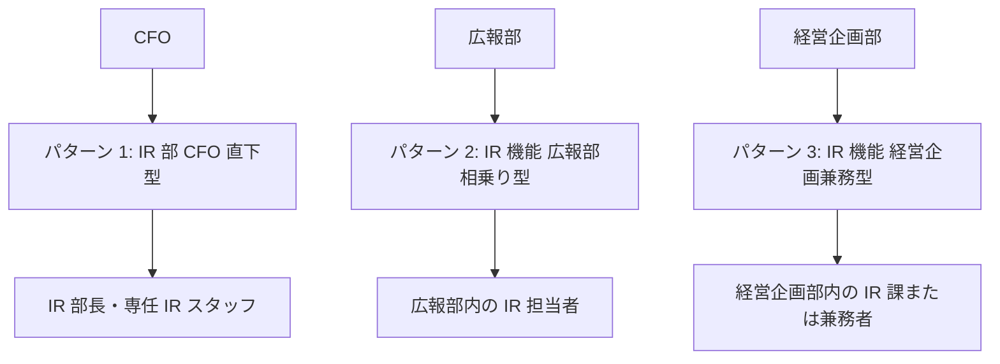

# IR 入門

「機関投資家・アナリストと対話する」——決算説明会・4 半期サイクル・アナリストミーティング・IR 資料設計・PBR 1 倍割れ対応・アクティビスト対応・IR × 生成 AI まで、上場企業の IR 担当者の外向き実務を体系化

| 項目 | 内容 |
|---|---|
| カテゴリー | 広報・PR・IR実務 |
| 難易度 | 中級 |
| 所要時間 | 約200分（全8レッスン） |
| 公開日 | 2026-07-24 |
| 最終更新日 | 2026-07-24 |
| コースURL | https://skillup.college/courses/pr-ir/ir-basics/ |

## 対象者

東証プライム／スタンダード上場企業の新任 IR 担当・IR 部長候補・CFO 補佐・経営企画兼務の IR 担当・IPO 準備企業の IR 立ち上げ担当・広報からの職種転換者・機関投資家アナリストに転じたい方。

## 前提知識

P/L・B/S の主要科目・決算短信の位置づけを耳にしたことがある程度。証券アナリスト資格は不要（本コースは資格対策ではなく実務スキル）。

## 学習目標

- IR の 3 役割と組織 3 パターン、他職種との棲み分けを俯瞰できる
- 決算発表 4 半期サイクルと静穏期間の運用を組み立てられる
- 決算説明会の設計・運営・スクリプトの型を持てる
- 機関投資家（バイサイド／セルサイド）との対話とレギュレーション FD 対応を扱える
- IR 資料設計と IR サイト・英文 IR の必須項目を扱える
- PBR 1 倍割れ対応・資本コスト経営・株主還元政策を持ち帰れる
- アクティビスト対応・敵対的買収・買収防衛策の入口を扱える
- インベスターデー・IR × 生成 AI・IR 担当のキャリアパスを持ち帰れる

## コース概要

IR 担当の仕事は、決算数値を機関投資家・アナリストに正確に伝えることではなく、経営者が語る中期経営計画・事業戦略・数字の背景を、投資家の判断言語に翻訳して届ける仕事です。姉妹コース プレスリリース実践が「メディアに載せてもらう」広報側の技術を扱ったのに対し、本コース IR 入門は「機関投資家・アナリストと対話する」IR 側の技術に振り切ります。東証プライム／スタンダード上場企業の新任 IR 担当・IR 部長候補・CFO 補佐・経営企画兼務の IR 担当・IPO 準備企業の IR 立ち上げ担当・広報からの職種転換者を対象に、IR の 3 役割・決算 4 半期サイクル・決算説明会・機関投資家との対話・IR 資料設計・PBR 1 倍割れ対応・アクティビスト対応・IR × 生成 AI までを 8 レッスンで体系化します。制度面（コーポレートガバナンス・コード／スチュワードシップ・コード／統合報告書／ISSB）は既刊 ESG 関連コースに、株主総会運営プロセスは法務関連コースに、決算リリースは広報関連コースに譲り、本コースは「IR 担当者の外向き実務」に軸足を置きます。

## 学習の流れ

前半 5 レッスンで IR の全体像から日常業務・投資家対話までを扱います。レッスン 1 で IR の 3 役割と職種分離、レッスン 2 で決算発表 4 半期サイクル、レッスン 3 で決算説明会の設計と運営、レッスン 4 で機関投資家との対話、レッスン 5 で IR 資料設計と IR サイト・英文 IR を扱います。中盤のレッスン 6 で PBR 1 倍割れ・資本コスト経営・株主還元、後半のレッスン 7 でアクティビスト対応・敵対的買収・買収防衛策、レッスン 8 でインベスターデー・IR × 生成 AI・キャリアと修了後の学び方までを扱います。全 8 レッスン・約 200 分の構成です。

## レッスン一覧

| No. | タイトル | 概要 | 所要時間 |
|---|---|---|---|
| 1 | IR とは何か——3 つの役割と職種分離 | IR の 3 役割（開示・対話・フィードバック）、PR ／広報／経営企画／CFO との役割分担、IR 組織 3 パターン（CFO 直下・広報部相乗り・経営企画兼務）、コース守備範囲・境界明示（制度＝ ESG 譲り、株主総会運営＝法務譲り、決算リリース＝ PR 譲り）を学ぶ | 25分 |
| 2 | 決算発表 4 半期サイクルと静穏期間 | 年 4 回の決算発表スケジュール（本決算 5 月・Q1 7-8 月・Q2 10-11 月・Q3 1-2 月）、静穏期間（Quiet Period）3 週間の運用、事前準備 3 週間・当日運営・事後対応 1 週間、決算短信・決算補足資料・プレゼン資料の 3 点セット、開示の 3 系統（金商法・会社法・東証適時開示）を学ぶ | 25分 |
| 3 | 決算説明会の設計と運営 | 決算説明会の 3 パターン（対面／オンライン／ハイブリッド）、スクリプトの型（イントロ・業績サマリー・セグメント別・見通し・株主還元・質疑応答）、想定 Q&A 設計 3 層構造、当日運営 6 ステップ、IR デイの設計、事後配信・書き起こしを学ぶ | 25分 |
| 4 | 機関投資家との対話——バイサイドとセルサイド | 機関投資家 3 分類（内国運用会社／外国運用会社／年金）、バイサイド vs セルサイドの区別、アナリストミーティング 3 形式（One-on-One／スモール／カンファレンス）、証券会社カンファレンスの参加基準、面談ロジスティクス、レギュレーション FD（金商法 27 条の 36、2018/4/1 施行）、面談記録の残し方を学ぶ | 25分 |
| 5 | IR 資料設計と IR サイト・英文 IR | 決算プレゼンの構成 8 ブロック、IR サイト必須 10 項目、統合報告書は既刊 ESG 譲り、英文 IR の必要性（外国人株主比率 30% 超企業では必須）、Fact Book・個人株主通信・株主優待、IR ライブラリの整備を学ぶ | 25分 |
| 6 | PBR 1 倍割れ・資本コスト経営・株主還元 | 東証 2023/3/31 要請、PBR 1 倍割れの構造（ROE < 資本コスト）、資本コスト WACC と株主資本コスト CAPM、株主還元 3 手法（配当・自己株式取得・株式分割）、総還元性向／配当性向／DOE、株主資本コスト経営の実装 5 ステップを学ぶ | 25分 |
| 7 | アクティビスト対応・敵対的買収・買収防衛策 | アクティビスト対応 3 段階（早期発見・エンゲージメント・防衛）、株主提案・委任状勧告・臨時株主総会、敵対的買収 3 パターン（TOB・部分買収・買い集め）、買収防衛策の類型、社外取締役・独立委員会の役割、日本のアクティビスト事例を学ぶ | 25分 |
| 8 | インベスターデー・IR × 生成 AI・キャリア | インベスターデー／CMD の設計 5 モジュール、IR × 生成 AI 3 領域（発行体側資料作成／AI アナリスト対応／投資家側 IR 分析ツール理解）、AI 時代の IR で人間が手放してはいけない 4 領域、IR 担当のキャリア 5 方向、修了後の情報源を学ぶ | 25分 |

---

## レッスン1：IR とは何か——3 つの役割と職種分離

（所要時間：25分）

### このレッスンで学ぶこと

- IR の 3 役割（開示・対話・フィードバック）を俯瞰できる
- IR と PR ／広報／経営企画／CFO との職種分離を持てる
- IR 組織 3 パターン（CFO 直下・広報部相乗り・経営企画兼務）を扱える
- 本コースの守備範囲と姉妹コースとの棲み分けを把握できる

---

IR（Investor Relations、投資家向け広報）は、上場企業が機関投資家・アナリスト・個人株主に対して、経営情報の開示と対話を行う職種です。姉妹コース プレスリリース実践がメディア相手の広報を扱ったのに対し、本コースは機関投資家・アナリスト相手の IR を扱います。まず本レッスンで、IR の 3 役割・他職種との役割分担・組織パターン・本コースの守備範囲を明示します。

### 本コースの守備範囲と姉妹コースとの棲み分け

本コースは IR を「機関投資家・アナリストと対話する」外向き実務の視点で扱います。次の 4 領域は他コースに譲ります。

- **決算リリースの書き方**：広報関連の入門コースを参照してください
- **コーポレートガバナンス・コード／スチュワードシップ・コード／統合報告書／ISSB**：ESG 関連の入門コースを参照してください
- **株主総会運営プロセス（招集通知作成・リハーサル・当日運営・想定問答の 3 層構造）**：法務関連の入門コースを参照してください
- **財務諸表の読み方（P/L・B/S・C/F の構造・ROE ／ROIC ／ROA）**：財務関連の入門コースを参照してください

本コースは、これら他コースが扱わない「決算説明会・4 半期サイクル・アナリストミーティング・PBR 1 倍割れ対応・アクティビスト対応・IR × 生成 AI」の 6 領域に振り切ります。

> **💡 ポイント**
> 「IR は制度面（CG コード・統合報告書）と株主総会運営と決算リリースがぜんぶ含まれる」と誤解されがちですが、実際は職種分業されています。IR は「投資家との対話」に集中し、他は各職種に譲るのが実務標準です。本コースでこの職種分離を最初に理解することで、以降のレッスンが位置づけやすくなります。

### IR の 3 役割

IR 担当者の仕事は、大きく次の 3 役割で構成されます。

#### 役割 1：開示（Disclosure）

法令・取引所ルールに基づき、決算情報・重要事実を投資家に開示する仕事です。制度面の実務は法務・経営企画と協働しますが、投資家向けの資料作成と発信タイミングは IR が主導します。

主な開示物：

- 決算短信（金商法・東証適時開示ルール）
- 決算補足資料（任意開示、投資家向け説明用）
- 決算プレゼン資料（決算説明会用）
- 有価証券報告書のうち投資家関心の高い項目（人的資本情報・サステナビリティ情報）
- 適時開示（重要事実発生時の即時開示）

#### 役割 2：対話（Engagement）

機関投資家・アナリスト・個人株主との対話を通じて、経営情報の理解を深めてもらう仕事です。

- 決算説明会（4 半期に 1 回）
- アナリストミーティング（月数回）
- 機関投資家との One-on-One 面談（年 30-100 件）
- 個人投資家向けオンライン説明会
- 海外投資家訪問（Non-Deal Roadshow、NDR）
- インベスターデー／CMD（Capital Markets Day、年 1 回程度）

#### 役割 3：フィードバック（Feedback to Management）

投資家との対話で得た論点・懸念・提案を、経営陣にフィードバックする仕事です。「投資家の声」を経営に届けることで、中期経営計画の策定・改訂に反映されます。

- 決算説明会の Q&A 内容の経営会議報告
- 機関投資家との個別面談の論点集約
- 統合報告書・中計改訂への投資家フィードバック反映
- 株主総会前の株主意見の集約

> **📖 もっと詳しく**
> IR の 3 役割のうち、開示 1 割・対話 6 割・フィードバック 3 割の時間配分が実務標準です。上場したての企業では開示が中心ですが、成熟した上場企業では対話とフィードバックが中心になります。

### PR ／広報／経営企画／CFO との役割分担

IR は、複数のほかの職種と連携しながら仕事をします。それぞれの役割分担を整理します。

#### PR ／広報との違い

- **PR ／広報**：メディア・消費者・従業員・パートナー企業向けの発信を担当
- **IR**：機関投資家・アナリスト・個人株主向けの発信を担当

決算リリース（決算短信・決算補足資料）の発信は共同作業になることが多いですが、「メディアに載せてもらう」（PR）と「機関投資家に開示する」（IR）で目的と手段が異なります。

#### 経営企画との違い

- **経営企画**：中期経営計画・全社 KPI・予算編成・M&A の企画立案（内向き）
- **IR**：経営企画が作った中計・数字を投資家に翻訳して届ける（外向き）

経営企画コースで扱った「中期経営計画」を、IR は「投資家に説明する言葉」に変換します。「経営が作る」（経営企画）と「投資家に届ける」（IR）の役割分担です。

#### CFO との違い

- **CFO**：財務・経理・IR の全体を統括する経営陣の 1 人
- **IR 部長**：CFO の直属または経営企画部長の直属で、IR 業務の実務責任者

CFO が経営陣として株主総会・決算説明会で経営説明を行うのに対し、IR 部長は日常的な機関投資家対応・アナリストミーティングを実務レベルで回します。

### IR 組織 3 パターン

企業の規模と成熟度によって、IR 組織の位置づけには 3 パターンがあります。

#### パターン 1：CFO 直下型

CFO 直属の IR 部として独立した組織を持つパターン。東証プライム上場企業の大企業・時価総額数千億円以上で多い。

- 特徴：IR 部長が独立して意思決定できる、専任スタッフを配置可能
- メリット：IR の意思決定スピードが速い、投資家対話の質が高い
- デメリット：組織コストが高い、経営企画・広報との連携に工夫が必要

#### パターン 2：広報部相乗り型

広報部の中に IR 機能を持つパターン。中堅上場企業・時価総額数百億円で多い。

- 特徴：IR 担当者が広報担当者と同じ部署に所属
- メリット：PR と IR の連携がスムーズ、コンパクトな組織で運営可能
- デメリット：投資家対話の専門性が育ちにくい、CFO との距離が遠い

#### パターン 3：経営企画兼務型

経営企画部の中に IR 機能を持つパターン。IPO 直後の企業・スタートアップ上場企業で多い。

- 特徴：IR 担当者が経営企画担当者と兼務、または経営企画部内に IR 課を設置
- メリット：中期経営計画と IR メッセージの一貫性が高い、CFO との距離が近い
- デメリット：投資家対話の時間が経営企画業務に圧迫される、PR との連携に工夫が必要

#### 3 パターンの選択軸

- **企業規模**：時価総額数千億円以上→パターン 1、数百億円→パターン 2、100 億円未満→パターン 3
- **上場からの年数**：上場 10 年以上→パターン 1 に移行しやすい、上場 5 年以内→パターン 3 が多い
- **投資家対話量**：機関投資家からの面談依頼が月 20 件超→パターン 1 が必要

### 中核メッセージ 6 個

本コースを通じて反復する 6 個のメッセージを、L1 の締めとして提示します。

- **IR は「翻訳と対話」——数字を投資家の言語で語る**
- **決算説明会は 4 半期に 1 回のキーストーン——資料と口頭の両輪**
- **投資家は 2 種類——バイサイドとセルサイドは違う言語を話す**
- **株価は結果、対話は原因——短期株価に振り回されない**
- **PBR 1 倍割れは価値の未翻訳——資本コストを語れ**
- **静穏期間とフェア・ディスクロージャーは IR の生命線**

### 次のステップ

本レッスンでは IR の 3 役割・職種分離・組織 3 パターンを扱いました。次のレッスンでは、IR 担当者の年間業務を規定する「決算発表 4 半期サイクルと静穏期間」の運用を深掘りします。

### 確認クイズ

このレッスンで学んだ内容を確認しましょう。

#### Q1. IR の 3 役割として、本レッスンで示している内容として正しいものはどれか。

- [x] 開示（Disclosure、法令・取引所ルールに基づく決算情報・重要事実の開示）、対話（Engagement、機関投資家・アナリスト・個人株主との対話）、フィードバック（Feedback to Management、投資家との対話で得た論点を経営陣にフィードバック）
- [ ] 広報・宣伝・営業
- [ ] 予算編成・月次予実・取締役会運営
- [ ] 契約書レビュー・株主総会運営・登記

> **解説**
> IR（Investor Relations）の 3 役割は、開示（Disclosure、法令・取引所ルールに基づき決算情報・重要事実を投資家に開示）、対話（Engagement、機関投資家・アナリスト・個人株主との対話を通じて経営情報の理解を深めてもらう）、フィードバック（Feedback to Management、投資家との対話で得た論点・懸念・提案を経営陣にフィードバックする）です。時間配分は開示 1 割・対話 6 割・フィードバック 3 割が実務標準です。

#### Q2. IR と PR ／広報の役割分担について、本レッスンで示している内容として正しいものはどれか。

- [ ] IR と PR ／広報は同じ職種であり、区別する必要はない
- [x] PR ／広報はメディア・消費者・従業員・パートナー企業向けの発信を担当、IR は機関投資家・アナリスト・個人株主向けの発信を担当。決算リリースの発信は共同作業だが、「メディアに載せてもらう」（PR）と「機関投資家に開示する」（IR）で目的と手段が異なる
- [ ] IR は経営企画の一部であり、独立した職種ではない
- [ ] PR ／広報は IR より重要度が低い

> **解説**
> PR ／広報はメディア・消費者・従業員・パートナー企業向けの発信を担当し、IR は機関投資家・アナリスト・個人株主向けの発信を担当します。決算リリース（決算短信・決算補足資料）の発信は共同作業になることが多いですが、「メディアに載せてもらう」（PR）と「機関投資家に開示する」（IR）で目的と手段が異なります。姉妹コース プレスリリース実践はメディア相手の広報を扱ったのに対し、本コースは機関投資家・アナリスト相手の IR に振り切ります。

#### Q3. IR と経営企画・CFO との役割分担について、本レッスンで示している内容として正しいものはどれか。

- [ ] IR は経営企画の下位職種であり、独自の判断はできない
- [ ] CFO と IR 部長は同じ役割を担う
- [x] 経営企画は中期経営計画・全社 KPI・予算編成・M&A の企画立案（内向き）、IR は経営企画が作った中計・数字を投資家に翻訳して届ける（外向き）。CFO は経営陣として株主総会・決算説明会で経営説明を行い、IR 部長は日常的な機関投資家対応・アナリストミーティングを実務レベルで回す
- [ ] IR は法務担当と同じ仕事をする

> **解説**
> 経営企画は中期経営計画・全社 KPI・予算編成・M&A の企画立案（内向き）、IR は経営企画が作った中計・数字を投資家に翻訳して届ける（外向き）で役割分担しています。姉妹コース経営企画実務入門で扱った「中期経営計画」を、IR は「投資家に説明する言葉」に変換します。CFO は財務・経理・IR の全体を統括する経営陣の 1 人で、IR 部長は CFO の直属または経営企画部長の直属で IR 業務の実務責任者です。CFO が経営陣として株主総会・決算説明会で経営説明を行うのに対し、IR 部長は日常的な機関投資家対応・アナリストミーティングを実務レベルで回します。

#### Q4. IR 組織 3 パターンについて、本レッスンで示している内容として正しいものはどれか。

- [ ] IR 組織は 1 パターンしか存在しない
- [ ] IR 組織はすべての企業で同じ構造である
- [ ] IR 組織の選択に企業規模は関係ない
- [x] パターン 1（CFO 直下型、東証プライム大企業・時価総額数千億円以上）／パターン 2（広報部相乗り型、中堅上場企業・時価総額数百億円）／パターン 3（経営企画兼務型、IPO 直後・スタートアップ上場企業）の 3 パターン。選択軸は企業規模・上場からの年数・投資家対話量（機関投資家からの面談依頼が月 20 件超→パターン 1 が必要）

> **解説**
> IR 組織の 3 パターンは、パターン 1（CFO 直下型、CFO 直属の IR 部として独立、東証プライム大企業・時価総額数千億円以上で多い）、パターン 2（広報部相乗り型、広報部の中に IR 機能を持つ、中堅上場企業・時価総額数百億円で多い）、パターン 3（経営企画兼務型、経営企画部の中に IR 機能を持つ、IPO 直後の企業・スタートアップ上場企業で多い）です。選択軸は企業規模（時価総額数千億円以上→パターン 1、数百億円→パターン 2、100 億円未満→パターン 3）、上場からの年数（10 年以上→パターン 1 に移行しやすい）、投資家対話量（機関投資家からの面談依頼が月 20 件超→パターン 1 が必要）です。

---

## レッスン2：決算発表 4 半期サイクルと静穏期間

（所要時間：25分）

### このレッスンで学ぶこと

- 年 4 回の決算発表スケジュール（本決算・Q1・Q2・Q3）を俯瞰できる
- 静穏期間（Quiet Period）の運用と 3 週間ルールを扱える
- 事前準備 3 週間・当日運営・事後対応 1 週間のタイムラインを持てる
- 決算短信・決算補足資料・プレゼン資料の 3 点セットを組み立てられる
- 開示の 3 系統（金商法・会社法・東証適時開示）を扱える

---

前レッスンでは IR の 3 役割と職種分離を扱いました。本レッスンでは、IR 担当者の年間業務を規定する「決算発表 4 半期サイクル」と、その中核ルールである「静穏期間」の運用を深掘りします。

### 年 4 回の決算発表スケジュール

上場企業は、東証適時開示ルール上、決算期末後 45 日以内（努力目標 30 日以内）に決算短信を開示する義務があります。3 月期決算の企業の場合、年 4 回の決算発表スケジュールは次の通りです。

#### 3 月期決算企業のスケジュール（実務標準）

- **本決算（4Q 決算）**：4/1-6/30、決算短信開示は 4 月末〜 5 月中旬
- **Q1 決算**：7/1-9/30、決算短信開示は 7 月末〜 8 月中旬
- **Q2 決算（中間決算）**：10/1-12/31、決算短信開示は 10 月末〜 11 月中旬
- **Q3 決算**：1/1-3/31、決算短信開示は 1 月末〜 2 月中旬

#### 12 月期決算企業のスケジュール

外資系日本法人・IT スタートアップに多い 12 月期決算の場合、次の通りです。

- **本決算（4Q 決算）**：1/1-3/31、決算短信開示は 1 月末〜 2 月中旬
- **Q1 決算**：4/1-6/30、決算短信開示は 4 月末〜 5 月中旬
- **Q2 決算（中間決算）**：7/1-9/30、決算短信開示は 7 月末〜 8 月中旬
- **Q3 決算**：10/1-12/31、決算短信開示は 10 月末〜 11 月中旬

#### 決算発表の時間帯

決算短信の開示時間は、東証取引時間中（9:00-15:00）を避け、次のいずれかの時間帯で行うのが実務標準です。

- **午前開示**：東証取引開始前の 8:00 前後
- **昼開示**：東証休憩時間中の 12:00 前後
- **午後開示**：東証取引終了後の 15:00-16:00 前後

多くの企業は「午後開示」（15:00 直後）を選択し、決算説明会を 16:00 開始で連動させます。

### 静穏期間（Quiet Period）——3 週間ルール

静穏期間は、決算発表前の一定期間、機関投資家・アナリストとの個別面談で決算関連情報を話さない期間です。日本では法律による強制ではなく、企業ごとの自主ルールとして運用されます。

#### 静穏期間の実務標準

- **開始時期**：決算期末の翌日から
- **終了時期**：決算短信開示の当日
- **期間の長さ**：3-4 週間（決算期末後 30-45 日で決算短信開示のため）

#### 静穏期間中の運用

静穏期間中は、次の運用が実務標準です。

- 個別の機関投資家・アナリスト面談は原則辞退（既存の面談予定は事後に再設定）
- カンファレンス・IR イベントへの参加は原則見送り
- メディア取材・インタビューも決算関連は避ける
- 開示済み情報の範囲での質問回答は継続可能

#### 静穏期間の目的

静穏期間の目的は、次の 3 点です。

- **情報の非対称性を避ける**：一部の投資家だけが早期に業績情報を得ることを防ぐ
- **インサイダー取引の疑いを避ける**：業績確定前の情報漏洩リスクを避ける
- **決算関連の憶測を避ける**：業績予測を出す前に企業側がコメントすることを避ける

> **⚠️ 注意**
> 静穏期間はレギュレーション FD（金商法 27 条の 36、2018/4/1 施行）とは別のルールですが、フェア・ディスクロージャーの実務運用として重要です。静穏期間中の個別面談での業績関連発言が、後日インサイダー取引の疑いに繋がるリスクを避けるための実務標準です。

### 事前準備 3 週間・当日運営・事後対応 1 週間のタイムライン

決算発表の 1 回の実務を、3 段階のタイムラインで整理します。

#### 事前準備 3 週間

決算短信開示日を「D デイ」として、その 3 週間前から準備を開始します。

**D-21 日 〜 D-14 日**（1 週目）：
- 業績数値の内部集計（経理部と連携）
- 決算短信のドラフト作成（経理部主導、IR は補足資料と連携確認）
- セグメント別損益・部門別損益の確認
- 前年同期・前四半期との比較分析

**D-14 日 〜 D-7 日**（2 週目）：
- 決算補足資料のドラフト作成（IR 主導）
- 決算プレゼン資料のドラフト作成（IR 主導、CFO・経営陣と協議）
- 想定 Q&A の草稿作成（3 層構造で 100-200 問）
- 経営陣へのブリーフィング・訓練

**D-7 日 〜 D デイ**（3 週目）：
- 決算短信の最終レビュー（経理・法務・IR）
- 決算補足資料・プレゼン資料の最終確定
- 想定 Q&A のリハーサル（CFO・IR 部長・広報）
- 決算説明会の会場・配信手配

#### 当日運営

- **D-1 日 15:00 前後**：決算短信を東証適時開示（TDnet）で開示
- **D デイ 8:00 頃**：メディア各社への決算リリース配信（PR 側）
- **D デイ 15:00-16:00**：決算短信・決算補足資料・プレゼン資料を IR サイトで公開
- **D デイ 16:00-17:30**：決算説明会実施（対面／オンライン／ハイブリッド）
- **D デイ 17:30 以降**：機関投資家・アナリストからの個別質問対応

#### 事後対応 1 週間

- **D+1 日 〜 D+3 日**：機関投資家・アナリストからの個別面談対応（依頼が集中）
- **D+3 日 〜 D+5 日**：決算説明会の動画配信・書き起こし公開
- **D+5 日 〜 D+7 日**：セルサイドアナリストレポートの内容確認・想定質問回答
- **D+7 日 以降**：次の静穏期間（Q1 決算に向けた 3 週間）は日本国内 IR に集中

### 決算短信・決算補足資料・プレゼン資料の 3 点セット

決算発表時に開示される主要資料の 3 点セットを扱います。

#### 決算短信（Financial Summary）

東証適時開示ルールに基づく開示資料で、業績数値・業績予想・注記が中心です。書式は東証提供の統一フォーマットに準拠します。

- 前年同期比較の主要業績数値
- セグメント別業績
- 通期業績予想（本決算時は次年度予想、Q1-Q3 時は通期予想の修正有無）
- 財政状態（B/S 主要科目）
- キャッシュフロー計算書（C/F 主要科目）
- 業績予想の前提条件
- 注記事項（会計方針の変更・修正再表示など）

#### 決算補足資料（Supplementary Materials）

任意開示で、決算短信の数値を投資家目線で補足する資料です。

- セグメント別売上・利益の詳細
- 主要製品・サービス別の売上動向
- 地域別・顧客業界別の売上構成
- 主要 KPI（Non-GAAP 指標も含む）
- 設備投資・研究開発費の内訳
- 従業員数・研究開発人員などの人的資本情報

#### 決算プレゼン資料

決算説明会で経営陣が使うプレゼン資料です。ストーリー性を持ってビジュアル化された構成が実務標準です。

- 業績サマリー（1 スライド）
- セグメント別業績と要因分析
- 中期経営計画の進捗
- 次四半期・通期見通し
- 株主還元（配当・自己株式取得の状況）
- 質疑応答（Q&A）向けの補足資料

> **💡 ポイント**
> 3 点セットのうち、決算短信は「制度開示」、決算補足資料と決算プレゼン資料は「投資家向け任意開示」です。任意開示の充実度が、企業の IR 品質を規定します。IR 担当者は「投資家が本当に必要とする情報は何か」を意識して補足資料・プレゼン資料を設計します。

### 開示の 3 系統（金商法・会社法・東証適時開示）

上場企業の情報開示は、3 つの制度系統から成り立ちます。IR 担当者はこの 3 系統を理解し、それぞれの目的・対象・タイミングを把握する必要があります。

#### 系統 1：金商法（金融商品取引法）に基づく開示

- **有価証券報告書**：事業年度末後 3 か月以内に提出（EDINET 公開）
- **四半期報告書**：Q1 ／Q2 ／Q3 の各期末後 45 日以内に提出（2024 年 4 月以降は廃止、四半期決算短信に一本化）
- **臨時報告書**：重要事象発生時に随時提出（連結子会社異動・特別損失など）
- **有価証券届出書**：新株発行・公募増資時に提出

#### 系統 2：会社法に基づく開示

- **事業報告**：株主総会招集通知に添付（事業年度末後 3 か月以内）
- **計算書類**：事業報告と同時開示（B/S・P/L・株主資本等変動計算書・注記）
- **臨時計算書類**：中間配当時などに開示

#### 系統 3：東証適時開示ルール（TDnet）

- **決算短信**：決算期末後 45 日以内（努力目標 30 日以内）に開示
- **四半期決算短信**：各四半期末後 45 日以内
- **業績予想修正**：業績予想と実績の乖離幅が売上高 10%、営業利益・経常利益・純利益 30% を超える見込み時に即時開示
- **重要事実の開示**：業務提携・M&A・特別損益発生などに即時開示

3 系統は目的・タイミング・提出先が異なります。IR 担当者は、投資家からの質問に対して「この情報はどの系統で開示されているか」を即答できる必要があります。

### 次のステップ

本レッスンでは決算発表 4 半期サイクルと静穏期間の運用を扱いました。次のレッスンでは、決算発表のクライマックスである「決算説明会の設計と運営」——スクリプトの型、想定 Q&A 設計、当日運営 6 ステップ——を深掘りします。

### 確認クイズ

このレッスンで学んだ内容を確認しましょう。

#### Q1. 3 月期決算企業の年 4 回決算発表スケジュールについて、本レッスンで示している内容として正しいものはどれか。

- [x] 本決算（4Q 決算、4/1-6/30、決算短信開示は 4 月末〜 5 月中旬）／Q1 決算（7/1-9/30、決算短信開示は 7 月末〜 8 月中旬）／Q2 決算（中間決算、10/1-12/31、決算短信開示は 10 月末〜 11 月中旬）／Q3 決算（1/1-3/31、決算短信開示は 1 月末〜 2 月中旬）
- [ ] 決算発表は年 1 回のみである
- [ ] 決算発表のスケジュールは企業が任意で決定する
- [ ] 決算短信は決算期末後 1 年以内に開示すればよい

> **解説**
> 3 月期決算企業の年 4 回決算発表スケジュールは、本決算 4/1-6/30・決算短信開示 4 月末〜 5 月中旬、Q1 決算 7/1-9/30・決算短信開示 7 月末〜 8 月中旬、Q2 決算（中間決算）10/1-12/31・決算短信開示 10 月末〜 11 月中旬、Q3 決算 1/1-3/31・決算短信開示 1 月末〜 2 月中旬です。上場企業は東証適時開示ルール上、決算期末後 45 日以内（努力目標 30 日以内）に決算短信を開示する義務があります。決算短信の開示時間は東証取引時間中（9:00-15:00）を避け、多くの企業は「午後開示」（15:00 直後）を選択し決算説明会を 16:00 開始で連動させます。

#### Q2. 静穏期間（Quiet Period）の運用について、本レッスンで示している内容として正しいものはどれか。

- [ ] 静穏期間は法律による強制ルールである
- [x] 決算発表前の一定期間（決算期末の翌日〜決算短信開示当日、3-4 週間）、機関投資家・アナリストとの個別面談で決算関連情報を話さない期間。日本では法律による強制ではなく、企業ごとの自主ルールとして運用。個別面談辞退・カンファレンス見送り・メディア取材の決算関連発言回避が実務標準
- [ ] 静穏期間は 1 週間のみで済む
- [ ] 静穏期間中もすべての面談を通常通り実施できる

> **解説**
> 静穏期間（Quiet Period）は、決算発表前の一定期間（決算期末の翌日から決算短信開示の当日まで、3-4 週間）、機関投資家・アナリストとの個別面談で決算関連情報を話さない期間です。日本では法律による強制ではなく、企業ごとの自主ルールとして運用されます。運用は、個別の機関投資家・アナリスト面談は原則辞退、カンファレンス・IR イベントへの参加は原則見送り、メディア取材・インタビューも決算関連は避ける、開示済み情報の範囲での質問回答は継続可能、が実務標準です。目的は「情報の非対称性を避ける」「インサイダー取引の疑いを避ける」「決算関連の憶測を避ける」の 3 点です。

#### Q3. 決算短信・決算補足資料・決算プレゼン資料の 3 点セットについて、本レッスンで示している内容として正しいものはどれか。

- [ ] 3 点はすべて制度開示（法定の開示）である
- [ ] 3 点は必ず同じフォーマットで作成される
- [x] 決算短信は東証適時開示ルールに基づく制度開示（統一フォーマット準拠）、決算補足資料と決算プレゼン資料は投資家向け任意開示。任意開示の充実度が企業の IR 品質を規定する
- [ ] 決算プレゼン資料は開示する必要がない

> **解説**
> 決算短信は東証適時開示ルールに基づく制度開示で、書式は東証提供の統一フォーマットに準拠します。決算補足資料は任意開示で、決算短信の数値を投資家目線で補足する資料です（セグメント別売上・利益の詳細、主要製品・サービス別の売上動向、地域別・顧客業界別の売上構成、主要 KPI、設備投資・研究開発費の内訳、人的資本情報など）。決算プレゼン資料は決算説明会で経営陣が使うプレゼン資料で、ストーリー性を持ってビジュアル化された構成が実務標準です。任意開示（補足資料・プレゼン資料）の充実度が企業の IR 品質を規定します。

#### Q4. 上場企業の情報開示 3 系統について、本レッスンで示している内容として正しいものはどれか。

- [ ] 上場企業の開示は 1 系統のみである
- [ ] 開示の系統は企業が任意で選択できる
- [ ] 東証適時開示は法律ではなく参考情報にすぎない
- [x] 系統 1（金商法に基づく開示、有価証券報告書・臨時報告書・有価証券届出書、EDINET 公開）／系統 2（会社法に基づく開示、事業報告・計算書類、株主総会招集通知に添付）／系統 3（東証適時開示ルール、TDnet、決算短信・重要事実の開示）の 3 系統。目的・タイミング・提出先が異なる

> **解説**
> 上場企業の情報開示 3 系統は、系統 1（金商法＝金融商品取引法に基づく開示、有価証券報告書＝事業年度末後 3 か月以内・EDINET 公開、四半期報告書＝Q1/Q2/Q3 の各期末後 45 日以内 2024 年 4 月以降は廃止・四半期決算短信に一本化、臨時報告書・有価証券届出書）、系統 2（会社法に基づく開示、事業報告＝株主総会招集通知に添付・事業年度末後 3 か月以内、計算書類、臨時計算書類）、系統 3（東証適時開示ルール＝ TDnet、決算短信＝決算期末後 45 日以内・努力目標 30 日以内、業績予想修正、重要事実の開示）です。3 系統は目的・タイミング・提出先が異なり、IR 担当者は投資家からの質問に対して「この情報はどの系統で開示されているか」を即答できる必要があります。

---

## レッスン3：決算説明会の設計と運営

（所要時間：25分）

### このレッスンで学ぶこと

- 決算説明会の 3 パターン（対面／オンライン／ハイブリッド）を扱える
- 決算プレゼンのスクリプトの型 6 ブロックを持てる
- 想定 Q&A 設計 3 層構造（業績要因・戦略・見通し）を持ち帰れる
- 当日運営 6 ステップを扱える
- IR デイの設計と事後配信・書き起こしの型を持てる

---

前レッスンでは決算発表 4 半期サイクルと静穏期間を扱いました。本レッスンでは、決算発表のクライマックスである「決算説明会の設計と運営」を深掘りします。

### 決算説明会とは

決算説明会は、上場企業が決算短信開示直後（通常 15:00 開示、16:00-17:30 で開催）に、機関投資家・アナリストを招いて業績内容と経営陣の見解を説明するイベントです。年 4 回の決算発表のうち、多くの企業は本決算（4Q 決算）と Q2 決算（中間決算）の年 2 回で対面開催し、Q1 決算と Q3 決算はオンライン開催または電話会議で済ませます。

#### 決算説明会の 3 パターン

- **対面型**：機関投資家・アナリストを会場に招き、対面で発表・質疑応答を実施
- **オンライン型**：Webex ／Teams ／Zoom などのオンライン会議システムで発表・質疑応答を実施
- **ハイブリッド型**：対面参加とオンライン参加の両方を受け入れ、質疑応答も両方から受け付ける

コロナ禍の 2020-2022 年でオンライン化が急速に進み、2023 年以降はハイブリッド型が実務標準です。海外投資家の参加を考えると、オンライン配信は事実上必須となっています。

### スクリプトの型——6 ブロック

決算プレゼン資料に沿って経営陣が発表するスクリプトは、次の 6 ブロックで構成するのが実務標準です。

#### ブロック 1：イントロダクション（3 分）

- 決算説明会の開始挨拶
- 出席者紹介（社長・CFO・IR 部長・事業担当役員）
- アジェンダの提示
- 本日の要点（3 つのメッセージ）

#### ブロック 2：業績サマリー（10 分）

- 前年同期比較の主要業績数値（売上高・営業利益・純利益・EPS）
- 通期業績予想の達成度合い
- 業績予想の修正有無（増額修正・下方修正・据え置き）
- 主要業績指標の 3 年トレンド

#### ブロック 3：セグメント別業績（15 分）

- 全セグメントの売上・利益一覧
- 主要セグメントの詳細（業績要因分析）
- 新規事業・成長領域の進捗
- 減収・減益セグメントの要因と対策

#### ブロック 4：中期経営計画の進捗（10 分）

- 中期経営計画の目標に対する進捗率
- 主要 KPI の達成状況
- 新規投資・M&A の進捗
- 戦略の修正有無

#### ブロック 5：次四半期・通期見通し（10 分）

- 次四半期の見通し
- 通期業績予想の維持または修正
- 主要リスク要因
- 業績予想の前提条件

#### ブロック 6：株主還元と質疑応答（20 分）

- 配当政策の説明
- 自己株式取得の状況
- 株主優待の変更有無
- 質疑応答（15 分）

合計で 60-70 分のプレゼンテーションが実務標準です。

> **💡 ポイント**
> スクリプトは経営陣が読むだけの原稿ではなく、「投資家が聞きたい順」に構成します。多くの企業は「業績サマリー」から始めますが、投資家が最も気にするのは「見通し」と「株主還元」であることを意識し、時間配分を工夫します。

### 想定 Q&A 設計——3 層構造

質疑応答（Q&A）は、決算説明会の中で経営陣の力量が試される部分です。想定 Q&A を事前に準備することで、経営陣が余裕を持って回答できます。想定 Q&A は 3 層構造で作成するのが実務標準です。

#### 層 1：業績要因（100-150 問）

過去の業績に関する質問。決算短信の数値の背景を説明する層。

- 「今四半期の売上増加要因は？」
- 「営業利益率が前年同期比で改善した理由は？」
- 「主要セグメント A の減益要因は？」
- 「為替の影響はいくらか？」
- 「原材料費上昇の影響はいくらか？」

#### 層 2：戦略・中計進捗（30-50 問）

中期経営計画の進捗と戦略に関する質問。過去〜現在の位置づけを説明する層。

- 「中期経営計画の営業利益目標に対する進捗は？」
- 「M&A の戦略適合性は？」
- 「新規事業の投資回収時期は？」
- 「競合他社との差別化ポイントは？」
- 「業界シェアの見通しは？」

#### 層 3：見通し・リスク（20-30 問）

次四半期・通期・中長期の見通しに関する質問。将来の見通しを説明する層。

- 「通期業績予想の達成可能性は？」
- 「上方修正の可能性は？」
- 「地政学リスクの影響は？」
- 「AI ／DX 投資の見通しは？」
- 「株主還元の強化余地は？」

#### 想定 Q&A の準備プロセス

- **D-14 日**：IR 部長が過去 2 年間の決算説明会 Q&A を分析し、想定質問リストの初稿を作成
- **D-10 日**：経営企画・経理・事業部門にヒアリングし、事業観点の質問を追加
- **D-7 日**：CFO と IR 部長で想定 Q&A のリハーサル（実際に口頭で回答練習）
- **D-3 日**：想定 Q&A の最終確定、経営陣（社長・CFO）への配布

### 当日運営 6 ステップ

決算説明会当日の運営は、次の 6 ステップで進めます。

#### ステップ 1：受付・会場設営（開始 30 分前）

- 参加者の受付と名刺交換
- 資料配布（決算短信・決算補足資料・プレゼン資料）
- オンライン配信の接続確認
- 経営陣の待機室での最終ブリーフィング

#### ステップ 2：冒頭挨拶（開始 0-3 分）

- 社会長または CFO の挨拶
- 出席者紹介
- 本日のアジェンダ提示

#### ステップ 3：プレゼンテーション（開始 3-40 分）

- CFO 主導でプレゼン資料に沿って業績を説明
- 事業担当役員がセグメント別の詳細を説明
- 中期経営計画の進捗を経営陣が説明

#### ステップ 4：質疑応答（開始 40-55 分）

- 会場・オンライン参加者からの質問受付
- 経営陣による回答
- 想定 Q&A のうち初出質問には慎重に回答（後日補足を約束することも可）

#### ステップ 5：クロージング（開始 55-60 分）

- 社長または CFO のクロージング挨拶
- 次回決算発表の予定告知
- 個別面談の案内

#### ステップ 6：事後フォロー（当日夜〜翌日）

- 決算説明会の動画配信手配
- 質疑応答の書き起こし作成
- 参加者への御礼メール（IR 部から）
- 経営会議への Q&A 内容報告

> **📝 補足**
> 決算説明会後の個別面談依頼は D+1 日〜 D+3 日に集中します。事前に IR 部長・IR スタッフの個別面談スケジュールを空けておくのが実務標準です。

### IR デイの設計

IR デイは、決算説明会とは別に、特定のセグメント・新規事業・特定テーマ（DX ／ESG ／人材）について機関投資家に説明するイベントです。1 年に 1-2 回程度実施されるのが実務標準です。

#### IR デイの 3 パターン

- **セグメント IR デイ**：特定事業セグメントに焦点を当て、事業担当役員が詳細に説明
- **テーマ IR デイ**：DX ／ESG ／人材・組織など特定テーマで説明
- **統合報告書 IR デイ**：統合報告書の刊行に合わせて、中長期戦略を説明

#### IR デイの構成（半日型 3 時間）

- 経営陣の挨拶（30 分）
- 事業説明・テーマ説明（60-90 分）
- 質疑応答（30-45 分）
- 現場見学または個別面談（30-60 分、任意）

IR デイは決算説明会より深いテーマ議論が可能で、機関投資家の中長期的な理解を深めるのに有効です。海外投資家向けにはインベスターデー／CMD（Capital Markets Day）として英語で開催する企業もあります。

### 事後配信・書き起こしの型

決算説明会の事後配信・書き起こしは、実務標準として次の型で公開します。

#### 配信タイミング

- **動画配信**：決算説明会翌日〜 3 営業日以内
- **書き起こし（音声からの文字起こし）**：決算説明会後 3-5 営業日以内
- **英語版動画・書き起こし**：日本語版から 5-7 営業日遅れで公開

#### 公開方法

- **IR サイト**：決算説明会動画・書き起こし・プレゼン資料を IR ライブラリに保管
- **YouTube 公式チャンネル**：一部の企業は動画を公開（インデックス目的）
- **投資家メール登録者**：新規動画公開時にメール通知

#### 書き起こしの整理

- 発言者ごとに区分（社長・CFO・IR 部長など）
- ブロック別に見出し（業績サマリー・セグメント別業績など）
- 質疑応答は質問者・回答者を明示（質問者匿名の場合はアナリスト A・B などで表記）

### 確認クイズ

このレッスンで学んだ内容を確認しましょう。

#### Q1. 決算説明会のスクリプト 6 ブロックについて、本レッスンで示している内容として正しいものはどれか。

- [x] イントロダクション（3 分）／業績サマリー（10 分）／セグメント別業績（15 分）／中期経営計画の進捗（10 分）／次四半期・通期見通し（10 分）／株主還元と質疑応答（20 分）の合計 60-70 分
- [ ] スクリプトは 1 ブロックで済む
- [ ] スクリプトは経営陣がその場で考えて話す
- [ ] スクリプトの内容はすべての企業で同じである

> **解説**
> 決算プレゼンのスクリプトは 6 ブロック構成が実務標準です。ブロック 1（イントロダクション、3 分、開始挨拶・出席者紹介・アジェンダ・本日の要点）、ブロック 2（業績サマリー、10 分、前年同期比較・業績予想達成度・修正有無・3 年トレンド）、ブロック 3（セグメント別業績、15 分、全セグメント一覧・詳細分析・新規事業進捗・減収セグメント要因）、ブロック 4（中期経営計画の進捗、10 分、目標に対する進捗率・主要 KPI・M&A 進捗・戦略修正有無）、ブロック 5（次四半期・通期見通し、10 分、次四半期見通し・通期業績予想・リスク要因）、ブロック 6（株主還元と質疑応答、20 分、配当政策・自己株式取得・株主優待・質疑応答 15 分）の合計 60-70 分です。

#### Q2. 想定 Q&A の 3 層構造について、本レッスンで示している内容として正しいものはどれか。

- [ ] 想定 Q&A は 1 種類のみで作成する
- [x] 層 1（業績要因、100-150 問、過去の業績に関する質問）／層 2（戦略・中計進捗、30-50 問、中期経営計画の進捗と戦略）／層 3（見通し・リスク、20-30 問、次四半期・通期・中長期の見通し）の 3 層構造。合計 150-230 問を事前に準備する
- [ ] 想定 Q&A は当日その場で作成する
- [ ] 想定 Q&A は経営陣が単独で作成する

> **解説**
> 想定 Q&A は 3 層構造で作成するのが実務標準です。層 1（業績要因、100-150 問、過去の業績に関する質問、決算短信の数値の背景を説明）、層 2（戦略・中計進捗、30-50 問、中期経営計画の進捗と戦略、過去〜現在の位置づけ）、層 3（見通し・リスク、20-30 問、次四半期・通期・中長期の見通し、将来の見通し）の合計 150-230 問を事前に準備します。準備プロセスは、D-14 日に IR 部長が過去 2 年間の決算説明会 Q&A を分析し初稿作成、D-10 日に経営企画・経理・事業部門にヒアリングして事業観点の質問を追加、D-7 日に CFO と IR 部長で想定 Q&A のリハーサル、D-3 日に想定 Q&A の最終確定・経営陣への配布、が実務標準です。

#### Q3. 決算説明会当日運営 6 ステップについて、本レッスンで示している内容として正しいものはどれか。

- [ ] 決算説明会は開始と同時に始める
- [ ] 決算説明会後のフォローは不要である
- [x] ステップ 1（受付・会場設営、開始 30 分前）／ステップ 2（冒頭挨拶、0-3 分）／ステップ 3（プレゼンテーション、3-40 分）／ステップ 4（質疑応答、40-55 分）／ステップ 5（クロージング、55-60 分）／ステップ 6（事後フォロー、当日夜〜翌日、動画配信手配・書き起こし作成・御礼メール・経営会議への Q&A 内容報告）
- [ ] 決算説明会は経営陣のみで運営する

> **解説**
> 当日運営 6 ステップは、ステップ 1（受付・会場設営、開始 30 分前、参加者受付・資料配布・オンライン配信接続確認・経営陣の待機室ブリーフィング）、ステップ 2（冒頭挨拶、0-3 分、社長または CFO の挨拶・出席者紹介・アジェンダ提示）、ステップ 3（プレゼンテーション、3-40 分、CFO 主導のプレゼン・事業担当役員のセグメント説明）、ステップ 4（質疑応答、40-55 分、会場・オンラインからの質問受付・経営陣の回答）、ステップ 5（クロージング、55-60 分、社長または CFO のクロージング挨拶・次回決算発表予定告知）、ステップ 6（事後フォロー、当日夜〜翌日、動画配信手配・質疑応答書き起こし作成・参加者への御礼メール・経営会議への Q&A 内容報告）の 6 ステップです。決算説明会後の個別面談依頼は D+1 日〜 D+3 日に集中するため、事前に IR 部長・IR スタッフの個別面談スケジュールを空けておくのが実務標準です。

#### Q4. IR デイの設計について、本レッスンで示している内容として正しいものはどれか。

- [ ] IR デイは決算説明会と同じ内容である
- [ ] IR デイは年に 10 回以上開催する
- [ ] IR デイは会場を設けず必ずオンラインで開催する
- [x] IR デイは決算説明会とは別に、特定のセグメント・新規事業・特定テーマ（DX ／ESG ／人材）について機関投資家に説明するイベント。年 1-2 回、半日型 3 時間（経営陣挨拶 30 分・事業説明 60-90 分・質疑応答 30-45 分・現場見学または個別面談 30-60 分）で構成。3 パターン（セグメント IR デイ・テーマ IR デイ・統合報告書 IR デイ）。海外投資家向けはインベスターデー／CMD として英語で開催する企業もある

> **解説**
> IR デイは決算説明会とは別に、特定のセグメント・新規事業・特定テーマ（DX ／ESG ／人材）について機関投資家に説明するイベントで、1 年に 1-2 回程度実施されるのが実務標準です。3 パターンは、セグメント IR デイ（特定事業セグメントに焦点、事業担当役員が詳細説明）、テーマ IR デイ（DX ／ESG ／人材・組織など特定テーマ）、統合報告書 IR デイ（統合報告書の刊行に合わせて中長期戦略を説明）です。構成は半日型 3 時間（経営陣挨拶 30 分・事業説明 60-90 分・質疑応答 30-45 分・現場見学または個別面談 30-60 分）が実務標準です。IR デイは決算説明会より深いテーマ議論が可能で、機関投資家の中長期的な理解を深めるのに有効です。海外投資家向けにはインベスターデー／CMD（Capital Markets Day）として英語で開催する企業もあります。

---

## レッスン4：機関投資家との対話——バイサイドとセルサイド

（所要時間：25分）

### このレッスンで学ぶこと

- 機関投資家 3 分類（内国運用会社／外国運用会社／年金）を扱える
- バイサイドとセルサイドの違いを持てる
- アナリストミーティング 3 形式（One-on-One ／スモール／カンファレンス）を扱える
- 証券会社カンファレンスの参加基準と面談ロジスティクスを持ち帰れる
- レギュレーション FD（金商法 27 条の 36、2018/4/1 施行）の遵守を扱える

---

前レッスンでは決算説明会の設計と運営を扱いました。本レッスンでは、決算説明会の外側で日常的に発生する「機関投資家との対話」を深掘りします。IR 担当者の時間の 6 割は、この機関投資家対話に費やされます。

### 機関投資家 3 分類

日本の株式市場で影響力を持つ機関投資家は、大きく次の 3 分類に整理できます。

#### 分類 1：内国運用会社

日本国内に本拠を置く運用会社。企業年金・投資信託・私募ファンドなど幅広い資金を運用します。

- 大手：野村アセットマネジメント・三菱 UFJ 国際投信・大和アセットマネジメント・アセットマネジメント One（旧みずほ・DIAM 統合）
- 中堅：日興アセットマネジメント・SMBC 日興証券系・りそなアセットマネジメント
- 外資系日本法人：ブラックロック・ジャパン・シュローダー・インベストメント・マネジメント（日本）

内国運用会社の担当アナリストは、日本語での対話・日本国内訪問が中心です。

#### 分類 2：外国運用会社

海外に本拠を置く運用会社。日本企業への投資も行いますが、担当者は海外（ロンドン・ニューヨーク・シンガポール・香港）に所在することが多い。

- 米系：フィデリティ・キャピタル・グループ・T. Rowe Price・ウェリントン・マネジメント
- 欧州系：フィデリティ（英国）・アバディーン・スタンダード・ライフ・アリアンツ・グローバル・インベスターズ
- アジア系：GIC（シンガポール）・テマセク（シンガポール）

外国運用会社との対話は英語が実務標準で、時差を考慮した面談スケジュール調整が必要です。海外投資家向けの英語 IR 資料整備が Must です。

#### 分類 3：年金基金

企業年金・公的年金・共済年金などが自ら運用または運用会社に委託します。

- 公的年金：GPIF（年金積立金管理運用独立行政法人、世界最大 200 兆円超）
- 共済年金：国家公務員共済組合連合会（KKR）・地方公務員共済組合連合会
- 企業年金：主要企業の企業年金基金・企業年金連合会
- 私学共済：私立学校教職員共済事業団

年金基金は多くの場合、直接投資よりも運用会社に委託する「委託運用」が主流で、IR 対話は運用会社経由で行うのが実務です。

### バイサイドとセルサイドの違い

機関投資家との対話で最も重要な区別が「バイサイド」と「セルサイド」です。IR 担当者は、対話の相手がどちらかを常に意識する必要があります。

#### バイサイド（Buy Side）

株式・債券などを購入して運用する側。運用会社（内国運用会社・外国運用会社・年金基金）が該当します。

- **目的**：投資判断（買う・売る・保有継続）
- **報酬体系**：運用成績に応じた運用報酬
- **アナリストの立場**：ポートフォリオマネジャー・バイサイドアナリスト
- **投資期間**：中長期（3-10 年）が多い

バイサイドは、IR 担当者の対話相手として最も重要な層です。

#### セルサイド（Sell Side）

証券会社に所属し、株式のリサーチレポートを発行して機関投資家（バイサイド）に販売する側。証券会社のリサーチ部門が該当します。

- **目的**：バイサイド向けの投資推奨
- **報酬体系**：証券取引の手数料・アドバイザリー報酬
- **アナリストの立場**：セルサイドアナリスト
- **投資期間**：短期〜中期（3 か月〜 2 年）が多い

セルサイドアナリストは、企業の株価予想（Target Price）・投資判断（Buy ／Hold ／Sell）をレポートで公表します。

#### バイサイドとセルサイドの言語の違い

- **バイサイド**：中長期の事業戦略・持続可能性・ROE 経営・ESG に関心
- **セルサイド**：次四半期の業績予想・業績予想の修正リスク・短期株価変動要因に関心

IR 担当者は、相手がバイサイドかセルサイドかによって、対話の言語・情報の深さを調整します。

> **💡 ポイント**
> 「投資家は 2 種類——バイサイドとセルサイドは違う言語を話す」が本コースの中核メッセージです。同じ業績数値でも、バイサイドは中長期の持続可能性で評価し、セルサイドは短期の業績予想達成度で評価します。両方に対応するには、決算プレゼンで「短期業績」と「中長期戦略」の両方を明示的に語り分ける工夫が必要です。

### アナリストミーティング 3 形式

機関投資家・アナリストとの個別対話には、次の 3 形式があります。

#### 形式 1：One-on-One 面談

- **参加者**：企業側（IR 部長または CFO）1-2 名 + 投資家側 1-3 名
- **時間**：30-60 分
- **頻度**：機関投資家 1 社につき年 1-4 回
- **場所**：企業本社・機関投資家オフィス・オンライン

One-on-One 面談は、深い議論が可能で、機関投資家からの本音のフィードバックを得やすい形式です。時価総額大きい企業の IR 部長は、年 100 件以上の One-on-One 面談をこなします。

#### 形式 2：スモールミーティング

- **参加者**：企業側 1-2 名 + 投資家側 5-10 名（複数機関投資家が同時参加）
- **時間**：60-90 分
- **頻度**：四半期ごと 1-2 回
- **場所**：企業本社・オンライン

スモールミーティングは、複数の機関投資家が同時参加する形式で、One-on-One より効率的です。ただし、機密性のある情報の共有には向きません。

#### 形式 3：証券会社カンファレンス

- **参加者**：企業側 1-2 名 + 投資家側 数十〜数百名（証券会社が主催）
- **時間**：企業説明 30-45 分 + 質疑応答 15-30 分
- **頻度**：年 4-8 回（主要証券会社が主催）
- **場所**：ホテル・カンファレンス会場・オンライン

証券会社カンファレンスは、証券会社（セルサイド）が主催し、多くの機関投資家（バイサイド）を集めるイベントです。企業側にとっては、1 回のプレゼンで多くの投資家に情報を届けられる効率的な機会です。

### 証券会社カンファレンスの参加基準

証券会社カンファレンスの招待は、証券会社が対象企業を選定して行います。企業側は「招待されたら参加する」というスタンスではなく、参加基準を持って判断します。

#### 参加基準の 5 項目

- **主催証券会社の顧客層**：バイサイドの規模と質（大手運用会社が多い＝優先度高い）
- **カンファレンスの規模**：参加投資家数と対象国（海外投資家含む場合は優先度高い）
- **時期の適切性**：静穏期間と重ならないか
- **経営陣のスケジュール**：CFO ／IR 部長の対応可能性
- **1 年間の均衡**：特定の証券会社に偏りすぎないバランス

大手証券会社（野村・大和・SMBC 日興・みずほ・三菱 UFJ モルスタ・JP モルガン・モルガンスタンレー・ゴールドマンサックス・UBS）の年次カンファレンスには、時価総額大きい企業では原則参加するのが実務標準です。

### 面談ロジスティクス

機関投資家との面談は、次のロジスティクスで運営します。

#### 面談前の準備

- **1 週間前**：面談依頼を受領、参加者・議題を確認、想定 Q&A を用意
- **3 日前**：面談参加者・議題を CFO ／経営陣に共有
- **前日**：面談資料を最終確定、質問事項の予備調査

#### 面談当日

- **開始 15 分前**：面談室の準備、資料の印刷
- **面談中（60 分）**：企業側からの説明 20 分、質疑応答 40 分
- **面談後**：面談内容のメモ作成、Q&A 内容のドキュメント化

#### 面談後のフォロー

- **翌営業日**：御礼メール、追加質問への回答予定通知
- **1 週間以内**：追加質問への回答提供
- **月次**：面談内容を経営会議で共有、経営陣へのフィードバック

#### 面談記録の残し方

面談記録は、次の項目で標準化するのが実務標準です。

- 日時・場所（対面／オンライン）
- 参加者（企業側・投資家側の氏名・役職）
- 議題（事前依頼された論点）
- 主要な質問と回答
- 投資家からのフィードバック・提案
- フォローアップ事項

### レギュレーション FD／フェア・ディスクロージャー・ルール

レギュレーション FD（金商法 27 条の 36、2018 年 4 月 1 日施行）は、上場企業が特定の投資家に対して未公表の重要情報を選択的に開示することを禁止するルールです。米国では 2000 年 10 月から施行されていたのを、日本でも 2018 年から導入しました。

#### レギュレーション FD の 3 要点

- **選択的開示の禁止**：特定の機関投資家・アナリストにのみ未公表の重要情報を開示することを禁止
- **意図的な選択的開示があった場合**：速やかに（当日または翌営業日）に全体に開示する義務
- **非意図的な選択的開示があった場合**：翌営業日中に全体に開示する義務

#### 未公表の重要情報とは

- 業績予想の重大な変動見込み
- 未公表の M&A 情報
- 未公表の増資・自己株式取得情報
- 未公表の主要事業の縮小・拡大情報
- その他、投資家の投資判断に重要な影響を与える情報

#### 面談での実務対応

- **開示済み情報の範囲での回答**：問題なし
- **開示済み情報の解釈・分析**：一般的な範囲で可能
- **未公表の重要情報の示唆・示唆的発言**：禁止
- **業績予想に関する誤解を招く発言**：禁止

> **⚠️ 注意**
> レギュレーション FD 違反は、企業だけでなく IR 担当者個人の責任問題に発展するリスクがあります。「業績予想は開示済みの範囲内でしか話さない」「未公表の M&A ・増資などは口を滑らせない」「業績予想に関する示唆的な数値表現は避ける」を面談での実務標準として厳守します。

### 次のステップ

本レッスンでは機関投資家との対話——バイサイドとセルサイド・アナリストミーティング・レギュレーション FD——を扱いました。次のレッスンでは、投資家対話を支える「IR 資料設計と IR サイト・英文 IR」——決算プレゼン 8 ブロック・IR サイト必須 10 項目・英文 IR の必要性——を深掘りします。

### 確認クイズ

このレッスンで学んだ内容を確認しましょう。

#### Q1. 機関投資家 3 分類について、本レッスンで示している内容として正しいものはどれか。

- [x] 内国運用会社（日本国内に本拠、野村アセット・三菱 UFJ 国際投信など）／外国運用会社（海外に本拠、フィデリティ・キャピタル・グループなど、担当者は海外所在）／年金基金（GPIF ／企業年金／共済年金、多くは運用会社に委託運用）の 3 分類
- [ ] 機関投資家は 1 種類しかない
- [ ] 機関投資家は個人投資家と同じ扱いをする
- [ ] 機関投資家は海外にしか存在しない

> **解説**
> 日本の株式市場で影響力を持つ機関投資家は 3 分類に整理されます。分類 1（内国運用会社、日本国内に本拠、大手は野村アセットマネジメント・三菱 UFJ 国際投信・大和アセットマネジメント・アセットマネジメント One、中堅は日興アセット・SMBC 日興証券系・りそなアセット、外資系日本法人はブラックロック・ジャパン・シュローダー日本など、日本語での対話中心）、分類 2（外国運用会社、海外に本拠で担当者は海外所在、米系はフィデリティ・キャピタル・グループ・T. Rowe Price・ウェリントン、欧州系はアバディーン・アリアンツ、アジア系は GIC・テマセクなど、英語対話が実務標準）、分類 3（年金基金、公的年金の GPIF は世界最大 200 兆円超、共済年金は KKR・地方公務員共済連合会、企業年金、私学共済、多くは委託運用で IR 対話は運用会社経由）です。

#### Q2. バイサイドとセルサイドの違いについて、本レッスンで示している内容として正しいものはどれか。

- [ ] バイサイドとセルサイドは同じ職種である
- [x] バイサイド（株式・債券を購入して運用する側、運用会社、目的は投資判断＝買う・売る・保有継続、報酬は運用成績、投資期間は中長期 3-10 年、中長期の事業戦略・持続可能性・ROE ／ESG に関心）／セルサイド（証券会社所属、リサーチレポートを発行してバイサイドに販売、目的はバイサイド向けの投資推奨、報酬は取引手数料・アドバイザリー、投資期間は短期〜中期 3 か月〜 2 年、次四半期業績予想・修正リスク・短期株価変動要因に関心）
- [ ] バイサイドは短期株価のみを見る
- [ ] セルサイドは中長期戦略のみを見る

> **解説**
> バイサイド（Buy Side）は株式・債券などを購入して運用する側で、運用会社（内国運用会社・外国運用会社・年金基金）が該当します。目的は投資判断（買う・売る・保有継続）、報酬は運用成績に応じた運用報酬、アナリストの立場はポートフォリオマネジャー・バイサイドアナリスト、投資期間は中長期（3-10 年）が多く、中長期の事業戦略・持続可能性・ROE 経営・ESG に関心を持ちます。セルサイド（Sell Side）は証券会社に所属し、株式のリサーチレポートを発行してバイサイドに販売する側で、証券会社のリサーチ部門が該当します。目的はバイサイド向けの投資推奨、報酬は証券取引の手数料・アドバイザリー報酬、アナリストの立場はセルサイドアナリスト、投資期間は短期〜中期（3 か月〜 2 年）が多く、次四半期の業績予想・業績予想の修正リスク・短期株価変動要因に関心を持ちます。「投資家は 2 種類——バイサイドとセルサイドは違う言語を話す」が本コースの中核メッセージです。

#### Q3. アナリストミーティング 3 形式について、本レッスンで示している内容として正しいものはどれか。

- [ ] アナリストミーティングは 1 形式のみである
- [ ] アナリストミーティングは決算説明会と同じである
- [x] 形式 1（One-on-One 面談、企業側 1-2 名 + 投資家側 1-3 名、30-60 分、年 1-4 回、深い議論が可能）／形式 2（スモールミーティング、企業側 1-2 名 + 投資家側 5-10 名、60-90 分、四半期 1-2 回、複数投資家が同時参加で効率的）／形式 3（証券会社カンファレンス、企業側 1-2 名 + 投資家側 数十〜数百名、企業説明 30-45 分 + 質疑応答、年 4-8 回、証券会社セルサイドが主催しバイサイドを集める）
- [ ] アナリストミーティングは電子メールのみで行う

> **解説**
> アナリストミーティング 3 形式は、形式 1（One-on-One 面談、企業側 IR 部長または CFO 1-2 名と投資家側 1-3 名、時間 30-60 分、機関投資家 1 社につき年 1-4 回、場所は企業本社・投資家オフィス・オンライン、深い議論と本音のフィードバック）、形式 2（スモールミーティング、企業側 1-2 名と投資家側 5-10 名の複数機関投資家同時参加、時間 60-90 分、四半期 1-2 回、One-on-One より効率的だが機密情報共有には不向き）、形式 3（証券会社カンファレンス、企業側 1-2 名と投資家側 数十〜数百名を証券会社が主催、企業説明 30-45 分 + 質疑応答 15-30 分、年 4-8 回、証券会社セルサイドが主催しバイサイドを集める効率的なイベント）です。時価総額大きい企業の IR 部長は、年 100 件以上の One-on-One 面談をこなします。

#### Q4. レギュレーション FD ／フェア・ディスクロージャー・ルールについて、本レッスンで示している内容として正しいものはどれか。

- [ ] レギュレーション FD は 2010 年に施行された
- [ ] レギュレーション FD は米国のみのルールで日本では適用されない
- [ ] レギュレーション FD は上場企業には関係ない
- [x] レギュレーション FD（金商法 27 条の 36、2018 年 4 月 1 日施行、米国は 2000 年 10 月から施行）は、上場企業が特定の投資家に対して未公表の重要情報を選択的に開示することを禁止するルール。意図的な選択的開示は速やかに全体開示、非意図的な選択的開示は翌営業日中に全体開示する義務。IR 担当者は「開示済み情報の範囲内でしかコメントできない」を面談実務標準として厳守

> **解説**
> レギュレーション FD（フェア・ディスクロージャー・ルール、金商法 27 条の 36、2018 年 4 月 1 日施行、米国では 2000 年 10 月から施行）は、上場企業が特定の投資家に対して未公表の重要情報を選択的に開示することを禁止するルールです。3 要点は「選択的開示の禁止（特定の機関投資家・アナリストにのみ未公表の重要情報を開示することを禁止）」「意図的な選択的開示があった場合は速やかに（当日または翌営業日）全体に開示する義務」「非意図的な選択的開示があった場合は翌営業日中に全体に開示する義務」です。未公表の重要情報は業績予想の重大な変動見込み・未公表の M&A ・増資・自己株式取得・主要事業の縮小拡大などで、面談での実務対応は「開示済み情報の範囲での回答」は問題なし、「未公表の重要情報の示唆・示唆的発言」は禁止です。レギュレーション FD 違反は企業だけでなく IR 担当者個人の責任問題に発展するリスクがあります。

---

## レッスン5：IR 資料設計と IR サイト・英文 IR

（所要時間：25分）

### このレッスンで学ぶこと

- 決算プレゼンの構成 8 ブロックを設計できる
- IR サイト必須 10 項目を扱える
- Fact Book ／個人株主通信・株主優待の使い分けを持てる
- 英文 IR の必要性と英文サイト整備の型を持ち帰れる
- 統合報告書は既刊 ESG 譲りとしての位置づけを扱える

---

前レッスンでは機関投資家との対話——バイサイドとセルサイド・レギュレーション FD——を扱いました。本レッスンでは、対話を支える「IR 資料設計と IR サイト・英文 IR」を深掘りします。

### 決算プレゼンの構成 8 ブロック

決算プレゼン資料は、次の 8 ブロックで構成するのが実務標準です。前レッスンで扱った 6 ブロックのスクリプトを、資料側の視点で拡張した構成です。

#### ブロック 1：エグゼクティブサマリー（1-2 スライド）

- 今四半期の 3 大メッセージ
- 主要業績数値のハイライト
- 通期業績予想の進捗状況

#### ブロック 2：業績サマリー（3-5 スライド）

- 前年同期比較の主要業績数値（P/L 主要科目）
- セグメント別サマリー
- 財政状態のハイライト（B/S 主要科目）
- キャッシュフロー計算書のハイライト

#### ブロック 3：セグメント別業績詳細（5-10 スライド）

- 各セグメントの売上・利益推移
- セグメント別の要因分析（数量差×単価差×時間差）
- セグメント別 KPI（受注残高・稼働率・顧客数など）

#### ブロック 4：中期経営計画の進捗（3-5 スライド）

- 中期経営計画の 3-5 年目標
- 主要 KPI の達成状況
- 戦略的施策の進捗（M&A ・新規事業・DX 投資）

#### ブロック 5：次四半期・通期見通し（2-3 スライド）

- 次四半期の業績見通し
- 通期業績予想の維持または修正
- 主要リスク要因と対策

#### ブロック 6：株主還元と資本政策（2-3 スライド）

- 配当政策（現行と将来方針）
- 自己株式取得の状況と方針
- 株主構成の変化
- ROE ／ROIC 経営指標

#### ブロック 7：ESG ／サステナビリティ（2-3 スライド）

- CO2 削減進捗
- 人材投資・人的資本情報
- ガバナンス強化

#### ブロック 8：質疑応答（Appendix）

- 想定 Q&A の補足資料
- 追加データ（月次売上・地域別売上など）

> **💡 ポイント**
> 決算プレゼンの構成は、投資家の関心順で並べます。「エグゼクティブサマリー→業績→セグメント→中計→見通し→還元→ESG」の順が実務標準です。ESG ／サステナビリティは投資家関心が高まっているため、決算プレゼンにも組み込むのが 2024 年以降の実務標準です。

### IR サイト必須 10 項目

IR サイトは、機関投資家・アナリスト・個人株主が企業情報にアクセスする入口です。必須 10 項目を整理します。

#### 項目 1：決算情報

- 直近および過去 3-5 年の決算短信
- 決算補足資料
- 決算プレゼン資料
- 決算説明会動画・書き起こし

#### 項目 2：有価証券報告書・四半期報告書

- 直近および過去 3-5 年の有価証券報告書
- 過去の四半期報告書（2024 年 4 月以降は四半期決算短信に一本化）

#### 項目 3：適時開示情報

- 東証 TDnet 経由の適時開示情報一覧
- 過去 1 年分の重要開示

#### 項目 4：統合報告書

- 直近および過去 3-5 年の統合報告書
- 統合報告書の英文版

#### 項目 5：IR カレンダー

- 今後 6-12 か月の決算発表・株主総会・IR イベントスケジュール
- 静穏期間の告知

#### 項目 6：株主総会

- 招集通知
- 株主総会招集通知の英文版
- 決議結果
- 議決権行使結果

#### 項目 7：株主・株式情報

- 大株主構成（上位 10 名）
- 株主分布（内国機関・外国機関・個人・その他）
- 発行済株式数・自己株式保有数
- 株価・出来高情報

#### 項目 8：IR ライブラリ

- 過去の決算説明会動画・書き起こし
- 過去の IR デイ／CMD 資料
- 個人株主向け動画

#### 項目 9：IR 問い合わせ・メール登録

- IR 部門への問い合わせ窓口
- 決算発表・重要開示のメール通知登録

#### 項目 10：英文 IR サイト（Investor Relations）

- 英文の IR サイト（トップページから 1 クリックで到達）
- 英文の主要決算資料
- 英文の統合報告書

### Fact Book ／個人株主通信・株主優待

決算資料以外の IR コンテンツについて扱います。

#### Fact Book

Fact Book は、企業の主要データを 1 冊にまとめた資料で、機関投資家・アナリストの分析用に整備されるのが実務標準です。

- **収録内容**：主要業績数値（10 年分）、セグメント別データ、主要 KPI、株主構成、経営指標
- **更新頻度**：年 1 回（本決算時）
- **形式**：PDF（60-100 ページ）、Excel データ

Fact Book は、機関投資家・アナリストが企業分析を行う際の基礎資料として活用されます。特に外国運用会社は Fact Book の Excel データを重視します。

#### 個人株主通信

個人株主通信は、個人株主向けに事業紹介・経営者メッセージ・株主優待などを掲載する情報誌です。

- **収録内容**：経営者メッセージ、事業紹介、業績サマリー（平易な言葉）、株主優待
- **更新頻度**：年 2-4 回（本決算・中間決算に連動）
- **形式**：紙冊子（20-40 ページ）、電子版（PDF ）

個人株主通信は、個人株主のロイヤルティ向上と長期保有促進を目的とします。

#### 株主優待

株主優待は、株主に対して自社製品・サービス・優待券などを提供する制度です。日本独特の制度で、個人株主の増加に貢献してきました。

- **株主優待の種類**：自社製品・自社サービス・優待券（レストラン・小売店）・カタログギフト・寄付選択
- **保有株数条件**：100 株以上（1 単元）が実務標準
- **保有期間条件**：1 年以上保有を条件とする企業も増加

一方、機関投資家は「株主優待は資本コストに反する」と批判的な意見も強く、2020 年代以降は株主優待を廃止する企業も増えています。廃止時には代替として配当増額・自己株式取得を打ち出すのが実務標準です。

### 英文 IR の必要性

日本の上場企業のうち、外国人株主比率が 30% を超える企業（東証プライム上場企業の約 40%）では、英文 IR が事実上必須です。英文 IR の対象範囲は次の通りです。

#### 英文 IR の対象範囲

- **決算関連**：決算プレゼン資料（英文）・決算短信（英文）・決算説明会動画（英語字幕）
- **統合報告書**：英文統合報告書
- **株主総会招集通知**：英文招集通知
- **IR サイト**：英文 IR サイト
- **Fact Book**：英文 Fact Book

#### 英文 IR の翻訳品質

- **専門用語**：会計・財務・業界固有用語の正確な翻訳
- **文体**：機関投資家が読み慣れた英文体（フォーマルすぎず、砕けすぎず）
- **数値表記**：カンマ区切り、通貨単位（JPY ／USD）の明示、億・兆を million ／billion ／trillion に変換

翻訳は、社内翻訳者、外部翻訳会社（日本 IR ／英文翻訳専門）、生成 AI ＋人間チェックの 3 パターンで運営されます。専門用語の一貫性を保つため、社内用語集の整備が Must です。

#### 英文 IR の公開タイミング

- **決算プレゼン資料（英文）**：日本語版と同時公開（実務標準）
- **決算説明会動画（英語字幕）**：日本語版から 1 週間遅れ
- **英文統合報告書**：日本語版から 1-3 か月遅れ

海外機関投資家は英文資料を早く求めるため、日本語版と同時公開できる体制構築が競争力です。

> **⚠️ 注意**
> 英文 IR の翻訳品質が低いと、海外投資家からの信頼を損なうリスクがあります。「Google 翻訳のまま公開」は絶対に避けます。専門翻訳者による初訳＋社内の日英バイリンガル担当者による監修が実務標準です。

### 統合報告書の位置づけ——ESG 譲り

統合報告書（Integrated Report）は、財務情報と非財務情報（ESG 情報）を統合的に開示する報告書です。日本では 2010 年代以降に普及し、2024 年時点で発行企業数は 1,100 社超（KPMG ジャパン統合報告書調査 2024）に達しています。

#### 統合報告書の主要内容

- 企業の価値創造プロセス（IIRC フレームワーク）
- 中期経営計画・長期ビジョン
- ESG ／サステナビリティ情報
- 財務情報のハイライト
- コーポレートガバナンス
- 経営陣メッセージ

#### 本コースでの扱い

統合報告書の設計・作成は、ESG 関連の入門コースを参照する領域です。本コースでは「IR サイト必須 10 項目の 1 つとして統合報告書がある」「英文統合報告書が海外投資家向けに必要」という位置づけまでに留めます。

### 次のステップ

本レッスンでは IR 資料設計と IR サイト・英文 IR を扱いました。次のレッスンでは、2023 年以降の日本 IR の中核テーマである「PBR 1 倍割れ・資本コスト経営・株主還元」を深掘りします。

### 確認クイズ

このレッスンで学んだ内容を確認しましょう。

#### Q1. 決算プレゼンの構成 8 ブロックについて、本レッスンで示している内容として正しいものはどれか。

- [x] エグゼクティブサマリー（1-2 スライド）／業績サマリー（3-5 スライド）／セグメント別業績詳細（5-10 スライド）／中期経営計画の進捗（3-5 スライド）／次四半期・通期見通し（2-3 スライド）／株主還元と資本政策（2-3 スライド）／ESG ／サステナビリティ（2-3 スライド）／質疑応答 Appendix の 8 ブロック
- [ ] 決算プレゼンは 1 ブロックのみで済む
- [ ] 決算プレゼンは経営陣が当日その場で作成する
- [ ] 決算プレゼンに ESG ／サステナビリティを含める必要はない

> **解説**
> 決算プレゼン資料は 8 ブロックで構成するのが実務標準です。ブロック 1（エグゼクティブサマリー、1-2 スライド、今四半期の 3 大メッセージ・主要業績数値のハイライト・通期業績予想の進捗）、ブロック 2（業績サマリー、3-5 スライド、前年同期比較の主要業績数値・セグメント別サマリー・財政状態のハイライト・キャッシュフロー計算書のハイライト）、ブロック 3（セグメント別業績詳細、5-10 スライド、各セグメントの売上・利益推移・要因分析・セグメント別 KPI）、ブロック 4（中期経営計画の進捗、3-5 スライド、中期経営計画の 3-5 年目標・主要 KPI の達成状況・戦略的施策の進捗）、ブロック 5（次四半期・通期見通し、2-3 スライド、次四半期の業績見通し・通期業績予想の維持または修正・主要リスク要因）、ブロック 6（株主還元と資本政策、2-3 スライド、配当政策・自己株式取得・株主構成・ROE ／ROIC）、ブロック 7（ESG ／サステナビリティ、2-3 スライド、CO2 削減進捗・人的資本情報・ガバナンス強化、2024 年以降の実務標準）、ブロック 8（質疑応答、Appendix、想定 Q&A の補足資料・追加データ）の 8 ブロックです。投資家の関心順で並べます。

#### Q2. IR サイト必須 10 項目について、本レッスンで示している内容として正しいものはどれか。

- [ ] IR サイトは決算情報のみ掲載すればよい
- [x] 決算情報／有価証券報告書・四半期報告書／適時開示情報／統合報告書／IR カレンダー／株主総会／株主・株式情報／IR ライブラリ／IR 問い合わせ・メール登録／英文 IR サイトの 10 項目。英文 IR サイトはトップページから 1 クリックで到達できるようにする
- [ ] IR サイトに英文ページは不要である
- [ ] IR サイトの構成は企業によってバラバラで問題ない

> **解説**
> IR サイト必須 10 項目は、項目 1（決算情報、直近および過去 3-5 年の決算短信・決算補足資料・決算プレゼン資料・決算説明会動画）、項目 2（有価証券報告書・四半期報告書、過去の四半期報告書は 2024 年 4 月以降は四半期決算短信に一本化）、項目 3（適時開示情報、東証 TDnet 経由の適時開示情報一覧・過去 1 年分の重要開示）、項目 4（統合報告書、直近および過去 3-5 年の統合報告書・英文版）、項目 5（IR カレンダー、今後 6-12 か月の決算発表・株主総会・IR イベントスケジュール・静穏期間の告知）、項目 6（株主総会、招集通知・英文版・決議結果・議決権行使結果）、項目 7（株主・株式情報、大株主構成上位 10 名・株主分布・発行済株式数・自己株式保有数・株価出来高情報）、項目 8（IR ライブラリ、過去の決算説明会動画・書き起こし・IR デイ／CMD 資料・個人株主向け動画）、項目 9（IR 問い合わせ・メール登録、IR 部門への問い合わせ窓口・決算発表・重要開示のメール通知登録）、項目 10（英文 IR サイト、トップページから 1 クリックで到達・英文の主要決算資料・英文の統合報告書）です。

#### Q3. Fact Book ／個人株主通信・株主優待について、本レッスンで示している内容として正しいものはどれか。

- [ ] Fact Book は不要である
- [ ] 個人株主通信は機関投資家向けである
- [x] Fact Book は企業の主要データを 1 冊にまとめた資料で年 1 回本決算時に更新（10 年分の主要業績数値・セグメント別データ・主要 KPI）、機関投資家・アナリストが企業分析を行う際の基礎資料。個人株主通信は個人株主向けに事業紹介・経営者メッセージ・株主優待を年 2-4 回発行。株主優待は 100 株以上で受け取れる自社製品・サービス・優待券、日本独特の制度だが機関投資家からは「資本コストに反する」と批判的意見も強く、廃止時は配当増額・自己株式取得で代替
- [ ] 株主優待は法律で義務付けられている

> **解説**
> Fact Book は企業の主要データを 1 冊にまとめた資料で、機関投資家・アナリストの分析用に整備されます。収録内容は主要業績数値 10 年分、セグメント別データ、主要 KPI、株主構成、経営指標で、更新頻度は年 1 回（本決算時）、形式は PDF 60-100 ページ + Excel データです。個人株主通信は個人株主向けに事業紹介・経営者メッセージ・株主優待などを掲載する情報誌で、年 2-4 回発行（本決算・中間決算に連動）、紙冊子または PDF が実務標準です。株主優待は日本独特の制度で、株主に自社製品・サービス・優待券・カタログギフト・寄付選択などを提供します。保有株数条件は 100 株以上（1 単元）、保有期間条件は 1 年以上を条件とする企業も増加しています。機関投資家からは「株主優待は資本コストに反する」と批判的な意見も強く、2020 年代以降は廃止する企業も増えており、廃止時には代替として配当増額・自己株式取得を打ち出すのが実務標準です。

#### Q4. 英文 IR の必要性について、本レッスンで示している内容として正しいものはどれか。

- [ ] 英文 IR は不要である
- [ ] 英文 IR は Google 翻訳で十分である
- [ ] 英文 IR は日本語版から 1 年遅れで公開する
- [x] 日本の上場企業のうち外国人株主比率が 30% を超える企業（東証プライム上場企業の約 40%）では英文 IR が事実上必須。対象範囲は決算プレゼン資料（英文）・決算短信（英文）・決算説明会動画（英語字幕）・英文統合報告書・英文招集通知・英文 IR サイト・英文 Fact Book。翻訳は専門翻訳者による初訳＋社内の日英バイリンガル担当者による監修が実務標準

> **解説**
> 日本の上場企業のうち、外国人株主比率が 30% を超える企業（東証プライム上場企業の約 40%）では、英文 IR が事実上必須です。英文 IR の対象範囲は、決算関連（決算プレゼン資料 英文・決算短信 英文・決算説明会動画 英語字幕）、統合報告書（英文統合報告書）、株主総会招集通知（英文招集通知）、IR サイト（英文 IR サイト）、Fact Book（英文 Fact Book）です。翻訳品質では、専門用語（会計・財務・業界固有用語の正確な翻訳）、文体（機関投資家が読み慣れた英文体）、数値表記（カンマ区切り、通貨単位の明示、億・兆を million ／billion ／trillion に変換）が重要です。翻訳は社内翻訳者・外部翻訳会社・生成 AI ＋人間チェックの 3 パターンで運営され、専門用語の一貫性を保つため社内用語集の整備が Must です。公開タイミングは決算プレゼン資料（英文）は日本語版と同時公開が実務標準、決算説明会動画（英語字幕）は日本語版から 1 週間遅れ、英文統合報告書は日本語版から 1-3 か月遅れが実務標準です。翻訳品質が低いと海外投資家からの信頼を損なうリスクがあり、「Google 翻訳のまま公開」は絶対に避けます。

---

## レッスン6：PBR 1 倍割れ・資本コスト経営・株主還元

（所要時間：25分）

### このレッスンで学ぶこと

- 東証 2023/3/31 要請と PBR 1 倍割れの構造を持てる
- 資本コスト（WACC）と株主資本コスト（CAPM）を扱える
- 株主還元 3 手法（配当・自己株式取得・株式分割）を扱える
- 総還元性向／配当性向／DOE の使い分けを持ち帰れる
- 株主資本コスト経営の実装 5 ステップを持てる

---

前レッスンでは IR 資料設計と IR サイト・英文 IR を扱いました。本レッスンでは、2023 年以降の日本 IR の中核テーマとなった「PBR 1 倍割れ・資本コスト経営・株主還元」を深掘りします。

### 東証 2023/3/31 要請

東京証券取引所は 2023 年 3 月 31 日に「資本コストや株価を意識した経営の実現に向けた対応等に関するお願い」を公表しました。これは、上場企業の PBR（Price Book-value Ratio、株価純資産倍率）が 1 倍を下回る状態（PBR 1 倍割れ）が長期化していることへの対応を求めるもので、日本の IR 実務を大きく変えたイベントです。

#### 東証要請の 3 大内容

- **現状分析**：資本コストや株価を意識した経営に関する取り組み状況の分析
- **改善方針**：中期的な改善方針の策定と開示
- **進捗開示**：改善の進捗状況の継続的な開示

#### 対象企業

東証プライム市場・スタンダード市場に上場する全企業が対象です（グロース市場は対象外）。2024 年時点で、東証プライム上場企業の約 4 割、スタンダード上場企業の約 6 割が PBR 1 倍を下回っており、対応が急務となっています。

#### 東証要請の影響

東証要請以降、日本の上場企業では次の対応が加速しました。

- **自己株式取得の増加**：2023 年〜 2024 年で自己株式取得公表額が過去最高水準に
- **配当性向・DOE の引き上げ**：多くの企業が配当性向 30-50% を明示的にコミット
- **不採算事業の売却**：ROIC の低い事業の売却・撤退が加速
- **政策保有株式の縮減**：政策保有株式の売却が加速し、資本効率改善へ

### PBR 1 倍割れの構造

PBR 1 倍割れとは、企業の株価（時価総額）が純資産（帳簿価額）を下回る状態です。理論的には、次の式で説明されます。

#### PBR とアレンジ

PBR = 株価 / BPS（1 株当たり純資産） = 時価総額 / 純資産

PBR は「ROE ÷ 株主資本コスト」に近似的に等しいという関係があります。この関係は「エクイティ・スプレッド」と呼ばれ、次の意味を持ちます。

- **ROE > 株主資本コスト**：企業が株主資本コストを上回るリターンを生んでいる → PBR > 1 倍
- **ROE = 株主資本コスト**：企業が株主資本コストと同等のリターンを生んでいる → PBR ≈ 1 倍
- **ROE < 株主資本コスト**：企業が株主資本コストを下回るリターンしか生んでいない → PBR < 1 倍

#### PBR 1 倍割れの根本原因

PBR 1 倍割れの根本原因は、次の 3 点に整理されます。

- **原因 1：ROE が株主資本コストを下回っている**：不採算事業を抱えている、資本効率が低い、成長性が低い
- **原因 2：将来の成長期待が低い**：中期経営計画が保守的、新規事業への投資不足、中核事業の成熟化
- **原因 3：資本政策が投資家に理解されていない**：現預金の過剰保有、政策保有株式の抱え込み、株主還元の消極性

これら 3 原因のうち、どれが自社の PBR 1 倍割れの主要因かを分析し、優先順位を付けて対応するのが実務です。

> **💡 ポイント**
> 「PBR 1 倍割れは価値の未翻訳」——企業に価値があるのに、投資家にその価値が伝わっていない状態と捉えます。IR 担当者の仕事は、資本コスト経営の取り組みと株主還元の意思を、投資家の言語で明確に語ることです。

### 資本コスト（WACC）と株主資本コスト（CAPM）

資本コスト経営を語るには、資本コスト（WACC）と株主資本コスト（CAPM）の理解が必須です。

#### WACC（加重平均資本コスト）

WACC（Weighted Average Cost of Capital、加重平均資本コスト）は、企業全体の資金調達コストです。株主資本と有利子負債の資本コストを加重平均で算出します。

WACC = 株主資本コスト × 株主資本比率 + 有利子負債コスト × 有利子負債比率 × （1 - 実効税率）

- **株主資本コスト**：株主が期待するリターン率（CAPM で算出）
- **有利子負債コスト**：銀行借入・社債の金利（税前）
- **実効税率**：有利子負債の利子は損金算入されるため、税効果を考慮

日本の東証プライム上場企業の WACC は 5-10% が実務標準です。非上場中堅企業は 8-15%、スタートアップは 20-30% と、リスクプレミアムが上がります。

#### CAPM（資本資産価格モデル）

CAPM（Capital Asset Pricing Model）は、株主資本コストを算出する代表的なモデルです。

株主資本コスト = リスクフリーレート + β × 市場リスクプレミアム

- **リスクフリーレート**：日本国債 10 年利回り（2026 年時点で 1-2% 程度）
- **β（ベータ）**：市場全体の変動に対する個別銘柄の変動性（TOPIX 対比、業種ごとに異なる）
- **市場リスクプレミアム**：株式市場全体の期待リターン - リスクフリーレート（6-8% が実務標準）

日本の東証プライム上場企業の株主資本コストは 6-10% が実務標準です。

#### 資本コスト経営とは

資本コスト経営は、企業が「WACC を上回る ROIC を上げる事業に集中する」経営スタイルです。

- **WACC < ROIC**：企業価値創造（Value Creation）
- **WACC > ROIC**：企業価値破壊（Value Destruction）

事業ポートフォリオ管理では、WACC を上回る ROIC を上げる事業に集中し、下回る事業は売却・撤退・改善するのが基本方針です。姉妹コース経営企画関連の入門コースで扱った PPM ／9 セル分析は、この資本コスト経営の実装ツールです。

### 株主還元 3 手法

企業の株主還元は、次の 3 手法で行われます。

#### 手法 1：配当

株主に対して現金を還元する最も基本的な方法。年 2 回（中間配当・期末配当）または年 4 回（四半期配当）で実施される企業が多い。

- **メリット**：予測可能性が高い、安定株主が好む、税制上の優遇がある（配当所得の税率）
- **デメリット**：一度決めた配当水準を下げるのが困難（配当減額はネガティブシグナル）
- **配当性向**：純利益に対する配当総額の比率（30-50% が実務標準）

#### 手法 2：自己株式取得

企業が自らの株式を市場から買い戻す方法。取得した自己株式は消却（株数減少）または保有継続（自己株式）の選択があります。

- **メリット**：EPS ／BPS を高める効果、ROE 向上、株価下支え効果
- **デメリット**：市場環境に左右される、機動的な実施が必要、自己資本比率の低下
- **総還元性向**：配当＋自己株式取得の合計 ÷ 純利益（50-70% が近年の実務標準）

#### 手法 3：株式分割

1 株を複数株に分割し、株価を下げて売買しやすくする方法。株主への直接還元ではないが、個人株主の参加を促す効果があります。

- **メリット**：流動性向上、個人株主の増加、株価の心理的ハードル低下
- **デメリット**：分割自体は企業価値を変えない（メカニカルな変化）
- **実務例**：NTT が 2023 年に 1 → 25 株分割、任天堂が 2022 年に 1 → 10 株分割

#### 総還元性向・配当性向・DOE の使い分け

株主還元の指標は、次の 3 つを使い分けます。

- **配当性向**：純利益 × 配当性向 = 配当総額。純利益がゼロ・マイナスの時に困る
- **総還元性向**：（配当 + 自己株式取得）÷ 純利益。自己株式取得を機動的に活用
- **DOE（Dividend on Equity）**：配当総額 ÷ 株主資本。純利益に依存せず、株主資本ベースで安定配当が可能

近年、業績変動が大きい企業では DOE を採用する例が増えており、「DOE 3% 以上を目標」といった開示が実務標準になりつつあります。

### 株主資本コスト経営の実装 5 ステップ

株主資本コスト経営を実装するには、次の 5 ステップを踏みます。

#### ステップ 1：資本コストの推定と開示

- WACC ／株主資本コストを CAPM で推定
- 事業別 ROIC を算出
- 決算プレゼン・統合報告書で開示

#### ステップ 2：事業ポートフォリオの見直し

- 各事業の ROIC ／WACC を比較
- WACC を下回る事業を売却・撤退・改善対象に特定
- 姉妹コース経営企画関連の入門コースの PPM ／9 セル分析を活用

#### ステップ 3：中期経営計画の再策定

- ROE 目標・ROIC 目標を明示（多くの企業は ROE 10% 以上、ROIC 8% 以上を目標）
- 資本政策（配当・自己株式取得）の方針明示
- 政策保有株式の縮減方針

#### ステップ 4：株主還元政策の刷新

- 総還元性向 50-70% を明示的にコミット
- DOE 3% 以上といった株主資本ベースの指標導入
- 自己株式取得の機動的活用

#### ステップ 5：IR 対話での丁寧な説明

- 決算説明会での資本コスト経営の進捗説明
- 統合報告書での中長期方針の詳細開示
- 機関投資家との個別対話での深い議論

### 次のステップ

本レッスンでは PBR 1 倍割れ・資本コスト経営・株主還元を扱いました。次のレッスンでは、株主関係のもう 1 つの重要テーマである「アクティビスト対応・敵対的買収・買収防衛策」を深掘りします。

### 確認クイズ

このレッスンで学んだ内容を確認しましょう。

#### Q1. 東証 2023/3/31 要請について、本レッスンで示している内容として正しいものはどれか。

- [x] 東京証券取引所が 2023 年 3 月 31 日に公表した「資本コストや株価を意識した経営の実現に向けた対応等に関するお願い」。3 大内容は現状分析・改善方針の策定と開示・進捗開示の継続。東証プライム市場・スタンダード市場の全企業が対象（グロース市場は対象外）。以降、自己株式取得の増加・配当性向 DOE の引き上げ・不採算事業の売却・政策保有株式の縮減が加速
- [ ] 東証要請は 2020 年に公表された
- [ ] 東証要請はグロース市場のみが対象
- [ ] 東証要請は罰則付きの強制ルールである

> **解説**
> 東京証券取引所は 2023 年 3 月 31 日に「資本コストや株価を意識した経営の実現に向けた対応等に関するお願い」を公表しました。3 大内容は「現状分析（資本コストや株価を意識した経営に関する取り組み状況の分析）」「改善方針（中期的な改善方針の策定と開示）」「進捗開示（改善の進捗状況の継続的な開示）」です。対象は東証プライム市場・スタンダード市場に上場する全企業で、グロース市場は対象外です。2024 年時点で東証プライム上場企業の約 4 割、スタンダード上場企業の約 6 割が PBR 1 倍を下回っており、対応が急務となっています。東証要請以降、自己株式取得の増加（2023-2024 年で公表額が過去最高水準）、配当性向・DOE の引き上げ（多くの企業が配当性向 30-50% を明示コミット）、不採算事業の売却、政策保有株式の縮減が加速しました。

#### Q2. PBR 1 倍割れの構造について、本レッスンで示している内容として正しいものはどれか。

- [ ] PBR は企業の売上高で決まる
- [x] PBR = 株価 / BPS = 時価総額 / 純資産で、ROE ÷ 株主資本コストに近似的に等しい（エクイティ・スプレッド）。ROE < 株主資本コスト → PBR < 1 倍。根本原因 3 点は、ROE が株主資本コストを下回っている・将来の成長期待が低い・資本政策が投資家に理解されていない
- [ ] PBR 1 倍割れは特に問題ではない
- [ ] PBR は日本のみの指標で海外では使われない

> **解説**
> PBR（Price Book-value Ratio、株価純資産倍率）は、企業の株価（時価総額）と純資産（帳簿価額）の比率で、PBR = 株価 / BPS（1 株当たり純資産）= 時価総額 / 純資産で計算されます。PBR は「ROE ÷ 株主資本コスト」に近似的に等しいという関係（エクイティ・スプレッド）があります。ROE > 株主資本コストなら PBR > 1 倍、ROE = 株主資本コストなら PBR ≈ 1 倍、ROE < 株主資本コストなら PBR < 1 倍です。PBR 1 倍割れの根本原因 3 点は「ROE が株主資本コストを下回っている（不採算事業・資本効率低・成長性低）」「将来の成長期待が低い（中期経営計画が保守的・新規事業投資不足・中核事業の成熟化）」「資本政策が投資家に理解されていない（現預金の過剰保有・政策保有株式の抱え込み・株主還元の消極性）」です。「PBR 1 倍割れは価値の未翻訳」——企業に価値があるのに投資家に伝わっていない状態と捉えます。

#### Q3. WACC と CAPM について、本レッスンで示している内容として正しいものはどれか。

- [ ] WACC と CAPM は同じ意味である
- [ ] WACC はすべての企業で 3% と決まっている
- [x] WACC（加重平均資本コスト）＝株主資本コスト × 株主資本比率＋有利子負債コスト × 有利子負債比率 ×（1 − 実効税率）。日本の東証プライム上場企業の WACC は 5-10% が実務標準、非上場中堅企業は 8-15%、スタートアップは 20-30%。CAPM（資本資産価格モデル）で株主資本コスト＝リスクフリーレート＋β × 市場リスクプレミアム（日本の東証プライム上場企業の株主資本コストは 6-10% が実務標準）
- [ ] 資本コスト経営は不採算事業を存続させる経営である

> **解説**
> WACC（Weighted Average Cost of Capital、加重平均資本コスト）は企業全体の資金調達コストで、株主資本と有利子負債の資本コストを加重平均で算出します。WACC ＝株主資本コスト × 株主資本比率＋有利子負債コスト × 有利子負債比率 ×（1 − 実効税率）です。日本の東証プライム上場企業の WACC は 5-10% が実務標準、非上場中堅企業は 8-15%、スタートアップは 20-30% です。CAPM（Capital Asset Pricing Model、資本資産価格モデル）は株主資本コストを算出する代表的なモデルで、株主資本コスト＝リスクフリーレート＋β × 市場リスクプレミアムです。リスクフリーレートは日本国債 10 年利回り（2026 年時点で 1-2%）、β（ベータ）は市場全体の変動に対する個別銘柄の変動性（TOPIX 対比、業種ごとに異なる）、市場リスクプレミアムは 6-8% が実務標準です。資本コスト経営は「WACC を上回る ROIC を上げる事業に集中する」経営スタイルで、WACC ＜ ROIC が企業価値創造（Value Creation）、WACC ＞ ROIC が企業価値破壊（Value Destruction）です。

#### Q4. 株主還元 3 手法と総還元性向・配当性向・DOE の使い分けについて、本レッスンで示している内容として正しいものはどれか。

- [ ] 株主還元は配当のみである
- [ ] 総還元性向は 100% を超える設計はできない
- [ ] DOE は違法である
- [x] 株主還元 3 手法は配当・自己株式取得・株式分割。配当性向は純利益 × 配当性向＝配当総額（純利益ゼロ・マイナス時に困る）、総還元性向は（配当＋自己株式取得）÷ 純利益（50-70% が近年の実務標準）、DOE（Dividend on Equity）は配当総額 ÷ 株主資本で純利益に依存せず株主資本ベースの安定配当が可能（近年は DOE 3% 以上といった開示が実務標準）

> **解説**
> 企業の株主還元は 3 手法で行われます。手法 1（配当、株主に対して現金を還元する最も基本的な方法、年 2-4 回、配当性向 30-50% が実務標準、一度決めた配当水準を下げるのが困難）、手法 2（自己株式取得、企業が自らの株式を市場から買い戻す、EPS ／BPS を高める効果・ROE 向上・株価下支え効果、総還元性向は配当＋自己株式取得の合計 ÷ 純利益で 50-70% が近年の実務標準）、手法 3（株式分割、1 株を複数株に分割し株価を下げる、流動性向上・個人株主増加、実務例は NTT が 2023 年に 1 → 25 株分割・任天堂が 2022 年に 1 → 10 株分割）です。株主還元の指標 3 つの使い分けは、配当性向（純利益 × 配当性向＝配当総額、純利益がゼロ・マイナスの時に困る）、総還元性向（配当＋自己株式取得）÷ 純利益、自己株式取得を機動的に活用）、DOE（Dividend on Equity、配当総額 ÷ 株主資本、純利益に依存せず株主資本ベースで安定配当が可能）です。近年、業績変動が大きい企業では DOE を採用する例が増えており、「DOE 3% 以上を目標」といった開示が実務標準になりつつあります。

---

## レッスン7：アクティビスト対応・敵対的買収・買収防衛策

（所要時間：25分）

### このレッスンで学ぶこと

- アクティビスト対応 3 段階（早期発見・エンゲージメント・防衛）を扱える
- 株主提案・委任状勧告・臨時株主総会の対応を持てる
- 敵対的買収 3 パターン（TOB ／部分買収／買い集め）を扱える
- 買収防衛策の類型（新株予約権無償割当・事前警告型）を持ち帰れる
- 社外取締役・独立委員会の役割を扱える

---

前レッスンでは PBR 1 倍割れ・資本コスト経営・株主還元を扱いました。本レッスンでは、株主関係のもう 1 つの重要テーマである「アクティビスト対応・敵対的買収・買収防衛策」を深掘りします。姉妹コース法務関連の入門コースの株主総会準備を土台に、IR 側の対応を扱います。

### アクティビストとは

アクティビスト（アクティビスト投資家、物言う株主）は、投資先企業に対して積極的に経営改善・株主還元強化・M&A 提案などを行う機関投資家です。米国では 1980 年代から活発化し、日本では 2000 年代以降に本格的に活動を始めました。

#### アクティビストの目的

- 経営陣への圧力による事業改善（ROE ／ROIC 向上）
- 株主還元の強化（配当増額・自己株式取得）
- 経営陣・取締役の交代
- 事業分割・売却の推進
- M&A の実行

#### 日本で活動する主要アクティビスト

2026 年時点で日本の上場企業に対して活動しているアクティビストは、次のように整理されます。

- **外資系ヘッジファンド**：ダルトン・インベストメンツ（1998 年設立、Jamie Rosenwald）、オアシス・マネジメント（2002 年設立、Seth Fischer）、シルチェスター・インターナショナル（1994 年設立）
- **日本発運用会社**：エフィッシモ・キャピタル・マネジメント（2006 年設立）、ストラテジックキャピタル（2012 年設立）
- **海外系巨大ファンド**：エリオット・マネジメント（1977 年設立）、バリューアクト・キャピタル（2000 年設立）

#### 過去のアクティビスト事例

日本のアクティビスト活動の歴史では、次の事例が知られています。

- **村上ファンド**（2000 年代）：西武鉄道・阪神電鉄などへの株主提案
- **スティール・パートナーズ**（2000 年代後半）：ブルドックソース買収騒動・ノーリツ提案
- **エフィッシモ**（2010 年代以降）：東芝への継続的な提案・株主総会での提案

### アクティビスト対応 3 段階

アクティビスト対応は、次の 3 段階で構造化されます。

#### 段階 1：早期発見（Early Detection）

アクティビストが自社株式を取得している事実を、公表前に早期発見する段階。

- **大量保有報告書のモニタリング**：金融商品取引法上、5% 超保有時に大量保有報告書（5% ルール）が提出される。定期的にモニタリング
- **株主構成分析**：株主名簿の定期分析（多くの機関投資家経由の間接保有もモニタリング）
- **信託口の内訳分析**：日本の株式は信託口経由で保有されるため、信託銀行と連携して実質保有者を把握
- **市場での株価・出来高異常検知**：株価急上昇・出来高急増が発生した場合の分析

早期発見できれば、次の段階（エンゲージメント）で先手を打てます。

#### 段階 2：エンゲージメント（Engagement）

アクティビストとの対話を通じて、経営方針への理解を求め、対立を協調に転換する段階。

- **アクティビストとの個別面談**：CFO ／IR 部長がアクティビストの担当者と定期面談
- **提案内容の傾聴**：アクティビストの提案（配当増額・自己株式取得・事業売却）を丁寧に聞く
- **実現可能な提案の受け入れ**：合理的な提案は経営に反映し、対立を回避
- **経営方針の詳細説明**：中期経営計画・資本政策の詳細を説明し、経営陣の意思を伝える

多くのアクティビストは「対話を通じた合意形成」を優先し、対立エスカレーションを避けます。IR 担当者の役割は「対立を協調に転換する架け橋」です。

#### 段階 3：防衛（Defense）

エンゲージメントで合意できず、アクティビストが株主提案・委任状勧告に進んだ場合の対応段階。

- **株主提案への対応**：姉妹コース法務関連の入門コースの株主総会準備と連携
- **議決権行使助言会社（ISS ／Glass Lewis）対応**：機関投資家が議決権行使の参考にする 2 大助言会社への対応
- **他機関投資家への説明**：アクティビスト提案の否決を求めて、他機関投資家に対する説明会
- **株主総会での対応**：想定問答・議事進行・議決権集計の徹底

### 株主提案・委任状勧告・臨時株主総会

アクティビストが本格的な行動に出た場合、次の 3 手段で経営陣に圧力をかけます。

#### 株主提案（会社法 303 条、304 条、305 条）

- **議決権 300 個以上または 1% 以上を 6 か月以上保有する株主**が、株主総会に議案を提案する権利
- **提案内容**：役員選任・剰余金処分・定款変更・そのほかの議案
- **提出期限**：株主総会の 8 週間前まで

#### 委任状勧告（会社法 310 条）

- **株主がほかの株主から議決権行使の委任を受ける**行為
- **委任状勧告書**を他株主に送付し、賛成票を集める
- 米国では大規模な委任状争奪戦（Proxy Fight）が頻発するが、日本では比較的少ない

#### 臨時株主総会（会社法 297 条）

- **議決権 3% 以上を 6 か月以上保有する株主**が、臨時株主総会の招集を請求する権利
- 会社が招集しない場合、株主自ら招集可能
- 経営陣に対する強い圧力手段

#### 姉妹コース法務との接続

姉妹コース法務関連の入門コースで扱った「株主総会 3 段階（招集通知作成→リハーサル→当日運営）」と「想定問答 3 層構造（200-500 問）」の実務が、アクティビスト対応時に重要になります。IR は「投資家対話」を、法務は「株主総会運営」を担当し、両者が連携します。

### 敵対的買収 3 パターン

アクティビストとは別に、企業に対する敵対的買収（Hostile Takeover）も IR 担当者が扱う論点です。

#### パターン 1：TOB（公開買付け）

- **金融商品取引法上の TOB**：株式を大量取得する際、市場外で公開買付け（Tender Offer Bid）を実施
- **強制 TOB**：発行済株式数の 3 分の 1 超を取得する場合、TOB が義務付けられる
- **買付価格**：市場価格に一定のプレミアム（20-40%）を上乗せするのが実務標準

#### パターン 2：部分買収（Partial Bid）

- **発行済株式数の一部**（例：発行済株式数の 20-30%）を取得
- 全株取得を目的としない部分的支配権の獲得
- 取締役会での影響力確保が目的

#### パターン 3：買い集め（Creeping Acquisition）

- **市場内での継続的な買い集め**によって徐々に持ち株比率を高める
- 短期間で大量取得すると TOB が必要になるため、時間をかけて取得
- 5% 超で大量保有報告書提出が必要（金商法）

### 買収防衛策の類型

日本の上場企業では、敵対的買収に対する防衛策として次の類型があります。ただし、2020 年代以降、機関投資家は買収防衛策の導入・更新に反対することが多く、廃止する企業も増えています。

#### 類型 1：新株予約権無償割当（ライツプラン）

- **平時導入型**：普段から新株予約権を発行し、敵対的買収時に発動する仕組み
- **有事導入型**：敵対的買収の脅威が発生してから新株予約権を発行する仕組み
- **効果**：買収者の持ち株比率を希薄化し、買収コストを引き上げる

#### 類型 2：事前警告型

- **敵対的買収の情報要求**：買収者に対して、買収目的・株式取得計画・買収後の経営方針の情報開示を要求
- **意見表明**：情報開示後、取締役会と独立委員会が意見表明
- **効果**：敵対的買収の意思決定プロセスを長期化し、経営陣・株主に判断時間を確保

#### 類型 3：株式持ち合いの解消と Anti-Takeover の代替戦略

- **政策保有株式の縮減**：東証要請以降、政策保有株式（安定株主）の縮減が加速
- **代替戦略**：機関投資家との継続的な対話、株主還元強化、事業価値向上による自然な株価上昇

#### 買収防衛策の議決権行使助言会社対応

議決権行使助言会社（ISS ／Glass Lewis）は、多くの機関投資家が議決権行使の参考にする助言会社です。両社は買収防衛策の導入・更新に対して反対推奨することが多く、東証プライム上場企業では買収防衛策を廃止する動きが加速しています。

### 社外取締役・独立委員会の役割

アクティビスト対応・敵対的買収対応において、社外取締役・独立委員会の役割が重要です。

#### 社外取締役の役割

- **経営陣からの独立性**：経営陣とアクティビストの対立時に中立的な判断を行う
- **株主目線での判断**：株主全体の利益を考慮した助言
- **買収提案の評価**：買収価格の妥当性・経営統合効果の評価

コーポレートガバナンス・コード（2021 年改訂）では、東証プライム上場企業に取締役会の 1/3 以上を社外取締役で構成することを推奨しています。

#### 独立委員会の役割

- **買収防衛策の発動判断**：新株予約権無償割当の発動可否を独立委員会が判断
- **買収提案の評価**：M&A 提案・買収提案の評価を独立委員会が担当
- **利益相反管理**：経営陣と株主の利益相反が発生する場面での判断

独立委員会は、社外取締役・社外監査役・外部専門家（弁護士・公認会計士）で構成されるのが実務標準です。

### 次のステップ

本レッスンではアクティビスト対応・敵対的買収・買収防衛策を扱いました。次の最終レッスンでは、IR の高度応用として「インベスターデー・IR × 生成 AI・IR 担当のキャリア」を扱い、本コースの締めとします。

### 確認クイズ

このレッスンで学んだ内容を確認しましょう。

#### Q1. アクティビスト対応 3 段階について、本レッスンで示している内容として正しいものはどれか。

- [x] 段階 1（早期発見 Early Detection、大量保有報告書のモニタリング・株主構成分析・信託口内訳分析・市場異常検知）／段階 2（エンゲージメント Engagement、アクティビストとの個別面談・提案内容の傾聴・実現可能な提案の受け入れ・経営方針の詳細説明）／段階 3（防衛 Defense、株主提案対応・議決権行使助言会社 ISS ／Glass Lewis 対応・他機関投資家への説明・株主総会での対応）
- [ ] アクティビスト対応は 1 段階のみである
- [ ] アクティビストは無視すればよい
- [ ] アクティビスト対応に IR 担当者は関与しない

> **解説**
> アクティビスト対応は 3 段階で構造化されます。段階 1（早期発見 Early Detection、アクティビストが自社株式を取得している事実を公表前に早期発見、大量保有報告書のモニタリング＝金商法上 5% 超保有時に提出、株主構成分析、信託口の内訳分析、市場での株価・出来高異常検知）、段階 2（エンゲージメント Engagement、アクティビストとの対話を通じて経営方針への理解を求め対立を協調に転換、CFO ／IR 部長がアクティビスト担当者と定期面談、提案内容の傾聴、実現可能な提案の受け入れ、経営方針の詳細説明）、段階 3（防衛 Defense、エンゲージメントで合意できずアクティビストが株主提案・委任状勧告に進んだ場合、株主提案への対応、議決権行使助言会社 ISS ／Glass Lewis 対応、他機関投資家への説明、株主総会での対応の徹底）です。IR 担当者の役割は「対立を協調に転換する架け橋」です。

#### Q2. 株主提案・委任状勧告・臨時株主総会について、本レッスンで示している内容として正しいものはどれか。

- [ ] 株主提案権はすべての株主に認められる
- [x] 株主提案（会社法 303 ／304 ／305 条、議決権 300 個以上または 1% 以上を 6 か月以上保有する株主が株主総会に議案を提案、株主総会の 8 週間前まで）／委任状勧告（会社法 310 条、株主が他株主から議決権行使の委任を受ける、米国では大規模な Proxy Fight が頻発するが日本では比較的少ない）／臨時株主総会（会社法 297 条、議決権 3% 以上を 6 か月以上保有する株主が招集を請求、会社が招集しない場合株主自ら招集可能）
- [ ] 委任状勧告は違法である
- [ ] 臨時株主総会は経営陣のみが招集できる

> **解説**
> 株主提案（会社法 303 条・304 条・305 条）は、議決権 300 個以上または 1% 以上を 6 か月以上保有する株主が、株主総会に議案を提案する権利です。提案内容は役員選任・剰余金処分・定款変更などで、提出期限は株主総会の 8 週間前までです。委任状勧告（会社法 310 条）は、株主がほかの株主から議決権行使の委任を受ける行為で、委任状勧告書をほかの株主に送付して賛成票を集めます。米国では大規模な委任状争奪戦（Proxy Fight）が頻発しますが、日本では比較的少ないです。臨時株主総会（会社法 297 条）は、議決権 3% 以上を 6 か月以上保有する株主が臨時株主総会の招集を請求する権利で、会社が招集しない場合は株主自ら招集可能です。経営陣に対する強い圧力手段で、法務関連の入門コースの株主総会準備と連携して対応します。

#### Q3. 敵対的買収 3 パターンについて、本レッスンで示している内容として正しいものはどれか。

- [ ] 敵対的買収は日本では発生しない
- [ ] TOB は違法である
- [x] パターン 1（TOB 公開買付け、金融商品取引法上の Tender Offer Bid、発行済株式数の 3 分の 1 超を取得する場合は強制 TOB が義務、市場価格に 20-40% のプレミアム）／パターン 2（部分買収 Partial Bid、発行済株式数の 20-30% を取得、全株取得を目的としない部分的支配権の獲得）／パターン 3（買い集め Creeping Acquisition、市場内での継続的な買い集めで持ち株比率を高める、5% 超で大量保有報告書提出が必要）
- [ ] 敵対的買収時にアクティビスト対応と同じ対処を行う

> **解説**
> 敵対的買収 3 パターンは、パターン 1（TOB 公開買付け、Tender Offer Bid、金融商品取引法上の TOB、発行済株式数の 3 分の 1 超を取得する場合は強制 TOB が義務付けられる、買付価格は市場価格に一定のプレミアム＝ 20-40% を上乗せするのが実務標準）、パターン 2（部分買収 Partial Bid、発行済株式数の一部＝例えば 20-30% を取得、全株取得を目的としない部分的支配権の獲得、取締役会での影響力確保が目的）、パターン 3（買い集め Creeping Acquisition、市場内での継続的な買い集めによって徐々に持ち株比率を高める、短期間で大量取得すると TOB が必要になるため時間をかけて取得、5% 超で大量保有報告書提出が必要＝金商法）です。アクティビストが経営改善・株主還元強化・M&A 提案を目的とするのに対し、敵対的買収は経営権の獲得を目的とする点で異なります。

#### Q4. 買収防衛策の類型と社外取締役・独立委員会の役割について、本レッスンで示している内容として正しいものはどれか。

- [ ] 買収防衛策は全企業で導入すべきである
- [ ] 社外取締役の役割は経営陣に賛成することである
- [ ] 独立委員会は不要である
- [x] 買収防衛策の類型は新株予約権無償割当（ライツプラン、平時導入型・有事導入型、買収者の持ち株比率を希薄化）／事前警告型（買収者に情報開示を要求し取締役会・独立委員会が意見表明）／株式持ち合い解消と Anti-Takeover 代替戦略（政策保有株式の縮減・機関投資家との対話・株主還元強化）。議決権行使助言会社 ISS ／Glass Lewis は買収防衛策の導入・更新に反対推奨することが多く廃止が加速。社外取締役はコーポレートガバナンス・コード 2021 年改訂で東証プライム上場企業に取締役会の 1/3 以上が推奨、独立委員会は社外取締役・社外監査役・外部専門家で構成し買収防衛策の発動判断・買収提案の評価・利益相反管理を担う

> **解説**
> 買収防衛策の類型は、類型 1（新株予約権無償割当＝ライツプラン、平時導入型は普段から新株予約権を発行し敵対的買収時に発動、有事導入型は敵対的買収の脅威発生後に発行、買収者の持ち株比率を希薄化して買収コストを引き上げる）、類型 2（事前警告型、買収者に対して買収目的・株式取得計画・買収後経営方針の情報開示を要求、情報開示後に取締役会と独立委員会が意見表明、敵対的買収の意思決定プロセスを長期化）、類型 3（株式持ち合いの解消と Anti-Takeover 代替戦略、東証要請以降政策保有株式＝安定株主の縮減が加速、機関投資家との継続的対話・株主還元強化・事業価値向上による自然な株価上昇が代替戦略）です。議決権行使助言会社（ISS ／Glass Lewis）は買収防衛策の導入・更新に反対推奨することが多く、東証プライム上場企業では買収防衛策を廃止する動きが加速しています。社外取締役はコーポレートガバナンス・コード（2021 年改訂）で東証プライム上場企業に取締役会の 1/3 以上を社外取締役で構成することを推奨、独立委員会は社外取締役・社外監査役・外部専門家（弁護士・公認会計士）で構成され、買収防衛策の発動判断・買収提案の評価・利益相反管理を担うのが実務標準です。

---

## レッスン8：インベスターデー・IR × 生成 AI・キャリア

（所要時間：25分）

### このレッスンで学ぶこと

- インベスターデー／CMD の設計 5 モジュールを扱える
- IR × 生成 AI 3 領域を扱える
- AI 時代の IR で人間が手放してはいけない 4 領域を持てる
- IR 担当のキャリア 5 方向を持ち帰れる
- 修了後の情報源を扱える

---

前レッスンではアクティビスト対応・敵対的買収・買収防衛策を扱いました。本コース最終レッスンでは、IR の高度応用として「インベスターデー・IR × 生成 AI・IR 担当のキャリア」をまとめて本コースの締めとします。

### インベスターデー／CMD の設計 5 モジュール

インベスターデー／CMD（Capital Markets Day）は、機関投資家・アナリストを対象に、企業の中長期戦略・事業説明・M&A ／新規事業の詳細を丁寧に説明する年 1 回程度の大規模 IR イベントです。決算説明会が「四半期業績報告」であるのに対し、インベスターデーは「中長期戦略の詳細開示」に焦点を当てます。

#### 設計 5 モジュール

- **モジュール 1：オープニング**（30 分）：CEO ／CFO の経営メッセージ・企業ビジョンの提示
- **モジュール 2：事業戦略**（60-90 分）：主要セグメント責任者による事業戦略の詳細説明
- **モジュール 3：技術・R&D 説明**（30-45 分）：CTO ／R&D 責任者による技術戦略・研究開発方針
- **モジュール 4：財務戦略と資本政策**（30-45 分）：CFO による中期財務目標・資本配分・株主還元方針
- **モジュール 5：質疑応答＋現場見学**（60-90 分）：機関投資家との質疑応答と工場・研究所見学（可能な場合）

半日型（3-4 時間）または 1 日型（6-8 時間）で開催されるのが実務標準です。海外投資家向けには英語で開催（サイマル通訳併用）することが多いです。

#### インベスターデーの開催頻度

- **時価総額 1 兆円超の大企業**：年 1 回定例開催
- **時価総額 3,000 億〜 1 兆円**：2-3 年に 1 回
- **時価総額 3,000 億円未満**：中期経営計画の改訂タイミング（3-5 年に 1 回）

#### インベスターデーの投資家メリット

- 経営陣・事業責任者・CTO と直接対話できる
- 通常の決算説明会では聞けない中長期戦略の詳細を知れる
- 現場（工場・研究所）を見学し、事業の実感を得られる
- 中期経営計画の改訂・修正の背景を理解できる

#### インベスターデーの企業側の準備

- **6 か月前**：日程確定、経営陣・事業責任者のスケジュール確保
- **3 か月前**：資料作成開始、事業別ストーリー設計
- **1 か月前**：想定 Q&A 作成、リハーサル
- **1 週間前**：機関投資家への招待、資料の英訳完了
- **前日**：会場設営、リハーサル最終確認

### IR × 生成 AI の 3 領域

2022 年 11 月の ChatGPT 登場以降、生成 AI は IR 業務にも影響を及ぼしています。2026 年時点では次の 3 領域で活用が進んでいます。

#### 領域 1：発行体側の資料作成 AI 活用

- **決算プレゼン資料のドラフト作成**：生成 AI が過去の決算プレゼンをベースに次期ドラフトを生成
- **想定 Q&A の草稿**：生成 AI が過去の Q&A ログから想定質問を提案
- **英訳の自動化**：生成 AI が日本語資料の英訳ドラフトを作成（人間監修必須）
- **決算説明会の書き起こし・要約**：Whisper などの音声認識 + 生成 AI で自動化

利用の注意点：機密情報保護のため、企業内データが外部に流出しない設計の企業向け生成 AI（Microsoft Copilot for M365 のテナント分離モード、Google Workspace Duet AI など）を利用するのが実務標準です。決算発表前の情報を公開 ChatGPT に入力することは絶対に避けます。

#### 領域 2：AI アナリスト対応

- **AI による決算資料自動分析**：機関投資家側は、決算短信・決算補足資料を生成 AI で自動要約・分析
- **AI 分析への対応**：発行体側は、AI が読み取りやすい構造化データ（XBRL ／JSON）の充実
- **セマンティック検索対応**：IR サイトのコンテンツを検索エンジン・生成 AI が効率的にインデックスできる構造化

AI アナリストの登場により、決算資料の「機械可読性」の重要性が高まっています。IR サイトの構造化データ整備が実務課題です。

#### 領域 3：投資家側 IR 分析ツールの理解

- **Bloomberg Terminal GPT**：Bloomberg が提供する金融特化生成 AI
- **AlphaSense**：機関投資家向けリサーチ AI プラットフォーム
- **Sentieo**：機関投資家向け決算資料分析 AI
- **Refinitiv Workspace AI**：London Stock Exchange Group が提供する金融 AI

発行体側の IR 担当者は、これら投資家側 AI ツールが自社の決算資料をどう分析するかを理解し、資料設計に反映する必要があります。

### AI 時代の IR で人間が手放してはいけない 4 領域

生成 AI の活用が進んでも、IR 担当者が人間として担い続けるべき 4 領域があります。

#### 領域 1：対話（Dialogue）

機関投資家・アナリストとの対話は、AI に代替できません。相手の背景・関心・投資期間を理解し、経営者の意図を投資家の言語に翻訳する仕事は、人間の判断力が必要です。

#### 領域 2：関係性（Relationships）

長期的な信頼関係の構築は、AI に代替できません。同じ機関投資家と 3-5 年にわたって対話を続けることで、深い相互理解が生まれます。

#### 領域 3：非公式情報の適切なコントロール

未公表の重要情報を面談で口にしないという「レギュレーション FD 遵守」は、AI に判断させるべきではありません。人間の職業倫理と経験が必要です。

#### 領域 4：倫理判断（Ethical Judgment）

アクティビスト対応・敵対的買収対応・買収防衛策の判断は、経営陣・法務・IR の連携で行う倫理判断が必要です。AI は補助ツールに留めます。

> **💡 ポイント**
> IR は「翻訳と対話」——数字を投資家の言語で語る仕事です。生成 AI は資料作成・分析を効率化しますが、「翻訳と対話」の中核は人間が担い続けます。IR 担当者は AI ツールを使いこなしつつ、対話・関係性・倫理判断で人間ならではの価値を提供することが求められます。

### IR 担当のキャリア 5 方向

IR 担当者のキャリアパスは、次の 5 方向に整理されます。

#### 方向 1：IR 部長・CFO

- 事業会社での IR 部長・CFO 補佐・CFO へ昇進
- 東証プライム上場企業の IR 部長は年収 1,500-2,500 万円、CFO は年収 3,000-8,000 万円
- 中期経営計画・資本政策・M&A の意思決定に関与

#### 方向 2：IR コンサルタント

- 独立して IR コンサルティング事務所を設立
- 上場企業向けに IR 体制構築・IR 資料設計・アクティビスト対応の顧問業務を提供
- 年収 1,000-3,000 万円（独立年数と顧客数による）

#### 方向 3：機関投資家転身

- バイサイドアナリスト・ポートフォリオマネジャーへの転身
- セルサイドアナリストからのキャリア開始者に多い経路
- 年収 2,000-8,000 万円（運用会社と成績による）

#### 方向 4：社外取締役

- 上場企業の社外取締役に就任
- IR 経験を活かして経営陣と株主のコミュニケーションを支援
- 年収 800-2,000 万円（1 社当たり、複数社兼任可能）

#### 方向 5：IPO 準備支援

- IPO 準備企業の IR 立ち上げ支援
- 上場審査対応・投資家対話体制構築・IR 資料設計を支援
- 年収 1,000-2,500 万円（IPO 前の企業への転身または顧問業務）

### 修了後の情報源

IR 実務の継続学習のための情報源を整理します。

#### 定期更新の情報源

- **EDINET**：金融庁提供、有価証券報告書・臨時報告書の閲覧
- **TDnet**：東京証券取引所提供、適時開示情報の閲覧
- **日興 IR**：企業 IR ランキング・IR サイト評価
- **大和 IR**：企業 IR ランキング・IR コンサルティング
- **IR 協議会**（日本 IR 協議会、1993 年設立）：IR 実務者向け研修・イベント
- **生命保険協会**：「株式価値向上に向けた取り組みについて」（年 1 回公表、1975 年〜）

#### 業界誌・研究誌

- 商事法務（月 2 回刊）
- 週刊経営財務（週刊）
- 企業会計（月刊）
- ジュリスト（月刊）

#### 統合報告書調査

- **KPMG ジャパン統合報告書調査**：年 1 回発表、統合報告書発行企業数と質的分析
- **東洋経済統合報告書調査**：年 1 回発表、投資家評価の高い統合報告書ランキング

#### IR ランキング・アワード

- **日本 IR 協議会「IR 優良企業賞」**：年 1 回発表、機関投資家評価が高い企業を表彰
- **The IR Magazine Awards**：グローバル IR アワード

### 本コース修了

本コースでは、IR の 3 役割と職種分離から、決算 4 半期サイクルと静穏期間、決算説明会の設計と運営、機関投資家との対話（バイサイド／セルサイド）、IR 資料設計と英文 IR、PBR 1 倍割れ・資本コスト経営・株主還元、アクティビスト対応・敵対的買収・買収防衛策、インベスターデー・IR × 生成 AI・IR 担当のキャリアと修了後の学び方までを 8 レッスンで扱いました。IR は「翻訳と対話」の仕事——数字を投資家の言語で語る職業です。本コースで学んだ体系を土台に、皆さんの企業の IR 実務に活かしていただければ幸いです。

### 確認クイズ

このレッスンで学んだ内容を確認しましょう。

#### Q1. インベスターデー／CMD の設計 5 モジュールについて、本レッスンで示している内容として正しいものはどれか。

- [x] モジュール 1（オープニング、30 分、CEO ／CFO の経営メッセージ）／モジュール 2（事業戦略、60-90 分、主要セグメント責任者による事業戦略の詳細）／モジュール 3（技術・R&D 説明、30-45 分、CTO ／R&D 責任者による技術戦略）／モジュール 4（財務戦略と資本政策、30-45 分、CFO による中期財務目標・資本配分・株主還元方針）／モジュール 5（質疑応答＋現場見学、60-90 分）
- [ ] インベスターデーは 1 モジュールのみで済む
- [ ] インベスターデーは決算説明会と同じ内容である
- [ ] インベスターデーは経営陣なしで開催する

> **解説**
> インベスターデー／CMD（Capital Markets Day）は、機関投資家・アナリストを対象に、企業の中長期戦略・事業説明・M&A ／新規事業の詳細を丁寧に説明する年 1 回程度の大規模 IR イベントです。設計 5 モジュールは、モジュール 1（オープニング、30 分、CEO ／CFO の経営メッセージ・企業ビジョンの提示）、モジュール 2（事業戦略、60-90 分、主要セグメント責任者による事業戦略の詳細説明）、モジュール 3（技術・R&D 説明、30-45 分、CTO ／R&D 責任者による技術戦略・研究開発方針）、モジュール 4（財務戦略と資本政策、30-45 分、CFO による中期財務目標・資本配分・株主還元方針）、モジュール 5（質疑応答＋現場見学、60-90 分、機関投資家との質疑応答と工場・研究所見学）です。半日型（3-4 時間）または 1 日型（6-8 時間）で開催されるのが実務標準で、海外投資家向けには英語で開催（サイマル通訳併用）することが多いです。

#### Q2. IR × 生成 AI の 3 領域について、本レッスンで示している内容として正しいものはどれか。

- [ ] IR × 生成 AI は 2020 年から普及している
- [x] 領域 1（発行体側の資料作成 AI 活用、決算プレゼンドラフト・想定 Q&A 草稿・英訳自動化・書き起こし要約、企業内データが外部流出しない設計の企業向け生成 AI を利用）／領域 2（AI アナリスト対応、機関投資家側の決算資料自動要約・分析、発行体側は構造化データ XBRL ／JSON の充実）／領域 3（投資家側 IR 分析ツールの理解、Bloomberg Terminal GPT ／AlphaSense ／Sentieo ／Refinitiv Workspace AI が自社決算資料をどう分析するかを理解）
- [ ] 生成 AI で決算発表前の情報を公開 ChatGPT に入力しても問題ない
- [ ] IR × 生成 AI で人間の IR 担当は不要になる

> **解説**
> 2022 年 11 月の ChatGPT 登場以降、生成 AI は IR 業務にも影響を及ぼしており、2026 年時点では 3 領域で活用が進んでいます。領域 1（発行体側の資料作成 AI 活用、決算プレゼン資料のドラフト作成・想定 Q&A の草稿・英訳の自動化・決算説明会の書き起こし要約、機密情報保護のため企業内データが外部に流出しない設計の企業向け生成 AI＝ Microsoft Copilot for M365 テナント分離モード・Google Workspace Duet AI などを利用、決算発表前の情報を公開 ChatGPT に入力することは絶対に避ける）、領域 2（AI アナリスト対応、機関投資家側は決算短信・決算補足資料を生成 AI で自動要約・分析、発行体側は AI が読み取りやすい構造化データ XBRL ／JSON の充実・セマンティック検索対応・IR サイトの機械可読性向上）、領域 3（投資家側 IR 分析ツールの理解、Bloomberg Terminal GPT ／AlphaSense ／Sentieo ／Refinitiv Workspace AI などが自社の決算資料をどう分析するかを理解し資料設計に反映）です。

#### Q3. AI 時代の IR で人間が手放してはいけない 4 領域について、本レッスンで示している内容として正しいものはどれか。

- [ ] AI 時代には IR 担当者は不要になる
- [ ] AI に対話・関係性・倫理判断のすべてを任せられる
- [x] 領域 1（対話 Dialogue、機関投資家・アナリストとの対話は AI に代替できず経営者の意図を投資家の言語に翻訳）／領域 2（関係性 Relationships、長期的な信頼関係の構築、3-5 年にわたる継続対話）／領域 3（非公式情報の適切なコントロール、レギュレーション FD 遵守は AI に判断させるべきではない）／領域 4（倫理判断 Ethical Judgment、アクティビスト対応・敵対的買収対応・買収防衛策の判断）。IR は「翻訳と対話」の中核を人間が担い続ける
- [ ] IR × 生成 AI は導入すべきではない

> **解説**
> 生成 AI の活用が進んでも、IR 担当者が人間として担い続けるべき 4 領域があります。領域 1（対話 Dialogue、機関投資家・アナリストとの対話は AI に代替できず、相手の背景・関心・投資期間を理解し経営者の意図を投資家の言語に翻訳する仕事は人間の判断力が必要）、領域 2（関係性 Relationships、長期的な信頼関係の構築は AI に代替できず、同じ機関投資家と 3-5 年にわたって対話を続けることで深い相互理解が生まれる）、領域 3（非公式情報の適切なコントロール、未公表の重要情報を面談で口にしないというレギュレーション FD 遵守は AI に判断させるべきではなく人間の職業倫理と経験が必要）、領域 4（倫理判断 Ethical Judgment、アクティビスト対応・敵対的買収対応・買収防衛策の判断は経営陣・法務・IR の連携で行う倫理判断が必要で AI は補助ツールに留める）です。「IR は翻訳と対話」——数字を投資家の言語で語る仕事の中核は人間が担い続けます。

#### Q4. IR 担当のキャリア 5 方向について、本レッスンで示している内容として正しいものはどれか。

- [ ] IR 担当のキャリアパスは 1 方向のみである
- [ ] IR 担当は経営層になれない
- [ ] IR コンサルタントは違法である
- [x] 方向 1（IR 部長・CFO、東証プライム上場企業の IR 部長は年収 1,500-2,500 万円・CFO は年収 3,000-8,000 万円）／方向 2（IR コンサルタント、独立して IR コンサルティング事務所を設立、年収 1,000-3,000 万円）／方向 3（機関投資家転身、バイサイドアナリスト・ポートフォリオマネジャー、年収 2,000-8,000 万円）／方向 4（社外取締役、上場企業の社外取締役に就任、年収 800-2,000 万円で複数社兼任可能）／方向 5（IPO 準備支援、IPO 準備企業の IR 立ち上げ支援、年収 1,000-2,500 万円）

> **解説**
> IR 担当者のキャリアパス 5 方向は、方向 1（IR 部長・CFO、事業会社での IR 部長・CFO 補佐・CFO へ昇進、東証プライム上場企業の IR 部長は年収 1,500-2,500 万円・CFO は年収 3,000-8,000 万円、中期経営計画・資本政策・M&A の意思決定に関与）、方向 2（IR コンサルタント、独立して IR コンサルティング事務所を設立、上場企業向けに IR 体制構築・IR 資料設計・アクティビスト対応の顧問業務を提供、年収 1,000-3,000 万円）、方向 3（機関投資家転身、バイサイドアナリスト・ポートフォリオマネジャーへの転身、セルサイドアナリストからのキャリア開始者に多い経路、年収 2,000-8,000 万円）、方向 4（社外取締役、上場企業の社外取締役に就任、IR 経験を活かして経営陣と株主のコミュニケーションを支援、年収 800-2,000 万円で 1 社当たり複数社兼任可能）、方向 5（IPO 準備支援、IPO 準備企業の IR 立ち上げ支援、上場審査対応・投資家対話体制構築・IR 資料設計を支援、年収 1,000-2,500 万円）です。

---

## 総復習テスト

本コースで学んだ内容の総復習テストです。全 20 問、80 点以上で合格です。各問題は 5 点、選択式で 1 問につき正解は 1 つのみです。

### Q1. IR の 3 役割について正しいものはどれか。

- [x] 開示（Disclosure、法令・取引所ルールに基づく決算情報・重要事実の開示）、対話（Engagement、機関投資家・アナリスト・個人株主との対話）、フィードバック（Feedback to Management、投資家との対話で得た論点を経営陣にフィードバック）
- [ ] 広報・宣伝・営業
- [ ] 予算編成・月次予実・取締役会運営
- [ ] 契約書レビュー・株主総会運営・登記

> **解説**
> IR の 3 役割は、開示（Disclosure）、対話（Engagement）、フィードバック（Feedback to Management）です。時間配分は開示 1 割・対話 6 割・フィードバック 3 割が実務標準です。【レッスン1】

### Q2. IR と PR ／広報の職種分離について正しいものはどれか。

- [ ] IR と PR ／広報は同じ職種であり、区別する必要はない
- [x] PR ／広報はメディア・消費者・従業員・パートナー企業向けの発信を担当、IR は機関投資家・アナリスト・個人株主向けの発信を担当
- [ ] IR は経営企画の一部であり、独立した職種ではない
- [ ] PR ／広報は IR より重要度が低い

> **解説**
> PR ／広報はメディア相手の広報、IR は機関投資家相手の対話に振り切ります。決算リリースの発信は共同作業になることが多いですが、「メディアに載せてもらう」（PR）と「機関投資家に開示する」（IR）で目的と手段が異なります。【レッスン1】

### Q3. IR 組織 3 パターンについて正しいものはどれか。

- [ ] IR 組織は 1 パターンしか存在しない
- [ ] IR 組織はすべての企業で同じ構造である
- [x] パターン 1（CFO 直下型、東証プライム大企業）／パターン 2（広報部相乗り型、中堅上場企業）／パターン 3（経営企画兼務型、IPO 直後・スタートアップ上場企業）の 3 パターン
- [ ] IR 組織の選択に企業規模は関係ない

> **解説**
> IR 組織 3 パターンは CFO 直下型（時価総額数千億円以上）、広報部相乗り型（数百億円）、経営企画兼務型（100 億円未満・IPO 直後）です。機関投資家からの面談依頼が月 20 件超なら CFO 直下型が必要です。【レッスン1】

### Q4. 3 月期決算企業の年 4 回決算発表スケジュールについて正しいものはどれか。

- [ ] 決算発表は年 1 回のみである
- [ ] 決算発表のスケジュールは企業が任意で決定する
- [ ] 決算短信は決算期末後 1 年以内に開示すればよい
- [x] 本決算（4/1-6/30、決算短信開示 4 月末〜 5 月中旬）／Q1（7/1-9/30、7 月末〜 8 月中旬）／Q2 中間（10/1-12/31、10 月末〜 11 月中旬）／Q3（1/1-3/31、1 月末〜 2 月中旬）

> **解説**
> 上場企業は東証適時開示ルール上、決算期末後 45 日以内（努力目標 30 日以内）に決算短信を開示する義務があります。多くの企業は 15:00 直後に開示し、16:00 開始の決算説明会と連動させます。【レッスン2】

### Q5. 静穏期間（Quiet Period）について正しいものはどれか。

- [x] 決算発表前の一定期間（決算期末の翌日〜決算短信開示当日、3-4 週間）、機関投資家・アナリストとの個別面談で決算関連情報を話さない期間。日本では法律による強制ではなく企業ごとの自主ルール
- [ ] 静穏期間は法律による強制ルールである
- [ ] 静穏期間は 1 週間のみで済む
- [ ] 静穏期間中もすべての面談を通常通り実施できる

> **解説**
> 静穏期間の目的は「情報の非対称性を避ける」「インサイダー取引の疑いを避ける」「決算関連の憶測を避ける」の 3 点です。運用は個別面談辞退・カンファレンス見送り・メディア取材の決算関連発言回避が実務標準です。【レッスン2】

### Q6. 上場企業の情報開示 3 系統について正しいものはどれか。

- [ ] 上場企業の開示は 1 系統のみである
- [x] 系統 1（金商法に基づく開示、EDINET）／系統 2（会社法に基づく開示、株主総会招集通知に添付）／系統 3（東証適時開示ルール、TDnet）
- [ ] 開示の系統は企業が任意で選択できる
- [ ] 東証適時開示は法律ではなく参考情報にすぎない

> **解説**
> 上場企業の情報開示 3 系統は目的・タイミング・提出先が異なります。IR 担当者は投資家からの質問に対して「この情報はどの系統で開示されているか」を即答できる必要があります。【レッスン2】

### Q7. 決算説明会のスクリプト 6 ブロックについて正しいものはどれか。

- [ ] スクリプトは 1 ブロックで済む
- [ ] スクリプトは経営陣がその場で考えて話す
- [x] イントロダクション（3 分）／業績サマリー（10 分）／セグメント別業績（15 分）／中期経営計画の進捗（10 分）／次四半期・通期見通し（10 分）／株主還元と質疑応答（20 分）の合計 60-70 分
- [ ] スクリプトの内容はすべての企業で同じである

> **解説**
> 決算プレゼンのスクリプトは 6 ブロック構成で合計 60-70 分が実務標準です。投資家の関心順（業績→中計→見通し→還元）で並べます。【レッスン3】

### Q8. 想定 Q&A の 3 層構造について正しいものはどれか。

- [ ] 想定 Q&A は 1 種類のみで作成する
- [ ] 想定 Q&A は当日その場で作成する
- [ ] 想定 Q&A は経営陣が単独で作成する
- [x] 層 1（業績要因、100-150 問）／層 2（戦略・中計進捗、30-50 問）／層 3（見通し・リスク、20-30 問）の 3 層構造。合計 150-230 問を事前に準備する

> **解説**
> 想定 Q&A の準備プロセスは、D-14 日に IR 部長が過去 2 年間の Q&A を分析、D-10 日に事業部門ヒアリング、D-7 日に CFO と IR 部長でリハーサル、D-3 日に最終確定・経営陣配布、が実務標準です。【レッスン3】

### Q9. 当日運営 6 ステップについて正しいものはどれか。

- [x] ステップ 1（受付・会場設営、開始 30 分前）／ステップ 2（冒頭挨拶、0-3 分）／ステップ 3（プレゼンテーション、3-40 分）／ステップ 4（質疑応答、40-55 分）／ステップ 5（クロージング、55-60 分）／ステップ 6（事後フォロー、当日夜〜翌日、動画配信・書き起こし・御礼メール・経営会議報告）
- [ ] 決算説明会は開始と同時に始める
- [ ] 決算説明会後のフォローは不要である
- [ ] 決算説明会は経営陣のみで運営する

> **解説**
> 当日運営 6 ステップの実務では、事後フォローが重要です。D+1 日〜 D+3 日は機関投資家からの個別面談依頼が集中するため、IR 部長・IR スタッフの個別面談スケジュールを空けておくのが実務標準です。【レッスン3】

### Q10. バイサイドとセルサイドの違いについて正しいものはどれか。

- [ ] バイサイドとセルサイドは同じ職種である
- [x] バイサイド（運用会社、投資判断が目的、投資期間中長期 3-10 年、中長期の事業戦略・持続可能性・ESG に関心）／セルサイド（証券会社所属、バイサイド向けの投資推奨、投資期間短期〜中期 3 か月〜 2 年、次四半期業績予想・修正リスク・短期株価変動要因に関心）
- [ ] バイサイドは短期株価のみを見る
- [ ] セルサイドは中長期戦略のみを見る

> **解説**
> 「投資家は 2 種類——バイサイドとセルサイドは違う言語を話す」が本コースの中核メッセージです。同じ業績数値でも評価軸が違うため、決算プレゼンで「短期業績」と「中長期戦略」の両方を明示的に語り分ける工夫が必要です。【レッスン4】

### Q11. レギュレーション FD ／フェア・ディスクロージャー・ルールについて正しいものはどれか。

- [ ] レギュレーション FD は 2010 年に施行された
- [ ] レギュレーション FD は米国のみのルールで日本では適用されない
- [x] レギュレーション FD（金商法 27 条の 36、2018 年 4 月 1 日施行、米国は 2000 年 10 月から施行）は上場企業が特定の投資家に対して未公表の重要情報を選択的に開示することを禁止するルール。IR 担当者は「開示済み情報の範囲内でしかコメントできない」を実務標準として厳守
- [ ] レギュレーション FD は上場企業には関係ない

> **解説**
> レギュレーション FD 違反は企業だけでなく IR 担当者個人の責任問題に発展するリスクがあります。「業績予想は開示済みの範囲内でしか話さない」「未公表の M&A ・増資などは口を滑らせない」を実務標準として厳守します。【レッスン4】

### Q12. IR サイト必須 10 項目について正しいものはどれか。

- [ ] IR サイトは決算情報のみ掲載すればよい
- [ ] IR サイトに英文ページは不要である
- [ ] IR サイトの構成は企業によってバラバラで問題ない
- [x] 決算情報／有価証券報告書・四半期報告書／適時開示情報／統合報告書／IR カレンダー／株主総会／株主・株式情報／IR ライブラリ／IR 問い合わせ・メール登録／英文 IR サイトの 10 項目

> **解説**
> 英文 IR サイトはトップページから 1 クリックで到達できるようにするのが実務標準です。海外機関投資家は英文資料を早く求めるため、日本語版と同時公開できる体制構築が競争力です。【レッスン5】

### Q13. 英文 IR の必要性について正しいものはどれか。

- [x] 外国人株主比率が 30% を超える企業（東証プライム上場企業の約 40%）では英文 IR が事実上必須。翻訳は専門翻訳者による初訳＋社内の日英バイリンガル担当者による監修が実務標準
- [ ] 英文 IR は不要である
- [ ] 英文 IR は Google 翻訳で十分である
- [ ] 英文 IR は日本語版から 1 年遅れで公開する

> **解説**
> 決算プレゼン資料（英文）は日本語版と同時公開が実務標準です。決算説明会動画（英語字幕）は 1 週間遅れ、英文統合報告書は 1-3 か月遅れが実務標準です。翻訳品質が低いと海外投資家からの信頼を損ないます。【レッスン5】

### Q14. 東証 2023/3/31 要請について正しいものはどれか。

- [ ] 東証要請は 2020 年に公表された
- [x] 東京証券取引所が 2023 年 3 月 31 日に公表した「資本コストや株価を意識した経営の実現に向けた対応等に関するお願い」。3 大内容は現状分析・改善方針の策定と開示・進捗開示の継続。東証プライム市場・スタンダード市場の全企業が対象（グロース市場は対象外）
- [ ] 東証要請はグロース市場のみが対象
- [ ] 東証要請は罰則付きの強制ルールである

> **解説**
> 東証要請以降、自己株式取得の増加、配当性向・DOE の引き上げ、不採算事業の売却、政策保有株式の縮減が加速しました。2024 年時点で東証プライム上場企業の約 4 割、スタンダード上場企業の約 6 割が PBR 1 倍を下回っています。【レッスン6】

### Q15. PBR 1 倍割れの構造について正しいものはどれか。

- [ ] PBR は企業の売上高で決まる
- [ ] PBR 1 倍割れは特に問題ではない
- [x] PBR = 株価 / BPS = 時価総額 / 純資産で、ROE ÷ 株主資本コストに近似的に等しい（エクイティ・スプレッド）。ROE < 株主資本コスト → PBR < 1 倍。根本原因 3 点は、ROE が株主資本コストを下回っている・将来の成長期待が低い・資本政策が投資家に理解されていない
- [ ] PBR は日本のみの指標で海外では使われない

> **解説**
> 「PBR 1 倍割れは価値の未翻訳」——企業に価値があるのに、投資家にその価値が伝わっていない状態と捉えます。IR 担当者の仕事は、資本コスト経営の取り組みと株主還元の意思を、投資家の言語で明確に語ることです。【レッスン6】

### Q16. 株主還元 3 手法と DOE について正しいものはどれか。

- [ ] 株主還元は配当のみである
- [ ] 総還元性向は 100% を超える設計はできない
- [ ] DOE は違法である
- [x] 株主還元 3 手法は配当・自己株式取得・株式分割。配当性向は純利益 × 配当性向＝配当総額、総還元性向は（配当＋自己株式取得）÷ 純利益（50-70% が近年の実務標準）、DOE（Dividend on Equity）は配当総額 ÷ 株主資本（近年は DOE 3% 以上といった開示が実務標準）

> **解説**
> 業績変動が大きい企業では DOE を採用する例が増えており、「DOE 3% 以上を目標」といった開示が実務標準になりつつあります。純利益に依存せず株主資本ベースで安定配当が可能です。【レッスン6】

### Q17. アクティビスト対応 3 段階について正しいものはどれか。

- [x] 段階 1（早期発見 Early Detection、大量保有報告書のモニタリング）／段階 2（エンゲージメント Engagement、アクティビストとの個別面談・提案傾聴・実現可能な提案の受け入れ・経営方針の詳細説明）／段階 3（防衛 Defense、株主提案対応・議決権行使助言会社対応・他機関投資家への説明・株主総会での対応）
- [ ] アクティビスト対応は 1 段階のみである
- [ ] アクティビストは無視すればよい
- [ ] アクティビスト対応に IR 担当者は関与しない

> **解説**
> IR 担当者の役割は「対立を協調に転換する架け橋」です。多くのアクティビストは対話を通じた合意形成を優先し、対立エスカレーションを避けます。【レッスン7】

### Q18. 買収防衛策の類型と社外取締役の役割について正しいものはどれか。

- [ ] 買収防衛策は全企業で導入すべきである
- [x] 買収防衛策の類型は新株予約権無償割当（ライツプラン）／事前警告型／株式持ち合い解消と Anti-Takeover 代替戦略。議決権行使助言会社（ISS ／Glass Lewis）は買収防衛策の導入・更新に反対推奨することが多く廃止が加速。社外取締役はコーポレートガバナンス・コード 2021 年改訂で東証プライム上場企業に取締役会の 1/3 以上が推奨
- [ ] 社外取締役の役割は経営陣に賛成することである
- [ ] 独立委員会は不要である

> **解説**
> 買収防衛策の導入・更新は機関投資家の理解を得るのが難しくなっており、政策保有株式の縮減・株主還元強化・事業価値向上による自然な株価上昇という代替戦略が主流になっています。【レッスン7】

### Q19. インベスターデー／CMD の設計 5 モジュールについて正しいものはどれか。

- [ ] インベスターデーは 1 モジュールのみで済む
- [ ] インベスターデーは決算説明会と同じ内容である
- [x] モジュール 1（オープニング、30 分、CEO ／CFO の経営メッセージ）／モジュール 2（事業戦略、60-90 分、主要セグメント責任者による事業戦略の詳細）／モジュール 3（技術・R&D 説明、30-45 分、CTO ／R&D 責任者による技術戦略）／モジュール 4（財務戦略と資本政策、30-45 分、CFO による中期財務目標・資本配分・株主還元方針）／モジュール 5（質疑応答＋現場見学、60-90 分）
- [ ] インベスターデーは経営陣なしで開催する

> **解説**
> インベスターデー／CMD（Capital Markets Day）は決算説明会が「四半期業績報告」であるのに対し、中長期戦略の詳細開示に焦点を当てます。半日型または 1 日型で開催されるのが実務標準で、海外投資家向けには英語で開催することが多いです。【レッスン8】

### Q20. AI 時代の IR で人間が手放してはいけない 4 領域について正しいものはどれか。

- [ ] AI 時代には IR 担当者は不要になる
- [ ] AI に対話・関係性・倫理判断のすべてを任せられる
- [ ] IR × 生成 AI は導入すべきではない
- [x] 領域 1（対話 Dialogue、機関投資家・アナリストとの対話は AI に代替できず経営者の意図を投資家の言語に翻訳）／領域 2（関係性 Relationships、長期的な信頼関係の構築、3-5 年にわたる継続対話）／領域 3（非公式情報の適切なコントロール、レギュレーション FD 遵守は AI に判断させるべきではない）／領域 4（倫理判断 Ethical Judgment、アクティビスト対応・敵対的買収対応・買収防衛策の判断）

> **解説**
> IR は「翻訳と対話」——数字を投資家の言語で語る仕事です。生成 AI は資料作成・分析を効率化しますが、「翻訳と対話」の中核は人間が担い続けます。IR 担当者は AI ツールを使いこなしつつ、対話・関係性・倫理判断で人間ならではの価値を提供することが求められます。【レッスン8】

---

## 用語集

本コースで扱った主要用語を五十音順（あ〜わ）→ A-Z の順で整理します。用語名にはよみがなを付し、初出レッスンを示します。

### あ行

**アクティビスト（あくてぃびすと）**：アクティビスト投資家、物言う株主。投資先企業に対して積極的に経営改善・株主還元強化・M&A 提案などを行う機関投資家。米国では 1980 年代から活発化し、日本では 2000 年代以降に本格活動。（レッスン7）

**アナリストミーティング（あなりすとみーてぃんぐ）**：機関投資家・アナリストと発行体側との個別対話。3 形式（One-on-One 面談・スモールミーティング・証券会社カンファレンス）がある。（レッスン4）

**インベスターデー（いんべすたーでー）**：CMD（Capital Markets Day）とも呼ばれる。機関投資家・アナリストを対象に企業の中長期戦略・事業説明・M&A ／新規事業の詳細を丁寧に説明する年 1 回程度の大規模 IR イベント。設計 5 モジュールで構成。（レッスン8）

**インサイダー取引（いんさいだーとりひき）**：上場企業の内部者が未公表の重要情報に基づいて自社株式を売買する行為。金商法違反となり刑事罰の対象。IR 担当者は静穏期間中の面談での業績関連発言によって疑いに繋がるリスクを避ける必要がある。（レッスン2）

**エクイティ・スプレッド（えくいてぃ・すぷれっど）**：ROE と株主資本コストの差分。PBR = ROE ÷ 株主資本コストの関係で、ROE > 株主資本コストなら PBR > 1 倍、ROE < 株主資本コストなら PBR < 1 倍となる。（レッスン6）

**エフィッシモ・キャピタル・マネジメント（えふぃっしも・きゃぴたる・まねじめんと）**：2006 年設立の日本発運用会社。日本の主要アクティビストの 1 つで、東芝への継続的な提案・株主総会での提案などで知られる。（レッスン7）

**エンゲージメント（えんげーじめんと）**：アクティビスト対応 3 段階の第 2 段階。アクティビストとの対話を通じて経営方針への理解を求め、対立を協調に転換する段階。（レッスン7）

**大量保有報告書（たいりょうほゆうほうこくしょ）**：金融商品取引法上、上場企業の株式を 5% 超保有した投資家が提出する報告書（5% ルール）。IR 担当者はアクティビスト早期発見のためモニタリングする。（レッスン7）

### か行

**買収防衛策（ばいしゅうぼうえいさく）**：敵対的買収に対する防衛策。類型は新株予約権無償割当（ライツプラン）・事前警告型・株式持ち合い解消と Anti-Takeover 代替戦略。議決権行使助言会社（ISS ／Glass Lewis）は反対推奨することが多く廃止が加速。（レッスン7）

**株式分割（かぶしきぶんかつ）**：株主還元 3 手法の 1 つ。1 株を複数株に分割し、株価を下げて売買しやすくする方法。流動性向上・個人株主増加を目的とする。NTT が 2023 年に 1 → 25 株分割、任天堂が 2022 年に 1 → 10 株分割を実施。（レッスン6）

**株主資本コスト（かぶぬししほんこすと）**：株主が期待するリターン率。CAPM で算出される。日本の東証プライム上場企業では 6-10% が実務標準。（レッスン6）

**株主総会（かぶぬしそうかい）**：会社の最高意思決定機関。株主提案・委任状勧告・臨時株主総会招集請求を通じてアクティビストが経営陣に圧力をかける場でもある。運営は姉妹コース法務関連の入門コースを参照。（レッスン7）

**株主提案（かぶぬしていあん）**：会社法 303 条・304 条・305 条に基づく。議決権 300 個以上または 1% 以上を 6 か月以上保有する株主が株主総会に議案を提案する権利。提出期限は株主総会の 8 週間前まで。（レッスン7）

**株主優待（かぶぬしゆうたい）**：株主に対して自社製品・サービス・優待券などを提供する日本独特の制度。100 株以上（1 単元）が実務標準。機関投資家は「資本コストに反する」と批判的で、2020 年代以降は廃止する企業も増加。（レッスン5）

**監査法人（かんさほうじん）**：金融商品取引法上、上場企業は監査法人による会計監査を受ける義務がある。決算短信・有価証券報告書の作成において監査法人と連携する。（レッスン2）

**議決権行使助言会社（ぎけつけんこうしじょげんがいしゃ）**：多くの機関投資家が議決権行使の参考にする助言会社。2 大会社は ISS（Institutional Shareholder Services）と Glass Lewis。買収防衛策の導入・更新に反対推奨することが多い。（レッスン7）

**敵対的買収（てきたいてきばいしゅう）**：Hostile Takeover。買収対象企業の経営陣の同意を得ずに行われる買収。3 パターン（TOB ／部分買収／買い集め）がある。（レッスン7）

**決算プレゼン資料（けっさんぷれぜんしりょう）**：決算説明会で経営陣が使うプレゼン資料。ストーリー性を持ってビジュアル化された 8 ブロック構成が実務標準。（レッスン3）

**決算補足資料（けっさんほそくしりょう）**：任意開示で、決算短信の数値を投資家目線で補足する資料。セグメント別売上・利益の詳細、主要 KPI、設備投資・研究開発費の内訳、人的資本情報などを含む。（レッスン2）

**決算短信（けっさんたんしん）**：東証適時開示ルールに基づく制度開示資料。書式は東証提供の統一フォーマットに準拠。決算期末後 45 日以内（努力目標 30 日以内）に開示する義務がある。（レッスン2）

**決算説明会（けっさんせつめいかい）**：上場企業が決算短信開示直後に機関投資家・アナリストを招いて業績内容と経営陣の見解を説明するイベント。3 パターン（対面／オンライン／ハイブリッド）があり、コロナ禍以降はハイブリッド型が実務標準。（レッスン3）

**個人株主通信（こじんかぶぬしつうしん）**：個人株主向けに事業紹介・経営者メッセージ・株主優待などを掲載する情報誌。年 2-4 回発行が実務標準。（レッスン5）

**コーポレートガバナンス・コード（こーぽれーとがばなんす・こーど）**：2015 年に東京証券取引所が策定した上場企業の企業統治に関する指針。2018 年・2021 年に改訂。2021 年改訂では東証プライム上場企業に取締役会の 1/3 以上を社外取締役で構成することを推奨。（レッスン7）

### さ行

**財務諸表（ざいむしょひょう）**：P/L（損益計算書）・B/S（貸借対照表）・C/F（キャッシュフロー計算書）の総称。企業の財政状態と経営成績を示す基本資料。詳細は姉妹コース財務関連の入門コースを参照。（レッスン2）

**事前警告型買収防衛策（じぜんけいこくがたばいしゅうぼうえいさく）**：買収防衛策の類型。買収者に対して買収目的・株式取得計画・買収後の経営方針の情報開示を要求し、取締役会と独立委員会が意見表明する仕組み。（レッスン7）

**自己株式取得（じこかぶしきしゅとく）**：株主還元 3 手法の 1 つ。企業が自らの株式を市場から買い戻す方法。EPS ／BPS を高める効果・ROE 向上・株価下支え効果がある。近年の総還元性向は 50-70% が実務標準。（レッスン6）

**資本コスト（しほんこすと）**：企業全体の資金調達コスト。WACC（加重平均資本コスト）で算出される。日本の東証プライム上場企業では 5-10% が実務標準。（レッスン6）

**シルチェスター・インターナショナル（しるちぇすたー・いんたーなしょなる）**：1994 年設立の英国のアクティビスト運用会社。日本の主要アクティビストの 1 つとして活動。（レッスン7）

**静穏期間（せいおんきかん）**：Quiet Period。決算発表前の一定期間（決算期末の翌日〜決算短信開示当日、3-4 週間）、機関投資家・アナリストとの個別面談で決算関連情報を話さない期間。日本では法律による強制ではなく企業ごとの自主ルール。（レッスン2）

**セグメント別業績（せぐめんとべつぎょうせき）**：決算プレゼンで最大の時間を配分するブロック。各セグメントの売上・利益推移、要因分析（数量差×単価差×時間差）、セグメント別 KPI を扱う。（レッスン3）

**セルサイド（せるさいど）**：証券会社に所属し、株式のリサーチレポートを発行してバイサイド（機関投資家）に販売する側。証券会社のリサーチ部門が該当。投資期間は短期〜中期、次四半期業績予想・修正リスク・短期株価変動要因に関心。（レッスン4）

**想定 Q&A（そうていきゅーあんどえー）**：質疑応答を事前に想定して準備するリスト。3 層構造（業績要因 100-150 問・戦略中計進捗 30-50 問・見通しリスク 20-30 問）で作成するのが実務標準。（レッスン3）

### た行

**ダルトン・インベストメンツ（だるとん・いんべすとめんつ）**：1998 年設立、Jamie Rosenwald が創設したアクティビスト運用会社。日本の主要アクティビストの 1 つ。（レッスン7）

**対話（たいわ）**：IR の 3 役割の 1 つ。機関投資家・アナリスト・個人株主との対話を通じて経営情報の理解を深めてもらう仕事。時間配分は全体の 6 割が実務標準。（レッスン1）

**適時開示（てきじかいじ）**：東京証券取引所の TDnet（Timely Disclosure network）を通じて行う開示。決算短信・重要事実の開示（業務提携・M&A ・特別損益発生など）が対象。（レッスン2）

**統合報告書（とうごうほうこくしょ）**：Integrated Report。財務情報と非財務情報（ESG 情報）を統合的に開示する報告書。2024 年時点で発行企業数は 1,100 社超（KPMG ジャパン統合報告書調査 2024）。詳細は姉妹コース ESG 関連の入門コースを参照。（レッスン5）

### な行

**内国運用会社（ないこくうんようがいしゃ）**：機関投資家 3 分類の 1 つ。日本国内に本拠を置く運用会社。大手は野村アセットマネジメント・三菱 UFJ 国際投信・大和アセットマネジメント・アセットマネジメント One など。日本語での対話中心。（レッスン4）

**年金基金（ねんきんききん）**：機関投資家 3 分類の 1 つ。企業年金・公的年金・共済年金など。公的年金の GPIF（年金積立金管理運用独立行政法人）は世界最大 200 兆円超。多くは委託運用で IR 対話は運用会社経由。（レッスン4）

### は行

**バイサイド（ばいさいど）**：Buy Side。株式・債券などを購入して運用する側。運用会社（内国運用会社・外国運用会社・年金基金）が該当。投資期間は中長期 3-10 年、中長期の事業戦略・持続可能性・ROE ／ESG に関心。（レッスン4）

**配当（はいとう）**：株主還元 3 手法の 1 つ。株主に対して現金を還元する最も基本的な方法。年 2-4 回で実施される企業が多い。配当性向は 30-50% が実務標準。（レッスン6）

**発行体（はっこうたい）**：上場企業（証券発行者）のこと。証券会社（セルサイド）・機関投資家（バイサイド）に対し、証券を発行して資金を調達する側。IR 担当者は発行体側の職種。（レッスン1）

**買収防衛策（ばいしゅうぼうえいさく）**：「ばいしゅうぼうえいさく」の項参照。→ 「か行」の同項目。（レッスン7）

**部分買収（ぶぶんばいしゅう）**：Partial Bid。敵対的買収 3 パターンの 1 つ。発行済株式数の一部（例：20-30%）を取得する買収。取締役会での影響力確保が目的。（レッスン7）

**プレゼン資料（ぷれぜんしりょう）**：決算プレゼン資料の略称。「決算プレゼン資料」の項を参照。（レッスン5）

**プロキシーファイト（ぷろきしーふぁいと）**：Proxy Fight、委任状争奪戦。会社法 310 条の委任状勧告で、株主が他株主から議決権行使の委任を受けるために競合する行為。米国では大規模に発生するが、日本では比較的少ない。（レッスン7）

**弁護士法（べんごしほう）**：弁護士業務を規定する法律。IR 実務では弁護士との連携で法務判断を扱う際に関連する。（レッスン7）

### ま行

**未公表の重要情報（みこうひょうのじゅうようじょうほう）**：レギュレーション FD で選択的開示が禁止される情報。業績予想の重大な変動見込み・未公表の M&A ・増資・自己株式取得・主要事業の縮小拡大などが該当。IR 担当者は面談で示唆的発言を避ける。（レッスン4）

### や行

**有価証券報告書（ゆうかしょうけんほうこくしょ）**：金商法に基づく開示書類。事業年度末後 3 か月以内に提出（EDINET 公開）。2023 年 3 月期以降、サステナビリティ情報・人的資本情報の記載が義務化された。（レッスン2）

### ら行

**レギュレーション FD（れぎゅれーしょんえふでぃー）**：フェア・ディスクロージャー・ルール。金商法 27 条の 36、2018 年 4 月 1 日施行（米国は 2000 年 10 月から施行）。上場企業が特定の投資家に対して未公表の重要情報を選択的に開示することを禁止するルール。（レッスン4）

**臨時株主総会（りんじかぶぬしそうかい）**：会社法 297 条に基づく。議決権 3% 以上を 6 か月以上保有する株主が臨時株主総会の招集を請求する権利。会社が招集しない場合は株主自ら招集可能。経営陣に対する強い圧力手段。（レッスン7）

### わ行

**ワッターの株式（わったーのかぶしき）**：「わ」行の見出しを保つため、直接該当する用語はないが、株式関連用語として、ロックアップ株式（IPO 直後の売却禁止株式）や自己株式（企業が自らの株式を保有）などが関連。詳細はレッスン 6・7 参照。（レッスン7）

### A-Z

**BPS（びーぴーえす）**：Book-value Per Share、1 株当たり純資産。PBR = 株価 / BPS で計算される。（レッスン6）

**CAPM（きゃっぷえむ）**：Capital Asset Pricing Model、資本資産価格モデル。株主資本コストを算出する代表的なモデル。株主資本コスト＝リスクフリーレート＋β × 市場リスクプレミアム。（レッスン6）

**CMD（しーえむでぃー）**：Capital Markets Day。インベスターデーとも呼ばれる。「インベスターデー」の項を参照。（レッスン8）

**DOE（でぃーおーいー）**：Dividend on Equity。配当総額 ÷ 株主資本で算出される株主還元指標。純利益に依存せず株主資本ベースで安定配当が可能。近年は DOE 3% 以上といった開示が実務標準。（レッスン6）

**EDINET（えでぃねっと）**：金融庁が提供する電子開示システム。有価証券報告書・臨時報告書などの金商法に基づく開示書類を公開する。（レッスン2）

**EPS（いーぴーえす）**：Earnings Per Share、1 株当たり純利益。自己株式取得により発行済株式数が減少すると EPS が向上する。（レッスン6）

**ISS（あいえすえす）**：Institutional Shareholder Services。米国系議決権行使助言会社。多くの機関投資家が議決権行使の参考にする。買収防衛策の導入・更新に反対推奨することが多い。（レッスン7）

**Non-Solicitation（のんそりしてーしょん）**：従業員引き抜き禁止条項。M&A 前 NDA で DD で知り得た従業員情報を悪用した引き抜きを禁止する条項。禁止期間は 1-2 年が実務標準。（レッスン7）

**PBR（ぴーびーあーる）**：Price Book-value Ratio、株価純資産倍率。株価 / BPS または 時価総額 / 純資産で計算される。PBR 1 倍割れは「ROE < 株主資本コスト」の状態。（レッスン6）

**Quiet Period（くわいえっとぴりおど）**：静穏期間。「静穏期間」の項を参照。（レッスン2）

**TDnet（てぃーでぃーねっと）**：Timely Disclosure network。東京証券取引所が提供する適時開示情報伝達システム。決算短信・重要事実の開示などをリアルタイムに公開する。（レッスン2）

**TOB（てぃーおーびー）**：Tender Offer Bid、公開買付け。金融商品取引法上、上場企業の株式を大量取得する際に市場外で行う公開買付け。発行済株式数の 3 分の 1 超を取得する場合は強制 TOB が義務付けられる。買付価格は市場価格に 20-40% のプレミアムを上乗せするのが実務標準。（レッスン7）

**WACC（わっく）**：Weighted Average Cost of Capital、加重平均資本コスト。企業全体の資金調達コスト。株主資本と有利子負債の資本コストを加重平均で算出。日本の東証プライム上場企業では 5-10% が実務標準。（レッスン6）

---

## 参考資料

本コースの内容を深めるための参考資料を、書籍・技術記事／公式ドキュメント／論文・公的資料の 3 セクションで整理します。

### 書籍・技術記事

- 日本 IR 協議会編『IR 実務ハンドブック 2024』（日本 IR 協議会、2024 年）
- 米原昌之『IR 担当者のための Q&A 集』（商事法務、2022 年）
- 淵邊善彦『上場企業の株主総会実務』（中央経済社、2023 年）
- 田中亘『会社法』（東京大学出版会、2023 年 第 4 版）
- 花崎正晴『コーポレート・ガバナンス』（岩波書店、2014 年）
- 若杉敬明『企業価値と資本コスト』（中央経済社、2018 年）
- Alfred Rappaport『Creating Shareholder Value』（1986 年初版、1998 年改訂版）
- Aswath Damodaran『Investment Valuation』（2002 年初版、現在第 3 版 2012）
- KPMG ジャパン『日本の統合報告書に関する調査 2024』（年 1 回発表）
- 大和総研『IR ランキング』（年 1 回発表）
- Business Law Journal 各号（レクシスネクシス・ジャパン、月刊）
- NBL 各号（商事法務、月 2 回刊）
- 商事法務 各号（商事法務、月 2 回刊）
- 週刊経営財務 各号（税務経理協会、週刊）

### 公式ドキュメント

- 東京証券取引所「資本コストや株価を意識した経営の実現に向けた対応等に関するお願い」2023/3/31
- 東京証券取引所「コーポレートガバナンス・コード」2015 年制定・2018 年改訂・2021 年改訂
- 金融庁「スチュワードシップ・コード」2014 年制定・2017 年改訂・2020 年改訂
- 金融庁「レギュレーション FD（金商法 27 条の 36）」2018/4/1 施行
- 東京証券取引所「適時開示ガイドブック」（毎年改訂）
- EDINET（金融庁提供、有価証券報告書・臨時報告書の閲覧）
- TDnet（東京証券取引所提供、適時開示情報の閲覧）
- 金融庁「サステナビリティ情報の記載に関する改正内閣府令」2023/1
- 経済産業省「価値協創のための統合的開示・対話ガイダンス 2.0」2022 年 8 月
- 経済産業省「企業と投資家の建設的な対話のあり方に関する報告書」（2015 年〜、複数版）
- 日本 IR 協議会「IR 実務者のための倫理基準」
- 生命保険協会「株式価値向上に向けた取り組みについて」（年 1 回公表、1975 年〜）
- ISSB「IFRS S1 一般要求事項」「IFRS S2 気候関連開示」2023/6 公表
- IIRC「国際統合報告フレームワーク」（2013 年初版、2021 年改訂）
- KPMG「Survey of Sustainability Reporting」（年 1 回発表）

### 論文・公的資料

- 首相官邸「新しい資本主義のグランドデザイン及び実行計画」2022/6
- 経済産業省「伊藤レポート 3.0」2022 年 5 月（人的資本経営）
- 金融審議会「ディスクロージャーワーキング・グループ報告」2022/6
- 日本銀行「金融システムレポート」（年 2 回発表）
- 東京証券取引所「東証プライム市場再編に関するお知らせ」2022/4 実施
- 東京証券取引所「PBR に関する分析レポート」2023/4
- 経営財務「株主還元政策と ROE の分析」各号
- コーポレート・ガバナンス研究会「政策保有株式の縮減動向」（複数年）
- The IR Magazine「Global IR Rankings」（年 1 回発表）
- WFE（世界取引所連盟）「Market Statistics」（年次）
- Bloomberg「Corporate Governance Data」
- Refinitiv「Corporate ESG Data」
- 日本組織内弁護士協会（JILA）「企業内弁護士の実務」各種
- 日本 IR 協議会「IR 優良企業賞審査基準」（年 1 回発表）
- 日本 CFA 協会「CFA プログラム」情報（www.cfainstitute.org）

---

最終閲覧日：2026 年 7 月 24 日

---

## 利用規約・二次創作ルール・著作権

- **コース掲載元**: [スキルアップカレッジ](https://skillup.college/)
- **このコースのURL**: https://skillup.college/courses/pr-ir/ir-basics/
- **利用規約・二次創作ルール**: https://skillup.college/terms
- **著作権**: © 2026 株式会社エレファンキューブ. All rights reserved.

本コースは [スキルアップカレッジ](https://skillup.college/)（運営：株式会社エレファンキューブ）で公開されている学習コンテンツの原稿です。コース本体は上記URLでオンライン受講できます（確認クイズの即時採点、用語集の自動リンクなど、Webならではの学習体験を提供しています）。
