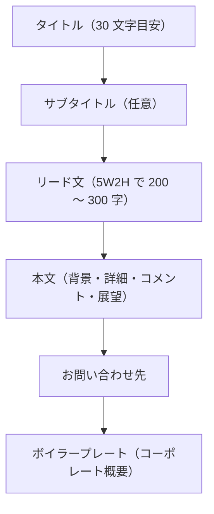
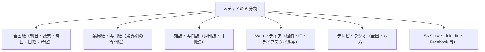
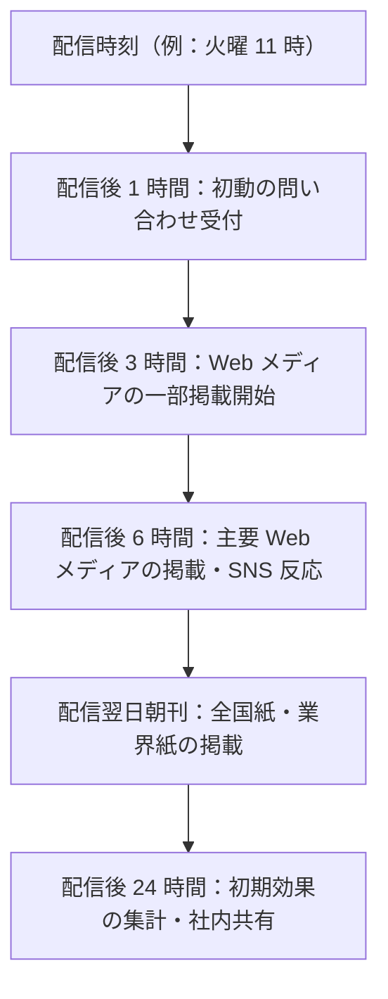

# プレスリリース実践

リリースの型からメディアアプローチまで——「使ってもらえる」発信を組み立てる

| 項目 | 内容 |
|---|---|
| カテゴリー | 広報・PR・IR実務 |
| 難易度 | 初級 |
| 所要時間 | 約200分（全8レッスン） |
| 公開日 | 2026-06-24 |
| 最終更新日 | 2026-06-24 |
| コースURL | https://skillup.college/courses/pr-ir/press-release-practical/ |

## 対象者

新任〜中堅の広報・PR担当者を主軸に、スタートアップ創業者・中小企業経営者・マーケティング担当者・自社の出来事をリリースしたい事業部の方など、対外発信に関わるすべての方。

## 前提知識

特になし。広報・PRの業務経験は不要。社会人としての基本的な業務経験があり、自社・自分の事業の発信に関心がある方を対象に設計。「リリースを書いたことがない」「PR TIMES の使い方がわからない」「記者にどうアプローチすべきかわからない」という方も入れる構成。

## 学習目標

- プレスリリースの位置づけ（広告・記事・ニュースとの違い）を理解する
- ニュース価値の7軸でリリースのネタを発掘・設計できる
- タイトル・リード・本文・ボイラープレートのリリース構造を組み立てられる
- 30文字目安のタイトルと5W2Hのリード文を作る作法を身につける
- PR TIMES などの配信プラットフォームと個別配信を使い分けられる
- 配信後のフォロー（記者対応・問い合わせ対応・効果測定）を設計できる
- SNS・動画・オウンドメディアと連動した統合キャンペーンを企画できる
- 生成AI時代のプレスリリースとPRの倫理（ステマ規制・ディスクロージャー）を判断できる

## コース概要

「リリースを書いたけれど、どこにも載らなかった」「PR TIMES に出してみたが反響がない」「記者にどうアプローチすればよいかわからない」——プレスリリースは、書く技術より「使ってもらえる発想」が9割を決めます。本コースは、新任の広報・PR担当者、スタートアップ創業者、中小企業経営者、自社の出来事を発信したい事業部の方を主対象に、プレスリリースの位置づけから、ニュース価値の作り方、リリースの構造（タイトル・リード・本文・ボイラープレート）、配信先選定とメディアアプローチ、配信後のフォロー、SNS・動画・オウンドメディアとの連動、生成AI時代の倫理まで、8レッスンで体系的に学びます。広告ではなく報道機関を通じて届ける——その独特の作法を、書き方の技術と「使ってもらえる発想」の両輪で身につけられる構成です。資格対策ではなく、明日からの実務で「使ってもらえるリリース」を組み立てられる力に集中しています。

## 学習の流れ

レッスン 1 でプレスリリースの位置づけ（広告・記事・ニュースとの違い、メディアの仕組み、ニュース価値の7軸）を共有します。レッスン 2 はネタ作り編で、社内のネタの掘り起こし、業界・社会のトレンドへの便乗、調査リリース・記念日リリース・コラボリリースなどのネタを作る発想を学びます。レッスン 3 〜 4 は構造編で、リリースの基本構造（タイトル・サブタイトル・リード・本文・お問い合わせ・コーポレート概要）と、タイトル30文字目安・5W2Hリードの作法を扱います。レッスン 5 〜 6 は配信編で、配信先選定（PR TIMES・@Press・Dream News・ValuePress! などの比較）と配信後のフォロー（記者対応・問い合わせ対応・効果測定）を組み立てます。レッスン 7 は連動編で、SNS・動画・オウンドメディアとの統合キャンペーン設計を学びます。最後のレッスン 8 で、生成AI時代のリリース執筆、ステマ規制（景品表示法 2023 年 10 月施行）と PR の倫理、修了後の学習方向（危機広報・IR・メディアリレーション・インターナルコミュニケーション）を案内します。前半（1〜2）は「位置づけとネタ」、中盤（3〜4）は「書き方」、後半（5〜8）は「配信・連動・倫理」の三段構成です。

## レッスン一覧

| No. | タイトル | 概要 | 所要時間 |
|---|---|---|---|
| 1 | プレスリリースとは何か——「載せたい」から「使ってもらえる」発想へ | プレスリリースの定義、広告・記事・ニュースの違い、メディアの仕組みと記者の働き方、リリースが目的を達成する条件、ニュース価値の7軸、本コースの守備範囲を学ぶ | 25分 |
| 2 | ニュースバリューを作る——リリースのネタはどこからくるか | ニュース価値の7軸の使い方、社内のネタの掘り起こし方、業界・社会のトレンドへの便乗、調査リリース・記念日リリース・コラボリリース、発信カレンダー、ネタの優先順位を学ぶ | 25分 |
| 3 | リリースの構造——タイトル・リード・本文・ボイラープレート | プレスリリースの基本構造、タイトル30文字目安と副題の組み立て、リード文の5W2H、本文の流れ（背景・詳細・コメント・展望）、ボイラープレート、お問い合わせ先と画像クレジットを学ぶ | 25分 |
| 4 | タイトルとリードの作法——一行で「見出し」が立つか | 良いタイトルの5条件、リード1文目で結論を出す発想、修飾語を減らす、固有名詞と数値、業界用語の翻訳、SEOとタイトル、悪いタイトル例と良いタイトル例の比較、生成AI下書きとの境界を学ぶ | 25分 |
| 5 | 配信先選定とメディアアプローチ——リスト作りと関係性 | メディアの分類と取材体制、配信先リストの作り方、PR TIMES・@Press・Dream News・ValuePress! の比較、個別アプローチ、業界記者との関係構築、配信タイミングの設計を学ぶ | 25分 |
| 6 | リリース後のフォロー——記者対応・問い合わせ・効果測定 | 配信後24時間の動き、記者からの問い合わせ対応、問い合わせを増やすコメント設計、効果測定（メディア掲載・SNS・Webトラフィック・問い合わせ件数）、クリッピング、失敗事例を学ぶ | 25分 |
| 7 | SNS・動画・オウンドメディアとの連動——現代のプレスリリース戦略 | リリース配信×SNS（X・LinkedIn・Facebook・Instagram）、動画リリース、インフルエンサー・KOLとの連動、オウンドメディアとの同時公開、SNSで拡散される5つの工夫、統合キャンペーン設計を学ぶ | 25分 |
| 8 | 生成AI時代のプレスリリースとPRの倫理——「使ってもらえる」を続けるために | 生成AIでリリースを書く時代の付き合い方、AIで書くと足りない3つのもの、ステルスマーケティング規制（景品表示法2023年10月施行）、インフルエンサーPRとディスクロージャー、海外規制動向、修了後の学習方向を学ぶ | 25分 |

---

## レッスン1：プレスリリースとは何か——「載せたい」から「使ってもらえる」発想へ

（所要時間：25分）

### このレッスンで学ぶこと

- プレスリリースの定義と「対外発信の公式文書」としての役割を理解する
- 広告・記事・ニュースの違いから、PR の位置づけを整理する
- メディアの仕組み（記者・編集・編成・読者・視聴者）の全体像を把握する
- リリースが目的を達成する 3 つの条件を理解する
- ニュース価値の 7 軸（新規性・社会性・話題性・季節性・人物性・地域性・意外性）を知る
- 本コースの守備範囲と「載せたい」から「使ってもらえる」への発想転換を共有する

---

「リリースを書いてみたけれど、どこにも載らなかった」「PR TIMES に出してみたが反響がなかった」「記者に送ったメールが返ってこない」——プレスリリースに関わる方の多くが経験する悩みです。原因は、書く技術より「発想」にあることがほとんどです。リリースは「載せたい」という発信者の都合で書くものではなく、「使ってもらえる」という読み手側の視点で組み立てるものだからです。本レッスンでは、コース全体の前提として、プレスリリースの定義、メディアの仕組み、ニュース価値の考え方を共有することから始めます。

### プレスリリースの定義

本コースでは、プレスリリース（press release）を次のように定義します。

> 企業・組織が、自社の活動や情報を、報道機関や社会に向けて発表する公式文書。報道で取り上げてもらうこと、社会に直接届くこと、その両方を目的とする。

この定義の鍵は 3 つです。

#### 1. 「企業・組織からの公式文書」

リリースは、個人の発信ではなく、企業・組織として発する公式の声です。広報担当者が書く場合も、創業者・経営者が自ら書く場合も、組織を代表する文書である点は変わりません。発信した瞬間から、その内容は会社の意志・立場として社会に流通します。だからこそ、ファクト（事実）の正確性、表現の品位、ステークホルダーへの配慮が、ふつうの業務文書よりはるかに厳しく問われます。

#### 2. 「報道機関や社会に向けて」

リリースの宛先は、報道機関の記者だけではありません。配信プラットフォーム（PR TIMES、@Press、Dream News、ValuePress! など）を通じて、配信と同時に Web サイト上で社会に直接公開されます。記者が取り上げなくても、検索エンジン経由で生活者・取引先・株主・採用候補者など、さまざまな読み手に届きます。**「報道されること」と「社会に直接届くこと」、その両方が今のリリースの目的**です。

#### 3. 「発表する」公式の文書

リリースは「お願い」ではなく「発表」です。報道機関に「載せてください」と頼むのではなく、「こういう事実があります」と知らせるのが本義です。だからこそ、書き手の都合（載せたい・取り上げてほしい）ではなく、読み手の関心（読者・視聴者・社会にとっての意味）で組み立てる発想が求められます。

> **💡 ポイント**
> プレスリリースは「企業・組織が、報道機関や社会に向けて発表する公式文書」。「載せたい」という発信者の都合ではなく、「使ってもらえる」という読み手側の視点で組み立てる発想が、すべての出発点です。

### 広告・記事・ニュース・PR の違い

リリースを理解するうえで欠かせないのが、対外発信の 4 つの形態の整理です。

| 形態 | 出し手 | 場 | 信頼性の源 | 費用 |
|---|---|---|---|---|
| 広告 | 企業が出す | 媒体に枠を買って掲載 | 企業が「言っている」 | 高額（媒体に支払う） |
| 記事 | 記者・編集者が書く | 媒体の編集面 | 編集者が「選んだ」 | 媒体経由では発生しない |
| ニュース | 記者が取材して書く | 媒体のニュース面 | 記者が「事実を確認した」 | 媒体経由では発生しない |
| プレスリリース | 企業が出す | 報道機関に届け、配信プラットフォームでも公開 | 企業が「事実として公表した」 | 配信プラットフォーム費用程度 |

広告は「枠を買って自社の主張を載せる」もの、記事・ニュースは「記者・編集者が独自に書く」もの、リリースは「企業が出した一次情報を、記者が取材の土台に使う」ものです。**「広告は買う、PR は得る」**という対比はよく使われます。ただし現代は、ペイド PR（広告枠を購入したうえで PR 記事を載せる）、スポンサードコンテンツ、ネイティブ広告など、境界が曖昧な発信形態も増えています。本コースでは「狭義のプレスリリース」を扱い、ペイド PR や広告は守備範囲外とします。

### メディアの仕組みを理解する

リリースを「使ってもらえる」発想にするには、メディア側の仕組みを理解することが欠かせません。

#### 記者・編集・編成の役割

新聞・雑誌・テレビ・Web メディア、いずれも複数の役割が連携して紙面・番組・記事を作っています。

- **記者**：取材して原稿を書く人。担当業界（業界記者）や担当領域（社会・経済・政治・文化など）を持つ
- **編集者・デスク**：原稿を取捨選択し、見出しを付け、紙面・サイトに並べる人
- **編成（テレビ・ラジオ）**：番組全体の組み立てを統括する人
- **校閲**：事実関係と表記を最終チェックする人

リリースが届くのは多くの場合、記者またはニュース受け付けデスクです。記者は1 日に数十〜数百のリリースに目を通し、その中から取材すべきもの・記事化すべきものを選びます。**取捨選択の質を上げるのは、リリース自体の「ニュース性」と「読みやすさ」**です。

#### 取材体制の現在地

2026 年 6 月時点で、新聞社・雑誌社の取材記者数は長期的な減少傾向にあります。一方、Web メディア（経済系・IT 系・ライフスタイル系・業界専門系）は急速に増加し、Web メディアの記者・編集者の人数は数千名規模に達しています。テレビ局は番組制作会社への外注比率が高まり、リサーチャー・構成作家を含めた取材体制になっています。**「リリースの読み手」の総数は減っていません。むしろ、媒体の多様化で増えている**と捉えてよい状況です。

#### 業界記者と関係性

新聞社・通信社・主要 Web メディアには、担当業界を持つ「業界記者」がいます。家電業界担当、IT 業界担当、医薬品業界担当——彼ら・彼女らとの中長期的な信頼関係が、リリース掲載の鍵を握ります。1 回の取材で終わらず、業界の動向情報を定期的に提供し続けることで、いざというときの記事化につながりやすくなります。

> **💡 ポイント**
> リリースは、記者・編集者の取捨選択を経て記事化されます。担当業界を持つ記者との中長期的な信頼関係が、長期的な掲載確率を上げる土台になります。

### リリースが目的を達成する 3 つの条件

プレスリリースが「使ってもらえる」ためには、3 つの条件があります。

#### 条件 1：ニュース性（読み手にとって新しい価値があるか）

「新製品を出した」「サービスを開始した」だけでは、ニュース性は低い場合があります。**「なぜ、いま、これを伝える必要があるのか」**という問いに、社会的な意味で答えられる内容でなければ、記者は取り上げません。新しい事実・新しい切り口・新しい組み合わせ——どれかひとつでも、確実に「新しい」要素が必要です。

#### 条件 2：読みやすさ（30 秒で要点が伝わるか）

記者は 1 日に数十〜数百のリリースに目を通します。読みやすさが悪いリリースは、内容に関わらず読まれません。**タイトル 30 文字、リード 5W2H、本文 1,000 〜 2,000 文字程度**という標準的な型を守ることで、記者の読み切り率を上げられます。

#### 条件 3：信頼性（事実が確かか、固有名詞が正確か）

固有名詞の誤り、日付の誤り、数字の誤り——これらは記者の信頼を一発で失う原因です。発表内容のファクトチェックは、リリース公開前に必ず複数人で実施します。**「事実が確認できないリリース」は、たとえ取り上げられても、後の修正・お詫び対応で広報の信用が大きく毀損**します。

### ニュース価値の 7 軸

「ニュース性」をもう少し具体的に分解すると、リリースが取り上げられる際に判断される 7 つの軸があります。

| 軸 | 内容 | 例 |
|---|---|---|
| 新規性 | 業界・社会で初めての要素があるか | 業界初の新サービス、世界初の技術 |
| 社会性 | 社会的な意味・公共性があるか | 環境問題、少子高齢化、教育、医療など |
| 話題性 | 世間で話題のテーマと関連するか | トレンド、流行、世論の関心事 |
| 季節性 | 季節・時期と関連するか | 新生活、年末年始、夏休み、防災 |
| 人物性 | 注目される人物が関わるか | 著名な経営者、有識者、専門家 |
| 地域性 | 特定地域に関わるか | 地方創生、地域限定の取り組み |
| 意外性 | 通常の想定を裏切る要素があるか | 業界の常識を覆す、異業種コラボ |

リリースを企画する段階で、この 7 軸のうち**少なくとも 2 〜 3 軸を満たすかチェック**するのが基本です。1 軸も満たさないリリースは、ニュース性が低く、記者の関心を引くことが難しい場合が多くなります。次のレッスン 2 で、この 7 軸を使ってネタを作る発想を具体的に扱います。

### 本コースの守備範囲

本コースは「プレスリリースの実践」を中核に据えています。具体的には、リリースの位置づけ（L1）、ネタ作り（L2）、構造（L3）、タイトルとリードの作法（L4）、配信先選定（L5）、配信後のフォロー（L6）、SNS・動画・オウンドメディアとの連動（L7）、生成 AI 時代の倫理（L8）の 8 領域を扱います。

一方で、次の領域は本コースの守備範囲外です。

- **一般的なビジネス文書（メール・報告書・企画書）の作法**：別の入門コースを参照
- **SEO・Web マーケティング**：別の入門コースを参照
- **業務全般での生成 AI 活用**：別の入門コースを参照
- **危機広報・レピュテーション管理**：本コース修了後の発展領域
- **IR（投資家向け広報）**：本コース修了後の発展領域
- **メディアリレーション（記者との中長期的な関係構築）の深掘り**：本コース修了後の発展領域
- **インターナルコミュニケーション（社内広報）**：本コース修了後の発展領域

本コースを終えたあと、皆さんの関心・職務に応じて、上記の発展領域に進んでいただける構成です。

### まとめ

- **プレスリリースは「企業・組織が報道機関・社会に向けて発表する公式文書」**。「載せたい」ではなく「使ってもらえる」発想で組み立てる
- **広告・記事・ニュース・PR の違い**：広告は「枠を買って自社主張」、記事・ニュースは「記者が独自に書く」、PR は「企業が一次情報を出し、記者が記事化の土台に使う」
- **メディアの仕組み**：記者・編集者・編成・校閲の役割と、業界記者との中長期的な信頼関係が長期的な掲載確率を上げる
- **目的達成の 3 条件**：ニュース性（読み手にとっての新しい価値）、読みやすさ（30 秒で要点が伝わる）、信頼性（事実とファクトチェック）
- **ニュース価値の 7 軸**：新規性・社会性・話題性・季節性・人物性・地域性・意外性。少なくとも 2 〜 3 軸を満たすことを目指す
- **本コースの守備範囲**：プレスリリース実践に集中。一般的なビジネス文書、SEO、生成 AI 業務全般、危機広報、IR、メディアリレーションの深掘り、インターナルコミュニケーションは守備範囲外

次のレッスンでは、ニュース価値の 7 軸を実際に使って、「ネタがない」から「ネタを作る」発想を扱います。社内のネタの掘り起こし方、業界・社会のトレンドへの便乗、調査リリース・記念日リリース・コラボリリースの作り方を学びます。

### 確認クイズ

このレッスンの理解度をチェックする 6 問です。

#### Q1. プレスリリースの定義として、本コースの立場にもっとも近いものはどれですか。

- [ ] 企業が報道機関に対して、自社の宣伝を「載せてほしい」と依頼する文書
- [x] 企業・組織が、自社の活動や情報を、報道機関や社会に向けて発表する公式文書
- [ ] 記者が独自に取材して書いた、ニュースとして掲載される記事
- [ ] 企業が媒体に費用を支払って掲載する、商品・サービスの広告

> **解説**：プレスリリースは「報道機関に載せてもらうための依頼」ではなく、「企業・組織からの公式な発表」です。配信プラットフォームを通じて社会に直接届く性質も持ち、現代は「報道機関と社会の両方に届く文書」として位置づけられます。記者が書く記事や、企業が費用を払う広告とは別の形態です。

#### Q2. 広告とプレスリリースの違いを正しく説明しているものはどれですか。

- [x] 広告は媒体に枠を買って掲載する一方、プレスリリースは報道機関に届けたうえで配信プラットフォームでも公開する
- [ ] 広告は無料、プレスリリースは有料で配信する
- [ ] 広告は記者が書き、プレスリリースは企業が書く
- [ ] 広告は事実が中心、プレスリリースは主張が中心

> **解説**：広告は媒体の広告枠を購入して掲載する「企業の主張」、リリースは企業が報道機関に届けたうえで配信プラットフォームでも公開する「企業の発表」です。記者が書くのは「広告」ではなく「記事・ニュース」です。「広告は買う、PR は得る」という対比がよく使われますが、近年はその境界が曖昧化している（ペイド PR、ネイティブ広告など）点にも注意が必要です。

#### Q3. プレスリリースが「使ってもらえる」ための 3 つの条件として、本コースが挙げているものの組み合わせは次のうちどれですか。

- [ ] 派手な表現・著名人の推薦・SNS でのバズ
- [ ] 大量配信・繰り返し配信・有名媒体への直接依頼
- [x] ニュース性・読みやすさ・信頼性
- [ ] タイトルの長さ・写真の枚数・コーポレート概要の充実

> **解説**：本コースが挙げている 3 つの条件は、ニュース性（読み手にとっての新しい価値があるか）、読みやすさ（30 秒で要点が伝わるか）、信頼性（事実が正確か）です。派手な表現や著名人の推薦ではなく、地味でも事実と意味を伝える文書のほうが、長期的に「使ってもらえる」リリースになります。大量配信や繰り返し配信は、むしろ記者の信頼を損なう要因になります。

#### Q4. ニュース価値の 7 軸として、本コースで挙げているものはどれですか。

- [ ] 緊急性・派手さ・話題性・季節性・人物性・地域性・新規性
- [ ] 新規性・社会性・話題性・季節性・人物性・地域性・収益性
- [ ] 新規性・社会性・話題性・季節性・人物性・地域性・短期性
- [x] 新規性・社会性・話題性・季節性・人物性・地域性・意外性

> **解説**：ニュース価値の 7 軸は、新規性（業界・社会で初めての要素）、社会性（社会的な意味・公共性）、話題性（世間で話題のテーマと関連）、季節性（季節・時期と関連）、人物性（注目される人物）、地域性（特定地域）、意外性（通常の想定を裏切る要素）です。緊急性・派手さ・収益性・短期性ではなく「意外性」が含まれている点が、見落とされやすい軸です。

#### Q5. メディアの仕組みについての説明として、もっとも適切なものはどれですか。

- [x] 記者は 1 日に数十〜数百のリリースに目を通し、その中から記事化するものを選ぶため、読みやすさが選別に影響する
- [ ] 記者は配信されたリリースをすべて記事化する義務があり、媒体側の編集は介在しない
- [ ] 記者は広告主からのリリースを優先的に掲載するため、広告予算と掲載確率は直結する
- [ ] 記者は人手不足のため、リリースの内容を確認せず、そのまま転載することが標準的になっている

> **解説**：記者は 1 日に多数のリリースに目を通し、ニュース性と読みやすさで取捨選択します。記事化の義務はなく、編集者・デスクの編集も介在します。広告予算で掲載が決まるわけではなく（広告と記事の独立性は媒体倫理の基本）、リリースをそのまま転載することは媒体としての信頼性を損ねるため標準的とは言えません。

#### Q6. 本コースの守備範囲外として、本レッスンが明示しているものはどれですか。

- [ ] 配信先選定とメディアアプローチ
- [x] 一般的なビジネス文書（メール・報告書・企画書）の作法
- [ ] リリースの構造（タイトル・リード・本文・ボイラープレート）
- [ ] 生成 AI 時代のプレスリリースと PR の倫理

> **解説**：本コースの守備範囲外として明示しているのは、一般的なビジネス文書、SEO、業務全般での生成 AI 活用、危機広報、IR、メディアリレーションの深掘り、インターナルコミュニケーションです。配信先選定（L5）、リリースの構造（L3）、生成 AI 時代の倫理（L8）は、いずれも本コースで扱う領域です。

---

## レッスン2：ニュースバリューを作る——リリースのネタはどこからくるか

（所要時間：25分）

### このレッスンで学ぶこと

- ニュース価値の 7 軸を使ったネタ評価ができるようになる
- 社内のネタの掘り起こし方（7 種類のネタの源泉）を理解する
- 業界・社会のトレンドへの便乗の発想を身につける
- 「ネタを作る」発想（調査リリース・記念日リリース・コラボリリース）を学ぶ
- 月次・四半期・期初の発信カレンダーの設計を理解する
- 複数のネタが揃ったときの優先順位の付け方を把握する

---

前回のレッスンでは、プレスリリースが「載せたい」から「使ってもらえる」への発想転換が出発点であること、ニュース価値の 7 軸という共通の評価軸があることを確認しました。本レッスンでは、そのニュース価値を実際に「作る」発想に踏み込みます。「うちはネタがない」と感じる方が多いのですが、現場経験から言うと、ネタがない会社は存在しません。あるのは、ネタを見つけられていない状態だけです。

### 「うちはネタがない」という思い込みを外す

新任の広報担当者から「うちはネタがありません」と相談を受けることがよくあります。話を聞いてみると、実はネタはあるのです。社員が気づいていないだけです。なぜそうなるのか——理由は 3 つあります。

1. **当たり前すぎて、ネタと認識されていない**：社内で日常になっている取り組みは「ニュースになる」と思われていない
2. **断片的で、まとまっていない**：ある部署の動き、ある社員のエピソード、ある製品の数字。それぞれは小さく見えるが、組み合わせるとニュースになる
3. **時期と発信のタイミングが噛み合っていない**：同じネタでも、社会的なトレンドと重なれば一気に価値が上がる

リリースを書く前に必要なのは、書く技術ではなく「ネタを発見し、組み合わせ、タイミングを設計する技術」です。本レッスンの後半でこの 3 つを順番に扱います。

### ニュース価値の 7 軸——再確認と使い方

前回のレッスンで紹介した 7 軸を、企画段階で実際に使う方法を整理します。

| 軸 | 自社のネタを評価する問い |
|---|---|
| 新規性 | 業界・社会で「初」と言える要素はあるか |
| 社会性 | 社会的な課題・公共性・公共の関心と関連しているか |
| 話題性 | 今、世間で話題のテーマと関連しているか |
| 季節性 | 今の時期（季節・記念日）と関連付けられるか |
| 人物性 | 注目される人物（社内外）が関わっているか |
| 地域性 | 特定の地域に関わるか、地方への影響があるか |
| 意外性 | 通常の想定を裏切る要素があるか |

リリースの企画段階で、この 7 軸に対して**ネタが何軸を満たすかチェック**するのが基本です。0 〜 1 軸：ニュース性が弱い、見送りも検討。2 〜 3 軸：標準的なリリース、配信検討。4 軸以上：強いリリース、大きな反響が期待できる。という目安です。

> **💡 ポイント**
> 7 軸を使うコツは「無理に当てはめない」こと。1 つの軸でも本気で満たしているネタは、無理に 7 軸を満たそうとして薄まったネタより、はるかに使ってもらえます。

### 社内のネタの源泉——7 種類のソース

社内のネタの源泉は、おおむね次の 7 種類に整理できます。広報担当者は、これらを定期的に各部署に問い合わせる仕組みを作るのが第一歩です。

#### 1. 人事（社員・経営層・組織変更）

- 役員交代、新部門の設立、新拠点の開設
- 著名な人物の入社、外部からの著名なアドバイザー就任
- 社員の受賞、社員の社外活動（学会発表、書籍出版、登壇など）

#### 2. 製品・サービス

- 新製品・新サービスのリリース
- 既存製品・サービスの大幅アップデート、新機能追加
- 既存製品・サービスの累計販売数・利用者数の節目（10 万人突破、100 万ダウンロード突破など）

#### 3. 業績・経営指標

- 上場企業の場合は決算発表のタイミング
- 非上場でも、年間業績の節目、過去最高益、海外売上の節目
- 重要な経営指標の達成（カーボンニュートラル達成、女性管理職比率の節目など）

#### 4. 受賞・認定

- 業界団体・行政・第三者機関からの受賞・認定（グッドデザイン賞、健康経営優良法人、なでしこ銘柄など）
- 専門メディアによるランキング掲載
- 国際認証の取得（ISO、SOC、Pマークなど）

#### 5. 提携・コラボレーション

- 他社との業務提携、資本提携
- 自治体・大学・研究機関との協定
- 他業界とのコラボ製品・コラボイベント

#### 6. 調査・データ

- 自社が実施した調査結果（消費者意識調査、業界動向調査など）
- 自社のサービス内データを集計した知見（業界全体の利用動向、地域別データなど）
- 過去のデータと比較した経年変化（10 年で 3 倍に増えた、など）

#### 7. 社会貢献・サステナビリティ

- 寄付、ボランティア活動、地域貢献
- 環境対応（再生可能エネルギー導入、廃棄物削減）
- 多様性・インクルージョン（ダイバーシティ推進、障害者雇用、LGBTQ+ 対応など）

各部署から月次で 1 件は何かしらのネタが上がってくる仕組みを作れば、年間 60 〜 80 件のネタ候補が集まります。**ネタは「足りない」のではなく、「集める仕組みがない」状態のほうがふつう**です。

### 業界・社会のトレンドへの便乗

社内のネタ単独ではニュース性が弱くても、業界・社会のトレンドと組み合わせると価値が上がります。

#### トレンドの源泉

- **新聞・経済誌・業界誌**：日経新聞、業界専門紙、ハーバード・ビジネス・レビューなど
- **政府・自治体の白書・統計**：内閣府、経済産業省、厚生労働省などの統計と動向
- **業界団体・調査機関のレポート**：業界団体の年次レポート、矢野経済研究所、富士経済などの市場調査
- **Google Trends・X（旧 Twitter）**：検索トレンド、SNS のトレンドワード
- **生成 AI による要約・整理**：ChatGPT・Claude・Gemini で業界動向の要点を整理（一次情報の出典確認は必須）

#### 便乗の発想

トレンドを掴んだら、自社のネタと「重なる切り口」を探します。

- 例 1：政府が「賃上げ」を経済対策の柱に。→ 自社の賃上げ実績、初任給引き上げ、社員平均給与の経年変化をリリース
- 例 2：「リスキリング」が経営課題に。→ 自社の社内研修制度、リスキリング受講者数、リスキリング後のキャリア事例をリリース
- 例 3：「サステナビリティ」「カーボンニュートラル」の動き。→ 自社の環境取り組み、再エネ導入比率、製品ライフサイクルでの CO₂ 削減実績をリリース

**「自社のことを発信」ではなく「社会的なテーマに自社が答える」発想に変えるだけ**で、リリースの掲載確率は大きく上がります。

> **💡 ポイント**
> トレンドへの便乗は「無理に乗る」のではなく「自然に重なる切り口を探す」もの。重ならない場合は、別のトレンドを待つほうが、薄いリリースを出すよりよい結果になります。

### ネタを「作る」発想——3 種類のリリース

社内にネタが見つからない場合、ネタを「作る」発想に移ります。代表的なのは次の 3 種類です。

#### 1. 調査リリース

自社が独自に消費者調査・業界調査を実施し、その結果をリリースとして発表する方法。低コストかつ高頻度で実施でき、業界・社会の動向を語る素材として高い掲載確率を持ちます。

- 例：「全国の働く女性 1,000 人に聞いた『春の働き方意識調査』」
- 例：「20 代エンジニア 500 人に聞いた『生成 AI の業務利用実態』」

調査リリースの成功条件は、**調査設計の妥当性（サンプル数、対象、設問の中立性）**、**発見の面白さ（意外な結果、トレンドを裏付ける結果）**、**自社事業との自然な関連付け**の 3 つです。

注意点：調査は外部の調査会社（マクロミル、楽天インサイト、クロス・マーケティング、QO（クオ）、ジャストシステムなど）への外注も可能です。費用は数十万円〜数百万円の幅。発表時は、サンプル数、対象、調査期間、調査会社名を明記するのが業界標準です。

#### 2. 記念日リリース

特定の日付・時期と結びつけたリリース。日本記念日協会の認定記念日や、社会的に認知された日付に合わせて発信します。

- 例：「働き方改革の日（10 月）に合わせ、リモートワーク制度の利用実績を公開」
- 例：「読書週間（10 月〜 11 月）に合わせ、社員の年間読書実態調査を発表」

記念日リリースは、季節性軸が確実に満たされるため、ニュース性のベースラインを底上げできます。新しい記念日を自社で申請・認定してもらう（日本記念日協会への登録）という手もあります。

#### 3. コラボリリース

他社・他業界・自治体・大学・研究機関と組んで、共同で発信するリリース。意外性と社会性の軸を満たしやすく、双方のメディアに露出が広がるメリットがあります。

- 例：「食品メーカー A 社とフィットネスアプリ B 社が共同で『健康レシピ提案サービス』を提供」
- 例：「地方自治体と IT スタートアップが共同で『高齢者向け見守りサービス』の実証実験を開始」

コラボリリースの注意点：双方の合意プロセス（リリース内容、配信タイミング、双方の表現バランス）、お互いのブランド毀損リスク、終了後の関係性の整理。配信前に**双方の広報担当者と経営層の確認を必ず取る**のが原則です。

### 発信カレンダーの設計

ネタが集まり始めたら、次に必要なのは「いつ何を出すか」のカレンダーです。

#### 月次・四半期・期初の三層

- **月次カレンダー**：今月配信するリリースを 2 〜 4 件程度、いつ・どの媒体に向けて出すかを決める
- **四半期カレンダー**：3 か月先までの大きなリリース（決算、新製品、節目）を組み立てる
- **期初カレンダー（年間）**：年初・期初に、その年の発信戦略を整理。重点メッセージ・季節リリース・記念日リリース・調査リリースの年間骨格を組む

> **💡 ポイント**
> カレンダーは「埋める」のではなく「間引く」もの。「毎月 1 件は出さなきゃ」と無理に出したリリースは、ノイズになって、本当に取り上げてほしいリリースの掲載確率まで下げます。

#### タイミングの基本

- **曜日**：火・水・木が安定。月曜は週末のニュースが優先される、金曜は週末モードで読まれにくい
- **時間帯**：10 時〜 14 時が標準。朝刊締切（22 時頃）、夕刊締切（11 時頃）に近すぎるのは避ける
- **競合との重なり**：競合の決算発表日、競合の新製品発表日と重ねないよう調整
- **季節・記念日との連動**：季節リリース・記念日リリースは、2 〜 3 週間前に配信して取材の余地を残す

### 優先順位の付け方

複数のネタ候補が同時期に上がってきた場合、何を優先するかの判断軸を持っておきます。

#### 評価マトリクス（簡易版）

| 評価軸 | 高（3 点） | 中（2 点） | 低（1 点） |
|---|---|---|---|
| ニュース性（7 軸の合致数） | 4 軸以上 | 2 〜 3 軸 | 0 〜 1 軸 |
| 経営インパクト | 全社的に重要 | 部門で重要 | 個別案件 |
| メディア露出予想 | 全国紙・全国 TV クラス | 業界誌・Web メディア | 業界専門誌のみ |
| タイミング適切性 | 季節・トレンドと完全合致 | 一部合致 | 合致なし |
| リリース作成工数 | 2 日以内 | 1 週間以内 | 2 週間以上 |

15 点満点で 10 点以上なら優先的にリリース化、8 〜 9 点ならリリース化、7 点以下なら見送りまたは延期、を目安にできます。**チーム内で「なぜ出すか・なぜ出さないか」を共有する判断材料**として、こうした枠組みは有効です。

### まとめ

- **「うちはネタがない」は思い込み**。当たり前すぎる・断片的・タイミングがずれている、の 3 つを克服すれば、ネタは見つかる
- **社内のネタの 7 源泉**：人事、製品・サービス、業績・経営指標、受賞・認定、提携・コラボ、調査・データ、社会貢献・サステナビリティ
- **業界・社会のトレンドへの便乗**：「自社のことを発信」ではなく「社会的なテーマに自社が答える」発想に変える
- **ネタを「作る」3 種類**：調査リリース（自社調査）、記念日リリース（日付と紐づけ）、コラボリリース（他社・他業界・自治体・大学との共同発信）
- **発信カレンダー**：月次・四半期・期初の三層で組み立てる。「埋める」のではなく「間引く」発想
- **優先順位**：ニュース性・経営インパクト・メディア露出予想・タイミング適切性・作成工数の 5 軸で評価

次のレッスンでは、ネタが固まったあとに必要な「リリースの構造」を扱います。タイトル・サブタイトル・リード文・本文・お問い合わせ先・ボイラープレートという基本構造と、画像・動画のクレジット、お問い合わせ先の書き方まで整理します。

### 確認クイズ

このレッスンの理解度をチェックする 6 問です。

#### Q1. 社内に「うちはネタがない」と感じてしまう原因として、本レッスンが挙げているものはどれですか。

- [ ] 業界で先進的すぎる取り組みのため、メディアが理解できないから
- [ ] 競合他社が同じネタを先に出してしまっているから
- [x] 当たり前すぎてネタと認識されない、断片的でまとまっていない、タイミングと噛み合っていないなど
- [ ] 業界のトレンドが下火で、社会的な関心が低下しているから

> **解説**：本レッスンが挙げている 3 つの原因は、「当たり前すぎてネタと認識されていない」「断片的でまとまっていない」「時期と発信のタイミングが噛み合っていない」です。先進的すぎる、競合に先行された、トレンドが下火、ではなく、社内の認識・整理・タイミングの問題が大半を占めます。

#### Q2. ニュース価値の 7 軸を使ったネタ評価の目安として、本レッスンが示しているのはどれですか。

- [ ] 1 軸だけ満たせば配信、満たさなければ見送り
- [x] 0 〜 1 軸はニュース性が弱く見送りも検討、2 〜 3 軸は標準、4 軸以上は強いリリース
- [ ] すべての軸を満たさなければ、リリースとして配信できない
- [ ] 軸の合致数より、社内の合意のほうが重要なので、評価軸は使わない

> **解説**：本レッスンが示している目安は、0 〜 1 軸はニュース性が弱く見送りも検討、2 〜 3 軸は標準的なリリース、4 軸以上は強いリリース、です。全軸満たす必要はなく、無理に当てはめるとリリースが薄まる点に注意が必要です。社内の合意も大事ですが、外部評価の軸を持つことで企画段階の判断が安定します。

#### Q3. 社内のネタの 7 源泉として、本レッスンが挙げている組み合わせはどれですか。

- [ ] 業績、競合の動向、市場規模、業界規制、政治、海外、為替
- [ ] 製品、社員、株価、配当、増資、IR、M&A
- [ ] 株主、顧客、取引先、競合、業界団体、行政、メディア
- [x] 人事、製品・サービス、業績・経営指標、受賞・認定、提携・コラボ、調査・データ、社会貢献・サステナビリティ

> **解説**：本レッスンが挙げている 7 源泉は、人事、製品・サービス、業績・経営指標、受賞・認定、提携・コラボ、調査・データ、社会貢献・サステナビリティです。広報部門が定期的に各部署から情報を集める仕組みを作ることで、年間 60 〜 80 件のネタ候補を集められます。

#### Q4. ネタを「作る」3 種類のリリースとして、本レッスンが挙げているものはどれですか。

- [ ] 危機広報リリース、訂正リリース、お詫びリリース
- [ ] 決算リリース、IR リリース、株主向けリリース
- [ ] お知らせリリース、ご挨拶リリース、ご報告リリース
- [x] 調査リリース、記念日リリース、コラボリリース

> **解説**：本レッスンが挙げている 3 種類は、調査リリース（自社調査の結果を発表）、記念日リリース（日付・時期と結びつけ）、コラボリリース（他社・他業界・自治体・大学との共同発信）です。危機・訂正・決算・お知らせ等は別のカテゴリで、本レッスンの「ネタを作る」発想とは趣旨が異なります。

#### Q5. 発信カレンダー設計の発想として、もっとも適切なものはどれですか。

- [x] 「埋める」のではなく「間引く」。無理に毎月配信すると、本当に取り上げてほしいリリースの掲載確率が下がる
- [ ] 毎週 1 件以上配信することで、メディアに自社の存在感を継続的にアピールする
- [ ] 月次・四半期・期初のカレンダーは作らず、ネタが上がってきたら都度配信するのが効率的
- [ ] 競合と同日同時刻にあえて配信することで、メディアの注目を集める

> **解説**：本レッスンが示しているのは「埋める」のではなく「間引く」発想です。無理に出したリリースはノイズとして記者の信頼を下げ、本当に重要なリリースの掲載確率まで損なうおそれがあります。月次・四半期・期初の三層カレンダーで、間引きながら計画する発想が中核です。

#### Q6. 調査リリースの成功条件として、本レッスンが挙げているものはどれですか。

- [ ] サンプル数 1 万人以上、調査会社への外注、英訳版の同時配信
- [ ] 経営陣のメッセージ、自社製品の優位性データ、業界全体への提言
- [x] 調査設計の妥当性（サンプル数・対象・設問の中立性）、発見の面白さ、自社事業との自然な関連付け
- [ ] 社内で実施、無料で実施、業界団体の協賛取得

> **解説**：本レッスンが挙げている調査リリースの成功条件は、調査設計の妥当性（サンプル数、対象、設問の中立性）、発見の面白さ（意外な結果、トレンドを裏付ける結果）、自社事業との自然な関連付けの 3 つです。サンプル数は妥当性の一部であり、無条件に多ければよいわけではありません。自社の製品優位性を訴える設問構成は、調査の信頼性を損ねます。

---

## レッスン3：リリースの構造——タイトル・リード・本文・ボイラープレート

（所要時間：25分）

### このレッスンで学ぶこと

- プレスリリースの基本構造（6 つのブロック）を理解する
- タイトル 30 文字目安・サブタイトルの組み立てを把握する
- リード文の 5W2H と本文の流れ（背景・詳細・コメント・展望）を組み立てられる
- ボイラープレート（コーポレート概要）の役割と書き方を理解する
- お問い合わせ先・画像と動画のクレジットの作法を身につける
- A4 1 〜 2 ページの分量設計を学ぶ

---

前回のレッスンでは、ネタの発掘・トレンドへの便乗・ネタを「作る」発想・発信カレンダーを扱いました。本レッスンからは、いよいよ「書き方」の領域に入ります。プレスリリースには、業界で長年磨かれてきた標準的な構造があります。型を知らずに書くのは、サッカーで基本のフォーメーションを知らずに試合に出るようなものです。本レッスンでは、リリースの構造を 6 つのブロックに分解して、それぞれの役割と作法を整理します。

### プレスリリースの基本構造

プレスリリースは、おおむね 6 つのブロックから構成されます。



媒体・配信プラットフォームによって細部は異なりますが、この 6 ブロックはほぼ業界標準として定着しています。記者は同じ構造のリリースを毎日大量に読んでいるため、構造から外れたリリースは「読みにくい」と判断され、選別の対象から外れる可能性が上がります。**型は表現の制約ではなく、読み手を助ける道具**です。

#### 紙 vs Web の違い

近年は、A4 用紙 1 〜 2 ページの体裁で PDF として配布する形と、配信プラットフォーム（PR TIMES など）で HTML として公開する形が共存しています。HTML 形式では、画像が前に出ること、文字装飾の自由度が低いこと、SEO が効くこと、SNS でシェアされやすいことなどの違いがあります。**現代は HTML 形式を主軸**に置きつつ、PDF も用意する形が主流です。

### ブロック 1：タイトル（見出し）

タイトルは、リリース全体のなかで最も読まれる場所です。記者は数十〜数百のリリースに目を通すなかで、タイトルで読むか読まないかを判断します。Web メディアでは、検索エンジン経由でタイトルだけが表示されるケースもあります。**タイトルが立たないリリースは、本文がどんなに良くても読まれません**。

#### タイトルの 5 条件（次レッスンで詳しく）

- **新規性**：「初」「新」「過去最高」など、新しさが伝わる
- **具体性**：抽象的な言葉ではなく、具体的な事実
- **主体性**：誰が（自社が）何をしたかが明確
- **固有名詞**：自社名・製品名・人物名が入っている
- **数値**：数字が入ると説得力が増す

#### 文字数の目安

- **30 文字目安**：日本のメディア環境では 30 文字前後が標準。25 文字以下だと情報不足、40 文字以上だと冗長
- **検索エンジン**：Google 検索結果のタイトル表示は 28 〜 32 文字程度（端末・状況により変動）
- **SNS の文字制限**：X（旧 Twitter）の表示制限を考慮すると、30 文字以内のタイトルは引用・シェアされやすい

#### 悪いタイトル例 vs 良いタイトル例

| 悪い例 | 良い例 |
|---|---|
| 弊社新サービスのご案内 | 中堅企業向け労務管理 SaaS「△△」、月額 5,000 円で提供開始 |
| 業界に革新を起こす新製品の発表について | 業界初、AI で品質検査時間を 50％ 削減する画像解析装置を発売 |
| 弊社の取り組みについて | 全社員 200 名の週休 3 日制を 4 月から正式導入 |
| お客様への重要なお知らせ | 個人情報の取り扱いに関する一部不適切な事象についてのお詫び |

悪い例は「自社の視点（弊社・お客様・案内）」で書かれ、固有名詞・数値・具体性に欠けています。良い例は「読み手の視点（何が・いつ・どうなる）」で書かれ、固有名詞・数値・具体性が入っています。

### ブロック 2：サブタイトル（任意）

タイトルだけで伝えきれない補足情報を、サブタイトルに置きます。タイトルの直下に置かれ、文字サイズはタイトルより少し小さめです。

- 例：「業界初、AI で品質検査時間を 50％ 削減する画像解析装置を発売」
  - サブタイトル：「2026 年 7 月から国内中堅製造業を対象に、初期費用 0 円で提供」

サブタイトルは「販売開始時期」「対象」「料金」「規模」など、タイトルの脇を支える情報に向きます。必須ではないため、本文だけで十分なら省略しても問題ありません。

### ブロック 3：リード文

リード文は、タイトルの直後に置かれる「冒頭の段落」で、200 〜 300 字を目安にします。リード文の役割は、**「結論・主要な事実・記事化されたときの土台」を 30 秒で読めるようにまとめる**ことです。

#### リード文の 5W2H

| 軸 | 内容 |
|---|---|
| Who（誰が） | 自社名（株式会社○○） |
| What（何を） | 発表する事実（新サービス開始、新製品発売、業務提携など） |
| When（いつ） | 日付（発売日、開始日、発表日） |
| Where（どこで） | 範囲（全国、関東、海外、特定店舗など） |
| Why（なぜ） | 背景・目的（市場ニーズ、社会的な課題、自社の戦略など） |
| How（どのように） | 提供方法、技術、仕組み |
| How much（いくらで） | 価格、規模、目標（売上、台数、ユーザー数） |

すべてをリード文に入れる必要はありませんが、**5W2H のうち少なくとも 5 つは含まれている**のが標準です。記者がリード文だけで記事を書けるレベルまで情報密度を上げるのが目標です。

#### リード文の例

> 株式会社○○（本社：東京都港区、代表取締役：山田太郎）は、中堅製造業向けの品質検査自動化サービス「△△」を、2026 年 7 月 1 日より国内市場で提供開始します。本サービスは、画像解析 AI を活用して品質検査の時間を従来比 50％ 削減し、初期費用 0 円・月額 30 万円から導入できます。少子高齢化に伴う製造業の人手不足と検査員の高齢化に対応するもので、初年度 100 社・3 年で 500 社への導入を目指します。

このリード文には、Who（株式会社○○）、What（品質検査自動化サービス「△△」を提供開始）、When（2026 年 7 月 1 日）、Where（国内市場）、Why（人手不足と検査員の高齢化）、How（画像解析 AI で 50％ 削減）、How much（初期費用 0 円・月額 30 万円、目標 100 社）の 7 軸が含まれています。

### ブロック 4：本文

本文は、リード文の根拠と詳細を肉付けする本体部分です。長くなりすぎないよう、おおむね 1,000 〜 2,000 字を目安にします。

#### 本文の標準的な流れ

1. **背景**：なぜいまこの発表なのか。社会的な課題、市場の動向、自社の戦略
2. **詳細**：発表内容の具体（製品の機能、サービスの提供条件、提携の詳細など）
3. **コメント**：経営者・関係者・第三者のコメント
4. **展望**：将来の数値目標、ロードマップ、関連する取り組み

#### 背景の書き方

「業界の動向」「社会的な課題」「自社の戦略」のいずれかから入り、**なぜ「いま」発表する必要があるかを 200 〜 400 字で説明**します。背景が弱いと、リリース全体が「自社の宣伝」に見えてしまいます。

#### 詳細の書き方

製品・サービスのリリースであれば、機能、提供条件、料金、対象顧客、提供開始時期を整理します。**箇条書きと小見出し**を活用して、記者がどこを引用すればよいかわかりやすくします。

#### コメントの書き方

経営者・関係者のコメントは、リード文と詳細では伝えきれない「思い」「ビジョン」「業界への提言」を 100 〜 200 字で。コメント単体で「カギカッコの引用」として記事に使われることを意識します。**「弊社は」「お客様には」など内向きの表現を避け、社会・業界・読み手に向かう言葉で**書きます。

#### 展望の書き方

具体的な数値目標（売上、ユーザー数、台数、海外展開のタイミングなど）と、関連する将来計画を提示します。**「予定」「目指す」など断定を避ける表現**を使い、将来の不確実性を匂わせるのが業界の作法です。

### ブロック 5：お問い合わせ先

記者がリリースを読んで取材・追加情報を求めたいときの連絡先を明記します。

#### 必須項目

- 部署名
- 担当者名（氏名と読み仮名）
- 電話番号（直通または代表）
- メールアドレス（個人または部署の代表アドレス）
- 受付時間の目安（記者は土日・夜間も連絡することがある）

#### 任意項目

- 公式 Web サイトの URL
- SNS アカウント
- プレスルームの URL
- 取材用のオンラインフォームの URL

**お問い合わせ先は本文の下、ボイラープレートの上**に置くのが一般的です。記者が真っ先に探す場所のため、目立つ位置・読みやすい文字サイズで掲載します。

#### 画像と動画のクレジット

リリースに画像・動画を添付する場合、それぞれにキャプション（説明文）と権利関係の表示（撮影者・著作権者・転載可否）を入れます。

- 例：「写真：新サービス『△△』のサービス画面イメージ／提供：株式会社○○／転載可」

**画像の解像度は 72dpi 以上・3MB 程度・横長 1,200 〜 1,920 ピクセル**が、Web 媒体での再利用に向きます。

### ブロック 6：ボイラープレート（コーポレート概要）

ボイラープレート（boilerplate）は、リリース末尾に置かれる**自社のコーポレート概要の定型文**です。リリースごとに大幅に変更せず、半年〜 1 年で見直す程度に留めます。記者が会社の基本情報を確認するための「会社の自己紹介」として機能します。

#### 標準項目

- 社名（正式名称・読み仮名）
- 所在地（本社住所）
- 代表者（代表取締役の氏名）
- 設立年月日
- 資本金
- 事業内容（150 〜 300 字）
- 従業員数（直近）
- 公式 Web サイト URL

#### 例

```
■株式会社○○について
社名：株式会社○○（カブシキガイシャ○○）
所在地：東京都港区△△ 1-2-3
代表者：代表取締役 山田太郎
設立：2010 年 4 月 1 日
資本金：1 億円
事業内容：中堅製造業向けの品質検査自動化 SaaS の開発・提供
従業員数：150 名（2026 年 6 月末時点）
公式サイト：https://example.com
```

ボイラープレートは、社会全体に向けた「自社の正式な名刺」です。**創業の経緯・主要な事業領域・社会的なビジョンを 150 〜 300 字程度で簡潔に**示すのが、Web メディアでの再利用に向きます。

> **💡 ポイント**
> ボイラープレートが定型文として整っていると、毎回リリースを書く負担が減ります。半年〜 1 年に 1 度、業績・規模・組織の変化を反映して見直すルーティンを作るのがおすすめです。

### 分量設計——A4 1 〜 2 ページ

リリース全体の分量は、おおむね A4 1 〜 2 ページに収まる範囲を目安にします。Web 配信では文字数換算で 1,500 〜 3,000 字程度です。

#### 1 ページに収めるべきもの

- タイトル
- サブタイトル
- リード文
- 本文の前半（背景・詳細の核）
- お問い合わせ先（最低限）

#### 2 ページに広げる場合

- 詳細の追加（製品スペック、サービス内容の比較表など）
- コメントの追加
- 画像・図表の挿入
- ボイラープレート

3 ページを超えるリリースは、よほどの理由（製品スペックの詳細、会見の議事録など）がない限り、避けたほうが選別を通過しやすくなります。

### まとめ

- **プレスリリースの 6 ブロック**：タイトル、サブタイトル（任意）、リード文、本文、お問い合わせ先、ボイラープレート
- **タイトルは 30 文字目安**。新規性・具体性・主体性・固有名詞・数値の 5 条件で組み立てる
- **リード文は 200 〜 300 字、5W2H** を意識して 7 軸のうち 5 つ以上を含める
- **本文の流れ**：背景・詳細・コメント・展望。1,000 〜 2,000 字を目安に、箇条書きと小見出しで読みやすく
- **お問い合わせ先**は本文末尾の目立つ位置に、部署名・担当者・電話・メール・受付時間を明記
- **画像と動画のクレジット**：キャプション、提供元、転載可否を明示
- **ボイラープレート**：コーポレート概要の定型文。社名・所在地・代表者・設立・資本金・事業内容・従業員数を半年〜 1 年で見直し
- **分量設計**：A4 1 〜 2 ページ、1,500 〜 3,000 字。3 ページ超は避ける

次のレッスンでは、本レッスンで触れた「タイトル 30 文字」「リード文 5W2H」を、より深く実践レベルで扱います。良いタイトルの 5 条件、悪いタイトル例と良いタイトル例の比較、リード 1 文目で結論を出す発想、業界用語・社内用語の翻訳、生成 AI の下書きとの境界などを学びます。

### 確認クイズ

このレッスンの理解度をチェックする 6 問です。

#### Q1. プレスリリースの 6 ブロックの組み合わせとして、本レッスンが挙げているものはどれですか。

- [x] タイトル、サブタイトル、リード文、本文、お問い合わせ先、ボイラープレート
- [ ] タイトル、要旨、本文、結論、引用、参考文献
- [ ] 件名、宛先、本文、結び、署名、追伸
- [ ] 序章、本論、結論、補足、注釈、奥付

> **解説**：本レッスンが示している 6 ブロックは、タイトル・サブタイトル（任意）・リード文・本文・お問い合わせ先・ボイラープレート（コーポレート概要）です。論文の「序章・本論・結論」、メールの「件名・宛先・本文」、要旨や参考文献の形式とは異なる、リリース固有の標準構造があります。

#### Q2. プレスリリースのタイトルとして「良い」とされる条件の組み合わせはどれですか。

- [ ] 装飾語・派手な形容詞・絵文字を多用する
- [x] 新規性・具体性・主体性・固有名詞・数値の 5 条件を満たす
- [ ] 抽象的で広い意味を持たせ、解釈の余地を残す
- [ ] 弊社の視点を強調し、お客様への配慮を強くにじませる

> **解説**：本レッスンが示している良いタイトルの 5 条件は、新規性（「初」「新」など）、具体性（具体的な事実）、主体性（誰が何をしたか明確）、固有名詞（自社名・製品名・人物名）、数値（数字が入る）です。装飾語の多用、抽象的な表現、自社視点の強調は、いずれもタイトルの読まれやすさを下げます。

#### Q3. リード文の役割と書き方として、もっとも適切なものはどれですか。

- [ ] タイトルを 200 字に拡張した同じ内容を、別表現で繰り返す
- [ ] 200 〜 300 字で 5W2H を意識し、記者がリード文だけで記事を書けるレベルまで情報密度を上げる
- [ ] 製品の機能をすべて列挙し、競合との優位性を強調する
- [ ] 経営者のメッセージのみで構成し、事実は本文に回す

> **解説**：リード文の役割は「結論・主要な事実・記事化されたときの土台」を 30 秒で読めるようにまとめることです。200 〜 300 字で、5W2H のうち少なくとも 5 つを含めるのが標準。タイトルの拡張・繰り返しではなく、機能列挙でもなく、メッセージのみでもない、事実の密度を上げた段落になります。

#### Q4. ボイラープレートの目的と作法として、本レッスンが示しているものはどれですか。

- [ ] リリースのたびに大幅に書き換えて、読者の新鮮さを保つ
- [ ] 個別案件の詳細を 1,000 字以上で書き、製品の優位性を強調する
- [x] 自社のコーポレート概要の定型文。リリースごとに大幅に変更せず、半年〜 1 年で見直す
- [ ] 経営者の哲学やビジョンを情緒的に表現する

> **解説**：ボイラープレートは「自社の正式な名刺」として機能する定型文です。社名・所在地・代表者・設立・資本金・事業内容（150 〜 300 字）・従業員数・公式サイトを記載し、半年〜 1 年に一度業績や組織の変化を反映して見直すのが標準です。毎回大幅に書き換える、個別案件の詳細を書き込む、情緒的な表現を多用する、のはいずれもボイラープレートの目的と合いません。

#### Q5. プレスリリースの分量設計として、本レッスンが示している標準はどれですか。

- [ ] A4 3 〜 5 ページ、4,000 字以上
- [ ] A4 0.5 ページ、500 字程度
- [ ] A4 5 ページ以上、業界の慣例による
- [x] A4 1 〜 2 ページ、1,500 〜 3,000 字

> **解説**：本レッスンが示しているリリースの分量設計は、A4 1 〜 2 ページ、Web 配信では文字数換算で 1,500 〜 3,000 字程度です。3 ページを超えるリリースは、よほどの理由がない限り選別を通過しにくくなります。500 字では情報量が不足し、5 ページ以上では記者の読み切り率が下がります。

#### Q6. お問い合わせ先の必須項目として、本レッスンが挙げている組み合わせはどれですか。

- [ ] 経営者の自宅住所・私用電話番号・個人 SNS アカウント
- [ ] 株主向け IR 連絡先・株主総会開催地・配当履歴
- [ ] 製品のキャッチコピー・販売目標・割引情報
- [x] 部署名・担当者名（読み仮名）・電話番号・メールアドレス・受付時間

> **解説**：お問い合わせ先の必須項目は、部署名、担当者名（氏名と読み仮名）、電話番号、メールアドレス、受付時間です。記者は土日・夜間も連絡することがあるため、受付時間の目安を示すのが業界の作法です。経営者の私用情報や IR 連絡先・販売情報は、お問い合わせ先の目的と合いません。

---

## レッスン4：タイトルとリードの作法——一行で「見出し」が立つか

（所要時間：25分）

### このレッスンで学ぶこと

- 良いタイトルの 5 条件（新規性・具体性・主体性・固有名詞・数値）を実践レベルで使える
- リード文 1 文目で結論を出す発想と、修飾語を減らす作法を身につける
- 業界用語・社内用語の翻訳ができるようになる
- SEO とタイトルの関係（検索される見出しの作り方）を理解する
- 悪いタイトル例と良いタイトル例の比較から書き換えのコツを掴む
- 生成 AI で下書きを作る時代の、人間が手を入れる境界を学ぶ

---

前回のレッスンでは、リリースの 6 ブロック構造を整理しました。本レッスンでは、そのなかでもっとも重要な「タイトル」と「リード文」を深掘りします。タイトルとリード文で、リリースの 80％ の運命が決まる——これは PR 業界でよく言われる経験則です。記者は、タイトルとリード文だけで読むか読まないかを判断し、Web メディアではタイトルだけで検索結果に出るかどうかが決まります。本レッスンは、書く技術のなかでも特に投資効果が高い領域です。

### 「見出しが立つ」とは何か

PR 業界で「タイトルが立つ」「見出しが立つ」という言い方をします。これは、**タイトル単体で「何があったか」が伝わり、読み手の関心を引ける状態**を指します。立たないタイトル＝抽象的・曖昧・誰の話か不明・何が起きたか不明、というタイトルは、本文に進む前に読み飛ばされます。

本レッスンを通じて、「立たないタイトル」を「立つタイトル」に書き換える具体的な作法を身につけていきます。

### 良いタイトルの 5 条件——再確認と深掘り

前回のレッスンで触れた 5 条件を、もう少し深掘りします。

#### 条件 1：新規性

「初」「新」「過去最高」「業界初」「世界初」などの新しさが含まれているか。新規性は読み手の関心を引く最大の要素です。**「初」と言える要素を、社内で必ず棚卸し**します。「業界初」と言い切るには、業界団体の統計や調査会社のデータで裏付けがあると安心です。

ただし、新規性を捏造するのは厳禁です。「業界初」と言いたい気持ちはわかりますが、後で訂正・お詫びをする羽目になるリリースは、長期的な信頼を大きく毀損します。**「自社が認知している範囲で」など、留保語を入れて正確に**書くのが PR 業界の作法です。

#### 条件 2：具体性

抽象的な言葉（革新的・画期的・先進的）ではなく、具体的な事実で書く。具体的な事実とは、機能、対象、規模、料金、効果などです。

- 抽象的：「画期的な業務改革を実現するソリューション」
- 具体的：「営業の見積もり作成時間を平均 90 分から 15 分に短縮するソリューション」

具体性のあるタイトルは、**読み手が「何ができるか」を 5 秒で理解できる**ようになります。

#### 条件 3：主体性

「誰が（自社が）」「何をしたか」が明確になっているか。主体性のないタイトル（例：「新サービスの開始について」）は、誰の話か分からず読み飛ばされます。

- 主体性弱い：「新サービスの開始について」
- 主体性強い：「○○社、中堅企業向け労務管理 SaaS『△△』を 4 月開始」

#### 条件 4：固有名詞

自社名・製品名・サービス名・人物名などの固有名詞が含まれているか。固有名詞は、検索エンジンでの発見可能性を高め、SNS でシェアされやすくなる要素です。

- 固有名詞なし：「業界初の取り組みを開始」
- 固有名詞あり：「○○社、業界初のカーボンニュートラル工場を福島県郡山市で開設」

#### 条件 5：数値

数字が入っているか。数値は、読み手に「規模感・効果・新しさの程度」を瞬時に伝える要素です。

- 数値なし：「労務管理サービスを大幅にアップデート」
- 数値あり：「労務管理 SaaS『△△』、有給休暇管理機能など 12 機能を 4 月追加（追加料金なし）」

> **💡 ポイント**
> 5 条件をすべて完璧に満たす必要はありません。**3 〜 4 条件を満たせば、立つタイトル**になります。30 文字の制約のなかで優先順位をつける感覚が、書き手の腕の見せどころです。

### タイトルの書き換え——悪い例 → 良い例

実例で書き換えのコツを掴みます。

#### 例 1：新サービスのリリース

- 悪い例：「弊社新サービスのご案内」（10 文字）
- 良い例：「○○社、中堅製造業向け品質検査自動化 SaaS『△△』を 7 月提供開始」（33 文字）

書き換えのポイント：「弊社」を会社名に、「新サービス」を具体的なサービス名と内容に、「ご案内」を「提供開始」に、対象（中堅製造業）と時期（7 月）を追加。

#### 例 2：機能アップデート

- 悪い例：「業界に革新を起こす新製品の発表について」（19 文字）
- 良い例：「業界初、AI で品質検査時間を 50％ 削減する画像解析装置『△△』を発売」（34 文字）

書き換えのポイント：「革新を起こす」「新製品」「発表について」を「業界初」「50％ 削減」「画像解析装置『△△』」「発売」と具体的に書き換え。

#### 例 3：人事・組織

- 悪い例：「組織変更のお知らせ」（9 文字）
- 良い例：「○○社、AI 事業本部を新設、本部長に元 △△ CTO の山田太郎が就任」（33 文字）

書き換えのポイント：「組織変更のお知らせ」を、何を新設するか・誰が就任するか、固有名詞と人物性を加える。

#### 例 4：受賞・認定

- 悪い例：「賞をいただきました」（9 文字）
- 良い例：「○○社、グッドデザイン賞 2025 を 3 年連続受賞——『△△』シリーズで」（35 文字）

書き換えのポイント：「賞」を「グッドデザイン賞 2025」と固有化、「3 年連続」で継続性を、「『△△』シリーズで」と対象を明示。

### リード文 1 文目で結論を出す

リード文の 1 文目は、**「結論・主要な事実」を 60 〜 80 字で言い切る**のが基本です。「弊社は、○○の分野において、長年にわたり…」のような前置きを置くと、結論が遠くなり、記者の読み切り率が下がります。

#### リード文 1 文目の悪い例

> 株式会社○○は、中堅製造業を取り巻く労働人口の減少と検査員の高齢化という社会的な課題に向き合うなかで、長年蓄積した画像解析の技術を活用し、業界の生産性向上に貢献するべく、新しい品質検査自動化サービスを企画してまいりました。

130 字超の 1 文。結論が「企画してまいりました」と曖昧。何を、いつ、どう発表するのかがわかりません。

#### リード文 1 文目の良い例

> 株式会社○○は、中堅製造業向けの品質検査自動化サービス「△△」を、2026 年 7 月 1 日より国内市場で提供開始します。

70 字程度で、Who（株式会社○○）、What（品質検査自動化サービス「△△」を提供開始）、When（2026 年 7 月 1 日）、Where（国内市場）が含まれています。**1 文目で結論が出るリード文は、その後の文章を読み進めたくなる効果**があります。

### 修飾語を減らす——3 つの原則

リリース文の悪文には、共通の特徴があります。**修飾語が多い**ことです。「画期的な」「革新的な」「業界をリードする」「お客様第一の」「長年培ってきた」など、修飾語は便利ですが、入れすぎるとリリース全体がふわっと曖昧になります。

#### 原則 1：「初」「世界一」など最上級は、根拠を明示するか削る

- 削る前：「業界をリードする革新的な新技術を開発」
- 削った後：「画像処理速度を従来比 3 倍に向上させた新技術を開発」

「業界をリード」「革新的」は主観であり、根拠なしに使うのは避けます。

#### 原則 2：「弊社」「お客様」「皆様」など内向き表現を減らす

- 削る前：「弊社は、お客様の満足度を最優先に、皆様のためにサービスを提供してまいります」
- 削った後：「○○社は、契約企業の従業員 1 万 5,000 人にサービスを提供しています」

事実と数値で語るほうが、説得力が増します。

#### 原則 3：「長年」「多年」「これまで」など年月の曖昧な表現は数値化

- 削る前：「長年培ってきた経験を活かし」
- 削った後：「2010 年の創業以来、累計 500 社の導入実績を通じて培った知見を活かし」

具体的な年月と数値は、修飾語の説得力を大きく上回ります。

> **💡 ポイント**
> リリース原稿を書き終えたら、形容詞・副詞を一度色付けして、3 分の 1 に減らせないか試してみる。これだけでリリースの密度が劇的に上がります。

### 業界用語・社内用語の翻訳

リリースは、社外の読み手に届ける文書です。社内では当たり前の用語、業界では一般的でも一般読者には理解されない用語は、翻訳が必要です。

#### 翻訳の対象

- **業界用語**：BANT・SaaS・MRR・PMF・PoC・MVP・KPI・OKR・LTV・CAC・CACペイバックなど
- **社内用語**：自社の組織名・部署名・商品コード・社内プロジェクト名
- **専門用語**：技術用語、医療用語、法律用語、会計用語
- **略語**：DX・SDGs・ESG・EV・AI・IoT・ML・LLM など（初出時にフル表記）

#### 翻訳の例

- 悪い：「PoC を経て PMF を実現、当社のセールスファネルで MQL → SQL → 商談化のコンバージョン率を改善」
- 良い：「概念実証（PoC）の段階を経て市場ニーズと商品の合致（PMF）が確認できました。営業活動のなかで、見込み顧客のうち商談化に至る割合が以前より高くなっています」

カッコ書きで補足するか、平易な日本語に置き換えるかは、媒体の読み手層に応じて使い分けます。**全国紙・テレビ向けは平易表現を優先、業界専門誌向けは業界用語を残す**のが目安です。

### SEO とタイトルの関係

Web メディアでの掲載・配信プラットフォームでの公開を前提とした現代のリリースは、SEO（検索エンジン最適化）の発想も無視できません。

#### Google 検索結果のタイトル表示

Google の検索結果に表示されるタイトルは、おおむね 28 〜 32 文字（端末・状況により変動）で切り取られます。**重要な要素は冒頭 20 文字以内に置く**のが鉄則です。

#### 検索されやすいタイトルの作り方

- **固有名詞を冒頭に**：自社名・製品名・人物名は検索される可能性が高い
- **数値を含める**：「3 倍」「50％ 削減」「100 社」など、数値は検索結果でも目立つ
- **トレンドキーワードを含める**：「生成 AI」「DX」「カーボンニュートラル」など、検索ボリュームが高いキーワード
- **避けるべきもの**：機種依存文字、絵文字、過度な記号（注意：媒体によっては絵文字を禁止）

#### SEO と「立つタイトル」は両立する

SEO のためのキーワード詰め込みは、リリースのタイトルとしては避けます。「検索されるキーワード」と「立つタイトル」は両立可能で、5 条件（新規性・具体性・主体性・固有名詞・数値）を満たすタイトルは、自然に SEO 効果も期待できます。

### 生成 AI で下書きを作る時代の境界

2026 年 6 月時点で、ChatGPT・Claude・Gemini・Microsoft Copilot などの生成 AI でリリース下書きを作る企業が一般化しています。生成 AI は、初稿の組み立て・文章の整え・タイトル候補の提案などで便利です。一方、**「AI が書いたリリース」は記者に見抜かれる事例も増えています**。

#### AI が書いたリリースの典型的な問題

- **固有名詞の精度不足**：人名・社名・地名のミスや、存在しない人物・組織を生成する
- **数値の捏造**：「業界初」「シェア No.1」など、根拠のない数値を生成する
- **抽象的な美辞麗句**：「革新的」「画期的」など、修飾語が多くなりがち
- **オリジナリティの欠如**：他社のリリースと似た構造・似た表現になりやすい
- **固有のストーリーの欠如**：自社の歴史・経営者の意志・現場の声などが薄くなる

#### 人間が手を入れる境界

生成 AI を使う場合、**最終的に人間が手を入れる領域**を明確にします。

| 領域 | AI に任せられる | 人間が必須 |
|---|---|---|
| 文章の整え（誤字・表記） | ○ | ◎ |
| 構成の組み立て | ○ | ◎ |
| タイトル候補の提案 | ○ | ◎（最終選定） |
| 固有名詞・数値 | △ | ◎（事実確認必須） |
| 経営者・関係者のコメント | × | ◎ |
| 自社のストーリー・固有の表現 | × | ◎ |
| ボイラープレート（コーポレート概要） | × | ◎（既存定型を使用） |
| 倫理判断（ステマ・誤解を招く表現） | × | ◎ |

**「AI が書いた下書きを、人間が判断・推敲できる手」を育てる**——それが本コースのメッセージです。AI を使う使わないにかかわらず、リリースの品質を最終的に保証するのは、書き手の意志と人格です。

### まとめ

- **タイトルとリード文で、リリースの 80％ の運命が決まる**。投資効果がもっとも高い領域
- **良いタイトルの 5 条件**：新規性・具体性・主体性・固有名詞・数値。3 〜 4 条件を満たせば「立つ」
- **リード文 1 文目で結論を出す**：60 〜 80 字で「Who・What・When・Where」を含めて言い切る
- **修飾語を減らす 3 原則**：最上級は根拠を、内向き表現を、曖昧な年月を、それぞれ事実と数値に書き換える
- **業界用語・社内用語の翻訳**：媒体の読み手層に応じて、カッコ書き補足 or 平易な日本語に
- **SEO とタイトル**：固有名詞を冒頭 20 文字以内に、数値・トレンドキーワードを含める
- **生成 AI 時代の境界**：AI に文章の整え・構成・タイトル候補は任せられるが、固有名詞・数値・コメント・自社ストーリー・倫理判断は人間必須

次のレッスンでは、書き上げたリリースを「誰に・どこから・いつ」配信するかを扱います。メディアの分類、配信先リストの作り方、PR TIMES・@Press・Dream News・ValuePress! などの配信プラットフォームの比較、個別アプローチ、業界記者との関係構築、配信タイミングの設計を学びます。

### 確認クイズ

このレッスンの理解度をチェックする 6 問です。

#### Q1. 「見出しが立つ」とは何を指しますか。

- [x] タイトル単体で「何があったか」が伝わり、読み手の関心を引ける状態
- [ ] タイトルの文字数を最大の 50 文字に拡張すること
- [ ] タイトルに業界用語と専門用語を多用し、専門性をアピールすること
- [ ] タイトルに絵文字や記号を多用し、SNS で目立つようにすること

> **解説**：「見出しが立つ」とは、タイトル単体で「何があったか」が伝わり、読み手の関心を引ける状態を指す PR 業界の用語です。立たないタイトル＝抽象的・曖昧・誰の話か不明・何が起きたか不明、というタイトルは、本文に進む前に読み飛ばされます。タイトルの文字数を拡張する、業界用語を多用する、絵文字を使う、はいずれもタイトルを立たせる要素ではありません。

#### Q2. 良いタイトルの 5 条件の組み合わせはどれですか。

- [ ] 派手さ・斬新さ・話題性・流行語・絵文字
- [x] 新規性・具体性・主体性・固有名詞・数値
- [ ] 抽象性・包括性・柔軟性・解釈の余地・読者の想像力に委ねる
- [ ] 長さ・繰り返し・強調・感嘆符・三点リーダー

> **解説**：良いタイトルの 5 条件は、新規性（「初」「新」など）、具体性（具体的な事実）、主体性（誰が何をしたか明確）、固有名詞（自社名・製品名・人物名）、数値（数字が入る）です。派手さや絵文字、抽象性、強調や記号の多用は、いずれもタイトルを立たせる要素ではありません。

#### Q3. リード文 1 文目の書き方として、もっとも適切なものはどれですか。

- [ ] 社会的な背景を 200 字程度で丁寧に説明してから本題に入る
- [ ] 経営者の理念を 100 字程度で語ってから事実を述べる
- [x] 60 〜 80 字で「Who・What・When・Where」を含めて結論を言い切る
- [ ] 業界の課題を提示し、自社の問題意識を共有してから本題に進む

> **解説**：リード文 1 文目は 60 〜 80 字で「結論・主要な事実」を言い切るのが基本です。前置きや背景説明から始めると、結論が遠くなり、記者の読み切り率が下がります。Who（誰が）、What（何を）、When（いつ）、Where（どこで）の 4 軸を 1 文目に含めるのが標準的な書き方です。

#### Q4. リリース文で修飾語を減らす原則として、本レッスンが示しているものはどれですか。

- [ ] 修飾語を 1.5 倍に増やして、リリースの華やかさを保つ
- [ ] 修飾語をすべて削除し、無味乾燥なリリースにする
- [ ] 「弊社」「お客様」「皆様」などの内向き表現を意図的に多用する
- [x] 最上級は根拠を、内向き表現を、曖昧な年月を、それぞれ事実と数値に書き換える

> **解説**：本レッスンが示している原則は、「初」「世界一」など最上級は根拠を明示するか削る、「弊社」「お客様」「皆様」など内向き表現を減らす、「長年」「多年」など年月の曖昧な表現を数値化する、の 3 つです。修飾語を増やす・すべて削除する、ではなく、修飾語を減らしながら、その分の説得力を事実と数値で補う発想です。

#### Q5. 業界用語・社内用語の翻訳について、もっとも適切な方針はどれですか。

- [x] 媒体の読み手層に応じて、全国紙・テレビ向けは平易表現、業界専門誌向けは業界用語を残す
- [ ] 業界用語をすべて使い続け、社外読み手は調べてもらう
- [ ] すべての専門用語を排除し、小学生にもわかる表現に統一する
- [ ] 略語のみ統一して、それ以外は社内表現をそのまま使う

> **解説**：媒体の読み手層に応じて、全国紙・テレビ向けは平易表現を優先、業界専門誌向けは業界用語を残す、と使い分けるのが業界の作法です。業界用語を使い続けると一般読者に届きません。すべて小学生表現にすると、業界専門誌に対しては逆に冗長になります。略語のみ統一する、社内表現をそのまま使う、はいずれも翻訳の発想に欠けています。

#### Q6. 生成 AI で下書きを作る時代に、人間が必須となる領域はどれですか。

- [ ] 文章の誤字脱字チェック
- [x] 固有名詞・数値の事実確認、経営者・関係者のコメント、自社固有のストーリー、倫理判断
- [ ] 構成の組み立てとタイトル候補の提案
- [ ] 表記統一と文体の整え

> **解説**：本レッスンの整理では、文章の整え・構成の組み立て・タイトル候補の提案は AI に任せられる領域です。一方、固有名詞・数値の事実確認、経営者・関係者のコメント、自社のストーリー・固有の表現、ボイラープレート、倫理判断（ステマ・誤解を招く表現）は、いずれも人間が最終判断する必要があります。「AI が書いた下書きを、人間が判断・推敲できる手」を育てるのが本コースの立場です。

---

## レッスン5：配信先選定とメディアアプローチ——リスト作りと関係性

（所要時間：25分）

### このレッスンで学ぶこと

- メディアの分類（全国紙・業界紙・専門誌・Web・テレビ・SNS）と取材体制の現在地を把握する
- 配信先リストの作り方（量より質）を理解する
- 主要な配信プラットフォーム（PR TIMES・@Press・Dream News・ValuePress!）の特徴を比較できる
- 個別アプローチ（直接送付・記者懇談会・記者クラブ）の作法を学ぶ
- 業界記者との関係構築の発想を身につける
- 配信タイミング（曜日・時間・季節）の設計ができるようになる

---

前回のレッスンでは、タイトルとリード文の書き方を実践レベルで扱いました。本レッスンからは、書き上げたリリースを「誰に・どこから・いつ」届けるかの段階に進みます。リリース内容が良くても、配信先と配信タイミングを誤ると、せっかくの内容が届きません。逆に、地味な内容でも、配信先と配信タイミングが噛み合えば、想定以上の反響を得られます。本レッスンは、「届ける技術」の中核です。

### メディアの分類

リリースの届け先となるメディアは、おおむね 6 つの大分類に整理できます。



#### 1. 全国紙

朝日新聞、読売新聞、毎日新聞、日本経済新聞、産経新聞。日本国内のリリースの一次到達先として、もっとも影響力が大きい媒体です。各社に業界担当の記者がいて、業界ごとのリリースをフォローしています。**全国紙への掲載は、社会的な認知の上限を引き上げる**効果があります。

#### 2. 業界紙・専門紙

日経 BP の各業界誌、繊研新聞、化学工業日報、日刊工業新聞、電波新聞、食品産業新聞、農業協同組合新聞、医薬経済社、健康産業新聞——業界ごとに専門紙が存在します。**業界内の認知を上げるなら、業界紙への掲載が最短ルート**です。業界紙の記者は、業界の動向に深く精通しています。

#### 3. 雑誌・専門誌

週刊誌（週刊文春、週刊新潮、週刊ダイヤモンド、週刊東洋経済など）、月刊誌（プレジデント、日経ビジネス、Forbes JAPAN、Wedge、宣伝会議、広報会議など）、業界専門誌（IT 系、人事系、製造業系など）。**特定のテーマや人物を深く掘り下げる場として向きます**。

#### 4. Web メディア

経済系（Bloomberg、ロイター、ITmedia、ZDNET、Business Insider Japan、Forbes JAPAN、東洋経済オンライン、日経クロステック、TechCrunch Japan）、ライフスタイル系、業界専門系——2020 年代以降、Web メディアの数と影響力は急速に拡大しました。**配信のスピード、検索エンジン経由の長期的な到達、SNS でのシェアの広がり**などに強みがあります。

#### 5. テレビ・ラジオ

NHK、民放キー局（日本テレビ、TBS、フジテレビ、テレビ朝日、テレビ東京）、地方局、ラジオ局。**映像・音声で広く到達する一方、取材ハードルが他媒体より高い**のが特徴です。テレビ・ラジオ向けには、ニュース性が極めて高い案件と、映像化しやすい絵（製品・現場・人物）が必要になります。

#### 6. SNS（媒体）と関連メディア

X（旧 Twitter）、LinkedIn、Facebook、Instagram、TikTok、YouTube。媒体自体に「報道機関」と「個人発信」「企業発信」が混在する場です。**インフルエンサー・KOL（キーオピニオンリーダー）を経由した到達**も含めて、現代の重要な PR チャネルです。詳しくはレッスン 7 で扱います。

### 配信先リストの作り方

「どの媒体に配信するか」は、リリースの内容と目的によって決まります。**「全媒体に配信する」発想ではなく、「届けたい相手に向けて選ぶ」発想**が、リリースの質と効率を左右します。

#### 量より質の発想

PR 会社時代によく聞いた失敗例は——「1,000 媒体に配信したのに、掲載 0」。逆に「20 媒体に厳選配信して、5 媒体掲載」のほうが、長期的な広報の信頼を積み上げます。記者にとって、関連性のないリリースは「ノイズ」として機能し、次回以降の選別での印象を悪くするおそれもあります。**「ノイズを増やさない」配慮も、長期的な PR の作法**です。

#### 配信先リストの 3 階層

| 階層 | 内容 | 件数の目安 |
|---|---|---|
| 個別アプローチ | 業界担当記者・編集者に直接送付 | 5 〜 20 件 |
| 業界向け配信 | 業界紙・専門誌・業界関連 Web メディア | 20 〜 50 件 |
| 配信プラットフォーム | PR TIMES など、Web 上の全媒体・全社会 | 1 件（公開単位） |

3 階層を組み合わせて、リリースの目的と内容に応じて配信戦略を組みます。重要な案件は、個別アプローチ＋業界向け配信＋配信プラットフォームの 3 階層すべてを使うのが標準的です。

#### リスト作りのソース

- **媒体公式の問い合わせ窓口**：各媒体の Web サイトに「報道機関向け問い合わせ先」が掲載されている
- **配信プラットフォームの記者リスト機能**：PR TIMES の「記者リスト」、@Press の「業界別配信先」など
- **業界団体のメディア一覧**：日本広報協会、日本パブリックリレーションズ協会、業界別の業界団体
- **既存の関係性**：自社で過去に取材を受けた記者、競合の過去掲載先

#### 個人情報・連絡先の取り扱い

記者の個人連絡先（直通番号、個人メール）は、本人の同意なく外部に共有しないのが業界の作法です。**社内のメディアリストは、社外秘扱い**として管理します。配信プラットフォームの「記者リスト」を使う場合も、各社のガイドラインを遵守します。

### 配信プラットフォームの比較

2026 年 6 月時点で、日本国内の主要な配信プラットフォームは次の通りです。

#### PR TIMES

株式会社 PR TIMES が運営。2007 年サービス開始。**日本国内で利用者数・配信件数ともに最大規模**の配信プラットフォーム。月次プランと従量課金プランがあり、企業の利用が一般化しています。Web 上での公開、検索エンジンでの上位表示、SNS でのシェアのしやすさに強みがあります。プレスリリース配信に加えて、媒体記者・編集者向けの記者リストへの配信機能も備えます。

#### @Press

株式会社ソーシャルワイヤーが運営。**業界配信先のセグメント精度に強み**を持つ配信プラットフォーム。リリース内容に応じて、業界・地域・媒体ジャンルでセグメントした配信先に届けられます。クロスメディア展開（Web・SNS・ニュースアプリへの連動）の選択肢も提供しています。

#### Dream News

株式会社グローバルインデックスが運営。**コストパフォーマンスに強み**があり、中小企業・スタートアップの利用が一般的です。配信件数の多さや、配信プラットフォーム経由での Yahoo!ニュースへの配信などが特徴です。

#### ValuePress!

株式会社バリュープレスが運営。**スタートアップや中小企業向けの導入のしやすさ**に強み。コストパフォーマンスと操作性のバランスを取った配信サービスを展開しています。

#### 選び方の目安

- **大規模配信と SNS シェアを重視する場合**：PR TIMES が定番
- **業界セグメント精度を重視する場合**：@Press
- **コスト重視・中小企業**：Dream News、ValuePress!
- **国際配信が必要な場合**：Business Wire、PR Newswire（海外大手）

**1 つだけ使う必要はなく、用途別に複数のプラットフォームを併用**する企業も多いです。具体的な料金体系・機能は各プラットフォームの公式情報で最新を確認することを推奨します（公式の価格・機能は変動するため、本コースでは具体的な金額は示しません）。

> **💡 ポイント**
> 配信プラットフォームは「個別アプローチを置き換えるもの」ではなく「補完するもの」です。重要なリリースは、配信プラットフォームに加えて、業界担当記者への個別アプローチを必ず行うのが業界標準です。

### 個別アプローチの作法

業界担当記者への個別アプローチは、リリース掲載確率を大きく上げる古典的かつ強力な手段です。

#### 個別送付の手順

1. **担当記者の特定**：配信先媒体の業界担当を、過去記事や媒体の問い合わせ窓口から特定
2. **個別メール送付**：リリース本文を本文に貼り付け、PDF も添付。件名にリリースタイトルを短縮（30 文字以内）して入れる
3. **タイミング**：配信プラットフォームでの公開と同時、または配信前のエンバーゴ（情報解禁時刻指定）配信
4. **フォローアップ**：送付後 24 〜 48 時間以内に、必要に応じて電話・追加情報の連絡

#### 個別メールの作法

- **冒頭の挨拶**：簡潔に。記者の時間を尊重する
- **件名**：リリースタイトルを短縮、または「【リリースのお知らせ】タイトル」のような明示
- **本文**：リリースタイトル、概要 3 〜 5 行、リリース本文、お問い合わせ先、署名
- **添付ファイル**：PDF 形式のリリース、必要に応じて画像・動画のリンク

#### 記者懇談会・記者会見

特に大きな発表（業界初の新サービス、上場発表、大型 M&A、社長交代など）の場合、記者懇談会・記者会見を開催する選択肢があります。

- **記者懇談会**：少人数の懇談会形式、業界担当記者 5 〜 15 名を招待
- **記者会見**：50 〜 200 名規模、メディア対応用の会見場で実施
- **オンライン会見**：2020 年以降一般化、Zoom・Teams 等で実施
- **ハイブリッド**：会場 + オンラインの併用

**会見の効果は規模ではなく、ニュース性とアフターフォローで決まる**——これは PR 業界の鉄則です。

#### 記者クラブ

経済記者クラブ、業界別の記者クラブ（経団連、経済産業省、農林水産省、各地の県政記者クラブなど）への投げ込みも、特定業界・分野では有効です。記者クラブ加盟社が一斉にリリースを受け取れるため、効率的な伝達手段になります。ただし、クラブごとに作法があり、事前に投げ込み手順を確認するのが必要です。

### 業界記者との関係構築

リリース 1 本ごとの配信ではなく、**業界記者との中長期的な関係**を築くのが、長期的な PR 効果の鍵を握ります。

#### 関係構築の発想

- **取材しなくても情報提供**：自社のリリースがないときも、業界の動向情報を月 1 〜 2 回程度提供
- **業界全体への視座**：自社のことだけを話さず、業界全体・社会的なテーマでの会話を増やす
- **ファクトを誤らない**：1 度の間違いで信頼を失う。固有名詞・数字は徹底的に確認する
- **長期的な視野**：1 回の取材ではなく、数年単位の関係を意識する

#### 関係構築の活動例

- **定期的な情報交換**：四半期に 1 度、業界動向について情報交換する場（オフィスでの懇談、ランチ、オンライン）
- **業界レポートの共有**：自社が把握している業界統計・調査結果を、業界記者に提供
- **専門家紹介**：業界記者が別テーマで取材したいときに、自社のネットワークから専門家を紹介
- **記者の社外活動への参加**：業界団体の会合、勉強会、登壇

#### NG 行動

- **掲載のお願い**：「載せてください」と直接お願いする
- **広告の話を出す**：「広告を出すから記事を載せて」というやり取り（媒体倫理上タブー）
- **掲載後の苦情**：記事に不満があっても、記者に直接苦情を言う（必要なら編集部の責任者に正規ルートで）
- **アポなし訪問**：事前連絡なしで媒体社を訪問する

> **💡 ポイント**
> 業界記者との関係構築は「投資」です。半年〜 1 年単位では成果が見えませんが、3 年・5 年単位で見ると、PR 効果の累積差は大きくなります。長期視点で投資する覚悟が、広報部門に求められます。

### 配信タイミングの設計

配信タイミングは、リリースの効果を大きく左右する要素です。

#### 曜日

- **火・水・木**：もっとも安定したタイミング。記者の取材スケジュールも組みやすい
- **月曜**：週末のニュースが優先される。重要案件は避けたい
- **金曜**：週末モードに入り、記者の読み切り率が下がる
- **土・日**：原則として配信は避ける。緊急案件のみ

#### 時間帯

- **10 時〜 14 時**：標準。記者の活動時間内で、編集会議までに記事化を検討できる
- **朝刊締切（22 時頃）に近い時間**：当日朝刊の組み立てに間に合わない可能性
- **夕刊締切（11 時頃）に近い時間**：夕刊向けには、9 時前の配信が望ましい

#### 季節・時期

- **業界繁忙期**：その業界の関心が高まる時期に合わせる（例：人事関連は 3 月、新生活関連は 4 月）
- **記念日・季節イベント**：レッスン 2 で扱った記念日リリースのタイミング
- **競合の発表日**：競合との同日配信を避ける（記者が分散して扱いが下がる）
- **政治・経済の大型イベント**：選挙、大型決算発表、首相交代などは避ける

#### エンバーゴ（情報解禁時刻）

特に大きな発表では、エンバーゴ（情報解禁時刻）を指定して、複数媒体で同時報道してもらう手法があります。リリースの先に「○月○日○時解禁」と明記し、それまでは取材・記事化を待ってもらう。**業界記者との信頼関係が前提**で、新参の広報担当者がいきなり使うのは難しい手法です。

### まとめ

- **メディアの 6 分類**：全国紙・業界紙・専門誌・Web メディア・テレビ・SNS。それぞれ目的が異なる
- **量より質**：1,000 媒体への配信より、20 媒体への厳選配信のほうが長期的な信頼を積む
- **配信先リストの 3 階層**：個別アプローチ（5 〜 20 件）、業界向け配信（20 〜 50 件）、配信プラットフォーム（1 件）の組み合わせ
- **主要配信プラットフォーム**：PR TIMES（最大規模・SNS シェア）、@Press（業界セグメント）、Dream News・ValuePress!（コスト重視）。料金・機能は公式情報で最新を確認
- **個別アプローチ**：業界担当記者への直接送付、記者懇談会・記者会見、記者クラブへの投げ込み
- **業界記者との関係構築**：取材しないときも情報提供、業界全体への視座、ファクト精度、長期視野
- **配信タイミング**：火・水・木の 10 〜 14 時が標準。土日と政治経済の大型イベントの日を避ける

次のレッスンでは、配信後の動きを扱います。配信後 24 時間の動き、記者からの問い合わせ対応、問い合わせを増やすコメント設計、効果測定（メディア掲載・SNS 反応・Web トラフィック・問い合わせ件数）、クリッピングと社内共有、失敗事例から学ぶ、という配信後の実務を学びます。

### 確認クイズ

このレッスンの理解度をチェックする 6 問です。

#### Q1. メディアの 6 分類として、本レッスンが挙げているものはどれですか。

- [ ] 朝日・読売・毎日・日経・産経・地方紙
- [ ] 紙媒体・電子媒体・映像媒体・音声媒体・店頭媒体・ダイレクトメール
- [x] 全国紙・業界紙・専門誌・Web メディア・テレビ・SNS
- [ ] BtoB 媒体・BtoC 媒体・BtoG 媒体・BtoP 媒体・BtoN 媒体・BtoE 媒体

> **解説**：本レッスンが挙げている 6 分類は、全国紙、業界紙・専門紙、雑誌・専門誌、Web メディア、テレビ・ラジオ、SNS（媒体）です。全国紙の固有名詞だけ列挙したものや、媒体のフォーマットによる分類、ターゲット別分類とは別の整理になります。

#### Q2. 配信先リストの作り方として、本レッスンが推奨する発想はどれですか。

- [ ] 可能な限り多くの媒体（1,000 媒体以上）に配信して掲載確率を上げる
- [x] 量より質。1,000 媒体への配信より、20 媒体への厳選配信が長期的な信頼を積む
- [ ] 競合企業のリリース掲載先を参考に、同じ配信先に全件配信する
- [ ] 過去 1 年で取材を受けた記者にのみ配信し、新規開拓はしない

> **解説**：本レッスンが推奨するのは「量より質」の発想です。1,000 媒体に配信して掲載 0 より、20 媒体に厳選配信して 5 媒体掲載のほうが、長期的な広報の信頼を積み上げます。関連性のないリリースは記者に「ノイズ」として機能し、次回以降の選別での印象を悪くするおそれもあります。

#### Q3. 配信先リストの 3 階層として、本レッスンが示すものの組み合わせはどれですか。

- [ ] 大手・中堅・新興
- [ ] 全国・地方・海外
- [x] 個別アプローチ（5 〜 20 件）、業界向け配信（20 〜 50 件）、配信プラットフォーム（1 件）
- [ ] 紙媒体・Web 媒体・映像媒体

> **解説**：本レッスンが示す 3 階層は、個別アプローチ（業界担当記者への直接送付、5 〜 20 件）、業界向け配信（業界紙・専門誌・業界関連 Web メディア、20 〜 50 件）、配信プラットフォーム（PR TIMES などの公開単位、1 件）です。重要な案件は 3 階層すべてを使うのが標準的です。

#### Q4. 配信プラットフォームの位置づけとして、本レッスンが示しているものはどれですか。

- [ ] 個別アプローチを完全に置き換える、唯一の配信手段
- [x] 個別アプローチを「補完するもの」。重要なリリースは配信プラットフォーム＋業界担当記者への個別アプローチが標準
- [ ] 配信プラットフォームのみを使えば、業界記者との関係構築は不要
- [ ] 配信プラットフォームは中小企業向けで、大企業は使うべきではない

> **解説**：配信プラットフォームは「個別アプローチを置き換えるもの」ではなく「補完するもの」です。重要なリリースは、配信プラットフォームに加えて、業界担当記者への個別アプローチを必ず行うのが業界標準です。配信プラットフォームの規模・操作性・コストは、企業の大小ではなく目的に応じて選びます。

#### Q5. 業界記者との関係構築で「NG」とされる行動はどれですか。

- [x] 掲載のお願い、広告と引き換えの掲載依頼、記事への直接苦情、アポなし訪問
- [ ] 取材しないときも、月 1 〜 2 回程度の業界動向情報を提供する
- [ ] 業界全体・社会的なテーマでの会話を増やす
- [ ] 業界団体の会合・勉強会・登壇に参加する

> **解説**：本レッスンが NG として挙げているのは、「載せてください」と直接お願いすること、広告と引き換えの掲載依頼（媒体倫理上タブー）、記事への直接苦情、アポなし訪問の 4 つです。情報提供、業界全体への視座、業界活動への参加は、関係構築の標準的な活動です。

#### Q6. 配信タイミングの基本として、本レッスンが推奨する組み合わせはどれですか。

- [ ] 月曜の朝 7 時に配信して、当日朝刊と昼ニュースの両方を狙う
- [ ] 金曜の夜に配信して、週末ニュースとして取り扱われやすくする
- [ ] 土日に配信して、月曜の朝に発見されるのを狙う
- [x] 火・水・木の 10 時〜 14 時。土日と政治経済の大型イベントの日を避ける

> **解説**：配信タイミングの標準は、火・水・木の 10 時〜 14 時です。月曜は週末のニュースが優先される、金曜は週末モードで読み切り率が下がる、土日は原則として配信を避ける、というのが業界の基本です。競合の発表日や政治・経済の大型イベントも避けるのが推奨されます。

---

## レッスン6：リリース後のフォロー——記者対応・問い合わせ・効果測定

（所要時間：25分）

### このレッスンで学ぶこと

- 配信後 24 時間の動き（タイムライン）を組み立てられる
- 記者からの問い合わせ対応（取材依頼・追加情報・写真提供）の作法を身につける
- 問い合わせを増やすコメント設計を理解する
- 効果測定の指標（メディア掲載・SNS・Web トラフィック・問い合わせ件数・社内認知）を整理できる
- クリッピングと社内共有の設計を学ぶ
- ネガティブな反響への対応と失敗事例から学ぶ姿勢を身につける

---

前回のレッスンでは、配信先選定と配信タイミングを扱いました。本レッスンでは、リリースを配信した「後」の動きを整理します。広報担当者の業務は、リリース配信で終わりではありません。むしろ、配信後の対応がリリースの効果を大きく左右します。記者からの問い合わせに 1 時間以内に答えられるか、効果測定を翌週までに社内共有できるか、ネガティブな反響に冷静に対応できるか——これらの「後工程」が、長期的な広報の品質を決めます。

### 配信後 24 時間の動き

リリース配信後の動きは、おおむね次のタイムラインで進みます。



#### 配信〜配信後 1 時間：初動の問い合わせ

配信直後から、記者・読者・取引先からの問い合わせが届き始めます。広報担当者は、**配信後 1 時間は連絡が取れる状態を維持**するのが原則です。重要なリリースの配信時刻は、自身のスケジュールにブロックを入れて、外出・会議を避けます。

#### 配信後 1 〜 6 時間：Web メディアの掲載開始

Web メディアの記者・編集者は、リリースを受け取り、内容を確認し、必要に応じて広報担当者に追加情報を求めたうえで、記事化します。**重要なリリースの場合、配信後 6 時間以内に Web メディアの初期掲載が出始める**のが一般的です。

#### 配信翌日朝刊：全国紙・業界紙の掲載

全国紙・業界紙の朝刊版に掲載される場合、配信翌日の朝刊が初出となります。**朝刊締切は概ね 22 時頃**なので、配信時刻が遅すぎると翌日朝刊に間に合いません。

#### 配信後 24 時間：初期効果の集計

配信後 24 時間時点で、初期の効果測定を実施します。Web メディアの掲載確認、SNS の反応集計、Web トラフィックの変化、お問い合わせ件数——これらを 1 枚のレポートにまとめて社内共有します。**「配信したきり」を避ける文化を作るのが、広報チームの責務**です。

### 記者からの問い合わせ対応

リリース配信後、記者からの問い合わせが入ります。問い合わせの種類はおおむね 4 つです。

#### 1. 取材依頼

リリース内容を深掘りした記事を書きたい記者からの取材依頼。**「取材を受けるかどうか」「誰が対応するか」「いつ・どこで・どのフォーマットで」**の 4 軸で判断します。経営者へのインタビュー依頼が多いため、経営者のスケジュール調整を先に取れる体制を作っておきます。

#### 2. 追加情報の問い合わせ

リリース本文に記載されていない情報（数字の根拠、技術の詳細、サービス開始の経緯など）の問い合わせ。**「リリースに書ける範囲」「書けない範囲」「書けない理由」**を整理した内部 FAQ を、配信前に準備しておくと、対応がスムーズです。

#### 3. 写真・動画の提供依頼

製品写真、サービス画面、経営者の顔写真、現場の写真などの提供依頼。リリースに添付した素材以外にも、**事前に高解像度の写真・動画素材を 5 〜 10 点ストックしておく**のが業界の作法です。

#### 4. 取材アレンジ（現場・施設訪問）

工場・店舗・オフィスへの取材訪問のアレンジ。安全対策、撮影可能エリア、対応者の準備、所要時間など、現場担当者との事前調整が必要です。

#### 問い合わせ対応の作法

- **応答スピード**：問い合わせから 1 〜 2 時間以内の初回返信が業界標準
- **正確性**：分からないことは「確認します」と言い、推測で答えない
- **公平性**：同じ質問を複数記者から受けた場合、全員に同じ情報を提供する
- **記録**：問い合わせ内容と対応を内部で記録（後の参照用）

### 問い合わせを増やすコメント設計

リリースのコメントの書き方ひとつで、記者からの問い合わせ数が変わります。**問い合わせを生む（インビテーショナルな）コメントの作り方**を整理します。

#### コメントの 3 つの役割

1. **リードと本文では伝えきれない「思い」「ビジョン」を補う**
2. **記事の引用文として使われやすい素材を提供する**
3. **追加取材したくなる「謎」を残す**

#### 良いコメント例

> 「30 年以上、製造業の品質検査の現場に通い続けて気づいたことがあります。検査員 1 人ひとりの目に、AI には代替できない判断軸があるのです。本サービスは、検査員を AI に置き換えるためのものではなく、検査員が培ってきた判断軸を AI が学び、よりよい品質検査の未来を一緒に作るための仕組みです」（株式会社○○ 代表取締役 山田太郎）

この例の良いポイントは、**経営者の哲学（30 年通い続けた経験、検査員への敬意）、サービスの本質（置き換えではなく協働）、業界への提言（品質検査の未来）**が組み合わさっていて、記者が「もっと聞きたい」と感じる構造になっている点です。

#### 弱いコメント例

> 「弊社は今後も、お客様の課題解決と業界の発展に貢献してまいります」（株式会社○○ 代表取締役 山田太郎）

弱いコメントは、固有性がなく、どの会社のリリースにも貼り付けられそうな内容で、記者が引用する素材として使いにくいものです。

#### 経営者の声を引き出すコツ

- **インタビューしてから書く**：広報担当者が経営者の言葉を引き出し、それを文章化する
- **「業界全体」への視座**：自社のことだけでなく、業界・社会への思いを語ってもらう
- **「30 年の経験」など固有のエピソード**：経営者の経験に紐づく具体的な体験を組み込む

### 効果測定の指標

リリースの効果は、複数の指標を組み合わせて測定します。

#### 1. メディア掲載

- **掲載媒体数**：何媒体に掲載されたか
- **掲載媒体の質**：全国紙、業界紙、Web メディア、テレビなど、媒体の影響力での重み付け
- **掲載記事の質**：本文への引用度合い、コメントの引用、写真の使用、見出しのトーン
- **広告換算値（AVE）**：掲載スペースを広告料金に換算した金額（参考値。AVE のみでの評価は限界がある）

#### 2. SNS の反応

- **公式 SNS のエンゲージメント**：自社の X・LinkedIn・Facebook などでのインプレッション、いいね、リポスト、コメント
- **第三者の言及**：自社が言及された外部投稿の数、内容、感情分析
- **インフルエンサーの取り上げ**：業界インフルエンサー・KOL に取り上げられたか

#### 3. Web トラフィック

- **コーポレートサイトの PV**：配信日から数日間のページビュー
- **リファラー（参照元）**：どの媒体・SNS から来たか
- **滞在時間とコンバージョン**：問い合わせフォーム、資料請求、サービス登録などへの転換率

#### 4. お問い合わせ件数

- **メディアからの問い合わせ**：取材依頼、追加情報、写真提供
- **顧客・取引先からの問い合わせ**：サービスの内容、契約条件
- **採用候補者からの問い合わせ**：採用ページへのアクセス、エントリー

#### 5. 社内認知

- **社内アンケート**：リリースの内容を社員が認識しているか
- **社員 SNS のシェア**：社員が個人の SNS で取り上げたか

> **💡 ポイント**
> AVE（広告換算値）のみで効果を語る時代は終わりつつあります。**「掲載媒体の質」「SNS の反応」「お問い合わせ件数」「社内認知」を組み合わせた多面的な評価**が、現代の標準的な効果測定です。

### クリッピングと社内共有

リリースの掲載結果を「クリッピング」と呼びます。クリッピングを社内共有する仕組みは、広報部門の存在価値を社内に伝える重要な機会です。

#### クリッピングの実施手順

1. **媒体モニタリング**：配信から 1 週間程度、各媒体の掲載状況をモニタリング
2. **掲載確認**：Web 媒体は URL を記録、紙媒体は PDF や画像で保管
3. **集計レポート**：掲載数、媒体の質、SNS の反応、Web トラフィック、お問い合わせ件数を 1 枚のレポートに
4. **社内共有**：経営層・関係部署にレポートを共有

#### 社内共有レポートの構成例

- リリース概要（タイトル・配信日・配信先）
- 主要掲載媒体（Top 5 〜 10 媒体、見出し付き）
- SNS の反応（インプレッション、エンゲージメント、第三者の言及）
- Web トラフィック（コーポレートサイトの PV、参照元）
- お問い合わせ件数（メディア・顧客・取引先・採用）
- 反省点と次回の改善（あれば）

#### モニタリング・クリッピングサービス

- **無料**：Google アラート、Google 検索、SNS の検索機能
- **有料**：エイベックス（旧 PRSI）、PRO MARK、KIZASI、LINE WORKS の検索など
- **配信プラットフォームの分析機能**：PR TIMES の効果測定、@Press のクリッピング機能

無料サービスでも、規模が小さい企業なら十分対応できます。**「すべてを完璧に」より「継続的に」**を優先します。

### ネガティブな反響への対応

リリースが意図せずネガティブな反響を呼ぶこともあります。SNS での炎上、批判的なメディア記事、誤解に基づく誹謗中傷など。**冷静かつ迅速な対応が、長期的なレピュテーション維持の鍵**を握ります。

#### ネガティブ反響への基本対応

1. **状況把握**：何が起きているか、どこで、誰が、どのくらいの規模で
2. **事実確認**：当該の指摘が事実なのか、誤解なのか
3. **対応方針決定**：訂正・お詫び・追加情報・静観のどれが適切か
4. **対応実施**：早すぎず遅すぎず、適切なタイミングで対応
5. **後検証**：何が原因だったか、次回のリリースで改善できる点は何か

#### やってはいけないこと

- **言い訳に終始する**：事実誤認があれば早期に認めて修正
- **無視する**：批判が広がる前に対応する
- **個別反論で炎上を拡大**：SNS で個別ユーザーと議論を始める
- **沈黙を続ける**：説明責任を果たさないと不信感が増す

#### 危機広報の専門領域へ

ネガティブ反響が大規模な場合（社員の不祥事、製品の安全性問題、経営層の発言問題など）は、危機広報の専門領域に移ります。**本コースの守備範囲を超える領域は、修了後の発展領域**としてご案内します。

### 失敗事例から学ぶ

最後に、よくある失敗例を 3 つご紹介します。

#### 失敗例 1：「配信したきり」で終わる

リリース配信後、効果測定もクリッピングも社内共有もせず、次のリリースに移ってしまう。これは広報部門の存在価値を社内に示せず、長期的に予算と人員を確保しにくくなる原因になります。**配信したリリースは、効果測定とクリッピングまでがワンセット**です。

#### 失敗例 2：問い合わせを待たせる

記者からの問い合わせに、半日以上返信しない。記者の取材スケジュールに合わず、結果として記事化されない、または競合のコメントだけで記事が組まれる結果になります。**問い合わせは 1 〜 2 時間以内に初回返信が業界標準**です。

#### 失敗例 3：ネガティブ反響への過剰反応

配信後の小さな批判に、広報部門が個別に反論を始め、結果として批判の対象が広がってしまう。**個別反論は、ほぼ常に逆効果**です。組織として一貫した姿勢を取るのが基本です。

### まとめ

- **配信後 24 時間のタイムライン**：配信〜 1 時間（初動の問い合わせ）、1 〜 6 時間（Web メディア掲載）、翌朝（朝刊掲載）、24 時間後（初期効果の集計）
- **記者からの問い合わせの 4 種類**：取材依頼、追加情報、写真提供、取材アレンジ。1 〜 2 時間以内の初回返信が業界標準
- **コメント設計**：経営者の哲学、サービスの本質、業界への提言を組み合わせて、追加取材したくなる「謎」を残す
- **効果測定の 5 指標**：メディア掲載、SNS の反応、Web トラフィック、お問い合わせ件数、社内認知。AVE のみで評価しない
- **クリッピングと社内共有**：媒体モニタリング、掲載確認、集計レポート、社内共有の流れで「配信したきり」を避ける
- **ネガティブ反響への対応**：状況把握、事実確認、対応方針決定、対応実施、後検証。個別反論は逆効果
- **失敗事例**：「配信したきり」「問い合わせを待たせる」「ネガティブ反響への過剰反応」

次のレッスンでは、現代のプレスリリースで欠かせない「SNS・動画・オウンドメディアとの連動」を扱います。リリース配信 × SNS、動画リリース、インフルエンサー・KOL との連動、オウンドメディアとの同時公開、SNS で拡散される 5 つの工夫、統合キャンペーン設計を学びます。

### 確認クイズ

このレッスンの理解度をチェックする 6 問です。

#### Q1. 配信後 24 時間のタイムラインの組み立てとして、もっとも適切なものはどれですか。

- [x] 配信〜 1 時間（初動の問い合わせ）、1 〜 6 時間（Web メディア掲載）、翌朝（朝刊掲載）、24 時間後（初期効果の集計）の流れで動く
- [ ] 配信時刻のあとは記者からの連絡を 1 週間待ち、その後対応する
- [ ] 配信後はすぐ別の業務に移り、効果測定は翌月にまとめて実施する
- [ ] 配信時刻に経営層への報告会を開き、翌週までほかの業務を凍結する

> **解説**：配信後 24 時間のタイムラインの標準は、配信〜 1 時間（初動の問い合わせ受付）、1 〜 6 時間（Web メディアの掲載開始）、配信翌日朝刊（全国紙・業界紙の掲載）、24 時間後（初期効果の集計と社内共有）の流れです。配信後すぐに連絡が取れない状態を作ると、記者の取材タイミングを逸する原因になります。

#### Q2. 記者からの問い合わせへの対応スピードとして、業界標準はどれですか。

- [ ] 問い合わせから 1 週間以内
- [ ] 問い合わせから 1 営業日以内
- [x] 問い合わせから 1 〜 2 時間以内の初回返信
- [ ] 問い合わせから 30 分以内に詳細回答完了

> **解説**：記者からの問い合わせへの初回返信は、1 〜 2 時間以内が業界標準です。30 分以内に詳細回答を完了する必要はなく、まず「いま確認します」の一報を入れ、1 〜 2 時間以内に詳細回答するのが現実的なやり方です。1 営業日以内・1 週間以内では、記者の取材タイミングに間に合わない場合があります。

#### Q3. 良いコメントの作り方として、本レッスンが示しているものはどれですか。

- [ ] 「弊社は今後も、お客様の課題解決と業界の発展に貢献してまいります」型のテンプレート
- [x] 経営者の哲学、サービスの本質、業界への提言を組み合わせ、追加取材したくなる「謎」を残す
- [ ] 経営者の自慢話を中心に、自社の優位性を強調する
- [ ] 製品スペックを箇条書きで列挙する

> **解説**：良いコメントは、経営者の哲学（経験に紐づく具体的なエピソード）、サービスの本質（読み手にとっての意味）、業界への提言（業界・社会への視座）を組み合わせて、記者が「もっと聞きたい」と感じる構造を作ります。テンプレート的な美辞麗句や、自社の自慢話、製品スペックの列挙だけでは、記事の引用素材として使いにくくなります。

#### Q4. リリースの効果測定として、もっとも適切なアプローチはどれですか。

- [ ] AVE（広告換算値）のみで評価する
- [ ] メディア掲載数のみで評価する
- [ ] 配信プラットフォームの自動レポートだけを使う
- [x] メディア掲載・SNS の反応・Web トラフィック・お問い合わせ件数・社内認知を組み合わせた多面的評価

> **解説**：現代の効果測定は、メディア掲載（媒体数・媒体の質・記事の質）、SNS の反応、Web トラフィック、お問い合わせ件数、社内認知の多面的な指標を組み合わせて評価します。AVE のみでの評価は時代遅れとされ、メディア掲載数のみでも十分ではありません。配信プラットフォームの自動レポートは補助情報として使えますが、それだけでは社内認知や問い合わせ件数まで把握できません。

#### Q5. クリッピングと社内共有の目的として、もっとも適切なものはどれですか。

- [ ] 広報担当者の個人成績を経営層にアピールする
- [ ] 競合との比較で広報部門の優位性を主張する
- [x] 「配信したきり」を避け、リリースの効果を社内に共有して広報部門の存在価値を伝える
- [ ] クリッピングサービスへの支払いを正当化する社内資料

> **解説**：クリッピングと社内共有の目的は、「配信したきり」を避け、リリースの効果を社内に共有することで広報部門の存在価値を伝えること、次回のリリースに知見を活かすことです。個人成績のアピール、競合との比較、社内資料の正当化は、本来の目的とは異なります。配信したリリースは、効果測定とクリッピングまでがワンセットです。

#### Q6. ネガティブな反響への対応として、本レッスンが「やってはいけない」と挙げているものはどれですか。

- [ ] 状況把握、事実確認、対応方針決定、対応実施、後検証の流れで対応する
- [x] 言い訳に終始する、無視する、個別反論で炎上を拡大する、沈黙を続ける
- [ ] 専門領域の危機広報チームに連携する
- [ ] 配信前の内部 FAQ を準備する

> **解説**：本レッスンが「やってはいけない」と挙げているのは、言い訳に終始する、無視する、個別反論で炎上を拡大する、沈黙を続ける、の 4 つです。冷静かつ迅速な対応、事実認定、適切なタイミングでの対応が原則で、SNS で個別ユーザーと議論を始めるのはほぼ常に逆効果になります。

---

## レッスン7：SNS・動画・オウンドメディアとの連動——現代のプレスリリース戦略

（所要時間：25分）

### このレッスンで学ぶこと

- リリース配信× SNS の組み合わせを設計できる
- 動画リリース（YouTube ショート・X 動画・TikTok）の発想を理解する
- インフルエンサー・KOL（キーオピニオンリーダー）との連動の作法を学ぶ
- オウンドメディアとの同時公開の発想を身につける
- SNS で拡散される 5 つの工夫を整理する
- トリプルメディア（オウンド・アーンド・ペイド）の統合キャンペーン設計を学ぶ

---

前回のレッスンでは、配信後 24 時間の動きと効果測定を扱いました。本レッスンでは、現代のプレスリリースに欠かせない「SNS・動画・オウンドメディアとの連動」を扱います。2026 年 6 月時点で、リリース単独で完結する PR は少数派になりました。リリースを起点に、SNS、動画、自社メディア、インフルエンサー、外部 KOL を組み合わせる統合キャンペーン設計が、現代の標準的な PR 戦略です。

### トリプルメディアの基本

PR を考えるうえで欠かせないのが、トリプルメディアという考え方です。

| メディア | 説明 | 例 |
|---|---|---|
| オウンドメディア（Owned） | 自社が所有する発信媒体 | コーポレートサイト、公式 SNS、公式 Blog、note、公式 YouTube |
| アーンドメディア（Earned） | 第三者の言及で獲得した露出 | 報道機関の記事、第三者の SNS 投稿、口コミ、レビュー |
| ペイドメディア（Paid） | 費用を支払って獲得した露出 | 広告枠、PR 記事、スポンサードコンテンツ、インフルエンサー PR |

プレスリリースは「アーンドメディアを獲得するための起点」として伝統的に位置づけられてきました。一方、現代は **オウンドメディアと組み合わせて、自社が主体的に発信し、それをアーンドメディアとペイドメディアが補完する構造**に変化しています。

> **💡 ポイント**
> 「PR は アーンドメディア」と狭く捉えるのではなく、**「リリースを起点に、トリプルメディアを横断する統合キャンペーン」**として設計する発想が、現代の PR の中核です。

### リリース配信× SNS の組み合わせ

リリース配信と公式 SNS の連動が、現代の PR の標準的な組み合わせです。

#### 配信日の動き

1. **配信前日**：公式 SNS で「明日重要なお知らせがあります」のティザー投稿（任意）
2. **配信時刻**：リリース配信、公式 SNS で同時にリリースの要点を投稿
3. **配信後 1 時間**：公式 SNS のリアクションを観察、SNS 担当者と広報担当者の連携
4. **配信後 6 時間**：SNS のエンゲージメントが落ち着くタイミングで、追加投稿（コメント・FAQ・補足）
5. **配信翌日**：取り上げられたメディアの記事を SNS でシェア

#### 媒体ごとの使い分け

- **X（旧 Twitter）**：リアルタイム性、拡散力、業界記者との接点
- **LinkedIn**：BtoB の経営層・専門家への到達、業界での専門性アピール
- **Facebook**：中堅企業の経営層・地域コミュニティへの到達
- **Instagram**：消費者向けブランドのビジュアル発信
- **TikTok**：若年層、ライフスタイル系、エンタメ性のあるコンテンツ
- **YouTube**：動画コンテンツの中核、長期検索流入

#### リリース要点投稿の作り方

リリース配信時に公式 SNS で投稿する内容の作法を整理します。

- **冒頭 1 行で要点**：「○○社、AI 品質検査 SaaS を 7 月開始」のように 30 文字以内
- **画像・動画を添付**：テキスト単独より、ビジュアル付きのほうがインプレッション・エンゲージメントが上がる
- **リリース URL を明示**：配信プラットフォームの URL を添付
- **ハッシュタグ**：業界名・テーマ名のハッシュタグを 2 〜 4 個（多すぎるとスパムに見える）
- **記者・KOL のメンション**：必要に応じて、業界記者・KOL の SNS アカウントをメンション（許可がある場合のみ）

> **💡 ポイント**
> 公式 SNS は「リリースの拡声器」ではなく「リリースの場を作る」役割です。リリース内容を機械的にコピペするのではなく、**SNS の文脈に合わせた表現に再設計**するのが、エンゲージメントを上げるコツです。

### 動画リリースの発想

文字だけのリリースに加えて、動画を組み合わせるリリースが 2020 年代後半に一般化しています。動画リリースは、製品の動作、サービスの使い勝手、現場の雰囲気、経営者の声などを、文字より直感的に伝えられます。

#### 動画リリースの種類

| 種類 | 長さ | 用途 |
|---|---|---|
| ティザー動画 | 15 〜 30 秒 | 配信前日の予告、SNS でのバイラル |
| 製品紹介動画 | 1 〜 3 分 | サービスの全体像、使い勝手の紹介 |
| 経営者メッセージ動画 | 1 〜 2 分 | 経営者の声、ビジョン、思い |
| 現場ドキュメンタリー | 3 〜 10 分 | 開発の経緯、現場の雰囲気、人物のストーリー |
| YouTube ショート・TikTok | 15 〜 60 秒 | 縦長動画、若年層への到達 |

#### 制作の選択肢

- **内製**：iPhone や手持ちのデジタルカメラで撮影、無料・有料の動画編集ソフトで編集
- **外注**：動画制作会社、フリーランスの映像制作者
- **AI 生成**：生成 AI で動画を生成（2026 年 6 月時点で、Sora、Veo、Runway、Synthesia などのツールが普及）

**小規模なリリースの場合、内製や AI 生成で十分**な場合が多くなっています。完璧な動画より、リリースのタイミングで発信できる動画のほうが、機を逃さず効果が出やすいです。

#### 動画リリースの配信先

- **公式 YouTube チャンネル**
- **公式 SNS（X・LinkedIn・Facebook・Instagram・TikTok）**
- **配信プラットフォーム（PR TIMES など、動画埋め込み可能）**
- **業界 Web メディア（記事内動画として使ってもらう）**

### インフルエンサー・KOL との連動

業界・分野の影響力を持つ個人（インフルエンサー、KOL、専門家）に、リリース内容を取り上げてもらう手法です。アーンドメディアとペイドメディアの境界に位置づけられます。

#### インフルエンサー・KOL の分類

| 分類 | フォロワー規模の目安 | 特徴 |
|---|---|---|
| メガインフルエンサー | 100 万人以上 | 広範な到達、コスト高、多種多様な分野 |
| ミドルインフルエンサー | 10 〜 100 万人 | 特定分野での影響力、フィット感に注意 |
| マイクロインフルエンサー | 1 〜 10 万人 | エンゲージメント率が高め、特定コミュニティ |
| ナノインフルエンサー | 1,000 〜 1 万人 | 親密な関係性、業界専門 |
| KOL（キーオピニオンリーダー） | 規模問わず | 業界の専門家、メディアでの言及力 |

#### KOL の選び方

- **業界フィット**：自社事業との分野・テーマの一致
- **影響力の質**：単なるフォロワー数ではなく、業界内での発言の重みと信頼性
- **過去の発信内容**：ブランド・社会との価値観の整合性
- **関係性の継続性**：1 回限りではなく、中長期的な関係性を築けるか

#### 連動の作法

- **事前連絡**：リリース配信前にエンバーゴ付きで情報共有
- **対価の透明化**：費用を支払う場合は、後述のステマ規制に従い「広告」「PR」「タイアップ」の表記を徹底
- **対価なしの場合**：純粋に取材的に取り上げてもらう場合は、KOL 側の判断に任せる
- **コンテンツの自由度**：KOL の発信スタイルを尊重、企業の指示で内容を完全制御しない

KOL の起用は、レッスン 8 で扱うステマ規制との関係に深く関わります。**対価関係を隠さない、透明な連動**が、現代の標準的な作法です。

### オウンドメディアとの同時公開

コーポレートサイト、公式 Blog、note、公式 YouTube などのオウンドメディアと、プレスリリースを同時公開する戦略です。

#### 同時公開の理由

- **検索エンジン経由の長期到達**：オウンドメディアに掲載した記事は、リリースより長期的に検索される
- **ブランドサイト訪問者への直接到達**：リリースを読まなくても、ブランドサイト訪問者には届く
- **SEO 効果**：オウンドメディアでの掲載は自社サイトのコンテンツ強化につながる
- **読み手の深掘り意欲に応える**：リリースで関心を持った読み手が、より深い情報を得られる

#### 同時公開の作法

- **タイトル・冒頭**：リリースの要点を踏襲しつつ、オウンドメディアの読者層に合わせて再構成
- **長さ**：リリースより長く詳しく（2,000 〜 5,000 字程度）
- **画像・図表**：リリースより多く、SEO に貢献するキーワードを含むキャプション
- **読み物としての構成**：ストーリー、背景、現場の声、ビジョンなどを盛り込む
- **CTA（コール・トゥ・アクション）**：詳細資料のダウンロード、お問い合わせフォームなどへの動線

#### note・LinkedIn 記事の活用

- **note**：個人の声、エッセイ調、ブランドの「中の人」を見せる場
- **LinkedIn 記事**：BtoB 専門家への到達、業界の専門性アピール

### SNS で拡散される 5 つの工夫

リリース× SNS で拡散性を高める、5 つの実践的な工夫を整理します。

#### 1. 第三者目線の見出し

自社からの発信ではなく、「業界初」「○○調査で判明」「○○の常識を変える」など、第三者目線で書く見出しが、SNS でシェアされやすくなります。

#### 2. 数値とビジュアルの組み合わせ

「3 倍」「50％」「100 社」などの数値と、ビジュアル（インフォグラフィック、製品画像、現場の様子）を組み合わせると、SNS のフィードで目に留まりやすくなります。

#### 3. ストーリー性

製品・サービスを「事実」として発信するだけでなく、開発の経緯、現場の苦労、ユーザーの声などの「物語」を組み込むと、共感によるシェアが広がります。

#### 4. リアルタイム性

業界トレンドや社会的なテーマと連動した、リアルタイム性のある発信は、SNS の拡散性が高くなります。リリース時期を業界イベントや社会的な記念日に合わせる発想が有効です。

#### 5. 参加型・対話型のコンテンツ

「皆さんはどう思いますか」「アンケート実施中」「コメント欄でご意見を」などの参加型コンテンツは、エンゲージメント（リアクション）を増やし、結果として拡散性も上がります。

### 統合キャンペーン設計

オウンド・アーンド・ペイドのトリプルメディアを横断する「統合キャンペーン」として、リリースを設計する発想を整理します。

#### 統合キャンペーンの 5 ステージ

| ステージ | 内容 | 期間の目安 |
|---|---|---|
| 1. 準備 | リリース内容の確定、配信先選定、SNS と動画の制作、KOL との事前共有 | 配信の 2 〜 4 週間前 |
| 2. ティザー | 公式 SNS で予告投稿、KOL へのエンバーゴ付き情報共有 | 配信の 1 〜 3 日前 |
| 3. ローンチ | リリース配信、公式 SNS 同時投稿、動画公開、オウンドメディア記事公開 | 配信日 |
| 4. 増幅 | KOL の取り上げ、業界メディアの記事化、SNS でのシェア拡大 | 配信後 1 〜 7 日 |
| 5. 余韻 | クリッピング、効果測定、社内共有、次回の伏線づくり | 配信後 1 〜 4 週 |

#### 統合キャンペーンの注意点

- **オウンド・アーンド・ペイドの境界を明確に**：費用を支払った発信（広告、ペイド PR、KOL タイアップ）と、純粋なアーンドメディアの境界を明確にし、ペイドには「PR」「広告」「タイアップ」の明示を徹底
- **メッセージの一貫性**：オウンド・アーンド・ペイドで共通のキーメッセージを保ち、媒体ごとの表現差で読み手を混乱させない
- **効果測定の組み合わせ**：トリプルメディアそれぞれの指標を組み合わせて、キャンペーン全体の評価をする
- **過剰演出を避ける**：派手なキャンペーンより、誠実な発信のほうが長期的なブランド構築につながる

### まとめ

- **トリプルメディア**：オウンド（自社所有）、アーンド（第三者の言及で獲得）、ペイド（費用支払いで獲得）。プレスリリースは横断する起点
- **リリース×SNS の動き**：配信前日のティザー、配信時刻の同時投稿、配信後の追加投稿、配信翌日の記事シェア
- **動画リリース**：ティザー（15 〜 30 秒）、製品紹介（1 〜 3 分）、経営者メッセージ（1 〜 2 分）、現場ドキュメンタリー（3 〜 10 分）、ショート動画
- **インフルエンサー・KOL との連動**：メガ・ミドル・マイクロ・ナノの 4 規模と KOL。業界フィット・影響力の質・過去発信・継続性で選ぶ
- **オウンドメディアとの同時公開**：検索 SEO、ブランドサイト訪問者、深掘り需要に応える。note・LinkedIn 記事も活用
- **SNS で拡散される 5 工夫**：第三者目線、数値とビジュアル、ストーリー性、リアルタイム性、参加型コンテンツ
- **統合キャンペーン 5 ステージ**：準備・ティザー・ローンチ・増幅・余韻。オウンド・アーンド・ペイドの境界を明確にし、メッセージ一貫性を保つ

最後のレッスンでは、生成 AI 時代のプレスリリースと PR の倫理を扱います。生成 AI でリリースを書く時代の付き合い方、AI で書くと足りない 3 つのもの、ステマ規制（景品表示法 2023 年 10 月施行）、インフルエンサー PR とディスクロージャー、海外規制動向、修了後の学習方向を案内します。

### 確認クイズ

このレッスンの理解度をチェックする 6 問です。

#### Q1. トリプルメディアの 3 種類の正しい組み合わせはどれですか。

- [ ] テキスト・画像・動画
- [ ] 全国・地方・海外
- [ ] 紙・Web・SNS
- [x] オウンドメディア（自社所有）・アーンドメディア（第三者の言及で獲得）・ペイドメディア（費用支払い）

> **解説**：トリプルメディアは、オウンドメディア（コーポレートサイト、公式 SNS、公式 Blog などの自社所有媒体）、アーンドメディア（報道機関の記事、第三者の SNS 投稿、口コミなど、第三者の言及で獲得した露出）、ペイドメディア（広告、PR 記事、スポンサードコンテンツなど、費用を支払って獲得した露出）の 3 種類です。

#### Q2. 公式 SNS でリリース要点を投稿する作法として、もっとも適切なものはどれですか。

- [ ] リリース本文をそのまま全文コピペして投稿する
- [x] 冒頭 1 行で要点（30 文字以内）、画像・動画添付、リリース URL 明示、ハッシュタグ 2 〜 4 個
- [ ] ハッシュタグを 20 個以上付け、検索でヒットしやすくする
- [ ] 経営者の個人 SNS アカウントから投稿し、企業色を消す

> **解説**：公式 SNS への投稿は、冒頭 1 行で要点（30 文字以内）、画像・動画の添付、リリース URL の明示、ハッシュタグ 2 〜 4 個が業界標準です。リリース本文の全文コピペは SNS の文脈に合いません。ハッシュタグの過剰使用はスパムに見え、エンゲージメントを下げます。経営者個人アカウントからの投稿は、企業発信としての透明性を損ねる可能性があります。

#### Q3. 動画リリースの種類と長さの組み合わせとして、本レッスンが示しているものはどれですか。

- [ ] すべての動画リリースは 30 分以上の長尺にする
- [ ] ティザー動画 5 分、製品紹介動画 30 秒、経営者メッセージ動画 10 分
- [x] ティザー（15 〜 30 秒）、製品紹介（1 〜 3 分）、経営者メッセージ（1 〜 2 分）、現場ドキュメンタリー（3 〜 10 分）、ショート動画（15 〜 60 秒）
- [ ] 動画リリースは効果が薄いため作成すべきではない

> **解説**：本レッスンが示している動画リリースの種類と長さは、ティザー動画（15 〜 30 秒）、製品紹介動画（1 〜 3 分）、経営者メッセージ動画（1 〜 2 分）、現場ドキュメンタリー（3 〜 10 分）、YouTube ショート・TikTok（15 〜 60 秒）です。用途別に長さを変えるのが基本で、全動画を 30 分以上にする・効果が薄いため作らない、はいずれも適切な発想ではありません。

#### Q4. インフルエンサー・KOL の選び方として、本レッスンが推奨する基準はどれですか。

- [x] 業界フィット、影響力の質、過去の発信内容、関係性の継続性
- [ ] フォロワー数のみで選び、ランクが高い順に依頼する
- [ ] 費用のみで選び、もっとも安く依頼できる KOL を起用する
- [ ] 知名度のみで選び、世間で有名な方を起用する

> **解説**：本レッスンが示すインフルエンサー・KOL の選び方は、業界フィット（自社事業との分野・テーマの一致）、影響力の質（業界内での発言の重みと信頼性）、過去の発信内容（ブランド・社会との価値観の整合性）、関係性の継続性の 4 つです。フォロワー数のみ・費用のみ・知名度のみで選ぶと、自社事業との連動性が薄まり、PR 効果が出にくくなります。

#### Q5. SNS で拡散される 5 つの工夫として、本レッスンが挙げている組み合わせはどれですか。

- [ ] 派手な見出し・絵文字大量・大文字英語・タイポグラフィ・全角空白の多用
- [ ] バイラル予算・大量配信・有名人タイアップ・連投・自動投稿
- [x] 第三者目線、数値とビジュアル、ストーリー性、リアルタイム性、参加型・対話型コンテンツ
- [ ] 競合の批判・誇大表現・煽り・対立構造・センセーショナリズム

> **解説**：本レッスンが挙げている 5 つの工夫は、第三者目線の見出し、数値とビジュアルの組み合わせ、ストーリー性（開発経緯・現場の苦労・ユーザーの声）、リアルタイム性（業界トレンドや社会的なテーマと連動）、参加型・対話型のコンテンツ（アンケート・コメント募集）です。派手な見出しや誇大表現、競合批判、煽りは、いずれも長期的な PR 効果を損ねるため避けるべきです。

#### Q6. 統合キャンペーンの 5 ステージとして、本レッスンが示している順序はどれですか。

- [ ] ローンチ・準備・余韻・増幅・ティザー
- [ ] 配信・拡散・記事化・回収・転換
- [ ] 準備・配信・効果測定・反省・解散
- [x] 準備・ティザー・ローンチ・増幅・余韻

> **解説**：統合キャンペーンの 5 ステージは、準備（リリース内容確定・配信先選定・SNS と動画制作）、ティザー（公式 SNS の予告・KOL へのエンバーゴ付き情報共有）、ローンチ（リリース配信・SNS 同時投稿・動画公開・オウンドメディア記事公開）、増幅（KOL の取り上げ・業界メディアの記事化・SNS シェア拡大）、余韻（クリッピング・効果測定・社内共有・次回の伏線）の順です。

---

## レッスン8：生成AI時代のプレスリリースとPRの倫理——「使ってもらえる」を続けるために

（所要時間：25分）

### このレッスンで学ぶこと

- 生成 AI でリリースを書く時代の付き合い方を理解する
- AI で書くと足りない 3 つのもの（事実検証・固有性・関係性）を整理する
- ステルスマーケティング規制（景品表示法 2023 年 10 月施行）と PR の倫理を学ぶ
- インフルエンサー PR とディスクロージャー（表記の徹底）の作法を身につける
- 海外の規制動向（FTC ガイドライン、EU AI Act）の現在地を把握する
- 本コース修了後の発展領域（危機広報・IR・メディアリレーション・インターナルコミュニケーション）を案内する

---

前回のレッスンでは、SNS・動画・オウンドメディア・KOL との連動を扱いました。最後の本レッスンでは、2026 年 6 月時点で広報・PR の現場が直面している 2 つの大きなテーマを扱います。生成 AI の活用と、PR の倫理です。両者は別々のテーマに見えますが、実は深く結びついています。「AI が書いたリリース」が記者に見抜かれ、「ステマと疑われる PR」がブランドを毀損する——どちらも「使ってもらえる」を続けられなくなる原因です。本レッスンは、これからの広報担当者が「使ってもらえる発信を続けるため」の最終ガイドです。

### 生成 AI でリリースを書く時代

2026 年 6 月時点で、ChatGPT・Claude・Gemini・Microsoft Copilot などの生成 AI でプレスリリースの下書きを作る企業が一般化しています。広報部門のなかで生成 AI を業務に活用している企業は、数年前と比較して大きく増えており、特に中堅・中小企業での導入が進んでいます。

#### 生成 AI が得意なこと

- **初稿の組み立て**：箇条書きの素材から、構造化された下書きを作る
- **文章のリライト**：固い表現を柔らかく、長い文を短く
- **タイトル候補の量産**：5 〜 20 個のタイトル候補を瞬時に生成
- **多言語展開**：日本語のリリースを英語・中国語・韓国語などに翻訳
- **チェックリスト的な質問**：「このリリースに不足している要素は？」と問えば抜けが見える

#### 生成 AI が苦手なこと

- **固有名詞の精度**：人名・社名・地名のミス、存在しない人物・組織の生成
- **数値の検証**：「業界初」「シェア No.1」など、根拠のない数値の生成
- **最新情報**：学習データの日付以降の動向、最新の市場データ、政府発表など
- **独自のストーリー**：自社の創業の経緯、経営者の体験、現場の実話など
- **倫理判断**：ステマと疑われる表現、誤解を招く表現、差別的表現の最終判断

> **💡 ポイント**
> 生成 AI を使う使わないは、本コースの立場として「どちらでもよい」です。大切なのは、**「AI が書いた下書きを、人間が判断・推敲できる手」を育てる**こと。本コース全体で扱ってきたリリースの作法は、AI 時代に書き手の意志と人格を保つための土台になります。

### AI で書くと足りない 3 つのもの

生成 AI で書いたリリースに、構造的に欠落しやすい 3 つの要素を整理します。

#### 1. 事実検証（ファクトチェック）

生成 AI は、しばしば実在しない人物・組織を生成し、数字を捏造し、出来事を混同します。**広報担当者は、AI が書いた下書きの固有名詞・数値・年月日を、1 行ずつ事実確認する**のが原則です。

- 人物：実在するか、肩書きが正しいか、漢字の表記が正しいか
- 組織：実在するか、正式名称が正しいか、所在地が正しいか
- 数値：根拠となるデータの出所、計算方法、根拠資料があるか
- 出来事：時期、場所、関係者、報道の有無

#### 2. 固有性（自社のオリジナルストーリー）

生成 AI は、過去のリリース文を大量に学習しているため、出力するリリース文も、平均的なリリース文に近づきがちです。**自社の固有のストーリー、創業の経緯、経営者の体験、現場の実話、製品開発の裏話**などは、AI には書けません。それらは、書き手が経営者・関係者にインタビューして、自分の言葉で書く必要があります。

#### 3. 関係性（記者・読み手との関係）

リリースを送る相手は、業界の特定の記者・編集者、特定の業界の読み手、特定の取引先・株主など、関係性のある相手です。AI は、関係性を考慮した書き分けができません。**「この記者にはこの切り口」「この媒体にはこのトーン」**という関係性に基づく書き分けは、人間が長年の経験で身につけるものです。

### ステマ規制と PR の倫理

2023 年 10 月 1 日、日本でステルスマーケティング（ステマ）規制が施行されました。景品表示法に基づく告示で、**事業者の表示なのに「事業者の表示であることを認識することが困難である」表示を禁止**するものです。違反すると、行政処分（措置命令）の対象となります。

#### 規制の対象

- インフルエンサーへの依頼に基づく投稿
- 第三者を装った好意的レビュー・口コミ
- PR 記事・スポンサードコンテンツでの「広告」「PR」表記の欠落
- 自社社員による（業務として）第三者を装った発信
- 関連会社・グループ会社からの偽装された推薦

#### 規制の対象外

- 純粋なアーンドメディアの記事（記者が独自に取材した記事）
- 第三者の自発的な投稿・口コミ（事業者の関与がないもの）
- ボイラープレートを含む通常のプレスリリース

#### PR 担当者が注意すべきこと

- **対価が発生したインフルエンサー PR**：「PR」「広告」「タイアップ」「Ad」の表記を投稿の冒頭に明示
- **対価が発生したメディアタイアップ**：「PR」「広告」「スポンサード」「タイアップ」と記事に明示
- **無料サンプル提供・モニター**：「タイアップ」「モニター」「サンプル提供」など、関係性を明示
- **社員による発信**：業務として発信する場合は、所属を明示

#### PR の倫理の基本

ステマ規制は法的義務ですが、**法律以前の PR の倫理として「第三者を装わない」「対価関係を隠さない」「読み手を欺かない」**が業界の前提です。本コースの立場は、規制に対応する以前に、「使ってもらえる発信」を続けるためには倫理的な発信が不可欠、という姿勢です。

> **💡 ポイント**
> ステマ規制違反は、法的処分以前に、ブランドの信頼を一発で失う原因になります。**「グレーゾーンを狙う」のではなく「透明性を優先する」**が、長期的な PR の作法です。

### インフルエンサー PR とディスクロージャー

インフルエンサー・KOL を起用した PR は、ステマ規制との関係でとくに注意が必要な領域です。

#### ディスクロージャー（情報開示）の作法

- **冒頭に明示**：投稿の冒頭、または最初の数行に「#PR」「#広告」「#タイアップ」「#Ad」を明記
- **省略しない**：「#prのお仕事」「#sponsored」など、本人がわかっても読み手が誤解する表記を避ける
- **本文中の明示**：「○○社から商品提供を受けて」「○○社のキャンペーンに参加して」など、本文中でも関係性を明示
- **動画の場合**：動画の冒頭・タイトル・概要欄で明示

#### 契約段階での対応

- インフルエンサーとの契約書に、ステマ規制対応の遵守義務を明記
- 投稿前に、ディスクロージャー表記の確認（本人または代理店経由）
- 違反があった場合の修正手順を、契約時に取り決め

#### 業界団体のガイドライン

- 日本パブリックリレーションズ協会
- 日本インタラクティブ広告協会（JIAA）
- 日本マーケティング・リサーチ協会
- インフルエンサーマーケティング協会など

各協会のガイドラインも参考にしながら、自社のステマ規制対応マニュアルを整備するのが業界標準です。

### 海外の規制動向

PR は国境を越える業務領域です。海外の規制動向も押さえておきます。

#### 米国：FTC エンドースメントガイドライン

米連邦取引委員会（FTC）の Endorsement Guides は、米国でのインフルエンサーマーケティングと第三者推薦の規制の枠組みです。「Material Connection（経済的関係性）」を明示する義務、投稿の「#ad」「#sponsored」表記の徹底などが定められています。**日本企業が米国市場向けにインフルエンサー PR を実施する場合は、FTC ガイドラインの遵守が必要**です。

#### EU：EU AI Act

2024 年 8 月に発効した EU の AI 規制法。プレスリリースを生成 AI で書くこと自体は規制されていませんが、**AI 生成コンテンツの透明性（AI 生成であることの開示）**などの方向で議論が進んでいます。生成 AI で動画を作る場合、ディープフェイクと誤認される表現の禁止などにも影響します。EU 市場向けの発信を行う日本企業も、動向を注視する必要があります。

#### 中国・東南アジア

中国は広告法・サイバーセキュリティ法の改正で、ライブコマースなどの新しい発信形態への規制が進んでいます。タイ、ベトナム、フィリピンなど東南アジア諸国も、それぞれインフルエンサーマーケティングへの規制を強化しています。**グローバル展開する企業は、各国の規制を踏まえた発信戦略**が必要です。

### 本コース修了後の発展領域

本コースを修了された皆さんの、今後の学習・実務の方向を案内します。

#### 1. 危機広報

不祥事、製品の安全性問題、経営層の発言問題、SNS 炎上など、危機局面での広報の専門領域です。本コースで扱ったプレスリリース実践に、初動の判断、ステークホルダー対応、お詫び会見の設計、SNS 炎上対応などの技術が加わります。

#### 2. IR（投資家向け広報）

上場企業の決算説明会、株主総会、機関投資家対応、IR レポートなどの専門領域です。プレスリリースの一形態として決算開示・適時開示があり、本コースの基礎の上に金融商品取引法・東京証券取引所の規則などが加わります。

#### 3. メディアリレーション

本コースのレッスン 5 で触れた業界記者との関係構築を、より深く実務化する領域です。記者懇談会の運営、記者ブリーフィングの設計、オフレコ・オンレコの境界、メディアトレーニング（経営者の取材対応訓練）などが含まれます。

#### 4. インターナルコミュニケーション

社内広報、社員エンゲージメント、トップメッセージ、社内報、社内 SNS など、社内に向けた広報の専門領域です。対外発信（本コース）と対社内発信の連動が、現代の広報の重要なテーマです。

#### 5. コーポレートコミュニケーション全体

広報・IR・社内広報・ブランドマネジメント・サステナビリティコミュニケーションを統合する領域です。中堅・大企業のコーポレートコミュニケーション部門の責任者を目指す方の発展領域です。

### まとめ

- **生成 AI の活用は標準化**：ChatGPT・Claude・Gemini・Microsoft Copilot で下書きを作る企業が一般化。広報担当者は「判断・推敲できる手」を持ち続ける
- **AI で書くと足りない 3 つ**：事実検証（固有名詞・数値の確認）、固有性（自社のストーリー）、関係性（記者・読み手との関係）
- **ステマ規制（景品表示法 2023 年 10 月施行）**：事業者の表示なのに認識困難な表示を禁止。インフルエンサー PR・タイアップは「PR」「広告」「タイアップ」の明示
- **PR の倫理**：「第三者を装わない」「対価関係を隠さない」「読み手を欺かない」が業界の前提。グレーゾーンを狙わず透明性を優先
- **インフルエンサー PR**：投稿冒頭にディスクロージャー表記、契約書にステマ規制遵守義務、業界団体ガイドラインの参考
- **海外規制**：米国 FTC エンドースメントガイドライン、EU AI Act、中国・東南アジアの規制動向。グローバル展開する企業は注視
- **本コース修了後の発展領域**：危機広報、IR、メディアリレーション、インターナルコミュニケーション、コーポレートコミュニケーション全体

本コースをお読みいただきありがとうございました。プレスリリースの実践——リリースの位置づけ、ニュース価値、構造、書き方、配信、フォロー、SNS 連動、AI 時代の倫理まで——を一緒に学んでいただきました。「載せたい」から「使ってもらえる」へ。書き手の意志と人格が問われる時代に、皆さんの発信が、読み手・社会に届くことを心より願っております。

### 確認クイズ

このレッスンの理解度をチェックする 6 問です。

#### Q1. 生成 AI でリリースを書く時代に、本コースの立場としてもっとも近いものはどれですか。

- [ ] 生成 AI は絶対に使うべきではなく、すべて人間が書くべき
- [ ] 生成 AI に任せれば、リリースの作法を学ぶ必要はない
- [x] 生成 AI を使う使わないはどちらでもよい。大切なのは「AI が書いた下書きを判断・推敲できる手」を持つこと
- [ ] 生成 AI は文章を書けないため、業務で使えない

> **解説**：本コースの立場は、生成 AI を使う使わないはどちらでもよく、「AI が書いた下書きを判断・推敲できる手」を持ち続けることが重要、というものです。AI を絶対に使わない・AI に全てを任せて作法を学ばない・AI は使えない、のいずれも本コースの立場ではありません。AI 時代こそ、書き手の意志と人格が問われる、というメッセージです。

#### Q2. AI で書くと「足りない 3 つのもの」として、本レッスンが示しているのはどれですか。

- [ ] 文章の整え・構造の組み立て・タイトルの提案
- [x] 事実検証（ファクトチェック）、固有性（自社のオリジナルストーリー）、関係性（記者・読み手との関係）
- [ ] 写真の添付・動画の制作・SNS への投稿
- [ ] 文字数・分量・配信タイミング

> **解説**：本レッスンが示す「足りない 3 つのもの」は、事実検証（固有名詞・数値・年月日の確認）、固有性（自社の創業経緯・経営者の体験・現場の実話）、関係性（媒体ごと・記者ごとの書き分け）です。文章の整え・構造の組み立て・タイトルの提案・写真添付・配信タイミングは、いずれも AI に部分的に任せられる領域です。

#### Q3. ステルスマーケティング規制について、もっとも適切な説明はどれですか。

- [ ] 米国 FTC が施行した、グローバルなインフルエンサー規制
- [ ] EU AI Act の一部で、生成 AI のリリース執筆を禁止する規制
- [x] 2023 年 10 月 1 日に日本で施行された景品表示法に基づく告示。事業者の表示なのに認識困難な表示を禁止
- [ ] 業界団体が自主的に定めた、PR 業界の倫理規定

> **解説**：日本のステマ規制は、2023 年 10 月 1 日施行の景品表示法に基づく告示で、事業者の表示なのに「事業者の表示であることを認識することが困難である」表示を禁止しています。FTC は米国の規制（別軸）、EU AI Act は EU の AI 規制（別軸）、業界団体の自主規制は法令とは別。日本の景品表示法に基づく公的規制という位置づけが正しい理解です。

#### Q4. インフルエンサー PR でディスクロージャー（情報開示）として推奨される方法はどれですか。

- [ ] 投稿の末尾に小さな文字で表記する
- [ ] 関係性は明示せず、本人の発信として投稿してもらう
- [ ] ハッシュタグ「#prのお仕事」のような、読み手に伝わりにくい曖昧な表記
- [x] 投稿の冒頭または最初の数行に「#PR」「#広告」「#タイアップ」「#Ad」を明記、本文中でも関係性を明示

> **解説**：ディスクロージャーの作法は、投稿の冒頭または最初の数行に「#PR」「#広告」「#タイアップ」「#Ad」を明記し、本文中でも「○○社から商品提供を受けて」など関係性を明示することです。末尾に小さな文字で表記する、関係性を明示しない、曖昧なハッシュタグで本人だけがわかる表記、はいずれもステマ規制の趣旨と合いません。

#### Q5. 米国の FTC エンドースメントガイドラインについて、もっとも適切な説明はどれですか。

- [x] 米連邦取引委員会のガイドラインで、インフルエンサーや第三者推薦の「Material Connection」明示を義務付ける枠組み
- [ ] 米国の AI 規制法で、生成 AI でのリリース執筆を全面禁止する
- [ ] 米国の独占禁止法に基づく、広告業界の規制
- [ ] 米国の連邦通信委員会（FCC）のガイドラインで、テレビ広告のみを規制

> **解説**：FTC エンドースメントガイドラインは、米連邦取引委員会のガイドラインで、インフルエンサーや第三者推薦における「Material Connection（経済的関係性）」の明示を義務付ける枠組みです。日本企業が米国市場向けにインフルエンサー PR を実施する場合は、FTC ガイドラインの遵守が必要となります。AI 規制法・独占禁止法・FCC ガイドラインとは別の枠組みです。

#### Q6. 本コース修了後の発展領域として、本レッスンが案内しているものの組み合わせはどれですか。

- [ ] SEO、Web マーケティング、デジタル広告、SNS 運用
- [ ] 簿記、財務会計、法人税務、内部統制
- [ ] 心理学、社会学、メディア理論、ジャーナリズム論
- [x] 危機広報、IR、メディアリレーション、インターナルコミュニケーション、コーポレートコミュニケーション全体

> **解説**：本レッスンが案内する発展領域は、危機広報（不祥事・SNS 炎上対応）、IR（投資家向け広報）、メディアリレーション（記者との関係構築の実務化）、インターナルコミュニケーション（社内広報）、コーポレートコミュニケーション全体です。SEO・Web マーケティング、簿記・財務会計、心理学・社会学とは別の領域として、PR・広報の専門深化の方向を示しています。

---

## 総復習テスト

このテストでは、コース全体の理解度を確認します。各レッスンから出題されますので、自信がない問題があれば該当レッスンに戻って復習しましょう。

合格ラインは 80% です。20 問中 16 問以上の正解を目標にしてください。

---

### Q1. 本コースが定義する「プレスリリース」として、もっとも適切なものはどれか？【レッスン1】

- [x] 企業・組織が、自社の活動や情報を、報道機関や社会に向けて発表する公式文書。「載せたい」ではなく「使ってもらえる」発想で組み立てる
- [ ] 企業が報道機関に対して「載せてください」と依頼する文書で、内容よりも依頼の丁寧さが重要
- [ ] 記者が独自に取材して書いた、ニュースとして掲載される記事
- [ ] 企業が媒体に費用を支払って掲載する、商品・サービスの広告

> **解説**
> プレスリリースは「企業・組織からの公式な発表」であり、「報道機関と社会の両方に届く文書」として位置づけられます。「載せたい」ではなく「使ってもらえる」発想が本コースの中核メッセージです。詳しくはレッスン 1 を参照してください。

### Q2. ニュース価値の 7 軸として、本コースが挙げているものはどれか？【レッスン1】

- [ ] 緊急性・派手さ・話題性・季節性・人物性・地域性・新規性
- [x] 新規性・社会性・話題性・季節性・人物性・地域性・意外性
- [ ] 新規性・社会性・話題性・季節性・人物性・地域性・収益性
- [ ] 新規性・社会性・話題性・季節性・人物性・地域性・短期性

> **解説**
> ニュース価値の 7 軸は、新規性・社会性・話題性・季節性・人物性・地域性・意外性です。緊急性・派手さ・収益性・短期性ではなく「意外性」が含まれる点に注意。詳しくはレッスン 1 を参照してください。

### Q3. 「うちはネタがない」と感じる原因として、本コースが挙げているものの組み合わせはどれか？【レッスン2】

- [ ] 業界で先進的すぎる取り組みのため、メディアが理解できないから
- [ ] 競合他社が同じネタを先に出してしまっているから
- [x] 当たり前すぎてネタと認識されない、断片的でまとまっていない、タイミングと噛み合っていない
- [ ] 業界のトレンドが下火で、社会的な関心が低下しているから

> **解説**
> ネタがないと感じる原因は、当たり前すぎる・断片的・タイミングがずれている、の 3 つに集約されます。先進的すぎる・競合に先行された・トレンドが下火、ではなく、社内の認識・整理・タイミングの問題が大半です。詳しくはレッスン 2 を参照してください。

### Q4. 社内のネタの 7 源泉として、本コースが挙げているものの組み合わせはどれか？【レッスン2】

- [ ] 業績、競合の動向、市場規模、業界規制、政治、海外、為替
- [ ] 製品、社員、株価、配当、増資、IR、M&A
- [ ] 株主、顧客、取引先、競合、業界団体、行政、メディア
- [x] 人事、製品・サービス、業績・経営指標、受賞・認定、提携・コラボ、調査・データ、社会貢献・サステナビリティ

> **解説**
> 7 源泉は、人事、製品・サービス、業績・経営指標、受賞・認定、提携・コラボ、調査・データ、社会貢献・サステナビリティです。広報部門が定期的に各部署から情報を集める仕組みが大切です。詳しくはレッスン 2 を参照してください。

### Q5. ネタを「作る」3 種類のリリースとして、本コースが挙げているものはどれか？【レッスン2】

- [x] 調査リリース、記念日リリース、コラボリリース
- [ ] 危機広報リリース、訂正リリース、お詫びリリース
- [ ] 決算リリース、IR リリース、株主向けリリース
- [ ] お知らせリリース、ご挨拶リリース、ご報告リリース

> **解説**
> ネタを「作る」3 種類は、調査リリース（自社調査の結果を発表）、記念日リリース（日付・時期と結びつけ）、コラボリリース（他社・他業界・自治体・大学との共同発信）です。詳しくはレッスン 2 を参照してください。

### Q6. プレスリリースの 6 ブロックの組み合わせとして、本コースが挙げているものはどれか？【レッスン3】

- [ ] タイトル、要旨、本文、結論、引用、参考文献
- [x] タイトル、サブタイトル、リード文、本文、お問い合わせ先、ボイラープレート
- [ ] 件名、宛先、本文、結び、署名、追伸
- [ ] 序章、本論、結論、補足、注釈、奥付

> **解説**
> プレスリリースの 6 ブロックは、タイトル・サブタイトル（任意）・リード文・本文・お問い合わせ先・ボイラープレート（コーポレート概要）です。論文形式・メール形式とは異なる、リリース固有の標準構造があります。詳しくはレッスン 3 を参照してください。

### Q7. プレスリリースのリード文の作法として、本コースが推奨するものはどれか？【レッスン3】

- [ ] 経営者の理念を 200 字程度で語ってから事実を述べる
- [ ] 業界の課題を提示し、自社の問題意識を共有してから本題に進む
- [x] 200 〜 300 字で 5W2H を意識し、記者がリード文だけで記事を書けるレベルまで情報密度を上げる
- [ ] タイトルを 200 字に拡張した同じ内容を、別表現で繰り返す

> **解説**
> リード文は 200 〜 300 字、5W2H のうち少なくとも 5 つを含めるのが標準です。記者がリード文だけで記事を書けるレベルまで情報密度を上げるのが目標です。詳しくはレッスン 3 を参照してください。

### Q8. プレスリリースの分量設計として、本コースが示している標準はどれか？【レッスン3】

- [ ] A4 3 〜 5 ページ、4,000 字以上
- [ ] A4 0.5 ページ、500 字程度
- [ ] A4 5 ページ以上、業界の慣例による
- [x] A4 1 〜 2 ページ、1,500 〜 3,000 字

> **解説**
> リリースの分量設計は、A4 1 〜 2 ページ、Web 配信では文字数換算で 1,500 〜 3,000 字程度です。3 ページを超えるリリースは選別を通過しにくくなります。詳しくはレッスン 3 を参照してください。

### Q9. 良いタイトルの 5 条件として、本コースが挙げているものはどれか？【レッスン4】

- [x] 新規性・具体性・主体性・固有名詞・数値
- [ ] 派手さ・斬新さ・話題性・流行語・絵文字
- [ ] 抽象性・包括性・柔軟性・解釈の余地・読者の想像力に委ねる
- [ ] 長さ・繰り返し・強調・感嘆符・三点リーダー

> **解説**
> 良いタイトルの 5 条件は、新規性（「初」「新」など）、具体性（具体的な事実）、主体性（誰が何をしたか明確）、固有名詞（自社名・製品名・人物名）、数値（数字が入る）です。3 〜 4 条件を満たせば「立つタイトル」になります。詳しくはレッスン 4 を参照してください。

### Q10. リリース文の修飾語を減らす原則として、本コースが示しているものはどれか？【レッスン4】

- [ ] 修飾語を 1.5 倍に増やして、リリースの華やかさを保つ
- [x] 最上級は根拠を、内向き表現を、曖昧な年月を、それぞれ事実と数値に書き換える
- [ ] 「弊社」「お客様」「皆様」などの内向き表現を意図的に多用する
- [ ] 修飾語をすべて削除し、無味乾燥なリリースにする

> **解説**
> 修飾語を減らす 3 原則は、最上級（「初」「世界一」など）は根拠明示、内向き表現（「弊社」「お客様」など）を減らす、曖昧な年月（「長年」「多年」）を数値化、です。詳しくはレッスン 4 を参照してください。

### Q11. 生成 AI で下書きを作る時代に、人間が必須となる領域として、本コースが示しているのはどれか？【レッスン4】

- [ ] 文章の誤字脱字チェック
- [ ] 構成の組み立てとタイトル候補の提案
- [x] 固有名詞・数値の事実確認、経営者・関係者のコメント、自社固有のストーリー、倫理判断
- [ ] 表記統一と文体の整え

> **解説**
> 人間が必須となる領域は、固有名詞・数値の事実確認、経営者・関係者のコメント、自社固有のストーリー、倫理判断です。文章の整え・構成の組み立て・タイトル候補の提案は AI に部分的に任せられる領域です。詳しくはレッスン 4 を参照してください。

### Q12. 配信先リストの 3 階層として、本コースが示しているものはどれか？【レッスン5】

- [ ] 大手・中堅・新興
- [ ] 全国・地方・海外
- [ ] 紙媒体・Web 媒体・映像媒体
- [x] 個別アプローチ（5 〜 20 件）、業界向け配信（20 〜 50 件）、配信プラットフォーム（1 件）

> **解説**
> 3 階層は、個別アプローチ（業界担当記者への直接送付）、業界向け配信（業界紙・専門誌・業界関連 Web メディア）、配信プラットフォーム（PR TIMES などの公開単位）です。重要案件は 3 階層すべてを使うのが標準です。詳しくはレッスン 5 を参照してください。

### Q13. 配信プラットフォームの位置づけとして、本コースが示しているのはどれか？【レッスン5】

- [x] 個別アプローチを「補完するもの」。重要なリリースは配信プラットフォーム＋業界担当記者への個別アプローチが標準
- [ ] 個別アプローチを完全に置き換える、唯一の配信手段
- [ ] 配信プラットフォームのみを使えば、業界記者との関係構築は不要
- [ ] 配信プラットフォームは中小企業向けで、大企業は使うべきではない

> **解説**
> 配信プラットフォームは「個別アプローチを置き換えるもの」ではなく「補完するもの」です。重要なリリースは配信プラットフォーム＋業界担当記者への個別アプローチの組み合わせが標準です。詳しくはレッスン 5 を参照してください。

### Q14. 配信タイミングの基本として、本コースが推奨する組み合わせはどれか？【レッスン5】

- [ ] 月曜の朝 7 時に配信して、当日朝刊と昼ニュースの両方を狙う
- [x] 火・水・木の 10 時〜 14 時。土日と政治経済の大型イベントの日を避ける
- [ ] 金曜の夜に配信して、週末ニュースとして取り扱われやすくする
- [ ] 土日に配信して、月曜の朝に発見されるのを狙う

> **解説**
> 配信タイミングの標準は、火・水・木の 10 時〜 14 時です。月曜は週末のニュースが優先、金曜は週末モード、土日は原則避ける、というのが業界の基本です。詳しくはレッスン 5 を参照してください。

### Q15. 配信後 24 時間のタイムラインの組み立てとして、本コースが推奨するものはどれか？【レッスン6】

- [ ] 配信後はすぐ別の業務に移り、効果測定は翌月にまとめて実施する
- [ ] 配信時刻のあとは記者からの連絡を 1 週間待ち、その後対応する
- [x] 配信〜 1 時間（初動の問い合わせ）、1 〜 6 時間（Web メディア掲載）、翌朝（朝刊掲載）、24 時間後（初期効果の集計）の流れで動く
- [ ] 配信時刻に経営層への報告会を開き、翌週までほかの業務を凍結する

> **解説**
> 配信後 24 時間の標準タイムラインは、配信〜 1 時間（初動の問い合わせ受付）、1 〜 6 時間（Web メディアの掲載開始）、配信翌日朝刊（全国紙・業界紙の掲載）、24 時間後（初期効果の集計と社内共有）です。記者からの問い合わせには 1 〜 2 時間以内の初回返信が業界標準です。詳しくはレッスン 6 を参照してください。

### Q16. リリースの効果測定として、本コースが推奨するアプローチはどれか？【レッスン6】

- [ ] AVE（広告換算値）のみで評価する
- [ ] メディア掲載数のみで評価する
- [ ] 配信プラットフォームの自動レポートだけを使う
- [x] メディア掲載・SNS の反応・Web トラフィック・お問い合わせ件数・社内認知を組み合わせた多面的評価

> **解説**
> 現代の効果測定は、メディア掲載（媒体数・媒体の質・記事の質）、SNS の反応、Web トラフィック、お問い合わせ件数、社内認知の多面的な指標を組み合わせて評価します。AVE のみ・掲載数のみでの評価は時代遅れです。詳しくはレッスン 6 を参照してください。

### Q17. トリプルメディアの 3 種類として、本コースが挙げているものはどれか？【レッスン7】

- [x] オウンドメディア（自社所有）・アーンドメディア（第三者の言及で獲得）・ペイドメディア（費用支払い）
- [ ] テキスト・画像・動画
- [ ] 全国・地方・海外
- [ ] 紙・Web・SNS

> **解説**
> トリプルメディアは、オウンドメディア（コーポレートサイト、公式 SNS、公式 Blog などの自社所有媒体）、アーンドメディア（報道機関の記事、第三者の SNS 投稿、口コミなど）、ペイドメディア（広告、PR 記事、スポンサードコンテンツなど、費用を支払って獲得した露出）です。詳しくはレッスン 7 を参照してください。

### Q18. SNS で拡散される 5 つの工夫として、本コースが挙げている組み合わせはどれか？【レッスン7】

- [ ] 派手な見出し・絵文字大量・大文字英語・タイポグラフィ・全角空白の多用
- [x] 第三者目線、数値とビジュアル、ストーリー性、リアルタイム性、参加型・対話型コンテンツ
- [ ] バイラル予算・大量配信・有名人タイアップ・連投・自動投稿
- [ ] 競合の批判・誇大表現・煽り・対立構造・センセーショナリズム

> **解説**
> 5 つの工夫は、第三者目線の見出し、数値とビジュアルの組み合わせ、ストーリー性（開発経緯・現場の苦労）、リアルタイム性（業界トレンドや社会的なテーマと連動）、参加型・対話型のコンテンツです。詳しくはレッスン 7 を参照してください。

### Q19. ステルスマーケティング規制（景品表示法）について、もっとも適切な説明はどれか？【レッスン8】

- [ ] 米国 FTC が施行した、グローバルなインフルエンサー規制
- [ ] EU AI Act の一部で、生成 AI のリリース執筆を禁止する規制
- [x] 2023 年 10 月 1 日に日本で施行された景品表示法に基づく告示。事業者の表示なのに認識困難な表示を禁止
- [ ] 業界団体が自主的に定めた、PR 業界の倫理規定

> **解説**
> 日本のステマ規制は、2023 年 10 月 1 日施行の景品表示法に基づく告示で、事業者の表示なのに「事業者の表示であることを認識することが困難である」表示を禁止しています。違反は行政処分（措置命令）の対象です。詳しくはレッスン 8 を参照してください。

### Q20. 本コース修了後の発展領域として、本コースが案内しているものはどれか？【レッスン8】

- [ ] SEO、Web マーケティング、デジタル広告、SNS 運用
- [ ] 簿記、財務会計、法人税務、内部統制
- [ ] 心理学、社会学、メディア理論、ジャーナリズム論
- [x] 危機広報、IR、メディアリレーション、インターナルコミュニケーション、コーポレートコミュニケーション全体

> **解説**
> 本コース修了後の発展領域は、危機広報（不祥事・SNS 炎上対応）、IR（投資家向け広報）、メディアリレーション（記者との関係構築の実務化）、インターナルコミュニケーション（社内広報）、コーポレートコミュニケーション全体です。詳しくはレッスン 8 を参照してください。

---

## 用語集

本コースで扱った主要な用語をまとめます。学習中に意味を忘れたとき、復習にお使いください。五十音順・アルファベット順で並べています。

---

### あ行

**アーンドメディア（Earned Media）**：第三者の言及で獲得した露出。報道機関の記事、第三者の SNS 投稿、口コミ、レビューなど。プレスリリースは「アーンドメディアを獲得するための起点」として伝統的に位置づけられる。【レッスン 7】

**インターナルコミュニケーション**：社内広報、社員エンゲージメント、トップメッセージ、社内報、社内 SNS など、社内に向けた広報の専門領域。本コース修了後の発展領域。【レッスン 8】

**インフルエンサー PR**：業界・分野で影響力を持つ個人（インフルエンサー）に、自社製品・サービスを取り上げてもらう PR 手法。フォロワー規模により、メガ・ミドル・マイクロ・ナノに分類される。ステマ規制との関係でディスクロージャーが必須。【レッスン 7・8】

**インプレッション**：SNS や Web 媒体で、コンテンツが表示された総数を示す指標。SNS 効果測定の基本指標の 1 つ。【レッスン 6】

**エンバーゴ（embargo）**：報道機関へリリース情報を事前共有しつつ、「情報解禁時刻」を指定して、それまでは取材・記事化を待ってもらう手法。業界記者との信頼関係が前提。【レッスン 5】

**エンゲージメント**：SNS で、投稿に対するユーザーの反応（いいね、リポスト、コメント、保存など）の総数を示す指標。インプレッションに対する割合をエンゲージメント率と呼ぶ。【レッスン 6・7】

**オウンドメディア（Owned Media）**：自社が所有する発信媒体。コーポレートサイト、公式 SNS、公式 Blog、note、公式 YouTube など。トリプルメディアの 1 つ。【レッスン 7】

**オフレコ**：「off the record」の略。記者との取材で、内容を引用・公表しないことを前提とした情報提供。発言の真偽を後で検証されるリスクは残るため、運用には注意が必要。【レッスン 8（発展領域として）】

**オンレコ**：「on the record」の略。記者との取材で、内容を引用・公表することを前提とした情報提供。プレスリリースは基本的にオンレコの情報。【レッスン 8（発展領域として）】

---

### か行

**画像クレジット**：リリースに添付する画像・動画に、撮影者・著作権者・転載可否を明記する慣行。「写真：○○／提供：株式会社○○／転載可」のように記載。【レッスン 3】

**危機広報**：不祥事、製品の安全性問題、経営層の発言問題、SNS 炎上など、危機局面での広報の専門領域。本コース修了後の発展領域。【レッスン 8】

**記者会見**：50 〜 200 名規模で開催する、メディア対応用の発表会。大きな発表（業界初の新サービス、上場発表、大型 M&A、社長交代など）で実施。【レッスン 5】

**記者懇談会**：業界担当記者 5 〜 15 名を招待した少人数の懇談会形式の発表機会。記者との関係構築・深掘りの場として有効。【レッスン 5】

**記者クラブ**：特定の業界・行政機関に設置された記者の組織。経済記者クラブ、業界別記者クラブ（経団連、経済産業省など）が代表例。投げ込みはクラブごとの作法に従う。【レッスン 5】

**記念日リリース**：特定の日付・時期と結びつけたリリース。日本記念日協会の認定記念日や、社会的に認知された日付に合わせて発信する。季節性軸を確実に満たせる発想。【レッスン 2】

**業界紙・専門紙**：特定業界向けの専門新聞・専門誌。日経 BP 各業界誌、繊研新聞、化学工業日報、日刊工業新聞、電波新聞、食品産業新聞、医薬経済社など。業界内の認知を上げる最短ルート。【レッスン 5】

**業界記者**：新聞社・通信社・主要 Web メディアの、特定業界を担当する記者。中長期的な信頼関係構築が、長期的な掲載確率を上げる鍵。【レッスン 5】

**クリッピング**：リリースの掲載結果を集計・記録する活動。掲載確認、媒体の質、SNS の反応、Web トラフィック、お問い合わせ件数をまとめて社内共有する。【レッスン 6】

**景品表示法**：不当景品類及び不当表示防止法。事業者の不当な広告表示を規制する日本の法律。2023 年 10 月にステルスマーケティング規制が施行された。【レッスン 8】

**効果測定**：リリース配信後の効果を、メディア掲載・SNS の反応・Web トラフィック・お問い合わせ件数・社内認知の多面的指標で評価する活動。【レッスン 6】

**個別アプローチ**：業界担当記者・編集者へ、リリースを直接送付するアプローチ。配信プラットフォームと「補完する」関係で、重要案件で必須。【レッスン 5】

**コーポレートコミュニケーション**：広報・IR・社内広報・ブランドマネジメント・サステナビリティコミュニケーションを統合する領域。本コース修了後の発展領域。【レッスン 8】

**コーポレート概要**：リリース末尾に記載する自社の概要。社名・所在地・代表者・設立・資本金・事業内容・従業員数・公式サイトを掲載。ボイラープレートとも呼ぶ。【レッスン 3】

**コラボリリース**：他社・他業界・自治体・大学・研究機関と組んで、共同で発信するリリース。意外性と社会性の軸を満たしやすい。【レッスン 2】

---

### さ行

**サブタイトル**：タイトルだけで伝えきれない補足情報を置く副題。販売開始時期・対象・料金・規模など、タイトルの脇を支える情報に向く。任意。【レッスン 3】

**雑誌・専門誌**：週刊誌（週刊文春、週刊新潮、週刊ダイヤモンド、週刊東洋経済など）、月刊誌（プレジデント、日経ビジネス、Forbes JAPAN、Wedge、宣伝会議、広報会議など）、業界専門誌の総称。特定のテーマや人物を深く掘り下げる場として向く。【レッスン 5】

**ステマ規制**：ステルスマーケティング規制。景品表示法に基づく告示で、2023 年 10 月 1 日に施行された。事業者の表示なのに「事業者の表示であることを認識することが困難である」表示を禁止する。【レッスン 8】

**ステルスマーケティング**：事業者の表示なのに、第三者を装った（または広告であることを示さない）マーケティング手法。日本では 2023 年 10 月 1 日施行のステマ規制で禁止された。【レッスン 8】

**全国紙**：朝日新聞、読売新聞、毎日新聞、日本経済新聞、産経新聞の 5 紙の総称。日本国内のリリースの一次到達先として、もっとも影響力が大きい媒体。【レッスン 5】

---

### た行

**タイアップ**：複数の組織が協力して発信する活動。広告と PR の中間に位置づけられることが多く、対価関係がある場合は「PR」「タイアップ」と明示する必要がある。【レッスン 7・8】

**タイトル**：プレスリリースの見出し。30 文字目安、新規性・具体性・主体性・固有名詞・数値の 5 条件で組み立てる。リリースで最も読まれる場所。【レッスン 3・4】

**第三者目線**：「業界初」「○○調査で判明」「○○の常識を変える」など、自社からの発信ではなく第三者の視点で見出しを書く発想。SNS でシェアされやすい工夫の 1 つ。【レッスン 7】

**調査リリース**：自社が独自に消費者調査・業界調査を実施し、結果をリリースとして発表する手法。低コスト・高頻度で実施でき、業界・社会の動向を語る素材として高い掲載確率を持つ。【レッスン 2】

**ディスクロージャー**：情報開示。インフルエンサー PR で、対価関係を「PR」「広告」「タイアップ」「Ad」などで明示する活動。ステマ規制の中核。【レッスン 8】

**ティザー**：「焦らし」を意味する用語。配信前日に公式 SNS で「明日重要なお知らせがあります」と予告投稿する手法など。【レッスン 7】

**統合キャンペーン**：オウンド・アーンド・ペイドのトリプルメディアを横断する PR 設計。準備・ティザー・ローンチ・増幅・余韻の 5 ステージで組み立てる。【レッスン 7】

**動画リリース**：リリースに動画を組み合わせる手法。ティザー（15 〜 30 秒）、製品紹介（1 〜 3 分）、経営者メッセージ（1 〜 2 分）、現場ドキュメンタリー（3 〜 10 分）、ショート動画（15 〜 60 秒）など、用途別に長さを変える。【レッスン 7】

**取材アレンジ**：工場・店舗・オフィスへの記者の取材訪問を調整する活動。安全対策、撮影可能エリア、対応者の準備、所要時間などの事前調整が必要。【レッスン 6】

**トリプルメディア**：オウンドメディア（自社所有）・アーンドメディア（第三者の言及で獲得）・ペイドメディア（費用支払いで獲得）の 3 種類のメディアの総称。現代の PR 設計の基本枠組み。【レッスン 7】

---

### な行

**ナノインフルエンサー**：フォロワー 1,000 〜 1 万人規模のインフルエンサー。親密な関係性、業界専門性に強み。【レッスン 7】

**ニュース価値の 7 軸**：リリースが取り上げられる際に判断される 7 つの軸。新規性・社会性・話題性・季節性・人物性・地域性・意外性。少なくとも 2 〜 3 軸を満たすことを目指す。【レッスン 1・2】

**ニュースバリュー**：ニュースとしての価値。ニュース価値の 7 軸で評価する。本コースが扱う中核概念の 1 つ。【レッスン 1・2】

---

### は行

**配信先リスト**：リリースを送る記者・媒体のリスト。3 階層（個別アプローチ・業界向け配信・配信プラットフォーム）で構成する。【レッスン 5】

**配信タイミング**：リリース配信の曜日・時間・季節の設計。火・水・木の 10 時〜 14 時が標準。土日と政治経済の大型イベントの日を避ける。【レッスン 5】

**配信プラットフォーム**：Web 上の全媒体・全社会にリリースを公開する仕組み。日本国内では PR TIMES、@Press、Dream News、ValuePress! などが代表的。【レッスン 5】

**パブリックリレーションズ**：PR（Public Relations）。組織と公衆との関係を構築・維持する活動の総称。プレスリリースは PR 活動の一形態。【レッスン 1】

**パブリシティ**：報道機関に取り上げてもらう活動。PR の中核的な活動。広告と異なり、媒体側に直接的な対価を支払わない。【レッスン 1】

**発表会**：新製品・新サービス・業界初の取り組みなどを、報道機関・関係者向けに発表する場。記者会見と区別される（小規模・スピーチ形式が多い）。【レッスン 5】

**ファクト確認**：固有名詞・数値・年月日などの事実を確認する活動。生成 AI 時代に特に重要性が増している。【レッスン 4・8】

**プレスリリース**：企業・組織が、自社の活動や情報を、報道機関や社会に向けて発表する公式文書。「載せたい」ではなく「使ってもらえる」発想で組み立てる。本コースの中核概念。【レッスン 1】

**ペイドメディア（Paid Media）**：費用を支払って獲得した露出。広告枠、PR 記事、スポンサードコンテンツ、インフルエンサー PR など。トリプルメディアの 1 つ。【レッスン 7】

**報道機関**：新聞社・通信社・雑誌社・テレビ局・ラジオ局・Web メディアなど、報道を業とする組織の総称。プレスリリースの第一の届け先。【レッスン 1】

**ボイラープレート**：リリース末尾に置かれる、自社のコーポレート概要の定型文。社名・所在地・代表者・設立・資本金・事業内容（150 〜 300 字）・従業員数・公式サイト。半年〜 1 年で見直す。【レッスン 3】

---

### ま行

**マイクロインフルエンサー**：フォロワー 1 〜 10 万人規模のインフルエンサー。エンゲージメント率が高め、特定コミュニティへの影響力に強み。【レッスン 7】

**ミドルインフルエンサー**：フォロワー 10 〜 100 万人規模のインフルエンサー。特定分野での影響力、フィット感に注意が必要。【レッスン 7】

**メガインフルエンサー**：フォロワー 100 万人以上のインフルエンサー。広範な到達、コスト高、多種多様な分野。【レッスン 7】

**メディア**：新聞・雑誌・テレビ・ラジオ・Web・SNS など、情報を媒介する組織や場の総称。本コースでは 6 分類（全国紙・業界紙・専門誌・Web・テレビ・SNS）で整理。【レッスン 5】

**メディアリレーション**：業界記者・編集者との中長期的な関係構築。本コース修了後の発展領域。【レッスン 8】

**メディア露出**：リリースが媒体に掲載・放送・配信された結果。効果測定の基本指標。【レッスン 6】

---

### ら行

**リード文**：タイトルの直後に置かれる冒頭の段落。200 〜 300 字を目安に、5W2H で「結論・主要な事実」を 30 秒で読める情報密度に。【レッスン 3・4】

**リーチ**：SNS や Web 媒体で、コンテンツが「届いた」ユニークユーザー数の指標。インプレッションとは異なり、重複を除く。【レッスン 6】

---

### A-Z（アルファベット順）

**@Press（あっとぷれす）**：株式会社ソーシャルワイヤーが運営する配信プラットフォーム。業界配信先のセグメント精度に強みを持つ。【レッスン 5】

**5W2H**：Who（誰が）・What（何を）・When（いつ）・Where（どこで）・Why（なぜ）・How（どのように）・How much（いくらで）の 7 軸。リード文の情報密度を高めるフレーム。【レッスン 3】

**AVE（Advertising Value Equivalent）**：広告換算値。掲載スペースを広告料金に換算した金額。参考値として使われるが、近年は「AVE のみでの評価は限界がある」とされ、多面的指標との組み合わせが推奨される。【レッスン 6】

**ChatGPT**：OpenAI が開発した生成 AI。プレスリリースの下書き作成・タイトル候補の量産・多言語展開などで活用される。【レッスン 4・8】

**Claude**：Anthropic が開発した生成 AI。プレスリリースの下書き作成・推敲などで活用される。【レッスン 4・8】

**Dream News（ドリームニュース）**：株式会社グローバルインデックスが運営する配信プラットフォーム。コストパフォーマンスに強みがあり、中小企業・スタートアップの利用が一般的。【レッスン 5】

**EU AI Act**：2024 年 8 月に発効した EU の AI 規制法。プレスリリースを生成 AI で書くこと自体は規制されていないが、AI 生成コンテンツの透明性などの方向で議論が進む。【レッスン 8】

**Facebook**：Meta が運営する SNS。中堅企業の経営層・地域コミュニティへの到達に向く。【レッスン 7】

**FTC エンドースメントガイドライン**：米連邦取引委員会（Federal Trade Commission）のガイドライン。インフルエンサーや第三者推薦における「Material Connection（経済的関係性）」の明示を義務付ける枠組み。【レッスン 8】

**Gemini**：Google が開発した生成 AI。プレスリリースの下書き作成・多言語展開などで活用される。【レッスン 4・8】

**Instagram**：Meta が運営する SNS。消費者向けブランドのビジュアル発信に向く。【レッスン 7】

**IR（Investor Relations）**：投資家向け広報。上場企業の決算説明会、株主総会、機関投資家対応、IR レポートなどの専門領域。本コース修了後の発展領域。【レッスン 8】

**KOL（Key Opinion Leader）**：キーオピニオンリーダー。業界の専門家・有識者で、メディアでの言及力を持つ個人。インフルエンサーと類似だが、規模より「業界での発言の重みと信頼性」で評価される。【レッスン 7】

**LinkedIn**：Microsoft が運営するビジネス向け SNS。BtoB の経営層・専門家への到達、業界での専門性アピールに向く。【レッスン 7】

**Microsoft Copilot**：Microsoft が提供する生成 AI 機能。Word・Outlook・Teams 等に組み込まれ、プレスリリースの下書き・校正・翻訳などで活用される。【レッスン 4・8】

**PR**：Public Relations の略。組織と公衆との関係を構築・維持する活動の総称。【レッスン 1】

**PR TIMES（ピーアールタイムズ）**：株式会社 PR TIMES が運営する配信プラットフォーム。2007 年サービス開始。日本国内で利用者数・配信件数ともに最大規模。【レッスン 5】

**SNS（Social Networking Service）**：ソーシャル・ネットワーキング・サービス。X・LinkedIn・Facebook・Instagram・TikTok などの総称。媒体自体に「報道機関」と「個人発信」「企業発信」が混在する。【レッスン 5・7】

**TikTok**：ByteDance が運営する短尺動画 SNS。若年層、ライフスタイル系、エンタメ性のあるコンテンツに強み。【レッスン 7】

**ValuePress!（バリュープレス）**：株式会社バリュープレスが運営する配信プラットフォーム。スタートアップや中小企業向けの導入のしやすさに強み。【レッスン 5】

**Web メディア**：Web 上で記事を発信する媒体。経済系（Bloomberg、ロイター、ITmedia、ZDNET、Business Insider Japan、Forbes JAPAN、東洋経済オンライン、日経クロステック、TechCrunch Japan など）、ライフスタイル系、業界専門系。2020 年代以降、数と影響力が急速に拡大。【レッスン 5】

**X（エックス、旧 Twitter）**：短文の SNS。リアルタイム性、拡散力、業界記者との接点に強み。リリース配信時の同時投稿先として標準的。【レッスン 7】

**YouTube**：Google が運営する動画 SNS。動画コンテンツの中核、長期検索流入に強み。【レッスン 7】

**YouTube ショート**：YouTube の縦長短尺動画形式。15 〜 60 秒、若年層への到達に向く。【レッスン 7】

---

## 参考資料

本コースで扱った内容を、より深く学びたい方のための書籍・公式情報・統計などの参考資料をまとめます。広報・PR の現場での実践と並行して、これらの資料を参照することで、知識をさらに体系化できます。

---

### PR・広報の基礎理論

#### 井之上喬『パブリックリレーションズ』

日本評論社、初版 2006 年、改訂第 3 版 2022 年。PR の理論を体系的に学べる古典的な日本語書籍。著者は日本パブリックリレーションズ協会の元会長で、日本の PR 業界の理論的支柱を作った人物。プレスリリースに進む前に、PR の基礎概念を整理したい方に向いている。

#### 本田哲也『戦略 PR』

ディスカヴァー・トゥエンティワン、2010 年初版。日本における戦略 PR の概念を一般に広めた書籍。続編に『ナラティブカンパニー』（2021 年）があり、ストーリーで企業価値を伝える発想を学べる。

#### 日本パブリックリレーションズ協会編『広報・PR ハンドブック』

日本広報学会の関連書籍。広報・PR の業界標準的な実務知識を網羅した参考書。版を重ねており、最新の業界動向も反映されている。

---

### プレスリリース実務

#### 宣伝会議『広報会議』

宣伝会議が発行する月刊誌。広報・PR・IR・社内広報の最新動向、実務ノウハウ、事例分析を扱う。広報業界の定番メディア。本コース修了後の継続学習に向く。

#### 日経 BP『日経クロストレンド』

日経 BP の Web メディア。マーケティング・広報・ブランドの最新動向を扱う。リリース事例の解説記事も多い。

#### 月刊『PR Magazine』

PR 業界向けの専門誌。海外の PR 動向、業界団体の動き、新しい PR 手法などを扱う。

---

### ライティング・文章作法

#### 共同通信社『記者ハンドブック』

共同通信社、1956 年初版、最新版は第 14 版（2022 年）。日本のビジネス文書・プレスリリースの表記ルールの定番。漢字・カタカナ・数字・固有名詞の表記の標準が網羅されている。

#### 朝日新聞社『朝日新聞の用語の手引』

朝日新聞社、改訂版多数。朝日新聞社の表記ルール。プレスリリースの表記統一のレファレンスとして広く参照される。

#### 木下是雄『理科系の作文技術』

中央公論新社（中公新書）、1981 年初版。論理的な文章の古典。プレスリリースの構造的な書き方の土台になる。

#### 古賀史健『取材・執筆・推敲——書く人の教科書』

ダイヤモンド社、2021 年。文筆業の体系的な学習書。プレスリリースの文章の質を高めるための土台になる。

---

### 配信プラットフォーム

#### PR TIMES 公式情報

[https://prtimes.jp/](https://prtimes.jp/) 

日本国内で利用者数・配信件数ともに最大規模の配信プラットフォーム。料金体系、機能、配信先記者リストなどの最新情報は公式サイトで確認する。

#### @Press 公式情報

[https://www.atpress.ne.jp/](https://www.atpress.ne.jp/) 

業界配信先のセグメント精度に強みを持つ配信プラットフォーム。クロスメディア展開の選択肢も提供。

#### Dream News 公式情報

[https://www.dreamnews.jp/](https://www.dreamnews.jp/) 

コストパフォーマンスに強みを持つ配信プラットフォーム。中小企業・スタートアップでの利用が一般的。

#### ValuePress! 公式情報

[https://www.value-press.com/](https://www.value-press.com/) 

スタートアップや中小企業向けの導入のしやすさに強みを持つ配信プラットフォーム。

---

### 規制・倫理・法令

#### 消費者庁『不当景品類及び不当表示防止法』関連情報

[https://www.caa.go.jp/](https://www.caa.go.jp/) 

ステルスマーケティング規制（2023 年 10 月 1 日施行）の公式情報。告示の原文、ガイドライン、Q&A、執行事例などが公開されている。

#### 公正取引委員会・消費者庁の関連告示・ガイドライン

ステマ規制以外にも、優良誤認表示・有利誤認表示など、広告・PR 表現の規制全般について最新情報を確認できる。

#### 文化庁『公用文作成の考え方』

文化審議会答申、2022 年 1 月公表。行政文書のスタイル指針として作成されたが、プレスリリースの正確性・読みやすさを高めるレファレンスとしても参考になる。

#### 文化庁『敬語の指針』

文化審議会答申、2007 年 2 月。日本語の敬語の標準ガイドライン。リリース内の経営者コメント・お礼状などの作法に活用できる。

#### 米連邦取引委員会 FTC『Endorsement Guides』

[https://www.ftc.gov/](https://www.ftc.gov/) 

米国でのインフルエンサーマーケティング・第三者推薦の規制ガイドライン。日本企業が米国市場向けに発信する場合は遵守が必要。

#### EU AI Act 公式情報

2024 年 8 月発効の EU の AI 規制法。プレスリリースを生成 AI で書くこと自体は規制されていないが、AI 生成コンテンツの透明性の方向で議論が進む。EU 域内向け発信を行う日本企業は注視。

---

### 業界団体

#### 日本パブリックリレーションズ協会

[https://prsj.or.jp/](https://prsj.or.jp/) 

1980 年設立。日本の PR 業界の中核団体。業界倫理綱領、人材育成プログラム、業界調査などを提供。

#### 日本広報学会

[https://www.jspr.org/](https://www.jspr.org/) 

広報・PR 領域の学術・実務の学会。研究大会、論文集、業界教育などを提供。

#### 日本インタラクティブ広告協会（JIAA）

[https://www.jiaa.org/](https://www.jiaa.org/) 

Web 広告・デジタル広告の業界団体。ステマ規制対応のガイドラインなどを提供。

#### インフルエンサーマーケティング協会

インフルエンサー PR の業界団体。ディスクロージャー・倫理ガイドラインなどを提供。

---

### 生成 AI とライティング

#### OpenAI ChatGPT 公式情報

[https://openai.com/chatgpt/](https://openai.com/chatgpt/) 

ChatGPT の最新機能・モデルの公式情報。プレスリリース下書きでの活用には、最新モデルの理解が役立つ。

#### Anthropic Claude 公式情報

[https://www.anthropic.com/claude](https://www.anthropic.com/claude) 

Claude の最新機能・モデルの公式情報。日本語のニュアンスを扱う際にしばしば言及されるモデルファミリー。

#### Google Gemini 公式情報

[https://gemini.google.com/](https://gemini.google.com/) 

Gemini の最新機能・モデルの公式情報。

#### Microsoft Copilot 公式情報

[https://copilot.microsoft.com/](https://copilot.microsoft.com/) 

Microsoft Copilot の最新機能の公式情報。Word・Outlook 等での文書作成支援。

---

### 危機広報・IR への入口

#### 山見博康『広報・PR 実務ハンドブック』

危機広報の章を含む実務書。本コースの守備範囲外の危機広報領域に進む際の入口の 1 冊。

#### 東京証券取引所『適時開示制度の手引』

上場企業向けの適時開示ルールの公式手引。IR 領域に進む際の必読資料。

#### 日本取引所グループ（JPX）公式情報

[https://www.jpx.co.jp/](https://www.jpx.co.jp/) 

上場企業の適時開示ルール、IR 関連の規則の公式情報。

---

## 利用規約・二次創作ルール・著作権

- **コース掲載元**: [スキルアップカレッジ](https://skillup.college/)
- **このコースのURL**: https://skillup.college/courses/pr-ir/press-release-practical/
- **利用規約・二次創作ルール**: https://skillup.college/terms
- **著作権**: © 2026 株式会社エレファンキューブ. All rights reserved.

本コースは [スキルアップカレッジ](https://skillup.college/)（運営：株式会社エレファンキューブ）で公開されている学習コンテンツの原稿です。コース本体は上記URLでオンライン受講できます（確認クイズの即時採点、用語集の自動リンクなど、Webならではの学習体験を提供しています）。
