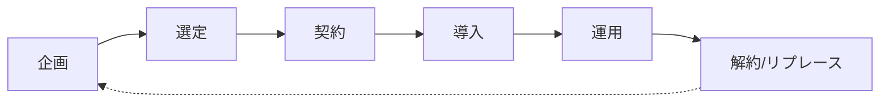
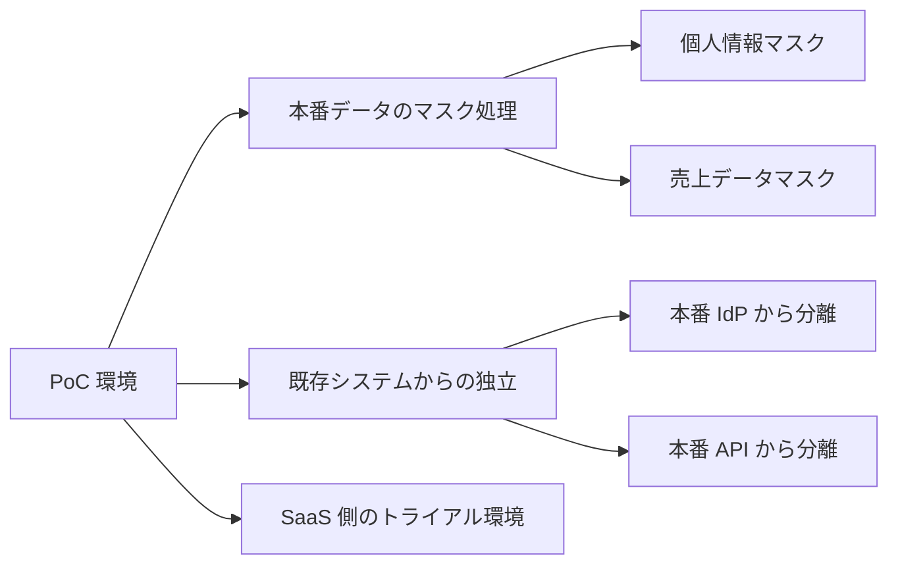
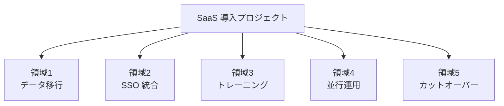
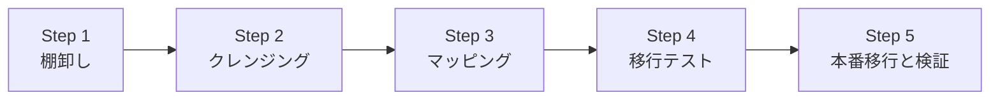
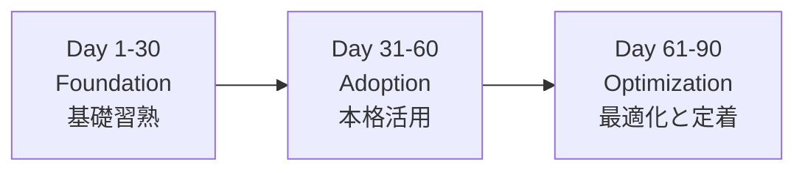
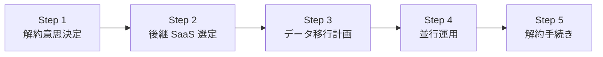

# SaaS 導入・運用実践

「買い手 PM がプロジェクトを回す」——RFP 発行・PoC・キックオフ・社内浸透・利用モニタリング・iPaaS 連携・解約判断まで、SaaS ライフサイクル全体を 2026 年 7 月時点の実務で体系化

| 項目 | 内容 |
|---|---|
| カテゴリー | 情シス・IT管理実務 |
| 難易度 | 中級 |
| 所要時間 | 約200分（全8レッスン） |
| 公開日 | 2026-07-19 |
| 最終更新日 | 2026-07-19 |
| コースURL | https://skillup.college/courses/corporate-it/saas-adoption-practical/ |

## 対象者

情シス担当 2 年目以降・DX 推進担当・SaaS 導入プロジェクトの PM・IT 選定に関わる企画/総務担当・SaaS Ops 担当・CIO 候補。

## 前提知識

情シス担当者入門または業務での SaaS 利用経験。SaaS の基本用語（SSO・SLA・API）を耳にしたことがある程度。

## 学習目標

- SaaS 導入プロジェクトの全体像とライフサイクル 6 段階を俯瞰できる
- RFI と RFP の設計・発行・ベンダーコンペ運営を組み立てられる
- PoC を「動くか」ではなく「使えるか」の目線で設計できる
- 導入プロジェクトのキックオフと WBS を組み立てられる
- データ移行と業務プロセス変更の実務を回せる
- 社内浸透・チェンジマネジメントの 90 日プランを持てる
- iPaaS・API 連携で SaaS を繋いで価値を跳ねさせられる
- 解約・リプレース判断の 4 軸と修了後の学び方を持ち帰れる

## コース概要

SaaS の選定と契約までは、社内の要件を整理して見積もりを比較すれば大抵決まります。しかし、そこから先の「導入プロジェクト」「社内浸透」「利用モニタリング」「解約・リプレース判断」までを回せる情シス担当者は少なく、SaaS 導入の 8 割は「使われずに死ぬ」というのが業界の共通認識です。本コースは、情シス担当 2 年目以降、DX 推進担当、SaaS 導入プロジェクトの PM、SaaS Ops 担当を対象に、SaaS ライフサイクル 6 段階・RFI/RFP・PoC・キックオフと WBS・データ移行と業務プロセス変更・社内浸透とチェンジマネジメント・iPaaS 連携と SaaS Ops・解約とリプレース判断までを 8 レッスンで体系化します。要件定義 3 軸・契約交渉 4 点・IdP と SCIM 運用・ヘルプデスク ITIL・IT 予算 3 分類は既刊の情シス担当者向け入門コースに譲り、本コースは「買い手 PM としてプロジェクトを回す」視点に軸足を置きます。

## 学習の流れ

前半 3 レッスンで SaaS 導入プロジェクトの全体像と選定・PoC の作り方を扱います。レッスン 1 でライフサイクル 6 段階、レッスン 2 で RFI/RFP、レッスン 3 で PoC 設計と実施を扱います。中盤のレッスン 4 でキックオフと WBS、レッスン 5 でデータ移行と業務プロセス変更、レッスン 6 で社内浸透とチェンジマネジメントを扱い、導入プロジェクトの本丸を組み立てます。後半のレッスン 7 で iPaaS・API 連携と SaaS Ops、レッスン 8 で解約・リプレース判断と修了後の学び方までを扱います。全 8 レッスン・約 200 分の構成です。

## レッスン一覧

| No. | タイトル | 概要 | 所要時間 |
|---|---|---|---|
| 1 | SaaS 導入プロジェクトの全体像 | 買い手 PM の役割、SaaS ライフサイクル 6 段階（企画→選定→契約→導入→運用→解約/リプレース）、コース守備範囲・境界明示（要件定義 3 軸・契約交渉 4 点・IdP 運用は既刊譲り）を学ぶ | 25分 |
| 2 | 企画・RFI/RFP 発行 | 企画書の型（背景・目的・スコープ・成功基準）、RFI と RFP の使い分け、RFP テンプレ 8 項目、複数ベンダーコンペの運営を学ぶ | 25分 |
| 3 | PoC 設計と実施 | PoC のゴール設計（技術検証 vs 業務適合検証）、PoC 環境の分離、業務側テスターの巻き込み、評価シートの作り方、PoC 結果の意思決定への繋げ方を学ぶ | 25分 |
| 4 | 導入プロジェクトのキックオフと WBS | プロジェクト体制（オーナー・PMO・IT 側・業務側・ステアリング）、キックオフミーティング、WBS 主要 5 領域、リスクマップを学ぶ | 25分 |
| 5 | データ移行と業務プロセス変更 | 既存データの整備（クレンジング・マッピング・移行テスト）、業務プロセスの Before/After 図、標準化と例外の切り分け、並行運用期間の設計、カットオーバー判断を学ぶ | 25分 |
| 6 | 社内浸透とチェンジマネジメント | 導入後 90 日プラン、キーマン巻き込みの型、トレーニング設計、アンバサダー制度、社内 FAQ・チャットボット、利用状況モニタリング KPI、抵抗勢力への対応を学ぶ | 25分 |
| 7 | iPaaS・API 連携と SaaS Ops | iPaaS 3 大選択肢（Zapier・Workato・Boomi）と MuleSoft・n8n の位置づけ、API 連携の設計、SaaS Ops（ライセンス最適化・利用モニタリング自動化・棚卸ツール Zylo・Torii・Josys）を学ぶ | 25分 |
| 8 | 解約・リプレース判断と修了後の学び方 | 継続 vs 更新交渉 vs リプレースの 4 判断軸、解約意思決定プロセス、データエクスポート計画、後継 SaaS への移行、SaaS 導入 PM のキャリアと修了後の情報源を学ぶ | 25分 |

---

## レッスン1：SaaS 導入プロジェクトの全体像

（所要時間：25分）

### このレッスンで学ぶこと

- 買い手 PM の役割と、売り手側 CS との違いを俯瞰できる
- SaaS ライフサイクル 6 段階（企画→選定→契約→導入→運用→解約/リプレース）を持てる
- 中堅企業における SaaS 導入プロジェクトの体制モデルを持つ
- 本コースの守備範囲と、既刊の情シス担当者向け入門コースとの境界を持ち帰れる

---

SaaS の導入は「選定してサインしたら終わり」ではありません。むしろ、契約後の導入プロジェクト・社内浸透・利用モニタリング・解約リプレース判断こそが、SaaS の投資対効果を決めます。本レッスンでは、SaaS 導入プロジェクトの全体像を俯瞰し、買い手 PM としての役割、SaaS ライフサイクル 6 段階、そして本コース全体で扱う範囲と扱わない範囲を整理します。

### 買い手 PM の役割

SaaS 導入プロジェクトの現場には、次の 3 者が絡みます。

- **買い手 PM（本コースの主役）**：発注企業側でプロジェクトを回す担当者
- **売り手 SI／コンサル**：ベンダー側で導入支援を提供する担当者
- **売り手 CS（カスタマーサクセス）**：ベンダー側で契約後の伴走を担う担当者

売り手 SI・CS は「複数の顧客を横断する立場」で、汎用的な導入手順とベストプラクティスを持っています。一方、買い手 PM は「自社の業務・組織・文化を深く知る立場」で、標準的な導入手順を自社に合わせてカスタマイズし、社内ステークホルダーを巻き込む役割を担います。

売り手だけに任せると「マニュアル通りの導入」で終わり、社内の業務プロセスに馴染まないまま利用率が伸びません。買い手 PM が主導することで、業務プロセス変更・社内浸透までを含む「使われる SaaS 導入」が実現します。

> **💡 ポイント**
> SaaS 導入の 8 割は「使われずに死ぬ」というのが業界の共通認識です。契約したものの利用率が 20 % に届かず、更新時期に解約されるケースが後を絶ちません。買い手 PM の存在は、この失敗パターンを回避するための最大の予防策です。

### SaaS ライフサイクル 6 段階

SaaS の導入から終了までを、6 段階のライフサイクルで捉えます。

#### 段階 1：企画（本コース：レッスン 2 前半）

- 業務課題の特定と SaaS 導入の必要性検証
- 概算予算とスケジュールの設定
- 上位承認（部長・役員・投資委員会）

#### 段階 2：選定（本コース：レッスン 2〜3）

- RFI（Request for Information：情報提供依頼書）で市場を把握
- RFP（Request for Proposal：提案依頼書）で複数ベンダーに提案要請
- PoC で機能と業務適合を検証
- ベンダー選定と契約交渉開始

#### 段階 3：契約（既刊譲り）

- 契約条件の交渉（自動更新・データ返還・SLA・NDA など）
- 法務・情シス・購買部門との連携
- 契約締結

#### 段階 4：導入（本コース：レッスン 4〜6）

- プロジェクトキックオフ
- WBS 策定と体制構築
- データ移行と業務プロセス変更
- 社内浸透とトレーニング
- カットオーバー（本番稼働開始）

#### 段階 5：運用（本コース：レッスン 7）

- 利用状況モニタリング
- ライセンス最適化（SaaS Ops）
- iPaaS・API 連携による他 SaaS との統合
- ユーザーサポートとヘルプデスク（既刊譲り）

#### 段階 6：解約 / リプレース（本コース：レッスン 8）

- 継続 vs 更新交渉 vs リプレースの判断
- 解約手続きとデータエクスポート
- 後継 SaaS への移行

このライフサイクルは、多くの企業で複数の SaaS が並行して異なる段階にある状態になります。買い手 PM は自社の SaaS ポートフォリオを俯瞰し、それぞれの段階に応じた業務を回します。

### SaaS 導入プロジェクトの体制モデル

中堅企業（従業員 300〜1,000 名規模）で SaaS 導入プロジェクトを回す標準的な体制は次のとおりです。

#### プロジェクトオーナー（役員クラス）

- 意思決定の最終権限を持つ
- 予算承認・契約承認
- 経営会議・取締役会への報告

#### プロジェクトマネジャー（買い手 PM・本コースの主役）

- プロジェクト全体の推進責任
- スケジュール・予算・品質管理
- ステークホルダー調整

#### PMO（プロジェクトマネジメントオフィス）

- 進捗管理・課題管理・リスク管理
- 議事録・タスク管理・ドキュメント管理
- PM のサポート

#### IT 側担当者

- SSO・SCIM 連携
- 既存システムとの連携（iPaaS・API）
- セキュリティ要件のチェック

#### 業務側担当者（キーユーザー）

- 業務プロセスの Before/After 定義
- テスト参加
- 社内浸透の推進役

#### ステアリング委員会（月次）

- プロジェクトオーナー・関連部長・IT 部長
- 重要意思決定と課題エスカレーションの場

中堅企業では、PM と PMO を兼務するケースも多く、5〜 8 名の少数体制で回すことが一般的です。

### コースの守備範囲と境界

本コースは SaaS を「買い手 PM としてプロジェクトを回す」視点で扱います。既刊コースや関連する専門領域と明確に区別して学ぶ必要があります。

**本コースで扱う領域**：SaaS ライフサイクル 6 段階・買い手 PM の役割・RFI/RFP 設計と発行・PoC 設計と実施・キックオフと WBS・データ移行と業務プロセス変更・社内浸透とチェンジマネジメント・iPaaS と API 連携・SaaS Ops（ライセンス最適化）・解約とリプレース判断

**本コースで扱わない領域**（別の入門コースや専門教材で扱う）：

- SaaS 選定の要件定義 3 軸・比較評価 3 軸・契約交渉 4 点（自動更新・データ返還・SLA・NDA）・シャドー IT 対処・解約 5 ステップは、情シス担当者向けの入門コースを参照してください
- IdP（Entra ID・Okta・Google Workspace）の選定と SCIM プロビジョニング設計、SSO 統合、オンボーディング/オフボーディング運用は、情シス担当者向けの入門コースを参照してください
- ヘルプデスク・ITSM/ITIL（Jira Service Management・Zendesk・Freshservice）とチケット管理・SLA 優先度・ナレッジベース運用は、情シス担当者向けの入門コースを参照してください
- IT 予算 3 分類（守り・攻め・維持）とベンダー評価年次サイクル・IT 資産管理は、情シス担当者向けの入門コースを参照してください
- SaaS 売り手側の販売プロセス（SDR・AE・CSM 分業、MEDDIC、エンタープライズ調達要件 SOC 2/ISO 27001/ISMAP）は、業種別実務の IT・SaaS 入門コースを参照してください
- クラウド設計思想（IaaS/PaaS/SaaS の責任分界、FinOps、責任共有モデル）は、IT 基礎の入門コースを参照してください
- SaaS 契約書レビューの型は、法務担当者向けの入門コースを参照してください

> **⚠️ 注意**
> 本コースは資格試験対策コースではありません。PMP・ITIL・情報処理技術者試験などの資格取得を目的とする方は、それぞれの資格専門の予備校教材を参照してください。本コースは資格ではなく、SaaS 導入プロジェクトの実務に集中します。

### SaaS 導入プロジェクトの典型的な失敗パターン

失敗を先に知ることで、成功への道筋が見えます。本コース全体で扱う型は、これらの失敗を回避するために設計されています。

- **失敗 1：要件定義に業務側を巻き込まず、IT 主導で選定した結果、業務に馴染まない**
- **失敗 2：PoC を機能デモで終わらせ、業務適合を検証しなかった結果、本番稼働後にギャップ発覚**
- **失敗 3：社内浸透計画を軽視し、キックオフ後は放置。利用率が 20 % に届かず更新時に解約**
- **失敗 4：既存 SaaS との連携を後回しにし、データが分断された「使えない SaaS」になる**
- **失敗 5：解約時のデータエクスポートを契約時に取り決めておらず、リプレース時に高額請求される**

### 次のステップ

本レッスンでは SaaS 導入プロジェクトの全体像を俯瞰しました。次のレッスンでは、SaaS 導入プロジェクトの入口である企画・RFI/RFP 発行の実務を扱い、複数ベンダーコンペを運営する型を組み立てます。

### 確認クイズ

このレッスンで学んだ内容を確認しましょう。

#### Q1. 買い手 PM と売り手 SI・CS の役割の違いについて、本レッスンで示している内容として正しいものはどれか。

- [x] 売り手 SI・CS は複数顧客横断の汎用ノウハウを持ち、買い手 PM は自社業務・組織・文化に深い知識を持って社内ステークホルダーを巻き込む役割を担う
- [ ] 買い手 PM と売り手 SI・CS は同じ役割で入れ替え可能
- [ ] 売り手 SI に全て任せれば買い手 PM は不要
- [ ] 買い手 PM は契約締結までしか関与しない

> **解説**
> 売り手 SI・CS は複数顧客を横断する立場で、汎用的な導入手順とベストプラクティスを持っています。一方、買い手 PM は自社の業務・組織・文化を深く知る立場で、標準的な導入手順を自社にカスタマイズし、社内ステークホルダーを巻き込む役割を担います。売り手だけに任せると「マニュアル通りの導入」で終わり社内に馴染まないため、買い手 PM の存在が「使われる SaaS 導入」の予防策となります。

#### Q2. SaaS ライフサイクル 6 段階として、本レッスンで挙げているものはどれか。

- [ ] 企画・設計・開発・テスト・本番・保守
- [x] 企画・選定・契約・導入・運用・解約/リプレース
- [ ] 要件定義・設計・実装・移行・運用・廃止
- [ ] 検討・購入・使用・改善・拡張・終了

> **解説**
> 本レッスンで示している SaaS ライフサイクル 6 段階は「企画→選定→契約→導入→運用→解約/リプレース」です。多くの企業で複数の SaaS が並行して異なる段階にある状態になり、買い手 PM は自社の SaaS ポートフォリオを俯瞰してそれぞれの段階に応じた業務を回します。ソフトウェア開発ライフサイクル（要件定義・設計・実装・移行・運用・廃止）とは異なります。

#### Q3. SaaS 導入プロジェクトの体制モデルとして、本レッスンで示している役割はどれか。

- [ ] プロジェクトオーナー・PM・営業担当者・購買担当者・監査人
- [ ] IT 部門のみで完結する体制
- [x] プロジェクトオーナー（役員）・PM・PMO・IT 側担当者・業務側担当者（キーユーザー）・ステアリング委員会
- [ ] 外部委託ベンダーが全て担当する体制

> **解説**
> 本レッスンで示している体制は「プロジェクトオーナー（役員クラス）」「PM（買い手 PM）」「PMO」「IT 側担当者」「業務側担当者（キーユーザー）」「ステアリング委員会（月次）」の 6 役割です。中堅企業（従業員 300〜1,000 名）では PM と PMO を兼務するケースも多く、5〜8 名の少数体制で回すのが一般的です。IT 部門のみで完結させる体制や、外部委託ベンダーに全て任せる体制は、社内浸透に失敗するリスクが高いパターンです。

#### Q4. 本コースの守備範囲として、扱わない領域はどれか。

- [ ] RFI/RFP 設計と発行
- [ ] PoC 設計と実施
- [ ] 社内浸透とチェンジマネジメント
- [x] SaaS 選定の要件定義 3 軸・契約交渉 4 点・IdP と SCIM 運用・ヘルプデスク ITIL・IT 予算 3 分類

> **解説**
> 本コースは SaaS を「買い手 PM としてプロジェクトを回す」視点で扱います。要件定義 3 軸・契約交渉 4 点（自動更新・データ返還・SLA・NDA）・IdP と SCIM 運用・ヘルプデスク ITIL・IT 予算 3 分類は、情シス担当者向けの入門コースに譲ります。本コースの中核は、RFI/RFP・PoC・キックオフ・WBS・データ移行・社内浸透・iPaaS・解約判断という「プロジェクトを回す」実務に振り切っています。

---

## レッスン2：企画・RFI/RFP 発行

（所要時間：25分）

### このレッスンで学ぶこと

- 企画書の 4 要素（背景・目的・スコープ・成功基準）を持てる
- RFI と RFP の使い分けを俯瞰できる
- RFP テンプレ 8 項目を組み立てられる
- 複数ベンダーコンペの運営の型を持ち帰れる

---

前レッスンでは SaaS 導入プロジェクトの全体像を扱いました。本レッスンでは、SaaS 導入プロジェクトの入口である企画・RFI/RFP 発行を扱います。ここで手を抜くと、選定後のプロジェクト全体が迷走します。買い手 PM の武器は「粒度の細かい RFP」であり、粒度の細かさが返ってくる提案の質を決めます。

### 企画書の 4 要素

RFI/RFP の前に、まず社内向けの企画書を作ります。企画書は上位承認と関係部署の巻き込みのための起点となります。

#### 要素 1：背景

- 現在の業務課題（数字で示す：処理件数・エラー率・処理時間）
- 既存ツールの限界（機能不足・保守終了・拡張困難）
- SaaS 導入の必要性（内製 or 従来型パッケージ vs SaaS の比較）

#### 要素 2：目的

- 導入で解決したい課題（3〜5 個に絞る）
- 想定効果（コスト削減・生産性向上・顧客体験改善）
- 上位経営目標との整合（中期経営計画・KPI との紐付け）

#### 要素 3：スコープ

- 対象部門・対象業務・対象人数
- 対象データ範囲
- 段階導入の場合はフェーズ分け

#### 要素 4：成功基準

- 導入後 3 か月・6 か月・12 か月の到達基準
- 定量指標（利用率・処理時間・エラー率）
- 定性指標（ユーザー満足度・現場からのフィードバック）

企画書は「概算予算とスケジュール」まで含めて、10〜15 ページ程度でまとめます。上位承認を得た後、この企画書が RFI/RFP の元ネタとなります。

### RFI と RFP の使い分け

RFI と RFP は目的が違います。

#### RFI（Request for Information：情報提供依頼書）

- **目的**：市場の情報を集める
- **タイミング**：企画段階〜選定初期
- **対象ベンダー**：5〜 10 社
- **依頼内容**：会社概要・製品概要・機能一覧・価格帯・導入実績
- **期間**：発行から回答期限まで 2〜 3 週間

RFI は「市場調査」の性格が強く、選定を絞り込む前の情報収集に使います。

#### RFP（Request for Proposal：提案依頼書）

- **目的**：具体的な提案を依頼する
- **タイミング**：選定中盤〜終盤
- **対象ベンダー**：2〜 5 社（RFI で絞り込んだ候補）
- **依頼内容**：機能要件への回答・提案書・見積書・体制・スケジュール
- **期間**：発行から回答期限まで 4〜 6 週間

RFP は「本命候補への提案要請」の性格が強く、比較評価と契約交渉に直結します。

#### RFI/RFP を発行しない選択肢

小規模導入や既存の指名ベンダーが明確な場合、RFI/RFP を発行せず、1〜 2 社に直接見積もりを依頼するケースもあります。ただし、社内の予算承認プロセスや監査対応の観点から、10 名以上の全社展開型 SaaS では複数社比較を経ることが標準です。

### RFP テンプレ 8 項目

RFP の標準構成は次の 8 項目です。

#### 項目 1：概要

- 発注企業の会社概要
- プロジェクトの背景と目的
- 導入予定スケジュール

#### 項目 2：機能要件

- 必須機能一覧（Must）
- 望ましい機能一覧（Should）
- 将来的な要望（Nice to Have）

各機能について、ベンダー側で「標準対応 / カスタマイズ対応 / 対応不可」の 3 段階で回答してもらう形式が実務標準です。

#### 項目 3：非機能要件

- パフォーマンス（同時利用ユーザー数・レスポンス時間・スループット）
- セキュリティ（暗号化・アクセス制御・監査ログ）
- 可用性（SLA・障害時対応・データバックアップ）
- 拡張性（API・iPaaS 対応・エクスポート機能）
- コンプライアンス（改正個情法・GDPR・業界規制）

#### 項目 4：提案手順

- 提案書の項目立て
- 補足資料（画面キャプチャ・デモ動画・導入事例）
- プレゼン日程（RFP 発行 3〜 4 週間後にプレゼン設定が一般的）

#### 項目 5：評価基準

- 機能適合度（40 %）
- コスト（30 %）
- 導入・運用体制（15 %）
- セキュリティ・コンプライアンス（10 %）
- 導入実績（5 %）

比重は会社ごとに調整しますが、事前に評価基準を明示することで、ベンダー側が提案の力点を理解できます。

#### 項目 6：スケジュール

- RFP 発行日
- 質問受付期間
- 回答期限
- プレゼン日程
- 選定結果通知
- 契約締結目標日

#### 項目 7：契約条件

- 契約期間の希望
- 支払条件
- 秘密保持義務
- 反社会的勢力排除条項

#### 項目 8：回答様式

- 提出形式（PDF・Excel テンプレート）
- 提出方法（メール・共有ストレージ）
- 提出先窓口

RFP は「50〜 100 ページ規模」になることもあります。ボリュームが増えるほど、選定作業と回答比較の工数が増えるため、必要十分な粒度を意識します。

### 複数ベンダーコンペの運営

RFP を複数ベンダーに発行した後、コンペ運営が始まります。

#### コンペ運営の 5 ステップ

- Step 1：RFP 発行と発行時説明会（オンラインで 60 分程度、質疑応答含む）
- Step 2：質問受付期間（1〜 2 週間、全社共通の Q&A シートで管理し、質問と回答は全ベンダーに公開）
- Step 3：回答期限（RFP 発行から 4〜 6 週間）
- Step 4：一次評価（提案書と見積書の書面評価、評価シートで点数化）
- Step 5：プレゼン・PoC・二次評価と決定

#### 評価シートの作り方

- RFP の評価基準に沿った点数項目を作る
- 複数の評価者（IT・業務・法務）が別々に採点
- 採点結果を集計し、コメント欄で理由を残す
- 上位 2〜 3 社を PoC 対象とする

#### 質問受付の運営

- 質問と回答は全ベンダーに公開する（「Ben 社の質問への回答」を A・B・C 社全員が見られる）
- ベンダー間の情報格差を防ぎ、公平な選定を実現する
- 質問への回答は、担当者の主観ではなく「公式回答」として社内で調整する

> **📝 補足**
> 質問受付を非公開で個別対応すると、あるベンダーだけに追加情報が渡ってしまい、公平性が損なわれます。監査対応の観点でも問題になるため、Q&A は必ず全社公開が原則です。

### 次のステップ

本レッスンでは企画・RFI/RFP 発行と複数ベンダーコンペの運営を扱いました。次のレッスンでは、RFP 選考の中で最も重要な PoC（Proof of Concept）の設計と実施を扱い、「動くか」ではなく「使えるか」の目線で検証する型を組み立てます。

### 確認クイズ

このレッスンで学んだ内容を確認しましょう。

#### Q1. 企画書の 4 要素として、本レッスンで挙げていないものはどれか。

- [x] ベンダー選定基準（Must/Should/Nice）
- [ ] 背景（現在の業務課題・既存ツールの限界）
- [ ] 目的（導入で解決したい課題・想定効果）
- [ ] スコープ（対象部門・対象業務・対象人数）

> **解説**
> 本レッスンで挙げている企画書の 4 要素は「背景／目的／スコープ／成功基準」です。ベンダー選定基準（Must/Should/Nice）は RFP の「機能要件」項目に相当し、企画書とは別の文書で扱います。企画書は「概算予算とスケジュール」まで含めて 10〜15 ページ程度でまとめ、上位承認と関係部署の巻き込みの起点となります。

#### Q2. RFI と RFP の使い分けについて、本レッスンで示している内容として正しいものはどれか。

- [ ] RFI と RFP は同じもので名称違い
- [x] RFI は市場の情報を集める（5〜 10 社対象、2〜 3 週間、企画段階）、RFP は具体的な提案を依頼する（2〜 5 社対象、4〜 6 週間、選定中盤〜終盤）
- [ ] RFP は 1 社にしか発行できない
- [ ] RFI は契約締結時に発行する

> **解説**
> RFI（Request for Information）は「市場の情報を集める」目的で、5〜 10 社を対象に企画段階〜選定初期に発行します（回答期限 2〜 3 週間）。RFP（Request for Proposal）は「具体的な提案を依頼する」目的で、RFI で絞り込んだ 2〜 5 社を対象に選定中盤〜終盤に発行します（回答期限 4〜 6 週間）。RFP は複数社に発行するのが原則で、契約締結時ではなく選定プロセスで発行します。

#### Q3. RFP テンプレ 8 項目の「機能要件」で、ベンダー側で「標準対応 / カスタマイズ対応 / 対応不可」の 3 段階で回答してもらう形式について、本レッスンで示している考え方はどれか。

- [ ] 全機能を「対応可能」の 1 段階で回答してもらう
- [ ] 機能一覧は Must のみで、Should や Nice to Have は不要
- [x] 必須機能（Must）・望ましい機能（Should）・将来的な要望（Nice to Have）の 3 段階で分け、各機能について「標準対応/カスタマイズ対応/対応不可」で回答してもらう形式が実務標準
- [ ] 機能要件は RFP には含めない

> **解説**
> RFP の機能要件は「必須機能（Must）／望ましい機能（Should）／将来的な要望（Nice to Have）」の 3 段階で分け、各機能について「標準対応/カスタマイズ対応/対応不可」の 3 段階でベンダーに回答してもらう形式が実務標準です。この形式により、ベンダー間の機能適合度を客観的に比較できます。全機能を「対応可能」で回答させても、実際にはカスタマイズが必要な場合があり、比較になりません。

#### Q4. 複数ベンダーコンペの質問受付運営について、本レッスンで示している原則はどれか。

- [ ] 質問と回答は個別対応で秘密にする
- [ ] 質問は受け付けない
- [ ] 有力ベンダーだけに追加情報を提供する
- [x] 質問と回答は全ベンダーに公開する。ベンダー間の情報格差を防ぎ、公平な選定を実現するため、Q&A は必ず全社公開が原則

> **解説**
> 質問受付の運営では「質問と回答は全ベンダーに公開する」ことが原則です。ある社の質問への回答を全社が見られる形にすることで、ベンダー間の情報格差を防ぎ、公平な選定を実現します。質問受付を非公開で個別対応すると、あるベンダーだけに追加情報が渡ってしまい、公平性が損なわれ、監査対応の観点でも問題になります。

---

## レッスン3：PoC 設計と実施

（所要時間：25分）

### このレッスンで学ぶこと

- PoC のゴール設計を「技術検証」と「業務適合検証」の 2 軸で持てる
- PoC 環境の分離と業務側テスターの巻き込みを組み立てられる
- 評価シートの作り方（機能・使いやすさ・パフォーマンス・運用性）を扱える
- PoC 結果を意思決定に繋げる型を持ち帰れる

---

前レッスンでは企画・RFI/RFP 発行と複数ベンダーコンペの運営を扱いました。本レッスンでは、RFP 選考の中で最も重要な PoC（Proof of Concept：概念実証）の設計と実施を扱います。PoC の目的は「動くか」ではなく「使えるか」であり、この目線を持てるかどうかが SaaS 選定の成否を分けます。

### PoC の目的——「動くか」ではなく「使えるか」

多くの企業で PoC が失敗する原因は、目的の設定にあります。

#### よくある失敗パターン

- **失敗 1**：ベンダーのデモを見て「動く」ことを確認しただけで PoC 完了
- **失敗 2**：IT 側のテスターだけで実施し、業務側の要件が反映されない
- **失敗 3**：短期間（1〜 2 週間）で終わらせ、実業務データでの検証を省略
- **失敗 4**：評価基準が定性的で「なんとなく良さそう」で決めてしまう

#### あるべき PoC の目的

PoC は「本番導入前の最終検証」であり、次の 2 軸で目的を持ちます。

- **技術検証**：機能が想定通り動くか、既存システムと連携できるか、パフォーマンスが十分か
- **業務適合検証**：業務側の担当者が実際の業務データで使い、業務プロセスに馴染むか

「使えるか」の視点は、業務側テスターにしか判断できません。IT 側だけで PoC を回すと、機能テストで満点でも業務では使われない SaaS を選んでしまいます。

### PoC 設計の 5 要素

PoC を設計する時、次の 5 要素を明確にします。

#### 要素 1：期間

- 標準：2〜 6 週間
- ベンダーが用意する PoC 環境の期間内で完結させる
- 業務側テスターの稼働確保を事前に人事・上長と調整

#### 要素 2：参加者

- IT 側：SaaS 設定・連携テスト担当（1〜 2 名）
- 業務側：実業務データでテストする担当者（3〜 5 名）
- 業務側マネジャー：業務プロセス変更の判断者（1 名）

#### 要素 3：検証範囲

- 対象機能：RFP で Must と定めた機能に限定
- 対象データ：実業務データのサンプル（個人情報などはマスク処理）
- 対象業務プロセス：現行業務の代表的な 3〜 5 パターン

#### 要素 4：評価軸

- 機能適合度（RFP で定めた機能要件への実現度）
- 使いやすさ（業務側テスターの主観評価）
- パフォーマンス（レスポンス時間・エラー発生率）
- 運用性（管理画面の操作性・障害対応のわかりやすさ）
- 既存システムとの連携性（API・SSO・データ連携）

#### 要素 5：判定基準

- 各評価軸の閾値（例：機能適合度 80 % 以上、パフォーマンス 3 秒以内）
- 総合評価の判定方法（合格/条件付き合格/不合格）
- PoC 結果を上位承認者に説明する形式

### PoC 環境の分離

PoC は本番環境から分離して行います。

#### PoC 環境の設計原則

- 本番の IdP・SSO 環境と分離（PoC 用のテストユーザーを作成）
- 本番データを直接使用せず、マスク処理したサンプルデータを使用
- 個人情報保護法・GDPR などのコンプライアンス確認を事前に済ませる
- PoC 期間終了後、データを完全削除する契約条項を確認

### 業務側テスターの巻き込み

PoC の成否は、業務側テスターの参加度で決まります。

#### 業務側テスター選定の 3 基準

- **業務理解度**：現行業務のプロセスと課題を熟知している
- **発信力**：テスト結果を的確に言語化できる
- **社内影響力**：導入後に周囲を巻き込めるキーパーソン

「暇な人」「新人」を選ぶと、テスト品質が上がらず、導入後の推進役にもなりません。あえて「多忙な中核メンバー」を口説くことが重要です。

#### テスター向けキックオフの型

- PoC の目的と役割の説明（30 分）
- SaaS ベンダーによる操作トレーニング（60 分）
- 評価シートの記入方法説明（30 分）
- 質問対応（30 分）

キックオフ後、テスターには「毎日 30 分の PoC 時間を確保」してもらい、実業務のシナリオでテストを進めてもらいます。

### 評価シートの作り方

評価シートは、複数のテスターが一貫した基準で評価できるように設計します。

#### 評価シートの構造

| 評価項目 | 説明 | 配点 | テスターの評価 | コメント |
|---|---|---|---|---|
| 機能 1：受注入力 | 1 件 3 分以内で入力完了 | 20 | 15 | 画面遷移が多い |
| 機能 2：一括更新 | 100 件を 5 分以内で更新 | 15 | 15 | 十分速い |
| 使いやすさ | 新規ユーザーが 1 週間で慣れるか | 20 | 12 | メニュー階層が深い |
| パフォーマンス | ページ表示 3 秒以内 | 15 | 15 | 問題なし |
| 運用性 | 管理画面の操作性 | 10 | 8 | 良好 |
| 既存連携 | 会計システムへの API 連携 | 20 | 18 | ほぼ完璧 |
| **合計** | | **100** | **83** | |

複数テスターの点数を平均化し、ベンダー間で比較します。

#### コメント欄の重要性

点数だけでは伝わらない「使い勝手」「学習コスト」「潜在的な問題」がコメント欄に集約されます。上位承認者への PoC 結果報告では、点数以上にコメントの内容が判断材料になります。

### PoC 結果の意思決定への繋げ方

PoC 完了後、次の 3 ステップで意思決定に繋げます。

#### Step 1：PoC 結果レポートの作成

- ベンダー別評価点数の集計
- テスターコメントの要約
- 各ベンダーの長所・短所
- 買い手 PM としての推奨と理由

#### Step 2：ステークホルダーへの報告

- プロジェクトオーナー（役員）
- 業務側部門長
- 情シス部門長
- 予算承認者

#### Step 3：最終選定と契約交渉

- 選定候補 1 社に絞る（または 2 社並行で交渉）
- 契約条件の詳細交渉（既刊譲り）
- 契約締結

> **💡 ポイント**
> PoC は「ベンダーを選ぶ」プロセスであると同時に、「業務側の期待値を作る」プロセスでもあります。PoC に参加したテスターは、導入後の主要ユーザー・アンバサダーになります。PoC を丁寧に運営することは、社内浸透の第一歩になります。

### 次のステップ

本レッスンでは PoC 設計と実施を扱いました。次のレッスンでは、選定完了後の導入プロジェクトのキックオフと WBS を扱い、プロジェクトを実際に回すための骨格を組み立てます。

### 確認クイズ

このレッスンで学んだ内容を確認しましょう。

#### Q1. PoC の目的について、本レッスンで示している内容として正しいものはどれか。

- [x] 「動くか」ではなく「使えるか」を検証する。技術検証と業務適合検証の 2 軸で目的を持つ
- [ ] ベンダーのデモを見て動くことを確認するだけで完了
- [ ] IT 側のテスターだけで実施し業務側は不要
- [ ] 短期間（1〜 2 週間）で終わらせるべき

> **解説**
> PoC の目的は「本番導入前の最終検証」で、「技術検証」（機能が想定通り動くか・既存システムと連携できるか・パフォーマンスが十分か）と「業務適合検証」（業務側の担当者が実業務データで使い、業務プロセスに馴染むか）の 2 軸で目的を持ちます。IT 側だけで PoC を回すと機能テストで満点でも業務では使われない SaaS を選ぶ失敗パターンに陥ります。

#### Q2. PoC 設計の 5 要素として、本レッスンで挙げている「参加者」の構成はどれか。

- [ ] IT 側のみで実施
- [x] IT 側（SaaS 設定・連携テスト担当 1〜 2 名）＋業務側（実業務データでテスト 3〜 5 名）＋業務側マネジャー（業務プロセス変更判断者 1 名）
- [ ] 外部委託ベンダーが全て実施
- [ ] 人事部門のみで実施

> **解説**
> PoC 参加者は「IT 側（SaaS 設定・連携テスト担当 1〜 2 名）」「業務側（実業務データでテストする担当者 3〜 5 名）」「業務側マネジャー（業務プロセス変更の判断者 1 名）」の 3 者で構成します。IT 側のみでは業務適合の検証ができず、外部委託だけでは社内浸透に繋がりません。

#### Q3. 業務側テスター選定の 3 基準として、本レッスンで示しているものはどれか。

- [ ] 暇な人・新人・アルバイトを選ぶ
- [ ] IT に詳しい人だけを選ぶ
- [x] 業務理解度（現行業務のプロセスと課題を熟知）・発信力（テスト結果を的確に言語化）・社内影響力（導入後に周囲を巻き込めるキーパーソン）
- [ ] 役職の高い人だけを選ぶ

> **解説**
> 業務側テスター選定の 3 基準は「業務理解度」「発信力」「社内影響力」です。暇な人・新人を選ぶとテスト品質が上がらず、導入後の推進役にもなりません。あえて「多忙な中核メンバー」を口説くことが重要です。PoC に参加したテスターは、導入後の主要ユーザー・アンバサダーになる存在です。

#### Q4. PoC 環境の設計原則として、本レッスンで示していないものはどれか。

- [ ] 本番の IdP・SSO 環境と分離し、PoC 用のテストユーザーを作成
- [ ] 本番データを直接使用せず、マスク処理したサンプルデータを使用
- [ ] 個人情報保護法・GDPR などのコンプライアンス確認を事前に済ませる
- [x] PoC 期間終了後もデータを保持し続け、本番導入時に流用する

> **解説**
> PoC 環境の設計原則は「本番の IdP・SSO 環境と分離」「本番データを直接使用せず、マスク処理したサンプルデータを使用」「個人情報保護法・GDPR などのコンプライアンス確認を事前に済ませる」「PoC 期間終了後、データを完全削除する契約条項を確認」です。PoC 期間終了後にデータを保持し続けることは、コンプライアンス上のリスクとなります。契約時にデータ削除条項を確認しておくことが重要です。

---

## レッスン4：導入プロジェクトのキックオフと WBS

（所要時間：25分）

### このレッスンで学ぶこと

- キックオフミーティングの型（アジェンダ・参加者・成果物）を持てる
- WBS 主要 5 領域（データ移行・SSO 統合・トレーニング・並行運用・カットオーバー）を組み立てられる
- プロジェクト体制の階層と役割分担を持てる
- リスクマップの作り方を持ち帰れる

---

前レッスンでは PoC 設計と実施を扱いました。本レッスンでは、選定完了後の導入プロジェクトのキックオフと WBS を扱います。ここから買い手 PM のプロジェクトマネジメントスキルが本格的に問われます。3 か月〜 1 年の導入プロジェクトを、スケジュール・品質・コストの 3 制約の中で回す骨格を組み立てます。

### キックオフミーティングの型

キックオフは、プロジェクトの全ステークホルダーが一同に会し、目的・体制・スケジュール・成功基準を共有する場です。

#### キックオフのアジェンダ（120 分想定）

- **10 分**：オーナー挨拶（役員からプロジェクトの位置づけと期待）
- **20 分**：プロジェクト概要（PM から目的・スコープ・成功基準）
- **20 分**：体制説明（役割分担と連絡ルート）
- **30 分**：スケジュール説明（マイルストーンと WBS 概要）
- **20 分**：リスク・課題認識の共有
- **15 分**：質疑応答
- **5 分**：次回定例の案内と締め

#### キックオフの参加者

- プロジェクトオーナー（役員）
- 買い手 PM
- PMO
- IT 側リーダーとメンバー
- 業務側リーダーとキーユーザー
- SaaS ベンダー側 PM と主要メンバー
- SI パートナー側 PM（必要に応じて）

30〜 50 名規模のキックオフになることもあります。全員が「同じ絵を見た」状態を作ることが、その後のプロジェクトを支えます。

#### キックオフの成果物

- 議事録（決定事項・アクションアイテム）
- プロジェクトチャーター（プロジェクトの憲章として全ステークホルダーが合意した文書）
- スケジュール表・WBS
- 課題管理表・リスク管理表の初期版

### WBS 主要 5 領域

WBS（Work Breakdown Structure：作業分解構造）は、プロジェクトの成果物を階層的に分解した図です。SaaS 導入プロジェクトの WBS は、次の 5 領域が主要な柱になります。

#### 領域 1：データ移行

- 既存データの棚卸し
- クレンジング（不要データの削除・重複排除）
- マッピング（既存データ項目と SaaS のデータ項目の対応付け）
- 移行スクリプト作成
- 移行テスト（複数回リハーサル）

#### 領域 2：SSO 統合

- IdP（Entra ID・Okta・Google Workspace）との連携
- SCIM プロビジョニング設定
- 権限グループ設計
- テストユーザーでの動作確認

#### 領域 3：トレーニング

- 役職別・部門別のトレーニング計画
- e ラーニング教材の作成
- 対面ハンズオン研修の実施
- ヘルプデスクの受け入れ準備

#### 領域 4：並行運用

- 既存システムと SaaS の並行運用期間の設定
- 段階的な業務移行（部門別・機能別）
- 障害時のバックアッププラン
- 業務側の運用ルール策定

#### 領域 5：カットオーバー

- 本番切替の判断基準
- 切替当日の作業手順書
- 切替後の初期対応体制
- 既存システムの停止・データバックアップ

### プロジェクト体制の階層と役割分担

SaaS 導入プロジェクトの体制は、意思決定の階層と実行の階層に区分されます。

#### 意思決定の階層（月次ステアリング委員会）

- プロジェクトオーナー
- 経営企画部門長
- IT 部門長
- 業務側部門長
- 買い手 PM

- 議題：進捗・課題・リスク・重要意思決定
- 頻度：月 1 回、60〜 90 分

#### 実行の階層（週次プロジェクト定例）

- 買い手 PM
- PMO
- IT 側リーダー
- 業務側リーダー
- SaaS ベンダー PM
- SI パートナー PM

- 議題：週次の進捗・タスク・課題
- 頻度：週 1 回、60 分

#### 領域別ワーキンググループ（隔週または随時）

- データ移行 WG
- SSO 統合 WG
- トレーニング WG
- 並行運用・カットオーバー WG

各 WG は 3〜 5 名の少人数で構成し、実務担当者が主導します。

### リスクマップの作り方

SaaS 導入プロジェクトには、次のようなリスクが典型的に発生します。リスクマップで先手を打ちます。

#### リスクマップの構造

| リスク | 発生確率 | 影響度 | 対策 | 担当 | 期限 |
|---|---|---|---|---|---|
| データ移行スクリプトの遅延 | 中 | 高 | 早期プロトタイプ・複数リハーサル | IT 側 | 2 か月前 |
| 業務側キーユーザーの離職 | 低 | 高 | 副担当者の同時育成 | 業務側 | 常時 |
| SSO 統合の技術トラブル | 中 | 中 | ベンダーとの事前検証 | IT 側 | 3 か月前 |
| トレーニング参加率の低さ | 高 | 中 | オーナー通知・部門長経由の督促 | PMO | 1 か月前 |
| ベンダー側の体制変更 | 低 | 高 | 契約書での体制条項確認 | 買い手 PM | 契約時 |

#### リスク評価の 3 段階（発生確率）

- 低：発生確率 25 %未満
- 中：発生確率 25〜 75 %
- 高：発生確率 75 %以上

#### リスク評価の 3 段階（影響度）

- 低：スケジュール数日遅延、少額の追加コスト
- 中：スケジュール数週間遅延、中程度の追加コスト
- 高：プロジェクト中止級、大幅な追加コスト、レピュテーション棄損

高リスク（発生確率 × 影響度が高い）から順に対策を優先します。

### 確認クイズ

このレッスンで学んだ内容を確認しましょう。

#### Q1. キックオフミーティングの成果物として、本レッスンで挙げていないものはどれか。

- [x] 契約書ドラフト
- [ ] 議事録（決定事項・アクションアイテム）
- [ ] プロジェクトチャーター（全ステークホルダーが合意した憲章）
- [ ] スケジュール表・WBS・課題管理表・リスク管理表の初期版

> **解説**
> キックオフミーティングの成果物は「議事録」「プロジェクトチャーター」「スケジュール表・WBS」「課題管理表・リスク管理表の初期版」です。契約書は既に契約段階（選定後）で作成済みで、キックオフの成果物ではありません。プロジェクトチャーターは、プロジェクトの憲章として全ステークホルダーが合意した文書で、以降の判断のよりどころとなります。

#### Q2. WBS 主要 5 領域として、本レッスンで挙げているものはどれか。

- [ ] 要件定義・設計・開発・テスト・本番
- [x] データ移行・SSO 統合・トレーニング・並行運用・カットオーバー
- [ ] 企画・選定・契約・導入・運用
- [ ] IT 予算・攻め・守り・維持・投資

> **解説**
> SaaS 導入プロジェクトの WBS 主要 5 領域は「データ移行／SSO 統合／トレーニング／並行運用／カットオーバー」です。それぞれの領域で詳細な作業タスクを分解し、担当者と期限を設定します。ソフトウェア開発型（要件定義・設計・開発・テスト・本番）や、SaaS ライフサイクル（企画・選定・契約・導入・運用）とは異なります。

#### Q3. プロジェクト体制の意思決定階層である月次ステアリング委員会について、本レッスンで示している内容として正しいものはどれか。

- [ ] 週次で開催する
- [ ] IT 部門長のみで構成する
- [x] プロジェクトオーナー・経営企画部門長・IT 部門長・業務側部門長・買い手 PM で構成し、月 1 回 60〜 90 分で進捗・課題・リスク・重要意思決定を扱う
- [ ] 実行の階層と同じ構成

> **解説**
> 月次ステアリング委員会は「プロジェクトオーナー」「経営企画部門長」「IT 部門長」「業務側部門長」「買い手 PM」で構成し、月 1 回 60〜 90 分で開催します。議題は進捗・課題・リスク・重要意思決定です。週次で開催される実行の階層（プロジェクト定例）とは別階層で、意思決定と実行の役割を分けます。

#### Q4. リスクマップの評価について、本レッスンで示している内容として正しいものはどれか。

- [ ] リスクは全て同じ優先度で扱う
- [ ] リスクマップは作成しない
- [ ] 発生確率のみで評価する
- [x] 発生確率と影響度をそれぞれ 3 段階（低・中・高）で評価し、高リスク（発生確率 × 影響度が高い）から順に対策を優先する

> **解説**
> リスクマップは「発生確率」と「影響度」をそれぞれ 3 段階（低・中・高）で評価します。発生確率は「低：25 %未満／中：25〜 75 %／高：75 %以上」、影響度は「低：数日遅延／中：数週間遅延／高：プロジェクト中止級」が目安です。高リスク（発生確率 × 影響度が高い）から順に対策を優先することで、限られた工数で最大のリスク低減効果を得られます。

---

## レッスン5：データ移行と業務プロセス変更

（所要時間：25分）

### このレッスンで学ぶこと

- 既存データの整備（棚卸し・クレンジング・マッピング・移行テスト）の型を持てる
- 業務プロセスの Before/After 図の作り方を持てる
- 標準化と例外の切り分けの判断軸を持つ
- 並行運用期間の設計とカットオーバー判断を扱える

---

前レッスンでは導入プロジェクトのキックオフと WBS を扱いました。本レッスンでは、WBS 5 領域の中でも最も工数と難易度が高いデータ移行と業務プロセス変更を扱います。データが正確に移行できなければ SaaS は使えず、業務プロセスが整理されていなければ SaaS は形骸化します。

### データ移行の 5 ステップ

データ移行は、単に古い箱から新しい箱に移すのではなく、「移行前の整備」「マッピング」「移行テスト」「本番移行」「移行後の検証」の 5 ステップで進めます。

#### Step 1：棚卸し

- 既存システムに含まれるデータ種類と件数の把握
- データ元の担当部門・データオーナーの特定
- 移行対象・非対象の切り分け

#### Step 2：クレンジング

- 重複データの排除
- 不要データの削除（何年以上前のものは移行しないなど）
- データ形式の統一（日付形式・電話番号形式）
- 欠損データの補完または削除

クレンジングは業務側と共同で行います。IT 側だけの判断でデータを削除すると、業務で必要な履歴が失われる可能性があります。

#### Step 3：マッピング

- 既存データ項目と SaaS のデータ項目の対応付け
- 変換ルールの定義（例：既存の顧客区分「A・B・C・D」を SaaS の「大手・中堅・SMB」に変換）
- マスタデータの対応表作成

マッピングは移行スクリプトの設計図となります。ここで抜け漏れがあると、後工程で気付いたときの手戻りが大きくなります。

#### Step 4：移行テスト

- サンプルデータで移行を試行
- 移行後の SaaS 側でのデータ確認
- 移行エラーの解消
- 本番移行のリハーサル（複数回実施）

移行テストは 3〜 5 回の複数回リハーサルが標準です。1 回目では想定していなかった問題が必ず発生します。

#### Step 5：本番移行と検証

- 移行実施日の設定（多くは週末や連休を利用）
- 移行スクリプト実行
- 移行後の件数確認・サンプルチェック
- 業務側による受け入れテスト

移行完了後、業務側担当者が実業務で使用し、データが正しく移行されているかを確認します。

### 業務プロセスの Before/After 図

SaaS 導入は、多くの場合「既存の業務プロセスをそのまま SaaS に移す」だけでは失敗します。SaaS の設計思想に合わせて業務プロセスを再設計する必要があります。

#### Before/After 図の作り方

現行の業務プロセスと導入後のプロセスを、次の 4 要素で比較します。

- **担当者**：誰がやっていたか vs 誰がやるか
- **入力**：何を入力していたか vs 何を入力するか
- **処理**：どこで判断していたか vs SaaS がどこまで自動化するか
- **出力**：何を出していたか vs 何が出るか

#### 例：受注管理業務の Before/After

**Before（現行）**：

- 営業がメールで受注情報を受領
- 営業事務が Excel の受注管理表に手入力
- 営業事務が会計システム用の入力データを作成
- 経理が会計システムに入力

**After（SaaS 導入後）**：

- 営業が SaaS の受注入力画面で直接入力
- SaaS が会計システムと API 連携して自動転送
- 経理は SaaS の受注データを検証するのみ

Before/After を可視化することで、「誰の業務がなくなるか」「誰の業務が増えるか」が明確になります。これは社内浸透（次レッスン）の重要な前提情報です。

### 標準化と例外の切り分け

業務プロセス変更で必ず問題になるのが「例外業務」の扱いです。

#### 例外の 3 分類

- **本質的例外**：顧客との契約上どうしても発生する例外（大口顧客向け特別対応など）
- **歴史的例外**：過去の経緯で残っているが、業務上の必然性が低い例外
- **属人的例外**：特定担当者の判断で行われている、標準化されていない例外

#### 判断の 3 原則

- 本質的例外は、SaaS のカスタマイズまたは手動運用を継続
- 歴史的例外は、この機会に廃止するのが原則
- 属人的例外は、業務プロセスの標準化を進める

例外を全てそのまま SaaS に持ち込むと、カスタマイズが膨らみ、SaaS の設計思想と乖離した「使いにくいシステム」ができあがります。SaaS 導入は業務プロセス整理の絶好の機会でもあります。

### 並行運用期間の設計

既存システムと SaaS を並行運用することで、切替リスクを段階的に低減します。

#### 並行運用の 3 パターン

- **完全並行**：全ユーザーが両システムに同じデータを入力（1〜 2 週間）
- **部門並行**：一部部門が SaaS に先行移行、他部門は既存システム継続（1〜 3 か月）
- **機能並行**：一部機能を SaaS で先行運用、他機能は既存システム継続（1〜 3 か月）

会社の規模と業務の性質で使い分けます。中堅企業では「部門並行」が最も採用されるパターンです。

#### 並行運用期間の設計原則

- 期間中の業務負荷増加を許容する（残業代・応援体制の予算確保）
- 並行運用中に発見された問題を SaaS 側に反映
- 業務側からのフィードバックを継続的に収集
- 並行運用終了の判断基準を事前に設定

### カットオーバー判断

カットオーバーは、既存システムを停止し SaaS 単独運用に切り替える判断です。買い手 PM が最終判断を下します。

#### カットオーバー判断の 5 基準

- 移行データの完全性（サンプルチェックで 99 % 以上の一致）
- 業務側の習熟度（キーユーザーが独力で運用可能）
- 未解決課題の重要度（高リスクの未解決課題ゼロ）
- ヘルプデスクの準備完了（FAQ 整備・対応体制構築）
- 経営側の意思決定（ステアリング委員会での承認）

5 基準を満たさない場合、カットオーバーを延期します。焦って切り替えると、業務停止・データ棄損・社内信頼失墜のリスクがあります。

### 次のステップ

本レッスンではデータ移行と業務プロセス変更を扱いました。次のレッスンでは、SaaS 導入プロジェクトで最も見落とされがちな「社内浸透とチェンジマネジメント」を扱い、導入後 90 日で使われる SaaS にするための型を組み立てます。

### 確認クイズ

このレッスンで学んだ内容を確認しましょう。

#### Q1. データ移行の 5 ステップとして、本レッスンで示している最初の Step はどれか。

- [x] Step 1：棚卸し——既存システムに含まれるデータ種類と件数の把握、データオーナーの特定、移行対象・非対象の切り分け
- [ ] Step 1：本番移行
- [ ] Step 1：マッピング
- [ ] Step 1：クレンジング

> **解説**
> データ移行の 5 ステップは「棚卸し→クレンジング→マッピング→移行テスト→本番移行と検証」の順です。Step 1 の棚卸しでは、既存システムに含まれるデータ種類と件数を把握し、データ元の担当部門・データオーナーを特定し、移行対象と非対象を切り分けます。この土台がないと、後工程のクレンジング・マッピングが機能しません。

#### Q2. 業務プロセスの Before/After 図の作り方として、本レッスンで示している 4 要素はどれか。

- [ ] 予算・スケジュール・品質・リスク
- [x] 担当者・入力・処理・出力
- [ ] 発注・受注・出荷・請求
- [ ] コスト・時間・品質・満足度

> **解説**
> 業務プロセスの Before/After 図は、現行と導入後を「担当者（誰がやるか）／入力（何を入力するか）／処理（どこで判断するか、SaaS がどこまで自動化するか）／出力（何が出るか）」の 4 要素で比較します。Before/After を可視化することで、「誰の業務がなくなるか」「誰の業務が増えるか」が明確になり、社内浸透の重要な前提情報になります。

#### Q3. 例外業務の 3 分類として、本レッスンで示している内容はどれか。

- [ ] IT 例外・業務例外・組織例外
- [ ] 良い例外・悪い例外・不明な例外
- [x] 本質的例外（顧客契約上どうしても発生）・歴史的例外（過去の経緯で残っているが必然性が低い）・属人的例外（特定担当者の判断で標準化されていない）
- [ ] 大例外・中例外・小例外

> **解説**
> 例外業務の 3 分類は「本質的例外（顧客との契約上どうしても発生する）」「歴史的例外（過去の経緯で残っているが業務上の必然性が低い）」「属人的例外（特定担当者の判断で行われている標準化されていない例外）」です。本質的例外はカスタマイズまたは手動運用を継続、歴史的例外はこの機会に廃止、属人的例外は業務プロセスの標準化を進めるのが原則です。全てそのまま SaaS に持ち込むと、カスタマイズが膨らみ設計思想と乖離します。

#### Q4. カットオーバー判断の 5 基準として、本レッスンで挙げていないものはどれか。

- [ ] 移行データの完全性（サンプルチェックで 99 % 以上の一致）
- [ ] 業務側の習熟度（キーユーザーが独力で運用可能）
- [ ] 未解決課題の重要度（高リスクの未解決課題ゼロ）
- [x] ベンダーの営業担当者の熱意

> **解説**
> カットオーバー判断の 5 基準は「移行データの完全性／業務側の習熟度／未解決課題の重要度／ヘルプデスクの準備完了／経営側の意思決定」です。ベンダーの営業担当者の熱意は判断基準ではありません。5 基準を満たさない場合はカットオーバーを延期します。焦って切り替えると業務停止・データ棄損・社内信頼失墜のリスクがあります。

---

## レッスン6：社内浸透とチェンジマネジメント

（所要時間：25分）

### このレッスンで学ぶこと

- 導入後 90 日プランの型を持てる
- キーマン巻き込みとアンバサダー制度を組み立てられる
- トレーニング設計（役職別・部門別）を持つ
- 利用状況モニタリング KPI と抵抗勢力への対応を扱える

---

前レッスンではデータ移行と業務プロセス変更を扱いました。本レッスンでは、SaaS 導入プロジェクトで最も見落とされがちな「社内浸透とチェンジマネジメント」を扱います。「SaaS 導入は導入後 90 日で決まる」——これは業界の共通認識であり、契約後・導入完了後こそが本番です。

### なぜ社内浸透が難しいか

SaaS 導入で技術的な問題（データ移行・SSO 統合）は数か月で解決できますが、「使われる状態」を作るのは半年〜 1 年かかります。理由は次のとおりです。

- **人間は変化を嫌う**：既存の業務プロセスに慣れた社員は、新しいツールへの切替を心理的に抵抗する
- **業務負荷が一時的に増える**：新しい操作を覚え、旧システムと並行運用する期間は業務負荷が上がる
- **メリットが実感できるまで時間がかかる**：使い慣れて生産性向上を実感するまで数か月かかる
- **キーマンの態度が全社に波及する**：影響力の大きい社員が消極的だと、周囲も追随する

これらの構造を理解した上で、意図的な社内浸透活動を設計することが必要です。

### 導入後 90 日プラン

導入後 90 日プランは、次の 3 フェーズで組み立てます。

#### フェーズ 1：Day 1-30（Foundation：基礎習熟）

- 全ユーザー向け初期トレーニング完了
- キーマン向け深堀トレーニング
- 基本操作の徹底（画面遷移・入力方法・検索方法）
- 疑問・不具合の一元管理（ヘルプデスクへの問い合わせを集約）
- 週次利用率モニタリング

#### フェーズ 2：Day 31-60（Adoption：本格活用）

- 応用機能の紹介（レポート機能・ダッシュボード）
- 部門別事例の共有（先行部門の成功事例を全社に展開）
- カスタマイズ要望の吸い上げ
- 改善提案の実装
- 隔週の利用状況レビュー

#### フェーズ 3：Day 61-90（Optimization：最適化と定着）

- 利用率が低い部門への集中支援
- 隠れた抵抗勢力への個別対応
- 業務改善への活用促進
- 90 日レビュー会議で成果報告と次期計画策定
- 月次の利用状況モニタリング体制構築

### キーマン巻き込みの型

社内浸透の 8 割はキーマン巻き込みで決まります。

#### キーマンの 3 タイプ

- **オフィシャルキーマン**：役職を持ち、公式に発信力がある人（部長・課長）
- **アンオフィシャルキーマン**：役職はないが周囲への影響力が大きい人（ベテラン担当者）
- **反対派キーマン**：導入に否定的で、周囲に懐疑論を広める人

3 タイプそれぞれに異なる巻き込み戦略を用意します。

#### オフィシャルキーマンの巻き込み

- キックオフ時にオーナー役として立ち回ってもらう
- 月次進捗レビューで発表役を務めてもらう
- 全社向けメッセージの発信を依頼

#### アンオフィシャルキーマンの巻き込み

- アンバサダー制度への招待
- 事前レビュー・PoC 参加への招待
- 「あなたの意見が現場を変える」というメッセージ

#### 反対派キーマンの巻き込み

- 個別 1on1 で不安・懸念のヒアリング
- 具体的な業務改善ポイントの提示
- 反対の背景にある事情への配慮（業務負荷・スキル不安）

反対派キーマンを無視すると、後で「隠れた抵抗勢力」として組織を蝕みます。早期対応が最も効果的です。

### アンバサダー制度

アンバサダーは、各部門の中に配置する「社内浸透の推進役」です。

#### アンバサダーの役割

- 部門内の初期問い合わせ受付
- 部門内での勉強会実施
- 業務課題と SaaS 活用アイデアの結びつけ
- 部門内のフィードバック集約とプロジェクトチームへの伝達

#### アンバサダーの選定

- 部門ごとに 1〜 2 名（30 名規模の部門で 1 名、100 名規模で 2〜 3 名）
- PoC 参加者から自然と選ばれるケースが多い
- 部門長との協議で正式選任
- インセンティブ（人事評価加点・研修参加権など）を用意

#### アンバサダー会議

- 月 1 回、全アンバサダーが集まる場
- プロジェクトチームからの情報共有
- アンバサダー同士の情報交換
- 課題・改善提案の吸い上げ

### トレーニング設計

トレーニングは、役職別・部門別に階層化して設計します。

#### 階層 1：全ユーザー向け基礎トレーニング（60 分）

- SaaS 導入の背景と目的
- 基本操作の実演（画面遷移・入力方法）
- ヘルプデスクの案内
- e ラーニング教材で自習可能に

#### 階層 2：役職別トレーニング

- **一般ユーザー**：日常業務での使い方（90 分）
- **マネジャー**：レポート機能・ダッシュボードの活用（60 分）
- **部門長**：部門 KPI モニタリング・意思決定支援（60 分）

#### 階層 3：部門別トレーニング

- 営業向け：受注管理・顧客管理での使い方
- 経理向け：会計連携・請求管理での使い方
- 人事向け：勤怠管理・給与連携での使い方

#### 階層 4：アンバサダー向け深堀トレーニング

- 全機能の操作
- 管理者機能
- 業務課題と SaaS 活用の結びつけ方
- 部門内での勉強会の進め方

### 利用状況モニタリング KPI

利用状況を定量的に測定することで、社内浸透の進捗を可視化します。

#### 主要な利用状況 KPI

- **DAU（Daily Active Users：日次アクティブユーザー数）**
- **WAU（Weekly Active Users：週次アクティブユーザー数）**
- **MAU（Monthly Active Users：月次アクティブユーザー数）**
- **利用率**：ライセンス発行数に対する MAU の比率
- **機能別利用率**：主要機能ごとの利用回数
- **部門別利用率**：部門ごとの MAU 比率

#### KPI モニタリングの頻度

- Day 1-30：週次
- Day 31-60：隔週
- Day 61-90 以降：月次

#### 利用率の目安

- 60 % 未満：社内浸透に問題あり、対策必要
- 60〜 80 %：継続改善レベル
- 80 % 以上：定着達成

### 抵抗勢力への対応

社内浸透活動を進めても、必ず抵抗勢力は残ります。無視せず、次のように対応します。

#### 抵抗の 4 パターンと対応

- **知識不足による抵抗**：追加トレーニング・個別サポート
- **業務負荷への懸念**：段階的移行・並行運用期間の延長
- **既得権への執着**：業務プロセス変更のメリット説明・上長からの働きかけ
- **政治的な抵抗**：ステアリング委員会での議論・オーナーからのメッセージ

### 確認クイズ

このレッスンで学んだ内容を確認しましょう。

#### Q1. 導入後 90 日プランの 3 フェーズとして、本レッスンで示している内容はどれか。

- [x] Foundation（Day 1-30 基礎習熟）→ Adoption（Day 31-60 本格活用）→ Optimization（Day 61-90 最適化と定着）
- [ ] Discovery → Design → Delivery
- [ ] Planning → Execution → Closing
- [ ] Kickoff → Ramp-up → Cutover

> **解説**
> 導入後 90 日プランは「Foundation（Day 1-30 基礎習熟）→ Adoption（Day 31-60 本格活用）→ Optimization（Day 61-90 最適化と定着）」の 3 フェーズで組み立てます。Foundation では初期トレーニングと基本操作の徹底、Adoption では応用機能と部門別事例共有、Optimization では利用率が低い部門への集中支援を行います。

#### Q2. キーマンの 3 タイプとして、本レッスンで示している内容はどれか。

- [ ] 高評価キーマン・中評価キーマン・低評価キーマン
- [x] オフィシャルキーマン（役職を持ち公式に発信力がある）・アンオフィシャルキーマン（役職はないが周囲への影響力が大きい）・反対派キーマン（導入に否定的）
- [ ] 若手キーマン・中堅キーマン・ベテランキーマン
- [ ] 賛成派・中立派・反対派の 3 分類

> **解説**
> キーマンの 3 タイプは「オフィシャルキーマン（役職を持ち公式に発信力がある）」「アンオフィシャルキーマン（役職はないが周囲への影響力が大きい）」「反対派キーマン（導入に否定的で懐疑論を広める）」です。3 タイプそれぞれに異なる巻き込み戦略を用意します。反対派を無視すると隠れた抵抗勢力として組織を蝕むため、早期対応が最も効果的です。

#### Q3. アンバサダー制度について、本レッスンで示している内容として正しいものはどれか。

- [ ] アンバサダーは IT 部門から選任する
- [ ] アンバサダーは経営陣が務める
- [x] 部門ごとに 1〜 2 名（30 名規模で 1 名、100 名規模で 2〜 3 名）配置し、部門内の初期問い合わせ受付・勉強会実施・業務課題と SaaS 活用の結びつけ・フィードバック集約を担う
- [ ] アンバサダーは常勤の専門職として雇用する

> **解説**
> アンバサダーは各部門の中に配置する「社内浸透の推進役」で、部門ごとに 1〜 2 名（30 名規模で 1 名、100 名規模で 2〜 3 名）配置します。PoC 参加者から自然と選ばれるケースが多く、部門長との協議で正式選任します。役割は部門内の初期問い合わせ受付・勉強会実施・業務課題と SaaS 活用の結びつけ・フィードバック集約です。月 1 回のアンバサダー会議で情報共有と課題吸い上げを行います。

#### Q4. 利用状況モニタリング KPI と利用率の目安について、本レッスンで示している内容はどれか。

- [ ] 利用率 30 % で定着達成
- [ ] 利用率は測定不要
- [ ] 利用率 100 % 未満は失敗
- [x] 利用率 60 % 未満：社内浸透に問題あり対策必要、60〜 80 %：継続改善レベル、80 % 以上：定着達成

> **解説**
> 主要な利用状況 KPI は DAU・WAU・MAU・利用率（ライセンス発行数に対する MAU 比率）・機能別利用率・部門別利用率です。利用率の目安は「60 % 未満：社内浸透に問題あり、対策必要／60〜 80 %：継続改善レベル／80 % 以上：定着達成」です。100 % は現実的でなく、80 % 以上を定着の指標とします。モニタリング頻度は Day 1-30 で週次、Day 31-60 で隔週、Day 61-90 以降で月次が標準です。

---

## レッスン7：iPaaS・API 連携と SaaS Ops

（所要時間：25分）

### このレッスンで学ぶこと

- iPaaS 3 大選択肢（Zapier・Workato・Boomi）と MuleSoft・n8n の位置づけを持てる
- API 連携の設計原則（データ整合性・冪等性）を持つ
- SaaS Ops（ライセンス最適化・利用モニタリング）の型を組み立てられる
- SaaS 棚卸ツール（Zylo・Torii・Josys）の使い分けを扱える

---

前レッスンでは社内浸透とチェンジマネジメントを扱いました。本レッスンでは、単独 SaaS の運用から一歩進んで、複数 SaaS を繋いで価値を跳ねさせる iPaaS・API 連携と、常時運用としての SaaS Ops を扱います。「SaaS は繋いで価値が跳ねる——iPaaS で点から線へ」が本レッスンの中核メッセージです。

### なぜ SaaS を繋ぐ必要があるか

企業が導入している SaaS の数は、平均的な中堅企業で 30〜 100 個、大企業では 200〜 500 個と言われています（Zylo「SaaS Management Report 2024」の業界統計）。これらの SaaS が別々に運用されると、次の問題が発生します。

- **データの分断**：同じ顧客・従業員・案件データが複数 SaaS に別々に存在
- **二重入力**：営業が受注管理 SaaS に入力し、経理が会計 SaaS に再入力
- **ミスと遅延**：手作業のコピー・ペーストによるミスと処理遅延
- **意思決定の遅れ**：複数 SaaS のデータを集約するのに時間がかかる

SaaS を API または iPaaS で繋ぐことで、これらの問題が解消し、業務の生産性が跳ねます。

### API 連携の 2 パターン

SaaS 同士を繋ぐには、次の 2 パターンがあります。

#### パターン 1：ポイント・ツー・ポイント連携

- SaaS A と SaaS B を直接 API で繋ぐ
- 連携数が少ない場合はシンプル
- SaaS 数が増えると連携数が n×(n−1)/2 の組み合わせ的に増え、管理が破綻する

#### パターン 2：iPaaS を経由するハブ連携

- 全 SaaS を iPaaS（Integration Platform as a Service）に繋ぐ
- iPaaS が各 SaaS 間のデータ変換とルーティングを担う
- SaaS が増えても管理コストが線形的にしか増えない

中堅企業以上では、iPaaS を経由するハブ連携が実務標準になっています。

### iPaaS 3 大選択肢と位置づけ

主要な iPaaS プラットフォームは次のとおりです。

#### Zapier（ザピアー）

- 2011 年設立、小規模〜中堅企業向けの代表的 iPaaS
- 6,000 種類以上の SaaS に対応
- ノーコードで連携フロー（Zap）を作成
- 個人・小規模チーム利用に最適
- 大規模データ連携やエンタープライズ用途では機能不足

#### Workato（ワーカート）

- 2013 年設立、中堅〜大企業向けの iPaaS
- Zapier より複雑な連携ロジックに対応
- 業務プロセス自動化（Recipe と呼ぶ）が強力
- エンタープライズ機能（監査ログ・ガバナンス）が充実

#### Boomi（ブーミー）

- 2000 年設立、2010 年 Dell が買収、2021 年に独立
- 大企業向けのエンタープライズ iPaaS
- 複雑なデータ変換・多システム連携に強い
- SAP・Oracle・Salesforce との連携実績が豊富

#### そのほかの選択肢

- **MuleSoft（ミュールソフト）**：2006 年設立、2018 年 Salesforce が買収。Anypoint Platform として提供、API 管理と iPaaS の統合基盤
- **n8n（エヌエイトエヌ）**：2019 年公開のオープンソース iPaaS。セルフホスト可能、コストを抑えたい会社に人気

#### 選定の 3 軸

- 対応 SaaS 数（自社が導入している SaaS がカバーされているか）
- 複雑な連携ロジックの必要性（分岐・繰り返し・変換）
- 予算（Zapier は個人向け無料プラン〜、Workato・Boomi は年間 100 万円〜 1,000 万円規模）

### API 連携の設計原則

iPaaS を使う場合も、直接 API を使う場合も、次の設計原則を守ります。

#### 原則 1：データ整合性

- どちらのシステムが「マスタ」かを明確にする
- マスタが更新されたら、他システムに反映される
- 両方向で同時更新が起きた場合の衝突ルールを事前に定義

#### 原則 2：冪等性

- 同じ処理を何度実行しても結果が同じ状態に収束するように設計
- 障害復旧時に再実行しても、二重登録が起きないようにする
- リトライ処理が安全に行える構造

#### 原則 3：エラーハンドリング

- API 通信失敗時のリトライ設計（回数・間隔）
- リトライしても失敗した場合のアラート通知
- 手動介入が必要な場合のエスカレーションフロー

#### 原則 4：監査ログ

- 全連携イベントの記録
- データ変更の追跡可能性
- 監査対応・障害調査への活用

### SaaS Ops——常時運用としてのライセンス最適化

SaaS Ops（SaaS Operations）は、複数 SaaS を常時運用する新しい役割です。従来の情シスがハードウェア・ネットワークを運用してきたのと同じように、SaaS を継続的に管理する専門職として広がっています。

#### SaaS Ops の主要業務

- **ライセンス台帳管理**：全 SaaS のライセンス数・利用状況・契約更新期日を一元管理
- **ライセンス最適化**：未使用ライセンスの削減、ダウングレード可能ユーザーの検出
- **契約更新交渉**：契約更新時のディスカウント交渉・プラン見直し
- **シャドー IT 検出**：会社が把握していない SaaS 契約の発見（従業員が個人で契約したもの）
- **セキュリティモニタリング**：SaaS のセキュリティイベント監視・改正個情法対応

#### ライセンス最適化の 3 パターン

- **未使用ライセンス削減**：90 日以上ログインしていないユーザーのライセンス回収
- **ダウングレード**：Pro プランの機能を使っていないユーザーを Basic プランへ変更
- **プラン最適化**：契約更新時に、実際の利用状況に合わせてプランを変更

中堅企業でも、SaaS Ops を意識的に運用することで、年間 SaaS 費用の 20〜 30 % を削減できるケースが珍しくありません。

### SaaS 棚卸ツールの位置づけ

SaaS Ops を効率化するために、専用の SaaS 棚卸ツールが登場しています。

#### Zylo（ザイロ）

- 2016 年設立、SaaS 管理プラットフォームの草分け
- 全 SaaS の可視化・支出分析・ライセンス最適化
- 中大企業向け

#### Torii（トーリー）

- 2017 年設立、SaaS 発見と自動化に強い
- シャドー IT の検出が得意
- 中大企業向け

#### Josys（ジョーシス）

- 2021 年公開、日本発の SaaS 管理プラットフォーム
- 情シス業務全般（PC 管理・アカウント管理・SaaS 管理）を統合
- 中堅企業向けに強い

#### 選定の考え方

- SaaS 数が 30 個以下なら、Excel + SSO ログでも管理可能
- SaaS 数が 50 個以上になると、専用ツールの費用対効果が出る
- 情シス業務全般を統合したい場合は Josys、SaaS 特化なら Zylo・Torii

### SaaS Ops の年間サイクル

SaaS Ops は、年間サイクルで運用します。

#### 四半期業務

- 全 SaaS の利用状況レビュー
- ライセンス最適化の実施
- ベンダー別のパフォーマンス評価

#### 契約更新時業務

- 更新 3 か月前：利用状況分析・プラン見直し検討
- 更新 2 か月前：ベンダーとの交渉開始
- 更新 1 か月前：新契約条件の合意
- 更新後：契約情報の台帳更新

#### 年次業務

- SaaS ポートフォリオの俯瞰レビュー
- 経営会議・取締役会への年次報告（SaaS 総費用・重複投資の解消状況）
- 翌年度の SaaS 投資計画策定

### 次のステップ

本レッスンでは iPaaS・API 連携と SaaS Ops を扱いました。次の最終レッスンでは、SaaS ライフサイクルの終盤である解約・リプレース判断と、SaaS 導入 PM のキャリア・修了後の学び方をまとめて本コースの締めとします。

### 確認クイズ

このレッスンで学んだ内容を確認しましょう。

#### Q1. iPaaS 3 大選択肢のうち、2011 年設立で 6,000 種類以上の SaaS に対応する小規模〜中堅企業向けの代表的 iPaaS はどれか。

- [x] Zapier（ザピアー）
- [ ] Workato（ワーカート）
- [ ] Boomi（ブーミー）
- [ ] MuleSoft（ミュールソフト）

> **解説**
> Zapier は 2011 年設立、小規模〜中堅企業向けの代表的 iPaaS で、6,000 種類以上の SaaS に対応し、ノーコードで連携フロー（Zap）を作成できます。Workato は 2013 年設立で中堅〜大企業向け、Boomi は 2000 年設立（2010 年 Dell 買収・2021 年独立）で大企業向け、MuleSoft は 2006 年設立（2018 年 Salesforce 買収）で API 管理と iPaaS の統合基盤です。

#### Q2. API 連携の設計原則として、本レッスンで挙げていないものはどれか。

- [ ] データ整合性——どちらのシステムが「マスタ」かを明確にする
- [x] 冗長化——全てのシステムに同じデータを 3 重に保存する
- [ ] 冪等性——同じ処理を何度実行しても結果が同じ状態に収束する
- [ ] エラーハンドリング——API 通信失敗時のリトライ設計とアラート通知

> **解説**
> 本レッスンで挙げている API 連携の設計原則は「データ整合性」「冪等性」「エラーハンドリング」「監査ログ」の 4 つです。冗長化（3 重保存）は API 連携の設計原則ではなく、データ管理・データベース設計の領域です。SaaS の API 連携では、マスタと従属関係を明確にし、二重登録を避ける冪等性の設計が中核となります。

#### Q3. SaaS Ops のライセンス最適化 3 パターンとして、本レッスンで示しているものはどれか。

- [ ] 全ユーザーのライセンスを一律削減
- [ ] 全ユーザーのライセンスを最上位プランに統一
- [x] 未使用ライセンス削減（90 日以上ログインなし）・ダウングレード（Pro→Basic）・プラン最適化（契約更新時に利用状況に合わせて変更）
- [ ] ライセンス最適化は不要

> **解説**
> SaaS Ops のライセンス最適化 3 パターンは「未使用ライセンス削減（90 日以上ログインしていないユーザーのライセンス回収）」「ダウングレード（Pro プランの機能を使っていないユーザーを Basic プランへ変更）」「プラン最適化（契約更新時に実際の利用状況に合わせてプランを変更）」です。中堅企業でも SaaS Ops を意識的に運用することで、年間 SaaS 費用の 20〜 30 % を削減できるケースが珍しくありません。

#### Q4. SaaS 棚卸ツール Josys について、本レッスンで示している内容として正しいものはどれか。

- [ ] 2011 年設立、SaaS 管理プラットフォームの草分け
- [ ] 2017 年設立、シャドー IT 検出が得意
- [ ] 大企業向けの複雑なデータ変換ツール
- [x] 2021 年公開の日本発 SaaS 管理プラットフォーム、情シス業務全般（PC 管理・アカウント管理・SaaS 管理）を統合、中堅企業向けに強い

> **解説**
> Josys は 2021 年公開の日本発 SaaS 管理プラットフォームで、情シス業務全般（PC 管理・アカウント管理・SaaS 管理）を統合しており、中堅企業向けに強い特徴を持ちます。Zylo は 2016 年設立で SaaS 管理プラットフォームの草分け、Torii は 2017 年設立でシャドー IT 検出が得意です。選定の考え方として、SaaS 数が 30 個以下なら Excel + SSO ログでも管理可能ですが、50 個以上になると専用ツールの費用対効果が出ます。

---

## レッスン8：解約・リプレース判断と修了後の学び方

（所要時間：25分）

### このレッスンで学ぶこと

- 継続 vs 更新交渉 vs リプレースの 4 判断軸を持てる
- 解約意思決定プロセスとデータエクスポート計画を組み立てられる
- 後継 SaaS への移行の型を持ち帰れる
- SaaS 導入 PM のキャリアパスと修了後の学び方を扱える

---

前レッスンまでで、SaaS 導入プロジェクトの全体像から企画・RFP・PoC・キックオフ・データ移行・社内浸透・iPaaS・SaaS Ops までを扱いました。本レッスンでは、SaaS ライフサイクルの終盤である解約・リプレース判断と、SaaS 導入 PM のキャリア・修了後の学び方をまとめて本コースの締めとします。

### 継続 vs 更新交渉 vs リプレースの 4 判断軸

契約更新時期が近づくと、次の 3 択の判断を迫られます。

- **継続**：現状条件で契約を継続
- **更新交渉**：条件見直し（プラン変更・値引き交渉）した上で継続
- **リプレース**：他 SaaS への切替

判断は次の 4 軸で行います。

#### 軸 1：機能適合度

- 現在の業務ニーズを満たしているか
- 業務の変化に対する追従性
- 競合 SaaS と比較した機能優位性

#### 軸 2：費用

- 契約金額の妥当性（同等機能の SaaS との比較）
- 隠れコスト（追加ユーザー・追加機能）
- 更新時の値上げ幅

#### 軸 3：運用

- ベンダーの安定性（企業存続リスク・買収リスク）
- サポート品質
- 障害対応の実績

#### 軸 4：戦略適合

- 会社の中期経営計画・DX 方針との整合
- 既存 SaaS ポートフォリオの中での位置づけ
- iPaaS・API 連携の可能性

#### 判断マトリクスの例

| 軸 | 判定 | 対応 |
|---|---|---|
| 4 軸すべて良好 | 継続 | 契約継続、次年度に向けて活用高度化を検討 |
| 費用のみ課題 | 更新交渉 | 契約更新時に値引き交渉、プラン変更検討 |
| 機能または戦略適合が課題 | リプレース | 他 SaaS への切替を検討 |
| 運用面で重大な問題 | 緊急リプレース | 短期間での切替計画 |

### 解約意思決定プロセス

リプレースを判断した場合、次のプロセスで解約を進めます。

#### Step 1：解約意思決定

- ステアリング委員会での正式決定
- オーナー（役員）の承認
- 解約時期の設定（契約更新期日の 3〜 6 か月前が理想）

#### Step 2：後継 SaaS 選定

- 本コースのレッスン 2〜 3 で扱った RFP・PoC プロセスを再実施
- 既存 SaaS からのデータ移行可能性を必須要件に含める

#### Step 3：データ移行計画

- 既存 SaaS からのデータエクスポート方法確認
- 既存 SaaS 側の解約後のデータ保持期間確認
- 後継 SaaS へのデータ移行スクリプト作成

#### Step 4：並行運用

- 既存 SaaS と後継 SaaS の並行運用期間を設定
- 段階的な業務移行
- 業務側のトレーニング

#### Step 5：解約手続き

- 解約通知（契約条件により 90〜 180 日前通知が一般的）
- 最終請求書の確認
- データエクスポート実施
- 既存 SaaS のアカウント無効化

### データエクスポート計画

解約時のデータエクスポートは、契約時に交渉しておかないと大きな問題になります。本コースのレッスン 5 でも触れましたが、改めて重要ポイントを整理します。

#### 事前確認すべき項目

- エクスポート可能なデータ範囲（全データか一部か）
- エクスポート形式（CSV・JSON・独自形式）
- エクスポート実施の作業料（無料・数十万円・数百万円）
- エクスポート後のデータ保持期間（多くは 30〜 90 日）
- エクスポート実施の技術サポート

#### エクスポート漏れ防止の 3 チェック

- **データ完全性**：レコード件数・データ項目数が既存 SaaS と一致するか
- **リレーション整合性**：関連データ（顧客と受注、案件とタスクなど）の紐付けが保持されるか
- **添付ファイル**：ドキュメント・画像などの添付ファイルもエクスポートされるか

### 後継 SaaS への移行の型

後継 SaaS への移行は、通常の SaaS 導入プロジェクトと同じ流れで進めますが、次の追加要素があります。

#### 追加要素 1：既存業務ロジックの継承

- 既存 SaaS で構築したワークフロー・自動化ルールを後継に再構築
- 「なぜこの設定にしたか」の意図をヒアリングし、後継 SaaS で再現

#### 追加要素 2：ユーザー教育

- 既存 SaaS に慣れたユーザーへの後継 SaaS 操作トレーニング
- Before/After 比較表の作成
- 「なぜ切り替えるのか」の目的説明

#### 追加要素 3：既存 SaaS の停止判断

- 後継 SaaS が完全に稼働してから既存 SaaS を停止
- データ移行後のバックアップ確保
- 既存 SaaS の解約日を後継 SaaS の安定運用確認後に設定

### SaaS 導入 PM のキャリアパス

SaaS 導入 PM のキャリアは、次の 5 方向に展開します。

#### 方向 1：情シス部長・CIO

社内 IT を統括するキャリアです。SaaS 導入経験は情シスの中核業務であり、部長・CIO への昇進で活きます。

- 全社 IT 戦略の策定
- IT 予算の統括
- 経営会議での IT 戦略説明

#### 方向 2：DX 推進責任者・CDO

事業変革を推進する役割としてのキャリアです。SaaS 導入は DX の中核手段の一つで、経験が直接的に活きます。

- 全社 DX 戦略の策定
- 業務プロセス改革の統括
- 経営陣・事業部との調整

#### 方向 3：SaaS Ops 責任者

複数 SaaS を横断して管理する新しい専門職としてのキャリアです。

- 全社 SaaS ポートフォリオ管理
- ライセンス最適化・費用最適化
- SaaS ガバナンス

#### 方向 4：SaaS ベンダー側 CS・PM

売り手側に転じるキャリアです。買い手 PM の経験は、売り手 CS・PM として非常に価値があります。

- カスタマーサクセスマネジャー
- インプリメンテーションコンサルタント
- ソリューションアーキテクト

#### 方向 5：独立コンサルタント

40 代後半以降、中堅企業向けの SaaS 導入コンサルタントとして独立するキャリアです。

- 中堅企業の SaaS 導入プロジェクト支援
- SaaS ポートフォリオ管理支援
- CIO 代行・社外役員兼務

### 6 か月・1 年・3 年の学習ロードマップ

SaaS 導入 PM は継続学習が必須の職種です。修了後の学びを 3 段階に分けて示します。

#### 6 か月目標：本コースで扱った基本を実務で回す

- 小規模 SaaS 導入プロジェクト（部門単位）を独力で主導
- RFP テンプレを自社用にカスタマイズ
- PoC 評価シートを作成し、実際の選定に使う
- 導入後 90 日プランを回す

#### 1 年目標：全社型 SaaS 導入プロジェクトの中核として活躍

- 全社型 SaaS 導入プロジェクトの PM を担当
- iPaaS 導入検討・API 連携設計
- SaaS 棚卸を実施し、ライセンス最適化を進める
- 経営陣への SaaS 投資報告を主体的に運営

#### 3 年目標：SaaS Ops・DX 推進の中核として立ち位置を確立

- 複数 SaaS ポートフォリオの統合管理
- 全社 DX 戦略の策定と実行
- 若手 SaaS 導入 PM の育成
- 経営陣・取締役会に対する SaaS 戦略の提案

### 修了後の情報源

SaaS 導入の情報源は幅広く、常時学習が必須です。

#### 情報源 1：書籍

- 『INSPIRED：熱狂させる製品を生み出すプロダクトマネジメント』Marty Cagan（日本経済新聞出版、2019 年）
- 『カスタマーサクセス実行戦略』Nick Mehta ほか（英治出版、2018 年）
- 『チェンジマネジメント：組織変革の 8 段階プロセス』John Kotter（ダイヤモンド社）
- PMBOK 第 7 版（PMI、2021 年）
- 『SaaStr Annual』（SaaS ビジネスの世界的カンファレンス、年次開催）

#### 情報源 2：オンラインコミュニティ

- 情シス Slack（日本の情シス担当者のコミュニティ）
- 情シス Backyard
- Corporate Engineer Meetup
- SaaStr（グローバル SaaS コミュニティ）
- SaaS Ops コミュニティ

#### 情報源 3：業界レポート

- Gartner「SaaS Management Platform Market」レポート
- Forrester「SaaS Management Platforms」レポート
- Zylo「SaaS Management Report」年次版
- BetterCloud「State of SaaSOps」年次版

#### 情報源 4：外部専門家との対話

- SaaS ベンダーのカスタマーサクセスマネジャー
- SI パートナーのソリューションアーキテクト
- 同業他社の情シス担当者
- SaaS Ops 専門コンサルタント

### 中核メッセージ 6 個の総括

本コース全体を通じて、6 個のメッセージを繰り返してきました。

1. **SaaS 導入はツール選定ではなくプロジェクト——キックオフから定着まで PM の連続戦**
2. **RFP は買い手の武器——粒度が回答の質を決める**
3. **PoC の目的は「動くか」ではなく「使えるか」——業務側の受け入れ準備が本質**
4. **社内浸透は「導入後 90 日」で決まる——キーマン巻き込みが 8 割**
5. **SaaS は繋いで価値が跳ねる——iPaaS で「点」から「線」へ**
6. **解約・リプレース判断は導入時に埋め込む——契約時にすでに設計する**

これらは、SaaS 導入 PM として日々の業務を回すためだけでなく、経営陣・事業部・SaaS ベンダー・SI パートナーとの関係を長期的に築くための思想でもあります。技術・ツールは変化しますが、この 6 つの視点は変わりません。

### 次のステップ

本コース修了後は、まず総復習テストで理解度を確認してください。そのうえで、自社の SaaS 導入・運用業務を「企画・選定・契約・導入・運用・解約」の 6 段階で棚卸ししてみてください。「今、時間をどこに使っているか」「どこが不足しているか」を可視化することが、業務改善の第一歩です。

SaaS 導入 PM は、経営陣の意思・業務側の期待・ベンダーの提案・自社の制約を交差させる仕事です。地味な調整の積み重ねが、業務の生産性と会社の未来を作ります。誇りを持って続けてください。

### 確認クイズ

このレッスンで学んだ内容を確認しましょう。

#### Q1. SaaS 導入 PM のキャリアパスとして、本レッスンで挙げていない方向はどれか。

- [x] CTO（最高技術責任者）
- [ ] 情シス部長・CIO
- [ ] DX 推進責任者・CDO
- [ ] SaaS Ops 責任者

> **解説**
> SaaS 導入 PM のキャリアパス 5 方向は「情シス部長・CIO／DX 推進責任者・CDO／SaaS Ops 責任者／SaaS ベンダー側 CS・PM／独立コンサルタント」です。CTO は技術系のキャリアパスで、SaaS 導入 PM からの一般的な次のキャリアではありません。SaaS 導入 PM は業務プロセス・組織・ベンダー管理の統合スキルを主軸とするため、情シス・DX・SaaS Ops 方向のキャリアが典型的です。

#### Q2. 継続 vs 更新交渉 vs リプレースの 4 判断軸として、本レッスンで挙げているものはどれか。

- [ ] 予算・スケジュール・品質・リスク
- [x] 機能適合度・費用・運用・戦略適合
- [ ] Volume・Mix・Price・Cost
- [ ] 技術・営業・法務・経理

> **解説**
> 本レッスンで示している 4 判断軸は「機能適合度（現在の業務ニーズを満たすか）」「費用（契約金額の妥当性・隠れコスト・値上げ幅）」「運用（ベンダーの安定性・サポート品質・障害対応）」「戦略適合（会社の中計・DX 方針との整合）」です。4 軸すべて良好なら継続、費用のみ課題なら更新交渉、機能または戦略適合が課題ならリプレース、運用面で重大な問題なら緊急リプレースが判断の指針となります。

#### Q3. データエクスポート漏れ防止の 3 チェックとして、本レッスンで示している内容はどれか。

- [ ] 契約書・請求書・見積書の 3 書類
- [ ] 平日・休日・夜間の 3 時間帯
- [x] データ完全性（レコード件数・データ項目数の一致）・リレーション整合性（関連データの紐付け保持）・添付ファイル（ドキュメント・画像もエクスポート）
- [ ] 全ユーザー・管理者・監査人の 3 権限

> **解説**
> データエクスポート漏れ防止の 3 チェックは「データ完全性（レコード件数・データ項目数が既存 SaaS と一致するか）」「リレーション整合性（顧客と受注、案件とタスクなどの紐付けが保持されるか）」「添付ファイル（ドキュメント・画像などもエクスポートされるか）」です。解約時のデータエクスポートは契約時に交渉しておかないと後で大きな問題になります。

#### Q4. 本コースの中核メッセージ 6 個として、本レッスンで挙げていないものはどれか。

- [ ] SaaS 導入はツール選定ではなくプロジェクト——キックオフから定着まで PM の連続戦
- [ ] 社内浸透は「導入後 90 日」で決まる——キーマン巻き込みが 8 割
- [ ] SaaS は繋いで価値が跳ねる——iPaaS で「点」から「線」へ
- [x] マーケティングは 4P で組み立てる

> **解説**
> 本コースの中核メッセージ 6 個は「SaaS 導入はツール選定ではなくプロジェクト」「RFP は買い手の武器」「PoC は使えるかを検証」「社内浸透は導入後 90 日で決まる」「SaaS は繋いで価値が跳ねる」「解約・リプレース判断は導入時に埋め込む」です。マーケティングの 4P は別コースの主題で、本コースの中核メッセージには含まれません。

---

## 総復習テスト

本コース全 8 レッスンで学んだ内容の理解度を確認するテストです。全 20 問、80 点以上で合格です。

### Q1. 買い手 PM と売り手 SI・CS の役割の違いについて、本コースで示している内容として正しいものはどれか。【レッスン 1】

- [x] 売り手 SI・CS は複数顧客横断の汎用ノウハウを持ち、買い手 PM は自社業務・組織・文化に深い知識を持って社内ステークホルダーを巻き込む役割を担う
- [ ] 買い手 PM と売り手 SI・CS は同じ役割で入れ替え可能
- [ ] 売り手 SI に全て任せれば買い手 PM は不要
- [ ] 買い手 PM は契約締結までしか関与しない

> **解説**
> 売り手 SI・CS は複数顧客横断のベストプラクティスを持ち、買い手 PM は自社を深く知る立場で社内カスタマイズと巻き込みを担います。売り手だけに任せると「マニュアル通りの導入」で終わり、社内に馴染まないまま利用率が伸びません。

### Q2. SaaS ライフサイクル 6 段階として、本コースで挙げているものはどれか。【レッスン 1】

- [ ] 企画・設計・開発・テスト・本番・保守
- [x] 企画・選定・契約・導入・運用・解約/リプレース
- [ ] 要件定義・設計・実装・移行・運用・廃止
- [ ] 検討・購入・使用・改善・拡張・終了

> **解説**
> SaaS ライフサイクル 6 段階は「企画→選定→契約→導入→運用→解約/リプレース」です。多くの企業で複数の SaaS が並行して異なる段階にあり、買い手 PM はポートフォリオを俯瞰して業務を回します。

### Q3. 本コースの守備範囲として、扱わない領域はどれか。【レッスン 1】

- [ ] RFI/RFP 設計と発行
- [ ] PoC 設計と実施
- [x] SaaS 選定の要件定義 3 軸・契約交渉 4 点・IdP と SCIM 運用・ヘルプデスク ITIL・IT 予算 3 分類
- [ ] 社内浸透とチェンジマネジメント

> **解説**
> 本コースは SaaS を「買い手 PM としてプロジェクトを回す」視点で扱います。要件定義 3 軸・契約交渉 4 点・IdP と SCIM 運用・ヘルプデスク ITIL・IT 予算 3 分類は、情シス担当者向けの入門コースに譲ります。

### Q4. 企画書の 4 要素として、本コースで挙げていないものはどれか。【レッスン 2】

- [ ] 背景（現在の業務課題・既存ツールの限界）
- [ ] 目的（導入で解決したい課題・想定効果）
- [ ] スコープ（対象部門・対象業務・対象人数）
- [x] ベンダー選定基準（Must/Should/Nice）

> **解説**
> 企画書の 4 要素は「背景／目的／スコープ／成功基準」です。ベンダー選定基準は RFP の機能要件項目に相当し、企画書とは別の文書で扱います。

### Q5. RFI と RFP の使い分けとして、本コースで示している内容はどれか。【レッスン 2】

- [x] RFI は市場情報収集（5〜 10 社対象、2〜 3 週間）、RFP は具体的提案依頼（2〜 5 社対象、4〜 6 週間）
- [ ] RFI と RFP は同じもので名称違い
- [ ] RFP は 1 社にしか発行できない
- [ ] RFI は契約締結時に発行する

> **解説**
> RFI は市場の情報を集める目的で企画段階〜選定初期に 5〜 10 社に発行、RFP は具体的な提案を依頼する目的で選定中盤〜終盤に 2〜 5 社に発行します。

### Q6. 複数ベンダーコンペの質問受付運営について、本コースで示している原則はどれか。【レッスン 2】

- [ ] 質問と回答は個別対応で秘密にする
- [x] 質問と回答は全ベンダーに公開する。ベンダー間の情報格差を防ぎ、公平な選定を実現するため、Q&A は必ず全社公開が原則
- [ ] 質問は受け付けない
- [ ] 有力ベンダーだけに追加情報を提供する

> **解説**
> 質問と回答は全ベンダーに公開することで公平性を担保します。非公開個別対応は情報格差を生み、監査対応の観点でも問題になります。

### Q7. PoC の目的について、本コースで示している内容として正しいものはどれか。【レッスン 3】

- [ ] ベンダーのデモを見て動くことを確認するだけで完了
- [ ] IT 側のテスターだけで実施し業務側は不要
- [x] 「動くか」ではなく「使えるか」を検証する。技術検証と業務適合検証の 2 軸で目的を持つ
- [ ] 短期間（1〜 2 週間）で終わらせるべき

> **解説**
> PoC は「本番導入前の最終検証」で、技術検証と業務適合検証の 2 軸で目的を持ちます。IT 側だけで PoC を回すと機能テストで満点でも業務では使われない SaaS を選ぶ失敗パターンに陥ります。

### Q8. PoC 環境の設計原則として、本コースで示していないものはどれか。【レッスン 3】

- [ ] 本番の IdP・SSO 環境と分離し、PoC 用のテストユーザーを作成
- [ ] 本番データを直接使用せず、マスク処理したサンプルデータを使用
- [ ] 個人情報保護法・GDPR などのコンプライアンス確認を事前に済ませる
- [x] PoC 期間終了後もデータを保持し続け、本番導入時に流用する

> **解説**
> PoC 環境の設計原則は本番環境からの分離・マスク処理・コンプライアンス確認・PoC 終了後のデータ完全削除です。データを保持し続けることはコンプライアンス上のリスクです。

### Q9. WBS 主要 5 領域として、本コースで挙げているものはどれか。【レッスン 4】

- [x] データ移行・SSO 統合・トレーニング・並行運用・カットオーバー
- [ ] 要件定義・設計・開発・テスト・本番
- [ ] 企画・選定・契約・導入・運用
- [ ] IT 予算・攻め・守り・維持・投資

> **解説**
> SaaS 導入プロジェクトの WBS 主要 5 領域は「データ移行／SSO 統合／トレーニング／並行運用／カットオーバー」です。それぞれの領域で詳細な作業タスクを分解し、担当者と期限を設定します。

### Q10. リスクマップの評価について、本コースで示している内容として正しいものはどれか。【レッスン 4】

- [ ] リスクは全て同じ優先度で扱う
- [x] 発生確率と影響度をそれぞれ 3 段階（低・中・高）で評価し、高リスクから順に対策を優先する
- [ ] リスクマップは作成しない
- [ ] 発生確率のみで評価する

> **解説**
> リスクマップは発生確率と影響度をそれぞれ 3 段階で評価し、高リスク（発生確率 × 影響度）から順に対策を優先します。

### Q11. データ移行の 5 ステップとして、本コースで示している最初の Step はどれか。【レッスン 5】

- [ ] Step 1：本番移行
- [ ] Step 1：マッピング
- [x] Step 1：棚卸し——既存システムのデータ種類と件数の把握、データオーナー特定、移行対象・非対象の切り分け
- [ ] Step 1：クレンジング

> **解説**
> データ移行の 5 ステップは「棚卸し→クレンジング→マッピング→移行テスト→本番移行と検証」の順です。棚卸しが土台となります。

### Q12. カットオーバー判断の 5 基準として、本コースで挙げていないものはどれか。【レッスン 5】

- [ ] 移行データの完全性
- [ ] 業務側の習熟度
- [ ] 未解決課題の重要度
- [x] ベンダーの営業担当者の熱意

> **解説**
> カットオーバー判断の 5 基準は「移行データの完全性／業務側の習熟度／未解決課題の重要度／ヘルプデスクの準備完了／経営側の意思決定」です。ベンダーの営業担当者の熱意は判断基準ではありません。

### Q13. 導入後 90 日プランの 3 フェーズとして、本コースで示している内容はどれか。【レッスン 6】

- [ ] Discovery → Design → Delivery
- [ ] Planning → Execution → Closing
- [x] Foundation（Day 1-30 基礎習熟）→ Adoption（Day 31-60 本格活用）→ Optimization（Day 61-90 最適化と定着）
- [ ] Kickoff → Ramp-up → Cutover

> **解説**
> 導入後 90 日プランは Foundation・Adoption・Optimization の 3 フェーズで組み立てます。フェーズごとに焦点となる活動が異なります。

### Q14. キーマンの 3 タイプとして、本コースで示している内容はどれか。【レッスン 6】

- [ ] 高評価キーマン・中評価キーマン・低評価キーマン
- [x] オフィシャルキーマン・アンオフィシャルキーマン・反対派キーマン
- [ ] 若手キーマン・中堅キーマン・ベテランキーマン
- [ ] 賛成派・中立派・反対派の 3 分類

> **解説**
> キーマンの 3 タイプは「オフィシャルキーマン（役職の発信力）」「アンオフィシャルキーマン（役職はないが影響力大）」「反対派キーマン（懐疑論を広める）」です。それぞれ異なる巻き込み戦略を用意します。

### Q15. 利用状況モニタリング KPI と利用率の目安について、本コースで示している内容はどれか。【レッスン 6】

- [x] 利用率 60 % 未満：問題あり、60〜 80 %：継続改善、80 % 以上：定着達成
- [ ] 利用率 30 % で定着達成
- [ ] 利用率は測定不要
- [ ] 利用率 100 % 未満は失敗

> **解説**
> 利用率 60 % 未満は社内浸透に問題あり対策必要、60〜 80 % は継続改善レベル、80 % 以上で定着達成です。100 % は現実的でなく、80 % 以上を定着の指標とします。

### Q16. iPaaS 3 大選択肢のうち、2011 年設立で 6,000 種類以上の SaaS に対応する小規模〜中堅企業向けの代表的 iPaaS はどれか。【レッスン 7】

- [x] Zapier（ザピアー）
- [ ] Workato（ワーカート）
- [ ] Boomi（ブーミー）
- [ ] MuleSoft（ミュールソフト）

> **解説**
> Zapier は 2011 年設立、6,000 種類以上の SaaS に対応。Workato は 2013 年、Boomi は 2000 年、MuleSoft は 2006 年設立でそれぞれ位置づけが異なります。

### Q17. API 連携の設計原則として、本コースで挙げていないものはどれか。【レッスン 7】

- [ ] データ整合性
- [x] 冗長化——全てのシステムに同じデータを 3 重に保存する
- [ ] 冪等性
- [ ] エラーハンドリング

> **解説**
> API 連携の設計原則は「データ整合性／冪等性／エラーハンドリング／監査ログ」です。冗長化はデータ管理・データベース設計の領域で、API 連携の設計原則ではありません。

### Q18. SaaS Ops のライセンス最適化 3 パターンとして、本コースで示しているものはどれか。【レッスン 7】

- [ ] 全ユーザーのライセンスを一律削減
- [ ] 全ユーザーのライセンスを最上位プランに統一
- [x] 未使用ライセンス削減・ダウングレード・プラン最適化
- [ ] ライセンス最適化は不要

> **解説**
> ライセンス最適化 3 パターンは「未使用ライセンス削減（90 日以上ログインなし）」「ダウングレード（Pro→Basic）」「プラン最適化（契約更新時の見直し）」です。中堅企業でも 20〜 30 % 削減できるケースが珍しくありません。

### Q19. 継続 vs 更新交渉 vs リプレースの 4 判断軸として、本コースで挙げているものはどれか。【レッスン 8】

- [ ] 予算・スケジュール・品質・リスク
- [ ] Volume・Mix・Price・Cost
- [ ] 技術・営業・法務・経理
- [x] 機能適合度・費用・運用・戦略適合

> **解説**
> 4 判断軸は「機能適合度／費用／運用／戦略適合」です。4 軸すべて良好なら継続、費用のみ課題なら更新交渉、機能または戦略適合が課題ならリプレース、運用面で重大な問題なら緊急リプレースが判断の指針となります。

### Q20. 本コースの中核メッセージ 6 個として、本コースで挙げていないものはどれか。【レッスン 8】

- [ ] SaaS 導入はツール選定ではなくプロジェクト
- [ ] 社内浸透は「導入後 90 日」で決まる
- [ ] SaaS は繋いで価値が跳ねる
- [x] マーケティングは 4P で組み立てる

> **解説**
> 本コースの中核メッセージ 6 個は「SaaS 導入はプロジェクト」「RFP は買い手の武器」「PoC は使えるかを検証」「社内浸透は 90 日で決まる」「SaaS は繋いで価値が跳ねる」「解約判断は導入時に埋め込む」です。マーケティングの 4P は別コースの主題です。

## 総復習テストを終えて

お疲れさまでした。80 点以上で合格ですが、点数以上に「間違えた問題がどのレッスンに紐づいているか」を確認し、該当レッスンに戻って復習することが重要です。SaaS 導入 PM の日々の業務は、経営陣の意思・業務側の期待・ベンダーの提案・自社の制約を交差させる仕事です。本コースで得た型を、明日からのプロジェクトでぜひ試してみてください。

---

## 用語集

本コースで扱った SaaS 導入・運用・iPaaS・SaaS Ops の用語を五十音順・A-Z 順に整理しています。各用語には該当レッスンを示していますので、詳細はそちらを参照してください。

### あ行

**アンオフィシャルキーマン**：役職はないが周囲への影響力が大きい社員。ベテラン担当者が典型。アンバサダー制度への招待や事前レビュー参加で巻き込む戦略が有効。（レッスン 6）

**アンバサダー制度**：各部門に配置する社内浸透の推進役。部門内の初期問い合わせ受付・勉強会実施・業務課題と SaaS 活用の結びつけ・フィードバック集約を担う。部門ごとに 1〜 2 名（30 名規模で 1 名、100 名規模で 2〜 3 名）配置する。（レッスン 6）

**移行スクリプト（いこうすくりぷと）**：既存システムから SaaS へデータを移行するためのプログラム。マッピング表に基づいて設計し、複数回のリハーサルで検証する。（レッスン 5）

**意思決定の階層（いしけっていのかいそう）**：プロジェクト体制のうち、月次で開催されるステアリング委員会。プロジェクトオーナー・関連部門長・買い手 PM で構成し、進捗・課題・リスク・重要意思決定を扱う。（レッスン 4）

**一元管理（いちげんかんり）**：複数の情報を単一のシステムで統合管理すること。SaaS Ops ではライセンス台帳・利用状況・契約更新期日を一元管理する。（レッスン 7）

**iPaaS（アイパース・Integration Platform as a Service）**：複数の SaaS を接続するクラウド型の連携プラットフォーム。Zapier・Workato・Boomi・MuleSoft・n8n などが主要な選択肢。SaaS 導入数が増えるほど iPaaS 経由のハブ連携の価値が高まる。（レッスン 7）

**エラーハンドリング**：API 連携で通信失敗時のリトライ設計・アラート通知・エスカレーションフローを含む処理。API 連携の設計原則の 1 つ。（レッスン 7）

**エンドユーザー（既刊譲り、除外）**：（除外）

**オーナー（プロジェクトオーナー）**：プロジェクトの意思決定の最終権限を持つ役員。予算承認・契約承認・経営会議への報告を担う。（レッスン 4）

**オフィシャルキーマン**：役職を持ち公式に発信力がある社員。部長・課長が典型。キックオフでのオーナー役、月次進捗レビューでの発表役として立ち回ってもらう。（レッスン 6）

### か行

**カットオーバー**：既存システムを停止し SaaS 単独運用に切り替える判断・実行のこと。買い手 PM が最終判断を下す。5 基準（データ完全性・業務側習熟度・未解決課題重要度・ヘルプデスク準備・経営意思決定）を満たさない場合は延期する。（レッスン 5）

**監査ログ（かんさろぐ）**：全連携イベント・データ変更の記録。API 連携の設計原則の 1 つで、監査対応・障害調査に活用する。（レッスン 7）

**冪等性（べきとうせい・Idempotency）**：同じ処理を何度実行しても結果が同じ状態に収束する性質。API 連携の設計原則の 1 つで、障害復旧時の再実行で二重登録が起きないようにする。（レッスン 7）

**企画書（きかくしょ）**：SaaS 導入プロジェクトの入口となる社内文書。背景・目的・スコープ・成功基準の 4 要素で 10〜 15 ページ規模。上位承認と関係部署の巻き込みの起点。（レッスン 2）

**業務適合検証（ぎょうむてきごうけんしょう）**：PoC のゴール設計の 1 軸。業務側の担当者が実業務データで使い、業務プロセスに馴染むかを検証する。IT 側だけでの検証では不足で、業務側テスターの巻き込みが必要。（レッスン 3）

**業務プロセスの Before/After 図**：現行と導入後の業務プロセスを、担当者・入力・処理・出力の 4 要素で比較する図。社内浸透の重要な前提情報となる。（レッスン 5）

**キーマン**：社内浸透に大きな影響を及ぼす人物。オフィシャル・アンオフィシャル・反対派の 3 タイプに分類し、それぞれ異なる巻き込み戦略を用意する。（レッスン 6）

**キックオフ**：プロジェクトの全ステークホルダーが一同に会し、目的・体制・スケジュール・成功基準を共有する場。120 分程度のアジェンダで、成果物として議事録・プロジェクトチャーター・スケジュール・課題管理表を用意する。（レッスン 4）

**継続（けいぞく）**：契約更新時期の 3 択判断（継続 vs 更新交渉 vs リプレース）の 1 つ。4 判断軸すべて良好な場合の選択。（レッスン 8）

**クレンジング（データクレンジング）**：既存データから重複データの排除・不要データの削除・データ形式の統一・欠損データの補完/削除を行う作業。業務側と共同で実施する。（レッスン 5）

**現行業務プロセス（げんこうぎょうむぷろせす）**：SaaS 導入前の業務のやり方。Before/After 図の「Before」に相当する。SaaS 導入は「そのまま移す」のではなく、設計思想に合わせて再設計する必要がある。（レッスン 5）

**更新交渉（こうしんこうしょう）**：契約更新時期の 3 択判断の 1 つ。費用のみが課題な場合、契約更新時に値引き交渉・プラン変更を検討する。（レッスン 8）

### さ行

**CDO（Chief Digital Officer）**：DX 推進責任者。事業変革を推進する経営陣の一員。SaaS 導入 PM のキャリアパスの 1 つ。（レッスン 8）

**CIO（Chief Information Officer）**：最高情報責任者。社内 IT を統括する経営陣の一員。SaaS 導入 PM のキャリアパスの 1 つ。（レッスン 8）

**実行の階層（じっこうのかいそう）**：プロジェクト体制のうち、週次で開催されるプロジェクト定例。買い手 PM・PMO・IT リーダー・業務リーダー・ベンダー PM で構成し、週次の進捗・タスク・課題を扱う。（レッスン 4）

**シャドー IT（Shadow IT）**：会社が把握していない SaaS 契約。従業員が個人で契約したものが多い。CASB・SaaS 棚卸ツールで検出する。（レッスン 7）

**選定（せんてい）**：SaaS ライフサイクル 6 段階の 1 つ。RFI で市場情報収集、RFP で複数ベンダーに提案要請、PoC で検証、ベンダー選定と契約交渉開始を行う。（レッスン 1）

**抵抗勢力（ていこうせいりょく）**：SaaS 導入に反対する社内勢力。知識不足による抵抗・業務負荷への懸念・既得権への執着・政治的な抵抗の 4 パターンに分けて対応する。（レッスン 6）

**戦略適合（せんりゃくてきごう）**：契約更新時期の判断 4 軸の 1 つ。会社の中期経営計画・DX 方針・既存 SaaS ポートフォリオとの整合性で評価する。（レッスン 8）

### た行

**棚卸し（たなおろし）**：データ移行の Step 1。既存システムに含まれるデータ種類と件数の把握、データ元の担当部門・データオーナーの特定、移行対象・非対象の切り分けを行う。SaaS Ops でも SaaS 棚卸として実施する。（レッスン 5）

**直接 API 連携（ちょくせつ API れんけい）**：SaaS 同士を直接 API で繋ぐ方式。連携数が少ない場合はシンプル、SaaS 数が増えると管理が破綻するため iPaaS 経由のハブ連携が推奨される。（レッスン 7）

**定着（ていちゃく）**：SaaS 導入プロジェクトの最終目標。導入後 90 日プランの Optimization フェーズで、利用率 80 % 以上を目指す。（レッスン 6）

**データ移行（でーたいこう）**：既存システムから SaaS へデータを移す作業。棚卸し→クレンジング→マッピング→移行テスト→本番移行と検証の 5 ステップで進める。（レッスン 5）

**データ整合性（でーたせいごうせい）**：API 連携の設計原則の 1 つ。マスタと従属関係を明確にし、両方向での同時更新時の衝突ルールを定義する。（レッスン 7）

**データエクスポート**：SaaS からデータを取り出す作業。解約時に必須で、契約時に事前確認すべき項目（範囲・形式・作業料・保持期間・技術サポート）がある。（レッスン 8）

**導入後 90 日プラン**：SaaS 導入後の社内浸透計画。Foundation（Day 1-30 基礎習熟）・Adoption（Day 31-60 本格活用）・Optimization（Day 61-90 最適化と定着）の 3 フェーズで組み立てる。（レッスン 6）

**導入プロジェクト（どうにゅうぷろじぇくと）**：SaaS ライフサイクル 6 段階の 1 つ。キックオフ・WBS 策定・データ移行・業務プロセス変更・トレーニング・カットオーバーを含む。（レッスン 1）

**トレーニング設計**：役職別（一般ユーザー・マネジャー・部門長）・部門別・アンバサダー向けの 4 階層で設計する。全ユーザー向け基礎トレーニング 60 分を土台とする。（レッスン 6）

### な行

**並行運用（へいこううんよう）**：既存システムと SaaS を同時運用する期間。完全並行・部門並行・機能並行の 3 パターンがある。中堅企業では部門並行が最も採用される。（レッスン 5）

### は行

**反対派キーマン（はんたいはきーまん）**：導入に否定的で周囲に懐疑論を広める社員。無視すると隠れた抵抗勢力として組織を蝕むため、個別 1on1 で不安・懸念のヒアリング・業務改善ポイントの提示・背景事情への配慮で早期対応する。（レッスン 6）

**PoC（Proof of Concept・概念実証）**：本番導入前の最終検証。技術検証と業務適合検証の 2 軸で目的を持ち、業務側テスターを巻き込んで実業務データで検証する。標準期間 2〜 6 週間。（レッスン 3）

**PMO（Project Management Office）**：プロジェクトマネジメントオフィス。進捗管理・課題管理・リスク管理・議事録・タスク管理・ドキュメント管理を担う。中堅企業では PM と兼務することも多い。（レッスン 4）

**買い手 PM（かいて PM）**：発注企業側で SaaS 導入プロジェクトを回す担当者。売り手 SI・CS と異なり、自社業務・組織・文化に深い知識を持って社内ステークホルダーを巻き込む役割を担う。本コースの主役。（レッスン 1）

**標準化と例外（ひょうじゅんかとれいがい）**：業務プロセス変更で必ず問題になる論点。例外を「本質的例外（顧客契約上必然）・歴史的例外（過去の経緯）・属人的例外（標準化不足）」の 3 分類し、それぞれ異なる方針で対応する。（レッスン 5）

**プロジェクトチャーター**：プロジェクトの憲章として全ステークホルダーが合意した文書。以降の判断のよりどころとなる。キックオフの成果物の 1 つ。（レッスン 4）

**本番移行（ほんばんいこう）**：データ移行の Step 5。移行スクリプト実行後、件数確認・サンプルチェック・業務側の受け入れテストを行う。多くは週末や連休を利用して実施。（レッスン 5）

### ま行

**マッピング**：データ移行の Step 3。既存データ項目と SaaS のデータ項目の対応付け・変換ルール定義・マスタデータの対応表作成を行う。移行スクリプトの設計図となる。（レッスン 5）

**未使用ライセンス削減（みしようらいせんすさくげん）**：SaaS Ops のライセンス最適化 3 パターンの 1 つ。90 日以上ログインしていないユーザーのライセンスを回収する。（レッスン 7）

### や行

**要件定義（既刊譲り、除外）**：（除外）

### ら行

**ライセンス最適化（らいせんすさいてきか）**：SaaS Ops の主要業務の 1 つ。未使用ライセンス削減・ダウングレード・プラン最適化の 3 パターンで年間 SaaS 費用の 20〜 30 % を削減できるケースが多い。（レッスン 7）

**リプレース**：契約更新時期の 3 択判断の 1 つ。機能適合度または戦略適合が課題な場合、他 SaaS への切替を検討する。（レッスン 8）

**利用率（りようりつ）**：SaaS の主要 KPI。ライセンス発行数に対する MAU の比率。60 % 未満：問題あり、60〜 80 %：継続改善、80 % 以上：定着達成が目安。（レッスン 6）

**リスクマップ**：SaaS 導入プロジェクトのリスクを、発生確率と影響度の 2 軸（それぞれ低・中・高の 3 段階）でマッピングした表。高リスクから順に対策を優先する。（レッスン 4）

**リハーサル（データ移行）**：本番移行の前に行う移行テスト。3〜 5 回の複数回リハーサルが標準で、想定外の問題を発見して対処する。（レッスン 5）

**連携（れんけい）**：複数の SaaS 間でデータを繋ぐこと。ポイント・ツー・ポイント連携（直接連携）と iPaaS 経由のハブ連携の 2 パターンがある。（レッスン 7）

### わ行

**WBS（Work Breakdown Structure・作業分解構造）**：プロジェクトの成果物を階層的に分解した図。SaaS 導入プロジェクトでは、データ移行・SSO 統合・トレーニング・並行運用・カットオーバーの 5 領域が主要な柱。（レッスン 4）

### A-Z

**ADKAR**：Prosci が 1998 年に提唱したチェンジマネジメントのモデル。Awareness（認知）・Desire（欲求）・Knowledge（知識）・Ability（能力）・Reinforcement（強化）の 5 段階。（レッスン 6）

**Boomi（ブーミー）**：2000 年設立、2010 年 Dell 買収、2021 年独立。大企業向けエンタープライズ iPaaS で、複雑なデータ変換・多システム連携に強い。SAP・Oracle・Salesforce との連携実績が豊富。（レッスン 7）

**DAU / WAU / MAU（Daily/Weekly/Monthly Active Users）**：日次・週次・月次のアクティブユーザー数。SaaS の利用状況モニタリングの主要 KPI。（レッスン 6）

**DX 推進（でぃーえっくすすいしん）**：Digital Transformation 推進。事業変革の意味合いで、SaaS 導入は DX の中核手段の一つ。（レッスン 8）

**Josys（ジョーシス）**：2021 年公開、日本発の SaaS 管理プラットフォーム。情シス業務全般（PC 管理・アカウント管理・SaaS 管理）を統合、中堅企業向けに強い。（レッスン 7）

**MuleSoft（ミュールソフト）**：2006 年設立、2018 年 Salesforce 買収。Anypoint Platform として提供、API 管理と iPaaS の統合基盤。（レッスン 7）

**n8n（エヌエイトエヌ）**：2019 年公開のオープンソース iPaaS。セルフホスト可能で、コストを抑えたい会社に人気。（レッスン 7）

**PMBOK（ピンボック）**：Project Management Body of Knowledge。PMI（Project Management Institute）が発行するプロジェクトマネジメントの標準ガイド。第 7 版 2021 年発行。（レッスン 8）

**Prosci（プロサイ）**：チェンジマネジメントの研究・トレーニング機関。ADKAR モデルを提唱。（レッスン 6）

**RFI（Request for Information・情報提供依頼書）**：市場の情報を集める目的でベンダーに送る依頼書。企画段階〜選定初期、5〜 10 社を対象に発行、回答期限 2〜 3 週間が目安。（レッスン 2）

**RFP（Request for Proposal・提案依頼書）**：具体的な提案を依頼する目的でベンダーに送る依頼書。選定中盤〜終盤、2〜 5 社を対象に発行、回答期限 4〜 6 週間が目安。標準構成は概要・機能要件・非機能要件・提案手順・評価基準・スケジュール・契約条件・回答様式の 8 項目。（レッスン 2）

**SaaS Ops（SaaS Operations）**：複数 SaaS を常時運用する新しい役割。ライセンス台帳管理・ライセンス最適化・契約更新交渉・シャドー IT 検出・セキュリティモニタリングを担う。（レッスン 7）

**SaaS ライフサイクル**：SaaS の企画から解約までの 6 段階（企画→選定→契約→導入→運用→解約/リプレース）を俯瞰する枠組み。（レッスン 1）

**SI パートナー（SI・System Integrator）**：SaaS 導入を支援する外部ベンダー。買い手 PM と協働する立場。（レッスン 1）

**SSO（Single Sign-On）**：1 つの認証で複数の SaaS にログインできる仕組み。WBS の SSO 統合領域で扱う。（レッスン 4）

**SCIM（System for Cross-domain Identity Management）**：IdP から SaaS へユーザー情報を自動連携するプロトコル。RFC 7643/7644（2015 年 9 月）。（レッスン 4）

**Torii（トーリー）**：2017 年設立、SaaS 発見と自動化に強い SaaS 管理プラットフォーム。シャドー IT の検出が得意。中大企業向け。（レッスン 7）

**Workato（ワーカート）**：2013 年設立、中堅〜大企業向け iPaaS。Zapier より複雑な連携ロジックに対応し、業務プロセス自動化（Recipe）が強力。エンタープライズ機能（監査ログ・ガバナンス）が充実。（レッスン 7）

**Zapier（ザピアー）**：2011 年設立、小規模〜中堅企業向けの代表的 iPaaS。6,000 種類以上の SaaS に対応し、ノーコードで連携フロー（Zap）を作成。個人・小規模チーム利用に最適。（レッスン 7）

**Zylo（ザイロ）**：2016 年設立、SaaS 管理プラットフォームの草分け。全 SaaS の可視化・支出分析・ライセンス最適化。中大企業向け。（レッスン 7）

---

## 参考資料

本コースの執筆にあたって参照した資料と、修了後の継続学習のための情報源を整理しています。

### 書籍・技術記事

- Marty Cagan『INSPIRED：熱狂させる製品を生み出すプロダクトマネジメント』（日本経済新聞出版、2019 年）
- Nick Mehta ほか『カスタマーサクセス実行戦略』（英治出版、2018 年）
- John P. Kotter『企業変革力（Leading Change）』（日経 BP、2002 年）
- Jeff Prosci『ADKAR Change Management Model』（Prosci Learning Center、1998 年提唱以降複数版）
- Eric Ries『リーン・スタートアップ』（日経 BP、2012 年）
- 中山誠一『DX 経営戦略』（NTT 出版、2020 年代）
- 早船明夫『情シスの引き出し』（技術評論社、シリーズ）
- 情シス Slack コミュニティ発行『情シス実務ハンドブック』
- 大森康弘・北村智之『DX 時代の情シス業務改革』（日経 BP、2023 年）
- Karan Sindwani ほか『Boomi Cookbook』（Packt、シリーズ）
- Aaron Levie ほか『Enterprise SaaS Software Buying Guide』
- Rachel Obstler『Scaling SaaS Adoption』（HubSpot 出版、2022 年）
- 経済産業省『DX レポート』シリーズ
- PMBOK Guide 第 7 版（PMI、2021 年）——プロジェクトマネジメント標準
- SaaStr Annual カンファレンス 講演資料集

### 公式ドキュメント

- Zapier 公式ドキュメント https://zapier.com/
- Workato 公式ドキュメント https://www.workato.com/
- Boomi 公式ドキュメント https://boomi.com/
- MuleSoft Anypoint Platform 公式ドキュメント https://www.mulesoft.com/
- n8n 公式ドキュメント（オープンソース）https://n8n.io/
- Josys 公式ドキュメント https://josys.com/
- Zylo 公式ドキュメント https://zylo.com/
- Torii 公式ドキュメント https://www.toriihq.com/
- Microsoft Power Automate 公式ドキュメント
- Google Workspace Marketplace 開発者ドキュメント
- Slack API 公式ドキュメント
- Salesforce API 公式ドキュメント
- 経済産業省「DX レポート」および関連ガイドライン
- 総務省「情報通信白書」年次版
- IPA（情報処理推進機構）「DX 推進指標」
- PMI（Project Management Institute）公式ドキュメント
- Prosci ADKAR 公式ガイド
- 情シス Slack コミュニティ運営ドキュメント
- 情シス Backyard コミュニティ運営ドキュメント

### 論文・公的資料

- Gartner「SaaS Management Platform Market」レポート年次版
- Forrester「SaaS Management Platforms」レポート年次版
- Zylo「SaaS Management Report」年次版
- BetterCloud「State of SaaSOps」年次版
- Productiv「SaaS Trends Report」年次版
- Vendr「State of Software」レポート
- Prosci「Best Practices in Change Management」レポート
- McKinsey「Digital Transformation」レポート各号
- Deloitte「Tech Trends」レポート年次版
- Accenture「Technology Vision」レポート年次版
- 経済産業省「デジタルガバナンス・コード」
- 総務省「テレワークセキュリティガイドライン」
- 内閣府「デジタル田園都市国家構想」
- 米国 CIO 協会 論文集
- Enterprise Applications Consortium 研究資料
- SaaStr（グローバル SaaS コミュニティ）調査資料
- 主要監査法人・コンサルティングファーム刊行の SaaS 関連レポート各号

---

最終閲覧日：2026 年 7 月 19 日

---

## 利用規約・二次創作ルール・著作権

- **コース掲載元**: [スキルアップカレッジ](https://skillup.college/)
- **このコースのURL**: https://skillup.college/courses/corporate-it/saas-adoption-practical/
- **利用規約・二次創作ルール**: https://skillup.college/terms
- **著作権**: © 2026 株式会社エレファンキューブ. All rights reserved.

本コースは [スキルアップカレッジ](https://skillup.college/)（運営：株式会社エレファンキューブ）で公開されている学習コンテンツの原稿です。コース本体は上記URLでオンライン受講できます（確認クイズの即時採点、用語集の自動リンクなど、Webならではの学習体験を提供しています）。
