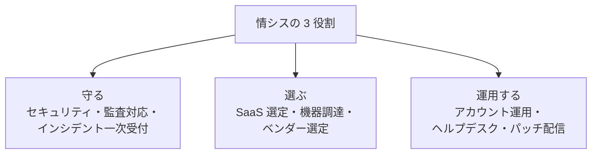
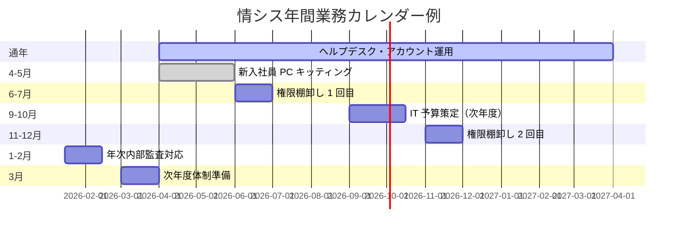
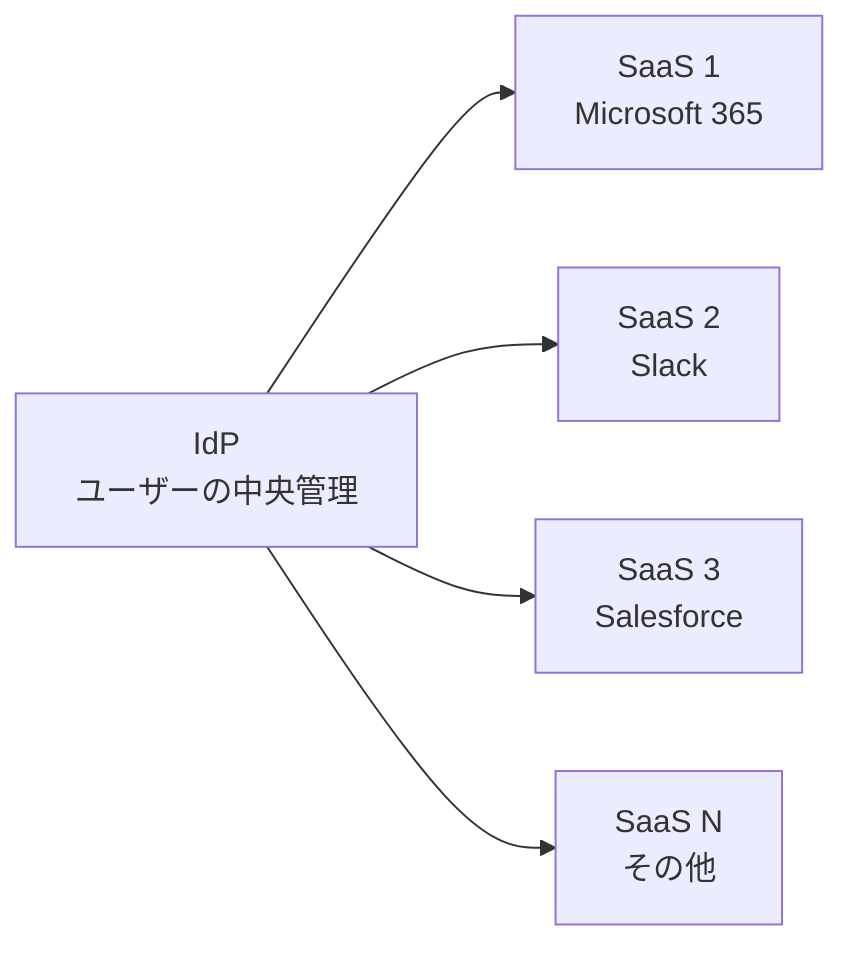
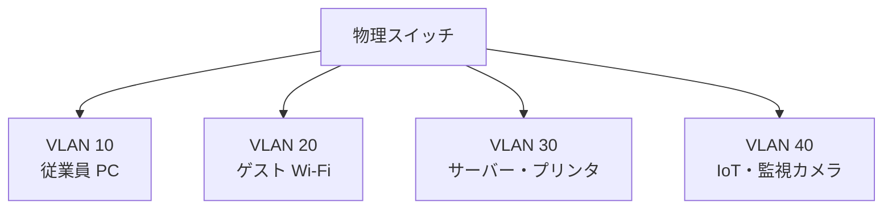
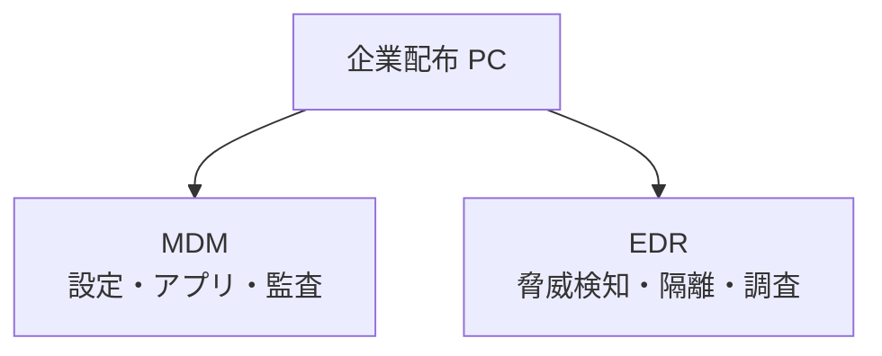
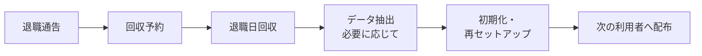
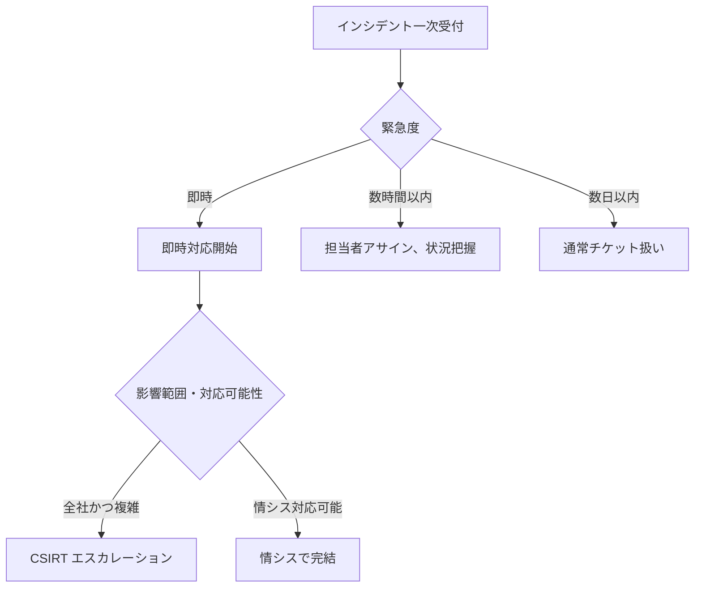
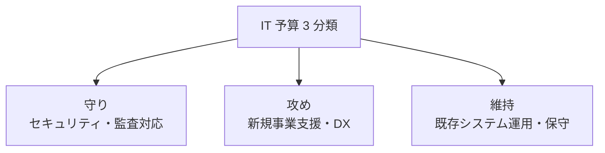

# 情シス担当者入門

「守る・選ぶ・運用する」の 3 役割で読み解く社内 IT——アカウント・ネットワーク・SaaS・ヘルプデスク・インシデントを 2026 年 7 月時点の実装で体系化

| 項目 | 内容 |
|---|---|
| カテゴリー | 情シス・IT管理実務 |
| 難易度 | 中級 |
| 所要時間 | 約200分（全8レッスン） |
| 公開日 | 2026-07-15 |
| 最終更新日 | 2026-07-15 |
| コースURL | https://skillup.college/courses/corporate-it/it-department-basics/ |

## 対象者

情シス担当 1〜3 年目、情シスに異動配属された非 IT 出身者、中小企業の「一人情シス」、事業会社の IT 選定・運用に関わる企画・総務担当者、社内 IT を統括する管理職・CIO 候補。

## 前提知識

PC・スマートフォンの一般的な操作、SaaS の利用経験、ネットワーク・認証の基本用語（IP アドレス・DNS・パスワード）を耳にしたことがある程度。

## 学習目標

- 情シスの 3 つの役割（守る・選ぶ・運用する）と年間業務マップを俯瞰できる
- IdP・SCIM プロビジョニング設計と入退社時のアカウント運用手順を組める
- 社内 LAN・拠点間 VPN・DNS/DHCP・Wi-Fi AP の運用要点を判断できる
- MDM・EDR・BYOD 判断の枠組みで社内デバイス運用を設計できる
- 買い手側視点の SaaS 選定・契約・棚卸し・解約プロセスを回せる
- ヘルプデスク・ITSM/ITIL の運用型（チケット管理・ナレッジ・SLA・PostMortem）を持てる
- 一次受付としての情シスの役割とインシデント対応・脆弱性管理の運用を扱える
- IT 予算の 3 分類（守り・攻め・維持）と投資判断・ベンダー管理の判断軸を身につけられる

## コース概要

情シス（情報システム部門）は、社内 IT の「守る・選ぶ・運用する」の 3 役割を担う職種です。全社員向けの IT リテラシー教育、CSIRT/SOC のインシデント設計論、クラウド設計思想などは既刊の IT 基礎系入門コースが扱う一方、本コースは「担当者としての意思決定と作業手順」に振り切ります。アカウント運用が情シスの生命線であり、入社と退社の 2 点で 8 割が決まる。SaaS は買った瞬間ではなく解約時に苦しむため、契約時に出口を設計する。ヘルプデスクは「早く直す」より「二度と起こさない」ナレッジ化が本業。IT 予算は「守り・攻め・維持」の 3 分類で経営に説明する——これらの中核メッセージを、社員 30〜3,000 名規模の企業で実行できる形で提示します。

## 学習の流れ

前半 3 レッスンで「守る」の運用（アカウント・ネットワーク・デバイス）を扱います。レッスン 1 で情シスの全体像と 3 役割、レッスン 2 でアカウント・アクセス管理、レッスン 3 で社内ネットワーク運用、レッスン 4 でデバイス管理と PC キッティングを扱います。中盤のレッスン 5 で「選ぶ」の実務として SaaS 選定・契約・棚卸し、レッスン 6 で「運用する」の中核であるヘルプデスク・ITSM/ITIL を扱います。後半のレッスン 7 で一次受付としてのインシデント対応、レッスン 8 で IT 予算・投資判断・ベンダー管理と修了後の学び方までを扱います。全 8 レッスン・約 200 分の構成です。

## レッスン一覧

| No. | タイトル | 概要 | 所要時間 |
|---|---|---|---|
| 1 | 情シスとは何か——3 つの役割と年間業務マップ | 情シスの 3 役割（守る・選ぶ・運用する）、年間業務カレンダー、経営陣・従業員・ベンダー・監査法人との関わり、コース守備範囲・境界明示（守る意識・ゼロトラスト設計・CSIRT/SOC の設計論は既刊譲り）を学ぶ | 25分 |
| 2 | アカウント・アクセス管理の運用 | IdP（Entra ID／Okta／Google Workspace）の選定と冗長化、SCIM プロビジョニング設計、オンボーディング／オフボーディングの実務手順、退職者アカウントの即時無効化、権限棚卸しの年 2 回サイクルを学ぶ | 25分 |
| 3 | 社内ネットワーク運用——LAN・VPN・DNS・Wi-Fi | LAN 設計（VLAN・IP アドレス設計）、DNS／DHCP 運用、拠点間 VPN（IPsec・SD-WAN）、Wi-Fi AP キッティング、ゼロトラスト移行判断の 3 前提を学ぶ | 25分 |
| 4 | デバイス管理と PC キッティング | MDM（Intune／Jamf／Kandji）の運用、EDR（Defender／CrowdStrike／SentinelOne）の役割分担、BYOD 判断基準、端末調達（リース／購入）、退職時回収と再セットアップを学ぶ | 25分 |
| 5 | SaaS 選定・契約・棚卸し | 買い手側の要件定義（機能・セキュリティ・運用）、比較評価の 3 軸、契約交渉のポイント（自動更新・データ返還・SLA）、シャドー IT 対処（CASB・SaaS 棚卸ツール）、解約プロセスを学ぶ | 25分 |
| 6 | ヘルプデスク・ITSM/ITIL 運用 | チケット管理（Jira Service Management／Zendesk／Freshservice）、ナレッジベースの育て方、SLA 設定（優先度 1〜4）、AI チャットボット活用、二度と起こさないための PostMortem を学ぶ | 25分 |
| 7 | インシデント対応と脆弱性管理 | 一次受付としての情シス、トリアージ 3 判断、CSIRT へのエスカレーション基準、パッチ配信運用（Windows Update for Business／WSUS）、脆弱性情報の追跡（JPCERT/CC・IPA）を学ぶ | 25分 |
| 8 | IT 予算・投資判断・ベンダー管理・修了後の学び方 | IT 予算 3 分類（守り・攻め・維持）、投資判断の 4 軸（ROI・戦略適合・リスク低減・従業員体験）、ベンダー評価の年次サイクル、契約更新交渉、IT 資産管理、修了後の学び方（情シスコミュニティ・技術情報源）を学ぶ | 25分 |

---

## レッスン1：情シスとは何か——3 つの役割と年間業務マップ

（所要時間：25分）

### このレッスンで学ぶこと

- 本コースの守備範囲（社内 IT を守る・選ぶ・運用する担当者の視点）と扱わない範囲を区別できる
- 情シスの 3 つの役割（守る・選ぶ・運用する）と役割ごとの時間配分を語れる
- 情シスの年間業務カレンダーを俯瞰できる
- 経営陣・従業員・ベンダー・監査法人という 4 つのステークホルダーとの関わり方を整理できる
- 本コースの中核メッセージ 6 個を持ち帰れる

---

情シス（情報システム部門）は、社内 IT のあらゆる場面に登場する職種です。PC が動かないとき、Wi-Fi が繋がらないとき、SaaS のアカウントが必要なとき、退職者のデータを消すとき、監査で指摘が出たとき——どの場面でも情シスが呼ばれます。本レッスンでは、まず情シスそのものの位置づけと役割を整理し、本コース全 8 レッスンでどこを重点的に学ぶかの見取り図を提示します。

### 本コースの位置づけ——「社内 IT を守る・選ぶ・運用する担当者」の視点

本コースは情シスを「社内 IT を守る・選ぶ・運用する担当者」の視点で扱います。全社員向けの守る意識、ゼロトラストの設計思想、CSIRT/SOC のインシデント対応体系、クラウドコスト最適化 FinOps は、それぞれ IT 基礎系の入門コースを参照してください。本コースはそれらを前提としたうえで、「担当者が今日から回す運用手順、SaaS 選定判断、経営とベンダーとの折衝技術」に軸足を置きます。

> **💡 ポイント**
> 本コースは「情シスの意識論」ではありません。「意識を高めよ」「セキュリティを守れ」といった精神論ではなく、「入社した日にどのアカウントを何分で作るか」「退職した瞬間にどうやってアクセスを止めるか」「SaaS を解約するときに何ヶ月前から動くか」といった具体的な手順に踏み込みます。

#### 対象読者の 3 つの視点

本コースは 3 つの視点を意識的に交錯させます。第 1 は、情シス担当者本人の視点です。日々の運用作業とインシデント対応。第 2 は、情シスマネジャー（IT 部長・情シス課長）の視点です。予算・体制設計・ベンダー折衝。第 3 は、CIO/CTO 候補の視点です。全社 IT 戦略と経営陣との対話。3 つの視点を持ち帰って、はじめて社内 IT の全体像が回るようになります。

### 情シスの 3 つの役割

情シスの仕事を大きく分けると、3 つの役割に整理できます。この整理は、時間配分・優先順位・スキル育成のすべての起点になります。

#### 役割 1：守る

社内 IT の資産（データ・システム・アカウント）を、外部脅威と内部リスクから守る役割です。ここには次のような業務が含まれます。

- アカウント・アクセス管理（オンボーディング／オフボーディング、権限棚卸し）
- パッチ配信（Windows Update、macOS アップデート、業務アプリのパッチ）
- 脆弱性情報の追跡と対応
- インシデント一次受付とトリアージ
- 監査対応（内部監査・外部監査・ISMS 監査など）

守る役割は「何もない日が続くこと」が成果です。派手さはありませんが、ここが崩れると会社全体が止まります。

#### 役割 2：選ぶ

社内で使う SaaS・機器・ベンダーを選ぶ役割です。買い手側の判断ですが、意思決定の質が長期にわたって業務効率とコストに影響します。

- SaaS 選定（要件定義・比較評価・契約交渉）
- ハードウェア調達（PC・サーバー・ネットワーク機器）
- ベンダー選定（システム開発・運用委託）
- 契約更新交渉（既存契約の見直し）

選ぶ役割は「導入した瞬間」ではなく「3〜5 年使い倒した後」に評価されます。契約時に出口を設計しておくことが、長期的なコスト適正化の鍵です。

#### 役割 3：運用する

日々の運用業務です。従業員からの問い合わせ対応、システムの日常運用、新規導入時のセットアップなどが含まれます。

- ヘルプデスク（従業員問い合わせ対応、チケット管理）
- 新規入社者の PC キッティング
- 退職者の PC 回収と再セットアップ
- 定期的なシステム稼働監視
- ナレッジベースの整備

運用役割は「うまく回っているほど気づかれない」性質があり、意識的な可視化がないと予算獲得が難しい領域です。

#### 役割の時間配分

情シス担当者の理想的な時間配分は、成熟度によって異なります。

| 会社の成熟度 | 守る | 選ぶ | 運用する |
|---|---|---|---|
| 立ち上げ期（〜100 名） | 20% | 30% | 50% |
| 拡大期（100〜500 名） | 30% | 25% | 45% |
| 成熟期（500〜3,000 名） | 40% | 20% | 40% |

立ち上げ期は運用比率が高く、成熟期になるほど守る比率が高まります。1 人の担当者が 3 役割すべてを兼務する「一人情シス」の場合、時間配分に自覚的でないと運用に時間を取られて守るが後回しになります。

### 情シスの年間業務カレンダー

情シスの業務には、年次で回ってくる定期業務があります。4 月始まり（3 月決算会社が多い日本）の企業を想定した典型例を示します。

#### 定期業務の要点

- **通年：ヘルプデスク・アカウント運用**：入退社・部署異動・アクセス要求は一年中発生
- **4〜5 月：新入社員 PC キッティング**：一斉入社のピーク、事前準備が鍵
- **6〜7 月・11〜12 月：権限棚卸し**：半期に 1 回、既存アカウントの権限を再確認
- **9〜10 月：IT 予算策定**：翌年度の予算を経営陣に提出、承認プロセス
- **1〜2 月：年次内部監査対応**：J-SOX、ISMS、プライバシーマークなどの監査
- **3 月：次年度体制準備**：組織変更、新規プロジェクト立ち上げ準備

> **📝 補足**
> 会社によって定期業務のタイミングは異なります。特に監査は業種・上場区分・認証取得状況によって時期が変わります。まずは自社の年間カレンダーを可視化することが情シス業務改善の第一歩です。

### 4 つのステークホルダー

情シスは、少なくとも 4 つのステークホルダーと日常的に折衝します。

#### ステークホルダー 1：経営陣

IT 予算の承認者であり、事業戦略と IT 戦略の接続点です。「なぜこの投資が必要か」を経営言語で説明する能力が問われます。

#### ステークホルダー 2：従業員

情シスにとって最も直接的な顧客です。「PC が動かない」「Wi-Fi が繋がらない」「SaaS のアカウントが欲しい」の問い合わせに対応します。人数が多い分、対応の型と効率化が必須です。

#### ステークホルダー 3：ベンダー

SaaS ベンダー・SIer・機器メーカー・通信事業者との日常的な折衝が発生します。契約交渉・障害対応・機能要望の窓口を担います。

#### ステークホルダー 4：監査法人・監査担当

年次内部監査、J-SOX 監査、ISMS 監査、プライバシーマーク監査など、監査担当への説明と証跡提供が必要です。

### 中核メッセージ 6 個の再掲

本コース全体を通じて、6 個のメッセージを繰り返します。

1. **情シスは「守る・選ぶ・運用する」の 3 役割——役割ごとに時間を配分する**
2. **アカウント運用が情シスの生命線——入社と退社の 2 点で 8 割が決まる**
3. **SaaS は買った瞬間ではなく解約時に苦しむ——契約時に出口を設計する**
4. **ヘルプデスクは「早く直す」より「二度と起こさない」——ナレッジ化が本業**
5. **インシデントは一次受付・トリアージ・エスカレーションの 3 手で対応する**
6. **IT 予算は「守り・攻め・維持」の 3 分類で経営に説明する**

このレッスンで扱うのはメッセージ 1「情シスは 3 役割——役割ごとに時間を配分する」です。3 役割を意識せずに全体を漠然と回そうとすると、運用に時間を取られて守るが弱くなります。役割の時間配分を可視化することが、情シス業務改善の起点です。

### 次のレッスンで扱うこと

次のレッスン 2 では、情シスの生命線であるアカウント・アクセス管理の運用を扱います。IdP（Entra ID／Okta／Google Workspace）の選定と冗長化、SCIM プロビジョニング設計、オンボーディング／オフボーディングの実務手順、退職者アカウントの即時無効化、権限棚卸しの年 2 回サイクルまで、担当者が今日から回せる運用手順を整理します。

### 確認クイズ

このレッスンで学んだ内容を確認しましょう。

#### Q1. 情シスの 3 つの役割として、本レッスンで挙げていない項目はどれか。

- [x] 開発する
- [ ] 守る
- [ ] 選ぶ
- [ ] 運用する

> **解説**
> 情シスの 3 役割は「守る」「選ぶ」「運用する」です。「開発する」はソフトウェア開発部門・エンジニアリング部門の役割で、情シスの業務とは区別されます。中堅企業の情シスは基本的にシステム開発を自ら行うことはなく、外部ベンダーへの委託または SaaS 選定で対応するのが典型です。

#### Q2. 「守る」の役割に含まれる業務として、本レッスンで挙げられているものはどれか。

- [ ] SaaS 選定
- [x] アカウント・アクセス管理、パッチ配信、脆弱性対応、インシデント一次受付、監査対応
- [ ] ヘルプデスク・チケット管理
- [ ] 新規プロダクトの開発

> **解説**
> 「守る」の役割にはアカウント・アクセス管理、パッチ配信、脆弱性情報の追跡と対応、インシデント一次受付とトリアージ、監査対応が含まれます。SaaS 選定は「選ぶ」、ヘルプデスクは「運用する」の役割です。役割の境界を明確に持つことが時間配分の起点です。

#### Q3. 情シス担当者の時間配分について、本レッスンで示された成熟度別の傾向として適切なものはどれか。

- [ ] 立ち上げ期ほど守る比率が高まる
- [ ] 成熟期ほど選ぶ比率が高まる
- [x] 成熟期ほど守る比率が高まる
- [ ] 会社の成熟度と時間配分は無関係

> **解説**
> 本レッスンの目安では、立ち上げ期（〜100 名）は運用比率が 50%、成熟期（500〜3,000 名）は守る比率が 40% になります。会社が大きくなるほど守るべき資産と関係者が増えるため、成熟期ほど守る比率が高まる傾向があります。時間配分に自覚的でないと運用に取られて守るが後回しになりがちです。

#### Q4. 情シスが日常的に折衝する 4 つのステークホルダーに含まれないものはどれか。

- [ ] 経営陣
- [ ] 従業員
- [ ] ベンダー
- [x] 株主

> **解説**
> 情シスが日常的に折衝する 4 つのステークホルダーは経営陣・従業員・ベンダー・監査法人／監査担当です。株主は経営陣・IR が対応するステークホルダーで、情シスの日常業務では直接の折衝相手にはなりません。ステークホルダーを把握することで説明の相手と言語を切り替える判断ができるようになります。

---

## レッスン2：アカウント・アクセス管理の運用

（所要時間：25分）

### このレッスンで学ぶこと

- IdP（Entra ID／Okta／Google Workspace）の選定軸と冗長化の考え方を語れる
- SCIM プロビジョニングの仕組みと SaaS への一括反映の設計を理解できる
- オンボーディング（入社日）とオフボーディング（退職日）の実務手順を組める
- 退職者アカウントを即時無効化する運用を設計できる
- 半期に 1 回の権限棚卸しサイクルを回せる

---

前レッスンで情シスの 3 役割を整理しました。本レッスンでは、その 3 役割すべての起点になる「アカウント運用」に踏み込みます。中核メッセージ 2「アカウント運用が情シスの生命線——入社と退社の 2 点で 8 割が決まる」の実装編です。

### なぜアカウント運用が情シスの生命線か

情シスの業務のなかで、アカウント運用は次の 3 つの意味で決定的です。

- **セキュリティの起点**：情報漏洩・不正アクセスの多くが、アカウント管理の不備から発生する
- **業務効率の起点**：入社初日にアカウントが動かないと、新入社員の初日は空白になる
- **監査対応の起点**：年次監査で最も指摘を受けやすい領域が「退職者アカウントの残存」

これらは技術ではなく運用の問題であり、情シス担当者の日常業務の質で決まります。

### IdP の選定と冗長化

現代の企業 IT では、複数の SaaS（Microsoft 365、Google Workspace、Slack、Zoom、Salesforce、HubSpot、GitHub、Notion など）を使うのが普通です。それぞれに個別のアカウントを作ると、退職時に全部消すのに漏れが必ず出ます。ここで登場するのが IdP（Identity Provider、アイデンティティ・プロバイダー）です。

IdP に一元的にユーザーを登録し、各 SaaS へは SSO（Single Sign-On）で連携する形にすると、次の効果が得られます。

- 従業員はパスワードを 1 つだけ覚えればよい
- IdP でアカウントを無効化すると全 SaaS で一斉に無効になる
- 権限変更も IdP 側で一括管理できる

#### 主要 IdP の選定軸

日本の中堅企業でよく使われる IdP は 3 つです。

| IdP | 特徴 | 適したシーン |
|---|---|---|
| Microsoft Entra ID（旧 Azure AD） | Microsoft 365 とのネイティブ統合、Windows 環境 | Microsoft 365 中心の企業 |
| Okta | 独立系ベンダー、対応 SaaS の多さ | マルチクラウド、Best of Breed 派 |
| Google Workspace | Google 系サービスと統合、UI シンプル | Google Workspace 中心の企業 |

Entra ID は 2023 年 7 月に Azure AD から改称されました。Okta は 2009 年設立、Auth0 を 2021 年 5 月に買収し、開発者向け機能を拡充しています。

#### 冗長化の考え方

IdP は「全 SaaS の入口」になるため、IdP 自体が止まると業務全体が止まります。冗長化の観点は次の 3 つです。

- **サービス側の冗長性**：IdP ベンダー自体の SLA と稼働実績（Entra ID・Okta・Google Workspace はいずれも 99.9% 以上）
- **バックドア認証**：IdP 障害時に管理者だけ入れる緊急用ルート（Break Glass Account）
- **監査ログのバックアップ**：IdP 側のログ以外に自社側でもコピー保存

> **⚠️ 注意**
> 「バックドア認証」は名前が悪いですが、正当な運用設計の一部です。IdP 全体が数日間停止した場合に、社内システムを緊急復旧するために管理者だけが使える別ルートで、パスワードは金庫で厳重に管理します。日常的に使うものではありません。

### SCIM プロビジョニング設計

IdP でユーザーを作ったら、各 SaaS 側にもユーザー情報を反映する必要があります。手動で 20〜30 の SaaS に個別に登録するのは非現実的です。ここで使うのが SCIM（System for Cross-domain Identity Management）です。

#### SCIM の仕組み

SCIM は 2015 年 9 月に IETF で標準化された（RFC 7643/7644）プロトコルで、IdP から SaaS へユーザー情報を自動連携します。

- **プロビジョニング**：IdP でユーザーを作ると、対応 SaaS にも自動でアカウント作成
- **同期**：IdP で属性（氏名・部署・役職）を変更すると、SaaS にも自動反映
- **デプロビジョニング**：IdP でユーザーを無効化すると、SaaS でも自動無効化

#### SCIM 対応 SaaS の確認

すべての SaaS が SCIM に対応しているわけではありません。導入時に確認します。

- **フル SCIM 対応**：Slack、Zoom、Notion、GitHub Enterprise、Salesforce など主要 SaaS
- **部分対応**：一部の SaaS はプロビジョニングのみ・デプロビジョニングのみ
- **未対応**：小規模 SaaS や日本ローカル SaaS は SCIM 未対応が多い

SCIM 未対応の SaaS は、退職時に手動で無効化する運用が残ります。この漏れが情報漏洩の温床になります。

### オンボーディング／オフボーディングの実務手順

アカウント運用の 8 割は、入社時と退職時に集中します。それぞれの実務手順を型化します。

#### オンボーディング（入社日）

前日または当日朝までに完了させておきたい 8 項目です。

1. IdP でユーザー作成（属性：氏名・メール・部署・役職）
2. 部署に応じた SaaS グループへ追加（Salesforce、Slack のチャンネル、GitHub の Team など）
3. Microsoft 365／Google Workspace のライセンス割当
4. PC キッティング（レッスン 4 で詳述）
5. Wi-Fi 接続情報の準備
6. 初期パスワードとパスキー登録手順の準備
7. 業務マニュアル・IT ガイドラインへのアクセス
8. 初日オリエンテーション枠の確保（30〜60 分）

漏れがあると新入社員の初日が空白になり、印象と生産性の両面で損失が出ます。

#### オフボーディング（退職日）

退職日当日または翌日までに完了させたい 6 項目です。

1. IdP でユーザー無効化（削除ではなく無効化：ログ保存のため）
2. Microsoft 365／Google Workspace のライセンス回収と Mailbox / Drive のデータ引継ぎ
3. SaaS 個別アカウントの無効化（SCIM 対応で自動、非対応は手動）
4. VPN・社内 Wi-Fi アクセスの無効化
5. PC・貸与機器の回収と初期化
6. 物理入退室カード・鍵の回収

> **💡 ポイント**
> 「削除」ではなく「無効化」する理由は、監査対応と法的リスクへの備えです。退職者のメール・データが調査対象になる可能性がある期間（多くは退職後 3 か月〜1 年）は、削除せず無効化のまま保持します。

### 退職者アカウントの即時無効化

退職者アカウントの残存は、情報漏洩と監査指摘の最大要因です。次の 3 原則を守ります。

- **退職通告後、退職日までに準備**：退職日ではなく通告時から準備を開始
- **退職日 17:00 に無効化**：業務終了時刻に合わせて即時に無効化
- **無効化ログの即時確認**：IdP のログで全 SaaS の無効化完了を確認

退職通告から退職日までに時間があれば、退職者は「引き継ぎ用」を口実に情報持ち出しの機会を得られます。退職通告後は権限最小化（メールと Slack だけに絞る）を早期に実施することが実務の推奨です。

### 半期に 1 回の権限棚卸し

入退社時の運用を完璧にしても、部署異動・プロジェクト終了で「使われなくなった権限」は蓄積します。これを掃除するのが半期に 1 回の権限棚卸しです。

#### 棚卸しの 4 ステップ

1. **リスト出力**：IdP と各 SaaS から現在のユーザー権限一覧を出力
2. **部署長への確認依頼**：部署長に「所属メンバーの現在の権限を確認し、不要なものにチェック」を依頼
3. **不要権限の削除**：チェックのあった権限を情シスが削除
4. **完了報告**：棚卸し結果を経営陣と監査担当に報告

年 2 回のサイクル（6 月と 12 月が多い）を回すことで、監査時の「退職者アカウント残存」の指摘を大幅に減らせます。

### 確認クイズ

このレッスンで学んだ内容を確認しましょう。

#### Q1. IdP（Identity Provider）の役割として、適切な記述はどれか。

- [x] 複数の SaaS のユーザーを中央で一元管理し、SSO と SCIM で各 SaaS に連携する
- [ ] 従業員の PC を集中管理する MDM 機能
- [ ] SaaS の請求書を統合する経理システム
- [ ] 社内ネットワークの帯域を管理する装置

> **解説**
> IdP は「複数の SaaS のユーザーを中央で一元管理し、SSO と SCIM で各 SaaS に連携する」ことが役割です。従業員はパスワードを 1 つだけ覚えればよく、IdP でアカウントを無効化すると全 SaaS で一斉に無効になります。MDM はデバイス管理、経理システムや帯域管理は別領域です。

#### Q2. SCIM について、適切な記述はどれか。

- [ ] SaaS ベンダーが顧客企業に請求書を送るプロトコル
- [x] IdP から SaaS へユーザー情報を自動連携する IETF 標準プロトコル（RFC 7643/7644）
- [ ] 社内ネットワークの帯域制御プロトコル
- [ ] 電子メールの暗号化プロトコル

> **解説**
> SCIM は 2015 年 9 月に IETF で標準化された（RFC 7643/7644）プロトコルで、IdP から SaaS へユーザー情報（プロビジョニング・同期・デプロビジョニング）を自動連携します。すべての SaaS が対応しているわけではなく、未対応の SaaS には手動運用が残ります。

#### Q3. オフボーディング（退職日）で、退職者のアカウントを「削除」ではなく「無効化」する理由として、適切な記述はどれか。

- [ ] 削除だと料金が節約できないため
- [ ] 復職の可能性を残すため
- [x] 監査対応と法的リスクへの備えとして、退職者のデータを一定期間保持するため
- [ ] 削除できない技術的制約があるため

> **解説**
> 「削除」ではなく「無効化」する理由は、監査対応と法的リスクへの備えです。退職者のメール・データが調査対象になる可能性がある期間（多くは退職後 3 か月〜1 年）は、削除せず無効化のまま保持します。ライセンスは無効化時に回収できるため料金の問題は生じません。

#### Q4. 半期に 1 回の権限棚卸しについて、本レッスンで挙げられていない工程はどれか。

- [ ] IdP と各 SaaS からユーザー権限一覧を出力
- [ ] 部署長への確認依頼
- [ ] 不要権限の削除
- [x] 従業員本人によるパスワード再設定

> **解説**
> 権限棚卸しの 4 ステップは「リスト出力」「部署長への確認依頼」「不要権限の削除」「完了報告」です。パスワード再設定は権限棚卸しとは別のセキュリティ運用（多くは MFA やパスキーの導入で対応）で、権限棚卸しの目的とは異なります。

---

## レッスン3：社内ネットワーク運用——LAN・VPN・DNS・Wi-Fi

（所要時間：25分）

### このレッスンで学ぶこと

- 社内 LAN の VLAN 分割と IP アドレス設計の基本を語れる
- DNS／DHCP の運用（社内解決・分割 DNS）の考え方を理解できる
- 拠点間 VPN（IPsec・SD-WAN）の選定軸を判断できる
- Wi-Fi AP キッティング（SSID 分割・電波設計）の要点を挙げられる
- ゼロトラスト移行判断の 3 前提を持ち帰れる

---

前レッスンではアカウント運用を扱いました。本レッスンでは、社内ネットワークの運用に踏み込みます。クラウドと利用者側のネットワークは既刊 IT 基礎系入門で扱うため、本コースは「オンプレ社内ネットワークの運用手順」に振り切ります。

### 社内 LAN の基本設計

社内 LAN（Local Area Network）は、オフィス内の機器（PC・プリンタ・サーバー・IoT 機器）を有線・無線で接続するネットワークです。中堅企業では、次の 3 つの設計要素が中心になります。

- VLAN（Virtual LAN）分割
- IP アドレス設計
- 出口（インターネット接続）の設計

#### VLAN 分割の考え方

VLAN は、物理的には 1 つのネットワーク機器の上で、論理的に複数のネットワークを分ける仕組みです。目的別・部署別・機器種別で VLAN を分けることで、セキュリティと管理性を高めます。

VLAN 分割の代表的なパターン：
- **VLAN 10：従業員 PC**：業務利用の従業員 PC・スマートフォン
- **VLAN 20：ゲスト Wi-Fi**：来客・パートナー用（社内リソースからは分離）
- **VLAN 30：サーバー・プリンタ**：社内サーバーや複合機
- **VLAN 40：IoT・監視カメラ**：セキュリティカメラ、入退室管理、環境センサー

VLAN 間の通信はルーターまたは L3 スイッチで制御し、必要な通信だけを許可します。

#### IP アドレス設計

社内で使う IP アドレスの範囲は、RFC 1918 で定められたプライベート IP 空間から選びます。

- 10.0.0.0/8（1,677 万アドレス）
- 172.16.0.0/12（100 万アドレス）
- 192.168.0.0/16（65,536 アドレス）

中堅企業では 10.0.0.0/8 のうち、拠点別・VLAN 別にサブネットを切って運用するのが一般的です。

**例：本社（10.10.0.0/16）と大阪支社（10.20.0.0/16）**
- 本社 従業員 PC：10.10.10.0/24（最大 254 台）
- 本社 サーバー：10.10.30.0/24
- 大阪支社 従業員 PC：10.20.10.0/24
- 大阪支社 サーバー：10.20.30.0/24

拠点コード（本社 10、大阪 20、名古屋 30 など）と用途コード（PC 10、Wi-Fi 20、サーバー 30 など）の 2 桁を組み合わせる設計にすると、拠点追加・用途追加への拡張性が高まります。

> **💡 ポイント**
> IP アドレス設計は、社内 IP アドレス台帳（Excel でも Notion でも可）で管理します。誰がどの IP を使っているか、どの範囲が空きかを可視化できないと、拠点追加や新規機器導入で衝突が発生します。

### DNS・DHCP の運用

社内ネットワークでは、DNS（Domain Name System）と DHCP（Dynamic Host Configuration Protocol）が両輪で動きます。

#### DNS の役割

- **社内名前解決**：`file-server.corp.example.com` → 10.10.30.5 のような社内サーバー名の解決
- **外部名前解決**：`example.com` → インターネット上の IP アドレスへの解決
- **分割 DNS**：社内からと外部からで同じドメインでも違う IP を返す設計

#### DHCP の役割

DHCP は、PC・スマートフォン・IoT 機器に IP アドレスを自動配布する仕組みです。手動で IP を設定する手間がなくなります。

- 予約：特定の MAC アドレスには常に同じ IP を割当（サーバー・プリンタなど）
- 動的割当：それ以外は空き IP をリース期限付きで配布（一般的なリース期限：24 時間）

#### 運用の要点

- DHCP スコープ（割当可能な IP 範囲）を VLAN ごとに設定
- DNS レコードの更新は変更管理プロセスに乗せる（勝手な追加は禁止）
- DNS/DHCP サーバー自体の冗長化（プライマリ・セカンダリ）

### 拠点間 VPN

複数拠点を持つ企業では、拠点間を安全に接続する VPN（Virtual Private Network）が必要になります。主流は 2 種類です。

#### IPsec VPN

伝統的な拠点間 VPN の実装。各拠点のルーターに IPsec 設定を入れて、暗号化トンネルを張ります。安定していますが、設定変更が煩雑で、拠点が増えると管理コストが増えます。

#### SD-WAN

Software-Defined WAN。IPsec の後継的技術で、複数の回線（光回線・LTE・5G）を統合し、アプリケーションごとの最適な経路を自動選択します。中央のコントローラーで一元管理できるため、拠点が多い企業で採用が増えています。

#### 選定軸

- 拠点数（3 拠点までは IPsec、5 拠点以上は SD-WAN 検討）
- 回線コスト（SD-WAN は複数回線でコストが上がる）
- アプリケーション（クラウド SaaS 中心なら SD-WAN の効果大）
- 運用体制（自社で運用するか、マネージドサービスで委託するか）

### Wi-Fi AP キッティングと電波設計

社内 Wi-Fi は、オフィスの生産性に直結します。AP（Access Point）の配置と設定を型化します。

#### AP 配置の原則

- 1 AP あたりのカバレッジ：オフィス内で概ね 15〜20m 半径
- チャンネル設計：隣接する AP は異なるチャンネルを使う（1/6/11 の 3 択が定番）
- 電波干渉：会議室のプロジェクター・電子レンジ・Bluetooth 機器との相互干渉に注意

#### SSID 分割

複数の SSID を用途別に分けます。

- **社員用 SSID**：VLAN 10（従業員 PC）に接続、証明書認証（WPA3-Enterprise）
- **ゲスト用 SSID**：VLAN 20（ゲスト）に接続、パスワード認証（WPA3-Personal）
- **IoT 用 SSID**：VLAN 40（IoT）に接続、機器ごとの共通鍵

社員用 SSID は個人パスワードではなく IdP 経由の証明書認証にすると、パスワード漏洩リスクが下がります。

> **📝 補足**
> Wi-Fi 6（IEEE 802.11ax）は 2019 年、Wi-Fi 7（IEEE 802.11be）は 2024 年に標準化されました。新規オフィス構築では Wi-Fi 6/6E を選ぶのが標準で、大規模会議での多人数同時接続に強くなっています。既存 AP からの更改判断は、機器の減価償却期間と業務需要のバランスで決めます。

### ゼロトラスト移行判断の 3 前提

ゼロトラストは、「社内ネットワークだから安全」という前提を捨て、すべての通信を認証・認可の対象とする設計思想です。設計思想の詳細は既刊 IT 基礎系入門コースが扱うため、本レッスンでは「移行判断の前提」に絞ります。

#### 前提 1：IdP が確立している

ゼロトラストは「誰が」「どのデバイスで」「何にアクセスするか」を毎回確認する設計です。IdP がなければ「誰が」の確認ができません。IdP 導入と SCIM プロビジョニングが動いていることが第一の前提です。

#### 前提 2：デバイス管理が確立している

デバイスの状態（OS 更新済み、EDR インストール済み、企業所有）を確認できないと、ゼロトラストは機能しません。MDM／EDR 導入と運用（レッスン 4 で詳述）が第二の前提です。

#### 前提 3：業務システムがクラウド中心

古いオンプレミス業務システムはゼロトラスト化が困難です。業務システムがクラウド SaaS 中心（Microsoft 365・Google Workspace・Salesforce など）に移行済みであることが第三の前提です。

3 つの前提が揃っていない状態でゼロトラスト移行を宣言すると、実装が中途半端になり、既存の VPN・境界防御と新設のゼロトラストが並立して運用コストが倍になります。前提を先に固めることが実務の順序です。

### 中核メッセージ 6 個の再掲

本コース全体を通じて、6 個のメッセージを繰り返します。

1. **情シスは「守る・選ぶ・運用する」の 3 役割——役割ごとに時間を配分する**
2. **アカウント運用が情シスの生命線——入社と退社の 2 点で 8 割が決まる**
3. **SaaS は買った瞬間ではなく解約時に苦しむ——契約時に出口を設計する**
4. **ヘルプデスクは「早く直す」より「二度と起こさない」——ナレッジ化が本業**
5. **インシデントは一次受付・トリアージ・エスカレーションの 3 手で対応する**
6. **IT 予算は「守り・攻め・維持」の 3 分類で経営に説明する**

このレッスンで扱うのは主にメッセージ 1「守る・選ぶ・運用するの 3 役割」の「運用する」の中核です。社内 LAN・VPN・DNS・Wi-Fi は日常業務では「動いていて当たり前」ですが、設計を誤ると全社的な業務停止に直結します。

### 次のレッスンで扱うこと

次のレッスン 4 では、デバイス管理と PC キッティングに踏み込みます。MDM（Intune／Jamf／Kandji）の運用、EDR（Defender／CrowdStrike／SentinelOne）の役割分担、BYOD 判断基準、端末調達（リース／購入）、退職時回収と再セットアップまで整理します。デバイス運用は入退社サイクルの物理的な担い手で、アカウント運用と両輪で機能します。

### 確認クイズ

このレッスンで学んだ内容を確認しましょう。

#### Q1. VLAN 分割の目的として、適切な記述はどれか。

- [x] 物理的に 1 つのネットワーク機器の上で論理的に複数のネットワークを分け、セキュリティと管理性を高める
- [ ] 物理回線を追加してネットワーク帯域を増やす
- [ ] インターネット出口を複数持たせる
- [ ] Wi-Fi の電波強度を強化する

> **解説**
> VLAN（Virtual LAN）は、物理的には 1 つのネットワーク機器の上で論理的に複数のネットワークを分ける仕組みです。目的別・部署別・機器種別で VLAN を分けることで、セキュリティ（VLAN 間の通信を制御）と管理性（機器の役割ごとに分離）を高めます。

#### Q2. 社内で使うプライベート IP アドレス空間として、RFC 1918 で定められているものはどれか。

- [ ] 8.8.8.0/24、1.1.1.0/24、9.9.9.0/24
- [x] 10.0.0.0/8、172.16.0.0/12、192.168.0.0/16
- [ ] 100.64.0.0/10、203.0.113.0/24、198.51.100.0/24
- [ ] 224.0.0.0/4、127.0.0.0/8、169.254.0.0/16

> **解説**
> RFC 1918 で定められたプライベート IP 空間は「10.0.0.0/8」「172.16.0.0/12」「192.168.0.0/16」の 3 つです。中堅企業では 10.0.0.0/8 を拠点別・VLAN 別にサブネット分割して運用するのが一般的です。他の選択肢はグローバル IP・キャリアグレード NAT・マルチキャスト・ループバックなど別用途です。

#### Q3. SD-WAN の特徴として、適切な記述はどれか。

- [ ] IPsec VPN より簡素な構造で、拠点数が少ないほど有利
- [ ] Wi-Fi 通信を暗号化する技術
- [x] 複数回線を統合し、アプリケーションごとの最適経路を自動選択、中央コントローラーで一元管理
- [ ] Wi-Fi の電波干渉を自動回避する機能

> **解説**
> SD-WAN（Software-Defined WAN）は、複数の回線（光回線・LTE・5G）を統合し、アプリケーションごとの最適経路を自動選択します。中央のコントローラーで一元管理できるため、拠点が多い企業ほど効果が高くなります。3 拠点までは IPsec、5 拠点以上は SD-WAN 検討が実務の目安です。

#### Q4. ゼロトラスト移行判断の 3 前提として、本レッスンで挙げられていない項目はどれか。

- [ ] IdP が確立している
- [ ] デバイス管理が確立している
- [ ] 業務システムがクラウド中心
- [x] 全従業員がセキュリティ資格を保有している

> **解説**
> ゼロトラスト移行判断の 3 前提は「IdP が確立している」「デバイス管理が確立している」「業務システムがクラウド中心」です。従業員のセキュリティ資格保有は前提ではなく、むしろゼロトラストは「人的な意識に依存しない仕組み」を目指す設計です。3 前提が揃わない段階で移行宣言すると実装が中途半端になります。

---

## レッスン4：デバイス管理と PC キッティング

（所要時間：25分）

### このレッスンで学ぶこと

- MDM（Intune／Jamf／Kandji）の役割と選定軸を語れる
- EDR（Defender／CrowdStrike／SentinelOne）と MDM の役割分担を整理できる
- BYOD 判断基準（会社所有 vs 私物持込）の 3 つの論点を挙げられる
- 端末調達の 3 パターン（リース／購入／レンタル）の使い分けを判断できる
- 退職時回収と再セットアップの標準手順を組める

---

前レッスンでは社内ネットワークを扱いました。本レッスンでは、ネットワークに接続される「デバイス」の管理に踏み込みます。PC・スマートフォン・タブレットの調達から日常運用、退職時の回収までを型化します。

### MDM の役割と選定

MDM（Mobile Device Management、モバイル・デバイス・マネジメント）は、企業配布デバイスを一元管理する仕組みです。近年は PC も含めて統合的に管理する「Unified Endpoint Management（UEM）」への統合が進んでいます。

#### MDM で管理できること

- OS 設定の一括配布（パスワードポリシー、画面ロック時間、暗号化）
- 業務アプリの一括インストール／アップデート
- 紛失時のリモートワイプ（データ全消去）
- 位置情報の取得
- 監査ログ（誰がいつどの設定を変更したか）

#### 主要 MDM 3 社

日本の中堅企業でよく使われる MDM は 3 つです。

| MDM | 特徴 | 適したシーン |
|---|---|---|
| Microsoft Intune | Entra ID とのネイティブ統合、Microsoft 365 との統合 | Windows／Microsoft 365 中心 |
| Jamf | macOS／iOS 特化、Apple の機能に深く対応 | Apple デバイス中心の企業 |
| Kandji | 新興 MDM、macOS 特化、UX 重視 | 中堅 Apple 企業の新規導入 |

Intune は 2023 年 4 月に旧 Microsoft Endpoint Manager と統合されて「Microsoft Intune」に一本化されました。macOS を混在させる企業では Intune + Jamf の併用パターンも多く見られます。

### EDR と MDM の役割分担

MDM がデバイスの「管理」であるのに対し、EDR（Endpoint Detection and Response）はデバイス上の「脅威検知・対応」を担う別レイヤーです。両者は補完関係にあります。

#### EDR 主要 3 社

- **Microsoft Defender for Endpoint**：Intune・Entra ID との統合、Windows Defender の企業版
- **CrowdStrike Falcon**：2011 年設立、独立系 EDR の代表、クラウドネイティブ
- **SentinelOne**：2013 年設立、AI 駆動のエンドポイント保護

#### 役割分担の例

- **MDM**：新入社員 PC のセットアップ、業務アプリ配布、パスワードポリシー適用
- **EDR**：不審なプロセスの実行検知、マルウェア検出時の隔離、フォレンジック調査

MDM と EDR を両方入れることで、「配布・運用」と「守る」の両輪が回ります。中堅企業では最低限の投資として MDM + EDR のセット導入が実務の標準です。

> **⚠️ 注意**
> 「Microsoft Defender」は無償版と有償版で機能に大きな差があります。無償の「Windows Defender」（Windows 標準）はマルウェア検知のみで、EDR 機能（フォレンジック・自動対応）は「Microsoft Defender for Endpoint（有償）」でしか提供されません。企業利用では有償版が必要です。

### BYOD 判断基準

BYOD（Bring Your Own Device、私物持込）を許可するか、会社所有デバイスに限定するかは、情シスと経営陣で早期に判断すべき論点です。

#### 論点 1：セキュリティ管理

- **会社所有**：MDM/EDR を強制インストールでき、完全な管理が可能
- **BYOD**：MDM/EDR インストールに従業員の同意が必要、拒否されると管理不能

#### 論点 2：コスト

- **会社所有**：デバイス費用 + MDM/EDR ライセンス費が発生
- **BYOD**：デバイス費用は不要（従業員負担）、MDM/EDR ライセンスは同様

#### 論点 3：プライバシー・法的リスク

- **会社所有**：業務利用のみが前提、私的利用は制限
- **BYOD**：私的データと業務データの分離が難しい、個人情報保護の論点が発生

多くの日本企業では、PC は会社所有・スマートフォンは業務専用支給または BYOD 選択制、といった分離運用が典型です。中堅企業のスタンダードは「会社所有 PC 中心、業務用スマホは支給または業務専用アプリのみ BYOD 許可」です。

### 端末調達の 3 パターン

企業が PC・スマートフォンを調達する方法は 3 つあります。

#### パターン 1：リース

リース会社（NTT ファイナンス、ORIX、東京センチュリー等）から機器を借りる方式。3〜5 年のリース期間で毎月定額を支払います。

- 利点：初期投資が少ない、経費として損金計上できる
- 欠点：リース期間中の入替が難しい、総支払額は購入より高い

#### パターン 2：購入

会社が機器を買い切る方式。減価償却で費用計上します（一般的な耐用年数：PC 4 年、サーバー 5 年）。

- 利点：総支払額が安い、契約期間の制約なし
- 欠点：初期投資が大きい、資産管理が必要

#### パターン 3：レンタル

短期利用（数ヶ月〜1 年程度）でレンタル会社から借りる方式。

- 利点：短期のプロジェクトに柔軟対応
- 欠点：長期利用ではコストが高い

#### 選定の目安

- 3 年以上使う定型 PC：購入かリース（税制と資金繰りで判断）
- 短期プロジェクト用：レンタル
- テスト機・開発機：購入（1〜2 台の少数）

### 退職時回収と再セットアップの標準手順

退職時のデバイス回収は、アカウント運用と並ぶ情シスの重要業務です。次の 5 ステップで型化します。

#### ステップ 1：退職通告後、回収予約

退職通告後、退職日にデバイスを回収する予約を入れます。物理的な回収場所（本社、支社、宅配便返却など）を確定します。

#### ステップ 2：退職日回収

退職日当日にデバイスを回収します。物理的な受け取りと、シリアル番号の照合を行います。

#### ステップ 3：データ抽出

業務に必要な業務データが個人 PC 内にある場合、事前にクラウドストレージへ移動しておきます。退職者のプライベート情報（個人メモ等）は取り扱いに注意します。

#### ステップ 4：初期化・再セットアップ

MDM から工場出荷時初期化を実行します。物理的にディスクを暗号化していた場合、鍵を廃棄することでデータ復元不能にできます（Windows BitLocker、macOS FileVault）。

#### ステップ 5：次の利用者へ配布

初期化した PC を、新入社員または既存社員の PC 交換用にキッティングして配布します。

> **💡 ポイント**
> 「退職者が使っていた PC を新入社員に配布する」流用サイクルは、コスト効率が高い運用ですが、初期化とキッティングの品質が担保されないと前任者のデータや設定が残ります。MDM の初期化コマンドを標準手順化し、キッティングチェックリストを必ず回すことが実務の要点です。

### PC キッティングの標準手順

新入社員に PC を配布する前のキッティング（初期セットアップ）を、次の 6 ステップで標準化します。

1. **OS 初期化と最新化**：出荷時状態から最新の OS アップデートを適用
2. **MDM への登録**：Intune／Jamf 等の MDM に PC を登録
3. **業務アプリ配布**：MDM 経由で Microsoft 365、Slack、業務専用アプリを自動配布
4. **EDR インストール**：Defender／CrowdStrike／SentinelOne を導入
5. **暗号化有効化**：BitLocker／FileVault を有効化、鍵は IdP 側に自動バックアップ
6. **キッティング完了確認**：チェックリストで全項目確認、初期パスワードは 1 回目のログイン時に変更を強制

理想は「新入社員が初日にログインしただけで業務開始できる」状態です。MDM を使うと、この一連の作業を大幅に自動化できます。

### 中核メッセージ 6 個の再掲

本コース全体を通じて、6 個のメッセージを繰り返します。

1. **情シスは「守る・選ぶ・運用する」の 3 役割——役割ごとに時間を配分する**
2. **アカウント運用が情シスの生命線——入社と退社の 2 点で 8 割が決まる**
3. **SaaS は買った瞬間ではなく解約時に苦しむ——契約時に出口を設計する**
4. **ヘルプデスクは「早く直す」より「二度と起こさない」——ナレッジ化が本業**
5. **インシデントは一次受付・トリアージ・エスカレーションの 3 手で対応する**
6. **IT 予算は「守り・攻め・維持」の 3 分類で経営に説明する**

このレッスンで扱うのはメッセージ 2「アカウント運用は情シスの生命線」の物理的な担い手であるデバイス管理です。MDM と EDR の両輪で、入社から退職までのデバイスライフサイクルを型化することが、セキュリティ・業務効率・コストの三軸で成果を出す鍵です。

### 次のレッスンで扱うこと

次のレッスン 5 では、情シスの「選ぶ」役割の中核である SaaS 選定・契約・棚卸しに踏み込みます。買い手側の要件定義、比較評価の 3 軸、契約交渉のポイント（自動更新・データ返還・SLA）、シャドー IT 対処、解約プロセスまで整理します。SaaS は買った瞬間ではなく解約時に苦しむ——契約時に出口を設計する視点を提示します。

### 確認クイズ

このレッスンで学んだ内容を確認しましょう。

#### Q1. MDM の役割として、適切な記述はどれか。

- [x] 企業配布デバイスを一元管理し、OS 設定・業務アプリ配布・リモートワイプなどを行う
- [ ] デバイス上の脅威を検知して自動対応する
- [ ] 社内ネットワークの帯域を制御する
- [ ] 従業員のパスワードを管理する

> **解説**
> MDM（Mobile Device Management）は「企業配布デバイスを一元管理する」仕組みで、OS 設定の一括配布・業務アプリのインストール・リモートワイプ・監査ログを扱います。脅威検知・対応は EDR、ネットワーク制御は別領域、パスワード管理は IdP の役割です。

#### Q2. MDM と EDR の役割分担として、適切な記述はどれか。

- [ ] EDR は MDM の下位機能で、単独で使うことはない
- [x] MDM は「管理（設定・配布・監査）」、EDR は「脅威検知・対応・調査」の別レイヤーとして補完関係
- [ ] MDM は Windows 専用、EDR は macOS 専用
- [ ] MDM と EDR は競合関係で、両方入れると干渉する

> **解説**
> MDM と EDR は補完関係で、両方導入するのが中堅企業の実務標準です。MDM は「配布・運用」の管理、EDR は「守る」の脅威検知・対応・フォレンジックを担います。プラットフォーム制約はなく、Windows・macOS 両方に MDM・EDR とも対応製品があります。

#### Q3. BYOD 判断の 3 論点として、本レッスンで挙げられていない項目はどれか。

- [ ] セキュリティ管理
- [ ] コスト
- [x] 従業員のパソコン操作スキル
- [ ] プライバシー・法的リスク

> **解説**
> BYOD 判断の 3 論点は「セキュリティ管理」「コスト」「プライバシー・法的リスク」です。従業員の操作スキルは BYOD 判断の直接的な軸ではなく、教育で対応する領域です。多くの企業では「PC は会社所有、業務用スマホは支給または業務専用アプリのみ BYOD 許可」の分離運用が標準です。

#### Q4. 退職時の PC 回収と再セットアップの標準手順に含まれない工程はどれか。

- [ ] 退職通告後の回収予約
- [ ] 業務データの抽出
- [ ] 初期化・再セットアップ
- [x] 退職者への転売手続き

> **解説**
> 退職時の 5 ステップは「退職通告後の回収予約」「退職日回収」「データ抽出」「初期化・再セットアップ」「次の利用者へ配布」です。退職者への転売は行いません。会社所有デバイスは会社の資産で、初期化後に社内で再利用するのが標準です。

---

## レッスン5：SaaS 選定・契約・棚卸し

（所要時間：25分）

### このレッスンで学ぶこと

- 買い手側の要件定義（機能・セキュリティ・運用）の 3 軸を組み立てられる
- 比較評価の 3 軸（機能適合・コスト・実装工数）で SaaS 候補を絞り込める
- 契約交渉のポイント（自動更新・データ返還・SLA）を語れる
- シャドー IT の対処（CASB・SaaS 棚卸ツール・従業員教育）を組める
- SaaS 解約プロセスの標準手順を持ち帰れる

---

前レッスンではデバイス管理を扱いました。本レッスンでは、情シスの「選ぶ」役割の中核である SaaS 選定・契約・棚卸しに踏み込みます。中核メッセージ 3「SaaS は買った瞬間ではなく解約時に苦しむ——契約時に出口を設計する」の実装編です。

### 買い手側の要件定義

SaaS 選定は、事業部から「〇〇を導入したい」と要望が上がってから始まることが多い業務です。要望を「要件」に翻訳することが、情シスの最初の仕事です。3 軸で組み立てます。

#### 軸 1：機能要件

事業部が何を実現したいのか、業務プロセスに落とし込みます。

- コア機能（絶対に必要な機能）
- あると便利な機能（あれば選択理由になる）
- 将来必要になる可能性がある機能（拡張性）

事業部との対話で「業務で 1 日何回、その機能を使うか」「代替手段（Excel、既存 SaaS）で何が困っているか」を掘り下げます。

#### 軸 2：セキュリティ要件

情シスとして必ずチェックする軸です。

- **認証**：SSO（SAML／OIDC）対応、SCIM プロビジョニング対応
- **監査**：管理者による監査ログ、外部監査認証（SOC 2、ISO 27001）
- **データ保護**：保存時暗号化、通信暗号化（TLS）
- **データ所在地**：日本国内リージョンの有無、越境データの扱い
- **業界規制**：業界固有の認証（PCI DSS、HIPAA、FISC、ISMAP）

#### 軸 3：運用要件

日常運用を支える要件です。

- **サポート体制**：日本語サポート、営業時間、平均応答時間、SLA
- **障害通知**：ステータスページ、メール通知、Slack 連携
- **アップデート情報**：新機能追加・変更の事前通知
- **料金体系**：月額／年額、ユーザー単位／使用量単位、ボリューム割引

### 比較評価の 3 軸

複数の SaaS 候補を並べて評価するときの 3 軸です。

#### 軸 1：機能適合度

要件定義で定めた機能と、各 SaaS の対応度をマッピングします。以下のスコアリング例を使います。

- ◎（完全対応、想定以上）：5 点
- ○（対応）：3 点
- △（部分対応、回避策で対処）：1 点
- ×（未対応）：0 点

コア機能に × があれば選定候補から外します。

#### 軸 2：総所有コスト（TCO）

初期費用だけでなく、3〜5 年の総所有コストで比較します。

- 初期費用（セットアップ、データ移行、トレーニング）
- 月額または年額のライセンス費（社員数増加を織り込む）
- 追加機能のオプション費用
- 内製運用にかかる工数（IT 担当者の時間コスト）

#### 軸 3：実装工数

導入完了までにかかる情シス側の工数を見積もります。

- 要件定義・仕様確定：〇時間
- ベンダーとの調整：〇時間
- 環境構築・設定：〇時間
- テスト・受け入れ：〇時間
- 従業員トレーニング：〇時間

工数を軽視すると「導入したが誰も使えない」状態になりがちです。

> **💡 ポイント**
> SaaS 選定では「機能一覧の比較」だけで判断せず、必ず PoC（Proof of Concept）を実施します。実業務で 2〜4 週間の試験運用を行い、実際の業務フローに乗せてみて、想定通りに動くかを確認します。カタログ上は同じ機能でも、UX や現場での使いやすさは実際に触らないとわかりません。

### 契約交渉のポイント

SaaS 契約時に必ず確認・交渉すべき論点があります。「買った瞬間の便利さ」より「使い倒した後の縛り」を見る視点が重要です。

#### ポイント 1：自動更新条項

多くの SaaS 契約は「特に申し出がなければ自動更新」の条項があります。次の条件を確認・交渉します。

- 更新前の通知タイミング（30 日前、60 日前など）
- 解約通知期限（更新の 30 日前、60 日前、90 日前など）
- 途中解約の可否と違約金

#### ポイント 2：データ返還条項

解約時にデータをどう扱うかを契約時に定めます。

- **返還フォーマット**：CSV、JSON、SQL ダンプなど、汎用形式で受け取れるか
- **返還費用**：無料か有料か、有料の場合の料金体系
- **返還期限**：解約後何日以内に返還されるか
- **削除保証**：SaaS 側からの完全削除の証明書発行

#### ポイント 3：SLA（Service Level Agreement）

サービス稼働の保証と、未達時の対応を明確化します。

- 稼働率保証（99.9%、99.95% など）
- 未達時のクレジット還元（多くは月額料金の 10〜30% 相当）
- 障害の定義（計画メンテナンスは除外、部分機能停止の扱い）

#### ポイント 4：機密保持と個人情報保護

- NDA（Non-Disclosure Agreement）の締結
- 個人情報の取り扱い（改正個人情報保護法遵守、越境データの扱い）
- サブプロセッサー（SaaS ベンダーがさらに委託する第三者）のリスト

### シャドー IT 対処

シャドー IT は、情シスの承認なしに部署・個人が導入して使う SaaS のことです。柔軟性と便利さの裏で、情報漏洩・監査違反・二重支払いのリスクがあります。

#### 対処 1：可視化（CASB・SaaS 棚卸ツール）

- **CASB（Cloud Access Security Broker）**：ネットワーク側でクラウドアクセスを可視化・制御
- **SaaS 棚卸ツール**：クレジットカード決済履歴・SSO ログ・ネットワークログから使用中の SaaS を検出

可視化なしにシャドー IT は削減できません。まず「何が使われているか」を把握することが第一歩です。

#### 対処 2：ホワイトリスト運用

情シス承認済み SaaS のリストを公開し、そこから選ぶ運用にします。承認申請フローを短くする（1 週間以内で承認可否を返す）ことで、事業部が回避策としてシャドー IT に走るのを防ぎます。

#### 対処 3：従業員教育

- 承認外 SaaS の利用がなぜ問題か（情報漏洩、監査違反、二重支払い）
- 承認済み SaaS がある領域は、まずそちらを試す
- 新しい SaaS が必要な場合は情シスへ相談する経路

罰則より仕組みを整えることが有効です。

### SaaS 解約プロセスの標準手順

解約は次の 5 ステップで型化します。契約時に定めた条項を実行する場面です。

#### ステップ 1：解約判断（3〜6 か月前）

- 利用状況の確認（アクティブユーザー数、機能使用状況）
- 代替 SaaS の選定または業務プロセスの見直し
- 経営陣・事業部との合意

#### ステップ 2：解約通知（契約条項に沿って）

- 契約書で定めた通知期限（多くは 30〜90 日前）に沿って書面で通知
- ベンダー側と解約日を確定

#### ステップ 3：データ返還

- 契約に基づき、SaaS 側からデータを CSV／JSON 等の汎用形式で受け取る
- 事業部に配布、必要なら代替 SaaS へインポート

#### ステップ 4：アカウント無効化

- IdP で SaaS 連携を解除
- SaaS 側でユーザーアカウントを削除
- 最終的な請求書を確認

#### ステップ 5：データ削除確認

- SaaS 側からデータ完全削除の証明書を受領
- 社内で解約プロセス完了を記録

### 確認クイズ

このレッスンで学んだ内容を確認しましょう。

#### Q1. SaaS 選定における要件定義の 3 軸として、本レッスンで挙げているものはどれか。

- [x] 機能要件・セキュリティ要件・運用要件
- [ ] 価格・デザイン・営業対応
- [ ] 導入企業数・ブランド・広告予算
- [ ] 開発言語・ホスティング先・APIの多さ

> **解説**
> SaaS 選定における要件定義の 3 軸は「機能要件」「セキュリティ要件」「運用要件」です。事業部の要望を機能に翻訳し、情シスとしてセキュリティを担保し、日常運用が回るかを確認するという役割分担が実務の型です。

#### Q2. SaaS 契約時に確認すべき「データ返還条項」の要素として、本レッスンで挙げていないものはどれか。

- [ ] 返還フォーマット（CSV／JSON など汎用形式か）
- [x] 返還後のマーケティング活用可否
- [ ] 返還費用（無料か有料か）
- [ ] 返還期限（解約後何日以内か）

> **解説**
> データ返還条項で確認すべきは「返還フォーマット」「返還費用」「返還期限」「削除保証」の 4 点です。マーケティング活用は自社側の判断で、契約で SaaS 側から縛られる条項ではありません。返還後は自社で自由に活用できる前提が実務の標準です。

#### Q3. シャドー IT の可視化に使うツール・仕組みとして、本レッスンで挙げているものはどれか。

- [ ] ヘルプデスクのチケットシステム
- [ ] MDM の設定配信機能
- [x] CASB（Cloud Access Security Broker）・SaaS 棚卸ツール
- [ ] EDR の脅威検知機能

> **解説**
> シャドー IT の可視化には CASB（ネットワーク側でクラウドアクセスを可視化・制御）と SaaS 棚卸ツール（クレジットカード決済履歴・SSO ログ・ネットワークログから検出）を使います。ヘルプデスクは日常運用、MDM はデバイス設定、EDR は脅威検知が主な役割です。

#### Q4. SaaS 解約プロセスの 5 ステップに含まれないものはどれか。

- [ ] 解約判断（3〜6 か月前）
- [ ] 解約通知（契約条項に沿って）
- [ ] データ返還
- [x] 契約期間中の値上げ交渉

> **解説**
> SaaS 解約の 5 ステップは「解約判断」「解約通知」「データ返還」「アカウント無効化」「データ削除確認」です。契約期間中の値上げ交渉は解約ではなく契約更新交渉の場面で行います。両者を混同しない運用が実務の型です。

---

## レッスン6：ヘルプデスク・ITSM/ITIL 運用

（所要時間：25分）

### このレッスンで学ぶこと

- ヘルプデスクを「早く直す」から「二度と起こさない」へ転換する視点を語れる
- チケット管理システム（Jira Service Management／Zendesk／Freshservice）の役割を理解できる
- SLA 設定（優先度 1〜4）とエスカレーションのフローを組める
- ナレッジベースの育て方（記事作成・更新・活用サイクル）を設計できる
- AI チャットボット活用と PostMortem 運用の要点を挙げられる

---

前レッスンでは SaaS 選定・契約・棚卸しを扱いました。本レッスンでは、情シスの日常業務量として最も大きい「ヘルプデスク」と、その背後にある ITSM／ITIL の運用に踏み込みます。中核メッセージ 4「ヘルプデスクは早く直すより、二度と起こさないナレッジ化が本業」の実装編です。

### ヘルプデスクの位置づけ

ヘルプデスクは、従業員からの IT 関連問い合わせを一次的に受け付ける窓口です。中堅企業では以下の 3 種類の問い合わせが主流です。

- **要求（Request）**：アカウント作成、SaaS のライセンス追加、パスワードリセット
- **障害（Incident）**：PC が動かない、Wi-Fi が繋がらない、SaaS がエラーで使えない
- **問い合わせ（Query）**：使い方の質問、設定変更の相談

これらを「その場で直して終わり」の運用にすると、同じ問い合わせが繰り返し発生し、情シスの時間が奪われます。「二度と起こさない」視点でナレッジ化することが本質です。

### ITSM／ITIL の概要

ITSM（IT Service Management）は、IT サービスの運用を体系化する考え方です。その代表的なフレームワークが ITIL（IT Infrastructure Library）で、最新版は 2019 年 2 月にリリースされた ITIL 4 です。

#### ITIL 4 の主なプラクティス

情シス業務に直接関わる主なプラクティスは次の通りです。

- **サービスデスク**：ヘルプデスク運用
- **インシデント管理**：障害対応の型
- **問題管理**：根本原因の分析
- **変更有効化**：設定変更のプロセス
- **サービス要求管理**：定型要求の処理

中堅企業の情シスは、ITIL の全体をそのまま導入する必要はありません。中核となる「サービスデスク」「インシデント管理」「問題管理」の 3 つを軸に、自社に合った運用を組むのが実務的です。

### チケット管理システムの役割

紙・メール・口頭で問い合わせを受け付ける運用は、10 人以下の会社なら回りますが、それ以上ではチケット管理システムが必須になります。

#### 主なチケット管理システム

| システム | 特徴 | 適したシーン |
|---|---|---|
| Jira Service Management | Atlassian、開発チームとの統合 | エンジニア組織中心 |
| Zendesk | UI シンプル、カスタマーサポート系 | 顧客対応と社内対応の統合 |
| Freshservice | ITSM 特化、AI 機能 | 中堅企業の情シス専用 |

いずれもチケットの作成・分類・担当者アサイン・ステータス管理・SLA トラッキング・レポート出力の基本機能を持ちます。

#### チケットのライフサイクル

対応が完了したらすぐクローズせず、ナレッジ化を経由することが「二度と起こさない」の実装です。

### SLA 設定と優先度

SLA（Service Level Agreement）は、社内向けにも設定します。優先度 1〜4 で応答時間・解決時間を約束します。

| 優先度 | 定義 | 応答時間 | 解決時間目標 |
|---|---|---|---|
| P1（緊急） | 全社影響、業務停止 | 15 分以内 | 4 時間以内 |
| P2（重大） | 部署影響、業務遅延 | 1 時間以内 | 8 時間以内（1 営業日） |
| P3（通常） | 個人影響、業務可能 | 4 時間以内 | 3 営業日以内 |
| P4（軽微） | 業務影響なし | 1 営業日以内 | 1 週間以内 |

P1 は全社に影響するインシデントで、Wi-Fi 全断・メールサーバー全停止・Microsoft 365 全社ダウンなどが該当します。P4 は個人の設定変更相談やライセンス追加など、緊急性の低い要求です。

#### エスカレーションの型

- 応答時間超過 → 一次担当者から上位担当者へ
- 解決時間超過 → 情シスマネジャーへ、必要に応じてベンダーへ
- P1 発生 → 即時に情シスマネジャーと経営陣へ通知

### ナレッジベースの育て方

ナレッジ化は「二度と起こさない」の中核です。次の 4 ステップで運用します。

#### ステップ 1：記事作成

チケット対応が完了した時点で、対応担当者がナレッジ記事を書きます。要素は次の 3 つです。

- **症状**：何が起きていたか
- **原因**：なぜ起きたか
- **対応手順**：どうやって直したか（スクリーンショット・コマンド例つき）

#### ステップ 2：記事共有

- 従業員向け：セルフサービスポータルで検索可能に
- 情シス内向け：新人研修資料としても利用

#### ステップ 3：定期更新

- 記事へのアクセス数・参照回数を追跡
- SaaS の仕様変更などで情報が古くなった記事を更新
- 使われていない記事はアーカイブ

#### ステップ 4：閲覧・活用

- 従業員が同じ問い合わせをする前にセルフサービスで解決
- 情シス担当者も過去記事を参照して対応時間を短縮

> **💡 ポイント**
> ナレッジ記事は「1 か月に 1 件も書けない」のではなく「1 チケット 1 記事」を目標にします。10 分で書ける短い記事の積み重ねが、3 年後の情シス業務の質を決めます。

### AI チャットボットの活用

近年、ヘルプデスクの一次受付を AI チャットボットで自動化する事例が増えています。

#### AI チャットボットが得意な領域

- パスワードリセットの案内
- SaaS の使い方の初歩的な質問
- ナレッジ記事の推薦（「これを見てください」）
- チケット作成のアシスト

#### AI チャットボットが苦手な領域

- 複数システムをまたぐ複雑な問題の切り分け
- 高いストレス状態の従業員への感情対応
- セキュリティに関わる判断が必要な問い合わせ

AI チャットボットは「情シス担当者の代替」ではなく「情シス担当者の一次受付補助」として位置付けるのが実務の標準です。過大な期待は反発を生み、過小な期待は活用機会を失います。

### PostMortem 運用

PostMortem（事後検証）は、障害・インシデント発生後に「なぜ起きたか」「二度と起こさないためにどうするか」を分析する運用です。

#### PostMortem の 5 要素

1. **タイムライン**：何が起きたか、時刻順の詳細
2. **影響範囲**：誰が、何ができなかったか、業務影響
3. **根本原因**：直接原因と根本原因（5 Whys 分析）
4. **アクション**：再発防止のための具体的なタスク
5. **学び**：組織として何を学ぶか

#### 責任追及ではなく学習の場に

PostMortem を「誰が悪かったか」の追及に使うと、情シス担当者が問題を隠すようになり、逆効果です。「なぜ起きたか」の分析と「二度と起こさない」ためのアクションに焦点を絞ります。「非難のない事後検証（Blameless PostMortem）」が推奨される運用です。

> **⚠️ 注意**
> PostMortem のアクションは「なんとなくの改善」ではなく「担当者・期限・完了条件が明確なタスク」にします。「気をつける」「注意する」といった精神論のアクションは、実際には何も変わらず、次の障害を防げません。

### 中核メッセージ 6 個の再掲

本コース全体を通じて、6 個のメッセージを繰り返します。

1. **情シスは「守る・選ぶ・運用する」の 3 役割——役割ごとに時間を配分する**
2. **アカウント運用が情シスの生命線——入社と退社の 2 点で 8 割が決まる**
3. **SaaS は買った瞬間ではなく解約時に苦しむ——契約時に出口を設計する**
4. **ヘルプデスクは「早く直す」より「二度と起こさない」——ナレッジ化が本業**
5. **インシデントは一次受付・トリアージ・エスカレーションの 3 手で対応する**
6. **IT 予算は「守り・攻め・維持」の 3 分類で経営に説明する**

このレッスンで扱うのはメッセージ 4「ヘルプデスクは早く直すより、二度と起こさないナレッジ化が本業」です。チケット管理・SLA・ナレッジベース・PostMortem を組み合わせることで、情シスは「消防隊」から「予防組織」へ進化できます。

### 次のレッスンで扱うこと

次のレッスン 7 では、インシデント対応と脆弱性管理を扱います。一次受付としての情シスの役割、トリアージの 3 判断、CSIRT へのエスカレーション基準、パッチ配信運用（Windows Update for Business／WSUS）、脆弱性情報の追跡（JPCERT/CC・IPA）まで整理します。CSIRT/SOC のインシデント対応体系そのものは既刊 IT 基礎系入門コースが扱いますが、本コースは「情シス担当者としての一次受付とエスカレーションの型」に絞ります。

### 確認クイズ

このレッスンで学んだ内容を確認しましょう。

#### Q1. ヘルプデスクの位置づけとして、本コースが強調する視点はどれか。

- [x] 「早く直す」より「二度と起こさない」ナレッジ化が本業
- [ ] 従業員問い合わせは可能な限り拒否し、セルフサービスに誘導する
- [ ] 対応スピードだけを追求する
- [ ] AI チャットボットで完全に置き換える

> **解説**
> 本コースは「早く直すより、二度と起こさないナレッジ化が本業」を強調します。同じ問い合わせを何度も受けると情シスの時間が奪われるため、対応と同時にナレッジ記事を作成し、次回以降はセルフサービスで解決できる状態を作ることが本質です。

#### Q2. ITIL 4 について、適切な記述はどれか。

- [ ] 2005 年にリリースされた旧世代のフレームワーク
- [x] 2019 年 2 月にリリースされた ITSM の最新フレームワーク
- [ ] AWS 独自の運用フレームワーク
- [ ] 日本 IT 業界固有の標準

> **解説**
> ITIL 4 は 2019 年 2 月にリリースされた ITSM フレームワークの最新版です。ITIL 4 Foundation は AXELOS が管理する公式資格・ガイドとして提供されています。中堅企業の情シスは全プラクティスを導入する必要はなく、「サービスデスク」「インシデント管理」「問題管理」の 3 つを軸に自社に合った運用を組むのが実務的です。

#### Q3. SLA 設定における優先度 P1（緊急）の例として、本レッスンで挙げられているものはどれか。

- [ ] 個人のパスワードリセット依頼
- [ ] 新規 SaaS のアカウント作成依頼
- [x] Wi-Fi 全断・メールサーバー全停止など全社影響、業務停止
- [ ] 使い方の質問

> **解説**
> P1（緊急）は「全社影響、業務停止」で、Wi-Fi 全断・メールサーバー全停止・Microsoft 365 全社ダウンなどが該当します。応答時間 15 分以内・解決時間 4 時間以内の目標を持ちます。パスワードリセットや使い方の質問は P4（軽微）に該当します。

#### Q4. PostMortem 運用の要点として、本レッスンで強調しているものはどれか。

- [ ] 責任者を特定して処分する場にする
- [ ] 障害の詳細を隠すことで組織の評判を守る
- [ ] 「気をつける」「注意する」といった精神論のアクションで終わらせる
- [x] 「非難のない事後検証」で、担当者・期限・完了条件が明確なタスクを設定する

> **解説**
> PostMortem は「非難のない事後検証（Blameless PostMortem）」として運用し、責任追及ではなく学習の場に位置付けます。アクションは担当者・期限・完了条件が明確なタスクにすることで、次の障害を防げます。責任追及すると情シス担当者が問題を隠すようになり、逆効果です。

---

## レッスン7：インシデント対応と脆弱性管理

（所要時間：25分）

### このレッスンで学ぶこと

- 一次受付としての情シスの役割を語れる
- トリアージの 3 判断（緊急度・影響範囲・対応可能性）を実務で使える
- CSIRT へのエスカレーション基準を組める
- パッチ配信運用（Windows Update for Business／WSUS）の要点を挙げられる
- 脆弱性情報の追跡（JPCERT/CC・IPA）の定型サイクルを持ち帰れる

---

前レッスンではヘルプデスクと ITSM／ITIL 運用を扱いました。本レッスンでは、日常業務からセキュリティ・インシデントに軸を移し、「一次受付としての情シス」の役割に絞って扱います。CSIRT/SOC のインシデント対応体系そのものは既刊の IT 基礎系入門コースが扱うため、本コースは「情シス担当者が最初にどう動くか」に振り切ります。

### 一次受付としての情シスの役割

セキュリティ・インシデントは、社内で最初に情シスに情報が集まります。従業員から「怪しいメールが来た」「PC の動きがおかしい」といった連絡が来たとき、その第一報を受け止めるのが情シスの役割です。

#### 情シスと CSIRT の役割分担

- **情シス**：一次受付、初期トリアージ、CSIRT へのエスカレーション、業務影響の緩和
- **CSIRT（Computer Security Incident Response Team）**：詳細分析、フォレンジック、対策決定、経営層への報告

中堅企業では、情シス担当者が CSIRT を兼務することも多くあります。ただし役割としては別物で、「一次受付・エスカレーション」と「詳細対応」を分けて考えることが重要です。CSIRT の設計・運用の詳細は既刊 IT 基礎系入門コースを参照してください。

### トリアージの 3 判断

トリアージ（Triage）は、限られた時間で「何を優先するか」を判断することです。医療現場に由来する言葉で、セキュリティ・インシデント対応でも使われます。3 軸で判断します。

#### 軸 1：緊急度

- **即時対応**：現在進行中の攻撃、データ流出中、システム改ざん中
- **数時間以内**：疑わしいアクセスがあった、マルウェア検出、フィッシングメール受信
- **数日以内**：情報漏洩の可能性の疑い、パスワード漏洩情報の入手

#### 軸 2：影響範囲

- **全社**：メールサーバー、認証基盤、Wi-Fi、業務基幹システム
- **部署**：特定部署の SaaS、部門サーバー
- **個人**：個人 PC の異常、個人アカウントの疑わしい活動

#### 軸 3：対応可能性

- **情シスで対応可能**：既知の対応手順があり、必要な権限がある
- **CSIRT/SOC 支援必要**：フォレンジック分析、複雑な切り分けが必要
- **外部ベンダー支援必要**：SaaS ベンダー、セキュリティ専門ベンダーの介入が必要

3 軸を組み合わせて、対応の優先順位を決めます。

### CSIRT へのエスカレーション基準

情シスから CSIRT へエスカレーションすべきケースの基準を、事前に決めておきます。基準がないと「これは自分で対応すべきか、上げるべきか」の判断に迷い、対応が遅れます。

#### 必ずエスカレーションするケース

- 個人情報の漏洩の疑い（改正個人情報保護法の報告義務対象）
- ランサムウェア感染の疑い
- 業務データの外部持ち出しの疑い
- 攻撃が現在進行中（アクティブな不正アクセス）
- 経営情報・機密情報が関わる

#### エスカレーション時の情報整理

- 発生日時、発見日時、報告者
- 現象の詳細（スクリーンショット・ログ）
- 影響範囲（誰・どのシステム・どの期間）
- 現時点で取った対応

これらを事前に整理してから CSIRT に上げると、対応速度が大きく上がります。

### パッチ配信運用

脆弱性対応の中核はパッチ配信です。Windows 環境と macOS 環境で運用が異なります。

#### Windows 環境：Windows Update for Business

Windows 10／11 では、Microsoft の Windows Update for Business を使うのが標準です。以下の運用を組みます。

- **配信リング設計**：情シス担当者は最速、次に一部部署でテスト、最後に全社
- **配信遅延設定**：品質更新（月次のセキュリティパッチ）は数日、機能更新（年 1〜2 回の大規模更新）は 30〜60 日遅延
- **強制再起動の時間帯設定**：業務時間外に自動再起動

Windows Update for Business は Intune と連携させることで、MDM から配信ポリシーを一元管理できます。旧世代の WSUS（Windows Server Update Services）はオンプレの Windows Server で自社運用する方式で、現在は Windows Update for Business への移行が進んでいます。

#### macOS 環境：MDM 経由の配信管理

macOS のセキュリティアップデートは Apple から直接配信されますが、企業では MDM（Intune／Jamf／Kandji）経由で配信タイミングを制御します。

- 重要度の高いセキュリティアップデートは数日以内に配信
- メジャー OS アップデート（macOS 15 → 16 など）は業務アプリの互換性検証後に配信

#### 業務アプリのパッチ

- SaaS：ベンダー側でパッチ配信、情シスは影響通知の追跡のみ
- 業務パッケージソフト：ベンダー通知を購読、社内配信のスケジュール調整

### 脆弱性情報の追跡

新たな脆弱性が発見されたときに、自社への影響を判断するために情報源を購読しておきます。

#### 主な情報源

- **JPCERT/CC 早期警戒情報**：日本の CSIRT 統括組織、1996 年発足
- **IPA「情報セキュリティ 10 大脅威」**：年次発表、社内啓発に有用
- **JVN（Japan Vulnerability Notes）**：JPCERT/CC と IPA が共同運営する脆弱性情報 DB
- **NVD（National Vulnerability Database）**：米国 NIST の脆弱性 DB
- **各ベンダーの Security Advisories**：Microsoft、Adobe、Apple、Google、Oracle 等

#### 定型サイクル

1. **日次**：新規発表のヘッドライン確認（10 分以内）
2. **週次**：自社利用のソフト・SaaS への影響評価
3. **月次**：脆弱性対応状況のレポート化、情シスマネジャーへ報告

#### 影響評価の 3 質問

新たな脆弱性が発表されたとき、次の 3 つを確認します。

1. 自社で該当ソフトを使っているか
2. 攻撃の緊急度は？（CVSS スコア、実際の攻撃事例の有無）
3. パッチが提供されているか、代替策があるか

3 つの答え次第で、緊急パッチ配信・通常サイクル配信・情シス内での監視のいずれを選ぶかが決まります。

### 中核メッセージ 6 個の再掲

本コース全体を通じて、6 個のメッセージを繰り返します。

1. **情シスは「守る・選ぶ・運用する」の 3 役割——役割ごとに時間を配分する**
2. **アカウント運用が情シスの生命線——入社と退社の 2 点で 8 割が決まる**
3. **SaaS は買った瞬間ではなく解約時に苦しむ——契約時に出口を設計する**
4. **ヘルプデスクは「早く直す」より「二度と起こさない」——ナレッジ化が本業**
5. **インシデントは一次受付・トリアージ・エスカレーションの 3 手で対応する**
6. **IT 予算は「守り・攻め・維持」の 3 分類で経営に説明する**

このレッスンで扱うのはメッセージ 5「インシデントは一次受付・トリアージ・エスカレーションの 3 手で対応する」です。CSIRT/SOC の詳細対応論は既刊 IT 基礎系入門に譲り、情シス担当者が「最初の 3 手」を確実に打てるようにすることが本コースの狙いです。

### 次のレッスンで扱うこと

次のレッスン 8 では、情シスの経営との接続点である IT 予算・投資判断・ベンダー管理・修了後の学び方を扱います。IT 予算 3 分類（守り・攻め・維持）、投資判断の 4 軸、ベンダー評価の年次サイクル、契約更新交渉、IT 資産管理、修了後の情報源とコミュニティまで整理し、本コースの締めとします。

### 確認クイズ

このレッスンで学んだ内容を確認しましょう。

#### Q1. 情シスと CSIRT の役割分担として、適切な記述はどれか。

- [x] 情シスは一次受付・初期トリアージ・エスカレーション・業務影響緩和、CSIRT は詳細分析・フォレンジック・対策決定・経営層報告
- [ ] 情シスと CSIRT は同じ役割で違いはない
- [ ] 情シスは技術対応、CSIRT は経営判断だけを行う
- [ ] 情シスは Windows、CSIRT は macOS を担当する

> **解説**
> 情シスは一次受付・初期トリアージ・CSIRT へのエスカレーション・業務影響の緩和を担い、CSIRT は詳細分析・フォレンジック・対策決定・経営層への報告を担う関係です。中堅企業では情シスが CSIRT を兼務することも多いですが、役割としては別物として区別することが重要です。

#### Q2. トリアージの 3 判断軸として、本レッスンで挙げていない項目はどれか。

- [ ] 緊急度
- [x] コスト
- [ ] 影響範囲
- [ ] 対応可能性

> **解説**
> トリアージの 3 判断軸は「緊急度」「影響範囲」「対応可能性」です。コストはセキュリティ・インシデント対応の初動判断では中心にならず、対応後の予算管理で扱う要素です。3 軸を組み合わせて対応の優先順位を決めます。

#### Q3. CSIRT へ必ずエスカレーションすべきケースとして、本レッスンで挙げているものはどれか。

- [ ] 従業員からのパスワードリセット依頼
- [ ] 新規 SaaS のアカウント作成依頼
- [ ] 会議室 Wi-Fi の一時的な速度低下
- [x] 個人情報の漏洩の疑い、ランサムウェア感染の疑い、業務データの外部持ち出しの疑い

> **解説**
> CSIRT へ必ずエスカレーションすべきケースは「個人情報の漏洩の疑い」「ランサムウェア感染の疑い」「業務データの外部持ち出しの疑い」「攻撃が現在進行中」「経営情報・機密情報が関わる」の 5 パターンです。パスワードリセット・アカウント作成・Wi-Fi 速度低下は通常のヘルプデスク業務で対応します。

#### Q4. 脆弱性情報の追跡について、本レッスンで挙げている定型サイクルとして適切なものはどれか。

- [ ] 年 1 回、まとめて確認する
- [ ] 従業員からの報告があるまで確認しない
- [ ] SaaS ベンダーからの通知のみに依存する
- [x] 日次でヘッドライン確認、週次で影響評価、月次でレポート化と報告

> **解説**
> 定型サイクルは「日次：新規発表のヘッドライン確認」「週次：自社利用のソフト・SaaS への影響評価」「月次：脆弱性対応状況のレポート化と情シスマネジャーへの報告」です。JPCERT/CC・IPA・JVN・NVD・各ベンダーの Security Advisories を情報源として購読します。

---

## レッスン8：IT 予算・投資判断・ベンダー管理・修了後の学び方

（所要時間：25分）

### このレッスンで学ぶこと

- IT 予算の 3 分類（守り・攻め・維持）を組み立てて経営に説明できる
- 投資判断の 4 軸（ROI・戦略適合・リスク低減・従業員体験）を判断できる
- ベンダー評価の年次サイクルと契約更新交渉の型を持てる
- IT 資産管理の基本を語れる
- 情シスとしての継続学習の情報源とコミュニティを持ち帰れる

---

前レッスンまでで、情シスの日常運用とインシデント対応までを扱いました。本レッスンでは、情シスと経営との接続点である「予算・投資判断・ベンダー管理」を扱い、修了後の学び方までを整理して本コースの締めとします。

### IT 予算の 3 分類——守り・攻め・維持

IT 予算を経営陣に説明するとき、単なる項目リストだけを提出すると「なぜこの支出が必要か」の議論になり、経営陣の意思決定が難しくなります。本コースでは、IT 予算を 3 分類で整理する型を提示します。

#### 分類 1：守り（Defense）

セキュリティ・監査対応など、事業継続の土台を守る投資です。減らすと会社が止まる、または監査で指摘を受ける領域。

- MDM／EDR ライセンス
- 監査対応ツール
- ISMS 認証維持コスト
- インシデント対応体制

#### 分類 2：攻め（Offense）

新規事業支援・DX 推進など、事業成長を支える投資です。競争優位を作る領域。

- 新規事業向けの SaaS
- データ分析基盤
- 生成 AI・自動化ツール
- 業務プロセス改革のためのツール

#### 分類 3：維持（Maintain）

既存システムの運用・保守など、現在の業務を継続する投資です。

- 既存 SaaS のライセンス継続
- PC・サーバー・ネットワーク機器のリース料
- ヘルプデスク運用
- パッチ配信インフラ

#### 3 分類で説明する意義

経営陣に「守り 40%・攻め 30%・維持 30%」といった構成比で説明することで、次の議論が可能になります。

- 守りが小さすぎるとリスクが増える
- 攻めが小さすぎると事業成長が止まる
- 維持が大きすぎると固定費が事業を圧迫する

構成比の変化を年次で示すことで、IT 戦略の方向性を経営陣と対話できます。

### 投資判断の 4 軸

新規投資の判断は、次の 4 軸で組み立てます。

#### 軸 1：ROI（Return on Investment）

投資額に対するリターンを金額で試算します。

- 業務時間削減 × 従業員数 × 時給
- 売上増加への貢献（新規事業支援の場合）
- コスト削減（既存業務の効率化）

#### 軸 2：戦略適合

会社の中期経営計画や事業戦略との整合性です。ROI が低くても戦略上必須のプロジェクトは実行を判断します。

#### 軸 3：リスク低減

投資しないことでどんなリスクが増えるかを見ます。特にセキュリティ・監査領域では、投資しない選択肢のリスクを金額換算します（インシデント発生時の想定損失、監査指摘による事業影響など）。

#### 軸 4：従業員体験

従業員の生産性・満足度への影響です。ROI・戦略適合が同水準の 2 つの選択肢があれば、従業員体験の高い選択肢を選ぶのが実務の型です。

> **💡 ポイント**
> 4 軸すべてで満点の投資案件はほぼありません。「ROI は低いが戦略適合とリスク低減が高い」「ROI と従業員体験が高いが戦略適合はやや弱い」といった多角的な評価を経営陣に提示することで、意思決定の質が高まります。

### ベンダー評価の年次サイクル

情シスは複数のベンダー（SaaS 各社、SIer、通信キャリア、機器メーカー）と継続的な関係を持ちます。年次で評価するサイクルを回します。

#### 評価の 5 項目

1. **サービス品質**：稼働率、応答時間の実績
2. **サポート品質**：問い合わせへの対応速度、技術力
3. **価格妥当性**：市場相場との比較、値上げの有無
4. **契約遵守**：SLA 未達時の対応、契約通りの提供
5. **提案力**：新機能・新製品の提案、業務改善の提案

#### 継続・見直し判断

- 継続：総合評価が高く、代替も検討する必要がない
- 更新交渉：総合評価は良いが、価格・条件で交渉の余地がある
- 見直し：総合評価が低い、または代替の選択肢が有力
- 打ち切り：契約更新せず、他ベンダーへ切り替え

### 契約更新交渉の型

年次の契約更新時、多くの SaaS ベンダーは値上げを提案します。交渉の型を持っておくことで、コスト適正化と関係維持を両立できます。

#### 交渉の準備

- 過去 1 年の利用状況（アクティブユーザー数、機能使用率）
- 市場相場（同種 SaaS のリスト価格）
- 代替 SaaS の候補（見積を取得）
- 自社の予算枠

#### 交渉のポイント

- 継続契約割引の要求（長期利用の実績を根拠に）
- ライセンス数の適正化（未使用ライセンスの返還）
- 期間契約による割引（1 年 → 3 年契約で割引）
- 未使用機能の除外

強気に交渉できるのは、代替 SaaS の見積を持っているときです。「他社に切り替える準備がある」ことをベンダーが理解すると、価格・条件の交渉余地が広がります。

### IT 資産管理の基本

IT 資産管理は、社内のハードウェア・ソフトウェア・SaaS ライセンスを台帳で管理する運用です。

#### 管理する項目

- **ハードウェア**：PC、モニター、スマートフォン、ネットワーク機器、サーバー、シリアル番号、購入日、耐用年数、担当者
- **ソフトウェア**：業務パッケージソフト、ライセンス数、契約先、更新日
- **SaaS ライセンス**：SaaS 名、契約プラン、ライセンス数、更新日、月額／年額

#### 管理の意義

- 予算策定の基礎データ
- 監査対応（ソフトウェア資産管理は多くの監査で必須項目）
- 未使用ライセンスの把握と適正化
- 退職時の返却漏れ防止

#### 管理ツール

小規模なら Excel／Notion／Google Sheets で管理できます。中堅企業では、専用の IT 資産管理ツール（LANSCOPE、SKYSEA など）を導入するケースも増えています。

### 修了後の学び方

情シスは制度・技術・脅威が継続的に変化する分野で、継続学習が必須です。修了後の学び方を 4 つ紹介します。

#### 情報源 1：情シスコミュニティ

- **情シス Slack**：日本の情シス担当者が集うオンラインコミュニティ
- **Corporate Engineer Meetup**：情シス・コーポレート IT の勉強会
- **情シス Backyard**：情シス実務ノウハウの情報共有ブログ・イベント

同業他社の情シス担当者との交流は、社内では得られない気づきの源になります。

#### 情報源 2：ベンダー主催セミナー

Microsoft、Google、Okta、Atlassian、Zendesk などのベンダーは、定期的に無料・有料のセミナーを開催しています。新機能・活用事例・業界動向をキャッチアップできます。

#### 情報源 3：公的機関の情報

- **IPA（情報処理推進機構）**：情報セキュリティ 10 大脅威、SME 向けガイドライン
- **JPCERT/CC**：早期警戒情報、インシデント対応事例
- **総務省 テレワークセキュリティガイドライン**：定期改訂される公的ガイド
- **経産省 サイバーセキュリティ経営ガイドライン**：Ver 3.0（2023 年 3 月）以降

#### 情報源 4：技術系情報源

- **@IT、ITmedia エンタープライズ**：日本語の企業 IT メディア
- **Publickey**：クラウド・IT 業界の最新動向
- **The Register、TechCrunch**：英語の海外テック情報

#### 6 か月・1 年・3 年のロードマップ

- **6 か月目標**：日々のヘルプデスクとアカウント運用を型化して回せる（本コースの目標）
- **1 年目標**：SaaS 選定・契約交渉を独力で進められる
- **3 年目標**：情シスマネジャーとして予算策定・組織設計に踏み込める

### 中核メッセージ 6 個の総括

本コース全体を通じて、6 個のメッセージを繰り返してきました。

1. **情シスは「守る・選ぶ・運用する」の 3 役割——役割ごとに時間を配分する**
2. **アカウント運用が情シスの生命線——入社と退社の 2 点で 8 割が決まる**
3. **SaaS は買った瞬間ではなく解約時に苦しむ——契約時に出口を設計する**
4. **ヘルプデスクは「早く直す」より「二度と起こさない」——ナレッジ化が本業**
5. **インシデントは一次受付・トリアージ・エスカレーションの 3 手で対応する**
6. **IT 予算は「守り・攻め・維持」の 3 分類で経営に説明する**

これらは、情シスとして日々の業務を回すためだけでなく、経営陣・従業員・ベンダー・監査法人との関係を長期的に築くための思想でもあります。技術の変化は速いですが、この 6 つの視点は変わりません。

### 次のステップ

本コース修了後は、まず総復習テストで理解度を確認してください。そのうえで、自社の情シス業務を「守る・選ぶ・運用する」の 3 分類で棚卸ししてみてください。「今、時間をどこに使っているか」「どこが不足しているか」を可視化することが、業務改善の第一歩です。

情シスの仕事は、動いて当たり前と思われがちで、正当な評価を受けにくい領域です。しかし、社内 IT の質は会社全体の生産性と安全性を左右します。誇りを持って続けてください。

### 確認クイズ

このレッスンで学んだ内容を確認しましょう。

#### Q1. IT 予算の 3 分類として、本レッスンで挙げているものはどれか。

- [x] 守り・攻め・維持
- [ ] 短期・中期・長期
- [ ] ハード・ソフト・人件費
- [ ] 経営・現場・ベンダー

> **解説**
> 本コースの IT 予算 3 分類は「守り（セキュリティ・監査対応）」「攻め（新規事業支援・DX）」「維持（既存システム運用・保守）」です。構成比を経営陣に示すことで、IT 戦略の方向性を対話できます。単なる項目リストではなく、この 3 分類で説明することが経営との接続点になります。

#### Q2. 投資判断の 4 軸として、本レッスンで挙げていない項目はどれか。

- [ ] ROI（投資額に対するリターン）
- [x] 従業員数
- [ ] 戦略適合
- [ ] リスク低減、従業員体験

> **解説**
> 投資判断の 4 軸は「ROI」「戦略適合」「リスク低減」「従業員体験」です。従業員数は前提条件ではあるものの、投資判断の軸ではありません。4 軸すべてで満点の投資案件はほぼないため、多角的な評価を経営陣に提示することで意思決定の質が高まります。

#### Q3. 契約更新交渉のポイントとして、本レッスンで挙げていないものはどれか。

- [ ] 継続契約割引の要求
- [ ] ライセンス数の適正化
- [x] ベンダー側の従業員給与調査
- [ ] 期間契約による割引（1 年 → 3 年契約）

> **解説**
> 契約更新交渉のポイントは「継続契約割引の要求」「ライセンス数の適正化（未使用ライセンス返還）」「期間契約による割引」「未使用機能の除外」です。ベンダー側の給与を調査するのは交渉の対象外で、公正な取引の観点でも適切ではありません。代替 SaaS の見積を持って交渉するのが最も強い姿勢です。

#### Q4. 情シスの継続学習の情報源として、本レッスンで挙げていないものはどれか。

- [ ] 情シスコミュニティ（情シス Slack、Corporate Engineer Meetup）
- [ ] ベンダー主催セミナー
- [ ] 公的機関の情報（IPA、JPCERT/CC、総務省、経産省）
- [x] 消費者向けデジタルガジェットのレビューサイト

> **解説**
> 情シスの継続学習の情報源は「情シスコミュニティ」「ベンダー主催セミナー」「公的機関の情報」「技術系メディア」です。消費者向けガジェットのレビューは情シス業務とは関係が薄い領域です。同業コミュニティとの交流が、社内では得られない気づきの源になります。

---

## 総復習テスト

これまで学んできた内容の理解度をチェックする、コース全体の総復習テストです。全 20 問、80% 以上の正解でコース修了とします。

### Q1. 情シスの 3 つの役割として本コースの内容と一致するものはどれですか？【レッスン1】

- [x] 守る・選ぶ・運用する
- [ ] 開発する・運用する・売る
- [ ] マーケティング・営業・カスタマーサクセス
- [ ] 経理・人事・総務

> **解説**
> 情シスの 3 役割は「守る（セキュリティ・監査対応）」「選ぶ（SaaS・機器選定）」「運用する（アカウント・ヘルプデスク）」です。役割ごとに時間を配分することが、情シス業務改善の起点です。

### Q2. 情シス担当者の時間配分について本レッスンで示された成熟度別の傾向として一致するものはどれですか？【レッスン1】

- [ ] 立ち上げ期ほど守る比率が高い
- [x] 成熟期ほど守る比率が高まり、立ち上げ期ほど運用比率が高い
- [ ] 会社の成熟度と時間配分は無関係
- [ ] 中堅企業では選ぶ比率が最も高い

> **解説**
> 立ち上げ期は運用比率が高く、成熟期になるほど守る比率が高まります。会社が大きくなるほど守るべき資産と関係者が増えるためです。時間配分に自覚的でないと運用に取られて守るが後回しになります。

### Q3. 情シスが日常的に折衝する 4 つのステークホルダーとして本レッスンで挙げているものはどれですか？【レッスン1】

- [ ] 経営陣・従業員・広報・営業
- [ ] 経営陣・株主・投資家・アナリスト
- [x] 経営陣・従業員・ベンダー・監査法人
- [ ] 従業員・顧客・パートナー・投資家

> **解説**
> 情シスが日常的に折衝する 4 つのステークホルダーは経営陣・従業員・ベンダー・監査法人／監査担当です。ステークホルダーごとに説明の言語を切り替える判断が求められます。

### Q4. IdP（Identity Provider）の役割として本コースの内容と一致するものはどれですか？【レッスン2】

- [ ] デバイスの設定を集中管理する MDM の一種
- [ ] 経費精算システムの認証機能
- [ ] SSL 証明書の発行機関
- [x] 複数の SaaS のユーザーを中央で一元管理し、SSO と SCIM で各 SaaS に連携する

> **解説**
> IdP は「複数の SaaS のユーザーを中央で一元管理し、SSO と SCIM で各 SaaS に連携する」ことが役割です。従業員はパスワードを 1 つだけ覚えればよく、退職時に全 SaaS で一斉に無効化できるようになります。

### Q5. SCIM プロトコルについて本コースの内容と一致するものはどれですか？【レッスン2】

- [x] IdP から SaaS へユーザー情報を自動連携する IETF 標準プロトコル（RFC 7643/7644、2015 年 9 月）
- [ ] SaaS ベンダーが顧客企業に請求書を送るプロトコル
- [ ] 社内ネットワークの帯域制御プロトコル
- [ ] メールの暗号化プロトコル

> **解説**
> SCIM は 2015 年 9 月に IETF で標準化された（RFC 7643/7644）プロトコルで、IdP から SaaS へユーザー情報の自動連携（プロビジョニング・同期・デプロビジョニング）を実現します。

### Q6. オフボーディング（退職日）で、退職者のアカウントを「削除」ではなく「無効化」する理由として本コースの内容と一致するものはどれですか？【レッスン2】

- [ ] 削除だと料金が節約できないため
- [x] 監査対応と法的リスクへの備えとして、退職者のデータを一定期間保持するため
- [ ] 復職の可能性を残すため
- [ ] 削除できない技術的制約があるため

> **解説**
> 「削除」ではなく「無効化」する理由は、監査対応と法的リスクへの備えです。退職者のメール・データが調査対象になる可能性がある期間（多くは退職後 3 か月〜1 年）は、削除せず無効化のまま保持します。

### Q7. VLAN 分割の目的として本コースの内容と一致するものはどれですか？【レッスン3】

- [ ] 物理回線を追加してネットワーク帯域を増やす
- [ ] インターネット出口を複数持たせる
- [x] 物理的に 1 つのネットワーク機器の上で論理的に複数のネットワークを分け、セキュリティと管理性を高める
- [ ] Wi-Fi の電波強度を強化する

> **解説**
> VLAN は物理的には 1 つのネットワーク機器の上で論理的に複数のネットワークを分ける仕組みです。目的別・部署別・機器種別で分けることで、セキュリティ（VLAN 間通信の制御）と管理性を高めます。

### Q8. ゼロトラスト移行判断の 3 前提として本コースの内容と一致するものはどれですか？【レッスン3】

- [ ] 全従業員がセキュリティ資格を保有している
- [ ] 全業務がオンプレミスに残っている
- [ ] 有償のセキュリティ保険に加入している
- [x] IdP が確立している、デバイス管理が確立している、業務システムがクラウド中心

> **解説**
> ゼロトラスト移行判断の 3 前提は「IdP が確立している」「デバイス管理が確立している」「業務システムがクラウド中心」です。3 前提が揃わない段階で移行宣言すると、実装が中途半端になり運用コストが倍になります。

### Q9. MDM と EDR の役割分担として本コースの内容と一致するものはどれですか？【レッスン4】

- [x] MDM は「管理（設定・配布・監査）」、EDR は「脅威検知・対応・調査」の別レイヤーとして補完関係
- [ ] EDR は MDM の下位機能で、単独で使うことはない
- [ ] MDM は Windows 専用、EDR は macOS 専用
- [ ] MDM と EDR は競合関係で、両方入れると干渉する

> **解説**
> MDM と EDR は補完関係で、両方導入するのが中堅企業の実務標準です。MDM は「配布・運用」の管理、EDR は「守る」の脅威検知・対応・フォレンジックを担います。

### Q10. BYOD 判断の 3 論点として本コースの内容と一致するものはどれですか？【レッスン4】

- [ ] 使用時間・使用場所・使用言語
- [x] セキュリティ管理・コスト・プライバシー／法的リスク
- [ ] メーカー・OS・画面サイズ
- [ ] 従業員のパソコン操作スキル

> **解説**
> BYOD 判断の 3 論点は「セキュリティ管理」「コスト」「プライバシー・法的リスク」です。多くの企業では「PC は会社所有、業務用スマホは支給または業務専用アプリのみ BYOD 許可」の分離運用が標準です。

### Q11. 退職時の PC 回収と再セットアップの標準手順として本コースの内容と一致するものはどれですか？【レッスン4】

- [ ] 退職者に転売する
- [ ] 退職日から 1 年間保管する
- [x] 退職通告後に回収予約、退職日回収、データ抽出、初期化・再セットアップ、次の利用者へ配布
- [ ] MDM を外して個人利用として渡す

> **解説**
> 退職時の 5 ステップは「退職通告後の回収予約」「退職日回収」「データ抽出（必要に応じて）」「初期化・再セットアップ」「次の利用者へ配布」です。会社所有 PC は会社の資産で、初期化後に社内で再利用します。

### Q12. SaaS 選定における要件定義の 3 軸として本コースの内容と一致するものはどれですか？【レッスン5】

- [ ] 価格・デザイン・営業対応
- [ ] 導入企業数・ブランド・広告予算
- [ ] 開発言語・ホスティング先・API の多さ
- [x] 機能要件・セキュリティ要件・運用要件

> **解説**
> SaaS 選定における要件定義の 3 軸は「機能要件（事業部が実現したいこと）」「セキュリティ要件（情シスとしてのチェック）」「運用要件（日常運用が回るか）」です。3 軸をバランスよく組み立てるのが実務の型です。

### Q13. SaaS 契約時に確認すべき「データ返還条項」の要素として本コースの内容と一致するものはどれですか？【レッスン5】

- [x] 返還フォーマット・返還費用・返還期限・削除保証
- [ ] 返還後のマーケティング活用可否・返還までの営業担当者・返還後の広告予算
- [ ] 契約期間中の値上げ制限
- [ ] SaaS ベンダーの株価連動

> **解説**
> データ返還条項で確認すべきは「返還フォーマット（CSV／JSON など汎用形式か）」「返還費用（無料か有料か）」「返還期限（解約後何日以内か）」「削除保証（削除証明書）」の 4 点です。契約時に定めないと解約時に苦しみます。

### Q14. ヘルプデスクの位置づけとして本コースが強調する視点はどれですか？【レッスン6】

- [ ] 従業員問い合わせは可能な限り拒否し、セルフサービスに誘導する
- [x] 「早く直す」より「二度と起こさない」ナレッジ化が本業
- [ ] 対応スピードだけを追求する
- [ ] AI チャットボットで完全に置き換える

> **解説**
> 本コースは「早く直すより、二度と起こさないナレッジ化が本業」を強調します。同じ問い合わせを何度も受けると情シスの時間が奪われるため、対応と同時にナレッジ記事を作成し、次回以降はセルフサービスで解決できる状態を作ることが本質です。

### Q15. SLA 設定における優先度 P1（緊急）の例として本コースの内容と一致するものはどれですか？【レッスン6】

- [ ] 個人のパスワードリセット依頼
- [ ] 新規 SaaS のアカウント作成依頼
- [x] Wi-Fi 全断・メールサーバー全停止など全社影響、業務停止
- [ ] 使い方の質問

> **解説**
> P1（緊急）は「全社影響、業務停止」で、Wi-Fi 全断・メールサーバー全停止・Microsoft 365 全社ダウンなどが該当します。応答時間 15 分以内・解決時間 4 時間以内の目標を持ちます。

### Q16. 情シスと CSIRT の役割分担として本コースの内容と一致するものはどれですか？【レッスン7】

- [ ] 情シスと CSIRT は同じ役割で違いはない
- [ ] 情シスは経営判断、CSIRT は技術対応
- [ ] 情シスは Windows、CSIRT は macOS を担当する
- [x] 情シスは一次受付・初期トリアージ・エスカレーション・業務影響緩和、CSIRT は詳細分析・フォレンジック・対策決定・経営層報告

> **解説**
> 情シスは一次受付・初期トリアージ・CSIRT へのエスカレーション・業務影響の緩和を担い、CSIRT は詳細分析・フォレンジック・対策決定・経営層への報告を担う関係です。中堅企業では兼務も多いですが、役割としては別物です。

### Q17. トリアージの 3 判断軸として本コースの内容と一致するものはどれですか？【レッスン7】

- [x] 緊急度・影響範囲・対応可能性
- [ ] コスト・スケジュール・品質
- [ ] リスク・機会・脅威
- [ ] ステークホルダー・目的・成果

> **解説**
> トリアージの 3 判断軸は「緊急度（対応の時間軸）」「影響範囲（全社／部署／個人）」「対応可能性（情シス対応可・CSIRT 必要・外部ベンダー必要）」です。3 軸を組み合わせて対応の優先順位を決めます。

### Q18. CSIRT へ必ずエスカレーションすべきケースとして本コースの内容と一致するものはどれですか？【レッスン7】

- [ ] 従業員からのパスワードリセット依頼
- [x] 個人情報の漏洩の疑い、ランサムウェア感染の疑い、業務データの外部持ち出しの疑い、攻撃が現在進行中、経営情報が関わる
- [ ] 会議室 Wi-Fi の一時的な速度低下
- [ ] 新規 SaaS のアカウント作成依頼

> **解説**
> CSIRT へ必ずエスカレーションすべきケースは「個人情報の漏洩の疑い」「ランサムウェア感染の疑い」「業務データの外部持ち出しの疑い」「攻撃が現在進行中」「経営情報が関わる」の 5 パターンです。事前に基準を決めておくことで対応の遅れを防げます。

### Q19. IT 予算の 3 分類として本コースの内容と一致するものはどれですか？【レッスン8】

- [ ] 短期・中期・長期
- [ ] ハード・ソフト・人件費
- [x] 守り（セキュリティ・監査対応）・攻め（新規事業支援・DX）・維持（既存システム運用）
- [ ] 経営・現場・ベンダー

> **解説**
> IT 予算 3 分類は「守り」「攻め」「維持」です。構成比を経営陣に示すことで、IT 戦略の方向性を対話でき、単なる項目リストではなく戦略対話に持ち込めます。

### Q20. 投資判断の 4 軸として本コースの内容と一致するものはどれですか？【レッスン8】

- [ ] 従業員数・売上・利益・株価
- [ ] スケジュール・品質・コスト・スコープ
- [ ] 短期・中期・長期・超長期
- [x] ROI・戦略適合・リスク低減・従業員体験

> **解説**
> 投資判断の 4 軸は「ROI（投資額に対するリターン）」「戦略適合（中期経営計画・事業戦略との整合）」「リスク低減（投資しない場合のリスクを金額換算）」「従業員体験（生産性・満足度への影響）」です。4 軸すべてで満点はほぼなく、多角的評価が意思決定の質を高めます。

---

## 用語集

本コースで扱った主要な用語を、五十音順（あ〜わ）、続いて A-Z の順で整理しています。

### 五十音順

**アカウント運用（あかうんとうんよう）**：IdP・SaaS・OS のアカウント作成・変更・無効化を管理する情シスの中核業務。入社と退社の 2 点で 8 割が決まる情シスの生命線。 → レッスン 2

**一次受付（いちじうけつけ）**：セキュリティ・インシデントで、従業員からの第一報を受け取る役割。情シスが担い、初期トリアージのあと必要に応じて CSIRT へエスカレーションする。 → レッスン 7

**インシデント管理（いんしでんとかんり）**：ITIL 4 のプラクティスの 1 つで、障害発生時の対応の型を定めるもの。優先度付け・エスカレーション・記録が中心。 → レッスン 6

**エスカレーション（えすかれーしょん）**：対応困難な事案を上位担当者・専門組織（CSIRT・外部ベンダー）へ引き上げる運用。事前に基準を決めておくことで対応の遅れを防げる。 → レッスン 7

**エンドポイント（えんどぽいんと）**：社内 IT に接続される端末（PC・スマートフォン・タブレット）の総称。EDR で「エンドポイント検知・対応」を行う対象。 → レッスン 4

**オフボーディング（おふぼーでぃんぐ）**：退職・異動時のアカウント無効化・データ引継ぎ・機器返却の運用。退職日 17:00 に無効化を鉄則とする。 → レッスン 2

**オンボーディング（おんぼーでぃんぐ）**：入社時のアカウント作成・PC 配布・業務アプリ配布・初回オリエンテーションの運用。初日に業務開始できる状態を目指す。 → レッスン 2

**監査対応（かんさたいおう）**：内部監査・外部監査・ISMS 監査などへの説明と証跡提供。情シスの重要な守る役割の 1 つ。 → レッスン 1

**権限棚卸し（けんげんたなおろし）**：既存アカウントの権限を半期に 1 回見直す運用。部署異動やプロジェクト終了で不要になった権限を掃除する。 → レッスン 2

**拠点間 VPN（きょてんかん VPN）**：本社と支社などの拠点間を暗号化トンネルで接続する仕組み。IPsec（伝統的）と SD-WAN（クラウド時代の後継）が主流。 → レッスン 3

**コーポレート IT（こーぽれーと IT）**：情シス、社内 IT、企業 IT の別名。全社員が使う IT インフラを設計・運用する役割。 → レッスン 1

**一人情シス（ひとりじょうしす）**：中小企業で情シス担当が 1 名だけの体制。3 役割（守る・選ぶ・運用する）すべてを 1 人で兼務するため、時間配分の自覚が特に重要。 → レッスン 1

**サブスクリプション（さぶすくりぷしょん）**：月額・年額の料金を支払って使う SaaS の課金モデル。年次契約が多く、契約更新交渉が情シスの継続業務になる。 → レッスン 5

**シャドー IT（しゃどー IT）**：情シスの承認なしに部署・個人が導入して使う SaaS。柔軟性の裏で情報漏洩・監査違反・二重支払いのリスクがある。 → レッスン 5

**従業員体験（じゅうぎょういんたいけん）**：IT ツールが従業員の生産性・満足度に与える影響。投資判断の 4 軸の 1 つ。 → レッスン 8

**情シス（じょうしす）**：情報システム部門・情報システム担当者の略称。社内 IT を守る・選ぶ・運用する役割を担う。 → レッスン 1

**情シスコミュニティ（じょうしすこみゅにてぃ）**：情シス担当者のオンライン・オフラインの交流組織。情シス Slack、Corporate Engineer Meetup、情シス Backyard など。 → レッスン 8

**ゼロトラスト（ぜろとらすと）**：「社内ネットワークだから安全」という前提を捨て、すべての通信を認証・認可の対象とする設計思想。IdP・デバイス管理・クラウド中心の 3 前提が揃うと本格移行できる。 → レッスン 3

**端末調達（たんまつちょうたつ）**：PC・スマートフォンを購入・リース・レンタルのいずれかで調達する運用。3 パターンをコストと契約期間で使い分ける。 → レッスン 4

**中央コントローラー（ちゅうおうこんとろーらー）**：SD-WAN や MDM で、複数の機器・拠点・デバイスを 1 つの管理画面から一元制御する仕組み。 → レッスン 3

**定型要求（ていけいようきゅう）**：アカウント作成・ライセンス追加・パスワードリセットなど、繰り返し発生する要求。ITIL では「サービス要求管理」で扱う。 → レッスン 6

**トリアージ（とりあーじ）**：セキュリティ・インシデントで、限られた時間で対応の優先順位を決める判断。緊急度・影響範囲・対応可能性の 3 軸で組み立てる。 → レッスン 7

**ナレッジベース（なれっじべーす）**：ヘルプデスクで蓄積した対応知識を検索可能な形で保存する仕組み。「二度と起こさない」実装の中核。 → レッスン 6

**認証（にんしょう）**：「誰か」を確認する仕組み。パスワード・MFA・パスキー・証明書などの手段があり、IdP で一元管理する。 → レッスン 2

**ハードウェア（はーどうぇあ）**：PC・サーバー・ネットワーク機器などの物理的な機材。IT 資産管理の対象。 → レッスン 8

**パッチ配信（ぱっちはいしん）**：OS・アプリケーションのセキュリティ更新を社内デバイスに配信する運用。Windows Update for Business・WSUS・MDM 等で実装。 → レッスン 7

**非難のない事後検証（ひなんのないじごけんしょう）**：Blameless PostMortem。障害後の分析を責任追及ではなく学習の場にする運用思想。 → レッスン 6

**プロビジョニング（ぷろびじょにんぐ）**：IdP から SaaS へアカウントを自動作成する処理。SCIM プロトコルで実装。 → レッスン 2

**ヘルプデスク（へるぷですく）**：従業員からの IT 関連問い合わせを一次的に受け付ける窓口。要求・障害・問い合わせの 3 種類を扱う。 → レッスン 6

**冗長化（じょうちょうか）**：システム障害時に業務が止まらないよう、複数の系統を用意する設計。IdP・DNS・電源・回線などで検討される。 → レッスン 2

**守り（まもり）**：IT 予算 3 分類の 1 つで、セキュリティ・監査対応など事業継続の土台を守る投資。 → レッスン 8

**攻め（せめ）**：IT 予算 3 分類の 1 つで、新規事業支援・DX 推進など事業成長を支える投資。 → レッスン 8

**維持（いじ）**：IT 予算 3 分類の 1 つで、既存システムの運用・保守を継続する投資。 → レッスン 8

**要求（ようきゅう）**：ヘルプデスクへの問い合わせ種別の 1 つで、アカウント作成やライセンス追加など定型的な依頼。 → レッスン 6

### A-Z

**AI チャットボット（えーあいちゃっとぼっと）**：自然言語で従業員問い合わせに一次対応する AI システム。ヘルプデスクの一次受付補助として使う。 → レッスン 6

**BYOD（びーわいおーでぃー）**：Bring Your Own Device。私物のデバイスを業務に持ち込んで使うこと。セキュリティ管理・コスト・プライバシーの 3 論点で判断する。 → レッスン 4

**CASB（きゃすぶ）**：Cloud Access Security Broker。ネットワーク側でクラウドアクセスを可視化・制御する仕組み。シャドー IT 対処の中核。 → レッスン 5

**CSIRT（しーさーと）**：Computer Security Incident Response Team。セキュリティ・インシデントの詳細対応・フォレンジック・対策決定を担う組織。 → レッスン 7

**DHCP（でぃーえいちしーぴー）**：Dynamic Host Configuration Protocol。IP アドレスを PC・スマートフォンに自動配布する仕組み。 → レッスン 3

**DNS（でぃーえぬえす）**：Domain Name System。ドメイン名を IP アドレスに変換する仕組み。社内名前解決・外部名前解決の両方を扱う。 → レッスン 3

**EDR（いーでぃーあーる）**：Endpoint Detection and Response。デバイス上の脅威検知・自動対応・フォレンジック調査を担うセキュリティ製品。 → レッスン 4

**Entra ID（えんとらあいでぃー）**：Microsoft の IdP。旧 Azure AD で、2023 年 7 月に改称。Microsoft 365 とネイティブ統合。 → レッスン 2

**Freshservice（ふれっしゅさーびす）**：ITSM 特化のチケット管理システム。AI 機能を強化しており、中堅企業の情シス専用として採用が進む。 → レッスン 6

**Google Workspace（ぐーぐるわーくすぺーす）**：Google の IdP を含む統合オフィススイート。Gmail／Drive／Meet／Calendar と IdP 機能が一体化。 → レッスン 2

**IdP（あいでぃーぴー）**：Identity Provider。複数の SaaS のユーザーを中央で一元管理し、SSO と SCIM で連携する仕組みの提供者。 → レッスン 2

**IP アドレス設計（あいぴーあどれすせっけい）**：社内ネットワークで使う IP アドレス空間を、拠点別・VLAN 別に割り当てる設計。RFC 1918 のプライベート IP から選ぶ。 → レッスン 3

**IPsec（あいぴーせっく）**：拠点間 VPN の伝統的な実装方式。ルーターに設定を入れて暗号化トンネルを張る。 → レッスン 3

**IT 資産管理（あいてぃーしさんかんり）**：ハードウェア・ソフトウェア・SaaS ライセンスを台帳で管理する運用。予算策定・監査対応・未使用ライセンス把握が目的。 → レッスン 8

**ITIL（あいてぃーあいえる）**：IT Infrastructure Library。ITSM の代表的なフレームワーク。最新版は 2019 年 2 月リリースの ITIL 4。 → レッスン 6

**ITSM（あいてぃーえすえむ）**：IT Service Management。IT サービスの運用を体系化する考え方。ITIL がその代表的なフレームワーク。 → レッスン 6

**Intune（いんちゅーん）**：Microsoft の MDM／UEM。2023 年 4 月に旧 Microsoft Endpoint Manager と統合。Entra ID とネイティブ統合。 → レッスン 4

**IPA（あいぴーえー）**：情報処理推進機構。「情報セキュリティ 10 大脅威」や中小企業向けガイドラインを発表する日本の公的機関、2004 年設立。 → レッスン 7

**Jamf（じゃむふ）**：macOS／iOS 特化の MDM。Apple の機能に深く対応。 → レッスン 4

**Jira Service Management（じらさーびすまねじめんと）**：Atlassian のチケット管理システム。エンジニア組織との統合で強みを持つ。 → レッスン 6

**JPCERT/CC（じぇーぴーさーと しーしー）**：JPCERT Coordination Center。日本の CSIRT 統括組織、1996 年発足。早期警戒情報を発信。 → レッスン 7

**JVN（じぇーぶいえぬ）**：Japan Vulnerability Notes。JPCERT/CC と IPA が共同運営する脆弱性情報データベース。 → レッスン 7

**Kandji（かんじー）**：新興 MDM。macOS 特化で UX 重視の設計。中堅 Apple 企業の新規導入で採用が進む。 → レッスン 4

**LAN（らん）**：Local Area Network。オフィス内の機器を接続する社内ネットワーク。VLAN で論理分割される。 → レッスン 3

**MDM（えむでぃーえむ）**：Mobile Device Management。企業配布デバイスを一元管理する仕組み。近年は UEM（Unified Endpoint Management）へ統合が進む。 → レッスン 4

**MFA（えむえふえー）**：Multi-Factor Authentication。多要素認証。パスワード + SMS／認証アプリ／パスキーなど、複数の要素で認証する仕組み。 → レッスン 2

**NVD（えぬぶいでぃー）**：National Vulnerability Database。米国 NIST の脆弱性情報データベース。 → レッスン 7

**Okta（おくた）**：独立系 IdP ベンダー、2009 年設立。対応 SaaS の多さで強みを持つ。2021 年 5 月に Auth0 を買収。 → レッスン 2

**PoC（ぴーおーしー）**：Proof of Concept。実業務で 2〜4 週間の試験運用を行い、想定通りに動くかを確認する導入判断プロセス。 → レッスン 5

**PostMortem（ぽすともーてむ）**：事後検証。障害・インシデント後に「なぜ起きたか」「二度と起こさないためにどうするか」を分析する運用。 → レッスン 6

**RFC 1918（あーるえふしー 1918）**：IETF が定めたプライベート IP アドレス空間の規格。10.0.0.0/8、172.16.0.0/12、192.168.0.0/16 の 3 帯域。 → レッスン 3

**RFC 7643/7644（あーるえふしー 7643／7644）**：SCIM 2.0 の IETF 標準規格、2015 年 9 月公開。 → レッスン 2

**ROI（あーるおーあい）**：Return on Investment。投資額に対するリターン。投資判断の 4 軸の 1 つで、業務時間削減・売上増加・コスト削減で試算する。 → レッスン 8

**SaaS 棚卸し（さーすたなおろし）**：使用中の SaaS を可視化し、必要性・重複・シャドー IT を洗い出す運用。CASB や専用棚卸ツールで検出する。 → レッスン 5

**SCIM（すきむ）**：System for Cross-domain Identity Management。IdP から SaaS へユーザー情報を自動連携する IETF 標準プロトコル。 → レッスン 2

**SD-WAN（えすでぃーわん）**：Software-Defined WAN。複数回線を統合し、アプリケーションごとの最適経路を自動選択する拠点間ネットワーク技術。 → レッスン 3

**SLA（えすえるえー）**：Service Level Agreement。サービス品質の合意。SaaS 契約や社内ヘルプデスクで、稼働率・応答時間・解決時間などを定める。 → レッスン 5

**SSO（えすえすおー）**：Single Sign-On。1 度のログインで複数の SaaS にアクセスできる仕組み。IdP と SAML／OIDC プロトコルで実装。 → レッスン 2

**UEM（ゆーいーえむ）**：Unified Endpoint Management。PC・モバイル・IoT を統合管理する仕組み。MDM の発展形。 → レッスン 4

**VLAN（ぶいらん）**：Virtual LAN。物理的には 1 つのネットワーク機器の上で、論理的に複数のネットワークを分ける仕組み。 → レッスン 3

**VPN（ぶいぴーえぬ）**：Virtual Private Network。拠点間・リモート従業員のインターネット越しの通信を暗号化する仕組み。 → レッスン 3

**WSUS（うぃーさす）**：Windows Server Update Services。オンプレの Windows Server で自社運用する旧世代のパッチ配信方式。Windows Update for Business への移行が進む。 → レッスン 7

**Wi-Fi AP キッティング（わいふぁい えーぴー きってぃんぐ）**：Wi-Fi アクセスポイントの配置設計・チャンネル設計・SSID 分割の運用。SSID を用途別（社員用・ゲスト用・IoT 用）に分ける。 → レッスン 3

**Windows Update for Business（うぃんどうずあっぷでーとふぉーびじねす）**：Windows 10／11 の企業向けパッチ配信サービス。Intune 連携で MDM から配信ポリシーを一元管理できる。 → レッスン 7

**Zendesk（ぜんですく）**：UI シンプルなチケット管理システム。カスタマーサポート系での実績が長く、社内対応の統合でも使われる。 → レッスン 6

---

## 参考資料

本コースの執筆にあたって参照した資料を、書籍・技術記事／公式ドキュメント／論文・公的資料の 3 セクションに分けて整理しています。修了後の学びの起点として活用してください。

### 書籍・技術記事

- 情シス Slack コミュニティ内共有ナレッジ——日本の情シス担当者による現場ノウハウ
- Corporate Engineer Meetup 発表資料集——情シス実務の登壇資料アーカイブ
- 「情シス Backyard」記事——情シス実務の運用改善事例集
- 松尾豊監修『IT 部門のためのゼロトラスト実装ガイド』——ゼロトラスト移行の実装解説書
- 『ITIL 4 Foundation 公式テキスト』（AXELOS 発行）——ITSM の体系的教科書
- 「Publickey」——https://www.publickey1.jp/ クラウド・IT 業界の最新動向
- 「ITmedia エンタープライズ」——https://www.itmedia.co.jp/enterprise/ 企業 IT メディア

### 公式ドキュメント

- Microsoft Entra ID 公式ドキュメント——https://learn.microsoft.com/entra/
- Microsoft Intune 公式ドキュメント——https://learn.microsoft.com/mem/intune/
- Microsoft Defender for Endpoint 公式ドキュメント——https://learn.microsoft.com/defender-endpoint/
- Windows Update for Business 公式ドキュメント——https://learn.microsoft.com/windows/deployment/update/
- Okta 公式ドキュメント——https://help.okta.com/
- Google Workspace 管理者ヘルプ——https://support.google.com/a/
- Jamf Pro 公式ドキュメント——https://www.jamf.com/resources/
- Kandji ヘルプセンター——https://support.kandji.io/
- CrowdStrike Falcon 公式サポート——https://www.crowdstrike.com/
- SentinelOne ドキュメント——https://www.sentinelone.com/
- Jira Service Management ドキュメント——https://support.atlassian.com/jira-service-management/
- Zendesk ヘルプセンター——https://support.zendesk.com/
- Freshservice 公式サポート——https://support.freshservice.com/

### 論文・公的資料

- IETF RFC 7643/7644（SCIM 2.0、2015 年 9 月）
- IETF RFC 1918（プライベート IP アドレス空間）
- ITIL 4 Foundation（AXELOS）
- IPA「情報セキュリティ 10 大脅威」年次発表——https://www.ipa.go.jp/
- JPCERT/CC 早期警戒情報——https://www.jpcert.or.jp/
- JVN（Japan Vulnerability Notes）——https://jvn.jp/
- NVD（National Vulnerability Database）——https://nvd.nist.gov/
- 総務省「テレワークセキュリティガイドライン 第 5 版」（2021 年 5 月改訂）——https://www.soumu.go.jp/
- 経産省「サイバーセキュリティ経営ガイドライン Ver 3.0」（2023 年 3 月）——https://www.meti.go.jp/
- 経産省「デジタルガバナンス・コード 2.0」
- 個人情報保護委員会 個人情報保護法ガイドライン——https://www.ppc.go.jp/
- 改正個人情報保護法（2022 年 4 月施行）——漏洩時の個人情報保護委員会報告義務等

（すべてのオンライン資料の最終閲覧日：2026 年 7 月 15 日）

---

## 利用規約・二次創作ルール・著作権

- **コース掲載元**: [スキルアップカレッジ](https://skillup.college/)
- **このコースのURL**: https://skillup.college/courses/corporate-it/it-department-basics/
- **利用規約・二次創作ルール**: https://skillup.college/terms
- **著作権**: © 2026 株式会社エレファンキューブ. All rights reserved.

本コースは [スキルアップカレッジ](https://skillup.college/)（運営：株式会社エレファンキューブ）で公開されている学習コンテンツの原稿です。コース本体は上記URLでオンライン受講できます（確認クイズの即時採点、用語集の自動リンクなど、Webならではの学習体験を提供しています）。
