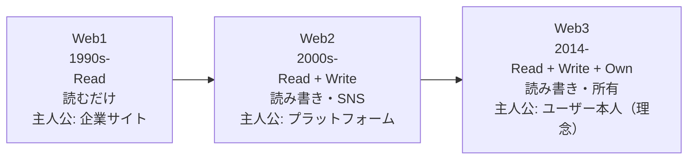
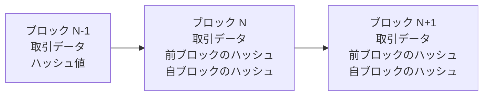
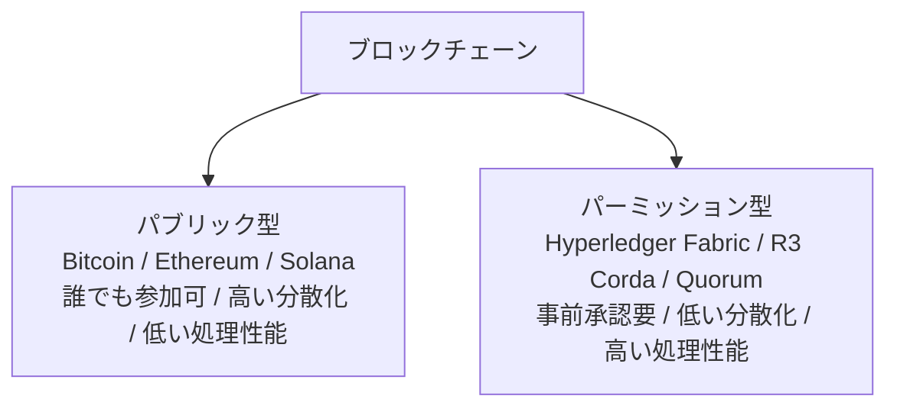
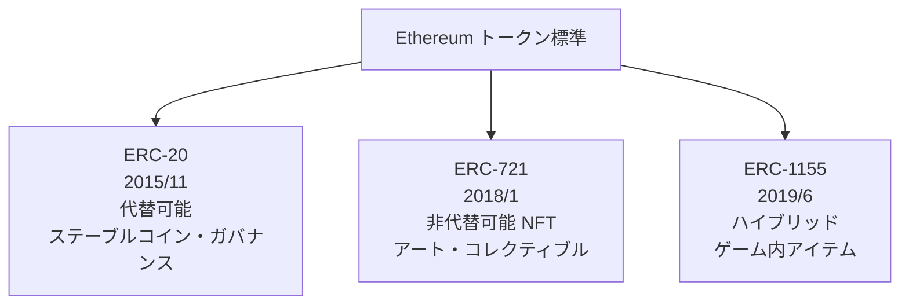
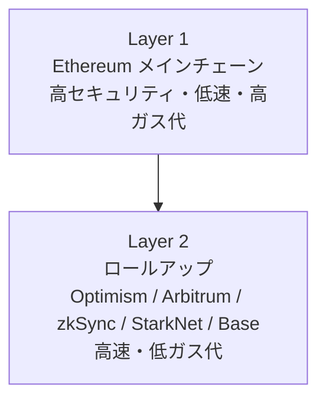
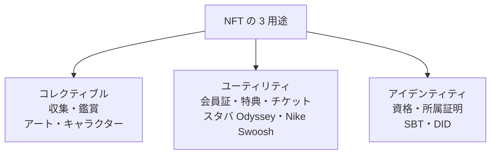
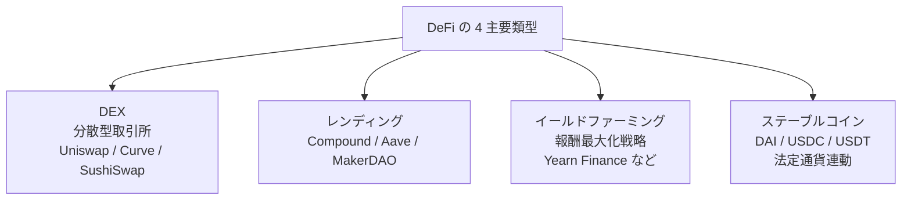
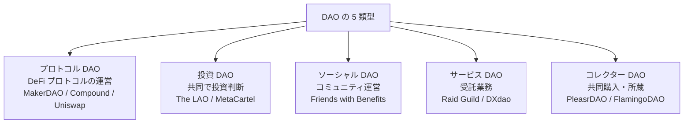
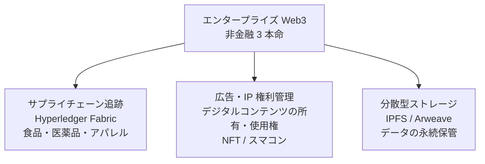

# Web3・ブロックチェーン入門

「所有権をコードに書く」思想を技術・法制度・非金融ユースケースの三軸で読み解く——2026 年 7 月時点のイーサリアム・DAO・DID・エンタープライズ活用・暗号資産税務まで体系化

| 項目 | 内容 |
|---|---|
| カテゴリー | 新しいIT・先端技術 |
| 難易度 | 中級 |
| 所要時間 | 約200分（全8レッスン） |
| 公開日 | 2026-07-09 |
| 最終更新日 | 2026-07-09 |
| コースURL | https://skillup.college/courses/emerging-tech/web3-blockchain-basics/ |

## 対象者

事業企画・法務・情シス・広報・DX 推進・スタートアップ経営者。Web3 プロジェクトの検討・導入判断・法務レビューを担う方、事業会社の Web3 検証チーム、ブロックチェーン系案件を担当する SIer・コンサル・広告代理店。

## 前提知識

インターネット・SaaS の基本用語（サーバー・API・データベース）を知っている、公開鍵暗号・ハッシュ関数の概念に触れたことがある程度が理想。未経験でも読み進められる。

## 学習目標

- Web1→Web2→Web3 の系譜と「所有権をコードに書く」思想を説明できる
- ブロックチェーンの技術構造（ブロック・ハッシュ・マークル木・コンセンサス）を仕組みで理解できる
- スマートコントラクト・EVM・Solidity・Layer 2 の位置関係を俯瞰できる
- 暗号資産の日本の法制度（資金決済法・金商法・税制）を実務で扱える
- NFT・GameFi の 3 用途とハイプ後の本質を判断できる
- DeFi の技術構造と落とし穴（rug pull・MEV・スマコン脆弱性）を語れる
- DAO と DID の実験的意義と法的位置づけを整理できる
- エンタープライズ Web3 と暗号資産税務の実務ポイントを把握する

## コース概要

Web3 は 2008 年 10 月の Bitcoin ホワイトペーパーから数えて 18 年、2013 年の Ethereum 提唱から 13 年、2014 年に Gavin Wood が「Web3」の語彙を提唱してから 12 年の歴史を持つ技術群です。2021 年の NFT ブームと 2022 年の暗号資産急落を経て、2026 年 7 月時点では期待値と実装のギャップが整理され、技術としての Web3 は着実に前進しています。本コースは、ブロックチェーンの基盤研究者ではなく、日本の事業会社で Web3 を「使う側」の意思決定者に向けた 8 レッスンです。既刊の業種別入門コースは金融サービスとしての DeFi・STO・CBDC・国内暗号資産交換業者を扱っています。本コースはそれと棲み分け、技術構造・エンタープライズ活用・非金融ユースケース・税務に軸足を置きます。「暗号資産と Web3 は同義ではない——技術と金融サービスは分けて考える」を背骨に、次の事業判断で使える判断軸を持ち帰っていただきます。

## 学習の流れ

前半 4 レッスンで「技術の骨格」を固めます。レッスン 1 で Web1→Web2→Web3 の系譜と守備範囲、レッスン 2 でブロックチェーンの技術構造、レッスン 3 でスマートコントラクトと EVM、レッスン 4 で暗号資産の日本の法制度と実務を扱います。中盤のレッスン 5 で NFT・GameFi、レッスン 6 で DeFi の技術構造と落とし穴を扱います。後半のレッスン 7 で DAO と DID の実験、レッスン 8 でエンタープライズ Web3 と暗号資産税務・修了後の学び方までを扱います。全 8 レッスン・約 200 分の構成です。

## レッスン一覧

| No. | タイトル | 概要 | 所要時間 |
|---|---|---|---|
| 1 | Web3 とは何か——Web1→Web2→Web3 の系譜 | 本コースの守備範囲、Gavin Wood 2014 年提唱、Read/Write/Own、Web1（読むだけ）→Web2（書く・SNS）→Web3（所有）の位置関係、脱プラットフォーム論、コース守備範囲・境界明示（既刊金融業入門コースとの棲み分け）を学ぶ | 25分 |
| 2 | ブロックチェーンの技術構造 | ブロック・ハッシュチェーン・マークル木、PoW/PoS/PoA コンセンサス、The Merge 2022/9/15、ノード種類、パブリック vs パーミッション型、Bitcoin と Ethereum の基本アーキテクチャの違いを学ぶ | 25分 |
| 3 | スマートコントラクトと EVM | Ethereum 2015/7、Solidity 概念、ERC-20/721/1155、ガス代の仕組み、Layer 2/ロールアップ（Optimism/Arbitrum）、EVM 互換チェーン（Polygon/Avalanche/BNB Chain）、代表的な脆弱性パターンを学ぶ | 25分 |
| 4 | 暗号資産——技術と規制の日本の実態 | 資金決済法上の暗号資産の位置、改正資金決済法（ステーブルコイン規制枠組み）2023/6、税務（雑所得・法人期末時価評価除外 2023 年度改正）、ホット/コールドウォレット、シードフレーズ、カストディの実務を学ぶ | 25分 |
| 5 | NFT・GameFi・Play-to-Earn | ERC-721 2018/1、OpenSea 2017 設立、2021 年 NFT ブーム、Axie Infinity と Play-to-Earn、日本の GameFi 規制（賭博罪・景表法との関係）、NFT の 3 用途（コレクティブル・ユーティリティ・アイデンティティ）を学ぶ | 25分 |
| 6 | DeFi とその落とし穴 | Uniswap V1 2018/11、DEX/AMM/レンディング/イールドファーミング、rug pull と資金流出、スマートコントラクト監査、MEV（Miner Extractable Value）、フラッシュローン攻撃、DeFi の技術的な仕組みと落とし穴を学ぶ | 25分 |
| 7 | DAO と DID——分散型組織と自己主権 ID | The DAO ハック 2016/6、MakerDAO、DAO の 5 類型（プロトコル DAO・投資 DAO・ソーシャル DAO・サービス DAO・コレクター DAO）、日本の合同会社型 DAO（LLC-DAO）金融庁ガイドライン 2023/4、DID/VC 標準（W3C DID Core 1.0）、SSI、Verifiable Credentials を学ぶ | 25分 |
| 8 | エンタープライズ Web3・暗号資産税務・修了後 | Hyperledger Fabric、商社サプライチェーン追跡、広告権利管理、IPFS の分散型ストレージ、暗号資産税務実務、Bitcoin ETF 2024/1、Ethereum ETF 2024/5、企業導入の判断軸と修了後の学び方を学ぶ | 25分 |

---

## レッスン1：Web3 とは何か——Web1→Web2→Web3 の系譜

（所要時間：25分）

### このレッスンで学ぶこと

- 本コースの守備範囲（技術構造とエンタープライズ活用・税務）と、扱わない範囲を区別できる
- Web1→Web2→Web3 の系譜と、それぞれの「主人公」の違いを整理できる
- Gavin Wood が 2014 年に提唱した Web3 の「Read/Write/Own」の意味を説明できる
- 「所有権をコードに書く」思想が Web3 の背骨であることを理解できる
- 暗号資産と Web3 の違いを、技術と金融サービスの分離で捉えられる

---

Web3 は 2014 年、Ethereum の共同設立者 Gavin Wood が提唱した用語です。「所有権をコードに書く」思想を中心に、ブロックチェーン、スマートコントラクト、DAO、DID、分散型ストレージなどの技術群を包括します。本コースの背骨は「暗号資産と Web3 は同義ではない——技術と金融サービスは分けて考える」です。ハイプと実装のずれを解消し、事業判断で使える判断軸を持ち帰っていただきます。

### 本コースの位置づけ——「技術構造とエンタープライズ活用・税務」の視点

本コースは Web3・ブロックチェーンを「技術構造とエンタープライズ活用・税務」の視点で扱う入門です。銀行・証券・保険での暗号資産・DeFi・CBDC・STO の金融サービス論点、国内暗号資産交換業者の紹介、Ripple による国際送金など、金融業の実務に近い論点は業種別入門コースで扱います。本コースはそれらを前提として、「事業会社として Web3 技術をどう検証し、どう法務対応し、どう非金融領域で活用するか」の判断軸を、事業企画・法務・情シス・広報・DX 推進・スタートアップ経営者の 6 職種に届く形で整理します。

> **💡 ポイント**
> 本コースは「金融サービスとしての DeFi」ではなく「技術としてのブロックチェーン」を主軸に置きます。銀行・証券・保険での暗号資産の位置づけを詳しく知りたい方は、業種別入門コースをご参照ください。本コースはその補完として、非金融ユースケース・DAO の実験・DID の思想・暗号資産税務の実務に軸足を置きます。

#### 対象読者の 3 つの視点

本コースは 3 つの視点を意識的に交錯させます。第 1 は、事業企画の視点です。Web3 で何ができるか、費用対効果はどこで出るか。第 2 は、法務・情シスの視点です。契約・規制・セキュリティのどこにリスクがあるか。第 3 は、スタートアップ経営者の視点です。Web3 発の事業機会をどう見極めるか。3 つの視点を持ち帰って、はじめて社内での議論が成立します。

### Web の 3 世代——Read / Write / Own

Web の歴史を「主人公」の違いで整理すると、3 つの世代に分けられます。

#### Web1（1990 年代〜）——「Read」

企業や組織が公開する静的な Web サイトを、ユーザーが「読む」時代。CNN、Yahoo!、企業ホームページなど、少数の発信者と多数の閲覧者が明確に分離していました。技術的には HTML と HTTP が中核で、双方向性は限定的でした。

#### Web2（2000 年代〜）——「Read + Write」

ユーザーが「書き込む」時代の始まり。ブログ、YouTube、Twitter、Facebook、Instagram など、SNS とプラットフォームが主人公になりました。ユーザーはコンテンツを作れるようになりましたが、そのコンテンツと個人データはプラットフォーム側に集中し、プラットフォームがルールを決める構造になりました。

#### Web3（2014 年〜）——「Read + Write + Own」

ユーザーが自分のデータ・アイデンティティ・資産を「所有」する時代を目指す思想。Gavin Wood が 2014 年に提唱した用語で、Read（読む）＋ Write（書く）に Own（所有する）が加わります。技術的にはブロックチェーンによる分散型台帳、スマートコントラクトによる契約の自動執行、DAO による組織の自動運営、DID による自己主権 ID などが中核です。

> **📝 補足**
> Web3 は「Web2 を置き換える」というより「Web2 の上に新しいレイヤーを加える」性質を持ちます。多くのユーザーは Web2 の便利さ（SNS、EC、動画配信）を手放さないため、Web3 は当面「Web2 と共存する形で拡張される」道が現実的です。「すべてが Web3 化する」ではなく「Web3 で置き換える価値がある部分は何か」を問う視点が実務では重要です。

### 「所有権をコードに書く」——Web3 の背骨

Web3 の背骨は「所有権をコードに書く」思想です。従来、モノやサービスの所有権は法律と契約書、そして事業者の記録によって担保されていました。Web3 では、所有権をコード（スマートコントラクト）とブロックチェーン上のトークンで表現し、事業者やプラットフォームに依存せずに所有権の証明・移転ができる仕組みを目指します。

具体例として、NFT を挙げます。従来のデジタルコンテンツは、購入しても実際にはプラットフォームのライセンス（限定的な使用権）にすぎず、プラットフォームが停止すればアクセスできなくなります。NFT は「このデジタルアセットの所有権が今このアドレスにある」ことをブロックチェーンに記録するため、プラットフォームの停止に耐えられる（理論上は）所有権表現になります。

ただし、この「所有権をコードに書く」思想は 2026 年 7 月時点でも法的裏付けが不完全です。NFT を購入しても、法的な意味での所有権が完全に保証されるわけではなく、多くの場合は利用契約に基づくライセンスと組み合わされます。「思想としての Web3」と「法制度としての現状」のギャップを理解した上で導入判断をすることが実務では不可欠です。

### Gavin Wood と 2014 年の Web3 提唱

Gavin Wood（1980 年生まれ）は、Ethereum の共同設立者の 1 人で、2014 年に「Insights into a Modern World」というブログ記事で「Web3」を提唱しました。同記事で Wood は、現在の Web を「情報格差と権力集中」の場と批判し、次世代 Web の要件として次の 4 点を挙げました。

1. **信頼できるサーバーを必要としない**（Trustless）
2. **開放的で透明である**（Transparent）
3. **暗号技術で個人データを守る**（Encrypted）
4. **国境と規制を横断する**（Peer-to-Peer）

Wood はその後 2015 年に Ethereum の Yellow Paper（技術仕様書）を執筆し、2016 年に Web3 Foundation を設立、2020 年に Polkadot を立ち上げました。Web3 という語彙の思想的な発信源は Wood にあり、彼の主張を辿ることが本コースの補助線になります。

### 暗号資産と Web3 は同義ではない

日本の一般的な報道では「Web3 ＝ 暗号資産の話」と扱われがちですが、これは正確ではありません。

- **暗号資産**：Bitcoin、Ethereum などのブロックチェーン上のトークン
- **Web3**：ブロックチェーン、スマートコントラクト、DAO、DID、分散型ストレージなどの技術と思想を包括する概念

暗号資産は Web3 の一部ですが、Web3 全体ではありません。逆に、暗号資産取引所のような Web2 型のサービスも、暗号資産を扱いつつ Web3 の思想（分散化・自己所有）とは対極の中央集権的な構造をしています。この区別ができないと、「暗号資産の価格が下がった＝ Web3 が終わった」という誤読につながります。実際には 2022 年の暗号資産急落後も、DID・分散型ストレージ・エンタープライズ Web3 の実装は着実に進んでいます。

> **⚠️ 注意**
> 本コースを読む上で、「暗号資産の価格の話」と「ブロックチェーン技術の話」を区別してください。Bitcoin の価格が上がった／下がったは、本コースの主題ではありません。技術としてのブロックチェーン、思想としての Web3、実装としての DAO・DID・エンタープライズ活用——これらが本コースの中心です。

### 確認クイズ

理解の定着のために、6 問のクイズを解いてみてください。

#### Q1. 「Web3」という語彙を 2014 年に提唱した人物は誰ですか？

- [ ] Vitalik Buterin
- [x] Gavin Wood
- [ ] Satoshi Nakamoto
- [ ] Marc Andreessen

> **解説**
> Gavin Wood（1980 年生まれ）は Ethereum の共同設立者の 1 人で、2014 年にブログ記事「Insights into a Modern World」で「Web3」の語彙を提唱しました。Ethereum の Yellow Paper（技術仕様書）も執筆し、2016 年に Web3 Foundation 設立、2020 年に Polkadot を立ち上げました。Vitalik Buterin は Ethereum ホワイトペーパー著者、Satoshi Nakamoto は Bitcoin ホワイトペーパー著者、Marc Andreessen は Netscape 共同創業者・a16z 創業パートナーです。

#### Q2. Web1・Web2・Web3 の主な特徴として本コースの内容と一致するものはどれですか？

- [x] Web1 は Read、Web2 は Read + Write、Web3 は Read + Write + Own
- [ ] Web1 は SNS、Web2 はブログ、Web3 は暗号資産
- [ ] Web1 は 2000 年代、Web2 は 2010 年代、Web3 は 2020 年代
- [ ] Web1 はモバイル、Web2 は PC、Web3 は VR

> **解説**
> Web の 3 世代は主人公と関与形態で整理するとわかりやすくなります。Web1（1990s〜）は「Read」で、企業サイトを読むだけの時代。Web2（2000s〜）は「Read + Write」で、ブログ・YouTube・SNS でユーザーが書き込む時代。Web3（2014〜）は「Read + Write + Own」で、ユーザーが自分のデータ・アイデンティティ・資産を所有する思想です。

#### Q3. 「所有権をコードに書く」思想の実装例として本コースの内容と一致するものはどれですか？

- [ ] クラウド SaaS のサブスクリプション契約
- [ ] スマホアプリのストア審査
- [x] NFT による「このデジタルアセットの所有権が今このアドレスにある」ことをブロックチェーンに記録
- [ ] Web ブラウザの Cookie による個人識別

> **解説**
> 「所有権をコードに書く」思想の代表的な実装例が NFT（Non-Fungible Token）です。従来のデジタルコンテンツは購入してもプラットフォームのライセンスにすぎず、プラットフォームが停止すればアクセスできなくなります。NFT は「このデジタルアセットの所有権が今このアドレスにある」ことをブロックチェーンに記録するため、プラットフォームの停止に耐えられる（理論上は）所有権表現になります。ただし法的裏付けは 2026 年 7 月時点でも不完全です。

#### Q4. Gavin Wood が 2014 年の Web3 提唱で挙げた次世代 Web の要件として正しくないものはどれですか？

- [ ] 信頼できるサーバーを必要としない（Trustless）
- [ ] 開放的で透明である（Transparent）
- [ ] 暗号技術で個人データを守る（Encrypted）
- [x] 特定企業が独占的にプラットフォームを提供する

> **解説**
> Gavin Wood の Web3 提唱では、①信頼できるサーバーを必要としない（Trustless）、②開放的で透明である（Transparent）、③暗号技術で個人データを守る（Encrypted）、④国境と規制を横断する（Peer-to-Peer）——の 4 要件が挙げられました。「特定企業が独占的にプラットフォームを提供する」は Web2 の批判対象で、Web3 が乗り越えようとする構造です。

#### Q5. 「暗号資産と Web3 は同義ではない」の意味として本コースの内容と一致するものはどれですか？

- [ ] 暗号資産は Web3 ではないため、無視してよい
- [ ] 暗号資産と Web3 は完全に無関係な別分野である
- [x] 暗号資産は Web3 の一部だが、Web3 は DID・分散型ストレージ・DAO などを含むより広い概念である
- [ ] 暗号資産が終われば Web3 も終わる

> **解説**
> 暗号資産は Web3 の一部ですが、Web3 全体ではありません。Web3 はブロックチェーン、スマートコントラクト、DAO、DID、分散型ストレージなどの技術と思想を包括する概念で、暗号資産はその中の一要素です。「暗号資産の価格が下がった＝ Web3 が終わった」という誤読は、この区別ができないと生じます。2022 年の暗号資産急落後も、DID・分散型ストレージ・エンタープライズ Web3 の実装は着実に進んでいます。

#### Q6. 本コースの守備範囲として本コースの内容と一致するものはどれですか？

- [ ] 銀行・証券・保険での CBDC・STO・国内交換業者の金融サービス実務
- [ ] 暗号資産の価格予測とトレーディング戦略
- [x] 技術構造・エンタープライズ活用・非金融ユースケース・税務
- [ ] Ethereum のスマートコントラクトを自分で書くための Solidity プログラミング演習

> **解説**
> 本コースは Web3・ブロックチェーンを「技術構造とエンタープライズ活用・税務」の視点で扱う入門です。銀行・証券・保険での金融サービス論点（CBDC・STO・国内交換業者・DeFi 金融サービス）は業種別入門コースの領域として棲み分け、価格予測や Solidity 演習も本コースの主眼ではありません。「事業会社として Web3 技術をどう検証し、どう法務対応し、どう非金融領域で活用するか」の判断軸が主題です。

### まとめ

このレッスンでは、Web3 の全体像を「技術構造とエンタープライズ活用・税務」の視点で捉え直しました。要点は 3 つです。第 1 に、Web3 は 2014 年に Gavin Wood が提唱した用語で、「Read + Write + Own」の Own を追加する思想です。第 2 に、「所有権をコードに書く」思想が背骨で、NFT はその実装例ですが法的裏付けは不完全です。第 3 に、暗号資産と Web3 は同義ではなく、価格の動きと技術の進展は分けて捉える必要があります。次のレッスンから、ブロックチェーンの技術構造を掘り下げていきます。

---

## レッスン2：ブロックチェーンの技術構造

（所要時間：25分）

### このレッスンで学ぶこと

- ブロックチェーンの基本構造（ブロック・ハッシュチェーン・マークル木）を理解できる
- PoW / PoS / PoA コンセンサスの違いと使い分けを説明できる
- The Merge（2022 年 9 月 15 日）が Ethereum に何をもたらしたかを語れる
- ノードの種類とその役割を整理できる
- パブリック型とパーミッション型の違いと使い分けを判断できる

---

前のレッスンでは、Web3 の全体像と 3 世代の位置関係を扱いました。このレッスンでは、Web3 の技術的な土台となるブロックチェーンを、内部構造の視点で掘り下げます。

### ブロックチェーンの基本構造

ブロックチェーンは名前の通り「ブロック」を「チェーン」でつないだデータ構造です。各ブロックには複数の取引（トランザクション）が入り、ブロックとブロックはハッシュ値でつながっています。

#### ハッシュチェーン

各ブロックには前のブロックのハッシュ値（暗号学的な指紋）が含まれます。過去のブロックの内容が 1 文字でも改ざんされると、そのブロックのハッシュ値が変わり、次のブロックが指し示す前ブロックのハッシュとの整合性が破れます。これが「改ざん耐性」の中核仕組みです。

#### マークル木

1 ブロック内の複数の取引を効率的に管理するため、マークル木（Merkle Tree）というデータ構造が使われます。取引をペアでハッシュ化し、そのハッシュをまたペアでハッシュ化し、最終的にマークル・ルートと呼ばれる 1 つのハッシュ値に集約します。マークル・ルートを検証するだけで、大量の取引の改ざんを検出できます。

#### 分散型台帳

ブロックチェーンの本質は「多数のノードで同じデータを共有し、変更にコンセンサスが必要な台帳」です。従来のデータベースは 1 つの管理主体が更新権限を持ちますが、ブロックチェーンでは複数のノードが協調して合意形成し、その結果を全ノードで共有します。

> **💡 ポイント**
> **中核メッセージ 2「ブロックチェーンは信頼を最小化する台帳——コストと引き換えに不変性を得る」**——ブロックチェーンは高速でも安価でもなく、通常のデータベースより処理性能はずっと低いことが多いです。それでも使う理由は「単一の信頼できる管理者を必要としない」ことにあり、この特性を必要としない用途では通常のデータベースの方が適しています。

### コンセンサス方式——PoW / PoS / PoA

複数のノードで合意形成するために、さまざまなコンセンサス方式が使われます。3 つの主要方式を押さえます。

#### PoW（Proof of Work、計算量で証明）

Bitcoin が採用する方式。ノードが計算問題を解いた「証拠」を提示することで、新しいブロックを追加する権利を得ます。強力な暗号学的裏付けがあり、Bitcoin は 2009 年から 17 年間、実質的に破られていません。ただし、大量の電力を消費することが批判の対象です。

#### PoS（Proof of Stake、保有量で証明）

Ethereum が 2022 年 9 月に採用した方式。ノードが暗号資産をステーキング（保有・預け入れ）することで、新しいブロックを追加する権利を得ます。PoW と比べて消費電力を 99% 削減しますが、「持てる者が持てる者になる」という批判もあります。

#### PoA（Proof of Authority、権威で証明）

限定された信頼できるノードだけがブロックを追加できる方式。企業間のパーミッション型ブロックチェーンで採用されます。高速でエネルギー効率が良い一方、分散化の度合いは低く、パブリック型より中央集権的です。

### The Merge——Ethereum の PoW から PoS への移行

Ethereum は 2022 年 9 月 15 日に「The Merge」と呼ばれる大規模アップグレードを実行し、PoW から PoS に移行しました。これは複数年にわたる準備の結果で、消費電力を約 99.95% 削減したと報告されています。The Merge 以降、Ethereum は環境負荷の観点で PoS の代表例として引用されるようになりました。

#### The Merge の意味

- **環境**：Ethereum の年間消費電力が中規模国家並みから小規模企業並みに縮小
- **技術**：Beacon Chain（2020 年 12 月開始）と本体チェーンの統合
- **経済**：ETH の発行量が大幅減少（結果的にデフレ的圧力）
- **業界標準**：主要なパブリックブロックチェーンで PoS が事実上の標準に

### ノードの種類

ブロックチェーンネットワークには複数の種類のノードが参加します。

- **フルノード**：ブロックチェーンの全履歴を保持し、すべての取引を検証する
- **ライトノード（SPV ノード）**：ブロックヘッダのみを保持し、必要な取引を検証する
- **マイニングノード（PoW）／バリデーターノード（PoS）**：新しいブロックを追加する権利を持つ
- **アーカイブノード**：フルノードに加えて、すべての中間状態も保持する

企業がブロックチェーンを利用する場合、多くはフルノードやアーカイブノードを直接運用せず、Infura や Alchemy のようなノードサービスプロバイダを経由します。

### パブリック型 vs パーミッション型

ブロックチェーンは、参加の開放度で 2 つに分類できます。

#### パブリック型（Public Blockchain）

誰でも参加でき、ノード運用・トークン保有・取引実行が可能。Bitcoin、Ethereum、Solana、Polygon などが代表例。分散化・検閲耐性が高い一方、処理性能に上限があり、参加者の匿名性からコンプライアンス対応が難しい場面もあります。

#### パーミッション型（Permissioned Blockchain）

参加者を事前に承認する必要があるブロックチェーン。Hyperledger Fabric、R3 Corda、Quorum などが代表例。企業間コンソーシアム、サプライチェーン追跡、金融機関間決済で使われます。処理性能が高く、参加者の身元が明確なためコンプライアンス対応も容易です。分散化の度合いはパブリック型より低いです。

> **📝 補足**
> 企業導入では「パブリック型を使うか、パーミッション型を使うか」の判断が最初の分岐点になります。分散化・検閲耐性を重視するならパブリック型、処理性能・コンプライアンス対応を重視するならパーミッション型。金融規制への対応が必要な用途では、パーミッション型が現実解になる場面が多くあります。

### 次のレッスンの予告

次のレッスンでは、ブロックチェーンの上でプログラムを動かす仕組み——スマートコントラクトと EVM を扱います。Ethereum 2015 年ローンチ、Solidity の概念、ERC-20 / 721 / 1155 のトークン標準、ガス代の仕組み、Layer 2 とロールアップ、EVM 互換チェーン——を、非技術系の読者にも通じる言葉で解きます。

### 確認クイズ

理解の定着のために、6 問のクイズを解いてみてください。

#### Q1. ブロックチェーンの「改ざん耐性」の中核仕組みとして本コースの内容と一致するものはどれですか？

- [x] 各ブロックが前のブロックのハッシュ値を含み、過去の改ざんが次ブロックとの整合性を破ることで検出できる
- [ ] 中央管理者が改ざんを常時監視している
- [ ] 全ノードに毎秒バックアップを取っている
- [ ] 暗号資産を担保にしないと取引ができない

> **解説**
> 各ブロックには前のブロックのハッシュ値（暗号学的な指紋）が含まれ、過去のブロックの内容が 1 文字でも改ざんされるとハッシュ値が変わり、次のブロックが指し示す前ブロックのハッシュとの整合性が破れます。これが「改ざん耐性」の中核仕組みです。中央管理者を必要としない設計が、ブロックチェーンの本質的な特徴です。

#### Q2. マークル木（Merkle Tree）の主な役割として本コースの内容と一致するものはどれですか？

- [ ] ブロック追加の権利を決めるコンセンサス方式
- [x] 1 ブロック内の複数の取引を効率的に管理し、マークル・ルートで大量取引の改ざんを検出する
- [ ] ノード間の通信プロトコル
- [ ] 暗号資産の価格を決めるアルゴリズム

> **解説**
> マークル木は 1 ブロック内の複数の取引を効率的に管理するデータ構造です。取引をペアでハッシュ化し、そのハッシュをまたペアでハッシュ化し、最終的にマークル・ルートと呼ばれる 1 つのハッシュ値に集約します。マークル・ルートを検証するだけで大量の取引の改ざんを検出できるため、ライトノードでの取引検証などで使われます。

#### Q3. PoW（Proof of Work）と PoS（Proof of Stake）の主な違いとして本コースの内容と一致しないものはどれですか？

- [ ] PoW は計算量で証明し、PoS は保有量で証明する
- [ ] Bitcoin は PoW、Ethereum は PoS を採用している
- [ ] PoS は PoW と比べて消費電力を大幅に削減できる
- [x] PoS は分散化の度合いがパーミッション型より低い

> **解説**
> PoW と PoS はいずれもパブリック型ブロックチェーンで使われるコンセンサス方式で、パーミッション型より分散化の度合いが高いのが基本です。PoW は計算量で証明し（Bitcoin）、PoS は保有量で証明します（Ethereum）。PoS は PoW と比べて消費電力を約 99% 削減しますが、「持てる者が持てる者になる」という批判もあります。「PoS はパーミッション型より低い分散化」は誤り。

#### Q4. Ethereum の The Merge が実行された日付として正しいものはどれですか？

- [ ] 2020 年 12 月 1 日
- [ ] 2021 年 10 月 28 日
- [ ] 2023 年 4 月 12 日
- [x] 2022 年 9 月 15 日

> **解説**
> The Merge は Ethereum が PoW から PoS に移行する大規模アップグレードで、2022 年 9 月 15 日に実行されました。消費電力を約 99.95% 削減したと報告されています。2020 年 12 月 1 日は Beacon Chain の開始日、2021 年 10 月 28 日は Facebook Meta 改名、2023 年 4 月 12 日は上海アップグレード（ステーキング資金の引き出し可能化）です。

#### Q5. パーミッション型ブロックチェーンの代表例として正しくないものはどれですか？

- [ ] Hyperledger Fabric
- [x] Bitcoin
- [ ] R3 Corda
- [ ] Quorum

> **解説**
> Bitcoin は最も代表的なパブリック型ブロックチェーンで、誰でも参加できます。パーミッション型ブロックチェーンの代表例は、Hyperledger Fabric（Linux Foundation が主導する企業向け）、R3 Corda（金融機関向け）、Quorum（JPMorgan が開発し ConsenSys が買収）などです。パーミッション型は企業間コンソーシアム、サプライチェーン追跡、金融機関間決済で使われます。

#### Q6. パブリック型とパーミッション型の使い分けで、企業導入の判断軸として本コースの内容と一致するものはどれですか？

- [ ] パブリック型は必ずパーミッション型より優れている
- [ ] パーミッション型は必ずパブリック型より優れている
- [x] 分散化・検閲耐性を重視するならパブリック型、処理性能・コンプライアンス対応を重視するならパーミッション型
- [ ] 両者は技術的に同一で選択の意味はない

> **解説**
> パブリック型とパーミッション型はトレードオフの関係にあります。分散化・検閲耐性が価値の中心ならパブリック型、処理性能・コンプライアンス対応が価値の中心ならパーミッション型を選ぶのが定石です。金融規制への対応が必要な用途では、パーミッション型が現実解になる場面が多くあります。どちらが優れるかではなく、目的で使い分ける発想が実務では重要です。

### まとめ

このレッスンでは、ブロックチェーンの技術構造を、ハッシュチェーン・マークル木・分散型台帳・コンセンサス方式・ノード種類・パブリック vs パーミッション型の観点で整理しました。要点は 3 つです。第 1 に、ブロックチェーンは「多数のノードで合意形成しつつ改ざん耐性を持つ台帳」で、単一の管理者を必要としないことが本質です。第 2 に、Ethereum の The Merge（2022 年 9 月 15 日）で PoS が事実上の業界標準になり、消費電力の課題は大幅に軽減されました。第 3 に、企業導入ではパブリック型 vs パーミッション型の使い分けが最初の判断軸になります。次のレッスンでは、ブロックチェーンの上でプログラムを動かすスマートコントラクトと EVM を扱います。

---

## レッスン3：スマートコントラクトと EVM

（所要時間：25分）

### このレッスンで学ぶこと

- スマートコントラクトの概念と、通常のプログラムとの違いを説明できる
- Ethereum・EVM・Solidity の位置関係を整理できる
- ERC-20 / ERC-721 / ERC-1155 の 3 大トークン標準を区別できる
- ガス代の仕組みと、なぜ発生するかを理解できる
- Layer 2 とロールアップの必要性、Optimism / Arbitrum などの位置づけを俯瞰できる

---

前のレッスンでは、ブロックチェーンの技術構造を扱いました。このレッスンでは、その上でプログラムを動かす仕組み——スマートコントラクトと EVM を扱います。

### スマートコントラクトとは何か

スマートコントラクトは、ブロックチェーン上で自動実行されるプログラムです。1994 年に Nick Szabo が概念を提唱し、2015 年に Ethereum が世界初の汎用的なスマートコントラクト実行環境を実装しました。

- **契約の自動執行**：条件が満たされたときに自動的に処理が実行される
- **改ざん耐性**：一度デプロイされたコードは通常、変更できない
- **透明性**：コードは公開され、誰でも検証できる
- **信頼の最小化**：仲介者なしに契約が実行される

例えば「A が B に 1 ETH を送金する」というだけでなく、「A が今日中に本を書き上げたら、預けてある 1 ETH を A に自動送金する」「投票で 60% の賛成があったら、資金を X 社に送金する」といった条件付きの処理を、仲介者なしに実行できます。

### Ethereum と EVM

Ethereum は 2013 年 11 月に Vitalik Buterin がホワイトペーパーを公開し、2015 年 7 月 30 日にメインネットが立ち上がったブロックチェーンです。Bitcoin が「送金だけ」に焦点を絞ったのに対し、Ethereum は「任意の計算」を実行できる汎用プラットフォームを目指しました。

その中核が EVM（Ethereum Virtual Machine、イーサリアム仮想マシン）です。EVM は Ethereum ネットワーク上で稼働する仮想マシンで、スマートコントラクトのコードを実行します。JVM（Java Virtual Machine）のブロックチェーン版と考えると理解しやすいでしょう。

#### Solidity——EVM のプログラミング言語

Solidity は Ethereum のスマートコントラクト開発で最も使われるプログラミング言語で、Gavin Wood らが 2014 年に設計しました。JavaScript や C++ に似た構文を持ち、コンパイルすると EVM 上で動作するバイトコードになります。ほかの EVM 対応言語として Vyper（Python 風）、Yul（低レベル）などもありますが、Solidity が事実上の標準です。

### ERC-20 / ERC-721 / ERC-1155——3 大トークン標準

Ethereum の上で発行されるトークンには、目的に応じた標準規格があります。3 つの主要標準を押さえます。

#### ERC-20（2015 年 11 月）——代替可能トークン

「1 単位が別の 1 単位と等価な」代替可能トークン（Fungible Token）の標準。ステーブルコイン USDC / USDT、ガバナンストークン UNI、ユーティリティトークンなど、暗号資産の大半が ERC-20 です。ERC-20 の登場が、Ethereum を「トークン発行プラットフォーム」として広く使われる契機になりました。

#### ERC-721（2018 年 1 月）——非代替可能トークン（NFT）

「各単位が唯一無二」の非代替可能トークン（Non-Fungible Token）の標準。デジタルアート、コレクティブル、ゲーム内アイテムなどで使われます。CryptoKitties（2017 年 11 月）が ERC-721 の原型を作り、後の NFT ブームの基盤になりました。

#### ERC-1155（2019 年 6 月）——半代替可能トークン

代替可能と非代替可能の両方を扱えるハイブリッド標準。ゲーム開発で「金貨（代替可能）と唯一の武器（非代替可能）を 1 つのコントラクトで扱う」といった用途に向きます。Enjin が提唱しました。

### ガス代——なぜ料金が発生するのか

Ethereum でスマートコントラクトを実行するには「ガス代」を支払う必要があります。ガス代はネットワーク維持のインセンティブで、以下の仕組みで機能します。

- **計算量に応じた料金**：複雑な処理ほど多くのガスを消費する
- **需要と供給で変動**：ネットワークが混雑すると単価が上がる
- **ETH で支払う**：ガス代は ETH（イーサリアムのネイティブトークン）で支払う
- **バリデーターへの報酬**：新しいブロックを追加するバリデーターへの報酬になる

ガス代は「スパム攻撃を防ぐ経済的コスト」の役割も果たします。1 回の実行に料金がかかるため、無意味に大量のトランザクションを送ることが経済的に難しくなります。ただしガス代の高騰は Ethereum の普及の大きな障害でもあり、これを解決するのが Layer 2 の役割です。

### Layer 2 とロールアップ

Ethereum メインチェーン（Layer 1、L1）の処理性能には上限があり、混雑時にはガス代が高騰します。この問題を解決するために、Layer 2（L2）と呼ばれる補助レイヤーが発展しました。

#### ロールアップの基本発想

L2 でトランザクションをまとめて処理し、その結果だけを L1 に記録します。「1 台のバスに 50 人が乗って移動する」ように、多数のトランザクションを 1 つにまとめることで、L1 の処理性能を大幅に拡張します。

#### 主要 Layer 2

- **Optimism**（Optimistic Rollup、2021 年 12 月）：楽観的にロールアップし、異議申立て期間で正当性を担保
- **Arbitrum**（Optimistic Rollup、2021 年 8 月）：Optimism と競合する主要 L2
- **zkSync**（ZK Rollup）：ゼロ知識証明で即座に正当性を証明
- **StarkNet**（ZK Rollup）：ゼロ知識証明の高性能版
- **Base**（Coinbase の Optimism ベース、2023 年）：Coinbase が運営する L2

#### EVM 互換チェーン

Ethereum とは別の独立したブロックチェーンで、EVM と互換性を持つものが「EVM 互換チェーン」です。Polygon、Avalanche、BNB Chain、Fantom などが代表例で、Solidity で書いたスマートコントラクトをほぼそのまま動かせます。処理性能とガス代のトレードオフで、Ethereum メインネットより高速・安価な代わりに、分散化の度合いや透明性が異なります。

### スマートコントラクトの脆弱性——実装の落とし穴

スマートコントラクトは一度デプロイすると変更できないため、実装のバグが致命的な損失に直結します。代表的な脆弱性パターンを 5 つ紹介します。

1. **再入攻撃（Reentrancy）**：関数の途中で外部呼び出しが行われ、同じ関数が再帰的に呼び出される脆弱性。2016 年 The DAO ハックの原因
2. **オーバーフロー / アンダーフロー**：整数演算の桁あふれで、意図しない値が生成される（Solidity 0.8 以降は言語レベルで対策）
3. **フロントランニング**：他人の未処理トランザクションを見て、自分の取引を先に処理する
4. **アクセス制御ミス**：管理者機能に誰でもアクセスできてしまう設定ミス
5. **フロー制御の欠陥**：意図しない状態遷移で資金が凍結される

スマートコントラクトのセキュリティは、通常のソフトウェアより桁違いに厳しく審査する必要があり、大手プロジェクトは複数のセキュリティ監査会社（CertiK、Trail of Bits、OpenZeppelin、ConsenSys Diligence など）に依頼するのが慣例です。

> **⚠️ 注意**
> スマートコントラクトのバグは、Web2 のバグと違って「後から直す」ことが非常に困難です。デプロイ前に監査を受けることが業界の常識であり、企業導入では監査コスト（1 プロジェクトあたり数百万〜数千万円）を必ず予算化してください。

### 次のレッスンの予告

次のレッスンでは、暗号資産を「技術と規制の日本の実態」から扱います。資金決済法上の暗号資産の位置、改正資金決済法（ステーブルコイン規制枠組み）2023 年 6 月、税務（雑所得・法人期末時価評価除外 2023 年度改正）、ホット / コールドウォレット、シードフレーズ、カストディの実務——を、日本の事業会社が知っておくべき論点として整理します。

### 確認クイズ

理解の定着のために、6 問のクイズを解いてみてください。

#### Q1. スマートコントラクトの特徴として本コースの内容と一致しないものはどれですか？

- [ ] ブロックチェーン上で自動実行されるプログラム
- [ ] 一度デプロイされたコードは通常、変更できない
- [ ] 仲介者なしに契約が実行される
- [x] 中央管理者が随時ロジックを変更できる

> **解説**
> スマートコントラクトは、①ブロックチェーン上で自動実行されるプログラム、②改ざん耐性（一度デプロイしたコードは通常変更できない）、③透明性（コードは公開され誰でも検証できる）、④信頼の最小化（仲介者なしに契約が実行される）——の 4 特徴を持ちます。「中央管理者が随時ロジックを変更できる」は Web2 サーバー型サービスの特徴で、スマートコントラクトはこれと対極の設計です。

#### Q2. Ethereum のメインネットが立ち上がった年月として正しいものはどれですか？

- [x] 2015 年 7 月
- [ ] 2013 年 11 月
- [ ] 2016 年 6 月
- [ ] 2022 年 9 月

> **解説**
> Ethereum は 2013 年 11 月に Vitalik Buterin がホワイトペーパーを公開し、2015 年 7 月 30 日にメインネットが立ち上がりました。2016 年 6 月は The DAO ハック、2022 年 9 月は The Merge（PoW から PoS への移行）です。

#### Q3. ERC-20 と ERC-721 の違いとして本コースの内容と一致するものはどれですか？

- [ ] ERC-20 は 2020 年、ERC-721 は 2021 年に規格化された
- [x] ERC-20 は「1 単位が別の 1 単位と等価な」代替可能トークン、ERC-721 は「各単位が唯一無二」の非代替可能トークン
- [ ] ERC-20 は Ethereum、ERC-721 は Bitcoin の規格
- [ ] ERC-20 と ERC-721 は同じ規格の別名

> **解説**
> ERC-20（2015 年 11 月）は「代替可能トークン」（Fungible Token）の標準で、ステーブルコイン USDC / USDT、ガバナンストークン UNI などが該当します。ERC-721（2018 年 1 月）は「非代替可能トークン」（Non-Fungible Token、NFT）の標準で、デジタルアート、コレクティブル、ゲーム内アイテムなどで使われます。両方とも Ethereum の規格で、Bitcoin には ERC 規格はありません。

#### Q4. ガス代の役割として本コースの内容と一致しないものはどれですか？

- [ ] 計算量に応じた料金でネットワーク維持のインセンティブになる
- [ ] スパム攻撃を防ぐ経済的コストの役割を果たす
- [ ] ネットワークが混雑すると単価が上がる
- [x] ガス代は各ノードの管理者に支払われる固定料金

> **解説**
> ガス代は Ethereum のネットワーク維持のインセンティブで、①計算量に応じた料金、②需要と供給で変動、③ETH で支払う、④バリデーターへの報酬——という仕組みで機能します。「各ノードの管理者に支払われる固定料金」ではなく「実際にブロックを追加するバリデーターへの変動報酬」です。ガス代はスパム攻撃を防ぐ経済的コストの役割も果たします。

#### Q5. Layer 2 の役割として本コースの内容と一致するものはどれですか？

- [ ] Ethereum に代わる別のブロックチェーンを提供する
- [ ] スマートコントラクトのバグを自動修正する
- [x] トランザクションをまとめて処理し、その結果だけを Layer 1 に記録することで処理性能を拡張する
- [ ] 暗号資産の価格を安定化させる

> **解説**
> Layer 2 は Ethereum メインチェーン（Layer 1）の処理性能上限を補うための補助レイヤーです。多数のトランザクションを L2 でまとめて処理し、その結果だけを L1 に記録することで、処理性能を大幅に拡張します。「1 台のバスに 50 人が乗って移動する」ような発想です。Optimism、Arbitrum、zkSync、StarkNet、Base などが代表例です。

#### Q6. スマートコントラクトの代表的な脆弱性として本コースの内容と一致しないものはどれですか？

- [ ] 再入攻撃（Reentrancy）——2016 年 The DAO ハックの原因
- [x] SQL インジェクション——データベースクエリに悪意ある文字列を注入する攻撃
- [ ] フロントランニング——他人の未処理トランザクションを見て自分の取引を先に処理する
- [ ] アクセス制御ミス——管理者機能に誰でもアクセスできてしまう設定ミス

> **解説**
> スマートコントラクトの代表的な脆弱性は、①再入攻撃、②オーバーフロー / アンダーフロー、③フロントランニング、④アクセス制御ミス、⑤フロー制御の欠陥——などです。SQL インジェクションは Web アプリケーションの脆弱性で、スマートコントラクトには通常データベースクエリは存在しないため該当しません。ただし、Web2 側のフロントエンドで SQL インジェクションが発生する可能性は別途あります。

### まとめ

このレッスンでは、スマートコントラクトと EVM の全体像を、Ethereum・Solidity・ERC 標準・ガス代・Layer 2・脆弱性の観点で整理しました。要点は 3 つです。第 1 に、スマートコントラクトは「契約の自動執行」を可能にする仕組みで、Ethereum の EVM が事実上の標準実行環境です。第 2 に、ERC-20 / 721 / 1155 の 3 大トークン標準がトークンエコシステムの基盤で、Ethereum の普及を支えました。第 3 に、Layer 2 とロールアップが処理性能上限問題の主な解決策で、Optimism・Arbitrum などが実用段階に入っています。次のレッスンでは、暗号資産の日本の法制度と実務を扱います。

---

## レッスン4：暗号資産——技術と規制の日本の実態

（所要時間：25分）

### このレッスンで学ぶこと

- 資金決済法上の「暗号資産」の位置づけを理解できる
- 改正資金決済法（ステーブルコイン規制枠組み）2023 年 6 月施行の要点を整理できる
- 暗号資産の税務（個人：雑所得／法人：2023 年度改正の期末時価評価除外）を説明できる
- ホット / コールドウォレットの違いと使い分けを判断できる
- シードフレーズ・カストディの実務ポイントを語れる

---

前のレッスンでは、スマートコントラクトと EVM の技術構造を扱いました。このレッスンでは、実際に暗号資産を保有・利用する上で不可欠な、日本の法制度と実務を整理します。既刊の業種別入門コースは金融業の視点で暗号資産・DeFi・CBDC を詳述しています。本コースはそれと棲み分け、事業会社の実務家が知っておくべき技術と規制のバランスに軸足を置きます。

### 資金決済法上の暗号資産の位置

日本の暗号資産は「資金決済法」で規律されています。2016 年 5 月の資金決済法改正で「仮想通貨」として法的位置づけが与えられ、2019 年 5 月の再改正で「暗号資産」に名称変更されました。国際的に「Crypto Asset」表記が定着したことに合わせた変更です。

#### 暗号資産の法的定義（資金決済法 第 2 条）

「不特定の者に対して代価の弁済のために使用することができ、かつ、不特定の者を相手方として購入及び売却を行うことができる財産的価値」であって、「電子情報処理組織を用いて移転することができるもの」と定義されます。要は「不特定多数間で流通し、電子的に移転可能なデジタル資産」です。

#### 暗号資産交換業

日本国内で顧客の暗号資産を扱う事業者は、金融庁への登録（暗号資産交換業）が必要です。既刊業種別入門コースの詳細は金融業側で扱いますが、事業会社が業務上暗号資産を受け取る（受託業務ではなく自己勘定）場合の実務は本コースで整理します。

### 改正資金決済法——ステーブルコイン規制枠組み 2023 年 6 月

2022 年 6 月に改正資金決済法が成立し、2023 年 6 月 1 日から施行されました。「電子決済手段」というカテゴリを新設し、ステーブルコイン（法定通貨の価値に連動する暗号資産）の規律枠組みを整えたことが主な改正内容です。

#### 電子決済手段の 3 分類

1. **1 号電子決済手段**：法定通貨建てのステーブルコインで、償還を約束するもの（銀行、資金移動業者、信託会社が発行可能）
2. **2 号電子決済手段**：国内外の 1 号電子決済手段
3. **3 号電子決済手段**：特定信託受益権

これにより、USDC / USDT のような海外ステーブルコインを、日本国内で規律ある形で扱う道が開かれました。

#### 電子決済手段等取引業

電子決済手段を業として仲介する事業者は、金融庁への登録が必要になりました。従来の暗号資産交換業とは別枠の登録で、監督ルールも別体系です。

### 暗号資産の税務——個人と法人の実態

#### 個人の場合——雑所得課税

個人が暗号資産の売買や決済で得た利益は、原則として「雑所得」として総合課税されます。給与所得や事業所得と合算した上で累進課税（最高税率 55%）が適用されます。株式・投資信託の 20.315% 分離課税と比べて税率が高くなりやすく、確定申告の複雑さも大きい実務論点です。

- **売買益**：売却時の時価から取得原価を差し引いた額
- **決済利用**：暗号資産で商品を買った際の時価と取得原価の差額
- **マイニング／ステーキング報酬**：受け取り時の時価が収入
- **エアドロップ**：受け取り時の時価が収入

#### 法人の場合——2023 年度改正で「期末時価評価除外」

法人が暗号資産を保有する場合、以前は「継続的に保有する場合」を含めて期末の時価評価が求められ、含み益にも課税される問題がありました。この問題を受けて、2023 年度税制改正で、以下の 3 要件をすべて満たす場合は期末時価評価から除外できるようになりました。

1. 自社が発行した暗号資産であること
2. 発行後、継続して保有していること
3. 一定の技術的措置により譲渡制限を継続していること

さらに 2024 年度税制改正で、他社発行の暗号資産についても一定の条件下で期末時価評価から除外できるようになり、事業会社が Web3 プロジェクトを持ちやすくなりました。

### 確認クイズ

理解の定着のために、6 問のクイズを解いてみてください。

#### Q1. 日本で「暗号資産」の名称が資金決済法に位置づけられた時期として本コースの内容と一致するものはどれですか？

- [x] 2019 年 5 月の再改正で「仮想通貨」から「暗号資産」に名称変更
- [ ] 2016 年 5 月の初回改正で「暗号資産」の名称に
- [ ] 2020 年 5 月の 3 回目改正で「デジタル資産」に統一
- [ ] 2023 年 6 月の改正で「暗号資産」の名称に

> **解説**
> 資金決済法は 2016 年 5 月の改正で「仮想通貨」として暗号資産の法的位置づけを与え、2019 年 5 月の再改正で国際標準に合わせて「暗号資産」に名称変更されました。2023 年 6 月の改正は「電子決済手段」（ステーブルコイン規制枠組み）を新設した改正です。

#### Q2. 改正資金決済法（2023 年 6 月施行）で新設された「電子決済手段」の 1 号として本コースの内容と一致するものはどれですか？

- [ ] NFT（非代替性トークン）
- [ ] Bitcoin
- [x] 法定通貨建てのステーブルコインで償還を約束するもの
- [ ] Layer 2 上の Wrapped ETH

> **解説**
> 改正資金決済法（2023 年 6 月施行）で新設された「電子決済手段」は 3 分類あり、1 号は「法定通貨建てのステーブルコインで償還を約束するもの」（銀行、資金移動業者、信託会社が発行可能）、2 号は「国内外の 1 号電子決済手段」、3 号は「特定信託受益権」です。NFT、Bitcoin、Wrapped ETH はいずれも電子決済手段ではなく暗号資産または NFT 側の分類です。

#### Q3. 個人が暗号資産の売買で得た利益の日本の税務上の扱いとして本コースの内容と一致するものはどれですか？

- [ ] 株式と同じ 20.315% の分離課税
- [x] 雑所得として給与所得等と合算した総合課税（累進、最高 55%）
- [ ] 事業所得として青色申告特典が適用される
- [ ] 一時所得として 50 万円までは非課税

> **解説**
> 個人が暗号資産の売買や決済で得た利益は、原則として「雑所得」として総合課税されます。給与所得や事業所得と合算した上で累進課税（最高税率 55%）が適用されます。株式・投資信託の 20.315% 分離課税と比べて税率が高くなりやすく、確定申告の複雑さも大きい実務論点です。

#### Q4. 法人が保有する暗号資産の期末時価評価に関する 2023 年度税制改正のポイントとして本コースの内容と一致するものはどれですか？

- [ ] すべての暗号資産保有が期末時価評価の対象となった
- [ ] 法人の暗号資産取引が禁止された
- [ ] 期末時価評価の税率が引き下げられた
- [x] 自社発行・継続保有・譲渡制限の 3 要件を満たす場合、期末時価評価から除外できるようになった

> **解説**
> 2023 年度税制改正で、①自社が発行した暗号資産、②発行後継続して保有、③一定の技術的措置により譲渡制限を継続——の 3 要件をすべて満たす場合、期末時価評価から除外できるようになりました。さらに 2024 年度税制改正で他社発行分にも一定条件で拡大され、事業会社が Web3 プロジェクトを持ちやすくなりました。

#### Q5. ホットウォレットとコールドウォレットの使い分けとして本コースの内容と一致しないものはどれですか？

- [ ] 少額・頻繁に使う場合はホットウォレット
- [ ] 多額・保管重視の場合はコールドウォレット
- [ ] 企業運用ではカストディ業者への預託またはマルチシグが定石
- [x] コールドウォレットは常にホットウォレットより安全なので、少額でもすべてコールドで管理する

> **解説**
> ホットウォレットとコールドウォレットは、①少額・頻繁に使う場合はホット、②多額・保管重視の場合はコールド、③企業運用ではカストディ業者への預託またはマルチシグが定石——というトレードオフです。コールドは物理的な紛失・破損リスクがあり、日常利用には不便なため、少額の頻繁な利用まですべてコールドで管理するのは実務的ではありません。

#### Q6. シードフレーズの管理原則として本コースの内容と一致するものはどれですか？

- [ ] クラウドストレージに保存して複数端末で共有する
- [ ] メールで自分自身に送っておく
- [ ] パスワード管理ツールで安全に保存する
- [x] 紙や金属プレートに物理的にバックアップし、電子的な保存は避ける

> **解説**
> シードフレーズを電子的に保存すると（クラウド、写真、メール、パスワード管理ツール）、ハッキング時に一発で盗まれます。紙や金属プレートに物理的にバックアップし、耐火・耐水・分散保管を検討するのが業界の標準実務です。「安全性の高いパスワード管理ツールならよい」と考えたくなりますが、パスワード管理ツール自体のハッキング事例も過去にあり、暗号資産のシードフレーズにはリスクが不釣り合いです。

### まとめ

このレッスンでは、暗号資産の日本の法制度と実務を、資金決済法・電子決済手段・税務・ウォレット・シードフレーズ・カストディの観点で整理しました。要点は 3 つです。第 1 に、日本の暗号資産は資金決済法で規律され、2023 年 6 月の改正で電子決済手段（ステーブルコイン規制枠組み）が新設されました。第 2 に、個人は雑所得の総合課税、法人は 2023 / 2024 年度の税制改正で期末時価評価の除外が可能に。第 3 に、シードフレーズは物理バックアップが業界標準で、企業ならカストディ業者への委託かマルチシグが実務の定石です。次のレッスンでは、NFT・GameFi・Play-to-Earn を扱います。

---

## レッスン5：NFT・GameFi・Play-to-Earn

（所要時間：25分）

### このレッスンで学ぶこと

- NFT の技術的な仕組みと ERC-721 の位置づけを理解できる
- 2021 年 NFT ブームからの現在地を、市場と用途の両面で説明できる
- Axie Infinity と Play-to-Earn モデルの栄枯盛衰を語れる
- 日本の GameFi 規制の論点（賭博罪・景表法）を把握できる
- NFT の 3 用途（コレクティブル・ユーティリティ・アイデンティティ）を区別できる

---

前のレッスンでは、暗号資産の日本の法制度と実務を扱いました。このレッスンでは、Web3 の中で最も一般消費者の目に触れた「NFT」を、技術・市場・規制・用途の視点で整理します。2021 年のブームと 2022 年の急落を経て、2026 年 7 月時点で NFT がどの領域で生存しているのかを見ていきます。

### NFT の技術的仕組み

NFT（Non-Fungible Token、非代替性トークン）は、前のレッスンで触れた ERC-721 標準（2018 年 1 月）に基づくトークンです。「1 単位が別の 1 単位と交換不可能」な性質を持ち、各トークンに固有の ID とメタデータが紐づきます。

#### NFT が「所有」を表現する仕組み

1. スマートコントラクトが「トークン ID」と「所有者アドレス」の対応表を保持
2. 所有者が変わるときは、スマートコントラクトの `transfer` 関数が呼ばれ、対応表が更新される
3. 対応表の更新はブロックチェーンに記録され、改ざん耐性を持つ

#### NFT メタデータの扱い

NFT 自体はブロックチェーン上にありますが、実際のデジタルコンテンツ（画像・音楽・動画）はブロックチェーンの外側（IPFS、Arweave、または集中型サーバー）に格納されるのが一般的です。NFT にはコンテンツへの URI（Uniform Resource Identifier）が記録されます。

- **オンチェーン NFT**：メタデータもすべてブロックチェーンに記録（ガス代高、永続性高）
- **IPFS NFT**：メタデータを IPFS（分散型ストレージ）に格納（バランス型）
- **集中型サーバー NFT**：メタデータを通常の Web サーバーに格納（サーバー停止で消える）

> **⚠️ 注意**
> NFT を購入した後で、リンク先のデジタルコンテンツが消えた事例が過去に多数あります。企業が NFT プロジェクトを扱う際は、コンテンツの保管場所と保管期間を明示する責任があります。「NFT を買えば永久に自分のもの」は正しくなく、保管インフラの選択が長期価値を決めます。

### OpenSea と 2021 年 NFT ブーム

OpenSea は 2017 年 12 月に設立された NFT マーケットプレイスで、Ethereum 上の NFT の取引の中核を担ってきました。2021 年 1-8 月に取引量が急拡大し、月間 GMV（総取引額）が数十億ドル規模に達しました。

#### 2021 年ブームの中核事例

- **CryptoPunks**（2017 年 6 月、Larva Labs）：10,000 体のドット絵で、2021 年に個体で数百万ドル取引
- **Bored Ape Yacht Club**（BAYC、2021 年 4 月、Yuga Labs）：会員制コミュニティ連動 NFT、セレブリティが購入
- **Beeple の "Everydays"**（2021 年 3 月）：Christie's オークションで 6,900 万ドル落札

#### 2022 年の急落

2022 年に暗号資産市場全体が急落し、NFT 市場も 90% 超の下落を経験しました。Terra/Luna 崩壊（2022 年 5 月）、FTX 破綻（2022 年 11 月）などの連鎖で「Web3 冬」が到来し、NFT のハイプは急速に後退しました。

#### 2023-2026 の現在地

投機色は大幅に薄れましたが、NFT 技術自体は複数の実用領域で生存しています。

- **ブランド連動 NFT**：スターバックス Odyssey、Nike Swoosh などのロイヤルティ・プログラム
- **ゲーム内アセット**：Axie Infinity のような「大ヒット→縮小」を経て、より穏やかな導入パターン
- **メンバーシップ NFT**：会員証・イベント参加権としての用途
- **DID / SBT**：Soulbound Token（譲渡不可 NFT）としてのアイデンティティ表現

### GameFi と Play-to-Earn——Axie Infinity の栄枯盛衰

GameFi（Game + Finance）は「ゲームを通じて暗号資産を稼ぐ」ジャンルで、2021 年に爆発的に流行しました。代表例が Axie Infinity（Sky Mavis 開発、2018 年開始、2021 年爆発）です。

#### Axie Infinity のモデル

プレイヤーが「Axie」というモンスター NFT を購入・繁殖・対戦させ、勝利で暗号資産（SLP、AXS）を獲得します。2021 年のピーク時、フィリピン・ベトナムなどで「Axie でプレイして生活費を稼ぐ」プレイヤーが数十万人規模になり、Play-to-Earn（P2E）の代名詞になりました。

#### 崩壊のメカニズム

Play-to-Earn の経済モデルは持続困難で、以下の連鎖で崩壊しました。

1. 新規プレイヤーが Axie NFT を買うことで、既存プレイヤーへの報酬原資が生まれる
2. 新規プレイヤー流入が止まると、既存プレイヤーへの報酬が減る
3. 報酬減少で稼働プレイヤーが減り、悪循環に
4. 2022 年 3 月の Ronin Bridge ハッキング（6 億ドル超相当被害）でとどめを刺された

Play-to-Earn は「新規参加者の資金で先行者が稼ぐ」構造がポンジ・スキームに似ており、持続可能性の課題が本質でした。

#### Play-to-Earn 後の方向性

現在のゲーム × Web3 は、Play-to-Earn を封印し、「Play-and-Own」（プレイして楽しみつつ、獲得アイテムを所有できる）に舵を切りつつあります。ゲーム性を犠牲にしないブロックチェーン統合が方向性で、Ubisoft や Square Enix のような大手ゲーム会社の試みも続いています。

### 日本の GameFi 規制——賭博罪と景表法

日本で GameFi を運営する場合、いくつかの規制論点があります。

#### 賭博罪との関係（刑法 185・186 条）

「偶然の勝敗によって財物・財産上の利益の得喪を争う」行為は賭博罪に該当します。Play-to-Earn 型のゲームで「NFT や暗号資産を賭けて対戦し、勝てば増える／負ければ失う」構造は賭博罪のリスクがあります。日本国内でサービスを提供する場合は、この構造を避ける設計が必要です。

#### 景品表示法（景表法）

ゲーム内アイテム（NFT を含む）の販売・獲得に関しては、景品表示法の景品規制が適用される場合があります。特にガチャ系のアイテム提供は、景表法の「懸賞」規制と、消費者庁の見解を踏まえる必要があります。

#### 独禁法・資金決済法

暗号資産を扱う場合は資金決済法の暗号資産交換業に該当するかの判断が必要で、事業設計次第で登録義務が発生します。

> **💡 ポイント**
> 日本で GameFi を事業として展開するには、①賭博罪回避（勝敗による財物得喪の構造を避ける）、②景表法対応（ガチャの表示ルール）、③資金決済法対応（暗号資産交換業登録の要否判断）——の 3 論点を、法務・弁護士と初期に整理する必要があります。海外先行事例をそのまま持ち込むと、日本の法制度でトラブルになりやすい領域です。

### NFT の 3 用途——コレクティブル・ユーティリティ・アイデンティティ

NFT の用途は、2026 年 7 月時点で 3 つの型に整理できます。

#### コレクティブル

デジタルアート、キャラクター、コレクター向けの NFT。2021 年ブームの中心で、投機色が濃かった領域。2026 年は投機色が大幅に薄れ、コレクター向けの実用文化として一定の生存領域を保つ。

#### ユーティリティ

会員証、特典、チケット、ロイヤルティ・プログラムとしての NFT。スターバックス Odyssey、Nike Swoosh、大手企業のブランド連動 NFT が代表例。「NFT を所有していると特別なイベントに参加できる」「限定商品を購入できる」といった実利用途で、2023 年以降の主戦場になりつつある。

#### アイデンティティ

Soulbound Token（SBT、譲渡不可 NFT）、Verifiable Credentials（VC）と組み合わせた資格・所属証明としての NFT。Vitalik Buterin らが 2022 年 5 月に提唱した SBT が代表的な発想。次のレッスンで扱う DAO と DID の実験と連動する領域です。

### 次のレッスンの予告

次のレッスンでは、DeFi（Decentralized Finance）とその落とし穴を扱います。Uniswap V1 の 2018 年登場、DEX / AMM / レンディング / イールドファーミングの仕組み、rug pull と資金流出、スマートコントラクト監査、MEV（Miner Extractable Value）、フラッシュローン攻撃——を、事業会社が理解しておくべき技術的な仕組みと落とし穴として整理します。

### 確認クイズ

理解の定着のために、6 問のクイズを解いてみてください。

#### Q1. NFT が「非代替性トークン」と呼ばれる理由として本コースの内容と一致するものはどれですか？

- [ ] 発行数が制限されているため
- [ ] 価格が高額であるため
- [x] 各トークンに固有の ID とメタデータが紐づき、1 単位が別の 1 単位と交換不可能であるため
- [ ] Ethereum の外側でしか使えないため

> **解説**
> NFT（Non-Fungible Token、非代替性トークン）は、ERC-721 標準に基づく「1 単位が別の 1 単位と交換不可能」な性質を持つトークンです。各トークンに固有の ID とメタデータが紐づき、それぞれが「唯一無二」のデジタル資産として扱われます。発行数の制限や価格の高低は付随的な特徴で、本質は「1 単位ごとに個性がある」ことです。

#### Q2. NFT のメタデータ格納方式で「サーバー停止でコンテンツが消える」リスクが最も高いのはどれですか？

- [ ] オンチェーン NFT
- [x] 集中型サーバー NFT
- [ ] IPFS NFT
- [ ] Arweave NFT

> **解説**
> NFT メタデータの格納方式は、①オンチェーン NFT（メタデータもすべてブロックチェーンに記録、ガス代高・永続性高）、②IPFS NFT（分散型ストレージ、バランス型）、③Arweave NFT（永続保存を保証する分散ストレージ）、④集中型サーバー NFT（通常の Web サーバー、サーバー停止で消える）——の順で永続性が下がります。集中型サーバー方式は「NFT を買ったのに数年後にコンテンツが見えなくなる」事例の主因です。

#### Q3. 2021 年の NFT ブームで数百万ドル取引された CryptoPunks の発売時期として正しいものはどれですか？

- [x] 2017 年 6 月
- [ ] 2021 年 4 月
- [ ] 2018 年 1 月
- [ ] 2021 年 3 月

> **解説**
> CryptoPunks は Larva Labs が 2017 年 6 月に発行した 10,000 体のドット絵 NFT で、2021 年ブームの象徴的存在の 1 つです。ERC-721 標準の原型的な実装で、後の NFT ブームの基盤になりました。2021 年 4 月は Bored Ape Yacht Club（BAYC）、2018 年 1 月は ERC-721 標準の正式化、2021 年 3 月は Beeple の "Everydays" が Christie's で 6,900 万ドル落札された時期です。

#### Q4. Axie Infinity の Play-to-Earn モデルが崩壊した主な要因として本コースの内容と一致しないものはどれですか？

- [ ] 新規プレイヤーが Axie NFT を買うことで既存プレイヤーへの報酬原資が生まれる構造
- [ ] 新規プレイヤー流入が止まると既存プレイヤーへの報酬が減る悪循環
- [ ] 2022 年 3 月の Ronin Bridge ハッキング（6 億ドル超相当被害）
- [x] Ubisoft や Square Enix などの大手ゲーム会社が Axie Infinity を買収して統廃合したため

> **解説**
> Axie Infinity の Play-to-Earn モデルは、新規プレイヤーの資金で先行者が稼ぐ構造がポンジ・スキームに似ており、新規流入が止まると崩壊する持続困難な設計でした。2022 年 3 月の Ronin Bridge ハッキング（6 億ドル超相当被害）がとどめを刺しました。Ubisoft や Square Enix は独自の Web3 実験を進めていますが、Axie Infinity を買収したわけではありません。

#### Q5. 日本で GameFi を運営するときの規制論点として本コースの内容と一致するものはどれですか？

- [ ] 賭博罪は暗号資産取引には適用されない
- [ ] 景品表示法は Web3 サービスには適用されない
- [ ] 資金決済法の暗号資産交換業は日本国内のサービスには関係ない
- [x] 賭博罪回避・景表法対応・資金決済法対応の 3 論点を初期に整理する必要がある

> **解説**
> 日本で GameFi を事業として展開するには、①賭博罪回避（勝敗による財物得喪の構造を避ける）、②景表法対応（ガチャの表示ルール）、③資金決済法対応（暗号資産交換業登録の要否判断）——の 3 論点を、法務・弁護士と初期に整理する必要があります。海外先行事例をそのまま日本に持ち込むと、これらの規制でトラブルになりやすい領域です。

#### Q6. NFT の 3 用途として本コースの内容と一致する組み合わせはどれですか？

- [ ] 送金・保管・投資
- [x] コレクティブル・ユーティリティ・アイデンティティ
- [ ] 決済・貯蓄・借入
- [ ] 認証・暗号化・署名

> **解説**
> NFT の用途は 2026 年 7 月時点で、①コレクティブル（デジタルアート・キャラクター、収集・鑑賞）、②ユーティリティ（会員証・特典・チケット、スタバ Odyssey・Nike Swoosh などのブランド連動）、③アイデンティティ（Soulbound Token・Verifiable Credentials、資格・所属証明）——の 3 型に整理できます。「送金・保管・投資」は暗号資産一般、「決済・貯蓄・借入」は金融サービス、「認証・暗号化・署名」は情報セキュリティの用語群です。

### まとめ

このレッスンでは、NFT・GameFi・Play-to-Earn を、技術・市場・規制・用途の観点で整理しました。要点は 3 つです。第 1 に、NFT は ERC-721 標準に基づく「1 単位ごとに個性がある」トークンで、メタデータ格納の選択が長期価値を決めます。第 2 に、Play-to-Earn は Axie Infinity で頂点を迎え Ronin Bridge ハッキングで崩壊した経緯があり、現在の主流は Play-and-Own への移行です。第 3 に、NFT の生存領域は投機的コレクティブルから、ユーティリティ（会員証・ロイヤルティ）とアイデンティティ（SBT・DID）に軸足を移しつつあります。次のレッスンでは、DeFi の技術構造と落とし穴を扱います。

---

## レッスン6：DeFi とその落とし穴

（所要時間：25分）

### このレッスンで学ぶこと

- DeFi の技術構造（DEX / AMM / レンディング / イールドファーミング）を理解できる
- Uniswap の 2018 年登場が変えた金融の仕組みを説明できる
- rug pull・スマートコントラクト脆弱性による資金流出の代表事例を語れる
- MEV（Miner Extractable Value）とフラッシュローン攻撃の仕組みを俯瞰できる
- 事業会社が DeFi を扱うときの実務ポイントを判断できる

---

前のレッスンでは、NFT・GameFi・Play-to-Earn を扱いました。このレッスンでは、Web3 で最も金融的な文脈で語られる DeFi（Decentralized Finance）を扱います。既刊の業種別入門コースは金融サービスとしての DeFi の位置づけを扱っています。本コースはそれと棲み分け、事業会社の事業企画・法務担当者が把握しておくべき「技術的な仕組みと落とし穴」に絞ります。

### DeFi の技術構造

DeFi は「Decentralized Finance」の略で、スマートコントラクトによって銀行・証券会社などの中央金融機関に依存せず金融サービスを提供する仕組み群です。2018-2020 年に急速に発展し、2021 年にピークを迎え、2022 年の急落を経て、2026 年 7 月時点でも複数のプロトコルが稼働しています。

主要な 4 サービス類型を押さえます。

### DEX（Decentralized Exchange、分散型取引所）——Uniswap 2018 年 11 月

DEX は、中央管理者なしに暗号資産の交換を実現する仕組みです。最も影響力があるのが Uniswap で、2018 年 11 月に V1 がローンチされました。以降、V2（2020 年 5 月）、V3（2021 年 5 月）、V4（2024 年）と進化を続けています。

#### AMM（Automated Market Maker、自動マーケットメーカー）の仕組み

Uniswap の核となる仕組みが AMM です。従来の取引所は「買い注文と売り注文をマッチングさせる板取引」でしたが、AMM は「流動性プール」と呼ばれる資金プールを使う全く違う方式です。

- **流動性プール**：2 種類の暗号資産（例：ETH と USDC）を等価値で預けたプール
- **数式による価格算出**：プール内の 2 種類の残高から自動的に価格を計算（Uniswap V1/V2 は x * y = k の定数積式）
- **流動性提供者（LP）**：プールに資金を提供し、取引手数料を分配される
- **スリッページ**：大口取引で価格が動く現象、板取引より AMM のほうが顕著

AMM の登場で、24 時間 365 日稼働する分散型取引所が現実になり、DeFi 全体の基盤になりました。

### レンディング——Compound と Aave と MakerDAO

DeFi レンディングは、暗号資産を担保に別の暗号資産を借りる仕組みです。3 つの代表プロトコルを押さえます。

#### Compound（2018 年 9 月）

各暗号資産の需給に応じて金利が自動的に調整される、アルゴリズム型のレンディングプロトコル。「銀行がなくても金利市場が成立する」ことを示した先駆けです。

#### Aave（2020 年 1 月）

Compound から派生した、フラッシュローンなどの高度な機能を提供するレンディングプロトコル。担保タイプ・貸出通貨のバリエーションで市場をリードしています。

#### MakerDAO（2017 年 12 月）——DAI 発行

暗号資産を担保にステーブルコイン DAI を発行する仕組み。ETH を過剰担保（150-200% など）として預け、DAI を借りる形。DAI は市場需給で価格変動しつつ、清算・調整メカニズムで 1 USD に近づけられます。

#### 過剰担保と清算

DeFi レンディングは「過剰担保」が基本原則です。借入額より多くの担保を預け、担保価値が借入額の 130-150% を下回ると自動清算されます。この仕組みが「相手を信頼せずに貸借を成立させる」仕組みの核です。

### イールドファーミング——「収穫最大化」の戦略

イールドファーミング（Yield Farming）は、複数の DeFi プロトコルを組み合わせて収益を最大化する戦略です。「暗号資産を A で貸して金利を得つつ、その担保を B で運用し、さらに C で報酬トークンを受け取る」といった多段構成が典型例です。

Yearn Finance（2020 年 7 月）などの「イールドアグリゲーター」は、この最適化を自動化するプロトコルで、専門知識のない利用者でも複雑な戦略を実行できるようにしました。

#### 一時的損失（Impermanent Loss）

流動性提供では「一時的損失」という独自のリスクがあります。プールした 2 種類のトークンの価格比が変わると、単純に保有し続けた場合より価値が減る現象です。DeFi の初心者が陥りやすい落とし穴の 1 つです。

### DeFi の落とし穴——4 つの脅威

DeFi は魅力的な収益機会を提供する一方、以下の脅威が常在しています。

#### 1. Rug Pull（ラグプル）

プロジェクト運営者が突然「絨毯を引き抜く（rug pull）」ように資金を持ち逃げする詐欺。特に新興トークンやマイナー DEX で頻発しました。2020-2022 年に世界で数百のプロジェクトで発生し、被害総額は数十億ドル規模と推定されます。

#### 2. スマートコントラクト脆弱性

前のレッスンで触れた再入攻撃、フロー制御の欠陥、ロジックバグなどが実際の資金流出につながります。2022 年の Ronin Bridge ハッキング（6 億ドル超相当）、2022 年の Wormhole ハッキング（3 億 2 千万ドル）などが代表事例です。

#### 3. MEV（Miner Extractable Value）

ブロック生成者（マイナー／バリデーター）が、トランザクションの順序を操作することで得られる利益。フロントランニング（他人の取引を先回りする）、サンドイッチ攻撃（他人の取引の前後に自分の取引を挟む）などが含まれ、一般ユーザーは実質的にスリッページを押し付けられる形になります。

#### 4. フラッシュローン攻撃

フラッシュローンは「1 トランザクション内で借りて返す」仕組みで、担保なしで大量の資金を一時的に借りられます。攻撃者は、この巨額資金でプロトコルの価格を操作し、脆弱性を突いて利益を得たあと元本を返済する——という手口で、2020-2022 年に多くの被害を出しました。

### 確認クイズ

理解の定着のために、6 問のクイズを解いてみてください。

#### Q1. Uniswap の V1 がローンチされた時期として本コースの内容と一致するものはどれですか？

- [ ] 2017 年 12 月
- [ ] 2020 年 3 月
- [ ] 2019 年 6 月
- [x] 2018 年 11 月

> **解説**
> Uniswap V1 は 2018 年 11 月にローンチされた分散型取引所で、AMM（自動マーケットメーカー）方式を DeFi に広く普及させました。以降、V2（2020 年 5 月）、V3（2021 年 5 月）、V4（2024 年）と進化を続けています。2017 年 12 月は MakerDAO の DAI 発行開始、2020 年 1 月は Aave のローンチ、2019 年 6 月は ERC-1155 の正式化などです。

#### Q2. AMM（Automated Market Maker）の仕組みとして本コースの内容と一致するものはどれですか？

- [ ] 買い注文と売り注文を人間のオペレーターがマッチングする
- [x] 流動性プールと数式（Uniswap V1/V2 は x * y = k の定数積式）で自動的に価格を算出する
- [ ] 中央銀行が価格を決定する
- [ ] 対面取引で価格を交渉する

> **解説**
> AMM は、流動性プール（2 種類の暗号資産を等価値で預けたプール）と数式（Uniswap V1/V2 は x * y = k の定数積式）で自動的に価格を算出する仕組みです。従来の取引所の「板取引」（買い注文と売り注文をマッチングさせる）とは全く違う方式で、24 時間 365 日稼働する分散型取引所を可能にしました。ただし大口取引でスリッページ（価格変動）が板取引より顕著になる特性があります。

#### Q3. DeFi レンディングで採用される「過剰担保」の原則として本コースの内容と一致するものはどれですか？

- [x] 借入額より多くの担保を預け、担保価値が借入額の 130-150% を下回ると自動清算される
- [ ] 借入額と同額の担保でよい
- [ ] 担保は不要で、信用情報だけで貸借が成立する
- [ ] 中央機関が担保を管理する

> **解説**
> DeFi レンディングは「過剰担保」が基本原則です。借入額より多くの担保を預け、担保価値が借入額の 130-150% を下回ると自動清算されます。この仕組みが「相手を信頼せずに貸借を成立させる」仕組みの核で、通常の銀行融資のような信用審査を不要にする代わりに、担保比率を高く設定する設計になっています。

#### Q4. 「Rug Pull（ラグプル）」の意味として本コースの内容と一致するものはどれですか？

- [ ] スマートコントラクトのバグで資金が凍結される
- [x] プロジェクト運営者が突然「絨毯を引き抜く」ように資金を持ち逃げする詐欺
- [ ] ネットワーク混雑でトランザクションが失敗する
- [ ] ステーブルコインが法定通貨との連動を失う

> **解説**
> Rug Pull（ラグプル、「絨毯を引き抜く」）は、プロジェクト運営者が突然資金を持ち逃げする詐欺です。特に新興トークンやマイナー DEX で頻発し、2020-2022 年に世界で数百のプロジェクトで発生、被害総額は数十億ドル規模と推定されます。事業会社が DeFi を扱う際の主要リスクの 1 つで、プロトコル選定では運営者の身元と過去実績の確認が定石です。

#### Q5. MEV（Miner Extractable Value）に含まれる典型的な手口として本コースの内容と一致しないものはどれですか？

- [ ] フロントランニング（他人の取引を先回りする）
- [ ] サンドイッチ攻撃（他人の取引の前後に自分の取引を挟む）
- [x] シンボリック実行（数式解析でスマートコントラクトを検証する）
- [ ] トランザクション順序の操作

> **解説**
> MEV（Miner Extractable Value）は、ブロック生成者（マイナー／バリデーター）が、トランザクションの順序を操作することで得られる利益です。フロントランニング（他人の取引を先回りする）、サンドイッチ攻撃（他人の取引の前後に自分の取引を挟む）、トランザクション順序の操作——などが典型的な手口です。シンボリック実行はスマートコントラクトの検証手法で、MEV とは無関係です。

#### Q6. フラッシュローン攻撃の仕組みとして本コースの内容と一致するものはどれですか？

- [ ] 銀行から現金を強奪する物理的な攻撃
- [x] 1 トランザクション内で借りて返すフラッシュローンの仕組みを使い、巨額資金でプロトコルの価格を操作して脆弱性を突き、元本を返済する
- [ ] マイナーがブロックを丸ごと書き換える攻撃
- [ ] シードフレーズを盗む個人的な詐欺

> **解説**
> フラッシュローンは「1 トランザクション内で借りて返す」仕組みで、担保なしで大量の資金を一時的に借りられます。攻撃者はこの巨額資金でプロトコルの価格を操作し、脆弱性を突いて利益を得たあと元本を返済する——という手口で、2020-2022 年に多くの被害を出しました。トランザクション単位で完結するため、通常の融資と違う独特の攻撃パターンになります。

### まとめ

このレッスンでは、DeFi の技術構造と落とし穴を、DEX / AMM / レンディング / イールドファーミング、そして Rug Pull・スマコン脆弱性・MEV・フラッシュローン攻撃の観点で整理しました。要点は 3 つです。第 1 に、DeFi の中核は AMM（Uniswap 2018 年 11 月）とアルゴリズム・レンディング（Compound / Aave / MakerDAO）で、「中央管理者なしの金融」を可能にしました。第 2 に、DeFi の高利回りの裏には、既存金融より桁違いに高い技術的・運営的リスクが埋め込まれています。第 3 に、事業会社の余剰資金運用としての DeFi 利用は、2026 年 7 月時点でもハードルが高く、慎重な判断が必要です。次のレッスンでは、DAO と DID を扱います。

---

## レッスン7：DAO と DID——分散型組織と自己主権 ID

（所要時間：25分）

### このレッスンで学ぶこと

- DAO（分散型自律組織）の概念と、通常の会社との違いを説明できる
- The DAO ハック（2016 年 6 月 17 日）の顛末と、Ethereum への影響を理解できる
- DAO の 5 類型（プロトコル・投資・ソーシャル・サービス・コレクター）を区別できる
- 日本の合同会社型 DAO（LLC-DAO）金融庁ガイドライン 2023 年 4 月の要点を語れる
- DID / VC の標準と SSI（自己主権 ID）の思想を整理できる

---

前のレッスンでは、DeFi の技術構造と落とし穴を扱いました。このレッスンでは、Web3 が「金融」の外に持ちうる 2 つの本命——DAO（組織の実験）と DID（アイデンティティの実験）——を扱います。中核メッセージ 5「DAO は組織の実験——法人ではなく契約の集合」と 6「Web3 は金融以外に本命がある」を軸に整理します。

### DAO とは何か

DAO（Decentralized Autonomous Organization、分散型自律組織）は、スマートコントラクトで統治される組織のことです。通常の会社と DAO の対比で整理するとわかりやすくなります。

| 観点 | 通常の会社 | DAO |
|---|---|---|
| 法的存在 | 会社法上の法人 | 多くは法人格なし（例外あり） |
| 意思決定 | 取締役会・株主総会 | トークン保有者の投票 |
| 実行 | 経営陣・従業員 | スマートコントラクトによる自動執行 |
| 資金 | 銀行口座 | 共同ウォレット（マルチシグ） |
| 記録 | 議事録・会計帳簿 | ブロックチェーン上の全記録 |
| 参加 | 雇用契約・株主契約 | トークン保有 |

DAO は「組織のあり方の実験」であり、法人格の代わりに「契約の集合」で組織を成立させる試みです。

### The DAO ハック——2016 年 6 月 17 日の教訓

DAO の歴史を語る上で欠かせないのが「The DAO」（大文字で名前のプロジェクト）です。2016 年 4 月に立ち上がった投資ファンド DAO で、1 億 5 千万ドル相当の ETH を集め、当時最大級の Ethereum プロジェクトになりました。

しかし、2016 年 6 月 17 日、スマートコントラクトの再入攻撃脆弱性が悪用され、5 千万ドル相当の ETH が攻撃者に流出しました。この事件は、Ethereum コミュニティを 2 分する議論を引き起こしました。

- **ハードフォーク派**：Ethereum のブロックチェーン履歴を書き換えて、攻撃を無効化すべき
- **反ハードフォーク派**：「Code is Law」の理念に反する、履歴を書き換えるべきでない

最終的に、2016 年 7 月 20 日にハードフォークが実行され、現在の Ethereum になりました。反対派はハードフォーク前のチェーンを継続し「Ethereum Classic（ETC）」として存続しています。The DAO ハックは、DAO の技術的リスクと、コミュニティ・ガバナンスの複雑さを世に知らしめた事件になりました。

### MakerDAO——最も歴史ある稼働 DAO

MakerDAO（2017 年 12 月ローンチ）は、前のレッスンで触れたステーブルコイン DAI の発行を担う DAO です。2026 年 7 月時点でも稼働を続ける「最も歴史ある DAO」の 1 つで、ガバナンストークン MKR の保有者による投票で意思決定が行われます。DAO の成功例として頻繁に引用される一方、投票参加率の低さや MKR 保有集中による中央集権化リスクなど、実運用の課題も示しています。

### DAO の 5 類型

DAO は目的で 5 つの類型に整理できます。

- **プロトコル DAO**：DeFi プロトコルの意思決定・アップグレードを担う（MakerDAO、Compound、Uniswap）
- **投資 DAO**：メンバー共同で投資判断を行う（The LAO、MetaCartel）
- **ソーシャル DAO**：コミュニティ運営に特化した DAO（Friends with Benefits）
- **サービス DAO**：分散型のフリーランス集団として受託業務を行う（Raid Guild、DXdao）
- **コレクター DAO**：NFT や希少品を共同で購入・所蔵（PleasrDAO、FlamingoDAO）

### 日本の合同会社型 DAO（LLC-DAO）——2023 年 4 月ガイドライン

日本の会社法では DAO をそのまま法人化する仕組みがないため、法的な位置づけが曖昧なままでした。この問題に対して、金融庁が 2023 年 4 月に「合同会社型 DAO」のガイドラインを公表し、合同会社の枠組みで DAO を運営する道が示されました。

#### 合同会社型 DAO のポイント

- **合同会社の法人格を使う**：既存の会社法の枠組みで運営
- **DAO トークンを社員権として位置づけ**：トークン保有 = 社員資格
- **金商法の証券該当性を回避**：適切な設計で投資勧誘規制を避ける
- **議決権比率の柔軟化**：トークン保有量に応じた議決権配分

#### 実装事例

2024-2026 年に、日本国内で複数の合同会社型 DAO が立ち上がっています。地域活性化 DAO、コンテンツ制作 DAO、共同投資 DAO など、実験段階から実用段階への移行が進みつつあります。ただし、税務・会計・労務の実務は既存の合同会社と大きく違い、初期には税理士・弁護士・行政書士との連携が不可欠です。

### 確認クイズ

理解の定着のために、6 問のクイズを解いてみてください。

#### Q1. DAO の特徴として本コースの内容と一致するものはどれですか？

- [ ] 会社法上の法人格を持つのが基本
- [x] 意思決定はトークン保有者の投票、実行はスマートコントラクトによる自動執行
- [ ] 取締役会・株主総会が意思決定を行う
- [ ] 銀行口座と議事録で運営される

> **解説**
> DAO（Decentralized Autonomous Organization、分散型自律組織）は、スマートコントラクトで統治される組織です。意思決定はトークン保有者の投票、実行はスマートコントラクトによる自動執行、資金は共同ウォレット（マルチシグ）で管理、記録はブロックチェーン上——という仕組みで運営されます。多くの DAO は法人格を持たず、「契約の集合」として組織を成立させる実験です。

#### Q2. The DAO ハックの日付として正しいものはどれですか？

- [ ] 2015 年 7 月 30 日
- [ ] 2020 年 12 月 1 日
- [x] 2016 年 6 月 17 日
- [ ] 2022 年 9 月 15 日

> **解説**
> The DAO ハックは 2016 年 6 月 17 日に発生し、スマートコントラクトの再入攻撃脆弱性が悪用され、5 千万ドル相当の ETH が攻撃者に流出しました。2016 年 7 月 20 日にハードフォークが実行され、現在の Ethereum と Ethereum Classic に分岐しました。2015 年 7 月 30 日は Ethereum メインネット立ち上げ、2020 年 12 月 1 日は Beacon Chain 開始、2022 年 9 月 15 日は The Merge です。

#### Q3. DAO の 5 類型として本コースの内容と一致する組み合わせはどれですか？

- [ ] 銀行 DAO・証券 DAO・保険 DAO・不動産 DAO・年金 DAO
- [ ] 教育 DAO・医療 DAO・小売 DAO・製造 DAO・政府 DAO
- [ ] Facebook DAO・Google DAO・Amazon DAO・Apple DAO・Microsoft DAO
- [x] プロトコル DAO・投資 DAO・ソーシャル DAO・サービス DAO・コレクター DAO

> **解説**
> DAO は目的で、①プロトコル DAO（DeFi プロトコルの運営、MakerDAO/Compound/Uniswap）、②投資 DAO（共同投資判断、The LAO/MetaCartel）、③ソーシャル DAO（コミュニティ運営、Friends with Benefits）、④サービス DAO（受託業務、Raid Guild/DXdao）、⑤コレクター DAO（NFT 共同購入、PleasrDAO/FlamingoDAO）——の 5 類型に整理できます。

#### Q4. 日本の合同会社型 DAO（LLC-DAO）ガイドラインの公表時期として本コースの内容と一致するものはどれですか？

- [ ] 2020 年 5 月
- [x] 2023 年 4 月
- [ ] 2024 年 6 月
- [ ] 2019 年 5 月

> **解説**
> 金融庁は 2023 年 4 月に「合同会社型 DAO」のガイドラインを公表し、合同会社の枠組みで DAO を運営する道が示されました。合同会社の法人格を使い、DAO トークンを社員権として位置づけ、金商法の証券該当性を回避する設計です。2019 年 5 月は資金決済法の暗号資産名称変更、2020 年 5 月は金商法改正の電子記録移転権利、2024 年 6 月は Ethereum ETF 米国承認などです。

#### Q5. DID（Decentralized Identifiers）の標準管理団体として正しいものはどれですか？

- [x] W3C（World Wide Web Consortium）
- [ ] Khronos Group
- [ ] Ethereum Foundation
- [ ] Linux Foundation

> **解説**
> DID（Decentralized Identifiers）は W3C（World Wide Web Consortium）が管理する分散型 ID 標準で、DID Core 1.0 が 2022 年 7 月に W3C 勧告として正式化されました。Verifiable Credentials Data Model 1.0（2019 年 11 月）も W3C 勧告です。Khronos Group は OpenXR/OpenGL/Vulkan、Ethereum Foundation は Ethereum、Linux Foundation は Hyperledger の管理団体です。

#### Q6. SSI（Self-Sovereign Identity）の思想として本コースの内容と一致するものはどれですか？

- [ ] 政府が国民のアイデンティティを一元管理する
- [ ] SNS プラットフォームがアイデンティティを提供する
- [x] 個人が自分のアイデンティティを完全にコントロールし、必要な情報だけを開示する
- [ ] 銀行がアイデンティティを認証する

> **解説**
> SSI（Self-Sovereign Identity、自己主権 ID）は、個人が自分のアイデンティティを完全にコントロールし、必要な情報だけを開示する思想です。例えば飲食店で年齢確認するとき、生年月日ではなく「20 歳以上である」という事実だけを開示できる、といった発想です。DID + VC を軸に、政府・SNS プラットフォーム・銀行に依存せず個人が主権を持つインターネットを目指します。

### まとめ

このレッスンでは、DAO と DID を扱いました。要点は 3 つです。第 1 に、DAO は「組織のあり方の実験」であり、スマートコントラクトで統治される組織として 5 類型（プロトコル・投資・ソーシャル・サービス・コレクター DAO）が実験されています。第 2 に、The DAO ハック 2016 年 6 月 17 日は DAO の技術的リスクとコミュニティ・ガバナンスの複雑さを示し、日本の合同会社型 DAO（金融庁ガイドライン 2023 年 4 月）が国内実装の突破口になっています。第 3 に、DID / VC は W3C 標準として整備が進み、SSI（自己主権 ID）の思想は「静かな Web3」の本命として政府・EU・大企業で実装が始まっています。次のレッスンで本コースの最後として、エンタープライズ Web3 と暗号資産税務の実務を扱います。

---

## レッスン8：エンタープライズ Web3・暗号資産税務・修了後

（所要時間：25分）

### このレッスンで学ぶこと

- エンタープライズ Web3 の主要ユースケース（サプライチェーン追跡・広告権利管理・IPFS）を俯瞰できる
- Hyperledger Fabric などパーミッション型ブロックチェーンの企業活用ポイントを整理できる
- Bitcoin ETF・Ethereum ETF の 2024 年米国承認が事業会社に持つ意味を語れる
- 暗号資産税務・会計の実務チェックリストを持てる
- 修了後の学び方と外部リソースを把握する

---

前のレッスンでは、DAO と DID を扱いました。本コース最後のこのレッスンでは、エンタープライズ Web3 の実務、暗号資産税務の実務、そして修了後の学び方までを一気通貫で扱います。

### エンタープライズ Web3——非金融の本命 3 領域

Web3 が「金融以外」で持ちうる本命ユースケースは、2026 年 7 月時点で 3 領域に集約されます。

#### サプライチェーン追跡

食品、医薬品、アパレル、電子機器など、複数事業者を渡るサプライチェーンで、原材料から最終製品までの全履歴を改ざん耐性を持って記録する用途です。Walmart Food Traceability、IBM Food Trust、Everledger（ダイヤモンド追跡）などが代表事例で、Hyperledger Fabric（Linux Foundation 主導のパーミッション型）が主要プラットフォームとして使われます。

**費用対効果が出やすい条件**：①複数事業者を渡るサプライチェーン、②改ざんが業績・信頼に致命的なダメージを与える、③規制対応でトレーサビリティが求められる（食品衛生法、医薬品医療機器等法、EU CSDDD など）。

#### 広告・IP 権利管理

デジタルコンテンツの所有・使用権を NFT やスマートコントラクトで記録する用途です。音楽（アーティストへの直接分配）、映像作品の権利分配、コミックの二次創作許諾、写真素材の使用権管理などで実装が進みつつあります。**Web2 の権利管理システムより優れる場面は「複数の権利者が絡み、清算を自動化したい」ケース**——単純な権利管理では従来システムのほうが実用的なことも多い、という区別が重要です。

#### 分散型ストレージ——IPFS と Arweave

IPFS（InterPlanetary File System、2015 年公開）と Arweave（2018 年ローンチ）は、コンテンツを分散型ネットワークで保管する仕組みです。単一のサーバーに依存せず、コンテンツを永続的に保管できる特性が売りです。NFT メタデータ、Web アーカイブ、公開文書などで採用が広がっています。

- **IPFS**：内容ベースのアドレッシング、コンテンツを持続保有するには Pinning Service が必要
- **Arweave**：一度払いで永続保存を保証（自称）、AR トークンで支払い

### パーミッション型ブロックチェーンの企業活用

エンタープライズ Web3 の主戦場は、パブリック型ではなくパーミッション型ブロックチェーンです。企業間コンソーシアムでの利用が中心で、以下の 3 プラットフォームが主流です。

#### Hyperledger Fabric

Linux Foundation の Hyperledger プロジェクトの中核。IBM を中心に企業向け機能が磨かれ、金融、製造、物流、医療、公共セクターで採用されています。日本国内でも複数の大手企業が実装しています。

#### R3 Corda

金融機関向けに設計されたパーミッション型ブロックチェーン。銀行間決済、貿易金融、KYC 共有などで使われます。

#### JPMorgan Quorum（現 ConsenSys Quorum）

Ethereum ベースのプライベート版で、JPMorgan が開発し 2020 年に ConsenSys に譲渡。金融機関の実験で使われてきました。

### Bitcoin ETF / Ethereum ETF——2024 年の米国承認が意味するもの

2024 年に、米国 SEC（証券取引委員会）が Bitcoin 現物 ETF（2024 年 1 月 10 日承認）と Ethereum 現物 ETF（2024 年 5 月 23 日承認）を相次いで承認しました。これは事業会社にとっても重要な意味を持ちます。

#### ETF 承認の意味

- **機関投資家のアクセス改善**：暗号資産の直接保有ではなく、規制された ETF を通じた投資が可能に
- **一般投資家への普及**：証券口座から購入できることで、暗号資産へのアクセスが劇的に改善
- **規制の明確化**：暗号資産が「投資対象」として制度に組み込まれた
- **技術的な追い風**：ETF 需要が Bitcoin / Ethereum の基盤を強化する

#### 日本での意義

日本国内では 2026 年 7 月時点で暗号資産 ETF は認められていませんが、米国の動向が制度改革の圧力となる可能性があります。事業会社としては、米国の機関投資家が暗号資産に流入する流れを、自社の Web3 戦略の外部環境として認識しておく価値があります。

### 暗号資産税務・会計の実務チェックリスト

事業会社が Web3 を扱う際の、税務・会計・法務の実務チェックリストを提示します。

#### 事前確認 5 項目

1. **保有目的の明確化**：投資？決済？事業運営？（税務処理が異なる）
2. **法人期末時価評価の該非**：2023-2024 年度税制改正の適用可否
3. **カストディの選定**：自社カストディ／カストディ業者／交換業者の使い分け
4. **監査対応の準備**：会計監査法人の対応可否、監査費用の見積り
5. **税理士との事前相談**：Web3 に理解ある税理士の選定

#### 運用中の必須管理

- 全トランザクションの記録と保存（7 年間、電子帳簿保存法準拠）
- 取得原価・時価の算定方法の一貫性
- 部門横断の連絡体制（経理・法務・情シス・広報の 4 部門連携）
- 内部統制の設計（マルチシグ、承認フロー、緊急時対応）

#### 事業終了時の実務

- 保有暗号資産の売却または他アドレスへの移管
- 廃業時の税務処理（雑所得の最終申告）
- カストディ業者との契約終了手続き

### 確認クイズ

理解の定着のために、6 問のクイズを解いてみてください。

#### Q1. エンタープライズ Web3 の非金融 3 本命として本コースの内容と一致する組み合わせはどれですか？

- [x] サプライチェーン追跡・広告 IP 権利管理・分散型ストレージ
- [ ] EC 決済・SNS 広告・動画配信
- [ ] ゲーム開発・音楽配信・映像制作
- [ ] 銀行決済・証券取引・保険引受

> **解説**
> エンタープライズ Web3 の非金融 3 本命は、①サプライチェーン追跡（Walmart Food Traceability、IBM Food Trust、Everledger など）、②広告・IP 権利管理（音楽の直接分配、映像権利分配、コミック二次創作許諾）、③分散型ストレージ（IPFS、Arweave）——の 3 領域に集約されます。銀行決済・証券取引・保険引受は既刊金融業入門コースの領域として棲み分けています。

#### Q2. サプライチェーン追跡で費用対効果が出やすい 3 条件として本コースの内容と一致しないものはどれですか？

- [ ] 複数事業者を渡るサプライチェーン
- [ ] 改ざんが業績・信頼に致命的なダメージを与える
- [ ] 規制対応でトレーサビリティが求められる
- [x] 単一事業者内で完結する製造プロセス

> **解説**
> サプライチェーン追跡で費用対効果が出やすい 3 条件は、①複数事業者を渡るサプライチェーン、②改ざんが業績・信頼に致命的なダメージを与える、③規制対応でトレーサビリティが求められる（食品衛生法、医薬品医療機器等法、EU CSDDD など）——です。単一事業者内で完結するプロセスは通常のデータベース管理で十分で、ブロックチェーンを使う必要性は低い場面が多くなります。

#### Q3. Hyperledger Fabric の位置づけとして本コースの内容と一致するものはどれですか？

- [ ] パブリック型ブロックチェーンの代表
- [ ] Bitcoin のフォーク
- [x] Linux Foundation の Hyperledger プロジェクトが提供する、企業向けパーミッション型ブロックチェーン
- [ ] Ethereum の Layer 2 ロールアップ

> **解説**
> Hyperledger Fabric は、Linux Foundation の Hyperledger プロジェクトが提供する企業向けパーミッション型ブロックチェーンです。IBM を中心に企業向け機能が磨かれ、金融、製造、物流、医療、公共セクターで採用されています。パブリック型ブロックチェーンではなく、参加者を事前承認する形で運用されます。

#### Q4. Bitcoin 現物 ETF と Ethereum 現物 ETF の米国承認時期として本コースの内容と一致する組み合わせはどれですか？

- [ ] Bitcoin 2022 年 6 月・Ethereum 2023 年 1 月
- [ ] Bitcoin 2023 年 10 月・Ethereum 2024 年 1 月
- [x] Bitcoin 2024 年 1 月 10 日・Ethereum 2024 年 5 月 23 日
- [ ] Bitcoin 2020 年 5 月・Ethereum 2021 年 8 月

> **解説**
> 米国 SEC は Bitcoin 現物 ETF を 2024 年 1 月 10 日、Ethereum 現物 ETF を 2024 年 5 月 23 日に承認しました。機関投資家のアクセス改善、一般投資家への普及、規制の明確化、技術的な追い風——という意味を持つ節目でした。日本国内では 2026 年 7 月時点で暗号資産 ETF は認められていませんが、米国の動向が制度改革の圧力となる可能性があります。

#### Q5. 事業会社が Web3 を扱う際の事前確認 5 項目として本コースの内容と一致しないものはどれですか？

- [ ] 保有目的の明確化
- [ ] 法人期末時価評価の該非
- [x] Bitcoin の価格予測
- [ ] カストディの選定

> **解説**
> 事業会社が Web3 を扱う際の事前確認 5 項目は、①保有目的の明確化（投資？決済？事業運営？）、②法人期末時価評価の該非（2023-2024 年度税制改正の適用可否）、③カストディの選定（自社カストディ／カストディ業者／交換業者）、④監査対応の準備、⑤税理士との事前相談——です。Bitcoin の価格予測は投機行為で、事業会社の事前確認項目ではありません。

#### Q6. 講師が伴走 25 社から共通失敗パターンとして挙げた 3 つとして本コースの内容と一致しないものはどれですか？

- [ ] 「まず何か作ってみる」の罠
- [ ] 税務・会計・法務の後回し
- [ ] 社内理解の断絶（エンジニアリングと経営層の技術理解ギャップ）
- [x] エンジニアを雇いすぎて人件費が高騰する

> **解説**
> 講師が伴走 25 社から共通失敗パターンとして挙げたのは、①「まず何か作ってみる」の罠（技術先行、事業目的の言語化不足）、②税務・会計・法務の後回し、③社内理解の断絶——の 3 つです。エンジニアの人件費は無関係な要因で、Web3 プロジェクトの実務で共通する障害としては挙げていません。

### 最後に

Web3 は 2008 年 10 月の Bitcoin ホワイトペーパーから 18 年、Gavin Wood が「Web3」の語彙を提唱してから 12 年の歴史を持つ技術群です。2021 年のブームと 2022 年の急落を経て、2026 年 7 月時点では期待値と実装のギャップが整理され、技術としての Web3 は着実に前進しています。本コースを通じて、「暗号資産と Web3 は同義ではない——技術と金融サービスは分けて考える」という判断軸を持ち帰っていただけたなら、本望です。修了後の学びが、次の Web3 プロジェクトを冷静に判断する助けになることを願っています。長い時間を本コースにお付き合いいただき、ありがとうございました。

---

## 総復習テスト

これまで学んできた内容の理解度をチェックする、コース全体の総復習テストです。全 20 問、80% 以上の正解でコース修了とします。

### Q1. 「Web3」という語彙を 2014 年に提唱した人物として本コースの内容と一致するものはどれですか？【レッスン1】

- [x] Gavin Wood
- [ ] Vitalik Buterin
- [ ] Satoshi Nakamoto
- [ ] Marc Andreessen

> **解説**
> Gavin Wood は Ethereum の共同設立者の 1 人で、2014 年に「Insights into a Modern World」というブログ記事で「Web3」の語彙を提唱しました。同時期に Ethereum の Yellow Paper（技術仕様書）も執筆しました。

### Q2. Web の 3 世代の位置関係として本コースの内容と一致するものはどれですか？【レッスン1】

- [x] Web1 は Read、Web2 は Read + Write、Web3 は Read + Write + Own
- [ ] Web1 は SNS、Web2 はブログ、Web3 は暗号資産
- [ ] Web1 は 2000 年代、Web2 は 2010 年代、Web3 は 2020 年代
- [ ] Web1 はモバイル、Web2 は PC、Web3 は VR

> **解説**
> Web1（1990s〜）は「Read」で企業サイトを読む時代、Web2（2000s〜）は「Read + Write」でブログ・SNS でユーザーが書き込む時代、Web3（2014〜）は「Read + Write + Own」でユーザーが所有する思想です。

### Q3. 「暗号資産と Web3 は同義ではない」の意味として本コースの内容と一致するものはどれですか？【レッスン1】

- [ ] 暗号資産は Web3 とは無関係な別分野である
- [x] 暗号資産は Web3 の一部だが、Web3 は DID・分散型ストレージ・DAO を含むより広い概念である
- [ ] 暗号資産は Web3 ではないので無視してよい
- [ ] 暗号資産が終われば Web3 も終わる

> **解説**
> 暗号資産は Web3 の一部ですが、Web3 全体ではありません。Web3 はブロックチェーン、スマートコントラクト、DAO、DID、分散型ストレージなどの技術と思想を包括する概念で、暗号資産はその中の一要素です。

### Q4. ブロックチェーンの「改ざん耐性」の中核仕組みとして本コースの内容と一致するものはどれですか？【レッスン2】

- [ ] 中央管理者が改ざんを常時監視する
- [x] 各ブロックが前のブロックのハッシュ値を含み、過去の改ざんが次ブロックとの整合性を破ることで検出できる
- [ ] 全ノードが毎秒バックアップを取る
- [ ] 暗号資産を担保にしないと取引ができない

> **解説**
> 各ブロックには前のブロックのハッシュ値が含まれ、過去のブロックの内容が改ざんされるとハッシュ値が変わり整合性が破れます。中央管理者を必要としない設計が本質的な特徴です。

### Q5. Ethereum の The Merge が実行された日付として本コースの内容と一致するものはどれですか？【レッスン2】

- [ ] 2015 年 7 月 30 日
- [ ] 2020 年 12 月 1 日
- [x] 2022 年 9 月 15 日
- [ ] 2016 年 6 月 17 日

> **解説**
> The Merge は Ethereum が PoW から PoS に移行する大規模アップグレードで、2022 年 9 月 15 日に実行されました。消費電力を約 99.95% 削減したと報告されています。

### Q6. パブリック型ブロックチェーンの代表例として本コースの内容と一致するものはどれですか？【レッスン2】

- [ ] Hyperledger Fabric
- [ ] R3 Corda
- [ ] Quorum
- [x] Bitcoin

> **解説**
> Bitcoin は最も代表的なパブリック型ブロックチェーンで、誰でも参加できます。Hyperledger Fabric、R3 Corda、Quorum はいずれもパーミッション型で、企業間コンソーシアム・金融機関間決済で使われます。

### Q7. Ethereum のメインネットが立ち上がった時期として本コースの内容と一致するものはどれですか？【レッスン3】

- [ ] 2013 年 11 月
- [x] 2015 年 7 月
- [ ] 2016 年 6 月
- [ ] 2022 年 9 月

> **解説**
> Ethereum は 2013 年 11 月に Vitalik Buterin がホワイトペーパーを公開し、2015 年 7 月 30 日にメインネットが立ち上がりました。

### Q8. ERC-20 と ERC-721 の違いとして本コースの内容と一致するものはどれですか？【レッスン3】

- [ ] ERC-20 は 2020 年、ERC-721 は 2021 年に規格化された
- [ ] ERC-20 は Bitcoin、ERC-721 は Ethereum の規格
- [x] ERC-20 は「1 単位が別の 1 単位と等価な」代替可能トークン、ERC-721 は「各単位が唯一無二」の非代替可能トークン
- [ ] ERC-20 と ERC-721 は同じ規格の別名

> **解説**
> ERC-20（2015 年 11 月）は代替可能トークンの標準で、ステーブルコイン USDC / USDT、ガバナンストークン UNI などが該当。ERC-721（2018 年 1 月）は非代替可能トークン（NFT）の標準で、デジタルアート、コレクティブル、ゲーム内アイテムで使われます。

### Q9. Layer 2 の役割として本コースの内容と一致するものはどれですか？【レッスン3】

- [x] トランザクションをまとめて処理し、その結果だけを Layer 1 に記録することで処理性能を拡張する
- [ ] Ethereum に代わる別のブロックチェーンを提供する
- [ ] スマートコントラクトのバグを自動修正する
- [ ] 暗号資産の価格を安定化させる

> **解説**
> Layer 2 は Ethereum メインチェーン（Layer 1）の処理性能上限を補うための補助レイヤーです。多数のトランザクションを L2 でまとめて処理し、その結果だけを L1 に記録することで処理性能を拡張します。Optimism、Arbitrum、zkSync、StarkNet、Base などが代表例。

### Q10. 改正資金決済法（2023 年 6 月施行）で新設された「電子決済手段」の 1 号として本コースの内容と一致するものはどれですか？【レッスン4】

- [ ] NFT
- [ ] Bitcoin
- [x] 法定通貨建てのステーブルコインで償還を約束するもの
- [ ] Layer 2 上の Wrapped ETH

> **解説**
> 改正資金決済法（2023 年 6 月施行）で新設された「電子決済手段」は 3 分類あり、1 号は「法定通貨建てのステーブルコインで償還を約束するもの」（銀行、資金移動業者、信託会社が発行可能）です。

### Q11. 個人が暗号資産の売買で得た利益の日本の税務上の扱いとして本コースの内容と一致するものはどれですか？【レッスン4】

- [ ] 株式と同じ 20.315% の分離課税
- [ ] 事業所得として青色申告特典が適用される
- [x] 雑所得として給与所得等と合算した総合課税（累進、最高 55%）
- [ ] 一時所得として 50 万円までは非課税

> **解説**
> 個人が暗号資産の売買や決済で得た利益は、原則として「雑所得」として総合課税されます。株式・投資信託の 20.315% 分離課税と比べて税率が高くなりやすく、確定申告の複雑さも大きい実務論点です。

### Q12. 法人が保有する暗号資産の期末時価評価に関する 2023 年度税制改正のポイントとして本コースの内容と一致するものはどれですか？【レッスン4】

- [ ] すべての暗号資産保有が期末時価評価の対象となった
- [ ] 法人の暗号資産取引が禁止された
- [ ] 期末時価評価の税率が引き下げられた
- [x] 自社発行・継続保有・譲渡制限の 3 要件を満たす場合、期末時価評価から除外できるようになった

> **解説**
> 2023 年度税制改正で 3 要件を満たす場合は期末時価評価から除外可能に。さらに 2024 年度改正で他社発行分にも一定条件で拡大され、事業会社が Web3 プロジェクトを持ちやすくなりました。

### Q13. 2021 年の NFT ブームで数百万ドル取引された CryptoPunks の発売時期として正しいものはどれですか？【レッスン5】

- [ ] 2021 年 4 月
- [x] 2017 年 6 月
- [ ] 2018 年 1 月
- [ ] 2021 年 3 月

> **解説**
> CryptoPunks は Larva Labs が 2017 年 6 月に発行した 10,000 体のドット絵 NFT で、2021 年ブームの象徴的存在です。ERC-721 標準の原型的な実装で、後の NFT ブームの基盤になりました。

### Q14. NFT の 3 用途として本コースの内容と一致する組み合わせはどれですか？【レッスン5】

- [ ] 送金・保管・投資
- [ ] 決済・貯蓄・借入
- [x] コレクティブル・ユーティリティ・アイデンティティ
- [ ] 認証・暗号化・署名

> **解説**
> NFT の用途は、①コレクティブル（デジタルアート・キャラクター、収集・鑑賞）、②ユーティリティ（会員証・特典・チケット、スタバ Odyssey・Nike Swoosh などのブランド連動）、③アイデンティティ（Soulbound Token・Verifiable Credentials、資格・所属証明）——の 3 型に整理できます。

### Q15. Uniswap の V1 がローンチされた時期として本コースの内容と一致するものはどれですか？【レッスン6】

- [x] 2018 年 11 月
- [ ] 2017 年 12 月
- [ ] 2020 年 3 月
- [ ] 2019 年 6 月

> **解説**
> Uniswap V1 は 2018 年 11 月にローンチされた分散型取引所で、AMM（自動マーケットメーカー）方式を DeFi に広く普及させました。以降 V2（2020/5）、V3（2021/5）、V4（2024）と進化を続けています。

### Q16. Rug Pull（ラグプル）の意味として本コースの内容と一致するものはどれですか？【レッスン6】

- [ ] スマートコントラクトのバグで資金が凍結される
- [ ] ネットワーク混雑でトランザクションが失敗する
- [ ] ステーブルコインが法定通貨との連動を失う
- [x] プロジェクト運営者が突然「絨毯を引き抜く」ように資金を持ち逃げする詐欺

> **解説**
> Rug Pull は、プロジェクト運営者が突然資金を持ち逃げする詐欺です。特に新興トークンやマイナー DEX で頻発し、2020-2022 年に世界で数百のプロジェクトで発生、被害総額は数十億ドル規模と推定されます。

### Q17. The DAO ハックの日付として正しいものはどれですか？【レッスン7】

- [x] 2016 年 6 月 17 日
- [ ] 2015 年 7 月 30 日
- [ ] 2020 年 12 月 1 日
- [ ] 2022 年 9 月 15 日

> **解説**
> The DAO ハックは 2016 年 6 月 17 日に発生し、スマートコントラクトの再入攻撃脆弱性が悪用され、5 千万ドル相当の ETH が攻撃者に流出。2016 年 7 月 20 日にハードフォークが実行され、現在の Ethereum と Ethereum Classic に分岐しました。

### Q18. 日本の合同会社型 DAO（LLC-DAO）ガイドラインの公表時期として本コースの内容と一致するものはどれですか？【レッスン7】

- [ ] 2019 年 5 月
- [x] 2023 年 4 月
- [ ] 2020 年 5 月
- [ ] 2024 年 6 月

> **解説**
> 金融庁は 2023 年 4 月に「合同会社型 DAO」のガイドラインを公表し、合同会社の枠組みで DAO を運営する道が示されました。DAO トークンを社員権として位置づけ、金商法の証券該当性を回避する設計です。

### Q19. Bitcoin 現物 ETF と Ethereum 現物 ETF の米国承認時期として本コースの内容と一致する組み合わせはどれですか？【レッスン8】

- [ ] Bitcoin 2022 年 6 月・Ethereum 2023 年 1 月
- [ ] Bitcoin 2023 年 10 月・Ethereum 2024 年 1 月
- [ ] Bitcoin 2020 年 5 月・Ethereum 2021 年 8 月
- [x] Bitcoin 2024 年 1 月 10 日・Ethereum 2024 年 5 月 23 日

> **解説**
> 米国 SEC は Bitcoin 現物 ETF を 2024 年 1 月 10 日、Ethereum 現物 ETF を 2024 年 5 月 23 日に承認しました。機関投資家のアクセス改善、一般投資家への普及、規制の明確化——という意味を持つ節目です。

### Q20. エンタープライズ Web3 の非金融 3 本命として本コースの内容と一致する組み合わせはどれですか？【レッスン8】

- [ ] EC 決済・SNS 広告・動画配信
- [ ] ゲーム開発・音楽配信・映像制作
- [ ] 銀行決済・証券取引・保険引受
- [x] サプライチェーン追跡・広告 IP 権利管理・分散型ストレージ

> **解説**
> エンタープライズ Web3 の非金融 3 本命は、①サプライチェーン追跡（Walmart Food Traceability、IBM Food Trust、Everledger）、②広告・IP 権利管理、③分散型ストレージ（IPFS、Arweave）——の 3 領域です。

## 総復習の完了

全 20 問、お疲れさまでした。80% 以上（16 問以上正解）でコース修了となります。本コースで学んだ「暗号資産と Web3 は同義ではない——技術と金融サービスは分けて考える」判断軸を、次の Web3 プロジェクトの検討で使っていただけたら幸いです。修了後の学び方は、レッスン 8 で紹介した外部リソースをご参照ください。

---

## 用語集

本コースで扱った主要な用語を、五十音順（あ〜わ）、続いて A-Z の順で整理しています。

### 五十音順

**暗号資産（あんごうしさん）**：資金決済法上の暗号資産の名称。2019 年 5 月の資金決済法改正で「仮想通貨」から国際標準に合わせて名称変更された。「不特定の者間で流通し、電子的に移転可能なデジタル資産」と定義される。 → レッスン 4

**イールドファーミング（いーるどふぁーみんぐ）**：複数の DeFi プロトコルを組み合わせて収益を最大化する戦略。「暗号資産を A で貸して金利を得つつ、その担保を B で運用し、さらに C で報酬トークンを受け取る」といった多段構成が典型。Yearn Finance 2020/7 などのイールドアグリゲーターが最適化を自動化。 → レッスン 6

**一時的損失（いちじてきそんしつ）**：DeFi の流動性提供で発生する独自のリスク。プールした 2 種類のトークンの価格比が変わると、単純に保有し続けた場合より価値が減る現象。Impermanent Loss。 → レッスン 6

**過剰担保（かじょうたんぽ）**：DeFi レンディングの基本原則。借入額より多くの担保を預け、担保価値が借入額の 130-150% を下回ると自動清算される仕組み。「相手を信頼せずに貸借を成立させる」仕組みの核。 → レッスン 6

**仮想通貨（かそうつうか）**：2016 年 5 月から 2019 年 5 月まで日本の資金決済法で使われた「暗号資産」の旧称。2019 年 5 月の再改正で「暗号資産」に名称変更。 → レッスン 4

**カストディ（かすとでぃ）**：暗号資産の保管サービス。自社カストディ、カストディ業者（Fireblocks、Anchorage、BitGo）への委託、暗号資産交換業者への預託の 3 択がある。企業導入では規模と用途に応じて組み合わせる。 → レッスン 4、レッスン 8

**合同会社型 DAO（ごうどうがいしゃがた DAO）**：日本の会社法の合同会社の枠組みで DAO を運営する仕組み。金融庁が 2023 年 4 月にガイドラインを公表し、実装への道を示した。LLC-DAO とも表記。 → レッスン 7

**コールドウォレット（こーるどうぉれっと）**：インターネットから物理的に切り離された環境で秘密鍵を管理するウォレット。ハードウェアウォレット（Ledger、Trezor）、ペーパーウォレット、金属プレート・バックアップなどが含まれる。ハッキングリスクは低いが物理的紛失リスクあり。 → レッスン 4

**コンセンサス（こんせんさす）**：ブロックチェーンで複数ノードが合意形成する仕組み。PoW（Proof of Work、Bitcoin）、PoS（Proof of Stake、Ethereum）、PoA（Proof of Authority、パーミッション型）などがある。 → レッスン 2

**サプライチェーン追跡（さぷらいちぇーんついせき）**：エンタープライズ Web3 の非金融 3 本命の 1 つ。食品・医薬品・アパレル等で原材料から最終製品までの全履歴を改ざん耐性を持って記録。Walmart Food Traceability、IBM Food Trust、Everledger などが代表事例。Hyperledger Fabric が主要プラットフォーム。 → レッスン 8

**シードフレーズ（しーどふれーず）**：12-24 語の英単語列で秘密鍵を復元できる仕組み。物理的にバックアップし、電子的な保存は避けるのが業界標準実務。リカバリーフレーズとも呼ぶ。 → レッスン 4

**資金決済法（しきんけっさいほう）**：日本で暗号資産・電子決済手段を規律する法律。2016 年 5 月改正で暗号資産（当時仮想通貨）の法的位置づけ、2019 年 5 月改正で名称変更、2023 年 6 月改正でステーブルコイン規制枠組み（電子決済手段）を新設。 → レッスン 4

**自己主権 ID（じこしゅけん ID）**：SSI（Self-Sovereign Identity）。個人が自分のアイデンティティを完全にコントロールし、必要な情報だけを開示する思想。DID + VC を軸とする。 → レッスン 7

**スマートコントラクト（すまーとこんとらくと）**：ブロックチェーン上で自動実行されるプログラム。1994 年 Nick Szabo が概念提唱、2015 年 Ethereum が汎用実行環境を実装。契約の自動執行、改ざん耐性、透明性、信頼の最小化が特徴。 → レッスン 3

**総合課税（そうごうかぜい）**：給与所得や事業所得と合算して累進課税される日本の税制。個人の暗号資産の売買や決済で得た利益は、原則として雑所得として総合課税（最高税率 55%）。 → レッスン 4

**ダウ（DAO）**：Decentralized Autonomous Organization、分散型自律組織。スマートコントラクトで統治される組織。通常の会社と異なり、法人格を持たない場合が多く「契約の集合」で組織を成立させる実験。 → レッスン 7

**電子決済手段（でんしけっさいしゅだん）**：2023 年 6 月施行の改正資金決済法で新設された分類。ステーブルコインの規制枠組み。1 号（法定通貨建て償還約束）、2 号（国内外の 1 号）、3 号（特定信託受益権）の 3 分類。 → レッスン 4

**電子決済手段等取引業（でんしけっさいしゅだんとうとりひきぎょう）**：電子決済手段を業として仲介する事業者に金融庁登録を求める制度。従来の暗号資産交換業とは別枠で監督ルールも別体系。 → レッスン 4

**トークン（とーくん）**：ブロックチェーン上で発行されるデジタル資産。代替可能トークン（ERC-20、暗号資産・ガバナンス・ステーブルコイン）、非代替可能トークン（ERC-721、NFT）、半代替可能トークン（ERC-1155、ゲーム内アイテム）などがある。 → レッスン 3

**認可（にんか）**：「電子決済手段等取引業」など、金融庁への登録・認可を要する事業カテゴリ。日本で暗号資産・電子決済手段を扱う際に不可欠の実務。 → レッスン 4

**ハードフォーク（はーどふぉーく）**：ブロックチェーンの仕様変更で、互換性のない分岐を作る大規模アップグレード。2016 年 7 月 20 日の Ethereum ハードフォーク（The DAO ハック対応）で Ethereum と Ethereum Classic に分岐。 → レッスン 7

**秘密鍵（ひみつかぎ）**：暗号資産の所有権を証明する暗号学的な鍵。秘密鍵を持つ人が資産を動かせる。物理的なバックアップ（シードフレーズ）が失われると資産にアクセスできなくなる。 → レッスン 4

**分散型ストレージ（ぶんさんがたすとれーじ）**：コンテンツを分散型ネットワークで保管する仕組み。IPFS（2015 年公開、Pinning Service で持続保有）、Arweave（2018 年ローンチ、一度払いで永続保存を保証）などがある。 → レッスン 5、レッスン 8

**分散型自律組織（ぶんさんがたじりつそしき）**：DAO の日本語訳。「ダウ（DAO）」参照。 → レッスン 7

**ブロック（ぶろっく）**：ブロックチェーンの構成単位。各ブロックには複数の取引データ、前ブロックのハッシュ値、自ブロックのハッシュ値が含まれる。 → レッスン 2

**ホットウォレット（ほっとうぉれっと）**：インターネットに接続された環境で秘密鍵を管理するウォレット。スマホアプリ、ブラウザ拡張機能（MetaMask）、Web サービスなど。使いやすいがハッキングリスクあり。 → レッスン 4

**マークル木（まーくるぎ）**：Merkle Tree。1 ブロック内の複数取引を効率的に管理するデータ構造。取引をペアでハッシュ化し、マークル・ルートに集約。ライトノードでの取引検証に使われる。 → レッスン 2

**未財務情報（みざいむじょうほう）——本コースでは扱わない**：ESG 経営の文脈で使われる語。本コースの主題ではなく、ESG 系入門コースを参照。 → レッスン 1（棲み分け明示のみ）

### A-Z 順

**AMM（Automated Market Maker）**：自動マーケットメーカー。DEX の中核仕組みで、流動性プールと数式（Uniswap V1/V2 は x * y = k）で自動的に価格を算出。板取引と異なる方式で 24 時間 365 日稼働する分散型取引所を可能にした。 → レッスン 6

**Arweave（あーうぃーぶ）**：2018 年ローンチの分散型ストレージ。一度払いで永続保存を保証（自称）、AR トークンで支払い。NFT メタデータや Web アーカイブで使われる。 → レッスン 5、レッスン 8

**Bitcoin（びっとこいん）**：2008 年 10 月に Satoshi Nakamoto がホワイトペーパーを公開、2009 年 1 月 3 日にジェネシスブロックが生成された最初の暗号資産。PoW（Proof of Work）を採用。 → レッスン 2

**Bitcoin ETF（びっとこいん ETF）**：Bitcoin 現物 ETF。米国 SEC が 2024 年 1 月 10 日に承認。機関投資家のアクセス改善、一般投資家への普及、規制の明確化に寄与。 → レッスン 8

**CryptoPunks（くりぷとぱんくす）**：Larva Labs が 2017 年 6 月に発行した 10,000 体のドット絵 NFT。2021 年 NFT ブームの象徴的存在。ERC-721 標準の原型的な実装。 → レッスン 5

**DAO（分散型自律組織）**：「ダウ」参照。 → レッスン 7

**DeFi（分散型金融）**：Decentralized Finance。スマートコントラクトによって中央金融機関に依存せず金融サービスを提供する仕組み群。DEX、レンディング、イールドファーミング、ステーブルコインの 4 主要類型。 → レッスン 6

**DEX（分散型取引所）**：Decentralized Exchange。中央管理者なしに暗号資産の交換を実現する仕組み。Uniswap、Curve、SushiSwap が代表。 → レッスン 6

**DID（Decentralized Identifiers）**：分散型 ID 標準。W3C が管理、DID Core 1.0 が 2022 年 7 月に W3C 勧告として正式化。個人が自分の ID を生成し、必要な情報だけを開示する仕組み。 → レッスン 7

**ERC-20**：Ethereum の代替可能トークン標準。2015 年 11 月。ステーブルコイン USDC / USDT、ガバナンストークン UNI などが該当。 → レッスン 3

**ERC-721**：Ethereum の非代替可能トークン（NFT）標準。2018 年 1 月。デジタルアート、コレクティブル、ゲーム内アイテムで使われる。 → レッスン 3、レッスン 5

**ERC-1155**：Ethereum の半代替可能トークン標準。2019 年 6 月。ゲーム内アイテムで代替可能と非代替可能を 1 コントラクトで扱う用途に向く。Enjin が提唱。 → レッスン 3

**Ethereum（いーさりあむ）**：Vitalik Buterin が 2013 年 11 月にホワイトペーパーを公開、2015 年 7 月 30 日にメインネット立ち上げ。汎用スマートコントラクト実行環境 EVM を持つ。2022 年 9 月 15 日に The Merge で PoW から PoS に移行。 → レッスン 2、レッスン 3

**Ethereum Classic（ETC、いーさりあむくらしっく）**：The DAO ハック 2016 年 6 月 17 日への対応でハードフォークに反対したコミュニティが継続したチェーン。 → レッスン 7

**Ethereum ETF（いーさりあむ ETF）**：Ethereum 現物 ETF。米国 SEC が 2024 年 5 月 23 日に承認。 → レッスン 8

**EVM（Ethereum Virtual Machine）**：イーサリアム仮想マシン。Ethereum ネットワーク上で稼働する仮想マシンで、スマートコントラクトのコードを実行。 → レッスン 3

**Gavin Wood（ぎゃびん うっど）**：Ethereum の共同設立者の 1 人。2014 年に「Web3」の語彙を提唱、Ethereum の Yellow Paper 執筆、2016 年 Web3 Foundation 設立、2020 年 Polkadot 立ち上げ。 → レッスン 1

**GameFi（げーむふぁい）**：Game + Finance。ゲームを通じて暗号資産を稼ぐジャンル。2021 年に Axie Infinity が代表格として爆発的に流行、Ronin Bridge ハッキング 2022 年 3 月で崩壊。日本では賭博罪・景表法・資金決済法の 3 論点あり。 → レッスン 5

**Hyperledger Fabric（はいぱーれっじゃー ふぁぶりっく）**：Linux Foundation の Hyperledger プロジェクトが提供する企業向けパーミッション型ブロックチェーン。IBM を中心に企業向け機能が磨かれ、金融、製造、物流、医療、公共セクターで採用。 → レッスン 2、レッスン 8

**IPFS（あいぴーえふえす）**：InterPlanetary File System。2015 年公開の分散型ストレージ。内容ベースのアドレッシングを持ち、NFT メタデータや Web アーカイブで使われる。 → レッスン 5、レッスン 8

**Layer 2（れいやーつー）**：Ethereum メインチェーン（Layer 1）の処理性能上限を補う補助レイヤー。ロールアップ方式で、Optimism、Arbitrum、zkSync、StarkNet、Base などが代表。 → レッスン 3

**MakerDAO（めーかー DAO）**：2017 年 12 月ローンチのステーブルコイン DAI 発行プロトコル。最も歴史ある稼働 DAO の 1 つで、MKR 保有者の投票で運営される。 → レッスン 6、レッスン 7

**MEV（Miner Extractable Value）**：ブロック生成者が、トランザクションの順序を操作することで得られる利益。フロントランニング、サンドイッチ攻撃などが典型。 → レッスン 6

**NFT（非代替性トークン）**：Non-Fungible Token。ERC-721 標準に基づく「1 単位ごとに個性がある」トークン。3 用途（コレクティブル・ユーティリティ・アイデンティティ）がある。 → レッスン 5

**OpenSea（おーぷんしー）**：2017 年 12 月設立の NFT マーケットプレイス。Ethereum 上の NFT 取引の中核を担ってきた。2021 年 NFT ブームの中心。 → レッスン 5

**Play-to-Earn（P2E、ぷれい とぅ あーん）**：ゲームプレイで暗号資産を稼ぐモデル。Axie Infinity が 2021 年に代表格として流行、2022 年 3 月の Ronin Bridge ハッキングで崩壊。現在は Play-and-Own への移行が進む。 → レッスン 5

**PoS（Proof of Stake）**：保有量で証明するコンセンサス方式。ノードが暗号資産をステーキングすることで、新しいブロックを追加する権利を得る。Ethereum が 2022 年 9 月に採用、PoW から消費電力を 99% 削減。 → レッスン 2

**PoW（Proof of Work）**：計算量で証明するコンセンサス方式。Bitcoin が採用、強力な暗号学的裏付けを持つが大量の電力を消費。 → レッスン 2

**Rug Pull（らぐぷる）**：プロジェクト運営者が突然「絨毯を引き抜く」ように資金を持ち逃げする詐欺。2020-2022 年に世界で数百のプロジェクトで発生、被害総額は数十億ドル規模と推定。 → レッスン 6

**The DAO（ざ ダウ）**：2016 年 4 月に立ち上がった投資ファンド DAO。1 億 5 千万ドル相当の ETH を集めたが、2016 年 6 月 17 日にスマートコントラクト脆弱性で 5 千万ドル相当が流出。Ethereum ハードフォークの契機に。 → レッスン 7

**The Merge（ざ まーじ）**：Ethereum が 2022 年 9 月 15 日に PoW から PoS に移行した大規模アップグレード。消費電力を約 99.95% 削減。 → レッスン 2

**Uniswap（ゆに すわっぷ）**：2018 年 11 月ローンチの分散型取引所（DEX）。AMM 方式を DeFi に広く普及させた。V2 2020/5、V3 2021/5、V4 2024 と進化。 → レッスン 6

**Verifiable Credentials（VC）**：検証可能な資格証明。W3C が Verifiable Credentials Data Model 1.0 を 2019 年 11 月に勧告。DID と組み合わせて資格情報を暗号学的に検証可能な形で管理・提示。 → レッスン 7

**Web1・Web2・Web3**：Web の 3 世代。Web1（1990s〜、Read）、Web2（2000s〜、Read + Write）、Web3（2014〜、Read + Write + Own）。 → レッスン 1

---

## 参考資料

本コースの執筆にあたって参照した資料を、書籍・技術記事／公式ドキュメント／論文・公的資料の 3 セクションに分けて整理しています。修了後の学びの起点として活用してください。

### 書籍・技術記事

- Satoshi Nakamoto "Bitcoin: A Peer-to-Peer Electronic Cash System"（2008 年 10 月）——Bitcoin ホワイトペーパー
- Vitalik Buterin "Ethereum White Paper"（2013 年 11 月）——Ethereum の思想と設計
- Gavin Wood "Web3 Manifesto: Insights into a Modern World"（2014 年）——Web3 の語彙の提唱
- Antonopoulos, A. M. "Mastering Bitcoin: Programming the Open Blockchain."（O'Reilly、2017）
- Antonopoulos, A. M. & Wood, G. "Mastering Ethereum: Building Smart Contracts and DApps."（O'Reilly、2018）
- Nick Szabo "Smart Contracts"（1994 年頃）——スマートコントラクト概念の原点
- vitalik.eth.limo——Vitalik Buterin の個人ブログ、Ethereum と Web3 の技術・思想論考
- a16z crypto ブログ——ベンチャーキャピタルの分析

### 公式ドキュメント

- Ethereum.org——https://ethereum.org/ Ethereum の全体像と技術ドキュメント
- Solidity Documentation——https://docs.soliditylang.org/ スマートコントラクト開発の言語仕様
- Bitcoin.org——https://bitcoin.org/ Bitcoin の技術資料
- Hyperledger Documentation——https://www.hyperledger.org/ エンタープライズ用ブロックチェーンの資料
- W3C DID Core 1.0——https://www.w3.org/TR/did-core/ DID 標準仕様（2022 年 7 月勧告）
- W3C Verifiable Credentials Data Model 1.0——https://www.w3.org/TR/vc-data-model/（2019 年 11 月勧告）
- Ethereum Improvement Proposals（EIP）——https://eips.ethereum.org/
- ERC-20 / ERC-721 / ERC-1155 公式仕様
- Uniswap / Compound / Aave / MakerDAO 各公式ドキュメント
- IPFS Documentation——https://docs.ipfs.tech/
- Arweave Documentation

### 論文・公的資料

- 金融庁「暗号資産に関するガイドライン」——https://www.fsa.go.jp/
- 金融庁「合同会社型 DAO ガイドライン」（2023 年 4 月）
- 国税庁「暗号資産等に関する税務上の取扱いについて」——https://www.nta.go.jp/
- 経済産業省「Web3.0 事業環境整備の考え方」——https://www.meti.go.jp/
- 内閣官房「Trusted Web 推進協議会」資料
- 日本ブロックチェーン協会（JBA）公式資料
- 日本デジタル空間経済連盟の政策提言
- CoinDesk、The Block、Decrypt——暗号資産・Web3 業界メディア
- 米国 SEC 発表資料（Bitcoin ETF 承認 2024/1/10、Ethereum ETF 承認 2024/5/23）
- EU eIDAS 2.0 規則（2024 年施行）——European Digital Identity Wallet の基盤

（すべてのオンライン資料の最終閲覧日：2026 年 7 月 9 日）

---

## 利用規約・二次創作ルール・著作権

- **コース掲載元**: [スキルアップカレッジ](https://skillup.college/)
- **このコースのURL**: https://skillup.college/courses/emerging-tech/web3-blockchain-basics/
- **利用規約・二次創作ルール**: https://skillup.college/terms
- **著作権**: © 2026 株式会社エレファンキューブ. All rights reserved.

本コースは [スキルアップカレッジ](https://skillup.college/)（運営：株式会社エレファンキューブ）で公開されている学習コンテンツの原稿です。コース本体は上記URLでオンライン受講できます（確認クイズの即時採点、用語集の自動リンクなど、Webならではの学習体験を提供しています）。
