# xR（VR・AR・MR）入門

第 4 のコンピュータ革命を体験と技術の両輪で読み解く——HMD 主要機種・空間コンピューティング・OpenXR/WebXR・業種別ユースケースを 2026 年 7 月時点の実装で体系化

| 項目 | 内容 |
|---|---|
| カテゴリー | 新しいIT・先端技術 |
| 難易度 | 中級 |
| 所要時間 | 約200分（全8レッスン） |
| 公開日 | 2026-07-09 |
| 最終更新日 | 2026-07-09 |
| コースURL | https://skillup.college/courses/emerging-tech/xr-basics/ |

## 対象者

事業企画・R&D・DX 推進・製造業設計部門・医療従事者・教育業界・不動産・小売接客部門。xR の導入判断・プロジェクト企画・PoC を担う方、xR ソリューションを提案・購入する側の意思決定者、UX/CX 設計者。技術者ではなくても意思決定に関わる方。

## 前提知識

PC・スマートフォンの一般的な操作、クラウドサービスの基本用語（SaaS・API）を知っている程度。プログラミング・3D 制作の経験は不要。HMD を装着した経験がなくても読み進められる。

## 学習目標

- VR / AR / MR / XR の 4 語の位置関係と Reality-Virtuality Continuum を整理して説明できる
- 2026 年 7 月時点の主要 HMD 機種（Meta Quest 3/3S、Apple Vision Pro、HoloLens、Magic Leap、PICO）の選定軸を持てる
- 空間コンピューティングの入出力（6DoF、パススルー、アイトラッキング、ハンドトラッキング）を仕組みで理解できる
- Unity / Unreal / WebXR / OpenXR のコンテンツ開発エコシステムを俯瞰できる
- 製造・医療・教育・不動産・小売の業種別ユースケースを比較し、自社に合う切り口を選べる
- メタバースと xR の距離感を 2021 年ブーム後の実態で判断できる
- xR × AI と 5G / Beyond 5G の今後の方向性を、ハイプに流されず読み解ける
- 自社 PoC の企画・費用対効果の議論の共通言語を持ち帰れる

## コース概要

xR（VR / AR / MR / XR）は、1968 年の Ivan Sutherland による「Sword of Damocles」から数えて 58 年間、「もうすぐ来る」と言われ続けた技術です。2020 年の Meta Quest 2 発売、2023 年の Meta Quest 3 発売、そして 2024 年 2 月の Apple Vision Pro 発売でようやく、コンシューマー機として空間コンピューティングが手の届く範囲に降りてきました。本コースは、企業導入の現場で「ハイプに流されず、業務に合う xR を選ぶための共通言語」を持ち帰ることを目的にした 8 レッスンです。VR / AR / MR / XR の 4 語の位置関係、2026 年 7 月時点の主要 HMD 機種の選定軸、空間コンピューティングの入出力の仕組み、Unity / Unreal / WebXR / OpenXR の開発エコシステム、製造・医療・教育・不動産・小売の業種別ユースケース、メタバースと xR の距離感、そして xR × AI と 5G の今後——を扱います。個別ベンダーの深追いや資格試験対策ではなく、次の企画会議で使える判断軸を身につけていただきます。

## 学習の流れ

前半 4 レッスンで「体験と技術の位置関係」を固めます。レッスン 1 で xR の定義と Reality-Virtuality Continuum、レッスン 2 で HMD の歴史と 2026 年 7 月時点の主要 5 機種、レッスン 3 で空間コンピューティングの入出力の仕組み、レッスン 4 で xR コンテンツ開発の 4 スタック（Unity / Unreal / WebXR / OpenXR）を扱います。中盤のレッスン 5 で製造・エンジニアリング業種のユースケース、レッスン 6 で医療・教育・不動産・小売のユースケースを扱います。後半のレッスン 7 でメタバースと xR の距離感、レッスン 8 で xR × AI と 5G / Beyond 5G の展望と修了後の学び方までを扱います。全 8 レッスン・約 200 分の構成です。

## レッスン一覧

| No. | タイトル | 概要 | 所要時間 |
|---|---|---|---|
| 1 | xR とは何か——VR/AR/MR/XR の位置関係と第 4 のコンピュータ革命 | 本コースの守備範囲、Ivan Sutherland 1968・View-Master 1939・Sensorama 1962 の xR 前史、ミルグラム & キシノの Reality-Virtuality Continuum 1994、VR / AR / MR / XR の 4 語の関係、第 4 のコンピュータ革命論、業界の 3 つの誤解、境界明示を学ぶ | 25分 |
| 2 | HMD の歴史と 2026 年の主要機種——Meta Quest 3/3S・Vision Pro・HoloLens・Magic Leap・PICO | Oculus Rift Kickstarter 2012、Facebook 買収 2014、Meta Quest 2/3/3S、Apple Vision Pro 2024、Microsoft HoloLens、Magic Leap 2、PICO 4 Ultra、価格帯・用途・6DoF/3DoF の 4 象限、5 機種の選定軸を学ぶ | 25分 |
| 3 | 空間コンピューティングと入出力の仕組み——6DoF・パススルー・アイトラッキング | 空間コンピューティングの定義、6DoF vs 3DoF の意味、パススルー（VST/OST）、アイトラッキング、ハンドトラッキング、ハプティクス、視野角・リフレッシュレート・IPD、ゲームエンジン内部のレンダリングパイプラインを学ぶ | 25分 |
| 4 | xR コンテンツ開発——Unity・Unreal・WebXR・OpenXR | Unity 2005 と Unreal 1998 の位置関係、OpenXR 1.0 2019/7、WebXR Device API 2019/12、Reality Composer、visionOS SDK、LOD 設計、生成 AI 3D 制作（NeRF・Gaussian Splatting）、開発費の相場観を学ぶ | 25分 |
| 5 | 業種別ユースケース①——製造・エンジニアリング | 設計レビュー、CAD ウォークスルー、現場作業支援、AR ピッキング、遠隔臨場、リモート専門家指導、教育訓練シミュレータ、プラント巡回、失敗しない PoC 設計 4 原則を学ぶ | 25分 |
| 6 | 業種別ユースケース②——医療・教育・不動産・小売 | 手術シミュレーション、リハビリテーション、VRET（Virtual Reality Exposure Therapy）、教育 VR、内見 VR、AR 試着、ニューロダイバーシティ支援、業種横断の 3 パターン（習熟／遠隔／体験）を学ぶ | 25分 |
| 7 | メタバースと xR の距離——2021 年ブームからの現在地 | Facebook Meta 改名 2021/10、メタバース経済圏の広がりと退潮、Horizon Worlds、Roblox、Fortnite、日本の VRChat、cluster、法的論点（アバター肖像・アイテム所有・現実犯罪）、xR とメタバースの重なりと差分を学ぶ | 25分 |
| 8 | xR × AI と 5G/Beyond 5G、修了後の学び方 | 生成 AI × 3D（NeRF・Gaussian Splatting）、AI アバター、生成 AI の 3D モデリング支援、5G/Beyond 5G との連動、リアルタイム・レンダリングのクラウド化、Apple Vision Pro 後の動向、修了後の情報源と学び方を学ぶ | 25分 |

---

## レッスン1：xR とは何か——VR/AR/MR/XR の位置関係と第 4 のコンピュータ革命

（所要時間：25分）

### このレッスンで学ぶこと

- 本コースの守備範囲（体験と技術の位置関係）と、扱わない範囲を区別できる
- xR という総称の意味と、VR / AR / MR / XR の 4 語の位置関係を整理できる
- Ivan Sutherland 1968・View-Master 1939・Sensorama 1962 の xR 前史を歴史で捉えられる
- ミルグラム & キシノの Reality-Virtuality Continuum（1994）を使って、実世界と仮想世界の連続体を語れる
- 「xR は第 4 のコンピュータ革命」と呼ばれる背景と、3 つの誤解を区別できる

---

xR（エックスアール）は、VR / AR / MR という空間体験技術の総称です。1968 年に Ivan Sutherland が「Sword of Damocles」と呼ばれる初の HMD を作ってから 58 年、xR は「もうすぐ来る」と言われ続けた技術でした。それが 2020 年 9 月の Meta Quest 2、2023 年 10 月の Meta Quest 3、そして 2024 年 2 月の Apple Vision Pro 発売で、ようやくコンシューマー機として手の届く範囲に降りてきました。本コースの背骨となるのは「xR は端末ではなく体験——何を置き換えるかで技術を選ぶ」という中核メッセージです。カタログの読み方ではなく、「体験の視点」で技術を選ぶ判断軸を持ち帰ることが目的です。

### 本コースの位置づけ——「体験と技術の位置関係」の視点

本コースは xR を「体験と技術の位置関係」の視点で扱う入門です。金融・製造・医療・小売・建設などの業種特有の xR 実装詳細（例えば製造業のデジタルツイン基盤や、建設業の BIM/CIM 制度）は、業種別の入門コースで扱います。本コースはそれらを前提として、「xR で何を置き換えられるか、どの技術を選ぶか、いつ導入するか」の判断軸を、事業企画・R&D・DX 推進・UX/CX 設計者に届く形で整理します。

> **💡 ポイント**
> 本コースは「体験のデザイン」と「技術の選定」に軸足を置きます。個別ベンダーの料金や SKU、細かなカタログスペックは変動が激しいため、機能概念のレベルに留めます。端末名を覚えるのではなく「何を置き換えるためにどのカテゴリの端末を選ぶか」の判断軸を持ち帰ってください。

#### 対象読者の 3 つの視点

本コースは 3 つの視点を意識的に交錯させます。第 1 は、事業企画の視点です。xR で何を置き換えられるか、費用対効果はどこで出るか。第 2 は、技術選定者の視点です。VR ／ AR ／ MR のどのカテゴリを選ぶか、Unity と WebXR のどちらで作るか。第 3 は、UX/CX 設計者の視点です。ユーザーが 15 分以上装着し続けたくなる体験を、どう組み立てるか。3 つの視点を持ち帰って、はじめて社内の企画会議で共通言語が成立します。

### xR という総称の意味

xR は「Extended Reality」や「Cross Reality」の略と説明されることが多いですが、実務では「x」に何が入るかを問うより、VR / AR / MR を包括するアンブレラ用語として使うのが定石です。海外では XR と大文字表記も広く使われますが、本コースでは日本語圏で定着してきた「xR」表記を採用します。

- **VR（Virtual Reality、仮想現実）**：外界を遮断し、完全に構築された仮想空間に没入させる体験
- **AR（Augmented Reality、拡張現実）**：実世界の上に情報や 3D オブジェクトを重ねて表示する体験
- **MR（Mixed Reality、複合現実）**：実世界と仮想オブジェクトが相互に作用する体験（仮想物体が現実の机の上に置かれ、影を落とし、指で押すと反応する）
- **xR / XR**：VR / AR / MR を包括するアンブレラ用語

### VR / AR / MR / XR の位置関係——4 語の混乱を解く

VR / AR / MR / XR は、業界の中でも文脈により定義が揺れます。3 つの誤解を先に潰します。

#### 誤解 1「AR と MR は同じ」

現場では区別されないことも多いのですが、技術的には差があります。AR は「実世界の上に情報を重ねる」のに対し、MR は「仮想物体が実世界を認識して相互作用する」体験です。Microsoft HoloLens が MR を掲げる代表機で、仮想の 3D モデルが現実の机の上に置かれ、部屋の照明に応じて影の向きが変わり、指で触れると反応します。スマートフォンで顔にウサギの耳を重ねるのは AR、部屋に置いた仮想のソファに触れると凹むのは MR、という区別です。

#### 誤解 2「Vision Pro は VR」

Apple Vision Pro は VR でも AR でもなく、Apple 自身は「空間コンピュータ」と呼びます。パススルー（VST、Video See-Through）で外部を高解像度カメラで撮影し、仮想オブジェクトを重ねて表示するため、体験としては MR に近く、ときに没入型 VR にも切り替えられます。VR / AR / MR の 3 分類は、ハードウェアの機能ではなく「その瞬間の体験の設計」で決まります。

#### 誤解 3「XR は新しい概念」

XR という語は 1961 年に「Cross Reality」として学術文献に登場しており、新語ではありません。2016 年頃から VR ブームの延長で AR / MR を包括する用語として再普及しました。本コースでは xR を「VR / AR / MR を統合的に扱うための総称」として使い、個別の体験を語るときは VR / AR / MR を使い分けます。

### Reality-Virtuality Continuum——実世界と仮想世界の連続体

VR / AR / MR の位置関係を最も明快に整理したのが、1994 年 12 月に Paul Milgram（トロント大学）と Fumio Kishino（大阪大学、当時）が発表した「Reality-Virtuality Continuum」です。実世界と仮想世界を両端に置き、その間の連続体として xR を捉える枠組みで、30 年経った 2026 年 7 月時点でも xR の位置関係を語るときの共通言語になっています。

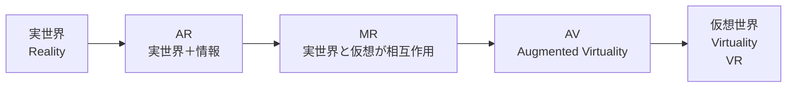

左端が「純粋な実世界」、右端が「純粋な仮想世界（VR）」で、その間に AR、MR、AV（Augmented Virtuality、仮想世界に実世界の情報を持ち込む）が並びます。この 5 段階を Milgram らは「Mixed Reality（混合現実）」と総称しました。日本語で MR と略すのはこの Mixed Reality から来ています。

> **📝 補足**
> 現在の実装では、Vision Pro や Quest 3 のようなパススルー型 MR ヘッドセットは、この Continuum 上を体験ごとに移動します。実世界を薄く重ねる AR モードと、実世界を遮断する VR モードを、1 台の端末で切り替えられます。「どの位置に立った体験を作るか」が UX 設計の起点になります。

### xR の前史——1939 から 2012 まで

xR は最近の技術ではなく、80 年以上の系譜があります。3 つの節目を押さえます。

#### 1939 年 View-Master——「立体視の民主化」

米国で発売された View-Master は、円形のリールにセットした 2 枚の写真をレンズで見ることで立体視を実現した装置です。子どものおもちゃとして世界的にヒットし、「両眼視差で立体を作る」というコンセプトを一般消費者に普及させました。VR の原点の 1 つです。

#### 1962 年 Sensorama——「多感覚 VR」

米国の映像技術者 Morton Heilev（モートン・ハイリグ）が特許を取得した Sensorama は、映像・音・振動・匂い・風で街のバイクツーリングを疑似体験させる装置でした。商用化には至りませんでしたが「五感全部で仮想体験する」という発想は現代のハプティクスや匂い VR の源流です。

#### 1968 年 Sword of Damocles——「初の HMD」

Ivan Sutherland（1963 年に Sketchpad を発明した CG の父）とその学生 Bob Sproull が発表した「Sword of Damocles」は、天井から吊るす形の初の HMD です。ワイヤーフレームの立方体を空中に描画し、頭を動かすと視点が変わりました。名前は「頭上に危険が吊るされている」というギリシャ神話の故事から取られています。処理性能が足りず、実用には遠かったのですが、「頭に装着してリアルタイムに 3D 空間を見る」という xR の原型を作りました。

#### 2012 年 Oculus Rift Kickstarter——「xR の民主化」

長い停滞期を経て、2012 年 8 月に若い技術者 Palmer Luckey が Kickstarter で立ち上げた「Oculus Rift」プロジェクトが 240 万ドルを集めたことが、現代 xR の始まりです。2014 年 3 月に Facebook（現 Meta）が Oculus VR を 20 億ドルで買収し、コンシューマー VR 市場が本格的に立ち上がりました。View-Master から 73 年、Sensorama から 50 年、Sword of Damocles から 44 年——長い停滞を経ての開幕でした。

### 確認クイズ

理解の定着のために、6 問のクイズを解いてみてください。

#### Q1. Reality-Virtuality Continuum を 1994 年 12 月に発表した研究者の組み合わせとして正しいものはどれですか？

- [x] Paul Milgram と Fumio Kishino
- [ ] Ivan Sutherland と Bob Sproull
- [ ] Palmer Luckey と Mark Zuckerberg
- [ ] Morton Heilev と Ivan Sutherland

> **解説**
> Reality-Virtuality Continuum は、Paul Milgram（トロント大学）と Fumio Kishino（大阪大学、当時）が 1994 年 12 月に発表した枠組みです。実世界と仮想世界を両端に置き、その間の連続体として AR / MR / AV / VR を配置しました。この枠組みは 30 年経った現在も xR の位置関係を語る共通言語です。Ivan Sutherland と Bob Sproull は 1968 年の Sword of Damocles、Palmer Luckey は 2012 年の Oculus Rift Kickstarter、Morton Heilev は 1962 年の Sensorama です。

#### Q2. AR と MR の技術的な違いを最もよく説明しているのはどれですか？

- [ ] AR は屋外用、MR は屋内用の xR である
- [x] AR は実世界に情報を重ねるが、MR は仮想物体が実世界を認識して相互作用する
- [ ] AR はカメラを使い、MR は使わない
- [ ] AR は Apple のみ、MR は Microsoft のみが採用する用語である

> **解説**
> AR は「実世界の上に情報や画像を重ねて表示する」体験（スマホで顔にウサギの耳を重ねる、看板に翻訳を重ねる）で、MR は「仮想物体が実世界を認識して相互作用する」体験（仮想のソファが現実の床に置かれ、影を落とし、指で触れると反応する）です。屋内/屋外の区別ではなく、カメラの有無でもなく、「実世界を認識して相互作用するか」の違いが本質です。ただし現場では区別されないことも多く、選定時に選定軸を持つことが重要です。

#### Q3. 初のヘッドマウントディスプレイ「Sword of Damocles」を 1968 年に発表した研究者は誰ですか？

- [ ] Palmer Luckey
- [ ] Morton Heilev
- [ ] Paul Milgram
- [x] Ivan Sutherland

> **解説**
> Ivan Sutherland は 1963 年に Sketchpad を発明した CG の父としても知られる研究者で、学生の Bob Sproull と共に 1968 年に「Sword of Damocles」と呼ばれる初の HMD を発表しました。天井から吊るす形状で、ワイヤーフレームの立方体を空中に描画し、頭を動かすと視点が変わりました。名前は「頭上に危険が吊るされている」というギリシャ神話の故事から取られています。Palmer Luckey は 2012 年の Oculus Rift、Morton Heilev は 1962 年の Sensorama、Paul Milgram は 1994 年の Reality-Virtuality Continuum です。

#### Q4. Reality-Virtuality Continuum の左端と右端に配置されるものはどれですか？

- [ ] 左端が VR、右端が実世界
- [ ] 左端が AR、右端が MR
- [ ] 左端が Sensorama、右端が Vision Pro
- [x] 左端が実世界、右端が仮想世界（VR）

> **解説**
> Reality-Virtuality Continuum は、左端に「純粋な実世界（Reality）」、右端に「純粋な仮想世界（Virtuality、VR）」を置き、その間の連続体として AR、MR、AV（Augmented Virtuality）を配置します。この 5 段階全体を Milgram らは「Mixed Reality（混合現実）」と総称し、日本語の MR の語源になっています。

#### Q5. 現代 xR の始まりとされる 2012 年 8 月の出来事はどれですか？

- [ ] Apple Vision Pro の発売
- [ ] Microsoft HoloLens の発表
- [x] Palmer Luckey による Oculus Rift の Kickstarter 立ち上げ
- [ ] Meta 社への社名変更

> **解説**
> 2012 年 8 月に、当時 20 歳の Palmer Luckey が Kickstarter で立ち上げた「Oculus Rift」プロジェクトが 240 万ドルの資金を集めたことが、現代コンシューマー xR の始まりとされます。2014 年 3 月に Facebook（現 Meta）が Oculus VR を 20 億ドルで買収し、コンシューマー VR 市場が本格化しました。Apple Vision Pro は 2024 年 2 月、HoloLens は 2016 年 3 月、Meta 社名変更は 2021 年 10 月です。

#### Q6. 「第 4 のコンピュータ革命」という表現の第 1 から第 3 の順序として正しいものはどれですか？

- [ ] スマートフォン → メインフレーム → PC → 空間コンピュータ
- [ ] PC → メインフレーム → スマートフォン → 空間コンピュータ
- [x] メインフレーム → PC → スマートフォン → 空間コンピュータ
- [ ] メインフレーム → スマートフォン → PC → 空間コンピュータ

> **解説**
> 「第 4 のコンピュータ革命」は、第 1 がメインフレーム（1950s〜）、第 2 がパーソナルコンピュータ（1980s〜、IBM PC 1981/Macintosh 1984）、第 3 がスマートフォン（2007〜、iPhone 2007）、第 4 が空間コンピュータ（2024〜、Apple Vision Pro 2024/2）という時系列で語られます。ただし、この位置づけは Apple の宣伝文脈から広まった側面もあり、空間コンピュータが第 4 世代として本当に定着するかは 2030 年代半ばまで判断できません。本コースでは「起きた場合の準備」として捉えます。

### まとめ

このレッスンでは、xR の全体像を「体験と技術の位置関係」の視点で捉え直しました。xR は 1968 年から 58 年間の系譜を持つ技術で、Meta Quest と Apple Vision Pro の登場でようやくコンシューマー機として実現しました。VR / AR / MR / XR の 4 語は Reality-Virtuality Continuum の上に配置でき、「実世界と仮想世界の連続体」として捉えるのが実務の共通言語です。「第 4 のコンピュータ革命」という呼称にはハイプの側面もありますが、企業導入の判断では「起きた場合に自社が準備できているか」を問う軸として使えます。次のレッスンから、この判断軸をベースに、2026 年 7 月時点の主要 HMD 機種を選定軸で整理していきます。

---

## レッスン2：HMD の歴史と 2026 年の主要機種——Meta Quest 3/3S・Vision Pro・HoloLens・Magic Leap・PICO

（所要時間：25分）

### このレッスンで学ぶこと

- Oculus Rift 2012 から 2026 年 7 月時点までの HMD の系譜を、5 つの節目で捉えられる
- 2026 年 7 月時点の主要 5 機種の位置づけと選定軸を持てる
- 価格帯・用途・6DoF/3DoF の 4 象限で HMD を分類できる
- 「消費者向け」と「業務用」の設計思想の違いを説明できる
- 自社 PoC でどの機種から始めるかの判断軸を持ち帰れる

---

前のレッスンでは、xR の総称と 4 語の位置関係、そして 1968 年からの xR 前史を整理しました。このレッスンでは、Meta Quest / Apple Vision Pro / Microsoft HoloLens / Magic Leap / PICO の主要 5 機種を、選定軸を持って比較します。

### HMD の系譜——5 つの節目

現代の HMD の系譜は、2012 年 8 月の Oculus Rift Kickstarter から始まります。ここから 2026 年 7 月まで 14 年間の変遷を、5 つの節目で押さえます。

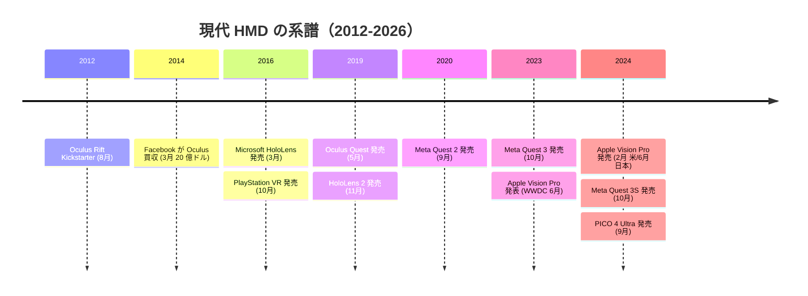

#### 節目 1：2012-2014「Oculus 独走の始まり」

2012 年 8 月の Kickstarter で 240 万ドルを集めた Oculus Rift は、開発者版 DK1 を 2013 年 3 月に、DK2 を 2014 年 7 月に発売しました。この間の 2014 年 3 月、Facebook（現 Meta）が Oculus VR を 20 億ドルで買収し、VR がスタートアップの実験から巨大テック企業の戦略領域に格上げされました。

#### 節目 2：2016「業務用 MR の登場」

2016 年 3 月に Microsoft HoloLens 初代が発売され、光学シースルー型（OST）の MR ヘッドセットが業務用として登場しました。同年 10 月にはソニーが PlayStation VR を発売し、コンシューマー VR が家庭用ゲーム機を通じて普及しました。同時期に HTC Vive（2016 年 4 月）、Oculus Rift CV1（2016 年 3 月）も発売され、PC 接続型 VR の初期市場が形成されました。

#### 節目 3：2019「スタンドアロン化」

2019 年 5 月に Oculus Quest（初代）が発売され、PC を必要としないスタンドアロン型 VR が主流になる転換点になりました。同年 11 月には Microsoft HoloLens 2 が発売され、業務用 MR の実用性が大きく前進しました。

#### 節目 4：2020-2023「Quest 2/3 の普及と Vision Pro 発表」

2020 年 9 月の Meta Quest 2 は、価格 3 万円台（初代は 5 万円）でスタンドアロン、6DoF、カラーパススルーの後継機として爆発的に売れ、コンシューマー VR を一挙に広げました。2023 年 6 月の WWDC で Apple が Vision Pro を発表し、10 月に Meta Quest 3 が発売されました。

#### 節目 5：2024「空間コンピュータ元年」

2024 年 2 月 2 日に Apple Vision Pro が米国で発売され、6 月 28 日に日本発売、10 月に Meta Quest 3S（Quest 3 の廉価版）と PICO 4 Ultra が発売されました。この年から「空間コンピュータ」という語彙が Apple 主導で市場に広がりました。

### 2026 年 7 月時点の主要 5 機種

2026 年 7 月時点で企業 PoC・購入検討の対象になる主要 5 機種を、体験カテゴリと位置づけで整理します。

#### Meta Quest 3 / 3S——コンシューマー MR の主力

Meta Quest 3 は 2023 年 10 月発売のスタンドアロン MR ヘッドセットで、カラーパススルー、6DoF、ハンドトラッキングを備えます。廉価版の Quest 3S は 2024 年 10 月発売で、レンズ構成を簡略化することで価格を抑えました。両機種とも「PC 不要でその日から使える」設計で、コンシューマー xR 市場のシェアの多くを占めます。企業 PoC でも「まず 1 台試したい」の第一候補になります。

#### Apple Vision Pro——空間コンピュータの旗艦

Apple Vision Pro は 2024 年 2 月 2 日に米国で、6 月 28 日に日本で発売されたパススルー型 MR ヘッドセットです。Apple は「VR」でも「AR」でもなく「空間コンピュータ」と呼びます。高解像度パススルー、視線と手のジェスチャーによる操作、visionOS という独自プラットフォームが特徴です。価格は他 4 機種より 1 桁高く、企業導入の初手には向きませんが、UI/UX の到達点を体感する用として意味があります。

#### Microsoft HoloLens 2——業務用 MR の代表

Microsoft HoloLens 2 は 2019 年 11 月発売の光学シースルー型（OST）MR ヘッドセットです。実世界を透過して見つつ、その上に 3D ホログラムを重ねる方式で、両手を空けて実物を触りながら仮想物体も操作できる特徴があります。製造・医療・防衛分野で使われてきましたが、Microsoft は 2024 年に HoloLens 3 の開発中止を発表し、2027 年 12 月にサポート終了予定です。既存資産の運用は続きますが、新規調達の対象からは徐々に外れます。

#### Magic Leap 2——業務用 OST の後継候補

Magic Leap 2 は 2022 年 9 月発売の光学シースルー型 MR ヘッドセットです。HoloLens 2 のサポート終了を見据え、業務用 OST の後継としてポジションを取り直しています。視野角が広く、輝度も高く、AR コンテンツの実世界重ね合わせで優位を持ちます。医療分野・産業設計の PoC で採用が増えています。

#### PICO 4 Ultra——中国発の Quest 対抗機

PICO は中国 ByteDance 傘下の HMD ブランドで、2024 年 9 月発売の PICO 4 Ultra は Meta Quest 3 の対抗機として位置づけられます。スタンドアロン、6DoF、カラーパススルー、価格帯も Quest 3 と近く、業務用ソリューションでは日本国内でも導入例が増えています。日本市場では 2024 年 12 月からビジネス向けの正式販売が始まりました。

### 4 象限で HMD を分類する

主要 5 機種と関連機種を、「用途（コンシューマー／業務用）」と「シースルー方式（パススルー VST／光学シースルー OST）」の 4 象限で整理します。

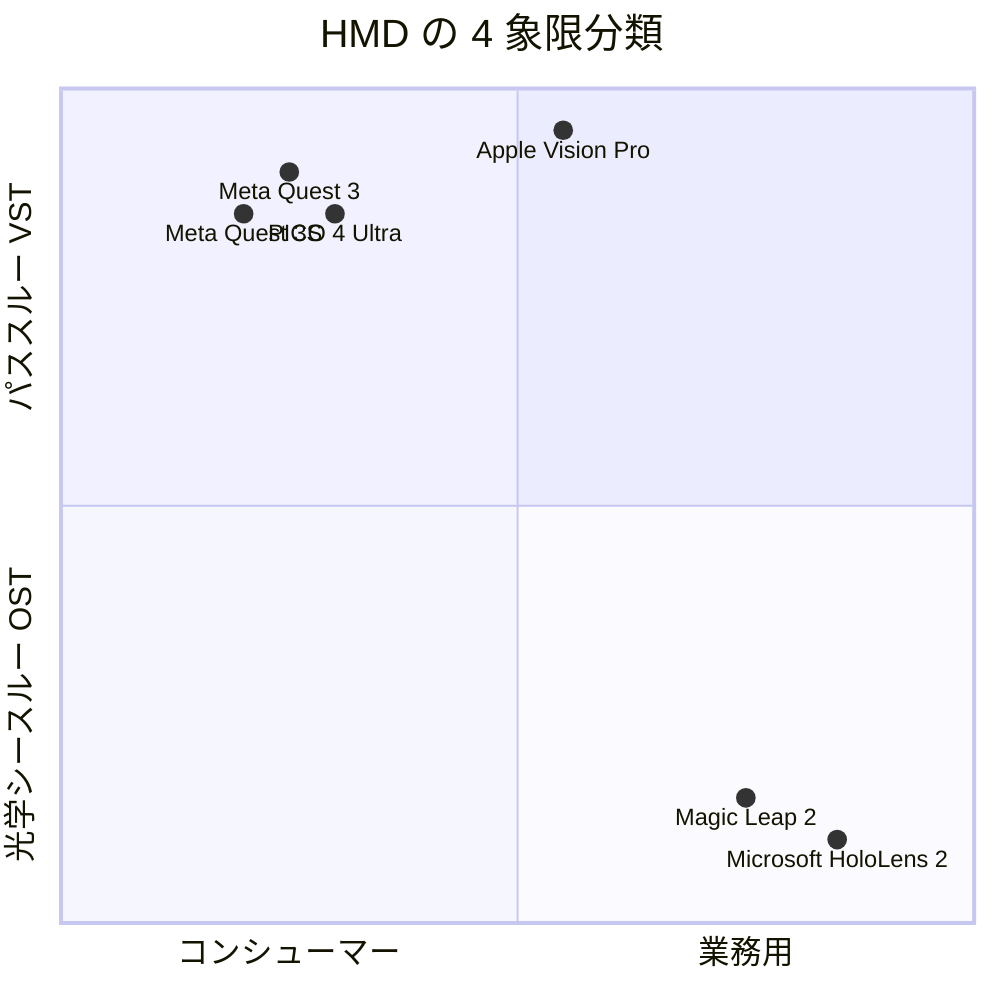

- **左上（コンシューマー × VST）**：Meta Quest 3/3S、PICO 4 Ultra。価格 5-8 万円、量産効果、家庭・小規模 PoC 向け
- **右上（業務用 × VST）**：Apple Vision Pro。60 万円前後、高解像度、UI/UX リファレンスとしての意味
- **左下（コンシューマー × OST）**：現時点で主要機なし（Nreal Air / XREAL Air など軽量 AR グラスがこの領域を目指す）
- **右下（業務用 × OST）**：HoloLens 2、Magic Leap 2。50-70 万円、実世界重視の業務用途

### 確認クイズ

理解の定着のために、6 問のクイズを解いてみてください。

#### Q1. 2014 年 3 月に Facebook（現 Meta）が Oculus VR を買収した金額はどれですか？

- [ ] 2 億ドル
- [x] 20 億ドル
- [ ] 200 億ドル
- [ ] 2,000 万ドル

> **解説**
> Facebook（現 Meta）は 2014 年 3 月に Oculus VR を 20 億ドル（当時のレートで約 2,000 億円）で買収しました。この買収は VR がスタートアップの実験から巨大テック企業の戦略領域に格上げされる契機となり、以降のコンシューマー VR 市場拡大の起点になりました。買収時点で Oculus Rift はまだ商用製品を発売していませんでした。

#### Q2. Apple Vision Pro の米国発売日と日本発売日の組み合わせとして正しいものはどれですか？

- [ ] 米国 2023 年 6 月、日本 2024 年 6 月
- [ ] 米国 2024 年 6 月、日本 2024 年 12 月
- [x] 米国 2024 年 2 月、日本 2024 年 6 月
- [ ] 米国 2024 年 2 月、日本 2024 年 2 月

> **解説**
> Apple Vision Pro は 2024 年 2 月 2 日に米国で先行発売され、4 か月後の 2024 年 6 月 28 日に日本を含むアジア圏で発売されました。2023 年 6 月は WWDC 2023 での発表日で、発売はその 8 か月後です。米国以外への展開は段階的で、日本は 2024 年に発売された 2 番目のグループに含まれました。

#### Q3. 2019 年 5 月発売の Oculus Quest（初代）が xR 市場で果たした最大の役割はどれですか？

- [x] PC を必要としないスタンドアロン型 VR を主流にしたこと
- [ ] 光学シースルー型（OST）MR を初めて商用化したこと
- [ ] 業務用 xR 市場を作ったこと
- [ ] AR グラス市場を作ったこと

> **解説**
> 2019 年 5 月発売の Oculus Quest（初代）は、PC 接続を必要としないスタンドアロン型 6DoF VR ヘッドセットとして市場に登場し、以降のスタンドアロン主流化の契機となりました。以前は Oculus Rift や HTC Vive など PC 接続型が中心で、セットアップの重さがコンシューマー普及の障害でした。光学シースルー型 MR は 2016 年 3 月の HoloLens 初代、業務用市場は 1990 年代から一部で存在、AR グラス市場は 2010 年代前半から複数プレイヤーが挑戦してきました。

#### Q4. 業務用 OST 型 MR ヘッドセットに分類されるのはどれですか？

- [ ] Meta Quest 3
- [ ] Apple Vision Pro
- [ ] PICO 4 Ultra
- [x] Microsoft HoloLens 2

> **解説**
> Microsoft HoloLens 2 は 2019 年 11 月発売の光学シースルー型（OST）MR ヘッドセットで、業務用 MR の代表機です。実世界を透過して見つつ、その上に 3D ホログラムを重ねる方式で、両手を空けて実物を触りながら仮想物体も操作できます。Meta Quest 3、Apple Vision Pro、PICO 4 Ultra はすべてビデオシースルー（VST）型で、カメラで実世界を撮影して重ね合わせる方式です。

#### Q5. Microsoft HoloLens 2 の位置づけとして 2026 年 7 月時点で正しいものはどれですか？

- [ ] 発売直後で普及がこれから
- [ ] 2026 年発売の後継機 HoloLens 3 が主力
- [x] Microsoft が HoloLens 3 の開発中止を発表し、サポート終了予定
- [ ] Apple に買収されて visionOS に統合された

> **解説**
> Microsoft は 2024 年に HoloLens 3 の開発中止を発表し、HoloLens 2 は 2027 年 12 月にサポート終了予定です。既存資産の運用は続きますが、新規調達の対象からは徐々に外れつつあり、業務用 OST は Magic Leap 2 が次の候補になります。ただし、Microsoft は AR/MR コンテンツ開発プラットフォーム（Mesh、visionOS 連携）は継続しており、「端末は変わってもコンテンツは残る」構図が続きます。

#### Q6. PoC でどの機種から始めるかを決める最も重要な軸はどれですか？

- [ ] 発売時期の新しさ
- [ ] メディアで話題になっているかどうか
- [ ] 講師が推薦する機種
- [x] 置き換えたい業務の性質と、必要な入出力の対応

> **解説**
> PoC の失敗パターンで最も多いのが「話題の機種を買ってから、何をするか考える」順序です。成功する PoC は必ず「置き換えたい業務の性質と、必要な入出力（座って集中／立って作業／両手を空けて操作／屋内屋外）」から入り、その要件を満たす機種を選定します。同じ企業内でも、業務ごとに最適な機種は異なるため、複数機種併用が現実解になることも多いのが実務です。

### まとめ

このレッスンでは、現代 HMD の系譜を 5 つの節目（2012 Oculus Rift Kickstarter、2014 Facebook 買収、2016 HoloLens／PlayStation VR、2019 スタンドアロン化、2024 空間コンピュータ元年）で押さえ、2026 年 7 月時点の主要 5 機種（Meta Quest 3/3S、Apple Vision Pro、Microsoft HoloLens 2、Magic Leap 2、PICO 4 Ultra）を用途とシースルー方式の 4 象限で整理しました。PoC の第一原則は「端末を買ってから体験を設計するのではなく、体験を設計してから端末を選ぶ」——複数機種併用が現実解になることが多い、という点をお持ち帰りください。次のレッスンでは、これらの端末の入出力の仕組みを掘り下げます。

---

## レッスン3：空間コンピューティングと入出力の仕組み——6DoF・パススルー・アイトラッキング

（所要時間：25分）

### このレッスンで学ぶこと

- 空間コンピューティングの定義と、従来のコンピューティングとの違いを説明できる
- 6DoF と 3DoF の意味と、体験にどう影響するかを理解できる
- パススルー（VST と OST）の 2 方式の仕組みと使い分けを説明できる
- アイトラッキング・ハンドトラッキング・ハプティクスの役割を整理できる
- 視野角・リフレッシュレート・IPD が VR 酔いと没入感に与える影響を語れる

---

前のレッスンでは、主要 5 機種の位置づけと選定軸を整理しました。このレッスンでは、それらの端末の内部で何が起きているのか——空間コンピューティングの入出力の仕組みを扱います。技術用語の意味と、それぞれが体験にどう影響するかを、非技術系の読者にも通じる言葉で解きます。

### 空間コンピューティングとは何か

空間コンピューティングは、Apple が Vision Pro の発売に合わせて広めた語で、「ユーザーの周囲の 3 次元空間を計算の対象にするコンピューティング」を指します。従来のコンピューティングとの違いは、以下の 3 点に集約されます。

- **入力**：マウスとキーボード（2D 座標）→ 頭の動き、視線、手のジェスチャー、音声（3D 座標と身体）
- **出力**：平面ディスプレイ（2D）→ ユーザーを囲む立体空間（3D）
- **文脈**：アプリの中で完結（デジタル空間）→ 実世界と重なる（物理空間）

「空間コンピューティング」という言葉は 2003 年に MIT の学生 Simon Greenwold が学位論文で使ったのが最初とされます。当時はまだハードウェアが追いつかず、コンセプト止まりでしたが、20 年を経て 2024 年の Vision Pro で実装が広く語られるようになりました。

### 6DoF と 3DoF——動きの自由度の違い

HMD のスペック表で必ず出てくる「6DoF」「3DoF」は、Degrees of Freedom（自由度）の略で、頭や体の動きをどこまで追跡できるかを示します。

- **3DoF（3 自由度）**：頭の回転のみ（Yaw、Pitch、Roll）を追跡。座って首を回すだけの体験
- **6DoF（6 自由度）**：頭の回転に加えて、頭と体の位置移動（前後・左右・上下）も追跡。歩き回れる体験

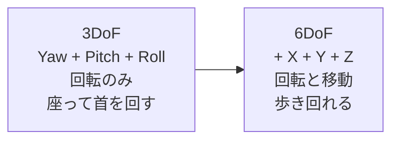

現在の主要 5 機種はすべて 6DoF ですが、10 年前の VR ヘッドセットや、現在も市場に残る安価な VR ビューワーは 3DoF です。**6DoF は VR 酔いを大きく減らす**という重要な副次効果があります。3DoF で歩くコンテンツを見ると、視覚と前庭感覚のずれが強く出て酔いやすくなります。6DoF なら実際の身体の動きに合わせて視覚が更新されるため、酔いが起きにくくなります。

#### 位置追跡の方式

6DoF の位置追跡は、以下の 2 方式に分けられます。

- **外部トラッキング**：部屋の壁や天井にセンサー（ライトハウスなど）を設置し、HMD の位置を追跡する方式。HTC Vive の Steam VR や、初期の Oculus Rift の Constellation。**精度が高いが設置が重い**
- **インサイドアウト**：HMD 側のカメラで周囲を撮影し、自機の位置を推定する方式（SLAM、Simultaneous Localization and Mapping）。Meta Quest 3、Apple Vision Pro、HoloLens 2、Magic Leap 2、PICO 4 Ultra はすべてこの方式。**設置不要で使いやすい**

### パススルー——VST と OST の 2 方式

xR で「実世界と仮想世界を重ねる」ためには、実世界をユーザーに見せる方法（パススルー）が必要です。方式は 2 つに分けられます。

#### VST（Video See-Through、ビデオ透過）

外側のカメラで実世界を撮影し、その映像を HMD 内側のディスプレイに表示して、その上に仮想オブジェクトを重ねる方式。Meta Quest 3、Apple Vision Pro、PICO 4 Ultra が採用します。

- **メリット**：明るさや色味を自由に加工できる、実世界と仮想物体の重ね合わせが精密、屋内屋外を問わない
- **デメリット**：カメラとディスプレイの遅延（数十ミリ秒）が VR 酔いの原因になりうる、電源が切れると外が見えなくなる

#### OST（Optical See-Through、光学透過）

透明なガラスやウェーブガイド（導光板）を通して実世界を直接見つつ、その上に半透明の 3D ホログラムを投影する方式。Microsoft HoloLens 2、Magic Leap 2 が採用します。

- **メリット**：実世界は透過するため遅延ゼロ、電源が切れても実世界は見え続ける、業務中の安全性が高い
- **デメリット**：屋外の日光下では投影された仮想オブジェクトの輝度が負けやすい、視野角が狭くなりがち、色再現の精度に限界

> **💡 ポイント**
> **VST と OST は「どちらが優れるか」ではなく「何を置き換えるか」で選ぶ**、という発想が重要です。座って設計レビューをするなら VST、立って組み立て作業を続けるなら OST、というように業務適合で選定します。両方式の混在（VR モードでは VST、AR モードでは OST 相当のパススルー透明度）を 1 台で実現する Vision Pro のような機種も増えつつあります。

### アイトラッキング——「見ている場所」を計算に使う

アイトラッキングは、赤外線 LED とカメラで瞳孔の位置を追跡し、ユーザーが今どこを見ているかを HMD が把握する技術です。Apple Vision Pro、Meta Quest Pro、HoloLens 2、Magic Leap 2 に搭載されています。

- **選択操作**：見つめた対象をタップやピンチで選ぶ（Vision Pro の主入力）
- **フォビエイテッドレンダリング**：見ている中心部だけを高解像度で描画し、周辺部の解像度を落として GPU 負荷を減らす（ヘッドセットのバッテリーを持たせる主要技術）
- **ヒートマップ**：ユーザーが何を見て何を見なかったかの分析（教育・広告・製造品検の応用）

### ハンドトラッキング——「手を映す」から「手を計算する」へ

ハンドトラッキングは、HMD 外側のカメラで手を撮影し、指の関節の位置を骨格モデルとして推定する技術です。2019 年の Oculus Quest 初代からコンシューマー機に広く搭載されるようになりました。コントローラーを持たなくても、ピンチ・スワイプ・つまむ・広げるなどの操作ができます。

Meta Quest 3、Apple Vision Pro、HoloLens 2、Magic Leap 2、PICO 4 Ultra はすべてハンドトラッキングを搭載します。ただし精度は端末により違いがあり、Apple Vision Pro のトラッキング精度は業界随一と評価されます。

### ハプティクス——触覚で「触れた感」を返す

ハプティクスは、振動や圧力で「触れた」「押した」の感触を返す技術です。コントローラーの振動が最も基本的で、より高度なものではグローブ型（Meta の Haptic Gloves 研究、HaptX Gloves 商用）、椅子型（bHaptics）、全身スーツ型（Teslasuit）などがあります。2026 年 7 月時点で全身ハプティクスはまだ実験段階で、企業導入の中心はコントローラー振動と、Vision Pro のような視覚・音響でハプティクスを錯覚させる設計です。

### VR 酔いを決める 3 つのパラメータ——視野角・リフレッシュレート・IPD

VR 酔い（Motion Sickness、Cybersickness）は xR 体験の最大の障害で、装着者の 30% 以上が何らかの症状を経験するとされます。3 つのハードウェア・パラメータが体験の快適性を決めます。

#### 視野角（FOV、Field of View）

人間の視野角は水平約 210°、垂直約 135° です。HMD の視野角がこれに近いほど没入感が高まりますが、レンズと画素密度のコストが上がります。

- Meta Quest 3：水平約 110°、垂直約 96°
- Apple Vision Pro：水平約 100°（公称値なしだが実測）
- HoloLens 2：水平約 43°、垂直約 29°（OST の制約）
- Magic Leap 2：水平約 45°、垂直約 55°

#### リフレッシュレート

1 秒あたりに画面が更新される回数（Hz）で、頭の動きに映像が追従するスムーズさを決めます。60 Hz 以下では酔いが強く出るため、xR では 72-120 Hz が主流です。

- Meta Quest 3：72 Hz / 80 Hz / 90 Hz / 120 Hz（コンテンツで切替）
- Apple Vision Pro：90 Hz / 96 Hz / 100 Hz
- HoloLens 2：60 Hz
- Magic Leap 2：120 Hz

#### IPD（瞳孔間距離）

左右の瞳孔の距離で、日本人成人の平均は約 63mm、個人差は 55-75mm あります。HMD のレンズ間隔が自分の IPD と合わないと、目の焦点調節に負担がかかり、酔いや目の疲れの原因になります。Meta Quest 3 は物理的にレンズを移動できる可変 IPD、Apple Vision Pro は購入時にオプティカル・インサートで補正、HoloLens 2 は瞳孔間距離を自動計測して調整します。

> **⚠️ 注意**
> VR 酔いは「慣れの問題」ではなく、ハードウェアと体験設計の問題です。連続装着 15 分で酔いが強く出るユーザーが 30% いる、という事実を PoC 設計の前提にしてください。「1 回 15 分、休憩 30 分」の運用ルールと、「加速や急な視点移動を含む体験は避ける」設計ルールを併用するのが定石です。

### レンダリングパイプラインの全体像

xR コンテンツがユーザーに届くまでの内部処理を、簡略化して整理します。

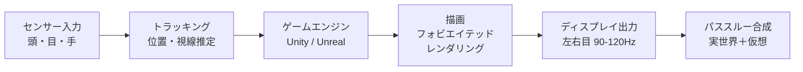

このパイプライン全体の遅延（Motion-to-Photon Latency）は 20 ミリ秒以下が目標で、遅延が大きいと VR 酔いの原因になります。フォビエイテッドレンダリングは、この遅延を短く保ちつつ GPU 負荷を減らす主要技術です。

### 次のレッスンの予告

次のレッスンでは、xR コンテンツを開発するためのエコシステムを扱います。Unity と Unreal Engine の位置関係、OpenXR 標準、WebXR による Web ブラウザ内 xR、Reality Composer や visionOS SDK、LOD 設計、そして生成 AI × 3D の最新動向（NeRF、Gaussian Splatting）——を、開発を発注する立場から知っておくべき「見取り図」として整理します。

### 確認クイズ

理解の定着のために、6 問のクイズを解いてみてください。

#### Q1. 6DoF と 3DoF の違いを最もよく説明しているのはどれですか？

- [ ] 6DoF は屋外用、3DoF は屋内用
- [ ] 6DoF は業務用、3DoF はコンシューマー用
- [x] 6DoF は頭の回転に加えて位置移動も追跡、3DoF は頭の回転のみ
- [ ] 6DoF は左右の目それぞれで追跡、3DoF は片目のみ

> **解説**
> 6DoF（6 自由度）は頭の回転（Yaw / Pitch / Roll）に加えて、頭と体の位置移動（X / Y / Z）も追跡する方式で、歩き回れる体験を作れます。3DoF は頭の回転のみを追跡するため、座って首を回すだけの体験になります。6DoF は VR 酔いを大幅に減らす効果もあり、現代の主要 HMD はすべて 6DoF です。屋内外・業務コンシューマーの区別ではなく、左右の目とも関係ありません。

#### Q2. VST（Video See-Through）方式の xR ヘッドセットの特徴として正しいものはどれですか？

- [ ] 電源が切れても実世界が見える
- [x] カメラで撮影した実世界の映像を HMD 内側のディスプレイに表示する
- [ ] 屋外の日光下で仮想オブジェクトの輝度が負けにくい
- [ ] 遅延がゼロで VR 酔いが起きない

> **解説**
> VST（Video See-Through、ビデオ透過）は、外側のカメラで実世界を撮影し、HMD 内側のディスプレイにその映像を表示、その上に仮想オブジェクトを重ねる方式です。Meta Quest 3、Apple Vision Pro、PICO 4 Ultra が採用します。カメラとディスプレイの遅延（数十ミリ秒）が VR 酔いの原因になりうるため「遅延ゼロ」ではありません。電源が切れると外が見えなくなる、屋外の輝度は VST のほうが有利、といった特徴は OST（Optical See-Through）と対照的です。

#### Q3. アイトラッキングがフォビエイテッドレンダリングに使われる理由として正しいものはどれですか？

- [x] 見ている中心部のみを高解像度で描画し、周辺部の解像度を落として GPU 負荷を減らせる
- [ ] ユーザーの目が疲れているかどうかを検知して自動休憩を促せる
- [ ] 目の位置から個人認証ができるため、ログインを省略できる
- [ ] 左右の目の視線ずれから 3D 酔いを予測できる

> **解説**
> フォビエイテッドレンダリング（Foveated Rendering）は、アイトラッキングで検出したユーザーの視線の中心部（フォベア、中心窩）のみを高解像度で描画し、周辺視野の解像度を落とすことで GPU 負荷を大幅に減らす技術です。人間の視覚は中心以外の解像度が低いため、周辺部の解像度を落としても違和感が少なく、バッテリー持続時間を延ばすことに貢献します。Apple Vision Pro や Meta Quest Pro / Quest 3S が実装しています。

#### Q4. 視野角（FOV）について、2026 年 7 月時点で正しい記述はどれですか？

- [ ] Meta Quest 3 の視野角は 200° を超える
- [ ] HoloLens 2 の視野角は Quest 3 より広い
- [x] HoloLens 2 の視野角は水平約 43° で、OST の制約から VST より狭くなる
- [ ] 視野角は狭いほど没入感が高まる

> **解説**
> HoloLens 2 は光学シースルー型（OST）で、ウェーブガイド（導光板）を通して仮想物体を投影するため、視野角は水平約 43°、垂直約 29° と VST 型より狭くなります。Meta Quest 3 は水平約 110°、Apple Vision Pro は約 100°、Magic Leap 2 は約 45°/55° です。人間の視野角に近いほど没入感は高まるので、狭いほどよいわけではありません。OST は屋外や作業支援での安全性で優位ですが、視野角の狭さがトレードオフです。

#### Q5. IPD（瞳孔間距離）が xR 体験に影響する理由として正しいものはどれですか？

- [ ] IPD が広いほど 3D の立体感が強くなる
- [ ] IPD は装着時間を計測する指標である
- [x] HMD のレンズ間隔が自分の IPD と合わないと目の焦点調節に負担がかかり、酔いや目の疲れの原因になる
- [ ] IPD は視野角と同じ意味の指標である

> **解説**
> IPD（Inter-Pupillary Distance、瞳孔間距離）は左右の瞳孔の距離で、日本人成人の平均は約 63mm、個人差は 55-75mm あります。HMD のレンズ間隔が自分の IPD と合わないと、目の焦点調節と輻輳（両目の内向き運動）に負担がかかり、酔いや目の疲れ、頭痛の原因になります。Meta Quest 3 は物理的にレンズを移動する可変 IPD、Apple Vision Pro はオプティカル・インサートで補正、HoloLens 2 は自動計測で調整します。視野角とは別の指標で、装着時間・立体感の指標でもありません。

#### Q6. Motion-to-Photon Latency（頭の動きから映像更新までの遅延）が xR 体験に与える影響で最も重要なのはどれですか？

- [ ] 遅延が大きいほど画質がきれいになる
- [ ] 遅延はバッテリー持続時間に反比例する
- [x] 遅延が大きいと視覚と前庭感覚のずれから VR 酔いが起きる
- [ ] 遅延はハンドトラッキングの精度に影響しない

> **解説**
> Motion-to-Photon Latency は、頭を動かしてから対応する映像が更新されるまでの遅延で、20 ミリ秒以下が目標です。遅延が大きいと、視覚が捉える動きと内耳の前庭感覚が捉える動きにずれが生じ、脳がその不一致を「毒物中毒」と誤認識して吐き気を引き起こす——これが VR 酔いの主要メカニズムです。フォビエイテッドレンダリング、高リフレッシュレート、6DoF トラッキング、パススルー低遅延化——これらすべてが遅延短縮のための技術です。

### まとめ

このレッスンでは、空間コンピューティングの入出力を、6DoF/3DoF、VST/OST パススルー、アイトラッキング、ハンドトラッキング、ハプティクス、視野角、リフレッシュレート、IPD の観点で整理しました。要点は 3 つです。第 1 に、6DoF は VR 酔いを大幅に減らす基本条件です。第 2 に、VST と OST は「どちらが優れるか」ではなく「何を置き換えるか」で選びます。第 3 に、視野角・リフレッシュレート・IPD・遅延は体験の快適性を決める 4 つのパラメータで、PoC 設計の前提として押さえる必要があります。次のレッスンでは、これらのハードウェアの上でコンテンツを作る開発エコシステムに進みます。

---

## レッスン4：xR コンテンツ開発——Unity・Unreal・WebXR・OpenXR

（所要時間：25分）

### このレッスンで学ぶこと

- xR コンテンツ開発の 4 大スタック（Unity・Unreal・WebXR・OpenXR）の位置関係を整理できる
- OpenXR 1.0（Khronos Group、2019 年 7 月）が xR 業界に与えた影響を説明できる
- WebXR による「アプリを配らない xR」の意味と使い所を判断できる
- 3D コンテンツ制作の LOD 設計と資産再利用の考え方を語れる
- 生成 AI × 3D（NeRF・Gaussian Splatting）が 2026 年に何を変えるかを俯瞰できる

---

前のレッスンでは、xR ヘッドセット内部の入出力の仕組みを扱いました。このレッスンでは、その端末の上でコンテンツを作る側の話です。開発を発注する立場の方も、外注管理・PoC 費用の見積り・開発期間の見積りに使える見取り図を持ち帰っていただきます。

### xR コンテンツ開発の 4 大スタック

xR 開発は 4 つの層で捉えると整理しやすくなります。

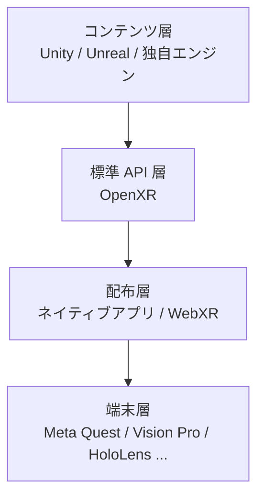

- **コンテンツ層**：3D シーン、動作ロジック、UI を作る場所。ゲームエンジンが主役
- **標準 API 層**：ゲームエンジンと端末の間を橋渡しする共通仕様（OpenXR）
- **配布層**：ユーザーに届ける形式。ストア経由のアプリか、Web ブラウザ経由の WebXR か
- **端末層**：Meta Quest、Vision Pro、HoloLens、Magic Leap、PICO

### Unity と Unreal Engine——コンテンツ層の 2 大ゲームエンジン

xR コンテンツの大半は、Unity か Unreal Engine のどちらかで作られます。

#### Unity（Unity Technologies、2004 年設立）

Unity は 2005 年にリリースされたクロスプラットフォームゲームエンジンで、開発言語は C#。iOS / Android / PC / コンソール / xR まで幅広く対応し、**xR 開発では最大シェア**を持ちます。Meta Quest ストア公開アプリの多くが Unity 製で、Apple Vision Pro でも Unity PolySpatial として visionOS 対応を進めています。使いやすさと軽量さから、企業 PoC で最も選ばれるエンジンです。

- **強み**：学習曲線が緩やか、アセットストアが豊富、モバイル・xR 最適化が優秀、ライセンスが小規模事業に優しい
- **弱み**：高精細グラフィックスでは Unreal に劣る、大規模開発ではソースコード管理に工夫が必要

#### Unreal Engine（Epic Games、1998 年初版）

Unreal Engine は 1998 年に初版がリリースされ、開発言語は C++ とビジュアルスクリプティング「Blueprint」。**高精細グラフィックス**と大規模シーンに強みがあり、映画・自動車ビジュアライゼーション・大規模インタラクティブ体験で選ばれます。Unreal Engine 5 は Nanite（超高精細メッシュ）と Lumen（リアルタイム間接照明）で xR 分野でも精度を上げています。

- **強み**：フォトリアリスティックな表現、大規模シーン対応、映像制作との親和性
- **弱み**：学習曲線が急、開発リソースを要求する、モバイル・スタンドアロン xR ではパフォーマンスの詰めが難しい

> **💡 ポイント**
> **企業 PoC の 9 割は Unity で問題ありません**。高精細な建築ビジュアライゼーション、映画的な演出を必要とする体験、大規模シーンでのリアルタイム対戦などが必要な場合に、Unreal を選ぶのが定石です。「Unity で作ってから必要に応じて Unreal で作り直す」という順序で失うものは少ないので、迷ったら Unity から始めます。

### OpenXR 標準——「開発を 1 度書けば複数機種で動く」

OpenXR は、Khronos Group が管理する xR 業界の標準 API です。Khronos Group は OpenGL、Vulkan、glTF などの標準を管理する非営利業界団体で、xR 分野のオープン標準として 2019 年 7 月 29 日に OpenXR 1.0 をリリースしました。

#### OpenXR 以前の断片化問題

2019 年 7 月以前は、Meta Quest 用は Oculus SDK、HTC Vive 用は SteamVR SDK、HoloLens 用は Windows Mixed Reality SDK と、機種ごとに別々の SDK を書き分ける必要がありました。これがコンテンツ配布の壁になり、企業 PoC も 1 機種依存になりがちでした。

#### OpenXR がもたらした変化

OpenXR 1.0 リリース後、主要ゲームエンジン（Unity、Unreal）と主要 HMD（Meta、Apple、Microsoft、Magic Leap、PICO）が段階的に対応し、2026 年 7 月時点では**1 つのアプリを OpenXR で書けば、複数機種で動く**状況が現実になりつつあります。ただし、visionOS 固有機能（アイトラッキング API など）や、Meta 独自機能（Guardian など）は各社固有の SDK 経由が残ります。

### WebXR——「アプリを配らない xR」

WebXR Device API は W3C（World Wide Web Consortium）が管理する Web ブラウザ用の xR 標準で、2019 年 12 月に Working Draft が公開されました。ブラウザ内で JavaScript を使って xR コンテンツを実行できます。

#### WebXR の使い所

- **配布の軽さ**：ストア審査を通さない、URL を共有すれば体験できる
- **短時間の体験**：数分程度のプロトタイプ、営業デモ、Web 記事の埋め込みコンテンツ
- **クロスデバイス**：PC・スマホ・HMD で同じ URL が動く
- **軽量な社内デモ**：会議室で URL を配って全員に見せる

#### WebXR の限界

- **性能の上限**：ブラウザ経由のため、ネイティブアプリより処理能力が制限される
- **端末機能へのアクセス制限**：アイトラッキング API などの詳細機能は限定的
- **標準実装のバラつき**：ブラウザによって対応度合いが異なる（Chrome / Edge が先行、Safari は限定的）

> **📝 補足**
> **中核メッセージ 4「WebXR は『アプリを配らない xR』の入口」**——本格的な業務利用はネイティブアプリで、社内デモ・営業ツール・Web 記事埋め込みは WebXR で、と使い分けるのが定石です。3D モデルを URL 経由で共有できるだけで、営業のプレゼンや社内会議の共有負荷が大きく下がります。

### 主要 SDK と開発環境の見取り図

2026 年 7 月時点の主要 SDK は以下の 4 系統です。

- **Meta Quest 開発**：Unity + Meta XR SDK / OpenXR、または Unreal + Meta XR SDK
- **Apple Vision Pro 開発**：Xcode + visionOS SDK（SwiftUI / RealityKit）、または Unity PolySpatial
- **HoloLens 開発**：Visual Studio + Windows Mixed Reality Toolkit（MRTK3）、または Unity + OpenXR
- **WebXR 開発**：Three.js、Babylon.js、A-Frame（Web ベース 3D ライブラリ）＋ WebXR Device API

### LOD 設計——3D コンテンツの制作原価を回収する

3D コンテンツは制作原価が高く、1 モデル数十万円〜数百万円になることも珍しくありません。**LOD（Level of Detail）** は、同じオブジェクトを複数の詳細度で作っておき、距離や描画負荷に応じて切り替える技術で、コンテンツ資産の再利用と描画パフォーマンスの両立に不可欠です。

- **LOD0（最高精細）**：至近距離、静止表示、写実的なマテリアル
- **LOD1（中精細）**：数メートル距離、通常の視認範囲
- **LOD2（低精細）**：遠距離、シルエットのみ判別できれば十分
- **LOD3（アイコン）**：遠すぎる場合の代替表現

xR は端末側の GPU 能力が限られるため、LOD 設計の巧拙が体験の快適さを大きく左右します。

### 確認クイズ

理解の定着のために、6 問のクイズを解いてみてください。

#### Q1. xR コンテンツ開発の 4 大スタックの階層順序として正しいものはどれですか？

- [ ] 端末層 → 配布層 → コンテンツ層 → 標準 API 層
- [ ] 配布層 → 端末層 → コンテンツ層 → 標準 API 層
- [ ] 標準 API 層 → コンテンツ層 → 端末層 → 配布層
- [x] コンテンツ層 → 標準 API 層 → 配布層 → 端末層

> **解説**
> xR コンテンツ開発の 4 大スタックは、上から「コンテンツ層（Unity / Unreal）」「標準 API 層（OpenXR）」「配布層（ネイティブアプリ / WebXR）」「端末層（Meta Quest / Vision Pro / HoloLens / Magic Leap / PICO）」の順で捉えると整理しやすくなります。開発者はコンテンツ層で作り、OpenXR で標準化し、配布層でユーザーに届け、端末層で体験されます。

#### Q2. Unity と Unreal Engine の使い分けで、企業 PoC の第 1 候補として推奨されるのはどちらですか？

- [ ] Unreal Engine——高精細グラフィックスが必須のため
- [x] Unity——学習曲線が緩やかでモバイル・xR 最適化が優秀、アセットストアが豊富
- [ ] Unreal Engine——モバイル対応が優秀のため
- [ ] Unity——大規模シーン対応と映像制作親和性が高いため

> **解説**
> 企業 PoC の 9 割は Unity で問題ありません。Unity は学習曲線が緩やか、アセットストアが豊富、モバイル・xR 最適化が優秀、ライセンスが小規模事業に優しい特徴があります。Unreal Engine は高精細グラフィックス、大規模シーン、映像制作親和性が強みですが、学習曲線が急で開発リソースを要求します。「Unity で作ってから必要に応じて Unreal で作り直す」順序が定石です。

#### Q3. OpenXR 1.0 が 2019 年 7 月にリリースされた背景として正しいものはどれですか？

- [ ] Apple が iOS の xR 対応を発表したため
- [ ] Meta が Facebook から社名変更したため
- [x] Meta Quest 用 Oculus SDK、HTC Vive 用 SteamVR SDK、HoloLens 用 Windows Mixed Reality SDK と機種ごとに別々の SDK を書き分ける必要があり、断片化していたため
- [ ] Web ブラウザ内で xR を動かす需要が生まれたため

> **解説**
> OpenXR 1.0 以前は、Meta Quest 用 Oculus SDK、HTC Vive 用 SteamVR SDK、HoloLens 用 Windows Mixed Reality SDK など、機種ごとに別々の SDK を書き分ける必要があり、コンテンツ配布の壁になっていました。OpenXR は Khronos Group（OpenGL、Vulkan、glTF の管理団体）が業界標準として策定し、2019 年 7 月 29 日にリリース。以降、主要ゲームエンジンと主要 HMD が段階的に対応しました。Meta の社名変更は 2021 年 10 月、Web XR は別の W3C 標準です。

#### Q4. WebXR の使い所として最も適切なものはどれですか？

- [ ] 数百時間の連続業務利用
- [ ] ハプティクスとフルボディトラッキングが必要な高度な体験
- [ ] visionOS の全機能を活用した高度な空間 UI
- [x] 短時間の営業デモ、社内会議での共有、Web 記事の埋め込みコンテンツ

> **解説**
> WebXR は Web ブラウザ内で JavaScript を使って動く xR で、ストア審査を通さず URL で共有できる軽さが最大の強みです。短時間の営業デモ、社内会議での共有、Web 記事の埋め込みコンテンツなど「アプリを配らない」用途に向きます。ブラウザ経由の性能上限、端末機能へのアクセス制限、標準実装のバラつきから、長時間業務利用や visionOS 固有機能のフル活用には向きません。「本格業務はネイティブアプリ、軽量デモは WebXR」の使い分けが定石です。

#### Q5. LOD（Level of Detail）設計の目的として正しいものはどれですか？

- [x] 同じオブジェクトを複数の詳細度で作り、距離や描画負荷に応じて切り替えることで描画パフォーマンスとコンテンツ再利用を両立する
- [ ] 3D モデルの著作権を管理する仕組み
- [ ] レンダリングのライセンス料を最適化する仕組み
- [ ] 端末の位置追跡精度を向上させる技術

> **解説**
> LOD（Level of Detail）は、同じオブジェクトを最高精細（LOD0）から低精細（LOD2/3）まで複数段階作っておき、視距離や描画負荷に応じて自動切替する技術です。xR は端末側の GPU 能力が限られるため、LOD 設計の巧拙が体験の快適さを大きく左右します。既存 CAD データをそのまま xR に持ち込むと 3 fps でしか動かないような場面で、LOD 3 段階を作り直して 90 fps に持っていく、といった工程が発生します。

#### Q6. NeRF と Gaussian Splatting はどちらも何を目的とした技術ですか？

- [ ] AI アバターの生成
- [ ] ゲームエンジンの動作を高速化する
- [ ] xR ヘッドセットのパススルー画像を圧縮する
- [x] 複数の写真から 3D 空間や物体を再構成する

> **解説**
> NeRF（Neural Radiance Fields、2020 年 UC Berkeley）と Gaussian Splatting（2023 年 SIGGRAPH）は、いずれも複数の写真から機械学習で 3D 空間や物体を再構成する技術です。Gaussian Splatting は NeRF より高速・高品質で、実世界のスキャンから写実的な 3D 空間を数分で作れるため xR での実装が急速に進んでいます。「3D 資産の作成コスト」という xR 最大のボトルネックを、生成 AI が破りつつある象徴的な技術です。

### まとめ

このレッスンでは、xR コンテンツ開発の 4 大スタック（コンテンツ層 Unity/Unreal、標準 API 層 OpenXR、配布層ネイティブ/WebXR、端末層）と、その中の主要技術を整理しました。要点は 3 つです。第 1 に、企業 PoC の 9 割は Unity で十分で、迷ったら Unity から始めます。第 2 に、OpenXR の普及で「1 度書けば複数機種で動く」が現実になりつつあり、WebXR は「アプリを配らない xR」の入口になります。第 3 に、3D コンテンツ制作は原価が高く、LOD 設計と資産再利用が回収の鍵ですが、NeRF・Gaussian Splatting・テキスト to 3D の生成 AI が 2026 年から風景を変え始めています。次のレッスンから業種別ユースケースに進みます。

---

## レッスン5：業種別ユースケース①——製造・エンジニアリング

（所要時間：25分）

### このレッスンで学ぶこと

- 製造業・エンジニアリング分野の xR 主要 4 ユースケース（設計レビュー・作業支援・教育訓練・遠隔臨場）を区別できる
- 各ユースケースで VR / AR / MR のどれが適しているかを判断できる
- 設計レビューの VR ウォークスルーで、費用対効果が出やすい 3 条件を語れる
- 現場作業支援 AR のピッキング・組立・保守での使い分けを整理できる
- 教育訓練シミュレータの評価軸（習熟時間・失敗許容・費用）を持てる

---

前のレッスンでは、xR コンテンツ開発のエコシステムを整理しました。このレッスンからは業種別ユースケースに入ります。まずは製造・エンジニアリング分野を、体験の視点で見ていきます。既刊の業種別入門コースでは製造業のデジタルツインを IoT データ統合の視点で扱っています。本コースはそれと棲み分け、**xR 体験側の視点**——設計者や現場作業者が xR で「何をどう置き換えるか」——に軸足を置きます。

### 製造業・エンジニアリングの xR 主要 4 ユースケース

製造業の xR 応用は、以下の 4 領域に大別できます。

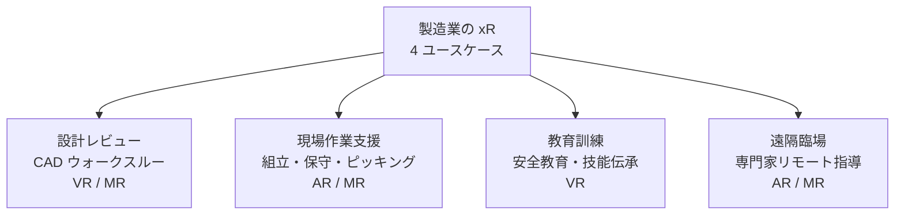

### ユースケース 1：設計レビュー（VR / MR）

設計レビューは製造業 xR の最も歴史ある応用領域で、1990 年代から自動車・航空業界で使われてきました。CAD データを 3D 空間に配置し、実寸大で複数人がウォークスルーできる VR / MR 体験です。

#### 代表的な導入シーン

- **自動車内装レビュー**：運転席から後席・荷室までを実寸大で確認、視界の死角、内装材の見え方を検証
- **建築物のウォークスルー**：完成前の建物内部を歩き、動線・天井高・光の入り方を確認（既刊建設業入門で BIM の視点は詳述、本コースは xR 体験側から）
- **プラント配管の干渉チェック**：複雑な配管が施工時に干渉しないか、実寸大の 3D で目視確認
- **産業機械の操作性検証**：レバーや操作パネルの高さ・角度・視認性が実際に使えるか

#### 費用対効果が出やすい 3 条件

私が伴走してきた 30 社の経験では、設計レビューで費用対効果が明確に出るのは以下の 3 条件を満たすときです。

1. **実物のモックアップ制作費が高い**：自動車 1 台のクレイモデルは 3,000 万円超、住宅の実寸大モックは数千万円。VR なら数百万円で済む
2. **地理的に分散したチームで同時レビュー**：日米欧の設計拠点をつなぐと、出張費と時間の削減が積み上がる
3. **設計変更のスピードが業績に直結**：試作サイクルを 2 か月から 2 週間に短縮できる業界

### ユースケース 2：現場作業支援（AR / MR）

現場作業支援は、実世界での作業に AR / MR で情報を重ねる領域で、両手を空けたい業務ほど価値が出ます。既刊業種別入門コースで扱われるのは AR グラス作業支援を 1 項目として列挙のみですので、本コースでは代表 3 領域を掘り下げます。

#### 組立支援

複雑な組立工程で、次に取り付ける部品と位置を AR で作業員の視界に重ねます。ボーイングは航空機の配線組立で HoloLens を導入し、作業時間を 25% 削減したと 2016 年に発表しています。日本国内でも自動車部品メーカーやエレクトロニクス部品メーカーで実用されています。

#### 保守・点検

工場設備の保守で、AR グラス越しに配管ラベル・トルク値・過去のトラブル履歴を見ながら作業できます。熟練工の暗黙知が失われつつある領域で、xR がナレッジ継承の手段になりつつあります。

#### AR ピッキング

倉庫や工場での部品ピッキングで、AR グラスに次に取る部品の場所を矢印で表示します。既存のバーコードスキャンより高速で、視線が上下しないため疲労も軽減されます。Amazon や DHL が採用例として知られています。

> **💡 ポイント**
> 現場作業支援 AR は **OST 型（HoloLens 2、Magic Leap 2）が向く場面と、スマホ型 AR が向く場面**の 2 パターンに分けて考えます。両手を空けて長時間作業するなら OST、短時間で必要な情報を確認するだけならスマホやタブレットの AR で十分です。「全部 OST グラス」に飛びつくと、コスト対効果が合いにくくなります。

### ユースケース 3：教育訓練シミュレータ（VR）

危険な作業や、実機を止められない設備の訓練を VR で行うユースケースです。

#### 適用領域

- **安全教育**：高所作業・化学プラント・重機・電気工事などの危険体験を VR で
- **技能伝承**：ベテランの視点・手順を VR で記録し、新人が繰り返し学ぶ
- **オペレーション訓練**：実機を止めずに新人が習熟できる（発電所、化学プラント、大型機械）
- **接客訓練**：顧客対応のパターンを VR で疑似体験（既刊小売業入門と棲み分け、本コースでは製造業の技術系接客に絞る）

#### 評価の 3 軸

VR 教育訓練を評価するときは、以下の 3 軸で費用対効果を測ります。

1. **習熟時間の短縮**：座学＋実機訓練 40 時間 → VR＋実機訓練 20 時間、など
2. **失敗の許容度**：VR なら失敗しても事故にならない
3. **費用構造**：実機訓練の設備費・電力費・消耗品費と、VR コンテンツ制作費の比較

### ユースケース 4：遠隔臨場（AR / MR）

遠隔臨場は、現地作業者の視界を専門家がリモートで共有し、その視界に AR で指示を重ねる体験です。

#### コロナ禍で急拡大した領域

2020-2021 年の移動制限期間中、海外拠点への出張が困難になり、AR グラス経由で日本の専門家が現地に指示を出す運用が広く導入されました。移動制限解除後も、出張コストと時間の削減効果が明確なため、定着した領域です。

#### 主要ソリューション

- **Microsoft Teams + HoloLens 2 の Remote Assist**：法人契約の Teams と組み合わせて即使える
- **Magic Leap 2 + サードパーティ FRSA**：業務用 OST の 2 択目
- **スマホ・タブレット AR による代替**：軽量な業務では十分な選択肢

### 確認クイズ

理解の定着のために、6 問のクイズを解いてみてください。

#### Q1. 製造業 xR の 4 大ユースケース区分として正しい組み合わせはどれですか？

- [x] 設計レビュー・現場作業支援・教育訓練・遠隔臨場
- [ ] 娯楽・広告・教育・遠隔通信
- [ ] 医療・金融・製造・小売
- [ ] シミュレーション・ゲーム・映画制作・音楽

> **解説**
> 製造業・エンジニアリング分野の xR ユースケースは、①設計レビュー（CAD ウォークスルー、VR/MR）、②現場作業支援（組立・保守・ピッキング、AR/MR）、③教育訓練（安全教育・技能伝承、VR）、④遠隔臨場（専門家リモート指導、AR/MR）の 4 領域に大別できます。それぞれで最適な xR カテゴリ（VR/AR/MR）が異なり、端末選定もこれに従います。

#### Q2. 設計レビューで費用対効果が出やすい 3 条件のうち、正しくないものはどれですか？

- [ ] 実物モックアップ制作費が高い業界
- [ ] 地理的に分散したチームで同時レビューが必要
- [x] 従業員数が 1,000 人以上の大企業であること
- [ ] 設計変更のスピードが業績に直結する業界

> **解説**
> 設計レビューで費用対効果が明確に出る 3 条件は、①実物モックアップ制作費が高い（自動車クレイモデル 3,000 万円超など）、②地理的に分散したチームで同時レビュー（日米欧拠点をつなぐ出張費削減）、③設計変更のスピードが業績に直結（試作サイクル短縮）です。従業員数の絶対値ではなく、上記 3 条件で判断します。中小企業でも該当すれば導入効果が出ますし、大企業でも該当しなければ効果は限定的です。

#### Q3. HoloLens 2 のような OST 型 AR グラスが「スマホ AR より向く」場面として最も適切なのはどれですか？

- [ ] 短時間で必要な情報を確認するだけの業務
- [x] 両手を空けて長時間作業する組立・保守
- [ ] 屋外の日光下で長時間使う業務
- [ ] 携行しやすさが最優先の業務

> **解説**
> OST 型 AR グラス（HoloLens 2、Magic Leap 2）は「両手を空けて長時間作業する」場面で、スマホ / タブレット AR より優位です。組立作業、機械の保守、配線工事などの継続的な手作業で、必要情報を視界に重ねられるメリットが最大化します。逆に、短時間で情報を確認するだけならスマホ AR で十分、屋外の日光下では OST の輝度が課題、携行のしやすさは軽量端末（スマホ、AR グラス）が上——場面ごとに使い分けます。

#### Q4. VR 教育訓練を評価する 3 軸として正しい組み合わせはどれですか？

- [ ] 開発期間・ハードウェア価格・アプリストア掲載可否
- [ ] 3D モデルの精度・アバターの見た目・BGM の質
- [ ] 開発言語・エンジン・パブリッシャー
- [x] 習熟時間の短縮・失敗の許容度・費用構造（実機訓練費との比較）

> **解説**
> VR 教育訓練の費用対効果を測る 3 軸は、①習熟時間の短縮（座学＋実機訓練から VR＋実機訓練で時間短縮）、②失敗の許容度（VR なら失敗しても事故にならない）、③費用構造（実機訓練の設備費・電力費・消耗品費 vs VR コンテンツ制作費）です。開発期間や 3D モデル精度は制作側の指標で、費用対効果の指標ではありません。特に失敗許容度は、高所作業・化学プラント・重機など危険業務の訓練で決定的な価値を持ちます。

#### Q5. 遠隔臨場（Remote Assist）が定着した理由として最も重要なのはどれですか？

- [ ] Meta Quest の販売台数が伸びたため
- [ ] Apple Vision Pro が業務用途で普及したため
- [x] コロナ禍の移動制限で海外拠点への出張が困難になり、AR グラス経由で日本の専門家が現地指示を出す運用が広がり、移動制限解除後も定着したため
- [ ] 5G の普及で通信環境が改善したため

> **解説**
> 遠隔臨場は 2020-2021 年のコロナ禍の移動制限期間中に、海外拠点への出張が困難になったことをきっかけに広がりました。Microsoft Teams + HoloLens 2 の Remote Assist が代表的で、日本の専門家が現地作業者の視界を共有し、AR で指示を重ねる運用が確立しました。移動制限解除後も出張コスト・時間の削減効果が明確なため定着した領域です。5G の恩恵はありますが、既存 4G LTE でも十分実用可能で、5G が定着の主因ではありません。

#### Q6. PoC 4 原則のうち、正しくないものはどれですか？

- [ ] 業務目的から入り、端末を後で選ぶ
- [ ] 1 業務 1 機種で始める
- [x] 12 か月かけてじっくり結論を出す
- [ ] 本番運用を最初から視野に入れる

> **解説**
> PoC 4 原則は、①業務目的から入り端末を後で選ぶ、②1 業務 1 機種で始める、③8 週間で結論を出す、④本番運用を最初から視野に入れる、です。PoC を 3 か月以上引き延ばすと、Go/No-Go 判定が曖昧になり「実験室での成功」で止まる典型パターンに入ります。8 週間で明確な結論を出し、成功なら本番展開のコスト構造まで含めて予算化するのが定石です。

### まとめ

このレッスンでは、製造業・エンジニアリング分野の xR ユースケースを、設計レビュー・現場作業支援・教育訓練・遠隔臨場の 4 領域で整理しました。要点は 3 つです。第 1 に、各領域で最適な xR カテゴリ（VR / AR / MR）と端末選定が異なるため、業務目的からの逆算が必要です。第 2 に、OST 型 AR グラスは「両手を空けて長時間作業」する場面で価値が出ます。第 3 に、PoC 4 原則（目的先行・1 業務 1 機種・8 週間結論・本番運用視野）を守ると成功率が大きく上がります。次のレッスンでは、製造業以外の業種のユースケースに進みます。

---

## レッスン6：業種別ユースケース②——医療・教育・不動産・小売

（所要時間：25分）

### このレッスンで学ぶこと

- 医療分野の xR 応用（手術支援・リハビリテーション・VRET）を体系的に整理できる
- 教育 VR の適用領域（K-12・高等教育・企業研修）と評価軸を持てる
- 不動産の内見 VR と AR 家具配置の実務ポイントを説明できる
- 小売の AR 試着・接客 VR の可能性と限界を判断できる
- ニューロダイバーシティ支援としての xR 応用の方向性を語れる

---

前のレッスンでは、製造業・エンジニアリング分野の xR ユースケースを扱いました。このレッスンでは、医療・教育・不動産・小売の 4 分野を横断的に整理します。業界横断で xR の共通パターン——習熟／遠隔／体験の 3 型——を持ち帰っていただきます。

### 医療分野の xR 応用——4 領域

医療は xR の応用が最も進んだ分野の 1 つで、以下の 4 領域で実用が広がっています。

#### 手術支援・術前計画

CT / MRI データを立体化し、手術前に 3D で確認します。脳外科では血管・腫瘍・神経の位置関係を、整形外科では関節・骨折の 3D 構造を確認します。HoloLens 2 や Magic Leap 2 が業務用途で採用され、術中に AR で解剖情報を重ねる研究も進みます。日本国内では大学病院を中心に導入が進んでいます。

#### リハビリテーション

VR を使って運動機能や認知機能のリハビリを行います。脳卒中後の麻痺リハビリ、パーキンソン病の運動訓練、認知症患者の記憶訓練など、実世界より安全に反復訓練できる場面で価値が出ます。「楽しく続けられる」ゲーミフィケーションとの組み合わせで、リハビリ継続率の向上が期待されています。

#### VRET（Virtual Reality Exposure Therapy）

VRET は不安症・PTSD・恐怖症の治療に VR を使う心理療法で、実世界での曝露療法より安全に段階的曝露ができます。高所恐怖症、社交不安症、飛行恐怖症、戦争 PTSD などで臨床研究と実用が進んでいます。米国では FDA 承認の VRET 医療機器も登場し始めました。

#### 医学教育

解剖学の学習、手術シミュレータ、患者コミュニケーションの訓練など、医学生・研修医の教育で VR / MR が使われます。実物の献体には限りがあり、VR ならば繰り返し観察できる利点があります。

> **💡 ポイント**
> 医療分野の xR は「規制」の壁が大きく、医療機器認証（薬機法）が必要になる場面が多くあります。企業導入では、①医療機器該当性の判断、②薬事・法務との連携、③臨床研究段階での医療機関パートナー確保——の 3 点を初期に確認する必要があります。教育・訓練用ならば規制の壁は低くなります。

### 教育分野の xR 応用

教育 VR は K-12（幼稚園から高校）、高等教育、企業研修の 3 層で使われます。

#### K-12・高等教育

理科教材、歴史再現、語学学習、バーチャル遠足など、学生が体験できないものを VR で体験します。日本では GIGA スクール構想（2019 年）による端末整備が進んだ後、次世代の教材として VR が段階的に導入されつつあります。

#### 企業研修

新人研修、コンプライアンス訓練、接客訓練、リーダーシップ訓練（既刊マネジメント系コースと棲み分け、本コースは xR 体験側から）などで VR が使われます。「体験型学習は記憶定着率が高い」という古典的知見と、xR の相性の良さが背景にあります。

#### 教育 VR の評価軸

- **習熟率**：座学と比較しての知識定着
- **転移率**：VR で学んだことが実務でも再現できるか
- **エンゲージメント**：ドロップアウト率
- **費用対効果**：講師・教材・時間コストの削減

### 不動産分野の xR 応用

#### 内見 VR

住宅・オフィス・商業施設の内見を、遠隔地からも可能にする VR 体験です。コロナ禍で急速に普及し、遠隔顧客対応、深夜・早朝でも内見可能、複数物件を短時間で比較できる、といったメリットが定着しました。360 度カメラで撮影する簡易 VR から、3D 建築モデルによる完全 VR ウォークスルーまで、段階があります。

#### AR 家具配置

スマホ AR で自宅にソファやテーブルを実寸大で配置してみるアプリで、IKEA Place（2017 年公開）が代表例です。家具の色・サイズ・スタイルを実際の部屋に重ねて確認でき、返品率削減と顧客満足度向上に貢献しています。

#### 建築ビジュアライゼーション

完成前の建物を実寸大で歩けるようにし、顧客説明と設計変更判断に使います。既刊建設業入門で扱われる BIM/CIM 制度は本コースの対象外で、本コースでは xR 体験の視点から見た建築 VR に絞ります。

### 小売分野の xR 応用

#### AR 試着

化粧品、眼鏡、時計、アクセサリー、ヘアスタイルなど、身につけるものを AR で試着する体験です。スマホカメラで顔や体を認識し、その上に商品を重ねます。ロレアル、資生堂、Warby Parker、Snapchat などが早期から導入し、EC の返品率削減と実店舗の混雑緩和に貢献してきました。

#### 店舗内 AR ナビゲーション

大型店舗で商品の位置を AR で案内する、キャンペーン情報を売り場に重ねる、といった応用です。Walmart や日本のイオンで実験が行われましたが、コンシューマー側の使用継続には工夫が必要です。

#### バーチャルストア

Web ブラウザで店舗を仮想歩き回れる体験。特に高級ブランドやアパレルでの実験が続いていますが、EC の使いやすさを超える価値をどう作るかが継続課題です。

> **📝 補足**
> 小売の xR 応用は「話題性」と「継続利用」に大きなギャップがあります。AR 試着は継続利用が定着した数少ない領域ですが、店舗内 AR ナビゲーションやバーチャルストアは、話題化した後の日常利用に至った例が限られます。導入判断では「1 回の話題化」ではなく「毎日使いたい」体験を作れるかを問うことが定石です。

### 業種横断の共通パターン——3 型

医療・教育・不動産・小売の xR 応用を横断すると、以下の 3 型に整理できます。

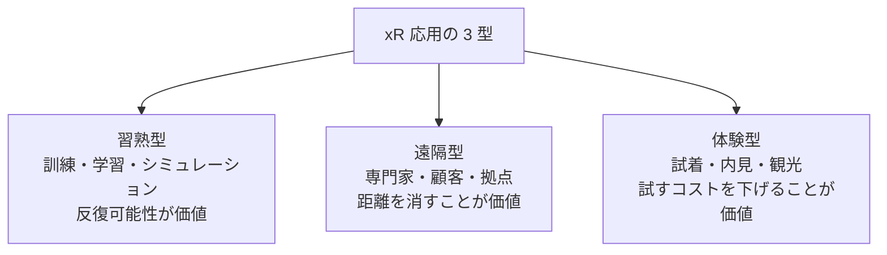

- **習熟型**：医療の VRET、リハビリテーション、教育 VR、企業研修——「反復可能性」に価値
- **遠隔型**：手術遠隔臨場、内見 VR、遠隔接客——「距離を消す」ことに価値
- **体験型**：AR 試着、AR 家具配置、バーチャル観光——「試すコストを下げる」ことに価値

この 3 型で自社ユースケースを整理すると、既存業務のどこに xR を投入すべきかの見取り図が持てます。

### ニューロダイバーシティ支援としての xR

xR は、感覚過敏や社交不安を持つ人にとって、実世界より制御しやすい環境を提供します。既刊マネジメント系の D&I 入門コースは「D&I 文脈でのニューロダイバーシティ一般論」を扱っていますが、本コースは xR 側から見た応用に絞ります。

- **感覚過敏の緩和**：騒音・混雑・強い光を VR で制御し、慣れの段階的トレーニング
- **社交不安の VRET**：面接や職場コミュニケーションの疑似体験、失敗許容の反復
- **職業訓練 VR**：自閉スペクトラム症の方への就労スキル訓練（実際の職場より安全に）
- **リモートワークとのシナジー**：物理オフィスの制約から解放される勤務形態

この領域は 2026 年 7 月時点でまだ研究段階が中心ですが、企業の D&I 実務に xR を組み込む視点として今後拡大が見込まれます。

### 次のレッスンの予告

次のレッスンでは、xR と隣接しつつも別物として扱われる「メタバース」を扱います。2021 年 10 月の Facebook Meta 改名から始まったブームの現在地、Horizon Worlds、Roblox、Fortnite、日本の VRChat、cluster、そして法的論点——アバターの肖像権、仮想アイテムの所有権、仮想空間内犯罪の扱いなど——を整理します。

### 確認クイズ

理解の定着のために、6 問のクイズを解いてみてください。

#### Q1. VRET（Virtual Reality Exposure Therapy）が対象とする主な症状として正しいものはどれですか？

- [ ] 骨折後のリハビリテーション
- [ ] 心筋梗塞の予後管理
- [x] 不安症・PTSD・恐怖症（高所恐怖症、社交不安症、飛行恐怖症、戦争 PTSD など）
- [ ] 認知症の予防

> **解説**
> VRET（Virtual Reality Exposure Therapy）は不安症・PTSD・恐怖症の治療に VR を使う心理療法で、実世界での曝露療法より安全に段階的曝露ができます。高所恐怖症、社交不安症、飛行恐怖症、戦争 PTSD、閉所恐怖症などで臨床研究と実用が進んでいます。米国では FDA 承認の VRET 医療機器も登場し始めました。骨折後リハビリは別の VR リハビリ、心筋梗塞予後や認知症予防は別領域の応用です。

#### Q2. 医療分野の xR 導入で最初に確認すべき 3 点として正しくないものはどれですか？

- [ ] 医療機器該当性の判断
- [ ] 薬事・法務との連携
- [ ] 臨床研究段階での医療機関パートナー確保
- [x] Meta Quest ストアでの配信可否

> **解説**
> 医療分野の xR 導入は「規制」の壁が最大の論点です。①医療機器該当性の判断（薬機法の対象になるか）、②薬事・法務との連携（社内体制の構築）、③臨床研究段階での医療機関パートナー確保——の 3 点を初期に確認します。教育・訓練用ならば規制の壁は低くなります。ストア配信可否は補助的な論点で、業務用途では独自配信ルート（Meta Quest for Business など）も選択肢です。

#### Q3. 不動産の AR 家具配置アプリの代表例として最も知られているのはどれですか？

- [ ] Netflix Home（Netflix、2020）
- [x] IKEA Place（2017）
- [ ] Zoom Rooms（2019）
- [ ] Amazon Prime Day AR（2019）

> **解説**
> IKEA Place は 2017 年 9 月に公開された AR 家具配置アプリで、スマホカメラで自宅にソファやテーブルを実寸大で配置できます。家具の色・サイズ・スタイルを実際の部屋に重ねて確認でき、EC の返品率削減と顧客満足度向上に貢献してきました。Apple の ARKit を活用した初期の代表事例で、多くの家具 EC が類似機能を導入しました。

#### Q4. 小売の xR 応用で「継続利用が定着した」領域として最も適切なものはどれですか？

- [x] AR 試着（化粧品、眼鏡、アクセサリー、ヘアスタイル）
- [ ] バーチャルストア（Web での仮想店舗歩き回り）
- [ ] 店舗内 AR ナビゲーション（商品の位置を AR で案内）
- [ ] AR キャンペーン広告

> **解説**
> 小売の xR 応用で継続利用が定着した数少ない領域が AR 試着です。化粧品、眼鏡、時計、アクセサリー、ヘアスタイルなど、身につけるものをスマホカメラで試着でき、EC の返品率削減と実店舗の混雑緩和に貢献しています。ロレアル、資生堂、Warby Parker、Snapchat などが早期導入例です。バーチャルストア・店舗内 AR ナビ・AR キャンペーン広告は「1 回の話題化」で終わりがちで、日常利用には至っていません。

#### Q5. 業種横断の xR 応用の 3 型として正しい組み合わせはどれですか？

- [ ] エンタメ型・ゲーム型・広告型
- [ ] 業務型・教育型・娯楽型
- [x] 習熟型・遠隔型・体験型
- [ ] 商業型・医療型・軍事型

> **解説**
> xR 応用の業種横断パターンは、①習熟型（訓練・学習・シミュレーション、反復可能性が価値）、②遠隔型（専門家・顧客・拠点、距離を消すことが価値）、③体験型（試着・内見・観光、試すコストを下げることが価値）の 3 型に整理できます。医療 VRET は習熟型、内見 VR は遠隔型、AR 試着は体験型と、それぞれ複数業種に共通するパターンで見取り図が持てます。

#### Q6. ニューロダイバーシティ支援としての xR 応用の方向性として正しくないものはどれですか？

- [ ] 感覚過敏の緩和（騒音・混雑・強い光を VR で制御し慣れの段階トレーニング）
- [ ] 社交不安の VRET（面接や職場コミュニケーションの疑似体験）
- [x] 感覚過敏の完全な消失を目的とした治療
- [ ] 職業訓練 VR（自閉スペクトラム症の方への就労スキル訓練）

> **解説**
> ニューロダイバーシティ支援としての xR 応用は、①感覚過敏の緩和（段階トレーニング）、②社交不安の VRET、③職業訓練 VR、④リモートワークとのシナジー——の方向で研究と実用が進みつつあります。ニューロダイバーシティは「治療して定型発達に合わせる」対象ではなく「多様性として尊重し、環境側を調整する」思想が前提です。「感覚過敏の完全な消失」を目的とするアプローチは、ニューロダイバーシティの思想と相容れません。

### まとめ

このレッスンでは、医療・教育・不動産・小売の xR 応用を横断的に整理しました。要点は 3 つです。第 1 に、医療は xR 応用が最も進んだ分野の 1 つですが「規制」の壁が大きく、初期に医療機器該当性・薬事対応・医療機関パートナーの確認が必要です。第 2 に、業種横断で見ると xR 応用は「習熟型」「遠隔型」「体験型」の 3 型に整理でき、この見取り図が自社ユースケース検討の起点になります。第 3 に、ニューロダイバーシティ支援は 2026 年から拡大が見込まれる新しい応用領域です。次のレッスンでは、xR の隣にありつつ別物として扱われる「メタバース」の現在地を整理します。

---

## レッスン7：メタバースと xR の距離——2021 年ブームからの現在地

（所要時間：25分）

### このレッスンで学ぶこと

- メタバースと xR の重なりと差分を、体験と技術の両面で説明できる
- 2021 年 10 月の Facebook Meta 改名から現在までの流れを整理できる
- Horizon Worlds・Roblox・Fortnite・VRChat・cluster の位置づけを俯瞰できる
- メタバースの法的論点（アバター肖像・アイテム所有・仮想犯罪）を語れる
- 2026 年 7 月時点で企業がメタバースをどう扱うべきかの判断軸を持てる

---

前のレッスンでは、医療・教育・不動産・小売の xR ユースケースを扱いました。このレッスンでは、xR と隣接する概念として長らく混同されてきた「メタバース」を、体験と技術の両面から整理します。2021 年の一大ブーム、その後のバックラッシュ、2026 年 7 月時点の落ち着いた景色——を、企業の意思決定者に届く形で扱います。

### メタバースと xR の重なりと差分

まず用語の位置関係を確認します。

- **xR**：技術カテゴリ（VR / AR / MR を包括）——「どう見るか」の話
- **メタバース**：体験カテゴリ（仮想空間で人が集まる場）——「どこで何をするか」の話

xR とメタバースは重なる部分があります。VR HMD でメタバース空間に入ることは可能ですし、実際に主要メタバースの多くは VR に対応します。しかし、メタバースの多くは PC / スマホからもアクセスでき、xR は必須ではありません。逆に、xR コンテンツにはメタバースでない体験（設計レビュー、シングルプレイヤー VR ゲーム、AR ナビゲーションなど）も多数あります。

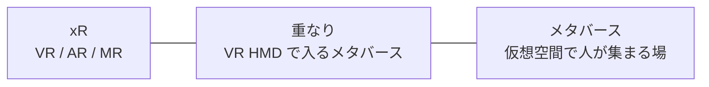

### 「メタバース」という語の来歴

「メタバース」は 1992 年の SF 小説『スノウ・クラッシュ』（Neal Stephenson 著）で提唱された造語で、「メタ（超える）」と「ユニバース（宇宙）」の合成語です。当初はサイバーパンクな仮想世界の呼称でしたが、2003 年に登場した『Second Life』（Linden Lab）でオンライン多人数仮想空間が広く普及した際に語彙として再登場し、その後長らく限定的な使われ方が続きました。

再度大きく脚光を浴びたのが 2021 年 10 月 28 日、Facebook が社名を「Meta」に変更し、メタバースを戦略の中心に据えたことです。これを機に世界的なメタバースブームが起きました。

### 2021-2026 の流れを 5 段階で押さえる

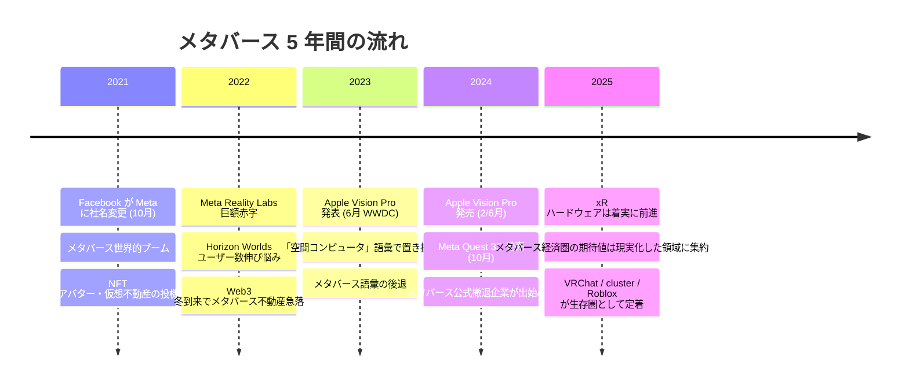

- **2021**：Meta 改名で一大ブーム、NFT アバターや仮想不動産投機がヒートアップ
- **2022**：Reality Labs 巨額赤字、Horizon Worlds ユーザー数伸び悩み、Web3 冬到来と共にメタバース不動産急落
- **2023**：Apple Vision Pro 発表で「空間コンピュータ」語彙が登場、メタバース語彙が後退開始
- **2024**：Vision Pro 発売、大企業のメタバース撤退報道が続く一方、xR ハードは着実に前進
- **2025-2026**：期待値と実装のギャップが整理され、生存領域が明確化

### 主要メタバースサービスの位置づけ

2026 年 7 月時点で主要な 5 サービスの位置づけを整理します。

#### Horizon Worlds（Meta、2021 年 12 月米国公開）

Meta 直営のメタバースで、Meta Quest からアクセスできます。企業導入では会議室や研修用途で使われますが、当初期待された「Meta の SNS を代替する日常空間」までは至っていません。日本では 2024 年 3 月に一般公開されました。

#### Roblox（Roblox Corporation、2006 年設立）

ユーザーがゲームを作って公開するプラットフォームで、月間アクティブユーザー数億人を持つ最大級のメタバースです。VR HMD 対応もありますが、PC / スマホ / タブレットからの利用が中心。K-12 年齢層のユーザーが多く、教育・広告での企業活用が進んでいます。

#### Fortnite（Epic Games、2017 年公開）

サードパーソンシューティングゲームですが、コンサート・イベント空間としても機能し、事実上のメタバースとして位置づけられます。Ariana Grande や BTS のバーチャルコンサートが数千万人規模を集めるなど、エンタメの新しい形として定着しました。

#### VRChat（VRChat Inc.、2014 年設立）

ソーシャル VR の代表格。ユーザーがアバターと空間を自作でき、日本語コミュニティが世界最大級です。日本の VTuber カルチャーとの親和性が高く、自由度の高いソーシャル VR として独自の生存領域を持ちます。

#### cluster（クラスター、日本、2015 年設立）

日本発のメタバースで、VR HMD だけでなくスマホ・PC からも参加できます。企業のバーチャルイベント、ライブ、展示会、社内会議で使われ、日本の企業メタバース案件の代表的な受け皿として定着しました。

### 確認クイズ

理解の定着のために、6 問のクイズを解いてみてください。

#### Q1. 「メタバース」という語の初出として正しいものはどれですか？

- [ ] 2003 年『Second Life』の Linden Lab によって命名
- [ ] 2021 年 10 月の Facebook Meta 社名変更時に Mark Zuckerberg が命名
- [x] 1992 年の SF 小説『スノウ・クラッシュ』（Neal Stephenson 著）
- [ ] 2016 年に Roblox が命名

> **解説**
> 「メタバース」は 1992 年の SF 小説『スノウ・クラッシュ』（Neal Stephenson 著）で提唱された造語で、「メタ（超える）」と「ユニバース（宇宙）」の合成語です。2003 年の『Second Life』（Linden Lab）で語彙が広く普及し、2021 年 10 月の Facebook Meta 社名変更で世界的ブームになりました。歴史的な造語であり、特定企業の登録商標ではありません。

#### Q2. xR とメタバースの関係として正しい記述はどれですか？

- [ ] xR とメタバースは同じ意味の用語である
- [x] xR は技術カテゴリ、メタバースは体験カテゴリで、重なりつつも独立の概念である
- [ ] メタバースは xR ハードウェアがないとアクセスできない
- [ ] xR コンテンツはすべてメタバースの一部である

> **解説**
> xR は「VR / AR / MR を包括する技術カテゴリ」で「どう見るか」の話、メタバースは「仮想空間で人が集まる体験カテゴリ」で「どこで何をするか」の話です。重なる部分があり VR HMD でメタバース空間に入れますが、メタバースの多くは PC / スマホからもアクセスでき xR は必須ではありません。逆に xR コンテンツにはメタバースでない体験（設計レビュー、シングルプレイヤー VR ゲームなど）も多数あります。

#### Q3. Facebook が Meta に社名を変更した日付として正しいものはどれですか？

- [ ] 2021 年 6 月 28 日
- [ ] 2022 年 10 月 28 日
- [ ] 2023 年 6 月 5 日
- [x] 2021 年 10 月 28 日

> **解説**
> Facebook は 2021 年 10 月 28 日に社名を「Meta」に変更し、メタバースを戦略の中心に据えました。これを機に世界的なメタバースブームが起きましたが、その後の Reality Labs の巨額赤字、Web3 冬到来と連動した仮想不動産急落、Apple Vision Pro 発表による「空間コンピュータ」語彙への置き換え——を経て、2026 年 7 月時点では「話題化」から「実装」の時代に移行しています。

#### Q4. 日本発のメタバースサービスで、企業のバーチャルイベント・展示会・社内会議の代表的な受け皿として定着したのはどれですか？

- [ ] Horizon Worlds
- [ ] Roblox
- [ ] VRChat
- [x] cluster

> **解説**
> cluster（クラスター、2015 年設立）は日本発のメタバースで、VR HMD だけでなくスマホ・PC からも参加できます。企業のバーチャルイベント、ライブ、展示会、社内会議で使われ、日本の企業メタバース案件の代表的な受け皿として定着しました。Horizon Worlds は Meta 直営、Roblox は K-12 年齢層中心、VRChat は自由度の高いソーシャル VR とコアユーザー中心と、それぞれ異なる生存領域を持ちます。

#### Q5. メタバース内で購入したアバター衣装や仮想不動産の「所有権」の法的性質として最も適切な説明はどれですか？

- [x] 多くの場合、サービス提供者との利用契約に基づくライセンスにすぎず、真の意味での所有権ではない
- [ ] 民法上の所有権として完全に保護される
- [ ] NFT を使うことで自動的に法的所有権になる
- [ ] 仮想空間内では所有権の概念そのものが存在しない

> **解説**
> メタバース内で購入したアバター衣装・家具・不動産の「所有」の法的性質は、多くの場合サービス提供者との利用契約に基づくライセンスにすぎず、真の意味での所有権ではありません。NFT を使った所有権表現は Web3 側の技術ですが、法的な所有権の担保にはなりません。サービスが終了すれば購入したアイテムは失われうる、というのが法的な現在地です。

#### Q6. 企業がメタバースを扱う際の 2026 年 7 月時点の判断軸として正しくないものはどれですか？

- [ ] 話題化か日常利用かで、予算の性質を切り分ける
- [ ] 既存業務の代替か、新規体験かを区別する
- [x] メタバース施策と Web3 施策は必ず同一プロジェクトで進める
- [ ] サービス選定は「日本語ユーザー数」で見る

> **解説**
> 企業がメタバースを扱う判断軸は、①話題化か日常利用か（予算の性質）、②既存業務の代替か新規体験か、③サービス選定は日本語ユーザー数で見る（Roblox は K-12、cluster は企業案件、VRChat はコアユーザー）、④NFT / Web3 連携は別問題として整理——の 4 つです。メタバース施策と Web3 施策は目的も規制も違うため分離するのが定石で、同一プロジェクトで進めると論点が混線し失敗しやすくなります。

### まとめ

このレッスンでは、xR と隣接するメタバースの現在地を整理しました。要点は 3 つです。第 1 に、xR は技術カテゴリ、メタバースは体験カテゴリで、重なりつつも独立の概念です。第 2 に、2021 年 10 月の Meta 改名から始まったブームは 5 年を経て「話題化」から「実装」の時代に移行し、生存領域が明確化しつつあります。第 3 に、企業導入では「話題化 vs 日常利用」「代替 vs 新規体験」「サービス選定は日本語ユーザー数」「Web3 施策とは分離」の 4 判断軸が有効です。次のレッスンでは、xR × AI と 5G の展望、そして修了後の学び方をお伝えします。

---

## レッスン8：xR × AI と 5G/Beyond 5G、修了後の学び方

（所要時間：25分）

### このレッスンで学ぶこと

- xR × AI の 3 つの本命領域（3D 制作・AI アバター・空間理解）を俯瞰できる
- 生成 AI 3D 制作の主要技術（NeRF・Gaussian Splatting・テキスト to 3D）が変えるもの
- 5G と Beyond 5G が xR にもたらすもの——クラウド xR・遠隔臨場・大規模同時接続
- Apple Vision Pro 以降、次の 3 年で xR がどう進むかの視点
- 修了後の情報源と学び方（外部リソースのみ）

---

前のレッスンでは、xR と隣接するメタバースの現在地を整理しました。本コース最後のこのレッスンでは、2026 年からの xR の本命として xR × AI と 5G/Beyond 5G を扱い、修了後の学び方までお伝えします。

### xR × AI——2026 年からの本命

生成 AI が xR に与える影響は、3 つの本命領域に整理できます。

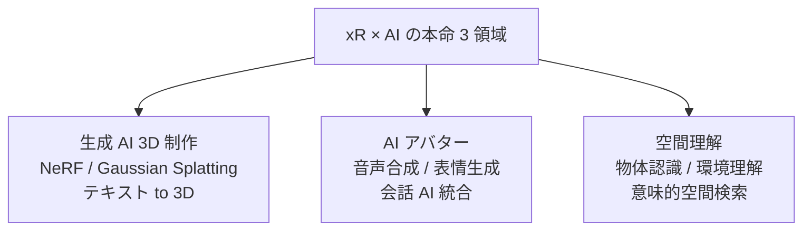

#### 生成 AI 3D 制作

xR コンテンツ制作の最大のボトルネックは 3D 資産のコストで、1 モデル数十万〜数百万円になることも珍しくありません（レッスン 4 で触れた LOD の話）。生成 AI がこの壁を破りつつあり、以下の 3 技術が主戦場です。

- **NeRF（Neural Radiance Fields、2020 UC Berkeley）**：複数の写真から機械学習で 3D 空間の光の場を推定
- **Gaussian Splatting（2023 SIGGRAPH）**：NeRF より高速・高品質、実世界のスキャンから写実的な 3D 空間を数分で作成
- **テキスト to 3D**：Meta 3DGen（2024）、NVIDIA GET3D、Luma AI Genie など、テキストプロンプトから 3D モデル生成

2026 年 7 月時点で商用利用の品質はまだ完璧ではありませんが、24 か月以内の実用化が見込まれます。

#### AI アバター

音声合成、表情生成、会話 AI を統合し、リアルなアバターを xR 空間に配置する技術です。ANIMAL Well、Convai、Inworld AI などのスタートアップが企業向けに、店員 AI・ガイド AI・教育 AI を提供しつつあります。

#### 空間理解

xR ヘッドセットのカメラが撮影した実世界を、AI で意味的に理解する技術です。「机の上の書類を認識する」「部屋の家具を分類する」「動作を検知する」など、AR コンテンツの実装レベルを大きく引き上げます。Apple Vision Pro の visionOS は、この空間理解機能を SDK で開発者に開放しつつあります。

### 5G と Beyond 5G が xR にもたらすもの

5G（第 5 世代移動通信）は 2020 年から日本で商用化され、Beyond 5G（6G）は 2030 年頃の商用化を目指して研究段階です。

#### 5G が xR にもたらす 3 つの変化

1. **クラウド xR**：レンダリングをクラウド側で行い、xR ヘッドセットは軽量な受信端末になる。バッテリー・演算能力・重量の制約から解放される
2. **超低遅延の遠隔臨場**：5G の 1 ミリ秒級遅延で、医療・製造の遠隔操作が現実に近づく
3. **大規模同時接続**：スタジアム規模の xR ライブイベントで、数万人が同時に参加できる

#### Beyond 5G（6G）の想定

Beyond 5G は 2030 年頃の商用化を想定し、5G の 10 倍の速度、10 分の 1 の遅延、100 倍の同時接続が目標です。総務省「Beyond 5G 推進戦略」（2020 年 6 月公表）と「Beyond 5G 実現に向けた研究開発」に沿って、日本国内でも研究が進んでいます。xR にとっては「常時 xR で暮らす」時代の基盤インフラになる想定です。

### Apple Vision Pro 以降の視点

Apple Vision Pro の登場（2024 年 2 月米国、6 月日本）以降、xR の次の 3 年は以下の 3 展開が予想されます。

- **HMD の軽量化・低価格化**：現行 500g 級から 200g 級のグラス型へ、価格帯も分化
- **ソフトウェアの充実**：visionOS、Meta Horizon OS の SDK 拡充、企業向けアプリケーションの増加
- **業種別ソリューションの標準化**：業界横断で使えるパッケージ製品化

企業導入では、この 3 展開を前提に「初期投資を絞り、標準化された時点で本格展開する」戦略と、「先行投資でノウハウを蓄積する」戦略の 2 択があり得ます。

> **💡 ポイント**
> どちらの戦略が正解かは、業界の xR 依存度によります。設計・製造・医療のように xR が競争優位に直結する業界では先行投資、それ以外の業界では標準化後の展開が定石です。「xR は自社にとって競争優位につながるか」の見極めが、投資判断の起点です。

### 中核メッセージ 6 個の総まとめ

本コースの背骨として反復してきた 6 メッセージを、修了時点でもう一度整理します。

1. **xR は端末ではなく体験——「何を置き換えるか」で技術を選ぶ**
2. **VR/AR/MR/XR の 4 語は現場では区別されない——選定軸を持つ**
3. **空間コンピューティングは第 4 のコンピュータ革命**
4. **WebXR は「アプリを配らない xR」の入口**
5. **3D コンテンツは制作原価が高い——LOD 設計と資産再利用で回収**
6. **xR × AI は 2026 年からの本命——生成 AI が 3D 制作の限界を破る**

このメッセージを社内で共有できる状態になっていれば、本コースの目的は達成です。

### 修了後の学び方——外部リソースのみ

xR は 2026 年 7 月時点でも技術変化が速い分野です。修了後の情報源として、以下の外部リソースをお勧めします。

#### 公式ドキュメント

- **Meta Developer Documentation**：Meta Quest / Horizon OS の SDK と設計原則
- **Apple Developer visionOS**：Vision Pro / visionOS の SDK、Human Interface Guidelines
- **Microsoft Learn Mixed Reality**：HoloLens 2 と Mesh の開発リソース
- **Magic Leap Developer Portal**：Magic Leap 2 の SDK
- **PICO Developer**：PICO 4 Ultra の SDK

#### 業界標準・研究

- **Khronos Group OpenXR**：xR 業界標準の最新版
- **W3C WebXR**：Web ブラウザ内 xR の標準
- **IEEE VR / ACM SIGGRAPH**：学術会議、最新研究の発表場
- **SIGGRAPH Asia**：アジア地域の CG・xR 研究発表場

#### 業界情報

- **総務省「Beyond 5G 推進戦略」**：日本の Beyond 5G / xR 政策
- **経済産業省「メタバース関連政策動向」**：日本のメタバース・xR 政策
- **Khronos Group ブログ**：業界標準の最新動向
- **VRoid、Reality Labs、visionOS の公式ブログ**：各社の発信

#### 実践コミュニティ

日本国内の xR コミュニティ（技術者向け勉強会、イベント）や、企業導入事例の発表会が定期的に開かれています。詳細は各社公式サイト・イベントプラットフォームでご確認ください。

### 修了後の学び方の心構え——3 点

1. **技術ではなく体験を追う**：新機種・新 SDK に気を取られず、「その体験は何を置き換えるか」を問い続ける
2. **AI 側の動向も同時に追う**：xR × AI は 2026 年からの本命、生成 AI の進化を xR 側の視点でも追う
3. **業界を超えて事例を読む**：自社業種以外のユースケースにこそ、次のヒントがある

### 総合まとめ

本コース全 8 レッスンで扱った内容を最後にもう 1 度俯瞰します。前半 4 レッスンで「体験と技術の位置関係」（レッスン 1 で xR の定義と Reality-Virtuality Continuum、レッスン 2 で HMD の歴史と主要 5 機種、レッスン 3 で空間コンピューティングの入出力、レッスン 4 でコンテンツ開発 4 大スタック）、中盤 2 レッスンで業種別ユースケース（レッスン 5 で製造・エンジニアリング、レッスン 6 で医療・教育・不動産・小売）、後半 2 レッスンで xR の隣接領域（レッスン 7 でメタバース、レッスン 8 で AI × xR と 5G）——という構成でした。カタログスペックではなく「体験の視点で技術を選ぶ判断軸」を持ち帰っていただければ、本コースの目的は達成です。次の企画会議・PoC 提案・端末選定の場面で、この判断軸が活きることを願っています。

### 確認クイズ

理解の定着のために、6 問のクイズを解いてみてください。

#### Q1. xR × AI の本命 3 領域として正しい組み合わせはどれですか？

- [x] 生成 AI 3D 制作・AI アバター・空間理解
- [ ] AI ゲーム・AI 音楽・AI 広告
- [ ] 自動運転・自動翻訳・自動投資
- [ ] AI 医療・AI 教育・AI 販売

> **解説**
> xR × AI の本命 3 領域は、①生成 AI 3D 制作（NeRF・Gaussian Splatting・テキスト to 3D で 3D 資産コストの壁を破る）、②AI アバター（音声合成・表情生成・会話 AI 統合でリアルなアバターを xR 空間に配置）、③空間理解（xR ヘッドセットのカメラで撮影した実世界を AI で意味的に理解）——の 3 つに整理できます。「3D 制作コスト」「アバターの制作コスト」「実世界認識の限界」がそれぞれの主戦場です。

#### Q2. Gaussian Splatting が xR で急速に注目されている理由として正しいものはどれですか？

- [ ] Apple 独占の技術で visionOS でのみ使える
- [ ] 3D モデルを 1 円で作れる革命的な安さ
- [x] NeRF より高速・高品質で、実世界のスキャンから写実的な 3D 空間を数分で作れる
- [ ] 学習データが完全にライセンスフリー

> **解説**
> Gaussian Splatting（2023 年 SIGGRAPH で発表）は NeRF より高速・高品質な 3D 再構成技術で、実世界のスキャンから写実的な 3D 空間を数分で作れます。xR での実装が急速に進み、「3D 資産の作成コスト」という xR 最大のボトルネックを破りつつある象徴的な技術です。特定企業の独占技術ではなく複数の研究・実装が進んでいます。ライセンスや権利処理は生成に使ったモデル・訓練データにより異なり、商用利用の判断は個別確認が必要です。

#### Q3. 5G が xR にもたらす主な変化として正しくないものはどれですか？

- [ ] クラウド xR（レンダリングをクラウド側で行い HMD は軽量な受信端末になる）
- [ ] 超低遅延の遠隔臨場（医療・製造の遠隔操作が現実に近づく）
- [ ] 大規模同時接続（スタジアム規模の xR ライブイベントで数万人が同時参加）
- [x] xR ハードウェアの製造原価を下げる

> **解説**
> 5G が xR にもたらす主な変化は、①クラウド xR、②超低遅延の遠隔臨場、③大規模同時接続——の 3 つです。ネットワーク側の性能向上が xR 体験に反映される変化で、xR ハードウェアの製造原価とは直接関係ありません。ハードウェアの低価格化は Meta Quest 3S の廉価版などで進みつつありますが、これは 5G の恩恵ではなく主にレンズ構成の簡略化などによる別の要因です。

#### Q4. Beyond 5G（6G）の想定と現在地として正しいものはどれですか？

- [ ] 2024 年に日本で商用化された
- [x] 2030 年頃の商用化を目指して研究段階、5G の 10 倍速度・10 分の 1 遅延・100 倍同時接続が目標
- [ ] Beyond 5G と 6G は別の技術規格
- [ ] Beyond 5G の商用化には量子コンピュータが不可欠

> **解説**
> Beyond 5G（6G）は 2030 年頃の商用化を目指して研究段階にあり、5G の 10 倍速度、10 分の 1 遅延、100 倍同時接続が目標です。総務省「Beyond 5G 推進戦略」（2020 年 6 月公表）と関連研究開発が日本国内でも進んでいます。xR にとっては「常時 xR で暮らす」時代の基盤インフラとして期待されます。Beyond 5G と 6G は基本的に同義で、量子コンピュータとの直接的な依存関係もありません。

#### Q5. 本コースが扱う 6 つの中核メッセージのうち、「xR は端末ではなく体験」の含意として正しくないものはどれですか？

- [ ] 業務目的から入り、端末を後で選ぶ
- [ ] カタログスペックより体験設計を優先する
- [x] 高価格の HMD ほど良い体験を作れる
- [ ] 「何を置き換えるか」で技術カテゴリ（VR/AR/MR）を選ぶ

> **解説**
> 「xR は端末ではなく体験」の含意は、①業務目的から入り端末を後で選ぶ、②カタログスペックより体験設計を優先する、③「何を置き換えるか」で技術カテゴリ（VR/AR/MR）を選ぶ——というものです。高価格 HMD が良い体験を作るわけではなく、業務適合が最優先です。Meta Quest 3S のような廉価版が業務適合で最適解になる場面も多くあり、「Vision Pro を買えば解決する」という発想は最も陥りやすい失敗パターンです。

#### Q6. 修了後の学び方の心構えとして、本コースが提示するものはどれですか？

- [ ] 業界レポートを毎月 100 本購読する
- [ ] 資格試験の対策を並行して進める
- [x] 技術ではなく体験を追い、AI 側の動向も同時に追い、業界を超えて事例を読む
- [ ] 自社業界の xR 事例のみを深く追う

> **解説**
> 本コースが提示する修了後の学び方の心構えは、①技術ではなく体験を追う（新機種・新 SDK に気を取られず「その体験は何を置き換えるか」を問い続ける）、②AI 側の動向も同時に追う（xR × AI は 2026 年からの本命）、③業界を超えて事例を読む（自社業種以外のユースケースにこそ次のヒントがある）——の 3 つです。本サイトの方針として資格試験対策は扱いません。業界レポートを大量に読むより、体験の視点で厳選する方が実務に活きます。

### 最後に

xR は 1968 年の Sword of Damocles から 58 年、「もうすぐ来る」と言われ続けた技術です。2020 年の Meta Quest 2、2023 年の Meta Quest 3、2024 年の Apple Vision Pro でようやくコンシューマー機として実現し、企業導入も PoC から本格運用の時代に入りました。本コースを通じて、端末カタログではなく「体験の視点で技術を選ぶ判断軸」を持ち帰っていただけたなら、本望です。修了後の学びが、次の xR プロジェクトを成功に導くことを願っています。長い時間を本コースにお付き合いいただき、ありがとうございました。

---

## 総復習テスト

これまで学んできた内容の理解度をチェックする、コース全体の総復習テストです。全 20 問、80% 以上の正解でコース修了とします。

### Q1. Reality-Virtuality Continuum の左端と右端の組み合わせとして、本コースの内容と一致するものはどれですか？【レッスン1】

- [x] 左端が実世界（Reality）、右端が仮想世界（Virtuality、VR）
- [ ] 左端が VR、右端が AR
- [ ] 左端が AR、右端が MR
- [ ] 左端が Sensorama、右端が Vision Pro

> **解説**
> Reality-Virtuality Continuum（1994、Milgram & Kishino）は、左端に純粋な実世界（Reality）、右端に純粋な仮想世界（Virtuality、VR）を置き、その間の連続体として AR、MR、AV を配置します。この 5 段階全体を Milgram らは「Mixed Reality（混合現実）」と総称しました。

### Q2. 1968 年に「Sword of Damocles」を発表し、xR の原型を作った研究者は誰ですか？【レッスン1】

- [ ] Palmer Luckey
- [ ] Morton Heilev
- [x] Ivan Sutherland
- [ ] Paul Milgram

> **解説**
> Ivan Sutherland は 1963 年に Sketchpad を発明した CG の父としても知られる研究者で、学生の Bob Sproull と共に 1968 年に「Sword of Damocles」と呼ばれる初の HMD を発表しました。天井から吊るす形状で、ワイヤーフレームの立方体を空中に描画しました。

### Q3. 「第 4 のコンピュータ革命」の 4 世代の順序として、本コースの内容と一致するものはどれですか？【レッスン1】

- [x] メインフレーム → PC → スマートフォン → 空間コンピュータ
- [ ] メインフレーム → スマートフォン → PC → 空間コンピュータ
- [ ] PC → メインフレーム → スマートフォン → 空間コンピュータ
- [ ] スマートフォン → PC → メインフレーム → 空間コンピュータ

> **解説**
> 第 4 のコンピュータ革命の 4 世代は、①メインフレーム（1950s〜）、②パーソナルコンピュータ（1980s〜、IBM PC 1981/Macintosh 1984）、③スマートフォン（2007〜、iPhone 2007）、④空間コンピュータ（2024〜、Apple Vision Pro 2024/2）の順です。空間コンピュータが第 4 世代として本当に定着するかは 2030 年代半ばまで判断できません。

### Q4. Facebook が Oculus VR を買収した金額と時期の組み合わせとして正しいものはどれですか？【レッスン2】

- [ ] 2 億ドル・2012 年 8 月
- [ ] 200 億ドル・2014 年 3 月
- [ ] 20 億ドル・2021 年 10 月
- [x] 20 億ドル・2014 年 3 月

> **解説**
> Facebook（現 Meta）は 2014 年 3 月に Oculus VR を 20 億ドル（当時レートで約 2,000 億円）で買収しました。この時点で Oculus Rift はまだ商用製品を発売しておらず、開発者版のみでした。買収は VR がスタートアップの実験から巨大テック企業の戦略領域に格上げされる契機となりました。

### Q5. Apple Vision Pro の米国発売日として本コースの内容と一致するものはどれですか？【レッスン2】

- [ ] 2023 年 6 月 5 日
- [x] 2024 年 2 月 2 日
- [ ] 2024 年 6 月 28 日
- [ ] 2024 年 10 月 15 日

> **解説**
> Apple Vision Pro は 2024 年 2 月 2 日に米国で発売され、4 か月後の 2024 年 6 月 28 日に日本を含むアジア圏で発売されました。2023 年 6 月 5 日は WWDC 2023 での発表日、10 月 15 日は関連発表がなかった日付です。

### Q6. Microsoft HoloLens 2 の位置づけとして本コースの内容と一致するものはどれですか？【レッスン2】

- [ ] 2026 年発売の後継機 HoloLens 3 が主力
- [x] Microsoft が HoloLens 3 の開発中止を発表し、2027 年 12 月にサポート終了予定
- [ ] Apple に買収されて visionOS に統合された
- [ ] 発売直後で普及がこれから

> **解説**
> Microsoft は 2024 年に HoloLens 3 の開発中止を発表し、HoloLens 2 は 2027 年 12 月にサポート終了予定です。既存資産の運用は続きますが、新規調達の対象からは徐々に外れつつあり、業務用 OST は Magic Leap 2 が次の候補になります。

### Q7. 6DoF が 3DoF より優位な点として、本コースの内容と一致するものはどれですか？【レッスン3】

- [ ] 屋外での使用に強い
- [ ] バッテリー持続時間が長い
- [x] 頭の位置移動も追跡し、VR 酔いを大幅に減らせる
- [ ] コストが低い

> **解説**
> 6DoF は頭の回転（Yaw / Pitch / Roll）に加えて、頭と体の位置移動（X / Y / Z）も追跡します。実際の身体の動きに合わせて視覚が更新されるため、視覚と前庭感覚のずれが減り、VR 酔いを大幅に減らす効果があります。3DoF は回転のみ追跡し、歩くコンテンツで酔いが強く出ます。

### Q8. VST（Video See-Through）方式の特徴として本コースの内容と一致しないものはどれですか？【レッスン3】

- [ ] カメラで撮影した実世界を HMD 内側のディスプレイに表示する
- [ ] 明るさや色味を自由に加工できる
- [ ] 屋内屋外を問わず使える
- [x] 電源が切れても実世界が見え続ける

> **解説**
> 電源が切れても実世界が見え続けるのは OST（Optical See-Through）の特徴です。VST はカメラとディスプレイを介するため、電源が切れると外が見えなくなります。他 3 つは VST の特徴として本コースで説明された内容と一致します。

### Q9. アイトラッキングがフォビエイテッドレンダリングに使われる理由として本コースの内容と一致するものはどれですか？【レッスン3】

- [ ] ユーザーの目の疲れを検知して自動休憩を促せる
- [x] 見ている中心部のみを高解像度で描画し、周辺部の解像度を落として GPU 負荷を減らせる
- [ ] 目の位置から個人認証ができる
- [ ] 左右の目の視線ずれから 3D 酔いを予測できる

> **解説**
> フォビエイテッドレンダリング（Foveated Rendering）は、アイトラッキングで検出したユーザーの視線の中心部（フォベア、中心窩）のみを高解像度で描画し、周辺視野の解像度を落とすことで GPU 負荷を大幅に減らす技術です。バッテリー持続時間を延ばすことに貢献します。

### Q10. xR コンテンツ開発の 4 大スタックの階層順序として本コースの内容と一致するものはどれですか？【レッスン4】

- [ ] 端末層 → 配布層 → 標準 API 層 → コンテンツ層
- [ ] 標準 API 層 → コンテンツ層 → 端末層 → 配布層
- [x] コンテンツ層 → 標準 API 層 → 配布層 → 端末層
- [ ] 配布層 → コンテンツ層 → 端末層 → 標準 API 層

> **解説**
> xR コンテンツ開発の 4 大スタックは、上から「コンテンツ層（Unity / Unreal）」「標準 API 層（OpenXR）」「配布層（ネイティブアプリ / WebXR）」「端末層（Meta Quest / Vision Pro / HoloLens / Magic Leap / PICO）」の順です。開発者はコンテンツ層で作り、OpenXR で標準化し、配布層でユーザーに届け、端末層で体験されます。

### Q11. OpenXR 1.0 のリリース時期と管理団体の組み合わせとして正しいものはどれですか？【レッスン4】

- [x] 2019 年 7 月・Khronos Group
- [ ] 2021 年 10 月・Meta
- [ ] 2019 年 12 月・W3C
- [ ] 2023 年 6 月・Apple

> **解説**
> OpenXR 1.0 は Khronos Group（OpenGL、Vulkan、glTF の管理団体）が 2019 年 7 月 29 日にリリースした xR 業界標準 API です。2021 年 10 月は Facebook Meta 改名、2019 年 12 月は WebXR Device API の W3C Working Draft、2023 年 6 月は Vision Pro 発表です。

### Q12. WebXR の使い所として本コースの内容と一致するものはどれですか？【レッスン4】

- [ ] 数百時間の連続業務利用
- [ ] visionOS の全機能を活用した高度な空間 UI
- [x] 短時間の営業デモ、社内会議での共有、Web 記事の埋め込みコンテンツ
- [ ] ハプティクスとフルボディトラッキングが必要な高度な体験

> **解説**
> WebXR は Web ブラウザ内で JavaScript を使って動く xR で、ストア審査を通さず URL で共有できる軽さが強みです。短時間の営業デモ、社内会議での共有、Web 記事の埋め込みコンテンツなど「アプリを配らない」用途に向きます。「本格業務はネイティブアプリ、軽量デモは WebXR」の使い分けが定石です。

### Q13. 製造業 xR の 4 大ユースケース区分として本コースの内容と一致するものはどれですか？【レッスン5】

- [ ] 娯楽・広告・教育・遠隔通信
- [ ] 医療・金融・製造・小売
- [x] 設計レビュー・現場作業支援・教育訓練・遠隔臨場
- [ ] シミュレーション・ゲーム・映画制作・音楽

> **解説**
> 製造業 xR のユースケースは、①設計レビュー（CAD ウォークスルー、VR/MR）、②現場作業支援（組立・保守・ピッキング、AR/MR）、③教育訓練（安全教育・技能伝承、VR）、④遠隔臨場（専門家リモート指導、AR/MR）の 4 領域に大別できます。

### Q14. 設計レビュー xR で費用対効果が出やすい 3 条件として本コースの内容と一致しないものはどれですか？【レッスン5】

- [ ] 実物モックアップ制作費が高い
- [ ] 地理的に分散したチームで同時レビューが必要
- [ ] 設計変更のスピードが業績に直結
- [x] 従業員 1,000 人以上の大企業

> **解説**
> 設計レビューの費用対効果が出やすい 3 条件は、①実物モックアップ制作費が高い、②地理的に分散したチームで同時レビュー、③設計変更のスピードが業績に直結、です。従業員数の絶対値ではなく、上記 3 条件で判断します。中小企業でも該当すれば導入効果が出ます。

### Q15. VRET が対象とする主な症状として本コースの内容と一致するものはどれですか？【レッスン6】

- [ ] 骨折後のリハビリテーション
- [x] 不安症・PTSD・恐怖症（高所恐怖症、社交不安症、飛行恐怖症、戦争 PTSD など）
- [ ] 心筋梗塞の予後管理
- [ ] 認知症の予防

> **解説**
> VRET（Virtual Reality Exposure Therapy）は不安症・PTSD・恐怖症の治療に VR を使う心理療法で、実世界での曝露療法より安全に段階的曝露ができます。米国では FDA 承認の VRET 医療機器も登場し始めました。

### Q16. 業種横断の xR 応用の 3 型として本コースの内容と一致する組み合わせはどれですか？【レッスン6】

- [x] 習熟型・遠隔型・体験型
- [ ] エンタメ型・ゲーム型・広告型
- [ ] 業務型・教育型・娯楽型
- [ ] 商業型・医療型・軍事型

> **解説**
> xR 応用の業種横断パターンは、①習熟型（訓練・学習・シミュレーション、反復可能性が価値）、②遠隔型（専門家・顧客・拠点、距離を消すことが価値）、③体験型（試着・内見・観光、試すコストを下げることが価値）の 3 型に整理できます。

### Q17. 「メタバース」という語の初出として本コースの内容と一致するものはどれですか？【レッスン7】

- [ ] 2003 年『Second Life』
- [x] 1992 年 SF 小説『スノウ・クラッシュ』（Neal Stephenson 著）
- [ ] 2021 年 10 月 Meta 改名時
- [ ] 2016 年 Roblox

> **解説**
> 「メタバース」は 1992 年の SF 小説『スノウ・クラッシュ』（Neal Stephenson 著）で提唱された造語で「メタ（超える）」と「ユニバース（宇宙）」の合成語です。2003 年の『Second Life』で語彙が広く普及し、2021 年 10 月の Facebook Meta 社名変更で世界的ブームになりました。

### Q18. 企業がメタバースを扱う際の 2026 年 7 月時点の判断軸として本コースの内容と一致しないものはどれですか？【レッスン7】

- [ ] 話題化か日常利用かで予算の性質を切り分ける
- [ ] 既存業務の代替か新規体験かを区別する
- [ ] サービス選定は「日本語ユーザー数」で見る
- [x] メタバース施策と Web3 施策は必ず同一プロジェクトで進める

> **解説**
> メタバース施策と Web3 施策は目的も規制も違うため分離するのが定石で、同一プロジェクトで進めると論点が混線し失敗しやすくなります。ほか 3 つ（話題化か日常利用か／代替か新規体験か／日本語ユーザー数で選定）は本コースが推奨する判断軸です。

### Q19. xR × AI の本命 3 領域として本コースの内容と一致する組み合わせはどれですか？【レッスン8】

- [x] 生成 AI 3D 制作・AI アバター・空間理解
- [ ] AI ゲーム・AI 音楽・AI 広告
- [ ] 自動運転・自動翻訳・自動投資
- [ ] AI 医療・AI 教育・AI 販売

> **解説**
> xR × AI の本命 3 領域は、①生成 AI 3D 制作（NeRF・Gaussian Splatting・テキスト to 3D で 3D 資産コストの壁を破る）、②AI アバター（音声合成・表情生成・会話 AI 統合）、③空間理解（xR ヘッドセットのカメラで撮影した実世界を AI で意味的に理解）の 3 つです。

### Q20. Beyond 5G（6G）の想定と現在地として本コースの内容と一致するものはどれですか？【レッスン8】

- [ ] 2024 年に日本で商用化された
- [ ] Beyond 5G と 6G は別の技術規格
- [ ] Beyond 5G の商用化には量子コンピュータが不可欠
- [x] 2030 年頃の商用化を目指して研究段階、5G の 10 倍速度・10 分の 1 遅延・100 倍同時接続が目標

> **解説**
> Beyond 5G（6G）は 2030 年頃の商用化を目指して研究段階にあり、5G の 10 倍速度、10 分の 1 遅延、100 倍同時接続が目標です。総務省「Beyond 5G 推進戦略」（2020 年 6 月公表）と関連研究開発が日本国内でも進んでいます。xR にとっては「常時 xR で暮らす」時代の基盤インフラとして期待されます。

## 総復習の完了

全 20 問、お疲れさまでした。80% 以上（16 問以上正解）でコース修了となります。本コースで学んだ「体験の視点で技術を選ぶ判断軸」を、次の企画会議・PoC 提案・端末選定の場面で使っていただけたら幸いです。修了後の学び方は、レッスン 8 で紹介した外部リソースをご参照ください。

---

## 用語集

本コースで扱った主要な用語を、五十音順（あ〜わ）、続いて A-Z の順で整理しています。

### 五十音順

**アイトラッキング（あいとらっきんぐ）**：赤外線 LED とカメラで瞳孔の位置を追跡し、ユーザーが今どこを見ているかを HMD が把握する技術。フォビエイテッドレンダリングによる GPU 負荷削減、視線による選択操作（Vision Pro の主入力）、ヒートマップ分析に使われる。 → レッスン 3

**空間コンピューティング（くうかんこんぴゅーてぃんぐ）**：ユーザーの周囲の 3 次元空間を計算の対象にするコンピューティング。従来のマウス・キーボード・平面ディスプレイに対し、頭の動き・視線・ジェスチャー・3D 出力・実世界との重なりを特徴とする。Apple が Vision Pro の発売に合わせて広めた語で、原型は 2003 年の MIT の学位論文。 → レッスン 3

**現場作業支援（げんばさぎょうしえん）**：実世界での作業に AR / MR で情報を重ねる xR ユースケース領域。組立支援、保守・点検、AR ピッキングなど、両手を空けたい業務ほど価値が出る。OST 型 AR グラスとスマホ AR の使い分けが定石。 → レッスン 5

**光学シースルー（こうがくしーするー）**：「OST」参照。 → レッスン 3

**コンピュータ革命の 4 世代（こんぴゅーたかくめいのよんせだい）**：①メインフレーム（1950s〜）、②パーソナルコンピュータ（1980s〜）、③スマートフォン（2007〜）、④空間コンピュータ（2024〜）の 4 段階。「第 4 のコンピュータ革命」の背景。 → レッスン 1

**視野角（しやかく、FOV）**：Field of View の略。1 度に見える範囲の角度。人間の視野角は水平約 210°、垂直約 135°。HMD の視野角がこれに近いほど没入感が高まる。Meta Quest 3 は水平約 110°、HoloLens 2 は約 43° と OST は狭い。 → レッスン 3

**習熟型・遠隔型・体験型（しゅうじゅくがた・えんかくがた・たいけんがた）**：業種横断で見た xR 応用の 3 型。習熟型は反復可能性が価値（訓練・学習）、遠隔型は距離を消すことが価値、体験型は試すコストを下げることが価値。 → レッスン 6

**スタンドアロン（すたんどあろん）**：PC などの外部機器を必要とせず、HMD 単体で動作するタイプ。2019 年の Oculus Quest 初代から主流化。Meta Quest 3、Apple Vision Pro、HoloLens 2、Magic Leap 2、PICO 4 Ultra はいずれもスタンドアロン。 → レッスン 2

**生成 AI 3D 制作（せいせいAI3D せいさく）**：テキストや複数の写真から機械学習で 3D コンテンツを作る技術群。NeRF、Gaussian Splatting、テキスト to 3D モデルなど。xR 最大のボトルネックである「3D 資産の作成コスト」を破りつつある。 → レッスン 4、レッスン 8

**遠隔臨場（えんかくりんじょう）**：現地作業者の視界を専門家がリモートで共有し、その視界に AR で指示を重ねる体験。コロナ禍の移動制限で急拡大し、以降定着した領域。Microsoft Teams + HoloLens 2 の Remote Assist が代表例。 → レッスン 5

**第 4 のコンピュータ革命（だい4のこんぴゅーたかくめい）**：Apple Vision Pro 登場以降、空間コンピュータをメインフレーム・PC・スマートフォンに続く第 4 世代と位置づける表現。定着するかは 2030 年代半ばまで判断できない。 → レッスン 1、レッスン 8

**空間理解（くうかんりかい）**：xR ヘッドセットのカメラが撮影した実世界を AI で意味的に理解する技術。物体認識、環境理解、意味的空間検索など。xR × AI の本命 3 領域の 1 つ。 → レッスン 8

**内見 VR（ないけんVR）**：不動産の内見を遠隔地からも可能にする VR 体験。360 度カメラの簡易 VR から 3D 建築モデルによる完全 VR ウォークスルーまで段階がある。コロナ禍で急速に普及。 → レッスン 6

**パススルー（ぱすするー）**：実世界を xR ヘッドセット経由で見せる仕組み。VST（Video See-Through、カメラ撮影を内側ディスプレイに）と OST（Optical See-Through、透明ガラスで直接見る）の 2 方式に分けられる。 → レッスン 3

**ハプティクス（はぷてぃくす）**：振動や圧力で「触れた」「押した」の感触を返す技術。コントローラー振動が基本、グローブ型・椅子型・全身スーツ型もある。2026 年 7 月時点で全身は実験段階。 → レッスン 3

**ハンドトラッキング（はんどとらっきんぐ）**：HMD 外側のカメラで手を撮影し、指の関節の位置を骨格モデルとして推定する技術。2019 年の Oculus Quest 初代からコンシューマー機に広く搭載。コントローラーなしで操作できる。 → レッスン 3

**判断軸（はんだんじく）**：本コースを通じて反復されるキーワード。カタログスペックではなく「体験の視点で技術を選ぶ」ための判断の枠組み。PoC 4 原則、6 選定軸、業種横断 3 型、メタバース判断軸などが具体例。 → レッスン 1、5、7

**ビデオシースルー（びでおしーするー）**：「VST」参照。 → レッスン 3

**フォビエイテッドレンダリング（ふぉびえいてっどれんだりんぐ）**：アイトラッキングで検出したユーザーの視線の中心部（フォベア、中心窩）のみを高解像度で描画し、周辺視野の解像度を落とすことで GPU 負荷を大幅に減らす技術。Apple Vision Pro や Meta Quest Pro / Quest 3S が実装。 → レッスン 3

**メタバース（めたばーす）**：仮想空間で人が集まる場を指す体験カテゴリ。1992 年の SF 小説『スノウ・クラッシュ』で提唱、2003 年『Second Life』で普及、2021 年 10 月 Meta 改名で世界的ブームに。xR と重なるが独立の概念。 → レッスン 7

**ミルグラム & キシノ（みるぐらむ あんど きしの）**：Paul Milgram（トロント大学）と Fumio Kishino（大阪大学、当時）が 1994 年 12 月に発表した Reality-Virtuality Continuum の共同著者。VR / AR / MR の位置関係を「実世界と仮想世界の連続体」として整理した。 → レッスン 1

**リフレッシュレート（りふれっしゅれーと）**：1 秒あたりに画面が更新される回数（Hz）。頭の動きに映像が追従するスムーズさを決める。VR 酔いを避けるため 72-120 Hz が主流。Meta Quest 3 は 72/80/90/120 Hz、Apple Vision Pro は 90/96/100 Hz。 → レッスン 3

**レイテンシ（れいてんし）**：遅延。特に Motion-to-Photon Latency は頭の動きから対応する映像が更新されるまでの遅延で、20 ミリ秒以下が目標。VR 酔いの主要要因。 → レッスン 3

**ロボミー（ろぼみー）**：「Reality-Virtuality Continuum」参照。 → レッスン 1

### A-Z 順

**3D 制作の LOD 設計（3Dせいさくのえるおーでぃーせっけい）**：同じオブジェクトを複数の詳細度で作り、距離や描画負荷に応じて切り替える技術。xR 端末の GPU 制約下で描画パフォーマンスと資産再利用を両立するために不可欠。既存 CAD データをそのまま xR に持ち込むと成立しないため、専用の LOD 化工程が必要。 → レッスン 4

**3DoF（3 じゆうど）**：Degrees of Freedom（自由度）が 3 で、頭の回転（Yaw / Pitch / Roll）のみを追跡。座って首を回すだけの体験。歩くコンテンツで VR 酔いが強く出る。 → レッスン 3

**5G / Beyond 5G（ふぁいぶじー / びよんど ふぁいぶじー）**：5G は 2020 年から日本で商用化された第 5 世代移動通信。Beyond 5G（6G）は 2030 年頃の商用化を目指す第 6 世代。xR にとってはクラウド xR・超低遅延の遠隔臨場・大規模同時接続をもたらす基盤インフラ。 → レッスン 8

**6DoF（6 じゆうど）**：Degrees of Freedom（自由度）が 6 で、頭の回転に加え頭と体の位置移動（X / Y / Z）も追跡。歩き回れる体験を作れる。VR 酔いを大幅に減らす。主要 HMD はすべて 6DoF。 → レッスン 3

**AR（Augmented Reality、拡張現実）**：実世界の上に情報や 3D オブジェクトを重ねて表示する xR カテゴリ。スマホで顔にウサギの耳を重ねる、看板に翻訳を重ねるなど。 → レッスン 1

**AR 試着（AR しちゃく）**：化粧品、眼鏡、時計、アクセサリー、ヘアスタイルなど、身につけるものを AR で試着する体験。ロレアル、資生堂、Warby Parker、Snapchat などが早期から導入。小売の xR 応用で継続利用が定着した数少ない領域。 → レッスン 6

**Apple Vision Pro（あっぷる びじょん ぷろ）**：Apple が 2024 年 2 月 2 日（米国）、6 月 28 日（日本）に発売したパススルー型 MR ヘッドセット。Apple は「空間コンピュータ」と呼ぶ。 → レッスン 2

**Bob Sproull（ぼぶ すぷらうる）**：Ivan Sutherland の学生で、1968 年に Sword of Damocles を共同開発した研究者。 → レッスン 1

**cluster（くらすたー）**：日本発のメタバースで、VR HMD だけでなくスマホ・PC からも参加できる。企業のバーチャルイベント、社内会議、展示会で使われ、日本の企業メタバース案件の代表的な受け皿。 → レッスン 7

**Fortnite（ふぉーとないと）**：Epic Games が 2017 年に公開したサードパーソンシューティングゲーム。コンサート・イベント空間としても機能し、事実上のメタバースとして位置づけられる。 → レッスン 7

**Gaussian Splatting（がうしあん すぷらってぃんぐ）**：2023 年 SIGGRAPH で発表された 3D 再構成技術。NeRF より高速・高品質で、実世界のスキャンから写実的な 3D 空間を数分で作れる。xR での実装が急速に進んでいる。 → レッスン 4、レッスン 8

**HMD（ヘッドマウントディスプレイ）**：Head Mounted Display の略。頭に装着するディスプレイ装置。VR / AR / MR ヘッドセットの総称。 → レッスン 2

**HoloLens 2（ほろれんず つー）**：Microsoft が 2019 年 11 月に発売した光学シースルー型（OST）MR ヘッドセット。業務用 MR の代表機。Microsoft は 2024 年に HoloLens 3 の開発中止を発表し、2027 年 12 月にサポート終了予定。 → レッスン 2

**Horizon Worlds（ほらいずん わーるず）**：Meta 直営のメタバース。Meta Quest からアクセスできる。2021 年 12 月米国公開、2024 年 3 月日本一般公開。 → レッスン 7

**IPD（Inter-Pupillary Distance）**：瞳孔間距離。左右の瞳孔の距離。日本人成人の平均は約 63mm、個人差は 55-75mm。HMD のレンズ間隔が自分の IPD と合わないと目の焦点調節に負担がかかり酔いの原因になる。 → レッスン 3

**Ivan Sutherland（あいばん さざーらんど）**：CG の父としても知られる研究者。1963 年に Sketchpad を発明、1968 年に学生の Bob Sproull と共に Sword of Damocles と呼ばれる初の HMD を発表。 → レッスン 1

**Khronos Group（くろのす ぐるーぷ）**：OpenGL、Vulkan、glTF、OpenXR などの業界標準を管理する非営利業界団体。2019 年 7 月 29 日に OpenXR 1.0 をリリース。 → レッスン 4

**LOD（Level of Detail）**：同じオブジェクトを複数の詳細度で作り、距離や描画負荷に応じて切り替える技術。「3D 制作の LOD 設計」参照。 → レッスン 4

**Magic Leap 2（まじっく りーぷ つー）**：Magic Leap が 2022 年 9 月に発売した光学シースルー型 MR ヘッドセット。HoloLens 2 のサポート終了を見据え、業務用 OST の後継としてポジション。 → レッスン 2

**Meta Quest 3 / 3S（めた くえすと すりー / すりーえす）**：Meta のスタンドアロン MR ヘッドセット。Quest 3 は 2023 年 10 月、Quest 3S は 2024 年 10 月発売。コンシューマー xR 市場のシェア多くを占める。 → レッスン 2

**MR（Mixed Reality、複合現実）**：実世界と仮想オブジェクトが相互作用する xR カテゴリ。仮想物体が実世界を認識して影を落とし、指で押すと反応する体験。 → レッスン 1

**NeRF（Neural Radiance Fields）**：2020 年 UC Berkeley 発表の 3D 再構成技術。複数の写真から機械学習で 3D 空間の光の場を推定。実世界の場所を数十枚の写真から立体化。 → レッスン 4、レッスン 8

**Oculus Rift（おきゅらす りふと）**：Palmer Luckey が 2012 年 8 月に Kickstarter で立ち上げた VR ヘッドセット。240 万ドルを集めたことが現代 xR の起点。2014 年 3 月に Facebook が Oculus VR を 20 億ドルで買収。 → レッスン 2

**OpenXR（おーぷんえっくすあーる）**：Khronos Group が管理する xR 業界の標準 API。2019 年 7 月 29 日に 1.0 リリース。Meta Quest 用 Oculus SDK、HTC Vive 用 SteamVR SDK、HoloLens 用 Windows Mixed Reality SDK と機種ごとに分離していた SDK を統合する共通標準。 → レッスン 4

**OST（Optical See-Through、光学シースルー）**：透明なガラスやウェーブガイド（導光板）を通して実世界を直接見つつ、その上に半透明の 3D ホログラムを投影する方式。HoloLens 2、Magic Leap 2 が採用。 → レッスン 3

**Palmer Luckey（ぱーまー らっきー）**：2012 年 8 月に 20 歳で Oculus Rift の Kickstarter を立ち上げた米国の技術者。現代コンシューマー xR の起点となった人物。 → レッスン 2

**PICO 4 Ultra（ぴこ ふぉー うるとら）**：中国 ByteDance 傘下の PICO が 2024 年 9 月に発売したスタンドアロン MR ヘッドセット。Meta Quest 3 の対抗機。日本市場では 2024 年 12 月からビジネス向け正式販売開始。 → レッスン 2

**Reality-Virtuality Continuum（りありてぃ ばーちゃりてぃ こんてぃにゅあむ）**：Paul Milgram と Fumio Kishino が 1994 年 12 月に発表した枠組み。実世界と仮想世界を両端に置き、その間の連続体として AR / MR / AV / VR を配置。 → レッスン 1

**Roblox（ろぶろっくす）**：Roblox Corporation が 2006 年設立、ユーザーがゲームを作って公開するプラットフォーム。月間アクティブユーザー数億人。K-12 年齢層のユーザーが多く、教育・広告での企業活用が進む。 → レッスン 7

**Sword of Damocles（そーど おぶ だもくれす）**：Ivan Sutherland と Bob Sproull が 1968 年に発表した初の HMD。天井から吊るす形状で、ワイヤーフレームの立方体を空中に描画。名前はギリシャ神話の故事から。 → レッスン 1

**Unity（ゆにてぃ）**：Unity Technologies が 2004 年設立、2005 年リリースのクロスプラットフォームゲームエンジン。開発言語は C#。xR 開発では最大シェア。企業 PoC で最も選ばれる。 → レッスン 4

**Unreal Engine（あんりある えんじん）**：Epic Games が 1998 年に初版リリースしたゲームエンジン。開発言語は C++ とビジュアルスクリプティング Blueprint。高精細グラフィックスと大規模シーンに強み。 → レッスン 4

**VR（Virtual Reality、仮想現実）**：外界を遮断し、完全に構築された仮想空間に没入させる xR カテゴリ。 → レッスン 1

**VRChat（ばーちゃるちゃっと）**：2014 年設立のソーシャル VR プラットフォーム。ユーザーがアバターと空間を自作でき、日本語コミュニティが世界最大級。VTuber カルチャーとの親和性が高い。 → レッスン 7

**VRET（Virtual Reality Exposure Therapy）**：不安症・PTSD・恐怖症の治療に VR を使う心理療法。実世界での曝露療法より安全に段階的曝露ができる。米国では FDA 承認の医療機器も登場。 → レッスン 6

**VST（Video See-Through、ビデオ透過）**：外側のカメラで実世界を撮影し、その映像を HMD 内側のディスプレイに表示して、その上に仮想オブジェクトを重ねる方式。Meta Quest 3、Apple Vision Pro、PICO 4 Ultra が採用。 → レッスン 3

**WebXR（うぇぶえっくすあーる）**：W3C が管理する Web ブラウザ用の xR 標準。2019 年 12 月に Working Draft 公開。ブラウザ内で JavaScript を使って xR コンテンツを実行できる。「アプリを配らない xR」の入口。 → レッスン 4

**xR / XR（えっくすあーる）**：VR / AR / MR を包括するアンブレラ用語。「x」は Extended、Cross、または「VR/AR/MR/未定義」のワイルドカードとして使われる。海外では XR、日本語圏では xR 表記が定着。 → レッスン 1

---

## 参考資料

本コースの執筆にあたって参照した資料を、書籍・技術記事／公式ドキュメント／論文・公的資料の 3 セクションに分けて整理しています。修了後の学びの起点として活用してください。

### 書籍・技術記事

- Sutherland, Ivan E. "The Ultimate Display."（1965）——xR の思想的原点として引用される 2 ページの論考
- Milgram, P. and Kishino, F. "A Taxonomy of Mixed Reality Visual Displays."（IEICE Transactions on Information Systems、1994 年 12 月）——Reality-Virtuality Continuum の原論文
- Steuer, J. "Defining Virtual Reality: Dimensions Determining Telepresence."（Journal of Communication、1992）——VR 体験の学術的定義
- LaValle, Steven M. "Virtual Reality."（Cambridge University Press、2023）——VR の教科書として広く使われる書籍
- Palmer Luckey インタビュー（複数媒体、2012-2014）——Oculus Rift の起業と Facebook 買収の背景

### 公式ドキュメント

- Khronos Group "OpenXR Specification"（最新版）——https://www.khronos.org/openxr/
- W3C "WebXR Device API" Working Draft（2019 年 12 月〜最新版）——https://www.w3.org/TR/webxr/
- Meta Developer Documentation——https://developer.oculus.com/ / https://developers.meta.com/horizon/
- Apple Developer visionOS——https://developer.apple.com/visionos/
- Apple Human Interface Guidelines for visionOS——https://developer.apple.com/design/human-interface-guidelines/designing-for-visionos
- Microsoft Learn Mixed Reality——https://learn.microsoft.com/mixed-reality/
- Magic Leap Developer Portal——https://developer.magicleap.com/
- PICO Developer——https://developer.picoxr.com/
- Unity XR Documentation——https://docs.unity3d.com/Manual/XR.html
- Unreal Engine XR Documentation——Epic Games 公式サイト
- Khronos glTF Specification——3D モデル交換フォーマット

### 論文・公的資料

- Feiner, S., MacIntyre, B., Höllerer, T., Webster, A. "A Touring Machine: Prototyping 3D Mobile Augmented Reality Systems."（Columbia University、1997）——AR 実装の初期論文
- Kerbl, B., et al. "3D Gaussian Splatting for Real-Time Radiance Field Rendering."（SIGGRAPH 2023）——Gaussian Splatting 原論文
- Mildenhall, B., et al. "NeRF: Representing Scenes as Neural Radiance Fields for View Synthesis."（ECCV 2020）——NeRF 原論文
- 総務省「Beyond 5G 推進戦略」（2020 年 6 月公表）——https://www.soumu.go.jp/
- 総務省「Beyond 5G / 6G 実現に向けた研究開発」関連資料
- 経済産業省「メタバース関連政策動向」——https://www.meti.go.jp/
- IEEE VR（IEEE Conference on Virtual Reality and 3D User Interfaces）——毎年開催の学術会議
- ACM SIGGRAPH／SIGGRAPH Asia——CG・xR の主要学術会議
- IEEE Standards（バーチャルリアリティ関連）

（すべてのオンライン資料の最終閲覧日：2026 年 7 月 9 日）

---

## 利用規約・二次創作ルール・著作権

- **コース掲載元**: [スキルアップカレッジ](https://skillup.college/)
- **このコースのURL**: https://skillup.college/courses/emerging-tech/xr-basics/
- **利用規約・二次創作ルール**: https://skillup.college/terms
- **著作権**: © 2026 株式会社エレファンキューブ. All rights reserved.

本コースは [スキルアップカレッジ](https://skillup.college/)（運営：株式会社エレファンキューブ）で公開されている学習コンテンツの原稿です。コース本体は上記URLでオンライン受講できます（確認クイズの即時採点、用語集の自動リンクなど、Webならではの学習体験を提供しています）。
