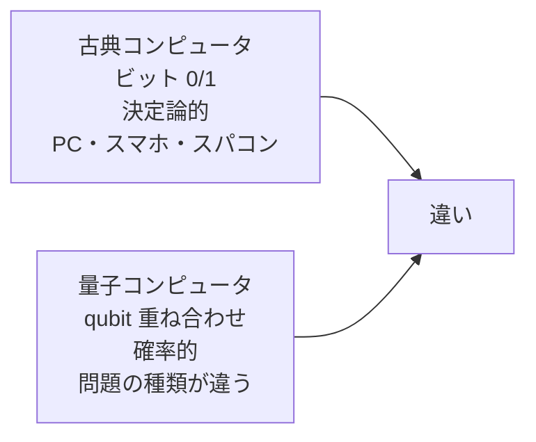
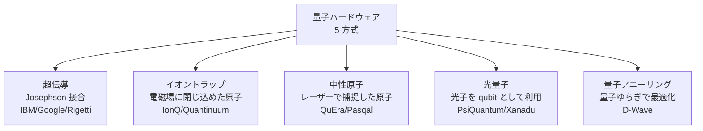
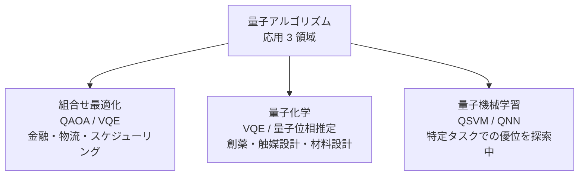
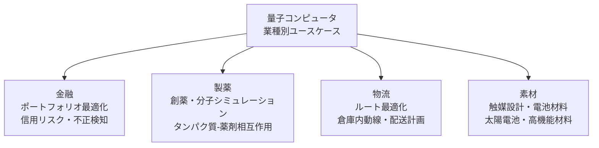
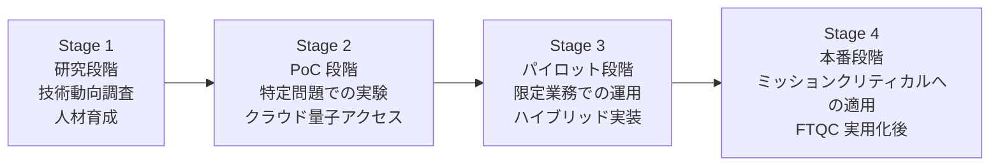

# 量子コンピューティング入門

古典コンピュータとの違い・量子アルゴリズム原理・ハードウェア各社・NISQ から FTQC まで——業種別ユースケースと量子暗号を非物理系にも通じる言葉で 2026 年 7 月時点の実装で体系化

| 項目 | 内容 |
|---|---|
| カテゴリー | 新しいIT・先端技術 |
| 難易度 | 中級 |
| 所要時間 | 約200分（全8レッスン） |
| 公開日 | 2026-07-09 |
| 最終更新日 | 2026-07-09 |
| コースURL | https://skillup.college/courses/emerging-tech/quantum-computing-basics/ |

## 対象者

事業企画・R&D・DX 推進・金融業リサーチ・製薬 R&D・素材メーカー R&D・情シス・広報。量子コンピューティングの導入判断・PoC 検討・技術評価を担う方、量子技術を「使う側」の意思決定者、非物理系のマネジメント層。

## 前提知識

高校数学（三角関数・確率）の記憶があると理解が早い、線形代数の基礎（ベクトル・行列）に触れたことがある程度が望ましいが必須ではない。数式は最小限、Mermaid 図解と比喩で理解を進める。

## 学習目標

- 量子コンピュータと古典コンピュータの本質的な違いを説明できる
- qubit・重ね合わせ・もつれ・量子ゲートの基本概念を非物理系にも通じる言葉で整理できる
- Shor・Grover・QAOA など主要量子アルゴリズムの直感的な意味を語れる
- 超伝導・イオントラップ・中性原子・光・量子アニーリングのハードウェア各社を俯瞰できる
- NISQ から FTQC への移行と量子誤り訂正の意義を理解できる
- 量子アルゴリズム応用（組合せ最適化・量子化学・量子機械学習）の適用領域を判断できる
- 量子暗号・PQC・QKD の関係と Shor が RSA/ECC を破る原理を語れる
- 業種別ユースケース（金融・製薬・物流・素材）と自社 PoC の判断軸を持ち帰れる

## コース概要

量子コンピューティングは、1982 年に Richard Feynman が「量子系のシミュレーションには量子系のコンピュータが必要」と提唱してから 44 年の歴史を持ちます。1994 年の Shor アルゴリズム、1996 年の Grover アルゴリズムを経て、2011 年 5 月の D-Wave One 商用化、2019 年 10 月の Google Sycamore「量子超越」達成——を経て、2026 年 7 月時点では「使う側」の意思決定が現実の論点になりつつあります。本コースは、物理学の専門教育を受けていない事業企画・R&D・DX 推進・情シス・広報の意思決定者に向けて、量子コンピューティングの原理・ハードウェア・アルゴリズム応用・量子暗号を、数式を極力減らして 8 レッスンで体系化します。「量子コンピュータは速い古典コンピュータではない——問題の種類が違う」を背骨に、次の PoC 検討・技術評価で使える判断軸を持ち帰っていただきます。

## 学習の流れ

前半 4 レッスンで「原理とハードウェア」を固めます。レッスン 1 で量子コンピューティングの全体像と 3 つの誤解、レッスン 2 で qubit・重ね合わせ・もつれ、レッスン 3 で量子ゲートと主要アルゴリズム、レッスン 4 でハードウェア各社比較を扱います。中盤のレッスン 5 で NISQ から FTQC への移行と誤り訂正、レッスン 6 で量子アルゴリズム応用（組合せ最適化・量子化学・量子機械学習）を扱います。後半のレッスン 7 で量子暗号・PQC・QKD、レッスン 8 で業種別ユースケースと修了後の学び方までを扱います。全 8 レッスン・約 200 分の構成です。

## レッスン一覧

| No. | タイトル | 概要 | 所要時間 |
|---|---|---|---|
| 1 | 量子コンピューティングとは何か——古典コンピュータとの違いと 3 つの誤解 | 本コースの守備範囲、Feynman 1982 の提唱、量子コンピュータと古典コンピュータの本質的な違い、3 つの誤解（速い/万能/すべての計算）、コース守備範囲・境界明示、量子化 quantization（モデル圧縮）と量子 quantum の区別を学ぶ | 25分 |
| 2 | qubit・重ね合わせ・もつれ——量子計算の 2 本柱 | qubit（キュビット）の概念、ブロッホ球、Dirac 記法の入口（|0⟩/|1⟩）、重ね合わせ（superposition）、もつれ（entanglement、ベル状態、EPR ペア）、no-cloning 定理、古典ビットとの計算資源の違いを学ぶ | 25分 |
| 3 | 量子ゲートと量子回路——Bell 状態から Grover・Shor まで | Hadamard/Pauli/CNOT ゲート、量子回路の記法、Deutsch アルゴリズム 1985、Grover 1996 の直感的説明（√N 高速化）、Shor 1994 の直感的説明（素因数分解の指数加速）を学ぶ | 25分 |
| 4 | 量子ハードウェア各社比較——超伝導/イオントラップ/中性原子/光/量子アニーリング | 超伝導（IBM/Google/Rigetti）、イオントラップ（IonQ/Quantinuum）、中性原子（QuEra）、光（PsiQuantum）、量子アニーリング（D-Wave）、国産（理研「叡」2023/3 クラウド公開 64 qubit）の 6 方式の位置づけと選定軸を学ぶ | 25分 |
| 5 | NISQ vs FTQC と量子誤り訂正 | NISQ 時代 Preskill 2018、FTQC の目標、量子誤り訂正（Shor code 1995・Steane code 1996・Surface code）、Google 表面符号エラー抑制 2023、閾値定理、2030 年前後の景色を学ぶ | 25分 |
| 6 | 量子アルゴリズム応用——組合せ最適化・量子化学・量子機械学習 | 組合せ最適化（QAOA・VQE Peruzzo et al. 2014・金融ポートフォリオ・物流ルート・スケジューリング）、量子化学（創薬・触媒設計・材料設計）、量子機械学習（QSVM・QNN）の 3 応用領域と自社 PoC の判断軸を学ぶ | 25分 |
| 7 | 量子暗号・PQC・QKD——Shor が破り、格子暗号が守る | Shor が RSA/ECC を破る原理側、PQC 概要（NIST FIPS 203/204/205 2024/8/13 は概要のみ、詳細は既刊クラウド系入門コースを参照）、QKD BB84 プロトコル 1984、中国「墨子号」QKD 衛星 2016/8、Harvest Now Decrypt Later の視点を学ぶ | 25分 |
| 8 | 業種別ユースケースと修了後の学び方 | 金融（ポートフォリオ最適化・信用リスク・不正検知）、製薬（分子シミュレーション・創薬）、物流（ルート最適化）、素材（材料設計）、企業導入 4 段階、修了後の学び方（IBM Qiskit Textbook・Microsoft Quantum Katas・国内コミュニティ）を学ぶ | 25分 |

---

## レッスン1：量子コンピューティングとは何か——古典コンピュータとの違いと 3 つの誤解

（所要時間：25分）

### このレッスンで学ぶこと

- 本コースの守備範囲（計算原理と業種横断のアルゴリズム応用）と、扱わない範囲を区別できる
- 量子コンピュータと古典コンピュータの本質的な違いを説明できる
- 量子コンピュータに対する 3 つの誤解（速い/万能/すべての計算）を整理できる
- Feynman 1982 年の提唱と量子コンピュータの起点を語れる
- 「量子化 quantization」（モデル圧縮）と「量子 quantum」の混同を避けられる

---

量子コンピューティングは、1982 年に Richard Feynman が「量子系のシミュレーションには量子系のコンピュータが必要」と提唱してから 44 年の歴史を持ちます。長い研究時代を経て、2020 年代に入って「使う側」の意思決定が現実の論点になりつつあります。本コースの背骨は「量子コンピュータは速い古典コンピュータではない——問題の種類が違う」です。ハイプに流されず、また過度な悲観にも陥らず、正確な理解の上で自社の PoC 判断ができるようになることが目的です。

### 本コースの位置づけ——「計算原理と業種横断のアルゴリズム応用」の視点

本コースは量子コンピューティングを「計算原理と業種横断のアルゴリズム応用」の視点で扱う入門です。クラウド事業者側の耐量子暗号 PQC の規制実装対応（NIST FIPS 203/204/205 の技術詳細、TLS 対応、Harvest Now Decrypt Later の企業対応など）は、既刊のクラウド系入門コースで扱います。本コースはそれらを前提として、「量子コンピュータで何ができるか、いつ使えるようになるか、自社は何を準備すべきか」の判断軸を、事業企画・R&D・DX 推進・情シス・広報・非物理系のマネジメント層に届く形で整理します。

> **💡 ポイント**
> 本コースは物理学の専門教育を前提としません。ブロッホ球や重ね合わせといった用語も、比喩と Mermaid 図解で理解を進めます。深く物理を知りたい方は、修了後にレッスン 8 で紹介する教科書（Nielsen & Chuang『Quantum Computation and Quantum Information』）を参照してください。本コースはそこに至るまでの見取り図を提供する役割です。

#### 対象読者の 3 つの視点

本コースは 3 つの視点を意識的に交錯させます。第 1 は、事業企画の視点です。量子で何ができるか、費用対効果はいつ出るか。第 2 は、R&D の視点です。自社の技術課題に量子アルゴリズムが適用可能か。第 3 は、情シスの視点です。既存の暗号技術・IT インフラは量子時代にどう変わるか。3 つの視点を持ち帰って、はじめて社内での議論が成立します。

### 量子コンピュータと古典コンピュータの本質的な違い

古典コンピュータ（現在の PC・スマホ・サーバー・スパコンをすべて含む）は「ビット（0 か 1）」を基本単位に、決定論的に計算します。量子コンピュータは「qubit（キュビット、量子ビット）」を基本単位に、確率的に計算します。この違いは表面的な速度差ではなく、扱える問題の種類の違いです。



#### 古典コンピュータが得意なこと

- Web ページの表示、動画再生、ゲーム、事務処理、AI モデルの実行
- 大量データの検索・集計（BigQuery、Snowflake などの分散処理）
- 深層学習の訓練（GPU / TPU、ChatGPT など）

これらは今後も古典コンピュータの領域で、量子コンピュータに置き換わることはありません。

#### 量子コンピュータが得意な可能性がある問題

- 特定の組合せ最適化（ポートフォリオ最適化・物流ルート最適化・スケジューリング）
- 量子化学シミュレーション（分子設計・触媒設計・材料設計）
- 特定の機械学習タスク（量子機械学習）
- 特定の暗号解読（Shor アルゴリズムによる RSA/ECC 解読）

これらは古典コンピュータでも解けますが、量子コンピュータが実用化すれば「桁違いに速く」または「今は不可能な規模を」解ける可能性があります。

### 3 つの誤解——正確な理解の前提

量子コンピュータについては、メディアで頻繁に語られる誤解があります。3 つを先に潰します。

#### 誤解 1「量子コンピュータはすべての計算を速くする」

正しくありません。量子コンピュータは、量子アルゴリズムが存在する特定の問題でのみ古典コンピュータより高速です。それ以外の問題（Web 表示・動画再生・大部分の日常計算）では、量子コンピュータは古典より遅くなることさえあります。量子コンピュータは、既存の PC を置き換える汎用コンピュータではなく、特定の問題領域に特化した専用装置と考えるのが実務的です。

#### 誤解 2「量子コンピュータは万能」

正しくありません。量子コンピュータは「Shor が RSA を破る」「Grover が探索を √N 加速する」「QAOA が組合せ最適化を改善する可能性がある」など、特定のアルゴリズムでの優位を持ちます。しかし、量子アルゴリズムが古典アルゴリズムを凌駕する問題は限定的で、汎用性という点では古典より狭いのが実情です。

#### 誤解 3「量子コンピュータはもうすぐ実用化する」

正確な言い方は「実用化の時期と領域は問題領域ごとに違う」です。量子アニーリング（D-Wave）は 2011 年から商用化されていますが、実用的な問題解決までのハードルは高いままです。汎用の FTQC（Fault-Tolerant Quantum Computer、誤り耐性量子コンピュータ）は 2030 年前後を目指すロードマップが多く、それでも技術的な不確実性は大きく残ります。

> **⚠️ 注意**
> 量子コンピュータの「実用化」時期の予測は、業界プレイヤーによって大きく異なります。「5 年以内」と言う人もいれば「20 年以上」と言う人もいます。企業導入では、特定の楽観論・悲観論に依存せず、「いつでも準備できる状態」を作る方向で計画するのが安全です。

### Feynman 1982——量子コンピュータの起点

量子コンピュータの概念的な起点は、1982 年に Richard Feynman（1965 年ノーベル物理学賞受賞者）が発表した論文「Simulating Physics with Computers」です。Feynman は「量子系の振る舞いを古典コンピュータで完全にシミュレーションするのは指数的に困難である。量子系のシミュレーションには、量子系のコンピュータを使うべきだ」と提唱しました。この視点が、量子コンピュータ研究のスタート地点になります。

その後、1985 年に David Deutsch が最初の量子アルゴリズム（Deutsch アルゴリズム）を発表し、1994 年に Peter Shor が RSA 暗号を破る Shor アルゴリズムを、1996 年に Lov Grover が探索問題を √N 加速する Grover アルゴリズムを発表しました。これら 3 つのアルゴリズムが、量子コンピュータの「なぜ研究する価値があるか」を示す代表例として、今も引用され続けます。

### 「量子化」と「量子」——用語の混同を避ける

本コースを読み進める上で、1 つ重要な用語の区別を先にしておきます。「量子化 quantization」と「量子 quantum」は別物です。

- **量子化 quantization**：AI モデルの数値精度を落として計算量を減らす技術（既刊 AI 系入門コースで詳述）。例：float32 → int8 に落として推論を高速化
- **量子 quantum**：物理学の量子力学、および本コースが扱う量子コンピューティング

日本語では両方に「量子」が使われますが、意味は完全に別物です。本コースで「量子」と書くときは、常に quantum（物理学）の意味です。AI モデルの量子化は本コースの対象外です。

### 確認クイズ

理解の定着のために、6 問のクイズを解いてみてください。

#### Q1. 量子コンピュータと古典コンピュータの本質的な違いとして本コースの内容と一致するものはどれですか？

- [x] 量子コンピュータは qubit を基本単位に確率的に計算し、特定の問題領域で古典より高速な可能性がある
- [ ] 量子コンピュータは古典コンピュータの高速版で、すべての計算を速くする
- [ ] 量子コンピュータは古典コンピュータより電力効率が良い
- [ ] 量子コンピュータは古典コンピュータより小型化しやすい

> **解説**
> 量子コンピュータは qubit（キュビット）を基本単位に確率的に計算する装置で、特定の問題領域（組合せ最適化・量子化学・特定の暗号解読）で古典コンピュータより高速な可能性があります。「すべての計算を速くする」わけではなく、Web 表示・動画再生・日常計算では古典より遅くなることさえあります。「量子コンピュータは特定問題に特化した専用装置」が正確な理解です。

#### Q2. 量子コンピュータについての「3 つの誤解」として本コースの内容と一致しないものはどれですか？

- [ ] すべての計算を速くする
- [ ] 万能である
- [ ] もうすぐ実用化する
- [x] 電気を使わずに動く

> **解説**
> 本コースが提示する 3 つの誤解は、①「量子コンピュータはすべての計算を速くする」、②「量子コンピュータは万能」、③「量子コンピュータはもうすぐ実用化する」——です。「電気を使わずに動く」は誤解として挙げていません。実際の量子コンピュータは超伝導型では極低温冷凍機を必要とし、既存 IT インフラに比べても大きな電力を消費します。

#### Q3. Richard Feynman が量子コンピュータの概念を提唱した論文の発表年として正しいものはどれですか？

- [ ] 1965 年
- [ ] 1994 年
- [ ] 2011 年
- [x] 1982 年

> **解説**
> Richard Feynman は 1982 年に論文「Simulating Physics with Computers」で「量子系のシミュレーションには量子系のコンピュータが必要」と提唱し、量子コンピュータ研究のスタート地点になりました。1965 年は Feynman のノーベル物理学賞受賞年、1994 年は Shor アルゴリズム、2011 年は D-Wave One 商用化です。

#### Q4. Shor アルゴリズムと Grover アルゴリズムの発表年の組み合わせとして正しいものはどれですか？

- [ ] Shor 1985 年・Grover 1994 年
- [x] Shor 1994 年・Grover 1996 年
- [ ] Shor 2011 年・Grover 2019 年
- [ ] Shor 1996 年・Grover 1998 年

> **解説**
> Peter Shor が 1994 年に RSA 暗号を破る Shor アルゴリズムを、Lov Grover が 1996 年に探索問題を √N 加速する Grover アルゴリズムを発表しました。1985 年は David Deutsch の最初の量子アルゴリズム（Deutsch アルゴリズム）です。これら 3 つは量子コンピュータの「なぜ研究する価値があるか」を示す代表例として、今も引用され続けます。

#### Q5. 「量子化 quantization」と「量子 quantum」の関係として本コースの内容と一致するものはどれですか？

- [ ] 量子化は量子コンピュータで実行する技術である
- [ ] 量子化と量子は同じ意味の用語である
- [x] 量子化は AI モデルの数値精度を落とす古典側の技術で、量子（quantum）とは全く別物
- [ ] 量子化は量子コンピュータの新しい呼称である

> **解説**
> 「量子化 quantization」は AI モデルの数値精度を落として計算量を減らす古典コンピュータ側の技術（float32 → int8 などの変換）で、既刊 AI 系入門コースで詳述されています。「量子 quantum」は物理学の量子力学および本コースが扱う量子コンピューティングを指します。日本語では両方に「量子」が使われますが、意味は完全に別物で、社内議論で混同が頻発する用語の代表例です。

#### Q6. 量子コンピュータの「実用化時期」に対する本コースの立場として正しいものはどれですか？

- [ ] 2030 年に完全に実用化する
- [ ] 100 年以内には実用化しない
- [x] 予測は業界プレイヤーによって大きく異なるため、特定の楽観論・悲観論に依存せず「いつでも準備できる状態」を作る方向で計画するのが安全
- [ ] 5 年以内に古典コンピュータを置き換える

> **解説**
> 量子コンピュータの実用化時期の予測は、業界プレイヤーによって大きく異なります。「5 年以内」と言う人もいれば「20 年以上」と言う人もいます。企業導入では、特定の楽観論・悲観論に依存せず、「いつでも準備できる状態」を作る方向で計画するのが安全というのが本コースの立場です。「2030 年に完全に実用化」や「100 年以内には実用化しない」といった断定は避けます。

### まとめ

このレッスンでは、量子コンピューティングの全体像を「原理・応用・時期」の 3 軸で整理しました。要点は 3 つです。第 1 に、量子コンピュータは「速い古典コンピュータ」ではなく「問題の種類が違う」専用装置です。第 2 に、3 つの誤解（すべての計算を速くする／万能／もうすぐ実用化）に注意し、正確な理解を持つことが企業導入の前提です。第 3 に、量子化 quantization（AI モデル圧縮）と量子 quantum（物理学）の用語混同を避けます。次のレッスンで、量子計算の 2 本柱——qubit・重ね合わせ・もつれを扱います。

---

## レッスン2：qubit・重ね合わせ・もつれ——量子計算の 2 本柱

（所要時間：25分）

### このレッスンで学ぶこと

- qubit（キュビット、量子ビット）の概念を古典ビットとの対比で理解できる
- 重ね合わせ（superposition）の意味を、ブロッホ球のイメージで語れる
- もつれ（entanglement）とベル状態、EPR ペアの位置づけを整理できる
- no-cloning 定理（量子情報は複製できない）の意義を説明できる
- Dirac 記法（|0⟩／|1⟩）の入口を、非物理系にも通じる言葉で扱える

---

前のレッスンでは、量子コンピュータの全体像と 3 つの誤解を扱いました。このレッスンでは、量子計算の 2 本柱——重ね合わせ（superposition）ともつれ（entanglement）を扱います。数式は最小限にとどめ、ブロッホ球という 3 次元の球イメージと Mermaid 図解で理解を進めます。

### qubit——量子ビットの基本概念

古典コンピュータのビットは、0 または 1 のどちらかの値を持ちます。qubit（キュビット、Quantum Bit）は、0 と 1 の「重ね合わせ状態」を持ちます。重ね合わせを正確に理解するには量子力学の枠組みが必要ですが、直感的には「観測するまで 0 でも 1 でもある」と捉えると入口としてわかりやすくなります。

#### 古典ビット vs qubit

| 項目 | 古典ビット | qubit |
|---|---|---|
| 状態 | 0 or 1 | 0 と 1 の重ね合わせ |
| 表現 | 0, 1 | |0⟩, |1⟩, α|0⟩+β|1⟩ |
| 観測 | 常に決まった値 | 確率的に 0 または 1 |
| 複数結合 | 独立の状態 | もつれで相関を持てる |
| 計算資源 | n bit で 2^n 通りのいずれか | n qubit で 2^n 通りの重ね合わせ |

n qubit で 2^n 通りの状態を「同時に」扱える、というのが量子計算の潜在的優位の源です。ただし、最終的に観測すると 1 つの状態に収束するため、この 2^n 通りをそのまま「取り出す」ことはできません。量子アルゴリズムは、干渉と観測を組み合わせて「求めたい答えの確率が高くなる」ように 2^n 通りを操る、という発想で設計されます。

### ブロッホ球——qubit を 3 次元空間で捉える

qubit の状態は、ブロッホ球（Bloch Sphere）と呼ばれる 3 次元の単位球の表面の点として表現できます。

- 球の北極が |0⟩、南極が |1⟩
- 球の表面のどこかの点が、qubit の一般的な状態
- 極（北極 or 南極）から離れるほど「重ね合わせ度合い」が高い

```mermaid
flowchart TB
  A[ブロッホ球<br/>3 次元単位球] --> B[北極 = |0⟩]
  A --> C[南極 = |1⟩]
  A --> D[球表面の任意の点<br/>= 一般の qubit 状態<br/>= 重ね合わせ]
```

古典ビットは球の 2 つの極のいずれか、qubit は球表面のどこにでもいられる——という違いです。この球表面の広さが「重ね合わせ」の直感的なイメージを与えてくれます。

### Dirac 記法（|0⟩／|1⟩）の入口

量子力学と量子計算では、Dirac 記法（ケットベクトル記法）が標準的に使われます。本コースでは深入りしませんが、以下の 3 記号だけ押さえてください。

- **|0⟩**：0 という状態（古典ビットの 0 に対応）
- **|1⟩**：1 という状態（古典ビットの 1 に対応）
- **α|0⟩ + β|1⟩**：重ね合わせ状態（α と β は複素数で、|α|² + |β|² = 1）

α と β は「その状態が観測される確率の平方根」のようなもので、正確には「振幅」と呼ばれる複素数です。「|α|² が |0⟩ が観測される確率、|β|² が |1⟩ が観測される確率」と押さえておけば、当面はこれで十分です。

> **📝 補足**
> ブラケット記法（〈bra|ket〉）の詳細を知りたい方は、レッスン 8 で紹介する Nielsen & Chuang『Quantum Computation and Quantum Information』の第 2 章が定番の入門です。本コースは Dirac 記法の入口だけを扱い、深追いは修了後に譲ります。

### 重ね合わせ（Superposition）——n qubit で 2^n 通りを同時に扱う

重ね合わせの計算資源上の意味は、「n qubit で 2^n 通りの状態を『同時に』扱える」ことです。例えば：

- 1 qubit：2 通り（|0⟩、|1⟩の重ね合わせ）
- 2 qubit：4 通り（|00⟩、|01⟩、|10⟩、|11⟩ の重ね合わせ）
- 10 qubit：1,024 通り
- 50 qubit：約 1,125 兆通り
- 300 qubit：宇宙の原子数を超える通り数

古典コンピュータは 300 ビットの状態変化を「1 つずつ順に」扱いますが、量子コンピュータは「300 qubit の重ね合わせ状態」として一度に扱えます。ただし、繰り返しますが「最終的に観測すると 1 つの状態に収束する」ため、この 2^n 通りをそのまま取り出せるわけではありません。量子アルゴリズムの設計は、「望む答えの確率が高くなるように状態を操作する」技術です。

### もつれ（Entanglement）——複数 qubit の相関

もつれは、複数の qubit が独立ではなく「1 つの qubit の観測結果が、離れた別の qubit の観測結果を確定させる」相関を持つ現象です。1935 年に Einstein、Podolsky、Rosen が論文で議論した EPR パラドックスの中核概念で、Einstein 自身は「不気味な遠隔作用」として批判しましたが、その後の実験で存在が確認されました。

#### ベル状態——最も基本的なもつれ

2 qubit のもつれ状態の代表例が、ベル状態（Bell State）です。以下の 4 状態が代表的です。

- |Φ+⟩ = (|00⟩ + |11⟩) / √2
- |Φ-⟩ = (|00⟩ - |11⟩) / √2
- |Ψ+⟩ = (|01⟩ + |10⟩) / √2
- |Ψ-⟩ = (|01⟩ - |10⟩) / √2

いずれも「2 qubit を測ると、必ず同じ結果か必ず異なる結果になる」相関を持ちます。片方が |0⟩ ならもう片方も |0⟩、片方が |1⟩ ならもう片方も |1⟩——という相関を、物理的な距離に依存せず保持できるのが、もつれの特徴です。

### EPR ペア——「不気味な遠隔作用」

Einstein らが 1935 年に問題提起した EPR パラドックス（Einstein-Podolsky-Rosen Paradox）は、以下のような話です。「2 つの粒子をもつれさせて遠くに離した後、片方を測定すると即座にもう片方の状態が確定する。これは光速を超える情報伝達ではないのか？」というものです。この問題は、その後の量子力学の解釈と発展の中で「相関の確認であり、情報伝達ではない」と整理されましたが、Einstein の直感的違和感は「もつれの奇妙さ」を象徴的に表現しています。

現代の量子技術（量子暗号 QKD、量子テレポーテーション、量子計算）は、いずれもこの「もつれ」を積極的に活用しています。

### no-cloning 定理——量子情報は複製できない

1982 年に Wootters・Zurek・Dieks によって独立に証明された「no-cloning 定理」は、量子情報の基本的な特性です。「任意の未知の量子状態を、完全に複製することはできない」ことが定理として証明されました。

#### no-cloning 定理の意味

- **暗号への応用**：量子鍵配送 QKD の安全性の理論的裏付け（複製できないので盗聴が検出できる）
- **計算への制約**：中間状態のバックアップができないため、エラー修復の設計が難しくなる（次のレッスンで量子誤り訂正として扱う）
- **測定の破壊性**：qubit を測定すると重ね合わせが壊れるため、「途中経過を観察する」ことが難しい

古典コンピュータでは当たり前にできる「途中の変数を print で確認する」ことが、量子計算では原則できません。この制約が、量子ソフトウェア開発の独特の困難さを生みます。

> **💡 ポイント**
> **中核メッセージ 3「量子計算は『重ね合わせ』と『もつれ』の 2 本柱」**——重ね合わせは「並行性」、もつれは「相関」を提供し、この 2 つの組み合わせが古典計算にはない新しい計算資源を生みます。ただしどちらも観測すると壊れるため、干渉のプロセスの中で「答えの確率を高める」設計が量子アルゴリズムの本質です。

### 次のレッスンの予告

次のレッスンでは、qubit を操作する量子ゲートと、それを組み合わせた量子回路を扱います。Hadamard / Pauli / CNOT ゲートの動作、Deutsch アルゴリズム 1985、Grover アルゴリズム 1996 の √N 加速、そして Shor アルゴリズム 1994 の指数加速——を、直感的なイメージで整理します。

### 確認クイズ

理解の定着のために、6 問のクイズを解いてみてください。

#### Q1. qubit と古典ビットの違いとして本コースの内容と一致するものはどれですか？

- [ ] qubit は 2 状態、古典ビットは 3 状態を持つ
- [x] qubit は 0 と 1 の重ね合わせ状態を持ち、古典ビットは 0 または 1 のいずれか
- [ ] qubit は古典ビットより容量が大きい
- [ ] qubit は古典ビットより処理速度が速い

> **解説**
> 古典ビットは 0 または 1 のどちらかの値を持ちますが、qubit は 0 と 1 の「重ね合わせ状態」を持ちます。観測するまで 0 でも 1 でもある、というのが直感的な入口です。「容量が大きい」「処理速度が速い」といった単純な比較で捉えるのは誤解のもとで、「状態の性質そのものが違う」が本質です。

#### Q2. n qubit で扱える状態の総数として本コースの内容と一致するものはどれですか？

- [x] 2^n 通りの状態を重ね合わせで同時に扱える
- [ ] n 通りの状態を順番に扱う
- [ ] n^2 通りの状態を並行に扱う
- [ ] 2n 通りの状態を扱える

> **解説**
> n qubit で 2^n 通りの状態を重ね合わせで同時に扱えるのが、量子計算の潜在的優位の源です。1 qubit で 2 通り、10 qubit で 1,024 通り、50 qubit で約 1,125 兆通りといった具合に、qubit 数の指数関数で状態空間が拡大します。ただし、観測すると 1 つの状態に収束するため、この 2^n 通りをそのまま取り出せるわけではありません。

#### Q3. ブロッホ球の北極と南極が表すものとして本コースの内容と一致するものはどれですか？

- [ ] 北極が古典ビット、南極が量子ビット
- [ ] 北極が正解、南極が不正解
- [x] 北極が |0⟩、南極が |1⟩ の状態
- [ ] 北極が観測前、南極が観測後

> **解説**
> ブロッホ球（Bloch Sphere）は qubit の状態を 3 次元の単位球の表面の点として表現する方法で、北極が |0⟩、南極が |1⟩、球表面のほかの点が一般の重ね合わせ状態を表します。古典ビットは球の 2 つの極のいずれかにしかいられないのに対し、qubit は球表面のどこにでもいられる、という違いが直感的なイメージです。

#### Q4. もつれ（Entanglement）の特徴として本コースの内容と一致するものはどれですか？

- [ ] 複数の qubit がすべて同じ状態にコピーされる現象
- [ ] qubit の状態を強制的に |0⟩ にリセットする操作
- [ ] qubit をより高速に動作させるための技術
- [x] 複数の qubit が独立ではなく、1 つの観測結果が離れた別の qubit の観測結果を確定させる相関を持つ現象

> **解説**
> もつれは、複数の qubit が独立ではなく「1 つの qubit の観測結果が、離れた別の qubit の観測結果を確定させる」相関を持つ現象です。1935 年に Einstein、Podolsky、Rosen が論文で議論した EPR パラドックスの中核概念で、Einstein は「不気味な遠隔作用」と批判しましたが、その後の実験で存在が確認されました。物理的距離に依存せず相関を保持できるのが特徴です。

#### Q5. no-cloning 定理の意味として本コースの内容と一致するものはどれですか？

- [ ] 量子状態は無限に複製できる
- [x] 任意の未知の量子状態を完全に複製することはできない
- [ ] qubit は自動的に自己複製する
- [ ] 古典コンピュータでは量子状態を複製できる

> **解説**
> no-cloning 定理は 1982 年に Wootters・Zurek・Dieks が独立に証明した量子情報の基本特性で、「任意の未知の量子状態を、完全に複製することはできない」ことを保証します。この特性は、量子鍵配送 QKD の安全性の理論的裏付けになる一方、中間状態のバックアップができないため量子計算のエラー修復設計に独特の困難を生みます。

#### Q6. 重ね合わせ状態を α|0⟩ + β|1⟩ と書くとき、α と β の意味として本コースの内容と一致するものはどれですか？

- [ ] α と β は必ず 0 または 1 の実数である
- [ ] α と β は qubit の物理的な大きさを表す
- [x] α と β は「振幅」と呼ばれる複素数で、|α|² と |β|² がそれぞれ |0⟩ と |1⟩ が観測される確率になる
- [ ] α と β は qubit の温度と磁場を表す

> **解説**
> α と β は「振幅」と呼ばれる複素数で、|α|² が |0⟩ が観測される確率、|β|² が |1⟩ が観測される確率になります。全体として |α|² + |β|² = 1 の関係を満たします。振幅は複素数のため、負の値や虚数を持てる特性が、量子計算の干渉（波の重ね合わせ）を可能にします。この干渉こそが、量子アルゴリズムが「答えの確率を高める」ための操作の中核です。

### まとめ

このレッスンでは、量子計算の 2 本柱——重ね合わせともつれを扱いました。要点は 3 つです。第 1 に、qubit は 0 と 1 の重ね合わせ状態を持ち、n qubit で 2^n 通りを同時に扱える計算資源を提供します。第 2 に、もつれは複数 qubit の距離に依存しない相関で、量子通信や量子計算の中核リソースです。第 3 に、no-cloning 定理により量子情報は複製できず、これが量子暗号の安全性の裏付けになる一方、量子計算のエラー修復設計に独特の困難を生みます。次のレッスンでは、これらを操作する量子ゲートと主要アルゴリズムを扱います。

---

## レッスン3：量子ゲートと量子回路——Bell 状態から Grover・Shor まで

（所要時間：25分）

### このレッスンで学ぶこと

- 量子ゲートの概念と、古典論理ゲートとの違いを整理できる
- Hadamard・Pauli・CNOT ゲートの基本動作を説明できる
- Deutsch アルゴリズム 1985 の意義を語れる
- Grover アルゴリズム 1996 が探索問題を √N 加速する直感的な意味を理解できる
- Shor アルゴリズム 1994 が素因数分解を指数加速する直感的な意味を語れる

---

前のレッスンでは、qubit・重ね合わせ・もつれの 2 本柱を扱いました。このレッスンでは、それらを操作する量子ゲートと、それを組み合わせた量子回路を扱います。3 つの代表的なアルゴリズム（Deutsch、Grover、Shor）を直感的なイメージで整理します。

### 量子ゲートとは何か

古典コンピュータは NOT・AND・OR などの論理ゲートの組み合わせで計算します。量子コンピュータも同様に「量子ゲート」の組み合わせで計算しますが、量子ゲートは以下の 3 つの特徴を持ちます。

1. **可逆**：入力と出力が 1 対 1 対応し、逆演算が必ず存在する（古典 AND ゲートは可逆でない）
2. **ユニタリ変換**：ブロッホ球上の状態を「回転」させる操作として表現できる
3. **線形性**：重ね合わせ状態にゲートを作用させると、各成分に同時に作用する

これらの制約により、量子回路の設計は古典論理回路と根本的に発想が異なります。

### Hadamard・Pauli・CNOT ゲート——3 大基本ゲート

量子回路で最も頻繁に使われる 3 種のゲートを押さえます。

#### Hadamard ゲート（H ゲート）

|0⟩ を (|0⟩ + |1⟩) / √2 に、|1⟩ を (|0⟩ - |1⟩) / √2 に変換します。「決定的な状態から重ね合わせを作る」ゲートで、ほぼすべての量子アルゴリズムの最初に使われます。ブロッホ球上では、北極（|0⟩）を赤道に移す回転として理解できます。

#### Pauli ゲート（X, Y, Z ゲート）

- **X ゲート**：|0⟩ と |1⟩ を入れ替える（古典 NOT に対応）
- **Y ゲート**：ブロッホ球の Y 軸周りの 180 度回転
- **Z ゲート**：|0⟩ はそのまま、|1⟩ に -1 の位相をかける

これら 3 つは、qubit 1 つに作用する基本的な操作で、量子回路の構成要素として頻繁に使われます。

#### CNOT ゲート（Controlled-NOT）

2 qubit ゲートで、制御 qubit が |1⟩ のとき標的 qubit を反転させる（|0⟩ ↔ |1⟩）操作です。CNOT ゲートともつれ生成の関係が深く、Hadamard + CNOT の組み合わせでベル状態を作れます。

```mermaid
flowchart LR
  A[初期状態<br/>|00⟩] --> B[Hadamard を<br/>1 qubit 目に]
  B --> C[(|00⟩ + |10⟩) / √2]
  C --> D[CNOT<br/>制御 qubit 1<br/>標的 qubit 2]
  D --> E[Bell 状態<br/>(|00⟩ + |11⟩) / √2]
```

Hadamard + CNOT の 2 段組みが「ベル状態を作る最短の回路」で、量子計算の入門で必ず出てくる構成です。

### Deutsch アルゴリズム——1985 年、最初の量子アルゴリズム

David Deutsch が 1985 年に発表した Deutsch アルゴリズムは、量子コンピュータが古典コンピュータより高速に解ける最初の問題を示しました。「ある 1 ビット入力・1 ビット出力の関数 f が、定数関数か均衡関数かを判定する」問題で、古典では f を 2 回呼び出す必要があるところ、量子では 1 回の呼び出しで判定できます。

Deutsch アルゴリズム自体は実用性のあるものではありませんが、「量子コンピュータが古典より本質的に速い問題が存在する」ことを初めて示した意義があります。この論文が、以降 40 年の量子コンピュータ研究の起点になりました。

### Grover アルゴリズム——1996 年、√N 加速の探索

Lov Grover が 1996 年に発表した Grover アルゴリズムは、「N 個の要素から特定の要素を探す」問題を古典より √N 倍高速に解けます。古典では平均 N/2 回の試行が必要な問題（例：無秩序な電話帳から名前で電話番号を探す）を、量子では √N 回で解けます。

#### Grover の直感的な動作

1. すべての要素を重ね合わせで表現（Hadamard を全 qubit にかける）
2. 探したい要素の振幅を「増幅」する操作（Grover Operator）を √N 回繰り返す
3. 観測すると、探したい要素が確率高く得られる

Grover アルゴリズムは「探索問題を √N 加速する」量子コンピュータの代表例で、以下の応用可能性があります。

- **暗号解読の一部**：AES など対称鍵暗号のブルートフォース探索の高速化
- **データベース検索**：無秩序なデータからの高速検索
- **組合せ最適化の一部**：候補群から最適解を探す用途

ただし、√N 倍加速は「指数加速」ではなく「多項式加速」で、Shor ほどの衝撃的な効果はありません。実用化には量子誤り訂正が整備された FTQC の登場が前提です。

### Shor アルゴリズム——1994 年、素因数分解の指数加速

Peter Shor が 1994 年に発表した Shor アルゴリズムは、「大きな整数の素因数分解を、古典コンピュータより指数関数的に高速に解く」ことができます。素因数分解の困難性は RSA 暗号の安全性の基礎になっているため、Shor アルゴリズムの完成は「現在の RSA が使えなくなる」ことを意味します。

#### Shor の直感的な動作

Shor アルゴリズムの内部構造は複雑ですが、要点は「素因数分解を『関数の周期を見つける問題』に変換し、その周期を量子フーリエ変換で高速に検出する」ことです。量子フーリエ変換（QFT、Quantum Fourier Transform）が量子コンピュータで指数的に高速に実行できるため、素因数分解も指数加速できます。

#### Shor の実用化には何が必要か

Shor アルゴリズムで 2048 ビット RSA を破るには、数百万 qubit と量子誤り訂正が必要と推定されます。2026 年 7 月時点で最大の量子コンピュータでも 1,000-2,000 qubit 程度、しかも誤り訂正なし（NISQ）です。実用化までには 10 年以上の技術進歩が必要という見方が主流ですが、正確な時期は業界プレイヤーによって幅があります。

> **⚠️ 注意**
> Shor アルゴリズムの実用化時期は「今すぐ」ではありませんが、「Harvest Now, Decrypt Later（今収穫、あとで復号）」という攻撃モデルがあります。攻撃者が今の RSA 暗号化通信を盗聴・保管し、将来 Shor アルゴリズムが実用化した時点で復号する、というシナリオです。長期的な機密性が必要な情報（政府機密、企業の長期戦略、個人の医療情報など）は、今から PQC（耐量子暗号）への移行を計画するのが定石です。PQC の詳細は既刊のクラウド系入門コースを参照してください。

### Deutsch・Grover・Shor の比較

3 つのアルゴリズムの位置づけを整理します。

| アルゴリズム | 発表年 | 解く問題 | 加速度 | 実用性 |
|---|---|---|---|---|
| Deutsch | 1985 | 関数の判定 | 2 → 1 呼び出し | 実用性はない（歴史的意義） |
| Grover | 1996 | 探索問題 | √N 倍加速 | 探索・組合せ最適化の一部 |
| Shor | 1994 | 素因数分解 | 指数加速 | 暗号解読（RSA/ECC） |

Shor が「暗号世界の 30 年の再設計」を促し、Grover が「探索と最適化」の道具になる可能性があり、Deutsch が「量子で本質的に速い問題が存在する」ことを示した——という位置づけです。

### 次のレッスンの予告

次のレッスンでは、これらのアルゴリズムを実際に動かすハードウェアを扱います。超伝導（IBM/Google/Rigetti）、イオントラップ（IonQ/Quantinuum）、中性原子（QuEra）、光（PsiQuantum）、量子アニーリング（D-Wave）、国産（理研「叡」2023 年 3 月 27 日クラウド公開の 64 qubit）——6 方式の位置づけと選定軸を比較します。

### 確認クイズ

理解の定着のために、6 問のクイズを解いてみてください。

#### Q1. 量子ゲートの特徴として本コースの内容と一致しないものはどれですか？

- [ ] 可逆である（入力と出力が 1 対 1 対応し、逆演算が存在する）
- [ ] ブロッホ球上の状態を「回転」させる操作として表現できる
- [ ] 線形性を持ち、重ね合わせ状態の各成分に同時に作用する
- [x] 必ず古典論理ゲートに変換できる

> **解説**
> 量子ゲートは、①可逆、②ユニタリ変換（ブロッホ球上の回転）、③線形性——の 3 特徴を持ちます。古典論理ゲートの多く（例：AND、OR）は可逆でないため、量子ゲートに直接対応しません。逆に古典可逆ゲート（NOT、Toffoli など）は量子ゲートに対応させられますが、「必ず古典論理ゲートに変換できる」わけではなく、量子固有のゲート（Hadamard など）は古典に対応する概念がありません。

#### Q2. Hadamard ゲートの動作として本コースの内容と一致するものはどれですか？

- [ ] |0⟩ を |1⟩ に、|1⟩ を |0⟩ に入れ替える
- [x] |0⟩ を (|0⟩ + |1⟩) / √2 に、|1⟩ を (|0⟩ - |1⟩) / √2 に変換する
- [ ] 2 qubit ゲートで制御 qubit が |1⟩ のとき標的 qubit を反転する
- [ ] |1⟩ に -1 の位相をかける

> **解説**
> Hadamard ゲートは、|0⟩ を (|0⟩ + |1⟩) / √2 に、|1⟩ を (|0⟩ - |1⟩) / √2 に変換します。「決定的な状態から重ね合わせを作る」ゲートで、ほぼすべての量子アルゴリズムの最初に使われます。|0⟩ ↔ |1⟩ の入れ替えは X ゲート（Pauli X）、制御反転は CNOT ゲート、|1⟩ に -1 位相は Z ゲート（Pauli Z）です。

#### Q3. ベル状態を作る最短の量子回路として本コースの内容と一致するものはどれですか？

- [ ] Hadamard 単独
- [ ] CNOT 単独
- [x] Hadamard + CNOT の 2 段組み
- [ ] X + Y + Z の 3 段組み

> **解説**
> ベル状態を作る最短の回路は、①初期状態 |00⟩、②1 qubit 目に Hadamard を作用させて (|00⟩ + |10⟩) / √2 を作る、③制御 qubit 1、標的 qubit 2 で CNOT を作用させて (|00⟩ + |11⟩) / √2 のベル状態を得る、という 2 段組みです。量子計算の入門で必ず出てくる構成で、もつれ生成の基本パターンです。

#### Q4. Grover アルゴリズムが古典アルゴリズムより高速化する度合いとして本コースの内容と一致するものはどれですか？

- [x] √N 倍加速（N 個の要素の探索で √N 回程度）
- [ ] N 倍加速
- [ ] 指数加速
- [ ] 加速はしない

> **解説**
> Grover アルゴリズム（1996 年 Lov Grover）は、N 個の要素から特定の要素を探す問題を、古典より √N 倍高速に解けます。古典では平均 N/2 回の試行が必要な問題を、量子では √N 回で解けます。指数加速ではなく多項式加速のため、Shor ほどの衝撃的な効果はありませんが、探索・組合せ最適化の応用可能性があります。

#### Q5. Shor アルゴリズムが破ることのできる暗号方式として本コースの内容と一致するものはどれですか？

- [x] RSA / ECC（素因数分解や離散対数問題の困難性に依存する暗号）
- [ ] AES（共通鍵暗号）
- [ ] SHA-256（ハッシュ関数）
- [ ] TLS プロトコル全体

> **解説**
> Shor アルゴリズムは大きな整数の素因数分解を指数加速で解けるため、素因数分解の困難性に依存する RSA 暗号や、離散対数問題の困難性に依存する ECC（楕円曲線暗号）を破ることができます。AES（対称鍵暗号）は Grover アルゴリズムで √N 加速される程度で、鍵長を 2 倍にすれば対策できる範囲です。SHA-256 も Grover による多項式加速のみで、指数的な脅威にはなりません。

#### Q6. 「Harvest Now, Decrypt Later」の意味として本コースの内容と一致するものはどれですか？

- [ ] 農作物を今収穫し、後で加工する
- [x] 攻撃者が今の RSA 暗号化通信を盗聴・保管し、将来 Shor アルゴリズム実用化時点で復号する攻撃モデル
- [ ] 現在の暗号技術で保護されているデータは、将来も安全である
- [ ] 量子コンピュータで通信を高速化する技術

> **解説**
> 「Harvest Now, Decrypt Later（今収穫、あとで復号）」は、攻撃者が今の暗号化通信を盗聴・保管し、将来 Shor アルゴリズムが実用化した時点で復号する攻撃モデルです。長期的な機密性が必要な情報（政府機密、企業の長期戦略、個人の医療情報など）は、今から PQC（耐量子暗号）への移行を計画するのが定石です。PQC の詳細は既刊のクラウド系入門コースを参照してください。

### まとめ

このレッスンでは、量子ゲートと量子回路、そして 3 つの代表アルゴリズム（Deutsch・Grover・Shor）を整理しました。要点は 3 つです。第 1 に、量子ゲートは可逆・ユニタリ・線形の 3 特徴を持ち、古典論理ゲートとは根本的に発想が異なります。第 2 に、Hadamard・Pauli・CNOT の 3 大基本ゲートで、重ね合わせ生成、状態変換、もつれ生成が実装できます。第 3 に、Grover は √N 加速の探索、Shor は指数加速の素因数分解で、Harvest Now Decrypt Later 攻撃を考えると PQC 移行を今から計画する意義があります。次のレッスンでは、これらを動かすハードウェア各社を比較します。

---

## レッスン4：量子ハードウェア各社比較——超伝導/イオントラップ/中性原子/光/量子アニーリング

（所要時間：25分）

### このレッスンで学ぶこと

- 量子ハードウェアの 5 方式と、それぞれの特徴を整理できる
- 各方式の主要プレイヤーと現時点の qubit 数を俯瞰できる
- 量子アニーリングとゲート型量子コンピュータの違いを説明できる
- 国産量子コンピュータ「叡（かなえ）」の位置づけを語れる
- 自社 PoC 検討で「どのハードから触るか」の判断軸を持てる

---

前のレッスンでは、量子ゲートと 3 大アルゴリズム（Deutsch・Grover・Shor）を扱いました。このレッスンでは、それらを実装する物理的なハードウェアを見ていきます。2026 年 7 月時点で商用または研究レベルで動く 5 方式を比較します。

### 5 方式の全体像

量子コンピュータの物理実装は、qubit を「何で作るか」で 5 つの主要方式に分けられます。



前 4 方式（超伝導・イオントラップ・中性原子・光）は「ゲート型」の量子コンピュータで、量子ゲートを組み合わせて任意の計算を行います。量子アニーリング（D-Wave）はゲート型ではなく、特定の最適化問題に特化した別カテゴリの装置です。

### 超伝導方式——IBM、Google、Rigetti

#### 特徴

超伝導金属で作られた「Josephson 接合」を qubit として使う方式。極低温冷凍機（-273℃、絶対零度に近い）で動作する必要があります。半導体プロセス技術を応用でき、qubit 数の増加が比較的容易で、現時点で最も qubit 数が多い方式です。

#### 主要プレイヤー

- **IBM Quantum**：2016 年 5 月に IBM Quantum Network を発足し、クラウド経由での商用化を先導。IBM Osprey 433 qubit（2022 年 11 月）、IBM Condor 1,121 qubit（2023 年 12 月）を発表
- **Google Quantum AI**：2019 年 10 月に Sycamore（54 qubit）で「量子超越」達成を発表（Nature 掲載）、2023 年 2 月に表面符号エラー抑制を Nature に発表
- **Rigetti Computing**：2013 年設立、2022 年 3 月に Nasdaq 上場

#### 弱点

- 極低温冷凍機の必要性でシステムが大型化
- qubit のコヒーレンス時間（重ね合わせが保たれる時間）が短い
- ノイズが多く、エラー率が高い

### イオントラップ方式——IonQ、Quantinuum

#### 特徴

電磁場に閉じ込めた原子（イオン）の内部状態を qubit として使う方式。極低温は不要で、常温真空環境で動作します。コヒーレンス時間が長く、ゲート精度が高い一方、qubit 数のスケールアップに技術的制約があります。

#### 主要プレイヤー

- **IonQ**：2015 年設立、2021 年 10 月に NYSE 上場（SPAC 経由）。イオントラップ方式の代表格
- **Quantinuum**：2021 年 11 月に Honeywell Quantum Solutions と Cambridge Quantum が統合して設立。技術リーダー的存在

#### 位置づけ

qubit 数では超伝導方式に劣るものの、「1 qubit あたりの品質（ゲート精度・コヒーレンス時間）」で上回る場面が多く、「少数の高品質 qubit で誤り訂正を実現する」道を目指します。

### 中性原子方式——QuEra、Pasqal

#### 特徴

レーザーで捕捉した中性原子（電荷を持たない原子）の内部状態を qubit として使う方式。イオントラップと似ていますが、電磁場ではなくレーザーで原子を配置するため、原子の並べ方が柔軟です。

#### 主要プレイヤー

- **QuEra Computing**：2018 年設立、ハーバード・MIT 起源。中性原子方式の代表格
- **Pasqal**：2019 年フランス設立、欧州の中性原子研究の中核

#### 位置づけ

比較的新しい方式で、qubit 数のスケールアップ（数千〜数万 qubit）が期待される一方、実装の成熟度は超伝導・イオントラップより低い段階です。

### 光量子方式——PsiQuantum、Xanadu

#### 特徴

光子（光の粒子）を qubit として使う方式。極低温冷凍機は原則不要で、常温動作の可能性があります。光ファイバー技術との親和性が高く、大規模化・分散化の可能性が期待されます。ただし光子ゲートの実装が難しく、実用的なゲート型量子計算の構築には技術ブレークスルーが必要です。

#### 主要プレイヤー

- **PsiQuantum**：2016 年設立、100 万 qubit 級 FTQC を目指す長期ビジョン
- **Xanadu**：カナダのスタートアップ、ガウス型量子計算の研究

### 量子アニーリング方式——D-Wave

#### 特徴

ゲート型と全く別のパラダイム。「量子ゆらぎを利用して最適化問題の最低エネルギー状態を探す」方式。特定の組合せ最適化問題に特化しており、任意の計算はできません。

#### 主要プレイヤー

- **D-Wave Systems**：2011 年 5 月に世界初の商用量子アニーリング装置 D-Wave One を発表、以降 D-Wave Advantage（5,000+ qubit）まで進化

#### 位置づけと限界

D-Wave は「量子コンピュータ」と呼ばれるものの、ゲート型量子コンピュータとは全く別の装置です。Grover や Shor は動かせません。量子アニーリングでどれだけ古典より優位を持てるかは、2026 年 7 月時点でも研究段階で、はっきりした結論は出ていません。ただし、実際の企業導入事例（Volkswagen の交通最適化、金融のポートフォリオ最適化など）は存在します。

### 国産——理研「叡（かなえ）」

日本国内でも量子コンピュータの研究開発が進んでいます。2023 年 3 月 27 日に、理化学研究所が国産初の 64 qubit 超伝導量子コンピュータ「叡（かなえ）」をクラウド公開しました。日本の産学連携の象徴的な成果で、国内企業の PoC 実験にも活用されています。

内閣府「量子未来社会ビジョン」（2022 年 4 月 22 日公表）に基づき、日本の量子技術戦略が推進されています。

### 5 方式の比較まとめ

| 方式 | 動作環境 | qubit 数（2026 年 7 月時点上限） | ゲート型？ | 代表プレイヤー |
|---|---|---|---|---|
| 超伝導 | 極低温（絶対零度近く） | 1,000+ | Yes | IBM、Google、Rigetti、理研 |
| イオントラップ | 常温真空 | 数十〜100+ | Yes | IonQ、Quantinuum |
| 中性原子 | 常温 | 数百 | Yes | QuEra、Pasqal |
| 光量子 | 常温 | 少数〜数十 | Yes（研究段階） | PsiQuantum、Xanadu |
| 量子アニーリング | 極低温 | 5,000+ | No（最適化専用） | D-Wave |

### 確認クイズ

理解の定着のために、6 問のクイズを解いてみてください。

#### Q1. 量子ハードウェアの 5 方式として本コースの内容と一致する組み合わせはどれですか？

- [x] 超伝導・イオントラップ・中性原子・光量子・量子アニーリング
- [ ] シリコン・化合物半導体・炭素・銀・金
- [ ] GPU・TPU・FPGA・ASIC・CPU
- [ ] CMOS・BiCMOS・SOI・GaN・GaAs

> **解説**
> 量子ハードウェアの 5 方式は、①超伝導（IBM/Google/Rigetti）、②イオントラップ（IonQ/Quantinuum）、③中性原子（QuEra/Pasqal）、④光量子（PsiQuantum/Xanadu）、⑤量子アニーリング（D-Wave）——です。前 4 方式はゲート型、量子アニーリングはゲート型ではなく特定の最適化問題に特化した別カテゴリです。

#### Q2. Google Sycamore が「量子超越」を達成したと発表した時期として正しいものはどれですか？

- [ ] 2016 年 5 月
- [x] 2019 年 10 月
- [ ] 2022 年 11 月
- [ ] 2023 年 12 月

> **解説**
> Google Quantum AI は 2019 年 10 月 23 日に Sycamore（54 qubit 超伝導）で「量子超越」達成を Nature に発表しました。2016 年 5 月は IBM Quantum Network 発足、2022 年 11 月は IBM Osprey 433 qubit、2023 年 12 月は IBM Condor 1,121 qubit の発表時期です。ただし「量子超越」達成の解釈は複数あり、Sycamore が解いた問題は現実的な応用ではなく特別に設計された問題でした。

#### Q3. イオントラップ方式の特徴として本コースの内容と一致するものはどれですか？

- [ ] 極低温冷凍機が必須で、大型システムになる
- [ ] qubit 数の増加が最も容易で、現時点で最多
- [x] 常温真空環境で動作し、コヒーレンス時間が長くゲート精度が高い
- [ ] 特定の最適化問題に特化した装置

> **解説**
> イオントラップ方式は、電磁場に閉じ込めた原子（イオン）の内部状態を qubit として使う方式です。常温真空環境で動作し、極低温は不要。コヒーレンス時間が長く、ゲート精度が高い一方、qubit 数のスケールアップに技術的制約があります。「1 qubit あたりの品質」で超伝導方式を上回る場面が多く、少数の高品質 qubit で誤り訂正を実現する道を目指します。

#### Q4. 量子アニーリング（D-Wave）とゲート型量子コンピュータの違いとして本コースの内容と一致するものはどれですか？

- [ ] 量子アニーリングは Grover アルゴリズムを動かせる
- [ ] 量子アニーリングは Shor アルゴリズムを動かせる
- [ ] 両者は同じパラダイムで、qubit 数が違うだけ
- [x] 量子アニーリングは特定の組合せ最適化に特化し、任意の計算はできない別カテゴリの装置

> **解説**
> 量子アニーリング（D-Wave）は「量子ゆらぎを利用して最適化問題の最低エネルギー状態を探す」方式で、特定の組合せ最適化問題に特化しています。Grover や Shor などのアルゴリズムは動かせません。ゲート型量子コンピュータ（IBM/Google/IonQ など）とは全く別のパラダイムで、qubit 数が違うだけの関係ではありません。

#### Q5. 国産量子コンピュータ「叡（かなえ）」がクラウド公開された時期として正しいものはどれですか？

- [ ] 2022 年 4 月 22 日
- [x] 2023 年 3 月 27 日
- [ ] 2019 年 10 月 23 日
- [ ] 2024 年 8 月 13 日

> **解説**
> 理化学研究所は 2023 年 3 月 27 日に国産初の 64 qubit 超伝導量子コンピュータ「叡（かなえ）」をクラウド公開しました。日本の産学連携の象徴的な成果で、国内企業の PoC 実験にも活用されています。2022 年 4 月 22 日は内閣府「量子未来社会ビジョン」公表、2019 年 10 月 23 日は Google 量子超越発表、2024 年 8 月 13 日は NIST PQC FIPS 標準確定です。

#### Q6. 企業 PoC で最初に触るハードウェアとして本コースが推奨するものはどれですか？

- [ ] D-Wave Advantage
- [ ] Google Sycamore
- [x] IBM Quantum のクラウド経由 Qiskit
- [ ] PsiQuantum の光量子コンピュータ

> **解説**
> 企業 PoC では、まず IBM Qiskit + IBM Quantum のクラウドから触るのが定石です。ドキュメントが最も充実し、日本語コミュニティも活発で、無料枠でも学習が進みます。D-Wave は特定用途、Google Sycamore は一般アクセス不可、PsiQuantum は実用化前の研究段階です。「どのハードを使うか」は、実務が固まってから選定する順序が安全です。

### まとめ

このレッスンでは、量子ハードウェア 5 方式（超伝導・イオントラップ・中性原子・光量子・量子アニーリング）を、特徴・プレイヤー・位置づけの観点で整理しました。要点は 3 つです。第 1 に、5 方式は「動作環境」「qubit 数」「ゲート型か特化型か」で大きく特徴が異なり、それぞれ違うロードマップを描いています。第 2 に、企業 PoC の初手は IBM Qiskit + IBM Quantum のクラウドが定石で、ドキュメントとコミュニティの充実度が学習コストを最も下げます。第 3 に、量子アニーリング（D-Wave）はゲート型と全く別のパラダイムで、特定問題構造にしか本領を発揮しません。次のレッスンでは、NISQ から FTQC への移行と量子誤り訂正を扱います。

---

## レッスン5：NISQ vs FTQC と量子誤り訂正

（所要時間：25分）

### このレッスンで学ぶこと

- NISQ（現在の量子コンピュータ）と FTQC（将来の量子コンピュータ）の違いを理解できる
- 量子誤り訂正の必要性と、古典との違いを説明できる
- Shor code 1995、Steane code 1996、Surface code の位置づけを整理できる
- Google の 2023 年表面符号エラー抑制の意義を語れる
- FTQC 実現までの技術ロードマップと 2030 年前後の景色を俯瞰できる

---

前のレッスンでは、量子ハードウェア 5 方式を扱いました。このレッスンでは、現在（NISQ）と将来（FTQC）の量子コンピュータの位置関係、そしてその間を埋める量子誤り訂正を扱います。中核メッセージ 2「NISQ から FTQC への移行が業界の景色を変える——2030 年前後の折り返し」の中身です。

### NISQ 時代——現在の量子コンピュータの位置

NISQ は「Noisy Intermediate-Scale Quantum」の略で、John Preskill（Caltech）が 2018 年に論文「Quantum Computing in the NISQ era and beyond」で提唱した用語です。以下の 3 特徴を持ちます。

- **Noisy（ノイズが多い）**：qubit がエラーを起こしやすく、深い回路を実行できない
- **Intermediate-Scale（中規模）**：数十〜数千 qubit で、実用問題の一部しか扱えない
- **量子誤り訂正なし**：エラーが発生してもそのまま蓄積する

2026 年 7 月時点で市場に出ているすべての量子コンピュータ（IBM、Google、IonQ、Quantinuum、QuEra、PsiQuantum、D-Wave など）は NISQ 装置です。実用計算の多くは、この NISQ 装置では困難で、限定的な問題領域（量子化学の一部、QAOA による最適化探索、量子機械学習の一部）で古典との比較実験が行われています。

### FTQC 時代——将来の目標

FTQC は「Fault-Tolerant Quantum Computing」の略で、量子誤り訂正が有効に機能し、任意の深い回路を高精度に実行できる量子コンピュータを指します。Shor アルゴリズムで 2048 ビット RSA を実用的な時間で破るには、FTQC が必要になります。

#### FTQC の主な特徴

- **量子誤り訂正が有効**：物理 qubit のエラーを論理 qubit のレベルで訂正
- **大規模化**：数百万〜数億の物理 qubit を必要とする（論理 qubit 1 個あたり数千の物理 qubit）
- **深い回路の実行**：Shor、Grover、量子化学シミュレーションを実用スケールで実行可能

FTQC の実現時期は、業界プレイヤーによって 2030 年〜2040 年と幅があります。2020 年代後半の技術ブレークスルーで前倒しになる可能性も、逆に遅延する可能性もあります。

### なぜ量子誤り訂正が難しいのか

古典コンピュータでもエラー訂正は必要ですが、その仕組みは「同じデータを複数箇所に保存し、多数決を取る」ような単純な冗長化です。量子コンピュータではこの単純な方法が使えません。

#### 3 つの根本的困難

1. **no-cloning 定理**：qubit の状態を単純に複製できないため、単純な冗長化が不可能
2. **測定の破壊性**：qubit を測定すると重ね合わせが壊れるため、エラーを確認しつつ計算を続けられない
3. **エラーの種類**：qubit は反転（bit flip）だけでなく位相反転（phase flip）も起こす

これらの困難を解決するために、量子誤り訂正符号が発明されました。

### Shor code——1995 年、量子誤り訂正の最初の突破口

Peter Shor が 1995 年に発表した Shor code は、1 つの論理 qubit を 9 つの物理 qubit で冗長化する誤り訂正符号です。「no-cloning があるのに誤り訂正できる」ことを示した歴史的な突破口で、以降の量子誤り訂正研究の起点になりました。

#### Shor code の直感

- 9 qubit を使って、bit flip エラーと phase flip エラーの両方を検出・訂正できる
- エラーを直接測定するのではなく、エラーを「もう 1 つの qubit」に符号化して測定する
- 元の情報を破壊せずにエラーの有無だけを知る仕組み

### Steane code——1996 年、より効率的な誤り訂正

Andrew Steane が 1996 年に発表した Steane code は、7 qubit で 1 論理 qubit を冗長化する、Shor code より効率的な符号です。「CSS 符号」と呼ばれる、古典誤り訂正符号を量子に拡張した重要な構造の代表例で、以降の誤り訂正符号の設計に大きく影響しました。

### Surface code——実用化への現実的な道

Kitaev らが 1997 年に提唱した Surface code（表面符号）は、2 次元格子上に qubit を配置する誤り訂正符号で、以下の理由から現在最も現実的な FTQC の候補とされます。

- **高い誤り閾値**：物理 qubit のエラー率が約 1% 以下なら誤り訂正が有効に働く
- **局所的な操作で済む**：近傍 qubit 間の操作だけで済むため、実装が容易
- **既存ハードウェアと親和性**：超伝導方式など 2 次元格子構造と相性が良い

#### 論理 qubit 1 個に必要な物理 qubit 数

Surface code で 1 論理 qubit を実現するには、物理 qubit のエラー率と目的の論理エラー率によって数十〜数千の物理 qubit が必要です。Shor アルゴリズムで RSA-2048 を破るには、数百万〜数億の物理 qubit が必要という試算があります。

### Google 表面符号エラー抑制——2023 年 2 月の Nature

Google Quantum AI は 2023 年 2 月に、Surface code を使って「物理 qubit 数を増やせば論理エラー率が指数的に減る」ことを実験的に実証したと Nature に発表しました。これは「量子誤り訂正が現実的に機能する」ことを初めて実験で示した重要な成果で、FTQC 実現への技術的な信頼性を高めました。

ただし、実用的な FTQC には、この実験結果からさらに 3 桁以上のスケールアップと、より低いエラー率が必要です。「実用化までの距離が縮まった」ことは事実ですが、「実用化が目前」というわけではありません。

### 閾値定理——量子誤り訂正の理論的裏付け

量子誤り訂正が有効に機能するには、物理 qubit のエラー率が「閾値」と呼ばれる特定の値を下回る必要があります。閾値定理（Threshold Theorem）は、この条件が満たされれば「論理 qubit のエラー率を任意に小さくできる」ことを保証する理論です。1996-1998 年に複数の研究者が独立に証明しました。

Surface code の閾値は約 1% で、超伝導方式は現在この閾値付近まで来ています。閾値を大きく下回るハードウェアが実現すれば、FTQC への道が現実的になります。

### 2030 年前後の景色——技術ロードマップ

FTQC 実現までの技術ロードマップは、業界プレイヤーによって幅があります。代表的な予測を整理します。

- **IBM ロードマップ**：2029 年に 200 論理 qubit の FTQC を目標
- **Google Quantum AI**：2030 年前後に FTQC の実用化を目標
- **IonQ**：段階的な誤り訂正と論理 qubit の拡張
- **Quantinuum**：既に少数の論理 qubit の実装に成功、拡張中
- **理研・国内**：内閣府「量子未来社会ビジョン」で 2030 年に実用機を目指す

「2030 年前後の折り返し」という表現には、①一部の実用ユースケースで量子優位が実証される、②FTQC の技術ロードマップが具体化する、③企業導入の準備段階から実装段階へ移行する——といった含意があります。

> **⚠️ 注意**
> FTQC の実現時期は、あくまで「ロードマップ」であり、技術ブレークスルーの遅延や逆に前倒しの可能性が常にあります。企業導入では、「いつ実現するか」を予測するより「実現した時点で自社が準備できているか」を問う視点が実務的です。

### 次のレッスンの予告

次のレッスンでは、量子アルゴリズムの応用領域を扱います。組合せ最適化（QAOA、VQE、金融ポートフォリオ、物流ルート、スケジューリング）、量子化学（創薬、触媒設計、材料設計）、量子機械学習（QSVM、QNN）——の 3 応用領域と、自社 PoC の判断軸を整理します。

### 確認クイズ

理解の定着のために、6 問のクイズを解いてみてください。

#### Q1. NISQ（Noisy Intermediate-Scale Quantum）の 3 特徴として本コースの内容と一致しないものはどれですか？

- [ ] Noisy（ノイズが多い、qubit がエラーを起こしやすい）
- [ ] Intermediate-Scale（中規模、数十〜数千 qubit）
- [ ] 量子誤り訂正なし（エラーが発生してもそのまま蓄積）
- [x] Fault-Tolerant（誤り耐性を持ち、任意の深い回路を実行できる）

> **解説**
> NISQ は John Preskill が 2018 年に提唱した用語で、①Noisy（ノイズが多い）、②Intermediate-Scale（中規模、数十〜数千 qubit）、③量子誤り訂正なし——の 3 特徴を持ちます。Fault-Tolerant（誤り耐性）は将来の FTQC（Fault-Tolerant Quantum Computing）の特徴で、NISQ の特徴とは対極です。2026 年 7 月時点の市販量子コンピュータはすべて NISQ 装置です。

#### Q2. 量子誤り訂正が古典と異なり難しい理由として本コースの内容と一致しないものはどれですか？

- [ ] no-cloning 定理で単純な冗長化ができない
- [ ] 測定の破壊性で計算途中のエラー確認ができない
- [ ] エラーの種類が bit flip だけでなく phase flip もある
- [x] 量子コンピュータでは全くエラーが発生しないため訂正が不要

> **解説**
> 量子コンピュータでもエラーは頻繁に発生します（むしろ古典より発生しやすい）。量子誤り訂正が古典より難しい理由は、①no-cloning 定理で単純な冗長化ができない、②測定の破壊性で計算途中のエラー確認ができない、③エラーの種類が bit flip だけでなく phase flip もある——の 3 点です。「エラーが発生しないから不要」は完全に誤りで、逆に量子誤り訂正は FTQC 実現の中核課題です。

#### Q3. Peter Shor が量子誤り訂正の最初の突破口を示した Shor code の発表年として正しいものはどれですか？

- [x] 1995 年
- [ ] 1994 年
- [ ] 1996 年
- [ ] 2018 年

> **解説**
> Shor code は Peter Shor が 1995 年に発表した量子誤り訂正の最初の突破口で、1 論理 qubit を 9 物理 qubit で冗長化します。1994 年は Shor アルゴリズム（素因数分解）、1996 年は Steane code（7 qubit の CSS 符号）、2018 年は Preskill の NISQ 用語提唱です。

#### Q4. Surface code が現在最も現実的な FTQC 候補とされる理由として本コースの内容と一致しないものはどれですか？

- [ ] 高い誤り閾値（物理 qubit のエラー率が約 1% 以下なら誤り訂正が有効）
- [ ] 局所的な操作で済む（近傍 qubit 間の操作だけで済む）
- [ ] 既存の 2 次元格子構造ハードウェアと親和性が良い
- [x] 論理 qubit 1 個を物理 qubit 1 個で実現できる

> **解説**
> Surface code で 1 論理 qubit を実現するには、物理 qubit のエラー率と目的の論理エラー率によって数十〜数千の物理 qubit が必要です。「1 対 1」ではありません。それでも Surface code が現実的な FTQC 候補とされる理由は、①高い誤り閾値、②局所操作で済む、③既存ハードとの親和性——の 3 点です。「論理 qubit 1 個を物理 qubit 1 個で実現」は誤解です。

#### Q5. Google が 2023 年 2 月に Nature に発表した Surface code の重要な実験成果として本コースの内容と一致するものはどれですか？

- [ ] Shor アルゴリズムで RSA-2048 を破る実験に成功した
- [x] 物理 qubit 数を増やすほど論理エラー率が指数的に減る、量子誤り訂正が現実的に機能することを実験的に実証した
- [ ] 100 万 qubit の FTQC を完成させた
- [ ] Surface code を初めて発明した

> **解説**
> Google Quantum AI は 2023 年 2 月に、Surface code を使って「物理 qubit 数を増やせば論理エラー率が指数的に減る」ことを実験的に実証したと Nature に発表しました。「量子誤り訂正が現実的に機能する」ことを初めて実験で示した重要な成果で、FTQC 実現への技術的な信頼性を高めました。ただし実用的な FTQC には、この結果からさらに 3 桁以上のスケールアップと、より低いエラー率が必要です。Surface code の発明は Kitaev らの 1997 年です。

#### Q6. FTQC 実現時期のロードマップに対する本コースの立場として本コースの内容と一致するものはどれですか？

- [ ] 2027 年に完全に実用化する
- [ ] 2100 年より前には実用化しない
- [x] 業界プレイヤーによって 2030 年〜2040 年と幅があり、企業導入は「実現した時点で自社が準備できているか」を問う視点が実務的
- [ ] 実現時期を予測することが最も重要な視点である

> **解説**
> FTQC の実現時期は、業界プレイヤーによって 2030 年〜2040 年と幅があります。IBM は 2029 年に 200 論理 qubit、Google は 2030 年前後、日本は「量子未来社会ビジョン」で 2030 年——などのロードマップが公表されています。企業導入では「いつ実現するか」を予測するより「実現した時点で自社が準備できているか」を問う視点が実務的というのが本コースの立場です。

### まとめ

このレッスンでは、NISQ から FTQC への移行と量子誤り訂正を扱いました。要点は 3 つです。第 1 に、現在の量子コンピュータはすべて NISQ 装置で、実用計算の多くには誤り訂正を備えた FTQC が必要です。第 2 に、量子誤り訂正は古典より根本的に難しく、Shor code 1995 の突破口以降、Surface code などが現実的な FTQC の候補として発展してきました。第 3 に、Google の 2023 年 Surface code 実験は「誤り訂正が現実的に機能する」ことを初めて実証した重要な節目で、FTQC 実現への技術的信頼性を高めました。次のレッスンでは、量子アルゴリズムの応用領域を扱います。

---

## レッスン6：量子アルゴリズム応用——組合せ最適化・量子化学・量子機械学習

（所要時間：25分）

### このレッスンで学ぶこと

- 量子アルゴリズム応用の 3 領域（組合せ最適化・量子化学・量子機械学習）を俯瞰できる
- QAOA と VQE の位置づけと NISQ 時代への適合を説明できる
- 量子化学シミュレーションが「量子コンピュータ本来の応用」とされる理由を理解できる
- 量子機械学習の現状と限界を整理できる
- 自社 PoC で「どの応用領域から始めるか」の判断軸を持てる

---

前のレッスンでは、NISQ から FTQC への移行と量子誤り訂正を扱いました。このレッスンでは、量子アルゴリズムの実用応用が期待される 3 領域を整理します。中核メッセージ 4「量子超越と量子優位性は別物——実用は 3 つの領域から来る」の中身です。

### 量子アルゴリズム応用の 3 領域

量子コンピュータで実用的な優位が期待される応用領域は、以下の 3 つに集約されます。



各領域の実用化時期と技術的成熟度は異なりますが、共通して「古典コンピュータでは困難またはコスト高な問題を、量子で効率的に解ける可能性がある」という文脈で研究が進んでいます。

### 領域 1：組合せ最適化——QAOA と VQE

組合せ最適化は「多数の候補から最適な組合せを選ぶ」問題で、金融ポートフォリオ最適化、物流ルート最適化、スケジューリング、リソース配分など幅広い応用があります。

#### QAOA（Quantum Approximate Optimization Algorithm）

Farhi、Goldstone、Gutmann が 2014 年に提唱したアルゴリズム。量子回路のパラメータを古典最適化で調整しながら、組合せ最適化問題の良い解を探します。NISQ 時代の量子コンピュータでも動作可能で、実験的に多くの企業が試しています。

#### VQE（Variational Quantum Eigensolver）

Peruzzo らが 2014 年に発表したアルゴリズム。量子系のエネルギー最低状態を求める用途で、量子化学と組合せ最適化の両方に応用されます。QAOA と同様、NISQ 時代の主力アルゴリズムの 1 つです。

#### 実応用例

- **金融ポートフォリオ最適化**：リスク・リターンのバランスを取る資産配分
- **物流ルート最適化**：配送車両のルート、倉庫内の動線
- **生産スケジューリング**：工場の生産計画、シフト管理
- **信用リスク評価**：融資判断の最適化

ただし、これらの応用で「古典より確実に速い」ことを示せている事例はまだ限定的で、量子・古典ハイブリッド（古典で大枠を解き、量子で細部を最適化）が現実的な使い方になっています。

### 領域 2：量子化学——量子コンピュータ本来の応用

Feynman が 1982 年に量子コンピュータを提唱した際の動機は、まさに「量子系のシミュレーション」でした。量子化学は量子コンピュータの「本来の応用」とも言える領域です。

#### 応用対象

- **創薬**：薬剤分子の性質予測、タンパク質-薬剤相互作用のシミュレーション
- **触媒設計**：化学反応を効率化する触媒の分子設計
- **材料設計**：太陽電池、電池、高機能材料の分子レベル設計
- **窒素固定**：ハーバー・ボッシュ法の代替（膨大な CO2 排出を減らす可能性）

#### なぜ量子化学に量子コンピュータが向くのか

分子のエネルギー計算は「電子の量子力学的な振る舞い」の計算です。古典コンピュータでは、電子数が増えると計算量が指数関数的に爆発するため、大規模分子は近似計算しかできません。量子コンピュータは、量子系そのものを qubit で表現するため、電子数が増えてもリソースが指数爆発しない可能性があります。

#### 現状と課題

2026 年 7 月時点の NISQ 装置で計算できる分子は、水素分子（H2）、リチウム水素化物（LiH）程度の小さな分子に限定されます。実用的な創薬・触媒設計に必要な大きな分子（数十〜数百原子）の計算には、FTQC が必要と見られています。ただし、NISQ 時代でも「古典との比較実験」「アルゴリズムの検証」は進行中です。

### 領域 3：量子機械学習——探索中の可能性

量子機械学習（Quantum Machine Learning、QML）は、量子コンピュータで機械学習を高速化・高精度化する試みです。以下のアルゴリズムが研究されています。

#### 主要アルゴリズム

- **QSVM（Quantum Support Vector Machine）**：カーネル法の量子版
- **QNN（Quantum Neural Network）**：ニューラルネットワークの量子版
- **量子強化学習**：強化学習の一部を量子化

#### 現状と課題

量子機械学習は、ほかの 2 領域より「古典に対する優位」の実証が難しい領域です。古典の深層学習の急速な進歩（Transformer、大規模言語モデルなど）が、量子機械学習が想定していた古典側の限界を大きく超えてしまい、比較の基準が動き続ける状況です。「量子だから優位」を示すのが逆に困難になっています。

長期的には、特定のデータ構造（量子的に生成されたデータ、化学構造データなど）で量子機械学習が古典を凌駕する可能性がある、という慎重な期待が支配的です。

### 3 領域の実用化時期の比較

| 領域 | NISQ 時代（現在） | 中期（2025-2030） | FTQC 時代（2030+） |
|---|---|---|---|
| 組合せ最適化 | 実験・PoC | ハイブリッド実装 | 本格実用化の可能性 |
| 量子化学 | 小分子の実験 | 中規模分子で優位実証 | 創薬・材料の本格実装 |
| 量子機械学習 | 探索段階 | 特定タスクで実証 | 実用化は不透明 |

### 自社 PoC の判断軸——どの領域から始めるか

自社 PoC で量子アルゴリズム応用を検討する際の判断軸を、4 つ提示します。

1. **自社の技術課題を先に洗い出す**：組合せ最適化・量子化学・量子機械学習のどれが自社課題に近いか
2. **既存の古典解法との比較を先に**：現在使っている古典ソルバーの性能と、量子で置き換えた場合の期待値を古典側の専門家と定量比較する
3. **PoC は 3〜6 か月で結論を出す**：長引くと投資対効果が不明瞭になる
4. **人材への投資を並行して行う**：量子アルゴリズムを扱える人材の育成、外部専門家との連携

> **💡 ポイント**
> 量子アルゴリズム応用の PoC で最も多い失敗は「量子で古典を置き換えようとする」発想です。**古典が既に十分速い問題を量子に持ち込んでも、古典を上回るのは難しい**——古典が原理的に困難な問題（多数の変数・非線形性・量子力学的性質）を選ぶことが、成功する PoC の入り口です。

### 確認クイズ

理解の定着のために、6 問のクイズを解いてみてください。

#### Q1. 量子アルゴリズム応用の 3 領域として本コースの内容と一致する組み合わせはどれですか？

- [x] 組合せ最適化・量子化学・量子機械学習
- [ ] 暗号解読・映像処理・音声認識
- [ ] Web 検索・データベース・グラフィックス
- [ ] SNS 分析・広告最適化・ゲーム開発

> **解説**
> 量子コンピュータで実用的な優位が期待される応用領域は、①組合せ最適化（QAOA、VQE、金融・物流・スケジューリング）、②量子化学（VQE、量子位相推定、創薬・触媒設計・材料設計）、③量子機械学習（QSVM、QNN）——の 3 つです。Web 検索、映像処理、音声認識といった古典コンピュータが十分速い領域では、量子の優位は期待されません。

#### Q2. QAOA と VQE の共通の特徴として本コースの内容と一致するものはどれですか？

- [ ] FTQC でしか動作しない
- [ ] Shor アルゴリズムの派生である
- [x] NISQ 時代でも動作可能で、量子回路のパラメータを古典最適化で調整するハイブリッド型
- [ ] 量子アニーリング専用のアルゴリズム

> **解説**
> QAOA（Quantum Approximate Optimization Algorithm、Farhi et al. 2014）と VQE（Variational Quantum Eigensolver、Peruzzo et al. 2014）は、量子回路のパラメータを古典最適化で調整するハイブリッド型アルゴリズムです。ノイズや qubit 数の制約がある NISQ 時代でも動作可能なため、現在の量子コンピュータで最も試されているアルゴリズムです。Shor アルゴリズムの派生でも、量子アニーリング専用でもありません。

#### Q3. 量子化学が「量子コンピュータ本来の応用」とされる理由として本コースの内容と一致するものはどれですか？

- [ ] 量子化学は数値計算量が少ないため
- [x] 分子のエネルギー計算は電子の量子力学的振る舞いの計算で、古典では電子数の増加で計算量が指数爆発するが、量子系を qubit で表現できる量子コンピュータは指数爆発しない可能性がある
- [ ] 化学業界が量子コンピュータ研究に多額の投資をしているため
- [ ] 量子化学はほかの 2 領域より単純な問題であるため

> **解説**
> 分子のエネルギー計算は「電子の量子力学的な振る舞い」の計算です。古典コンピュータでは電子数が増えると計算量が指数関数的に爆発するため、大規模分子は近似計算しかできません。量子コンピュータは、量子系そのものを qubit で表現するため、電子数が増えてもリソースが指数爆発しない可能性があります。Feynman が 1982 年に量子コンピュータを提唱した際の動機がこれで、「本来の応用」と言われる由縁です。

#### Q4. 2026 年 7 月時点の NISQ 装置で計算できる分子の規模として本コースの内容と一致するものはどれですか？

- [ ] タンパク質などの数千原子の大分子まで
- [ ] 数百原子の中規模分子まで
- [x] 水素分子（H2）、リチウム水素化物（LiH）程度の小分子まで
- [ ] 原子核内部の陽子・中性子の相互作用まで

> **解説**
> 2026 年 7 月時点の NISQ 装置で計算できる分子は、水素分子（H2）、リチウム水素化物（LiH）程度の小さな分子に限定されます。実用的な創薬・触媒設計に必要な大きな分子（数十〜数百原子）の計算には、FTQC が必要と見られています。ただし、NISQ 時代でも「古典との比較実験」「アルゴリズムの検証」は進行中です。

#### Q5. 量子機械学習がほかの 2 領域より「古典に対する優位」の実証が難しい理由として本コースの内容と一致するものはどれですか？

- [ ] 量子機械学習の理論が未完成であるため
- [ ] 量子機械学習は Shor アルゴリズムに依存するため
- [x] 古典の深層学習（Transformer、大規模言語モデルなど）が急速に進歩し、量子機械学習が想定していた古典側の限界を大きく超えたため
- [ ] 量子機械学習には特殊なハードウェアが必要なため

> **解説**
> 古典の深層学習の急速な進歩（Transformer、大規模言語モデルなど）が、量子機械学習が想定していた古典側の限界を大きく超えてしまい、比較の基準が動き続ける状況です。「量子だから優位」を示すのが逆に困難になっています。長期的には、特定のデータ構造（量子的に生成されたデータ、化学構造データなど）で優位が期待されるという慎重な立場が支配的です。

#### Q6. 自社 PoC で量子アルゴリズム応用を検討する際の判断軸として本コースの内容と一致しないものはどれですか？

- [ ] 自社の技術課題を先に洗い出す
- [ ] 既存の古典解法との比較を先に定量的に行う
- [ ] PoC は 3〜6 か月で結論を出す
- [x] 古典が既に十分速い問題を量子に持ち込む

> **解説**
> PoC で最も多い失敗は「古典が既に十分速い問題を量子に持ち込む」発想です。古典 30 年以上の研究の壁は厚く、量子で簡単に超えられるものではありません。①自社の技術課題を先に洗い出す、②既存の古典解法との比較を先に定量的に行う、③PoC は 3〜6 か月で結論を出す、④人材への投資を並行して行う——が本コースが提示する判断軸です。「古典が原理的に困難な問題」を選ぶことが成功する PoC の入り口です。

### まとめ

このレッスンでは、量子アルゴリズム応用の 3 領域（組合せ最適化・量子化学・量子機械学習）を整理しました。要点は 3 つです。第 1 に、組合せ最適化と量子化学は NISQ 時代から段階的に実験が進んでいる領域で、量子機械学習は古典の深層学習の急進で優位実証が難しくなっています。第 2 に、量子化学は Feynman が想定した「量子コンピュータ本来の応用」で、FTQC 時代に本格的な創薬・材料設計への応用が期待されます。第 3 に、自社 PoC では「古典が原理的に困難な問題」を選び、3〜6 か月で結論を出すのが実務の定石です。次のレッスンでは、量子暗号・PQC・QKD を扱います。

---

## レッスン7：量子暗号・PQC・QKD——Shor が破り、格子暗号が守る

（所要時間：25分）

### このレッスンで学ぶこと

- Shor アルゴリズムが RSA/ECC を破る原理側を説明できる
- PQC（耐量子暗号）の概要と、既刊クラウド系入門コースとの棲み分けを整理できる
- QKD（Quantum Key Distribution、量子鍵配送）の BB84 プロトコル 1984 を語れる
- 中国「墨子号」QKD 衛星 2016 年 8 月の位置づけを俯瞰できる
- 「Harvest Now, Decrypt Later」攻撃モデルへの企業対応を判断できる

---

前のレッスンでは、量子アルゴリズム応用の 3 領域を扱いました。このレッスンでは、量子コンピュータが暗号世界にもたらす破壊と創造を扱います。中核メッセージ 5「Shor が破る、格子暗号が守る——暗号世界の 30 年の再設計」の中身です。

### 現代暗号の 2 大パラダイム

現代のインターネット通信で使われる暗号は、2 つのパラダイムに分けられます。

- **公開鍵暗号（RSA、ECC）**：素因数分解や離散対数問題の計算困難性に依存。鍵交換・電子署名で使われる
- **共通鍵暗号（AES など）**：ブロック暗号や擬似乱数生成器の秘匿性に依存。データの暗号化で使われる

Shor アルゴリズムは公開鍵暗号を、Grover アルゴリズムは共通鍵暗号を、それぞれ異なる方向から脅かします。

### Shor が RSA/ECC を破る原理

Shor アルゴリズム（1994 年、Peter Shor）は、大きな整数の素因数分解を古典より指数関数的に高速に解けます。

#### RSA の脆弱性

RSA 暗号は「大きな合成数（例：2048 ビット）を素因数分解するのは、古典計算では現実的な時間で不可能」という前提に依存します。しかし、Shor アルゴリズムが実用的な FTQC で動けば、この前提が崩れます。RSA-2048 を Shor で破るには、数百万 qubit の FTQC が必要と推定されますが、これが実現した時点で「現在の RSA 暗号は破られる」ことになります。

#### ECC（楕円曲線暗号）の脆弱性

ECC は離散対数問題の困難性に依存する暗号で、Shor アルゴリズムの拡張版で破れます。ECC は RSA より短い鍵長で同等のセキュリティを提供するため、モバイル・IoT でよく使われますが、量子時代には同様に危険になります。

#### AES（共通鍵暗号）への影響——限定的

AES などの共通鍵暗号は、Grover アルゴリズムで √N 加速される程度で、鍵長を 2 倍にすれば対策できる範囲です。AES-256 は Grover で 128 ビット相当のセキュリティに落ちますが、依然として実用的です。「共通鍵暗号は量子時代でも生き残る」というのが一般的な理解です。

### PQC（Post-Quantum Cryptography、耐量子暗号）——概要

PQC は、量子コンピュータでも破れないと期待される暗号技術の総称です。「量子コンピュータで動く暗号」ではなく「古典コンピュータで動くが量子コンピュータでも破れない暗号」です。

#### PQC の主要方式

- **格子暗号（Lattice-based）**：高次元格子上の困難問題に依存、現在最有力
- **符号ベース暗号（Code-based）**：誤り訂正符号の困難問題に依存
- **多変数多項式暗号（Multivariate）**：多変数多項式方程式の解法困難性に依存
- **ハッシュベース暗号（Hash-based）**：ハッシュ関数の一方向性に依存（電子署名専用）

#### NIST PQC 標準化——2024 年 8 月 13 日確定

NIST（米国国立標準技術研究所）は 2016 年に PQC 標準化プロセスを開始し、2024 年 8 月 13 日に最初の 3 標準を確定しました。

- **FIPS 203（ML-KEM／CRYSTALS-Kyber）**：鍵カプセル化メカニズム（格子暗号）
- **FIPS 204（ML-DSA／CRYSTALS-Dilithium）**：電子署名（格子暗号）
- **FIPS 205（SLH-DSA／SPHINCS+）**：電子署名（ハッシュベース）

これら 3 標準は、今後の TLS、電子署名、企業システムでの PQC 移行の基盤になります。

> **📝 補足**
> PQC の規制対応・NIST 標準実装詳細・Harvest Now Decrypt Later の企業対応（TLS 対応スケジュール、SBOM、クラウド事業者との連携）は、既刊のクラウド系入門コースで扱っています。本コースは「Shor がなぜ RSA を破るか」の原理側に焦点を絞り、実装対応の詳細は既刊コースを参照してください。

### QKD（Quantum Key Distribution、量子鍵配送）

QKD は「暗号の伝送そのものを量子力学の原理で保護する」技術で、PQC とは全く別のアプローチです。PQC は古典コンピュータで動く数学的暗号なのに対し、QKD は量子的な物理現象（no-cloning 定理、測定の破壊性）を利用して安全な鍵配送を実現します。

#### BB84 プロトコル——1984 年

Charles Bennett（IBM）と Gilles Brassard（モントリオール大学）が 1984 年に提唱した BB84 は、最も有名で最初の QKD プロトコルです。以下の仕組みで安全な鍵配送を実現します。

1. 送信者 Alice が qubit を |0⟩、|1⟩、|+⟩、|-⟩ のいずれかの状態でランダムに送信
2. 受信者 Bob がランダムに選んだ基底で測定
3. Alice と Bob が測定基底を公開し、一致した部分だけを鍵として使う
4. 盗聴者 Eve が途中で測定すると、no-cloning 定理と測定の破壊性でエラー率が上がり、検出できる

QKD の安全性は「盗聴すれば検出される」ことに基づき、数学的な計算困難性に依存しない絶対的な安全性を目指します。

#### 実用化の現状

QKD は物理的なファイバーや衛星通信でのみ動作し、以下の制約があります。

- **距離の限界**：地上ファイバーで数百 km 程度、衛星経由で長距離化
- **高コスト**：専用機器と光ファイバーが必要
- **限定的な用途**：政府・防衛・大手金融機関の一部で実装

### 中国「墨子号」QKD 衛星——2016 年 8 月

中国科学技術大学の Pan Jian-Wei が主導したプロジェクトで、2016 年 8 月に「墨子号」と呼ばれる QKD 衛星が打ち上げられました。2017 年に、地上局と衛星間で 1,200 km 級の QKD に成功し、「衛星経由の量子暗号通信」を初めて実証しました。

- 中国は「量子暗号通信の商用化」で先行、量子通信の国家戦略プロジェクトを推進
- 米国、欧州、日本も QKD の研究開発を加速

#### 日本の量子未来社会ビジョン

内閣府「量子未来社会ビジョン」（2022 年 4 月 22 日）に基づき、日本国内でも量子通信・量子コンピューティング・量子計測の 3 分野で研究開発が推進されています。QKD の実用化は、まず政府機密通信・金融機関などで段階的に進みつつあります。

### Harvest Now, Decrypt Later——今すべきこと

「Harvest Now, Decrypt Later（今収穫、あとで復号）」は、攻撃者が今の RSA/ECC 暗号化通信を盗聴・保管し、将来 Shor が実用化した時点で復号する攻撃モデルです。長期的な機密性が必要な情報を扱う組織は、以下の対応を今から始める必要があります。

#### 企業対応 3 ステップ

1. **暗号インベントリの作成**：自社システムで使われている暗号方式を洗い出し（RSA、ECC、AES など）
2. **移行優先度の決定**：長期機密性が必要なデータから、PQC への移行を計画
3. **ハイブリッド運用への移行**：既存暗号 + PQC の併用で段階的に切り替え

#### タイムライン

- **2024-2027**：主要 IT 企業・クラウド事業者の PQC 対応が段階的に完了
- **2027-2030**：企業システムの PQC 移行本格化
- **2030+**：FTQC 実用化のシナリオで RSA/ECC の全面移行

> **⚠️ 注意**
> 企業がやるべきなのは「量子コンピュータの実現時期を予測する」ことではなく「実現時期に備えて今から準備を始める」ことです。PQC 移行は数年〜十数年の作業になるため、遅らせるほどリスクが増します。

### 確認クイズ

理解の定着のために、6 問のクイズを解いてみてください。

#### Q1. Shor アルゴリズムで破ることができる暗号として本コースの内容と一致するものはどれですか？

- [x] RSA と ECC（素因数分解や離散対数問題の困難性に依存する暗号）
- [ ] AES と SHA-256
- [ ] TLS プロトコル全体を無条件に破れる
- [ ] Blowfish と Twofish

> **解説**
> Shor アルゴリズムは、素因数分解の困難性に依存する RSA と、離散対数問題の困難性に依存する ECC を破ります。AES（共通鍵暗号）は Grover による √N 加速で鍵長を 2 倍にすれば対策できる範囲、SHA-256（ハッシュ関数）も Grover による多項式加速のみで指数的な脅威にはなりません。TLS プロトコルは複数の暗号を組み合わせるため「無条件に破れる」わけではなく、鍵交換部分の RSA/ECC が影響を受けます。

#### Q2. PQC（Post-Quantum Cryptography）の主要方式として本コースの内容と一致しないものはどれですか？

- [ ] 格子暗号（Lattice-based）
- [ ] 符号ベース暗号（Code-based）
- [ ] ハッシュベース暗号（Hash-based）
- [x] 量子コンピュータで動作する量子暗号

> **解説**
> PQC（Post-Quantum Cryptography、耐量子暗号）は「古典コンピュータで動くが量子コンピュータでも破れない暗号」の総称で、格子暗号（現在最有力）、符号ベース暗号、多変数多項式暗号、ハッシュベース暗号——などの主要方式があります。「量子コンピュータで動作する量子暗号」は QKD の説明で、PQC とは全く別のアプローチです。

#### Q3. NIST PQC 標準（FIPS 203/204/205）の確定日として本コースの内容と一致するものはどれですか？

- [ ] 2016 年 8 月
- [ ] 2019 年 10 月
- [x] 2024 年 8 月 13 日
- [ ] 2022 年 4 月 22 日

> **解説**
> NIST（米国国立標準技術研究所）は 2016 年に PQC 標準化プロセスを開始し、2024 年 8 月 13 日に最初の 3 標準を確定しました。FIPS 203（ML-KEM/CRYSTALS-Kyber、格子暗号）、FIPS 204（ML-DSA/CRYSTALS-Dilithium、格子暗号）、FIPS 205（SLH-DSA/SPHINCS+、ハッシュベース）——の 3 標準です。2016 年 8 月は中国「墨子号」QKD 衛星打ち上げ、2019 年 10 月は Google Sycamore 量子超越発表、2022 年 4 月 22 日は日本「量子未来社会ビジョン」公表です。

#### Q4. BB84 プロトコルの発表年と提唱者として本コースの内容と一致する組み合わせはどれですか？

- [ ] 1994 年・Peter Shor
- [ ] 1996 年・Lov Grover
- [x] 1984 年・Charles Bennett（IBM）と Gilles Brassard（モントリオール大学）
- [ ] 2016 年・Pan Jian-Wei（中国科学技術大学）

> **解説**
> BB84 プロトコルは、Charles Bennett（IBM）と Gilles Brassard（モントリオール大学）が 1984 年に提唱した、最も有名で最初の QKD プロトコルです。名前は BB（Bennett & Brassard）と 84（発表年）から。1994 年は Shor アルゴリズム、1996 年は Grover アルゴリズム、2016 年は中国「墨子号」QKD 衛星打ち上げです。

#### Q5. QKD の安全性の根拠として本コースの内容と一致するものはどれですか？

- [ ] 数学的な計算困難性
- [x] 「盗聴すれば no-cloning 定理と測定の破壊性でエラー率が上がり検出できる」量子力学の原理
- [ ] 量子コンピュータの処理速度
- [ ] 暗号鍵の長さ

> **解説**
> QKD の安全性は、盗聴すれば no-cloning 定理と測定の破壊性でエラー率が上がり、検出できることに基づきます。数学的な計算困難性に依存する RSA・ECC・PQC とは全く別のアプローチで、量子力学の物理法則そのものが安全性を保証する形です。「絶対的な安全性」を理論上は目指せますが、実装や運用の脆弱性は残ります。

#### Q6. Harvest Now, Decrypt Later 攻撃モデルへの企業対応 3 ステップとして本コースの内容と一致するものはどれですか？

- [ ] 暗号を全撤廃・現金取引に戻す・通信を暗号化しない
- [ ] 量子コンピュータの実現時期を正確に予測する・その時期まで待つ・実現後に一斉移行する
- [x] 暗号インベントリの作成・移行優先度の決定・ハイブリッド運用への移行
- [ ] 完全に PQC のみへ即座に切り替える

> **解説**
> Harvest Now, Decrypt Later 攻撃モデルへの企業対応 3 ステップは、①暗号インベントリの作成（自社システムで使われている暗号方式の洗い出し）、②移行優先度の決定（長期機密性が必要なデータから優先）、③ハイブリッド運用への移行（既存暗号 + PQC の併用で段階的切り替え）——です。「実現時期を予測して待つ」ではなく「実現時期に備えて今から準備を始める」が本コースの立場です。

### まとめ

このレッスンでは、量子コンピュータが暗号世界にもたらす破壊と創造を、Shor による RSA/ECC の脅威、PQC による対応、QKD による全く別のアプローチ、Harvest Now Decrypt Later 攻撃への企業対応の観点で整理しました。要点は 3 つです。第 1 に、Shor アルゴリズムは RSA/ECC を破り、Grover は AES に限定的な影響しか持たないため、公開鍵暗号への影響が最も大きくなります。第 2 に、PQC（NIST FIPS 203/204/205 2024 年 8 月確定）が古典コンピュータで動く耐量子暗号として実装が始まりつつあります。第 3 に、QKD は量子力学の原理そのものを安全性の根拠にする全く別のアプローチで、中国「墨子号」2016 年 8 月から実装が進んでいます。次のレッスンで、業種別ユースケースと修了後の学び方を扱います。

---

## レッスン8：業種別ユースケースと修了後の学び方

（所要時間：25分）

### このレッスンで学ぶこと

- 金融・製薬・物流・素材の 4 業種で量子コンピュータの応用可能性を俯瞰できる
- 各業種で企業導入が実験段階に入っているユースケースを整理できる
- 企業導入 4 段階（研究・PoC・パイロット・本番）を語れる
- 修了後の学び方と外部リソース（IBM Qiskit Textbook、Microsoft Quantum Katas、国内コミュニティ）を把握する
- 「量子コンピュータは使う技術——ハードウェアではなくアルゴリズムで学ぶ」の意味を理解できる

---

前のレッスンでは、量子暗号・PQC・QKD を扱いました。本コース最後のこのレッスンでは、業種別ユースケースと修了後の学び方までを一気通貫で扱います。「量子コンピュータは使う技術」というメッセージを、実務レベルの判断軸として持ち帰っていただきます。

### 業種別ユースケース——4 業種の応用可能性

量子コンピュータの応用が実験段階に入っている業種として、金融・製薬・物流・素材の 4 つを俯瞰します。



### 業種 1：金融

金融業は、量子コンピュータの応用実験が最も進んでいる業種の 1 つです。既刊の金融業入門コースは金融サービスとしての側面を扱いますが、本コースは技術応用の視点で整理します。

#### 主要ユースケース

- **ポートフォリオ最適化**：数百銘柄以上、複雑な制約下での資産配分（QAOA、VQE）
- **信用リスク評価**：多変数の相関を含む信用判断の最適化
- **不正検知**：異常取引パターンの検出（量子機械学習の応用）
- **オプション価格計算**：モンテカルロ法の量子加速による高速化
- **ヘッジ戦略の最適化**：市場変動に応じたヘッジポジションの動的調整

#### 実装状況

大手金融機関では、IBM・Goldman Sachs・JPMorgan・Wells Fargo などが量子応用チームを持ち、PoC を継続しています。日本国内でも、みずほ・三菱 UFJ・野村ホールディングスなどが量子技術評価に取り組んでいます。ただし本番実装に至った事例はまだなく、ハイブリッド（量子 + 古典）で古典側が大半を担う構図が続いています。

### 業種 2：製薬

製薬業は、Feynman が想定した「量子コンピュータ本来の応用」の代表的な受益者です。

#### 主要ユースケース

- **創薬の分子シミュレーション**：新薬候補分子のエネルギー計算、活性予測
- **タンパク質-薬剤相互作用**：薬剤が標的タンパク質にどう結合するかのシミュレーション
- **タンパク質フォールディング**：タンパク質の 3D 構造予測（AlphaFold 系との融合の可能性）
- **触媒反応の最適化**：医薬品合成プロセスの効率化

#### 実装状況

Pfizer・Roche・Bristol-Myers Squibb などの大手製薬企業が量子応用を検討し、複数の量子コンピュータ企業（IBM、Google、IonQ など）と連携しています。日本国内でも武田薬品、アステラス製薬などが研究段階の取り組みを進めています。実用化までは FTQC が必要で、2030 年前後が本格実装の候補時期と見られています。

### 業種 3：物流

物流業は、組合せ最適化の直接的な応用先として実験が進んでいます。

#### 主要ユースケース

- **配送車両ルート最適化**：Traveling Salesman Problem（TSP）の変種
- **倉庫内動線最適化**：ピッキング、格納の効率化
- **配送スケジューリング**：時間制約下での複雑な配送計画
- **物流ネットワーク設計**：拠点配置、需要予測、在庫配分

#### 実装状況

Volkswagen が D-Wave を使った交通最適化の実験（リスボン・北京での試験）を実施した例が有名です。日本国内でも、大手物流企業と量子コンピュータ企業の共同研究が続いています。ハイブリッド実装（古典で大枠、量子で細部）が現実的な構図で、純粋な量子優位の実証はまだ限定的です。

### 業種 4：素材

素材業は、量子化学シミュレーションの直接的な応用先です。

#### 主要ユースケース

- **触媒設計**：化学反応を効率化する触媒の分子設計
- **電池材料**：リチウムイオン電池、次世代電池の材料設計
- **太陽電池**：ペロブスカイト太陽電池などの高効率材料
- **窒素固定**：ハーバー・ボッシュ法の代替触媒（膨大な CO2 排出削減の可能性）
- **高機能材料**：航空機材料、半導体材料

#### 実装状況

BASF、Dow、住友化学、三菱ケミカルなどの大手化学企業が量子応用研究に取り組んでいます。ただし本格的な材料設計への応用は、大規模分子計算に対応した FTQC が必要で、2030 年前後の実用化を目指す段階です。

### 企業導入 4 段階

企業が量子コンピュータを導入する段階を、以下の 4 段階で整理できます。



- **Stage 1（研究段階）**：業界動向調査、社内勉強会、量子リテラシー教育、専門人材の採用・育成
- **Stage 2（PoC 段階）**：特定問題での実験、クラウド量子コンピュータの利用、専門家との協業
- **Stage 3（パイロット段階）**：限定業務での運用、既存システムとの統合、ハイブリッド実装
- **Stage 4（本番段階）**：ミッションクリティカル業務への適用、FTQC 実用化を前提

2026 年 7 月時点で多くの企業は Stage 1〜2 にあり、少数の先行企業が Stage 3 に入りつつある段階です。

### 中核メッセージ 6 個の総まとめ

本コースの背骨として反復してきた 6 メッセージを、修了時点でもう 1 度整理します。

1. **量子コンピュータは「速い古典コンピュータ」ではない——問題の種類が違う**
2. **NISQ から FTQC への移行が業界の景色を変える——2030 年前後の折り返し**
3. **量子計算は「重ね合わせ」と「もつれ」の 2 本柱**
4. **量子超越と量子優位性は別物——実用は 3 つの領域から来る**
5. **Shor が破る、格子暗号が守る——暗号世界の 30 年の再設計**
6. **量子コンピューティングは「使う技術」——ハードウェアではなくアルゴリズムで学ぶ**

このメッセージを社内で共有できる状態になっていれば、本コースの目的は達成です。

### 修了後の学び方——外部リソースのみ

量子コンピューティングは 2026 年 7 月時点でも技術・応用の両方で急速に発展中です。修了後の情報源として、以下の外部リソースをお勧めします。

#### 教科書

- **Nielsen & Chuang『Quantum Computation and Quantum Information』（Cambridge、10th Anniversary Edition 2010）**：量子計算・量子情報の定番教科書、業界の共通言語
- **Preskill "Quantum Computing in the NISQ era and beyond"（2018）**：NISQ の用語提唱論文、無料で読める
- **各種入門書**：日本語では白根他『量子コンピュータ入門』などが有名

#### オンライン学習

- **IBM Qiskit Textbook**：https://qiskit.org/textbook 公式無料テキスト、実装体験と理論の両方
- **Microsoft Quantum Katas**：https://github.com/Microsoft/QuantumKatas 実装演習のセット
- **edX / Coursera / Udemy の量子コンピュータコース**：MIT・カリフォルニア工科大学・IBM の講座
- **Xanadu PennyLane Tutorials**：量子機械学習の実装チュートリアル

#### クラウド量子コンピュータ

- **IBM Quantum**：https://quantum-computing.ibm.com 無料枠あり
- **Amazon Braket**：AWS 経由で複数の量子ハードにアクセス
- **Microsoft Azure Quantum**：Azure 経由で量子ハード + シミュレータ
- **Google Cloud Quantum AI**：限定的だがアクセス可能

#### 日本の情報源

- **理化学研究所 量子コンピュータ研究センター**：国産量子コンピュータ「叡」を含む研究発信
- **内閣府「量子未来社会ビジョン」**：日本の量子技術戦略
- **国立情報学研究所（NII）**：量子情報研究の中核機関の 1 つ
- **QII（Quantum Innovation Initiative）**：産学連携コンソーシアム
- **国内量子コンピュータ技術コミュニティ**：勉強会、事例発表会

#### 論文と業界情報

- **arXiv.org quant-ph セクション**：量子物理・量子情報の最新論文
- **Nature / Science / Physical Review Letters**：主要学術誌の量子論文
- **Quantum Insider / Quantum Computing Report**：業界メディア
- **各社公式ブログ**：IBM Research、Google Quantum AI、IonQ、Quantinuum、D-Wave、理研

### 修了後の学び方の心構え——3 点

1. **「使う技術」として学ぶ**：ハードウェアの物理を深追いするより、アルゴリズムと応用を追う視点が実務的
2. **古典と量子の比較を常に意識**：「量子だから優位」ではなく「古典の限界のどこを補うか」を問い続ける
3. **業界を超えて事例を読む**：金融・製薬・物流・素材の 4 業種の事例を横断的に読むと共通パターンが見えてくる

### 総合まとめ

本コース全 8 レッスンで扱った内容を最後にもう 1 度俯瞰します。前半 4 レッスンで「原理とハードウェア」（レッスン 1 で全体像と 3 つの誤解、レッスン 2 で qubit・重ね合わせ・もつれ、レッスン 3 で量子ゲートとアルゴリズム、レッスン 4 でハードウェア各社比較）、中盤 2 レッスンで「移行と応用」（レッスン 5 で NISQ から FTQC・誤り訂正、レッスン 6 で応用 3 領域）、後半 2 レッスンで「暗号と業種」（レッスン 7 で量子暗号・PQC・QKD、レッスン 8 で業種別ユースケースと修了後）——という構成でした。「量子コンピュータは速い古典コンピュータではない——問題の種類が違う」という判断軸を持ち帰っていただければ、本コースの目的は達成です。

### 確認クイズ

理解の定着のために、6 問のクイズを解いてみてください。

#### Q1. 量子コンピュータの応用が実験段階に入っている 4 業種として本コースの内容と一致する組み合わせはどれですか？

- [x] 金融・製薬・物流・素材
- [ ] 農業・水産・林業・畜産
- [ ] 教育・出版・映像・音楽
- [ ] 建設・不動産・小売・飲食

> **解説**
> 量子コンピュータの応用が実験段階に入っているのは、①金融（ポートフォリオ最適化・信用リスク・不正検知）、②製薬（創薬・分子シミュレーション）、③物流（ルート最適化・倉庫内動線）、④素材（触媒設計・電池材料）——の 4 業種です。量子アルゴリズム応用の 3 領域（組合せ最適化・量子化学・量子機械学習）が、この 4 業種の課題と親和的なためです。

#### Q2. 金融業の量子応用で最も進んでいるユースケースの 1 つとして本コースの内容と一致するものはどれですか？

- [ ] ATM の稼働時間最適化
- [x] ポートフォリオ最適化と信用リスク評価
- [ ] 支店の内装デザイン最適化
- [ ] 顧客名簿の五十音順ソート

> **解説**
> 金融業の量子応用で最も進んでいるユースケースは、①ポートフォリオ最適化（数百銘柄以上・複雑な制約下での資産配分、QAOA・VQE を使用）、②信用リスク評価（多変数の相関を含む信用判断の最適化）——などです。ATM 稼働時間、内装デザイン、名簿ソートは、いずれも古典コンピュータで十分速く解ける問題で、量子の適用対象ではありません。

#### Q3. 製薬業が「量子コンピュータ本来の応用」の代表的な受益者とされる理由として本コースの内容と一致するものはどれですか？

- [ ] 製薬会社の資金力が豊富だから
- [ ] 製薬業界の CIO が量子好きだから
- [x] 創薬は分子のエネルギー計算が本質で、Feynman が 1982 年に想定した「量子系のシミュレーション」の直接的な応用領域だから
- [ ] 製薬業界に量子物理学者が多いから

> **解説**
> 製薬業（特に創薬）は、分子のエネルギー計算とタンパク質-薬剤相互作用のシミュレーションが中心で、これは Feynman が 1982 年に量子コンピュータを提唱した際に想定した「量子系のシミュレーション」の直接的な応用領域です。古典コンピュータでは電子数の増加で計算量が指数爆発するため近似計算しかできない領域で、量子コンピュータの本領発揮が期待されます。

#### Q4. 企業導入 4 段階として本コースの内容と一致する順序はどれですか？

- [ ] 本番段階 → パイロット段階 → PoC 段階 → 研究段階
- [ ] PoC 段階 → 研究段階 → 本番段階 → パイロット段階
- [ ] 研究段階 → 本番段階 → PoC 段階 → パイロット段階
- [x] 研究段階 → PoC 段階 → パイロット段階 → 本番段階

> **解説**
> 企業導入 4 段階は、①研究段階（業界動向調査、人材育成）→②PoC 段階（特定問題の実験）→③パイロット段階（限定業務での運用、ハイブリッド実装）→④本番段階（ミッションクリティカル業務への適用、FTQC 実用化前提）——の順序です。2026 年 7 月時点で多くの企業は Stage 1〜2 にあり、少数の先行企業が Stage 3 に入りつつある段階です。

#### Q5. 本コースが推奨する修了後の学び方の心構え 3 点として本コースの内容と一致しないものはどれですか？

- [ ] 「使う技術」として学ぶ（ハードウェアの物理を深追いするよりアルゴリズムと応用を追う）
- [ ] 古典と量子の比較を常に意識する
- [ ] 業界を超えて事例を読む
- [x] 量子コンピュータの物理的な原理をすべて完璧に理解してから応用を検討する

> **解説**
> 本コースが推奨する修了後の学び方の心構えは、①「使う技術」として学ぶ、②古典と量子の比較を常に意識する、③業界を超えて事例を読む——の 3 点です。「量子コンピューティングは使う技術——ハードウェアではなくアルゴリズムで学ぶ」の中核メッセージ 6 に沿った学び方です。物理原理の完璧な理解は物理研究者を目指す道で、事業企画・R&D の意思決定者には過剰なコストです。

#### Q6. 企業 PoC で最初に使う学習リソースとして本コースが推奨するものはどれですか？

- [x] IBM Qiskit Textbook（公式無料）
- [ ] 論文 arXiv quant-ph セクションから始める
- [ ] 極低温冷凍機の物理を先に学ぶ
- [ ] Nielsen & Chuang の教科書を最初のページから

> **解説**
> 企業 PoC で最初に触るリソースとして最も推奨されるのが IBM Qiskit Textbook です。公式無料テキストで、実装体験と理論の両方が学べ、日本語コミュニティも活発です。Nielsen & Chuang の教科書は業界の共通言語ですが、初学者にはハードルが高いため、Qiskit Textbook である程度理解した後に読むのが定石です。arXiv 論文と極低温冷凍機の物理は、いずれも実務家の入門には過剰です。

### 最後に

量子コンピュータは、1982 年の Feynman の提唱から数えて 44 年、Shor アルゴリズム 1994 年から 32 年、D-Wave 商用第 1 号 2011 年から 15 年——長い研究時代を経て、いま「使う側」の意思決定が現実の論点になりつつあります。本コースを通じて、「量子コンピュータは速い古典コンピュータではない——問題の種類が違う」という判断軸を持ち帰っていただけたなら、本望です。修了後の学びが、次の量子技術評価・PoC 検討・企業導入の判断を助けることを願っています。長い時間を本コースにお付き合いいただき、ありがとうございました。

---

## 総復習テスト

これまで学んできた内容の理解度をチェックする、コース全体の総復習テストです。全 20 問、80% 以上の正解でコース修了とします。

### Q1. 量子コンピュータと古典コンピュータの本質的な違いとして本コースの内容と一致するものはどれですか？【レッスン1】

- [x] 量子コンピュータは qubit を基本単位に確率的に計算し、特定の問題領域で古典より高速な可能性がある
- [ ] 量子コンピュータは古典の高速版で、すべての計算を速くする
- [ ] 量子コンピュータは古典より電力効率が良い
- [ ] 量子コンピュータは古典より小型化しやすい

> **解説**
> 量子コンピュータは qubit を基本単位に確率的に計算する装置で、特定の問題領域で古典より高速な可能性があります。「すべての計算を速くする」わけではなく、日常計算では古典より遅くなることさえあります。「特定問題に特化した専用装置」が正確な理解です。

### Q2. Richard Feynman が量子コンピュータの概念を提唱した論文の発表年として本コースの内容と一致するものはどれですか？【レッスン1】

- [ ] 1965 年
- [x] 1982 年
- [ ] 1994 年
- [ ] 2011 年

> **解説**
> Feynman は 1982 年に「Simulating Physics with Computers」で「量子系のシミュレーションには量子系のコンピュータが必要」と提唱し、量子コンピュータ研究のスタート地点になりました。1965 年は Feynman のノーベル物理学賞受賞年、1994 年は Shor アルゴリズム、2011 年は D-Wave One 商用化です。

### Q3. 「量子化 quantization」と「量子 quantum」の関係として本コースの内容と一致するものはどれですか？【レッスン1】

- [ ] 量子化は量子コンピュータで実行する技術である
- [ ] 量子化と量子は同じ意味の用語である
- [x] 量子化は AI モデルの数値精度を落とす古典側の技術で、量子（quantum）とは全く別物
- [ ] 量子化は量子コンピュータの新しい呼称である

> **解説**
> 量子化 quantization は AI モデルの数値精度を落として計算量を減らす古典コンピュータ側の技術（float32 → int8 などの変換）で、既刊 AI 系入門コースで詳述されています。量子 quantum は物理学と量子コンピューティングを指します。日本語では両方に「量子」が使われますが、意味は全く別物です。

### Q4. n qubit で扱える状態の総数として本コースの内容と一致するものはどれですか？【レッスン2】

- [x] 2^n 通りの状態を重ね合わせで同時に扱える
- [ ] n 通りの状態を順番に扱う
- [ ] n^2 通りの状態を並行に扱う
- [ ] 2n 通りの状態を扱える

> **解説**
> n qubit で 2^n 通りの状態を重ね合わせで同時に扱えるのが、量子計算の潜在的優位の源です。1 qubit で 2 通り、10 qubit で 1,024 通り、50 qubit で約 1,125 兆通りといった具合に、qubit 数の指数関数で状態空間が拡大します。

### Q5. no-cloning 定理の意味として本コースの内容と一致するものはどれですか？【レッスン2】

- [ ] 量子状態は無限に複製できる
- [x] 任意の未知の量子状態を完全に複製することはできない
- [ ] qubit は自動的に自己複製する
- [ ] 古典コンピュータでは量子状態を複製できる

> **解説**
> no-cloning 定理は 1982 年に Wootters・Zurek・Dieks が独立に証明した量子情報の基本特性で、「任意の未知の量子状態を、完全に複製することはできない」ことを保証します。この特性は、QKD の安全性の理論的裏付けになる一方、量子計算のエラー修復設計に独特の困難を生みます。

### Q6. ベル状態を作る最短の量子回路として本コースの内容と一致するものはどれですか？【レッスン3】

- [ ] Hadamard 単独
- [ ] CNOT 単独
- [x] Hadamard + CNOT の 2 段組み
- [ ] X + Y + Z の 3 段組み

> **解説**
> ベル状態を作る最短の回路は、Hadamard + CNOT の 2 段組みです。①初期状態 |00⟩、②1 qubit 目に Hadamard、③CNOT で (|00⟩ + |11⟩) / √2 のベル状態を得る、という 3 ステップです。量子計算の入門で必ず出てくる構成で、もつれ生成の基本パターンです。

### Q7. Shor アルゴリズムと Grover アルゴリズムの発表年の組み合わせとして本コースの内容と一致するものはどれですか？【レッスン3】

- [ ] Shor 1985 年・Grover 1994 年
- [x] Shor 1994 年・Grover 1996 年
- [ ] Shor 2011 年・Grover 2019 年
- [ ] Shor 1996 年・Grover 1998 年

> **解説**
> Peter Shor が 1994 年に RSA を破る Shor アルゴリズムを、Lov Grover が 1996 年に探索を √N 加速する Grover アルゴリズムを発表しました。1985 年は David Deutsch の Deutsch アルゴリズムです。これら 3 つは量子コンピュータの「研究する価値」を示す代表例として、今も引用され続けます。

### Q8. Shor アルゴリズムが破ることのできる暗号方式として本コースの内容と一致するものはどれですか？【レッスン3・7】

- [ ] AES（共通鍵暗号）
- [ ] SHA-256（ハッシュ関数）
- [ ] TLS プロトコル全体を無条件に破れる
- [x] RSA / ECC（素因数分解や離散対数問題の困難性に依存する暗号）

> **解説**
> Shor アルゴリズムは大きな整数の素因数分解を指数加速で解けるため、素因数分解の困難性に依存する RSA や離散対数問題の困難性に依存する ECC を破ることができます。AES は Grover アルゴリズムで √N 加速される程度で、鍵長を 2 倍にすれば対策できる範囲です。

### Q9. 量子ハードウェアの 5 方式として本コースの内容と一致する組み合わせはどれですか？【レッスン4】

- [x] 超伝導・イオントラップ・中性原子・光量子・量子アニーリング
- [ ] シリコン・化合物半導体・炭素・銀・金
- [ ] GPU・TPU・FPGA・ASIC・CPU
- [ ] CMOS・BiCMOS・SOI・GaN・GaAs

> **解説**
> 量子ハードウェアの 5 方式は、①超伝導（IBM/Google/Rigetti）、②イオントラップ（IonQ/Quantinuum）、③中性原子（QuEra/Pasqal）、④光量子（PsiQuantum/Xanadu）、⑤量子アニーリング（D-Wave）——です。前 4 方式はゲート型、量子アニーリングはゲート型ではなく特定の最適化問題に特化した別カテゴリです。

### Q10. Google Sycamore が「量子超越」を達成したと発表した時期として本コースの内容と一致するものはどれですか？【レッスン4】

- [ ] 2016 年 5 月
- [x] 2019 年 10 月
- [ ] 2022 年 11 月
- [ ] 2023 年 12 月

> **解説**
> Google Quantum AI は 2019 年 10 月 23 日に Sycamore（54 qubit 超伝導）で「量子超越」達成を Nature に発表しました。ただし Sycamore が解いた問題は現実的な応用ではなく特別に設計された問題でした。2016 年 5 月は IBM Quantum Network 発足、2022 年 11 月は IBM Osprey 433 qubit、2023 年 12 月は IBM Condor 1,121 qubit の発表時期です。

### Q11. NISQ の 3 特徴として本コースの内容と一致しないものはどれですか？【レッスン5】

- [ ] Noisy（ノイズが多い）
- [ ] Intermediate-Scale（中規模）
- [ ] 量子誤り訂正なし
- [x] Fault-Tolerant（誤り耐性を持ち、任意の深い回路を実行できる）

> **解説**
> NISQ は Preskill が 2018 年に提唱した用語で、①Noisy、②Intermediate-Scale、③量子誤り訂正なし——の 3 特徴を持ちます。Fault-Tolerant は将来の FTQC の特徴です。2026 年 7 月時点の市販量子コンピュータはすべて NISQ 装置です。

### Q12. Surface code が現在最も現実的な FTQC 候補とされる理由として本コースの内容と一致しないものはどれですか？【レッスン5】

- [ ] 高い誤り閾値（物理 qubit のエラー率が約 1% 以下なら誤り訂正が有効）
- [ ] 局所的な操作で済む
- [ ] 既存の 2 次元格子構造ハードウェアと親和性が良い
- [x] 論理 qubit 1 個を物理 qubit 1 個で実現できる

> **解説**
> Surface code で 1 論理 qubit を実現するには、物理 qubit のエラー率と目的の論理エラー率によって数十〜数千の物理 qubit が必要です。「1 対 1」ではありません。それでも現実的な候補とされる理由は、①高い誤り閾値、②局所操作で済む、③既存ハードとの親和性——の 3 点です。

### Q13. 量子アルゴリズム応用の 3 領域として本コースの内容と一致する組み合わせはどれですか？【レッスン6】

- [ ] 暗号解読・映像処理・音声認識
- [ ] Web 検索・データベース・グラフィックス
- [x] 組合せ最適化・量子化学・量子機械学習
- [ ] SNS 分析・広告最適化・ゲーム開発

> **解説**
> 量子コンピュータで実用的な優位が期待される応用領域は、①組合せ最適化（QAOA、VQE、金融・物流・スケジューリング）、②量子化学（VQE、量子位相推定、創薬・触媒設計・材料設計）、③量子機械学習（QSVM、QNN）——の 3 つです。

### Q14. QAOA と VQE の共通の特徴として本コースの内容と一致するものはどれですか？【レッスン6】

- [ ] FTQC でしか動作しない
- [ ] Shor アルゴリズムの派生である
- [ ] 量子アニーリング専用のアルゴリズム
- [x] NISQ 時代でも動作可能で、量子回路のパラメータを古典最適化で調整するハイブリッド型

> **解説**
> QAOA（Farhi et al. 2014）と VQE（Peruzzo et al. 2014）は、量子回路のパラメータを古典最適化で調整するハイブリッド型アルゴリズムです。NISQ 時代でも動作可能なため、現在の量子コンピュータで最も試されているアルゴリズムです。

### Q15. NIST PQC 標準（FIPS 203/204/205）の確定日として本コースの内容と一致するものはどれですか？【レッスン7】

- [ ] 2016 年 8 月
- [ ] 2019 年 10 月
- [x] 2024 年 8 月 13 日
- [ ] 2022 年 4 月 22 日

> **解説**
> NIST は 2016 年に PQC 標準化プロセスを開始し、2024 年 8 月 13 日に最初の 3 標準（FIPS 203 CRYSTALS-Kyber、FIPS 204 CRYSTALS-Dilithium、FIPS 205 SPHINCS+）を確定しました。

### Q16. BB84 プロトコルの発表年と提唱者として本コースの内容と一致する組み合わせはどれですか？【レッスン7】

- [ ] 1994 年・Peter Shor
- [ ] 1996 年・Lov Grover
- [x] 1984 年・Charles Bennett（IBM）と Gilles Brassard（モントリオール大学）
- [ ] 2016 年・Pan Jian-Wei（中国科学技術大学）

> **解説**
> BB84 は Bennett と Brassard が 1984 年に提唱した最初の QKD プロトコルで、名前は BB（Bennett & Brassard）と 84（発表年）から。QKD の安全性は「盗聴すれば no-cloning 定理と測定の破壊性でエラー率が上がり検出できる」ことに基づきます。

### Q17. 中国「墨子号」QKD 衛星の打ち上げ時期として本コースの内容と一致するものはどれですか？【レッスン7】

- [ ] 2011 年 5 月
- [x] 2016 年 8 月
- [ ] 2019 年 10 月
- [ ] 2024 年 8 月

> **解説**
> 中国「墨子号」QKD 衛星は 2016 年 8 月に打ち上げられ、2017 年に 1,200 km 級の QKD に成功、「衛星経由の量子暗号通信」を初めて実証しました。中国は量子暗号通信の国家戦略プロジェクトを推進しています。

### Q18. 量子コンピュータの応用が実験段階に入っている 4 業種として本コースの内容と一致する組み合わせはどれですか？【レッスン8】

- [ ] 農業・水産・林業・畜産
- [ ] 教育・出版・映像・音楽
- [ ] 建設・不動産・小売・飲食
- [x] 金融・製薬・物流・素材

> **解説**
> 量子コンピュータの応用が実験段階に入っているのは、金融（ポートフォリオ最適化）、製薬（創薬）、物流（ルート最適化）、素材（触媒設計）の 4 業種です。量子アルゴリズム応用の 3 領域と親和的な業種です。

### Q19. 企業導入 4 段階の順序として本コースの内容と一致するものはどれですか？【レッスン8】

- [x] 研究段階 → PoC 段階 → パイロット段階 → 本番段階
- [ ] 本番段階 → パイロット段階 → PoC 段階 → 研究段階
- [ ] PoC 段階 → 研究段階 → 本番段階 → パイロット段階
- [ ] 研究段階 → 本番段階 → PoC 段階 → パイロット段階

> **解説**
> 企業導入 4 段階は、①研究段階→②PoC 段階→③パイロット段階→④本番段階の順序です。2026 年 7 月時点で多くの企業は Stage 1〜2 にあり、少数の先行企業が Stage 3 に入りつつある段階です。

### Q20. 企業 PoC で最初に使う学習リソースとして本コースが推奨するものはどれですか？【レッスン8】

- [x] IBM Qiskit Textbook（公式無料）
- [ ] 論文 arXiv quant-ph セクションから始める
- [ ] 極低温冷凍機の物理を先に学ぶ
- [ ] Nielsen & Chuang の教科書を最初のページから

> **解説**
> 企業 PoC で最初に触るリソースとして最も推奨されるのが IBM Qiskit Textbook です。公式無料で実装体験と理論の両方が学べ、日本語コミュニティも活発です。Nielsen & Chuang は業界の共通言語ですが初学者にはハードルが高く、Qiskit Textbook で理解した後に読むのが定石です。

## 総復習の完了

全 20 問、お疲れさまでした。80% 以上（16 問以上正解）でコース修了となります。本コースで学んだ「量子コンピュータは速い古典コンピュータではない——問題の種類が違う」判断軸を、次の量子技術評価・PoC 検討・企業導入の判断で使っていただけたら幸いです。修了後の学び方は、レッスン 8 で紹介した外部リソースをご参照ください。

---

## 用語集

本コースで扱った主要な用語を、五十音順（あ〜わ）、続いて A-Z の順で整理しています。

### 五十音順

**位相反転（いそうはんてん）**：qubit の |1⟩ 成分に -1 の位相を掛けるエラー。古典ビットの反転（bit flip）に加えて、量子ビット特有のエラー種類の 1 つ。 → レッスン 5

**誤り閾値（あやまりしきいち）**：量子誤り訂正が有効に働く物理 qubit のエラー率の上限。Surface code の閾値は約 1% で、これを下回れば論理 qubit のエラー率を任意に小さくできる（閾値定理）。 → レッスン 5

**閾値定理（しきいちていり）**：Threshold Theorem。物理 qubit のエラー率が閾値を下回れば、論理 qubit のエラー率を任意に小さくできることを保証する理論。1996-1998 年に複数の研究者が独立に証明。 → レッスン 5

**重ね合わせ（かさねあわせ）**：Superposition。qubit が |0⟩ と |1⟩ の両方の状態を同時に持つ現象。α|0⟩ + β|1⟩ の形で表現され、|α|² + |β|² = 1 の関係を満たす。 → レッスン 2

**古典コンピュータ（こてんこんぴゅーた）**：現在の PC・スマホ・サーバー・スパコンをすべて含む、ビット（0/1）で決定論的に計算するコンピュータ。量子コンピュータとの対比で使う用語。 → レッスン 1

**光量子（ひかりりょうし）**：Photonic Quantum。光子（光の粒子）を qubit として使う量子コンピュータ方式。PsiQuantum・Xanadu が主要プレイヤー。常温動作の可能性、光ファイバー技術との親和性が強み。 → レッスン 4

**コヒーレンス時間（こひーれんすじかん）**：qubit の重ね合わせが保たれる時間。この時間内に計算を終える必要がある。超伝導方式は短く、イオントラップは長い傾向。 → レッスン 4

**超伝導方式（ちょうでんどうほうしき）**：Josephson 接合を qubit として使う量子コンピュータ方式。IBM・Google・Rigetti が主要プレイヤー。極低温冷凍機（絶対零度に近く）で動作、qubit 数の増加が比較的容易。 → レッスン 4

**中性原子方式（ちゅうせいげんしほうしき）**：Neutral Atom。レーザーで捕捉した中性原子（電荷を持たない原子）の内部状態を qubit として使う方式。QuEra・Pasqal が主要プレイヤー。 → レッスン 4

**電子的（電磁的）遠隔作用（でんじてきえんかくさよう）**：Einstein が「不気味な遠隔作用」と表現した、もつれた qubit 間の距離に依存しない相関。1935 年 EPR パラドックスの中核概念。 → レッスン 2

**量子（りょうし）**：Quantum。物理学の量子力学、および本コースが扱う量子コンピューティング。「量子化 quantization（AI モデル圧縮）」とは全く別の意味。 → レッスン 1

**量子アニーリング（りょうしあにーりんぐ）**：Quantum Annealing。量子ゆらぎを利用して最適化問題の最低エネルギー状態を探す方式。D-Wave が代表的で、ゲート型と全く別のパラダイム。Grover や Shor は動かせない。 → レッスン 4

**量子暗号（りょうしあんごう）**：QKD。Quantum Key Distribution。量子力学の原理（no-cloning、測定の破壊性）を使って安全な鍵配送を実現する技術。BB84 が代表プロトコル。 → レッスン 7

**量子ゲート（りょうしげーと）**：qubit を操作する基本演算。可逆・ユニタリ変換・線形性の 3 特徴を持ち、Hadamard・Pauli・CNOT が 3 大基本ゲート。 → レッスン 3

**量子化（りょうしか）**：Quantization。AI モデルの数値精度を落として計算量を減らす古典コンピュータ側の技術（float32 → int8 など）。「量子 quantum」とは全く別の意味。既刊 AI 系入門コースで詳述。 → レッスン 1

**量子回路（りょうしかいろ）**：複数の量子ゲートを組み合わせた量子計算の実行構造。古典論理回路と根本的に発想が異なり、可逆性と重ね合わせを前提とする。 → レッスン 3

**量子化学（りょうしかがく）**：分子のエネルギー計算とタンパク質相互作用のシミュレーション。Feynman 1982 の想定した「量子系のシミュレーション」の直接的な応用領域。創薬・触媒設計・材料設計で期待される。 → レッスン 6

**量子機械学習（りょうしきかいがくしゅう）**：Quantum Machine Learning、QML。量子コンピュータで機械学習を高速化・高精度化する試み。QSVM、QNN、量子強化学習など。古典の深層学習の急進で優位実証が難しくなっている。 → レッスン 6

**量子計算（りょうしけいさん）**：Quantum Computing。qubit を使った計算。古典計算とは問題の種類が違う。 → 全レッスン

**量子コンピューティング（りょうしこんぴゅーてぃんぐ）**：量子コンピュータを使った情報処理。ハードウェア・ソフトウェア・アルゴリズム・応用を含む総称。 → 全レッスン

**量子コンピュータ（りょうしこんぴゅーた）**：qubit を基本単位に計算する装置。特定の問題領域で古典コンピュータより高速な可能性があるが、汎用性は古典より狭い。 → 全レッスン

**量子誤り訂正（りょうしあやまりていせい）**：Quantum Error Correction、QEC。物理 qubit のエラーを論理 qubit のレベルで訂正する技術。no-cloning・測定の破壊性で古典より根本的に難しい。Shor code 1995、Steane code 1996、Surface code が代表。 → レッスン 5

**量子超越（りょうしちょうえつ）**：Quantum Supremacy。特定の問題で量子コンピュータが古典スパコンより高速に解けることを実証すること。Google Sycamore が 2019 年 10 月 23 日に達成発表。ただし解いた問題は特殊で、実用性は限定的。 → レッスン 4

**量子鍵配送（りょうしかぎはいそう）**：「量子暗号」参照。QKD。 → レッスン 7

**量子ビット（りょうしびっと）**：qubit の日本語訳。「qubit」参照。 → レッスン 2

**量子未来社会ビジョン（りょうしみらいしゃかいびじょん）**：内閣府が 2022 年 4 月 22 日に公表した日本の量子技術戦略。量子コンピューティング・量子通信・量子計測の 3 分野で研究開発を推進。 → レッスン 4

**量子優位性（りょうしゆういせい）**：Quantum Advantage。実用的な問題で量子コンピュータが古典より優位であることを示すこと。量子超越とは別物で、実用性を伴う。実現時期と領域は問題領域ごとに違う。 → レッスン 4

**レンジ（れんじ）**：本コースでは扱わない量子光学の用語。 → 該当なし

### A-Z 順

**AES（Advanced Encryption Standard）**：共通鍵暗号の標準。Grover アルゴリズムで √N 加速される程度で、鍵長を 2 倍にすれば対策できる範囲。量子時代でも生き残る暗号。 → レッスン 7

**BB84 プロトコル**：Charles Bennett（IBM）と Gilles Brassard（モントリオール大学）が 1984 年に提唱した最初の QKD プロトコル。名前は BB（Bennett & Brassard）と 84（発表年）から。 → レッスン 7

**CNOT ゲート**：Controlled-NOT ゲート。2 qubit ゲートで、制御 qubit が |1⟩ のとき標的 qubit を反転させる。Hadamard + CNOT の 2 段組みでベル状態を生成できる。 → レッスン 3

**D-Wave**：2011 年 5 月に世界初の商用量子アニーリング装置 D-Wave One を発表。以降 D-Wave Advantage（5,000+ qubit）まで進化。ゲート型と全く別のパラダイム。 → レッスン 4

**David Deutsch**：1985 年に最初の量子アルゴリズム（Deutsch アルゴリズム）を発表した量子計算の先駆者。「量子コンピュータが古典より本質的に速い問題が存在する」ことを初めて示した。 → レッスン 3

**Dirac 記法**：量子力学で標準的な記法。|0⟩、|1⟩ でケットベクトルを、〈0|、〈1| でブラベクトルを表す。α|0⟩ + β|1⟩ が重ね合わせ状態の一般形。 → レッスン 2

**EPR パラドックス**：Einstein、Podolsky、Rosen が 1935 年に論文で議論した思考実験。もつれた粒子の遠隔作用に対する Einstein の違和感が起点。その後の実験で「相関の確認であり情報伝達ではない」と整理された。 → レッスン 2

**FIPS 203 / 204 / 205**：NIST PQC 標準。2024 年 8 月 13 日確定。FIPS 203（ML-KEM/CRYSTALS-Kyber、格子暗号）、FIPS 204（ML-DSA/CRYSTALS-Dilithium、格子暗号）、FIPS 205（SLH-DSA/SPHINCS+、ハッシュベース）。 → レッスン 7

**FTQC（Fault-Tolerant Quantum Computing）**：誤り耐性量子コンピュータ。量子誤り訂正が有効に機能し、任意の深い回路を高精度に実行できる将来の量子コンピュータ。2030 年〜2040 年の実用化を目指すロードマップが多い。 → レッスン 5

**Google Quantum AI**：Google の量子コンピュータ研究部門。2019 年 10 月 Sycamore で「量子超越」達成、2023 年 2 月に Surface code エラー抑制を Nature に発表。 → レッスン 4、5

**Grover アルゴリズム**：Lov Grover が 1996 年に発表した探索アルゴリズム。N 個の要素から特定の要素を √N 倍高速に探索できる。AES などの共通鍵暗号に限定的な影響。 → レッスン 3

**Hadamard ゲート**：決定的な状態から重ね合わせを作る 1 qubit ゲート。|0⟩ を (|0⟩ + |1⟩) / √2 に、|1⟩ を (|0⟩ - |1⟩) / √2 に変換。ほぼすべての量子アルゴリズムの最初に使われる。 → レッスン 3

**Harvest Now Decrypt Later**：攻撃者が今の RSA/ECC 暗号化通信を盗聴・保管し、将来 Shor が実用化した時点で復号する攻撃モデル。長期機密性が必要な情報を扱う組織は PQC 移行を今から計画する必要がある。 → レッスン 7

**IBM Quantum**：IBM の量子コンピュータ研究・商用化部門。2016 年 5 月に IBM Quantum Network を発足、クラウド経由の商用化を先導。Osprey 433 qubit（2022/11）、Condor 1,121 qubit（2023/12）を発表。 → レッスン 4

**IBM Qiskit**：IBM が提供する量子コンピューティング開発フレームワーク。公式無料テキスト Qiskit Textbook がある。企業 PoC の第一候補として推奨。 → レッスン 4、8

**IonQ**：2015 年設立、2021 年 10 月に NYSE 上場（SPAC 経由）のイオントラップ方式代表企業。 → レッスン 4

**NISQ（Noisy Intermediate-Scale Quantum）**：現在の量子コンピュータの位置。John Preskill が 2018 年に提唱。ノイズが多く、中規模（数十〜数千 qubit）、量子誤り訂正なしの 3 特徴。 → レッスン 5

**no-cloning 定理**：1982 年に Wootters・Zurek・Dieks が独立に証明。「任意の未知の量子状態を、完全に複製することはできない」ことを保証。QKD の安全性の理論的裏付け。 → レッスン 2

**Pauli ゲート（X, Y, Z ゲート）**：1 qubit の基本ゲート。X は古典 NOT、Y は Y 軸周りの 180 度回転、Z は |1⟩ に -1 位相を掛ける。 → レッスン 3

**Peter Shor**：1994 年に Shor アルゴリズム（素因数分解の指数加速）、1995 年に Shor code（量子誤り訂正の最初の突破口）を発表した量子計算の主要研究者。 → レッスン 3、5

**PQC（Post-Quantum Cryptography）**：耐量子暗号。量子コンピュータでも破れないと期待される古典コンピュータで動く暗号。格子暗号（現在最有力）、符号ベース、多変数多項式、ハッシュベースが主要方式。NIST が 2024 年 8 月 13 日に FIPS 203/204/205 を確定。 → レッスン 7

**PsiQuantum**：2016 年設立の光量子方式の代表企業。100 万 qubit 級 FTQC を目指す長期ビジョン。 → レッスン 4

**QAOA（Quantum Approximate Optimization Algorithm）**：Farhi、Goldstone、Gutmann が 2014 年に提唱した組合せ最適化アルゴリズム。NISQ 時代のハイブリッド型アルゴリズムの代表。 → レッスン 6

**QKD（Quantum Key Distribution）**：量子鍵配送。量子力学の原理を使って安全な鍵配送を実現する技術。BB84 プロトコル 1984 が代表。 → レッスン 7

**QNN（Quantum Neural Network）**：量子ニューラルネットワーク。量子機械学習の主要アルゴリズムの 1 つ。 → レッスン 6

**QSVM（Quantum Support Vector Machine）**：量子サポートベクターマシン。カーネル法の量子版。量子機械学習の主要アルゴリズムの 1 つ。 → レッスン 6

**qubit（キュビット、量子ビット）**：Quantum Bit。量子コンピュータの基本単位。0 と 1 の重ね合わせ状態を持つ。n qubit で 2^n 通りの状態を同時に扱える。 → レッスン 2

**Quantinuum**：2021 年 11 月に Honeywell Quantum Solutions と Cambridge Quantum が統合して設立された、イオントラップ方式の技術リーダー。 → レッスン 4

**QuEra Computing**：2018 年設立、ハーバード・MIT 起源の中性原子方式代表企業。 → レッスン 4

**Rigetti Computing**：2013 年設立、2022 年 3 月に Nasdaq 上場の超伝導方式企業。 → レッスン 4

**RSA**：公開鍵暗号の代表。素因数分解の困難性に依存する。Shor アルゴリズムで破られる。RSA-2048 を破るには数百万 qubit の FTQC が必要と推定。 → レッスン 7

**Shor アルゴリズム**：Peter Shor が 1994 年に発表した、大きな整数の素因数分解を指数加速で解くアルゴリズム。RSA・ECC を破ることができ、暗号世界の 30 年の再設計を促した。 → レッスン 3、7

**Shor code**：1995 年に Peter Shor が発表した量子誤り訂正の最初の突破口。1 論理 qubit を 9 物理 qubit で冗長化。 → レッスン 5

**Steane code**：1996 年に Andrew Steane が発表した、7 qubit で 1 論理 qubit を冗長化する CSS 符号の代表例。 → レッスン 5

**Surface code**：Kitaev らが 1997 年に提唱した、2 次元格子上の量子誤り訂正符号。現在最も現実的な FTQC 候補。Google が 2023 年 2 月に Nature でエラー抑制を実験実証。 → レッスン 5

**VQE（Variational Quantum Eigensolver）**：Peruzzo らが 2014 年に発表した量子系のエネルギー最低状態を求めるアルゴリズム。量子化学と組合せ最適化の両方に応用。NISQ 時代の主力アルゴリズム。 → レッスン 6

**墨子号（ぼくしごう）**：中国科学技術大学 Pan Jian-Wei が主導した QKD 衛星。2016 年 8 月打ち上げ、2017 年に 1,200 km 級の QKD 実験に成功。 → レッスン 7

**叡（かなえ）**：理化学研究所が 2023 年 3 月 27 日にクラウド公開した国産初の 64 qubit 超伝導量子コンピュータ。日本の産学連携の象徴的な成果。 → レッスン 4

---

## 参考資料

本コースの執筆にあたって参照した資料を、書籍・技術記事／公式ドキュメント／論文・公的資料の 3 セクションに分けて整理しています。修了後の学びの起点として活用してください。

### 書籍・技術記事

- Michael A. Nielsen & Isaac L. Chuang "Quantum Computation and Quantum Information."（Cambridge University Press、10th Anniversary Edition 2010）——量子計算・量子情報の定番教科書
- John Preskill "Quantum Computing in the NISQ era and beyond."（Quantum、2018）——NISQ の用語提唱論文、無料で読める
- Richard Feynman "Simulating Physics with Computers."（International Journal of Theoretical Physics、1982）——量子コンピュータ概念の原点
- Peter Shor "Algorithms for Quantum Computation: Discrete Logarithms and Factoring."（1994）——Shor アルゴリズムの原論文
- Lov Grover "A Fast Quantum Mechanical Algorithm for Database Search."（1996）——Grover アルゴリズムの原論文
- Bennett & Brassard "Quantum Cryptography: Public Key Distribution and Coin Tossing."（1984）——BB84 プロトコルの原論文
- Farhi、Goldstone、Gutmann "A Quantum Approximate Optimization Algorithm."（2014）——QAOA の原論文
- Peruzzo et al. "A Variational Eigenvalue Solver on a Quantum Processor."（Nature Communications、2014）——VQE の原論文

### 公式ドキュメント

- IBM Qiskit Textbook——https://qiskit.org/textbook 公式無料テキスト、実装体験と理論の両方
- Microsoft Quantum Katas——https://github.com/Microsoft/QuantumKatas 実装演習のセット
- Xanadu PennyLane Tutorials——https://pennylane.ai/qml/ 量子機械学習の実装チュートリアル
- IBM Quantum——https://quantum-computing.ibm.com/ クラウド量子コンピュータ
- Amazon Braket——AWS 経由で複数の量子ハードにアクセス
- Microsoft Azure Quantum——Azure 経由で量子ハード + シミュレータ
- Google Cloud Quantum AI——限定的だがアクセス可能
- 各社公式ブログ：IBM Research、Google Quantum AI、IonQ、Quantinuum、D-Wave、Rigetti

### 論文・公的資料

- Arute et al. "Quantum Supremacy Using a Programmable Superconducting Processor."（Google Sycamore、Nature 2019 年 10 月 23 日）——量子超越達成の Nature 論文
- Google Quantum AI "Suppressing quantum errors by scaling a surface code logical qubit."（Nature 2023 年 2 月）——Surface code エラー抑制の実験実証
- NIST "Post-Quantum Cryptography Standards"（FIPS 203/204/205、2024 年 8 月 13 日確定）
- 内閣府「量子未来社会ビジョン」（2022 年 4 月 22 日）——https://www8.cao.go.jp/
- 理化学研究所 量子コンピュータ研究センター——国産量子コンピュータ「叡」の研究発信
- 国立情報学研究所（NII）——量子情報研究の中核機関
- QII（Quantum Innovation Initiative）——産学連携コンソーシアム
- arXiv.org quant-ph セクション——量子物理・量子情報の最新論文
- Nature、Science、Physical Review Letters——主要学術誌の量子論文
- Quantum Insider、Quantum Computing Report——業界メディア

（すべてのオンライン資料の最終閲覧日：2026 年 7 月 9 日）

---

## 利用規約・二次創作ルール・著作権

- **コース掲載元**: [スキルアップカレッジ](https://skillup.college/)
- **このコースのURL**: https://skillup.college/courses/emerging-tech/quantum-computing-basics/
- **利用規約・二次創作ルール**: https://skillup.college/terms
- **著作権**: © 2026 株式会社エレファンキューブ. All rights reserved.

本コースは [スキルアップカレッジ](https://skillup.college/)（運営：株式会社エレファンキューブ）で公開されている学習コンテンツの原稿です。コース本体は上記URLでオンライン受講できます（確認クイズの即時採点、用語集の自動リンクなど、Webならではの学習体験を提供しています）。
