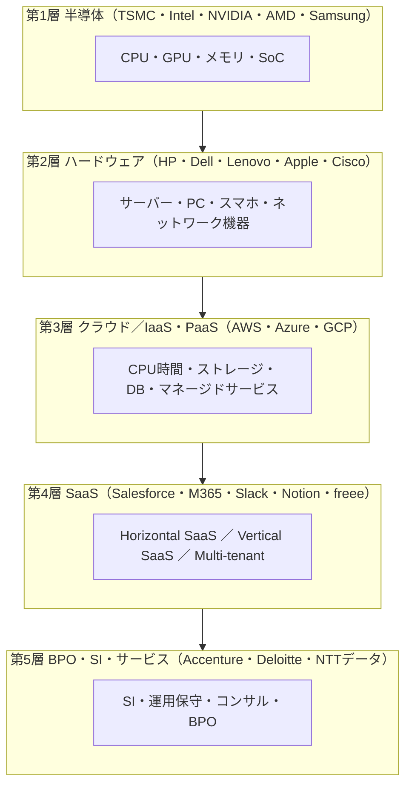

# IT・SaaS 業界のビジネス基礎

業界構造・SaaS ビジネスモデル・Unit Economics・PLG／SLG・エコシステム——転職／担当／提案のための「IT・SaaS 業界を読み解く眼鏡」

| 項目 | 内容 |
|---|---|
| カテゴリー | 業種別実務 |
| 難易度 | 中級 |
| 所要時間 | 約200分（全8レッスン） |
| 公開日 | 2026-07-02 |
| 最終更新日 | 2026-07-02 |
| コースURL | https://skillup.college/courses/industry/it-saas-basics/ |

## 対象者

IT・SaaS 事業体（外資系 SaaS 日本法人・国内 SaaS スタートアップ・SIer・IT 事業会社・クラウド事業者・ヘルステック／フィンテック／HR テックなど Vertical SaaS）に転職・配属された事務系・営業・HR・人事・経理・経営企画・カスタマーサクセス・BizOps 担当者と、IT・SaaS クライアントを担当するコンサル・広告代理店・投資家・編集者を両方主軸。IT・SaaS の現場経験はないが「業界としての IT・SaaS を読み解きたい」社会人 3 年目以上を対象。IT・SaaS 業に向けた提案・営業を行う方も含む。SaaS の 4 層（IaaS ／ PaaS ／ SaaS ／ BPO）と Horizontal・Vertical SaaS を業種横断で扱う。

## 前提知識

社会人 3 年以上を想定。会計の基本（B/S、P/L、粗利、粗利率、キャッシュフローの概念）と、IT の基本（クラウド／SaaS／API という語のイメージ）への理解があれば理解が早いが、これらの土台は本コース内で必要範囲を解説する。IT・SaaS の現場経験は不要で、業界横断の俯瞰知識として「継続とデータのあいだで最適点を探す発想」を身につける構成。

## 学習目標

- IT・SaaS 業界の全体像（4 層＝半導体／ハードウェア／IaaS ／ PaaS ／ SaaS ／ サービス）と 4 波論（メインフレーム→クライアントサーバー→ SaaS →エージェント）を地図化できる
- IT 業界のバリューチェーンと SaaS ビジネスモデル（Horizontal vs Vertical、Multi-tenant、収益モデルの 5 分類）を読み解ける
- SaaS の Unit Economics（ARR ／ MRR ／ LTV ／ CAC ／ Payback ／ Churn ／ NRR ／ Rule of 40 ／ Magic Number ／ Burn Multiple）を計算・評価できる
- PLG（Product-Led Growth）と SLG（Sales-Led Growth）の使い分け、Freemium・Free Trial・Aha Moment・PQL の設計を理解する
- SaaS の 6 軸組織（プロダクト／エンジニア／マーケ／営業／CS ／ BizOps）と分業モデル（SDR ／ AE ／ CSM ／ Solutions Engineer ／ RevOps）を把握する
- SaaS の商流とエコシステム（直販／パートナー／SI ／ リセラー／マーケットプレイス／OEM）とエンタープライズ調達要件（SOC 2 ／ ISO 27001 ／ SSO ／ SCIM）を理解する
- SaaS スタートアップの資金調達段階（Pre-seed ／ Series A 〜 D ／ Growth ／ Pre-IPO）とバリュエーション（ARR 倍率・Growth-Adjusted）を評価できる
- 生成 AI 統合・エージェント経済・Consumption-based Pricing ・Vertical AI ・Compound Startup など 2026 年の SaaS 業界トレンドを把握し、修了後の継続学習方向を持てる

## コース概要

日本の IT ・ SaaS 業界は、IT 市場全体で約 30 兆円、SaaS 市場だけで約 2 兆円という圧倒的な規模を持ち、世界の SaaS 市場は約 3,000 億ドルに達しています。にもかかわらず、業界外の方には「継続」「データ」「Unit Economics」がわかりにくい世界です。本コースは、IT ・ SaaS 事業体（外資系 SaaS 日本法人・国内 SaaS スタートアップ・SIer ・ IT 事業会社・クラウド事業者・ヘルステック／フィンテック／HR テックなど Vertical SaaS）に転職・配属された事務系・営業・人事・経理・経営企画・カスタマーサクセス・BizOps の担当者と、IT ・ SaaS クライアントを担当するコンサル・広告代理店・投資家・編集者の両方を主軸に、IT ・ SaaS 業界を「業界として読み解く眼鏡」を 8 レッスンで提供します。IT 業界の 4 層と 4 波、SaaS の Unit Economics、PLG と SLG、SaaS 組織、商流とエコシステム、資金調達とバリュエーション、生成 AI とエージェント経済まで扱います。

## 学習の流れ

レッスン 1 で IT ・ SaaS 業界の現在地・4 層・本コースの 3 視点（転職者／担当者／提案者）を共有します。レッスン 2 で「IT 業界の全体地図」としてバリューチェーンと収益モデル 5 分類、SaaS の 3 分類、6 軸組織、コスト構造を扱います。レッスン 3 で「SaaS の共通言語」である Unit Economics（ARR ／ MRR ／ LTV ／ CAC ／ NRR ／ Rule of 40 ／ Magic Number ／ Burn Multiple）を扱い、レッスン 4 でグロースモデル（PLG ／ SLG ／ CLG）、レッスン 5 で組織設計（6 軸と分業）、レッスン 6 で商流とエコシステム（直販・パートナー・エンタープライズ調達要件）、レッスン 7 で資金調達とバリュエーション（Pre-seed 〜 Pre-IPO ・ARR 倍率・上場準備）を順に学びます。レッスン 8 で生成 AI 統合・エージェント経済・Vertical AI ・ Compound Startup など 2026 年の業界トレンドと修了後の継続学習方向を扱って締めくくります。IT ・ SaaS の現場経験がない方が、「業界外から内に入ったとき」または「業界外から接するとき」に立ち止まらないための土台を作るコースとして設計しています。

## レッスン一覧

| No. | タイトル | 概要 | 所要時間 |
|---|---|---|---|
| 1 | IT・SaaS 業界の現在地と本コースの守備範囲 | IT・SaaS 業界の定義と 4 層（半導体／ハードウェア／IaaS ／ PaaS ／ SaaS ／ サービス）、日本経済での位置（IT 市場約 30 兆円・SaaS 市場約 2 兆円・世界 SaaS 約 3,000 億ドル）、IT 業界の 4 波論（メインフレーム→クライアントサーバー→ SaaS →エージェント）、3 大機能（開発・提供・運用）、IT ・ SaaS 業界を取り巻く 4 つの構造変化（クラウド化・データ経済・生成 AI ・エージェント経済）、本コースの守備範囲（転職者・担当者・提案者の 3 視点）、IT・SaaS 業界の 3 つの共通言語（データ・継続・エコシステム）、業界のことば（ARR ／ MRR ／ LTV ／ CAC ／ NRR ／ Churn）が翻訳できる価値を学ぶ | 25分 |
| 2 | IT 業界のバリューチェーンと SaaS ビジネスモデル——収益 5 分類と Horizontal ／ Vertical | Michael Porter のバリューチェーンの IT 業界版、IT 業界の 5 層（半導体・ハードウェア・クラウド ／ IaaS ・SaaS ・BPO ／ サービス）、収益モデル 5 分類（オンプレライセンス・サブスクリプション・トランザクション・広告・マーケットプレイス）比較、SaaS の 3 分類（Horizontal SaaS ／ Vertical SaaS ／ Multi-tenant）、SaaS の典型組織（プロダクト・エンジニア・マーケ・営業・CS ・ BizOps の 6 軸）、SaaS のコスト構造（COGS ／ R&D ／ S&M ／ G&A）、代表的なフレームワーク（Bill Gurley や Byrne Hobart による構造分析）を学ぶ | 25分 |
| 3 | SaaS の Unit Economics——ARR ／ MRR ／ LTV ／ CAC ／ NRR ／ Rule of 40 | SaaS の共通言語としての Unit Economics、ARR（年間経常収益）／ MRR（月間経常収益）の定義と計算、CAC（顧客獲得コスト）／ LTV（顧客生涯価値）／ LTV/CAC 比率（3 以上が目安）／ CAC Payback（12 か月以下が目安）、Churn（自発的／非自発的、Logo ／ Revenue）と Retention、GRR（Gross Revenue Retention）／ NRR（Net Revenue Retention、100 % 超がヘルシー・120 % で優等生）、Rule of 40（成長率＋営業利益率 ＝ 40 %、BVP 2015 年提唱）、Magic Number（Sales Efficiency、1 以上で健全）、Burn Multiple（David Sacks 2022 年提唱）、SaaS 会計（繰延収益 Deferred Revenue、売上認識 ASC 606 ／ IFRS 15）を学ぶ | 25分 |
| 4 | PLG と SLG——SaaS のグロースモデルとエンタープライズ化 | PLG（Product-Led Growth、OpenView 2016 〜 2017 年に概念普及・Wes Bush『Product-Led Growth』2019 年）／ SLG（Sales-Led Growth）／ CLG（Community-Led Growth）の 3 モデル、PLG の 3 大要素（Try before buy／Time-to-Value ／ User Onboarding）、Freemium と Free Trial の使い分け、Activation ／ Aha Moment ／ Product Qualified Lead（PQL）、Hybrid GTM（PLG＋SLG の併用）、PLG の限界とエンタープライズ化のボトルネック、Product-Led Enterprise（PLE）、代表例（PLG ＝ Slack ／ Zoom ／ Figma ／ Notion ／ Airtable、SLG ＝ Salesforce ／ Oracle ／ Workday、Hybrid ＝ HubSpot ／ Atlassian ／ Datadog）を学ぶ | 25分 |
| 5 | SaaS の組織設計——プロダクト・エンジニア・BizOps ・営業・CS ・マーケの 6 軸 | SaaS の 6 軸組織（プロダクト＝ PdM ／デザイナー／エンジニア／マーケ／営業／CS ／ BizOps）、RevOps（Revenue Operations）と Product Ops、営業の 3 分業（SDR ＝ Sales Development Representative ／ AE ＝ Account Executive ／ CS ＝ Customer Success）、CSM の 4 役割（オンボーディング／アダプション／リテンション／エクスパンション）、Product-Marketing の役割、Growth チームと Data チーム、Enterprise SaaS の営業構成（Enterprise AE ／ SDR ／ Solutions Engineer ＝ SE ／ Post-Sales AE）、SaaS 特有の HR 課題（エンジニア／プロダクト職の採用競争、ストックオプション ／ RSU）、SaaS のインセンティブ設計（ARR ベースコミッション）を学ぶ | 25分 |
| 6 | SaaS の商流とエコシステム——直販・パートナー・OEM・エンタープライズ調達 | SaaS の直販モデルとパートナーモデル、SI パートナー（Deloitte ／ Accenture ／ IBM Consulting ／ 日本の SIer）、リセラー（VAR ／ MSP ／ Cloud Partner）、マーケットプレイス（AWS Marketplace ／ Google Cloud Marketplace ／ Azure Marketplace）、Embed ／ OEM ／ White Label、エンタープライズ調達要件（SOC 2 Type II ／ ISO 27001 ／ CSA STAR ／ SSO ／ SCIM ／ Custom SLA）、業界別セキュリティ調達（PCI DSS ／ HIPAA ／ FedRAMP ／ GxP ／ 金融庁 FISC）、商流の 4 段階（Web セルフ／SDR ／ Field Sales ／ Solutions Engineer ／ POC）、MEDDIC ／ MEDDPICC 商談管理フレームワーク、日本 SaaS の商慣習（印鑑・稟議・請書・請求書・支払サイト 60 日問題）を学ぶ | 25分 |
| 7 | SaaS スタートアップの資金調達とバリュエーション——ARR 倍率と Rule of 40 | SaaS スタートアップの段階（Pre-seed ／ Seed ／ Series A ／ B ／ C ／ D ／ Growth ／ Pre-IPO）と各段階の ARR 目安、SaaS 特有のバリュエーション（ARR 倍率、Growth-Adjusted ARR Multiple、EV/Revenue、Public SaaS の EV/ARR 5 〜 10 倍・Private の 15 〜 30 倍）、Cash-adjusted CAC ／ Burn Multiple、SaaS 上場の準備（監査法人選定・J-SOX ／ 内部統制構築・S-1 米国 SEC ／ 有価証券届出書・ARR ／ NRR ／ GRR 開示）、日本 SaaS 上場企業の潮流（マネーフォワード 2017 年 9 月／ラクス 2015 年 12 月／freee 2019 年 12 月／Sansan 2019 年 6 月／Chatwork 2019 年 9 月／サイボウズ 2000 年 8 月／SmartHR 未上場 Series E）、SaaS 特化 VC（ANRI ／ DNX Ventures ／ Coral Capital ／ Salesforce Ventures ／ a16z ／ Bessemer Venture Partners ＝ BVP）、Public SaaS Index（BVP Cloud Index ／ Meritech SaaS Index）を学ぶ | 25分 |
| 8 | IT・SaaS 業界トレンドと未来——生成 AI 統合・エージェント経済・Vertical AI ・修了後の継続学習 | IT 業界の 4 波論の集大成（メインフレーム→クライアントサーバー→ SaaS →エージェント経済）、生成 AI 統合の 3 パターン（Copilot 型／Vertical AI ／ AI エージェント）、代表的 AI SaaS（Copilot ＝ GitHub Copilot ／ M365 Copilot ／ Notion AI ／ Salesforce Einstein ／ HubSpot Breeze ／ ChatGPT Enterprise、Vertical AI ＝ Harvey ／ Sierra ／ Glean ／ Perplexity Enterprise ／ Cursor、エージェント ＝ Salesforce Agentforce ／ OpenAI Agents ／ Anthropic MCP）、Consumption-based Pricing（Snowflake ／ Databricks ／ Fastly ／ Twilio ／ MongoDB Atlas）と Sub → Usage の回帰、Vertical SaaS の拡大（Toast ＝ レストラン／Procore ＝ 建設／Veeva ＝ 製薬／Shopify ＝ EC）、Compound Startup（Rippling ／ Ramp ／ Brex）、Retention と Growth Efficiency の再重視、日本 SaaS の追い上げ（IT 化率・SaaS 化率の日米格差解消）、修了後の継続学習方向を学ぶ | 25分 |

---

## レッスン1：IT・SaaS 業界の現在地と本コースの守備範囲

（所要時間：25分）

日本の IT ・ SaaS 業界は、2026 年時点で、IT 市場全体で約 30 兆円、そのなかで SaaS 市場だけで約 2 兆円という圧倒的な規模を持つ、日本経済の基幹産業のひとつです。世界の SaaS 市場は約 3,000 億ドルに達し、Salesforce の ARR は約 380 億ドル、Microsoft の商用クラウド収益は年間 1,500 億ドル規模に到達しています。にもかかわらず、業界外から入ってきた方には「継続」「データ」「Unit Economics」がわかりにくい世界です。ARR 、MRR 、LTV 、CAC 、NRR 、Churn 、Payback 、Rule of 40 、PLG 、SLG 、SOC 2 、SSO ／ SCIM ——これらの用語が、当たり前に飛び交う会議についていけるかどうかで、最初の半年の関わり方が大きく変わります。

本コースは、IT ・ SaaS 事業体に転職・配属された方、IT ・ SaaS クライアントを担当する方、IT ・ SaaS 業に向けて提案・営業を行う方の 3 視点を主軸に、業界を「業界として読み解く眼鏡」を届けます。個別の SaaS 企業の企業レポートではなく、業界横断の俯瞰知識として設計しています。レッスン 1 では、まず IT ・ SaaS 業界の全体地図と本コースの守備範囲を共有します。

### IT ・ SaaS 業界の定義と 4 層

IT 業界は、「情報技術（Information Technology）を活用して価値を生み出す事業」の総称です。狭い意味では「コンピュータとソフトウェア」を扱う産業ですが、広い意味では、半導体、ハードウェア、ネットワーク、クラウド、ソフトウェア、SI ／ 開発、BPO ／ 運用、コンサルティングまでを含みます。

本コースでは、IT 業界を大きく次の 4 層（レイヤー）で捉えます。

- **半導体・ハードウェア層**：CPU 、GPU 、メモリ、ストレージ、サーバー、ネットワーク機器、PC 、スマートフォン。Intel 、NVIDIA 、AMD 、TSMC 、Apple 、HP 、Dell 、Lenovo など
- **IaaS ／ PaaS 層**：クラウドインフラ。AWS 、Microsoft Azure 、Google Cloud 、Oracle Cloud 、Alibaba Cloud 、国内では NTT データや富士通、さくらインターネットなど。CPU 時間、ストレージ、ネットワークを従量課金で提供
- **SaaS 層**：ソフトウェアをサービスとしてサブスクリプションで提供。Salesforce 、Microsoft 365 、Google Workspace 、Slack 、Zoom 、Notion 、Figma 、HubSpot 、Adobe Creative Cloud 、Atlassian など。国内では freee 、マネーフォワード、SmartHR 、Sansan 、サイボウズ、ラクスなど
- **BPO ／ サービス層**：SI 、開発受託、運用保守、ヘルプデスク、コンサルティング、BPO 。Accenture 、Deloitte 、IBM Consulting 、NTT データ、野村総合研究所（NRI）、日立ソリューションズ、TIS 、SCSK 、伊藤忠テクノソリューションズ（CTC）など

本コースの主軸は「SaaS 層」です。ただし、SaaS を理解するためには IaaS ／ PaaS の基盤の上に SaaS が乗っている構造や、SI パートナーとのエコシステムを押さえる必要があるため、周辺 3 層も適宜扱います。

### 日本経済における IT ・ SaaS 業界の位置

日本の情報サービス市場は約 30 兆円規模で、GDP の約 5 % を占めます。うち SaaS 市場は 2024 年時点で約 2 兆円、年率 15 〜 20 % で拡大しています。世界の SaaS 市場は約 3,000 億ドルで、2030 年までに 7,000 億ドル超に到達する見通しです。

代表的なプレイヤーの規模感を、2026 年時点の目安で示します。

- **Salesforce**：世界最大の SaaS 企業、ARR 約 380 億ドル、時価総額 約 3,000 億ドル
- **Microsoft**：商用クラウド収益（Azure ＋ M365 ＋ Dynamics 等）年間 1,500 億ドル超、時価総額 約 3 兆ドル
- **Adobe**：ARR 約 220 億ドル、Creative Cloud で SaaS 転換
- **ServiceNow**：ARR 約 100 億ドル
- **Snowflake**：ARR 約 40 億ドル、Consumption-based Pricing の代表格
- **国内 SaaS**：マネーフォワードは連結売上約 400 億円、freee は約 300 億円、Sansan は約 350 億円、ラクスは約 500 億円、SmartHR は Series E 完了時点で ARR 200 億円超（未上場）

日本の SaaS 市場は米国から 5 〜 7 年遅れているとよく言われますが、逆に言えば、今後 5 〜 7 年で 3 〜 4 倍に伸びる余地があるということです。IT ・ SaaS 業界は、少子高齢化のなかで数少ない「拡大する国内市場」のひとつです。

### IT 業界の 4 波論——メインフレーム→クライアントサーバー→ SaaS →エージェント

IT 業界の歴史を大きく捉えると、次の 4 つの波として整理できます。本コースを通じて何度も参照する枠組みです。

- **第 1 波：メインフレーム時代（1960 〜 1980 年代）**：IBM が代表する大型汎用機。企業が「所有」する巨大コンピュータ、専用オペレータが管理
- **第 2 波：クライアントサーバー時代（1990 〜 2000 年代）**：Microsoft Windows と PC の普及、Oracle 、SAP 、Siebel などのオンプレライセンスソフト。企業が「所有・インストール」するソフト
- **第 3 波：SaaS 時代（2000 〜 2020 年代）**：Salesforce（1999 年創業）が「No Software」を掲げて開幕。企業は「所有」ではなく「利用（サブスクリプション）」に。Amazon Web Services（2006 年開始）が IaaS を、Salesforce ・ Microsoft ・ Google が SaaS を牽引
- **第 4 波：エージェント経済（2023 年〜）**：ChatGPT の 2022 年 11 月公開を起点に、LLM ／ AI エージェントが業務を担う時代へ。Salesforce Agentforce（2024 年）、OpenAI Agents（2024 年）、Anthropic の Model Context Protocol（MCP、2024 年 11 月公表）が代表例

第 3 波の SaaS が本コースの主戦場で、第 4 波のエージェント経済は SaaS 業界に「破壊と統合の両方」をもたらしつつあります。これはレッスン 8 で扱います。

### IT ・ SaaS 業界を取り巻く 4 つの構造変化

現在の IT ・ SaaS 業界を、次の 4 つの構造変化のなかで捉えると全体像が見えます。

- **クラウド化**：オンプレミス（自社サーバー）から、AWS ／ Azure ／ Google Cloud へ移行。SaaS 化率は日本で約 30 % 、米国で約 60 % と、日米格差はまだ大きい
- **データ経済**：業務データを一元管理する Snowflake ／ Databricks のようなデータ基盤が急拡大。CDP 、DWH 、Data Lakehouse がキーワード
- **生成 AI 統合**：既存 SaaS への Copilot 型統合（M365 Copilot 、Salesforce Einstein 、Notion AI 、HubSpot Breeze など）と、AI ネイティブ Vertical SaaS（Harvey ／ Sierra ／ Glean など）の同時進行
- **エージェント経済**：ソフトウェアを人間が操作する時代から、AI エージェントが業務を代行する時代へ。SaaS のインターフェースが「画面」から「API と自然言語」に変わる

この 4 つは、それぞれ独立の変化ではなく、下から順に積み上がる「地層」として結びついています。クラウドの上にデータ基盤が乗り、その上に生成 AI が乗り、その上でエージェントが動く、という構造です。

### 本コースの守備範囲——3 視点

本コースは、次の 3 視点を主軸に設計しています。

- **転職者視点**：IT ・ SaaS 事業体（外資系 SaaS 日本法人・国内 SaaS スタートアップ・SIer ・ クラウド事業者・Vertical SaaS）に転職・配属された、事務系・営業・HR ・ 経理・経営企画・カスタマーサクセス・BizOps の担当者。「業界の共通言語（ARR ／ MRR ／ NRR ／ Churn ／ SOC 2 ）を最初の 3 か月で押さえたい」
- **担当者視点**：IT ・ SaaS クライアントを担当するコンサル・広告代理店・投資家・編集者。「クライアントの Rule of 40 、Burn Multiple 、NRR がどれくらいなら健全か、業界のベンチマークを押さえたい」
- **提案者視点**：IT ・ SaaS 業界に向けて提案・営業を行う金融・不動産・広告・SI ・ 士業・法人向けサービス事業者。「相手の意思決定プロセス（PLG か SLG か、エンタープライズか SMB か）を理解して、刺さる提案をしたい」

3 視点いずれも、共通する土台は「業界としての IT ・ SaaS を、俯瞰から読み解く力」です。個別の SaaS 企業の分析や個別プロダクトの選定は本コースの対象外です。

### IT ・ SaaS 業界の 3 つの共通言語

業界横断で押さえておくと、どの現場でも通じる 3 つの共通言語を挙げます。

- **データ**：SaaS はすべての操作がログとして残る。だから「顧客がどう使ったか」で顧客成功も解約予兆も可視化できる
- **継続**：SaaS はサブスクリプションだから、「契約後の継続」が売上を作る。1 回売って終わりではなく、契約後 1 年、3 年、5 年の関係を設計する
- **エコシステム**：SaaS は「単独で完結する製品」ではなく、他 SaaS や SIer との組み合わせで価値を生む。API 連携、SI パートナー、マーケットプレイスがキーワード

この 3 つを言語として持っていると、業界のなかで交わされる会話（「今期の NRR は 118 % で着地見込み」「Salesforce との API 連携で MEDDPICC を回している」「マーケットプレイスで Independent 化を進めている」など）の背景が読み解けるようになります。

### 業界のことばが翻訳できる価値

私が独立してから、業界内側で 15 年、業界外側から支援して 5 年、通算 20 年で見てきて確信しているのは、業界のことばを翻訳できる人の価値が、想像以上に高いということです。ARR と MRR の違いを説明できる。NRR が 120 % ならなぜ健全かを説明できる。PLG と SLG の違いを説明できる。Rule of 40 の意味を説明できる。SOC 2 Type II がなぜエンタープライズ調達で必須かを説明できる。これができるだけで、営業会議、経営会議、投資家説明、顧客提案のいずれの場でも「話が通じる人」として扱われるようになります。

本コースは、この「翻訳者」になるための土台を作るコースです。個別の職種スキル（プログラミング、プロダクトマネジメント、営業テクニックなど）を身につけるのではなく、業界横断で使える「読み解きの型」を身につけてください。

### まとめ

- IT ・ SaaS 業界は 4 層（半導体／ハードウェア／IaaS ／ PaaS ／ SaaS ／ BPO ／ サービス）で構成される。本コースは SaaS 層を主軸に扱う
- 日本の IT 市場は約 30 兆円、SaaS 市場は約 2 兆円、世界 SaaS 市場は約 3,000 億ドル。日米で SaaS 化率に 2 倍の差があり、日本には拡大余地がある
- IT 業界は 4 波（メインフレーム→クライアントサーバー→ SaaS →エージェント）で捉えるとわかりやすい。本コースは第 3 波を主軸に、第 4 波の萌芽もレッスン 8 で扱う
- 4 つの構造変化（クラウド化・データ経済・生成 AI 統合・エージェント経済）は独立ではなく、下から順に積み上がる地層
- 本コースの守備範囲は 3 視点（転職者／担当者／提案者）と 3 共通言語（データ／継続／エコシステム）
- 業界のことば（ARR ／ MRR ／ LTV ／ CAC ／ NRR ／ Churn ）を翻訳できる人は、営業・経営・投資・提案のいずれの場でも重宝される

### 確認クイズ

次の 6 問で、本レッスンの理解を確認します。

#### Q1. 本コースが主軸として扱う IT 業界の層はどれか。

- [ ] 半導体・ハードウェア層
- [ ] IaaS ／ PaaS 層
- [x] SaaS 層
- [ ] BPO ／ サービス層

> **解説**
> 本コースは 4 層のうち SaaS 層を主軸に扱い、周辺 3 層は必要に応じて扱う。IaaS ／ PaaS は SaaS の基盤、BPO ／ サービスは SI パートナーとして関係するため、それぞれ関連範囲は扱う。

#### Q2. IT 業界の 4 波論のうち、Salesforce が 1999 年に「No Software」を掲げて開幕した波はどれか。

- [ ] 第 1 波：メインフレーム時代
- [ ] 第 2 波：クライアントサーバー時代
- [x] 第 3 波：SaaS 時代
- [ ] 第 4 波：エージェント経済

> **解説**
> Salesforce は 1999 年創業で「No Software」の標語とともに SaaS 時代を開幕した。第 3 波が本コースの主戦場となる。

#### Q3. 2026 年時点の日本の SaaS 市場規模として、本レッスンで示された値に最も近いのはどれか。

- [ ] 約 2,000 億円
- [x] 約 2 兆円
- [ ] 約 20 兆円
- [ ] 約 200 兆円

> **解説**
> 日本の SaaS 市場は 2024 年時点で約 2 兆円規模、年率 15 〜 20 % で拡大している。IT 市場全体は約 30 兆円、世界 SaaS 市場は約 3,000 億ドル。

#### Q4. 本コースが挙げる「IT ・ SaaS 業界の 3 つの共通言語」に含まれないものはどれか。

- [ ] データ
- [ ] 継続
- [ ] エコシステム
- [x] 所有

> **解説**
> 3 つの共通言語は「データ・継続・エコシステム」。むしろ「所有」から「利用（サブスクリプション）」への転換が SaaS 時代の本質で、「所有」は第 2 波までの発想。

#### Q5. 本コースが対象とする 3 視点として明示されていないのはどれか。

- [ ] 転職者視点
- [ ] 担当者視点
- [ ] 提案者視点
- [x] エンジニア養成視点

> **解説**
> 本コースは業界横断の俯瞰知識を扱い、個別職種スキル（プログラミング・プロダクトマネジメント・営業技法）の養成は対象外。転職者・担当者・提案者の 3 視点が主軸。

#### Q6. IT ・ SaaS 業界を取り巻く 4 つの構造変化として、本レッスンで挙げられていないものはどれか。

- [x] メインフレーム回帰
- [ ] データ経済
- [ ] クラウド化
- [ ] エージェント経済

> **解説**
> 4 つの構造変化はクラウド化・データ経済・生成 AI 統合・エージェント経済。メインフレーム回帰は業界動向ではなく、むしろクラウド化と真逆の発想。

### 次のレッスンへ

レッスン 2 では、IT 業界のバリューチェーンと SaaS ビジネスモデルを扱います。Michael Porter のバリューチェーンを IT 業界に適用し、収益モデル 5 分類（オンプレライセンス／サブスクリプション／トランザクション／広告／マーケットプレイス）、SaaS の 3 分類（Horizontal ／ Vertical ／ Multi-tenant）、SaaS の 6 軸組織とコスト構造を扱います。SaaS のビジネスモデルが他業界となぜここまで違うのか、その構造を押さえていきましょう。

---

## レッスン2：IT 業界のバリューチェーンと SaaS ビジネスモデル——収益 5 分類と Horizontal ／ Vertical

（所要時間：25分）

前回のレッスン 1 では、IT ・ SaaS 業界の全体地図として、4 層（半導体／ハードウェア／IaaS ／ PaaS ／ SaaS ／ BPO ／ サービス）、市場規模（IT 約 30 兆円・SaaS 約 2 兆円）、4 波論（メインフレーム→クライアントサーバー→ SaaS →エージェント）、本コースの守備範囲（3 視点）、3 つの共通言語（データ・継続・エコシステム）を押さえました。今回はその全体地図の次のステップとして、IT 業界のバリューチェーンと SaaS のビジネスモデルを扱います。

### Michael Porter のバリューチェーン——IT 業界に当てはめる

Michael Porter が 1985 年の著書『Competitive Advantage』で提示したバリューチェーンは、企業の活動を「主活動」と「支援活動」に分解して、どこで付加価値を生んでいるかを可視化する枠組みです。IT 業界に当てはめると、主活動は次のように整理できます。

- **R&D**：プロダクトの企画・開発・設計。SaaS ではエンジニアリング組織の中核
- **プロダクト運用**：本番環境の運用、SLA 管理、モニタリング、インシデント対応、セキュリティ運用
- **マーケティング**：市場開拓、リード獲得、ブランド構築、コンテンツ、SEO 、広告
- **セールス**：商談、契約、価格交渉、ファンネル管理
- **カスタマーサクセス**：契約後のオンボーディング、アダプション、更新、拡大販売
- **カスタマーサポート**：問い合わせ対応、障害対応、FAQ 、コミュニティ運営

支援活動としては、コーポレート（Finance ／ Legal ／ HR ）、BizOps 、RevOps 、セキュリティ／情報システム、IT インフラの共通機能があります。

このバリューチェーンで注目すべきは、SaaS の場合、契約後の CS ／ サポートが「主活動」であることです。伝統的な物販やライセンス販売では、販売した瞬間が売上のピークで、CS ／ サポートはコストセンターでした。SaaS ではむしろ CS ／ サポートが売上の継続と拡大を生む「利益センター」に変わります。これがレッスン 3 以降で扱う NRR（Net Revenue Retention）につながっていきます。

### IT 業界の 5 層——バリューチェーンの縦の連鎖

IT 業界のバリューチェーンには、もうひとつ「レイヤー間の縦の連鎖」があります。半導体からエンドユーザーまで、5 層構造で捉えるとわかりやすくなります。

- **第 1 層：半導体**：TSMC 、Intel 、NVIDIA 、AMD 、Samsung 、SK Hynix 。CPU 、GPU 、メモリの製造・設計
- **第 2 層：ハードウェア**：HP 、Dell 、Lenovo 、Apple 、Cisco 、Arista 。サーバー、PC 、スマートフォン、ネットワーク機器
- **第 3 層：クラウド／IaaS ／ PaaS**：AWS 、Microsoft Azure 、Google Cloud 、Oracle Cloud 、Alibaba Cloud 、国内の NTT データ ・ 富士通クラウド ・ さくらインターネット 。CPU 時間、ストレージ、ネットワーク、マネージドサービスを従量課金で提供
- **第 4 層：SaaS**：Salesforce 、Microsoft 365 、Google Workspace 、Slack 、Zoom 、Adobe Creative Cloud 、Notion 、Figma 、freee 、マネーフォワード、SmartHR 、Sansan 、サイボウズ、ラクスなど。ソフトウェアをサービスとしてサブスクリプションで提供
- **第 5 層：BPO ／ サービス**：Accenture 、Deloitte 、IBM Consulting 、NTT データ、NRI 、日立ソリューションズ、TIS 、SCSK 、CTC 。SI 、開発受託、運用保守、コンサルティング

第 3 層 IaaS ／ PaaS の上に第 4 層 SaaS が乗り、それを第 5 層 SI ／ BPO が導入・運用支援するという構造です。SaaS 企業は自社でサーバーを持たず、AWS や Azure の上で動きます。SaaS 企業のコスト構造（後述の COGS）に、クラウド利用料が大きな割合を占める理由がここにあります。



### IT 業界の収益モデル 5 分類

同じ IT 業界のなかでも、収益の作り方が異なります。5 分類で整理します。

- **オンプレライセンス**：ソフトウェアを一括で販売し、保守サポート料を毎年徴収するモデル。第 2 波の主流。SAP R/3 、Oracle Database 、Microsoft Windows Server などが典型例。売上は一括で立ち、保守で継続収益を作る
- **サブスクリプション（SaaS）**：月額または年額でソフトウェアを利用契約し、利用中は継続的に売上が立つ。売上は毎期均等に計上、契約期間中の解約可能性が続くのが特徴。Salesforce 、Slack 、Zoom などが典型例。**本コースの主戦場**
- **トランザクション（従量課金）**：利用量に応じて課金する。API コール数、ストレージ量、CPU 時間、通信量など。AWS 、Twilio 、Stripe 、Snowflake が典型例。近年 SaaS でも Consumption-based Pricing として一部復権
- **広告**：ユーザーには無償で提供し、広告主から収益を得るモデル。Google 検索、YouTube 、Facebook 、Twitter が典型例。B2B SaaS ではほぼ採用されない
- **マーケットプレイス**：買い手と売り手を仲介し、取引額の一定割合を手数料として徴収するモデル。Airbnb 、メルカリ、Shopify のマーケットプレイス機能、AWS Marketplace が典型例

現在の主流はサブスクリプション（SaaS）ですが、Snowflake ／ Databricks ／ Twilio のような Consumption-based Pricing が伸びており、レッスン 8 でも扱います。同じ SaaS 企業のなかにも、コア機能はサブスク、追加利用は従量課金というハイブリッドが増えています。

### SaaS の 3 分類——Horizontal ／ Vertical ／ Multi-tenant

SaaS のプロダクトは、大きく次の 3 軸で分類できます。

- **Horizontal SaaS**：業種を横断して使える機能特化型 SaaS 。Slack （コミュニケーション）、Zoom （Web 会議）、Notion （ドキュメント）、Figma （デザイン）、HubSpot （マーケ）、Salesforce （営業）など。市場規模が大きく、競合も多い
- **Vertical SaaS**：特定業種に特化して業界固有の業務を扱う SaaS 。Toast （レストラン）、Procore （建設）、Veeva Systems （製薬）、Shopify （EC ）、freee ／ マネーフォワード（士業・小規模事業者）、Aventy ／ カミナシ（製造・現場）など。市場は狭いが競合が少なく、業界知識を持つ強い参入障壁を築ける
- **Multi-tenant**：1 つのシステム基盤で複数の顧客（テナント）を運用する構造。SaaS の多くはこの形態。テナントごとにデータは論理的に分離、システム基盤は共有。開発 ・ 運用効率が高く、SaaS の低コスト提供の鍵。**Multi-tenant は分類軸というより実装アーキテクチャで、Horizontal ／ Vertical のどちらでも採用される**

**Horizontal と Vertical のあいだ**にも、業界横断だが特定職種特化の SaaS（HR テック＝ SmartHR ／ Rippling 、法務テック＝ Harvey ／ Ironclad 、経理テック＝ freee ／ マネーフォワード ／ Ramp ）があり、ここが 2020 年代の成長領域です。

### SaaS の 6 軸組織

SaaS 企業の組織構造は、他業界と大きく違います。典型的には次の 6 軸で整理できます。

- **プロダクト**：PdM （Product Manager）、UX ／ UI デザイナー、リサーチャー。何を作るかを決める
- **エンジニアリング**：ソフトウェアエンジニア、SRE 、QA 、セキュリティエンジニア。どう作るかを決める
- **マーケティング**：Product Marketing 、Growth Marketing 、Content 、Brand 、Demand Generation 、Field Marketing 。認知と需要を作る
- **営業（セールス）**：SDR ／ BDR （Sales Development）、AE （Account Executive）、Enterprise AE 、Solutions Engineer 、Partnerships 。商談から契約までを作る
- **カスタマーサクセス（CS）**：CSM （Customer Success Manager）、テクニカルサポート、Renewal Manager 、Community 。契約後の継続と拡大を作る
- **BizOps ／ 事業運営**：BizOps 、RevOps 、Sales Ops 、Finance 、FP&A 、Data 、Legal 、HR 、Corporate Communications 。全体を運営する

この 6 軸のうち、SaaS で特に厚く投資されるのは「エンジニアリング」「営業」「CS」の 3 つです。伝統的な事業会社の営業と比較して、SaaS の営業組織は分業が細かく、SDR が新規リード発掘、AE がクロージング、CSM が更新と拡大、と役割が区分されています。これはレッスン 5 でさらに詳しく扱います。

### SaaS のコスト構造——COGS ／ R&D ／ S&M ／ G&A

SaaS の P/L は、コストを大きく 4 つに分けて開示するのが世界標準です。

- **COGS（Cost of Goods Sold）**：売上原価。SaaS の場合、クラウドインフラ費用（AWS ／ Azure 利用料）、カスタマーサポート人件費、Third-party API 費用、決済手数料などが含まれる。売上の 20 〜 30 % 程度が目安
- **R&D（Research and Development）**：研究開発費。エンジニア人件費、Product 人件費、開発ツール、テスト環境など。売上の 20 〜 40 % 程度
- **S&M（Sales and Marketing）**：営業マーケ費用。セールス人件費、マーケ人件費、広告費、イベント、ツール（CRM ／ MA ／ SEP ）など。売上の 30 〜 50 % 程度、拡大期は 50 % 超もあり得る
- **G&A（General and Administrative）**：一般管理費。CFO 、Finance 、HR 、Legal 、オフィス、法務、監査費用など。売上の 10 〜 20 %

この 4 つを足すと 80 〜 140 % 程度になるため、成長期の SaaS 企業は営業赤字（S&M への先行投資で赤字）が普通です。この赤字が「悪い赤字（無駄）」なのか「良い赤字（先行投資で LTV を作る）」なのかを判定するのが、レッスン 3 の Unit Economics です。

### SaaS の粗利率が高い理由——限界費用ゼロの経済

SaaS の粗利率は 70 〜 80 % が世界の典型で、伝統的な製造業（20 〜 40 %）や小売業（20 〜 30 %）とは桁違いに高い水準です。これは、ソフトウェアの「限界費用がほぼゼロ」だからです。100 社に売っても 10,000 社に売っても、追加でかかるコストはクラウドインフラの少しの増分だけで、原材料や店舗や倉庫が要りません。この「限界費用ゼロの経済」が、SaaS 企業のバリュエーションが高い根本理由です。

ただし、粗利率が高くても、S&M ／ R&D の先行投資が大きいため、営業損益は赤字になりがちです。粗利率が高いのに営業赤字、というのが SaaS の典型プロフィールで、これを健全な赤字か不健全な赤字かで判別するのが、次回のレッスン 3 で扱う Unit Economics です。

### まとめ

- Michael Porter のバリューチェーンを IT 業界に当てはめると、主活動は R&D ・ 運用 ・ マーケ ・ 営業 ・ CS ・ サポートの 6 段階。SaaS では CS ／ サポートが「主活動」であることが伝統ビジネスとの決定的な違い
- IT 業界は 5 層（半導体／ハードウェア／IaaS ／ PaaS ／ SaaS ／ BPO ／ サービス）の縦連鎖構造。SaaS は IaaS の上に乗り、SI ／ BPO が導入・運用を支援する
- 収益モデルは 5 分類（オンプレライセンス／サブスクリプション／トランザクション／広告／マーケットプレイス）。本コースの主軸はサブスクリプションだが、Consumption-based Pricing が併存する時代へ
- SaaS の 3 分類は Horizontal ／ Vertical ／ Multi-tenant 。Multi-tenant はアーキテクチャで、Horizontal ／ Vertical のどちらでも採用される
- SaaS の組織は 6 軸（プロダクト・エンジニア・マーケ・営業・CS ・ BizOps ）。営業と CS の分業が細かい
- SaaS のコスト構造は 4 分類（COGS ／ R&D ／ S&M ／ G&A）。粗利率 70 〜 80 % は限界費用ゼロの経済の帰結だが、先行投資で営業赤字になりがち。健全か不健全かは Unit Economics で判定

### 確認クイズ

次の 6 問で、本レッスンの理解を確認します。

#### Q1. Michael Porter のバリューチェーンを SaaS に当てはめたとき、伝統的な物販ビジネスと最も異なる点はどれか。

- [ ] 販売した瞬間が売上のピークになる
- [x] 契約後のカスタマーサクセスとサポートが主活動になる
- [ ] R&D が支援活動に格下げされる
- [ ] マーケティングが必要なくなる

> **解説**
> 伝統的な物販では販売時点が売上のピークで CS ／ サポートはコストセンターだが、SaaS では契約後の継続 ・ 拡大が売上を作るため、CS ／ サポートが主活動（利益センター）になる。

#### Q2. IT 業界の 5 層構造で、SaaS が「その上に乗る」層はどれか。

- [ ] 半導体
- [ ] ハードウェア
- [x] IaaS ／ PaaS
- [ ] BPO ／ サービス

> **解説**
> SaaS は IaaS ／ PaaS（AWS ／ Azure ／ Google Cloud）の上で動く。自社でサーバーを持たないため、クラウド利用料が SaaS の COGS に大きな割合を占める。

#### Q3. Salesforce ・ Slack ・ Zoom ・ Notion のような、業種を横断して使える機能特化型 SaaS を何と呼ぶか。

- [x] Horizontal SaaS
- [ ] Vertical SaaS
- [ ] Multi-tenant
- [ ] Consumption-based SaaS

> **解説**
> 業種横断で使える機能特化型を Horizontal SaaS 、業種特化を Vertical SaaS と呼ぶ。Multi-tenant は分類軸ではなく実装アーキテクチャ。

#### Q4. Toast ・ Procore ・ Veeva Systems のような特定業種特化型 SaaS を何と呼ぶか。

- [ ] Horizontal SaaS
- [x] Vertical SaaS
- [ ] Multi-tenant
- [ ] Broker SaaS

> **解説**
> Toast はレストラン、Procore は建設、Veeva は製薬に特化した Vertical SaaS 。業種知識が参入障壁になり、市場は狭いが競合が少ない。

#### Q5. SaaS の P/L 4 分類のうち、営業マーケ費用を指すのはどれか。

- [ ] COGS
- [ ] R&D
- [x] S&M
- [ ] G&A

> **解説**
> S&M（Sales and Marketing）は営業人件費 ・ マーケ人件費 ・ 広告費 ・ イベント費 ・ CRM ／ MA ツール費用などを含む。売上の 30 〜 50 % 程度、拡大期は 50 % 超もある。

#### Q6. SaaS の粗利率が製造業や小売業より桁違いに高い（70 〜 80 %）根本の理由はどれか。

- [ ] サブスクリプションだから
- [ ] マーケティング効率が高いから
- [ ] 開発費が安いから
- [x] ソフトウェアの限界費用がほぼゼロだから

> **解説**
> 追加 1 社への提供にかかるコストがクラウドインフラの少しの増分だけで、原材料や店舗や倉庫が要らない「限界費用ゼロの経済」が、SaaS の粗利率が高い根本理由。バリュエーションの高さもここに起因する。

### 次のレッスンへ

レッスン 3 では、SaaS の共通言語である Unit Economics を扱います。ARR ／ MRR ／ LTV ／ CAC ／ NRR ／ GRR ／ Rule of 40 ／ Magic Number ／ Burn Multiple の定義と計算、SaaS 会計（Deferred Revenue ／ ASC 606 ／ IFRS 15）まで、業界の意思決定に必須の数字を押さえていきましょう。

---

## レッスン3：SaaS の Unit Economics——ARR ／ MRR ／ LTV ／ CAC ／ NRR ／ Rule of 40

（所要時間：25分）

前回のレッスン 2 では、IT 業界のバリューチェーン、5 層構造、収益モデル 5 分類、SaaS の 3 分類（Horizontal ／ Vertical ／ Multi-tenant）、6 軸組織、コスト構造（COGS ／ R&D ／ S&M ／ G&A）を扱いました。SaaS は粗利率が高いが、S&M への先行投資で営業赤字になりがちで、「健全な赤字か不健全な赤字か」を判別する必要がある——という論点でした。今回はその判別に使う「業界の共通言語」である Unit Economics を体系的に扱います。

### Unit Economics とは何か

Unit Economics は、事業を「顧客 1 単位（Unit）」の経済性で捉える枠組みです。SaaS では「1 契約」「1 顧客」の獲得と維持に対して、どれだけ投資し、どれだけ回収するかを可視化します。SaaS 業界で David Skok（Matrix Partners）が 2010 年代前半に体系化し、現在は世界中の SaaS で共通言語になっています。

Unit Economics の要素を整理すると、大きく次の 3 グループに分けられます。

- **売上（Revenue）系**：MRR ／ ARR ／ 平均単価（ARPU ／ ARPA）
- **コスト系**：CAC ／ Payback Period
- **維持と拡大系**：Churn ／ Retention ／ GRR ／ NRR ／ LTV

これらを組み合わせて、Rule of 40 ／ Magic Number ／ Burn Multiple などの総合指標が組み立てられます。順に見ていきます。

### MRR と ARR——SaaS 売上の測り方

**MRR（Monthly Recurring Revenue、月間経常収益）** は、当月末時点で契約が有効な全顧客の月額換算売上を集計したものです。単発の売上（プロフェッショナルサービス費用、初期設定費用など）は含みません。「毎月継続的に発生する売上の月次スナップショット」というのがポイントです。

**ARR（Annual Recurring Revenue、年間経常収益）** は、原則として MRR × 12 で算出します。ただし年間契約が中心の場合は、年間契約の年額を全顧客で合算したものを ARR とします。ARR は SaaS 業界で最も重視される指標で、上場企業の決算・投資家説明・M&A のバリュエーションのすべてで基準になります。

ARR の計算例：

- 月額 5 万円の契約が 100 社 → MRR ＝ 5 万円 × 100 ＝ 500 万円 → ARR ＝ 6,000 万円
- 年額 60 万円の年間契約が 100 社 → ARR ＝ 6,000 万円

MRR ／ ARR は「経常収益」であり、単発売上は含まないため、「今、この瞬間のビジネスの実力」を測る指標として機能します。

**New MRR（新規契約）**、**Expansion MRR（既存顧客の追加契約 ／ アップセル ／ クロスセル）**、**Contraction MRR（既存顧客のダウングレード）**、**Churn MRR（解約）** の 4 分類でモニタリングします。次の等式が成り立ちます。

```
今月末 MRR ＝ 先月末 MRR ＋ New MRR ＋ Expansion MRR － Contraction MRR － Churn MRR
```

**Net New MRR ＝ New ＋ Expansion － Contraction － Churn** をモニタリングすると、SaaS の成長エンジンの健全性が見えます。

### CAC と Payback Period——顧客獲得のコスト

**CAC（Customer Acquisition Cost、顧客獲得コスト）** は、1 顧客を獲得するためにかかった S&M（営業マーケ）費用の総額を、獲得顧客数で割ったものです。

```
CAC ＝ S&M 費用の総額 ÷ 新規獲得顧客数
```

例えば、四半期の S&M 費用が 3,000 万円、新規獲得顧客数が 100 社 → CAC ＝ 30 万円 ／ 社となります。

**CAC Payback Period（回収期間）** は、CAC を「その顧客の月額粗利」で回収するのに何か月かかるかを測る指標です。

```
CAC Payback ＝ CAC ÷ ( ARPA × 粗利率 )
```

ARPA（Average Revenue Per Account、1 社あたり月次売上）が 5 万円、粗利率 75 %、CAC が 30 万円の場合、Payback ＝ 30 万円 ÷（5 万円 × 75 %）＝ 8 か月となります。

**SaaS 業界のベンチマーク**：Payback 12 か月以下がヘルシー、18 か月まではエンタープライズなら許容、24 か月超は不健全と言われます。

### Churn と Retention——維持の測り方

**Churn（解約率）** は、期首の顧客のうち、期末までに解約した割合です。SaaS の生死を握る指標です。

- **Logo Churn（ロゴチャーン）**：顧客数（社数）ベースの解約率
- **Revenue Churn（レベニューチャーン）**：売上ベースの解約率
- **Gross Churn**：解約による損失のみを見る（拡大を差し引かない）
- **Net Churn**：拡大を差し引いた実質チャーン

年間 Logo Churn 10 % 以下がヘルシー、5 % 以下で優等生、というのが SaaS 業界の目安です。ただしエンタープライズ SaaS は 5 % 以下、SMB SaaS は 15 % 以下、コンシューマ SaaS は 30 % 以下、と業態で許容水準が違います。

**Retention（維持率）** は Churn の裏返しで、「期首の顧客のうち、期末に残った割合」です。

### GRR と NRR——SaaS の健全性を測る二大指標

Retention のうち、SaaS 業界で最も重視される二大指標が GRR と NRR です。

- **GRR（Gross Revenue Retention、総収益維持率）**：解約とダウングレードだけを見て、期首の売上のうち何 % が残ったかを測る。**上限 100 %**。90 % 以上がヘルシー、95 % 以上で優等生
- **NRR（Net Revenue Retention、純収益維持率）**：GRR に加えて、既存顧客の拡大（アップセル ／ クロスセル）も含める。**100 % を超えることが可能**。100 % 超がヘルシー、120 % で優等生

計算式：

```
GRR ＝ ( 期首 MRR － Churn MRR － Contraction MRR ) ÷ 期首 MRR
NRR ＝ ( 期首 MRR － Churn MRR － Contraction MRR ＋ Expansion MRR ) ÷ 期首 MRR
```

例：期首 MRR 1,000 万円、Churn 30 万円、Contraction 20 万円、Expansion 200 万円 → GRR ＝ ( 1,000 － 30 － 20 ) ÷ 1,000 ＝ 95 % 、NRR ＝ ( 1,000 － 30 － 20 ＋ 200 ) ÷ 1,000 ＝ 115 %

**NRR 120 % を超える企業**（Snowflake ／ Datadog ／ Zscaler ／ MongoDB Atlas ／ HubSpot Enterprise など）は、既存顧客だけで年 20 % 成長する構造を持つため、S&M 投資を止めても事業が拡大するという「究極の SaaS」に位置します。

### LTV——顧客生涯価値

**LTV（Life Time Value、顧客生涯価値）** は、1 顧客が契約期間全体を通じて生み出す粗利の合計です。SaaS では次の近似式が広く使われます。

```
LTV ＝ ARPA × 粗利率 ÷ 月次 Churn
```

ARPA が月次 5 万円、粗利率 75 %、月次 Churn が 1 % の場合、LTV ＝ 5 万円 × 75 % ÷ 1 % ＝ 375 万円となります。

**LTV/CAC 比率**は、1 顧客あたりの生涯収益と獲得コストの比率です。

```
LTV/CAC ＝ LTV ÷ CAC
```

- **3 以上**：SaaS 業界の健全性ライン
- **5 以上**：優等生
- **1 未満**：破綻確定（獲得すればするほど赤字）

LTV/CAC が 3 未満の SaaS は、「S&M 投資が有効に働いていない」または「解約が多すぎて LTV が伸びない」のどちらかで、ビジネスモデルの見直しが必要です。

### Rule of 40——成長性と収益性のバランス指標

Rule of 40 は、SaaS 上場企業の健全性を測る総合指標で、Bessemer Venture Partners（BVP）が 2015 年頃から広めた枠組みです。

```
Rule of 40 ＝ ARR 成長率（%）＋ FCF マージン（%）
```

または営業利益率を使うこともあります。この合計が 40 % 以上なら健全、というのが業界の目安です。

- 成長率 80 % ／ 営業利益率 △40 % → Rule of 40 ＝ 40 % （成長優先で赤字は許容）
- 成長率 30 % ／ 営業利益率 10 % → Rule of 40 ＝ 40 % （安定成長で収益化）
- 成長率 20 % ／ 営業利益率 △30 % → Rule of 40 ＝ △10 % （不健全）

Salesforce ／ Adobe ／ Microsoft のような成熟 SaaS は Rule of 40 で 60 〜 80 、Snowflake ／ Datadog のような高成長 SaaS は 50 〜 100 、日本の上場 SaaS はマネーフォワードや freee で 20 〜 40 の水準が典型的です。

### Magic Number と Burn Multiple——S&M 効率と資本効率

**Magic Number** は、S&M 投資の効率を測る指標です。

```
Magic Number ＝ ( 当四半期の ARR 増分 － 前四半期の ARR 増分 ) × 4 ÷ 前四半期の S&M
```

シンプルには「今期の Net New ARR ÷ 前期の S&M」で近似できます。1.0 以上ならヘルシー、0.75 未満なら S&M 投資が非効率、と言われます。

**Burn Multiple** は、David Sacks（Craft Ventures）が 2022 年に提唱した資本効率指標です。

```
Burn Multiple ＝ Net Burn ÷ Net New ARR
```

- **1 未満**：優秀（$1 燃やして $1 超の ARR を作る）
- **1 〜 1.5**：ヘルシー
- **1.5 〜 2**：注意
- **2 超**：非効率

2021 年までの高バリュエーション時代は成長優先で Burn Multiple が高くても許容されましたが、2022 年以降は「Efficient Growth（効率的成長）」への回帰が進み、Burn Multiple が重視されるようになりました。

### SaaS 会計——Deferred Revenue と ASC 606 ／ IFRS 15

SaaS の会計は、伝統的な物販とは異なるルールで動きます。年額契約を締結した瞬間に「1 年分の売上」を計上するのではなく、契約期間にわたって按分計上します。

- **Deferred Revenue（繰延収益）**：年額契約で受け取ったが、まだサービス提供期間が来ていない部分。負債として B/S に計上
- **Recognized Revenue（認識収益）**：当期のサービス提供に対応する部分。P/L に計上

例：4 月 1 日に年額 120 万円の契約を締結、120 万円を一括入金 → 4 月末の Recognized Revenue は 10 万円、Deferred Revenue は 110 万円（負債）

会計基準は、米国基準では **ASC 606**、国際会計基準では **IFRS 15**（どちらも 2018 年発効）で規定されています。日本の SaaS 企業も上場に向けては ASC 606 ／ IFRS 15 に準拠した売上認識が求められます。

Deferred Revenue は SaaS の B/S 上大きな負債になりますが、これは「悪い負債」ではなく「将来の売上の約束」です。SaaS 企業の企業価値を評価するときは、Deferred Revenue の大きさが「今後 1 年で確実に立つ売上」を示しており、健全性の証明になります。

### まとめ

- Unit Economics は SaaS の共通言語。売上系（MRR ／ ARR ／ ARPA）、コスト系（CAC ／ Payback）、維持と拡大系（Churn ／ Retention ／ GRR ／ NRR ／ LTV）の 3 グループで構成される
- MRR ／ ARR は経常収益の測り方。ARR ＝ MRR × 12 が原則、単発売上は含まない
- CAC Payback は 12 か月以下がヘルシー、24 か月超は不健全
- Churn は業態で目安が違う。エンタープライズ 5 % 以下、SMB 15 % 以下、コンシューマ 30 % 以下
- GRR は 90 % 以上、NRR は 100 % 超がヘルシー、120 % で優等生
- LTV/CAC は 3 以上がヘルシー
- Rule of 40 は成長率 ＋ 収益率で 40 % 以上、Magic Number は 1 以上、Burn Multiple は 1 未満が優秀
- SaaS 会計は Deferred Revenue（繰延収益）と ASC 606 ／ IFRS 15 で契約期間按分。Deferred Revenue は「将来売上の約束」

### 確認クイズ

次の 6 問で、本レッスンの理解を確認します。

#### Q1. MRR に含まれるべきものはどれか。

- [ ] 初期設定費用（単発）
- [ ] プロフェッショナルサービス費用（単発）
- [x] 月額サブスクリプション（継続）
- [ ] コンサルティング請求（単発）

> **解説**
> MRR は「毎月経常的に発生する売上」であり、単発売上は含まない。月額サブスクリプションが典型例で、年額契約は月額換算して MRR に含める。

#### Q2. CAC Payback Period が 8 か月と算出された。SaaS 業界の一般的な健全性基準に照らすとどう評価すべきか。

- [x] ヘルシー
- [ ] 注意
- [ ] 不健全
- [ ] 破綻確定

> **解説**
> Payback 12 か月以下がヘルシー、18 か月まで（エンタープライズなら）許容、24 か月超は不健全。8 か月はヘルシーゾーンで、S&M 投資が有効に働いている。

#### Q3. GRR と NRR の最大の違いはどれか。

- [ ] GRR は月次、NRR は年次で測る
- [ ] GRR は SMB 向け、NRR はエンタープライズ向けの指標
- [x] NRR は既存顧客の拡大（アップセル ／ クロスセル）を含むため 100 % を超え得る
- [ ] GRR は Contraction を含まない

> **解説**
> GRR は解約とダウングレードだけを見て上限 100 % 、NRR は Expansion（アップセル ／ クロスセル）も含めるため 100 % を超え得る。NRR 120 % 超は「既存顧客だけで年 20 % 成長する構造」を意味する。

#### Q4. Rule of 40 の目安として、次のうち健全と言えるのはどれか。

- [ ] 成長率 20 % ／ 営業利益率 △30 % → Rule of 40 ＝ △10 %
- [ ] 成長率 15 % ／ 営業利益率 △10 % → Rule of 40 ＝ 5 %
- [ ] 成長率 10 % ／ 営業利益率 △20 % → Rule of 40 ＝ △10 %
- [x] 成長率 30 % ／ 営業利益率 10 % → Rule of 40 ＝ 40 %

> **解説**
> Rule of 40 は成長率 ＋ 収益率で 40 % 以上が健全性ライン。D は 30 ＋ 10 ＝ 40 で健全。A ／ C は 40 を大きく下回り不健全、B も 5 % で不健全。

#### Q5. Burn Multiple の意味として正しいのはどれか。

- [ ] 顧客獲得コストを LTV で割った比率
- [x] Net Burn を Net New ARR で割った資本効率指標
- [ ] S&M 費用を売上高で割った比率
- [ ] Cash Burn を営業利益で割った比率

> **解説**
> Burn Multiple は David Sacks が 2022 年に提唱した「$1 燃やして何 $ の ARR を作れるか」の逆数指標。1 未満なら優秀、2 超なら非効率とされる。2022 年以降の「Efficient Growth」時代の中心指標のひとつ。

#### Q6. SaaS 会計における Deferred Revenue の位置づけとして正しいのはどれか。

- [ ] 損益計算書上の売上として当期に一括計上する
- [ ] B/S 上の資産として認識する
- [x] B/S 上の負債として計上し、サービス提供期間にわたって認識収益に振り替える
- [ ] 会計上は無視して構わない項目

> **解説**
> Deferred Revenue は「将来のサービス提供義務」であり負債。ASC 606 ／ IFRS 15 に基づき、契約期間にわたって Recognized Revenue に按分計上される。Deferred Revenue の大きさは「今後の売上の約束」であり SaaS の健全性の証明でもある。

### 次のレッスンへ

レッスン 4 では、PLG（Product-Led Growth）と SLG（Sales-Led Growth）の使い分けを扱います。Freemium と Free Trial 、Aha Moment 、Product Qualified Lead（PQL）、Hybrid GTM 、Product-Led Enterprise まで、SaaS のグロースモデルを体系的に見ていきましょう。

---

## レッスン4：PLG と SLG——SaaS のグロースモデルとエンタープライズ化

（所要時間：25分）

前回のレッスン 3 では、SaaS の共通言語である Unit Economics として、ARR ／ MRR ／ CAC ／ LTV ／ Churn ／ GRR ／ NRR ／ Rule of 40 ／ Magic Number ／ Burn Multiple ／ SaaS 会計を体系的に扱いました。数字を持てば、ビジネスの健全性が判別できるようになります。今回はその健全性を作り出すエンジンである「グロースモデル」を扱います。SaaS の成長には大きく PLG と SLG の 2 つの型があり、そのあいだに CLG や Hybrid が存在します。

### SaaS のグロース 3 モデル——PLG ／ SLG ／ CLG

SaaS のグロースモデルは、大きく次の 3 つに分類されます。

- **SLG（Sales-Led Growth、営業主導成長）**：営業組織が新規顧客を発掘・提案・クロージングする伝統的なモデル。Salesforce 、Oracle 、Workday 、ServiceNow が代表格。エンタープライズ SaaS の主流
- **PLG（Product-Led Growth、プロダクト主導成長）**：プロダクトそのものが集客・体験・購入意思決定を担い、営業の介在を最小化するモデル。Slack 、Zoom 、Figma 、Notion 、Airtable 、Calendly 、Loom などが代表格。2010 年代半ばに急拡大
- **CLG（Community-Led Growth、コミュニティ主導成長）**：ユーザーコミュニティが集客・オンボーディング・拡大販売を担うモデル。Notion 、Figma 、HubSpot 、Airtable がハイブリッドで併用。純粋 CLG は稀

PLG という語は 2016 〜 2017 年頃に **OpenView Partners** が広めた概念で、Wes Bush が 2019 年に『Product-Led Growth』を出版して定着しました。SLG は伝統モデルなので単独の書籍というよりも、Aaron Ross の『Predictable Revenue』（2011 年）が SDR ／ AE 分業を体系化した源流のひとつです。

### SLG の型——エンタープライズ SaaS の主流

SLG の典型的な流れは次の通りです。

1. マーケが Web ／ 広告 ／ イベントでリードを獲得
2. SDR（Sales Development Representative）がリードをスクリーニングし、確度の高い見込み客を AE に引き渡す
3. AE（Account Executive）が商談を進行、Solutions Engineer （SE）がデモ ／ POC ／ 技術説明を担当
4. 契約締結、法務 ／ 調達 ／ 情シスと折衝、SOC 2 ／ SSO ／ SCIM などの要件対応
5. Post-Sales AE ／ CSM が実装・オンボーディング・更新を担当

**強み**：エンタープライズ調達に耐える、大口取引が可能、顧客との深い関係性、Custom SLA や Vendor Assessment に対応できる。**弱み**：CAC が高い（1 案件 100 万 〜 1,000 万円規模）、Payback が長い（12 〜 24 か月）、営業組織の固定費が重い。

代表例：Salesforce の平均取引額（ACV）は年 5,000 万円超、Workday はさらに大きく年 1 億円超が珍しくない。エンタープライズ SaaS は Land and Expand（まず小さく入って徐々に広げる）戦略で、NRR 120 % 超を目指します。

### PLG の型——プロダクトそのものが営業

PLG の典型的な流れは次の通りです。

1. Web ／ 検索 ／ 口コミ ／ コミュニティ ／ アプリストアからユーザーが Freemium ／ Free Trial に登録
2. Aha Moment（プロダクトの価値を実感する瞬間）を最短で届ける
3. 一定の使用条件を満たしたユーザーが Product Qualified Lead（PQL）として自動抽出
4. PQL が有料プランへセルフサインアップ ／ SDR ／ AE が Warm Outreach でクロージング
5. チーム全体で使い始めたら、Team → Enterprise プランへエクスパンション

**強み**：CAC が桁違いに低い（Web 完結で 1 顧客あたり数千円 〜 数万円）、Payback が短い（3 〜 6 か月）、S&M 効率が高い、ウイルスループ（口コミ）で自然拡散。**弱み**：ARPA が小さい（月 1,000 円 〜 数万円）、エンタープライズ調達（SOC 2 ／ SSO ／ SCIM ／ Custom SLA）に対応するには追加投資が必要、大企業導入までのリードタイムが読めない。

代表例：Slack は「フリーミアム→有料転換→エンタープライズ化」のフルパスを 5 年で完成させ、2019 年 6 月に NYSE に上場（Direct Public Offering）。Zoom はコロナ禍で PLG が加速し、Notion は 2020 〜 2023 年に年商 10 倍成長を実現しました。

### PLG の 3 大要素

PLG を成立させる 3 大要素は次の通りです。

- **Try before buy（試してから買う）**：無料で価値の一部を体験できる仕組み。Freemium ／ Free Trial の設計が鍵
- **Time-to-Value（価値までの時間）**：登録後 10 分以内に Aha Moment に到達させる設計。オンボーディングフロー、テンプレート、サンプルデータで実現
- **User Onboarding（ユーザーオンボーディング）**：初回ログインから活用定着までの案内。プロダクト内チュートリアル、ツールチップ、Interactive Walkthrough で実装

PLG では「営業に電話をかけさせずに買わせる」ことが目標なので、プロダクトチームの UX 設計・データ分析・行動デザインが Marketing ／ Sales の役割を吸収します。

### Freemium と Free Trial の使い分け

PLG の入り口には 2 パターンあります。

- **Freemium（フリーミアム）**：機能制限付きの無料プランを恒久提供、有料プランで拡張機能を提供。Slack ／ Notion ／ Figma ／ Zoom（40 分制限）／ Canva が典型例
- **Free Trial（フリートライアル）**：全機能を期間限定（7 日 ／ 14 日 ／ 30 日）で提供、期限後に有料プランへの誘導。HubSpot ／ Netflix ／ Adobe Creative Cloud（7 日）が典型例

**Freemium が向く条件**：viral coefficient が高い（口コミで広がりやすい）、無料ユーザーの継続保有コストが低い、有料機能が明確、無料と有料の境界を設計しやすい。**Free Trial が向く条件**：無料の維持コストが重い、価値実感に時間がかかる、意思決定者と利用者が異なる。

Zoom は Freemium と Free Trial のハイブリッド（40 分制限の Freemium ＋ プレミアム機能の Trial）を採用し、コロナ禍で急拡大しました。近年は「Reverse Trial（無料期間中は全機能、期間後にダウングレードで機能制限）」も広がっています。

### Aha Moment と Product Qualified Lead（PQL）

**Aha Moment（アハモーメント）**は、ユーザーがプロダクトの価値を「これは私に必要だ」と実感する瞬間を指します。Facebook では「7 日以内に 10 人と友達になる」、Slack では「2,000 メッセージ以上を送信」、Notion では「3 ページ以上を作成」、Dropbox では「1 デバイスに 1 ファイルを保存」など、プロダクトごとに定量化された「Aha Moment 到達条件」が定義されています。

**Product Qualified Lead（PQL）**は、Aha Moment に到達し、有料転換の可能性が高いユーザーを指します。従来の Marketing Qualified Lead（MQL）や Sales Qualified Lead（SQL）に対し、PQL は「行動データ（プロダクト内での利用実績）」で定義されます。

- MQL：資料ダウンロード、ウェビナー参加など「関心の意思表示」
- SQL：営業が実際に商談化できると判断したリード
- PQL：プロダクトを一定水準以上使い、有料機能を触った利用者

PLG 型 SaaS では、PQL を「営業に引き渡すべきリード」として、SDR ／ AE の Outreach 対象に変えていきます。

### Hybrid GTM——PLG と SLG の使い分け

現実の SaaS では、PLG と SLG は排他的ではなく、両方を組み合わせた **Hybrid GTM** が主流になりつつあります。

- **SMB ／ プロシューマ層**：PLG でセルフサインアップ、Web 完結
- **Mid-Market 層**：PLG からの Warm リード（PQL）を SDR ／ AE がクロージング、契約は年契＋ SSO
- **Enterprise 層**：Land and Expand で導入、Enterprise AE ／ SE ／ CSM がフルサポート、SOC 2 ／ ISO 27001 ／ SSO ／ SCIM ／ Custom SLA

代表例：HubSpot は SMB は Freemium 、Mid-Market は Hybrid 、Enterprise は SLG 。Atlassian は Cloud プランを PLG 、Data Center プランを SLG 。Datadog は Freemium から Enterprise までの Hybrid で年商 20 億ドル超に到達しました。

### Product-Led Enterprise（PLE）——PLG のエンタープライズ化

PLG のフラッグシップ企業（Slack ／ Zoom ／ Figma ）が、コンシューマ的な出発点からエンタープライズ市場に到達する過程で、**Product-Led Enterprise（PLE）** という概念が広がりました。特徴は次の通り。

- Freemium から Enterprise までのフルスタック
- ボトムアップ導入（現場ユーザーが導入 → IT 部門が承認 → CIO が全社契約）
- SOC 2 ／ ISO 27001 ／ SSO ／ SCIM ／ Audit Log ／ Retention Policy を早期に整備
- Enterprise 契約でも Time-to-Value 重視の UX 設計を維持

Slack の Adobe 全社導入、Zoom の Uber 全社導入、Figma の Microsoft 全社導入 などが PLE の代表事例です。

### PLG の限界——エンタープライズ調達のボトルネック

PLG は魅力的なモデルですが、エンタープライズ市場では次の限界があります。

- **調達要件**：SOC 2 Type II ／ ISO 27001 ／ Custom Data Processing Agreement ／ 情シスの Vendor Assessment
- **ID 管理**：SSO（Single Sign-On、Okta ／ OneLogin ／ Azure AD 連携）／ SCIM（プロビジョニング自動化）
- **契約プロセス**：年間契約、購買稟議、Legal Review 、Master Service Agreement
- **サポート要件**：24/7 対応、Priority Support 、Custom SLA 、専任 CSM
- **カスタマイズ**：Custom Field 、権限管理、Audit Log 、データ主権要件

これらに対応するには、Enterprise 向け機能・組織・プロセスへの追加投資が必要で、純粋 PLG から Hybrid GTM への移行が現実的です。この移行に失敗すると、PLG は SMB で頭打ちになります。

### まとめ

- SaaS のグロースは 3 モデル（PLG ／ SLG ／ CLG）に分類される。SLG は伝統的なエンタープライズ、PLG は 2016 〜 2017 年以降に急拡大、CLG はハイブリッドで併用
- SLG は営業組織で商談を進行、エンタープライズ調達に耐えるが CAC が高い。SDR ／ AE ／ SE ／ CSM の分業が中核
- PLG はプロダクトそのものが集客と体験を担い、CAC が低い。Try before buy ／ Time-to-Value ／ User Onboarding の 3 要素で成立
- Freemium は機能制限で恒久無料、Free Trial は期間限定で全機能。ハイブリッドの Reverse Trial も広がる
- Aha Moment はユーザーが価値を実感する瞬間、PQL は行動データで定義された有料転換候補
- Hybrid GTM は SMB＝PLG 、Mid-Market＝Hybrid 、Enterprise＝SLG の 3 セグメント設計が現実解
- PLE は PLG のエンタープライズ化。Slack ／ Zoom ／ Figma が代表的成功事例
- PLG のエンタープライズ市場での限界は SOC 2 ／ SSO ／ SCIM ／ 契約プロセス ／ SLA 対応で乗り越える

### 確認クイズ

次の 6 問で、本レッスンの理解を確認します。

#### Q1. PLG（Product-Led Growth）の代表的な SaaS 企業として、本レッスンで挙げられているのはどれか。

- [ ] Salesforce
- [ ] Oracle
- [ ] Workday
- [x] Slack

> **解説**
> Slack ／ Zoom ／ Figma ／ Notion ／ Airtable は PLG の代表格。Salesforce ／ Oracle ／ Workday は伝統的な SLG（Sales-Led Growth）の代表格。

#### Q2. SLG の営業組織における「SDR」の役割はどれか。

- [ ] 契約締結後の実装・オンボーディング担当
- [x] リードのスクリーニングと AE への引き渡し
- [ ] 技術デモ ／ POC 対応
- [ ] 更新と拡大販売

> **解説**
> SDR（Sales Development Representative）はリードのスクリーニングと初期エンゲージメントを担当し、確度の高い見込み客を AE（Account Executive）に引き渡す。技術デモは SE（Solutions Engineer）、更新と拡大は CSM（Customer Success Manager）の役割。

#### Q3. PLG の 3 大要素として、本レッスンで挙げられていないのはどれか。

- [ ] Try before buy
- [ ] Time-to-Value
- [ ] User Onboarding
- [x] Field Sales

> **解説**
> PLG の 3 大要素は Try before buy ／ Time-to-Value ／ User Onboarding 。Field Sales は SLG の中核であり、PLG の要素ではない。

#### Q4. Freemium と Free Trial の違いを正しく説明したものはどれか。

- [x] Freemium は機能制限付きの恒久無料、Free Trial は全機能の期間限定無料
- [ ] Freemium は期間限定、Free Trial は恒久無料
- [ ] Freemium は個人向け、Free Trial はエンタープライズ向け
- [ ] Freemium は US 向け、Free Trial は日本向け

> **解説**
> Freemium は Slack ／ Notion ／ Figma ／ Canva に代表される機能制限付き恒久無料、Free Trial は HubSpot ／ Netflix ／ Adobe に代表される全機能期間限定無料。それぞれ向く条件が異なる。

#### Q5. Product Qualified Lead（PQL）の特徴として正しいのはどれか。

- [ ] 資料ダウンロードなど「関心の意思表示」で定義される
- [ ] 営業が商談化できると判断したリード
- [x] プロダクトの利用実績（行動データ）で定義される
- [ ] 広告クリック数で定義される

> **解説**
> PQL は「Aha Moment に到達し、プロダクトを一定水準以上使ったユーザー」であり、行動データで定義される。MQL は関心表示、SQL は営業判断、PQL は利用実績、と 3 種類の Qualified Lead は定義軸が違う。

#### Q6. Hybrid GTM の一般的な設計として、次のうち適切なのはどれか。

- [ ] すべてのセグメントを PLG で対応
- [ ] すべてのセグメントを SLG で対応
- [ ] SMB を SLG 、Enterprise を PLG で対応
- [x] SMB を PLG 、Mid-Market を Hybrid 、Enterprise を SLG で対応

> **解説**
> Hybrid GTM の現実解は、顧客セグメントごとに異なるモデルを組み合わせるアプローチ。SMB は PLG で Web 完結、Mid-Market は Hybrid（PLG からの PQL を SDR ／ AE がフォロー）、Enterprise は SLG（Enterprise AE＋SE＋CSM でフルサポート）が典型。

### 次のレッスンへ

レッスン 5 では、SaaS の 6 軸組織を扱います。プロダクト・エンジニア・マーケ・営業・CS ・ BizOps のそれぞれの役割、営業の 3 分業（SDR ／ AE ／ CSM）、RevOps と Product Ops 、SaaS 特有の HR 課題（エンジニア採用競争、ストックオプション、RSU）まで、SaaS の中身をどう組み立てるかを見ていきましょう。

---

## レッスン5：SaaS の組織設計——プロダクト・エンジニア・BizOps ・営業・CS ・マーケの 6 軸

（所要時間：25分）

前回のレッスン 4 では、SaaS のグロースモデルとして PLG ／ SLG ／ CLG を体系的に扱いました。SMB は PLG 、Mid-Market は Hybrid 、Enterprise は SLG で組み合わせるのが現実解、というのが結論でした。今回は、そのグロースを実現する組織構造を扱います。SaaS の組織は他業界と大きく違うのが特徴で、6 軸で理解すると全体が読み解けます。

### SaaS の 6 軸組織——全体地図

SaaS の典型組織は、次の 6 軸で構成されます。

- **プロダクト（Product）**：何を作るかを決める
- **エンジニアリング（Engineering）**：どう作るかを決める
- **マーケティング（Marketing）**：認知と需要を作る
- **セールス（Sales）**：商談から契約までを作る
- **カスタマーサクセス（Customer Success）**：契約後の継続と拡大を作る
- **BizOps ／ 事業運営（BizOps ／ RevOps ／ Finance ／ Legal ／ HR）**：全体を運営する

伝統的な事業会社の組織（企画・開発・製造・営業・管理）と比較すると、SaaS では次の 3 点が異なります。

- **CS が独立の主活動**として組織化される（伝統事業ではサポート＝コストセンター）
- **BizOps ／ RevOps が Finance と Sales の橋渡し**として位置づく
- **プロダクトとエンジニアリングが強い自律性**を持つ（伝統事業では企画→開発の指示連鎖）

順番に見ていきます。

### プロダクト——PdM ／ デザイナー ／ リサーチャー

プロダクト組織は、SaaS の意思決定の中核です。主な役割は次の通り。

- **Product Manager（PdM）**：プロダクトのビジョン ／ ロードマップ ／ 優先順位を決める。顧客との対話、経営との対話、エンジニアリングとの対話の 3 面折衝
- **UX ／ UI Designer**：画面設計、Prototyping 、User Research 、Interaction Design
- **User Researcher**：ユーザーインタビュー、アンケート、Usability Test 、行動データ分析
- **Technical PdM**：API ／ SDK ／ Integration 領域を担当、エンジニア出身の PdM が多い
- **Growth PdM**：Activation ／ Conversion ／ Retention 最適化を担当、PLG 型 SaaS で重要

Marty Cagan（Silicon Valley Product Group）が『INSPIRED』（2017 年）で提唱した「Product Trio（PdM ／ デザイナー ／ エンジニアリング Tech Lead の 3 者で意思決定）」が世界の PdM 業界のスタンダードです。

### エンジニアリング——ソフトウェアエンジニア ／ SRE ／ QA ／ セキュリティ

エンジニアリング組織の主な役割：

- **Software Engineer（Frontend ／ Backend ／ Full Stack）**：機能実装、コードレビュー、テスト
- **SRE（Site Reliability Engineer）**：本番運用、モニタリング、インシデント対応、SLO ／ SLI 管理
- **QA ／ Test Engineer**：品質保証、自動テスト、リグレッションテスト
- **Security Engineer**：脆弱性管理、Penetration Test 、SOC 2 対応、Bug Bounty
- **Data Engineer**：DWH ／ ETL ／ Data Pipeline 、Snowflake ／ BigQuery
- **Machine Learning Engineer**：レコメンド ／ 予測モデル ／ 生成 AI 統合

SaaS のエンジニアリング組織は、伝統的な「開発→本番リリース→次期リリース待ち」ではなく、「Continuous Deployment（毎日〜週次リリース）」で回します。Amazon は年間 5,000 万回のデプロイをすると公表しています。

**Squad ／ Tribe モデル**：Spotify が 2010 年代前半に提唱した組織モデル。7 〜 10 人の Squad（機能横断チーム、PdM＋デザイナー＋エンジニア）が独立の意思決定権を持ち、複数 Squad を束ねる Tribe で戦略を統合する。多くの SaaS 企業がこの形態を採用または参考にしています。

### マーケティング——4 領域

SaaS のマーケティング組織は、伝統的なマスマーケとは大きく違い、次の 4 領域に分業しています。

- **Product Marketing（PMM）**：プロダクトの Positioning ／ Messaging ／ Launch ／ Sales Enablement 。営業チームに Talk Track（商談スクリプト）を提供
- **Demand Generation（Demand Gen）**：リード獲得。SEO ／ SEM ／ Paid Ads ／ ABM （Account-Based Marketing）／ Webinar ／ Content
- **Content Marketing**：Blog ／ Whitepaper ／ Ebook ／ Podcast ／ YouTube ／ ドキュメント
- **Field Marketing**：地域・業界別の Event ／ Roadshow ／ Trade Show ／ Executive Roundtable

**Brand Marketing** は独立の役割として置くこともあります。Growth Marketing は Product-Led SaaS で PMM ／ Demand Gen ／ Content を横断する統合機能として組織される場合が多いです。

### セールス——3 分業（SDR ／ AE ／ CSM）と Solutions Engineer

SaaS の営業組織は、伝統的な営業と違って細かい分業が特徴です。

- **SDR（Sales Development Representative）／ BDR（Business Development Representative）**：新規リードの発掘・スクリーニング・初期エンゲージメント。1 日 50 〜 100 件の Cold Outreach（電話 ／ メール ／ LinkedIn）を実施
- **AE（Account Executive）**：SDR から引き渡されたリードを商談化 → クロージング。 SMB AE 、Mid-Market AE 、Enterprise AE でセグメント別編成
- **Solutions Engineer（SE、Sales Engineer）**：技術デモ ／ POC ／ アーキテクチャ設計 ／ Integration 説明。エンジニア出身の営業サポート
- **Post-Sales AE ／ Renewal AE**：更新交渉、契約更新、価格改定。CSM と役割分担
- **Sales Ops**：Sales Enablement 、Territory 管理、Compensation 設計、SFA（Salesforce）管理

Aaron Ross の『Predictable Revenue』（2011 年）が SDR ／ AE 分業を体系化し、世界の SaaS 業界標準になりました。日本でも 2018 年前後から「インサイドセールス」の名前で急速に定着しました。

**MEDDIC ／ MEDDPICC** は、エンタープライズ商談の管理フレームワークです。

- M：Metrics（顧客の定量目標）
- E：Economic Buyer（決裁権者）
- D：Decision Criteria（意思決定基準）
- D：Decision Process（意思決定プロセス）
- P：Paper Process（購買 ／ 契約プロセス）
- I：Identify Pain（顧客の痛み）
- C：Champion（社内推進者）
- C：Competition（競合）

これを SFA（Salesforce ／ HubSpot ／ Pipedrive）で商談ごとに管理するのが Enterprise SaaS の標準です。

### カスタマーサクセス——4 役割とセグメント別編成

CS 組織の主な役割：

- **CSM（Customer Success Manager）**：契約後の伴走。オンボーディング、アダプション、リテンション、エクスパンションの 4 段階を担当
- **Technical Account Manager（TAM）**：技術的支援。エンタープライズ顧客の Integration ／ Custom 開発 ／ 障害対応をリード
- **Support Engineer**：問い合わせ対応、Ticket 管理、SLA 遵守
- **Community Manager**：ユーザーコミュニティ運営、Champion 育成、Advocacy
- **Renewal Manager**：更新契約の折衝

CS 組織のセグメント別編成：

- **High Touch（ハイタッチ）**：Enterprise 顧客に専任 CSM を配置、月次 QBR（Quarterly Business Review）を実施
- **Low Touch（ロータッチ）**：Mid-Market 顧客に 1 CSM が 30 〜 50 社を担当、四半期 Check-In
- **Tech Touch（テックタッチ）**：SMB 顧客はプロダクト内メッセージ、Email 、Webinar 、Community で自動応対

**CS Ops** は Sales Ops の CS 版で、Health Score 設計 ／ Retention Playbook ／ CS ツール管理（Gainsight ／ ChurnZero ／ Vitally）を担当します。

### BizOps ／ RevOps ／ Finance ／ Legal ／ HR

SaaS の運営基盤の役割：

- **BizOps（Business Operations）**：全社 KPI ダッシュボード、経営会議準備、戦略立案支援、月次 ／ 四半期の意思決定サポート
- **RevOps（Revenue Operations）**：Sales ／ Marketing ／ CS の 3 部門を横断して収益プロセスを最適化。SFA ／ CRM ／ MA ／ CS Tool のデータ統合、Forecasting 、Compensation 設計
- **Product Ops**：Product 組織横断のオペレーション。Feature Request 管理、User Feedback 集約、A/B Test 運営、Data Instrumentation
- **Finance ／ FP&A**：会計、予算計画、資金調達支援、投資家対応
- **Legal**：契約、DPA、Compliance、GDPR ／ 個情法対応
- **HR ／ People Ops**：採用、報酬設計、Comp Bands 、Performance Management

**RevOps は 2020 年代 SaaS 組織の新標準**として急速に普及しました。従来は Sales Ops ／ Marketing Ops ／ CS Ops が分断していたのを、収益プロセスの一気通貫で統合する発想です。

### SaaS 特有の HR 課題——採用競争と報酬設計

SaaS 業界は、エンジニアとプロダクト職の採用競争が最も激しい業界です。

- **エンジニア年収**：日本の SaaS スタートアップでエンジニア年収 700 〜 1,200 万円、外資 SaaS 日本法人で 1,500 〜 2,500 万円が典型的
- **ストックオプション（SO）**：スタートアップでは基本給に加えて SO を付与、Vesting は 4 年 ／ Cliff 1 年が世界標準
- **RSU（Restricted Stock Unit）**：上場企業では SO ではなく RSU で株式報酬。Vesting は 4 年で毎年 25 % 、Cliff は 1 年
- **税制適格 SO**：日本の税制優遇 SO 。2023 〜 2024 年の税制改正で権利行使価格の裁量が拡大、スタートアップの採用力が向上

**SaaS のインセンティブ設計**：

- **営業（AE）**：ベース ＋ コミッション（新規 ARR × 8 〜 12 % ）、四半期または月次で精算。OTE（On-Target Earnings）でベース：コミッション ＝ 50：50 が典型
- **CSM**：ベース ＋ Retention ボーナス（NRR 目標達成に応じて）
- **SDR**：ベース ＋ MQL 数 ／ 商談化数ベース、若手のキャリアパスは 1 〜 2 年で AE 昇格

### まとめ

- SaaS の組織は 6 軸（Product ／ Engineering ／ Marketing ／ Sales ／ CS ／ BizOps）。伝統事業と比較して、CS が主活動、RevOps が Sales と Finance の橋渡し、Product と Engineering が強い自律性を持つ
- プロダクト組織は PdM ／ デザイナー ／ Researcher の Product Trio が標準
- エンジニアリング組織は Continuous Deployment ／ Squad モデルで運営
- マーケは 4 領域（PMM ／ Demand Gen ／ Content ／ Field）に分業
- セールスは 3 分業（SDR ／ AE ／ CSM）＋ Solutions Engineer 。MEDDIC ／ MEDDPICC がエンタープライズの標準
- CS は 4 役割（CSM ／ TAM ／ Support ／ Community）＋ セグメント別編成（High ／ Low ／ Tech Touch）
- BizOps ／ RevOps ／ Product Ops ／ Finance ／ Legal ／ HR で運営基盤を作る
- SaaS 特有の HR 課題は採用競争と株式報酬。SO ／ RSU ／ 税制適格 SO の設計、営業 ／ CS ／ SDR のインセンティブ設計が重要

### 確認クイズ

次の 6 問で、本レッスンの理解を確認します。

#### Q1. SaaS の 6 軸組織のうち、伝統的な事業会社の組織と比較して「独立の主活動として組織化される」のはどれか。

- [ ] マーケティング
- [ ] セールス
- [x] カスタマーサクセス（CS）
- [ ] Finance

> **解説**
> 伝統事業ではサポートはコストセンターだったが、SaaS では契約後の継続 ／ 拡大が売上を作るため、CS が独立の主活動として組織化される。これが SaaS 組織と伝統事業組織の最大の違いのひとつ。

#### Q2. Marty Cagan が『INSPIRED』（2017 年）で提唱した、プロダクト組織の意思決定単位はどれか。

- [ ] Product Duo（PdM ／ エンジニア）
- [x] Product Trio（PdM ／ デザイナー ／ エンジニアリング Tech Lead）
- [ ] Product Quartet（PdM ／ デザイナー ／ エンジニア ／ QA）
- [ ] Product Council（PdM ／ 経営陣）

> **解説**
> Marty Cagan が提唱した Product Trio は「PdM ／ デザイナー ／ エンジニアリング Tech Lead」の 3 者で意思決定する。世界の PdM 業界の標準となった。

#### Q3. Aaron Ross が『Predictable Revenue』（2011 年）で体系化した SaaS 営業モデルはどれか。

- [ ] 1 人の AE が最初から最後まで担当
- [ ] マーケが直接クロージング
- [x] SDR ／ AE 分業モデル
- [ ] CSM が新規獲得も担当

> **解説**
> Aaron Ross は Salesforce での経験を基に、SDR（新規リード発掘）と AE（クロージング）の分業モデルを『Predictable Revenue』で体系化。世界の SaaS 業界標準になり、日本でも 2018 年前後から「インサイドセールス」の名前で定着。

#### Q4. MEDDIC の頭文字「M」が示すものはどれか。

- [x] Metrics（顧客の定量目標）
- [ ] Marketing Qualified Lead
- [ ] Meeting（商談回数）
- [ ] Milestone（マイルストーン）

> **解説**
> MEDDIC は M＝Metrics 、E＝Economic Buyer 、D＝Decision Criteria 、D＝Decision Process 、I＝Identify Pain 、C＝Champion 。M が Metrics（顧客の定量目標）を示す。MEDDPICC はこれに Paper Process と Competition を追加。

#### Q5. CS 組織のセグメント別編成として「Enterprise 顧客に専任 CSM を配置、月次 QBR を実施」する形態を何と呼ぶか。

- [x] High Touch（ハイタッチ）
- [ ] Low Touch（ロータッチ）
- [ ] Tech Touch（テックタッチ）
- [ ] No Touch（ノータッチ）

> **解説**
> High Touch はエンタープライズ向けの専任型、Low Touch は Mid-Market 向けで 1 CSM が 30 〜 50 社を担当、Tech Touch は SMB 向けにプロダクト内メッセージ ／ Email ／ Community で自動応対する形態。

#### Q6. RevOps（Revenue Operations）の役割として最も適切なのはどれか。

- [ ] Sales 部門だけを担当する
- [ ] Marketing 部門だけを担当する
- [ ] CS 部門だけを担当する
- [x] Sales ／ Marketing ／ CS の 3 部門を横断して収益プロセスを最適化

> **解説**
> RevOps は Sales Ops ／ Marketing Ops ／ CS Ops を統合し、収益プロセス全体を一気通貫で最適化する 2020 年代 SaaS 組織の新標準。データ統合、Forecasting 、Compensation 設計などを横断で担当する。

### 次のレッスンへ

レッスン 6 では、SaaS の商流とエコシステムを扱います。直販とパートナーモデル、SI パートナー ／ リセラー ／ マーケットプレイス ／ OEM ／ White Label 、エンタープライズ調達要件（SOC 2 ／ ISO 27001 ／ SSO ／ SCIM ／ Custom SLA）、業界別セキュリティ調達（PCI DSS ／ HIPAA ／ FedRAMP）、日本 SaaS の商慣習まで、SaaS がどう顧客に届くかを見ていきましょう。

---

## レッスン6：SaaS の商流とエコシステム——直販・パートナー・OEM・エンタープライズ調達

（所要時間：25分）

前回のレッスン 5 では、SaaS の 6 軸組織（Product ／ Engineering ／ Marketing ／ Sales ／ CS ／ BizOps）と分業モデル、SaaS 特有の HR 課題を扱いました。今回は、その組織が顧客にどうやってプロダクトを届けるか、つまり商流とエコシステムを扱います。SaaS は「単独プロダクト」ではなく「エコシステムの一部」として提供されることが多く、これが伝統的なライセンス販売と大きく違う点です。

### SaaS の 2 大商流——直販とパートナー

SaaS が顧客に届く経路は、大きく次の 2 系統に区分されます。

- **直販（Direct Sales）**：自社の営業組織が顧客に直接販売するモデル。契約 ／ 請求 ／ サポートも自社で対応
- **パートナー（Partner / Indirect Sales）**：第三者を介して販売するモデル。SI パートナー ／ リセラー ／ マーケットプレイス ／ OEM ／ White Label などの形態

多くの SaaS 企業は「直販＋パートナー」のハイブリッドで、SMB は Web セルフ、Mid-Market は直販、Enterprise は直販＋ SI パートナー、というのが典型です。

### SI パートナー——導入と統合の伴走

**SI パートナー（System Integrator Partner）** は、顧客企業の業務要件を分析し、SaaS プロダクトの導入 ／ カスタマイズ ／ 他システムとの統合を担う会社です。

- **グローバル SI**：Accenture ／ Deloitte ／ PwC Consulting ／ EY Consulting ／ IBM Consulting ／ Cognizant ／ Infosys
- **国内 SI**：NTT データ ／ 野村総合研究所（NRI）／ 日立ソリューションズ ／ TIS ／ SCSK ／ 伊藤忠テクノソリューションズ（CTC）／ 富士通 ／ Sky
- **クラウド／ SaaS 特化 SI**：BeeX ／ サーバーワークス ／ クラスメソッド ／ Sun Asterisk ／ ゼネテック

SaaS ベンダーは、SI パートナーに対して以下を提供します。

- **認定パートナープログラム**：Salesforce Partner ／ HubSpot Solutions Partner ／ AWS APN ／ Google Cloud Partner Advantage 。Certified Consultant の育成、パートナーポータル、Sales / Technical Enablement
- **Referral コミッション**：SI パートナー経由で契約した場合、契約額の 10 〜 30 % をパートナーに支払う
- **Co-Sell（協同販売）**：SI パートナーの営業と SaaS ベンダーの AE が共同で顧客を訪問

Salesforce は世界の SI パートナーで年間 5 兆円超の関連ビジネスを回している、と推定されています。SI パートナーは「SaaS のフォース・マルチプライヤー（戦力増強装置）」として、直販営業だけでは届かない顧客に届ける機能を果たしています。

### リセラー——販売代理店モデル

**リセラー（Reseller / VAR ／ MSP ／ Cloud Partner）** は、SaaS を「仕入れて売る」販売代理店です。

- **VAR（Value-Added Reseller）**：SaaS に自社の付加価値サービス（導入支援 ／ カスタマイズ）を加えて販売
- **MSP（Managed Service Provider）**：SaaS の運用管理を代行するサービス。中小企業への Microsoft 365 ／ Google Workspace ／ セキュリティ SaaS の販売と運用が典型
- **Cloud Partner**：AWS ／ Azure ／ Google Cloud のリセラー。国内では TIS ／ CTC ／ NEC ／ NTT データが認定

リセラーは SI パートナーと違い、「販売と請求」を担うのが本質です（実装は顧客か SI パートナーが担当）。日本の中小企業市場では、地域のリセラー（電子機器販売店の SaaS 部門など）が SaaS 普及の主要チャネルになっています。

### マーケットプレイス——クラウドとアプリのエコシステム

**マーケットプレイス（Marketplace）** は、SaaS を検索・購入できるオンライン市場です。

- **クラウドマーケットプレイス**：AWS Marketplace ／ Azure Marketplace ／ Google Cloud Marketplace 。SaaS を AWS ／ Azure の請求書に含めて購入できる。エンタープライズの Cloud Commitment（クラウド利用の年契約枠）を SaaS 購入に充当できるのが利点で、AWS Marketplace は 2024 年時点で年間 200 億ドル超のトランザクション
- **SaaS アプリマーケットプレイス**：Salesforce AppExchange ／ HubSpot Marketplace ／ Slack App Directory ／ Notion Integrations 。プラットフォーム SaaS の上に、他 SaaS がアプリとして統合される
- **Vertical マーケットプレイス**：Toast Marketplace（レストラン向け）／ Shopify App Store（EC 向け）

SaaS ベンダーは、マーケットプレイスに掲載することで、顧客の発見コストを下げ、購買プロセスを短縮できます。マーケットプレイス手数料は 3 〜 15 % 程度が典型的です。

### OEM ／ White Label ／ Embedded——組込型 SaaS

**OEM（Original Equipment Manufacturer）／ White Label** は、SaaS を第三者ブランドの下で提供するモデルです。

- **White Label**：自社ブランドを外し、パートナーのブランドで提供
- **OEM**：SaaS 機能を第三者製品に組込
- **Embedded SaaS**：非 SaaS 事業者の製品に SaaS 機能を組み込む

例：Stripe Connect は EC 事業者に決済機能を、Twilio は SaaS ベンダーに通信機能を、それぞれ Embedded で提供しています。これらは「顧客はサービスを使っていることを意識しない」形態で、B2B2X（B2B to X）と呼ばれることもあります。

### エンタープライズ調達要件——SOC 2 ／ ISO 27001 ／ SSO ／ SCIM

エンタープライズ顧客が SaaS を導入する際、次の調達要件を満たす必要があります。これらは「エンタープライズ SaaS のパスポート」と呼ばれます。

- **SOC 2 Type II**：AICPA（米国公認会計士協会）が定めるサービス組織向け内部統制監査基準。Type II は「6 か月 〜 12 か月の運用実績を第三者監査人が確認」する厳しい基準。エンタープライズ SaaS の事実上の必須要件
- **ISO 27001**：情報セキュリティマネジメントシステム（ISMS）の国際規格。日本では JIS Q 27001 として位置づけ
- **CSA STAR**：Cloud Security Alliance が提供するクラウドセキュリティ認証
- **SSO（Single Sign-On）**：ID ／ パスワードを Okta ／ OneLogin ／ Azure AD ／ Google Workspace で一元管理し、SaaS へ SAML 2.0 ／ OIDC で認証連携
- **SCIM（System for Cross-domain Identity Management）**：ユーザーのプロビジョニング（作成・更新・削除）を Identity Provider から SaaS へ自動同期する標準
- **Audit Log ／ Activity Log**：全操作のログ保存と検索。SOX ／ 個情法 ／ GDPR コンプライアンス対応
- **Custom SLA**：稼働率 99.9 % 、99.95 % など、契約書で稼働保証を明記。違反時のペナルティ

これらを整えられないと、Fortune 500 の大企業に導入できません。「SOC 2 レポートありますか」と最初に聞かれる、というのがエンタープライズ SaaS の現実です。

### 業界別セキュリティ調達——PCI DSS ／ HIPAA ／ FedRAMP ／ FISC

業界ごとに追加の調達要件があります。

- **PCI DSS（Payment Card Industry Data Security Standard）**：クレジットカード情報を扱う SaaS で必須
- **HIPAA（Health Insurance Portability and Accountability Act）**：米国の医療情報保護法。医療 SaaS で必須
- **FedRAMP（Federal Risk and Authorization Management Program）**：米国政府調達向けクラウド認証
- **金融庁 FISC 安全対策基準**：日本の金融機関向け SaaS で参照
- **GxP（Good x Practice）**：製薬業界の各種基準。医薬品品質管理の SaaS で必須
- **PMS（Public Sector）／ ISMAP**：日本の政府調達向けクラウド認証（2020 年開始）

Vertical SaaS はこれらの業界規制対応を「参入障壁」として使います。例えば Veeva Systems は製薬業界の GxP 対応を早期に整備したことで、業界内で圧倒的なシェアを持ちます。

### 商流の 4 段階——Web セルフから POC まで

SaaS の顧客獲得プロセスは、顧客規模により次の 4 段階に区分されます。

- **Web セルフ**：SMB 向け。Freemium ／ Free Trial ／ クレジットカード決済で完結。ARPA 月 1,000 〜 数万円
- **SDR ／ Inside Sales**：Mid-Market 下位 ～ 中位向け。SDR が Cold Outreach 、AE が Zoom 商談でクロージング。ARPA 月 5 万 ～ 50 万円
- **Field Sales**：Mid-Market 上位 ～ Enterprise 向け。AE が対面訪問、Solutions Engineer が技術デモ ／ アーキテクチャ設計。ARPA 月 50 万 ～ 数百万円
- **POC（Proof of Concept、概念実証）**：Enterprise 向け。3 か月 ～ 6 か月の試験導入、成功基準の定量測定、法務 ／ 情シス ／ 監査部門との折衝。ARPA 月数百万 ～ 数千万円

### 日本 SaaS の商慣習——印鑑 ／ 稟議 ／ 請求書 ／ 支払サイト

日本市場特有の商慣習があります。SaaS ベンダーは対応を求められます。

- **印鑑 ／ 電子印鑑**：契約書に押印文化。電子契約（クラウドサイン ／ DocuSign ／ Adobe Sign）が急拡大しているが、法務部門が電子印鑑を許容するか要確認
- **稟議 ／ 決裁プロセス**：担当者→課長→部長→本部長→役員の複数階層決裁。金額規模で稟議が変わる。数百万円以下は事業部決裁、数千万円以上は経営会議上申
- **予算年度**：4 月～ 3 月が主流、年度末（3 月）と半期末（9 月）に案件が集中
- **請書 ／ 発注書**：契約書とは別に、発注書 ／ 請書を交わす商慣習
- **支払サイト 60 日 ／ 月末締翌々月末払い**：契約から入金まで 60 ～ 90 日かかる。SaaS スタートアップのキャッシュフローを圧迫する要因
- **年契と月契の使い分け**：日本の中小企業は月契を好むが、SaaS ベンダーは年契を好む。中間解として四半期契約や半年契約が広がる

これらに対応するために、日本の SaaS スタートアップは Sales Ops で日本商慣習向けの契約テンプレート ／ 請書 ／ 発注書テンプレートを整備するのが定番になっています。

### まとめ

- SaaS の商流は直販とパートナーの 2 系統、多くは「直販＋パートナー」のハイブリッド
- SI パートナーは導入 ／ 統合を伴走する。Salesforce ／ HubSpot ／ AWS の Partner Program が代表例
- リセラー ／ VAR ／ MSP ／ Cloud Partner は販売代理店。日本の中小企業市場では地域リセラーが主要チャネル
- マーケットプレイス（AWS Marketplace ／ AppExchange ／ Slack App Directory）は購買プロセスを短縮し、Cloud Commitment を活用できる
- OEM ／ White Label ／ Embedded は組込型 SaaS 。Stripe Connect ／ Twilio が代表例
- エンタープライズ調達の必須要件は SOC 2 Type II ／ ISO 27001 ／ SSO ／ SCIM ／ Audit Log ／ Custom SLA
- 業界別セキュリティ調達は PCI DSS ／ HIPAA ／ FedRAMP ／ FISC ／ GxP ／ ISMAP
- 商流の 4 段階は Web セルフ ／ SDR ／ Field Sales ／ POC 。顧客規模と ARPA で使い分け
- 日本商慣習は印鑑 ／ 稟議 ／ 予算年度 ／ 請書 ／ 支払サイト 60 日 ／ 年契と月契の使い分けが特有

### 確認クイズ

次の 6 問で、本レッスンの理解を確認します。

#### Q1. SI パートナーの主な役割はどれか。

- [ ] SaaS を仕入れて再販売する
- [ ] SaaS の運用管理だけを担当する
- [x] 顧客企業の業務要件分析、導入 ／ カスタマイズ ／ 他システム統合の伴走
- [ ] SaaS プロダクトの開発

> **解説**
> SI パートナーは顧客企業の業務要件を分析し、SaaS プロダクトの導入 ／ カスタマイズ ／ 他システムとの統合を担う。Salesforce ／ HubSpot ／ AWS のパートナープログラムで認定される。仕入れて再販売するのはリセラー。

#### Q2. AWS Marketplace で SaaS を購入するメリットとして最も重要なのはどれか。

- [ ] SaaS の価格が半額になる
- [x] AWS の Cloud Commitment を SaaS 購入に充当できる
- [ ] 契約書が不要になる
- [ ] SOC 2 認証が不要になる

> **解説**
> エンタープライズは AWS ／ Azure との年間 Cloud Commitment（年契約枠）を結んでいることが多く、その予算枠を Marketplace 経由の SaaS 購入に充当できる点が最大のメリット。購買プロセスも短縮される。

#### Q3. エンタープライズ SaaS の「事実上の必須要件」とされる第三者監査基準はどれか。

- [ ] GDPR
- [ ] PCI DSS
- [x] SOC 2 Type II
- [ ] FedRAMP

> **解説**
> SOC 2 Type II は AICPA が定めるサービス組織向け内部統制監査基準で、6 か月〜 12 か月の運用実績を第三者監査人が確認する。エンタープライズ SaaS の事実上の必須要件。PCI DSS はカード情報、GDPR は EU 個情、FedRAMP は米国政府調達それぞれ固有の要件。

#### Q4. SSO と SCIM の関係として正しいのはどれか。

- [ ] どちらもデータ暗号化の標準
- [ ] どちらもクラウドインフラの認証標準
- [ ] SSO はプロビジョニング自動化、SCIM は認証連携
- [x] SSO は認証連携、SCIM はプロビジョニング自動化

> **解説**
> SSO は Okta ／ Azure AD などの Identity Provider と SaaS 間の SAML ／ OIDC 認証連携、SCIM はユーザーの作成 ／ 更新 ／ 削除を Identity Provider から SaaS へ自動同期する標準。両方をセットで整備するのがエンタープライズ SaaS の常識。

#### Q5. 医療系 SaaS で US 市場向けに必須となるコンプライアンス基準はどれか。

- [x] HIPAA
- [ ] PCI DSS
- [ ] FedRAMP
- [ ] GxP

> **解説**
> HIPAA は米国の医療情報保護法で、医療関連 SaaS で必須。PCI DSS はカード決済、FedRAMP は米国政府調達、GxP は医薬品品質管理でそれぞれ扱う対象が異なる。医療 SaaS で HIPAA 対応を早期に整備することが Vertical SaaS の参入障壁を作る。

#### Q6. 日本 SaaS の商慣習として特有ではないものはどれか。

- [ ] 契約書への印鑑押印文化
- [ ] 月末締翌々月末払いの支払サイト
- [ ] 稟議 ／ 決裁プロセスの複数階層
- [x] Freemium からエンタープライズへの Land and Expand

> **解説**
> Land and Expand は世界共通の SaaS 戦略で、日本特有の商慣習ではない。印鑑 ／ 稟議 ／ 支払サイト 60 日は日本の商慣習で、SaaS ベンダーが Sales Ops で対応テンプレート整備を求められる。

### 次のレッスンへ

レッスン 7 では、SaaS スタートアップの資金調達とバリュエーションを扱います。Pre-seed ／ Seed ／ Series A 〜 D ／ Growth ／ Pre-IPO の各段階、SaaS 特有のバリュエーション（ARR 倍率 ／ Growth-Adjusted ／ Cash-adjusted CAC ／ Burn Multiple）、上場準備（S-1 ／ J-SOX ／ 内部統制）、SaaS 特化 VC 、日本 SaaS 上場企業の潮流まで、SaaS の資金の流れを見ていきましょう。

---

## レッスン7：SaaS スタートアップの資金調達とバリュエーション——ARR 倍率と Rule of 40

（所要時間：25分）

前回のレッスン 6 では、SaaS の商流とエコシステム（直販 ／ パートナー ／ マーケットプレイス ／ OEM ／ エンタープライズ調達要件）を扱いました。今回は SaaS スタートアップの資金の流れ、つまり資金調達とバリュエーションを扱います。SaaS は「PLG や SLG 、Unit Economics の型ができれば、あとは資金の量で拡大速度が決まる」という側面が強く、資金調達の仕組みを理解することが業界を読み解く鍵になります。

なお、本レッスンは「SaaS 業界の観察者としての視点」で書きます。「起業家として自ら資金調達する視点」ではなく、「業界の投資家・担当者・提案者として、SaaS 企業の資本政策を読み解く」ことを目的としています。

### SaaS スタートアップの段階——Pre-seed から Pre-IPO まで

SaaS スタートアップは、次の段階に分けて考えます。

- **Pre-seed（プレシード）**：創業直後 〜 プロダクト検証前。調達額 数百万 〜 数千万円、株式希薄化 10 〜 15 %
- **Seed（シード）**：PMF 前 〜 PMF 到達前後、ARR 数千万 〜 数億円。調達額 5,000 万 〜 3 億円、株式希薄化 15 〜 25 %
- **Series A**：PMF 到達、GTM 型が見え始めた段階、ARR 1 〜 5 億円。調達額 3 〜 10 億円、希薄化 15 〜 25 %
- **Series B**：GTM 型が確立、ARR 5 〜 20 億円。調達額 10 〜 30 億円、希薄化 15 〜 20 %
- **Series C**：スケール期、ARR 20 〜 50 億円。調達額 30 〜 100 億円、希薄化 10 〜 15 %
- **Series D 以降**：Pre-IPO 、ARR 50 〜 200 億円。調達額 100 〜 500 億円、希薄化 10 〜 15 %
- **Growth ／ Late Stage**：IPO 直前または M&A 直前。SoftBank Vision Fund ／ Tiger Global ／ Coatue のような Growth VC が主な出し手
- **Pre-IPO**：上場申請直前、証券会社の主幹事選定、監査法人交渉、S-1（US）／ 有価証券届出書（日本）作成

各段階の ARR 目安と希薄化率は、Bessemer Venture Partners や a16z の公開データを参考にした 2020 〜 2025 年の SaaS スタートアップの目安値です。市況で大きく変動します。

### SaaS 特有のバリュエーション——ARR 倍率

SaaS スタートアップのバリュエーションは、伝統的な DCF ／ PER ではなく **ARR 倍率（EV/ARR、EV/Revenue Multiple）** が主流です。

```
Enterprise Value ＝ ARR × ARR 倍率
```

**Public SaaS（上場 SaaS）の ARR 倍率**：市況により大きく変動します。

- 2021 年ピーク時：中央値 EV/ARR 15 〜 20 倍、高成長企業は 40 〜 60 倍
- 2022 〜 2023 年調整期：中央値 EV/ARR 5 〜 8 倍
- 2024 〜 2026 年回復期：中央値 EV/ARR 6 〜 10 倍、高成長かつ Rule of 40 上位企業は 15 〜 25 倍

**Private SaaS（未上場 SaaS）の ARR 倍率**：一般に上場 SaaS より 2 〜 3 倍高い水準。理由は成長率が高い、公開情報が少ない、Liquidity Discount がないため。Private の Late Stage で 15 〜 30 倍が典型。

### Growth-Adjusted ARR Multiple——成長率補正

同じ EV/ARR 10 倍でも、ARR 成長率 100 % の企業と 20 % の企業では、健全性が違います。成長率で補正したのが **Growth-Adjusted ARR Multiple** です。

```
Growth-Adjusted Multiple ＝ EV/ARR ÷ ARR 成長率（％）
```

- EV/ARR 10 倍 ／ ARR 成長率 50 % → Growth-Adjusted 0.2 （健全）
- EV/ARR 10 倍 ／ ARR 成長率 15 % → Growth-Adjusted 0.67 （割高）

この指標は Bessemer が Cloud Index で継続開示しています。同時に Rule of 40 との組み合わせも見ます。「Growth-Adjusted 0.3 以下 かつ Rule of 40 が 40 以上」が世界の SaaS 投資家の典型的な優先基準です。

### Cash-adjusted CAC と Burn Multiple——資本効率の指標

2022 年以降の Efficient Growth（効率的成長）時代に、資本効率の指標として重視されているのが次の 2 つです。

- **Cash-adjusted CAC**：S&M 費用だけでなく、CS 費用や実装費用も含めた「1 顧客獲得までの現金支出」で CAC を再計算
- **Burn Multiple**：David Sacks が 2022 年に提唱、「Net Burn ÷ Net New ARR」。$1 燃やして何 $ の ARR を作るか。1 未満なら優秀、2 超なら非効率

これらは、上場 SaaS の投資家説明資料でも 2023 年頃から標準的に開示されるようになりました。

### SaaS の上場準備——S-1 と J-SOX

SaaS 上場企業の上場準備は、次の 5 分野で並行して進めます。

- **監査法人選定**：Big 4（EY 、PwC 、KPMG 、Deloitte）が主流。上場申請の 2 〜 3 期前から準備
- **内部統制 ／ J-SOX**：日本の内部統制報告制度に沿った統制設計・運用・監査。2 期分の運用実績が必要
- **上場申請書類**：US は S-1 、日本は有価証券届出書 ／ 目論見書
- **開示項目**：ARR ／ NRR ／ GRR ／ Churn ／ CAC ／ LTV ／ Rule of 40 ／ 顧客数 ／ Cohort 分析
- **コーポレートガバナンス**：取締役会構成 ／ 監査等委員会 ／ 独立社外取締役 ／ ストックオプション整理

日本の東証グロース市場は、成長性を重視する市場として 2022 年 4 月に発足しました（旧マザーズ）。SaaS 企業は主に東証グロースで上場しています。

### 日本 SaaS 上場企業の潮流

日本の主な SaaS 上場企業を、上場時期順に整理します。

- **サイボウズ**：2000 年 8 月上場。日本 SaaS の草分け、kintone ／ サイボウズ Office ／ Garoon 展開
- **ラクス**：2015 年 12 月上場。楽楽精算 ／ 楽楽販売 ／ MailDealer ／ ChatDealer 展開、時価総額 約 3,000 億円（2026 年 6 月時点）
- **マネーフォワード**：2017 年 9 月上場。マネーフォワード ME ／ マネーフォワードクラウド展開、時価総額 約 2,000 億円
- **ANDPAD**：未上場だが Series E で ARR 100 億円超と推定、建設業向け Vertical SaaS
- **Sansan**：2019 年 6 月上場。Sansan ／ Eight 展開、時価総額 約 2,500 億円
- **Chatwork**：2019 年 9 月上場（現 kubell に社名変更、2024 年 7 月）。ビジネスチャット SaaS 、時価総額 約 300 億円
- **freee**：2019 年 12 月上場。freee 会計 ／ freee 人事労務 ／ freee 販売展開、時価総額 約 1,500 億円
- **カオナビ**：2019 年 3 月上場。人材管理 SaaS
- **BASE**：2019 年 10 月上場。EC プラットフォーム
- **SmartHR**：未上場、Series E 完了、ARR 200 億円超（2024 年時点）、次の日本 SaaS 上場の目玉と目されている
- **カミナシ**：未上場、Series D 、現場 DX SaaS
- **HENNGE**：2019 年 10 月上場。ID 管理 SaaS

日本の SaaS 上場企業のバリュエーション水準は、EV/ARR で 5 〜 10 倍が典型、成長率 30 % 超の企業で 10 〜 15 倍まで拡大するパターンです。

### SaaS 特化 VC

SaaS スタートアップに投資する VC を整理します。

- **国内 SaaS 特化 VC**：ANRI ／ DNX Ventures ／ Coral Capital ／ SBI Investment ／ Global Brain ／ SBI インベストメント ／ WiL ／ NTT ドコモ・ベンチャーズ ／ SMBC ベンチャーキャピタル ／ みずほキャピタル ／ ジャフコグループ
- **国内サイバーエージェント系**：サイバーエージェント・キャピタル ／ Mistletoe
- **戦略投資家（CVC）**：Salesforce Ventures ／ Microsoft M12 ／ Google for Startups ／ Amazon Alexa Fund ／ SoftBank Ventures Asia
- **海外 SaaS 特化 VC**：a16z（Andreessen Horowitz）／ Bessemer Venture Partners（BVP）／ Sequoia Capital ／ Accel ／ Insight Partners ／ Tiger Global ／ Founders Fund ／ Coatue
- **Growth Fund**：Tiger Global ／ Coatue ／ SoftBank Vision Fund

**Bessemer Venture Partners（BVP）** は SaaS 投資の草分けで、Salesforce ／ Shopify ／ Twilio ／ ServiceNow など多数の SaaS 上場企業に投資してきました。BVP が公表する **BVP Cloud Index** は世界の SaaS 投資家が参照する標準指数です。

### Public SaaS Index——市況の物差し

Public SaaS の市況を測る主要指数は次の通り。

- **BVP Cloud Index**：Bessemer Venture Partners が Public SaaS 60 社超で構成、EV/ARR ／ Rule of 40 ／ NRR の中央値を継続公表
- **Meritech SaaS Index**：Meritech Capital Partners が公表
- **Snowflake ／ Datadog 個別**：Consumption-based SaaS の代表として単独で参照される
- **東証グロース市場全体**：日本の SaaS 上場企業の市況を反映

これらの指数は SaaS 投資家、SaaS スタートアップの CFO 、M&A アドバイザー、証券会社アナリストが毎四半期モニタリングしています。市況が良い時期は Private の Late Stage バリュエーションが跳ね上がり、市況が悪い時期は逆に下落する、というのが SaaS 業界の宿命です。

### SaaS の M&A ／ Exit

SaaS スタートアップの Exit は 3 つが主流です。

- **IPO（新規上場）**：東証グロース ／ NASDAQ ／ NYSE
- **戦略買収（Strategic M&A）**：Big Tech（Salesforce ／ Microsoft ／ Google ／ Adobe ／ ServiceNow ／ Oracle）による買収。プロダクト補完や顧客基盤獲得が目的
- **PE 買収（Financial M&A）**：PE ファンド（Thoma Bravo ／ Vista Equity Partners ／ Silver Lake ／ KKR ／ Blackstone）による買収。SaaS の安定的キャッシュフローを狙う

代表例：Salesforce による Slack 買収（2021 年、277 億ドル）、Microsoft による GitHub 買収（2018 年、75 億ドル）、Adobe による Figma 買収断念（2023 年、規制当局の反対で 200 億ドル案件が破談）、Thoma Bravo による Anaplan 買収（2022 年、107 億ドル）など。

日本の SaaS M&A では、マネーフォワードの経費精算 SaaS ネイリー買収、freee の Streamed 買収、Sansan の DataSign 買収など、上場 SaaS が Vertical プレイヤーを買収するパターンが定着しています。

### まとめ

- SaaS スタートアップの段階は Pre-seed から Pre-IPO まで、ARR 目安と希薄化率で目安が異なる
- SaaS のバリュエーションは ARR 倍率（EV/ARR）が主流。Public は 5 〜 15 倍、Private の Late Stage は 15 〜 30 倍が典型
- Growth-Adjusted ARR Multiple で成長率補正、Cash-adjusted CAC と Burn Multiple で資本効率も評価
- 上場準備は監査法人選定 ／ J-SOX ／ S-1 ／ 開示項目整備 ／ コーポレートガバナンスの 5 分野で並行
- 日本 SaaS 上場企業はサイボウズ（2000）／ ラクス（2015）／ マネーフォワード（2017）／ freee ／ Sansan ／ HENNGE ／ カオナビ（すべて 2019）／ Chatwork ／ BASE が代表格、SmartHR は次の目玉
- SaaS 特化 VC は国内で ANRI ／ DNX ／ Coral 、海外で BVP ／ a16z ／ Sequoia ／ Accel ／ Insight
- Public SaaS Index は BVP Cloud Index ／ Meritech が業界標準
- Exit は IPO ／ Strategic M&A ／ PE 買収の 3 パターン。Salesforce ／ Microsoft ／ Adobe ／ ServiceNow が Strategic 買収の主要プレイヤー、Thoma Bravo ／ Vista が PE の主要プレイヤー

### 確認クイズ

次の 6 問で、本レッスンの理解を確認します。

#### Q1. SaaS スタートアップのバリュエーションで最も一般的な倍率指標はどれか。

- [ ] PER（株価収益率）
- [ ] PBR（株価純資産倍率）
- [x] EV/ARR（ARR 倍率）
- [ ] EBITDA 倍率

> **解説**
> SaaS は先行投資で赤字が続くため、伝統的な PER や EBITDA 倍率では評価しにくい。ARR という「経常収益」の倍率でバリュエーションするのが SaaS 業界の主流。Public SaaS で 5 〜 15 倍、Private Late Stage で 15 〜 30 倍が典型的な水準。

#### Q2. Growth-Adjusted ARR Multiple の計算式として正しいのはどれか。

- [x] EV/ARR ÷ ARR 成長率
- [ ] EV/ARR × ARR 成長率
- [ ] ARR 成長率 ÷ EV/ARR
- [ ] ARR × 成長率 ÷ EV

> **解説**
> Growth-Adjusted Multiple は EV/ARR を成長率で割った指標。同じ EV/ARR でも成長率で健全性が変わることを補正する。Bessemer が Cloud Index で継続開示している標準指標。

#### Q3. Burn Multiple の水準として「優秀」と評価される値はどれか。

- [ ] 1 〜 1.5
- [x] 1 未満
- [ ] 1.5 〜 2
- [ ] 2 超

> **解説**
> Burn Multiple ＝ Net Burn ÷ Net New ARR 。1 未満なら $1 燃やして $1 超の ARR を作れる優秀な水準、1 〜 1.5 がヘルシー、1.5 〜 2 が注意、2 超が非効率。David Sacks が 2022 年に提唱、Efficient Growth 時代の中心指標。

#### Q4. 日本の SaaS 草分けとして 2000 年 8 月に上場した企業はどれか。

- [ ] マネーフォワード
- [ ] freee
- [ ] Sansan
- [x] サイボウズ

> **解説**
> サイボウズは 2000 年 8 月に上場した日本 SaaS の草分け。kintone ／ サイボウズ Office ／ Garoon 展開。マネーフォワードは 2017 年、freee ／ Sansan は 2019 年上場。

#### Q5. Bessemer Venture Partners（BVP）が公表し、世界の SaaS 投資家が参照する標準指数はどれか。

- [ ] S&P 500 SaaS Index
- [ ] NASDAQ Software Index
- [x] BVP Cloud Index
- [ ] Bloomberg SaaS 100

> **解説**
> BVP Cloud Index は Bessemer Venture Partners が Public SaaS 60 社超で構成、EV/ARR ／ Rule of 40 ／ NRR の中央値を四半期ごとに公表。世界の SaaS 投資家 ／ CFO ／ M&A アドバイザーの標準参照指数。

#### Q6. SaaS の Strategic M&A の主要買い手として最も適切なのはどれか。

- [ ] 商社
- [ ] 電力会社
- [ ] 金融機関
- [x] Big Tech（Salesforce ／ Microsoft ／ Google ／ Adobe ／ ServiceNow ／ Oracle）

> **解説**
> SaaS の Strategic M&A の主要買い手は Big Tech 。プロダクト補完や顧客基盤獲得を目的とする。Salesforce による Slack 買収（2021 年）、Microsoft による GitHub 買収（2018 年）などが代表例。PE 買収では Thoma Bravo ／ Vista Equity Partners が主要プレイヤー。

### 次のレッスンへ

いよいよ最終レッスン 8 では、IT ・ SaaS 業界のトレンドと未来を扱います。IT 業界の 4 波論の集大成として、生成 AI 統合の 3 パターン、AI SaaS の新カテゴリ、Consumption-based Pricing への回帰、Vertical SaaS の拡大、Compound Startup など 2026 年時点の業界トレンドを見渡し、修了後の継続学習方向を案内します。

---

## レッスン8：IT・SaaS 業界トレンドと未来——生成 AI 統合・エージェント経済・Vertical AI ・修了後の継続学習

（所要時間：25分）

前回のレッスン 7 では、SaaS スタートアップの資金調達とバリュエーションを扱いました。ARR 倍率 ／ Growth-Adjusted ／ Burn Multiple ／ BVP Cloud Index ／ 上場準備 ／ Strategic M&A の枠組みで、業界の資金の流れを見てきました。最終レッスンでは、2026 年時点の IT ・ SaaS 業界トレンドを俯瞰します。生成 AI 統合、エージェント経済、Consumption-based Pricing の回帰、Vertical SaaS の拡大、Compound Startup など、業界を動かす主要トレンドを整理し、本コース修了後の継続学習の方向を案内します。

### IT 業界の 4 波論の集大成——エージェント経済の到来

レッスン 1 で見た IT 業界の 4 波論を、あらためて 2026 年時点の視座で捉え直します。

- **第 1 波：メインフレーム時代（1960 〜 1980 年代）**：所有と共有、企業単位のコンピューティング
- **第 2 波：クライアントサーバー時代（1990 〜 2000 年代）**：所有とインストール、個人 ／ 部門単位のコンピューティング
- **第 3 波：SaaS 時代（2000 〜 2020 年代）**：所有ではなく利用、サブスクリプション、Multi-tenant
- **第 4 波：エージェント経済（2023 年〜）**：人が操作するのではなく、AI エージェントが業務を代行、対話とオーケストレーション

第 4 波の起点は、OpenAI が 2022 年 11 月に公開した ChatGPT です。それまで AI は「一部のエンジニアが使う技術」でしたが、ChatGPT で 2 か月で 1 億ユーザーに到達し、業務利用が急拡大しました。SaaS 業界にとってのゲームチェンジは、次の 2 つの意味で本質的です。

- **インターフェースの変化**：画面 ／ フォーム ／ メニューではなく、対話と自然言語が中心に
- **業務の実行主体の変化**：人がツールを使うのではなく、AI エージェントが業務を代行

Salesforce ／ Microsoft ／ Google ／ ServiceNow などの既存 SaaS Big Tech は「既存プロダクトに AI を統合」する Copilot 型で対応し、a16z ／ Sequoia の投資先スタートアップは「AI ネイティブ SaaS」で新カテゴリを開拓しています。

### 生成 AI 統合の 3 パターン

2026 年時点の生成 AI SaaS 統合は、次の 3 パターンに整理できます。

- **Copilot 型（既存 SaaS への AI 統合）**：既存ワークフローに AI アシスタントを埋め込む。代表例：GitHub Copilot（2021 年）／ M365 Copilot（2023 年）／ Salesforce Einstein（2023 年 Einstein GPT）／ HubSpot Breeze（2024 年）／ Notion AI（2023 年）／ Adobe Firefly（2023 年）／ Zoom AI Companion
- **Vertical AI 型（AI ネイティブ Vertical SaaS）**：特定業種 ／ 職種向けの AI ネイティブ SaaS 。代表例：Harvey（法務、Series C 2024 年ユニコーン化）／ Sierra（CX 、Bret Taylor 2024 年設立）／ Glean（社内検索、Series E ユニコーン）／ Perplexity（検索、ユニコーン）／ Cursor（コーディング、Series B）／ Bland（音声 AI）／ Tavus（動画）
- **エージェント型（自律 AI エージェント）**：AI が複数ステップを自律実行する。代表例：Salesforce Agentforce（2024 年 10 月）／ OpenAI ChatGPT Agent（2024 年）／ Anthropic の Model Context Protocol（MCP、2024 年 11 月）／ Google Gemini Agents（2025 年）／ Microsoft Copilot Studio Agents

**AI SaaS の Unit Economics** は、既存 SaaS と少し違います。LLM 推論コスト（OpenAI ／ Anthropic ／ Google への API 支払い）が COGS の大部分を占めるため、粗利率は 40 〜 60 % と、伝統的な SaaS の 70 〜 80 % より低い水準です。LLM の価格低下（2022 年から 2026 年で 10 倍以上下落）で粗利率は徐々に改善していますが、コスト構造の違いは業界の重要論点です。

### Consumption-based Pricing への回帰

Snowflake ／ Databricks ／ Twilio ／ MongoDB Atlas ／ Fastly ／ Stripe ／ AWS が採用する **Consumption-based Pricing（従量課金）** が拡大しています。SaaS は「月額固定」からスタートしましたが、AI SaaS では「利用量に応じて課金」が主流になりつつあります。

- **理由 1**：LLM 推論コストが変動費、固定料金では収益予測が難しい
- **理由 2**：ユーザーの価値実現量に応じた課金の方が公平
- **理由 3**：エンタープライズは「使った分だけ払う」を好む

Consumption-based Pricing の欠点は、収益の予測性が低く、Deferred Revenue が積みにくく、SaaS のバリュエーション（ARR 倍率）が低く出るということです。Snowflake は上場時に「Consumption-based だから ARR ではなく Revenue で開示する」という新スタイルを確立し、その後の AI SaaS もこれに追随しています。

**Hybrid Pricing** の広がり：月額固定＋従量課金の組み合わせ。Datadog ／ Sentry ／ PagerDuty などが採用。「基本料金 ＋ 使った分の追加課金」で予測性と公平性を両立します。

### Vertical SaaS の拡大

2020 年代前半に Horizontal SaaS が飽和した反動で、Vertical SaaS が急拡大しています。特定業種の業務ワークフローを深く理解し、業界知識を「参入障壁」とするのが Vertical SaaS の強みです。

代表例：

- **レストラン**：Toast（時価総額 約 200 億ドル、レストラン POS ／ 会計 ／ HR ）／ Olo（レストランオンライン注文）
- **建設**：Procore（時価総額 約 100 億ドル、建設プロジェクト管理）／ Autodesk Construction Cloud ／ 国内 ANDPAD
- **製薬**：Veeva Systems（時価総額 約 400 億ドル、製薬 CRM ／ 品質管理）／ IQVIA
- **EC ／ 小売**：Shopify（時価総額 約 1,000 億ドル、EC プラットフォーム）／ BigCommerce
- **HR**：Workday（時価総額 約 700 億ドル、人事給与）／ Rippling ／ Deel ／ 国内 SmartHR
- **法務**：Harvey（AI ネイティブ）／ Ironclad（契約ライフサイクル管理）／ 国内 LegalOn Technologies
- **金融サービス**：nCino（銀行）／ Guidewire（保険）／ 国内 freee
- **医療**：Veeva 、Epic Systems（電子カルテ）／ Cerner ／ 国内 M3 グループ
- **製造 ／ 現場**：カミナシ（現場 DX）／ Toast のような部門特化型

Vertical SaaS は Horizontal SaaS より TAM（総市場規模）が狭いですが、Rippling ／ ServiceTitan のような一部プレイヤーは Vertical から Horizontal に拡張して超大型化しつつあります。

### Compound Startup——複数プロダクト戦略

**Compound Startup** は、Parker Conrad（Rippling CEO）が 2022 〜 2023 年に提唱した戦略で、「1 社で複数プロダクトを持ち、統合された顧客体験と共有インフラで競争優位を作る」考え方です。

代表例：

- **Rippling**：HR ／ IT ／ Finance の 3 領域で 30 超のプロダクト（給与計算、社会保険、IT デバイス管理、経費精算、ATS ／ 人事、契約管理など）を統合、時価総額 130 億ドル超
- **Ramp**：法人カード ／ 経費精算 ／ 会計連携 ／ 支払い ／ Bill Pay など、金融オペレーション横断
- **Brex**：法人カード ／ 資金管理 ／ Bill Pay ／ 経費精算
- **HubSpot**：Marketing Hub ／ Sales Hub ／ Service Hub ／ CMS Hub ／ Operations Hub の 5 ハブ統合
- **Deel**：グローバル雇用 ／ 給与計算 ／ HR ／ IT の統合

Compound Startup は「単一プロダクトから始めて周辺プロダクトを内製・買収で追加する」戦略で、統合されたデータ基盤と ID 基盤が競争優位を作ります。ただし社内の複雑度が高くなるため、実行難度は高いです。

### Efficient Growth への回帰

2021 年ピーク時代の「成長優先、Burn 上等」の風潮は、2022 年から「Efficient Growth（効率的成長）」への回帰が進みました。背景：

- 米国の利上げ（2022 年〜）でグロース株の割引率が上昇、SaaS バリュエーションが半減
- SoftBank Vision Fund ／ Tiger Global の投資縮小、Late Stage 資金が絞られる
- Rule of 40 ／ Burn Multiple の重視が Public SaaS に広がる
- レイオフの連鎖：Salesforce ／ Microsoft ／ Meta ／ Amazon ／ Salesforce の Cost Cutting 、2022 〜 2024 年で SaaS 業界だけで 10 万人超の解雇

2025 〜 2026 年の業界は「Efficient Growth × 生成 AI 活用」で新たな均衡を探る局面です。AI による営業自動化 ／ CS 自動化 ／ 開発自動化で、S&M と R&D の効率が急改善する期待が広がっています。

### 日本 SaaS の追い上げ——IT 化率と SaaS 化率

日本の IT 化率 ／ SaaS 化率は米国から 5 〜 7 年遅れていると言われますが、この差は逆に「今後の成長余地」を意味します。

- **2026 年の日本 SaaS 市場**：約 2 兆円、年率 15 〜 20 % 成長
- **米国比較**：GDP 比 IT 支出は日本 5 % 、米国 8 % 前後。日本の SaaS 化率は約 30 % 、米国は約 60 %
- **少子高齢化と DX**：働き手が減る日本では業務の SaaS 化が生産性を守る鍵。政府のデジタル田園都市国家構想 ／ デジタル庁の後押しも継続
- **中小企業の SaaS 導入**：freee ／ マネーフォワード ／ SmartHR ／ サイボウズが牽引、電子帳簿保存法（2022 年 1 月改正、2024 年 1 月完全義務化）／ インボイス制度（2023 年 10 月開始）が SaaS 導入を強く後押し
- **公共 SaaS 調達**：ISMAP（政府向けクラウド認証、2020 年開始）に登録された SaaS が政府案件の入札条件

### 修了後の継続学習方向

本コース修了後、業界を深く読み解き続けるための継続学習の 4 方向を提案します。

- **業界指標の継続モニタリング**：BVP Cloud Index を四半期でチェック、代表的 Public SaaS の決算資料を年 1 回 IR ページで確認、日本の東証グロース市場の SaaS 上場企業の四半期決算をフォロー
- **業界メディア ／ ブログ**：Bessemer Venture Partners Blog 、a16z Blog 、Sequoia Blog 、SaaStr 、SaaS CFO（Ben Murray）、David Sacks の Craft Ventures Podcast 、日本では PLG Weekly 、SaaS.tech 、ALL STAR SaaS FUND のコンテンツ
- **業界イベント**：SaaStr Annual（毎年米国）、Dreamforce（Salesforce 主催）、Notion Next 、Slack Frontiers 、日本では ICC Summit ／ IVS ／ B Dash Camp
- **業界外部との対話**：IR 資料の読み解きを月 1 本、投資家 ／ VC ／ SaaS 企業経営者との対話、社内での勉強会主催、業界メディア ／ ポッドキャストへの寄稿

そして 3 つの視点（転職者 ／ 担当者 ／ 提案者）のいずれの立場でも、共通するのは「業界のことば（ARR ／ NRR ／ Rule of 40 ／ Burn Multiple ／ PLG ／ SLG ）を持ち続けること」です。ことばは風化するので、継続的に読み書きしないと錆びます。本コースで身につけたことばを、明日から現場で使ってください。

### まとめ

- IT 業界の 4 波論の集大成として、エージェント経済（第 4 波）が 2023 年に開幕。SaaS のインターフェースが「画面」から「対話」へ変わる
- 生成 AI 統合の 3 パターンは Copilot 型 ／ Vertical AI 型 ／ エージェント型。AI SaaS は LLM 推論コストで粗利率 40 〜 60 % と伝統 SaaS より低いが、LLM 価格低下で改善傾向
- Consumption-based Pricing が AI SaaS で主流化。Snowflake ／ Datadog ／ Twilio の他、AI SaaS が採用。Hybrid Pricing で予測性と公平性を両立
- Vertical SaaS が Horizontal 飽和の反動で拡大。Toast ／ Procore ／ Veeva ／ Shopify ／ Rippling ／ Harvey ／ 国内 SmartHR ／ ANDPAD ／ freee が代表格
- Compound Startup は 1 社複数プロダクトで統合体験を提供。Rippling ／ Ramp ／ Brex ／ Deel ／ HubSpot が代表例
- Efficient Growth への回帰。2022 年利上げで SaaS バリュエーション半減、Rule of 40 ／ Burn Multiple が Public SaaS で重視されるように
- 日本 SaaS の追い上げ余地。IT 化率 ／ SaaS 化率で日米格差、少子高齢化 ／ DX ／ 電子帳簿保存法 ／ インボイス制度 ／ ISMAP が SaaS 導入を後押し
- 修了後の継続学習は BVP Cloud Index ／ 業界メディア ／ イベント ／ 外部との対話の 4 方向

### 確認クイズ

次の 6 問で、本レッスンの理解を確認します。

#### Q1. IT 業界の第 4 波「エージェント経済」の起点として、本レッスンで示されたのはどれか。

- [x] 2022 年 11 月の ChatGPT 公開
- [ ] 2020 年のコロナ禍
- [ ] 2022 年 3 月の GPT-4 公開
- [ ] 2019 年の Slack 上場

> **解説**
> ChatGPT は 2022 年 11 月に公開され、2 か月で 1 億ユーザーに到達、業務利用が急拡大。これが第 4 波「エージェント経済」の起点となった。GPT-4 は 2023 年 3 月公開。

#### Q2. 生成 AI SaaS 統合の「Copilot 型」に含まれないものはどれか。

- [ ] GitHub Copilot
- [ ] M365 Copilot
- [ ] Salesforce Einstein GPT
- [x] Harvey

> **解説**
> Copilot 型は「既存 SaaS への AI 統合」で、GitHub Copilot ／ M365 Copilot ／ Salesforce Einstein ／ HubSpot Breeze ／ Notion AI ／ Adobe Firefly が代表例。Harvey は「AI ネイティブ Vertical SaaS（法務特化）」で Vertical AI 型に分類される。

#### Q3. AI SaaS の粗利率が伝統的な SaaS より低い（40 〜 60 %）主な理由はどれか。

- [ ] カスタマーサクセスの人件費が高いから
- [ ] マーケティング費用が高いから
- [x] LLM 推論コストが COGS の大部分を占めるから
- [ ] 開発コストが高いから

> **解説**
> AI SaaS は OpenAI ／ Anthropic ／ Google への API 支払い（LLM 推論コスト）が COGS の大部分を占めるため、粗利率は 40 〜 60 % と、伝統的 SaaS の 70 〜 80 % より低い。LLM 価格低下（2022 〜 2026 年で 10 倍以上下落）で改善傾向。

#### Q4. Consumption-based Pricing を採用する SaaS 企業として本レッスンで挙げられていないのはどれか。

- [ ] Snowflake
- [ ] Databricks
- [x] Salesforce Sales Cloud
- [ ] Twilio

> **解説**
> Snowflake ／ Databricks ／ Twilio ／ MongoDB Atlas ／ Fastly ／ Stripe ／ AWS が Consumption-based Pricing の代表例。Salesforce Sales Cloud はユーザー数ベースのサブスクリプション（月額固定）が中心。

#### Q5. Compound Startup 戦略を提唱した人物と代表企業はどれか。

- [ ] Marc Benioff / Salesforce
- [x] Parker Conrad / Rippling
- [ ] Bret Taylor / Sierra
- [ ] David Sacks / Craft Ventures

> **解説**
> Compound Startup は Rippling CEO の Parker Conrad が 2022 〜 2023 年に提唱。Rippling は HR ／ IT ／ Finance の 3 領域で 30 超のプロダクトを統合、時価総額 130 億ドル超に到達。

#### Q6. 日本 SaaS 市場の追い上げを後押しする 2020 年代の制度変化として本レッスンで挙げられているのはどれか。

- [ ] 消費税増税
- [ ] 相続税改正
- [x] 電子帳簿保存法改正とインボイス制度
- [ ] 労働基準法改正

> **解説**
> 電子帳簿保存法（2022 年 1 月改正、2024 年 1 月完全義務化）とインボイス制度（2023 年 10 月開始）は中小企業の SaaS 導入を強く後押し。freee ／ マネーフォワード ／ SmartHR ／ サイボウズが主要受益者。ISMAP（2020 年開始）も政府調達の SaaS 化を後押し。

### コース修了にあたって

全 8 レッスンを通じて、IT ・ SaaS 業界を「業界として読み解く眼鏡」を届けてきました。4 層構造と 4 波論、バリューチェーンと SaaS ビジネスモデル、Unit Economics 、PLG と SLG 、6 軸組織、商流とエコシステム、資金調達とバリュエーション、業界トレンド。すべて、「業界横断で使える読み解きの型」を目指した内容でした。

明日から現場で、ARR ／ NRR ／ Rule of 40 ／ Burn Multiple ／ PLG ／ SOC 2 のような業界のことばを、自然に使えるようになっていることを願っています。業界のことばは、風化しやすいので、月に 1 回、Bessemer の Cloud Index やお気に入りの SaaS 企業の IR ページを読む習慣を続けてください。5 年後、また新しい波が来たときに、本コースの土台があれば読み解けます。

このコースが、あなたのキャリアの一助になりますように。ぜひ、次のコース、次の学習にも足を伸ばしていただければと思います。

---

## 総復習テスト

このテストでは、コース全体の理解度を確認します。各レッスンから出題されますので、自信がない問題があれば該当レッスンに戻って復習しましょう。

---

### Q1. 本コースが主軸として扱う IT 業界の層はどれですか？【レッスン1】

- [ ] 半導体・ハードウェア層
- [ ] IaaS ／ PaaS 層
- [x] SaaS 層
- [ ] BPO ／ サービス層

> **解説**
> 本コースは 4 層（半導体・ハードウェア／IaaS ・ PaaS ／ SaaS ／ BPO ・ サービス）のうち SaaS 層を主軸に扱う。他層は SaaS を理解するための周辺として扱う。

### Q2. IT 業界の 4 波論において、Salesforce が 1999 年に「No Software」を掲げて開幕した波はどれですか？【レッスン1】

- [ ] 第 1 波：メインフレーム時代
- [ ] 第 2 波：クライアントサーバー時代
- [x] 第 3 波：SaaS 時代
- [ ] 第 4 波：エージェント経済

> **解説**
> Salesforce は 1999 年創業で「No Software」の標語とともに第 3 波 SaaS 時代を開幕した。本コースの主戦場。

### Q3. IT 業界の収益モデル 5 分類のうち、月額 ／ 年額でソフトウェアを利用契約するモデルはどれですか？【レッスン2】

- [ ] オンプレライセンス
- [x] サブスクリプション（SaaS）
- [ ] トランザクション（従量課金）
- [ ] 広告

> **解説**
> サブスクリプション（SaaS）は月額 ／ 年額でソフトウェアを利用契約する。契約期間中は継続的に売上が立つのが特徴。オンプレライセンスは第 2 波の主流、トランザクションは Snowflake などの従量課金、広告は B2C 中心のモデル。

### Q4. SaaS の 6 軸組織のうち、伝統事業と比較して「独立の主活動」として組織化されるのはどれですか？【レッスン2】

- [ ] マーケティング
- [ ] セールス
- [ ] Finance
- [x] カスタマーサクセス（CS）

> **解説**
> 伝統事業ではサポート ／ CS はコストセンターだが、SaaS では契約後の継続 ／ 拡大が売上を作るため CS が独立の主活動になる。SaaS と伝統事業の組織設計の最大の違いの 1 つ。

### Q5. NRR（Net Revenue Retention）120 % 超が意味するものとして正しいのはどれですか？【レッスン3】

- [x] 既存顧客だけで年 20 % 成長する構造を持つ
- [ ] 解約率が 20 % 以下
- [ ] 営業利益率が 20 % 以上
- [ ] 新規獲得顧客数が前年比 20 % 増

> **解説**
> NRR 120 % は「期首の売上に対し、期末に既存顧客だけで 20 % 増えて残っている」ことを意味する。既存顧客の拡大（アップセル ／ クロスセル）が Churn を大きく上回る状態で、S&M 投資を止めても事業が拡大する「究極の SaaS」に位置する。

### Q6. Rule of 40 の SaaS 業界における目安として正しいのはどれですか？【レッスン3】

- [ ] ARR が 40 億円以上
- [x] ARR 成長率 ＋ 営業利益率 ／ FCF マージンが 40 % 以上
- [ ] 顧客数が 40 社以上
- [ ] 従業員数が 40 名以上

> **解説**
> Rule of 40 は「成長率 ＋ 収益率」で 40 % 以上を目安とする SaaS 上場企業の健全性指標。Bessemer Venture Partners が 2015 年頃から広めた。成長優先で赤字（80 ＋ △40）でも、安定成長（30 ＋ 10）でも 40 に届く。

### Q7. PLG（Product-Led Growth）の代表企業として正しい組み合わせはどれですか？【レッスン4】

- [x] Slack ／ Zoom ／ Figma ／ Notion
- [ ] Salesforce ／ Oracle ／ Workday
- [ ] Accenture ／ Deloitte ／ IBM Consulting
- [ ] AWS ／ Azure ／ Google Cloud

> **解説**
> PLG は「プロダクトそのものが集客・体験・購入意思決定を担う」モデル。Slack ／ Zoom ／ Figma ／ Notion ／ Airtable が代表格。Salesforce ／ Oracle ／ Workday は SLG（Sales-Led Growth）、Accenture 等は SI パートナー、AWS 等は IaaS プレイヤー。

### Q8. Aha Moment（アハモーメント）が示すものはどれですか？【レッスン4】

- [ ] 契約締結の瞬間
- [ ] 課金開始の瞬間
- [x] ユーザーがプロダクトの価値を「これは私に必要だ」と実感する瞬間
- [ ] 解約を検討する瞬間

> **解説**
> Aha Moment は PLG SaaS の中核概念で、プロダクトごとに定量化された「価値実感の到達条件」を指す。Facebook「7 日以内に 10 人と友達」、Slack「2,000 メッセージ送信」、Notion「3 ページ作成」など。到達したユーザーが PQL（Product Qualified Lead）として営業対象に変わる。

### Q9. SaaS 営業組織における SDR（Sales Development Representative）の主な役割はどれですか？【レッスン5】

- [ ] 契約締結後の実装 ／ オンボーディング
- [ ] 技術デモ ／ POC 対応
- [ ] 更新契約と拡大販売
- [x] 新規リードの発掘・スクリーニング・初期エンゲージメント

> **解説**
> SDR は Aaron Ross『Predictable Revenue』（2011 年）で体系化された役割で、新規リードの発掘と初期エンゲージメントを担う。確度の高い見込み客を AE（Account Executive）に引き渡す。技術デモは SE（Solutions Engineer）、更新と拡大は CSM の役割。

### Q10. RevOps（Revenue Operations）の役割として最も適切なのはどれですか？【レッスン5】

- [ ] Sales 部門だけを担当する
- [ ] Marketing 部門だけを担当する
- [ ] Product 部門だけを担当する
- [x] Sales ／ Marketing ／ CS を横断して収益プロセスを最適化する

> **解説**
> RevOps は 2020 年代 SaaS 組織の新標準として急速に普及。Sales Ops ／ Marketing Ops ／ CS Ops を統合し、収益プロセスを一気通貫で最適化する。データ統合、Forecasting 、Compensation 設計、SFA ／ CRM ／ MA ／ CS Tool の統合管理を担う。

### Q11. エンタープライズ SaaS 調達で「事実上の必須要件」とされる第三者監査基準はどれですか？【レッスン6】

- [x] SOC 2 Type II
- [ ] GDPR
- [ ] PCI DSS
- [ ] FedRAMP

> **解説**
> SOC 2 Type II は AICPA（米国公認会計士協会）が定めるサービス組織向け内部統制監査基準。6 か月 〜 12 か月の運用実績を第三者監査人が確認する厳格な基準で、エンタープライズ SaaS の事実上の必須要件。「SOC 2 レポートありますか」と最初に聞かれるのがエンタープライズ SaaS の常識。

### Q12. SSO と SCIM の役割分担として正しいのはどれですか？【レッスン6】

- [ ] SSO はデータ暗号化、SCIM は監査ログ
- [x] SSO は認証連携、SCIM はプロビジョニング自動化
- [ ] SSO はプロビジョニング自動化、SCIM は認証連携
- [ ] SSO は課金連携、SCIM は API 管理

> **解説**
> SSO（Single Sign-On）は Okta ／ Azure AD などの Identity Provider と SaaS 間の SAML 2.0 ／ OIDC 認証連携、SCIM（System for Cross-domain Identity Management）はユーザーの作成 ／ 更新 ／ 削除を Identity Provider から SaaS へ自動同期する標準。両方をセットで整備するのがエンタープライズ SaaS の常識。

### Q13. SaaS スタートアップのバリュエーションで最も一般的な倍率指標はどれですか？【レッスン7】

- [ ] PER（株価収益率）
- [ ] PBR（株価純資産倍率）
- [x] EV/ARR（ARR 倍率）
- [ ] EBITDA 倍率

> **解説**
> SaaS は先行投資で赤字が続くため、伝統的な PER ／ EBITDA 倍率では評価しにくい。ARR という「経常収益」の倍率でバリュエーションするのが SaaS 業界の主流。Public SaaS で 5 〜 15 倍、Private Late Stage で 15 〜 30 倍が典型的。

### Q14. Burn Multiple の水準として「優秀」と評価される値はどれですか？【レッスン7】

- [ ] 2 超
- [ ] 1.5 〜 2
- [ ] 1 〜 1.5
- [x] 1 未満

> **解説**
> Burn Multiple ＝ Net Burn ÷ Net New ARR 。$1 燃やして何 $ の ARR を作るかの逆数指標。1 未満なら優秀、1 〜 1.5 がヘルシー、1.5 〜 2 が注意、2 超が非効率。David Sacks が 2022 年に提唱、Efficient Growth 時代の中心指標。

### Q15. 日本の SaaS 草分けとして 2000 年 8 月に上場した企業はどれですか？【レッスン7】

- [x] サイボウズ
- [ ] マネーフォワード
- [ ] freee
- [ ] Sansan

> **解説**
> サイボウズは 2000 年 8 月上場、日本 SaaS の草分けとして kintone ／ サイボウズ Office ／ Garoon を展開。マネーフォワードは 2017 年 9 月、freee ／ Sansan は 2019 年上場。

### Q16. SaaS 特化 VC の海外代表として本コースで挙げられているのはどれですか？【レッスン7】

- [ ] SoftBank Vision Fund ／ Tiger Global ／ Coatue
- [x] Bessemer Venture Partners（BVP）／ a16z ／ Sequoia
- [ ] Blackstone ／ KKR ／ Carlyle
- [ ] Goldman Sachs ／ Morgan Stanley ／ JP Morgan

> **解説**
> SaaS 特化 VC の海外代表は BVP ／ a16z ／ Sequoia ／ Accel ／ Insight Partners 。特に BVP は SaaS 投資の草分けで Salesforce ／ Shopify ／ Twilio に投資、BVP Cloud Index を公表。SoftBank Vision Fund ／ Tiger Global は Growth Fund 、Blackstone 等は PE 、Goldman Sachs 等は投資銀行で、それぞれ別カテゴリ。

### Q17. IT 業界の第 4 波「エージェント経済」の起点として本コースで示されたのはどれですか？【レッスン8】

- [ ] 2019 年の Slack 上場
- [ ] 2020 年のコロナ禍
- [x] 2022 年 11 月の ChatGPT 公開
- [ ] 2020 年の AWS re:Invent

> **解説**
> 2022 年 11 月に OpenAI が公開した ChatGPT が 2 か月で 1 億ユーザーに到達し、業務利用が急拡大した。これが第 4 波「エージェント経済」の起点となった。SaaS のインターフェースが「画面」から「対話」へ変わる転機。

### Q18. AI SaaS の粗利率が伝統的な SaaS より低い（40 〜 60 %）主な理由はどれですか？【レッスン8】

- [ ] カスタマーサクセスの人件費が高いから
- [ ] マーケティング費用が高いから
- [ ] 開発コストが高いから
- [x] LLM 推論コストが COGS の大部分を占めるから

> **解説**
> AI SaaS は OpenAI ／ Anthropic ／ Google への API 支払い（LLM 推論コスト）が COGS の大部分を占める。伝統的 SaaS の粗利率 70 〜 80 % より低い 40 〜 60 % 水準。ただし LLM 価格が 2022 〜 2026 年で 10 倍以上下落し、粗利率は徐々に改善傾向。

### Q19. Compound Startup 戦略を提唱した人物と代表企業の組み合わせはどれですか？【レッスン8】

- [x] Parker Conrad / Rippling
- [ ] Marc Benioff / Salesforce
- [ ] Bret Taylor / Sierra
- [ ] David Sacks / Craft Ventures

> **解説**
> Compound Startup は Rippling CEO の Parker Conrad が 2022 〜 2023 年に提唱した、「1 社で複数プロダクトを持ち、統合された顧客体験と共有インフラで競争優位を作る」戦略。Rippling は HR ／ IT ／ Finance の 3 領域で 30 超のプロダクトを統合、時価総額 130 億ドル超。

### Q20. 日本 SaaS 市場の中小企業向け普及を後押しした 2020 年代の主要制度変化はどれですか？【レッスン8】

- [ ] 消費税増税
- [x] 電子帳簿保存法改正とインボイス制度
- [ ] 相続税改正
- [ ] 労働基準法改正

> **解説**
> 電子帳簿保存法（2022 年 1 月改正、2024 年 1 月完全義務化）とインボイス制度（2023 年 10 月開始）は中小企業の SaaS 導入を強力に後押しした。freee ／ マネーフォワード ／ SmartHR ／ サイボウズが主要受益者。ISMAP（2020 年開始）は政府調達の SaaS 化を後押し。

---

## 修了おめでとうございます

全 20 問おつかれさまでした。IT ・ SaaS 業界を「業界として読み解く眼鏡」を、本コースを通じて身につけていただけたことを願っています。ARR ／ NRR ／ Rule of 40 ／ Burn Multiple ／ PLG ／ SLG ／ SOC 2 ／ SSO ／ SCIM ／ Vertical SaaS ／ AI SaaS 等の共通言語を、明日から現場で活用してください。業界のことばは風化しやすいので、月に 1 回は Bessemer Cloud Index やお気に入りの SaaS 企業の IR ページを読む習慣を続けていただければ幸いです。

---

## 用語集

このコースで使われる主要な用語をまとめています。本文中の用語をクリックすると、この用語集の該当箇所が表示されます。

---

### あ行

**アハモーメント（あはもーめんと、Aha Moment）**：ユーザーがプロダクトの価値を「これは私に必要だ」と実感する瞬間。PLG SaaS ではプロダクトごとに定量化された到達条件を定義する（Facebook「7 日以内に 10 人友達」、Slack「2,000 メッセージ送信」、Notion「3 ページ作成」など）。（レッスン4）

**印鑑（いんかん）**：契約書への押印文化。日本 SaaS の商慣習の 1 つで、電子契約（クラウドサイン ／ DocuSign ／ Adobe Sign）が急拡大している。（レッスン6）

**インボイス制度（いんぼいすせいど）**：2023 年 10 月開始の消費税適格請求書等保存方式。中小企業の SaaS 導入（freee ／ マネーフォワード ／ SmartHR など）を強く後押しした。（レッスン8）

**埋込型金融（うめこみがたきんゆう、Embedded Finance）**：非金融事業者の製品に SaaS の金融機能を組込む形態。Stripe Connect ／ Twilio が代表例。B2B2X（B2B to X）とも呼ばれる。（レッスン6）

**エージェント経済（えーじぇんとけいざい）**：AI エージェントが業務を代行する時代。2022 年 11 月の ChatGPT 公開を起点とする、IT 業界の第 4 波。Salesforce Agentforce ／ OpenAI Agents ／ Anthropic MCP がキーワード。（レッスン1, 8）

**エンタープライズ調達（えんたーぷらいずちょうたつ）**：大企業が SaaS を導入するときの購買プロセス。SOC 2 Type II ／ ISO 27001 ／ SSO ／ SCIM ／ Custom SLA ／ Vendor Assessment を経る。日本では 3 か月程度かかる。（レッスン6）

**オンプレライセンス（おんぷれらいせんす）**：一括販売＋年間保守のソフトウェア販売モデル。SAP R/3 ／ Oracle Database ／ Microsoft Windows Server が典型例。第 2 波クライアントサーバー時代の主流。（レッスン2）

### か行

**カスタマーサクセス（かすたまーさくせす、Customer Success ／ CS）**：契約後の顧客に対して、オンボーディング ／ アダプション ／ リテンション ／ エクスパンションを担う組織 ／ 職能。SaaS では独立の主活動として組織化される。（レッスン2, 5）

**稟議（きあ／りんぎ）**：日本企業の意思決定プロセス。担当者→課長→部長→本部長→役員の複数階層決裁。金額規模で稟議が変わる。SaaS 契約は稟議書付きで進む。（レッスン6）

**経常収益（けいじょうしゅうえき、Recurring Revenue）**：毎月継続的に発生する売上。SaaS のサブスクリプションが典型。単発売上（初期設定費用 ／ プロフェッショナルサービス費用）は含まない。（レッスン3）

**限界費用ゼロの経済（げんかいひようぜろのけいざい）**：ソフトウェアは追加 1 顧客への提供にかかるコストがほぼゼロで、粗利率 70 〜 80 % を実現する。SaaS の高バリュエーションの根本理由。（レッスン2）

### さ行

**支払サイト（しはらいさいと）**：契約から入金までの期間。日本の商慣習では「月末締翌々月末払い」など 60 〜 90 日が典型で、SaaS スタートアップのキャッシュフローを圧迫する。（レッスン6）

**情報サービス市場（じょうほうさーびすしじょう）**：日本の IT 市場全体。約 30 兆円規模で、GDP の約 5 % を占める。（レッスン1）

**商流（しょうりゅう）**：顧客獲得プロセス。SaaS では Web セルフ ／ SDR ／ Field Sales ／ POC の 4 段階に、顧客規模と ARPA で分けて設計される。（レッスン6）

**スクワッド（すくわっど、Squad）**：Spotify が提唱した組織モデル。7 〜 10 人の機能横断チーム（PdM＋デザイナー＋エンジニア）が独立の意思決定権を持ち、複数 Squad を束ねる Tribe で戦略を統合する。（レッスン5）

**税制適格ストックオプション（ぜいせいてきかくすとっくおぷしょん）**：日本の税制優遇 SO 。2023 〜 2024 年の税制改正で権利行使価格の裁量が拡大、スタートアップの採用力が向上した。（レッスン5）

**総資産回転率（そうしさんかいてんりつ）**：資本効率の指標。SaaS では ARR 倍率 ／ Growth-Adjusted ／ Cash-adjusted CAC ／ Burn Multiple が代表的な効率指標として使われる。（レッスン3）

### た行

**直販（ちょくはん、Direct Sales）**：自社の営業組織が顧客に直接販売するモデル。契約 ／ 請求 ／ サポートも自社で対応する。（レッスン6）

**電子帳簿保存法（でんしちょうぼほぞんほう）**：2022 年 1 月改正、2024 年 1 月完全義務化。中小企業の会計 SaaS 導入を強く後押しした。（レッスン8）

**電子契約（でんしけいやく）**：クラウドサイン ／ DocuSign ／ Adobe Sign などによる電子的な契約締結。日本の印鑑文化に対する SaaS 側の解。（レッスン6）

**東証グロース市場（とうしょうぐろーすしじょう）**：2022 年 4 月に東証マザーズから再編された成長企業向け市場。日本の SaaS 上場企業の主要な市場。（レッスン7）

### な行

**内部統制（ないぶとうせい）**：J-SOX（金融商品取引法の内部統制報告制度）に沿った統制設計 ／ 運用 ／ 監査。上場申請の 2 期分の運用実績が必要。（レッスン7）

**認定パートナープログラム（にんていぱーとなーぷろぐらむ）**：SaaS ベンダーが SI パートナーを認定する制度。Salesforce Partner ／ HubSpot Solutions Partner ／ AWS APN ／ Google Cloud Partner Advantage が代表例。（レッスン6）

**年契と月契（ねんけいとげっけい）**：SaaS の契約期間。日本の中小企業は月契を好むが SaaS ベンダーは年契を好む。中間解として四半期契約 ／ 半年契約が広がる。（レッスン6）

### は行

**ハイタッチ（はいたっち、High Touch）**：CS の対応形態の 1 つ。エンタープライズ顧客に専任 CSM を配置、月次 QBR を実施する。（レッスン5）

**バリューチェーン（ばりゅーちぇーん、Value Chain）**：Michael Porter が 1985 年『Competitive Advantage』で提示。企業活動を主活動と支援活動に分解して付加価値を可視化する。IT 業界に当てはめると R&D ／ 運用 ／ マーケ ／ 営業 ／ CS ／ サポートが主活動。（レッスン2）

**半導体（はんどうたい）**：IT 業界の第 1 層。TSMC ／ Intel ／ NVIDIA ／ AMD ／ Samsung ／ SK Hynix が代表格。（レッスン2）

**ファンネル（ふぁんねる）**：リード → 商談 → 契約までの営業プロセス。SDR ／ AE ／ CSM の分業とセットで管理される。（レッスン5）

**フリーミアム（ふりーみあむ、Freemium）**：機能制限付きの無料プランを恒久提供、有料プランで拡張機能を提供する PLG の入り口設計。Slack ／ Notion ／ Figma ／ Canva ／ Zoom（40 分制限）が代表例。（レッスン4）

**フリートライアル（ふりーとらいある、Free Trial）**：全機能を期間限定（7 日 ／ 14 日 ／ 30 日）で提供、期限後に有料プランへの誘導。HubSpot ／ Netflix ／ Adobe Creative Cloud が代表例。（レッスン4）

**プロダクトマネジャー（ぷろだくとまねじゃー、PdM ／ Product Manager）**：プロダクトのビジョン ／ ロードマップ ／ 優先順位を決める役割。顧客 ／ 経営 ／ エンジニアリングとの 3 面折衝。（レッスン5）

**米国基準（べいこくきじゅん、US GAAP）**：米国会計基準。ASC 606（Revenue Recognition）が SaaS の売上認識ルールとして 2018 年発効。（レッスン3）

**ベスチング（べすちんぐ、Vesting）**：ストックオプション ／ RSU の権利確定期間。世界標準は 4 年 ／ Cliff 1 年。（レッスン5）

**発注書（はっちゅうしょ）**：日本の商慣習で、契約書とは別に交わす発注書。SaaS ベンダーは日本向けの発注書 ／ 請書テンプレートを整備する必要がある。（レッスン6）

### ま行

**マーケットプレイス（まーけっとぷれいす、Marketplace）**：SaaS を検索・購入できるオンライン市場。AWS Marketplace ／ Azure Marketplace ／ Google Cloud Marketplace ／ Salesforce AppExchange ／ HubSpot Marketplace ／ Slack App Directory が代表例。（レッスン6）

**メインフレーム（めいんふれーむ）**：IBM が代表する大型汎用機。IT 業界の第 1 波（1960 〜 1980 年代）の中核技術。（レッスン1）

### や行

**有価証券届出書（ゆうかしょうけんとどけでしょ）**：日本の上場申請時に提出する書類。米国 SEC の S-1 に相当。（レッスン7）

### ら行

**ライセンス販売（らいせんすはんばい）**：オンプレミス時代のソフトウェア販売モデル。第 2 波クライアントサーバー時代の主流。（レッスン1, 2）

**リセラー（りせらー、Reseller）**：SaaS を仕入れて売る販売代理店。VAR ／ MSP ／ Cloud Partner が主要形態。日本の中小企業市場では地域リセラーが SaaS 普及の主要チャネル。（レッスン6）

**ロータッチ（ろーたっち、Low Touch）**：CS の対応形態の 1 つ。Mid-Market 顧客に 1 CSM が 30 〜 50 社を担当、四半期 Check-In を実施する。（レッスン5）

### A-Z

**a16z（え い じゅう ぜっと）**：Andreessen Horowitz 。世界最大級のテック VC 。SaaS ／ AI ／ Web3 ／ Crypto など幅広く投資。BVP と並ぶ SaaS 投資の代表格。（レッスン7）

**Accenture（あくせんちゅあ）**：世界最大の SI ／ コンサルティング会社。SaaS の導入 ／ 統合の主要 SI パートナー。（レッスン6）

**ACV（えい・しー・ぶい、Annual Contract Value）**：年間契約額。エンタープライズ SaaS で使われる指標。Salesforce の平均 ACV は年 5,000 万円超。（レッスン4）

**AE（えい・いー、Account Executive）**：SaaS 営業の主力。SDR から引き渡されたリードを商談化 → クロージング。SMB AE ／ Mid-Market AE ／ Enterprise AE でセグメント別編成される。（レッスン5）

**Airtable（えあてーぶる）**：No-code のスプレッドシート型データベース SaaS 。PLG の代表格。（レッスン4）

**AI SaaS（えー・あい・さーず）**：AI ネイティブに設計された SaaS 。Harvey（法務）／ Sierra（CX）／ Glean（社内検索）／ Perplexity Enterprise ／ Cursor（コーディング）が代表例。（レッスン8）

**ANRI（あんり）**：国内 SaaS 特化 VC 。SaaS 投資の草分けの 1 つ。（レッスン7）

**Anthropic MCP（あんそろぴっく・えむしーぴー）**：Anthropic が 2024 年 11 月に公表した Model Context Protocol 。AI エージェントと外部システムの標準連携プロトコル。（レッスン8）

**API 銀行（えーぴーあいぎんこう）**：Banking as a Service（BaaS）と近縁の概念。SaaS API 設計を金融領域に応用する発想。（レッスン6）

**ARPA ／ ARPU（あーぱ／あーぷ）**：Average Revenue Per Account ／ per User 。1 社 ／ 1 ユーザーあたりの月次売上。（レッスン3）

**ARR（えー・あーる・あーる、Annual Recurring Revenue）**：年間経常収益。SaaS 業界で最も重視される指標。原則 MRR × 12 で算出。上場企業の決算 ／ 投資家説明 ／ M&A バリュエーションの基準。（レッスン3）

**ARR 倍率（えー・あーる・あーるばいりつ、EV/ARR Multiple）**：SaaS のバリュエーション指標。企業価値 ÷ ARR で算出。Public SaaS 5 〜 15 倍、Private Late Stage 15 〜 30 倍が典型。（レッスン7）

**ASC 606（えーえすしー・ろく・まる・ろく）**：米国会計基準の Revenue Recognition ルール。2018 年発効。SaaS の売上認識（契約期間按分）を規定。（レッスン3）

**Atlassian（あとらしあん）**：Jira ／ Confluence ／ Bitbucket などを提供する SaaS 企業。Hybrid GTM の代表格で、Cloud プランを PLG 、Data Center プランを SLG で運営。（レッスン4）

**AWS（えー・だぶりゅ・えす、Amazon Web Services）**：Amazon の IaaS ／ PaaS 事業。2006 年開始、世界最大の IaaS プレイヤー。SaaS の多くが AWS 上で稼働する。（レッスン1, 2）

**AWS Marketplace（えーだぶりゅえす・まーけっとぷれいす）**：Amazon の SaaS マーケットプレイス。エンタープライズが Cloud Commitment（AWS 利用の年契約枠）を SaaS 購入に充当できる。2024 年時点で年間 200 億ドル超のトランザクション。（レッスン6）

**Azure（あじゅーる）**：Microsoft のクラウド事業。AWS 、Google Cloud と並ぶ 3 大 IaaS ／ PaaS プレイヤー。（レッスン1）

**BDR（び・でぃー・あーる、Business Development Representative）**：SDR と近い役割。会社によって呼称が使い分けられる。（レッスン5）

**Bessemer Venture Partners（べっせまー・ばーちゃー・ぱーとなーず）**：BVP 。世界の SaaS 投資の草分け。Salesforce ／ Shopify ／ Twilio に投資、BVP Cloud Index を公表。（レッスン7）

**BizOps（びずおぷす、Business Operations）**：全社 KPI ダッシュボード ／ 経営会議準備 ／ 戦略立案支援を担う運営職能。SaaS 組織の中核の 1 つ。（レッスン2, 5）

**BPO（び・ぴー・おー、Business Process Outsourcing）**：業務プロセス委託。IT 業界の第 5 層に位置する。SI ／ 運用保守 ／ ヘルプデスク ／ コンサルティングが典型例。（レッスン1, 2）

**Brex（ぶれっくす）**：法人カード ／ 資金管理 ／ Bill Pay ／ 経費精算を横断する Compound Startup の代表格。（レッスン8）

**Bret Taylor（ぶれっと・てぃらー）**：Facebook CTO ／ Twitter Chairman ／ Salesforce Co-CEO を経て、2023 年に Sierra を共同創業。AI エージェント SaaS の代表企業。（レッスン8）

**Burn Multiple（ばーん・まるちぷる）**：David Sacks が 2022 年に提唱した資本効率指標。Net Burn ÷ Net New ARR 。1 未満が優秀、2 超が非効率。（レッスン3, 7）

**BVP Cloud Index（び・ぶい・ぴー・くらうど・いんでっくす）**：Bessemer Venture Partners が Public SaaS 60 社超で構成する指数。EV/ARR ／ Rule of 40 ／ NRR の中央値を四半期ごとに公表。世界の SaaS 投資家の標準参照指数。（レッスン7）

**CAC（きゃっく、Customer Acquisition Cost）**：顧客獲得コスト。S&M 費用の総額 ÷ 新規獲得顧客数で算出。（レッスン3）

**CAC Payback Period（きゃっく・ぺいばっく・ぴりおど）**：CAC を顧客の月額粗利で回収するのに何か月かかるかを測る指標。12 か月以下がヘルシー、24 か月超は不健全。（レッスン3）

**Cash-adjusted CAC（きゃっしゅ・あじゃすてっど・きゃっく）**：S&M だけでなく CS ／ 実装費用も含めた「1 顧客獲得までの現金支出」で CAC を再計算した指標。2022 年以降の Efficient Growth 時代に重視される。（レッスン7）

**ChatGPT（ちゃっと・じー・ぴー・てぃー）**：OpenAI が 2022 年 11 月に公開した対話型 AI 。2 か月で 1 億ユーザーに到達、業務利用の急拡大の起点となった。（レッスン1, 8）

**Churn（ちゃーん）**：解約率。SaaS の生死を握る指標。Logo Churn（社数ベース）と Revenue Churn（売上ベース）、Gross と Net で区別される。（レッスン3）

**CLG（し・える・じー、Community-Led Growth）**：コミュニティ主導成長。ユーザーコミュニティが集客 ／ オンボーディング ／ 拡大販売を担うモデル。多くは PLG ／ SLG とハイブリッドで併用される。（レッスン4）

**Cloud Commitment（くらうど・こみっとめんと）**：エンタープライズが AWS ／ Azure ／ Google Cloud と年契で確約するクラウド利用予算枠。マーケットプレイス経由の SaaS 購入にも充当できる。（レッスン6）

**COGS（こぐす、Cost of Goods Sold）**：売上原価。SaaS ではクラウドインフラ費用 ／ カスタマーサポート人件費 ／ Third-party API 費用 ／ 決済手数料などが含まれる。売上の 20 〜 30 %。（レッスン2）

**Compound Startup（こんぱうんど・すたーとあっぷ）**：Parker Conrad（Rippling CEO）が 2022 〜 2023 年に提唱。1 社で複数プロダクトを持ち、統合された顧客体験と共有インフラで競争優位を作る戦略。Rippling ／ Ramp ／ Brex ／ Deel ／ HubSpot が代表例。（レッスン8）

**Consumption-based Pricing（こんさんぷしょん・べーすど・ぷらいしんぐ）**：従量課金モデル。Snowflake ／ Databricks ／ Twilio ／ MongoDB Atlas ／ Fastly ／ Stripe が代表例。AI SaaS でも主流化。（レッスン2, 8）

**Copilot（こぱいろっと）**：既存 SaaS に組み込まれた AI アシスタント。GitHub Copilot ／ M365 Copilot ／ Salesforce Einstein ／ HubSpot Breeze ／ Notion AI ／ Adobe Firefly が代表例。（レッスン8）

**Coral Capital（こーらる・きゃぴたる）**：国内 SaaS 特化 VC 。SaaS スタートアップへのシード ／ Series A 投資を主軸とする。（レッスン7）

**CSM（し・えす・えむ、Customer Success Manager）**：契約後の伴走担当。オンボーディング ／ アダプション ／ リテンション ／ エクスパンションの 4 段階を担う。（レッスン5）

**CS Ops（し・えす・おぷす）**：CS 組織のオペレーション職能。Health Score 設計 ／ Retention Playbook ／ CS ツール管理（Gainsight ／ ChurnZero ／ Vitally）を担当。（レッスン5）

**Custom SLA（かすたむ・える・えす・えー）**：稼働率 99.9 % ／ 99.95 % など、契約書で稼働保証を明記する Service Level Agreement 。違反時のペナルティ設定を含む。エンタープライズ SaaS の必須要件。（レッスン6）

**Cursor（かーそる）**：AI ネイティブなコード編集 SaaS 。Series B ラウンドで急拡大した Vertical AI の代表例。（レッスン8）

**Databricks（でーたぶりっくす）**：Consumption-based Pricing の代表格。データレイクハウス基盤を提供、次の巨大 IPO 候補と目される。（レッスン2, 8）

**Datadog（でーただっぐ）**：インフラモニタリング SaaS 。Freemium から Enterprise までの Hybrid GTM で年商 20 億ドル超に到達。（レッスン4）

**David Sacks（でびっど・さっくす）**：Craft Ventures 共同創業者、元 PayPal COO 。Burn Multiple を 2022 年に提唱。（レッスン3, 7）

**David Skok（でびっど・すこっく）**：Matrix Partners General Partner 。SaaS の Unit Economics 枠組みを 2010 年代前半に体系化した。（レッスン3）

**Deel（でぃーる）**：グローバル雇用 ／ 給与計算 ／ HR ／ IT を統合する Compound Startup の代表格。（レッスン8）

**Deferred Revenue（でぃふぁーど・れびにゅー）**：繰延収益。年額契約で受け取ったが、まだサービス提供期間が来ていない部分。B/S 上の負債として計上される。将来の売上の約束であり、SaaS の健全性の証明。（レッスン3）

**DNX Ventures（でぃえぬえっくす・べんちゃーず）**：日米間で B2B SaaS 投資を主軸とする VC 。国内 SaaS スタートアップに Series A 〜 C で投資。（レッスン7）

**EV/ARR（い・ぶい・あーるあーる）**：企業価値 ÷ ARR 。SaaS スタートアップのバリュエーション指標。Public SaaS 5 〜 15 倍、Private Late Stage 15 〜 30 倍が典型。（レッスン7）

**Efficient Growth（えふぃしぇんと・ぐろーす）**：2022 年以降の SaaS 業界潮流。「成長優先、Burn 上等」から「効率的成長」への回帰。Rule of 40 ／ Burn Multiple が中心指標に。（レッスン8）

**Enterprise AE（えんたーぷらいず・えーいー）**：大企業向け SaaS 営業。Solutions Engineer とセットで Enterprise 商談を進行する。（レッスン5）

**Expansion MRR（えくすぱんしょん・えむあーるあーる）**：既存顧客の追加契約 ／ アップセル ／ クロスセルによる MRR 増分。NRR 100 % 超は Expansion MRR ＞ Churn MRR ＋ Contraction MRR で成立。（レッスン3）

**FedRAMP（ふぇどらんぷ）**：米国政府調達向けクラウド認証。政府機関に SaaS を提供する際に必須。（レッスン6）

**Figma（ふぃぐま）**：デザインコラボレーション SaaS 。PLG の代表格。2022 年に Adobe が 200 億ドル買収を発表したが、規制当局の反対で 2023 年に断念。（レッスン4）

**Freemium（ふりーみあむ）**：（フリーミアム）

**Free Trial（ふりーとらいある）**：（フリートライアル）

**freee（ふりー）**：国内 SaaS 上場企業。2019 年 12 月上場。freee 会計 ／ freee 人事労務 ／ freee 販売を展開。（レッスン7, 8）

**G&A（じー・あんど・えー、General and Administrative）**：一般管理費。CFO ／ Finance ／ HR ／ Legal ／ オフィス費用など。売上の 10 〜 20 %。（レッスン2）

**GitHub Copilot（ぎっとはぶ・こぱいろっと）**：GitHub が 2021 年に公開した AI ペアプログラミング支援。生成 AI 統合の Copilot 型の草分け。（レッスン8）

**Glean（ぐりーん）**：社内検索の AI ネイティブ SaaS 。Series E ラウンドでユニコーン化した Vertical AI の代表例。（レッスン8）

**Google Cloud（ぐーぐる・くらうど）**：Google のクラウド事業。AWS ／ Azure と並ぶ 3 大 IaaS ／ PaaS プレイヤー。（レッスン1, 2）

**Growth-Adjusted ARR Multiple（ぐろーす・あじゃすてっど）**：EV/ARR ÷ ARR 成長率で算出する成長率補正バリュエーション指標。BVP が Cloud Index で継続開示。（レッスン7）

**GRR（じー・あーる・あーる、Gross Revenue Retention）**：総収益維持率。解約 ／ ダウングレードだけを見て、期首の売上の何 % が残ったかを測る。上限 100 %、90 % 以上がヘルシー、95 % 以上で優等生。（レッスン3）

**Harvey（はーびー）**：法務特化の AI ネイティブ SaaS 。Series C ラウンドでユニコーン化した Vertical AI の代表例。（レッスン8）

**HIPAA（ひっぱ）**：米国の医療情報保護法。医療関連 SaaS で必須。（レッスン6）

**HubSpot（はぶすぽっと）**：Marketing Hub ／ Sales Hub ／ Service Hub ／ CMS Hub ／ Operations Hub の 5 ハブ統合を提供する Compound Startup の代表格。（レッスン4, 8）

**IaaS（あいあーす、Infrastructure as a Service）**：クラウドインフラを提供するサービス層。AWS ／ Azure ／ Google Cloud が代表例。（レッスン1, 2）

**IFRS 15（あいふぁーす・じゅうご）**：国際会計基準の Revenue Recognition ルール。2018 年発効。ASC 606 と同じく SaaS の売上認識（契約期間按分）を規定。（レッスン3）

**Insight Partners（いんさいと・ぱーとなーず）**：米国の Growth Fund 兼 PE 。SaaS の Late Stage 投資に積極的。（レッスン7）

**ISMAP（いすまっぷ、Information system Security Management and Assessment Program）**：政府調達向けクラウド認証制度。2020 年開始。日本の政府案件で SaaS 導入の入札条件になる。（レッスン6, 8）

**ISO 27001（あいえすおー・にまんななせんいち）**：情報セキュリティマネジメントシステム（ISMS）の国際規格。エンタープライズ SaaS の必須要件の 1 つ。（レッスン6）

**J-SOX（じぇい・そっくす）**：日本の内部統制報告制度。金融商品取引法に基づく。上場申請の 2 期分の運用実績が求められる。（レッスン7）

**LLM（える・える・えむ、Large Language Model）**：大規模言語モデル。GPT ／ Claude ／ Gemini など。AI SaaS の COGS の大部分を占める推論コスト源。（レッスン8）

**Land and Expand（らんど・あんど・えくすぱんど）**：まず小さく入り、契約後に導入範囲を拡大する SaaS 戦略。Enterprise SaaS で NRR 120 % 超を目指すために採用される。（レッスン4）

**LTV（える・てぃー・ぶい、Life Time Value）**：顧客生涯価値。1 顧客が契約期間全体を通じて生み出す粗利の合計。ARPA × 粗利率 ÷ 月次 Churn で近似計算される。（レッスン3）

**LTV/CAC（える・てぃーぶい・ぱー・きゃっく）**：LTV を CAC で割った比率。3 以上がヘルシー、5 以上で優等生、1 未満は破綻確定。（レッスン3）

**Magic Number（まじっく・なんばー）**：S&M 投資効率を測る指標。今期の Net New ARR ÷ 前期の S&M で近似。1 以上ならヘルシー、0.75 未満は非効率。（レッスン3）

**Marc Benioff（まーく・べにおふ）**：Salesforce の共同創業者 ／ CEO 。1999 年に「No Software」を掲げて SaaS 時代を開幕した。（レッスン1）

**Marty Cagan（まーてぃ・けーがん）**：Silicon Valley Product Group 創業者。『INSPIRED』（2017 年）で Product Trio を提唱、PdM 業界の世界的スタンダードを確立した。（レッスン5）

**MEDDIC（めでぃっく）**：エンタープライズ商談の管理フレームワーク。M＝Metrics 、E＝Economic Buyer 、D＝Decision Criteria 、D＝Decision Process 、I＝Identify Pain 、C＝Champion 。（レッスン5）

**MEDDPICC（めっぷぴっく）**：MEDDIC の拡張版。Paper Process と Competition を追加した 8 項目。エンタープライズ SaaS の商談管理標準。（レッスン5, 6）

**Meritech SaaS Index（めりてっく・さーず・いんでっくす）**：Meritech Capital Partners が公表する Public SaaS 指数。BVP Cloud Index とセットで参照される。（レッスン7）

**Michael Porter（まいける・ぽーたー）**：Harvard Business School 教授。1985 年に『Competitive Advantage』でバリューチェーンを提示、経営戦略の基礎理論を築いた。（レッスン2）

**Microsoft（まいくろそふと）**：Windows ／ M365 ／ Azure ／ GitHub ／ LinkedIn を持つ IT 業界の中核企業。時価総額約 3 兆ドル、商用クラウド収益年間 1,500 億ドル超。（レッスン1）

**MongoDB Atlas（もんごでーびー・あとらす）**：NoSQL データベースの SaaS 版。Consumption-based Pricing の代表例。（レッスン8）

**MRR（えむ・あーる・あーる、Monthly Recurring Revenue）**：月間経常収益。当月末時点で契約が有効な全顧客の月額換算売上を集計。単発売上は含まない。（レッスン3）

**Multi-tenant（まるち・てなんと）**：1 つのシステム基盤で複数の顧客（テナント）を運用する SaaS のアーキテクチャ。データはテナントごとに論理的に分離、基盤は共有。（レッスン2）

**NRR（えぬ・あーる・あーる、Net Revenue Retention）**：純収益維持率。GRR に加えて既存顧客の拡大（Expansion MRR）も含める。100 % 超がヘルシー、120 % で優等生。（レッスン3）

**Net Burn（ねっと・ばーん）**：現金支出から現金収入を差し引いた実質的な現金消費額。Runway 計算の基礎数値。（レッスン7）

**Notion（のーしょん）**：ドキュメント ／ ノート ／ データベース統合型 SaaS 。PLG の代表格。2020 〜 2023 年に年商 10 倍成長。（レッスン4）

**Notion AI（のーしょん・えーあい）**：Notion に組み込まれた生成 AI 機能。2023 年公開。Copilot 型 AI 統合の代表例。（レッスン8）

**Okta（おくた）**：Identity Provider の代表格。SSO ／ SCIM の実装で世界の SaaS と連携。（レッスン6）

**OpenAI（おーぷんえーあい）**：GPT を開発する AI ラボ ／ 事業体。2022 年 11 月に ChatGPT を公開し、業界のエージェント経済への転換を促した。（レッスン1, 8）

**OpenView Partners（おーぷんびゅー・ぱーとなーず）**：PLG 概念の普及役となった VC 。2016 〜 2017 年頃から PLG コンセプトを広めた。（レッスン4）

**Oracle（おらくる）**：Oracle Database ／ NetSuite ／ Oracle Cloud を持つ IT 企業。SLG の代表格。（レッスン4）

**Parker Conrad（ぱーかー・こんらっど）**：Rippling CEO 。Compound Startup 戦略を 2022 〜 2023 年に提唱した。（レッスン8）

**PCI DSS（ぴーしーあい・でぃーえすえす）**：Payment Card Industry Data Security Standard 。クレジットカード情報を扱う SaaS で必須のコンプライアンス基準。（レッスン6）

**PdM（ぴーでぃーえむ、Product Manager）**：プロダクトマネジャー。プロダクトのビジョン ／ ロードマップ ／ 優先順位を決める。（レッスン5）

**Perplexity Enterprise（ぱーぷれきしてぃ・えんたーぷらいず）**：AI ネイティブな検索 SaaS 。Vertical AI の代表例。（レッスン8）

**PLE（ぴー・える・いー、Product-Led Enterprise）**：PLG のフラッグシップ企業（Slack ／ Zoom ／ Figma）がコンシューマ的な出発点からエンタープライズ市場に到達する過程で定着した戦略概念。（レッスン4）

**PLG（ぴー・える・じー、Product-Led Growth）**：プロダクト主導成長。プロダクトそのものが集客 ／ 体験 ／ 購入意思決定を担うモデル。Slack ／ Zoom ／ Figma ／ Notion ／ Airtable が代表格。Wes Bush が 2019 年に『Product-Led Growth』を出版して定着した。（レッスン4）

**POC（ぴー・おー・し、Proof of Concept）**：概念実証。Enterprise SaaS 商談で 3 か月 〜 6 か月の試験導入、成功基準の定量測定を行う。（レッスン6）

**PQL（ぴー・きゅー・える、Product Qualified Lead）**：プロダクトの利用実績（行動データ）で定義された有料転換候補。MQL ／ SQL に対する PLG 型の Qualified Lead 概念。（レッスン4）

**Procore（ぷろこあ）**：建設プロジェクト管理の Vertical SaaS 。時価総額約 100 億ドル。（レッスン8）

**QBR（きゅー・び・あーる、Quarterly Business Review）**：四半期業務レビュー。Enterprise 顧客の CS で実施される定例会議。High Touch CS の中核イベント。（レッスン5）

**R&D（あーる・あんど・でぃー、Research and Development）**：研究開発費。SaaS のコスト構造で売上の 20 〜 40 %。エンジニア ／ プロダクト人件費が中核。（レッスン2）

**Ramp（らんぷ）**：法人カード ／ 経費精算 ／ 会計連携を統合する Compound Startup の代表格。（レッスン8）

**RevOps（れぶ・おぷす、Revenue Operations）**：Sales ／ Marketing ／ CS の 3 部門を横断して収益プロセスを最適化する新標準の運営職能。2020 年代に急速に普及。（レッスン5）

**Rippling（りっぷりんぐ）**：HR ／ IT ／ Finance の 3 領域で 30 超のプロダクトを統合する Compound Startup の代表格。時価総額 130 億ドル超。（レッスン8）

**RSU（あーる・えす・ゆー、Restricted Stock Unit）**：譲渡制限付株式報酬。上場企業のストックオプション代替として広く採用。Vesting 4 年、Cliff 1 年が世界標準。（レッスン5）

**Rule of 40（るーる・おぶ・ふぉーてぃ）**：成長率 ＋ 収益率が 40 % 以上を目安とする SaaS 上場企業の健全性指標。Bessemer Venture Partners が 2015 年頃から広めた。（レッスン3）

**S&M（えす・あんど・えむ、Sales and Marketing）**：営業マーケ費用。セールス人件費 ／ マーケ人件費 ／ 広告費 ／ イベント費 ／ ツール費用が含まれる。SaaS の売上の 30 〜 50 %、拡大期は 50 % 超もある。（レッスン2）

**SaaS（さーず、Software as a Service）**：ソフトウェアをサービスとしてサブスクリプションで提供するモデル。IT 業界の第 3 層 ／ 第 3 波の中核。（レッスン1, 2）

**Salesforce（せーるすふぉーす）**：1999 年創業。世界最大の SaaS 企業。ARR 約 380 億ドル、時価総額約 3,000 億ドル。「No Software」の標語で第 3 波を開幕した。（レッスン1, 4）

**Salesforce Agentforce（せーるすふぉーす・えーじぇんとふぉーす）**：Salesforce が 2024 年 10 月に発表した AI エージェント基盤。エージェント経済のフラッグシップ機能。（レッスン8）

**Salesforce Einstein（せーるすふぉーす・あいんしゅたいん）**：Salesforce の AI 機能。2023 年 Einstein GPT で生成 AI 統合を強化。（レッスン8）

**Sansan（さんさん）**：名刺管理 SaaS 。2019 年 6 月上場。Sansan ／ Eight を展開。時価総額約 2,500 億円。（レッスン7）

**SCIM（すきむ、System for Cross-domain Identity Management）**：ユーザーのプロビジョニング（作成 ／ 更新 ／ 削除）を Identity Provider から SaaS へ自動同期する標準。エンタープライズ SaaS の必須要件。（レッスン6）

**SDR（えす・でぃー・あーる、Sales Development Representative）**：新規リード発掘 ／ スクリーニング ／ 初期エンゲージメントを担当する営業職能。Aaron Ross『Predictable Revenue』（2011 年）で体系化された。（レッスン5）

**Sequoia Capital（せこいあ・きゃぴたる）**：世界最大級のテック VC 。SaaS 投資でも代表格。（レッスン7）

**Series A ／ B ／ C ／ D（しりーず・えーびーしーでぃー）**：スタートアップの資金調達段階。Seed の次から始まり、ARR 目安と希薄化率で目安が異なる。（レッスン7）

**Sierra（しえら）**：Bret Taylor が 2023 年に共同創業した AI エージェント SaaS 。CX 領域を主軸に急拡大中。（レッスン8）

**SI パートナー（えすあい・ぱーとなー、System Integrator Partner）**：SaaS の導入 ／ カスタマイズ ／ 他システム統合を伴走する会社。Accenture ／ Deloitte ／ IBM Consulting ／ 国内 NTT データ ／ NRI ／ TIS などが代表格。（レッスン6）

**Slack（すらっく）**：ビジネスコミュニケーション SaaS 。PLG の代表格。2019 年 6 月に NYSE で DPO 上場、2021 年に Salesforce が 277 億ドルで買収。（レッスン4）

**SLG（えす・える・じー、Sales-Led Growth）**：営業主導成長。営業組織が新規顧客を発掘 ／ 提案 ／ クロージングする伝統モデル。Salesforce ／ Oracle ／ Workday ／ ServiceNow が代表格。（レッスン4）

**SmartHR（すまーとえっちあーる）**：国内 HR テック SaaS 。Series E 完了、ARR 200 億円超（2024 年時点）。次の日本 SaaS 上場の目玉。（レッスン7）

**Snowflake（すのーふれーく）**：データウェアハウス SaaS 。Consumption-based Pricing の代表格。上場時に「ARR ではなく Revenue で開示する」新スタイルを確立した。（レッスン2, 8）

**SOC 2 Type II（そっく・つー・たいぷ・つー）**：AICPA（米国公認会計士協会）が定めるサービス組織向け内部統制監査基準。6 か月 〜 12 か月の運用実績を第三者監査人が確認する厳しい基準。エンタープライズ SaaS の事実上の必須要件。（レッスン6）

**Solutions Engineer（そりゅーしょんず・えんじにあ、SE）**：技術デモ ／ POC ／ アーキテクチャ設計 ／ Integration 説明を担当する営業サポート。エンジニア出身が多い。（レッスン5）

**Spotify（すぽてぃふぁい）**：音楽ストリーミングサービス。2010 年代前半に Squad ／ Tribe 組織モデルを提唱、SaaS 業界の組織設計に大きな影響を与えた。（レッスン5）

**Squad ／ Tribe モデル（すくわっど・とらいぶ・もでる）**：Spotify が提唱した組織モデル。Squad は 7 〜 10 人の機能横断チーム、Tribe は複数 Squad を束ねる。SaaS 企業の多くが採用。（レッスン5）

**SSO（えす・えす・おー、Single Sign-On）**：Okta ／ OneLogin ／ Azure AD ／ Google Workspace で ID を一元管理し、SaaS へ SAML 2.0 ／ OIDC で認証連携する仕組み。エンタープライズ SaaS の必須要件。（レッスン6）

**Stripe（すとらいぷ）**：決済 SaaS ／ 開発者向け金融基盤。Consumption-based Pricing と Embedded Finance の代表例。（レッスン6）

**TAM ／ SAM ／ SOM（たむ・さむ・そむ）**：Total Addressable Market ／ Serviceable Addressable Market ／ Serviceable Obtainable Market 。市場規模の 3 層分解。（レッスン7）

**Tiger Global（たいがー・ぐろーばる）**：Growth Stage 投資に積極的な US ファンド。2021 年ピーク時に SaaS Late Stage 投資を加速、2022 〜 2023 年に縮小。（レッスン7）

**Thoma Bravo（とーま・ぶらーぼ）**：SaaS 買収に積極的な PE ファンド。2022 年に Anaplan を 107 億ドルで買収など、SaaS の PE Exit の主要買い手。（レッスン7）

**Toast（とーすと）**：レストラン向け Vertical SaaS 。POS ／ 会計 ／ HR ／ 決済を統合。時価総額約 200 億ドル。（レッスン8）

**Twilio（とわいりお）**：Communication API SaaS 。SMS ／ Voice ／ Video の API を Embedded で提供。Consumption-based Pricing の代表例。（レッスン6, 8）

**Unit Economics（ゆにっと・えこのみくす）**：事業を顧客 1 単位の経済性で捉える枠組み。SaaS では ARR ／ MRR ／ CAC ／ LTV ／ Churn ／ NRR で構成される。David Skok が体系化した SaaS 業界の共通言語。（レッスン3）

**VAR（ばー、Value-Added Reseller）**：SaaS に自社の付加価値サービスを加えて販売するリセラー。（レッスン6）

**Veeva Systems（ヴィーバ・しすてむず）**：製薬業界向け Vertical SaaS 。時価総額約 400 億ドル。業界規制対応（GxP）を早期整備して参入障壁を作った代表例。（レッスン8）

**Vertical SaaS（ばーてぃかる・さーず）**：特定業種特化の SaaS 。Toast（レストラン）／ Procore（建設）／ Veeva（製薬）／ Shopify（EC）／ freee（士業）／ SmartHR（HR）／ ANDPAD（建設現場）／ カミナシ（現場 DX）などが代表例。（レッスン2, 8）

**Vista Equity Partners（びすた・えくいてぃ・ぱーとなーず）**：SaaS 買収に積極的な PE ファンド。Thoma Bravo と並ぶ SaaS PE の代表格。（レッスン7）

**Web セルフ（うぇぶ・せるふ）**：SaaS 商流の最軽量経路。Freemium ／ Free Trial ／ クレジットカード決済で完結する SMB 向けチャネル。（レッスン6）

**Wes Bush（うぇす・ぶっしゅ）**：『Product-Led Growth』（2019 年）著者。PLG コンセプトを世界に広めた。（レッスン4）

**White Label（ほわいと・らべる）**：自社ブランドを外し、パートナーのブランドで提供する組込型 SaaS 提供形態。（レッスン6）

**Workday（わーくでい）**：人事給与の Vertical SaaS 。SLG の代表格。時価総額約 700 億ドル。（レッスン4, 8）

**Y Combinator（わい・こんびねーたー）**：米国のシード アクセラレータ。Airbnb ／ Stripe ／ DoorDash ／ Coinbase ／ Dropbox ／ Reddit ／ Instacart などを輩出。（レッスン7）

**Zoom（ずーむ）**：Web 会議 SaaS 。PLG の代表格。2019 年 4 月上場、コロナ禍で急拡大した。（レッスン4）

**ラクス（らくす）**：国内 SaaS 上場企業。2015 年 12 月上場。楽楽精算 ／ 楽楽販売 ／ MailDealer などを展開。時価総額約 3,000 億円。（レッスン7）

**マネーフォワード（まねーふぉわーど）**：国内 SaaS 上場企業。2017 年 9 月上場。マネーフォワード ME ／ マネーフォワードクラウドを展開。時価総額約 2,000 億円。（レッスン7）

**サイボウズ（さいぼうず）**：国内 SaaS 上場企業。2000 年 8 月上場。日本 SaaS の草分け。kintone ／ サイボウズ Office ／ Garoon を展開。（レッスン7）

---

## 参考資料

このコースの作成にあたり、以下の資料を参考にしました。

### 書籍

#### SaaS ビジネスモデル・Unit Economics

- Jason Lemkin『From Impossible to Inevitable』Wiley、2016 年
- David Skok『SaaS Metrics 2.0』Matrix Partners Blog シリーズ、複数記事
- Tom Tunguz『Winning with Data』Wiley、2016 年
- Byrne Hobart 『The Diff』Substack 、複数記事
- 高橋 慎一『Business Model Canvas for SaaS』翔泳社、2020 年
- 田所雅之『起業の科学 スタートアップサイエンス』日経 BP 、2017 年（Unit Economics 章）
- 森本 千賀子『B2B SaaS の経営戦略』日本経済新聞出版、2022 年

#### PLG ／ SLG ／ Growth 戦略

- Wes Bush『Product-Led Growth: How to Build a Product That Sells Itself』ProductLed Press 、2019 年
- Aaron Ross, Marylou Tyler『Predictable Revenue』PebbleStorm 、2011 年（邦訳『予測可能な収益』翔泳社）
- Blake Morgan『The Customer of the Future』HarperCollins Leadership 、2019 年
- Sean Ellis, Morgan Brown『Hacking Growth』Currency 、2017 年
- Mark Roberge『The Sales Acceleration Formula』Wiley 、2015 年

#### プロダクト・組織設計

- Marty Cagan『INSPIRED: How to Create Tech Products Customers Love』Wiley 、2017 年（邦訳『INSPIRED 熱狂させる製品を生み出すプロダクトマネジメント』日本能率協会マネジメントセンター、2019 年）
- Marty Cagan『EMPOWERED: Ordinary People, Extraordinary Products』Wiley 、2020 年
- Melissa Perri『Escaping the Build Trap』O'Reilly 、2018 年
- Henrik Kniberg『Scaling Agile @ Spotify』Spotify Engineering Blog 、2012 年
- Reid Hoffman, Chris Yeh『Blitzscaling』Currency 、2018 年

#### スタートアップ投資・バリュエーション

- Brad Feld, Jason Mendelson『Venture Deals』Wiley 、複数版
- 磯崎哲也『起業のファイナンス』日本実業出版社、複数版
- 山本 秀樹『SaaS 起業 3 つの戦略』日本経済新聞出版、2021 年
- Bessemer Venture Partners『State of the Cloud』年次レポート、複数年

#### IT 業界・クラウド戦略

- Nicholas Carr『The Big Switch』W.W. Norton 、2008 年
- Simon Wardley『Wardley Maps』オンライン公開、複数バージョン
- Andrew McAfee, Erik Brynjolfsson『Machine, Platform, Crowd』W.W. Norton 、2017 年（邦訳『プラットフォームの経済学』日経 BP 、2018 年）
- 田中 道昭『GAFA 次の 10 年』日経 BP 、2020 年

#### 生成 AI ／ AI エージェント

- Ethan Mollick『Co-Intelligence: Living and Working with AI』Portfolio 、2024 年
- Byrne Hobart, Tobias Huber『Boom』Stripe Press 、2024 年
- Andrew Ng『Machine Learning Yearning』オンライン公開、2018 年
- Google Cloud『Generative AI Playbook』ホワイトペーパー
- OpenAI, Anthropic, Google の公式ドキュメント

#### 経営理論

- Michael E. Porter『Competitive Advantage』Free Press 、1985 年（邦訳『競争優位の戦略』ダイヤモンド社、1985 年）
- Michael E. Porter『Competitive Strategy』Free Press 、1980 年
- Clayton Christensen『The Innovator's Dilemma』Harvard Business Review Press 、1997 年（邦訳『イノベーションのジレンマ』翔泳社、2001 年）
- Geoffrey Moore『Crossing the Chasm』HarperBusiness 、複数版

### Web サイト・記事

#### SaaS 投資家 ／ VC の公式ブログ

- Bessemer Venture Partners『Cloud 100』および Cloud Index 、[https://www.bvp.com/cloud-index](https://www.bvp.com/cloud-index)（最終閲覧日：2026 年 7 月 2 日）
- a16z（Andreessen Horowitz）Enterprise 、[https://a16z.com/enterprise/](https://a16z.com/enterprise/)（最終閲覧日：2026 年 7 月 2 日）
- Sequoia Capital, [https://www.sequoiacap.com/](https://www.sequoiacap.com/)（最終閲覧日：2026 年 7 月 2 日）
- OpenView Partners（PLG 記事のアーカイブ）、[https://openviewpartners.com/blog/](https://openviewpartners.com/blog/)（最終閲覧日：2026 年 7 月 2 日）
- Matrix Partners David Skok『For Entrepreneurs』、[https://www.forentrepreneurs.com/](https://www.forentrepreneurs.com/)（最終閲覧日：2026 年 7 月 2 日）
- SaaStr、[https://www.saastr.com/](https://www.saastr.com/)（最終閲覧日：2026 年 7 月 2 日）
- SaaS CFO（Ben Murray）、[https://www.thesaascfo.com/](https://www.thesaascfo.com/)（最終閲覧日：2026 年 7 月 2 日）
- Meritech Capital Partners Public Comparables 、[https://www.meritechcapital.com/public-comparables/](https://www.meritechcapital.com/public-comparables/)（最終閲覧日：2026 年 7 月 2 日）
- Craft Ventures（David Sacks の All-In Podcast、Burn Multiple 提唱）、[https://www.craftventures.com/](https://www.craftventures.com/)（最終閲覧日：2026 年 7 月 2 日）

#### 国内 SaaS 特化メディア ／ VC

- ALL STAR SAAS FUND、[https://www.allstarsaas.com/](https://www.allstarsaas.com/)（最終閲覧日：2026 年 7 月 2 日）
- ANRI、[https://anri.vc/](https://anri.vc/)（最終閲覧日：2026 年 7 月 2 日）
- DNX Ventures、[https://www.dnx.vc/](https://www.dnx.vc/)（最終閲覧日：2026 年 7 月 2 日）
- Coral Capital、[https://coralcap.co/](https://coralcap.co/)（最終閲覧日：2026 年 7 月 2 日）
- SBI Investment、[https://www.sbiinvestment.co.jp/](https://www.sbiinvestment.co.jp/)（最終閲覧日：2026 年 7 月 2 日）
- Salesforce Ventures、[https://salesforceventures.com/](https://salesforceventures.com/)（最終閲覧日：2026 年 7 月 2 日）
- SaaS.tech 、SaaS 特化メディア
- PLG Weekly 、SaaS Product-Led Growth 特化ニュースレター

#### 業界統計・政府機関

- 経済産業省「IT 産業動向調査」年次、[https://www.meti.go.jp/policy/it_policy/](https://www.meti.go.jp/policy/it_policy/)（最終閲覧日：2026 年 7 月 2 日）
- 総務省「情報通信白書」年次、[https://www.soumu.go.jp/johotsusintokei/whitepaper/](https://www.soumu.go.jp/johotsusintokei/whitepaper/)（最終閲覧日：2026 年 7 月 2 日）
- 総務省「通信利用動向調査」、[https://www.soumu.go.jp/johotsusintokei/statistics/statistics05.html](https://www.soumu.go.jp/johotsusintokei/statistics/statistics05.html)（最終閲覧日：2026 年 7 月 2 日）
- 一般社団法人日本情報システム・ユーザー協会（JUAS）「企業 IT 動向調査」年次、[https://juas.or.jp/](https://juas.or.jp/)（最終閲覧日：2026 年 7 月 2 日）
- ITR （アイ・ティ・アール）「国内 SaaS 市場」調査、[https://www.itr.co.jp/](https://www.itr.co.jp/)（最終閲覧日：2026 年 7 月 2 日）
- 富士キメラ総研「クラウドコンピューティング関連市場」調査、[https://www.fcr.co.jp/](https://www.fcr.co.jp/)（最終閲覧日：2026 年 7 月 2 日）
- デジタル庁「政府情報システム整備計画」、[https://www.digital.go.jp/](https://www.digital.go.jp/)（最終閲覧日：2026 年 7 月 2 日）
- ISMAP 公式サイト、[https://www.ismap.go.jp/](https://www.ismap.go.jp/)（最終閲覧日：2026 年 7 月 2 日）

#### 業界団体

- 一般社団法人日本 CTO 協会、[https://cto-a.org/](https://cto-a.org/)（最終閲覧日：2026 年 7 月 2 日）
- 一般社団法人日本 CFO 協会、[https://www.cfo.jp/](https://www.cfo.jp/)（最終閲覧日：2026 年 7 月 2 日）
- 一般社団法人日本ディープラーニング協会（JDLA）、[https://www.jdla.org/](https://www.jdla.org/)（最終閲覧日：2026 年 7 月 2 日）
- 一般社団法人日本情報経済社会推進協会（JIPDEC）、[https://www.jipdec.or.jp/](https://www.jipdec.or.jp/)（最終閲覧日：2026 年 7 月 2 日）
- 一般社団法人カスタマーサクセス協会、[https://cs-association.org/](https://cs-association.org/)（最終閲覧日：2026 年 7 月 2 日）

#### 国際団体 ／ 標準化団体

- Cloud Security Alliance（CSA）、[https://cloudsecurityalliance.org/](https://cloudsecurityalliance.org/)（最終閲覧日：2026 年 7 月 2 日）
- AICPA SOC 2 、[https://us.aicpa.org/interestareas/frc/assuranceadvisoryservices/aicpasoc2report](https://us.aicpa.org/interestareas/frc/assuranceadvisoryservices/aicpasoc2report)（最終閲覧日：2026 年 7 月 2 日）
- ISO/IEC 27001、[https://www.iso.org/isoiec-27001-information-security.html](https://www.iso.org/isoiec-27001-information-security.html)（最終閲覧日：2026 年 7 月 2 日）
- FASB（Financial Accounting Standards Board）ASC 606、[https://www.fasb.org/](https://www.fasb.org/)（最終閲覧日：2026 年 7 月 2 日）
- IFRS Foundation IFRS 15、[https://www.ifrs.org/](https://www.ifrs.org/)（最終閲覧日：2026 年 7 月 2 日）

#### 上場 SaaS 企業の IR 資料

- Salesforce 、Microsoft 、Adobe 、ServiceNow 、Snowflake 、Datadog 、HubSpot 、Atlassian 、Zoom 、Slack（Salesforce 子会社化前）等の公式 IR ページ
- 日本の SaaS 上場企業：サイボウズ、ラクス、マネーフォワード、freee 、Sansan 、Chatwork（現 kubell）、カオナビ、BASE 、HENNGE 等の公式 IR ページ
- 東京証券取引所グロース市場、[https://www.jpx.co.jp/](https://www.jpx.co.jp/)（最終閲覧日：2026 年 7 月 2 日）

#### 法令 ／ 基準

- 個人情報保護法（改正 2022 年 4 月完全施行）
- 電子帳簿保存法（改正 2022 年 1 月、完全義務化 2024 年 1 月）
- インボイス制度（消費税適格請求書等保存方式、2023 年 10 月開始）
- 金融商品取引法（内部統制報告制度＝ J-SOX、2008 年施行）
- ISMAP（政府情報システムのためのセキュリティ評価制度、2020 年開始）
- FISC 安全対策基準（金融機関向け）

### 修了後の継続学習リソース

#### カンファレンス ／ イベント

- SaaStr Annual（毎年 5 月、米国 San Francisco Bay Area）：世界最大の SaaS カンファレンス
- Dreamforce（Salesforce 主催、毎年秋、米国 San Francisco）：SaaS 業界最大級イベント
- Microsoft Ignite ／ Microsoft Build（毎年）：Microsoft のクラウド ／ 開発者向け年次イベント
- AWS re:Invent（毎年 12 月、米国 Las Vegas）：AWS 年次カンファレンス
- Google Cloud Next（毎年）：Google Cloud 年次カンファレンス
- HubSpot INBOUND（毎年秋、米国 Boston）：Marketing ／ Sales ／ CS の年次イベント
- Notion Next（毎年）：Notion 主催
- Slack Frontiers（毎年）：Slack 主催
- ICC Summit（毎年、日本）：日本の SaaS 経営者向けカンファレンス
- IVS（Infinity Ventures Summit、日本）：日本のスタートアップ ／ SaaS カンファレンス
- B Dash Camp（毎年、日本）：日本のスタートアップ経営者向けカンファレンス
- Product Manager Conference（PMConf、毎年、日本）：日本の PdM 向けカンファレンス
- CS Career Meetup（日本）：カスタマーサクセス職向けコミュニティイベント

#### コミュニティ

- SaaSCS コミュニティ（日本の CS 職コミュニティ）
- SaaS Engineer コミュニティ
- PdM コミュニティ（Slack ／ Discord ）
- SaaS BizOps コミュニティ

#### 現場の観察

- 主要 Public SaaS 企業（Salesforce ／ Microsoft ／ Adobe ／ ServiceNow ／ Snowflake ／ Datadog ／ HubSpot 等）の四半期決算 IR 資料を年 4 回読む
- 主要 Private SaaS（Databricks ／ Stripe ／ Notion ／ Figma ／ Canva 等）の公開情報を追う
- 日本 SaaS 上場企業の四半期決算資料を四半期ごとに読む
- BVP Cloud Index を四半期ごとに参照
- 主要 SaaS 特化 VC のブログ ／ ポッドキャストを月次購読
- 主要 SaaS 企業の Onboarding フローを実際に体験（Freemium ／ Free Trial に登録して Aha Moment まで到達する体験）

---

## 利用規約・二次創作ルール・著作権

- **コース掲載元**: [スキルアップカレッジ](https://skillup.college/)
- **このコースのURL**: https://skillup.college/courses/industry/it-saas-basics/
- **利用規約・二次創作ルール**: https://skillup.college/terms
- **著作権**: © 2026 株式会社エレファンキューブ. All rights reserved.

本コースは [スキルアップカレッジ](https://skillup.college/)（運営：株式会社エレファンキューブ）で公開されている学習コンテンツの原稿です。コース本体は上記URLでオンライン受講できます（確認クイズの即時採点、用語集の自動リンクなど、Webならではの学習体験を提供しています）。
