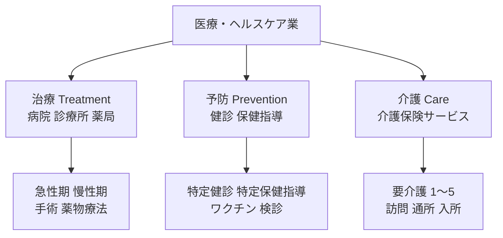
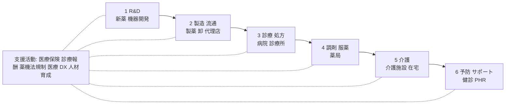
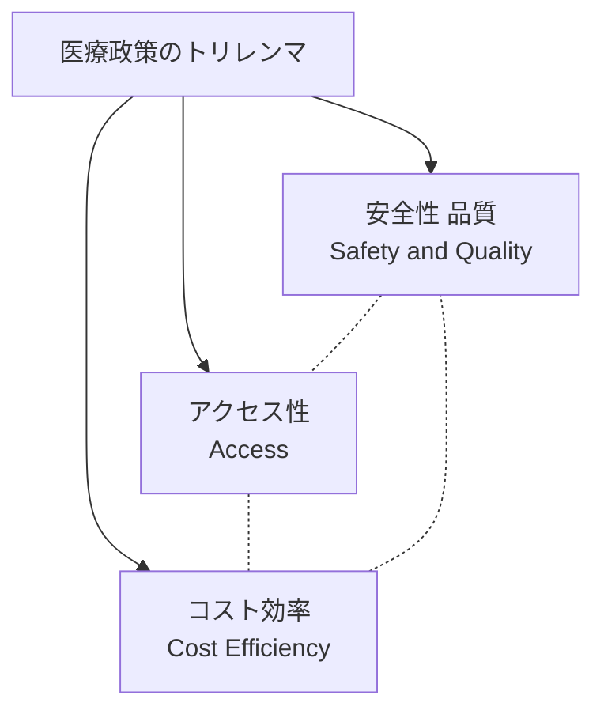

# 医療・ヘルスケア業のビジネス基礎

業界構造・診療報酬・医薬品・医療機器・介護・医療 DX——転職／担当／提案のための「医療業界を読み解く眼鏡」

| 項目 | 内容 |
|---|---|
| カテゴリー | 業種別実務 |
| 難易度 | 中級 |
| 所要時間 | 約200分（全8レッスン） |
| 公開日 | 2026-07-01 |
| 最終更新日 | 2026-07-01 |
| コースURL | https://skillup.college/courses/industry/healthcare-basics/ |

## 対象者

医療・ヘルスケア事業体（病院・診療所・薬局・製薬・医療機器・介護・ヘルステック）に転職・配属された事務系・営業・HR・人事・経理・経営企画担当者と、医療・ヘルスケアクライアントを担当するコンサル・SIer・広告代理店・金融・不動産・編集者を両方主軸とする。医療の現場経験はないが「業界としての医療・ヘルスケアを読み解きたい」社会人 3 年目以上を対象。医療・ヘルスケア業に向けた提案・営業を行う方も含む。6 サブ領域（病院・診療所／薬局／製薬／医療機器／介護／医療 DX）を業種横断で扱う。

## 前提知識

社会人 3 年以上を想定。会計の基本（B/S、P/L、粗利、原価の概念）と保険の基本（保険料と保険給付の考え方）への理解があれば理解が早いが、これらの土台は本コース内で必要範囲を解説する。医療の現場経験は不要で、業界横断の俯瞰知識として「制度と技術のあいだで最適点を探す発想」を身につける構成。

## 学習目標

- 医療・ヘルスケア業の 6 サブ領域（病院・診療所／薬局／製薬／医療機器／介護／医療 DX）と 3 大機能（治療・予防・介護）を地図化できる
- 医療・ヘルスケアのバリューチェーンと業態別ビジネスモデルを読み解ける
- 医療保険制度と診療報酬（点数体系・DPC/PDPS・隔年改定・薬価改定）を理解する
- 病院・診療所・薬局の業態分類、経営指標（平均在院日数・病床稼働率・入院単価）、地域包括ケアを把握する
- 医薬品業界（先発・後発・OTC・バイオ・R&D・薬価）と医療機器業界（薬機法・分類）の基本を理解する
- 介護業界（介護保険・要介護度・介護報酬・地域包括ケアシステム）と 2025 年問題を把握する
- 医療 DX（電子カルテ・レセプト・マイナ保険証・電子処方箋・オンライン診療・PHR・NDB）とデジタル治療（DTx）の現在地を理解する
- 少子高齢化・2025 年問題・医療 AI・EBM ／VBHC などの業界トレンドを把握する

## コース概要

日本の医療・ヘルスケア業界は、国民医療費約 47 兆円・介護費約 12 兆円・医薬品市場約 10 兆円・医療機器市場約 4 兆円という圧倒的な規模を持ち、GDP の約 10 % を占める日本経済の基幹産業です。にもかかわらず、業界外の方には「制度」「用語」「点数」がわかりにくい世界です。本コースは、医療・ヘルスケア事業体（病院・診療所・薬局・製薬・医療機器・介護・ヘルステック）に転職・配属された事務系・営業・人事・経理・経営企画の担当者と、医療クライアントを担当するコンサル・SIer・広告代理店・金融・不動産・編集者の両方を主軸に、医療業界を「業界として読み解く眼鏡」を 8 レッスンで提供します。6 サブ領域と 3 大機能、業態別のビジネスモデル、医療保険制度と診療報酬、病院・薬局・製薬・医療機器・介護のそれぞれの業務、医療 DX とデジタル治療、2025 年問題と業界 AI まで扱います。

## 学習の流れ

レッスン 1 で医療業界の現在地・6 サブ領域・本コースの 3 視点（転職者／担当者／提案者）を共有します。レッスン 2 で「医療業界の全体地図」としてバリューチェーンと業態別ビジネスモデル、安全性・アクセス性・コストのトリレンマ、医療機関の典型組織を扱います。レッスン 3 で医療保険制度と診療報酬（業界の基準線）を扱い、レッスン 4 〜 7 が「6 領域を個別に読み解く」本体で、病院・診療所・薬局（L4）、医薬品（L5）、医療機器（L6）、介護と 2025 年問題（L7）を順に学びます。レッスン 8 で医療 DX（電子カルテ・オンライン診療・医療 AI ・DTx ）と修了後の継続学習方向を扱って締めくくります。医療の現場経験がない方が、「業界外から内に入ったとき」または「業界外から接するとき」に立ち止まらないための土台を作るコースとして設計しています。

## レッスン一覧

| No. | タイトル | 概要 | 所要時間 |
|---|---|---|---|
| 1 | 医療・ヘルスケア業の現在地と本コースの守備範囲 | 医療・ヘルスケア業の定義と 6 サブ領域（病院・診療所／薬局／製薬／医療機器／介護／医療 DX）、日本経済での位置（国民医療費約 47 兆円・介護費約 12 兆円・医薬品市場約 10 兆円・医療機器市場約 4 兆円）、3 大機能（治療・予防・介護）、4 つの構造変化（少子高齢化 2025 年問題・診療報酬改定サイクル・医療 DX ・EBM ／VBHC）、本コースの守備範囲（転職者・担当者・提案者の 3 視点）、医療業界の 3 つの共通言語（点数・エビデンス・時間）、医療のことば（DPC・NDB・レセプト・薬価・介護報酬）が翻訳できる価値を学ぶ | 25分 |
| 2 | 医療・ヘルスケアのバリューチェーンと業態別ビジネスモデル——R&D から患者サポートまで | Michael Porter のバリューチェーンの医療・ヘルスケア版、6 領域の収益モデル比較（病院＝入院・外来単価 × 患者数、薬局＝調剤・OTC、製薬＝新薬 R&D と薬価、医療機器＝機器販売 ＋ 消耗品、介護＝介護保険 ＋ 自己負担、ヘルステック＝サービス収益）、「安全性・アクセス性・コストのトリレンマ」の三角形、医療機関の典型組織（診療部門・看護部門・薬剤部門・事務部門・地域連携室）、6 サブ領域の主要 KPI 比較を学ぶ | 25分 |
| 3 | 医療保険制度と診療報酬——国民皆保険・DPC/PDPS・隔年改定 | 日本の国民皆保険制度（1961 年成立、健康保険・国民健康保険・後期高齢者医療・共済・船員保険）、保険給付の仕組み（7 割給付・自己負担・高額療養費）、診療報酬制度（点数体系・出来高払い・DPC/PDPS 包括支払、2 年ごとの改定サイクル）、DPC 対象病院の役割、薬価制度（薬価基準・毎年改定・原価計算方式）、医療費適正化計画、レセプト（診療報酬明細書）と審査、介護報酬（3 年ごと改定）、医療費と介護費の関係を学ぶ | 25分 |
| 4 | 病院・診療所・薬局のビジネス基礎——業態分類と経営 KPI | 病院の業態分類（急性期／回復期／慢性期・特定機能病院・地域医療支援病院・DPC 対象病院・ケアミックス病院・療養病床）、地域医療構想（2025 年に向けた病床機能分化）、病院経営 KPI（平均在院日数・病床稼働率・入院単価・外来単価・診療単価・医業利益率・医師 1 人あたり医業収益）、看護配置基準（7 対 1・10 対 1・13 対 1）、診療所（内科・外科・専門科・在宅療養支援診療所）、薬局の 3 分類（地域連携薬局・専門医療機関連携薬局・かかりつけ薬局）、調剤薬局と薬剤師の役割、ドラッグストアの医療化を学ぶ | 25分 |
| 5 | 医薬品業界のビジネス基礎——新薬・後発品・OTC・バイオ | 医薬品業界の分類（先発品・後発品／ジェネリック・OTC ／一般用医薬品・バイオ医薬品・バイオシミラー・再生医療等製品）、日本の主要製薬（武田薬品・アステラス製薬・第一三共・中外製薬・大塚 HD ・エーザイ）と外資系（Pfizer・Novartis・Merck・GSK・Roche）、新薬 R&D プロセス（基礎研究→非臨床→臨床試験フェーズ I/II/III→承認→上市、10 〜 15 年 ／ 数千億円）、薬価改定と後発医薬品促進政策、OTC 医薬品と要指導医薬品・スイッチ OTC、薬剤師の関わり、MR（医薬情報担当者）、CSO ／CRO ／SMO の外部委託エコシステム、バイオ医薬品とバイオシミラーの拡大を学ぶ | 25分 |
| 6 | 医療機器業界と規制——薬機法と業態別特性 | 医療機器業界の分類（大型機器 MRI ・CT ・PET、小型機器・材料 カテーテル・ステント、体外診断 IVD、家庭用医療機器）、リスク分類（クラス I ／II ／III ／IV）、日本の主要プレイヤー（テルモ・オリンパス・シスメックス・ニプロ・キヤノンメディカル・富士フイルムメディカル）と外資系（Medtronic・Johnson & Johnson・Siemens Healthineers・GE HealthCare・Philips）、薬機法（医薬品医療機器等法、2014 年薬事法から改称）、承認プロセスと PMDA、外国製造業者認定と品質マネジメント（QMS・ISO 13485）、機器販売と消耗品ビジネスの構造、SIB ／ SaMD（プログラム医療機器）を学ぶ | 25分 |
| 7 | 介護業界と少子高齢化——介護保険・2025 年問題・地域包括ケア | 介護保険制度（2000 年施行、40 歳以上加入義務、要介護認定 7 段階）、介護報酬（3 年ごと改定）、介護サービスの分類（訪問系・通所系・入所系・多機能）、施設サービス（特別養護老人ホーム／介護老人保健施設／介護療養型医療施設）、居住系サービス（有料老人ホーム／サービス付き高齢者向け住宅／グループホーム）、居宅サービス（訪問介護・訪問看護・デイサービス・ショートステイ）、ケアマネジャーの役割、地域包括ケアシステム（2025 年目標）、2025 年問題（団塊世代 75 歳到達）、認知症高齢者の推計と対応、介護人材不足と外国人技能実習・特定技能を学ぶ | 25分 |
| 8 | 医療 DX と業界トレンド——電子カルテ・オンライン診療・医療 AI ・修了後の継続学習 | 医療 DX の主要領域（電子カルテ・レセプトコンピュータ・オーダリング・PACS ・PHR ・NDB ）、マイナ保険証と電子処方箋（2023 年 1 月本格運用開始）、オンライン診療の解禁と定着（コロナ禍で規制緩和、2022 年改定で恒久化）、医療 AI ユースケース（画像診断 AI ・創薬 AI ・電子カルテ音声入力 ・チャットボット・治療計画支援）、Digital Therapeutics（DTx、CureApp SC ／NIC の禁煙アプリ 2020 年薬事承認・治療用アプリの拡大）、EBM（Evidence-Based Medicine）と VBHC（Value-Based Health Care）、地域医療情報連携ネットワーク、Personal Health Record と Apple Health ／Fitbit ／Garmin、修了後の継続学習方向を学ぶ | 25分 |

---

## レッスン1：医療・ヘルスケア業の現在地と本コースの守備範囲

（所要時間：25分）

### このレッスンで学ぶこと

- 医療・ヘルスケア業の定義と 6 サブ領域（病院・診療所／薬局／製薬／医療機器／介護／医療 DX）
- 日本経済での位置（国民医療費約 47 兆円・介護費約 12 兆円・医薬品市場約 10 兆円・医療機器市場約 4 兆円）
- 3 大機能（治療・予防・介護）
- 医療・ヘルスケア業を取り巻く 4 つの構造変化（少子高齢化 2025 年問題・診療報酬改定サイクル・医療 DX ・EBM ／VBHC）
- 本コースの守備範囲——転職者・担当者・提案者の 3 視点
- 医療業界の 3 つの共通言語（点数・エビデンス・時間）、医療のことばが翻訳できる価値

---

### 医療・ヘルスケア業とは何か——日本経済での位置

**医療・ヘルスケア業**（Healthcare Industry）は、人の生命と健康に関わるサービス・製品を提供する広範な産業群です。医療機関（病院・診療所）、薬局、製薬、医療機器、介護、ヘルステックまでを含みます。日本標準産業分類では、大分類 P「医療，福祉」に医療業（中分類 83）・保健衛生（中分類 84）・社会保険・社会福祉・介護事業（中分類 85）が置かれ、製薬（中分類 16 化学工業の一部）・医療機器（中分類 27 業務用機械器具製造業の一部）は製造業として分類されるなど、業種横断で構成されます。

本コースでは、実務上の 6 サブ領域で整理します。

- **病院・診療所**：入院・外来診療・救急対応。日本で病院約 8,100、一般診療所約 10.5 万、歯科診療所約 6.8 万
- **薬局**：医療用医薬品の調剤と OTC 販売。全国約 6.2 万薬局
- **製薬**：医療用医薬品と OTC 医薬品の R&D ・製造・販売。日本市場約 10 兆円
- **医療機器**：MRI・CT ・カテーテル・体外診断薬など。日本市場約 4 兆円
- **介護**：介護保険サービスと自費介護。介護給付費約 12 兆円
- **医療 DX ／ヘルステック**：電子カルテ・オンライン診療・PHR ・医療 AI ・DTx ・ウェアラブル

日本経済における医療・ヘルスケアの位置は、いくつかの数字で押さえておきます。厚生労働省『国民医療費』2022 年度で、国民医療費は約 46.7 兆円、GDP の約 8.5 % を占めます。介護給付費（介護保険財源）は 2023 年度で約 11.6 兆円、医薬品市場は約 10 兆円規模、医療機器市場は約 4 兆円規模で推移しています。合計すると、医療・ヘルスケア関連支出は GDP の約 10 % に達する巨大産業です（出典：[厚生労働省『国民医療費の概況』](https://www.mhlw.go.jp/toukei/list/37-21.html)）。

> **💡 ポイント**
> 医療・ヘルスケア業は GDP の約 10 % を占める基幹産業です。少子高齢化を背景に、国民医療費・介護給付費は今後も継続的に拡大が見込まれ、業界全体の成長期待は高い一方、財源負担の観点から効率化・DX ・地域包括ケアへの構造改革が求められます。

医療・ヘルスケア業の特徴は、「制度依存」と「非対称性」にあります。医療・介護の対価は、健康保険と介護保険を通じて公的財源で賄われる比率が極めて高く、業界の収益構造は「診療報酬」「薬価」「介護報酬」の政策的な価格設定で決まります。また、専門家（医師・薬剤師・看護師など）と受給者（患者・利用者）のあいだで情報の非対称性が非常に大きく、その調整のために厳格な法規制（医師法・薬剤師法・医療法・薬機法・介護保険法など）が置かれています。

---

### 医療・ヘルスケア業の 3 大機能——治療・予防・介護

医療・ヘルスケア業には、次の 3 大機能があります。

**第 1 機能：治療**（Treatment）。病気・けが・障害に対する診断・治療・手術・薬物療法・リハビリテーション。急性期医療から慢性疾患管理まで、伝統的な医療の中核。

**第 2 機能：予防**（Prevention）。健康診断・特定健診・特定保健指導・予防接種・生活習慣病予防・がん検診など、病気の発症前段階への介入。医療費適正化の観点からも重視されています。

**第 3 機能：介護**（Care）。高齢者・障害者の日常生活支援（食事・入浴・排泄）、身体機能維持のためのリハビリ、認知症ケア、看取りまでを含みます。介護保険制度が財源の中核。

図1：医療・ヘルスケア業の 3 大機能。治療・予防・介護は独立ではなく相互に接続する

3 大機能は独立ではなく相互に接続します。予防が機能すれば治療需要が減り、治療の質が上がれば介護移行が遅れ、介護が機能すれば重症化が抑制されて治療需要が減る、というサイクルです。「治療から予防・介護へのシフト」という業界共通の潮流は、この 3 機能の連動を踏まえた戦略転換です。

> **📝 補足**
> 3 大機能に加えて、「創薬・医療機器開発」を第 4 の機能として加える場合もあります。製薬・医療機器メーカーは治療の道具を作る側で、10 〜 15 年・数千億円規模の R&D 投資で新薬・新機器を生み出します。本コースでは 3 大機能を主軸に、製薬・医療機器の R&D は各回で扱います。

---

### 医療・ヘルスケア業を取り巻く 4 つの構造変化

2026 年現在、日本の医療・ヘルスケア業を取り巻く環境は、複数の構造変化が同時進行しています。

**第 1 の変化：少子高齢化と 2025 年問題**。団塊世代（1947 〜 1949 年生まれの約 800 万人）が 75 歳以上の後期高齢者に到達する **2025 年問題**が、業界にとって最大級のインパクトです。国民医療費・介護給付費の急拡大、医療・介護人材の需給ギャップ拡大、認知症高齢者の急増（2025 年に約 700 万人推計）が同時進行します。2030 年代半ばには「介護給付費 20 兆円時代」も視野に入ります。

**第 2 の変化：診療報酬・介護報酬の改定サイクル**。診療報酬は 2 年ごと（西暦偶数年）、介護報酬は 3 年ごとに改定されます。6 年ごとに両者が同時改定される「同時改定年」（2018 年・2024 年・2030 年など）は業界の激動年です。改定内容が業界の収益・戦略を決定するため、業界全体が改定サイクルで動きます。

**第 3 の変化：医療 DX（デジタル化）**。マイナ保険証（2023 年 1 月本格運用）、電子処方箋（2023 年 1 月開始）、オンライン診療の恒久化（2022 年診療報酬改定）、電子カルテ普及、PHR ／NDB 整備、医療 AI 画像診断承認、Digital Therapeutics（DTx）の薬事承認（CureApp SC 2020 年）が急速に進んでいます。厚生労働省は「医療 DX 令和ビジョン 2030」を策定し、業界横断のデジタル基盤整備を推進しています。

**第 4 の変化：EBM（Evidence-Based Medicine）と VBHC（Value-Based Health Care）**。「経験と勘」から「エビデンス」に基づく医療への移行が進み、成果報酬型（VBHC）の考え方が海外を中心に広がっています。日本でも診療報酬改定で「アウトカム評価」が段階的に導入されつつあります。

> **⚠️ 注意**
> 4 つの変化は独立ではなく、相互に絡みます。例えば、2025 年問題対応として在宅医療・介護連携が推進され、それを支えるオンライン診療・PHR ・電子処方箋の DX が制度化され、その効果を測る VBHC・アウトカム評価が診療報酬改定に反映される、というように連鎖します。「個別の論点」ではなく「重なり合う変化」として捉える視点が、本コース全体の前提です。

---

### 本コースの守備範囲——転職者・担当者・提案者の 3 視点

本コースは、医療の現場経験がない方を主な対象とします。3 つの視点から、それぞれの立場の方が「最初の半年で必要になる知識」を扱います。

**第 1 の視点：転職者・配属者**。医療機関・製薬・医療機器・介護・ヘルステックの事業体に転職した、または配属になった事務系・営業・人事・経理・経営企画の担当者を指します。医療業界の用語と思考様式に触れる中で、現場の医師・薬剤師・看護師・アクチュアリー的な保険数理担当者・臨床開発担当者との会話に必要な共通言語を持ちたい層です。

**第 2 の視点：担当者**。コンサル、SIer、広告代理店、金融、不動産、出版・編集者などで医療・ヘルスケアのクライアントを担当する方を指します。クライアントの事業構造と KPI（病院の平均在院日数・病床稼働率、製薬の R&D パイプライン、医療機器の販売・消耗品比率、介護の要介護度別ミックス）を理解し、提案や対話の質を上げたい層です。

**第 3 の視点：提案者**。医療・ヘルスケア業に向けて IT サービス、コンサルティング、人材紹介、広告サービスなどを提案する営業職を指します。医療業界の意思決定プロセス（院長・事務長・診療科部長・法人本部・厚生労働省・保険者）と予算サイクル、関係者の役割を理解し、商談を進めたい層です。

3 視点に共通するのは、「医療業界のことば」と「考え方」を翻訳できる必要があることです。DPC、NDB、レセプト、薬価、介護報酬、要介護度、地域包括ケア、EBM、PHR ——こうした用語が当たり前に飛び交う会議で、何が議論されているかを理解できる土台を、本コースで作ります。

> **🔰 初学者の方へ**
> 本コースは、医療の現場経験がなくても理解できるよう、すべての専門用語に説明を添えます。「病院で働いたことがない」「薬剤師と話す機会がない」「介護施設を訪ねたことがない」という方も、業界の論理と数字の読み方を学ぶことで、医療業界の方々との会話が成立するようになります。逆に、医療機関で 10 年以上現場経験のある方には、本コースは入門レベルの内容になります。

本コースが**扱わない**領域も明確にしておきます。

- 個別の医療行為・診療判断は扱いません。診断・治療の判断は医師・薬剤師・看護師など有資格者の独占業務で、本コースは「業界としての構造の理解」に留めます
- 個別業態の深掘り（大学病院・大手病院グループ・製薬 Big Pharma・医療機器大手の企業レポート相当）は扱いません。業種横断の俯瞰に留め、業態特化の深掘りは業界誌・アニュアルレポートに譲ります
- 個別の規制・法令の代理判断（医師法・薬剤師法・医療法・薬機法・介護保険法などの個別判断）は扱いません。これらは弁護士・行政書士・社労士の独占業務です
- 資格試験対策（医師国家試験・薬剤師国家試験・看護師国家試験・介護福祉士・ケアマネジャー試験など）は扱いません。試験対策は各資格専門の予備校・教材に譲ります

---

### 医療業界の 3 つの共通言語——点数・エビデンス・時間

医療・ヘルスケア業は 6 サブ領域で「違う言語」を話しますが、その底流に共通する 3 つの言語があります。「点数」「エビデンス」「時間」です。

**点数**（Points）：医療取引の対価は、「診療報酬点数」「薬価」「介護報酬」の政策的価格で決まります。1 点 10 円の診療報酬体系で、あらゆる医療行為・薬剤・機器・介護サービスに点数が定められ、これが業界の収益構造の基準線です。「保険点数がすべての医療の基準線」は、この構造を示す私のキーフレーズです。

**エビデンス**（Evidence）：医療は経験と勘だけでなく、臨床研究に基づくエビデンスで意思決定される時代になりました。EBM（Evidence-Based Medicine）と診療ガイドラインが治療選択の基盤になり、製薬・医療機器の承認プロセスも臨床試験のエビデンスに依存します。エビデンスがなければ保険適用も認められません。

**時間**（Time）：医療は時間軸が長い産業です。新薬 R&D は 10 〜 15 年、医療機器の上市も数年かかります。病院の平均在院日数、患者の治療経過、介護の長期利用など、時間軸を無視した議論は現場から遊離します。「制度」も 2 〜 6 年サイクルで変わり、業界の中期戦略はこれに合わせます。

> **💡 ポイント**
> 「医療は『命』と『制度』の二階建て」という私のスタンスは、この共通言語の分析から来ています。命への責任がなければ医療は成り立たず、制度の枠組みなしにその責任を持続的に果たせない。病院・薬局・製薬・医療機器・介護で見え方は違っても、根っこの言語は共通しています。

---

### 医療業界のことばが翻訳できる価値

本コースを通じて身につく「医療業界のことばを翻訳できる」能力は、現場でどう活きるか。具体的なシーンで考えてみます。

**シーン 1：転職者の最初の会議**——大学病院に転職した経営企画担当者が、初めての病院運営会議に参加します。「先月の平均在院日数が 12.5 日、病床稼働率 85 %、DPC 対象病床の入院単価が 4.8 万円、地域連携パスの登録件数 60 件」——こうした発言が並ぶ会議で、何が議論されているかが理解できれば、議事録を取るだけの存在から、議論に参加できる存在に変わります。

**シーン 2：コンサルの提案準備**——中堅製薬クライアント向けの薬価対応戦略を準備するコンサルタントが、経営陣ヒアリングに臨みます。「新薬の薬価が想定より低く算定されリターン計算が悪化。バイオシミラー参入で先発品売上も減衰局面」と聞いて、薬価制度と R&D 経済性の関係を即座に理解できれば、深いヒアリングと精度の高い提案に直結します。

**シーン 3：IT ベンダーの営業**——中堅病院に電子カルテ更新を提案する営業担当者が、事務長との商談に臨みます。「マイナ保険証・電子処方箋対応が必要だが、現行電子カルテはベンダー撤退で更新不能。オンライン診療も強化したい」と聞いて、医療 DX の全体像が頭に入っていれば、業務改革のパートナーとして選ばれる可能性が高まります。

**シーン 4：金融機関の融資判断**——地方病院向けの融資審査を担当する銀行員が、決算書を読みます。「医業利益率がマイナスだが、地域医療構想での急性期→回復期病床転換で診療報酬が改善見込み。DX 投資による長期効率化も評価軸」と読めれば、機械的な財務指標分析を超えた事業理解に基づく判断ができます。

> **📝 補足**
> 「医療業界のことばが翻訳できる」価値は、医療業界の中に閉じません。医療業界の知識を持つコンサルタント、IT ベンダー、金融担当者、広告代理店スタッフ、編集者は、医療業界との接点を持つあらゆる職種で重宝されます。GDP の約 10 % を占める基幹産業を相手にできることは、キャリア全体の選択肢を広げる投資です。

---

### まとめ

このレッスンでは、以下のことを学びました。

- 医療・ヘルスケア業は 6 サブ領域（病院・診療所／薬局／製薬／医療機器／介護／医療 DX）で構成され、国民医療費約 47 兆円・介護費約 12 兆円・医薬品市場約 10 兆円・医療機器市場約 4 兆円で GDP の約 10 % を占める基幹産業
- 3 大機能は治療・予防・介護で、独立ではなく相互接続するサイクル
- 医療・ヘルスケア業を取り巻く 4 つの構造変化は、少子高齢化と 2025 年問題・診療報酬改定サイクル・医療 DX ・EBM ／VBHC で、相互に絡み合う
- 本コースは転職者・担当者・提案者の 3 視点で、医療業界のことばを翻訳できる土台を作る
- 医療業界の 3 つの共通言語は「点数・エビデンス・時間」で、6 サブ領域を貫く底流の枠組み
- 個別医療行為・個別業態の深掘り・規制判断・資格対策は本コースの対象外

次のレッスンでは、医療業界の「全体地図」としてバリューチェーンと業態別ビジネスモデルを扱います。6 領域の収益モデルの比較、安全性・アクセス性・コストのトリレンマ、医療機関の典型組織、主要 KPI の比較を順に学びます。

---

### 確認クイズ

このレッスンの理解度をチェックしましょう。

#### Q1. 医療・ヘルスケア業の 6 サブ領域として、本レッスンで挙げたものはどれですか？

- [x] 病院・診療所／薬局／製薬／医療機器／介護／医療 DX
- [ ] 銀行／証券／保険／不動産／IT ／通信
- [ ] 建設／土木／不動産／小売／飲食／宿泊
- [ ] 農業／林業／漁業／畜産／食品／流通

> **解説**
> 医療・ヘルスケア業は実務上、病院・診療所（入院・外来診療）、薬局（調剤・OTC）、製薬（医療用医薬品・OTC の R&D ・製造・販売）、医療機器（MRI ・カテーテル・体外診断など）、介護（介護保険サービス）、医療 DX ／ヘルステック（電子カルテ・オンライン診療・医療 AI ・DTx）の 6 サブ領域で整理されます。

#### Q2. 医療・ヘルスケア業の日本経済における規模について、本レッスンの説明と合致するものはどれですか？

- [ ] 国民医療費約 5 兆円、GDP の 1 % 程度の限定的規模
- [x] 国民医療費約 47 兆円（2022 年度）、介護費約 12 兆円、医薬品市場約 10 兆円、医療機器市場約 4 兆円で GDP の約 10 % を占める
- [ ] 国民医療費約 200 兆円、GDP の 30 % を占める最大産業
- [ ] 医療業界の統計は公表されておらず、規模は不明

> **解説**
> 厚生労働省『国民医療費』2022 年度によれば、国民医療費は約 46.7 兆円で GDP の約 8.5 % を占めます。介護給付費（介護保険財源）は 2023 年度で約 11.6 兆円、医薬品市場は約 10 兆円規模、医療機器市場は約 4 兆円規模で推移しています。合計すると、医療・ヘルスケア関連支出は GDP の約 10 % に達する巨大産業です。

#### Q3. 医療・ヘルスケア業の 3 大機能として、本レッスンで挙げたものはどれですか？

- [ ] 開発・製造・販売
- [ ] 生産・調達・物流
- [x] 治療・予防・介護
- [ ] 採用・育成・評価

> **解説**
> 医療・ヘルスケア業の 3 大機能は、治療（病気・けが・障害に対する診断・治療・手術・薬物療法・リハビリ）、予防（健診・保健指導・予防接種・生活習慣病予防）、介護（高齢者・障害者の日常生活支援と身体機能維持）です。3 機能は独立ではなく相互接続するサイクルで、「治療から予防・介護へのシフト」という業界共通の潮流はこの 3 機能の連動を踏まえた戦略転換です。

#### Q4. 「2025 年問題」について、本レッスンの説明と合致するものはどれですか？

- [ ] 2025 年に医療業界が完全民営化される問題
- [ ] 2025 年に医薬品の輸入が完全禁止される問題
- [ ] 2025 年に介護保険制度が廃止される問題
- [x] 団塊世代（1947 〜 1949 年生まれ約 800 万人）が 75 歳以上の後期高齢者に到達し、国民医療費・介護給付費急拡大・医療介護人材ギャップ拡大・認知症高齢者急増（約 700 万人推計）が同時進行する問題

> **解説**
> 2025 年問題は、団塊世代（1947 〜 1949 年生まれの約 800 万人）が 75 歳以上の後期高齢者に到達することで、医療・介護需要が急拡大する構造問題です。国民医療費・介護給付費の急拡大、医療・介護人材の需給ギャップ拡大、認知症高齢者の急増（2025 年に約 700 万人推計）が同時進行し、業界にとって最大級のインパクトになります。2030 年代半ばには「介護給付費 20 兆円時代」も視野に入ります。

#### Q5. 本コースが対象とする「転職者・担当者・提案者の 3 視点」のうち、「担当者」に該当する例はどれですか？

- [ ] 医療事業体に転職した経営企画担当者
- [x] 医療・ヘルスケアクライアントを担当するコンサル・SIer・広告代理店・金融・不動産・編集者
- [ ] 医療業界に向けて IT サービス・コンサルティング・人材紹介・広告サービスを提案する営業職
- [ ] 病院の窓口で受付・会計業務を行う技能職

> **解説**
> 「担当者」は、コンサル、SIer、広告代理店、金融、不動産、出版・編集者などで医療・ヘルスケアクライアントを担当する方を指します。「転職者」は医療事業体に転職・配属された事務系・営業・人事・経理・経営企画担当者、「提案者」は医療業界に向けて営業する方を指します。病院の窓口業務の技能職は本コースの主たる対象ではありません。

#### Q6. 医療業界の 3 つの共通言語として、本レッスンで挙げたものはどれですか？

- [ ] 貸出・投信・保険
- [ ] 大手・中堅・中小
- [ ] 都市・地方・海外
- [x] 点数・エビデンス・時間

> **解説**
> 医療業界の 3 つの共通言語は「点数（診療報酬・薬価・介護報酬の政策的価格が業界の収益基準線）」「エビデンス（EBM ／診療ガイドライン・臨床研究に基づく意思決定）」「時間（新薬 R&D 10 〜 15 年・平均在院日数・介護長期利用など長い時間軸）」です。病院・薬局・製薬・医療機器・介護で見え方は違っても、根っこの言語は共通しており、この 3 つに立ち返れば個別業態・規制の意味が理解しやすくなります。「医療は『命』と『制度』の二階建て」という視点が、本コース全体を貫きます。

---

## レッスン2：医療・ヘルスケアのバリューチェーンと業態別ビジネスモデル——R&D から患者サポートまで

（所要時間：25分）

### このレッスンで学ぶこと

- Michael Porter のバリューチェーンの医療・ヘルスケア版
- 6 領域の収益モデル比較（病院・薬局・製薬・医療機器・介護・ヘルステック）
- 「安全性・アクセス性・コストのトリレンマ」の三角形
- 医療機関の典型組織（診療部門・看護部門・薬剤部門・事務部門・地域連携室）
- 6 領域の主要 KPI 比較

---

### 前回の振り返り

レッスン 1 では、医療・ヘルスケア業の現在地として、6 サブ領域（病院・診療所／薬局／製薬／医療機器／介護／医療 DX）、日本経済での位置（国民医療費約 47 兆円・介護費約 12 兆円・医薬品市場約 10 兆円・医療機器市場約 4 兆円）、3 大機能（治療・予防・介護）、4 つの構造変化（少子高齢化 2025 年問題・診療報酬改定サイクル・医療 DX ・EBM ／VBHC）、3 つの共通言語（点数・エビデンス・時間）を学びました。今回は、業界全体の「地図」としてバリューチェーンと業態別ビジネスモデルを扱います。

---

### Michael Porter のバリューチェーンと医療業界版

**バリューチェーン**（Value Chain、価値連鎖）は、Michael Porter 教授が 1985 年の著書『Competitive Advantage』で体系化した概念です。医療・ヘルスケア業のバリューチェーンは、本コースでは次の 6 段階で整理します。

- **第 1 段階：R&D ／新薬・機器開発**：製薬・医療機器メーカーによる新薬・新機器の研究開発
- **第 2 段階：製造・流通**：医薬品・医療機器の製造と、医薬品卸・医療機器代理店による流通
- **第 3 段階：診療・処方**：病院・診療所での診断・治療・処方
- **第 4 段階：調剤・服薬**：薬局での調剤と服薬指導
- **第 5 段階：介護・生活支援**：介護施設・在宅介護での生活支援
- **第 6 段階：予防・患者サポート**：健診・保健指導・患者会・PHR

図1：医療・ヘルスケア業のバリューチェーン 6 段階と支援活動

医療業界のバリューチェーンで特徴的なのは、支援活動に「医療保険制度」「診療報酬」「薬機法規制」「医療 DX」が主要な柱として位置づけられる点です。他業種の支援活動が「人事・経理・法務・IT」であるのに対し、医療業界では公的な制度・規制が業界の骨格を規定するため、これらの動向を追う「制度対応部門」が本部の中核機能として置かれます。

> **💡 ポイント**
> 医療業界のバリューチェーンは、他業種と比べて「制度・規制への依存度」が異常に大きいのが特徴です。診療報酬・薬価・介護報酬の政策的価格設定、薬機法の承認プロセス、医療保険給付の枠組みなしには、業界の収益構造が成立しません。「制度と技術のあいだで最適点を探す発想」は、この構造から生まれます。

---

### 6 領域の収益モデル比較

6 サブ領域の収益モデルは大きく異なります。それぞれの構造を整理します。

#### 病院——医業収益と医業費用の 2 階建て

病院の収益は「入院収益 ＋ 外来収益 ＋ 保健予防収益 ＋ その他医業収益」の**医業収益**で構成されます。入院収益は「入院単価 × 延べ入院患者数」、外来収益は「外来単価 × 延べ外来患者数」で近似できます。

主要 KPI は、**平均在院日数**（急性期で 10 〜 14 日、回復期で 60 日程度、慢性期で数百日）、**病床稼働率**（80 〜 90 % が目安）、**入院単価**（急性期 DPC 対象病床で 5 〜 6 万円、回復期で 3 〜 4 万円）、**医業利益率**（民間 3 〜 5 %、国公立は低め）、**医師 1 人あたり医業収益**などです。

**医業費用**は人件費が最大（50 〜 60 %）、次いで材料費（20 〜 25 %）、経費（10 〜 15 %）、減価償却費（5 % 前後）、他が続きます。労働集約性が極めて高い業態です。

#### 薬局——調剤収益と OTC 収益

薬局の収益は「調剤技術料 ＋ 薬剤料 ＋ OTC 販売」で構成されます。**調剤技術料**は診療報酬点数で決まる調剤基本料・薬剤服用歴管理指導料などの合計、**薬剤料**は薬価に応じた薬剤の価格転換収入（薬価差益 ＝ 薬価 − 仕入価格）です。

薬価差益は近年圧縮が続き、調剤技術料の重要性が増しています。**地域連携薬局**（2021 年制度化）、**専門医療機関連携薬局**、**かかりつけ薬局**の 3 分類で、地域包括ケアへの対応と加算取得が経営戦略の中核です。

#### 製薬——新薬 R&D 経済性

製薬会社の収益は「医療用医薬品売上 ＋ OTC 医薬品売上」で、営業利益率は 15 〜 25 % と製造業の中では高水準です。ただし、新薬 1 品の R&D に 10 〜 15 年・数千億円かかり、成功確率は 3 万分の 1 とも言われる高リスク・高リターン産業です。

主要 KPI は、**R&D 費／売上比率**（15 〜 25 %、業界随一の高比率）、**パイプライン**（開発中の候補品リスト）、**ブロックバスター**（年間売上 1,000 億円超の医薬品）、**特許切れ後の売上減衰率**、**バイオ医薬品比率**などです。

#### 医療機器——機器販売と消耗品・保守

医療機器メーカーの収益は「機器販売 ＋ 消耗品売上 ＋ 保守サービス」で構成されます。カテーテル・ステントなど「使い捨て消耗品を伴う機器」は、機器を安価に導入し消耗品で収益を稼ぐ「カミソリと替刃」モデルが多用されます。

主要 KPI は、**機器売上／消耗品売上比率**、**医療機関シェア**（同種機器の中でどの機関に納入しているか）、**新規医療機関開拓数**、**R&D 費／売上比率**（8 〜 12 %）などです。

#### 介護——介護保険給付と自己負担

介護事業体の収益は「介護保険給付収入（9 割）＋ 利用者自己負担（1 〜 3 割）＋ 自費サービス」で構成されます。介護報酬 3 年ごと改定の内容が業績を直接左右します。

主要 KPI は、**要介護度別利用者ミックス**（要介護 3 以上の比率が収益に大きく効く）、**稼働率**（有料老人ホームで 90 % 以上目安）、**利用者 1 人あたり月額単価**、**介護職員 1 人あたり収益**（人時生産性）、**離職率**などです。

#### ヘルステック——サービス収益・SaaS 型

ヘルステック（電子カルテ・PHR ・オンライン診療・DTx ・ウェアラブル）は、SaaS 型のサブスクリプション収益、初期導入費、DTx の場合は薬価収載後の使用料など、多様な収益モデルを持ちます。

主要 KPI は、**契約医療機関数**、**MAU ／DAU**（Monthly ／Daily Active Users）、**ARR**（Annual Recurring Revenue）、**顧客継続率**などです。

> **📝 補足**
> 6 領域の収益モデルは根本的に違いますが、共通するのは「診療報酬・薬価・介護報酬の政策価格に強く依存する」ことです。医療・ヘルスケア業を「政策と共に呼吸する産業」と捉えると、業界の変化速度と経営判断の焦点が理解しやすくなります。

---

### 安全性・アクセス性・コストのトリレンマ

医療政策・医療経営の議論で頻繁に用いられるフレームワークが、**3 つの目標のトリレンマ**です。

- **安全性・品質**（Safety and Quality）：医療の質、患者アウトカム、安全性
- **アクセス性**（Access）：必要な医療にアクセスできること（時間的・地理的・経済的）
- **コスト効率**（Cost Efficiency）：財源負担の持続可能性

3 つすべてを最大化することはできず、必ずトレードオフが発生します。

- 安全性を高めるには専門医配置・高度検査・十分な人員が必要でコストが上がる
- アクセス性を高めるには全国均一な提供体制が必要でコストが上がる
- コスト効率を高めるには専門機能集中化などが必要でアクセスが下がる

図2：医療政策のトリレンマ。安全性・アクセス性・コストは 3 つすべてを最大化できないトレードオフ構造

日本の医療政策は、この 3 つのバランスの中で世界的に見て「アクセス性が高くコストが相対的に低い（国民皆保険）」ポジションを取ってきましたが、少子高齢化により財源負担が拡大し、地域医療構想などで「アクセス性のトレードオフ」（機能分化・集約化）を進める方向にシフトしつつあります。

> **⚠️ 注意**
> トリレンマの発想は、医療経営者・政策担当者が意識的に優先軸を選ぶことを前提とします。「すべてを最大化する」議論は現実には成立せず、地域医療構想・診療報酬改定・介護報酬改定などの制度改革は、必ずどこかで痛みを伴います。「制度が意図するトレードオフ」を読み解くことが、業界を理解する眼鏡です。

---

### 医療機関の典型組織——診療・看護・薬剤・事務・地域連携

病院の組織は、機能別に多層構造を持ちます。典型的な部門構成を整理します。

**診療部門**：医師が所属する部門。診療科（内科・外科・小児科・産婦人科・整形外科・精神科など多数）に区分され、各科の**部長・医長・医員・研修医**の階層で構成されます。診療科の増減、医師採用、専門医育成が経営の中核です。

**看護部門**：看護師・准看護師・看護補助者が所属する最大部門（病院職員の 40 〜 50 %）。**看護部長・看護師長・主任・スタッフ**の階層で、病棟・外来・手術室・救急に配置されます。**看護配置基準**（7 対 1、10 対 1、13 対 1）が診療報酬点数を規定するため、看護師採用が経営の生命線です。

**薬剤部門**：薬剤師が所属。入院患者への調剤・服薬指導・注射薬調製・治験薬管理・DI（Drug Information）などを担います。近年は病棟薬剤業務（病棟に薬剤師が常駐して医師をサポート）が重要視されています。

**その他医療技術部門**：診療放射線技師（画像診断）、臨床検査技師（検体検査）、理学療法士・作業療法士・言語聴覚士（リハビリ）、管理栄養士（栄養管理）、臨床工学技士（機器管理）、臨床心理士・公認心理師（心理支援）などが所属。

**事務部門**：医事課（診療報酬請求・レセプト業務）、経理課、人事課、医療情報部（電子カルテ・システム）、企画課、施設課、渉外課。医事課はレセプト請求の中核で、DPC 対応・審査支払機関との折衝を担います。

**地域連携室**：他医療機関・介護施設・在宅サービスとの連携窓口。前方連携（急性期病院から回復期・慢性期への転院調整）、後方連携（診療所からの紹介受入）、退院支援などを担う。地域包括ケア時代の中核機能です。

> **💡 ポイント**
> 医療機関の組織理解で重要なのは、意思決定プロセスが「診療部門（医師）」と「事務部門」の**二元性**にあることです。医師は診療の権威、事務は経営の実務、両者の合意形成が経営判断の前提です。この「医事両輪」の構造が、他業種のクライアント担当者を戸惑わせる主要因の 1 つです。

---

### 6 領域の主要 KPI 比較

6 サブ領域の主要 KPI を比較して、業態の性格を整理します。

#### 病院

- **医業収益 ＝ 入院収益 ＋ 外来収益 ＋ その他**
- **平均在院日数**：急性期 10 〜 14 日、回復期 60 日、慢性期数百日
- **病床稼働率**：80 〜 90 %
- **入院単価**：DPC 対象病床 5 〜 6 万円
- **医業利益率**：民間 3 〜 5 %

#### 薬局

- **調剤技術料 ＋ 薬剤料 ＋ OTC 販売**
- **処方箋 1 枚あたり単価**
- **医師連携度**（かかりつけ薬局・地域連携薬局の加算取得率）

#### 製薬

- **医療用医薬品売上 ＋ OTC 売上**
- **R&D 費／売上比率**：15 〜 25 %
- **パイプライン**の Phase III 品目数
- **ブロックバスター**の売上構成比

#### 医療機器

- **機器売上／消耗品売上比率**
- **医療機関シェア**
- **R&D 費／売上比率**：8 〜 12 %

#### 介護

- **要介護度別利用者ミックス**
- **稼働率**：90 % 以上目安
- **利用者 1 人あたり月額単価**
- **介護職員離職率**

#### ヘルステック

- **契約医療機関数**
- **ARR**
- **顧客継続率**

> **📝 補足**
> 業態を跨いで医療事業体の経営を比較するとき、単純に「利益」だけを見ても意味がありません。病院の医業利益率、製薬の営業利益率、介護の給付比率、ヘルステックの ARR は、それぞれ異なる収益概念で、業態に応じた指標を組み合わせて読むのが医療アナリストの基本です。

---

### まとめ

このレッスンでは、以下のことを学びました。

- 医療・ヘルスケア業のバリューチェーンは 6 段階（R&D ／新薬・機器開発／製造・流通／診療・処方／調剤・服薬／介護・生活支援／予防・患者サポート）で、支援活動に医療保険・診療報酬・薬機法規制・医療 DX が中核として置かれる
- 6 領域の収益モデル：病院は医業収益 ＋ 医業費用の 2 階建て、薬局は調剤技術料 ＋ 薬剤料 ＋ OTC、製薬は医薬品売上と R&D 経済性、医療機器は機器 ＋ 消耗品、介護は介護保険給付 ＋ 自己負担、ヘルステックは SaaS 型
- 医療政策のトリレンマは「安全性・アクセス性・コスト」で、3 つすべての最大化はできない
- 医療機関の組織は診療部門（医師）・看護部門・薬剤部門・その他医療技術部門・事務部門・地域連携室の多層構造で、意思決定は「医師」と「事務」の二元性
- 病院の主要 KPI は平均在院日数・病床稼働率・入院単価・医業利益率、製薬は R&D 費／売上・パイプライン・ブロックバスター、医療機器は機器／消耗品比率、介護は要介護度ミックス・稼働率
- 「制度と技術のあいだで最適点を探す」発想が業界共通の設計原理

次のレッスンでは、業界の骨格である「医療保険制度と診療報酬」を扱います。国民皆保険、保険給付、DPC/PDPS、薬価制度、レセプト、介護報酬を順に学びます。

---

### 確認クイズ

このレッスンの理解度をチェックしましょう。

#### Q1. Michael Porter のバリューチェーン概念について、本レッスンの説明と合致するものはどれですか？

- [x] 1985 年の著書『Competitive Advantage』で体系化された概念で、主活動と支援活動に分解する
- [ ] 1995 年に提唱されたデジタル時代の経営戦略フレームワーク
- [ ] 医療業界のみに適用可能な概念
- [ ] 顧客サービスの段階を 12 ステップで整理する手法

> **解説**
> バリューチェーンは Michael Porter 教授が 1985 年の著書『Competitive Advantage』で体系化した概念で、主活動と支援活動に分解して価値創造の構造を可視化します。医療業界では主活動を 6 段階（R&D ／新薬・機器開発／製造・流通／診療・処方／調剤・服薬／介護・生活支援／予防・患者サポート）で整理し、支援活動に医療保険・診療報酬・薬機法規制・医療 DX が中核として置かれるのが特徴です。

#### Q2. 病院の主要 KPI「平均在院日数」の目安について、本レッスンの説明と合致するものはどれですか？

- [ ] すべての病棟で 3 日以内
- [x] 急性期 10 〜 14 日、回復期 60 日、慢性期数百日と病床機能で大きく異なる
- [ ] 急性期病棟でも 100 日以上
- [ ] 病床機能による差はなく、一律 30 日程度

> **解説**
> 平均在院日数は病床機能で大きく異なり、急性期 10 〜 14 日、回復期 60 日程度、慢性期数百日が目安です。病床稼働率（80 〜 90 %）、入院単価（DPC 対象病床で 5 〜 6 万円）、医業利益率（民間 3 〜 5 %）と並ぶ病院の重要 KPI で、地域医療構想で急性期→回復期→慢性期の機能分化が推進されています。

#### Q3. 製薬業界の主要 KPI について、本レッスンの説明と合致するものはどれですか？

- [ ] R&D 費／売上比率は 1 % 未満で製造業の中で最低水準
- [ ] 新薬 1 品の R&D は 1 〜 2 年・数十億円で開発可能
- [x] R&D 費／売上比率は 15 〜 25 %、新薬 1 品に 10 〜 15 年・数千億円かかり成功確率は 3 万分の 1
- [ ] 特許は永続的で、後発品は存在しない

> **解説**
> 製薬業界の R&D 費／売上比率は 15 〜 25 % と製造業の中では業界随一の高比率で、新薬 1 品の R&D に 10 〜 15 年・数千億円かかり、成功確率は 3 万分の 1 とも言われる高リスク・高リターン産業です。営業利益率は 15 〜 25 % と比較的高いですが、パイプライン（開発中候補品）、ブロックバスター（年間売上 1,000 億円超）、特許切れ後の売上減衰率、バイオ医薬品比率が主要 KPI です。

#### Q4. 医療政策の「安全性・アクセス性・コストのトリレンマ」について、本レッスンの説明と合致するものはどれですか？

- [ ] 3 つはすべて同時に最大化できる独立指標
- [ ] 3 つは連動しており、1 つを上げれば残り 2 つも自動的に良くなる
- [ ] 3 つのうちコスト効率だけが最重要で、安全性とアクセスは考慮不要
- [x] 3 つはトレードオフの関係で、政策担当者・医療経営者が意識的に優先軸を選ぶ必要がある

> **解説**
> 3 つはトレードオフの関係で、安全性を高めれば人員・機器コストが上がり、アクセス性を高めれば全国均一提供でコストが上がり、コスト効率を高めれば機能集中化でアクセスが下がる、という構造です。日本の医療政策は「アクセス性が高くコストが相対的に低い（国民皆保険）」ポジションを取ってきましたが、少子高齢化により財源負担が拡大し、地域医療構想などで「アクセス性のトレードオフ」（機能分化・集約化）を進める方向にシフトしつつあります。

#### Q5. 医療機関の組織における意思決定プロセスについて、本レッスンの説明と合致するものはどれですか？

- [ ] 事務部門だけが意思決定を担う
- [x] 「診療部門（医師）」と「事務部門」の二元性で、両者の合意形成が経営判断の前提
- [ ] 診療部門だけが意思決定を担う
- [ ] 看護部門だけが意思決定を担う

> **解説**
> 医療機関の意思決定プロセスは「診療部門（医師）」と「事務部門」の二元性を持ちます。医師は診療の権威、事務は経営の実務、両者の合意形成が経営判断の前提です。この「医事両輪」の構造が、他業種のクライアント担当者を戸惑わせる主要因の 1 つです。看護部門は最大人数を持つ実行部門ですが、意思決定の中心は診療 × 事務の連携にあります。

#### Q6. 病院組織の中で、病院職員の 40 〜 50 % を占める最大部門はどれですか？

- [ ] 診療部門（医師）
- [ ] 事務部門
- [ ] 薬剤部門
- [x] 看護部門

> **解説**
> 看護部門は看護師・准看護師・看護補助者が所属し、病院職員の 40 〜 50 % を占める最大部門です。看護部長・看護師長・主任・スタッフの階層で、病棟・外来・手術室・救急に配置されます。看護配置基準（7 対 1、10 対 1、13 対 1）が診療報酬点数を規定するため、看護師採用が経営の生命線です。診療部門は医師が所属し診療科ごとに階層化、薬剤部門は薬剤師、事務部門は医事・経理・人事・企画などです。

---

## レッスン3：医療保険制度と診療報酬——国民皆保険・DPC/PDPS・隔年改定

（所要時間：25分）

### このレッスンで学ぶこと

- 日本の国民皆保険制度（1961 年成立、健康保険・国民健康保険・後期高齢者医療・共済・船員保険）
- 保険給付の仕組み（7 割給付・自己負担・高額療養費）
- 診療報酬制度（点数体系・出来高払い・DPC/PDPS 包括支払、2 年ごとの改定サイクル）
- DPC 対象病院の役割
- 薬価制度（薬価基準・毎年改定・原価計算方式）
- 医療費適正化計画、レセプト（診療報酬明細書）と審査
- 介護報酬（3 年ごと改定）、医療費と介護費の関係

---

### 前回の振り返り

レッスン 2 では、医療業界のバリューチェーン 6 段階、6 領域の収益モデル比較、安全性・アクセス性・コストのトリレンマ、医療機関の典型組織（診療・看護・薬剤・その他医療技術・事務・地域連携）、6 領域の主要 KPI を学びました。今回は、業界の骨格である「医療保険制度と診療報酬」を扱います。医療業界を理解する上で最も重要な回です。

---

### 国民皆保険制度——1961 年成立からの日本モデル

**国民皆保険制度**は、日本国民のすべてが公的医療保険に加入する仕組みで、1961 年 4 月に国民健康保険法の全面適用で完成しました。世界的に見ても数少ない「全国民カバー・アクセスフリー・自己負担が定率」のモデルとして高く評価されています。

日本の公的医療保険は次の 5 つで構成されます。

- **健康保険（協会けんぽ・組合健保）**：民間企業の被用者と扶養家族。全国健康保険協会（協会けんぽ）と各企業・業界の健康保険組合（組合健保）
- **国民健康保険（国保）**：自営業・農業・無職の方など。都道府県と市町村が運営（2018 年度から都道府県単位化）
- **後期高齢者医療制度**：75 歳以上の高齢者（一定の障害がある 65 歳以上を含む）。都道府県単位の広域連合が運営
- **共済組合**：公務員・私立学校職員
- **船員保険**：船員

医療機関で保険証（またはマイナ保険証）を提示すると、患者は「一部負担金」を支払い、残りは保険者から医療機関に「診療報酬」として支払われる仕組みです。

**自己負担割合**：現役世代（一般）は 3 割、義務教育就学前は 2 割、70 〜 74 歳（一般）は 2 割、75 歳以上（一般）は 1 割、現役並み所得者は 3 割です。

**高額療養費制度**：1 か月の自己負担が一定額を超えると、超えた分が保険者から償還される制度。所得区分により自己負担限度額が設定され、高額医療への安全ネットとして機能します。

> **💡 ポイント**
> 国民皆保険は「アクセス」「安全性」を優先した設計で、コストは公的財源で吸収する構造です。この構造ゆえに、少子高齢化による財源負担拡大が制度の持続可能性を問う中心論点になります。診療報酬改定・薬価改定・介護報酬改定は、この持続可能性を制度側でコントロールする主要手段です。

---

### 診療報酬制度——2 年ごとに変わる業界の基準線

**診療報酬**は、医療機関が保険診療を行った対価として保険者から受け取る報酬で、**1 点 10 円**の点数体系で規定されます。診療報酬は「診療報酬点数表」に基づき、次の 3 つに区分されます。

- **医科診療報酬点数表**：医科（一般病院・診療所）
- **歯科診療報酬点数表**：歯科
- **調剤報酬点数表**：薬局

さらに、**入院基本料**（看護配置基準に応じた 7 対 1・10 対 1・13 対 1・15 対 1 など）、**特掲診療料**（検査・画像診断・処置・手術・リハビリなど）、**加算**（各種要件を満たすと追加される点数）などのカテゴリで構成されます。

**支払方式**は 2 通りあります。

- **出来高払い**：診療行為ごとに点数を積み上げる伝統的な方式
- **DPC/PDPS**（Diagnosis Procedure Combination / Per-Diem Payment System）：診断群分類ごとの 1 日あたり包括点数と、手術・麻酔などの出来高点数を組み合わせる方式（急性期病棟向け、2003 年導入）

**DPC 対象病院**は現在約 1,800 病院、DPC 準備病院と合わせて全国 8,100 病院の相当部分を占めます。DPC ではコーディング（診断群分類の付番）の精度が病院収益に直結します。

**診療報酬改定**は 2 年ごと（西暦偶数年の 4 月）に実施され、**中央社会保険医療協議会（中医協）**での審議を経て厚生労働大臣が告示します。改定率は「本体改定率」（診療報酬点数）と「薬価改定率」（薬価）の合算で公表され、医療機関収益と社会保障費に大きな影響を与えます。

> **⚠️ 注意**
> 診療報酬改定は、業界の景色を 2 年ごとに変える最重要イベントです。中医協答申から改定までの約 4 か月間、医療機関の事務部門は総力戦で対応します。算定漏れが 1 件でも収益に直結するため、改定内容を業務フローと電子カルテのマスタに落とし込むオペレーションが極めて重要です。

---

### 薬価制度——毎年改定と原価計算方式

**薬価**は、医療用医薬品の保険適用時の公定価格で、**薬価基準**に収載された品目のみが保険診療で使えます。薬価は次の 2 方式で算定されます。

- **類似薬効比較方式**：既存の類似薬に基づいて価格算定。多くの新薬がこの方式
- **原価計算方式**：類似薬がない画期的新薬などで、原価と適正利益から算定

さらに、以下の加算・調整が入ります。

- **画期性加算**（最大 120 %）：真に画期的な新薬
- **有用性加算**（最大 60 %）：有用性が高い新薬
- **市場性加算**、**小児加算**、**先駆加算**
- **外国平均価格調整**：日米欧の平均価格と比較して調整

**薬価改定**は、従来 2 年ごとでしたが、2021 年度改定以降**毎年改定**に移行しました。市場実勢価格と公定薬価の乖離を、より頻繁に補正する仕組みです。

**後発医薬品（ジェネリック）促進政策**により、後発品数量シェアは 2024 年時点で 80 % 超に達しました。政府は後発品使用促進の目標を継続的に上方修正し、先発品メーカーは「特許切れ後の売上急減衰」というビジネス構造に対応してきました。

**バイオシミラー**（バイオ後続品）は、バイオ医薬品の後発品で、化学合成品の後発品より複雑な承認プロセスを経て市場投入されます。

---

### レセプトと審査支払機関

**レセプト**（診療報酬明細書、Rezept）は、医療機関が保険者に対して診療報酬を請求するために作成する明細書です。診療月ごとに患者別に作成され、翌月 10 日までに**審査支払機関**に提出されます。

**審査支払機関**は 2 系統あります。

- **社会保険診療報酬支払基金**（支払基金）：協会けんぽ・組合健保・共済組合のレセプトを審査
- **国民健康保険団体連合会**（国保連）：国保・後期高齢者医療のレセプトを審査

審査支払機関は、レセプト内容が診療報酬点数表・算定要件・薬価基準に適合しているかを審査し、査定（減点）・返戻・保留・査定なしで承認の判断を行います。査定が多い医療機関は、次期の指導対象になることもあります。

**電子レセプト**（オンライン請求）は 2011 年から原則義務化され、現在ほぼ 100 % 電子化されています。レセプトデータは匿名化された上で**NDB**（National Database、レセプト情報・特定健診等情報データベース）に蓄積され、医療政策・研究に活用されています。

---

### 医療費適正化計画とアウトカム評価

**医療費適正化計画**は、都道府県が策定する医療費の適正化に向けた計画で、6 年ごとに更新されます。地域医療構想（病床機能の分化・連携）、特定健診・特定保健指導、後発品使用促進、生活習慣病予防が主要施策です。

近年の診療報酬改定では、**アウトカム評価**（診療結果を評価する報酬設計）の導入が段階的に進んでいます。回復期リハビリテーション病棟の「実績指数」、DPC の「効率性係数」、後発品の「後発品使用体制加算」など、「投入」ではなく「成果」に応じた点数配分が広がっています。

**VBHC**（Value-Based Health Care、価値ベース医療）は、Michael Porter らが提唱した「医療の価値 ＝ アウトカム／コスト」の考え方で、米国を中心に成果連動型支払が拡大しています。日本でも診療報酬改定でアウトカム評価の要素が徐々に導入されつつありますが、まだ「投入ベース」の要素が主流です。

> **📝 補足**
> 「投入ベース」（サービス提供量に応じた支払）から「成果ベース」（アウトカムに応じた支払）へのシフトは、医療政策の世界的潮流です。データ活用（NDB ・PHR ・電子カルテ）が進むほど、成果測定が精緻になり、アウトカム評価の適用範囲が広がる構造です。

---

### 介護報酬——3 年ごと改定の別体系

**介護報酬**は、介護事業体が介護保険サービスを提供した対価として保険者から受け取る報酬で、**1 単位 10 〜 11.4 円**（地域区分により異なる）で計算されます。診療報酬とは独立の体系で、**3 年ごと（西暦偶数の間の奇数年）**に改定されます。

介護報酬は、**介護給付費分科会**での審議を経て厚生労働省告示で決まります。改定率は業界収益・介護保険財源に直結するため、業界全体が改定サイクルで動きます。

**同時改定年**：診療報酬（2 年ごと）と介護報酬（3 年ごと）の改定サイクルの最小公倍数である**6 年ごと**に同時改定が実施されます（2018 年・2024 年・2030 年）。医療・介護の連携推進が制度改革の主要テーマになるタイミングです。

**介護報酬の主要区分**：

- **要介護度別基本報酬**：要支援 1・2、要介護 1 〜 5 の 7 段階で単位数が異なる
- **加算**：認知症対応、看取り、リハビリ、地域連携、処遇改善など多数
- **地域区分**：地域の実勢賃金水準に応じた単価調整

**処遇改善加算**は、介護職員の賃金改善を主目的とした加算で、介護人材不足への対応策として累次拡充されています。

---

### まとめ

このレッスンでは、以下のことを学びました。

- 国民皆保険は 1961 年 4 月国民健康保険法全面適用で完成、5 制度（協会けんぽ・組合健保／国保／後期高齢者医療／共済／船員保険）で構成
- 自己負担割合は現役世代 3 割、義務教育就学前 2 割、70 〜 74 歳 2 割、75 歳以上 1 割（現役並みは 3 割）、高額療養費制度が安全ネット
- 診療報酬は 1 点 10 円の点数体系で、医科・歯科・調剤の 3 点数表、入院基本料・特掲診療料・加算などで構成
- 支払方式は出来高払いと DPC/PDPS 包括支払、DPC 対象病院は約 1,800 病院
- 診療報酬改定は 2 年ごと、中医協審議を経て厚生労働大臣告示
- 薬価は薬価基準に収載、類似薬効比較方式か原価計算方式、画期性・有用性加算あり、2021 年から毎年改定に移行、後発品数量シェア 80 % 超
- レセプトは翌月 10 日までに審査支払機関（支払基金・国保連）に提出、電子化ほぼ 100 %、NDB に蓄積
- 医療費適正化計画は都道府県策定（6 年ごと）、地域医療構想・特定健診・特定保健指導・後発品促進が主要施策
- 介護報酬は 1 単位 10 〜 11.4 円、3 年ごと改定、6 年ごとに診療報酬と同時改定（2018・2024・2030 年）
- 処遇改善加算は介護職員の賃金改善策として累次拡充

次のレッスンでは、6 サブ領域の第 1 のグループ「病院・診療所・薬局」を扱います。業態分類、経営 KPI、地域医療構想、薬局の 3 分類などを順に学びます。

---

### 確認クイズ

このレッスンの理解度をチェックしましょう。

#### Q1. 国民皆保険制度について、本レッスンの説明と合致するものはどれですか？

- [ ] 2021 年に成立した比較的新しい制度
- [x] 1961 年 4 月に国民健康保険法の全面適用で完成、全国民が公的医療保険に加入、5 制度（協会けんぽ・組合健保／国保／後期高齢者医療／共済／船員保険）で構成
- [ ] 現役世代のみをカバーする制度
- [ ] 民間保険会社が運営する任意加入制度

> **解説**
> 国民皆保険制度は 1961 年 4 月に国民健康保険法の全面適用で完成し、日本国民のすべてが公的医療保険に加入する仕組みです。世界的に見ても数少ない「全国民カバー・アクセスフリー・自己負担が定率」のモデルとして高く評価されています。健康保険（協会けんぽ・組合健保）、国民健康保険、後期高齢者医療制度、共済組合、船員保険の 5 制度で構成されます。

#### Q2. 診療報酬の点数体系について、本レッスンの説明と合致するものはどれですか？

- [x] 1 点 10 円で、医科・歯科・調剤の 3 点数表、入院基本料・特掲診療料・加算などで構成
- [ ] 1 点 1 円で、業種横断で 1 つの点数表に統一
- [ ] 1 点 100 円で、疾患別に点数が異なる
- [ ] 診療報酬の点数体系はなく、自由診療で価格が決まる

> **解説**
> 診療報酬は 1 点 10 円の点数体系で規定されます。医科診療報酬点数表（一般病院・診療所）・歯科診療報酬点数表・調剤報酬点数表の 3 点数表があり、入院基本料（看護配置基準に応じた 7 対 1 ・10 対 1 ・13 対 1 ・15 対 1 など）、特掲診療料（検査・画像診断・処置・手術・リハビリなど）、加算（各種要件を満たすと追加される点数）で構成されます。

#### Q3. DPC/PDPS について、本レッスンの説明と合致するものはどれですか？

- [ ] 診療科ごとの純出来高払い方式
- [ ] 自由診療の価格設定
- [x] Diagnosis Procedure Combination / Per-Diem Payment System、診断群分類ごとの 1 日あたり包括点数と手術・麻酔などの出来高点数を組み合わせる方式（急性期病棟向け、2003 年導入）、現在約 1,800 病院が DPC 対象病院
- [ ] 訪問診療のみに適用される特殊な報酬体系

> **解説**
> DPC/PDPS は 2003 年に急性期病棟向けに導入された支払方式で、Diagnosis Procedure Combination（診断群分類）ごとの 1 日あたり包括点数と、手術・麻酔などの出来高点数を組み合わせる方式です。現在約 1,800 病院が DPC 対象病院で、DPC 準備病院と合わせて全国 8,100 病院の相当部分を占めます。DPC ではコーディング（診断群分類の付番）の精度が病院収益に直結します。

#### Q4. 診療報酬改定と介護報酬改定の頻度について、本レッスンの説明と合致するものはどれですか？

- [ ] 診療報酬は毎年、介護報酬は 5 年ごと
- [ ] 診療報酬は 3 年ごと、介護報酬は 2 年ごと
- [ ] 両方とも毎年改定
- [x] 診療報酬は 2 年ごと（西暦偶数年 4 月）、介護報酬は 3 年ごと、6 年ごとに同時改定年（2018・2024・2030 年）

> **解説**
> 診療報酬改定は 2 年ごと（西暦偶数年の 4 月）に実施され、中央社会保険医療協議会（中医協）での審議を経て厚生労働大臣が告示します。介護報酬改定は 3 年ごとに実施され、介護給付費分科会での審議を経て決定されます。両者の最小公倍数である 6 年ごとに「同時改定年」（2018 年・2024 年・2030 年）となり、医療・介護連携推進が制度改革の主要テーマになるタイミングです。

#### Q5. 薬価制度について、本レッスンの説明と合致するものはどれですか？

- [x] 薬価基準に収載された品目のみが保険診療で使用可能、類似薬効比較方式か原価計算方式で算定、2021 年度改定以降毎年改定に移行、後発品数量シェアは 2024 年時点で 80 % 超
- [ ] 薬価は各医療機関が自由に設定
- [ ] 薬価改定は 10 年に 1 度実施
- [ ] 後発品は日本では認められていない

> **解説**
> 薬価は医療用医薬品の保険適用時の公定価格で、薬価基準に収載された品目のみが保険診療で使用可能です。算定方式は類似薬効比較方式（既存の類似薬に基づく）か原価計算方式（類似薬がない画期的新薬）で、画期性加算・有用性加算・小児加算・外国平均価格調整などが加わります。従来 2 年ごと改定でしたが、2021 年度改定以降は毎年改定に移行しました。後発品数量シェアは 2024 年時点で 80 % 超に達しています。

#### Q6. 医療機関のレセプト（診療報酬明細書）について、本レッスンの説明と合致するものはどれですか？

- [ ] 医療機関から患者へ直接請求する書類
- [ ] 手書きで作成することが原則
- [ ] 保険者と医療機関の間の非公式なメモ書き
- [x] 診療月ごとに患者別に作成、翌月 10 日までに審査支払機関（支払基金・国保連）に提出、2011 年から電子レセプトが原則義務化されほぼ 100 % 電子化、NDB に蓄積

> **解説**
> レセプト（診療報酬明細書、Rezept）は、医療機関が保険者に対して診療報酬を請求するために作成する明細書で、診療月ごとに患者別に作成され、翌月 10 日までに審査支払機関に提出されます。審査支払機関には社会保険診療報酬支払基金（協会けんぽ・組合健保・共済組合を審査）と国民健康保険団体連合会（国保・後期高齢者医療を審査）の 2 系統があります。電子レセプト（オンライン請求）は 2011 年から原則義務化され、現在ほぼ 100 % 電子化。NDB（National Database）に蓄積され医療政策・研究に活用されています。

---

## レッスン4：病院・診療所・薬局のビジネス基礎——業態分類と経営 KPI

（所要時間：25分）

### このレッスンで学ぶこと

- 病院の業態分類（急性期／回復期／慢性期・特定機能病院・地域医療支援病院・DPC 対象病院・ケアミックス病院・療養病床）
- 地域医療構想（2025 年に向けた病床機能分化）
- 病院経営 KPI（平均在院日数・病床稼働率・入院単価・外来単価・医業利益率）
- 看護配置基準（7 対 1・10 対 1・13 対 1）と診療報酬の関係
- 診療所（内科・外科・専門科・在宅療養支援診療所）
- 薬局の 3 分類（地域連携薬局・専門医療機関連携薬局・かかりつけ薬局）と調剤薬局・ドラッグストア

---

### 前回の振り返り

レッスン 3 では、国民皆保険制度、保険給付（自己負担・高額療養費）、診療報酬制度（点数体系・出来高払い・DPC/PDPS）、2 年ごと改定サイクル、薬価制度（2021 年から毎年改定）、レセプトと審査支払機関、医療費適正化計画、介護報酬 3 年ごと改定を学びました。今回は、6 サブ領域の中核である「病院・診療所・薬局」を深く掘り下げます。

---

### 病院の業態分類——多層構造の理解

日本の病院は、機能・規模・役割で複雑に分類されます。主要区分を整理します。

#### 病床機能による分類

医療法上、病院は次の 4 機能で病床を保有します。

- **急性期病床**：急性期治療を提供、平均在院日数 10 〜 14 日
- **高度急性期病床**：高度な急性期医療（救命救急・集中治療室）
- **回復期病床**：急性期治療後のリハビリ・在宅復帰支援、平均在院日数 60 日程度
- **慢性期病床**：長期療養（療養病床）、平均在院日数数百日

#### 制度上の分類

- **特定機能病院**：高度先端医療を提供する大学病院本院と一部大規模病院（現在約 88 施設）。病床数 400 床以上、10 標榜科以上、査読付論文実績、臨床研修体制など高い要件
- **地域医療支援病院**：かかりつけ医との連携中核（現在約 700 施設）。紹介率・逆紹介率、地域研修、開放病床など要件
- **臨床研究中核病院**：臨床研究・治験の中核（現在約 15 施設）
- **DPC 対象病院**：DPC/PDPS が適用される急性期病院（約 1,800 施設）
- **DPC 準備病院**：DPC 導入準備中の病院

#### 開設主体による分類

- **国公立病院**：国立病院機構、公立病院（都道府県立・市区町村立）、独立行政法人など
- **公的病院**：日赤・済生会・厚生連（JA）などが運営
- **公私協力型**：地方独立行政法人など
- **民間病院**：医療法人（社団・財団）、個人開設

日本の病院約 8,100 施設のうち、民間病院が約 7 割を占め、諸外国（欧州の公立主導、米国の非営利主導）と比べて民間主導の特徴を持ちます。

> **💡 ポイント**
> 病院は「業態」で経営環境が根本的に異なります。特定機能病院（大学病院本院）と地域中核民間病院とケアミックス病院では、収益構造、KPI、意思決定プロセスが全く違います。「どの業態か」を最初に把握することが、病院を理解する第一歩です。

---

### 地域医療構想——2025 年に向けた機能分化

**地域医療構想**は、2014 年医療法改正で導入された制度で、都道府県が「2025 年時点の病床機能配分」を推計し、地域ごとに病床機能の分化・連携を推進する政策です。

**背景**：日本の病院病床は約 155 万床（一般＋療養＋精神＋結核）と、人口比で世界最多水準です。急性期病床が過剰、回復期病床が不足という機能ミスマッチもあり、少子高齢化と財源制約の中で機能分化が必要になっています。

**2025 年病床推計**：厚生労働省の 2025 年病床機能推計では、高度急性期 13 万床、急性期 40 万床、回復期 38 万床、慢性期 28 万床の合計 119 万床が必要と推計され、現状より約 35 万床の削減が求められる方向性を示しました。

**構想区域**：都道府県内の医療圏（二次医療圏、約 340）ごとに病床機能配分を推進し、地域医療構想調整会議で医療機関間の合意形成を進めます。

**急性期→回復期病床転換**は、地域医療構想の中核テーマです。急性期の入院基本料（1 日 15,000 円前後）と回復期リハビリテーション病棟入院料（1 日 20,000 〜 25,000 円前後、リハビリ時間や実績指数で変動）では、収益構造が変わるため、転換は経営判断として慎重に行われます。

---

### 病院経営 KPI の詳細

病院経営の主要 KPI を詳しく見ていきます。

#### 収益系 KPI

- **医業収益 ＝ 入院収益 ＋ 外来収益 ＋ その他医業収益**
- **入院単価 ＝ 入院収益 / 延べ入院患者数**：DPC 対象急性期病床で 5 〜 6 万円
- **外来単価 ＝ 外来収益 / 延べ外来患者数**：一般病院で 1 〜 2 万円
- **医業利益率 ＝ 医業利益 / 医業収益**：民間 3 〜 5 %、国公立は低め〜赤字も多い

#### 稼働系 KPI

- **病床稼働率 ＝ 延べ入院患者数 / (稼働病床数 × 日数)**：80 〜 90 % が目安
- **平均在院日数**：急性期 10 〜 14 日、回復期 60 日、慢性期数百日
- **紹介率／逆紹介率**：地域医療支援病院要件の中核指標

#### 生産性 KPI

- **医師 1 人あたり医業収益**：規模・機能による差が大きい
- **看護師 1 人あたり患者数**：看護配置基準で規定
- **人件費率**：医業収益の 50 〜 60 %

#### 病棟別 KPI（DPC 対象病院）

- **効率性係数**：全国平均入院日数との比較
- **複雑性係数**：診療密度の指標
- **カバー率係数**：疾患のカバー範囲
- **地域医療係数**：地域貢献度の評価

これらの係数が DPC 病院別の機能評価係数として設定され、入院基本料の一部となります。

> **📝 補足**
> 病院経営は「医業損益 → 経常損益 → 当期純損益」の 3 段階で最終利益に至ります。医業損益は本業の収益力、経常損益は補助金・寄付金など医業外を含む、当期純損益は特別損益を含む最終値です。特に国公立病院では「医業収支の赤字を経常収支の補助金で埋める」構造が一般的です。

---

### 看護配置基準——診療報酬を規定する経営の生命線

**看護配置基準**は、入院基本料の点数を規定する重要要件です。急性期一般入院基本料の主要区分を整理します。

- **急性期一般入院料 1（7 対 1）**：入院患者 7 人に対して看護師 1 人（実質は 24 時間 3 交代の平均で約 10 対 1）。急性期の中核区分、入院基本料 1 日 15,910 円
- **急性期一般入院料 2 〜 6**：段階的に基準が緩和され、入院基本料も減額
- **地域一般入院基本料（13 対 1）**：入院患者 13 人に看護師 1 人。中規模一般病院向け
- **療養病棟入院基本料（20 対 1）**：慢性期療養向け

急性期一般入院料 1（7 対 1）を維持するには、看護師の絶対数が必要で、看護師採用が経営の生命線になります。看護師不足で 7 対 1 を維持できなくなった病院は、10 対 1 に転落することで年間数億円規模の減収を経験します。

さらに、「重症度、医療・看護必要度」の基準（患者の重症度を測る指標）を満たす患者比率も 7 対 1 維持要件に含まれ、単純に人員だけでなく患者ミックスも管理対象です。

---

### 診療所——一般外来と在宅医療の主戦場

**診療所**は病床 20 床未満（0 床の無床診療所、19 床以下の有床診療所）の医療機関で、日本で一般診療所約 10.5 万・歯科診療所約 6.8 万が存在します。

診療所の主な分類：

- **内科系**：内科、循環器内科、消化器内科、糖尿病内科など。生活習慣病管理の主戦場
- **外科系**：外科、整形外科、皮膚科、眼科、耳鼻科など
- **専門科**：小児科、産婦人科、精神科、心療内科、麻酔科、放射線科など
- **在宅療養支援診療所**（在支診）：24 時間対応、往診・在宅看取り対応の要件を満たす診療所。地域包括ケアの中核

**外来収益**が中核で、初診料 288 点・再診料 73 点（診療所）が基本、これに医学管理料・検査料・処方料などが加算されます。診療所 1 施設あたりの月平均レセプト件数、患者 1 人あたり単価が主要 KPI です。

**在宅医療**は、2000 年代以降拡大している領域です。往診料、在宅患者訪問診療料、在宅時医学総合管理料、看取り加算などの点数が整備され、在宅療養支援診療所を中心に在宅医療専門診療所も増えています。

**電子カルテ普及率**は、診療所で約 55 %（2023 年時点）と病院（約 90 %）より低く、DX 対応が進行中です。

> **⚠️ 注意**
> 診療所は「1 人医師の小規模事業体」が多く、経営と診療の両立が最大の課題です。院長の高齢化・後継者不足で「無承継廃業」が地域医療の欠落を招くケースも増えており、承継支援・診療所 M&A も業界の話題です。

---

### 薬局——3 分類制度と地域連携

**薬局**は、医療用医薬品の調剤と OTC 販売を行う施設で、全国約 6.2 万薬局が存在します。

**2021 年に薬局の 3 分類制度**が導入されました。

- **地域連携薬局**：地域包括ケアシステムで在宅医療・多職種連携に対応する薬局
- **専門医療機関連携薬局**：がん・HIV など専門医療機関と連携し、専門的薬剤師が常駐する薬局
- **かかりつけ薬局**：24 時間対応・在宅対応可能な、患者のかかりつけ機能を持つ薬局

3 分類の認定を取得すると、診療報酬（調剤報酬）で加算が取得でき、経営的な差別化になります。

**薬局の主要 KPI**：

- **処方箋受付枚数**：月平均枚数
- **1 枚あたり調剤技術料**
- **1 枚あたり薬剤料**（薬価差益）
- **1 枚あたり患者単価**
- **かかりつけ薬剤師指導料算定件数**

**業態別分類**：

- **調剤薬局**：処方箋調剤が中核。大手はアインホールディングス、日本調剤、クオール、総合メディカルなど
- **ドラッグストア併設調剤**：ウエルシア、ツルハなど大手ドラッグストアが調剤機能を併設
- **病院前薬局（門前薬局）**：特定の医療機関の処方箋に特化
- **医療モール薬局**：複数の診療所と併設された薬局

**医薬分業率**は 2024 年時点で 75 % 前後で、処方箋発行率で見ると病院・診療所からの処方の 75 % が院外薬局で調剤される状態です。

---

### まとめ

このレッスンでは、以下のことを学びました。

- 病院の業態分類は病床機能（急性期・高度急性期・回復期・慢性期）、制度上（特定機能病院・地域医療支援病院・DPC 対象病院）、開設主体（国公立・公的・民間）で多層構造
- 日本の病院約 8,100 施設のうち民間病院が約 7 割、諸外国と異なる民間主導
- 地域医療構想は 2014 年医療法改正で導入、2025 年目標の病床機能分化推進、急性期→回復期病床転換が中核テーマ
- 病院経営 KPI は入院単価・外来単価・医業利益率・病床稼働率・平均在院日数・紹介率・逆紹介率・機能評価係数
- 看護配置基準（7 対 1・10 対 1・13 対 1）が入院基本料を規定、看護師採用が経営の生命線
- 診療所は病床 20 床未満、一般 10.5 万・歯科 6.8 万、在宅療養支援診療所が地域包括ケア中核
- 薬局は全国約 6.2 万、2021 年から地域連携薬局・専門医療機関連携薬局・かかりつけ薬局の 3 分類制度
- 医薬分業率は 2024 年で 75 % 前後、頭打ち感あり

次のレッスンでは、6 サブ領域の第 2 のグループ「医薬品業界」を扱います。先発品・後発品・OTC・バイオ、新薬 R&D プロセス、薬価改定、日本と外資の主要プレイヤーを順に学びます。

---

### 確認クイズ

このレッスンの理解度をチェックしましょう。

#### Q1. 病院の病床機能による分類として、本レッスンで挙げたものはどれですか？

- [ ] 内科・外科・小児科・産婦人科
- [x] 急性期・高度急性期・回復期・慢性期
- [ ] 都市部・地方部・離島部・過疎地
- [ ] 大規模・中規模・小規模・零細

> **解説**
> 医療法上、病院は病床機能で急性期病床（平均在院日数 10 〜 14 日）、高度急性期病床（救命救急・集中治療室）、回復期病床（平均在院日数 60 日程度）、慢性期病床（療養病床、数百日）の 4 機能に分類されます。地域医療構想では 2025 年に向けたこの 4 機能の病床配分の推計と分化・連携が推進されています。

#### Q2. 特定機能病院について、本レッスンの説明と合致するものはどれですか？

- [ ] すべての民間病院
- [ ] 病床 20 床未満の診療所
- [ ] 介護施設と併設された医療機関
- [x] 高度先端医療を提供する大学病院本院と一部大規模病院（現在約 88 施設）、病床数 400 床以上・10 標榜科以上・査読付論文実績・臨床研修体制など高い要件

> **解説**
> 特定機能病院は、高度先端医療を提供する大学病院本院と一部大規模病院に与えられる位置づけで、現在約 88 施設が該当します。病床数 400 床以上、10 標榜科以上、査読付論文実績、臨床研修体制など高い要件が課され、承認は厚生労働大臣が行います。地域医療支援病院（約 700 施設）・臨床研究中核病院（約 15 施設）・DPC 対象病院（約 1,800 施設）と並ぶ制度上の類型です。

#### Q3. 看護配置基準「7 対 1」について、本レッスンの説明と合致するものはどれですか？

- [x] 入院患者 7 人に対して看護師 1 人、急性期一般入院料 1 の区分、入院基本料 1 日 15,910 円、看護師採用が経営の生命線
- [ ] 看護師 7 人に対して患者 1 人の手厚いサービス提供
- [ ] 7 種類の看護配置を組み合わせる制度
- [ ] 週 7 日連続勤務を要求する労働基準

> **解説**
> 「7 対 1」は入院患者 7 人に対して看護師 1 人（実質は 24 時間 3 交代の平均で約 10 対 1）の看護配置で、急性期一般入院料 1 の区分に該当し、入院基本料は 1 日 15,910 円です。急性期の中核区分で、看護師の絶対数確保が経営の生命線です。看護師不足で 7 対 1 を維持できなくなった病院は、10 対 1 に転落することで年間数億円規模の減収を経験します。「重症度、医療・看護必要度」の基準（患者ミックス）も要件に含まれます。

#### Q4. 地域医療構想について、本レッスンの説明と合致するものはどれですか？

- [ ] 都道府県による病院の完全国有化計画
- [ ] 病院数を全国一律に増やす計画
- [ ] 医療費を削減して医療サービスを縮小する計画
- [x] 2014 年医療法改正で導入、都道府県が 2025 年時点の病床機能配分を推計、地域ごとに病床機能の分化・連携を推進、二次医療圏（約 340）ごとに調整会議で合意形成

> **解説**
> 地域医療構想は 2014 年医療法改正で導入された制度で、都道府県が「2025 年時点の病床機能配分」を推計し、地域ごとに病床機能の分化・連携を推進する政策です。日本の病院病床は人口比で世界最多水準、急性期病床過剰・回復期病床不足の機能ミスマッチもあり、少子高齢化と財源制約の中で機能分化が必要です。二次医療圏（約 340）ごとに地域医療構想調整会議で医療機関間の合意形成が進められます。

#### Q5. 薬局の 3 分類制度（2021 年導入）として、本レッスンで挙げたものはどれですか？

- [ ] 急性期薬局・回復期薬局・慢性期薬局
- [ ] 都市薬局・地方薬局・離島薬局
- [x] 地域連携薬局・専門医療機関連携薬局・かかりつけ薬局
- [ ] 大手薬局・中堅薬局・個人薬局

> **解説**
> 2021 年に導入された薬局の 3 分類制度は、地域連携薬局（地域包括ケアシステムで在宅医療・多職種連携に対応）、専門医療機関連携薬局（がん・HIV など専門医療機関と連携、専門的薬剤師が常駐）、かかりつけ薬局（24 時間対応・在宅対応可能な患者のかかりつけ機能）です。認定を取得すると調剤報酬で加算が取得でき、経営的な差別化になります。

#### Q6. 日本の医薬分業率について、本レッスンの説明と合致するものはどれですか？

- [ ] 2024 年時点で 10 % 程度
- [ ] 2024 年時点で 100 %（完全医薬分業）
- [ ] 医薬分業率という概念は日本では存在しない
- [x] 2024 年時点で 75 % 前後、病院・診療所からの処方の 75 % が院外薬局で調剤される状態、1990 年代の 20 % 台から拡大したが頭打ち感あり

> **解説**
> 医薬分業率は 2024 年時点で 75 % 前後で、病院・診療所からの処方の 75 % が院外薬局（保険薬局）で調剤される状態です。1990 年代の 20 % 台から拡大してきましたが、頭打ち感もあります。「院内処方が残る領域（診療所・小規模病院）」の医薬分業をどう進めるかが、次の政策論点です。医薬分業により薬剤師の専門性を活かすチェック機能と、医療機関と薬局の役割分担が推進されます。

---

## レッスン5：医薬品業界のビジネス基礎——新薬・後発品・OTC・バイオ

（所要時間：25分）

### このレッスンで学ぶこと

- 医薬品業界の分類（先発品・後発品／ジェネリック・OTC ／一般用医薬品・バイオ医薬品・バイオシミラー・再生医療等製品）
- 日本の主要製薬（武田・アステラス・第一三共・中外・大塚 HD ・エーザイ）と外資系（Pfizer・Novartis・Merck・GSK・Roche）
- 新薬 R&D プロセス（基礎研究→非臨床→臨床試験フェーズ I/II/III →承認→上市、10 〜 15 年 ／ 数千億円）
- 薬価改定と後発医薬品促進政策
- OTC 医薬品と要指導医薬品・スイッチ OTC
- 薬剤師の関わり、MR（医薬情報担当者）
- CSO ／CRO ／SMO の外部委託エコシステム
- バイオ医薬品とバイオシミラーの拡大

---

### 前回の振り返り

レッスン 4 では、病院の業態分類（病床機能・制度・開設主体）、地域医療構想、病院経営 KPI、看護配置基準、診療所（在宅療養支援診療所を含む）、薬局の 3 分類制度と医薬分業率を学びました。今回は、6 サブ領域の第 2 のグループ「医薬品業界」を深く掘り下げます。

---

### 医薬品業界の分類

医薬品は、次の主要区分で分類されます。

#### 用途別分類

- **医療用医薬品**：医師の処方箋が必要な医薬品。日本市場約 10 兆円の大半
- **要指導医薬品**：スイッチ OTC（元は医療用）で薬剤師の対面販売必須
- **一般用医薬品（OTC）**：ドラッグストア・薬局で店頭販売、第 1 類・第 2 類・第 3 類の 3 分類

#### 開発段階別分類

- **先発医薬品（新薬）**：特許で保護された新規開発薬。10 〜 15 年・数千億円の R&D 投資
- **後発医薬品（ジェネリック、GE）**：先発品の特許切れ後に同一有効成分で製造される医薬品。日本の数量シェアは 2024 年時点で 80 % 超
- **オーソライズドジェネリック（AG）**：先発メーカーの承諾を得て製造される後発品、先発品と同一処方

#### 化学構造別分類

- **化学合成品（低分子医薬品）**：伝統的な合成有機化学の医薬品
- **バイオ医薬品**：生物学的技術で製造される抗体医薬品・タンパク質医薬品・遺伝子治療薬など。高分子で、化学合成品より製造・品質管理が複雑
- **バイオシミラー**：バイオ医薬品の後続品。化学合成品の後発品より承認プロセスが複雑
- **再生医療等製品**：細胞治療薬・遺伝子治療薬・組織工学製品（例：CAR-T 細胞療法のキムリア）

> **💡 ポイント**
> 医薬品業界は「化学」から「バイオ」への構造転換期にあります。売上高上位のブロックバスターは、抗体医薬品・遺伝子治療薬などのバイオ医薬品にシフトしており、日本の製薬会社の R&D 戦略もバイオへの投資強化が主流です。「日本製薬の競争力はバイオでどう戦うか」が業界共通の中期テーマです。

---

### 主要プレイヤー

#### 日本の主要製薬

- **武田薬品工業**：日本最大の製薬会社、2019 年 Shire 買収でグローバル大手入り、消化器・血友病・希少疾患・オンコロジー・ニューロサイエンスに強い
- **アステラス製薬**：2005 年に山之内製薬と藤沢薬品の合併で誕生、泌尿器・オンコロジーに強い
- **第一三共**：2005 年に第一製薬と三共の統合で誕生、心血管・オンコロジーに強い、抗体薬物複合体（ADC）の Enhertu で急成長
- **中外製薬**：ロシュとの戦略的アライアンス、抗体医薬品・希少疾患に強い、日本のオンコロジー市場リーダー
- **大塚ホールディングス**：医薬品（大塚製薬）、ニュートラシューティカル（大塚食品）を統合、独自の複合型ビジネスモデル
- **エーザイ**：アルツハイマー病治療薬レカネマブ（2023 年米国承認）で注目、認知症領域の世界的プレゼンス
- **その他大手**：小野薬品（オプジーボ）、田辺三菱、大正製薬 HD、住友ファーマ、塩野義製薬など

#### 外資系グローバル大手

- **Pfizer**（米国、世界最大）：COVID-19 mRNA ワクチンで有名、循環器・オンコロジー
- **Johnson & Johnson**（米国）：医薬品・医療機器・コンシューマー製品の複合コングロマリット
- **Roche**（スイス）：バイオ医薬品最大手、オンコロジー・診断
- **Novartis**（スイス）：オンコロジー・希少疾患・眼科・循環器
- **Merck & Co.**（米国、Merck Sharp & Dohme／MSD）：ワクチン・オンコロジー（Keytruda）
- **AbbVie**（米国、Abbott から分社）：免疫・オンコロジー・神経
- **GSK**（英国）：ワクチン・呼吸器
- **AstraZeneca**（英国／スウェーデン）：オンコロジー・呼吸器
- **Sanofi**（フランス）：ワクチン・希少疾患・糖尿病
- **Novo Nordisk**（デンマーク）：糖尿病・肥満（ウゴービ、オゼンピック）

日本市場は「日系 vs 外資」の競争が長年繰り広げられており、市場シェアで見ると医療用医薬品市場の 30 〜 40 % 程度を外資系が占めます。

---

### 新薬 R&D プロセス

新薬開発は、次の 7 段階を経て市場投入されます。

#### 段階と期間

1. **基礎研究**（2 〜 3 年）：ターゲット探索、化合物スクリーニング、リード化合物同定
2. **非臨床試験**（3 〜 5 年）：動物実験で有効性・安全性を評価
3. **臨床試験フェーズ I**（1 〜 2 年）：健康な成人 20 〜 100 人で安全性・薬物動態を評価
4. **臨床試験フェーズ II**（1 〜 2 年）：少数の患者 100 〜 300 人で有効性と最適用量を評価
5. **臨床試験フェーズ III**（3 〜 5 年）：多数の患者 1,000 〜 3,000 人で有効性・安全性を確認
6. **承認申請と審査**（1 〜 2 年）：PMDA での審査、厚生労働省の承認
7. **市販後調査（フェーズ IV）**：市販後の安全性・有効性を継続監視

合計 10 〜 15 年、投資額は数百億〜数千億円規模になります。**成功確率は 3 万分の 1** とも言われ、フェーズ III でも約 5 割が承認に至らない極めて高リスクな産業です。

#### R&D 経済性

- **R&D 費／売上比率**：15 〜 25 %（業界随一の高比率、Tech 業界の 10 〜 15 % を上回る）
- **ブロックバスター**：年間売上 1,000 億円超の医薬品。1 品のブロックバスターが会社全体の売上の 20 〜 30 % を占めることも
- **特許切れの崖**（Patent Cliff）：特許切れ直後に後発品参入で売上が急減衰（先発品売上が 50 〜 90 % 減少）
- **パイプライン**：開発中の候補品リスト。Phase III 品目数が近い将来の売上ドライバー

#### 承認プロセスと PMDA

**PMDA**（Pharmaceuticals and Medical Devices Agency、独立行政法人医薬品医療機器総合機構）は、日本の医薬品・医療機器の承認審査機関で、2004 年設立です。医薬品の承認申請は PMDA で審査され、厚生労働大臣が最終承認します。

- **通常審査**：新薬の標準審査
- **優先審査**：希少疾患用医薬品や有用性の高い医薬品
- **先駆的医薬品指定制度**：革新的医薬品の早期承認
- **条件付き早期承認制度**：小規模データで承認、市販後実データで検証

日本では、欧米で承認済みの新薬が日本承認まで数年遅れる「**ドラッグ・ラグ**」問題が長年議論されてきましたが、近年は解消傾向にあります。

---

### 薬価制度と後発品促進

#### 薬価収載

新薬承認後、**中央社会保険医療協議会（中医協）**での審議を経て薬価基準に収載され、保険適用となります。薬価は次の 2 方式で算定されます。

- **類似薬効比較方式**：既存の類似薬に基づく（多くの新薬）
- **原価計算方式**：類似薬がない画期的新薬

これに、画期性加算（最大 120 %）、有用性加算（最大 60 %）、市場性加算、小児加算、先駆加算、外国平均価格調整が加わります。

#### 薬価改定

薬価改定は 2 年ごと（診療報酬改定と同時）でしたが、2021 年度以降**毎年改定**に移行しました。市場実勢価格と公定薬価の乖離を、より頻繁に補正する仕組みです。

**新薬創出等加算**：革新的新薬の薬価維持特例で、特許期間中は薬価を維持することで新薬創出を促進する制度。要件を満たさなくなると、通常改定で薬価が下がります。

#### 後発品促進政策

政府は継続的に後発品使用促進の目標を設定しています。

- **2020 年目標**：数量シェア 80 % → 達成
- **2024 年目標**：数量シェア 80 % 以上を安定的に維持

後発品数量シェアの拡大により、先発品メーカーの売上構造は「特許切れの崖」への対応が経営中心テーマになっています。

**バイオシミラー**は、バイオ医薬品の後続品として、後発品より複雑な承認プロセスを経て市場投入されます。日本では 2013 年以降段階的に承認事例が増え、抗体医薬品の特許切れに応じて拡大しています。

---

### MR と CSO ／CRO ／SMO

#### MR（Medical Representative、医薬情報担当者）

**MR** は製薬会社の営業職で、医療機関の医師・薬剤師に医薬品の情報を提供する役割です。医薬品の売上に直結するため、日本全体で約 4 万人が働いていました。しかし、次の変化により MR 数は減少傾向にあります。

- **後発品拡大による先発品市場縮小**
- **医療機関の面談規制強化**（コンプライアンス視点）
- **オンライン MR ・デジタル MR の拡大**
- **専門疾患領域（オンコロジー・希少疾患）へのシフト**

#### 外部委託エコシステム

製薬企業は、コア機能に集中するため、次の外部サービスを活用します。

- **CSO**（Contract Sales Organization）：営業アウトソーシング、MR 派遣・共同販促
- **CRO**（Contract Research Organization）：臨床試験受託、モニタリング・データマネジメント・統計解析
- **SMO**（Site Management Organization）：治験実施施設管理、治験コーディネーター派遣

日本の主要 CRO：シミック、パレクセル、Iqvia、EPS ホールディングス、A2 ヘルスケア など。
日本の主要 CSO：シミック（CMIC ヘルスケア）、EPS 総合コンサルティング など。

> **📝 補足**
> 製薬業界の「外部委託エコシステム」は、R&D の高度化・専門化に応じて拡大しています。1 つの新薬プロジェクトが、製薬会社・CRO ・SMO ・治験実施医療機関の複数プレイヤーの協働で運営される時代です。医療業界の見えない支え手として、CSO ／CRO ／SMO の存在は重要です。

---

### まとめ

このレッスンでは、以下のことを学びました。

- 医薬品業界の主要分類は用途別（医療用・要指導・OTC）、開発段階別（先発・後発／ジェネリック・AG）、化学構造別（化学合成・バイオ・バイオシミラー・再生医療等製品）
- 日本の主要製薬は武田・アステラス・第一三共・中外・大塚 HD ・エーザイ・小野・田辺三菱など、外資系は Pfizer・J&J・Roche・Novartis・Merck・AbbVie・GSK ・AstraZeneca・Sanofi・Novo Nordisk など
- 新薬 R&D プロセスは 7 段階（基礎研究→非臨床→フェーズ I ／II ／III →承認申請→市販後）で 10 〜 15 年・数百億〜数千億円、成功確率は 3 万分の 1
- 承認審査は PMDA（2004 年設立）が担当、優先審査・先駆的医薬品指定・条件付き早期承認制度など
- 薬価は類似薬効比較方式か原価計算方式で算定、画期性加算・有用性加算・外国平均価格調整、2021 年度から毎年改定
- 後発品数量シェアは 80 % 超、先発品メーカーは「特許切れの崖」への対応が経営中心テーマ
- MR は約 4 万人体制から減少傾向、専門疾患領域と CSO ／CRO ／SMO 活用へ構造転換
- 「日本製薬がバイオでどう戦うか」が業界共通の中期テーマ

次のレッスンでは、6 サブ領域の第 3 のグループ「医療機器業界」を扱います。業態分類、リスク分類、薬機法、主要プレイヤー、SaMD（プログラム医療機器）などを順に学びます。

---

### 確認クイズ

このレッスンの理解度をチェックしましょう。

#### Q1. 新薬 R&D の期間・投資規模・成功確率について、本レッスンの説明と合致するものはどれですか？

- [x] 10 〜 15 年、数百億〜数千億円、成功確率 3 万分の 1、フェーズ III でも約 5 割が承認に至らない極めて高リスクな産業
- [ ] 1 〜 2 年、数千万円、成功確率 90 %
- [ ] 5 〜 8 年、数十億円、成功確率 50 %
- [ ] 20 年以上、10 兆円、成功確率 100 %

> **解説**
> 新薬 R&D は基礎研究（2 〜 3 年）→非臨床試験（3 〜 5 年）→臨床試験フェーズ I（1 〜 2 年）→フェーズ II（1 〜 2 年）→フェーズ III（3 〜 5 年）→承認申請と審査（1 〜 2 年）→市販後調査の 7 段階を経て、合計 10 〜 15 年、投資額は数百億〜数千億円規模になります。成功確率は 3 万分の 1 とも言われ、フェーズ III でも約 5 割が承認に至らない極めて高リスクな産業です。R&D 費／売上比率は 15 〜 25 % と業界随一の高比率です。

#### Q2. 日本の後発医薬品数量シェアについて、本レッスンの説明と合致するものはどれですか？

- [ ] 2024 年時点で 20 % 程度
- [x] 2024 年時点で 80 % 超、2020 年目標達成後も 80 % 以上を安定的に維持することが 2024 年以降の目標
- [ ] 日本では後発品が禁止されている
- [ ] 統計は公表されていない

> **解説**
> 日本の後発医薬品数量シェアは、2024 年時点で 80 % 超に達しました。政府は継続的に後発品使用促進の目標を設定してきました（2020 年目標：数量シェア 80 % → 達成、2024 年目標：数量シェア 80 % 以上を安定的に維持）。後発品数量シェアの拡大により、先発品メーカーの売上構造は「特許切れの崖」（Patent Cliff、特許切れ直後に後発品参入で先発品売上が 50 〜 90 % 減少）への対応が経営中心テーマになっています。

#### Q3. PMDA について、本レッスンの説明と合致するものはどれですか？

- [ ] 都道府県の医療機関許認可機関
- [ ] 民間の医療機関コンサルティング企業
- [x] Pharmaceuticals and Medical Devices Agency（独立行政法人医薬品医療機器総合機構）、2004 年設立、日本の医薬品・医療機器の承認審査機関、優先審査・先駆的医薬品指定制度・条件付き早期承認制度など複数の審査プロセスあり
- [ ] 米国 FDA の日本支部

> **解説**
> PMDA（Pharmaceuticals and Medical Devices Agency、独立行政法人医薬品医療機器総合機構）は、日本の医薬品・医療機器の承認審査機関で 2004 年設立です。医薬品の承認申請は PMDA で審査され、厚生労働大臣が最終承認します。通常審査、優先審査（希少疾患用医薬品や有用性の高い医薬品）、先駆的医薬品指定制度（革新的医薬品の早期承認）、条件付き早期承認制度（小規模データで承認、市販後実データで検証）など複数のプロセスがあります。

#### Q4. 日本の主要製薬会社として、本レッスンで挙げたものはどれですか？

- [ ] トヨタ・ホンダ・日産
- [ ] 三菱 UFJ ・みずほ・三井住友
- [ ] イオン・イトーヨーカドー・セブン&アイ
- [x] 武田薬品・アステラス製薬・第一三共・中外製薬・大塚 HD ・エーザイ・小野薬品

> **解説**
> 日本の主要製薬は武田薬品工業（日本最大、2019 年 Shire 買収でグローバル大手）、アステラス製薬（2005 年山之内 ＋ 藤沢薬品）、第一三共（2005 年第一 ＋ 三共、ADC の Enhertu で急成長）、中外製薬（ロシュとの戦略的アライアンス、抗体医薬品）、大塚 HD（医薬品 ＋ ニュートラシューティカルの複合型）、エーザイ（アルツハイマー病治療薬レカネマブ 2023 年米国承認）、小野薬品（オプジーボ）などです。日本市場では医療用医薬品市場の 30 〜 40 % 程度を外資系が占めます。

#### Q5. MR（Medical Representative、医薬情報担当者）について、本レッスンの説明と合致するものはどれですか？

- [ ] 医療機関の受付事務職
- [ ] 医療機関の看護師
- [ ] 患者団体の代表
- [x] 製薬会社の営業職で医師・薬剤師に医薬品情報を提供、日本全体で約 4 万人から減少傾向、後発品拡大・面談規制強化・オンライン化・専門疾患領域シフトが背景

> **解説**
> MR（Medical Representative、医薬情報担当者）は製薬会社の営業職で、医療機関の医師・薬剤師に医薬品情報を提供する役割です。日本全体で約 4 万人が働いていましたが、後発品拡大による先発品市場縮小、医療機関の面談規制強化（コンプライアンス視点）、オンライン MR ・デジタル MR の拡大、専門疾患領域（オンコロジー・希少疾患）へのシフトにより減少傾向にあります。

#### Q6. 製薬業界の外部委託エコシステムとして、本レッスンで挙げたものはどれですか？

- [ ] SCM ／ERP ／CRM
- [x] CSO（Contract Sales Organization、営業アウトソーシング）／CRO（Contract Research Organization、臨床試験受託）／SMO（Site Management Organization、治験実施施設管理）
- [ ] SEO ／SEM ／SNS
- [ ] SaaS ／PaaS ／IaaS

> **解説**
> 製薬業界の外部委託エコシステムは、CSO（Contract Sales Organization、営業アウトソーシング・MR 派遣・共同販促）、CRO（Contract Research Organization、臨床試験受託・モニタリング・データマネジメント・統計解析）、SMO（Site Management Organization、治験実施施設管理・治験コーディネーター派遣）の 3 系統です。1 つの新薬プロジェクトが、製薬会社・CRO ・SMO ・治験実施医療機関の複数プレイヤーの協働で運営される時代で、日本の主要 CRO はシミック・パレクセル・Iqvia・EPS ホールディングスなどです。

---

## レッスン6：医療機器業界と規制——薬機法と業態別特性

（所要時間：25分）

### このレッスンで学ぶこと

- 医療機器業界の分類（大型機器 MRI ・CT ・PET、小型機器・材料 カテーテル・ステント、体外診断 IVD、家庭用医療機器）
- リスク分類（クラス I ／II ／III ／IV）と規制
- 日本の主要プレイヤー（テルモ・オリンパス・シスメックス・ニプロ・キヤノンメディカル・富士フイルムメディカル）と外資系（Medtronic・Johnson & Johnson・Siemens Healthineers・GE HealthCare・Philips）
- 薬機法（医薬品医療機器等法、2014 年薬事法から改称）
- 承認プロセスと PMDA
- 外国製造業者認定と品質マネジメント（QMS ・ISO 13485）
- 機器販売と消耗品ビジネスの構造
- SaMD（プログラム医療機器）と SIB

---

### 前回の振り返り

レッスン 5 では、医薬品業界の分類（医療用・OTC ・先発・後発・バイオ）、主要プレイヤー、新薬 R&D プロセスと PMDA、薬価制度と後発品促進、MR と CSO ／CRO ／SMO の外部委託エコシステムを学びました。今回は、6 サブ領域の第 3 のグループ「医療機器業界」を深く掘り下げます。

---

### 医療機器業界の分類

医療機器は用途・特性で多様に分類されます。主要区分を整理します。

#### 用途別分類

- **大型機器**：MRI（磁気共鳴画像診断装置）、CT（コンピュータ断層撮影装置）、PET（陽電子放射断層撮影装置）、X 線装置、超音波診断装置、内視鏡システム、放射線治療装置（リニアック、粒子線治療装置）
- **小型機器・材料**：カテーテル、ステント、人工関節、ペースメーカー、人工心臓弁、縫合糸、注射器、輸液セット、透析回路
- **体外診断（IVD、In Vitro Diagnostics）**：血液検査試薬・機器、免疫検査、遺伝子検査、POCT（Point of Care Testing）
- **家庭用医療機器**：血圧計、体温計、血糖測定器、家庭用酸素濃縮器、CPAP（睡眠時無呼吸装置）、電動車いす、家庭用電気治療器
- **プログラム医療機器（SaMD、Software as a Medical Device）**：診断支援 AI ソフト、DTx（Digital Therapeutics）、遠隔医療プラットフォーム

日本市場は約 4 兆円規模、うち治療系機器（ステント・人工関節・カテーテルなど）が最大セグメント、次いで画像診断機器、体外診断、家庭用医療機器が続きます。

#### 品質特性別分類

- **繰り返し使用品**：大型機器、内視鏡など。10 〜 20 年の使用を想定
- **消耗品**：カテーテル、ステント、注射器など。1 回使用で廃棄（シングルユース）
- **試薬**：体外診断で使用される化学試薬。反復購入
- **ソフトウェア（SaMD）**：物理的機器を持たない診断・治療支援ソフトウェア

#### リスク分類（薬機法上の 4 区分）

**薬機法**（医薬品医療機器等法）では、医療機器を人体へのリスクに応じて 4 区分に分類しています。

- **クラス I（一般医療機器）**：不具合が生じても人体へのリスクが極めて低い。例：メス、ピンセット、X 線フィルム。**届出制**
- **クラス II（管理医療機器）**：不具合が生じても人体へのリスクが比較的低い。例：MRI、電子内視鏡、消化器用カテーテル。**認証制**（第三者認証機関で認証、PMDA 認証機関一覧を参照）
- **クラス III（高度管理医療機器）**：不具合が生じた場合に人体へのリスクが比較的高い。例：透析器、人工骨頭、放射線治療装置。**承認制**（PMDA 審査）
- **クラス IV（高度管理医療機器）**：生命維持と直結し、不具合が生じた場合に人体へのリスクが極めて高い。例：ペースメーカー、人工心臓、心臓カテーテル、脊柱内固定器。**承認制**（PMDA 審査、高難度）

クラスが上がるほど承認プロセスが複雑化し、上市までの期間・投資規模が大きくなります。

> **💡 ポイント**
> 医療機器業界は「規制と技術のあいだで最適点を探す」典型産業です。クラス IV の高難度機器では承認取得に数年 ・数十億円の投資が必要ですが、承認取得後の参入障壁も高く、粗利率が高いという構造です。「規制を制する者が市場を制する」というのが業界の実感です。

---

### 主要プレイヤー

#### 日本の主要医療機器メーカー

- **テルモ**：カテーテル・人工心肺・輸血関連機器で世界的プレゼンス、日本最大の医療機器メーカー
- **オリンパス**：消化器内視鏡で世界シェア約 7 割、内視鏡の代名詞
- **シスメックス**：体外診断（血液学分析装置）で世界シェア 1 位、免疫検査でも成長
- **ニプロ**：透析関連、注射器、輸液セット、医療用ガラスに強い
- **キヤノンメディカルシステムズ**：CT ・MRI ・超音波診断装置、旧・東芝メディカル
- **富士フイルムメディカル**：内視鏡・X 線装置・IT（PACS）、富士フイルム HD 傘下
- **その他**：日立製作所（画像診断）、島津製作所（画像診断・臨床検査・治療機器）、コニカミノルタ（画像診断・IT）、旭化成メディカル（透析・人工腎臓）、ホギメディカル（手術関連消耗品）

#### 外資系グローバル大手

- **Medtronic**（アイルランド／米国、世界最大）：心臓・脳・脊椎・糖尿病治療機器
- **Johnson & Johnson MedTech**（米国、旧・DePuy Synthes ／Ethicon ）：整形外科・外科・眼科
- **Abbott**（米国）：心臓カテーテル・体外診断・糖尿病管理
- **Siemens Healthineers**（ドイツ）：画像診断（CT ・MRI ・PET-CT）・体外診断
- **GE HealthCare**（米国、2023 年 GE から分社）：画像診断・患者モニタリング
- **Philips**（オランダ）：画像診断・患者モニタリング・呼吸ケア
- **Stryker**（米国）：整形外科・手術用機器
- **Roche Diagnostics**（スイス）：体外診断で世界最大シェア
- **Boston Scientific**（米国）：カテーテル・不整脈治療機器
- **Becton Dickinson（BD）**（米国）：注射器・検体採取・体外診断

日本市場は「日系 vs 外資」で分野別にシェアが異なり、日系が強い領域（内視鏡：オリンパス、体外診断：シスメックス、カテーテル：テルモ）と、外資が強い領域（画像診断：Siemens ／GE ／Philips、心臓機器：Medtronic ／Boston Scientific）で棲み分けが進んでいます。

---

### 薬機法と承認プロセス

**薬機法**は、正式名称「医薬品、医療機器等の品質、有効性及び安全性の確保等に関する法律」で、2014 年 11 月に薬事法から改称・改正されました。

#### 医療機器の 3 分類の承認プロセス

- **届出**（クラス I）：製造販売業者が届出のみで販売可能
- **認証**（クラス II 一部）：登録認証機関で認証（第三者認証機関を PMDA が指定）
- **承認**（クラス III、IV、一部のクラス II）：PMDA での審査を経て厚生労働大臣承認

#### 主な審査プロセス

- **新医療機器**：新規性のある医療機器（4 〜 6 か月〜数年）
- **改良医療機器**：既存医療機器の改良（3 〜 6 か月）
- **後発医療機器**：既存医療機器と同等性のあるもの（2 〜 4 か月）

#### 特別な承認制度

- **先駆的医療機器指定制度**：革新的医療機器の早期承認
- **条件付き早期承認制度**：小規模データで承認、市販後実データで検証
- **希少疾病用医療機器**：患者数が少ない疾患向けの機器の優遇制度

**PMDA** の医療機器審査部門が主要な審査主体で、日本では医療機器の承認まで数年かかることも多く、欧米との「デバイス・ラグ」問題が長年議論されてきました。近年は解消傾向にあります。

#### 外国製造業者認定と QMS

海外で製造された医療機器を日本で販売するには、次のプロセスが必要です。

- **外国製造業者認定**：海外の製造施設の PMDA 認定
- **QMS 適合性調査**：品質マネジメントシステム（Quality Management System）の適合性審査
- **ISO 13485**：医療機器の QMS 国際規格。多くの国で採用

---

### 医療機器のビジネスモデル

#### 「機器 ＋ 消耗品」モデル（カミソリと替刃）

多くの医療機器メーカーは、次のビジネスモデルを採用します。

- **機器**：初期投資として医療機関に販売（数百万〜数十億円）
- **消耗品**：継続的に販売（カテーテル、試薬、注射器など）
- **保守サービス**：機器の定期メンテナンス、24 時間対応

「機器を安価に導入し、消耗品で継続収益を上げる」構造が典型で、機器売上と消耗品売上の比率が経営 KPI として重視されます。

#### 医療機器の売り方——医師コミュニティへの浸透

医療機器は、医師の使い勝手・臨床実績・信頼が採用判断の決め手になります。営業戦略は次の複合構造です。

- **医療機関別営業**：機器導入の意思決定者（部長・院長・事務長）へのアプローチ
- **医師との臨床連携**：症例セミナー、学会発表支援、KOL（Key Opinion Leader）との関係構築
- **治験・臨床評価データ発信**：機器の有効性・安全性データの発信
- **代理店活用**：日本の医療機器流通は、卸・代理店経由が多い（メーカー直販は限定的）

#### アフターサービス

医療機器は「導入後の運用」が重要で、故障時対応、消耗品供給、ソフトウェア更新、保守契約が事業継続の要です。特に画像診断機器や透析機器など、稼働不能が患者に直接影響する機器では、24 時間対応が標準です。

> **📝 補足**
> 医療機器メーカーの経営指標として、R&D 費／売上比率（8 〜 12 %、製薬より低いが Tech 業界より高い）、機器 vs 消耗品の売上比率、医療機関シェア、新規医療機関開拓数などが重視されます。粗利率は 50 〜 70 %（クラス IV では特に高い）と製造業の中では高水準です。

---

### SaMD——プログラム医療機器の新時代

**SaMD**（Software as a Medical Device、プログラム医療機器）は、物理的な医療機器を持たず、ソフトウェア単独で医療機器として機能する製品カテゴリーです。近年急速に拡大しています。

#### 主要な SaMD カテゴリ

- **画像診断支援 AI**：CT ・MRI ・X 線・内視鏡画像から病変を検出（例：肺結節検出、大腸ポリープ検出）
- **DTx（Digital Therapeutics、デジタル治療）**：スマホアプリで治療を提供（次レッスン L8 で詳述）
- **遠隔モニタリング**：ウェアラブルで生体データを継続測定し、医師にアラート
- **診断支援**：問診 AI ・症状評価アプリ
- **治療計画支援**：手術シミュレーション・放射線治療計画

#### SaMD の規制

SaMD も医療機器として薬機法の対象で、クラス分類とリスク分類に応じた承認プロセスが必要です。日本の SaMD 承認事例は年々増加しており、PMDA も専門審査体制を整備しつつあります。

#### SaMD の経済性

- **物理的製造コストが低い**：ソフトウェア更新で機能追加可能
- **導入・保守コスト**：クラウド運用、サブスクリプション課金が主流
- **市場拡大速度が速い**：伝統的医療機器より短期間で市場浸透可能
- **臨床評価の課題**：実世界データで有効性を継続検証

**SIB**（Social Impact Bond、成果連動型民間委託契約）や**成果連動型薬価**の議論も、SaMD の広がりと連動して活発化しています。

---

### まとめ

このレッスンでは、以下のことを学びました。

- 医療機器業界の主要分類は用途別（大型機器・小型機器／材料・体外診断 IVD・家庭用医療機器・SaMD）、品質特性別、リスク分類別
- 薬機法上のリスク分類は 4 区分（クラス I 届出制、クラス II 認証制、クラス III/IV 承認制）、クラスが上がるほど承認プロセスが複雑化
- 日本の主要メーカーはテルモ・オリンパス・シスメックス・ニプロ・キヤノンメディカル・富士フイルムメディカル、外資系は Medtronic・J&J・Abbott・Siemens Healthineers・GE HealthCare・Philips・Stryker・Roche Diagnostics・Boston Scientific
- 薬機法（2014 年薬事法から改称）は医薬品・医療機器を一括規制、PMDA が審査主体、新医療機器・改良医療機器・後発医療機器・希少疾病用医療機器などの区分あり
- 「機器 ＋ 消耗品」モデル（カミソリと替刃）が典型ビジネスモデル、機器売上と消耗品売上の比率が経営 KPI
- 医療機器の売り方は医療機関別営業 ＋ 医師コミュニティ浸透 ＋ 代理店活用の複合構造
- SaMD（プログラム医療機器）は物理的機器を持たないソフトウェア医療機器、画像診断 AI ・DTx ・遠隔モニタリング・診断支援・治療計画支援などが対象

次のレッスンでは、6 サブ領域の第 4 のグループ「介護業界と少子高齢化」を扱います。介護保険制度、要介護度、介護報酬、施設・在宅サービス、2025 年問題、地域包括ケアを順に学びます。

---

### 確認クイズ

このレッスンの理解度をチェックしましょう。

#### Q1. 医療機器の薬機法上のリスク分類について、本レッスンの説明と合致するものはどれですか？

- [ ] クラス A ・B ・C の 3 分類
- [ ] 難易度 1 〜 10 の 10 分類
- [x] クラス I ／II ／III ／IV の 4 分類、クラスが上がるほど人体へのリスクが高くなり承認プロセスも複雑化、クラス I は届出制、クラス II は認証制、クラス III・IV は承認制
- [ ] 医療機器には規制上の分類はない

> **解説**
> 薬機法では医療機器を人体へのリスクに応じて 4 区分に分類しています。クラス I（一般医療機器、届出制）＝メス・ピンセット、クラス II（管理医療機器、認証制）＝ MRI ・電子内視鏡、クラス III（高度管理医療機器、承認制）＝透析器・放射線治療装置、クラス IV（高度管理医療機器、承認制、高難度）＝ペースメーカー・人工心臓・心臓カテーテルです。クラスが上がるほど承認プロセスが複雑化し、上市までの期間・投資規模が大きくなります。

#### Q2. 日本の主要医療機器メーカーとして、本レッスンで挙げたものはどれですか？

- [ ] トヨタ・ホンダ・日産
- [x] テルモ・オリンパス・シスメックス・ニプロ・キヤノンメディカル・富士フイルムメディカル
- [ ] 武田薬品・アステラス製薬・第一三共
- [ ] 三菱 UFJ ・みずほ・三井住友

> **解説**
> 日本の主要医療機器メーカーはテルモ（カテーテル・人工心肺、日本最大）、オリンパス（消化器内視鏡で世界シェア約 7 割）、シスメックス（体外診断で世界シェア 1 位）、ニプロ（透析関連・注射器・輸液セット）、キヤノンメディカルシステムズ（CT ・MRI ・超音波、旧・東芝メディカル）、富士フイルムメディカル（内視鏡・X 線・PACS）です。外資系は Medtronic・J&J MedTech・Abbott・Siemens Healthineers・GE HealthCare・Philips・Stryker・Roche Diagnostics・Boston Scientific が主要プレイヤーです。

#### Q3. 薬機法（医薬品医療機器等法）について、本レッスンの説明と合致するものはどれですか？

- [ ] 2000 年施行、医薬品のみを規制
- [ ] 独占禁止法の下位法令
- [x] 正式名称「医薬品、医療機器等の品質、有効性及び安全性の確保等に関する法律」、2014 年 11 月に薬事法から改称・改正、医薬品と医療機器を一括して規制、PMDA が審査主体
- [ ] 民間業界団体の自主規制

> **解説**
> 薬機法は正式名称「医薬品、医療機器等の品質、有効性及び安全性の確保等に関する法律」で、2014 年 11 月に薬事法から改称・改正されました。医薬品・医療機器・再生医療等製品などを一括して規制する法律で、PMDA が主な審査主体です。医療機器の 3 分類の承認プロセス（届出、認証、承認）、新医療機器・改良医療機器・後発医療機器の区分、先駆的医療機器指定制度・条件付き早期承認制度・希少疾病用医療機器の優遇制度などを規定します。

#### Q4. 医療機器の典型ビジネスモデル「機器 ＋ 消耗品」（カミソリと替刃）について、本レッスンの説明と合致するものはどれですか？

- [ ] 機器も消耗品も高価格で販売
- [ ] 消耗品は無料提供
- [ ] 機器と消耗品は完全に独立した取引
- [x] 機器を医療機関に導入し、消耗品（カテーテル・試薬・注射器など）を継続的に販売、機器売上と消耗品売上の比率が経営 KPI

> **解説**
> 「機器 ＋ 消耗品」モデル（カミソリと替刃）は、機器を医療機関に販売（数百万〜数十億円）し、消耗品を継続的に販売（カテーテル、試薬、注射器など）、保守サービス（機器の定期メンテナンス、24 時間対応）で収益を積み上げる構造です。「機器を安価に導入し、消耗品で継続収益を上げる」構造が典型で、機器売上と消耗品売上の比率が経営 KPI として重視されます。

#### Q5. SaMD（Software as a Medical Device、プログラム医療機器）について、本レッスンの説明と合致するものはどれですか？

- [x] ソフトウェア単独で医療機器として機能する製品カテゴリー、画像診断 AI ・DTx ・遠隔モニタリング・診断支援・治療計画支援などが対象、薬機法の対象でクラス分類とリスク分類に応じた承認プロセスが必要
- [ ] 医療機器の分類の 1 つで物理的な機器のみを指す
- [ ] 医療機器業界とは無関係な IT 用語
- [ ] 医療機関の会計システム

> **解説**
> SaMD（Software as a Medical Device、プログラム医療機器）は、物理的な医療機器を持たず、ソフトウェア単独で医療機器として機能する製品カテゴリーです。主要カテゴリは画像診断支援 AI（CT ・MRI ・X 線・内視鏡画像からの病変検出）、DTx（Digital Therapeutics、スマホアプリで治療提供）、遠隔モニタリング（ウェアラブルで生体データ継続測定）、診断支援、治療計画支援などです。薬機法の対象で、クラス分類とリスク分類に応じた承認プロセスが必要で、日本の SaMD 承認事例は年々増加しています。

#### Q6. 日本の医療機器業界の流通構造について、本レッスンの説明と合致するものはどれですか？

- [ ] メーカーから医療機関への完全直販
- [ ] 患者に直接販売する構造
- [x] メーカー→代理店（医療機器卸）→医療機関の 3 層構造が多く、代理店の商品知識・顧客関係・在庫機能が事業運営の生命線
- [ ] EC サイトでの完全ネット販売

> **解説**
> 日本の医療機器流通は、メーカー→代理店（医療機器卸）→医療機関の 3 層構造が多く、メーカー直販は限定的です。代理店の商品知識・顧客関係・在庫機能が事業運営の生命線で、「代理店との関係構築」が経営の重要テーマになる業界特性を持ちます。医療機器の営業戦略は、医療機関別営業（部長・院長・事務長へのアプローチ）、医師との臨床連携（症例セミナー、学会発表支援、KOL との関係構築）、治験・臨床評価データ発信、代理店活用の複合構造です。

---

## レッスン7：介護業界と少子高齢化——介護保険・2025 年問題・地域包括ケア

（所要時間：25分）

### このレッスンで学ぶこと

- 介護保険制度（2000 年施行、40 歳以上加入義務、要介護認定 7 段階）
- 介護報酬（3 年ごと改定）と処遇改善加算
- 介護サービスの分類（訪問系・通所系・入所系・多機能）
- 施設サービス（特別養護老人ホーム／介護老人保健施設／介護療養型医療施設）
- 居住系サービス（有料老人ホーム／サービス付き高齢者向け住宅／グループホーム）
- 居宅サービス（訪問介護・訪問看護・デイサービス・ショートステイ）
- ケアマネジャーの役割
- 地域包括ケアシステム（2025 年目標）
- 2025 年問題（団塊世代 75 歳到達）と認知症高齢者
- 介護人材不足と外国人技能実習・特定技能

---

### 前回の振り返り

レッスン 6 では、医療機器業界の分類（大型機器・小型機器／材料・体外診断・家庭用医療機器・SaMD）、リスク分類（クラス I 〜 IV）、日本と外資の主要プレイヤー、薬機法と PMDA、「機器 ＋ 消耗品」ビジネスモデル、SaMD の新時代を学びました。今回は、6 サブ領域の第 4 のグループ「介護業界と少子高齢化」を深く掘り下げます。

---

### 介護保険制度——2000 年施行の基幹制度

**介護保険制度**は、2000 年 4 月に施行された社会保険制度で、高齢者の介護を社会全体で支える仕組みです。従来の措置制度（行政が介護サービスの必要性を判断し、費用を負担する仕組み）から、「利用者が選択する契約制度」への転換で、社会保障史上の大きな制度改革でした。

#### 加入者

- **第 1 号被保険者**：65 歳以上の全員。医療保険と別に保険料を納付
- **第 2 号被保険者**：40 〜 64 歳の医療保険加入者。医療保険料と一体徴収

#### 給付対象

- **第 1 号被保険者**：介護が必要と認定された人（原因は問わない）
- **第 2 号被保険者**：加齢に伴う特定 16 疾病（末期がん、初老期認知症、脳血管疾患、ALS など）が原因の場合のみ

#### 保険者

**市町村・特別区**が保険者。住民に身近な自治体単位で、要介護認定、介護サービス計画作成、給付管理を行います。

#### 財源

介護給付費（2023 年度約 11.6 兆円）は、次の 3 つで賄われます。

- **保険料 50 %**：第 1 号（23 %）、第 2 号（27 %）
- **公費 50 %**：国 25 %、都道府県 12.5 %、市町村 12.5 %

**利用者自己負担**：所得に応じて 1 〜 3 割（原則 1 割、一定所得以上 2 割、より高所得 3 割）

---

### 要介護認定——7 段階の身体・認知評価

介護サービスを利用するには、市町村での**要介護認定**が必要です。認定手続きは次のとおりです。

1. **申請**：本人・家族が市町村に申請
2. **一次判定**：認定調査員が本人を訪問して調査、コンピュータ判定
3. **二次判定**：介護認定審査会（医療・介護の専門家）が総合判定
4. **認定通知**：市町村が結果通知（約 30 日以内）

#### 要介護度の 7 段階

- **要支援 1・2**：日常生活はほぼ自立、介護予防サービスの対象
- **要介護 1**：軽度、部分的な介助が必要
- **要介護 2**：中軽度、複数の介助が必要
- **要介護 3**：中度、日常生活の多くで介助が必要
- **要介護 4**：重度、ほぼ全面的な介助が必要
- **要介護 5**：最重度、寝たきりや重度認知症、24 時間介護が必要

要介護度に応じて、月額の**区分支給限度基準額**（利用可能な介護サービスの上限額）が決まります。要介護 5 は月約 36 万円、要支援 1 は月約 5 万円が目安です。この範囲内であれば 1 〜 3 割の自己負担でサービスが利用でき、超過分は全額自己負担です。

> **💡 ポイント**
> 要介護度は介護事業体の収益構造に直接影響します。要介護 3 以上の重度利用者比率が高い事業体は、単価が高く収益性が良好ですが、介護職員の負担も重くなります。「要介護度別サービスミックス」の設計が、介護事業体の経営戦略の中核です。

---

### 介護サービスの分類

介護保険サービスは、次の 4 系統に分類されます。

#### 訪問系サービス（居宅）

- **訪問介護（ホームヘルプ）**：介護福祉士・訪問介護員が自宅を訪問し、身体介護・生活援助
- **訪問看護**：看護師が自宅を訪問し、医療的ケア（点滴・褥瘡ケアなど）
- **訪問リハビリテーション**：理学療法士等が自宅を訪問し、リハビリ
- **訪問入浴介護**：専門浴槽を持ち込んで入浴介助
- **居宅療養管理指導**：医師・薬剤師・栄養士等が自宅で療養指導

#### 通所系サービス（居宅）

- **通所介護（デイサービス）**：日中に施設に通い、食事・入浴・レクリエーション・機能訓練
- **通所リハビリテーション（デイケア）**：日中に施設に通い、リハビリテーション中心
- **地域密着型通所介護**：小規模（利用定員 18 人以下）の通所介護

#### 入所系サービス

- **短期入所生活介護（ショートステイ）**：数日から数週間の短期入所
- **短期入所療養介護**：医療的ケアが必要な短期入所

#### 施設系サービス

- **特別養護老人ホーム（特養）**：要介護 3 以上、生活の場としての介護。全国約 8,300 施設、要介護高齢者の最終的な生活の場
- **介護老人保健施設（老健）**：要介護、在宅復帰を目指す。全国約 4,300 施設、平均在所日数 300 日程度
- **介護医療院**：医療的ケアが必要な要介護高齢者、2018 年新設（介護療養型医療施設からの移行）

#### 居住系サービス（介護保険外含む）

- **有料老人ホーム**：民間経営の高齢者住宅、介護付き有料老人ホーム・住宅型有料老人ホーム・健康型に分類
- **サービス付き高齢者向け住宅（サ高住）**：バリアフリー住宅 ＋ 生活支援サービス、2011 年制度化
- **認知症対応型共同生活介護（グループホーム）**：認知症高齢者 9 人 1 ユニットの共同生活、地域密着型サービス

#### 地域密着型サービス

- **小規模多機能型居宅介護**：通所・訪問・宿泊を組み合わせて 1 か所の事業所で提供
- **看護小規模多機能型居宅介護**：看護 ＋ 小規模多機能
- **定期巡回・随時対応型訪問介護看護**：夜間対応も含む 24 時間巡回

> **📝 補足**
> 介護サービスは多様で、初学者にとって用語の理解が難しい領域です。介護事業体の経営を考える際は、「訪問／通所／入所／施設のどれに強い事業体か」「要介護度別ミックスはどうか」「地域包括ケアで他事業体との連携はどうか」の 3 軸で整理すると理解しやすくなります。

---

### 介護報酬——3 年ごと改定と処遇改善

**介護報酬**は、介護事業体が介護保険サービスを提供した対価として保険者から受け取る報酬で、**1 単位 10 〜 11.4 円**（地域区分により異なる）で計算されます。

#### 改定サイクル

- **3 年ごと改定**（西暦偶数の間の奇数年）：介護給付費分科会で審議
- **6 年ごとに診療報酬と同時改定**（2018 ・2024 ・2030 年）：医療・介護連携の推進タイミング

#### 報酬体系

- **要介護度別基本報酬**：要支援 1 ・2 、要介護 1 〜 5 の 7 段階で単位数が異なる
- **加算**：認知症対応、看取り、リハビリ、地域連携、処遇改善など多数
- **減算**：定員超過、人員配置基準未達などで減算
- **地域区分**：地域の実勢賃金水準に応じた単価調整（1 単位 10.00 〜 11.40 円）

#### 処遇改善加算

**介護職員処遇改善加算**は、介護職員の賃金改善を主目的とした加算で、介護人材不足への対応策として累次拡充されています。

- **介護職員処遇改善加算**：基礎的な処遇改善
- **介護職員等特定処遇改善加算**：ベテラン介護職員への重点配分
- **介護職員等ベースアップ等支援加算**：さらなる賃金改善

これらの加算により、介護職員の平均月額給与は 2010 年代以降段階的に上昇していますが、他業種との賃金格差解消には至っていません。

---

### 地域包括ケアシステム——2025 年目標

**地域包括ケアシステム**は、「重度な要介護状態となっても住み慣れた地域で自分らしい暮らしを人生の最期まで続けることができるよう、住まい・医療・介護・予防・生活支援が一体的に提供される仕組み」で、厚生労働省が 2025 年目標として推進しています。

#### 5 つの構成要素

1. **住まい**：住み慣れた地域での住まい確保、サ高住・有料老人ホーム
2. **医療**：在宅医療、在宅療養支援診療所、訪問看護
3. **介護**：介護保険サービス
4. **予防**：介護予防、フレイル対策
5. **生活支援**：ボランティア、NPO ・自治会、家族支援

#### 地域包括支援センター

**地域包括支援センター**（2005 年制度化）は、地域包括ケアの中核拠点で、次の 4 機能を担います。

- **介護予防ケアマネジメント**：要支援者のケアプラン作成
- **総合相談支援**：高齢者の総合相談窓口
- **権利擁護**：虐待防止、成年後見制度支援
- **包括的・継続的ケアマネジメント支援**：ケアマネジャーの支援

**中学校区**（人口約 2 〜 3 万人）に 1 か所を目安に設置され、全国で約 5,400 か所（2024 年時点）が運営されています。

#### ケアマネジャー（介護支援専門員）

**ケアマネジャー**は、要介護認定を受けた人のケアプランを作成し、介護サービスをコーディネートする専門職です。

- **要介護 1 以上**：居宅介護支援事業所（在宅ケアプラン）または施設のケアマネジャーが担当
- **要支援 1 ・2**：地域包括支援センターまたは委託先の居宅介護支援事業所が担当

ケアマネジャーの選択が利用者と家族に大きな影響を与えるため、良質なケアマネジャーの確保が業界共通の課題です。

---

### 2025 年問題と認知症

#### 2025 年問題

**2025 年問題**は、団塊世代（1947 〜 1949 年生まれの約 800 万人）が 75 歳以上の後期高齢者に到達することで、次の急拡大が同時進行する構造問題です。

- **国民医療費の急拡大**：後期高齢者の 1 人あたり医療費は現役世代の 4 〜 5 倍
- **介護給付費の急拡大**：要介護認定率は 65 歳以上で 20 %、85 歳以上で 60 % 超
- **医療・介護人材の需給ギャップ**：厚労省推計では 2025 年に介護人材 32 万人不足、看護師も不足
- **認知症高齢者の急増**：2025 年に約 700 万人（65 歳以上の 5 人に 1 人）、2040 年には約 950 万人

#### 認知症対応

- **認知症施策推進大綱**（2019 年）：「共生」と「予防」の 2 本柱
- **認知症基本法**（2023 年成立、2024 年 1 月施行）：認知症の人が尊厳を持って希望を持って暮らせる社会の実現
- **アルツハイマー病治療薬レカネマブ**（エーザイ／バイオジェン、2023 年 9 月日本承認、12 月販売開始）：早期アルツハイマー病の症状進行を抑制する初の疾患修飾薬
- **認知症対応型共同生活介護（グループホーム）**：認知症高齢者 9 人 1 ユニットの共同生活
- **若年性認知症支援**：18 〜 64 歳での発症、就労支援・家族支援が課題

#### 介護人材不足

介護人材不足は、介護業界の最大の経営課題です。

- **有効求人倍率**：介護関連職種で全国平均 3.5 〜 4.0 倍（2023 年時点）
- **離職率**：介護職員で年 15 % 前後、全産業平均を上回る
- **賃金水準**：全産業平均より 5 万円前後低い
- **外国人介護人材**：EPA（経済連携協定）、技能実習、特定技能、留学（介護福祉士養成校）の 4 ルートで受入。2024 年時点で外国人介護人材約 6 万人

**対策**：処遇改善加算、キャリアパス制度、介護ロボット・センサー導入、ICT 化（記録・シフト管理）、地域包括ケアでの多職種連携、外国人材受入拡大。

> **⚠️ 注意**
> 介護人材不足は「業界の内側だけで解ける問題」ではなく、賃金・キャリアパス・社会的評価・移民政策・技術投資を組み合わせた総合対策が必要な社会課題です。介護事業体単独の対応には限界があり、国・自治体・業界全体の枠組み変更が求められる時代です。

---

### まとめ

このレッスンでは、以下のことを学びました。

- 介護保険は 2000 年 4 月施行、第 1 号（65 歳以上）と第 2 号（40 〜 64 歳医療保険加入者）、保険者は市町村・特別区、財源は保険料 50 % ＋ 公費 50 %
- 要介護認定は 7 段階（要支援 1 ・2 、要介護 1 〜 5）、区分支給限度基準額は要介護 5 で月約 36 万円
- 介護保険サービスの 4 系統：訪問系（訪問介護・看護・リハビリ）、通所系（デイサービス・デイケア）、入所系（ショートステイ）、施設系（特養・老健・介護医療院）、居住系（有料老人ホーム・サ高住・グループホーム）、地域密着型
- 介護報酬は 1 単位 10 〜 11.4 円、3 年ごと改定、6 年ごとに診療報酬と同時改定
- 処遇改善加算で介護職員賃金は段階的に上昇するが他業種との格差解消には至らず
- 地域包括ケアシステムは 2025 年目標、5 要素（住まい・医療・介護・予防・生活支援）、地域包括支援センター（中学校区に 1 か所）、ケアマネジャーが中核
- 2025 年問題は団塊世代 800 万人が 75 歳到達、国民医療費・介護給付費急拡大、認知症高齢者 700 万人、医療介護人材ギャップ
- 認知症対応：認知症基本法（2023 年成立、2024 年 1 月施行）、アルツハイマー病治療薬レカネマブ（2023 年 9 月日本承認）
- 介護人材不足への対策：処遇改善、キャリアパス、介護ロボット・ICT、外国人介護人材受入（EPA・技能実習・特定技能・留学）

次のレッスンでは、業界を破壊的に変えつつある「医療 DX と業界トレンド」を扱います。電子カルテ、マイナ保険証、電子処方箋、オンライン診療、医療 AI、DTx、EBM/VBHC、修了後の継続学習を順に学びます。

---

### 確認クイズ

このレッスンの理解度をチェックしましょう。

#### Q1. 介護保険制度について、本レッスンの説明と合致するものはどれですか？

- [x] 2000 年 4 月に施行、40 歳以上の医療保険加入者が加入義務、市町村・特別区が保険者、保険料 50 % ＋ 公費 50 % の財源、自己負担 1 〜 3 割
- [ ] 1961 年施行、任意加入
- [ ] 民間保険会社が運営する任意加入制度
- [ ] 2020 年施行の新制度

> **解説**
> 介護保険制度は 2000 年 4 月に施行された社会保険制度で、第 1 号被保険者（65 歳以上）と第 2 号被保険者（40 〜 64 歳の医療保険加入者、加齢に伴う特定 16 疾病が原因の場合のみ給付対象）が加入します。市町村・特別区が保険者で、財源は保険料 50 %（第 1 号 23 %、第 2 号 27 %）＋ 公費 50 %（国 25 %、都道府県 12.5 %、市町村 12.5 %）です。利用者自己負担は所得に応じて 1 〜 3 割（原則 1 割、一定所得以上 2 割、より高所得 3 割）です。

#### Q2. 要介護認定の 7 段階として、本レッスンで挙げたものはどれですか？

- [ ] 軽度・中度・重度の 3 段階
- [x] 要支援 1 ・2 、要介護 1 ・2 ・3 ・4 ・5 の 7 段階
- [ ] 要介護 1 〜 10 の 10 段階
- [ ] 要介護度は自己申告制で決まった段階はない

> **解説**
> 要介護認定は要支援 1（日常生活はほぼ自立、介護予防）、要支援 2、要介護 1（軽度）、要介護 2（中軽度）、要介護 3（中度、日常生活の多くで介助）、要介護 4（重度、ほぼ全面的な介助）、要介護 5（最重度、寝たきりや重度認知症、24 時間介護）の 7 段階です。要介護度に応じて月額の区分支給限度基準額（要介護 5 で月約 36 万円、要支援 1 で月約 5 万円）が決まり、この範囲内で 1 〜 3 割の自己負担でサービスが利用できます。

#### Q3. 介護保険施設サービスとして、本レッスンで挙げたものはどれですか？

- [ ] 一般病院・診療所・薬局
- [ ] スーパー・コンビニ・ドラッグストア
- [x] 特別養護老人ホーム（特養、要介護 3 以上）／介護老人保健施設（老健、在宅復帰目標）／介護医療院（医療的ケア必要な要介護、2018 年新設）
- [ ] 保育所・学校・公民館

> **解説**
> 介護保険施設サービスは、特別養護老人ホーム（特養、要介護 3 以上、生活の場としての介護、全国約 8,300 施設）、介護老人保健施設（老健、要介護、在宅復帰目標、全国約 4,300 施設、平均在所日数 300 日程度）、介護医療院（医療的ケアが必要な要介護高齢者、2018 年新設で介護療養型医療施設からの移行）の 3 種類です。有料老人ホーム・サ高住・グループホームは居住系サービスに分類されます。

#### Q4. 地域包括ケアシステムの 5 要素として、本レッスンで挙げたものはどれですか？

- [ ] 生産・流通・販売・広告・小売
- [ ] 銀行・証券・保険・不動産・IT
- [ ] 都銀・地銀・信金・ネット銀・ゆうちょ
- [x] 住まい・医療・介護・予防・生活支援

> **解説**
> 地域包括ケアシステムは、「重度な要介護状態となっても住み慣れた地域で自分らしい暮らしを人生の最期まで続けることができる」ための仕組みで、5 要素（住まい・医療・介護・予防・生活支援）で構成されます。厚生労働省が 2025 年目標として推進し、中核拠点として地域包括支援センター（2005 年制度化、中学校区に 1 か所を目安、全国約 5,400 か所、2024 年時点）が設置されています。ケアマネジャー（介護支援専門員）が要介護者のケアプランを作成し、介護サービスをコーディネートします。

#### Q5. 2025 年問題について、本レッスンの説明と合致するものはどれですか？

- [x] 団塊世代（1947 〜 1949 年生まれ約 800 万人）が 75 歳以上の後期高齢者に到達し、国民医療費・介護給付費急拡大、医療介護人材ギャップ拡大、認知症高齢者急増（約 700 万人推計）が同時進行
- [ ] 2025 年に介護保険制度が廃止される問題
- [ ] 2025 年に医療業界が完全民営化される問題
- [ ] 2025 年に医薬品の輸入が完全禁止される問題

> **解説**
> 2025 年問題は、団塊世代（1947 〜 1949 年生まれの約 800 万人）が 75 歳以上の後期高齢者に到達することで、次の急拡大が同時進行する構造問題です。国民医療費の急拡大（後期高齢者の 1 人あたり医療費は現役世代の 4 〜 5 倍）、介護給付費の急拡大（要介護認定率は 65 歳以上で 20 %、85 歳以上で 60 % 超）、医療・介護人材の需給ギャップ（介護人材 32 万人不足推計）、認知症高齢者の急増（約 700 万人、2040 年には約 950 万人）です。業界にとって最大級のインパクトです。

#### Q6. 介護人材不足への対応として、本レッスンで挙げたものはどれですか？

- [ ] 介護保険制度の廃止
- [ ] 介護報酬の完全撤廃
- [ ] 介護サービスの完全自費化
- [x] 処遇改善加算、キャリアパス制度、介護ロボット・センサー導入、ICT 化、地域包括ケアでの多職種連携、外国人介護人材受入（EPA・技能実習・特定技能・留学の 4 ルート、2024 年時点で約 6 万人）

> **解説**
> 介護人材不足への対応は、処遇改善加算（介護職員処遇改善加算・特定処遇改善加算・ベースアップ等支援加算で賃金改善）、キャリアパス制度（研修体制と昇進の可視化）、介護ロボット・センサー導入（見守り、移乗支援、記録音声入力）、ICT 化（記録・シフト管理）、地域包括ケアでの多職種連携、外国人介護人材受入（EPA ・技能実習・特定技能・留学の 4 ルート、2024 年時点で約 6 万人）の総合対策です。介護は「業界の内側だけで解ける問題」ではなく、賃金・キャリアパス・社会的評価・移民政策・技術投資を組み合わせた総合対策が必要な社会課題です。

---

## レッスン8：医療 DX と業界トレンド——電子カルテ・オンライン診療・医療 AI ・修了後の継続学習

（所要時間：25分）

### このレッスンで学ぶこと

- 医療 DX の主要領域（電子カルテ・レセプトコンピュータ・オーダリング・PACS ・PHR ・NDB ）
- マイナ保険証と電子処方箋（2023 年 1 月本格運用開始）
- オンライン診療の解禁と定着（コロナ禍で規制緩和、2022 年改定で恒久化）
- 医療 AI ユースケース（画像診断 AI ・創薬 AI ・電子カルテ音声入力 ・チャットボット・治療計画支援）
- Digital Therapeutics（DTx、CureApp SC ／NIC の禁煙アプリ 2020 年薬事承認・治療用アプリの拡大）
- EBM（Evidence-Based Medicine）と VBHC（Value-Based Health Care）
- 地域医療情報連携ネットワーク
- Personal Health Record と Apple Health ／Fitbit ／Garmin
- 修了後の継続学習方向

---

### 前回の振り返り

レッスン 7 では、介護保険制度、要介護認定、介護サービスの 4 系統、介護報酬 3 年ごと改定、地域包括ケアシステム、2025 年問題、認知症、介護人材不足対策を学びました。今回は本コースの最終回として、医療業界を破壊的に変えつつある「医療 DX と業界トレンド」を扱います。

---

### 医療 DX の主要領域

**医療 DX**（Digital Transformation）は、医療分野のデジタル化と業務変革を指します。厚生労働省は「**医療 DX 令和ビジョン 2030**」（2022 年策定）で、業界横断のデジタル基盤整備を推進しています。

#### 医療機関内システム

- **電子カルテ**：紙カルテからの電子化。病院で普及率約 90 %、診療所で約 55 %（2023 年時点）。主要ベンダーは富士通、NEC、日立、SSI（三菱電機系）、フィリップス、キヤノンメディカル、EM システムズなど
- **レセプトコンピュータ（レセコン）**：診療報酬請求書の作成、電子レセプト生成。ほぼ 100 % 電子化
- **オーダリングシステム**：医師の処方・検査・投薬指示を電子化、各部門に自動連携
- **PACS**（Picture Archiving and Communication System、医用画像管理システム）：X 線・CT ・MRI などの画像を電子的に保管・配信
- **医事会計システム**：診療報酬計算、患者請求、レセプト作成の一体運用

#### 国レベルの基盤

- **NDB**（National Database、レセプト情報・特定健診等情報データベース）：全国のレセプトを匿名化して蓄積、医療政策研究に活用
- **KDB**（国保データベース）：国民健康保険のデータ
- **DPC データ**：DPC 対象病院のデータ蓄積
- **医療 DX 令和ビジョン 2030**：全国医療情報プラットフォーム構築目標

---

### マイナ保険証と電子処方箋——2023 年からの本格運用

#### マイナ保険証（2023 年 1 月本格運用）

**マイナ保険証**は、マイナンバーカードに健康保険証機能を紐付けた仕組みで、2021 年 10 月から段階的に運用が始まり、2023 年 1 月に本格運用に入りました。2024 年 12 月以降は従来の健康保険証の新規発行が停止され、原則マイナ保険証への移行が進められました。

**メリット**：

- **本人確認の迅速化**：受付での保険資格確認が即時化
- **薬剤情報・特定健診情報の医療機関間共有**：患者同意の下で、他院処方薬・健診結果が閲覧可能
- **高額療養費限度額適用認定証の自動処理**：申請不要で自動的に限度額適用
- **医療機関の事務効率化**：レセプト差戻の減少

#### 電子処方箋（2023 年 1 月開始）

**電子処方箋**は、紙の処方箋を電子化した仕組みで、2023 年 1 月から段階的に運用開始されました。医療機関が電子処方箋を発行し、患者が薬局で受取（マイナ保険証で連携）します。

**メリット**：

- **重複投薬・併用禁忌のチェック**：全国データベースでの自動チェック
- **処方履歴の可視化**：患者の服薬情報が医療機関・薬局で共有
- **薬局での事務効率化**：紙の処方箋の物理管理が不要

**普及状況**：2024 年時点で医療機関の運用開始が進行中、全国普及にはまだ数年を要する見込みです。

> **💡 ポイント**
> マイナ保険証・電子処方箋は、医療 DX 令和ビジョン 2030 の中核施策で、「医療情報の全国共有基盤」構築を目指します。国民の利便性向上と医療機関の事務効率化を両立する制度で、業界全体の DX を加速する起爆剤として期待されています。

---

### オンライン診療——コロナ禍で解禁、恒久化

**オンライン診療**は、情報通信機器を用いて医師が患者を診療する仕組みです。日本では長年慎重な運用でしたが、コロナ禍（2020 年）を契機に規制が大幅に緩和され、2022 年診療報酬改定で恒久化されました。

#### 主要類型

- **初診からのオンライン診療**：2022 年改定で恒久的に解禁（一定要件のもと）
- **再診・再診オンライン**：既存患者への継続診療
- **オンライン服薬指導**：薬剤師がオンラインで服薬指導
- **オンライン健康相談**：診療ではなく相談レベル（保険外）

#### 主要プレイヤー

- **CLINICS**（メドレー）：オンライン診療プラットフォーム、大手参入
- **curon**（MICIN）：オンライン診療 ＋ サービス提供
- **CARADA**（エムスリー）：オンライン診療、大手 M3 系
- **YaDoc**（インテグリティ）
- **KAKARI**（メドピア）
- **e- 診察**（ドクター オブ ザ ワールド）

#### 現状と課題

- 実際のオンライン診療利用は「対面診療の補完」に留まる傾向
- 「初診対面原則」の一部緩和も、慎重運用が続く
- 過疎地・在宅医療・専門医アクセスでの活用が広がる
- **オンライン診療専門クリニック**の出現：初診・再診をオンラインで完結する専門クリニック

---

### 医療 AI ユースケース

医療 AI は、複数領域で実用化と発展が進んでいます。

#### 画像診断 AI

CT ・MRI ・X 線・内視鏡画像から病変を検出する AI で、日本での薬事承認事例も急増しています。

- **エルピクセル EIRL Chest**：胸部 X 線画像の結節検出、2019 年薬事承認
- **CADDi**（内視鏡系 AI ）：AI Medical Service ・オリンパスなど
- **AI-Rad Companion**（Siemens）：胸部 CT の複合診断支援
- **Aidoc**（イスラエル発）：緊急性の高い所見検出

#### 創薬 AI

新薬候補分子の設計・スクリーニングを AI で加速する取り組みです。DeepMind の AlphaFold（2020 年）は、タンパク質構造予測を革新しました。日本でも Elix、Preferred Networks、Mol-Ai、Astellas と Google DeepMind の提携などが進んでいます。

#### 電子カルテ音声入力

医師の外来診療中の会話を AI が音声認識してカルテに自動記載する仕組み。国内では NEC・富士通・イーライフなどが提供。医師の事務負担軽減として期待されています。

#### 医療チャットボット

問診・症状評価・医療機関案内をチャットボットで自動化。ユビー AI 問診（Ubie）が大手プレイヤー。

#### 治療計画支援

放射線治療計画、手術シミュレーション、抗がん剤治療計画などを AI が支援。

#### 医療 AI 規制

医療 AI は薬機法のプログラム医療機器（SaMD）として承認プロセスを経て、日本市場に投入されます。**AI 医療機器の継続的学習**の扱い（承認後にモデルが更新される問題）は業界の重要論点です。

> **⚠️ 注意**
> 医療 AI 導入には、監督当局の懸念事項もあります。**説明可能性**（診断根拠の医師への説明）、**バイアス**（学習データによる偏り）、**責任所在**（診断ミスの責任は医師か AI か）、**継続学習の扱い**（承認モデルと運用モデルの差異）。EU の AI Act（2024 年成立）では医療 AI を「高リスク AI」として厳格な規制を課しており、日本の PMDA も同様の方針を整備中です。

---

### Digital Therapeutics（DTx、デジタル治療）

**DTx**（Digital Therapeutics、デジタル治療）は、スマートフォンアプリなどのソフトウェアそのものが「治療」を提供する新カテゴリーです。SaMD の中でも特に「治療」を目的とする点で独自です。

#### 主要事例

- **CureApp SC**（CureApp、2020 年 8 月薬事承認、12 月保険適用）：ニコチン依存症治療アプリ、日本初の DTx。医師の指導と組み合わせて禁煙成功率を高める
- **CureApp HT**（CureApp、2022 年 4 月薬事承認）：高血圧症治療補助アプリ
- **NIC**（CureApp）：Non-alcoholic Steatohepatitis（NASH）等の治療アプリ
- **Kaia**（ドイツ発）：慢性腰痛治療アプリ、日本でも導入

#### 経済性

- **薬事承認とセットで保険適用**：診療報酬点数を取得
- **スマホアプリなので物理的製造コストが低い**
- **医師の指導と組み合わせて使用**：単独ではなく医師処方型
- **効果検証を継続的に実施**：実世界データで有効性検証

#### DTx の期待

- **服薬・治療アドヒアランスの向上**：継続性向上
- **医療費削減**：早期介入で重症化予防
- **患者の QOL 向上**：自己管理の支援
- **地方・過疎地でのアクセス改善**：物理的移動が不要

日本の DTx 市場はまだ初期段階ですが、生活習慣病・メンタルヘルス・睡眠・慢性疾患などで応用が拡大する見込みです。

---

### EBM と VBHC——エビデンスと価値ベース

**EBM**（Evidence-Based Medicine、エビデンスベースト医療）は、医師の経験・勘だけでなく、最良の研究エビデンス、患者の価値観・希望を統合して医療を提供する考え方で、1990 年代に体系化されました。診療ガイドラインが EBM の実装ツールで、日本の臨床現場でも標準化が進んでいます。

**VBHC**（Value-Based Health Care、価値ベース医療）は、Michael Porter らが提唱した「医療の価値 ＝ アウトカム／コスト」の考え方です（Porter and Teisberg『Redefining Health Care』2006）。従来の「投入ベース」（サービス提供量に応じた支払）から「成果ベース」（アウトカムに応じた支払）へのシフトが世界的潮流です。

日本の診療報酬改定でも、回復期リハビリテーション病棟の「実績指数」、DPC の「効率性係数」など、アウトカム評価の要素が徐々に導入されつつあります。

---

### PHR とウェアラブル

**PHR**（Personal Health Record、パーソナル・ヘルス・レコード）は、個人が自身の健康・医療情報を一元的に管理・活用する仕組みです。医療機関の EHR（Electronic Health Record）と対比され、患者側から情報を統合する発想です。

#### 主要ウェアラブルデバイス

- **Apple Watch ／iPhone Health**：心拍、心電図（Apple Watch Series 4 以降）、活動量、睡眠、血中酸素、転倒検知
- **Fitbit**（Google 傘下）：活動量、心拍、睡眠、皮膚温、SpO2
- **Garmin**：スポーツ・アウトドア向け、詳細な運動データ
- **オムロン ヘルスケア**：家庭用血圧計 ・体重計連携アプリ「OMRON connect」
- **カロミル**（ライフログテクノロジー）：食事管理アプリ

#### 医療機関との連携

日本では、PHR の医療機関との連携はまだ限定的ですが、次の取り組みが進んでいます。

- **マイナポータルとの連携**：健診情報・薬剤情報の閲覧
- **医療機関独自 PHR**：一部先進病院で患者ポータルサイトを提供
- **DTx との連携**：DTx アプリが PHR 機能を持つ

---

### 地域医療情報連携ネットワーク

**地域医療情報連携ネットワーク**（EHR ネットワーク）は、地域内の複数医療機関間で診療情報を共有する仕組みです。全国に約 250 のネットワークが存在（2023 年時点）します。

#### 主要ネットワーク

- **どこでも MY 病院**（旧構想）：全国レベルの医療情報連携構想
- **あじさいネット**（長崎県）：全国初の地域連携ネットワーク、1998 年開始
- **とねっと**（熊本県）
- **ID-Link**（さくらインフォメーション）：民間プラットフォーム

#### 課題

- **セキュリティ管理**：患者情報の保護と共有のバランス
- **同意管理**：患者同意の取得と管理の煩雑さ
- **接続コスト**：医療機関ごとの参加コスト
- **標準規格の統一**：異なるベンダーの電子カルテ間の相互運用性

**HL7 FHIR**（Fast Healthcare Interoperability Resources）は、医療情報交換の国際標準規格で、日本でも段階的に採用が進んでいます。

---

### 修了後の継続学習方向

本コースは医療・ヘルスケア業界の「俯瞰知識」を提供する入口です。修了後の継続学習として、以下の方向をお勧めします。

**書籍で深掘り**：

- 田中滋・二木立『日本の医療 これから』（勁草書房）：医療政策の入門書
- 二木立『地域包括ケアと福祉改革』（勁草書房）：地域包括ケアの実像
- 池上直己『日本の医療制度』（日本経済新聞出版）：制度の全体像
- 川渕孝一『病院経営のしくみ』（医学通信社）：病院経営の実務
- Michael Porter, Elizabeth Teisberg『Redefining Health Care』（Harvard Business Review Press、2006 年）：VBHC の理論書

**業界誌・専門メディア**：

- 日経ヘルスケア（日経 BP）：業界の総合誌
- 日経メディカル（日経 BP）：医師・薬剤師向け医療専門メディア
- Beyond Health（日経 BP）：ヘルスケア新ビジネス
- 医療経営ホスピタルタイムス
- 週刊社会保障（法研）：制度改革の詳細
- ミクスオンライン（ミクス）：製薬業界専門

**展示会・カンファレンス**：

- 国際医療 IT 展／HOSPEX（毎年秋、東京・大阪）：医療 IT ・機器の総合展示会
- HITEX Japan（毎年、東京）：ヘルスケア・医療 IT の見本市
- 日本医療マネジメント学会・日本病院会・全日本病院協会・日本医師会の各学会
- HIMSS Japan：ヘルスケア IT の国際的な組織

**統計データ**：

- 厚生労働省『国民医療費』（年次）：医療費の全体像
- 厚生労働省『介護給付費実態統計』（月次）：介護給付費データ
- 厚生労働省『医療施設調査』（年次）：医療機関数・病床数
- 厚生労働省『薬事工業生産動態統計』（月次）：医薬品業界データ
- 厚生労働省『介護サービス施設・事業所調査』（年次）：介護事業体データ
- 医薬品医療機器総合機構（PMDA）『薬事審査関連統計』（年次）

**現場の観察**：何より大事なのが「現場を見る」ことです。かかりつけ医の診療所、大学病院外来、地域中核病院、調剤薬局、介護施設、ヘルステックアプリ——実際に体験することで、コースで学んだ概念が立体的に理解できます。

> **💡 ポイント**
> 「医療業界のことば・制度・技術は 2 年サイクルで変わる」というのが業界の宿命です。修了後の継続学習では、書籍で理論の土台を作り、業界誌・統計で最新動向を追い、現場観察と業界人との対話で肌感を養う——3 つを組み合わせるのが王道です。

---

### まとめ

このレッスンでは、以下のことを学びました。

- 医療 DX の主要領域は電子カルテ（病院約 90 %、診療所約 55 %）・レセコン・オーダリング・PACS ・NDB ・KDB ・DPC データ・全国医療情報プラットフォーム構想
- マイナ保険証（2023 年 1 月本格運用、2024 年 12 月以降健康保険証新規発行停止）と電子処方箋（2023 年 1 月開始、段階的普及）は医療 DX 令和ビジョン 2030 の中核施策
- オンライン診療はコロナ禍で規制緩和、2022 年改定で恒久化、CLINICS ・curon ・CARADA ・YaDoc など主要プラットフォーム
- 医療 AI ユースケースは画像診断 AI（エルピクセル EIRL Chest 2019 年薬事承認等）、創薬 AI（AlphaFold）、電子カルテ音声入力、医療チャットボット（ユビー AI 問診）、治療計画支援
- DTx（Digital Therapeutics）は CureApp SC 2020 年薬事承認・保険適用が日本初、生活習慣病・メンタルヘルス・睡眠で拡大
- EBM（Evidence-Based Medicine）と VBHC（Value-Based Health Care、Porter & Teisberg 2006）で「投入」から「成果」への支払シフト
- PHR とウェアラブル（Apple Watch・Fitbit・Garmin・OMRON connect）は個人主導の健康情報統合
- 地域医療情報連携ネットワーク（全国約 250、あじさいネット等）と HL7 FHIR 国際標準
- 修了後の継続学習は書籍・業界誌（日経ヘルスケア・日経メディカル）・展示会（HOSPEX）・統計データ（国民医療費・介護給付費実態統計）・現場観察の組合せが王道

本コースは全 8 レッスンを通じて、医療・ヘルスケア業界の 6 サブ領域、3 大機能、業態別ビジネスモデル、医療保険制度と診療報酬、病院・薬局・製薬・医療機器・介護のそれぞれの業務、医療 DX と 2025 年問題を扱いました。「業界外の方が医療業界を読み解く眼鏡」を提供する設計です。本コースで学んだ「ことば」と「考え方」を、ぜひ現場観察と業界人との対話で深めていってください。「制度と技術のあいだで最適点を探す発想」で、医療業界との関わり方を継続的に育てていきましょう。

最後に総復習テスト（20 問）と用語集（130 語超）を用意しました。理解の定着にご活用ください。お疲れさまでした。

---

### 確認クイズ

このレッスンの理解度をチェックしましょう。

#### Q1. マイナ保険証と電子処方箋について、本レッスンの説明と合致するものはどれですか？

- [x] 両者とも 2023 年 1 月から本格運用・段階的運用開始、医療 DX 令和ビジョン 2030 の中核施策、2024 年 12 月以降は従来の健康保険証の新規発行停止で原則マイナ保険証へ移行
- [ ] 2010 年代前半から完全普及済み
- [ ] 民間企業が独自運営する任意加入サービス
- [ ] 医療 DX とは無関係のプロジェクト

> **解説**
> マイナ保険証はマイナンバーカードに健康保険証機能を紐付けた仕組みで、2021 年 10 月から段階的運用、2023 年 1 月に本格運用に入りました。2024 年 12 月以降は従来の健康保険証の新規発行が停止され、原則マイナ保険証への移行が進められています。電子処方箋は紙処方箋の電子化で、2023 年 1 月から段階的運用開始しました。両者とも「医療 DX 令和ビジョン 2030」の中核施策で、医療情報の全国共有基盤構築を目指します。

#### Q2. オンライン診療について、本レッスンの説明と合致するものはどれですか？

- [ ] 2010 年代以前から完全解禁され普及していた
- [x] 日本では長年慎重な運用、コロナ禍（2020 年）を契機に規制大幅緩和、2022 年診療報酬改定で恒久化、CLINICS ・curon ・CARADA ・YaDoc などが主要プラットフォーム
- [ ] 医療保険が適用されない完全自費サービス
- [ ] 医療機関では認められていない

> **解説**
> オンライン診療は情報通信機器を用いて医師が患者を診療する仕組みで、日本では長年慎重な運用でしたが、コロナ禍（2020 年）を契機に規制が大幅に緩和され、2022 年診療報酬改定で恒久化されました。主要類型は初診オンライン診療、再診・再診オンライン、オンライン服薬指導、オンライン健康相談で、CLINICS（メドレー）・curon（MICIN）・CARADA（エムスリー系）・YaDoc・KAKARI（メドピア）・e-診察が主要プラットフォームです。

#### Q3. 医療 AI ユースケースとして、本レッスンで挙げたものはどれですか？

- [ ] 農作物の生育予測
- [ ] 気象予測
- [x] 画像診断 AI（胸部 X 線・大腸内視鏡）・創薬 AI（AlphaFold）・電子カルテ音声入力・医療チャットボット（ユビー AI 問診）・治療計画支援
- [ ] 建物の設計支援

> **解説**
> 医療 AI の主要ユースケースは、画像診断 AI（エルピクセル EIRL Chest 2019 年薬事承認・CADDi 内視鏡系・AI-Rad Companion）、創薬 AI（DeepMind AlphaFold 2020 年でタンパク質構造予測革新）、電子カルテ音声入力（医師の外来診療中の会話を AI が音声認識してカルテに自動記載）、医療チャットボット（ユビー AI 問診など問診・症状評価）、治療計画支援（放射線治療計画、手術シミュレーション、抗がん剤治療計画）です。医療 AI は薬機法のプログラム医療機器（SaMD）として承認プロセスを経て投入されます。

#### Q4. Digital Therapeutics（DTx、デジタル治療）について、本レッスンの説明と合致するものはどれですか？

- [ ] 民間企業の自由診療サービスで保険適用不可
- [ ] 医薬品業界とは無関係の一般アプリ
- [ ] AI 診断のみを行う医療機器
- [x] スマホアプリなどのソフトウェアそのものが「治療」を提供する新カテゴリー、CureApp SC ニコチン依存症治療アプリが 2020 年 8 月薬事承認・12 月保険適用で日本初、生活習慣病・メンタルヘルスで拡大

> **解説**
> DTx（Digital Therapeutics、デジタル治療）は、スマートフォンアプリなどのソフトウェアそのものが「治療」を提供する新カテゴリーで、SaMD の中でも「治療」を目的とする点で独自です。日本初の事例は CureApp SC（CureApp、2020 年 8 月薬事承認、12 月保険適用）でニコチン依存症治療アプリです。その後 CureApp HT（高血圧症治療補助アプリ、2022 年 4 月薬事承認）、NIC（NASH 等治療アプリ）と拡大しています。薬事承認とセットで保険適用され、医師の指導と組み合わせて使用します。

#### Q5. VBHC（Value-Based Health Care、価値ベース医療）について、本レッスンの説明と合致するものはどれですか？

- [ ] 医療サービスの提供量に応じた支払方式
- [ ] 日本で 1990 年代から採用されている支払方式
- [x] Michael Porter らが Porter and Teisberg『Redefining Health Care』2006 で提唱、「医療の価値 ＝ アウトカム／コスト」の考え方、「投入」から「成果」への支払シフト
- [ ] 医療業界とは無関係のマーケティング用語

> **解説**
> VBHC（Value-Based Health Care、価値ベース医療）は、Michael Porter らが Porter and Teisberg『Redefining Health Care』（Harvard Business Review Press、2006 年）で提唱した「医療の価値 ＝ アウトカム／コスト」の考え方です。従来の「投入ベース」（サービス提供量に応じた支払）から「成果ベース」（アウトカムに応じた支払）へのシフトが世界的潮流で、日本の診療報酬改定でも回復期リハビリテーション病棟の「実績指数」、DPC の「効率性係数」などアウトカム評価の要素が徐々に導入されつつあります。

#### Q6. 修了後の継続学習方向として、本レッスンで挙げたものはどれですか？

- [x] 書籍（田中滋・二木立、池上直己、川渕孝一、Michael Porter らなど）・業界誌（日経ヘルスケア・日経メディカル・週刊社会保障・ミクスオンライン）・展示会（HOSPEX ・HITEX ・HIMSS）・統計データ（国民医療費・介護給付費実態統計・薬事工業生産動態統計）・現場観察を組み合わせる
- [ ] 書籍だけを読めば十分で、現場観察は不要
- [ ] 業界誌は読まない方が認識に偏りが出ないため避けるべき
- [ ] 統計データは古いため参照すべきでなく、SNS のみで情報収集する

> **解説**
> 修了後の継続学習は、書籍（田中滋・二木立『日本の医療 これから』、池上直己『日本の医療制度』、川渕孝一『病院経営のしくみ』、Michael Porter・Elizabeth Teisberg『Redefining Health Care』2006 等）、業界誌（日経ヘルスケア・日経メディカル・Beyond Health・週刊社会保障・ミクスオンライン）、展示会（HOSPEX・HITEX・HIMSS Japan）、統計データ（国民医療費・介護給付費実態統計・医療施設調査・薬事工業生産動態統計・介護サービス施設事業所調査）、現場観察（かかりつけ医・地域中核病院・調剤薬局・介護施設・ヘルステックアプリ）を組み合わせるのが王道です。「医療業界のことば・制度・技術は 2 年サイクルで変わる」ため、継続的な学習が必要です。

---

## 総復習テスト

このテストでは、コース全体の理解度を確認します。各レッスンから出題されますので、自信がない問題があれば該当レッスンに戻って復習しましょう。

---

### Q1. 医療・ヘルスケア業の 6 サブ領域として、本コースで挙げたものはどれですか？【レッスン1】

- [x] 病院・診療所／薬局／製薬／医療機器／介護／医療 DX
- [ ] 銀行／証券／保険／不動産／IT ／通信
- [ ] 建設／土木／不動産／小売／飲食／宿泊
- [ ] 農業／林業／漁業／畜産／食品／流通

> **解説**
> 医療・ヘルスケア業は実務上、病院・診療所（入院・外来診療）、薬局（調剤・OTC）、製薬、医療機器、介護、医療 DX ／ヘルステックの 6 サブ領域で整理されます。

### Q2. 医療・ヘルスケア業の 3 大機能として、本コースで挙げたものはどれですか？【レッスン1】

- [ ] 開発・製造・販売
- [ ] 生産・調達・物流
- [x] 治療・予防・介護
- [ ] 採用・育成・評価

> **解説**
> 医療・ヘルスケア業の 3 大機能は、治療（病気・けが・障害に対する診断・治療・手術・薬物療法・リハビリ）、予防（健診・保健指導・予防接種・生活習慣病予防）、介護（高齢者・障害者の日常生活支援と身体機能維持）です。

### Q3. 医療機関の組織における意思決定プロセスについて、本コースの説明と合致するものはどれですか？【レッスン2】

- [ ] 事務部門だけが意思決定を担う
- [x] 「診療部門（医師）」と「事務部門」の二元性で、両者の合意形成が経営判断の前提
- [ ] 診療部門だけが意思決定を担う
- [ ] 看護部門だけが意思決定を担う

> **解説**
> 医療機関の意思決定プロセスは「診療部門（医師）」と「事務部門」の二元性を持ちます。医師は診療の権威、事務は経営の実務、両者の合意形成が経営判断の前提です。

### Q4. 病院組織の中で、病院職員の 40 〜 50 % を占める最大部門はどれですか？【レッスン2】

- [ ] 診療部門（医師）
- [ ] 事務部門
- [ ] 薬剤部門
- [x] 看護部門

> **解説**
> 看護部門は看護師・准看護師・看護補助者が所属し、病院職員の 40 〜 50 % を占める最大部門です。看護配置基準（7 対 1、10 対 1、13 対 1）が診療報酬点数を規定するため、看護師採用が経営の生命線です。

### Q5. 診療報酬の点数体系について、本コースの説明と合致するものはどれですか？【レッスン3】

- [x] 1 点 10 円で、医科・歯科・調剤の 3 点数表、入院基本料・特掲診療料・加算などで構成
- [ ] 1 点 1 円で、業種横断で 1 つの点数表に統一
- [ ] 1 点 100 円で、疾患別に点数が異なる
- [ ] 診療報酬の点数体系はなく、自由診療で価格が決まる

> **解説**
> 診療報酬は 1 点 10 円の点数体系で規定されます。医科診療報酬点数表・歯科診療報酬点数表・調剤報酬点数表の 3 点数表があり、入院基本料・特掲診療料・加算で構成されます。

### Q6. 診療報酬改定と介護報酬改定の頻度について、本コースの説明と合致するものはどれですか？【レッスン3】

- [ ] 診療報酬は毎年、介護報酬は 5 年ごと
- [ ] 診療報酬は 3 年ごと、介護報酬は 2 年ごと
- [x] 診療報酬は 2 年ごと（西暦偶数年 4 月）、介護報酬は 3 年ごと、6 年ごとに同時改定年（2018・2024・2030 年）
- [ ] 両方とも毎年改定

> **解説**
> 診療報酬改定は 2 年ごと（西暦偶数年の 4 月）、介護報酬改定は 3 年ごとに実施され、両者の最小公倍数である 6 年ごとに「同時改定年」（2018 年・2024 年・2030 年）となります。

### Q7. 病院の病床機能による分類として、本コースで挙げたものはどれですか？【レッスン4】

- [ ] 内科・外科・小児科・産婦人科
- [x] 急性期・高度急性期・回復期・慢性期
- [ ] 都市部・地方部・離島部・過疎地
- [ ] 大規模・中規模・小規模・零細

> **解説**
> 医療法上、病院は病床機能で急性期病床、高度急性期病床、回復期病床、慢性期病床の 4 機能に分類されます。地域医療構想では 2025 年に向けた病床配分の推計と分化・連携が推進されています。

### Q8. 薬局の 3 分類制度（2021 年導入）として、本コースで挙げたものはどれですか？【レッスン4】

- [ ] 急性期薬局・回復期薬局・慢性期薬局
- [ ] 都市薬局・地方薬局・離島薬局
- [x] 地域連携薬局・専門医療機関連携薬局・かかりつけ薬局
- [ ] 大手薬局・中堅薬局・個人薬局

> **解説**
> 2021 年導入の薬局の 3 分類制度は、地域連携薬局（地域包括ケアで在宅医療・多職種連携対応）、専門医療機関連携薬局（がん・HIV など専門医療機関連携、専門的薬剤師常駐）、かかりつけ薬局（24 時間対応・在宅対応、患者のかかりつけ機能）です。認定取得で調剤報酬に加算が取得できます。

### Q9. 新薬 R&D の期間・投資規模・成功確率について、本コースの説明と合致するものはどれですか？【レッスン5】

- [ ] 1 〜 2 年、数千万円、成功確率 90 %
- [ ] 5 〜 8 年、数十億円、成功確率 50 %
- [ ] 20 年以上、10 兆円、成功確率 100 %
- [x] 10 〜 15 年、数百億〜数千億円、成功確率 3 万分の 1、フェーズ III でも約 5 割が承認に至らない極めて高リスクな産業

> **解説**
> 新薬 R&D は 7 段階（基礎研究→非臨床→フェーズ I ／II ／III →承認申請→市販後）を経て 10 〜 15 年、数百億〜数千億円、成功確率は 3 万分の 1 とも言われる極めて高リスクな産業です。R&D 費／売上比率は 15 〜 25 % と業界随一の高比率です。

### Q10. 日本の後発医薬品数量シェアについて、本コースの説明と合致するものはどれですか？【レッスン5】

- [ ] 2024 年時点で 20 % 程度
- [x] 2024 年時点で 80 % 超、2020 年目標達成後も 80 % 以上を安定的に維持することが 2024 年以降の目標
- [ ] 日本では後発品が禁止されている
- [ ] 統計は公表されていない

> **解説**
> 日本の後発医薬品数量シェアは 2024 年時点で 80 % 超に達しました。2020 年目標達成後、80 % 以上を安定的に維持することが 2024 年以降の目標です。先発品メーカーは「特許切れの崖」への対応が経営中心テーマになっています。

### Q11. 医療機器の薬機法上のリスク分類について、本コースの説明と合致するものはどれですか？【レッスン6】

- [ ] クラス A ・B ・C の 3 分類
- [ ] 難易度 1 〜 10 の 10 分類
- [x] クラス I ／II ／III ／IV の 4 分類、クラス I は届出制、クラス II は認証制、クラス III・IV は承認制
- [ ] 医療機器には規制上の分類はない

> **解説**
> 薬機法では医療機器を人体へのリスクに応じて 4 区分に分類しています。クラス I（届出制、メス・ピンセット）、クラス II（認証制、MRI ・電子内視鏡）、クラス III（承認制、透析器・放射線治療装置）、クラス IV（承認制、ペースメーカー・人工心臓・心臓カテーテル）です。

### Q12. SaMD（Software as a Medical Device、プログラム医療機器）について、本コースの説明と合致するものはどれですか？【レッスン6】

- [x] ソフトウェア単独で医療機器として機能する製品カテゴリー、画像診断 AI ・DTx ・遠隔モニタリング・診断支援・治療計画支援などが対象、薬機法の対象でクラス分類とリスク分類に応じた承認プロセスが必要
- [ ] 医療機器の分類の 1 つで物理的な機器のみを指す
- [ ] 医療機器業界とは無関係な IT 用語
- [ ] 医療機関の会計システム

> **解説**
> SaMD は物理的な医療機器を持たず、ソフトウェア単独で医療機器として機能する製品カテゴリーです。画像診断支援 AI、DTx、遠隔モニタリング、診断支援、治療計画支援が主要カテゴリで、薬機法の対象です。

### Q13. 介護保険制度について、本コースの説明と合致するものはどれですか？【レッスン7】

- [ ] 1961 年施行、任意加入
- [ ] 民間保険会社が運営する任意加入制度
- [ ] 2020 年施行の新制度
- [x] 2000 年 4 月に施行、40 歳以上の医療保険加入者が加入義務、市町村・特別区が保険者、保険料 50 % ＋ 公費 50 % の財源、自己負担 1 〜 3 割

> **解説**
> 介護保険制度は 2000 年 4 月施行、第 1 号被保険者（65 歳以上）と第 2 号被保険者（40 〜 64 歳の医療保険加入者、加齢に伴う特定 16 疾病が原因の場合のみ）が加入します。市町村・特別区が保険者、財源は保険料 50 % ＋ 公費 50 %、自己負担は所得に応じて 1 〜 3 割です。

### Q14. 要介護認定の 7 段階として、本コースで挙げたものはどれですか？【レッスン7】

- [ ] 軽度・中度・重度の 3 段階
- [x] 要支援 1 ・2 、要介護 1 ・2 ・3 ・4 ・5 の 7 段階
- [ ] 要介護 1 〜 10 の 10 段階
- [ ] 要介護度は自己申告制で決まった段階はない

> **解説**
> 要介護認定は要支援 1 、要支援 2、要介護 1（軽度）、要介護 2（中軽度）、要介護 3（中度）、要介護 4（重度）、要介護 5（最重度、寝たきりや重度認知症）の 7 段階です。区分支給限度基準額は要介護 5 で月約 36 万円が目安です。

### Q15. 2025 年問題について、本コースの説明と合致するものはどれですか？【レッスン7】

- [x] 団塊世代（1947 〜 1949 年生まれ約 800 万人）が 75 歳以上の後期高齢者に到達し、国民医療費・介護給付費急拡大、医療介護人材ギャップ拡大、認知症高齢者急増（約 700 万人推計）が同時進行
- [ ] 2025 年に介護保険制度が廃止される問題
- [ ] 2025 年に医療業界が完全民営化される問題
- [ ] 2025 年に医薬品の輸入が完全禁止される問題

> **解説**
> 2025 年問題は、団塊世代（1947 〜 1949 年生まれの約 800 万人）が 75 歳以上の後期高齢者に到達することで、国民医療費・介護給付費急拡大、医療介護人材ギャップ拡大、認知症高齢者急増（約 700 万人推計）が同時進行する構造問題です。

### Q16. 地域包括ケアシステムの 5 要素として、本コースで挙げたものはどれですか？【レッスン7】

- [ ] 生産・流通・販売・広告・小売
- [ ] 銀行・証券・保険・不動産・IT
- [ ] 都銀・地銀・信金・ネット銀・ゆうちょ
- [x] 住まい・医療・介護・予防・生活支援

> **解説**
> 地域包括ケアシステムは 5 要素（住まい・医療・介護・予防・生活支援）で構成されます。厚生労働省が 2025 年目標として推進し、地域包括支援センター（中学校区に 1 か所、全国約 5,400 か所）が中核拠点として設置されています。

### Q17. マイナ保険証と電子処方箋について、本コースの説明と合致するものはどれですか？【レッスン8】

- [x] 両者とも 2023 年 1 月から本格運用・段階的運用開始、医療 DX 令和ビジョン 2030 の中核施策、2024 年 12 月以降は従来の健康保険証の新規発行停止で原則マイナ保険証へ移行
- [ ] 2010 年代前半から完全普及済み
- [ ] 民間企業が独自運営する任意加入サービス
- [ ] 医療 DX とは無関係のプロジェクト

> **解説**
> マイナ保険証は 2021 年 10 月から段階的運用、2023 年 1 月に本格運用、2024 年 12 月以降は従来の健康保険証の新規発行が停止されました。電子処方箋は 2023 年 1 月から段階的運用開始しました。両者とも「医療 DX 令和ビジョン 2030」の中核施策です。

### Q18. オンライン診療について、本コースの説明と合致するものはどれですか？【レッスン8】

- [ ] 2010 年代以前から完全解禁され普及していた
- [x] 日本では長年慎重な運用、コロナ禍（2020 年）を契機に規制大幅緩和、2022 年診療報酬改定で恒久化、CLINICS ・curon ・CARADA ・YaDoc などが主要プラットフォーム
- [ ] 医療保険が適用されない完全自費サービス
- [ ] 医療機関では認められていない

> **解説**
> オンライン診療は情報通信機器を用いた診療で、日本では長年慎重な運用でしたが、コロナ禍（2020 年）を契機に規制大幅緩和、2022 年診療報酬改定で恒久化されました。CLINICS ・curon ・CARADA ・YaDoc・KAKARI・e-診察が主要プラットフォームです。

### Q19. Digital Therapeutics（DTx、デジタル治療）について、本コースの説明と合致するものはどれですか？【レッスン8】

- [ ] 民間企業の自由診療サービスで保険適用不可
- [ ] 医薬品業界とは無関係の一般アプリ
- [ ] AI 診断のみを行う医療機器
- [x] スマホアプリなどのソフトウェアそのものが「治療」を提供する新カテゴリー、CureApp SC ニコチン依存症治療アプリが 2020 年 8 月薬事承認・12 月保険適用で日本初

> **解説**
> DTx はスマートフォンアプリなどのソフトウェアそのものが「治療」を提供する新カテゴリーです。日本初の事例は CureApp SC（2020 年 8 月薬事承認、12 月保険適用）でニコチン依存症治療アプリ。CureApp HT（高血圧症治療補助アプリ、2022 年 4 月薬事承認）と拡大しています。

### Q20. VBHC（Value-Based Health Care、価値ベース医療）について、本コースの説明と合致するものはどれですか？【レッスン8】

- [ ] 医療サービスの提供量に応じた支払方式
- [ ] 日本で 1990 年代から採用されている支払方式
- [x] Michael Porter らが Porter and Teisberg『Redefining Health Care』2006 で提唱、「医療の価値 ＝ アウトカム／コスト」の考え方、「投入」から「成果」への支払シフト
- [ ] 医療業界とは無関係のマーケティング用語

> **解説**
> VBHC は Michael Porter らが Porter and Teisberg『Redefining Health Care』（2006 年）で提唱した「医療の価値 ＝ アウトカム／コスト」の考え方です。「投入ベース」から「成果ベース」への支払シフトが世界的潮流で、日本の診療報酬改定でも回復期リハビリ実績指数・DPC 効率性係数などアウトカム評価要素が段階的導入されています。

---

## 用語集

このコースで使われる主要な用語をまとめています。本文中の用語をクリックすると、この用語集の該当箇所が表示されます。

---

### あ行

**アルツハイマー病治療薬レカネマブ（あるつはいまーびょうちりょうやくれかねまぶ）**：エーザイとバイオジェンが共同開発した早期アルツハイマー病の症状進行を抑制する初の疾患修飾薬。2023 年 9 月日本承認、12 月販売開始。認知症高齢者急増への対応として注目される。（レッスン7）

**医業収益（いぎょうしゅうえき）**：病院の本業収益。入院収益 ＋ 外来収益 ＋ 保健予防収益 ＋ その他医業収益で構成。医業利益率（民間 3 〜 5 %）が主要 KPI。（レッスン2）

**医師 1 人あたり医業収益（いし1にんあたりいぎょうしゅうえき）**：病院の生産性指標。規模・機能による差が大きく、大学病院と地域中核病院、専門病院で異なる。（レッスン2）

**医療 DX（いりょうでぃーえっくす）**：医療分野のデジタル化と業務変革。厚生労働省は「医療 DX 令和ビジョン 2030」（2022 年策定）で業界横断のデジタル基盤整備を推進。電子カルテ・レセコン・オーダリング・PACS・NDB・KDB などが主要領域。（レッスン8）

**医療機器業界（いりょうききぎょうかい）**：MRI・CT ・PET・カテーテル・ステント・体外診断など医療機器を製造する産業。日本市場約 4 兆円、日本の主要メーカーはテルモ・オリンパス・シスメックス・ニプロなど。（レッスン6）

**医療機器のリスク分類（いりょうききのりすくぶんるい）**：薬機法上のクラス I ／II ／III ／IV の 4 分類。クラス I は届出制、クラス II は認証制、クラス III・IV は承認制で、クラスが上がるほど承認プロセスが複雑化。（レッスン6）

**医療機関連携薬局（いりょうきかんれんけいやっきょく）**：専門医療機関連携薬局とも呼ばれる。がん・HIV など専門医療機関と連携し、専門的薬剤師が常駐する薬局。2021 年制度化。（レッスン4）

**医療用医薬品（いりょうよういやくひん）**：医師の処方箋が必要な医薬品。日本市場約 10 兆円の大半を占める。先発品と後発品（ジェネリック）に区分される。（レッスン5）

**インフルエンザ関連（いんふるえんざかんれん）**：医療機関の年間需要ピークの 1 つ。予防接種・診断・治療が季節性を持つ代表例。（―）

**遠隔モニタリング（えんかくもにたりんぐ）**：ウェアラブルで生体データを継続測定し、医師にアラート。医療 AI の主要ユースケースの 1 つ。（レッスン8）

**大塚ホールディングス（おおつかほーるでぃんぐす）**：日本の主要製薬会社の 1 つ。医薬品（大塚製薬）とニュートラシューティカル（大塚食品）を統合した複合型ビジネスモデル。（レッスン5）

**オーダリングシステム（おーだりんぐしすてむ）**：医師の処方・検査・投薬指示を電子化し各部門に自動連携する仕組み。電子カルテと連動する。（レッスン8）

**オフラベル使用（おふらべるしよう）**：承認された効能・効果以外での医薬品使用。保険適用外だが、臨床現場での事例あり。（―）

**オンコロジー（おんころじー）**：がん治療領域。製薬・医療機器の主要治療領域で、抗体医薬品や分子標的薬・免疫チェックポイント阻害薬などが発展中。（レッスン5）

**オンライン診療（おんらいんしんりょう）**：情報通信機器を用いて医師が患者を診療する仕組み。日本では長年慎重運用、コロナ禍（2020 年）で規制大幅緩和、2022 年診療報酬改定で恒久化。CLINICS ・curon ・CARADA ・YaDoc などが主要プラットフォーム。（レッスン8）

---

### か行

**介護医療院（かいごいりょういん）**：医療的ケアが必要な要介護高齢者の施設。2018 年新設で介護療養型医療施設からの移行。（レッスン7）

**介護給付費（かいごきゅうふひ）**：介護保険財源。2023 年度で約 11.6 兆円。少子高齢化で継続拡大が予想される。（レッスン1）

**介護支援専門員（かいごしえんせんもんいん）**：ケアマネジャーとも呼ばれる。要介護認定を受けた人のケアプランを作成し介護サービスをコーディネートする専門職。（レッスン7）

**介護報酬（かいごほうしゅう）**：介護事業体が介護保険サービスを提供した対価。1 単位 10 〜 11.4 円（地域区分による）で計算、3 年ごと改定、6 年ごとに診療報酬と同時改定（2018・2024・2030 年）。（レッスン3）

**介護保険（かいごほけん）**：2000 年 4 月施行の社会保険制度。40 歳以上の医療保険加入者が加入義務、市町村・特別区が保険者、保険料 50 % ＋ 公費 50 %、自己負担 1 〜 3 割。（レッスン7）

**介護老人保健施設（かいごろうじんほけんしせつ）**：老健と略す。要介護、在宅復帰を目指す介護保険施設。全国約 4,300 施設、平均在所日数 300 日程度。（レッスン7）

**かかりつけ薬局（かかりつけやっきょく）**：24 時間対応・在宅対応可能で患者のかかりつけ機能を持つ薬局。2021 年制度化の 3 分類の 1 つ。（レッスン4）

**家族連携（かぞくれんけい）**：医療・介護における患者家族との連携。特に高齢者医療・介護で重要度が高い。（―）

**かかりつけ医（かかりつけい）**：地域で第一次医療を担う医師。日常の健康相談・予防・慢性疾患管理を担い、必要時に病院へ紹介する。（レッスン4）

**かかりつけ薬剤師（かかりつけやくざいし）**：患者の服薬・健康管理を一元的に担当する薬剤師。かかりつけ薬剤師指導料が診療報酬で算定可能。（レッスン4）

**患者ミックス（かんじゃみっくす）**：医療機関の患者の重症度・診療科構成。7 対 1 入院基本料の重症度、医療・看護必要度基準に関係する重要指標。（レッスン4）

**患者本位（かんじゃほんい）**：医療サービスの中心を患者に置く発想。VBHC の思想的基盤。（レッスン8）

**看護配置基準（かんごはいちきじゅん）**：7 対 1（入院患者 7 人に看護師 1 人、急性期一般入院料 1、1 日 15,910 円）、10 対 1、13 対 1、15 対 1、20 対 1 などの基準。入院基本料を規定し、看護師採用が経営の生命線。（レッスン4）

**かかりつけ機能（かかりつけきのう）**：患者の日常的健康を継続的に管理する医療機能。地域包括ケアで重要性が増している。（レッスン4）

**基幹病院（きかんびょういん）**：地域の中核医療を担う病院。特定機能病院・地域医療支援病院・救命救急センターなどが含まれる場合が多い。（レッスン4）

**基礎利益（きそりえき）**：生保業界の指標だが、医療機関では医業損益とは別の指標として扱う場合あり。（―）

**急性期病床（きゅうせいきびょうしょう）**：急性期治療を提供する病床。平均在院日数 10 〜 14 日、地域医療構想の中核テーマ。（レッスン4）

**居宅サービス（きょたくさーびす）**：自宅で受ける介護保険サービス。訪問介護・訪問看護・訪問リハビリ・訪問入浴介護・居宅療養管理指導・通所介護・通所リハビリなどが含まれる。（レッスン7）

**居宅療養管理指導（きょたくりょうようかんりしどう）**：医師・薬剤師・栄養士等が自宅で療養指導。在宅医療の中核サービス。（レッスン7）

**グループホーム（ぐるーぷほーむ）**：認知症対応型共同生活介護。認知症高齢者 9 人 1 ユニットの共同生活。地域密着型サービスの 1 つ。（レッスン7）

**経常損益（けいじょうそんえき）**：本業＋医業外（補助金・寄付金など）を含む段階損益。特に国公立病院で重要。（レッスン4）

**検体検査（けんたいけんさ）**：血液・尿・組織などの検体を検査する診療行為。臨床検査技師が担当。（レッスン2）

**ケアマネジャー（けあまねじゃー）**：介護支援専門員。要介護認定を受けた人のケアプランを作成し、介護サービスをコーディネートする専門職。（レッスン7）

**コアバンキングシステム（こあばんきんぐしすてむ）**：金融機関の基幹システムだが、医療機関の勘定系（電子カルテ・レセコン）と機能的に類似する側面あり。（―）

**高額療養費（こうがくりょうようひ）**：1 か月の自己負担が一定額を超えると超えた分が保険者から償還される制度。所得区分により自己負担限度額が設定される。（レッスン3）

**後期高齢者医療制度（こうきこうれいしゃいりょうせいど）**：75 歳以上の高齢者（一定の障害がある 65 歳以上を含む）を対象とする医療保険。都道府県単位の広域連合が運営。（レッスン3）

**後発医薬品（こうはついやくひん）**：ジェネリック（GE）とも呼ばれる。先発品の特許切れ後に同一有効成分で製造される医薬品。日本の数量シェアは 2024 年時点で 80 % 超。（レッスン5）

**国民医療費（こくみんいりょうひ）**：医療機関等における保険診療の対象となる病気やけがの治療に要した費用の総額。2022 年度で約 46.7 兆円、GDP の約 8.5 %。（レッスン1）

**国民皆保険（こくみんかいほけん）**：1961 年 4 月国民健康保険法の全面適用で完成した「全国民が公的医療保険に加入する」仕組み。世界的に見ても数少ないモデル。（レッスン3）

**国民健康保険（こくみんけんこうほけん）**：自営業・農業・無職の方などを対象とする公的医療保険。都道府県と市町村が運営（2018 年度から都道府県単位化）。（レッスン3）

**混合診療（こんごうしんりょう）**：保険適用診療と自由診療の組み合わせ。原則禁止だが「評価療養」「選定療養」の枠組みで一部可能。（―）

---

### さ行

**再生医療等製品（さいせいいりょうとうせいひん）**：細胞治療薬・遺伝子治療薬・組織工学製品（例：CAR-T 細胞療法のキムリア）を含む新カテゴリー医薬品。（レッスン5）

**サービス付き高齢者向け住宅（さーびすつきこうれいしゃむけじゅうたく）**：サ高住と略す。バリアフリー住宅 ＋ 生活支援サービス。2011 年制度化。（レッスン7）

**産業医（さんぎょうい）**：事業場における労働者の健康管理を担当する医師。労働安全衛生法で 50 人以上の事業場に選任義務あり。（―）

**診療科（しんりょうか）**：医療機関の診療領域の区分。内科・外科・小児科・産婦人科・整形外科・精神科など多数。（レッスン2）

**診療所（しんりょうじょ）**：病床 20 床未満の医療機関。日本で一般診療所約 10.5 万、歯科診療所約 6.8 万。（レッスン4）

**診療報酬（しんりょうほうしゅう）**：医療機関が保険診療を行った対価。1 点 10 円の点数体系で、医科・歯科・調剤の 3 点数表、入院基本料・特掲診療料・加算などで構成。2 年ごと改定。（レッスン3）

**診療報酬明細書（しんりょうほうしゅうめいさいしょ）**：レセプト（Rezept）。医療機関が保険者に診療報酬を請求するために作成する明細書。翌月 10 日までに審査支払機関に提出。（レッスン3）

**実績指数（じっせきしすう）**：回復期リハビリテーション病棟の評価指標。リハビリ効果を実績値で評価する VBHC 型指標。（レッスン3）

**特別養護老人ホーム（とくべつようごろうじんほーむ）**：特養と略す。要介護 3 以上の重度者向けの介護保険施設。全国約 8,300 施設、生活の場としての介護。（レッスン7）

**生保商品（せいほしょうひん）**：保険業のうち生命保険商品。医療業界とは別領域だが、健康関連の医療保険や介護保険もこの領域に含まれる。（―）

**セカンドオピニオン（せかんどおぴにおん）**：患者が主治医とは別の医師の意見を求める行為。診療の重要な選択肢。（―）

**先発医薬品（せんぱついやくひん）**：特許で保護された新規開発薬。10 〜 15 年・数千億円の R&D 投資、成功確率 3 万分の 1。（レッスン5）

**専門医療機関連携薬局（せんもんいりょうきかんれんけいやっきょく）**：がん・HIV など専門医療機関と連携し、専門的薬剤師が常駐する薬局。2021 年制度化の 3 分類の 1 つ。（レッスン4）

**ソルベンシーマージン比率（そるべんしーまーじんひりつ）**：保険業の指標だが、医療業界では扱わない。（―）

---

### た行

**体外診断（たいがいしんだん）**：IVD（In Vitro Diagnostics）。血液検査試薬・機器、免疫検査、遺伝子検査、POCT などを含む。日本のシスメックスが世界シェア 1 位。（レッスン6）

**地域医療構想（ちいきいりょうこうそう）**：2014 年医療法改正で導入。都道府県が 2025 年時点の病床機能配分を推計、地域ごとに病床機能の分化・連携を推進。二次医療圏（約 340）ごとに調整会議で合意形成。（レッスン4）

**地域医療支援病院（ちいきいりょうしえんびょういん）**：かかりつけ医との連携中核病院。現在約 700 施設。紹介率・逆紹介率、地域研修、開放病床など要件。（レッスン4）

**地域医療情報連携ネットワーク（ちいきいりょうじょうほうれんけいねっとわーく）**：地域内の複数医療機関間で診療情報を共有する仕組み。全国に約 250 のネットワークが存在（2023 年時点）。あじさいネット（長崎県、1998 年開始で全国初）等。（レッスン8）

**地域包括ケアシステム（ちいきほうかつけあしすてむ）**：5 要素（住まい・医療・介護・予防・生活支援）から構成される厚生労働省 2025 年目標のケアシステム。中学校区に 1 か所の地域包括支援センターが中核拠点。（レッスン7）

**地域連携薬局（ちいきれんけいやっきょく）**：地域包括ケアシステムで在宅医療・多職種連携に対応する薬局。2021 年制度化の 3 分類の 1 つ。（レッスン4）

**中央社会保険医療協議会（ちゅうおうしゃかいほけんいりょうきょうぎかい）**：中医協と略す。診療報酬改定を審議する厚生労働大臣の諮問機関。2 年ごとに改定内容を答申。（レッスン3）

**通所介護（つうしょかいご）**：デイサービス。日中に施設に通い食事・入浴・レクリエーション・機能訓練。（レッスン7）

**DPC（でぃーぴーしー）**：Diagnosis Procedure Combination、診断群分類。DPC/PDPS は急性期病棟向け包括支払方式（2003 年導入）で、現在約 1,800 病院が DPC 対象病院。（レッスン3）

**DPC 対象病院（でぃーぴーしーたいしょうびょういん）**：DPC/PDPS が適用される急性期病院。約 1,800 施設。コーディング精度が病院収益に直結する。（レッスン4）

**DTx（でぃーてぃーえっくす）**：Digital Therapeutics、デジタル治療。スマホアプリなどのソフトウェア単独で「治療」を提供する新カテゴリー。CureApp SC が 2020 年 8 月薬事承認・12 月保険適用で日本初。（レッスン8）

**デイサービス（でいさーびす）**：通所介護。日中に施設に通う介護保険サービス。（レッスン7）

**電子カルテ（でんしかるて）**：紙カルテからの電子化。病院で普及率約 90 %、診療所で約 55 %（2023 年時点）。主要ベンダーは富士通、NEC、日立、SSI（三菱電機系）など。（レッスン8）

**電子処方箋（でんししょほうせん）**：紙の処方箋を電子化した仕組み。2023 年 1 月から段階的運用開始。重複投薬・併用禁忌のチェック、処方履歴の可視化、薬局での事務効率化がメリット。（レッスン8）

**特定機能病院（とくていきのうびょういん）**：高度先端医療を提供する大学病院本院と一部大規模病院。現在約 88 施設。病床数 400 床以上・10 標榜科以上・査読付論文実績・臨床研修体制など高い要件。（レッスン4）

**特定健診（とくていけんしん）**：40 〜 74 歳の医療保険加入者を対象とする健康診査。生活習慣病予防が主目的。（レッスン1）

**特定保健指導（とくていほけんしどう）**：特定健診で結果に応じて実施される保健指導。動機付け支援・積極的支援に区分される。（レッスン1）

---

### な行

**難病（なんびょう）**：指定難病 338 疾病（2024 年時点）。医療費助成対象で治療研究が進む領域。（―）

**認知症（にんちしょう）**：アルツハイマー病、血管性認知症、レビー小体型認知症、前頭側頭型認知症など。2025 年に約 700 万人、2040 年に約 950 万人の高齢者が該当する推計。（レッスン7）

**認知症基本法（にんちしょうきほんほう）**：2023 年成立、2024 年 1 月施行の基本法。認知症の人が尊厳を持って希望を持って暮らせる社会の実現。（レッスン7）

**認証制（にんしょうせい）**：薬機法上のクラス II 医療機器に適用される制度。第三者認証機関（PMDA 指定）で認証を取得。（レッスン6）

**訪問介護（ほうもんかいご）**：ホームヘルプ。介護福祉士・訪問介護員が自宅を訪問し身体介護・生活援助。（レッスン7）

**訪問看護（ほうもんかんご）**：看護師が自宅を訪問し医療的ケア（点滴・褥瘡ケアなど）を提供。（レッスン7）

**熱中症（ねっちゅうしょう）**：夏季の急増する救急疾患。医療機関の年間需要ピークの 1 つ。（―）

**農水産物への影響（のうすいさんぶつへのえいきょう）**：医療業界とは無関係。（―）

---

### は行

**バイオ医薬品（ばいおいやくひん）**：生物学的技術で製造される抗体医薬品・タンパク質医薬品・遺伝子治療薬など。高分子で、化学合成品より製造・品質管理が複雑。（レッスン5）

**バイオシミラー（ばいおしみらー）**：バイオ医薬品の後続品。化学合成品の後発品より承認プロセスが複雑。日本では 2013 年以降段階的に承認事例が増加。（レッスン5）

**PACS（ぱっくす）**：Picture Archiving and Communication System、医用画像管理システム。X 線・CT ・MRI などの画像を電子的に保管・配信。（レッスン8）

**病院（びょういん）**：病床 20 床以上の医療機関。日本で約 8,100 施設、うち民間病院が約 7 割。急性期・高度急性期・回復期・慢性期の 4 病床機能で分類される。（レッスン4）

**病床稼働率（びょうしょうかどうりつ）**：延べ入院患者数 / (稼働病床数 × 日数)で算出。80 〜 90 % が目安。（レッスン4）

**PMDA（ぴーえむでぃーえー）**：Pharmaceuticals and Medical Devices Agency、独立行政法人医薬品医療機器総合機構。2004 年設立、日本の医薬品・医療機器の承認審査機関。（レッスン5）

**病棟薬剤業務（びょうとうやくざいぎょうむ）**：薬剤師が病棟に常駐して医師の処方判断をサポート、患者への服薬指導を行う業務。近年の重要性増加。（レッスン2）

**PHR（ぴーえっちあーる）**：Personal Health Record、パーソナル・ヘルス・レコード。個人が自身の健康・医療情報を一元的に管理・活用する仕組み。（レッスン8）

**VBHC（ぶいびーえっちしー）**：Value-Based Health Care、価値ベース医療。「医療の価値 ＝ アウトカム／コスト」の考え方（Michael Porter らが Porter and Teisberg 2006 で提唱）。（レッスン8）

**副作用（ふくさよう）**：医薬品使用に伴う望ましくない反応。臨床試験・市販後調査で継続的にモニタリング。（―）

**平均在院日数（へいきんざいいんにっすう）**：病院の重要 KPI。急性期 10 〜 14 日、回復期 60 日、慢性期数百日。（レッスン4）

**PHR と EHR（ぴーえっちあーるといーえっちあーる）**：PHR は個人主導の健康・医療情報統合、EHR（Electronic Health Record、医療機関の電子医療記録）と対比される。（レッスン8）

**保険薬局（ほけんやっきょく）**：保険医療の処方箋を調剤できる薬局。厚生労働大臣の指定を受ける。全国約 6.2 万薬局。（レッスン4）

---

### ま行

**マイナ保険証（まいなほけんしょう）**：マイナンバーカードに健康保険証機能を紐付けた仕組み。2021 年 10 月から段階的運用、2023 年 1 月本格運用、2024 年 12 月以降健康保険証新規発行停止。（レッスン8）

**MR（えむあーる）**：Medical Representative、医薬情報担当者。製薬会社の営業職で医師・薬剤師に医薬品情報を提供。日本全体で約 4 万人から減少傾向。（レッスン5）

**医薬分業率（いやくぶんぎょうりつ）**：処方箋の院外調剤比率。2024 年時点で 75 % 前後、1990 年代の 20 % 台から拡大したが頭打ち感あり。（レッスン4）

---

### や行

**薬機法（やっきほう）**：正式名称「医薬品、医療機器等の品質、有効性及び安全性の確保等に関する法律」。2014 年 11 月に薬事法から改称・改正。医薬品・医療機器・再生医療等製品などを一括規制。（レッスン6）

**薬価（やっか）**：医療用医薬品の保険適用時の公定価格。薬価基準に収載された品目のみ保険診療で使用可能。類似薬効比較方式か原価計算方式で算定、2021 年度以降毎年改定。（レッスン3）

**薬価差益（やっかさえき）**：薬価と仕入価格の差から生じる薬局の利益。近年圧縮が続き、調剤技術料の重要性増加。（レッスン2）

**有料老人ホーム（ゆうりょうろうじんほーむ）**：民間経営の高齢者住宅。介護付き有料老人ホーム・住宅型有料老人ホーム・健康型に分類される。（レッスン7）

**用量調整（ようりょうちょうせい）**：医薬品投与量の調整。臨床試験フェーズ II で最適用量を評価。（レッスン5）

**要介護度（ようかいごど）**：介護保険で認定される 7 段階の身体・認知評価。要支援 1 ・2 、要介護 1 ・2 ・3 ・4 ・5。区分支給限度基準額を規定。（レッスン7）

**要介護認定（ようかいごにんてい）**：介護保険サービス利用のための市町村認定。申請 → 一次判定（コンピュータ）→二次判定（認定審査会）→通知の流れ。（レッスン7）

---

### ら行

**臨床研究中核病院（りんしょうけんきゅうちゅうかくびょういん）**：臨床研究・治験の中核病院。現在約 15 施設。（レッスン4）

**臨床試験フェーズ I/II/III（りんしょうしけんふぇーず）**：新薬 R&D の 3 段階の臨床試験。フェーズ I（健常人 20 〜 100 人、安全性・薬物動態）、フェーズ II（少数患者 100 〜 300 人、有効性・最適用量）、フェーズ III（多数患者 1,000 〜 3,000 人、有効性・安全性）。（レッスン5）

**レセプト（れせぷと）**：診療報酬明細書（Rezept）。医療機関が保険者に診療報酬を請求するために作成する明細書。翌月 10 日までに審査支払機関に提出。（レッスン3）

**レセプトコンピュータ（れせぷとこんぴゅーた）**：レセコンと略す。診療報酬請求書の作成、電子レセプト生成。ほぼ 100 % 電子化。（レッスン8）

**労働集約性（ろうどうしゅうやくせい）**：医療機関の人件費比率が医業収益の 50 〜 60 % を占める特性。看護師・医師の採用が経営の生命線。（レッスン2）

---

### A-Z

**AlphaFold（あるふぁふぉーるど）**：DeepMind の創薬 AI。2020 年公表、タンパク質構造予測を革新した。（レッスン8）

**Apple Watch（あっぷるうぉっち）**：Apple のスマートウォッチ。心拍、心電図（Series 4 以降）、活動量、睡眠、血中酸素、転倒検知などのヘルスケア機能を持つ。（レッスン8）

**CureApp SC（きゅあっぷ えすしー）**：CureApp のニコチン依存症治療アプリ。2020 年 8 月薬事承認、12 月保険適用で日本初の DTx。（レッスン8）

**DPC/PDPS（でぃーぴーしー / ぴーでぃーぴーえす）**：Diagnosis Procedure Combination / Per-Diem Payment System。急性期病棟向け包括支払方式（2003 年導入）、診断群分類ごとの 1 日あたり包括点数と手術・麻酔などの出来高点数を組み合わせる。（レッスン3）

**EBM（いーびーえむ）**：Evidence-Based Medicine、エビデンスベースト医療。医師の経験・勘だけでなく最良の研究エビデンスと患者の価値観・希望を統合。1990 年代に体系化。（レッスン8）

**EHR（いーえっちあーる）**：Electronic Health Record、医療機関の電子医療記録。PHR（Personal Health Record、個人主導）と対比される。（レッスン8）

**HL7 FHIR（えっちえるせぶん ふぁいあ）**：Fast Healthcare Interoperability Resources、医療情報交換の国際標準規格。日本でも段階的に採用が進む。（レッスン8）

**iDeCo（いでこ）**：金融業の指標。医療業界では扱わない。（―）

**KDB（けーでぃーびー）**：国保データベース。国民健康保険のデータを蓄積。（レッスン8）

**MRI（えむあーるあい）**：Magnetic Resonance Imaging、磁気共鳴画像診断装置。大型医療機器の代表例。（レッスン6）

**NDB（えぬでぃーびー）**：National Database、レセプト情報・特定健診等情報データベース。全国のレセプトを匿名化して蓄積、医療政策研究に活用。（レッスン3）

**OTC（おーてぃーしー）**：Over The Counter、一般用医薬品。ドラッグストア・薬局で店頭販売、第 1 類・第 2 類・第 3 類の 3 分類。（レッスン5）

**PACS（ぱっくす）**：Picture Archiving and Communication System、医用画像管理システム。（レッスン8）

**PMDA（ぴーえむでぃーえー）**：Pharmaceuticals and Medical Devices Agency、独立行政法人医薬品医療機器総合機構。（レッスン5）

**POCT（ぽくと）**：Point of Care Testing、患者ベッドサイドでの即時検査。体外診断の新技術動向。（レッスン6）

**QMS（きゅーえむえす）**：Quality Management System、品質マネジメントシステム。医療機器では ISO 13485 が国際規格。（レッスン6）

**SaMD（さむど）**：Software as a Medical Device、プログラム医療機器。ソフトウェア単独で医療機器として機能する製品カテゴリー。（レッスン6）

**SIB（えすあいびー）**：Social Impact Bond、成果連動型民間委託契約。SaMD の広がりと連動して議論活発化。（レッスン6）

**VBHC（ぶいびーえっちしー）**：Value-Based Health Care、価値ベース医療。Porter and Teisberg 2006 で提唱、「医療の価値 ＝ アウトカム／コスト」。（レッスン8）

---

## 参考資料

このコースの作成にあたり、以下の資料を参考にしました。

### 書籍

#### 医療制度・医療政策

- 池上直己『日本の医療制度』日本経済新聞出版、複数版あり
- 田中滋・二木立編『日本の医療 これから』勁草書房、複数版あり
- 二木立『地域包括ケアと福祉改革』勁草書房、2017 年
- 島崎謙治『医療政策を問い直す 国民皆保険の将来』ちくま新書、2015 年
- 森井大一『医療の 5W1H』シービーアール、2018 年

#### 病院経営

- 川渕孝一『病院経営のしくみ』医学通信社、複数版あり
- 井上貴裕『病院マネジメント入門』医学書院、複数版あり
- 松原由美『病院経営の教科書』医学通信社、2020 年

#### 医薬品・医療機器

- 姫野信吉『新薬開発の実際』薬事日報社、2018 年
- 川瀬雅史『医療機器業界のしくみ』同文舘出版、複数版あり
- 森下竜一『バイオ医薬品開発の潮流』先端医療ホールディングス、2019 年

#### 介護

- 二木立『地域包括ケアと医療・ソーシャルワーク』勁草書房、2019 年
- 田中滋・栃本一三郎編『介護保険制度の総合的研究』慶應義塾大学出版会、複数版あり

#### VBHC ・医療 DX

- Michael E. Porter, Elizabeth O. Teisberg『Redefining Health Care: Creating Value-Based Competition on Results』Harvard Business Review Press、2006 年
- Eric Topol『The Patient Will See You Now』Basic Books、2015 年（邦訳『医療の民主化』日経 BP、2015 年）
- Eric Topol『Deep Medicine』Basic Books、2019 年（邦訳『ディープメディスン』NTT 出版、2020 年）

### Web サイト・記事

#### 監督当局・政府機関

- 厚生労働省「国民医療費の概況」（年次）、[https://www.mhlw.go.jp/toukei/list/37-21.html](https://www.mhlw.go.jp/toukei/list/37-21.html)（最終閲覧日：2026 年 7 月 1 日）
- 厚生労働省「介護給付費実態統計」（月次）、[https://www.mhlw.go.jp/toukei/list/45-1.html](https://www.mhlw.go.jp/toukei/list/45-1.html)（最終閲覧日：2026 年 7 月 1 日）
- 厚生労働省「医療施設調査」（年次）、[https://www.mhlw.go.jp/toukei/list/79-1.html](https://www.mhlw.go.jp/toukei/list/79-1.html)（最終閲覧日：2026 年 7 月 1 日）
- 厚生労働省「薬事工業生産動態統計」（月次）、[https://www.mhlw.go.jp/topics/yakuji/](https://www.mhlw.go.jp/topics/yakuji/)（最終閲覧日：2026 年 7 月 1 日）
- 厚生労働省「介護サービス施設・事業所調査」（年次）、[https://www.mhlw.go.jp/toukei/list/24-22-2.html](https://www.mhlw.go.jp/toukei/list/24-22-2.html)（最終閲覧日：2026 年 7 月 1 日）
- 厚生労働省「地域医療構想」、[https://www.mhlw.go.jp/stf/seisakunitsuite/bunya/0000080850.html](https://www.mhlw.go.jp/stf/seisakunitsuite/bunya/0000080850.html)（最終閲覧日：2026 年 7 月 1 日）
- 厚生労働省「医療 DX 推進本部」、[https://www.mhlw.go.jp/stf/seisakunitsuite/bunya/0000209521_00007.html](https://www.mhlw.go.jp/stf/seisakunitsuite/bunya/0000209521_00007.html)（最終閲覧日：2026 年 7 月 1 日）
- 中央社会保険医療協議会（中医協）議事録、[https://www.mhlw.go.jp/stf/shingi/shingi-chuo_128154.html](https://www.mhlw.go.jp/stf/shingi/shingi-chuo_128154.html)（最終閲覧日：2026 年 7 月 1 日）
- 独立行政法人 医薬品医療機器総合機構（PMDA）、[https://www.pmda.go.jp/](https://www.pmda.go.jp/)（最終閲覧日：2026 年 7 月 1 日）
- 独立行政法人 福祉医療機構（WAM）、[https://www.wam.go.jp/](https://www.wam.go.jp/)（最終閲覧日：2026 年 7 月 1 日）

#### 業界団体

- 日本医師会、[https://www.med.or.jp/](https://www.med.or.jp/)（最終閲覧日：2026 年 7 月 1 日）
- 日本病院会、[https://www.hospital.or.jp/](https://www.hospital.or.jp/)（最終閲覧日：2026 年 7 月 1 日）
- 全日本病院協会、[https://www.ajha.or.jp/](https://www.ajha.or.jp/)（最終閲覧日：2026 年 7 月 1 日）
- 日本薬剤師会、[https://www.nichiyaku.or.jp/](https://www.nichiyaku.or.jp/)（最終閲覧日：2026 年 7 月 1 日）
- 日本看護協会、[https://www.nurse.or.jp/](https://www.nurse.or.jp/)（最終閲覧日：2026 年 7 月 1 日）
- 日本製薬工業協会（製薬協）、[https://www.jpma.or.jp/](https://www.jpma.or.jp/)（最終閲覧日：2026 年 7 月 1 日）
- 日本製薬団体連合会、[https://www.fpmaj.gr.jp/](https://www.fpmaj.gr.jp/)（最終閲覧日：2026 年 7 月 1 日）
- 日本医療機器産業連合会、[https://www.jfmda.gr.jp/](https://www.jfmda.gr.jp/)（最終閲覧日：2026 年 7 月 1 日）
- 全国老人福祉施設協議会、[https://www.roushikyo.or.jp/](https://www.roushikyo.or.jp/)（最終閲覧日：2026 年 7 月 1 日）
- 日本介護支援専門員協会、[https://www.jcma.or.jp/](https://www.jcma.or.jp/)（最終閲覧日：2026 年 7 月 1 日）

#### 業界誌・専門メディア

- 日経ヘルスケア（日経 BP）、月刊
- 日経メディカル（日経 BP）：医師向け医療専門メディア
- Beyond Health（日経 BP）：ヘルスケア新ビジネス
- 医療経営ホスピタルタイムス
- 週刊社会保障（法研）
- ミクスオンライン（ミクス）：製薬業界専門
- Answers News（ジャパンメディカルコンサル）：製薬業界専門
- Medical Tribune（メディカルトリビューン）：医師向け専門メディア
- CBnews：医療業界ニュース

#### 国際機関・海外情報

- WHO（World Health Organization、世界保健機関）、[https://www.who.int/](https://www.who.int/)（最終閲覧日：2026 年 7 月 1 日）
- OECD Health Statistics、[https://www.oecd.org/health/health-statistics.htm](https://www.oecd.org/health/health-statistics.htm)（最終閲覧日：2026 年 7 月 1 日）
- Harvard Business Review（VBHC 関連論文）
- New England Journal of Medicine（NEJM）：世界的臨床医学誌

#### 法令・基準

- 医療法（1948 年制定、多数改正）
- 医師法・歯科医師法・薬剤師法・保健師助産師看護師法（保助看法）
- 医薬品、医療機器等の品質、有効性及び安全性の確保等に関する法律（薬機法、2014 年薬事法から改称）
- 健康保険法・国民健康保険法・高齢者の医療の確保に関する法律
- 介護保険法（2000 年施行）
- 認知症基本法（2023 年成立、2024 年 1 月施行）
- 個人情報保護法（要配慮個人情報として医療情報が指定）

### 修了後の継続学習リソース

#### 展示会・カンファレンス

- HOSPEX Japan（国際医療 IT 展、毎年秋、東京）：医療 IT ・機器の総合展示会
- HITEX Japan（毎年、東京）：ヘルスケア・医療 IT の見本市
- HIMSS Japan（Healthcare Information and Management Systems Society）
- 日本医療マネジメント学会年次大会
- 日本病院会年次大会
- 全日本病院学会

#### 学会

- 日本医療経済学会
- 日本病院管理学会
- 日本医療・病院管理学会
- 日本社会保険学会
- 日本老年学会

#### 現場の観察

- かかりつけ医の診療所
- 地域中核病院外来
- 調剤薬局
- 介護施設（デイサービス・特養・有料老人ホーム）
- ヘルステックアプリ（Ubie 症状検索、CureApp、Apple Watch ヘルスケア機能など）

---

## 利用規約・二次創作ルール・著作権

- **コース掲載元**: [スキルアップカレッジ](https://skillup.college/)
- **このコースのURL**: https://skillup.college/courses/industry/healthcare-basics/
- **利用規約・二次創作ルール**: https://skillup.college/terms
- **著作権**: © 2026 株式会社エレファンキューブ. All rights reserved.

本コースは [スキルアップカレッジ](https://skillup.college/)（運営：株式会社エレファンキューブ）で公開されている学習コンテンツの原稿です。コース本体は上記URLでオンライン受講できます（確認クイズの即時採点、用語集の自動リンクなど、Webならではの学習体験を提供しています）。
