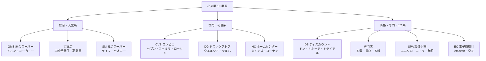
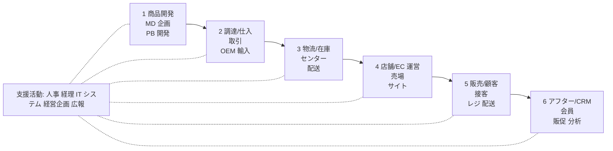
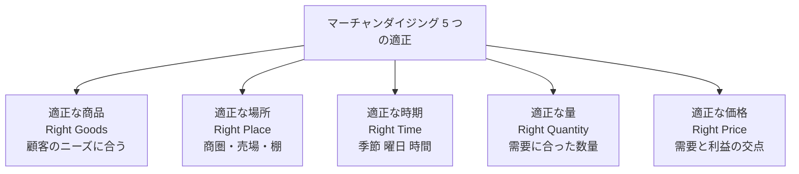
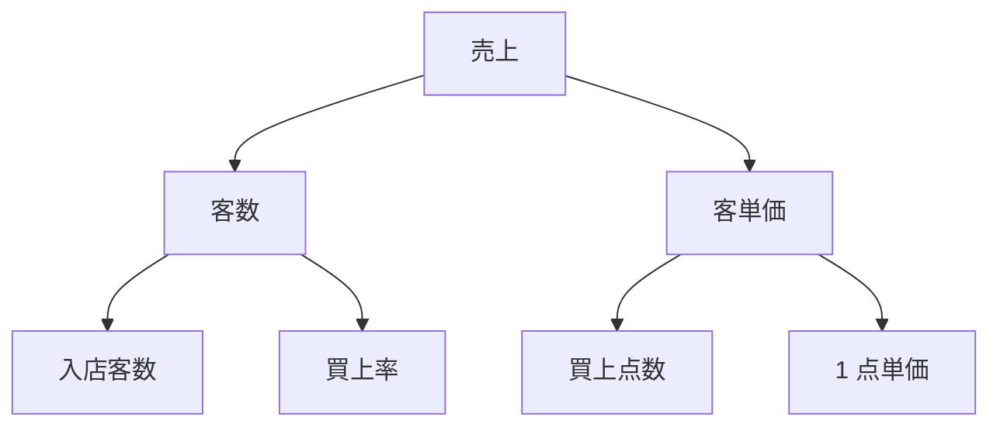
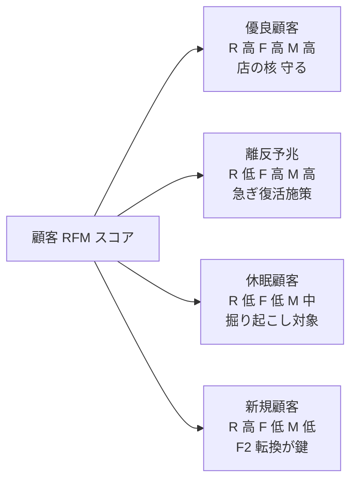
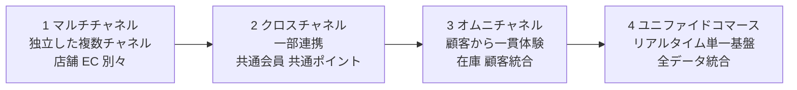
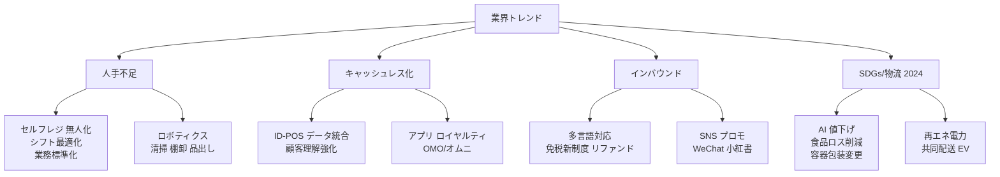

# 小売・流通業のビジネス基礎

業態構造・MD・店舗運営・POS データ・オムニチャネル——転職／担当／提案のための「小売・流通を読み解く眼鏡」

| 項目 | 内容 |
|---|---|
| カテゴリー | 業種別実務 |
| 難易度 | 中級 |
| 所要時間 | 約200分（全8レッスン） |
| 公開日 | 2026-06-30 |
| 最終更新日 | 2026-06-30 |
| コースURL | https://skillup.college/courses/industry/retail-distribution-basics/ |

## 対象者

小売・流通業に転職・配属された事務系・営業・HR・人事・経理・経営企画・店舗 SV 候補と、小売・流通クライアントを担当するコンサル・SIer・金融・銀行・広告代理店・編集者を両方主軸とする。小売・流通の現場経験はないが「業界としての小売・流通を読み解きたい」社会人 3 年目以上を対象。小売・流通業に向けた提案・営業を行う方も含む。業態は GMS／SM／CVS／DG／HC／百貨店／専門店／SPA／EC／卸／商社／物流をすべて扱う。

## 前提知識

社会人 3 年以上を想定。会計の基本（売上・原価・粗利・在庫の違いがわかる程度）と、データ分析の基本（平均・標準偏差・ABC 分析の概念）への理解があれば理解が早いが、これらの土台は本コース内で必要範囲を解説する。小売・流通の現場経験は不要で、業界横断の俯瞰知識として「現場と数字の両輪」を身につける構成。

## 学習目標

- 小売業の業態分類（GMS／SM／CVS／DG／HC／百貨店／専門店／SPA／EC）と流通業の構造（卸／商社／物流）を地図化できる
- 小売・流通のバリューチェーンと業態別ビジネスモデル・QPS（Quality／Price／Service）の三角形を読み解ける
- マーチャンダイジング（MD）の 5 つの適正・ABC 分析・カテゴリーマネジメント・VMD を理解し、商品計画の発想ができる
- 店舗 KPI（売上＝客数 × 客単価、坪効率、買上率、人時生産性、ロス率）を読み・現場の指標を翻訳できる
- 在庫管理（適正在庫・自動発注・棚卸・消化率・CCC）と発注の打ち手を理解する
- POS／ID-POS データ分析（RFM・デシル・バスケット）と CRM・ロイヤルティプログラムの基本を理解する
- オムニチャネル／OMO／D2C／BOPIS の進化と、店舗 × EC × アプリ統合の壁を理解する
- 小売・流通の構造的人手不足・キャッシュレス・無人化・SDGs・DX の現在地と打ち手を理解する

## コース概要

小売業の市場規模は約 145 兆円、流通業を含めれば約 200 兆円規模で、日本経済の中で製造業に並ぶ基幹産業です。本コースは、小売・流通業に転職・配属された事務系・営業・人事・経理・経営企画・店舗 SV 候補と、小売・流通クライアントを担当するコンサル・SIer・金融・銀行・編集者の両方を主軸に、小売・流通を「業界として読み解く眼鏡」を 8 レッスンで提供します。業態構造（GMS／SM／CVS／DG／HC／百貨店／専門店／SPA／EC／卸／商社／物流）、バリューチェーンと業態別ビジネスモデル、マーチャンダイジング（MD）と棚割・VMD、店舗 KPI（坪効率・客単価・買上率・人時生産性）、在庫管理と自動発注、POS／ID-POS データ分析と CRM、オムニチャネルと D2C、業界トレンドと小売・流通 DX までを扱います。

## 学習の流れ

レッスン 1 で小売・流通の現在地・業態分類・本コースの 3 視点（転職者／担当者／提案者）を共有します。レッスン 2 で「小売・流通の全体地図」としてバリューチェーンと業態別ビジネスモデル・QPS の三角形・組織機能を扱います。レッスン 3 〜 6 が「現場と数字の両輪」の本体で、商品マネジメント＝ MD（L3）、店舗運営と KPI（L4）、在庫管理と発注（L5）、POS／ID-POS データ分析と CRM（L6）を順に学びます。レッスン 7 で個店を超える論点としてオムニチャネル・EC・D2C・顧客体験を扱い、レッスン 8 で業界トレンドと小売・流通 DX を扱って締めくくります。小売・流通の現場経験がない方が、「業界外から内に入ったとき」または「業界外から接するとき」に立ち止まらないための土台を作るコースとして設計しています。

## レッスン一覧

| No. | タイトル | 概要 | 所要時間 |
|---|---|---|---|
| 1 | 小売・流通業の現在地と本コースの守備範囲 | 小売・流通の定義と日本経済での位置（小売業約 145 兆円・流通業含めて約 200 兆円・就業者構成）、小売業態の進化と分類（GMS／SM／CVS／DG／HC／DS／百貨店／専門店／SPA／EC）、流通業の構造（卸／商社／物流／3PL／4PL）、小売・流通を取り巻く構造変化（人口減・人手不足・キャッシュレス・無人化・インバウンド・SDGs・DX）、本コースの守備範囲（転職者・担当者・提案者の 3 視点）、現場主義と数字主義の両輪、小売・流通のことば（坪効率・客単価・買上率・消化率・MD）が翻訳できる価値を学ぶ | 25分 |
| 2 | 小売・流通のバリューチェーンと業態別ビジネスモデル——商品開発から CRM まで | Michael Porter のバリューチェーンの小売・流通版（商品開発・調達／仕入・物流／在庫・店舗／EC 運営・販売／顧客・アフター／CRM）、業態別の収益モデル比較（GMS は薄利多売・SM は鮮度・CVS は便利・DG は健康と価格・SPA は垂直統合）、PB と NB の違いと粗利差（GMS で PB 30 % 前後・CVS で 30 〜 50 %）、QPS（Quality／Price／Service）の三角形、小売・流通の典型的組織図（店舗・SV・本部の 3 層／本部内の MD・販促・物流・システム・人事）、商業統計と経済センサスの読み方を学ぶ | 25分 |
| 3 | 商品マネジメント（MD）——マーチャンダイジングの 5 つの適正と棚割 | マーチャンダイジング（MD）の定義、5 つの適正（商品・場所・時期・量・価格）、商品ライフサイクル（導入・成長・成熟・衰退）と死筋商品の見極め、ABC 分析と 80:20 の法則、カテゴリーマネジメント（P&G 主導 1990 年代起源）、棚割（プラノグラム）の基本、VMD（ビジュアル・マーチャンダイジング、ゴールデンゾーン、回遊動線）、PB／NB／SPA／OEM の違い、季節商戦（節分・バレンタイン・お盆・クリスマス）と需要予測、消化率と値下げロスを学ぶ | 25分 |
| 4 | 店舗運営と KPI——坪効率・客単価・買上率・人時生産性 | 店舗 KPI の体系（売上 ＝ 客数 × 客単価、客数 ＝ レジ通過客数、買上率 ＝ レジ通過客数 / 入店客数、客単価 ＝ 売上 / 客数、買上点数 × 1 点単価）、坪効率（売上 / 売場面積、月坪 5 〜 30 万円）、人時生産性（売上 / 総労働時間、SM で 6,000 〜 10,000 円目標）、シフト計画と人時管理、ロス率の 3 区分（廃棄・値下げ・万引等不明）、5S とクリンリネス、店長／SV／本部の役割分担、新店オープン PDCA、既存店売上前年比（既存店 vs 全店、業界ベンチマーク）、ピーク商戦期の追加投入と機会損失を学ぶ | 25分 |
| 5 | 在庫管理と発注——適正在庫・自動発注・棚卸・消化率 | 在庫の役割と種類（販売在庫・展示在庫・予備在庫・季節在庫）、適正在庫の考え方（売れ筋は厚く、死筋は薄く）、安全在庫の算出、自動発注の仕組み（POS 連動・需要予測・季節・販促連動）、誤発注リスク事例（コンビニ恵方巻き廃棄問題）、棚卸（実地棚卸 vs 循環棚卸）、在庫差異の原因（万引・盗難・誤計上・破損）、棚卸資産回転日数と業態別目安（GMS 45 日・SM 20 日・CVS 25 日・DG 60 日・専門店 90 日）、CCC（キャッシュコンバージョンサイクル）、消化率と季節商品の値下げ計画、欠品率と機会損失、VMI／Consignment を小売発注者視点で再解説、3PL／4PL の選定と自社物流のトレードオフを学ぶ | 25分 |
| 6 | POS データ・ID-POS データ分析と CRM——顧客を「見える化」する | POS の役割と進化（バーコード→POS→ID-POS→マーケティングプラットフォーム）、レシート分析の基本、RFM 分析（Recency／Frequency／Monetary）、デシル分析、バスケット分析と相関ルール（「ビールとおむつ」事例の真偽の検討と教訓）、ID-POS の到来（T ポイント 2003／d ポイント／楽天ポイント／Ponta の共通ポイント時代）、CRM とロイヤルティプログラム、F2 転換率（初回 → 2 回目購入）、休眠顧客の復活率、会員ランクと特典設計、ID-POS データから何がわかるか（併売・時間帯・曜日・天候依存）、データ駆動 MD の限界（外れ値と季節要因の罠）を学ぶ | 25分 |
| 7 | オムニチャネル・EC・D2C と顧客体験——店舗 × EC × アプリ | オムニチャネルの 4 段階進化（マルチチャネル→クロスチャネル→オムニチャネル→ユニファイドコマース）、OMO（Online Merges with Offline）と中国先行事例（Hema Fresh／盒馬鮮生）、D2C（Direct to Consumer）と SPA の違い、ライブコマース、SNS 販売（Instagram／TikTok ショッピング）、BOPIS（Buy Online Pick-up In Store）と店舗在庫の EC 連携、EC モール（Amazon／楽天／Yahoo!）と自社 EC（Shopify ／カスタム）の使い分け、生鮮 EC（ネットスーパー・Amazon フレッシュ・楽天西友）、配送料経済性とラストマイル、店舗と EC の在庫・顧客 ID 統合の難しさ、組織統合の壁（店舗 vs EC 部門の P/L 摩擦）、CX（カスタマーエクスペリエンス）と接客 DX を学ぶ | 25分 |
| 8 | 業界トレンドと小売・流通 DX——人手不足・無人化・SDGs・修了後の継続学習 | 小売・流通の構造的人手不足（有効求人倍率 4 倍超、最低賃金引き上げ 2024 年全国平均 1,055 円・2026 年想定）、キャッシュレス比率（2024 年 39 %→ 2026 年 40 % 経産省目標→将来 80 %）、無人化と省人化（セルフレジ・セミセルフレジ・無人店舗 Amazon Go 2018／TOUCH TO GO 2020）、画像認識レジ（Just Walk Out）と AI 重量検知、ダイナミックプライシング、自動発注 AI と需要予測 AI、店舗 IoT とエッジカメラ、ロボティクス（清掃・棚管理）、インバウンド（2025 年訪日 3,400 万人想定・免税対応）、SDGs と小売・流通（食品ロス削減推進法 2019／プラスチック資源循環法 2022／フェアトレード・フードロス削減）、カーボンニュートラル（Scope 1 〜 3・店舗の使用電力・配送 CO2）、修了後の継続学習方向を学ぶ | 25分 |

---

## レッスン1：小売・流通業の現在地と本コースの守備範囲

（所要時間：25分）

### このレッスンで学ぶこと

- 小売・流通業の定義と、日本経済での位置（小売業約 145 兆円・就業者構成）
- 小売業態の進化と分類（GMS／SM／CVS／DG／HC／DS／百貨店／専門店／SPA／EC）
- 流通業の構造（卸／商社／物流／3PL／4PL）と「川上から川下まで」の地図
- 小売・流通を取り巻く構造変化（人口減・人手不足・キャッシュレス・無人化・インバウンド・SDGs・DX）
- 本コースの守備範囲——転職者・担当者・提案者の 3 視点
- 「現場主義」と「数字主義」の両輪、小売・流通のことばが翻訳できる価値

---

### 小売・流通業とは何か——日本経済での位置

小売業（Retail Industry）は、メーカーや卸から商品を仕入れ、最終消費者に販売する産業です。流通業（Distribution Industry）はより広い概念で、メーカーから消費者に商品が届くまでの全プロセス——卸売・物流・小売を含めた商流と物流——を指します。日本標準産業分類では、小売業は大分類 I（卸売業，小売業）の中の中分類 56〜61 として設定され、各種商品小売業・織物衣服身の回り品小売業・飲食料品小売業・機械器具小売業・そのほかの小売業・無店舗小売業に細分されています。

日本経済における小売・流通の位置は、いくつかの数字で押さえておきます。経済産業省『商業動態統計』によれば、小売業の年間商品販売額は約 145 兆円規模で推移しています。卸売業を含めた商業全体では約 470 兆円規模、そのうち卸売業が約 325 兆円を占めます。就業者数では小売業だけで約 760 万人、卸売業・物流業まで含めると約 1,300 万人で、全就業者の約 2 割を占めます（出典：[経済産業省『商業動態統計』](https://www.meti.go.jp/statistics/tyo/syoudou/index.html)、総務省『労働力調査』）。

「小売業は地味な業界」と思われがちですが、実は日本経済の基幹産業の 1 つで、製造業と並ぶ規模を持ちます。最終消費者と直接つながる接点を持つ点では、製造業よりも生活者の暮らしに近い産業と言えます。

> **💡 ポイント**
> 小売業は年間商品販売額約 145 兆円、就業者約 760 万人、卸売業を含めれば商業全体で約 470 兆円・就業者約 1,300 万人を占める基幹産業です。最終消費者と直接つながる接点を持つ点で、製造業とは異なる性格を持ちます。

小売・流通の特徴は、「薄利多売」と「現場の労働集約性」にあります。商品 1 個の利益は数十円〜数百円の世界で、店舗あたり数百万〜数千万円の月商を積み上げて事業が成立します。在庫を抱える資金繰り、店舗を運営する人件費、物流を回す配送費、システムを動かす IT 投資——これらをすべて 1 円単位で管理しないと、薄い利益が消えてしまいます。「小売は 1 円商売」と言われるのは、この構造を表す表現です。

---

### 小売業態の進化と 10 業態の分類

「小売業」とひとくくりに語られますが、実際は性質の異なる複数の業態（ぎょうたい）で構成されます。本コースで扱う主要 10 業態を整理します。業態ごとに品揃え、価格帯、店舗面積、顧客層、競争構造が異なるため、自分が関わる業態がどこに位置するかを意識しておきます。

第 1 のグループは「総合系・大型店」です。**GMS**（General Merchandise Store、総合スーパー）は食品から衣料・住居用品まで幅広く扱う大型店で、イオン・イトーヨーカドーが代表例です。**百貨店**（デパートメントストア）は高級品・ギフト・対面接客が強みで、三越伊勢丹・高島屋・大丸松坂屋が代表例です。**SM**（Super Market、食品スーパー）は食品中心の中規模店で、ライフ・ヤオコー・サミット・オーケーなどが代表例です。

第 2 のグループは「専門・利便系」です。**CVS**（Convenience Store、コンビニエンスストア）は 24 時間営業の小型店で、セブン-イレブン・ファミリーマート・ローソンが代表例です。**DG**（Drug Store、ドラッグストア）は医薬品・化粧品中心で食品も拡充している業態で、ウエルシア・ツルハ・マツモトキヨシ・コスモス薬品が代表例です。**HC**（Home Center、ホームセンター）は DIY・園芸・住居用品中心で、カインズ・コーナン・DCM ホールディングスが代表例です。

第 3 のグループは「価格・専門系」です。**DS**（Discount Store、ディスカウントストア）は価格訴求型の業態で、ドン・キホーテ・トライアル・ロピアが代表例です。**専門店**は特定カテゴリーに絞った業態で、家電量販店（ヤマダデンキ・ヨドバシカメラ）、書店（紀伊國屋・丸善ジュンク堂）、衣料専門店（しまむら・西松屋）が含まれます。**SPA**（Specialty store retailer of Private label Apparel、製造小売業）は企画から販売まで垂直統合した業態で、ファーストリテイリング（ユニクロ・ジーユー）・ニトリ・無印良品（良品計画）が代表例です。**EC**（E-Commerce、電子商取引）は店舗を持たずネット上で販売する業態で、Amazon・楽天市場・Yahoo!ショッピング・自社 EC が含まれます。

図1：小売業 10 業態の分類マップ。業態ごとに品揃え・価格帯・顧客層・競争構造が異なる

業態の進化には大きな流れがあります。1960 〜 70 年代に GMS が百貨店に対抗して台頭し、1980 年代に CVS が成熟し、1990 年代に SPA とディスカウント業態が伸び、2000 年代に EC が拡大し、2010 年代以降にドラッグストアが食品比率を上げて SM ・GMS を脅かす存在になっています。「業態の盛衰」は小売業の歴史そのものと言えます。

> **📝 補足**
> 「業種」と「業態」は混同されやすい用語です。**業種**は何を売るか（食品・衣料・家電など）、**業態**はどう売るか（GMS・CVS・SPA・EC など）で分類します。同じ「食品を売る業種」でも、SM・CVS・DS・EC では業態が違い、競争のルールも違います。

---

### 流通業の構造——卸・商社・物流・3PL

小売業の背後には、メーカーから消費者まで商品を届ける流通業の構造があります。本コースで扱う流通業の 4 つの機能を整理します。

第 1 が「卸売業」です。メーカーから商品を仕入れ、小売業に販売する中間業者で、商品の集約と分散、在庫の保有、決済の代行、与信の提供などを担います。日本の小売業界は卸売業のチャネルが発達しており、食品では国分グループ・三菱食品・日本アクセスなどの大手卸が、医薬品では東邦薬品・スズケン・メディパルなどの大手卸が大きな存在感を持ちます。

第 2 が「商社」です。総合商社（三菱商事・三井物産・伊藤忠商事・住友商事・丸紅）は資源・エネルギー・食品・化学・機械・金属など多くの分野で商流をつなぎ、海外調達・国内卸・物流・金融まで一貫して扱います。専門商社は特定分野（食品・医薬・繊維・金属・電子部品など）に特化します。

第 3 が「物流業」です。トラック輸送・倉庫保管・配送・輸出入手続きなどを担う業態で、日本通運（NX）・ヤマト運輸・佐川急便・西濃運輸・センコー・SG ホールディングスなどが代表例です。

第 4 が「3PL／4PL」です。**3PL**（Third Party Logistics、サードパーティ・ロジスティクス）は荷主企業の物流業務を一括して受託する業態で、自社で物流網を持たない小売業や EC 事業者にとって、物流のアウトソーシング先として重要です。**4PL**（Fourth Party Logistics）は 3PL に加えて IT システム・コンサルティング・複数の物流会社の統合管理まで担う高度な物流マネジメント業態です。3PL の代表例として、日本では SG ホールディングス系・ハマキョウレックス・センコー・サカイ引越センターなどが、海外では DHL ・UPS ・FedEx ・XPO Logistics などが知られています。

> **⚠️ 注意**
> 卸売業を「中抜き」と見なす議論がありますが、実際は卸が果たす機能（集約・分散・在庫保有・与信・物流）を誰かが代替する必要があります。EC で「中抜き」と言うとき、実際にはメーカーが在庫・物流・与信の責任を負うか、3PL を活用するか、商社経由になるかのいずれかで、機能が消えるわけではありません。

---

### 小売・流通を取り巻く 6 つの構造変化

2026 年現在、日本の小売・流通業を取り巻く環境は、複数の構造変化が同時進行しています。それぞれの変化が、本コースのレッスン 4〜8 で扱う KPI・データ分析・オムニチャネル・DX の議論につながります。

第 1 の変化は、**人口減と消費の縮小**です。日本の総人口は 2008 年をピークに減少局面に入り、生産年齢人口の減少が消費市場の縮小を直撃しています。地方の店舗の閉店、地方百貨店の撤退、ロードサイド店舗の再編が続いており、商圏人口の減少を前提にしたビジネスモデル設計が必要になっています。

第 2 の変化は、**構造的な人手不足**です。小売業の有効求人倍率は、2024 年で全産業平均約 1.2 倍に対し約 4 倍超で推移しており、特に店舗パート・アルバイトの確保が困難です。2024 年の最低賃金全国加重平均が 1,055 円に引き上げられ、2026 年も引き上げが続く見込みで、人件費の構造的上昇が小売業の利益を圧迫しています。

第 3 の変化は、**キャッシュレス化**です。経済産業省『キャッシュレス・ロードマップ』によれば、2024 年のキャッシュレス決済比率は約 39 %、2026 年に約 40 % 達成が目標、将来的に 80 % を目指しています。クレジットカード・QR コード決済（PayPay・楽天ペイ・d 払い）・電子マネーが拡大し、現金取扱コストの削減と顧客データ取得が進んでいます。

第 4 の変化は、**無人化と省人化**です。セルフレジ・セミセルフレジが SM・DG・CVS で標準装備になり、Amazon Go（2018 年 1 月シアトル一般公開）・TOUCH TO GO（2020 年 3 月 JR 高輪ゲートウェイ駅、日本初の無人決済店舗）といった無人店舗の実証も進んでいます。

第 5 の変化は、**インバウンドの本格回復**です。観光庁の見込みでは 2025 年の訪日外国人数は 3,400 万人規模に達する想定で、コロナ前のピーク（2019 年 3,188 万人）を超える水準です。免税対応、多言語接客、決済対応、SNS でのプロモーションなど、小売各社の対応が分岐します。

第 6 の変化は、**SDGs と DX**です。食品ロス削減推進法（2019 年 10 月施行）・プラスチック資源循環法（2022 年 4 月施行）への対応、Scope 1〜3 の温室効果ガス排出管理、フェアトレード調達、AI を活用した需要予測・自動発注・接客支援、店舗 IoT・ロボティクスの導入——こうした取り組みが、業界全体で加速しています。

> **⚠️ 注意**
> 6 つの変化は独立ではなく、相互に絡みます。例えば、人手不足は無人化投資を促し、無人化はキャッシュレスを前提とし、キャッシュレスは顧客データを生み、顧客データは需要予測 AI に活用される、というように連動します。「個別の論点」ではなく「重なり合う変化」として捉える視点が、本コース全体の前提です。

---

### 本コースの守備範囲——転職者・担当者・提案者の 3 視点

本コースは、小売・流通の現場経験がない方を主な対象とします。3 つの視点から、それぞれの立場の方が「最初の半年で必要になる知識」を扱います。

第 1 の視点は、**転職者・配属者**です。小売・流通の事業会社に転職した、または配属になった事務系・営業・人事・経理・経営企画・店舗 SV 候補の方を指します。小売・流通の業界用語と思考様式に触れる中で、現場の店長や本部スタッフとの会話に必要な共通言語を持ちたい層です。

第 2 の視点は、**担当者**です。コンサル、SIer、金融、銀行、広告代理店、出版・編集者などで小売・流通のクライアントを担当する方を指します。クライアントの事業構造と KPI を理解し、提案や対話の質を上げたい層です。

第 3 の視点は、**提案者**です。小売・流通に向けて IT サービス、コンサルティング、人材紹介、広告サービスなどを提案する営業職を指します。小売・流通の意思決定プロセスと予算サイクル、関係者の役割を理解し、商談を進めたい層です。

3 視点に共通するのは、「小売・流通のことば」と「考え方」を翻訳できる必要があることです。坪効率、客単価、買上率、消化率、PB、VMD、MD、OMO、BOPIS——こうした用語が当たり前に飛び交う会議で、何が議論されているかを理解できる土台を、本コースで作ります。

> **🔰 初学者の方へ**
> 本コースは、小売・流通の現場経験がなくても理解できるよう、すべての専門用語に説明を添えます。「アルバイトでもレジ打ちの経験すらない」「店舗の裏側を見たことがない」という方も、業界の論理と数字の読み方を学ぶことで、小売・流通の方々との会話が成立するようになります。逆に、小売・流通ですでに 10 年以上現場経験のある方には、本コースは入門レベルの内容になります。

本コースが**扱わない**領域も明確にしておきます。

- 個別業態の深掘り（GMS・CVS・百貨店・SPA・EC の業界レポート相当の詳細）は扱いません。業態横断の俯瞰に留め、業態特化の個別深掘りは将来のカテゴリ別コースに譲ります
- 店舗の現場オペレーション（具体的なレジ操作、品出し手順、接客マニュアル）は扱いません。これらは現場 OJT で身につける領域です
- 個別の規制・法令の代理判断（景表法・特商法・薬機法・食品衛生法・酒税法・たばこ事業法など）は扱いません。これらは弁護士・税理士・行政書士の独占業務であり、本コースは「誰に何をいつ相談するか」の判断軸を作るに留めます
- 資格試験対策（販売士検定・日商簿記・流通経済大学資格など）は扱いません。試験合格は専門教材に譲り、本サイトは「実務で使える知識と思考の型」に集中します

---

### 「現場主義」と「数字主義」の両輪

小売・流通を理解する上で、本コースが繰り返し強調する 2 つの軸があります。「現場主義」と「数字主義」の両輪です。

**現場主義**は、「現場を見ずに語らない」という発想です。小売・流通では、机上の論理だけで判断すると現場の制約を見落とし、結果として実行できない計画になります。「店長がレジに入る時間帯」「夕方の値下げ判断のタイミング」「品出しのリズム」「顧客の動線」——こうした現場の現実を観察せずに本部から発する指示は、店長の信頼を失います。小売・流通の経営者の多くが「現場に足を運べ」と言うのは、この構造を理解しているからです。

**数字主義**は、「現場の感覚を数字で裏付ける」という発想です。小売・流通では、売上、客数、客単価、買上率、坪効率、人時生産性、ロス率、消化率、棚卸資産回転日数など、多数の KPI が日次・週次・月次で集計されます。「感覚的にうまくいっている／いない」の議論を、数字で具体化することが意思決定の質を高めます。

この 2 つの軸は、対立するものではなく両輪です。現場だけ見て数字を見ない判断は、再現性のある改善につながりません。数字だけ見て現場を見ない判断は、現場の制約を見落として実行不能な計画になります。

> **💡 ポイント**
> 「現場と数字の両輪」は本コースのキーフレーズです。小売・流通のことばを翻訳できるようになるためには、現場の論理（接客・品出し・棚割など）と数字の論理（KPI ツリー）の両方を理解する必要があります。「現場の靴底が薄くなるほど、本部の数字が見える」——これは私が GMS の本部バイヤー時代に上司から繰り返し聞いた言葉です。

小売・流通に転職した事務系・営業の方が「現場に出向く」と言うとき、それは儀礼的な訪問ではありません。レジの行列の長さを観察し、品出しの動線を確認し、顧客が商品を手に取る瞬間を見て、レジ袋の入れ方を確かめる行為です。同様に、小売・流通のクライアントを担当するコンサル・SIer の方が「数字を読む」と言うとき、それは財務諸表の数字だけではなく、店舗 KPI（既存店売上前年比、坪効率、客単価、買上率、消化率など）まで含めて読むことを指します。

---

### 小売・流通のことばが翻訳できる価値

本コースを通じて身につく「小売・流通のことばを翻訳できる」能力は、現場でどう活きるか。具体的なシーンで考えてみます。

**シーン 1：転職者の最初の MD 会議**——SM チェーンに転職した経営企画担当者が、初めての商品部 MD 会議に参加します。「先月の青果の消化率が 92 %、目標未達は 3 ポイント。月坪 28 万円は計画通りだが、買上率が 0.5 ポイント落ちている」——こうした発言が並ぶ会議で、何が議論されているかが理解できれば、議事録を取るだけの存在から、議論に参加できる存在に変わります。

**シーン 2：コンサルの提案準備**——小売クライアント向けのオムニチャネル改革提案を準備するコンサルタントが、クライアントの現場ヒアリングに臨みます。「BOPIS の運用が現場負荷で頓挫し、店舗の棚卸資産回転日数が業界平均より長い」と聞いて、店舗 × EC 統合と在庫の関係を即座に理解できれば、深いヒアリングと精度の高い提案に直結します。

**シーン 3：金融機関の融資判断**——小売の中堅企業に対する融資審査を担当する銀行担当者が、決算書を読みます。「既存店売上前年比がマイナスで推移しているが、PB 比率の上昇で粗利率は改善傾向。CCC は短く、運転資金は健全」と読めれば、機械的な財務指標分析を超えた事業理解に基づく判断ができます。

**シーン 4：広告代理店の販促提案**——小売クライアントを担当する広告代理店の営業が、季節商戦のプロモーションを提案します。「ID-POS の RFM 分析で休眠顧客の復活率が低い、F2 転換率が業界平均より低い」と読めれば、媒体提案だけでなく、顧客戦略全体に踏み込んだ提案が可能になります。

> **📝 補足**
> 「小売・流通のことばが翻訳できる」価値は、小売・流通の中に閉じません。小売・流通の知識を持つコンサルタント、金融担当者、人事、編集者、IT エンジニア、広告代理店スタッフは、小売・流通との接点を持つあらゆる職種で重宝されます。日本経済の基幹産業を相手にできることは、キャリア全体の選択肢を広げる投資です。

---

### まとめ

このレッスンでは、以下のことを学びました。

- 小売業は年間商品販売額約 145 兆円、就業者約 760 万人、卸売業を含めて商業全体で約 470 兆円・約 1,300 万人を占める基幹産業
- 小売業は GMS／SM／CVS／DG／HC／DS／百貨店／専門店／SPA／EC の 10 業態で品揃え・価格・顧客層が大きく異なる
- 流通業は卸／商社／物流／3PL／4PL の 4 機能で商流と物流をつなぐ
- 小売・流通は人口減・人手不足・キャッシュレス・無人化・インバウンド・SDGs／DX の 6 つの構造変化に直面している
- 本コースは転職者・担当者・提案者の 3 視点で、小売・流通のことばを翻訳できる土台を作る
- 「現場主義」と「数字主義」の両輪が、小売・流通を理解する核心
- 個別業態の深掘り・店舗オペレーション・規制判断・資格対策は本コースの対象外

次のレッスンでは、小売・流通の「全体地図」としてバリューチェーンと業態別ビジネスモデルを扱います。Michael Porter のバリューチェーン概念の小売・流通版、業態別の収益モデル比較、PB と NB、QPS（Quality／Price／Service）の三角形、典型的な組織図を順に学びます。

---

### 確認クイズ

このレッスンの理解度をチェックしましょう。

#### Q1. 小売業の日本経済での位置について、本レッスンの説明と合致するものはどれですか？

- [ ] 年間商品販売額約 30 兆円、就業者約 100 万人の中規模産業
- [x] 年間商品販売額約 145 兆円、就業者約 760 万人、商業全体で約 470 兆円・約 1,300 万人を占める基幹産業
- [ ] 年間商品販売額約 500 兆円、就業者約 3,000 万人で日本最大の産業
- [ ] 年間商品販売額約 10 兆円、就業者約 50 万人の小規模産業

> **解説**
> 経済産業省『商業動態統計』によれば、小売業の年間商品販売額は約 145 兆円、就業者は約 760 万人です。卸売業を含めれば商業全体で約 470 兆円、就業者は約 1,300 万人で、全就業者の約 2 割を占める基幹産業です。

#### Q2. 「業種」と「業態」の違いについて、本レッスンの説明と合致するものはどれですか？

- [x] 業種は「何を売るか」（食品・衣料・家電）、業態は「どう売るか」（GMS・CVS・SPA・EC）
- [ ] 業種は大手企業、業態は中小企業に対する分類
- [ ] 業種は店舗ありの分類、業態は EC のみの分類
- [ ] 業種は法律上の分類で、業態は学術上の分類のみ

> **解説**
> 業種は「何を売るか」（食品・衣料・家電・医薬品など商品カテゴリー）、業態は「どう売るか」（GMS・CVS・SPA・EC など販売の仕組み）で分類します。同じ「食品を売る業種」でも、SM・CVS・DS・EC では業態が違い、競争のルールも異なります。

#### Q3. 小売業 10 業態の中で、SPA に該当する例はどれですか？

- [ ] イオン・イトーヨーカドー
- [ ] セブン-イレブン・ファミリーマート
- [x] ファーストリテイリング（ユニクロ）・ニトリ・無印良品（良品計画）
- [ ] 三越伊勢丹・高島屋

> **解説**
> SPA（Specialty store retailer of Private label Apparel、製造小売業）は企画から販売まで垂直統合した業態で、ファーストリテイリング（ユニクロ・ジーユー）・ニトリ・無印良品（良品計画）が代表例です。イオン・ヨーカドーは GMS、セブン・ファミマは CVS、三越・高島屋は百貨店に分類されます。

#### Q4. 小売・流通を取り巻く構造変化のうち、本レッスンで扱った「人手不足」の説明として正しいものはどれですか？

- [ ] 小売業の有効求人倍率は全産業平均と同じ約 1.2 倍程度で推移
- [ ] 2024 年の最低賃金全国加重平均は 800 円程度で引き上げは止まっている
- [ ] 人件費の構造的上昇は小売業の利益にあまり影響しない
- [x] 小売業の有効求人倍率は約 4 倍超、最低賃金 2024 年 1,055 円で人件費上昇が利益を圧迫している

> **解説**
> 小売業の有効求人倍率は 2024 年で全産業平均約 1.2 倍に対し約 4 倍超で推移しており、特に店舗パート・アルバイトの確保が困難です。2024 年の最低賃金全国加重平均が 1,055 円に引き上げられ、2026 年も引き上げが続く見込みで、人件費の構造的上昇が小売業の利益を圧迫しています。

#### Q5. 本コースが対象とする「転職者・担当者・提案者の 3 視点」のうち、「担当者」に該当する例はどれですか？

- [ ] 小売・流通に転職した経営企画担当者
- [x] 小売・流通クライアントを担当するコンサル・SIer・金融・銀行・広告代理店・編集者
- [ ] 小売・流通向けに IT サービスや人材紹介を提案する営業職
- [ ] 小売の店舗で接客・レジ業務を行う技能職

> **解説**
> 「担当者」は、コンサル、SIer、金融、銀行、広告代理店、出版・編集者などで小売・流通のクライアントを担当する方を指します。「転職者」は小売・流通に転職・配属された事務系・営業・人事・経理・経営企画担当者、「提案者」は小売・流通に向けて営業する方を指します。店舗の接客・レジ業務を行う技能職は本コースの主たる対象ではありません。

#### Q6. 本コースが「扱わない」と明示した領域はどれですか？

- [ ] 業態の分類と特徴
- [ ] 店舗 KPI（坪効率・客単価・買上率）
- [ ] オムニチャネルと EC の基本
- [x] 個別業態の深掘り・店舗オペレーション・規制の代理判断・資格対策

> **解説**
> 本コースは業態横断の俯瞰知識を扱い、個別業態の深掘り（GMS・CVS・百貨店・SPA・EC の業界レポート相当）、店舗の現場オペレーション（レジ操作・品出し手順・接客マニュアル）、個別の規制・法令の代理判断（景表法・特商法・薬機法など）、資格試験対策（販売士検定・日商簿記など）は扱いません。これらは別の専門教材や OJT、専門家への相談、資格専門の教材で扱う領域です。

---

## レッスン2：小売・流通のバリューチェーンと業態別ビジネスモデル——商品開発から CRM まで

（所要時間：25分）

### このレッスンで学ぶこと

- Michael Porter のバリューチェーン概念と、小売・流通版への翻訳
- 小売・流通のバリューチェーン 6 段階（商品開発・調達／仕入・物流／在庫・店舗／EC 運営・販売／顧客・アフター／CRM）
- 業態別の収益モデル比較（GMS・SM・CVS・DG・百貨店・SPA・EC）と PB／NB の粗利差
- QPS（Quality／Price／Service）の三角形と業態別の重み付け
- 小売・流通の典型的組織図（店舗・SV・本部の 3 層／本部内の MD・販促・物流・システム・人事）
- 商業統計と経済センサスの読み方

---

### 前回の振り返り

レッスン 1 では、小売・流通の現在地として、約 145 兆円の市場規模、10 業態の分類（GMS／SM／CVS／DG／HC／DS／百貨店／専門店／SPA／EC）、流通業の構造（卸／商社／物流／3PL／4PL）、6 つの構造変化（人口減・人手不足・キャッシュレス・無人化・インバウンド・SDGs／DX）、本コースの 3 視点（転職者・担当者・提案者）、現場と数字の両輪を学びました。今回は、業界全体の「地図」としてバリューチェーンと業態別ビジネスモデルを扱います。

---

### Michael Porter のバリューチェーンと小売・流通版

**バリューチェーン**（Value Chain、価値連鎖）は、ハーバード・ビジネス・スクールの Michael Porter 教授が 1985 年の著書『Competitive Advantage』で体系化した概念です。企業が顧客に価値を届けるまでの活動を「主活動」と「支援活動」に分解し、どの段階で価値が生み出されるかを可視化します。

Porter の元のモデルは、主活動を「調達物流→製造→出荷物流→マーケティング・販売→サービス」の 5 段階で、支援活動を「全般管理・人事管理・技術開発・調達」の 4 段階で構成しました。製造業を念頭に置いた枠組みですが、小売・流通にも同じ思考法を応用できます。

小売・流通のバリューチェーンは、本コースでは次の 6 段階で整理します。第 1 段階が**商品開発**（マーチャンダイジング企画・PB 開発・カテゴリー戦略）、第 2 段階が**調達／仕入**（メーカー・卸との取引・OEM・直貿輸入）、第 3 段階が**物流／在庫**（物流センター・店舗配送・在庫管理）、第 4 段階が**店舗／EC 運営**（売場運営・在庫補充・人時管理・EC サイト運営）、第 5 段階が**販売／顧客**（接客・レジ・配送・カスタマーサポート）、第 6 段階が**アフター／CRM**（会員管理・販促・ロイヤルティ・データ分析）です。

図1：小売・流通のバリューチェーン 6 段階と支援活動

業態によって、6 段階のどこで競争優位を生むかが異なります。GMS は調達と物流の規模で勝つ、CVS は店舗運営と物流頻度で勝つ、SPA は商品開発と店舗運営の垂直統合で勝つ、EC は物流と CRM データ活用で勝つ、というように、バリューチェーンの中で重点が違います。

> **💡 ポイント**
> バリューチェーンは「どこで価値を生むか」の地図です。業態の競争力を理解するには、その業態が 6 段階のどこに重点を置き、どこで利益を稼いでいるかを見極めることが第一歩です。

---

### 業態別の収益モデル比較

業態によって、収益モデルが大きく異なります。代表的な 6 業態の特徴を整理します。

#### GMS（総合スーパー）——薄利多売

GMS は食品・衣料・住居用品を 1 店舗で扱う総合型業態で、売上規模を稼ぐビジネスモデルです。売場面積 5,000 〜 15,000 平米、月商 5 〜 15 億円の店舗が標準で、売上原価率は 70 〜 75 %（粗利率 25 〜 30 %）程度です。販管費率が 25 〜 27 % で、営業利益率は 1 〜 3 % と薄利です。1980 年代までは小売の王様でしたが、CVS・DG・SPA・EC の台頭で苦戦が続き、衣料品部門の縮小、食品強化、テナント賃料収入への依存度上昇という構造変化が進んでいます。

#### SM（食品スーパー）——鮮度と頻度

SM は食品中心の中規模店で、来店頻度の高さで稼ぐビジネスモデルです。売場面積 500 〜 2,000 平米、月商 1 〜 3 億円の店舗が標準で、売上原価率は 75 〜 80 %（粗利率 20 〜 25 %）と GMS より薄く、生鮮の鮮度管理と回転で稼ぎます。営業利益率は 1 〜 3 %、棚卸資産回転日数は 15 〜 20 日と業態の中で最短です。来店客数の絶対量で勝つため、商圏設計（半径 500m 〜 1km）と店舗配置が経営の核です。

#### CVS（コンビニエンスストア）——便利と高粗利

CVS は 24 時間営業の小型店で、便利さに対する価格プレミアムで稼ぐビジネスモデルです。売場面積 100 平米前後、月商 1,500 〜 2,500 万円の店舗が標準で、売上原価率は 65 〜 70 %（粗利率 30 〜 35 %）と業態の中で高粗利です。1 日 3 〜 4 回の少量配送（多頻度小口配送）で在庫を絞り、フランチャイズ方式でロイヤルティ収入も得る複合モデルです。

#### DG（ドラッグストア）——医薬品と食品の二刀流

DG は医薬品・化粧品中心で食品も拡充している業態で、医薬品（粗利率 40 〜 50 %）と食品（粗利率 15 〜 25 %）の組合せで全体粗利率を 28 〜 32 % 程度に保ちます。売場面積 500 〜 1,500 平米、月商 8,000 万〜 2 億円が標準で、近年は食品比率を上げて SM ・GMS の客を奪う「食品強化型 DG」の戦略が成功しています。営業利益率は 4 〜 6 % と業態の中で比較的高水準です。

#### 百貨店——高級と接客

百貨店は高級品・ギフト・対面接客で稼ぐビジネスモデルです。売場面積は数万平米、年商は数百億〜数千億円規模ですが、店舗数は GMS の 1/10 以下です。売上原価率は 70 〜 75 %、販管費率は 25 〜 30 %、営業利益率は 1 〜 3 % で、不動産（地下食品・1 階化粧品の集客力に依存する立地ビジネス）と外商（富裕層への営業）で稼ぎます。1991 年に約 9.7 兆円だった市場規模が 2020 年代に約 5 兆円台まで縮小し、構造的な業態縮小が続いています。

#### SPA（製造小売業）——垂直統合の粗利

SPA は企画・調達・製造・販売を垂直統合した業態で、ユニクロ・ニトリ・無印良品が代表例です。中間流通の粗利を取り込めるため、売上原価率は 50 〜 60 %（粗利率 40 〜 50 %）と業態の中で最も高水準です。営業利益率は 8 〜 15 % と他業態の数倍を稼げる構造で、ユニクロを擁するファーストリテイリングが日本の小売業時価総額トップを長く維持する根拠になっています。

#### EC（電子商取引）——プラットフォームと自社

EC は店舗を持たずネット上で販売する業態で、Amazon・楽天市場のような EC モール（プラットフォーム型）と、自社 EC（ブランドの公式サイト・Shopify 等で構築）に区分されます。モール型は出店料・販売手数料・広告料の積み上げで稼ぎ、自社型は商品売上の粗利で稼ぐ構造です。物流コストとマーケティング費用が大きく、損益分岐点までの売上規模が必要です。

> **📝 補足**
> 同じ「食品を売る」事業でも、業態によって売上原価率・粗利率・営業利益率の構造が大きく異なります。財務諸表を読むときに「業態のベンチマーク」を頭に入れておくと、その会社が業態平均からどの方向にずれているかが見えるようになります。

---

### PB と NB の違いと粗利差

小売業の重要な戦略の 1 つが**PB**（Private Brand、プライベートブランド）の開発です。**NB**（National Brand、ナショナルブランド）はメーカーが企画・製造したブランド（例：明治の牛乳・サントリーのビール）、PB は小売業が企画して OEM 委託で製造したブランド（例：イオンのトップバリュ・セブン-イレブンのセブンプレミアム）です。

PB の経済性は次のように整理できます。NB の粗利率が 20 〜 25 % 程度に対し、PB は 35 〜 50 % と数十ポイント高い粗利を取れます。理由は、中間流通の粗利（卸の取り分・メーカーの広告宣伝費）を小売側に取り込めるためです。一方、PB には開発コスト・品質責任・在庫リスクが伴います。

主要業態の PB 比率（売上に占める PB の比率）の目安は次のとおりです。GMS のイオン（トップバリュ）は 8 〜 10 %、セブン&アイ（セブンプレミアム）は 15 〜 20 %、CVS のセブン-イレブンは 30 〜 50 %（カテゴリーによる）、SM のオーケー・業務スーパー（神戸物産）は 30 % 以上、SPA のユニクロ・無印良品は実質 100 %（すべて自社企画）です。

PB は「粗利を取るための道具」と捉えられがちですが、本質はブランドの選択肢を増やし、価格・品質・差別化で NB と競合させる戦略です。「PB は粗利の話ではなく、ブランドの話」というのが私の現場感覚です。

---

### QPS の三角形——業態の競争軸

小売・流通の競争軸は、Q（Quality、品質）、P（Price、価格）、S（Service、サービス）の 3 つで整理されることがあります。3 つすべてで業界トップになることは難しく、業態は通常 2 つに強みを持ち、残り 1 つは「並み」のラインを維持する戦略を取ります。

業態別の QPS の重み付けの典型例を整理します。**百貨店**は Q（高級品・厳選品揃え）と S（外商・対面接客）で勝負し、P（価格）は高くてもよいというモデルです。**CVS**は S（24 時間営業・便利な立地）と Q（コンビニ食品の品質向上）で勝負し、P は高めです。**DS**（ディスカウントストア）は P（圧倒的低価格）で勝負し、Q・S は割り切ります。**SPA のユニクロ**は Q（機能性・品質）と P（手頃な価格）の両立で勝負し、S は標準的なセルフサービスです。

> **⚠️ 注意**
> QPS の三角形は「すべてを最大化できない」というトレードオフを示しています。経営者やコンサルタントが「どの軸で勝つか」を意識せずに「全方位でよくしよう」とすると、組織のリソースが分散し、結局どの業態にも勝てない曖昧なポジションになります。業態選定とポジショニングは、最初の経営判断です。

---

### 小売・流通の典型的組織図

小売・流通の組織は、店舗・SV（スーパーバイザー）・本部の 3 層構造が典型です。

第 1 層が**店舗**です。店長・売場主任・正社員・パート・アルバイトで構成され、品出し・接客・レジ・在庫管理・売場づくり・顧客対応の現場業務を担います。チェーン展開する企業では、1 店舗あたり 10 〜 200 人規模の従業員が働きます。

第 2 層が**SV**（Supervisor、エリアマネジャー・スーパーバイザー）です。複数店舗（10 〜 30 店）を担当し、店長への指導、業績管理、人事評価、新店オープン支援、トラブル対応を担います。本部と店舗をつなぐ「翻訳者」の役割で、現場の声を本部に上げ、本部の方針を店舗に落とす重要なポジションです。

第 3 層が**本部**です。本部内には次の機能部門が標準的に置かれます。

- **MD 部門**（商品部・バイヤー部・マーチャンダイジング部）：商品開発・仕入・PB 開発・カテゴリー戦略を担います。バイヤーが青果・精肉・鮮魚・日配・加工食品・衣料・家電などのカテゴリー別に配置されます
- **販促部門**（マーケティング部・宣伝部）：チラシ・販促・CRM・販促予算管理・ロイヤルティプログラムを担います
- **物流部門**（物流部・SCM 部）：物流センター運営・配送計画・3PL 管理・在庫戦略を担います
- **システム部門**（情報システム部・IT 戦略部）：POS システム・基幹システム・EC システム・データ分析基盤を担います
- **店舗運営部門**（店舗運営部・営業部）：店長育成・現場 KPI 管理・SV のサポート、店舗フォーマット改善を担います
- **経営企画・財務・人事**：他産業と共通の機能を担います

> **💡 ポイント**
> 小売・流通の組織は「現場の店舗」と「本部の頭脳」の往復で動きます。クライアントを担当するコンサル・SIer の方は、最初に「自分の提案先がどの層・どの機能部門か」を明確にすることが重要です。本部に提案しても店舗が動かないのが小売の典型的な失敗パターンです。

---

### 商業統計と経済センサスの読み方

小売・流通を業界として把握するには、公的統計の読み方を覚えておきます。

**商業動態統計**（経済産業省、毎月公表）は、小売業・卸売業の売上・在庫の月次データを把握できます。業態別（百貨店・スーパー・コンビニ・家電・ドラッグストア・ホームセンター）の前年同月比、既存店ベース、地域別の動向が見えます。投資判断や経営判断の現場でよく参照されます。

**経済センサス**（総務省・経済産業省、5 年ごと）は、全産業の事業所数・従業者数・売上の全数調査で、卸売業・小売業の構造を業種・地域・規模別に把握できます。

**家計調査**（総務省、毎月公表）は、家計の支出パターンを把握でき、小売業の需要側の動向を読むのに有効です。

**業界団体の統計**も重要です。日本チェーンストア協会（GMS・SM 中心）、日本ショッピングセンター協会、日本百貨店協会、日本フランチャイズチェーン協会（CVS 中心）、日本スーパーマーケット協会、全日本ドラッグストア協会、日本通信販売協会（EC 含む）が会員企業の月次・年次データを公表しています。

> **📝 補足**
> 統計は「事実の塊」ですが、解釈には業界文脈の理解が必要です。例えば、CVS の既存店売上前年比がマイナスに転じても、それが「業態の構造的縮小」なのか「天候要因の一時的下振れ」なのか「競合店舗オープンの影響」なのかは、複数の統計と現場情報を組み合わせて初めて読み解けます。

---

### まとめ

このレッスンでは、以下のことを学びました。

- バリューチェーンは Michael Porter が 1985 年に体系化した概念で、小売・流通版では商品開発・調達／仕入・物流／在庫・店舗／EC 運営・販売／顧客・アフター／CRM の 6 段階で整理する
- 業態別の収益モデルは、GMS（薄利多売）・SM（鮮度と頻度）・CVS（便利と高粗利）・DG（医薬品と食品の二刀流）・百貨店（高級と接客）・SPA（垂直統合の粗利）・EC（プラットフォームと自社）と大きく異なる
- PB（プライベートブランド）と NB（ナショナルブランド）の粗利差は 10 〜 20 ポイントで、業態によって PB 比率の目安が異なる
- QPS（Quality／Price／Service）の三角形は、業態が「どの 2 つで勝つか」のトレードオフを示す
- 小売・流通の組織は店舗・SV・本部の 3 層構造で、本部内に MD・販促・物流・システム・店舗運営・経営企画／財務／人事の機能部門が置かれる
- 商業動態統計・経済センサス・家計調査・業界団体統計が業界把握の基本資料

次のレッスンでは、商品マネジメント＝マーチャンダイジング（MD）を扱います。MD の 5 つの適正、商品ライフサイクル、ABC 分析、カテゴリーマネジメント、棚割、VMD、PB／NB／SPA／OEM の違い、季節商戦と消化率を順に学びます。

---

### 確認クイズ

このレッスンの理解度をチェックしましょう。

#### Q1. Michael Porter のバリューチェーン概念について、本レッスンの説明と合致するものはどれですか？

- [ ] 1995 年に提唱されたデジタル時代の経営戦略フレームワーク
- [ ] 製造業のみに適用可能な概念
- [x] 1985 年の著書『Competitive Advantage』で体系化された概念で、主活動と支援活動に分解する
- [ ] 顧客サービスの段階を 12 ステップで整理する手法

> **解説**
> バリューチェーンは Michael Porter 教授が 1985 年の著書『Competitive Advantage』で体系化した概念で、主活動と支援活動に分解して価値創造の構造を可視化します。製造業を念頭に置いた枠組みですが、小売・流通にも応用でき、本レッスンでは商品開発・調達／仕入・物流／在庫・店舗／EC 運営・販売／顧客・アフター／CRM の 6 段階で整理しています。

#### Q2. CVS（コンビニエンスストア）の収益モデルの特徴として、本レッスンの説明と合致するものはどれですか？

- [x] 24 時間営業の便利さに対する価格プレミアムで稼ぎ、売上原価率 65 〜 70 %（粗利率 30 〜 35 %）と業態の中で高粗利
- [ ] 高級品・対面接客で稼ぎ、売場面積は数万平米
- [ ] 圧倒的低価格で勝負し、品質・サービスは割り切る
- [ ] 垂直統合で売上原価率 50 〜 60 %（粗利率 40 〜 50 %）の高水準

> **解説**
> CVS は 24 時間営業の小型店で、便利さに対する価格プレミアムで稼ぐビジネスモデルです。売場面積 100 平米前後、月商 1,500 〜 2,500 万円が標準で、売上原価率 65 〜 70 %（粗利率 30 〜 35 %）と業態の中で高粗利です。多頻度小口配送で在庫を絞り、フランチャイズ方式でロイヤルティ収入も得る複合モデルです。高級品・接客は百貨店、低価格は DS、垂直統合は SPA の特徴です。

#### Q3. PB（プライベートブランド）について、本レッスンの説明と合致するものはどれですか？

- [ ] メーカーが企画・製造したブランドで、粗利率 35 〜 50 %
- [ ] 中間流通の粗利を小売側に取り込めず、NB と粗利率は同等
- [ ] イオンのトップバリュは PB 比率 50 % 以上
- [x] 小売業が企画して OEM 委託で製造したブランドで、NB より粗利率が 10 〜 20 ポイント高い

> **解説**
> PB は小売業が企画して OEM 委託で製造したブランド（例：トップバリュ・セブンプレミアム）です。中間流通の粗利を小売側に取り込めるため、NB の粗利率 20 〜 25 % に対し PB は 35 〜 50 % と数十ポイント高い粗利を取れます。イオン（トップバリュ）の PB 比率は 8 〜 10 %、セブン-イレブンは 30 〜 50 % が目安です。

#### Q4. QPS の三角形について、本レッスンの説明と合致するものはどれですか？

- [ ] Q（Quality）・P（Production）・S（Sales）の 3 つで業態を分類する
- [x] Q（品質）・P（価格）・S（サービス）の 3 つすべてで業界トップになることは難しく、業態は通常 2 つに強みを持つ
- [ ] 3 つすべてで業界トップを目指すことが小売業の理想
- [ ] 3 つは独立した指標で、トレードオフは存在しない

> **解説**
> QPS の三角形は、Q（Quality、品質）・P（Price、価格）・S（Service、サービス）の 3 つすべてで業界トップになることは難しく、業態は通常 2 つに強みを持ち残り 1 つは「並み」のラインを維持する戦略を取ることを示します。百貨店は Q と S、CVS は S と Q、DS は P、SPA のユニクロは Q と P で勝負するなど、業態ごとに重み付けが異なります。

#### Q5. 小売・流通の典型的組織のうち、SV（スーパーバイザー）の役割として正しいものはどれですか？

- [ ] 店舗での品出し・接客・レジ業務を担う
- [ ] 本部で PB 開発と仕入交渉を担う
- [ ] 本部で物流センター運営と配送計画を担う
- [x] 複数店舗（10 〜 30 店）を担当し、店長指導・業績管理・本部と店舗の橋渡しを担う

> **解説**
> SV（Supervisor）は複数店舗（10 〜 30 店）を担当し、店長への指導、業績管理、人事評価、新店オープン支援、トラブル対応を担う中間層です。本部と店舗をつなぐ「翻訳者」の役割で、現場の声を本部に上げ、本部の方針を店舗に落とす重要なポジションです。品出し・接客・レジは店舗の現場業務、PB 開発・仕入は MD 部門、物流センター運営は物流部門の役割です。

#### Q6. 商業動態統計について、本レッスンの説明と合致するものはどれですか？

- [ ] 5 年ごとに実施される全数調査の経済構造統計
- [x] 経済産業省が毎月公表する小売業・卸売業の売上・在庫の月次データで、業態別の前年同月比や既存店ベースが見える
- [ ] 家計の支出パターンを把握する総務省の統計
- [ ] 業界団体が会員企業向けに非公開で提供する統計

> **解説**
> 商業動態統計は経済産業省が毎月公表する小売業・卸売業の売上・在庫の月次データで、業態別（百貨店・スーパー・コンビニ・家電・ドラッグストア・ホームセンター）の前年同月比、既存店ベース、地域別の動向が把握できます。投資判断や経営判断の現場でよく参照されます。5 年ごとの全数調査は経済センサス、家計支出は家計調査の役割です。

---

## レッスン3：商品マネジメント（MD）——マーチャンダイジングの 5 つの適正と棚割

（所要時間：25分）

### このレッスンで学ぶこと

- マーチャンダイジング（MD）の定義と、5 つの適正（商品・場所・時期・量・価格）
- 商品ライフサイクル（導入・成長・成熟・衰退）と死筋商品の見極め
- ABC 分析と 80:20 の法則の小売文脈での応用
- カテゴリーマネジメント（P&G 主導 1990 年代起源）の発想
- 棚割（プラノグラム）と VMD（ビジュアル・マーチャンダイジング）の基本
- PB／NB／SPA／OEM の違いと棲み分け
- 季節商戦（節分・バレンタイン・お盆・クリスマス）と需要予測、消化率と値下げロス

---

### 前回の振り返り

レッスン 2 では、Michael Porter のバリューチェーンと小売・流通版の 6 段階、業態別の収益モデル比較（GMS・SM・CVS・DG・百貨店・SPA・EC）、PB と NB の粗利差、QPS の三角形、組織の 3 層構造、商業動態統計などを学びました。今回は、バリューチェーンの第 1 段階「商品開発」と、それを支えるマーチャンダイジング（MD）の発想を扱います。MD は小売・流通の競争力の源泉であり、業態を問わず「何をどのように品揃えするか」が経営の核心です。

---

### マーチャンダイジング（MD）とは何か——5 つの適正

**マーチャンダイジング**（Merchandising、略称 MD）は、小売業の最重要機能の 1 つで、「お客様の必要とする商品・サービスを、適切な数量・適切な価格・適切なタイミング・適切な場所で提供する活動」と定義されます。アメリカマーケティング協会（AMA）が 1948 年に定義した古典的概念で、その後さまざまな細分化がされていますが、本質は変わっていません。

MD の実践は、伝統的に**5 つの適正**（5 Rights）として整理されます。

1. **適正な商品**（Right Goods）：顧客のニーズに合った商品を品揃えする
2. **適正な場所**（Right Place）：商圏に合った店舗・売場・棚に商品を配置する
3. **適正な時期**（Right Time）：季節・曜日・時間帯に合った品揃えとプロモーションを行う
4. **適正な量**（Right Quantity）：需要に合った数量を仕入れ、在庫を持つ（多すぎず少なすぎず）
5. **適正な価格**（Right Price）：顧客が払いたい価格帯と、自社が利益を出せる価格帯の交点を見つける

図1：マーチャンダイジングの 5 つの適正

5 つの適正のうち、1 つだけが正しくても MD は機能しません。例えば、適正な商品を仕入れても適正な時期を外せば（クリスマス商品を 1 月に並べれば）売れません。適正な価格でも適正な量を外せば、欠品で機会損失を生むか、過剰在庫で値下げロスを生みます。

> **💡 ポイント**
> MD は「商品」だけでなく「商品・場所・時期・量・価格」の 5 軸を同時にコントロールする総合活動です。バイヤー、店長、本部スタッフ、SV、システム担当者など、複数の関係者が連携しないと 5 つの適正が揃いません。

---

### 商品ライフサイクルと死筋商品

商品には**ライフサイクル**があります。新商品が市場に出てから消えていくまで、典型的に**導入・成長・成熟・衰退**の 4 段階を経ます。

**導入期**は、新商品が市場に出た直後で、認知度が低く売上は緩やかです。プロモーション・棚露出・サンプル配布などで認知を高める段階です。**成長期**は、認知度が上がり売上が急増する段階で、競合商品の参入も始まります。**成熟期**は、市場が飽和して売上の伸びが鈍化する段階で、シェア争いが激化し、価格競争・販促依存が強まります。**衰退期**は、需要が減少して売上が縮小する段階で、棚から外す判断（カット）が必要になります。

小売の現場では、商品が衰退期に入ると「**死筋商品**」（しすじしょうひん）と呼ばれます。一定期間（業態によって 1 〜 3 ヶ月）売れない商品は売場の貴重なスペースを浪費するため、定期的に死筋カットを行い、新商品や売れ筋商品にスペースを譲ります。一方で、季節商品（夏のかき氷、冬の鍋つゆなど）は「死んでいる」のではなく「待っている」状態なので、判断には季節要因の考慮が必要です。

「**売れ筋**」と「**死筋**」の見極めは、MD の基本中の基本です。売れ筋に手厚く・死筋を素早くカットすることが、棚効率（坪効率）の改善に直結します。

---

### ABC 分析と 80:20 の法則

死筋・売れ筋の見極めに使われる代表的な手法が**ABC 分析**です。商品を売上構成比の高い順に並べ、累計構成比でグループ分けします。一般的には次のように区分します。

- **A 区分**：累計構成比 0 〜 70 %（売上の 7 割を稼ぐ商品群、SKU 数では全体の 20 % 程度）
- **B 区分**：累計構成比 70 〜 90 %（次の 2 割を稼ぐ商品群、SKU 数では全体の 30 % 程度）
- **C 区分**：累計構成比 90 〜 100 %（残り 1 割を稼ぐ商品群、SKU 数では全体の 50 % 程度）

これは、イタリアの経済学者 Vilfredo Pareto が発見した「**80:20 の法則**」（少数の重要要素が全体の大部分を占める）を在庫管理に応用した手法です。1950 年代から在庫管理・品質管理（パレート図）の現場で広く使われるようになりました。

ABC 分析の小売文脈での使い方は次のとおりです。A 区分は欠品を絶対に防ぎ、棚の中央・目線高さ（後述のゴールデンゾーン）に配置します。B 区分は安定供給を維持しつつ、品揃えの幅で売場の魅力を作ります。C 区分は定期的に死筋を見直してカット候補にし、新商品にスペースを譲ります。

> **📝 補足**
> ABC 分析は売上ベースが基本ですが、粗利ベース・粗利額ベース・回転数ベースなど、軸を変えて複数視点で見ることが重要です。「売上は A 区分だが粗利率が低くてもうけが薄い」「売上は C 区分だが粗利率が高くて利益貢献は意外と大きい」といった発見が、MD の改善に直結します。

---

### カテゴリーマネジメント——P&G 主導 1990 年代の発想

**カテゴリーマネジメント**（Category Management）は、商品を「カテゴリー」（製品種別）の単位で戦略的に管理する発想です。1990 年代に米国の P&G と業界団体 ECR（Efficient Consumer Response、効率的消費者応答）が主導して体系化しました。

それまでの小売 MD は、メーカーごと・SKU ごとの個別最適で進められることが多く、カテゴリー全体の構成・売場の見え方・顧客の選び方が考慮されにくい状況でした。カテゴリーマネジメントは、「歯磨き粉」「シャンプー」「コーヒー」といったカテゴリー単位で、品揃え・価格・棚割・販促・物流をトータルに設計する発想を持ち込みました。

カテゴリーマネジメントは、メーカーと小売の協働関係（**カテゴリーキャプテン**：そのカテゴリーで最も力のあるメーカーが小売と組んでカテゴリー全体の最適化を提案する役割）にもつながりました。一方、特定のメーカーが優位な立場を取ることへの公正取引上の懸念も指摘されており、運用には注意が必要です。

> **⚠️ 注意**
> カテゴリーキャプテン制は、特定メーカーが小売の意思決定に過度に影響することで、競合メーカーの締め出しにつながる懸念があります。日本では独占禁止法・優越的地位の濫用ガイドラインの観点から、公正取引委員会が監視しています。実務では、複数メーカーから提案を受ける、データに基づく客観判断を担保するなどの工夫が求められます。

---

### 棚割（プラノグラム）と VMD

**棚割**（たなわり、Planogram、プラノグラム）は、棚のどこにどの商品を、何フェイス（何個分の前面）配置するかを設計する作業です。棚の中央・目線高さ（**ゴールデンゾーン**）には売れ筋・粗利の高い商品を配置し、上下の端には補完商品・在庫スペースを使う、というのが基本セオリーです。

棚割は、本部のカテゴリーマネジャーが基本パターン（**ベースプラン**）を作り、店舗の売場主任が地域特性に応じて調整する協働作業です。大手小売では棚割専用ソフト（JDA Space Planning、Apollo など）が使われ、商品ごとの売上・粗利・回転数のデータを反映した棚配置がシミュレーションされます。

**VMD**（Visual Merchandising、ビジュアル・マーチャンダイジング）は、商品を視覚的に魅力的に見せる手法の総称です。1944 年に米国の業界団体 NRF（National Retail Federation）の前身が体系化したのが起源とされます。**ゴールデンゾーン**（目線の高さ、床上 70 〜 150cm）、**回遊動線**（店内を顧客が回る順路）、**マグネット**（売場の磁石となる目玉商品配置）、**島陳列**（通路の中央に設ける特設売場）、**エンド陳列**（棚の端に設ける PR 陳列）などの技法があります。

衣料・雑貨業態では VMD の比重が特に高く、ユニクロ・無印良品・ニトリの店舗を見ると、季節・テーマに沿った VMD が徹底されていることがわかります。食品業態でも、青果・鮮魚・惣菜の売場での色・形・盛り付け方が買上率に大きく影響します。

> **💡 ポイント**
> 棚割と VMD は「商品を売る最後の現場」です。本部 MD でどんなに完璧な品揃えを作っても、棚の配置と見せ方が悪ければ売れません。逆に、棚割と VMD が優れていれば、平凡な品揃えでも売場が活性化します。

---

### PB／NB／SPA／OEM の違い

商品の調達には複数のパターンがあり、業態ごとに使い分けます。

- **NB**（National Brand、ナショナルブランド）：メーカーが企画・製造・販売するブランド。例：花王のアタック、サントリーのザ・プレミアム・モルツ、明治の R-1
- **PB**（Private Brand、プライベートブランド）：小売業が企画して OEM 委託で製造したブランド。例：イオンのトップバリュ、セブン-イレブンのセブンプレミアム、西友のみなさまのお墨付き
- **SPA**（Specialty store retailer of Private label Apparel、製造小売）：企画・調達・製造・販売を垂直統合した業態（業態名でもありブランドのあり方でもある）。例：ユニクロ、無印良品、ニトリ
- **OEM**（Original Equipment Manufacturer、相手先ブランド製造）：他社のブランドで製品を製造する受託製造の形態。PB の多くは OEM で生産される

PB と SPA の違いは曖昧になりがちですが、本質的な違いは次のとおりです。PB は小売業が企画して OEM 委託で外部メーカーに作らせるのに対し、SPA はサプライチェーンの上流（場合によっては工場まで）を自社グループに取り込んで製造の意思決定権を持ちます。SPA は商品開発から販売までの一貫管理によって、品質・価格・在庫の最適化を高い水準で実現します。

---

### 季節商戦と需要予測、消化率と値下げロス

小売・流通の年間カレンダーには、需要が大きく動く**季節商戦**があります。代表的なものを挙げます。

- 1 月：正月、福袋、冬物セール、節分準備
- 2 月：節分（恵方巻き）、バレンタイン
- 3 月：ホワイトデー、新生活、卒業・入学、春彼岸
- 4 〜 5 月：ゴールデンウィーク、母の日、新生活
- 6 月：父の日、梅雨、夏物切替
- 7 〜 8 月：お中元、お盆、夏休み、お祭り、夏セール
- 9 月：秋分、シルバーウィーク、秋物切替、敬老の日
- 10 月：ハロウィン、衣替え
- 11 月：ボーナス商戦、冬物本格化
- 12 月：クリスマス、お歳暮、年末年始、冬セール

季節商戦は、適切に需要予測して在庫を準備すれば大きな売上を生みますが、外せば過剰在庫と値下げロスを生みます。CVS の「**恵方巻き廃棄問題**」は、節分商戦で各店舗にノルマ的な発注を強い、売れ残りが大量廃棄されて社会問題化した事例で、農林水産省も食品ロスの観点から業界に改善を要請しています。

**消化率**（しょうかりつ、Sell-through Rate）は、季節商品や流行商品で重要な指標です。消化率は「期間内に売れた数量 / 仕入れた総数量」で算出します。例えば、夏物衣料を 1,000 着仕入れて、9 月末までに 850 着売れたら消化率は 85 % です。

消化率が低いと、定価販売しきれずに値下げで売り切る必要があり、**値下げロス**（マークダウン）が発生します。アパレル・ファッション・季節雑貨では、消化率と値下げロスの管理が利益率を決定します。

> **⚠️ 注意**
> 季節商戦の需要予測は、過去データだけでは外します。天候、競合の動き、SNS のトレンド、社会イベントなどの外部要因が需要を左右します。AI の需要予測も万能ではなく、最後は MD のバイヤーや店舗の判断が必要です。データ駆動の MD でも「過剰な信頼」は禁物です。

---

### まとめ

このレッスンでは、以下のことを学びました。

- マーチャンダイジング（MD）は、5 つの適正（商品・場所・時期・量・価格）を同時にコントロールする総合活動
- 商品ライフサイクル（導入・成長・成熟・衰退）と死筋商品の見極めが MD の基本
- ABC 分析（A 区分 70 %・B 区分 70-90 %・C 区分 90-100 %）と 80:20 の法則を在庫管理に応用する
- カテゴリーマネジメントは P&G と ECR 主導の 1990 年代起源で、カテゴリー単位で品揃え・価格・棚割・販促・物流をトータル設計する発想
- 棚割（プラノグラム）と VMD（ビジュアル・マーチャンダイジング）は売場で売る最後の現場で、ゴールデンゾーン・回遊動線・マグネット・島陳列などの技法がある
- PB／NB／SPA／OEM は調達と製造の関係で区別され、業態ごとに使い分ける
- 季節商戦と消化率の管理が利益を決め、需要予測は「外れたときの対応」も含めて設計する

次のレッスンでは、店舗運営の数字を扱います。店舗 KPI の体系（売上＝客数 × 客単価）、坪効率、買上率、人時生産性、ロス率、シフト計画、店長／SV／本部の役割分担、既存店売上前年比などを順に学びます。

---

### 確認クイズ

このレッスンの理解度をチェックしましょう。

#### Q1. マーチャンダイジング（MD）の 5 つの適正として、本レッスンの説明と合致するものはどれですか？

- [ ] 適正な品質・適正な価格・適正なサービス・適正なブランド・適正な広告
- [ ] 適正な売場面積・適正な人時・適正な在庫・適正な物流・適正な販促
- [ ] 適正な仕入先・適正な納期・適正な決済・適正な品揃え・適正な棚卸
- [x] 適正な商品・適正な場所・適正な時期・適正な量・適正な価格

> **解説**
> MD の 5 つの適正（5 Rights）は、適正な商品（Right Goods）・適正な場所（Right Place）・適正な時期（Right Time）・適正な量（Right Quantity）・適正な価格（Right Price）です。アメリカマーケティング協会が 1948 年に体系化した古典的概念で、現在も小売 MD の基本フレームワークです。5 つは独立ではなく、1 つだけが正しくても MD は機能しません。

#### Q2. ABC 分析について、本レッスンの説明と合致するものはどれですか？

- [x] 売上構成比の高い順に商品を並べ、A 区分（累計 0 〜 70 %）・B 区分（70 〜 90 %）・C 区分（90 〜 100 %）に区分する手法
- [ ] 商品を Aクラス・Bクラス・Cクラスに価格帯で分類する手法
- [ ] 商品をアイテム数で 3 等分する手法
- [ ] 在庫を Active・Backup・Cancelled の 3 つに分類する手法

> **解説**
> ABC 分析は、商品を売上構成比の高い順に並べ、累計構成比で A 区分（0 〜 70 %）・B 区分（70 〜 90 %）・C 区分（90 〜 100 %）に区分する手法です。Vilfredo Pareto の 80:20 の法則を在庫管理に応用したもので、1950 年代から広く使われています。A 区分は欠品を防ぎゴールデンゾーンに、C 区分は死筋を見直してカット候補にするのが基本です。

#### Q3. カテゴリーマネジメントについて、本レッスンの説明と合致するものはどれですか？

- [ ] 1960 年代に日本のチェーンストア協会が体系化した手法
- [ ] メーカーごと・SKU ごとに個別最適で MD を進める発想
- [x] 1990 年代に米国の P&G と ECR が主導して体系化、カテゴリー単位で品揃え・価格・棚割・販促・物流をトータル設計する発想
- [ ] 商品を生産方式（連続生産・ロット生産・個別生産）で分類する手法

> **解説**
> カテゴリーマネジメントは、1990 年代に米国の P&G と業界団体 ECR（Efficient Consumer Response）が主導して体系化した発想です。「歯磨き粉」「シャンプー」「コーヒー」といったカテゴリー単位で、品揃え・価格・棚割・販促・物流をトータルに設計します。メーカーと小売の協働関係（カテゴリーキャプテン）にもつながりましたが、独占禁止法・公正取引の観点での配慮が必要です。

#### Q4. ゴールデンゾーンについて、本レッスンの説明と合致するものはどれですか？

- [ ] 店舗の入口から最も遠い場所で、買い回りを促す効果がある
- [x] 棚の中央・目線高さ（床上 70 〜 150cm）で、売れ筋・粗利の高い商品を配置する基本セオリーがある
- [ ] バックヤードの保管棚のうち、最も商品出し入れがしやすい場所
- [ ] EC サイトのトップページに表示する最重要商品エリアの俗称

> **解説**
> ゴールデンゾーンは VMD（ビジュアル・マーチャンダイジング）の中核概念で、棚の中央・目線高さ（床上 70 〜 150cm）を指します。顧客の手が最も伸びやすいエリアで、売れ筋・粗利の高い商品を配置するのが基本セオリーです。棚割を設計するときに最も意識される配置位置です。

#### Q5. PB と NB の違いについて、本レッスンの説明と合致するものはどれですか？

- [ ] PB はメーカーが企画・製造、NB は小売が企画・製造
- [x] NB はメーカーが企画・製造・販売、PB は小売業が企画して OEM 委託で製造
- [ ] PB と NB は本質的に同じで、呼称だけが違う
- [ ] PB は EC 専用、NB は実店舗専用のブランド

> **解説**
> NB（National Brand）はメーカーが企画・製造・販売するブランド（花王のアタック、サントリーのザ・プレミアム・モルツなど）、PB（Private Brand）は小売業が企画して OEM 委託で製造したブランド（イオンのトップバリュ、セブン-イレブンのセブンプレミアムなど）です。中間流通の粗利を取り込めるため PB の粗利率は NB より高くなります。

#### Q6. 消化率について、本レッスンの説明と合致するものはどれですか？

- [ ] 食品ロスを発生させた商品の比率
- [x] 期間内に売れた数量 / 仕入れた総数量で算出する指標で、季節商品・流行商品で重要
- [ ] 顧客が試着・試食した商品の比率
- [ ] 商品の鮮度劣化率を示す指標

> **解説**
> 消化率（Sell-through Rate）は「期間内に売れた数量 / 仕入れた総数量」で算出する指標です。例えば、夏物衣料を 1,000 着仕入れて 9 月末までに 850 着売れたら消化率は 85 % です。消化率が低いと値下げロス（マークダウン）が発生するため、アパレル・ファッション・季節雑貨では消化率の管理が利益率を決定する重要 KPI になります。

---

## レッスン4：店舗運営と KPI——坪効率・客単価・買上率・人時生産性

（所要時間：25分）

### このレッスンで学ぶこと

- 店舗 KPI の体系（売上 ＝ 客数 × 客単価から分解）
- 坪効率（売上 / 売場面積）と業態別の目安
- 買上率と客単価（買上点数 × 1 点単価）の分解
- 人時生産性（売上 / 総労働時間）とシフト計画
- ロス率の 3 区分（廃棄・値下げ・万引等不明）と 5S／クリンリネス
- 店長・SV・本部の役割分担と新店オープン PDCA
- 既存店売上前年比と業界ベンチマーク、ピーク商戦期の追加投入と機会損失

---

### 前回の振り返り

レッスン 3 では、マーチャンダイジング（MD）の 5 つの適正、商品ライフサイクル、ABC 分析、カテゴリーマネジメント、棚割と VMD、PB／NB／SPA／OEM の違い、季節商戦と消化率を学びました。今回は、MD が形になる「店舗の現場」の運営と、それを数字で捉える KPI の体系を扱います。「現場と数字の両輪」のうち、数字側の中核領域です。

---

### 店舗 KPI のツリー構造——売上 ＝ 客数 × 客単価

小売店舗の最も基本的な KPI ツリーは、次の関係式から始まります。

**売上 ＝ 客数 × 客単価**

この関係式は単純ですが、ここから分解していくと現場の打ち手が見えてきます。**客数**はさらに「**レジ通過客数**」と分解できます（百貨店・ファッション業態では入店客数とレジ通過客数を区別する）。**客単価**は「**買上点数 × 1 点単価**」と分解できます。さらに**買上率**（レジ通過客数 / 入店客数）を組み合わせれば、入店から購入までのファネルが見えます。

図1：店舗 KPI ツリー。売上は客数 × 客単価に分解、客数は入店客数 × 買上率、客単価は買上点数 × 1 点単価に分解できる

なぜこの分解が重要かというと、「売上が前年比 5 % 減」という現象に対して、原因が客数減なのか客単価減なのか、客数減のうち入店減なのか買上率減なのか、客単価減のうち買上点数減なのか単価減なのか、で打ち手が完全に異なるからです。

例えば、入店客数減（=集客の弱体化）であれば、販促・チラシ・SNS・立地・営業時間の見直しが打ち手になります。買上率減（=入店したが買わない）であれば、品揃え・棚割・価格・接客・在庫の見直しが打ち手になります。買上点数減（=買うが点数が少ない）であれば、関連購買の提案・セット販売・売場配置の見直しが打ち手になります。1 点単価減（=単価が低下）であれば、商品ミックス・値引き依存度・PB 比率・客層変化の見直しが打ち手になります。

> **💡 ポイント**
> 「売上が悪い」「売上が良い」という議論を、必ず客数 × 客単価まで分解する習慣を持つことが店舗 KPI 思考の第一歩です。経営層・店長・本部の議論が KPI ツリーで揃うと、打ち手の議論が建設的になります。

---

### 坪効率——売場面積あたりの売上

**坪効率**（つぼこうりつ）は、売場面積 1 坪（約 3.3 平米）あたりの売上を示す指標です。式は次のとおりです。

**月坪効率 ＝ 月商 / 売場面積（坪）**

坪効率は業態によって目安が大きく異なります。

- GMS：月坪 7 〜 12 万円程度
- SM：月坪 15 〜 30 万円程度
- CVS：月坪 30 〜 50 万円程度
- DG：月坪 15 〜 30 万円程度
- 専門店（衣料）：月坪 8 〜 20 万円程度
- 百貨店：月坪 10 〜 50 万円程度（フロアによって幅大）

坪効率の差は、業態の特性（客単価・回転率・営業時間）を反映します。CVS は売場面積 100 平米（約 30 坪）で月商 1,500 〜 2,500 万円のため月坪 50 〜 80 万円になり、24 時間営業 × 高粗利率の構造を反映しています。GMS は売場面積 5,000 〜 15,000 平米（約 1,500 〜 4,500 坪）で月商 5 〜 15 億円のため月坪 7 〜 12 万円と相対的に低くなります。

坪効率を改善する打ち手は、売上を上げる（売れ筋強化・客単価向上）か、売場面積を縮める（不採算売場の縮小）の 2 方向です。GMS の衣料品売場縮小・テナント化が進んでいるのは、坪効率の改善策の典型例です。

> **📝 補足**
> 坪効率の比較は、同じ業態・同じ立地特性内で行うのが原則です。商業集積地の路面店と郊外のロードサイド店では坪効率の構造が違うため、業界平均と単純比較すると誤解を生みます。「自社の前年同月比」と「同業態の業界ベンチマーク」の両軸で見るのが実用的です。

---

### 買上率と客単価——入店客から購入客への転換

**買上率**（かいあげりつ、Conversion Rate）は、「入店した客のうち、実際に購入した客の比率」です。式は次のとおりです。

**買上率 ＝ レジ通過客数 / 入店客数**

CVS や SM では「入店した人はほぼ買う」業態のため買上率は 80 〜 95 % と高く、買上率の議論はあまり活発ではありません。一方、百貨店・専門店・SPA では「入店して見るだけ」の客も多く、買上率は 20 〜 50 % と幅があり、買上率の改善が大きな課題です。

入店客数の計測は、店舗入口に設置した**人感センサー**や**カメラ AI**で行われます。最近は AI による男女・年齢層・グループ構成の推定もできるようになり、買上率を客層別に分析する手法が広がっています。

**客単価**（きゃくたんか）は、「レジ通過 1 回あたりの平均購入金額」です。式は次のとおりです。

**客単価 ＝ 売上 / 客数 ＝ 買上点数 × 1 点単価**

客単価を上げる代表的な打ち手は、「**関連購買**」（クロスセル）と「**アップセル**」です。関連購買は、ビールを買う客に枝豆を提案する、シャンプーを買う客にリンスを提案するといった「あわせ買い」の促進です。アップセルは、500ml ペットボトルではなく 2L ボトルを提案する、レギュラーコーヒーよりプレミアムコーヒーを提案するといった「高単価品への誘導」です。

> **💡 ポイント**
> CVS が高粗利・小型店ながら高い坪効率を実現できる理由の 1 つは、レジ前・ホットスナック・ホットコーヒーといった「ついで買い」を引き起こす売場設計を徹底しているためです。買上率と客単価を上げる「最後の 1 メートル」の設計が、CVS 業態の競争力の核です。

---

### 人時生産性——労働時間あたりの売上

**人時生産性**（にんじせいさんせい、Sales per Labor Hour）は、「総労働時間 1 時間あたりの売上」を示す指標です。式は次のとおりです。

**人時生産性 ＝ 月商 / 月間総労働時間**

業態別の目安は次のとおりです。

- SM：6,000 〜 10,000 円
- GMS：8,000 〜 12,000 円
- CVS：3,000 〜 5,000 円（時給単価が SM の半分程度なので分母も小さい）
- DG：8,000 〜 15,000 円
- 専門店（衣料）：5,000 〜 10,000 円

人時生産性は、人件費の構造的上昇（最低賃金引き上げ）への対応として、近年特に注目される指標です。2024 年の最低賃金全国加重平均が 1,055 円に達し、店舗の人件費が前年比 5 〜 10 % で上昇している中、同じ売上を達成しても利益が出にくくなっています。

人時生産性を改善する打ち手は、(1) 売上を上げる、(2) 労働時間を減らす、の 2 方向です。労働時間を減らす打ち手としては、セルフレジ導入、自動発注の活用、品出しロボット導入、シフト最適化（来店ピークに合わせた配置）、業務の標準化、SV による多店舗共通化などがあります。

> **⚠️ 注意**
> 人時生産性の改善を「人を減らす」の意味だけで捉えると、現場の疲弊と離職、サービス品質の低下、結果として客数減を招きます。「同じ売上を少ない人時で」だけでなく、「人時あたりの売上を増やす」発想（高粗利商品の販売強化・接客の質向上・関連購買の促進）を組み合わせることが重要です。

---

### ロス率の 3 区分と 5S／クリンリネス

**ロス率**は、仕入れた商品のうち売上にならずに損失となった比率です。3 つの区分があります。

1. **廃棄ロス**：賞味期限切れ・鮮度低下による廃棄（特に生鮮・日配・惣菜）
2. **値下げロス**（マークダウン）：定価で売り切れずに値下げで処分（特にアパレル・季節商品）
3. **不明ロス**：万引・盗難・誤計上・破損などで原因が特定できない損失（業態にもよるが売上の 0.5 〜 2 % が目安）

ロス率の管理は、利益を直接守る活動です。GMS の食品ロスは年間数十億円規模になることがあり、AI 値下げ判定（賞味期限が近い商品の自動値下げ）、自動発注の精度向上、品出しタイミングの最適化など、テクノロジーの活用が進んでいます。

**5S**（整理・整頓・清掃・清潔・躾）と**クリンリネス**（清潔感の維持）は、店舗運営の基本動作です。5S は元々製造業（トヨタ生産方式）から広がった概念で、小売業でも品出し効率・在庫管理・安全管理・顧客印象のすべてに影響します。CVS のセブン-イレブンが「クリンリネス」を経営の柱の 1 つに据えてきたのは、顧客の入店動機と滞在時間に直結する要素だからです。

---

### 店長・SV・本部の役割分担

店舗運営の意思決定は、店舗（店長・売場主任）・SV（スーパーバイザー）・本部の 3 者で分担されます。

**店長**は、店舗の P/L 責任者です。日次の客数・客単価・売上を把握し、シフト計画、品出し指示、欠品対応、トラブル対応、地域対応（商圏イベント・近隣競合対策）、店舗スタッフの育成を担います。チェーンストアでは店長の権限は本部からのフォーマット指示の範囲内ですが、現場判断の余地は地域や業態によって大きく異なります。

**SV**は、複数店舗（10 〜 30 店）を担当する中間管理職です。店長の指導、店舗間ベンチマーク、業績不振店への重点支援、新店オープン支援、本部方針の店舗への落とし込み、現場の声の本部へのフィードバックを担います。

**本部**は、フォーマット（業態・売場構成・棚割・商品政策）の設計、MD の意思決定、販促・販売戦略、物流戦略、システム投資、人事戦略を担います。

> **💡 ポイント**
> 本部の戦略と現場の実行のギャップを埋めるのが SV の役割です。本部の方針が現場で動かない理由は、SV が「翻訳者」として機能していないケースが多いです。コンサルや SIer が小売クライアントに提案するとき、店長・SV・本部のどの層に何を提案するかの設計が成否を分けます。

---

### 新店オープン PDCA と既存店売上前年比

小売業の成長戦略は、(1) 新店オープン、(2) 既存店改善、(3) 業態転換、(4) M&A の組合せで構成されます。新店オープンと既存店改善の管理 KPI を整理します。

**新店オープン PDCA**は、出店候補地の調査（商圏分析・競合分析・通行量調査）→ 出店判断 → 店舗設計 → オープン準備 → オープン後の業績確認の流れです。オープン後 3 ヶ月・6 ヶ月・12 ヶ月の業績で計画達成度を判定し、計画未達なら売場改善・品揃え変更・人時調整を行います。1 〜 2 年で計画達成しない店舗は閉店判断もあります。

**既存店売上前年比**（Same Store Sales、Comparable Store Sales）は、既存店だけの売上の前年同月比です。新店オープンによる売上増を除外した「店舗 1 つあたりの成長力」を示すため、業界アナリストや投資家が最も重視する指標の 1 つです。月次で各社が公表しており、業界水準との比較ができます。

> **📝 補足**
> 「全店売上前年比」（新店を含む）が伸びていても、「既存店売上前年比」がマイナスであれば、その会社は「新店出店で売上を維持しているが、既存店は弱っている」状態です。新店出店ペースが鈍化すると一気に売上減少に転じるリスクがあるため、投資家は既存店売上前年比を重視します。

---

### ピーク商戦期の追加投入と機会損失

季節商戦のピーク期には、需要が爆発的に増えます。クリスマス、お盆、お正月、土日祝、ボーナス商戦などです。ピーク期の対応で典型的なジレンマがあります。

「**機会損失**」を防ぐには、十分な在庫を準備して欠品させない発想が必要です。一方、ピーク期に過剰な在庫を抱えると、ピーク後に値下げロスや廃棄ロスが発生します。両者のバランスを取るのが、需要予測の精度とサプライヤーへの追加発注の俊敏性です。

CVS で重要なのが「**多頻度小口配送**」（1 日 3 〜 4 回の配送）です。これにより、店舗の在庫を絞りつつ、需要の変動に応じて素早く商品を補充できます。SM・GMS でも、ピーク商戦期は配送頻度を増やして対応します。

ピーク商戦期の追加投入は、サプライヤー（メーカー・卸）との関係性で大きく左右されます。「困ったときに無理を聞いてもらえる」関係性を平時から構築することが、競争力の源泉になります。

---

### まとめ

このレッスンでは、以下のことを学びました。

- 店舗 KPI の基本ツリーは「売上 ＝ 客数 × 客単価」で、客数は入店客数 × 買上率、客単価は買上点数 × 1 点単価に分解できる
- 坪効率（月坪 = 月商 / 売場面積）は業態によって目安が大きく異なる（CVS の月坪 30 〜 50 万円、GMS の 7 〜 12 万円）
- 買上率は CVS・SM で 80 〜 95 %、百貨店・専門店・SPA で 20 〜 50 % と業態差が大きい
- 人時生産性は SM で 6,000 〜 10,000 円が目安、人件費上昇への対応で重要性が増している
- ロス率の 3 区分（廃棄ロス・値下げロス・不明ロス）と 5S／クリンリネスが現場の基本
- 店長・SV・本部の 3 層で店舗運営の意思決定が分担され、SV が翻訳者として機能する
- 既存店売上前年比が業界アナリスト・投資家の重視する指標、新店オープン PDCA と組み合わせて成長を測る
- ピーク商戦期の追加投入は需要予測精度とサプライヤー関係性に依存し、機会損失と過剰在庫のジレンマがある

次のレッスンでは、在庫管理と発注を扱います。適正在庫、安全在庫、自動発注、棚卸（実地棚卸 vs 循環棚卸）、CCC、消化率、欠品率、VMI／Consignment、3PL／4PL の選定などを順に学びます。

---

### 確認クイズ

このレッスンの理解度をチェックしましょう。

#### Q1. 店舗 KPI の基本ツリーとして、本レッスンの説明と合致するものはどれですか？

- [x] 売上 ＝ 客数 × 客単価、客数 ＝ 入店客数 × 買上率、客単価 ＝ 買上点数 × 1 点単価
- [ ] 売上 ＝ 売場面積 × 商品単価、買上率 ＝ 営業時間 × 営業日数
- [ ] 客数 ＝ 在庫数 × 回転率、客単価 ＝ 仕入単価 × 粗利率
- [ ] 売上 ＝ 利益 ＋ コスト、客数 ＝ レジ台数 × レジ稼働率

> **解説**
> 店舗 KPI の基本ツリーは「売上 ＝ 客数 × 客単価」から始まり、客数は「入店客数 × 買上率」、客単価は「買上点数 × 1 点単価」に分解できます。売上の増減原因を客数減なのか客単価減なのか、客数減なら入店減か買上率減か、までブレイクダウンして打ち手を考えるのが店舗 KPI 思考の基本です。

#### Q2. 坪効率の業態別の目安について、本レッスンの説明と合致するものはどれですか？

- [ ] GMS：月坪 30 〜 50 万円、CVS：月坪 7 〜 12 万円
- [x] GMS：月坪 7 〜 12 万円、CVS：月坪 30 〜 50 万円
- [ ] GMS・CVS とも月坪 100 万円超で同水準
- [ ] 業態によって差はなく、すべての業態で月坪 10 万円程度

> **解説**
> 坪効率は業態によって大きく異なります。GMS は月坪 7 〜 12 万円程度（大型店で坪あたりが薄まる）、CVS は月坪 30 〜 50 万円程度（小型店で 24 時間営業・高粗利率の構造を反映）です。SM は月坪 15 〜 30 万円、DG は 15 〜 30 万円が目安です。

#### Q3. 買上率について、本レッスンの説明と合致するものはどれですか？

- [ ] CVS・SM では 20 〜 50 %、百貨店・専門店では 80 〜 95 % と高い
- [ ] すべての業態で 50 % 程度が標準で、業態差はない
- [x] CVS・SM では 80 〜 95 %、百貨店・専門店・SPA では 20 〜 50 % と業態差が大きい
- [ ] 買上率は通常 100 % に近く、改善余地のない指標

> **解説**
> 買上率（レジ通過客数 / 入店客数）は業態差が大きく、CVS・SM では「入店した人はほぼ買う」業態のため 80 〜 95 % と高水準です。一方、百貨店・専門店・SPA では「入店して見るだけ」の客も多く、買上率は 20 〜 50 % と幅があり改善余地が大きい指標です。

#### Q4. ロス率の 3 区分として、本レッスンの説明と合致するものはどれですか？

- [ ] 仕入ロス・配送ロス・販売ロス
- [ ] 売上ロス・利益ロス・在庫ロス
- [ ] 計画ロス・実績ロス・予算ロス
- [x] 廃棄ロス・値下げロス・不明ロス（万引・盗難・誤計上・破損）

> **解説**
> ロス率は、廃棄ロス（賞味期限切れ・鮮度低下による廃棄）、値下げロス（定価で売り切れずに値下げで処分、マークダウン）、不明ロス（万引・盗難・誤計上・破損などで原因不明）の 3 区分です。不明ロスは業態にもよりますが売上の 0.5 〜 2 % が目安で、利益を直接守る管理対象です。

#### Q5. 既存店売上前年比について、本レッスンの説明と合致するものはどれですか？

- [ ] 全店売上の前年同月比で、新店出店分も含む
- [x] 既存店だけの売上の前年同月比で、新店出店分を除外した「店舗 1 つあたりの成長力」を示す指標
- [ ] 過去 5 年間の売上トレンドを示す指標
- [ ] 業界平均と比較するための調整係数

> **解説**
> 既存店売上前年比（Same Store Sales）は、新店オープンによる売上増を除外した既存店だけの売上の前年同月比です。「店舗 1 つあたりの成長力」を示すため、業界アナリストや投資家が最も重視する指標の 1 つです。全店売上前年比が伸びていても既存店売上前年比がマイナスなら、新店出店で売上を維持しているが既存店は弱っている状態を示唆します。

#### Q6. 人時生産性の改善方向として、本レッスンの説明と合致するものはどれですか？

- [ ] 人を減らすことだけが唯一の改善方法
- [ ] 売上を上げることは人時生産性とは無関係
- [x] (1) 売上を上げる、(2) 労働時間を減らすの 2 方向で、人時あたりの売上を増やす発想を組み合わせる
- [ ] 営業時間を短縮することだけで改善できる

> **解説**
> 人時生産性（月商 / 月間総労働時間）の改善は、(1) 売上を上げる、(2) 労働時間を減らす、の 2 方向で実現します。労働時間を減らす打ち手にはセルフレジ・自動発注・シフト最適化があり、売上を上げる打ち手には高粗利商品の販売強化・関連購買の促進があります。「人を減らす」だけの発想は現場疲弊・サービス品質低下を招くため、両方を組み合わせる発想が重要です。

---

## レッスン5：在庫管理と発注——適正在庫・自動発注・棚卸・消化率

（所要時間：25分）

### このレッスンで学ぶこと

- 在庫の役割と種類、適正在庫の考え方と安全在庫の算出
- 自動発注の仕組み（POS 連動・需要予測・季節・販促連動）と誤発注リスク
- 棚卸（実地棚卸 vs 循環棚卸）と在庫差異の原因
- 棚卸資産回転日数の業態別目安と CCC（キャッシュコンバージョンサイクル）
- 消化率と季節商品の値下げ計画、欠品率と機会損失
- VMI／Consignment を小売発注者視点で再解説
- 3PL／4PL の選定と自社物流のトレードオフ

---

### 前回の振り返り

レッスン 4 では、店舗 KPI ツリー（売上 ＝ 客数 × 客単価）、坪効率、買上率、人時生産性、ロス率の 3 区分、店長／SV／本部の役割分担、既存店売上前年比などを学びました。今回は、店舗運営を支える「在庫」と「発注」の世界を扱います。在庫は資産でも負債でもなく、意思決定そのものです。

---

### 在庫の役割と種類

小売・流通業にとって**在庫**は、売上を生むための最重要資源であり、同時に資金繰りを圧迫する最大の負債候補でもあります。在庫の種類を整理します。

- **販売在庫**：店頭に並んでいる商品、レジ通過時に売れる対象
- **展示在庫**：見本・サンプル・ディスプレイ用で売らない（または売る場合は店頭品引き渡し）
- **予備在庫**（バックヤード在庫・倉庫在庫）：店頭への補充用、需要変動への備え
- **季節在庫**：季節商戦のための事前確保（クリスマス・お盆・正月など）
- **イベント在庫**：販促・特売・テレビ放映連動のための一時的確保

在庫は P/L（損益計算書）では原価として認識される前の「棚卸資産」として B/S（貸借対照表）に計上されます。在庫を持つことは「商品が手元にあって売れる準備ができている」ことであり、同時に「商品を仕入れた資金が現金化されずに寝ている」ことでもあります。

「在庫は資産でも負債でもなく、意思決定そのもの」——これは私が GMS のバイヤー時代から言い続けてきたフレーズです。在庫を多く持てば欠品リスクが減りますが資金繰りが厳しくなる。少なく持てば資金繰りは楽ですが欠品で機会損失が出る。どこに置くかで競争力が変わります。

---

### 適正在庫と安全在庫

**適正在庫**は、「欠品しない範囲で、可能な限り少ない在庫」を意味します。理論的には次のように分解できます。

**適正在庫 ＝ 通常需要分 ＋ 安全在庫（変動への備え）**

**安全在庫**（Safety Stock）は、需要変動と納期変動への備えとして持つ追加在庫です。理論的な算出式は次のとおりです（厳密には統計の前提に依存）。

**安全在庫 ＝ 安全係数 × 需要の標準偏差 × √リードタイム**

「安全係数」は欠品許容率に対応する数値で、欠品率 5 % なら安全係数 1.65、欠品率 1 % なら 2.33、欠品率 0.1 % なら 3.09 を使います。「需要の標準偏差」は過去の販売データから算出します。「リードタイム」は発注から納品までの日数です。

実務では、毎商品に統計計算をするわけではなく、ABC 分析と組み合わせて簡略化します。A 区分（売れ筋）は欠品率 1 % 以下を目指して厚めに、C 区分は欠品率を許容して薄く、というメリハリです。

> **💡 ポイント**
> 在庫の管理は「全商品を一律に管理する」ではなく、「A 区分は厚く・C 区分は薄く」のメリハリが基本です。ABC 分析を在庫管理に応用するのは、レッスン 3 で扱った 80:20 の法則の実務的応用です。

---

### 自動発注の仕組みと誤発注リスク

大手小売の発注は、**自動発注**（Automated Replenishment）が主流です。仕組みは次のとおりです。

1. POS で売上が即時記録される
2. 売上分が在庫から差し引かれる
3. 在庫が発注点（最小在庫水準）を下回ると、自動で発注が起こる
4. 発注数量は、需要予測モデル（過去データ＋季節係数＋販促係数＋天候係数）が決定する
5. サプライヤーに EDI（Electronic Data Interchange、電子取引）で発注データが送信される

自動発注は人時を大きく削減し、欠品率を下げますが、**誤発注リスク**もあります。代表事例が CVS の「**恵方巻き廃棄問題**」です。本部から各店舗に「ノルマ」的な発注目標が示され、需要を超える在庫が発注されて売れ残り、節分翌日に大量廃棄される問題が長年指摘されてきました。農林水産省も食品ロスの観点から業界に改善を要請し、近年は予約販売・販売数連動の発注へと改善が進んでいます。

自動発注の精度を上げるには、(1) 需要予測モデルの精度、(2) サプライヤーのリードタイム短縮、(3) 緊急時の手動補正の運用、(4) 過剰発注のアラート機能、(5) 季節・販促の特殊要因の事前登録、などが必要です。AI を活用した需要予測（深層学習・時系列分析）の導入も進んでいます。

> **⚠️ 注意**
> 自動発注はあくまで「過去のパターン」を学習する仕組みで、過去にない需要変動（新型コロナ・震災・気候異常・社会的トレンド）には弱いです。AI の進化で改善は進んでいますが、「自動発注に任せきり」は危険で、現場の店長・売場主任の判断補正が必要です。

---

### 棚卸——実地棚卸と循環棚卸

**棚卸**（たなおろし、Stocktaking）は、実際の在庫数を数えて、システム上の在庫数と照合する作業です。2 つの方式があります。

**実地棚卸**（Physical Inventory）は、店舗の全商品を一気に数える方式で、年 1 〜 2 回（決算期）に閉店して実施するのが伝統的です。短期間で全在庫を確認でき、決算の棚卸資産額の根拠になります。一方で、閉店による機会損失と多数の人時投入が必要で、コストが大きいのが難点です。

**循環棚卸**（Cycle Counting）は、商品を区分（カテゴリー別・売場別・ABC 区分別）に分け、ローテーションで毎日少しずつ数える方式です。閉店が不要で日常業務に組み込めるため、近年は循環棚卸が広がっています。A 区分商品は月 1 回、B 区分は四半期 1 回、C 区分は年 1 回、といった頻度で運用されます。

棚卸の結果、**在庫差異**（システム在庫と実際在庫の差）が発見されます。差異の主な原因は次のとおりです。

- **万引・盗難**：商品が物理的になくなる
- **誤計上**：レジでのスキャンミス、SKU 間違い、返品処理ミス
- **破損・廃棄忘れ**：割れた商品、賞味期限切れの廃棄処理忘れ
- **誤検収**：入荷時の数量チェックミス
- **内部不正**：従業員による商品の持ち出し

在庫差異は、ロス率の「不明ロス」に分類されます。SM・GMS で売上の 0.5 〜 1 %、コンビニで 0.3 〜 0.8 %、家電量販店で 0.5 〜 1.5 %、書店で 1 〜 3 % が業界の目安と言われます。

---

### 棚卸資産回転日数と CCC

**棚卸資産回転日数**（Inventory Turnover Days）は、「在庫が何日分の売上原価に相当するか」を示す指標です。式は次のとおりです。

**棚卸資産回転日数 ＝ 棚卸資産 × 365 / 売上原価**

業態別の目安（連結ベース、業界平均）は次のとおりです。

- SM：15 〜 20 日（生鮮中心の最速回転）
- CVS：25 〜 30 日（多頻度小口配送で在庫絞り）
- GMS：40 〜 60 日（食品＋衣料＋住居用品で平均）
- DG：50 〜 70 日（医薬品の安全在庫が必要）
- 家電量販店：60 〜 90 日（高単価で点数控えめ）
- 専門店（衣料）：90 〜 120 日（季節商品で長期保有）
- 百貨店：50 〜 70 日（外商の特殊要因あり）

回転日数が短いほど、在庫の現金化が早く資金効率が良いことを示します。SPA のユニクロが世界的に競争力を持つ理由の 1 つは、商品ライフサイクルと在庫回転を高度に管理し、季節終わりまでに在庫を売り切る運営力にあります。

**CCC**（Cash Conversion Cycle、キャッシュコンバージョンサイクル）は、現金が商品仕入に出てから売上代金で戻ってくるまでの日数を示す指標です。

**CCC ＝ 棚卸資産回転日数 ＋ 売掛金回転日数 − 買掛金回転日数**

CCC が短い、またはマイナスの会社は資金繰りが優れています。Amazon の CCC は長年マイナス（買掛金で支払う前に売上代金が現金化される）で知られ、これが急成長を支える資金源になっていました。

> **📝 補足**
> 在庫回転と CCC は、財務諸表分析で業態の特性が最もよく表れる指標です。同じ会社の前年比較、同業他社との比較、業態平均との比較を組み合わせて、その会社の競争力と資金繰りの健全性を読み解くのがよくある分析の流れです。

---

### 消化率と季節商品の値下げ計画

**消化率**（Sell-through Rate）は、レッスン 3 でも触れた「期間内に売れた数量 / 仕入れた総数量」の指標で、季節商品・流行商品では特に重要です。アパレル・季節雑貨・季節食品では、シーズン終了時の消化率が利益を決定します。

季節商品の**値下げ計画**は、消化率の推移を見ながら段階的に行います。典型的な値下げパターンは次のとおりです。

- シーズン開始（定価販売）：消化率 〜 30 %
- シーズン中盤（軽い値引き、10 〜 20 % 引き）：消化率 30 〜 60 %
- シーズン後半（中程度の値引き、30 〜 50 % 引き）：消化率 60 〜 85 %
- シーズン終盤（大幅値引き、50 〜 70 % 引き、または最終処分）：消化率 85 % 〜
- シーズン終了後（在庫処分・アウトレット送り）：残在庫

値下げ計画の設計が悪いと、「シーズン終わりに大量の在庫が残って、不良在庫として翌期に持ち越す」状態になります。一方、早めに大幅値引きすると粗利率が大きく下がります。「定価販売をどこまで引っ張れるか」「いつから値引きを始めるか」が、季節商品 MD の腕の見せ所です。

**欠品率**（Out-of-Stock Rate）は、消化率の逆方向の指標です。欠品が発生すると**機会損失**（売れたはずの売上を失う）が発生します。欠品率は SM・GMS で 1 〜 3 %、CVS で 0.5 〜 2 % が業界の目安です。欠品率を下げると過剰在庫リスクが上がり、欠品率を上げると機会損失が増える、というトレードオフがあります。

---

### VMI／Consignment——小売発注者視点での再解説

製造業のサプライチェーンマネジメント（SCM）では、**VMI**（Vendor Managed Inventory、ベンダー管理在庫）と**Consignment**（コンサインメント、預託在庫）という在庫管理の手法があります。これらは小売・流通の発注者側で重要な選択肢になります。

**VMI**は、サプライヤー（メーカー・卸）が小売の在庫データを参照しながら、自社の判断で補充発注を行う仕組みです。小売側は発注業務から解放され、サプライヤー側は需要を直接見て計画立案できます。代表例は P&G とウォルマートの 1980 年代後半の協働で、米国流通業界の SCM 改革の起点になりました。

**Consignment**は、サプライヤーが小売店頭に商品を「預ける」形態で、売れた時点で売上と代金が確定する仕組みです。小売側は在庫リスクを負わず、サプライヤー側は売場露出を確保できます。百貨店の催事・新商品試販・書籍の委託販売などで使われます。

> **💡 ポイント**
> VMI と Consignment は、「在庫リスクを誰が持つか」「在庫管理の意思決定を誰が持つか」の組合せです。小売側にとっては、在庫リスクと意思決定権の両方を手放すことで在庫負担を減らせる一方、競合の動きやプロモーションへの俊敏な対応が難しくなる側面もあります。トレードオフを理解した上で活用範囲を判断します。

---

### 3PL／4PL の選定と自社物流のトレードオフ

小売・流通の物流は、自社物流（自前の物流センター・配送網）と外部委託（3PL／4PL）の組合せで運営されます。

**3PL**（Third Party Logistics）は、荷主企業の物流業務を一括して受託する事業者です。物流センターの運営、配送、輸出入手続き、流通加工（値札付け・包装）まで担います。代表的な事業者は SG ホールディングス系・センコー・ハマキョウレックス・日本通運（NX）・サカイ引越センターなどです。EC 事業者にとっては Amazon FBA・楽天スーパーロジスティクス・ヤマトのオプティロジが知られています。

**4PL**（Fourth Party Logistics）は、3PL に加えて IT システム・コンサルティング・複数の物流事業者の統合管理まで担う高度な物流マネジメント事業者です。荷主企業の物流戦略全体を設計・運営します。

自社物流のメリットは、(1) 物流ノウハウが社内に蓄積、(2) 競合に物流情報が漏れない、(3) 自社の事業特性に合わせた運営、(4) 戦略的な投資判断が可能、です。デメリットは、(1) 物流センター投資が重い、(2) 物流変動を自社で吸収、(3) 物流専門人材の確保、(4) 業務量の変動でセンター稼働率が下がるリスク、です。

3PL／4PL のメリットは、(1) 物流投資が不要、(2) 業務量変動を委託先で吸収、(3) 物流専門ノウハウを活用、(4) 全国網を即座に活用、です。デメリットは、(1) 物流情報の外部流出リスク、(2) 委託先の経営状況依存、(3) 自社事業の特殊要求への柔軟性低下、(4) 長期的な物流ノウハウが社内に蓄積されない、です。

近年は「コア領域は自社、ノンコア領域は 3PL」というハイブリッド型が一般的です。EC 事業者にとっては Amazon・楽天の物流網を活用することが事実上のデファクトになりつつあり、自社物流を持つかどうかの戦略判断が大きな意思決定になっています。

---

### まとめ

このレッスンでは、以下のことを学びました。

- 在庫は「資産でも負債でもなく、意思決定そのもの」、種類は販売・展示・予備・季節・イベントに区分される
- 適正在庫 ＝ 通常需要分 ＋ 安全在庫（安全係数 × 標準偏差 × √リードタイム）が理論式
- 自動発注は POS 連動・需要予測モデルで稼働、誤発注リスクの代表例として CVS の恵方巻き廃棄問題がある
- 棚卸は実地棚卸（年 1 〜 2 回・閉店）と循環棚卸（日常運用）に区分され、近年は循環棚卸が主流
- 棚卸資産回転日数は業態別の目安が大きく異なる（SM 15 〜 20 日、CVS 25 〜 30 日、専門店 90 〜 120 日など）
- CCC（棚卸資産回転日数 ＋ 売掛金回転日数 − 買掛金回転日数）は資金繰りの健全性指標
- 消化率と欠品率はトレードオフで、季節商品の値下げ計画が利益を決める
- VMI／Consignment は在庫リスクと意思決定権の組合せで、小売発注者側の選択肢
- 3PL／4PL は物流委託の選択肢、自社物流とのハイブリッド運用が一般的

次のレッスンでは、POS データ・ID-POS データ分析と CRM を扱います。RFM 分析、デシル分析、バスケット分析、ロイヤルティプログラム、F2 転換率、復活率などを順に学びます。

---

### 確認クイズ

このレッスンの理解度をチェックしましょう。

#### Q1. 安全在庫の理論式として、本レッスンの説明と合致するものはどれですか？

- [ ] 安全在庫 ＝ 年間需要 / 12
- [ ] 安全在庫 ＝ 売上 × 粗利率
- [x] 安全在庫 ＝ 安全係数 × 需要の標準偏差 × √リードタイム
- [ ] 安全在庫 ＝ 仕入価格 × 仕入数量

> **解説**
> 安全在庫の理論式は「安全係数 × 需要の標準偏差 × √リードタイム」です。安全係数は欠品許容率に対応する数値（欠品率 5 % なら 1.65、1 % なら 2.33）です。実務では全商品に統計計算をするのではなく、ABC 分析と組み合わせて「A 区分は厚く・C 区分は薄く」のメリハリで運用します。

#### Q2. CVS の自動発注における代表的な誤発注リスクとして、本レッスンで取り上げた事例はどれですか？

- [ ] 鉄道車両の発注ミス
- [ ] 海外輸入薬の発注遅延
- [x] 恵方巻き廃棄問題（節分商戦でのノルマ的発注と大量廃棄）
- [ ] 配送車両の発注超過

> **解説**
> CVS の「恵方巻き廃棄問題」は、本部から各店舗にノルマ的な発注目標が示され、需要を超える在庫が発注されて売れ残り、節分翌日に大量廃棄される問題が長年指摘されてきました。農林水産省も食品ロスの観点から業界に改善を要請し、近年は予約販売・販売数連動の発注へと改善が進んでいます。自動発注の精度向上だけでなく、業務運用の見直しも必要な事例です。

#### Q3. 実地棚卸と循環棚卸について、本レッスンの説明と合致するものはどれですか？

- [ ] 実地棚卸は毎日、循環棚卸は年 1 回が標準
- [ ] 実地棚卸は EC 専用、循環棚卸は実店舗専用の手法
- [ ] 実地棚卸と循環棚卸の違いはなく、呼称だけが異なる
- [x] 実地棚卸は全商品を一気に数える（年 1 〜 2 回・閉店）、循環棚卸は商品を区分しローテーションで毎日少しずつ数える

> **解説**
> 実地棚卸は店舗の全商品を一気に数える方式で、年 1 〜 2 回（決算期）に閉店して実施するのが伝統的です。循環棚卸は商品を区分（カテゴリー別・売場別・ABC 区分別）に分け、ローテーションで毎日少しずつ数える方式で、閉店不要で日常業務に組み込めるため近年広がっています。A 区分商品は月 1 回、C 区分は年 1 回、などの頻度設定が一般的です。

#### Q4. 棚卸資産回転日数の業態別目安として、本レッスンの説明と合致するものはどれですか？

- [x] SM 15 〜 20 日、CVS 25 〜 30 日、GMS 40 〜 60 日、専門店（衣料）90 〜 120 日
- [ ] すべての業態で 30 日程度
- [ ] CVS は 90 日、SM は 60 日、GMS は 15 日
- [ ] 専門店は 10 日、SM は 100 日

> **解説**
> 棚卸資産回転日数（棚卸資産 × 365 / 売上原価）の業態別目安は、SM 15 〜 20 日（生鮮中心の最速回転）、CVS 25 〜 30 日（多頻度小口配送）、GMS 40 〜 60 日、DG 50 〜 70 日、家電量販店 60 〜 90 日、専門店（衣料）90 〜 120 日、百貨店 50 〜 70 日です。回転日数が短いほど在庫の現金化が早く資金効率が良いことを示します。

#### Q5. CCC（キャッシュコンバージョンサイクル）について、本レッスンの説明と合致するものはどれですか？

- [ ] CCC は売上総利益率と同義の指標
- [x] CCC ＝ 棚卸資産回転日数 ＋ 売掛金回転日数 − 買掛金回転日数で、短いほど資金繰りが優れている
- [ ] CCC が長いほど資金繰りが優れている
- [ ] CCC は EC 事業のみで使われる指標

> **解説**
> CCC（Cash Conversion Cycle）は「現金が商品仕入に出てから売上代金で戻ってくるまでの日数」を示す指標で、棚卸資産回転日数 ＋ 売掛金回転日数 − 買掛金回転日数で算出します。CCC が短い、またはマイナスの会社は資金繰りが優れています。Amazon の CCC は長年マイナス（買掛金で支払う前に売上代金が現金化）で、これが急成長を支える資金源になっていました。

#### Q6. VMI（ベンダー管理在庫）について、本レッスンの説明と合致するものはどれですか？

- [x] サプライヤー（メーカー・卸）が小売の在庫データを参照しながら、自社の判断で補充発注を行う仕組み
- [ ] 小売が自社倉庫で在庫を保管し、サプライヤーに代わりに販売を委託する仕組み
- [ ] 顧客が直接サプライヤーから取り寄せる EC 専用の仕組み
- [ ] 国際物流の関税手続きを代行する仕組み

> **解説**
> VMI（Vendor Managed Inventory）は、サプライヤー（メーカー・卸）が小売の在庫データを参照しながら、自社の判断で補充発注を行う仕組みです。小売側は発注業務から解放され、サプライヤー側は需要を直接見て計画立案できます。代表例は P&G とウォルマートの 1980 年代後半の協働で、米国流通業界の SCM 改革の起点になりました。

---

## レッスン6：POS データ・ID-POS データ分析と CRM——顧客を「見える化」する

（所要時間：25分）

### このレッスンで学ぶこと

- POS の役割と進化（バーコード→POS→ID-POS→マーケティングプラットフォーム）
- RFM 分析（Recency／Frequency／Monetary）とデシル分析
- バスケット分析と相関ルール、「ビールとおむつ」事例の真偽の検討と教訓
- ID-POS の到来（T ポイント 2003／d ポイント／楽天ポイント／Ponta）
- CRM とロイヤルティプログラム、F2 転換率、休眠顧客の復活率、会員ランク
- ID-POS データから何がわかるか（併売・時間帯・曜日・天候依存）
- データ駆動 MD の限界（外れ値と季節要因の罠）

---

### 前回の振り返り

レッスン 5 では、在庫の役割、適正在庫と安全在庫、自動発注の仕組みと誤発注リスク、棚卸（実地 vs 循環）、棚卸資産回転日数、CCC、消化率、欠品率、VMI／Consignment、3PL／4PL の選定を学びました。今回は、「顧客を見える化する」ためのデータの世界——POS と ID-POS のデータ分析、CRM、ロイヤルティプログラムを扱います。

---

### POS の役割と進化

**POS**（Point Of Sales、販売時点情報管理）は、商品が売れた瞬間にレジで情報を記録するシステムです。日本での本格普及は 1980 年代、セブン-イレブンが世界に先駆けて POS と発注システムを連動させた仕組みを構築したのが起点とされます。

POS の進化を 4 段階で整理します。

**第 1 段階：バーコードと POS の登場**（1980 年代）。商品にバーコード（JAN コード）が付与され、レジで読み取ると商品名・価格・カテゴリーが自動記録されるようになりました。「何が・いつ・いくつ・いくらで売れたか」が記録される革命でした。

**第 2 段階：POS と発注の連動**（1980 〜 90 年代）。売れた商品の情報が即時に在庫から差し引かれ、発注点を下回ると自動発注が起動する仕組みが確立しました。レッスン 5 で扱った自動発注の基盤です。

**第 3 段階：ID-POS の到来**（2000 年代〜）。**ID-POS**は、ポイントカードや会員アプリで顧客を識別し、「誰が・何を・いつ・どれだけ買ったか」を記録する仕組みです。POS は「何が売れたか」までで顧客は匿名でしたが、ID-POS は顧客 ID と購買履歴が紐づきます。日本では T ポイント（2003 年 10 月開始、CCC ＝カルチュア・コンビニエンス・クラブ運営）、Ponta（2010 年 3 月開始、ロイヤリティマーケティング運営）、d ポイント（2015 年 12 月開始、NTT ドコモ）、楽天ポイント（2002 年 10 月の楽天スーパーポイント開始）といった共通ポイントが ID-POS の普及を加速させました。

**第 4 段階：マーケティングプラットフォームへの進化**（2010 年代〜）。ID-POS データに、店舗の在庫データ、EC 購買データ、Web 閲覧履歴、SNS のログ、店舗内の位置情報（カメラ AI・センサー）などが統合されたマーケティングプラットフォームへ進化しています。Amazon・楽天・セブン&アイ・イオンなどは、自社プラットフォームを統合的に運用するレベルに到達しつつあります。

> **💡 ポイント**
> POS から ID-POS への進化は、「商品を見る」から「顧客を見る」への発想転換です。顧客 ID と購買履歴が結合した瞬間、小売業は「商品を売る業」から「顧客を理解する業」へと進化しました。

---

### RFM 分析——顧客の重要度を測る

**RFM 分析**は、顧客を 3 つの軸で評価する手法です。米国の通販業界で 1960 〜 70 年代に発達し、現在も小売・EC の顧客分析の標準ツールとして使われています。

3 つの軸は次のとおりです。

- **R**（Recency、直近購入日）：最後に購入したのはいつか。日付が近いほどスコアが高い
- **F**（Frequency、購入頻度）：期間内に何回購入したか。回数が多いほどスコアが高い
- **M**（Monetary、購入金額）：期間内にいくら購入したか。金額が大きいほどスコアが高い

各軸を 5 段階（1 〜 5）で評価し、3 軸の組合せ（5 × 5 × 5 ＝ 125 セグメント）で顧客を分類するのが古典的な使い方です。実務では、もっと粗いセグメント（優良顧客・準優良・離反予兆・休眠・新規）に集約することが多いです。

図1：RFM 分析の代表的セグメントと打ち手の例

RFM 分析の使い方の例を示します。

- **優良顧客（R 高・F 高・M 高）**：店の収益を支える核。離反防止と感謝施策が重要。会員ランクの上位特典、限定イベント案内など
- **離反予兆（R 低・F 高・M 高）**：以前は優良だったが最近来店していない。急ぎ復活施策が必要。個別のクーポン送付、店長からの DM など
- **休眠顧客（R 低・F 低・M 中）**：長期間来店していない。掘り起こし対象。久しぶり来店クーポン、新商品案内
- **新規顧客（R 高・F 低・M 低）**：初回購入直後で、これから定着するかどうかが分岐。2 回目購入（**F2 転換**）を促す施策が鍵

---

### デシル分析——顧客を 10 等分して見る

**デシル分析**（Decile Analysis）は、顧客を購入金額の高い順に並べ、10 等分して各グループの売上構成比を見る手法です。

例えば、上位 10 %（デシル 1）の顧客が売上の 30 % を占め、上位 20 %（デシル 2 まで）で売上の 50 %、上位 50 %（デシル 5 まで）で売上の 85 %、下位 50 % で売上の 15 % という構造が典型的です。「**売上の半分が上位 20 % の顧客から生まれる**」というパレートの法則（80:20 の法則）が、デシル分析でも確認できます。

デシル分析の使い方は、上位デシルへの集中施策、下位デシルからの上位化、休眠デシルの覚醒といった顧客戦略の優先順位付けに活用します。

---

### バスケット分析と相関ルール

**バスケット分析**（Market Basket Analysis）は、レシート（買い物カゴ）に入った商品の組合せを分析する手法です。「商品 A と商品 B が同時に買われる確率」を計算し、関連性の強い組合せを発見します。

代表的な指標は次の 3 つです。

- **支持度**（Support）：商品 A と商品 B が同時に買われる確率
- **信頼度**（Confidence）：商品 A を買った顧客のうち、商品 B も買った確率
- **リフト**（Lift）：信頼度を商品 B の単独購入確率で割った値（1 を超えると関連性が強い）

バスケット分析の最も有名な逸話が「**ビールとおむつ**」事例です。1990 年代初頭の米国 Walmart のデータ分析で「金曜夜にビールとおむつが同時に購入される」という相関ルールが発見され、「妻におむつを頼まれた若い父親が、ついでにビールを買って帰る」というストーリーで広まりました。この発見は 1992 年に Teradata 関係者の Thomas Blischok が NCR の会議で語ったのが最初とされます。

ただし、この逸話は後に「都市伝説的に膨らんだ」と再検証されています。実際のデータがどの程度有意だったか、ストーリーがどこまで実証されたかは諸説があり、ビジネス書の世界で「データ分析の象徴」として独り歩きしてきた面があります。本コースでは、「データから意外な相関を発見する重要性」を伝える事例として紹介しつつ、「相関は因果ではない」「都市伝説と実証の区別が必要」という両面の教訓も伝えます。

> **⚠️ 注意**
> バスケット分析は「相関」を発見する手法で、「因果」を示すものではありません。「A と B が同時に買われる」のと「A を売れば B も売れる」は別の話です。実務では、相関の発見をきっかけに、棚配置の変更や販促のテストを行って因果関係を検証するステップが必要です。

---

### CRM とロイヤルティプログラム

**CRM**（Customer Relationship Management、顧客関係管理）は、顧客との長期的な関係を管理する経営手法・システムです。小売・流通の CRM の中核が**ロイヤルティプログラム**（顧客の継続的な購買を促す仕組み）です。

代表的な仕組みは次のとおりです。

- **ポイントカード・スマホアプリ**：購入金額に応じてポイント付与、次回購入時に値引きや特典に交換
- **会員ランク制度**：年間購入金額や購入頻度でランク区分（一般・シルバー・ゴールド・プラチナなど）、上位ランクほど特典を増やす
- **会員限定特典**：会員限定価格、限定商品、誕生月特典、会員限定イベント招待
- **共通ポイント**：T ポイント・d ポイント・楽天ポイント・Ponta は複数の小売・サービスを横断して使える共通ポイントで、顧客にとって貯まりやすく、加盟店にとっては集客の入口になる

ロイヤルティプログラムの設計で重要なのが、「**F2 転換率**」と「**復活率**」です。

**F2 転換率**は、「初回購入した顧客のうち、2 回目購入に至った顧客の比率」です。新規顧客の獲得コスト（CAC）が高い時代、F2 転換が新規顧客の LTV（生涯顧客価値）を大きく左右します。F2 転換率は業態によって異なりますが、EC では 20 〜 40 %、SM・GMS で 50 〜 70 % が一般的な目安です。

**復活率**は、「休眠顧客（一定期間来店なし）が再度来店した比率」です。休眠の閾値は業態によって異なりますが、SM では 3 ヶ月、GMS では 6 ヶ月、EC では 12 ヶ月が一般的な定義です。復活率は 10 〜 30 % が業界の目安で、これより低い場合は顧客流出が止まらない構造を疑います。

> **💡 ポイント**
> 「顧客データは持つだけでは何も生まない、解釈してこそ価値が出る」——ID-POS データやポイントカードデータが社内に蓄積されているだけでは利益にはなりません。RFM 分析・デシル分析・F2 転換・復活率の指標で顧客を見える化し、上位顧客の囲い込み・離反予兆への対応・休眠顧客の掘り起こしの施策につなげて初めて価値が出ます。

---

### ID-POS データから何がわかるか

ID-POS データの真価は、「顧客 ID × 購買履歴」の組合せでさまざまな分析ができることです。代表的な分析を整理します。

**併売分析**（クロス購買分析）：「商品 A を買う顧客は、ほかに何を買っているか」を見る分析。バスケット分析の顧客 ID 拡張版です。例えば、「健康食品を買う顧客は野菜の購買が多い」「ペット用品を買う顧客はおもちゃも買う」など、棚割や販促の設計に活用できます。

**時間帯別購買分析**：朝の出勤前は飲料・パン、昼は弁当・サンドイッチ、夕方は惣菜・ビール、夜は冷凍食品・スイーツ、というように時間帯で需要が変わります。時間帯別の品揃え・在庫補充・人時配置に活用できます。

**曜日別購買分析**：平日と土日で購買パターンが大きく異なります。平日は単身者の少量買い、土日はファミリーのまとめ買い、という構造が典型です。販促・チラシ・特売の曜日設計に活用できます。

**天候依存分析**：気温・降水量・湿度と購買の関係を分析します。SM では「気温 30 度を超える日は冷麺・冷やし中華が前日比 2 倍売れる」「雨の日は来店客数が 15 % 減る」といったパターンが見えます。気象データを連動した自動発注に進化しています。

**会員ランク別購買分析**：プラチナ会員と一般会員でどう購買が違うかを分析。プラチナ会員は「高単価品・PB を選ぶ傾向」「定期的に同じ商品を買う傾向」など、ランク特性に応じた施策設計に活用します。

> **📝 補足**
> ID-POS データの活用には、個人情報保護法・GDPR・改正個人情報保護法（2022 年施行）への対応が必要です。顧客の同意取得、データの匿名化・仮名化、データ削除権の保証、目的外利用の禁止など、法令遵守と利活用のバランスを取る運用が求められます。

---

### データ駆動 MD の限界

ID-POS データの分析は強力ですが、限界も明確にしておきます。

**外れ値（アウトライアー）の罠**：データ平均は外れ値に引きずられます。例えば、月 1 回のまとめ買いで 50,000 円購入する顧客と、毎週 1,000 円ずつ購入する顧客を平均すると、購買行動の実体が見えなくなります。中央値・分位数・セグメント分析を組み合わせる必要があります。

**季節要因の罠**：前年同月との比較は重要ですが、季節要因（気温・カレンダーの曜日配置・祝日の位置）を補正しないと判断を誤ります。「3 月の売上が前年比 5 % 減」と聞いても、その年は土日が 1 日少なかったかもしれません。

**過去パターンへの依存**：データ分析は「過去から学ぶ」手法で、過去にない需要変動（新型コロナ・震災・社会的トレンド）には弱いです。AI も例外ではなく、現場の感覚・人間の判断との組合せが必要です。

**相関と因果の混同**：レッスンで紹介したように、相関は因果ではありません。データから相関を発見しても、実際に施策を打って効果を検証するステップが必要です。

**データの背景文脈の見落とし**：「平日昼にエナジードリンクの売上が伸びている」というデータの背景に、何があるか。近隣のオフィスビルでの会議増、テレビでの紹介、競合店の臨時休業——理由を現場で確認しないと、施策が空振りに終わります。

---

### まとめ

このレッスンでは、以下のことを学びました。

- POS は 4 段階で進化（バーコード→POS／発注連動→ID-POS→マーケティングプラットフォーム）
- RFM 分析（Recency／Frequency／Monetary）は顧客の重要度を測る標準ツール、5 × 5 × 5 で 125 セグメントに分類できる
- デシル分析は顧客を購入金額順に 10 等分し、上位顧客の集中度を見る手法
- バスケット分析は支持度・信頼度・リフトで商品の関連性を見る、「ビールとおむつ」事例は都市伝説的に膨らんだ事例
- ID-POS の到来（T ポイント 2003／d ポイント／楽天ポイント／Ponta）が共通ポイント時代を作った
- CRM とロイヤルティプログラムの設計で重要なのは F2 転換率（初回→ 2 回目）と復活率（休眠→再来店）
- ID-POS データから併売・時間帯・曜日・天候依存・会員ランク別の購買パターンが見える
- データ駆動 MD には限界があり、外れ値・季節要因・過去依存・相関と因果・背景文脈の罠を意識する

次のレッスンでは、オムニチャネル・EC・D2C と顧客体験を扱います。オムニチャネルの 4 段階進化、OMO、D2C、ライブコマース、BOPIS、店舗と EC の在庫・顧客 ID 統合、組織統合の壁などを順に学びます。

---

### 確認クイズ

このレッスンの理解度をチェックしましょう。

#### Q1. POS と ID-POS の違いについて、本レッスンの説明と合致するものはどれですか？

- [ ] POS は EC 専用、ID-POS は実店舗専用のシステム
- [ ] POS と ID-POS は同義で、呼称だけが異なる
- [x] POS は「何が売れたか」までで顧客は匿名、ID-POS は「誰が・何を・いつ・どれだけ買ったか」を顧客 ID で記録
- [ ] POS は 2000 年代、ID-POS は 1980 年代に登場

> **解説**
> POS（Point Of Sales）は商品が売れた瞬間の情報を記録する仕組みで、顧客は匿名でした。ID-POS はポイントカードや会員アプリで顧客を識別し、「誰が・何を・いつ・どれだけ買ったか」を記録する仕組みです。日本では T ポイント（2003 年 10 月開始）、Ponta（2010 年）、d ポイント（2015 年）といった共通ポイントが ID-POS の普及を加速させました。

#### Q2. RFM 分析の 3 つの軸として、本レッスンの説明と合致するものはどれですか？

- [x] R（Recency、直近購入日）・F（Frequency、購入頻度）・M（Monetary、購入金額）
- [ ] R（Retention、継続率）・F（Forecast、予測）・M（Marketing、販促）
- [ ] R（Region、地域）・F（Format、業態）・M（Margin、利益率）
- [ ] R（Reach、リーチ）・F（Frequency、頻度）・M（Media、媒体）

> **解説**
> RFM 分析は、顧客を R（Recency、直近購入日）・F（Frequency、購入頻度）・M（Monetary、購入金額）の 3 軸で評価する手法です。米国の通販業界で 1960 〜 70 年代に発達し、現在も小売・EC の顧客分析の標準ツールとして使われています。各軸を 5 段階で評価して 125 セグメントに分類するのが古典的な使い方です。

#### Q3. 「ビールとおむつ」の事例について、本レッスンの説明と合致するものはどれですか？

- [ ] 1980 年代に日本の SM で実証された有名な事例
- [ ] 完全な作り話で、実際のデータは存在しない
- [x] 1992 年に Teradata 関係者の Thomas Blischok が NCR 会議で語ったのが最初とされ、後に「都市伝説的に膨らんだ」と再検証されている
- [ ] 2010 年代の Amazon のデータ分析で発見された事例

> **解説**
> 「ビールとおむつ」の事例は、1990 年代初頭の米国 Walmart のデータ分析で発見されたとされ、1992 年に Teradata 関係者の Thomas Blischok が NCR の会議で語ったのが最初とされます。「妻におむつを頼まれた若い父親が、ついでにビールを買って帰る」というストーリーで広まりましたが、後に「都市伝説的に膨らんだ」と再検証されています。本コースでは、データから意外な相関を発見する重要性と、「相関は因果ではない」「都市伝説と実証の区別が必要」という両面の教訓を伝える事例として扱います。

#### Q4. F2 転換率について、本レッスンの説明と合致するものはどれですか？

- [ ] 業界平均はすべての業態で 10 % 程度
- [x] 初回購入した顧客のうち 2 回目購入に至った比率で、新規顧客の LTV を大きく左右する指標、EC で 20 〜 40 %・SM/GMS で 50 〜 70 % が目安
- [ ] 来店してから 2 階に上がる顧客の比率
- [ ] PB と NB の購買比率を示す指標

> **解説**
> F2 転換率は「初回購入した顧客のうち、2 回目購入に至った顧客の比率」です。新規顧客の獲得コスト（CAC）が高い時代、F2 転換が新規顧客の LTV（生涯顧客価値）を大きく左右します。F2 転換率は業態によって異なりますが、EC では 20 〜 40 %、SM・GMS で 50 〜 70 % が一般的な目安です。

#### Q5. デシル分析について、本レッスンの説明と合致するものはどれですか？

- [ ] 顧客を購買金額の中央値で 2 等分する手法
- [ ] 商品を ABC の 3 区分に分類する手法
- [ ] 顧客を都道府県別に分類する手法
- [x] 顧客を購入金額の高い順に並べ、10 等分して各グループの売上構成比を見る手法

> **解説**
> デシル分析（Decile Analysis）は、顧客を購入金額の高い順に並べ、10 等分して各グループの売上構成比を見る手法です。「上位 20 % の顧客が売上の 50 %」「上位 50 % の顧客が売上の 85 %」というパレートの法則（80:20 の法則）が確認できます。上位デシルへの集中施策、下位デシルからの上位化、休眠デシルの覚醒といった顧客戦略の優先順位付けに活用します。

#### Q6. データ駆動 MD の限界として、本レッスンの説明と合致するものはどれですか？

- [ ] データ駆動 MD には限界がなく、すべての判断をデータに委ねるべき
- [x] 外れ値・季節要因・過去依存・相関と因果の混同・背景文脈の見落としなどの罠があり、現場の感覚との組合せが必要
- [ ] データ駆動 MD は数学的に完全で、人間の判断は不要
- [ ] データ駆動 MD はあくまで参考で、現場の感覚だけで判断するのが正しい

> **解説**
> データ駆動 MD には複数の限界があります。外れ値（アウトライアー）の罠（データ平均が引きずられる）、季節要因の罠（前年比較で季節補正が必要）、過去パターンへの依存（前例のない事象に弱い）、相関と因果の混同（同時購入≠買わせる）、背景文脈の見落とし（数字の理由は現場確認が必要）です。AI の進化で改善は進んでいますが、現場の感覚・人間の判断との組合せが今後も必要です。

---

## レッスン7：オムニチャネル・EC・D2C と顧客体験——店舗 × EC × アプリ

（所要時間：25分）

### このレッスンで学ぶこと

- オムニチャネルの 4 段階進化（マルチチャネル→クロスチャネル→オムニチャネル→ユニファイドコマース）
- OMO（Online Merges with Offline）と中国先行事例（Hema Fresh／盒馬鮮生）
- D2C（Direct to Consumer）と SPA の違い、ライブコマース、SNS 販売
- BOPIS と店舗在庫の EC 連携、EC モールと自社 EC の使い分け
- 生鮮 EC（ネットスーパー・Amazon フレッシュ・楽天西友）と配送料経済性
- 店舗と EC の在庫・顧客 ID 統合の難しさ、組織統合の壁
- CX（カスタマーエクスペリエンス）と接客 DX

---

### 前回の振り返り

レッスン 6 では、POS の進化、ID-POS への到来、RFM 分析、デシル分析、バスケット分析、CRM、ロイヤルティプログラム、F2 転換率と復活率、ID-POS データから見える併売・時間帯・曜日・天候依存などを学びました。今回は、「店舗」と「EC」と「アプリ」をどう統合して顧客体験を作るかを扱います。「オムニチャネルは IT 統合ではなく、組織統合」が今回の中核メッセージです。

---

### オムニチャネルの 4 段階進化

**オムニチャネル**（Omnichannel）は、店舗・EC・カタログ・コールセンター・SNS など複数のチャネルを統合し、顧客から見て一貫した体験を提供する戦略です。2011 年の IDC レポートで普及し、米国 Macy's の取り組みが代表事例として知られています。

オムニチャネルは、4 段階の進化として整理されることが多いです。

図1：オムニチャネルの 4 段階進化

**第 1 段階：マルチチャネル**（Multi-channel）。店舗と EC が独立して運営される段階。同じ会社でも店舗の在庫情報と EC の在庫情報がつながらず、顧客から見ると「店舗とネットは別の会社」のような体験になります。

**第 2 段階：クロスチャネル**（Cross-channel）。共通会員制度・共通ポイントなど、一部のチャネル間連携が始まる段階。会員 ID は統合されていますが、在庫・受発注・顧客対応が独立しているため、顧客体験は完全な一貫性まではいきません。

**第 3 段階：オムニチャネル**（Omnichannel）。在庫・顧客・購買履歴がチャネル横断で統合され、顧客から見て一貫した体験が提供される段階。店舗で見て EC で買う、EC で買って店舗で受け取る（BOPIS）、店舗で在庫がなければ EC で取り寄せる、といった体験が成立します。

**第 4 段階：ユニファイドコマース**（Unified Commerce）。すべてのチャネルがリアルタイムで単一の基盤に統合され、在庫・価格・販促・顧客対応がリアルタイムで連動する段階。POS・EC・在庫管理・CRM・配送が一つのプラットフォーム上で動きます。実現には大規模な IT 投資と組織再編が必要で、世界のトップ小売企業でも到達途上です。

> **💡 ポイント**
> 日本の多くの小売企業は、現状「マルチチャネルとクロスチャネルの間」にいると言われます。オムニチャネルを目指す掛け声は強いですが、在庫・顧客 ID・組織の壁を越える実装は技術的にも組織的にも難易度が高いです。

---

### OMO と中国先行事例

**OMO**（Online Merges with Offline、オンラインとオフラインの融合）は、2017 年に元 Google 中国の李開復（Kai-Fu Lee）氏が提唱した概念で、「オンラインとオフラインの境界が消える」状態を指します。オムニチャネルと近い概念ですが、より「リアル空間でもデジタル化が進む」「IT を前提とした店舗運営」というニュアンスがあります。

中国の OMO 先行事例として有名なのが**Hema Fresh**（盒馬鮮生、ホーマー）です。Alibaba（アリババ）が 2016 年に開始した生鮮食品スーパーで、店舗にスマートフォン QR コードでログインして商品をスキャンしながら買い物、店内のフードコートで調理・試食、配送注文も受け付け、半径 3km 以内は 30 分配送、というハイブリッド型店舗です。「店舗 × EC × 配送 × デジタル決済」が完全統合された OMO のショーケースとして世界で注目されました。

中国では Hema Fresh のほか、JD.com（京東商城）の 7Fresh、永輝超市の超級物種、瑞幸珈琲（Luckin Coffee）のアプリ前提コーヒー店など、OMO の実装が広く進んでいます。日本では COMME ÇA STORE（コムサストア）の店舗 × EC 統合、ベイクルーズグループのアプリ施策、ファーストリテイリングのアプリ × 店舗連動など、各社の取り組みが進んでいますが、中国に比べると速度が遅いのが現状です。

> **📝 補足**
> 中国の OMO が日本より進んだ背景には、(1) モバイル決済（Alipay・WeChat Pay）が早期に普及、(2) 個人情報利活用への社会的合意の違い、(3) スマートフォンファースト世代の比率の高さ、(4) Alibaba・Tencent などの巨大プラットフォームが OMO 投資を主導、といった条件があります。日本では個人情報保護への意識の高さや、店舗運営の現場主義の強さが、別の発展経路を生む可能性があります。

---

### D2C・ライブコマース・SNS 販売

**D2C**（Direct to Consumer、消費者直販）は、メーカーが卸・小売を経由せずに直接消費者に販売するビジネスモデルです。米国では Warby Parker（眼鏡）・Casper（マットレス）・Dollar Shave Club（カミソリ）・Allbirds（シューズ）などが代表例で、日本では BASE FOOD（完全栄養食）・FABRIC TOKYO（オーダースーツ）・COHINA（小柄向け服）などが知られます。

D2C の特徴は、(1) ブランドが顧客と直接つながる、(2) 顧客データを自社で持つ、(3) 中間流通の粗利が不要、(4) SNS とコンテンツで顧客との関係を作る、です。SPA との違いは、SPA が「製造小売の店舗業態」を中心にするのに対し、D2C は「直販＝販売チャネル戦略」が中心で、店舗を持たない・EC 中心・SNS 起点が一般的です。

**ライブコマース**（Live Commerce）は、ライブ配信中に商品を販売する EC の形態です。中国では Taobao Live・KOL（Key Opinion Leader、インフルエンサー）が市場規模を急拡大させ、2024 年で 5,800 億ドル規模（中国国内）と報道されています。日本では SHOWROOM、17LIVE（イチナナ）、楽天市場のライブショッピング、メルカリの「メルカリ Live」、Yahoo!ショッピングのライブショッピングなどが展開されていますが、市場規模はまだ中国の数十分の 1 程度にとどまります。

**SNS 販売**は、Instagram・TikTok・LINE などの SNS 上で直接購入できる仕組みです。Instagram の「ショッピング機能」、TikTok の「TikTok Shop」、LINE の「LINE ショッピング」などが代表例です。SNS 起点で商品の認知から購入までを完結させる「ソーシャルコマース」が、若年層を中心に拡大しています。

---

### BOPIS と店舗在庫の EC 連携

**BOPIS**（Buy Online Pick-up In Store、オンライン購入の店舗受取）は、EC で注文した商品を店舗で受け取る仕組みです。2000 年代後半から米国 Walmart・Target などで普及し、特に新型コロナ期間に「店舗に入らず・配送料を払わずに商品を受け取れる」利便性が評価されて急拡大しました。

日本では、ヨドバシカメラのヨドバシ・ドット・コム店頭受取、無印良品のネットストア店舗受取、しまむらの店頭受取、ファーストリテイリング（ユニクロ）の店舗受取などが標準的に展開されています。

BOPIS が機能するには、(1) 店舗在庫の EC 上でのリアルタイム可視化、(2) 店舗在庫の引当（EC 売上時点で店舗在庫から確保）、(3) 店舗での受取準備のオペレーション、(4) 顧客への受取通知、の 4 要素が必要です。「店舗の在庫を EC で売る」のは、組織と IT 両面で難易度が高い実装です。

派生形として**BOPIL**（Buy Online Pick-up In Locker、ロッカー受取）、**Curbside Pickup**（駐車場での受取）、**Ship from Store**（EC 注文を店舗在庫から配送）などもあります。Ship from Store は、店舗の在庫を有効活用しながら全国の EC 注文に対応できる手法で、米国 Macy's・Best Buy などが先行しています。

---

### EC モールと自社 EC の使い分け

EC 事業の構成は、**EC モール**（プラットフォーム型）と**自社 EC**（ブランドの公式サイト）に大きく区分されます。

**EC モール**は、Amazon・楽天市場・Yahoo!ショッピング・au PAY マーケット・Qoo10 などが代表例です。出店者は集客と決済をモールに依存し、出店料・販売手数料・広告料を支払います。集客力が強く立ち上げが容易な一方、価格競争に巻き込まれやすく、顧客との直接関係を築きにくいデメリットがあります。

**自社 EC**は、ブランドの公式サイトで、Shopify・カスタム開発・パッケージ ASP（EC-CUBE、Magento、futureshop など）で構築します。集客は自社で確保する必要がありますが、ブランド体験のコントロール、顧客データの自社保有、利益率の改善が可能です。

主要小売の典型的な使い分けは次のとおりです。

- **大手 GMS（イオン・セブン&アイ）**：自社 EC（イオンネットスーパー・オムニ 7 等）を中心に、楽天市場・Amazon にも出店
- **大手 SPA（ユニクロ・無印良品・ニトリ）**：自社 EC を中核に、Amazon・楽天にも一部出店
- **百貨店（三越伊勢丹・高島屋）**：自社 EC を中心に、ZOZO TOWN・Amazon にも出店
- **中堅・中小**：Amazon・楽天市場での出店から始め、軌道に乗ったら自社 EC を併設

> **⚠️ 注意**
> EC モールの規約・手数料・検索アルゴリズムは頻繁に変更されます。モール依存度が高いと、突然の規約変更で売上が急減するリスクがあります。「モールでの集客力 × 自社 EC での顧客関係構築」のハイブリッド戦略が、リスク分散として推奨されています。

---

### 生鮮 EC と配送料経済性

EC で最も難しい領域が**生鮮 EC**（生鮮食品・冷蔵・冷凍）です。生鮮 EC が直面する課題を整理します。

第 1 が**配送料の経済性**です。生鮮 EC は冷蔵・冷凍配送が必要で、配送コストが通常の EC の 1.5 〜 2 倍になります。配送料を商品価格に転嫁できる客単価（5,000 〜 8,000 円以上）が損益分岐点とされ、コンビニや SM の店頭での 1,000 円未満の購買とは経済性が大きく異なります。

第 2 が**低温物流網**（コールドチェーン）の構築です。常温・冷蔵・冷凍の三温度帯を維持しながら、商品の品質を保証する配送網が必要です。Amazon フレッシュ（東京・千葉・神奈川エリア）、Oisix・らでぃっしゅぼーや、楽天西友ネットスーパー、Yahoo!マートなどが主要プレイヤーですが、配送網の構築コストが高く採算化が難しい領域です。

第 3 が**鮮度管理**です。生鮮は到着時の鮮度が顧客満足を直接左右します。注文から配送までのリードタイムを短くする（最短当日・翌日）、注文時に予約配達日を選べる、配送時に品質を点検する、不満時に返金・代替品を提供する、などの仕組みが必要です。

第 4 が**コロナ後の市場縮小**です。新型コロナ期間（2020 〜 2022 年）にネットスーパー利用が急増しましたが、コロナ収束後は外出再開と店舗回帰が起こり、ネットスーパーの伸びが鈍化しています。生鮮 EC は「コロナ特需」を引きずらず、長期的な市場規模を冷静に見ることが必要です。

---

### 店舗と EC の組織統合の壁

オムニチャネルの実装で最大の壁は IT ではなく**組織**です。私が経験してきた現場での代表的な摩擦を整理します。

**P/L の壁**：店舗部門と EC 部門が別 P/L で管理されると、「店舗で見て EC で買う」客が発生したとき、店舗部門が「自分の売上にならない」と感じて協力的でなくなります。BOPIS のオペレーションを店舗が嫌う、店舗在庫を EC が引き当てることに反発する、といった摩擦が頻発します。解決策は、(1) 店舗部門と EC 部門の P/L 配分ルールを設計、(2) チャネルを超えた KPI（顧客の年間購入額）を導入、(3) 経営層が「全社で 1 つ」のメッセージを発信し続ける、です。

**人事評価の壁**：店舗の店長は店舗売上で評価され、EC のマーケッターは EC 売上で評価される、と両者で評価軸が異なります。「店舗で接客して EC 購入を促した」場合、誰の手柄になるかが曖昧です。解決策は、店舗とアプリ／EC の連動 KPI（アプリ会員登録数・店舗起点の EC 購入額）を評価指標に組み込むことです。

**システムの壁**：店舗の POS システムと EC のシステムが別ベンダー・別データ基盤で構築されていると、在庫・顧客の統合が技術的に困難です。解決策は、ユニファイドコマースのプラットフォームへの再構築ですが、数十億〜数百億円規模の投資判断が必要です。

**カルチャーの壁**：店舗のベテラン店長と EC のデジタルマーケッターでは、ことば・KPI・働き方が全く違います。両者の協働を実現するには、相互理解の場（合同会議・人事交流・共通研修）の設計が必要です。

> **💡 ポイント**
> 「オムニチャネルは IT 統合ではなく、組織統合」というのが私のスタンスです。IT プラットフォームを導入しても、組織の壁・評価の壁・カルチャーの壁を越えなければ、オムニチャネルは絵に描いた餅になります。経営層の本気度と、組織再編を実行する覚悟が問われる領域です。

---

### CX と接客 DX

**CX**（Customer Experience、カスタマーエクスペリエンス）は、顧客が商品・サービス・ブランドに触れる全プロセスを通じて感じる体験です。店舗での接客、EC サイトの使い勝手、配送時の対応、購入後のサポート、CRM 施策——これらすべての累積が CX を形成します。

**接客 DX**は、デジタル技術で接客を支援・拡張する取り組みです。代表例を挙げます。

- **AI 接客ボット**：EC サイトでチャットで質問対応、商品レコメンド
- **店舗のタブレット接客**：店員がタブレットで在庫検索、商品比較、追加注文
- **デジタルサイネージ**：店舗内の動的な案内表示、季節商品の訴求
- **AR／VR 試着**：服やメイクの仮想試着、家具の自宅配置シミュレーション
- **アプリでの店舗ナビ**：店舗内の商品位置案内、クーポン配信、レジ待ち時間表示
- **無人レジ・セルフレジ**：レジ待ち時間の短縮、人時の最適化

接客 DX は「人を減らす」ためだけではなく、「人にしかできない接客に集中する」ための環境整備でもあります。マニュアル的なレジ業務・在庫検索を IT に任せ、顧客の本質的な相談に人が対応する設計が、CX の向上につながります。

> **📝 補足**
> CX は数値化が難しい領域ですが、近年は NPS（Net Promoter Score、推奨意向）、CSAT（顧客満足度）、CES（Customer Effort Score、顧客努力度）などの指標で測る試みが広がっています。指標の選定と運用には、業態・顧客特性に応じた工夫が必要です。

---

### まとめ

このレッスンでは、以下のことを学びました。

- オムニチャネルは 4 段階で進化（マルチチャネル→クロスチャネル→オムニチャネル→ユニファイドコマース）、日本の多くの小売はマルチとクロスの間にいる
- OMO（Online Merges with Offline）は 2017 年に李開復が提唱、中国の Hema Fresh が代表事例
- D2C はメーカー直販で SNS とコミュニティが中心、SPA との違いは販売チャネル戦略中心
- BOPIS（Buy Online Pick-up In Store）は店舗在庫の EC 連携が前提、店舗在庫のリアルタイム可視化が必要
- EC モールと自社 EC のハイブリッド戦略がリスク分散として推奨
- 生鮮 EC は配送料経済性・低温物流・鮮度管理・コロナ後の市場縮小が課題
- オムニチャネルの最大の壁は IT ではなく組織（P/L・人事評価・システム・カルチャーの 4 つの壁）
- CX と接客 DX は「人を減らす」ではなく「人にしかできない接客に集中する」ための環境整備

次のレッスンでは、業界トレンドと小売・流通 DX を扱います。構造的人手不足、キャッシュレス、無人化、インバウンド、SDGs、カーボンニュートラル、修了後の継続学習方向などを順に学びます。

---

### 確認クイズ

このレッスンの理解度をチェックしましょう。

#### Q1. オムニチャネルの 4 段階進化として、本レッスンの説明と合致するものはどれですか？

- [ ] マルチチャネル→ ユニファイド→ クロスチャネル→ オムニチャネル
- [x] マルチチャネル→ クロスチャネル→ オムニチャネル→ ユニファイドコマース
- [ ] シングルチャネル→ ダブルチャネル→ マルチチャネル→ オムニチャネル
- [ ] EC→ 店舗→ アプリ→ SNS

> **解説**
> オムニチャネルの 4 段階進化は、(1) マルチチャネル（独立した複数チャネル）→(2) クロスチャネル（共通会員・共通ポイントなど一部連携）→(3) オムニチャネル（在庫・顧客・購買履歴がチャネル横断で統合）→(4) ユニファイドコマース（リアルタイム単一基盤）です。日本の多くの小売はマルチチャネルとクロスチャネルの間にいると言われます。

#### Q2. OMO（Online Merges with Offline）について、本レッスンの説明と合致するものはどれですか？

- [ ] 1990 年代に米国で提唱された製造業の改革理論
- [ ] 完全に EC のみで完結するビジネスモデル
- [x] 2017 年に元 Google 中国の李開復（Kai-Fu Lee）が提唱、中国の Hema Fresh が代表事例
- [ ] 日本のセブン-イレブンが体系化した CVS 業態の理論

> **解説**
> OMO（Online Merges with Offline）は 2017 年に元 Google 中国の李開復氏が提唱した概念で、「オンラインとオフラインの境界が消える」状態を指します。中国の Alibaba が 2016 年に開始した生鮮食品スーパー Hema Fresh（盒馬鮮生）が代表事例で、店舗 × EC × 配送 × デジタル決済が完全統合された OMO のショーケースとして世界で注目されました。

#### Q3. D2C と SPA の違いについて、本レッスンの説明と合致するものはどれですか？

- [ ] D2C と SPA は完全に同義で、呼称だけが異なる
- [ ] D2C は店舗のみ、SPA は EC のみで展開する
- [ ] D2C は中間流通を経由、SPA は中間流通を経由しない
- [x] SPA は「製造小売の店舗業態」中心、D2C は「直販＝販売チャネル戦略」中心で店舗を持たない・EC 中心・SNS 起点が一般的

> **解説**
> SPA（製造小売業）は企画・調達・製造・販売を垂直統合した店舗業態を中心にしますが、D2C（Direct to Consumer、消費者直販）はメーカーが卸・小売を経由せずに直接消費者に販売する「販売チャネル戦略」が中心で、店舗を持たない・EC 中心・SNS 起点が一般的です。米国の Warby Parker・Casper・Allbirds、日本の BASE FOOD・FABRIC TOKYO などが D2C の代表例です。

#### Q4. BOPIS（Buy Online Pick-up In Store）について、本レッスンの説明と合致するものはどれですか？

- [ ] 店舗で購入した商品を EC で再注文する仕組み
- [x] EC で注文した商品を店舗で受け取る仕組みで、店舗在庫の EC 上でのリアルタイム可視化と引当が必要
- [ ] EC モールの広告を店舗で配信する仕組み
- [ ] 店舗の在庫を倉庫に集約する物流の仕組み

> **解説**
> BOPIS（Buy Online Pick-up In Store）は、EC で注文した商品を店舗で受け取る仕組みです。米国 Walmart・Target などで普及し、新型コロナ期間に急拡大しました。日本ではヨドバシ、無印良品、しまむら、ユニクロなどが標準的に展開しています。機能には(1) 店舗在庫の EC 上でのリアルタイム可視化、(2) 店舗在庫の引当、(3) 店舗での受取準備のオペレーション、(4) 顧客への受取通知、の 4 要素が必要です。

#### Q5. オムニチャネルの実装で最大の壁となる要素として、本レッスンの説明と合致するものはどれですか？

- [ ] EC サイトのデザインの美しさ
- [ ] スマートフォンの機種対応の幅
- [ ] 配送会社の数の多さ
- [x] 組織（P/L の壁・人事評価の壁・システムの壁・カルチャーの壁の 4 つ）

> **解説**
> オムニチャネルの実装で最大の壁は IT ではなく組織です。(1) P/L の壁（店舗部門と EC 部門の P/L 配分）、(2) 人事評価の壁（店舗売上 vs EC 売上の評価軸の違い）、(3) システムの壁（POS と EC の別ベンダー・別データ基盤）、(4) カルチャーの壁（店舗ベテランと EC マーケッターの違い）の 4 つの壁を越えなければ、オムニチャネルは絵に描いた餅になります。「オムニチャネルは IT 統合ではなく、組織統合」という発想が重要です。

#### Q6. 生鮮 EC の課題として、本レッスンの説明と合致するものはどれですか？

- [x] 配送料経済性（冷蔵配送コストが通常 EC の 1.5 〜 2 倍）・低温物流網の構築・鮮度管理・コロナ後の市場縮小
- [ ] 配送料が極めて安く、参入障壁が低すぎる
- [ ] 商品の単価が高く、誰でも採算化しやすい
- [ ] 鮮度管理は不要で、常温配送だけで対応できる

> **解説**
> 生鮮 EC は EC の中で最も難しい領域で、複数の課題に直面します。(1) 配送料経済性（冷蔵・冷凍配送が通常 EC の 1.5 〜 2 倍）、(2) 低温物流網（コールドチェーン）の構築、(3) 鮮度管理（到着時の品質保証）、(4) コロナ後の市場縮小（外出再開と店舗回帰）です。Amazon フレッシュ・Oisix・楽天西友ネットスーパー・Yahoo!マートなどが主要プレイヤーですが、配送網の構築コストが高く採算化が難しい領域です。

---

## レッスン8：業界トレンドと小売・流通 DX——人手不足・無人化・SDGs・修了後の継続学習

（所要時間：25分）

### このレッスンで学ぶこと

- 小売・流通の構造的人手不足と最低賃金引き上げへの対応
- キャッシュレス化（2024 年 39 %→ 2026 年 40 % 目標→将来 80 %）と顧客データの活用
- 無人化と省人化（セルフレジ・無人店舗 Amazon Go／TOUCH TO GO・画像認識レジ）
- ダイナミックプライシング・自動発注 AI・需要予測 AI・店舗 IoT・ロボティクス
- インバウンド（2025 年訪日 3,400 万人想定）と免税対応
- SDGs と小売・流通（食品ロス削減推進法 2019／プラスチック資源循環法 2022／カーボンニュートラル）
- 修了後の継続学習方向（書籍・業界誌・展示会・統計データ・店舗観察）

---

### 前回の振り返り

レッスン 7 では、オムニチャネルの 4 段階進化、OMO と中国の Hema Fresh 事例、D2C・ライブコマース・SNS 販売、BOPIS と店舗在庫の EC 連携、生鮮 EC、組織統合の壁、CX と接客 DX を学びました。今回は本コースの最終回として、小売・流通業界の最新トレンドと DX の現在地、そして修了後の継続学習方向を扱います。

---

### 構造的人手不足と最低賃金引き上げ

小売・流通業界が直面する最大の構造課題が**人手不足**です。厚生労働省『労働力調査』『一般職業紹介状況』によれば、小売業の有効求人倍率は 2024 年で全産業平均約 1.2 倍に対し、約 4 倍超で推移しています。特に店舗パート・アルバイトの確保が困難で、地方・郊外店舗での営業時間短縮や閉店事例も増えています。

**最低賃金**の引き上げも、人件費を構造的に押し上げています。2024 年の最低賃金全国加重平均は 1,055 円（2023 年から 51 円引き上げ、過去最大の引き上げ幅）に達し、2026 年も引き上げが続く見込みです。政府は「2030 年代半ばまでに全国平均 1,500 円」を目標としています（出典：厚生労働省『地域別最低賃金』）。

人件費の構造的上昇は、小売業の利益を直撃します。SM の人件費比率は売上の 10 〜 15 %、CVS では加盟店レベルで 20 % 超まで上がっています。これに対して、(1) 業務の標準化・効率化、(2) セルフレジ・無人化、(3) AI 活用による自動発注・需要予測、(4) シフト最適化、(5) 採用力強化（外国人材・シニア・主婦パートの受入拡大）、(6) ロボティクス（清掃・棚管理）、などの打ち手が業界全体で展開されています。

> **💡 ポイント**
> 人手不足は「採用力で解決する」だけでは追いつきません。業務量自体を減らす（無人化・自動化）と、限られた人時を高付加価値業務に振り向ける（接客 DX）の両方の発想が必要です。

---

### キャッシュレス化と顧客データ

**キャッシュレス決済比率**は、経済産業省『キャッシュレス・ロードマップ』によれば、2024 年で約 39 %、2026 年に約 40 % 達成が目標、将来的に約 80 % を目指しています（出典：[経済産業省『キャッシュレス・ロードマップ』](https://www.meti.go.jp/policy/mono_info_service/cashless/index.html)）。

決済手段の主なカテゴリーを整理します。

- **クレジットカード**：日本のキャッシュレスの中核、シェアの過半
- **電子マネー**：交通系（Suica・PASMO）と商業系（楽天 Edy・nanaco・WAON）
- **QR コード決済**：PayPay（最大シェア）、楽天ペイ、d 払い、au PAY、メルペイなど
- **デビットカード**：銀行口座直結、欧米で広く普及、日本では限定的
- **後払い決済**：BNPL（Buy Now Pay Later、メルペイスマート払い・Paidy 等）

キャッシュレス化の小売・流通へのインパクトを整理します。第 1 が**現金取扱コストの削減**です。レジ業務時間、現金輸送費、両替手数料、金庫・防犯コストが削減できます。第 2 が**顧客データの取得**です。決済時に顧客 ID（クレジット番号や QR コードアプリの ID）が紐づくため、ID-POS データが充実します。第 3 が**インバウンド対応**です。海外からの観光客は基本キャッシュレスで来日し、現金対応のみの店舗は機会損失が出ます。第 4 が**与信・決済リスクの管理**で、加盟店手数料（クレジットで 2 〜 5 %、QR コード決済で 1.6 〜 3.25 % 程度）がコストになります。

> **📝 補足**
> キャッシュレスは「カッコイイ」「便利」だけが目的ではありません。決済データを通じた顧客理解、現金取扱の削減、インバウンド対応など、複数の経営価値が同時に得られる施策です。一方、加盟店手数料の負担はキャッシュレス比率が上がるほど絶対額で大きくなり、小売の薄利を圧迫します。「キャッシュレス推進」と「コスト管理」のバランスが必要です。

---

### 無人化・省人化と画像認識レジ

人手不足とコスト構造の改善のため、**無人化・省人化**の打ち手が広がっています。

**セルフレジ**は、顧客自身がレジ操作する仕組みで、SM・GMS で標準装備となりました。**セミセルフレジ**は、商品スキャンは店員が行い、支払いを顧客がセルフで行う方式で、レジ業務時間を 3 割程度短縮できます。

**無人店舗**の代表事例が **Amazon Go**（2018 年 1 月シアトル一般公開）です。店内のカメラと AI で顧客の購買行動を追跡し、店外に出ると自動的にアカウントから決済される「Just Walk Out」技術です。Amazon は 2023 年以降、Just Walk Out 技術の汎用化を進め、他社店舗での導入も拡大しています。

日本では**TOUCH TO GO**（2020 年 3 月 JR 高輪ゲートウェイ駅開業時に開店、日本初の無人決済店舗）が先駆けで、JR 東日本系列の駅構内売店を中心に拡大しています。ローソンの「ローソン Go」、ファミリーマートの無人店舗、JR 東日本のキオスクなどでも無人店舗の実証・展開が進んでいます。

**画像認識レジ**は、商品をスキャンせずにカメラで自動認識する技術で、TOUCH TO GO・Amazon Go の中核技術です。重量センサー・棚カメラ・天井カメラ・AI 画像解析の組合せで実現します。完璧な認識精度には到達していませんが、SKU 数の少ない店舗・パン売場・惣菜売場などで実用化が広がっています。

**ロボティクス**も導入が進んでいます。店舗清掃ロボット（ソフトバンクロボティクス Whiz、米国 Brain Corp.）、棚卸ロボット（Bossa Nova Robotics）、品出しロボット、ピッキングロボットなどが、米国大手小売を中心に展開されています。日本では実証実験段階から本格導入への移行が進みつつあります。

---

### ダイナミックプライシング・自動発注 AI・需要予測 AI

**ダイナミックプライシング**（Dynamic Pricing）は、需給に応じて価格を動的に変動させる仕組みです。航空券・ホテル・ライドシェアでは標準ですが、小売業でも徐々に導入が進んでいます。米国 Walmart・Kroger は電子棚札（ESL、Electronic Shelf Label）で価格をリアルタイム更新できる体制を整え、時間帯・在庫状況・競合価格に応じた価格調整を実験しています。

日本では、生鮮の AI 値下げ（賞味期限が近い商品の自動値下げ）、コンビニのアプリクーポンによる時間帯別値引き、書店・家電量販店の電子棚札試験導入などが進んでいます。本格的なダイナミックプライシングは消費者の価格信頼への影響もあり、慎重な運用が必要です。

**自動発注 AI**は、レッスン 5 で扱った自動発注の高度化版で、深層学習・時系列分析・気象データ連動・SNS トレンド連動などで予測精度を向上させます。中堅 SM・DG での導入事例が増えており、廃棄ロス 20 〜 30 % 改善・欠品率 10 〜 15 % 改善といった成果が報告されています。

**需要予測 AI**は、店舗・カテゴリー・商品単位での将来の販売数を予測する仕組みで、自動発注の前段に位置します。気象データ、過去販売データ、地域イベント、競合店の動向などを学習し、1 〜 2 週間先の販売数を予測します。

**店舗 IoT** はカメラ・センサー・電子棚札・温度センサー・湿度センサー・人流センサーなどを店舗に張り巡らせ、店舗の運営をリアルタイム可視化する取り組みです。Edge AI（店舗内のカメラで AI 推論する技術）の進化で、来店客の動線分析・棚前滞留時間・買上率の客層別分析などが可能になっています。

---

### インバウンド対応と免税

**インバウンド**（訪日外国人観光客）は、コロナ収束後に急回復しています。観光庁の集計によれば、2024 年の訪日外国人数は約 3,690 万人（過去最高）に達し、2025 年は約 3,400 万人と引き続き高水準が想定されています（出典：[観光庁『訪日外国人消費動向調査』](https://www.mlit.go.jp/kankocho/tokei_hakusyo/index.html)）。

小売・流通へのインバウンド対応の論点を整理します。

第 1 が**免税対応**です。日本の消費税免税制度では、訪日外国人が日本国内で購入した一般物品・消耗品を国外に持ち出す場合に消費税が免税されます。2026 年 11 月から運用開始予定の新制度では、購入時の手続きを簡素化し、空港等での確認時に免税が確定する「リファンド方式」への移行が進んでいます。

第 2 が**多言語対応**です。英語・中国語（簡体字・繁体字）・韓国語・タイ語などへの店内表示、商品説明、レジ対応、Web サイト・アプリの多言語化が必要です。

第 3 が**決済対応**です。海外の主要決済手段（VISA・MasterCard・JCB・銀聯カード・Alipay・WeChat Pay）への対応が、機会損失防止に直結します。

第 4 が**インバウンド需要の品揃え**です。化粧品（特にスキンケア）、ドラッグストアの医薬品、家電（炊飯器・温水洗浄便座）、菓子（ロイズ・北海道土産・キットカット）、文具、衣料品、伝統工芸品など、訪日客が好む商品の品揃え強化が売上に貢献します。

第 5 が**SNS でのプロモーション**です。WeChat・小紅書（RED）・Instagram・TikTok などで日本の商品が話題になると、訪日客の購買行動に直接影響します。

> **💡 ポイント**
> インバウンドは「日本国内で取れる外貨」として、人口減少社会の小売・流通にとって重要な成長源です。一方、為替変動・地政学リスク・パンデミックなどで急変する不確実性も大きく、過度な依存はリスクです。「常連の国内客 ＋ 拡大するインバウンド」の両輪が、持続性の鍵です。

---

### SDGs・食品ロス削減・カーボンニュートラル

小売・流通業界は、**SDGs**（Sustainable Development Goals、持続可能な開発目標）への対応が求められています。代表的な論点を整理します。

**食品ロス削減**：日本の食品ロスは年間約 472 万トン（農林水産省 2022 年度推計）で、そのうち事業系食品ロスは約 236 万トンです。小売業からの食品ロスは推計約 60 万トン（2022 年度）で、廃棄ロスの削減と再利用が業界共通の課題です。**食品ロス削減推進法**は 2019 年 10 月施行で、国・自治体・事業者の責務を定めています。AI 値下げシステム、消費期限が近い商品の値引き・寄付、フードバンクとの連携、消費者教育などが進んでいます。

**プラスチック資源循環**：**プラスチック資源循環法**は 2022 年 4 月施行で、コンビニ・スーパー・宿泊施設・飲食店・クリーニング業などに対し、プラスチック使用製品の使用合理化を求めています。レジ袋有料化（2020 年 7 月施行、スーパー・コンビニで標準）、ストロー・スプーンの紙化・木製化、PB の容器包装の素材転換が進んでいます。

**カーボンニュートラル**：日本政府が 2020 年に「2050 年カーボンニュートラル」を宣言し、小売・流通業界も Scope 1（自社排出）・Scope 2（電力由来）・Scope 3（サプライチェーン排出）の削減が求められています。店舗の使用電力は Scope 2、配送 CO2 は Scope 3 に分類され、再エネ電力導入、店舗の省エネ設備（LED・冷凍ケースの遮蔽カーテン・空調最適化）、配送効率化（共同配送・モーダルシフト・EV トラック）などが取り組まれています。

**フェアトレード**：開発途上国の生産者に公正な対価を支払うフェアトレード認証商品の取扱が、コーヒー・カカオ・バナナ・コットン製品で広がっています。

**ドライバー不足と物流 2024 年問題**：トラック運転手の労働時間規制が 2024 年 4 月から強化（時間外労働の上限規制、年 960 時間）され、物流業界全体で輸送能力が約 14 % 減少する可能性が指摘されています。小売・流通も配送遅延・配送コスト上昇への対応として、(1) 受発注リードタイム延長、(2) 共同配送、(3) 中継輸送、(4) モーダルシフト（鉄道・船舶活用）、(5) 物流拠点の再配置、などを進めています。

> **⚠️ 注意**
> SDGs 対応は「やらないと取引先・投資家・消費者から選ばれない」という防衛的な側面と、「持続可能性で競争力を作る」という攻めの側面の両方があります。コストだけ見て先送りすると、5 〜 10 年後の競争力を失います。一方、過剰な対応はコスト圧迫になります。経営判断のバランスが問われる領域です。

---

### 小売・流通 DX の打ち手マップ

ここまで扱った業界トレンドと DX の打ち手を、関係マップで整理します。

図1：小売・流通の業界トレンドと DX の打ち手マップ

打ち手は単独で動くのではなく、相互に連動します。例えば、キャッシュレス化が ID-POS データを充実させ、データが AI 自動発注の精度を上げ、自動発注が食品ロス削減につながり、それが SDGs 対応にもなる、といった連鎖です。「個別の論点」ではなく「全体最適の戦略」として捉える発想が、経営判断の核心です。

---

### 修了後の継続学習方向

本コースは小売・流通業界の「俯瞰知識」を提供する入口です。修了後の継続学習として、以下の方向をお勧めします。

**書籍で深掘り**：

- 矢作敏行『小売の業態革新』（中央経済社）：日本の小売業態の進化を体系的に整理した古典
- 田島義博『流通革命の真実』（中央経済社）：戦後日本の流通史
- Berman & Evans『Retail Management: A Strategic Approach』（Pearson）：米国の小売論の標準教科書（英語）
- 神谷渉『カスタマーサクセスとは何か』（英治出版）：小売・サービスの顧客価値設計
- 渡部弘毅『売場の科学』（同友館）：VMD・棚割の実務書

**業界誌・新聞**：日経 MJ（毎週月・水・金曜発行）、流通新聞（日本食糧新聞社）、Diamond Chain Store（ダイヤモンド社、月 2 回）、激流（国際商業出版、月刊）、激流テラス Web 版、Retail Wire（米国オンライン）

**展示会・カンファレンス**：SCO ／JAPAN SHOP（毎年 3 月、東京ビッグサイト、店舗関連の総合展示会）、リテールテック JAPAN（毎年 3 月、東京ビッグサイト）、流通 DX ／ Diamond Retail Media Forum、NRF Big Show（毎年 1 月、ニューヨーク、世界最大の小売展示会）

**統計データ**：経済産業省『商業動態統計』（毎月）、経済産業省『キャッシュレス・ロードマップ』、総務省『家計調査』、観光庁『訪日外国人消費動向調査』、業界団体（日本チェーンストア協会・日本ショッピングセンター協会・日本百貨店協会・日本フランチャイズチェーン協会・日本スーパーマーケット協会・全日本ドラッグストア協会・日本通信販売協会）の月次データ

**現場の店舗観察**：何より大事なのが「現場を見る」ことです。GMS・SM・CVS・DG・百貨店・SPA の各業態を 1 度ずつ訪問し、入店してから退店まで「業態の違い」を意識して観察すると、本コースで学んだ概念が立体的に理解できます。海外旅行や出張の際にも、現地の小売業態を観察すると視野が広がります。

> **💡 ポイント**
> 「現場と数字の両輪」は本コースで繰り返したフレーズですが、修了後の学習でも同じです。書籍・統計・業界誌で「数字と理論」を、店舗観察と業界人との対話で「現場の感覚」を、両輪で深めていきましょう。小売・流通は変化の早い業界ですが、本質的な枠組み（業態の競争軸・MD・店舗 KPI・在庫・顧客データ・オムニチャネル）は長く通用します。

---

### まとめ

このレッスンでは、以下のことを学びました。

- 小売業の有効求人倍率は 4 倍超、最低賃金は 2024 年 1,055 円・将来 1,500 円目標で、人件費の構造的上昇が続く
- キャッシュレス比率は 2024 年 39 %、2026 年 40 % 目標・将来 80 % で、現金取扱コスト削減と顧客データ取得が進む
- 無人化・省人化はセルフレジ・無人店舗（Amazon Go 2018／TOUCH TO GO 2020）・画像認識レジ・ロボティクスで広がる
- ダイナミックプライシング・自動発注 AI・需要予測 AI・店舗 IoT が AI による現場の高度化を牽引する
- インバウンドは 2024 年 3,690 万人・2025 年 3,400 万人想定で、免税新制度（2026 年 11 月リファンド方式）・多言語対応・SNS プロモが鍵
- 食品ロス削減推進法（2019）・プラスチック資源循環法（2022）・カーボンニュートラル（Scope 1〜3）・物流 2024 年問題が SDGs 対応の中核
- 業界トレンドと DX の打ち手は連動するため、「個別の論点」ではなく「全体最適の戦略」として捉える
- 修了後の継続学習は、書籍・業界誌・展示会・統計データ・店舗観察の組合せが王道

本コースは全 8 レッスンを通じて、小売・流通業の業態構造（10 業態 ＋ 流通機能）、バリューチェーン、MD、店舗 KPI、在庫管理、POS／ID-POS データ分析、オムニチャネル・EC、業界トレンドと DX を扱いました。「業界外の方が小売・流通を読み解く眼鏡」を提供する設計です。本コースで学んだ「ことば」と「考え方」を、ぜひ現場の店舗観察と業界人との対話で深めていってください。「現場と数字の両輪」で、小売・流通との関わり方を継続的に育てていきましょう。

最後に総復習テスト（20 問）と用語集（90 語超）を用意しました。理解の定着にご活用ください。お疲れさまでした。

---

### 確認クイズ

このレッスンの理解度をチェックしましょう。

#### Q1. 小売業の有効求人倍率について、本レッスンの説明と合致するものはどれですか？

- [ ] 全産業平均と同じ約 1.2 倍程度で安定推移
- [x] 2024 年で全産業平均約 1.2 倍に対し、約 4 倍超で推移しており、特にパート・アルバイトの確保が困難
- [ ] 2024 年で約 0.5 倍と求職者過多
- [ ] 業態・地域による差はほぼなく、すべての店舗で同水準

> **解説**
> 厚生労働省の調査によれば、小売業の有効求人倍率は 2024 年で全産業平均約 1.2 倍に対し約 4 倍超で推移しており、特に店舗パート・アルバイトの確保が困難です。地方・郊外店舗での営業時間短縮や閉店事例も増えています。2024 年最低賃金全国加重平均 1,055 円・将来 1,500 円目標と合わせて、人件費の構造的上昇が続いています。

#### Q2. キャッシュレス決済比率について、本レッスンの説明と合致するものはどれですか？

- [ ] 2024 年で約 5 %、2030 年に 10 % 目標
- [ ] 2024 年で約 80 %、すでに目標達成済み
- [x] 2024 年で約 39 %、2026 年に約 40 % 目標、将来的に約 80 % を目指す
- [ ] 経済産業省の統計対象外で公式数値は存在しない

> **解説**
> 経済産業省『キャッシュレス・ロードマップ』によれば、キャッシュレス決済比率は 2024 年で約 39 %、2026 年に約 40 % 達成が目標、将来的に約 80 % を目指しています。クレジットカードが中核で、QR コード決済（PayPay・楽天ペイ・d 払い）が急成長中です。現金取扱コスト削減と顧客データ取得が主なメリットですが、加盟店手数料の負担増もあります。

#### Q3. Amazon Go と TOUCH TO GO について、本レッスンの説明と合致するものはどれですか？

- [ ] Amazon Go は 2010 年開店、TOUCH TO GO は 2015 年開店
- [ ] Amazon Go は日本のみ、TOUCH TO GO は米国のみで展開
- [ ] 両者とも有人店舗で、AI 接客が中心
- [x] Amazon Go は 2018 年 1 月シアトル一般公開（Just Walk Out 技術）、TOUCH TO GO は 2020 年 3 月 JR 高輪ゲートウェイ駅開業時に日本初の無人決済店舗として開店

> **解説**
> Amazon Go は 2018 年 1 月にシアトルで一般公開された無人店舗で、店内のカメラと AI で顧客の購買行動を追跡し、店外に出ると自動的にアカウントから決済される「Just Walk Out」技術が中核です。TOUCH TO GO は 2020 年 3 月 JR 高輪ゲートウェイ駅開業時に開店した日本初の無人決済店舗で、JR 東日本系列の駅構内売店を中心に拡大しています。両者とも画像認識・センサー融合の代表事例です。

#### Q4. インバウンド対応について、本レッスンの説明と合致するものはどれですか？

- [ ] 2024 年の訪日外国人数は約 500 万人と限定的
- [ ] 免税制度は 2020 年代に廃止された
- [ ] 多言語対応・決済対応は不要で、現金対応のみで十分
- [x] 2024 年は約 3,690 万人で過去最高、2025 年は約 3,400 万人想定で、2026 年 11 月から免税の新制度（リファンド方式）開始

> **解説**
> 観光庁の集計によれば、2024 年の訪日外国人数は約 3,690 万人で過去最高、2025 年は約 3,400 万人と高水準が想定されています。2026 年 11 月運用開始予定の免税新制度では、購入時の手続き簡素化と空港等での「リファンド方式」への移行が進みます。多言語対応・国際決済対応・SNS プロモーション・インバウンド需要の品揃え強化が重要施策です。

#### Q5. 食品ロス削減推進法とプラスチック資源循環法の施行年について、本レッスンの説明と合致するものはどれですか？

- [x] 食品ロス削減推進法 2019 年 10 月・プラスチック資源循環法 2022 年 4 月
- [ ] 食品ロス削減推進法 2010 年・プラスチック資源循環法 2015 年
- [ ] 食品ロス削減推進法 2025 年・プラスチック資源循環法 2025 年（同時施行）
- [ ] 両法とも未施行で、法案の検討段階

> **解説**
> 食品ロス削減推進法は 2019 年 10 月施行で、国・自治体・事業者の責務を定めています。プラスチック資源循環法は 2022 年 4 月施行で、コンビニ・スーパー・宿泊施設・飲食店・クリーニング業などに対しプラスチック使用製品の使用合理化を求めています。レジ袋有料化は 2020 年 7 月にスーパー・コンビニで標準化されました。小売業の SDGs 対応の中核法令です。

#### Q6. 修了後の継続学習方向として、本レッスンの説明と合致するものはどれですか？

- [ ] 書籍だけを読めば十分で、現場観察は不要
- [ ] 業界誌は読まない方が認識に偏りが出ないため避けるべき
- [x] 書籍・業界誌（日経 MJ・Diamond Chain Store 等）・展示会（SCO ／JAPAN SHOP・NRF Big Show 等）・統計データ・現場の店舗観察を組み合わせる
- [ ] 統計データは古いため参照すべきでなく、SNS のみで情報収集する

> **解説**
> 修了後の継続学習は、書籍（矢作敏行・Berman & Evans 等）、業界誌（日経 MJ・Diamond Chain Store・激流等）、展示会（SCO ／JAPAN SHOP・NRF Big Show・リテールテック JAPAN）、統計データ（商業動態統計・キャッシュレス白書・家計調査・業界団体統計）、現場の店舗観察を組み合わせるのが王道です。「現場と数字の両輪」は本コースの中核メッセージで、修了後の学習でも継続的に意識すべき発想です。

---

## 総復習テスト

このテストでは、コース全体の理解度を確認します。各レッスンから出題されますので、自信がない問題があれば該当レッスンに戻って復習しましょう。

---

### Q1. 小売業の日本経済での位置について、本コースの説明と合致するものはどれですか？【レッスン1】

- [x] 年間商品販売額約 145 兆円、就業者約 760 万人、卸売業を含めて商業全体で約 470 兆円・約 1,300 万人を占める基幹産業
- [ ] 年間商品販売額約 30 兆円、就業者約 100 万人の中規模産業
- [ ] 年間商品販売額約 500 兆円、就業者約 3,000 万人で日本最大の産業
- [ ] 年間商品販売額約 10 兆円、就業者約 50 万人の小規模産業

> **解説**
> 経済産業省『商業動態統計』によれば、小売業の年間商品販売額は約 145 兆円、就業者は約 760 万人です。卸売業を含めれば商業全体で約 470 兆円、就業者は約 1,300 万人で、全就業者の約 2 割を占める基幹産業です。

### Q2. 小売業 10 業態の中で、SPA に該当する例はどれですか？【レッスン1】

- [ ] イオン・イトーヨーカドー
- [x] ファーストリテイリング（ユニクロ）・ニトリ・無印良品（良品計画）
- [ ] セブン-イレブン・ファミリーマート
- [ ] 三越伊勢丹・高島屋

> **解説**
> SPA（Specialty store retailer of Private label Apparel、製造小売業）は企画から販売まで垂直統合した業態で、ファーストリテイリング（ユニクロ・ジーユー）・ニトリ・無印良品（良品計画）が代表例です。イオン・ヨーカドーは GMS、セブン・ファミマは CVS、三越・高島屋は百貨店に分類されます。

### Q3. 小売・流通のバリューチェーン 6 段階として、本コースで挙げたものはどれですか？【レッスン2】

- [ ] 採用／育成／配置／評価／退職／再雇用
- [ ] R&D／設計／製造／物流／販売／アフターサービス
- [x] 商品開発／調達・仕入／物流・在庫／店舗・EC 運営／販売・顧客／アフター・CRM
- [ ] 営業／経理／人事／総務／法務／IT

> **解説**
> 小売・流通のバリューチェーンは、Michael Porter のオリジナルを再構成して 6 段階（商品開発／調達・仕入／物流・在庫／店舗・EC 運営／販売・顧客／アフター・CRM）で整理するのが実務的にわかりやすい枠組みです。業態によって 6 段階のどこで競争優位を生むかが異なります（GMS は調達と物流、CVS は店舗運営と物流頻度、SPA は商品開発と店舗運営など）。

### Q4. PB と NB の違いについて、本コースの説明と合致するものはどれですか？【レッスン2】

- [ ] PB はメーカーが企画・製造、NB は小売が企画・製造
- [ ] PB と NB は本質的に同じで、呼称だけが違う
- [ ] PB は EC 専用、NB は実店舗専用のブランド
- [x] NB はメーカーが企画・製造・販売、PB は小売業が企画して OEM 委託で製造、PB の粗利率は NB より 10 〜 20 ポイント高い

> **解説**
> NB（National Brand）はメーカーが企画・製造・販売するブランド（花王のアタック、サントリーのザ・プレミアム・モルツなど）、PB（Private Brand）は小売業が企画して OEM 委託で製造したブランド（イオンのトップバリュ、セブン-イレブンのセブンプレミアムなど）です。中間流通の粗利を取り込めるため PB の粗利率は NB より高く、NB 20 〜 25 % に対し PB 35 〜 50 % が目安です。

### Q5. マーチャンダイジング（MD）の 5 つの適正として、本コースで挙げたものはどれですか？【レッスン3】

- [x] 適正な商品・適正な場所・適正な時期・適正な量・適正な価格
- [ ] 適正な品質・適正な価格・適正なサービス・適正なブランド・適正な広告
- [ ] 適正な売場面積・適正な人時・適正な在庫・適正な物流・適正な販促
- [ ] 適正な仕入先・適正な納期・適正な決済・適正な品揃え・適正な棚卸

> **解説**
> MD の 5 つの適正（5 Rights）は、適正な商品（Right Goods）・適正な場所（Right Place）・適正な時期（Right Time）・適正な量（Right Quantity）・適正な価格（Right Price）です。アメリカマーケティング協会が 1948 年に体系化した古典的概念で、現在も小売 MD の基本フレームワークです。5 つは独立ではなく、1 つだけが正しくても MD は機能しません。

### Q6. カテゴリーマネジメントの起源として、本コースで挙げたものはどれですか？【レッスン3】

- [ ] 1960 年代に日本のチェーンストア協会が体系化
- [x] 1990 年代に米国の P&G と ECR（Efficient Consumer Response）が主導して体系化
- [ ] 2010 年代に Amazon が EC の最適化のために体系化
- [ ] 1850 年代に英国の小売業界が標準化

> **解説**
> カテゴリーマネジメントは、1990 年代に米国の P&G と業界団体 ECR（Efficient Consumer Response）が主導して体系化した発想です。「歯磨き粉」「シャンプー」「コーヒー」といったカテゴリー単位で、品揃え・価格・棚割・販促・物流をトータルに設計します。それまでメーカーごと・SKU ごとの個別最適だった MD を、カテゴリー全体最適化へ転換した発想転換です。

### Q7. 店舗 KPI の基本ツリーとして、本コースで挙げたものはどれですか？【レッスン4】

- [ ] 売上 ＝ 売場面積 × 商品単価、買上率 ＝ 営業時間 × 営業日数
- [ ] 客数 ＝ 在庫数 × 回転率、客単価 ＝ 仕入単価 × 粗利率
- [x] 売上 ＝ 客数 × 客単価、客数 ＝ 入店客数 × 買上率、客単価 ＝ 買上点数 × 1 点単価
- [ ] 売上 ＝ 利益 ＋ コスト、客数 ＝ レジ台数 × レジ稼働率

> **解説**
> 店舗 KPI の基本ツリーは「売上 ＝ 客数 × 客単価」から始まり、客数は「入店客数 × 買上率」、客単価は「買上点数 × 1 点単価」に分解できます。売上の増減原因を客数減なのか客単価減なのか、客数減なら入店減か買上率減か、までブレイクダウンして打ち手を考えるのが店舗 KPI 思考の基本です。

### Q8. ロス率の 3 区分として、本コースで挙げたものはどれですか？【レッスン4】

- [ ] 仕入ロス・配送ロス・販売ロス
- [ ] 売上ロス・利益ロス・在庫ロス
- [ ] 計画ロス・実績ロス・予算ロス
- [x] 廃棄ロス・値下げロス・不明ロス（万引・盗難・誤計上・破損）

> **解説**
> ロス率は、廃棄ロス（賞味期限切れ・鮮度低下による廃棄）、値下げロス（定価で売り切れずに値下げで処分、マークダウン）、不明ロス（万引・盗難・誤計上・破損などで原因不明）の 3 区分です。不明ロスは業態にもよりますが売上の 0.5 〜 2 % が目安で、利益を直接守る管理対象です。

### Q9. 安全在庫の理論式として、本コースで挙げたものはどれですか？【レッスン5】

- [x] 安全在庫 ＝ 安全係数 × 需要の標準偏差 × √リードタイム
- [ ] 安全在庫 ＝ 年間需要 / 12
- [ ] 安全在庫 ＝ 売上 × 粗利率
- [ ] 安全在庫 ＝ 仕入価格 × 仕入数量

> **解説**
> 安全在庫の理論式は「安全係数 × 需要の標準偏差 × √リードタイム」です。安全係数は欠品許容率に対応する数値（欠品率 5 % なら 1.65、1 % なら 2.33）です。実務では全商品に統計計算をするのではなく、ABC 分析と組み合わせて「A 区分は厚く・C 区分は薄く」のメリハリで運用します。

### Q10. CCC（キャッシュコンバージョンサイクル）について、本コースの説明と合致するものはどれですか？【レッスン5】

- [ ] CCC は売上総利益率と同義の指標
- [x] CCC ＝ 棚卸資産回転日数 ＋ 売掛金回転日数 − 買掛金回転日数で、短い／マイナスほど資金繰りが優れている
- [ ] CCC が長いほど資金繰りが優れている
- [ ] CCC は EC 事業のみで使われる指標

> **解説**
> CCC（Cash Conversion Cycle）は「現金が商品仕入に出てから売上代金で戻ってくるまでの日数」を示す指標で、棚卸資産回転日数 ＋ 売掛金回転日数 − 買掛金回転日数で算出します。CCC が短い、またはマイナスの会社は資金繰りが優れています。Amazon の CCC は長年マイナス（買掛金で支払う前に売上代金が現金化）で、これが急成長を支える資金源になっていました。

### Q11. RFM 分析の 3 つの軸として、本コースで挙げたものはどれですか？【レッスン6】

- [ ] R（Retention、継続率）・F（Forecast、予測）・M（Marketing、販促）
- [ ] R（Region、地域）・F（Format、業態）・M（Margin、利益率）
- [x] R（Recency、直近購入日）・F（Frequency、購入頻度）・M（Monetary、購入金額）
- [ ] R（Reach、リーチ）・F（Frequency、頻度）・M（Media、媒体）

> **解説**
> RFM 分析は、顧客を R（Recency、直近購入日）・F（Frequency、購入頻度）・M（Monetary、購入金額）の 3 軸で評価する手法です。米国の通販業界で 1960 〜 70 年代に発達し、現在も小売・EC の顧客分析の標準ツールとして使われています。各軸を 5 段階で評価して 125 セグメントに分類するのが古典的な使い方です。

### Q12. 「ビールとおむつ」事例について、本コースの説明と合致するものはどれですか？【レッスン6】

- [ ] 1980 年代に日本の SM で実証された有名な事例
- [ ] 完全な作り話で、実際のデータは存在しない
- [ ] 2010 年代の Amazon のデータ分析で発見された事例
- [x] 1992 年に Teradata 関係者の Thomas Blischok が NCR 会議で語ったのが最初とされ、後に「都市伝説的に膨らんだ」と再検証されている

> **解説**
> 「ビールとおむつ」の事例は、1990 年代初頭の米国 Walmart のデータ分析で発見されたとされ、1992 年に Teradata 関係者の Thomas Blischok が NCR の会議で語ったのが最初とされます。「妻におむつを頼まれた若い父親が、ついでにビールを買って帰る」というストーリーで広まりましたが、後に「都市伝説的に膨らんだ」と再検証されています。本コースでは、「データから意外な相関を発見する重要性」「相関は因果ではない」「都市伝説と実証の区別が必要」という両面の教訓を伝える事例として扱います。

### Q13. F2 転換率について、本コースの説明と合致するものはどれですか？【レッスン6】

- [x] 初回購入した顧客のうち 2 回目購入に至った比率で、EC で 20 〜 40 %・SM/GMS で 50 〜 70 % が一般的目安
- [ ] 業界平均はすべての業態で 10 % 程度
- [ ] 来店してから 2 階に上がる顧客の比率
- [ ] PB と NB の購買比率を示す指標

> **解説**
> F2 転換率は「初回購入した顧客のうち、2 回目購入に至った顧客の比率」です。新規顧客の獲得コスト（CAC）が高い時代、F2 転換が新規顧客の LTV（生涯顧客価値）を大きく左右します。F2 転換率は業態によって異なりますが、EC では 20 〜 40 %、SM・GMS で 50 〜 70 % が一般的な目安です。

### Q14. オムニチャネルの 4 段階進化として、本コースで挙げた順序はどれですか？【レッスン7】

- [ ] マルチチャネル→ ユニファイド→ クロスチャネル→ オムニチャネル
- [x] マルチチャネル→ クロスチャネル→ オムニチャネル→ ユニファイドコマース
- [ ] シングルチャネル→ ダブルチャネル→ マルチチャネル→ オムニチャネル
- [ ] EC→ 店舗→ アプリ→ SNS

> **解説**
> オムニチャネルの 4 段階進化は、(1) マルチチャネル（独立した複数チャネル）→(2) クロスチャネル（共通会員・共通ポイントなど一部連携）→(3) オムニチャネル（在庫・顧客・購買履歴がチャネル横断で統合）→(4) ユニファイドコマース（リアルタイム単一基盤）です。日本の多くの小売はマルチチャネルとクロスチャネルの間にいると言われます。

### Q15. OMO（Online Merges with Offline）について、本コースの説明と合致するものはどれですか？【レッスン7】

- [ ] 1990 年代に米国で提唱された製造業の改革理論
- [ ] 完全に EC のみで完結するビジネスモデル
- [x] 2017 年に元 Google 中国の李開復（Kai-Fu Lee）が提唱、中国の Hema Fresh（盒馬鮮生）が代表事例
- [ ] 日本のセブン-イレブンが体系化した CVS 業態の理論

> **解説**
> OMO（Online Merges with Offline）は 2017 年に元 Google 中国の李開復氏が提唱した概念で、「オンラインとオフラインの境界が消える」状態を指します。中国の Alibaba が 2016 年に開始した生鮮食品スーパー Hema Fresh が代表事例で、店舗 × EC × 配送 × デジタル決済が完全統合された OMO のショーケースとして世界で注目されました。

### Q16. オムニチャネルの実装で最大の壁となる要素として、本コースで挙げたものはどれですか？【レッスン7】

- [ ] EC サイトのデザインの美しさ
- [ ] スマートフォンの機種対応の幅
- [ ] 配送会社の数の多さ
- [x] 組織（P/L の壁・人事評価の壁・システムの壁・カルチャーの壁の 4 つ）

> **解説**
> オムニチャネルの実装で最大の壁は IT ではなく組織です。(1) P/L の壁（店舗部門と EC 部門の P/L 配分）、(2) 人事評価の壁（店舗売上 vs EC 売上の評価軸の違い）、(3) システムの壁（POS と EC の別ベンダー・別データ基盤）、(4) カルチャーの壁（店舗ベテランと EC マーケッターの違い）の 4 つの壁を越えなければ、オムニチャネルは絵に描いた餅になります。

### Q17. 小売業の有効求人倍率と最低賃金について、本コースの説明と合致するものはどれですか？【レッスン8】

- [x] 2024 年で小売業の有効求人倍率は約 4 倍超（全産業平均約 1.2 倍）、最低賃金全国加重平均 1,055 円・将来 1,500 円目標
- [ ] 全産業平均と同じ約 1.2 倍程度で人手不足は限定的、最低賃金は 800 円で安定
- [ ] 2024 年で有効求人倍率約 0.5 倍と求職者過多、最低賃金は不要
- [ ] 業態・地域による差は全くなく、すべての店舗で同水準

> **解説**
> 厚生労働省の調査によれば、小売業の有効求人倍率は 2024 年で全産業平均約 1.2 倍に対し約 4 倍超で推移しており、特に店舗パート・アルバイトの確保が困難です。2024 年の最低賃金全国加重平均は 1,055 円（過去最大の引き上げ幅）に達し、政府は「2030 年代半ばまでに全国平均 1,500 円」を目標としています。人件費の構造的上昇が小売業の利益を直撃しています。

### Q18. キャッシュレス決済比率について、本コースの説明と合致するものはどれですか？【レッスン8】

- [ ] 2024 年で約 5 %、2030 年に 10 % 目標
- [x] 2024 年で約 39 %、2026 年に約 40 % 目標、将来的に約 80 % を目指す
- [ ] 2024 年で約 80 %、すでに目標達成済み
- [ ] 経済産業省の統計対象外で公式数値は存在しない

> **解説**
> 経済産業省『キャッシュレス・ロードマップ』によれば、キャッシュレス決済比率は 2024 年で約 39 %、2026 年に約 40 % 達成が目標、将来的に約 80 % を目指しています。クレジットカードが中核で、QR コード決済（PayPay・楽天ペイ・d 払い）が急成長中です。現金取扱コスト削減と顧客データ取得が主なメリットですが、加盟店手数料の負担増もあります。

### Q19. Amazon Go と TOUCH TO GO の開店時期について、本コースの説明と合致するものはどれですか？【レッスン8】

- [ ] Amazon Go は 2010 年開店、TOUCH TO GO は 2015 年開店
- [ ] Amazon Go は日本のみ、TOUCH TO GO は米国のみで展開
- [x] Amazon Go は 2018 年 1 月シアトル一般公開（Just Walk Out 技術）、TOUCH TO GO は 2020 年 3 月 JR 高輪ゲートウェイ駅開業時に日本初の無人決済店舗として開店
- [ ] 両者とも有人店舗で、AI 接客が中心

> **解説**
> Amazon Go は 2018 年 1 月にシアトルで一般公開された無人店舗で、店内のカメラと AI で顧客の購買行動を追跡し、店外に出ると自動的にアカウントから決済される「Just Walk Out」技術が中核です。TOUCH TO GO は 2020 年 3 月 JR 高輪ゲートウェイ駅開業時に開店した日本初の無人決済店舗で、JR 東日本系列の駅構内売店を中心に拡大しています。両者とも画像認識・センサー融合の代表事例です。

### Q20. 食品ロス削減推進法とプラスチック資源循環法の施行年について、本コースの説明と合致するものはどれですか？【レッスン8】

- [ ] 食品ロス削減推進法 2010 年・プラスチック資源循環法 2015 年
- [ ] 食品ロス削減推進法 2025 年・プラスチック資源循環法 2025 年（同時施行）
- [ ] 両法とも未施行で、法案の検討段階
- [x] 食品ロス削減推進法 2019 年 10 月・プラスチック資源循環法 2022 年 4 月

> **解説**
> 食品ロス削減推進法は 2019 年 10 月施行で、国・自治体・事業者の責務を定めています。プラスチック資源循環法は 2022 年 4 月施行で、コンビニ・スーパー・宿泊施設・飲食店・クリーニング業などに対しプラスチック使用製品の使用合理化を求めています。レジ袋有料化は 2020 年 7 月にスーパー・コンビニで標準化されました。小売業の SDGs 対応の中核法令です。

---

## 用語集

このコースで使われる主要な用語をまとめています。本文中の用語をクリックすると、この用語集の該当箇所が表示されます。

---

### あ行

**アップセル（あっぷせる）**：顧客が購入する商品を、より高単価・高機能の商品へ誘導する販売手法。500ml ペットボトルから 2L ボトルへの提案、レギュラーコーヒーからプレミアムコーヒーへの提案などが典型例。（レッスン4）

**アプリ（あぷり）**：スマートフォン上で動作するソフトウェア。小売・流通では会員アプリ・ロイヤルティプログラム・ポイント管理・販促配信・店舗ナビ・モバイル決済の入口として活用される。（レッスン7）

**一般物品（いっぱんぶっぴん）**：免税制度で、消耗品（食品・飲料・化粧品など）と区別される耐久品。家電・衣料品・カバンなど。免税対象金額の下限が設定されている。（レッスン8）

**移動平均（いどうへいきん）**：在庫評価方法の 1 つ。仕入のたびに在庫単価を再計算し、新しい平均単価で在庫を評価する手法。（レッスン5）

**入店客数（にゅうてんきゃくすう）**：店舗に入った客の数。レジ通過客数との対比で、入店から購入までの転換率（買上率）を測る基礎指標。人感センサー・カメラ AI で計測する。（レッスン4）

**衣料品（いりょうひん）**：衣服・洋品。GMS の重要カテゴリーで、近年は SPA・専門店・EC との競合で苦戦している。（レッスン2）

**インバウンド（いんばうんど）**：訪日外国人観光客。観光庁集計では 2024 年で約 3,690 万人、2025 年は約 3,400 万人想定で過去最高水準。免税対応・多言語対応・SNS プロモーションが鍵。（レッスン8）

**売れ筋（うれすじ）**：売上構成比が高く、好調に売れている商品。ABC 分析の A 区分に該当することが多く、欠品防止と売場の中心位置への配置が基本。（レッスン3）

**営業時間（えいぎょうじかん）**：店舗が顧客に開放されている時間。CVS は 24 時間、SM は朝 9 時〜深夜 1 時、GMS は朝 9 時〜夜 10 時など業態で異なる。（レッスン4）

**衛生害虫（えいせいがいちゅう）**：小売店舗で問題になる害虫（ゴキブリ・ネズミ・ハエ等）。クリンリネスの観点で防除が必要。（レッスン4）

**エンド陳列（えんどちんれつ）**：棚の端（エンド）に設ける PR 陳列。通路から見えやすく、特売品や新商品の訴求に使われる VMD 技法。（レッスン3）

**オムニチャネル（おむにちゃねる）**：店舗・EC・カタログ・コールセンター・SNS など複数のチャネルを統合し、顧客から見て一貫した体験を提供する戦略。2011 年の IDC レポートで普及。米国 Macy's が代表事例。（レッスン7）

**卸売業（おろしうりぎょう）**：メーカーから商品を仕入れて小売業に販売する中間業者。商品の集約・分散、在庫保有、決済代行、与信提供などを担う。日本では国分グループ・三菱食品・日本アクセスなどが食品の大手卸。（レッスン1）

---

### か行

**買掛金（かいかけきん）**：仕入の代金支払前に計上される負債科目。買掛金回転日数が長いほど資金繰りに有利。（レッスン5）

**買上点数（かいあげてんすう）**：1 回のレジ通過で購入される商品の点数。客単価 ＝ 買上点数 × 1 点単価で、客単価向上の打ち手の 1 つ。（レッスン4）

**買上率（かいあげりつ）**：レジ通過客数 / 入店客数で算出する転換率。CVS・SM では 80 〜 95 %、百貨店・専門店・SPA では 20 〜 50 % と業態差が大きい。（レッスン4）

**海外調達（かいがいちょうたつ）**：国内ではなく海外から商品・原材料を調達する仕入方式。総合商社・専門商社・自社の海外オフィス経由の経路がある。（レッスン1）

**価格戦略（かかくせんりゃく）**：小売の価格設定の方針。EDLP（Every Day Low Price）と Hi-Low（高低 ＝ 通常価格 ＋ 特売）の 2 大潮流がある。（レッスン2）

**加重平均（かじゅうへいきん）**：複数の項目を、それぞれの重要度（重み）で平均する手法。最低賃金全国加重平均は、各都道府県の最低賃金を労働者数で重み付けして算出する。（レッスン8）

**カテゴリーキャプテン（かてごりーきゃぷてん）**：そのカテゴリーで最も力のあるメーカーが小売と組んでカテゴリー全体の最適化を提案する役割。独占禁止法の観点での配慮が必要。（レッスン3）

**カテゴリーマネジメント（かてごりーまねじめんと）**：商品をカテゴリー（製品種別）の単位で戦略的に管理する発想。1990 年代に米国 P&G と業界団体 ECR が主導して体系化。（レッスン3）

**環境配慮（かんきょうはいりょ）**：SDGs ・カーボンニュートラル文脈で求められる事業活動の配慮。Scope 1〜3 の温室効果ガス排出管理、フェアトレード、フードロス削減、容器包装の素材転換などが該当。（レッスン8）

**機会損失（きかいそんしつ）**：欠品により売れたはずの売上を失うこと。在庫不足・配送遅延・需要予測ミスが原因。在庫過剰リスクとのトレードオフが常にある。（レッスン5）

**季節在庫（きせつざいこ）**：季節商戦のための事前確保在庫。クリスマス・お盆・正月などのピーク期に向けて数ヶ月前から準備する。（レッスン5）

**季節商戦（きせつしょうせん）**：1 年のうち需要が大きく動く時期の商戦。節分・バレンタイン・ホワイトデー・ゴールデンウィーク・お中元・お盆・ハロウィン・クリスマス・お歳暮など。（レッスン3）

**客単価（きゃくたんか）**：レジ通過 1 回あたりの平均購入金額。客単価 ＝ 売上 / 客数 ＝ 買上点数 × 1 点単価で分解できる。（レッスン4）

**客数（きゃくすう）**：店舗に来た客の数。客数 ＝ 入店客数 × 買上率で分解でき、売上の基礎指標。（レッスン4）

**キャッシュレス（きゃっしゅれす）**：クレジットカード・電子マネー・QR コード決済などで現金を使わない決済形態。2024 年で約 39 %、2026 年に約 40 % 目標、将来 80 % 目標。（レッスン8）

**共同配送（きょうどうはいそう）**：複数の荷主が物流を共同で利用する配送方式。物流 2024 年問題への対応として注目されている。（レッスン8）

**クリンリネス（くりんりねす）**：清潔感の維持。店舗運営の基本動作で、顧客の入店動機と滞在時間に直結する。CVS のセブン-イレブンが経営の柱として重視してきた要素。（レッスン4）

**クロスチャネル（くろすちゃねる）**：店舗と EC など複数のチャネルが共通会員制度・共通ポイントなど一部で連携している状態。オムニチャネルの前段階。（レッスン7）

**欠品率（けっぴんりつ）**：発注しても在庫がなく販売できなかった割合。SM・GMS で 1 〜 3 %、CVS で 0.5 〜 2 % が業界目安。（レッスン5）

**公正取引委員会（こうせいとりひきいいんかい）**：独占禁止法の運用を監視する行政機関。カテゴリーキャプテン制やプラットフォーム規制でも関与する。（レッスン3）

**コールドチェーン（こーるどちぇーん）**：商品の鮮度・品質保持のため、生産から消費まで一貫して低温管理する物流網。生鮮 EC で必須のインフラ。（レッスン8）

**コンビニエンスストア（こんびにえんすすとあ）**：24 時間営業の小型店業態。CVS と略す。セブン-イレブン・ファミリーマート・ローソンが代表例。多頻度小口配送と高粗利率が特徴。（レッスン1）

---

### さ行

**在庫差異（ざいこさい）**：システム上の在庫数と実際の在庫数の差。万引・盗難・誤計上・破損・内部不正などが原因で発生する。（レッスン5）

**サードパーティ・ロジスティクス（さーどぱーてぃ・ろじすてぃくす）**：3PL と略す。荷主企業の物流業務を一括して受託する事業者。（レッスン5）

**在庫評価（ざいこひょうか）**：棚卸資産の単価を決める会計手法。先入先出（FIFO）・移動平均・総平均・後入先出（LIFO、日本では認められず）などの方法がある。（レッスン5）

**サブスクリプション（さぶすくりぷしょん）**：定期購入・継続課金モデル。Amazon プライム、Oisix の定期便など、小売・EC でも広がっている。（レッスン7）

**サプライヤー（さぷらいやー）**：小売に商品を供給する事業者。メーカー・卸・OEM 委託先など。（レッスン5）

**サプライチェーン（さぷらいちぇーん）**：原材料の調達から最終消費者への商品提供までの一連のプロセス。（レッスン5）

**自動発注（じどうはっちゅう）**：POS データと需要予測モデルに基づき、システムが自動で発注を起動する仕組み。誤発注リスク事例として CVS の恵方巻き廃棄問題が知られる。（レッスン5）

**死筋（しすじ）**：売上構成比が低く、売れていない商品。ABC 分析の C 区分に多く、定期的にカットして売場のスペースを売れ筋に譲るのが基本。（レッスン3）

**実地棚卸（じっちたなおろし）**：店舗の全商品を一気に数える棚卸方式。年 1 〜 2 回（決算期）に閉店して実施するのが伝統的。（レッスン5）

**商業動態統計（しょうぎょうどうたいとうけい）**：経済産業省が毎月公表する小売業・卸売業の売上・在庫の月次データ。業態別の前年同月比や既存店ベースが見える。（レッスン2）

**商品ライフサイクル（しょうひんらいふさいくる）**：商品が市場に出てから消えるまでの段階。導入・成長・成熟・衰退の 4 段階で進む。（レッスン3）

**消化率（しょうかりつ）**：期間内に売れた数量 / 仕入れた総数量。季節商品・流行商品で重要な指標で、利益率を決定する。（レッスン3）

**食品ロス削減推進法（しょくひんろすさくげんすいしんほう）**：2019 年 10 月施行の法律。国・自治体・事業者に食品ロス削減の責務を定める。（レッスン8）

**循環棚卸（じゅんかんたなおろし）**：商品を区分（カテゴリー・売場・ABC 区分）に分け、ローテーションで毎日少しずつ数える棚卸方式。閉店不要で日常業務に組み込める。（レッスン5）

**接客 DX（せっきゃくでぃーえっくす）**：デジタル技術で接客を支援・拡張する取り組み。AI 接客ボット、店舗のタブレット接客、デジタルサイネージ、AR/VR 試着などが代表例。（レッスン7）

**セルフレジ（せるふれじ）**：顧客自身がレジ操作する仕組み。SM・GMS で標準装備。（レッスン8）

**セミセルフレジ（せみせるふれじ）**：商品スキャンは店員が行い、支払いを顧客がセルフで行う方式。レジ業務時間を 3 割程度短縮できる。（レッスン8）

**専門店（せんもんてん）**：特定カテゴリーに絞った小売業態。家電量販店（ヤマダ・ヨドバシ）、書店（紀伊國屋・丸善ジュンク堂）、衣料専門店（しまむら・西松屋）が代表例。（レッスン1）

**総合スーパー（そうごうすーぱー）**：GMS と略す。食品・衣料・住居用品を 1 店舗で扱う大型店業態。イオン・イトーヨーカドーが代表例。（レッスン1）

**総合商社（そうごうしょうしゃ）**：資源・エネルギー・食品・化学・機械・金属など多くの分野で商流をつなぐ企業。三菱商事・三井物産・伊藤忠商事・住友商事・丸紅が日本の 5 大商社。（レッスン1）

**相関ルール（そうかんるーる）**：バスケット分析で発見される「商品 A と商品 B が同時に買われる」パターン。「ビールとおむつ」事例が有名だが都市伝説的に膨らんだ事例として知られる。（レッスン6）

---

### た行

**棚卸資産（たなおろししさん）**：販売目的で保有する在庫。財務諸表では B/S の流動資産に計上される。（レッスン5）

**棚卸資産回転日数（たなおろししさんかいてんにっすう）**：棚卸資産 × 365 / 売上原価で算出する指標。業態によって 15 〜 120 日と大きな差がある。（レッスン5）

**棚割（たなわり）**：棚のどこにどの商品を、何フェイス配置するかを設計する作業。プラノグラム（Planogram）とも呼ぶ。（レッスン3）

**ダイナミックプライシング（だいなみっくぷらいしんぐ）**：需給に応じて価格を動的に変動させる仕組み。航空券・ホテル・ライドシェアで標準、小売業でも徐々に導入が進む。（レッスン8）

**多頻度小口配送（たひんどしょうぐちはいそう）**：1 日に複数回、少量ずつ配送する物流方式。CVS の物流の基本で、店舗在庫を絞れる。（レッスン4）

**適正在庫（てきせいざいこ）**：欠品しない範囲で、可能な限り少ない在庫。適正在庫 ＝ 通常需要分 ＋ 安全在庫で構成される。（レッスン5）

**デシル分析（でしるぶんせき）**：顧客を購入金額の高い順に並べ、10 等分して各グループの売上構成比を見る手法。（レッスン6）

**電子棚札（でんしたなふだ）**：紙の値札の代わりに液晶ディスプレイで価格を表示する仕組み。ESL（Electronic Shelf Label）。ダイナミックプライシングや一斉価格変更を支える。（レッスン8）

**店長（てんちょう）**：店舗の P/L 責任者。日次の客数・客単価・売上の管理、シフト計画、品出し指示、欠品対応、トラブル対応、地域対応、店舗スタッフの育成を担う。（レッスン4）

**店舗 IoT（てんぽあいおーてぃー）**：カメラ・センサー・電子棚札・温度センサー・湿度センサー・人流センサーなどを店舗に張り巡らせ、店舗運営をリアルタイム可視化する取り組み。（レッスン8）

**ドラッグストア（どらっぐすとあ）**：DG と略す。医薬品・化粧品中心で食品も拡充している業態。ウエルシア・ツルハ・マツモトキヨシ・コスモス薬品が代表例。（レッスン1）

---

### な行

**内部不正（ないぶふせい）**：従業員による商品の持ち出し・現金窃取などの不正行為。不明ロスの一因。（レッスン5）

**ニアショアリング（にあしょありんぐ）**：国内ではなく、近隣国・地域に生産・調達を移管する戦略。リショアリングとフレンドショアリングの中間的位置。（レッスン1）

**人時生産性（にんじせいさんせい）**：月商 / 月間総労働時間で算出する指標。SM で 6,000 〜 10,000 円が目安。人件費上昇への対応で重要性が増している。（レッスン4）

**ネットスーパー（ねっとすーぱー）**：SM の EC 形態。注文した生鮮・食品を当日・翌日配送する仕組み。イオン・ヨーカドー・楽天西友・Amazon フレッシュが代表例。（レッスン7）

---

### は行

**バイヤー（ばいやー）**：本部で商品の仕入・PB 開発・カテゴリー戦略を担う担当者。青果・精肉・鮮魚・日配・加工食品・衣料・家電などのカテゴリー別に配置される。（レッスン2）

**廃棄ロス（はいきろす）**：賞味期限切れ・鮮度低下による廃棄。生鮮・日配・惣菜で発生量が多い。AI 値下げシステムや需要予測精度向上で削減が進む。（レッスン4）

**バスケット分析（ばすけっとぶんせき）**：レシート（買い物カゴ）に入った商品の組合せを分析する手法。支持度・信頼度・リフトの指標で関連性を測る。（レッスン6）

**ピーク商戦（ぴーくしょうせん）**：需要が爆発的に増える時期の商戦。クリスマス・お盆・お正月・土日祝・ボーナス商戦などが代表的。（レッスン4）

**百貨店（ひゃっかてん）**：高級品・ギフト・対面接客を強みとする業態。三越伊勢丹・高島屋・大丸松坂屋・髙島屋が代表例。1991 年に約 9.7 兆円だった市場規模が 2020 年代に約 5 兆円台まで縮小。（レッスン1）

**ファネル（ふぁねる）**：顧客が認知→興味→購入→継続まで進む段階を漏斗（ファネル）に例えたモデル。各段階の転換率を測る。（レッスン4）

**フェアトレード（ふぇあとれーど）**：開発途上国の生産者に公正な対価を支払う取引。コーヒー・カカオ・バナナ・コットン製品でフェアトレード認証商品が広がる。（レッスン8）

**フランチャイズ（ふらんちゃいず）**：本部（フランチャイザー）が加盟店（フランチャイジー）にブランド・商品・ノウハウを提供し、加盟店がロイヤルティを支払う仕組み。CVS の標準的な店舗形態。（レッスン2）

**プラスチック資源循環法（ぷらすちっくしげんじゅんかんほう）**：2022 年 4 月施行の法律。コンビニ・スーパー・宿泊施設・飲食店・クリーニング業などにプラスチック使用製品の使用合理化を求める。（レッスン8）

**プラノグラム（ぷらのぐらむ）**：棚のどこにどの商品を何フェイス配置するかを示した図。棚割の出力物。専用ソフト（JDA Space Planning、Apollo など）で作成。（レッスン3）

**復活率（ふっかつりつ）**：休眠顧客（一定期間来店なし）が再度来店した比率。10 〜 30 % が業界目安で、これより低い場合は顧客流出の構造を疑う。（レッスン6）

**部分最適（ぶぶんさいてき）**：全体最適と対比される概念。個別カテゴリーや個別店舗の最適化だけを追うと全社最適と乖離するリスク。（レッスン3）

**プロモーション（ぷろもーしょん）**：販促活動の総称。チラシ・特売・クーポン・販促物・SNS 広告などが含まれる。（レッスン2）

**併売（へいばい）**：複数商品が同時に購入されること。「ビールと枝豆」「シャンプーとリンス」など。バスケット分析で発見し、棚配置や販促に活用する。（レッスン6）

**包装容器（ほうそうようき）**：商品を包む容器。プラスチック資源循環法で素材の見直しが求められる。（レッスン8）

**ホームセンター（ほーむせんたー）**：HC と略す。DIY・園芸・住居用品中心の業態。カインズ・コーナン・DCM ホールディングスが代表例。（レッスン1）

**本部（ほんぶ）**：チェーンストアの中心機能。MD・販促・物流・システム・店舗運営・経営企画・財務・人事の部門で構成される。（レッスン2）

---

### ま行

**マーチャンダイジング（まーちゃんだいじんぐ）**：MD と略す。「お客様の必要とする商品・サービスを、適切な数量・適切な価格・適切なタイミング・適切な場所で提供する活動」。アメリカマーケティング協会が 1948 年に体系化。（レッスン3）

**マグネット（まぐねっと）**：売場の磁石となる目玉商品配置。回遊動線を作る VMD 技法。（レッスン3）

**マルチチャネル（まるちちゃねる）**：店舗と EC が独立して運営される段階。顧客から見ると「店舗とネットは別の会社」のような体験。（レッスン7）

**無人決済店舗（むじんけっさいてんぽ）**：レジ係や接客スタッフを置かず、画像認識・センサー・モバイル決済で買い物が完結する店舗。Amazon Go・TOUCH TO GO が代表例。（レッスン8）

**免税（めんぜい）**：日本の消費税免税制度では、訪日外国人が日本国内で購入した一般物品・消耗品を国外に持ち出す場合に消費税が免税される。2026 年 11 月から「リファンド方式」運用開始予定。（レッスン8）

---

### や行

**役職定年（やくしょくていねん）**：管理職を一定年齢で外れる制度。本コースでは直接扱わない。（―）

**有効求人倍率（ゆうこうきゅうじんばいりつ）**：求人数 / 求職者数で算出する労働市場の指標。小売業は 2024 年で約 4 倍超と全産業平均（約 1.2 倍）を大きく上回る。（レッスン8）

**ユニファイドコマース（ゆにふぁいどこまーす）**：すべてのチャネルがリアルタイムで単一の基盤に統合され、在庫・価格・販促・顧客対応がリアルタイムで連動する段階。（レッスン7）

---

### ら行

**ライブコマース（らいぶこまーす）**：ライブ配信中に商品を販売する EC の形態。中国で急成長、日本でも SHOWROOM・17LIVE・楽天市場のライブショッピングなどで展開。（レッスン7）

**ラストマイル（らすとまいる）**：配送網のうち最終消費者宅までの最後の区間。配送効率・配送料経済性の最大の課題領域。（レッスン7）

**リショアリング（りしょありんぐ）**：海外の生産・調達を自国内に戻す戦略。地政学リスク対応の選択肢。（レッスン1）

**リファンド方式（りふぁんどほうしき）**：2026 年 11 月運用開始予定の新免税制度。購入時の手続きを簡素化し、空港等での確認時に免税が確定する仕組み。（レッスン8）

**レジ通過客数（れじつうかきゃくすう）**：レジで会計した客数。買上率 ＝ レジ通過客数 / 入店客数の分子になる。（レッスン4）

**ロイヤルティプログラム（ろいやるてぃぷろぐらむ）**：顧客の継続的な購買を促す仕組み。ポイントカード・スマホアプリ・会員ランク制度・会員限定特典が代表例。（レッスン6）

**ロス率（ろすりつ）**：仕入れた商品のうち売上にならずに損失となった比率。廃棄ロス・値下げロス・不明ロスの 3 区分。（レッスン4）

**ロボティクス（ろぼてぃくす）**：ロボット技術。小売・流通では店舗清掃・棚卸・品出し・ピッキングなどで導入が広がる。（レッスン8）

---

### A-Z

**ABC 分析（えーびーしーぶんせき）**：商品を売上構成比の高い順に並べ、A 区分（累計 0 〜 70 %）・B 区分（70 〜 90 %）・C 区分（90 〜 100 %）に区分する手法。（レッスン3）

**Amazon Go（あまぞん ごー）**：2018 年 1 月にシアトルで一般公開された無人店舗。Just Walk Out 技術を中核とする。（レッスン8）

**BOPIS（ぼぴす）**：Buy Online Pick-up In Store の略。EC で注文した商品を店舗で受け取る仕組み。（レッスン7）

**CCC（しーしーしー）**：Cash Conversion Cycle の略。現金が商品仕入に出てから売上代金で戻ってくるまでの日数。（レッスン5）

**Consignment（こんさいんめんと）**：預託在庫。サプライヤーが小売店頭に商品を「預ける」形態で、売れた時点で売上と代金が確定する仕組み。（レッスン5）

**CRM（しーあーるえむ）**：Customer Relationship Management の略。顧客との長期的な関係を管理する経営手法・システム。（レッスン6）

**CVS（しーぶいえす）**：Convenience Store の略。コンビニエンスストア業態。（レッスン1）

**CX（しーえっくす）**：Customer Experience の略。顧客が商品・サービス・ブランドに触れる全プロセスを通じて感じる体験。（レッスン7）

**D2C（でぃーつーしー）**：Direct to Consumer の略。メーカーが卸・小売を経由せずに直接消費者に販売するビジネスモデル。（レッスン7）

**DG（でぃーじー）**：Drug Store の略。ドラッグストア業態。（レッスン1）

**DS（でぃーえす）**：Discount Store の略。ディスカウントストア業態。ドン・キホーテ・トライアル・ロピアが代表例。（レッスン1）

**d ポイント（でぃーぽいんと）**：2015 年 12 月開始の NTT ドコモ運営の共通ポイント。（レッスン6）

**EC（いーしー）**：Electronic Commerce、電子商取引の略。Amazon・楽天・Yahoo!ショッピングなどのモール型と、自社 EC（Shopify 等で構築）に区分される。（レッスン1）

**ECR（いーしーあーる）**：Efficient Consumer Response の略。米国の業界団体が 1990 年代に推進したサプライチェーン最適化の取り組み。カテゴリーマネジメントの起源。（レッスン3）

**EDI（いーでぃーあい）**：Electronic Data Interchange の略。電子取引データの送受信。発注・出荷・請求などの企業間データをやり取りする仕組み。（レッスン5）

**EDLP（いーでぃーえるぴー）**：Every Day Low Price の略。常時低価格を維持する価格戦略。Walmart 創業者 Sam Walton が体系化。（レッスン2）

**F2 転換率（えふつーてんかんりつ）**：初回購入した顧客のうち、2 回目購入に至った顧客の比率。EC で 20 〜 40 %、SM/GMS で 50 〜 70 % が一般的目安。（レッスン6）

**GMS（じーえむえす）**：General Merchandise Store の略。総合スーパー業態。（レッスン1）

**HC（えいちしー）**：Home Center の略。ホームセンター業態。（レッスン1）

**Hema Fresh（ふーま ふれっしゅ）**：盒馬鮮生。Alibaba（アリババ）が 2016 年に開始した中国の生鮮食品スーパー。OMO の代表事例。（レッスン7）

**Hi-Low（はいろー）**：通常価格と特売の組合せの価格戦略。EDLP と対比される。日本の SM・GMS の主流戦略。（レッスン2）

**ID-POS（あいでぃーぽす）**：ポイントカードや会員アプリで顧客を識別し、「誰が・何を・いつ・どれだけ買ったか」を記録する仕組み。（レッスン6）

**Just Walk Out（じゃすと うぉーく あうと）**：Amazon が開発した無人店舗向けの技術。店内のカメラと AI で顧客の購買行動を追跡し、店外に出ると自動的にアカウントから決済される。（レッスン8）

**LTV（えるてぃーぶい）**：Life Time Value、生涯顧客価値の略。1 人の顧客が生涯にもたらす売上・粗利の総額。（レッスン6）

**MD（えむでぃー）**：マーチャンダイジング（Merchandising）の略。（レッスン3）

**NB（えぬびー）**：National Brand の略。メーカーが企画・製造・販売するブランド。（レッスン2）

**OEM（おーいーえむ）**：Original Equipment Manufacturer の略。他社のブランドで製品を製造する受託製造の形態。PB の多くは OEM で生産される。（レッスン3）

**OMO（おーえむおー）**：Online Merges with Offline の略。2017 年に元 Google 中国の李開復が提唱した概念。オンラインとオフラインの境界が消える状態。（レッスン7）

**PB（ぴーびー）**：Private Brand の略。小売業が企画して OEM 委託で製造したブランド。（レッスン2）

**POS（ぽす）**：Point Of Sales の略。販売時点情報管理。商品が売れた瞬間にレジで情報を記録するシステム。（レッスン6）

**Ponta（ぽんた）**：2010 年 3 月開始のロイヤリティマーケティング運営の共通ポイント。（レッスン6）

**QPS（きゅーぴーえす）**：Quality（品質）・Price（価格）・Service（サービス）の頭文字。小売・流通の競争軸として整理される三角形。（レッスン2）

**QR コード決済（きゅーあーるこーどけっさい）**：スマートフォンのアプリで QR コードを読み取って決済する仕組み。PayPay・楽天ペイ・d 払い・au PAY・メルペイなどが代表例。（レッスン8）

**RFM 分析（あーるえふえむぶんせき）**：顧客を R（Recency、直近購入日）・F（Frequency、購入頻度）・M（Monetary、購入金額）の 3 軸で評価する手法。（レッスン6）

**Scope 1〜3（すこーぷ いちからさん）**：GHG プロトコルでの企業の CO2 排出区分。Scope 1 は自社の直接排出、Scope 2 は購入電力の間接排出、Scope 3 はサプライチェーン全体の排出。（レッスン8）

**SCM（えすしーえむ）**：Supply Chain Management の略。サプライチェーン全体を統合管理する経営手法・システム。（レッスン5）

**Shopify（しょっぴふぁい）**：カナダ発の EC プラットフォーム。自社 EC の構築・運営に広く使われる。（レッスン7）

**Ship from Store（しっぷ ふろむ すとあ）**：EC 注文を店舗在庫から配送する仕組み。米国 Macy's・Best Buy などが先行。（レッスン7）

**SKU（えすけーゆー）**：Stock Keeping Unit の略。在庫を管理する最小単位。同じ商品でもサイズ・色違いで別 SKU になる。（レッスン3）

**SM（えすえむ）**：Super Market の略。食品スーパー業態。（レッスン1）

**SNS 販売（えすえぬえすはんばい）**：Instagram・TikTok・LINE などの SNS 上で直接購入できる仕組み。ソーシャルコマースとも呼ぶ。（レッスン7）

**SPA（えすぴーえー）**：Specialty store retailer of Private label Apparel の略。製造小売業。1986 年 GAP の Donald Fisher が提唱。（レッスン1）

**SV（えすぶい）**：Supervisor の略。スーパーバイザー。複数店舗（10 〜 30 店）を担当する中間管理職。（レッスン2）

**T ポイント（てぃーぽいんと）**：2003 年 10 月開始の CCC（カルチュア・コンビニエンス・クラブ）運営の共通ポイント。（レッスン6）

**TOUCH TO GO（たっち とぅー ごー）**：2020 年 3 月 JR 高輪ゲートウェイ駅開業時に開店した日本初の無人決済店舗。（レッスン8）

**VMD（ぶいえむでぃー）**：Visual Merchandising、ビジュアル・マーチャンダイジングの略。商品を視覚的に魅力的に見せる手法の総称。（レッスン3）

**VMI（ぶいえむあい）**：Vendor Managed Inventory の略。サプライヤーが小売の在庫データを参照しながら自社判断で補充発注を行う仕組み。（レッスン5）

**3PL（さんぴーえる）**：Third Party Logistics の略。荷主企業の物流業務を一括して受託する事業者。（レッスン5）

**4PL（よんぴーえる）**：Fourth Party Logistics の略。3PL に加えて IT システム・コンサルティング・複数の物流事業者の統合管理まで担う高度な物流マネジメント事業者。（レッスン5）

**4P（よんぴー）**：マーケティングミックスの基本要素。Product（製品）・Price（価格）・Place（場所）・Promotion（販促）。（レッスン1）

**5S（ごえす）**：整理・整頓・清掃・清潔・躾の 5 つの活動。製造業（TPS）が起源、小売業でも品出し効率・在庫管理・安全管理・顧客印象に影響する。（レッスン4）

**80:20 の法則（はちじゅう にじゅう のほうそく）**：イタリアの経済学者 Vilfredo Pareto が発見した法則。「少数の重要要素が全体の大部分を占める」傾向を示す。ABC 分析・デシル分析の理論的基礎。（レッスン3）

---

## 参考資料

このコースの作成にあたり、以下の資料を参考にしました。

### 書籍

#### 小売・流通論

- 矢作敏行『小売の業態革新』中央経済社、2024 年（改訂版）
- 田島義博『流通革命の真実』中央経済社、2009 年
- 田島義博・原田英生『ベーシック流通と商業（新版）』有斐閣、2020 年
- 鈴木安昭・関根孝『最新 商業学』有斐閣、複数版あり
- Michael Levy、Barton A. Weitz、Dhruv Grewal『Retailing Management』McGraw-Hill、複数版あり（米国小売論の標準教科書）
- Barry Berman、Joel R. Evans、Patrali Chatterjee『Retail Management: A Strategic Approach』Pearson、複数版あり
- 渡部弘毅『売場の科学』同友館、2015 年
- 神山進『現代小売マーケティング論』千倉書房、2018 年

#### マーチャンダイジング・カテゴリーマネジメント

- 日本生産性本部『マーチャンダイジング論』日本生産性本部、複数版あり
- 西尾チヅル『流通とマーケティング』中央経済社、2018 年
- ECR Europe『Category Management Best Practice Report』ECR Europe、1997 年（カテゴリーマネジメントの標準資料）

#### POS・顧客データ分析

- 上田隆穂・南千惠子『顧客価値ベース戦略経営の理論と実践』中央経済社、2010 年
- Paco Underhill『Why We Buy: The Science of Shopping』Simon & Schuster、1999 年（邦訳『なぜこの店で買ってしまうのか』早川書房、2001 年）
- Martin Lindstrom『Buyology: Truth and Lies About Why We Buy』Doubleday、2008 年（邦訳『買い物する脳』早川書房、2008 年）

#### オムニチャネル・EC・D2C

- 角井亮一『オムニチャネル戦略』日本経済新聞出版社、2015 年
- 奥谷孝司・岩井琢磨『世界最先端のマーケティング』日経 BP、2018 年
- Lawrence Ingrassia『Billion Dollar Brand Club』Henry Holt、2020 年（D2C ブランドの歴史と事例）
- 田岡敬・佐藤将之『D2C の教科書』PHP 研究所、2021 年

#### サプライチェーン・物流

- David Simchi-Levi、Philip Kaminsky、Edith Simchi-Levi『Designing and Managing the Supply Chain』McGraw-Hill、複数版あり
- 苦瀬博仁『物流が日本を救う』NHK 出版、2014 年
- 物流連合『現代物流システム論』中央経済社、2018 年

#### 業態別ビジネス

- 大下英治『セブン-イレブン 鈴木敏文の経営学』ベストセラーズ、2007 年
- 国友隆一『ユニクロ世界最強経営術』ぱる出版、2018 年
- 池井戸潤『下町ロケット』『七つの会議』など、業界文化を理解する小説作品も併読を推奨

### Web サイト・記事

#### 経済産業省・政府機関

- 経済産業省「商業動態統計」毎月公表、[https://www.meti.go.jp/statistics/tyo/syoudou/index.html](https://www.meti.go.jp/statistics/tyo/syoudou/index.html)（最終閲覧日：2026 年 6 月 30 日）
- 経済産業省「キャッシュレス・ロードマップ」、[https://www.meti.go.jp/policy/mono_info_service/cashless/index.html](https://www.meti.go.jp/policy/mono_info_service/cashless/index.html)（最終閲覧日：2026 年 6 月 30 日）
- 経済産業省「DX レポート」「DX レポート 2.1」「DX レポート 2.2」、[https://www.meti.go.jp/policy/it_policy/dx/](https://www.meti.go.jp/policy/it_policy/dx/)（最終閲覧日：2026 年 6 月 30 日）
- 観光庁「訪日外国人消費動向調査」、[https://www.mlit.go.jp/kankocho/tokei_hakusyo/index.html](https://www.mlit.go.jp/kankocho/tokei_hakusyo/index.html)（最終閲覧日：2026 年 6 月 30 日）
- 総務省統計局「家計調査」「労働力調査」、[https://www.stat.go.jp/data/kakei/](https://www.stat.go.jp/data/kakei/)（最終閲覧日：2026 年 6 月 30 日）
- 農林水産省「食品ロス及びリサイクルをめぐる情勢」、[https://www.maff.go.jp/j/shokusan/recycle/syoku_loss/](https://www.maff.go.jp/j/shokusan/recycle/syoku_loss/)（最終閲覧日：2026 年 6 月 30 日）
- 環境省「プラスチック資源循環」、[https://plastic-circulation.env.go.jp/](https://plastic-circulation.env.go.jp/)（最終閲覧日：2026 年 6 月 30 日）
- 厚生労働省「地域別最低賃金の全国一覧」、[https://www.mhlw.go.jp/stf/seisakunitsuite/bunya/koyou_roudou/roudoukijun/minimumichiran/](https://www.mhlw.go.jp/stf/seisakunitsuite/bunya/koyou_roudou/roudoukijun/minimumichiran/)（最終閲覧日：2026 年 6 月 30 日）

#### 業界団体・基準

- 日本チェーンストア協会、[https://www.jcsa.gr.jp/](https://www.jcsa.gr.jp/)（最終閲覧日：2026 年 6 月 30 日）
- 日本スーパーマーケット協会、[https://www.super.or.jp/](https://www.super.or.jp/)（最終閲覧日：2026 年 6 月 30 日）
- 日本フランチャイズチェーン協会、[https://www.jfa-fc.or.jp/](https://www.jfa-fc.or.jp/)（最終閲覧日：2026 年 6 月 30 日）
- 日本百貨店協会、[https://www.depart.or.jp/](https://www.depart.or.jp/)（最終閲覧日：2026 年 6 月 30 日）
- 全日本ドラッグストア協会（JACDS）、[https://www.jacds.gr.jp/](https://www.jacds.gr.jp/)（最終閲覧日：2026 年 6 月 30 日）
- 日本ショッピングセンター協会、[https://www.jcsc.or.jp/](https://www.jcsc.or.jp/)（最終閲覧日：2026 年 6 月 30 日）
- 日本ホームセンター協会、[https://www.dty.or.jp/](https://www.dty.or.jp/)（最終閲覧日：2026 年 6 月 30 日）
- 日本通信販売協会（JADMA）、[https://www.jadma.or.jp/](https://www.jadma.or.jp/)（最終閲覧日：2026 年 6 月 30 日）
- 流通システム開発センター（GS1 Japan）、[https://www.gs1jp.org/](https://www.gs1jp.org/)（最終閲覧日：2026 年 6 月 30 日）

#### 業界誌・専門メディア

- 日経 MJ（流通新聞）、日本経済新聞社、毎週月・水・金曜発行
- ダイヤモンド・チェーンストア、ダイヤモンド・リテイルメディア、月 2 回発行
- 激流、国際商業出版、月刊
- 月刊コンビニ、商業界、月刊
- 食品商業、商業界、月刊
- 国際商業、国際商業出版、月刊

#### 国際機関・海外情報

- National Retail Federation（NRF）、[https://nrf.com/](https://nrf.com/)（最終閲覧日：2026 年 6 月 30 日）
- Retail Wire、[https://retailwire.com/](https://retailwire.com/)（最終閲覧日：2026 年 6 月 30 日）
- McKinsey & Company「Retail and Consumer Industry Insights」、[https://www.mckinsey.com/industries/retail/our-insights](https://www.mckinsey.com/industries/retail/our-insights)（最終閲覧日：2026 年 6 月 30 日）

#### 法令・基準

- 食品ロスの削減の推進に関する法律（食品ロス削減推進法、2019 年 10 月施行）
- プラスチックに係る資源循環の促進等に関する法律（プラスチック資源循環法、2022 年 4 月施行）
- 不当景品類及び不当表示防止法（景表法）
- 特定商取引に関する法律（特商法）
- 個人情報の保護に関する法律（個人情報保護法、改正 2022 年 4 月施行）
- 独占禁止法・優越的地位の濫用ガイドライン（公正取引委員会）

### 修了後の継続学習リソース

#### 展示会・カンファレンス

- SCO ／JAPAN SHOP（毎年 3 月、東京ビッグサイト）：店舗関連の総合展示会
- リテールテック JAPAN（毎年 3 月、東京ビッグサイト）：小売 IT の総合展示会
- Diamond Retail Media Forum（年複数回）：流通業界のカンファレンス
- NRF Big Show（毎年 1 月、ニューヨーク）：世界最大の小売展示会

#### Web ベースの継続学習

- 経済産業省・農林水産省・観光庁の各種統計サイト（月次・年次更新）
- 各業界団体の月次データ・年次レポート
- 大手小売企業の月次 IR データ（既存店売上前年比など）

#### 現場の店舗観察

業態別に主要店舗を 1 度ずつ訪問し、「業態の違い」を意識して観察すること。GMS（イオン・ヨーカドー）、SM（ライフ・ヤオコー・オーケー）、CVS（セブン-イレブン・ファミマ・ローソン）、DG（ウエルシア・ツルハ）、百貨店（三越伊勢丹・高島屋）、SPA（ユニクロ・無印良品・ニトリ）、専門店（ヨドバシ・ヤマダ・しまむら）、EC（Amazon・楽天）を半年〜 1 年かけて回るだけで、本コースで学んだ概念が立体的に理解できる。

---

## 利用規約・二次創作ルール・著作権

- **コース掲載元**: [スキルアップカレッジ](https://skillup.college/)
- **このコースのURL**: https://skillup.college/courses/industry/retail-distribution-basics/
- **利用規約・二次創作ルール**: https://skillup.college/terms
- **著作権**: © 2026 株式会社エレファンキューブ. All rights reserved.

本コースは [スキルアップカレッジ](https://skillup.college/)（運営：株式会社エレファンキューブ）で公開されている学習コンテンツの原稿です。コース本体は上記URLでオンライン受講できます（確認クイズの即時採点、用語集の自動リンクなど、Webならではの学習体験を提供しています）。
