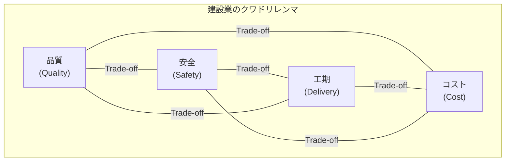
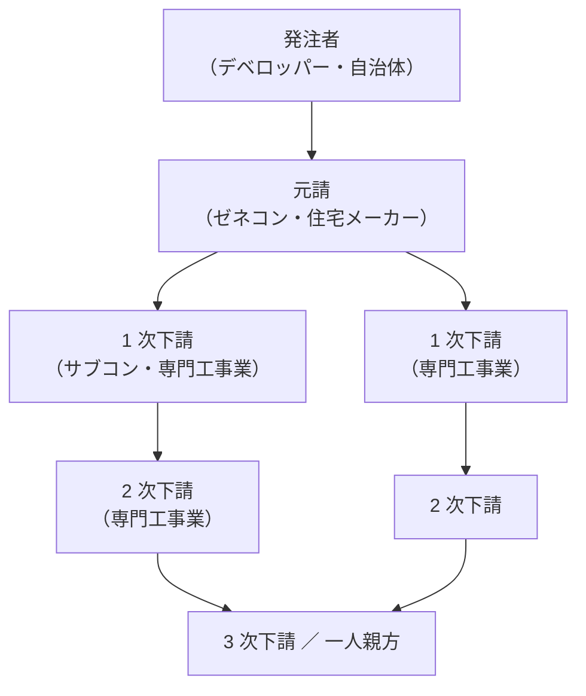
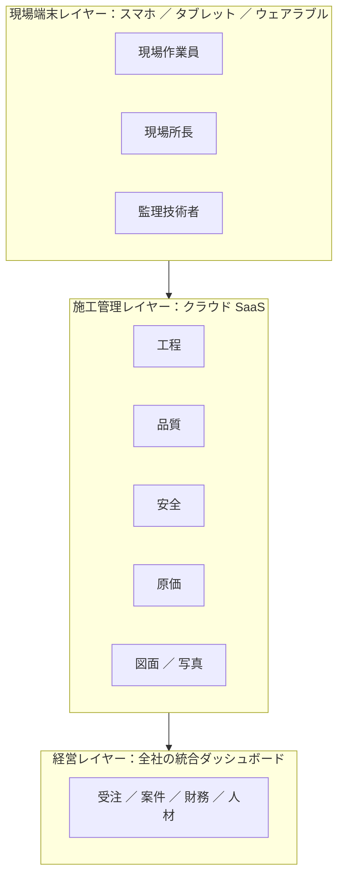

# 建設業のビジネス基礎

業界構造・建設業法・下請重層・2024 年問題・建設 DX——転職／担当／提案のための「建設業を読み解く眼鏡」

| 項目 | 内容 |
|---|---|
| カテゴリー | 業種別実務 |
| 難易度 | 中級 |
| 所要時間 | 約200分（全8レッスン） |
| 公開日 | 2026-07-02 |
| 最終更新日 | 2026-07-02 |
| コースURL | https://skillup.college/courses/industry/construction-basics/ |

## 対象者

建設業（ゼネコン・サブコン・専門工事業・住宅メーカー・リフォーム・資材業）に転職・配属された事務系・営業・HR・人事・経理・経営企画担当者と、建設クライアントを担当するコンサル・SIer・広告代理店・金融・不動産・編集者を両方主軸。建設現場経験はないが「業界としての建設業を読み解きたい」社会人 3 年目以上を対象。建設業に向けた提案・営業を行う方も含む。土木・建築・設備の 3 大分類を業種横断で扱う。

## 前提知識

社会人 3 年以上を想定。会計の基本（B/S、P/L、粗利、原価の概念）と、契約の基本（元請・下請の概念）への理解があれば理解が早いが、これらの土台は本コース内で必要範囲を解説する。建設現場経験は不要で、業界横断の俯瞰知識として「制度・階層・時間の 3 軸で捉える発想」を身につける構成。

## 学習目標

- 建設業の 3 大分類（土木・建築・設備）と 3 大機能（設計・施工・維持管理）を地図化できる
- 建設業のバリューチェーンと業態別ビジネスモデルを読み解ける
- 建設業法と建設業許可 29 業種、一般 vs 特定、経営事項審査（経審）、監理技術者・主任技術者の意味を理解する
- ゼネコン階層（スーパー 5・準大手・中堅・地場工務店）、サブコン、専門工事業、下請 3 階層構造を把握する
- 公共工事の入札制度（一般競争・指名競争・随意契約・総合評価落札方式）と民間工事の発注構造を理解する
- 建設業会計（工事進行基準・工事完成基準・未成工事支出金／受入金・工事台帳）と業界主要 KPI を計算・評価できる
- 建設 2024 年問題（時間外労働上限規制）、労働人口の高齢化、外国人技能実習・特定技能への対応を把握する
- BIM/CIM・i-Construction・建設 SaaS・建設 AI ・脱炭素など、2026 年時点の建設業界トレンドを把握し、修了後の継続学習方向を持てる

## コース概要

日本の建設業界は、従業者数約 500 万人（全就業者の約 7 %）・GDP 約 5 %（約 32 兆円）・完成工事高約 60 兆円という圧倒的な規模を持ち、道路・鉄道・空港・港湾・上下水道・電力・ビル・住宅・工場のすべてを支える日本経済の基幹産業です。にもかかわらず、業界外の方には「制度」「階層」「用語」がわかりにくい世界です。本コースは、建設業（ゼネコン・サブコン・専門工事業・住宅メーカー・リフォーム・資材業）に転職・配属された事務系・営業・人事・経理・経営企画の担当者と、建設クライアントを担当するコンサル・SIer・広告代理店・金融・不動産・編集者の両方を主軸に、建設業界を「業界として読み解く眼鏡」を 8 レッスンで提供します。3 大分類（土木・建築・設備）と 3 大機能（設計・施工・維持管理）、業態別のビジネスモデル、建設業法と業許可制度、ゼネコン階層と重層下請、公共工事と民間工事、建設業会計、2024 年問題と労働環境、BIM/CIM と建設 DX まで扱います。

## 学習の流れ

レッスン 1 で建設業界の現在地・3 大分類・本コースの 3 視点（転職者／担当者／提案者）を共有します。レッスン 2 で「建設業界の全体地図」としてバリューチェーンと業態別ビジネスモデル、品質・安全・工期・コストのクワドリレンマ、業種横断の典型組織を扱います。レッスン 3 で建設業法と業許可制度（業界の基準線）を扱い、レッスン 4 でゼネコン階層と重層下請、レッスン 5 で公共工事と民間工事の発注構造を扱います。レッスン 6 で建設業会計と工事進行基準、レッスン 7 で建設 2024 年問題と労働環境を扱います。レッスン 8 で BIM/CIM ・ i-Construction ・建設 SaaS ・建設 AI と修了後の継続学習方向を扱って締めくくります。建設現場経験がない方が、「業界外から内に入ったとき」または「業界外から接するとき」に立ち止まらないための土台を作るコースとして設計しています。

## レッスン一覧

| No. | タイトル | 概要 | 所要時間 |
|---|---|---|---|
| 1 | 建設業の現在地と本コースの守備範囲 | 建設業の定義と 3 大分類（土木・建築・設備）、日本経済での位置（GDP 約 5 %・完成工事高約 60 兆円・従業者約 500 万人）、3 大機能（設計・施工・維持管理）、業界を取り巻く 4 構造変化（人口減／2024 年問題／DX ／脱炭素）、本コースの守備範囲（転職者・担当者・提案者の 3 視点）、建設業の 3 共通言語（制度・階層・時間）、業界のことば（許可・経審・重層下請・工事進行基準・BIM）が翻訳できる価値を学ぶ | 25分 |
| 2 | 建設業のバリューチェーンと業態別ビジネスモデル——設計・施工・維持管理 | Michael Porter バリューチェーンの建設業版、5 領域収益モデル比較（ゼネコン＝完成工事高・粗利、サブコン＝設備工事、住宅メーカー＝戸建・請負、リフォーム＝改修受注、資材＝原材料）、「品質・安全・工期・コストのクワドリレンマ」、建設業の典型組織（現場・営業・設計・積算・調達・工務・技術・安全）、6 業態の主要 KPI 比較を学ぶ | 25分 |
| 3 | 建設業法と業許可制度——29 業種・元請下請・技術者制度 | 建設業法（1949 年制定）の 3 本柱（下請保護・技術者制度・元請責任）、建設業許可の 29 業種（土木一式・建築一式・27 専門工事業）、一般 vs 特定建設業（下請発注 4,500 万円ライン）、5 年更新と欠格要件、監理技術者・主任技術者、経営事項審査（経審）と X1 ／ X2 ／ Y ／ Z ／ W の 5 評点、公共工事入札の総合評価落札方式、下請 3 階層構造と一人親方、労災保険特別加入、雇用保険を学ぶ | 25分 |
| 4 | ゼネコン・サブコン・専門工事業の階層——スーパー 5 から地場まで | ゼネコン階層（スーパー 5：鹿島建設・大成建設・清水建設・大林組・竹中工務店／準大手：前田・戸田・熊谷・西松・五洋・東急建設・フジタ・安藤ハザマ／中堅／地場工務店）、収益構造と主要 KPI（完成工事高・完成工事総利益率・営業利益率・受注残高）、サブコン（電気工事：きんでん・関電工・九電工／空調衛生：高砂熱学・新菱冷熱・三機工業／通信：コムシス・協和エクシオ）、専門工事業（鳶土工・鉄筋・型枠・左官・塗装・内装）、JV（ジョイントベンチャー）3 形態、業界再編（インフロニア HD 2021 年 10 月経営統合）、建設業経営者の高齢化と事業承継を学ぶ | 25分 |
| 5 | 公共工事と民間工事——入札制度・発注者・PPP ／ PFI | 公共工事（国交省・国土整備・自治体・NEXCO・鉄道・港湾）、入札方式（一般競争・指名競争・随意契約・総合評価落札方式・技術提案方式）、予定価格制度、公共工事品確法 2005 年施行 ／ 2014 年改正、最低制限価格制度、民間工事（デベロッパー：三井不動産・三菱地所・住友不動産・野村不動産・東急不動産・森ビル）、ハウスメーカー（積水ハウス・大和ハウス・住友林業・パナソニックホームズ・積水化学・ミサワホーム・タマホーム）、リフォーム市場約 7 兆円、DB（Design-Build）・VE 提案、PPP ／ PFI（民間資金活用）、指定管理者制度を学ぶ | 25分 |
| 6 | 建設業会計と工事進行基準——原価・KPI ・IFRS 15 | 建設業会計の特有性、工事進行基準と工事完成基準、IFRS 15（Revenue from Contracts with Customers、2018 年 1 月発効）と収益認識に関する会計基準（2021 年 4 月適用）、工事台帳と原価管理、未成工事支出金・未成工事受入金の B/S 表示、材料費・労務費・外注費・経費の 4 分類、間接工事費と一般管理費、粗利率と営業利益率のベンチマーク（ゼネコン 5 〜 10 %／住宅メーカー 8 〜 12 %）、赤字工事の発生メカニズムと引当金、建設業経理士（1 〜 4 級）を学ぶ | 25分 |
| 7 | 建設 2024 年問題と労働環境——時間外規制・週休 2 日・外国人労働 | 建設 2024 年問題（2024 年 4 月時間外労働上限規制適用、年 720 時間・月 100 時間未満・複数月平均 80 時間）、これに伴う 4 週 8 閉所と週休 2 日制、労働人口の高齢化（60 歳以上比率約 20 %、10 年後の担い手不足）、労働安全衛生法・重層下請ゆえの労災の複雑さ、外国人材（技能実習・特定技能 1 号 12 職種／2 号 2019 年制度化）、建設業界の DX 人材・現場監督・施工管理技士（1 級 ・ 2 級）の役割変化、女性活躍と現場環境改善、建設キャリアアップシステム（CCUS、2019 年 4 月本格運用開始）を学ぶ | 25分 |
| 8 | 建設 DX と業界の未来——BIM/CIM ・ i-Construction ・建設 AI ・修了後の継続学習 | BIM（Building Information Modeling）と CIM（Construction Information Modeling）、国交省 i-Construction（2016 年〜、3 大取り組み ICT 施工・全体最適化・施工時期の平準化）、建設 DX の 3 レイヤー（現場端末／施工管理／経営）、代表的 SaaS（ANDPAD・SPIDERPLUS・Photoruction・Kanamic・助太刀・CAREECON）、建設 AI ユースケース（外観検査・積算・工程最適化・安全監視）、ドローン測量・3D スキャナ・遠隔臨場、CO2 排出と GX（脱炭素）、建設テック VC 投資動向、修了後の継続学習方向（国交省統計・建設経済研究所レポート・日刊建設工業新聞・日経コンストラクション・建通新聞）を学ぶ | 25分 |

---

## レッスン1：建設業の現在地と本コースの守備範囲

（所要時間：25分）

日本の建設業界は、2026 年時点で、従業者数約 500 万人（全就業者の約 7 %）、名目 GDP のうち建設業寄与が約 5 %（約 32 兆円）、完成工事高が約 60 兆円という圧倒的な規模を持つ、日本経済の基幹産業のひとつです。道路・橋・トンネル・ダム・鉄道・空港・港湾・上下水道・電力・ガスなどの社会インフラ、超高層オフィス・商業施設・工場・物流施設・病院・学校・住宅などの建築物、そのすべての設備を、建設業が支えています。にもかかわらず、業界外から入ってきた方には「制度」「階層」「用語」がわかりにくい世界です。建設業許可、経審、監理技術者、一般 vs 特定、下請 3 階層、一人親方、工事進行基準、未成工事支出金、CCUS、BIM ／ CIM ／ i-Construction ——これらの用語が、当たり前に飛び交う会議についていけるかどうかで、最初の半年の関わり方が大きく変わります。

本コースは、建設業に転職・配属された方、建設クライアントを担当する方、建設業に向けて提案・営業を行う方の 3 視点を主軸に、業界を「業界として読み解く眼鏡」を届けます。個別の建設会社の企業レポートではなく、業界横断の俯瞰知識として設計しています。レッスン 1 では、まず建設業界の全体地図と本コースの守備範囲を共有します。

### 建設業の定義と 3 大分類

建設業は、「土地の上に構造物を築造し、あるいは既存の構造物を改修・維持管理する事業」の総称です。日本標準産業分類では大分類 D「建設業」として、製造業とは別の産業に位置づけられます。建設業法（1949 年制定）にもとづく建設業許可の対象事業です。

本コースでは、建設業を大きく次の 3 大分類で捉えます。

- **土木（Civil Engineering）**：公共インフラの中核。道路・橋梁・トンネル・ダム・河川・港湾・鉄道・空港・上下水道・造成。公共発注比率が高く、国交省・自治体・NEXCO・鉄道会社・港湾管理者などが主要発注者。設計は建設コンサルタント、施工はゼネコン ／ 土木専業ゼネコンが担う
- **建築（Building Construction）**：ビル・住宅・工場・物流施設・商業施設・病院・学校・ホテル。民間発注比率が高く、デベロッパー・ハウスメーカー・事業会社・自治体（庁舎・学校）などが主要発注者。設計は組織設計事務所 ／ アトリエ、施工はゼネコン ／ 住宅メーカーが担う
- **設備（MEP：Mechanical Electrical Plumbing）**：電気設備・空調衛生設備・通信設備・給排水衛生設備。建築物・土木構造物の中で機能を果たす部分。設備工事はサブコンと呼ばれる専門会社が担う。電気（きんでん・関電工・九電工）、空調衛生（高砂熱学・新菱冷熱・三機工業・ダイダン）、通信（コムシス・協和エクシオ）が代表格

本コースの主軸は、この 3 大分類を横断する俯瞰知識です。土木・建築・設備は「違う言語を話す 3 つの国」ですが、共通の建設業法・共通の経営事項審査・共通の下請重層構造の上で動いています。この共通土台を押さえることが、本コースの目的です。

### 日本経済における建設業の位置

日本の建設投資は、2024 年時点で年間約 70 兆円規模、うち完成工事高（建設業者の売上ベース）が約 60 兆円と推定されます。政府の建設投資見通し（国交省）では、政府投資（公共）約 24 兆円、民間投資（住宅＋非住宅）約 44 兆円で、政府：民間が約 35：65 の比率です。

代表的な数字を、2026 年時点の目安で示します。

- **建設業の従業者数**：約 500 万人（全就業者の約 7 %）
- **建設業の GDP 寄与**：約 5 %（約 32 兆円）
- **完成工事高**：約 60 兆円
- **建設業許可を持つ事業者数**：約 47 万社（うち一般建設業約 44 万・特定建設業約 3 万）
- **スーパーゼネコン 5 社の連結売上合計**：約 8 〜 9 兆円（鹿島建設・大成建設・清水建設・大林組・竹中工務店）
- **リフォーム市場**：約 7 兆円

建設業は、少子高齢化で従業者が減る一方、社会インフラの老朽化（1960 〜 70 年代の高度成長期に大量に整備されたインフラが更新期）と防災・国土強靭化の需要が同時に拡大しており、業界としての国民生活への貢献はむしろ増しています。

### 建設業を取り巻く 4 つの構造変化

現在の建設業界を、次の 4 つの構造変化のなかで捉えると全体像が見えます。

- **労働人口の減少と高齢化**：建設業就業者の 60 歳以上比率は約 20 %、29 歳以下は約 12 % で、10 年後の担い手不足が最大の課題。技能実習・特定技能 1 号 12 職種・特定技能 2 号 2 業種（2019 年制度化）で外国人労働力を確保しつつ、女性活躍 ／ 若年層回帰の施策が進む
- **建設 2024 年問題**：2024 年 4 月から時間外労働の上限規制が建設業にも適用（年 720 時間・月 100 時間未満・複数月平均 80 時間）。これに伴う 4 週 8 閉所と週休 2 日制の実現が業界全体の課題
- **建設 DX（BIM ／ CIM ／ i-Construction）**：国交省の i-Construction 2016 年開始で、ICT 施工・全体最適化・施工時期の平準化が政策的に推進。BIM ／ CIM は 2023 年度から公共工事で原則適用が段階導入。ANDPAD ／ SPIDERPLUS ／ Photoruction などの建設 SaaS が急拡大
- **脱炭素（GX）**：建設業界の CO2 排出は運用（住宅・ビル使用時）と施工（現場・資材製造）の両方から。改正建築物省エネ法 2025 年 4 月適合義務化、GX 経済移行債 2024 年発行、Scope 3 サプライチェーン排出量の可視化と削減が発注者要件に

この 4 つは、それぞれ独立の変化ではなく、相互に絡み合っています。労働力不足を DX で補い、時間外規制と週休 2 日を実現しつつ、脱炭素対応で受注競争に勝つ、という多層方程式を業界全体で解いていく段階にあります。

### 本コースの守備範囲——3 視点

本コースは、次の 3 視点を主軸に設計しています。

- **転職者視点**：建設業（ゼネコン・サブコン・専門工事業・住宅メーカー・リフォーム・資材業）に転職・配属された、事務系・営業・HR ・ 経理・経営企画の担当者。「業界の共通言語（建設業許可・経審・工事進行基準・BIM）を最初の 3 か月で押さえたい」
- **担当者視点**：建設クライアントを担当するコンサル・SIer・広告代理店・金融・不動産・編集者。「クライアントの完成工事総利益率、受注残高、経審評点、CCUS 登録率がどれくらいなら健全か、業界のベンチマークを押さえたい」
- **提案者視点**：建設業に向けて提案・営業を行う SaaS ／ IT ／ 士業 ／ 建材 ／ 金融 ／ 保険事業者。「相手の意思決定プロセス（元請 vs 下請、本社 vs 現場、公共案件 vs 民間案件）を理解して、刺さる提案をしたい」

3 視点いずれも、共通する土台は「業界としての建設業を、俯瞰から読み解く力」です。個別の建設会社の分析や、個別工法の技術判断、個別プロジェクトの設計判断は本コースの対象外です。それらは一級建築士・構造設計一級建築士・施工管理技士など有資格者の独占業務であり、本コースは業界の共通言語を届けるところに徹します。

### 建設業の 3 つの共通言語

業界横断で押さえておくと、どの現場でも通じる 3 つの共通言語を挙げます。

- **制度**：建設業法・建設業許可 29 業種・経営事項審査（経審）・監理技術者 ／ 主任技術者・公共工事品確法・労働安全衛生法。すべての建設業者が守るべき制度の骨格
- **階層**：発注者→元請→下請→孫請の重層構造、一人親方まで含めた 3 〜 4 階層のサプライチェーン。日本の建設業を支える生態系であり、同時に改革課題
- **時間**：工事は必ず「工程」を持つ。着工から竣工までの数か月 〜 数年、その間の資材調達・下請発注・検査・引き渡し・アフターサービスを時間軸で管理する

この 3 つを言語として持っていると、業界のなかで交わされる会話（「今期の経審は W3 で来期は W2 を狙う」「一次下請けの経営が厳しく、二次に切り替えを検討」「工事進行基準で今期認識できるのは 60 %」など）の背景が読み解けるようになります。

### 業界のことばが翻訳できる価値

私が独立してから、業界内側で 16 年、業界外側から支援して 6 年、通算 22 年で見てきて確信しているのは、業界のことばを翻訳できる人の価値が、想像以上に高いということです。建設業許可と経審の違いを説明できる。監理技術者と主任技術者の使い分けを説明できる。工事進行基準と工事完成基準の違いを説明できる。BIM と CIM の違いを説明できる。建設 2024 年問題がなぜ物流 2024 年問題と別物かを説明できる。これができるだけで、営業会議、経営会議、投資家説明、顧客提案のいずれの場でも「話が通じる人」として扱われるようになります。

本コースは、この「翻訳者」になるための土台を作るコースです。個別の職種スキル（施工管理・設計・積算など）を身につけるのではなく、業界横断で使える「読み解きの型」を身につけてください。

### まとめ

- 建設業は 3 大分類（土木・建築・設備）で構成される。本コースは 3 分類を横断する俯瞰知識を届ける
- 日本の建設業は従業者約 500 万人、GDP 約 5 %、完成工事高約 60 兆円、建設業許可事業者約 47 万社の巨大産業
- 4 つの構造変化（労働人口減少と高齢化・建設 2024 年問題・建設 DX ・脱炭素 GX）が相互に絡み合いつつ進行
- 本コースの守備範囲は 3 視点（転職者／担当者／提案者）と 3 共通言語（制度／階層／時間）
- 業界のことば（建設業許可・経審・重層下請・工事進行基準・BIM）を翻訳できる人は、営業・経営・投資・提案のいずれの場でも重宝される
- 個別の設計判断・施工判断は一級建築士・施工管理技士など有資格者の独占業務、本コースは教育目的で「業界横断の読み解きの型」を扱う

### 確認クイズ

次の 6 問で、本レッスンの理解を確認します。

#### Q1. 本コースが取り上げる建設業の 3 大分類として、本レッスンで示されたのはどれか。

- [ ] 木造・鉄骨造・RC 造
- [ ] 新築・改修・解体
- [ ] 公共・民間・海外
- [x] 土木・建築・設備

> **解説**
> 本コースは 3 大分類（土木＝公共インフラ／建築＝ビル・住宅・工場／設備＝電気・空調衛生・通信）を横断する俯瞰知識を扱う。木造・鉄骨造・RC 造は構造分類、新築・改修・解体は工事分類で、いずれも本コースの主分類ではない。

#### Q2. 建設業の従業者数として、本レッスンで示された値に最も近いのはどれか。

- [ ] 約 50 万人
- [x] 約 500 万人
- [ ] 約 5,000 万人
- [ ] 約 5 万人

> **解説**
> 建設業就業者は約 500 万人で、全就業者の約 7 % を占める。日本の主要産業のなかでも上位規模。60 歳以上比率約 20 %、29 歳以下比率約 12 % で、10 年後の担い手不足が最大の課題。

#### Q3. 建設業を取り巻く「4 つの構造変化」として、本レッスンで挙げられていないのはどれか。

- [ ] 労働人口の減少と高齢化
- [ ] 建設 2024 年問題
- [ ] 建設 DX（BIM ／ CIM ／ i-Construction）
- [x] グローバル化と海外進出

> **解説**
> 4 つの構造変化は、労働人口の減少と高齢化・建設 2024 年問題・建設 DX（BIM ／ CIM ／ i-Construction）・脱炭素（GX）。グローバル化は個社の戦略として存在するが、業界全体の構造変化として本コースでは挙げていない。

#### Q4. 本コースが挙げる「建設業の 3 つの共通言語」に含まれないものはどれか。

- [x] 数量
- [ ] 階層
- [ ] 時間
- [ ] 制度

> **解説**
> 3 つの共通言語は「制度・階層・時間」。制度は建設業法・建設業許可・経審など、階層は元請→下請→孫請の重層構造、時間は工程管理を指す。数量（積算・数量計算）は各工程の具体作業で、業界横断の共通言語というより工程管理の一要素。

#### Q5. 建設業の設備工事の代表的サブコンとして、本レッスンで挙げられていないのはどれか。

- [ ] きんでん
- [ ] 高砂熱学
- [x] 大和ハウス
- [ ] コムシス

> **解説**
> きんでん・関電工・九電工は電気工事、高砂熱学・新菱冷熱・三機工業は空調衛生、コムシス・協和エクシオは通信のサブコン代表格。大和ハウスは住宅メーカーで、業態が異なる（建築、特に住宅・戸建・アパートメーカー）。

#### Q6. 本コースが対象とする 3 視点として明示されていないのはどれか。

- [ ] 転職者視点
- [ ] 担当者視点
- [ ] 提案者視点
- [x] 一級建築士養成視点

> **解説**
> 本コースは業界横断の俯瞰知識を扱い、一級建築士 ／ 施工管理技士 ／ 建設業経理士 などの資格試験対策は対象外。個別設計判断・施工判断は有資格者の独占業務であり、本コースは転職者・担当者・提案者の 3 視点で「業界を読み解く眼鏡」を届ける。

### 次のレッスンへ

レッスン 2 では、建設業のバリューチェーンと業態別ビジネスモデルを扱います。Michael Porter のバリューチェーンを建設業に適用し、5 領域収益モデル（ゼネコン ／ サブコン ／ 住宅メーカー ／ リフォーム ／ 資材）、「品質・安全・工期・コスト」のクワドリレンマ、建設業の典型組織、業態別 KPI を扱います。建設業のビジネスモデルが他業界となぜここまで違うのか、その構造を押さえていきましょう。

---

## レッスン2：建設業のバリューチェーンと業態別ビジネスモデル——設計・施工・維持管理

（所要時間：25分）

前回のレッスン 1 では、建設業界の全体地図として、3 大分類（土木・建築・設備）、市場規模（従業者約 500 万人・GDP 約 5 %・完成工事高約 60 兆円）、4 つの構造変化（労働人口減少と高齢化・建設 2024 年問題・建設 DX ・脱炭素）、本コースの守備範囲（3 視点）、3 つの共通言語（制度・階層・時間）を押さえました。今回はその全体地図の次のステップとして、建設業のバリューチェーンと業態別ビジネスモデルを扱います。

### Michael Porter のバリューチェーン——建設業に当てはめる

Michael Porter が 1985 年の著書『Competitive Advantage』で提示したバリューチェーンは、企業の活動を「主活動」と「支援活動」に分解して、どこで付加価値を生んでいるかを可視化する枠組みです。建設業に当てはめると、主活動は次の 5 段階に整理できます。

- **企画・営業**：発注者（デベロッパー・自治体・事業会社）との商談・提案・見積・入札応札。設計提案 ／ VE 提案 ／ DB 提案などの受注戦略も含む
- **設計**：基本設計・実施設計。建築ならゼネコン設計部門 ／ 組織設計事務所 ／ アトリエ事務所、土木なら建設コンサルタントが担当。設計と施工の分離発注が原則、DB では一体
- **調達**：資材・機材・下請の調達。建材（生コン・鉄鋼・木材・アルミ・ガラス）と機材（クレーン・重機・型枠・足場）と外注（下請）
- **施工**：現場での工事実行。躯体工事（基礎・鉄筋・型枠・コンクリート）→ 建方 → 仕上げ → 設備工事 → 検査 → 引き渡しの工程管理
- **維持管理・アフター**：竣工後の点検・保守・改修・大規模修繕。土木ではインフラ長寿命化計画、建築ではファシリティマネジメント（FM）

支援活動としては、コーポレート（Finance ／ Legal ／ HR ）、安全・品質・環境（HSE）、技術研究、購買、工務、積算の共通機能があります。

このバリューチェーンで注目すべきは、建設業の場合、「一品受注生産・現場ごと」であることです。工場で大量生産する製造業と違い、建設業は同じ設計図の建物は 1 つとして無く、毎回、現場が違い、地盤が違い、下請の顔ぶれが違い、天候が違います。この「一品性」と「現場性」が、建設業のバリューチェーンを他業種と根本的に違えている本質です。

### 業態別ビジネスモデル 6 分類

同じ建設業のなかでも、収益の作り方が業態で異なります。6 分類で整理します。

- **ゼネコン（総合建設業）**：発注者から工事を受注し、設計 ／ 施工を一貫または分離で提供。売上は完成工事高、収益は完成工事総利益（粗利）で、上場ゼネコンの粗利率は 5 〜 10 % が典型。スーパーゼネコン 5 社（鹿島・大成・清水・大林・竹中）、準大手 8 社、中堅、地場工務店の階層構造
- **サブコン（設備工事業）**：設備工事（電気・空調衛生・通信・給排水）に特化。ゼネコンから下請発注を受けるパターンと、発注者から直接受注するパターンの両方。粗利率はゼネコンよりやや高め。きんでん・関電工・九電工・高砂熱学・新菱冷熱・コムシスなど
- **専門工事業**：鳶土工・鉄筋・型枠・左官・塗装・防水・内装・タイル・板金など、特定工程に特化。1 次下請 ／ 2 次下請 ／ 3 次下請の階層で、一人親方まで含めて数万社が存在
- **住宅メーカー**：戸建 ／ アパート ／ マンションを主軸。積水ハウス・大和ハウス・住友林業・パナソニックホームズ・積水化学・ミサワホーム・タマホーム 等。売上は請負契約 ／ 建売分譲 ／ 賃貸経営で構成、粗利率 8 〜 12 %
- **リフォーム・改修業**：既存住宅・商業ビル・工場の改修 ／ 修繕。市場規模約 7 兆円。ハウスメーカーのリフォーム子会社、リフォーム専業（ニッカホーム・LIXIL リフォーム・住友不動産のリフォーム）、地元工務店が主要プレイヤー
- **建材・資材業**：生コン・セメント・鉄鋼・木材・アルミ・ガラス・タイル・木製建具・断熱材・給排水配管などの資材製造・流通。太平洋セメント・住友大阪セメント・日本製鉄・住友林業（木材）などがプレイヤー

本コースでは、この 6 業態のうち上位 4 業態（ゼネコン・サブコン・住宅メーカー・リフォーム）を主軸に、専門工事業と建材業は関連範囲として適宜扱います。

### クワドリレンマ——品質・安全・工期・コストの 4 立法

伝統的な建設業では、「品質（Q）・工期（D）・コスト（C）」の 3 要素のトレードオフとして QCD の三角形が使われてきました。しかし現代の建設業では、労働災害の重大性と社会的関心の高まりから、「安全（S）」が並列に加わり、QCDS の 4 要素、あるいは「品質・安全・工期・コスト」のクワドリレンマとして捉えます。

- **品質（Quality）**：構造安全性・仕上げ精度・機能性・耐久性・法令適合。品質不正（データ改ざん・鉄筋不足・耐震偽装）は業界の重大リスク
- **安全（Safety）**：作業員の労災防止。建設業の労災死亡率は全産業平均の 5 倍で、業界の宿命的課題
- **工期（Delivery）**：着工から竣工までの期間管理。契約工期の超過は違約金・信用失墜につながる
- **コスト（Cost）**：材料費・労務費・外注費・経費の総額管理。赤字工事は経営を直撃

この 4 要素は同時に完璧に満たすことができず、常にトレードオフの意思決定が求められます。「安全のために工期を延ばす」「品質のためにコストをかける」「コスト削減のために工期を圧縮する（と労災が増える）」——建設業の日々の判断はこの 4 象限で組み立てられます。



### 建設業の典型組織——本社と現場の 2 層

建設業の組織は、他業界と大きく違います。典型的にはゼネコンの例で、次の 2 層構造になっています。

**本社機能**：

- **営業本部（土木営業・建築営業・設備営業）**：発注者との商談、受注戦略、応札
- **設計本部（建築設計・構造設計・設備設計）**：基本設計・実施設計、外部設計事務所との連携
- **積算部**：見積作成、コスト計算、入札価格設計
- **調達部・購買部**：資材 ／ 下請の調達、価格交渉、契約
- **工務部**：全社の工事進捗管理、赤字工事の早期発見
- **技術本部・技術研究所**：新工法開発、標準化
- **安全環境本部（HSE）**：労災防止、品質管理、環境対応
- **管理本部（Finance・HR・Legal）**：経営管理、内部統制、コーポレート機能

**現場機能**：

- **所長（現場責任者）**：現場全体の責任者、監理技術者を兼務することが多い
- **副所長 ／ 主任 ／ 工事長**：工程 ／ 品質 ／ 安全 ／ 原価の各領域を分担
- **工事担当（建築 ／ 土木 ／ 設備）**：各工種の日々の管理
- **積算 ／ 事務担当**：現場の原価管理、下請契約、書類作成

本社と現場の間には、日々の意思決定の主導権と時間感覚の違いがあります。本社は経営視点・数字視点・戦略視点で動き、現場は工程視点・技能視点・関係性視点で動きます。本社と現場の橋渡しをできる人材が、建設業では長期的に重宝されます。

### 業態別 主要 KPI

6 業態それぞれで重視する KPI が異なります。俯瞰で押さえます。

- **ゼネコン**：完成工事高、完成工事総利益率（粗利率）、営業利益率、受注残高、受注高、経審評点、監理技術者数
- **サブコン**：完成工事高、粗利率、労務比率、資材調達コスト、繁忙期の要員稼働率
- **住宅メーカー**：受注棟数、平均販売価格、工期、ストック（賃貸経営）、リフォーム売上比率、モデルハウス来場数
- **リフォーム業**：受注件数、平均単価、リピート率、紹介率、集客チャネル別 CPA
- **専門工事業**：技能者数、CCUS 登録率、外注比率、資材原価率
- **建材業**：出荷トン数、稼働率、副資材のインフレ対応

このなかで、業界横断で最も重視される指標は「完成工事高」と「受注残高」です。完成工事高は当期の実力、受注残高は将来 1 〜 2 年の予見性を示します。両方が減少している会社は、業界内でも警戒される対象になります。

### まとめ

- Michael Porter のバリューチェーンを建設業に当てはめると、主活動は 5 段階（企画・営業 ／ 設計 ／ 調達 ／ 施工 ／ 維持管理・アフター）。「一品受注生産・現場ごと」が建設業の本質
- 業態は 6 分類（ゼネコン ／ サブコン ／ 専門工事業 ／ 住宅メーカー ／ リフォーム ／ 建材）。ゼネコン粗利率 5 〜 10 %、住宅メーカー 8 〜 12 % が典型
- クワドリレンマは品質・安全・工期・コストの 4 要素。QCD 三角形に「安全」を加えた QCDS が現代標準
- 組織は本社と現場の 2 層構造。本社は経営視点・数字視点、現場は工程視点・技能視点。両者の橋渡しが重要
- 主要 KPI は業態別に異なる。業界横断で最重視されるのは完成工事高と受注残高

### 確認クイズ

次の 6 問で、本レッスンの理解を確認します。

#### Q1. Michael Porter のバリューチェーンを建設業に当てはめたとき、他業界と根本的に違うポイントはどれか。

- [ ] 主活動が 3 段階しかない
- [ ] 支援活動が存在しない
- [x] 一品受注生産・現場ごとで、同じ設計の建物は 1 つとしてない
- [ ] マーケティングが不要である

> **解説**
> 工場で大量生産する製造業と違い、建設業は毎回、現場が違い、地盤が違い、下請の顔ぶれが違い、天候が違う。この「一品性」と「現場性」が建設業のバリューチェーンを他業種と根本的に違えている本質。

#### Q2. 建設業の 6 業態のうち、粗利率が 5 〜 10 % 程度の典型的水準にあるのはどれか。

- [ ] 建材業
- [x] スーパーゼネコン
- [ ] 住宅メーカー
- [ ] リフォーム業

> **解説**
> スーパーゼネコンの粗利率は 5 〜 10 % 程度が典型。住宅メーカーは 8 〜 12 %、リフォーム業は業態でばらつくが 15 〜 25 % 、建材業は 10 〜 20 % 程度で、業態により大きく異なる。

#### Q3. 建設業のクワドリレンマ（4 要素）に含まれないものはどれか。

- [ ] 品質（Quality）
- [ ] 安全（Safety）
- [ ] 工期（Delivery）
- [x] スピード（Speed）

> **解説**
> 建設業のクワドリレンマは品質（Quality）・安全（Safety）・工期（Delivery）・コスト（Cost）の 4 要素、頭文字で QCDS。伝統的な QCD の 3 要素に「安全」を加えたのが現代標準。スピードは工期の一部として捉える。

#### Q4. 建設業の現場組織における「所長」の役割はどれか。

- [ ] 発注者との商談を主に担当
- [ ] 設計事務所との調整のみを行う
- [x] 現場全体の責任者、監理技術者を兼務することが多い
- [ ] 本社の経営会議に週次で参加する

> **解説**
> 所長は現場全体の責任者で、監理技術者（建設業法上の技術者制度、後のレッスンで詳述）を兼務することが多い。発注者商談は本社営業、設計調整は本社設計との連携で、所長の主戦場は現場の日々の意思決定。

#### Q5. 建設業で業界横断的に最も重視される KPI の組み合わせはどれか。

- [x] 完成工事高と受注残高
- [ ] 従業員数と役員報酬
- [ ] 広告宣伝費と Web 訪問数
- [ ] 特許件数と論文数

> **解説**
> 完成工事高は当期の実力、受注残高は将来 1 〜 2 年の予見性を示す業界横断の必須指標。両方が減少している会社は業界内でも警戒される対象になる。ほかの選択肢は業界特有の重要 KPI ではない。

#### Q6. 建設業の設備工事業（サブコン）が主に担う工種はどれか。

- [ ] 基礎・躯体・仕上げ
- [ ] 造成・上下水道
- [x] 電気・空調衛生・通信・給排水
- [ ] 道路舗装・橋梁

> **解説**
> サブコンは設備工事（電気・空調衛生・通信・給排水）に特化した専門会社。基礎・躯体・仕上げは建築ゼネコン、造成・上下水道・道路舗装・橋梁は土木ゼネコン ／ 土木専業ゼネコンの主戦場。

### 次のレッスンへ

レッスン 3 では、建設業法と業許可制度を扱います。1949 年制定の建設業法の 3 本柱（下請保護・技術者制度・元請責任）、建設業許可の 29 業種、一般 vs 特定、経営事項審査（経審）、監理技術者・主任技術者、下請 3 階層構造と一人親方まで、業界の基準線を押さえていきましょう。

---

## レッスン3：建設業法と業許可制度——29 業種・元請下請・技術者制度

（所要時間：25分）

前回のレッスン 2 では、建設業のバリューチェーン、6 業態のビジネスモデル、クワドリレンマ、本社と現場の 2 層組織、業態別 KPI を扱いました。今回はその業態の上に共通で乗っている「業界の基準線」——建設業法と業許可制度——を体系的に扱います。建設業のことばの多くは、この 1 本の法律に由来しています。

### 建設業法の 3 本柱

建設業法は 1949 年（昭和 24 年）5 月に制定されました。戦後復興のなかで乱立した建設業者を秩序立てて、発注者保護・下請保護・国民生活の基盤インフラの品質確保を目的としています。以来、多数の改正を経て 2026 年現在の姿になっていますが、根幹の 3 本柱は変わっていません。

- **下請保護**：元請が下請に対して不当な取扱をしないよう、下請代金の支払期日 ／ 契約書面 ／ 一括下請の禁止などを規制
- **技術者制度**：建設工事の適正な施工を確保するため、監理技術者・主任技術者を配置することを義務化
- **元請責任**：元請は下請が起こした事故・品質不良に対しても最終責任を負う。工事完成後の 10 年間の瑕疵担保（住宅は住宅品確法で強化）

この 3 本柱を実現する仕組みが「建設業許可制度」と「経営事項審査」で、以降で詳しく見ていきます。

### 建設業許可の 29 業種

建設業を営もうとする者は、原則として建設業許可を受ける必要があります（軽微な建設工事のみを請け負う場合を除く）。許可は建設工事の種類ごとに区分され、全 29 業種あります。

- **土木一式（1 業種）**：総合的な企画・指導・調整のもと土木工作物を建設する工事
- **建築一式（1 業種）**：総合的な企画・指導・調整のもと建築物を建設する工事
- **27 の専門工事業**：大工工事・左官工事・とび土工コンクリート工事・石工事・屋根工事・電気工事・管工事・タイル れんが ブロック工事・鋼構造物工事・鉄筋工事・舗装工事・しゅんせつ工事・板金工事・ガラス工事・塗装工事・防水工事・内装仕上工事・機械器具設置工事・熱絶縁工事・電気通信工事・造園工事・さく井工事・建具工事・水道施設工事・消防施設工事・清掃施設工事・解体工事

29 業種のうち、複数業種の許可を取得することが一般的で、スーパーゼネコンは 20 業種以上の許可を保有していることが多いです。専門工事業は 1 〜 3 業種に絞って営業することが多いです。

#### 一般建設業と特定建設業

同じ 29 業種のなかで、さらに「一般建設業」と「特定建設業」に区分されます。

- **一般建設業**：一次下請への発注総額が 4,500 万円未満（建築一式は 7,000 万円未満）の元請、または元請から下請けを受ける会社
- **特定建設業**：一次下請への発注総額が 4,500 万円以上（建築一式は 7,000 万円以上）の元請となる会社

この 4,500 万円ラインは 2023 年 1 月改正で 4,000 万円から引き上げられました（建築一式は 6,000 万円 → 7,000 万円）。特定建設業は、より重い財産的基礎・技術者要件・不良不適格業者の排除を求められます。スーパーゼネコン ／ 準大手 ／ 中堅ゼネコンは通常、複数業種で特定建設業許可を保有します。

#### 5 年更新と欠格要件

建設業許可は 5 年ごとに更新が必要で、更新のたびに常勤役員・営業所専任技術者・財産的基礎の要件を再確認します。欠格要件（禁固刑・暴力団関係者・業務停止処分など）に該当すると許可を失います。実務上、更新手続きは煩雑で、5 年前の許可申請の資料と現状の変更を突き合わせる作業が必要になります。

### 監理技術者と主任技術者——技術者制度

建設工事の適正な施工を確保するため、建設業法は元請・下請の別なく、工事現場に「技術者」を配置することを義務づけています。技術者は次の 2 種類に区分されます。

- **監理技術者**：特定建設業の元請が、下請への発注総額 4,500 万円以上（建築一式は 7,000 万円以上）の工事現場に配置する。一級施工管理技士 ／ 一級建築士 ／ 技術士など上位資格が要件、業種別
- **主任技術者**：それ以外の工事現場に配置。二級施工管理技士 ／ 一定の実務経験など、監理技術者より軽い要件

技術者は、公共性のある工事（3,500 万円以上、建築一式は 7,000 万円以上）で **専任** が求められます。これが「1 名の技術者が同時に複数現場を掛け持ちできない」の原則です。

2020 年 10 月改正で、監理技術者補佐（一級施工管理技士補）を配置すれば、監理技術者が 2 現場を兼務できる **監理技術者の兼務制度** が導入されました。技術者不足への対応策で、建設業界の DX 政策と連動しています。

### 経営事項審査（経審）——公共工事入札の入場券

公共工事を直接請け負う建設業者は、経営事項審査（略称：経審）を受ける必要があります。国交省 ／ 都道府県から「客観的な経営指標」で評価され、点数化されます。

経審は次の 5 評点で構成されます。

- **X1（経営規模等）**：完成工事高（3 年平均）・自己資本額・平均利益額。会社の規模と収益性を測る
- **X2（経営規模等）**：営業年数・営業活動キャッシュフロー。会社の継続性を測る
- **Y（経営状況分析）**：純支払利息比率・負債回転期間・売上高経常利益率・総資本売上総利益率・自己資本対固定資産比率・自己資本比率・営業キャッシュフロー・利益剰余金の 8 指標
- **Z（技術力）**：技術職員数（1 級 5 点・2 級 2 点・その他 1 点など加重）・元請完成工事高
- **W（社会性等）**：雇用保険 ／ 健康保険 ／ 厚生年金の加入・退職一時金制度・防災協定 ／ 建設業経理士 ／ 若年技術職員雇用促進 ／ CCUS 登録・監査体制の整備

これらを加重平均した総合評点 P が算出され、公共工事の入札参加資格審査（各発注機関）に使われます。「うちの経審は W3」というのは、W 評点で 3 段階目（A ／ B ／ C ／ D の 4 段階のうち B クラス）に位置することを示します。**経審がすべての公共工事の入札票**、というのが業界の共通認識です。

### 下請 3 階層構造と一人親方

建設業のもう 1 つの特徴が、「下請の重層構造」です。発注者→ 元請 → 1 次下請 → 2 次下請 → 3 次下請、そして末端に「一人親方」がいる、というのが典型パターンです。

- **元請**：発注者と直接契約するゼネコン等
- **1 次下請**：元請から直接請ける専門工事業（電気・鉄筋・型枠・とび土工など）
- **2 次下請**：1 次下請の一部を分業で請ける
- **3 次下請**：2 次下請のさらに一部を請ける（実務上は 3 次が最下層になることが多い）
- **一人親方**：法人化しない個人事業主。労災保険には「特別加入」（労働者ではなく事業主だが、労災の保護対象になる制度）で加入

一人親方の労災特別加入は、建設業に特有の重要制度です。労働基準法上は「労働者」ではないが、実質的に労働者と同じ危険にさらされるため、自主的に労災保険に特別加入する仕組みが 1965 年に整備されました。2024 年時点で建設業の一人親方は約 30 万人と推計されます。

下請重層構造は、日本の建設業の柔軟性・雇用のクッション・専門技能の維持を支えてきた側面と、責任の希薄化・元請から末端への価格圧迫・労働環境の悪化を招いてきた側面の両面があります。近年は 2 次下請までを原則とする「下請次数の縮減」が政策的に進み、CCUS（建設キャリアアップシステム）で技能者を個別に見える化する動きが進んでいます。

### 公共工事の入札方式

公共工事の入札方式は、大きく次の 4 分類です。

- **一般競争入札**：資格を満たすすべての業者が参加できる。予定価格以下の最低価格を提示した業者が落札するのが原則
- **指名競争入札**：発注者が指名した業者だけが参加できる
- **随意契約**：発注者が特定の業者を選んで契約する。緊急工事 ／ 特殊工事など
- **総合評価落札方式**：価格だけでなく、技術提案 ／ 施工計画 ／ 過去実績 ／ 経審評点などを総合評価。品確法（公共工事品確法、2005 年施行、2014 年改正）で位置づけが強化された

総合評価落札方式は、価格競争一辺倒がもたらした低品質工事・談合の弊害を防ぐために、2000 年代前半から広がった方式です。「価格 40 %・技術 60 %」のように配点され、経審評点や技術者の配置提案が具体的な得点に反映されます。

### まとめ

- 建設業法（1949 年制定）の 3 本柱は下請保護・技術者制度・元請責任
- 建設業許可は 29 業種（土木一式・建築一式＋ 27 専門工事業）、5 年更新
- 一般建設業と特定建設業は一次下請発注 4,500 万円ライン（2023 年 1 月改正）で区分
- 技術者制度は監理技術者（特定建設業元請）と主任技術者。公共工事は原則専任、2020 年から補佐配置で兼務可
- 経営事項審査（経審）は X1 ／ X2 ／ Y ／ Z ／ W の 5 評点で構成、公共工事入札の入場券
- 下請重層構造は元請→ 1 次 → 2 次 → 3 次と一人親方。労災特別加入は建設業に特有の制度
- 公共工事の入札方式は一般競争 ／ 指名競争 ／ 随意 ／ 総合評価落札方式。総合評価は品確法 2005 年施行で強化

### 確認クイズ

次の 6 問で、本レッスンの理解を確認します。

#### Q1. 建設業法（1949 年制定）の 3 本柱として、本レッスンで挙げられていないのはどれか。

- [x] 資材輸入規制
- [ ] 技術者制度
- [ ] 元請責任
- [ ] 下請保護

> **解説**
> 3 本柱は下請保護・技術者制度・元請責任。資材輸入規制は建設業法の対象ではなく、通関 ／ 貿易関連の規制。

#### Q2. 建設業許可の 29 業種のうち、「土木一式」「建築一式」以外の 27 業種を総称して何と呼ぶか。

- [ ] 特定建設業
- [x] 専門工事業
- [ ] 一次下請業
- [ ] 監理技術業

> **解説**
> 大工工事・鉄筋工事・電気工事など具体の工種ごとに区分された 27 業種を専門工事業と呼ぶ。特定建設業は下請発注額の水準による区分、一次下請業や監理技術業は法定用語ではない。

#### Q3. 特定建設業の要件となる一次下請への発注総額のライン（2023 年 1 月改正後、建築一式以外）はどれか。

- [ ] 1,500 万円
- [ ] 3,000 万円
- [x] 4,500 万円
- [ ] 7,000 万円

> **解説**
> 2023 年 1 月改正で、建築一式以外は 4,000 万円 → 4,500 万円、建築一式は 6,000 万円 → 7,000 万円に引き上げられた。特定建設業は一次下請発注総額が 4,500 万円（建築一式は 7,000 万円）以上となる元請に必要。

#### Q4. 経営事項審査（経審）の 5 評点のうち、技術力を測るのはどれか。

- [ ] X1
- [ ] X2
- [ ] Y
- [x] Z

> **解説**
> 経審の 5 評点は X1（経営規模）・X2（経営規模・営業年数）・Y（経営状況）・Z（技術力）・W（社会性等）。Z は技術職員数（1 級 5 点・2 級 2 点等加重）と元請完成工事高で構成。

#### Q5. 建設業の下請重層構造で末端に位置する、法人化しない個人事業主を何と呼ぶか。

- [ ] 元請
- [ ] 1 次下請
- [x] 一人親方
- [ ] 監理技術者

> **解説**
> 一人親方は建設業の下請重層構造の末端に位置する個人事業主。労働基準法上は労働者ではないが、実質的に労働者と同じ危険にさらされるため、労災保険の特別加入制度（1965 年整備）で保護される。2024 年時点で建設業に約 30 万人。

#### Q6. 公共工事の入札方式のうち、「価格だけでなく技術提案 ／ 施工計画 ／ 過去実績 ／ 経審評点などを総合評価する」方式はどれか。

- [ ] 一般競争入札
- [x] 総合評価落札方式
- [ ] 指名競争入札
- [ ] 随意契約

> **解説**
> 総合評価落札方式は、公共工事品確法（2005 年施行、2014 年改正）で位置づけが強化された方式。価格 40 %・技術 60 % のような配点で、経審評点や技術者配置提案が具体的な得点に反映される。価格競争一辺倒がもたらす低品質工事・談合の弊害を防ぐために広がった。

### 次のレッスンへ

レッスン 4 では、ゼネコン・サブコン・専門工事業の階層を扱います。スーパーゼネコン 5 社から地場工務店まで、収益構造と主要 KPI、サブコンと専門工事業、JV（ジョイントベンチャー）、業界再編、建設業経営者の高齢化と事業承継まで、業界の階層の全体像を押さえていきましょう。

---

## レッスン4：ゼネコン・サブコン・専門工事業の階層——スーパー 5 から地場まで

（所要時間：25分）

前回のレッスン 3 では、建設業法の 3 本柱、建設業許可 29 業種、一般 vs 特定、監理技術者・主任技術者、経営事項審査（経審）、下請 3 階層構造と一人親方、公共工事の入札方式を扱いました。今回は、建設業のもう 1 つの主軸「業界階層」を扱います。ゼネコンとサブコンと専門工事業がどう階層構造を作っているかを、業界横断で押さえます。

### ゼネコン階層——スーパー 5 から地場工務店まで

ゼネコン（総合建設業）は、規模と業容で 4 層に区分されます。

- **スーパーゼネコン 5 社**：鹿島建設 ／ 大成建設 ／ 清水建設 ／ 大林組 ／ 竹中工務店。単体売上高 1 兆円 〜 1.5 兆円クラス、国内トップの技術力・受注力を持ち、大型再開発 ／ 超高層ビル ／ 大規模インフラの主戦場
- **準大手ゼネコン**：前田建設工業（現インフロニア HD）／ 戸田建設 ／ 熊谷組 ／ 西松建設 ／ 五洋建設（土木・海洋工事）／ 東急建設 ／ フジタ ／ 安藤ハザマ など。単体売上高 3,000 〜 6,000 億円クラス
- **中堅ゼネコン**：地方の主要ゼネコン（大昭ゼネコンや地域一番手）で単体売上高 500 〜 2,000 億円クラス。地域密着型で公共工事比率が高い
- **地場工務店**：単体売上高数億 〜 数十億円クラス。地元建築 ／ 戸建 ／ リフォームが主戦場。全国に数万社

各層で、収益構造・粗利率・入札戦略が異なります。スーパー 5 は民間大型案件と大規模公共工事の両方を狙い、準大手は特定分野（インフラ ／ 土木 ／ 海洋）に強みを持つことが多く、中堅は地元発注者との関係性、地場工務店は住宅市場が主戦場です。

### スーパーゼネコン 5 社の位置づけ

スーパー 5 と呼ばれる 5 社は、それぞれ歴史的な出自と強みが異なります。

- **鹿島建設**：1840 年創業、原子力 ／ 海洋 ／ 大深度地下工事に強み、海外売上比率が高い
- **大成建設**：1873 年創業、超高層ビル ／ ダム ／ トンネル、国交省案件でも上位
- **清水建設**：1804 年創業、宗教施設 ／ 病院 ／ 大型商業施設の実績
- **大林組**：1892 年創業、超高層ビル ／ 東京スカイツリー施工、大阪発祥
- **竹中工務店**：1610 年創業（家業起源）、日本最古の建設会社、建築特化（土木は関連会社の竹中土木）、非上場

スーパー 5 の連結売上合計は 8 〜 9 兆円規模で、日本の建設業界の 15 % 前後を占めます。ただし、下請発注する専門工事業まで含めた「エコシステム」の規模は、その数倍に達します。スーパー 5 のプロジェクトが動くと、業界全体が動く、というのが建設業のダイナミクスです。

### サブコン——設備工事業の主要プレイヤー

サブコン（Sub-Contractor、設備工事業）は、電気 ／ 空調衛生 ／ 通信の 3 領域に大別されます。

- **電気工事**：きんでん（関西電力系）・関電工（東京電力 HD 系）・九電工（九州電力系）・住友電設（住友グループ）・トーエネック（中部電力系）・中電工（中国電力系）・きんでんが業界最大手で連結売上約 7,000 億円
- **空調衛生**：高砂熱学工業・新菱冷熱工業・三機工業・ダイダン・大氣社・朝日工業社。オフィスビル・工場・データセンター・病院の空調 ／ 給排水
- **通信工事**：コムシスホールディングス・協和エクシオ（現 EXEO Group）・SYSKEN・大和電設工業・ミライト・ワンなど。通信キャリアの基地局 ／ 光ファイバー ／ データセンター工事

サブコンは、ゼネコンから下請発注される一次下請パターンと、発注者から直接契約する元請パターンの両方を持ちます。**発注者側から見ると、ゼネコン一元請よりサブコン分割発注のほうが総額を抑えられる場合があり**、大手発注者はしばしば分離発注を選択します。

### 専門工事業と一人親方

専門工事業は、建設業許可の 27 専門工事業種のうち特定の 1 〜 3 業種に絞って営業する会社です。

- **躯体系**：鳶土工（とび）・鉄筋工・型枠大工・コンクリート打設
- **仕上げ系**：内装 ／ 塗装 ／ タイル ／ 左官 ／ 防水 ／ 屋根 ／ 建具
- **その他**：解体 ／ 造園 ／ さく井 ／ 消防施設

専門工事業は全国に数十万社あり、建設業界の圧倒的多数派です。各社は 1 〜 3 業種に絞り、地域密着で 1 次 ／ 2 次 ／ 3 次下請として活動します。末端の一人親方まで含めると、建設業の労働力の中核を形成しています。

一人親方は、法人化しない個人事業主で、労災保険には「特別加入」で加入します。近年は「偽装一人親方」（実質は労働者だが労災 ／ 社保を回避する目的で一人親方扱いにする）が社会問題化し、CCUS（建設キャリアアップシステム）で技能者を個人単位で見える化する政策が進んでいます。



### JV（ジョイントベンチャー）3 形態

大型工事や海外工事では、複数の建設会社が共同で工事を実施する **JV（ジョイントベンチャー、共同企業体）** の形態が採用されます。3 形態に区分されます。

- **甲型 JV（共同施工方式）**：構成会社が施工全体を共同で行い、利益 ／ 損失も出資比率に応じて分担。中大型工事の代表的形態
- **乙型 JV（分担施工方式）**：構成会社が施工範囲を分担、それぞれの範囲について独立に責任 ／ 利益 ／ 損失を負う
- **経常 JV**：中小建設業者が経営基盤の強化のため継続的に組む JV

JV は、大型工事のリスク分散、技術力の相互補完、地元業者との協働（地元 JV）を目的として採用されます。公共工事では発注者側が地元業者との JV を条件にする場合もあります。スーパー 5 同士の JV は最上位工事、スーパー ／ 準大手 ／ 中堅の 3 社 JV は大型工事、というのが典型です。

### 業界再編——インフロニア HD と道路 3 社経営統合

建設業界は長らく「多数の中堅・地場が乱立する分散市場」でしたが、2020 年代に入り再編が進みつつあります。象徴的な事例が、**インフロニア・ホールディングス**（旧・前田建設工業）による道路 3 社経営統合です。

2021 年 10 月 1 日、前田建設工業 ／ 前田道路 ／ 前田製作所の 3 社が経営統合し、インフロニア HD が発足しました。総合建設業（前田建設）＋ 舗装（前田道路）＋ 建設機械（前田製作所）を持株会社化して、インフラ系の総合オペレーターを目指す構図です。同社は 2023 年に日本高圧電気（環境部門）も傘下に加え、ドラム缶入りセメント工場やコンセッション（空港運営）まで守備範囲を広げています。

同様の動きとして、大手ハウスメーカーによる中堅住宅メーカーの M&A（例：住友林業のグループ拡大、大和ハウスによる関連会社統合）、中堅ゼネコンの経営統合、専門工事業の後継者不足による M&A も進んでいます。

### 建設業経営者の高齢化と事業承継

建設業経営者の高齢化と後継者不足は、業界の構造課題です。中小企業庁の調査では、建設業の経営者の平均年齢は 60 歳超、後継者未定率は 60 % 前後で推移しています。専門工事業や地場工務店では、経営者の引退とともに会社が消滅するケースが多く、それが業界の技能維持を難しくしています。

2020 年代に入り、建設業向けの M&A ／ 事業承継市場が活発化しています。中小 M&A 仲介大手（日本 M&A センター・M&A キャピタルパートナーズ・ストライク）や、建設業特化の M&A アドバイザー、地銀・信金による事業承継支援が増えています。買い手は、地域内の同業（水平統合）、隣接業種（垂直統合）、上位ゼネコン（子会社化）、投資ファンド（BEENOS ／ ニッポンエンジニアリング系）と多様です。

事業承継 M&A は、単なる会社の売買ではなく、「その地域の建設インフラを支える会社の技能と関係性を、次の 10 年に引き継ぐ」というインフラ的意義を持ちます。私自身、独立してからの 6 年で数十件の建設業 M&A に伴走してきましたが、毎回、社長と技能者と地元発注者の 3 者の信頼関係をどう引き継ぐかが、案件の成否を分けています。

### まとめ

- ゼネコン階層は 4 層（スーパー 5 ／ 準大手 ／ 中堅 ／ 地場工務店）。売上規模と業容で使い分ける
- スーパーゼネコン 5 社は鹿島 ／ 大成 ／ 清水 ／ 大林 ／ 竹中。連結売上合計 8 〜 9 兆円、業界の 15 % 前後
- サブコンは電気 ／ 空調衛生 ／ 通信の 3 領域。きんでん ／ 関電工 ／ 九電工が電気工事の主要プレイヤー
- 専門工事業は 27 業種を絞って営業する多数派、末端に一人親方（労災特別加入）
- JV は甲型 ／ 乙型 ／ 経常の 3 形態。大型工事のリスク分散と技術補完
- 業界再編の象徴例：インフロニア HD 2021 年 10 月経営統合（前田建設＋前田道路＋前田製作所）
- 建設業経営者の高齢化と後継者不足で M&A 市場が活発化。地域インフラを支える生態系の引き継ぎがテーマ

### 確認クイズ

次の 6 問で、本レッスンの理解を確認します。

#### Q1. スーパーゼネコン 5 社に含まれないのはどれか。

- [x] 前田建設工業
- [ ] 大成建設
- [ ] 清水建設
- [ ] 鹿島建設

> **解説**
> スーパーゼネコン 5 社は鹿島建設・大成建設・清水建設・大林組・竹中工務店。前田建設工業（現インフロニア HD）は準大手ゼネコンで、2021 年 10 月に道路 3 社経営統合でインフロニア HD となった。

#### Q2. サブコンの空調衛生領域の代表的プレイヤーはどれか。

- [ ] きんでん
- [x] 高砂熱学工業
- [ ] コムシスホールディングス
- [ ] 大成建設

> **解説**
> 空調衛生は高砂熱学工業・新菱冷熱工業・三機工業・ダイダンなど。きんでんは電気工事の最大手、コムシスは通信工事、大成建設はスーパーゼネコンで業態が異なる。

#### Q3. JV（ジョイントベンチャー）で「構成会社が施工全体を共同で行い、利益 ／ 損失も出資比率に応じて分担する」形態を何と呼ぶか。

- [ ] 経常 JV
- [ ] 乙型 JV（分担施工方式）
- [x] 甲型 JV（共同施工方式）
- [ ] 単独施工方式

> **解説**
> 甲型 JV は共同施工方式で、構成会社が施工全体を共同で行い利益 ／ 損失も出資比率に応じて分担する。乙型は分担施工方式で構成会社が範囲を分担、経常 JV は中小業者が継続的に組む形態。

#### Q4. インフロニア・ホールディングスの発足時（2021 年 10 月）に統合した 3 社に含まれないのはどれか。

- [ ] 前田建設工業
- [ ] 前田道路
- [ ] 前田製作所
- [x] 前田電機

> **解説**
> インフロニア HD は 2021 年 10 月 1 日に前田建設工業（総合建設業）・前田道路（舗装）・前田製作所（建設機械）の 3 社経営統合で発足。前田電機はグループに含まれない。

#### Q5. 建設業の一人親方に関する説明として正しいのはどれか。

- [ ] 労働基準法上は労働者に該当する
- [x] 法人化しない個人事業主で、労災保険には特別加入で加入する
- [ ] 建設業許可は不要とされている
- [ ] スーパーゼネコンの正社員として雇用される

> **解説**
> 一人親方は法人化しない個人事業主で、労働基準法上は労働者ではない。しかし実質的に労働者と同じ危険にさらされるため、労災保険の特別加入制度（1965 年整備）で保護される。建設業許可は請負金額により必要な場合がある。2024 年時点で建設業に約 30 万人。

#### Q6. 建設業経営者の高齢化と事業承継の現状について、本レッスンの記述と合致するものはどれか。

- [ ] 経営者の平均年齢は 40 歳未満で、後継者は十分に確保されている
- [x] 経営者の平均年齢は 60 歳超、後継者未定率は 60 % 前後で、業界内 M&A 市場が活発化している
- [ ] 事業承継は制度的に禁止されている
- [ ] スーパー 5 だけが M&A の買い手候補となっている

> **解説**
> 中小企業庁調査で、建設業経営者の平均年齢は 60 歳超、後継者未定率は 60 % 前後。専門工事業や地場工務店では経営者引退で会社が消滅するケースが多く、業界内 M&A ／ 事業承継市場が 2020 年代に活発化している。買い手は同業・隣接業種・上位ゼネコン・投資ファンドと多様。

### 次のレッスンへ

レッスン 5 では、公共工事と民間工事、入札制度と発注者、PPP ／ PFI を扱います。公共工事の 4 大発注者（国交省 ／ 自治体 ／ NEXCO ／ 鉄道 ／ 港湾）と、民間工事の発注者（デベロッパー ／ ハウスメーカー ／ 事業会社）、リフォーム市場、Design-Build と VE 提案、PPP ／ PFI 制度まで、業界の需要側を押さえていきましょう。

---

## レッスン5：公共工事と民間工事——入札制度・発注者・PPP ／ PFI

（所要時間：25分）

前回のレッスン 4 では、建設業のもう 1 つの主軸「業界階層」として、スーパー 5 から地場工務店まで、サブコンと専門工事業、JV、業界再編、事業承継を扱いました。今回は業界の「需要側」——公共工事と民間工事の発注構造——を扱います。誰が発注し、どんな入札方式で、どんな契約形態で工事が動くのかを、業界横断で押さえます。

### 建設投資の全体像——政府と民間の 35：65

建設投資全体は、国交省の建設投資見通しで年間約 70 兆円規模（うち完成工事高約 60 兆円）と推定されます。内訳は次の通りです。

- **政府投資（公共工事）**：約 24 兆円（35 %）
  - 土木工事：約 18 兆円（道路 ／ 河川 ／ ダム ／ 上下水道 ／ 港湾 ／ 空港 ／ 鉄道）
  - 建築工事：約 6 兆円（庁舎 ／ 学校 ／ 病院 ／ 公営住宅）
- **民間投資（民間工事）**：約 44 兆円（65 %）
  - 民間住宅投資：約 20 兆円（戸建 ／ アパート ／ 分譲マンション）
  - 民間非住宅建築：約 15 兆円（オフィスビル ／ 商業 ／ 工場 ／ 物流 ／ 病院 ／ ホテル）
  - 民間土木：約 9 兆円（電力 ／ ガス ／ 通信 ／ 私鉄）

政府：民間比率は 35：65 が典型ですが、政府投資の重要性は金額比以上に大きいです。土木工事の 80 % が公共発注で、地方の建設業経営は公共工事に大きく依存します。

### 公共工事の 5 大発注者

公共工事の発注者は、次の 5 系統に大別されます。

- **国土交通省 地方整備局**：全国 10 地方整備局（北海道 ／ 東北 ／ 関東 ／ 北陸 ／ 中部 ／ 近畿 ／ 中国 ／ 四国 ／ 九州 ／ 沖縄総合事務局）。国道 ／ 一級河川 ／ ダム ／ 港湾など、国が管理するインフラの直轄事業
- **都道府県 ／ 政令市 ／ 市町村**：地域道路 ／ 二級河川 ／ 公営住宅 ／ 学校 ／ 庁舎など地方の公共工事。全国約 1,700 自治体が発注者
- **NEXCO（東 ／ 中 ／ 西日本高速道路）**：高速道路の新設 ／ 更新 ／ 改修
- **鉄道会社（JR・私鉄）**：新幹線・在来線の新設・改良。公共性が高いが発注者は民間会社の場合も多い
- **そのほかの公共機関**：都市再生機構（UR）・水資源機構・独立行政法人 ／ 公社（成田国際空港・関西国際空港・港湾管理者・下水道公社等）

このうち発注量が最大なのは **地方自治体（都道府県 ／ 市町村）** で、全公共工事の約 60 % を占めます。地方の建設業経営は、地元自治体との関係性が生命線です。

### 公共工事の入札方式

公共工事の入札は、レッスン 3 で概要を扱いましたが、あらためて詳細を確認します。

- **一般競争入札**：資格を満たすすべての業者が参加可能。予定価格以下の最低価格を提示した業者が落札するのが原則。透明性が高いが、低価格入札 ／ ダンピング競争のリスクあり
- **指名競争入札**：発注者が指名した業者だけが参加。発注者の裁量が働くが、談合の温床になりやすい
- **随意契約**：発注者が特定の業者を選んで契約。緊急工事 ／ 特殊工事 ／ 少額工事に限定
- **総合評価落札方式**：価格 40 % ／ 技術 60 % 程度の配点で総合評価。公共工事品確法（2005 年施行、2014 年改正）で位置づけが強化
- **技術提案・交渉方式**：技術提案を先に受け付け、優秀な提案者と価格交渉。特殊工事や大型プロジェクトに適用

#### 予定価格制度と最低制限価格

公共工事では、発注者が **予定価格**（工事の適正価格）をあらかじめ設定します。この予定価格を超える応札は無効です。一方で、極端に安い価格（ダンピング）を防ぐため、**最低制限価格制度** も併用されます。予定価格の 60 〜 90 % の範囲で最低制限価格を設定し、これを下回る応札は無効になります。

低入札価格調査制度も併用され、極端に安い応札があった場合は、施工体制 ／ 下請発注状況 ／ 資材調達計画を発注者が調査します。ダンピング競争を抑制する政策的な仕組みです。

### 民間工事の主要発注者

民間工事の発注者は、業種で大きく異なります。

- **大手デベロッパー**：三井不動産・三菱地所・住友不動産・野村不動産・東急不動産・森ビル・平和不動産。オフィスビル ／ 商業施設 ／ マンションを開発。大規模再開発（虎ノ門・渋谷・新宿・大阪）で主要発注者
- **ハウスメーカー**：積水ハウス・大和ハウス工業・住友林業・パナソニックホームズ・積水化学（セキスイハイム）・ミサワホーム・タマホーム・一条工務店。戸建 ／ アパート ／ 賃貸マンションを自社受注 ／ 施工
- **事業会社（工場・物流）**：自動車 ／ 電機 ／ 化学 ／ 医薬品 ／ 食品メーカーの工場建設、物流事業者の物流センター建設
- **その他事業者（病院 ／ ホテル ／ 商業）**：病院法人・ホテルオペレーター・商業運営者による民間施設建設
- **戸建注文住宅の個人発注者**：地場工務店とハウスメーカーが受注

デベロッパーとハウスメーカーは、建設投資全体の民間側の中核です。特に大手デベロッパーの大型再開発案件は、業界で「格上の案件」として扱われ、スーパー 5 の受注競争の主戦場になります。

### ハウスメーカーの 3 大ビジネスモデル

ハウスメーカーは、建設業のなかで特に複合的なビジネスモデルを持ちます。

- **戸建注文住宅の請負**：個人発注者と請負契約、平均 3,000 〜 6,000 万円 ／ 棟
- **建売分譲**：土地を仕入れ、規格化された住宅を建て、土地建物セットで販売
- **賃貸住宅経営 ／ 大東建託モデル**：土地所有者に賃貸アパート ／ マンションを建設し、一括借上（サブリース）で運営。大東建託 ／ 積水ハウス ／ 大和ハウスに強み

これに加えて、リフォーム子会社（積水ハウスリフォーム ／ 大和ハウスリフォーム）、都市開発（都市型マンション）、海外展開（東南アジア ／ 米国）など、事業ポートフォリオを広げています。ハウスメーカーの粗利率 8 〜 12 % は、この事業ポートフォリオの合成で構成されます。

### リフォーム市場——約 7 兆円のもう 1 つの主戦場

リフォーム市場は、新築住宅市場（約 15 兆円）に対して約 7 兆円と、無視できない規模です。日本の住宅ストック 6,000 万戸を維持・改修する需要が中核で、少子高齢化に伴い今後さらに拡大する見通しです。

- **住宅ストック 6,000 万戸**：うち約 900 万戸が空き家（総務省 住宅・土地統計調査 2023 年）
- **平均築年数**：戸建約 35 年、マンション約 30 年
- **主要プレイヤー**：ハウスメーカー系リフォーム子会社（積水ハウスリフォーム ／ 大和ハウスリフォーム ／ 住友不動産のリフォーム）、リフォーム専業（LIXIL リフォーム ／ ニッカホーム ／ 積水ハウスノイエ）、地元工務店、家電量販店系（ヨドバシリフォーム）、ホームセンター系（DCM ／ カインズ）

リフォームは、新築より 1 件あたり単価は小さいが、粗利率が高く（20 〜 30 % 台）、リピート受注 ／ 紹介率が業績を左右します。集客チャネル別 CPA（顧客獲得コスト）と、初回受注から追加リフォームまでの LTV（顧客生涯価値）が主要 KPI です。

### PPP ／ PFI ／ DB ／ VE 提案

公共工事の発注方式には、伝統的な直営発注以外に、**民間活力を活用する方式** が広がっています。

- **PPP（Public-Private Partnership、官民連携）**：官と民が連携して公共サービスを提供する広義の枠組み
- **PFI（Private Finance Initiative、民間資金活用）**：民間が施設を設計・建設・運営・維持管理まで一括で担い、対価を政府から受け取る。日本は 1999 年 PFI 法制定、200 件超の案件が進行中
- **DBO（Design-Build-Operate）／ BTO（Build-Transfer-Operate）／ BOT（Build-Operate-Transfer）**：PFI のバリエーション
- **指定管理者制度**：公共施設の運営を民間事業者に委託。2003 年地方自治法改正で導入
- **コンセッション**：公共施設の運営権を長期間、民間に付与。空港（関西 ／ 高松 ／ 神戸 ／ 福岡）・下水道・有料道路で導入
- **DB（Design-Build、設計施工一貫方式）**：発注者が設計と施工を一括で発注、事業者側で設計と施工を最適化。工期短縮 ／ コスト削減
- **VE 提案（Value Engineering）**：受注者が発注者に代替案を提案。品質同等以上でコスト削減、あるいは同コストで品質向上を目指す

これらの方式は、公共施設の設計 ／ 建設 ／ 運営を効率化するための試みで、2020 年代以降、拡大が続いています。ゼネコン各社は PPP ／ PFI 専門部門を持ち、大型案件の獲得を狙っています。

### まとめ

- 建設投資は年間約 70 兆円、政府：民間が 35：65。土木は公共 8 割、住宅・非住宅建築は民間中心
- 公共工事の 5 大発注者：国交省地方整備局 ／ 都道府県・市町村 ／ NEXCO ／ 鉄道 ／ その他公共機関。地方自治体が発注量最大の 60 %
- 公共工事の入札方式：一般競争 ／ 指名競争 ／ 随意契約 ／ 総合評価落札方式 ／ 技術提案・交渉方式。予定価格と最低制限価格でダンピング防止
- 民間工事の発注者：大手デベロッパー ／ ハウスメーカー ／ 事業会社 ／ 病院・ホテル。大型再開発が「格上の案件」
- ハウスメーカーの 3 大ビジネスモデル：戸建注文請負 ／ 建売分譲 ／ 賃貸経営（大東建託モデル）
- リフォーム市場約 7 兆円、住宅ストック 6,000 万戸を土台、粗利率 20 〜 30 % 台
- PPP ／ PFI ／ DBO ／ コンセッション ／ 指定管理者 ／ DB ／ VE 提案が民間活力活用の代表的方式

### 確認クイズ

次の 6 問で、本レッスンの理解を確認します。

#### Q1. 建設投資の政府：民間の内訳として、本レッスンで示された近似値はどれか。

- [x] 政府 35 %：民間 65 %
- [ ] 政府 50 %：民間 50 %
- [ ] 政府 60 %：民間 40 %
- [ ] 政府 20 %：民間 80 %

> **解説**
> 建設投資 約 70 兆円のうち、政府投資（公共工事）約 24 兆円で 35 %、民間投資（住宅＋非住宅＋民間土木）約 44 兆円で 65 %。土木は公共 8 割、住宅・非住宅建築は民間中心という業界特性。

#### Q2. 公共工事の発注者のうち、発注量が最大なのはどれか。

- [ ] 国土交通省 地方整備局
- [ ] NEXCO（高速道路会社）
- [x] 都道府県 ／ 市町村
- [ ] 鉄道会社

> **解説**
> 地方自治体（都道府県・市町村）が全公共工事の約 60 % を占め、発注量最大。地方の建設業経営は地元自治体との関係性が生命線。国交省地方整備局は国道・一級河川・ダム・港湾など国直轄事業。

#### Q3. 公共工事の入札方式のうち、「価格 40 % ／ 技術 60 % 程度の配点で総合評価する」方式を何と呼ぶか。

- [ ] 一般競争入札
- [ ] 指名競争入札
- [x] 総合評価落札方式
- [ ] 随意契約

> **解説**
> 総合評価落札方式は、公共工事品確法（2005 年施行、2014 年改正）で位置づけが強化された方式。価格と技術を総合評価することで、価格競争一辺倒による低品質工事・談合の弊害を防ぐ。

#### Q4. ハウスメーカーの 3 大ビジネスモデルとして、本レッスンで挙げられていないのはどれか。

- [ ] 戸建注文住宅の請負
- [ ] 建売分譲
- [ ] 賃貸住宅経営（大東建託モデル）
- [x] 海外プラント建設

> **解説**
> ハウスメーカーの 3 大ビジネスモデルは戸建注文請負・建売分譲・賃貸経営。海外プラント建設は大手ゼネコンの海外部門の主戦場で、ハウスメーカーの中核ビジネスモデルではない。

#### Q5. リフォーム市場の規模として、本レッスンで示された値に最も近いのはどれか。

- [ ] 約 7,000 億円
- [ ] 約 70 兆円
- [ ] 約 70 億円
- [x] 約 7 兆円

> **解説**
> リフォーム市場は約 7 兆円で、新築住宅市場約 15 兆円に対して約半分の規模。住宅ストック 6,000 万戸を維持 ／ 改修する需要が中核で、少子高齢化に伴い今後さらに拡大見通し。粗利率 20 〜 30 % 台で新築より高い。

#### Q6. PFI（Private Finance Initiative）の制度が日本で制定されたのはいつか。

- [ ] 1980 年
- [x] 1999 年
- [ ] 2005 年
- [ ] 2018 年

> **解説**
> 日本の PFI 法は 1999 年に制定された。2010 年代までは案件が育たなかったが、2018 年前後の大阪空港・関西空港・神戸空港・福岡空港のコンセッション案件で大型実績が積み上がり、以降地方自治体の下水道・有料道路にも波及。

### 次のレッスンへ

レッスン 6 では、建設業会計と工事進行基準を扱います。工事進行基準 vs 工事完成基準、IFRS 15 ／ 収益認識に関する会計基準、工事台帳と原価管理、未成工事支出金 ／ 受入金、建設業経理士まで、業界特有の会計を押さえていきましょう。

---

## レッスン6：建設業会計と工事進行基準——原価・KPI ・IFRS 15

（所要時間：25分）

前回のレッスン 5 では、公共工事と民間工事の発注構造、入札方式、ハウスメーカーのビジネスモデル、リフォーム市場、PPP ／ PFI ／ DB ／ VE 提案を扱いました。今回は、業界特有の「数字」の言語——建設業会計と工事進行基準——を扱います。建設業の売上と利益は、一般事業とは異なる会計処理で認識されます。この処理を理解することが、建設業の経営を読み解く必須の入口です。

### 建設業会計の特有性——工事の完成タイミングと売上認識

建設業の会計は、他業種と決定的に違う点があります。それは **1 つの工事が数か月 〜 数年に及ぶ** という時間軸です。オフィスビル建設は 2 〜 3 年、ダム建設は 10 年、超大規模再開発は 20 年に及ぶこともあります。

伝統的な物販ビジネスなら「販売した時点で売上を計上」で済みますが、建設業ではその方式では 3 年間売上ゼロで完成時に一括計上、というかたちになり、経営実態が見えません。そこで、建設業では特有の 2 方式が使われてきました。

- **工事完成基準**：工事が完成し、発注者に引き渡した時点で、売上と原価をまとめて計上する方式。中小工事や工期の短い工事に適用
- **工事進行基準**：工事の進捗度に応じて、期間中の売上と原価を按分計上する方式。長期の大型工事に適用

工事進行基準では、例えば工期 3 年・請負金額 30 億円の工事で、1 年目に進捗 20 %、2 年目に進捗 50 %、3 年目に進捗 30 % なら、各年 6 億 ／ 15 億 ／ 9 億円の売上を計上します。進捗度は「発生原価 ÷ 総見積原価」で測定するのが典型です。

### IFRS 15 と収益認識に関する会計基準

2018 年 1 月に IFRS 15（Revenue from Contracts with Customers、顧客との契約から生じる収益）が国際的に発効しました。日本では **「収益認識に関する会計基準」** として 2021 年 4 月以後開始の事業年度から強制適用されています。

IFRS 15 は、収益認識を「履行義務の充足時点」を基準に統一化するルールで、建設業でもこれまでの工事進行基準 vs 工事完成基準の区分が、IFRS 15 のフレームに再整理されました。

具体的には、次の 5 ステップで収益を認識します。

1. 契約の識別
2. 履行義務の識別
3. 取引価格の算定
4. 履行義務への取引価格の配分
5. 履行義務の充足時に収益を認識

建設業では、「一定期間にわたって充足される履行義務」（工事進行基準に相当）と「一時点で充足される履行義務」（工事完成基準に相当）に区分され、多くの大型工事は前者として進捗度に応じた収益認識が継続されています。

### 工事原価の 4 分類——建設業会計の中核

工事原価は、次の 4 分類で管理されます。

- **材料費**：生コン ／ 鉄鋼 ／ 木材 ／ 仕上げ材など、工事に使用する材料の購入費
- **労務費**：自社の作業員の人件費（工事現場に従事する作業員のみ、本社 ／ 現場管理職の人件費は経費）
- **外注費**：下請への発注金額。ゼネコンの場合、工事原価の 60 〜 80 % を占めることが多い
- **経費**：現場管理費（現場所長 ／ 副所長 ／ 工事担当の人件費）・重機使用料・仮設材リース料・光熱費・現場消耗品・現場交通費・現場慰安会費など

これら 4 分類が **工事直接原価** で、これに **工事間接費**（複数現場に共通する費用の按分配賦）を加えたものが **完成工事原価** です。さらに全社共通の **一般管理費**（本社経費）を加えて営業損益が算定されます。

ゼネコンの P/L の骨格：

```
完成工事高（売上）
－ 完成工事原価（材料費・労務費・外注費・経費）
＝ 完成工事総利益（粗利）
－ 販売費及び一般管理費（本社経費）
＝ 営業利益
```

完成工事総利益率（粗利率）は、ゼネコンの実力を示す最重要 KPI です。スーパー 5 で 5 〜 10 %、準大手で 4 〜 8 %、中堅で 5 〜 12 %（受注構成で変動）が典型です。

### 未成工事支出金と未成工事受入金——B/S の特殊項目

建設業の B/S には、他業種にはない特殊な項目が並びます。

- **未成工事支出金（B/S 流動資産）**：まだ完成していない工事に対して、これまでに投じた材料費 ／ 労務費 ／ 外注費 ／ 経費の総額。「進行中の在庫」に相当。工事完成基準ではこの科目に長期間積み上がる
- **未成工事受入金（B/S 流動負債）**：発注者から受け取った工事代金の前受け分。「まだ売上に計上していない前受金」に相当

工事完成基準では、着工から完成までの間、コスト（未成工事支出金）と入金（未成工事受入金）が B/S に積み上がり続け、完成時点で一気に P/L に振り替えられます。工事進行基準では、進捗に応じて未成工事支出金・受入金と売上・原価が期間対応で処理されます。

外部の投資家 ／ 銀行 ／ 監査法人がゼネコンの B/S を見るとき、未成工事支出金と未成工事受入金の残高を必ずチェックします。両者の残高比較、前期比増減、大口案件との紐付けなどから、進行中案件のリスクや進捗管理の適正性を評価します。

### 建設業の主要 KPI——完成工事高から ROIC まで

建設業界で経営を測る主要 KPI を整理します。

- **完成工事高**：当期売上高。業界の実力測定の基準
- **完成工事総利益率（粗利率）**：完成工事総利益 ÷ 完成工事高。工事の収益性を示す最重要 KPI
- **営業利益率**：営業利益 ÷ 完成工事高。全社の稼ぐ力
- **受注高**：当期の新規受注金額。将来の売上の予兆
- **受注残高**：期末時点で未完成の工事の総額（未計上分）。将来 1 〜 2 年の予見性
- **手持工事高**：受注残高の別表現
- **売上高伸び率 ／ 受注高伸び率**：前期比の成長性
- **1 現場あたり平均粗利率**：現場管理の質を測る指標
- **赤字工事件数**：全体の収益を毀損するリスク要因
- **ROIC（投下資本利益率）**：営業利益 ÷ 投下資本。近年、上場ゼネコンで重視される
- **CCR（Cash Conversion Ratio）**：営業 CF ÷ 営業利益。キャッシュフロー健全性

このなかで、業界横断で最も重視されるのは **完成工事総利益率と受注残高** です。粗利率で当期の実力を、受注残高で将来の予見性を測ります。両方が減少している会社は、業界内で警戒される対象になります。

### 赤字工事と引当金

建設業では、着工前の見積時点では黒字でも、施工中に赤字化する工事が一定確率で発生します。原因は次の通りです。

- **見積時点の甘さ**：資材価格変動 ／ 労務費変動 ／ 工期の見誤り
- **施工中の資材高騰**：原油 ／ 鉄鋼 ／ 木材の急騰
- **下請の追加工事対応**：発注者からの設計変更対応
- **想定外の地盤問題 ／ 遺構発見**：追加工事の発生
- **天候による工程遅延**：台風 ／ 降雪 ／ 猛暑

赤字工事が発覚した時点で、**工事損失引当金** を計上して将来の損失を先取り認識するのが会計処理のルールです。工事損失引当金の増減は、業界の景気バロメーターとも言われます。2021 〜 2023 年の資材高騰局面では、多くのゼネコンで工事損失引当金が急増しました。

### 建設業経理士——業界特化の会計資格

建設業会計の専門家として、**建設業経理士**（1 級 ／ 2 級 ／ 3 級 ／ 4 級）という業界特化の資格制度があります。

- **1 級**：建設業原価計算 ／ 財務諸表 ／ 財務分析 の 3 科目、建設業界最上位の経理資格
- **2 級**：建設業会計の基本 ／ 実務。中堅経理担当者の必須資格
- **3 級 ／ 4 級**：入門レベル

経営事項審査（経審）の W 評点で、建設業経理士 1 級 ／ 2 級の有資格者数が加点対象になります。中堅ゼネコン以上では、経理職員に 2 級取得を義務化している会社も多いです。試験実施は建設業振興基金が担当します。

### まとめ

- 建設業会計の特有性：工期が数か月 〜 数年に及ぶため、工事進行基準（進捗度で按分）と工事完成基準（完成引き渡しで一括計上）の 2 方式
- IFRS 15（2018 年発効）／ 収益認識に関する会計基準（2021 年 4 月適用）で、収益認識が 5 ステップに統一。「一定期間で充足」（進行基準相当）と「一時点で充足」（完成基準相当）に再整理
- 工事原価は 4 分類（材料費 ／ 労務費 ／ 外注費 ／ 経費）、これに工事間接費と一般管理費を加算
- B/S の特殊項目：未成工事支出金（進行中の資産）／ 未成工事受入金（前受金の負債）
- 主要 KPI：完成工事高 ／ 完成工事総利益率 ／ 受注残高が中核。粗利率 5 〜 10 % がスーパー 5 の典型
- 赤字工事は工事損失引当金で先取り認識。業界の景気バロメーター
- 建設業経理士（1 級 〜 4 級）は業界特化資格、経審 W 評点で加点対象

### 確認クイズ

次の 6 問で、本レッスンの理解を確認します。

#### Q1. 建設業会計で「工事の進捗度に応じて期間中の売上と原価を按分計上する」方式を何と呼ぶか。

- [ ] 工事完成基準
- [x] 工事進行基準
- [ ] 一括計上基準
- [ ] 発生主義

> **解説**
> 工事進行基準は、工期が数か月 〜 数年に及ぶ工事の売上を、進捗度（発生原価 ÷ 総見積原価）で按分計上する方式。大型工事に適用される。工事完成基準は完成引き渡しで一括計上する対照的な方式。

#### Q2. 日本の「収益認識に関する会計基準」が強制適用されたのは何年からか。

- [ ] 2015 年 4 月以後
- [ ] 2018 年 4 月以後
- [x] 2021 年 4 月以後
- [ ] 2024 年 4 月以後

> **解説**
> IFRS 15 は 2018 年 1 月に国際的に発効した。日本の「収益認識に関する会計基準」は 2021 年 4 月以後開始の事業年度から強制適用され、建設業でも収益認識が 5 ステップに統一された。

#### Q3. 工事原価の 4 分類に含まれないものはどれか。

- [ ] 材料費
- [ ] 労務費
- [ ] 外注費
- [x] 広告宣伝費

> **解説**
> 工事原価の 4 分類は材料費・労務費・外注費・経費。広告宣伝費は販売費及び一般管理費（本社経費）に分類され、工事直接原価には含まれない。ゼネコンでは外注費が工事原価の 60 〜 80 % を占めることが多い。

#### Q4. 建設業の B/S に特有の項目「未成工事支出金」の性格はどれか。

- [x] 流動資産（進行中の工事に投じた材料費 ／ 労務費 ／ 外注費 ／ 経費）
- [ ] 流動負債（発注者からの前受金）
- [ ] 固定資産（工事用重機の帳簿価額）
- [ ] 純資産（内部留保）

> **解説**
> 未成工事支出金は流動資産で、まだ完成していない工事に対してこれまでに投じた材料費 ／ 労務費 ／ 外注費 ／ 経費の総額を表す「進行中の在庫」。対応する流動負債が未成工事受入金（発注者からの前受金）。

#### Q5. ゼネコンの完成工事総利益率（粗利率）として、スーパー 5 で一般的とされる水準はどれか。

- [ ] 20 〜 30 %
- [ ] 15 〜 20 %
- [x] 5 〜 10 %
- [ ] 30 〜 40 %

> **解説**
> スーパー 5 のゼネコン粗利率は 5 〜 10 % が典型。準大手は 4 〜 8 %、中堅は 5 〜 12 %（受注構成で変動）。住宅メーカーは 8 〜 12 %、リフォーム業は 20 〜 30 % と業態で異なる。

#### Q6. 建設業経理士 1 級の 3 科目に含まれないものはどれか。

- [ ] 建設業原価計算
- [ ] 財務諸表
- [ ] 財務分析
- [x] 建設業許可制度

> **解説**
> 建設業経理士 1 級の 3 科目は建設業原価計算・財務諸表・財務分析。建設業許可制度は建設業法（レッスン 3 で扱った内容）で、経理士試験の科目ではない。経営事項審査（経審）の W 評点で 1 級 ／ 2 級有資格者数が加点対象。

### 次のレッスンへ

レッスン 7 では、建設 2024 年問題と労働環境を扱います。時間外労働上限規制、4 週 8 閉所と週休 2 日制、労働人口の高齢化、外国人技能実習と特定技能、施工管理技士の役割変化、建設キャリアアップシステム（CCUS）まで、業界の担い手をめぐる論点を押さえていきましょう。

---

## レッスン7：建設 2024 年問題と労働環境——時間外規制・週休 2 日・外国人労働

（所要時間：25分）

前回のレッスン 6 では、建設業会計、工事進行基準、IFRS 15、工事原価 4 分類、未成工事支出金 ／ 受入金、業界主要 KPI、建設業経理士まで、業界特有の数字の言語を扱いました。今回は、その数字の裏側で業界を支える「担い手」の論点——建設 2024 年問題と労働環境——を扱います。労働人口の減少、時間外労働規制、外国人材、CCUS まで、業界の未来を左右する構造課題を体系的に押さえます。

### 建設 2024 年問題——時間外労働上限規制の適用

「建設 2024 年問題」は、2024 年 4 月 1 日から建設業に対して **時間外労働の上限規制** が適用されたことを指します。2019 年の働き方改革関連法で全産業に上限規制が導入されましたが、建設業と自動車運転業（トラック運送）は 5 年の猶予期間が設けられ、2024 年 4 月から適用開始となりました。

規制内容は次の通りです。

- **原則**：時間外労働は月 45 時間、年 360 時間まで
- **臨時的な特別の事情がある場合の特別条項**：年 720 時間、月 100 時間未満（休日労働含む）、複数月平均 80 時間まで
- **休日労働を含む単月**：100 時間未満
- **違反時**：6 か月以下の懲役または 30 万円以下の罰金

この規制は、建設業の従来の労働慣行——長時間労働、日曜のみの休み、繁忙期の泊まり込み——を根本から変える強制力を持ちます。特に **月 100 時間未満、複数月平均 80 時間** の 2 つの基準は、繁忙期の現場運営に大きな影響を与えます。

### 4 週 8 閉所と週休 2 日制の実現

時間外労働の上限規制と併行して業界で進められているのが、**4 週 8 閉所** です。4 週間に 8 日以上、現場を閉所する（つまり週休 2 日相当）ことを目標とします。国交省は 2020 年から公共工事で週休 2 日制モデル工事を推進し、達成した場合は工事費補正（金額割り増し）で報奨する仕組みを導入しました。

しかし、建設業の週休 2 日制の実現率は道半ばです。2023 年の建設業就業者アンケートで、週休 2 日を実現している就業者は 30 % 前後にとどまり、日曜のみ休みの 4 週 4 閉所以下がまだ約 40 %、と報告されています。理由は次の通り。

- **工期の設定が短すぎる**：発注者が短工期を要求
- **下請の稼働制約**：一次下請と二次下請の稼働日が合わない
- **繁忙期の資材納入タイミング**：土日でも搬入が必要
- **賃金の減少への懸念**：日給月給制の作業員は休みが増えると賃金が減る

これらを乗り越えるために、公共工事の適正工期算定、下請と元請の週休 2 日運用調整、月給制への移行、日給月給の作業員への手当支給などが、業界横断の取り組みとして進んでいます。

### 労働人口の高齢化——業界の最大リスク

建設業就業者の年齢構成は、極度に高齢化しています。

- **60 歳以上**：約 20 %（全産業平均 12 %）
- **55 歳以上**：約 36 %
- **29 歳以下**：約 12 %（全産業平均 16 %）
- **34 歳以下**：約 20 %

**10 年後、55 歳以上の 36 % の多くが引退する** 一方、29 歳以下は 12 % しかいない。この人口ピラミッドの逆転が、業界の最大のリスクです。国交省の推計では、2030 年代には建設業就業者数が 350 万人前後まで減少する見通しです。

このリスクは特に、専門工事業と地場工務店で深刻です。スーパーゼネコンや大手ハウスメーカーの本社は新卒採用が続いていますが、現場を支える技能者（鉄筋工 ／ 型枠大工 ／ 鳶土工など）の高齢化と後継者不足は、業界全体の施工能力に直結します。

### 労働安全衛生——重層下請ゆえの労災の複雑さ

建設業の労働災害は、他業種と比べて突出して重篤です。

- **建設業の労災死亡者数**：年間約 300 名（全産業の労災死亡の 3 割超）
- **労災死亡率**：建設業は全産業平均の約 5 倍
- **災害の主な種類**：墜落 ／ 転落（30 % 超）、重機との接触、崩壊 ／ 倒壊、感電、飛来落下

労働安全衛生法（安衛法）が労災防止の骨格ですが、建設業では **重層下請ゆえの労災の複雑さ** が最大の課題です。事故が起きた場合、被災者は末端の下請作業員 ／ 一人親方であることが多く、責任の所在は元請 ／ 一次下請 ／ 二次下請 ／ 三次下請と多層にわたります。労災の適用、労災保険料の負担、遺族補償、刑事責任などが複雑に絡み合います。

近年は、**元請の一括労災保険制度**（元請が下請の作業員も含めて労災保険料を一括負担）と、**一人親方の労災特別加入**（レッスン 3 で扱った）が組み合わさって、末端の作業員も労災保険で保護される仕組みが整えられています。ただし偽装一人親方（実質は雇用関係だが労災 ／ 社保逃れで一人親方扱い）が問題化し、労働基準監督署の指導強化が続いています。

### 外国人材——技能実習と特定技能

労働力不足への対応として、外国人材の受け入れが拡大しています。建設業の外国人材は、次の 3 制度で受け入れられます。

- **技能実習制度**：発展途上国への技術移転を名目とする制度。2017 年の技能実習法で建設業も対象、実習期間 3 〜 5 年。しかし労働搾取の温床との批判もあり、制度見直しが進行
- **特定技能 1 号**：一定の技能を持つ外国人労働者の受け入れ制度、2019 年 4 月導入。建設分野の 12 職種で受け入れ（型枠施工・左官・コンクリート圧送・トンネル推進工・建設機械施工・土工・屋根ふき・電気通信・鉄筋施工・鉄筋継手・内装仕上げ・とび）。在留期間最長 5 年
- **特定技能 2 号**：熟練技能を持つ外国人労働者の受け入れ、2019 年制度化。建設と造船・舶用工業の 2 業種で開始（2023 年に 9 業種へ拡大）。在留期間更新可、家族帯同可

2024 年時点で、建設業の外国人材（技能実習 ＋ 特定技能）は約 6 〜 7 万人と推計されます。国別ではベトナム ／ インドネシア ／ フィリピン ／ ミャンマー ／ 中国が主要。日本語能力、生活支援、宗教配慮など、受け入れ企業側の体制整備が必須です。

### 施工管理技士——現場の技術者資格

建設業の現場を統括する技術者資格として、**施工管理技士** があります。国土交通大臣指定試験機関が実施する国家資格で、7 分野に区分されます。

- 建築施工管理技士（1 級 ／ 2 級）
- 土木施工管理技士（1 級 ／ 2 級）
- 電気工事施工管理技士（1 級 ／ 2 級）
- 管工事施工管理技士（1 級 ／ 2 級）
- 造園施工管理技士（1 級 ／ 2 級）
- 建設機械施工技士（1 級 ／ 2 級）
- 電気通信工事施工管理技士（1 級 ／ 2 級）

1 級は監理技術者、2 級は主任技術者の要件を満たします（レッスン 3 参照）。1 級施工管理技士の受験には実務経験が必要で、通常はゼネコンや専門工事業で 5 〜 10 年の現場経験を積んで取得します。1 級施工管理技士補（2020 年新設）は監理技術者の兼務制度のカギとなる資格です。

### 建設キャリアアップシステム（CCUS）

**建設キャリアアップシステム（CCUS：Construction Career Up System）** は、建設技能者一人ひとりの就業履歴 ／ 保有資格 ／ 社会保険加入状況を業界横断でデータベース化する仕組みです。2019 年 4 月本格運用開始、建設業振興基金が運営します。

- **技能者登録**：技能者ごとに個人番号カードを発行、就業履歴を IC カードで記録
- **能力評価**：技能者の能力を 4 段階（レベル 1 〜 4）で評価
- **登録者数**：2026 年時点で約 150 万人（建設技能者総数約 350 万人の 40 % 超）
- **経審 W 評点で加点**：CCUS 登録率が高い会社は経営事項審査で加点

CCUS は、次の 3 つを狙います。

- **技能者の見える化**：偽装一人親方の防止、能力に応じた処遇改善
- **元請の下請管理**：現場入場者の把握、社保加入確認
- **業界横断の技能継承**：転職 ／ 業界横断でキャリアが可視化される

導入は道半ばですが、公共工事の入札条件に CCUS 登録率が盛り込まれる自治体が増え、業界全体で普及が加速しています。

### 女性活躍と現場環境改善

建設業の女性就業者比率は約 17 %（技能者に限れば約 3 %）と、全産業平均（44 %）と比べ極端に低い水準です。国交省は「建設業における女性活躍加速化プラン」（2020 年〜）で、次を推進しています。

- **現場のトイレ ／ 更衣室の整備**：女性専用トイレの設置、快適トイレの標準化
- **育児 ／ 介護との両立支援**：在宅勤務、時短勤務、時差出勤
- **ロールモデルの共有**：女性技術者・女性所長・女性役員の事例発信
- **経審 W 評点で若年女性技術職員雇用の加点**：業界へのインセンティブ

私自身が女性としてスーパーゼネコン現場監督だった 2000 年代初頭、女性用トイレは仮設事務所にひとつだけ、更衣室はロッカーで区切っただけの空間でした。20 年経って、この状況は大きく改善しています。ただし、現場所長 ／ 支店長 ／ 事業本部長といった上位ポジションの女性比率はまだ低く、10 年 〜 20 年の継続的な取り組みが必要です。

### まとめ

- 建設 2024 年問題：2024 年 4 月から時間外労働上限規制（年 720 時間、月 100 時間未満、複数月平均 80 時間）が建設業に適用
- 4 週 8 閉所（週休 2 日相当）を業界横断で推進、実現率は 30 % 前後で道半ば
- 労働人口の高齢化：60 歳以上約 20 %、29 歳以下約 12 %。2030 年代には就業者数 350 万人前後まで減少見通し
- 労災死亡率は全産業平均の約 5 倍、重層下請ゆえの労災の複雑さが業界の宿命的課題
- 外国人材：技能実習 ／ 特定技能 1 号 12 職種 ／ 特定技能 2 号 で受け入れ、2024 年時点で約 6 〜 7 万人
- 施工管理技士（7 分野 × 1 級 ／ 2 級）が現場技術者資格。1 級は監理技術者要件
- 建設キャリアアップシステム（CCUS、2019 年 4 月本格運用）で技能者を業界横断で見える化、経審 W 評点で加点
- 女性活躍推進、現場トイレ ／ 更衣室整備、育児 ／ 介護両立支援が業界の中長期課題

### 確認クイズ

次の 6 問で、本レッスンの理解を確認します。

#### Q1. 建設 2024 年問題における時間外労働の上限（特別条項適用時）はどれか。

- [ ] 年 480 時間、月 60 時間未満
- [x] 年 720 時間、月 100 時間未満、複数月平均 80 時間
- [ ] 年 1,000 時間、月 150 時間未満
- [ ] 上限規制はない

> **解説**
> 建設 2024 年問題は、2024 年 4 月から時間外労働上限規制が建設業に適用されたことを指す。特別条項適用時でも年 720 時間、月 100 時間未満（休日労働含む）、複数月平均 80 時間が上限。これに違反すると 6 か月以下の懲役または 30 万円以下の罰金。

#### Q2. 建設業界で推進されている「4 週 8 閉所」の意味として正しいのはどれか。

- [ ] 現場を 8 日連続で閉所すること
- [ ] 4 週間で 4 日以上閉所すること
- [x] 4 週間で 8 日以上、現場を閉所（週休 2 日相当）すること
- [ ] 年 8 回の一斉閉所日を設けること

> **解説**
> 4 週 8 閉所は「4 週間で 8 日以上、現場を閉所する（週休 2 日相当）」ことを目標とする業界横断の取り組み。国交省は 2020 年から公共工事で週休 2 日制モデル工事を推進し、達成した場合は工事費補正で報奨する仕組みを導入した。

#### Q3. 建設業就業者の 60 歳以上比率として、本レッスンで示された近似値はどれか。

- [x] 約 20 %
- [ ] 約 12 %
- [ ] 約 5 %
- [ ] 約 50 %

> **解説**
> 建設業就業者の 60 歳以上比率は約 20 %（全産業平均 12 %）。55 歳以上は約 36 %、29 歳以下は約 12 %。10 年後、55 歳以上の多くが引退する一方 29 歳以下が少ないという人口ピラミッドの逆転が業界最大のリスク。

#### Q4. 建設業の労災死亡率について、本レッスンの記述と合致するのはどれか。

- [ ] 全産業平均と同水準
- [ ] 全産業平均の半分程度
- [ ] 全産業平均の 2 倍程度
- [x] 全産業平均の約 5 倍

> **解説**
> 建設業の労災死亡率は全産業平均の約 5 倍。年間死亡者数は約 300 名で全産業労災死亡の 3 割超を占める。主な災害は墜落 ／ 転落（30 % 超）、重機接触、崩壊 ／ 倒壊、感電、飛来落下など。

#### Q5. 特定技能 1 号（2019 年 4 月導入）で建設分野は何職種が対象か。

- [ ] 2 職種
- [ ] 5 職種
- [x] 12 職種
- [ ] 20 職種

> **解説**
> 特定技能 1 号で建設分野は 12 職種（型枠施工・左官・コンクリート圧送・トンネル推進工・建設機械施工・土工・屋根ふき・電気通信・鉄筋施工・鉄筋継手・内装仕上げ・とび）。在留期間最長 5 年、家族帯同不可。特定技能 2 号は建設と造船・舶用工業の 2 業種で 2019 年制度化、2023 年に 9 業種へ拡大。

#### Q6. 建設キャリアアップシステム（CCUS）の本格運用が開始されたのはいつか。

- [ ] 2015 年 4 月
- [ ] 2017 年 4 月
- [x] 2019 年 4 月
- [ ] 2024 年 4 月

> **解説**
> CCUS は 2019 年 4 月本格運用開始。建設業振興基金が運営し、技能者ごとに個人番号カードを発行、就業履歴を IC カードで記録、能力を 4 段階で評価する。2026 年時点で登録者数約 150 万人（建設技能者総数約 350 万人の 40 % 超）。経審 W 評点で登録率が加点対象。

### 次のレッスンへ

いよいよ最終レッスン 8 では、建設 DX と業界の未来を扱います。BIM/CIM ・ i-Construction ・建設 SaaS ・建設 AI ・脱炭素 GX まで、2026 年時点の業界トレンドを俯瞰し、修了後の継続学習の方向を案内します。

---

## レッスン8：建設 DX と業界の未来——BIM/CIM ・ i-Construction ・建設 AI ・修了後の継続学習

（所要時間：25分）

前回のレッスン 7 では、建設 2024 年問題、時間外労働上限規制、4 週 8 閉所、労働人口の高齢化、外国人材、施工管理技士、CCUS、女性活躍を扱いました。労働環境改善と担い手確保が、業界の未来を左右する構造課題です。最終レッスンでは、この課題を解く鍵として業界が期待している「建設 DX」の全体像を俯瞰します。BIM/CIM、i-Construction、建設 SaaS、建設 AI、脱炭素まで、2026 年時点のトレンドと、本コース修了後の継続学習の方向を案内します。

### 建設 DX の 3 レイヤー

建設 DX（Digital Transformation）は、大きく次の 3 レイヤーで捉えられます。

- **現場端末レイヤー**：現場作業員 ／ 現場所長 ／ 監理技術者が使うスマホ ／ タブレット ／ ヘルメットカメラ ／ ウェアラブル
- **施工管理レイヤー**：現場と本社をつなぐクラウド SaaS。工程 ／ 品質 ／ 安全 ／ 原価 ／ 図面 ／ 写真管理
- **経営レイヤー**：全社の受注 ／ 案件 ／ 財務 ／ 人材を統合するダッシュボード、経営意思決定支援

この 3 レイヤーが連動するのが理想ですが、実態はレイヤーごとに別ベンダー ／ 別システムが並立し、データ連携が課題です。「デジタル孤島」から「連動されたデジタル基盤」への移行が、業界横断のテーマです。



### BIM と CIM——建設のデータ基盤

**BIM（Building Information Modeling）** は、建築物の 3D モデルに、部材 ／ 設備 ／ 材料 ／ 施工手順 ／ 維持管理情報を紐づけた統合データベースです。CAD が 2D の図面であるのに対し、BIM は「情報を持つ 3D」です。設計 ／ 施工 ／ 維持管理の全ライフサイクルで同じデータを使う思想が中核にあります。

- **BIM 主要ソフト**：Autodesk Revit、Graphisoft ArchiCAD、Trimble Tekla、Vectorworks
- **主要な用途**：意匠 ／ 構造 ／ 設備の設計調整、干渉チェック、施工計画、数量拾い、維持管理

**CIM（Construction Information Modeling）** は、土木分野の BIM で、道路 ／ 橋梁 ／ トンネル ／ ダム ／ 造成の 3D 情報モデルです。国交省が 2012 年から推進、2020 年に BIM ／ CIM を統一名称にまとめました。

**国交省の BIM/CIM 原則適用**：2023 年度から、国土交通省の直轄事業（土木）で BIM/CIM 原則適用が段階導入されました。詳細設計 ／ 施工 ／ 維持管理の各フェーズで BIM/CIM の使用が発注者側から要求されます。今後、都道府県 ／ 政令市の公共工事にも波及見通しです。

### i-Construction——国交省の建設生産性向上政策

**i-Construction（アイ・コンストラクション）** は、国土交通省が 2016 年に開始した建設生産性向上政策です。ICT 施工 ／ 全体最適化 ／ 施工時期の平準化の 3 大取り組みを軸とします。

- **ICT 施工**：測量 ／ 設計 ／ 施工 ／ 検査に ICT を導入。ドローン測量、3D 設計データ、ICT 建設機械（GPS 制御ブルドーザー ／ バックホー）、電子納品
- **全体最適化**：BIM/CIM で設計 → 施工 → 維持管理を一気通貫でデジタル化。手戻り削減
- **施工時期の平準化**：公共工事の発注時期を年間平準化することで、業界の稼働率を均等化。労働環境改善と品質確保に寄与

i-Construction は 2016 年開始以来、10 年で建設業の生産性を 20 % 引き上げる目標を掲げてきました。ICT 建設機械の普及、BIM/CIM の原則適用、電子納品の標準化などで、公共工事側から業界の DX を強く牽引しています。

### 建設 SaaS——現場のデジタル化を支える新世代プロダクト

建設業向けの SaaS（クラウドサービス）は、2015 年前後から急拡大しました。主要プロダクトを整理します。

- **ANDPAD**（オクト運営、2015 年〜）：施工管理 ／ 工程 ／ 図面 ／ 写真 ／ 原価 ／ 受発注をワンストップで提供。中堅ゼネコン ／ サブコン ／ 専門工事業に強い、業界シェア最大級
- **SPIDERPLUS**（スパイダープラス運営、2017 年〜）：施工管理 ／ 検査 ／ 図面管理特化。設備工事のサブコンに強み
- **Photoruction**（フォトラクション運営、2016 年〜）：写真管理 ／ 図面管理 ／ 竣工検査。AI で図面と写真を自動紐付け
- **助太刀**（助太刀運営、2017 年〜）：職人と建設会社をマッチング。人材不足を補う
- **Kanamic**（カナミックネットワーク運営）：施工管理 ／ 現場管理
- **CAREECON**（Tsuchi 運営、2017 年〜）：職人求人プラットフォーム、CCUS 連携

これらは 2020 年代前半に爆発的に普及しました。ANDPAD は 2023 年時点で導入社数 20 万社超と発表されており、建設 SaaS 市場は年率 30 % 超で拡大しています。国内 SaaS 市場全体（約 2 兆円）のなかで、建設向け Vertical SaaS は最速成長カテゴリのひとつです。

### 建設 AI ユースケース

建設業界で AI 活用が広がっているユースケースを整理します。

- **外観検査 AI**：橋梁 ／ トンネル ／ ダム ／ 建物外壁のひび割れ検出。ドローン撮影＋画像 AI で人間目視の 10 倍の速度で異常検出
- **積算 AI**：設計図面から自動で数量を算出、見積作成の時間を大幅短縮
- **工程最適化 AI**：工程表を AI が最適化、資源制約下の最短工期を提案
- **安全監視 AI**：現場カメラで作業員の危険行動を検知（ヘルメット未着用、危険区域侵入）
- **設計支援 AI**：BIM モデルから最適な配管ルート ／ 設備配置を提案
- **需要予測 AI**：公共工事の入札予測、資材価格の変動予測
- **チャットボット**：建設業許可 ／ 経審 ／ 安全ルールの社内 Q&A

2024 年以降、生成 AI（LLM）の急拡大で、建設業の AI ユースケースが指数関数的に拡大しています。ANDPAD ／ SPIDERPLUS などの主要 SaaS は AI 機能を続々搭載、専業スタートアップ（オクトロボ ／ アラヤ ／ Skydio 建設向け）も増えています。

### ドローン測量・3D スキャナ・遠隔臨場

現場のデジタル化を支える計測 ／ 撮影テクノロジーも進化しています。

- **ドローン測量**：ドローンで空撮した写真を SfM（Structure from Motion）で 3D 化。従来の地上測量に比べ 10 倍以上の効率
- **3D レーザースキャナ**：地上 ／ 車載 ／ ハンドヘルドで数億点の点群を取得、既存構造物の 3D モデル化
- **遠隔臨場**：現場の映像をリアルタイムで発注者や本社に送信、立ち会い検査を遠隔で実施。国交省が公共工事で運用ルールを制定（2020 年〜）
- **BIM モデル VR ／ AR**：BIM モデルを VR ゴーグルで体感、AR で現場に投影して施工検査

これらの技術は、i-Construction の ICT 施工の中核として、公共工事から民間工事に広がっています。

### 建設業の脱炭素（GX）

**GX（Green Transformation）** は、日本政府の脱炭素政策の総称で、建設業界も対応が求められています。建設業の CO2 排出は次の 2 系統で発生します。

- **運用時排出（Scope 3 相当）**：建物 ／ インフラの使用時の CO2 排出（空調 ／ 照明 ／ 給湯 ／ 動力）
- **施工時排出（Scope 1 ／ 2 ／ 3）**：現場での重機燃料 ／ 資材製造の埋め込み炭素 ／ 建材輸送

これらへの主要な対応は次の通り。

- **改正建築物省エネ法 2025 年 4 月適合義務化**：住宅を含むすべての新築建物の省エネ基準適合義務化。ZEH ／ ZEB 基準の普及
- **カーボンプライシング（GX-ETS 2026 年 4 月本格開始）**：CO2 排出に価格をつける制度。大手ゼネコン ／ 建材メーカーが対象
- **GX 経済移行債（2024 年 2 月発行開始）**：脱炭素産業への大規模資金供給
- **Scope 3 サプライチェーン排出量開示**：発注者側からの要求として広がる
- **建材の低炭素化**：低炭素セメント（CO2-SUICOM ／ カーボンネガティブコンクリート）、CLT（Cross Laminated Timber、集成材）による木造化
- **既存ストックの断熱改修**：住宅ストック 6,000 万戸の省エネ改修が国家的課題

### 建設テック VC 投資動向

日本の建設テック（Construction Tech）への VC 投資は、2020 年前後から急拡大しました。主要ラウンドの例：

- **ANDPAD**（オクト）：Series E で累計調達額 250 億円超（2023 年時点）、ARR 100 億円超推定
- **SPIDERPLUS**：2021 年 3 月東証マザーズ（現グロース）上場
- **Photoruction**：Series C 完了、ARR 拡大中
- **助太刀**：Series D で 30 億円調達、職人マッチング領域で拡大
- **クリスタルメソッド ／ アラヤ**：建設 AI 特化スタートアップ、Series B ラウンド

海外では **Procore Technologies**（米国、2021 年 5 月 NYSE 上場、時価総額約 100 億ドル）が Vertical SaaS の代表格として建設テック業界の指標です。日本の建設テック市場は米国から 5 年程度遅れていますが、市場拡大余地は大きく、SaaS 特化 VC（ANRI ／ DNX Ventures ／ Coral Capital ／ SBI ／ 三菱 UFJ キャピタル）から資金供給が続いています。

### 修了後の継続学習方向

本コース修了後、業界を深く読み解き続けるための継続学習の 4 方向を提案します。

- **業界指標の継続モニタリング**：国土交通省『建設投資見通し』を年 1 回、『建設工事施工統計』を年 1 回、上場ゼネコン各社の四半期決算 IR 資料を四半期ごとに確認
- **業界メディア**：日刊建設工業新聞（デイリー）、建設通信新聞（デイリー）、日経コンストラクション（月刊）、日経アーキテクチュア（月刊）、建設 IT ワールド、建設 DX Media
- **業界団体レポート**：日本建設業連合会（日建連）、全国建設業協会、住宅生産団体連合会、建設経済研究所（RICE）、建築ゼネコン各社の技術研究所レポート
- **業界イベント**：建設・測量生産性向上展（CSPI-EXPO、毎年 5 月、幕張）、Japan Home & Building Show、日建連年次大会、建設 DX EXPO（毎年、東京）、CADEXPO

そして 3 つの視点（転職者 ／ 担当者 ／ 提案者）のいずれの立場でも、共通するのは「業界のことば（建設業許可・経審・重層下請・工事進行基準・BIM/CIM・CCUS）を持ち続けること」です。ことばは風化するので、継続的に読み書きしないと錆びます。本コースで身につけたことばを、明日から現場で使ってください。

### まとめ

- 建設 DX の 3 レイヤー：現場端末 ／ 施工管理 SaaS ／ 経営ダッシュボード。「デジタル孤島」から「連動されたデジタル基盤」への移行が業界横断のテーマ
- BIM/CIM は建設のデータ基盤。国交省の直轄事業で 2023 年度から BIM/CIM 原則適用の段階導入
- i-Construction（2016 年〜）は ICT 施工・全体最適化・施工時期の平準化の 3 大取り組みで生産性 20 % 向上を目標
- 建設 SaaS の代表格は ANDPAD ／ SPIDERPLUS ／ Photoruction ／ 助太刀 ／ Kanamic ／ CAREECON。市場は年率 30 % 超で拡大
- 建設 AI は外観検査 ／ 積算 ／ 工程最適化 ／ 安全監視 ／ 設計支援 ／ 需要予測 ／ チャットボットで急拡大
- ドローン測量・3D スキャナ・遠隔臨場・VR/AR が現場デジタル化を支える計測 ／ 撮影テクノロジー
- 脱炭素 GX：改正建築物省エネ法 2025 年 4 月完全義務化、GX-ETS 2026 年 4 月本格開始、GX 経済移行債 2024 年発行、Scope 3 開示の広がり
- 修了後の継続学習：国交省統計、業界メディア（日刊建設工業・建設通信）、日経コンストラクション、業界団体レポート、業界イベント（CSPI-EXPO ／ 建設 DX EXPO）

### 確認クイズ

次の 6 問で、本レッスンの理解を確認します。

#### Q1. 建設 DX の 3 レイヤーとして、本レッスンで示されたのはどれか。

- [ ] 設計 ／ 施工 ／ 維持管理
- [ ] 土木 ／ 建築 ／ 設備
- [x] 現場端末 ／ 施工管理 SaaS ／ 経営ダッシュボード
- [ ] BIM ／ CIM ／ IoT

> **解説**
> 建設 DX の 3 レイヤーは現場端末（スマホ ／ タブレット ／ ウェアラブル）・施工管理 SaaS（工程 ／ 品質 ／ 安全 ／ 原価 ／ 図面 ／ 写真管理のクラウド）・経営ダッシュボード（受注 ／ 案件 ／ 財務 ／ 人材の統合）。3 レイヤーの連動が業界横断のテーマ。

#### Q2. 国土交通省が推進する i-Construction の 3 大取り組みに含まれないものはどれか。

- [ ] ICT 施工
- [ ] 全体最適化
- [ ] 施工時期の平準化
- [x] 海外市場の開拓

> **解説**
> i-Construction（2016 年開始）の 3 大取り組みは ICT 施工・全体最適化・施工時期の平準化。海外市場の開拓は個別ゼネコンの戦略であり、i-Construction の政策枠組みには含まれない。

#### Q3. BIM/CIM が国土交通省の直轄事業で原則適用の段階導入が始まったのはいつからか。

- [ ] 2016 年度
- [ ] 2019 年度
- [ ] 2020 年度
- [x] 2023 年度

> **解説**
> 国交省は直轄事業（土木）で 2023 年度から BIM/CIM 原則適用の段階導入を開始した。詳細設計 ／ 施工 ／ 維持管理の各フェーズで BIM/CIM の使用が発注者側から要求される。今後、都道府県 ／ 政令市の公共工事にも波及見通し。

#### Q4. 建設 SaaS の代表的プロダクト「ANDPAD」の運営会社はどれか。

- [x] オクト
- [ ] スパイダープラス
- [ ] フォトラクション
- [ ] Tsuchi（助太刀）

> **解説**
> ANDPAD は株式会社オクトが 2015 年から運営。施工管理 ／ 工程 ／ 図面 ／ 写真 ／ 原価 ／ 受発注をワンストップで提供、中堅ゼネコン ／ サブコン ／ 専門工事業に強く業界シェア最大級。SPIDERPLUS はスパイダープラス、Photoruction はフォトラクション、助太刀は助太刀（旧 Tsuchi）がそれぞれ運営。

#### Q5. 建設業の CO2 排出削減に関わる制度として、本レッスンで挙げられていないのはどれか。

- [ ] 改正建築物省エネ法（2025 年 4 月完全適合義務化）
- [ ] GX 経済移行債（2024 年 2 月発行開始）
- [ ] GX-ETS カーボンプライシング（2026 年 4 月本格開始）
- [x] 消費税増税（2019 年 10 月 10 % 引き上げ）

> **解説**
> CO2 排出削減の主要制度は、改正建築物省エネ法・GX 経済移行債・GX-ETS カーボンプライシング・Scope 3 開示・建材の低炭素化 ／ CLT。消費税増税は財政政策で、脱炭素とは別。

#### Q6. 米国の建設テックの代表プレイヤーとして本レッスンで挙げられた企業はどれか。

- [ ] Salesforce
- [x] Procore Technologies
- [ ] Autodesk
- [ ] Oracle

> **解説**
> Procore Technologies は米国の建設 Vertical SaaS の代表格。2021 年 5 月 NYSE 上場、時価総額約 100 億ドル。日本の ANDPAD ／ SPIDERPLUS などの建設 SaaS の指標としてしばしば参照される。Salesforce ／ Oracle は Horizontal SaaS、Autodesk は BIM ／ CAD ソフトのプレイヤー。

### コース修了にあたって

全 8 レッスンを通じて、建設業界を「業界として読み解く眼鏡」を届けてきました。3 大分類（土木・建築・設備）と 3 大機能（設計・施工・維持管理）、バリューチェーンと業態別ビジネスモデル、建設業法と業許可制度、ゼネコン階層と重層下請、公共工事と民間工事、建設業会計と工事進行基準、建設 2024 年問題と労働環境、建設 DX と業界の未来。すべて、「業界横断で使える読み解きの型」を目指した内容でした。

明日から現場で、建設業許可・経審・重層下請・工事進行基準・BIM/CIM・CCUS のような業界のことばを、自然に使えるようになっていることを願っています。業界のことばは、風化しやすいので、月に 1 回、日刊建設工業新聞やお気に入りのゼネコンの IR ページを読む習慣を続けてください。5 年後、また新しい波が来たときに、本コースの土台があれば読み解けます。

このコースが、あなたのキャリアの一助になりますように。ぜひ、次のコース、次の学習にも足を伸ばしていただければと思います。

---

## 総復習テスト

このテストでは、コース全体の理解度を確認します。各レッスンから出題されますので、自信がない問題があれば該当レッスンに戻って復習しましょう。

---

### Q1. 本コースが取り上げる建設業の 3 大分類はどれですか？【レッスン1】

- [ ] 木造・鉄骨造・RC 造
- [ ] 新築・改修・解体
- [ ] 公共・民間・海外
- [x] 土木・建築・設備

> **解説**
> 本コースは 3 大分類（土木＝公共インフラ／建築＝ビル・住宅・工場／設備＝電気・空調衛生・通信）を横断する俯瞰知識を扱う。木造・鉄骨造・RC 造は構造分類、新築・改修・解体は工事分類。

### Q2. 建設業の 3 つの共通言語として、本コースが挙げているのはどれですか？【レッスン1】

- [x] 制度・階層・時間
- [ ] 品質・安全・工期
- [ ] 現場・本社・発注者
- [ ] 材料・労務・外注

> **解説**
> 3 つの共通言語は制度（建設業法・建設業許可・経審など）・階層（元請→下請→孫請の重層構造）・時間（工程管理）。品質・安全・工期・コストはクワドリレンマ（レッスン 2）で扱う別軸。

### Q3. Michael Porter のバリューチェーンを建設業に当てはめた 5 段階のうち、「発注者との商談・提案・見積・入札応札」を担う段階はどれですか？【レッスン2】

- [ ] 設計
- [ ] 調達
- [x] 企画・営業
- [ ] 施工

> **解説**
> 企画・営業段階は発注者との商談・提案・見積・入札応札を担う。設計は基本設計・実施設計、調達は資材・機材・下請の調達、施工は現場での工事実行を指す。

### Q4. 建設業のクワドリレンマ（4 要素）に含まれないものはどれですか？【レッスン2】

- [ ] 品質（Quality）
- [x] スピード（Speed）
- [ ] 安全（Safety）
- [ ] コスト（Cost）

> **解説**
> 建設業のクワドリレンマは品質（Quality）・安全（Safety）・工期（Delivery）・コスト（Cost）の 4 要素、頭文字で QCDS。伝統的な QCD の 3 要素に「安全」を加えたのが現代標準。スピードは工期の一部として捉える。

### Q5. 建設業法（1949 年制定）の 3 本柱として、本コースが挙げているのはどれですか？【レッスン3】

- [ ] 発注者保護・工期管理・資材規制
- [x] 下請保護・技術者制度・元請責任
- [ ] 品質・安全・コスト
- [ ] 労働者保護・消費者保護・環境保護

> **解説**
> 建設業法の 3 本柱は下請保護（不当取扱の禁止）・技術者制度（監理技術者 ／ 主任技術者の配置義務）・元請責任（下請事故 ／ 品質不良への最終責任）。この 3 本柱を実現する仕組みが建設業許可制度と経営事項審査。

### Q6. 経営事項審査（経審）の 5 評点として本コースで示されていないのはどれですか？【レッスン3】

- [ ] X1（経営規模等）
- [ ] Y（経営状況分析）
- [ ] Z（技術力）
- [x] V（環境評価）

> **解説**
> 経審の 5 評点は X1（経営規模）・X2（経営規模・営業年数）・Y（経営状況）・Z（技術力）・W（社会性等）。V（環境評価）は経審の評点ではない。W 評点は雇用保険 ／ 社保加入・退職一時金・防災協定・CCUS 登録率・監査体制などで構成。

### Q7. スーパーゼネコン 5 社に含まれないのはどれですか？【レッスン4】

- [ ] 鹿島建設
- [x] インフロニア HD
- [ ] 清水建設
- [ ] 竹中工務店

> **解説**
> スーパーゼネコン 5 社は鹿島建設・大成建設・清水建設・大林組・竹中工務店。インフロニア HD は準大手ゼネコン（旧・前田建設工業）で、2021 年 10 月に道路 3 社経営統合で発足した持株会社。

### Q8. JV（ジョイントベンチャー）で「構成会社が施工全体を共同で行い、利益 ／ 損失も出資比率に応じて分担する」形態はどれですか？【レッスン4】

- [ ] 経常 JV
- [ ] 乙型 JV（分担施工方式）
- [x] 甲型 JV（共同施工方式）
- [ ] 単独施工方式

> **解説**
> 甲型 JV は共同施工方式で、構成会社が施工全体を共同で行い利益 ／ 損失も出資比率に応じて分担する。乙型は分担施工方式で構成会社が範囲を分担、経常 JV は中小業者が継続的に組む形態。

### Q9. 公共工事の発注者のうち、発注量が最大なのはどれですか？【レッスン5】

- [ ] 国土交通省 地方整備局
- [ ] NEXCO（高速道路会社）
- [ ] 鉄道会社
- [x] 都道府県 ／ 市町村

> **解説**
> 地方自治体（都道府県・市町村）が全公共工事の約 60 % を占め、発注量最大。地方の建設業経営は地元自治体との関係性が生命線。国交省地方整備局は国道・一級河川・ダム・港湾など国直轄事業。

### Q10. 日本の PFI 法が制定されたのはいつですか？【レッスン5】

- [ ] 1990 年
- [x] 1999 年
- [ ] 2005 年
- [ ] 2018 年

> **解説**
> 日本の PFI 法は 1999 年に制定。2010 年代までは案件が育たなかったが、2018 年前後の空港コンセッション（関西空港・大阪空港・神戸空港・福岡空港）で大型実績が積み上がり、以降地方自治体の下水道・有料道路にも波及。

### Q11. 建設業会計で「工事の進捗度に応じて期間中の売上と原価を按分計上する」方式はどれですか？【レッスン6】

- [ ] 工事完成基準
- [ ] 一括計上基準
- [x] 工事進行基準
- [ ] 発生主義

> **解説**
> 工事進行基準は、工期が数か月 〜 数年に及ぶ工事の売上を、進捗度（発生原価 ÷ 総見積原価）で按分計上する方式。大型工事に適用される。工事完成基準は完成引き渡しで一括計上する対照的な方式。

### Q12. 建設業の B/S に特有の項目「未成工事支出金」の性格として正しいのはどれですか？【レッスン6】

- [x] 流動資産（進行中の工事に投じた材料費 ／ 労務費 ／ 外注費 ／ 経費）
- [ ] 流動負債（発注者からの前受金）
- [ ] 固定資産（工事用重機の帳簿価額）
- [ ] 純資産（内部留保）

> **解説**
> 未成工事支出金は流動資産で、まだ完成していない工事に対してこれまでに投じた材料費 ／ 労務費 ／ 外注費 ／ 経費の総額を表す「進行中の在庫」。対応する流動負債が未成工事受入金（発注者からの前受金）。

### Q13. 建設 2024 年問題における時間外労働の上限（特別条項適用時）はどれですか？【レッスン7】

- [ ] 年 480 時間、月 60 時間未満
- [ ] 年 1,000 時間、月 150 時間未満
- [x] 年 720 時間、月 100 時間未満、複数月平均 80 時間
- [ ] 上限規制はない

> **解説**
> 建設 2024 年問題は、2024 年 4 月から時間外労働上限規制が建設業に適用されたことを指す。特別条項適用時でも年 720 時間、月 100 時間未満（休日労働含む）、複数月平均 80 時間が上限。違反時は 6 か月以下の懲役または 30 万円以下の罰金。

### Q14. 特定技能 1 号（2019 年 4 月導入）で建設分野は何職種が対象ですか？【レッスン7】

- [ ] 2 職種
- [x] 12 職種
- [ ] 20 職種
- [ ] 50 職種

> **解説**
> 特定技能 1 号で建設分野は 12 職種（型枠施工・左官・コンクリート圧送・トンネル推進工・建設機械施工・土工・屋根ふき・電気通信・鉄筋施工・鉄筋継手・内装仕上げ・とび）。特定技能 2 号は建設と造船・舶用工業の 2 業種で 2019 年制度化、2023 年に 9 業種へ拡大。

### Q15. 建設キャリアアップシステム（CCUS）の本格運用が開始されたのはいつですか？【レッスン7】

- [ ] 2015 年 4 月
- [ ] 2017 年 4 月
- [ ] 2024 年 4 月
- [x] 2019 年 4 月

> **解説**
> CCUS は 2019 年 4 月本格運用開始。建設業振興基金が運営し、技能者ごとに個人番号カードを発行、就業履歴を IC カードで記録、能力を 4 段階で評価する。2026 年時点で登録者数約 150 万人。経審 W 評点で登録率が加点対象。

### Q16. 建設業の労災死亡率について、本コースの記述と合致するのはどれですか？【レッスン7】

- [x] 全産業平均の約 5 倍
- [ ] 全産業平均と同水準
- [ ] 全産業平均の半分程度
- [ ] 全産業平均の 2 倍程度

> **解説**
> 建設業の労災死亡率は全産業平均の約 5 倍。年間死亡者数は約 300 名で全産業労災死亡の 3 割超。主な災害は墜落 ／ 転落（30 % 超）、重機接触、崩壊 ／ 倒壊、感電、飛来落下。重層下請ゆえの労災の複雑さが業界の宿命的課題。

### Q17. 建設 DX の 3 レイヤーとして、本コースが示したのはどれですか？【レッスン8】

- [ ] 設計 ／ 施工 ／ 維持管理
- [ ] 土木 ／ 建築 ／ 設備
- [ ] BIM ／ CIM ／ IoT
- [x] 現場端末 ／ 施工管理 SaaS ／ 経営ダッシュボード

> **解説**
> 建設 DX の 3 レイヤーは現場端末（スマホ ／ タブレット ／ ウェアラブル）・施工管理 SaaS（工程 ／ 品質 ／ 安全 ／ 原価 ／ 図面 ／ 写真管理のクラウド）・経営ダッシュボード（受注 ／ 案件 ／ 財務 ／ 人材の統合）。3 レイヤーの連動が業界横断のテーマ。

### Q18. 国土交通省の i-Construction の 3 大取り組みに含まれないものはどれですか？【レッスン8】

- [x] 海外市場の開拓
- [ ] ICT 施工
- [ ] 全体最適化
- [ ] 施工時期の平準化

> **解説**
> i-Construction（2016 年開始）の 3 大取り組みは ICT 施工・全体最適化・施工時期の平準化。海外市場の開拓は個別ゼネコンの戦略で、i-Construction の政策枠組みには含まれない。

### Q19. 建設 SaaS「ANDPAD」の運営会社はどれですか？【レッスン8】

- [ ] スパイダープラス
- [ ] フォトラクション
- [x] オクト
- [ ] 助太刀

> **解説**
> ANDPAD は株式会社オクトが 2015 年から運営。施工管理 ／ 工程 ／ 図面 ／ 写真 ／ 原価 ／ 受発注をワンストップで提供、業界シェア最大級。SPIDERPLUS はスパイダープラス、Photoruction はフォトラクション、助太刀は助太刀（旧 Tsuchi）がそれぞれ運営。

### Q20. 建設業の脱炭素（GX）対応の主要制度として、本コースで挙げられているのはどれですか？【レッスン8】

- [x] 改正建築物省エネ法 2025 年 4 月完全適合義務化と GX-ETS カーボンプライシング 2026 年 4 月本格開始
- [ ] 消費税増税と法人税減税
- [ ] インボイス制度と電子帳簿保存法
- [ ] 労働基準法改正と最低賃金引き上げ

> **解説**
> 建設業の脱炭素対応の主要制度は、改正建築物省エネ法（2025 年 4 月住宅含む完全適合義務化）、GX 経済移行債（2024 年 2 月発行開始）、GX-ETS カーボンプライシング（2026 年 4 月本格開始）、Scope 3 サプライチェーン排出量開示、建材の低炭素化 ／ CLT 木造化など。

---

## 修了おめでとうございます

全 20 問おつかれさまでした。建設業界を「業界として読み解く眼鏡」を、本コースを通じて身につけていただけたことを願っています。建設業許可・経審・重層下請・工事進行基準・BIM/CIM・CCUS などの共通言語を、明日から現場で活用してください。業界のことばは風化しやすいので、月に 1 回は日刊建設工業新聞やお気に入りのゼネコンの IR ページを読む習慣を続けていただければ幸いです。

---

## 用語集

このコースで使われる主要な用語をまとめています。本文中の用語をクリックすると、この用語集の該当箇所が表示されます。

---

### あ行

**安藤ハザマ（あんどうはざま）**：準大手ゼネコンの 1 社。旧・安藤建設と間組（ハザマ）が 2013 年に経営統合。土木・建築の両面で実績。（レッスン4）

**一次下請（いちじしたうけ）**：元請から直接工事を請ける下請会社。専門工事業（電気・鉄筋・型枠・とび土工など）が中心。下請 3 階層構造の 1 段目。（レッスン3, 4）

**一人親方（ひとりおやかた）**：法人化しない個人事業主。労働基準法上は労働者ではないが、実質的に労働者と同じ危険にさらされるため、労災保険の特別加入制度で保護される。2024 年時点で建設業に約 30 万人。（レッスン3）

**一般競争入札（いっぱんきょうそうにゅうさつ）**：公共工事の入札方式の 1 つ。資格を満たすすべての業者が参加でき、予定価格以下の最低価格を提示した業者が落札するのが原則。透明性が高いが、低価格入札 ／ ダンピング競争のリスクあり。（レッスン3, 5）

**一般建設業（いっぱんけんせつぎょう）**：建設業許可の区分の 1 つ。一次下請への発注総額が 4,500 万円未満（建築一式は 7,000 万円未満）の元請、または元請から下請を受ける会社。特定建設業と対をなす。（レッスン3）

**インフロニア・ホールディングス（いんふろにあ・ほーるでぃんぐす）**：2021 年 10 月 1 日、前田建設工業（総合建設業）・前田道路（舗装）・前田製作所（建設機械）の 3 社経営統合で発足した持株会社。インフラ系総合オペレーターを目指す構図。（レッスン4）

**VE 提案（ぶいいーていあん、Value Engineering Proposal）**：受注者が発注者に代替案を提案する仕組み。品質同等以上でコスト削減、あるいは同コストで品質向上を目指す。応札段階での必須要素。（レッスン5）

**応札（おうさつ）**：発注者の入札公告に対して、建設業者が入札書を提出すること。応札段階で技術提案・VE 提案を盛り込むのが業界慣行。（レッスン5）

### か行

**甲型 JV（こうがた・じぇいぶい、共同施工方式）**：JV（ジョイントベンチャー）の 3 形態の 1 つ。構成会社が施工全体を共同で行い、利益 ／ 損失も出資比率に応じて分担。中大型工事の代表的形態。（レッスン4）

**公共工事品確法（こうきょうこうじひんかくほう）**：公共工事の品質確保の促進に関する法律。2005 年施行、2014 年改正。総合評価落札方式の位置づけを強化した。（レッスン3, 5）

**5 大発注者（ごだいはっちゅうしゃ）**：公共工事の発注者の 5 系統：国土交通省地方整備局、都道府県・市町村、NEXCO、鉄道会社、その他公共機関（UR ／ 水資源機構 ／ 独立行政法人 ／ 公社）。（レッスン5）

**工事完成基準（こうじかんせいきじゅん）**：建設業会計の 1 方式。工事が完成し発注者に引き渡した時点で売上と原価をまとめて計上する。中小工事や工期の短い工事に適用。工事進行基準と対をなす。（レッスン6）

**工事進行基準（こうじしんこうきじゅん）**：建設業会計の 1 方式。工事の進捗度（発生原価 ÷ 総見積原価）に応じて期間中の売上と原価を按分計上する。長期の大型工事に適用。（レッスン6）

**工事台帳（こうじだいちょう）**：現場ごとの原価と収益を管理する台帳。材料費・労務費・外注費・経費の 4 分類で原価を集計、月次で赤字工事の早期発見に使う。（レッスン6）

**工事直接原価（こうじちょくせつげんか）**：材料費・労務費・外注費・経費の 4 分類の合計。工事間接費を加えたものが完成工事原価となる。（レッスン6）

**工事損失引当金（こうじそんしつひきあてきん）**：赤字工事が発覚した時点で、将来の損失を先取り認識するために計上する引当金。工事損失引当金の増減は業界の景気バロメーター。（レッスン6）

**工事間接費（こうじかんせつひ）**：複数現場に共通する費用の按分配賦。工事直接原価と合わせて完成工事原価となる。（レッスン6）

**5 年更新（ごねんこうしん）**：建設業許可は 5 年ごとに更新が必要で、更新のたびに常勤役員・営業所専任技術者・財産的基礎の要件を再確認する。（レッスン3）

### さ行

**サブコン（Sub-Contractor、設備工事業）**：設備工事（電気・空調衛生・通信・給排水）に特化した専門会社。ゼネコンから下請発注される一次下請パターンと発注者から直接契約する元請パターンの両方を持つ。（レッスン2, 4）

**3 次下請（さんじしたうけ）**：2 次下請のさらに一部を請ける下請。下請 3 階層構造の 3 段目。実務上は 3 次が最下層になることが多い。（レッスン3）

**三菱地所（みつびしじちしょ）**：日本の大手デベロッパーの 1 社。丸の内エリアの大地主、大型再開発の主要発注者。（レッスン5）

**三井不動産（みついふどうさん）**：日本の大手デベロッパーの 1 社。商業施設・オフィスビル・分譲マンション。日本橋・虎ノ門・お台場エリアの大規模再開発を主導。（レッスン5）

**CIM（シム、Construction Information Modeling）**：土木分野の 3D 情報モデル。BIM を土木領域に展開したもの。国交省が 2012 年から推進、2020 年に BIM ／ CIM を統一名称にまとめた。（レッスン8）

**自治体（じちたい）**：都道府県・市町村・特別区の総称。公共工事の発注量が最大（全公共工事の約 60 %）で、地方の建設業経営は地元自治体との関係性が生命線。（レッスン5）

**従業者数（じゅうぎょうしゃすう）**：建設業就業者は約 500 万人（全就業者の約 7 %）。60 歳以上比率約 20 %、29 歳以下比率約 12 % で、10 年後の担い手不足が最大の課題。（レッスン1）

**住宅メーカー（じゅうたくめーかー）**：戸建 ／ アパート ／ マンションを主軸とする建設業者。積水ハウス・大和ハウス・住友林業・パナソニックホームズ・積水化学・ミサワホーム・タマホーム。粗利率 8 〜 12 %。（レッスン2, 5）

**主任技術者（しゅにんぎじゅつしゃ）**：建設業法上の技術者制度の 1 つ。監理技術者を配置しない工事現場に配置する技術者。二級施工管理技士 ／ 一定の実務経験など、監理技術者より軽い要件。（レッスン3）

**準大手ゼネコン（じゅんおおてぜねこん）**：スーパーゼネコン 5 社に次ぐゼネコン階層。前田建設工業（現インフロニア HD）・戸田建設・熊谷組・西松建設・五洋建設・東急建設・フジタ・安藤ハザマなど。単体売上高 3,000 〜 6,000 億円クラス。（レッスン4）

**上場ゼネコン（じょうじょうぜねこん）**：東証プライム市場に上場するゼネコン。四半期決算で受注高・完成工事高・受注残高・粗利率などを開示する。（レッスン6）

**商流（しょうりゅう）**：建設業では発注者→元請→下請→孫請→一人親方までの階層構造を持つ商取引の流れ。重層下請構造とも呼ばれる。（レッスン3, 4）

**消防施設工事（しょうぼうしせつこうじ）**：建設業許可 29 業種の 1 つ。屋内消火栓 ／ スプリンクラー ／ 自動火災報知設備の設置工事。（レッスン3）

**3PL ／ 4PL（さんぴーえる ／ よんぴーえる、Third/Fourth Party Logistics）**：物流業界の用語だが、建設業でも資材調達 ／ 現場物流に関連する。本コースでは深追いしない。（―）

**GX（ジーエックス、Green Transformation）**：日本政府の脱炭素政策の総称。建設業界では改正建築物省エネ法 2025 年 4 月完全適合義務化、GX-ETS カーボンプライシング 2026 年 4 月本格開始、GX 経済移行債 2024 年発行、Scope 3 開示の広がりなどが対応の主軸。（レッスン8）

**GX-ETS（ジーエックス・イーティーエス）**：GX 排出量取引制度。CO2 排出に価格をつけるカーボンプライシング制度で 2026 年 4 月本格開始。大手ゼネコン ／ 建材メーカーが対象。（レッスン8）

**GX 経済移行債（じーえっくすけいざいいこうさい）**：脱炭素産業への大規模資金供給を目的とした日本政府発行の債券。2024 年 2 月発行開始、世界初の国家発行 GX 債。（レッスン8）

**施工管理技士（せこうかんりぎし）**：建設業の現場を統括する技術者資格。7 分野（建築 ／ 土木 ／ 電気工事 ／ 管工事 ／ 造園 ／ 建設機械 ／ 電気通信工事）× 1 級 ／ 2 級。1 級は監理技術者、2 級は主任技術者の要件。（レッスン7）

**施工管理技士補（せこうかんりぎしほ）**：2020 年新設の資格。1 級施工管理技士補は監理技術者の兼務制度のカギとなる。（レッスン3, 7）

**積算（せきさん）**：工事の数量拾いと見積作成。設計図面から工種ごとの数量を算出し、材料費 ／ 労務費 ／ 外注費 ／ 経費で工事原価を積み上げる。積算 AI で自動化が進む。（レッスン2, 8）

**積水ハウス（せきすいはうす）**：日本の大手ハウスメーカーの 1 社。戸建・アパート・マンション。海外展開（米国・オーストラリア）にも力を入れる。（レッスン5）

**設計事務所（せっけいじむしょ）**：建築設計を専業とする会社。組織設計事務所（日建設計・日本設計・久米設計・三菱地所設計）とアトリエ事務所（隈研吾建築都市設計事務所・SANAA など）に大別。（レッスン2）

**前田建設工業（まえだけんせつこうぎょう）**：準大手ゼネコンの 1 社。2021 年 10 月にインフロニア HD の中核事業会社となった。（レッスン4）

**全体最適化（ぜんたいさいてきか）**：i-Construction の 3 大取り組みの 1 つ。BIM ／ CIM で設計→施工→維持管理を一気通貫でデジタル化。手戻り削減が目的。（レッスン8）

**総合評価落札方式（そうごうひょうからくさつほうしき）**：公共工事の入札方式の 1 つ。価格 40 % ／ 技術 60 % 程度の配点で総合評価。公共工事品確法（2005 年施行、2014 年改正）で位置づけが強化された。（レッスン3, 5）

**損失引当金（そんしつひきあてきん）**：（工事損失引当金）

### た行

**大成建設（たいせいけんせつ）**：スーパーゼネコン 5 社の 1 社。1873 年創業。超高層ビル ／ ダム ／ トンネル。（レッスン4）

**大手デベロッパー（おおてでべろっぱー）**：不動産開発の大手。三井不動産・三菱地所・住友不動産・野村不動産・東急不動産・森ビル・平和不動産。オフィスビル ／ 商業施設 ／ マンションを開発。（レッスン5）

**大東建託（だいとうけんたく）**：賃貸住宅経営の代表的ハウスメーカー。土地所有者に賃貸アパート ／ マンションを建設し、一括借上（サブリース）で運営。（レッスン5）

**大林組（おおばやしぐみ）**：スーパーゼネコン 5 社の 1 社。1892 年創業、大阪発祥。超高層ビル ／ 東京スカイツリー施工。（レッスン4）

**大和ハウス工業（だいわはうすこうぎょう）**：日本の大手ハウスメーカーの 1 社。戸建・アパート・物流施設・商業施設まで手掛ける総合建設業寄りのハウスメーカー。（レッスン5）

**竹中工務店（たけなかこうむてん）**：スーパーゼネコン 5 社の 1 社。1610 年創業（家業起源）、日本最古の建設会社。建築特化（土木は関連会社の竹中土木）、非上場。（レッスン4）

**建設 2024 年問題（けんせつ 2024 ねんもんだい）**：2024 年 4 月から建設業に時間外労働上限規制（年 720 時間、月 100 時間未満、複数月平均 80 時間）が適用されたことを指す。労働環境改善の起点。（レッスン7）

**建設 AI（けんせつえーあい）**：建設業界での AI 活用の総称。外観検査 ／ 積算 ／ 工程最適化 ／ 安全監視 ／ 設計支援 ／ 需要予測 ／ チャットボットが代表例。2024 年以降、生成 AI で急拡大。（レッスン8）

**建設 DX（けんせつでぃーえっくす）**：建設業界のデジタルトランスフォーメーション。3 レイヤー（現場端末 ／ 施工管理 SaaS ／ 経営ダッシュボード）で捉える。（レッスン8）

**建設 SaaS（けんせつさーず）**：建設業向けクラウドサービス。ANDPAD ／ SPIDERPLUS ／ Photoruction ／ 助太刀 ／ Kanamic ／ CAREECON などが代表的。市場は年率 30 % 超で拡大。（レッスン8）

**建設キャリアアップシステム（けんせつきゃりああっぷしすてむ、CCUS）**：建設技能者一人ひとりの就業履歴 ／ 保有資格 ／ 社会保険加入状況を業界横断でデータベース化する仕組み。2019 年 4 月本格運用開始、建設業振興基金運営。2026 年時点で登録者数約 150 万人。経審 W 評点で加点。（レッスン7）

**建設業界コンサル（けんせつぎょうかいこんさる）**：建設業界特化のコンサルティング会社。大手（KPMG／PwC／デロイト／EY）に建設業チームがあり、経営統合 ／ DX 支援 ／ M&A ／ 経審対策を主戦場とする。（レッスン4）

**建設業許可（けんせつぎょうきょか）**：建設業を営もうとする者が受ける許可制度。29 業種、一般 ／ 特定に区分、5 年更新。軽微な建設工事のみを請け負う場合を除き必要。（レッスン3）

**建設業経理士（けんせつぎょうけいりし）**：建設業会計の専門家資格。1 級（3 科目：原価計算 ／ 財務諸表 ／ 財務分析）／ 2 級 ／ 3 級 ／ 4 級。経審 W 評点で加点対象。（レッスン6）

**建設業許可の 29 業種（けんせつぎょうきょかの29ぎょうしゅ）**：建設業許可は工事の種類ごとに 29 業種（土木一式・建築一式＋ 27 専門工事業）で区分される。（レッスン3）

**建設業法（けんせつぎょうほう）**：1949 年制定。3 本柱は下請保護・技術者制度・元請責任。建設業許可制度と経営事項審査は本法に基づく。（レッスン3）

**建築一式（けんちくいっしき）**：建設業許可 29 業種の 1 つ。総合的な企画・指導・調整のもと建築物を建設する工事。（レッスン3）

**建材業（けんざいぎょう）**：生コン・セメント・鉄鋼・木材・アルミ・ガラス・タイル・木製建具・断熱材・給排水配管などの資材製造・流通。太平洋セメント・日本製鉄・住友林業（木材）などがプレイヤー。（レッスン2）

**電気工事（でんきこうじ）**：建設業許可 29 業種の 1 つ。電気設備の設置工事。サブコンではきんでん・関電工・九電工が主要プレイヤー。（レッスン3, 4）

**電気通信工事（でんきつうしんこうじ）**：建設業許可 29 業種の 1 つ。有線 ／ 無線通信設備の設置工事。コムシス・協和エクシオ（現 EXEO Group）などが主要プレイヤー。（レッスン3, 4）

**土木一式（どぼくいっしき）**：建設業許可 29 業種の 1 つ。総合的な企画・指導・調整のもと土木工作物を建設する工事。（レッスン3）

**特定建設業（とくていけんせつぎょう）**：建設業許可の区分の 1 つ。一次下請への発注総額が 4,500 万円以上（建築一式は 7,000 万円以上）の元請となる会社。一般建設業より重い財産的基礎・技術者要件を求められる。（レッスン3）

**特定技能 1 号（とくていぎのう1ごう）**：2019 年 4 月導入の外国人労働者受け入れ制度。建設分野の 12 職種で受け入れ。在留期間最長 5 年、家族帯同不可。（レッスン7）

**特定技能 2 号（とくていぎのう2ごう）**：熟練技能を持つ外国人労働者の受け入れ。2019 年制度化、建設と造船・舶用工業の 2 業種で開始、2023 年に 9 業種へ拡大。在留期間更新可、家族帯同可。（レッスン7）

**塗装工事（とそうこうじ）**：建設業許可 29 業種の 1 つ。建物 ／ 構造物の塗装。（レッスン3）

**とび・土工（とび・どこう）**：建設業許可 29 業種の 1 つ（正式名：とび土工コンクリート工事）。足場組立 ／ 鉄骨組立 ／ コンクリート打設 ／ 土工事。躯体系の中核。（レッスン3, 4）

**ドローン測量（どろーんそくりょう）**：ドローンで空撮した写真を SfM（Structure from Motion）で 3D 化する測量手法。従来の地上測量に比べ 10 倍以上の効率。i-Construction ICT 施工の代表技術。（レッスン8）

### な行

**内装仕上（ないそうしあげ）**：建設業許可 29 業種の 1 つ。建物内部の仕上げ工事（壁 ／ 天井 ／ 床 ／ 建具）。（レッスン3）

**二次下請（にじしたうけ）**：一次下請の一部を分業で請ける下請。下請 3 階層構造の 2 段目。（レッスン3）

**日建連（にっけんれん、日本建設業連合会）**：建設業界の主要業界団体。スーパー 5 と準大手 ／ 大手ゼネコン ／ 主要サブコンが加盟。業界政策 ／ 統計 ／ 標準仕様書などを整備。（レッスン8）

**認定パートナー（にんていぱーとなー）**：サブコン ／ 建設 SaaS の販売代理 ／ 導入支援を担う認定パートナー制度。ANDPAD ／ SPIDERPLUS などが認定パートナーを持つ。（レッスン8）

### は行

**発注者（はっちゅうしゃ）**：工事を発注する側。公共工事なら国交省地方整備局 ／ 自治体 ／ NEXCO ／ 鉄道会社 ／ その他公共機関、民間工事なら大手デベロッパー ／ ハウスメーカー ／ 事業会社 ／ 病院 ／ ホテル ／ 商業運営者 ／ 個人。（レッスン5）

**判子（はんこ）**：契約書に押印する印章。日本の商慣習の 1 つで、建設業でも契約書 ／ 発注書 ／ 請書に押印文化。近年は電子印鑑 ／ 電子契約（クラウドサイン ／ DocuSign）が広がる。（―）

**BIM（ビム、Building Information Modeling）**：建築物の 3D モデルに、部材 ／ 設備 ／ 材料 ／ 施工手順 ／ 維持管理情報を紐づけた統合データベース。設計 ／ 施工 ／ 維持管理の全ライフサイクルで同じデータを使う。（レッスン8）

**品質・安全・工期・コスト（ひんしつ・あんぜん・こうき・こすと）**：建設業のクワドリレンマ。伝統的な QCD の 3 要素に「安全」を加えた QCDS。同時に完璧に満たすことができず、常にトレードオフの意思決定が求められる。（レッスン2）

**PPP（ぴーぴーぴー、Public-Private Partnership）**：官と民が連携して公共サービスを提供する広義の枠組み。PFI ／ 指定管理者制度 ／ コンセッションを包含する上位概念。（レッスン5）

**PFI（ぴーえふあい、Private Finance Initiative）**：民間資金活用による公共施設整備。民間が施設を設計・建設・運営・維持管理まで一括で担い、対価を政府から受け取る。日本は 1999 年 PFI 法制定、200 件超の案件が進行中。（レッスン5）

**Photoruction（ふぉとらくしょん）**：株式会社フォトラクション（旧・株式会社フォトラクション、2016 年〜）が運営する建設 SaaS。写真管理 ／ 図面管理 ／ 竣工検査。AI で図面と写真を自動紐付け。（レッスン8）

**富裕層向けリフォーム（ふゆうそうむけりふぉーむ）**：住友不動産のリフォーム、積水ハウスリフォームなどの高単価リフォーム。1 件 500 万〜数千万円。（レッスン5）

**ヘッジホッグ戦略（へっじほっぐせんりゃく）**：経営戦略論の概念。本コースでは直接扱わない。（―）

**保証金（ほしょうきん）**：公共工事の入札 ／ 契約に伴い納付する金銭。入札保証金 ／ 契約保証金 ／ 履行保証金など。（レッスン5）

### ま行

**前田道路（まえだどうろ）**：インフロニア HD の中核事業会社。舗装工事の大手。（レッスン4）

**前田製作所（まえだせいさくじょ）**：インフロニア HD の中核事業会社。建設機械の製造販売。（レッスン4）

**民間工事（みんかんこうじ）**：民間発注者の工事。デベロッパー ／ ハウスメーカー ／ 事業会社 ／ 病院 ／ ホテル ／ 商業運営者 ／ 個人が発注。建設投資の 65 % を占める。（レッスン5）

**民間活力（みんかんかつりょく）**：公共施設の設計 ／ 建設 ／ 運営を民間の経営資源で効率化する発想。PPP ／ PFI ／ DBO ／ BTO ／ 指定管理者制度 ／ コンセッションで具現化。（レッスン5）

**未成工事支出金（みせいこうじししゅつきん）**：建設業の B/S 特有科目（流動資産）。まだ完成していない工事に対してこれまでに投じた材料費 ／ 労務費 ／ 外注費 ／ 経費の総額。（レッスン6）

**未成工事受入金（みせいこうじうけいれきん）**：建設業の B/S 特有科目（流動負債）。発注者から受け取った工事代金の前受け分。（レッスン6）

**森ビル（もりびる）**：日本の大手デベロッパーの 1 社。六本木ヒルズ ／ 虎ノ門ヒルズ ／ 麻布台ヒルズを開発。都市再生の代表的プレイヤー。（レッスン5）

### や行

**雇用保険（こようほけん）**：労働者の失業時の生活保障のための保険。建設業では一人親方や重層下請の末端で加入率が課題となっている。（レッスン3, 7）

### ら行

**リフォーム（りふぉーむ）**：既存住宅・商業ビル・工場の改修 ／ 修繕。市場規模約 7 兆円。住宅ストック 6,000 万戸の維持 ／ 改修需要が中核。粗利率 20 〜 30 % 台。（レッスン2, 5）

**労災（ろうさい、労働災害）**：業務上の負傷 ／ 疾病 ／ 死亡。建設業の労災死亡率は全産業平均の約 5 倍、年間死亡者数約 300 名で全産業労災死亡の 3 割超。（レッスン7）

**労災特別加入（ろうさいとくべつかにゅう）**：一人親方や中小企業事業主が労災保険に自主的に加入する制度。1965 年整備。建設業に特有の重要制度で、法人化しない個人事業主を保護する。（レッスン3）

**労働安全衛生法（ろうどうあんぜんえいせいほう）**：労働者の安全と衛生を守る法律（1972 年制定）。建設業では特別な規制が多い（足場 ／ 高所作業 ／ 重機取扱・粉じん・有機溶剤）。（レッスン7）

**労務費（ろうむひ）**：自社の作業員の人件費。現場に従事する作業員のみが含まれ、本社 ／ 現場管理職の人件費は経費に分類される。工事原価 4 分類の 1 つ。（レッスン6）

### A-Z

**ANDPAD（アンドパッド）**：株式会社オクトが 2015 年から運営する建設 SaaS。施工管理 ／ 工程 ／ 図面 ／ 写真 ／ 原価 ／ 受発注をワンストップで提供。中堅ゼネコン ／ サブコン ／ 専門工事業に強く業界シェア最大級。導入社数 20 万社超。（レッスン8）

**BIM（Building Information Modeling）**：（【は行】BIM 参照）

**CAREECON（キャリコン）**：株式会社 Tsuchi（旧・株式会社 CAREECON）が 2017 年から運営する職人求人プラットフォーム。CCUS 連携。（レッスン8）

**CCUS（シーシーユーエス、Construction Career Up System）**：建設キャリアアップシステム。技能者ごとに個人番号カードを発行、就業履歴を IC カードで記録、能力を 4 段階で評価する仕組み。2019 年 4 月本格運用開始。（レッスン7）

**CIM（Construction Information Modeling）**：（【さ行】CIM 参照）

**CLT（シーエルティー、Cross Laminated Timber）**：直交集成板。木材を層状に直交させて接着した工業製品で、大規模木造建築に使われる。脱炭素の切り札の 1 つ。（レッスン8）

**CO2-SUICOM（シーオーツー・スイコム）**：CO2 吸収型コンクリート。カーボンネガティブ（製造工程で吸収する CO2 が排出量を上回る）を実現。（レッスン8）

**DB（Design-Build、設計施工一貫方式）**：発注者が設計と施工を一括で発注する方式。事業者側で設計と施工を最適化。工期短縮 ／ コスト削減。（レッスン5）

**DBO（Design-Build-Operate）**：PFI のバリエーション。民間が施設を設計 ／ 建設 ／ 運営、資金調達は政府側。（レッスン5）

**i-Construction（アイ・コンストラクション）**：国土交通省の建設生産性向上政策。2016 年開始。ICT 施工 ／ 全体最適化 ／ 施工時期の平準化の 3 大取り組みで建設業の生産性を 20 % 向上目標。（レッスン8）

**ICT 建設機械（アイシーティーけんせつきかい）**：GPS 制御ブルドーザー ／ バックホーなど。i-Construction の ICT 施工の中核。3D 設計データで自動制御。（レッスン8）

**IFRS 15（アイファース15、Revenue from Contracts with Customers）**：2018 年 1 月に国際的に発効した収益認識会計基準。日本の「収益認識に関する会計基準」は 2021 年 4 月以後開始の事業年度から強制適用。5 ステップで収益を認識。（レッスン6）

**JV（じぇいぶい、Joint Venture、共同企業体）**：大型工事や海外工事で複数の建設会社が共同で工事を実施する形態。甲型 ／ 乙型 ／ 経常の 3 形態。（レッスン4）

**Kanamic（カナミック）**：株式会社カナミックネットワークが運営する建設 SaaS。施工管理 ／ 現場管理。（レッスン8）

**NEXCO（ネクスコ）**：高速道路会社。東日本 ／ 中日本 ／ 西日本の 3 社。高速道路の新設 ／ 更新 ／ 改修が主戦場、公共工事の主要発注者の 1 つ。（レッスン5）

**PPP ／ PFI（→ 【は行】PPP／PFI 参照）**：（レッスン5）

**Procore Technologies（プロコア・テクノロジーズ）**：米国の建設 Vertical SaaS の代表格。2021 年 5 月 NYSE 上場、時価総額約 100 億ドル。日本の建設 SaaS の指標として参照される。（レッスン8）

**QCD ／ QCDS**：Quality（品質）・Cost（コスト）・Delivery（工期）の 3 要素、これに Safety（安全）を加えた 4 要素。建設業のクワドリレンマ。（レッスン2）

**Scope 1 ／ 2 ／ 3（すこーぷ1、2、3）**：温室効果ガス排出量の分類。Scope 1 が自社直接排出、Scope 2 が電力等の間接排出、Scope 3 がサプライチェーン排出量。建設業では Scope 3 の可視化と削減が発注者要件に。（レッスン8）

**SPIDERPLUS（スパイダープラス）**：株式会社スパイダープラスが 2017 年から運営する建設 SaaS。施工管理 ／ 検査 ／ 図面管理特化。設備工事のサブコンに強み。2021 年 3 月東証マザーズ（現グロース）上場。（レッスン8）

**VE（ぶいいー、Value Engineering）**：（【あ行】VE 提案参照）

**W 評点（ダブリューひょうてん）**：経営事項審査の 5 評点の 1 つ。社会性等評価。雇用保険 ／ 健康保険 ／ 厚生年金の加入・退職一時金制度・防災協定・建設業経理士・若年技術職員雇用促進・CCUS 登録・監査体制の整備で評価。（レッスン3）

**X1 ／ X2 評点（エックス1、エックス2ひょうてん）**：経営事項審査の 5 評点のうち経営規模を測る 2 つ。X1 は完成工事高（3 年平均）・自己資本額・平均利益額、X2 は営業年数・営業活動キャッシュフロー。（レッスン3）

**Y 評点（ワイひょうてん）**：経営事項審査の 5 評点の 1 つ。経営状況分析。純支払利息比率・負債回転期間・売上高経常利益率・総資本売上総利益率・自己資本対固定資産比率・自己資本比率・営業キャッシュフロー・利益剰余金の 8 指標で評価。（レッスン3）

**Z 評点（ゼットひょうてん）**：経営事項審査の 5 評点の 1 つ。技術力。技術職員数（1 級 5 点・2 級 2 点・その他 1 点など加重）・元請完成工事高で評価。（レッスン3）

**ZEH ／ ZEB（ゼッチ ／ ゼブ）**：Net Zero Energy House ／ Net Zero Energy Building。建物の年間エネルギー収支をゼロにする建築物。改正建築物省エネ法で普及が加速。（レッスン8）

---

## 参考資料

このコースの作成にあたり、以下の資料を参考にしました。

### 書籍

#### 建設業経営・戦略

- 五十嵐 邦彦『建設業経営の実際』日刊建設通信新聞社、複数版あり
- 藤本 隆宏『能力構築競争 日本の自動車産業はなぜ強いのか』中公新書、2003 年（建設業への示唆として参照）
- 太田 誠一『建設業界白書』ぎょうせい、年次版
- 井上 政人『建設業界の常識と徹底研究』日刊工業新聞社、複数版

#### 建設業法・許可制度・経審

- 建設業許可事務研究会編『建設業許可事務ガイドライン』ぎょうせい、複数版
- 大江 忠『建設業法の解説』大成出版社、複数版
- 建設業経理事務士制度研究会編『建設業経営事項審査ハンドブック』建設調査会、年次版

#### 建設業会計

- 島崎 憲明『建設業の会計実務』中央経済社、複数版
- 建設業振興基金編『建設業経理士 検定試験問題集』（1 級 ／ 2 級 ／ 3 級 ／ 4 級）、年次版

#### BIM ／ CIM ／ 建設 DX

- 山梨 知彦『BIM 建築革命』日本経済新聞出版、2016 年
- 前 真之『住宅の省エネルギーとエネルギー自立』オーム社、2020 年
- 山本 恵久『建設 DX の実際』日経 BP、2022 年
- 日経コンストラクション編『建設 DX ハンドブック』日経 BP、複数版

#### 建設労働・2024 年問題

- 前田 隆道『建設労働の未来』建設物価調査会、2023 年
- 一般社団法人日本建設業連合会『建設業の働き方改革レポート』年次版

#### 経営理論

- Michael E. Porter『Competitive Advantage』Free Press、1985 年（邦訳『競争優位の戦略』ダイヤモンド社、1985 年）
- Michael E. Porter『Competitive Strategy』Free Press、1980 年
- Clayton Christensen『The Innovator's Dilemma』Harvard Business Review Press、1997 年（邦訳『イノベーションのジレンマ』翔泳社、2001 年）

### Web サイト・記事

#### 監督当局・政府機関

- 国土交通省 不動産・建設経済局「建設投資見通し」年次、[https://www.mlit.go.jp/statistics/details/index.html](https://www.mlit.go.jp/statistics/details/index.html)（最終閲覧日：2026 年 7 月 2 日）
- 国土交通省「建設工事施工統計調査」年次、[https://www.mlit.go.jp/statistics/details/construction_data_list.html](https://www.mlit.go.jp/statistics/details/construction_data_list.html)（最終閲覧日：2026 年 7 月 2 日）
- 国土交通省「建設業許可事務ガイドライン」、[https://www.mlit.go.jp/totikensangyo/const/index.html](https://www.mlit.go.jp/totikensangyo/const/index.html)（最終閲覧日：2026 年 7 月 2 日）
- 国土交通省「経営事項審査」、[https://www.mlit.go.jp/totikensangyo/const/1_6_bt_000112.html](https://www.mlit.go.jp/totikensangyo/const/1_6_bt_000112.html)（最終閲覧日：2026 年 7 月 2 日）
- 国土交通省「i-Construction」、[https://www.mlit.go.jp/tec/tec_tk_000028.html](https://www.mlit.go.jp/tec/tec_tk_000028.html)（最終閲覧日：2026 年 7 月 2 日）
- 国土交通省「BIM ／ CIM の推進」、[https://www.mlit.go.jp/tec/tec_tk_000031.html](https://www.mlit.go.jp/tec/tec_tk_000031.html)（最終閲覧日：2026 年 7 月 2 日）
- 厚生労働省「労働災害発生状況（業種別）」年次、[https://www.mhlw.go.jp/stf/newpage_37059.html](https://www.mhlw.go.jp/stf/newpage_37059.html)（最終閲覧日：2026 年 7 月 2 日）
- 厚生労働省「特定技能制度」、[https://www.mhlw.go.jp/stf/seisakunitsuite/bunya/koyou_roudou/koyou/gaikokujin/gaikokujin-tokuteiginou.html](https://www.mhlw.go.jp/stf/seisakunitsuite/bunya/koyou_roudou/koyou/gaikokujin/gaikokujin-tokuteiginou.html)（最終閲覧日：2026 年 7 月 2 日）
- 内閣府 PFI 推進委員会、[https://www8.cao.go.jp/pfi/](https://www8.cao.go.jp/pfi/)（最終閲覧日：2026 年 7 月 2 日）
- 経済産業省「GX リーグ ／ GX-ETS」、[https://www.meti.go.jp/policy/energy_environment/gx-league/index.html](https://www.meti.go.jp/policy/energy_environment/gx-league/index.html)（最終閲覧日：2026 年 7 月 2 日）
- デジタル庁「建設 DX 推進」、[https://www.digital.go.jp/](https://www.digital.go.jp/)（最終閲覧日：2026 年 7 月 2 日）

#### 業界団体

- 一般社団法人日本建設業連合会（日建連）、[https://www.nikkenren.com/](https://www.nikkenren.com/)（最終閲覧日：2026 年 7 月 2 日）
- 全国建設業協会、[https://www.zenken-net.or.jp/](https://www.zenken-net.or.jp/)（最終閲覧日：2026 年 7 月 2 日）
- 全国中小建設業協会、[https://www.zenchuken.or.jp/](https://www.zenchuken.or.jp/)（最終閲覧日：2026 年 7 月 2 日）
- 一般社団法人住宅生産団体連合会、[https://www.judanren.or.jp/](https://www.judanren.or.jp/)（最終閲覧日：2026 年 7 月 2 日）
- 一般社団法人日本鳶工業連合会、[https://www.nittobiren.or.jp/](https://www.nittobiren.or.jp/)（最終閲覧日：2026 年 7 月 2 日）
- 建設産業専門団体連合会、[https://www.kensenren.or.jp/](https://www.kensenren.or.jp/)（最終閲覧日：2026 年 7 月 2 日）
- 一般財団法人建設業振興基金（CCUS 運営）、[https://www.kensetsu-kikin.or.jp/](https://www.kensetsu-kikin.or.jp/)（最終閲覧日：2026 年 7 月 2 日）
- 一般財団法人建設経済研究所（RICE）、[https://www.rice.or.jp/](https://www.rice.or.jp/)（最終閲覧日：2026 年 7 月 2 日）
- 一般社団法人日本設備設計事務所協会連合会、[https://www.jaeic.or.jp/](https://www.jaeic.or.jp/)（最終閲覧日：2026 年 7 月 2 日）

#### 業界誌・専門メディア

- 日刊建設工業新聞（デイリー）
- 建設通信新聞（デイリー）
- 日経コンストラクション（月刊）
- 日経アーキテクチュア（月刊）
- 建設 IT ワールド、[https://ken-it.world/](https://ken-it.world/)（最終閲覧日：2026 年 7 月 2 日）
- 建設 DX Media、建設 DX 特化ニュース
- HOUSING ／ RENOVATION 業界メディア
- 建設マネジメント技術（月刊）

#### 上場企業の IR 資料

- 大手ゼネコン各社の公式 IR ページ：鹿島建設、大成建設、清水建設、大林組、竹中工務店（非上場）、前田建設工業（インフロニア HD）、戸田建設、熊谷組、西松建設、五洋建設、東急建設、フジタ、安藤ハザマ
- 大手ハウスメーカー各社の公式 IR ページ：積水ハウス、大和ハウス工業、住友林業、パナソニックホームズ、積水化学工業、ミサワホーム、タマホーム、一条工務店
- 建設 SaaS 上場企業の公式 IR ページ：スパイダープラス
- 東京証券取引所プライム ／ グロース市場、[https://www.jpx.co.jp/](https://www.jpx.co.jp/)（最終閲覧日：2026 年 7 月 2 日）

#### 国際機関・海外情報

- International Labour Organization（ILO）「Construction Sector」、[https://www.ilo.org/global/industries-and-sectors/construction/lang--en/index.htm](https://www.ilo.org/global/industries-and-sectors/construction/lang--en/index.htm)（最終閲覧日：2026 年 7 月 2 日）
- McKinsey Global Institute『Reinventing Construction』（レポート、2017 年）
- World Economic Forum『Shaping the Future of Construction』（レポート、複数）
- Procore Technologies IR（米国、[https://investors.procore.com/](https://investors.procore.com/)、最終閲覧日：2026 年 7 月 2 日）
- Autodesk『AEC Industry Trends』（年次レポート）

#### 法令・基準

- 建設業法（1949 年制定、多数改正）
- 公共工事の入札及び契約の適正化の促進に関する法律（入札契約適正化法、2000 年制定）
- 公共工事の品質確保の促進に関する法律（公共工事品確法、2005 年制定、2014 年改正）
- 建築基準法（1950 年制定、多数改正）
- 都市計画法（1968 年制定）
- 労働基準法（労働時間規定含む）
- 労働安全衛生法（1972 年制定）
- 労働者災害補償保険法（1947 年制定、労災特別加入は 1965 年整備）
- 民間資金等の活用による公共施設等の整備等の促進に関する法律（PFI 法、1999 年制定）
- 収益認識に関する会計基準（2018 年公表、2021 年 4 月適用）
- IFRS 15（国際会計基準、2018 年 1 月発効）
- 改正建築物省エネ法（2022 年改正、2025 年 4 月適合義務化）
- 特定技能制度（2019 年 4 月導入、建設は 12 職種）

### 修了後の継続学習リソース

#### カンファレンス・展示会

- 建設・測量生産性向上展（CSPI-EXPO、毎年 5 月、幕張メッセ）
- Japan Home & Building Show（毎年、東京ビッグサイト）
- 日本建設業連合会 年次大会
- 建設 DX EXPO（毎年、東京 ／ 大阪 ／ 名古屋）
- 建築・建材展（毎年 3 月、東京）
- 住宅・建築 SDGs 総合展 SUSTAINABLE STAGE（毎年）
- 国交省総合技術開発プロジェクト成果発表会（年 1 〜 2 回）

#### コミュニティ・研究会

- 建設 IT ワールド コミュニティ
- 建設テック研究会
- 建設 DX 推進コンソーシアム（自治体・ゼネコン・SaaS ベンダー連携）
- BIM 推進会議（設計事務所 ／ ゼネコン ／ 発注者連携）

#### 現場の観察

- 主要ゼネコン各社の四半期決算 IR 資料を四半期ごとに読む
- 国土交通省「建設投資見通し」を年 1 回、「建設工事施工統計」を年 1 回参照
- 主要建設 SaaS（ANDPAD ／ SPIDERPLUS ／ Photoruction）のプロダクトリリース情報を月次購読
- 日刊建設工業新聞 ／ 建設通信新聞のデイリー購読、日経コンストラクション ／ 日経アーキテクチュアの月刊購読
- 経審評点の四半期公表資料（建設業振興基金）を四半期ごとに参照
- 大型再開発案件（東京 ／ 大阪 ／ 名古屋 ／ 福岡）の進行を業界メディアで追う

---

## 利用規約・二次創作ルール・著作権

- **コース掲載元**: [スキルアップカレッジ](https://skillup.college/)
- **このコースのURL**: https://skillup.college/courses/industry/construction-basics/
- **利用規約・二次創作ルール**: https://skillup.college/terms
- **著作権**: © 2026 株式会社エレファンキューブ. All rights reserved.

本コースは [スキルアップカレッジ](https://skillup.college/)（運営：株式会社エレファンキューブ）で公開されている学習コンテンツの原稿です。コース本体は上記URLでオンライン受講できます（確認クイズの即時採点、用語集の自動リンクなど、Webならではの学習体験を提供しています）。
