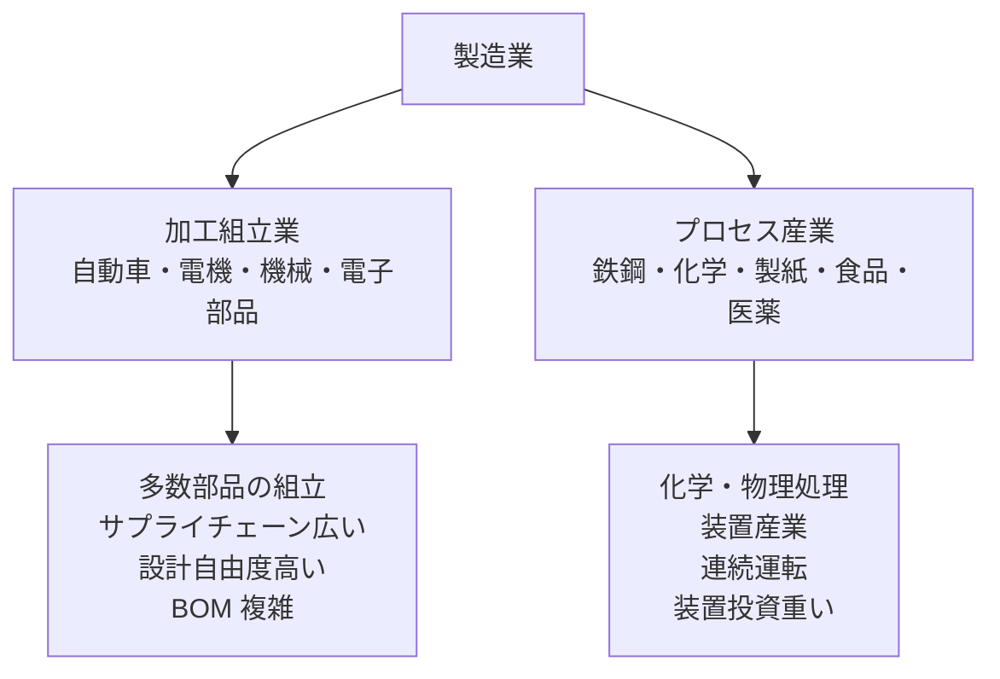
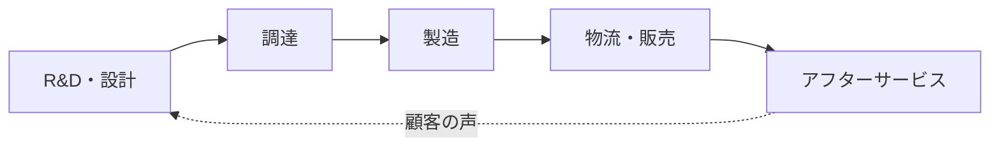
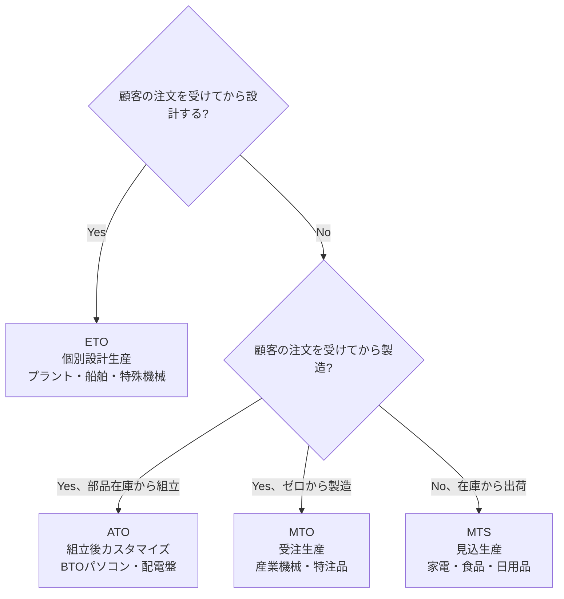
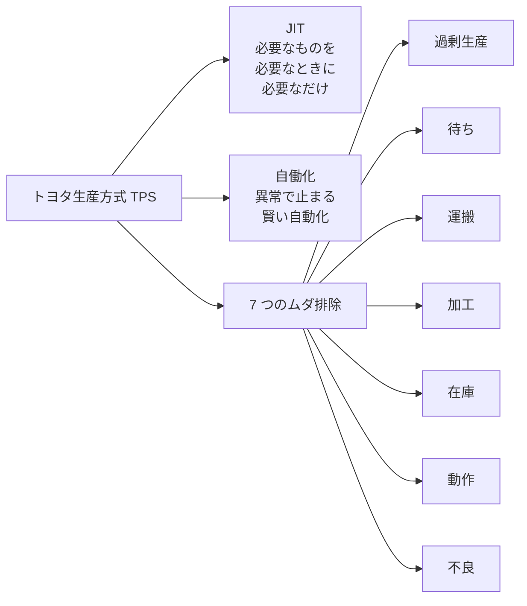
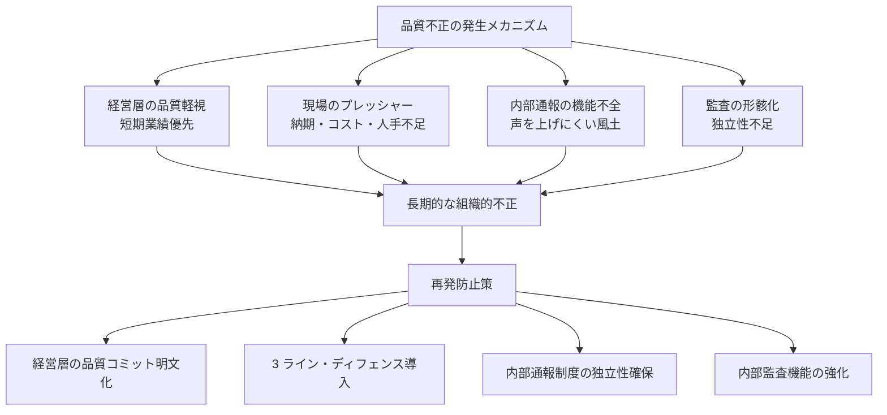
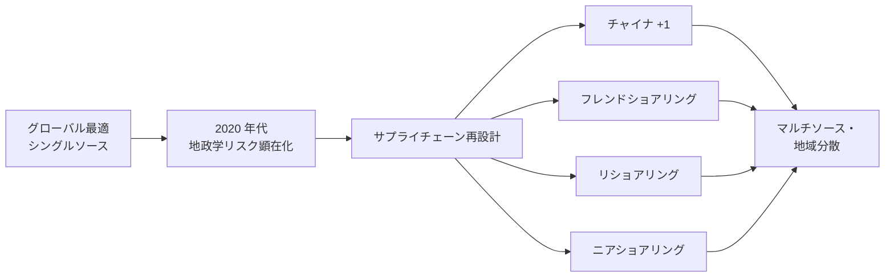
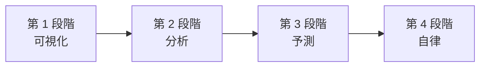

# 製造業のビジネス基礎

業界構造・SCM・品質管理・TPS・スマートファクトリー——転職／担当／提案のための「製造業を読み解く眼鏡」

| 項目 | 内容 |
|---|---|
| カテゴリー | 業種別実務 |
| 難易度 | 中級 |
| 所要時間 | 約200分（全8レッスン） |
| 公開日 | 2026-06-29 |
| 最終更新日 | 2026-06-29 |
| コースURL | https://skillup.college/courses/industry/manufacturing-basics/ |

## 対象者

製造業に転職・配属された事務系・営業・HR・人事・経理・経営企画担当者と、製造業クライアントを担当するコンサル・SIer・金融・銀行・広告代理店・編集者を両方主軸とする。製造業の現場経験はないが「業界としての製造業を読み解きたい」社会人 3 年目以上を対象。製造業に向けた提案・営業を行う方も含む。業種は加工組立業（自動車・電機・機械・電子部品）とプロセス産業（素材・化学・食品・医薬）の両方を扱う。

## 前提知識

社会人 3 年以上を想定。会計の基本（売上・原価・利益の違いがわかる程度）と統計の基本（平均・標準偏差・正規分布の概念）への理解があれば理解が早いが、これらの土台は本コース内で必要範囲を解説する。製造業の現場経験は不要で、業界横断の俯瞰知識として「現場と数字の両輪」を身につける構成。

## 学習目標

- 製造業の業界構造とサブ業界分類（加工組立・プロセス産業）を理解し、自分の関わる業種を位置づけられる
- 製造業のバリューチェーン（設計・調達・製造・物流・アフター）と組織機能を地図化できる
- 生産形態（MTS／MTO／ETO／ATO）と生産計画 PSI、工場 KPI（OEE）を読み解ける
- トヨタ生産方式（TPS）と Lean の思想を理解し、7 つのムダ・JIT・自働化・5S・Kaizen の関係を説明できる
- 品質管理体系（QC 7 つ道具・SQC・TQM・Six Sigma）と品質不正の発生メカニズム・再発防止構造を理解する
- 製造原価の構造（材料費・労務費・経費／直接費・間接費）と標準原価・原価差異分析を読める
- SCM の概念とブルウィップ効果、サプライヤー戦略、BCP と地政学リスクを把握する
- スマートファクトリーと製造業 DX の現在地（インダストリー 4.0・MES・IoT・予知保全・AI ユースケース）を理解する

## コース概要

製造業は GDP の約 20 % を占める日本経済の基幹産業でありながら、業界外の方には「ことば」と「考え方」がわかりにくい世界です。本コースは、製造業に転職・配属された事務系・営業・人事・経理・経営企画の担当者と、製造業クライアントを担当するコンサル・SIer・金融・銀行・編集者の両方を主軸に、製造業を「業界として読み解く眼鏡」を 8 レッスンで提供します。業界構造とサブ業界分類、バリューチェーン、生産形態と生産計画、トヨタ生産方式（TPS）と Lean、品質管理（QC・SQC・TQM・Six Sigma）と品質不正、製造原価と工場 KPI、SCM と地政学リスク、スマートファクトリーと製造業 DX までを扱います。

## 学習の流れ

レッスン 1 で製造業の現在地・サブ業界分類・本コースの 3 視点（転職者／担当者／提案者）を共有します。レッスン 2 で「製造業の全体地図」としてバリューチェーン（設計・調達・製造・物流・アフター）と QCD・5 機能組織を扱います。レッスン 3 〜 6 が「現場と数字の両輪」の本体で、生産形態と PSI（L3）、トヨタ生産方式と Lean（L4）、品質管理と品質不正（L5）、原価管理と工場 KPI（L6）を順に学びます。レッスン 7 で個社を超える論点として SCM と地政学リスクを扱い、レッスン 8 でスマートファクトリーと製造業 DX を扱って締めくくります。製造業の現場経験がない方が、「業界外から内に入ったとき」または「業界外から接するとき」に立ち止まらないための土台を作るコースとして設計しています。

## レッスン一覧

| No. | タイトル | 概要 | 所要時間 |
|---|---|---|---|
| 1 | 製造業の現在地と本コースの守備範囲 | 製造業の定義と日本経済での位置（GDP 約 20 %・輸出構造・就業者構成）、製造業のサブ業界分類（加工組立 vs プロセス、B2C vs B2B、自動車・電機・機械・素材・化学・食品・医薬・電子部品の 9 業種俯瞰）、製造業を取り巻く構造変化（人口減・脱炭素・地政学・DX）、本コースの守備範囲（転職者・担当者・提案者の 3 視点）、現場主義と数字主義の両輪、製造業のことば（OEE・歩留・MRP）が翻訳できる価値を学ぶ | 25分 |
| 2 | 製造業のバリューチェーン——設計・調達・製造・物流の全体地図 | Michael Porter のバリューチェーン概念、製造業の 5 段階（R&D・設計・調達・製造・物流／販売・アフターサービス）、コンカレントエンジニアリングと DfM／DfX、部品表（BOM）の構造、製造業の 3 つの情報流（製品情報・生産情報・販売情報）、川上と川下の関係、QCD（Quality / Cost / Delivery）の三角形、製造業の組織図の典型（製造／品質保証／生産技術／調達／物流の 5 機能）を学ぶ | 25分 |
| 3 | 生産形態と生産計画——MTS／MTO／ETO／ATO と PSI | 生産形態の 4 分類（MTS 見込生産・MTO 受注生産・ETO 個別設計生産・ATO 組立後カスタマイズ）、ライン生産／ロット生産／個別生産／セル生産／連続生産の使い分け、生産計画 PSI（Production-Sales-Inventory）の発想、需要予測と生産能力のバランス、リードタイム（製造／調達／物流）、工場 KPI 入門（OEE = 可用性 × 性能 × 品質・サイクルタイム・タクトタイム・スループット）を学ぶ | 25分 |
| 4 | トヨタ生産方式（TPS）と Lean——日本の製造業を世界に広めた発想 | 大野耐一と TPS の起源（1950 年代〜）、Toyota Way の 2 本柱（JIT と自働化）、7 つのムダ（過剰生産・待ち・運搬・加工・在庫・動作・不良）と 8 つ目のムダ（人の創造性）、平準化（Heijunka）、5S（整理・整頓・清掃・清潔・躾）、Kaizen 文化と現場の改善提案、Womack & Jones『The Machine That Changed the World』1990 年と Lean Manufacturing の世界展開、TPS のソフトウェア・サービス業への波及（リーンスタートアップ・カンバン）、TPS が機能するための前提（経営層の本気と現場の自律）を学ぶ | 25分 |
| 5 | 品質管理（QC・SQC・TQM・Six Sigma）と品質不正——QC 7 つ道具と再発防止 | 品質の定義（Crosby・Juran・Deming の 3 視点）、Deming サイクル PDCA とアメリカ品質賞 MBNQA、QC（Quality Control）と QA（Quality Assurance）の違い、QC 7 つ道具（パレート図・特性要因図／フィッシュボーン・ヒストグラム・散布図・管理図・層別・チェックシート）、新 QC 7 つ道具（言語データ系）、SQC（統計的品質管理）と工程能力指数 Cp/Cpk、Six Sigma の DMAIC（モトローラ 1986・GE Jack Welch）、TQM（全社的品質管理）、製造業品質不正の代表事例（神戸製鋼 2017／三菱電機 2021／日野自動車 2022／ダイハツ 2023）と再発防止構造を学ぶ | 25分 |
| 6 | 原価管理と工場の数字——標準原価・原価差異分析・工場 KPI | 製造原価の 3 区分（材料費・労務費・経費）、直接費と間接費、変動費と固定費、製造原価明細書の構造、標準原価と実際原価の役割、原価差異分析（材料価格差異・材料数量差異・労務時間差異・操業度差異）、在庫評価（先入先出 FIFO・移動平均・総平均）、ABC（Activity-Based Costing）の発想、工場 KPI 詳細（OEE の 3 要素・歩留／良品率・MTBF／MTTR・在庫回転日数）、製造業の財務的特性（高い設備投資・固定費比率・棚卸資産大）、ROIC と製造業の経営指標を学ぶ | 25分 |
| 7 | SCM とサプライチェーン論点——調達から地政学リスクまで | SCM（Supply Chain Management）の概念、ブルウィップ効果と MIT Beer Game の教訓、サプライヤー戦略（系列／日本型／グローバル調達／ローカリゼーション／デュアルソース）、BOM（Bill of Materials）と MRP（Material Requirements Planning）／MRP II ／ERP の系譜、在庫戦略（安全在庫・JIT・VMI・Consignment）、BCP（事業継続計画）と地政学リスク（半導体不足 2020 〜・レアアース・台湾有事・米中デカップリング）、リショアリング／フレンドショアリング／チャイナ +1 ／ニアショアリング、サプライチェーンのサステナビリティ（CO2 排出 Scope 1 〜 3・強制労働・紛争鉱物・CSDDD）、サプライチェーン攻撃を学ぶ | 25分 |
| 8 | スマートファクトリーと製造業 DX——IoT・MES・AI・修了後の継続学習 | インダストリー 4.0（ドイツ 2011 年）と Society 5.0（日本 2016 年）、製造業 DX の現在地（経済産業省 DX 推進指標）、MES（Manufacturing Execution System）の役割と ERP との連携、IoT センサーとデータ収集、エッジコンピューティングと工場ネットワーク、予知保全（Predictive Maintenance）と CBM、デジタルツインと工場シミュレーション、製造業 AI の代表的ユースケース（外観検査・需要予測・設計支援・生産スケジューリング最適化）、スマートファクトリー導入 4 段階（可視化→分析→予測→自律）、製造業のカーボンニュートラル（Scope 1 〜 3・LCA・CBAM）、人材不足と技能伝承への DX 適用、修了後の継続学習方向を学ぶ | 25分 |

---

## レッスン1：製造業の現在地と本コースの守備範囲

（所要時間：25分）

### このレッスンで学ぶこと

- 製造業の定義と、日本経済での位置（GDP 約 20 %・輸出構造・就業者構成）
- 製造業のサブ業界分類（加工組立 vs プロセス産業、B2C vs B2B、9 業種俯瞰）
- 製造業を取り巻く構造変化（人口減・脱炭素・地政学・DX）
- 本コースの守備範囲——転職者・担当者・提案者の 3 視点
- 「現場主義」と「数字主義」の両輪、製造業のことばが翻訳できる価値

---

### 製造業とは何か——日本経済での位置

製造業（Manufacturing Industry）は、原材料や部品を加工・組み立てて製品を作り出す産業です。日本標準産業分類では「製造業」が大分類 E として独立して設定されており、食料品・繊維・化学・鉄鋼・電気機械・輸送用機械など 24 中分類に細分されています。

日本経済における製造業の位置は、いくつかの数字で押さえておきます。経済産業省『ものづくり白書 2024 年版』によれば、製造業の国内総生産（GDP）に占める割合は約 20 % で、サービス業に次ぐ 2 番目の規模を保ち続けています。就業者数では全産業の約 15 %（約 1,000 万人）を占め、輸出額では国全体の約 8 割を製造業の製品が占めます（出典：[経済産業省『ものづくり白書 2024 年版』](https://www.meti.go.jp/report/whitepaper/mono/2024/index.html)）。

「日本のものづくり」という言葉が広く語られる背景には、こうした実体経済での比重と、戦後の高度経済成長期から続く競争力の蓄積があります。一方、製造業は世界全体で見れば中国・ドイツ・米国・インドといった国々と激しく競合する産業であり、サービス業の比率が高い英国・米国型経済とは異なる構造を持ちます。

> **💡 ポイント**
> 製造業は、日本経済の GDP の約 20 %、就業者の約 15 %、輸出額の約 8 割を占める基幹産業です。サービス業中心の経済とは違う「ものを作る」ことの重さが、業界の文化と仕事の流儀を決めています。

製造業の特徴は、「投資の重さ」と「時間の長さ」にあります。工場と設備への投資は数十億〜数千億円規模になり、回収には数年〜十数年を要します。製品の開発から市場投入までは数ヶ月〜数年かかり、サプライヤーや販売チャネルとの関係は数十年単位で継続します。サービス業やソフトウェア業の「ローンチして反応を見る」発想とは、時間軸が根本的に異なります。

---

### 製造業のサブ業界分類——9 業種の俯瞰

「製造業」とひとくくりに語られますが、実際は性質の異なる複数のサブ業種で構成されます。本コースで扱う主要 9 業種を整理します。サブ業種ごとに製品の特性、顧客、競争構造、KPI が異なるため、自分が関わる業種がどこに位置するかを意識しておきます。

第 1 のグループは「加工組立業」です。部品を加工し、組み立てて完成品を作る業種です。自動車（トヨタ・ホンダ・日産など）、電気機械（パナソニック・ソニー・三菱電機など）、産業機械（ファナック・キーエンス・コマツなど）、電子部品（村田製作所・京セラ・TDK など）が含まれます。製品の設計自由度が高く、サプライヤーから多数の部品を集めて組み立てる構造のため、サプライチェーンの広さと深さが競争力を決めます。

第 2 のグループは「プロセス産業」（または素材産業・装置産業）です。化学反応や物理的処理によって原料を変換する業種です。鉄鋼（日本製鉄・JFE スチール・神戸製鋼など）、化学（三菱ケミカル・住友化学・東レなど）、製紙、ガラス、セメント、石油精製、医薬品、食品が含まれます。製品の組成や物性で差別化し、装置・プラントへの設備投資が圧倒的に重く、24 時間連続運転が標準的な業界です。

加工組立業とプロセス産業の違いは、本コース全体で繰り返し参照する重要な分類軸です。生産形態、品質管理、原価構造、KPI、TPS の適用範囲などが、両者で大きく異なります。



図1：製造業の 2 大分類。加工組立業とプロセス産業は、生産形態・KPI・サプライチェーン構造がすべて異なる

もう 1 つの分類軸が「顧客の種類」です。B2C 製造業は最終消費者に製品を届ける業種で、自動車、家電、食品、医薬品、化粧品などが該当します。B2B 製造業はほかの企業に部品・素材・設備を提供する業種で、電子部品、鉄鋼、化学、産業機械、半導体製造装置などが該当します。両者では販売チャネル、ブランディング、開発サイクル、マーケティングの考え方が大きく異なります。

> **📝 補足**
> 同じ会社の中でも、B2C 事業と B2B 事業を併せ持つメーカーがあります。例えば、パナソニックは家電（B2C）と FA／車載部品（B2B）の両方を持ち、ソニーはエンタテインメント（B2C 軸）と半導体（B2B 軸）を持ちます。「○○メーカー」と言うときに、どちらの事業を指しているかを意識すると会話の精度が上がります。

---

### 製造業を取り巻く 4 つの構造変化

2026 年現在、日本の製造業を取り巻く環境は、複数の構造変化が同時進行しています。それぞれの変化が、本コースのレッスン 7・8 で扱う SCM・スマートファクトリーの議論につながります。

第 1 の変化は、人口減と人材不足です。日本の生産年齢人口は 2000 年代から減少が続いており、製造業の現場では技能伝承の課題、若手採用の難航、外国人技能実習生への依存、自動化への投資加速といった対応が進んでいます。経済産業省の『ものづくり白書』も、人材確保を最重要課題の一つとして毎年取り上げています。

第 2 の変化は、脱炭素・カーボンニュートラルです。日本政府は 2020 年に「2050 年カーボンニュートラル」を宣言し、製造業には Scope 1（自社排出）・Scope 2（電力由来）・Scope 3（サプライチェーン排出）の削減が求められるようになりました。EU の CBAM（炭素国境調整措置）が 2023 年 10 月に移行期間で開始し、2026 年から本格課金期間に入っています。輸出依存度の高い日本の製造業にとって、これは重大な変化です。

第 3 の変化は、地政学リスクとサプライチェーンの再設計です。2020 年代に入り、米中デカップリング、半導体不足、ロシアのウクライナ侵攻、台湾有事懸念、レアアース供給リスクなどが連続して顕在化しました。「最も安いところから調達する」グローバル最適から、「リスクを分散して継続性を確保する」フレンドショアリング・リショアリングへの転換が進んでいます。

第 4 の変化は、デジタル化と製造業 DX です。インダストリー 4.0（ドイツ 2011 年）の影響を受け、日本でも Society 5.0 が提唱され、IoT センサー、MES、AI 外観検査、デジタルツインなどの導入が進んでいます。経済産業省は『DX レポート 2.0』『同 2.1』で製造業の DX 推進を強く促しており、2025 年の崖（レガシーシステムが事業継続を阻害する状態）への対応が焦点になっています。

> **⚠️ 注意**
> 4 つの変化は独立ではなく、相互に絡みます。例えば、脱炭素対応はサプライヤー選定（Scope 3）に影響し、地政学リスクは半導体供給の再設計を促し、それが工場の DX 投資判断に跳ね返ります。「個別の論点」ではなく「重なり合う変化」として捉える視点が、本コース全体の前提です。

---

### 本コースの守備範囲——転職者・担当者・提案者の 3 視点

本コースは、製造業の現場経験がない方を主な対象とします。3 つの視点から、それぞれの立場の方が「最初の半年で必要になる知識」を扱います。

第 1 の視点は、転職者・配属者です。製造業の事業会社に転職した、または配属になった事務系・営業・人事・経理・経営企画の担当者を指します。製造業の業界用語と思考様式に触れる中で、現場のマネジャーや技術者との会話に必要な共通言語を持ちたい層です。

第 2 の視点は、担当者です。コンサル、SIer、金融、銀行、広告代理店、出版・編集者などで製造業のクライアントを担当する方を指します。クライアントの事業構造と KPI を理解し、提案や対話の質を上げたい層です。

第 3 の視点は、提案者です。製造業に向けて IT サービス、コンサルティング、人材紹介、広告サービスなどを提案する営業職を指します。製造業の意思決定プロセスと予算サイクル、関係者の役割を理解し、商談を進めたい層です。

3 視点に共通するのは、「製造業のことば」と「考え方」を翻訳できる必要があることです。OEE、歩留、MRP、TPS、SQC、BOM——こうした用語が当たり前に飛び交う会議で、何が議論されているかを理解できる土台を、本コースで作ります。

> **🔰 初学者の方へ**
> 本コースは、製造業の現場経験がなくても理解できるよう、すべての専門用語に説明を添えます。「現場の写真を見たこともない」「工場に入ったことがない」という方も、業界の論理と数字の読み方を学ぶことで、製造業の方々との会話が成立するようになります。逆に、製造業ですでに 10 年以上現場経験のある方には、本コースは入門レベルの内容になります。

本コースが**扱わない**領域も明確にしておきます。

- 個別業種の深掘り（自動車・電機・半導体・食品・医薬の業界レポート相当の詳細）は扱いません。業種横断の俯瞰に留め、個別業種の特化深掘りは将来のカテゴリ別コースに譲ります
- 工場の現場オペレーション（具体的な作業手順、設備の操作、安全管理の実務）は扱いません。これらは現場 OJT で身につける領域です
- 個別の規制・法令の代理判断（労働安全衛生法・PL 法・薬機法・食品衛生法など）は扱いません。これらは弁護士・社労士の独占業務であり、本コースは「誰に何をいつ相談するか」の判断軸を作るに留めます
- 資格試験対策（中小企業診断士・QC 検定・生産管理士など）は扱いません。試験合格は専門教材に譲り、本サイトは「実務で使える知識と思考の型」に集中します

---

### 「現場主義」と「数字主義」の両輪

製造業を理解する上で、本コースが繰り返し強調する 2 つの軸があります。「現場主義」と「数字主義」の両輪です。

現場主義は、「現場を見ずに語らない」という発想です。製造業では、机上の論理だけで判断すると現場の制約を見落とし、結果として実行できない計画になります。トヨタ自動車の「現地現物」（げんちげんぶつ）という言葉が示すように、現場に足を運び、現物を見て、現実に基づいて判断するのが製造業の鉄則です。

数字主義は、「現場の感覚を数字で裏付ける」という発想です。製造業では、OEE、歩留、サイクルタイム、リードタイム、原価差異など、多数の KPI が日次・週次・月次で集計されます。「感覚的にうまくいっている／いない」の議論を、数字で具体化することが意思決定の質を高めます。

この 2 つの軸は、対立するものではなく両輪です。現場だけ見て数字を見ない判断は、再現性のある改善につながりません。数字だけ見て現場を見ない判断は、現場の制約を見落として実行不能な計画になります。

> **💡 ポイント**
> 「現場と数字の両輪」は本コースのキーフレーズです。製造業のことばを翻訳できるようになるためには、現場の論理（TPS・5S・Kaizen など）と数字の論理（OEE・歩留・原価差異など）の両方を理解する必要があります。

製造業に転職した事務系・営業の方が「現場に出向く」と言うとき、それは儀礼的な訪問ではありません。製品が作られている現場を観察し、現場の方の動きを見て、設備の音を聞き、製品の触感を確かめる行為です。同様に、製造業のクライアントを担当するコンサル・SIer の方が「数字を読む」と言うとき、それは財務諸表の数字だけではなく、工場 KPI（OEE、歩留、在庫回転日数など）まで含めて読むことを指します。

---

### 製造業のことばが翻訳できる価値

本コースを通じて身につく「製造業のことばを翻訳できる」能力は、現場でどう活きるか。具体的なシーンで考えてみます。

**シーン 1：転職者の最初の会議**——製造業に転職した経営企画担当者が、初めての生産会議に参加します。「先月の OEE が前月比 3 ポイント低下、主因は性能低下（チョコ停の増加）です」「歩留は安定していますが、MTTR が悪化傾向です」——こうした発言が並ぶ会議で、何が議論されているかが理解できれば、議事録を取るだけの存在から、議論に参加できる存在に変わります。

**シーン 2：コンサルの提案準備**——製造業クライアント向けの SCM 改革提案を準備するコンサルタントが、クライアントの現場ヒアリングに臨みます。「ETO 中心の事業構造で、MRP の精度が低く、安全在庫が膨らんでいる」と聞いて、生産形態と SCM の関係を即座に理解できれば、深いヒアリングと精度の高い提案に直結します。

**シーン 3：金融機関の融資判断**——製造業の中堅企業に対する融資審査を担当する銀行担当者が、決算書を読みます。「固定費比率が高く、稼働率の変動が利益を直撃する事業構造。直近の OEE 改善トレンドは好材料」と読めれば、機械的な財務指標分析を超えた事業理解に基づく判断ができます。

**シーン 4：広報・編集者のメディア対応**——製造業の広報担当者または取材する記者が、「インダストリー 4.0」「カーボンニュートラル」「サプライチェーン強靭化」といったテーマで議論します。業界の文脈と用語が頭に入っていれば、表面的な記事を超えた深い情報発信が可能になります。

> **📝 補足**
> 「製造業のことばが翻訳できる」価値は、製造業の中に閉じません。製造業の知識を持つコンサルタント、金融担当者、人事、編集者、IT エンジニアは、製造業との接点を持つあらゆる職種で重宝されます。日本経済の基幹産業を相手にできることは、キャリア全体の選択肢を広げる投資です。

---

### まとめ

このレッスンでは、以下のことを学びました。

- 製造業は日本経済の GDP の約 20 %、就業者の約 15 %、輸出額の約 8 割を占める基幹産業
- 製造業は「加工組立業」と「プロセス産業」の 2 大分類で構造が大きく異なる
- 9 業種俯瞰（自動車・電機・機械・電子部品／鉄鋼・化学・製紙・食品・医薬）と B2C／B2B の分類軸を持つ
- 製造業は人口減・脱炭素・地政学・DX の 4 つの構造変化に直面している
- 本コースは転職者・担当者・提案者の 3 視点で、製造業のことばを翻訳できる土台を作る
- 「現場主義」と「数字主義」の両輪が、製造業を理解する核心
- 個別業種の深掘り・現場オペレーション・規制判断・資格対策は本コースの対象外

次のレッスンでは、製造業の「全体地図」としてバリューチェーンを扱います。Michael Porter のバリューチェーン概念、製造業の 5 段階（設計・調達・製造・物流・アフター）、BOM、QCD、製造業の 5 機能組織を順に学びます。

---

### 確認クイズ

このレッスンの理解度をチェックしましょう。

#### Q1. 製造業の日本経済での位置について、本レッスンの説明と合致するものはどれですか？

- [x] GDP の約 20 %、就業者の約 15 %、輸出額の約 8 割を占める基幹産業
- [ ] GDP の約 50 %、就業者の約 30 %、輸出額の約 5 割を占める基幹産業
- [ ] GDP の約 5 %、就業者の約 3 %、輸出額の約 1 割を占める衰退産業
- [ ] GDP の約 80 %、就業者の約 80 %、輸出額の約 100 % を占める唯一の基幹産業

> **解説**
> 経済産業省『ものづくり白書 2024 年版』によれば、製造業は GDP の約 20 %、就業者の約 15 %、輸出額の約 8 割を占めます。サービス業に次ぐ第 2 の規模を保ち続けており、日本経済の基幹産業として機能しています。

#### Q2. 加工組立業とプロセス産業の違いについて、本レッスンの説明と合致するものはどれですか？

- [ ] 加工組立業は B2B、プロセス産業は B2C と決まっている
- [x] 加工組立業は多数部品の組立で BOM が複雑、プロセス産業は化学・物理処理が中心で装置投資が重い
- [ ] 加工組立業は中小企業のみ、プロセス産業は大企業のみ
- [ ] 加工組立業は日本のみ、プロセス産業は海外のみ

> **解説**
> 加工組立業（自動車・電機・機械・電子部品など）は多数の部品を組み立てる構造で、BOM（部品表）が複雑になり、サプライチェーンが広いのが特徴です。プロセス産業（鉄鋼・化学・製紙・食品・医薬など）は化学・物理処理が中心で、装置・プラントへの投資が重く、24 時間連続運転が標準です。

#### Q3. 製造業を取り巻く 4 つの構造変化として、本レッスンで挙げたものはどれですか？

- [ ] 人口増・温暖化加速・国際協調強化・アナログ回帰
- [ ] 円高加速・脱税問題・株主軽視・終身雇用復活
- [x] 人口減・脱炭素・地政学リスク・デジタル化（DX）
- [ ] 規制撤廃・株主重視・ハードウェア重視・国内回帰のみ

> **解説**
> 4 つの構造変化は、人口減と人材不足、脱炭素・カーボンニュートラル、地政学リスクとサプライチェーン再設計、デジタル化と製造業 DX です。これらは独立ではなく相互に絡み合い、本コースのレッスン 7・8 で扱う SCM・スマートファクトリーの議論につながります。

#### Q4. 本コースの守備範囲として「扱わない」と明示されたものはどれですか？

- [ ] 製造業のサブ業界分類
- [ ] バリューチェーンの全体地図
- [ ] トヨタ生産方式と Lean の体系
- [x] 個別業種の深掘り・現場オペレーション・規制の代理判断・資格対策

> **解説**
> 本コースは業種横断の俯瞰知識を扱い、個別業種の深掘り（自動車・電機の業界レポート相当）、工場の現場オペレーション、個別の規制・法令の代理判断、資格試験対策は扱いません。これらは別の専門教材や OJT、専門家への相談、資格専門の教材で扱う領域です。

#### Q5. 「現場主義」と「数字主義」の両輪について、本レッスンの説明と合致するものはどれですか？

- [ ] 現場主義だけが正しく、数字主義は誤り
- [ ] 数字主義だけが正しく、現場主義は古い発想
- [ ] 現場主義と数字主義は対立する考え方で、どちらかを選ぶ必要がある
- [x] 現場主義（現地現物）と数字主義（KPI）は両輪で、片輪では走れない

> **解説**
> 現場主義（現地現物・現場で観察して判断する）と数字主義（OEE・歩留・原価差異などの KPI で具体化する）は対立ではなく両輪です。現場だけ見て数字を見ない判断は再現性につながらず、数字だけ見て現場を見ない判断は実行不能な計画になります。本コース全体で繰り返し参照する重要な軸です。

#### Q6. 本コースが対象とする「転職者・担当者・提案者の 3 視点」のうち、「担当者」に該当する例はどれですか？

- [ ] 製造業に転職した経営企画担当者
- [x] 製造業クライアントを担当するコンサル・SIer・金融・銀行・編集者
- [ ] 製造業向けに IT サービスや人材紹介を提案する営業職
- [ ] 製造業の工場で現場作業を行う技能職

> **解説**
> 「担当者」は、コンサル、SIer、金融、銀行、広告代理店、出版・編集者などで製造業のクライアントを担当する方を指します。「転職者」は製造業に転職・配属された事務系・営業・人事・経理・経営企画担当者、「提案者」は製造業に向けて営業する方を指します。工場の現場作業を行う技能職は本コースの主たる対象ではありません。

---

## レッスン2：製造業のバリューチェーン——設計・調達・製造・物流の全体地図

（所要時間：25分）

### このレッスンで学ぶこと

- Michael Porter のバリューチェーン概念と、製造業への適用
- 製造業のバリューチェーン 5 段階（R&D・設計／調達／製造／物流・販売／アフター）
- 部品表（BOM）の構造と、製造業の 3 つの情報流
- QCD（Quality／Cost／Delivery）の三角形と、製造業の意思決定軸
- 製造業の典型的な組織図（5 機能：製造／品質保証／生産技術／調達／物流）

---

前回のレッスンでは、製造業の業界構造とサブ業界分類、本コースの 3 視点と「現場主義・数字主義の両輪」を扱いました。今回は、製造業の全体地図として「バリューチェーン」を扱います。

### バリューチェーン概念——Michael Porter の発想

バリューチェーン（Value Chain、価値連鎖）は、ハーバード・ビジネス・スクールの Michael Porter が 1985 年の著書『Competitive Advantage』で提示した概念です。企業の活動を「主活動」と「支援活動」に分け、それぞれの活動でどう価値を付加し、コストを発生させているかを可視化する枠組みです。

Porter のオリジナルのバリューチェーンは、主活動として「購買物流・製造・出荷物流・販売・サービス」の 5 つを、支援活動として「全般管理・人事・技術開発・調達」の 4 つを置きます。主活動は製品やサービスの流れに沿った機能、支援活動は主活動を支える横断的な機能です。

製造業に適用する場合、Porter のオリジナルを少し再構成して、「R&D・設計／調達／製造／物流・販売／アフターサービス」の 5 段階で語るのが実務的にわかりやすい整理です。本コースではこの 5 段階を製造業のバリューチェーンとして扱います。

> **💡 ポイント**
> バリューチェーンは「全体像を地図化する」道具です。製造業の業務がどの段階に属するか、自分が関わる部分が川上・川中・川下のどこにあるかを意識することで、ビジネスの構造が見通せるようになります。

---

### 製造業のバリューチェーン 5 段階

製造業のバリューチェーンを、川上から川下に向かって 5 段階で整理します。各段階の役割と主要なアウトプット、関わる部門を順に押さえます。

#### 第 1 段階：R&D・設計

R&D（研究開発、Research and Development）は、新製品・新技術の研究と、製品設計を行う段階です。基礎研究・応用研究・製品開発・設計の 4 層に区分されることが一般的で、製品が「世に出る前」の活動を含みます。

設計（Design）は、市場ニーズと技術シーズを統合して、製品の仕様と図面を作成する活動です。機械設計、電気設計、ソフトウェア設計、機構設計、意匠設計などの分野に区分されます。設計段階で決まることが多く、「製造原価の 7 割以上が設計段階で決まる」というのが業界で広く共有された経験則です。

#### 第 2 段階：調達

調達（Procurement / Purchasing）は、製造に必要な原材料、部品、設備、サービスを外部から取得する活動です。サプライヤーの選定、価格交渉、納期管理、品質保証契約、サプライヤー監査などを担います。

製造業の原価の大半は購入品で構成されるため、調達の巧拙が利益率を大きく左右します。日本の完成車メーカーでは、原価に占める購入品比率が 70 〜 80 % に達するケースが一般的です。

#### 第 3 段階：製造

製造（Manufacturing / Production）は、原材料と部品を加工・組み立てて完成品にする活動です。工程設計、生産計画、現場オペレーション、設備保全、品質管理が含まれます。製造業の「中核」であり、工場という物理的な拠点で実行される段階です。

製造の良し悪しは、QCD（後述）の 3 軸で評価されます。狙った品質を、目標コストで、要求された納期に作れるかが、製造の総合力です。

#### 第 4 段階：物流・販売

物流（Logistics）は、完成品を顧客に届けるまでの輸送、保管、在庫管理を行う活動です。社内物流（工場間・倉庫間）と社外物流（顧客への配送）に区分されます。

販売（Sales）は、製品を顧客に売る活動です。B2C 製造業では小売店や EC を経由した最終消費者向け販売、B2B 製造業では企業間取引（営業担当者による直接販売、商社経由、代理店経由など）が中心です。

#### 第 5 段階：アフターサービス

アフターサービス（After Sales Service）は、製品が顧客に届いた後の保守、修理、消耗品供給、顧客サポート、リコール対応を行う活動です。家電・自動車・産業機械などでは、アフターサービスが収益の大きな柱になります。

近年は「サーキュラーエコノミー（循環型経済）」の発想で、回収・リユース・リサイクルまでをバリューチェーンに含める考え方も広がっています。



図1：製造業のバリューチェーン 5 段階。アフターサービスから R&D へのフィードバックが、製品改良の起点になる

---

### コンカレントエンジニアリングと DfM／DfX

設計段階で「製造のしやすさ」「コストの低さ」を考慮する発想が、近代製造業では標準化しています。代表的な概念を 2 つ整理します。

第 1 は、コンカレントエンジニアリング（Concurrent Engineering、同時並行設計）です。設計部門が単独で図面を完成させてから製造部門に渡すのではなく、設計の初期段階から製造・調達・品質保証・物流・営業の各部門が参画して、同時並行で議論を進める手法です。1990 年代以降、加工組立業を中心に広く採用されています。

第 2 は、DfM（Design for Manufacturing、製造性を考慮した設計）と DfX（Design for X、X を考慮した設計）です。X には「組立性（Assembly）」「品質（Quality）」「コスト（Cost）」「環境（Environment）」「リサイクル性（Recyclability）」などが入り、それぞれの観点を設計段階で組み込みます。

> **📝 補足**
> 「製造原価の 7 割以上が設計段階で決まる」という経験則は、製造業の意思決定構造を表しています。製造工程に入ってからのコスト削減には限界があり、本質的なコスト改善は設計段階で実現するという発想です。コンサルや IT サービスを提案する場合も、「設計段階に踏み込めるかどうか」が提案の価値を大きく左右します。

---

### 部品表（BOM）の構造

製造業の中核的なデータ構造として、部品表（BOM、Bill of Materials）があります。BOM は「ある製品を作るのに、どの部品が何個、どの順序で必要か」を構造化したデータです。

加工組立業では、完成品 1 台を作るのに数千〜数万の部品が必要になります。例えば自動車 1 台は約 3 万点の部品で構成されると言われます。これらの部品をすべて、階層構造で整理したものが BOM です。

BOM は、主に 3 つの種類があります。

- 設計 BOM（E-BOM、Engineering BOM）：設計部門が作成し、製品の論理的な構造を表す
- 製造 BOM（M-BOM、Manufacturing BOM）：製造部門が使用し、製造順序・工程・代替部品などの実務情報を含む
- 販売 BOM（S-BOM、Sales BOM）：販売・サービス部門が使用し、顧客への提案・修理用部品リストとして機能

3 つの BOM の整合性を保つことが、製造業の情報システムの中心課題です。MRP（Material Requirements Planning、レッスン 7 で扱います）や ERP は、BOM を基盤にして在庫・調達・生産計画を連動させます。

> **⚠️ 注意**
> BOM の整合性が崩れていると、「設計上は存在するのに製造現場では使えない部品」「販売した後に修理用部品が手配できない」といった深刻な問題が発生します。製造業の DX 案件では、BOM 統合・PLM（Product Lifecycle Management）の整備が大きなテーマになることが頻繁にあります。

---

### 製造業の 3 つの情報流

製造業には、3 種類の情報の流れが同時に走っています。それぞれの情報流が、バリューチェーンの段階を横断して関係者をつなぎます。

第 1 は、製品情報流です。R&D から設計、製造、販売、アフターサービスまで、製品の仕様・図面・BOM・性能データ・トラブル履歴が流れます。PLM システムが情報流の基盤です。

第 2 は、生産情報流です。需要予測から生産計画、調達計画、製造実績、在庫管理までの情報が流れます。ERP・MES・MRP が情報流の基盤です。

第 3 は、販売情報流です。受注、出荷、請求、回収、顧客クレーム、市場ニーズの情報が流れます。CRM・SFA・BI が情報流の基盤です。

3 つの情報流が「分断されているか、統合されているか」が、製造業の業務効率を大きく左右します。多くの中堅・大手製造業の DX 案件は、この 3 つの情報流の統合を中心テーマにしています。

---

### QCD の三角形——製造業の意思決定軸

製造業の現場では、Q（Quality、品質）、C（Cost、コスト）、D（Delivery、納期）の頭文字を取った「QCD」が、意思決定の基本軸として日常的に使われます。3 つの要素は相互にトレードオフの関係にあり、すべてを同時に最大化することはできません。

- 品質を上げようとすると、コストが上がり、納期も伸びる
- コストを下げようとすると、品質や納期が犠牲になる
- 納期を縮めようとすると、品質低下やコスト増を招く

QCD の三角形は、「優先順位を意識的に選ぶ」発想の道具です。試作品の段階では Q を優先し、量産品では C と D のバランスを取り、緊急対応では D を優先するといった具合に、状況に応じて軸の重み付けを変えます。

> **💡 ポイント**
> 製造業の会議で「QCD のどこを優先するか」が議論されたら、それは「3 つすべてを同時に最大化はできない」という前提に基づく議論です。新規参入者は「すべて最高を求める」発想を持ち込みがちですが、製造業では「優先軸を明示的に選ぶ」のが大人の議論です。

QCD に S（Safety、安全）と E（Environment、環境）を加えて、QCDSE と呼ぶこともあります。労働安全衛生や環境配慮が経営課題化した近年では、QCDSE のフレームで議論する企業が増えています。

---

### 製造業の典型的な組織図——5 機能の整理

製造業の事業会社の組織図は、複雑に見えますが、骨格は 5 つの機能で整理できます。事業会社に転職した方や、製造業クライアントを担当する方が、組織図を読むための基本構造です。

第 1 機能は、製造（Production）です。工場の現場で製品を作る部門で、組立、加工、検査、設備保全などが含まれます。製造業の中で最も人員規模が大きい部門です。

第 2 機能は、品質保証（QA、Quality Assurance）です。製品の品質を組織的に保証する部門で、品質基準の策定、不良対応、サプライヤー品質監査、品質クレーム対応などを担います。QA と QC（品質管理、Quality Control）の違いはレッスン 5 で詳しく扱います。

第 3 機能は、生産技術（Production Engineering）です。製造工程の設計、設備の選定・導入、生産ラインの改善、新製品の量産立ち上げを担う部門です。設計部門と製造部門の橋渡しをする「技術系の参謀役」とも言われます。

第 4 機能は、調達（Procurement）です。部品・原材料・設備・サービスの購入を担う部門で、サプライヤー選定、価格交渉、納期管理、サプライヤー監査を行います。「購買部」「資材部」と呼ばれることもあります。

第 5 機能は、物流（Logistics）です。社内物流（工場間・倉庫間）と社外物流（顧客への配送）を担う部門で、輸送、倉庫管理、在庫管理を行います。「物流部」「ロジスティクス本部」と呼ばれます。

これら 5 機能の上に、設計（Design）、R&D、営業・販売（Sales）、マーケティング、経営企画、人事、経理、IT などの全社機能が乗ります。5 機能はあくまで「製造業の中核」であり、事業会社の組織図全体ではありません。

> **📝 補足**
> 中小製造業では、5 機能が独立した部門になっておらず、複数機能を 1 つの部門が兼ねていることがあります。一方、大手製造業では、5 機能のそれぞれが本部レベルの大組織になっており、本部長クラスが取締役に就いていることが一般的です。組織図の粒度は企業規模と業種により大きく異なります。

---

### まとめ

このレッスンでは、以下のことを学びました。

- バリューチェーンは Michael Porter が 1985 年に提示した枠組みで、企業活動を主活動と支援活動に分けて可視化する
- 製造業のバリューチェーンは「R&D・設計／調達／製造／物流・販売／アフターサービス」の 5 段階
- 製造原価の 7 割以上が設計段階で決まるため、コンカレントエンジニアリングと DfM／DfX が重要
- BOM（部品表）には設計 BOM・製造 BOM・販売 BOM の 3 種類があり、整合性が業務効率を左右する
- 製造業には製品情報流・生産情報流・販売情報流の 3 つの情報流が並走する
- QCD（品質・コスト・納期）の三角形が製造業の意思決定軸で、すべて同時最大化はできない
- 製造業の典型的な組織は 5 機能（製造・品質保証・生産技術・調達・物流）で骨格を捉えられる

次のレッスンでは、製造業の現場でどう「ものを作るか」の根本的な選択である、生産形態と生産計画を扱います。MTS／MTO／ETO／ATO の 4 分類、PSI、リードタイム、工場 KPI 入門（OEE）を順に学びます。

---

### 確認クイズ

このレッスンの理解度をチェックしましょう。

#### Q1. 製造業のバリューチェーンの 5 段階として、本レッスンで挙げたものはどれですか？

- [x] R&D・設計／調達／製造／物流・販売／アフターサービス
- [ ] 設計・営業・経理・人事・総務
- [ ] 仕入・販売・配送・回収・廃棄
- [ ] 採用・育成・配置・評価・退職

> **解説**
> 製造業のバリューチェーンは、Porter のオリジナルを再構成して「R&D・設計／調達／製造／物流・販売／アフターサービス」の 5 段階で整理するのが実務的にわかりやすい整理です。各段階で価値が付加され、コストが発生します。

#### Q2. 「製造原価の 7 割以上が設計段階で決まる」という業界の経験則について、本レッスンの説明と合致するものはどれですか？

- [ ] 設計段階のコストが全体の 7 割を占める
- [x] 製造工程に入ってからのコスト削減には限界があり、本質的なコスト改善は設計段階で実現する
- [ ] 7 割の製品は設計段階で廃棄される
- [ ] 設計者の人件費が製造原価の 7 割を占める

> **解説**
> 設計段階で部品構成・工程・材料が決まり、製造工程に入ってからのコスト削減には限界があるため、本質的なコスト改善は設計段階で実現するという発想です。コンカレントエンジニアリングと DfM／DfX は、この経験則を背景にした設計手法です。

#### Q3. BOM（部品表）の 3 種類として、本レッスンで挙げたものはどれですか？

- [ ] 大 BOM・中 BOM・小 BOM
- [ ] 標準 BOM・特別 BOM・カスタム BOM
- [x] 設計 BOM（E-BOM）・製造 BOM（M-BOM）・販売 BOM（S-BOM）
- [ ] 国内 BOM・海外 BOM・グローバル BOM

> **解説**
> BOM の 3 種類は、設計 BOM（E-BOM、Engineering BOM、設計部門が作成）、製造 BOM（M-BOM、Manufacturing BOM、製造部門が使用）、販売 BOM（S-BOM、Sales BOM、販売・サービス部門が使用）です。3 つの BOM の整合性を保つことが、製造業の情報システムの中心課題です。

#### Q4. QCD の三角形について、本レッスンの説明と合致するものはどれですか？

- [ ] Q（品質）・C（コスト）・D（納期）は独立しており、すべて同時に最大化できる
- [ ] Q・C・D のうち、品質だけが最重要で、コストと納期は考慮しない
- [ ] Q・C・D のうち、納期だけが最重要で、品質とコストは考慮しない
- [x] Q・C・D は相互にトレードオフの関係で、優先順位を意識的に選ぶ必要がある

> **解説**
> QCD（Quality・Cost・Delivery）は相互にトレードオフの関係で、すべてを同時に最大化することはできません。試作品では Q を優先し、量産品では C と D のバランスを取り、緊急対応では D を優先するなど、状況に応じて優先軸を選ぶのが製造業の意思決定の作法です。

#### Q5. 製造業の典型的な組織の 5 機能として、本レッスンで挙げたものはどれですか？

- [ ] 営業・マーケティング・経理・人事・総務
- [ ] 経営企画・財務・法務・IT・広報
- [x] 製造・品質保証（QA）・生産技術・調達・物流
- [ ] 取締役会・監査役・経営会議・部長会・課長会

> **解説**
> 製造業の中核的な組織機能は、製造（Production）、品質保証（QA）、生産技術（Production Engineering）、調達（Procurement）、物流（Logistics）の 5 つで骨格を捉えられます。これらの上に設計、R&D、営業・販売、マーケティング、経営企画、人事、経理、IT などの全社機能が乗ります。

#### Q6. 製造業の 3 つの情報流として、本レッスンで挙げたものはどれですか？

- [ ] 株主情報流・取引先情報流・社員情報流
- [ ] 国内情報流・海外情報流・グローバル情報流
- [ ] 公式情報流・非公式情報流・暗黙知情報流
- [x] 製品情報流（PLM）・生産情報流（ERP/MES/MRP）・販売情報流（CRM/SFA/BI）

> **解説**
> 製造業には 3 種類の情報流が同時に走ります。製品情報流（PLM で管理、製品の仕様・図面・BOM・性能データ）、生産情報流（ERP・MES・MRP で管理、需要予測・生産計画・調達計画・実績）、販売情報流（CRM・SFA・BI で管理、受注・出荷・請求・顧客クレーム）です。3 つの統合度が業務効率を左右します。

---

## レッスン3：生産形態と生産計画——MTS／MTO／ETO／ATO と PSI

（所要時間：25分）

### このレッスンで学ぶこと

- 生産形態の 4 分類（MTS／MTO／ETO／ATO）と、それぞれが向く製品・業種
- ライン生産・ロット生産・個別生産・セル生産・連続生産の使い分け
- 生産計画 PSI（Production-Sales-Inventory）の発想と、需要予測・生産能力のバランス
- リードタイム（製造／調達／物流）の概念
- 工場 KPI 入門——OEE（可用性 × 性能 × 品質）・サイクルタイム・タクトタイム・スループット

---

前回のレッスンでは、製造業のバリューチェーン 5 段階と 5 機能組織、QCD の三角形を扱いました。今回は、製造業の現場で「どう作るか」の根本的な選択である、生産形態と生産計画を扱います。

### 生産形態の 4 分類——MTS／MTO／ETO／ATO

製造業の生産形態は、「いつ何を作り始めるか」という視点で 4 つに分類されます。それぞれの形態は、製品の特性、顧客のニーズ、業界の構造によって選ばれます。

#### MTS（Make to Stock、見込生産）

MTS は、需要を予測して、注文を受ける前に製品を作り、在庫として保有する生産形態です。家電、食品、日用品、書籍など、多数の顧客が同じ仕様の製品を購入する B2C 製品の多くは MTS です。

利点は、顧客の納期が短い（在庫から出荷するため）ことです。欠点は、需要予測が外れると過剰在庫または品切れになるリスクがあることです。MTS では、需要予測の精度と在庫管理が経営の核心になります。

#### MTO（Make to Order、受注生産）

MTO は、顧客の注文を受けてから製品を作り始める生産形態です。産業機械、特注家具、企業向けシステム、業務用車両などが該当します。

利点は、在庫リスクがないこと（注文に応じて作るため）です。欠点は、顧客の納期が長い（注文から製造開始までの時間が必要）ことです。

#### ETO（Engineer to Order、個別設計生産）

ETO は、顧客の要件に応じて、設計から始める生産形態です。プラント、船舶、特殊機械、大型建設機械などが該当します。1 案件 1 設計の度合いが高く、設計期間が数ヶ月〜数年に及ぶことがあります。

利点は、顧客の個別要件に完全に応えられることです。欠点は、設計コストが高く、リードタイムが極めて長いことです。

#### ATO（Assemble to Order、組立後カスタマイズ）

ATO は、汎用部品を在庫として保有しておき、顧客の注文を受けてから組み立てる生産形態です。BTO パソコン、半オーダーメイドの製品、配電盤などが該当します。MTS と MTO の中間的な性質を持ちます。

利点は、ある程度のカスタマイズに対応しつつ、納期も短く保てることです。欠点は、部品在庫の管理が複雑になることです。



図1：生産形態 4 分類の判断フロー。顧客との接点が「いつ来るか」で形態が決まる

> **💡 ポイント**
> 生産形態の選択は、製品設計の段階で決まる「事業構造の根本」です。同じ会社の中でも、製品ラインによって MTS・MTO・ETO・ATO を使い分けるケースが一般的です。クライアントの事業構造を理解する際は、まずどの形態が中心かを把握します。

---

### 生産様式の 5 分類——ライン／ロット／個別／セル／連続

生産形態（MTS/MTO/ETO/ATO）が「いつ作るか」の分類だとすれば、生産様式（生産方式）は「どう作るか」の分類です。代表的な 5 様式を整理します。

第 1 は、ライン生産（Line Production）です。コンベアラインに沿って製品が流れ、各工程の作業者が固定位置で同じ作業を繰り返す方式です。自動車組立、家電組立、食品ラインなど、同一品種を大量に作る場合に向きます。

第 2 は、ロット生産（Lot Production）です。一定数量（ロット）をまとめて作り、次の品種に切り替えて別のロットを作る方式です。多品種少量生産で、品種切替（段取り替え）のコストが問題になることがあります。

第 3 は、個別生産（Job Shop Production）です。1 つ 1 つの製品を独立した工程で作る方式です。プラント、特殊機械、試作品などが該当し、ETO と組み合わさることが多いです。

第 4 は、セル生産（Cell Production）です。少人数のチームが、組立から検査までの複数工程を 1 つの「セル」で完結させる方式です。多品種少量に強く、ライン生産より柔軟性が高いとされます。日本の電機メーカーが 1990 年代以降に多く採用しました。

第 5 は、連続生産（Continuous Production）です。プロセス産業（化学・食品・製鉄など）で、24 時間連続で原料を投入し製品を産出する方式です。装置産業の典型で、停止・起動のコストが高く、長期安定運転が前提です。

> **📝 補足**
> 生産様式の選択は、生産形態と密接に関連します。MTS の大量生産品はライン生産が主流、MTO の特注品は個別生産、プロセス産業は連続生産、というように、おおむね対応関係があります。中堅製造業の改善案件では、「セル生産への部分移行」や「ライン生産の改善」が頻繁にテーマになります。

---

### 生産計画と PSI——需要予測と生産能力のバランス

生産計画（Production Planning）は、「何を、いつ、どれだけ作るか」を決める活動です。需要予測、製造能力、在庫水準、調達リードタイムを総合して計画を立てます。

製造業で広く使われる枠組みが、PSI（Production-Sales-Inventory、生産・販売・在庫）です。月次・週次・日次で、3 つの変数の見通しを並べて、整合を取ります。

- P（Production、生産量）：今期にどれだけ作る計画か
- S（Sales、販売量）：今期にどれだけ売れる見込みか
- I（Inventory、在庫）：期末にどれだけ在庫が残る計画か

3 つの関係は、「期初在庫 + 生産 − 販売 = 期末在庫」というシンプルな計算式で結ばれます。販売予測と生産計画のズレが在庫に反映されるため、PSI を月次でモニタリングすることで、過剰在庫や品切れのリスクを早期に察知できます。

PSI の精度を上げるには、需要予測の精度向上と、需要変動への生産能力の柔軟性が鍵です。需要予測は、過去実績の時系列分析、季節調整、市場動向、営業見込みを組み合わせます。生産能力の柔軟性は、設備の稼働率調整、人員の応援体制、外注の活用などで確保します。

> **⚠️ 注意**
> 「需要予測は外れるもの」が製造業の前提です。完璧な予測を目指すのではなく、予測がずれたときに早く察知して、生産と在庫を調整できる仕組みを持つことが現実的です。PSI の月次モニタリングは、その仕組みの中核です。

---

### リードタイム——3 種類の時間軸

製造業の意思決定で頻繁に登場するのが「リードタイム（Lead Time、所要時間）」の概念です。「ある活動を開始してから完了するまでの時間」を指し、3 種類に整理されます。

第 1 は、製造リードタイムです。原材料を投入してから完成品ができるまでの時間です。加工組立業では数日〜数週間、プロセス産業では数時間〜数日が一般的です。

第 2 は、調達リードタイムです。サプライヤーに発注してから部品が納入されるまでの時間です。国内サプライヤーで数日〜数週間、海外サプライヤーで数週間〜数ヶ月になることがあります。半導体や特殊部品では 6 ヶ月以上のリードタイムが必要なケースもあります。

第 3 は、物流リードタイムです。完成品を出荷してから顧客に届くまでの時間です。国内配送で 1 〜 3 日、海外配送で 1 〜 6 週間が一般的です。

製造業の総リードタイムは、これら 3 つの合計に近い値になります。「顧客が注文してから手元に届くまで、最大で何ヶ月かかるか」を、調達リードタイム（部品が揃うまで）＋製造リードタイム（製造する時間）＋物流リードタイム（届ける時間）で見積もります。

> **💡 ポイント**
> リードタイムは「顧客への約束の根拠」です。「○ヶ月で納品します」という見積もりは、3 種類のリードタイムを足した数字を基準に出します。短納期要求に応えるには、調達リードタイムの短縮（在庫の積み増し、近距離サプライヤー）、製造リードタイムの短縮（生産能力増強、TPS による無駄削減）、物流リードタイムの短縮（拠点配置）が必要になります。

---

### 工場 KPI 入門——OEE の 3 要素

製造業の現場で最も広く使われる KPI が、OEE（Overall Equipment Effectiveness、設備総合効率）です。日本能率協会が体系化した「設備管理」の枠組みから生まれた指標で、世界の製造業で広く参照されています。

OEE は 3 つの要素の積で計算されます。

- OEE ＝可用性（Availability）×性能（Performance）×品質（Quality）

可用性は、計画した稼働時間のうち、実際に設備が稼働した時間の割合です。設備故障や段取り替えで止まると、可用性が下がります。

性能は、設備が理論上のスピードで動いたか、それより遅かったかの比率です。設備が「動いてはいるが、本来のスピードより遅い」状態（チョコ停・速度低下）が続くと、性能が下がります。

品質は、生産した製品のうち、良品の割合です。不良品が多いと品質が下がります。

3 要素の積として OEE が定義されるため、たとえそれぞれが 90 % でも、全体は 0.9 × 0.9 × 0.9 ＝ 0.729 ≒ 73 % にしかなりません。世界トップクラスの工場でも OEE 85 % が「ワールドクラス」とされ、一般的な工場では 60 % 前後が現実的な水準です。

> **📝 補足**
> OEE は「設備の総合的な健全性」を 1 つの数字で表現する強力な指標ですが、業種や設備によって妥当な水準が大きく異なります。化学プラントの連続運転では 90 % 超が一般的、加工組立業のライン生産では 60 〜 80 %、多品種少量生産では 40 〜 60 % が現実的です。「自社の OEE が低い」と単純比較するのではなく、「同業他社・同規模の工場と比べてどうか」を見ます。

---

### サイクルタイム・タクトタイム・スループット

OEE と並んで、製造業の現場で頻繁に使われる時間系 KPI を 3 つ整理します。

第 1 は、サイクルタイム（Cycle Time）です。1 つの製品を作るのに、実際にかかる時間です。例えば、自動車の組立ラインで「1 台あたりサイクルタイム 60 秒」と言えば、ラインの 1 工程で 1 台が 60 秒で次工程に送り出されることを意味します。

第 2 は、タクトタイム（Takt Time）です。需要に対して、1 つの製品を何秒に 1 台作る必要があるかの目標時間です。「1 日に 480 台売れる製品を、1 日 8 時間（28,800 秒）の稼働で作る」場合、タクトタイム＝ 28,800 秒 ÷ 480 台＝ 60 秒となります。

第 3 は、スループット（Throughput）です。一定時間あたりに完成品が産出される量です。「1 時間あたり 60 台のスループット」「1 日あたり 480 台のスループット」のように使います。

3 つの関係は、「タクトタイム＝市場が求める速度、サイクルタイム＝現場が実現できる速度、スループット＝結果として産出された量」と整理できます。サイクルタイムがタクトタイムより長いと、需要に追いつけません。サイクルタイムがタクトタイムより短すぎると、過剰生産になります。両者を一致させることが、生産計画の基本目標です。

> **🔰 初学者の方へ**
> 「タクト」はドイツ語で「拍子」「リズム」の意味です。トヨタ生産方式（次のレッスン）の中核概念の一つで、「市場のリズム（タクト）に合わせて作る」という発想を表しています。タクトタイムを基準に生産能力を設計するのが、近代製造業の基本的な作法です。

---

### まとめ

このレッスンでは、以下のことを学びました。

- 生産形態は MTS（見込生産）・MTO（受注生産）・ETO（個別設計生産）・ATO（組立後カスタマイズ）の 4 分類
- 生産様式は ライン・ロット・個別・セル・連続の 5 分類で、製品特性と生産形態に応じて選ぶ
- 生産計画は PSI（Production-Sales-Inventory）の発想で、需要予測と生産能力の整合を取る
- リードタイムは製造・調達・物流の 3 種類で、合計が顧客への納期約束の根拠
- 工場の中核 KPI は OEE（可用性 × 性能 × 品質）で、世界トップクラスでも 85 % が目安
- サイクルタイム（現場の実速度）・タクトタイム（市場が求める速度）・スループット（産出量）の関係を理解する

次のレッスンでは、日本の製造業を世界に広めた発想であるトヨタ生産方式（TPS）と Lean を扱います。大野耐一・JIT・自働化・7 つのムダ・5S・Kaizen・Heijunka を順に学びます。

---

### 確認クイズ

このレッスンの理解度をチェックしましょう。

#### Q1. MTO（Make to Order）の説明として、本レッスンの内容と合致するものはどれですか？

- [x] 顧客の注文を受けてから製品を作り始める生産形態で、産業機械や特注品に多い
- [ ] 需要を予測して在庫として保有する生産形態で、家電や食品に多い
- [ ] 顧客の要件に応じて設計から始める生産形態で、プラントや船舶に多い
- [ ] 汎用部品を在庫として持ち、注文後に組み立てる生産形態で、BTO パソコンに多い

> **解説**
> MTO（Make to Order、受注生産）は、顧客の注文を受けてから製造を始める形態で、在庫リスクがない反面、納期が長くなります。MTS が見込生産、ETO が個別設計生産、ATO が組立後カスタマイズです。

#### Q2. 生産計画 PSI の 3 文字が示すものはどれですか？

- [ ] Process（工程）・Standard（標準）・Inspection（検査）
- [x] Production（生産量）・Sales（販売量）・Inventory（在庫）
- [ ] Plan（計画）・Source（調達）・Implement（実行）
- [ ] Profit（利益）・Stock（株式）・Investment（投資）

> **解説**
> PSI は Production（生産量）・Sales（販売量）・Inventory（在庫）の 3 変数で構成され、「期初在庫 + 生産 − 販売 = 期末在庫」というシンプルな計算式で結ばれます。月次・週次・日次でモニタリングすることで、過剰在庫や品切れのリスクを早期に察知できます。

#### Q3. OEE（Overall Equipment Effectiveness）の計算式として正しいものはどれですか？

- [ ] 売上 × 利益率
- [ ] 稼働時間 ÷ 営業時間
- [x] 可用性 × 性能 × 品質
- [ ] 良品数 ÷ 不良品数

> **解説**
> OEE は可用性（Availability）× 性能（Performance）× 品質（Quality）の積で計算されます。3 要素の積として定義されるため、それぞれが 90 % でも全体は 73 % にしかなりません。世界トップクラスでも OEE 85 % が「ワールドクラス」とされ、一般的な工場では 60 % 前後が現実的な水準です。

#### Q4. タクトタイムとサイクルタイムの違いについて、本レッスンの説明と合致するものはどれですか？

- [ ] タクトタイムは設備の故障時間、サイクルタイムは段取り時間
- [ ] タクトタイムは社員の休憩時間、サイクルタイムは作業時間
- [x] タクトタイムは需要が求める速度（目標）、サイクルタイムは現場が実現する速度（実績）
- [ ] タクトタイムとサイクルタイムは同じ意味で、別の呼び方をしているだけ

> **解説**
> タクトタイムは「市場の需要から逆算して、1 つの製品を何秒に 1 台作る必要があるか」の目標時間で、サイクルタイムは「1 つの製品を作るのに実際にかかる時間」です。サイクルタイムをタクトタイムに一致させることが、生産計画の基本目標です。「タクト」はドイツ語で「拍子」「リズム」の意味です。

#### Q5. ETO（Engineer to Order）が向く製品の例として、本レッスンで挙げたものはどれですか？

- [ ] 家電・食品・日用品
- [ ] BTO パソコン・配電盤
- [ ] 産業機械・特注家具
- [x] プラント・船舶・特殊機械

> **解説**
> ETO（Engineer to Order、個別設計生産）は、顧客の要件に応じて設計から始める形態で、プラント、船舶、特殊機械、大型建設機械などが該当します。設計期間が数ヶ月〜数年に及び、リードタイムが極めて長くなります。家電・食品は MTS、BTO パソコンは ATO、産業機械・特注家具は MTO の典型例です。

#### Q6. リードタイムの 3 種類として、本レッスンで挙げたものはどれですか？

- [ ] 設計リードタイム・販売リードタイム・回収リードタイム
- [x] 製造リードタイム・調達リードタイム・物流リードタイム
- [ ] 短期リードタイム・中期リードタイム・長期リードタイム
- [ ] 国内リードタイム・海外リードタイム・グローバルリードタイム

> **解説**
> 製造業の総リードタイムは、製造リードタイム（投入から完成まで）・調達リードタイム（発注から納入まで）・物流リードタイム（出荷から顧客到達まで）の 3 つの合計に近い値になります。「顧客が注文してから手元に届くまで、最大で何ヶ月かかるか」の見積もりの基準です。

---

## レッスン4：トヨタ生産方式（TPS）と Lean——日本の製造業を世界に広めた発想

（所要時間：25分）

### このレッスンで学ぶこと

- 大野耐一とトヨタ生産方式（TPS）の起源、Toyota Way の 2 本柱（JIT と自働化）
- 7 つのムダ（過剰生産・待ち・運搬・加工・在庫・動作・不良）と 8 つ目のムダ
- 平準化（Heijunka）と 5S（整理・整頓・清掃・清潔・躾）
- Kaizen 文化と Womack & Jones による Lean Manufacturing の世界展開
- TPS のソフトウェア・サービス業への波及と、機能するための前提

---

前回のレッスンでは、生産形態・生産計画・OEE などの工場 KPI を扱いました。今回は、これらの土台を支える思想である「トヨタ生産方式（TPS）」と、その世界展開である「Lean Manufacturing」を扱います。

### TPS の起源——大野耐一とトヨタ自動車

トヨタ生産方式（Toyota Production System、TPS）は、1950 年代以降にトヨタ自動車で大野耐一（おおの たいいち）らによって体系化された生産システムです。大野耐一は『トヨタ生産方式——脱規模の経営をめざして』（1978 年、ダイヤモンド社）で TPS の思想を著書として記録し、世界中の製造業に影響を与えました。

TPS が生まれた背景には、戦後日本の特殊な事情があります。米国のような大量生産・大量消費の市場規模を持たず、原材料も限られた中で、多品種少量を効率的に生産する必要がありました。大野耐一は、米国フォードのライン生産の発想を学びつつ、それを日本の制約条件に合わせて再設計しました。

TPS の中核は、「ムダの徹底排除」と「顧客視点での価値追求」です。すべての活動を「顧客にとって価値のある活動」と「価値を生まない活動（ムダ）」に分け、ムダを徹底的に削減することで、品質・コスト・納期のすべてを改善するという発想です。

> **💡 ポイント**
> TPS は「効率化のツール集」ではなく「経営思想」です。5S や Kaizen といった個別ツールを導入しても、思想が浸透していなければ持続しません。本コースが繰り返し強調する「TPS はツールではなく思想」は、この事実を表しています。

---

### Toyota Way の 2 本柱——JIT と自働化

TPS は、2 つの中核概念（「2 本柱」と呼ばれる）の上に構築されています。

#### 第 1 の柱：JIT（Just In Time）

JIT（ジャスト・イン・タイム）は、「必要なものを、必要なときに、必要なだけ」生産・調達するという発想です。在庫を最小化し、需要に応じて生産することで、過剰在庫のムダを排除します。

JIT を実現する具体的な仕組みが、「かんばん（Kanban）」です。後工程が前工程に対して、必要な部品を必要な量だけ取りに行く「引き取り方式」を運用し、前工程は引き取られた分だけ作るというルールで動かします。これにより、見込み生産による過剰在庫が発生しにくくなります。

JIT は、需要の安定性とサプライヤーの納期遵守を前提にしているため、海外の製造業に導入された際にはサプライヤーの能力差で苦労する例が多くありました。日本では系列サプライヤーとの長期的な関係を背景に、JIT が機能する基盤がありました。

#### 第 2 の柱：自働化（Jidoka）

自働化は「人偏のついた自動化」と表現されます。単に機械が自動で動くだけではなく、「異常が発生したら自動的に止まる」仕組みを内蔵することを指します。

具体例として、織機の糸が切れたら織機が自動停止する仕組み、生産ラインで不良が出たら作業者が「アンドン」（信号灯）でラインを停止する権限を持つ仕組み、設備が異常値を検知したら自動停止する仕組みなどが挙げられます。

自働化の意義は、「不良を後工程に流さない」「異常を見える化する」「人の判断を組み込む」の 3 点です。完全自動化（無人化）ではなく、人の関与を残しつつ自動化を進める発想が、TPS の特徴です。

> **📝 補足**
> 「自働化」と「自動化」は、しばしば混同されますが、TPS では明確に区別されます。「自動化」は単に人手を機械に置き換えること、「自働化」は異常を検知して止まる賢い自動化を指します。Toyota Way の英訳では Jidoka（autonomation）として、英語の automation（自動化）と区別されます。

---

### 7 つのムダ——TPS の核心概念

TPS の最も実務的な部分が「7 つのムダ（Seven Wastes、Muda）」です。製造現場で発生する「価値を生まない活動」を 7 種類に分類し、それぞれを削減対象とします。

第 1 のムダは、過剰生産のムダです。注文より多く作りすぎるムダで、TPS が最も嫌う最大のムダとされます。過剰生産はほかのムダ（在庫・運搬・動作）を連鎖的に生むためです。

第 2 のムダは、待ちのムダです。設備故障、部品不足、段取り替えなどで、作業者や設備が稼働できずに待っている時間です。

第 3 のムダは、運搬のムダです。製品や部品を必要以上に運ぶムダで、レイアウトの悪さや工程順序の非効率が原因になります。

第 4 のムダは、加工そのもののムダです。本来不要な加工を行うムダで、過剰品質や設計のミスが原因になります。

第 5 のムダは、在庫のムダです。製品在庫、仕掛品在庫、原材料在庫が必要以上にあるムダで、キャッシュフローを圧迫し、品質問題の発見を遅らせます。

第 6 のムダは、動作のムダです。作業者の身体の動きで価値を生まない動作（探す、運ぶ、しゃがむなど）です。

第 7 のムダは、不良を作るムダです。不良品の発生と、その手直しや廃棄に伴うムダです。

7 つのムダに加えて、近年は「8 つ目のムダ」として「人の創造性を活かさないムダ」が追加されることがあります。現場の改善提案を吸い上げず、トップダウンの指示だけで動かす組織は、人の創造性というリソースを使わないムダを生んでいるという発想です。



図1：TPS の中核構造。2 本柱（JIT と自働化）と 7 つのムダ排除が一体で機能する

---

### 平準化（Heijunka）

平準化（Heijunka、へいじゅんか）は、生産量と生産品種の変動をなめらかにする発想です。1 日 100 台の生産が必要なとき、「月曜に 500 台、火〜金は 0 台」ではなく「毎日 100 台」と平準化する。多品種を作るとき、「月曜は A 品種だけ 100 台、火曜は B 品種だけ 100 台」ではなく「毎日 A・B・C を 30 台ずつ混合」と平準化する、という発想です。

平準化の意義は、生産能力の効率的活用、サプライヤーへの安定発注、需要変動への柔軟対応です。山と谷の大きい生産では設備・人員を山に合わせる必要があり、谷の時期に遊んだ設備・人員はムダになります。平準化により、山と谷を均すことで、生産能力をより効率的に使えます。

平準化の前提は、段取り替え時間の短縮です。多品種混合生産には頻繁な段取り替えが伴うため、TPS では SMED（Single Minute Exchange of Die、10 分以内の段取り替え）の発想で段取り時間を短縮します。

> **🔰 初学者の方へ**
> 「段取り替え」とは、ある製品の生産から別の製品の生産に切り替える際に必要な、金型の交換や設備の調整作業を指します。段取り替えに 30 分かかる場合、毎日 10 回段取り替えをすると 5 時間が段取りに使われ、生産時間が圧迫されます。SMED は、この段取り時間を 10 分以内に短縮しようという改善活動です。

---

### 5S——現場改善の出発点

5S（ごえす）は、現場改善の基本中の基本として、日本の製造業のみならず世界の製造業・サービス業に広く浸透した概念です。5 つの「S」で始まる日本語の活動を指します。

- 整理（Seiri）：必要なものと不要なものを分け、不要なものを処分する
- 整頓（Seiton）：必要なものを使いやすく配置し、誰でも使えるようにする
- 清掃（Seisou）：現場をきれいに保ち、異常を見つけやすくする
- 清潔（Seiketsu）：整理・整頓・清掃の状態を維持する仕組みを作る
- 躾（Shitsuke）：5S を習慣として定着させる

5S は単なる清掃活動ではありません。「現場を見える化し、異常を発見しやすくする」基盤づくりです。整頓された現場では、「いつもと違う」状態（部品が定位置にない、設備が汚れている、表示が剥がれているなど）が即座に目に入ります。これが、不良発生や設備故障の早期発見につながります。

5S は世界に広まり、英語でも 5S（Sort・Set in order・Shine・Standardize・Sustain）と訳され、製造業のグローバルスタンダードになっています。

> **⚠️ 注意**
> 5S は「形だけ整える」と効果が出ません。「整頓された見た目」を作ることが目的ではなく、「異常を見える化し、改善のサイクルを回す基盤を作る」ことが目的です。5S の導入で表面的に現場をきれいにしただけで満足し、思想が浸透しないまま終わるケースは、製造業の改善案件でよく見られる失敗パターンです。

---

### Kaizen 文化——現場の改善提案

Kaizen（カイゼン、改善）は、現場の作業者一人ひとりが日常的に小さな改善を続ける文化です。トップダウンの大型改革ではなく、現場発のボトムアップの小さな改善が、長期的に大きな効果を生むという発想です。

Kaizen の実践には、「改善提案制度」が広く用いられます。現場の作業者が改善案を提出し、上司やチームでレビューし、採用されたら実装する仕組みです。トヨタでは年間数十万件の改善提案が出ると言われ、現場のひとりひとりが「改善する人」として位置づけられています。

Kaizen の核心は、「現場が考える」ことです。トップマネジメントは方針と目標を示し、現場が具体的な改善方法を考え、上司は現場の改善を支援する。この役割分担が、TPS の組織運営の前提です。

> **📝 補足**
> Kaizen はドイツ語にも英語にも翻訳されず、そのまま外来語（Kaizen）として国際的に通用しています。これは「改善」という概念自体が世界に存在しなかったわけではなく、「現場発の継続的な小さな改善を組織的に推進する文化」が、日本の製造業の独自性として評価されてきた歴史を表しています。

---

### Womack & Jones による Lean Manufacturing の世界展開

TPS を世界に広めた決定的な書籍が、James Womack、Daniel Jones、Daniel Roos の『The Machine That Changed the World』（1990 年）です。MIT の IMVP（International Motor Vehicle Program）の研究成果として出版され、日本の自動車メーカーが米欧の自動車メーカーに対して圧倒的な生産性・品質優位を持つことを実証し、その源泉として TPS を分析しました。

Womack らはこの本で、TPS を「Lean Production（リーン・プロダクション）」と命名し、英語圏での呼称として広めました。Lean は「贅肉のない、引き締まった」という意味で、TPS の「ムダ排除」を表現する英語として選ばれました。

その後の Womack & Jones の『Lean Thinking』（1996 年）は、製造業を超えてサービス業・医療・教育・公的セクターにまで Lean の発想を広げました。Lean の 5 原則（価値の定義・価値の流れの特定・流れを作る・引っ張る・完璧を目指す）は、業界横断的に参照される基本枠組みになりました。

別の重要書籍として、Jeffrey Liker の『The Toyota Way』（2003 年、邦訳『ザ・トヨタウェイ』）があります。Liker は TPS を 14 のマネジメント原則として整理し、TPS の「思想と組織文化」の側面を強調しました。

> **💡 ポイント**
> TPS は「日本の自動車メーカーが発明したもの」ですが、英語圏では「Lean」として再パッケージされて世界に広がりました。日本の製造業の方が「Lean」と聞いたら「TPS の英語版」と理解し、英語圏の方が「TPS」と聞いたら「Lean の起源」と理解する、という対応関係を押さえておきます。

---

### TPS のソフトウェア・サービス業への波及

TPS と Lean の発想は、製造業を超えて広く波及しました。代表例を 3 つ挙げます。

第 1 は、リーンスタートアップ（Lean Startup）です。Eric Ries が 2011 年に発表した発想で、Build-Measure-Learn のサイクルで仮説検証を高速回転させるスタートアップの方法論です。「過剰生産のムダを避け、必要最小限の MVP で検証する」という発想は、TPS の系譜にあります。

第 2 は、ソフトウェア開発における「カンバン方式」です。アジャイル開発の中で、トヨタの「かんばん」の発想を取り入れた進行管理の方式が広く使われています。タスクを「未着手・進行中・完了」のカードで可視化し、WIP（Work In Progress、進行中のタスク数）に上限を設けることで、過剰な仕掛りを抑制します。

第 3 は、Lean Healthcare、Lean Government といった非製造業への展開です。医療現場での待ち時間削減、行政手続きの簡素化など、サービス業の効率改善に Lean の発想が応用されています。

> **📝 補足**
> 製造業向けではない方も、「Lean」の概念に触れたことがある方は多いと思います。リーンスタートアップ、アジャイル開発のカンバン、医療現場の業務改善——いずれも TPS の系譜です。製造業のことばを学ぶことが、製造業以外の領域での思考にも応用できます。

---

### TPS が機能するための前提

TPS は「ツールとして導入すれば効果が出る」ものではありません。機能するための組織的前提が、いくつかあります。

第 1 は、経営層の本気です。TPS は短期的には効率を犠牲にする活動（5S 活動の時間確保、改善提案の場の設定、教育投資など）を含みます。短期業績だけ見る経営層では、TPS は形だけになります。トヨタ自動車では、TPS が経営理念として明文化され、トップから現場まで共通の前提として共有されています。

第 2 は、現場の自律です。Kaizen の核心は「現場が考える」ことです。トップダウンで指示するだけの組織では、改善提案が出ません。現場の作業者が「自分も会社の意思決定に参画している」と感じる組織文化が、TPS の前提です。

第 3 は、サプライヤーとの長期的関係です。JIT は安定したサプライヤーからの納期遵守を前提とします。短期的な価格競争でサプライヤーを選び続ける関係では、JIT は機能しません。トヨタの「系列」と呼ばれる長期的なサプライヤーネットワークは、JIT を支える基盤でした。

第 4 は、需要の安定性です。極端な需要変動（季節性が強い、流行で急変動するなど）の市場では、平準化が機能しません。安定した需要、または平準化可能な範囲の変動が、TPS の前提です。

> **⚠️ 注意**
> TPS を導入したが効果が出なかった企業の多くは、上記 4 つの前提のいずれかが欠けていたケースです。「TPS のツールを真似ただけ」で組織文化や経営姿勢が変わらなければ、形骸化します。製造業の DX 案件でも、「TPS の思想を残しつつ、デジタル技術で強化する」アプローチが現実的です。

---

### まとめ

このレッスンでは、以下のことを学びました。

- TPS は大野耐一らがトヨタ自動車で 1950 年代から体系化した生産システムで、『トヨタ生産方式』1978 年で著書化
- TPS の中核は「ムダの徹底排除」と「顧客視点での価値追求」で、ツールではなく思想
- Toyota Way の 2 本柱は JIT（必要なものを必要なときに必要なだけ）と自働化（異常で止まる賢い自動化）
- 7 つのムダ：過剰生産・待ち・運搬・加工・在庫・動作・不良（＋ 8 つ目：人の創造性を活かさない）
- 平準化（Heijunka）は生産量と品種の変動をなめらかにする発想で、SMED で段取り時間を短縮する
- 5S（整理・整頓・清掃・清潔・躾）は現場を見える化し異常発見を支える基盤
- Kaizen は現場発のボトムアップの継続改善で、年間数十万件の提案を生む
- Womack & Jones の『The Machine That Changed the World』1990 年が TPS を Lean として世界に広めた
- TPS が機能する前提は、経営層の本気・現場の自律・サプライヤーとの長期関係・需要の安定性

次のレッスンでは、製造業の最重要テーマの一つである品質管理を扱います。QC・SQC・TQM・Six Sigma、QC 7 つ道具、品質不正事例と再発防止構造を順に学びます。

---

### 確認クイズ

このレッスンの理解度をチェックしましょう。

#### Q1. トヨタ生産方式（TPS）の起源と体系化について、本レッスンの説明と合致するものはどれですか？

- [x] トヨタ自動車で 1950 年代以降に大野耐一らが体系化し、『トヨタ生産方式』1978 年で著書化
- [ ] 米国のフォードが 1900 年代に発明したシステム
- [ ] ドイツのフォルクスワーゲンが 1970 年代に体系化したシステム
- [ ] 日本政府が 1980 年代に標準化したシステム

> **解説**
> TPS は 1950 年代以降にトヨタ自動車で大野耐一らによって体系化されました。大野耐一が 1978 年に『トヨタ生産方式——脱規模の経営をめざして』（ダイヤモンド社）で著書化し、世界中の製造業に影響を与えました。フォードのライン生産の発想を学びつつ、日本の制約条件に合わせて再設計したシステムです。

#### Q2. Toyota Way の 2 本柱として、本レッスンで挙げたものはどれですか？

- [ ] 大量生産・大量消費
- [x] JIT（ジャスト・イン・タイム）と自働化（Jidoka）
- [ ] 標準化・自動化
- [ ] PDCA・SDCA

> **解説**
> Toyota Way の 2 本柱は、JIT（必要なものを、必要なときに、必要なだけ）と自働化（異常が発生したら自動的に止まる賢い自動化）です。自働化は「自動化」と区別され、人の関与を残しつつ自動化を進める TPS 独自の発想です。

#### Q3. 7 つのムダのうち、TPS が「最も嫌う最大のムダ」とされるものはどれですか？

- [ ] 待ちのムダ
- [ ] 在庫のムダ
- [x] 過剰生産のムダ
- [ ] 動作のムダ

> **解説**
> 過剰生産のムダ（注文より多く作りすぎるムダ）が TPS で最も嫌われる最大のムダとされます。過剰生産はほかのムダ（在庫・運搬・動作）を連鎖的に生むためです。待ち・在庫・動作も 7 つのムダに含まれますが、すべての起点となるのが過剰生産です。

#### Q4. 5S の 5 つの活動として、本レッスンで挙げたものはどれですか？

- [ ] 整理・整頓・清掃・標準化・自動化
- [ ] 設計・施工・検査・配送・保守
- [ ] 計画・実行・評価・改善・標準化
- [x] 整理・整頓・清掃・清潔・躾

> **解説**
> 5S は整理（Seiri）・整頓（Seiton）・清掃（Seisou）・清潔（Seiketsu）・躾（Shitsuke）の 5 つです。単なる清掃活動ではなく、「現場を見える化し、異常を発見しやすくする」基盤づくりです。英語では Sort・Set in order・Shine・Standardize・Sustain と訳されます。

#### Q5. Womack & Jones『The Machine That Changed the World』（1990 年）について、本レッスンの説明と合致するものはどれですか？

- [ ] 米国の自動車メーカーが TPS より優れていることを実証した書
- [ ] TPS が日本でしか機能しないことを批判した書
- [x] MIT の IMVP の研究成果として、TPS を「Lean Production」と命名し世界に広めた書
- [ ] トヨタ自動車の公式社史

> **解説**
> Womack らは MIT の IMVP（International Motor Vehicle Program）の研究成果としてこの本を出版し、TPS を「Lean Production（リーン・プロダクション）」と命名して英語圏に広めました。日本の自動車メーカーが米欧に対して圧倒的な生産性・品質優位を持つことを実証し、その源泉として TPS を分析しました。

#### Q6. TPS が機能するための前提として、本レッスンで挙げられていないものはどれですか？

- [ ] 経営層の本気と長期視点
- [ ] 現場の自律と Kaizen 文化
- [ ] サプライヤーとの長期的関係
- [x] 完全な無人化と AI による全自動化

> **解説**
> TPS が機能する前提は、経営層の本気・現場の自律・サプライヤーとの長期的関係・需要の安定性の 4 つです。完全な無人化や AI 全自動化は TPS の前提ではなく、むしろ「自働化」（人偏の付いた自動化）として人の関与を残すのが TPS の特徴です。

---

## レッスン5：品質管理（QC・SQC・TQM・Six Sigma）と品質不正——QC 7 つ道具と再発防止

（所要時間：25分）

### このレッスンで学ぶこと

- 品質の定義（Crosby・Juran・Deming の 3 視点）と PDCA サイクル
- QC（Quality Control）と QA（Quality Assurance）の違い
- QC 7 つ道具・新 QC 7 つ道具の使い分け
- SQC（統計的品質管理）と工程能力指数 Cp/Cpk、Six Sigma の DMAIC
- 製造業品質不正の代表事例（神戸製鋼・三菱電機・日野・ダイハツ）と再発防止構造

---

前回のレッスンでは、トヨタ生産方式（TPS）と Lean を扱いました。今回は、製造業の最重要テーマの一つである品質管理を扱います。

### 品質の定義——3 人の思想家の視点

品質（Quality）は、製造業の最重要テーマでありながら、定義が一様ではありません。20 世紀の品質管理を体系化した 3 人の思想家——Philip Crosby、Joseph Juran、W. Edwards Deming——それぞれが異なる視点で品質を定義しました。

Philip Crosby は『Quality Is Free』（1979 年）で、品質を「要求仕様への適合」と定義しました。Crosby の有名な言葉「Quality is free（品質はタダだ）」は、「品質を作り込むコストは、不良対応のコストより常に小さい」という発想を表します。また、Zero Defects（無欠陥）という運動を提唱し、「不良ゼロを目指す」発想を製造業に広めました。

Joseph Juran は『Quality Control Handbook』（初版 1951 年、長年改訂）で、品質を「使用への適合性（Fitness for use）」と定義しました。Juran の貢献は、品質を「計画・管理・改善」の 3 つのプロセス（Juran's Trilogy）に分解した点です。品質は「管理して維持する」だけでなく、「計画段階で設計する」「継続的に改善する」3 つの活動の連動で実現されるという発想です。

W. Edwards Deming は『Out of the Crisis』（1986 年）などで、品質を「顧客のニーズへの継続的な適合」と定義しました。Deming は戦後の日本に渡って品質管理を講演し、日本の品質管理運動（QC サークル運動など）の精神的支柱となりました。Deming の名を冠した「デミング賞」が、日本科学技術連盟（JUSE）により今も運営されています。

> **💡 ポイント**
> 品質の定義は 1 つではありません。Crosby は「仕様適合」、Juran は「使用適合」、Deming は「顧客ニーズへの継続適合」と、それぞれ視点が異なります。製造業の議論で「品質」という言葉が出たら、どの視点で語られているかを意識すると、議論の精度が上がります。

---

### PDCA サイクル——Shewhart と Deming の遺産

PDCA（Plan-Do-Check-Act）サイクルは、品質管理の最も基本的な枠組みです。Walter Shewhart（米国の統計学者）が起源で、Deming が日本で広めたことから「Deming サイクル」とも呼ばれます。

- Plan（計画）：目標を立て、達成方法を計画する
- Do（実行）：計画を実行する
- Check（評価）：結果を測定し、計画と比較する
- Act（改善）：差異の原因を分析し、次の計画に反映する

PDCA は単なる「計画→実行→評価→改善」の循環ではなく、「実行と評価を回し続けることで継続的に改善する」という哲学です。製造業の品質管理だけでなく、業務改善・人材育成・経営戦略など、あらゆる管理活動の基本枠組みとして使われています。

近年は、変化の速い領域では PDCA より高速な OODA（Observe-Orient-Decide-Act）や、Build-Measure-Learn（リーンスタートアップ）の方が向くという議論もあります。PDCA は「すでに計画できる安定領域」、OODA や Build-Measure-Learn は「変化が速く計画が立てにくい領域」と整理できます。

---

### QC と QA の違い

製造業の文書を読むと、QC（Quality Control、品質管理）と QA（Quality Assurance、品質保証）の両方が登場します。両者は似ていますが、役割が異なります。

QC は、「製品が仕様通りに作られているか」を検査・測定・統計分析で確認する活動です。生産現場での寸法測定、出荷検査、不良品の除去、製造工程の改善などが含まれます。「製品を作る過程」に焦点を当てます。

QA は、「品質が組織的に保証される仕組みがあるか」を設計・運営する活動です。品質マネジメントシステム（ISO 9001 など）の構築、品質基準の策定、サプライヤー品質監査、品質クレーム対応、内部監査などが含まれます。「品質の仕組み」に焦点を当てます。

組織図上では、QC は製造部門の中の品質管理係、QA は独立した「品質保証部」として配置されることが一般的です。QC は現場ベース、QA は経営に近い立場で品質を見ます。

> **📝 補足**
> QA と QC の区別は、グローバル製造業や ISO 認証の文脈で重要になります。ISO 9001（品質マネジメントシステムの国際標準）は QA に分類され、組織的な品質保証の仕組みを定めます。一方、現場の検査や測定は QC として、QA の仕組みの中で運用されます。両者を混同すると、議論がかみ合わないことがあります。

---

### QC 7 つ道具——現場での品質改善ツール

QC 7 つ道具（Seven Tools of Quality Control）は、現場の品質管理で広く使われる 7 つの分析ツールです。1960 年代に石川馨（いしかわ かおる、東京大学）らが整理し、日本の QC サークル運動の基盤になりました。

- パレート図（Pareto Chart）：不良の原因を多い順に棒グラフで示し、累積線で「主要原因」を可視化する
- 特性要因図（Cause-and-Effect Diagram、フィッシュボーン）：問題（特性）に対する原因を魚の骨のように分解して整理する
- ヒストグラム（Histogram）：データの分布を棒グラフで示し、ばらつきの形状を把握する
- 散布図（Scatter Diagram）：2 つの変数の関係を点で示し、相関を視覚化する
- 管理図（Control Chart）：時系列データに管理限界線を引き、異常値を検出する
- 層別（Stratification）：データを属性別に分けて、傾向の違いを把握する
- チェックシート（Check Sheet）：データを系統的に記録するためのフォーマット

QC 7 つ道具は数値データを扱うツール群で、現場の作業者が日常的に使えるシンプルさが特徴です。「むずかしい統計ではなく、現場で誰でも使える」道具として、日本の QC サークル運動を支えました。

> **💡 ポイント**
> QC 7 つ道具のうち、特に頻繁に使われるのが「パレート図」「特性要因図」「管理図」の 3 つです。製造業の現場の壁に貼られた不良分析資料には、これらの図が必ずと言っていいほど登場します。

---

### 新 QC 7 つ道具——言語データの整理

QC 7 つ道具が数値データを扱うのに対し、新 QC 7 つ道具（New Seven Tools）は言語データを扱うツール群です。1979 年に日本科学技術連盟（JUSE）が発表しました。

- 親和図法（Affinity Diagram）：似た言語データをグループ化する
- 連関図法（Relations Diagram）：原因と結果の関係を矢印で示す
- 系統図法（Tree Diagram）：目的・手段を階層的に展開する
- マトリクス図法（Matrix Diagram）：複数の要素の関係を表形式で整理する
- アローダイアグラム（Arrow Diagram、PERT）：プロジェクトの工程と所要時間を矢印で示す
- PDPC 法（Process Decision Program Chart）：プロセスの分岐と対応策を計画する
- マトリクスデータ解析（Matrix Data Analysis）：マトリクス図に数値解析を加える

新 QC 7 つ道具は、企画・計画・問題解決の場面で広く使われます。QC 7 つ道具が「数値で測れる問題」を扱うのに対し、新 QC 7 つ道具は「複雑で抽象的な問題」を扱います。両者を補完的に使うのが、現場の品質改善の標準的なアプローチです。

---

### SQC——統計的品質管理と工程能力指数

SQC（Statistical Quality Control、統計的品質管理）は、統計的手法を用いて品質を管理する分野です。Walter Shewhart が 1920 年代にベル研究所で発展させ、Deming らが体系化しました。

SQC の中核概念の一つが、工程能力指数 Cp と Cpk です。Cp は「工程が規格の幅にどれだけ収まるか」を示す指標で、Cp ＝（規格上限 − 規格下限）÷（6 × 標準偏差）で計算します。Cp = 1.0 はちょうど 6σ（6 標準偏差）が規格幅に収まる状態を意味し、Cp ≥ 1.33 が「工程能力ありの目安」、Cp ≥ 1.67 が「優れた工程能力」とされます。

Cpk は Cp に「規格の中心からのズレ」を加味した指標で、より実態に近い工程能力を示します。Cp が高くても、規格中心からズレていると Cpk は低くなります。製造業の品質管理では、Cp ではなく Cpk で評価するのが一般的です。

> **🔰 初学者の方へ**
> 「σ（シグマ）」は標準偏差（ばらつきの大きさ）を表すギリシャ文字です。「3σ 以内」というのは、平均から標準偏差の 3 倍までの範囲を指し、正規分布の場合この範囲に約 99.7 % のデータが入ります。Cp = 1.0 は「規格幅にちょうど 6σ が収まる」状態で、不良率は約 0.27 % になります。

---

### Six Sigma——モトローラと GE が広めた品質運動

Six Sigma（シックスシグマ）は、1986 年にモトローラの技術者 Bill Smith が提唱した品質管理手法です。「100 万回中の不良が 3.4 回以下」という極めて高い品質水準（6σ 水準）を目標とし、統計的手法とプロジェクト管理を組み合わせて改善活動を推進します。

Six Sigma を世界に広めたのが、GE（General Electric）の CEO だった Jack Welch です。1990 年代後半に GE 全社で Six Sigma を導入し、数十億ドル規模の利益改善効果を生んだことで、世界の製造業・金融・サービス業に広がりました。

Six Sigma の中核プロセスが、DMAIC です。

- Define（定義）：改善対象とゴールを定義する
- Measure（測定）：現状を測定し、ベースラインを確立する
- Analyze（分析）：根本原因を分析する
- Improve（改善）：改善策を実装する
- Control（管理）：改善状態を維持する仕組みを作る

Six Sigma の特徴は、「Black Belt」「Green Belt」などの認定資格制度を持ち、組織的に改善人材を育成することです。GE では、Black Belt は専任で改善プロジェクトを率い、Green Belt は通常業務と兼任で改善活動を担うという役割分担が標準でした。

> **📝 補足**
> Six Sigma と TPS の関係は、しばしば議論になります。両者とも「品質改善・効率改善」を追求しますが、Six Sigma は「統計的厳密性」「専門家による改善」を重視し、TPS は「現場の自律」「日常的な改善」を重視するという違いがあります。近年は「Lean Six Sigma」として両者を統合した手法も広く採用されています。

---

### TQM——全社的品質管理

TQM（Total Quality Management、全社的品質管理）は、品質管理を製造部門だけでなく、全部門・全階層に広げる発想です。日本では 1960 年代に TQC（Total Quality Control）として展開され、1990 年代以降に TQM と呼ばれるようになりました。

TQM の中核は、「品質は製造部門だけの責任ではない」という発想です。設計、調達、製造、販売、サービス、人事、経理——すべての部門が品質に責任を持ち、経営層がリーダーシップを発揮するのが TQM の理想形です。

日本では、TQM の優れた実践企業に「デミング賞」（日本科学技術連盟、JUSE）が授与されてきました。米国では類似の制度として「マルコム・ボルドリッジ国家品質賞（MBNQA）」（1987 年制定）が運営されています。

> **⚠️ 注意**
> TQM の導入は、組織文化の変革を伴うため、半年や 1 年で完成するものではありません。TPS と同様、経営層の本気と長期的な取り組みが前提です。「TQM のマニュアルを作っただけ」で形骸化するケースは少なくありません。

---

### 製造業品質不正の代表事例と再発防止構造

日本の製造業では、2010 年代後半から品質不正事案が連続して公表されました。代表的な 4 つを整理します。

第 1 は、神戸製鋼アルミ・銅製品データ改ざん事案です。2017 年 10 月に公表され、複数の工場で長年にわたって製品検査データの改ざんが行われていたことが判明しました。鉄道、自動車、航空機など広範な製品で材料が使われていたため、影響は極めて広範でした。

第 2 は、三菱電機品質不正事案です。2021 年 6 月に公表され、鉄道車両用空調機器など複数の製品で検査の不実施・データ改ざんが行われていました。社内調査委員会の報告書では、長年にわたる組織的な不正が指摘されました。

第 3 は、日野自動車エンジン排出ガス・燃費試験データ改ざん事案です。2022 年 3 月に公表され、排出ガスや燃費の試験データが改ざんされていたことが判明しました。型式指定の取り消しなど、行政処分にも至りました。

第 4 は、ダイハツ衝突安全試験不正事案です。2023 年 12 月に公表され、衝突安全試験の不正が長年にわたって行われていたことが判明しました。第三者委員会の報告書では、現場のプレッシャーと組織風土の問題が指摘されました。

これらの事案には、共通する構造があります。

- 経営層の品質軽視（短期業績優先、現場の声を上げにくい風土）
- 現場の納期・コストプレッシャー
- 内部通報制度の機能不全
- 監査体制の形骸化
- 品質保証部門の独立性不足

再発防止策として、「3 ライン・ディフェンス」モデルが多くの企業で導入されています。第 1 線は現場（実行と一次管理）、第 2 線は管理部門（品質保証・コンプライアンス）、第 3 線は内部監査の 3 層で、組織的に品質を保証する考え方です。



図1：品質不正の発生メカニズムと再発防止策。複数の要因が複合して長期的不正に至るため、対策も多層的に行う必要がある

> **💡 ポイント**
> 品質不正は「悪意ある個人」の問題ではなく、「組織構造と風土」の問題です。再発防止には、経営層のコミット、組織構造の見直し、内部通報の独立性、監査の強化を多層的に組み合わせる必要があります。製造業のコンプライアンス案件で必ず議論されるテーマです。

---

### まとめ

このレッスンでは、以下のことを学びました。

- 品質の定義は Crosby（仕様適合）・Juran（使用適合）・Deming（顧客ニーズへの継続適合）の 3 視点
- PDCA サイクルは Shewhart 起源で、Deming が日本で広めた品質管理の基本枠組み
- QC は「製品を作る過程」を見る活動、QA は「品質の仕組み」を見る活動
- QC 7 つ道具（パレート図・特性要因図・ヒストグラム・散布図・管理図・層別・チェックシート）は石川馨らが整理
- 新 QC 7 つ道具は言語データを扱うツール群で、1979 年 JUSE 発表
- SQC は統計的品質管理で、工程能力指数 Cp/Cpk が中核指標、Cpk ≥ 1.33 が「工程能力ありの目安」
- Six Sigma は 1986 年モトローラ提唱、GE Jack Welch が世界に展開、DMAIC が中核プロセス
- TQM は全部門・全階層で品質を見る発想、日本ではデミング賞、米国では MBNQA
- 製造業品質不正（神戸製鋼 2017・三菱電機 2021・日野 2022・ダイハツ 2023）は組織構造と風土の問題
- 再発防止は 3 ライン・ディフェンス、経営層のコミット、内部通報の独立性、監査強化の多層対応

次のレッスンでは、製造業の数字の側面である原価管理と工場 KPI を扱います。標準原価・原価差異分析・OEE の詳細・MTBF/MTTR・在庫回転日数を順に学びます。

---

### 確認クイズ

このレッスンの理解度をチェックしましょう。

#### Q1. 品質の定義について、本レッスンの説明と合致するものはどれですか？

- [ ] 品質の定義は世界共通で 1 つに統一されている
- [ ] 品質は「価格の高さ」と同義である
- [x] Crosby は「仕様適合」、Juran は「使用適合」、Deming は「顧客ニーズへの継続適合」と、3 人の思想家がそれぞれ異なる視点で定義した
- [ ] 品質は「不良率ゼロ」のみを意味する

> **解説**
> 品質の定義は 1 つではありません。Philip Crosby は「要求仕様への適合」、Joseph Juran は「使用への適合性」、W. Edwards Deming は「顧客のニーズへの継続的な適合」と、それぞれ異なる視点で定義しました。製造業の議論で「品質」が出たら、どの視点で語られているかを意識すると精度が上がります。

#### Q2. QC（Quality Control）と QA（Quality Assurance）の違いについて、本レッスンの説明と合致するものはどれですか？

- [x] QC は「製品を作る過程」を見る活動、QA は「品質の仕組み」を見る活動
- [ ] QC は経営層、QA は現場の活動
- [ ] QC と QA は同じ意味で、別の呼び方をしているだけ
- [ ] QC は日本の用語、QA は海外の用語

> **解説**
> QC は寸法測定・出荷検査・不良除去など「製品を作る過程」を見る活動、QA は品質マネジメントシステム構築・基準策定・サプライヤー監査など「品質の仕組み」を見る活動です。QC は現場ベース、QA は経営に近い立場で品質を見ます。

#### Q3. QC 7 つ道具のうち、本レッスンで「最も頻繁に使われる 3 つ」として挙げられたものはどれですか？

- [ ] 親和図・連関図・系統図
- [x] パレート図・特性要因図・管理図
- [ ] ヒストグラム・散布図・チェックシート
- [ ] PDPC・アローダイアグラム・マトリクス図

> **解説**
> QC 7 つ道具のうち、特に頻繁に使われるのがパレート図（不良原因を多い順に可視化）・特性要因図（フィッシュボーン）・管理図（時系列で異常値を検出）の 3 つです。製造業の現場の壁に貼られた不良分析資料には、これらが必ずと言っていいほど登場します。

#### Q4. 工程能力指数 Cp の業界目安について、本レッスンの説明と合致するものはどれですか？

- [ ] Cp = 0.5 が「工程能力ありの目安」
- [ ] Cp = 1.0 が「優れた工程能力」
- [x] Cp ≥ 1.33 が「工程能力ありの目安」、Cp ≥ 1.67 が「優れた工程能力」
- [ ] Cp = 6.0 が業界標準

> **解説**
> Cp ≥ 1.33 が「工程能力ありの目安」、Cp ≥ 1.67 が「優れた工程能力」とされます。Cp は規格幅 ÷（6 × 標準偏差）で計算し、Cp = 1.0 はちょうど 6σ が規格幅に収まる状態（不良率約 0.27 %）です。実務では Cp に規格中心からのズレを加味した Cpk で評価するのが一般的です。

#### Q5. Six Sigma の DMAIC プロセスの順序として正しいものはどれですか？

- [ ] Design・Make・Apply・Inspect・Close
- [ ] Discover・Measure・Adopt・Implement・Conclude
- [ ] Direct・Maintain・Adjust・Improve・Cancel
- [x] Define・Measure・Analyze・Improve・Control

> **解説**
> DMAIC は Define（定義）・Measure（測定）・Analyze（分析）・Improve（改善）・Control（管理）の 5 段階で、Six Sigma の中核プロセスです。1986 年にモトローラの Bill Smith が提唱し、GE の Jack Welch が世界に広めました。Black Belt・Green Belt の認定資格制度を通じて組織的に改善人材を育成するのが特徴です。

#### Q6. 製造業品質不正の代表事例として、本レッスンで挙げたものはどれですか？

- [ ] 1995 年・2000 年・2005 年・2010 年の事案
- [x] 神戸製鋼 2017 年・三菱電機 2021 年・日野自動車 2022 年・ダイハツ 2023 年の事案
- [ ] 米国・ドイツ・韓国・中国の海外事案のみ
- [ ] 中小企業のみで起きた事案

> **解説**
> 日本の代表的な品質不正事案は、神戸製鋼アルミ・銅製品データ改ざん（2017 年 10 月公表）、三菱電機品質不正（2021 年 6 月公表）、日野自動車エンジン排出ガス・燃費試験データ改ざん（2022 年 3 月公表）、ダイハツ衝突安全試験不正（2023 年 12 月公表）の 4 つです。共通する構造として、経営層の品質軽視・現場プレッシャー・内部通報機能不全・監査形骸化が指摘されています。

---

## レッスン6：原価管理と工場の数字——標準原価・原価差異分析・工場 KPI

（所要時間：25分）

### このレッスンで学ぶこと

- 製造原価の 3 区分（材料費・労務費・経費）と、直接費・間接費の分類
- 製造原価明細書の構造と、変動費・固定費の発想
- 標準原価と実際原価の役割、原価差異分析の 4 種類
- 在庫評価の 3 方式（FIFO・移動平均・総平均）と ABC（Activity-Based Costing）
- 工場 KPI 詳細（OEE の 3 要素・歩留・MTBF/MTTR・在庫回転日数）と製造業の経営指標

---

前回のレッスンでは、品質管理と品質不正を扱いました。今回は、製造業の数字の側面である原価管理と工場 KPI を扱います。

### 製造原価の 3 区分——材料費・労務費・経費

製造原価は、製品を作るのにかかった費用の総計です。会計上、3 つに区分されます。

第 1 は、材料費です。製品の原材料、部品、消耗品などの費用です。加工組立業では原価の大部分を占めることが多く、自動車メーカーでは原価の 70 〜 80 % が購入部品で構成される例もあります。

第 2 は、労務費です。製造に従事する作業者の給与、賞与、社会保険料、福利厚生費などです。プロセス産業のように設備が中心の業種では労務費の比率が比較的低く、加工組立業では中程度、手作業中心の業種（伝統工芸品など）では高い比率になります。

第 3 は、経費です。工場の電気・ガス・水道、減価償却費、修繕費、外注費、リース料、保険料など、材料費と労務費以外のすべての費用です。装置産業では経費（特に減価償却費）の比率が高くなる傾向があります。

3 区分の比率は業種によって大きく異なります。自動車（材料費 7 〜 8 割）、化学プラント（経費とくに減価償却費の比率が高い）、食品（材料費・経費・労務費がバランス）など、業種特性として頭に入れておきます。

> **💡 ポイント**
> 「製造原価の構成比」は、業種の構造を反映する重要な指標です。原価構成比が頭に入っていると、財務諸表の業種比較や、改善余地の見極めが速くなります。

---

### 直接費と間接費

製造原価のもう 1 つの分類軸が、「直接費」と「間接費」です。

直接費は、特定の製品に直接ひも付けて把握できる費用です。製品 A の組立に使った部品（直接材料費）、製品 A の組立担当者の人件費（直接労務費）、製品 A 専用の金型の費用などが含まれます。

間接費は、複数の製品に共通する費用で、特定の製品に直接ひも付けられない費用です。工場長の給与、共通設備の減価償却、工場の光熱費、共通の保全費用などが含まれます。間接費は「何らかの配賦基準」で各製品に按分されます。

製造原価は、直接費 ＋ 間接費の配賦額 で構成されます。間接費の配賦は伝統的に「直接労務時間」や「機械稼働時間」を基準にしていましたが、間接費の比率が高まる近代製造業では、より精緻な配賦方式（ABC、後述）が求められるようになりました。

> **📝 補足**
> 「変動費」と「固定費」の分類も、原価管理で頻繁に登場します。変動費は生産量に比例して変動する費用（材料費・直接労務費の一部など）、固定費は生産量に関わらず発生する費用（減価償却費・人件費の大部分・賃借料など）です。直接費／間接費とは別の切り口で、損益分岐点分析やコスト構造の理解に使います。

---

### 製造原価明細書

製造原価明細書は、製造原価の内訳を示す財務諸表の付属表です。一般的に次の構造で記載されます。

```
製造原価明細書
  I. 材料費
    期首材料棚卸高
    + 当期材料仕入高
    - 期末材料棚卸高
    = 当期材料費

  II. 労務費
    給料・賞与
    法定福利費
    退職給付費用
    = 当期労務費

  III. 経費
    減価償却費
    水道光熱費
    修繕費
    外注加工費
    その他
    = 当期経費

  当期総製造費用 = I + II + III
  + 期首仕掛品棚卸高
  - 期末仕掛品棚卸高
  = 当期製品製造原価
```

この構造を理解しておくと、製造業の決算書を読む際に「材料費がなぜ増えたか」「労務費の構成は」「経費の中で減価償却費の比率は」といった分析が可能になります。

> **🔰 初学者の方へ**
> 「仕掛品」（しかかりひん）とは、製造途中の半製品を指します。期初に存在した仕掛品 + 当期に新たに投入した費用 − 期末に残った仕掛品 = 完成品の製造原価、という関係が、製造原価明細書の最下段に表現されています。

---

### 標準原価と実際原価

原価管理の中核概念が、標準原価と実際原価です。

標準原価は、「理想的な条件で製品を作った場合にかかるべき費用」をあらかじめ計算した数字です。標準的な材料使用量、標準的な作業時間、標準的な間接費の配賦額を基準に算定します。

実際原価は、実際に製品を作るのにかかった費用です。原材料の購入価格、実際の作業時間、実際の間接費を集計して算定します。

両者を比較することで「原価差異」が把握できます。標準より実際が高ければ「不利差異」、標準より実際が低ければ「有利差異」として、改善の対象を特定します。

標準原価には、「常時改定型」（毎年・四半期ごとに標準を更新する）と「長期固定型」（数年に 1 度しか改定しない）があります。常時改定型は実態に近い管理ができますが、改定コストが高くなります。長期固定型は管理が単純ですが、技術変化が速い業界では実態と乖離します。

> **💡 ポイント**
> 「標準原価管理」は、製造業の原価管理の最も普及した手法です。標準原価と実際原価の差異分析を通じて、コスト改善の方向性を見極めます。

---

### 原価差異分析——4 つの差異

原価差異は、複数の要因に分解されます。代表的な 4 つの差異を整理します。

第 1 は、材料価格差異です。「実際に支払った材料価格 − 標準材料価格」 × 実際使用量で計算します。原材料相場の変動、調達交渉力の差などが原因になります。

第 2 は、材料数量差異です。「（実際使用量 − 標準使用量）× 標準材料価格」で計算します。設計の効率化、製造ロス、歩留りの変動などが原因になります。

第 3 は、労務時間差異（作業時間差異）です。「（実際作業時間 − 標準作業時間）× 標準賃率」で計算します。作業の効率、習熟、設備トラブルなどが原因になります。

第 4 は、操業度差異です。実際の生産量が計画に対して足りない（または超過した）場合、固定費の按分が変動することで発生する差異です。「（基準操業度 − 実際操業度）× 標準固定費率」で計算します。需要変動、設備稼働率の変動が原因になります。

これら 4 つの差異を毎月集計し、不利差異の原因を分析することで、原価改善の優先順位を決めます。

> **⚠️ 注意**
> 原価差異分析は「数字遊び」ではなく、改善の方向性を示すツールです。例えば、材料価格差異（不利）が大きければ調達交渉や代替材料の検討、材料数量差異（不利）が大きければ歩留改善、労務時間差異（不利）が大きければ作業改善——というように、差異の種類に応じて打ち手が変わります。

---

### 在庫評価の 3 方式

在庫の単価評価には、複数の方式があります。代表的な 3 方式を整理します。

第 1 は、先入先出法（FIFO、First In First Out）です。先に仕入れたものから先に出荷したと仮定して、在庫の単価を計算します。インフレ時には、古い（安い）在庫から先に出荷されるため、売上原価が低めに、期末在庫が高めに評価されます。

第 2 は、移動平均法です。仕入れがあるたびに、その時点の在庫の平均単価を計算し直す方式です。リアルタイム性が高く、システムでの管理に向きます。

第 3 は、総平均法です。期間中（月次・四半期・年次）の仕入をすべて足し、期間中の平均単価で在庫を評価する方式です。月末・期末にまとめて計算するため、シンプルですが、リアルタイム性は低くなります。

日本の上場企業では、IFRS の影響もあって移動平均法を採用するケースが増えています。中小製造業では、総平均法や月別総平均法が広く使われています。

> **📝 補足**
> 在庫評価方式は、財務諸表の数字に影響するため、税務上の届出が必要です（適切な手続きを経た上で変更できます）。「在庫が多い」と決算書から見えても、評価方式の違いで数字が変わる可能性があることを意識しておきます。

---

### ABC——Activity-Based Costing の発想

ABC（Activity-Based Costing、活動基準原価計算）は、間接費の配賦を、伝統的な「直接労務時間」や「機械稼働時間」ではなく、「実際に間接費を発生させる活動量」に基づいて行う手法です。1980 年代に Robert Kaplan と Robin Cooper（ハーバード・ビジネス・スクール）が体系化しました。

例えば、品質検査の費用を製品に配賦する場合、伝統的方式では「製品の生産量」で按分しますが、ABC では「実際にその製品に対して行われた検査回数」で按分します。多品種少量生産で品種ごとに検査回数が大きく異なる場合、ABC の方が実態に近い原価が把握できます。

ABC の利点は、「製品ごとの真の収益性」が見えることです。伝統的方式では収益性が高く見えていた製品が、ABC では実は赤字だったことが判明し、製品ポートフォリオの見直しにつながるケースが少なくありません。

一方、ABC の導入コストは高く、運用も複雑です。中堅製造業では、伝統的方式と ABC のハイブリッド（主要な間接費だけ ABC で配賦）が現実的な選択肢になります。

---

### 工場 KPI——OEE の 3 要素を再確認

レッスン 3 で扱った OEE（Overall Equipment Effectiveness）は、工場の中核 KPI です。本レッスンでは、3 要素（可用性・性能・品質）をそれぞれ詳しく見ます。

#### 可用性（Availability）

可用性は、計画稼働時間に対する実際稼働時間の比率です。

- 可用性 ＝ 実際稼働時間 ÷ 計画稼働時間

稼働時間を下げる主因は、設備故障、段取り替え、立上げ時間、計画外停止などです。可用性を上げるには、設備保全の充実（後述の MTBF/MTTR）、段取り替え時間の短縮（SMED）、立上げの効率化が有効です。

#### 性能（Performance）

性能は、実際稼働時間に対する理論サイクルタイムでの生産量の比率です。

- 性能 ＝（理論サイクルタイム × 実際生産量）÷ 実際稼働時間

性能を下げる主因は、「チョコ停」（短時間の停止）、速度低下、空転、調整時間などです。性能を上げるには、チョコ停の原因分析（QC 7 つ道具のパレート図が使われます）、設備の能力チューニングが有効です。

#### 品質（Quality）

品質は、生産量に対する良品の比率です。

- 品質 ＝ 良品数 ÷ 生産量

品質を下げる主因は、不良発生、手直し、再加工などです。品質を上げるには、前回のレッスンで扱った QC・SQC・TQM の手法を活用します。

---

### MTBF と MTTR——設備保全の 2 指標

製造業の設備保全では、MTBF と MTTR の 2 指標が広く使われます。

MTBF（Mean Time Between Failures、平均故障間隔）は、設備が稼働している時間の平均値です。「前回の故障から次回の故障までの平均時間」を意味し、長いほど設備の信頼性が高いことを示します。

MTTR（Mean Time To Repair、平均修復時間）は、設備が故障したときの平均修復時間です。短いほど、故障による生産影響が小さいことを示します。

両者は OEE の可用性に直結します。MTBF が長く MTTR が短い設備は、可用性が高くなります。設備保全の改善活動は、MTBF を伸ばす（予防保全・予知保全）と MTTR を短縮する（保守体制・部品在庫の整備）の両面で進めます。

> **💡 ポイント**
> MTBF と MTTR は、IT インフラ管理でも使われる共通指標です。製造業の現場と IT 部門の双方が同じ指標で議論できるため、製造業 DX（特に予知保全）の文脈で頻繁に登場します。

---

### 在庫回転日数——資金効率の指標

在庫回転日数は、在庫が何日分の売上に相当するかを示す指標です。

- 在庫回転日数 ＝ 棚卸資産 ÷（売上原価 ÷ 365）

在庫回転日数が短いほど、在庫が効率的に売上に変換されていることを意味します。逆に長いと、在庫が滞留し資金が拘束されている状態を示します。

業種により妥当な水準は大きく異なります。流通業（小売）は短く（10 〜 30 日）、自動車メーカーは中程度（30 〜 60 日）、装置産業や ETO 中心の重機械メーカーは長く（90 日〜数年）といった具合です。同業他社との比較で見ます。

製造業の財務分析では、在庫回転日数と並んで「売上債権回転日数」「買入債務回転日数」を見て、CCC（Cash Conversion Cycle、現金変換サイクル）を計算する手法も広く使われます。

---

### 製造業の財務的特性と経営指標

製造業の財務的特性として、次の 3 点を押さえます。

第 1 は、高い設備投資です。工場・設備への投資が数十億〜数千億円規模になり、貸借対照表の固定資産の比率が高くなります。

第 2 は、高い固定費比率です。減価償却費、人件費の大部分、賃借料などが固定費として発生し、稼働率の変動が利益に大きく影響します。固定費比率が高い企業は、損益分岐点が高く、稼働率が下がると赤字に転落しやすい構造を持ちます。

第 3 は、大きな棚卸資産です。原材料、仕掛品、製品在庫が貸借対照表に積み上がり、運転資金を圧迫します。SCM の改善が、製造業の財務改善の中核テーマになる背景です。

これらの財務特性を踏まえて、製造業の経営指標として ROIC（Return on Invested Capital、投下資本利益率）が広く使われるようになっています。ROIC は、投下した資本に対する利益の効率を示し、設備投資の重い製造業では ROE よりも事業の本質的な収益性を示す指標として注目されています。

> **📝 補足**
> 製造業の会社の決算説明資料を読むと、近年は ROIC ツリー（ROIC を売上高 × 売上高 ROIC × 投下資本回転率 などに分解した図）がよく登場します。製造業の経営層は、ROIC を中核 KPI として現場の改善活動と連動させる傾向が強まっています。

---

### まとめ

このレッスンでは、以下のことを学びました。

- 製造原価は材料費・労務費・経費の 3 区分で、業種により構成比が大きく異なる
- 直接費と間接費の分類軸があり、間接費の配賦方式が原価精度を左右する
- 標準原価と実際原価の差異分析で、改善の方向性を見極める
- 原価差異は材料価格差異・材料数量差異・労務時間差異・操業度差異の 4 つに分解できる
- 在庫評価は FIFO・移動平均法・総平均法の 3 方式があり、財務諸表の数字に影響する
- ABC は間接費を「活動量」で配賦する手法で、製品ごとの真の収益性が見える
- 工場 KPI の中核は OEE で、可用性・性能・品質の 3 要素を分解して見る
- MTBF（平均故障間隔）と MTTR（平均修復時間）が設備保全の 2 指標
- 在庫回転日数で資金効率を見る、業種により妥当な水準が異なる
- 製造業は設備投資・固定費比率・棚卸資産が大きく、ROIC が中核経営指標として注目される

次のレッスンでは、製造業を個社の枠を超えて広げる論点である SCM とサプライチェーンを扱います。ブルウィップ効果・サプライヤー戦略・MRP・BCP・地政学リスク・サプライチェーンサステナビリティを順に学びます。

---

### 確認クイズ

このレッスンの理解度をチェックしましょう。

#### Q1. 製造原価の 3 区分として、本レッスンで挙げたものはどれですか？

- [ ] 製造費・営業費・管理費
- [x] 材料費・労務費・経費
- [ ] 固定費・変動費・準変動費
- [ ] 直接費・間接費・配賦費

> **解説**
> 製造原価は会計上、材料費（原材料・部品）・労務費（人件費）・経費（電気・減価償却費・修繕費など）の 3 区分です。さらに直接費／間接費、変動費／固定費といった分類軸もありますが、財務諸表の製造原価明細書ではこの 3 区分が基本になります。

#### Q2. 原価差異分析の 4 つの差異として、本レッスンで挙げたものはどれですか？

- [ ] 売上差異・利益差異・税金差異・配当差異
- [ ] 国内差異・海外差異・地域差異・為替差異
- [x] 材料価格差異・材料数量差異・労務時間差異・操業度差異
- [ ] 期初差異・期中差異・期末差異・年次差異

> **解説**
> 原価差異は、材料価格差異（実際価格 − 標準価格）× 実際使用量、材料数量差異（実際使用量 − 標準使用量）× 標準価格、労務時間差異（実際作業時間 − 標準作業時間）× 標準賃率、操業度差異（基準操業度 − 実際操業度）× 標準固定費率 の 4 つに分解されます。差異の種類により打ち手が変わります。

#### Q3. ABC（Activity-Based Costing）について、本レッスンの説明と合致するものはどれですか？

- [ ] 在庫を A・B・C のランクに分けて管理する手法
- [x] 間接費の配賦を「実際に間接費を発生させる活動量」に基づいて行う手法
- [ ] 顧客を A・B・C のランクに分ける CRM 手法
- [ ] 製品を A・B・C のランクに分ける品質管理手法

> **解説**
> ABC（Activity-Based Costing、活動基準原価計算）は、間接費の配賦を伝統的な「直接労務時間」ではなく「実際に間接費を発生させる活動量」（検査回数・段取り回数・受注回数など）に基づいて行う手法です。1980 年代に Robert Kaplan と Robin Cooper が体系化し、製品ごとの真の収益性を把握する手法として広まりました。在庫管理の ABC 分析（重要度別の管理）とは別の概念です。

#### Q4. OEE の 3 要素として、本レッスンで挙げたものはどれですか？

- [ ] 売上 × 利益率 × 成長率
- [ ] 計画 × 実行 × 評価
- [ ] 投入量 × 産出量 × 在庫量
- [x] 可用性 × 性能 × 品質

> **解説**
> OEE は可用性（Availability、計画稼働時間に対する実稼働時間）× 性能（Performance、理論サイクルタイムに対する実速度）× 品質（Quality、良品率）の積で計算されます。3 要素を分けて見ることで、改善の優先順位を見極めます。

#### Q5. MTBF と MTTR の意味について、本レッスンの説明と合致するものはどれですか？

- [x] MTBF は平均故障間隔（信頼性指標）、MTTR は平均修復時間（保全効率指標）
- [ ] MTBF は最大時間、MTTR は最小時間
- [ ] MTBF は人件費指標、MTTR は材料費指標
- [ ] MTBF と MTTR は同じ意味で、別の呼び方をしているだけ

> **解説**
> MTBF（Mean Time Between Failures、平均故障間隔）は設備が前回の故障から次回の故障までの平均稼働時間で、長いほど信頼性が高いことを示します。MTTR（Mean Time To Repair、平均修復時間）は故障時の平均修復時間で、短いほど故障による生産影響が小さいことを示します。両者は OEE の可用性に直結し、IT インフラ管理でも使われる共通指標です。

#### Q6. 製造業の財務的特性として、本レッスンで挙げたものはどれですか？

- [ ] 低い設備投資・低い固定費比率・小さな棚卸資産
- [ ] 高い設備投資・低い固定費比率・小さな棚卸資産
- [ ] 低い設備投資・高い固定費比率・大きな棚卸資産
- [x] 高い設備投資・高い固定費比率・大きな棚卸資産

> **解説**
> 製造業は工場・設備への投資が大きい（高い設備投資）、減価償却費・人件費・賃借料などが固定費として発生する（高い固定費比率）、原材料・仕掛品・製品在庫が大きい（大きな棚卸資産）の 3 特性を持ちます。固定費比率が高いため稼働率の変動が利益に直結し、棚卸資産が大きいため SCM 改善が財務改善に直結します。ROIC が中核経営指標として注目される背景でもあります。

---

## レッスン7：SCM とサプライチェーン論点——調達から地政学リスクまで

（所要時間：25分）

### このレッスンで学ぶこと

- SCM の概念とブルウィップ効果（MIT Beer Game の教訓）
- サプライヤー戦略（系列／グローバル調達／ローカリゼーション／デュアルソース）
- BOM・MRP・MRP II・ERP の系譜と、在庫戦略（安全在庫・JIT・VMI）
- BCP と 2020 年代の地政学リスク（半導体・レアアース・台湾有事・米中デカップリング）
- サプライチェーンのサステナビリティ（Scope 1〜3・強制労働・紛争鉱物・CSDDD）

---

前回のレッスンでは、原価管理と工場 KPI を扱いました。今回は、製造業を個社の枠を超えて広げる論点である SCM とサプライチェーンを扱います。

### SCM とは何か——個社を超える論点

SCM（Supply Chain Management、サプライチェーン・マネジメント）は、原材料の供給から最終顧客への配送までの一連の流れ（サプライチェーン）を、複数の企業をまたいで管理する手法・概念です。1980 年代後半に米国で広まり、現在は製造業の経営の中核テーマの一つになっています。

製造業の事業は、自社単独で完結しません。原材料サプライヤー、部品サプライヤー、製造受託先、物流業者、卸売、小売、顧客——多数の企業が連鎖して機能します。サプライチェーン全体を見ることで、個社では見えなかった非効率（在庫の重複、リードタイムの伸び、需給のミスマッチ）が見えてきます。

SCM の対象範囲は、川上（サプライヤー側）から川下（顧客側）まで広く、調達、生産、物流、販売、需給計画、在庫管理、情報共有が含まれます。SCM の質が、製造業の競争力に直結する時代になっています。

> **💡 ポイント**
> SCM は「物流」と混同されがちですが、物流より広い概念です。物流は「ものを運ぶ」活動、SCM は「サプライチェーン全体を最適化する」発想で、情報の流れ、計画の整合、関係者間の連携まで含みます。

---

### ブルウィップ効果——MIT Beer Game の教訓

サプライチェーンの構造的問題として広く知られているのが、「ブルウィップ効果（Bullwhip Effect）」です。ブルウィップは「ムチ」の意味で、需要のわずかな変動が、サプライチェーンの川上に行くほど増幅されて伝わる現象を指します。

ブルウィップ効果の発見は、MIT で開発された「Beer Game（ビールゲーム）」というシミュレーション演習に遡ります。Jay Forrester（MIT、システムダイナミクスの創始者）が 1960 年代に提唱し、John Sterman らが教育ツールとして展開しました。

ゲームの構造は、ビールの消費者・小売店・卸売・工場の 4 段階のサプライチェーンを参加者が演じるものです。消費者の需要が安定的（例：週 4 個）でも、各段階で「品切れを避けるため少し多めに発注」する行動が積み重なると、川上の工場では発注が極端に変動し、過剰生産と過剰在庫を引き起こします。

ブルウィップ効果の主因は、情報の遅れと不透明性です。需要情報がリアルタイムで川上に伝わらないと、各段階が独自に予測し、安全マージンを積んで発注するため、変動が増幅されます。

ブルウィップ効果の対策として、次の 3 つが挙げられます。

- 情報共有：需要情報を川上まで透明化する（POS データ、需要予測の共有）
- 在庫削減：安全在庫を最適化し、過剰な積み増しを抑制する
- リードタイム短縮：発注から納品までの時間を短縮して、予測の不確実性を減らす

> **📝 補足**
> Beer Game は今でも経営学教育やコンサル研修で広く使われています。参加者が「自分は合理的に判断したつもり」でも、サプライチェーン全体ではブルウィップ効果が発生することを体感できる教材として優れています。SCM 案件の提案時に、Beer Game の話を出すと共通言語になります。

---

### サプライヤー戦略——系列・グローバル調達・デュアルソース

サプライヤー戦略は、「どこから、何を、どう買うか」の意思決定です。製造業の競争力を左右する重要な経営判断です。代表的なアプローチを 4 つ整理します。

第 1 は、系列調達（日本型）です。長期的な取引関係を持つ系列サプライヤーから調達する方式です。トヨタの系列サプライヤーネットワークが代表例で、長期的な信頼関係、品質保証、共同改善活動（Kaizen）の基盤になります。一方、コスト競争力で海外サプライヤーに後れを取るリスクがあります。

第 2 は、グローバル調達（Global Sourcing）です。世界最適のサプライヤーから調達する方式です。コスト競争力を追求でき、特定の地域に依存しない調達ができますが、品質管理、リードタイム、為替リスク、地政学リスクへの対応が必要になります。

第 3 は、ローカリゼーション（Localization）です。生産地域に近いサプライヤーから調達する方式です。海外工場で現地調達比率を高める動きが代表例で、物流コスト・リードタイム短縮、現地経済への貢献、為替リスク低減のメリットがあります。

第 4 は、デュアルソース／マルチソース（Dual / Multi Sourcing）です。同じ部品を複数のサプライヤーから調達する方式です。サプライヤー 1 社の障害時のリスク分散と、サプライヤー間の競争による価格交渉力の確保が目的です。一方、複数サプライヤー対応のコスト、品質管理の複雑化がトレードオフです。

2020 年代の地政学リスクの顕在化を受けて、「グローバル最適のシングルソース」から「リスク分散のマルチソース」へのシフトが進んでいます。チャイナ +1（中国依存からの分散）、ニアショアリング、フレンドショアリングなどの用語で表現される動きです。

---

### BOM・MRP・MRP II・ERP の系譜

製造業の情報システムの歴史は、サプライチェーン管理の進化の歴史でもあります。代表的な系譜を整理します。

第 1 は、BOM（Bill of Materials、部品表）です。レッスン 2 で扱った通り、製品の構造を階層的に表したデータで、製造業の情報システムの基盤です。

第 2 は、MRP（Material Requirements Planning、資材所要量計画）です。1960 〜 70 年代に米国で発展した手法で、BOM と生産計画から必要な部品の調達量と時期を逆算し、調達と生産を計画する仕組みです。

第 3 は、MRP II（Manufacturing Resource Planning、製造資源計画）です。1980 年代に MRP を拡張した概念で、資材だけでなく、人員・設備・財務まで含めて計画する仕組みです。

第 4 は、ERP（Enterprise Resource Planning、企業資源計画）です。1990 年代に登場した概念で、MRP II を含む全社の業務（販売・購買・在庫・生産・財務・人事）を統合管理するシステムです。SAP、Oracle、Microsoft Dynamics、国内では富士通・NEC・OBC などのベンダーが提供しています。

近年は、ERP の上に APS（Advanced Planning and Scheduling、先進計画スケジューリング）や AI を活用した需給最適化システムが乗る構成が広まっています。

> **💡 ポイント**
> 「ERP を導入する」と聞いたら、それは「SAP や Oracle のような全社統合システムを入れる」プロジェクトを指します。製造業の ERP 導入プロジェクトは数億〜数十億円規模になることが一般的で、業務プロセス全体の標準化を伴う大型プロジェクトです。

---

### 在庫戦略——安全在庫・JIT・VMI・Consignment

在庫戦略は、「いつ、どこに、どれだけ在庫を持つか」の意思決定です。代表的な 4 つのアプローチを整理します。

第 1 は、安全在庫（Safety Stock）です。需要変動と納期変動に備えて、最低水準として保持する在庫です。安全在庫の水準は、需要のばらつき（標準偏差）、サプライヤーのリードタイム、品切れ許容率から統計的に算定されます。

第 2 は、JIT（Just In Time）です。レッスン 4 で扱ったトヨタ生産方式の中核概念で、安全在庫を最小化して必要なときに必要な量だけ調達する発想です。サプライヤーとの長期関係と短いリードタイムが前提です。

第 3 は、VMI（Vendor Managed Inventory、ベンダー管理在庫）です。サプライヤーが顧客の在庫水準を管理し、必要なときに補充する方式です。顧客側の在庫管理負荷が減り、サプライヤー側は需要情報をリアルタイムで把握できます。

第 4 は、Consignment（コンサインメント、委託在庫）です。サプライヤーが在庫を顧客の倉庫に置くが、顧客が使った時点で初めて課金される方式です。顧客側のキャッシュフローが改善し、サプライヤー側は安定供給を約束できます。

これら 4 つは排他的ではなく、製品の特性や取引関係に応じて組み合わせて使われます。重要な戦略部品は VMI、汎用部品は JIT、特殊部品は安全在庫を厚く、といった具合に使い分けます。

---

### BCP と 2020 年代の地政学リスク

BCP（Business Continuity Plan、事業継続計画）は、災害・事故・パンデミック・地政学リスクなどで事業が中断した際に、最短時間で復旧するための計画です。製造業では、SCM の脆弱性が事業中断の主因になるため、BCP は SCM 戦略と一体で議論されます。

2020 年代に入って、複数の地政学リスクが連続して顕在化しました。製造業のサプライチェーンに直接影響した代表例を 4 つ挙げます。

第 1 は、半導体不足（2020 〜 2023 年）です。新型コロナによる需要変動と、台湾・韓国・米国に集中する半導体製造拠点の能力制約が重なり、世界的な半導体不足が長期化しました。自動車メーカーを中心に生産調整・出荷遅延が発生し、サプライチェーンの脆弱性が広く認識されました。

第 2 は、ロシアのウクライナ侵攻（2022 年 〜）です。エネルギー価格高騰、ロシア・ウクライナ産の原材料（ニッケル・パラジウム・ネオン・小麦など）の供給途絶、欧州を中心とした経済制裁が、製造業のサプライチェーンに影響しました。

第 3 は、台湾有事の懸念です。台湾の TSMC が世界の半導体製造の中核を担うため、台湾有事が起きれば世界の製造業が深刻な影響を受けるという議論が、2022 年以降強まっています。多くの企業が「台湾以外のセカンドソース」の確保を急いでいます。

第 4 は、米中デカップリングと輸出規制です。米国が中国向けの先端半導体技術の輸出を規制し、中国がレアアース輸出を制限するなど、技術と原材料の両面で米中の対立が続いています。日本の製造業も、両国の規制に挟まれる場面が増えています。

これらの地政学リスクに対する対応として、「中国依存からの分散（チャイナ +1）」「フレンドショアリング（同盟国・友好国への生産移管）」「リショアリング（自国内への生産回帰）」「ニアショアリング（近隣国への生産移管）」が広く議論されています。



図1：地政学リスク対応としてのサプライチェーン再設計。グローバル最適からリスク分散へのシフトが進む

---

### サプライチェーンのサステナビリティ

近年、サプライチェーンに対する「サステナビリティ（持続可能性）」の要求が強まっています。代表的な論点を整理します。

第 1 は、CO2 排出（Scope 1〜3）です。GHG（温室効果ガス）プロトコルでは、企業の CO2 排出を 3 つのスコープに分類します。

- Scope 1：自社の直接排出（自社の工場での燃料燃焼など）
- Scope 2：購入電力の間接排出（電力会社が発電で排出した CO2）
- Scope 3：サプライチェーン全体の排出（原材料の生産、部品の輸送、製品の使用、廃棄など）

Scope 1・2 は自社で測定・削減できますが、Scope 3 はサプライヤーへの依存度が高く、サプライチェーン全体での協力が必要です。グローバル製造業では、主要サプライヤーに Scope 3 削減を求める動きが広まっています。

第 2 は、強制労働・児童労働の排除です。サプライチェーンの川上で人権侵害がないかを監査する動きが、グローバルに強まっています。EU の CSDDD（Corporate Sustainability Due Diligence Directive、企業サステナビリティ・デューデリジェンス指令、2024 年採択）がこの動きの代表です。

第 3 は、紛争鉱物（Conflict Minerals）の規制です。紛争地域から産出される鉱物（タンタル・スズ・タングステン・金、いわゆる 3TG）の使用を規制し、サプライチェーンの透明性を求める米国の Dodd-Frank 法（2010 年）に始まる動きです。

第 4 は、CBAM（Carbon Border Adjustment Mechanism、炭素国境調整措置）です。EU が 2023 年 10 月に移行期間で開始した制度で、CO2 排出量の多い製品（鉄鋼・アルミ・セメント・肥料・電力・水素など）を EU に輸入する際に、CO2 価格相当の課金を行います。2026 年から本格課金期間に入り、日本の輸出産業にも直接影響します。

> **⚠️ 注意**
> サプライチェーンのサステナビリティは、製造業の経営課題として急速に重要性を増しています。「CO2 を測れない」「人権リスクを把握できない」サプライチェーンを持つ企業は、欧米の顧客から取引を制限される時代になりつつあります。コンサル・SIer・金融機関の方も、クライアント企業のサプライチェーン透明性を評価する場面が増えています。

---

### サプライチェーン攻撃——SCM の情報セキュリティ

サプライチェーンの論点として、近年急速に重要性を増しているのが「サプライチェーン攻撃」です。攻撃者が、ターゲット企業を直接攻撃するのではなく、ターゲット企業のサプライヤーやソフトウェア提供元を経由して侵入する攻撃手法です。

代表事例として、2020 年に発覚した SolarWinds 事件があります。米国 IT 企業 SolarWinds のソフトウェアアップデートに攻撃者がマルウェアを混入させ、SolarWinds の顧客である米国政府機関・大企業に影響が波及しました。

製造業の文脈では、サプライヤーの IT システムが侵害されることで、自社の機密情報（設計図、顧客情報、生産計画など）が漏洩するリスクや、サプライヤー経由でランサムウェアが侵入するリスクが課題化しています。

対策として、SBOM（Software Bill of Materials、ソフトウェア部品表）の整備、サプライヤーのセキュリティ監査、ゼロトラスト・アーキテクチャの導入などが進められています。製造業の DX 案件では、IoT・MES などの新しいシステム導入時に、サプライチェーン攻撃対策が必須の論点になります。

---

### まとめ

このレッスンでは、以下のことを学びました。

- SCM は原材料から最終顧客までのサプライチェーン全体を、複数企業をまたいで管理する手法
- ブルウィップ効果は、需要のわずかな変動が川上で増幅される現象、対策は情報共有・在庫最適化・リードタイム短縮
- サプライヤー戦略は系列／グローバル調達／ローカリゼーション／デュアルソースの 4 アプローチ
- BOM・MRP・MRP II・ERP の系譜で、製造業の情報システムは発展してきた
- 在庫戦略は安全在庫・JIT・VMI・Consignment の 4 アプローチを製品特性に応じて組み合わせる
- BCP は災害・事故・地政学リスクで事業中断時に最短時間で復旧する計画
- 2020 年代の地政学リスク（半導体不足・ウクライナ侵攻・台湾有事・米中デカップリング）が SCM を再設計させた
- チャイナ +1・フレンドショアリング・リショアリング・ニアショアリングがリスク分散の選択肢
- サプライチェーンのサステナビリティ（CO2 Scope 1 〜 3・強制労働・紛争鉱物・CSDDD・CBAM）が経営課題化
- サプライチェーン攻撃は SCM の情報セキュリティ論点、SBOM とサプライヤー監査が対策

次のレッスンでは、製造業の将来を方向づける論点であるスマートファクトリーと製造業 DX を扱います。インダストリー 4.0・MES・IoT・予知保全・製造業 AI・スマートファクトリー導入 4 段階・カーボンニュートラル対応を順に学び、本コースを締めくくります。

---

### 確認クイズ

このレッスンの理解度をチェックしましょう。

#### Q1. ブルウィップ効果について、本レッスンの説明と合致するものはどれですか？

- [x] 需要のわずかな変動が、サプライチェーンの川上に行くほど増幅される現象で、MIT Beer Game で実証された
- [ ] 需要が川上から川下に向かって減衰していく現象
- [ ] 川下の需要と川上の供給が必ず一致する効率的な現象
- [ ] 在庫が増えると売上も比例して増える正の相関現象

> **解説**
> ブルウィップ効果は、消費者の需要変動が小さくても、各段階（小売・卸売・工場）で「品切れを避けるため少し多めに発注」する行動が積み重なることで、川上で発注変動が増幅される現象です。MIT の Beer Game で広く知られ、対策は情報共有・在庫最適化・リードタイム短縮の 3 点です。

#### Q2. サプライヤー戦略の 4 アプローチとして、本レッスンで挙げたものはどれですか？

- [ ] 自社製造・自社販売・自社物流・自社サービス
- [x] 系列調達・グローバル調達・ローカリゼーション・デュアルソース／マルチソース
- [ ] 株式取得・業務提携・合弁会社・吸収合併
- [ ] 短期契約・中期契約・長期契約・スポット購入

> **解説**
> サプライヤー戦略の 4 アプローチは、系列調達（日本型の長期取引）、グローバル調達（世界最適）、ローカリゼーション（生産地域に近い調達）、デュアルソース／マルチソース（複数サプライヤーでリスク分散）です。2020 年代はグローバル最適からリスク分散へのシフトが進んでいます。

#### Q3. ERP の説明として、本レッスンの内容と合致するものはどれですか？

- [x] MRP II を含む全社の業務を統合管理するシステムで、1990 年代に登場
- [ ] 部品表の管理に特化した狭いシステム
- [ ] 製造現場の作業者のシフト管理ツール
- [ ] 在庫を A・B・C のランクに分けて管理する手法

> **解説**
> ERP（Enterprise Resource Planning、企業資源計画）は 1990 年代に登場した概念で、MRP II を含む全社の業務（販売・購買・在庫・生産・財務・人事）を統合管理するシステムです。SAP、Oracle、Microsoft Dynamics、国内では富士通・NEC・OBC などのベンダーが提供しています。製造業の ERP 導入プロジェクトは数億〜数十億円規模の大型プロジェクトです。

#### Q4. 在庫戦略の VMI について、本レッスンの説明と合致するものはどれですか？

- [ ] 顧客側が在庫を管理し、サプライヤーに発注する伝統的方式
- [ ] 必要なときに必要な量だけ調達する JIT と同義
- [ ] サプライヤーが在庫を顧客倉庫に置くが、使った時点で課金する委託在庫方式
- [x] サプライヤーが顧客の在庫水準を管理し、必要なときに補充する方式

> **解説**
> VMI（Vendor Managed Inventory、ベンダー管理在庫）は、サプライヤーが顧客の在庫水準を管理し、必要なときに補充する方式です。顧客側の在庫管理負荷が減り、サプライヤー側は需要情報をリアルタイムで把握できます。Consignment（委託在庫）は「サプライヤーが在庫を顧客倉庫に置き、使った時点で課金」される別の方式です。

#### Q5. CO2 排出の Scope 1 〜 3 について、本レッスンの説明と合致するものはどれですか？

- [ ] Scope 1 はサプライヤー、Scope 2 は顧客、Scope 3 は競合の排出
- [ ] Scope 1 は国内、Scope 2 は海外、Scope 3 はグローバルの排出
- [x] Scope 1 は自社の直接排出、Scope 2 は購入電力の間接排出、Scope 3 はサプライチェーン全体の排出
- [ ] Scope 1 〜 3 は同じ意味で、別の呼び方をしているだけ

> **解説**
> GHG プロトコルでは、企業の CO2 排出を Scope 1（自社の直接排出、工場の燃料燃焼など）・Scope 2（購入電力の間接排出）・Scope 3（サプライチェーン全体の排出、原材料生産・部品輸送・製品使用・廃棄など）の 3 つに分類します。Scope 3 はサプライヤーへの依存度が高く、サプライチェーン全体での協力が必要です。

#### Q6. 2020 年代の地政学リスクへの対応として、本レッスンで挙げた選択肢はどれですか？

- [ ] グローバル最適のシングルソース強化
- [ ] 中国依存の継続強化
- [ ] 国内回帰の完全実施
- [x] チャイナ +1・フレンドショアリング・リショアリング・ニアショアリングによるリスク分散

> **解説**
> 2020 年代の半導体不足・ウクライナ侵攻・台湾有事・米中デカップリングといった地政学リスクに対し、「グローバル最適のシングルソース」から「リスク分散のマルチソース」へのシフトが進んでいます。チャイナ +1（中国依存からの分散）、フレンドショアリング（同盟国・友好国への移管）、リショアリング（自国内回帰）、ニアショアリング（近隣国移管）が代表的な対応策です。

---

## レッスン8：スマートファクトリーと製造業 DX——IoT・MES・AI・修了後の継続学習

（所要時間：25分）

### このレッスンで学ぶこと

- インダストリー 4.0（ドイツ 2011 年）と Society 5.0（日本 2016 年）の概念
- MES（Manufacturing Execution System）と IoT センサーによるデータ収集
- 予知保全（Predictive Maintenance）とデジタルツインの活用
- 製造業 AI の代表的ユースケース（外観検査・需要予測・設計支援・最適化）
- スマートファクトリー導入 4 段階とカーボンニュートラル対応・修了後の継続学習

---

前回のレッスンでは、SCM とサプライチェーンの論点を扱いました。最終回となる本レッスンでは、製造業の将来を方向づける論点であるスマートファクトリーと製造業 DX を扱います。

### インダストリー 4.0 と Society 5.0

「スマートファクトリー」や「製造業 DX」の文脈で、必ず参照される概念が「インダストリー 4.0」と「Society 5.0」です。

インダストリー 4.0（Industrie 4.0）は、ドイツ連邦政府が 2011 年に「ハノーバー・メッセ」で発表した国家戦略です。製造業のデジタル化と自動化を産学官連携で推進する構想で、世界の製造業 DX 議論の起点になりました。「4.0」は産業革命の世代を表し、第 1 次（機械化、18 世紀）、第 2 次（電化と大量生産、19 世紀末〜 20 世紀初頭）、第 3 次（コンピュータと自動化、20 世紀後半）、第 4 次（IoT・AI・データによる製造業のデジタル化、21 世紀初頭〜）の流れで位置づけられます。

Society 5.0 は、日本政府が 2016 年の「第 5 期科学技術基本計画」で提唱した概念です。狩猟社会（1.0）、農耕社会（2.0）、工業社会（3.0）、情報社会（4.0）に続く「人間中心の超スマート社会」を目指す国家戦略で、製造業にとどまらず社会全体を対象とします。

両者の関係は、「インダストリー 4.0 が製造業特化、Society 5.0 が社会全体」と整理できます。製造業 DX の文脈では、両者の概念が並行して参照され、企業の DX 戦略の言語になっています。

> **💡 ポイント**
> インダストリー 4.0 と Society 5.0 は、製造業 DX の「キャッチフレーズ」として広く使われますが、内容は重複も多く、用語自体に深い意味があるわけではありません。本質は「IoT・AI・データを使って製造業のあり方を変える」ことであり、用語に振り回されず実態を見ることが大切です。

---

### 経済産業省『DX レポート』と製造業 DX の現在地

日本政府は、2018 年に経済産業省が『DX レポート』を発表して以降、製造業を含む各産業の DX を強く推進してきました。代表的なレポートと概念を整理します。

『DX レポート』（2018 年）では、「2025 年の崖」が提唱されました。レガシーシステム（老朽化した基幹システム）が放置されると、2025 年以降に経済損失が年間 12 兆円規模になるという警告です。製造業の ERP・MES などの老朽化が、その代表例として挙げられました。

『DX レポート 2』（2020 年）、『DX レポート 2.1』（2021 年）、『DX レポート 2.2』（2022 年）では、コロナ禍を受けた緊急性、デジタル産業創出、企業文化の変革などが順次論点として追加されました。

経済産業省は「DX 推進指標」と「DX 認定制度」「DX 銘柄」を整備し、企業の DX 進捗を評価・公表しています。製造業の上場企業の多くが、DX 認定や DX 銘柄への選定を目標に、DX 推進体制を整備しています。

> **📝 補足**
> 「DX」は単なる「IT 化」とは異なる概念です。経済産業省の定義では、DX は「データとデジタル技術を活用して、顧客や社会のニーズを基に、製品・サービス・ビジネスモデル・業務・組織・プロセス・企業文化を変革すること」とされます。製造業の DX 案件で「ERP を入れ替える」だけでは DX とは呼べず、業務プロセスと企業文化の変革を伴うのが本来の定義です。

---

### MES——工場の中核システム

MES（Manufacturing Execution System、製造実行システム）は、工場の現場と ERP の間に位置する中核システムです。生産計画、製造実績、品質データ、設備稼働状況、人員配置、トレーサビリティなどをリアルタイムで管理します。

MES の主要機能を整理します。

- 生産スケジューリング：日次・時間単位の生産計画を管理
- 製造実績収集：生産量、不良数、稼働時間、停止理由などをリアルタイムで記録
- 品質データ管理：検査結果、SPC データ、ロット追跡を管理
- 設備管理：設備稼働状況、保全履歴、予知保全のためのデータ収集
- 在庫管理（仕掛品レベル）：工程間の仕掛品の動きを追跡
- トレーサビリティ：原材料ロット → 製造ロット → 出荷先までの追跡

MES の代表的ベンダーは、Siemens、Rockwell Automation、GE Digital、Honeywell、AVEVA（旧 Wonderware）などのグローバル大手と、日本では富士通・NEC・東芝・横河電機などが提供しています。

ERP と MES の関係は、「ERP が経営層・管理層の視点、MES が現場の視点」と整理できます。ERP には日次・週次の集計情報が、MES には分単位・秒単位の現場データが入ります。両者の連携（垂直統合）が、製造業のデジタル化の中核テーマです。

---

### IoT センサーとデータ収集

スマートファクトリーの基盤が、IoT センサーによる現場データの自動収集です。従来の工場では、設備の稼働状況や品質データは作業者が手作業で記録していましたが、IoT センサーにより自動化が進んでいます。

代表的な IoT センサーを 5 種類整理します。

- 振動センサー：設備の振動を測定し、異常を検出（予知保全）
- 温度・湿度センサー：環境条件と設備温度を監視
- 電流・電力センサー：設備の電力消費を測定し、稼働状況とエネルギー効率を把握
- 画像センサー（カメラ）：外観検査、作業者の動き、設備の状態を画像で記録
- RFID／バーコード：部品・製品の追跡（トレーサビリティ）

IoT センサーで収集したデータは、エッジコンピューティング（工場内のローカルサーバーで処理）とクラウド（集約・分析）の組み合わせで処理されます。製造業の DX では、「エッジで止めるか、クラウドに上げるか」「リアルタイム性をどこまで求めるか」が、システム設計の主要な意思決定になります。

> **⚠️ 注意**
> IoT センサーの導入は、データ収集の自動化を進めますが、「データを集めるだけで使わない」ケースが少なくありません。「データ収集」と「データ活用」は別物で、後者を設計しないと投資が回収できません。スマートファクトリー導入では、ユースケースを先に決めてからセンサーを選ぶ順序が現実的です。

---

### 予知保全（Predictive Maintenance）と CBM

予知保全（Predictive Maintenance）は、設備の故障を事前に予測して、計画的に保全を行う手法です。従来の保全方式と対比すると、特徴が明確になります。

- 事後保全（Reactive Maintenance）：故障してから修理する（最も古典的）
- 予防保全（Preventive Maintenance、TBM、Time-Based Maintenance）：定期的に保全する（時間ベース）
- 予知保全（Predictive Maintenance、CBM、Condition-Based Maintenance）：設備の状態を監視し、異常の兆候を捉えて保全する（状態ベース）

予知保全のメリットは、設備故障による計画外停止を減らし、保全コストを最適化できることです。レッスン 6 で扱った MTBF を伸ばし、MTTR を短くする効果が期待できます。

予知保全の実装には、IoT センサーで設備の状態データ（振動、温度、電流、音、画像など）を収集し、AI／機械学習で異常パターンを検出する仕組みが必要です。代表的なユースケースとして、回転機械（モーター、ポンプ、コンプレッサーなど）の振動解析、工作機械の摩耗検出、半導体製造装置のプロセス監視などがあります。

> **💡 ポイント**
> 予知保全は、製造業 DX の代表的なユースケースの一つです。ROI（投資対効果）が比較的計算しやすく、現場の理解も得やすいため、スマートファクトリーの「最初の一歩」として選ばれることが多い領域です。

---

### デジタルツイン——工場の仮想空間

デジタルツイン（Digital Twin）は、物理空間（工場・設備・製品）の状態を仮想空間にリアルタイムで再現する技術です。シミュレーション、設計検証、運用最適化、トラブル対応のリハーサルなど、幅広い用途で使われます。

製造業のデジタルツインの活用例を 3 つ挙げます。

第 1 は、工場のデジタルツインです。工場全体のレイアウト、設備、生産フローを仮想空間に再現し、新製品の量産前にシミュレーションで生産能力を検証する。新工場の建設時に、設計段階で生産フローを最適化する。

第 2 は、設備のデジタルツインです。個別の設備の状態を仮想空間に再現し、運転条件の最適化、保全タイミングの予測、トラブル時の原因究明に活用する。

第 3 は、製品のデジタルツインです。販売後の製品の使用状況を IoT 経由で収集し、仮想空間に再現する。製品改良へのフィードバック、予知保全サービスの提供、製品ライフサイクル管理に活用する。

デジタルツインの実装は技術的・運用的ハードルが高く、現時点では一部の先進企業で導入が進んでいる段階です。広く普及するには、さらに数年〜十年の時間がかかると見られています。

---

### 製造業 AI の代表的ユースケース

AI（人工知能、特に機械学習・深層学習）の製造業適用は、2010 年代後半から本格化しました。代表的な 4 つのユースケースを整理します。

第 1 は、外観検査 AI です。製品の傷・汚れ・欠陥を、画像認識 AI で自動検出する用途です。人による目視検査の代替・補完として、半導体・電子部品・食品・医薬品などで広く導入が進んでいます。

第 2 は、需要予測 AI です。過去の販売実績、季節性、外部要因（天気・経済指標・SNS トレンドなど）を機械学習で分析し、需要を予測する用途です。在庫最適化、生産計画の精緻化に直結します。

第 3 は、設計支援 AI です。CAD データや過去の設計事例から、新製品の設計を支援する用途です。Generative Design（生成設計、AI が複数の設計案を自動生成）、トポロジー最適化（部品の形状を最適化）などが代表例です。

第 4 は、生産スケジューリング最適化 AI です。複数の制約条件（設備能力、人員、納期、コスト）の中で最適な生産スケジュールを自動算定する用途です。多品種少量生産で特に効果が大きい領域です。

これら 4 つのユースケースは、それぞれ独立に進化しています。製造業の DX 戦略では、自社にどのユースケースが最も効くかを見極めて、優先付けすることが重要です。

> **📝 補足**
> 生成 AI（ChatGPT、Claude、Gemini などの LLM）の製造業適用も 2023 年以降急速に進んでいます。技術文書の作成支援、ナレッジ検索、設計レビュー支援、現場マニュアルの整備支援、保全レポートの自動化など、業務効率化の領域で利用が広がっています。

---

### スマートファクトリー導入 4 段階

スマートファクトリーへの移行は、一気にすべてが変わるものではなく、段階的に進みます。経済産業省や業界団体が示す導入段階を、4 段階で整理します。



図1：スマートファクトリー導入 4 段階。下位段階を経ずに上位段階に進むことは難しい

第 1 段階は、可視化（Visualize）です。IoT センサーと MES で、現場の状態（設備稼働、生産実績、品質、人員配置など）を見える化する段階です。多くの製造業の DX が、この段階の改善から始まります。

第 2 段階は、分析（Analyze）です。収集したデータを分析し、原因究明、傾向把握、KPI 改善に活かす段階です。BI ツール（Tableau、Power BI、Looker Studio など）の導入、データ分析人材の配置が必要になります。

第 3 段階は、予測（Predict）です。AI／機械学習を活用し、設備故障の予測、需要予測、品質異常の予測などを行う段階です。予知保全、AI 需要予測などが該当します。

第 4 段階は、自律（Autonomous）です。予測結果に基づいて、現場が自律的に対応する段階です。需要変動に応じた自動生産調整、設備故障の自動修復、サプライチェーンの自動最適化などが含まれます。多くの企業では、現時点では部分的にしか実現できていない領域です。

> **💡 ポイント**
> 「いきなり AI 導入」は失敗します。まず可視化の段階で現場データを集める基盤を作り、次に分析で活用方法を見つけ、その上で予測 AI を導入し、最終的に自律的な仕組みを作る——この段階を踏むのが現実的です。スマートファクトリー導入支援では、現状の段階を診断し、次の段階への移行計画を作るのが標準的なアプローチです。

---

### 製造業のカーボンニュートラル対応

レッスン 7 でも触れた製造業のカーボンニュートラル対応は、本レッスンの DX 文脈でも重要な論点です。製造業の DX とカーボンニュートラルは、互いに連動しています。

代表的な接点を 3 つ挙げます。

第 1 は、エネルギー使用量の見える化です。工場の電気・ガス・水道の使用量を IoT センサーで計測し、設備別・工程別の CO2 排出を可視化する。可視化が、削減目標の設定と進捗管理の基盤になります。

第 2 は、LCA（Life Cycle Assessment、ライフサイクルアセスメント）です。製品の原材料調達から廃棄までの全段階での環境影響を定量評価する手法で、デジタルツインや IoT データを活用して LCA を精緻化する動きが進んでいます。

第 3 は、CBAM（炭素国境調整措置）への対応です。EU が 2026 年から本格課金期間に入る CBAM では、輸出する製品の CO2 排出量を測定・報告する必要があります。製造業の MES／ERP に CO2 計測機能を組み込む動きが、日本の輸出企業を中心に進んでいます。

カーボンニュートラル対応は、製造業の DX 投資の正当化理由としても機能しています。「DX で生産性を上げる」だけでなく「DX で脱炭素を進める」ことが、経営層の意思決定の重要な根拠になっています。

---

### 人材不足と技能伝承への DX 適用

日本の製造業の構造課題として、人材不足と技能伝承があります。レッスン 1 で触れたとおり、生産年齢人口が減少する中、製造業の現場の高齢化と若手採用の難航が深刻化しています。

DX は、人材不足への対応策としても期待されています。代表的な適用領域を 3 つ挙げます。

第 1 は、ベテラン技能のデジタル化です。熟練作業者の動作、判断、勘所を IoT センサー・画像認識・AI で記録・分析し、暗黙知を形式知化する取り組みです。新人教育、技能の継承、人手不足対応に活かされます。

第 2 は、現場作業の AR／VR 支援です。AR グラス、タブレットを使って、現場作業者にリアルタイムで作業手順を表示する、専門家がリモートで現場をサポートする、といった用途です。新人の早期戦力化、専門家の遠隔活用が可能になります。

第 3 は、ロボット・協働ロボットの導入です。従来の産業ロボット（柵で囲んで人と分離）から、人と同じ空間で働く「協働ロボット（コボット）」への移行が進んでいます。中小製造業でも導入が広がっています。

> **📝 補足**
> 「人を機械に置き換える」のではなく「人と機械の協働」が、近年の製造業 DX の基調です。完全無人工場は技術的には可能でも、運用と保全に人が必要であり、現実的な投資対効果が出にくいケースが多いためです。

---

### 修了後の継続学習方向

本コースで扱った内容は、製造業の「業界を読み解く眼鏡」の基礎です。実際の現場での活躍には、本コースの範囲を超えた継続学習が必要です。3 つの方向を整理します。

第 1 は、書籍による深掘りです。本コースで参照した『トヨタ生産方式』（大野耐一）、『The Machine That Changed the World』『Lean Thinking』（Womack & Jones）、『The Toyota Way』（Liker）、『Out of the Crisis』（Deming）、『生産マネジメント入門』（藤本隆宏）などは、それぞれ独立して深く読む価値があります。最新の動向は、『日経ものづくり』『工場管理』などの業界誌、経済産業省『ものづくり白書』が有用です。

第 2 は、展示会・カンファレンスへの参加です。日本国際工作機械見本市（JIMTOF）、スマート工場 EXPO、ものづくりワールド、CEATEC、自動車技術会フォーラムなど、年間多数の展示会が開催されています。最新技術と業界動向に直接触れる機会として、業界に関わる方には継続的な参加をおすすめします。

第 3 は、業界別の深掘りです。本コースは業種横断の俯瞰でしたが、自分が関わる具体的な業種（自動車・電機・半導体・食品・医薬など）の業界レポート、業界団体（自動車工業会 JAMA、電子情報技術産業協会 JEITA など）の資料を継続的にウォッチすることで、業種特有の論点が深まります。

> **💡 ポイント**
> 本コースは「製造業の地図」の基礎を提供しますが、地図を持っただけでは現場で動けません。実際のクライアント・社内の方々との対話を通じて、地図の解像度を上げていくのが、製造業との関わりの本質です。本コースが、その関わりの出発点になれば幸いです。

---

### まとめ

このレッスンでは、以下のことを学びました。

- インダストリー 4.0（ドイツ 2011 年）と Society 5.0（日本 2016 年）が製造業 DX の代表概念
- 経済産業省『DX レポート』で「2025 年の崖」が提唱され、DX 推進指標・認定制度・銘柄が整備された
- MES は工場の現場と ERP の間に位置する中核システム、生産・品質・設備・トレーサビリティを管理
- IoT センサー（振動・温度・電流・画像・RFID）でデータ収集を自動化、エッジとクラウドで処理
- 予知保全は事後保全・予防保全に続く第 3 世代の保全方式、MTBF/MTTR の改善に寄与
- デジタルツインは工場・設備・製品の状態を仮想空間に再現する技術
- 製造業 AI の代表ユースケースは外観検査・需要予測・設計支援・生産スケジューリング最適化
- スマートファクトリー導入は可視化→分析→予測→自律の 4 段階で進める
- カーボンニュートラル対応（エネルギー見える化・LCA・CBAM 対応）は DX と連動
- 人材不足・技能伝承への DX 適用（ベテラン技能のデジタル化・AR/VR・協働ロボット）
- 修了後の継続学習は書籍・展示会・業界別深掘りの 3 方向

本コースを通じて、製造業の業界構造、バリューチェーン、生産形態、TPS、品質管理、原価、SCM、スマートファクトリーの 8 領域を扱いました。本コースが、製造業を「読み解く眼鏡」を作る出発点となり、その先の長い関わりを支える 1 つの地図となれば幸いです。

---

### 確認クイズ

このレッスンの理解度をチェックしましょう。

#### Q1. インダストリー 4.0 と Society 5.0 について、本レッスンの説明と合致するものはどれですか？

- [x] インダストリー 4.0 はドイツ政府が 2011 年に提唱した製造業特化の戦略、Society 5.0 は日本政府が 2016 年に提唱した社会全体の戦略
- [ ] インダストリー 4.0 は日本発、Society 5.0 はドイツ発
- [ ] インダストリー 4.0 と Society 5.0 はどちらも米国発
- [ ] インダストリー 4.0 と Society 5.0 はまったく同じ意味で、別の呼び方をしているだけ

> **解説**
> インダストリー 4.0（Industrie 4.0）はドイツ連邦政府が 2011 年に「ハノーバー・メッセ」で発表した製造業特化の国家戦略、Society 5.0 は日本政府が 2016 年の「第 5 期科学技術基本計画」で提唱した社会全体の戦略です。両者は重複も多く、製造業 DX のキャッチフレーズとして並行して参照されます。

#### Q2. MES（Manufacturing Execution System）の位置づけについて、本レッスンの説明と合致するものはどれですか？

- [ ] 経営層の意思決定を支援する全社統合システム
- [x] 工場の現場と ERP の間に位置する中核システムで、生産・品質・設備・トレーサビリティを管理
- [ ] サプライヤーとの取引を管理する EDI システム
- [ ] 顧客との関係を管理する CRM システム

> **解説**
> MES（Manufacturing Execution System、製造実行システム）は、工場の現場と ERP の間に位置する中核システムです。生産スケジューリング、製造実績収集、品質データ管理、設備管理、トレーサビリティなどをリアルタイムで管理します。ERP は経営層の視点（日次・週次集計）、MES は現場の視点（分単位・秒単位）で、両者の連携が製造業 DX の中核テーマです。

#### Q3. 予知保全（Predictive Maintenance）とほかの保全方式の違いについて、本レッスンの説明と合致するものはどれですか？

- [ ] 事後保全は最新方式、予知保全は最も古典的な方式
- [ ] 予防保全と予知保全は同じ意味
- [x] 事後保全（故障後）・予防保全（時間ベース）・予知保全（状態ベース）の 3 世代があり、予知保全は最新世代
- [ ] 予知保全は AI なしでも実現できる

> **解説**
> 保全方式は、事後保全（Reactive Maintenance、故障してから修理）→予防保全（Preventive Maintenance、時間ベース）→予知保全（Predictive Maintenance、状態ベース）の 3 世代で発展してきました。予知保全は IoT センサーで設備の状態データを収集し、AI／機械学習で異常パターンを検出する仕組みが必要で、製造業 DX の代表ユースケースの一つです。

#### Q4. 製造業 AI の代表ユースケースとして、本レッスンで挙げた 4 つはどれですか？

- [ ] 給与計算・勤怠管理・経費精算・休暇申請
- [ ] 採用面接・人事評価・退職手続き・配置転換
- [ ] 株価予測・為替予測・経済指標予測・金利予測
- [x] 外観検査・需要予測・設計支援・生産スケジューリング最適化

> **解説**
> 製造業 AI の 4 代表ユースケースは、外観検査 AI（製品の傷・欠陥を画像認識で検出）、需要予測 AI（販売実績と外部要因から需要を予測）、設計支援 AI（Generative Design・トポロジー最適化）、生産スケジューリング最適化 AI（複数制約下で最適スケジュールを算定）です。それぞれ独立に進化しており、自社にどのユースケースが効くかの優先付けが重要です。

#### Q5. スマートファクトリー導入の 4 段階として、本レッスンで挙げた順序はどれですか？

- [ ] 自律→予測→分析→可視化
- [ ] 予測→分析→可視化→自律
- [ ] 分析→可視化→自律→予測
- [x] 可視化→分析→予測→自律

> **解説**
> スマートファクトリー導入は、可視化（Visualize、IoT・MES で見える化）→分析（Analyze、BI ツールで活用方法を見つける）→予測（Predict、AI で予知保全や需要予測）→自律（Autonomous、自動対応）の 4 段階で進めます。下位段階を経ずに上位段階に進むことは難しく、「いきなり AI 導入」は失敗の典型パターンです。

#### Q6. 修了後の継続学習方向として、本レッスンで挙げた 3 つはどれですか？

- [ ] 講師認定試験・コーチング資格・MBA 取得
- [x] 書籍による深掘り・展示会／カンファレンス参加・業界別の深掘り
- [ ] 海外勤務・転職・起業
- [ ] 暗記重視・反復練習・テスト対策

> **解説**
> 修了後の継続学習方向は、書籍による深掘り（『トヨタ生産方式』『The Machine That Changed the World』『生産マネジメント入門』など）、展示会・カンファレンスへの参加（JIMTOF・スマート工場 EXPO・CEATEC など）、業界別の深掘り（業界団体 JAMA・JEITA などの資料）の 3 方向です。本コースは「業界横断の地図」であり、その先は実践と継続学習で深めます。

---

## 総復習テスト

このテストでは、コース全体の理解度を確認します。各レッスンから出題されますので、自信がない問題があれば該当レッスンに戻って復習しましょう。

---

### Q1. 製造業の日本経済での位置について、本コースの説明と合致するものはどれですか？【レッスン1】

- [x] GDP の約 20 %、就業者の約 15 %、輸出額の約 8 割を占める基幹産業
- [ ] GDP の約 5 %、就業者の約 3 %、輸出額の約 1 割の小規模産業
- [ ] GDP の約 50 %、就業者の約 30 %、輸出額の約 5 割の規模
- [ ] GDP の約 80 %、就業者の約 80 %、輸出額の約 100 % を占める唯一の産業

> **解説**
> 経済産業省『ものづくり白書 2024 年版』によれば、製造業は GDP の約 20 %、就業者の約 15 %、輸出額の約 8 割を占めます。サービス業に次ぐ第 2 の規模を保ち続けており、日本経済の基幹産業として機能しています。

### Q2. 製造業の 2 大分類として、本コースで挙げたものはどれですか？【レッスン1】

- [ ] B2C 製造業と B2B 製造業
- [x] 加工組立業（自動車・電機・機械・電子部品）とプロセス産業（鉄鋼・化学・製紙・食品・医薬）
- [ ] 中小企業と大企業
- [ ] 国内製造業と海外製造業

> **解説**
> 製造業は「加工組立業」（多数部品の組立、BOM 複雑、サプライチェーン広い）と「プロセス産業」（化学・物理処理、装置産業、24 時間連続運転）の 2 大分類で構造が大きく異なります。生産形態、品質管理、原価構造、KPI、TPS の適用範囲などが両者で違うため、本コースで繰り返し参照する重要な分類軸です。

### Q3. 製造業のバリューチェーン 5 段階として、本コースで挙げたものはどれですか？【レッスン2】

- [x] R&D・設計／調達／製造／物流・販売／アフターサービス
- [ ] 採用・育成・配置・評価・退職
- [ ] 営業・経理・人事・総務・法務
- [ ] 計画・実行・評価・改善・標準化

> **解説**
> 製造業のバリューチェーンは、Porter のオリジナルを再構成して「R&D・設計／調達／製造／物流・販売／アフターサービス」の 5 段階で整理するのが実務的にわかりやすい枠組みです。「製造原価の 7 割以上が設計段階で決まる」ため、コンカレントエンジニアリングや DfM／DfX で上流段階の設計品質を高めることが鍵になります。

### Q4. QCD の三角形について、本コースの説明と合致するものはどれですか？【レッスン2】

- [ ] Q（品質）・C（コスト）・D（納期）は独立しており、すべて同時に最大化できる
- [x] Q・C・D は相互にトレードオフの関係で、優先順位を意識的に選ぶ必要がある
- [ ] Q・C・D は連動しており、Q を上げれば C・D も自動的に良くなる
- [ ] Q・C・D のうち、納期だけが最重要で、品質とコストは考慮不要

> **解説**
> QCD は相互にトレードオフの関係で、すべてを同時に最大化することはできません。試作品では Q を優先、量産品では C と D のバランス、緊急対応では D を優先するなど、状況に応じて優先軸を選ぶのが製造業の意思決定の作法です。

### Q5. 生産形態の 4 分類のうち、ETO の説明として正しいものはどれですか？【レッスン3】

- [ ] 需要を予測して在庫として保有する生産形態
- [ ] 顧客の注文を受けてから製造を始める生産形態
- [x] 顧客の要件に応じて設計から始める生産形態で、プラントや船舶に多い
- [ ] 汎用部品を在庫として持ち、注文後に組み立てる生産形態

> **解説**
> ETO（Engineer to Order、個別設計生産）は顧客の要件に応じて設計から始める形態で、プラント、船舶、特殊機械、大型建設機械などが該当します。設計期間が数ヶ月〜数年に及び、リードタイムが極めて長くなります。MTS は見込生産、MTO は受注生産、ATO は組立後カスタマイズです。

### Q6. OEE の計算式として正しいものはどれですか？【レッスン3】

- [ ] 売上 × 利益率
- [ ] 稼働時間 ÷ 営業時間
- [x] 可用性 × 性能 × 品質
- [ ] 良品数 ÷ 不良品数

> **解説**
> OEE（Overall Equipment Effectiveness）は可用性（Availability、計画稼働時間に対する実稼働時間）× 性能（Performance、理論サイクルタイムに対する実速度）× 品質（Quality、良品率）の積で計算されます。世界トップクラスでも OEE 85 % が「ワールドクラス」とされ、一般的な工場では 60 % 前後が現実的な水準です。

### Q7. TPS（トヨタ生産方式）の起源について、本コースの説明と合致するものはどれですか？【レッスン4】

- [x] トヨタ自動車で 1950 年代以降に大野耐一らが体系化し、『トヨタ生産方式』1978 年で著書化
- [ ] 米国フォードが 1900 年代に発明したシステム
- [ ] ドイツのフォルクスワーゲンが 1970 年代に体系化
- [ ] 日本政府が 1980 年代に標準化したシステム

> **解説**
> TPS は 1950 年代以降にトヨタ自動車で大野耐一らによって体系化されました。大野耐一が 1978 年に『トヨタ生産方式——脱規模の経営をめざして』（ダイヤモンド社）で著書化し、世界中の製造業に影響を与えました。フォードのライン生産の発想を学びつつ、日本の制約条件に合わせて再設計したシステムです。

### Q8. Toyota Way の 2 本柱として、本コースで挙げたものはどれですか？【レッスン4】

- [ ] 大量生産・大量消費
- [ ] 標準化・自動化（完全無人化）
- [ ] PDCA・SDCA
- [x] JIT（ジャスト・イン・タイム）と自働化（Jidoka）

> **解説**
> Toyota Way の 2 本柱は JIT（必要なものを、必要なときに、必要なだけ）と自働化（異常が発生したら自動的に止まる賢い自動化）です。自働化は「自動化」と区別され、人の関与を残しつつ自動化を進める TPS 独自の発想です。

### Q9. 5S の 5 つの活動として、本コースで挙げたものはどれですか？【レッスン4】

- [ ] 整理・整頓・清掃・標準化・自動化
- [ ] 設計・施工・検査・配送・保守
- [x] 整理・整頓・清掃・清潔・躾
- [ ] 計画・実行・評価・改善・継続

> **解説**
> 5S は整理（Seiri）・整頓（Seiton）・清掃（Seisou）・清潔（Seiketsu）・躾（Shitsuke）の 5 つです。単なる清掃活動ではなく、「現場を見える化し、異常を発見しやすくする」基盤づくりです。英語では Sort・Set in order・Shine・Standardize・Sustain と訳されます。

### Q10. 品質の定義について、本コースで紹介された 3 人の思想家とそれぞれの視点として正しいものはどれですか？【レッスン5】

- [ ] Crosby・Juran・Deming の 3 人とも「不良率ゼロ」を品質の定義とした
- [x] Crosby は「仕様適合」、Juran は「使用適合」、Deming は「顧客ニーズへの継続適合」
- [ ] Crosby は「価格の高さ」、Juran は「ブランドの強さ」、Deming は「シェアの大きさ」を品質と定義
- [ ] 品質の定義は世界共通で 1 つに統一されている

> **解説**
> Philip Crosby は「要求仕様への適合」、Joseph Juran は「使用への適合性」、W. Edwards Deming は「顧客のニーズへの継続的な適合」と、それぞれ異なる視点で品質を定義しました。製造業の議論で「品質」が出たら、どの視点で語られているかを意識すると精度が上がります。

### Q11. Six Sigma の DMAIC プロセスの順序として正しいものはどれですか？【レッスン5】

- [ ] Discover・Measure・Adopt・Implement・Conclude
- [ ] Direct・Maintain・Adjust・Improve・Cancel
- [ ] Design・Make・Apply・Inspect・Close
- [x] Define・Measure・Analyze・Improve・Control

> **解説**
> DMAIC は Define（定義）・Measure（測定）・Analyze（分析）・Improve（改善）・Control（管理）の 5 段階で、Six Sigma の中核プロセスです。1986 年にモトローラの Bill Smith が提唱し、GE の Jack Welch が世界に広めました。Black Belt・Green Belt の認定資格制度を通じて組織的に改善人材を育成するのが特徴です。

### Q12. 製造業品質不正の代表事例として、本コースで挙げたものはどれですか？【レッスン5】

- [ ] 1995 年・2000 年・2005 年・2010 年の事案
- [ ] 米国・ドイツ・韓国・中国の海外事案のみ
- [x] 神戸製鋼 2017 年・三菱電機 2021 年・日野自動車 2022 年・ダイハツ 2023 年の事案
- [ ] 中小企業のみで起きた事案

> **解説**
> 日本の代表的な品質不正事案は、神戸製鋼アルミ・銅製品データ改ざん（2017 年 10 月公表）、三菱電機品質不正（2021 年 6 月公表）、日野自動車エンジン排出ガス・燃費試験データ改ざん（2022 年 3 月公表）、ダイハツ衝突安全試験不正（2023 年 12 月公表）の 4 つです。共通する構造として、経営層の品質軽視・現場プレッシャー・内部通報機能不全・監査形骸化が指摘されています。

### Q13. 製造原価の 3 区分として、本コースで挙げたものはどれですか？【レッスン6】

- [x] 材料費・労務費・経費
- [ ] 製造費・営業費・管理費
- [ ] 固定費・変動費・準変動費
- [ ] 直接費・間接費・配賦費

> **解説**
> 製造原価は会計上、材料費（原材料・部品）・労務費（人件費）・経費（電気・減価償却費・修繕費など）の 3 区分です。さらに直接費／間接費、変動費／固定費といった分類軸もありますが、財務諸表の製造原価明細書ではこの 3 区分が基本になります。

### Q14. 原価差異分析の 4 つの差異として、本コースで挙げたものはどれですか？【レッスン6】

- [ ] 売上差異・利益差異・税金差異・配当差異
- [ ] 国内差異・海外差異・地域差異・為替差異
- [ ] 期初差異・期中差異・期末差異・年次差異
- [x] 材料価格差異・材料数量差異・労務時間差異・操業度差異

> **解説**
> 原価差異は、材料価格差異・材料数量差異・労務時間差異・操業度差異の 4 つに分解されます。差異の種類により打ち手が変わり、材料価格差異が不利なら調達交渉、材料数量差異が不利なら歩留改善、労務時間差異が不利なら作業改善、操業度差異が不利なら稼働率改善——というように改善の方向性が見極められます。

### Q15. ブルウィップ効果について、本コースの説明と合致するものはどれですか？【レッスン7】

- [ ] 需要が川上から川下に向かって減衰していく現象
- [x] 需要のわずかな変動が、サプライチェーンの川上に行くほど増幅される現象で、MIT Beer Game で実証された
- [ ] 川下の需要と川上の供給が必ず一致する効率的な現象
- [ ] 在庫が増えると売上も比例して増える正の相関現象

> **解説**
> ブルウィップ効果は、消費者の需要変動が小さくても、各段階（小売・卸売・工場）で「品切れを避けるため少し多めに発注」する行動が積み重なることで、川上で発注変動が増幅される現象です。MIT の Beer Game で広く知られ、対策は情報共有・在庫最適化・リードタイム短縮の 3 点です。

### Q16. CO2 排出の Scope 1 〜 3 について、本コースの説明と合致するものはどれですか？【レッスン7】

- [ ] Scope 1 はサプライヤー、Scope 2 は顧客、Scope 3 は競合の排出
- [ ] Scope 1 は国内、Scope 2 は海外、Scope 3 はグローバルの排出
- [ ] Scope 1 〜 3 は同じ意味で、別の呼び方をしているだけ
- [x] Scope 1 は自社の直接排出、Scope 2 は購入電力の間接排出、Scope 3 はサプライチェーン全体の排出

> **解説**
> GHG プロトコルでは、企業の CO2 排出を Scope 1（自社の直接排出、工場の燃料燃焼など）・Scope 2（購入電力の間接排出）・Scope 3（サプライチェーン全体の排出、原材料生産・部品輸送・製品使用・廃棄など）の 3 つに分類します。Scope 3 はサプライヤーへの依存度が高く、サプライチェーン全体での協力が必要です。

### Q17. 2020 年代の地政学リスクへの対応として、本コースで挙げた選択肢はどれですか？【レッスン7】

- [ ] グローバル最適のシングルソース強化
- [ ] 中国依存の継続強化
- [x] チャイナ +1・フレンドショアリング・リショアリング・ニアショアリングによるリスク分散
- [ ] 国内回帰の完全実施

> **解説**
> 2020 年代の半導体不足・ウクライナ侵攻・台湾有事・米中デカップリングといった地政学リスクに対し、「グローバル最適のシングルソース」から「リスク分散のマルチソース」へのシフトが進んでいます。チャイナ +1（中国依存からの分散）、フレンドショアリング（同盟国・友好国への移管）、リショアリング（自国内回帰）、ニアショアリング（近隣国移管）が代表的な対応策です。

### Q18. インダストリー 4.0 と Society 5.0 について、本コースの説明と合致するものはどれですか？【レッスン8】

- [x] インダストリー 4.0 はドイツ政府が 2011 年に提唱した製造業特化の戦略、Society 5.0 は日本政府が 2016 年に提唱した社会全体の戦略
- [ ] インダストリー 4.0 は日本発、Society 5.0 はドイツ発
- [ ] インダストリー 4.0 と Society 5.0 はどちらも米国発
- [ ] インダストリー 4.0 と Society 5.0 はまったく同じ意味

> **解説**
> インダストリー 4.0（Industrie 4.0）はドイツ連邦政府が 2011 年に「ハノーバー・メッセ」で発表した製造業特化の国家戦略、Society 5.0 は日本政府が 2016 年の「第 5 期科学技術基本計画」で提唱した社会全体の戦略です。両者は重複も多く、製造業 DX のキャッチフレーズとして並行して参照されます。

### Q19. スマートファクトリー導入の 4 段階として、本コースで挙げた順序はどれですか？【レッスン8】

- [ ] 自律→予測→分析→可視化
- [ ] 予測→分析→可視化→自律
- [ ] 分析→可視化→自律→予測
- [x] 可視化→分析→予測→自律

> **解説**
> スマートファクトリー導入は、可視化（Visualize、IoT・MES で見える化）→分析（Analyze、BI ツールで活用方法を見つける）→予測（Predict、AI で予知保全や需要予測）→自律（Autonomous、自動対応）の 4 段階で進めます。下位段階を経ずに上位段階に進むことは難しく、「いきなり AI 導入」は失敗の典型パターンです。

### Q20. 製造業 AI の 4 代表ユースケースとして、本コースで挙げたものはどれですか？【レッスン8】

- [ ] 給与計算・勤怠管理・経費精算・休暇申請
- [x] 外観検査・需要予測・設計支援・生産スケジューリング最適化
- [ ] 採用面接・人事評価・退職手続き・配置転換
- [ ] 株価予測・為替予測・経済指標予測・金利予測

> **解説**
> 製造業 AI の 4 代表ユースケースは、外観検査 AI（製品の傷・欠陥を画像認識で検出）、需要予測 AI（販売実績と外部要因から需要を予測）、設計支援 AI（Generative Design・トポロジー最適化）、生産スケジューリング最適化 AI（複数制約下で最適スケジュールを算定）です。それぞれ独立に進化しており、自社にどのユースケースが効くかの優先付けが重要です。

---

## 用語集

このコースで使われる主要な用語をまとめています。本文中の用語をクリックすると、この用語集の該当箇所が表示されます。

---

### あ行

**アンドン（あんどん）**：製造現場の信号灯で、作業者が異常を検知した際に点灯させて生産ラインを停止させる仕組み。TPS の自働化（Jidoka）を支える代表的な現場ツール。（レッスン4）

**インダストリー 4.0（いんだすとりー よんてんぜろ）**：ドイツ連邦政府が 2011 年に「ハノーバー・メッセ」で発表した製造業デジタル化の国家戦略。第 4 次産業革命を意味し、IoT・AI・データによる製造業の変革を産学官連携で推進する構想。（レッスン8）

**営業時間（えいぎょうじかん）**：工場の操業時間。OEE の可用性計算で「計画稼働時間」の分母として使う基準時間。（レッスン6）

**エッジコンピューティング（えっじこんぴゅーてぃんぐ）**：工場内のローカルサーバーで IoT センサーデータを処理する仕組み。クラウドと組み合わせて、リアルタイム性とコストのバランスを取る。（レッスン8）

**エンタープライズ・リソース・プランニング（えんたーぷらいず・りそーす・ぷらんにんぐ）**：ERP の正式名称。全社の業務（販売・購買・在庫・生産・財務・人事）を統合管理するシステム。（レッスン7）

---

### か行

**加工組立業（かこうくみたてぎょう）**：部品を加工し、組み立てて完成品を作る業種。自動車・電機・機械・電子部品が代表例。多数部品の組立で BOM が複雑、サプライチェーンが広い。（レッスン1）

**可用性（かようせい）**：OEE の 3 要素の 1 つで、計画稼働時間に対する実稼働時間の比率。設備故障や段取り替えで下がる。（レッスン3）

**カーボンニュートラル（かーぼんにゅーとらる）**：温室効果ガスの排出を実質ゼロにすること。日本政府は 2050 年カーボンニュートラル宣言を 2020 年に発表。（レッスン7）

**カイゼン（かいぜん）**：Kaizen。現場の作業者一人ひとりが日常的に小さな改善を続ける文化。TPS の中核要素で、年間数十万件規模の改善提案を生む。（レッスン4）

**かんばん（かんばん）**：TPS の JIT を実現する仕組みで、後工程が前工程に必要な部品を必要な量だけ取りに行く「引き取り方式」を運用するツール。（レッスン4）

**系列調達（けいれつちょうたつ）**：長期的な取引関係を持つ系列サプライヤーから調達する方式。日本の自動車メーカーなどで広く採用され、長期的な信頼と共同改善活動の基盤になる。（レッスン7）

**経費（けいひ）**：製造原価の 3 区分の 1 つで、材料費・労務費以外のすべての費用。電気・ガス・水道、減価償却費、修繕費、外注費、リース料、保険料などが含まれる。（レッスン6）

**工程能力指数（こうていのうりょくしすう）**：Cp・Cpk。工程が規格にどれだけ収まるかを示す統計指標。Cp = 1.0 は規格幅にちょうど 6σ が収まる状態で、Cpk ≥ 1.33 が「工程能力ありの目安」。（レッスン5）

**コンカレントエンジニアリング（こんかれんとえんじにありんぐ）**：設計の初期段階から製造・調達・品質保証・物流・営業の各部門が参画して、同時並行で議論を進める設計手法。（レッスン2）

**コンサインメント（こんさいんめんと）**：Consignment、委託在庫。サプライヤーが在庫を顧客の倉庫に置くが、顧客が使った時点で初めて課金される方式。（レッスン7）

---

### さ行

**サイクルタイム（さいくるたいむ）**：1 つの製品を作るのに実際にかかる時間。タクトタイム（市場が求める速度）と一致させることが生産計画の基本目標。（レッスン3）

**在庫回転日数（ざいこかいてんにっすう）**：棚卸資産 ÷（売上原価 ÷ 365）で計算される、在庫が何日分の売上に相当するかを示す指標。短いほど資金効率が良い。（レッスン6）

**在庫評価（ざいこひょうか）**：在庫の単価を評価する方式。先入先出法（FIFO）・移動平均法・総平均法が代表的。（レッスン6）

**材料費（ざいりょうひ）**：製造原価の 3 区分の 1 つで、製品の原材料・部品・消耗品などの費用。加工組立業では原価の大部分を占めることが多い。（レッスン6）

**自働化（じどうか）**：Jidoka。「人偏のついた自動化」と表現され、異常が発生したら自動的に止まる仕組みを内蔵する TPS の中核概念。完全無人化（自動化）とは区別される。（レッスン4）

**サプライチェーン攻撃（さぷらいちぇーんこうげき）**：攻撃者がターゲット企業を直接攻撃するのではなく、サプライヤーやソフトウェア提供元を経由して侵入する攻撃手法。SolarWinds 事件（2020 年）が代表例。（レッスン7）

**サプライチェーン・マネジメント（さぷらいちぇーん・まねじめんと）**：SCM。原材料の供給から最終顧客への配送までを、複数の企業をまたいで管理する手法・概念。（レッスン7）

**仕掛品（しかかりひん）**：製造途中の半製品。製造原価明細書の最下段で「期初仕掛品 + 当期投入費用 − 期末仕掛品 = 完成品の製造原価」として表現される。（レッスン6）

**設備総合効率（せつびそうごうこうりつ）**：OEE の日本語表記。可用性 × 性能 × 品質の積で工場の総合的な健全性を 1 つの数字で表現する。（レッスン3）

**設計 BOM（せっけい びー おー えむ）**：E-BOM、Engineering BOM。設計部門が作成する、製品の論理的な構造を表す部品表。（レッスン2）

**製造 BOM（せいぞう びー おー えむ）**：M-BOM、Manufacturing BOM。製造部門が使用する、製造順序・工程・代替部品などの実務情報を含む部品表。（レッスン2）

**製造リードタイム（せいぞうりーどたいむ）**：原材料を投入してから完成品ができるまでの時間。加工組立業で数日〜数週間、プロセス産業で数時間〜数日が一般的。（レッスン3）

**性能（せいのう）**：OEE の 3 要素の 1 つで、実際稼働時間に対する理論サイクルタイムでの生産量の比率。「チョコ停」「速度低下」で下がる。（レッスン3）

**セル生産（せるせいさん）**：少人数のチームが組立から検査までの複数工程を 1 つの「セル」で完結させる生産様式。多品種少量に強く、日本の電機メーカーで広く採用された。（レッスン3）

**操業度差異（そうぎょうどさい）**：原価差異の 1 つで、実際の生産量が計画に対して足りない（または超過した）場合に発生する固定費の按分差異。（レッスン6）

---

### た行

**タクトタイム（たくとたいむ）**：需要に対して 1 つの製品を何秒に 1 台作る必要があるかの目標時間。「タクト」はドイツ語で「拍子・リズム」の意味。（レッスン3）

**チャイナ +1（ちゃいなぷらすわん）**：中国に集中していた調達・生産を、中国に加えて他国にも分散する戦略。2020 年代の地政学リスク対応として広まった。（レッスン7）

**直接費（ちょくせつひ）**：特定の製品に直接ひも付けて把握できる費用。直接材料費、直接労務費、製品専用の金型費用などが含まれる。（レッスン6）

**直接労務費（ちょくせつろうむひ）**：特定の製品の製造に直接従事する作業者の人件費。（レッスン6）

**直接材料費（ちょくせつざいりょうひ）**：特定の製品の製造に直接使われる原材料・部品の費用。（レッスン6）

**デジタルツイン（でじたるついん）**：物理空間（工場・設備・製品）の状態を仮想空間にリアルタイムで再現する技術。シミュレーション、設計検証、運用最適化に使われる。（レッスン8）

**デュアルソース（でゅあるそーす）**：同じ部品を 2 社のサプライヤーから調達する方式。サプライヤー 1 社の障害時のリスク分散と、サプライヤー間の競争による価格交渉力の確保が目的。マルチソースは 3 社以上。（レッスン7）

**トヨタ生産方式（とよたせいさんほうしき）**：TPS、Toyota Production System。1950 年代以降にトヨタ自動車で大野耐一らが体系化した生産システム。JIT と自働化を 2 本柱とし、7 つのムダ排除を中核とする。（レッスン4）

---

### な行

**ニアショアリング（にあしょありんぐ）**：生産・調達を近隣国へ移管する戦略。地政学リスク対応のサプライチェーン再設計の選択肢の 1 つ。（レッスン7）

**認定資格（にんていしかく）**：Black Belt・Green Belt など、Six Sigma の改善人材の育成制度。（レッスン5）

**納期（のうき）**：QCD の D（Delivery）。製品を顧客に届ける期日。（レッスン2）

---

### は行

**バリューチェーン（ばりゅーちぇーん）**：Value Chain、価値連鎖。Michael Porter が 1985 年の『Competitive Advantage』で提示した、企業活動を主活動と支援活動に分けて可視化する枠組み。（レッスン2）

**パレート図（ぱれーとず）**：QC 7 つ道具の 1 つで、不良の原因を多い順に棒グラフで示し、累積線で「主要原因」を可視化する図。Vilfredo Pareto の名前に由来。（レッスン5）

**半導体不足（はんどうたいぶそく）**：2020 〜 2023 年に世界的に発生した半導体の供給不足。新型コロナによる需要変動と、台湾・韓国・米国に集中する半導体製造拠点の能力制約が重なり、自動車メーカーを中心に生産調整・出荷遅延が発生した。（レッスン7）

**ヒストグラム（ひすとぐらむ）**：QC 7 つ道具の 1 つで、データの分布を棒グラフで示し、ばらつきの形状を把握する図。（レッスン5）

**平準化（へいじゅんか）**：Heijunka。生産量と生産品種の変動をなめらかにする TPS の発想。SMED で段取り替え時間を短縮することが前提。（レッスン4）

**ブルウィップ効果（ぶるうぃっぷこうか）**：Bullwhip Effect。需要のわずかな変動が、サプライチェーンの川上に行くほど増幅されて伝わる現象。MIT Beer Game で実証された。（レッスン7）

**フレンドショアリング（ふれんどしょありんぐ）**：同盟国・友好国へ生産・調達を移管する戦略。地政学リスク対応のサプライチェーン再設計の選択肢の 1 つ。（レッスン7）

**プロセス産業（ぷろせすさんぎょう）**：化学反応や物理的処理によって原料を変換する業種。鉄鋼・化学・製紙・食品・医薬が代表例。装置産業として 24 時間連続運転が標準。（レッスン1）

**部品表（ぶひんひょう）**：BOM、Bill of Materials。製品を作るのにどの部品が何個・どの順序で必要かを構造化したデータ。設計 BOM・製造 BOM・販売 BOM の 3 種類がある。（レッスン2）

**歩留（ぶどまり）**：良品率、Yield。生産した製品のうち良品の割合。OEE の品質要素の中核指標。（レッスン3）

**品質（ひんしつ）**：Quality。QCD の Q。Crosby は「仕様適合」、Juran は「使用適合」、Deming は「顧客ニーズへの継続適合」と、3 視点で定義された。（レッスン5）

**品質保証（ひんしつほしょう）**：QA、Quality Assurance。品質が組織的に保証される仕組みを設計・運営する活動。ISO 9001 や品質マネジメントシステムが中心。（レッスン5）

**品質管理（ひんしつかんり）**：QC、Quality Control。製品が仕様通りに作られているかを検査・測定・統計分析で確認する活動。（レッスン5）

**物流リードタイム（ぶつりゅうりーどたいむ）**：完成品を出荷してから顧客に届くまでの時間。国内配送で 1 〜 3 日、海外配送で 1 〜 6 週間が一般的。（レッスン3）

**標準原価（ひょうじゅんげんか）**：理想的な条件で製品を作った場合にかかるべき費用をあらかじめ計算した数字。実際原価との差異分析の基準となる。（レッスン6）

---

### ま行

**間接費（かんせつひ）**：複数の製品に共通する費用で、特定の製品に直接ひも付けられない費用。工場長給与・共通設備減価償却・工場光熱費などが含まれ、配賦基準で各製品に按分される。（レッスン6）

**見える化（みえるか）**：製造業の改善活動の基礎で、現場の状態を視覚的に可視化すること。5S や IoT センサーの導入で実現する。（レッスン1）

**5 機能組織（ご きのう そしき）**：製造業の典型的な中核組織として、製造・品質保証・生産技術・調達・物流の 5 機能で骨格を捉える整理。（レッスン2）

**ムダ（むだ）**：TPS が排除対象とする「価値を生まない活動」。7 つのムダ（過剰生産・待ち・運搬・加工・在庫・動作・不良）として整理される。（レッスン4）

---

### ら行

**ライン生産（らいんせいさん）**：コンベアラインに沿って製品が流れ、各工程の作業者が固定位置で同じ作業を繰り返す生産様式。自動車組立、家電組立などで採用。（レッスン3）

**リードタイム（りーどたいむ）**：Lead Time。ある活動を開始してから完了するまでの時間。製造・調達・物流の 3 種類に区分される。（レッスン3）

**リショアリング（りしょありんぐ）**：海外に移転していた生産を自国内へ回帰させる戦略。地政学リスク対応の選択肢の 1 つ。（レッスン7）

**ロット生産（ろっとせいさん）**：一定数量（ロット）をまとめて作り、次の品種に切り替えて別のロットを作る生産様式。多品種少量生産で、品種切替（段取り替え）のコストが課題になる。（レッスン3）

**労務費（ろうむひ）**：製造原価の 3 区分の 1 つで、製造に従事する作業者の給与・賞与・社会保険料・福利厚生費。（レッスン6）

---

### A-Z

**ABC（Activity-Based Costing）**：活動基準原価計算。間接費の配賦を「実際に間接費を発生させる活動量」に基づいて行う手法。Robert Kaplan と Robin Cooper が 1980 年代に体系化。（レッスン6）

**APS**：Advanced Planning and Scheduling、先進計画スケジューリング。ERP の上位で複雑な制約条件下での生産計画を最適化するシステム。（レッスン7）

**ATO**：Assemble to Order、組立後カスタマイズ。汎用部品を在庫として保有しておき、顧客の注文を受けてから組み立てる生産形態。BTO パソコンや配電盤が代表例。（レッスン3）

**BCP**：Business Continuity Plan、事業継続計画。災害・事故・パンデミック・地政学リスクなどで事業が中断した際に、最短時間で復旧するための計画。（レッスン7）

**Beer Game**：MIT で開発されたサプライチェーンのシミュレーション演習。Jay Forrester らが 1960 年代に提唱し、ブルウィップ効果を体感する教材として広く使われる。（レッスン7）

**BOM**：Bill of Materials、部品表。製品の構造を階層的に表したデータ。設計 BOM（E-BOM）・製造 BOM（M-BOM）・販売 BOM（S-BOM）の 3 種類がある。（レッスン2）

**CBAM**：Carbon Border Adjustment Mechanism、炭素国境調整措置。EU が 2023 年 10 月に移行期間で開始し、2026 年から本格課金期間に入った制度。CO2 排出量の多い製品の EU 輸入時に CO2 価格相当を課金する。（レッスン7）

**CBM**：Condition-Based Maintenance、状態基準保全。設備の状態を監視して保全タイミングを決める手法。予知保全（Predictive Maintenance）の基盤となる。（レッスン8）

**Concurrent Engineering**：コンカレントエンジニアリング。設計の初期段階から製造・調達・品質保証などが参画する設計手法。（レッスン2）

**Cp / Cpk**：工程能力指数。Cp は規格幅 ÷（6 × 標準偏差）、Cpk は規格中心からのズレを加味した指標。Cpk ≥ 1.33 が「工程能力ありの目安」。（レッスン5）

**CSDDD**：Corporate Sustainability Due Diligence Directive、企業サステナビリティ・デューデリジェンス指令。EU が 2024 年に採択した、サプライチェーンの人権・環境デューデリジェンスを義務化する指令。（レッスン7）

**DfM / DfX**：Design for Manufacturing / Design for X。設計段階で製造性・組立性・品質・コスト・環境・リサイクル性などを考慮する設計手法。（レッスン2）

**DMAIC**：Define・Measure・Analyze・Improve・Control。Six Sigma の中核プロセス。1986 年にモトローラの Bill Smith が提唱し、GE の Jack Welch が世界に広めた。（レッスン5）

**DX**：Digital Transformation、デジタルトランスフォーメーション。経済産業省は「データとデジタル技術を活用して、顧客や社会のニーズを基に、製品・サービス・ビジネスモデル・業務・組織・プロセス・企業文化を変革すること」と定義。（レッスン8）

**ERP**：Enterprise Resource Planning、企業資源計画。MRP II を含む全社の業務（販売・購買・在庫・生産・財務・人事）を統合管理するシステム。SAP、Oracle、Microsoft Dynamics などが代表的ベンダー。（レッスン7）

**ETO**：Engineer to Order、個別設計生産。顧客の要件に応じて設計から始める生産形態。プラント・船舶・特殊機械・大型建設機械などが代表例。（レッスン3）

**FIFO**：First In First Out、先入先出法。在庫評価の方式の 1 つで、先に仕入れたものから先に出荷したと仮定して在庫の単価を計算する。（レッスン6）

**Industrie 4.0**：ドイツ連邦政府が 2011 年に提唱した製造業デジタル化の国家戦略。第 4 次産業革命を意味する。（レッスン8）

**IoT**：Internet of Things、モノのインターネット。製造業では、振動・温度・電流・画像・RFID などのセンサーで現場データを自動収集する基盤となる。（レッスン8）

**JIT**：Just In Time。「必要なものを、必要なときに、必要なだけ」生産・調達する TPS の中核概念。（レッスン4）

**LCA**：Life Cycle Assessment、ライフサイクルアセスメント。製品の原材料調達から廃棄までの全段階での環境影響を定量評価する手法。（レッスン8）

**MES**：Manufacturing Execution System、製造実行システム。工場の現場と ERP の間に位置する中核システム。生産・品質・設備・トレーサビリティをリアルタイムで管理する。（レッスン8）

**MRP**：Material Requirements Planning、資材所要量計画。1960 〜 70 年代に米国で発展した手法で、BOM と生産計画から必要な部品の調達量と時期を逆算する仕組み。（レッスン7）

**MRP II**：Manufacturing Resource Planning、製造資源計画。1980 年代に MRP を拡張し、資材だけでなく人員・設備・財務まで含めて計画する仕組み。（レッスン7）

**MTBF**：Mean Time Between Failures、平均故障間隔。設備の信頼性指標で、長いほど故障しにくい。（レッスン6）

**MTO**：Make to Order、受注生産。顧客の注文を受けてから製品を作り始める生産形態。産業機械、特注家具、企業向けシステムなどが代表例。（レッスン3）

**MTS**：Make to Stock、見込生産。需要を予測して、注文を受ける前に製品を作り在庫として保有する生産形態。家電、食品、日用品が代表例。（レッスン3）

**MTTR**：Mean Time To Repair、平均修復時間。設備故障時の修復効率指標で、短いほど故障の生産影響が小さい。（レッスン6）

**OEE**：Overall Equipment Effectiveness、設備総合効率。可用性 × 性能 × 品質の積で工場の総合的健全性を表現する KPI。世界トップクラスでも 85 % が目安。（レッスン3）

**PDCA**：Plan・Do・Check・Act。Walter Shewhart 起源で Deming が日本で広めた品質管理の基本枠組み。（レッスン5）

**PLM**：Product Lifecycle Management、製品ライフサイクル管理。製品の構想・設計・製造・販売・廃棄までの情報を統合管理するシステム。（レッスン2）

**PSI**：Production-Sales-Inventory、生産・販売・在庫。生産計画の枠組みで、「期初在庫 + 生産 − 販売 = 期末在庫」の関係を月次・週次・日次でモニタリングする。（レッスン3）

**QA**：Quality Assurance、品質保証。品質が組織的に保証される仕組みを設計・運営する活動。ISO 9001 や品質マネジメントシステムが中心。（レッスン5）

**QC**：Quality Control、品質管理。製品が仕様通りに作られているかを検査・測定・統計分析で確認する活動。（レッスン5）

**QC 7 つ道具**：パレート図・特性要因図（フィッシュボーン）・ヒストグラム・散布図・管理図・層別・チェックシート。石川馨らが整理した数値データ系の品質改善ツール群。（レッスン5）

**QCD**：Quality・Cost・Delivery、品質・コスト・納期。製造業の意思決定軸で、相互にトレードオフの関係にある。（レッスン2）

**Quality Is Free**：Philip Crosby が 1979 年の同名書で示した発想で、「品質を作り込むコストは不良対応のコストより常に小さい」という発想。（レッスン5）

**ROIC**：Return on Invested Capital、投下資本利益率。投下した資本に対する利益の効率を示し、設備投資の重い製造業で ROE より本質的な収益性指標として注目される。（レッスン6）

**Scope 1 / Scope 2 / Scope 3**：GHG プロトコルの CO2 排出区分。Scope 1 は自社の直接排出、Scope 2 は購入電力の間接排出、Scope 3 はサプライチェーン全体の排出。（レッスン7）

**SCM**：Supply Chain Management、サプライチェーン・マネジメント。原材料の供給から最終顧客への配送までを複数の企業をまたいで管理する手法・概念。（レッスン7）

**SBOM**：Software Bill of Materials、ソフトウェア部品表。ソフトウェアを構成するコンポーネントを一覧化したデータ。サプライチェーン攻撃対策として整備が進む。（レッスン7）

**Six Sigma**：1986 年にモトローラの Bill Smith が提唱し、GE の Jack Welch が世界に広めた品質管理手法。「100 万回中の不良が 3.4 回以下」（6σ 水準）を目標とする。（レッスン5）

**SMED**：Single Minute Exchange of Die、10 分以内の段取り替え。TPS の発想で、段取り時間を短縮する改善活動。（レッスン4）

**Society 5.0**：日本政府が 2016 年の「第 5 期科学技術基本計画」で提唱した「人間中心の超スマート社会」を目指す国家戦略。（レッスン8）

**SPC**：Statistical Process Control、統計的工程管理。SQC の中で工程の状態を統計的に管理する手法。管理図が代表的なツール。（レッスン8）

**SQC**：Statistical Quality Control、統計的品質管理。統計的手法を用いて品質を管理する分野。Walter Shewhart が 1920 年代に発展させた。（レッスン5）

**TPS**：Toyota Production System、トヨタ生産方式。1950 年代以降にトヨタ自動車で大野耐一らが体系化した生産システム。（レッスン4）

**TQM**：Total Quality Management、全社的品質管理。品質管理を製造部門だけでなく全部門・全階層に広げる発想。日本ではデミング賞、米国では MBNQA で優れた実践が表彰される。（レッスン5）

**VMI**：Vendor Managed Inventory、ベンダー管理在庫。サプライヤーが顧客の在庫水準を管理し、必要なときに補充する方式。（レッスン7）

**Walter Shewhart**：ベル研究所の統計学者で、1920 年代に SQC（統計的品質管理）と PDCA サイクルの起源となる発想を発展させた。（レッスン5）

**W. Edwards Deming**：品質管理の思想家。戦後の日本に渡って品質管理を講演し、日本科学技術連盟（JUSE）の「デミング賞」に名を残す。『Out of the Crisis』1986 年。（レッスン5）

**5S**：整理・整頓・清掃・清潔・躾。現場改善の基本中の基本として、日本の製造業から世界に広まった概念。英語では Sort・Set in order・Shine・Standardize・Sustain。（レッスン4）

---

## 参考資料

このコースの作成にあたり、以下の資料を参考にしました。

### 書籍

#### トヨタ生産方式・Lean

- 大野耐一『トヨタ生産方式——脱規模の経営をめざして』ダイヤモンド社、1978 年
- James P. Womack、Daniel T. Jones、Daniel Roos『The Machine That Changed the World』Free Press、1990 年（邦訳『リーン生産方式が、世界の自動車産業をこう変える』経済界、1990 年）
- James P. Womack、Daniel T. Jones『Lean Thinking』Free Press、1996 年（邦訳『リーン・シンキング』日経 BP、2003 年）
- Jeffrey K. Liker『The Toyota Way』McGraw-Hill、2003 年（邦訳『ザ・トヨタウェイ』日経 BP、2004 年）
- 藤本隆宏『生産マネジメント入門〈I〉生産システム編』日本経済新聞社、2001 年
- 藤本隆宏『生産マネジメント入門〈II〉生産資源・技術管理編』日本経済新聞社、2001 年

#### 品質管理

- Philip B. Crosby『Quality Is Free』McGraw-Hill、1979 年
- Joseph M. Juran『Juran's Quality Control Handbook』McGraw-Hill、初版 1951 年（複数版あり）
- W. Edwards Deming『Out of the Crisis』MIT Press、1986 年
- 石川馨『日本的品質管理——TQC とは何か』日科技連出版社、1981 年

#### オペレーション・サプライチェーン

- Nigel Slack、Alistair Brandon-Jones、Robert Johnston『Operations Management』Pearson、複数版あり（製造業オペレーションの標準教科書）
- David Simchi-Levi、Philip Kaminsky、Edith Simchi-Levi『Designing and Managing the Supply Chain』McGraw-Hill、複数版あり
- 中野幹久『サプライチェーン・マネジメント論』中央経済社、2016 年

#### 製造業経営

- Eliyahu M. Goldratt『The Goal』North River Press、1984 年（邦訳『ザ・ゴール』ダイヤモンド社、2001 年）
- Michael E. Porter『Competitive Advantage』Free Press、1985 年（邦訳『競争優位の戦略』ダイヤモンド社、1985 年）
- 延岡健太郎『価値づくり経営の論理』日本経済新聞出版社、2011 年

#### 製造業 DX・スマートファクトリー

- 西岡靖之『スマート工場のしくみ』日本実業出版社、2021 年
- 内山悟志『ビジネスパーソンの新知識 100 サステナビリティ・SDGs 経営』クロスメディア・パブリッシング、2022 年

### Webサイト・記事

#### 経済産業省・政府機関

- 経済産業省「ものづくり白書」毎年公表、[https://www.meti.go.jp/report/whitepaper/mono/index.html](https://www.meti.go.jp/report/whitepaper/mono/index.html)（最終閲覧日：2026 年 6 月 29 日）
- 経済産業省「DX レポート」「DX レポート 2」「DX レポート 2.1」「DX レポート 2.2」、[https://www.meti.go.jp/policy/it_policy/dx/](https://www.meti.go.jp/policy/it_policy/dx/)（最終閲覧日：2026 年 6 月 29 日）
- 経済産業省「DX 推進指標」「DX 認定制度」「DX 銘柄」、[https://www.meti.go.jp/policy/it_policy/dx/dx.html](https://www.meti.go.jp/policy/it_policy/dx/dx.html)（最終閲覧日：2026 年 6 月 29 日）
- 内閣府「Society 5.0」、[https://www8.cao.go.jp/cstp/society5_0/](https://www8.cao.go.jp/cstp/society5_0/)（最終閲覧日：2026 年 6 月 29 日）
- 環境省「サプライチェーン排出量（Scope 1・2・3）算定の考え方」、[https://www.env.go.jp/earth/ondanka/supply_chain/gvc/index.html](https://www.env.go.jp/earth/ondanka/supply_chain/gvc/index.html)（最終閲覧日：2026 年 6 月 29 日）

#### 業界団体・基準

- 日本自動車工業会（JAMA）、[https://www.jama.or.jp/](https://www.jama.or.jp/)（最終閲覧日：2026 年 6 月 29 日）
- 電子情報技術産業協会（JEITA）、[https://www.jeita.or.jp/japanese/](https://www.jeita.or.jp/japanese/)（最終閲覧日：2026 年 6 月 29 日）
- 日本機械工業連合会（JMF）、[https://www.jmf.or.jp/](https://www.jmf.or.jp/)（最終閲覧日：2026 年 6 月 29 日）
- 日本鉄鋼連盟、[https://www.jisf.or.jp/](https://www.jisf.or.jp/)（最終閲覧日：2026 年 6 月 29 日）
- 日本化学工業協会、[https://www.nikkakyo.org/](https://www.nikkakyo.org/)（最終閲覧日：2026 年 6 月 29 日）
- 日本科学技術連盟（JUSE）「デミング賞」、[https://www.juse.or.jp/](https://www.juse.or.jp/)（最終閲覧日：2026 年 6 月 29 日）

#### 国際機関・海外

- ドイツ連邦経済エネルギー省「Plattform Industrie 4.0」、[https://www.plattform-i40.de/](https://www.plattform-i40.de/)（最終閲覧日：2026 年 6 月 29 日）
- GHG プロトコル「Corporate Standard」「Scope 3 Standard」、[https://ghgprotocol.org/](https://ghgprotocol.org/)（最終閲覧日：2026 年 6 月 29 日）
- 欧州委員会「CBAM（Carbon Border Adjustment Mechanism）」、[https://taxation-customs.ec.europa.eu/carbon-border-adjustment-mechanism_en](https://taxation-customs.ec.europa.eu/carbon-border-adjustment-mechanism_en)（最終閲覧日：2026 年 6 月 29 日）
- ISO「ISO 9001 品質マネジメントシステム」、[https://www.iso.org/iso-9001-quality-management.html](https://www.iso.org/iso-9001-quality-management.html)（最終閲覧日：2026 年 6 月 29 日）

#### 品質不正事案関連

- 神戸製鋼所「外部調査委員会報告書」2017 年、[https://www.kobelco.co.jp/](https://www.kobelco.co.jp/)（最終閲覧日：2026 年 6 月 29 日）
- 三菱電機「ガバナンスレビュー委員会報告書」2021 年、[https://www.mitsubishielectric.co.jp/](https://www.mitsubishielectric.co.jp/)（最終閲覧日：2026 年 6 月 29 日）
- 日野自動車「特別調査委員会 調査報告書」2022 年、[https://www.hino.co.jp/](https://www.hino.co.jp/)（最終閲覧日：2026 年 6 月 29 日）
- ダイハツ工業「第三者委員会 調査報告書」2023 年、[https://www.daihatsu.com/](https://www.daihatsu.com/)（最終閲覧日：2026 年 6 月 29 日）

### 公的資料・論文

- Frederick W. Taylor『The Principles of Scientific Management』Harper & Brothers、1911 年
- Bill Smith による Six Sigma の起源論文（1986 年、Motorola 社内、後の公開論文）
- Jay W. Forrester「Industrial Dynamics——A Major Breakthrough for Decision Makers」Harvard Business Review、1958 年
- John D. Sterman『Business Dynamics』McGraw-Hill、2000 年（システムダイナミクスと Beer Game の体系書）
- Robert S. Kaplan、Robin Cooper「Activity-Based Systems: Measuring the Costs of Resource Usage」Harvard Business Review、1992 年
- Michael E. Porter「The Five Competitive Forces That Shape Strategy」Harvard Business Review、2008 年（最終版）

### 業界誌・展示会

- 『日経ものづくり』日経 BP、月刊
- 『工場管理』日刊工業新聞社、月刊
- 『品質月報』日科技連、月刊
- 『MONOist』アイティメディア、Web、[https://monoist.itmedia.co.jp/](https://monoist.itmedia.co.jp/)（最終閲覧日：2026 年 6 月 29 日）
- 日本国際工作機械見本市（JIMTOF）、2 年に 1 回開催
- スマート工場 EXPO、年次開催
- ものづくりワールド、年次開催
- CEATEC、年次開催

### 注記

本コースの記述内容は、2026 年 6 月時点の情報に基づいています。製造業の最新動向、各社の品質不正対応、地政学リスクの状況、CBAM の本格課金期間の運用、製造業 DX の進展は時期により変動するため、実際の経営判断・コンサルティング・取材にあたっては、最新の公的資料、業界団体の発表、当事者企業の公式情報をご確認ください。

本コースで紹介した数値（OEE の業界水準、CAC・LTV、Cp/Cpk の目安、在庫回転日数など）は業界の一般的な目安であり、業種、地域、企業規模、製品特性により大きく変動します。自社の状況に当てはめる際は、複数の参考情報と業界アナリスト・コンサルタントの見解を照らし合わせ、必要に応じて専門家との議論を経て判断してください。

講師「宮本 絵里子」は本コースの教材として設定された架空の人物です。同名の実在の人物・経歴とは関係ありません。

---

## 利用規約・二次創作ルール・著作権

- **コース掲載元**: [スキルアップカレッジ](https://skillup.college/)
- **このコースのURL**: https://skillup.college/courses/industry/manufacturing-basics/
- **利用規約・二次創作ルール**: https://skillup.college/terms
- **著作権**: © 2026 株式会社エレファンキューブ. All rights reserved.

本コースは [スキルアップカレッジ](https://skillup.college/)（運営：株式会社エレファンキューブ）で公開されている学習コンテンツの原稿です。コース本体は上記URLでオンライン受講できます（確認クイズの即時採点、用語集の自動リンクなど、Webならではの学習体験を提供しています）。
