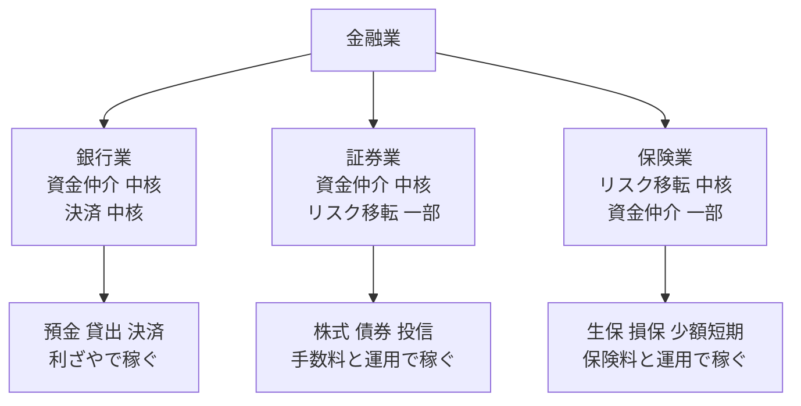
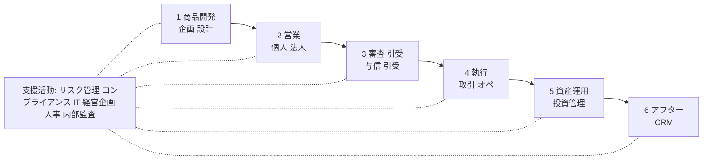
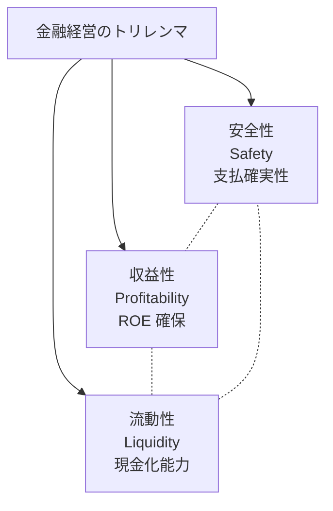
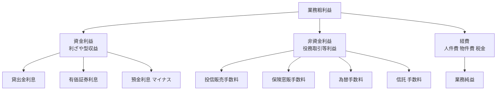
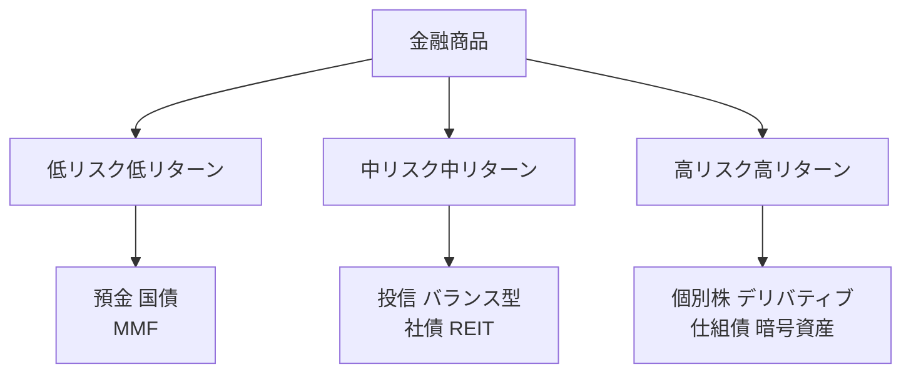
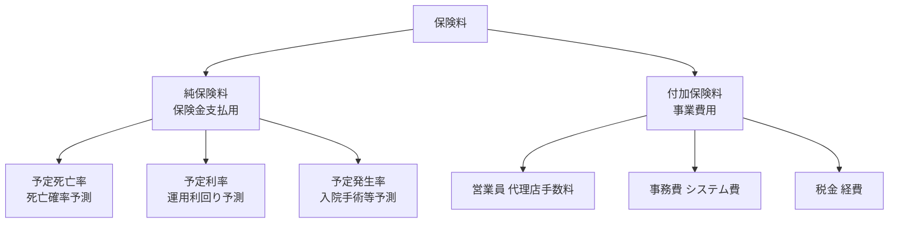
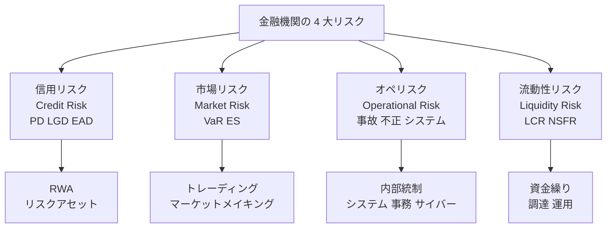
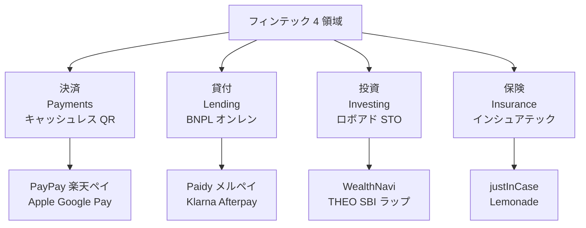
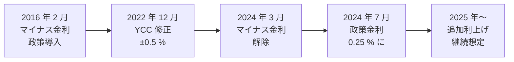

# 金融業（銀行・証券・保険）のビジネス基礎

業界構造・収益モデル・規制・リスク管理・フィンテック——転職／担当／提案のための「金融業を読み解く眼鏡」

| 項目 | 内容 |
|---|---|
| カテゴリー | 業種別実務 |
| 難易度 | 中級 |
| 所要時間 | 約200分（全8レッスン） |
| 公開日 | 2026-07-01 |
| 最終更新日 | 2026-07-01 |
| コースURL | https://skillup.college/courses/industry/finance-basics/ |

## 対象者

金融業（銀行・証券・保険）に転職・配属された事務系・営業・HR・人事・経理・経営企画担当者と、金融クライアントを担当するコンサル・SIer・ファンドマネジャー・不動産・広告代理店・編集者を両方主軸とする。金融の現場経験はないが「業界としての金融業を読み解きたい」社会人 3 年目以上を対象。金融業に向けた提案・営業を行う方も含む。3 大領域（銀行・証券・保険）を業種横断で扱う。

## 前提知識

社会人 3 年以上を想定。会計の基本（B/S、P/L、金利、利ざやの概念）と、確率・統計の基本（期待値、分散、正規分布）への理解があれば理解が早いが、これらの土台は本コース内で必要範囲を解説する。金融の現場経験は不要で、業界横断の俯瞰知識として「規制と技術のあいだで最適点を探す発想」を身につける構成。

## 学習目標

- 金融業の 3 大領域（銀行・証券・保険）と 3 大機能（資金仲介・決済・リスク移転）を地図化できる
- 銀行・証券・保険それぞれの収益モデルと主要 KPI（銀行 OHR ／ROE、証券 AUM、保険 ソルベンシーマージン／Combined Ratio）を読み解ける
- 銀行業の 3 機能（決済・預金・貸出）と業態別ビジネスモデル、金利環境の転換を理解する
- 証券業の 3 業務（ブローカレッジ・IB・アセットマネジメント）と金融商品、新 NISA・iDeCo の意味を理解する
- 保険業の 3 分類（生保・損保・少額短期）、保険料構造、ソルベンシーマージン、IFRS17 の要点を把握する
- 金融規制体系（金融庁・日銀・SESC）、Basel III、4 大リスクと計測手法、AML/KYC/CFT を理解する
- フィンテック 4 領域（決済・貸付・投資・保険）と埋込型金融・BaaS・API 銀行の潮流を理解する
- 金利環境転換・少子高齢化・ESG・資産運用立国など、金融業の 2026 年時点の主要トレンドを把握する

## コース概要

金融業は銀行部門総資産約 2,300 兆円、生保総資産約 400 兆円、投信純資産約 350 兆円という圧倒的な規模を持つ、日本経済の血流とも呼べる基幹産業です。にもかかわらず、業界外の方には「ことば」「規制」「商品構造」がわかりにくい世界です。本コースは、金融業（銀行・証券・保険）に転職・配属された事務系・営業・人事・経理・経営企画の担当者と、金融クライアントを担当するコンサル・SIer・ファンドマネジャー・不動産・広告代理店・編集者の両方を主軸に、金融業を「業界として読み解く眼鏡」を 8 レッスンで提供します。3 大領域と 3 大機能、業態別の収益モデル、銀行・証券・保険それぞれの業務、金融規制と Basel III・IFRS17、リスク管理、フィンテック 4 領域、金利環境転換とESG まで扱います。

## 学習の流れ

レッスン 1 で金融業の現在地・3 大領域と 3 大機能・本コースの 3 視点（転職者／担当者／提案者）を共有します。レッスン 2 で「金融業の全体地図」としてバリューチェーンと業態別収益モデル、安全性・収益性・流動性のトリレンマ、フロント／ミドル／バックの 3 層組織を扱います。レッスン 3 〜 5 が「3 領域を個別に読み解く」本体で、銀行業（L3）、証券業（L4）、保険業（L5）を順に学びます。レッスン 6 で 3 領域に共通する規制体系（Basel III・IFRS17・AML/KYC）とリスク管理を扱い、レッスン 7 でフィンテック 4 領域（決済・貸付・投資・保険）と金融 DX、レッスン 8 で 2026 年時点の業界トレンド（金利環境・少子高齢化・ESG・資産運用立国）と修了後の継続学習を扱って締めくくります。金融の現場経験がない方が、「業界外から内に入ったとき」または「業界外から接するとき」に立ち止まらないための土台を作るコースとして設計しています。

## レッスン一覧

| No. | タイトル | 概要 | 所要時間 |
|---|---|---|---|
| 1 | 金融業の現在地と本コースの守備範囲 | 金融業の定義と 3 大領域（銀行・証券・保険）、日本経済での位置（銀行部門総資産約 2,300 兆円・生保総資産約 400 兆円・投信純資産約 350 兆円）、3 大機能（資金仲介・決済・リスク移転）、金融業を取り巻く構造変化（金利環境転換・少子高齢化・DX ／フィンテック・ESG）、本コースの守備範囲（転職者・担当者・提案者の 3 視点）、金融業の 3 つの共通言語（信用・情報・時間）、金融のことば（利ざや・OHR・BIS・ソルベンシーマージン・AUM）が翻訳できる価値を学ぶ | 25分 |
| 2 | 金融業のバリューチェーンと収益モデル——資金仲介・決済・リスク移転の三角形 | Michael Porter のバリューチェーンの金融業版、3 領域の収益モデル比較（銀行 ＝ 資金利益 ＋ 役務取引等利益、証券 ＝ 委託手数料 ＋ 引受手数料 ＋ 運用手数料、保険 ＝ 保険料収益 ＋ 運用収益）、「安全性・収益性・流動性のトリレンマ」の三角形、金融機関の典型組織（フロント／ミドル／バックの 3 層と機能配置）、KPI 比較（銀行 ROE ／OHR、証券 AUM、保険 ソルベンシーマージン／Combined Ratio）を学ぶ | 25分 |
| 3 | 銀行業のビジネス基礎——リテール・法人・投資銀行と金利環境 | 銀行の 3 機能（決済・預金・貸出）、業態別（都銀 3 メガ／地銀・第二地銀／信金・信組／ネット銀行／ゆうちょ）とビジネスモデル差、収益構造（資金利益 ＝ 貸出金利 − 預金金利の利ざや、非資金利益 ＝ 役務取引等）、個人業務（住宅ローン・カードローン・投信販売・保険窓販・遺言信託）、法人業務（法人向け貸出・シンジケートローン・外為・トランザクションバンキング）、投資銀行部門（M&A・IPO 引き受け・公募増資・社債引き受け）、主要 KPI（預貸率・預貸金利ざや・OHR・不良債権比率・自己資本比率・ROE）、金利環境の転換（マイナス金利 2016-2024 → 解除 2024 年 3 月 → 政策金利引き上げ）、地銀再編（SBI 新生銀行モデル）、コアバンキングシステム刷新を学ぶ | 25分 |
| 4 | 証券業とアセットマネジメント——市場・商品・投信・新 NISA | 業態別（総合証券 4 社／ネット証券 SBI・楽天・マネックス／IB 専業）、3 業務（ブローカレッジ・IB ／M&A ／引受・アセットマネジメント）、金融商品（株式・債券・投信・ETF・デリバティブ・仕組債）、市場（プライマリー vs セカンダリー）、東証プライム／スタンダード／グロース（2022 年 4 月市場区分再編）、投信の 5 分類、公募 vs 私募、資産運用会社の役割、主要 KPI（AUM ＝ 運用資産残高・預り資産・稼働口座数・ARPU）、新 NISA 拡充（2024 年 1 月）と資産運用立国宣言（2023 年 12 月）、iDeCo と確定拠出年金、投資一任契約と投資助言・代理業を学ぶ | 25分 |
| 5 | 保険業のビジネス基礎——生命保険・損害保険・アクチュアリー | 保険業の 3 分類（生保・損保・少額短期保険）、生保商品体系（終身・定期・養老・医療・がん・変額・外貨建て・変額年金）、損保商品体系（自動車・火災・地震・傷害・賠責・企業向け・工事保険）、保険料の構造（純保険料 ＝ 予定死亡率／予定利率／予定発生率・付加保険料 ＝ 予定事業費）、責任準備金と積立金、ソルベンシーマージン比率（200 % 規制ライン）、アクチュアリーの役割、IFRS17（2023 年国際適用、日本 2025 年 4 月〜）と CSM、主要 KPI（新契約 ANP・保有契約 ANP・EEV／EV／MCEV、損保 Combined Ratio）、保険代理店・銀行窓販・保険ショップ、少額短期保険と外貨建て保険問題を学ぶ | 25分 |
| 6 | 金融規制とリスク管理——監督・Basel・AML/KYC | 金融監督体制（金融庁 FSA・日銀・証券取引等監視委員会 SESC）、主要法令（銀行法・金融商品取引法・保険業法・貸金業法・資金決済法）、Basel 委員会と Basel III（自己資本比率 8 %／レバレッジ比率 3 %／LCR ／NSFR）、4 大リスクと計測手法（信用リスク PD/LGD/EAD/RWA、市場リスク VaR/ES、オペリスク、流動性リスク）、Stress Test と Reverse Stress Test、IFRS 9 予想信用損失モデル（ECL）、AML／KYC ／CFT の 3 セット、犯罪収益移転防止法（2007 年）と FATF 相互審査、経済制裁と疑わしい取引の届出、コーポレートガバナンス・コード（2015）とスチュワードシップ・コード（2014）、顧客本位の業務運営原則（2017）＝ フィデューシャリー・デューティー、金融庁の課徴金・行政処分を学ぶ | 25分 |
| 7 | フィンテックと金融 DX——決済・API・埋込型金融・暗号資産 | フィンテック 4 領域（決済／貸付／投資／保険）、キャッシュレス比率（2024 年約 39 %、2026 年 40 % 目標）、QR コード決済（PayPay ／楽天ペイ／d 払い／au PAY ／メルペイ）、Apple Pay ／Google Pay、BNPL（Paidy・メルペイスマート払い・Klarna・Afterpay）、埋込型金融（Embedded Finance）と非金融事業者の金融機能取込、BaaS（Banking as a Service）と GMO あおぞらネット銀行・住信 SBI ネット銀行、API 銀行とオープンバンキング（改正銀行法 2018）、電子決済等代行業者、ロボアドバイザー（WealthNavi 2016・THEO・SBI ラップ）、投資一任契約と手数料モデル、暗号資産（金商法改正 2020「仮想通貨」→「暗号資産」）、DeFi と STO と NFT、CBDC（日銀パイロット実験 2023-2026）、SWIFT と国際送金の高コスト構造を学ぶ | 25分 |
| 8 | 業界トレンドと金融業の未来——金利・少子高齢・ESG・修了後の継続学習 | 金利環境の転換（マイナス金利政策 2016 年 2 月導入 → YCC 修正 2022 年 12 月 → マイナス金利解除 2024 年 3 月 → 政策金利引き上げ）、少子高齢化と金融（相続大移動・預金流出・地銀再編・ゆうちょ改革）、ESG 投資と気候変動（TCFD 2015 年 FSB 設立／2017 年推奨事項・ISSB IFRS S1/S2 2023・GX 経済移行債 2024 発行開始・NGFS）、資産運用立国宣言（2023 年 12 月）と新 NISA 拡充、三メガの海外展開（アジア戦略）と外為リスク、外貨建て保険問題・仕組債問題と顧客本位、大再編（SBI 新生銀行モデル）、金融業 AI ユースケース（与信・不正検知・チャットボット・レコメンド）、修了後の継続学習方向を学ぶ | 25分 |

---

## レッスン1：金融業の現在地と本コースの守備範囲

（所要時間：25分）

### このレッスンで学ぶこと

- 金融業の定義と 3 大領域（銀行・証券・保険）
- 日本経済での位置（銀行部門総資産約 2,300 兆円・生保総資産約 400 兆円・投信純資産約 350 兆円）
- 金融業の 3 大機能（資金仲介・決済・リスク移転）
- 金融業を取り巻く 4 つの構造変化（金利環境転換・少子高齢化・DX ／フィンテック・ESG）
- 本コースの守備範囲——転職者・担当者・提案者の 3 視点
- 金融業の 3 つの共通言語（信用・情報・時間）、金融のことばが翻訳できる価値

---

### 金融業とは何か——日本経済での位置

**金融業**（Financial Industry）は、お金の流れを仲介・記録・保証・保険することで、実体経済を動かす基幹産業です。日本標準産業分類では大分類 J（金融業，保険業）が独立して設定され、中分類 62（銀行業）／63（協同組織金融業）／64（貸金業，クレジットカード業等非預金信用機関）／65（金融商品取引業，商品先物取引業）／66（補助的金融業等）／67（保険業）に細分されています。

本コースでは、金融業を実務上の 3 大領域で整理します。

- **銀行業**：預金を集め、貸出を行い、決済を担う。都銀・地銀・信金・ネット銀行・ゆうちょが主要プレイヤー
- **証券業**：株式・債券・投信などの金融商品の仲介と、企業の資金調達支援を担う。総合証券・ネット証券・IB 専業が主要プレイヤー
- **保険業**：契約者からの保険料を集め、事故・死亡・満期時に保険金を支払うことでリスクを移転する。生命保険・損害保険・少額短期保険が主要プレイヤー

日本経済における金融業の位置は、いくつかの数字で押さえておきます。日銀『資金循環統計』2024 年 3 月末値では、預金取扱機関（銀行＋信金など）の金融資産合計が約 2,300 兆円規模、証券会社の預り資産が数百兆円規模、生命保険会社の総資産が約 404 兆円、投資信託の純資産総額が約 350 兆円で推移しています。GDP 約 600 兆円との対比で見ると、金融業が保有・仲介する資産の総額は GDP の 3 〜 4 倍という圧倒的な規模になります（出典：[日銀『資金循環統計』](https://www.boj.or.jp/statistics/sj/index.htm)、[生命保険協会『生命保険の動向』](https://www.seiho.or.jp/data/statistics/trend/)、[投資信託協会『投資信託の主要統計』](https://www.toushin.or.jp/statistics/)）。

> **💡 ポイント**
> 金融業は実体経済の血流であり、預金取扱機関総資産約 2,300 兆円、生保総資産約 400 兆円、投信純資産約 350 兆円という圧倒的な規模を持ちます。GDP 約 600 兆円の 3 〜 4 倍の資産が金融業界を循環しており、金利がわずかに動くだけで日本経済全体に大きな影響が及びます。

金融業の特徴は、「規模の大きさ」と「規制の重さ」にあります。金融機関は他人のお金を預かり運用する立場のため、免許制で参入障壁が高く、金融庁・日銀・証券取引等監視委員会（SESC）による厳格な監督下に置かれます。銀行なら Basel III、保険なら IFRS17／ソルベンシーマージン規制、証券なら金融商品取引法——各業態で分厚い規制の枠組みが定められており、規制対応が経営の中心課題の 1 つになります。

---

### 金融業の 3 大機能——資金仲介・決済・リスク移転

金融業には、実体経済に対して果たす 3 つの根源的な機能があります。

**第 1 の機能：資金仲介**（Financial Intermediation）。資金余剰の主体（預金者・投資家）と資金不足の主体（企業・政府・住宅ローン借り手）を結びつける機能です。銀行は預金を集めて貸出を行うことでこの機能を果たし、証券会社は株式・債券の発行体と投資家を結びつけます。

**第 2 の機能：決済**（Payments and Settlement）。買い手から売り手へお金を移動させる機能で、経済活動の潤滑油になります。銀行の口座振替・振込、クレジットカード決済、電子マネー、QR コード決済、日銀ネット（銀行間決済）、SWIFT（国際送金）が代表例です。

**第 3 の機能：リスク移転**（Risk Transfer）。将来の不確実性から発生する損失を、リスクを分散できる主体に移す機能です。生命保険・損害保険は死亡・事故のリスクを保険会社に移転する典型例で、証券のデリバティブ（先物・オプション・スワップ）は市場リスクを移転する仕組みです。

図1：金融業の 3 大領域と 3 大機能の関係。銀行は資金仲介と決済、証券は資金仲介、保険はリスク移転を中核機能とする

3 大機能は独立ではなく、相互に重なり合います。銀行が投信を販売すれば証券機能を果たし、保険会社が資産運用を行えば資金仲介機能を果たします。「銀行・証券・保険は違う言語を話す 3 つの国」ですが、機能で見れば重なり合う部分が多く、業際競争と業際協働が同時に進んでいるのが現代の金融業の姿です。

> **📝 補足**
> 3 大機能に加えて、「情報生産」を第 4 の機能として挙げる金融論もあります。銀行が貸出審査で企業の情報を集めることで、社会全体の情報の非対称性を減らす役割です。本コースでは 3 大機能の枠組みを主に使いますが、「金融業は情報産業でもある」という視点は各所で触れます。

---

### 金融業を取り巻く 4 つの構造変化

2026 年現在、日本の金融業を取り巻く環境は、複数の構造変化が同時進行しています。それぞれの変化が、本コースのレッスン 3 〜 8 で扱う各領域の議論につながります。

**第 1 の変化：金利環境の転換**。日銀は 2016 年 2 月にマイナス金利政策を導入し、2022 年 12 月にイールドカーブ・コントロール（YCC）を修正、2024 年 3 月にマイナス金利政策を解除、その後も政策金利を段階的に引き上げてきました。約 25 年続いた「金利のない世界」から「金利のある世界」への転換は、銀行の利ざや回復、保険の予定利率引き上げ、投資家の債券投資復活など、金融業全体の収益構造を大きく変えます。

**第 2 の変化：少子高齢化と資産の相続大移動**。65 歳以上の高齢者が保有する家計金融資産は約 1,000 兆円規模で、これから 20 〜 30 年かけて次世代に相続移転します。銀行にとっては預金の地域間移動、証券にとっては新規顧客獲得機会、保険にとっては生前贈与・相続対策商品の拡大、地銀にとっては商圏縮小への対応が求められます。

**第 3 の変化：DX とフィンテック**。キャッシュレス比率は 2024 年で約 39 %、2026 年 40 % 目標、将来 80 % を目指しています。QR コード決済（PayPay・楽天ペイ・d 払い）、BNPL（Paidy・メルペイスマート払い）、ロボアドバイザー（WealthNavi）、埋込型金融（Amazon Lending）、BaaS（Banking as a Service）——非金融事業者が金融機能を組み込む「Embedded Finance」の潮流が加速しています。

**第 4 の変化：ESG と気候変動**。TCFD（気候関連財務情報開示タスクフォース、2015 年 FSB 設立）、ISSB（国際サステナビリティ基準審議会、2023 年 IFRS S1／S2 公表）、GX 経済移行債（2024 年 2 月 日本政府発行開始）、NGFS（気候変動リスクに関する中央銀行・監督当局ネットワーク）など、金融業がサステナビリティ・気候変動リスクへの対応を通じて、脱炭素経済への移行を促す役割が制度化されています。

> **⚠️ 注意**
> 4 つの変化は独立ではなく、相互に絡みます。例えば、金利の上昇は保険の予定利率上昇と国債投資魅力度回復を同時に促し、少子高齢化は地銀再編と資産運用立国の両方を促し、フィンテックは既存銀行との協働・競合を同時に生む、というように連鎖します。「個別の論点」ではなく「重なり合う変化」として捉える視点が、本コース全体の前提です。

---

### 本コースの守備範囲——転職者・担当者・提案者の 3 視点

本コースは、金融の現場経験がない方を主な対象とします。3 つの視点から、それぞれの立場の方が「最初の半年で必要になる知識」を扱います。

**第 1 の視点：転職者・配属者**。金融の事業会社（銀行・証券会社・保険会社）に転職した、または配属になった事務系・営業・人事・経理・経営企画の担当者を指します。金融業の業界用語と思考様式に触れる中で、現場の営業員・法人担当者・アクチュアリー・リサーチャー・システム担当者との会話に必要な共通言語を持ちたい層です。

**第 2 の視点：担当者**。コンサル、SIer、金融アドバイザリー、不動産、広告代理店、出版・編集者などで金融のクライアントを担当する方を指します。クライアントの事業構造と KPI（銀行の OHR ／ROE、証券の AUM、保険のソルベンシーマージン／Combined Ratio）を理解し、提案や対話の質を上げたい層です。

**第 3 の視点：提案者**。金融業に向けて IT サービス、コンサルティング、人材紹介、広告サービスなどを提案する営業職を指します。金融業の意思決定プロセス（本部の稟議・地方の SV・本店の経営会議）と予算サイクル、関係者の役割（企画・営業・システム・リスク管理・コンプライアンス）を理解し、商談を進めたい層です。

3 視点に共通するのは、「金融業のことば」と「考え方」を翻訳できる必要があることです。OHR、預貸率、AUM、BIS、Basel III、IFRS17、ソルベンシーマージン、AML、KYC——こうした用語が当たり前に飛び交う会議で、何が議論されているかを理解できる土台を、本コースで作ります。

> **🔰 初学者の方へ**
> 本コースは、金融の現場経験がなくても理解できるよう、すべての専門用語に説明を添えます。「株や投信を買ったことがない」「保険は親任せ」「銀行の融資審査を受けたことがない」という方も、業界の論理と数字の読み方を学ぶことで、金融業の方々との会話が成立するようになります。逆に、金融業ですでに 10 年以上現場経験のある方には、本コースは入門レベルの内容になります。

本コースが**扱わない**領域も明確にしておきます。

- 個別金融商品の推奨・不推奨（個別の株式・投信・保険商品の善し悪しの評価）は扱いません。個別の投資判断・保険加入判断は金融商品仲介業者・保険募集人・IFA（Independent Financial Advisor）など有資格者の独占業務です
- 個別業態の深掘り（都銀 3 メガ、大手証券 4 社、大手生保 4 社の業界レポート相当）は扱いません。業種横断の俯瞰に留め、業態特化の深掘りは業界誌・アニュアルレポートに譲ります
- 個別の規制・法令の代理判断（金融商品取引法・銀行法・保険業法・貸金業法などの個別判断）は扱いません。これらは弁護士・行政書士・司法書士の独占業務であり、本コースは「誰に何をいつ相談するか」の判断軸を作るに留めます
- 資格試験対策（FP・証券外務員・銀行業務検定・保険募集人・CFA・USCPA など）は扱いません。試験合格は各資格専門の予備校・教材に譲り、本サイトは「実務で使える知識と思考の型」に集中します

---

### 金融業の 3 つの共通言語——信用・情報・時間

金融業は銀行・証券・保険で「違う言語」を話しますが、その底流に共通する 3 つの言語があります。「信用」「情報」「時間」です。

**信用**（Credit）：金融取引は最終的に「相手が約束を守るかどうか」への信頼で成り立ちます。銀行の貸出は借り手の返済能力への信用、社債投資は発行企業の格付けへの信用、保険は保険会社の支払能力への信用、預金は銀行の破綻しない前提への信用（預金保険で最終担保）に基づきます。信用が揺らげば、金融は機能を停止します。

**情報**（Information）：金融取引は情報の非対称性を減らす活動です。銀行は貸出審査で借り手の情報を集め、証券アナリストは企業の業績情報を分析して投資家に届け、保険会社はアクチュアリーがデータから死亡率・事故率を推定します。「情報を持つ側」と「持たない側」の格差を埋めるのが、金融業の本質的な機能です。

**時間**（Time）：金融取引は「今のお金」と「未来のお金」を交換する活動で、時間軸が入ります。預金は「今の貯蓄」を「将来の使用」に、住宅ローンは「将来の返済」を「今の家の購入」に、保険は「今の保険料」を「将来の保険金」に、株式は「今の投資」を「将来の配当・値上がり」に交換します。時間の価値を金利で測るのが金融の基本です。

> **💡 ポイント**
> 「金融業は『信用』と『情報』の二階建て」という私のスタンスは、この共通言語の分析から来ています。信用がなければ金融は動かず、情報がなければ信用の判断ができない。銀行・証券・保険で見え方は違っても、根っこの言語は共通しています。

金融業に転職した方が「業界のことばが速すぎてついていけない」と感じるのは自然な反応ですが、3 つの共通言語（信用・情報・時間）に立ち返れば、個別の商品や規制の意味が理解しやすくなります。

---

### 金融業のことばが翻訳できる価値

本コースを通じて身につく「金融業のことばを翻訳できる」能力は、現場でどう活きるか。具体的なシーンで考えてみます。

**シーン 1：転職者の最初の会議**——都市銀行に転職した経営企画担当者が、初めての本部会議に参加します。「先月の預貸率が 62 %、預貸金利ざやが 0.85 %、OHR が 68 %、Tier1 比率が 11.5 %」——こうした発言が並ぶ会議で、何が議論されているかが理解できれば、議事録を取るだけの存在から、議論に参加できる存在に変わります。

**シーン 2：コンサルの提案準備**——地銀クライアント向けの DX 改革提案を準備するコンサルタントが、クライアントの経営陣ヒアリングに臨みます。「マイナス金利政策解除で利ざやが回復しつつあるが、コアバンキング刷新の投資判断を先送りしてきた結果、API 銀行対応で他行に遅れている」と聞いて、金利環境と DX 投資の関係を即座に理解できれば、深いヒアリングと精度の高い提案に直結します。

**シーン 3：IT ベンダーの営業**——大手生保に IT サービスを提案する営業担当者が、経営企画部との商談に臨みます。「IFRS17 対応で決算プロセスが変わり、CSM の四半期評価が必要になった。ソルベンシーマージンとの整合も課題」と聞いて、保険会計と規制の枠組みが頭に入っていれば、業務改革のパートナーとして選ばれる可能性が高まります。

**シーン 4：不動産業の担当者**——投資用不動産を売る営業が、証券会社の富裕層営業と協働します。「NISA 拡充で株式・投信への資金流入が続くなか、リアル資産の分散投資の需要も強い」と会話できれば、両業界の顧客ニーズをつなぐ提案が可能になります。

> **📝 補足**
> 「金融業のことばが翻訳できる」価値は、金融業の中に閉じません。金融業の知識を持つコンサルタント、IT ベンダー、不動産、広告代理店、編集者、法律事務所は、金融業との接点を持つあらゆる職種で重宝されます。日本経済の血流である金融業を相手にできることは、キャリア全体の選択肢を広げる投資です。

---

### まとめ

このレッスンでは、以下のことを学びました。

- 金融業は 3 大領域（銀行・証券・保険）で構成され、預金取扱機関総資産約 2,300 兆円・生保総資産約 400 兆円・投信純資産約 350 兆円と GDP の 3 〜 4 倍の資産が循環する基幹産業
- 3 大機能は資金仲介・決済・リスク移転で、銀行は資金仲介と決済、証券は資金仲介、保険はリスク移転を中核とする
- 金融業を取り巻く 4 つの構造変化は、金利環境の転換・少子高齢化・DX ／フィンテック・ESG で、相互に絡み合う
- 本コースは転職者・担当者・提案者の 3 視点で、金融業のことばを翻訳できる土台を作る
- 金融業の 3 つの共通言語は「信用・情報・時間」で、銀行・証券・保険を貫く底流の枠組み
- 個別商品の推奨・個別業態の深掘り・規制判断・資格対策は本コースの対象外

次のレッスンでは、金融業の「全体地図」としてバリューチェーンと収益モデルを扱います。3 領域の収益構造の比較、安全性・収益性・流動性のトリレンマ、フロント／ミドル／バックの 3 層組織、主要 KPI の比較を順に学びます。

---

### 確認クイズ

このレッスンの理解度をチェックしましょう。

#### Q1. 金融業の 3 大領域として、本レッスンで挙げたものはどれですか？

- [x] 銀行業・証券業・保険業
- [ ] 銀行業・不動産業・IT 業
- [ ] 銀行業・製造業・小売業
- [ ] 銀行業・電力業・通信業

> **解説**
> 金融業は実務上、銀行業（預金・貸出・決済）、証券業（金融商品の仲介・企業の資金調達支援）、保険業（生命保険・損害保険・少額短期保険）の 3 大領域で整理されます。日本標準産業分類でも大分類 J（金融業，保険業）が独立して設定され、中分類で 62 銀行業／63 協同組織金融業／64 貸金業／65 金融商品取引業／66 補助的金融業／67 保険業に細分されています。

#### Q2. 金融業の日本経済における規模について、本レッスンの説明と合致するものはどれですか？

- [ ] 銀行部門総資産約 50 兆円、生保総資産約 10 兆円の限定的規模
- [x] 預金取扱機関総資産約 2,300 兆円、生保総資産約 400 兆円、投信純資産約 350 兆円で GDP の 3 〜 4 倍の資産が循環
- [ ] GDP と同水準の約 600 兆円で経済に対して 1 対 1 の規模
- [ ] 金融業の統計は公表されておらず、規模は不明

> **解説**
> 日銀『資金循環統計』2024 年 3 月末値では、預金取扱機関（銀行＋信金など）の金融資産合計が約 2,300 兆円規模、生命保険会社の総資産が約 404 兆円、投資信託の純資産総額が約 350 兆円で推移しています。GDP 約 600 兆円との対比で見ると、金融業が保有・仲介する資産の総額は GDP の 3 〜 4 倍という圧倒的な規模になります。金利がわずかに動くだけで日本経済全体に大きな影響が及ぶ理由です。

#### Q3. 金融業の 3 大機能として、本レッスンで挙げたものはどれですか？

- [ ] 生産・販売・保守
- [ ] 採用・育成・評価
- [ ] 開発・調達・物流
- [x] 資金仲介・決済・リスク移転

> **解説**
> 金融業の 3 大機能は、資金仲介（余剰資金の主体と不足資金の主体を結ぶ）、決済（買い手から売り手へのお金の移動）、リスク移転（将来の不確実性から発生する損失をリスク分散主体に移す）です。銀行は資金仲介と決済を中核、証券は資金仲介を中核、保険はリスク移転を中核とし、それぞれが「違う言語を話す 3 つの国」でありながら機能で見れば重なり合う部分が多いのが現代の金融業の姿です。

#### Q4. 金融業を取り巻く 4 つの構造変化として、本レッスンで挙げたものはどれですか？

- [ ] 円高進行・年功序列復活・アナログ回帰・グローバル最適の強化
- [x] 金利環境転換・少子高齢化・DX ／フィンテック・ESG
- [ ] 規制撤廃・株主軽視・ハードウェア重視・国内回帰のみ
- [ ] 経済成長加速・出生率回復・IT 縮小・ESG 撤退

> **解説**
> 金融業を取り巻く 4 つの構造変化は、(1) 金利環境の転換（マイナス金利政策 2016-2024 → 解除 2024 年 3 月 → 政策金利引き上げ）、(2) 少子高齢化と資産の相続大移動、(3) DX とフィンテック（キャッシュレス・BNPL・ロボアド・埋込型金融）、(4) ESG と気候変動（TCFD・ISSB・GX 経済移行債）です。これらは独立ではなく相互に絡み合い、本コースのレッスン 3 〜 8 で扱う各領域の議論につながります。

#### Q5. 本コースが対象とする「転職者・担当者・提案者の 3 視点」のうち、「提案者」に該当する例はどれですか？

- [ ] 金融業に転職した経営企画担当者
- [ ] 金融クライアントを担当するコンサル・SIer・不動産の担当者
- [x] 金融業に向けて IT サービス・コンサルティング・人材紹介・広告サービスを提案する営業職
- [ ] 銀行の窓口で預金・貸出の対応を行う技能職

> **解説**
> 「提案者」は、金融業に向けて IT サービス、コンサルティング、人材紹介、広告サービスなどを提案する営業職を指します。「転職者」は金融業に転職・配属された事務系・営業・人事・経理・経営企画担当者、「担当者」はコンサル・SIer・金融アドバイザリー・不動産・広告代理店・編集者などで金融クライアントを担当する方を指します。銀行の窓口業務の技能職は本コースの主たる対象ではありません。

#### Q6. 金融業の 3 つの共通言語として、本レッスンで挙げたものはどれですか？

- [ ] 貸出・投信・保険
- [ ] 大手・中堅・中小
- [ ] 都市・地方・海外
- [x] 信用・情報・時間

> **解説**
> 金融業の 3 つの共通言語は「信用（Credit、相手が約束を守る前提）」「情報（Information、情報の非対称性を減らす活動）」「時間（Time、今のお金と未来のお金を交換）」です。銀行・証券・保険で見え方は違っても、根っこの言語は共通しており、この 3 つに立ち返れば個別商品・規制の意味が理解しやすくなります。「金融業は『信用』と『情報』の二階建て」という視点が、本コース全体を貫きます。

---

## レッスン2：金融業のバリューチェーンと収益モデル——資金仲介・決済・リスク移転の三角形

（所要時間：25分）

### このレッスンで学ぶこと

- Michael Porter のバリューチェーンの金融業版
- 3 領域の収益モデル比較（銀行・証券・保険）
- 「安全性・収益性・流動性のトリレンマ」の三角形
- 金融機関の典型組織（フロント／ミドル／バックの 3 層と機能配置）
- 主要 KPI 比較（銀行 ROE ／OHR、証券 AUM、保険 ソルベンシーマージン／Combined Ratio）

---

### 前回の振り返り

レッスン 1 では、金融業の現在地として、3 大領域（銀行・証券・保険）、日本経済での位置（預金取扱機関総資産約 2,300 兆円・生保総資産約 400 兆円・投信純資産約 350 兆円）、3 大機能（資金仲介・決済・リスク移転）、4 つの構造変化（金利環境転換・少子高齢化・DX ／フィンテック・ESG）、3 つの共通言語（信用・情報・時間）を学びました。今回は、業界全体の「地図」としてバリューチェーンと業態別収益モデルを扱います。

---

### Michael Porter のバリューチェーンと金融業版

**バリューチェーン**（Value Chain、価値連鎖）は、ハーバード・ビジネス・スクールの Michael Porter 教授が 1985 年の著書『Competitive Advantage』で体系化した概念です。企業が顧客に価値を届けるまでの活動を「主活動」と「支援活動」に分解し、どの段階で価値が生み出されるかを可視化します。

金融業のバリューチェーンは、本コースでは次の 6 段階で整理します。

- **第 1 段階：商品開発**（Product Development）：預金商品・貸出商品・投信・保険商品を企画・設計する
- **第 2 段階：顧客開拓・営業**（Marketing & Sales）：個人・法人顧客との接点を作り、商品を販売する
- **第 3 段階：審査・引受**（Underwriting）：貸出審査・IPO 引受審査・保険引受査定・与信判断を行う
- **第 4 段階：取引執行・オペレーション**（Execution & Operations）：預金入出金・貸出実行・株式売買執行・保険料徴収・保険金支払を担う
- **第 5 段階：資産運用・投資管理**（Asset Management）：預金の運用・保険積立金の運用・自己勘定投資を行う
- **第 6 段階：アフターサービス・CRM**（Customer Support）：顧客対応・満期案内・請求受付・クレーム対応

図1：金融業のバリューチェーン 6 段階と支援活動。金融業の支援活動には「リスク管理」「コンプライアンス」「内部監査」が独立機能として置かれるのが特徴

金融業のバリューチェーンで特徴的なのは、支援活動に「リスク管理」「コンプライアンス」「内部監査」が独立した機能として置かれることです。他業種では総務・法務の一部として扱われる領域ですが、金融業では 3 大リスク（信用・市場・オペ）を専門管理する部門、AML/KYC を専門とする部門、規制対応を専門とする部門が独立し、時に本部の 30 〜 40 % の人員がこれらの管理機能に配置されます。「他人のお金を預かる業界」ゆえの重い構造です。

> **💡 ポイント**
> 金融業のバリューチェーンは、他業種と比べて「支援活動」の比重が異常に大きいのが特徴です。リスク管理・コンプライアンス・内部監査に本部人員の 30 〜 40 % が割り当てられることも珍しくなく、これが金融業の高コスト構造の一因になっています。

---

### 3 領域の収益モデル比較

3 大領域の収益モデルは大きく異なります。それぞれの構造を整理します。

#### 銀行——資金利益と役務取引等利益

銀行の収益は 2 階建てです。**資金利益**（利ざや ＝ 貸出金利 − 預金金利）と**非資金利益**（役務取引等利益 ＝ 手数料・投信販売・為替・保険窓販）の合計で、業務粗利益が構成されます。

伝統的には資金利益が中心（比率 70 〜 80 %）でしたが、マイナス金利政策時代（2016 〜 2024）に利ざやが極端に薄くなり、非資金利益への依存度が高まりました。2024 年 3 月のマイナス金利解除後は資金利益が回復傾向にありますが、非資金利益の重要性は継続しています。

**業務純益 ＝ 業務粗利益 − 経費**。経費率（**OHR ＝ Overhead Ratio ＝ 経費 ／ 業務粗利益**）が銀行の効率性の重要指標です。三大メガバンクの OHR は 60 % 前後、地銀は 70 〜 80 %、ネット銀行は 40 〜 50 % が目安です。

さらに、**信用コスト**（貸倒引当金繰入・貸出金償却）を引いて**実質業務純益**、法人税等を引いて**当期純利益**、これを株主資本で割った**ROE**が経営指標として重視されます。日本の銀行の ROE は 5 〜 8 % 前後で、米欧の 10 〜 15 % と比べて低水準です。

#### 証券——3 手数料モデル

証券会社の収益は 3 手数料モデルで整理できます。

- **委託手数料**（Brokerage Commission）：株式・債券・投信の売買仲介手数料
- **引受手数料**（Underwriting Fee）：IPO ・公募増資・社債の引受手数料
- **運用手数料**（Investment Management Fee）：投信の運用報酬・投資一任契約の手数料

これに、自己勘定売買損益（トレーディング）と金融収益（顧客からの信用取引金利など）が加わります。

証券業の重要 KPI は **AUM**（Assets Under Management、運用資産残高）と**預り資産**（Client Assets）です。AUM が積み上がるほど運用手数料が安定収益として入ってきます。総合証券の預り資産は 100 〜 150 兆円、大手ネット証券は 30 〜 50 兆円、資産運用会社の AUM は 200 〜 300 兆円規模です。

#### 保険——保険引受収益と資産運用収益の 2 階建て

保険会社の収益も 2 階建てです。

- **保険引受収益** ＝ 収入保険料 − 保険金支払 − 事業費（付加保険料の使用分）
- **資産運用収益** ＝ 保険料と積立金を運用した利息・配当・売却益

生命保険の場合、保険料は「純保険料 ＋ 付加保険料」で、純保険料は「予定死亡率」「予定利率」「予定発生率」の 3 予定に基づき計算されます。予定より死亡率が低ければ「死差益」、予定より運用利率が高ければ「利差益」、予定より事業費が低ければ「費差益」が発生します。これらの合計が基礎利益になります。

損害保険の重要 KPI が **Combined Ratio**（コンバインドレシオ ＝ 損害率 ＋ 事業費率）で、100 % 未満なら保険引受で黒字、100 % 超なら保険引受で赤字を意味します。近年は自然災害の激甚化で Combined Ratio が悪化傾向で、資産運用収益で保険引受赤字を埋める構造になりつつあります。

> **📝 補足**
> 銀行・証券・保険の収益モデルは根本的に違いますが、共通するのは「時間を売る」ビジネスであることです。銀行は「今の預金と将来の返済」の時間差、証券は「今の投資と将来のリターン」の時間差、保険は「今の保険料と将来の保険金」の時間差から収益を得ます。「金利がすべての金融の基準線」というのは、この時間の価格が金利だからです。

---

### 安全性・収益性・流動性のトリレンマ

金融機関の経営は、**3 つの目標のトリレンマ**（Trilemma）で整理されることが多いです。

- **安全性**（Safety）：預金・保険金の支払確実性を維持する
- **収益性**（Profitability）：株主に対する ROE を確保する
- **流動性**（Liquidity）：必要なタイミングで現金化できる状態を維持する

3 つすべてを最大化することはできず、必ずトレードオフが発生します。

- 安全性を高めるには国債など安全資産の比率を上げるが、収益性が下がる
- 収益性を高めるには貸出比率を上げるが、流動性リスクと信用リスクが上がる
- 流動性を高めるには短期資産の比率を上げるが、収益性が下がる（長期金利のほうが一般に高い）

図2：金融経営のトリレンマ。安全性・収益性・流動性は 3 つすべてを最大化できないトレードオフ構造

Basel III や IFRS17 などの金融規制は、この 3 つのバランスを「安全性優先」の方向に強く傾ける仕組みです。金融機関の破綻は預金者・保険契約者への被害と、金融システム全体の不安定化（システミックリスク）を招くため、社会的コストが大きいのです。

> **⚠️ 注意**
> トリレンマの発想は、「経営者や監督者が意識的に優先軸を選ぶ」ことを前提とします。全方位で最大化しようとすると、実際には全ての軸で中途半端になり、収益もリスク耐性も流動性も確保できないポジションに陥ります。「どの軸で勝つか、どの軸で守るか」の経営判断が、金融機関経営の核心です。

---

### 金融機関の典型組織——フロント／ミドル／バックの 3 層

金融機関の組織は、機能別に「フロント／ミドル／バック」の 3 層で整理されるのが典型です。

**フロント**（Front Office）は、顧客と直接接して収益を生む部門です。銀行では個人営業部・法人営業部・IB 部門・トレーディング部・アセットマネジメント部、証券では営業部・IB 部門・トレーディング部・調査部、保険では営業員部・法人営業部・代理店営業部・保険ショップが該当します。「稼ぐ人たち」です。

**ミドル**（Middle Office）は、フロントの取引・リスクを管理する部門です。リスク管理部（信用リスク・市場リスク・オペリスク・流動性リスクの管理）、コンプライアンス部（金融商品取引法・AML/KYC 対応）、コーポレート・プランニング部（ALM ／経営企画）が該当します。「監視する人たち」です。

**バック**（Back Office）は、取引の事務処理・決済・システム運用を担う部門です。オペレーション部、システム部、経理部、人事部、総務部、内部監査部が該当します。「回す人たち」です。

フロント：ミドル：バックの人員配分は、金融機関の性格を反映します。ネット銀行やフィンテック企業は「フロント：ミドル：バック ＝ 30：30：40」で IT ・自動化が進むのに対し、伝統的な大手銀行は「40：30：30」でフロントの人員が多い傾向があります。

> **💡 ポイント**
> 金融機関の組織理解で重要なのは、フロント・ミドル・バックが「相互に牽制する 3 権分立」であることです。フロントの営業だけで判断すればリスクを見落とし、ミドルの管理だけで判断すれば収益機会を逃す。3 層が協働・牽制することで、健全な経営が保たれる設計です。

---

### 主要 KPI の比較

3 領域の主要 KPI を比較すると、業態の性格が見えてきます。

#### 銀行の主要 KPI

- **業務粗利益 ＝ 資金利益 ＋ 非資金利益**
- **OHR（経費率）＝ 経費 ／ 業務粗利益**：メガ 60 %、地銀 70 〜 80 %、ネット銀行 40 〜 50 %
- **預貸率 ＝ 貸出金 ／ 預金**：メガ 60 〜 70 %、地銀 70 〜 80 %
- **不良債権比率**：メガ 1 % 前後、地銀 1 〜 3 %
- **自己資本比率**（Tier1 比率）：Basel III 規制 8 %（バッファ含め実質 10.5 %）以上、メガ 12 〜 14 %
- **ROE**：日本の銀行 5 〜 8 %、米欧 10 〜 15 %

#### 証券の主要 KPI

- **AUM（Assets Under Management）＝ 運用資産残高**
- **預り資産（Client Assets）**：総合証券 100 〜 150 兆円、大手ネット証券 30 〜 50 兆円
- **稼働口座数 × ARPU（Average Revenue Per User）＝ ネット証券の売上構造**
- **委託手数料比率／引受手数料比率／運用手数料比率**
- **自己資本規制比率**：金融商品取引業者は 120 % 以上維持義務、120 % 未満で監督強化

#### 保険の主要 KPI

- **ANP（Annualized New Premium、新契約年換算保険料）**
- **保有契約 ANP**
- **ソルベンシーマージン比率**：200 % 以上が規制上必須、大手生保は 700 〜 1,000 %
- **EEV／EV／MCEV（Embedded Value 系）**：将来の利益を現在価値で評価した保険会社の経済価値
- **基礎利益 ＝ 死差益 ＋ 利差益 ＋ 費差益（生保）**
- **Combined Ratio ＝ 損害率 ＋ 事業費率（損保）**：100 % 未満で保険引受黒字

> **📝 補足**
> 業態を跨いで金融機関の経営を比較するとき、単純に「利益」だけを見ても意味がありません。銀行の当期純利益、証券の営業収益、保険の基礎利益はそれぞれ異なる収益概念で、業態に応じた指標を組み合わせて読むのが金融アナリストの基本です。

---

### まとめ

このレッスンでは、以下のことを学びました。

- 金融業のバリューチェーンは 6 段階（商品開発／営業／審査・引受／執行／資産運用／CRM）で、支援活動にリスク管理・コンプライアンス・内部監査が独立配置される
- 3 領域の収益モデル：銀行は資金利益 ＋ 非資金利益、証券は 3 手数料（委託・引受・運用）、保険は保険引受収益 ＋ 資産運用収益の 2 階建て
- 銀行の主要 KPI は業務粗利益・OHR・預貸率・自己資本比率・ROE
- 証券の主要 KPI は AUM・預り資産・稼働口座数 × ARPU
- 保険の主要 KPI は ANP・ソルベンシーマージン比率・EEV・基礎利益（生保）・Combined Ratio（損保）
- 金融経営は「安全性・収益性・流動性のトリレンマ」で、3 つすべての最大化はできない
- 金融機関の組織はフロント／ミドル／バックの 3 層で相互牽制する 3 権分立構造

次のレッスンでは、金融業の第 1 の柱「銀行業」を扱います。銀行の 3 機能、業態別ビジネスモデル、収益構造の詳細、個人業務／法人業務／IB 部門、金利環境の転換と地銀再編を順に学びます。

---

### 確認クイズ

このレッスンの理解度をチェックしましょう。

#### Q1. Michael Porter のバリューチェーン概念について、本レッスンの説明と合致するものはどれですか？

- [x] 1985 年の著書『Competitive Advantage』で体系化された概念で、主活動と支援活動に分解する
- [ ] 1995 年に提唱されたデジタル時代の経営戦略フレームワーク
- [ ] 製造業のみに適用可能な概念
- [ ] 顧客サービスの段階を 12 ステップで整理する手法

> **解説**
> バリューチェーンは Michael Porter 教授が 1985 年の著書『Competitive Advantage』で体系化した概念で、主活動と支援活動に分解して価値創造の構造を可視化します。金融業では主活動を 6 段階（商品開発／営業／審査・引受／執行／資産運用／CRM）で整理し、支援活動にリスク管理・コンプライアンス・内部監査が独立配置されるのが特徴です。

#### Q2. 銀行の収益構造について、本レッスンの説明と合致するものはどれですか？

- [ ] 保険料収益 ＋ 資産運用収益の 2 階建て
- [x] 資金利益（利ざや ＝ 貸出金利 − 預金金利） ＋ 非資金利益（役務取引等利益 ＝ 手数料・投信販売・為替・保険窓販）
- [ ] 委託手数料 ＋ 引受手数料 ＋ 運用手数料の 3 手数料モデル
- [ ] 商品売上 ＋ 広告収入 ＋ サブスク収益

> **解説**
> 銀行の収益は「資金利益（利ざや）＋ 非資金利益（役務取引等利益）」の 2 階建てです。伝統的には資金利益が 70 〜 80 % を占めましたが、マイナス金利政策時代（2016-2024）に利ざやが薄くなり、非資金利益への依存度が高まりました。保険料収益 ＋ 資産運用収益は保険、3 手数料モデルは証券の収益構造です。

#### Q3. 銀行の主要 KPI「OHR（経費率）」について、本レッスンの説明と合致するものはどれですか？

- [ ] OHR ＝ 貸出金 ／ 預金
- [ ] OHR ＝ 不良債権額 ／ 総貸出金
- [x] OHR ＝ 経費 ／ 業務粗利益、メガ銀行 60 % 前後、地銀 70 〜 80 %、ネット銀行 40 〜 50 % が目安
- [ ] OHR ＝ 保険金支払 ／ 収入保険料

> **解説**
> OHR（Overhead Ratio、経費率）は「経費 ／ 業務粗利益」で、銀行の効率性の重要指標です。三大メガバンクの OHR は 60 % 前後、地銀は 70 〜 80 %、ネット銀行は 40 〜 50 % が目安です。低いほど効率的ですが、単純に低ければよいというものではなく、リスク管理コスト・顧客サービス水準とのバランスが必要です。預貸率は貸出金 ／ 預金、Combined Ratio は損保の指標です。

#### Q4. 保険業の主要 KPI「ソルベンシーマージン比率」について、本レッスンの説明と合致するものはどれですか？

- [ ] 保険料 ／ 保険金の比率で、100 % 未満で規制違反
- [x] 保険会社の支払能力を示す比率で、200 % 以上が規制上必須、大手生保は 700 〜 1,000 %
- [ ] 顧客満足度指数の 1 種で、200 点以上が優良
- [ ] 保険代理店の売上目標達成率

> **解説**
> ソルベンシーマージン比率は保険会社の支払能力（Solvency）を示す規制比率で、通常のリスク（予測できる範囲）を上回る大災害・大暴落などの異常リスクにも耐えられる支払余力を示します。200 % 以上が規制上必須で、200 % 未満になると金融庁の早期是正措置の対象になります。大手生保は 700 〜 1,000 %、損保は 500 〜 800 % 程度で推移しています。

#### Q5. 「安全性・収益性・流動性のトリレンマ」について、本レッスンの説明と合致するものはどれですか？

- [ ] 3 つはすべて同時に最大化できる独立指標
- [x] 3 つはトレードオフの関係で、経営者・監督者が意識的に優先軸を選ぶ必要がある
- [ ] 3 つは連動しており、1 つを上げれば残り 2 つも自動的に良くなる
- [ ] 3 つのうち収益性だけが最重要で、安全性と流動性は考慮不要

> **解説**
> 3 つはトレードオフの関係で、安全性を高めるには安全資産比率を上げるが収益性が下がる、収益性を高めるには貸出比率を上げるが流動性リスクが上がる、流動性を高めるには短期資産の比率を上げるが収益性が下がる、という構造です。全方位最大化しようとすると全ての軸で中途半端になるため、「どの軸で勝つか、どの軸で守るか」の経営判断が金融機関経営の核心です。Basel III や IFRS17 は安全性優先の方向に強く傾ける規制です。

#### Q6. 金融機関の組織のフロント／ミドル／バックの 3 層について、本レッスンの説明と合致するものはどれですか？

- [ ] フロントは事務処理、ミドルは営業、バックはシステム運用
- [ ] フロント・ミドル・バックの区別はなく、全員が営業を担う
- [ ] フロントは支店の窓口、ミドルは本部の管理職、バックは支店の裏方
- [x] フロントは顧客と直接接し収益を生む部門、ミドルはリスク管理・コンプライアンス、バックは事務処理・決済・システム運用を担う 3 権分立構造

> **解説**
> 金融機関の組織は、フロント（顧客と直接接し収益を生む＝営業・IB ・トレーディング）、ミドル（リスク管理・コンプライアンス・経営企画）、バック（事務処理・決済・システム運用）の 3 層で整理されるのが典型です。3 層が「相互に牽制する 3 権分立」として機能することが、金融機関の健全経営の生命線です。「フロントが強くてミドル・バックが弱い金融機関」は必ずどこかで事故を起こします。

---

## レッスン3：銀行業のビジネス基礎——リテール・法人・投資銀行と金利環境

（所要時間：25分）

### このレッスンで学ぶこと

- 銀行の 3 機能（決済・預金・貸出）と業態別分類（都銀 3 メガ／地銀・第二地銀／信金・信組／ネット銀行／ゆうちょ）
- 銀行の収益構造の詳細（資金利益 × 非資金利益、業務粗利益ツリー）
- 個人業務（住宅ローン・カードローン・投信販売・保険窓販・遺言信託）
- 法人業務（法人向け貸出・シンジケートローン・外為・トランザクションバンキング）
- 投資銀行部門（M&A・IPO 引き受け・公募増資・社債引き受け）
- 主要 KPI と金利環境の転換（マイナス金利 2016-2024 → 解除 2024 年 3 月 → 政策金利引き上げ）
- 地銀再編（SBI 新生銀行モデル）とコアバンキングシステム刷新

---

### 前回の振り返り

レッスン 2 では、金融業のバリューチェーン 6 段階、3 領域の収益モデル比較（銀行の資金利益 ＋ 非資金利益、証券の 3 手数料モデル、保険の 2 階建て）、安全性・収益性・流動性のトリレンマ、フロント／ミドル／バックの 3 層組織、主要 KPI の比較を学びました。今回は、金融業の第 1 の柱「銀行業」を深く掘り下げます。

---

### 銀行の 3 機能——決済・預金・貸出

銀行の根源機能は 3 つに整理できます。

**第 1 機能：決済**（Payments）。振込・口座振替・キャッシュカード・デビットカード・電子マネー連携などの決済インフラを提供します。企業の給与振込、公共料金の引き落とし、EC の代金決済など、日常経済の潤滑油です。日銀ネット（銀行間決済）、全銀システム（民間銀行間振込）、CD／ATM 相互接続網（提携キャッシュサービス）が舞台裏で支えています。

**第 2 機能：預金**（Deposits）。顧客からお金を預かり、必要に応じて引き出せる状態で運用します。普通預金・定期預金・当座預金・外貨預金など、多様な商品があります。**預金保険制度**により、預金者 1 人あたり 1,000 万円までの元本と利息が銀行破綻時にも保護されるため、事実上リスクフリーな資産として認識されています。

**第 3 機能：貸出**（Lending）。集めた預金を、審査を経て住宅ローン・個人ローン・企業融資として貸し出し、金利を稼ぎます。「預金金利より貸出金利のほうが高い」ことで、その差（**利ざや**）が銀行の主要収益源になります。この利ざやこそが、銀行が「時間を売る」ビジネスの本質です。

3 機能は独立ではなく相互に補完します。決済機能で預金流入を確保し、その預金を審査を経て貸出に回し、金利差で収益を生む——このサイクルが銀行の基本ビジネスモデルです。

> **💡 ポイント**
> 銀行の 3 機能は「決済＝入り口」「預金＝バッファ」「貸出＝収益源」の役割分担です。決済機能で顧客との接点を作り、預金という安価な資金調達で低コストの原資を得て、貸出で運用して利ざやを稼ぐ、というのが銀行の伝統的ビジネスモデルです。

---

### 銀行業態の分類

日本の銀行業界は、規模と機能で複数の業態に区分されます。主要 5 業態を整理します。

**都銀（都市銀行）**：全国展開する大規模銀行で、3 メガバンクグループ（三菱 UFJ フィナンシャル・グループ／みずほフィナンシャルグループ／三井住友フィナンシャルグループ）と、りそなグループが主要プレイヤー。総資産数百兆円規模、国際展開、投資銀行部門保有が特徴。

**地銀・第二地銀**：都道府県単位で営業する銀行。全国地方銀行協会加盟の地銀と第二地方銀行協会加盟の第二地銀を合わせて約 100 行。総資産数兆〜数十兆円規模、地域経済との密着、中小企業融資中心が特徴。近年は人口減の影響で再編が進む。

**信金・信組**：地域住民・中小企業のための協同組織金融機関。信用金庫（信金）が約 250、信用組合（信組）が約 140。会員相互の助け合いが理念で、営業エリアが限定される。

**ネット銀行**：店舗を持たずネット・スマホで顧客対応する銀行。楽天銀行、住信 SBI ネット銀行、PayPay 銀行、GMO あおぞらネット銀行、auじぶん銀行、ソニー銀行、SBI 新生銀行などが代表例。低コスト構造で預金金利・振込手数料で優位性を持つ。

**ゆうちょ銀行**：日本郵政グループ傘下の巨大銀行。全国に約 2 万の郵便局窓口ネットワーク、貯金残高約 190 兆円で日本一の預金量を持つ。歴史的な政府保証と地域網が特徴。

**その他**：信託銀行（三菱 UFJ 信託・みずほ信託・三井住友信託が 3 大信託）、外資系銀行、政府系金融機関（日本政策金融公庫・日本政策投資銀行・国際協力銀行）も含めれば、日本の銀行業は多層的な構造です。

> **📝 補足**
> 業態の垣根は次第に薄れています。ネット銀行が住宅ローンで都銀と競合し、コンビニ ATM（セブン銀行・イオン銀行）が新種の銀行として登場し、フィンテック企業が銀行ライセンスを取得（SBI 新生銀行、みんなの銀行）するなど、業態区分だけでは業界構造を捉えきれなくなりつつあります。

---

### 銀行の収益構造の分解

銀行の収益ツリーをより詳細に見ていきます。

図1：銀行の業務粗利益ツリー。資金利益と非資金利益に区分され、経費を引いた業務純益が経営指標

**資金利益**は「貸出金利息 ＋ 有価証券利息 − 預金利息」で、銀行の中核収益です。マイナス金利政策時代（2016 〜 2024）は貸出金利が下がり続けて利ざやが極端に薄くなり、地銀の経営を圧迫しました。

**非資金利益**（役務取引等利益）は、投信販売手数料、保険窓販手数料、為替手数料、信託手数料、シンジケートローンのアレンジメント・フィー、M&A アドバイザリー・フィーなどです。利ざや低下時代に銀行が力を入れた領域です。

**経費**は人件費・物件費・税金の合計で、業務粗利益から引いて業務純益を計算します。**OHR**（経費 ／ 業務粗利益）は既述の通り、銀行の効率性の重要指標です。

さらに**信用コスト**（貸出金の貸倒引当金繰入・貸出金償却）を引いて実質業務純益、株式売却損益・法人税等を加減算して当期純利益を計算します。

---

### 個人業務——リテールバンキング

銀行の個人業務は、多様な商品ラインを持ちます。代表的な業務を整理します。

**住宅ローン**：個人業務の中核商品で、35 年程度の長期融資。都銀・地銀・ネット銀行の激しい競争領域で、金利は 0.3 〜 1.0 % 程度（変動金利中心）。マイナス金利政策期は最低水準まで下がりましたが、政策金利引き上げに伴い上昇局面に転じています。

**カードローン**：個人向け無担保融資で、金利は 3 〜 15 % と幅広い。銀行系カードローンと消費者金融系（アコム・プロミス・アイフルなど）の区分があります。

**投信販売**：投資信託の販売窓口として個人顧客に投信を売る業務。銀行にとって非資金利益の主要源。2024 年新 NISA 拡充で個人の投信需要が拡大。

**保険窓販**：銀行窓口で生保・損保商品を販売する業務。1998 年から段階的に解禁され、現在は多くの保険商品を扱えます。銀行にとっての手数料収入源。

**遺言信託**：相続対策として遺言書の作成・保管・執行を支援する信託業務。少子高齢化と資産の相続大移動で需要が拡大しています。

**外国送金・外貨預金**：海外送金や外貨建て資産保有の対応。三大メガや大手信託銀行の得意領域。

---

### 法人業務——コーポレートバンキング

銀行の法人業務は、企業のライフサイクル全般に渡ります。

**法人向け貸出**：運転資金融資・設備投資融資・長期融資などの企業融資。担保・保証・格付けに基づき審査。中小企業融資は地銀・信金の主戦場、大企業融資はメガバンクの主戦場です。

**シンジケートローン**：複数銀行が協調して大口融資を組成する仕組み。数百億〜数千億円規模の融資を、リード銀行（アレンジャー）が組成し、複数銀行が参加します。**アレンジメント・フィー**という高利益率の手数料が入ります。

**外為（外国為替）**：企業の海外送金・輸出入代金決済・為替リスクヘッジ（先物為替予約・オプション）などの対応。総合商社・製造業のグローバル企業がクライアント。

**トランザクションバンキング**：企業の決済・キャッシュマネジメント（資金繰り管理）・給与振込・売掛金回収・貿易金融などの一体運営。安定収益源として重視されています。

**プロジェクトファイナンス**：発電所・インフラ・不動産開発などの大型プロジェクトの資金調達を、そのプロジェクトの将来キャッシュフローを担保に組成する高度な融資。

---

### 投資銀行部門（IB）

大手銀行と証券系列会社は、投資銀行（IB）部門を持ちます。主要業務を整理します。

**M&A アドバイザリー**：企業の合併・買収を助言する業務。財務アドバイザー（FA）としてバイサイド／セルサイドに就き、Deal Fee（案件成立フィー）で稼ぎます。三大メガバンクは自社の証券系列会社（SMBC 日興証券・みずほ証券・三菱 UFJ モルガン・スタンレー証券）と連携して M&A ビジネスを展開します。

**IPO 引き受け**：企業の新規株式公開を主幹事として支援する業務。売出株の引き受けリスクを取り、成功時に引受手数料と関連ビジネスが得られます。東証グロース市場の IPO は野村・SMBC 日興・大和・みずほ・三菱 UFJ モルガン・スタンレーの主幹事シェアが高いです。

**公募増資・社債引き受け**：既存上場企業の追加資金調達を支援する業務。公募株式（PO）や無担保社債・劣後債の引き受けを担います。

**プライベート・エクイティ（PE）連携**：PE ファンドの LBO 資金融資、Mezzanine 融資、ブリッジ融資を提供し、PE 取引に関与します。

> **⚠️ 注意**
> IB 業務は「Deal Feeで大きく稼ぐが、Deal がないと収益がゼロ」の変動性が特徴です。安定収益のリテール／法人業務と組み合わせてポートフォリオを組むのが、大手銀行の経営戦略です。

---

### 金利環境の転換——マイナス金利からの脱却

日本の金融業を長らく規定してきた「マイナス金利政策」（2016 年 2 月 16 日日銀導入）が、2024 年 3 月 19 日に解除されました。この 8 年間、貸出金利と預金金利の差（利ざや）が極端に薄くなり、銀行、特に地銀の経営を圧迫していました。マイナス金利解除後、日銀は 2024 年 7 月に政策金利を 0.25 %、2025 年にかけてさらに引き上げてきており、「金利のある世界」への転換が進んでいます。

金利上昇の銀行への影響は次のとおりです。

- **利ざや回復**：貸出金利が預金金利より速く上がるため、資金利益がプラスに動く
- **住宅ローン金利上昇**：変動金利中心の住宅ローンが上昇し、個人の返済負担が増える
- **有価証券含み損**：既保有の国債・社債の時価が下落し、B/S 上の含み損が発生する
- **ALM（資産負債管理）の再設計**：金利上昇局面での資産・負債のデュレーション管理が経営課題に

一方、金利上昇は保険業にとっては予定利率引き上げの機会（保険料値下げまたは高利回り商品の投入）となり、証券業にとっては債券投資魅力度回復・投資信託の債券型シフトの機会になります。金融業 3 領域で影響の方向は異なります。

---

### 地銀再編と SBI 新生銀行モデル

**地銀再編**は、少子高齢化・人口減による商圏縮小、マイナス金利政策による利ざや圧縮、コアバンキングシステムの過大投資負担、といった構造要因で加速しています。過去 10 年で地銀の統合・合併・持株会社化が相次ぎ、県境をまたぐ広域統合も生まれています。

**SBI 新生銀行モデル**は、SBI ホールディングスが新生銀行を子会社化し（2021 年に TOB 実施、2023 年 12 月 SBI 新生銀行に商号変更）、複数の地銀と資本業務提携して「第 4 のメガバンク」構想を進めるモデルです。地銀の DX 支援、共通システム開発、業務効率化を通じて、地銀連合の形で規模のメリットを追求する試みです。

コアバンキングシステム刷新も業界共通の課題です。1970 〜 80 年代に開発されたメインフレーム系のコアバンキングシステムが、40 〜 50 年経過して保守困難な状態になっており、クラウドネイティブ・API 対応の次世代システムへの刷新が急務です。三菱 UFJ 銀行の「MINORI」、みずほ銀行の「MINORI 系」、三井住友銀行の刷新、地銀連合の共同システム、SBI 新生銀行の GaaS 型再構築、みんなの銀行のクラウドネイティブ構築、など、業界全体で数千億〜数兆円規模の投資が続いています。

> **💡 ポイント**
> 地銀再編とコアバンキング刷新は、少なくとも 2020 年代の残り期間を通じて金融業の最大級の課題です。金利環境転換で利ざやが回復しても、システム投資と統合コストが経営を圧迫するため、規模と効率のトレードオフをいかに解くかが問われています。

---

### まとめ

このレッスンでは、以下のことを学びました。

- 銀行の 3 機能は決済・預金・貸出で、決済機能で顧客接点を作り預金を集め貸出で利ざやを稼ぐ
- 業態別分類は都銀 3 メガ／地銀・第二地銀／信金・信組／ネット銀行／ゆうちょで、業態の垣根は次第に薄れつつある
- 銀行の収益構造は資金利益 ＋ 非資金利益の 2 階建てで、OHR（経費 ／ 業務粗利益）が効率指標
- 個人業務は住宅ローン・カードローン・投信販売・保険窓販・遺言信託が主要ライン
- 法人業務は法人向け貸出・シンジケートローン・外為・トランザクションバンキング・プロジェクトファイナンス
- 投資銀行部門は M&A アドバイザリー・IPO 引き受け・公募増資・社債引き受け・PE 連携
- 金利環境の転換（マイナス金利 2016-2024 → 解除 2024 年 3 月 → 政策金利引き上げ）で銀行の利ざやが回復傾向
- 地銀再編（SBI 新生銀行モデル）とコアバンキングシステム刷新が業界共通課題

次のレッスンでは、金融業の第 2 の柱「証券業とアセットマネジメント」を扱います。業態別、3 業務（ブローカレッジ・IB ・アセマネ）、金融商品、新 NISA 拡充と iDeCo を順に学びます。

---

### 確認クイズ

このレッスンの理解度をチェックしましょう。

#### Q1. 銀行の 3 機能として、本レッスンで挙げたものはどれですか？

- [ ] 商品開発・営業・審査
- [ ] リスク管理・コンプライアンス・内部監査
- [x] 決済・預金・貸出
- [ ] 為替・信託・保険

> **解説**
> 銀行の 3 機能は決済（振込・口座振替などの決済インフラ）、預金（顧客からお金を預かり必要に応じて引き出せる状態で運用、預金保険 1,000 万円まで元本保証）、貸出（審査を経て住宅ローン・個人ローン・企業融資として貸し出し、金利差の利ざやを稼ぐ）です。決済＝入り口、預金＝バッファ、貸出＝収益源の役割分担で、この 3 機能のサイクルが銀行の基本ビジネスモデルです。

#### Q2. 銀行業態のうち「ネット銀行」に該当する例として、本レッスンで挙げたものはどれですか？

- [ ] 三菱 UFJ 銀行・みずほ銀行・三井住友銀行
- [x] 楽天銀行・住信 SBI ネット銀行・PayPay 銀行・GMO あおぞらネット銀行・au じぶん銀行
- [ ] ゆうちょ銀行・日本政策金融公庫・日本政策投資銀行
- [ ] 三菱 UFJ 信託銀行・みずほ信託銀行・三井住友信託銀行

> **解説**
> ネット銀行は店舗を持たずネット・スマホで顧客対応する銀行で、楽天銀行、住信 SBI ネット銀行、PayPay 銀行、GMO あおぞらネット銀行、au じぶん銀行、ソニー銀行、SBI 新生銀行などが代表例です。低コスト構造で預金金利・振込手数料で優位性を持ちます。三菱 UFJ ・みずほ・三井住友は都銀 3 メガ、ゆうちょ・日本政策金融公庫は特殊な業態、三菱 UFJ 信託などは信託銀行に分類されます。

#### Q3. マイナス金利政策とその解除について、本レッスンの説明と合致するものはどれですか？

- [ ] マイナス金利政策は 2005 年から続き、2015 年に解除された
- [ ] マイナス金利政策は現在も続いており、解除の見通しはない
- [x] マイナス金利政策は 2016 年 2 月 16 日日銀導入、2024 年 3 月 19 日に解除、その後 2024 年 7 月に政策金利 0.25 % へ引き上げ
- [ ] マイナス金利政策は米国 FRB が導入した政策で、日本は導入しなかった

> **解説**
> マイナス金利政策は日銀が 2016 年 2 月 16 日に導入し、2024 年 3 月 19 日に解除しました。その後 2024 年 7 月に政策金利 0.25 % へ引き上げ、2025 年にかけてさらに追加利上げが進んでいます。約 8 年間続いた「金利のない世界」から「金利のある世界」への転換で、銀行の利ざや回復、保険の予定利率引き上げ、投資家の債券投資復活など、金融業全体の収益構造に大きな影響が及んでいます。

#### Q4. シンジケートローンについて、本レッスンの説明と合致するものはどれですか？

- [ ] 個人向けの無担保カードローン
- [ ] 住宅ローンの一種
- [ ] 保険会社が組成する巨額ローン
- [x] 複数銀行が協調して大口融資を組成する仕組みで、リード銀行がアレンジメント・フィーを得る

> **解説**
> シンジケートローンは複数銀行が協調して大口融資を組成する仕組みです。数百億〜数千億円規模の融資を、リード銀行（アレンジャー）が組成し、複数銀行が参加します。リード銀行にはアレンジメント・フィーという高利益率の手数料が入るため、法人業務の重要な収益源となります。個人向けカードローン・住宅ローンとは別の商品分類です。

#### Q5. 「SBI 新生銀行モデル」について、本レッスンの説明と合致するものはどれですか？

- [ ] SBI ホールディングスが新生銀行を分割売却したモデル
- [x] SBI ホールディングスが新生銀行を子会社化し、複数地銀と資本業務提携して「第 4 のメガバンク」構想を進めるモデル
- [ ] 新生銀行が SBI ホールディングスを買収したモデル
- [ ] 政府が新生銀行を国有化したモデル

> **解説**
> SBI 新生銀行モデルは、SBI ホールディングスが新生銀行を子会社化し（2021 年に TOB 実施、2023 年 12 月 SBI 新生銀行に商号変更）、複数の地銀と資本業務提携して「第 4 のメガバンク」構想を進めるモデルです。地銀の DX 支援、共通システム開発、業務効率化を通じて、地銀連合の形で規模のメリットを追求する試みで、地銀再編の代表的なモデルです。

#### Q6. 銀行の投資銀行部門（IB）業務として、本レッスンで挙げたものはどれですか？

- [x] M&A アドバイザリー・IPO 引き受け・公募増資・社債引き受け・PE 連携
- [ ] 個人向けカードローン・住宅ローン・投信販売
- [ ] 給与振込・公共料金引き落とし・振込
- [ ] 預金保険制度の運用

> **解説**
> 銀行の投資銀行部門（IB）業務は、M&A アドバイザリー（企業の合併・買収助言）、IPO 引き受け（新規株式公開の主幹事）、公募増資・社債引き受け（既存上場企業の追加資金調達）、PE 連携（LBO 資金融資・Mezzanine 融資）などです。Deal Fee で大きく稼ぐが Deal がないと収益がゼロの変動性が特徴で、安定収益のリテール／法人業務と組み合わせてポートフォリオを組むのが大手銀行の経営戦略です。個人向けカードローンや振込は個人業務・決済業務です。

---

## レッスン4：証券業とアセットマネジメント——市場・商品・投信・新 NISA

（所要時間：25分）

### このレッスンで学ぶこと

- 証券業態別分類（総合証券・ネット証券・IB 専業）と 3 業務（ブローカレッジ・IB ・アセットマネジメント）
- 金融商品（株式・債券・投信・ETF・デリバティブ・仕組債）とリスク・リターン分類
- 市場（プライマリー vs セカンダリー）と東証プライム／スタンダード／グロース（2022 年 4 月市場区分再編）
- 投信の 5 分類と公募 vs 私募、資産運用会社の役割
- 主要 KPI（AUM ＝ 運用資産残高・預り資産・稼働口座数・ARPU）
- 新 NISA 拡充（2024 年 1 月）と資産運用立国宣言（2023 年 12 月）
- iDeCo と確定拠出年金、投資一任契約と投資助言・代理業

---

### 前回の振り返り

レッスン 3 では、銀行業の 3 機能（決済・預金・貸出）、業態別（都銀 3 メガ／地銀・第二地銀／信金・信組／ネット銀行／ゆうちょ）、収益構造（資金利益 ＋ 非資金利益）、個人業務・法人業務・投資銀行部門、金利環境の転換、地銀再編と SBI 新生銀行モデル、コアバンキング刷新を学びました。今回は、金融業の第 2 の柱「証券業とアセットマネジメント」を扱います。

---

### 証券業態の分類と 3 業務

日本の証券業界は、主要 3 業態と 3 業務で整理できます。

#### 3 業態

**総合証券**：ブローカレッジ・IB ・アセマネの 3 業務すべてを提供する対面型大手証券。**野村證券**（野村ホールディングス）、**大和証券**（大和証券グループ本社）、**SMBC 日興証券**（三井住友フィナンシャルグループ）、**みずほ証券**（みずほフィナンシャルグループ）、**三菱 UFJ モルガン・スタンレー証券**（三菱 UFJ フィナンシャル・グループ）が主要プレイヤー。総支店網、富裕層向けプライベートバンキング、IB 業務が特徴。

**ネット証券**：ネット・スマホで顧客対応する低コスト型。**SBI 証券**（SBI ホールディングス）、**楽天証券**（楽天グループ）、**マネックス証券**（マネックスグループ）、**auカブコム証券**（KDDI／三菱 UFJ）が主要プレイヤー。委託手数料無料化競争、投信・ETF ラインナップ、外国株取扱いが強み。近年は SBI 証券と楽天証券の 2 強状態で、口座数が総合証券を上回ります。

**IB 専業**：M&A アドバイザリー・IPO 引き受け・PE 助言に特化した業態。**GCA サヴィアン**（現・フーリハン・ローキー日本）、**モルガン・スタンレー**、**ゴールドマン・サックス**、**JP モルガン**、**メリルリンチ**などの外資系 IB や、独立系のブティック M&A アドバイザリーが該当。

#### 3 業務

**ブローカレッジ**（Brokerage、委託売買業務）：投資家からの株式・債券・投信売買注文を市場に取り次ぎ、委託手数料を得る業務。ネット証券の中核業務ですが、手数料ゼロ革命（SBI・楽天・マネックスが 2023 年 9 月から国内株式売買手数料を無料化）以降、収益源としての地位は変質しました。

**投資銀行業務**（IB、Investment Banking）：企業の資金調達（IPO ・公募増資・社債引き受け）と M&A アドバイザリーを提供する業務。総合証券と IB 専業の主戦場です。1 案件で数億〜数十億円の Fee を得られる高収益領域です。

**アセットマネジメント**（AM、Asset Management）：投資信託・投資一任・年金運用・ヘッジファンドなどの運用商品を提供・運用する業務。資産運用会社（野村アセットマネジメント・大和アセットマネジメント・三菱 UFJ 国際投信・アセットマネジメント One など）が担い、AUM に応じた運用報酬（Management Fee）で稼ぎます。安定収益として近年重視されています。

> **💡 ポイント**
> 総合証券は 3 業務すべてを持ち、ネット証券はブローカレッジと投信販売を中心とし、IB 専業は IB 特化。業態の性格の違いは、主要 KPI（総合証券は預り資産、ネット証券は口座数 × ARPU、IB 専業は Deal 数と Fee 総額）に明確に表れます。

---

### 金融商品のリスク・リターン分類

証券業が扱う金融商品を、リスク・リターンで分類します。

図1：金融商品のリスク・リターン分類マップ

**株式**：企業の所有権を分割した証券。値動きが大きく、配当と値上がり益が期待できる高リスク・高リターン商品。上場株式（東証プライム・スタンダード・グロース）と非上場株式に区分されます。

**債券**：国・企業などが発行する借金証書。国債（日本国債・米国債など）、社債（企業債）、地方債、外国債などがあります。満期に元本償還、途中利息（クーポン）を受け取れる中〜低リスク商品です。

**投資信託（投信）**：複数投資家から資金を集めて運用する仕組み。株式型・債券型・バランス型・REIT ・ETF などに区分されます。個人が少額から分散投資できる主要商品。

**ETF**（Exchange Traded Fund、上場投資信託）：株式のように市場で売買できる投資信託。TOPIX 連動、日経 225 連動、米国 S&P500 連動など、指数連動型が多く、低コストで分散投資できるため、近年急拡大しています。

**デリバティブ**：先物・オプション・スワップなどの派生商品。原資産（株式・債券・為替・金利・商品）の価格変動リスクをヘッジしたり、投機的取引に使ったりします。高度な知識が必要で、機関投資家中心。

**仕組債**：デリバティブを組み込んだ複雑な債券。近年、高齢者への販売問題（想定超過損失リスクの説明不足）が指摘され、金融庁が販売態勢の見直しを要請しています。

---

### 市場——プライマリー vs セカンダリー

金融市場は「プライマリー市場」と「セカンダリー市場」に区分されます。

**プライマリー市場**（Primary Market、発行市場）：企業や政府が新規に証券を発行して資金調達する市場。IPO ・公募増資・社債発行はプライマリー市場での取引です。証券会社が引受業務でここに関わります。

**セカンダリー市場**（Secondary Market、流通市場）：既発行の証券が投資家間で売買される市場。東証、大阪取引所、店頭市場などが該当します。ブローカレッジ業務はセカンダリー市場での取引仲介です。

#### 東証市場区分再編（2022 年 4 月 4 日）

2022 年 4 月 4 日、東京証券取引所は市場区分を大幅に再編しました。従来の 1 部・2 部・マザーズ・JASDAQ の 4 区分から、次の 3 区分に整理されました。

- **プライム市場**（Prime）：グローバル大企業、時価総額 100 億円以上、ROE と流通株式比率など厳格な上場維持基準。約 1,600 社
- **スタンダード市場**（Standard）：中堅企業、時価総額 10 億円以上、一定のガバナンス基準。約 1,600 社
- **グロース市場**（Growth）：新興・高成長企業、事業計画の実現可能性重視。約 550 社

市場区分再編の背景は、東証 1 部が上場基準の緩さで「玉石混交」になっていた問題への対応です。プライム市場では機関投資家投資に耐えるガバナンス水準が求められ、上場維持基準に達しない企業には移行猶予期間が設定されています。

> **📝 補足**
> 東証市場区分再編後、プライム市場の維持基準（時価総額 100 億円以上、流通株式比率 35 % 以上、ROE 目標開示など）に達していない「経過措置適用企業」は、猶予期間内に基準達成できない場合、スタンダードへ降格されます。上場企業経営者にとって、市場区分維持は経営の最重要課題の 1 つになりました。

---

### 投信の 5 分類と資産運用会社の役割

投信は投資対象と運用方法で 5 つに分類できます。

**株式型**：株式が主要投資対象。国内株式型、外国株式型、新興国株式型、テーマ型（半導体・ヘルスケア・AI など）に区分されます。ハイリスク・ハイリターン。

**債券型**：債券が主要投資対象。国内債券型、外国債券型、ハイイールド型（低格付債）などがあります。ローリスク・ローリターン。

**バランス型**：株式・債券・REIT を組み合わせた分散型。1 本で分散投資が完結する初心者向け商品。

**REIT**（不動産投資信託）：不動産に投資する投信。オフィス・住宅・物流施設・商業施設・ホテルなどに分散投資。J-REIT（国内 REIT）は東証に上場しています。

**ETF**：既述の通り、市場で売買できる指数連動型投信。低コストが強み。

さらに、**公募 vs 私募**の区分もあります。公募投信は不特定多数の投資家に販売する投信で、詳細なディスクロージャーが求められます。私募投信は少数の特定投資家（機関投資家・富裕層）向けで、規制が緩やかです。

**資産運用会社**（Asset Management Company）は、投信を運用する会社です。**野村アセットマネジメント**、**大和アセットマネジメント**、**三菱 UFJ アセットマネジメント**、**アセットマネジメント One**（みずほ系）、**BlackRock**、**Vanguard**、**Fidelity** などが主要プレイヤー。AUM で世界の資産運用会社を見ると、BlackRock（約 10 兆ドル）が突出して大きく、日本の大手は 1 桁少ない規模です。

---

### 新 NISA 拡充と資産運用立国

日本政府は 2023 年 12 月に「**資産運用立国実現プラン**」を閣議決定し、国民の資産運用促進を政策的に推進しています。中核施策が **新 NISA 制度**（2024 年 1 月開始）です。

**新 NISA の主な変更点**：

- **年間非課税枠拡大**：つみたて投資枠 120 万円 ＋ 成長投資枠 240 万円 ＝ 年間 360 万円
- **生涯非課税限度額**：1,800 万円（うち成長投資枠は 1,200 万円まで）
- **非課税保有期間**：無期限（旧 NISA の 5 年・20 年制限撤廃）
- **制度恒久化**：時限措置ではなく恒久制度に

新 NISA の登場で、証券業界は個人投資家の口座開設ラッシュを経験しました。2024 年に SBI 証券・楽天証券の口座数がそれぞれ 1,200 万・1,000 万を超え、対面総合証券を含めた業界全体の口座数が急拡大しました。

**iDeCo**（個人型確定拠出年金）**と確定拠出年金**は、老後資産形成のための税制優遇制度です。企業型 DC は企業が導入する制度、iDeCo は個人が加入する制度。掛金は所得控除、運用益は非課税、受け取り時は退職所得控除・公的年金等控除の対象になります。

> **💡 ポイント**
> 新 NISA と iDeCo は「貯蓄から投資へ」の政策的方向転換の中核ツールです。日本の個人金融資産約 2,100 兆円のうち、預貯金比率が長年 50 % を超えて先進国最高水準でしたが、この構造を変える施策として資産運用立国が推進されています。

---

### 投資一任契約と投資助言・代理業

証券業の中でも、資産運用の高度サービスとして次の 2 つの形態があります。

**投資一任契約**（Investment Management Agreement）：投資家が運用の意思決定を運用会社に一任する契約。運用会社が銘柄選定・売買判断を裁量で行い、投資家は資金委託と運用結果報告を受けるだけです。**ロボアドバイザー**（WealthNavi、THEO、SBI ラップ）はこの形態で運用しています。金融商品取引業者のうち、投資運用業として登録が必要です。

**投資助言・代理業**：投資家に対して投資判断の助言を行うが、最終的な売買判断は投資家自身が行う形態。**IFA**（Independent Financial Advisor、独立系ファイナンシャル・アドバイザー）はこの区分で活動します。金融商品仲介業や投資助言・代理業として登録が必要です。

> **⚠️ 注意**
> 投資一任と投資助言は、規制上の位置づけが異なるだけでなく、顧客にとってのリスクの負い方も違います。投資一任はプロに任せる分、判断ミスがあっても投資家の意思ではないため一定の免責がありますが、投資助言では最終的な判断責任は投資家自身にあります。「誰が判断責任を負うか」の設計が、金融商品販売の根源にあります。

---

### まとめ

このレッスンでは、以下のことを学びました。

- 証券業態は総合証券（3 業務すべて）、ネット証券（ブローカレッジと投信販売中心）、IB 専業（M&A ・IPO 特化）の 3 分類
- 3 業務はブローカレッジ・IB（M&A ・引受）・アセットマネジメント
- 金融商品はリスク・リターンで低（預金・国債・MMF）／中（投信バランス・社債・REIT）／高（個別株・デリバティブ・仕組債・暗号資産）に分類
- 市場はプライマリー（発行市場）とセカンダリー（流通市場）、東証は 2022 年 4 月にプライム／スタンダード／グロースに区分再編
- 投信は株式型・債券型・バランス型・REIT ・ETF の 5 分類、公募 vs 私募の区分もある
- 主要 KPI は AUM（運用資産残高）・預り資産・稼働口座数 × ARPU
- 新 NISA（2024 年 1 月）と資産運用立国宣言（2023 年 12 月）で証券業は口座数急拡大
- 投資一任契約（プロに一任、ロボアド）と投資助言・代理業（IFA、投資家が最終判断）の区別が重要

次のレッスンでは、金融業の第 3 の柱「保険業」を扱います。生命保険・損害保険の商品体系、保険料の構造、ソルベンシーマージン、IFRS17、アクチュアリーの役割を順に学びます。

---

### 確認クイズ

このレッスンの理解度をチェックしましょう。

#### Q1. 証券業の 3 業務として、本レッスンで挙げたものはどれですか？

- [ ] 決済・預金・貸出
- [x] ブローカレッジ・IB（M&A ・引受）・アセットマネジメント
- [ ] 個人業務・法人業務・投資銀行
- [ ] 生保・損保・少額短期

> **解説**
> 証券業の 3 業務はブローカレッジ（委託売買業務、株式・債券・投信売買の仲介手数料）、IB（Investment Banking、企業の資金調達支援と M&A アドバイザリー）、アセットマネジメント（投資信託・投資一任・年金運用など運用商品の提供、AUM に応じた運用報酬 Management Fee で稼ぐ）です。決済・預金・貸出は銀行、個人業務・法人業務・投資銀行は銀行の業務分類、生保・損保・少額短期は保険業の分類です。

#### Q2. 東証市場区分再編（2022 年 4 月 4 日）について、本レッスンの説明と合致するものはどれですか？

- [ ] 1 部・2 部・3 部・4 部の 4 区分に再編
- [ ] 東証本則・マザーズ・JASDAQ の 3 区分に再編
- [x] プライム市場・スタンダード市場・グロース市場の 3 区分に再編
- [ ] 市場区分をすべて廃止し 1 つに統合

> **解説**
> 2022 年 4 月 4 日、東京証券取引所は市場区分を大幅に再編し、従来の 1 部・2 部・マザーズ・JASDAQ の 4 区分から、プライム市場（グローバル大企業、時価総額 100 億円以上）・スタンダード市場（中堅企業、時価総額 10 億円以上）・グロース市場（新興・高成長企業）の 3 区分に整理されました。東証 1 部が「玉石混交」になっていた問題への対応で、プライム市場では厳格な上場維持基準が課されます。

#### Q3. 新 NISA 制度（2024 年 1 月開始）の主な変更点として、本レッスンの説明と合致するものはどれですか？

- [ ] 年間非課税枠を廃止し、税優遇はなくなった
- [ ] 生涯非課税限度額を 100 万円に大幅縮小
- [ ] 非課税保有期間を 3 年に短縮
- [x] 年間非課税枠 360 万円（つみたて 120 万円 ＋ 成長投資 240 万円）、生涯 1,800 万円、非課税保有期間無期限、制度恒久化

> **解説**
> 新 NISA 制度（2024 年 1 月開始）の主な変更点は、(1) 年間非課税枠が 360 万円に拡大（つみたて投資枠 120 万円 ＋ 成長投資枠 240 万円）、(2) 生涯非課税限度額 1,800 万円（うち成長投資枠は 1,200 万円まで）、(3) 非課税保有期間が無期限化（旧 NISA の 5 年・20 年制限撤廃）、(4) 制度恒久化（時限措置ではなく恒久制度に）です。資産運用立国宣言（2023 年 12 月）と一体で「貯蓄から投資へ」の政策的方向転換を推進します。

#### Q4. 投信の 5 分類として、本レッスンで挙げたものはどれですか？

- [x] 株式型・債券型・バランス型・REIT ・ETF
- [ ] 生保・損保・少額短期・共済・年金
- [ ] 都銀・地銀・信金・ネット銀行・ゆうちょ
- [ ] IPO ・公募増資・社債・シンジケートローン・PE

> **解説**
> 投信は投資対象と運用方法で 5 つに分類できます。株式型（国内・外国・新興国・テーマ型）、債券型（国内・外国・ハイイールド）、バランス型（株式・債券・REIT の分散）、REIT（不動産投資信託）、ETF（市場で売買できる指数連動型投信）です。さらに公募 vs 私募の区分もあります。

#### Q5. 投資一任契約について、本レッスンの説明と合致するものはどれですか？

- [ ] 投資家が最終的な売買判断を行い、運用会社は助言のみ
- [ ] 運用会社が投資家の代わりに証券会社に注文するだけの仕組み
- [ ] 投資家と運用会社が売買判断を共同で行う契約
- [x] 投資家が運用の意思決定を運用会社に一任する契約で、ロボアドバイザー（WealthNavi・THEO・SBI ラップ）が該当

> **解説**
> 投資一任契約（Investment Management Agreement）は、投資家が運用の意思決定を運用会社に一任する契約です。運用会社が銘柄選定・売買判断を裁量で行い、投資家は資金委託と運用結果報告を受けるだけです。ロボアドバイザー（WealthNavi・THEO・SBI ラップ）はこの形態で運用しています。金融商品取引業者のうち、投資運用業として登録が必要です。投資家自身が最終判断を行うのは投資助言・代理業（IFA など）の形態です。

#### Q6. ネット証券（SBI 証券・楽天証券・マネックス証券・au カブコム証券）について、本レッスンの説明と合致するものはどれですか？

- [ ] 対面型の富裕層向けサービスに特化
- [ ] IB 業務（M&A ・IPO 引受）専業
- [x] ネット・スマホで顧客対応する低コスト型、2023 年 9 月から国内株式売買手数料無料化、SBI と楽天の 2 強状態
- [ ] 政府系金融機関で公的融資を担う

> **解説**
> ネット証券は店舗を持たずネット・スマホで顧客対応する低コスト型の業態です。SBI 証券、楽天証券、マネックス証券、au カブコム証券が主要プレイヤーで、2023 年 9 月から SBI・楽天・マネックスが国内株式売買手数料を無料化する競争を仕掛けました。近年は SBI 証券と楽天証券の 2 強状態で、口座数（SBI 1,200 万・楽天 1,000 万超）が対面総合証券を上回ります。対面型富裕層サービスは総合証券、IB 専業は独立系 M&A ブティック、政府系金融機関は日本政策金融公庫などです。

---

## レッスン5：保険業のビジネス基礎——生命保険・損害保険・アクチュアリー

（所要時間：25分）

### このレッスンで学ぶこと

- 保険業の 3 分類（生保・損保・少額短期保険）
- 生保商品体系（終身・定期・養老・医療・がん・変額・外貨建て・変額年金）
- 損保商品体系（自動車・火災・地震・傷害・賠責・企業向け・工事保険）
- 保険料の構造（純保険料 ＋ 付加保険料、生保 3 予定 ＝ 予定死亡率／予定利率／予定発生率）
- 責任準備金と積立金、ソルベンシーマージン比率（200 % 規制ライン）
- アクチュアリーの役割（商品開発・リスク管理・準備金評価）
- IFRS17（2023 年国際適用、日本 2025 年 4 月〜）と CSM（Contract Service Margin）
- 主要 KPI（新契約 ANP・保有契約 ANP・EEV／EV／MCEV、損保 Combined Ratio）
- 保険販売チャネル（保険代理店・銀行窓販・保険ショップ）と外貨建て保険問題

---

### 前回の振り返り

レッスン 4 では、証券業態（総合証券・ネット証券・IB 専業）、3 業務（ブローカレッジ・IB ・アセットマネジメント）、金融商品のリスク・リターン分類、東証市場区分再編（2022 年 4 月）、投信の 5 分類、新 NISA 拡充と資産運用立国、投資一任と投資助言の区別を学びました。今回は、金融業の第 3 の柱「保険業」を深く掘り下げます。

---

### 保険業の 3 分類

保険業は日本の法制度上、次の 3 分類で整理されます。

**生命保険業（生保）**：人の生死・病気・けがなどの人的リスクに対して保険金を支払う業態。**日本生命保険**（日本生命）、**第一生命ホールディングス**（第一生命）、**明治安田生命保険**、**住友生命保険**が 4 大生保。**ソニー生命**、**アフラック**（アフラック生命）、**メットライフ生命**、**マニュライフ生命**などの外資系・専門系も存在。

**損害保険業（損保）**：財物損害・第三者への損害賠償責任などの物的リスクに対して保険金を支払う業態。**東京海上ホールディングス**（東京海上日動火災）、**MS&AD インシュアランスグループ**（三井住友海上・あいおいニッセイ同和損保）、**SOMPO ホールディングス**（損害保険ジャパン）の 3 メガ損保が中核。

**少額短期保険業（少短）**：保険金額 1,000 万円以下、保険期間 2 年以内の商品を扱う小規模保険業。2006 年の保険業法改正で創設された比較的新しい業態で、ペット保険・家財保険・スマホ保険など、ニッチな商品を提供する事業者が多く存在。参入障壁が低いためフィンテック企業の新規参入が進んでいます。

3 分類は「担うリスクの性格」と「規制の重さ」で区分されています。生保と損保は分厚い保険業法の規制対象で、資本金 10 億円以上・免許制。少短は 1,000 万円以下の資本金で登録制と、規制が緩やかです。

> **💡 ポイント**
> 生保・損保・少短の 3 分類は「保険業」と一括りにできない業態差を持ちます。商品構造、KPI、規制、営業チャネル、顧客層——すべてが異なります。金融業の 3 領域（銀行・証券・保険）の中で、保険業は最も内部の多様性が大きい業態です。

---

### 生保商品体系

生保商品は「保障の期間」「保障の対象」「積立性の有無」で分類できます。主要商品を整理します。

**終身保険**：一生涯保障が続く商品。死亡時に保険金が支払われる。積立性があり解約返戻金がある。相続対策・葬儀費用準備として長く使われています。

**定期保険**：一定期間（10 年・20 年・65 歳まで等）だけ保障する商品。積立性がなく掛け捨て。若い時期の死亡保障として合理的な選択。

**養老保険**：満期時に死亡保険金と同額の満期保険金が支払われる商品。積立性が強く、老後資産形成の要素があります。マイナス金利時代に予定利率が下がり販売不振に陥りました。

**医療保険**：入院・手術時に保険金が支払われる商品。日額給付・一時金給付など多様な設計。少子高齢化で市場が拡大しています。

**がん保険**：がんに特化した医療保険。診断給付金・治療給付金など、がん治療の負担軽減に特化した設計。アフラックが強い分野。

**変額保険**：保険料を株式・債券などで運用し、運用実績に応じて保険金額・解約返戻金が変動する商品。運用リスクは契約者が負担。運用成績次第で高リターンが期待できる一方、元本割れリスクもあります。

**外貨建て保険**：保険料と保険金を外貨（米ドル・豪ドル等）建てで運用する商品。高い予定利率が魅力の一方、為替リスクが伴います。**販売時の説明不足問題**として近年金融庁から改善指導が続いています。

**変額年金保険**：老後の年金原資を運用する年金型商品。運用成績に応じて年金額が変動。

---

### 損保商品体系

損保商品は「対象リスク」で分類できます。主要商品を整理します。

**自動車保険**：交通事故による賠償責任（対人・対物）、車両損害、傷害保険などをカバー。損保市場の中核商品で、保険料規模が最大。自動車の保有台数減少と自動運転技術の進化で、長期的な市場縮小トレンドにあります。

**火災保険**：住宅・店舗などの建物・家財の火災・風災・水災・盗難などをカバー。住宅ローンとセットで契約されることが多い。近年は自然災害の激甚化で保険金支払が増加し、保険料引き上げが続いています。

**地震保険**：地震・噴火・津波による損害をカバー。単独契約はできず火災保険とのセット契約が必須。日本地震再保険を通じて政府が再保険を提供する制度で、公的性格の強い保険。

**傷害保険**：事故によるけがをカバー。旅行傷害・スポーツ傷害・企業向け福利厚生など多様。

**賠償責任保険（賠責）**：第三者に対する損害賠償責任をカバー。個人向けの日常生活賠償責任、企業向けの製造物責任（PL）・使用者責任・専門職業賠償責任などがあります。

**企業向け保険**：企業のさまざまなリスクに対する保険。**火災保険・機械保険・工事保険・輸送保険・貨物保険・海上保険・信用保険**などがあります。企業リスクマネジメントの重要な手段。

**サイバー保険**：情報漏えい・サイバー攻撃による損害をカバー。企業向け保険の新分野として拡大。

---

### 保険料の構造——純保険料と付加保険料

保険料の構造を理解することは、保険業の核心です。生命保険を例に説明します。

**保険料 ＝ 純保険料 ＋ 付加保険料**

**純保険料**は、保険金支払に充当される部分で、次の 3 つの「予定」に基づき計算されます。

- **予定死亡率**（Expected Mortality Rate）：契約者集団の予測死亡率。日本アクチュアリー会が公表する標準生命表に基づき、保険会社が独自の調整を加える
- **予定利率**（Expected Interest Rate）：保険料と積立金の予測運用利率。マイナス金利時代に大幅に引き下げられ、2020 年頃には終身保険で 0.25 〜 1.25 % の水準に。マイナス金利解除後は引き上げが始まっている
- **予定発生率**（Expected Occurrence Rate、医療・がん保険で使用）：入院・手術・がん罹患などの予測発生率

**付加保険料**は、保険会社の事業運営費（**予定事業費**）に充当される部分で、営業員・代理店手数料、事務費、システム費、税金などが含まれます。

図1：生命保険の保険料構造。純保険料は 3 予定に基づき計算され、付加保険料は事業運営費

「予定」と「実績」に差が生じた場合、次の 3 つの利益・損失が発生します。

- **死差益／損**：予定死亡率と実際死亡率の差から生じる損益
- **利差益／損**：予定利率と実際運用利率の差から生じる損益
- **費差益／損**：予定事業費と実際事業費の差から生じる損益

3 差の合計を**基礎利益**と呼び、生命保険会社の実力を示す重要指標です。

> **📝 補足**
> マイナス金利時代（2016-2024）の生保業界の苦戦は、予定利率を大幅に引き下げても実際運用利回りがそれを下回り、**逆ざや**（負の利差）が発生したことによります。予定利率の引き下げは新契約の販売難を招くため、既存契約の予定利率を維持しつつ運用に苦しむ構造でした。金利上昇局面では逆ざやが解消し、新契約の予定利率も引き上げられるため、生保業界にとってはプラス要因です。

---

### 責任準備金・ソルベンシーマージン比率・IFRS17

**責任準備金**（Policy Reserve）は、保険会社が将来の保険金支払に備えて積み立てる負債。契約者の保険料の大部分は責任準備金として積み立てられ、投資運用されて保険金支払財源となります。

**ソルベンシーマージン比率**（Solvency Margin Ratio）は、保険会社の支払能力を示す規制比率です。通常のリスク（予測できる範囲）を上回る大災害・大暴落などの異常リスクにも耐えられる支払余力を示し、次のように計算されます。

**ソルベンシーマージン比率 ＝ ソルベンシーマージン総額 ／（各種リスク相当額 × 0.5）× 100 %**

**200 % 以上**が規制上必須で、200 % 未満になると金融庁の**早期是正措置**の対象になります。実際は、大手生保で 700 〜 1,000 %、大手損保で 500 〜 800 % 程度で推移しており、規制ラインには十分な余裕があります。

**IFRS17**（国際財務報告基準第 17 号「保険契約」）は、国際的な保険会計基準で 2023 年 1 月から国際適用が開始されました。日本の保険会社は 2025 年 4 月 1 日以後開始事業年度から任意適用が可能で、上場保険持株会社は段階的に IFRS17 に移行します。

IFRS17 の中核概念が **CSM**（Contract Service Margin、契約サービスマージン）です。CSM は「未実現の将来利益」を示す負債項目で、保険サービスの提供に応じて利益として認識されます。従来の日本基準（保険料収益一括計上、費用も期間対応）とは異なり、IFRS17 では**保険サービス期間に応じて利益を平準化**する会計処理になります。

> **⚠️ 注意**
> IFRS17 適用による最大の実務影響は、決算プロセスの複雑化です。四半期ごとに CSM の再測定が必要で、システム・データ・人材の投資が数百億円規模になります。国内の保険会社にとって、IFRS17 対応は 2025 年前後の最大の経営課題の 1 つです。

---

### アクチュアリーの役割

**アクチュアリー**（Actuary、保険数理士）は、保険会社の中核専門職です。日本アクチュアリー会（The Institute of Actuaries of Japan）の資格保有者で、次の 5 つの主要業務を担います。

1. **商品開発**：新商品の保険料設定（3 予定の計算）、リスク評価、収益性分析
2. **リスク管理**：ポートフォリオリスクの計測、ALM（Asset Liability Management）
3. **準備金評価**：責任準備金の適正水準の評価、逆ざや対応
4. **決算業務**：期末の統計処理、ソルベンシーマージン計算、IFRS17 対応
5. **経済価値評価**：EEV／EV／MCEV（Embedded Value）による経営価値評価

アクチュアリーは金融業界で最も専門性が高い職種の 1 つで、資格取得には 5 〜 10 年かかることが多いです。生保・損保の中核人材で、経営会議での発言力も強いポジションです。

**主要 KPI** をアクチュアリー業務中心にまとめると次のようになります。

- **ANP**（Annualized New Premium、新契約年換算保険料）：新契約の年間保険料相当額。営業実績の指標
- **保有契約 ANP**：既契約の総保険料相当額
- **EEV／EV／MCEV**（Embedded Value 系）：将来の利益を現在価値で評価した保険会社の経済価値
- **基礎利益 ＝ 死差益 ＋ 利差益 ＋ 費差益**（生保）
- **Combined Ratio ＝ 損害率 ＋ 事業費率**（損保）：100 % 未満で保険引受黒字

---

### 保険販売チャネルと外貨建て保険問題

保険の販売チャネルは多様化しています。

**営業員販売**（生保レディ・ライフプランナー）：生保 4 社が伝統的に強いチャネル。個別訪問による関係構築が特徴。近年は人員縮小傾向。

**代理店販売**：損保が中心で活用するチャネル。乗合代理店（複数保険会社の商品を扱う）と専属代理店に区分されます。

**銀行窓販**：既述の通り、銀行窓口で保険商品を販売する仕組み。1998 年から段階的に解禁されました。生保・損保双方が活用。

**保険ショップ**（保険の窓口・ほけんの窓口・保険クリニックなど）：複数保険会社の商品を店舗で比較・相談できるチャネル。2000 年代以降拡大。

**ネット販売**：ライフネット生命（2008 年開業）を先駆けに、ネット完結型の生保・損保が拡大。低コストが強み。

**外貨建て保険の販売問題**は、2020 年代以降の業界共通課題です。銀行窓販・保険ショップで販売された外貨建て保険で、「高利回り」が強調され為替リスクの説明が不十分だったケースが多数指摘されました。金融庁は「販売態勢の適切性」を継続的に監督しており、多くの銀行・保険会社が販売プロセスを見直しています。**仕組債問題**と並んで、顧客本位の業務運営（フィデューシャリー・デューティー）の実装が問われる論点です。

---

### まとめ

このレッスンでは、以下のことを学びました。

- 保険業の 3 分類は生保（人的リスク、日本生命・第一生命など 4 大生保）、損保（物的リスク、3 メガ損保）、少額短期保険（保険金 1,000 万円以下・期間 2 年以内、少短業）
- 生保商品体系は終身・定期・養老・医療・がん・変額・外貨建て・変額年金の 8 主要ライン
- 損保商品体系は自動車・火災・地震・傷害・賠責・企業向け・サイバー保険など多岐にわたる
- 保険料 ＝ 純保険料（3 予定 ＝ 予定死亡率／予定利率／予定発生率）＋ 付加保険料（予定事業費）
- 予定と実績の差から死差益・利差益・費差益が発生し、合計が基礎利益（生保）
- 責任準備金は将来の保険金支払に備える負債、ソルベンシーマージン比率 200 % 以上が規制ライン
- IFRS17（2023 年国際適用、日本 2025 年 4 月〜）は CSM を中核とする新会計基準で、決算プロセスが複雑化
- アクチュアリーは商品開発・リスク管理・準備金評価・決算・EEV 評価の中核専門職
- 主要 KPI は ANP・保有 ANP・EEV／EV／MCEV・基礎利益・Combined Ratio（損保）
- 販売チャネルは営業員販売・代理店・銀行窓販・保険ショップ・ネット販売、外貨建て保険と仕組債で顧客本位が問われる

次のレッスンでは、3 領域に共通する「金融規制とリスク管理」を扱います。金融監督体制、Basel III、4 大リスク、IFRS 9、AML/KYC、コーポレートガバナンス・コード、顧客本位の業務運営原則を順に学びます。

---

### 確認クイズ

このレッスンの理解度をチェックしましょう。

#### Q1. 保険業の 3 分類として、本レッスンで挙げたものはどれですか？

- [x] 生命保険業（生保）・損害保険業（損保）・少額短期保険業（少短）
- [ ] 都銀・地銀・信金
- [ ] 総合証券・ネット証券・IB 専業
- [ ] ブローカレッジ・IB ・アセットマネジメント

> **解説**
> 保険業は日本の法制度上、生命保険業（人的リスク、日本生命・第一生命・明治安田生命・住友生命の 4 大生保）、損害保険業（物的リスク、東京海上ホールディングス・MS&AD・SOMPO の 3 メガ損保）、少額短期保険業（保険金 1,000 万円以下・期間 2 年以内、2006 年保険業法改正で創設）の 3 分類で整理されます。担うリスクの性格と規制の重さで区分されており、生保と損保は分厚い保険業法の規制対象、少短は登録制で規制が緩やかです。

#### Q2. 生命保険の純保険料の 3 予定として、本レッスンで挙げたものはどれですか？

- [x] 予定死亡率・予定利率・予定発生率
- [ ] 予定売上・予定利益・予定コスト
- [ ] 予定年齢・予定性別・予定職業
- [ ] 予定貯蓄率・予定投資率・予定消費率

> **解説**
> 純保険料は保険金支払に充当される部分で、予定死亡率（契約者集団の予測死亡率、日本アクチュアリー会の標準生命表ベース）、予定利率（保険料と積立金の予測運用利率、マイナス金利時代に大幅低下）、予定発生率（医療・がん保険での入院・手術・がん罹患の予測発生率）の 3 予定に基づき計算されます。予定と実績の差から死差益・利差益・費差益が発生し、合計が基礎利益になります。

#### Q3. ソルベンシーマージン比率について、本レッスンの説明と合致するものはどれですか？

- [ ] 保険料 ／ 保険金の比率で、100 % 未満で規制違反
- [ ] 保険会社の顧客満足度指標
- [x] 保険会社の支払能力を示す規制比率で、200 % 以上が規制上必須、200 % 未満で早期是正措置の対象、大手生保は 700 〜 1,000 %
- [ ] 保険代理店の売上目標達成率

> **解説**
> ソルベンシーマージン比率は保険会社の支払能力（Solvency）を示す規制比率で、通常のリスクを上回る大災害・大暴落などの異常リスクにも耐えられる支払余力を示します。200 % 以上が規制上必須で、200 % 未満になると金融庁の早期是正措置の対象になります。大手生保で 700 〜 1,000 %、大手損保で 500 〜 800 % 程度で推移しており、規制ラインには十分な余裕があります。

#### Q4. IFRS17（保険契約）について、本レッスンの説明と合致するものはどれですか？

- [ ] 銀行の自己資本規制で、2010 年公表・段階的導入
- [ ] 証券会社の自己資本規制比率
- [ ] 個人情報保護法の改正
- [x] 国際財務報告基準第 17 号「保険契約」、2023 年 1 月国際適用、日本 2025 年 4 月〜、CSM（Contract Service Margin）を中核とする

> **解説**
> IFRS17 は国際財務報告基準第 17 号「保険契約」で、2023 年 1 月から国際適用が開始されました。日本の保険会社は 2025 年 4 月 1 日以後開始事業年度から任意適用可能です。中核概念は CSM（Contract Service Margin、契約サービスマージン）で、「未実現の将来利益」を示す負債項目として保険サービスの提供に応じて利益として認識されます。決算プロセスが複雑化するため、システム・データ・人材の投資が数百億円規模になり、日本の保険会社の大きな経営課題です。

#### Q5. 損害保険の主要 KPI「Combined Ratio（コンバインドレシオ）」について、本レッスンの説明と合致するものはどれですか？

- [ ] Combined Ratio ＝ 保険料 ／ 保険金
- [x] Combined Ratio ＝ 損害率 ＋ 事業費率、100 % 未満で保険引受黒字、100 % 超で保険引受赤字
- [ ] Combined Ratio ＝ 経費 ／ 業務粗利益
- [ ] Combined Ratio ＝ 貸出金 ／ 預金

> **解説**
> 損害保険の Combined Ratio（コンバインドレシオ）は「損害率 ＋ 事業費率」で、100 % 未満なら保険引受で黒字、100 % 超なら保険引受で赤字を意味します。近年は自然災害の激甚化で Combined Ratio が悪化傾向で、資産運用収益で保険引受赤字を埋める構造になりつつあります。OHR ＝ 経費 ／ 業務粗利益は銀行の指標、預貸率 ＝ 貸出金 ／ 預金も銀行の指標です。

#### Q6. アクチュアリーの役割として、本レッスンで挙げたものはどれですか？

- [ ] 銀行の融資審査
- [ ] 証券の株式売買仲介
- [ ] IT システムの運用管理
- [x] 保険会社の商品開発（3 予定計算）・リスク管理・準備金評価・決算・EEV 評価などの中核専門業務

> **解説**
> アクチュアリー（Actuary、保険数理士）は保険会社の中核専門職で、日本アクチュアリー会の資格保有者です。主要業務は (1) 商品開発（新商品の保険料設定、3 予定の計算、リスク評価、収益性分析）、(2) リスク管理（ポートフォリオリスクの計測、ALM）、(3) 準備金評価（責任準備金の適正水準の評価、逆ざや対応）、(4) 決算業務（統計処理、ソルベンシーマージン計算、IFRS17 対応）、(5) 経済価値評価（EEV／EV／MCEV による経営価値評価）です。資格取得には 5 〜 10 年かかることが多い高度専門職です。

---

## レッスン6：金融規制とリスク管理——監督・Basel・AML/KYC

（所要時間：25分）

### このレッスンで学ぶこと

- 金融監督体制（金融庁 FSA・日銀・証券取引等監視委員会 SESC）
- 主要法令（銀行法・金融商品取引法・保険業法・貸金業法・資金決済法）
- Basel 委員会と Basel III（自己資本比率 8 %／レバレッジ比率／LCR ／NSFR）
- 4 大リスクと計測手法（信用リスク PD/LGD/EAD/RWA、市場リスク VaR/ES、オペリスク、流動性リスク）
- Stress Test と Reverse Stress Test
- IFRS 9 予想信用損失モデル（ECL）と邦銀の金融商品会計基準
- AML／KYC ／CFT の 3 セット、犯罪収益移転防止法、FATF、経済制裁
- コーポレートガバナンス・コード（2015）とスチュワードシップ・コード（2014）
- 顧客本位の業務運営原則（2017）＝ フィデューシャリー・デューティー

---

### 前回の振り返り

レッスン 5 では、保険業の 3 分類（生保・損保・少短）、生保・損保の商品体系、保険料の構造（純保険料 ＋ 付加保険料、3 予定）、責任準備金、ソルベンシーマージン比率、IFRS17、アクチュアリーの役割、主要 KPI、販売チャネル、外貨建て保険問題を学びました。今回は、3 領域に共通する「金融規制とリスク管理」を扱います。金融業界の骨格を理解する上で最も重要な回です。

---

### 金融監督体制

日本の金融監督は、複数の機関が役割分担しています。

**金融庁**（FSA、Financial Services Agency）：金融行政の中心機関。銀行・証券・保険の免許付与、監督、検査、行政処分、市場ルール策定を担います。2000 年 7 月に大蔵省（現・財務省）から金融行政を分離して設立された行政組織で、内閣府の外局です。「金融の番人」として業界全体の健全性維持を担います。

**日本銀行**（BOJ、Bank of Japan）：中央銀行として金融政策（金利・マネタリーベース）、決済インフラ運営（日銀ネット）、金融システムの安定性維持を担います。金融庁と共同で金融機関の考査（オンサイト検査）を実施することもあります。

**証券取引等監視委員会**（SESC、Securities and Exchange Surveillance Commission）：金融庁内の独立性の高い委員会。証券取引の公正性を監視し、インサイダー取引・相場操縦・虚偽開示などの違反を摘発します。1992 年に大蔵省内に設立され、金融庁移管後も独立した審査機能を持ちます。

**業界団体**：全国銀行協会（全銀協）、日本証券業協会（日証協）、生命保険協会、日本損害保険協会、投資信託協会、金融先物取引業協会などが、業界の自主規制団体として機能します。

**国際機関**：**Basel 委員会**（BCBS、Basel Committee on Banking Supervision）、**IOSCO**（International Organization of Securities Commissions）、**IAIS**（International Association of Insurance Supervisors）、**FSB**（Financial Stability Board、金融安定理事会）、**FATF**（Financial Action Task Force）が国際的な規制枠組みを策定します。

---

### 主要法令の枠組み

金融業を規律する主要法令を整理します。

**銀行法**（1981 年制定、1998 年金融ビッグバンで大改正）：銀行業の免許、業務範囲、健全性規制、業務改善命令などを定める。銀行の憲法的位置づけ。改正銀行法（2018 年 6 月）で API 銀行・電子決済等代行業者の枠組みが導入されました。

**金融商品取引法**（金商法、2006 年制定、2007 年施行）：証券取引法を全面改正して制定。証券・投信・デリバティブなど広範な金融商品の取引を規律します。「投資家保護」と「市場の公正性」が 2 大目的。インサイダー取引・相場操縦・虚偽記載などの禁止行為、開示規制、業者行為規制、業者の登録制度などを定めます。

**保険業法**（1996 年抜本改正）：保険業の免許、業務範囲、健全性規制（ソルベンシーマージン比率）、募集人の登録、行為規制などを定めます。少額短期保険業も同法内で位置づけられます。

**貸金業法**（2006 年抜本改正、2010 年完全施行）：消費者金融・信販・クレジットカードの一部業務を規律。総量規制（年収の 1/3 まで）、上限金利（利息制限法との整合で 15 〜 20 %）、業務改善命令などを定めます。

**資金決済法**（2010 年施行）：資金移動業（銀行以外の送金業務）、前払式支払手段（電子マネー・プリペイド）、暗号資産交換業（2017 年改正で追加、2020 年 5 月「仮想通貨」→「暗号資産」に呼称変更）を規律。フィンテック時代の中核法令です。

**犯罪収益移転防止法**（犯収法、2007 年制定、以降複数回改正）：マネーロンダリング防止のための法令。金融機関の顧客確認義務、記録保存義務、疑わしい取引の届出義務を定めます。

> **📝 補足**
> 金融業に転職した方が最初に戸惑うのが、法令の分厚さです。しかし、法令の背景を理解すれば「なぜこのプロセスが必要か」が見えてきます。銀行法・金商法・保険業法は「業界の憲法」、資金決済法は「フィンテック時代の憲法」、犯収法は「マネロン対策の憲法」として位置づけて読むと、体系的に理解できます。

---

### Basel III と自己資本比率規制

**Basel 委員会**（BCBS）は、Bank for International Settlements（BIS）内に置かれる中央銀行総裁会議の下部委員会で、国際的な銀行規制の標準を策定します。日本を含む G20 各国の中央銀行・銀行監督当局の代表が参加します。

Basel 委員会は、これまで 3 回の大改革を実施しました。

- **Basel I**（1988 年）：自己資本比率規制 8 % 導入
- **Basel II**（2004 年）：リスク計測の高度化（信用リスク・市場リスク・オペリスク）
- **Basel III**（2010 年公表、段階的導入）：Basel II の反省を踏まえた自己資本強化とリスク管理強化

**Basel III の主要要素**：

- **普通株式等 Tier1 比率**（CET1 比率）：4.5 % 以上
- **Tier1 比率**：6 % 以上
- **総自己資本比率**：8 % 以上（バッファ含めば実質 10.5 % 程度）
- **レバレッジ比率**：3 % 以上（総資産に対する Tier1 資本）
- **流動性カバレッジ比率**（LCR、Liquidity Coverage Ratio）：100 % 以上（30 日間のストレス時流出をカバーする高流動資産）
- **安定調達比率**（NSFR、Net Stable Funding Ratio）：100 % 以上（1 年間の安定調達）
- **カウンターシクリカル・バッファ**：景気変動に応じた追加バッファ

Basel III は、リーマンショック（2008 年）の反省から生まれた規制で、「銀行が破綻したときに公的資金投入で救済せず、銀行自身が耐えられる資本を持つ」という思想が背景です。国内基準行（海外営業しない銀行）と国際統一基準行（海外営業する銀行）で規制の細部が異なります。

> **⚠️ 注意**
> Basel III の自己資本規制は「銀行の生命線」と言えます。Tier1 比率が規制ラインを下回ると、金融庁の早期是正措置の対象になり、経営陣に責任を問う仕組みが動きます。銀行経営者の四半期の主要議題は、Tier1 比率の維持と RWA（リスク・アセット）管理です。

---

### 4 大リスクと計測手法

金融機関が管理すべき主要リスクは、次の 4 つに整理されます。

図1：金融機関の 4 大リスクと計測手法の関係

**信用リスク**（Credit Risk）：借り手（企業・個人）が返済不能になるリスク。次の 3 パラメータで計測します。

- **PD**（Probability of Default）：デフォルト確率
- **LGD**（Loss Given Default）：デフォルト時損失率
- **EAD**（Exposure at Default）：デフォルト時エクスポージャー
- **予想損失** ＝ PD × LGD × EAD

**RWA**（Risk-Weighted Assets、リスクアセット）は、信用リスクに応じて重み付けした資産合計で、Basel III の自己資本比率の分母になります。

**市場リスク**（Market Risk）：株式・債券・為替・金利・商品の価格変動によるリスク。**VaR**（Value at Risk、バリュー・アット・リスク、1994 年 J.P. Morgan RiskMetrics 公表で普及）が代表的な計測手法。「99 % の確率で 1 日にこれ以上の損失は出ない」という金額を示します。**ES**（Expected Shortfall、期待ショートフォール）は VaR の裾側を平均した指標で、極端損失の考慮に優れます。

**オペレーショナルリスク**（Ope、Operational Risk）：システム障害、事務ミス、内部不正、外部からのサイバー攻撃、法的リスクなどの内部・外部要因によるリスク。近年、システム障害（みずほ銀行 2021 年の連続システム障害など）とサイバー攻撃が主要論点です。

**流動性リスク**（Liquidity Risk）：資金繰りが立ち行かなくなるリスク。取引先信用不安、預金流出、市場の資金供給停止などが原因。LCR ／NSFR で規制されます。

**ストレステスト**（Stress Test）は、極端シナリオ（大不況・金融危機・大災害・戦争）を想定して金融機関の耐性を評価する手法。日銀と金融庁が定期的にストレステストを実施し、結果を金融システムレポートで公表します。**Reverse Stress Test** は「金融機関が破綻するシナリオ」を逆算する手法で、破綻を招く条件の可視化に使います。

---

### IFRS 9 予想信用損失モデル（ECL）

**IFRS 9**（金融商品）は、国際財務報告基準第 9 号で、2018 年 1 月に発効しました。中核概念が **ECL**（Expected Credit Loss、予想信用損失）モデルです。

従来の会計基準では、貸倒引当金は「発生済みの損失」（Incurred Loss）を認識する仕組みでしたが、リーマンショック時に「貸倒引当金の遅すぎる認識」が問題視され、IFRS 9 では「将来の予想損失」（Expected Loss）を先取りして認識するモデルに変更されました。

**ECL の 3 段階アプローチ**：

- **Stage 1**：初期認識時。12 ヶ月間の予想信用損失を認識
- **Stage 2**：信用リスク顕著増加。契約全期間の予想信用損失を認識
- **Stage 3**：信用毀損（実質的にデフォルト）。契約全期間の予想信用損失を認識

日本の邦銀は、日本基準の**金融商品会計基準**（実務指針）に基づき貸倒引当金を計上していますが、IFRS 適用の三大メガバンクは IFRS 9 ベースで計上しています。両基準の差は決算数値に影響し、投資家分析の際に注意が必要です。

---

### AML／KYC ／CFT の 3 セット

**マネー・ロンダリング対策**は、金融機関の重要業務です。3 セットの略語で整理されます。

- **AML**（Anti-Money Laundering、マネロン対策）：犯罪収益の資金洗浄を防止
- **KYC**（Know Your Customer、顧客確認）：顧客の身元・実質的支配者・取引目的を確認
- **CFT**（Combating the Financing of Terrorism、テロ資金供与対策）：テロ組織への資金流入を防止

**FATF**（Financial Action Task Force、金融活動作業部会）は、1989 年 G7 サミットで設立された国際組織。マネロン・テロ資金対策の国際基準を策定し、加盟国に相互審査（Mutual Evaluation）を実施します。日本は原加盟国で、FATF 第 4 次相互審査（2019 〜 2021 年）で「不合格」相当の評価を受けた後、犯罪収益移転防止法の改正・監督強化を進めてきました。

**犯罪収益移転防止法**（犯収法、2007 年制定）は、金融機関に次の義務を課します。

- **顧客確認義務**：口座開設時・大口取引時に本人確認、実質的支配者確認、取引目的確認
- **記録保存義務**：本人確認記録・取引記録の保存
- **疑わしい取引の届出義務**：不審な取引を金融庁に届出

**経済制裁対応**：米国財務省 OFAC（Office of Foreign Assets Control）の制裁リスト、国連安保理制裁、日本政府独自制裁への対応。北朝鮮・イラン・ロシア（ウクライナ侵攻後）などが主要対象国。金融機関は制裁対象者との取引を防止するスクリーニングシステムを運用します。

> **⚠️ 注意**
> AML/KYC/CFT の対応不備は、金融機関の生命線を脅かします。米国当局からの巨額制裁（BNP Paribas に対する 9,000 億円制裁 2014 年など）、金融庁からの業務改善命令、レピュテーション毀損など、経営に深刻な影響を及ぼします。中小金融機関にとってもコンプライアンスコストの重い負担ですが、対応しないという選択肢はありません。

---

### コーポレートガバナンス・コードと顧客本位の業務運営

金融業に限らない上場企業全般への規制ですが、金融業の経営に大きな影響を与える 3 つのソフトローがあります。

**コーポレートガバナンス・コード**（CG コード、2015 年 6 月制定、2018 年・2021 年改訂）：東京証券取引所と金融庁が策定した上場企業のガバナンス指針。「Comply or Explain」原則（適用するか、しない場合は理由説明）で運用されます。取締役会の実効性、社外取締役の比率、株主との対話、政策保有株式の見直しなどを規定します。

**スチュワードシップ・コード**（SS コード、2014 年 2 月制定、2017 年・2020 年改訂）：金融庁が策定した機関投資家の行動指針。年金基金、投信、生保、損保などの機関投資家に、投資先企業との建設的対話（Engagement）と議決権行使を求めます。

**顧客本位の業務運営原則**（フィデューシャリー・デューティー、FD、2017 年 3 月策定、金融庁）：金融事業者に対して、顧客の最善利益を追求する姿勢を求める指針。「顧客本位の業務運営に関する原則」として、7 つの原則を提示します。

- 顧客の最善利益を追求
- 利益相反の管理
- 手数料等の明確化
- わかりやすい情報提供
- 顧客に相応しいサービス提供
- 従業員への適切な動機付け
- 経営目線での顧客本位の実行

外貨建て保険問題、仕組債販売問題、投信の回転売買問題、保険窓販の説明不足問題——これらすべてに顧客本位が問われます。金融庁は各金融機関に「顧客本位の業務運営に関する方針」の公表を求め、その実装状況をモニタリングしています。

> **💡 ポイント**
> 「規制と技術のあいだで最適点を探す仕事」——これは私が金融業の仕事を捉える表現です。規制は「守るべき下限」であり、技術は「できることの上限」を広げる。両者のあいだに、顧客に価値を届けつつ持続可能なビジネスモデルの最適点があります。金融業のコンサルティング・IT ・アドバイザリーは、この最適点の探索を支援する仕事です。

---

### まとめ

このレッスンでは、以下のことを学びました。

- 金融監督体制は金融庁 FSA・日銀 BOJ・証券取引等監視委員会 SESC、国際的には Basel 委員会・IOSCO・IAIS・FSB・FATF
- 主要法令は銀行法・金融商品取引法・保険業法・貸金業法・資金決済法・犯罪収益移転防止法
- Basel III は 2010 年公表・段階的導入で、CET1 4.5 %／Tier1 6 %／総自己資本 8 %／レバレッジ比率 3 %／LCR・NSFR 100 %
- 4 大リスクは信用リスク（PD/LGD/EAD/RWA）・市場リスク（VaR/ES）・オペリスク・流動性リスクで、ストレステストで耐性評価
- IFRS 9 は 2018 年発効、ECL（予想信用損失モデル）が中核で、Stage 1/2/3 の 3 段階アプローチ
- AML/KYC/CFT は 3 セット、犯罪収益移転防止法（2007 年）と FATF 相互審査、経済制裁対応
- コーポレートガバナンス・コード（2015）・スチュワードシップ・コード（2014）・顧客本位の業務運営原則（2017）は金融業の 3 つの重要ソフトロー

次のレッスンでは、業界を破壊的に変えつつある「フィンテックと金融 DX」を扱います。決済・貸付・投資・保険の 4 領域、キャッシュレス、BNPL、埋込型金融、BaaS、API 銀行、ロボアド、暗号資産、CBDC を順に学びます。

---

### 確認クイズ

このレッスンの理解度をチェックしましょう。

#### Q1. 金融監督体制の中心機関について、本レッスンの説明と合致するものはどれですか？

- [ ] 財務省が銀行・証券・保険の直接監督を担う
- [x] 金融庁（FSA）が中心機関で、日銀（BOJ）と証券取引等監視委員会（SESC）が役割分担する
- [ ] 経済産業省が金融行政を担う
- [ ] 民間の金融連合会が自主監督で完結する

> **解説**
> 金融監督は金融庁（FSA、2000 年 7 月に大蔵省から金融行政分離で設立、内閣府外局）が中心機関で、銀行・証券・保険の免許付与、監督、検査、行政処分、市場ルール策定を担います。日本銀行（BOJ）が中央銀行として金融政策・決済インフラ運営・金融システム安定性、証券取引等監視委員会（SESC、金融庁内独立性の高い委員会）が証券取引の公正性監視を担う分担です。国際的には Basel 委員会・IOSCO・IAIS・FSB・FATF が規制枠組みを策定します。

#### Q2. Basel III の主要要素として、本レッスンの説明と合致するものはどれですか？

- [ ] CET1 比率 20 %、Tier1 比率 30 %、総自己資本比率 50 %
- [x] CET1 比率 4.5 %、Tier1 比率 6 %、総自己資本比率 8 %、レバレッジ比率 3 %、LCR ／NSFR 100 %
- [ ] CET1 比率 0.5 %、Tier1 比率 1 %、総自己資本比率 2 %
- [ ] 自己資本規制は完全撤廃され、規制はない

> **解説**
> Basel III の主要要素は、普通株式等 Tier1 比率（CET1 比率）4.5 % 以上、Tier1 比率 6 % 以上、総自己資本比率 8 % 以上（バッファ含めば実質 10.5 % 程度）、レバレッジ比率 3 % 以上、流動性カバレッジ比率（LCR）100 % 以上、安定調達比率（NSFR）100 % 以上です。リーマンショック（2008 年）の反省から生まれた規制で、「銀行が破綻したときに公的資金投入で救済せず、銀行自身が耐えられる資本を持つ」という思想が背景です。

#### Q3. 金融機関の 4 大リスクとして、本レッスンで挙げたものはどれですか？

- [ ] 政治リスク・法律リスク・経済リスク・社会リスク
- [ ] 商品リスク・サービスリスク・ブランドリスク・チャネルリスク
- [x] 信用リスク・市場リスク・オペレーショナルリスク・流動性リスク
- [ ] 国内リスク・海外リスク・為替リスク・金利リスク

> **解説**
> 金融機関の 4 大リスクは、信用リスク（借り手が返済不能になるリスク、PD/LGD/EAD で計測）、市場リスク（株式・債券・為替・金利の価格変動リスク、VaR/ES で計測）、オペレーショナルリスク（システム障害・事務ミス・内部不正・サイバー攻撃・法的リスク）、流動性リスク（資金繰りが立ち行かなくなるリスク、LCR/NSFR で規制）です。ストレステスト（極端シナリオでの耐性評価）と Reverse Stress Test（破綻シナリオの逆算）で総合評価します。

#### Q4. VaR（Value at Risk）について、本レッスンの説明と合致するものはどれですか？

- [ ] 保険料の計算式
- [ ] 銀行の貸出金利
- [ ] 証券の売買手数料
- [x] 市場リスクの計測手法で 1994 年 J.P. Morgan RiskMetrics 公表で普及、「99 % の確率で 1 日にこれ以上の損失は出ない」という金額を示す

> **解説**
> VaR（Value at Risk、バリュー・アット・リスク）は市場リスクの代表的な計測手法で、1994 年に J.P. Morgan が RiskMetrics として公表し普及しました。「99 % の確率で 1 日にこれ以上の損失は出ない」という金額を示す指標です。ES（Expected Shortfall、期待ショートフォール）は VaR の裾側を平均した指標で、極端損失の考慮に優れます。市場リスクの規制でも VaR ／ES がベースになります。

#### Q5. AML／KYC ／CFT の 3 セットについて、本レッスンの説明と合致するものはどれですか？

- [x] AML はマネロン対策、KYC は顧客確認、CFT はテロ資金供与対策で、犯罪収益移転防止法（2007）と FATF 相互審査が背景
- [ ] AML は資産管理、KYC は口座管理、CFT は決済管理
- [ ] AML は自動融資、KYC は自動決済、CFT は自動送金
- [ ] AML は運用助言、KYC は保険説明、CFT は投資助言

> **解説**
> AML（Anti-Money Laundering、マネロン対策）、KYC（Know Your Customer、顧客確認、身元・実質的支配者・取引目的を確認）、CFT（Combating the Financing of Terrorism、テロ資金供与対策）の 3 セットは金融機関の重要業務です。日本では犯罪収益移転防止法（2007 年制定）が顧客確認義務・記録保存義務・疑わしい取引の届出義務を課します。FATF（1989 年 G7 で設立）が国際基準を策定し、日本は FATF 第 4 次相互審査（2019-2021）後に監督強化を進めています。

#### Q6. 顧客本位の業務運営原則について、本レッスンの説明と合致するものはどれですか？

- [ ] 銀行業のみに適用され、証券・保険は対象外
- [ ] 顧客の売上を最大化することを目的とする
- [x] 金融庁が 2017 年 3 月に策定し、金融事業者に顧客の最善利益を追求する 7 原則を求める（フィデューシャリー・デューティー）
- [ ] 2015 年制定のコーポレートガバナンス・コードと同一の規定

> **解説**
> 顧客本位の業務運営原則（フィデューシャリー・デューティー、FD）は、金融庁が 2017 年 3 月に策定した金融事業者向け指針で、顧客の最善利益追求・利益相反管理・手数料明確化・わかりやすい情報提供・顧客に相応しいサービス提供・従業員への適切な動機付け・経営目線での顧客本位の実行の 7 原則を提示します。銀行・証券・保険の 3 領域すべてに適用され、外貨建て保険問題・仕組債販売問題・投信の回転売買問題などの背景となる指針です。コーポレートガバナンス・コード（2015）とは別の規定です。

---

## レッスン7：フィンテックと金融 DX——決済・API・埋込型金融・暗号資産

（所要時間：25分）

### このレッスンで学ぶこと

- フィンテック 4 領域（決済／貸付／投資／保険）
- キャッシュレス比率（2024 年約 39 %、2026 年 40 % 目標）、QR コード決済、Apple Pay ／Google Pay
- BNPL（Paidy・メルペイスマート払い・Klarna・Afterpay）
- 埋込型金融（Embedded Finance）と非金融事業者の金融機能取込
- BaaS（Banking as a Service）と GMO あおぞらネット銀行・住信 SBI ネット銀行
- API 銀行とオープンバンキング（改正銀行法 2018）、電子決済等代行業者
- ロボアドバイザー（WealthNavi 2016・THEO・SBI ラップ）
- 暗号資産（金商法改正 2020「仮想通貨」→「暗号資産」）、DeFi ・STO ・NFT
- CBDC（日銀パイロット実験 2023 年 4 月〜）
- SWIFT と国際送金の高コスト構造

---

### 前回の振り返り

レッスン 6 では、金融監督体制、主要法令、Basel III の自己資本規制、4 大リスクと計測手法、IFRS 9 の予想信用損失モデル、AML/KYC/CFT、コーポレートガバナンス・コード、顧客本位の業務運営原則を学びました。今回は、既存金融の秩序に挑戦しつつ協働もするフィンテックと金融 DX を扱います。

---

### フィンテック 4 領域

**フィンテック**（Fintech ＝ Financial Technology）は、金融サービスに IT を組み合わせた新しいサービス群の総称です。狭義には「スタートアップが既存金融と異なるサービスモデルで参入する動き」、広義には「既存金融事業者を含むデジタル化全般」を指します。

フィンテックは主要 4 領域に整理できます。

図1：フィンテック 4 領域と主要プレイヤーマップ

**私のスタンス**：「フィンテックは既存金融の破壊者ではなく、新しい 4 つ目のプレイヤー」——既存の銀行・証券・保険と協働・競合しながら、金融業界全体の底上げに貢献する 4 つ目のカテゴリーとして位置づけるのが私の見方です。

---

### 決済——キャッシュレスと QR コード決済

キャッシュレス比率（現金以外での決済比率）は、経済産業省『キャッシュレス・ロードマップ』によれば、2024 年で約 39 %、2026 年に約 40 % 目標、将来的に約 80 % を目指しています。

**主要決済手段**：

- **クレジットカード**：日本のキャッシュレスの中核、シェアの過半を占める。VISA・Mastercard・JCB・American Express など国際ブランド、各カード会社の発行と加盟店網
- **電子マネー**：交通系（Suica ・PASMO ・ICOCA・PiTaPa）と商業系（楽天 Edy・nanaco ・WAON）
- **QR コード決済**：**PayPay**（2018 年 10 月開始、ソフトバンク・Yahoo!系、MAU 6,000 万超）、**楽天ペイ**、**d 払い**（NTT ドコモ）、**au PAY**（KDDI）、**メルペイ**（メルカリ）
- **モバイル決済**：**Apple Pay**、**Google Pay**（NFC 経由でクレジット・電子マネーを利用）
- **デビットカード**：銀行口座直結、欧米で広く普及、日本では限定的
- **後払い決済**：BNPL（Buy Now Pay Later）が独立カテゴリとして拡大

日本のキャッシュレスは 2018 年の PayPay 参入以降急速に進み、コロナ禍（2020 〜 2022）で非接触決済需要が加速しました。

---

### BNPL——後払い決済の拡大

**BNPL**（Buy Now Pay Later、後払い決済）は、購入時に代金を後払いにできる決済方法です。クレジットカードの与信を経ずに気軽に利用でき、若年層を中心に急拡大しています。

**主要プレイヤー**：

- **Paidy**：日本の代表的な BNPL、2021 年に PayPal に買収
- **メルペイスマート払い**：メルカリの後払い決済、月末一括払い・分割払いを選択可
- **Klarna**：スウェーデン発祥、欧米で強い BNPL 大手
- **Afterpay**：オーストラリア発祥、米国 Block（旧 Square）が 2022 年に買収
- **NP 後払い**：日本の老舗、EC 事業者向け決済オプション

BNPL は「与信を必要としない」ように見えて、実は事業者側で信用スコアリング（AI 与信）を運用しています。若年層の初回利用を促し、後にクレジットカード保有につなげる「ゲートウェイ」の役割もあります。

一方、**過剰債務問題**も指摘されています。BNPL は総量規制（貸金業法の年収 1/3 まで）の対象外であるため、複数の BNPL を並行利用して債務を膨らませる若年層への警戒が高まっています。金融庁も監督体制の見直しを検討中です。

> **⚠️ 注意**
> BNPL は「クレジットカードの代替」ではなく、独自の信用リスクと社会的リスクを持つ新カテゴリーです。事業者にとっては貸倒リスク管理、社会にとっては過剰債務問題への対応、規制当局にとっては新たな監督枠組みの設計が課題です。

---

### 埋込型金融（Embedded Finance）と BaaS

**埋込型金融**（Embedded Finance）は、非金融事業者が自社サービスに金融機能（決済・融資・保険）を組み込むトレンドです。「金融サービスを金融機関から買う」時代から、「金融機能を自社サービスの一部として提供する」時代への転換です。

**主要事例**：

- **Amazon Lending**：Amazon が出品者向けに提供する運転資金融資
- **Shopify Capital**：Shopify が加盟店向けに提供する融資
- **Uber Money**：Uber の運転手向け金融サービス
- **メルカリ Bank**：メルカリの後払い・口座・カード
- **Airbnb の決済機能**：宿泊予約と決済の一体化
- **BASE**：EC 事業者向け決済と融資

埋込型金融を実現する仕組みが **BaaS**（Banking as a Service）です。銀行がライセンス・システム・規制対応の基盤を提供し、非金融事業者が API 経由でその機能を自社サービスに組み込みます。

**日本の BaaS プロバイダー**：

- **GMO あおぞらネット銀行**：BaaS 事業の先駆け、法人向け組込型銀行機能
- **住信 SBI ネット銀行**：BaaS 大手、多くの外部サービスに機能提供
- **みんなの銀行**：福岡フィナンシャルグループのクラウドネイティブ銀行、BaaS 展開
- **SBI 新生銀行**：既述のとおり第 4 のメガバンク構想と連動

BaaS の経済モデルは、銀行が API 提供料 ／ トランザクション手数料を得て、非金融事業者がユーザー体験・データ活用で稼ぐ Win-Win 構造です。

---

### API 銀行とオープンバンキング

**オープンバンキング**は、銀行が顧客口座情報・取引情報を API 経由で第三者（**電子決済等代行業者**、TSP＝ Third Service Provider）に提供する仕組みです。**改正銀行法 2018 年 6 月施行**で法的枠組みが整備されました。

**API 銀行**の主要プレイヤー：

- **家計簿 PFM**（Personal Financial Management）：Moneyforward、Zaim、Mint など。複数銀行口座を一元管理
- **クラウド会計**：freee、Money Forward Cloud。仕訳データ自動取込
- **BaaS 提供銀行**：GMO あおぞら・住信 SBI 等

改正銀行法により、電子決済等代行業者は金融庁への登録が必須、銀行との API 契約が必要になりました。これにより、無許可の口座情報スクレイピング（スクリーンスクレイピング）が段階的に廃止され、正式な API 経由での連携に移行しました。

**PSD2**（Payment Services Directive 2、欧州、2018 年施行）は世界の先行モデルで、オープンバンキングを義務化しました。日本は「Comply or Explain」型（努力義務）の運用で、大手銀行を中心に API 開放が進んでいます。

---

### ロボアドバイザー

**ロボアドバイザー**（Robo Advisor、ロボアド）は、AI とアルゴリズムで資産運用を自動化するサービスです。日本の主要プレイヤーを整理します。

- **WealthNavi**（ウェルスナビ、2016 年 7 月サービス開始）：日本最大のロボアド、預り資産 1 兆円超。ETF ベースの分散投資
- **THEO**（テオ、お金のデザイン運営）：日本最古参ロボアド、ドコモとの提携で拡大
- **SBI ラップ**：SBI 証券のロボアド、複数コース提供
- **楽天証券のロボアド**：楽天・全世界株式インデックスを中核
- **松井 証券のロボアド**

ロボアドの経済モデルは、預り資産の年 1 % 前後の運用手数料が中心で、AUM 積み上げが収益に直結します。**投資一任契約**として運用され、投資家は運用の意思決定をロボアドに委ねます。

ロボアドは「初心者向けの初期投資教育」として機能する一方、「銘柄選定の裁量が限られ、手数料が対面型より安いが投信直販より高い」という中間的位置づけで、市場での棲み分けが進んでいます。

---

### 暗号資産と DeFi ・STO ・NFT

**暗号資産**（Crypto Asset）は、ブロックチェーン技術を基盤とする分散型のデジタル資産です。日本では 2020 年 5 月の金融商品取引法改正で、従来の「仮想通貨」から「暗号資産」に呼称が統一されました。

**主要暗号資産**：ビットコイン（BTC、2009 年公開、時価総額最大）、イーサリアム（ETH、2015 年公開、スマートコントラクト機能）、リップル（XRP）、ステーブルコイン（USDC・USDT など、法定通貨連動）。

**暗号資産交換業**：日本では金融庁登録が必須。**bitFlyer**、**Coincheck**（マネックスグループ）、**GMO コイン**、**bitbank**、**SBI VC トレード** などが主要事業者。マネロン対策の観点で厳格な KYC が求められます。

**DeFi**（Decentralized Finance、分散型金融）：中央集権的な金融機関を介さず、スマートコントラクトで直接取引する金融サービス群。DEX（分散型取引所）、レンディング、流動性提供、イールドファーミングなど。規制枠組みが未整備で、リスクとイノベーションが混在。

**STO**（Security Token Offering）：株式・債券・不動産などの証券をブロックチェーン上のトークンとして発行する仕組み。日本では 2020 年 5 月の金商法改正で「電子記録移転有価証券表示権利等」として位置づけられ、規制対応した STO 発行が SBI・野村・大和・三菱 UFJ 信託などで実施されています。

**NFT**（Non-Fungible Token、非代替性トークン）：デジタルアート・音楽・ゲーム内アイテムなど、代替不可能な唯一の資産をトークン化。金融商品ではなく、コレクティブル・商品としての位置づけが主流。

> **📝 補足**
> 暗号資産と関連技術は、規制と技術の変化速度が極めて速い領域です。2 年前の「常識」が今日は通用しないことが頻繁に起きます。金融業のクライアント担当者は、業界メディア（CoinDesk Japan、Coin Post）と金融庁の公表資料を継続的にフォローする必要があります。

---

### CBDC（中央銀行デジタル通貨）

**CBDC**（Central Bank Digital Currency、中央銀行デジタル通貨）は、中央銀行が発行するデジタル形式の法定通貨です。既存の銀行預金や暗号資産とは異なり、中央銀行が直接発行する電子的な現金として位置づけられます。

**日銀の CBDC 検討**：日銀は 2020 年 10 月に「中央銀行デジタル通貨に関する日本銀行の取り組み方針」を公表、2021 年 4 月から実証実験を段階的に実施しています。

- **概念実証（PoC）フェーズ 1**（2021 年 4 月〜 2022 年 3 月）：基本機能検証
- **概念実証（PoC）フェーズ 2**（2022 年 4 月〜 2023 年 3 月）：付加機能検証
- **パイロット実験**（2023 年 4 月〜）：民間事業者との連携含む実用化検討

日銀は「発行判断は将来的な検討課題」として、CBDC 発行を決定していません。ただし、諸外国（中国のデジタル人民元、欧州のデジタルユーロ検討、米国の CBDC 検討）の動向を踏まえ、実用化に向けた準備を進めています。

**CBDC の主要論点**：民間金融機関との棲み分け（銀行預金からの資金シフトリスク）、プライバシー保護（政府による監視懸念）、システムセキュリティ、国際的な相互運用性、金融政策への影響。

---

### SWIFT と国際送金の高コスト構造

**SWIFT**（Society for Worldwide Interbank Financial Telecommunication）は、国際銀行間送金メッセージのグローバル基盤です。1973 年設立、ベルギー本部、200 以上の国・地域の 11,000 以上の金融機関が参加。

SWIFT を経由する国際送金の問題点：

- **高コスト**：1 件あたり 3,000 〜 8,000 円の手数料
- **遅延**：着金まで 2 〜 5 営業日
- **不透明**：送金経路と着金確認が困難
- **中継銀行**：複数の中継銀行（Correspondent Bank）を経由するため、コストと時間が積み上がる

これに対して、次世代の国際送金インフラが並行構築されています。

- **SWIFT gpi**（Global Payments Innovation、2017 年〜）：SWIFT 自身の高速化改革、送金追跡と即時着金を実現
- **リップルの XRP Ledger**：暗号資産ベースの国際送金
- **CBDC のクロスボーダー活用**：BIS を中心に「Project mBridge」などの多国間 CBDC 実験
- **USDC ・USDT などのステーブルコイン**：法定通貨連動でクロスボーダー送金に活用

国際送金の非効率は「金融のラストマイル問題」で、フィンテックが最も破壊的インパクトを与える可能性のある領域です。

---

### まとめ

このレッスンでは、以下のことを学びました。

- フィンテック 4 領域は決済・貸付・投資・保険で、既存金融の破壊者ではなく「4 つ目のプレイヤー」
- キャッシュレス比率は 2024 年 39 %・2026 年 40 % 目標・将来 80 %、QR コード決済（PayPay 2018 年開始）が急拡大
- BNPL（Paidy・メルペイスマート・Klarna・Afterpay）は若年層中心に拡大、過剰債務問題への監督検討中
- 埋込型金融は非金融事業者が金融機能を組み込むトレンド、BaaS がその基盤（GMO あおぞら・住信 SBI・みんなの銀行）
- API 銀行とオープンバンキングは改正銀行法 2018 で法的枠組み整備、電子決済等代行業者の登録制
- ロボアドバイザーは WealthNavi（2016 年開始）が最大、投資一任契約として運用
- 暗号資産は金商法改正 2020 で「仮想通貨」→「暗号資産」呼称統一、DeFi ・STO ・NFT が新カテゴリ
- CBDC は日銀が 2021 年から実証実験、2023 年 4 月からパイロット実験、発行判断は将来的な検討課題
- SWIFT の国際送金は高コスト・遅延・不透明で、SWIFT gpi ・リップル・ステーブルコイン・CBDC 多国間実験が並行構築

次のレッスンでは、金融業の 2026 年時点の主要トレンド（金利環境・少子高齢化・ESG・資産運用立国・地銀再編・AI）と修了後の継続学習方向を扱います。

---

### 確認クイズ

このレッスンの理解度をチェックしましょう。

#### Q1. フィンテック 4 領域として、本レッスンで挙げたものはどれですか？

- [ ] 都銀・地銀・信金・ネット銀行
- [ ] 生保・損保・少額短期・共済
- [x] 決済・貸付・投資・保険
- [ ] IPO ・M&A ・アセマネ・ブローカレッジ

> **解説**
> フィンテック（Fintech ＝ Financial Technology）は主要 4 領域に整理されます。決済（キャッシュレス・QR コード決済・BNPL）、貸付（BNPL ・オンラインレンディング）、投資（ロボアドバイザー・STO）、保険（インシュアテック）です。既存の銀行・証券・保険と協働・競合しながら金融業界全体の底上げに貢献する 4 つ目のカテゴリーとして位置づけられます。

#### Q2. PayPay について、本レッスンの説明と合致するものはどれですか？

- [ ] 2005 年開始、みずほフィナンシャルグループ運営
- [x] 2018 年 10 月開始、ソフトバンク・Yahoo! 系、MAU 6,000 万超、日本の QR コード決済で最大シェア
- [ ] 2000 年代開始、KDDI 運営
- [ ] 政府系事業として運営

> **解説**
> PayPay は 2018 年 10 月に開始された QR コード決済サービスで、ソフトバンク・Yahoo!（現・LINE ヤフー）系。MAU 6,000 万超と日本の QR コード決済で最大シェアを持ち、日本のキャッシュレス化を大きく加速させました。楽天ペイ（楽天）、d 払い（NTT ドコモ）、au PAY（KDDI）、メルペイ（メルカリ）と並ぶ QR コード決済主要 5 社の 1 つです。

#### Q3. BNPL（Buy Now Pay Later）について、本レッスンの説明と合致するものはどれですか？

- [ ] 前払い型の電子マネー
- [ ] 銀行預金の一種
- [x] 後払い決済で購入時に代金を後払いにできる仕組み、Paidy ・メルペイスマート払い・Klarna・Afterpay が主要プレイヤー、過剰債務問題も指摘
- [ ] 株式売買の一種

> **解説**
> BNPL（Buy Now Pay Later、後払い決済）は購入時に代金を後払いにできる決済方法で、若年層を中心に急拡大しています。Paidy（2021 年 PayPal 買収）、メルペイスマート払い、Klarna（スウェーデン発祥）、Afterpay（オーストラリア発祥、2022 年 Block 買収）が主要プレイヤーです。総量規制（貸金業法の年収 1/3）の対象外であるため、過剰債務問題が指摘され、金融庁も監督体制の見直しを検討中です。

#### Q4. 埋込型金融（Embedded Finance）と BaaS（Banking as a Service）について、本レッスンの説明と合致するものはどれですか？

- [ ] 金融機関のみが提供する伝統的な銀行業務
- [ ] 銀行が非金融事業者の業務を代行するサービス
- [ ] 銀行同士のシステム統合サービス
- [x] 非金融事業者が自社サービスに金融機能を組み込むトレンド、BaaS はそれを支える銀行の API 基盤（GMO あおぞら・住信 SBI・みんなの銀行）

> **解説**
> 埋込型金融（Embedded Finance）は非金融事業者が自社サービスに金融機能を組み込むトレンドで、Amazon Lending、Shopify Capital、Uber Money、メルカリ Bank などが代表例です。BaaS（Banking as a Service）は銀行がライセンス・システム・規制対応の基盤を API 経由で非金融事業者に提供する仕組みで、GMO あおぞらネット銀行、住信 SBI ネット銀行、みんなの銀行、SBI 新生銀行が主要プロバイダーです。銀行がプラットフォームへ進化する潮流を示します。

#### Q5. WealthNavi（ウェルスナビ）について、本レッスンの説明と合致するものはどれですか？

- [x] 2016 年 7 月サービス開始、日本最大のロボアドバイザー、預り資産 1 兆円超、ETF ベースの分散投資、投資一任契約
- [ ] 2000 年開始の対面型総合証券
- [ ] 政府系のロボアドサービス
- [ ] クラウド会計サービス

> **解説**
> WealthNavi（ウェルスナビ）は 2016 年 7 月にサービス開始した日本最大のロボアドバイザーで、預り資産は 1 兆円超に達しています。ETF ベースの分散投資で運用し、投資一任契約として運用されます。投資家は運用の意思決定を WealthNavi に委ね、預り資産の年 1 % 前後の運用手数料がビジネスモデルの中心です。THEO（お金のデザイン）、SBI ラップ、楽天証券のロボアドが競合プレイヤーです。

#### Q6. CBDC（中央銀行デジタル通貨）について、本レッスンの説明と合致するものはどれですか？

- [ ] 民間の暗号資産の 1 種
- [ ] 銀行預金の代替として既に日本で発行済み
- [x] 中央銀行が発行するデジタル形式の法定通貨、日銀は 2021 年から実証実験・2023 年 4 月からパイロット実験、発行判断は将来的な検討課題
- [ ] 民間銀行の内部ポイント制度

> **解説**
> CBDC（Central Bank Digital Currency、中央銀行デジタル通貨）は中央銀行が発行するデジタル形式の法定通貨です。日銀は 2020 年 10 月に取り組み方針を公表、2021 年 4 月から実証実験を段階的に実施し、2023 年 4 月からパイロット実験を開始しました。日銀は「発行判断は将来的な検討課題」として発行を決定していませんが、諸外国（中国のデジタル人民元・欧州のデジタルユーロ検討・米国の CBDC 検討）の動向を踏まえて実用化に向けた準備を進めています。民間の暗号資産（ビットコイン等）とは区別されます。

---

## レッスン8：業界トレンドと金融業の未来——金利・少子高齢・ESG・修了後の継続学習

（所要時間：25分）

### このレッスンで学ぶこと

- 金利環境の転換タイムライン（マイナス金利政策 2016 年 2 月導入 → YCC 修正 2022 年 12 月 → マイナス金利解除 2024 年 3 月 → 政策金利引き上げ）
- 少子高齢化と金融（相続大移動・預金流出・地銀再編・ゆうちょ改革）
- ESG 投資と気候変動（TCFD 2015 年 FSB 設立／2017 年推奨事項・ISSB IFRS S1/S2 2023・GX 経済移行債 2024 発行開始・NGFS）
- 資産運用立国宣言（2023 年 12 月）と新 NISA 拡充
- 三メガの海外展開（アジア戦略）と外為リスク、外貨建て保険問題・仕組債問題
- 大再編（SBI 新生銀行モデル）
- 金融業 AI ユースケース（与信・不正検知・チャットボット・レコメンド）
- 修了後の継続学習方向（書籍・業界誌・展示会・統計データ・現場観察）

---

### 前回の振り返り

レッスン 7 では、フィンテック 4 領域（決済・貸付・投資・保険）、キャッシュレスと QR コード決済、BNPL、埋込型金融と BaaS、API 銀行、ロボアドバイザー、暗号資産と DeFi ・STO ・NFT、CBDC、SWIFT と国際送金を学びました。今回は本コースの最終回として、金融業界の 2026 年時点の主要トレンドと DX の現在地、修了後の継続学習方向を扱います。

---

### 金利環境の転換タイムライン

日本の金融業を長らく規定してきた「金利のない世界」から「金利のある世界」への転換が、2020 年代前半に本格化しました。時系列で整理します。

図1：金利環境の転換タイムライン

**マイナス金利政策**（2016 年 2 月 16 日日銀導入）：日銀当座預金の一部にマイナス金利（-0.1 %）を適用する政策。異次元緩和の一環として、実質金利の押し下げと投融資の刺激を狙いました。約 8 年間続く「金利のない世界」の起点です。

**YCC 修正**（2022 年 12 月 20 日）：イールドカーブ・コントロール（Yield Curve Control）の 10 年国債金利の変動許容幅を±0.25 % から±0.5 % に拡大。日銀の金融政策転換の兆候として市場に大きく反応されました。その後 2023 年 7 月にさらに±1.0 %、2023 年 10 月に事実上撤廃。

**マイナス金利解除**（2024 年 3 月 19 日）：日銀が政策金利を -0.1 % から 0 〜 0.1 % に引き上げ、事実上マイナス金利政策を解除。17 年ぶりの利上げで金融政策の大転換を市場に示しました。

**政策金利引き上げ**（2024 年 7 月〜）：日銀が政策金利を 0.25 % に引き上げ、その後も追加利上げが継続想定。「正常化」に向けた段階的引き上げ路線。

**金利上昇の金融業各領域への影響**：

- **銀行**：利ざや回復、住宅ローン金利上昇、既保有国債の含み損、ALM 再設計
- **証券**：債券投資魅力度回復、投信の債券型シフト、新規発行社債の増加
- **保険**：予定利率引き上げの機会、新契約商品の見直し、既存契約の逆ざや解消

---

### 少子高齢化と金融

日本の総人口は 2008 年をピークに減少局面に入り、生産年齢人口（15 〜 64 歳）の減少と 65 歳以上の高齢者比率上昇が続いています。金融業への影響を整理します。

**相続大移動**：65 歳以上の高齢者が保有する家計金融資産は約 1,000 兆円規模と推計されます。今後 20 〜 30 年かけて次世代への相続が進み、都市部の子世代への資産移転、地方から都市への資金流出が起こります。地銀にとっては商圏縮小の直接原因になります。

**預金流出**：地方の預金者が高齢化・死亡し、相続で都市の子世代に資産が移転すると、地方銀行の預金基盤が縮小します。地銀の経営健全性への構造的圧力です。

**地銀再編**：SBI 新生銀行モデル（第 6 章で既述）、大手都銀による地銀連合統合、地銀同士の統合が進行中。過去 5 年で 10 件以上の地銀統合が実施され、今後も継続すると予測されます。

**ゆうちょ改革**：日本郵政グループの民営化と、ゆうちょ銀行（約 190 兆円の預金）の運用高度化・投資商品拡充・国際運用増加が進んでいます。全国 2 万の郵便局ネットワークを活用した個人向け金融サービスの展開が課題です。

**シニア向け金融サービス**：認知症・任意後見・成年後見・信託の需要拡大。銀行の信託業務、証券の相続商品、保険の少額短期・介護保険が成長領域です。

**若年層の資産形成**：新 NISA・iDeCo の普及、ロボアドバイザー、BNPL 利用増加。デジタルネイティブ世代の金融行動は伝統的な世代と大きく異なります。

---

### ESG 投資と気候変動

金融業は「ESG 投資」と「気候変動リスク管理」で、実体経済のサステナビリティ移行を促す役割が制度化されています。

**TCFD**（Task Force on Climate-related Financial Disclosures、気候関連財務情報開示タスクフォース）：G20/FSB（金融安定理事会）主導で 2015 年 12 月設立。2017 年 6 月に「気候関連財務情報開示ガイダンス」最終報告書（推奨事項）公表。企業に対して気候変動リスクの財務影響開示を求める枠組み。TCFD の役割は 2023 年 10 月に ISSB へ承継されました。

**ISSB**（International Sustainability Standards Board、国際サステナビリティ基準審議会）：IFRS 財団下に 2021 年 11 月設立。2023 年 6 月に **IFRS S1**（一般要求事項）と **IFRS S2**（気候関連開示）を公表。企業のサステナビリティ情報開示の国際基準として、TCFD 枠組みを承継しつつ拡大しました。

**SSBJ**（Sustainability Standards Board of Japan、サステナビリティ基準委員会）：日本版の基準策定機関。ISSB の IFRS S1/S2 に対応する日本基準を策定中で、2025 年 3 月に公表。日本の上場企業の適用は 2026 年以降段階的に進みます。

**GX 経済移行債**（GX Transition Bonds）：日本政府が発行する脱炭素関連国債。2024 年 2 月に世界初の国家発行 GX 債として発行開始。20 兆円規模の発行計画で、脱炭素関連投資・研究開発資金として活用されます。

**NGFS**（Network for Greening the Financial System、気候変動リスクに関する中央銀行・監督当局ネットワーク）：世界の中央銀行・監督当局が参加する国際ネットワーク。日銀・金融庁も参加し、気候変動リスクのシナリオ分析、ストレステスト、監督枠組みの国際協調を進めています。

**ESG 投資の 3 手法**：

- **ネガティブスクリーニング**：ESG に反する企業を投資対象から除外（タバコ・武器・化石燃料）
- **ポジティブスクリーニング**：ESG 優良企業を積極的に選好
- **エンゲージメント／議決権行使**：投資先企業との建設的対話と議決権行使で ESG 経営を促す

年金基金（GPIF、企業年金）、投信、生保、損保などの機関投資家が、スチュワードシップ・コード（第 6 章で既述）に基づき ESG 投資を実施しています。

---

### 資産運用立国宣言と新 NISA

**資産運用立国実現プラン**（2023 年 12 月 13 日閣議決定）は、日本政府の「貯蓄から投資へ」政策の集大成です。主要施策：

- **新 NISA 拡充**（2024 年 1 月開始、第 4 章で既述）：年間 360 万円・生涯 1,800 万円・非課税無期限
- **iDeCo 拡充**：拠出限度額の引き上げ、加入対象拡大
- **金融所得税制の見直し**：将来的な議論
- **資産運用業の高度化**：内外の高度な運用人材招致、資産運用業の集積地化
- **アセットオーナーの機能強化**：GPIF・企業年金の運用高度化
- **金融経済教育推進機構**（J-FLEC）：2024 年 4 月設立、国民向け金融経済教育の推進

日本の個人金融資産約 2,100 兆円のうち、預貯金比率が長年 50 % を超えて先進国最高水準でした。この構造を投資型に変える施策として、資産運用立国が推進されています。

> **💡 ポイント**
> 資産運用立国は「金融業界の追い風」であると同時に「顧客本位の実装」が問われる政策です。証券・銀行・保険が販売手数料重視に流されれば、消費者被害が発生します。政策と業界慣行の両輪で進める必要があります。

---

### 三メガの海外展開と外貨建て保険問題

**三メガの海外展開**：三菱 UFJ フィナンシャル・グループ、みずほフィナンシャルグループ、三井住友フィナンシャルグループの 3 大メガバンクは、国内市場成熟化への対応として海外展開を加速しています。

- **アジア戦略**：三菱 UFJ の Bank of Ayudhya（タイ、2013 年買収）・Bank Danamon（インドネシア、2019 年子会社化）・VietinBank 出資（ベトナム）、三井住友の Fullerton Financial Holdings（アジア子会社）
- **米国戦略**：三菱 UFJ の Union Bank of California（旧、2022 年 US Bancorp に売却）、みずほのウォールストリート戦略、三井住友の Jefferies との資本業務提携
- **投資銀行部門の国際化**：三菱 UFJ モルガン・スタンレー証券、SMBC 日興証券、みずほ証券の海外連携

海外展開は「外為リスク」「地政学リスク」「規制対応コスト」「現地文化・慣行への適応」など、多層的な課題を抱えます。

**外貨建て保険問題**（第 5 章で既述）と**仕組債問題**は、顧客本位の業務運営の観点で長年業界の課題です。金融庁は 2020 年代に入り、これらの販売態勢の見直しを継続的に指導しています。多くの銀行・保険会社が販売プロセス改革、顧客説明強化、販売員教育の再設計に取り組んでいます。

---

### 金融業 AI ユースケース

金融業界は AI の適用が最も進んでいる産業の 1 つです。主要ユースケースを整理します。

**与信 AI**：機械学習で個人・法人の信用リスクを評価。BNPL の即時審査、住宅ローンの事前審査、企業融資のスコアリング。三菱 UFJ 銀行の「BizStat」、みずほ銀行の中小企業融資 AI、地銀の共同 AI 与信システムなど。

**不正検知 AI**：クレジットカード不正利用、AML 疑わしい取引、内部不正の検知。カード会社（三井住友カード、JCB、楽天カード）と銀行が AI 不正検知を運用。近年は生成 AI との組合せで、フィッシング詐欺・特殊詐欺の検知精度が向上。

**チャットボット・LLM 活用**：顧客対応のチャットボット、コールセンター AI、行内ナレッジ検索、営業支援。三大メガ・大手保険会社が生成 AI（ChatGPT・Claude・Gemini）を業務利用する社内ガイドライン整備を進めています。

**レコメンドエンジン**：投資商品・保険商品・ローン商品のパーソナライズ・レコメンド。ネット証券・ネット銀行が特に活用。

**RPA**（Robotic Process Automation）：ルーティン事務の自動化。金融業のバックオフィス業務改革の中心手段。

**ロボアドバイザー**（第 7 章で既述）：資産運用の自動化・パーソナライズ。

> **⚠️ 注意**
> 金融業 AI 活用には、監督当局の懸念事項もあります。**AI の説明可能性**（融資判断根拠の説明義務）、**バイアス**（人種・性別・地域による不公正な判断）、**プライバシー**（個人データの利用範囲）、**サイバーリスク**（AI システムの障害）。EU の AI Act（2024 年成立）は金融業 AI を「高リスク AI」として厳格な規制を課しており、日本の金融庁も同様の方針を検討中です。

---

### 修了後の継続学習方向

本コースは金融業界の「俯瞰知識」を提供する入口です。修了後の継続学習として、以下の方向をお勧めします。

**書籍で深掘り**：

- 池尾和人『銀行の経済学』（日経ビジネス人文庫）：銀行業の経済学的基礎
- 堀内昭義『金融論』（東京大学出版会）：金融論の標準教科書
- 田中隆之『金融政策』（日本経済新聞出版）：金融政策の実務
- Frederic S. Mishkin『The Economics of Money, Banking, and Financial Markets』（Pearson）：米国の金融論標準教科書（英語、邦訳あり）
- Zvi Bodie ・Alex Kane ・Alan Marcus『Investments』（McGraw-Hill）：投資理論の標準教科書
- Nassim Nicholas Taleb『The Black Swan』：金融市場のテールリスク理論

**業界誌・専門メディア**：

- 日経金融新聞（日経 QUICK 金融ニュースの前身、現在は日経電子版金融面が中核）
- ニッキン（日本金融通信社）：銀行業界誌
- 金融財政事情（金融財政事情研究会）：金融政策・規制の専門誌
- インシュランス（保険専門メディア）：保険業界誌
- 週刊金融財政事情：金融庁・日銀の動向を密着取材

**展示会・カンファレンス**：

- FIT（Financial Information Technology、リテール・トランザクションバンキング系）
- FIN/SUM（日本経済新聞社主催、フィンテック総合カンファレンス、毎年 3 月）
- Money 20/20（世界最大のフィンテックカンファレンス、米国・欧州・アジア開催）

**統計データ**：

- 日銀『資金循環統計』『金融システムレポート』『金融政策決定会合議事要旨』（毎四半期・毎回）
- 金融庁『金融レポート』『金融行政方針』（毎年）
- 各業界団体（全銀協・日証協・生保協・損保協・投信協会）の月次・年次データ

**現場の観察**：何より大事なのが「現場を見る」ことです。銀行の窓口業務、証券会社の対面店舗、保険ショップ、ネット証券・ネット銀行の UX を実際に体験することです。可能であれば、複数の金融機関の口座を実際に持ち、預金・投資・保険を実践的に経験すると、本コースで学んだ概念が立体的に理解できます。

> **💡 ポイント**
> 「金融業のことば・規制・技術は速く動く」というのが業界の宿命です。修了後の継続学習では、書籍で理論の土台を作り、業界誌・統計で最新動向を追い、現場観察と業界人との対話で肌感を養う——3 つを組み合わせるのが王道です。

---

### まとめ

このレッスンでは、以下のことを学びました。

- 金利環境は 2016 年 2 月マイナス金利政策導入 → 2022 年 12 月 YCC 修正 → 2024 年 3 月マイナス金利解除 → 2024 年 7 月政策金利 0.25 % 引き上げの転換
- 少子高齢化は預金の相続大移動・地銀再編・ゆうちょ改革・シニア金融・若年層の資産形成の複合影響
- ESG 投資と気候変動は TCFD（2015 年設立・2017 年推奨事項・2023 年 ISSB へ役割承継）、ISSB IFRS S1/S2（2023 年公表）、GX 経済移行債（2024 年 2 月世界初の国家発行）、NGFS、SSBJ が主要枠組み
- 資産運用立国宣言（2023 年 12 月）と新 NISA 拡充で「貯蓄から投資へ」の政策転換が進行
- 三メガの海外展開はアジア戦略中心、外貨建て保険・仕組債問題は顧客本位の実装が問われる
- 金融業 AI は与信・不正検知・チャットボット・レコメンド・RPA ・ロボアドで活用、EU AI Act 2024 で高リスク AI 規制
- 修了後の継続学習は書籍・業界誌・展示会・統計データ・現場観察の組合せが王道

本コースは全 8 レッスンを通じて、金融業の 3 大領域（銀行・証券・保険）、3 大機能（資金仲介・決済・リスク移転）、業態別ビジネスモデル、規制・リスク管理、フィンテック、業界トレンドを扱いました。「業界外の方が金融業を読み解く眼鏡」を提供する設計です。本コースで学んだ「ことば」と「考え方」を、ぜひ現場観察と業界人との対話で深めていってください。「規制と技術のあいだで最適点を探す発想」で、金融業との関わり方を継続的に育てていきましょう。

最後に総復習テスト（20 問）と用語集（130 語超）を用意しました。理解の定着にご活用ください。お疲れさまでした。

---

### 確認クイズ

このレッスンの理解度をチェックしましょう。

#### Q1. 金利環境の転換タイムラインとして、本レッスンの説明と合致するものはどれですか？

- [x] 2016 年 2 月マイナス金利政策導入 → 2022 年 12 月 YCC 修正 → 2024 年 3 月マイナス金利解除 → 2024 年 7 月政策金利 0.25 %
- [ ] 2010 年マイナス金利導入 → 2015 年解除
- [ ] マイナス金利政策は日本では導入されなかった
- [ ] マイナス金利政策は現在も継続している

> **解説**
> 金利環境の転換タイムラインは、(1) 2016 年 2 月 16 日日銀マイナス金利政策導入、(2) 2022 年 12 月 20 日 YCC 修正（10 年国債金利変動許容幅を±0.25 % から±0.5 % に拡大）、(3) 2024 年 3 月 19 日マイナス金利解除（政策金利を -0.1 % から 0 〜 0.1 % に引き上げ）、(4) 2024 年 7 月に政策金利 0.25 % に引き上げ、その後の追加利上げ継続想定、です。約 8 年間続いた「金利のない世界」から「金利のある世界」への転換が本格化しています。

#### Q2. 少子高齢化と金融の影響について、本レッスンの説明と合致するものはどれですか？

- [ ] 高齢化は金融業には影響がない
- [x] 65 歳以上の家計金融資産約 1,000 兆円が今後 20 〜 30 年で相続移転、地方から都市への預金流出・地銀再編・シニア金融拡大・若年層の資産形成が影響
- [ ] 高齢化で預金は増える一方
- [ ] 少子化により金融業界は縮小し、地銀は影響を受けない

> **解説**
> 少子高齢化と金融の影響は多面的です。65 歳以上の高齢者が保有する家計金融資産約 1,000 兆円規模が、今後 20 〜 30 年かけて次世代への相続移転が進み、都市部の子世代への資産移転と地方からの資金流出が起こります。地銀にとっては商圏縮小の直接原因になり、SBI 新生銀行モデルなどの地銀再編、シニア向け金融サービス（信託・介護保険）、若年層向けの新 NISA・iDeCo・ロボアド・BNPL の需要拡大、が同時進行しています。

#### Q3. TCFD（気候関連財務情報開示タスクフォース）について、本レッスンの説明と合致するものはどれですか？

- [ ] 1990 年に日本の環境省が設立した組織
- [x] G20/FSB 主導で 2015 年 12 月設立、2017 年 6 月推奨事項公表、2023 年 10 月に ISSB へ役割承継
- [ ] 民間コンサルティング会社が策定した任意基準
- [ ] 米国 FRB が独自策定した規制

> **解説**
> TCFD（Task Force on Climate-related Financial Disclosures）は G20/FSB（金融安定理事会）主導で 2015 年 12 月に設立され、2017 年 6 月に気候関連財務情報開示ガイダンス最終報告書（推奨事項）を公表しました。企業に対して気候変動リスクの財務影響開示を求める枠組みです。TCFD の役割は 2023 年 10 月に ISSB（国際サステナビリティ基準審議会、IFRS S1／S2 2023 年 6 月公表）へ承継されました。

#### Q4. GX 経済移行債について、本レッスンの説明と合致するものはどれですか？

- [ ] 民間企業が発行するグリーンボンド
- [ ] 暗号資産の 1 種
- [ ] 欧州のみで発行されている国債
- [x] 日本政府が 2024 年 2 月に発行開始した世界初の国家発行 GX 債、20 兆円規模の発行計画で脱炭素関連投資・研究開発資金として活用

> **解説**
> GX 経済移行債（GX Transition Bonds）は日本政府が発行する脱炭素関連国債で、2024 年 2 月に世界初の国家発行 GX 債として発行開始されました。20 兆円規模の発行計画で、脱炭素関連投資・研究開発資金として活用されます。企業のグリーンボンドとは異なり、国家発行の GX 移行債は世界的にも先進的な取り組みです。

#### Q5. 資産運用立国実現プラン（2023 年 12 月閣議決定）について、本レッスンの説明と合致するものはどれですか？

- [ ] 政府が金融業を国有化する政策
- [ ] 個人金融資産を強制的に投資に変える政策
- [x] 新 NISA 拡充・iDeCo 拡充・資産運用業の高度化・金融経済教育推進機構 J-FLEC 設立などで「貯蓄から投資へ」を推進する政策集大成
- [ ] 銀行預金を廃止する政策

> **解説**
> 資産運用立国実現プランは 2023 年 12 月 13 日閣議決定された「貯蓄から投資へ」政策の集大成です。主要施策は新 NISA 拡充（2024 年 1 月開始、年間 360 万円・生涯 1,800 万円・非課税無期限）、iDeCo 拡充、金融所得税制の見直し、資産運用業の高度化、アセットオーナーの機能強化、金融経済教育推進機構（J-FLEC、2024 年 4 月設立）などです。日本の個人金融資産約 2,100 兆円のうち預貯金比率が長年 50 % 超の構造を投資型に変える施策として推進されています。

#### Q6. 金融業 AI の主要ユースケースとして、本レッスンで挙げたものはどれですか？

- [ ] 農作物の生育予測
- [x] 与信 AI（住宅ローン審査・BNPL 即時審査）・不正検知 AI（カード不正・AML）・チャットボット・LLM 活用・レコメンドエンジン・RPA・ロボアドバイザー
- [ ] 気象予測
- [ ] 建物の設計支援

> **解説**
> 金融業 AI の主要ユースケースは、(1) 与信 AI（機械学習で信用リスク評価、BNPL 即時審査、住宅ローン事前審査、企業融資スコアリング）、(2) 不正検知 AI（クレジットカード不正・AML 疑わしい取引・内部不正）、(3) チャットボット・LLM 活用（顧客対応・コールセンター・行内ナレッジ検索）、(4) レコメンドエンジン（投資・保険・ローン商品のパーソナライズ）、(5) RPA（バックオフィス業務自動化）、(6) ロボアドバイザー（資産運用の自動化）です。EU AI Act 2024 で金融業 AI は「高リスク AI」として厳格な規制を課され、日本の金融庁も同様の方針を検討中です。

---

## 総復習テスト

このテストでは、コース全体の理解度を確認します。各レッスンから出題されますので、自信がない問題があれば該当レッスンに戻って復習しましょう。

---

### Q1. 金融業の 3 大領域として、本コースで挙げたものはどれですか？【レッスン1】

- [x] 銀行業・証券業・保険業
- [ ] 銀行業・不動産業・IT 業
- [ ] 銀行業・製造業・小売業
- [ ] 銀行業・電力業・通信業

> **解説**
> 金融業は実務上、銀行業（預金・貸出・決済）、証券業（金融商品の仲介・企業の資金調達支援）、保険業（生命保険・損害保険・少額短期保険）の 3 大領域で整理されます。日本標準産業分類でも大分類 J（金融業，保険業）が独立して設定されています。

### Q2. 金融業の 3 大機能として、本コースで挙げたものはどれですか？【レッスン1】

- [ ] 生産・販売・保守
- [x] 資金仲介・決済・リスク移転
- [ ] 開発・調達・物流
- [ ] 採用・育成・評価

> **解説**
> 金融業の 3 大機能は、資金仲介（余剰資金と不足資金の主体を結ぶ）、決済（買い手から売り手へのお金の移動）、リスク移転（将来の不確実性から生じる損失をリスク分散主体に移す）です。銀行は資金仲介と決済、証券は資金仲介、保険はリスク移転を中核とします。

### Q3. 銀行の主要 KPI「OHR（経費率）」について、本コースの説明と合致するものはどれですか？【レッスン2】

- [x] OHR ＝ 経費 ／ 業務粗利益、メガ銀行 60 % 前後、地銀 70 〜 80 %、ネット銀行 40 〜 50 % が目安
- [ ] OHR ＝ 貸出金 ／ 預金
- [ ] OHR ＝ 不良債権額 ／ 総貸出金
- [ ] OHR ＝ 保険金支払 ／ 収入保険料

> **解説**
> OHR（Overhead Ratio、経費率）は「経費 ／ 業務粗利益」で、銀行の効率性の重要指標です。三大メガバンクの OHR は 60 % 前後、地銀は 70 〜 80 %、ネット銀行は 40 〜 50 % が目安です。

### Q4. 「安全性・収益性・流動性のトリレンマ」について、本コースの説明と合致するものはどれですか？【レッスン2】

- [ ] 3 つはすべて同時に最大化できる独立指標
- [x] 3 つはトレードオフの関係で、経営者・監督者が意識的に優先軸を選ぶ必要がある
- [ ] 3 つは連動しており、1 つを上げれば残り 2 つも自動的に良くなる
- [ ] 3 つのうち収益性だけが最重要で、安全性と流動性は考慮不要

> **解説**
> 3 つはトレードオフの関係で、全方位最大化しようとすると全ての軸で中途半端になります。「どの軸で勝つか、どの軸で守るか」の経営判断が金融機関経営の核心で、Basel III や IFRS17 は安全性優先の方向に強く傾ける規制です。

### Q5. 銀行の 3 機能として、本コースで挙げたものはどれですか？【レッスン3】

- [ ] 商品開発・営業・審査
- [ ] リスク管理・コンプライアンス・内部監査
- [x] 決済・預金・貸出
- [ ] 為替・信託・保険

> **解説**
> 銀行の 3 機能は決済（振込・口座振替などの決済インフラ）、預金（預金保険 1,000 万円まで元本保証）、貸出（審査を経て住宅ローン・個人ローン・企業融資として貸し出し、利ざやを稼ぐ）です。決済＝入り口、預金＝バッファ、貸出＝収益源の役割分担です。

### Q6. マイナス金利政策とその解除について、本コースの説明と合致するものはどれですか？【レッスン3】

- [x] マイナス金利政策は 2016 年 2 月 16 日日銀導入、2024 年 3 月 19 日に解除、その後 2024 年 7 月に政策金利 0.25 % へ引き上げ
- [ ] マイナス金利政策は 2005 年から続き、2015 年に解除された
- [ ] マイナス金利政策は現在も続いており、解除の見通しはない
- [ ] マイナス金利政策は米国 FRB が導入した政策で、日本は導入しなかった

> **解説**
> マイナス金利政策は日銀が 2016 年 2 月 16 日に導入し、2024 年 3 月 19 日に解除、その後 2024 年 7 月に政策金利 0.25 % へ引き上げ、2025 年にかけてさらに追加利上げが進んでいます。約 8 年間続いた「金利のない世界」から「金利のある世界」への転換です。

### Q7. 証券業の 3 業務として、本コースで挙げたものはどれですか？【レッスン4】

- [ ] 決済・預金・貸出
- [x] ブローカレッジ・IB（M&A ・引受）・アセットマネジメント
- [ ] 個人業務・法人業務・投資銀行
- [ ] 生保・損保・少額短期

> **解説**
> 証券業の 3 業務はブローカレッジ（委託売買業務、株式・債券・投信売買の仲介手数料）、IB（Investment Banking、企業の資金調達支援と M&A アドバイザリー）、アセットマネジメント（投資信託・投資一任・年金運用など運用商品の提供、AUM に応じた運用報酬）です。

### Q8. 東証市場区分再編（2022 年 4 月 4 日）について、本コースの説明と合致するものはどれですか？【レッスン4】

- [ ] 1 部・2 部・3 部・4 部の 4 区分に再編
- [ ] 東証本則・マザーズ・JASDAQ の 3 区分に再編
- [x] プライム市場・スタンダード市場・グロース市場の 3 区分に再編
- [ ] 市場区分をすべて廃止し 1 つに統合

> **解説**
> 2022 年 4 月 4 日、東京証券取引所は市場区分を大幅に再編し、従来の 1 部・2 部・マザーズ・JASDAQ の 4 区分から、プライム市場（時価総額 100 億円以上）・スタンダード市場（時価総額 10 億円以上）・グロース市場（新興・高成長企業）の 3 区分に整理されました。

### Q9. 新 NISA 制度（2024 年 1 月開始）の主な変更点として、本コースの説明と合致するものはどれですか？【レッスン4】

- [ ] 年間非課税枠を廃止し、税優遇はなくなった
- [ ] 生涯非課税限度額を 100 万円に大幅縮小
- [ ] 非課税保有期間を 3 年に短縮
- [x] 年間非課税枠 360 万円（つみたて 120 万円 ＋ 成長投資 240 万円）、生涯 1,800 万円、非課税保有期間無期限、制度恒久化

> **解説**
> 新 NISA 制度の主な変更点は、年間非課税枠 360 万円、生涯非課税限度額 1,800 万円、非課税保有期間無期限、制度恒久化です。資産運用立国宣言（2023 年 12 月）と一体で「貯蓄から投資へ」の政策的方向転換を推進します。

### Q10. 保険業の 3 分類として、本コースで挙げたものはどれですか？【レッスン5】

- [x] 生命保険業（生保）・損害保険業（損保）・少額短期保険業（少短）
- [ ] 都銀・地銀・信金
- [ ] 総合証券・ネット証券・IB 専業
- [ ] ブローカレッジ・IB ・アセットマネジメント

> **解説**
> 保険業は生命保険業（人的リスク、4 大生保）、損害保険業（物的リスク、3 メガ損保）、少額短期保険業（保険金 1,000 万円以下・期間 2 年以内、2006 年保険業法改正で創設）の 3 分類で整理されます。

### Q11. 生命保険の純保険料の 3 予定として、本コースで挙げたものはどれですか？【レッスン5】

- [ ] 予定売上・予定利益・予定コスト
- [ ] 予定年齢・予定性別・予定職業
- [x] 予定死亡率・予定利率・予定発生率
- [ ] 予定貯蓄率・予定投資率・予定消費率

> **解説**
> 純保険料は保険金支払に充当される部分で、予定死亡率（契約者集団の予測死亡率）、予定利率（保険料と積立金の予測運用利率）、予定発生率（医療・がん保険での発生率）の 3 予定に基づき計算されます。予定と実績の差から死差益・利差益・費差益が発生し、合計が基礎利益になります。

### Q12. IFRS17（保険契約）について、本コースの説明と合致するものはどれですか？【レッスン5】

- [ ] 銀行の自己資本規制で、2010 年公表・段階的導入
- [ ] 証券会社の自己資本規制比率
- [ ] 個人情報保護法の改正
- [x] 国際財務報告基準第 17 号「保険契約」、2023 年 1 月国際適用、日本 2025 年 4 月〜、CSM（Contract Service Margin）を中核とする

> **解説**
> IFRS17 は国際財務報告基準第 17 号「保険契約」で、2023 年 1 月国際適用、日本の保険会社は 2025 年 4 月 1 日以後開始事業年度から任意適用可能です。中核概念は CSM で、保険サービスの提供に応じて利益として認識されます。

### Q13. Basel III の主要要素として、本コースの説明と合致するものはどれですか？【レッスン6】

- [ ] CET1 比率 20 %、Tier1 比率 30 %、総自己資本比率 50 %
- [x] CET1 比率 4.5 %、Tier1 比率 6 %、総自己資本比率 8 %、レバレッジ比率 3 %、LCR ／NSFR 100 %
- [ ] CET1 比率 0.5 %、Tier1 比率 1 %、総自己資本比率 2 %
- [ ] 自己資本規制は完全撤廃され、規制はない

> **解説**
> Basel III の主要要素は、CET1 比率 4.5 % 以上、Tier1 比率 6 % 以上、総自己資本比率 8 % 以上、レバレッジ比率 3 % 以上、LCR ／NSFR 100 % 以上です。リーマンショック（2008 年）の反省から生まれた規制で、Basel 委員会（BCBS、BIS 内）が策定しました。

### Q14. AML／KYC ／CFT の 3 セットについて、本コースの説明と合致するものはどれですか？【レッスン6】

- [x] AML はマネロン対策、KYC は顧客確認、CFT はテロ資金供与対策で、犯罪収益移転防止法（2007）と FATF 相互審査が背景
- [ ] AML は資産管理、KYC は口座管理、CFT は決済管理
- [ ] AML は自動融資、KYC は自動決済、CFT は自動送金
- [ ] AML は運用助言、KYC は保険説明、CFT は投資助言

> **解説**
> AML（マネロン対策）、KYC（顧客確認、身元・実質的支配者・取引目的の確認）、CFT（テロ資金供与対策）は金融機関の重要業務です。犯罪収益移転防止法（2007 年制定）が顧客確認義務・記録保存義務・疑わしい取引の届出義務を課します。FATF（1989 年 G7 で設立）が国際基準を策定します。

### Q15. 顧客本位の業務運営原則について、本コースの説明と合致するものはどれですか？【レッスン6】

- [ ] 銀行業のみに適用され、証券・保険は対象外
- [ ] 顧客の売上を最大化することを目的とする
- [ ] 2015 年制定のコーポレートガバナンス・コードと同一の規定
- [x] 金融庁が 2017 年 3 月に策定し、金融事業者に顧客の最善利益を追求する 7 原則を求める（フィデューシャリー・デューティー）

> **解説**
> 顧客本位の業務運営原則（フィデューシャリー・デューティー、FD）は金融庁が 2017 年 3 月に策定した指針で、金融事業者に顧客の最善利益追求・利益相反管理・手数料明確化・わかりやすい情報提供・顧客に相応しいサービス提供・従業員への適切な動機付け・経営目線での顧客本位の実行の 7 原則を求めます。銀行・証券・保険の 3 領域すべてに適用されます。

### Q16. フィンテック 4 領域として、本コースで挙げたものはどれですか？【レッスン7】

- [ ] 都銀・地銀・信金・ネット銀行
- [ ] 生保・損保・少額短期・共済
- [x] 決済・貸付・投資・保険
- [ ] IPO ・M&A ・アセマネ・ブローカレッジ

> **解説**
> フィンテック 4 領域は決済（キャッシュレス・QR コード決済・BNPL）、貸付（BNPL ・オンラインレンディング）、投資（ロボアドバイザー・STO）、保険（インシュアテック）です。既存の銀行・証券・保険と協働・競合しながら金融業界全体の底上げに貢献する 4 つ目のカテゴリーとして位置づけられます。

### Q17. BNPL（Buy Now Pay Later）について、本コースの説明と合致するものはどれですか？【レッスン7】

- [ ] 前払い型の電子マネー
- [ ] 銀行預金の一種
- [ ] 株式売買の一種
- [x] 後払い決済で購入時に代金を後払いにできる仕組み、Paidy・メルペイスマート払い・Klarna・Afterpay が主要プレイヤー

> **解説**
> BNPL は購入時に代金を後払いにできる決済方法で、若年層を中心に急拡大しています。Paidy（2021 年 PayPal 買収）、メルペイスマート払い、Klarna（スウェーデン発祥）、Afterpay（オーストラリア発祥、2022 年 Block 買収）が主要プレイヤー。総量規制の対象外であるため過剰債務問題が指摘されています。

### Q18. 金利環境の転換タイムラインとして、本コースの説明と合致するものはどれですか？【レッスン8】

- [ ] 2010 年マイナス金利導入 → 2015 年解除
- [x] 2016 年 2 月マイナス金利政策導入 → 2022 年 12 月 YCC 修正 → 2024 年 3 月マイナス金利解除 → 2024 年 7 月政策金利 0.25 %
- [ ] マイナス金利政策は日本では導入されなかった
- [ ] マイナス金利政策は現在も継続している

> **解説**
> 金利環境の転換タイムラインは、2016 年 2 月マイナス金利政策導入、2022 年 12 月 YCC 修正、2024 年 3 月マイナス金利解除、2024 年 7 月政策金利 0.25 % 引き上げの順です。約 8 年間続いた「金利のない世界」から「金利のある世界」への転換です。

### Q19. TCFD（気候関連財務情報開示タスクフォース）について、本コースの説明と合致するものはどれですか？【レッスン8】

- [ ] 1990 年に日本の環境省が設立した組織
- [ ] 民間コンサルティング会社が策定した任意基準
- [x] G20/FSB 主導で 2015 年 12 月設立、2017 年 6 月推奨事項公表、2023 年 10 月に ISSB へ役割承継
- [ ] 米国 FRB が独自策定した規制

> **解説**
> TCFD は G20/FSB（金融安定理事会）主導で 2015 年 12 月に設立され、2017 年 6 月に気候関連財務情報開示ガイダンス最終報告書（推奨事項）を公表しました。TCFD の役割は 2023 年 10 月に ISSB（2023 年 6 月 IFRS S1/S2 公表）へ承継されました。

### Q20. GX 経済移行債について、本コースの説明と合致するものはどれですか？【レッスン8】

- [ ] 民間企業が発行するグリーンボンド
- [ ] 暗号資産の 1 種
- [ ] 欧州のみで発行されている国債
- [x] 日本政府が 2024 年 2 月に発行開始した世界初の国家発行 GX 債、20 兆円規模の発行計画

> **解説**
> GX 経済移行債は日本政府が発行する脱炭素関連国債で、2024 年 2 月に世界初の国家発行 GX 債として発行開始、20 兆円規模の発行計画で、脱炭素関連投資・研究開発資金として活用されます。

---

## 用語集

このコースで使われる主要な用語をまとめています。本文中の用語をクリックすると、この用語集の該当箇所が表示されます。

---

### あ行

**アクチュアリー（あくちゅありー）**：保険会社の中核専門職。日本アクチュアリー会の資格保有者で、商品開発（保険料の 3 予定計算）・リスク管理・準備金評価・決算・EEV 評価を担う。資格取得には 5 〜 10 年かかることが多い。（レッスン5）

**アセットマネジメント（あせっとまねじめんと）**：AM と略す。投資信託・投資一任・年金運用・ヘッジファンドなどの運用商品を提供・運用する業務。資産運用会社が担い、AUM に応じた運用報酬（Management Fee）で稼ぐ。（レッスン4）

**委託手数料（いたくてすうりょう）**：証券会社のブローカレッジ業務で得る手数料。株式・債券・投信の売買仲介手数料。2023 年 9 月から SBI・楽天・マネックスが国内株式売買手数料を無料化。（レッスン4）

**一般物品（いっぱんぶっぴん）**：免税制度で、消耗品と区別される耐久品。金融業とは直接関係しないが、証券会社の免税対応で登場する場合がある。（―）

**埋込型金融（うめこみがたきんゆう）**：Embedded Finance の訳。非金融事業者が自社サービスに金融機能（決済・融資・保険）を組み込むトレンド。Amazon Lending、Shopify Capital、Uber Money、メルカリ Bank などが代表例。（レッスン7）

**円建て（えんだて）**：日本円建ての商品・取引。外貨建てと対比され、為替リスクがないのが特徴。（レッスン5）

**オペレーショナルリスク（おぺれーしょなるりすく）**：オペリスクと略す。システム障害、事務ミス、内部不正、外部からのサイバー攻撃、法的リスクなどの内部・外部要因によるリスク。近年、システム障害とサイバー攻撃が主要論点。（レッスン6）

**オープンバンキング（おーぷんばんきんぐ）**：銀行が顧客口座情報・取引情報を API 経由で第三者（電子決済等代行業者）に提供する仕組み。改正銀行法 2018 年 6 月施行で法的枠組みが整備。（レッスン7）

---

### か行

**外貨建て保険（がいかだてほけん）**：保険料と保険金を外貨（米ドル・豪ドル等）建てで運用する商品。高い予定利率が魅力の一方、為替リスクが伴う。販売時の説明不足問題として金融庁から改善指導が続いている。（レッスン5）

**家計金融資産（かけいきんゆうしさん）**：家計が保有する金融資産（預貯金・株式・投信・保険・年金など）の総額。日本の家計金融資産は約 2,100 兆円、うち預貯金比率が長年 50 % を超えて先進国最高水準。（レッスン1）

**株式（かぶしき）**：企業の所有権を分割した証券。値動きが大きく、配当と値上がり益が期待できる高リスク・高リターン商品。上場株式（東証プライム・スタンダード・グロース）と非上場株式に区分される。（レッスン4）

**為替（かわせ）**：異なる通貨間の交換取引と、それを表す指標。銀行の外為業務、証券のデリバティブ、保険の外貨建て運用など、金融業の広範囲に関わる。（レッスン3）

**貸金業法（かしきんぎょうほう）**：消費者金融・信販・クレジットカードの一部業務を規律する法律。2006 年抜本改正、2010 年完全施行。総量規制（年収の 1/3 まで）、上限金利、業務改善命令などを定める。（レッスン6）

**顧客本位の業務運営原則（こきゃくほんいのぎょうむうんえいげんそく）**：FD（フィデューシャリー・デューティー）とも呼ばれる。金融庁が 2017 年 3 月に策定した金融事業者向け指針。顧客の最善利益追求など 7 原則を提示。（レッスン6）

**金融庁（きんゆうちょう）**：FSA。金融行政の中心機関。2000 年 7 月大蔵省から分離設立、内閣府外局。銀行・証券・保険の免許付与、監督、検査、行政処分、市場ルール策定を担う。（レッスン6）

**金融商品取引法（きんゆうしょうひんとりひきほう）**：金商法と略す。2006 年制定、2007 年施行。証券取引法を全面改正して制定。証券・投信・デリバティブなど広範な金融商品の取引を規律。「投資家保護」と「市場の公正性」が 2 大目的。（レッスン6）

**銀行法（ぎんこうほう）**：1981 年制定、1998 年金融ビッグバンで大改正。銀行業の免許、業務範囲、健全性規制、業務改善命令などを定める。改正銀行法（2018 年 6 月）で API 銀行・電子決済等代行業者の枠組みが導入。（レッスン6）

**銀行窓販（ぎんこうまどはん）**：銀行窓口で生保・損保商品を販売する仕組み。1998 年から段階的に解禁。現在は多くの保険商品を扱える。銀行にとっての手数料収入源。（レッスン5）

**経費率（けいひりつ）**：OHR（Overhead Ratio）とも呼ばれる。「経費 ／ 業務粗利益」で算出する銀行の効率性指標。メガ銀行 60 %、地銀 70 〜 80 %、ネット銀行 40 〜 50 % が目安。（レッスン3）

**決済（けっさい）**：Payments and Settlement。買い手から売り手へお金を移動させる機能。銀行の口座振替・振込、クレジットカード、電子マネー、QR コード決済、日銀ネット、SWIFT が代表例。金融業の 3 大機能の 1 つ。（レッスン1）

**コアバンキングシステム（こあばんきんぐしすてむ）**：銀行の勘定系システム。預金・貸出・為替の中核業務を担う基幹システム。1970 〜 80 年代に開発されたメインフレーム系が老朽化し、クラウドネイティブ・API 対応の次世代システムへの刷新が急務。（レッスン3）

**顧客確認義務（こきゃくかくにんぎむ）**：KYC。金融機関が顧客の本人確認・実質的支配者確認・取引目的確認を行う義務。犯罪収益移転防止法で規定。（レッスン6）

**コーポレートガバナンス・コード（こーぽれーとがばなんす・こーど）**：2015 年 6 月制定、2018 年・2021 年改訂。東京証券取引所と金融庁が策定した上場企業のガバナンス指針。「Comply or Explain」原則で運用。（レッスン6）

---

### さ行

**財務諸表（ざいむしょひょう）**：企業の財政状態と経営成績を示す書類群。B/S（貸借対照表）、P/L（損益計算書）、CF（キャッシュフロー計算書）、株主資本等変動計算書、注記表など。金融業では独特な B/S 構造を持つ。（レッスン2）

**三大メガバンク（さんだいめがばんく）**：三菱 UFJ フィナンシャル・グループ、みずほフィナンシャルグループ、三井住友フィナンシャルグループの 3 大金融グループ。総資産数百兆円規模、国際展開、投資銀行部門保有が特徴。（レッスン3）

**資金決済法（しきんけっさいほう）**：2010 年施行。資金移動業（銀行以外の送金業務）、前払式支払手段（電子マネー・プリペイド）、暗号資産交換業を規律。フィンテック時代の中核法令。（レッスン6）

**資金利益（しきんりえき）**：銀行の中核収益。貸出金利息 ＋ 有価証券利息 − 預金利息で算出。マイナス金利政策時代（2016-2024）に貸出金利が下がり続けて利ざやが薄くなり、経営を圧迫。（レッスン3）

**資産運用会社（しさんうんようがいしゃ）**：投信を運用する会社。野村アセットマネジメント、大和アセットマネジメント、三菱 UFJ アセットマネジメント、アセットマネジメント One、BlackRock、Vanguard、Fidelity などが主要プレイヤー。（レッスン4）

**資産運用立国宣言（しさんうんようりっこくせんげん）**：2023 年 12 月 13 日閣議決定「資産運用立国実現プラン」。新 NISA 拡充・iDeCo 拡充・資産運用業の高度化・金融経済教育推進機構 J-FLEC 設立などで「貯蓄から投資へ」を推進する政策集大成。（レッスン8）

**死差益（しさえき）**：生保の 3 差益の 1 つ。予定死亡率と実際死亡率の差から生じる損益。実際死亡率が予定より低ければ死差益、高ければ死差損。基礎利益の構成要素。（レッスン5）

**資金仲介（しきんちゅうかい）**：Financial Intermediation。資金余剰の主体（預金者・投資家）と資金不足の主体（企業・政府・住宅ローン借り手）を結びつける金融業の中核機能。銀行と証券が担う。（レッスン1）

**少額短期保険業（しょうがくたんきほけんぎょう）**：少短と略す。保険金額 1,000 万円以下、保険期間 2 年以内の商品を扱う小規模保険業。2006 年の保険業法改正で創設。ペット保険・家財保険・スマホ保険などニッチな商品を提供する事業者が多い。（レッスン5）

**証券取引等監視委員会（しょうけんとりひきとうかんしいいんかい）**：SESC。金融庁内の独立性の高い委員会。証券取引の公正性を監視し、インサイダー取引・相場操縦・虚偽開示などの違反を摘発。（レッスン6）

**商業動態統計（しょうぎょうどうたいとうけい）**：経済産業省が毎月公表する小売業・卸売業の月次データ。金融業とは直接関係しないが、経済分析で参照する場合あり。（―）

**信用金庫（しんようきんこ）**：信金と略す。地域住民・中小企業のための協同組織金融機関。会員相互の助け合いが理念で、営業エリアが限定される。約 250 存在。（レッスン3）

**信用リスク（しんようりすく）**：借り手（企業・個人）が返済不能になるリスク。PD（デフォルト確率）・LGD（デフォルト時損失率）・EAD（デフォルト時エクスポージャー）で計測、予想損失 ＝ PD × LGD × EAD。金融機関の 4 大リスクの 1 つ。（レッスン6）

**スチュワードシップ・コード（すちゅわーどしっぷ・こーど）**：2014 年 2 月制定、2017 年・2020 年改訂。金融庁が策定した機関投資家の行動指針。年金基金・投信・生保・損保に、投資先企業との建設的対話（Engagement）と議決権行使を求める。（レッスン6）

**生命保険（せいめいほけん）**：生保と略す。人の生死・病気・けがなどの人的リスクに対して保険金を支払う業態。日本生命・第一生命・明治安田生命・住友生命が 4 大生保。（レッスン5）

**責任準備金（せきにんじゅんびきん）**：保険会社が将来の保険金支払に備えて積み立てる負債。契約者の保険料の大部分は責任準備金として積み立てられ、投資運用されて保険金支払財源となる。（レッスン5）

**ソルベンシーマージン比率（そるべんしーまーじんひりつ）**：保険会社の支払能力を示す規制比率。通常のリスクを上回る大災害・大暴落などの異常リスクにも耐えられる支払余力を示す。200 % 以上が規制上必須、200 % 未満で早期是正措置の対象。大手生保 700 〜 1,000 %。（レッスン5）

**相場操縦（そうばそうじゅう）**：株式市場等の価格を人為的に操作する違法行為。金融商品取引法で禁止。証券取引等監視委員会（SESC）が監視。（レッスン6）

---

### た行

**貸出金利（かしだしきんり）**：銀行が企業・個人に貸し出す際の金利。預金金利より高く、その差が利ざや。マイナス金利政策時代に極端に低下し、政策金利引き上げに伴い上昇に転じている。（レッスン3）

**中央銀行デジタル通貨（ちゅうおうぎんこうでじたるつうか）**：CBDC。中央銀行が発行するデジタル形式の法定通貨。日銀は 2020 年 10 月に取り組み方針を公表、2021 年 4 月から実証実験、2023 年 4 月からパイロット実験を開始。発行判断は将来的な検討課題。（レッスン7）

**都市銀行（としぎんこう）**：都銀と略す。全国展開する大規模銀行。三大メガバンク（三菱 UFJ ・みずほ・三井住友）とりそなグループが主要プレイヤー。（レッスン3）

---

### な行

**内部監査（ないぶかんさ）**：組織内の統制・リスク管理・ガバナンスの有効性を評価する独立機能。金融業では独立した部門として置かれ、フロント／ミドル／バックの 3 権分立を補完する。（レッスン2）

**日本銀行（にほんぎんこう）**：BOJ。中央銀行として金融政策（金利・マネタリーベース）、決済インフラ運営（日銀ネット）、金融システムの安定性維持を担う。金融庁と共同で金融機関の考査を実施することもある。（レッスン6）

**日銀ネット（にちぎんねっと）**：日銀金融ネットワークシステム。日銀と民間金融機関を結ぶ大口決済インフラ。銀行間決済の中核システム。（レッスン1）

**認定資産管理業（にんていしさんかんりぎょう）**：—— 本コースでは扱わない。（―）

---

### は行

**バリューチェーン（ばりゅーちぇーん）**：Michael Porter が 1985 年『Competitive Advantage』で体系化した概念。企業が顧客に価値を届けるまでの活動を主活動と支援活動に分解して価値創造の構造を可視化。（レッスン2）

**犯罪収益移転防止法（はんざいしゅうえきいてんぼうしほう）**：犯収法と略す。2007 年制定、以降複数回改正。マネーロンダリング防止のための法令。金融機関の顧客確認義務、記録保存義務、疑わしい取引の届出義務を定める。（レッスン6）

**非資金利益（ひしきんりえき）**：役務取引等利益。銀行の非利ざや収益で、投信販売手数料・保険窓販手数料・為替手数料・信託手数料・シンジケートローンのアレンジメント・フィー・M&A アドバイザリー・フィーなど。マイナス金利時代に重要性が増した。（レッスン3）

**フィデューシャリー・デューティー（ふぃでゅーしゃりー・でゅーてぃー）**：FD。顧客本位の業務運営原則（金融庁 2017 年策定）。金融事業者に顧客の最善利益を追求する 7 原則を求める。（レッスン6）

**フィンテック（ふぃんてっく）**：Fintech ＝ Financial Technology。金融サービスに IT を組み合わせた新しいサービス群の総称。決済・貸付・投資・保険の 4 領域で展開。（レッスン7）

**付加保険料（ふかほけんりょう）**：保険会社の事業運営費（予定事業費）に充当される保険料部分。営業員・代理店手数料、事務費、システム費、税金などが含まれる。純保険料と対比。（レッスン5）

**プライマリー市場（ぷらいまりーしじょう）**：発行市場。企業や政府が新規に証券を発行して資金調達する市場。IPO ・公募増資・社債発行はプライマリー市場での取引。証券会社が引受業務で関わる。（レッスン4）

**ブローカレッジ（ぶろーかれっじ）**：Brokerage、委託売買業務。投資家からの株式・債券・投信売買注文を市場に取り次ぎ、委託手数料を得る業務。ネット証券の中核業務。（レッスン4）

**変額保険（へんがくほけん）**：保険料を株式・債券などで運用し、運用実績に応じて保険金額・解約返戻金が変動する商品。運用リスクは契約者が負担。運用成績次第で高リターンが期待できる一方、元本割れリスクもある。（レッスン5）

**保険業法（ほけんぎょうほう）**：1996 年抜本改正。保険業の免許、業務範囲、健全性規制（ソルベンシーマージン比率）、募集人の登録、行為規制などを定める。少額短期保険業も同法内で位置づけ。（レッスン6）

**保険料（ほけんりょう）**：保険契約者が保険会社に支払うお金。純保険料（保険金支払用、3 予定で計算）＋ 付加保険料（事業費用）で構成される。（レッスン5）

**保険ショップ（ほけんしょっぷ）**：複数保険会社の商品を店舗で比較・相談できるチャネル。「保険の窓口」「ほけんの窓口」「保険クリニック」などが代表例。2000 年代以降拡大。（レッスン5）

---

### ま行

**マイナス金利政策（まいなすきんりせいさく）**：日銀が 2016 年 2 月 16 日に導入した政策。日銀当座預金の一部にマイナス金利（-0.1 %）を適用。異次元緩和の一環として実質金利押し下げと投融資刺激を狙った。2024 年 3 月 19 日に解除。（レッスン8）

**マネー・ロンダリング（まねー・ろんだりんぐ）**：犯罪収益を正常な資金に見せかける行為。金融機関は AML（Anti-Money Laundering）対策として顧客確認・記録保存・疑わしい取引の届出を行う。（レッスン6）

**三菱 UFJ フィナンシャル・グループ（みつびしゆーえふじぇい）**：日本最大の金融グループ。三菱 UFJ 銀行・三菱 UFJ 信託銀行・三菱 UFJ モルガン・スタンレー証券・三菱 UFJ ニコス などの傘下会社を持つ。（レッスン3）

---

### や行

**役務取引等利益（えきむとりひきとうりえき）**：非資金利益と同義。銀行の手数料収入。（レッスン3）

**ゆうちょ銀行（ゆうちょぎんこう）**：日本郵政グループ傘下の巨大銀行。全国に約 2 万の郵便局窓口ネットワーク、貯金残高約 190 兆円で日本一の預金量を持つ。（レッスン3）

**預金保険（よきんほけん）**：預金者 1 人あたり 1,000 万円までの元本と利息が銀行破綻時にも保護される制度。預金保険機構が運営。（レッスン3）

**預貸率（よたいりつ）**：「貸出金 ／ 預金」で算出する銀行 KPI。メガ 60 〜 70 %、地銀 70 〜 80 % が目安。（レッスン3）

**予定利率（よていりりつ）**：生命保険料の 3 予定の 1 つ。保険料と積立金の予測運用利率。マイナス金利時代に大幅低下、2020 年頃には終身保険で 0.25 〜 1.25 % に。マイナス金利解除後は引き上げ始まる。（レッスン5）

**予定死亡率（よていしぼうりつ）**：生命保険料の 3 予定の 1 つ。契約者集団の予測死亡率。日本アクチュアリー会の標準生命表に基づき、保険会社が独自の調整を加える。（レッスン5）

**予定発生率（よていはっせいりつ）**：生命保険料の 3 予定の 1 つ。医療・がん保険で使用する入院・手術・がん罹患などの予測発生率。（レッスン5）

**予定事業費（よていじぎょうひ）**：付加保険料の元となる保険会社の予測事業運営費。営業員手数料、事務費、システム費、税金などを含む。（レッスン5）

---

### ら行

**利ざや（りざや）**：貸出金利 − 預金金利。銀行の資金利益の中核。マイナス金利政策時代に極端に薄くなり、政策金利引き上げに伴い回復傾向。（レッスン3）

**ロボアドバイザー（ろぼあどばいざー）**：Robo Advisor、ロボアド。AI とアルゴリズムで資産運用を自動化するサービス。WealthNavi（2016 年開始）、THEO、SBI ラップが主要プレイヤー。投資一任契約として運用。（レッスン7）

---

### A-Z

**AI Act（えーあい あくと）**：EU の人工知能規制法。2024 年成立。金融業 AI を「高リスク AI」として厳格な規制を課す。日本の金融庁も同様の方針を検討中。（レッスン8）

**AML（えーえむえる）**：Anti-Money Laundering、マネロン対策。犯罪収益の資金洗浄を防止する金融機関の義務。KYC・CFT と 3 セットで運用される。（レッスン6）

**ANP（えーえぬぴー）**：Annualized New Premium、新契約年換算保険料。生保の営業実績を示す KPI。（レッスン5）

**API 銀行（えーぴーあいぎんこう）**：銀行が顧客口座情報・取引情報を API 経由で第三者（電子決済等代行業者）に提供する仕組み。改正銀行法 2018 年 6 月施行で法的枠組み整備。（レッスン7）

**AUM（えーゆーえむ）**：Assets Under Management、運用資産残高。証券・アセマネの主要 KPI。AUM が積み上がるほど運用手数料が安定収益として入る。（レッスン4）

**BaaS（ばーす）**：Banking as a Service。銀行がライセンス・システム・規制対応の基盤を API 経由で非金融事業者に提供する仕組み。GMO あおぞらネット銀行・住信 SBI ネット銀行・みんなの銀行が主要プロバイダー。（レッスン7）

**Basel III（ばーぜる すりー）**：2010 年公表、段階的導入。銀行の自己資本規制・流動性規制の国際標準。Basel 委員会（BCBS、BIS 内）が策定。CET1 4.5 %／Tier1 6 %／総自己資本 8 %／レバレッジ比率 3 %／LCR ・NSFR 100 %。（レッスン6）

**BCBS（びーしーびーえす）**：Basel Committee on Banking Supervision、Basel 委員会。BIS 内に置かれる中央銀行総裁会議の下部委員会。国際的な銀行規制の標準を策定。（レッスン6）

**BIS（びーあいえす）**：Bank for International Settlements、国際決済銀行。1930 年設立、スイス・バーゼル本部。中央銀行間の決済・協力を目的とする国際金融機関。Basel 委員会を内包。（レッスン6）

**BNPL（びーえぬぴーえる）**：Buy Now Pay Later、後払い決済。購入時に代金を後払いにできる仕組み。Paidy・メルペイスマート払い・Klarna・Afterpay が主要プレイヤー。総量規制対象外で過剰債務問題が指摘。（レッスン7）

**BOJ（びーおーじぇい）**：Bank of Japan、日本銀行。（レッスン6）

**CBDC（しーびーでぃーしー）**：Central Bank Digital Currency、中央銀行デジタル通貨。中央銀行が発行するデジタル形式の法定通貨。日銀は 2023 年 4 月からパイロット実験。（レッスン7）

**CET1（しーいーてぃーわん）**：Common Equity Tier 1、普通株式等 Tier1。銀行の中核自己資本。Basel III で 4.5 % 以上が規制ライン。（レッスン6）

**CFT（しーえふてぃー）**：Combating the Financing of Terrorism、テロ資金供与対策。金融機関の義務。AML・KYC と 3 セット。（レッスン6）

**Combined Ratio（こんばいんど れしお）**：損害率 ＋ 事業費率。損保の主要 KPI で、100 % 未満なら保険引受で黒字、100 % 超なら赤字。近年は自然災害の激甚化で悪化傾向。（レッスン5）

**CSM（しーえすえむ）**：Contract Service Margin、契約サービスマージン。IFRS17 の中核概念。「未実現の将来利益」を示す負債項目で、保険サービスの提供に応じて利益として認識される。（レッスン5）

**D2C（でぃーつーしー）**：Direct to Consumer、消費者直販。—— 本コースでは扱わない。（―）

**DeFi（でぃーふぁい）**：Decentralized Finance、分散型金融。中央集権的な金融機関を介さず、スマートコントラクトで直接取引する金融サービス群。DEX・レンディング・流動性提供・イールドファーミングなど。（レッスン7）

**EAD（いーえーでぃー）**：Exposure at Default、デフォルト時エクスポージャー。信用リスク計測の 3 パラメータの 1 つ。（レッスン6）

**ECL（いーしーえる）**：Expected Credit Loss、予想信用損失モデル。IFRS 9 の中核概念で、Stage 1（12 ヶ月間の予想損失）／Stage 2（契約全期間、信用リスク顕著増加）／Stage 3（信用毀損）の 3 段階アプローチ。（レッスン6）

**EDLP（いーでぃーえるぴー）**：Every Day Low Price。—— 小売業の概念、金融業では扱わない。（―）

**EEV（いーいーぶい）**：European Embedded Value、経済価値ベース内容評価。保険会社の経済価値を示す指標。EV（Embedded Value）・MCEV と同系列。（レッスン5）

**ES（いーえす）**：Expected Shortfall、期待ショートフォール。市場リスク計測手法で、VaR の裾側を平均した指標。極端損失の考慮に優れる。（レッスン6）

**ESG（いーえすじー）**：Environment（環境）・Social（社会）・Governance（ガバナンス）。持続可能性の 3 側面を統合した経営・投資の枠組み。ESG 投資は 3 手法（ネガティブスクリーニング・ポジティブスクリーニング・エンゲージメント／議決権行使）で運用。（レッスン8）

**ETF（いーてぃーえふ）**：Exchange Traded Fund、上場投資信託。株式のように市場で売買できる投資信託。TOPIX 連動・日経 225 連動・米国 S&P500 連動など指数連動型が多く、低コストで分散投資できる。（レッスン4）

**FATF（ふぁっとふ）**：Financial Action Task Force、金融活動作業部会。1989 年 G7 サミットで設立。マネロン・テロ資金対策の国際基準を策定し、加盟国に相互審査を実施。日本は原加盟国。（レッスン6）

**FSA（えふえすえー）**：Financial Services Agency、金融庁。（レッスン6）

**FSB（えふえすびー）**：Financial Stability Board、金融安定理事会。G20 主導、国際的な金融安定性の維持を目的とする。TCFD 設立の母体。（レッスン6）

**GX 経済移行債（じーえっくすけいざいいこうさい）**：GX Transition Bonds。日本政府が発行する脱炭素関連国債。2024 年 2 月に世界初の国家発行 GX 債として発行開始、20 兆円規模の発行計画。（レッスン8）

**iDeCo（いでこ）**：個人型確定拠出年金。老後資産形成のための税制優遇制度。掛金は所得控除、運用益は非課税、受け取り時は退職所得控除・公的年金等控除の対象。（レッスン4）

**IFRS 9（あいえふあーるえす ないん）**：金融商品の国際財務報告基準。2018 年発効。ECL（予想信用損失モデル）が中核。従来の Incurred Loss モデルから Expected Loss モデルへの転換。（レッスン6）

**IFRS 17（あいえふあーるえす せぶんてぃーん）**：保険契約の国際財務報告基準。2023 年 1 月国際適用、日本 2025 年 4 月〜。CSM（Contract Service Margin）が中核。決算プロセスが複雑化し、システム・データ・人材の投資が数百億円規模。（レッスン5）

**ISSB（あいえすえすびー）**：International Sustainability Standards Board、国際サステナビリティ基準審議会。IFRS 財団下に 2021 年 11 月設立。2023 年 6 月に IFRS S1／S2 を公表。（レッスン8）

**KYC（けーわいしー）**：Know Your Customer、顧客確認。顧客の身元・実質的支配者・取引目的を確認する金融機関の義務。AML・CFT と 3 セット。（レッスン6）

**LCR（えるしーあーる）**：Liquidity Coverage Ratio、流動性カバレッジ比率。Basel III の流動性規制。100 % 以上（30 日間のストレス時流出をカバーする高流動資産）が必要。（レッスン6）

**LGD（えるじーでぃー）**：Loss Given Default、デフォルト時損失率。信用リスク計測の 3 パラメータの 1 つ。（レッスン6）

**M&A（えむあんどえー）**：Mergers and Acquisitions、合併と買収。企業の合併・買収を助言する M&A アドバイザリーは投資銀行の主要業務。財務アドバイザー（FA）としてバイサイド／セルサイドに就き、Deal Fee で稼ぐ。（レッスン3）

**NFT（えぬえふてぃー）**：Non-Fungible Token、非代替性トークン。デジタルアート・音楽・ゲーム内アイテムなど、代替不可能な唯一の資産をトークン化。（レッスン7）

**NISA（にーさ）**：少額投資非課税制度。2014 年開始、2024 年 1 月に新 NISA として大幅拡充（年間 360 万円・生涯 1,800 万円・非課税無期限）。資産運用立国宣言と一体で「貯蓄から投資へ」を推進。（レッスン4）

**NSFR（えぬえすえふあーる）**：Net Stable Funding Ratio、安定調達比率。Basel III の流動性規制。100 % 以上（1 年間の安定調達）が必要。（レッスン6）

**OHR（おーえっちあーる）**：Overhead Ratio、経費率。「経費 ／ 業務粗利益」で算出する銀行の効率性指標。（レッスン3）

**PD（ぴーでぃー）**：Probability of Default、デフォルト確率。信用リスク計測の 3 パラメータの 1 つ。（レッスン6）

**QR コード決済（きゅーあーるこーどけっさい）**：スマートフォンのアプリで QR コードを読み取って決済する仕組み。PayPay・楽天ペイ・d 払い・au PAY・メルペイなどが代表例。（レッスン7）

**PayPay（ぺいぺい）**：2018 年 10 月開始の QR コード決済サービス。ソフトバンク・Yahoo!系。MAU 6,000 万超で日本の QR コード決済で最大シェア。（レッスン7）

**REIT（りーと）**：Real Estate Investment Trust、不動産投資信託。不動産に投資する投信。オフィス・住宅・物流施設・商業施設・ホテルなどに分散投資。J-REIT（国内 REIT）は東証に上場。（レッスン4）

**RWA（あーるだぶりゅえー）**：Risk-Weighted Assets、リスクアセット。信用リスクに応じて重み付けした資産合計で、Basel III の自己資本比率の分母。（レッスン6）

**SESC（せすく）**：Securities and Exchange Surveillance Commission、証券取引等監視委員会。（レッスン6）

**STO（えすてぃーおー）**：Security Token Offering。株式・債券・不動産などの証券をブロックチェーン上のトークンとして発行する仕組み。日本では 2020 年 5 月の金商法改正で「電子記録移転有価証券表示権利等」として位置づけ。（レッスン7）

**SWIFT（すいふと）**：Society for Worldwide Interbank Financial Telecommunication。国際銀行間送金メッセージのグローバル基盤。1973 年設立、ベルギー本部、200 以上の国・地域の 11,000 以上の金融機関が参加。高コスト・遅延問題。（レッスン7）

**TCFD（てぃーしーえふでぃー）**：Task Force on Climate-related Financial Disclosures、気候関連財務情報開示タスクフォース。G20/FSB 主導で 2015 年 12 月設立、2017 年 6 月推奨事項公表、2023 年 10 月に ISSB へ役割承継。（レッスン8）

**Tier1（てぃあわん）**：銀行の中核自己資本。Basel III で 6 % 以上が規制ライン。CET1 4.5 % ＋ その他 Tier1 1.5 % で構成。（レッスン6）

**VaR（ばー）**：Value at Risk、バリュー・アット・リスク。市場リスク計測手法の代表例で、1994 年 J.P. Morgan RiskMetrics 公表で普及。「99 % の確率で 1 日にこれ以上の損失は出ない」という金額を示す。（レッスン6）

**WealthNavi（うぇるすなび）**：2016 年 7 月サービス開始。日本最大のロボアドバイザー。預り資産 1 兆円超。ETF ベースの分散投資、投資一任契約として運用。（レッスン7）

**YCC（わいしーしー）**：Yield Curve Control、イールドカーブ・コントロール。日銀の金融政策手段。10 年国債金利の変動許容幅を設定して長期金利を管理。2022 年 12 月 20 日に±0.25 % から±0.5 % に修正、2023 年 10 月に事実上撤廃。（レッスン8）

**3PL（さんぴーえる）**：—— 物流業の用語。金融業では扱わない。（―）

**3 差益（さんさえき）**：生保の基礎利益の構成要素。死差益・利差益・費差益の合計。予定と実績の差から発生。（レッスン5）

**4 大リスク（よんだいりすく）**：金融機関が管理すべき主要リスク。信用リスク・市場リスク・オペレーショナルリスク・流動性リスクの 4 つ。（レッスン6）

---

## 参考資料

このコースの作成にあたり、以下の資料を参考にしました。

### 書籍

#### 金融論の基礎

- 池尾和人『銀行の経済学』日経ビジネス人文庫、2019 年
- 堀内昭義『金融論』東京大学出版会、1990 年
- 田中隆之『金融政策』日本経済新聞出版、複数版あり
- Frederic S. Mishkin『The Economics of Money, Banking, and Financial Markets』Pearson、複数版あり（米国の金融論標準教科書、邦訳あり）
- Steven G. Cecchetti、Kermit L. Schoenholtz『Money, Banking, and Financial Markets』McGraw-Hill、複数版あり

#### 銀行業・投資銀行

- 藤原一輝『銀行員入門』きんざい、複数版あり
- 家森信善『地域金融論』金融財政事情研究会、2018 年
- 大江英樹『投資信託は、この 8 本から選びなさい』ダイヤモンド社、2015 年
- Jonathan Knee『The Accidental Investment Banker』Random House、2006 年

#### 証券・アセットマネジメント

- 野村資本市場研究所『資本市場』野村総合研究所、月刊
- Zvi Bodie、Alex Kane、Alan J. Marcus『Investments』McGraw-Hill、複数版あり（投資理論の標準教科書、邦訳あり）
- 井手正介『日本の証券市場』東洋経済新報社、2019 年
- Nassim Nicholas Taleb『The Black Swan』Random House、2007 年（邦訳『ブラック・スワン』ダイヤモンド社、2009 年）

#### 保険業・アクチュアリー

- 保険毎日新聞社『保険業界の変革』複数年発行
- 生命保険文化センター『生命保険に関する全国実態調査』3 年ごと
- 佐藤誠一郎『保険会社の実務』保険毎日新聞社、複数版あり
- 上田和男『よくわかる保険業界』日本実業出版社、複数版あり
- 山口純一『損害保険入門』きんざい、複数版あり

#### リスク管理・金融規制

- 森平爽一郎『バーゼル III の実務』金融財政事情研究会、2011 年
- 池尾和人・池田信夫『なぜ世界は不況に陥ったのか』日経 BP、2009 年
- 田村勝省『金融規制と監督』日本経済新聞出版、2013 年
- Philippe Jorion『Value at Risk』McGraw-Hill、複数版あり（VaR の標準教科書、邦訳あり）

#### フィンテック・金融 DX

- 経済産業省・金融庁『フィンテックビジョン』2017 年
- 柏木亮二『フィンテック』日経文庫、2016 年
- Chris Skinner『Digital Bank』Marshall Cavendish International、2014 年
- 石見浩一・伊藤智洋『はじめてのブロックチェーン』インプレス、2018 年
- BIS『CBDC Report』シリーズ、2020 年〜複数年

#### 金融政策・マクロ金融

- 白川方明『中央銀行』東洋経済新報社、2018 年
- 早川英男『金融政策の「誤解」』慶應義塾大学出版会、2016 年

### Web サイト・記事

#### 監督当局・政府機関

- 金融庁「金融レポート」、[https://www.fsa.go.jp/](https://www.fsa.go.jp/)（最終閲覧日：2026 年 7 月 1 日）
- 金融庁「金融行政方針」（毎年公表）、[https://www.fsa.go.jp/policy/index.html](https://www.fsa.go.jp/policy/index.html)（最終閲覧日：2026 年 7 月 1 日）
- 日本銀行「金融システムレポート」「金融政策決定会合議事要旨」、[https://www.boj.or.jp/](https://www.boj.or.jp/)（最終閲覧日：2026 年 7 月 1 日）
- 日本銀行「資金循環統計」、[https://www.boj.or.jp/statistics/sj/index.htm](https://www.boj.or.jp/statistics/sj/index.htm)（最終閲覧日：2026 年 7 月 1 日）
- 経済産業省「キャッシュレス・ロードマップ」、[https://www.meti.go.jp/policy/mono_info_service/cashless/index.html](https://www.meti.go.jp/policy/mono_info_service/cashless/index.html)（最終閲覧日：2026 年 7 月 1 日）
- 内閣府「新しい資本主義実現会議」「資産運用立国実現プラン」、[https://www.cas.go.jp/](https://www.cas.go.jp/)（最終閲覧日：2026 年 7 月 1 日）
- 環境省「TCFD 提言に関するガイダンス」、[https://www.env.go.jp/](https://www.env.go.jp/)（最終閲覧日：2026 年 7 月 1 日）

#### 業界団体

- 全国銀行協会（全銀協）、[https://www.zenginkyo.or.jp/](https://www.zenginkyo.or.jp/)（最終閲覧日：2026 年 7 月 1 日）
- 日本証券業協会（日証協）、[https://www.jsda.or.jp/](https://www.jsda.or.jp/)（最終閲覧日：2026 年 7 月 1 日）
- 生命保険協会、[https://www.seiho.or.jp/](https://www.seiho.or.jp/)（最終閲覧日：2026 年 7 月 1 日）
- 日本損害保険協会、[https://www.sonpo.or.jp/](https://www.sonpo.or.jp/)（最終閲覧日：2026 年 7 月 1 日）
- 投資信託協会、[https://www.toushin.or.jp/](https://www.toushin.or.jp/)（最終閲覧日：2026 年 7 月 1 日）
- 全国地方銀行協会（地銀協）、[https://www.chiginkyo.or.jp/](https://www.chiginkyo.or.jp/)（最終閲覧日：2026 年 7 月 1 日）
- 第二地方銀行協会、[https://www.dainichiginkyo.or.jp/](https://www.dainichiginkyo.or.jp/)（最終閲覧日：2026 年 7 月 1 日）
- 全国信用金庫協会、[https://www.shinkin.org/](https://www.shinkin.org/)（最終閲覧日：2026 年 7 月 1 日）
- 日本アクチュアリー会、[https://www.actuaries.jp/](https://www.actuaries.jp/)（最終閲覧日：2026 年 7 月 1 日）

#### 国際機関

- Bank for International Settlements（BIS）、[https://www.bis.org/](https://www.bis.org/)（最終閲覧日：2026 年 7 月 1 日）
- Financial Stability Board（FSB）、[https://www.fsb.org/](https://www.fsb.org/)（最終閲覧日：2026 年 7 月 1 日）
- International Sustainability Standards Board（ISSB）、[https://www.ifrs.org/groups/international-sustainability-standards-board/](https://www.ifrs.org/groups/international-sustainability-standards-board/)（最終閲覧日：2026 年 7 月 1 日）
- Financial Action Task Force（FATF）、[https://www.fatf-gafi.org/](https://www.fatf-gafi.org/)（最終閲覧日：2026 年 7 月 1 日）
- International Organization of Securities Commissions（IOSCO）、[https://www.iosco.org/](https://www.iosco.org/)（最終閲覧日：2026 年 7 月 1 日）
- International Association of Insurance Supervisors（IAIS）、[https://www.iaisweb.org/](https://www.iaisweb.org/)（最終閲覧日：2026 年 7 月 1 日）

#### 業界誌・専門メディア

- ニッキン（日本金融通信社）：銀行業界誌
- 金融財政事情（金融財政事情研究会）：金融政策・規制の専門誌
- 週刊金融財政事情：金融庁・日銀の動向を密着取材
- 日経金融新聞（現・日経電子版金融面）：日本経済新聞社
- インシュランス（保険専門メディア）
- 保険毎日新聞（保険毎日新聞社）
- CoinDesk Japan：暗号資産・DeFi 専門メディア
- Coin Post：暗号資産専門メディア

#### 法令・基準

- 銀行法（1981 年制定、1998 年金融ビッグバンで大改正）
- 金融商品取引法（金商法、2006 年制定、2007 年施行）
- 保険業法（1996 年抜本改正）
- 貸金業法（2006 年抜本改正、2010 年完全施行）
- 資金決済法（2010 年施行）
- 犯罪収益移転防止法（犯収法、2007 年制定）
- コーポレートガバナンス・コード（金融庁・東証、2015 年制定、2018 年・2021 年改訂）
- スチュワードシップ・コード（金融庁、2014 年制定、2017 年・2020 年改訂）
- 顧客本位の業務運営原則（金融庁、2017 年策定）

### 修了後の継続学習リソース

#### 展示会・カンファレンス

- FIN/SUM（日本経済新聞社主催、フィンテック総合カンファレンス、毎年 3 月）
- FIT（Financial Information Technology、リテール・トランザクションバンキング系）
- Money 20/20（世界最大のフィンテックカンファレンス、米国・欧州・アジア開催）

#### Web ベースの継続学習

- 金融庁・日銀の各種公表資料（毎四半期・毎回更新）
- BIS ・FSB ・ISSB ・FATF の国際規制動向資料
- 大手金融機関の月次 IR データ・アニュアルレポート

#### 現場の観察

複数の金融機関の口座を実際に持ち、預金・投資（NISA を活用）・保険を実践的に経験すること。銀行のアプリの UX、証券のトレーディング画面、保険の商品パンフレット、フィンテックサービスの使い勝手——コースで学んだ視点で観察すると、同じサービスが全く違って見えてくる。都銀・地銀・ネット銀行・ネット証券・生保・損保のそれぞれで口座開設・契約体験することで、業態差が立体的に理解できる。

---

## 利用規約・二次創作ルール・著作権

- **コース掲載元**: [スキルアップカレッジ](https://skillup.college/)
- **このコースのURL**: https://skillup.college/courses/industry/finance-basics/
- **利用規約・二次創作ルール**: https://skillup.college/terms
- **著作権**: © 2026 株式会社エレファンキューブ. All rights reserved.

本コースは [スキルアップカレッジ](https://skillup.college/)（運営：株式会社エレファンキューブ）で公開されている学習コンテンツの原稿です。コース本体は上記URLでオンライン受講できます（確認クイズの即時採点、用語集の自動リンクなど、Webならではの学習体験を提供しています）。
