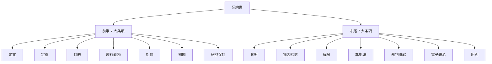

# 契約書レビュー実践

「6 大類型ごとに条項レベルで赤入れする」——NDA・取引基本・業務委託・SaaS・ライセンス・M&A NDA/LOI/SPA の条項別修正例と修正コメント文例、民法改正・下請法・フリーランス新法を契約書チェック視点で体系化

| 項目 | 内容 |
|---|---|
| カテゴリー | 法務・契約実務 |
| 難易度 | 中級 |
| 所要時間 | 約200分（全8レッスン） |
| 公開日 | 2026-07-23 |
| 最終更新日 | 2026-07-23 |
| コースURL | https://skillup.college/courses/legal/contract-review-practical/ |

## 対象者

中堅企業（従業員 100〜1,000 名規模）の法務担当 1〜3 年目、法務兼務の事業部担当、購買・営業・企画で契約書を受け取る立場、スタートアップの一人法務、IPO 準備企業の契約管理担当、独立系専門商社の契約担当。

## 前提知識

契約書レビューの全体像（6 ステップ／4 分類の共通論点）を耳にしたことがある程度。司法試験・行政書士の資格は不要（本コースは資格対策ではなく実務スキル）。

## 学習目標

- 契約書の全体構造 14 条項を俯瞰し、条項レベルの読み方を持てる
- NDA・秘密保持契約の条項別修正例と修正コメント文例を持ち帰れる
- 取引基本契約と業務委託契約の条項別レビューポイントを扱える
- SaaS 契約とライセンス契約の条項別修正例を扱える
- M&A の NDA・LOI・SPA レビューの入口を扱える
- 修正コメント文の型と Word 実務の作法を持てる
- 民法改正・下請法・独禁法・反社条項・準拠法の契約書チェック視点を持てる
- リーガルテック実装・事業部向け研修設計・契約書レビュー担当のキャリアを扱える

## コース概要

契約書レビューは、法律書を暗記する仕事ではなく、契約書の文言 1 つひとつを目で追い、リスクを見つけ、修正案を返す作業の反復です。姉妹コース法務担当者入門が「法務担当者の全業務サイクル」を扱ったのに対し、本コースはその中でも契約書レビューという 1 業務を、6 大類型（NDA・取引基本・業務委託・SaaS・ライセンス・M&A NDA/LOI/SPA）ごとに条項レベルで深掘りします。中堅企業（従業員 100〜1,000 名規模）の法務担当 1〜3 年目、法務兼務の事業部担当、購買・営業・企画で契約書を受け取る立場、スタートアップの一人法務、IPO 準備企業の契約管理担当を対象に、契約書の全体構造・6 大類型別レビュー・修正コメント文の書き方・民法改正／下請法／フリーランス新法／反社条項／準拠法の契約書チェック視点・リーガルテック実装までを 8 レッスンで体系化します。個別法律の詳細解釈や資格試験対策は既刊コンプライアンス関連コースや司法試験教材に譲り、本コースは「契約書に赤入れする担当者の型」に軸足を置きます。

## 学習の流れ

前半 5 レッスンで契約書の全体構造と 6 大類型別のレビューを扱います。レッスン 1 で契約書の 14 大構造と雛形との付き合い方、レッスン 2 で NDA・秘密保持契約、レッスン 3 で取引基本契約と業務委託契約、レッスン 4 で SaaS 契約とライセンス契約、レッスン 5 で M&A の NDA・LOI・SPA を扱います。中盤のレッスン 6 で修正コメント文の書き方と Word 実務を扱い、契約書レビューの実装の型を確立します。後半のレッスン 7 で民法改正・下請法・独禁法・反社条項・準拠法・仲裁条項・英文契約への入口、レッスン 8 でリーガルテック実装・事業部向け研修・契約書レビュー担当のキャリアと修了後の学び方までを扱います。全 8 レッスン・約 200 分の構成です。

## レッスン一覧

| No. | タイトル | 概要 | 所要時間 |
|---|---|---|---|
| 1 | 契約書レビューの心構えと契約書の全体構造 | 姉妹コース L3 との棲み分け明示、レビュー依頼を受ける側の温度感、契約書の 14 大構造（前文・定義・目的・履行義務・対価・期間・秘密保持・知財・損害賠償・解除・準拠法・裁判管轄・電子署名・附則）、雛形との付き合い方を学ぶ | 25分 |
| 2 | NDA・秘密保持契約のレビュー | 秘密情報の定義 3 パターン、目的外使用禁止、有効期間 3-5 年と残存条項、返還・破棄・派生成果物、片務／双務、DD 前 NDA と一般 NDA の違い、修正コメント文例 5 パターンを学ぶ | 25分 |
| 3 | 取引基本契約と業務委託契約のレビュー | 個別契約優先ルール、検収と契約不適合責任（民法改正 2020/4）、業務委託の準委任 vs 請負区別、偽装請負 4 判断基準、成果物と知財帰属、再委託、下請法 60 日ルールと契約書上チェック、フリーランス新法 12 項目を学ぶ | 25分 |
| 4 | SaaS 契約とライセンス契約のレビュー | SaaS 契約：SLA・稼働率保証・データ返還・データ削除義務・サブプロセッサー・GDPR／個情法対応、ライセンス契約：独占／非独占・地域制限・改良発明帰属・侵害通知・ライセンス料算定、SLA 3 レベル設計を学ぶ | 25分 |
| 5 | M&A の NDA・LOI・SPA レビュー入口 | M&A 前 NDA と一般 NDA の違い、LOI 主要 6 項目、SPA 主要条項（対価・調整・表明保証・特別補償・エスクロー・アーンアウト・ノンコンピート）、経営企画側 DD 4 領域との接続点を学ぶ | 25分 |
| 6 | 修正コメント文の書き方と Word 実務 | 修正コメントの型（修正案テキスト＋理由＋代替案）、想定質問文書、温度感の書き分け、Word トラック変更＋色分け（Must 赤／Should 黄／Nice to Have 青）、Cover Note の型 5 パターンを学ぶ | 25分 |
| 7 | 民法改正・下請法・独禁法・反社条項・準拠法 | 民法改正 2020/4 債権法 5 論点、独禁法 3 大禁止行為の契約書チェック、反社対応条項 4 要素、準拠法・裁判管轄・仲裁条項（JCAA／SIAC／HKIAC）の使い分け、英文契約への入口を学ぶ | 25分 |
| 8 | リーガルテック実装・研修・キャリア | リーガルテック 3 世代、CLM 5 機能、電子契約 5 社比較、事業部向け契約書レビュー研修 4 モジュール、契約書レビュー担当のキャリア（法務部長・GC・企業内弁護士・独立）、修了後の情報源を学ぶ | 25分 |

---

## レッスン1：契約書レビューの心構えと契約書の全体構造

（所要時間：25分）

### このレッスンで学ぶこと

- 姉妹コースとの棲み分けと本コースの守備範囲を把握できる
- 契約書レビューを依頼される側の温度感と 3 つの優先軸を持てる
- 契約書の全体構造 14 大条項を俯瞰し、条項レベルの読み方の下地を作れる
- 雛形との付き合い方——雛形を鵜呑みにしない 3 原則を扱える

---

契約書レビューは、法律書を暗記する仕事ではなく、契約書の文言 1 つひとつを目で追い、リスクを見つけ、修正案を返す作業の反復です。本コースは、その 1 業務に絞って条項レベルで深掘りします。本レッスンでは、まず本コースの守備範囲を明示し、契約書レビューを依頼される側の温度感と、契約書の全体構造を俯瞰します。

### 本コースの守備範囲と姉妹コースとの棲み分け

本コースは契約書レビューを「6 大類型ごとに条項レベルで赤入れする担当者」の視点で扱います。契約書レビューの 6 ステップ（目的確認→網羅チェック→リスク評価→優先度付け→修正コメント→戻し）、Must ／ Should ／ Nice to Have の 3 段階優先度、電子契約 5 社比較、法務担当者の全業務サイクル（事業部相談・社内規程・株主総会・知財・外部弁護士連携）は、法務担当者向け入門コースを参照してください。独禁法・下請法・個情法の法律解説そのものはコンプライアンス関連の入門コースに譲ります。

本コースは、姉妹コースが「担当者としての優先度付けと戻しの型」に集中したのに対し、その先の**条項レベルの中身**——契約書 6 大類型ごとの修正例、修正コメント文の書き方、民法改正・下請法・フリーランス新法・反社条項・準拠法の契約書チェック視点、リーガルテック実装、事業部向け研修設計——に振り切ります。

> **💡 ポイント**
> 姉妹コースが「どう進めるか」の型、本コースが「何を書き込むか」の中身。この 2 つがそろって初めて契約書レビュー担当者の仕事が回ります。

### レビューを依頼される側の温度感

契約書レビューは、事業部・購買・営業から契約書がメールで送られてくることから始まります。しかし、送られてくる契約書には共通する 3 つの温度感があります。

#### 温度感の 3 軸

- **緊急度**：明日の商談で使うのか、来週の締結を目指すのか、次期中期計画のための整備なのか
- **重要度**：契約金額、期間、リスクの大きさ（案件規模と自社への影響）
- **提出期限**：先方の期待するリードタイム（1 営業日、3 営業日、1 週間）

この 3 軸は、レビューの深さと修正コメントの量を規定します。緊急度が高い場合は Must のみに絞り、緊急度が低い場合は Nice to Have まで踏み込むといった調整が必要です。

#### 依頼書のフォーマット化

契約書レビューを依頼される際に、事業部から常に受け取っておきたい情報は次の 5 項目です。

- 契約の背景（相手方・案件概要・自社の立場）
- 契約書のバージョン（初回・修正案 1・修正案 2・最終案）
- 期限（何営業日で戻すか）
- 特に確認してほしい論点（相手方から指摘された条項・自社が譲れない条項）
- 承認ルート（誰の承認を最終的に必要とするか）

社内で「契約書レビュー依頼書」の Word テンプレを配布し、事業部から依頼が来る時点でこの 5 項目が埋まっている状態にできると、レビュー時間が大幅に短縮されます。

> **📝 補足**
> 契約書レビューを依頼される側と依頼する側は、しばしば「レビュー期間」に対する認識が異なります。依頼側は「1 営業日でお願いします」と気軽に言う一方、レビュー側は「新規案件は 3 営業日、修正案は 1 営業日」という運用が現実的です。姉妹コース法務担当者向け入門コースの「レスポンス SLA」の考え方をベースに、案件の性質別に期日を設計しておきます。

### 契約書の全体構造——14 大条項

一般的な業務契約書は、大きく **前半 7 大条項** と **末尾 7 大条項** の 14 条項で構成されます。特殊な条項（技術支援・情報授受・変更許容など）を追加した場合でも、この 14 条項の骨格は変わりません。

#### 前半 7 大条項

前半は「何を約束するか」を規定する条項群です。

- **前文**：契約当事者の特定、契約の背景、契約締結日
- **定義条項**：本契約で使う用語の定義（曖昧さを排除するための最重要条項）
- **目的条項**：契約の目的（第 1 条または前文に置くことが多い）
- **履行義務条項**：主たる債務（何を提供し、何を受け取るか）
- **対価条項**：金額、支払期日、支払方法、消費税の取扱い
- **期間条項**：契約期間、自動更新の有無、更新拒絶の通知期限
- **秘密保持条項**：秘密情報の定義、目的外使用禁止、有効期間、残存条項

#### 末尾 7 大条項

末尾は「トラブルが起きたらどうするか」を規定する条項群です。

- **知財条項**：成果物・派生成果物・改良発明の帰属、既存知財の取扱い、実施権の付与
- **損害賠償条項**：賠償責任の範囲（直接損害・間接損害）、上限金額、免責事由
- **解除条項**：解除事由（債務不履行・信頼関係破壊・反社該当）、催告の要否、期限利益喪失
- **準拠法条項**：どの国・地域の法律を適用するか
- **裁判管轄条項**：どの裁判所を第一審管轄とするか（合意管轄）
- **電子署名条項**：電子署名・電子契約サービスの利用可否、原本の取扱い
- **附則**：施行日、変更手続き、通知方法



> **💡 ポイント**
> 「契約書の 90% は 7 つの条項——残り 10% がその契約の本質」。前半 7 大条項＋末尾 7 大条項＝ 14 条項は、どの契約類型でも共通する骨格です。契約類型ごとの独自性は、この骨格に加えて追加される特殊条項（NDA なら派生成果物条項、業務委託なら偽装請負回避条項、SaaS ならデータ削除義務条項）の中身に現れます。

#### 3 つの読む順番

契約書を初めてレビューする際は、次の 3 段階で読み進めます。

- **第 1 読**：目的と履行義務のみに集中して通読（何を約束するか）
- **第 2 読**：期間・対価・解除・損害賠償を確認（金銭リスクの全体像）
- **第 3 読**：定義・準拠法・裁判管轄・秘密保持など細部（トラブル時の対処）

多くの新任者は第 1 読の段階から細部に入り込んでしまい、契約全体の目的を見失いがちです。3 段階に分けて読む習慣を持つことで、リスク評価の精度が上がります。

### 雛形との付き合い方——3 原則

多くの企業は、契約類型ごとに雛形（テンプレート）を保有しています。しかし、雛形を鵜呑みにして修正を入れないままレビュー完了とすることは危険です。

#### 雛形を鵜呑みにしない 3 原則

- **原則 1：雛形は起点、修正は目的別**——雛形は「1 番よく使う想定」でドラフトされているため、案件ごとの目的に応じて条項を追加・削除する必要があります
- **原則 2：雛形は 1 年に 1 回総点検**——民法改正・下請法改正・フリーランス新法など、法制度は毎年アップデートされます。雛形を放置すると法改正リスクが残ります
- **原則 3：雛形は自社利用・相手方修正版の 2 系統を保持**——自社が起案する場合と相手方の雛形を修正する場合とでは、注意すべき条項が異なります

#### 雛形の年次点検リスト

雛形は毎年 1 回、次の観点でチェックします。

- 法改正（民法・下請法・独禁法・個情法・フリーランス新法）への対応漏れがないか
- 実際の運用でクレームや修正が集中した条項はないか
- 契約管理システム（CLM）や電子契約サービスとの互換性が保たれているか
- 反社対応条項の文言が最新版になっているか

> **⚠️ 注意**
> 雛形をそのままコピー＆ペーストで運用し続けている企業では、2020 年 4 月の民法改正（債権法改正）で「瑕疵担保責任」が「契約不適合責任」に置き換わったにもかかわらず、いまだに「瑕疵」の文言が残っているケースが少なくありません。改正から 6 年経過していても、点検されていない雛形は改正後の条文体系と齟齬をきたしています。

### 契約書レビューの心構え——中核メッセージ 6 個

本コースを通じて反復する 6 個のメッセージを、L1 の締めとして提示します。

- **契約書は文言の集合体**——1 語 1 語がリスクの入り口
- **修正コメントは反論ではなく提案**——理由と代替案をセットで
- **契約書の 90% は 7 つの条項**——残り 10% がその契約の本質
- **民法改正・下請法・フリーランス新法は契約書チェックの基準線**
- **雛形は起点、修正は目的別**——雛形を鵜呑みにしない
- **英文契約は雰囲気ではなく体系**——ドラフティングの型が世界共通

### 次のステップ

本レッスンでは契約書レビューの心構えと契約書の全体構造を扱いました。次のレッスンでは、6 大類型の第 1 号として、契約書レビューの入口として最も頻繁に扱う NDA・秘密保持契約の条項別レビューを深掘りします。

### 確認クイズ

このレッスンで学んだ内容を確認しましょう。

#### Q1. 本コースと姉妹コース法務担当者向け入門コースの棲み分けについて、本レッスンで示している内容として正しいものはどれか。

- [x] 姉妹コースが契約書レビューの 6 ステップと 4 分類の共通論点まで扱ったのに対し、本コースは 6 大類型ごとの条項レベル修正例・修正コメント文例・民法改正／下請法／フリーランス新法の契約書チェック視点まで振り切る
- [ ] 本コースは司法試験の資格対策コースであり、姉妹コースは実務対策コースである
- [ ] 姉妹コースは契約書レビュー専門の内容であり、本コースはそのうちの一部だけを扱う
- [ ] 本コースと姉妹コースの内容はほぼ同じであり、姉妹コースを繰り返し学ぶ意味しかない

> **解説**
> 姉妹コース法務担当者向け入門コースの L3 は「担当者としての優先度付けと戻しの型」（6 ステップ・Must/Should/Nice to Have の 3 段階・電子契約 5 社比較・4 分類の共通論点）まで扱い、末尾で「詳細な条項別チェックポイントは全体像の把握に留め、詳細は専門書に譲る」と明示的な譲り宣言を出しています。本コースはその譲り先として、契約書 6 大類型（NDA・取引基本・業務委託・SaaS・ライセンス・M&A NDA/LOI/SPA）ごとの条項レベル修正例、修正コメント文例、民法改正／下請法／フリーランス新法の契約書チェック視点まで踏み込みます。本コースは資格対策ではなく実務スキルに軸足を置きます。

#### Q2. 契約書レビューを依頼される側の温度感 3 軸として、本レッスンで挙げていないものはどれか。

- [ ] 緊急度（明日の商談で使うのか、来週締結か、次期整備か）
- [x] 契約書の枚数（10 ページ以内か、それを超えるか）
- [ ] 重要度（契約金額・期間・リスクの大きさ）
- [ ] 提出期限（先方の期待するリードタイム）

> **解説**
> 温度感の 3 軸は「緊急度」「重要度」「提出期限」です。契約書の枚数は、レビュー時間の目安には影響しますが、温度感を規定する軸ではありません。3 軸を意識することで、レビューの深さ（Must のみに絞るか、Nice to Have まで踏み込むか）と修正コメントの量を調整できます。契約書レビュー依頼書の Word テンプレでは、契約の背景・バージョン・期限・特に確認してほしい論点・承認ルートの 5 項目を必須にするのが実務標準です。

#### Q3. 契約書の全体構造 14 大条項について、本レッスンで示している「末尾 7 大条項」として正しいものはどれか。

- [ ] 前文・定義・目的・履行義務・対価・期間・秘密保持
- [ ] 定義・目的・履行義務・対価・期間・秘密保持・知財
- [x] 知財・損害賠償・解除・準拠法・裁判管轄・電子署名・附則
- [ ] 履行義務・対価・期間・解除・準拠法・裁判管轄・電子署名

> **解説**
> 契約書の全体構造は、前半 7 大条項（前文・定義・目的・履行義務・対価・期間・秘密保持——「何を約束するか」）と末尾 7 大条項（知財・損害賠償・解除・準拠法・裁判管轄・電子署名・附則——「トラブルが起きたらどうするか」）の 14 条項で構成されます。契約類型ごとの独自性は、この骨格に加えて追加される特殊条項（NDA の派生成果物条項・業務委託の偽装請負回避条項・SaaS のデータ削除義務条項など）の中身に現れます。「契約書の 90% は 7 つの条項——残り 10% がその契約の本質」が本コースの中核メッセージの 1 つです。

#### Q4. 雛形との付き合い方について、本レッスンで示している「3 原則」の内容として正しいものはどれか。

- [ ] 雛形はそのまま使い、修正は絶対にしない
- [ ] 雛形は初回作成時に確定し、以後の点検は不要である
- [ ] 雛形は自社利用のみ 1 種類だけ保持すればよい
- [x] 雛形は起点で修正は目的別、雛形は 1 年に 1 回総点検、雛形は自社利用・相手方修正版の 2 系統を保持

> **解説**
> 雛形との付き合い方 3 原則は「雛形は起点、修正は目的別」「雛形は 1 年に 1 回総点検」「雛形は自社利用・相手方修正版の 2 系統を保持」です。雛形は 1 番よく使う想定でドラフトされているため案件ごとに修正が必要で、民法改正・下請法改正・フリーランス新法などの法改正に対応するため年次点検が必要、自社が起案する場合と相手方の雛形を修正する場合とでは注意すべき条項が異なるため 2 系統の保持が必要です。実際、2020 年 4 月の民法改正で「瑕疵担保責任」が「契約不適合責任」に置き換わったにもかかわらず、点検されていない雛形では旧文言が残っているケースが少なくありません。

---

## レッスン2：NDA・秘密保持契約のレビュー

（所要時間：25分）

### このレッスンで学ぶこと

- 秘密情報の定義 3 パターンと、事業部が持ち込む NDA の典型リスクを把握できる
- 目的外使用禁止条項・有効期間・残存条項の設計軸を持てる
- 返還・破棄・派生成果物の取扱いを条項レベルで扱える
- 片務 NDA と双務 NDA の使い分け、DD 前 NDA と一般 NDA の違いを扱える
- 修正コメント文例 5 パターンを持ち帰れる

---

前レッスンでは契約書レビューの心構えと 14 大条項の全体構造を扱いました。本レッスンでは 6 大類型の第 1 号として、契約書レビューの入口となる NDA・秘密保持契約を条項レベルで深掘りします。

### NDA・秘密保持契約とは

NDA（Non-Disclosure Agreement／秘密保持契約）は、契約当事者間で開示された秘密情報を目的外に使用しない、第三者に開示しない、契約終了後に返還・破棄することを取り決める契約です。取引の入口として、業務委託契約や共同開発契約・M&A 交渉の前段階で締結されることが多く、法務担当者が最も頻繁にレビューする契約類型です。

#### NDA の 3 大目的

- 商談・見積りのために自社の情報を渡す前の防御
- 業務委託・共同開発のために技術・顧客情報を交換する前の防御
- M&A 交渉のために財務・従業員情報を開示する前の防御

### 秘密情報の定義——3 パターン

NDA レビューで最初に確認すべきは「何が秘密情報なのか」の定義です。定義が曖昧だと、後日紛争になった際に「これは秘密情報ではない」と主張されるリスクがあります。実務では、次の 3 パターンが存在します。

#### パターン A：包括型（すべての開示情報を秘密情報とする）

「本契約の履行に関して開示・提供した一切の情報」を秘密情報とするパターン。開示側が有利ですが、受領側は「何が秘密情報か特定できない」という問題を抱えます。事業部間の情報の取り違えや口頭情報の扱いをめぐって後日紛争になりがちです。

#### パターン B：マーキング型（秘密情報と明示された情報のみ）

「書面には『秘密』の表示を付し、口頭で開示した情報は開示後 14 日以内に書面で秘密と特定する」と限定するパターン。受領側が有利で、実運用のコストが低く抑えられますが、開示側にとっては「マーキング漏れ」で情報が秘密情報から外れるリスクがあります。

#### パターン C：折衷型（本契約に関連する情報＋書面の秘密表示）

「本契約の目的に関連して開示された技術・営業・顧客情報」を対象とし、書面の秘密表示を任意とするパターン。両者のバランスを取った実務標準で、多くの企業の雛形はこのパターンで整備されています。

> **💡 ポイント**
> 相手方から包括型（パターン A）で NDA を送ってきた場合は、折衷型（パターン C）への修正提案が定番です。受領側の立場では「情報の特定困難」というリスクを負ってしまうため、書面での特定を求める修正が Must です。

#### 秘密情報から除外される 4 類型

多くの NDA では、次の 4 類型は秘密情報から除外されます。この除外規定が抜けているケースがあるため、必ずチェックします。

- 開示時点ですでに公知になっていた情報
- 開示後に受領側の責によらず公知となった情報
- 受領側が第三者から適法に取得した情報
- 受領側が自ら独自に開発した情報

### 目的外使用禁止条項

秘密情報を「本契約の目的」以外に使用しないことを取り決める条項です。「本契約の目的」が広く書かれていると、事実上目的外使用禁止が機能しなくなるため、目的条項の記載を必ず確認します。

#### 目的の書き方 3 段階

- **狭い書き方**：「本製品 A の共同開発のみ」——受領側の使用範囲が明確に限定される
- **中程度**：「本製品 A の共同開発およびその評価・検証のため」——実務でよく使う
- **広い書き方**：「両者間の取引全般の検討のため」——事実上目的外使用禁止が機能しにくい

自社が受領側の場合は広い書き方（「取引全般の検討」）が有利、開示側の場合は狭い書き方（「本製品 A の共同開発のみ」）が有利です。

### 有効期間 3-5 年と残存条項

NDA の有効期間は、契約類型と業界慣行により標準が異なります。

#### 有効期間の実務標準

- 商談・見積り目的の NDA：**1-3 年**
- 業務委託・共同開発目的の NDA：**3-5 年**
- M&A 交渉前の NDA：**2-3 年**

#### 残存条項——契約終了後も生きる条項

秘密保持義務は、契約期間終了後も一定期間存続するのが実務標準です。この「残存期間」を設定する条項を残存条項と呼びます。実務では次の 3 パターンで運用されます。

- **契約期間内のみ**（残存条項なし）：受領側有利で、実務では稀
- **契約終了後 3-5 年**：実務標準
- **無期限**：技術情報や顧客名簿など、時間経過で価値が減らない情報に限定

> **⚠️ 注意**
> 相手方から「無期限の秘密保持義務」を求められた場合、受領側の立場では「業務上の記憶」と「契約上の秘密情報」の区別が困難になり、実務での運用が破綻するリスクがあります。技術情報の一部に限定する（例：ソースコードのみ無期限、それ以外は 5 年）といった修正提案が定番です。

### 返還・破棄・派生成果物

契約終了時に、受領した秘密情報をどう処理するかを定める条項です。

#### 返還・破棄の 3 パターン

- **返還**：紙媒体・USB メモリなど物理的な媒体を返却する
- **破棄**：シュレッダー・データ削除で処分する
- **返還または破棄の選択**：開示側の指示に従う

#### 派生成果物の取扱い

秘密情報を利用して受領側が作成したメモ・分析資料・派生ファイルは、原則として「派生成果物」として扱われ、契約終了時には秘密情報と同様に返還・破棄の対象となります。しかし、雛形には派生成果物条項が抜けているケースが多く、追加提案が Must になることがあります。

### 片務 NDA と双務 NDA

NDA には、片務型（一方のみが情報を開示）と双務型（両者が情報を交換）の 2 種類があります。

#### 使い分けの判断軸

- **片務型を選ぶ場面**：見積り依頼・調達検討（開示側が明確）
- **双務型を選ぶ場面**：共同開発・業務提携（両者が技術・顧客情報を交換）

雛形が片務型のまま双務案件に使われるケースが多く、受領側の義務のみが規定されている契約書を双務案件で使うと、自社が情報を開示した際に相手方の秘密保持義務が発生しないリスクがあります。契約の目的から双務型が必要かを判断し、双務型への修正を提案します。

### DD 前 NDA と一般 NDA の違い

M&A の DD（デューデリジェンス）前に締結される NDA は、一般 NDA とは目的も範囲も異なります。

#### DD 前 NDA の 4 特徴

- **目的が広い**：「両者間の M&A 検討全般」となり、対象案件が特定されない
- **秘密情報の範囲が広い**：財務諸表・従業員名簿・取引先リストなど、通常業務で外部提供しない情報を含む
- **従業員引き抜き禁止条項**：DD で知り得た従業員情報を悪用した引き抜きを禁止（Non-Solicitation）
- **有効期間が短めで残存期間が長め**：交渉が成立せずとも情報が漏れないよう、契約期間 1-2 年＋残存 3-5 年が実務標準

> **📖 もっと詳しく**
> DD 前 NDA については本コースのレッスン 5「M&A の NDA・LOI・SPA レビュー入口」で詳しく扱います。本レッスンでは「一般 NDA と切り分けて雛形を持つ必要がある」という視点に留めます。

### 修正コメント文例 5 パターン

NDA レビューで頻出する修正コメントの文例を、実際の文面に近い形で示します。修正コメントの型については本コースのレッスン 6 で詳しく扱いますが、ここでは 5 パターンの入口を提示します。

#### パターン 1：秘密情報の定義を折衷型に修正

「本条第 1 項について、包括的な定義では受領側にとって秘密情報の特定が困難となります。実務標準として、書面には『秘密』の表示を付し、口頭で開示した情報は開示後 14 日以内に書面で秘密として特定する運用への修正をご検討いただけないでしょうか」

#### パターン 2：目的条項を絞る

「本契約の目的について、『両者間の取引全般の検討』では目的外使用禁止が事実上機能しません。本案件の性質を踏まえ、『本製品 A の共同開発およびその評価・検証』への限定をご検討いただけないでしょうか」

#### パターン 3：残存期間を有限に修正

「本条第 3 項の『無期限の秘密保持義務』について、受領側の実務運用上、業務上の記憶と契約上の秘密情報の区別が困難となります。ソースコードのみ無期限とし、それ以外は契約終了後 5 年間への修正をご検討いただけないでしょうか」

#### パターン 4：秘密情報の除外規定を追加

「本条に、秘密情報から除外される類型（開示時点で公知の情報、受領側の責によらず公知となった情報、第三者から適法に取得した情報、受領側が独自開発した情報）の 4 類型を追加いただけないでしょうか」

#### パターン 5：派生成果物条項を追加

「本条に、秘密情報を利用して受領側が作成した派生成果物（メモ・分析資料・派生ファイル）について、秘密情報と同様に返還・破棄の対象とする条項の追加をご検討いただけないでしょうか」

> **💡 ポイント**
> 修正コメントは「反論ではなく提案」——理由と代替案をセットで書きます。相手方の立場を否定するのではなく、「実務運用上」「業界標準として」といった第三者的な理由を添え、代替案を具体的に提示するのが実務標準です。

### 次のステップ

本レッスンでは NDA・秘密保持契約のレビューを扱いました。次のレッスンでは、6 大類型の第 2・第 3 号として、取引基本契約と業務委託契約の条項別レビューを深掘りし、民法改正・下請法・フリーランス新法の契約書チェック視点まで踏み込みます。

### 確認クイズ

このレッスンで学んだ内容を確認しましょう。

#### Q1. NDA における秘密情報の定義について、本レッスンで示している 3 パターンとして正しいものはどれか。

- [x] 包括型・マーキング型・折衷型
- [ ] マーキング型・自動型・強制型
- [ ] 有償型・無償型・折衷型
- [ ] 契約書型・口頭型・電子メール型

> **解説**
> 秘密情報の定義 3 パターンは「包括型（すべての開示情報を秘密情報とする）」「マーキング型（秘密情報と明示された情報のみ）」「折衷型（本契約に関連する情報＋書面の秘密表示）」です。相手方から包括型で送られてきた場合は、受領側の立場では「情報の特定困難」というリスクを負うため、折衷型への修正提案が定番です。折衷型は両者のバランスを取った実務標準で、多くの企業の雛形はこのパターンで整備されています。

#### Q2. NDA の有効期間について、本レッスンで示している契約類型別の実務標準として正しいものはどれか。

- [ ] 全ての NDA で有効期間 10 年が実務標準である
- [x] 商談・見積り目的の NDA は 1-3 年、業務委託・共同開発目的の NDA は 3-5 年、M&A 交渉前の NDA は 2-3 年が実務標準
- [ ] 有効期間は無期限が実務標準である
- [ ] 有効期間は契約書に記載する必要がなく、口頭で決めればよい

> **解説**
> NDA の有効期間の実務標準は、契約類型ごとに異なります。商談・見積り目的の NDA は 1-3 年、業務委託・共同開発目的の NDA は 3-5 年、M&A 交渉前の NDA は 2-3 年（ただし残存期間 3-5 年）が実務標準です。加えて残存条項（契約終了後も一定期間存続する秘密保持義務）は「契約終了後 3-5 年」が実務標準で、「無期限」は技術情報や顧客名簿など時間経過で価値が減らない情報に限定します。相手方から「無期限の秘密保持義務」を求められた場合は、対象を限定した修正提案が定番です。

#### Q3. NDA レビューにおける「派生成果物」の取扱いについて、本レッスンで示している内容として正しいものはどれか。

- [ ] 派生成果物は受領側が自由に扱えるため契約書に規定する必要はない
- [ ] 派生成果物は開示側の所有物であるため契約書に規定しなくても問題ない
- [x] 派生成果物（秘密情報を利用して受領側が作成したメモ・分析資料・派生ファイル）は秘密情報と同様に返還・破棄の対象となる。ただし雛形には派生成果物条項が抜けているケースが多く、追加提案が Must になることがある
- [ ] 派生成果物は契約終了時に必ず開示側に返還しなければならないため、破棄は認められない

> **解説**
> 派生成果物（秘密情報を利用して受領側が作成したメモ・分析資料・派生ファイル）は、契約終了時に秘密情報と同様に返還・破棄の対象となるのが実務標準です。しかし雛形には派生成果物条項が抜けているケースが多く、レビュー時に追加提案が Must になることがあります。返還・破棄の 3 パターン（返還／破棄／返還または破棄の選択）とセットで、派生成果物についても同様の取扱いを明記する修正提案が実務標準です。

#### Q4. 修正コメントの書き方について、本レッスンで示している内容として正しいものはどれか。

- [ ] 修正コメントは相手方の主張を否定する反論の形で書く
- [ ] 修正コメントは短く、代替案は書かない
- [ ] 修正コメントは相手方に個人的な感情をぶつける形で書く
- [x] 修正コメントは「反論ではなく提案」——理由と代替案をセットで書き、「実務運用上」「業界標準として」といった第三者的な理由を添え、代替案を具体的に提示する

> **解説**
> 修正コメントの型は「反論ではなく提案」——理由と代替案をセットで書きます。相手方の立場を否定するのではなく、「実務運用上」「業界標準として」といった第三者的な理由を添え、代替案を具体的に提示するのが実務標準です。5 パターンの修正コメント文例（秘密情報定義を折衷型に修正／目的条項を絞る／残存期間を有限に修正／秘密情報の除外規定を追加／派生成果物条項を追加）は、いずれもこの型に沿った文面で書かれています。修正コメントの型については本コースのレッスン 6 で詳しく扱います。

---

## レッスン3：取引基本契約と業務委託契約のレビュー

（所要時間：25分）

### このレッスンで学ぶこと

- 取引基本契約の個別契約優先ルール・検収・契約不適合責任を条項レベルで扱える
- 業務委託契約の準委任 vs 請負区別と偽装請負 4 判断基準を持てる
- 成果物と知財帰属・再委託の条項別レビューポイントを扱える
- 下請法 60 日ルールと 11 禁止行為の契約書上チェック視点を持てる
- フリーランス新法（2024/11 施行）の 12 項目記載事項を扱える

---

前レッスンでは NDA・秘密保持契約のレビューを扱いました。本レッスンでは、6 大類型の第 2・第 3 号として、取引基本契約と業務委託契約を条項レベルで深掘りします。民法改正（2020/4）による契約不適合責任、下請法の 60 日ルール、フリーランス新法（2024/11）の 12 項目記載事項まで踏み込みます。

### 取引基本契約とは

取引基本契約（Master Purchase Agreement、Master Service Agreement）は、継続的取引を予定する当事者間で、個別の取引に共通する事項を包括的に取り決める契約です。個別の取引は「個別契約」として発注書・注文請書などで規定します。

#### 個別契約優先ルール

取引基本契約でよく見る条項が「個別契約優先ルール」です。基本契約と個別契約とで内容が矛盾する場合、どちらを優先するかを取り決めます。

- **基本契約優先**：基本契約の条項が優先し、個別契約は基本契約の枠内で運用
- **個別契約優先**：個別契約の条項が優先し、案件ごとの柔軟性を確保
- **明示のあるものは個別契約優先、明示のないものは基本契約に従う**：折衷型（実務標準）

多くの雛形は「個別契約優先」を採用していますが、案件ごとに条件が変わる場面（数量・単価・納期）では個別契約優先が実務的です。ただし、法定的な事項（損害賠償・準拠法・裁判管轄）は基本契約優先とし、個別契約で変更できないよう明記します。

### 検収と契約不適合責任

取引基本契約の中核条項が検収と契約不適合責任です。2020 年 4 月の民法改正で「瑕疵担保責任」が「契約不適合責任」に名称変更され、実質的な内容も変わりました。

#### 検収条項——3 つの要素

- **検収期間**：納品後何日以内に検収を完了するか（実務標準 7-14 営業日）
- **検収基準**：合格・不合格の判定基準（数量・品質・仕様適合性）
- **検収みなし**：検収期間内に発注者から異議がない場合、合格とみなす規定

検収みなし規定がない場合、発注者が検収を怠るだけで検収期間が無期限に伸びるリスクがあります。受注者側の立場では、検収みなし規定を必ず追加する修正提案が実務標準です。

#### 契約不適合責任——民法改正 2020/4 の要点

改正民法（民法 562 条〜566 条）で導入された契約不適合責任は、旧「瑕疵担保責任」と異なる 4 つの請求権を規定します。

- **追完請求**：契約の内容に適合するよう修補・代替物引渡し・不足分引渡しを請求
- **代金減額請求**：追完がない場合、契約不適合の程度に応じて代金の減額を請求
- **損害賠償請求**：契約不適合により生じた損害の賠償を請求
- **契約解除**：契約不適合が重大な場合、契約を解除

これら 4 つの請求権は、契約書で任意に修正・限定できます。実務では次のような修正が入るのが典型的です。

- 追完請求の内容を「修補または代替物引渡し」に限定（不足分引渡しを除外）
- 代金減額請求の上限を「契約金額の 30%」などに限定
- 損害賠償の範囲を「直接損害のみ」「上限は契約金額の 100%」などに限定
- 契約不適合責任の期間を「検収後 1 年」などに限定（改正民法上は「知った時から 1 年」）

> **⚠️ 注意**
> 2020 年 4 月の民法改正から 6 年経過していても、雛形に「瑕疵担保責任」の文言が残っているケースが少なくありません。「瑕疵」を「契約不適合」に置き換えるだけでなく、追完請求・代金減額請求など新たな請求権への対応も必要です。雛形の年次点検で必ずチェックします。

### 業務委託契約とは

業務委託契約は、特定の業務を委託する契約類型で、民法上は「準委任契約」と「請負契約」の 2 種類に区分されます。

#### 準委任と請負の違い

| 項目 | 準委任契約（民法 656 条・643 条準用） | 請負契約（民法 632 条） |
|---|---|---|
| 目的 | 業務の遂行そのもの | 仕事の完成 |
| 成果責任 | 善管注意義務のみ | 完成物の引渡し |
| 契約不適合責任 | 適用なし（原則） | 適用あり |
| 途中解約 | 各当事者いつでも可（651 条） | 完成前は注文者、完成後は不可 |
| 代表例 | コンサルティング、月額顧問、SES | 建物建築、ソフトウェア受託開発 |

#### 業務委託契約の性質を明示する

多くの雛形は「業務委託契約」というタイトルのまま、準委任なのか請負なのかが曖昧なまま運用されています。契約書上、次のいずれかを明示する修正が実務標準です。

- 準委任型：「本業務は準委任契約とし、受注者は善管注意義務を負う。仕事の完成を保証するものではない」
- 請負型：「本業務は請負契約とし、受注者は納品物の完成に対して責任を負う」

### 偽装請負の 4 判断基準

業務委託契約でしばしば問題になるのが「偽装請負」です。契約書上は業務委託（請負・準委任）でも、実質的には労働者派遣に該当する場合、労働者派遣法違反となります。厚生労働省は、次の 4 判断基準（労働者派遣事業と請負により行われる事業との区分に関する基準、労働省告示第 37 号 1986 年）で偽装請負を判定します。

#### 4 判断基準

- **業務遂行の指揮命令**：受注者が自らの労働者を指揮命令しているか（発注者からの直接指揮命令は偽装請負）
- **業務遂行の裁量**：受注者が業務遂行の方法・順序を自ら決定できるか
- **労働時間・服務規律**：受注者が自らの労働者の労働時間・服務規律を管理しているか
- **経営上の独立性**：受注者が自らの資材・機材・費用で業務を遂行しているか

契約書レビューでは、これら 4 基準に反する条項（発注者による指揮命令権の留保・発注者の勤務時間管理・発注者の資材貸与）を確認し、必要に応じて修正提案します。

> **💡 ポイント**
> 契約書が「業務委託契約」となっていても、運用が偽装請負に該当すれば労働者派遣法違反です。契約書レビュー時に文面上の 4 基準を確認するだけでなく、実運用（発注者が受注者の労働者に日常的に指示を出しているか）についても事業部と確認するのが実務です。

### 成果物と知財帰属

業務委託契約で成果物（プログラム・レポート・デザインなど）が生じる場合、知財帰属を明確に定める必要があります。

#### 知財帰属の 3 パターン

- **委託者帰属**：成果物の著作権・特許権はすべて委託者に帰属（実務で最も多い）
- **受託者帰属**：成果物の著作権・特許権は受託者に帰属し、委託者はライセンス許諾を受ける
- **共有**：共同で著作権・特許権を保有（実務では紛争リスクが高く推奨されない）

#### 著作者人格権の取扱い

著作権法上、著作者人格権（同一性保持権・氏名表示権・公表権）は著作者に帰属し、譲渡できません（著作権法 59 条）。実務では「受託者は著作者人格権を行使しない」との不行使特約を契約書に入れるのが標準です。この特約がない場合、成果物を委託者が改変した際に受託者から同一性保持権侵害を主張されるリスクがあります。

#### 既存知財の取扱い

受託者が業務前から保有していた既存知財（背景知財、Background IP）を成果物に組み込む場合、既存知財の権利は受託者に留保しつつ、委託者に対して業務目的での実施権を付与する条項が必要です。

### 再委託の可否

業務委託契約では、受託者が第三者に業務を再委託する可否を規定します。

#### 再委託 3 パターン

- **再委託完全禁止**：受託者は業務を自ら遂行する義務を負う
- **書面承諾による再委託許可**：委託者の事前書面承諾があれば再委託可能
- **再委託自由**：受託者の判断で自由に再委託可能（受託者有利）

実務では「書面承諾による再委託許可」が多数派です。加えて、再委託先の秘密保持義務・成果物の権利帰属・下請法遵守について、受託者が委託者と同等の義務を再委託先にも負わせる条項が実務標準です。

### 下請法 60 日ルールと契約書チェック

下請代金支払遅延等防止法（下請法）は、親事業者（資本金 3 億円超と 1,000 万円超などの一定要件を満たす事業者）が下請事業者に対して発注する取引を規制します。姉妹コース コンプライアンス基礎で扱った 11 禁止行為のうち、契約書上で特にチェックすべき 5 項目を扱います。

#### 契約書上チェックする 5 項目

- **60 日ルール（下請法 2 条の 2）**：支払期日は「物品等を受領した日から 60 日以内」でなければならない。契約書上「検収完了後 30 日以内」といった 60 日を超える可能性のある条項は要修正
- **書面交付義務（下請法 3 条）**：発注時に、給付内容・下請代金の額・支払期日など 12 項目を記載した書面（3 条書面）を交付する義務
- **記録作成保存義務（下請法 5 条）**：親事業者は下請取引に関する記録を作成し 2 年間保存する義務
- **受領拒否の禁止（下請法 4 条 1 項 1 号）**：下請事業者に責任がないのに受領を拒否することを禁止
- **買いたたきの禁止（下請法 4 条 1 項 5 号）**：通常支払われる対価に比べて著しく低い下請代金の額を不当に定めることを禁止

契約書レビューでは、支払期日・受領拒否要件・代金決定方法などが下請法に抵触しないかを確認します。

> **📖 もっと詳しく**
> 下請法の 11 禁止行為のうち残る 6 項目（返品・減額・不当給付内容変更・不当なやり直し・報復措置・有償支給原材料等の対価の早期決済など）については、コンプライアンス関連の入門コースを参照してください。契約書レビューでは 5 項目のチェックが中心となります。

### フリーランス新法 12 項目記載事項

フリーランス新法（特定受託事業者に係る取引の適正化等に関する法律、2024 年 11 月 1 日施行）は、業務委託事業者がフリーランス（特定受託事業者）に業務を委託する場合の義務を定めます。契約書には次の 12 項目の記載が義務付けられます。

#### 12 項目記載事項

- 業務委託事業者および特定受託事業者の氏名または名称
- 業務委託をした日
- 特定受託事業者の給付の内容（成果物の内容）
- 給付を受領する期日または役務の提供を受ける期日
- 給付を受領する場所または役務の提供を受ける場所
- 給付の内容について検査を行う場合の検査期日
- 報酬の額（算定方法を含む）
- 報酬の支払期日
- 報酬の支払方法（銀行振込・現金・電子マネーなど）
- 現金以外での支払いの場合、その内容
- 電子マネー等での支払いの場合、その内容
- その他公正取引委員会規則で定める事項

#### 契約書レビューでの活用

フリーランスとの業務委託契約書には、これら 12 項目がすべて記載されているかチェックリスト形式で確認します。1 つでも欠けていると法違反となるため、雛形の年次点検でフリーランス新法への対応が必要です。

> **⚠️ 注意**
> フリーランス新法は 2024 年 11 月 1 日施行の新しい法律です。2024 年 11 月以前の雛形をそのまま使うと 12 項目の記載事項が抜けているリスクがあります。雛形の総点検が Must です。

#### 特定受託事業者への発注時の 3 大義務

12 項目の記載事項に加えて、特定受託事業者への発注時には次の 3 大義務があります。

- **募集情報の的確表示義務**：業務内容・報酬・期間などを的確に表示
- **育児・介護等との両立配慮義務**：6 か月以上の継続業務委託では育児・介護と両立できる配慮
- **中途解除等の事前予告義務**：6 か月以上の継続業務委託では 30 日前までに解除予告

### 次のステップ

本レッスンでは取引基本契約と業務委託契約のレビューを扱いました。次のレッスンでは、6 大類型の第 4 号として、SaaS 契約とライセンス契約の条項別レビューを深掘りし、SLA・データ削除義務・改良発明帰属など、SaaS 時代・ライセンス取引時代特有の論点を扱います。

### 確認クイズ

このレッスンで学んだ内容を確認しましょう。

#### Q1. 取引基本契約における個別契約優先ルールについて、本レッスンで示している内容として正しいものはどれか。

- [x] 基本契約と個別契約とで内容が矛盾する場合の優先順位を規定し、明示のあるものは個別契約優先、明示のないものは基本契約に従うという折衷型が実務標準
- [ ] 基本契約と個別契約の内容が矛盾しても、契約書に何も規定する必要はない
- [ ] 個別契約は基本契約と完全に一致していなければならないため、個別契約優先ルールは不要
- [ ] 基本契約は個別契約より常に優先するため、個別契約に規定した内容は無効になる

> **解説**
> 個別契約優先ルールは、基本契約と個別契約とで内容が矛盾する場合、どちらを優先するかを取り決める条項です。実務では「明示のあるものは個別契約優先、明示のないものは基本契約に従う」という折衷型が実務標準です。案件ごとに条件が変わる場面（数量・単価・納期）では個別契約優先が実務的ですが、法定的な事項（損害賠償・準拠法・裁判管轄）は基本契約優先とし、個別契約で変更できないよう明記します。

#### Q2. 業務委託契約における準委任と請負の区別について、本レッスンで示している内容として正しいものはどれか。

- [ ] 準委任も請負も同じ内容であり、区別する必要はない
- [x] 準委任は業務の遂行そのものが目的で善管注意義務のみ、請負は仕事の完成が目的で完成物の引渡しと契約不適合責任を負う。多くの雛形は準委任か請負かが曖昧なため、契約書上いずれかを明示する修正が実務標準
- [ ] 準委任は民法上の契約類型ではないため、契約書に規定する必要はない
- [ ] 請負契約では受注者は仕事の完成義務を負わず、業務の遂行のみで済む

> **解説**
> 準委任と請負は民法上の異なる契約類型で、目的（業務の遂行 vs 仕事の完成）、成果責任（善管注意義務のみ vs 完成物の引渡し）、契約不適合責任（原則適用なし vs 適用あり）、途中解約（各当事者いつでも可 vs 制限あり）で違います。多くの雛形は「業務委託契約」というタイトルのまま準委任か請負かが曖昧なため、契約書上「本業務は準委任契約とし、受注者は善管注意義務を負う」または「本業務は請負契約とし、受注者は納品物の完成に対して責任を負う」のいずれかを明示する修正が実務標準です。

#### Q3. 偽装請負の 4 判断基準について、本レッスンで示している内容として正しいものはどれか。

- [ ] 契約書のタイトルが「業務委託契約」であれば、必ず請負として扱われる
- [ ] 偽装請負は労働基準法違反であり、労働者派遣法とは無関係である
- [x] 厚生労働省告示（労働省告示第 37 号 1986 年）の 4 判断基準（業務遂行の指揮命令／業務遂行の裁量／労働時間・服務規律／経営上の独立性）で判定される。契約書上は業務委託でも実質的には労働者派遣に該当する場合、労働者派遣法違反となる
- [ ] 偽装請負は契約書レビュー時にチェックする必要がなく、運用面のみで判断すればよい

> **解説**
> 偽装請負は、契約書上は業務委託（請負・準委任）でも、実質的には労働者派遣に該当する場合を指し、労働者派遣法違反となります。厚生労働省告示（労働省告示第 37 号 1986 年、労働者派遣事業と請負により行われる事業との区分に関する基準）は 4 判断基準を定めており、業務遂行の指揮命令・業務遂行の裁量・労働時間や服務規律・経営上の独立性で判定します。契約書レビューでは 4 基準に反する条項（発注者による指揮命令権の留保・発注者の勤務時間管理・発注者の資材貸与）を確認し、必要に応じて修正提案します。実運用（発注者が受注者の労働者に日常的に指示を出しているか）についても事業部と確認するのが実務です。

#### Q4. フリーランス新法の 12 項目記載事項について、本レッスンで示している内容として正しいものはどれか。

- [ ] フリーランス新法は 2020 年 4 月に施行されたため、雛形は 2020 年時点で対応済み
- [ ] 12 項目記載事項は任意規定であり、記載しなくても法違反にはならない
- [ ] フリーランス新法は個人事業主のみを対象とし、法人格を持つ受託者には適用されない
- [x] フリーランス新法（特定受託事業者に係る取引の適正化等に関する法律）は 2024 年 11 月 1 日施行、業務委託事業者がフリーランス（特定受託事業者）に業務委託する場合、12 項目（業務内容・報酬・支払期日など）の記載義務があり、雛形の年次点検が必須

> **解説**
> フリーランス新法（特定受託事業者に係る取引の適正化等に関する法律）は 2024 年 11 月 1 日施行の新しい法律で、業務委託事業者がフリーランス（特定受託事業者）に業務を委託する場合、12 項目（業務委託事業者および特定受託事業者の氏名または名称・業務委託をした日・給付の内容・受領期日・受領場所・検査期日・報酬の額・支払期日・支払方法など）の記載が義務付けられます。加えて、6 か月以上の継続業務委託では育児・介護等との両立配慮義務・中途解除等の事前予告義務（30 日前）などの 3 大義務もあります。2024 年 11 月以前の雛形をそのまま使うと 12 項目の記載事項が抜けているリスクがあり、雛形の総点検が Must です。

---

## レッスン4：SaaS 契約とライセンス契約のレビュー

（所要時間：25分）

### このレッスンで学ぶこと

- SaaS 契約の SLA・稼働率保証・データ返還・データ削除義務を条項レベルで扱える
- サブプロセッサー条項と GDPR ／個情法対応の契約書チェック視点を持てる
- ライセンス契約の独占／非独占・地域制限・改良発明帰属を条項別に扱える
- ライセンス料算定 3 パターン（一括／ランニング／ハイブリッド）を扱える
- SLA 3 レベル設計と侵害通知条項の実務標準を持ち帰れる

---

前レッスンでは取引基本契約と業務委託契約のレビューを扱いました。本レッスンでは、6 大類型の第 4 号として、SaaS 契約とライセンス契約を条項レベルで深掘りします。姉妹コース情シス関連の入門コースが「買い手 PM 視点で SaaS プロジェクトを回す」実務を扱うのに対し、本コースは「法務担当者が契約書に赤入れする視点で SaaS 契約条項をどう修正するか」を扱います。

### SaaS 契約とは

SaaS 契約（Software as a Service Agreement）は、クラウド上でソフトウェアを利用させるサービス提供契約です。買い手（利用者）と売り手（SaaS ベンダー）の 2 当事者間で締結され、月額または年額の利用料と引き換えにサービス利用権が付与されます。契約書の実務名称は「SaaS 利用契約」「クラウドサービス利用契約」「利用規約」などがあり、大企業向けには個別交渉可能な MSA（Master Service Agreement）＋ Order Form の形式、SMB 向けには利用規約への同意による定型契約の形式が一般的です。

#### SaaS 契約の 3 特徴

- **役務の継続提供**：買い手はサービスを継続的に利用し、月額または年額で料金を支払う
- **買い手のデータが売り手側に格納**：顧客データが SaaS ベンダーのクラウド環境に保存される
- **契約終了時のデータ返還・削除が論点になる**：ベンダーロックインとデータ主権の観点

### SLA と稼働率保証

SaaS 契約の中核条項の 1 つが SLA（Service Level Agreement、サービス水準合意）です。SLA は、サービス稼働率・応答時間・障害復旧時間などの品質基準と、達成できなかった場合の補償を定めます。

#### SLA の 3 レベル設計

- **保証レベル**：稼働率 99.9%・99.95%・99.99% のいずれか（月間許容ダウンタイム 43 分／21 分／4 分）
- **測定レベル**：稼働率の測定方法（暦月・営業日・24 時間・特定時間帯）
- **補償レベル**：SLA 未達時の補償（月額料金の 10%・25%・50% 相当額のクレジット）

エンタープライズ向け SaaS では 99.9%（月 43 分ダウンタイム許容）が実務標準です。ミッションクリティカルな用途では 99.95% 以上を要求し、金融・医療・製造ラインでは 99.99% を求めることもあります。

#### 稼働率の測定除外時間

SLA には、稼働率の測定から除外される時間が定められることが多く、レビュー時には次の 5 項目を確認します。

- 事前予告のあるメンテナンス時間（実務標準：月 4 時間以内）
- 緊急メンテナンス時間（30 分以内）
- 買い手側の設備障害
- 天災・戦争・法令変更などの不可抗力
- インターネット回線の障害（買い手・売り手いずれの責任でもない部分）

除外時間が広く設定されていると、実質的な稼働率保証が空洞化します。「事前予告のあるメンテナンス時間は月 4 時間以内」といった上限設定を修正提案するのが実務標準です。

> **💡 ポイント**
> SLA は「達成不能な高い数値」を目指すのではなく、「実現可能な数値＋達成できなかった時の補償」の組み合わせで設計します。稼働率 100% は物理的に不可能であり、99.9% を守るための冗長構成と障害対応体制を担保するのが実務標準です。

### データ返還とデータ削除義務

SaaS 契約終了時に、買い手のデータをどう処理するかを定める条項です。姉妹コース情シス関連の入門コースでも触れられていますが、本コースでは法務側の条項レベルで深掘りします。

#### データ返還の 3 項目

- **返還形式**：CSV／JSON／XML など、買い手が後継システムで読み込める形式
- **返還期限**：契約終了後何日以内に返還するか（実務標準：30 日以内）
- **返還時の費用負担**：買い手負担・売り手負担・双方協議

#### データ削除義務の 3 パターン

- **一定期間経過後の自動削除**：契約終了後 60 日・90 日・180 日で自動削除（実務で最も多い）
- **買い手からの削除要求時に削除**：買い手の指示に応じて削除
- **削除完了証明書の発行**：削除完了後に売り手が削除完了証明書を発行

削除完了証明書は、GDPR・個情法・企業内部監査で証跡として利用されるため、大企業向け SaaS 契約では必須項目となりつつあります。

> **⚠️ 注意**
> 「データを永久保存する」という条項が売り手側の雛形に紛れ込んでいるケースがあります。GDPR ・改正個情法の観点から、目的達成後のデータ削除は義務であり、「永久保存」は違法となるリスクがあります。契約書レビュー時には必ず削除条項の有無と削除期限を確認します。

### サブプロセッサー条項と GDPR ／個情法対応

SaaS ベンダーが顧客データの処理を第三者（サブプロセッサー、例えば AWS ・ Google Cloud ・ Datadog など）に委託する場合、サブプロセッサー条項で規律します。

#### サブプロセッサー条項——4 項目

- **サブプロセッサーの開示**：ベンダーが使用するサブプロセッサーのリストを公開・通知
- **サブプロセッサーの追加・変更の事前通知**：追加・変更時に買い手へ事前通知（実務標準：30 日前）
- **サブプロセッサーの契約義務**：サブプロセッサーもベンダーと同等の秘密保持・データ保護義務を負う
- **サブプロセッサー起因の責任**：サブプロセッサーの行為による損害についてベンダーが責任を負う

#### GDPR ／改正個情法の観点

GDPR（EU 一般データ保護規則、2018/5 施行）の適用を受ける企業では、SaaS 契約に SCCs（Standard Contractual Clauses、標準契約条項）または DPA（Data Processing Agreement、データ処理契約）の締結が必須です。日本の改正個情法（2022/4 全面施行）でも、越境データ移転時の同意取得・委託先の監督義務が定められており、SaaS 契約書に個情法対応条項が必要となります。

契約書レビューでの GDPR ／改正個情法チェック項目：

- SaaS ベンダーが個人データを処理する場合、委託先監督義務の履行方法（監査権・報告義務）
- 越境データ移転が発生する場合、SCCs または同等の措置
- 個人データ漏洩発生時の通知期限（GDPR は 72 時間以内、個情法は「速やかに」）
- データ主体の権利行使（開示請求・削除請求）への対応義務

### ライセンス契約とは

ライセンス契約（License Agreement）は、知的財産権（特許・著作権・商標・ノウハウなど）の実施権・利用権を許諾する契約です。技術ライセンス（特許・ノウハウ）、著作物ライセンス（ソフトウェア・出版物）、商標ライセンス（ブランド使用）など多様です。

#### 独占ライセンスと非独占ライセンス

- **独占ライセンス（Exclusive License）**：ライセンサー（許諾者）は他者に同一範囲でライセンスできない。ライセンサー自身も同一範囲で実施できない
- **準独占ライセンス（Sole License）**：ライセンサーは他者にライセンスできないが、ライセンサー自身は同一範囲で実施可能
- **非独占ライセンス（Non-Exclusive License）**：ライセンサーは他者にも同一範囲でライセンス可能。実務で最も多い

契約書上「独占」と書かれていても、実際は準独占の意図であることがあり、独占の範囲（対象製品・地域・期間）を必ず確認します。

#### 地域制限

ライセンスの許諾範囲を地理的に限定する条項です。実務では次のパターンがあります。

- **世界全域（Worldwide）**
- **特定国のみ（例：日本国内、米国のみ）**
- **特定地域（例：APAC 地域、EU 域内）**

グローバル展開を予定する場合は「世界全域」が有利ですが、ライセンス料が高額になるため、初期は「日本国内のみ」で契約し、事業拡大に合わせて地域拡張の再交渉権を確保する条項設計も実務的です。

### 改良発明の帰属

ライセンサーの技術を利用してライセンシー（被許諾者）が改良発明を生み出した場合、その改良発明の権利がどちらに帰属するかを定める条項です。実務では次の 3 パターンがあります。

#### 改良発明帰属の 3 パターン

- **ライセンサー帰属**：改良発明の権利はすべてライセンサーに帰属（ライセンシー不利、実務で稀）
- **ライセンシー帰属＋ライセンサーへの実施権付与**：改良発明はライセンシーの権利、ライセンサーは実施権を得る（実務標準）
- **共有**：改良発明を共有（実務では紛争リスクが高い）

改良発明の定義（「元発明の改良」の範囲）を明確にし、ライセンサーが将来的にライセンシーの技術を無償で使えるような広い定義にならないよう修正提案します。

### ライセンス料算定——3 パターン

ライセンス料の算定方法は、契約類型と業界慣行により標準が異なります。

#### 3 大パターン

- **一括払い（Lump Sum、上前金）**：契約時に固定額を一括で支払う。金額計算がシンプルで、キャッシュフロー予測が容易
- **ランニングロイヤルティ**：ライセンス実施による売上・生産数量に応じて継続的に支払う。実施量に比例するため公平だが、報告義務・監査権が必要
- **ハイブリッド型（一時金＋ランニング）**：契約時に一時金を支払い、その後の実施量に応じてランニングロイヤルティを支払う（実務で最も多い）

ランニングロイヤルティを採用する場合、次の 4 条項が必要になります。

- ロイヤルティ率（売上高の 3-10% が実務標準、業界により異なる）
- 報告書提出義務（四半期または半期ごと）
- 監査権（ロイヤルティ計算の正確性を検証する権利）
- 最低ロイヤルティ（Minimum Royalty、ライセンシーが実施しなくても最低額を支払う保証）

### 侵害通知条項

ライセンス契約では、第三者による侵害が発生した場合の対応を定める侵害通知条項が重要です。

#### 侵害通知条項の 4 項目

- **通知義務**：ライセンシーが第三者による侵害を知った場合、ライセンサーに通知する義務
- **訴訟主導権**：侵害訴訟の主導権をライセンサー・ライセンシーのどちらが持つか
- **費用負担**：侵害訴訟の費用負担（ライセンサー・ライセンシー・按分）
- **賠償金の帰属**：侵害訴訟で得た賠償金の帰属

独占ライセンシーは、自らも訴訟提起権を持つ設計とすることで、迅速な侵害対応が可能になります。非独占ライセンシーは通常、ライセンサーに主導権を委ねる設計が多数派です。

> **📖 もっと詳しく**
> 侵害訴訟対応の実務そのもの（内容証明の作成・訴状の受領・和解交渉）については、法務担当者向け入門コースで扱います。本コースは契約書レビュー時の条項設計に集中します。

### 次のステップ

本レッスンでは SaaS 契約とライセンス契約のレビューを扱いました。次のレッスンでは、6 大類型の第 5 号として、M&A 契約書の入口として、DD 前 NDA、LOI、SPA の主要条項レビューを深掘りします。

### 確認クイズ

このレッスンで学んだ内容を確認しましょう。

#### Q1. SaaS 契約の SLA 3 レベル設計について、本レッスンで示している内容として正しいものはどれか。

- [x] 保証レベル（稼働率 99.9%・99.95%・99.99% など）、測定レベル（暦月・営業日・24 時間・特定時間帯）、補償レベル（月額料金の 10%・25%・50% 相当額のクレジット）の 3 レベルで設計する。エンタープライズ向けは 99.9% が実務標準
- [ ] SLA は稼働率のみを規定し、測定方法や補償は契約書に規定する必要はない
- [ ] 稼働率 100% を保証するのが実務標準である
- [ ] SLA は SaaS ベンダーが単独で決めるものであり、買い手が交渉する余地はない

> **解説**
> SLA（Service Level Agreement）は、保証レベル（稼働率）、測定レベル（測定方法）、補償レベル（未達時の補償）の 3 レベルで設計します。エンタープライズ向け SaaS では 99.9%（月 43 分ダウンタイム許容）が実務標準です。稼働率の測定除外時間（事前予告メンテナンス・緊急メンテナンス・買い手側設備障害・不可抗力・回線障害）が広く設定されていると実質的な稼働率保証が空洞化するため、「事前予告メンテナンスは月 4 時間以内」といった上限設定を修正提案するのが実務標準です。稼働率 100% は物理的に不可能であり、実現可能な数値＋達成できなかった時の補償の組み合わせで設計します。

#### Q2. SaaS 契約におけるデータ削除義務について、本レッスンで示している内容として正しいものはどれか。

- [ ] SaaS ベンダーは契約終了後もデータを永久保存すべきである
- [x] データ削除の 3 パターン（一定期間経過後の自動削除／買い手からの削除要求時に削除／削除完了証明書の発行）があり、GDPR・改正個情法の観点から目的達成後のデータ削除は義務。大企業向け SaaS 契約では削除完了証明書が必須項目となりつつある
- [ ] データ削除条項は個人情報を扱わない SaaS では必要ない
- [ ] GDPR は EU 内企業のみが対象で、日本企業には関係ない

> **解説**
> SaaS 契約終了時のデータ削除は、GDPR（EU 一般データ保護規則、2018/5 施行）・改正個情法（2022/4 全面施行）の観点から目的達成後のデータ削除が義務です。「一定期間経過後の自動削除（60-180 日）」「買い手からの削除要求時に削除」「削除完了証明書の発行」の 3 パターンがあり、削除完了証明書は GDPR・個情法・企業内部監査で証跡として利用されるため大企業向け SaaS 契約では必須項目となりつつあります。「データを永久保存する」という条項は違法となるリスクがあり、契約書レビュー時には必ず削除条項の有無と削除期限を確認します。日本企業でも EU の個人データを取り扱う場合は GDPR の適用を受けます。

#### Q3. ライセンス契約における独占・準独占・非独占の違いについて、本レッスンで示している内容として正しいものはどれか。

- [ ] 独占・準独占・非独占はすべて同じ意味である
- [ ] 独占ライセンスと非独占ライセンスは、料金設定は同一で問題ない
- [x] 独占ライセンスはライセンサー（許諾者）が他者にライセンスできず、ライセンサー自身も実施できない。準独占はライセンサー自身は実施可能。非独占は他者にもライセンス可能で実務で最も多い。契約書上「独占」と書かれていても実際は準独占の意図であることがあり、独占の範囲を必ず確認する
- [ ] 独占ライセンスは違法である

> **解説**
> 独占ライセンス（Exclusive License）はライセンサーが他者に同一範囲でライセンスできず、ライセンサー自身も同一範囲で実施できません。準独占ライセンス（Sole License）はライセンサーが他者にライセンスできませんが、ライセンサー自身は同一範囲で実施可能です。非独占ライセンス（Non-Exclusive License）はライセンサーが他者にも同一範囲でライセンス可能で、実務で最も多いパターンです。契約書上「独占」と書かれていても実際は準独占の意図であることがあり、独占の範囲（対象製品・地域・期間）を必ず確認します。ライセンス料は独占＞準独占＞非独占の順で高くなるのが実務標準です。

#### Q4. ライセンス料算定 3 パターンについて、本レッスンで示している内容として正しいものはどれか。

- [ ] ライセンス料は必ず一括払いでなければならない
- [ ] ランニングロイヤルティは違法である
- [ ] ライセンス料算定方法は口頭で決めればよく、契約書に規定する必要はない
- [x] 3 大パターンは一括払い（Lump Sum）、ランニングロイヤルティ、ハイブリッド型（一時金＋ランニング）。ハイブリッド型が実務で最も多く、ランニング採用時はロイヤルティ率（売上高の 3-10%）・報告書提出義務・監査権・最低ロイヤルティの 4 条項が必要

> **解説**
> ライセンス料算定の 3 大パターンは、一括払い（Lump Sum、契約時に固定額を一括で支払う）、ランニングロイヤルティ（ライセンス実施による売上・生産数量に応じて継続的に支払う）、ハイブリッド型（一時金＋ランニング、契約時に一時金を支払いその後の実施量に応じてランニングロイヤルティを支払う）で、ハイブリッド型が実務で最も多いパターンです。ランニングロイヤルティを採用する場合、ロイヤルティ率（売上高の 3-10% が実務標準、業界により異なる）・報告書提出義務（四半期または半期ごと）・監査権・最低ロイヤルティ（Minimum Royalty）の 4 条項が必要になります。

---

## レッスン5：M&A の NDA・LOI・SPA レビュー入口

（所要時間：25分）

### このレッスンで学ぶこと

- M&A 前 NDA と一般 NDA の 4 つの違いを把握できる
- LOI（Letter of Intent）主要 6 項目の条項レベル記載事項を扱える
- SPA（Share Purchase Agreement）主要条項（対価・調整・表明保証・特別補償・エスクロー・アーンアウト・ノンコンピート）を扱える
- 経営企画側 DD 4 領域との接続点を持てる
- M&A 契約書レビューの入口の型を持ち帰れる

---

前レッスンでは SaaS 契約とライセンス契約のレビューを扱いました。本レッスンでは、6 大類型の第 5 号として、M&A（合併・買収）契約書の入口となる 3 つの契約——DD 前 NDA、LOI、SPA——を条項レベルで扱います。M&A 契約書は法務担当者が最も緊張感を持って向き合う契約類型であり、専門書 1 冊分の論点を持つ領域ですが、本レッスンでは入口の型に絞って解説します。

### M&A 契約書の 3 段階

M&A の交渉プロセスは、契約書の観点で 3 段階に分けられます。

#### 3 段階の契約

- **第 1 段階：DD 前 NDA**——M&A 検討の初期段階で締結。財務・従業員・取引先情報の開示前防御
- **第 2 段階：LOI（意向表明書）**——買収の意思と主要条件を確認する暫定合意
- **第 3 段階：SPA（株式譲渡契約）**——最終的な株式売買契約

姉妹コース経営企画関連の入門コースが「事業ポートフォリオを評価・付議する側」（PPM・稟議・DD・PMI）を扱うのに対し、本コースは「契約書に赤入れする側」に振り切ります。

### M&A 前 NDA と一般 NDA の 4 つの違い

M&A 検討の初期段階で締結される DD 前 NDA は、一般 NDA と比較して次の 4 点で異なります。

#### 違い 1：目的が広い

一般 NDA は「本製品 A の共同開発」のように狭く特定されるのに対し、M&A 前 NDA は「両者間の M&A 検討全般」と広く定義されます。対象案件を特定せず、DD の過程で明らかになる情報全般を秘密情報として扱う必要があります。

#### 違い 2：秘密情報の範囲が広い

一般 NDA は技術情報・顧客情報が中心ですが、M&A 前 NDA では次の情報が対象になります。

- 財務諸表（過去 3〜 5 年分）
- 従業員名簿・給与情報
- 取引先リスト
- 訴訟・紛争情報
- 未公開の事業計画・M&A 情報そのもの

M&A そのものが公になっていない情報（M&A 検討中である事実）も秘密情報として扱う必要があります。

#### 違い 3：従業員引き抜き禁止条項（Non-Solicitation）

M&A 検討中に相手方の従業員情報を入手できることから、それを悪用した引き抜きを禁止する条項が必須です。実務では次のように規定されます。

- **禁止期間**：契約締結後 1-2 年間
- **禁止対象**：DD で知り得た従業員（役員および一定職位以上の従業員）
- **例外**：一般公募への応募・退職済み従業員は対象外

#### 違い 4：有効期間が短めで残存期間が長め

M&A 前 NDA は、交渉が成立した場合は SPA で秘密保持義務が上書きされ、成立しなかった場合には情報が漏れないよう次の設計が実務標準です。

- **契約期間**：1-2 年（短め）
- **残存期間**：契約終了後 3-5 年（長め）

### LOI（Letter of Intent）とは

LOI（意向表明書、Letter of Intent、MOU：Memorandum of Understanding とも呼ばれる）は、M&A の主要条件について当事者間で暫定的な合意を形成する文書です。SPA 締結前の交渉ステージで作成され、原則として法的拘束力を持たない部分（買収価格・スケジュールなど）と、法的拘束力を持つ部分（独占交渉権・秘密保持・費用負担）を明確に区別します。

#### LOI 主要 6 項目

- **買収の対象**：対象会社・買収対象株式数（100%・過半数・一部）
- **買収価格の考え方**：EV/EBITDA・PBR・DCF などの評価手法と暫定金額レンジ
- **買収の構造**：株式取得・事業譲渡・合併・株式交換・株式移転
- **前提条件**：DD 完了・独占禁止法審査完了・キーマン残留・取締役会承認
- **スケジュール**：DD 期間・SPA 締結目標日・クロージング目標日
- **独占交渉権**：一定期間（3-6 か月）は他社との交渉禁止

#### 法的拘束力の区別

LOI の中で最も重要な条項は「本 LOI は原則として法的拘束力を有しない。ただし、独占交渉権・秘密保持・費用負担については法的拘束力を有する」という条項です。この区別が明確でないと、後日「LOI 段階で合意した価格で契約すべき」という主張が生じるリスクがあります。

> **⚠️ 注意**
> LOI に法的拘束力の区別条項がない場合、日本法上は「合意の効力があるかどうか」が事後的に争われるリスクがあります。米国法でも同様に、LOI 全体の拘束力について解釈が異なることがあり、契約書上の明示的な区別が Must です。

### SPA（Share Purchase Agreement）とは

SPA（株式譲渡契約書、Share Purchase Agreement）は、M&A の最終契約であり、株式の売買条件を規定します。SPA は法律事務所が主導して起案・交渉するのが実務標準ですが、法務担当者が事業会社側でレビューを担う場合の主要条項の入口を扱います。

#### SPA 主要 8 条項

- **売買対象と対価**：買収対象株式数と対価総額
- **対価の調整**：クロージング時の運転資本・純有利子負債による調整（Purchase Price Adjustment）
- **前提条件**：クロージング前に満たすべき条件（DD 完了・独禁法審査・キーマン残留・重大な悪化事象がないこと）
- **表明保証**：売主が買主に対して行う事実確認の表明
- **誓約事項**：クロージングまでの通常業務の維持義務・重要事項の変更禁止
- **クロージング**：株式の引渡し・対価の支払い・従業員および取引先への通知
- **補償**：契約違反時の補償責任（一般補償）と特別補償
- **そのほかの条項**：エスクロー・アーンアウト・ノンコンピート

### 表明保証と特別補償

SPA の中核である「表明保証（Representations and Warranties）」と「特別補償（Special Indemnification）」を扱います。

#### 表明保証とは

表明保証は、売主が買主に対して「クロージング日時点で以下の事実が真実である」と表明・保証する条項です。虚偽の表明があった場合、買主は補償請求権を得ます。

#### 表明保証の主要 10 項目

- 会社の適法な設立と存続
- 発行済株式の有効性と売主の完全な所有権
- 財務諸表の適正性（会計基準に準拠、事業の実態を正確に反映）
- 未公開の債務がないこと
- 訴訟・紛争がないこと（または一覧が正確であること）
- 税金の適正納付
- 労働法規の遵守（残業代・社会保険・派遣法・下請法）
- 知財権の有効性と侵害の不存在
- 取引先契約の有効性とチェンジ・オブ・コントロール条項の状況
- 環境法規制の遵守

#### 表明保証の限定——3 手法

売主は、次の 3 手法で表明保証を限定するのが実務標準です。

- **重要性の限定（Materiality Qualifier）**：「重要な影響を及ぼす限りで」と限定
- **知識の限定（Knowledge Qualifier）**：「売主の知る限り」と限定
- **開示スケジュール（Disclosure Schedule）**：例外事項を別紙で開示し、表明保証の対象外とする

買主側の立場では、これらの限定を最小限に留めるよう修正提案します。

#### 特別補償

DD で発見された特定のリスク（未払残業代・特定取引先との紛争リスクなど）について、表明保証とは別に補償請求権を規定する条項です。特別補償には次の 3 特徴があります。

- 補償請求権の請求期限が長い（一般表明保証は 2-3 年、特別補償は 5-10 年）
- 補償上限額が高い（一般補償は買収価格の 10-20%、特別補償は買収価格の 50-100%）
- 責任の性質が明確（「未払残業代の額」など具体的な範囲で規定）

### エスクロー・アーンアウト・ノンコンピート

SPA でよく見る 3 つの追加条項を扱います。

#### エスクロー（Escrow）

補償請求に備えて、対価の一部（通常 10-20%）を第三者（信託銀行・法律事務所）にエスクロー口座として保管する仕組みです。エスクロー期間は 12-24 か月が実務標準で、期間経過後に補償請求がない部分は売主に返還されます。

#### アーンアウト（Earn-Out）

買収後の一定期間の業績目標達成に応じて追加対価を支払う条項です。実務では次の設計が典型です。

- 対象期間：クロージング後 1-3 年
- 目標指標：売上高・EBITDA・特定製品の販売数量
- 追加対価の上限：初期対価の 20-50%
- 目標達成度に応じた段階的な支払い

アーンアウトは、売主と買主の価格認識ギャップを埋める仕組みですが、業績指標の測定方法・会計処理をめぐって紛争になりがちで、条項の精密化が必要です。

#### ノンコンピート（Non-Compete、競業避止義務）

売主が M&A 後、一定期間・地域で対象会社と競合する事業を行わないことを誓約する条項です。実務では次の期間・地域設定が典型です。

- **禁止期間**：クロージング後 2-5 年
- **禁止地域**：日本国内、または全世界
- **禁止事業**：対象会社が現に行う事業と競合する事業
- **例外**：既存の少数株式投資・上場企業の一定比率以下の株式保有

日本法上、ノンコンピートは職業選択の自由を制約するため、期間・地域・事業範囲が過度に広いと公序良俗違反として無効となるリスクがあります。実務では 2-3 年が実務標準で、5 年を超える設計は法的リスクを伴います。

### 経営企画側 DD 4 領域との接続点

M&A の DD（デューデリジェンス）は、ビジネス DD ・財務 DD ・法務 DD ・人事 DD の 4 領域で構成されます。法務担当者が主導するのは法務 DD ですが、他 3 領域の結果も SPA の条項に反映されます。

#### 4 領域と SPA 条項の対応

- **ビジネス DD**：市場・顧客・競合分析 → SPA の前提条件（重大な悪化事象がないこと）に反映
- **財務 DD**：財務諸表の妥当性検証 → SPA の対価調整・表明保証（財務諸表の適正性）に反映
- **法務 DD**：契約書・訴訟・許認可の検証 → SPA の表明保証・特別補償に反映
- **人事 DD**：人事制度・キーマン識別 → SPA の前提条件（キーマン残留）・誓約事項に反映

> **📖 もっと詳しく**
> DD 4 領域の実務プロセス（DD 期間の設定・DD ベンダーの選定・DD レポートの構造）や PMI 100 日プランの設計は、経営企画関連の入門コースを参照してください。本コースは契約書レビュー時の条項対応に集中します。

### M&A 契約書の外部弁護士活用

M&A 契約書は、姉妹コース法務担当者向け入門コースの L7 で扱った「外部弁護士との連携」の中でも、案件別で必ず外部弁護士を起用する典型です。SPA のドラフティング・交渉は法律事務所主導が実務標準で、法務担当者は次の 3 役割を担います。

- **社内論点の集約**：事業部・経営陣の要望を集約し、外部弁護士に伝達
- **契約書の内部レビュー**：外部弁護士からのドラフトを社内で確認し、事業実務に照らして修正提案
- **交渉プロセスのファシリテーション**：外部弁護士・相手方・社内経営陣の間で交渉プロセスを回す

### 次のステップ

本レッスンでは M&A の NDA・LOI・SPA レビューの入口を扱いました。次のレッスンでは、6 大類型のレビューを踏まえて、修正コメント文の書き方と Word 実務——修正コメントの型、Cover Note の型、Word トラック変更の運用——を深掘りします。

### 確認クイズ

このレッスンで学んだ内容を確認しましょう。

#### Q1. M&A 前 NDA と一般 NDA の違いについて、本レッスンで示している内容として正しいものはどれか。

- [x] M&A 前 NDA は目的が広い（「M&A 検討全般」）、秘密情報の範囲が広い（財務諸表・従業員名簿・取引先リスト・訴訟情報・未公開の M&A 情報）、従業員引き抜き禁止条項（Non-Solicitation）が必須、有効期間 1-2 年で残存期間 3-5 年、の 4 点で一般 NDA と異なる
- [ ] M&A 前 NDA と一般 NDA は内容が同じである
- [ ] M&A 前 NDA は法的拘束力を持たない
- [ ] M&A 前 NDA では従業員情報を秘密情報として扱う必要はない

> **解説**
> M&A 前 NDA は一般 NDA と 4 点で異なります。「目的が広い」（一般 NDA は「本製品 A の共同開発」のように狭く特定するが M&A 前 NDA は「両者間の M&A 検討全般」と広く定義）、「秘密情報の範囲が広い」（財務諸表・従業員名簿・給与情報・取引先リスト・訴訟情報・未公開の M&A 情報そのものを含む）、「従業員引き抜き禁止条項が必須」（DD で知り得た従業員情報を悪用した引き抜きを禁止、期間 1-2 年）、「有効期間が短めで残存期間が長め」（契約期間 1-2 年＋残存期間 3-5 年）。M&A そのものが公になっていない情報（M&A 検討中である事実）も秘密情報として扱う必要があります。

#### Q2. LOI（意向表明書）の主要 6 項目と法的拘束力の区別について、本レッスンで示している内容として正しいものはどれか。

- [ ] LOI は完全に法的拘束力を持つ
- [x] LOI 主要 6 項目は「買収の対象／買収価格の考え方／買収の構造／前提条件／スケジュール／独占交渉権」。原則として法的拘束力を有しない部分と、法的拘束力を有する部分（独占交渉権・秘密保持・費用負担）を明確に区別する条項が Must
- [ ] LOI に独占交渉権は規定できない
- [ ] LOI は口頭でも問題ない

> **解説**
> LOI（Letter of Intent）主要 6 項目は「買収の対象・買収価格の考え方・買収の構造・前提条件・スケジュール・独占交渉権」です。LOI の中で最も重要な条項は「本 LOI は原則として法的拘束力を有しない。ただし、独占交渉権・秘密保持・費用負担については法的拘束力を有する」という区別条項です。この区別が明確でないと、後日「LOI 段階で合意した価格で契約すべき」という主張が生じるリスクがあります。日本法上も米国法上も、LOI 全体の拘束力について解釈が異なることがあり、契約書上の明示的な区別が Must です。

#### Q3. SPA の表明保証と特別補償について、本レッスンで示している内容として正しいものはどれか。

- [ ] 表明保証は買主のみが行うものであり、売主は行わない
- [ ] 表明保証には限定を付けることはできない
- [x] 表明保証は売主が買主に対してクロージング日時点で以下の事実が真実であると表明・保証する条項。売主は重要性の限定・知識の限定・開示スケジュールの 3 手法で限定するのが実務標準。特別補償は DD で発見された特定リスクについて表明保証とは別に補償請求権を規定し、請求期限が長く（5-10 年）補償上限額が高い（買収価格の 50-100%）
- [ ] 特別補償は違法である

> **解説**
> 表明保証（Representations and Warranties）は売主が買主に対してクロージング日時点で以下の事実が真実であると表明・保証する条項で、虚偽の表明があった場合に買主は補償請求権を得ます。主要 10 項目は「会社の適法な設立と存続／発行済株式の有効性と売主の完全な所有権／財務諸表の適正性／未公開の債務がないこと／訴訟・紛争がないこと／税金の適正納付／労働法規の遵守／知財権の有効性と侵害の不存在／取引先契約の有効性／環境法規制の遵守」です。売主は 3 手法（重要性の限定 Materiality Qualifier／知識の限定 Knowledge Qualifier／開示スケジュール Disclosure Schedule）で限定するのが実務標準です。特別補償は DD で発見された特定リスクについて表明保証とは別に規定し、請求期限が長く（5-10 年）、補償上限額が高い（買収価格の 50-100%）のが特徴です。

#### Q4. エスクロー・アーンアウト・ノンコンピートについて、本レッスンで示している内容として正しいものはどれか。

- [ ] エスクロー期間は 1 か月が実務標準である
- [ ] アーンアウトは違法である
- [ ] ノンコンピート禁止期間は 10 年が実務標準である
- [x] エスクローは補償請求に備えて対価の 10-20% を第三者に保管、期間 12-24 か月が実務標準。アーンアウトは業績目標達成に応じて追加対価を支払い（クロージング後 1-3 年、追加対価は初期対価の 20-50%）。ノンコンピートはクロージング後 2-3 年が実務標準で、5 年を超える設計は公序良俗違反として無効になるリスク

> **解説**
> エスクロー（Escrow）は補償請求に備えて対価の一部（通常 10-20%）を第三者（信託銀行・法律事務所）にエスクロー口座として保管する仕組みで、エスクロー期間は 12-24 か月が実務標準です。アーンアウト（Earn-Out）は買収後の一定期間の業績目標達成に応じて追加対価を支払う条項で、対象期間はクロージング後 1-3 年、目標指標は売上高・EBITDA・特定製品の販売数量、追加対価の上限は初期対価の 20-50% が典型です。ノンコンピート（Non-Compete、競業避止義務）は売主が M&A 後、一定期間・地域で対象会社と競合する事業を行わないことを誓約する条項で、禁止期間 2-3 年が実務標準です。日本法上、期間・地域・事業範囲が過度に広いと公序良俗違反として無効となるリスクがあり、5 年を超える設計は法的リスクを伴います。

---

## レッスン6：修正コメント文の書き方と Word 実務

（所要時間：25分）

### このレッスンで学ぶこと

- 修正コメント 3 要素（修正案テキスト＋理由＋代替案）を扱える
- 温度感の書き分け——相手先の力関係別・案件性質別の型を持てる
- Word トラック変更＋色分け（Must 赤／Should 黄／Nice to Have 青）の実務運用を持ち帰れる
- Cover Note 5 パターンを持ち帰れる
- 想定質問文書の作り方を扱える

---

前レッスンでは M&A の NDA・LOI・SPA レビューの入口を扱いました。本レッスンでは、6 大類型のレビューで抽出したリスクをどう修正コメントに落とし込むか——修正コメントの型、Word 実務、Cover Note、想定質問文書——を深掘りします。姉妹コース法務担当者向け入門コースの L3 では「3 要素の指摘」まで扱いましたが、本レッスンでは実際の文例と運用の詳細まで踏み込みます。

### 修正コメントの型——3 要素

修正コメントは、単なる指摘ではなく「提案」として書きます。姉妹コースで扱った 3 要素（修正案テキスト＋理由＋代替案）を、実務の文例で深掘りします。

#### 3 要素の構造

- **要素 1：修正案テキスト**——具体的にどう書き換えるか（削除・追加・置き換え）
- **要素 2：理由**——なぜ修正が必要か（自社リスク・法令適合・実務標準）
- **要素 3：代替案**——相手方が受け入れやすい妥協案（複数選択肢の提示）

#### 修正コメント基本テンプレート

```
【修正案】：（削除／追加／置き換えの具体的な文言）
【理由】：（修正が必要な自社リスク・法令適合・実務標準の観点）
【代替案】：（相手方が受け入れやすい妥協案 A・B）
```

#### 実例：業務委託契約の再委託条項

**元の条項（相手方案）**：
「乙は自らの判断で本業務を第三者に再委託することができる」

**修正コメント**：

- 【修正案】：「乙は、甲の事前書面承諾を得た場合に限り、本業務の一部を第三者に再委託することができる。乙は、再委託先の秘密保持義務・成果物の権利帰属・下請法遵守について、甲と同等の義務を再委託先にも負わせるものとする」
- 【理由】：受託者の判断による自由な再委託は、成果物の品質と秘密情報の管理を委託者が制御できないリスクを生じます。実務では書面承諾による再委託許可が実務標準です
- 【代替案】：A. 全業務の書面承諾／B. 主要業務のみ書面承諾（付随業務は自由）

### 温度感の書き分け

修正コメントの温度感は、相手先との力関係・案件の性質・修正の緊急度で 3 段階に書き分けます。

#### 温度感 3 段階

- **強め（Must 相当）**：「本条項については、以下の修正が必要と考えます」「以下の修正なしには合意が困難です」——譲れない条項
- **中程度（Should 相当）**：「本条項については、以下の修正をご検討いただけないでしょうか」——できれば直したい条項
- **弱め（Nice to Have 相当）**：「参考までに、以下のような修正も選択肢としてご検討いただけます」——余裕があれば直したい条項

#### 相手先の力関係別

- **相手方が力関係で上（大企業から中小企業への発注など）**：温度感を柔らかく、丁寧な文体で書く
- **対等な力関係**：中程度の温度感で書く
- **相手方が力関係で下**：直接的な文体でも問題ないが、譲れない部分は明確に伝える

#### 案件の性質別

- **長期関係を築く相手方**：柔らかい温度感で信頼関係を築く
- **単発案件**：直接的な文体でも問題ない
- **利益相反的な案件（訴訟前段階）**：明確で断定的な文体

> **💡 ポイント**
> 温度感は「相手先の目線」で決めます。自社の立場で書きたい文面を、相手先の担当者が読んだ時にどう感じるかを想像してから、温度感を調整します。強すぎると交渉が拗れ、弱すぎると相手方に「大事なポイントではない」と受け取られます。

### Word トラック変更＋色分け——実務運用

姉妹コース法務担当者向け入門コースの L3 で「Word トラック変更＋色分け」の概念を扱いました。本レッスンでは実務運用の詳細を深掘りします。

#### 色分けの実務標準

- **赤（Must）**：譲れない修正。合意が得られない場合は契約締結を断る覚悟の修正
- **黄（Should）**：できれば修正したい。合意が得られない場合は担当上長へ相談
- **青（Nice to Have）**：余裕があれば修正したい。合意が得られなくても契約締結可能

#### Word トラック変更の設定手順

- **手順 1**：Word の「校閲」タブ →「変更履歴の記録」を ON
- **手順 2**：「校閲」タブ →「変更履歴とコメントの表示」で「すべての変更履歴／コメント」を選択
- **手順 3**：削除は取消線、追加は下線で自動表示される
- **手順 4**：修正コメントは「新しいコメント」で該当箇所に紐付ける

#### コメント欄の書き方

コメント欄の中に「【修正案】：〜／【理由】：〜／【代替案】：〜」の 3 要素を書き込みます。長文になる場合は次のような工夫が実務的です。

- コメントの冒頭に「■ Must ／ ■ Should ／ ■ Nice to Have」と分類を明示
- コメントの末尾に「担当：山田」など担当者名を明記（複数人でレビューする場合）
- コメント番号を付与し、Cover Note で番号ごとにサマリーを付ける

### Cover Note の型——5 パターン

Cover Note（カバーノート）は、修正案を戻す際に添えるメールまたは文書で、修正の全体像と交渉ポイントを説明します。実務では 5 つのパターンがあります。

#### パターン 1：軽度修正——サマリー型

修正が少なく、Must 項目もない場合の Cover Note。数行のメール本文で済ませる。

「ご送付いただいた契約書を確認しました。3 点、書式的な修正（誤字修正・日付更新・条項番号ずれ）を Word トラック変更でお戻しします。実質的な修正は入れておりません。ご確認のうえ、ご返送をお願いします」

#### パターン 2：標準修正——3 分類型

Must ・ Should ・ Nice to Have を分類して伝える型。中程度の修正がある場合の実務標準。

「ご送付いただいた契約書を確認しました。Word トラック変更＋コメントで修正案をお戻しします。修正の分類は次の通りです。

- Must（5 項目、赤）：譲れない修正——秘密情報の定義・再委託承諾・準拠法・裁判管轄・反社条項
- Should（3 項目、黄）：できれば直したい修正——検収みなし・SLA 補償額・データ削除期間
- Nice to Have（2 項目、青）：参考修正——通知方法の記載追加・附則の日付更新

Must 項目については合意なしには契約締結が困難ですので、優先的にご検討をお願いします」

#### パターン 3：重度修正——論点別型

修正が多く、論点別に整理が必要な場合の Cover Note。SPA など長大な契約書で使う型。

「ご送付いただいた SPA を確認しました。修正は 25 項目に及びます。論点別に整理してお戻しします。

- 論点 1：対価と対価調整（Must 3 項目・Should 2 項目）
- 論点 2：表明保証と補償（Must 5 項目・Should 4 項目）
- 論点 3：エスクローとアーンアウト（Must 2 項目・Should 3 項目）
- 論点 4：ノンコンピート（Must 1 項目・Nice to Have 1 項目）
- 論点 5：その他条項（Should 2 項目・Nice to Have 2 項目）

Must 項目については、次週の会議で優先的に議論させていただければ幸いです」

#### パターン 4：交渉打ち切り検討型

Must 項目が受け入れられない場合の Cover Note。契約締結を断る可能性を示唆する重い文書。

「先般ご返送いただいた契約書について確認しました。当社が Must として提示した秘密情報の定義変更・再委託承諾・準拠法変更の 3 項目については、当社の内部承認上、譲歩が困難な状況です。もし本案件について貴社にてもご譲歩が困難な場合、恐縮ですが本契約締結の断念を検討させていただく必要がございます。今週中に本論点について協議のお時間をいただけますでしょうか」

#### パターン 5：クロージング前最終確認型

契約締結直前の最終確認 Cover Note。全論点の合意状況と署名予定日を明示する型。

「本日、貴社より最終版契約書をご送付いただきました。修正合意状況と署名予定を確認します。

- 論点 1：対価と対価調整 → 合意済み（当社案採用）
- 論点 2：表明保証と補償 → 合意済み（折衷案採用）
- 論点 3：エスクロー → 合意済み（貴社案採用）
- 論点 4：ノンコンピート → 合意済み（当社案採用）

上記合意事項が最終版に正確に反映されていることを確認しました。当社側では明日 15 時までに社内最終承認を取得し、明後日に電子署名にて締結完了予定です」

### 想定質問文書の作り方

修正コメントに対して相手方から出される質問・反論を予想し、事前に想定質問文書（Q&A 集）を用意する実務が実務標準です。

#### 想定質問文書の 3 要素

- **想定質問**：相手方が出しそうな質問・反論を列挙
- **回答方針**：質問に対する回答の方向性（受け入れる／説明する／再修正提案する）
- **バックアップ資料**：回答の根拠となる法令条文・実務標準・過去の類似案件

#### 想定質問文書の実例

**修正コメント**：秘密情報の定義を折衷型に修正

**想定質問**：「弊社の雛形は包括型で運用してきており、変更に社内承認が必要になるため、包括型のまま契約締結してほしい」

**回答方針**：
- 第 1 段：折衷型は実務標準であり、受領側の情報特定困難というリスクは業界共通の論点である旨を説明
- 第 2 段：折衷型でも「本契約の目的に関連して開示された情報」という広い定義とすることで、包括型と実質的に同等の保護レベルを確保できる旨を提案
- 第 3 段：それでも合意困難な場合、包括型を受け入れる代わりに「重要な機密情報については書面での秘密表示」を追加する妥協案を提示

**バックアップ資料**：日本弁護士連合会「秘密保持契約書のひな型」・経済産業省「秘密情報の保護ハンドブック」

> **📖 もっと詳しく**
> 想定質問文書は、株主総会想定問答（法務担当者向け入門コースの L5）と共通の考え方に基づく実務ツールです。契約書レビューでも同じ発想で事前準備を行うことで、交渉の主導権を握れます。

### Word 実務のツール——2026 年時点

Word のトラック変更＋色分けは、20 年以上にわたり契約書レビューの実務標準ですが、2026 年時点では次のような補助ツールも活用されています。

#### 補助ツール 3 分類

- **リーガルテック（レビュー支援）**：LegalOn Cloud ・ Hubble などが Word ファイルを解析し、条項リストと修正候補を自動提示
- **CLM（契約管理システム）**：ContractS ・ Hubble などが契約書のバージョン管理・レビュー履歴を一元管理
- **生成 AI**：ChatGPT ・ Claude が特定条項の修正案・想定質問を生成（機密情報の入力に注意）

#### 生成 AI 利用の注意点

生成 AI に契約書全文を入力することは、機密情報保護の観点から慎重な判断が必要です。実務では次の 3 原則が実務標準として推奨されつつあります。

- 会社名・具体的な金額・当事者名は「A 社」「X 円」など匿名化してから入力
- 生成された修正案はそのまま採用せず、必ず法務担当者が精査
- 契約書レビュー AI 専用ツール（企業内データが外部に流出しない設計）を優先利用

### 確認クイズ

このレッスンで学んだ内容を確認しましょう。

#### Q1. 修正コメントの 3 要素として、本レッスンで示している内容として正しいものはどれか。

- [x] 修正案テキスト（具体的にどう書き換えるか）＋理由（なぜ修正が必要か）＋代替案（相手方が受け入れやすい妥協案）
- [ ] 修正指示のみ（削除・追加）
- [ ] 修正案テキスト＋批判（相手方への強い批判）
- [ ] 修正案テキスト＋価格交渉

> **解説**
> 修正コメントの 3 要素は「修正案テキスト（具体的にどう書き換えるか——削除・追加・置き換え）」「理由（なぜ修正が必要か——自社リスク・法令適合・実務標準）」「代替案（相手方が受け入れやすい妥協案、複数選択肢の提示）」です。修正コメントは単なる指摘ではなく「提案」として書き、姉妹コース法務担当者向け入門コースの L3 で扱った基本の指摘を、本レッスンでは実際の文例と運用の詳細まで深掘りしました。基本テンプレートは「【修正案】：〜／【理由】：〜／【代替案】：A・B」の形式で書きます。

#### Q2. 修正コメントの温度感の書き分けについて、本レッスンで示している内容として正しいものはどれか。

- [ ] 温度感はすべて統一し、常に強めの文体で書く
- [x] 温度感 3 段階（強め Must 相当・中程度 Should 相当・弱め Nice to Have 相当）で書き分ける。相手先の力関係別（相手が上・対等・下）・案件性質別（長期関係・単発案件・利益相反的）でも調整する。強すぎると交渉が拗れ、弱すぎると相手方に「大事なポイントではない」と受け取られる
- [ ] 温度感は相手先の目線で決める必要はない
- [ ] 温度感の書き分けは実務ではあまり重要ではない

> **解説**
> 修正コメントの温度感 3 段階は「強め（Must 相当）」「中程度（Should 相当）」「弱め（Nice to Have 相当）」で、優先度別に書き分けます。強めは「以下の修正が必要と考えます」「以下の修正なしには合意が困難です」、中程度は「以下の修正をご検討いただけないでしょうか」、弱めは「参考までに、以下のような修正も選択肢としてご検討いただけます」といった文体です。加えて、相手先の力関係別（相手方が上の場合は柔らかく丁寧に・対等な場合は中程度・下の場合は直接的でも問題ないが譲れない部分は明確に）や、案件の性質別（長期関係を築く相手方は柔らかく・単発案件は直接的でも問題ない・利益相反的な案件は明確で断定的）に調整します。強すぎると交渉が拗れ、弱すぎると相手方に「大事なポイントではない」と受け取られます。

#### Q3. Word トラック変更＋色分けの実務運用について、本レッスンで示している内容として正しいものはどれか。

- [ ] 色分けは 1 色のみで運用する
- [ ] Word トラック変更は必要ない
- [x] 赤（Must、譲れない修正、合意が得られない場合は契約締結を断る覚悟の修正）／黄（Should、できれば直したい、合意が得られない場合は担当上長へ相談）／青（Nice to Have、余裕があれば修正したい、合意が得られなくても契約締結可能）の 3 色で分類。会社ごとに Word 運用ルールが異なるため、まず自社ルールを確認する
- [ ] 色分けは相手方に見せない

> **解説**
> Word トラック変更＋色分けの実務標準は 3 色分類です。赤は Must（譲れない修正、合意が得られない場合は契約締結を断る覚悟の修正）、黄は Should（できれば修正したい、合意が得られない場合は担当上長へ相談）、青は Nice to Have（余裕があれば修正したい、合意が得られなくても契約締結可能）を意味します。ただし、会社ごとに Word 運用ルールが異なる（ある会社は色分け徹底、別の会社はすべて赤）ため、転職・異動時にはまず自社の Word 運用ルールを確認し、事業部との共通言語を作ることが最初のタスクです。ルールが整備されていない場合は、業界標準のルールを提案して社内 Word マニュアルを整備するところから始めるとよいでしょう。

#### Q4. Cover Note 5 パターンについて、本レッスンで示している内容として正しいものはどれか。

- [ ] Cover Note は Word ファイルの中に書き込む
- [ ] Cover Note は不要である
- [ ] Cover Note は必ず 1 種類のフォーマットで統一する
- [x] Cover Note 5 パターンは、パターン 1 軽度修正サマリー型／パターン 2 標準修正 3 分類型（Must・Should・Nice to Have）／パターン 3 重度修正論点別型（SPA など長大契約書で使用）／パターン 4 交渉打ち切り検討型（Must 項目が受け入れられない場合）／パターン 5 クロージング前最終確認型（契約締結直前）。修正の規模と緊張感に応じて使い分ける

> **解説**
> Cover Note（カバーノート）は修正案を戻す際に添えるメールまたは文書で、修正の全体像と交渉ポイントを説明します。5 パターンは、パターン 1（軽度修正サマリー型、数行のメールで済ませる）、パターン 2（標準修正 3 分類型、Must・Should・Nice to Have を分類、中程度修正の実務標準）、パターン 3（重度修正論点別型、25 項目の修正など SPA で使う）、パターン 4（交渉打ち切り検討型、Must 項目が受け入れられない場合の重い文書、契約締結を断る可能性を示唆）、パターン 5（クロージング前最終確認型、契約締結直前、合意事項の最終確認と署名予定を明示）です。修正の規模と緊張感に応じて使い分けます。

---

## レッスン7：民法改正・下請法・独禁法・反社条項・準拠法

（所要時間：25分）

### このレッスンで学ぶこと

- 民法改正（2020/4）の債権法 5 論点を契約書チェック視点で扱える
- 独禁法 3 大禁止行為の契約書上チェックポイントを持てる
- 反社対応条項の 4 要素と最新版文言を扱える
- 準拠法・裁判管轄・仲裁条項（JCAA／SIAC／HKIAC）の使い分けを持てる
- 英文契約への入口を扱える

---

前レッスンでは修正コメント文の書き方と Word 実務を扱いました。本レッスンでは、契約書レビューを支える 5 つの法令領域——民法改正・下請法・独禁法・反社条項・準拠法・仲裁条項・英文契約——を契約書チェックの視点で深掘りします。姉妹コース コンプライアンス関連の入門コースが「法律の解説そのもの」を扱ったのに対し、本コースは「契約書上どうチェックするか」に振り切ります。

### 民法改正（2020/4）の債権法 5 論点

2020 年 4 月 1 日に施行された改正民法（債権法改正）は、契約書レビューに直接影響する 5 つの論点を扱います。改正から 6 年経過した 2026 年時点でも、旧法時代の雛形をそのまま使っている企業が少なくないため、雛形の総点検が Must です。

#### 論点 1：定型約款（民法 548 条の 2〜4）

改正民法で新設された概念で、多数の相手方との定型的な取引に用いる約款（利用規約・SaaS 利用規約・保険約款など）を規律します。

- 定型約款の定義：定型取引において契約内容とする目的で準備された条項
- 契約への組入れ要件：合意または「約款を契約内容とする」旨の表示
- 相手方の権利を一方的に害する条項（不当条項）は無効

契約書レビューでは、SaaS 利用規約・オンラインサービス利用規約のような定型約款に、消費者の権利を一方的に害する条項がないかチェックします。

#### 論点 2：法定利率（民法 404 条）

改正民法で法定利率が年 5% から年 3% に変更され、3 年ごとに見直される変動制になりました。契約書上、遅延損害金の利率を「年 5%」と規定している旧雛形は、次のいずれかで修正します。

- 年 3%（改正民法の法定利率）
- 年 14.6%（旧商法の法定利率、廃止済みだが商取引では実務標準として残る）
- 独自の合意利率（実務では年 6-10% が多い）

#### 論点 3：保証（民法 465 条の 6〜10）

改正民法で個人保証の要件が厳格化されました。事業債務を主債務とする保証契約について、次の要件が追加されました。

- 公正証書による保証意思の表示（改正民法 465 条の 6）
- 主債務者の情報提供義務（改正民法 465 条の 10）

契約書レビューでは、保証人となる相手方が個人の場合、公正証書要件を満たしているかを確認します。

#### 論点 4：時効（民法 166 条）

改正民法で消滅時効の起算点・期間が整理されました。

- 主観的起算点（債権者が権利を行使できることを知った時）から 5 年
- 客観的起算点（権利を行使できる時）から 10 年

改正前は「10 年（一般）」「5 年（商事）」など複数の時効が併存していましたが、改正後は上記の 2 段階に統一されました。契約書上「請求権は 5 年で時効消滅する」といった旧法時代の条項は、改正民法に合わせた表現に修正します。

#### 論点 5：契約不適合責任（民法 562 条〜566 条）

改正民法で「瑕疵担保責任」が「契約不適合責任」に名称変更され、実質的な内容も変わりました。本コースの L3 で扱った通り、4 つの請求権（追完請求・代金減額請求・損害賠償請求・契約解除）が新たに規定されました。

> **⚠️ 注意**
> 民法改正から 6 年経過しても、次の 3 つの旧文言が雛形に残っているケースが多いです。契約書レビュー時に必ずチェックします。（1）「瑕疵担保責任」→「契約不適合責任」／（2）「年 5% の遅延損害金」→「年 3% または合意利率」／（3）旧商法時代の「商事時効 5 年」→「改正民法の 2 段階時効」。

### 独禁法 3 大禁止行為の契約書チェック

独占禁止法（私的独占の禁止及び公正取引の確保に関する法律）の 3 大禁止行為——私的独占・不当な取引制限・不公正な取引方法——を、契約書チェックの視点で扱います。姉妹コース コンプライアンス関連の入門コースでは法律の解説を扱いましたが、本レッスンは契約書上どう表れるかに集中します。

#### 私的独占の契約書チェック

独占的な地位を利用した排除行為・支配行為を禁止します。契約書上のチェックポイント：

- 排他的取引義務（他社との取引禁止）が過度に広い期間・地域で設定されていないか
- 抱き合わせ販売の条項（本製品と組み合わせて別の商品を購入する義務）がないか

#### 不当な取引制限の契約書チェック

いわゆるカルテル・入札談合を禁止します。契約書上のチェックポイント：

- 価格・取引条件を他社と共通に定める合意条項がないか
- 販売地域・顧客を他社と分担する合意条項がないか

#### 不公正な取引方法の契約書チェック

19 類型の不公正な取引方法（拘束条件付取引・差別対価・不当廉売・優越的地位の濫用・排他条件付取引など）を禁止します。契約書上の主要チェックポイント：

- **拘束条件付取引**：転売価格の指定・転売先の指定（RPM：Resale Price Maintenance）がないか
- **優越的地位の濫用**：取引相手に不当な負担を強いる条項（返品・押し付け販売・従業員派遣強要）がないか
- **排他条件付取引**：競合他社との取引を禁止する条項が過度に広くないか

#### 独占禁止法の適用除外

独占禁止法には適用除外（一定の場面では独禁法違反にならない）があります。契約書上「独占禁止法適用除外」を主張する場合、根拠となる法律・ガイドラインを明確にする必要があります。

### 反社対応条項——4 要素と最新版文言

暴力団排除条項（反社対応条項、暴排条項）は、2000 年代後半から契約書の必須条項となりました。金融庁「反社会的勢力による被害を防止するための指針」（2007/6 公表）を契機に、上場企業・金融機関を中心に契約書への挿入が実務標準となっています。

#### 反社対応条項の 4 要素

- **要素 1：表明保証**：契約当事者が現在および将来にわたり反社会的勢力に該当しないことを表明保証
- **要素 2：無催告解除権**：反社該当が判明した場合、無催告で契約解除できる権利
- **要素 3：損害賠償請求権の放棄**：無催告解除により相手方に生じた損害の賠償請求を放棄
- **要素 4：不当要求排除義務**：暴力・脅迫・威圧的言動などの不当要求があった場合、これに応じない義務

#### 反社対応条項の実務標準文言

```
第○条（反社会的勢力の排除）

1. 甲および乙は、それぞれ相手方に対し、次の各号に該当しないことを表明し、
   保証する。
   ① 暴力団、暴力団員、暴力団員でなくなった時から 5 年を経過しない者、
      暴力団準構成員、暴力団関係企業、総会屋等、社会運動等標榜ゴロまたは
      特殊知能暴力集団等、その他これらに準ずる者（以下「反社会的勢力」という）
   ② 反社会的勢力が経営に実質的に関与している法人
   ③ 反社会的勢力に対して資金等を提供し、または便宜を供与するなど、
      反社会的勢力の維持、運営に協力し、もしくは関与している者
   ④ 反社会的勢力と社会的に非難されるべき関係を有している者

2. 前項に違反していることが判明した場合、相手方は何らの催告なく本契約を
   解除することができる。

3. 前項の解除により相手方に生じた損害について、解除された当事者は
   賠償請求できない。

4. 甲および乙は、自らまたは第三者を利用して、相手方に対して暴力的な要求、
   法的な責任を超えた不当な要求、脅迫的言動、暴力を用いる行為、または風説の
   流布、偽計もしくは威力を用いた業務妨害・信用毀損行為を行わない。
```

#### 反社対応条項の年次点検

反社対応条項の文言は、警察庁・都道府県公安委員会の指針改定に応じて年次点検が必要です。特に「暴力団員でなくなった時から 5 年」「暴力団準構成員」「特殊知能暴力集団」などの用語は、時代とともに追加・変更されるため、最新版文言への更新が Must です。

### 準拠法条項の使い分け

準拠法（Governing Law）は、契約の解釈・履行・紛争解決に適用される国・地域の法律を定める条項です。国際契約では準拠法条項が特に重要になります。

#### 準拠法の選択基準

- **国内契約**：日本法を選択（実務標準）
- **国際契約**：契約当事者の所属国、または中立国の法律を選択

国際契約で準拠法を選択する場合、次の 3 選択肢が多用されます。

- **日本法**：日本企業が交渉主導権を持つ場合
- **相手方の国の法律**：相手方が交渉主導権を持つ場合
- **英国法・ニューヨーク州法**：国際商取引の中立法として実務標準

#### 相手方の国の法律を選ぶ際の注意点

準拠法を相手方の国の法律とする場合、その国の弁護士による契約審査が必須となります。予算・時間の観点から、可能な限り日本法を選択できるよう交渉するのが実務標準です。

### 裁判管轄条項——専属的合意管轄

裁判管轄（Jurisdiction）は、契約に関する紛争が発生した場合の第一審裁判所を定める条項です。実務では次の 3 パターンがあります。

#### 3 パターン

- **専属的合意管轄**：特定の裁判所を第一審管轄とし、別の裁判所への提訴を禁止
- **付加的合意管轄**：特定の裁判所を第一審管轄として付加するが、別の裁判所への提訴も可能
- **管轄合意なし**：民事訴訟法の一般ルール（被告の住所地・不法行為地）で決定

実務標準は「専属的合意管轄」で、東京地方裁判所を第一審管轄とするのが多数派です。契約書レビュー時には「専属的」の記載があるかを必ず確認します。

### 仲裁条項——JCAA / SIAC / HKIAC の使い分け

国際契約では、裁判ではなく仲裁（Arbitration）で紛争を解決するのが実務標準です。仲裁は非公開・専門家による判断・強制執行の国際性（ニューヨーク条約 1958）というメリットがあります。

#### 主要 3 仲裁機関

- **JCAA（日本商事仲裁協会）**：1950 年設立。東京仲裁センターが主要拠点。日本企業と外国企業の仲裁に多用
- **SIAC（シンガポール国際仲裁センター）**：1991 年設立。アジア・太平洋地域の中立仲裁地として世界的に評価
- **HKIAC（香港国際仲裁センター）**：1985 年設立。中国・アジア地域の仲裁で優位。中国企業との仲裁で多用

#### 使い分けの基準

- **日本企業同士または日本法が準拠法の場合**：JCAA が実務標準
- **アジア企業との契約で中立性を重視**：SIAC を選択
- **中国企業との契約**：HKIAC を選択（中国企業から見て信頼性が高い）
- **欧米企業との契約**：ICC（国際商業会議所仲裁裁判所）または LCIA（ロンドン国際仲裁裁判所）を選択

#### 仲裁条項の主要 6 項目

- 仲裁機関の指定
- 仲裁地（Seat of Arbitration）
- 仲裁言語（英語・日本語）
- 仲裁人の数（1 名・3 名）
- 準拠法（実体準拠法と手続準拠法の区別）
- 仲裁費用の負担

### 英文契約への入口——ドラフティングの型

英文契約は、日本語契約とは異なるドラフティングの型を持ちます。本コースは英文契約の専門コースではありませんが、法務担当者が英文契約に向き合う際の入口となる 5 項目を扱います。

#### 英文契約の 5 大要素

- **Whereas 条項（前文）**：契約の背景と目的を「Whereas ...」の形式で列挙。日本契約の前文と同じ役割
- **Definitions（定義条項）**：契約書全体で使う用語を定義。日本契約より詳細で厳密
- **Representations and Warranties（表明保証）**：SPA で扱ったのと同じ概念。契約全体で頻出
- **Indemnification（補償）**：契約違反時の補償責任を規定。日本契約の「損害賠償」より広い概念
- **Governing Law（準拠法）**：末尾に配置。国際契約では英国法・ニューヨーク州法が実務標準

#### 英文契約の 3 特徴

- **精密なドラフティング**：日本契約より条項数・文字数が多い（1 契約 30-50 ページも標準）
- **明示的な定義**：曖昧さを排除するため、契約書内で「本契約における『重要』とは以下を意味する」など明示定義
- **判例法の影響**：英米法系の契約書は判例（Case Law）の影響を受け、特定用語の解釈が判例で確立

> **📖 もっと詳しく**
> 英文契約の本格的な学習は、司法試験・弁護士資格取得後の専門研修または英文契約専門書で扱われる領域です。本コースは「英文契約書を見た時に何が書かれているかわかる」レベルの入口に留めます。

### 確認クイズ

このレッスンで学んだ内容を確認しましょう。

#### Q1. 民法改正（2020/4）の債権法 5 論点として、本レッスンで示している内容として正しいものはどれか。

- [x] 定型約款（民法 548 条の 2〜4）、法定利率（年 5% → 年 3%、3 年ごと変動制）、保証（個人保証の公正証書要件・情報提供義務）、時効（主観 5 年・客観 10 年に整理）、契約不適合責任（旧「瑕疵担保責任」から名称変更、追完・減額・損害賠償・解除の 4 請求権）
- [ ] 会社法改正、保険法改正、税法改正、労働法改正、独禁法改正
- [ ] 民法改正は 2020 年 4 月ではなく 2018 年 4 月に施行された
- [ ] 民法改正は契約書レビューには影響しない

> **解説**
> 民法改正（債権法改正）は 2020 年 4 月 1 日施行で、契約書レビューに直接影響する 5 つの論点があります。（1）定型約款（民法 548 条の 2〜4、多数の相手方との定型的な取引に用いる約款を規律）、（2）法定利率（民法 404 条、年 5% から年 3% に変更、3 年ごとに見直される変動制）、（3）保証（民法 465 条の 6〜10、個人保証の公正証書要件・情報提供義務）、（4）時効（民法 166 条、主観的起算点 5 年・客観的起算点 10 年の 2 段階に整理）、（5）契約不適合責任（民法 562 条〜566 条、旧「瑕疵担保責任」から名称変更、追完・代金減額・損害賠償・契約解除の 4 請求権）。改正から 6 年経過した 2026 年時点でも旧法時代の雛形をそのまま使っている企業が少なくないため、雛形の総点検が Must です。

#### Q2. 独禁法 3 大禁止行為の契約書チェックについて、本レッスンで示している内容として正しいものはどれか。

- [ ] 独禁法は契約書に影響しない
- [x] 3 大禁止行為は私的独占・不当な取引制限・不公正な取引方法。契約書上のチェックポイントは、排他的取引義務が過度に広くないか、抱き合わせ販売条項がないか、価格・取引条件のカルテル的合意がないか、拘束条件付取引（転売価格指定・転売先指定）がないか、優越的地位の濫用（不当な負担条項）がないか、排他条件付取引が過度に広くないか
- [ ] 独禁法は上場企業のみに適用される
- [ ] 独禁法の適用除外はない

> **解説**
> 独占禁止法の 3 大禁止行為は「私的独占（独占的地位を利用した排除行為・支配行為）」「不当な取引制限（カルテル・入札談合）」「不公正な取引方法（19 類型：拘束条件付取引・差別対価・不当廉売・優越的地位の濫用・排他条件付取引など）」です。契約書上のチェックポイントとして、排他的取引義務（他社との取引禁止）が過度に広い期間・地域で設定されていないか、抱き合わせ販売の条項（本製品と組み合わせて別の商品を購入する義務）がないか、価格・取引条件を他社と共通に定める合意条項がないか、販売地域・顧客を他社と分担する合意条項がないか、転売価格の指定・転売先の指定（RPM）がないか、取引相手に不当な負担を強いる条項（返品・押し付け販売・従業員派遣強要）がないか、競合他社との取引を禁止する条項が過度に広くないかを確認します。独禁法には適用除外もあり、根拠となる法律・ガイドラインを明確にする必要があります。

#### Q3. 反社対応条項の 4 要素について、本レッスンで示している内容として正しいものはどれか。

- [ ] 反社対応条項は必要ない
- [ ] 反社対応条項は口頭で確認すればよく、契約書に規定する必要はない
- [x] 表明保証（当事者が現在および将来にわたり反社会的勢力に該当しないことを表明保証）＋無催告解除権（反社該当が判明した場合、無催告で契約解除できる権利）＋損害賠償請求権の放棄（無催告解除により相手方に生じた損害の賠償請求を放棄）＋不当要求排除義務（暴力・脅迫・威圧的言動などの不当要求に応じない義務）の 4 要素で構成。金融庁指針 2007/6 以降実務標準
- [ ] 反社対応条項は 2020 年に廃止された

> **解説**
> 反社対応条項（暴力団排除条項、暴排条項）は、金融庁「反社会的勢力による被害を防止するための指針」（2007/6 公表）を契機に、上場企業・金融機関を中心に契約書への挿入が実務標準となりました。4 要素は「表明保証（契約当事者が現在および将来にわたり反社会的勢力に該当しないことを表明保証）」「無催告解除権（反社該当が判明した場合、無催告で契約解除できる権利）」「損害賠償請求権の放棄（無催告解除により相手方に生じた損害の賠償請求を放棄）」「不当要求排除義務（暴力・脅迫・威圧的言動などの不当要求があった場合、これに応じない義務）」です。文言は警察庁・都道府県公安委員会の指針改定に応じて年次点検が必要で、「暴力団員でなくなった時から 5 年」「暴力団準構成員」「特殊知能暴力集団」などの用語は最新版文言への更新が Must です。

#### Q4. 準拠法・仲裁条項の JCAA / SIAC / HKIAC の使い分けについて、本レッスンで示している内容として正しいものはどれか。

- [ ] JCAA と SIAC と HKIAC はすべて同じ地域の仲裁機関である
- [ ] 準拠法は契約当事者が自由に選択できず、法律で決まっている
- [ ] 仲裁条項は違法である
- [x] JCAA（日本商事仲裁協会、1950 年設立、東京仲裁センター、日本企業と外国企業の仲裁に多用）／SIAC（シンガポール国際仲裁センター、1991 年設立、アジア・太平洋地域の中立仲裁地として世界的に評価）／HKIAC（香港国際仲裁センター、1985 年設立、中国・アジア地域、中国企業との仲裁で多用）で使い分ける。国内契約は日本法・東京地裁専属的合意管轄が実務標準、国際契約では準拠法：日本法／管轄：東京地裁または JCAA 仲裁が国際初期交渉での主張ポイント

> **解説**
> 主要 3 仲裁機関は、JCAA（日本商事仲裁協会、1950 年設立、東京仲裁センターが主要拠点、日本企業と外国企業の仲裁に多用）、SIAC（シンガポール国際仲裁センター、1991 年設立、アジア・太平洋地域の中立仲裁地として世界的に評価）、HKIAC（香港国際仲裁センター、1985 年設立、中国・アジア地域の仲裁で優位、中国企業との仲裁で多用）です。使い分けは、日本企業同士または日本法が準拠法の場合は JCAA、アジア企業との契約で中立性を重視する場合は SIAC、中国企業との契約は HKIAC、欧米企業との契約は ICC（国際商業会議所仲裁裁判所）または LCIA（ロンドン国際仲裁裁判所）です。仲裁条項の主要 6 項目は仲裁機関の指定・仲裁地・仲裁言語・仲裁人の数・準拠法・仲裁費用の負担です。国際契約の初期交渉で「準拠法：日本法」「管轄：東京地裁または JCAA 仲裁」の 2 点を主張することが重要です。

---

## レッスン8：リーガルテック実装・研修・キャリア

（所要時間：25分）

### このレッスンで学ぶこと

- リーガルテック 3 世代の全体像と代表ツールを把握できる
- CLM（Contract Lifecycle Management）5 機能と選定軸を扱える
- 電子契約 5 社の比較と選定軸を持てる
- 事業部向け契約書レビュー研修 4 モジュールを設計できる
- 契約書レビュー担当のキャリアパスと修了後の学び方を持ち帰れる

---

前レッスンでは民法改正・下請法・独禁法・反社条項・準拠法・仲裁条項・英文契約への入口を扱いました。本コース最終レッスンでは、契約書レビュー担当者の実装と成長を支える 3 領域——リーガルテック実装、事業部向け研修設計、キャリアと修了後の学び方——をまとめて本コースの締めとします。

### リーガルテック 3 世代の全体像

リーガルテック（LegalTech）は、法務業務を IT で効率化するツール群の総称で、2016 年頃から日本国内で本格的に普及しました。姉妹コース法務担当者向け入門コースの L3 で 6 社を扱いましたが、本レッスンでは 3 世代に分類し、各世代の代表ツールの設立年・特徴を掘り下げます。

#### 第 1 世代：レビュー支援ツール（2016-2019）

契約書の Word ファイルを解析し、条項リストの抽出と修正候補の提示を自動化するツールです。

- **LegalOn Cloud（旧 LegalForce、LegalOn Technologies）**：2017/4 設立、AI による条項抽出とチェックリスト自動生成、2024 年に LegalOn Cloud として統合ブランドにリブランド
- **Hubble**：2016 年設立、契約書のバージョン管理と修正履歴追跡

第 1 世代の特徴は「Word ファイル単体を解析する」ことで、契約書全体のライフサイクル管理には対応していません。

#### 第 2 世代：CLM（Contract Lifecycle Management、契約管理システム）（2019-2022）

契約書のライフサイクル全体（起案→レビュー→締結→保管→更新→終了）を一元管理するシステムです。

- **ContractS CLM**：2019 年設立、日本製 CLM の代表格
- **Hubble**（第 1 世代からアップデート）：CLM 機能を追加

第 2 世代の特徴は「契約書のライフサイクル全体を管理」することで、Word ファイル単体の解析を超えて、契約書のバージョン管理・電子署名連携・契約更新期日アラートまで対応します。

#### 第 3 世代：AI レビュー・生成 AI 統合（2023-2026）

生成 AI 技術を組み込み、契約書の修正案自動生成・想定質問生成まで対応するツールです。

- **GMO 契約レビュー AI**：2023 年提供開始、GPT ベースの修正案自動生成
- **OLGA**：スタートアップ発、AI による契約書全体レビュー
- **各世代ツールの生成 AI 統合版**：LegalOn Cloud、ContractS などが 2024-2026 年にかけて生成 AI 統合機能を提供

第 3 世代の特徴は「AI が修正案を書く」ことで、法務担当者は AI の生成結果を精査・修正する立場に変わりつつあります。

#### リーガルテック導入の 3 判断軸

- **契約書の量**：月 10 件未満なら第 1 世代で十分、月 30 件以上なら第 2 世代の CLM が有効
- **社内の IT リテラシー**：Word・Excel が使えれば第 1 世代は導入可能、CLM は情シスとの連携が必要
- **予算**：第 1 世代は月 5-10 万円、第 2 世代は月 20-50 万円、第 3 世代は月 30-100 万円が実務標準

### CLM（Contract Lifecycle Management）——5 機能

CLM の主要 5 機能を扱います。CLM 選定時に、この 5 機能のうちどれが自社に必要かを整理します。

#### 機能 1：契約書ドラフティング（起案）

雛形テンプレートから契約書を起案する機能。定型条項の自動挿入・入力項目のガイド・承認フロー連携が含まれます。

#### 機能 2：レビュー支援

契約書の条項抽出・修正候補の提示・法改正対応チェックリスト。第 1 世代のレビュー支援ツールと同等の機能を持ちます。

#### 機能 3：バージョン管理

契約書の修正履歴（Word の変更履歴を超えたシステム全体のバージョン管理）を追跡します。

#### 機能 4：電子署名連携

DocuSign・クラウドサインなどの電子契約サービスと連携し、CLM 内から電子署名を実行できます。

#### 機能 5：契約管理・アラート

契約書のメタ情報（相手方・金額・期間・更新日）を管理し、契約更新期日・自動更新期限のアラートを発信します。

#### CLM 選定の 4 論点

- **既存 Word 資産との互換性**：既存の Word 契約書を CLM に取り込めるか
- **電子契約サービスとの連携**：DocuSign・クラウドサイン・GMO サインなどとの連携範囲
- **カスタマイズ性**：自社の承認フロー・雛形を組み込めるか
- **費用対効果**：月額費用 vs 契約書処理量の削減効果

### 電子契約 5 社の比較——選定軸

電子契約サービスは、契約書の電子署名・電子保存を実現するサービスです。姉妹コース法務担当者向け入門コースで扱った 5 社を、選定軸で比較します。

#### 5 社比較

| サービス | 設立年 | 主な強み |
|---|---|---|
| DocuSign | 2003 年（米国、2018/4/26 NASDAQ 上場） | 世界シェア No.1、多言語対応、グローバル企業向け |
| Adobe Sign | 旧 EchoSign（2005 年設立、2011/7 Adobe 買収） | Adobe 製品との連携、PDF ワークフロー統合 |
| クラウドサイン | 2015/10 提供開始（弁護士ドットコム） | 日本国内シェア No.1、日本法・日本商慣習に最適化 |
| GMO サイン | 2015 年提供開始（GMO グローバルサイン・HD） | 立会人型・当事者型の 2 方式、法人認証機能 |
| freee サイン | 2016 年頃提供開始（freee） | freee 会計・freee 人事と連携、SMB 向け |

#### 電子契約選定の 3 論点

- **相手方の対応可否**：相手方が採用している電子契約サービスに合わせる必要
- **日本法適合性**：クラウドサイン・GMO サインは日本法に特化、DocuSign は国際契約向け
- **既存システムとの連携**：freee ユーザーなら freee サイン、Adobe Creative Cloud 契約中なら Adobe Sign

#### 電子署名法（2001/4 施行）の要件

日本の電子署名法上、電子署名が有効となる要件は次の 2 点です。

- **本人性**：契約当事者本人が電子署名を行ったこと
- **非改ざん性**：電子文書が電子署名時から改ざんされていないこと

立会人型（クラウドサイン・GMO サインが採用）は、電子契約サービス事業者が電子署名を代行する方式で、本人性はメール認証で担保します。当事者型は電子認証局発行の電子証明書を利用する方式で、より厳格な本人性確認が可能です。

> **📖 もっと詳しく**
> 電子帳簿保存法（2024/1 電子取引の電子保存完全義務化）については、姉妹コース経理関連の入門コースを参照してください。電子契約サービスで締結した契約書は、電子取引の電子保存要件（真実性・可視性）を満たす必要があります。

### 事業部向け契約書レビュー研修——4 モジュール設計

契約書レビューの精度と速度を高めるためには、法務担当者だけでなく事業部（購買・営業・企画）にも基本的なレビュースキルを持たせることが有効です。事業部向け研修の 4 モジュール設計を扱います。

#### モジュール 1：契約書の全体構造（初級・60 分）

- 契約書の 14 大条項（前半 7＋末尾 7）
- 契約書の 3 段階読み方（目的・金銭リスク・細部）
- 雛形との付き合い方 3 原則

#### モジュール 2：契約類型別の見どころ（中級・90 分）

- NDA の 3 大チェックポイント（秘密情報の定義・目的外使用禁止・残存条項）
- 業務委託の 3 大チェックポイント（準委任 vs 請負・偽装請負・知財帰属）
- SaaS の 3 大チェックポイント（SLA・データ削除・サブプロセッサー）

#### モジュール 3：法務相談の出し方（中級・60 分）

- 契約書レビュー依頼書 5 項目（背景・バージョン・期限・特に確認してほしい論点・承認ルート）
- レスポンス SLA（新規案件 3 営業日・修正案 1 営業日）
- 事業部内で判断できる範囲と法務にエスカレーションすべき範囲

#### モジュール 4：修正コメント・交渉の型（上級・120 分）

- 修正コメントの 3 要素（修正案テキスト＋理由＋代替案）
- 温度感の書き分け（強め・中程度・弱め）
- Cover Note 5 パターン

#### 研修の実施頻度

- **新任配属時**：モジュール 1・2 を必修
- **中堅昇格時**：モジュール 3・4 を必修
- **年次リフレッシュ**：全モジュールから最新法改正論点を抽出して実施

> **💡 ポイント**
> 事業部向け研修の目的は「事業部が契約書を書けるようになる」ことではなく、「法務担当者との共通言語を持つ」ことです。事業部が契約書の基礎を理解していれば、法務担当者への相談がスムーズになり、無駄な往復を減らせます。

### 契約書レビュー担当のキャリアパス

契約書レビューを軸としたキャリアパスを整理します。姉妹コース法務担当者向け入門コースの L8 で扱った法務担当者全般のキャリアパスと共通の部分もありますが、契約書レビュー特化の視点で改めて扱います。

#### キャリアパス 5 方向

- **法務部長・GC（ゼネラルカウンセル）**：契約書レビューを含む法務全般を統括する管理職。中堅企業では 40 歳前後、大企業では 45 歳前後で到達
- **企業内弁護士（インハウスローヤー）**：司法試験合格後、事業会社の法務部で契約書レビューを主業務とする弁護士。JILA（日本組織内弁護士協会）2001 年設立時 66 名から 2020 年代 3,000 名超に拡大
- **契約書レビュー専門コンサルタント**：独立して契約書レビュー専門の顧問業務を提供。中堅企業の一人法務・IPO 準備企業の顧問として活躍
- **リーガルテック企業への転身**：LegalOn Technologies・ContractS などのリーガルテック企業でプロダクトマネジャー・カスタマーサクセスとして活躍
- **弁護士事務所への転身**：企業法務経験を活かして法律事務所のパートナー・シニアアソシエイトに転身

#### 契約書レビュー担当の年収レンジ（2026 年 7 月時点）

- **中堅企業の法務担当 1〜3 年目**：年収 400-600 万円
- **中堅企業の法務マネジャー**：年収 700-1,000 万円
- **大企業の法務部長・GC**：年収 1,200-2,000 万円
- **企業内弁護士（大企業）**：年収 1,000-1,800 万円
- **契約書レビュー専門コンサルタント（独立）**：年収 800-3,000 万円

### 修了後の学び方——6 か月・1 年・3 年ロードマップ

#### 6 か月ロードマップ

- 自社の契約書 20 件以上をレビュー実践
- 契約書レビュー依頼書テンプレートを社内で普及
- 主要 3 契約類型（NDA・業務委託・SaaS）の雛形を作成・改訂

#### 1 年ロードマップ

- 民法改正・下請法・フリーランス新法の年次点検で雛形を更新
- 事業部向け契約書レビュー研修モジュール 1・2 を実施
- リーガルテック（第 1 世代または第 2 世代 CLM）を 1 ツール導入

#### 3 年ロードマップ

- M&A の NDA・LOI・SPA レビューを外部弁護士と協働で経験
- 事業部向け研修モジュール 3・4 を実施
- 契約書レビュー担当のキャリアパス（法務部長候補・独立コンサル）を選択

### 修了後の情報源

契約書レビューの継続学習のための主要情報源を整理します。

#### 定期更新の情報源

- **日本弁護士連合会**：契約書ひな型・研修情報
- **経済産業省**：秘密情報の保護ハンドブック・IoT 契約ガイドライン
- **公正取引委員会**：独禁法・下請法のガイドラインと事例
- **法務省**：民法改正・電子署名法の Q&A
- **Business Law Journal、NBL、旬刊商事法務**：契約実務の最新論点
- **日本組織内弁護士協会（JILA）**：企業内弁護士のネットワーク

#### リーガルテックの動向

- **LegalOn Technologies オウンドメディア**：AI レビューの最新事例
- **ContractS オウンドメディア**：CLM 導入事例
- **リーガルテック展・カンファレンス**：年 1 回のリーガルテック関連イベント

#### 弁護士法 72 条の非弁行為境界の毎日の点検

契約書レビュー担当者は、弁護士法 72 条の非弁行為境界に日々気を配る必要があります。姉妹コース法務担当者向け入門コースの L3・L8 で扱った通り、社内契約書のレビューは合法ですが、社外顧客の契約書レビューを業として行うことは非弁行為となります。契約書レビュー AI ツールを外部提供する場合の弁護士法 72 条との関係についても、業界動向を追う必要があります。

### 本コース修了

本コースでは、契約書レビューの心構えから契約書の 14 大条項、6 大類型別レビュー（NDA・取引基本・業務委託・SaaS・ライセンス・M&A NDA/LOI/SPA）、修正コメント文の書き方、民法改正・下請法・独禁法・反社条項・準拠法・仲裁条項・英文契約への入口、リーガルテック実装・事業部向け研修設計・キャリアと修了後の学び方までを 8 レッスンで扱いました。契約書レビュー担当者の 3 年間の学習ロードマップを持ち帰り、明日からの実務に活かしていただければ幸いです。

### 確認クイズ

このレッスンで学んだ内容を確認しましょう。

#### Q1. リーガルテック 3 世代の全体像として、本レッスンで示している内容として正しいものはどれか。

- [x] 第 1 世代（レビュー支援ツール、2016-2019、LegalOn Cloud 2017/4 設立・Hubble 2016 設立、Word ファイル単体を解析）／第 2 世代（CLM、2019-2022、ContractS CLM 2019 設立、契約書ライフサイクル全体管理）／第 3 世代（AI レビュー・生成 AI 統合、2023-2026、GMO 契約レビュー AI 2023 提供開始、AI が修正案を書く）
- [ ] リーガルテックは 1 世代のみで、進化していない
- [ ] リーガルテックはすべて海外製で、日本製はない
- [ ] リーガルテックの導入判断軸は存在しない

> **解説**
> リーガルテック 3 世代は、第 1 世代（レビュー支援ツール、2016-2019、代表：LegalOn Cloud 旧 LegalForce・LegalOn Technologies 2017/4 設立・2024 年に LegalOn Cloud として統合ブランドにリブランド／Hubble 2016 年設立、Word ファイル単体を解析）、第 2 世代（CLM＝ Contract Lifecycle Management、2019-2022、代表：ContractS CLM 2019 年設立、契約書のライフサイクル全体を一元管理）、第 3 世代（AI レビュー・生成 AI 統合、2023-2026、代表：GMO 契約レビュー AI 2023 年提供開始・OLGA、AI が修正案を書く）に分類されます。導入判断軸は契約書の量（月 10 件未満なら第 1 世代・月 30 件以上なら第 2 世代 CLM）・社内 IT リテラシー・予算（第 1 世代は月 5-10 万円・第 2 世代は月 20-50 万円・第 3 世代は月 30-100 万円）です。

#### Q2. CLM（Contract Lifecycle Management）の 5 機能として、本レッスンで示している内容として正しいものはどれか。

- [ ] 契約書ドラフティング機能のみ
- [x] 契約書ドラフティング（起案）／レビュー支援（条項抽出・修正候補提示・法改正対応チェックリスト）／バージョン管理（システム全体のバージョン管理）／電子署名連携（DocuSign・クラウドサインなどとの連携）／契約管理・アラート（メタ情報管理・契約更新期日アラート）の 5 機能
- [ ] CLM は既存の Word ファイルとは互換性がない
- [ ] CLM の選定に自社の承認フローとの互換性は考慮する必要がない

> **解説**
> CLM（Contract Lifecycle Management）の主要 5 機能は、契約書ドラフティング（雛形テンプレートから契約書を起案、定型条項の自動挿入・入力項目のガイド・承認フロー連携）、レビュー支援（契約書の条項抽出・修正候補の提示・法改正対応チェックリスト、第 1 世代のレビュー支援ツールと同等の機能）、バージョン管理（Word の変更履歴を超えたシステム全体のバージョン管理）、電子署名連携（DocuSign・クラウドサインなどの電子契約サービスと連携）、契約管理・アラート（契約書のメタ情報を管理し契約更新期日・自動更新期限のアラートを発信）の 5 機能です。選定 4 論点は既存 Word 資産との互換性・電子契約サービスとの連携・カスタマイズ性（自社の承認フロー・雛形を組み込めるか）・費用対効果です。

#### Q3. 電子契約 5 社の設立年・提供開始年について、本レッスンで示している内容として正しいものはどれか。

- [ ] DocuSign は日本製の電子契約サービスである
- [ ] クラウドサインは 2005 年に提供開始された
- [x] DocuSign 2003 年設立（米国、2018/4/26 NASDAQ 上場、世界シェア No.1）／Adobe Sign（旧 EchoSign 2005 年設立、2011/7 Adobe 買収）／クラウドサイン 2015/10 提供開始（弁護士ドットコム、日本国内シェア No.1）／GMO サイン 2015 年提供開始（GMO グローバルサイン・HD、立会人型・当事者型の 2 方式）／freee サイン 2016 年頃提供開始（freee、SMB 向け）
- [ ] 電子署名法は 2020 年に施行された

> **解説**
> 電子契約 5 社の設立年・提供開始年は、DocuSign（2003 年設立、米国、2018/4/26 NASDAQ 上場、世界シェア No.1、多言語対応、グローバル企業向け）、Adobe Sign（旧 EchoSign 2005 年設立、2011/7 Adobe 買収、Adobe 製品との連携、PDF ワークフロー統合）、クラウドサイン（2015/10 提供開始、弁護士ドットコム、日本国内シェア No.1、日本法・日本商慣習に最適化）、GMO サイン（2015 年提供開始、GMO グローバルサイン・HD、立会人型・当事者型の 2 方式、法人認証機能）、freee サイン（2016 年頃提供開始、freee、freee 会計・freee 人事と連携、SMB 向け）です。電子署名法は 2001/4 施行で、有効要件は本人性と非改ざん性の 2 点です。

#### Q4. 事業部向け契約書レビュー研修 4 モジュール設計について、本レッスンで示している内容として正しいものはどれか。

- [ ] 事業部向け研修は不要である
- [ ] 事業部向け研修の目的は「事業部が契約書を書けるようになる」ことである
- [ ] 全モジュールを一度に実施し、以後実施しない
- [x] モジュール 1（契約書の全体構造、初級 60 分）／モジュール 2（契約類型別の見どころ、中級 90 分）／モジュール 3（法務相談の出し方、中級 60 分）／モジュール 4（修正コメント・交渉の型、上級 120 分）。目的は事業部が法務担当者との共通言語を持つこと。新任配属時にモジュール 1・2、中堅昇格時にモジュール 3・4、年次リフレッシュで法改正論点

> **解説**
> 事業部向け契約書レビュー研修 4 モジュールは、モジュール 1（契約書の全体構造、初級 60 分、契約書の 14 大条項・3 段階読み方・雛形との付き合い方 3 原則）、モジュール 2（契約類型別の見どころ、中級 90 分、NDA・業務委託・SaaS の各 3 大チェックポイント）、モジュール 3（法務相談の出し方、中級 60 分、契約書レビュー依頼書 5 項目・レスポンス SLA・エスカレーション範囲）、モジュール 4（修正コメント・交渉の型、上級 120 分、修正コメントの 3 要素・温度感の書き分け・Cover Note 5 パターン）で構成します。研修の目的は「事業部が契約書を書けるようになる」ことではなく、「法務担当者との共通言語を持つ」ことです。事業部が契約書の基礎を理解していれば、法務担当者への相談がスムーズになり、無駄な往復を減らせます。実施頻度は新任配属時にモジュール 1・2 を必修、中堅昇格時にモジュール 3・4 を必修、年次リフレッシュで全モジュールから最新法改正論点を抽出して実施します。

---

## 総復習テスト

本コースで学んだ内容の総復習テストです。全 20 問、80 点以上で合格です。各問題は 5 点、選択式で 1 問につき正解は 1 つのみです。

### Q1. 本コースと姉妹コース法務担当者向け入門コースの棲み分けについて正しいものはどれか。

- [x] 姉妹コースが契約書レビューの 6 ステップと 4 分類の共通論点まで扱ったのに対し、本コースは 6 大類型ごとの条項レベル修正例・修正コメント文例・民法改正／下請法／フリーランス新法の契約書チェック視点まで振り切る
- [ ] 本コースは司法試験の資格対策コースであり、姉妹コースは実務対策コースである
- [ ] 姉妹コースは契約書レビュー専門の内容であり、本コースはそのうちの一部だけを扱う
- [ ] 本コースと姉妹コースの内容はほぼ同じであり、姉妹コースを繰り返し学ぶ意味しかない

> **解説**
> 姉妹コース法務担当者向け入門コース L3 は「担当者としての優先度付けと戻しの型」（6 ステップ・Must/Should/Nice to Have の 3 段階・電子契約 5 社比較・4 分類の共通論点）まで扱い、末尾で「詳細な条項別チェックポイントは全体像の把握に留め、詳細は専門書に譲る」と明示的な譲り宣言を出しています。本コースはその譲り先として、契約書 6 大類型ごとの条項レベル修正例、修正コメント文例、民法改正／下請法／フリーランス新法の契約書チェック視点まで踏み込みます。【レッスン1】

### Q2. 契約書の全体構造 14 大条項について正しいものはどれか。

- [ ] 前半 5 大条項＋末尾 9 大条項の合計 14 条項
- [x] 前半 7 大条項（前文・定義・目的・履行義務・対価・期間・秘密保持）＋末尾 7 大条項（知財・損害賠償・解除・準拠法・裁判管轄・電子署名・附則）の合計 14 条項
- [ ] 契約書には決まった構造はない
- [ ] 前半 3 大条項＋末尾 11 大条項の合計 14 条項

> **解説**
> 契約書の全体構造は、前半 7 大条項（前文・定義・目的・履行義務・対価・期間・秘密保持——「何を約束するか」）と末尾 7 大条項（知財・損害賠償・解除・準拠法・裁判管轄・電子署名・附則——「トラブルが起きたらどうするか」）の 14 条項で構成されます。契約類型ごとの独自性は、この骨格に加えて追加される特殊条項の中身に現れます。【レッスン1】

### Q3. 雛形との付き合い方 3 原則について正しいものはどれか。

- [ ] 雛形はそのまま使い修正は絶対にしない
- [ ] 雛形は初回作成時に確定し、以後の点検は不要である
- [x] 雛形は起点で修正は目的別、雛形は 1 年に 1 回総点検、雛形は自社利用・相手方修正版の 2 系統を保持
- [ ] 雛形は自社利用のみ 1 種類だけ保持すればよい

> **解説**
> 雛形との付き合い方 3 原則は「雛形は起点、修正は目的別」「雛形は 1 年に 1 回総点検」「雛形は自社利用・相手方修正版の 2 系統を保持」です。民法改正・下請法改正・フリーランス新法などの法改正への対応漏れ、実際の運用でクレームが集中した条項、契約管理システム（CLM）や電子契約サービスとの互換性、反社対応条項の最新版文言を年次点検します。【レッスン1】

### Q4. NDA における秘密情報の定義 3 パターンについて正しいものはどれか。

- [ ] マーキング型・自動型・強制型
- [ ] 有償型・無償型・折衷型
- [ ] 契約書型・口頭型・電子メール型
- [x] 包括型（すべての開示情報を秘密情報とする）・マーキング型（秘密情報と明示された情報のみ）・折衷型（本契約に関連する情報＋書面の秘密表示、実務標準）

> **解説**
> 秘密情報の定義 3 パターンは「包括型」（すべての開示情報を秘密情報とする、開示側有利）、「マーキング型」（秘密情報と明示された情報のみ、受領側有利）、「折衷型」（本契約に関連する情報＋書面の秘密表示、実務標準）です。相手方から包括型で送られてきた場合は、折衷型への修正提案が定番です。【レッスン2】

### Q5. NDA の有効期間の実務標準について正しいものはどれか。

- [x] 商談・見積り目的の NDA は 1-3 年、業務委託・共同開発目的の NDA は 3-5 年、M&A 交渉前の NDA は 2-3 年（残存期間 3-5 年）が実務標準
- [ ] 全ての NDA で有効期間 10 年が実務標準である
- [ ] 有効期間は無期限が実務標準である
- [ ] 有効期間は契約書に記載する必要がなく、口頭で決めればよい

> **解説**
> NDA の有効期間の実務標準は、契約類型ごとに異なります。商談・見積り目的の NDA は 1-3 年、業務委託・共同開発目的の NDA は 3-5 年、M&A 交渉前の NDA は 2-3 年（残存期間 3-5 年）が実務標準です。残存条項（契約終了後も一定期間存続する秘密保持義務）は「契約終了後 3-5 年」が実務標準です。【レッスン2】

### Q6. 修正コメントの型について正しいものはどれか。

- [ ] 修正コメントは相手方の主張を否定する反論の形で書く
- [x] 修正コメントは「反論ではなく提案」——理由と代替案をセットで書き、「実務運用上」「業界標準として」といった第三者的な理由を添え、代替案を具体的に提示する
- [ ] 修正コメントは短く、代替案は書かない
- [ ] 修正コメントは相手方に個人的な感情をぶつける形で書く

> **解説**
> 修正コメントの型は「反論ではなく提案」——理由と代替案をセットで書きます。相手方の立場を否定するのではなく、「実務運用上」「業界標準として」といった第三者的な理由を添え、代替案を具体的に提示するのが実務標準です。【レッスン2】

### Q7. 取引基本契約における個別契約優先ルールについて正しいものはどれか。

- [ ] 基本契約と個別契約の内容が矛盾しても、契約書に何も規定する必要はない
- [ ] 個別契約は基本契約と完全に一致していなければならないため、個別契約優先ルールは不要
- [x] 明示のあるものは個別契約優先、明示のないものは基本契約に従うという折衷型が実務標準。ただし損害賠償・準拠法・裁判管轄などの法定的な事項は基本契約優先とし、個別契約で変更できないよう明記する
- [ ] 基本契約は個別契約より常に優先するため、個別契約に規定した内容は無効になる

> **解説**
> 個別契約優先ルールは、基本契約と個別契約とで内容が矛盾する場合、どちらを優先するかを取り決める条項です。実務では「明示のあるものは個別契約優先、明示のないものは基本契約に従う」という折衷型が実務標準です。案件ごとに条件が変わる場面（数量・単価・納期）では個別契約優先が実務的ですが、法定的な事項（損害賠償・準拠法・裁判管轄）は基本契約優先とし、個別契約で変更できないよう明記します。【レッスン3】

### Q8. 業務委託契約における偽装請負の 4 判断基準について正しいものはどれか。

- [ ] 契約書のタイトルが「業務委託契約」であれば、必ず請負として扱われる
- [ ] 偽装請負は労働基準法違反であり、労働者派遣法とは無関係である
- [ ] 偽装請負は契約書レビュー時にチェックする必要がなく、運用面のみで判断すればよい
- [x] 厚生労働省告示（労働省告示第 37 号 1986 年、労働者派遣事業と請負により行われる事業との区分に関する基準）の 4 判断基準（業務遂行の指揮命令／業務遂行の裁量／労働時間・服務規律／経営上の独立性）で判定される。契約書上は業務委託でも実質的には労働者派遣に該当する場合、労働者派遣法違反となる

> **解説**
> 偽装請負は、契約書上は業務委託（請負・準委任）でも、実質的には労働者派遣に該当する場合を指し、労働者派遣法違反となります。厚生労働省告示（労働省告示第 37 号 1986 年、労働者派遣事業と請負により行われる事業との区分に関する基準）は 4 判断基準を定めており、業務遂行の指揮命令・業務遂行の裁量・労働時間や服務規律・経営上の独立性で判定します。【レッスン3】

### Q9. フリーランス新法（2024/11 施行）の 12 項目記載事項について正しいものはどれか。

- [x] フリーランス新法（特定受託事業者に係る取引の適正化等に関する法律）は 2024 年 11 月 1 日施行、業務委託事業者がフリーランス（特定受託事業者）に業務委託する場合、12 項目（業務内容・報酬・支払期日など）の記載義務があり、雛形の年次点検が必須
- [ ] フリーランス新法は 2020 年 4 月に施行されたため、雛形は 2020 年時点で対応済み
- [ ] 12 項目記載事項は任意規定であり、記載しなくても法違反にはならない
- [ ] フリーランス新法は個人事業主のみを対象とし、法人格を持つ受託者には適用されない

> **解説**
> フリーランス新法（特定受託事業者に係る取引の適正化等に関する法律）は 2024 年 11 月 1 日施行の新しい法律で、業務委託事業者がフリーランス（特定受託事業者）に業務を委託する場合、12 項目（業務委託事業者および特定受託事業者の氏名または名称・業務委託をした日・給付の内容・受領期日・受領場所・検査期日・報酬の額・支払期日・支払方法など）の記載が義務付けられます。加えて、6 か月以上の継続業務委託では育児・介護等との両立配慮義務・中途解除等の事前予告義務（30 日前）などの 3 大義務もあります。【レッスン3】

### Q10. SaaS 契約の SLA 3 レベル設計について正しいものはどれか。

- [ ] SLA は稼働率のみを規定し、測定方法や補償は契約書に規定する必要はない
- [x] 保証レベル（稼働率 99.9%・99.95%・99.99% など）、測定レベル（暦月・営業日・24 時間・特定時間帯）、補償レベル（月額料金の 10%・25%・50% 相当額のクレジット）の 3 レベルで設計する。エンタープライズ向けは 99.9% が実務標準
- [ ] 稼働率 100% を保証するのが実務標準である
- [ ] SLA は SaaS ベンダーが単独で決めるものであり、買い手が交渉する余地はない

> **解説**
> SLA は保証レベル（稼働率）、測定レベル（測定方法）、補償レベル（未達時の補償）の 3 レベルで設計します。エンタープライズ向け SaaS では 99.9%（月 43 分ダウンタイム許容）が実務標準です。稼働率の測定除外時間が広く設定されていると実質的な稼働率保証が空洞化するため、「事前予告メンテナンスは月 4 時間以内」といった上限設定を修正提案するのが実務標準です。【レッスン4】

### Q11. SaaS 契約におけるデータ削除義務について正しいものはどれか。

- [ ] SaaS ベンダーは契約終了後もデータを永久保存すべきである
- [ ] データ削除条項は個人情報を扱わない SaaS では必要ない
- [x] データ削除の 3 パターン（一定期間経過後の自動削除／買い手からの削除要求時に削除／削除完了証明書の発行）があり、GDPR（2018/5 施行）・改正個情法（2022/4 全面施行）の観点から目的達成後のデータ削除は義務。大企業向け SaaS 契約では削除完了証明書が必須項目となりつつある
- [ ] GDPR は EU 内企業のみが対象で、日本企業には関係ない

> **解説**
> SaaS 契約終了時のデータ削除は、GDPR（EU 一般データ保護規則、2018/5 施行）・改正個情法（2022/4 全面施行）の観点から目的達成後のデータ削除が義務です。「一定期間経過後の自動削除（60-180 日）」「買い手からの削除要求時に削除」「削除完了証明書の発行」の 3 パターンがあり、削除完了証明書は GDPR・個情法・企業内部監査で証跡として利用されるため大企業向け SaaS 契約では必須項目となりつつあります。【レッスン4】

### Q12. ライセンス料算定 3 パターンについて正しいものはどれか。

- [ ] ライセンス料は必ず一括払いでなければならない
- [ ] ランニングロイヤルティは違法である
- [ ] ライセンス料算定方法は口頭で決めればよく、契約書に規定する必要はない
- [x] 3 大パターンは一括払い（Lump Sum）・ランニングロイヤルティ・ハイブリッド型（一時金＋ランニング）。ハイブリッド型が実務で最も多く、ランニング採用時はロイヤルティ率（売上高の 3-10%）・報告書提出義務・監査権・最低ロイヤルティの 4 条項が必要

> **解説**
> ライセンス料算定の 3 大パターンは、一括払い（Lump Sum）、ランニングロイヤルティ、ハイブリッド型（一時金＋ランニング）で、ハイブリッド型が実務で最も多いパターンです。ランニングロイヤルティを採用する場合、ロイヤルティ率（売上高の 3-10% が実務標準）・報告書提出義務（四半期または半期ごと）・監査権・最低ロイヤルティ（Minimum Royalty）の 4 条項が必要になります。【レッスン4】

### Q13. M&A 前 NDA と一般 NDA の 4 つの違いについて正しいものはどれか。

- [x] 目的が広い（「M&A 検討全般」）、秘密情報の範囲が広い（財務諸表・従業員名簿・取引先リスト・訴訟情報・未公開の M&A 情報）、従業員引き抜き禁止条項（Non-Solicitation）が必須、有効期間 1-2 年で残存期間 3-5 年、の 4 点で一般 NDA と異なる
- [ ] M&A 前 NDA と一般 NDA は内容が同じである
- [ ] M&A 前 NDA は法的拘束力を持たない
- [ ] M&A 前 NDA では従業員情報を秘密情報として扱う必要はない

> **解説**
> M&A 前 NDA は一般 NDA と 4 点で異なります。「目的が広い」「秘密情報の範囲が広い」「従業員引き抜き禁止条項（Non-Solicitation）が必須」「有効期間が短めで残存期間が長め」（契約期間 1-2 年＋残存期間 3-5 年）です。M&A そのものが公になっていない情報（M&A 検討中である事実）も秘密情報として扱う必要があります。【レッスン5】

### Q14. SPA の表明保証と特別補償について正しいものはどれか。

- [ ] 表明保証は買主のみが行うものであり、売主は行わない
- [x] 表明保証は売主が買主に対してクロージング日時点で以下の事実が真実であると表明・保証する条項。売主は重要性の限定（Materiality Qualifier）・知識の限定（Knowledge Qualifier）・開示スケジュール（Disclosure Schedule）の 3 手法で限定するのが実務標準。特別補償は請求期限が長い（5-10 年）補償上限額が高い（買収価格の 50-100%）
- [ ] 表明保証には限定を付けることはできない
- [ ] 特別補償は違法である

> **解説**
> 表明保証は売主が買主に対してクロージング日時点で以下の事実が真実であると表明・保証する条項で、虚偽の表明があった場合に買主は補償請求権を得ます。売主は 3 手法（重要性の限定・知識の限定・開示スケジュール）で限定するのが実務標準です。特別補償は DD で発見された特定リスクについて表明保証とは別に規定し、請求期限が長く（5-10 年）、補償上限額が高い（買収価格の 50-100%）のが特徴です。【レッスン5】

### Q15. Word トラック変更＋色分けの実務運用について正しいものはどれか。

- [ ] 色分けは 1 色のみで運用する
- [ ] Word トラック変更は必要ない
- [x] 赤（Must、譲れない修正）／黄（Should、できれば直したい）／青（Nice to Have、余裕があれば修正したい）の 3 色で分類。会社ごとに Word 運用ルールが異なるため、まず自社ルールを確認する
- [ ] 色分けは相手方に見せない

> **解説**
> Word トラック変更＋色分けの実務標準は 3 色分類です。赤は Must（譲れない修正、合意が得られない場合は契約締結を断る覚悟の修正）、黄は Should（できれば修正したい、合意が得られない場合は担当上長へ相談）、青は Nice to Have（余裕があれば修正したい、合意が得られなくても契約締結可能）を意味します。会社ごとに Word 運用ルールが異なるため、転職・異動時にはまず自社の Word 運用ルールを確認します。【レッスン6】

### Q16. Cover Note 5 パターンについて正しいものはどれか。

- [ ] Cover Note は Word ファイルの中に書き込む
- [ ] Cover Note は不要である
- [ ] Cover Note は必ず 1 種類のフォーマットで統一する
- [x] Cover Note 5 パターンは、パターン 1 軽度修正サマリー型／パターン 2 標準修正 3 分類型（Must・Should・Nice to Have）／パターン 3 重度修正論点別型（SPA など長大契約書で使用）／パターン 4 交渉打ち切り検討型／パターン 5 クロージング前最終確認型。修正の規模と緊張感に応じて使い分ける

> **解説**
> Cover Note（カバーノート）は修正案を戻す際に添えるメールまたは文書で、修正の全体像と交渉ポイントを説明します。5 パターンは、パターン 1（軽度修正サマリー型）、パターン 2（標準修正 3 分類型、中程度修正の実務標準）、パターン 3（重度修正論点別型、25 項目の修正など SPA で使う）、パターン 4（交渉打ち切り検討型、Must 項目が受け入れられない場合の重い文書）、パターン 5（クロージング前最終確認型）です。【レッスン6】

### Q17. 民法改正（2020/4）の債権法 5 論点について正しいものはどれか。

- [x] 定型約款（民法 548 条の 2〜4）、法定利率（年 5% → 年 3%、3 年ごと変動制）、保証（個人保証の公正証書要件・情報提供義務）、時効（主観 5 年・客観 10 年に整理）、契約不適合責任（旧「瑕疵担保責任」から名称変更、追完・減額・損害賠償・解除の 4 請求権）
- [ ] 会社法改正、保険法改正、税法改正、労働法改正、独禁法改正
- [ ] 民法改正は 2020 年 4 月ではなく 2018 年 4 月に施行された
- [ ] 民法改正は契約書レビューには影響しない

> **解説**
> 民法改正（債権法改正）は 2020 年 4 月 1 日施行で、契約書レビューに直接影響する 5 つの論点があります。定型約款（民法 548 条の 2〜4）、法定利率（年 5% から年 3% に変更、3 年ごとに見直される変動制）、保証（個人保証の公正証書要件・情報提供義務）、時効（主観的起算点 5 年・客観的起算点 10 年の 2 段階に整理）、契約不適合責任（旧「瑕疵担保責任」から名称変更、追完・代金減額・損害賠償・契約解除の 4 請求権）です。【レッスン7】

### Q18. 準拠法・仲裁条項の JCAA / SIAC / HKIAC について正しいものはどれか。

- [ ] JCAA と SIAC と HKIAC はすべて同じ地域の仲裁機関である
- [x] JCAA（日本商事仲裁協会、1950 年設立、東京仲裁センター、日本企業と外国企業の仲裁に多用）／SIAC（シンガポール国際仲裁センター、1991 年設立、アジア・太平洋地域の中立仲裁地）／HKIAC（香港国際仲裁センター、1985 年設立、中国・アジア地域、中国企業との仲裁で多用）
- [ ] 準拠法は契約当事者が自由に選択できず、法律で決まっている
- [ ] 仲裁条項は違法である

> **解説**
> 主要 3 仲裁機関は、JCAA（日本商事仲裁協会、1950 年設立、東京仲裁センターが主要拠点、日本企業と外国企業の仲裁に多用）、SIAC（シンガポール国際仲裁センター、1991 年設立、アジア・太平洋地域の中立仲裁地として世界的に評価）、HKIAC（香港国際仲裁センター、1985 年設立、中国・アジア地域の仲裁で優位、中国企業との仲裁で多用）です。日本企業同士は JCAA、アジア企業との契約で中立性を重視する場合は SIAC、中国企業との契約は HKIAC、欧米企業との契約は ICC または LCIA が実務標準です。【レッスン7】

### Q19. リーガルテック 3 世代の全体像について正しいものはどれか。

- [ ] リーガルテックは 1 世代のみで、進化していない
- [ ] リーガルテックはすべて海外製で、日本製はない
- [x] 第 1 世代（レビュー支援ツール、2016-2019、LegalOn Cloud 2017/4 設立・Hubble 2016 設立）／第 2 世代（CLM、2019-2022、ContractS CLM 2019 設立、契約書ライフサイクル全体管理）／第 3 世代（AI レビュー・生成 AI 統合、2023-2026、GMO 契約レビュー AI 2023 提供開始、AI が修正案を書く）
- [ ] リーガルテックの導入判断軸は存在しない

> **解説**
> リーガルテック 3 世代は、第 1 世代（レビュー支援ツール、2016-2019、代表：LegalOn Cloud 旧 LegalForce・LegalOn Technologies 2017/4 設立／Hubble 2016 年設立、Word ファイル単体を解析）、第 2 世代（CLM、2019-2022、代表：ContractS CLM 2019 年設立、契約書のライフサイクル全体を一元管理）、第 3 世代（AI レビュー・生成 AI 統合、2023-2026、代表：GMO 契約レビュー AI 2023 年提供開始・OLGA、AI が修正案を書く）に分類されます。【レッスン8】

### Q20. 事業部向け契約書レビュー研修 4 モジュールについて正しいものはどれか。

- [ ] 事業部向け研修は不要である
- [ ] 事業部向け研修の目的は「事業部が契約書を書けるようになる」ことである
- [ ] 全モジュールを一度に実施し、以後実施しない
- [x] モジュール 1（契約書の全体構造、初級 60 分）／モジュール 2（契約類型別の見どころ、中級 90 分）／モジュール 3（法務相談の出し方、中級 60 分）／モジュール 4（修正コメント・交渉の型、上級 120 分）。目的は事業部が法務担当者との共通言語を持つこと。新任配属時にモジュール 1・2、中堅昇格時にモジュール 3・4、年次リフレッシュで法改正論点

> **解説**
> 事業部向け契約書レビュー研修 4 モジュールは、モジュール 1（契約書の全体構造、初級 60 分）、モジュール 2（契約類型別の見どころ、中級 90 分）、モジュール 3（法務相談の出し方、中級 60 分）、モジュール 4（修正コメント・交渉の型、上級 120 分）で構成します。研修の目的は「事業部が契約書を書けるようになる」ことではなく、「法務担当者との共通言語を持つ」ことです。事業部が契約書の基礎を理解していれば、法務担当者への相談がスムーズになり、無駄な往復を減らせます。【レッスン8】

---

## 用語集

本コースで扱った主要用語を五十音順（あ〜わ）→ A-Z の順で整理します。用語名にはよみがなを付し、初出レッスンを示します。

### あ行

**アーンアウト（あーんあうと）**：買収後の一定期間の業績目標達成に応じて追加対価を支払う条項。対象期間はクロージング後 1-3 年、目標指標は売上高・EBITDA・特定製品の販売数量、追加対価の上限は初期対価の 20-50% が典型。（レッスン5）

**一括払い（いっかつばらい）**：ライセンス料算定 3 大パターンの 1 つ。Lump Sum とも。契約時に固定額を一括で支払う方式で、金額計算がシンプルでキャッシュフロー予測が容易。（レッスン4）

**意向表明書（いこうひょうめいしょ）**：LOI（Letter of Intent）の日本語訳。M&A の主要条件について当事者間で暫定的な合意を形成する文書。SPA 締結前の交渉ステージで作成され、原則として法的拘束力を持たない部分と法的拘束力を持つ部分を明確に区別する。（レッスン5）

**インボイス制度（いんぼいすせいど）**：2023 年 10 月 1 日開始の消費税適格請求書等保存方式。契約書上、消費税の記載・請求書発行事業者登録番号の記載が実務標準となった。（レッスン1）

**エスクロー（えすくろー）**：補償請求に備えて対価の一部（通常 10-20%）を第三者（信託銀行・法律事務所）にエスクロー口座として保管する仕組み。エスクロー期間は 12-24 か月が実務標準。（レッスン5）

**英文契約（えいぶんけいやく）**：英語で書かれた契約書。Whereas 条項（前文）・Definitions（定義条項）・Representations and Warranties（表明保証）・Indemnification（補償）・Governing Law（準拠法）の 5 大要素で構成され、日本契約より精密なドラフティングが特徴。（レッスン7）

### か行

**改良発明（かいりょうはつめい）**：ライセンス契約で、ライセンサーの技術を利用してライセンシー（被許諾者）が生み出した改良発明。帰属パターンは「ライセンサー帰属」「ライセンシー帰属＋ライセンサーへの実施権付与」（実務標準）「共有」の 3 種類。（レッスン4）

**買いたたきの禁止（かいたたきのきんし）**：下請法 4 条 1 項 5 号の禁止行為。通常支払われる対価に比べて著しく低い下請代金の額を不当に定めることを禁止する。（レッスン3）

**拡張条件付取引（かくじょうじょうけんつきとりひき）**：独占禁止法の不公正な取引方法 19 類型の 1 つ。転売価格の指定・転売先の指定（RPM：Resale Price Maintenance）などが該当。契約書レビュー時のチェック項目。（レッスン7）

**片務 NDA（かためえぬでぃーえー）**：一方のみが情報を開示する NDA。見積り依頼・調達検討など、開示側が明確な場面で選択する。（レッスン2）

**完成物の引渡し（かんせいぶつのひきわたし）**：請負契約における受注者の義務。請負契約は仕事の完成を目的とし、受注者は納品物の完成に対して責任を負う。（レッスン3）

**個別契約優先ルール（こべつけいやくゆうせんるーる）**：取引基本契約と個別契約とで内容が矛盾する場合の優先順位を規定する条項。「明示のあるものは個別契約優先、明示のないものは基本契約に従う」という折衷型が実務標準。（レッスン3）

**個人情報保護法（こじんじょうほうほごほう）**：個人情報の適正な取扱いを定める法律。改正個情法は 2022 年 4 月 1 日全面施行。SaaS 契約における越境データ移転時の同意取得・委託先の監督義務が定められている。（レッスン4）

**権利濫用（けんりらんよう）**：民法 1 条 3 項に定める原則。契約書上の権利行使が権利の濫用にあたる場合、その効力が否定される。契約書レビューで過度な権利設定を修正提案する際の法的根拠。（レッスン7）

### さ行

**サブプロセッサー（さぶぷろせっさー）**：SaaS ベンダーが顧客データの処理を委託する第三者（AWS・Google Cloud・Datadog など）。サブプロセッサー条項で、開示・追加変更の事前通知・契約義務・責任を規律。（レッスン4）

**3 段階読み方（さんだんかいよみかた）**：契約書を初めてレビューする際の 3 段階アプローチ。第 1 読は目的と履行義務のみに集中して通読、第 2 読は期間・対価・解除・損害賠償を確認、第 3 読は定義・準拠法・裁判管轄・秘密保持など細部を確認。（レッスン1）

**JCAA（じぇいしーえーえー）**：日本商事仲裁協会（Japan Commercial Arbitration Association）の略称。1950 年設立、東京仲裁センターが主要拠点。日本企業と外国企業の仲裁に多用される国際仲裁機関。（レッスン7）

**従業員引き抜き禁止条項（じゅうぎょういんひきぬききんしじょうこう）**：Non-Solicitation。M&A 前 NDA で DD で知り得た従業員情報を悪用した引き抜きを禁止する条項。禁止期間は 1-2 年、禁止対象は DD で知り得た従業員が典型。（レッスン5）

**準委任契約（じゅんいにんけいやく）**：民法 656 条・643 条準用。業務の遂行そのものを目的とし、受注者は善管注意義務のみを負う契約類型。コンサルティング・月額顧問・SES などが典型例。（レッスン3）

**準拠法（じゅんきょほう）**：Governing Law。契約の解釈・履行・紛争解決に適用される国・地域の法律を定める条項。国内契約は日本法、国際契約は日本法・相手方の国の法律・英国法・ニューヨーク州法から選択。（レッスン7）

**商標（しょうひょう）**：知的財産権の 1 種類。商標法により保護され、存続期間は登録から 10 年（更新可）。ライセンス契約の対象となる。（レッスン4）

**上場（じょうじょう）**：株式を証券取引所に公開すること。上場企業は反社対応条項・情報開示など、非上場企業より厳格な契約実務が求められる。（レッスン7）

**消費税（しょうひぜい）**：契約書の対価条項で必ず確認すべき項目。インボイス制度（2023/10 開始）以降、契約書上の消費税表記と請求書発行事業者登録番号の記載が実務標準となった。（レッスン1）

**侵害通知（しんがいつうち）**：ライセンス契約で、第三者による侵害が発生した場合の対応を定める条項。通知義務・訴訟主導権・費用負担・賠償金の帰属の 4 項目で構成。（レッスン4）

**誠実義務（せいじつぎむ）**：契約書の基本原則の 1 つ。民法 1 条 2 項の信義誠実の原則を契約書上に反映した条項として登場することがある。（レッスン1）

**説明義務（せつめいぎむ）**：契約締結前の情報提供義務。フリーランス新法の情報提供義務や、金融商品取引法上の説明義務が実務例。（レッスン3）

**善管注意義務（ぜんかんちゅういぎむ）**：善良な管理者の注意義務。準委任契約における受注者の中核義務で、業務の遂行に善良な管理者としての注意を尽くす義務。（レッスン3）

**前文（ぜんぶん）**：契約書の冒頭部分。契約当事者の特定、契約の背景、契約締結日を記載する。英文契約では Whereas 条項として展開される。（レッスン1）

**損害賠償条項（そんがいばいしょうじょうこう）**：末尾 7 大条項の 1 つ。賠償責任の範囲（直接損害・間接損害）、上限金額、免責事由を規定する。（レッスン1）

### た行

**対価条項（たいかじょうこう）**：前半 7 大条項の 1 つ。金額、支払期日、支払方法、消費税の取扱いを規定する。（レッスン1）

**定型約款（ていけいやっかん）**：民法 548 条の 2〜4 で定められた概念。多数の相手方との定型的な取引に用いる約款（利用規約・SaaS 利用規約・保険約款など）を規律する。改正民法 2020/4 で新設。（レッスン7）

**定義条項（ていぎじょうこう）**：前半 7 大条項の 1 つ。本契約で使う用語の定義を規定する。曖昧さを排除するための最重要条項。（レッスン1）

**データ削除義務（でーたさくじょぎむ）**：SaaS 契約終了時に、買い手のデータを削除する SaaS ベンダーの義務。3 パターン（一定期間経過後の自動削除・買い手からの削除要求時に削除・削除完了証明書の発行）がある。（レッスン4）

**データ返還（でーたへんかん）**：SaaS 契約終了時に、買い手のデータを CSV／JSON／XML など後継システムで読み込める形式で返還する条項。返還期限は契約終了後 30 日以内が実務標準。（レッスン4）

**電子契約（でんしけいやく）**：契約書の電子署名・電子保存を実現するサービス。主要 5 社は DocuSign（2003 年設立、2018/4/26 NASDAQ 上場）、Adobe Sign（旧 EchoSign 2005 年設立、2011/7 Adobe 買収）、クラウドサイン（2015/10 提供開始、弁護士ドットコム）、GMO サイン（2015 年提供開始、GMO グローバルサイン・HD）、freee サイン（2016 年頃提供開始、freee）。（レッスン8）

**電子帳簿保存法（でんししちょうぼほぞんほう）**：2024 年 1 月 1 日、電子取引の電子保存が完全義務化。契約書レビュー担当者は、電子契約サービスで締結した契約書が電子取引の電子保存要件を満たす必要があることを認識する必要がある。（レッスン8）

**電子署名法（でんししょめいほう）**：2001 年 4 月 1 日施行。電子署名の有効要件として本人性と非改ざん性の 2 点を規定。立会人型（クラウドサイン・GMO サインが採用）と当事者型の 2 方式がある。（レッスン8）

**独占ライセンス（どくせんらいせんす）**：Exclusive License。ライセンサー（許諾者）が他者に同一範囲でライセンスできず、ライセンサー自身も同一範囲で実施できないライセンス。ライセンス料が最も高い。（レッスン4）

**独占禁止法（どくせんきんしほう）**：「私的独占の禁止及び公正取引の確保に関する法律」の略称。3 大禁止行為は「私的独占」「不当な取引制限（カルテル・入札談合）」「不公正な取引方法（19 類型）」。（レッスン7）

**独占交渉権（どくせんこうしょうけん）**：LOI で規定される、一定期間（3-6 か月）は他社との交渉を禁止する権利。LOI の中で法的拘束力を有する部分として位置づけられる。（レッスン5）

### な行

**内容証明（ないようしょうめい）**：郵便物の内容と発送日を郵便局が証明する制度。契約書レビュー担当者が扱う対応の入口として、法務担当者向け入門コースを参照。（レッスン7）

**二段階時効（にだんかいじこう）**：改正民法 166 条で導入された消滅時効の起算点・期間。主観的起算点（債権者が権利を行使できることを知った時）から 5 年、客観的起算点（権利を行使できる時）から 10 年の 2 段階に整理された。（レッスン7）

**ノンコンピート（のんこんぴーと）**：Non-Compete、競業避止義務。売主が M&A 後、一定期間・地域で対象会社と競合する事業を行わないことを誓約する条項。禁止期間 2-3 年が実務標準で、5 年を超える設計は公序良俗違反として無効となるリスク。（レッスン5）

### は行

**ハイブリッド型（はいぶりっどがた）**：ライセンス料算定 3 大パターンの 1 つ。一時金＋ランニングロイヤルティで、実務で最も多いパターン。（レッスン4）

**反社対応条項（はんしゃたいおうじょうこう）**：暴力団排除条項、暴排条項とも。契約当事者が反社会的勢力に該当しないことを表明保証し、該当が判明した場合に無催告解除を認める条項。金融庁指針 2007/6 以降実務標準。（レッスン7）

**秘密情報の定義 3 パターン（ひみつじょうほうのていぎさんぱたーん）**：NDA における秘密情報の定義の 3 パターン。「包括型」（すべての開示情報を秘密情報とする）、「マーキング型」（秘密情報と明示された情報のみ）、「折衷型」（本契約に関連する情報＋書面の秘密表示、実務標準）。（レッスン2）

**表明保証（ひょうめいほしょう）**：Representations and Warranties。売主が買主に対してクロージング日時点で以下の事実が真実であると表明・保証する条項。虚偽の表明があった場合、買主は補償請求権を得る。SPA の中核条項。（レッスン5）

**フリーランス新法（ふりーらんすしんぽう）**：「特定受託事業者に係る取引の適正化等に関する法律」の略称。2024 年 11 月 1 日施行。業務委託事業者がフリーランスに業務委託する場合、12 項目の記載が義務付けられる。（レッスン3）

**附則（ふそく）**：契約書の末尾に置かれる規定。施行日、変更手続き、通知方法などを記載する。（レッスン1）

**別紙（べっし）**：SPA で開示スケジュール（Disclosure Schedule）として使われる。表明保証の例外事項を別紙で開示し、表明保証の対象外とする実務標準。（レッスン5）

**補償（ほしょう）**：Indemnification。契約違反時の補償責任を規定する条項。日本契約の「損害賠償」より広い概念で、英文契約で頻出。（レッスン5）

**包括型（ほうかつがた）**：秘密情報の定義 3 パターンの 1 つ。「本契約の履行に関して開示・提供した一切の情報」を秘密情報とするパターン。開示側有利。（レッスン2）

### ま行

**マーキング型（まーきんぐがた）**：秘密情報の定義 3 パターンの 1 つ。「書面には『秘密』の表示を付し、口頭で開示した情報は開示後 14 日以内に書面で秘密と特定する」と限定するパターン。受領側有利。（レッスン2）

**民法改正（みんぽうかいせい）**：2020 年 4 月 1 日施行の債権法改正。契約書レビューに直接影響する 5 論点は、定型約款・法定利率・保証・時効・契約不適合責任。（レッスン7）

**Must / Should / Nice to Have（ますと・しゅど・ないすとぅーはぶ）**：契約書レビューにおける優先度の 3 段階分類。Must は譲れない修正、Should はできれば直したい修正、Nice to Have は余裕があれば修正したい。姉妹コース法務担当者向け入門コース L3 の中核概念。（レッスン1）

**目的外使用禁止（もくてきがいしようきんし）**：NDA の中核条項の 1 つ。秘密情報を「本契約の目的」以外に使用しないことを取り決める条項。目的条項の書き方（狭い・中程度・広い）が実質的な保護レベルを規定する。（レッスン2）

**目的条項（もくてきじょうこう）**：前半 7 大条項の 1 つ。契約の目的を規定する。第 1 条または前文に置くことが多い。（レッスン1）

### や行

**雛形（ひながた）**：契約書のテンプレート。雛形との付き合い方 3 原則は「雛形は起点、修正は目的別」「雛形は 1 年に 1 回総点検」「雛形は自社利用・相手方修正版の 2 系統を保持」。（レッスン1）

**有効期間（ゆうこうきかん）**：契約の効力が及ぶ期間を定める条項。NDA では商談・見積り目的は 1-3 年、業務委託・共同開発目的は 3-5 年、M&A 交渉前は 2-3 年が実務標準。（レッスン2）

**優越的地位の濫用（ゆうえつてきちいのらんよう）**：独占禁止法の不公正な取引方法 19 類型の 1 つ。取引相手に不当な負担を強いる行為（返品・押し付け販売・従業員派遣強要）を禁止する。（レッスン7）

### ら行

**ライセンス契約（らいせんすけいやく）**：知的財産権（特許・著作権・商標・ノウハウなど）の実施権・利用権を許諾する契約。独占・準独占・非独占の 3 種類、地域制限、改良発明帰属、ライセンス料算定 3 パターンなどが論点。（レッスン4）

**ランニングロイヤルティ（らんにんぐろいやるてぃ）**：ライセンス料算定 3 大パターンの 1 つ。ライセンス実施による売上・生産数量に応じて継続的に支払う。実施量に比例するため公平だが、報告義務・監査権が必要。（レッスン4）

**履行義務条項（りこうぎむじょうこう）**：前半 7 大条項の 1 つ。主たる債務（何を提供し、何を受け取るか）を規定する。（レッスン1）

**リーガルテック（りーがるてっく）**：LegalTech。法務業務を IT で効率化するツール群の総称。3 世代に分類され、第 1 世代（レビュー支援 2016-2019）・第 2 世代（CLM 2019-2022）・第 3 世代（AI レビュー・生成 AI 統合 2023-2026）。（レッスン8）

**立会人型（りっかいにんがた）**：電子契約サービスの署名方式の 1 つ。電子契約サービス事業者が電子署名を代行する方式で、本人性はメール認証で担保する。クラウドサイン・GMO サインが採用。（レッスン8）

### わ行

**和解交渉（わかいこうしょう）**：紛争解決手段の 1 つ。法務担当者向け入門コースを参照。契約書レビュー担当者が扱う「侵害通知」の後の対応として関連する。（レッスン4）

### A-Z

**ADR（えーでぃーあーる）**：Alternative Dispute Resolution、裁判外紛争解決手続き。仲裁・調停などが含まれる。JCAA・SIAC・HKIAC などの仲裁機関が提供する仲裁は ADR の一種。（レッスン7）

**AI レビュー（えーあいれびゅー）**：リーガルテック第 3 世代の中核技術。生成 AI を組み込み、契約書の修正案自動生成・想定質問生成まで対応するツール。GMO 契約レビュー AI（2023 提供開始）・OLGA など。（レッスン8）

**CLM（しーえるえむ）**：Contract Lifecycle Management、契約管理システム。契約書のライフサイクル全体（起案→レビュー→締結→保管→更新→終了）を一元管理するシステム。ContractS CLM（2019 年設立）が日本製の代表格。5 機能はドラフティング・レビュー支援・バージョン管理・電子署名連携・契約管理アラート。（レッスン8）

**Cover Note（かばーのーと）**：修正案を戻す際に添えるメールまたは文書。修正の全体像と交渉ポイントを説明する。5 パターン（軽度修正サマリー型・標準修正 3 分類型・重度修正論点別型・交渉打ち切り検討型・クロージング前最終確認型）に分類される。（レッスン6）

**DD（でぃーでぃー）**：デューデリジェンス（Due Diligence）の略称。M&A の詳細調査。ビジネス DD・財務 DD・法務 DD・人事 DD の 4 領域で構成される。経営企画関連の入門コースを参照。（レッスン5）

**DocuSign（どきゅさいん）**：2003 年設立の米国電子契約サービス。2018/4/26 NASDAQ 上場、世界シェア No.1、多言語対応。グローバル企業向けの電子契約サービスとして実務標準。（レッスン8）

**GDPR（じーでぃーぴーあーる）**：General Data Protection Regulation、EU 一般データ保護規則。2018 年 5 月 25 日施行。SaaS 契約に SCCs（Standard Contractual Clauses、標準契約条項）または DPA（Data Processing Agreement、データ処理契約）の締結が必須。個人データ漏洩発生時の通知は 72 時間以内。（レッスン4）

**HKIAC（えいちけーあいえーしー）**：Hong Kong International Arbitration Centre、香港国際仲裁センター。1985 年設立。中国・アジア地域の仲裁で優位。中国企業との仲裁で多用。（レッスン7）

**LegalOn Cloud（りーがるおんくらうど）**：LegalOn Technologies（旧 LegalForce）が提供するリーガルテック。2017/4 設立。AI による条項抽出とチェックリスト自動生成が特徴。2024 年に LegalOn Cloud として統合ブランドにリブランド。（レッスン8）

**LOI（えるおーあい）**：Letter of Intent、意向表明書。M&A の主要条件について当事者間で暫定的な合意を形成する文書。MOU（Memorandum of Understanding）とも呼ばれる。主要 6 項目（買収の対象・買収価格の考え方・買収の構造・前提条件・スケジュール・独占交渉権）で構成。（レッスン5）

**SIAC（えすあいえーしー）**：Singapore International Arbitration Centre、シンガポール国際仲裁センター。1991 年設立。アジア・太平洋地域の中立仲裁地として世界的に評価。（レッスン7）

**SLA（えすえるえー）**：Service Level Agreement、サービス水準合意。サービス稼働率・応答時間・障害復旧時間などの品質基準と、達成できなかった場合の補償を定める。3 レベル設計は保証レベル・測定レベル・補償レベル。（レッスン4）

**SPA（えすぴーえー）**：Share Purchase Agreement、株式譲渡契約書。M&A の最終契約であり、株式の売買条件を規定する。主要 8 条項は売買対象と対価・対価の調整・前提条件・表明保証・誓約事項・クロージング・補償・そのほかの条項（エスクロー・アーンアウト・ノンコンピート）。（レッスン5）

---

## 参考資料

本コースの内容を深めるための参考資料を、書籍・技術記事／公式ドキュメント／論文・公的資料の 3 セクションで整理します。

### 書籍・技術記事

- 阿部・井窪・片山法律事務所編『契約書作成の実務と書式——予防法務からの対応』（有斐閣、2021 年 第 2 版）
- 森・濱田松本法律事務所編『M&A 契約——モデル条項と解説』（有斐閣、2018 年）
- 淵邊善彦・野中英雄『M&A における契約実務入門』（中央経済社、2020 年）
- 中村直人『会社法における取締役会の実務』（商事法務、2020 年）
- 淵邊善彦『契約書の見方・つくり方 全訂新版』（東洋経済新報社、2019 年）
- 一色正彦『英文契約書の書き方 第 3 版』（日経文庫、2020 年）
- 神谷光弘・河原崎弘司『NDA・秘密保持契約書の実務』（中央経済社、2019 年）
- 田中直人『業務委託契約書のドラフティング』（中央経済社、2021 年）
- 平尾覚・武藤啓充『改正民法対応 契約書式作成ハンドブック』（新日本法規出版、2020 年）
- 藤野忠『契約書レビューの実践的アプローチ』（法律文化社、2022 年）
- 阿部・井窪・片山法律事務所編『表明保証と補償の実務』（金融財政事情研究会、2022 年）
- Business Law Journal 各号（レクシスネクシス・ジャパン、月刊）
- NBL 各号（商事法務、月 2 回刊）
- 旬刊商事法務 各号（商事法務、月 2 回刊）

### 公式ドキュメント

- 法務省「民法（債権関係）の改正に関する法律案要綱」2017 年
- 法務省「改正民法（債権関係）Q&A」2020 年
- 経済産業省「秘密情報の保護ハンドブック」2016 年（2022 年改訂版あり）
- 経済産業省「営業秘密管理指針」2015 年（2019 年改訂版あり）
- 経済産業省「IoT・AI 時代における下請取引適正化のための下請ガイドライン」2020 年
- 公正取引委員会「独占禁止法上の指針」各種
- 公正取引委員会「下請取引適正化推進のための下請取引適正化推進講習会テキスト」（年 1 回改訂）
- 公正取引委員会・厚生労働省「フリーランスとして安心して働ける環境を整備するためのガイドライン」2021 年
- 金融庁「反社会的勢力による被害を防止するための指針」2007/6
- 総務省「電子署名法の技術的基準」2001/4 施行
- 国税庁「電子帳簿保存法一問一答」（電子取引関係）2024/1 版
- 内閣府「フリーランス・事業者間取引適正化等法説明資料」2024/11
- e-Gov 法令検索（民法・商法・会社法・独禁法・下請法・電子署名法）
- 特許庁「特許・実用新案・意匠・商標のライセンス契約書式例」
- JCAA 日本商事仲裁協会「JCAA 商事仲裁規則」2019 年改訂
- SIAC「SIAC Rules」2016 年改訂
- HKIAC「HKIAC Administered Arbitration Rules」2018 年改訂

### 論文・公的資料

- 内田貴『民法（債権法）改正の課題と方向』（法律時報、2011 年）
- 大村敦志『民法改正の課題』（有斐閣、2020 年）
- 経済産業省「秘密保持契約書のひな型（英文契約書式例）」
- 経済産業省「業務委託契約書のひな型」
- 公正取引委員会「不公正な取引方法に関する運用指針」各種
- 経済産業省・特許庁「特許ライセンス契約に関する諸問題」
- 消費者庁「消費者契約法の逐条解説」（改正法対応版）
- 金融庁「金融商品取引法における契約締結前交付書面の実務」
- 日本弁護士連合会「弁護士の非弁活動対応に関する指針」2011 年（2022 年改訂）
- 日本組織内弁護士協会（JILA）「企業内弁護士の実務」各種
- 経営法友会「契約書レビュー実務」各種
- Prosci「ADKAR モデル」1998 年（研修・チェンジマネジメントの理論的基礎）
- Robert G. Cooper『Winning at New Products』（1986 年初版）（Stage-Gate プロセスの原典、契約書レビュー研修の設計フレームとして参考）
- 日本組織内弁護士協会（JILA）「企業内弁護士の年収調査」（年 1 回発表）
- リーガルテックの動向：LegalOn Technologies オウンドメディア、ContractS オウンドメディア（各社の最新事例・研究）

---

最終閲覧日：2026 年 7 月 23 日

---

## 利用規約・二次創作ルール・著作権

- **コース掲載元**: [スキルアップカレッジ](https://skillup.college/)
- **このコースのURL**: https://skillup.college/courses/legal/contract-review-practical/
- **利用規約・二次創作ルール**: https://skillup.college/terms
- **著作権**: © 2026 株式会社エレファンキューブ. All rights reserved.

本コースは [スキルアップカレッジ](https://skillup.college/)（運営：株式会社エレファンキューブ）で公開されている学習コンテンツの原稿です。コース本体は上記URLでオンライン受講できます（確認クイズの即時採点、用語集の自動リンクなど、Webならではの学習体験を提供しています）。
